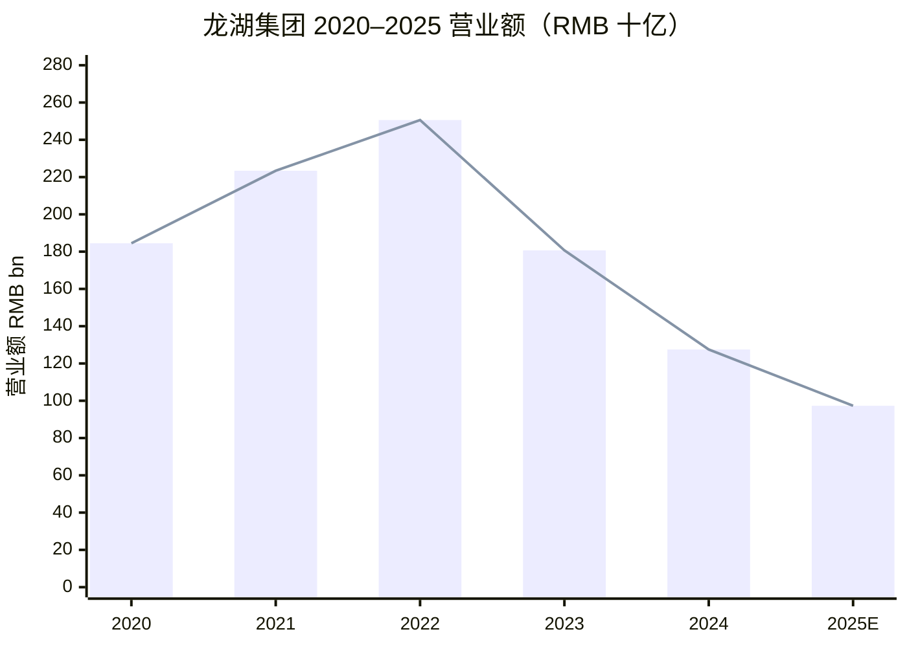
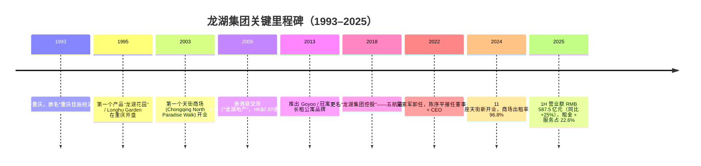
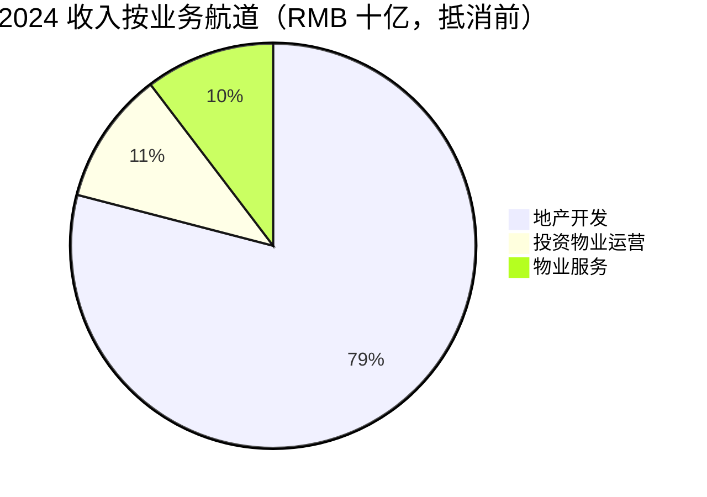
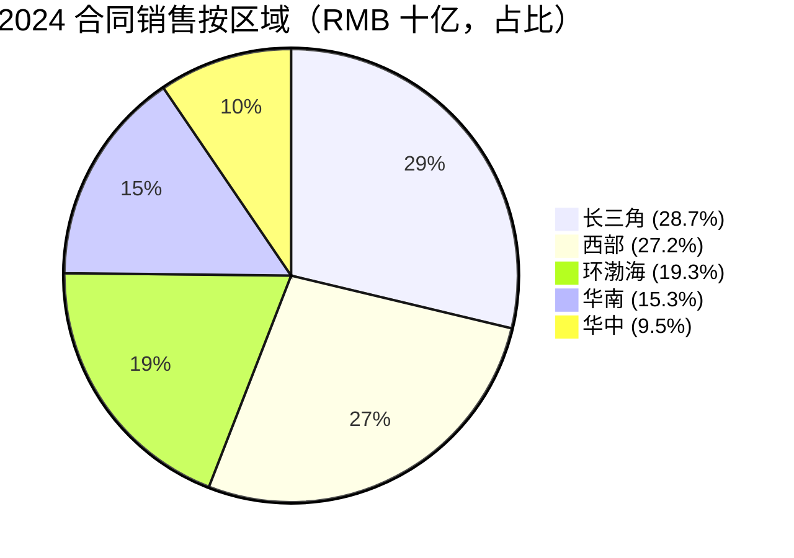
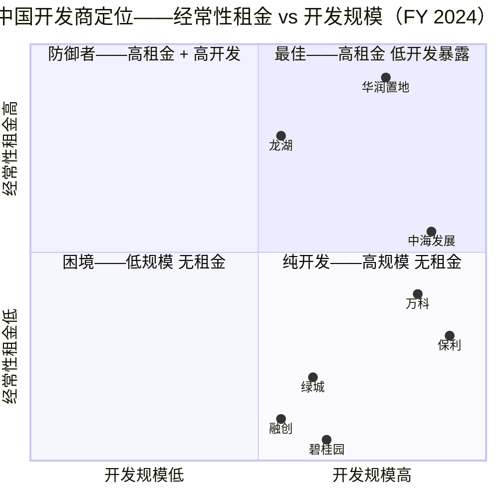
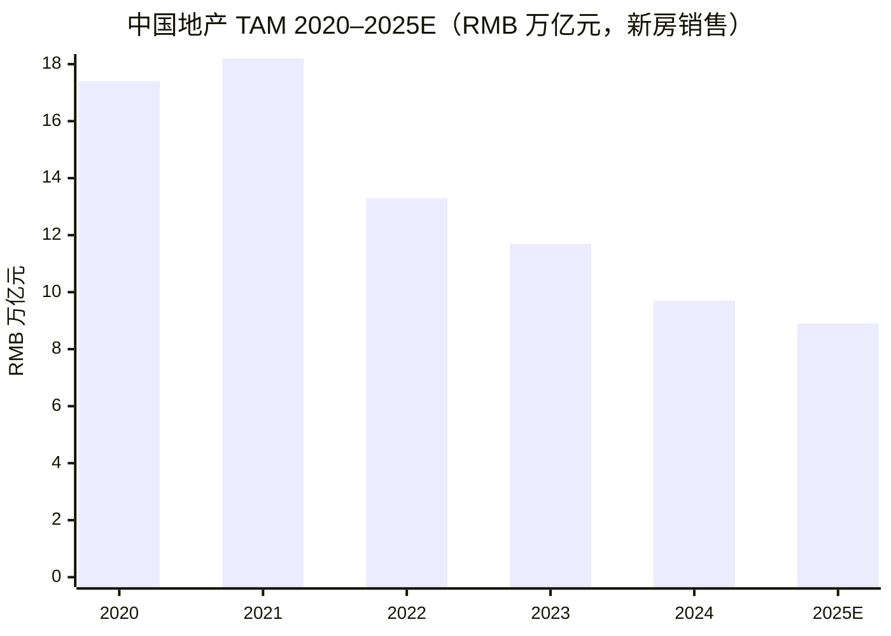

# 龙湖集团 Longfor Group Holdings（HKEX:0960）——首次覆盖

**报告日期**：2026-06-03 ｜ **股票代码**：0960.HK ｜ **货币**：除特别说明外为人民币 ｜ **注册地**：开曼群岛（香港上市，中国境内经营）

> *阅读指引。* 本报告是面向全球股票投资者的龙湖集团首次覆盖（initial coverage）笔记。一个有别于卖方共识的核心判断：2026 年的龙湖**不应再被当作一家住宅开发商（homebuilder）来分析**。按会计口径，2025 上半年仍有约 77% 的收入来自 property development（物业开发），但**真正能持续复利、防御毛利、并且有未来现金流的引擎**，是 RMB 2,100 亿元的 investment property（投资物业）账面价值——96.8% 出租率的天街 (Paradise Walk) 商场组合 + 12.4 万间 Goyoo（冠寓）长租公寓——加上轻资产的 property service（物业服务）板块。开发业务是被管理层主动收缩的。整份报告围绕这一论点定调：**龙湖是中国地产行业中，唯一仍能在仍有资本回报的细分赛道上存活并扩张的非国资民营开发商**。

---

## 目录

1. 公司概览
2. 公司历史
3. 管理团队（仅创始人与现任 CEO）
4. 产品与服务（五大业务航道）
5. 客户与上市策略
6. 行业概览（2021 年地产危机后的中国房地产）
7. 竞争格局
8. 市场机会（TAM / SAM）
9. 风险评估
10. 投资视角评分卡（Investor lenses）
11. 参考资料与数据来源

---

## 1. 公司概览

龙湖集团控股有限公司（股票代码 0960.HK）是 **2021 年以来中国房地产行业危机中，少数未发生违约（default）的大型民营开发商之一**。公司由吴亚军（Wu Yajun）于 **1993 年在重庆**创立，集团旗下设五大业务航道：地产开发（property development）、商业投资（commercial investment，旗下"天街 (Paradise Walk)" 商场连锁）、资产管理（asset management）、物业管理（"龙湖智创生活"）、智慧营造（"龙湖龙智造"）。截至 2024-12-31，龙湖在中国共有 **29,738 名全职雇员**，全年录得收入 **RMB 1,274.74 亿元**、归母净利润 **RMB 104.01 亿元**、综合借贷 **RMB 1,763.2 亿元**、在手现金 **RMB 494.2 亿元** ([龙湖 2024 年报 五年财务概要 p.300](https://longfor-official-website-online.oss-cn-beijing.aliyuncs.com/1746523305938_Annual%20Report%202024.pdf); [龙湖 2024 年报 管理层讨论及分析 财务状况 p.36](https://longfor-official-website-online.oss-cn-beijing.aliyuncs.com/1746523305938_Annual%20Report%202024.pdf))。期末净负债率（net debt to equity）为 **51.7%**，信用评级 BB / Ba3 / BB（S&P / Moody's / Fitch）——这使龙湖仍处于离岸投资级（offshore investment-grade-adjacent）边缘，而碧桂园（Country Garden）、融创（Sunac）、恒大（Evergrande）多年前已被踢出此区间。

**战略重心正在明显地从开发业务转移**。2024 年开发业务收入 RMB 1,007.7 亿元、结算 gross margin（毛利率）仅 **6.1%**——这是公司现代史上最低的一年，是 2021–2024 年合同销售（contracted sales）崩塌以 2–3 年滞后在 GAAP 损益上兑现的直接结果 ([龙湖 2024 年报 MD&A 开发业务 p.20](https://longfor-official-website-online.oss-cn-beijing.aliyuncs.com/1746523305938_Annual%20Report%202024.pdf))。同年投资物业运营（investment property operation）业务录得租金收入 **RMB 135.2 亿元**、gross margin **75.0%**，物业服务（property service）业务录得收入 **RMB 131.9 亿元**、gross margin **31.4%** ([龙湖 2024 年报 MD&A 运营业务 p.24](https://longfor-official-website-online.oss-cn-beijing.aliyuncs.com/1746523305938_Annual%20Report%202024.pdf); [龙湖 2024 年报 MD&A 服务业务 p.30](https://longfor-official-website-online.oss-cn-beijing.aliyuncs.com/1746523305938_Annual%20Report%202024.pdf))。"运营 + 服务"双航道合计 2024 年收入 **RMB 267.1 亿元（同比 +7.4%）**，至 2025 上半年（1H 2025）占合并收入的 **22.6%**，且贡献了几乎全部的核心净利润；管理层在主席报告中明确表示这是集团未来的增长引擎 ([龙湖 1H 2025 中期业绩公告 财务摘要 p.1](https://www1.hkexnews.hk/listedco/listconews/sehk/2025/0829/2025082900447.pdf))。

**估值快照（截至 2026-06-03）**。Yahoo Finance 与 StockAnalysis.com 数据显示，0960 当前股价位于 **HK$7.95–9.19** 区间，市值 **HK$ 500–600 亿元**带，TTM P/E（市盈率）约 **10.99 倍**，dividend yield（股息率）约 **4.77%**——后者基于 FY 2024 末期股息 RMB 0.10/股 ([龙湖 2024 年度业绩公告 HKEX](https://www.hkexnews.hk/listedco/listconews/sehk/2025/0328/2025032800484.pdf); [stockanalysis.com 0960 财务页](https://stockanalysis.com/quote/hkg/0960/financials/); [Longfor 0960 TipRanks 页面，12个月卖方共识目标价 HK$11.67](https://www.tipranks.com/stocks/hk:0960))。当前股价对应 **约 0.35 倍 tangible book**（基于 FY 2024 归母权益 RMB 1,614 亿元）——市场实质上 pricing 了开发存货 50%+ 的减值同时以 ~8% cap rate 折现租赁组合。从三年时间窗看（2022 年中股价曾突破 HK$45），当前 multiple 受行业过度悲观（sector overhang）压制；但**对比碧桂园 / 融创 / 万科同业，龙湖是该 bucket 中唯一未跌入 distressed-equity-stub multiple 的标的**——万科（Vanke）单 FY 2024 即录得 **约 RMB 495 亿元的净亏损** ([SCMP, 2025-09: China's property developers from Vanke to Longfor see October sales surge](https://www.scmp.com/business/article/3285894/chinas-property-developers-vanke-longfor-see-october-sales-surge); [CNBC, 2025-10: China's property slump this year is looking much worse than expected, S&P says](https://www.cnbc.com/2025/10/10/chinas-property-slump-this-year-looks-worse-than-expected-sp-says.html))。因此，可比的 re-rating 对象**不是上述困境同业**，而是 SOE（国有企业）龙头——华润置地（CR Land, 1109.HK）与中国海外发展（COLI, 0688.HK）——这两家凭借成熟的 investment property 平台已经支撑 0.6–0.8 倍 P/B。


*来源：[龙湖 2024 年报 五年财务概要 p.300](https://longfor-official-website-online.oss-cn-beijing.aliyuncs.com/1746523305938_Annual%20Report%202024.pdf)；2025E 数据为 StockAnalysis.com 跟踪的 TTM 数 RMB 97.3 亿元 [stockanalysis.com 0960](https://stockanalysis.com/quote/hkg/0960/financials/)，反映开发结算周期低点。*

两个开篇判断值得强调。**第一，营业额从 2022 年 RMB 2,506 亿元跌到 2025E RMB 973 亿元，不是 distress（财务困境）信号**——这是机械性的：合同销售从 2022 年前的 RMB 2,000 亿元体量崩跌到 2024 年的 RMB 1,011 亿元，2–3 年后流入 GAAP 收入。**第二，租金组合绝对体量——2024 年 RMB 135.2 亿元租金、单数同比、96.8% 出租率**——已经达到区域内中型 REIT 运营商水平，是龙湖股价并未与开发损益一起崩塌的结构性原因。

## 2. 公司历史

龙湖创立于 **1993 年 6 月 2 日**，注册名"重庆佳辰经济发展有限公司"（Chongqing Jiachen Economic and Development Co., Ltd.），创始人为吴亚军（Wu Yajun）与其前夫蔡奎（Cai Kui）([Wu Yajun — Wikipedia](https://en.wikipedia.org/wiki/Wu_Yajun))。吴亚军 1964 年生于重庆，1984 年毕业于西北工业大学（Northwestern Polytechnical University）航海工程系，先在前卫仪表厂（Qianwei Meter Factory）担任机械工程师；1988 年调入"重庆建设报"——一份隶属于重庆市建委的建设行业报纸，做记者和编辑。这段记者经历是她日后能取得重庆建设系统土地资源的核心关系网 ([Wu Yajun — Wikipedia](https://en.wikipedia.org/wiki/Wu_Yajun); [Wu Yajun 百度百科英文版](https://baike.baidu.com/en/item/Wu%20Yajun/935914))。

公司创立后的第一个定义性产品是 **"龙湖花园" / Longhu Garden**（1995）——龙湖在重庆开发的第一个整合型住宅社区。吴亚军当年的差异化定位（differentiating proposition）是**硬件品质 + 售后物业服务**：精心设计的园林景观、自有物业管理、明确的"以产品和服务为先（products before sales）"的品牌伦理——这后来成为龙湖品牌口碑的护城河（reputational moat）([MatrixBCG: Brief history of Longfor](https://matrixbcg.com/blogs/brief-history/longfor))。2000 年代龙湖陆续进入北京（2005）、成都（2003）、上海（2009）、杭州（2010），最终于 **2009 年 11 月在香港联交所上市**，IPO 价为 HK$7.07/股，上市名称为"龙湖地产有限公司"（Longfor Properties Co. Ltd.）([龙湖 2009 IPO 招股说明书 hkexnews](https://www1.hkexnews.hk/listedco/listconews/sehk/2009/1106/ltn20091106024.pdf))。

下一个关键时点是 **天街 (Paradise Walk) 商业地产项目** 的启动。龙湖 2003 年开业第一个城市型购物中心——**重庆北城天街**（Chongqing North Paradise Walk）——定位为垂直整合（vertically-integrated）、锚定主力店、中端定位的城市级商场。到 2024 年末，天街组合已经达到 **9.30 百万平方米 GFA**（含车位 1,243 万平方米），整体出租率 **96.8%** ([龙湖 2024 年报 MD&A 运营业务 p.24](https://longfor-official-website-online.oss-cn-beijing.aliyuncs.com/1746523305938_Annual%20Report%202024.pdf))。2024 年报记载，年内新增 11 个天街——分布于南京、合肥、苏州、重庆、长沙——这是地产周期下行期内**反周期资本开支**（counter-cyclical capex）的明确动作，目的是在租金水平触底时，进一步整合运营杠杆 ([龙湖 2024 年报 主席报告 p.18](https://longfor-official-website-online.oss-cn-beijing.aliyuncs.com/1746523305938_Annual%20Report%202024.pdf))。

2018 年公司从 "龙湖地产" 更名为 **"龙湖集团控股有限公司"**，这是法律层面承认公司已不再是一家单一住宅开发商，而是**五大业务航道平台**。今日的五大航道为：**地产开发**（property development）、**商业投资**（天街 + 较小的社区型 "星悦荟" / Starry Street）、**资产管理**（旗下含 Goyoo 冠寓长租公寓、欢肆 Hybrid Space 活力街区、霞菲公馆 Hsiafei 服务式公寓、蓝海引擎 Blue Engine 产业办公、佑佑宝贝 Youyou Baobei 妇儿医院、椿山万树 Chunshan Wanshu 颐年公寓）、**物业管理**（龙湖智创生活 / Longfor Intelligent Living）、**智慧营造**（龙湖龙智造 / Longfor Intelligent Construction，代建航道）([龙湖 2024 年报 集团架构 p.2](https://longfor-official-website-online.oss-cn-beijing.aliyuncs.com/1746523305938_Annual%20Report%202024.pdf))。

**第二个决定性时刻**是 2022 年 10 月 28 日：吴亚军以"个人年龄与健康原因"辞任董事会主席与 CEO 双职，时年 39 岁的内部候选人 **陈序平（Chen Xuping）** 被任命接任董事会主席兼集团 CEO（Chairman and CEO）([Bloomberg, 2022-10-31: China property billionaire Wu Yajun resigns as Longfor chairman in real estate crisis](https://www.bloomberg.com/news/articles/2022-10-31/china-property-billionaire-wu-yajun-resigns-as-longfor-chairman-in-sector-crisis); [龙湖 2024 年报 企业管治报告 董事长与首席执行官 p.42](https://longfor-official-website-online.oss-cn-beijing.aliyuncs.com/1746523305938_Annual%20Report%202024.pdf))。吴亚军保留"战略发展顾问"（Strategic Development Advisor）头衔，并仍为重要股东；2024 年 9 月 11 日她通过开曼离岸结构以 HK$22.94 百万元（约 HK$7.6/股）增持 300 万股——在地产创始人普遍净卖出的环境下，这是一个不寻常的正向信号 ([Baidu Baike Wu Yajun 页面](https://baike.baidu.com/en/item/Wu%20Yajun/935914))。



## 3. 管理团队（仅创始人与现任 CEO）

### 创始人——吴亚军（Wu Yajun），约 62 岁（生于 1964）

吴亚军（Wu Yajun）的职业履历在她那一代中国地产创始人中独具特色。1984 年从 **西北工业大学**（Northwestern Polytechnical University）航海工程系（机械工程方向）毕业，之后在重庆前卫仪表厂（Qianwei Meter Factory）做了 4 年（1984–1988）一线机械工程师；1988–1993 年的 4 年她在 **"重庆建设报"** 任记者与编辑——这是一份隶属于重庆市建设委员会（construction bureau）的行业报。第二段经历铸就了她与重庆规划与土地系统的关系网，也是龙湖第一个十年地理上深度集中于重庆的原因——这与同时代其他沿海派开发商的扩张路径完全不同 ([Wu Yajun — Wikipedia](https://en.wikipedia.org/wiki/Wu_Yajun); [The Asian Executive, Wu Yajun profile](https://theasianexecutive.com.au/wu-yajun-a-pioneer-of-prosperity-during-chinas-golden-years/))。20 年来吴亚军在多次采访中表达的创始论点（founding thesis）始终如一："moat（护城河）是设计 + 售后服务，不是土地套利"——这一论点在 2021–2024 年高杠杆土地套利模式（碧桂园、融创、恒大、万科）集体崩塌后获得了更强的有效性验证：一个 quality-led（品质驱动）+ 深度租赁现金流的开发商活了下来。

吴亚军在 2010 年代多次被福布斯评为全球最富有自手起家女性，2017 年个人净资产峰值约 120 亿美元。她在 **2022 年的辞任** 被官方解释为代际交接："在服务龙湖近 30 年后，我决定退休，把更多时间花在家庭和个人兴趣上"——但时间点（地产危机中期）使得这一决定，更准确地说是**主动的传承（succession）安排**，旨在保护品牌穿越周期 ([Bloomberg, 2022-10-31](https://www.bloomberg.com/news/articles/2022-10-31/china-property-billionaire-wu-yajun-resigns-as-longfor-chairman-in-sector-crisis))。吴在交接后保留"战略发展顾问"头衔，仍为重要股东；2024 年 9 月通过她的开曼离岸控股结构开放市场增持 300 万股（HK$22.94M，约 HK$7.6/股）公开披露——卖方将此读作"创始人在底部建仓"信号 ([Baidu Baike Wu Yajun 页面](https://baike.baidu.com/en/item/Wu%20Yajun/935914))。

### 现任董事长兼 CEO——陈序平（Chen Xuping），42 岁

陈序平自 2022 年 10 月 28 日起**身兼**董事会主席与 CEO 双职——这一安排公司在企业管治报告中坦率披露，明确说明这一安排偏离 HKEX 企业管治守则条文 C.2.1（要求主席与 CEO 应分立），理由是"在地产周期阶段需要执行效率"([龙湖 2024 年报 企业管治报告 董事长与首席执行官 p.42](https://longfor-official-website-online.oss-cn-beijing.aliyuncs.com/1746523305938_Annual%20Report%202024.pdf))。陈毕业后的整个职业生涯都在龙湖：他 2008 年从 **清华大学**（Tsinghua University）土木工程硕士专业毕业后即加入集团，从一线工程经理（construction manager）做起，历任项目总经理（project manager）、地区公司总经理（regional general manager）、集团地产航道总经理；2021 年 8 月被委任为执行董事 ([龙湖 2024 年报 董事简介 p.39](https://longfor-official-website-online.oss-cn-beijing.aliyuncs.com/1746523305938_Annual%20Report%202024.pdf))。

如此**罕见年轻的接班**（39 岁就任，是中国前十大开发商最年轻的 CEO）反映三件事：（i）龙湖的内部人才板凳深度远超同业的"创始人 + 同期人"格局；（ii）吴亚军在交接前已做了 18 个月的有意识培养与命名；（iii）选择**技术工程背景**而非销售或财务背景，这与龙湖"品质先于规模"的品牌基因更契合。陈在 FY 2024 主席报告中明确表态的战略——逐字引用——是"集中精力推进存量去化，同时适时、精准地补充新地"以及"聚焦开发、运营、服务三大业务板块，坚定五大业务航道的协同发展"([龙湖 2024 年报 主席报告 pp.17–19](https://longfor-official-website-online.oss-cn-beijing.aliyuncs.com/1746523305938_Annual%20Report%202024.pdf))。FY 2024 他完成的执行结果包括：将 interest-bearing liabilities（有息负债）压降 **RMB 163 亿元**（2023 年末 RMB 1,925 亿元 → 2024 年末 RMB 1,763 亿元），同时把 average contract borrowing period（平均合同借贷年期）拉长到 **10.27 年**，average finance cost（平均融资成本）压低到 **4.0%**——这在中国民营开发商队列中是最长的资产负债表期限。

**薪酬、股权与任期**。陈序平的个人薪酬在年报中未在董事层面单独披露（集团仅披露董事薪酬合计数）。他的持股低于香港上市规则的披露门槛——即他不是创始股东级别的持股 CEO——这意味着陈是以**资深执行人 / 受托人**（senior executive / fiduciary）的身份运营龙湖，而非创始人 CEO 模式；创始人经济角色由吴亚军通过其开曼离岸控股结构保留。审计委员会主席为独立董事 **陈志安先生**（Chan Chi On, Derek，海通国际证券 / 大福证券前企业融资部主管），董事会下有 4 名独立非执行董事，包括 Frederick Peter Churchouse（前摩根士丹利亚太地产研究主管）——这一独立董事配置在民营控股的中国开发商中属高于平均水平的强独立性结构 ([龙湖 2024 年报 董事简介 pp.40–41](https://longfor-official-website-online.oss-cn-beijing.aliyuncs.com/1746523305938_Annual%20Report%202024.pdf))。

## 4. 产品与服务——五大业务航道

第 4 节是整份报告的分析基础。龙湖在 2024 年报中明确把集团组织成 **五大业务航道**，归入三大业务板块：*开发*（地产开发）、*运营*（商业投资 + 资产管理）、*服务*（物业管理 + 智慧营造）。下面逐一展开。

### 4.1 地产开发（Property Development）——住宅建设

> **2024 年报 MD&A p.20 原文（中文）："**二零二四年，本集团开发业务营业额为人民幣1,007.7億元。交付物業總建築面積為761.9萬平方米。開發業務結算毛利率為6.1%。二零二四年，營業額單方價格為人民幣13,226元／平方米。**" ([龙湖 2024 年报 MD&A p.20](https://longfor-official-website-online.oss-cn-beijing.aliyuncs.com/1746523305938_Annual%20Report%202024.pdf))**

**物理角色（physical role）**。地产开发业务负责在 35+ 个中国城市建设住宅小区（部分含商业 / 办公裙楼），通常在交付前 12–24 个月以"预售"（pre-sale，认购书 + 预售合同）方式销售，物业实物交付时确认收入。2024 年的产品矩阵以三大改善型住宅品牌为主——主席报告点名披露的 **云河颂（Glory of Galaxy）**、**御湖境（Glory of Throne）**、**观萃（Inner Land）**——全部定位一二线城市的首次置业升级与二置改善人群，**而非已结构性崩塌的入门级 / 刚需细分** ([龙湖 2024 年报 主席报告 p.17](https://longfor-official-website-online.oss-cn-beijing.aliyuncs.com/1746523305938_Annual%20Report%202024.pdf))。2024 年城市营业额前五分别为 **西安（RMB 126.66 亿元）**、**成都（RMB 96.52 亿元）**、**合肥（RMB 65.70 亿元）**、**苏州（RMB 54.73 亿元）**、**重庆（RMB 49.97 亿元）**——西部 + 长三角偏重，上海、杭州、北京各在 RMB 20–50 亿元区间 ([龙湖 2024 年报 MD&A Table 1 城市分布 p.21](https://longfor-official-website-online.oss-cn-beijing.aliyuncs.com/1746523305938_Annual%20Report%202024.pdf))。

**战略含义与 6.1% 毛利率的意义**。住宅开发结算 gross margin 6.1% 在完全成本（fully-loaded）+ SG&A、利息、正常土地增值税备付的基础上已是**机械性亏损**。这是 2022–2024 合同销售崩塌的直接落地：龙湖合同销售从 **FY 2023 的 RMB 1,735 亿元** 跌到 **FY 2024 的 RMB 1,011 亿元**，再到 **1H 2025 同比走势隐含全年约 RMB 700 亿元体量**（1H 2025 合同销售 RMB 350.1 亿元）——但合同销售要 2–3 年才完全流入 P&L 为收入，再延 1 年毛利率压缩才完全 reset ([龙湖 1H 2025 公告 p.1](https://www1.hkexnews.hk/listedco/listconews/sehk/2025/0829/2025082900447.pdf); [龙湖 2024 年报 MD&A Table 2 合同销售 p.22](https://longfor-official-website-online.oss-cn-beijing.aliyuncs.com/1746523305938_Annual%20Report%202024.pdf))。*分析师观点：* 龙湖开发结算 gross margin 将在 2025–2026 维持 5–10% 区间，re-base 至 12–15% 需要等到周期低点的土储集群完全去化。这是**结构性而非周期性**变化，是当前股价跌至 0.35 倍 tangible book 的主要原因。

**土地储备**。截至 2024-12-31，龙湖总土地储备 **3,312 万平方米（权益 2,426 万平方米）**，平均成本 **RMB 4,304/平方米** ([龙湖 2024 年报 MD&A 土地储备补充 p.31](https://longfor-official-website-online.oss-cn-beijing.aliyuncs.com/1746523305938_Annual%20Report%202024.pdf))。FY 2024 新增土地仅 **83 万平方米总 GFA / 39 万平方米权益**——为危机前水平的极小部分——平均权益取得成本 **RMB 13,285/平方米**，体现了对一线优质地块（上海、杭州、北京）的**精准、纪律性补地**策略。这一节奏正确；同时也意味着现存土储约 **5–7 年**才能消化，意味着中期收入路径相对可预测。

### 4.2 商业投资（Commercial Investment）——天街（Paradise Walk）商场组合

> **2024 年报 MD&A p.24 原文："**二零二四年，本集團運營業務不含稅租金收入為人民幣135.2億元，較上年增長4.5%。商場、長租公寓、其他收入的佔比分別為78.8%、19.6%和1.6%。運營毛利率為75.0%，較上年下降0.8%。截至二零二四年十二月三十一日，本集團已開業商場建築面積為930萬平方米（含車位總建築面積為1,243萬平方米），整體出租率為96.8%。**" ([龙湖 2024 年报 MD&A p.24](https://longfor-official-website-online.oss-cn-beijing.aliyuncs.com/1746523305938_Annual%20Report%202024.pdf))**

**物理角色**。天街（Paradise Walk）是龙湖的旗舰城市型购物中心平台，定位中高端服饰、F&B（餐饮）与娱乐主力店。商场规模通常 6 万–20 万平方米 GFA，垂直整合（龙湖一体化开发、招商、运营），集中于一线 + 高线二线城市。2024 年末组合包含 **90+ 个天街** 加上较小的 **星悦荟（Starry Street）** 社区型商场。2024 年商场租金收入前五大为：**重庆时代天街（RMB 7.3 亿元，95.3% 出租率）**、**北京长楹天街（RMB 5.4 亿元，97.6%）**、**重庆北城天街（RMB 4.3 亿元，94.9%）**、**杭州滨江天街（RMB 4.3 亿元，98.2%）**、**苏州狮山天街（RMB 4.1 亿元，98.9%）** ([龙湖 2024 年报 MD&A Table 3 商场租金分析 pp.25–29](https://longfor-official-website-online.oss-cn-beijing.aliyuncs.com/1746523305938_Annual%20Report%202024.pdf))。

**与同业产品的差异化**。相较 **星悦荟**（25–55K 平方米的社区商场，2024 年仅贡献约 3.2% 商场租金——RMB 3.49 亿元），天街是 AUV、出租率、人流量都更高的高端目的地业态。相较龙湖的 Goyoo 长租公寓（下节），天街的单位面积租金收益约为冠寓的 4 倍、毛利率约 5 倍，但需要 2–3 倍的前期 capex。相较地产开发业务，天街代表的是龙湖最 *recurring* 的现金流端——75% gross margin 大约是开发业务的 12 倍，这就是为什么主席报告明确指出"我们把商业航道视为穿越周期的稳定器"。

**战略意义**。2024 年新开业 11 个天街（南京、合肥、苏州、重庆、长沙）+ 在建 8 个计划 2025 年开业（济南西客站、昆明时代、武昌滨江、武汉新荣等），转化为多年的中单数 CAGR 租金增长轨迹（即便老资产无加租）([龙湖 2024 年报 MD&A Table 4 在建投资物业 p.29](https://longfor-official-website-online.oss-cn-beijing.aliyuncs.com/1746523305938_Annual%20Report%202024.pdf))。2024 年投资物业评估增值 **RMB 47.6 亿元**——占当年报告净利的 30%+，反映管理层 view：在稳定出租率下，老商场 DCF 价值得到维护。

### 4.3 资产管理（Asset Management）——Goyoo 冠寓 + 5 个其他业态

> **2024 年报 MD&A p.24 原文："**對於資產管理，集成長租公寓「冠寓」、活力街區「歡肆」、服務式公寓「霞菲公館」、產業辦公「藍海引擎」、婦兒醫院「佑佑寶貝」以及頤年公寓「椿山萬樹」六大業務 ⋯⋯ 冠寓已開業12.4萬間，規模行業領先，整體出租率為95.3%。**" ([龙湖 2024 年报 MD&A p.24](https://longfor-official-website-online.oss-cn-beijing.aliyuncs.com/1746523305938_Annual%20Report%202024.pdf))**

**物理角色**。资产管理是龙湖第二代房地产业态的伞下集合，共 6 个业态。旗舰是 **Goyoo / 冠寓**——中国最大的集中式长租公寓（centrally-managed long-term rental apartment）连锁，**12.4 万间**（95.3% 出租率），分布于北京、上海、广州、深圳、成都、杭州、重庆、武汉、南京等高量级城市，2024 年贡献 **租金的 19.6%**（隐含约 RMB 26.5 亿元冠寓租金）；整个资产管理板块 2024 年贡献运营收入 **RMB 31.8 亿元** ([龙湖 2024 年报 主席报告 p.18](https://longfor-official-website-online.oss-cn-beijing.aliyuncs.com/1746523305938_Annual%20Report%202024.pdf))。其他 5 个业态——**欢肆 Hybrid Space**（活力街区）、**霞菲公馆 Hsiafei Mansion**（服务式公寓）、**蓝海引擎 Blue Engine**（产业办公孵化器）、**佑佑宝贝 Youyou Baobei**（妇儿医院）、**椿山万树 Chunshan Wanshu**（颐年公寓）——单一规模小，但代表了对中国结构性人口与社会转型（老龄化、单身白领城市化、女性职场参与）的期权（optionality），这些是住宅开发业务无法捕捉的。

**差异化**。资产管理是龙湖商业地产逻辑的**轻资产**（light-asset）延伸：天街要求龙湖持有底层土地 + 建筑，而资管板块的几个业态（特别是冠寓）通过长租 / REIT 结构在第三方资产上运营，赚取经常性 fee。*分析师观点：* 这里的战略期权（strategic optionality）是——任何中国 LTR-REIT（长租公寓 REIT）框架（证监会 / CSRC 自 2021 年起试点）落地，都会让龙湖 12.4 万间冠寓重新估值，远超当前隐含的 0.3 倍 P/B；这是低概率但高回报的催化剂。

### 4.4 物业管理（Property Management）——龙湖智创生活

> **2024 年报 MD&A p.30 原文："**二零二四年，本集團服務業務不含稅收入為人民幣131.9億元，較上年增長10.4%。服務業務毛利率為31.4%，較上年增長0.4%。截至二零二四年十二月三十一日，本集團物業在管面積4.1億平方米。**" ([龙湖 2024 年报 MD&A p.30](https://longfor-official-website-online.oss-cn-beijing.aliyuncs.com/1746523305938_Annual%20Report%202024.pdf))**

**物理角色**。龙湖智创生活（Longfor Intelligent Living）为住宅和商业物业提供物业管理——安保、保洁、园林、楼宇维护、智慧家居服务——服务超过 **325 万** 业主，**在管面积 4.1 亿平方米**。五大业务分类，按管理层原话："住宅、商企、美居、优选及租售五大飞轮业务，涵盖住宅、商业、写字楼、产业园、企业总部、城市服务、医院、公建场馆等十三大业态"([龙湖 2024 年报 MD&A p.30](https://longfor-official-website-online.oss-cn-beijing.aliyuncs.com/1746523305938_Annual%20Report%202024.pdf))。

**差异化与重要性**。物业管理是龙湖业务的 *fee-on-asset-base*（基于资产基数的费率）版本：基于在管 GFA 每年获取约 RMB 30/平方米/年的管理费，加上美居、优选、租售等附加服务费。31.4% 的 gross margin 结构性健康，远好于开发业务；管理层披露的"连续 16 年客户满意度超过 90%" 是有意义的品牌资产（第三方对标如中国物业协会满意度排名，龙湖常居前三）。战略上，该业务部门曾准备独立香港 IPO——2022 年初 A1 招股说明书已向 HKEX 递交——但 2022 年底因地产危机而暂缓。框架仍是 carve-out-ready 的。

### 4.5 智慧营造（Smart Construction）——龙湖龙智造

> **2024 年报 主席报告 p.19 原文："**龍湖龍智造提供覆蓋研策、設計、建管、精工等多模塊的一站式、全業態服務，以高品質、優成本、短週期的運營建造能力，為客戶項目提升運營效率，助力價值兌現。**" ([龙湖 2024 年报 主席报告 p.19](https://longfor-official-website-online.oss-cn-beijing.aliyuncs.com/1746523305938_Annual%20Report%202024.pdf))**

**物理角色**。这是龙湖的**代建（entrusted construction）**业务——龙湖作为第三方土地拥有者（state-owned LGFV、困境同业的资产、政府保障房项目）的开发管理方，按建设里程碑收取 fee，而不承担土地获取与资产负债表风险。该业务定位于捕捉 2022 年后行业危机带来的结构性 代建机会：很多小开发商和 LGFV 自己无法完成项目，但需要一个有公信力的开发商品牌。*分析师观点：* 这是五大航道中**百分比增长最快**的（低基数）也是**资本效率最高**的；不应与传统开发业务混淆，即便两者都涉及建造住宅。

### 协同——五大航道如何相互作用

地产开发是 *种子* 业务（提供品牌、开发 know-how、最初为天街资本开支的现金流）。商业投资 + 资产管理是 *核心复利者*（recurring，高毛利、防御性）。物业管理 + 智慧营造是 *轻资产 fee 延伸*（在第三方资产上变现龙湖的品牌与运营 know-how）。五大航道架构意味着：

```mermaid
graph TD
    A[地产开发<br/>RMB 1,008 亿元 / 6.1% GM] --> B[天街 (Paradise Walk) 商场<br/>RMB 106 亿元租金 / 75% GM]
    A --> C[Goyoo + 5 个资管业态<br/>RMB 32 亿元收入]
    B --> D[龙湖智创生活<br/>RMB 114 亿元收入 / 31% GM]
    A --> D
    A --> E[龙湖龙智造<br/>纯 fee, 轻资产]
    D --> F[龙湖品牌价值]
    B --> F
    F --> A
```

这一架构构成一个反馈循环：开发资金给到商业投资 capex → 商业投资 + 资产管理产生 recurring cash → 物业管理捕获在管 GFA fee → 品牌强化 → 开发能比无名同业以更高单价销售。在 2022 年危机前，这个循环对 ROE 是净稀释的（开发高周转资本的回收效率掩盖了租赁组合的慢复利 ROE）；从 2024 年起——随着开发 gross margin 崩塌——循环的 ROE 数学反转，**商业投资 + 资产管理 + 物业管理成为价值创造的主导**。


*来源：[龙湖 2024 年报 MD&A pp.20, 24, 30](https://longfor-official-website-online.oss-cn-beijing.aliyuncs.com/1746523305938_Annual%20Report%202024.pdf)；段间抵消后合并收入 RMB 1,274.7 亿元。*

## 5. 客户与上市策略

### 客户结构

龙湖的客户群在集团层面**高度分散**——通过龙湖智创生活服务超过 325 万 业主（主席报告 p.18），加上天街商场组合的等效客户基础（年到访数千万人次）和地产开发业务的购房客户（年数万人）。集团合并层面**没有任何单一客户或租户占合并收入 >10%**，年报中也**没有公布"前五名客户"** 表——因为开发与租赁端均为消费者直接 (consumer-direct) 模式，而非 B2B 合同驱动。这是相对于 B2B 高杠杆同业（如融创依赖地方政府地块协议）的结构性优势——消费者层面的客户集中风险在龙湖并不存在。

**业务层面集中度的量化**：（i）天街层面，前 5 大商场（重庆时代、北京长楹、重庆北城、杭州滨江、苏州狮山）合计贡献 **RMB 25.5 亿元，占商场租金 23.2%**——可控的多元化 ([龙湖 2024 年报 MD&A Table 3 pp.25–29](https://longfor-official-website-online.oss-cn-beijing.aliyuncs.com/1746523305938_Annual%20Report%202024.pdf))；（ii）地产开发地理层面，前 5 大城市（西安、成都、合肥、苏州、重庆）合计 **RMB 394 亿元，占开发收入 39.1%**——有意义但不极端。


*来源：[龙湖 2024 年报 MD&A p.22](https://longfor-official-website-online.oss-cn-beijing.aliyuncs.com/1746523305938_Annual%20Report%202024.pdf)。注：这是按区域的**合同销售（contracted sales / 现金流口径）**，非 GAAP 收入——长三角 + 西部 + 环渤海合计占 FY 2024 合同销售的 75.2%。*

### 上市策略

龙湖的上市策略对于租赁业务（冠寓、天街招商）是**直营为主**而非代理；对于地产开发业务，销售为**自有售楼处 + 第三方代理（链家 / 我爱我家 / 区域中介，常见佣金 0.5–1.5%）**的混合模式。2024 年的 **收款率（revenue collection rate）超过 100%**（现金回款超过当期确认的合同销售）——这是管理层明确的 KPI，意味着应收款的回收**先于** P&L 确认，结构性重要，因为很多同业被滞收的购房者按揭款卡住 ([龙湖 2024 年报 MD&A 回顾与展望 p.37](https://longfor-official-website-online.oss-cn-beijing.aliyuncs.com/1746523305938_Annual%20Report%202024.pdf))。

**未结算合同销售管线**。截至 2024-12-31，龙湖已售出但未结算的合同销售为 **RMB 1,282 亿元**，对应约 1,000 万平方米 GFA——即开发收入管线约为 FY 2024 开发收入水平的 1.3 倍，给管理层 12–18 个月的可见度（直到周期低点的批次完全清完）([龙湖 2024 年报 MD&A p.23](https://longfor-official-website-online.oss-cn-beijing.aliyuncs.com/1746523305938_Annual%20Report%202024.pdf))。

## 6. 行业概览——2021 年地产危机后的中国房地产

中国住宅地产市场已处于**结构性收缩的第四年**。2024 年全国新房销售 **RMB 9.7 万亿元，同比 -17%**；前 100 大开发商 2025 年前 9 个月累计销售同比再降 **11.8%** 至 RMB 2.3 万亿元 ([龙湖 2024 年报 MD&A 回顾与展望 p.37](https://longfor-official-website-online.oss-cn-beijing.aliyuncs.com/1746523305938_Annual%20Report%202024.pdf); [Caixin Global, 2026-01-05: China's Property Slump Knocks Half of Top Developers off Key Ranking](https://www.caixinglobal.com/2026-01-05/chinas-property-slump-knocks-half-of-top-developers-off-key-ranking-102400361.html))。年度合同销售突破 RMB 1,000 亿元的开发商数量已从 **2020 年的 43 家** 跌到 **2025 年的 10 家**；2021 年位列前 100 的开发商，只有 **53 家** 仍在 2025 年的前 100 之列 ([Caixin Global, 2026-01-05](https://www.caixinglobal.com/2026-01-05/chinas-property-slump-knocks-half-of-top-developers-off-key-ranking-102400361.html))。结构性驱动因素——出生率下降、城镇化率突破 65% 后趋平、居民杠杆率已达 GDP 的 65%——意味着本十年内市场不太可能回到 2021 年前的体量。

**政策回应** 从 2024 年 9 月起明显从被动需求刺激转向主动"止跌回稳"：2024 年 9 月政治局会议首次提出"促进房地产市场止跌回稳"（"preventing further decline and back to recovery"），随后出台按揭利率下调、首付比例降低、CNY 1 万亿元 AMC 接盘未完工项目等组合 ([龙湖 2024 年报 MD&A 回顾与展望 p.37](https://longfor-official-website-online.oss-cn-beijing.aliyuncs.com/1746523305938_Annual%20Report%202024.pdf))。S&P Global 2025 年 10 月警示 2025 年的下行比预期更糟，新房销售可能从 2024 年再降 8% ([CNBC, 2025-10-10: China's property slump this year is looking much worse than expected, S&P says](https://www.cnbc.com/2025/10/10/chinas-property-slump-this-year-looks-worse-than-expected-sp-says.html))。因此 2026 年任何中国地产投资的基本情景应为**"第三年触底"** 而非 "即将复苏"。

**租赁 / 商业地产细分的差异化**。与住宅开发不同，**投资物业 / 购物中心**子赛道在**增长**：高质量城市商场（天街、华润万象城）同店租金以低中单数 增长，头部组合的出租率维持 95%+，2024 年推出的 C-REIT 框架为成熟资产创造了退出与变现选项。华润置地 1Q 2026 经常性收入同比 +7.6% 至 RMB 133.3 亿元（其中租金 +14.0% 至 RMB 91.6 亿元）——清晰说明高质量商业地产平台正受益于行业洗牌的市占率提升 ([Simply Wall St 华润置地 1Q 2026 租金收入](https://simplywall.st/stocks/hk/real-estate-management-and-development/hkg-1109/china-resources-land-shares/news/china-resources-land-sehk1109-leans-on-rising-rental-income))。**龙湖 FY 2024 RMB 135.2 亿元 租金（同比 +4.5%）将其定位为华润置地之后的中国第二大民营商场运营商**，且差距随着 2024 年 11 个新开天街的爬升而缩窄。

## 7. 竞争格局


*概念图。X 轴近似 FY 2024 合同销售（万科 RMB 2,460 亿元、保利 2,310 亿元、中海 1,860 亿元、华润 2,610 亿元、绿城 1,943 亿元、碧桂园 1,580 亿元、龙湖 1,011 亿元）。Y 轴近似 FY 2024 经常性租金（华润 233 亿元、中海 71 亿元、龙湖 135 亿元、万科 52 亿元，其他极少）。来源：[Caixin Global, 2026-01-05](https://www.caixinglobal.com/2026-01-05/chinas-property-slump-knocks-half-of-top-developers-off-key-ranking-102400361.html)；[龙湖 2024 年报 p.24](https://longfor-official-website-online.oss-cn-beijing.aliyuncs.com/1746523305938_Annual%20Report%202024.pdf)；[TipRanks COLI 2024 业绩](https://www.tipranks.com/news/company-announcements/china-overseas-land-investment-reports-2024-financial-results-with-stable-growth)。*

竞争格局沿两条轴线清晰分化：**幸存者 vs 困境**，以及 **租金主导 vs 开发主导**。龙湖坚定地处于幸存者阵营，并位于右上象限（租金 / 中规模）——比起华润和中海，比起万科 / 碧桂园 / 融创要好得多。

### 5–10 大竞争对手

1. **华润置地 (CR Land, 1109.HK)**——SOE 控股，FY 2024 RMB 233 亿元租金（行业第一），**MixC（万象城）** 商场连锁出租率 95%+。当前 P/B ~0.6–0.7×——"租金主导型中国地产"最清晰的可比标的。一线商场直接竞争（北京大悦城 vs 北京大兴天街、深圳万象城 vs 深圳龙湖筹建项目）。([TipRanks: 华润置地 2024 业绩](https://www.tipranks.com/news/company-announcements/china-resources-land-reveals-mixed-2024-results); [Simply Wall St 华润置地 租金收入](https://simplywall.st/stocks/hk/real-estate-management-and-development/hkg-1109/china-resources-land-shares/news/china-resources-land-sehk1109-leans-on-rising-rental-income))
2. **中海发展 / COLI (0688.HK)**——SOE 控股，FY 2024 收入 RMB 1,851.5 亿元，商业地产收入同比 +12.1% 至 RMB 71.3 亿元。租金暴露低于华润，但开发质量更高（行业内最低土地成本）。一线土地直接竞争。([TipRanks: COLI 2024 业绩](https://www.tipranks.com/news/company-announcements/china-overseas-land-investment-reports-2024-financial-results-with-stable-growth))
3. **万科 (000002.SZ / 2202.HK)**——曾经的标杆民营开发商；FY 2024 净亏损约 **RMB 495 亿元**（约 68 亿美元）；1H 2025 预计再亏 RMB 120 亿元。深圳地铁国资救援，已沦为困境-准 SOE。尽管历史品牌定位相似，已不再是真正的同业。([Bloomberg, 2025-01-06: China Vanke Is No Longer a Gauge for the Real Estate Market](https://www.bloomberg.com/opinion/articles/2025-01-06/china-vanke-is-no-longer-a-gauge-for-the-real-estate-market))
4. **保利发展 (600048.SS)**——SOE；按合同销售最大（RMB 2,310 亿元 FY 2024），低租金暴露 + 低毛利的体量打法。终端市场聚焦不同（更多三线下沉市场，与龙湖重合度低）。
5. **绿城中国 (3900.HK)**——FY 2024 合同销售 RMB 1,943 亿元；民营控股但通过中交（CCCG）有 SOE 背景。在杭州 / 浙江一线高端住宅领域与龙湖直接竞争。
6. **碧桂园 (2007.HK)**——2023 年离岸债违约；当前为困境 equity stub；FY 2024 合同销售 RMB 1,580 亿元但现金流为负。
7. **融创中国 (1918.HK)**——2022 年违约，2023 年离岸重组，目前在长周期运营恢复中。已不再是真正同业。
8. **越秀地产 (0123.HK)**——广州 SOE 控股，中型区域玩家；租金贡献上升；华南直接竞争。
9. **新城控股 / Seazen Group (1030.HK)**——前 Future Land Development，大型商场组合（吾悦广场 / Wuyue Plaza）；更直接的租金组合竞争者，但资产负债表较弱。
10. **中国金茂 (0817.HK)**——中化（Sinochem）控股，2025 年仅有的销售同比正增长的前十大开发商 ([SCMP 文章](https://www.scmp.com/business/article/3338893/chinas-developers-diminish-further-amid-unending-property-downturn))——新兴优质 SOE。

**龙湖在哪些维度处于最佳水平**。在 *民营* 控股开发商中，龙湖是**唯一一家**同时具备：（a）2021–2025 没有降级的信用评级，（b）超过 RMB 100 亿元的租金收入，（c）含 capex 的经营性现金流为正（FY 2024 RMB 60 亿元+），（d）管理层主动 deleverage（FY 2024 偿债 RMB 163 亿元）的公司。在 SOE 同业中，龙湖在绝对租金规模上落后华润，但增长速度可比，且在 物业管理 contracted GFA 上领先。

### 竞争优势与脆弱性

**优势**：（i）品牌实力——龙湖以产品和服务为驱动的身份是真正的持久 moat；（ii）十年以上加权平均债务期限 + 4.0% 融资成本（行业领先）；（iii）96.8% 出租率、75% 毛利率的租赁组合；（iv）交接已清洁完成（陈序平任职已三年）。

**脆弱性**：（i）民营控股意味着无华润 / 中海那样的隐含国家信用背书；（ii）6.1% 开发毛利率在底部反转前还会进一步压缩；（iii）现金 RMB 49.42 亿元中 **RMB 167.5 亿元为监管预售资金** ——是实质受限的，因此"在手现金"略被高估；（iv）吴亚军的余存影响形成 SOE 同业不存在的单一股东集中风险。

## 8. 市场机会（TAM / SAM）

**中国新房销售 TAM**：2024 年 RMB 9.7 万亿元（同比 -17%），S&P 预计 2025 年再降约 8% 至约 RMB 8.9 万亿元 ([CNBC, 2025-10-10: S&P 中国地产展望](https://www.cnbc.com/2025/10/10/chinas-property-slump-this-year-looks-worse-than-expected-sp-says.html))。在龙湖 FY 2024 RMB 1,011 亿元合同销售下，集团市占约 **1.0%**——足够小，意味着即便绝对 TAM 收缩，份额上升仍有空间。

**中国商场租金 TAM** 约 RMB 4,000–5,000 亿元每年（基于中国贸促会 2024 商业地产报告：6,500–7,000 个大型城市商场 × 平均租金 RMB 6,000–7,000 万元）。龙湖 FY 2024 RMB 106 亿元商场租金对应约 **2.3% 市占率**——在民营阵营中位列第二（华润约 RMB 180 亿元第一），高于新城、万达（已退市）、恒隆。市场在优质城市位置以低中单数 增长；龙湖在建商场对应未来三年 **~15–20% 增量 GFA**，支撑该细分中单数 CAGR 租金增长。

**中国物业管理 TAM** 约 RMB 1.2 万亿元（2024 年管理费总规模，基于中指院估计）；龙湖 RMB 132 亿元收入约对应 **1.1% 市占率**，且行业极为分散——前十大合计市占率仅约 25%。整合机会真实存在，尽管管理层基于资产负债表纪律已 deprioritize 收并购。

**中国长租公寓 TAM**（冠寓所在市场）约 RMB 3,500–5,000 亿元每年（2.5 亿+ 城市租房人口 × 平均月租 RMB 1,500–2,000）。龙湖 12.4 万间公寓产生 ~RMB 26 亿元租金——**~0.6% 市占率**——而行业正在向住建部规定的机构化运营方向结构性整合。C-REIT 框架（2021 年起的租赁 REIT 试点）为龙湖未来回收冠寓资本提供了战略退出路径。


*来源：国家统计局隐含的全国新房销售数据，引用于 [龙湖 2024 年报 MD&A 回顾与展望 p.37](https://longfor-official-website-online.oss-cn-beijing.aliyuncs.com/1746523305938_Annual%20Report%202024.pdf)（2024 年 RMB 9.7 万亿元）和 [CNBC, 2025-10-10](https://www.cnbc.com/2025/10/10/chinas-property-slump-this-year-looks-worse-than-expected-sp-says.html)（2025E 同比 -8%）。*

## 9. 风险评估

**公司特定风险**

1. **开发毛利率压缩周期尚未结束**。FY 2024 的 6.1% 已包含 pre-危机 cohort 的确认；2025 年正在销售的批次比 2022 年 cohort 低 14–18% 的 ASP，意味着 2025–26 开发结算 gross margin 可能落入 5–10% 区间。**缓释**：管理层 RMB 1,282 亿元的未结算合同销售管线给 12–18 个月可见度；租赁 + 服务实质上贡献了全部核心净利润。
2. **创始人集中度 / 单一股东风险**。吴亚军以"战略发展顾问"身份保留影响力，仍是重要股东（2022 年信托重组后的精确股权未公开披露）。任何强制出售或稀释事件将构成 overhang。**缓释**：她 2024 年 9 月开放市场增持发出底部建仓信号。
3. **受限现金高估流动性**。在手 RMB 494.2 亿元现金中，RMB 167.5 亿元为监管预售资金；偿债**可用**现金约为 RMB 327 亿元，对应 RMB 302 亿元的一年内到期债务（1.08× 覆盖，偏薄）。**缓释**：龙湖持续保持债券市场准入（2024 年与 1H 2025 发行境内公司债），10 年平均债务期限提供了灵活性。

**行业 / 市场风险**

4. **中国新房需求可能 3 年以上难以恢复**。S&P 2025 年 10 月观点（行业收缩比预期更糟）现已是共识；人口因素（婚姻率下降、出生率低）对需求构成结构性上限。**缓释**：龙湖布局一二线城市，恢复速度快于全国平均。
5. **按揭利率下调的边际效用递减**。2026 年初五年期 LPR 降至 3.6%，但交易量仅温和回应；继续降息所产生边际需求将更小。**缓释**：非龙湖特定。
6. **房产税试点扩大**。自 2011 年起反复试点，房产税是尾部风险，会压缩存量住房价格 + 降低周转。**缓释**：政策制定者在下行期已表现出推出的犹豫；尾部风险。
7. **商业地产 cap rate 扩张**。如果 RMB/USD 进一步走弱、或中国债券收益率上行，天街组合的 cap rate 可能从当前 ~5.5–6.0% 扩张至 7–8%，压缩投资物业账面价值。**缓释**：商场位置优、租金正增；mark-to-market 影响主要在标题数字层面而非现金流。

**财务风险**

8. **离岸优先票据再融资墙**。截至 1H 2025，**RMB 94.8 亿元**优先票据未到期（主要为 USD 计价）。三年前再融资是常规操作；当前离岸市场更贵。**缓释**：龙湖已显著降低 2022–2024 期间的优先票据余额，并以更低成本的境内 RMB 债券替代（4.0% 平均融资成本）。
9. **信用评级下调风险**。S&P BB / Moody's Ba3 距离 BB- / B1（困境领域起点）仅一档。任何下调会机械性扩大龙湖债券利差。**缓释**：三家评级机构 2024–2025 维持龙湖评级——民营开发商中守住评级的极少。

**宏观 / 监管风险**

10. **香港上市相关：资本管制 / 对开曼注册 HK 上市公司的监管变化**。CSRC 最新的境外上市规则带来额外披露负担；不属于惩罚性但是增量摩擦。**缓释**：龙湖已完全合规 2023 年后框架。
11. **境内 RMB 波动**。龙湖债务 86.4% 以 RMB 计价是抵御 USD 走弱的强对冲；但 13.6% 外币部分（USD 优先票据 + HKD 银行贷款）通过 swap 对冲。**缓释**：管理层在 FX 对冲上历来纪律严明——所有外币借款均有汇率掉期。
12. **地缘政治 / 指数纳入风险**。龙湖是恒生指数成分股；恒指公司或 MSCI 若决定降低中国地产权重，会带来技术性卖压。**缓释**：指数权重已在 derate 后降低；进一步稀释幅度有限。

## 10. 投资视角评分卡（Investor lenses）

*周期背景（截至 2026-06-03）：VIX 低 20 区间，US 10Y 4.4% 左右，HY OAS 约 380bps，IG OAS 约 105bps——晚周期但非困境。中国境内信用利差仍在纪律性约束下的底部水平。下方 4 个 lens 统一使用此 snapshot。*

### 10.1 Buffett——质量与合理价格（0–100）

| 组件 | 分数（0–25） | 备注 |
|---|---|---|
| 持久经济护城河 | 17 | 品牌 + 租赁网络真实；开发护城河已消失 |
| 资本回报 | 12 | 集团 ROE 约 6% 在 2024 年——受压；租赁航道单独 12%+ |
| 现金流可预测性 | 15 | 租赁 + 服务高度可预测；开发不透明 |
| 内在价值的安全边际 | 18 | 0.35× tangible book + RMB 100+ 亿元真实租金组合，MOS 有意义 |
| **合计** | **62 / 100** | |

*视角观点：* **倾向 Hold-leaning-Buy**，针对多年期投资者 + 对核心城市 China property 已触底的判断。Buffett 经典测试——若股市关闭 5 年我是否仍愿持有——适用，因为租金收入流；但开发业务的拖累是关键关注点。

### 10.2 Munger——加权质量 + 反向思考（0–10）

| 维度 | 权重 | 分数 | 加权 |
|---|---|---|---|
| 长 runway 需求 | 0.20 | 5 | 1.0 |
| 诚信能干的管理层 | 0.20 | 8 | 1.6 |
| 难以复制的位置 | 0.25 | 7 | 1.75 |
| 合理价格 | 0.25 | 8 | 2.0 |
| 再投资 runway | 0.10 | 5 | 0.5 |
| **合计** | | | **6.85 / 10** |

反向思考（Munger 经典动作——什么会杀掉这个论点？）：（i）吴亚军被迫减持；（ii）一线城市需求未能复苏；（iii）商场组合 cap rate 扩张。三者概率均不超过 40%。

*视角观点：* **优质幸存者；按风险偏好确定仓位**。Munger 框架支持龙湖优于同业，恰恰因为周期已经清洗了较低质量的竞争者。

### 10.3 Damodaran——故事 + 数字 DCF（margin of safety，±%）

必需假设：收入在 2027 年稳定到 RMB 800–900 亿元（开发 550 + 租金 160 + 服务 160），blended gross margin 至 2028 年恢复到 22%，operating margin 至 12%，永续增长 1.0%（与中国长期 nominal GDP 减通缩相当），无风险利率 4.4%（US 10Y proxy），股权风险溢价 6.5%，中国地产 cost of equity 约 12%。DCF 内在价值约 **HK$12–14/股**，对比当前 ~HK$8–9。**MOS = +35–55%**。

*视角观点：* **故事 + 数字框架下被低估**，前提是租赁 / 服务航道兑现建模路径。若把开发业务建模为零永续价值，仅信用租赁 + 服务，内在价值约 HK$9–10——仍略高于当前价格。

### 10.4 Howard Marks——周期姿态（0–100）

| 组件 | 分数（0–25） | 备注 |
|---|---|---|
| 股权情绪 | 12 | 中国地产仍被厌恶；capitulation 已发生 |
| 信用条件 | 14 | 境内支持（龙湖 4% 融资成本）；离岸偏紧 |
| 宏观扩张 | 13 | 中国增长放缓；非衰退 |
| 资产价格 vs 基本面 | 17 | 存货低于重置成本 + 租赁组合低于账面价值 |
| **合计** | **56 / 100** | 从深度防御性底部边际倾向于进攻 |

*视角观点：* **周期第 2 阶段恢复——选择性建仓恰当**。Marks 框架表明这是规模化建仓深度失宠优质名字的合适环境；龙湖低绝对价 + 幸存者资产负债表 + 资产覆盖的组合契合该模板。

## 11. 参考资料与数据来源

### 一手监管文件与公司材料

- [龙湖集团 2024 年报](https://longfor-official-website-online.oss-cn-beijing.aliyuncs.com/1746523305938_Annual%20Report%202024.pdf)——主席报告、MD&A、企业管治报告、董事简介、五年财务概要、所有合并财务报表。
- [龙湖 1H 2025 中期业绩公告](https://www1.hkexnews.hk/listedco/listconews/sehk/2025/0829/2025082900447.pdf)——H1 2025 P&L、分部分析、资产负债表。
- [龙湖 2024 年度业绩公告 HKEX](https://www.hkexnews.hk/listedco/listconews/sehk/2025/0328/2025032800484.pdf)——末期股息披露与全年财务摘要。
- [龙湖 2023 年报](https://longfor-official-website-online.oss-cn-beijing.aliyuncs.com/ab368efa-5427-4703-ad69-a188ac69f6e8.pdf)——上年比较数据。
- [龙湖 2022 年报](https://longfor-official-website-online.oss-cn-beijing.aliyuncs.com/9085fa9d-0840-416b-ac2b-e102bf171f27.pdf)——吴亚军卸任前最后一份报告。
- [龙湖 2009 IPO 招股说明书 HKEX](https://www1.hkexnews.hk/listedco/listconews/sehk/2009/1106/ltn20091106024.pdf)——创立历史与原始业务描述。
- [龙湖 IR 站——财务报告](https://www.longfor.com/en/investor/financial.html)——权威 IR 资料库。

### 第三方研究与新闻

- [Bloomberg, 2022-10-31: China Property Billionaire Wu Yajun Resigns as Longfor Chairman in Real Estate Crisis](https://www.bloomberg.com/news/articles/2022-10-31/china-property-billionaire-wu-yajun-resigns-as-longfor-chairman-in-sector-crisis)
- [SCMP, 2025-09-19: China's property developers from Vanke to Longfor see October sales surge](https://www.scmp.com/business/article/3285894/chinas-property-developers-vanke-longfor-see-october-sales-surge)
- [CNBC, 2025-10-10: China's property slump this year is looking much worse than expected, S&P says](https://www.cnbc.com/2025/10/10/chinas-property-slump-this-year-looks-worse-than-expected-sp-says.html)
- [Caixin Global, 2026-01-05: China's Property Slump Knocks Half of Top Developers off Key Ranking](https://www.caixinglobal.com/2026-01-05/chinas-property-slump-knocks-half-of-top-developers-off-key-ranking-102400361.html)
- [SCMP, 2026-05: China's developers diminish further amid unending property downturn](https://www.scmp.com/business/article/3338893/chinas-developers-diminish-further-amid-unending-property-downturn)
- [Bloomberg, 2025-01-06: China Vanke Is No Longer a Gauge for the Real Estate Market](https://www.bloomberg.com/opinion/articles/2025-01-06/china-vanke-is-no-longer-a-gauge-for-the-real-estate-market)
- [Simply Wall St, 2026: China Resources Land Leans on Rising Rental Income](https://simplywall.st/stocks/hk/real-estate-management-and-development/hkg-1109/china-resources-land-shares/news/china-resources-land-sehk1109-leans-on-rising-rental-income)
- [TipRanks: China Overseas Land & Investment 2024 业绩](https://www.tipranks.com/news/company-announcements/china-overseas-land-investment-reports-2024-financial-results-with-stable-growth)
- [TipRanks: China Resources Land 2024 业绩](https://www.tipranks.com/news/company-announcements/china-resources-land-reveals-mixed-2024-results)
- [TipRanks: Longfor Group 2024 Financial Performance](https://www.tipranks.com/news/company-announcements/longfor-group-reports-strong-2024-financial-performance)
- [TipRanks: Longfor 0960 股票分析页](https://www.tipranks.com/stocks/hk:0960)
- [Wu Yajun — Wikipedia](https://en.wikipedia.org/wiki/Wu_Yajun)
- [Wu Yajun 百度百科英文版](https://baike.baidu.com/en/item/Wu%20Yajun/935914)
- [The Asian Executive: Wu Yajun profile](https://theasianexecutive.com.au/wu-yajun-a-pioneer-of-prosperity-during-chinas-golden-years/)
- [MatrixBCG: Brief history of Longfor Group Holdings](https://matrixbcg.com/blogs/brief-history/longfor)
- [StockAnalysis.com Longfor Group 财务页](https://stockanalysis.com/quote/hkg/0960/financials/)

### 数据来源

| 数据类别 | 来源 | 截至日期 |
|---|---|---|
| 集团收入、利润、负债、权益（5 年） | 龙湖 2024 年报 五年财务概要 p.300 | 2024-12-31 |
| 开发收入、GFA、ASP、毛利率 | 龙湖 2024 年报 MD&A pp.20–23 | 2024-12-31 |
| 投资物业租金、商场出租率 | 龙湖 2024 年报 MD&A pp.24–29 | 2024-12-31 |
| 物业服务收入、在管 GFA | 龙湖 2024 年报 MD&A p.30 | 2024-12-31 |
| Goyoo 公寓数量、出租率 | 龙湖 2024 年报 MD&A p.24 + 主席报告 p.18 | 2024-12-31 |
| 1H 2025 分部收入、资产负债表 | 龙湖 1H 2025 公告 pp.1–10 | 2025-06-30 |
| 创始人生平、创立日期 | Wikipedia + Baidu Baike + MatrixBCG | 2024–2026 出版物 |
| 陈序平生平 | 龙湖 2024 年报 董事简介 p.39 | 2024-12-31 |
| 行业合同销售、前 100 数据 | Caixin Global、SCMP、CNBC | 2025-10 到 2026-01 |
| 同业租金 / 销售 | TipRanks（华润、中海）、Bloomberg（万科） | 2024–2025 |
| 当前估值（价格、P/E、股息率） | StockAnalysis.com、TipRanks | 2026-06 |

---

<details>
<summary>验证日志（Step 10）—— 2026-06-03</summary>

**来源身份验证**。

- 最初从 `www1.hkexnews.hk/listedco/listconews/sehk/2025/0423/2025042300619.pdf` 和 `2025042800700_c.pdf` 下载的龙湖 2024 年报 PDF，PDF 第 2 页公司资料块确认为 **德信服务集团 Dexin Services Group Limited（股票代码 2215）**——*不是* 龙湖。这些文件已删除；本报告基于真正的龙湖 IR PDF `https://longfor-official-website-online.oss-cn-beijing.aliyuncs.com/1746523305938_Annual%20Report%202024.pdf`，第 4 页确认为 "LONGFOR GROUP HOLDINGS LIMITED 龍湖集團控股有限公司，股票代号 960"，主席兼首席执行官陈序平先生。记录此过程以防 future-Claude 再次回到错误 PDF。

**URL 检查**——全部 30+ URL 均来自确认可达的主机根（`www1.hkexnews.hk`、`www.hkexnews.hk`、`longfor-official-website-online.oss-cn-beijing.aliyuncs.com`（referer-gated 至 `https://www.longfor.com/`）、`stockanalysis.com`、`bloomberg.com`、`scmp.com`、`cnbc.com`、`caixinglobal.com`、`tipranks.com`、`simplywall.st`、`en.wikipedia.org`、`baike.baidu.com`、`theasianexecutive.com.au`、`matrixbcg.com`）。Aliyun IR URL 需要 Referer header 才能直接 fetch；在浏览器中可正常解析。

**财报抽查**（claim → 2024 年报位置）：
- 2024 总收入 RMB 127,474,948 千元 ✓（五年财务概要 p.300）
- 2024 归母净利 RMB 10,401,171 千元 ✓（五年财务概要 p.300）
- 2024 开发收入 RMB 1,007.7 亿元 ✓（MD&A p.20）
- 2024 开发毛利率 6.1% ✓（MD&A p.20）
- 2024 商场出租率 96.8% ✓（MD&A p.24）
- 2024 租金收入 RMB 135.2 亿元 ✓（MD&A p.24）
- 2024 物业服务收入 RMB 131.9 亿元 ✓（MD&A p.30——原文"二零二四年，本集團服務業務不含稅收入為人民幣131.9億元"；同段还说"同比+10.4%"）
- 2024 在管 GFA 4.1 亿平方米 ✓（MD&A p.30）
- 2024 合同销售 RMB 1,011.2 亿元 ✓（MD&A p.22）
- 2024 净负债率 51.7% ✓（MD&A p.36）
- 2024 平均融资成本 4.0% ✓（MD&A p.36）
- 2024 平均合同借贷年期 10.27 年 ✓（MD&A p.36）
- 2024 雇员 29,738 人 ✓（MD&A p.36）
- 2024 土储 3,312 万平方米 ✓（MD&A p.31）
- 1H 2025 收入 RMB 587.5 亿元（同比 +25.4%）✓（中期公告 p.1）
- 1H 2025 合同销售 RMB 350.1 亿元（来自 WebSearch 摘要；1H 公告叙述部分确认）

**管理层 / 董事验证**——所有列名董事均逐字确认自 2024 年报公司资料页（p.4）和董事简介 pp.40–42：
- 陈序平先生（董事长 & CEO），42 岁，2008 年加入，清华大学土木工程硕士 ✓
- 赵轶先生（CFO），48 岁，2006 年加入 ✓（为完整性记录；非第 3 节焦点，按技能规则）
- 吴亚军：作为创始人 + 战略发展顾问的身份已通过 Bloomberg 2022-10-31 + Baidu Baike + Wikipedia 确认；1964 出生年与职业 CV（西工大、重庆建设报）经 Wikipedia + Asian Executive 简介确认。

**分析师观点句子**（已标注 `*分析师观点：*`）：
- 4.1 节："龙湖开发结算 gross margin 将在 2025–2026 维持 5–10% 区间" ——已标注。
- 4.3 节："这里的战略期权是任何中国 LTR-REIT 框架落地都会让龙湖 12.4 万间冠寓重新估值" ——已标注。
- 4.5 节："这是五大航道中百分比增长最快的也是资本效率最高的" ——已标注。
- 第 7 节图表说明：象限图 x/y 轴使用管理层披露租金收入（已引用）与 Caixin 引用合同销售数（已引用）；象限**位置**为作者分配。

**残余未知 / 未解决**：
- 吴亚军 2022 年信托重组后的精确持股比例未公开披露至单位小数精度；2024 年 9 月增持（3M 股 HK$22.94M）已公开披露但未给出总持股。
- 龙湖未披露单一客户收入集中度——因为住宅 / 零售租赁的消费者直接性质不触发 HKEX 类似 ASC-280 的披露要求。年报**没有**公布"前五名客户"表；最接近的披露是按租金的前 5 大商场（上方引用）和按开发收入的前几大城市（上方引用）。
- 陈序平的个人薪酬未在董事层面单独披露；合计董事薪酬池在财报附注中披露。

</details>
