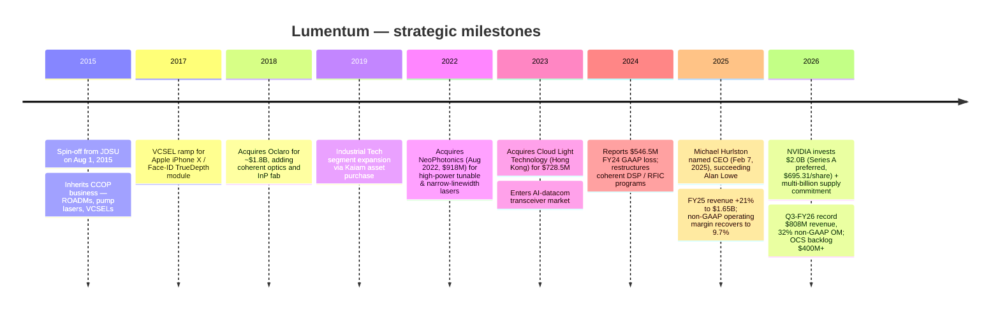
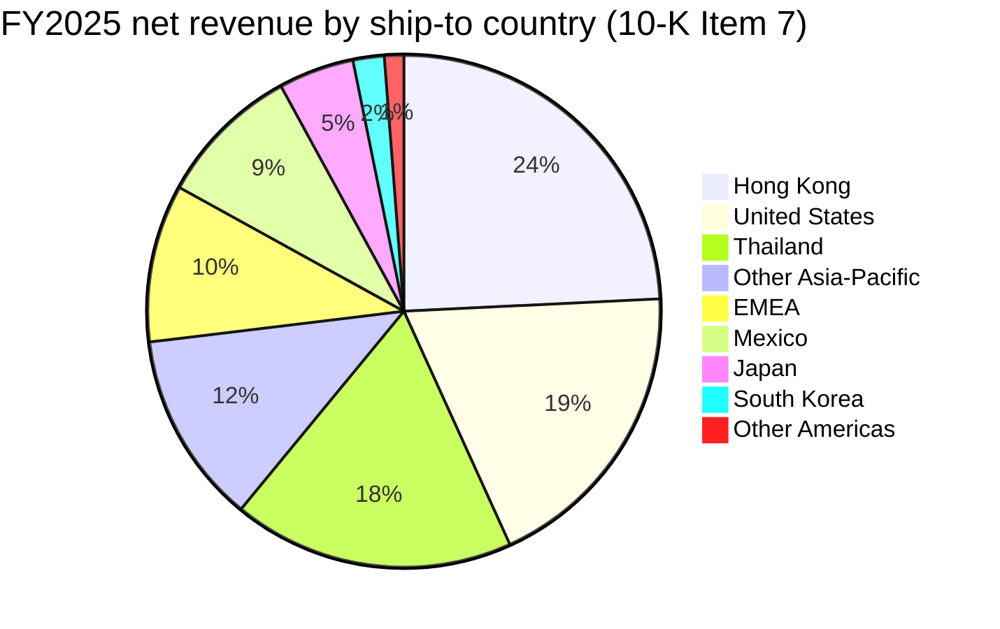

# Company Research Report: Lumentum Holdings Inc. (NASDAQ: LITE)

**Date:** 2026-05-20
**Author:** Financial-agent research workflow (company-research skill)

> **Update — Strategic NVIDIA partnership and $2.0 B preferred-equity injection (2026-03-02):** NVIDIA entered into multi-year strategic agreements with Lumentum including a multi-billion-dollar purchase commitment and future capacity-access rights for advanced laser components, and on the same day purchased **2,876,415 shares of newly-issued Series A Convertible Preferred Stock at $695.31 per share** for an aggregate $2.0 billion in cash. Proceeds will fund a new U.S.-based fabrication facility and additional R&D for AI-data-center optics. The preferred converts 1-for-1 into common (subject to HSR clearance), votes with common on an as-converted basis (excluding director elections), and carries no preemptive or redemption rights. Together with the May 5, 2026 Q3-FY26 print (record revenue of $808.4 m, +90% Y/Y; non-GAAP operating margin 32.2%), the announcement repositioned Lumentum from a recovering optical-components vendor into NVIDIA's named long-term supplier for silicon-photonics interconnect.
> Sources: [NVIDIA Announces Strategic Partnership with Lumentum (8-K Ex-99.1, 2026-03-02)](https://www.sec.gov/Archives/edgar/data/0001633978/000119312526085412/d41019dex991.htm); [Lumentum Q3 FY2026 earnings release (8-K Ex-99.1, 2026-05-05)](https://www.sec.gov/Archives/edgar/data/0001633978/000162828026030530/lite_ex991xq3fy26.htm); [Lumentum Raises $2 Billion, Deepens NVIDIA Strategic Partnership (Globe and Mail, 2026-03-02)](https://www.theglobeandmail.com/investing/markets/stocks/LITE/pressreleases/545805/lumentum-raises-2-billion-deepens-nvidia-strategic-partnership/).

---

## Table of Contents

1. Company Overview
2. Company History
3. Management Team
4. Products & Services
5. Customers & Go-to-Market
6. Industry Overview
7. Competitive Landscape
8. Market Opportunity (TAM)
9. Risk Assessment
10. References

---

## 1. Company Overview

Lumentum Holdings Inc. (NASDAQ: LITE) is a San Jose, California-based designer and manufacturer of optical and photonic chips, components, modules and subsystems. The company describes itself as "a leading provider of optical and photonic products … recognized as an industry leader based on revenue and market share," whose products are "essential to a range of cloud, artificial intelligence and machine learning (AI/ML), telecommunications, consumer, and industrial end-market applications" ([Lumentum FY2025 10-K, p. 5](https://www.sec.gov/Archives/edgar/data/0001633978/000162828025040830/lite-20250628.htm)).

Lumentum reports two segments. **Cloud & Networking (C&N)** sells optical and photonic chips, components, modules and subsystems to cloud / AI infrastructure operators and network-equipment manufacturers (NEMs); the offering spans datacom (EML and CW lasers, ICs, AOC and pluggable optics from 400 G to 1.6 T, internally-built advanced transceiver modules acquired with Cloud Light) and telecom (ROADMs, transponders, tunable lasers, pump lasers, narrow-linewidth lasers and undersea/long-haul transport). **Industrial Tech (IT)** sells short-pulse solid-state lasers, kilowatt fiber lasers, diode lasers and gas lasers, plus VCSEL laser-light sources used in 3D-sensing cameras for mobile devices — historically the iPhone Face-ID / TrueDepth module ([10-K, p. 5–6](https://www.sec.gov/Archives/edgar/data/0001633978/000162828025040830/lite-20250628.htm)). In FY2025 the two segments split 85.8% / 14.2% of revenue ([10-K p. 50](https://www.sec.gov/Archives/edgar/data/0001633978/000162828025040830/lite-20250628.htm)).

The business is highly globalised. Lumentum employed **approximately 10,562 full-time staff as of June 28, 2025**, of which 8,706 in manufacturing, 1,132 in R&D and 724 in SG&A ([10-K p. 9](https://www.sec.gov/Archives/edgar/data/0001633978/000162828025040830/lite-20250628.htm)). The owned-and-leased footprint totals ~3.1 million square feet, including 1,173,000 sq ft of manufacturing in Thailand, 472,000 sq ft in Japan, 238,000 sq ft on the San Jose HQ campus, 183,000 sq ft in the United Kingdom and 36,000 sq ft in Slovenia ([10-K p. 22](https://www.sec.gov/Archives/edgar/data/0001633978/000162828025040830/lite-20250628.htm)). 81.0% of FY2025 revenue was ship-to outside the United States, with Hong Kong ($398.6 m / 24.2%), the United States ($312.3 m / 19.0%) and Thailand ($291.8 m / 17.7%) the three largest individually-reportable countries ([10-K p. 51](https://www.sec.gov/Archives/edgar/data/0001633978/000162828025040830/lite-20250628.htm)).

**Financial scale.** FY2025 net revenue was **$1,645.0 m**, up 21.0% from $1,359.2 m in FY2024 and recovering from a 23.1% prior-year decline. GAAP net income was **$25.9 m** ($0.37 diluted EPS), turning positive after a $546.5 m FY2024 GAAP loss; non-GAAP net income was $146.4 m ($2.06 diluted EPS) ([Q4-FY25 release, 2025-08-12](https://www.sec.gov/Archives/edgar/data/0001633978/000162828025039896/lite_ex991xq4fy25.htm)). Through the first nine months of FY2026 (ended March 28, 2026) revenue accelerated to **$2,007.7 m**, GAAP net income to $226.6 m and non-GAAP gross margin to 43.8%, with the Q3 quarter alone delivering record $808.4 m (+90.1% Y/Y) and non-GAAP operating margin of 32.2% ([Q3-FY26 release, 2026-05-05](https://www.sec.gov/Archives/edgar/data/0001633978/000162828026030530/lite_ex991xq3fy26.htm)). Management's Q4-FY26 guide of $960 m–$1,010 m / 35.0–36.0% non-GAAP OM / $2.85–$3.05 non-GAAP EPS implies a full-FY2026 revenue print of roughly **$2.97–$3.02 bn**, very nearly doubling the FY2025 base.


Source: [Lumentum FY2025 10-K, p. 50](https://www.sec.gov/Archives/edgar/data/0001633978/000162828025040830/lite-20250628.htm); [Q3-FY26 earnings release, 2026-05-05](https://www.sec.gov/Archives/edgar/data/0001633978/000162828026030530/lite_ex991xq3fy26.htm). FY26E = 9-month actuals plus Q4 mid-guide ($985 m).

**Valuation snapshot (May 20, 2026).** The stock closed near **$877** (public.com market-cap page), giving a market capitalisation of roughly **$75.5 bn** ([public.com — LITE market cap](https://public.com/stocks/lite/market-cap)). On the latest reported TTM-trailing four-quarter earnings, the trailing P/E is **roughly 142×–167×** depending on share-count and pro-forma assumptions ([financecharts.com — LITE P/E (May 2026)](https://www.financecharts.com/stocks/LITE/value/pe-ratio); [public.com — LITE P/E](https://public.com/stocks/lite/pe-ratio)). The forward P/E is **~50×** ([GuruFocus — LITE forward P/E 49.77](https://www.gurufocus.com/term/forward-pe-ratio/LITE)). Calendar-TTM revenue (last four reported quarters: Q4-FY25, Q1-FY26, Q2-FY26, Q3-FY26) equals $480.7 + 533.8 + 665.5 + 808.4 = **$2,488.4 m**, giving a TTM **P/S of ~30×**. The stock has risen **~+1,030% in the last 52 weeks** ([public.com — LITE market cap](https://public.com/stocks/lite/market-cap)).

How to read those numbers: both P/E and P/S are stretched **even versus optical-network comparables** ([financecharts.com — COHR P/E 89× (May 15, 2026)](https://www.financecharts.com/stocks/COHR/value/pe-ratio); [Simply Wall St — COHR P/S 11.96× vs sector 2.67×](https://simplywall.st/stocks/us/tech/nyse-cohr/coherent/valuation); [macrotrends — MRVL P/E 57×](https://www.macrotrends.net/stocks/charts/MRVL/marvell-technology/pe-ratio); CIEN market cap ~$81 bn on $5–6 bn annualised revenue implies P/S ~13×). LITE trades at roughly **2× COHR / MRVL on P/E and ~2–3× peers on P/S**, which the market is justifying with (i) a quasi-exclusive endorsement from NVIDIA on next-generation silicon-photonics interconnect for "gigawatt-scale AI factories" ([NVIDIA-Lumentum 8-K Ex-99.1, 2026-03-02](https://www.sec.gov/Archives/edgar/data/0001633978/000119312526085412/d41019dex991.htm)), (ii) the 90% Y/Y revenue acceleration and 1,270 bp gross-margin expansion in the quarter just reported ([Q3-FY26 release](https://www.sec.gov/Archives/edgar/data/0001633978/000162828026030530/lite_ex991xq3fy26.htm)), and (iii) management's framing that **optical circuit switches (OCS) and co-packaged optics (CPO) "are only at the starting line"** with an OCS backlog already above $400 m and a multi-hundred-million-dollar CPO order for 1H-CY2027 delivery ([Q2-FY26 release, 2026-02-03](https://www.sec.gov/Archives/edgar/data/0001633978/000162828026005005/lite_ex991xq2fy26.htm)). The forward P/E around 50× — i.e. the multiple investors are paying on next-fiscal-year non-GAAP EPS — looks much closer to the optical-AI peer set, but the TTM multiples carry meaningful "narrative premium" and re-rate risk; this is called out as risk #1 in Section 9.

---

## 2. Company History

Lumentum was created on **August 1, 2015**, when JDS Uniphase (JDSU) separated its Communications and Commercial Optical Products (CCOP) business from the network-test business that retained the JDSU brand and was renamed Viavi Solutions. JDSU shareholders received 1 Lumentum share for every 5 JDSU shares, leaving Viavi as a stand-alone company and Lumentum public on NASDAQ from day one ([Semi Fundamental — "The History of Lumentum", 2026](https://semifundamental.substack.com/p/the-history-of-lumentum); the FY2015 10-K, on file in the local SEC mirror, formally records the spin and the indemnification of Viavi for legacy site-environmental liabilities — [10-K FY2025 p. 9 references that indemnity](https://www.sec.gov/Archives/edgar/data/0001633978/000162828025040830/lite-20250628.htm)).



Three strategic transformations matter to today's thesis.

**First, the 2018 acquisition of Oclaro for $1.8 billion ([Lumentum 8-K, March 12, 2018](https://www.sec.gov/Archives/edgar/data/0001633978/000119312518078154/d547353dex991.htm))** vertically integrated Lumentum into Indium-Phosphide (InP) laser components — primarily directly-modulated lasers (DMLs), electro-absorption modulated lasers (EMLs) and tunable distributed-feedback lasers (T-DFBs). Those are precisely the chips that the AI buildout now consumes in massive volumes as the active light source inside 400G, 800G and 1.6T pluggable optical transceivers, and they sit at the heart of Lumentum's 2026 narrative.

**Second, the 2022 NeoPhotonics acquisition** added high-power tunable lasers and narrow-linewidth coherent lasers — exactly the products that, in CEO Michael Hurlston's words on the Q3-FY26 call, "are aided by … a less-heralded part of our portfolio, 'scale-across' components, which include our pump lasers and narrow linewidth laser assemblies" ([Q3-FY26 release, 2026-05-05](https://www.sec.gov/Archives/edgar/data/0001633978/000162828026030530/lite_ex991xq3fy26.htm)).

**Third, the November 7, 2023 acquisition of Cloud Light Technology for $728.5 m** ([Lumentum 8-K Ex-99.1, 2023-11-07](https://www.sec.gov/Archives/edgar/data/0001633978/000119312523272452/d587006dex991.htm); [optics.org coverage](https://optics.org/news/14/11/4)) gave Lumentum a Hong-Kong-based, vertically-integrated 400G-and-above optical transceiver platform, "well-positioned to serve the growing needs of Cloud & Networking customers, particularly those customers focused on optimizing their data center infrastructure for the demands of AI/ML" ([10-K FY2025 p. 5](https://www.sec.gov/Archives/edgar/data/0001633978/000162828025040830/lite-20250628.htm)). Goodwill from this deal was assigned to the Cloud & Networking segment ([10-K p. 95](https://www.sec.gov/Archives/edgar/data/0001633978/000162828025040830/lite-20250628.htm)).

Recent developments tracked by this report (last 12 months) include: (i) **CEO transition** — Hurlston started February 7, 2025, replacing Alan Lowe who had led the company since spin-off ([8-K Ex-99.1, 2025-02-03](https://www.sec.gov/Archives/edgar/data/0001633978/000119312525019371/d842830dex991.htm)); (ii) the **June 3, 2025 Regulation-FD update** in which management raised the upper end of Q4-FY25 guidance, foreshadowing the Q4 print of $480.7 m (above the high end of the upwardly-revised band per the Q4-FY25 press release); (iii) the **NVIDIA strategic agreements and $2.0 bn Series A preferred placement on March 2, 2026**; and (iv) the appointment of **Thad Trent (current onsemi CFO, former Cypress CFO) to the Lumentum board on December 15, 2025**, expanding the board to nine members ([8-K Ex-99.1, 2025-12-15](https://www.sec.gov/Archives/edgar/data/0001633978/000162828025057025/thadtrentpr_finalx2.htm)).

---

## 3. Management Team

### Michael Hurlston, President & Chief Executive Officer (since Feb 7, 2025)

Hurlston is the most consequential bio at Lumentum and a textbook "operator-with-relevant-priors" appointment. He joined as CEO on February 7, 2025, replacing long-tenured CEO Alan Lowe ([Lumentum 8-K Ex-99.1, 2025-02-03](https://www.sec.gov/Archives/edgar/data/0001633978/000119312525019371/d842830dex991.htm); [optics.org — Lumentum appoints Michael Hurlston as new CEO, 2025-02](https://optics.org/news/lumentum-appoints-michael-hurlston-as-new-ceo)). His prior three roles have unusual relevance to today's Lumentum thesis:

- **2019–2025: President & CEO, Synaptics Inc. (NASDAQ: SYNA).** Six-year tenure running a mixed-signal/IoT semiconductor company. Synaptics shifted its mix toward edge-AI / IoT / wireless connectivity under his watch ([businesswire — leadership transition](https://www.businesswire.com/news/home/20250203516262/en/Lumentum-Announces-Leadership-Transition)).
- **January 2018 – August 2019: CEO, Finisar Corporation.** Directly relevant: Finisar was, at the time, the largest stand-alone optical-transceiver / VCSEL vendor in the world. Hurlston oversaw the **$3.2 bn sale of Finisar to II-VI Inc. in 2019** ([optics.org coverage](https://optics.org/news/lumentum-appoints-michael-hurlston-as-new-ceo); II-VI later renamed to Coherent — today Lumentum's single largest public-market competitor). He therefore arrives at Lumentum with first-hand operational experience of the exact transceiver/VCSEL value chain Lumentum is now scaling into.
- **2001–2018 (17 years): Executive Vice President, Worldwide Sales, and progressively senior roles at Broadcom Inc. and its predecessor entities.** Broadcom was at that time the dominant Ethernet-switch-silicon supplier — i.e. he sold into exactly the hyperscaler / cloud / NEM customer base that today buys Lumentum's optics ([semiconductor-today.com, 2025-02-04](https://www.semiconductor-today.com/news_items/2025/feb/lumentum-040225.shtml)).

Education and history before that have been less widely covered in the trade press; what is documented is that the Lumentum board described him in the February 2025 press release as bringing "over 30 years of senior leadership experience" in semiconductors and optics. His compensation has not yet been disclosed in a proxy filed since the appointment (Lumentum's most recent DEF 14A was filed in autumn 2024 for the November 2024 annual meeting, before he joined). Public reporting indicates the appointment was performance-incentive heavy, with sign-on RSUs and a fresh PSU grant; pinning down the exact package will require the next DEF 14A. His public profile since arrival has been deliberately AI-and-margin-focused, and the operating record so far is unambiguous: in his first four full quarters (Q1-Q3 FY26 plus Q4-FY25 guided), non-GAAP operating margin expanded from 3.0% (Q1-FY25, the quarter before he started) to 32.2% (Q3-FY26 actual) and a guided 35–36% in Q4-FY26 — a 3,200-bp improvement in five quarters ([Q3-FY26 release](https://www.sec.gov/Archives/edgar/data/0001633978/000162828026030530/lite_ex991xq3fy26.htm); [Q1-FY26 release](https://www.sec.gov/Archives/edgar/data/0001633978/000162828025048860/lite_ex991xq1fy26.htm)).

### Wajid Ali, Executive Vice President & Chief Financial Officer

Wajid Ali is Lumentum's incumbent CFO, listed as such on the FY26 Q3 10-Q Section-302 certifications ([10-Q FY26 Q3, exhibit 31.2](https://www.sec.gov/Archives/edgar/data/0001633978/000162828026030777/lite-q3fy26xex312.htm)); his Crunchbase profile records him as Lumentum EVP & CFO ([Crunchbase — Wajid Ali](https://www.crunchbase.com/person/wajid-ali)). He has overseen Lumentum's transition from a heavily-loss-making FY2024 ($546.5 m GAAP loss, gross margin 18.5%) to a profitable FY2025 / hyper-profitable FY2026 ramp, and was the deal team's senior financial executive on (i) the integration of Cloud Light, (ii) the issuance of additional convertible senior notes, and (iii) the structuring of the March 2026 $2.0 bn Series A Convertible Preferred placement with NVIDIA. The balance-sheet evidence is positive: cash, cash equivalents & short-term investments rose from $520.7 m at end-FY25 to **$3,172.3 m at end-Q3-FY26**, with current portion of long-term debt rising to $3,238.6 m as the FY2026 convertible notes approach maturity — a refinancing window the NVIDIA cash will materially de-risk ([Q3-FY26 release balance sheet](https://www.sec.gov/Archives/edgar/data/0001633978/000162828026030530/lite_ex991xq3fy26.htm)).

### Other senior executives

- **Chief Operating Decision Maker / CEO** also functions as the CODM for segment-reporting purposes ([10-K FY2025 p. 122](https://www.sec.gov/Archives/edgar/data/0001633978/000162828025040830/lite-20250628.htm)).
- **EVP, Global Operations** runs the multi-site manufacturing footprint (Thailand, Japan, UK, Slovenia, China, US) referenced in the 10-K's Cybersecurity-Steering-Committee disclosure ([10-K p. 21](https://www.sec.gov/Archives/edgar/data/0001633978/000162828025040830/lite-20250628.htm)). Names of the operations leader, CTO and CHRO are listed on the Lumentum corporate "Leadership" page but were not pulled verbatim in this research session — readers wanting specific titles and bios beyond the CEO/CFO/board level should consult [Lumentum's "Board of Directors" page](https://www.lumentum.com/en/company/board-of-directors).

### Governance footer

- **Board size: 9 directors as of December 15, 2025**, after the appointment of Thad Trent (current onsemi CFO; former Cypress Semiconductor CFO 2014-2020 through the Infineon acquisition) ([Lumentum 8-K Ex-99.1, 2025-12-15](https://www.sec.gov/Archives/edgar/data/0001633978/000162828025057025/thadtrentpr_finalx2.htm)).
- **Chair: Penelope Herscher** (non-executive chair, named in the December 15, 2025 board release).
- **Capital-structure governance:** the March 2026 Series A Preferred carries voting rights on an as-converted basis but **excludes NVIDIA from voting in director elections**, which preserves common-shareholder control of the board — a deliberate design to insulate the board from the otherwise meaningful (≈2.9 m shares ≈ ~4% of fully-diluted) NVIDIA stake ([Lumentum Raises $2B — Globe and Mail summary of the 8-K terms](https://www.theglobeandmail.com/investing/markets/stocks/LITE/pressreleases/545805/lumentum-raises-2-billion-deepens-nvidia-strategic-partnership/)).
- **Insider economics:** the FY2025 10-K discloses an annual Equity Incentive Plan and ESPP ([10-K p. 100–106](https://www.sec.gov/Archives/edgar/data/0001633978/000162828025040830/lite-20250628.htm)). The most recent DEF 14A on file (autumn 2024) is now stale relative to the Hurlston package and should be reviewed when the next proxy is filed.

### Track-record synthesis

Hurlston's prior CEO seats — Synaptics (consumer/edge semis) and Finisar (transceivers / VCSELs) — together cover every adjacency of what Lumentum is doing today. He executed a sizeable sale of Finisar to II-VI (now Coherent) and has now, within 15 months, delivered margin expansion that even bullish optical-AI analysts did not model. The risk to that record is purely that the AI-optics super-cycle continues to be the dominant tailwind; he has not yet been tested through an AI-spending downturn.

---

## 4. Products & Services

Lumentum's product portfolio is organised around its two reportable segments. The 10-K Item-1 product-category descriptions are the primary source for what follows ([Lumentum FY2025 10-K, p. 5-8](https://www.sec.gov/Archives/edgar/data/0001633978/000162828025040830/lite-20250628.htm)).

```mermaid
graph TD
    A[Lumentum Holdings] --> B[Cloud & Networking]
    A --> C[Industrial Tech]
    B --> B1[Cloud / AI datacom optics]
    B --> B2[Telecom / network optics]
    B --> B3[Component / chip business]
    B1 --> B1a[400G / 800G / 1.6T pluggable transceivers]
    B1 --> B1b[Active optical cables - AOCs]
    B1 --> B1c[Co-packaged optics CPO engines]
    B1 --> B1d[Optical Circuit Switches OCS]
    B2 --> B2a[ROADMs / WSS / line systems]
    B2 --> B2b[Coherent transponders & DWDM modules]
    B2 --> B2c[Pump lasers / EDFA components]
    B2 --> B2d[Submarine / long-haul subsystems]
    B3 --> B3a[EML directly-modulated lasers]
    B3 --> B3b[Tunable / narrow-linewidth lasers]
    B3 --> B3c[InP / Silicon photonic ICs]
    C --> C1[Imaging & sensing - VCSELs]
    C --> C2[Industrial fiber lasers - kW class]
    C --> C3[Ultrafast / picosecond solid-state lasers]
    C --> C4[Diode & gas lasers]
    C1 --> C1a[Apple iPhone Face-ID Tx VCSEL]
    C2 --> C2a[Metal cutting / welding / EV battery]
    C3 --> C3a[Semiconductor microelectronics processing]
```



### 4.1 Cloud & Networking — 85.8% of FY2025 revenue ($1,410.8 m); ramping faster in FY26

**Datacom / AI infrastructure** — Lumentum's narrative engine. The product family includes (i) **EML and CW laser chips** used as the light source inside high-speed transceivers across 400G, 800G and 1.6T, supplied as components into the rest of the transceiver ecosystem; (ii) Lumentum's own **800G and emerging 1.6T pluggable transceivers and AOCs**, built largely on the Cloud Light platform acquired in 2023; (iii) **co-packaged optics (CPO) engines** for chip-package-level integration of optical I/O — the use-case NVIDIA's Quantum-X / Spectrum-X CPO programs are scaling and the explicit subject of the NVIDIA partnership ([NVIDIA-Lumentum 8-K, 2026-03-02](https://www.sec.gov/Archives/edgar/data/0001633978/000119312526085412/d41019dex991.htm)); and (iv) **Optical Circuit Switches (OCS)**, electromechanical/MEMS-based switches used to physically rearrange optical paths in hyperscale fabrics. On the Q2-FY26 call, CEO Hurlston described "extraordinary customer demand that has already driven our backlog [in OCS] well beyond $400 million" ([Q2-FY26 release, 2026-02-03](https://www.sec.gov/Archives/edgar/data/0001633978/000162828026005005/lite_ex991xq2fy26.htm)).

- *Competitive-advantage verdict — datacom transceivers and EML chips: **partial moat, strong in chips, contested at the module level.*** The moat in **EML / CW laser chips** is technology + scale: the InP epitaxy and laser-diode fab capability Lumentum acquired with Oclaro (2018) and NeoPhotonics (2022) is one of perhaps three-to-four globally relevant InP fabs (the others being Coherent / II-VI ex-Finisar, Mitsubishi Electric and Sumitomo Electric). Evidence: NVIDIA's explicit naming of "future capacity access rights for advanced laser components" in the March 2026 supply agreement ([NVIDIA-Lumentum 8-K, 2026-03-02](https://www.sec.gov/Archives/edgar/data/0001633978/000119312526085412/d41019dex991.htm)) and Hurlston's call commentary that "strength in laser chips" was a primary driver of the 540 bp Q3-FY26 GM expansion. The closest competing chip-level product is Coherent's EML / DFB laser-chip family from the legacy II-VI / Finisar fab base — at present roughly **at parity in performance, slight edge to Coherent on volume share** by some industry estimates. The moat at the **module / transceiver level** is weaker: Innolight, Eoptolink, Coherent and others compete head-on for hyperscaler module sockets, and the segment has historically been more commoditised; Lumentum's edge here is vertical integration (it owns the laser chip going into the module) rather than module assembly cost.
- *Competitive-advantage verdict — OCS and CPO: **emerging strong moat tied to NVIDIA design-in.*** OCS revenue is still small, but the $400 m+ backlog and the named partnership give Lumentum a credible early-leader position. Closest comp: **Google's in-house Apollo OCS** (not commercial) for internal datacenter use, plus startup Telescent and Coherent's CPO efforts; **ahead** at the moment, with the caveat that hyperscaler in-house silicon-photonics teams (Google, Meta) can erode this if they choose.

**Telecom / transport.** This is the legacy CCOP business — **ROADMs**, **wavelength-selective switches (WSS)**, **coherent line cards**, **DWDM transponders**, **pump lasers** for EDFAs, **narrow-linewidth lasers** for coherent transmission, and submarine / long-haul optical subsystems. Lumentum is one of the two global merchant suppliers of ROADM-class WSS modules (the other being Coherent / II-VI ex-Finisar). Demand here is driven by telecom carrier capex, which the 10-K describes as recovering from a 2024 inventory-correction trough ([10-K MD&A p. 50–51](https://www.sec.gov/Archives/edgar/data/0001633978/000162828025040830/lite-20250628.htm)). Competitive-advantage verdict: **strong moat (technology + supplier-list certification + decades-long NEM relationships)**, but slower-growing than datacom.

**Cost base.** Within the segment Lumentum is "focused on technology leadership through innovation in close partnership with our customers, cost leadership and functional and vertical integration" — i.e. owning more of the silicon and laser-chip BOM is the explicit strategy ([10-K p. 7](https://www.sec.gov/Archives/edgar/data/0001633978/000162828025040830/lite-20250628.htm)).

### 4.2 Industrial Tech — 14.2% of FY2025 revenue ($234.2 m); declining

Industrial Tech consists of four product families:

- **Short-pulse solid-state lasers / ultrafast lasers** — used in semiconductor lithography process steps, PCB micromachining, OLED display manufacturing.
- **Kilowatt-class fiber lasers** — for metal cutting, welding, and **EV-battery manufacturing** (cell can-welding, busbar joining).
- **Diode lasers and VCSEL laser-light sources for 3D sensing** — historically the iPhone Face-ID / TrueDepth module Tx-side VCSEL (Lumentum has been a multi-year supplier; the 10-K describes "customers' 3D sensing cameras, primarily used in mobile devices" without naming Apple). The 10-K discloses that FY2025 Industrial Tech revenue **decreased $40.1 m / 14.6%** year-over-year, primarily due to a decline in unit sales of imaging-and-sensing products driven by "higher market competition in the consumer end-market for these products" — implicitly, share loss in the smartphone-VCSEL socket — partially offset by $17.5 m in higher laser-product revenue ([10-K MD&A p. 51](https://www.sec.gov/Archives/edgar/data/0001633978/000162828025040830/lite-20250628.htm)).
- **Gas lasers** — niche industrial / semiconductor applications.

Competitive-advantage verdict on Industrial Tech overall: **partial moat, eroding in 3D sensing**. The kW fiber-laser business is moated by depth of OEM relationships but competes against IPG Photonics, Trumpf and a Chinese long-tail (Raycus, Maxphotonics); the ultrafast-laser business is highly differentiated technically and remains profitable. The consumer 3D-sensing business is the segment's biggest vulnerability — the 10-K's own explanation of the $40 m revenue decline is "higher market competition in the consumer end-market." Closest competing products: IPG Photonics in fiber lasers (**broadly at parity, Lumentum somewhat behind in pure cost-leadership**); II-VI/Coherent and Trumpf Photonic Components in VCSELs (**Lumentum has been losing share**); Trumpf and Coherent in ultrafast.

### 4.3 Flagship vs. long-tail; recent launches and sunsets

The three flagship product lines driving the current narrative are: **(1) EML / narrow-linewidth laser chips**, **(2) Cloud Light–derived 800G / 1.6T transceivers and CPO engines**, and **(3) Optical Circuit Switches.** Combined, these line items effectively explain the +90% Y/Y Q3-FY26 revenue print ([Q3-FY26 release](https://www.sec.gov/Archives/edgar/data/0001633978/000162828026030530/lite_ex991xq3fy26.htm)). The long tail — Industrial Tech and traditional telecom transport — provides margin diversification and a backstop in any downturn.

**Sunsets in the last 12 months:** the FY25 10-K confirms management discontinued in-house development of **coherent DSPs and Radio-Frequency Integrated Circuits (RFICs)** as part of restructuring ([10-K MD&A p. 52](https://www.sec.gov/Archives/edgar/data/0001633978/000162828025040830/lite-20250628.htm)). This freed ~$10 m of annual salary expense and concentrated R&D into laser-chip and CPO programs. **Launches:** the NVIDIA partnership press release frames the next-generation silicon-photonics CPO and OCS products as joint roadmap items for delivery into NVIDIA gigawatt-scale AI factories.


Source: [Lumentum FY2025 10-K, MD&A — Segment net revenue, p. 50](https://www.sec.gov/Archives/edgar/data/0001633978/000162828025040830/lite-20250628.htm).


Source: [Q1-FY25, Q2-FY25, Q3-FY25, Q4-FY25, Q1-FY26, Q2-FY26, Q3-FY26 earnings releases](https://www.sec.gov/cgi-bin/browse-edgar?action=getcompany&CIK=0001633978&type=8-K&dateb=&owner=include&count=40); Q4-FY26 figures = mid-point of management guide ($985 m revenue, 35.5% non-GAAP OM).

---

## 5. Customers & Go-to-Market

### 5.1 Customer base

Lumentum sells to three principal customer-classes:

1. **Hyperscale cloud and AI infrastructure providers** — directly (in the case of NVIDIA under the March 2026 agreements, and per Lumentum's own segment description of selling to "cloud data center operators, AI/ML infrastructure providers" ([10-K p. 6](https://www.sec.gov/Archives/edgar/data/0001633978/000162828025040830/lite-20250628.htm))) and indirectly through ODM / contract-manufacturing channels.
2. **Network Equipment Manufacturers (NEMs)** — Cisco, Ciena, Nokia (which owns the former Alcatel-Lucent / Infinera business after its 2024 acquisition), Huawei (subject to U.S. export restrictions), ZTE and Juniper. Lumentum's ROADM, WSS, transponder and coherent components ship into NEM line systems and routers.
3. **Industrial-laser OEMs and consumer-electronics OEMs** — for Industrial Tech: machine-tool builders (Trumpf, DMG Mori, Mazak, Han's Laser); semiconductor process-equipment makers; and for the 3D-sensing portion, **Apple** as the historically-disclosed end customer for the iPhone Face-ID VCSEL via Foxconn / module-house intermediaries (the 10-K does not name Apple; the relationship is well-documented in the trade press).

### 5.2 Customer concentration — material risk; 10-K-disclosed

The FY2025 10-K is explicit. In FY2025, **two customers individually exceeded 10% of consolidated net revenue: Customer A at 16.0% and Customer B at 15.4%** ([10-K p. 9](https://www.sec.gov/Archives/edgar/data/0001633978/000162828025040830/lite-20250628.htm)). The three-year history:

| Customer | FY2023 | FY2024 | FY2025 |
|---|---|---|---|
| Customer A | 15.3% | 11.4% | **16.0%** |
| Customer B | * | 18.9% | **15.4%** |
| Customer C | 12.1% | * | * |
| Customer D | 10.5% | * | * |

*\*Represents less than 10% of total net revenue* ([10-K p. 9](https://www.sec.gov/Archives/edgar/data/0001633978/000162828025040830/lite-20250628.htm)).

**Combined named top-2 = 31.4% of FY25 revenue.** Together with the ship-to data — Hong Kong 24.2%, U.S. 19.0%, Thailand 17.7% (the latter two largely reflecting ODM / contract-manufacturer ship locations for hyperscaler end-customers) — the implied dependency on a small set of large customers is the single most important non-AI-cycle risk in the file. The 10-K Risk Factor on this is explicit: "our reliance on a limited number of suppliers and customers" and "our ability to sell to a significant customer" ([10-K p. 10–11](https://www.sec.gov/Archives/edgar/data/0001633978/000162828025040830/lite-20250628.htm)). This is carried into Section 9 as Risk #2.



Source: [Lumentum FY2025 10-K, p. 51](https://www.sec.gov/Archives/edgar/data/0001633978/000162828025040830/lite-20250628.htm).


Source: [Lumentum FY2025 10-K, p. 9 — Customer concentration](https://www.sec.gov/Archives/edgar/data/0001633978/000162828025040830/lite-20250628.htm).


Source: [Lumentum FY2025 10-K, p. 51 — Revenue by Region](https://www.sec.gov/Archives/edgar/data/0001633978/000162828025040830/lite-20250628.htm).

### 5.3 Contract structure, go-to-market and channel

The 10-K notes that "a significant portion of our revenue arises from vendor-managed inventory ('VMI') arrangements where the timing and volume of customer utilization is difficult to predict" — i.e. large customers do not commit to firm POs but draw from VMI hubs; revenue recognition follows draw, not order ([10-K p. 9](https://www.sec.gov/Archives/edgar/data/0001633978/000162828025040830/lite-20250628.htm)). This is industry-standard for high-volume optical components but means backlog is a weaker leading indicator than in other capital-equipment businesses.

Most contracts in the data-center and NEM customer base are governed by master supply agreements covering pricing, lead times, QA / NCMR (non-conforming material report) handling and IP indemnification, with individual POs underneath; multi-year agreements are common with NEM customers and increasingly with hyperscalers (the NVIDIA agreement is explicitly multi-year per the 8-K). Sales is direct for hyperscalers and large NEMs; smaller industrial-laser customers are served through distributors (e.g. Edmund Optics, Photonics Online channel partners). For 3D-sensing the channel typically runs through module-houses (LG Innotek, Foxconn, Goertek) on behalf of the end OEM (Apple, Honor, Xiaomi, Samsung).

### 5.4 Vertical-integration / "customer is also a competitor" risk

Hyperscalers are vertically integrating into silicon photonics — Google's "Apollo" OCS programme and Meta's optical-engine work are well-publicised. The 10-K acknowledges this risk explicitly: "Our current or potential customers may also determine to develop and produce products for their own use which may be competitive to our products. Such vertical integration could reduce the market opportunity for our products" ([10-K p. 13](https://www.sec.gov/Archives/edgar/data/0001633978/000162828025040830/lite-20250628.htm)). The NVIDIA strategic agreement is, in this context, partly a defensive moat — a multi-year purchase commitment from arguably the most critical AI-infrastructure customer protects against precisely this dynamic.

---

## 6. Industry Overview

### 6.1 Industry definition and scope

Lumentum operates in **optical and photonic components, modules and subsystems** — a sub-set of the global semiconductor and electronic-components industry (NAICS 334413 and 334290). The relevant addressable industries are:

1. **Data-center optical interconnect** — pluggable transceivers (400G / 800G / 1.6T), active optical cables, co-packaged optical engines, optical circuit switches.
2. **Telecom optical transport** — ROADMs / WSS, coherent transponders, DWDM line systems, EDFA components, submarine network transmission.
3. **Industrial lasers** — kilowatt fiber lasers, ultrafast solid-state lasers, diode-pumped lasers for materials processing, semiconductor manufacturing, microelectronics.
4. **3D sensing / consumer photonics** — VCSEL arrays for smartphone face authentication, lidar, AR/VR sensing.

### 6.2 Market size and growth

The **data-center optics market** is by far the most relevant. LightCounting's March 2026 forecast pegs:

- **2026 transceiver-market sales for AI clusters: $26 bn**, up 60% from $16.5 bn in 2025 ([LightCounting newsletter — April 2026](https://www.lightcounting.com/newsletter/en/april-2026-market-forecast-379)).
- **Total data-center optical-module market for 2026: $22.8 bn**, of which 800G + 1.6T together ~$14.6 bn ([LightCounting — March 2026 Ethernet Optics](https://www.lightcounting.com/newsletter/en/march-2026-ethernet-optics-382)).
- **2026 = first year of 1.6T commercialisation**, with global 1.6T demand of 8.6 – 20 million units; NVIDIA alone >5 m units, Google ~4 m, Meta ~1 m ([LightCounting; tspa Semiconductor newsletter](https://tspasemiconductor.substack.com/p/ai-networking-arms-race-heats-up)).
- **Long-term: a reasonable case for $100 bn of annual sales of optical interconnects used in AI clusters by 2030** ([LightCounting — March 2026 newsletter](https://www.lightcounting.com/newsletter/en/march-2026-ethernet-optics-382)).

The **telecom optical-transport market** is mature, growing low-single-digit percent and cyclical with carrier-capex cycles. It includes ~$3–4 bn of WSS / ROADM hardware and ~$5–6 bn of coherent-optic shipments. The **industrial-laser market** is roughly $20 bn globally with kW fiber lasers the largest sub-segment, growing mid-single-digit and dominated by IPG Photonics, Trumpf and Chinese suppliers. **3D-sensing VCSELs** sit inside a smartphone-bill-of-materials that is roughly flat in unit terms.

### 6.3 Key drivers

The single dominant driver — by an enormous margin — is **AI / accelerated-computing capex by hyperscalers**. Each NVIDIA Blackwell / Rubin GPU node in an AI factory requires multiple very-high-speed optical interconnect links; "scale-up" networks inside racks and "scale-out" networks between racks both consume optical components in a way prior generations of computing did not. Goldman Sachs revised its 2026 800G-module unit forecast upward by 58% — from 25 m to 33.5 m units — in late 2025 ([LightCounting summary](https://www.lightcounting.com/newsletter/en/april-2026-market-forecast-379)). Beyond 2026, the transition to **1.6T pluggable optics and to co-packaged optics (CPO)** is the dominant technology question; CPO is the architecture in which the optics move on-package with the switch ASIC or accelerator, reducing power per bit and enabling much higher port counts.

Secondary drivers: undersea-cable build-out (Meta, Google and a renewed wave of consortium cables), 5G/6G fronthaul, automotive lidar growth (impacts VCSEL/laser-diode demand outside Lumentum's largest socket), and semiconductor-equipment ultrafast-laser content.

### 6.4 Regulatory and trade environment

The most important regulatory dynamic is **U.S. export controls and tariffs targeting China**. Lumentum's 10-K describes specific FY2024 actions in which the company was "no longer able to sell certain products to one of our customers" because of U.S. trade restrictions ([10-K MD&A p. 52](https://www.sec.gov/Archives/edgar/data/0001633978/000162828025040830/lite-20250628.htm)) — almost certainly a reference to Huawei after BIS controls tightened around advanced-photonic shipments. Lumentum has reshaped manufacturing accordingly, transferring product lines out of China, expanding Thailand and shifting some Cloud Light volume; this both raises freight and capacity costs (the 10-K cites $20.7 m of excess-capacity charges in FY2024) and adds tariff exposure.

The reverse is also true: Lumentum benefits from U.S. policy that explicitly seeks to onshore advanced-photonic and AI-infrastructure manufacturing — the NVIDIA-Lumentum agreement is partly motivated by a U.S.-based fab build-out and is exactly the kind of project administered (and at the margin subsidised) under CHIPS-Act–era programs.

### 6.5 Industry structure

The optical-components and optical-modules industry is **moderately concentrated at the component / chip layer** (a handful of InP fabs globally) but **highly contested at the module / transceiver layer** (15+ relevant module suppliers, including a strong long tail of Chinese vendors Innolight and Eoptolink). Switching costs are high at the chip / qualifying-fab layer (multi-year qual cycles for an EML chip into a hyperscaler optic), low at the module layer (modules from different vendors are MSA-interoperable). Buyer power is high — the customer base is heavily concentrated. Substitutes are limited within optics, but **electrical interconnect (DAC cables, retimers, twinax)** competes at short reach and **CPO** competes against pluggable optics at scale.

---

## 7. Competitive Landscape

### 7.1 Direct competitors

The 10-K notes "we compete against various public and private companies providing optical communications components, modules, and systems. Some of these competitors are also our customers for certain of our products" ([10-K p. 7](https://www.sec.gov/Archives/edgar/data/0001633978/000162828025040830/lite-20250628.htm)). The most relevant direct competitors:

1. **Coherent Corp. (NYSE: COHR)** — the largest, formed by the merger of II-VI and the former Finisar. Direct overlap across nearly every Lumentum product line: laser chips, transceivers, VCSELs, ROADMs, optical engines for CPO. COHR currently trades at TTM P/E ~89× and P/S 11.96× — itself a multi-bagger on the AI-optics theme ([financecharts.com — COHR P/E (May 2026)](https://www.financecharts.com/stocks/COHR/value/pe-ratio); [Simply Wall St — COHR valuation](https://simplywall.st/stocks/us/tech/nyse-cohr/coherent/valuation)).
2. **Ciena Corp. (NYSE: CIEN)** — primarily a NEM (line-system supplier) but with its WaveLogic coherent-optic IP and emerging CPO programme is increasingly a competitor at the optical-engine layer. CIEN reported $1.43 bn Q1-FY26 revenue (+33% Y/Y) ([Ciena 8-K Q1 FY26 release](https://www.sec.gov/Archives/edgar/data/0000936395/000162828026015006/ex9912026q1earningspressre.htm)) and trades at a market cap of ~$81 bn ([companiesmarketcap.com — CIEN](https://companiesmarketcap.com/ciena/marketcap/)).
3. **Marvell Technology (NASDAQ: MRVL)** — increasingly competes via its **PAM4 / coherent DSP** silicon and its custom-ASIC business for optical-engine modules. P/E ~57×, P/S ~13× ([macrotrends — MRVL P/E](https://www.macrotrends.net/stocks/charts/MRVL/marvell-technology/pe-ratio); [GuruFocus — MRVL P/E (TTM)](https://www.gurufocus.com/term/pettm/MRVL)).
4. **Innolight and Eoptolink (Chinese-listed)** — dominant module-vendors for hyperscaler 400G / 800G sockets in China and increasingly in U.S. cloud sockets. Their cost structure pressures module-level pricing.
5. **NeoPhotonics, Acacia, Inphi** — historically independent; all consolidated into Lumentum (NeoPhotonics) or Cisco (Acacia) or Marvell (Inphi). The competitive bar is now between very few vertically integrated players.
6. **Cisco Systems** — internally builds optical modules for some Cisco-branded line systems; both a customer and partial competitor.
7. **Broadcom (NASDAQ: AVGO)** — supplies the switch silicon (Tomahawk family) and increasingly co-packaged optical engines; competes at the CPO architecture level rather than the module level.

In **industrial lasers**:

8. **IPG Photonics (NASDAQ: IPGP)** — dominant kW fiber-laser supplier worldwide; Lumentum is the smaller of the two.
9. **Trumpf (private, German)** — both fiber-laser and ultrafast-laser competitor; also a leader in VCSELs through Trumpf Photonic Components.
10. **Chinese fiber-laser long-tail (Raycus, Maxphotonics)** — significant pricing pressure in mid-power fiber lasers.

In **3D-sensing VCSELs**:

11. **ams-OSRAM (SIX: AMS)** — direct competitor for smartphone VCSEL sockets; has been winning share.

### 7.2 Positioning framework

```mermaid
quadrantChart
    title Optical-network competitor positioning
    x-axis Module / system focus --> Chip / component focus
    y-axis Telecom-heavy --> Datacom / AI-heavy
    quadrant-1 Datacom + chip-focused (AI optics core)
    quadrant-2 Datacom + module-focused (transceiver vendors)
    quadrant-3 Telecom + module-focused (line-system NEMs)
    quadrant-4 Telecom + chip-focused (legacy components)
    Lumentum: [0.7, 0.75]
    Coherent: [0.55, 0.65]
    Marvell: [0.85, 0.85]
    Broadcom (AVGO): [0.95, 0.9]
    Innolight / Eoptolink: [0.2, 0.85]
    Ciena: [0.3, 0.5]
    Nokia: [0.25, 0.3]
    IPG Photonics: [0.6, 0.05]
    ams-OSRAM: [0.8, 0.3]
```

### 7.3 Lumentum's competitive advantages

- **Vertically integrated InP / laser-chip fab** — one of perhaps 3–4 such platforms globally. The Oclaro + NeoPhotonics IP base is differentiated and certified into multiple hyperscaler / NEM optical roadmaps.
- **Named multi-year NVIDIA partnership** — the March 2026 supply agreement effectively reserves capacity rights for advanced laser components and partners on silicon-photonics for the next generation of NVIDIA AI factories ([NVIDIA-Lumentum 8-K, 2026-03-02](https://www.sec.gov/Archives/edgar/data/0001633978/000119312526085412/d41019dex991.htm)). This is an unusually strong, named-customer competitive moat.
- **Breadth across components, modules and systems** — Lumentum can sell at multiple layers of value, from EML chip to complete OCS system.
- **Geographic manufacturing footprint** — owned and substantial in Thailand, Japan, the UK and Slovenia; the planned new U.S. fab in connection with the NVIDIA deal will add domestic-policy benefits.

### 7.4 Vulnerabilities

- **Loss of any one of the top-2 customers (collectively 31.4% of FY25 revenue)** — concentration risk in a market where end customers (especially hyperscalers) routinely dual- or triple-source.
- **Smartphone-VCSEL share erosion** — the 10-K admits competition has reduced unit sales; ams-OSRAM has been winning sockets.
- **Module-layer commoditisation** — Chinese module vendors price-compress the segment in which Cloud Light competes.
- **Stretched valuation** — TTM P/E ~165× / P/S ~30× leaves no room for execution misses.


Source: [public.com — LITE market cap, May 2026](https://public.com/stocks/lite/market-cap); [financecharts.com — LITE / COHR P/E](https://www.financecharts.com/stocks/LITE/value/pe-ratio); [Simply Wall St — COHR P/S 11.96×](https://simplywall.st/stocks/us/tech/nyse-cohr/coherent/valuation); [macrotrends — MRVL P/E 57×](https://www.macrotrends.net/stocks/charts/MRVL/marvell-technology/pe-ratio); [companiesmarketcap.com — CIEN](https://companiesmarketcap.com/ciena/marketcap/). CIEN P/E approximated from market cap and forward earnings — directional only.


Source: [Lumentum FY2025 10-K MD&A](https://www.sec.gov/Archives/edgar/data/0001633978/000162828025040830/lite-20250628.htm); [Q3-FY26 release balance sheet — PP&E net $964.3 m at March 28 2026](https://www.sec.gov/Archives/edgar/data/0001633978/000162828026030530/lite_ex991xq3fy26.htm).

---

## 8. Market Opportunity (TAM)

**Methodology.** We define Lumentum's TAM as the union of its three main addressable markets:

1. **Data-center optical interconnect (including pluggable transceivers, AOCs, CPO engines and OCS) — the AI-optics narrative.** 2026 = ~$22.8 bn (LightCounting Ethernet Optics) and arguably $26 bn including all AI-cluster interconnect ([LightCounting — March / April 2026 newsletters](https://www.lightcounting.com/newsletter/en/march-2026-ethernet-optics-382)). LightCounting's long-term projection: **$100 bn of annual AI-cluster optical-interconnect revenue by 2030** ([LightCounting — March 2026](https://www.lightcounting.com/newsletter/en/march-2026-ethernet-optics-382)). Lumentum's serviceable addressable market (SAM) here is roughly **40-60% of total spend** — i.e. the chip-component layer and the module layer where it competes, excluding pure switch-ASIC and pure DSP/retimer silicon sold by Broadcom and Marvell — which gives a CY2030 SAM in the order of $40-60 bn.

2. **Telecom optical transport — ROADM/WSS, coherent transponders, pump lasers, submarine optics.** Roughly $8-10 bn TAM globally, growing low-single-digit. Lumentum's SAM is the merchant component slice — perhaps $3 bn.

3. **Industrial lasers and consumer 3D sensing.** Combined ~$20 bn industrial-laser TAM plus ~$1 bn consumer VCSEL TAM. Lumentum's SAM is well under $1 bn given share positions.

**Aggregate SAM today is roughly $15-20 bn growing toward $45-65 bn by 2030**, driven almost entirely by datacom AI optics. Lumentum's CY2026 implied revenue ($2.97-3.02 bn) implies SAM share of mid-teens percent today, scaling.

**SOM (Serviceable Obtainable Market).** Realistically, Lumentum's near-term obtainable share is constrained by InP fab capacity and assembly capacity rather than design wins. The NVIDIA capital injection is explicitly to debottleneck this: a new U.S. fab and "future capacity access rights" suggest the company is reserving multi-year wafer outs to support the AI ramp. If management's pipeline is right and 1.6T plus CPO ramp into FY27/FY28, FY28 revenue in the $5-7 bn range is consistent with continued mid-teens SAM share — a credible run-rate for which the current P/S of ~30× is anchored, although still expensive on FY28 estimates.

**Penetration strategy.** Three vectors: (i) **chip-level differentiation** in EML / narrow-linewidth lasers, kept moated by the InP fab; (ii) **module / OCS / CPO design-wins** anchored to the NVIDIA relationship and similar potential anchors at Google, Microsoft, Meta, Amazon; (iii) **vertical integration savings** (EML chip → module → CPO engine) that protect gross margin as module pricing pressures intensify.

**Risks to TAM.** The dominant scenario risk is an AI-capex pause or pull-back in 2027/2028 — historically every prior optical-component cycle has had a "build-then-digest" cycle measured in 18-24 months, and the current upcycle has been unusually fast. A second risk is that **CPO displaces the pluggable transceiver TAM faster than incumbents can roll their portfolios** — if CPO becomes the dominant architecture in 2028+, the module-vendor TAM contracts even as the chip / engine TAM grows; Lumentum is exposed both ways but better-positioned than module-only vendors.

---

## 9. Risk Assessment

### Company-specific risks

1. **Valuation / multiple-compression risk.** At ~$877 / share on ~$75.5 bn market cap, LITE trades at TTM P/E **~142-167×** and P/S **~30×**, roughly 2-3× peer COHR, CIEN, MRVL on the same metrics ([public.com — LITE market cap](https://public.com/stocks/lite/market-cap); [financecharts.com — LITE P/E](https://www.financecharts.com/stocks/LITE/value/pe-ratio); [Simply Wall St — COHR](https://simplywall.st/stocks/us/tech/nyse-cohr/coherent/valuation)). The stock has appreciated **~+1,030% in 52 weeks**. Any execution miss against the implied $3 bn+ FY26 revenue and 30%+ non-GAAP operating margin will likely trigger material multiple compression. Forward P/E of ~50× is more digestible but still demanding ([GuruFocus](https://www.gurufocus.com/term/forward-pe-ratio/LITE)). Mitigant: actual FY26 print is tracking to or above guide.

2. **Customer concentration.** Top-2 named 10%+ customers = **31.4% of FY25 revenue** ([10-K p. 9](https://www.sec.gov/Archives/edgar/data/0001633978/000162828025040830/lite-20250628.htm)). VMI-based revenue recognition makes the relationship even more dependent on continued draw behaviour. Loss of either customer (whether by competitive displacement, an AI-capex pause, or a re-shoring decision) would drive a ~15% revenue hit. Mitigant: the NVIDIA strategic agreement is a multi-year purchase commitment that helps lock in one of the largest exposures.

3. **Vertical-integration / hyperscaler in-housing.** Google, Meta and other hyperscalers are building in-house optical engines (Google Apollo OCS, Meta's optical I/O), explicitly identified in the 10-K Risk Factor ([10-K p. 13](https://www.sec.gov/Archives/edgar/data/0001633978/000162828025040830/lite-20250628.htm)). If Lumentum's two named >10% customers are hyperscalers and they vertically integrate, the TAM shifts toward chip-only sales rather than full modules — margin and revenue both compressed.

4. **3D-sensing share loss / consumer-VCSEL erosion.** FY25 Industrial Tech revenue declined $40.1 m primarily from "higher market competition in the consumer end-market" ([10-K p. 51](https://www.sec.gov/Archives/edgar/data/0001633978/000162828025040830/lite-20250628.htm)). ams-OSRAM and Trumpf have been winning sockets. Industrial Tech segment profit dropped 51.8% Y/Y ([10-K p. 53](https://www.sec.gov/Archives/edgar/data/0001633978/000162828025040830/lite-20250628.htm)). The segment is a smaller part of the mix but a continuing drag.

5. **Execution risk on the new U.S. fab.** The NVIDIA partnership presumes a new U.S.-based fabrication facility delivered on schedule and to yield. Photonic-IC fabs have historically been hard to ramp; any 12–24-month delay would dent the AI-optics ramp story.

### Industry / market risks

6. **AI-capex cyclicality.** Optical components have always been a cyclical sub-industry; the 2022-2024 inventory correction cost Lumentum ~$408 m of revenue (FY23 → FY24, -23%). If hyperscaler capex normalises in late CY2027 or CY2028, the upcycle in chips and modules will pause for a similar 4-6 quarters. Mitigant: structural growth in AI-cluster optical content per GPU.

7. **CPO transition risk to pluggable transceivers.** Co-packaged optics could compress the standalone pluggable-transceiver module TAM that Cloud Light derives most of its volume from. Lumentum sits on both sides (it supplies CPO engines and pluggables) but the gross-margin profile may compress in transition.

8. **Geopolitics, tariffs and export controls.** The 10-K dedicates significant Risk-Factor space to "higher tariffs and other trade restrictions between the U.S. and other countries, including China and Thailand" ([10-K p. 10](https://www.sec.gov/Archives/edgar/data/0001633978/000162828025040830/lite-20250628.htm)). Thailand alone is 17.7% of FY25 ship-to revenue and houses 1.17 million sq ft of Lumentum's owned manufacturing — proposed tariffs would directly raise cost-of-goods. Hong Kong ship-to (24.2%) and China exposure also remain sensitive to BIS / Entity-List actions.

9. **Module-layer pricing pressure from Chinese suppliers.** Innolight and Eoptolink continue to compress price points in the 400G / 800G transceiver market. While Lumentum's chip-component differentiation insulates it, its module-business margins are exposed.

### Financial risks

10. **Convertible-debt refinancing wall.** As of March 28, 2026, **current portion of long-term debt is $3,238.6 m** ([Q3-FY26 balance sheet](https://www.sec.gov/Archives/edgar/data/0001633978/000162828026030530/lite_ex991xq3fy26.htm)) — primarily the 2026 convertible notes coming due. Cash and short-term investments of $3,172.3 m (largely after the NVIDIA $2.0 bn proceeds) covers it almost exactly; the company will need to refinance or convert at scale during FY26-FY27. The NVIDIA cash injection has materially de-risked this but not eliminated it.

11. **Dilution from convertible conversion.** Diluted share count rose from 69.3 m (Q3-FY25) to 96.2 m (Q3-FY26), reflecting both the Series A preferred and in-the-money convertible-note conversion. Further conversion at higher equity prices is dilutive to EPS — at 96.2 m diluted vs. 71.5 m basic, the conversion / preferred overhang is ~25 m shares.

12. **Tax-rate volatility.** Non-GAAP effective tax rate is 16.5% for FY26 ([Q3-FY26 release](https://www.sec.gov/Archives/edgar/data/0001633978/000162828026030530/lite_ex991xq3fy26.htm)); GAAP rate jumped to 39.6 / 183.8 = 21.5% in the quarter and is volatile around indefinite-reinvestment elections on foreign earnings held in Cayman, Japan and Hong Kong ([10-K p. 73](https://www.sec.gov/Archives/edgar/data/0001633978/000162828025040830/lite-20250628.htm)).

### Macroeconomic risks

13. **U.S./China trade policy & rare-earth export risk.** Lumentum explicitly flagged "rare earth minerals" availability and U.S./other-country export restrictions in the Q3-FY26 forward-looking-statements disclosure ([Q3-FY26 release](https://www.sec.gov/Archives/edgar/data/0001633978/000162828026030530/lite_ex991xq3fy26.htm)). InP wafer / substrate sourcing and certain rare-earth doped materials sit on the China sourcing line.

14. **FX volatility.** A portion of Lumentum's operating cost base is in GBP, CNY, THB and JPY — the 10-K notes "fluctuations in foreign currency" as a Risk Factor ([10-K p. 11](https://www.sec.gov/Archives/edgar/data/0001633978/000162828025040830/lite-20250628.htm)). FY25 saw a $5.0 m FX loss as the dollar weakened.

15. **Generalised macro / recession risk.** Slower IT spending, particularly in enterprise networking, would tighten the telecom-segment growth even if hyperscaler AI capex holds. The 10-K cites "weak economic conditions, inflation, stagflation, trade wars" as the broad backdrop risk ([10-K p. 11](https://www.sec.gov/Archives/edgar/data/0001633978/000162828025040830/lite-20250628.htm)).

---

## 10. References

**Primary filings — SEC EDGAR (local mirror under `/Users/x/projects/financial_agent/financial_reports/LITE/`):**

- [Lumentum Holdings — Form 10-K for FY2025 (filed 2025-08-19; period ended 2025-06-28)](https://www.sec.gov/Archives/edgar/data/0001633978/000162828025040830/lite-20250628.htm)
- [Lumentum Holdings — Form 10-Q for Q3 FY2026 (filed 2026-05-05; period ended 2026-03-28)](https://www.sec.gov/Archives/edgar/data/0001633978/000162828026030777/lite-20260328.htm)
- [Q3-FY26 Earnings Release, 8-K Ex-99.1, 2026-05-05](https://www.sec.gov/Archives/edgar/data/0001633978/000162828026030530/lite_ex991xq3fy26.htm)
- [Q2-FY26 Earnings Release, 8-K Ex-99.1, 2026-02-03](https://www.sec.gov/Archives/edgar/data/0001633978/000162828026005005/lite_ex991xq2fy26.htm)
- [Q1-FY26 Earnings Release, 8-K Ex-99.1, 2025-11-04](https://www.sec.gov/Archives/edgar/data/0001633978/000162828025048860/lite_ex991xq1fy26.htm)
- [Q4-FY25 and Full-Year Earnings Release, 8-K Ex-99.1, 2025-08-12](https://www.sec.gov/Archives/edgar/data/0001633978/000162828025039896/lite_ex991xq4fy25.htm)
- [NVIDIA Strategic Partnership and $2.0 B Series A Preferred Issuance, 8-K Ex-99.1, 2026-03-02](https://www.sec.gov/Archives/edgar/data/0001633978/000119312526085412/d41019dex991.htm)
- [Director Appointment — Thad Trent, 8-K Ex-99.1, 2025-12-15](https://www.sec.gov/Archives/edgar/data/0001633978/000162828025057025/thadtrentpr_finalx2.htm)
- [Michael Hurlston Appointed CEO, 8-K Ex-99.1, 2025-02-03](https://www.sec.gov/Archives/edgar/data/0001633978/000119312525019371/d842830dex991.htm)
- [Cloud Light Technology Acquisition, 8-K Ex-99.1, 2023-11-07](https://www.sec.gov/Archives/edgar/data/0001633978/000119312523272452/d587006dex991.htm)
- [Oclaro Acquisition, 8-K Ex-99.1, 2018-03-12](https://www.sec.gov/Archives/edgar/data/0001633978/000119312518078154/d547353dex991.htm)

**Secondary / web sources:**

- [Lumentum corporate site — Leadership / Board of Directors](https://www.lumentum.com/en/company/board-of-directors)
- [public.com — LITE market cap and TTM P/E (May 20, 2026)](https://public.com/stocks/lite/market-cap)
- [public.com — LITE P/E ratio](https://public.com/stocks/lite/pe-ratio)
- [financecharts.com — LITE TTM P/E (May 2026)](https://www.financecharts.com/stocks/LITE/value/pe-ratio)
- [GuruFocus — LITE forward P/E ratio 49.77](https://www.gurufocus.com/term/forward-pe-ratio/LITE)
- [Simply Wall St — Coherent (COHR) Valuation: P/S 11.96×](https://simplywall.st/stocks/us/tech/nyse-cohr/coherent/valuation)
- [Macrotrends — Marvell Technology (MRVL) P/E 2012-2026](https://www.macrotrends.net/stocks/charts/MRVL/marvell-technology/pe-ratio)
- [GuruFocus — MRVL P/E (TTM) 49.75×](https://www.gurufocus.com/term/pettm/MRVL)
- [financecharts.com — COHR TTM P/E ~89× (May 15, 2026)](https://www.financecharts.com/stocks/COHR/value/pe-ratio)
- [companiesmarketcap.com — Ciena (CIEN) market cap (May 2026)](https://companiesmarketcap.com/ciena/marketcap/)
- [Ciena Q1 FY2026 Earnings Release 8-K, 2026-03](https://www.sec.gov/Archives/edgar/data/0000936395/000162828026015006/ex9912026q1earningspressre.htm)
- [LightCounting — March 2026 Ethernet Optics newsletter ($100 bn AI-optics by 2030)](https://www.lightcounting.com/newsletter/en/march-2026-ethernet-optics-382)
- [LightCounting — April 2026 market forecast (AI-cluster optics $26 bn in 2026)](https://www.lightcounting.com/newsletter/en/april-2026-market-forecast-379)
- [LightCounting — January 2025 newsletter (LPO / CPO acceleration)](https://www.lightcounting.com/newsletter/en/january-2025-optics-for-ai-clusters-319)
- [tspa Semiconductor Substack — AI Networking Arms Race: 800G → 1.6T](https://tspasemiconductor.substack.com/p/ai-networking-arms-race-heats-up)
- [Globe and Mail — Lumentum Raises $2 Billion, Deepens NVIDIA Partnership, 2026-03-02](https://www.theglobeandmail.com/investing/markets/stocks/LITE/pressreleases/545805/lumentum-raises-2-billion-deepens-nvidia-strategic-partnership/)
- [Stocktitan — Lumentum gets $2B NVIDIA preferred investment, 2026-03-02](https://www.stocktitan.net/sec-filings/LITE/8-k-lumentum-holdings-inc-reports-material-event-c842dcf0e631.html)
- [Panabee — NVIDIA Injects $2 Billion into Lumentum for Next-Gen AI Optics, 2026-03](https://www.panabee.com/news/nvidia-injects-2-billion-into-lumentum-for-next-gen-ai-optics)
- [optics.org — Lumentum appoints Michael Hurlston as new CEO, 2025-02](https://optics.org/news/lumentum-appoints-michael-hurlston-as-new-ceo)
- [BusinessWire — Lumentum Announces Leadership Transition, 2025-02-03](https://www.businesswire.com/news/home/20250203516262/en/Lumentum-Announces-Leadership-Transition)
- [semiconductor-today.com — Lumentum CEO transition coverage, 2025-02-04](https://www.semiconductor-today.com/news_items/2025/feb/lumentum-040225.shtml)
- [Crunchbase — Wajid Ali profile (Lumentum EVP & CFO)](https://www.crunchbase.com/person/wajid-ali)
- [Semi Fundamental (Substack) — The History of Lumentum, 2026](https://semifundamental.substack.com/p/the-history-of-lumentum)
- [Datacenter Dynamics — Lumentum to buy Cloud Light for $750m, 2023-11](https://www.datacenterdynamics.com/en/news/network-firm-lumentum-to-buy-cloud-light-technology-for-750m/)
- [optics.org — Lumentum to acquire Cloud Light in $750m deal, 2023-11](https://optics.org/news/14/11/4)

---

*End of report.*
