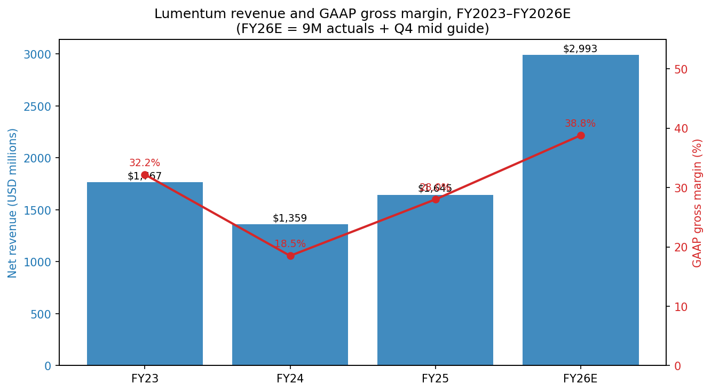
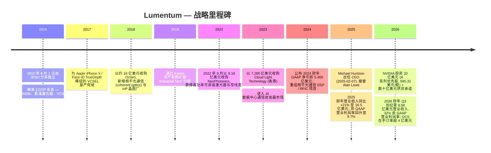
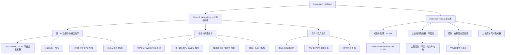
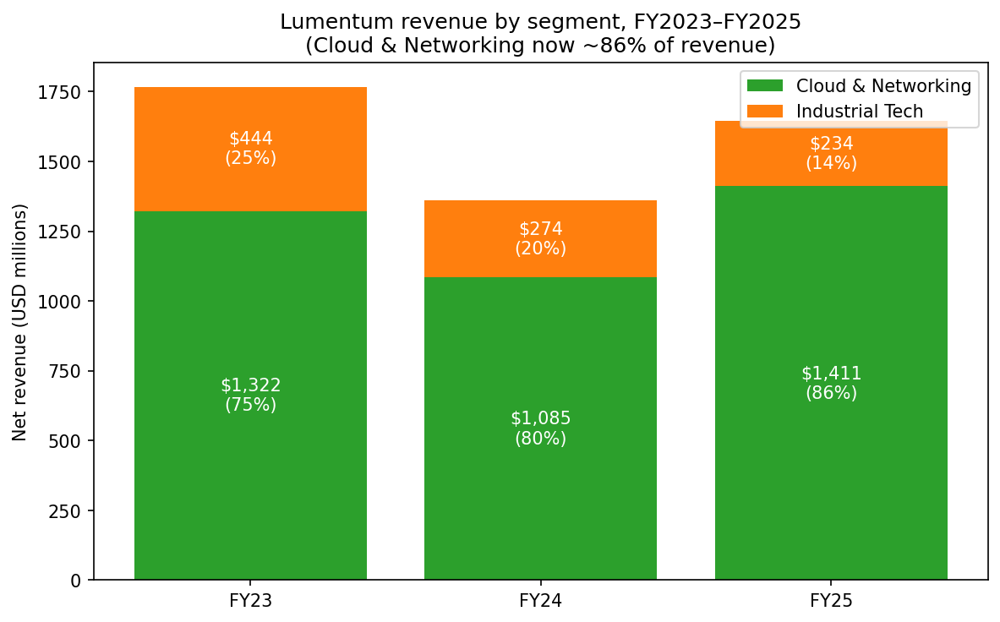
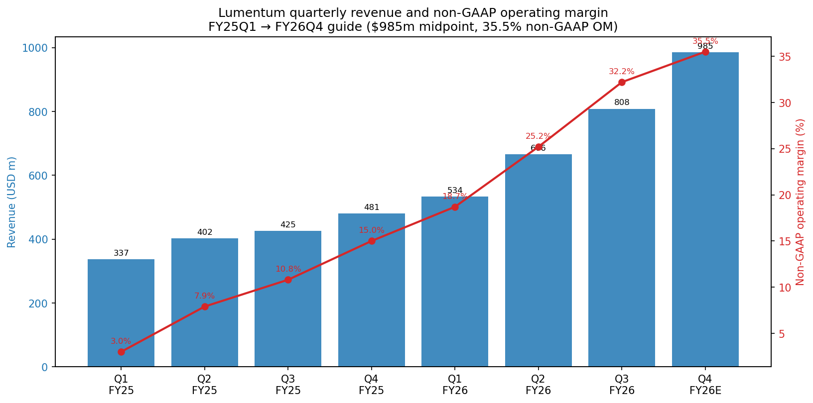
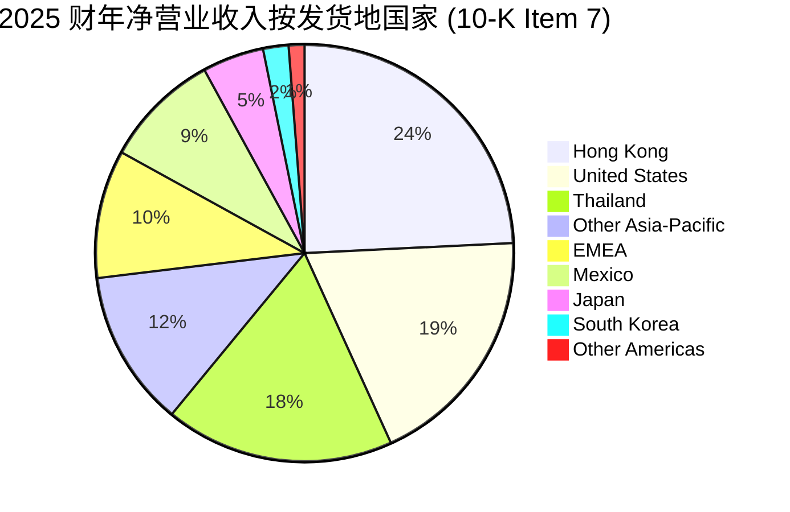
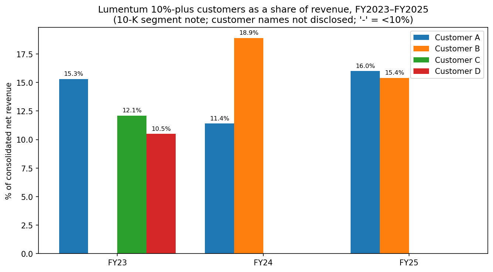
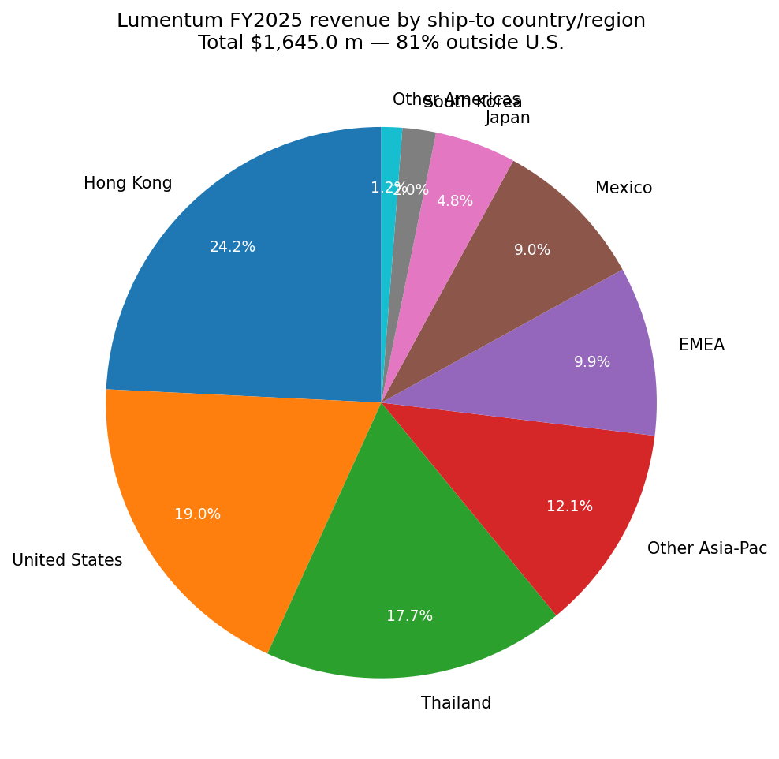
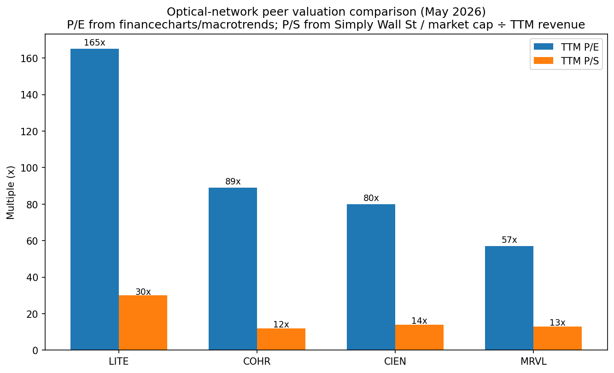
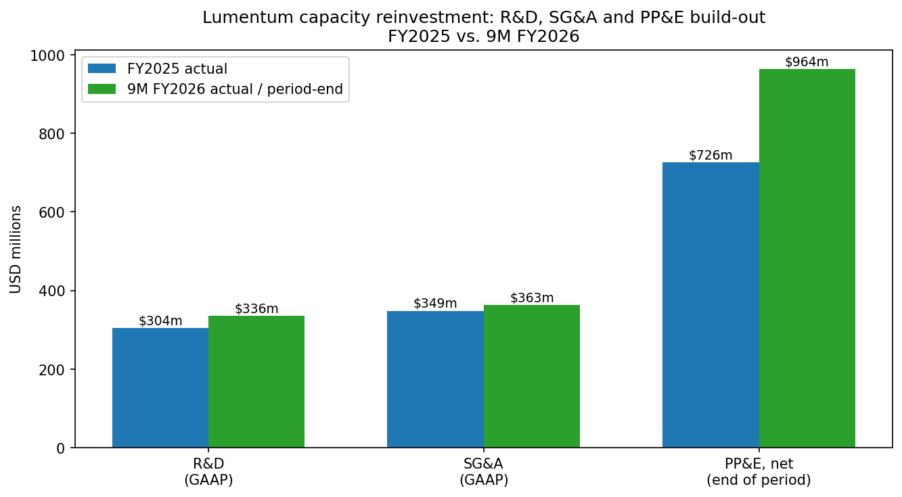

# Lumentum Holdings Inc. (NASDAQ:LITE) — 公司研究报告

**截至日期: 2026-05-20**
**上市地: 纳斯达克 (NASDAQ), 代码 LITE**
**注册地: 美国加利福尼亚州圣何塞 (San Jose, California)**
**报告语言: 简体中文 (英文版同时存在于本目录)**

> **业绩更新——NVIDIA 战略合作 + 20 亿美元优先股注资 (2026-03-02):** NVIDIA 与 Lumentum 签署多年期战略合作协议, 包括数十亿美元采购承诺以及对先进激光元件 (advanced laser components) 的未来产能优先获取权; 同日, NVIDIA 以 **每股 695.31 美元的价格认购 2,876,415 股新发行的 A 系列可转换优先股 (Series A Convertible Preferred Stock)**, 合计 20 亿美元现金投入。所获资金将用于在美国建设一座新晶圆厂, 并对 AI 数据中心光学 (AI-data-center optics) 业务进行追加研发。该优先股以 1:1 比例可转为普通股 (受 HSR 反垄断审查放行约束), 按转换后基础与普通股共同投票 (董事选举除外), 不附带优先认购权或赎回条款。此次注资叠加 2026-05-05 公布的 2026 财年 Q3 业绩 (创纪录的 8.084 亿美元营业收入, 同比 +90%; 非 GAAP 营业利润率 32.2%), 标志着 Lumentum 从一家复苏中的光学元件供应商, 重新定位为 NVIDIA 在硅光互联 (silicon-photonics interconnect) 领域指定的长期供应商。
> 来源: [NVIDIA 宣布与 Lumentum 建立战略合作 (8-K Ex-99.1, 2026-03-02)](https://www.sec.gov/Archives/edgar/data/0001633978/000119312526085412/d41019dex991.htm); [Lumentum 2026 财年 Q3 业绩公告 (8-K Ex-99.1, 2026-05-05)](https://www.sec.gov/Archives/edgar/data/0001633978/000162828026030530/lite_ex991xq3fy26.htm); [Lumentum 募资 20 亿美元, 深化 NVIDIA 战略合作 (Globe and Mail, 2026-03-02)](https://www.theglobeandmail.com/investing/markets/stocks/LITE/pressreleases/545805/lumentum-raises-2-billion-deepens-nvidia-strategic-partnership/)。

---

## 目录

1. 公司概览
2. 公司历史
3. 管理团队
4. 产品与服务
5. 客户与上市策略
6. 行业概览
7. 竞争格局
8. 市场机会 (TAM)
9. 风险评估
10. 参考资料

---

## 1. 公司概览

Lumentum Holdings Inc. (NASDAQ:LITE) 是一家位于美国加利福尼亚州圣何塞的光学与光子芯片 (optical and photonic chips)、组件、模块及子系统的设计制造企业。公司自述为"领先的光学与光子产品供应商……基于营业收入与市场份额, 获业界认可为行业领导者", 其产品"对云、人工智能与机器学习 (AI/ML, artificial intelligence and machine learning)、电信 (telecommunications)、消费电子和工业等多类终端应用至关重要" ([Lumentum 2025 财年 10-K, p. 5](https://www.sec.gov/Archives/edgar/data/0001633978/000162828025040830/lite-20250628.htm))。

Lumentum 按两大业务分部进行报告。**Cloud & Networking (C&N, 云计算与网络)** 分部向云/AI 基础设施运营商及网络设备制造商 (NEMs, Network Equipment Manufacturers) 销售光学和光子芯片、组件、模块与子系统; 产品涵盖数据中心通信 (datacom, EML 与 CW 激光器、集成电路、AOC 主动光缆和 400 G 至 1.6 T 的可插拔光学模块, 以及通过收购 Cloud Light 而自研的高端收发器模块) 以及电信 (ROADM 可重构光分插复用器、转发器 (transponder)、可调谐激光器、泵浦激光器、窄线宽激光器以及海底/长途光通信传输设备)。**Industrial Tech (IT, 工业技术)** 分部销售短脉冲固态激光器、千瓦级光纤激光器、二极管激光器和气体激光器, 以及用于移动设备 3D 传感相机的 VCSEL 激光光源 (VCSEL laser-light sources) ——其历史代表性应用为 iPhone Face-ID / TrueDepth 模组 ([10-K, p. 5–6](https://www.sec.gov/Archives/edgar/data/0001633978/000162828025040830/lite-20250628.htm))。2025 财年两大分部的营业收入占比分别为 85.8% 与 14.2% ([10-K p. 50](https://www.sec.gov/Archives/edgar/data/0001633978/000162828025040830/lite-20250628.htm))。

公司业务高度全球化。截至 2025 年 6 月 28 日, Lumentum 全职员工**约 10,562 人**, 其中制造 8,706 人、研发 (R&D) 1,132 人、SG&A 724 人 ([10-K p. 9](https://www.sec.gov/Archives/edgar/data/0001633978/000162828025040830/lite-20250628.htm))。公司自有及租赁场地总面积约 310 万平方英尺, 包括泰国 1,173,000 平方英尺的制造厂房、日本 472,000 平方英尺、圣何塞总部园区 238,000 平方英尺、英国 183,000 平方英尺以及斯洛文尼亚 36,000 平方英尺 ([10-K p. 22](https://www.sec.gov/Archives/edgar/data/0001633978/000162828025040830/lite-20250628.htm))。2025 财年营业收入中 81.0% 销往美国境外, 三个最大的单一可报告国家依次为: 香港 (3.986 亿美元 / 24.2%)、美国 (3.123 亿美元 / 19.0%) 与泰国 (2.918 亿美元 / 17.7%) ([10-K p. 51](https://www.sec.gov/Archives/edgar/data/0001633978/000162828025040830/lite-20250628.htm))。

**财务规模。** 2025 财年净营业收入为**16.450 亿美元**, 较 2024 财年的 13.592 亿美元同比增长 21.0%, 自上年下滑 23.1% 后呈现复苏。GAAP 净利润为**2,590 万美元** (摊薄每股收益 0.37 美元), 由 2024 财年 GAAP 净亏损 5.465 亿美元转为盈利; 非 GAAP 净利润为 1.464 亿美元 (摊薄每股收益 2.06 美元) ([2025 财年 Q4 业绩公告, 2025-08-12](https://www.sec.gov/Archives/edgar/data/0001633978/000162828025039896/lite_ex991xq4fy25.htm))。截至 2026 财年前九个月 (止于 2026 年 3 月 28 日), 营业收入加速至**20.077 亿美元**, GAAP 净利润达 2.266 亿美元, 非 GAAP 毛利率达 43.8%; 仅 Q3 单季度便实现创纪录的 8.084 亿美元 (同比 +90.1%) 营业收入, 非 GAAP 营业利润率 32.2% ([2026 财年 Q3 业绩公告, 2026-05-05](https://www.sec.gov/Archives/edgar/data/0001633978/000162828026030530/lite_ex991xq3fy26.htm))。管理层对 2026 财年 Q4 的指引为 9.60-10.10 亿美元营业收入 / 35.0-36.0% 非 GAAP 营业利润率 / 2.85-3.05 美元非 GAAP 每股收益, 隐含 2026 全年财年营业收入约**29.7-30.2 亿美元**, 几乎是 2025 财年基数的两倍。


*来源: [Lumentum 2025 财年 10-K, p. 50](https://www.sec.gov/Archives/edgar/data/0001633978/000162828025040830/lite-20250628.htm); [2026 财年 Q3 业绩公告, 2026-05-05](https://www.sec.gov/Archives/edgar/data/0001633978/000162828026030530/lite_ex991xq3fy26.htm)。2026 财年估计值 = 前 9 个月实际数 + Q4 指引中位数 (9.85 亿美元)。*

**估值快照 (2026-05-20)。** 股价收盘价约为 **877 美元** (public.com 市值页面), 对应市值约**755 亿美元** ([public.com — LITE 市值](https://public.com/stocks/lite/market-cap))。基于最新报告的过往十二个月 (TTM) 业绩, TTM 市盈率约为 **142×–167×**, 具体取决于股数及备考假设 ([financecharts.com — LITE P/E (2026 年 5 月)](https://www.financecharts.com/stocks/LITE/value/pe-ratio); [public.com — LITE P/E](https://public.com/stocks/lite/pe-ratio))。前瞻 P/E 约**50×** ([GuruFocus — LITE 前瞻 P/E 49.77](https://www.gurufocus.com/term/forward-pe-ratio/LITE))。按日历 TTM 营业收入 (近四个已报告季度: 2025 财年 Q4、2026 财年 Q1、Q2、Q3) 计算: 480.7 + 533.8 + 665.5 + 808.4 = **24.884 亿美元**, 对应 TTM P/S 约 **30×**。近 52 周股价上涨约**+1,030%** ([public.com — LITE 市值](https://public.com/stocks/lite/market-cap))。

如何理解这些数字: 即使对比光通信网络同业, P/E 和 P/S 都属于**极度拉伸**水平 ([financecharts.com — COHR P/E 89× (2026-05-15)](https://www.financecharts.com/stocks/COHR/value/pe-ratio); [Simply Wall St — COHR P/S 11.96× 对比行业 2.67×](https://simplywall.st/stocks/us/tech/nyse-cohr/coherent/valuation); [macrotrends — MRVL P/E 57×](https://www.macrotrends.net/stocks/charts/MRVL/marvell-technology/pe-ratio); Ciena (CIEN) 市值约 810 亿美元, 年化营业收入 50-60 亿美元, 对应 P/S 约 13×)。LITE 的 P/E 大约是 COHR / MRVL 的 **2 倍**, P/S 是同业的 **2-3 倍**, 市场据以正名的三大支柱在于: (i) NVIDIA 在面向"千兆瓦级 AI 工厂 (gigawatt-scale AI factories)"的下一代硅光互联领域对其的准独家背书 ([NVIDIA-Lumentum 8-K Ex-99.1, 2026-03-02](https://www.sec.gov/Archives/edgar/data/0001633978/000119312526085412/d41019dex991.htm)); (ii) 刚公布的季度营业收入同比 +90% 加速以及毛利率扩张 1,270 个基点 ([2026 财年 Q3 公告](https://www.sec.gov/Archives/edgar/data/0001633978/000162828026030530/lite_ex991xq3fy26.htm)); (iii) 管理层框定**光路交换机 (OCS, Optical Circuit Switch) 与共封装光学 (CPO, Co-Packaged Optics) "尚处于起跑线"**, OCS 在手订单已超过 4 亿美元, 并有数亿美元规模的 CPO 订单将于 2027 年上半年交付 ([2026 财年 Q2 公告, 2026-02-03](https://www.sec.gov/Archives/edgar/data/0001633978/000162828026005005/lite_ex991xq2fy26.htm))。前瞻 P/E 约 50 倍 (即投资者就下一财年非 GAAP EPS 给出的倍数) 更接近光通信 AI 同业水平, 但 TTM 倍数中含有显著的"叙事溢价 (narrative premium)", 并伴随重新评级风险; 该风险在第 9 章被列为风险 #1。

---

## 2. 公司历史

Lumentum 于 **2015 年 8 月 1 日**成立, 当时 JDS Uniphase (JDSU) 将其通信和商用光学产品业务 (CCOP, Communications and Commercial Optical Products) 与网络测试业务分拆: 保留 JDSU 品牌的网络测试业务被更名为 Viavi Solutions, 而 CCOP 业务则成为独立上市的 Lumentum。JDSU 股东每持有 5 股 JDSU 即获 1 股 Lumentum, Viavi 留作独立公司, Lumentum 自首日起在纳斯达克挂牌上市 ([Semi Fundamental — "Lumentum 的历史", 2026](https://semifundamental.substack.com/p/the-history-of-lumentum); 本地 SEC 镜像中的 2015 财年 10-K 正式记录了此次分拆以及 Lumentum 对 Viavi 历史场地环境责任的赔偿 — [2025 财年 10-K p. 9 引用了该项赔偿](https://www.sec.gov/Archives/edgar/data/0001633978/000162828025040830/lite-20250628.htm))。



三次战略性转型是当前投资逻辑的关键。

**第一次, 2018 年以 18 亿美元收购 Oclaro ([Lumentum 8-K, 2018-03-12](https://www.sec.gov/Archives/edgar/data/0001633978/000119312518078154/d547353dex991.htm))** 将 Lumentum 垂直整合进入磷化铟 (InP, Indium-Phosphide) 激光元件领域 — 主要包括直调激光器 (DML, directly-modulated laser)、电吸收调制激光器 (EML, electro-absorption modulated laser) 与可调谐分布反馈激光器 (T-DFB, tunable distributed-feedback laser)。这些芯片正是 AI 建设当前以海量规模消耗的对象——作为 400G、800G 与 1.6T 可插拔光学收发器内部的有源光源, 它们正是 Lumentum 2026 年叙事的核心。

**第二次, 2022 年收购 NeoPhotonics**, 新增高功率可调谐激光器与窄线宽相干激光器 — 正如 CEO Michael Hurlston 在 2026 财年 Q3 电话会议上所言: "受益于……我们投资组合中较少被关注的部分, 即'横向扩展 (scale-across)'组件, 包括我们的泵浦激光器与窄线宽激光器组件" ([2026 财年 Q3 公告, 2026-05-05](https://www.sec.gov/Archives/edgar/data/0001633978/000162828026030530/lite_ex991xq3fy26.htm))。

**第三次, 2023 年 11 月 7 日以 7.285 亿美元收购 Cloud Light Technology** ([Lumentum 8-K Ex-99.1, 2023-11-07](https://www.sec.gov/Archives/edgar/data/0001633978/000119312523272452/d587006dex991.htm); [optics.org 报道](https://optics.org/news/14/11/4)), 让 Lumentum 获得一个位于香港、垂直整合的 400G 及以上光学收发器平台, "定位良好可服务 Cloud & Networking 客户日益增长的需求, 尤其是那些专注于优化数据中心基础设施以应对 AI/ML 需求的客户" ([2025 财年 10-K p. 5](https://www.sec.gov/Archives/edgar/data/0001633978/000162828025040830/lite-20250628.htm))。本次交易的商誉被归入 Cloud & Networking 分部 ([10-K p. 95](https://www.sec.gov/Archives/edgar/data/0001633978/000162828025040830/lite-20250628.htm))。

本报告覆盖的近期 (近 12 个月) 动态包括: (i) **CEO 更替** — Hurlston 于 2025 年 2 月 7 日上任, 接替自分拆以来一直执掌公司的 Alan Lowe ([8-K Ex-99.1, 2025-02-03](https://www.sec.gov/Archives/edgar/data/0001633978/000119312525019371/d842830dex991.htm)); (ii) **2025 年 6 月 3 日的 Regulation-FD 更新**, 管理层上调了 2025 财年 Q4 指引上限, 预示了随后 Q4 实际公布的 4.807 亿美元 (高于上调后指引区间上限——见 2025 财年 Q4 业绩公告); (iii) **2026 年 3 月 2 日的 NVIDIA 战略合作协议与 20 亿美元 A 系列优先股增发**; 以及 (iv) 2025 年 12 月 15 日 **Thad Trent (现任 onsemi CFO、前 Cypress CFO) 出任 Lumentum 董事**, 董事会扩充至九人 ([8-K Ex-99.1, 2025-12-15](https://www.sec.gov/Archives/edgar/data/0001633978/000162828025057025/thadtrentpr_finalx2.htm))。

---

## 3. 管理团队

### Michael Hurlston, 总裁兼首席执行官 (自 2025-02-07)

Hurlston 是 Lumentum 最重要的人物简历, 也是一次教科书式的"具有相关前任职履历的运营者"任命。他于 2025 年 2 月 7 日就任 CEO, 接替长期任职的 CEO Alan Lowe ([Lumentum 8-K Ex-99.1, 2025-02-03](https://www.sec.gov/Archives/edgar/data/0001633978/000119312525019371/d842830dex991.htm); [optics.org — Lumentum 任命 Michael Hurlston 为新 CEO, 2025-02](https://optics.org/news/lumentum-appoints-michael-hurlston-as-new-ceo))。他此前的三段任职与当前 Lumentum 投资逻辑的相关性异乎寻常:

- **2019–2025: Synaptics Inc. (NASDAQ:SYNA) 总裁兼 CEO。** 主理一家混合信号 / 物联网半导体公司六年。Synaptics 在其任内将产品组合向边缘 AI / IoT / 无线连接倾斜 ([businesswire — 领导层变更](https://www.businesswire.com/news/home/20250203516262/en/Lumentum-Announces-Leadership-Transition))。
- **2018 年 1 月–2019 年 8 月: Finisar Corporation CEO。** 直接相关: 当时 Finisar 是全球最大的独立光收发器 / VCSEL 供应商。Hurlston 主导了 **2019 年以 32 亿美元将 Finisar 出售给 II-VI Inc.** ([optics.org 报道](https://optics.org/news/lumentum-appoints-michael-hurlston-as-new-ceo); II-VI 后更名为 Coherent —— 当下 Lumentum 在公开市场上的最大单一竞争对手)。因此, 他带着对今日 Lumentum 正在扩展的收发器 / VCSEL 价值链的一线运营经验赴任。
- **2001–2018 年 (17 年): Broadcom Inc. 及其前身的全球销售执行副总裁 (EVP, Worldwide Sales), 历任高级职位。** Broadcom 当时是占主导地位的以太网交换机芯片 (Ethernet-switch-silicon) 供应商, 即他正是向当前购买 Lumentum 光学产品的超大规模云服务商 (hyperscaler) / 云 / NEM 客户群销售产品的人 ([semiconductor-today.com, 2025-02-04](https://www.semiconductor-today.com/news_items/2025/feb/lumentum-040225.shtml))。

更早的教育背景和履历在行业媒体中报道较少; 已记录的是 Lumentum 董事会在 2025 年 2 月新闻稿中描述他拥有"超过 30 年的半导体与光学领域高层领导经验"。自其任命以来尚未提交涵盖该任命的代理委托书 (proxy), 因此其薪酬尚未披露 (Lumentum 最近的 DEF 14A 于 2024 年秋季为 2024 年 11 月年会而提交, 早于他上任)。公开报道显示该任命采取了较高比例的业绩激励, 包括签约 RSU 和新增 PSU; 具体薪酬包将待下一份 DEF 14A 披露后才能确定。上任以来其公开形象明确围绕 AI 与利润率展开, 截至目前的运营记录明确无误: 在其前四个完整季度中 (2026 财年 Q1-Q3 加上 2025 财年 Q4 指引), 非 GAAP 营业利润率从 3.0% (2025 财年 Q1, 他上任前的季度) 扩张至 32.2% (2026 财年 Q3 实际), 并在 2026 财年 Q4 指引为 35-36% —— 五个季度内提升 3,200 个基点 ([2026 财年 Q3 公告](https://www.sec.gov/Archives/edgar/data/0001633978/000162828026030530/lite_ex991xq3fy26.htm); [2026 财年 Q1 公告](https://www.sec.gov/Archives/edgar/data/0001633978/000162828025048860/lite_ex991xq1fy26.htm))。

### Wajid Ali, 执行副总裁兼首席财务官

Wajid Ali 是 Lumentum 现任 CFO, 在 2026 财年 Q3 的 10-Q 文件中列为第 302 条认证签署人 ([10-Q 2026 财年 Q3, 附录 31.2](https://www.sec.gov/Archives/edgar/data/0001633978/000162828026030777/lite-q3fy26xex312.htm)); 他的 Crunchbase 资料显示其为 Lumentum EVP & CFO ([Crunchbase — Wajid Ali](https://www.crunchbase.com/person/wajid-ali))。他主导了 Lumentum 从严重亏损的 2024 财年 (GAAP 净亏损 5.465 亿美元, 毛利率 18.5%) 向盈利的 2025 财年 / 超额盈利的 2026 财年爬坡过程的转型, 并担任以下交易团队的高级财务执行官: (i) Cloud Light 整合, (ii) 增发可转换优先票据, (iii) 设计 2026 年 3 月与 NVIDIA 达成的 20 亿美元 A 系列可转换优先股配售结构。资产负债表证据为正面: 现金、现金等价物与短期投资从 2025 财年末的 5.207 亿美元上升至 **2026 财年 Q3 末的 31.723 亿美元**, 长期债务的流动部分上升至 32.386 亿美元, 因为 2026 财年可转换票据即将到期 —— NVIDIA 现金注入将显著降低这一再融资窗口的风险 ([2026 财年 Q3 业绩公告资产负债表](https://www.sec.gov/Archives/edgar/data/0001633978/000162828026030530/lite_ex991xq3fy26.htm))。

### 其他高层管理人员

- **首席运营决策者 / CEO** 同时也是分部报告意义上的 CODM ([2025 财年 10-K p. 122](https://www.sec.gov/Archives/edgar/data/0001633978/000162828025040830/lite-20250628.htm))。
- **执行副总裁, 全球运营** 负责经营多基地制造网络 (泰国、日本、英国、斯洛文尼亚、中国、美国), 详见 10-K 中网络安全指导委员会披露 ([10-K p. 21](https://www.sec.gov/Archives/edgar/data/0001633978/000162828025040830/lite-20250628.htm))。运营负责人、CTO 与 CHRO 的具体姓名见 Lumentum 公司"领导团队"页面, 但本研究未逐字提取——希望了解 CEO/CFO/董事级别以外更多职位与简历的读者请参考 [Lumentum 的"董事会"页面](https://www.lumentum.com/en/company/board-of-directors)。

### 治理结构

- **董事会规模: 截至 2025 年 12 月 15 日为 9 名董事**, 此次为 Thad Trent (现任 onsemi CFO; 前 Cypress Semiconductor CFO 2014-2020, 主导 Cypress 至 Infineon 收购整合期) 加盟后的人数 ([Lumentum 8-K Ex-99.1, 2025-12-15](https://www.sec.gov/Archives/edgar/data/0001633978/000162828025057025/thadtrentpr_finalx2.htm))。
- **董事长: Penelope Herscher** (非执行董事长, 在 2025 年 12 月 15 日董事会公告中提及)。
- **资本结构治理:** 2026 年 3 月发行的 A 系列优先股在转换基础上享有投票权, 但**明确排除 NVIDIA 在董事选举中投票**, 这保留了普通股股东对董事会的控制——为防止 NVIDIA 持有的约 290 万股 (约占完全摊薄股本的约 4%) 实质影响董事会而做的刻意设计 ([Lumentum 募资 20 亿美元 — Globe and Mail 关于 8-K 条款的摘要](https://www.theglobeandmail.com/investing/markets/stocks/LITE/pressreleases/545805/lumentum-raises-2-billion-deepens-nvidia-strategic-partnership/))。
- **内部人激励:** 2025 财年 10-K 披露了年度股权激励计划与 ESPP ([10-K p. 100–106](https://www.sec.gov/Archives/edgar/data/0001633978/000162828025040830/lite-20250628.htm))。最近的 DEF 14A (2024 年秋) 相对于 Hurlston 的薪酬包已经过时, 应在下一份代理委托书提交时复核。

### 履历整合分析

Hurlston 此前的 CEO 履历——Synaptics (消费 / 边缘半导体) 与 Finisar (收发器 / VCSEL)——合在一起涵盖了 Lumentum 目前所有相邻领域。他执行了 Finisar 向 II-VI (现 Coherent) 的大规模出售, 并在 15 个月内交付出连最看好的光学 AI 分析师也未模型化的利润率扩张。该履历的风险纯粹在于 AI 光学超级周期是否继续是主导顺风; 他尚未在 AI 资本支出下行期接受测试。

---

## 4. 产品与服务

Lumentum 的产品组合以其两大可报告分部进行组织。10-K 第 1 项产品类别描述是以下内容的主要来源 ([Lumentum 2025 财年 10-K, p. 5-8](https://www.sec.gov/Archives/edgar/data/0001633978/000162828025040830/lite-20250628.htm))。



### 4.1 Cloud & Networking — 占 2025 财年营业收入的 85.8% (14.108 亿美元); 2026 财年加速增长

**数据中心通信 / AI 基础设施** —— Lumentum 的叙事引擎。产品族包括 (i) **EML 与 CW 激光器芯片**, 作为高速收发器内部的光源, 用于 400G、800G 与 1.6T 各种规格, 作为元件供应给收发器生态系统的其余部分; (ii) Lumentum 自有的**800G 与新兴 1.6T 可插拔收发器与 AOC**, 大部分构建在 2023 年收购的 Cloud Light 平台之上; (iii) **共封装光学 (CPO) 引擎**, 用于在芯片封装层级集成光学 I/O —— 这一应用情景正是 NVIDIA Quantum-X / Spectrum-X CPO 项目所扩展的, 也是 NVIDIA 合作伙伴关系的明确主题 ([NVIDIA-Lumentum 8-K, 2026-03-02](https://www.sec.gov/Archives/edgar/data/0001633978/000119312526085412/d41019dex991.htm)); 以及 (iv) **光路交换机 (OCS)**, 基于机电 / MEMS 的交换机, 用于在超大规模光纤数据中心结构中物理重新排列光路。在 2026 财年 Q2 电话会议上, CEO Hurlston 表示"惊人的客户需求已经将我们在 OCS 上的在手订单推到 4 亿美元以上" ([2026 财年 Q2 公告, 2026-02-03](https://www.sec.gov/Archives/edgar/data/0001633978/000162828026005005/lite_ex991xq2fy26.htm))。

- *竞争优势判断 —— 数据中心通信收发器与 EML 芯片: **部分护城河, 芯片层强, 模组层有争议。*** **EML / CW 激光器芯片**层面的护城河是技术 + 规模: Lumentum 通过 Oclaro (2018) 与 NeoPhotonics (2022) 收购获得的 InP 外延与激光二极管晶圆能力, 是全球大约三到四家相关 InP 晶圆厂之一 (其余为 Coherent / II-VI 前 Finisar、三菱电机 Mitsubishi Electric 与住友电气 Sumitomo Electric)。证据: NVIDIA 在 2026 年 3 月供应协议中明确提到"对先进激光元件的未来产能优先获取权" ([NVIDIA-Lumentum 8-K, 2026-03-02](https://www.sec.gov/Archives/edgar/data/0001633978/000119312526085412/d41019dex991.htm)) 以及 Hurlston 在电话会议中将"激光芯片实力"列为 2026 财年 Q3 毛利率扩张 540 个基点的主要驱动因素。最接近的竞争产品是 Coherent 沿袭 II-VI / Finisar 晶圆基地的 EML / DFB 激光芯片产品族 —— 据业内估计, 目前**性能大致持平, 在出货量份额上 Coherent 略具优势**。**模组 / 收发器**层级的护城河较弱: Innolight、Eoptolink、Coherent 等正面竞争超大规模云厂商的模组接口, 该细分历史上更趋商品化; Lumentum 在此层的优势是垂直整合 (拥有模组中所用的激光芯片), 而非模组组装成本。
- *竞争优势判断 —— OCS 与 CPO: **与 NVIDIA 设计采用绑定的新兴强护城河。*** OCS 营业收入仍然较小, 但 4 亿美元 + 在手订单与具名合作伙伴关系赋予 Lumentum 可信的早期领先地位。最接近对标: **Google 自研的 Apollo OCS** (非商品化) 用于内部数据中心使用, 加上初创公司 Telescent 与 Coherent 的 CPO 项目; **目前领先**, 但前提是超大规模云厂商内部硅光团队 (Google、Meta) 如果选择自研可能侵蚀该地位。

**电信 / 传输。** 这是传统 CCOP 业务 —— **ROADM**、**波长选择交换机 (WSS, wavelength-selective switch)**、**相干线路卡**、**DWDM 转发器**、用于 EDFA 的**泵浦激光器**、用于相干传输的**窄线宽激光器**, 以及海底 / 长途光学子系统。Lumentum 是 ROADM 级 WSS 模块的两个全球商业供应商之一 (另一家是 Coherent / II-VI 前 Finisar)。此处需求由电信运营商资本开支驱动, 10-K 描述其正从 2024 年库存修正低谷复苏 ([10-K MD&A p. 50–51](https://www.sec.gov/Archives/edgar/data/0001633978/000162828025040830/lite-20250628.htm))。竞争优势判断: **强护城河 (技术 + 供应商清单认证 + 数十年 NEM 关系)**, 但增长慢于数据中心通信。

**成本基础。** 在该分部内, Lumentum"通过与客户的密切合作进行创新、成本领先以及功能与垂直整合, 专注于技术领先" —— 即拥有更多硅与激光芯片 BOM 的明确策略 ([10-K p. 7](https://www.sec.gov/Archives/edgar/data/0001633978/000162828025040830/lite-20250628.htm))。

### 4.2 Industrial Tech —— 占 2025 财年营业收入的 14.2% (2.342 亿美元); 下降中

Industrial Tech 由四个产品族组成:

- **短脉冲固态激光器 / 超快激光器** —— 用于半导体光刻工艺步骤、PCB 微加工、OLED 显示器制造。
- **千瓦级光纤激光器** —— 用于金属切割、焊接以及**电动车电池制造** (电池罐焊接、母排接合)。
- **二极管激光器与用于 3D 传感的 VCSEL 激光光源** —— 历史代表性应用为 iPhone Face-ID / TrueDepth 模组的 Tx 侧 VCSEL (Lumentum 是多年供应商; 10-K 描述"客户的 3D 传感相机, 主要用于移动设备"但未直接点名 Apple)。10-K 披露 2025 财年 Industrial Tech 营业收入**同比减少 4,010 万美元 / 14.6%**, 主要由于成像与传感产品单位销量下降, 起因是"消费类终端市场对这些产品竞争加剧" —— 隐含意为在智能手机 VCSEL 接口的份额损失 —— 部分被 1,750 万美元更高的激光产品营业收入抵消 ([10-K MD&A p. 51](https://www.sec.gov/Archives/edgar/data/0001633978/000162828025040830/lite-20250628.htm))。
- **气体激光器** —— 用于细分工业 / 半导体应用。

Industrial Tech 整体的竞争优势判断: **部分护城河, 在 3D 传感领域正受侵蚀**。千瓦光纤激光器业务凭借 OEM 关系深度形成护城河, 但与 IPG Photonics、Trumpf 和中国长尾 (锐科 Raycus、马库斯 Maxphotonics) 竞争; 超快激光器业务技术差异化高, 仍盈利。消费 3D 传感业务是该分部最大的脆弱点 —— 10-K 自身将 4,000 万美元营业收入下滑解释为"消费类终端市场竞争加剧"。最接近的竞争产品: 光纤激光器领域为 IPG Photonics (**总体持平, Lumentum 在纯成本领先上略落后**); VCSEL 领域为 II-VI/Coherent 和 Trumpf Photonic Components (**Lumentum 一直在流失份额**); 超快激光器领域为 Trumpf 和 Coherent。

### 4.3 旗舰产品对比长尾; 近期发布与停产

驱动当前叙事的三条旗舰产品线是: **(1) EML / 窄线宽激光器芯片**、**(2) 源自 Cloud Light 的 800G / 1.6T 收发器与 CPO 引擎**, 以及 **(3) 光路交换机 (OCS)**。这三项产品合并实际上解释了 +90% 同比 2026 财年 Q3 营业收入的全部 ([2026 财年 Q3 公告](https://www.sec.gov/Archives/edgar/data/0001633978/000162828026030530/lite_ex991xq3fy26.htm))。长尾 —— Industrial Tech 和传统电信传输 —— 提供利润率多元化与下行周期的兜底。

**近 12 个月的产品停产:** 2025 财年 10-K 确认管理层作为重组的一部分, 已停止内部开发**相干 DSP 与射频集成电路 (RFIC, Radio-Frequency Integrated Circuit)** ([10-K MD&A p. 52](https://www.sec.gov/Archives/edgar/data/0001633978/000162828025040830/lite-20250628.htm))。这每年节省约 1,000 万美元工资成本, 并将研发集中于激光芯片与 CPO 项目。**新发布:** NVIDIA 合作伙伴关系新闻稿将下一代硅光 CPO 与 OCS 产品定位为联合路线图项目, 用于交付至 NVIDIA 千兆瓦级 AI 工厂。


*来源: [Lumentum 2025 财年 10-K, MD&A —— 分部净营业收入, p. 50](https://www.sec.gov/Archives/edgar/data/0001633978/000162828025040830/lite-20250628.htm)。*


*来源: [2025 财年 Q1、Q2、Q3、Q4 与 2026 财年 Q1、Q2、Q3 业绩公告](https://www.sec.gov/cgi-bin/browse-edgar?action=getcompany&CIK=0001633978&type=8-K&dateb=&owner=include&count=40); 2026 财年 Q4 数据 = 管理层指引中位数 (9.85 亿美元营业收入, 35.5% 非 GAAP 营业利润率)。*

---

## 5. 客户与上市策略

### 5.1 客户基础

Lumentum 向三类主要客户销售:

1. **超大规模云与 AI 基础设施提供商** —— 直接销售 (例如 NVIDIA 在 2026 年 3 月协议下的情况, 也如 Lumentum 自己描述的, 向"云数据中心运营商、AI/ML 基础设施提供商"销售 ([10-K p. 6](https://www.sec.gov/Archives/edgar/data/0001633978/000162828025040830/lite-20250628.htm))) 以及通过 ODM / 合同制造渠道间接销售。
2. **网络设备制造商 (NEMs)** —— 思科 (Cisco)、Ciena、诺基亚 Nokia (2024 年收购后整合了原 Alcatel-Lucent / Infinera 业务)、华为 (受美国出口管制约束)、中兴 (ZTE) 和 Juniper。Lumentum 的 ROADM、WSS、转发器与相干元件出货给 NEM 线路系统和路由器。
3. **工业激光 OEM 与消费电子 OEM** —— Industrial Tech 方面: 机床制造商 (Trumpf、DMG Mori、Mazak、大族激光 Han's Laser); 半导体工艺设备厂商; 3D 传感方面, 历史披露的终端客户为 **Apple**, 通过富士康 Foxconn / 模组工厂中间商供货于 iPhone Face-ID VCSEL (10-K 未点名 Apple; 该关系在行业媒体中有充分记录)。

### 5.2 客户集中度 —— 重大风险; 10-K 披露

2025 财年 10-K 中明示。2025 财年, **两家客户单独超过 10% 的合并净营业收入: 客户 A 占 16.0%、客户 B 占 15.4%** ([10-K p. 9](https://www.sec.gov/Archives/edgar/data/0001633978/000162828025040830/lite-20250628.htm))。三年历史:

| 客户 | 2023 财年 | 2024 财年 | 2025 财年 |
|---|---|---|---|
| 客户 A | 15.3% | 11.4% | **16.0%** |
| 客户 B | * | 18.9% | **15.4%** |
| 客户 C | 12.1% | * | * |
| 客户 D | 10.5% | * | * |

*\*占总净营业收入比例不足 10%* ([10-K p. 9](https://www.sec.gov/Archives/edgar/data/0001633978/000162828025040830/lite-20250628.htm))。

**合计具名前两大 = 2025 财年营业收入的 31.4%**。结合发货地数据 —— 香港 24.2%、美国 19.0%、泰国 17.7% (后两者主要反映超大规模终端客户的 ODM / 合同制造商发货地点) —— 隐含对少数大客户的依赖, 是文件中除 AI 周期以外最重要的单一风险。10-K 风险因素中明确: "我们对有限数量的供应商和客户的依赖"和"我们向重要客户销售的能力" ([10-K p. 10–11](https://www.sec.gov/Archives/edgar/data/0001633978/000162828025040830/lite-20250628.htm))。这在第 9 章被列为风险 #2。



*来源: [Lumentum 2025 财年 10-K, p. 51](https://www.sec.gov/Archives/edgar/data/0001633978/000162828025040830/lite-20250628.htm)。*


*来源: [Lumentum 2025 财年 10-K, p. 9 —— 客户集中度](https://www.sec.gov/Archives/edgar/data/0001633978/000162828025040830/lite-20250628.htm)。*


*来源: [Lumentum 2025 财年 10-K, p. 51 —— 按地区营业收入](https://www.sec.gov/Archives/edgar/data/0001633978/000162828025040830/lite-20250628.htm)。*

### 5.3 合同结构、上市策略与渠道

10-K 指出"我们营业收入的相当一部分来自供应商管理库存 (VMI, Vendor-Managed Inventory) 安排, 其中客户使用的时间和数量难以预测" —— 即大客户不承诺确定的采购订单, 而是从 VMI 仓库提货; 营业收入确认按提取确认, 而非按订单 ([10-K p. 9](https://www.sec.gov/Archives/edgar/data/0001633978/000162828025040830/lite-20250628.htm))。这对高产量光学元件而言是行业标准, 但意味着在手订单 (backlog) 作为领先指标比其他资本设备业务弱。

数据中心与 NEM 客户群的大多数合约由主供应协议管控, 涵盖定价、交货期、质量保证 / NCMR (不合格物料报告) 处理与知识产权赔偿, 之下有单独的采购订单; 多年期协议在 NEM 客户群中普遍存在, 在超大规模云厂商中也越来越多 (NVIDIA 协议在 8-K 中明确为多年期)。销售直接面向超大规模云厂商与大型 NEM; 较小工业激光客户通过分销商服务 (例如 Edmund Optics、Photonics Online 渠道伙伴)。对 3D 传感, 渠道通常通过模组工厂 (LG Innotek、富士康 Foxconn、歌尔股份 Goertek) 代表终端 OEM (Apple、荣耀 Honor、小米 Xiaomi、三星 Samsung) 进行。

### 5.4 垂直整合 / "客户也是竞争者"风险

超大规模云厂商正向硅光子方向垂直整合 —— Google 的"Apollo" OCS 项目以及 Meta 的光学引擎工作都已广泛报道。10-K 明确承认此风险: "我们当前或潜在客户也可能决定开发并自行生产产品供自己使用, 这可能与我们的产品形成竞争。这种垂直整合可能减少我们产品的市场机会" ([10-K p. 13](https://www.sec.gov/Archives/edgar/data/0001633978/000162828025040830/lite-20250628.htm))。NVIDIA 战略协议从这个角度看部分是防御性护城河 —— 来自可以说是最关键的 AI 基础设施客户的多年期采购承诺, 正是为防范这一动态。

---

## 6. 行业概览

### 6.1 行业定义与范围

Lumentum 经营于**光学与光子元件、模块和子系统**领域 —— 全球半导体与电子元件行业的一个子集 (NAICS 334413 与 334290)。相关可寻址行业包括:

1. **数据中心光学互联** —— 可插拔收发器 (400G / 800G / 1.6T)、主动光缆、共封装光学引擎、光路交换机。
2. **电信光学传输** —— ROADM / WSS、相干转发器、DWDM 线路系统、EDFA 元件、海底网络传输。
3. **工业激光** —— 千瓦级光纤激光器、超快固态激光器、二极管泵浦激光器, 用于材料加工、半导体制造、微电子。
4. **3D 传感 / 消费光子** —— 用于智能手机面部识别、激光雷达 (lidar)、AR/VR 传感的 VCSEL 阵列。

### 6.2 市场规模与增长

**数据中心光学市场**是迄今最相关的。LightCounting 2026 年 3 月预测:

- **2026 年面向 AI 集群的收发器市场销售额: 260 亿美元**, 较 2025 年的 165 亿美元增长 60% ([LightCounting 通讯 — 2026 年 4 月](https://www.lightcounting.com/newsletter/en/april-2026-market-forecast-379))。
- **2026 年数据中心光学模块总市场: 228 亿美元**, 其中 800G + 1.6T 合计约 146 亿美元 ([LightCounting — 2026 年 3 月以太网光学](https://www.lightcounting.com/newsletter/en/march-2026-ethernet-optics-382))。
- **2026 年 = 1.6T 商业化的第一年**, 全球 1.6T 需求量在 860 万至 2,000 万台之间; 其中仅 NVIDIA 一家就超过 500 万台, Google 约 400 万台, Meta 约 100 万台 ([LightCounting; tspa 半导体通讯](https://tspasemiconductor.substack.com/p/ai-networking-arms-race-heats-up))。
- **长期: 到 2030 年, AI 集群所使用的光学互联年销售额合理情景达 1,000 亿美元** ([LightCounting — 2026 年 3 月通讯](https://www.lightcounting.com/newsletter/en/march-2026-ethernet-optics-382))。

**电信光学传输市场**已成熟, 以低个位数百分比增长, 与运营商资本开支周期同步。该市场包括约 30-40 亿美元的 WSS / ROADM 硬件与约 50-60 亿美元的相干光学出货量。**工业激光市场**全球规模约 200 亿美元, 千瓦光纤激光器为最大子细分, 中个位数增长, 由 IPG Photonics、Trumpf 和中国厂商主导。**3D 传感 VCSEL** 位于智能手机 BOM 中, 单位量大致持平。

### 6.3 关键驱动因素

唯一压倒性驱动因素 —— 远超其他 —— 是**超大规模云厂商的 AI / 加速计算资本开支**。AI 工厂中每个 NVIDIA Blackwell / Rubin GPU 节点都需要多条非常高速的光学互联链路; 机架内的"纵向扩展 (scale-up)"网络以及机架间的"横向扩展 (scale-out)"网络对光学元件的消耗都达到了以往计算无法比拟的水平。Goldman Sachs 在 2025 年末将其 2026 年 800G 模块单位预测上调 58% —— 从 2,500 万台调至 3,350 万台 ([LightCounting 摘要](https://www.lightcounting.com/newsletter/en/april-2026-market-forecast-379))。2026 年之后, **向 1.6T 可插拔光学和共封装光学 (CPO) 的过渡**是主导技术问题; CPO 是一种架构, 光学组件被移到与交换机 ASIC 或加速器同封装上, 降低每比特功耗并实现更高端口数。

次要驱动因素: 海底电缆建设 (Meta、Google 以及联合体电缆新一波建设)、5G/6G 前传、汽车激光雷达 (lidar) 增长 (影响 Lumentum 最大接口以外的 VCSEL / 激光二极管需求)、半导体设备超快激光内容。

### 6.4 监管与贸易环境

最重要的监管动态是**针对中国的美国出口管制与关税**。Lumentum 的 10-K 描述了 2024 财年的具体行动, 由于美国贸易限制, 公司"不再能向我们的一位客户销售某些产品" ([10-K MD&A p. 52](https://www.sec.gov/Archives/edgar/data/0001633978/000162828025040830/lite-20250628.htm)) —— 几乎可以肯定指向 BIS 出口管制收紧后涉及先进光子出货的华为。Lumentum 据此重塑了制造布局, 将产品线迁出中国、扩张泰国并转移部分 Cloud Light 出货; 这两者同时提高了运费与产能成本 (10-K 列出 2024 财年 2,070 万美元的产能过剩费用) 并增加了关税敞口。

反过来也是如此: Lumentum 受益于明确寻求将先进光子与 AI 基础设施制造回流的美国政策 —— NVIDIA-Lumentum 协议的部分动机正是在美国建造晶圆厂, 这正是 CHIPS 法案时代项目所管理 (在边际上补贴) 的典型项目。

### 6.5 行业结构

光学元件与光学模块行业在**元件 / 芯片层级中等集中** (全球少数 InP 晶圆厂), 但在**模块 / 收发器层级高度争夺** (15 家以上相关模块供应商, 包括中国厂商 Innolight 和 Eoptolink 的强大长尾)。在芯片 / 鉴定晶圆厂层级的切换成本高 (EML 芯片进入超大规模云厂商光学产品的多年鉴定周期), 模块层级的切换成本低 (来自不同供应商的模块按 MSA 标准互操作)。买方议价权高 —— 客户基础高度集中。光学内部的替代品有限, 但**电气互联 (DAC 电缆、重定时器、双绞线)** 在短距离与之竞争, **CPO** 在大规模条件下与可插拔光学竞争。

---

## 7. 竞争格局

### 7.1 直接竞争对手

10-K 指出"我们与多家提供光通信元件、模块和系统的公开与私营公司竞争。其中一些竞争对手在我们某些产品上同时也是我们的客户" ([10-K p. 7](https://www.sec.gov/Archives/edgar/data/0001633978/000162828025040830/lite-20250628.htm))。最相关的直接竞争对手:

1. **Coherent Corp. (NYSE:COHR)** —— 最大的竞争对手, 由 II-VI 与前 Finisar 合并形成。在几乎每个 Lumentum 产品线上直接重叠: 激光芯片、收发器、VCSEL、ROADM、CPO 光学引擎。COHR 当前 TTM P/E 约 89×、P/S 11.96× —— 本身就是 AI 光学主题的多倍股 ([financecharts.com — COHR P/E (2026 年 5 月)](https://www.financecharts.com/stocks/COHR/value/pe-ratio); [Simply Wall St — COHR 估值](https://simplywall.st/stocks/us/tech/nyse-cohr/coherent/valuation))。
2. **Ciena Corp. (NYSE:CIEN)** —— 主要是 NEM (线路系统供应商), 但凭借其 WaveLogic 相干光学 IP 与新兴 CPO 项目, 在光学引擎层级日益成为竞争对手。CIEN 报告 2026 财年 Q1 营业收入 14.3 亿美元 (同比 +33%) ([Ciena 8-K 2026 财年 Q1 业绩公告](https://www.sec.gov/Archives/edgar/data/0000936395/000162828026015006/ex9912026q1earningspressre.htm)), 市值约 810 亿美元 ([companiesmarketcap.com — CIEN](https://companiesmarketcap.com/ciena/marketcap/))。
3. **Marvell Technology (NASDAQ:MRVL)** —— 越来越多地通过其 **PAM4 / 相干 DSP** 硅片与其面向光学引擎模块的定制 ASIC 业务参与竞争。P/E 约 57×、P/S 约 13× ([macrotrends — MRVL P/E](https://www.macrotrends.net/stocks/charts/MRVL/marvell-technology/pe-ratio); [GuruFocus — MRVL P/E (TTM)](https://www.gurufocus.com/term/pettm/MRVL))。
4. **Innolight 和 Eoptolink (中国上市)** —— 在中国超大规模云厂商 400G / 800G 接口上占主导地位的模块供应商, 越来越多地进入美国云接口。其成本结构对模块层级定价施加压力。
5. **NeoPhotonics、Acacia、Inphi** —— 历史上独立; 现已分别合并至 Lumentum (NeoPhotonics)、Cisco (Acacia) 或 Marvell (Inphi)。竞争门槛现在在极少数垂直整合参与者之间。
6. **Cisco Systems** —— 内部为某些 Cisco 品牌线路系统构建光学模块; 既是客户又是部分竞争对手。
7. **Broadcom (NASDAQ:AVGO)** —— 供应交换机硅片 (Tomahawk 系列) 与越来越多的共封装光学引擎; 在 CPO 架构层级而非模块层级竞争。

**工业激光**领域:

8. **IPG Photonics (NASDAQ:IPGP)** —— 全球主导的千瓦光纤激光器供应商; Lumentum 是两者中较小的。
9. **Trumpf (德国, 私营)** —— 光纤激光器和超快激光器竞争对手; 通过 Trumpf Photonic Components 还是 VCSEL 领域的领导者。
10. **中国光纤激光器长尾 (锐科 Raycus、马库斯 Maxphotonics)** —— 在中等功率光纤激光器中形成显著定价压力。

**3D 传感 VCSEL**领域:

11. **ams-OSRAM (SIX:AMS)** —— 智能手机 VCSEL 接口的直接竞争对手; 一直在抢占份额。

### 7.2 定位框架

```mermaid
quadrantChart
    title 光通信网络竞争者定位
    x-axis 模组 / 系统聚焦 --> 芯片 / 元件聚焦
    y-axis 电信主导 --> 数据中心通信 / AI 主导
    quadrant-1 数据中心通信 + 芯片聚焦 (AI 光学核心)
    quadrant-2 数据中心通信 + 模组聚焦 (收发器供应商)
    quadrant-3 电信 + 模组聚焦 (线路系统 NEM)
    quadrant-4 电信 + 芯片聚焦 (传统元件)
    Lumentum: [0.7, 0.75]
    Coherent: [0.55, 0.65]
    Marvell: [0.85, 0.85]
    Broadcom (AVGO): [0.95, 0.9]
    Innolight / Eoptolink: [0.2, 0.85]
    Ciena: [0.3, 0.5]
    Nokia: [0.25, 0.3]
    IPG Photonics: [0.6, 0.05]
    ams-OSRAM: [0.8, 0.3]
```

### 7.3 Lumentum 的竞争优势

- **垂直整合的 InP / 激光芯片晶圆厂** —— 全球约 3-4 家此类平台之一。基于 Oclaro + NeoPhotonics 的 IP 基础具有差异化, 已被认证进入多个超大规模云厂商 / NEM 光学路线图。
- **具名多年期 NVIDIA 合作伙伴关系** —— 2026 年 3 月供应协议实际上预留了先进激光元件的产能权益, 并在下一代 NVIDIA AI 工厂的硅光子领域形成伙伴关系 ([NVIDIA-Lumentum 8-K, 2026-03-02](https://www.sec.gov/Archives/edgar/data/0001633978/000119312526085412/d41019dex991.htm))。这是异常强大、具名客户的竞争性护城河。
- **跨元件、模块与系统的覆盖广度** —— Lumentum 可以在多个价值层级销售, 从 EML 芯片到完整 OCS 系统。
- **地理制造布局** —— 在泰国、日本、英国与斯洛文尼亚拥有大量自有产能; 与 NVIDIA 协议相关的拟建美国新晶圆厂将带来国内政策优势。

### 7.4 脆弱性

- **失去任何一个前两大客户 (合计占 2025 财年营业收入的 31.4%)** —— 在终端客户 (尤其超大规模云厂商) 例行实施双源或三源采购的市场中存在集中风险。
- **智能手机 VCSEL 份额侵蚀** —— 10-K 承认竞争已减少单位销量; ams-OSRAM 一直在赢得接口。
- **模块层商品化** —— 中国模块供应商对 Cloud Light 所竞争的细分市场进行价格压缩。
- **拉伸的估值** —— TTM P/E 约 165× / P/S 约 30× 不为执行失误留余地。


*来源: [public.com — LITE 市值, 2026 年 5 月](https://public.com/stocks/lite/market-cap); [financecharts.com — LITE / COHR P/E](https://www.financecharts.com/stocks/LITE/value/pe-ratio); [Simply Wall St — COHR P/S 11.96×](https://simplywall.st/stocks/us/tech/nyse-cohr/coherent/valuation); [macrotrends — MRVL P/E 57×](https://www.macrotrends.net/stocks/charts/MRVL/marvell-technology/pe-ratio); [companiesmarketcap.com — CIEN](https://companiesmarketcap.com/ciena/marketcap/)。CIEN P/E 根据市值与前瞻盈利近似估计 —— 仅作方向性参考。*


*来源: [Lumentum 2025 财年 10-K MD&A](https://www.sec.gov/Archives/edgar/data/0001633978/000162828025040830/lite-20250628.htm); [2026 财年 Q3 公告资产负债表 —— 2026 年 3 月 28 日 PP&E 净值 9.643 亿美元](https://www.sec.gov/Archives/edgar/data/0001633978/000162828026030530/lite_ex991xq3fy26.htm)。*

---

## 8. 市场机会 (TAM)

**方法论。** 我们将 Lumentum 的 TAM 定义为其三个主要可寻址市场的并集:

1. **数据中心光学互联 (包括可插拔收发器、AOC、CPO 引擎和 OCS) —— AI 光学叙事。** 2026 年约为 228 亿美元 (LightCounting 以太网光学), 若包括所有 AI 集群互联甚至达 260 亿美元 ([LightCounting — 2026 年 3 / 4 月通讯](https://www.lightcounting.com/newsletter/en/march-2026-ethernet-optics-382))。LightCounting 的长期预测: **到 2030 年 AI 集群光学互联年营业收入达 1,000 亿美元** ([LightCounting — 2026 年 3 月](https://www.lightcounting.com/newsletter/en/march-2026-ethernet-optics-382))。Lumentum 此处的可服务可寻址市场 (SAM, Serviceable Addressable Market) 约为**总支出的 40-60%** —— 即芯片元件层与其参与的模块层, 不包括 Broadcom 和 Marvell 销售的纯交换机 ASIC 与纯 DSP / 重定时器硅 —— 这给出 2030 日历年 SAM 约 400-600 亿美元。

2. **电信光学传输 —— ROADM/WSS、相干转发器、泵浦激光器、海底光学。** 全球 TAM 约 80-100 亿美元, 以低个位数增长。Lumentum 的 SAM 为商业元件部分 —— 约 30 亿美元。

3. **工业激光与消费 3D 传感。** 工业激光 TAM 合计约 200 亿美元加上消费 VCSEL TAM 约 10 亿美元。鉴于其份额位置, Lumentum 在此的 SAM 远低于 10 亿美元。

**当前合计 SAM 大约为 150-200 亿美元, 到 2030 年增长至 450-650 亿美元**, 几乎完全由数据中心通信 AI 光学驱动。Lumentum 2026 日历年隐含营业收入 (29.7-30.2 亿美元) 隐含当前 SAM 份额为中两位数百分比, 仍在扩大。

**SOM (可获取市场, Serviceable Obtainable Market)。** 现实来看, Lumentum 近期可获取的份额受 InP 晶圆产能与组装产能而非设计赢得制约。NVIDIA 资本注入明确旨在为此打通瓶颈: 一座新美国晶圆厂以及"未来产能优先获取权"显示公司在保留多年期晶圆出货量以支持 AI 爬坡。如果管理层的管道正确且 1.6T 加上 CPO 于 2027/2028 财年爬坡, 2028 财年营业收入达 50-70 亿美元区间与持续的中两位数百分比 SAM 份额一致 —— 当前 P/S 约 30× 由此锚定, 但即使根据 2028 财年预测, 该倍数仍然昂贵。

**渗透策略。** 三个向量: (i) 由 InP 晶圆厂维护护城河的 **EML / 窄线宽激光器中的芯片层差异化**; (ii) 锚定在 NVIDIA 关系与类似潜在锚 (Google、Microsoft、Meta、Amazon) 的 **模块 / OCS / CPO 设计获胜**; (iii) **垂直整合带来的成本节约** (EML 芯片 → 模块 → CPO 引擎), 在模块价格压力加剧时保护毛利率。

**TAM 风险。** 主导情景风险是 2027/2028 年 AI 资本开支暂停或回撤 —— 历史上每个以往光学元件周期都有一个 18-24 个月的"建设-消化"周期, 而当前上升周期异常快速。第二个风险是 **CPO 比现有厂商展出其产品组合更快地取代可插拔收发器 TAM** —— 如果 CPO 在 2028+ 成为主导架构, 模块供应商 TAM 会萎缩, 即使芯片 / 引擎 TAM 增长; Lumentum 两面都有敞口, 但比纯模块供应商定位更好。

---

## 9. 风险评估

### 公司特定风险

1. **估值 / 多倍数压缩风险。** 在约 877 美元/股、约 755 亿美元市值下, LITE 的 TTM P/E 约为 **142-167×** 和 P/S 约为 **30×**, 在同一指标下大约是同业 COHR、CIEN、MRVL 的 2-3 倍 ([public.com — LITE 市值](https://public.com/stocks/lite/market-cap); [financecharts.com — LITE P/E](https://www.financecharts.com/stocks/LITE/value/pe-ratio); [Simply Wall St — COHR](https://simplywall.st/stocks/us/tech/nyse-cohr/coherent/valuation))。股价在 52 周内上涨约 **+1,030%**。任何不及隐含 30 亿美元 + 的 2026 财年营业收入及 30% + 非 GAAP 营业利润率的执行偏差, 都可能触发显著的多倍数压缩。前瞻 P/E 约 50× 更易消化, 但仍然要求严格 ([GuruFocus](https://www.gurufocus.com/term/forward-pe-ratio/LITE))。缓解因素: 2026 财年实际数据正在追踪或高于指引。

2. **客户集中度。** 具名 10%+ 前两大客户 = **2025 财年营业收入的 31.4%** ([10-K p. 9](https://www.sec.gov/Archives/edgar/data/0001633978/000162828025040830/lite-20250628.htm))。基于 VMI 的营业收入确认使该关系更依赖于持续提货行为。失去任一客户 (无论是由于竞争性取代、AI 资本开支暂停或回流决定) 都将带来约 15% 的营业收入冲击。缓解因素: NVIDIA 战略协议是多年期采购承诺, 有助于锁定最大敞口之一。

3. **垂直整合 / 超大规模云厂商自研。** Google、Meta 和其他超大规模云厂商正在构建内部光学引擎 (Google Apollo OCS、Meta 的光学 I/O), 10-K 风险因素中明确指出 ([10-K p. 13](https://www.sec.gov/Archives/edgar/data/0001633978/000162828025040830/lite-20250628.htm))。如果 Lumentum 两个具名 >10% 客户是超大规模云厂商且他们进行垂直整合, TAM 将向纯芯片销售转移, 而非完整模块 —— 利润率和营业收入都会压缩。

4. **3D 传感份额损失 / 消费 VCSEL 侵蚀。** 2025 财年 Industrial Tech 营业收入下降 4,010 万美元, 主要源自"消费类终端市场竞争加剧" ([10-K p. 51](https://www.sec.gov/Archives/edgar/data/0001633978/000162828025040830/lite-20250628.htm))。ams-OSRAM 和 Trumpf 一直在赢得接口。Industrial Tech 分部利润同比下降 51.8% ([10-K p. 53](https://www.sec.gov/Archives/edgar/data/0001633978/000162828025040830/lite-20250628.htm))。该分部在收入组合中占比较小, 但持续拖累。

5. **新美国晶圆厂的执行风险。** NVIDIA 合作前提是按计划且按良率交付一座新美国晶圆厂。光子 IC 晶圆厂的爬坡历史上一直困难; 任何 12-24 个月延迟将削弱 AI 光学爬坡故事。

### 行业 / 市场风险

6. **AI 资本开支周期性。** 光学元件一直是周期性子行业; 2022-2024 库存修正使 Lumentum 损失约 4.08 亿美元营业收入 (2023 财年 → 2024 财年, -23%)。如果超大规模云厂商资本开支在 2027 年末或 2028 年正常化, 芯片和模块的上升周期将暂停 4-6 个季度。缓解因素: 每个 GPU 的 AI 集群光学内容结构性增长。

7. **CPO 取代可插拔收发器的风险。** 共封装光学可能压缩 Cloud Light 大部分量来源的独立可插拔收发器模块 TAM。Lumentum 处于两侧 (它供应 CPO 引擎和可插拔产品), 但毛利率特征在过渡中可能压缩。

8. **地缘政治、关税与出口管制。** 10-K 在"美国与其他国家 (包括中国和泰国) 之间的更高关税及其他贸易限制"的风险因素板块中投入了大量篇幅 ([10-K p. 10](https://www.sec.gov/Archives/edgar/data/0001633978/000162828025040830/lite-20250628.htm))。仅泰国就占 2025 财年发货营业收入的 17.7%, 容纳了 Lumentum 117 万平方英尺自有制造产能 —— 拟议关税将直接提高商品成本。香港发货 (24.2%) 与中国敞口对 BIS / 实体清单行动也仍然敏感。

9. **来自中国供应商的模块层定价压力。** Innolight 和 Eoptolink 继续在 400G / 800G 收发器市场压缩价位。虽然 Lumentum 的芯片元件差异化对其形成隔离, 其模块业务利润率仍有敞口。

### 财务风险

10. **可转债再融资墙。** 截至 2026 年 3 月 28 日, **长期债务流动部分为 32.386 亿美元** ([2026 财年 Q3 资产负债表](https://www.sec.gov/Archives/edgar/data/0001633978/000162828026030530/lite_ex991xq3fy26.htm)) —— 主要为即将到期的 2026 年可转债。现金和短期投资 31.723 亿美元 (大部分来自 NVIDIA 20 亿美元注入) 几乎刚好覆盖; 公司将需要在 2026-2027 财年规模化再融资或转换。NVIDIA 现金注入显著降低了这一风险, 但未消除。

11. **可转债转换的稀释。** 摊薄股数从 6,930 万 (2025 财年 Q3) 上升至 9,620 万 (2026 财年 Q3), 反映出 A 系列优先股和价内可转债转换。在更高股价下的进一步转换对 EPS 形成稀释 —— 摊薄 9,620 万对比基本 7,150 万, 转换 / 优先股待转股约 2,500 万股。

12. **税率波动性。** 2026 财年非 GAAP 有效税率为 16.5% ([2026 财年 Q3 公告](https://www.sec.gov/Archives/edgar/data/0001633978/000162828026030530/lite_ex991xq3fy26.htm)); GAAP 税率在该季度跳升至 39.6 / 183.8 = 21.5%, 并随对在开曼、日本和香港持有的境外收益的无限期再投资选择波动 ([10-K p. 73](https://www.sec.gov/Archives/edgar/data/0001633978/000162828025040830/lite-20250628.htm))。

### 宏观经济风险

13. **美中贸易政策与稀土出口风险。** Lumentum 在 2026 财年 Q3 前瞻性陈述披露中明确标记了"稀土矿产"可用性以及美国 / 其他国家出口限制 ([2026 财年 Q3 公告](https://www.sec.gov/Archives/edgar/data/0001633978/000162828026030530/lite_ex991xq3fy26.htm))。InP 晶圆 / 基底采购以及某些稀土掺杂材料位于中国采购线路上。

14. **汇率波动性。** Lumentum 经营成本基础的一部分以英镑、人民币、泰铢和日元计价 —— 10-K 将"外汇波动"列为风险因素 ([10-K p. 11](https://www.sec.gov/Archives/edgar/data/0001633978/000162828025040830/lite-20250628.htm))。2025 财年因美元走弱产生 500 万美元 FX 亏损。

15. **一般宏观 / 衰退风险。** IT 支出放缓, 尤其是企业网络, 将收紧电信分部增长, 即使超大规模云厂商 AI 资本开支保持不变。10-K 引述"经济疲弱、通胀、滞胀、贸易战"作为广泛背景风险 ([10-K p. 11](https://www.sec.gov/Archives/edgar/data/0001633978/000162828025040830/lite-20250628.htm))。

---

## 10. 参考资料

本报告所引用的全部主要原始数据来源 (按类别整理); 中文链接标题已翻译, 原文 URL 与文件类型标识 (10-K、10-Q、8-K、DEF 14A 等) 完整保留。

**主要披露文件 —— SEC EDGAR (本地镜像位于 `/Users/x/projects/financial_agent/financial_reports/LITE/`):**

- [Lumentum Holdings —— 2025 财年 Form 10-K (提交于 2025-08-19; 截止 2025-06-28)](https://www.sec.gov/Archives/edgar/data/0001633978/000162828025040830/lite-20250628.htm)
- [Lumentum Holdings —— 2026 财年 Q3 Form 10-Q (提交于 2026-05-05; 截止 2026-03-28)](https://www.sec.gov/Archives/edgar/data/0001633978/000162828026030777/lite-20260328.htm)
- [2026 财年 Q3 业绩公告, 8-K Ex-99.1, 2026-05-05](https://www.sec.gov/Archives/edgar/data/0001633978/000162828026030530/lite_ex991xq3fy26.htm)
- [2026 财年 Q2 业绩公告, 8-K Ex-99.1, 2026-02-03](https://www.sec.gov/Archives/edgar/data/0001633978/000162828026005005/lite_ex991xq2fy26.htm)
- [2026 财年 Q1 业绩公告, 8-K Ex-99.1, 2025-11-04](https://www.sec.gov/Archives/edgar/data/0001633978/000162828025048860/lite_ex991xq1fy26.htm)
- [2025 财年 Q4 与全年业绩公告, 8-K Ex-99.1, 2025-08-12](https://www.sec.gov/Archives/edgar/data/0001633978/000162828025039896/lite_ex991xq4fy25.htm)
- [NVIDIA 战略合作伙伴关系与 20 亿美元 A 系列优先股增发, 8-K Ex-99.1, 2026-03-02](https://www.sec.gov/Archives/edgar/data/0001633978/000119312526085412/d41019dex991.htm)
- [董事任命 —— Thad Trent, 8-K Ex-99.1, 2025-12-15](https://www.sec.gov/Archives/edgar/data/0001633978/000162828025057025/thadtrentpr_finalx2.htm)
- [Michael Hurlston 任命 CEO, 8-K Ex-99.1, 2025-02-03](https://www.sec.gov/Archives/edgar/data/0001633978/000119312525019371/d842830dex991.htm)
- [Cloud Light Technology 收购, 8-K Ex-99.1, 2023-11-07](https://www.sec.gov/Archives/edgar/data/0001633978/000119312523272452/d587006dex991.htm)
- [Oclaro 收购, 8-K Ex-99.1, 2018-03-12](https://www.sec.gov/Archives/edgar/data/0001633978/000119312518078154/d547353dex991.htm)

**次要 / 网络来源:**

- [Lumentum 公司网站 —— 领导团队 / 董事会](https://www.lumentum.com/en/company/board-of-directors)
- [public.com — LITE 市值与 TTM P/E (2026-05-20)](https://public.com/stocks/lite/market-cap)
- [public.com — LITE P/E 比率](https://public.com/stocks/lite/pe-ratio)
- [financecharts.com — LITE TTM P/E (2026 年 5 月)](https://www.financecharts.com/stocks/LITE/value/pe-ratio)
- [GuruFocus — LITE 前瞻 P/E 比率 49.77](https://www.gurufocus.com/term/forward-pe-ratio/LITE)
- [Simply Wall St — Coherent (COHR) 估值: P/S 11.96×](https://simplywall.st/stocks/us/tech/nyse-cohr/coherent/valuation)
- [Macrotrends — Marvell Technology (MRVL) P/E 2012-2026](https://www.macrotrends.net/stocks/charts/MRVL/marvell-technology/pe-ratio)
- [GuruFocus — MRVL P/E (TTM) 49.75×](https://www.gurufocus.com/term/pettm/MRVL)
- [financecharts.com — COHR TTM P/E ~89× (2026-05-15)](https://www.financecharts.com/stocks/COHR/value/pe-ratio)
- [companiesmarketcap.com — Ciena (CIEN) 市值 (2026 年 5 月)](https://companiesmarketcap.com/ciena/marketcap/)
- [Ciena 2026 财年 Q1 业绩公告 8-K, 2026-03](https://www.sec.gov/Archives/edgar/data/0000936395/000162828026015006/ex9912026q1earningspressre.htm)
- [LightCounting —— 2026 年 3 月以太网光学通讯 (2030 年 AI 光学 1,000 亿美元)](https://www.lightcounting.com/newsletter/en/march-2026-ethernet-optics-382)
- [LightCounting —— 2026 年 4 月市场预测 (2026 年 AI 集群光学 260 亿美元)](https://www.lightcounting.com/newsletter/en/april-2026-market-forecast-379)
- [LightCounting —— 2025 年 1 月通讯 (LPO / CPO 加速)](https://www.lightcounting.com/newsletter/en/january-2025-optics-for-ai-clusters-319)
- [tspa 半导体 Substack —— AI 网络竞赛: 800G → 1.6T](https://tspasemiconductor.substack.com/p/ai-networking-arms-race-heats-up)
- [Globe and Mail —— Lumentum 募资 20 亿美元, 深化 NVIDIA 合作, 2026-03-02](https://www.theglobeandmail.com/investing/markets/stocks/LITE/pressreleases/545805/lumentum-raises-2-billion-deepens-nvidia-strategic-partnership/)
- [Stocktitan —— Lumentum 获得 20 亿美元 NVIDIA 优先股投资, 2026-03-02](https://www.stocktitan.net/sec-filings/LITE/8-k-lumentum-holdings-inc-reports-material-event-c842dcf0e631.html)
- [Panabee —— NVIDIA 向 Lumentum 注资 20 亿美元用于下一代 AI 光学, 2026-03](https://www.panabee.com/news/nvidia-injects-2-billion-into-lumentum-for-next-gen-ai-optics)
- [optics.org —— Lumentum 任命 Michael Hurlston 为新 CEO, 2025-02](https://optics.org/news/lumentum-appoints-michael-hurlston-as-new-ceo)
- [BusinessWire —— Lumentum 宣布领导层变更, 2025-02-03](https://www.businesswire.com/news/home/20250203516262/en/Lumentum-Announces-Leadership-Transition)
- [semiconductor-today.com —— Lumentum CEO 变更报道, 2025-02-04](https://www.semiconductor-today.com/news_items/2025/feb/lumentum-040225.shtml)
- [Crunchbase —— Wajid Ali 简介 (Lumentum EVP & CFO)](https://www.crunchbase.com/person/wajid-ali)
- [Semi Fundamental (Substack) —— Lumentum 的历史, 2026](https://semifundamental.substack.com/p/the-history-of-lumentum)
- [Datacenter Dynamics —— Lumentum 将以 7.5 亿美元收购 Cloud Light, 2023-11](https://www.datacenterdynamics.com/en/news/network-firm-lumentum-to-buy-cloud-light-technology-for-750m/)
- [optics.org —— Lumentum 以 7.5 亿美元收购 Cloud Light, 2023-11](https://optics.org/news/14/11/4)

---

*报告完。*
