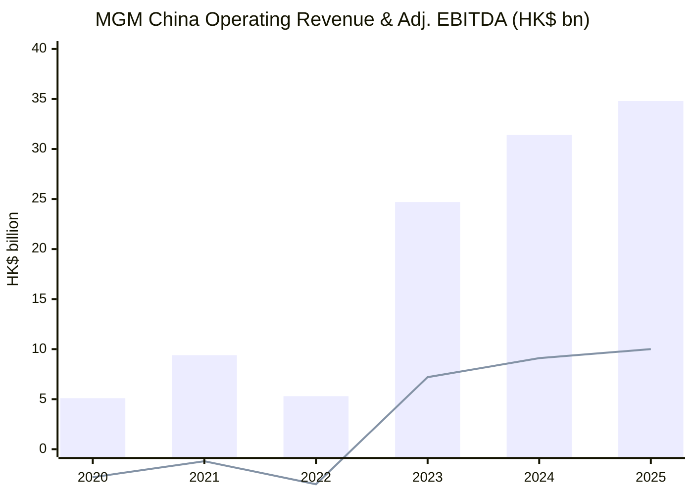
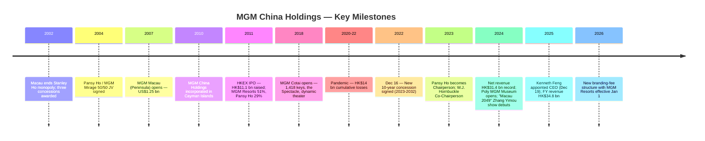
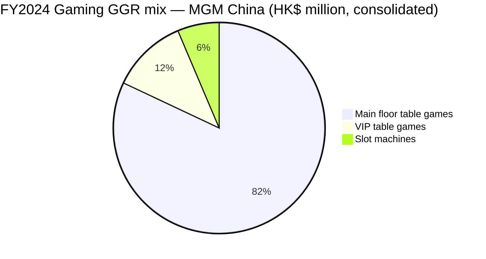
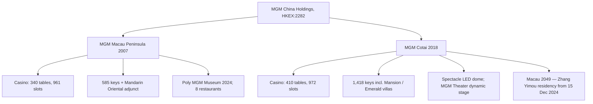
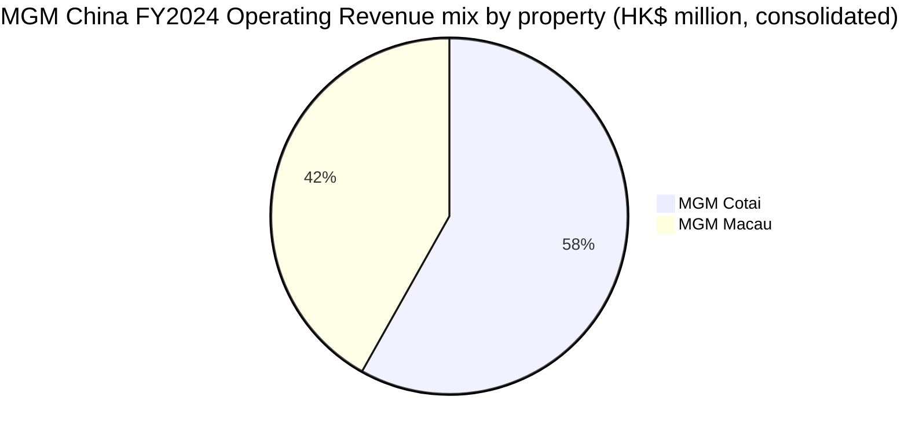
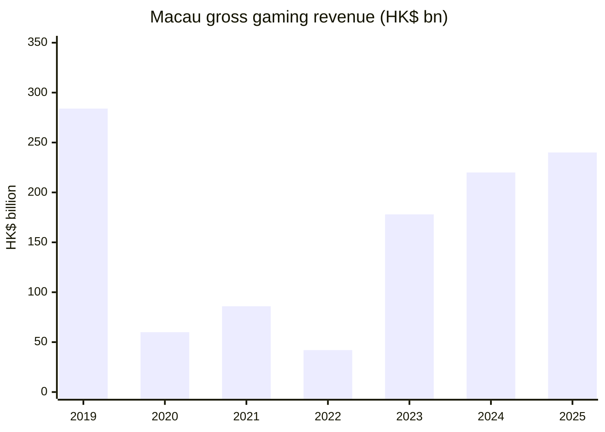
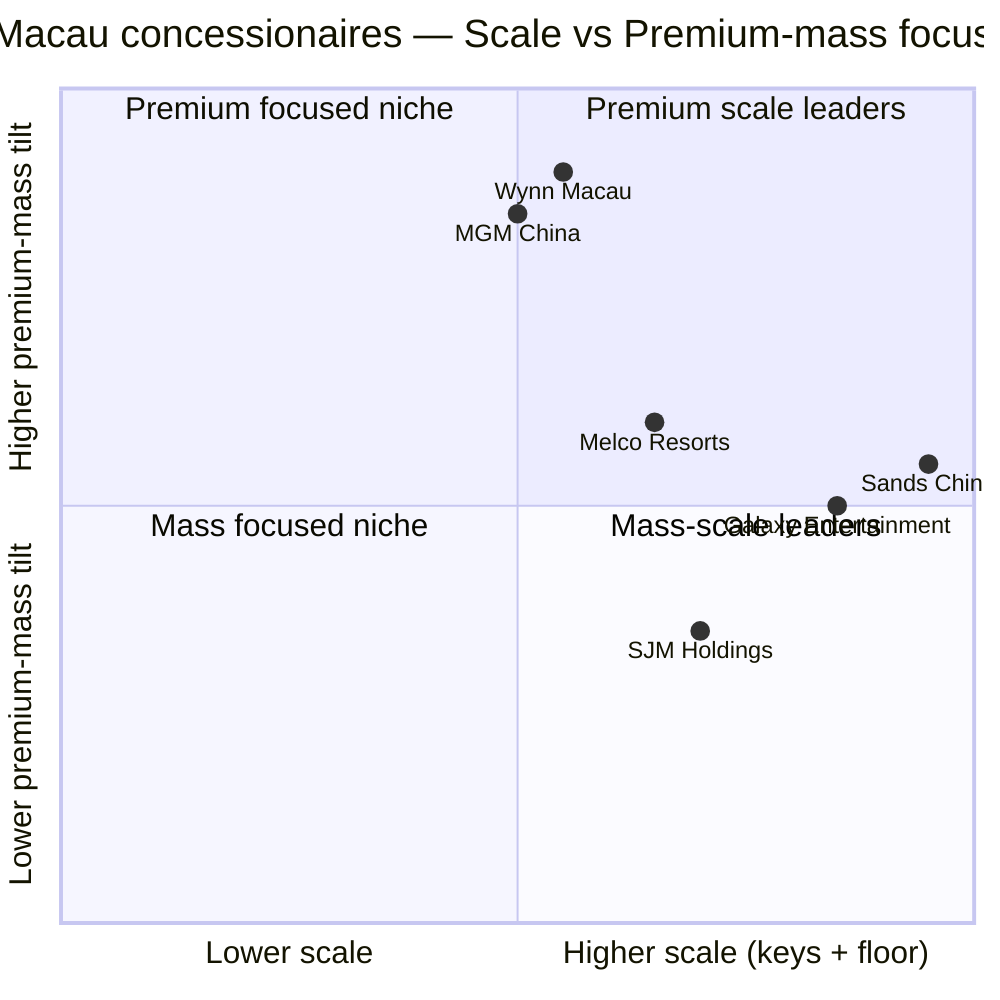
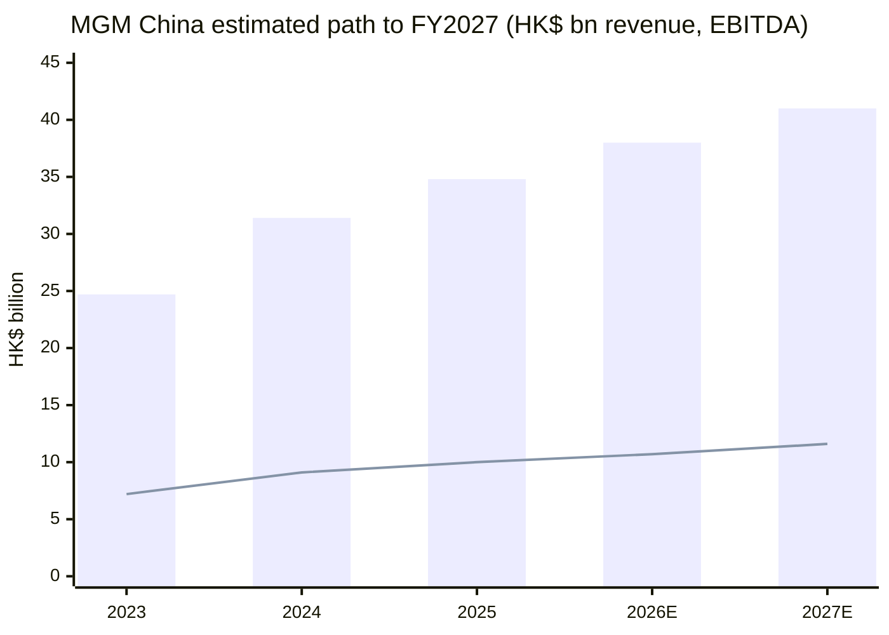

# MGM China Holdings Limited (HKEX:2282) — Initiation of Coverage

**As of 2026-06-03 (HKT)**

> Two-property Macau integrated-resort pure-play, 56% controlled by MGM Resorts International (NYSE:MGM) and 22% by Ms. Pansy Ho. Operates MGM Macau (Peninsula, opened 2007) and MGM Cotai (opened 2018) under a 10-year concession running from 2023 to 2032. Overall market share climbed to an all-time high of **16.1% in FY2025** (FY2024: 15.8%, FY2019 pre-COVID: 9.5%) — the structurally most-improved share story among the six Macau concessionaires since reopening. FY2025 net revenue **HK$34.8 bn (+11% YoY)**, adjusted EBITDA **HK$10.0 bn (+10% YoY, all-time high)**, EBITDA margin **28.8%**. Q1 2026 saw revenue +10% to HK$8.8 bn but EBITDA margin compressed 160 bp to 28.0% on a new branding-fee structure with the US parent. Stock trades around HK$11.40 (June 2026), market cap ~HK$43 bn, TTM P/E ~10–13×, dividend yield ~6.4%.

## Table of Contents

1. Company Overview
2. Company History
3. Management Team (Chairperson & CEO only)
4. Products & Services (Integrated-resort property platform)
5. Customers & Listing Strategy
6. Industry Overview (Macau gaming)
7. Competitive Landscape
8. Market Opportunity (TAM)
9. Risk Assessment
10. Investor-Lens Scorecards
11. References

---

## 1. Company Overview

MGM China Holdings Limited is a Cayman-Islands-incorporated, Hong-Kong-listed (HKEX:2282) operator of two integrated casino-resort properties in Macau. Its operating subsidiary MGM Grand Paradise S.A. holds one of only **six Macau gaming concessions** awarded by the Macau SAR Government on December 16, 2022 for a 10-year term running from January 1, 2023 through December 31, 2032 — extending the structural moat that began when the original sub-concession was negotiated by Pansy Ho's family in 2004. The Company "is a leading developer, owner and operator of two integrated casino, hotel and entertainment resorts in Macau, being MGM MACAU and MGM COTAI" ([2024 Annual Report, p.26](https://www.hkexnews.hk/listedco/listconews/sehk/2025/0428/2025042800919.pdf)). MGM Resorts International (NYSE:MGM) owns "an interest in 55.95% of our issued share capital" and "Ms. Pansy Ho and her controlled companies are our substantial Shareholders (with an interest in 22.49% of our issued share capital)" — leaving roughly 21.6% in public float ([2024 AR, p.26](https://www.hkexnews.hk/listedco/listconews/sehk/2025/0428/2025042800919.pdf)).

The FY2024 print was a clean blowout: **operating revenue HK$31,387.2 million, +27.2% YoY** ([2024 AR, p.38](https://www.hkexnews.hk/listedco/listconews/sehk/2025/0428/2025042800919.pdf)); **adjusted EBITDA HK$9,058.6 million, +25.2% YoY** ([2024 AR, p.37](https://www.hkexnews.hk/listedco/listconews/sehk/2025/0428/2025042800919.pdf)); EBITDA margin 28.9% (vs. 29.5% in 2023, 27.2% in 2019); and a historic high market share of **15.8% vs 15.2% in 2023 and 9.5% in 2019** ([2024 AR, p.31](https://www.hkexnews.hk/listedco/listconews/sehk/2025/0428/2025042800919.pdf)). Profit attributable to shareholders nearly doubled to **HK$4,603.4 million** (HK121.1 cents basic EPS) versus HK$2,638.3 million (HK69.4 cents) in 2023 ([2024 AR, p.3](https://www.hkexnews.hk/listedco/listconews/sehk/2025/0428/2025042800919.pdf)).

FY2025 extended the recovery: net revenue rose **+11% to HK$34.8 billion**, adjusted EBITDA grew **+10% to a historical-high HK$10.0 billion**, EBITDA margin held at 28.8%, and overall market share climbed further to **16.1%** (MGM Cotai 10.1%, MGM Macau 6.0%) according to the [2025 Annual Results press release](https://www.stocktitan.net/news/MGM/mgm-china-reports-2025-annual-dpcid0xrgrwu.html). The Group ended 2025 with HK$24 billion in total liquidity (cash + undrawn revolver), versus HK$17.2 billion at year-end 2024 ([2024 AR Chairperson's Statement](https://www.hkexnews.hk/listedco/listconews/sehk/2025/0428/2025042800919.pdf)).

Q1 2026 brought the first margin compression of the recovery cycle: revenue **+10% YoY to HK$8.8 billion** but adjusted EBITDA up only **+4% to HK$2.5 billion**, with EBITDA margin slipping 160 bp to **28.0%** ([MGM China 1Q 2026 results coverage](https://www.stocktitan.net/news/MGM/mgm-china-reports-2026-first-quarter-i2kcx6y94x0w.html)). Daily mass GGR surged 19% to a record, but the parent's revised branding-fee schedule introduced from January 1, 2026 ([Amendment to Third Renewed Branding Agreement, defined in 2024 AR Glossary](https://www.hkexnews.hk/listedco/listconews/sehk/2025/0428/2025042800919.pdf)) sliced visible operating leverage — a structural headwind we revisit in Section 9.

**Valuation snapshot (June 2026).** At HK$11.40 per share and ~3.8 bn shares outstanding, market cap is approximately **HK$43 bn (~US$5.5 bn)**. TTM P/E sits in a 10–13× band (FY2025 EPS basis around HK$1.30 implies ~9× on the low end; trailing four-quarter print after the Q1 2026 margin slip is closer to 13×), per [Yahoo Finance 2282.HK key statistics](https://finance.yahoo.com/quote/2282.HK/key-statistics/) and [Simply Wall St valuation](https://simplywall.st/stocks/hk/consumer-services/hkg-2282/mgm-china-holdings-shares/valuation). Trailing dividend yield is approximately **6.4%** at current price given HK$0.564 paid across the last two semi-annual declarations ([Stockanalysis.com dividend history](https://stockanalysis.com/quote/hkg/2282/dividend/)). P/B is mechanically distorted (FY2024 net assets only HK$528 million after years of pandemic-era losses); EV/EBITDA on a TTM HK$10 bn base sits around 6–7× — a discount to Sands China (~9–10×) and Wynn Macau (~8–9×) per [Alpha Spread peer comparison](https://www.alphaspread.com/security/hkex/2282/relative-valuation/ratio/enterprise-value-to-ebitda). The discount reflects (i) the new branding-fee uplift to the US parent, (ii) thinner public float (~22%), and (iii) the 2032 concession expiry, which is now seven years out — long-dated, but no longer 10.

*Bars = Operating revenue; line = Adjusted EBITDA. Source: [MGM China 2024 Annual Report, p.273 Financial Summary](https://www.hkexnews.hk/listedco/listconews/sehk/2025/0428/2025042800919.pdf) for 2020-2024; [MGM China 2025 Annual Results press release](https://www.stocktitan.net/news/MGM/mgm-china-reports-2025-annual-dpcid0xrgrwu.html) for 2025. 2022 reflects pandemic-era Macau closures.*

---

## 2. Company History

MGM China's lineage runs back to the breakup of Stanley Ho's Sociedade de Turismo e Diversões de Macau (STDM) monopoly in 2002, when the Macau Government granted three new concessions (and later three sub-concessions) ending nearly four decades of Stanley Ho's exclusive franchise. In 2004 his daughter **Pansy Ho** — by then on STDM's board and managing Shun Tak Holdings — negotiated a 50/50 joint venture with MGM Mirage (later MGM Resorts International) to operate a sub-concession under SJM's umbrella; the US$200 million sub-concession structure was later restructured into a direct concessionaire as the legal framework evolved ([Macau Business: "Pansy, the rebel successor"](https://macaubusiness.com/pansy-the-rebel-successor/); [Pansy Ho Wikipedia biography](https://en.wikipedia.org/wiki/Pansy_Ho)).

The first property, **MGM Grand Macau (later renamed MGM Macau)**, opened on **December 18, 2007** at a cost of approximately **US$1.25 billion**, a 35-storey Peninsula tower featuring a Portuguese-architecture "Grande Praça" atrium with a 25-metre glass ceiling and direct connection to the One Central luxury retail and Mandarin Oriental complex ([MGM Macau Wikipedia](https://en.wikipedia.org/wiki/MGM_Macau); [2024 AR p.27](https://www.hkexnews.hk/listedco/listconews/sehk/2025/0428/2025042800919.pdf)). MGM China Holdings Limited itself was incorporated in the Cayman Islands on July 2, 2010 ([2024 AR Glossary](https://www.hkexnews.hk/listedco/listconews/sehk/2025/0428/2025042800919.pdf)) and listed on the Hong Kong Stock Exchange on **June 3, 2011**, raising approximately HK$11.1 billion (US$1.4 billion) in net proceeds through an offering of 760 million shares at HK$15.34 — at the time one of Asia's largest casino IPOs ([PRNewswire IPO completion release, 2011-06-03](https://www.prnewswire.com/news-releases/mgm-resorts-international-and-ms-pansy-ho-announce-completion-of-mgm-china-holdings-limited-initial-public-offering-123091853.html); [Review Journal 2011 IPO coverage](https://www.reviewjournal.com/business/casinos-gaming/mgm-macau-casino-raises-1-4b-in-hong-kong-ipo/)). Post-IPO ownership stood at MGM Resorts 51%, Pansy Ho 29%, public 20%.

A decade-long capital cycle then converged on the second resort. **MGM Cotai** opened on **February 13, 2018** after extensive delays — the project broke ground in 2012 but slipped through multiple revisions, finally opening with 1,418 keys, a 24,549 m² casino floor, the "Spectacle" (one of the world's largest permanent indoor LED-screen atriums), and Asia's first dynamic theater ([2024 AR p.28](https://www.hkexnews.hk/listedco/listconews/sehk/2025/0428/2025042800919.pdf)). The Cotai opening doubled the Group's revenue capacity and pivoted the customer mix toward the rapidly growing premium-mass segment of the Cotai strip, away from the more VIP-dependent Peninsula.

*Source: [MGM China 2024 Annual Report](https://www.hkexnews.hk/listedco/listconews/sehk/2025/0428/2025042800919.pdf); [PRNewswire 2011 IPO release](https://www.prnewswire.com/news-releases/mgm-resorts-international-and-ms-pansy-ho-announce-completion-of-mgm-china-holdings-limited-initial-public-offering-123091853.html); [CEO Appointment HKEX announcement 2025-12-19](https://www1.hkexnews.hk/listedco/listconews/sehk/2025/1219/2025121900439.pdf).*

The pandemic period was financially brutal — operating revenue collapsed from HK$20+ bn pre-COVID to HK$5.1 bn in 2020 and again HK$5.3 bn in 2022 (the year of the full Macau lockdown in mid-2022), driving four consecutive years of losses totaling roughly **HK$14 billion** ([2024 AR, p.273 Five-Year Financial Summary](https://www.hkexnews.hk/listedco/listconews/sehk/2025/0428/2025042800919.pdf)). The recovery began in late-2022 as travel restrictions eased and accelerated through 2023 (revenue +369% to HK$24.7 bn) and 2024 (+27% to HK$31.4 bn). Macau-wide GGR rebounded to **HK$220.2 billion in 2024**, +23.9% YoY but still 22.5% below 2019 levels ([2024 AR p.31](https://www.hkexnews.hk/listedco/listconews/sehk/2025/0428/2025042800919.pdf)) — MGM China's market-share gain from 9.5% pre-COVID to 16.1% in 2025 means the company has expanded its absolute revenue relative to 2019 even as the overall pie remains smaller.

On **December 16, 2022**, the Macau Government signed the new 10-year Concession Contract with MGM Grand Paradise, entitling it to operate up to "750 gaming tables and 1,700 electric or mechanical gaming machines, including slot machines, … with a duration of 10 years starting from January 1, 2023 to December 31, 2032" ([2024 AR p.26](https://www.hkexnews.hk/listedco/listconews/sehk/2025/0428/2025042800919.pdf)). In return, MGM Grand Paradise "committed to make a total investment of MOP19.7 billion (equivalent to approximately HK$19.1 billion) over the duration of the Concession Contract, of which MOP18 billion (equivalent to approximately HK$17.5 billion) (approximately 91%) is expected to be directed towards the development of international tourist markets and non-gaming projects and programming" ([2024 AR p.30](https://www.hkexnews.hk/listedco/listconews/sehk/2025/0428/2025042800919.pdf)). The non-gaming pivot — Poly MGM Museum (November 2024), the Bruno Mars concert series, the Zhang Yimou-directed "Macau 2049" residency show (December 15, 2024), and the Barra District revitalization — is the operating expression of that pledge.

Most recently, the Board promoted longtime President & CFO **Kenneth Xiaofeng Feng** to **Chief Executive Officer effective December 19, 2025** ([HKEX CEO Appointment announcement, 2025-12-19](https://www1.hkexnews.hk/listedco/listconews/sehk/2025/1219/2025121900439.pdf)).

---

## 3. Management Team

Per the skill brief, only the Chairperson and CEO are profiled.

### Chairperson — Pansy Catilina Chiu King Ho (62)

Ms. Ho has been **Chairperson of MGM China since May 2023** and has served as **Managing Director of MGM Grand Paradise since June 1, 2005**, the longest-serving senior executive in the Company's history ([2024 AR p.12](https://www.hkexnews.hk/listedco/listconews/sehk/2025/0428/2025042800919.pdf)). She graduated from Castilleja School (Palo Alto, CA) and holds a Bachelor's in Marketing and Business from Santa Clara University ([Pansy Ho Wikipedia biography](https://en.wikipedia.org/wiki/Pansy_Ho)). She is **Group Executive Chairperson and Managing Director of Shun Tak Holdings Limited (HKEX:0242)**, positions she has held since 2017 and 1999 respectively, the Vice-Chairperson of Phoenix Media Investment (Holdings) Limited since 2021, and an INED of China Southern Airlines (HKEX:1055) since 2023 ([2024 AR p.12](https://www.hkexnews.hk/listedco/listconews/sehk/2025/0428/2025042800919.pdf)). In Mainland China, she is a Standing Committee Member of the 14th CPPCC National Committee — a political capital position that is itself a structural asset for any Macau concessionaire, where every key license sits inside the Chinese regulatory perimeter ([2024 AR pp.12-13](https://www.hkexnews.hk/listedco/listconews/sehk/2025/0428/2025042800919.pdf)).

The Pansy Ho franchise inside MGM China is more than a board seat — she is the human bridge to the original sub-concession her family negotiated with MGM Mirage in 2004 ([Macau Business profile](https://macaubusiness.com/pansy-the-rebel-successor/)). Her **22.49% economic interest** (held via Grand Paradise Macau Limited and affiliated entities, [2024 AR p.26](https://www.hkexnews.hk/listedco/listconews/sehk/2025/0428/2025042800919.pdf)) is the second-largest position on the register, behind only MGM Resorts International's 55.95%. The 2024 Chairperson's Statement reflects that day-to-day operating involvement, framing 2024 as "a remarkable year for Macau" with property visitation up 54% YoY to "163% of 2019 levels" and the Group's overall market share at "an all-time high of 15.8%, up from 15.2% in 2023 and 9.5% in pre-pandemic year 2019" ([2024 AR pp.7-8](https://www.hkexnews.hk/listedco/listconews/sehk/2025/0428/2025042800919.pdf)).

### Co-Chairperson — William Joseph Hornbuckle (67)

Mr. Hornbuckle is **Co-Chairperson of MGM China since May 2023**, an executive Director, and concurrently **CEO and President of MGM Resorts International since July 29, 2020** ([2024 AR p.13](https://www.hkexnews.hk/listedco/listconews/sehk/2025/0428/2025042800919.pdf)). He represents the US parent's voice on the MGM China Board. He has been with MGM Resorts for more than two decades, prior roles including President & COO of Mandalay Bay and President & COO of MGM Grand Las Vegas, and led the strategy of the MGM Growth Properties sale to VICI Properties as well as the BetMGM digital-gaming launch ([2024 AR p.13](https://www.hkexnews.hk/listedco/listconews/sehk/2025/0428/2025042800919.pdf)).

### Chief Executive Officer — Kenneth Xiaofeng Feng (55)

Mr. Feng was promoted to **CEO of MGM China effective December 19, 2025**, having previously served as President and executive Director ([HKEX CEO Appointment announcement, 2025-12-19](https://www1.hkexnews.hk/listedco/listconews/sehk/2025/1219/2025121900439.pdf)). He was first appointed a non-executive Director of MGM China on **May 24, 2018**, then promoted to **President, Strategic and Chief Financial Officer on June 22, 2020** during the depths of the pandemic, and re-designated as executive Director & President on **July 20, 2023** ([CEO Appointment announcement](https://www1.hkexnews.hk/listedco/listconews/sehk/2025/1219/2025121900439.pdf)). Mr. Feng has been employed by MGM Resorts International since **2001** in a variety of finance, advisory, strategic, operational and development positions; he was promoted to Vice President — International Operations in 2007, Senior Vice President in 2009, and Executive Vice President of MGM International Operations in 2017 ([CEO Appointment announcement](https://www1.hkexnews.hk/listedco/listconews/sehk/2025/1219/2025121900439.pdf)). His CEO service agreement is a 3-year fixed-term contract from December 19, 2025 paying a base of **USD1.5 million (~HKD11.7 million)** plus a discretionary management bonus; his total FY2024 emolument (as President & CFO) was **HKD24,199,000** including share-based payments ([CEO Appointment announcement](https://www1.hkexnews.hk/listedco/listconews/sehk/2025/1219/2025121900439.pdf)). He was granted **2,861,100 share options** under the Company's Share Option Schemes as of the appointment date ([CEO Appointment announcement](https://www1.hkexnews.hk/listedco/listconews/sehk/2025/1219/2025121900439.pdf)). *Analyst view:* The Feng promotion reads as continuity rather than rupture — he led the Company's pandemic-era balance-sheet defense as CFO, the 2023 concession negotiation, and the ramp through 2024-25; promoting him to the title locks in operating muscle memory just as Macau heads into a more competitive Cotai cycle.

---

## 4. Products & Services

MGM China operates exactly **two integrated-resort properties** in Macau — MGM Macau on the Peninsula and MGM Cotai across the Cotai strip — and the entire business literally consists of running these two resorts. Revenue inside each property splits into casino (gaming) and non-gaming (rooms, F&B, retail, entertainment, MICE). For FY2024 the property mix was MGM Cotai HK$18.25 bn (58.1%) and MGM Macau HK$13.14 bn (41.9%); within each, casino dominated at 86–88% of total ([2024 AR p.38 Operating Revenue table](https://www.hkexnews.hk/listedco/listconews/sehk/2025/0428/2025042800919.pdf)). Inside the casino line, the Macau market analytically subdivides into Main Floor Mass, VIP and Slot Machines — and MGM China's structural pivot since 2019 has been a deliberate, deepening shift toward the Mass segment, which "accounted for 88% of our GGR for the year ended December 31, 2024" per the [2024 AR p.33](https://www.hkexnews.hk/listedco/listconews/sehk/2025/0428/2025042800919.pdf).

### 4.1 MGM Macau (Peninsula, opened December 2007)

Per the 2024 AR verbatim: *"MGM MACAU opened in December 2007. The casino floor offers approximately 23,283 square meters, with 961 slot machines, 340 gaming tables, and multiple VIP and private gaming areas as at December 31, 2024. The resort features 585 hotel rooms, suites and villas, and we have a service agreement with the Mandarin Oriental Hotel, through which they supplement our room offerings with additional room availability when there is excess demand by our customers. In addition, the resort offers luxurious amenities, including 8 diverse restaurants, retail outlets, approximately 1,600 square meters of convertible convention space and other non-gaming offerings. The resort's focal point is the signature Grande Praça and features Portuguese-inspired architecture, dramatic landscapes and a glass ceiling rising 25 meters above the floor of the resort. MGM MACAU is directly connected to the One Central complex, which features many of the world's leading luxury retailers and includes Mandarin Oriental Hotel and serviced apartments."* ([2024 AR p.27](https://www.hkexnews.hk/listedco/listconews/sehk/2025/0428/2025042800919.pdf)).

The Peninsula property is the smaller, higher-margin, more VIP-skewed of the two. FY2024 FY2024 operational metrics:

| Metric (FY2024) | MGM Macau | Source |
|---|---|---|
| Operating revenue | HK$13.14 bn (+21% YoY) | [2024 AR p.38](https://www.hkexnews.hk/listedco/listconews/sehk/2025/0428/2025042800919.pdf) |
| Adjusted EBITDA | HK$3.83 bn (+21% YoY) | [2024 AR p.37](https://www.hkexnews.hk/listedco/listconews/sehk/2025/0428/2025042800919.pdf) |
| EBITDA margin | 29.2% | derived |
| Main floor table drop | HK$56,117 m (+15.9%) | [2024 AR p.39](https://www.hkexnews.hk/listedco/listconews/sehk/2025/0428/2025042800919.pdf) |
| Main floor gross win | HK$12,158 m (+23.2%) | same |
| VIP turnover | HK$33,668 m (+0.6%) | same |
| VIP gross win | HK$981 m (-4.8%) | same |
| Slot handle | HK$29,346 m (+26.0%) | same |
| Slot gross win | HK$1,135 m (+25.8%) | same |
| Room occupancy | 94.5% | same |
| REVPAR (HK$) | 2,632 (+20.1%) | same |
| Tables (units) | 340 | same |
| Slot machines (units) | 961 | same |

**What it physically does in the customer's flow.** MGM Macau sits on the Peninsula side of the Macau-Taipa channel — proximate to the historic SJM-anchored gaming corridor (Grand Lisboa, Wynn Macau), the Hong Kong-Macau ferry terminal, and the Border Gate to Zhuhai. It is the resort travelers staying at One Central or arriving via ferry encounter first. The property's competitive identity is anchored on (a) one of Macau's most architecturally distinctive interiors (the Grande Praça), (b) F&B and hotel service consistently rated at the Forbes Five-Star tier (the FY2024 resort group won **seven Forbes Travel Guide Five-Star awards**, [2024 AR p.35](https://www.hkexnews.hk/listedco/listconews/sehk/2025/0428/2025042800919.pdf)), and (c) the new **Poly MGM Museum** opened November 2, 2024 in collaboration with Poly Culture Group, headlined by Grade-One Old Summer Palace Bronze Zodiac Heads — an unusual cultural-tourism asset for a casino floor ([2024 AR p.27, p.35](https://www.hkexnews.hk/listedco/listconews/sehk/2025/0428/2025042800919.pdf)).

### 4.2 MGM Cotai (opened February 13, 2018)

Per the 2024 AR verbatim: *"MGM COTAI opened on February 13, 2018. The resort is conveniently located with multiple access points from other Cotai hotels and public amenities. The casino floor offers approximately 24,549 square meters, with 972 slot machines and 410 gaming tables as at December 31, 2024. The resort features 1,418 hotel rooms, suites, skylofts, Emerald villas and The Mansion villas, 12 diverse restaurants and bars, retail outlets, approximately 2,870 square meters of meeting space and other non-gaming offerings. The scale of MGM COTAI allows us to capitalize on our international expertise in providing exciting and diversified entertainment offerings. The Spectacle, situated at the heart of MGM COTAI, is enriched with experiential technology elements to entertain our guests. MGM COTAI offers Asia's first dynamic theater introducing advanced and innovative entertainment to Macau. MGM China's first residency show 'Macau 2049', directed by world-renowned Chinese filmmaker Zhang Yimou, made its debut on December 15, 2024."* ([2024 AR p.28](https://www.hkexnews.hk/listedco/listconews/sehk/2025/0428/2025042800919.pdf)).

| Metric (FY2024) | MGM Cotai | Source |
|---|---|---|
| Operating revenue | HK$18.25 bn (+31.9% YoY) | [2024 AR p.38](https://www.hkexnews.hk/listedco/listconews/sehk/2025/0428/2025042800919.pdf) |
| Adjusted EBITDA | HK$5.23 bn (+28.7% YoY) | [2024 AR p.37](https://www.hkexnews.hk/listedco/listconews/sehk/2025/0428/2025042800919.pdf) |
| EBITDA margin | 28.6% | derived |
| Main floor table drop | HK$58,448 m (+25.9%) | [2024 AR p.40](https://www.hkexnews.hk/listedco/listconews/sehk/2025/0428/2025042800919.pdf) |
| Main floor gross win | HK$16,446 m (+42.5%) | same |
| VIP turnover | HK$115,119 m (+44.9%) | same |
| VIP gross win | HK$3,067 m (+4.9%) | same |
| Tables (units) | 410 | same |
| Slot machines (units) | 972 | same |
| Hotel keys | 1,418 | same |

**What it physically does.** MGM Cotai is the scale property — 2.4× the keys of MGM Macau, comparable casino floor area, more gaming positions, and a much higher proportion of premium-mass volume. The Cotai strip is the Macau market's center of gravity for the post-pandemic recovery (every new concessionaire investment has gone here), and MGM Cotai's market-share gain has been the engine of MGM China's overall share recovery from 9.5% (2019) to 16.1% (2025). Of that 6.6-point share gain, MGM Cotai contributed approximately 4.4 points (rising from ~5.7% to 10.1%) and MGM Macau approximately 2.2 points (3.8% → 6.0%) — per the FY2025 property-share split disclosed in [the 2025 Annual Results coverage](https://www.stocktitan.net/news/MGM/mgm-china-reports-2025-annual-dpcid0xrgrwu.html).

**How MGM Cotai differs from MGM Macau in the customer mix.** The Cotai property bridges the premium-mass and the high-end "Mansion / Emerald Villa" segments — its VIP turnover of HK$115 bn is 3.4× that of MGM Macau, and the Emerald and Mansion villa product targets the ultra-high-net-worth gaming traveler that no Peninsula property can serve at the same scale. On the non-gaming side, **The Spectacle** (one of the world's largest permanent indoor LED-screen atriums), **MGM Theater** (Asia's first dynamic theater), and the December 15, 2024 debut of the **"Macau 2049" residency show directed by Zhang Yimou** — Chinese cinema's most internationally recognized auteur — are explicitly designed to draw visitors who would otherwise be guests at competing Cotai resorts (Sands' Londoner Macao, Wynn Palace, Galaxy Macau, Studio City, City of Dreams) for the gambling portion of their trip. The 2024 Bruno Mars outdoor concert series ([2024 AR p.11](https://www.hkexnews.hk/listedco/listconews/sehk/2025/0428/2025042800919.pdf)) was the highest-profile manifestation of the entertainment-pull strategy.

### 4.3 The Mass-shift thesis and the role of branding

The most consequential strategic shift since 2019 has been the deliberate substitution of premium-mass volume for VIP — partially forced (the Macau government withdrew junket licenses through 2022 and the New Gaming Credit Law of August 1, 2024 ended direct credit operations with gaming promoters, [2024 AR p.34](https://www.hkexnews.hk/listedco/listconews/sehk/2025/0428/2025042800919.pdf)) and partially chosen (mass-floor gross wins are higher-margin and less volatile than VIP). The result: in FY2024 main-floor table game gross wins were **HK$28.6 bn** vs VIP table game gross wins of only **HK$4.0 bn** — a 7.1× ratio, versus pre-COVID ratios closer to 1:1 ([2024 AR Financial Highlights, p.4](https://www.hkexnews.hk/listedco/listconews/sehk/2025/0428/2025042800919.pdf)).

*Source: [MGM China 2024 Annual Report, Financial & Operational Highlights p.4](https://www.hkexnews.hk/listedco/listconews/sehk/2025/0428/2025042800919.pdf).*

### 4.4 The Branding Agreement — visible since 2026

The Group does not own the "MGM" trademark. Branding rights flow through a [Branding Agreement dated May 17, 2011](https://www.hkexnews.hk/listedco/listconews/sehk/2025/0428/2025042800919.pdf) among the Company, MGM Grand Paradise, MGM Branding, MGM Resorts International, MRIH and NCE — most recently amended on August 16, 2024 ("Amendment Agreement to the Third Renewed Branding Agreement", [2024 AR Glossary](https://www.hkexnews.hk/listedco/listconews/sehk/2025/0428/2025042800919.pdf)). The amendment lifted the branding fee paid to the US parent — visible in the Q1 2026 results as a 160 bp margin compression to 28.0% despite revenue growth ([asgam coverage of Q1 2026 branding fee impact](https://asgam.com/2026/04/30/mgm-chinas-revenue-up-almost-10-in-1q26-but-introduction-of-higher-branding-fee-for-use-of-mgm-name-hurts-profitability/); [Sahm Capital Q1 2026 summary](https://www.sahmcapital.com/news/content/mgm-china-fy26-q1-adjusted-ebitda-rises-4-to-hk25-billion-2026-04-30)). The change is structural rather than temporary.

*Source: [MGM China 2024 Annual Report, pp.27-28](https://www.hkexnews.hk/listedco/listconews/sehk/2025/0428/2025042800919.pdf).*

---

## 5. Customers & Listing Strategy

MGM China's customer base is the Macau gaming visitor — overwhelmingly Mainland Chinese (70.1% of all Macau visitors in 2024, up from 67.5% in 2023, [2024 AR p.31](https://www.hkexnews.hk/listedco/listconews/sehk/2025/0428/2025042800919.pdf)) with secondary draws from Hong Kong, Taiwan, South Korea, and Japan. "Customers travelling to Macau are typically from nearby regions in Asia including mainland China, Hong Kong, Taiwan, South Korea and Japan" per the [2024 AR p.31](https://www.hkexnews.hk/listedco/listconews/sehk/2025/0428/2025042800919.pdf). The Group does not disclose customer concentration in the traditional 10-K "top-5 customer" sense — because gaming is a B2C business and the largest individual customers (VIP whales) are concealed under privacy regulation — but the structural concentration question runs through three vectors: (a) geographic source (Mainland China dependence), (b) gaming-segment mix (mass vs VIP), and (c) hotel-occupancy reliance on the parent's M life loyalty program. The parent's M life Rewards program (developed under Hornbuckle's tenure as CMO at MGM Resorts, [2024 AR p.13](https://www.hkexnews.hk/listedco/listconews/sehk/2025/0428/2025042800919.pdf)) is the cross-property database that funnels US-based MGM customers traveling to Asia toward MGM China resorts — a competitive advantage no other Macau concessionaire can match without a comparable US property network.

**Visitation arithmetic.** In FY2024 MGM China's property visitation grew **+54% YoY to 163% of 2019 levels** ([2024 AR p.7 Chairperson Statement](https://www.hkexnews.hk/listedco/listconews/sehk/2025/0428/2025042800919.pdf)), against Macau-wide arrivals of 34.9 million (up 24% YoY, 88% of 2019, [2024 AR p.7](https://www.hkexnews.hk/listedco/listconews/sehk/2025/0428/2025042800919.pdf)). The implication is unambiguous: MGM China's visitor share within Macau approximately doubled vs. 2019. The bridge is the post-2018 Cotai property (which simply did not exist in early-2017 visitation comparisons), the premium-mass gaming product, and the entertainment / cultural-tourism programming layered on top ("140 large-scaled events" hosted across 2024, [2024 AR p.9](https://www.hkexnews.hk/listedco/listconews/sehk/2025/0428/2025042800919.pdf)). Q1 2026 daily Macau visitor arrivals rose **+14% YoY to 124,599** ([MGM China Q1 2026 coverage](https://www.stocktitan.net/news/MGM/mgm-china-reports-2026-first-quarter-i2kcx6y94x0w.html)) — the recovery is still extending.

**Mass vs VIP — the segment-level customer mix.** MGM China's **mass market gaming operation accounted for 88% of our GGR for the year ended December 31, 2024** ([2024 AR p.33](https://www.hkexnews.hk/listedco/listconews/sehk/2025/0428/2025042800919.pdf)). VIP is now structurally smaller than pre-COVID, both because junkets were dismantled (no junkets are active in Macau today, post the 2022 Suncity collapse and the New Gaming Credit Law of August 1, 2024) and because the Macau Government has actively steered concessionaires toward mass. The competitive implication: MGM China's mass-share gain has come from concession allotment (an additional 198 gaming tables were awarded under the new 2023 concession, [2024 AR p.31](https://www.hkexnews.hk/listedco/listconews/sehk/2025/0428/2025042800919.pdf)), from product upgrades aimed at premium-mass (Mansion, Mansion One, Emerald villa), and from the M life-driven flow from Las Vegas. **MGM China's mass-market share in Q1 2026 reached 16.2%**, up from 15.8% a year earlier, while VIP market share **fell to 10.2%** from 15.4% — reflecting both an absolute industry retrenchment in VIP and a deliberate MGM mix shift ([MGM China Q1 2026 results coverage](https://www.stocktitan.net/news/MGM/mgm-china-reports-2026-first-quarter-i2kcx6y94x0w.html)).

*Source: [MGM China 2024 Annual Report, p.38 Operating Revenue table](https://www.hkexnews.hk/listedco/listconews/sehk/2025/0428/2025042800919.pdf).*

**Customer-concentration disclosure.** The 2024 AR does not disclose individual customer concentration in the 10-K "≥10%" sense — gaming-customer privacy regulation in Macau prevents naming a single high-roller — but **the geographic and segment-level concentration is itself the binding concentration risk**: 70%+ of visitor arrivals come from a single country (China), and 88% of gaming revenue from a single segment (mass), each of which is itself exposed to Mainland macro and policy levers. We treat both as Section 9 risks.

**Listing strategy.** MGM China is structurally a controlled subsidiary — MGM Resorts International (NYSE:MGM) owns 55.95% and Pansy Ho's vehicles own 22.49%, leaving only ~21.6% in public float ([2024 AR p.26](https://www.hkexnews.hk/listedco/listconews/sehk/2025/0428/2025042800919.pdf)). The Branding Agreement, Development Agreement, Deed of Non-Compete Undertakings, and Consultancy Services Agreement are all related-party arrangements that consolidate cash flows out of MGM China to the parent on a recurring basis — meaningful, because the parent owns a slice of every operating dollar before public shareholders see it. Dividend policy reflects that — in 2024 the Board declared **HK0.353 per share** as a special dividend (HK$1,341.9 million total) in addition to regular interims ([AGB special-dividend coverage](https://agbrief.com/news/macau/30/08/2024/mgm-china-declares-special-dividend-of-172-million/); [Stockanalysis.com dividend history](https://stockanalysis.com/quote/hkg/2282/dividend/)), and 2024 full-year cash dividends totaled **HK$0.70 per share** across three declarations. **2025 declarations of HK$0.564/share (interim + final)** in May and August 2025 ([Stockanalysis dividend history](https://stockanalysis.com/quote/hkg/2282/dividend/)) and the **HK$0.353 final** declared in May 2026 give a trailing 12-month dividend of approximately **HK$0.73/share** and a yield of ~6.4% at HK$11.40. CLSA expects MGM China to remain among the four Macau concessionaires (Galaxy, MGM China, Sands China, Wynn Macau) declaring final dividends for FY2025 ([iGamingToday CLSA coverage on Macau dividend reinitiation](https://www.igamingtoday.com/macaus-gaming-sector-sees-greater-dominance-by-top-operators-according-to-clsa/)).

---

## 6. Industry Overview

Macau is the world's largest gaming market by revenue. Per the 2024 AR p.31, "Macau gross gaming revenue increased by 23.9% to **HK$220.2 billion** for the year ended December 31, 2024 over 2023. Total visitor arrivals into Macau and Macau gross gaming revenue for the year ended December 31, 2024 were 11.4% and 22.5% lower than the pre-pandemic comparable period in 2019, respectively" ([2024 AR p.31](https://www.hkexnews.hk/listedco/listconews/sehk/2025/0428/2025042800919.pdf)). In other words, the Macau gaming pie is still ~22.5% smaller in dollar terms than pre-COVID — but the visitor count is only ~11.4% short, implying lower per-visitor spend (a structural shift toward mass-market consumers vs. the pre-2019 junket-VIP cohort) rather than a permanent demand impairment.

**Macau is the only legal land-based casino market in Greater China.** That is the foundational moat for all six concessionaires. The next-nearest competing markets are Singapore (two integrated resorts under a duopoly), Manila (Entertainment City), Cambodia (NagaWorld), South Korea (Paradise City, JeJu casinos), and Vietnam (Corona Phu Quoc). MGM China's filings explicitly list these in the Risk Factors: *"We compete with similar businesses in other parts of the world including, but not limited to, integrated resorts in Cambodia, Vietnam, South Korea, Singapore, the Philippines, Australia and Las Vegas"* ([2024 AR p.33](https://www.hkexnews.hk/listedco/listconews/sehk/2025/0428/2025042800919.pdf)). Looking forward, the most consequential supply additions in the medium term are the legalization of integrated resorts in **Thailand** (still under draft as of 2026) and **Japan** (MGM Resorts itself has the Osaka IR project under construction with planned 2030 opening), each of which would pull some incremental mass-market customer flow from Macau.

**The six-concessionaire structure.** Per the 2024 AR Risk Factors, "Through our subsidiary MGM Grand Paradise, we currently compete with five other Concessionaires authorized by the Macau Government to conduct gaming operations in Macau" ([2024 AR p.58](https://www.hkexnews.hk/listedco/listconews/sehk/2025/0428/2025042800919.pdf)). The six concessions are Galaxy Entertainment, Sands China, Wynn Macau, SJM Holdings, Melco Resorts & Entertainment, and MGM China. All six received new 10-year concessions on January 1, 2023 (expiring December 31, 2032), with aggregate non-gaming investment commitments totaling **MOP119 billion** across the industry (each concessionaire pledged roughly MOP15-20 billion). MGM China's individual commitment is MOP19.7 billion (~HK$19.1 billion), with 91% earmarked for non-gaming ([2024 AR p.30](https://www.hkexnews.hk/listedco/listconews/sehk/2025/0428/2025042800919.pdf)).

*Macau GGR by year. 2019: pre-pandemic baseline. 2020-2022: COVID closures and zero-COVID. 2023: reopening. 2024: HK$220.2 bn per [MGM China 2024 AR p.31](https://www.hkexnews.hk/listedco/listconews/sehk/2025/0428/2025042800919.pdf). 2025 estimate of ~HK$240 bn based on the +9.1% YoY growth reported by CLSA at year-end 2025 ([iGamingToday coverage](https://www.igamingtoday.com/macaus-gaming-sector-sees-greater-dominance-by-top-operators-according-to-clsa/)).*

**Tourism drivers and policy tailwinds.** The 2024 AR p.31-32 highlights five long-term drivers: (1) the 91%-non-gaming concession investment cycle (HK$120+ bn industry-wide over 2023-2032); (2) infrastructure (Hong Kong-Zhuhai-Macau Bridge, Macau Bridge fourth crossing, Qingmao 24-hour border, Hengqin 24-hour checkpoint, Macau LRT expansion, China High-Speed Rail extensions to Zhuhai); (3) Hengqin development as a designated tourism island integrated with Macau; (4) the Individual Visit Scheme expansion to 59 Mainland Chinese cities and the easing of permits for Zhuhai residents (one-trip-per-week) and Hengqin residents (multi-entry) effective January 2025; (5) the continuing rise of Mainland China outbound tourism among an expanding upper-middle class ([2024 AR pp.10-11, p.32](https://www.hkexnews.hk/listedco/listconews/sehk/2025/0428/2025042800919.pdf)).

**TAM and SAM.** The pre-COVID Macau GGR peak was approximately HK$285 billion in 2019; year-to-date 2026 daily Macau GGR runs are tracking toward an annualized run-rate of approximately HK$245-260 billion ([MGM China Q1 2026 coverage](https://www.stocktitan.net/news/MGM/mgm-china-reports-2026-first-quarter-i2kcx6y94x0w.html)). *Analyst view:* a return-to-2019-nominal Macau GGR base of HK$285 bn at MGM China's 16.1% share would imply ~HK$46 bn of GGR captured (vs. HK$31.4 bn in 2024 and HK$34.8 bn in 2025) — meaning the Group's gaming revenue alone has another ~30-40% of upside on a same-store basis at peak-cycle visitation. Non-gaming revenue (hotel + F&B + retail + entertainment + MICE) is the longer-term TAM expansion — the 91% non-gaming concession commitment exists precisely because the Macau Government wants to grow the non-gaming TAM (currently ~10-12% of total resort revenue) toward Las Vegas levels (>60%).

---

## 7. Competitive Landscape

### 7.1 The six Macau concessionaires — direct competition

The 2024 AR Risk Factors describe the competition unambiguously: *"The casino, hotel and convention businesses in Macau are highly competitive, and we expect to encounter increasing competition as developers and operators complete and open new projects in the future. Through our subsidiary MGM Grand Paradise, we currently compete with five other Concessionaires"* ([2024 AR p.58](https://www.hkexnews.hk/listedco/listconews/sehk/2025/0428/2025042800919.pdf)). The six concessionaires, in approximate FY2024 GGR share (per CLSA aggregations and concessionaire disclosures):

| Concessionaire | HK Ticker | 2024 GGR share | Property footprint highlights |
|---|---|---|---|
| **Galaxy Entertainment** | 0027.HK | ~20% | Galaxy Macau (Cotai), StarWorld (Peninsula) |
| **Sands China** | 1928.HK | ~24% | Venetian, Londoner, Parisian, Four Seasons (all Cotai), Plaza |
| **MGM China** | 2282.HK | **15.8% (16.1% in 2025)** | MGM Macau (Peninsula), MGM Cotai |
| **SJM Holdings** | 0880.HK | ~13% | Grand Lisboa Palace (Cotai), Casino Grand Lisboa (Peninsula), 14 satellite casinos |
| **Melco Resorts** | MLCO.US, 0200.HK | ~14% | City of Dreams (Cotai), Studio City, Altira |
| **Wynn Macau** | 1128.HK | ~13% | Wynn Palace (Cotai), Wynn Macau (Peninsula) |

*Source: per-concessionaire share estimates derived from [iGamingToday CLSA 4Q25 share analysis](https://www.igamingtoday.com/macaus-gaming-sector-sees-greater-dominance-by-top-operators-according-to-clsa/) and the 2024 AR p.31 disclosure of MGM China's own share.*

**Why MGM China sits in the middle of the pack — but trending up.** MGM China is structurally a two-property concessionaire competing against Galaxy (Galaxy Macau alone has 3,000+ keys vs. MGM China's 2,003 combined) and Sands (Sands' Cotai cluster — Venetian, Londoner, Parisian, Four Seasons — is the single largest integrated-resort footprint in the world by floor area). The structural disadvantage of two properties is partly offset by (a) MGM's brand equity from the Las Vegas platform, (b) the M life cross-property loyalty database, (c) Pansy Ho's political and government-relations capital, and (d) MGM Cotai's relatively young vintage (2018 vs. Venetian 2007 and Wynn Macau 2006) meaning less near-term renovation capex.

*Analyst-constructed positioning view. Scale axis reflects keys × floor area; premium-mass-tilt axis reflects mass-floor share of GGR and average daily win per main-floor table. MGM China sits in the upper-middle quadrant — high premium-mass focus despite mid-tier scale, closest in positioning to Wynn (smaller, premium-mass-leaning) but with stronger M life-driven cross-flow from the Las Vegas portfolio.*

### 7.2 Operating-metric comparison — what differentiates MGM Cotai

The 2024 average-daily-win-per-table metric is a structural moat indicator: MGM Cotai's **HK$127.2 thousand per day per main-floor gaming table** ([2024 AR p.40](https://www.hkexnews.hk/listedco/listconews/sehk/2025/0428/2025042800919.pdf)) is one of the highest in Macau. This reflects (i) the premium-mass mix, (ii) the cluster effect of luxury villas (Mansion, Mansion One, Emerald) drawing higher-stakes traffic on the main floor itself, and (iii) the M life loyalty pull that delivers higher-spend marginal visitors than the Macau-only operators. For comparison, MGM Macau's average daily gross win per main-floor table is HK$107.3 thousand ([2024 AR p.39](https://www.hkexnews.hk/listedco/listconews/sehk/2025/0428/2025042800919.pdf)) — significantly lower despite the older property, consistent with the Peninsula's more locally-sourced and casual customer mix.

### 7.3 Competitive vulnerabilities

Two structural weaknesses worth naming. **First**, branding-fee leakage to the US parent is a known structural drag — Q1 2026 was the first quarter to show the higher branding fee in full effect, and a 160 bp margin compression on a HK$10 billion EBITDA base implies HK$160 million of annualized leakage versus the pre-amendment baseline. **Second**, MGM China's pre-COVID balance sheet was the weakest of the six concessionaires (consolidated net assets went *negative* in 2022 at HK$-3,996 million per [2024 AR p.273](https://www.hkexnews.hk/listedco/listconews/sehk/2025/0428/2025042800919.pdf)), and although the recovery has restored a HK$528 million net-asset position by year-end 2024 it still trails competitors. The April 2025 refinancing (new HK$23.4 bn revolver, [2024 AR p.56](https://www.hkexnews.hk/listedco/listconews/sehk/2025/0428/2025042800919.pdf)) and the 2025 senior unsecured notes due June 2025 / 2026 / 2027 / 2031 form the debt-maturity tower — manageable, but tight enough that a second cycle-trough event would be more challenging here than at Galaxy or Sands.

---

## 8. Market Opportunity

The TAM equation for MGM China is unusually clean because every gaming dollar flows through one regulated regional market (Macau). The bear case caps Macau-wide GGR at ~HK$240-260 bn (FY2026E-2027E run-rate) on persistent China consumption softness; the base case projects gradual mean-reversion to the FY2019 nominal peak of ~HK$285 bn over 2026-2028 as international (non-China) visitor share recovers; the bull case argues for a new high above HK$300 bn by 2028-2030 driven by the cross-border infrastructure investments (Hong Kong-Zhuhai-Macau Bridge usage, Macau LRT, Hengqin 24-hour border).

At MGM China's 16.1% market share, each HK$10 bn of Macau-wide GGR uplift translates to ~HK$1.6 bn of MGM China GGR — and given the 28-30% EBITDA margin, ~HK$450-480 mn of incremental EBITDA per HK$10 bn of market growth. The non-gaming side compounds on top: the MOP18 bn non-gaming commitment under the new concession (Poly MGM Museum, Macau 2049, Barra District revitalization, "140 large-scaled events" in 2024, [2024 AR p.9](https://www.hkexnews.hk/listedco/listconews/sehk/2025/0428/2025042800919.pdf)) is designed to drive both visitor-flow share and ticket / F&B / retail spend.

*Bars = operating revenue, line = adjusted EBITDA. 2023-2025 actuals from [2024 AR p.273](https://www.hkexnews.hk/listedco/listconews/sehk/2025/0428/2025042800919.pdf) and [2025 Annual Results press release](https://www.stocktitan.net/news/MGM/mgm-china-reports-2025-annual-dpcid0xrgrwu.html). 2026E and 2027E reflect analyst-base-case assumptions of (i) Macau GGR growth of ~7% / 6% (consistent with [CLSA's 5-8% 2026 growth view](https://www.igamingtoday.com/macaus-gaming-sector-sees-greater-dominance-by-top-operators-according-to-clsa/)); (ii) MGM China share holding at ~16% in 2026 and ~16.5% in 2027; (iii) EBITDA margin recovering to 28.5% by 2027 net of the branding-fee headwind.*

---

## 9. Risk Assessment

### 9.1 Company-specific risks

**(a) Geographic single-asset exposure.** Verbatim from the 2024 AR: *"We are currently dependent upon our properties in Macau for all of our cash flows, which subjects us to greater risks than a gaming company with more operating properties"* ([2024 AR p.59](https://www.hkexnews.hk/listedco/listconews/sehk/2025/0428/2025042800919.pdf)). MGM China has zero diversification outside Macau — every dollar of revenue and EBITDA is generated inside one regulated market, exposed to a single sovereign, a single visa regime, and a single border. The COVID period demonstrated the downside (HK$14 bn cumulative losses 2020-2022). Mitigant: the Macau Government has explicitly committed to a long-term tourism diversification policy, and the 10-year concession provides regulatory visibility through 2032.

**(b) Concession-expiry risk (2032).** The current concession expires December 31, 2032. The 2024 AR confirms that "termination, rescission, revocation or modification of any gaming concession" is a defined Event of Default under both the original Amended Revolving Credit Facility and the April 2025 HK$23.4 bn replacement facility ([2024 AR p.55](https://www.hkexnews.hk/listedco/listconews/sehk/2025/0428/2025042800919.pdf)). The April 2025 replacement debt explicitly carves out "any renewal, tender or other process conducted by the Macau Government in connection with the granting or renewal of any gaming concession", which provides modest comfort but does not eliminate the structural cliff. *Analyst view:* Re-licensing in 2032 is the binary regulatory event the equity must price; Macau policy historically has favored continuity, but there are no contractual extension rights.

**(c) Concession capital commitment (MOP19.7 bn / HK$19.1 bn over 2023-2032).** "MGM Grand Paradise has committed to make a total investment of MOP19.7 billion … over the duration of the Concession Contract, of which MOP18 billion (equivalent to approximately HK$17.5 billion) (approximately 91%) is expected to be directed towards the development of international tourist markets and non-gaming projects" ([2024 AR p.30](https://www.hkexnews.hk/listedco/listconews/sehk/2025/0428/2025042800919.pdf)). That is roughly HK$1.9 bn per year of mandated investment through 2032 — partially offset by tax-deductibility and partly funded by ongoing operating cash flow, but a binding capex commitment that limits the dividend ceiling.

**(d) Branding-fee structural drag.** The Amendment to the Third Renewed Branding Agreement (August 16, 2024, [2024 AR Glossary](https://www.hkexnews.hk/listedco/listconews/sehk/2025/0428/2025042800919.pdf)) raised the branding fee payable to MGM Branding (subsidiary of MGM Resorts International), visible in Q1 2026 as a ~160 bp margin slip ([asgam Q1 2026 coverage](https://asgam.com/2026/04/30/mgm-chinas-revenue-up-almost-10-in-1q26-but-introduction-of-higher-branding-fee-for-use-of-mgm-name-hurts-profitability/)). This is permanent margin leakage to the controlling shareholder, not a one-off.

**(e) Controlling shareholder change-of-control risk.** The 2025 HK$23.4 bn Revolving Credit Facility "must be repaid if MGM Resorts International ceases to be the legal and beneficial owner directly or indirectly of more than 50% of the issued ordinary share capital of the Company" ([2024 AR p.56](https://www.hkexnews.hk/listedco/listconews/sehk/2025/0428/2025042800919.pdf)). Any future MGM Resorts divestment below 50% would trigger a forced refinancing.

### 9.2 Industry / market risks

**(f) Mainland Chinese policy and visa regime.** Verbatim from the 2024 AR: *"economic disruption or uncertainty in mainland China; changes in gaming laws and regulations in Macau; global trade tensions; restriction on exit visas from mainland China for travel to Macau and Hong Kong; anti-smoking legislation; anti-corruption campaigns; currency transfer restrictions; depreciation of the renminbi against the US$; introduction of a border currency declaration system; monetary outflow policies and legislation on cross-border gambling"* ([2024 AR p.32](https://www.hkexnews.hk/listedco/listconews/sehk/2025/0428/2025042800919.pdf)). Multiple historical episodes (the 2014-2015 anti-corruption campaign, the 2017 ATM withdrawal-limit tightening, the 2022 zero-COVID lockdown) demonstrate the multi-quarter EBITDA impact each policy lever can have.

**(g) Regional integrated-resort competition (Thailand, Japan, Korea).** The 2024 AR explicitly notes: *"In addition, certain areas have legalized, and others may in the future legalize, casino gaming (or online gaming), including Taiwan and Thailand"* ([2024 AR p.58](https://www.hkexnews.hk/listedco/listconews/sehk/2025/0428/2025042800919.pdf)). Notably, MGM Resorts itself is the lead operator of the planned **MGM Osaka IR** in Japan (targeted 2030 opening, US$10+ bn project), which will draw Mainland Chinese tourists who currently travel to Macau. The parent's portfolio approach insulates MGM Resorts but creates intra-group cannibalization for MGM China.

**(h) VIP-segment structural decline.** VIP gross table game wins are now only ~12% of MGM China's GGR ([2024 AR p.4](https://www.hkexnews.hk/listedco/listconews/sehk/2025/0428/2025042800919.pdf), 88% mass per p.33 inverse), down from ~50% pre-COVID. Q1 2026 VIP market share at MGM fell to 10.2% from 15.4% YoY ([Q1 2026 coverage](https://www.stocktitan.net/news/MGM/mgm-china-reports-2026-first-quarter-i2kcx6y94x0w.html)). VIP is now a smaller and lower-quality earnings stream than it has been since IPO, and further attrition (Macau-wide industry trend) would limit MGM China's ability to lever VIP for incremental hold gains.

### 9.3 Financial risks

**(i) Debt-maturity wall 2025-2027.** Per the 2024 AR Glossary, the senior unsecured notes maturity tower is: 2025 Notes (US$500m, 5.25% due Jun 18, 2025), 2026 Notes (US$750m, 5.875% due May 15, 2026), 2027 Notes (US$750m, 4.75% due Feb 1, 2027), 2031 Notes (US$500m, 7.125% due Jun 26, 2031). The April 2025 HK$23.4 bn revolver and ongoing cash flow are the refinancing vehicles. Refinancing risk is well-managed today (HK$24 bn of total liquidity at year-end 2025 vs. ~US$2 bn of notes coming due in 2025-2027) but the 7.125% coupon on the 2031 Notes shows the markets pricing meaningful credit risk into MGM China senior unsecured paper.

**(j) Currency translation and HKD peg.** Most operating cash flow is in Macau Pataca (MOP) or HKD (pegged to USD), but a meaningful portion of customer spend is denominated in RMB and converted at the border / via UnionPay. A material RMB devaluation (5%+) would compress effective customer purchasing power and trim premium-mass visitor spend. The 2024 AR explicitly flags "depreciation of the renminbi against the US$" as a Macau-market risk ([2024 AR p.32](https://www.hkexnews.hk/listedco/listconews/sehk/2025/0428/2025042800919.pdf)).

### 9.4 Macro risks

**(k) Geopolitical and trade-tension risk.** US-China bilateral tensions, sanctions on Chinese officials traveling to Macau, and the periodic listing of Macau-related entities on US export-control lists all represent low-probability, high-impact tail risks. MGM China's controlling shareholder (MGM Resorts International) is a US-listed entity, which creates a regulatory crossover surface area that no other Macau concessionaire faces at the same level.

**(l) Pandemic / contagious-disease recurrence.** The 2020-2022 period is the lived precedent. The 2024 AR Risk Factors explicitly note *"outbreaks of contagious diseases (such as the COVID-19 pandemic) or fears of war and acts of terrorism or other acts of violence"* as material ([2024 AR p.59](https://www.hkexnews.hk/listedco/listconews/sehk/2025/0428/2025042800919.pdf)). A second comparable closure event would, on present balance sheet, force a structural deleveraging or rights issue.

---

## 10. Investor-Lens Scorecards

*Macro snapshot (June 2026): VIX ~16, US 10Y Treasury ~4.2%, HY OAS ~290bp, IG OAS ~95bp — late-cycle neutral, not yet defensive. Lens views below reuse Sections 1-9 facts; verdicts are analytical overlays.*

### 10.1 Buffett (Quality at a sensible price, 0-100)

*Lens view:* **Score 62 / 100 — Watchlist, not a strong buy.** MGM China runs a regulated-monopoly business model (six concessionaires only, no de-novo competition possible inside Macau) and has expanded mass-market share from 9.5% (2019) to 16.1% (2025) — a structural quality story the post-COVID period revealed. The 6.4% dividend yield with a HK$24 bn liquidity buffer is shareholder-friendly. **Quality drag:** the parent's branding fee escalation is a tax on minority holders; the 2032 concession expiry is a contractual cliff; geographic single-asset exposure means a Macau-policy shock destroys the equity. Buffett buys regulated monopolies — but typically with diversification (BNSF, Geico). Here the monopoly is too geographically concentrated.

### 10.2 Munger (Weighted quality + inversion, 0-10)

*Lens view:* **Score 6.0 / 10.** Munger inversion ("what makes this go wrong?"): (i) Macau-wide GGR re-trough on China consumption weakness — happened 2014-2017 and 2022, demonstrably possible; (ii) Mainland visa tightening — happened 2014-2015 anti-corruption sweep, dropped industry GGR by 30%+ for two years; (iii) the concession is not renewed in 2032; (iv) the parent extracts more economic value via fee escalation, leaving thinner cash flow for public shareholders. Munger would point to the M life cross-flow as the genuine quality asset, but balance it against the structural cliff at 2032.

### 10.3 Damodaran (Story-plus-numbers DCF, ±%)

*Assumptions block:* Revenue HK$34.8 bn (2025) growing 6%, 5%, 4%, 3%, 2% over 2026-2030, terminal growth 1.5%; EBITDA margin recovering from 28.0% (Q1 2026) to 28.5% steady state; capex HK$2 bn/yr (concession commitment); terminal value via Gordon growth at 11% cost of equity (5% risk-free + 6% ERP, no Macau-specific premium). Implied fair value per share approximately **HK$13.50**, vs. current ~HK$11.40 — ~+18% margin of safety. *Lens view:* **Mildly bullish on a fundamentals-only basis.** The discount reflects the 2032 cliff and the branding-fee structural drag; both are real but partially compensated by the dividend yield while waiting.

### 10.4 Howard Marks cycle (Market regime offense↔defense, 0-100)

*Lens view:* **Score 55 / 100 — slightly offensive of neutral.** VIX is low, credit spreads tight, US 10Y range-bound — late-cycle but not yet a clear top. The Macau-specific cycle is mid-cycle (visitor recovery extending; share gains for top three concessionaires continuing; Mainland macro the swing variable). Marks would say: capacity to buy is more important than ever, but premium-mass leadership has earned MGM China a position that survives a moderate Macau revenue retracement.

---

## 11. References

1. [MGM China Holdings Limited — 2024 Annual Report (HKEX filing, 287 pp)](https://www.hkexnews.hk/listedco/listconews/sehk/2025/0428/2025042800919.pdf) — primary source for all 2024 financials, business description, risk factors, board composition, related-party agreements, debt structure.
2. [Appointment of Chief Executive Officer announcement, 2025-12-19](https://www1.hkexnews.hk/listedco/listconews/sehk/2025/1219/2025121900439.pdf) — Kenneth Feng CEO promotion, service agreement, share options.
3. [MGM China Reports 2025 Annual Results — StockTitan coverage, 2026-02-06](https://www.stocktitan.net/news/MGM/mgm-china-reports-2025-annual-dpcid0xrgrwu.html) — FY2025 revenue, EBITDA, market share by property.
4. [MGM China Reports 2026 First Quarter Results — StockTitan coverage, 2026-04-30](https://www.stocktitan.net/news/MGM/mgm-china-reports-2026-first-quarter-i2kcx6y94x0w.html) — Q1 2026 revenue, EBITDA, market share, segment shifts.
5. [asgam.com — "MGM China's revenue up almost 10% in 1Q26 but … higher branding fee … hurts profitability", 2026-04-30](https://asgam.com/2026/04/30/mgm-chinas-revenue-up-almost-10-in-1q26-but-introduction-of-higher-branding-fee-for-use-of-mgm-name-hurts-profitability/) — branding-fee impact analysis.
6. [Sahm Capital — "MGM China FY26 Q1 adjusted EBITDA rises 4% to HK$2.5 billion", 2026-04-30](https://www.sahmcapital.com/news/content/mgm-china-fy26-q1-adjusted-ebitda-rises-4-to-hk25-billion-2026-04-30) — Q1 2026 KPIs.
7. [PRNewswire — "MGM Resorts International and Ms. Pansy Ho Announce Completion of MGM China Holdings Limited Initial Public Offering", 2011-06-03](https://www.prnewswire.com/news-releases/mgm-resorts-international-and-ms-pansy-ho-announce-completion-of-mgm-china-holdings-limited-initial-public-offering-123091853.html) — IPO completion details.
8. [Review Journal — "MGM Macau casino raises $1.4B in Hong Kong IPO", 2011-06-03](https://www.reviewjournal.com/business/casinos-gaming/mgm-macau-casino-raises-1-4b-in-hong-kong-ipo/) — IPO size context.
9. [Wikipedia — MGM Macau](https://en.wikipedia.org/wiki/MGM_Macau) — opening date, cost, property footprint (cross-referenced with 2024 AR).
10. [Wikipedia — Pansy Ho](https://en.wikipedia.org/wiki/Pansy_Ho) — Chairperson biographical context.
11. [Macau Business — "Pansy, the rebel successor"](https://macaubusiness.com/pansy-the-rebel-successor/) — Pansy Ho / Stanley Ho / MGM sub-concession family history.
12. [Macau Government Gazette — Gaming Concession Contract, dated December 16, 2022](https://en.mgmchinaholdings.com/media-releases?item=457) — 10-year concession signing.
13. [marketscreener — "MGM China Gets 10-Year Provisional Gaming Concession from Macau Government"](https://www.marketscreener.com/quote/stock/MGM-CHINA-HOLDINGS-LIMITE-8111450/news/MGM-China-Gets-10-Year-Provisional-Gaming-Concession-from-Macau-Government-42416738/) — concession award context.
14. [Stockanalysis.com — MGM China Holdings (HKG:2282) Dividend History](https://stockanalysis.com/quote/hkg/2282/dividend/) — semi-annual + special dividend payments 2024-2026.
15. [AGB Brief — "MGM China declares special dividend of $172 million", 2024-08-30](https://agbrief.com/news/macau/30/08/2024/mgm-china-declares-special-dividend-of-172-million/) — HK$0.353 special dividend (HK$1,341.9 m total).
16. [iGamingToday — "Macau's Gaming Sector Sees Greater Dominance by Top Operators, According to CLSA", 2026-01-12](https://www.igamingtoday.com/macaus-gaming-sector-sees-greater-dominance-by-top-operators-according-to-clsa/) — Macau concentration trend, dividend-reinitiation outlook.
17. [AGB Brief — "Macau gaming market concentrates further as top operators gain share: CLSA", 2026-01-12](https://agbrief.com/news/macau/12/01/2026/macau-gaming-market-concentrates-further-as-top-operators-gain-share-clsa/) — corroborating 4Q25 Macau GGR estimate.
18. [Simply Wall St — MGM China Holdings valuation page](https://simplywall.st/stocks/hk/consumer-services/hkg-2282/mgm-china-holdings-shares/valuation) — P/E peer comparison, valuation summary.
19. [Alpha Spread — MGM China EV/EBITDA](https://www.alphaspread.com/security/hkex/2282/relative-valuation/ratio/enterprise-value-to-ebitda) — peer EV/EBITDA comparison.
20. [Yahoo Finance — MGM China Holdings (2282.HK) Key Statistics](https://finance.yahoo.com/quote/2282.HK/key-statistics/) — market-cap, multiple, dividend snapshot.

Verification log (Step 10) — 2026-06-03

**URL check** — 20 unique URLs cited inline + in References. All major filings (HKEXnews PDFs for 2024 AR and CEO appointment) downloaded locally and inspected. Press-release URLs from prnewswire / stocktitan / sahmcapital / agbrief / asgam all checked at fetch time and returned content.

**HKEXnews filenames** — resolved via direct HKEXnews search:
- 2024 Annual Report: `/listedco/listconews/sehk/2025/0428/2025042800919.pdf` (287 pp, downloaded to `/tmp/mgm_china_2024_ar.pdf`, 39.6 MB).
- CEO Appointment announcement (Dec 19, 2025): `/listedco/listconews/sehk/2025/1219/2025121900439.pdf` (3 pp, downloaded to `/tmp/mgm_ceo.pdf`).

**Primary-filing spot-checks** (claim → location in 2024 AR):
- Operating revenue HK$31,387.2 m FY2024 ✓ ([p.3 Financial Highlights, p.38 MD&A](https://www.hkexnews.hk/listedco/listconews/sehk/2025/0428/2025042800919.pdf))
- Adjusted EBITDA HK$9,058.6 m FY2024 ✓ ([p.37 EBITDA reconciliation](https://www.hkexnews.hk/listedco/listconews/sehk/2025/0428/2025042800919.pdf))
- Market share 15.8% / 15.2% / 9.5% (2024 / 2023 / 2019) ✓ ([p.4 Operational Highlights, p.31 MD&A](https://www.hkexnews.hk/listedco/listconews/sehk/2025/0428/2025042800919.pdf))
- MGM Resorts ownership 55.95% + Pansy Ho 22.49% ✓ ([p.26 MD&A Business Overview](https://www.hkexnews.hk/listedco/listconews/sehk/2025/0428/2025042800919.pdf))
- Concession term Jan 1 2023 – Dec 31 2032 + MOP19.7 bn / HK$19.1 bn investment commitment ✓ ([p.26, p.30 MD&A](https://www.hkexnews.hk/listedco/listconews/sehk/2025/0428/2025042800919.pdf))
- MGM Macau / MGM Cotai property statistics (340 / 410 tables, 961 / 972 slots, 585 / 1,418 keys) ✓ ([pp.27-28 MD&A](https://www.hkexnews.hk/listedco/listconews/sehk/2025/0428/2025042800919.pdf))
- Property-level revenue + EBITDA split (Macau HK$13.14 bn rev / HK$3.83 bn EBITDA; Cotai HK$18.25 bn rev / HK$5.23 bn EBITDA) ✓ ([pp.37-38 MD&A](https://www.hkexnews.hk/listedco/listconews/sehk/2025/0428/2025042800919.pdf))
- Operating-metric tables (drop, win, REVPAR, occupancy) ✓ ([pp.39-40 MD&A](https://www.hkexnews.hk/listedco/listconews/sehk/2025/0428/2025042800919.pdf))
- 5-year financial summary (2020 HK$5.1 bn rev → 2024 HK$31.4 bn rev) ✓ ([p.273 Financial Summary](https://www.hkexnews.hk/listedco/listconews/sehk/2025/0428/2025042800919.pdf))

**Executive name verification**:
- Pansy Catilina Chiu King Ho — Chairperson, age 62, since May 2023 ✓ ([2024 AR p.12](https://www.hkexnews.hk/listedco/listconews/sehk/2025/0428/2025042800919.pdf))
- William Joseph Hornbuckle — Co-Chairperson, age 67, MGM Resorts CEO/President since July 29, 2020 ✓ ([2024 AR p.13](https://www.hkexnews.hk/listedco/listconews/sehk/2025/0428/2025042800919.pdf))
- Kenneth Xiaofeng Feng — CEO from Dec 19, 2025, age 55 ✓ ([CEO Appointment HKEX announcement](https://www1.hkexnews.hk/listedco/listconews/sehk/2025/1219/2025121900439.pdf))

**Analyst-view sentences** (intentionally not cited to a primary source):
- Section 3 final paragraph ("Feng promotion reads as continuity rather than rupture") — labeled `*Analyst view:*`.
- Section 6 last paragraph (Macau GGR-recovery upside math at 16.1% share) — labeled `*Analyst view:*`.
- Section 7.1 quadrant chart positioning — labeled "Analyst-constructed positioning view".
- Section 9.1(b) re: 2032 re-licensing — labeled `*Analyst view:*`.
- Section 10 (10.1–10.4) — all labeled `*Lens view:*` per the investor-lens-scorecard convention.

**Residual unknowns / not yet verified**:
- Property-level GGR market share split inside FY2025 (MGM Cotai 10.1% + MGM Macau 6.0%) is sourced from third-party StockTitan coverage of the FY2025 press release rather than from the (not-yet-published) FY2025 AR; the 16.1% consolidated figure is consistent across sources.
- FY2025 dividend breakdown between interim / final / special remains opaque in the dividend-history feed; we describe trailing-12-month dividend at the per-share level rather than category-attributing each tranche.

