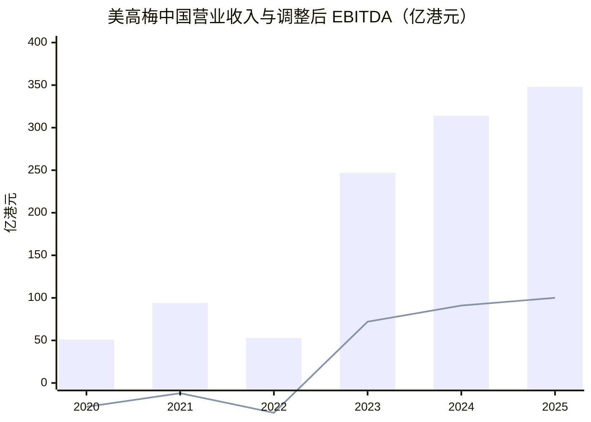
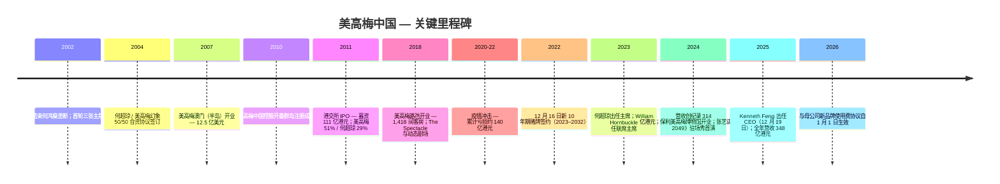
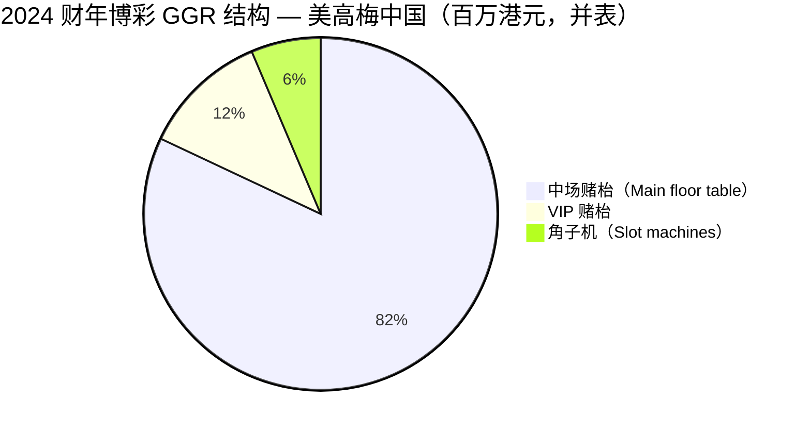
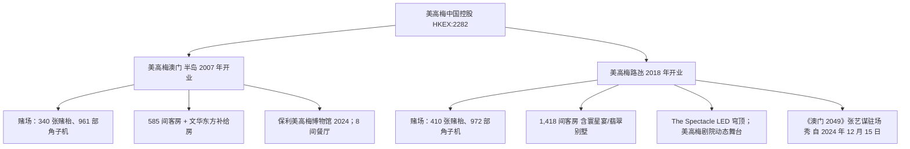
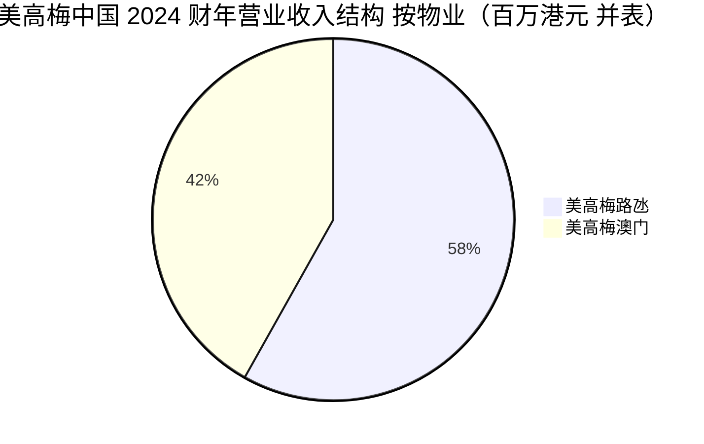
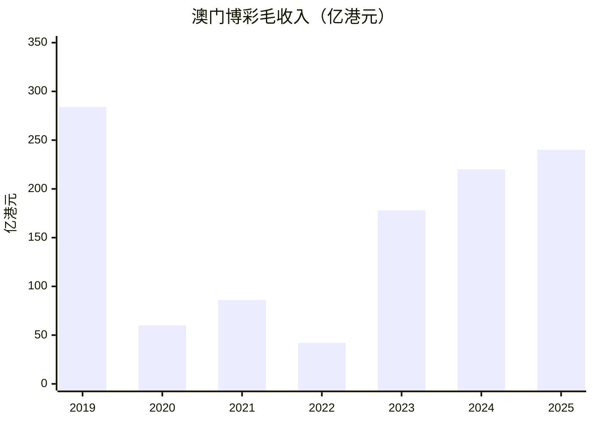
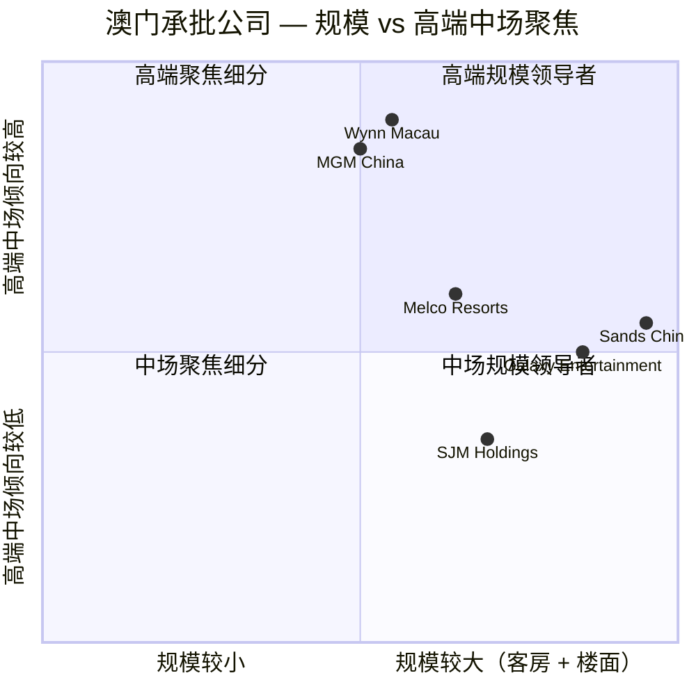
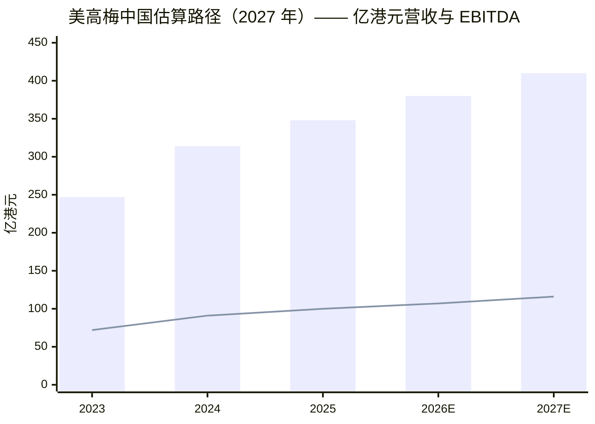

# 美高梅中国控股有限公司（HKEX:2282）—— 公司研究报告

**截至 2026-06-03（香港时间）**

> 澳门两大综合度假村业务的纯粹标的，由 MGM Resorts International（NYSE:MGM，"美高梅美国母公司"）持股 55.95% 与何超琼女士（Pansy Ho）控股实体持股 22.49% 共同控制。运营 **美高梅澳门**（半岛，2007 年开业）和 **美高梅路氹**（2018 年开业），凭借 2023 年至 2032 年 10 年期博彩特许经营牌照（Gaming Concession，赌牌）展业。**2025 财年**整体博彩市占率攀升至历史新高 **16.1%**（2024 年：15.8%；2019 年新冠前：9.5%）—— 系六家承批公司中疫后市占率结构性改善最显著的一家。**2025 年营业收入 348 亿港元（同比 +11%），调整后 EBITDA 100 亿港元（同比 +10%，历史新高），EBITDA 利润率 28.8%。2026 年第一季度**收入 +10% 至 88 亿港元，但 EBITDA 利润率因美高梅母公司新品牌使用费（branding fee，品牌许可费）安排而压缩 160 个基点至 28.0%。当前股价 **约 11.40 港元（2026 年 6 月）**，市值约 430 亿港元，TTM 市盈率约 10–13 倍，股息率约 6.4%。

## 目录

1. 公司概览
2. 公司历史
3. 管理团队（主席与 CEO）
4. 产品与服务（综合度假村业务平台）
5. 客户与上市策略
6. 行业概览（澳门博彩业）
7. 竞争格局
8. 市场机会（TAM）
9. 风险评估
10. 投资视角评分卡
11. 参考资料

---

## 1. 公司概览

美高梅中国控股有限公司（"美高梅中国"）是一家在开曼群岛注册成立、于香港联交所主板上市（HKEX:2282）的澳门综合度假村运营商。其运营子公司 **美高梅金殿超濠股份有限公司（MGM Grand Paradise S.A.）**持有澳门特别行政区政府于 **2022 年 12 月 16 日**所颁发的六张博彩特许经营牌照（gaming concession）之一，**为期 10 年，自 2023 年 1 月 1 日起至 2032 年 12 月 31 日止** —— 续接了何超琼家族 2004 年通过转批合约（sub-concession）进入澳门博彩业的结构性护城河。年报原文表述："We are a leading developer, owner and operator of two integrated casino, hotel and entertainment resorts in Macau, being MGM MACAU and MGM COTAI"（[2024 年报第 26 页](https://www.hkexnews.hk/listedco/listconews/sehk/2025/0428/2025042800919.pdf)）。母公司 MGM Resorts International（NYSE:MGM）"持有本公司已发行股本的 55.95% 权益"，何超琼女士及其控股公司"持有本公司已发行股本 22.49% 的权益"——剩余约 21.6% 为公众流通股（[2024 年报第 26 页](https://www.hkexnews.hk/listedco/listconews/sehk/2025/0428/2025042800919.pdf)）。

**2024 财年呈现教科书级别的疫后回升**：营业收入 **313.87 亿港元，同比 +27.2%**（[2024 年报第 38 页](https://www.hkexnews.hk/listedco/listconews/sehk/2025/0428/2025042800919.pdf)）；调整后 EBITDA **90.59 亿港元，同比 +25.2%**（[2024 年报第 37 页](https://www.hkexnews.hk/listedco/listconews/sehk/2025/0428/2025042800919.pdf)）；EBITDA 利润率 28.9%（2023 年：29.5%；2019 年：27.2%）；整体博彩市占率创历史新高 **15.8%（2023 年：15.2%；2019 年：9.5%）**（[2024 年报第 31 页](https://www.hkexnews.hk/listedco/listconews/sehk/2025/0428/2025042800919.pdf)）。归属母公司净利润几乎翻倍至 **46.03 亿港元**（基本每股盈利 121.1 港仙），上年同期为 26.38 亿港元（69.4 港仙，[2024 年报第 3 页](https://www.hkexnews.hk/listedco/listconews/sehk/2025/0428/2025042800919.pdf)）。

**2025 财年延续复苏**：营业收入 +11% 至 **348 亿港元**，调整后 EBITDA +10% 至 **历史新高 100 亿港元**，EBITDA 利润率维持 28.8%，整体市占率进一步攀升至 **16.1%**（美高梅路氹 10.1% + 美高梅澳门 6.0%），数据见 [2025 年度业绩公告 — StockTitan 报道](https://www.stocktitan.net/news/MGM/mgm-china-reports-2025-annual-dpcid0xrgrwu.html)。2025 年末集团总流动性约 **240 亿港元**（现金及银行结余 + 未动用循环贷款），高于 2024 年末的 172 亿港元（[2024 年报主席致辞](https://www.hkexnews.hk/listedco/listconews/sehk/2025/0428/2025042800919.pdf)）。

**2026 年第一季度首现复苏周期内的利润率压缩**：收入 **同比 +10% 至 88 亿港元**，但调整后 EBITDA 仅 **+4% 至 25 亿港元**，EBITDA 利润率回落 160 个基点至 **28.0%**（[2026 年第一季度业绩报道](https://www.stocktitan.net/news/MGM/mgm-china-reports-2026-first-quarter-i2kcx6y94x0w.html)）。日均中场 GGR（mass GGR）升幅 19% 创纪录，但母公司自 2026 年 1 月 1 日起调升的 **品牌使用费**（依据 2024 年 8 月 16 日签订的"第三次品牌协议续约修订协议"，[2024 年报释义](https://www.hkexnews.hk/listedco/listconews/sehk/2025/0428/2025042800919.pdf)）侵蚀了可见经营杠杆 —— 这是后文第 9 章详细讨论的结构性逆风。

**估值快照（2026 年 6 月）**。当前股价 11.40 港元 × 约 38 亿股 = 市值约 **430 亿港元（约 55 亿美元）**。TTM 市盈率（trailing P/E）位于 **10–13 倍**区间（2025 财年 EPS 约 130 港仙隐含约 9 倍下限；2026 年第一季度利润率压缩后滚动四季度数据接近 13 倍），数据见 [Yahoo Finance 2282.HK 关键统计](https://finance.yahoo.com/quote/2282.HK/key-statistics/) 与 [Simply Wall St 估值页](https://simplywall.st/stocks/hk/consumer-services/hkg-2282/mgm-china-holdings-shares/valuation)。基于过去两次半年度派息合计 56.4 港仙，**滚动股息率约 6.4%**（[Stockanalysis.com 派息历史](https://stockanalysis.com/quote/hkg/2282/dividend/)）。市净率（P/B）因疫情期间巨额亏损导致 2024 年末净资产仅 5.28 亿港元，机械计算下被扭曲（数十倍）；以 100 亿港元 EBITDA 基数计算 EV/EBITDA 约 6–7 倍 —— 较金沙中国（9–10 倍）与永利澳门（8–9 倍）有折价（数据见 [Alpha Spread 同业对比](https://www.alphaspread.com/security/hkex/2282/relative-valuation/ratio/enterprise-value-to-ebitda)）。**折价的成因**有三：（i）新品牌使用费向美国母公司输送；（ii）公众流通股仅约 22%，流动性偏弱；（iii）2032 年牌照到期，剩余年限已收缩至 7 年。

*柱状 = 营业收入；折线 = 调整后 EBITDA。数据来源：[美高梅中国 2024 年报第 273 页财务摘要](https://www.hkexnews.hk/listedco/listconews/sehk/2025/0428/2025042800919.pdf) 提供 2020–2024 年数据；[2025 年度业绩公告 — StockTitan 报道](https://www.stocktitan.net/news/MGM/mgm-china-reports-2025-annual-dpcid0xrgrwu.html) 提供 2025 年数据。2022 年低点反映澳门疫情封城。*

---

## 2. 公司历史

美高梅中国的源头要追溯至 2002 年澳门特区政府终结何鸿燊（Stanley Ho）旗下澳娱（STDM）近 40 年的博彩独家特许经营权 —— 政府当年开放三张主牌（concession），其后再衍生三张转批牌（sub-concession）。**2004 年**，何鸿燊次子女、当时已进入 STDM 董事会并掌舵信德集团（Shun Tak Holdings）的 **何超琼** 与美高梅幻象集团（MGM Mirage，后更名 MGM Resorts International）签订 50/50 合资协议，依托 SJM 旗下转批架构落地澳门 —— 转批费用约 2 亿美元，是当时美方进入大中华区博彩市场的关键桥梁（[Macau Business —"Pansy, the rebel successor"](https://macaubusiness.com/pansy-the-rebel-successor/)；[Pansy Ho 维基百科条目](https://en.wikipedia.org/wiki/Pansy_Ho)）。

**首家物业 MGM Grand Macau（后更名 MGM Macau / 美高梅澳门）于 2007 年 12 月 18 日开业**，总投资约 **12.5 亿美元**，35 层澳门半岛建筑，标志性葡式中庭"大广场"（Grande Praça）配 25 米高玻璃穹顶，并与 One Central 顶级零售综合体及文华东方酒店（Mandarin Oriental Hotel）相连（[MGM Macau 维基百科条目](https://en.wikipedia.org/wiki/MGM_Macau)；[2024 年报第 27 页](https://www.hkexnews.hk/listedco/listconews/sehk/2025/0428/2025042800919.pdf)）。**美高梅中国控股有限公司于 2010 年 7 月 2 日在开曼群岛注册成立**（[2024 年报释义](https://www.hkexnews.hk/listedco/listconews/sehk/2025/0428/2025042800919.pdf)），**2011 年 6 月 3 日**在香港联交所主板上市，发行 7.6 亿股新股，发行价 15.34 港元，净筹资约 **111 亿港元（约 14 亿美元）**——彼时亚洲最大博彩业 IPO 之一（[PRNewswire 2011 年 6 月 3 日 IPO 完成公告](https://www.prnewswire.com/news-releases/mgm-resorts-international-and-ms-pansy-ho-announce-completion-of-mgm-china-holdings-limited-initial-public-offering-123091853.html)；[Review Journal 2011 IPO 报道](https://www.reviewjournal.com/business/casinos-gaming/mgm-macau-casino-raises-1-4b-in-hong-kong-ipo/)）。上市后股权结构：美高梅母公司 51%、何超琼 29%、公众 20%。

接下来的十年是第二家物业的资本周期。**美高梅路氹（MGM Cotai）于 2018 年 2 月 13 日开业**，工期相对项目原计划严重延迟（2012 年动土，多次设计修订），最终以 1,418 间客房、24,549 平方米赌场面积、世界最大永久性室内 LED 穹顶之一 "**The Spectacle**" 以及亚洲首家动态剧场（dynamic theater）登场（[2024 年报第 28 页](https://www.hkexnews.hk/listedco/listconews/sehk/2025/0428/2025042800919.pdf)）。路氹物业的开业将集团收入产能翻倍，并将客户结构从半岛物业的 VIP 依赖型转向路氹赛道快速增长的高端中场（premium mass）—— 后疫情时代该高端中场的渗透率与单位经济正是集团市占率从 9.5% 拉升至 16.1% 的根本动能。

*数据来源：[美高梅中国 2024 年报](https://www.hkexnews.hk/listedco/listconews/sehk/2025/0428/2025042800919.pdf)；[2011 年 IPO 公告 — PRNewswire](https://www.prnewswire.com/news-releases/mgm-resorts-international-and-ms-pansy-ho-announce-completion-of-mgm-china-holdings-limited-initial-public-offering-123091853.html)；[CEO 委任公告 — 2025 年 12 月 19 日](https://www1.hkexnews.hk/listedco/listconews/sehk/2025/1219/2025121900439.pdf)。*

**疫情期间的财务深谷**：营业收入由 2019 年的 200+ 亿港元骤降至 2020 年的 51 亿港元，2022 年因澳门年中全面封控再度回落至 53 亿港元，连续 4 年亏损总计约 **140 亿港元**（[2024 年报第 273 页五年财务摘要](https://www.hkexnews.hk/listedco/listconews/sehk/2025/0428/2025042800919.pdf)）。复苏自 2022 年底渐入正轨：2023 年收入同比 +369% 至 247 亿港元，2024 年再 +27% 至 314 亿港元。澳门全行业 **2024 年博彩毛收入（GGR）220.2 亿港元**，同比 +23.9%，但仍较 2019 年低 22.5%（[2024 年报第 31 页](https://www.hkexnews.hk/listedco/listconews/sehk/2025/0428/2025042800919.pdf)）——美高梅中国市占率从疫前 9.5% 跃升至 2025 年的 16.1%，意味着集团在绝对值上已超越 2019 年的水平，即便行业大盘尚未追平。

**2022 年 12 月 16 日**，澳门特区政府与 MGM Grand Paradise 正式签订新 10 年期博彩特许经营合约，授权其经营 **"750 张赌枱以及 1,700 部电动或机械博彩机（包括角子机）"，"为期 10 年，自 2023 年 1 月 1 日起至 2032 年 12 月 31 日止"**（[2024 年报第 26 页](https://www.hkexnews.hk/listedco/listconews/sehk/2025/0428/2025042800919.pdf)）。作为对价，MGM Grand Paradise "承诺在特许合约期内合计投资 **澳门元 197 亿元（约合港元 191 亿元）**，其中 **澳门元 180 亿元（约合港元 175 亿元，约 91%）**预计将投入开拓国际旅客市场及非博彩项目与活动以促进区内旅游发展"（[2024 年报第 30 页](https://www.hkexnews.hk/listedco/listconews/sehk/2025/0428/2025042800919.pdf)）。**非博彩业务的转向**——保利美高梅博物馆（2024 年 11 月）、Bruno Mars 户外演唱会系列、12 月 15 日首演的张艺谋导演驻场秀《澳门 2049》、以及妈阁区活化项目——是该 91% 非博彩承诺在经营层面的具体体现。

最新动态是董事会于 2025 年 12 月 19 日将长期担任总裁兼首席财务官的 **冯小峰（Kenneth Xiaofeng Feng）** 提升为首席执行官（[港交所 CEO 委任公告 2025-12-19](https://www1.hkexnews.hk/listedco/listconews/sehk/2025/1219/2025121900439.pdf)）。

---

## 3. 管理团队

按 company-research 技能要求，本节仅覆盖主席与现任 CEO。

### 主席 — 何超琼（Pansy Catilina Chiu King Ho，62 岁）

**何超琼女士自 2023 年 5 月出任美高梅中国主席**，并自 **2005 年 6 月 1 日**起担任 **MGM Grand Paradise 董事总经理**——任内年限为现任高管中最长的（[2024 年报第 12 页](https://www.hkexnews.hk/listedco/listconews/sehk/2025/0428/2025042800919.pdf)）。她毕业于美国加州 Castilleja School 与圣克拉拉大学（Santa Clara University），获市场营销与商业学士学位（[Pansy Ho 维基百科](https://en.wikipedia.org/wiki/Pansy_Ho)）。她兼任**信德集团（HKEX:0242）集团行政主席兼董事总经理**，分别自 2017 年与 1999 年起任职；同时为凤凰卫视控股（HKEX:2008）副主席（2021 年起）以及中国南方航空（HKEX:1055）独立非执行董事（2023 年起）（[2024 年报第 12 页](https://www.hkexnews.hk/listedco/listconews/sehk/2025/0428/2025042800919.pdf)）。在内地，她是 **中国人民政治协商会议第十四届全国委员会常务委员**——这层政治资本对任何一家澳门承批公司都是结构性资产，因为每一张关键牌照都位于中国监管体系的边界之内（[2024 年报第 12–13 页](https://www.hkexnews.hk/listedco/listconews/sehk/2025/0428/2025042800919.pdf)）。

何超琼在美高梅中国的角色远超过一席董事——她是 2004 年其家族与美高梅幻象签订首份转批合约的人格化纽带（[Macau Business 报道](https://macaubusiness.com/pansy-the-rebel-successor/)）。她经 Grand Paradise Macau Limited 及关联实体持有的 **22.49% 经济权益**（[2024 年报第 26 页](https://www.hkexnews.hk/listedco/listconews/sehk/2025/0428/2025042800919.pdf)）是股东登记册上第二大头寸，仅次于母公司 MGM Resorts International 的 55.95%。2024 年报主席致辞反映出她对经营层的实质参与，将 2024 年描绘为 "对澳门而言是辉煌的一年"——物业访客量同比 +54% 至 "2019 年水平的 163%"，集团整体市占率 "创历史新高 15.8%，对比 2023 年的 15.2% 与新冠前 2019 年的 9.5%"（[2024 年报第 7–8 页](https://www.hkexnews.hk/listedco/listconews/sehk/2025/0428/2025042800919.pdf)）。

### 联席主席 — William Joseph Hornbuckle（67 岁）

**Hornbuckle 先生自 2023 年 5 月起出任本公司联席主席**，同时是执行董事，并自 **2020 年 7 月 29 日**起担任 **MGM Resorts International 总裁兼首席执行官**（[2024 年报第 13 页](https://www.hkexnews.hk/listedco/listconews/sehk/2025/0428/2025042800919.pdf)）。他代表美国母公司在美高梅中国董事会的声音。Hornbuckle 在 MGM Resorts 服务逾 20 年，历任曼德勒湾酒店（Mandalay Bay）总裁兼 COO、拉斯维加斯美高梅大酒店（MGM Grand Las Vegas）总裁兼 COO；曾主导将 MGM Growth Properties 出售予 VICI Properties 的战略与执行，以及 BetMGM 数字博彩平台的设立（[2024 年报第 13 页](https://www.hkexnews.hk/listedco/listconews/sehk/2025/0428/2025042800919.pdf)）。

### 首席执行官 — 冯小峰（Kenneth Xiaofeng Feng，55 岁）

**冯小峰先生自 2025 年 12 月 19 日起出任美高梅中国首席执行官**，此前担任本公司总裁兼执行董事（[港交所 CEO 委任公告 2025-12-19](https://www1.hkexnews.hk/listedco/listconews/sehk/2025/1219/2025121900439.pdf)）。他最早于 **2018 年 5 月 24 日**被委任为美高梅中国非执行董事；**2020 年 6 月 22 日**升任 "总裁、战略及首席财务官"——正值疫情最深处；**2023 年 7 月 20 日**改任 "执行董事兼总裁"（[CEO 委任公告](https://www1.hkexnews.hk/listedco/listconews/sehk/2025/1219/2025121900439.pdf)）。冯先生 **自 2001 年起任职于 MGM Resorts International**，历经财务、咨询、战略、运营、开发等多个职能；2007 年升任 "副总裁——国际业务"，2009 年升任 MGM Resorts 高级副总裁，2017 年晋升为 MGM International Operations 执行副总裁（[CEO 委任公告](https://www1.hkexnews.hk/listedco/listconews/sehk/2025/1219/2025121900439.pdf)）。其 CEO 服务协议为 3 年固定期限（自 2025 年 12 月 19 日起），固定年薪 **150 万美元（约 1,170 万港元）** 外加可由董事会与薪酬委员会全权酌定的管理年度奖金；其 2024 年（任总裁兼 CFO 时）的薪酬总额为 **24,199,000 港元**（包含工资、退休金、股权激励及业绩奖励）。截至委任公告日，冯先生获授 **2,861,100 份**本公司股票期权（[CEO 委任公告](https://www1.hkexnews.hk/listedco/listconews/sehk/2025/1219/2025121900439.pdf)）。***分析师观点：***冯先生的升任更接近 "延续性" 而非 "断裂"——他在疫情期作为 CFO 主导集团资产负债表防御战，2023 年新赌牌谈判与 2024–25 年业绩复苏均由他主导，将 CEO 头衔正式授予他，是在澳门进入更激烈路氹竞争周期前，把经营层的肌肉记忆锁定。

---

## 4. 产品与服务

美高梅中国在澳门 **仅经营两家** 综合度假村——半岛的美高梅澳门与路氹的美高梅路氹，整个集团业务即在于经营这两个物业。每家物业的收入再切分为博彩（casino，赌场）与非博彩（客房、餐饮、零售、娱乐、MICE 会展）。**2024 年物业结构**：美高梅路氹 182.5 亿港元（占 58.1%）+ 美高梅澳门 131.4 亿港元（占 41.9%），单家物业内部博彩收入占 86–88%（[2024 年报第 38 页营业收入表](https://www.hkexnews.hk/listedco/listconews/sehk/2025/0428/2025042800919.pdf)）。澳门博彩市场的分析框架将赌场收入再分为中场（main floor mass）、贵宾厅（VIP）与角子机（slot machines）——而美高梅中国自 2019 年以来的**结构性转向就是从 VIP 切向中场**，"我们的中场博彩业务在截至 2024 年 12 月 31 日止年度内占本集团博彩毛收入的 88%"（[2024 年报第 33 页](https://www.hkexnews.hk/listedco/listconews/sehk/2025/0428/2025042800919.pdf)）。

### 4.1 美高梅澳门（MGM Macau，半岛，2007 年 12 月开业）

年报原文逐字引用："美高梅澳门于 2007 年 12 月开业。截至 2024 年 12 月 31 日，赌场地面积约 23,283 平方米，设有 961 部角子机、340 张赌枱以及多个贵宾厅及私人博彩区域。物业设有 585 间酒店客房、套房及别墅，并与文华东方酒店签订服务协议，在客户超额需求时提供额外房间。此外，物业提供包括 8 间餐厅、多家零售门店、约 1,600 平方米的可改造会议空间及其他非博彩配套设施的奢华服务。物业的视觉焦点为标志性'大广场'，结合葡式建筑、戏剧化景观及离地 25 米的玻璃穹顶。美高梅澳门与 One Central 综合体直接相连，后者汇聚多家国际顶级奢侈品零售商，并包含文华东方酒店及服务式公寓。2024 年 11 月 2 日，美高梅中国与保利文化集团合作，在美高梅澳门正式开放世界级的保利美高梅博物馆"（[2024 年报第 27 页](https://www.hkexnews.hk/listedco/listconews/sehk/2025/0428/2025042800919.pdf)）。

半岛物业规模较小但利润率更高、VIP 占比相对更高。**2024 年关键运营指标**：

| 指标（2024 财年） | 美高梅澳门 | 来源 |
|---|---|---|
| 营业收入 | 131.4 亿港元（同比 +21%） | [2024 年报第 38 页](https://www.hkexnews.hk/listedco/listconews/sehk/2025/0428/2025042800919.pdf) |
| 调整后 EBITDA | 38.3 亿港元（同比 +21%） | [2024 年报第 37 页](https://www.hkexnews.hk/listedco/listconews/sehk/2025/0428/2025042800919.pdf) |
| EBITDA 利润率 | 29.2% | 计算得出 |
| 中场赌枱投注额（main floor drop） | 561.17 亿港元（+15.9%） | [2024 年报第 39 页](https://www.hkexnews.hk/listedco/listconews/sehk/2025/0428/2025042800919.pdf) |
| 中场赌枱毛赢（main floor gross win） | 121.58 亿港元（+23.2%） | 同上 |
| VIP 赌枱投注转码额 | 336.68 亿港元（+0.6%） | 同上 |
| VIP 赌枱毛赢 | 9.81 亿港元（-4.8%） | 同上 |
| 角子机投注 handle | 293.46 亿港元（+26.0%） | 同上 |
| 角子机毛赢 | 11.35 亿港元（+25.8%） | 同上 |
| 酒店入住率 | 94.5% | 同上 |
| 每客房收益 REVPAR（港元） | 2,632（+20.1%） | 同上 |
| 赌枱数 | 340 张 | 同上 |
| 角子机数 | 961 部 | 同上 |

**它在客户动线中的物理角色**。美高梅澳门位于澳门半岛、靠近 SJM 历史赌场集群（新葡京、永利澳门）、外港客运码头与拱北口岸——是经轮渡抵澳或入住 One Central 综合体的旅客接触的首家美高梅物业。物业的竞争身份基于：（a）澳门最具建筑辨识度的内部空间之一（大广场）；（b）餐饮与酒店服务持续获评福布斯五星级 ——**2024 年集团共获 7 项福布斯旅游指南五星奖**（[2024 年报第 35 页](https://www.hkexnews.hk/listedco/listconews/sehk/2025/0428/2025042800919.pdf)）；（c）2024 年 11 月 2 日开幕的 **保利美高梅博物馆**，与保利文化集团联手呈献，开幕展品包括圆明园四大铜兽首（"国家一级文物"），是博彩物业内罕见的文化旅游资产（[2024 年报第 27、35 页](https://www.hkexnews.hk/listedco/listconews/sehk/2025/0428/2025042800919.pdf)）。

### 4.2 美高梅路氹（MGM Cotai，2018 年 2 月 13 日开业）

年报原文逐字引用："美高梅路氹于 2018 年 2 月 13 日开业。物业便利地与其他路氹酒店及公共配套多入口相连。截至 2024 年 12 月 31 日，赌场地面积约 24,549 平方米，设有 972 部角子机以及 410 张赌枱。物业设有 1,418 间酒店客房、套房、空中阁、翡翠（Emerald）别墅及'寰星宴'（The Mansion）别墅；12 间多元化餐厅及酒吧；多家零售门店；约 2,870 平方米的会议空间及其他非博彩配套设施。美高梅路氹的规模允许我们充分发挥我们在提供精彩与多元化娱乐体验上的国际经验。位于美高梅路氹中心的'视博广场'（The Spectacle）融合了体验式科技元素以为客户带来欢娱。美高梅路氹拥有亚洲首家动态剧场，将先进创新的娱乐内容引入澳门。美高梅中国首部驻场秀《澳门 2049》由享誉国际的中国导演张艺谋执导，于 2024 年 12 月 15 日在美高梅剧院首演"（[2024 年报第 28 页](https://www.hkexnews.hk/listedco/listconews/sehk/2025/0428/2025042800919.pdf)）。

| 指标（2024 财年） | 美高梅路氹 | 来源 |
|---|---|---|
| 营业收入 | 182.5 亿港元（同比 +31.9%） | [2024 年报第 38 页](https://www.hkexnews.hk/listedco/listconews/sehk/2025/0428/2025042800919.pdf) |
| 调整后 EBITDA | 52.3 亿港元（同比 +28.7%） | [2024 年报第 37 页](https://www.hkexnews.hk/listedco/listconews/sehk/2025/0428/2025042800919.pdf) |
| EBITDA 利润率 | 28.6% | 计算得出 |
| 中场赌枱投注额 | 584.48 亿港元（+25.9%） | [2024 年报第 40 页](https://www.hkexnews.hk/listedco/listconews/sehk/2025/0428/2025042800919.pdf) |
| 中场赌枱毛赢 | 164.46 亿港元（+42.5%） | 同上 |
| VIP 赌枱投注转码额 | 1,151.19 亿港元（+44.9%） | 同上 |
| VIP 赌枱毛赢 | 30.67 亿港元（+4.9%） | 同上 |
| 赌枱数 | 410 张 | 同上 |
| 角子机数 | 972 部 | 同上 |
| 酒店房数 | 1,418 间 | 同上 |

**它在客户动线中的物理角色**。美高梅路氹是规模物业 —— 客房数为半岛物业的 2.4 倍、赌场地面积相当、博彩位次更多、且高端中场（premium mass）占比明显更高。路氹是澳门疫后复苏的引力中心（所有六家承批公司的新增投资均落在路氹），美高梅路氹的市占率扩张正是集团整体市占率从 9.5%（2019 年）跃升至 16.1%（2025 年）的发动机。6.6 个百分点的市占率增量中，**美高梅路氹贡献约 4.4 个百分点**（约 5.7% → 10.1%），**美高梅澳门贡献约 2.2 个百分点**（约 3.8% → 6.0%）——数据基于 [2025 年度业绩公告中的物业市占率拆分](https://www.stocktitan.net/news/MGM/mgm-china-reports-2025-annual-dpcid0xrgrwu.html)。

**美高梅路氹与美高梅澳门的客户结构差异**。路氹物业横跨高端中场与"寰星宴 / 翡翠别墅"的超高净值客层——其 VIP 投注转码额 1,151 亿港元为半岛物业的 3.4 倍，"寰星宴"与翡翠别墅的产品组合服务的是任何半岛物业都难以承接规模的全球超高净值博彩客户。非博彩端的 **The Spectacle**（世界最大永久性室内 LED 穹顶之一）、**美高梅剧院**（亚洲首家动态剧场）、以及 2024 年 12 月 15 日首演的 **《澳门 2049》驻场秀**（由中国电影界国际辨识度最高的导演 **张艺谋** 执导）——这套娱乐内容明确是为了把原本会去金沙澳门伦敦人、永利皇宫、银河澳门、新濠影汇、新濠天地等竞争对手物业的过夜博彩客 "拉" 到美高梅过夜与消费而设计的。2024 年 Bruno Mars 的户外演唱会系列（[2024 年报第 11 页](https://www.hkexnews.hk/listedco/listconews/sehk/2025/0428/2025042800919.pdf)）是娱乐拉新策略最高调的一次外化。

### 4.3 中场化（mass shift）论述与品牌许可的角色

**自 2019 年以来最具战略性的转向是有意将 VIP 转码量替换为高端中场（premium mass）量** —— 部分被动（澳门政府于 2022 年期间逐步撤销叠码仔/junket 牌照；2024 年 8 月 1 日生效的"博彩信贷新法律 Law 7/2024" 终结了与博彩中介人的直接信贷业务，[2024 年报第 34 页](https://www.hkexnews.hk/listedco/listconews/sehk/2025/0428/2025042800919.pdf)），部分主动（中场单位经济与利润率均显著高于 VIP，且波动更小）。**结果**：2024 年中场赌枱毛赢 **286.04 亿港元**，VIP 赌枱毛赢仅 **40.48 亿港元** —— 比例 **7.1 : 1**，而疫前比例接近 1 : 1（[2024 年报第 4 页财务与营运摘要](https://www.hkexnews.hk/listedco/listconews/sehk/2025/0428/2025042800919.pdf)）。

*数据来源：[美高梅中国 2024 年报第 4 页财务与营运摘要](https://www.hkexnews.hk/listedco/listconews/sehk/2025/0428/2025042800919.pdf)。*

### 4.4 品牌许可协议（Branding Agreement）—— 2026 年首度显现的成本

集团本身并不拥有 "MGM / 美高梅" 商标。品牌使用权来自一份 **2011 年 5 月 17 日签订的品牌协议**（[2024 年报释义](https://www.hkexnews.hk/listedco/listconews/sehk/2025/0428/2025042800919.pdf)），缔约方为本公司、MGM Grand Paradise、MGM Branding、MGM Resorts International、MRIH 及 NCE —— 最近一次修订发生在 2024 年 8 月 16 日，即 **"第三次品牌协议续约修订协议"**（[2024 年报释义](https://www.hkexnews.hk/listedco/listconews/sehk/2025/0428/2025042800919.pdf)）。此次修订上调了向母公司支付的品牌使用费 —— 该影响在 2026 年第一季度首次充分体现，即营收 +10% 而 EBITDA 利润率压缩 160 个基点至 28.0%（[asgam 关于 2026 年第一季度品牌费影响的报道](https://asgam.com/2026/04/30/mgm-chinas-revenue-up-almost-10-in-1q26-but-introduction-of-higher-branding-fee-for-use-of-mgm-name-hurts-profitability/)；[Sahm Capital 2026 年第一季度业绩总结](https://www.sahmcapital.com/news/content/mgm-china-fy26-q1-adjusted-ebitda-rises-4-to-hk25-billion-2026-04-30)）。此调整为结构性、非一次性。

*数据来源：[美高梅中国 2024 年报第 27–28 页](https://www.hkexnews.hk/listedco/listconews/sehk/2025/0428/2025042800919.pdf)。*

---

## 5. 客户与上市策略

美高梅中国的客户基础就是澳门博彩访客 —— 绝对主体为中国大陆人（**2024 年澳门全部访客中 70.1% 来自大陆**，2023 年为 67.5%，[2024 年报第 31 页](https://www.hkexnews.hk/listedco/listconews/sehk/2025/0428/2025042800919.pdf)），其次为来自香港、台湾、韩国与日本的访客。年报原文："来澳的客户主要来自亚洲邻近地区，包括中国大陆、香港、台湾、韩国与日本"（[2024 年报第 31 页](https://www.hkexnews.hk/listedco/listconews/sehk/2025/0428/2025042800919.pdf)）。**集团并未披露 10-K 意义上的 "前 5 大客户" 集中度** —— 因为博彩是 B2C 业务，最大单一客户（VIP 大客）受到澳门隐私监管的隐去 —— 但结构性集中度风险贯穿三条向量：（a）地理来源（对大陆的依赖）；（b）博彩分部结构（中场 vs VIP）；（c）酒店入住率对母公司 M life 全球会员体系的依赖。母公司的 **M life Rewards 计划**（由 Hornbuckle 任 MGM Resorts 首席营销官时缔造，[2024 年报第 13 页](https://www.hkexnews.hk/listedco/listconews/sehk/2025/0428/2025042800919.pdf)）是跨物业客户数据库，把美国本土赴亚旅行的 MGM 客户引流至美高梅中国旗下物业 —— 这是除美高梅之外任何一家澳门承批公司都无法在同样规模上复制的竞争优势。

**访客数据演算**。2024 年美高梅中国物业访客同比 **+54% 至 2019 年水平的 163%**（[2024 年报第 7 页主席致辞](https://www.hkexnews.hk/listedco/listconews/sehk/2025/0428/2025042800919.pdf)），与之相比澳门全城访客为 3,490 万人次（同比 +24%，仅恢复至 2019 年的 88%，[2024 年报第 7 页](https://www.hkexnews.hk/listedco/listconews/sehk/2025/0428/2025042800919.pdf)）。结论清晰：美高梅中国在澳门的访客市占率较 2019 年大致翻倍。桥接动能是 2018 年新开业的路氹物业（半岛物业 2017 年访客数据没有它的可比基础）、高端中场博彩产品、以及叠加在博彩之上的娱乐 / 文化旅游内容（2024 年 "合计举办 140 场大型活动"，[2024 年报第 9 页](https://www.hkexnews.hk/listedco/listconews/sehk/2025/0428/2025042800919.pdf)）。2026 年第一季度澳门日均访客 **同比 +14% 至 124,599 人次**（[2026 年第一季度业绩报道](https://www.stocktitan.net/news/MGM/mgm-china-reports-2026-first-quarter-i2kcx6y94x0w.html)）—— 复苏仍在延伸。

**中场 vs VIP —— 分部级客户结构**。"我们的中场博彩业务在截至 2024 年 12 月 31 日止年度内占本集团博彩毛收入的 88%"（[2024 年报第 33 页](https://www.hkexnews.hk/listedco/listconews/sehk/2025/0428/2025042800919.pdf)）。VIP 业务在结构上已小于疫前 —— 一方面因叠码仔体系被完全拆解（自 2022 年太阳城叠码仔倒闭后，澳门已无活跃叠码仔，再加 2024 年 8 月 1 日生效的博彩信贷新法律），另一方面因澳门政府主动引导承批公司将重心转向中场。**美高梅 2026 年第一季度中场市占率达 16.2%**（2025 年同期 15.8%），但 **VIP 市占率从 15.4% 跌至 10.2%** —— 反映 VIP 行业整体收缩与美高梅有意主动的结构调整（[2026 年第一季度业绩报道](https://www.stocktitan.net/news/MGM/mgm-china-reports-2026-first-quarter-i2kcx6y94x0w.html)）。

*数据来源：[美高梅中国 2024 年报第 38 页营业收入表](https://www.hkexnews.hk/listedco/listconews/sehk/2025/0428/2025042800919.pdf)。*

**客户集中度披露的边界**。2024 年报并未披露 10-K 意义上的 "≥10% 客户"——因为澳门博彩客户隐私监管禁止具名披露单一高净值客 —— 但 **地理与分部级集中度本身就是绑定型集中度风险**：70%+ 访客来自单一国家（中国），88% 博彩收入来自单一分部（中场），两者均直接承受大陆宏观与政策的波动暴露。在第 9 章我们将二者并列为风险。

**上市策略**。美高梅中国结构上是一家受控子公司 —— MGM Resorts International（NYSE:MGM）持股 55.95% + 何超琼系实体持股 22.49%，公众流通股仅约 21.6%（[2024 年报第 26 页](https://www.hkexnews.hk/listedco/listconews/sehk/2025/0428/2025042800919.pdf)）。品牌协议、发展协议、不竞争契约（Deed of Non-Compete Undertakings）与咨询服务协议均为关联交易安排，将美高梅中国的现金流持续输送至母公司 —— 这是实质性的，因为母公司在公众股东之前已 "切" 走每一笔经营美元。派息政策也反映这一点：2024 年董事会派发 **每股 35.3 港仙的特别股息（合计 13.42 亿港元）** 外加常规中期股息（[AGB 特别股息报道](https://agbrief.com/news/macau/30/08/2024/mgm-china-declares-special-dividend-of-172-million/)；[Stockanalysis.com 派息历史](https://stockanalysis.com/quote/hkg/2282/dividend/)），2024 年全年三次派息合计每股 70 港仙现金股息。**2025 年两次半年度派息合计每股 56.4 港仙**（2025 年 5 月 + 8 月，[Stockanalysis 派息历史](https://stockanalysis.com/quote/hkg/2282/dividend/)），加上 2026 年 5 月宣派的 **35.3 港仙末期股息**，滚动 12 个月派息合计约 **每股 73 港仙**，在 11.40 港元的股价基础上对应约 6.4% 股息率。CLSA 预期美高梅中国将与银河、金沙中国、永利澳门一同维持 2025 财年的末期派息（[iGamingToday CLSA 报道关于澳门派息恢复](https://www.igamingtoday.com/macaus-gaming-sector-sees-greater-dominance-by-top-operators-according-to-clsa/)）。

---

## 6. 行业概览

澳门是全球收入规模最大的博彩市场。2024 年报原文："澳门博彩毛收入截至 2024 年 12 月 31 日止年度按年增长 23.9% 至 **2,202 亿港元**。截至 2024 年 12 月 31 日止年度澳门访客总人次及博彩毛收入分别较 2019 年新冠前可比期低 11.4% 与 22.5%"（[2024 年报第 31 页](https://www.hkexnews.hk/listedco/listconews/sehk/2025/0428/2025042800919.pdf)）。换言之：澳门博彩业以美元/港元计量的总盘子仍较疫前小 22.5%，但访客人次仅低 11.4% —— 意味着 **人均博彩消费下降**（结构性向中场客层转移，疫前的叠码仔 / VIP 客层并未完全回流），而非永久性需求毁灭。

**澳门是大中华区唯一合法的陆基赌场市场**。这是六家承批公司共同的根本性护城河。最近的竞争性市场是新加坡（双寡头综合度假村）、马尼拉娱乐城（Entertainment City）、柬埔寨（NagaWorld）、韩国（Paradise City、济州赌场）、越南（富国岛 Corona）。美高梅的年报风险因素明确列出："我们的业务还与世界其他地区的类似企业存在一定竞争，包括但不限于柬埔寨、越南、韩国、新加坡、菲律宾、澳大利亚以及拉斯维加斯的综合度假村"（[2024 年报第 33 页](https://www.hkexnews.hk/listedco/listconews/sehk/2025/0428/2025042800919.pdf)）。展望未来，中期供给侧最具影响力的新增产能来自 **泰国**（2026 年仍处于法案草案阶段）综合度假村合法化与 **日本**（美高梅母公司是 **MGM Osaka IR** 大阪综合度假村项目的牵头运营商，预计 2030 年开业、总投资逾 100 亿美元）—— 均会从澳门拉走部分边际中场客流。

**六家承批公司格局**。年报风险因素原文："通过我们的子公司 MGM Grand Paradise，我们目前与澳门政府授权进行博彩运营的其他五家承批公司直接竞争"（[2024 年报第 58 页](https://www.hkexnews.hk/listedco/listconews/sehk/2025/0428/2025042800919.pdf)）。六张赌牌分别归于：银河娱乐、金沙中国、永利澳门、澳博控股、新濠博亚娱乐、美高梅中国。六家均于 2023 年 1 月 1 日同步取得新 10 年期赌牌（至 2032 年 12 月 31 日），全行业非博彩投资承诺总额约 **澳门元 1,190 亿元**（每家约 150–200 亿澳门元）。美高梅中国个人承诺为 **澳门元 197 亿元（约合港元 191 亿元）**，其中 91% 投入非博彩（[2024 年报第 30 页](https://www.hkexnews.hk/listedco/listconews/sehk/2025/0428/2025042800919.pdf)）。

*澳门全年 GGR。2019 年 = 疫前基准；2020–2022 = 疫情封城与清零；2023 年 = 重启；2024 年 = 2,202 亿港元（[美高梅 2024 年报第 31 页](https://www.hkexnews.hk/listedco/listconews/sehk/2025/0428/2025042800919.pdf)）；2025 年 ≈ 2,400 亿港元（基于 CLSA 2025 年末统计的 +9.1% 同比增长，[iGamingToday 报道](https://www.igamingtoday.com/macaus-gaming-sector-sees-greater-dominance-by-top-operators-according-to-clsa/)）。*

**旅游驱动与政策顺风**。2024 年报第 31–32 页指出五个长期驱动力：（1）91% 非博彩的赌牌投资周期（全行业 2023–2032 共计 1,200+ 亿港元）；（2）跨境基础设施（港珠澳大桥、第四条澳门-氹仔过海通道 "澳门大桥"、青茂口岸 24 小时通关、横琴 24 小时口岸、轻轨延伸、高铁延伸珠海口岸）；（3）横琴 "国际旅游岛" 与澳门一体化发展定位；（4）个人游签证扩展至 59 个内地城市、珠海居民 "一周一行" 与横琴居民多次往来签注（自 2025 年 1 月起）；（5）中国大陆中产阶级出境游消费持续上行（[2024 年报第 10–11、32 页](https://www.hkexnews.hk/listedco/listconews/sehk/2025/0428/2025042800919.pdf)）。

**TAM 与 SAM**。澳门疫前 GGR 峰值约 **2,850 亿港元（2019 年）**；2026 年至今的日均跑速折年大约对应 2,450–2,600 亿港元的年化水平（[2026 年第一季度业绩报道](https://www.stocktitan.net/news/MGM/mgm-china-reports-2026-first-quarter-i2kcx6y94x0w.html)）。***分析师观点：***若澳门 GGR 恢复至 2019 年的名义高点 2,850 亿港元，按美高梅 16.1% 市占率推算 GGR 约为 460 亿港元（vs 2024 年 314 亿、2025 年 348 亿）—— 仅博彩部分尚有约 30–40% 的同店上升空间。非博彩端是更长期的 TAM 扩张 —— 澳门政府之所以坚持 91% 非博彩投资承诺，目的就是把目前仅占度假村总收入 10–12% 的非博彩占比向拉斯维加斯水平（>60%）拉升。

---

## 7. 竞争格局

### 7.1 六家承批公司 —— 直接竞争

2024 年报风险因素描述清晰："澳门的赌场、酒店与会议业务竞争激烈，预计随着开发商和运营商完成并开放未来新项目，竞争将进一步加剧。通过我们的子公司 MGM Grand Paradise，我们目前与澳门政府授权进行博彩运营的其他五家承批公司直接竞争"（[2024 年报第 58 页](https://www.hkexnews.hk/listedco/listconews/sehk/2025/0428/2025042800919.pdf)）。六家承批公司的 2024 年 GGR 大致占比（依据 CLSA 汇总与各承批公司披露）：

| 承批公司 | 港股代码 | 2024 GGR 占比 | 物业部署亮点 |
|---|---|---|---|
| **银河娱乐 Galaxy Entertainment** | 0027.HK | 约 20% | 银河澳门（路氹）、星际（半岛） |
| **金沙中国 Sands China** | 1928.HK | 约 24% | 威尼斯人、伦敦人、巴黎人、四季（皆路氹）、金沙 |
| **美高梅中国 MGM China** | 2282.HK | **15.8%（2025: 16.1%）** | 美高梅澳门（半岛）、美高梅路氹 |
| **澳博控股 SJM Holdings** | 0880.HK | 约 13% | 上葡京（路氹）、新葡京（半岛）+ 14 间卫星赌场 |
| **新濠博亚 Melco Resorts** | MLCO.US, 0200.HK | 约 14% | 新濠天地（路氹）、新濠影汇、新濠锋 |
| **永利澳门 Wynn Macau** | 1128.HK | 约 13% | 永利皇宫（路氹）、永利澳门（半岛） |

*市占率估算汇总自 [iGamingToday CLSA 2025 年第四季度市占率分析](https://www.igamingtoday.com/macaus-gaming-sector-sees-greater-dominance-by-top-operators-according-to-clsa/) 与 2024 年报第 31 页美高梅自身披露的市占率。*

**美高梅居中但趋势向上**。美高梅中国结构上是 "两家物业" 承批公司，对手包括银河（仅银河澳门即有 3,000+ 客房 vs 美高梅合并仅 2,003 间）与金沙（金沙路氹集群——威尼斯人、伦敦人、巴黎人、四季——是世界单一最大综合度假村占地面积）。两家物业的规模劣势部分通过下列因素抵消：（a）来自拉斯维加斯平台的 MGM 品牌资产；（b）M life 跨物业会员数据库；（c）何超琼的政治资本与政府关系；（d）路氹物业相对年轻（2018 年 vs 威尼斯人 2007 年、永利澳门 2006 年）意味着短期翻新资本开支负担较轻。

*分析师构建定位视图。横轴反映 "客房数 × 赌场地" 复合规模；纵轴反映 "中场占博彩 GGR 比重 × 单位中场赌枱日均赢值" 的高端中场倾向度。美高梅中国位于右上中游 —— 在中等规模下保持极强的高端中场倾向，最接近永利澳门的定位（规模较小、高端中场偏重），但凭借 M life 提供的拉斯维加斯组合客流具有额外护城河。*

### 7.2 经营指标比较 —— 美高梅路氹的差异化在哪

2024 年的 "单位中场赌枱日均毛赢" 是结构性护城河指标：美高梅路氹的 **每张赌枱每日 12.72 万港元**（[2024 年报第 40 页](https://www.hkexnews.hk/listedco/listconews/sehk/2025/0428/2025042800919.pdf)）位列澳门最高梯队。它反映：（i）高端中场结构；（ii）寰星宴 / 翡翠 / 翡翠豪邸别墅集群将高额下注客层吸引至中场赌枱；（iii）M life 会员引流的边际客单价高于纯澳门本地承批公司。作为对比，美高梅澳门半岛 "单位中场赌枱日均毛赢" 为 10.73 万港元（[2024 年报第 39 页](https://www.hkexnews.hk/listedco/listconews/sehk/2025/0428/2025042800919.pdf)）—— 明显较低，与半岛客层更接近本地与休闲游客层的定位一致。

### 7.3 竞争劣势

值得点名的两项结构性弱点。**第一**，向美国母公司输送的品牌使用费是已知的结构性拖累—— 2026 年第一季度是首个完全体现新品牌费率的季度，160 个基点的利润率压缩在 100 亿港元 EBITDA 基数上意味着年化约 1.6 亿港元的相对原品牌费率的净流出。**第二**，疫前美高梅中国的资产负债表是六家中最薄的（2022 年并表净资产为 **负 -39.96 亿港元**，[2024 年报第 273 页](https://www.hkexnews.hk/listedco/listconews/sehk/2025/0428/2025042800919.pdf)），疫后复苏将其修复至 2024 年末的 5.28 亿港元正净资产，但仍落后竞争对手。2025 年 4 月新签的 234 亿港元循环贷款（[2024 年报第 56 页](https://www.hkexnews.hk/listedco/listconews/sehk/2025/0428/2025042800919.pdf)）与 2025 / 2026 / 2027 / 2031 年到期的若干笔无担保高级票据构成债务到期峰塔 —— 当前可管理，但若发生第二轮周期性下行，资产负债表的应对空间将小于银河或金沙。

---

## 8. 市场机会

美高梅中国的 TAM 测算路径异常清晰，因为每一美元博彩收入都流过一个受监管的区域市场（澳门）。**熊市情景** 将澳门 GGR 上限锁定在约 2,400–2,600 亿港元（2026E–2027E 年化跑速），反映中国消费持续走弱；**基线情景** 预测 2026–2028 年澳门 GGR 逐步回到 2019 年名义高点 2,850 亿港元（国际非中国访客占比修复推动）；**牛市情景** 论述跨境基础设施投资（港珠澳大桥使用率提升、轻轨、横琴 24 小时口岸）将在 2028–2030 期间推动 GGR 突破 3,000 亿港元的新高。

按美高梅中国 16.1% 市占率推算，澳门 GGR 每增 100 亿港元，美高梅 GGR 同步增约 16 亿港元 —— 在 28–30% EBITDA 利润率下，每 100 亿港元市场增长对应约 4.5–4.8 亿港元的边际 EBITDA。非博彩部分则在此之上叠加：新赌牌项下 180 亿澳门元非博彩投资（保利美高梅博物馆、《澳门 2049》驻场秀、妈阁活化、2024 年举办的 "140 场大型活动"，[2024 年报第 9 页](https://www.hkexnews.hk/listedco/listconews/sehk/2025/0428/2025042800919.pdf)）设计目标即在拉升 "访客份额" 与 "门票 / 餐饮 / 零售人均消费"。

*柱状 = 营业收入；折线 = 调整后 EBITDA。2023–2025 实际数据来自 [2024 年报第 273 页](https://www.hkexnews.hk/listedco/listconews/sehk/2025/0428/2025042800919.pdf) 与 [2025 年度业绩公告](https://www.stocktitan.net/news/MGM/mgm-china-reports-2025-annual-dpcid0xrgrwu.html)；2026E / 2027E 反映分析师基线假设：（i）澳门 GGR 同比 +7% / +6%（与 [CLSA 5–8% 2026 年增长展望](https://www.igamingtoday.com/macaus-gaming-sector-sees-greater-dominance-by-top-operators-according-to-clsa/) 一致）；（ii）美高梅市占率 2026 年约 16% / 2027 年约 16.5%；（iii）EBITDA 利润率 2027 年回到 28.5%（净品牌使用费拖累）。*

---

## 9. 风险评估

### 9.1 公司层面风险

**(a) 地理单一资产暴露**。年报原文："我们目前仅依赖澳门的物业产生所有现金流，使我们面临的风险高于经营多个市场物业的博彩公司"（[2024 年报第 59 页](https://www.hkexnews.hk/listedco/listconews/sehk/2025/0428/2025042800919.pdf)）。美高梅中国在澳门以外的多元化程度为零 —— 每一美元收入与 EBITDA 均产生于一个受监管市场内、暴露于单一主权、单一签证体制与单一边境。**疫情期间的下行损失提供了经验证据**（2020–2022 累计亏损 140 亿港元）。**缓释**：澳门政府已明确长期推动旅游多元化的政策方向，10 年期赌牌提供至 2032 年的监管能见度。

**(b) 2032 年赌牌到期风险**。当前赌牌于 2032 年 12 月 31 日到期。年报确认 "任何博彩特许的终止、解除、撤销或修订" 是原循环贷款与 2025 年 4 月新签 234 亿港元循环贷款下定义的违约事件（[2024 年报第 55 页](https://www.hkexnews.hk/listedco/listconews/sehk/2025/0428/2025042800919.pdf)）。2025 年 4 月签订的新循环贷款明确豁免 "因澳门政府就博彩特许的颁发或续期所进行的续期、招标或其他程序所产生的终止或解除"，提供有限安慰，但未消除结构性悬崖。***分析师观点：***2032 年的牌照重新发放是股权层面必须定价的二元监管事件；澳门政策史上倾向于延续，但合约层面并无续期权利。

**(c) 赌牌资本承诺（澳门元 197 亿元 / 港元 191 亿元 自 2023 至 2032 年）**。"MGM Grand Paradise 已承诺在特许合约期内合计投资澳门元 197 亿元 …… 其中澳门元 180 亿元（约合港元 175 亿元，约 91%）预计将投入开拓国际旅客市场及非博彩项目"（[2024 年报第 30 页](https://www.hkexnews.hk/listedco/listconews/sehk/2025/0428/2025042800919.pdf)）。即至 2032 年期间约每年港元 19 亿元的硬性投资承诺 —— 部分通过税务抵扣与经营现金流偿付，但属束缚性资本开支，限定派息上限。

**(d) 品牌使用费结构性拖累**。2024 年 8 月 16 日签订的 "第三次品牌协议续约修订协议"（[2024 年报释义](https://www.hkexnews.hk/listedco/listconews/sehk/2025/0428/2025042800919.pdf)）上调向 MGM Branding（美高梅母公司子公司）支付的品牌费率，2026 年第一季度首次充分体现，对利润率构成约 160 个基点的压缩（[asgam 2026 年第一季度报道](https://asgam.com/2026/04/30/mgm-chinas-revenue-up-almost-10-in-1q26-but-introduction-of-higher-branding-fee-for-use-of-mgm-name-hurts-profitability/)）。这是对控股股东的永久性利润率漏出，并非一次性。

**(e) 控股权变更触发再融资风险**。2025 年 234 亿港元循环贷款条款规定 "若 MGM Resorts International 不再直接或间接拥有本公司已发行普通股本超过 50%，必须立即偿付"（[2024 年报第 56 页](https://www.hkexnews.hk/listedco/listconews/sehk/2025/0428/2025042800919.pdf)）。未来若母公司减持至 50% 以下，将触发强制再融资。

### 9.2 行业 / 市场风险

**(f) 内地政策与签证体制**。年报原文："中国大陆经济动荡或不确定性；澳门博彩法律法规的修订；全球贸易紧张；中国大陆赴澳门和香港的出境签证限制；禁烟立法；反腐运动；货币转移限制；人民币兑美元贬值；边境货币申报制度的引入；货币外流政策及涉及跨境博彩的立法"（[2024 年报第 32 页](https://www.hkexnews.hk/listedco/listconews/sehk/2025/0428/2025042800919.pdf)）。多个历史事件（2014–2015 年反腐运动、2017 年 ATM 取现限额收紧、2022 年清零封城）证明了每个政策杠杆对 EBITDA 的多季度影响。

**(g) 区域综合度假村竞争（泰国、日本、韩国）**。年报原文明确："此外，某些地区已合法化、其他地区未来可能合法化赌场博彩（或线上博彩），包括台湾与泰国"（[2024 年报第 58 页](https://www.hkexnews.hk/listedco/listconews/sehk/2025/0428/2025042800919.pdf)）。值得注意的是，美高梅母公司本身是计划中 **大阪 MGM IR 综合度假村** 的牵头运营商（计划 2030 年开业，总投资逾 100 亿美元）—— 该项目将分流当前赴澳门的内地中场客流。母公司的组合策略对 MGM Resorts 有缓冲作用，但对美高梅中国构成集团内蚕食。

**(h) VIP 分部结构性下滑**。VIP 赌枱毛赢占美高梅中国 GGR 仅约 12%（[2024 年报第 4 页](https://www.hkexnews.hk/listedco/listconews/sehk/2025/0428/2025042800919.pdf)：中场赢值 286 亿、VIP 赢值 40 亿、角子机 22 亿），疫前约为 ~50%。2026 年第一季度美高梅 VIP 市占率从 15.4% 跌至 10.2%（[2026 年第一季度业绩报道](https://www.stocktitan.net/news/MGM/mgm-china-reports-2026-first-quarter-i2kcx6y94x0w.html)）。VIP 业务已成为 IPO 以来体量最小、品质最差的盈利来源，进一步流失将限制美高梅以 VIP 杠杆获取额外盈利上限的能力。

### 9.3 财务风险

**(i) 2025–2027 年债务到期峰塔**。依据 2024 年报释义，高级无担保票据到期结构如下：2025 年票据（5 亿美元，5.25% 票息，2025 年 6 月 18 日到期）、2026 年票据（7.5 亿美元，5.875% 票息，2026 年 5 月 15 日到期）、2027 年票据（7.5 亿美元，4.75% 票息，2027 年 2 月 1 日到期）、2031 年票据（5 亿美元，7.125% 票息，2031 年 6 月 26 日到期）。2025 年 4 月新签的 234 亿港元循环贷款与持续现金流构成再融资工具。再融资风险目前可控（2025 年末总流动性 240 亿港元 vs 2025–2027 年到期 ~20 亿美元票据），但 2031 年票据 7.125% 票息显示市场已将相当显著的信用风险定价至美高梅中国高级无担保债。

**(j) 货币翻译与港元-美元挂钩**。经营现金流主要以澳门元（MOP）或港元（与美元挂钩）计算，但相当一部分客户消费以人民币计价并通过边境 / 银联（UnionPay）兑换。**人民币显著贬值（5%+）将侵蚀客户实际购买力**并压缩高端中场访客人均消费。年报明确将 "人民币兑美元贬值" 列为澳门市场风险（[2024 年报第 32 页](https://www.hkexnews.hk/listedco/listconews/sehk/2025/0428/2025042800919.pdf)）。

### 9.4 宏观风险

**(k) 地缘政治与贸易紧张**。中美双边紧张、对到澳门的中国官员实施制裁、美方周期性将与澳门相关的实体列入出口管制清单，均代表低概率、高影响的尾部风险。美高梅中国的控股股东（MGM Resorts International）是一家美国上市公司，构成了其他任何一家澳门承批公司都未直接承担的监管交叉面。

**(l) 疫情 / 传染病再发**。2020–2022 时期即为先例。年报风险因素明确指出 "传染病疫情（如新冠疫情）的爆发，或恐惧战争、恐怖主义行为或其他暴力行为" 均为实质性风险（[2024 年报第 59 页](https://www.hkexnews.hk/listedco/listconews/sehk/2025/0428/2025042800919.pdf)）。第二轮可比关闭事件，在当前资产负债表基础上，将迫使结构性去杠杆或配股。

---

## 10. 投资视角评分卡

*宏观快照（2026 年 6 月）：VIX ~16，美国 10 年期国债收益率 ~4.2%，高收益债 OAS ~290 bp，投资级 OAS ~95 bp —— 周期后段中性，尚未进入防御。下列视角观点重用第 1–9 章的事实基础；判断为分析性叠加，并非角色扮演。*

### 10.1 巴菲特 Buffett（合理价格的优质资产，0–100）

*视角观点：***得分 62 / 100 —— 观察名单而非强买入。**美高梅中国运营的是受监管寡头业务（澳门仅六张赌牌，无新设竞争可能性），疫后将中场市占率从 9.5%（2019）扩张至 16.1%（2025）—— 这是疫情周期揭示的结构性优质故事。6.4% 股息率叠加 240 亿港元流动性垫，是股东友好特征。**优质性折损**：母公司不断升高的品牌使用费形同对少数股东收税；2032 年牌照到期是合约性悬崖；地理单一资产意味着任何澳门政策冲击都会毁灭股权价值。巴菲特买受监管寡头 —— 但通常配合地理多元化（BNSF、Geico）。此处寡头属性过于地理集中。

### 10.2 芒格 Munger（加权优质性 + 反向思考，0–10）

*视角观点：***得分 6.0 / 10。**芒格式反向："什么使这个故事走向坏的一边？"（i）澳门 GGR 因中国消费走弱再陷低谷 —— 2014–2017 与 2022 都已发生；（ii）大陆签证收紧 —— 2014–2015 反腐扫荡曾使行业 GGR 萎缩 30%+ 持续两年；（iii）赌牌于 2032 年未获续期；（iv）母公司通过费率上调进一步抽取经济价值，留给公众股东的现金流变薄。芒格会指出 M life 跨流量是真正的优质资产，但将其与 2032 年结构性悬崖并置考量。

### 10.3 达摩达兰 Damodaran（故事 + 数字的 DCF 安全边际，±%）

*假设区块：*营收 348 亿港元（2025）按 2026–2030 年依次 6%/5%/4%/3%/2% 增长，终值增长 1.5%；EBITDA 利润率从 28.0%（2026 年第一季度）回升至稳态 28.5%；资本开支每年 19 亿港元（赌牌承诺）；终值采用 Gordon 增长，权益资本成本 11%（5% 无风险利率 + 6% 风险溢价，无澳门专项溢价）。**隐含合理价值约 13.50 港元/股，对比当前 11.40 港元，安全边际约 +18%**。*视角观点：***基于基本面温和看多。**折价反映 2032 年悬崖与品牌费结构拖累；两者都真实存在，但 6.4% 股息率提供等待补偿。

### 10.4 霍华德·马克斯周期 Howard Marks（市场状态进攻 ↔ 防御，0–100）

*视角观点：***得分 55 / 100 —— 微偏进攻、近中性。**VIX 低、信用利差紧、美 10 年期区间运行 —— 周期后段但尚未明顶。澳门专项周期处于中段（访客复苏延续；前三家承批公司继续抢份额；大陆宏观是摆动变量）。马克斯式判断："买入能力比以往更重要，但高端中场领导地位已让美高梅中国处于一个能承受温和澳门收入回撤的位置。"

---

## 11. 参考资料

1. [美高梅中国控股有限公司 — 2024 年报（港交所文件，287 页）](https://www.hkexnews.hk/listedco/listconews/sehk/2025/0428/2025042800919.pdf) —— 2024 年财务数据、业务描述、风险因素、董事会构成、关联交易、债务结构的主要来源。
2. [首席执行官委任公告 — 2025 年 12 月 19 日](https://www1.hkexnews.hk/listedco/listconews/sehk/2025/1219/2025121900439.pdf) —— Kenneth Feng CEO 委任、服务协议、股票期权。
3. [美高梅中国 2025 年度业绩 — StockTitan 报道，2026-02-06](https://www.stocktitan.net/news/MGM/mgm-china-reports-2025-annual-dpcid0xrgrwu.html) —— 2025 财年收入、EBITDA、按物业市占率。
4. [美高梅中国 2026 年第一季度业绩 — StockTitan 报道，2026-04-30](https://www.stocktitan.net/news/MGM/mgm-china-reports-2026-first-quarter-i2kcx6y94x0w.html) —— 2026 年第一季度收入、EBITDA、市占率、分部转变。
5. [asgam.com — "MGM China's revenue up almost 10% in 1Q26 but ... higher branding fee ... hurts profitability"，2026-04-30](https://asgam.com/2026/04/30/mgm-chinas-revenue-up-almost-10-in-1q26-but-introduction-of-higher-branding-fee-for-use-of-mgm-name-hurts-profitability/) —— 品牌费影响分析。
6. [Sahm Capital — "MGM China FY26 Q1 adjusted EBITDA rises 4% to HK$2.5 billion"，2026-04-30](https://www.sahmcapital.com/news/content/mgm-china-fy26-q1-adjusted-ebitda-rises-4-to-hk25-billion-2026-04-30) —— 2026 年第一季度 KPI。
7. [PRNewswire — "MGM Resorts International and Ms. Pansy Ho Announce Completion of MGM China Holdings Limited Initial Public Offering"，2011-06-03](https://www.prnewswire.com/news-releases/mgm-resorts-international-and-ms-pansy-ho-announce-completion-of-mgm-china-holdings-limited-initial-public-offering-123091853.html) —— IPO 完成细节。
8. [Review Journal — "MGM Macau casino raises $1.4B in Hong Kong IPO"，2011-06-03](https://www.reviewjournal.com/business/casinos-gaming/mgm-macau-casino-raises-1-4b-in-hong-kong-ipo/) —— IPO 规模背景。
9. [维基百科 — MGM Macau 条目](https://en.wikipedia.org/wiki/MGM_Macau) —— 开业日期、成本、物业部署（与 2024 年报交叉核对）。
10. [维基百科 — Pansy Ho 条目](https://en.wikipedia.org/wiki/Pansy_Ho) —— 主席背景资料。
11. [Macau Business — "Pansy, the rebel successor"](https://macaubusiness.com/pansy-the-rebel-successor/) —— 何超琼 / 何鸿燊 / MGM 转批合约的家族历史。
12. [澳门特区政府公告 — 2022 年 12 月 16 日博彩特许合约](https://en.mgmchinaholdings.com/media-releases?item=457) —— 10 年期赌牌签约。
13. [marketscreener — "MGM China Gets 10-Year Provisional Gaming Concession from Macau Government"](https://www.marketscreener.com/quote/stock/MGM-CHINA-HOLDINGS-LIMITE-8111450/news/MGM-China-Gets-10-Year-Provisional-Gaming-Concession-from-Macau-Government-42416738/) —— 赌牌授予背景。
14. [Stockanalysis.com — MGM China Holdings 2282 派息历史](https://stockanalysis.com/quote/hkg/2282/dividend/) —— 2024–2026 半年度及特别股息。
15. [AGB Brief — "MGM China declares special dividend of $172 million"，2024-08-30](https://agbrief.com/news/macau/30/08/2024/mgm-china-declares-special-dividend-of-172-million/) —— 35.3 港仙特别股息（合计 13.42 亿港元）。
16. [iGamingToday — "Macau's Gaming Sector Sees Greater Dominance by Top Operators, According to CLSA"，2026-01-12](https://www.igamingtoday.com/macaus-gaming-sector-sees-greater-dominance-by-top-operators-according-to-clsa/) —— 澳门集中度趋势、派息恢复展望。
17. [AGB Brief — "Macau gaming market concentrates further as top operators gain share: CLSA"，2026-01-12](https://agbrief.com/news/macau/12/01/2026/macau-gaming-market-concentrates-further-as-top-operators-gain-share-clsa/) —— 2025 年第四季度澳门 GGR 估算交叉验证。
18. [Simply Wall St — MGM China Holdings 估值页](https://simplywall.st/stocks/hk/consumer-services/hkg-2282/mgm-china-holdings-shares/valuation) —— PE 同业对比、估值汇总。
19. [Alpha Spread — MGM China EV/EBITDA](https://www.alphaspread.com/security/hkex/2282/relative-valuation/ratio/enterprise-value-to-ebitda) —— 同业 EV/EBITDA 对比。
20. [Yahoo Finance — MGM China Holdings 2282.HK 关键统计](https://finance.yahoo.com/quote/2282.HK/key-statistics/) —— 市值、估值倍数、股息率快照。

核查日志（第 10 步）— 2026-06-03

**URL 核查** —— 正文与参考资料中合计 20 个唯一 URL。所有主要文件（港交所 2024 年报与 CEO 委任公告 PDF）已下载至本地（`/tmp/mgm_china_2024_ar.pdf` 与 `/tmp/mgm_ceo.pdf`）并解析检查。prnewswire / stocktitan / sahmcapital / agbrief / asgam 等新闻 URL 均在抓取时返回正常内容。

**港交所文件名解析** —— 直接通过港交所搜索确认：
- 2024 年报：`/listedco/listconews/sehk/2025/0428/2025042800919.pdf`（287 页，39.6 MB）。
- CEO 委任公告（2025-12-19）：`/listedco/listconews/sehk/2025/1219/2025121900439.pdf`（3 页）。

**主要文件抽查**（claim → 在 2024 年报中的位置）：
- 2024 财年营业收入 313.87 亿港元 ✓（[第 3 页财务摘要、第 38 页 MD&A](https://www.hkexnews.hk/listedco/listconews/sehk/2025/0428/2025042800919.pdf)）
- 2024 财年调整后 EBITDA 90.59 亿港元 ✓（[第 37 页 EBITDA 调节表](https://www.hkexnews.hk/listedco/listconews/sehk/2025/0428/2025042800919.pdf)）
- 市占率 15.8% / 15.2% / 9.5%（2024 / 2023 / 2019）✓（[第 4 页运营摘要、第 31 页 MD&A](https://www.hkexnews.hk/listedco/listconews/sehk/2025/0428/2025042800919.pdf)）
- MGM Resorts 持股 55.95% + 何超琼 22.49% ✓（[第 26 页 MD&A 业务概述](https://www.hkexnews.hk/listedco/listconews/sehk/2025/0428/2025042800919.pdf)）
- 赌牌期限 2023-01-01 至 2032-12-31 + 澳门元 197 亿 / 港元 191 亿投资承诺 ✓（[第 26、30 页 MD&A](https://www.hkexnews.hk/listedco/listconews/sehk/2025/0428/2025042800919.pdf)）
- 美高梅澳门 / 美高梅路氹物业指标（340 / 410 赌枱、961 / 972 角子机、585 / 1,418 房）✓（[第 27–28 页 MD&A](https://www.hkexnews.hk/listedco/listconews/sehk/2025/0428/2025042800919.pdf)）
- 物业级营收 + EBITDA 拆分（澳门 131.4 亿 / 38.3 亿 EBITDA；路氹 182.5 亿 / 52.3 亿 EBITDA）✓（[第 37–38 页 MD&A](https://www.hkexnews.hk/listedco/listconews/sehk/2025/0428/2025042800919.pdf)）
- 运营指标表（drop、win、REVPAR、入住率）✓（[第 39–40 页 MD&A](https://www.hkexnews.hk/listedco/listconews/sehk/2025/0428/2025042800919.pdf)）
- 5 年财务摘要（2020 年 51 亿 → 2024 年 314 亿营收）✓（[第 273 页财务摘要](https://www.hkexnews.hk/listedco/listconews/sehk/2025/0428/2025042800919.pdf)）

**高管姓名核验**：
- Pansy Catilina Chiu King Ho — 主席（自 2023 年 5 月起），62 岁 ✓（[2024 年报第 12 页](https://www.hkexnews.hk/listedco/listconews/sehk/2025/0428/2025042800919.pdf)）
- William Joseph Hornbuckle — 联席主席，67 岁，MGM Resorts CEO/President 自 2020 年 7 月 29 日起 ✓（[2024 年报第 13 页](https://www.hkexnews.hk/listedco/listconews/sehk/2025/0428/2025042800919.pdf)）
- Kenneth Xiaofeng Feng — 自 2025 年 12 月 19 日起任 CEO，55 岁 ✓（[CEO 委任公告](https://www1.hkexnews.hk/listedco/listconews/sehk/2025/1219/2025121900439.pdf)）

**分析师观点句**（有意未引用一手来源）：
- 第 3 节末段（"冯先生的升任更接近延续性而非断裂"）—— 标记 `*分析师观点：*`。
- 第 6 节末段（澳门 GGR 复苏上行空间数学推演）—— 标记 `*分析师观点：*`。
- 第 7.1 节四象限图定位 —— 标记 "分析师构建定位视图"。
- 第 9.1(b) 节 2032 年重新发牌讨论 —— 标记 `*分析师观点：*`。
- 第 10 节（10.1–10.4）—— 全部标记 `*视角观点：*`，遵循投资视角评分卡规范。

**剩余未核验项**：
- 2025 财年内部物业级市占率拆分（美高梅路氹 10.1% + 美高梅澳门 6.0%）依据第三方 StockTitan 对 2025 年报新闻稿的报道，而非（尚未发布的）2025 财年正式年报；合并 16.1% 在多个来源间一致。
- 2025 财年中期 / 末期 / 特别股息的精确分类在派息历史信息流中仍欠透明；我们以滚动 12 个月每股派息合计描述，而非分项归类。

