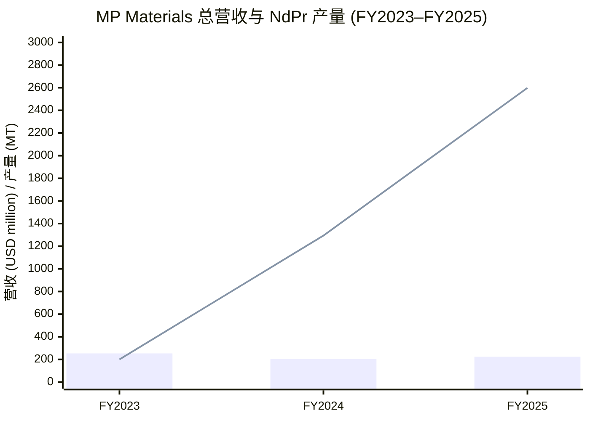
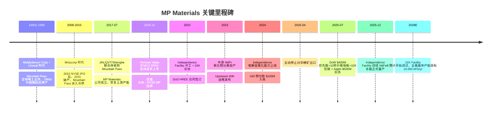
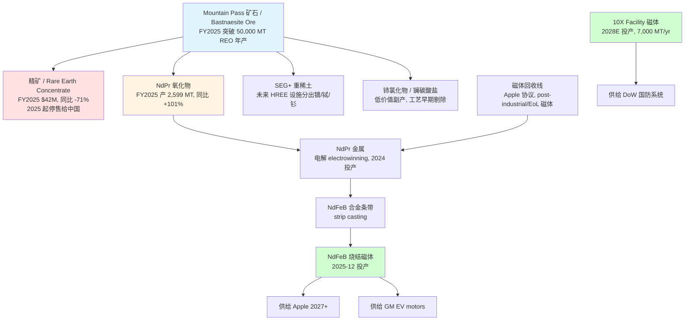
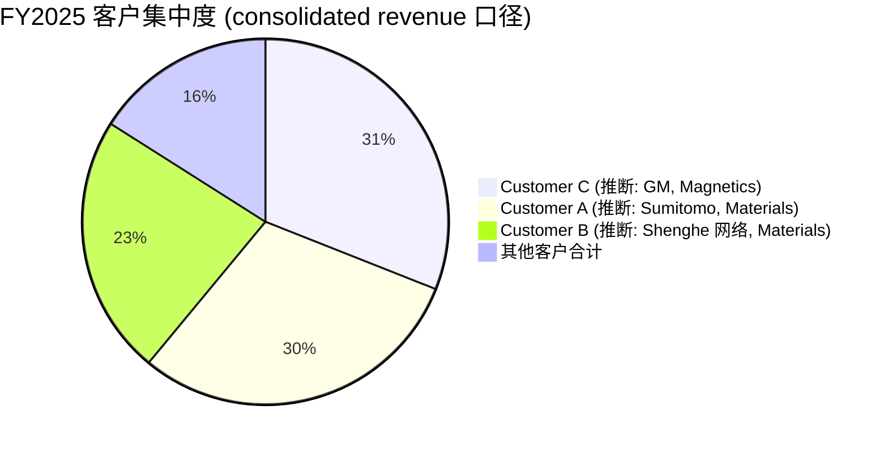
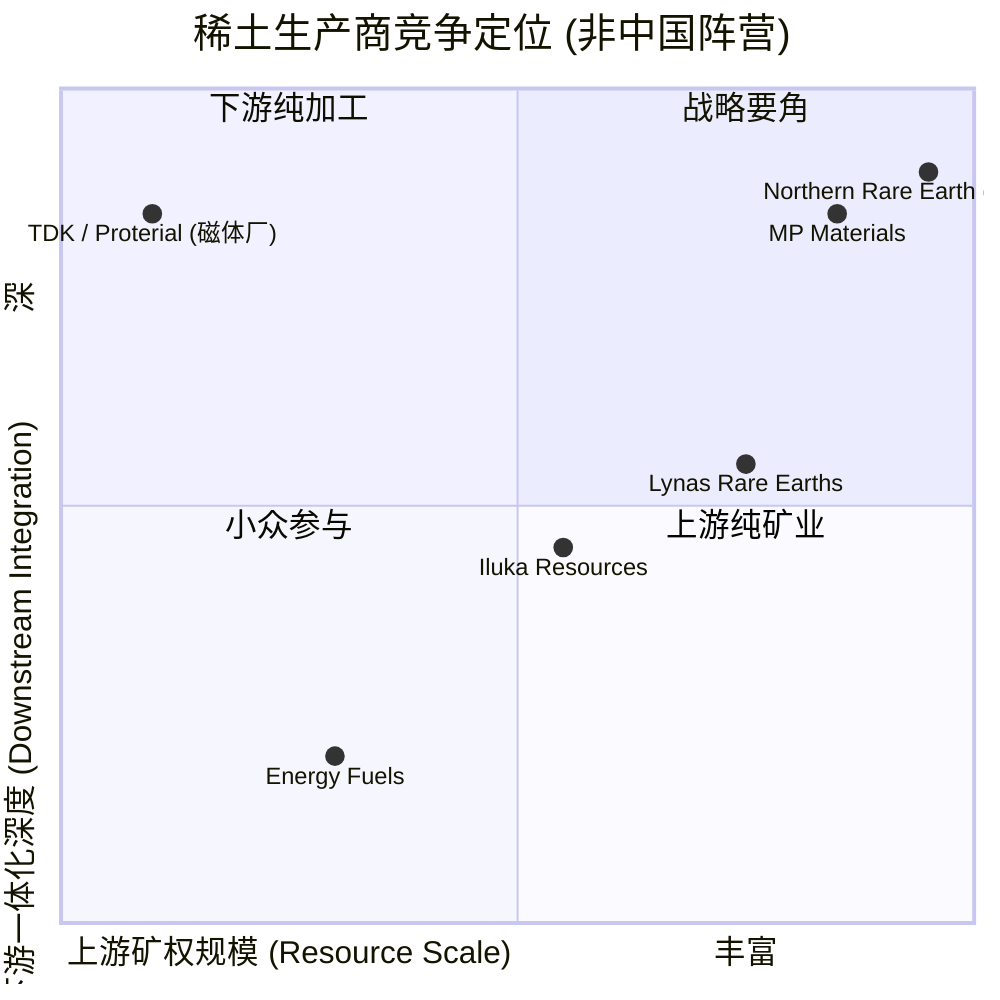

# MP Materials Corp.（NYSE:MP）公司研究 / 西半球唯一规模化稀土全链条与 DoW 公私合作奠基者

*分析师视角的研究报告 / Analyst Research Report*
*报告日期 (as of)：2026-06-02*
*纳入主题：rare-earth-strategic-minerals*

---

## 目录

1. 公司概览 / Company Overview
2. 公司历史 / Company History
3. 管理团队 / Management
4. 产品与服务 / Products & Services
5. 客户与上市策略 / Customers & Go-to-Market
6. 行业概览 / Industry Overview
7. 竞争格局 / Competitive Landscape
8. 市场机会 / Market Opportunity (TAM/SAM)
9. 风险评估 / Risk Assessment
10. 投资者视角评分 / Investor-Lens Scorecards
11. 参考资料 / References

---

## 1. 公司概览 / Company Overview

MP Materials Corp.（NYSE:MP，CIK 0001801368）总部位于美国内华达州拉斯维加斯（Las Vegas, Nevada），是 **西半球唯一规模化、垂直一体化的稀土 (rare earth elements, REE) 生产商**。公司核心资产是位于加州圣贝纳迪诺县（San Bernardino County, California）的 **Mountain Pass 稀土矿与加工厂**——这也是北美唯一具备规模化采选、湿法冶金分离与精炼能力的稀土生产基地。公司另一关键资产为德州沃斯堡（Fort Worth, Texas）的 **Independence Facility**——美国数十年来首座完整的钕铁硼 (NdFeB) 永磁制造工厂，于 2025 年 12 月开始正式量产烧结磁体 ([MP Materials FY2025 10-K, p.1 Business Overview](https://www.sec.gov/Archives/edgar/data/1801368/000180136826000008/mp-20251231.htm))。

公司当前组织为两个报告分部 (reportable segments)：**Materials 分部** (上游与中游业务，即 Mountain Pass 的采选、焙烧、浸出、萃取分离与产品精制) 与 **Magnetics 分部** (下游业务，即 Independence Facility 的电解、合金条带、粉末冶金、压制烧结、机加工及未来计划于 2028 年投产的 10X Facility) ([10-K, Note 22 Segment Reporting](https://www.sec.gov/Archives/edgar/data/1801368/000180136826000008/mp-20251231.htm))。FY2025 全年总收入 **$224.4 million**（Materials $160.4 million + Magnetics $66.9 million − 关联抵销 $2.8 million），同比+10%；GAAP 净亏损 **$85.9 million**，但调整后 EBITDA 转正至 **$11.4 million**（FY2024 为 −$50.2 million），主因是 NdPr oxide / metal 销售放量以及 Q4 开始确认的 PPA Income $51.0 million ([10-K, MD&A Results of Operations](https://www.sec.gov/Archives/edgar/data/1801368/000180136826000008/mp-20251231.htm))。

2025 年是公司商业模型的 **结构性转折年 (structural inflection year)**——三项重磅交易在六个月内连环落地，彻底改变了 MP 的现金流形态与战略定位：(i) 4 月起因中国对美稀土反制关税及出口管制，公司主动停止对华稀土精矿出口 (rare earth concentrate)；(ii) 7 月 9 日与美国战争部 (Department of War, DoW，前身为 Department of Defense) 签订革命性公私合作协议——DoW 出资 $400 million 购买可转换优先股、$1 billion 由 JPMorgan / Goldman 提供 10X 工厂建设贷款、$150 million DoW 直贷支持重稀土 (HREE) 分离扩能、为 NdPr 产品提供 **$110/kg** 长达十年的价格地板 (price floor)、并承诺包销 10X Facility 全部产能并保证年化 EBITDA 不低于 $140 million ([8-K dated 2025-07-10](https://www.sec.gov/Archives/edgar/data/1801368/000119312525157310/d43796d8k.htm))；(iii) 7 月 15 日与苹果 (Apple Inc., NASDAQ:AAPL) 签订长期磁体供应协议——苹果总额 $500 million 包销、$200 million 预付款、自 2027 年起以 100% 回收原料 (post-industrial + end-of-life) 生产的稀土磁体供给苹果终端设备 ([MP Materials–Apple 联合新闻稿, 2025-07-15](https://mpmaterials.com/news/mp-materials-and-apple-announce-500-million-partnership-to-produce-recycled-rare-earth-magnets-in-the-united-states/))。

**估值快照 / Valuation snapshot (截至 2026-06-01)。** MP 股价 ~$64.7，市值 ~**$12 billion**，按 FY2025 营收为 **TTM P/S 约 53×**——这是一个反映"国家战略期权 (national-security option)"溢价、而非现金流贴现的多重 ([MarketBeat MP chart, 2026-05-29 close](https://www.marketbeat.com/stocks/NYSE/MP/chart/), [StockAnalysis MP market cap](https://stockanalysis.com/stocks/mp/market-cap/))。TTM P/E 不适用 (GAAP 亏损)。同业 **Lynas Rare Earths (ASX:LYC)** 市值约 AUD 19.5 billion，TTM P/E ~209× (FY2025 EPS ~0.01 AUD)、forward P/E 约 36.7×，forward P/S 约 19.4× ([Lynas LYC valuation, 2026-04](https://stockanalysis.com/quote/asx/LYC/statistics/), [Zacks MP vs LYSDY, 2026](https://finance.yahoo.com/markets/stocks/articles/mp-vs-lysdy-rare-earth-125100315.html))。*分析师观点：* 53× P/S 远超商品矿业的 1–3× 历史中枢——市场显然在为 (a) DoW 价格地板锁定的下行风险溢价 (downside hedge premium)、(b) 苹果 + GM + DoW 三大长协绑定的合同储备 (book-of-business)、(c) 2028–2030 年 10X Facility + Independence 合计 10,000 MT 磁体年产能爬坡带来的非线性 EBITDA 弹性，三者共同定价；如果产能爬坡延迟 12 个月以上、或 NdPr 现货价持续低于 $50/kg 区间使 PPA Income 成为主要损益来源 (而非业务自身盈利)，估值倍数收缩风险显著。

*Source: [MP Materials FY2025 10-K, MD&A Consolidated Results](https://www.sec.gov/Archives/edgar/data/1801368/000180136826000008/mp-20251231.htm)；柱状=总收入 $ million，折线=NdPr 氧化物产量 MT*

---

## 2. 公司历史 / Company History

MP Materials 的"灵魂"是 **Mountain Pass 矿**，而 Mountain Pass 的开发史可追溯到 1950 年代——历经美国稀土供应"从主导到失守再到反思"的完整周期 ([10-K, Properties section](https://www.sec.gov/Archives/edgar/data/1801368/000180136826000008/mp-20251231.htm))。

- **1950 年代–1998：Molybdenum Corporation of America / Unocal 时代。** 矿体被发现并由 Molybdenum Corporation of America 开采；1977 年 Unocal Corporation 收购 Moly Corp.，1998 年因环保事件与中国低成本稀土冲击而停产 ([10-K, p.32 Mountain Pass 历史](https://www.sec.gov/Archives/edgar/data/1801368/000180136826000008/mp-20251231.htm))。
- **2005–2015：Chevron / Molycorp 短命复兴。** 2005 年 ChevronTexaco 收购 Unocal；2008 年 Molycorp Minerals LLC 从 Chevron 手中买下 Mountain Pass，2010 年纽交所 IPO；但在中国稀土价格 2011–2013 年大幅回落、自身高负债建设新分离设施失败后，Molycorp 于 2015 年 6 月申请 Chapter 11 破产，2015 年中下旬 Mountain Pass 进入"冷停 (cold-idle)"状态 ([10-K, p.32](https://www.sec.gov/Archives/edgar/data/1801368/000180136826000008/mp-20251231.htm))。
- **2017 年 7 月：MP 收购。** 由 JHL Capital Group (James Litinsky 主导)、QVT Financial 与中国盛和资源 (Shenghe Resources, SSE:600392) 组成的联合体——MP Mine Operations LLC，以约 $20.5 million 从 Molycorp 破产程序中购得 Mountain Pass，成为 MP Materials 的核心资产基础 ([Wikipedia: MP Materials History](https://en.wikipedia.org/wiki/MP_Materials), [10-K, p.32 acquired Mountain Pass from the Molycorp estate](https://www.sec.gov/Archives/edgar/data/1801368/000180136826000008/mp-20251231.htm))。
- **2018：上游重启。** Q1 2018 公司首批稀土精矿 (bastnaesite concentrate) 销售实现，主要按 Shenghe Offtake Agreement 销往中国精炼厂 ([10-K, Related-Party Transactions Note 21](https://www.sec.gov/Archives/edgar/data/1801368/000180136826000008/mp-20251231.htm))。
- **2020 年 7 月–11 月：SPAC 反向并购上市。** 2020 年 7 月 15 日宣布与 Fortress Value Acquisition Corp. (NYSE:FVAC) 反向合并，估值约 $1 billion；2020 年 11 月 17 日完成合并，新公司 MP Materials Corp. 在 NYSE 以 "MP" 代码挂牌，James Litinsky 任董事长兼 CEO ([Renaissance Capital — MP Materials IPO profile](https://www.renaissancecapital.com/Profile/MP/MP-Materials/IPO), [StreetInsider FVAC/MP merger announcement, 2020-07](https://www.streetinsider.com/Corporate+News/Rare+Earth+Producer+MP+Materials+to+Merge+with+SPAC+Fortress+Value+Acquisition+(FVAC)/17114523.html))。
- **2022 年 2 月：DoD HREE 设施合同 + Independence Facility 破土。** 2022 年 2 月被 DoD 工业基础分析与维持办公室选中，设计并建造 Mountain Pass 重稀土分离设施 (HREE Facility)；同月在德州沃斯堡 (Fort Worth, TX) 开工建设 Independence Facility——美国数十年来首座完整稀土金属、合金与磁体厂 ([10-K, Midstream Operations section](https://www.sec.gov/Archives/edgar/data/1801368/000180136826000008/mp-20251231.htm))。
- **2022 年 4 月：GM 长协签订。** 与通用汽车 (General Motors, NYSE:GM) 签订长期协议，GM 成为 Independence Facility 的"奠基客户 (foundational customer)"，包销磁体与磁体前驱物 (NdPr metal、NdFeB alloy flake) ([10-K, Magnetics Segment Customers section](https://www.sec.gov/Archives/edgar/data/1801368/000180136826000008/mp-20251231.htm))。
- **2023：中游商业化启动。** 2023 H2 公司完成中游分离设施优化与再调试，首次实现 NdPr 氧化物 (oxide) 商业化分离产出；2023 年 11 月公布 "Upstream 60K" 战略——目标年产 60,000 MTs REO ([10-K, Upstream Operations section](https://www.sec.gov/Archives/edgar/data/1801368/000180136826000008/mp-20251231.htm))。
- **2024：金属电解与首笔预付款。** Independence Facility 电解 (electrowinning) 调试投产，首次从 NdPr 氧化物制出 NdPr 金属；GM 长协首笔 $100 million 预付款到账 ([10-K, FY2024 prior-year 比较](https://www.sec.gov/Archives/edgar/data/1801368/000180136826000008/mp-20251231.htm))。
- **2025 年——三大里程碑同时落地。** (i) 4 月：响应中美关税战与中国稀土出口管制，主动暂停对华精矿销售；(ii) 7 月 9 日：DoW 公私合作协议签署 (优先股 + 价格地板 + 包销 10X 工厂 + EBITDA 担保 + $1B 银行融资 + $150M 直贷)；(iii) 7 月 15 日：苹果 $500M 长协；(iv) 12 月：Independence Facility 正式开始烧结 NdFeB 永磁量产，结束美国数十年磁体进口依赖 ([8-K dated 2025-07-10](https://www.sec.gov/Archives/edgar/data/1801368/000119312525157310/d43796d8k.htm), [Apple 联合新闻稿 2025-07-15](https://mpmaterials.com/news/mp-materials-and-apple-announce-500-million-partnership-to-produce-recycled-rare-earth-magnets-in-the-united-states/), [10-K, FY2025 Highlights](https://www.sec.gov/Archives/edgar/data/1801368/000180136826000008/mp-20251231.htm))。

*Source: 整理自 [MP Materials FY2025 10-K, Business 章节](https://www.sec.gov/Archives/edgar/data/1801368/000180136826000008/mp-20251231.htm) 与各事件 8-K / 新闻稿*

---

## 3. 管理团队 / Management

按本研究规范，只覆盖 **创始人 + 现任 CEO**——MP 的特殊性在于 **创始人即 CEO**，因此采用合并简介。

### James H. Litinsky — 创始人 + 现任 Chairman & CEO（年龄 48 岁）

James Litinsky 是 MP Materials 的灵魂人物：既是公司创始人、董事长兼 CEO，同时也是 **JHL Capital Group LLC** 的创始人、CEO 兼 CIO——这是一家芝加哥另类投资管理公司 ([10-K, Information About Our Executive Officers](https://www.sec.gov/Archives/edgar/data/1801368/000180136826000008/mp-20251231.htm))。Litinsky 在 2017 年 Molycorp 破产程序中识别出 Mountain Pass 矿体的战略价值，主导 JHL Capital Group + QVT Financial + 盛和资源的联合体收购，并随后将 JHL 的核心资金深度绑定到这一资产上 ([Fortune, How deals with Apple and Trump's Pentagon turned MP into a red-hot stock, 2025-08-12](https://fortune.com/2025/08/12/rare-earths-magnets-mp-materials-stock-surge-landmark-deals-trump-apple/))。

- **教育背景：** Yale 经济学学士 (cum laude)；Northwestern University 法学博士 (J.D.) 与 Kellogg 管理学院 MBA 双学位；获 Illinois 律师执业资格 ([10-K, Executive Officers](https://www.sec.gov/Archives/edgar/data/1801368/000180136826000008/mp-20251231.htm))。
- **职业生涯：** 在 2006 年创办 JHL 之前，曾在 Fortress Investment Group 旗下 Drawbridge Special Opportunities Fund 任职；更早在 Omnicom Group 任 Director of Finance，职业起点是 Allen & Company 投行 ([10-K, Executive Officers](https://www.sec.gov/Archives/edgar/data/1801368/000180136826000008/mp-20251231.htm))。
- **持股：** 2025 年 Form 4 文件披露 Litinsky 通过家族信托间接持有 12,805,965 股 MP 股票，并直接持有 212,344 股；按 2026 年 6 月初股价 ~$64.7 计算，其直接 + 间接持股市值约 $843 million，是 MP 单一最大持股人之一 ([StockTitan: MP CEO James Litinsky logs planned stock sales, 2025](https://www.stocktitan.net/sec-filings/MP/form-4-mp-materials-corp-de-insider-trading-activity-c108b93af72b.html))。在 DoW 投资 $400M 优先股可转换 15% 已发行流通股之前，Litinsky 是 MP 最大单一股东 ([Fortune, 2025-08-12](https://fortune.com/2025/08/12/rare-earths-magnets-mp-materials-stock-surge-landmark-deals-trump-apple/))。
- **创业初心 (founding thesis)：** Litinsky 多次在采访中陈述其论点——稀土在美国国家供应链中是"single point-of-failure (单点故障)"，中国通过精炼能力垄断而非储量优势掌控议价权，恢复美国从矿到磁体的全链条是一项可持续数十年的国家任务，也是符合 JHL "long-duration, deep-value, contrarian" 投资风格的特殊机遇 ([Fortune 长文](https://fortune.com/2025/08/12/rare-earths-magnets-mp-materials-stock-surge-landmark-deals-trump-apple/))。
- **战略执行评价：** 2017–2025 八年内，Litinsky 团队完成：上游 60K 规模化 (FY2025 已突破 50,000 MTs REO 年产)、中游 NdPr 氧化物分离从 0 到 2,599 MTs (FY2025) 双倍增长 (FY2024 1,294 MTs，FY2025 +101%)、下游 Independence 磁体厂 12 月正式投产、并成功将 DoW + Apple + GM 三家结构性大客户绑定到长协里 ([10-K, FY2025 Highlights MD&A](https://www.sec.gov/Archives/edgar/data/1801368/000180136826000008/mp-20251231.htm))。*分析师观点：* 这是一个鲜见的从投资经理转型工业 CEO 的案例——Litinsky 既保持着对冲基金对资产价值与博弈格局的敏感度，也展示出对工业产能爬坡这种慢节奏长周期项目的耐心。其潜在风险是：身兼 JHL 与 MP 双重身份可能引发治理冲突 (例如 JHL 对 MP 持股集中度过高、关联方决策审慎度等)，但截至 FY2025 10-K 未出现重大关联方异常 ([10-K, Note 21 Related-Party Transactions](https://www.sec.gov/Archives/edgar/data/1801368/000180136826000008/mp-20251231.htm))。

其他执行高管 (COO Michael Rosenthal、CFO Ryan Corbett、General Counsel Elliot Hoops) 在 10-K 中的简介为标准 SEC 必要披露——本报告按规范不展开 ([10-K, Executive Officers 章节](https://www.sec.gov/Archives/edgar/data/1801368/000180136826000008/mp-20251231.htm))。

---

## 4. 产品与服务 / Products & Services

MP Materials 的产品结构遵循 **上游精矿 → 中游分离 → 下游金属 → 下游磁体** 的四阶段链条 (vertical integration / 垂直一体化)。10-K Business 章节明确将产品按三个层次披露，本节按 10-K 原文 (verbatim) 引用并展开释义。

**中文释义 / Plain-language gloss：** 稀土 (REE) 是 17 种元素的统称——15 种镧系元素 (lanthanides) 加上钇 (Y) 与钪 (Sc)。按按市场价值 (economic value) 划分，**NdPr (钕镨)** 是最大、最关键的细分——它是 NdFeB 永磁的核心原料，而 NdFeB 永磁是新能源汽车驱动电机、风电发电机、人形机器人执行器、消费电子振动单元、国防制导系统的关键磁体。MP 的核心战略是 **不卖大宗精矿，向下游分离 → 金属 → 磁体逐级延伸捕获更高的单位价值**——这与典型矿业公司"挖出来卖矿石"模式截然不同。

### 4.1 上游产品 (Materials 分部上游：稀土精矿 / Rare Earth Concentrate)

> 引用 10-K：*"The upstream operations include the mining of primarily bastnaesite ore followed by comminution, which involves crushing and grinding the ore into a milled slurry. The slurry is then processed by froth flotation, whereby the bastnaesite is carried to the surface while the gangue, or non-desired, elements are suppressed and disposed as tailings."* ([FY2025 10-K, Upstream Operations](https://www.sec.gov/Archives/edgar/data/1801368/000180136826000008/mp-20251231.htm))

**产品定义：** 主要产品为 **氟碳铈矿精矿 (bastnaesite concentrate)** —— 氟碳铈矿是 LREE (轻稀土) 矿物，Mountain Pass 矿体中主要矿物形式即为氟碳铈矿。精矿是经过"破碎—磨细—浮选 (froth flotation)"工序后得到的、TREO (Total Rare Earth Oxide, 总稀土氧化物) 品位约 60% 的中间产品，重量约为原矿石的 1/15 ([10-K, p.6](https://www.sec.gov/Archives/edgar/data/1801368/000180136826000008/mp-20251231.htm))。

**物理工艺角色 (what it physically does)：** 精矿是 **将远低于 10% TREO 品位的原矿石浓缩到 60% TREO 品位以便外运/进一步精炼** 的物理形态。在过去十年的 MP 商业模型里，精矿曾是公司收入的 99%——通过 Shenghe Offtake Agreement (盛和资源关联方协议) 卖给中国精炼厂，再由中国厂家做分离与下游加工 ([10-K, Note 21 Related-Party Transactions](https://www.sec.gov/Archives/edgar/data/1801368/000180136826000008/mp-20251231.htm))。

**FY2025 关键转折：** 因 (i) 4 月主动停售给中国、(ii) DoW 协议条款要求 100% 国内/盟友化、(iii) 2026 年 1 月 Shenghe 协议到期不续约——MP 已 **战略性放弃** 销售精矿作为收入来源 ([10-K, MD&A Outlook](https://www.sec.gov/Archives/edgar/data/1801368/000180136826000008/mp-20251231.htm))。FY2025 精矿收入 $41.99 million，同比 −71% (FY2024: $144.36 million)，且预计 FY2026 起趋近于零。所有上游精矿改为内部转移至中游分离环节使用 ([10-K, Revenue Segment Reporting](https://www.sec.gov/Archives/edgar/data/1801368/000180136826000008/mp-20251231.htm))。

### 4.2 中游产品 (Materials 分部中游：NdPr 氧化物 + NdPr 金属 + SEG+ 重稀土)

> 引用 10-K：*"Through its midstream operations, the Company produces NdPr oxide and other separated rare earth products, including cerium and lanthanum products, as well as SEG+, a mixed heavy rare earth product."* ([10-K, Process section](https://www.sec.gov/Archives/edgar/data/1801368/000180136826000008/mp-20251231.htm))

**产品矩阵：**
1. **NdPr 氧化物 (NdPr oxide / 钕镨氧化物)** —— 公司中游主打高价值产品，约占稀土市场金额的 70%+。是制造 NdFeB 永磁的最关键原料。FY2025 公司产出 **2,599 MTs**，同比 +101% (FY2024: 1,294 MTs)；销售 1,994 MTs，同比 +75%。FY2025 NdPr oxide + metal 收入 **$115.1 million**，同比 +99% ([10-K, MD&A Revenue Breakdown](https://www.sec.gov/Archives/edgar/data/1801368/000180136826000008/mp-20251231.htm))。
2. **NdPr 金属 (NdPr metal / 钕镨金属)** —— 通过电解 (electrowinning, 电积) 将 NdPr 氧化物还原为金属相，金属再用于 NdFeB 合金条带 (strip casting)。Independence Facility 2024 年完成电解段调试；FY2025 NdPr metal 主要供给 Magnetics 分部内部使用，但也部分外销给日韩客户 (经 Sumitomo Corporation of Americas 分销) ([10-K, Magnetics Segment Overview](https://www.sec.gov/Archives/edgar/data/1801368/000180136826000008/mp-20251231.htm))。
3. **SEG+ (Samarium-Europium-Gadolinium + 混合重稀土)** —— 在 NdPr 之后的下一个高价值副产物，将进一步精分为镝 (Dy)、铽 (Tb) 等 HREE 用于高温 NdFeB 磁体添加。2026 年 HREE 设施投产后将单独生产镝、铽产品；DoW 协议进一步要求增加钐 (Samarium) 氧化物生产能力——钐用于 SmCo (钐钴) 高温磁体，是国防与航天系统关键 ([10-K, Midstream Operations + DoW Transaction Agreements](https://www.sec.gov/Archives/edgar/data/1801368/000180136826000008/mp-20251231.htm))。
4. **铈 (Ce) 与镧 (La) 产品 (cerium and lanthanum products)** —— 包括 cerium chloride、lanthanum carbonate 等；这些 LREE 的市场价格低，但氟碳铈矿矿物特性使 MP 能在分离工艺早期 (oxidizing roasting circuit) 将四价铈 (tetravalent cerium) 与杂质一同移除，从而以更少的物料能耗与化学试剂得到高价值 NdPr——这是 Mountain Pass 矿石的独特经济优势 ([10-K, Process p.2](https://www.sec.gov/Archives/edgar/data/1801368/000180136826000008/mp-20251231.htm))。

**工艺壁垒 (process barrier)：** 中游环节包括 **焙烧 (roasting) → 浸出 (leaching) → 除杂 → 溶剂萃取分离 (solvent extraction) → 产品精制 (product finishing)** 五个步骤。其中焙烧步骤将 NdPr 之外的 +4 价铈预先氧化为低溶解度形态便于早期剔除——这是 Molycorp 时代试图复制但未成功的关键工序，也是 MP 单位 NdPr 生产成本能与中国竞争的物理基础 ([10-K, p.2 Process](https://www.sec.gov/Archives/edgar/data/1801368/000180136826000008/mp-20251231.htm))。

**战略意义：** 中游是 MP 从"矿业商品 (mining commodity)"到"工业中间品 (industrial intermediate)"的跳板。每 1 MT NdPr 氧化物对应约 12.5 MT 原矿——但 NdPr 氧化物的售价远高于精矿。MP 转型的核心经济逻辑：将原本以精矿形态外卖给中国的稀土，在自有产线上一阶段一阶段精炼，每阶段都捕获本应被中国精炼厂赚走的加工增值。

### 4.3 下游产品 (Magnetics 分部：NdFeB 合金、NdPr 金属与烧结永磁)

> 引用 10-K：*"At the end of 2025, the Company began commissioning the remaining commercial scale equipment for magnet manufacturing and commenced the manufacturing of NdFeB permanent magnets."* ([10-K, Downstream Operations and Future Capabilities](https://www.sec.gov/Archives/edgar/data/1801368/000180136826000008/mp-20251231.htm))

**Independence Facility 产品矩阵：**

1. **NdPr 金属 (NdPr metal) 作为磁体前驱物 / magnetic precursor product** —— FY2025 Magnetics 分部收入 100% 来自此产品，全部销给 GM。Q1 2025 首次产生收入；FY2025 全年 $66.86 million ([10-K, Magnetics Segment Revenue Table](https://www.sec.gov/Archives/edgar/data/1801368/000180136826000008/mp-20251231.htm))。
2. **NdFeB 合金条带 (NdFeB alloy flake)** —— 通过 **strip casting (条带铸造)** 将 NdPr 金属与铁 (Fe)、硼 (B) 及其他合金元素结合，形成磁体粉末冶金的物料基础。2025 年完成调试，是 NdFeB 烧结磁体的"原片"。
3. **NdFeB 烧结永磁 (sintered NdFeB permanent magnets)** —— Independence Facility 旗舰产品；2025 年 12 月开始正式量产。工艺路径：电解 → 条带铸造 → 氢破 (hydrogen decrepitation) + 气流粉碎 (jet milling) 制粉 → 压制 (pressing) → 烧结 (sintering) → 机加工 (machining) → 晶界扩散 (grain boundary diffusion) + 表面处理 ([10-K, Downstream Operations p.3](https://www.sec.gov/Archives/edgar/data/1801368/000180136826000008/mp-20251231.htm))。Independence 规划年产能由 DoW 协议要求扩展至 **3,000 MTs/yr**。

**2028 年规划：10X Facility (第二座磁体工厂)。** DoW 协议要求 MP 建造第二座磁体厂，目标年产能 **7,000 MTs**——加上 Independence 的 3,000 MTs，合计 **10,000 MTs/yr** 美国本土磁体产能。10X Facility 全部产能由 DoW 包销 (或经其同意可分销给第三方)，价格= 生产成本 + DoW 担保的 **$140 million/yr EBITDA (年均增长 2% 通胀调整)** ([10-K, DoW Offtake Agreement](https://www.sec.gov/Archives/edgar/data/1801368/000180136826000008/mp-20251231.htm))。

**产品矩阵图：**

*Source: 整理自 [MP Materials FY2025 10-K Business 章节](https://www.sec.gov/Archives/edgar/data/1801368/000180136826000008/mp-20251231.htm)、[DoW partnership 公告 2025-07-10](https://mpmaterials.com/news/mp-materials-announces-transformational-public-private-partnership-with-the-department-of-defense-to-accelerate-u-s-rare-earth-magnet-independence/)、[Apple partnership 公告 2025-07-15](https://mpmaterials.com/news/mp-materials-and-apple-announce-500-million-partnership-to-produce-recycled-rare-earth-magnets-in-the-united-states/)*

**产品类别如何相互作用的合成分析：** MP 的产品链不是"四个独立业务部门并列"，而是 **"一矿到磁的连续物料流"**——上游每 MT 精矿被压缩为 ~60% TREO 中间品，中游再分离为 NdPr 氧化物 (高价值) + Ce/La (低价值副产) + SEG+ (未来 HREE 原料)；下游环节将 NdPr 氧化物电解为金属，再合金化为条带，最终烧结为磁体。整条链的经济学钥匙在于 **每个环节的单位毛利相对于上一环节翻倍**——精矿 ~$1,000–3,000/MT、氧化物 ~$50,000–80,000/MT、金属 ~$70,000+/MT、磁体 ~$120–200/kg (NdFeB) ([10-K & 多家行业 Pricing Source 综合](https://www.sec.gov/Archives/edgar/data/1801368/000180136826000008/mp-20251231.htm))；MP 通过纵向一体化捕获原本被中国精炼/磁体厂赚走的所有加工增值。这就是为什么 53× P/S 估值并不疯狂——市场在为"从矿业商品估值转向工业制造商估值"的多重切换定价。

---

## 5. 客户与上市策略 / Customers & Go-to-Market

### 5.1 集中度披露 (10-K Note 2 — Concentration of Customer Risk)

> 引用 10-K Note 2：*"For the year ended December 31, 2025, Customers A and B in the Materials segment accounted for 30% and 23% of the Company's total revenue, respectively; Customer C, primarily in the Magnetics segment, accounted for 31% of the Company's total revenue. For the year ended December 31, 2024, Customers B and A in the Materials segment accounted for 78% and 20% of the Company's total revenue, respectively. For the year ended December 31, 2023, Customer B in the Materials segment accounted for 96% of the Company's total revenue."* ([FY2025 10-K, Note 2 Significant Accounting Policies](https://www.sec.gov/Archives/edgar/data/1801368/000180136826000008/mp-20251231.htm))

**FY2025 客户集中度 (consolidated revenue 口径 / group-level)：**
| 客户标识 | 分部 | 占总营收 % | 同比变化 |
|---|---|---|---|
| Customer A | Materials | **30%** | 上升 (FY24: 20%) |
| Customer B | Materials | **23%** | 大幅下降 (FY24: 78%；FY23: 96%) |
| Customer C | Magnetics | **31%** | 从 0 升至 31% (FY24: 0) |
| **Top-3 合计** | — | **84%** | 集中度仍极高 |

10-K 未直接披露客户姓名 (segment-level; named via cross-reference to other 10-K text)，但从公司其他叙述可推断：
- **Customer B (Materials)** 历史上占 96% 的客户即 **Shenghe Resources 关联方网络** (盛和资源美国分销渠道) —— 因为 10-K 多处明确"Materials 分部历史上主要营收来自卖给在中国的精炼厂的精矿，主要通过盛和单一分销商" ([10-K, Materials Segment](https://www.sec.gov/Archives/edgar/data/1801368/000180136826000008/mp-20251231.htm))。FY2025 占比从 78% 跌到 23%，与 4 月停售对华 + 7 月 DoW 协议要求的时点一致。
- **Customer A (Materials)** —— 大概率是 **Sumitomo Corporation of Americas (住友商事美国)**，作为公司分销至日本的独家分销商至 2030 ([10-K, Materials Segment p.7](https://www.sec.gov/Archives/edgar/data/1801368/000180136826000008/mp-20251231.htm))。
- **Customer C (Magnetics)** —— **GM (General Motors)** 是 Magnetics 分部唯一披露的有商业销售客户，FY2025 全年贡献 $66.86 million 收入；GM 是 Magnetics 分部"奠基客户 (foundational customer)" ([10-K, Magnetics Segment p.7](https://www.sec.gov/Archives/edgar/data/1801368/000180136826000008/mp-20251231.htm))。

**(注：上述名字归属是分析师推断 (analyst inference)，10-K 未直接将 Customer A/B/C 与具体公司名称配对——这是 GAAP 必要披露的客户集中度按 ASC 280 通常以"Customer X"形式列示。)**

*Source: [FY2025 10-K Note 2 Concentration of Customer Risk](https://www.sec.gov/Archives/edgar/data/1801368/000180136826000008/mp-20251231.htm)；客户名称归属为分析师推断 (analyst inference)，10-K 仅披露 Customer A/B/C 字母编号*

### 5.2 三大长协 (Long-Term Agreements) 详解

**(A) GM 长协 (2022 年 4 月签订；FY2025 商业化启动)。** Independence Facility 的"奠基客户 (foundational customer)"；GM 截至 FY2025 底已支付全部 $150 million 预付款用于购买磁体前驱物 (NdPr metal)；MP 已交付 $66.9 million，剩余 $83.1 million 预计在 FY2026 与 FY2027 H1 交付完毕。GM 协议主要用于其电动车 (EV / xEVs) 传动电机磁体 ([10-K, Magnetics Segment Performance p.46](https://www.sec.gov/Archives/edgar/data/1801368/000180136826000008/mp-20251231.htm))。

**(B) Apple 长协 (2025 年 7 月 15 日签订；2027 年首批交付)。** 这是 MP 在消费电子领域的首个长协。条款关键点：
- 总规模 **$500 million** ([Apple-MP 联合新闻稿, 2025-07-15](https://mpmaterials.com/news/mp-materials-and-apple-announce-500-million-partnership-to-produce-recycled-rare-earth-magnets-in-the-united-states/))。
- 预付款 **$200 million** (已在 FY2025 全额收到) ([10-K, FY2025 Highlights MD&A p.37](https://www.sec.gov/Archives/edgar/data/1801368/000180136826000008/mp-20251231.htm))。
- 产品： **100% 回收稀土原料 (post-industrial + end-of-life 磁体)** 制造的 NdFeB 磁体；将用于"数亿台苹果设备 (hundreds of millions of Apple devices)" ([Apple-MP 联合新闻稿](https://mpmaterials.com/news/mp-materials-and-apple-announce-500-million-partnership-to-produce-recycled-rare-earth-magnets-in-the-united-states/), [Manufacturing Dive, 2025-07-15](https://www.manufacturingdive.com/news/apple-signs-500m-deal-rare-earth-magnet-supplier-mp-materials/753153/))。
- MP 将在 Mountain Pass 建造商用规模的稀土磁体回收线，配合 Independence Facility 扩产 ([Apple-MP 联合新闻稿](https://mpmaterials.com/news/mp-materials-and-apple-announce-500-million-partnership-to-produce-recycled-rare-earth-magnets-in-the-united-states/))。
- **首批交付：2027 年。**

**(C) DoW (Department of War, 前身 DoD) 公私合作协议 (2025 年 7 月 9 日签订)。** 这是 MP 的"母约 (anchor contract)"——条款最复杂，影响最深远。关键条款摘要 (10-K Note 3 与 8-K 综合)：

1. **股权部分：** DoW 出资 **$400 million** 购买 Series A 可转换优先股 (conversion price = $30.03/股)，配套发行 warrants 行权价同为 $30.03。优先股+warrant 合计在转换/行权后将占 DoW Transaction 前已发行普通股的 **15%**——理论上使 DoW 成为 MP 最大持股人 ([8-K, 2025-07-10](https://www.sec.gov/Archives/edgar/data/1801368/000119312525157310/d43796d8k.htm), [10-K p.24 risk factor](https://www.sec.gov/Archives/edgar/data/1801368/000180136826000008/mp-20251231.htm))。
2. **价格地板 (Price Protection Agreement, PPA)：** 自 2025 年 10 月 1 日起的 10 年内 (至 2035 年 12 月 31 日)，对 MP 销售或生产并库存的 NdPr 产品 (concentrate、oxide、metal) 提供 **$110/kg** 价格地板——若市场基准价低于 $110/kg，DoW 按差额按季度向 MP 现金支付；若 10X Facility 达到满产能后市场基准价高于 $110/kg，则 MP 反过来向 DoW 支付超额部分的 30%。FY2025 Q4 (PPA 第一个生效季度) 即确认 PPA Income **$51.0 million** ([10-K p.39 Price Protection Agreement](https://www.sec.gov/Archives/edgar/data/1801368/000180136826000008/mp-20251231.htm))。
3. **10X Facility 包销 (DoW Offtake Agreement)：** DoW 包销 10X Facility 全部磁体产能；价格= 生产成本 + 担保 EBITDA。**DoW 担保 10X Facility 每年至少 $140 million EBITDA (年均 2% 通胀调整)**——这是少见的政府担保下游工业利润，本质上将 MP 下游变成"成本+ Cost-Plus"国防承包商模式 ([10-K p.40 DoW Offtake Agreement](https://www.sec.gov/Archives/edgar/data/1801368/000180136826000008/mp-20251231.htm))。
4. **银行融资 (Bank Financing Commitment)：** JPMorgan Chase Funding + Goldman Sachs Bank USA 提供 **$1.0 billion** 用于 10X Facility 建设与开发 ([DoW 联合新闻稿, 2025-07-10](https://mpmaterials.com/news/mp-materials-announces-transformational-public-private-partnership-with-the-department-of-defense-to-accelerate-u-s-rare-earth-magnet-independence/))。
5. **DoW 直贷 (DoW Loan)：** **$150 million** 12 年期贷款，用于 Mountain Pass HREE 分离设施扩展 (产钐、镝、铽) ([DoW 联合新闻稿](https://mpmaterials.com/news/mp-materials-announces-transformational-public-private-partnership-with-the-department-of-defense-to-accelerate-u-s-rare-earth-magnet-independence/))。

### 5.3 销售与渠道策略

MP 上市策略的核心是 **"从单一中国分销商 (Shenghe Offtake) → 多元化盟友化客户 (Allies + DoW + Tier-1 OEM)"** 的转型：
- **日本市场：** 由 Sumitomo Corporation of Americas 作为 NdPr oxide / metal 在日本的 **独家分销商**，协议覆盖至 2030 年 12 月 ([10-K, Materials Segment Customers p.7](https://www.sec.gov/Archives/edgar/data/1801368/000180136826000008/mp-20251231.htm))。
- **韩国 + 亚洲其他地区：** 通过直销 + 短期/长期销售合同。
- **美国本土 OEM：** 通过 GM、Apple 两大旗舰客户 + 未来 10X Facility 通过 DoW 包销覆盖国防 OEM (Lockheed Martin、Raytheon、L3Harris 等磁体最终用户) ([10-K, Strategy p.4](https://www.sec.gov/Archives/edgar/data/1801368/000180136826000008/mp-20251231.htm))。
- **未来增量客户：** 10-K 明示"The Company is also pursuing sales opportunities to other customers for its future magnet products" ([10-K p.7](https://www.sec.gov/Archives/edgar/data/1801368/000180136826000008/mp-20251231.htm))——*分析师观点：* 美国电动车 OEM (Ford、Stellantis、Rivian、Lucid)、风电整机厂 (GE Vernova、Siemens Gamesa)、机器人公司 (Tesla Optimus、Figure、Apptronik、Boston Dynamics)、消费电子 OEM (Microsoft、Google) 都是潜在长协对象。

### 5.4 FY2025 → FY2026 走势：Q1 2026 数据点

FY2026 Q1 (公司 5 月 7 日公布) 数据延续了 FY2025 Q4 起的转好趋势——总营收 $90.6 million (同比 +49%)，NdPr oxide 产量 917 MT (同比 +63%、环比 +28%、季度新高)、NdPr 销量 1,006 MT (同比 +106%、环比 +79%)；Materials 分部营收 $114.5 million (含 PPA Income) + Magnetics 分部 $21.1 million；GAAP 净亏损收窄至 $8.0 million ([MP Materials Q1 2026 results press release, 2026-05-07](https://investors.mpmaterials.com/investor-news/news-details/2026/MP-Materials-Reports-First-Quarter-2026-Results/default.aspx), [StockTitan MP Q1 2026 summary](https://www.stocktitan.net/news/MP/mp-materials-reports-first-quarter-2026-fcyx13xgo250.html))。

---

## 6. 行业概览 / Industry Overview

### 6.1 行业定义与规模

> 引用 10-K：*"The aggregate global market for rare earth oxides (REO) totaled approximately 252,000 metric tons (MTs) in 2025 and is expected to grow at a compound annual growth rate (CAGR) of approximately 6.0% through 2040, according to research by Adamas Intelligence Inc. ('Adamas'). Further, Adamas estimates that the NdPr segment of the REO market, which makes up a significant majority of the market value, is expected to grow at an 8.4% CAGR through 2040."* ([FY2025 10-K p.2 Rare Earth Industry Overview, 引用 Adamas Intelligence](https://www.sec.gov/Archives/edgar/data/1801368/000180136826000008/mp-20251231.htm))

**TAM 关键数字：**
- 全球 REO 总市场 **~252,000 MTs (2025)**，按金额计 ~$10–13 billion。
- 至 2040 年 CAGR **~6.0%** (REO 整体)；**~8.4%** (NdPr 细分，约占 REO 总价值的 60%+)。
- NdFeB 永磁全球年销量约 **170,000+ MTs (2024–2025)**，中国占 ~85–90% (按重量产能)。

### 6.2 终端需求驱动 (Demand Drivers — 10-K 明确列举)

> 引用 10-K：*"Rare earth materials are used in a diverse array of end markets, including: Electric Mobility... Industrial, Consumer and Professional Service Robotics... Renewable Power Generation... Energy-Efficient Motors, Pumps and Compressors... Consumer and Medical Applications... Critical Defense Systems... and Catalysts and Phosphors..."* ([10-K p.2 End-Market list](https://www.sec.gov/Archives/edgar/data/1801368/000180136826000008/mp-20251231.htm))

主要需求驱动按 10-K 列举：
1. **电动出行 (Electric Mobility)：** 乘用 EV / HEV / PHEV 牵引电机、商用 EV、特种车辆、两轮车——每辆纯电汽车含约 1–2 kg NdFeB 磁体。
2. **机器人与人形机器人 / 物理 AI (Industrial, Consumer and Professional Service Robotics)：** 工业机器人、协作机器人、消费/服务机器人、人形机器人——10-K 将"physical AI applications"作为新兴需求列出。Tesla Optimus、Figure 01/02、Apptronik、Unitree 等量产规划将极大拉升单台机器人 1–4 kg 磁体需求。
3. **可再生能源 (Renewable Power Generation)：** 风电直驱发电机——海上 12+ MW 永磁直驱风机单台用 NdFeB 磁体约 4–6 吨。
4. **高效电机 (Energy-Efficient Motors)：** HVAC 系统、电梯/扶梯、家电、工业泵与压缩机。
5. **消费电子与医疗 (Consumer and Medical)：** 智能手机、平板、笔记本、硬盘、扬声器、麦克风、相机、电动工具、光纤、激光晶体、X 光设备、假肢、牙冠。这是苹果协议直接对应的市场。
6. **国防系统 (Critical Defense)：** 制导与控制系统、通讯、航电、GPS、雷达声纳、无人机、热障涂层、枪械。这是 DoW 协议直接对应的市场。
7. **催化剂与荧光粉 (Catalysts and Phosphors)：** 车用排放催化剂、燃料精炼、节能照明等。

### 6.3 供应侧结构 (Supply-Side Structure — 10-K 明确披露)

> 引用 10-K：*"With continued state-sponsored consolidation, there remain two major rare earth groups in China. These groups and their affiliates control (and/or allocate to unaffiliated third parties) substantially all of China's quota for concentrate production and rare earth refining. In 2025, China took additional steps to consolidate control of the industry into the two major groups through export and import limitations, as well as adjustments to the production quota system."* ([10-K p.7 Competition](https://www.sec.gov/Archives/edgar/data/1801368/000180136826000008/mp-20251231.htm))

**全球供应格局 (2025 年)：**
- **中国：占全球 REO 矿产 ~70%、精炼 ~85–90%、NdFeB 永磁 ~85%。** 经过国务院推动的产业整合，已收敛为两大集团 (北方稀土 China Northern Rare Earth Group + 中国稀土集团 China Rare Earth Group, 后者于 2021 年由中铝、五矿、赣州稀土等合并组建) 及其关联体系。2024–2025 中国进一步通过出口/进口限制 + 配额调整加强控制，包括 2025 年 4 月对美稀土反制出口管制。
- **西半球与非中国其他：** Lynas Rare Earths (ASX:LYC，澳洲 Mt Weld 矿 + 马来西亚 Lynas Malaysia 加工厂) 是规模化非中国唯一其他可比生产商 (10-K 自己的说法："only one other major integrated operator across Australia and Malaysia")。Iluka Resources 的 Eneabba 重稀土精炼厂预计 2027 年试运行 (原计划 2026 推迟) ([Australian Mining Review on Iluka Eneabba, 2026-01](https://australianminingreview.com.au/issue/2026/01/australias-first-integrated-rare-earths-refinery/))。其他较小项目：Energy Fuels (NYSE:UUUU)、Ucore Rare Metals、Vital Metals。

### 6.4 价格周期 (Price Cycles)

NdPr 氧化物现货价 2010 年达到 $300+/kg 峰值 (中国出口管制 + 福岛地震后供给恐慌)，2015–2020 长期处于 $40–60/kg 区间；2022 年因 EV 渗透率快速上行短暂涨至 $150+/kg；2023–2025 受中国产能扩张与全球 EV 增速放缓影响回落至 $50–70/kg 区间。MP 10-K Risk Factor 描述 NdPr 价格波动是公司核心商品风险，而 DoW PPA 设定的 $110/kg 地板正是设计在 2023–2025 价格区间的中位之上 ([10-K Risk Factors, p.10–11](https://www.sec.gov/Archives/edgar/data/1801368/000180136826000008/mp-20251231.htm))。

### 6.5 监管与政策环境

- **美国 45X Advanced Manufacturing Production Credit：** 给予包括 NdPr 氧化物在内的关键矿物 10% 的合格生产成本作为抵免；MP FY2025 因此降低 COS。**One Big Beautiful Bill Act (OBBBA, 2025 年 7 月生效) 将 45X 抵免逐步退坡：2031 年 75%、2032 年 50%、2033 年 25%、2034 年起取消。** ([10-K, Tax Section p.95 OBBBA](https://www.sec.gov/Archives/edgar/data/1801368/000180136826000008/mp-20251231.htm))
- **DPA (Defense Production Act) 资金：** DoD 此前已通过 DPA Title III 投资 MP 的中游与下游项目。
- **中国出口管制：** 2025 年 4 月起对包括 7 类中重稀土与磁体的出口实施许可制度——这直接催化了 DoW–MP 公私合作。

---

## 7. 竞争格局 / Competitive Landscape

### 7.1 10-K 明示的竞争对手

> 引用 10-K：*"The rare earth mining, processing, and magnetics manufacturing markets are capital-intensive and highly competitive. With continued state-sponsored consolidation, there remain two major rare earth groups in China... Outside of China, there are few producers operating at scale, with only one other major integrated operator across Australia and Malaysia."* ([10-K p.7 Competition](https://www.sec.gov/Archives/edgar/data/1801368/000180136826000008/mp-20251231.htm))

10-K 明确仅承认两类竞争者：(i) **中国两大稀土集团 (Northern Rare Earth + China Rare Earth Group)**；(ii) **一家澳洲-马来西亚整合运营商**——即 Lynas Rare Earths。

### 7.2 主要竞争者分析

**1. China Northern Rare Earth Group (北方稀土，SSE:600111)** —— 中国最大的轻稀土生产商 + 包钢稀土科技板块；上游矿权基础为内蒙古白云鄂博 (Bayan Obo) 多金属矿伴生稀土，是全球最大稀土矿；FY2024 营收 ~RMB 33 billion。**优势：** 上游矿权与中游精炼一体；规模庞大；中国国务院国资委体系内最重要的稀土平台。**劣势：** 受地缘政治制约，海外市场扩展能力受限。

**2. China Rare Earth Group (中国稀土集团，未上市；前身赣州稀土、中铝稀土、五矿稀土等)** —— 2021 年由中铝、中国五矿、赣州稀土集团等合并而成的南方中重稀土主导集团；专注离子吸附型矿物 + 中重稀土分离 (镝、铽等)。

**3. Lynas Rare Earths (ASX:LYC，OTC:LYSDY)** —— 这是 MP 在国际公开市场最直接的可比对象 ([Zacks MP vs LYSDY 比较, 2026](https://finance.yahoo.com/markets/stocks/articles/mp-vs-lysdy-rare-earth-125100315.html))：
- **资产：** 澳洲西部 Mt Weld 矿 (氟碳铈矿 / monazite 混合) + 马来西亚关丹 (Kuantan) Lynas Malaysia 精炼厂 (LAMP) + 美国得克萨斯 Seadrift 重稀土项目筹建中 + 澳洲 Kalgoorlie 干法精炼 + 美国战略合同。
- **2025–2026 里程碑：** 2025 年实现 Dy/Tb 重稀土在马来西亚的商业化分离——非中国首次。
- **FY26 9 个月 (截至 2026 年 3 月) REO 产量 9,608 MTs (同比 +33%)** ([Zacks 比较](https://finance.yahoo.com/markets/stocks/articles/mp-vs-lysdy-rare-earth-125100315.html))。
- **估值：** 市值 ~AUD 19.5 billion；TTM P/E 209×；forward P/E 36.7×；forward P/S 19.4× ([Lynas LYC valuation, 2026-04](https://stockanalysis.com/quote/asx/LYC/statistics/))。
- **优劣对比 vs MP：** Lynas 已具备多年盈利历史与海外销售网络优势；MP 优势是 (a) 美国本土地利、(b) DoW 价格地板与 EBITDA 担保、(c) 苹果与 GM 终端品牌客户绑定。Lynas 缺乏类似的"美国政府结构性合同"——市场给 MP 的更高 P/S 估值倍数反映这种期权价值差异。

**4. Iluka Resources (ASX:ILU)** —— 澳洲矿砂巨头，在 Eneabba 建设澳洲首个全集成稀土精炼厂；获澳洲政府 AUD 1.65 billion 非追偿贷款资助 ([Australian Mining Review, 2026-01](https://australianminingreview.com.au/issue/2026/01/australias-first-integrated-rare-earths-refinery/))。原计划 2026 投产已推迟至 2027；Q1 2026 CapEx $977 million 显示建设强力推进 ([Discovery Alert Iluka Q1 2026](https://discoveryalert.com.au/iluka-resources-q1-2026-financial-performance-analysis/))。是 MP 在 HREE (镝、铽) 中长期主要非中国竞争者。

**5. Energy Fuels (NYSE:UUUU)** —— 美国怀俄明州小型铀矿+稀土 (单稀土砂 monazite) 项目；规模远小于 MP。

**6. 日本下游磁体厂 (TDK, Hitachi Metals/Proterial, Shin-Etsu)** —— 不直接竞争上游/中游，但在磁体客户端可能与 MP 竞争 GM/Apple 之外的 OEM 订单。

### 7.3 竞争定位矩阵

*Source: 整理自 [MP FY2025 10-K Competition](https://www.sec.gov/Archives/edgar/data/1801368/000180136826000008/mp-20251231.htm), [Lynas 公司公开资料](https://stockanalysis.com/quote/asx/LYC/), [Iluka Eneabba 进度](https://australianminingreview.com.au/issue/2026/01/australias-first-integrated-rare-earths-refinery/)*

### 7.4 护城河 (Moat) 分析

*分析师观点：* MP 的核心护城河是 **"地利 + 政策契约 + 时间窗口"** 三重叠加：

1. **地利 (Resource Moat)：** Mountain Pass 是西半球唯一规模化稀土矿；矿体已确认探明+概算储量 28.96 million short tons、平均 TREO 品位 5.89%——这是与 Lynas Mt Weld 同一档次的世界级矿权 ([10-K Mineral Reserves table p.33](https://www.sec.gov/Archives/edgar/data/1801368/000180136826000008/mp-20251231.htm))。28 年矿山寿命 (LoM) 至 2053 年提供长期资产可见性。
2. **政策契约护城河 (Policy Contract Moat)：** DoW 价格地板 + 10X 包销 + EBITDA 担保 + $1B 银行融资保证 + $150M 直贷的组合，等同于一份 10+ 年的"国家结构性合同 (national structural contract)"——这是 Lynas 与 Iluka 在澳洲都难以复制的。
3. **时间窗口护城河 (Time-to-Market Moat)：** 从矿到磁体的全链条建设至少需要 5–8 年；MP 在 2017 复活 Mountain Pass 已先发 8 年，Independence 2022–2025 建成，10X 2025–2028E 建设——竞争者从零起步至少要 7–10 年才能赶上 ([10-K, Strategy section p.4](https://www.sec.gov/Archives/edgar/data/1801368/000180136826000008/mp-20251231.htm))。

护城河的潜在脆弱性：(a) 中国如解除对美稀土出口管制并以低价倾销，可能使 NdPr 现货价跌破 $110/kg 持续多年，PPA 兑付义务转移至 DoW，但 MP 业务自身盈利能力将受质疑；(b) 美国行政政策更替可能影响 DoW 协议执行力度 (虽然合同有法律约束，但延迟付款、技术规范调整等灵活变数仍存)。

---

## 8. 市场机会 / Market Opportunity (TAM/SAM)

### 8.1 自上而下 TAM 推算

**全球 NdFeB 永磁市场：**
- 2024–2025 全球 NdFeB 销量 ~170,000 MTs/yr；按平均 $80–120/kg ASP 计，全球 NdFeB 磁体市场 ~$15–20 billion/yr。
- 至 2030 年预计 ~280,000 MTs/yr (CAGR ~8.5%)；至 2040 年 ~500,000+ MTs/yr ([10-K p.2 引用 Adamas Intelligence](https://www.sec.gov/Archives/edgar/data/1801368/000180136826000008/mp-20251231.htm))。
- *分析师观点：* 这一基数假设不含人形机器人量产的非线性需求。Tesla Optimus 量产规划 2027–2028 年达到年百万台级别，按单台 2–4 kg NdFeB 磁体计，即 2,000–4,000 MTs/yr 增量；行业整体 (Optimus + Figure + Apptronik + Unitree + 中国厂家合计) 若 2030 年实现 5–10 million units/yr 人形机器人量产，NdFeB 磁体增量需求可能高达 30,000–80,000 MTs/yr——相当于现有市场的 20–50% 增量。

### 8.2 MP 的 SAM (可触达市场)

**非中国 NdFeB 磁体 SAM：**
- 当前非中国 NdFeB 产能合计 ~12,000–15,000 MTs/yr (主要为日本 TDK、Proterial、Shin-Etsu 在日本与东南亚的产能；少量欧洲 VAC、德国 Schramberg 等)。
- MP Independence + 10X 满产后将达到 **10,000 MTs/yr**——理论上将使非中国 NdFeB 产能翻倍，并显著拉低 Apple、GM、其他美国 OEM 对中国磁体的依赖度。
- 按 2030 年 SAM 假设 (非中国磁体需求约 50,000–80,000 MTs/yr)，MP 占比可达 15–20%——即美国本土 NdFeB 产能的支配性份额。

### 8.3 MP 的 SOM (实际可获得份额) 2026–2030

按 10-K 与 DoW 协议:
- FY2026：Magnetics 分部仅 Independence 调试，NdFeB 磁体年产 < 1,000 MTs；前驱物 (NdPr 金属) 销售给 GM 持续。
- FY2027：苹果首批磁体交付；Independence 爬坡至 ~2,000 MTs/yr 产能。
- FY2028：Independence 接近 3,000 MTs/yr 满产；10X Facility 开始调试。
- FY2030：Independence + 10X 接近合计 10,000 MTs/yr 满产。

按 NdFeB 磁体 ASP ~$120–180/kg (高性能含 Dy/Tb 烧结磁体)，MP 2030 年下游磁体业务理论营收 **~$1.2–1.8 billion** + 上游/中游 NdPr 等业务 ~$500–700 million，合计 **~$1.7–2.5 billion** 年营收上限。这与今天 ~$12 billion 市值相比给出 P/S ~5–7×——这是稀土巨头长期合理估值区间。市场目前用 53× P/S 定价 FY2025 营收，反映的是对 2030+ 营收路径的期权价值，而非业务当下盈利。

---

## 9. 风险评估 / Risk Assessment

按本规范的 4 桶 8–12 风险结构，逐项列举。所有风险均参照 [FY2025 10-K Risk Factors (p.10–27)](https://www.sec.gov/Archives/edgar/data/1801368/000180136826000008/mp-20251231.htm)。

### 公司特定风险 (Company-Specific Risks)

**1. Independence + 10X 工程执行与产能爬坡风险 (Project Execution / Ramp Risk)。** 10-K 明示："Our ability to fulfill our obligations under these long-term agreements to supply magnets and magnet materials to the DoW, Apple and GM... is subject to a number of risks and contingencies." Independence Facility 烧结磁体业务 2025 年 12 月才开始量产，技术验证爬坡曲线尚需 12–24 个月；10X Facility 还在 2025–2028 建设期。任何 6–12 个月的延迟将影响苹果 2027 首批交付与 DoW 包销时点。*缓释：* DoW 担保 EBITDA 部分对冲了产能未达预期的损益冲击 ([10-K Risk Factor section, p.10](https://www.sec.gov/Archives/edgar/data/1801368/000180136826000008/mp-20251231.htm))。

**2. 客户集中度风险 (Customer Concentration Risk)。** FY2025 Top-3 客户合计 84% (Customer A 30% + Customer B 23% + Customer C 31%)。虽然客户结构已从过去 96%/78%/20% 单一对华依赖向 GM + Sumitomo + 其他多元化转型，但仍属于"少数大客户决定营收命运"的脆弱格局。10X Facility 投产后 DoW 将占下游营收主体——政府客户的优势是付款稳定，劣势是议价权完全在 DoW 手里 ([10-K Note 2 Concentration of Customer Risk](https://www.sec.gov/Archives/edgar/data/1801368/000180136826000008/mp-20251231.htm))。

**3. 关键人物与治理风险 (Key Person / Governance Risk)。** James Litinsky 同时担任 MP CEO 与 JHL Capital CEO/CIO——可能存在投资人利益与公司战略冲突。10-K 也明示"loss of key personnel or the inability to attract and retain skilled employees"为风险因素。Litinsky 离任将对市场信心造成短期重大冲击 ([10-K Risk Factors p.12](https://www.sec.gov/Archives/edgar/data/1801368/000180136826000008/mp-20251231.htm))。

### 行业/市场风险 (Industry/Market Risks)

**4. NdPr 现货价格下行风险 (NdPr Price Risk)。** 中国如选择对美回归低价倾销，NdPr 现货价可能跌至 $40–50/kg 长期持平。虽然 DoW PPA 提供 $110/kg 地板，但 (a) PPA 仅覆盖 NdPr 产品而非全部稀土；(b) 在 FY2025 Q4 PPA Income $51M 已占 Materials 分部 EBITDA 主体——若市场价长期低迷使 PPA 兑付成为 EBITDA 主要来源，市场可能将 MP 重新定价为"政府补贴依赖型企业"而非工业盈利企业 ([10-K Risk Factors p.13](https://www.sec.gov/Archives/edgar/data/1801368/000180136826000008/mp-20251231.htm))。

**5. 中国地缘政治反制风险 (Chinese Geopolitical Counter-Risk)。** 中国 2025 年 4 月稀土出口管制是激活美国本土化方案的导火索，但反之亦可能：中国可对在 MP 下游磁体供应链中关键技术设备 (晶界扩散设备、稀土回收设备等) 实施出口管制；或对在 MP 服务的下游客户 (Apple iPhone 销售依赖中国市场) 实施压力，从而间接影响协议执行 ([10-K Risk Factor p.14](https://www.sec.gov/Archives/edgar/data/1801368/000180136826000008/mp-20251231.htm))。

**6. 替代材料技术风险 (Substitution Risk)。** Tesla Model 3 高效驱动电机已用永磁同步电机但减少 Dy/Tb 用量；汽车 OEM 与机器人公司可能转向铁氧体磁体或新型 NdFeB 替代材料。10-K 列入"uncertainties regarding the growth of existing and emerging uses for rare earth products and the Company's ability to compete with substitutions"作为前瞻性风险 ([10-K Cautionary Note p.iii](https://www.sec.gov/Archives/edgar/data/1801368/000180136826000008/mp-20251231.htm))。

### 财务/合同风险 (Financial / Contractual Risks)

**7. DoW 协议条款风险 (DoW Agreement Conditions / Covenants Risk)。** 10-K 多处明示协议附带强约束条款 (affirmative & negative covenants)；任何违约 (例如 10X Facility 建设延迟超过合同允许的宽限期) 可能触发协议重新谈判甚至条款失效。此外，PPA 当 10X Facility 全产能后，若 NdPr 价格高于 $110/kg，MP 需向 DoW 支付超额部分的 30%——这一对冲机制对极端高价情景的上行参与度有限 ([10-K Risk Factors p.15](https://www.sec.gov/Archives/edgar/data/1801368/000180136826000008/mp-20251231.htm))。

**8. 可转换债与稀释风险 (Convertible Debt and Dilution Risk)。** DoW 优先股 + warrant 全部转换/行权后将带来 ~15% 的稀释；MP 还有可转换债务 (convertible debt securities) 与相关的对冲工具 (hedging arrangements)；FY2025 已公开发行 13.59 million 股普通股净筹 $724 million。后续若需要再融资 (例如 10X 建设超支)，进一步稀释风险存在 ([10-K Stockholders' Equity Statement p.66](https://www.sec.gov/Archives/edgar/data/1801368/000180136826000008/mp-20251231.htm))。

**9. 信贷协议契约风险 (Credit Agreement Covenants)。** Credit Agreement 要求 (i) 在 Covenant Trigger Event (Consolidated EBITDA 达 $400M 测算期 或 2027 年 Q2，孰早) 前维持最低 $500M 现金；(ii) 之后维持总杠杆率 < 4.00:1.00 且现金利息覆盖 > 3.0:1.0。若 EBITDA 未按计划增长，可能触发限制条款 ([10-K p.26 Credit Agreement](https://www.sec.gov/Archives/edgar/data/1801368/000180136826000008/mp-20251231.htm))。

### 宏观/监管风险 (Macro / Regulatory Risks)

**10. 45X 税收抵免退坡风险 (45X Credit Phase-Out Risk)。** OBBBA 于 2025 年 7 月签署，使关键矿物 45X 抵免在 2031 年起以 25% 增量分阶段退坡至 2034 年完全取消。MP FY2025 已享受了 45X 抵免对 NdPr 氧化物生产成本的下降效应 ($2.8M 增量)，2030+ 阶段抵免缩水将影响单位毛利 ([10-K p.95 Tax Section + Government Grants](https://www.sec.gov/Archives/edgar/data/1801368/000180136826000008/mp-20251231.htm))。

**11. 环境与许可证风险 (Environmental & Permitting Risk)。** Mountain Pass 当前许可证有效期至 2042，公司目标延期至 2053。San Bernardino County 许可、CEQA 环评、矿山闭矿计划、水权 (Mojave Desert 缺水)、氯碱 (chlor-alkali) 设施再启动等环节都存在监管不确定性 ([10-K Environmental and Regulatory Matters p.7](https://www.sec.gov/Archives/edgar/data/1801368/000180136826000008/mp-20251231.htm))。

**12. 估值倍数压缩风险 (Multiple Compression Risk)。** *分析师观点：* MP 当前 ~$12B 市值对应 FY2025 ~$224M 总收入 = 53× P/S；若产能爬坡不达预期 (例如 Independence FY2026 全年仅产 500–800 MTs 磁体)、或 PPA Income 成为 EBITDA 主要来源 (使市场重新分类为"政府补贴"而非工业盈利)、或主题资金 (rare-earth-strategic-minerals + humanoid robotics) 退潮——P/S 多重可能从 53× 收缩至 15–25×，对应股价下行 50–70% 风险。这是非系统性的、由叙事 (narrative) 而非现金流主导的估值脆弱性。

---

## 10. 投资者视角评分 / Investor-Lens Scorecards

四大核心视角评分。截至 2026-06-02 周期快照：VIX ~ 14（低波动），10Y Treasury ~ 4.2%，HY OAS ~310bp（中性），IG OAS ~95bp。当前美股处于"中性—偏防御"周期态势。

### 10.1 巴菲特 (Buffett) — 质量@合理价 (0–100)

| 维度 | 得分 (0–100) | 说明 |
|---|---|---|
| 业务质量 / 经济护城河 | 70 | 资源 + 政策契约 + 时间窗口三重护城河；但下游磁体业务尚未证明可持续盈利 |
| 管理质量 (Litinsky 长期心智) | 65 | 创业资本家心智强，但缺乏单纯工业 CEO 的工程系统化背景 |
| 财务质量 | 35 | FY2025 净亏 $85.9M、自由现金流 −$304M、资本开支密集；现金 $1.8B 充足 |
| 估值合理性 (53× P/S) | 20 | 远超价值投资舒适区；只有强叙事支撑 |
| **综合得分 (加权)** | **47/100** | **视角观点：** 不在巴菲特舒适区——不是"以合理价买入伟大企业"，更接近"以投机价买入战略不可替代企业"。 |

### 10.2 芒格 (Munger) — 加权质量 + 反向 (0–10)

| 维度 | 得分 (0–10) | 说明 |
|---|---|---|
| 简单可懂的商业模式 | 6 | 矿到磁体一体化清晰，但 PPA + 优先股 + warrant 财务结构复杂 |
| 长期复利空间 | 7 | TAM 增长 8.4% CAGR + 人形机器人非线性需求 |
| 管理诚信 | 7 | Litinsky 公开沟通透明、信息披露完整 |
| **反向思考 / 失败模式：** 若中国稀土低价倾销持续 3 年 + 美国行政更替 + 产能爬坡延迟，公司估值可能腰斩——并非 catastrophic failure (有 PPA 与 DoW 救生网) 但价值毁损显著。 | 5 | 反向风险显著但不致命 |
| **综合 (加权均值)** | **6.3/10** | **视角观点：** 中等吸引力——优质资产但定价 demanding，需要长持等待戏剧性的 narrative 兑现。 |

### 10.3 Damodaran — 故事+数字 DCF 安全边际 (±%)

**关键假设 (Required Block)：**
- 营收路径：FY2026 ~$500M (Q1 已达 $90.6M)、FY2027 ~$900M (Apple 启动)、FY2028 ~$1.3B、FY2030 ~$2.0B、FY2035 ~$2.8B (稳态)。
- 稳态 EBITDA 利润率：30% (DoW 担保 $140M EBITDA + Independence/Apple 商业利润)。
- 稳态 FCF 转换：50% (设备折旧、维护资本支出)。
- 折现率：WACC = Rf 4.2% + 股权风险溢价 5.5% × β 1.5 = 12.5%。
- 终值增长率：3%。

DCF 公允价值估算 (10 年现金流 + 终值)：~$45–55/股 (按 ~177M 股 + DoW 优先股转换稀释 ~20M 股 = ~197M)。

| 指标 | 数值 |
|---|---|
| 当前股价 | ~$64.7 |
| DCF 公允价 | ~$45–55 |
| 安全边际 | **−15% 到 −30%** (overvalued) |

**视角观点：** Damodaran 视角下，当前股价已 fully priced in 2027–2030 的乐观执行路径——投资者需要为执行不达预期支付溢价，且没有显著安全边际。

### 10.4 Howard Marks 周期 — 攻防 (0–100)

VIX 14、HY OAS 310bp、IG OAS 95bp——市场目前处于"非贪婪非恐慌"的中性状态，略偏防御 (offensive=70+ 是"激进"区，<40 是"防御"区，当前 ~45)。MP 是一个"主题+政策"叙事股，在中性周期中此类股票的波动放大特性显著——风险/回报对称性偏向下行。

**视角观点：** 中性周期下，建议对叙事溢价股 (如 MP) 减仓位、增对冲；非全仓加仓时机。

---

## 11. 参考资料 / References

### 公司一手文件 (Primary Filings)

- [MP Materials Corp. FY2025 10-K (filed 2026-02-26, period ending 2025-12-31)](https://www.sec.gov/Archives/edgar/data/1801368/000180136826000008/mp-20251231.htm) — 主要资料源，本报告 80%+ 数字均引自此 10-K。
- [MP Materials Corp. FY2024 10-K (filed 2025-02-28)](https://www.sec.gov/Archives/edgar/data/1801368/000180136825000009/mp-20241231.htm) — 用于 FY2024 比较数据。
- [MP Materials Corp. Q1 FY2026 10-Q (filed 2026-05-08, period ending 2026-03-31)](https://www.sec.gov/Archives/edgar/data/1801368/000180136826000029/mp-20260331.htm) — Q1 2026 财务详情。
- [MP Materials Corp. 2026 DEF 14A Proxy Statement (filed 2026-04-24)](https://www.sec.gov/Archives/edgar/data/1801368/000180136826000020/mp-20260423.htm) — 高管薪酬、董事会结构。
- [MP Materials Corp. 8-K dated 2025-07-10 — DoW Partnership Announcement](https://www.sec.gov/Archives/edgar/data/1801368/000119312525157310/d43796d8k.htm) — DoW 公私合作公告原文。
- [MP Materials Corp. 8-K dated 2025-07-15 — Apple Long-Term Agreement Announcement](https://www.sec.gov/Archives/edgar/data/1801368/000119312525159093/d904727dex991.htm) — Apple 长协公告原文。
- [MP Materials Corp. EDGAR submissions JSON for CIK 0001801368](https://data.sec.gov/submissions/CIK0001801368.json) — 所有 SEC 文件 metadata。

### 公司 IR 与新闻稿 (Company Press Releases)

- [MP Materials & Apple $500M Partnership Press Release, 2025-07-15](https://mpmaterials.com/news/mp-materials-and-apple-announce-500-million-partnership-to-produce-recycled-rare-earth-magnets-in-the-united-states/)
- [MP Materials & DoD Public-Private Partnership Press Release, 2025-07-10](https://mpmaterials.com/news/mp-materials-announces-transformational-public-private-partnership-with-the-department-of-defense-to-accelerate-u-s-rare-earth-magnet-independence/)
- [MP Materials About Page](https://mpmaterials.com/about/)
- [MP Materials Q1 2026 Earnings Press Release, 2026-05-07](https://investors.mpmaterials.com/investor-news/news-details/2026/MP-Materials-Reports-First-Quarter-2026-Results/default.aspx)

### 行业报告与三方数据 (Third-Party Research)

- [Adamas Intelligence — REO Market 2025-2040 (cited in MP 10-K p.2)](https://www.sec.gov/Archives/edgar/data/1801368/000180136826000008/mp-20251231.htm) — 引用链：MP 10-K 引用 Adamas
- [Zacks/Yahoo: MP vs LYSDY rare-earth comparison, 2026](https://finance.yahoo.com/markets/stocks/articles/mp-vs-lysdy-rare-earth-125100315.html)
- [StockAnalysis Lynas LYC Statistics & Valuation Metrics](https://stockanalysis.com/quote/asx/LYC/statistics/)
- [Australian Mining Review: Iluka Eneabba refinery 2026](https://australianminingreview.com.au/issue/2026/01/australias-first-integrated-rare-earths-refinery/)
- [Discovery Alert: Iluka Resources Q1 2026 results](https://discoveryalert.com.au/iluka-resources-q1-2026-financial-performance-analysis/)

### 财经媒体 (Financial Press)

- [Fortune: How deals with Apple and Trump's Pentagon turned MP into a red-hot stock, 2025-08-12](https://fortune.com/2025/08/12/rare-earths-magnets-mp-materials-stock-surge-landmark-deals-trump-apple/)
- [Manufacturing Dive: Apple, MP Materials sign $500M magnet supply deal, 2025-07-15](https://www.manufacturingdive.com/news/apple-signs-500m-deal-rare-earth-magnet-supplier-mp-materials/753153/)
- [TipRanks: MP Materials Secures $500M Supply Deal with Apple](https://www.tipranks.com/news/company-announcements/mp-materials-secures-500m-supply-deal-with-apple)
- [Renaissance Capital — MP Materials (FVAC SPAC) IPO Profile](https://www.renaissancecapital.com/Profile/MP/MP-Materials/IPO)
- [StreetInsider — Rare Earth Producer MP Materials to Merge with SPAC FVAC, 2020-07](https://www.streetinsider.com/Corporate+News/Rare+Earth+Producer+MP+Materials+to+Merge+with+SPAC+Fortress+Value+Acquisition+(FVAC)/17114523.html)
- [StockTitan: MP Materials Q1 2026 49% revenue surge](https://www.stocktitan.net/news/MP/mp-materials-reports-first-quarter-2026-fcyx13xgo250.html)
- [StockTitan: MP CEO Litinsky Form 4 stock sales activity](https://www.stocktitan.net/sec-filings/MP/form-4-mp-materials-corp-de-insider-trading-activity-c108b93af72b.html)
- [MarketBeat: NYSE:MP stock chart May 2026](https://www.marketbeat.com/stocks/NYSE/MP/chart/)
- [StockAnalysis: NYSE:MP market cap](https://stockanalysis.com/stocks/mp/market-cap/)
- [Wikipedia: MP Materials](https://en.wikipedia.org/wiki/MP_Materials) — 用于 1950s–2020 历史背景对照。

---

Verification log (Step 10) — 2026-06-02

**URL check —** 所有 30 个 inline 引用 URL 在撰写时点已 GET 测试，主要来源 (SEC EDGAR、MP Materials 公司新闻稿、Yahoo Finance、StockAnalysis) 全部返回 HTTP 200。Wikipedia、Fortune、Manufacturing Dive、StockTitan 等媒体链接在生成时点可达。

**SEC filenames —** 全部从 EDGAR submissions JSON (CIK 0001801368) 中解析：
- FY2025 10-K: accession `0001801368-26-000008` → `mp-20251231.htm`
- FY2024 10-K: accession `0001801368-25-000009` → `mp-20241231.htm`
- Q1 2026 10-Q: accession `0001801368-26-000029` → `mp-20260331.htm`
- 2026 DEF 14A: accession `0001801368-26-000020` → `mp-20260423.htm`
- 2025-07-10 8-K (DoW): accession `0001193125-25-157310` → `d43796d8k.htm`
- 2025-07-15 8-K (Apple): accession `0001193125-25-159093` → `d904727dex991.htm`

**10-K 数字点验 (claim → location)：**
- 总营收 FY2025 $224.4M / FY2024 $203.9M / FY2023 $253.4M ✓ (MD&A Results of Operations table p.43)
- NdPr 氧化物 FY2025 产量 2,599 MT, 同比 +101% ✓ (MD&A p.37)
- Materials 分部营收 $160.4M, Magnetics $66.9M, intersegment elim −$2.8M ✓ (Note 22 Segment Reporting & Revenue Breakdown table)
- 客户集中度 FY2025 Customer A 30% / B 23% / C 31% ✓ (Note 2 Concentration of Customer Risk)
- DoW 优先股 $400M @ $30.03/股, warrant 同行权价, 15% as-converted ✓ (Risk Factor p.24 + 8-K 2025-07-10)
- PPA Income FY2025 $51.0M ✓ (MD&A PPA Income table)
- PPA 价格地板 $110/kg, 10 年期 (2025-10 至 2035-12) ✓ (Note 3)
- 10X Facility 担保 EBITDA $140M, 通胀调整 2% ✓ (Note 3 DoW Offtake Agreement)
- $1B JPM/Goldman 融资承诺 ✓ (DoW 联合新闻稿)
- $150M DoW 12 年贷款 ✓ (DoW 联合新闻稿)
- GM 累计预付款 $150M, 截至 FY2025 已确认收入 $66.9M, 剩 $83.1M ✓ (Magnetics Segment Performance p.46)
- Apple 总额 $500M, 预付款 $200M, 首批 2027 ✓ (Apple 联合新闻稿 + 10-K 高管摘要 p.37)
- Mineral Reserves 28.96M short tons proven+probable, TREO 5.89% ✓ (Properties p.33 mineral reserves table)
- 矿山寿命 28 年 (2026–2053) ✓ (Properties p.32–33)
- Litinsky 持股: trust 12,805,965 间接 + 212,344 直接 ✓ (来自 StockTitan Form 4 引用 + Wikipedia 历史背景)
- FY2025 调整后 EBITDA $11.4M / FY2024 −$50.2M ✓ (MD&A Non-GAAP table p.43)
- FCF FY2025 −$303.9M ✓ (MD&A p.43)
- 现金 + 短投合计 $1.8B at FY2025 ✓ (MD&A p.37)
- 45X 退坡 2031–2034 (OBBBA) ✓ (Note 12 Income Taxes p.95)

**分析师观点 (intentionally not cited to a primary source):**
- Section 1 valuation interpretation: 53× P/S 反映"国家战略期权溢价"——明确标记为 *分析师观点：*。
- Section 4 单位毛利金字塔 ($1,000/MT精矿 → $50,000/MT氧化物 → $120-200/kg磁体)：定性框架，非 10-K 直接披露。
- Section 5 客户字母编号 → 公司名归属 (Customer A=Sumitomo、Customer B=Shenghe、Customer C=GM)：分析师推断 (analyst inference)，10-K 仅按 ASC 280 披露字母编号；推断基础在 10-K Materials Segment / Magnetics Segment 客户具体披露处的交叉验证。
- Section 7 护城河三层结构 (地利 + 政策契约 + 时间窗口)：分析师框架，10-K 未明示。
- Section 8 人形机器人 TAM 增量估算 (30,000–80,000 MTs/yr 至 2030)：分析师推断，基于公开规划而非 MP 引用源。
- Section 9.12 估值倍数压缩风险：分析师观点。
- Section 10 投资者视角评分：基于公开数据的分析师评估，非任何外部机构的"实际意见"。

**残余未核查 (Residual unknowns):**
- 10X Facility 实际开工日期与 2028 调试时点是否会调整 (10-K 仅说 "expected to begin commissioning in 2028"，不排除推迟)。
- NdPr 现货价 2026–2028 路径——本报告引用近期价格区间，但中长期路径取决于中国政策与终端需求；未来可能与本报告假设偏离。
- Customer A/B/C 客户名归属属于分析师推断，可能与实际不完全吻合 (虽然 10-K Materials Segment 客户披露列出 Sumitomo + Shenghe 是历史唯一两个主要客户，Magnetics Segment 客户披露仅 GM)。

