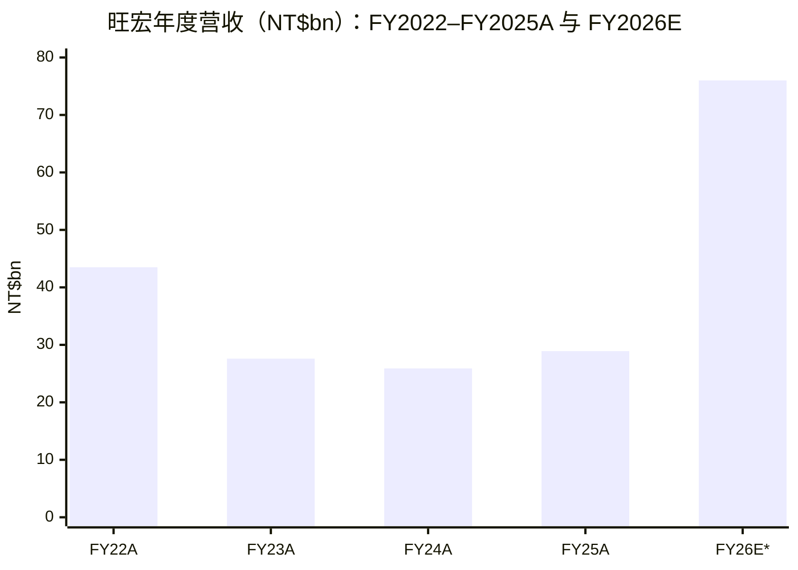
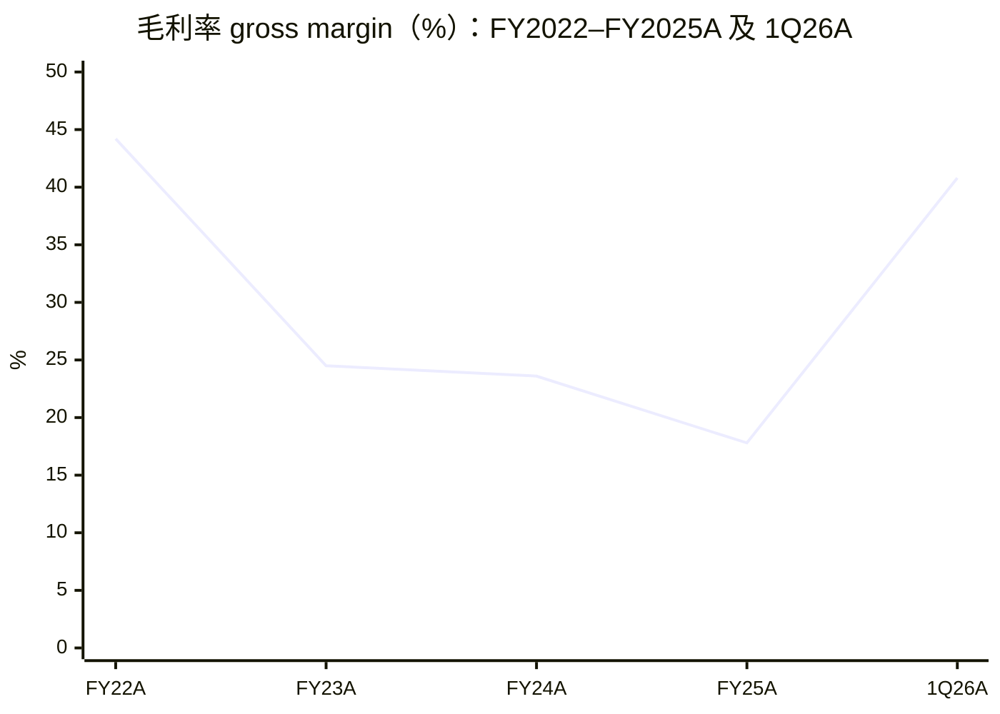
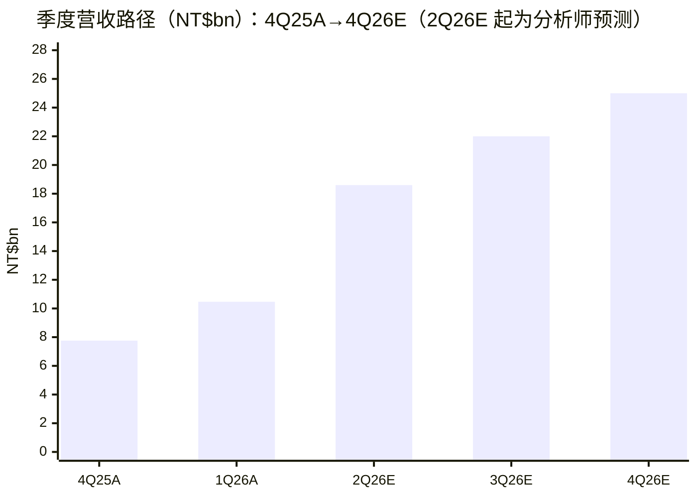
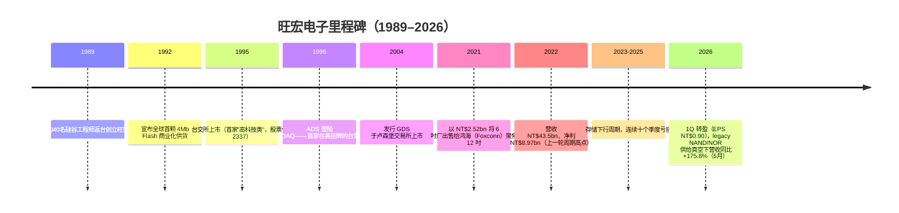
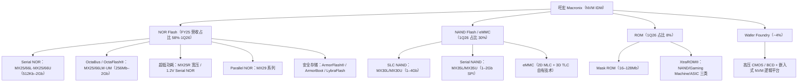
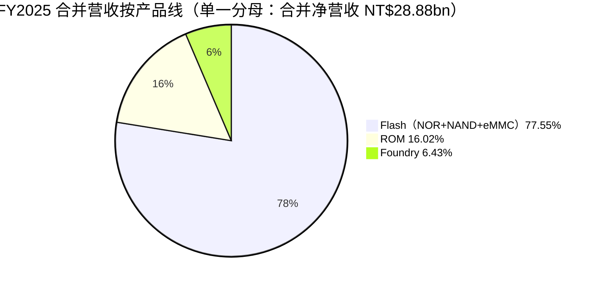
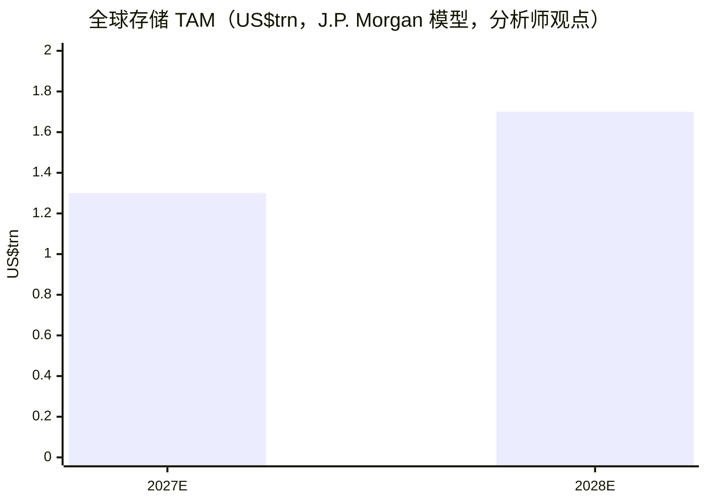
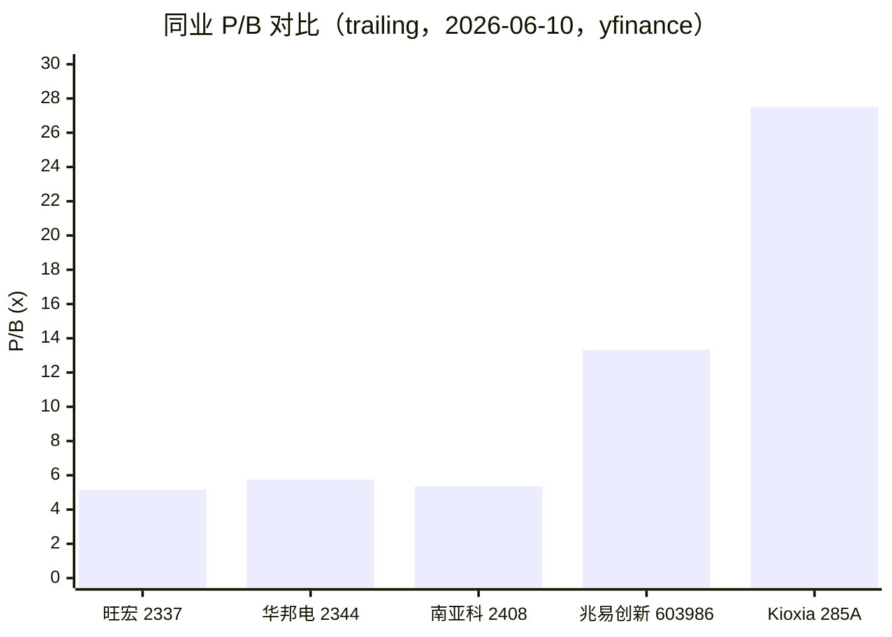

# 旺宏电子 Macronix International Co., Ltd.（TWSE:2337）公司研究报告

**As of: 2026-06-11** · 初次覆盖（Initiating Coverage） · 报告语言：简体中文（技术/财务术语保留英文）

> *分析师观点：* **评级：Buy（买入）· 12 个月目标价 NT$180（较 2026-06-10 收盘价 NT$135.0 上行 +33%）· 估值方法：4.6x 2026E BVPS（≈10.7x 2027E EPS 交叉验证）**
> 市值 NT$260.4bn · 52 周区间 NT$18.15–180.0 · TWSE:2337 · 数据来源：[Yahoo Finance 2337.TW（yfinance，2026-06-10 收盘）](https://finance.yahoo.com/quote/2337.TW/)
>
> | 倍数 / Multiple（*分析师观点：* 预测列） | FY2025A | FY2026E | FY2027E |
> |---|---|---|---|
> | P/E | n.m.（亏损，TTM EPS −NT$1.77） | ~9.6x（EPS NT$14.1E） | ~8.0x（EPS NT$16.9E） |
> | P/B（年末 BVPS） | 5.1x（BVPS NT$26.25，1Q26 末） | ~3.5x（BVPS ~NT$39E） | ~2.4x（BVPS ~NT$56E） |
> | P/S | 7.8x（TTM 营收 NT$33.2bn） | ~3.4x（营收 NT$76bnE） | ~2.8x（营收 NT$92bnE） |
>
> 相对表现（截至 2026-06-10，yfinance）：1M **−11.8%** / 6M **+300.6%** / YTD **+211.4%** / 12M **+536.8%**，同期 TAIEX（^TWII）+7.0% / +63.1% / +52.3% / +109.5% → 相对收益 −18.8pp / +237.5pp / +159.1pp / +427.3pp（[Yahoo Finance](https://finance.yahoo.com/quote/2337.TW/)）。
>
> **核心论点（thesis pillars）**——（1）**legacy NAND（MLC/SLC/legacy TLC）供给真空**：Samsung 退出 eMMC、Kioxia/Micron 逐步淡出 SLC NAND，*分析师观点：* MS 称旺宏是"唯一能填补缺口的供应商"，2H26 低容量 NAND 缺口可达 ~40%；（2）**盈利拐点已确认**：1Q26 营收 NT$10.47bn（+71% YoY），gross margin（毛利率）由上季 24.2% 跳升至 40.8%，结束连续十个季度亏损，4–5 月营收同比 +153.7%/+175.8% 持续加速；（3）**NOR Flash（全球份额 ~16.9%）+ ROM（全球份额 >50%）双利基**：AI 服务器/VR 拉动高容量 NOR 渠道价从 US$1 涨至 US$8（*分析师观点：* MS 渠道观察）；（4）**估值仍低于盈利弹性**：现价对应 ~9.6x FY26E P/E / 3.5x 2026E BVPS，低于 MS 7.0x P/B 目标框架，BVPS 在 ROAE 50%+ 阶段快速复利。

---

## 目录

1. [公司概览](#1-公司概览)
1A. [估值与目标价](#1a-估值与目标价)
2. [公司历史](#2-公司历史)
3. [管理团队](#3-管理团队)
4. [产品与服务](#4-产品与服务)
5. [客户与上市策略](#5-客户与上市策略)
6. [行业概览](#6-行业概览)
7. [竞争格局](#7-竞争格局)
8. [市场机会（TAM）](#8-市场机会tam)
9. [风险评估](#9-风险评估)
9.5 [关键分歧与催化剂](#95-关键分歧与催化剂)
10. [投资视角评分卡](#10-投资视角评分卡)

---

## 1. 公司概览

*分析师观点：* 本报告以 **Buy（买入）、12 个月目标价 NT$180（+33%）** 初次覆盖旺宏电子。Why-now：存储行业正经历一场由 AI 资本开支驱动的结构性供给重置——头部大厂将产能全面转向 HBM（高带宽内存）与先进制程，致使 legacy memory（传统/利基存储）出现"退出式短缺"；旺宏作为全球 mask ROM 份额超过一半、NOR Flash 份额 ~16.9%、且在低容量 MLC/SLC NAND 上被 Morgan Stanley 称为"唯一能填补缺口的供应商"的 NVM（non-volatile memory，非挥发性存储）专业厂，是这场短缺中**杠杆最纯粹的价格受益者**：1Q26 公司毛利率单季提升 16.6 个百分点、十个季度以来首次转盈，而 4–5 月营收同比增速仍在加速（+153.7% → +175.8%）。在 MS 的 +200% 全年涨价路径与 Bernstein 的 2H26 涨价减速路径之间，我们取中性偏多假设，以 4.6x 2026E BVPS 定价（详见 1A 节）。

**公司是做什么的。** 旺宏电子成立于 1989 年，总部位于台湾新竹科学园区，是一家专注 NVM 的 IDM（integrated device manufacturer，整合元件制造商）。按公司 2025 年年报的表述："The Company and subsidiary main business concentrates on the design, manufacture, sales, and foundry services of integrated circuits and memory chips"（公司及子公司主营集成电路与存储芯片的设计、制造、销售及代工服务），产品线覆盖 **ROM、NOR Flash、NAND Flash（以 SLC 为主）与 eMMC**，并以成熟制程提供少量 wafer foundry（晶圆代工）服务（[Macronix 2025 年年报（英文版），p.103](https://www.mxic.com.tw/en-us/about/investor-relations/Documents/annualreport_2025_en.pdf)）。年报同页明确："The Company is the world's leading supplier of NOR Flash and SLC NAND Flash"，且 ROM 业务"has long been ranked as the largest ROM supplier in the world, with more than half of the market share"（长期位居全球最大 ROM 供应商、份额过半）（[2025 年年报, p.104](https://www.mxic.com.tw/en-us/about/investor-relations/Documents/annualreport_2025_en.pdf)）。

**怎么赚钱。** FY2025 营收 NT$28.88bn，其中 Flash（NOR+NAND+eMMC）占 77.55%（NT$22.40bn）、ROM 占 16.02%（NT$4.63bn）、Foundry 占 6.43%（NT$1.86bn）（[2025 年年报, p.103](https://www.mxic.com.tw/en-us/about/investor-relations/Documents/annualreport_2025_en.pdf)）。公司自有 8 吋厂（Fab 2）与 12 吋厂（Fab 5）各一座，均位于新竹（[2025 年年报, p.56](https://www.mxic.com.tw/en-us/about/investor-relations/Documents/annualreport_2025_en.pdf)），12 吋月产能上限约 2.5 万片、目前投片约 2 万片，预计 2H26 满载（[BigGo Finance — 旺宏 1Q26 法说会, 2026-04-27](https://finance.biggo.com/news/TW_2337.TW_2026-04-27)）。员工 3,411 人（2025 年末）（[2025 年年报, p.111](https://www.mxic.com.tw/en-us/about/investor-relations/Documents/annualreport_2025_en.pdf)）。

**经营拐点：1Q26 十个季度以来首次转盈。** 1Q26 合并营收 NT$10.469bn（+35% QoQ / +71% YoY），毛利率 40.8%（4Q25 为 24.2%、1Q25 为 17.7%），operating margin（经营利润率）18.5%，税后净利 NT$1.78bn（自 2023 年二季度以来首次单季获利），EPS NT$0.90（[Taipei Times, 2026-04-28](https://www.taipeitimes.com/News/biz/archives/2026/04/28/2003856347)；[TrendForce, 2026-04-28](https://www.trendforce.com/news/2026/04/28/news-macronix-nand-revenue-jumps-382-yoy-on-samsungs-mlc-exit-shifts-to-monthly-pricing-amid-deepening-crunch/)）。其中 NAND Flash 营收同比 +382%、占比由一年前的 11% 升至 30%；eMMC 营收环比 +94%、同比近 40 倍（[TrendForce, 2026-04-28](https://www.trendforce.com/news/2026/04/28/news-macronix-nand-revenue-jumps-382-yoy-on-samsungs-mlc-exit-shifts-to-monthly-pricing-amid-deepening-crunch/)）。月度数据持续加速：4 月营收 NT$5.913bn（+33.7% MoM / +153.7% YoY）、5 月 NT$6.256bn（+5.8% MoM / **+175.8% YoY**），前五个月累计 NT$22.637bn（+110.8% YoY）（[TechNews 科技新报, 2026-05-07](https://finance.technews.tw/2026/05/07/macronix-2337-202604-financial-report/)；[TechNews 科技新报, 2026-06-08](https://finance.technews.tw/2026/06/08/macronix-2337-202605-financial-report/)）。董事长在法说会上表示"每一季都会比前一季更好"，并称"eMMC 与 NAND 的供需缺口非常大"（[BigGo Finance, 2026-04-27](https://finance.biggo.com/news/TW_2337.TW_2026-04-27)）。

来源：FY2022–23 见 [Macronix 2023 年年报, p.143](https://www.mxic.com.tw/en-us/about/investor-relations/Documents/annualreport_2023_en.pdf)；FY2024–25 见 [2025 年年报, p.127](https://www.mxic.com.tw/en-us/about/investor-relations/Documents/annualreport_2025_en.pdf)；\*FY2026E 为*分析师观点*（预测，见 1A 节）。

来源：FY 毛利率由各年年报损益表计算（FY22 GP NT$19.24bn/营收 NT$43.49bn 等，[2023 年年报, p.143](https://www.mxic.com.tw/en-us/about/investor-relations/Documents/annualreport_2023_en.pdf)、[2025 年年报, p.127](https://www.mxic.com.tw/en-us/about/investor-relations/Documents/annualreport_2025_en.pdf)）；1Q26 见 [Taipei Times, 2026-04-28](https://www.taipeitimes.com/News/biz/archives/2026/04/28/2003856347)。

**估值快照（TTM，2026-06-10）。** 现价 NT$135.0，市值 NT$260.4bn；**TTM P/E 为负**（TTM EPS −NT$1.77）——亏损源于 FY2025 全年经营亏损 NT$3.70bn（周期谷底 + 折旧与研发刚性，[2025 年年报, p.127](https://www.mxic.com.tw/en-us/about/investor-relations/Documents/annualreport_2025_en.pdf)），属**典型周期谷底亏损**而非结构性衰退，1Q26 已转盈；**P/B 5.14x**（BVPS NT$26.25），*分析师观点：* 远高于 MS 统计的 2017 年以来 1.5x 历史均值，但低于 Winbond（华邦电）5.7x、Nanya（南亚科）5.3x 的当前水平（yfinance，2026-06-10；[Yahoo Finance](https://finance.yahoo.com/quote/2337.TW/)）；P/S（TTM）7.8x。yfinance 一致预期 forward EPS 为 NT$35.05（隐含 forward P/E 3.85x），*分析师观点：* 该"一致预期"样本极小且无法溯源拆解，本文模型 FY2026E EPS NT$14.1 显著低于该值，读者应以区间而非点位理解卖方分歧（详见 1A(d)）。52 周区间 NT$18.15–180.0 —— 12 个月 +537% 的涨幅本身就是本轮 legacy memory 重定价的注脚，也是估值风险的来源（见第 9 节）。

## 1A. 估值与目标价

*本章所有预测均为分析师观点（Analyst view），引用的外部输入逐项标注；预测本身不附任何 filing 引用。*

### (a) 前瞻财务预测表（FY2026E–FY2028E）

建模输入：1Q26 实际数（营收 NT$10.469bn、GM 40.8%、净利 NT$1.78bn，[TrendForce, 2026-04-28](https://www.trendforce.com/news/2026/04/28/news-macronix-nand-revenue-jumps-382-yoy-on-samsungs-mlc-exit-shifts-to-monthly-pricing-amid-deepening-crunch/)）；4–5 月营收月报（NT$5.913bn / NT$6.256bn，[TechNews, 2026-06-08](https://finance.technews.tw/2026/06/08/macronix-2337-202605-financial-report/)）；2Q26 NOR 与 SLC NAND 合约价预期上涨 ~100%（[TrendForce, 2026-04-28](https://www.trendforce.com/news/2026/04/28/news-macronix-nand-revenue-jumps-382-yoy-on-samsungs-mlc-exit-shifts-to-monthly-pricing-amid-deepening-crunch/)）；产能上限 2.5 万片/月、新设备交期递延至 1H27（[Taipei Times, 2026-04-28](https://www.taipeitimes.com/News/biz/archives/2026/04/28/2003856347)）；*分析师观点：* MS 预期 MLC/legacy TLC 价格 1Q26–4Q26 累计上涨超 200%、ROAE 于 4Q26/1Q27 达 52%/65%（[Morgan Stanley — Old Memory: Turning Selective, 2026-03-19, p.2/p.6](http://xs-macbook-air.local:5001/zsxq/pdf/184444852442552/Morgan%20Stanley-Old%20Memory%EF%BC%9A%20Turning%20Selective-260319.pdf)）；Bernstein 预期 3QCY26 起涨幅减速至 10–20% QoQ、价格自 2HCY27 起回归正常（[Bernstein — Memory Tracker (May), 2026-06-02, p.1/p.4](http://xs-macbook-air.local:5001/zsxq/pdf/212485115581121/Bernstein-Global%20Memory%EF%BC%9AMEMORY%20TRACKER%20%EF%BC%88May%EF%BC%89%EF%BC%9A%20Price%20hike%20c.%2060%25%20QoQ%20in%202QCY26%EF%BC%8C%20but%20likely%20at%20a%20slower%20pace%20in%202HCY26-260602.pdf)）。

| 指标（*分析师观点：* 预测列） | FY2024A | FY2025A | FY2026E | FY2027E | FY2028E | 25A→28E CAGR |
|---|---|---|---|---|---|---|
| 营收（NT$bn） | 25.88 | 28.88 | 76.0 | 92.0 | 74.0 | +37% |
| — YoY % | −6.3% | +11.6% | +163% | +21% | −20% | |
| Gross margin（毛利率） | 23.6% | 17.8% | 56% | 58% | 42% | |
| Operating margin | −15.2% | −12.8% | 43% | 46% | 27% | |
| 净利（NT$bn） | −3.21 | −3.30 | 27.5 | 33.0 | 15.0 | |
| EPS（NT$，~1.95bn 股摊薄） | −1.73 | −1.77 | 14.1 | 16.9 | 7.7 | |
| ROAE | −7.1% | −7.4% | ~43% | ~36% | ~14% | |
| FCF（NT$bn） | n/a | +3.0 | ~+4.5 | ~+23 | ~+18 | |
| 净现金/(净负债)（NT$bn） | n/a | −8.0 | ~0 | ~+20 | ~+35 | |

FY2024/25 实际数与现金流（经营现金流 NT$4.84bn、capex NT$1.84bn、年末现金 NT$14.91bn）来自 [2025 年年报, p.127–128](https://www.mxic.com.tw/en-us/about/investor-relations/Documents/annualreport_2025_en.pdf)；FY2025 末总借款 NT$22.9bn、现金 NT$15.97bn（含约当现金口径差异）来自 [Yahoo Finance（yfinance，2026-06-10）](https://finance.yahoo.com/quote/2337.TW/)。2026E capex 采用公司公告的 NT$22bn 扩产计划（[Taipei Times, 2026-04-28](https://www.taipeitimes.com/News/biz/archives/2026/04/28/2003856347)）。

**季度路径（2026E，*分析师观点：*）**——4Q25A 营收 NT$7.76bn（由 1Q26 +35% QoQ 反推）→ 1Q26A NT$10.47bn → 2Q26E ~NT$18.6bn（4 月 5.91 + 5 月 6.26 已实现，6 月假设与 5 月持平略增）→ 3Q26E ~NT$22bn → 4Q26E ~NT$25bn。3Q/4Q 增长几乎全部来自价格（产能已近满载、新机台 1H27 才到位），这正是本模型与"出货量驱动"型成长股的本质区别。

来源：1Q26 实际值见 [TrendForce, 2026-04-28](https://www.trendforce.com/news/2026/04/28/news-macronix-nand-revenue-jumps-382-yoy-on-samsungs-mlc-exit-shifts-to-monthly-pricing-amid-deepening-crunch/)；4–5 月月报见 [TechNews, 2026-06-08](https://finance.technews.tw/2026/06/08/macronix-2337-202605-financial-report/)；2Q26E–4Q26E 为*分析师观点*。

**毛利率桥（1Q26 实际：24.2% → 40.8%，+16.6pp QoQ）**：ASP 上涨与产品组合（NAND 占比 21%→30%，eMMC 转月度议价）约 +12pp；存货跌价回冲 NT$5 亿约 +4.8pp（500/10,469，管理层在法说会上披露，并表示"未来还会有进一步的存货回冲"）（[BigGo Finance, 2026-04-27](https://finance.biggo.com/news/TW_2337.TW_2026-04-27)；[Taipei Times, 2026-04-28](https://www.taipeitimes.com/News/biz/archives/2026/04/28/2003856347)）。*分析师观点：* 2Q26E 起合约价 ~100% 的环比涨幅在近乎固定的成本基数上直接放大毛利率至 55%+；FY2028E 回落假设对应 Bernstein 的"自 2HCY27 起回归正常"路径。

### (b) 目标价推导（show the arithmetic）

*分析师观点：* 鉴于存储行业的强周期属性（盈利经常穿越零轴，P/E 在拐点失真），主估值采用 **P/B × 前瞻 BVPS** —— 与 MS 对大中华区存储股的统一框架一致（MS："Base case, P/B, in line with our Greater China memory coverage, due to the memory industry's cyclical nature"，[Morgan Stanley — Old Memory: Readacross from Kioxia IR Day, 2026-06-03, p.2](http://xs-macbook-air.local:5001/zsxq/pdf/812488554854482/Morgan%20Stanley-Greater%20China%20Semiconductors%EF%BC%9AOld%20Memory%EF%BC%9A%20Readacross%20from%20Kioxia%20IR%20Day-260603.pdf)）：

- **2026E 年末 BVPS ≈ NT$39**：1Q26 末股东权益 ~NT$50.6bn（BVPS NT$26.25 × 1.929bn 股，[yfinance，2026-06-10](https://finance.yahoo.com/quote/2337.TW/)）+ 本模型 2Q–4Q26E 净利 NT$25.7bn，按可转债（公司 2025 年发行第二次国内无担保转换公司债，[2025 年年报, p.128](https://www.mxic.com.tw/en-us/about/investor-relations/Documents/annualreport_2025_en.pdf)）摊薄至 ~1.95bn 股。
- **目标倍数 4.6x**：对标——MS 对旺宏的目标倍数 7.0x 2026E BVPS、对 Winbond 5.5x 2026E P/B（同一框架，[MS Kioxia readacross, 2026-06-03, p.2](http://xs-macbook-air.local:5001/zsxq/pdf/812488554854482/Morgan%20Stanley-Greater%20China%20Semiconductors%EF%BC%9AOld%20Memory%EF%BC%9A%20Readacross%20from%20Kioxia%20IR%20Day-260603.pdf)）；当前市场对 Winbond/Nanya 的定价为 5.7x/5.3x trailing P/B（[yfinance，2026-06-10](https://finance.yahoo.com/quote/2337.TW/)）；旺宏自身 2017 年以来历史均值仅 1.5x（*分析师观点：* MS 统计，[MS Turning Selective, 2026-03-19, p.2](http://xs-macbook-air.local:5001/zsxq/pdf/184444852442552/Morgan%20Stanley-Old%20Memory%EF%BC%9A%20Turning%20Selective-260319.pdf)）。本文取 4.6x——高于历史均值 3 倍（反映十年一遇的退出式短缺与"唯一供应商"地位），但对 MS 的 7.0x 打 ~35% 折扣（反映 Bernstein 路径下 2H26 涨价减速风险与产能天花板）。
- **PT = NT$39 × 4.6 ≈ NT$180**（+33% vs NT$135）。交叉验证：NT$180 / FY2027E EPS NT$16.9 ≈ **10.7x**，相对 Winbond/Nanya 前瞻 P/E（5.6x/5.8x，[yfinance，2026-06-10](https://finance.yahoo.com/quote/2337.TW/)）有溢价，溢价的依据是旺宏在 MLC/SLC NAND 缺口中的独占性供给地位与更高的 ROAE 轨迹。

### (c) Bull / Base / Bear 情景

| 情景（*分析师观点：*） | 关键假设 | 估值 | PT | vs 现价 |
|---|---|---|---|---|
| Bull | 2H26 低容量 NAND 缺口达 ~40%、MLC/TLC 全年 +200% 路径兑现，ROAE ≥65%，Switch 2 卡带订单回流 | 7.0x（MS 倍数）× 2026E BVPS ~NT$40 | **NT$280** | **+107%** |
| Base | 2Q26 合约价 +100% 后涨幅减速但不逆转；FY26E EPS NT$14.1 | 4.6x × 2026E BVPS ~NT$39 | **NT$180** | **+33%** |
| Bear | 3Q26 起涨价失速（Bernstein：10–20% QoQ → 4Q26 走平）、需求破坏显现，GM 峰值 ~45%，FY27E EPS ~NT$6 | 2.5x × 2026E BVPS ~NT$34 | **NT$85** | **−37%** |

### (d) 一致预期对标

*分析师观点：* 旺宏的公开 PT 覆盖极薄——本地研究库（`db/stock_price_target.db` 只读预检 + 12 个月内 zsxq 笔记）中**仅 Morgan Stanley 一家给出明确目标价 NT$202**（2026-03-19，报告日收盘 NT$157，隐含 +28.7%；基于 7.0x 2026E BVPS，[MS Turning Selective, 2026-03-19, p.8](http://xs-macbook-air.local:5001/zsxq/pdf/184444852442552/Morgan%20Stanley-Old%20Memory%EF%BC%9A%20Turning%20Selective-260319.pdf)），其牛市/熊市情景值为 NT$326（11.4x）/ NT$119.5（4.2x）（同注 p.8）。本文 PT NT$180 较 MS 低 ~11%，FY26E EPS NT$14.1 对应的 4Q26E 年化 ROAE ~60%，落在 MS"4Q26 52% / 1Q27 65%"轨迹之内。yfinance 屏显"一致预期" forward EPS NT$35.05（fwd P/E 3.85x）无法溯源、疑似单一来源极端值，本文不以其为锚。

### (e) 摆动变量（swing variables）

1. **2H26 legacy NAND/NOR 合约价斜率** —— MS 的"1Q–4Q26 累计 +200%"（[MS Turning Selective, 2026-03-19, p.1](http://xs-macbook-air.local:5001/zsxq/pdf/184444852442552/Morgan%20Stanley-Old%20Memory%EF%BC%9A%20Turning%20Selective-260319.pdf)）vs Bernstein 的"3QCY26 减速至 10–20% QoQ"（[Bernstein Memory Tracker, 2026-06-02, p.4](http://xs-macbook-air.local:5001/zsxq/pdf/212485115581121/Bernstein-Global%20Memory%EF%BC%9AMEMORY%20TRACKER%20%EF%BC%88May%EF%BC%89%EF%BC%9A%20Price%20hike%20c.%2060%25%20QoQ%20in%202QCY26%EF%BC%8C%20but%20likely%20at%20a%20slower%20pace%20in%202HCY26-260602.pdf)）之差，直接决定本模型 FY26E EPS 落在 NT$10 还是 NT$18。每月 10 日前后的营收月报是最高频的验证点。
2. **有效产能与产品组合再平衡** —— 12 吋上限 2.5 万片/月、新机台 1H27 到位、NOR:NAND 投片比从 1:0.5 调向 1:1（[BigGo Finance, 2026-04-27](https://finance.biggo.com/news/TW_2337.TW_2026-04-27)）：量的天花板使 2H26 增长完全依赖价格，一旦涨价停滞营收即走平。

### 卖方观点演变（Sell-side view evolution）

机械预检（`db/stock_price_target.db`，只读）显示 2337.TW 在库共 4 条 PT/评级记录，全部来自 Morgan Stanley；无其他机构对该股发布过 PT —— 因此"机构间分歧"以 MS（个股）vs Bernstein/BofA（行业价格路径）呈现，不构造虚假共识。

**Morgan Stanley 个股观点时间线（按报告日期）：**

| 日期 | 评级 / PT | 报告日股价 | 核心观点 | 出处 |
|---|---|---|---|---|
| 2026-03-09 | （行业评论） | — | 老存储板块因 DDR4 2Q26 涨价或放缓而大跌，旺宏在列；MS 称只是"小波折" | [MS — DDR4 price hike in 2Q26?, 2026-03-09](http://xs-macbook-air.local:5001/zsxq/pdf/812228884854442/Morgan%20Stanley-Old%20memory%EF%BC%9A%20How%20to%20think%20about%20DDR4%20price%20hike%20in%202Q26%EF%BC%9F-260309.pdf) |
| 2026-03-16 | OW（无 PT 披露） | NT$119.0 | NOR 利基存储首选之一 | [MS — Further Strength in TPU, GPU and Memory, 2026-03-16](http://xs-macbook-air.local:5001/zsxq/pdf/212222844524521/Morgan%20Stanley-Greater%20China%20Semiconductors%EF%BC%9AFurther%20Strength%20in%20TPU%EF%BC%8C%20GPU%20and%20Memory%EF%BC%8C%20but%20More%20Downside%20in%20Smartphones%20and%20PC%20Semis-260316.pdf) |
| **2026-03-19** | **OW · Top Pick，PT NT$121 → NT$202**（7.0x 2026E BVPS；bull NT$326 / bear NT$119.5） | NT$157.0（隐含 +28.7%） | **自我修正：Top Pick 由华邦电(2344)换成旺宏(2337)，同时下调华邦电/南亚科至 EW**；触发因素＝"legacy flash 是下一个 DDR4"：2GB–64GB NAND 全球产能"基本消失"、客户库存仅 6–9 个月、旺宏是"唯一能填补缺口的供应商"，预期 MLC/legacy TLC 价格 1Q–4Q26 涨超 200%、ROAE 4Q26/1Q27 达 52%/65% | [MS — Old Memory: Turning Selective, 2026-03-19, p.1–2/p.6/p.8](http://xs-macbook-air.local:5001/zsxq/pdf/184444852442552/Morgan%20Stanley-Old%20Memory%EF%BC%9A%20Turning%20Selective-260319.pdf) |
| 2026-03-26 | OW · Top Pick 维持 | NT$142.0（评级披露页） | "our Top pick remaining Macronix as it best captures the opportunities"；2H 低容量 NAND 缺口或达 ~40%；Samsung/Kioxia 退出 legacy NAND "不可避免" | [MS — Old Memory: Unprecedented Private Placement, 2026-03-26, p.1](http://xs-macbook-air.local:5001/zsxq/pdf/415552145212518/MS-Greater%20China%20Semiconductors%20-%20Asia%20Pacific%20Old%20Memory-Unprecedented%20Private%20Placement-260326.pdf) |
| 2026-04-20 | OW · 存储首选 | NT$120.5 | 4 月股价回撤后维持"Memory top pick" | [MS — Focus on AI-related semis, 2026-04-20](http://xs-macbook-air.local:5001/zsxq/pdf/812215142524182/Morgan%20Stanley-Greater%20China%20Semis%EF%BC%9A%20Focus%20on%20AI~related%20semis%20~%20GPU%EF%BC%8C%20ASIC%EF%BC%8C%20CPU%EF%BC%8C%20and%20Optical%20Chips-260420.pdf) |
| 2026-05-08 | OW | NT$153.0 | NAND/NOR 供给紧张、存储上行周期延续，存储类增持标的中点名旺宏 | [MS — Build for future AI infrastructure, 2026-05-08](http://xs-macbook-air.local:5001/zsxq/pdf/812458411541442/Morgan%20Stanley-Build%20for%20future%20AI%20infrastructure%20%E2%80%93%20CPU%EF%BC%8C%20GPU%EF%BC%8C%20ASIC%EF%BC%8C%20Optical%EF%BC%8C%20and%20China%20chips-260508.pdf) |
| 2026-05-28 | OW（板块内上调华邦电/南亚科回 OW） | — | SLC NAND 数据中心渗透逻辑强化；"SLC NAND could be supplied by Greater China vendors such as GigaDevice, Winbond, and Macronix" | [MS — Old Memory: Upside Surprise Ahead, 2026-05-28, p.1](http://xs-macbook-air.local:5001/zsxq/pdf/212451114418521/MS-Greater%20China%20Semiconductors%20-%20Asia%20Pacific%20Old%20Memory-Upside%20Surprise%20%20Ahead-260528.pdf) |
| 2026-06-03 | OW 维持，7.0x 2026E BVPS 框架重申 | NT$175.5（评级披露页） | Kioxia IR Day 验证 SLC 数据中心化逻辑："remain OW on all three stocks"（兆易/华邦/旺宏）；上行风险含"Faster growth for Switch hardware and core titles"，下行风险含 NOR 下行周期 | [MS — Old Memory: Readacross from Kioxia IR Day, 2026-06-03, p.1–2](http://xs-macbook-air.local:5001/zsxq/pdf/812488554854482/Morgan%20Stanley-Greater%20China%20Semiconductors%EF%BC%9AOld%20Memory%EF%BC%9A%20Readacross%20from%20Kioxia%20IR%20Day-260603.pdf) |
| 2026-06-07 | OW（"all OW"） | — | Computex 见闻："old memory (Winbond, Macronix, APMemory, Gigadevice, all OW)"；高容量 NOR 渠道价 US$1 → US$8（VR 内容翻倍驱动） | [MS — Computex takeaways, 2026-06-07, p.1](http://xs-macbook-air.local:5001/zsxq/pdf/412458541155248/Morgan%20Stanley-Greater%20China%20Technology%20Semiconductors%EF%BC%9AComputex%20takeaways%EF%BC%9A%20Cloud%EF%BC%8C%20PC%20and%20old%20memory-260607.pdf) |

**机构间分歧（个股评级 vs 行业价格路径，不可混为共识）：**

| 机构 | 日期 | 评级 / 观点 | 核心论点 | 什么证据能证明其正确 |
|---|---|---|---|---|
| Morgan Stanley | 2026-06-03 | 旺宏 OW，7.0x 2026E BVPS（3 月 PT NT$202） | 2H26 MLC/legacy TLC 缺口可达 40%，旺宏为唯一补缺者，ROAE 冲向 65% | 3Q/4Q26 合约价继续大涨、月营收维持 >150% YoY |
| Bernstein（行业） | 2026-06-02 | NAND 2QCY26 混合价 +~60% QoQ，但 **3QCY26 减速至 10–20% QoQ**，价格"自 2HCY27 起回归正常" | 模组厂对高价已趋谨慎（5 月 TLC wafer 合约价仅 +2% MoM）、涨价引发需求破坏 | 3Q26 合约价涨幅显著收窄、下游砍单 |
| BofA（行业） | 2026-05-16 | NAND 超级周期超预期（Kioxia 指引 1Q26 NAND 均价环比 +100%+） | eSSD 拉动、台系存储 4 月营收全面井喷 | 月度均价与 eSSD 出货持续超模型 |

出处：[MS Kioxia readacross, 2026-06-03, p.2](http://xs-macbook-air.local:5001/zsxq/pdf/812488554854482/Morgan%20Stanley-Greater%20China%20Semiconductors%EF%BC%9AOld%20Memory%EF%BC%9A%20Readacross%20from%20Kioxia%20IR%20Day-260603.pdf)；[Bernstein Memory Tracker (May), 2026-06-02, p.1/p.4–5/p.15](http://xs-macbook-air.local:5001/zsxq/pdf/212485115581121/Bernstein-Global%20Memory%EF%BC%9AMEMORY%20TRACKER%20%EF%BC%88May%EF%BC%89%EF%BC%9A%20Price%20hike%20c.%2060%25%20QoQ%20in%202QCY26%EF%BC%8C%20but%20likely%20at%20a%20slower%20pace%20in%202HCY26-260602.pdf)；[BofA — Global Memory weekly, 2026-05-16](http://xs-macbook-air.local:5001/zsxq/pdf/812452144184522/Bofa-Global%20Memory%20Tech%20Theme%20of%20the%20week-NAND%20surprise%2C%20Samsung%20labor%20strike%2C%20TCB%20sales%20miss-260516.pdf)（均为*分析师观点*）。

---

## 2. 公司历史

旺宏由吴敏求（Miin Wu）于 1989 年创立——他说服约 40 名硅谷工程师集体返台，在新竹科学园区建立台湾本土的 NVM 厂商；这一"逆向人才流动"当年被 San Jose Mercury News 视为扭转台湾人才外流的开创性事件（[Nature — "I helped to build Taiwan's Silicon Valley", 2023](https://www.nature.com/articles/d41586-023-01468-1)）。公司自始选择 IDM 模式（自有设计 + 自有晶圆厂），在 fabless 当道的年代保留了对制程的完全控制——这后来成为 ROM 与 NOR 利基统治力的基础。

公司在其 2006 年度 20-F 中自述了几个里程碑（原文）："In March 1995, our common shares were listed on the Taiwan Stock Exchange and we became the first company to be listed under that stock exchange's 'High Technology' category of companies. In May 1996, our ADSs were quoted on the NASDAQ National Market and we became the first Taiwanese company with securities listed in the United States."——即 1995 年成为台交所"高科技类"第一家上市公司、1996 年成为**第一家在美国挂牌的台湾公司**；同一文件还记载公司自认 1992 年 10 月为"世界上第一家宣布 4Mb Flash 芯片商业化供货的制造商"（[Macronix FY2006 Form 20-F](https://www.sec.gov/Archives/edgar/data/1009680/000114554907001188/h01322e20vf.htm)）。

来源：founding/上市见 [20-F FY2006](https://www.sec.gov/Archives/edgar/data/1009680/000114554907001188/h01322e20vf.htm)、[Nature, 2023](https://www.nature.com/articles/d41586-023-01468-1)；6 吋厂出售见 [Macronix-Foxconn 资产交易新闻稿（PR Newswire）, 2021-08-05](https://www.prnewswire.com/news-releases/macronix-and-foxconn-sign-asset-transaction-agreement-for-6-inch-wafer-fab-301350137.html)；FY2022 财务见 [2023 年年报, p.143](https://www.mxic.com.tw/en-us/about/investor-relations/Documents/annualreport_2023_en.pdf)；2026 见 [TechNews, 2026-06-08](https://finance.technews.tw/2026/06/08/macronix-2337-202605-financial-report/)。

三次关键转型：**（1）从 Mask ROM 到 XtraROM®**——把 ROM 从"光罩定制、长交期"产品改造为"无光罩费用、短 TAT（turn-around time）"的内容发行介质，巩固了游戏卡带等应用的半壁市场（[Macronix ROM 产品页](https://www.macronix.com/CachePages/en-us-Product-ROM-default.aspx)）；**（2）2021 年出售 6 吋厂、聚焦 12 吋**——将资源集中于 Fab 5 的 NOR/NAND 先进利基制程，6 吋资产以 NT$2.52bn 出售给鸿海用于 SiC（碳化硅）（[PR Newswire, 2021-08-05](https://www.prnewswire.com/news-releases/macronix-and-foxconn-sign-asset-transaction-agreement-for-6-inch-wafer-fab-301350137.html)）；**（3）2024–2026 年向 NAND/eMMC 重心倾斜**——在 Samsung 退出 eMMC、Kioxia/Micron 淡出 SLC 后，将 NOR:NAND 投片比从 1:0.5 向 1:1 再平衡，把公司从"NOR 为主"重塑为"NOR+NAND 双引擎"（[BigGo Finance, 2026-04-27](https://finance.biggo.com/news/TW_2337.TW_2026-04-27)）。

## 3. 管理团队

**吴敏求（Miin Wu）——创始人、董事长兼 CEO（合并简介）。** 现年 77 岁，斯坦福大学材料科学与工程硕士（M.S. in Material Science and Engineering, Stanford University），1989 年 11 月 25 日首次当选董事至今，现持有 13,440,809 股（占比 0.68%）（[Macronix 2025 年年报, p.4](https://www.mxic.com.tw/en-us/about/investor-relations/Documents/annualreport_2025_en.pdf)）。返台创业前，他在硅谷半导体业工作多年——曾任职 Intel，之后在硅谷自行创业；1989 年他带领约 40 名工程师返台创立旺宏，本人在 Nature 的访谈专栏《I helped to build Taiwan's Silicon Valley》中自述了这段经历（[Nature, 2023](https://www.nature.com/articles/d41586-023-01468-1)）。年报对其角色的官方表述："Mr. Miin Wu founded Macronix in 1989 and served as its President. He has been elected as the Chairman since 2005 and successfully had the Company become the global leader in non-volatile memory (NVM) with his breadth of vision and innovative business strategy. In 2025, he was elected as the chairman and CEO of the 13th Term of the Board of Directors."（[2025 年年报, p.6](https://www.mxic.com.tw/en-us/about/investor-relations/Documents/annualreport_2025_en.pdf)）。董事长与 CEO 由一人兼任的合理性，公司以"五名独立董事、过半数董事非雇员/经理人"及其"多次带领公司穿越困难时期"作为披露理由（同上）。1Q26 法说会上他对周期的判断——"今年开局良好"、"每一季都会比前一季更好"、但"涨价不可能无限度，有其上限"——同时给出了乐观与克制两条线索（[BigGo Finance, 2026-04-27](https://finance.biggo.com/news/TW_2337.TW_2026-04-27)）。*分析师观点：* 77 岁的创始人 CEO 没有公开的接班安排，是治理层面需要跟踪的长期变量（见第 9 节）。

## 4. 产品与服务

> 本节为全报告权重最高的章节：旺宏的投资故事本质上是"产品组合 × 供给格局"的故事——理解 NOR/NAND/ROM 各自在客户系统中的物理角色，才能理解为什么大厂退出会把定价权集中到这家公司手里。

### 4.1 产品矩阵（年报锚定）

公司 2025 年年报的产品与服务分类表（verbatim 重排为 markdown，[2025 年年报, p.103](https://www.mxic.com.tw/en-us/about/investor-relations/Documents/annualreport_2025_en.pdf)）：

| Product and Service Category | Main Projects |
|---|---|
| Non-Volatile Memory IC | Flash Memory (NOR Flash, NAND Flash)；Embedded Multi Media Card (eMMC)；Read-Only Memory (ROM) |
| Wafer Foundry Services | Sub-micron logic process / high voltage CMOS and BCD process；BCD and logic processes of embedded non-volatile memory (NVM) |

营收占比（FY2025）：Flash 77.55% / ROM 16.02% / Foundry 6.43%（[2025 年年报, p.103](https://www.mxic.com.tw/en-us/about/investor-relations/Documents/annualreport_2025_en.pdf)）。年报对四条产品线的官方概述（verbatim）：

> "The Company, an integrated device manufacturer in the non-volatile memory (NVM) market, provides memory IC and storage solutions with a wide range of specifications and capacities, including ROM, NOR Flash Memory, NAND Flash Memory, and eMMC. … In the embedded applications market, the Company has three product lines: NOR Flash Memory, NAND Flash Memory and eMMC, forming a complete layout of low, medium, and high-capacity solutions."
> —— [Macronix 2025 年年报, p.103](https://www.mxic.com.tw/en-us/about/investor-relations/Documents/annualreport_2025_en.pdf)

来源：产品族与料号见 [Macronix NOR Flash 产品页](https://www.macronix.com/en-us/products/nor-flash/Pages/default.aspx)、[NAND Flash 产品页](https://www.macronix.com/en-us/products/nand-flash/Pages/default.aspx)、[ROM 产品页](https://www.macronix.com/CachePages/en-us-Product-ROM-default.aspx)；1Q26 营收占比见 [Taipei Times, 2026-04-28](https://www.taipeitimes.com/News/biz/archives/2026/04/28/2003856347)。

### 4.2 综合视角：三条产品线如何拼成一个"容量阶梯"

年报的自我定位是关键：NOR / NAND / eMMC 在嵌入式市场组成"低、中、高容量的完整布局"（[2025 年年报, p.103](https://www.mxic.com.tw/en-us/about/investor-relations/Documents/annualreport_2025_en.pdf)）。**中文释义 / Plain-language gloss：** 一台嵌入式设备（路由器、车机、医疗仪器、游戏机）的存储需求是分层的——开机代码（boot code）要求字节级随机读取、可直接执行（XIP, execute-in-place），用 **NOR**（Mb 级）；操作系统与应用数据要求大块顺序读写、低单位成本，用 **SLC NAND**（Gb 级）；影音内容与日志要求 GB 级容量并由控制器管理坏块（bad block）/磨损均衡（wear leveling），用 **eMMC**（内建 controller 的 managed NAND）。游戏卡带这类"只读+大容量+低成本"的内容载体，则是 **ROM/XtraROM®** 的地盘。同一客户经常在一块板子上同时采购旺宏的 NOR（开机）+ NAND/eMMC（存储），这是公司"complete layout"策略的商业含义——也是 1Q26 NOR:NAND 投片比要从 1:0.5 拉向 1:1 的原因（[BigGo Finance, 2026-04-27](https://finance.biggo.com/news/TW_2337.TW_2026-04-27)）。

### 4.3 NOR Flash（1Q26 营收占比 58%）

官网产品页的官方定义（verbatim）："Macronix, as a global leader in Serial NOR Flash memory, dedicates itself to developing comprehensive product portfolio to meet the requirements of high performance, reliable quality, low pin count and small form factor."（[Macronix NOR Flash 产品页](https://www.macronix.com/en-us/products/nor-flash/Pages/default.aspx)）。产品族覆盖 3V/2.5V/1.8V/1.2V 电压、512Kb–2Gb 容量，含 Serial（MX25/66L、MX25/66U）、Parallel（MX29 系列）、OctaBus（MX25/66LM/UM，Octa I/O + DTR）、宽压超低功耗（MX25R，功耗较传统产品低 60%）等（同上）。

**中文释义 / Plain-language gloss：** NOR 的物理特征是 cell 以并联阵列（NOR 逻辑结构）连接，支持**字节级随机访问**与 XIP——CPU 可以直接从 NOR 里取指令执行，无需先搬运到 RAM。这使它成为几乎所有电子系统的"第一颗芯片"：BIOS/bootloader、固件、FPGA 配置。它的劣势是单位容量成本高（cell 面积大），所以容量止步于 Gb 级。需求的新增量来自 AI 硬件：每台 AI 服务器/交换机/网卡都需要 NOR 存放固件，VR 设备单机 NOR 用量翻倍——*分析师观点：* MS 在 Computex 观察到"high-density NOR pricing hit US$8 from the prior US$1 at channel, likely driven by 2x content in VR vs GB"（高容量 NOR 渠道价由 US$1 涨至 US$8，[MS — Computex takeaways, 2026-06-07, p.1](http://xs-macbook-air.local:5001/zsxq/pdf/412458541155248/Morgan%20Stanley-Greater%20China%20Technology%20Semiconductors%EF%BC%9AComputex%20takeaways%EF%BC%9A%20Cloud%EF%BC%8C%20PC%20and%20old%20memory-260607.pdf)），并把旺宏列入 AI PC 受益链（"旺宏（AI PC 用 NOR Flash）"，[MS — Key Computex Takeaways, 2026-06-02](http://xs-macbook-air.local:5001/zsxq/pdf/184155221524822/Morgan%20Stanley-Greater%20China%20Technology%20Semiconductors%EF%BC%9AKey%20Computex%20Takeaways%EF%BC%9A%20Agenetic%20AI%EF%BC%8C%20TSMC%20capacity%20and%20MediaTek%27s%20AI%20PC%20chips-260602.pdf)）。公司披露 2025 年 NOR 全球份额约 16.9%（[2025 年年报, p.108](https://www.mxic.com.tw/en-us/about/investor-relations/Documents/annualreport_2025_en.pdf)）。

*分析师观点（竞争优势判定）：* **有护城河（partial-to-yes）**——moat 类型为技术/质量认证（车规 AEC-Q100、航天级认证）+ 制程自有（IDM）+ 客户切换成本（固件验证周期长）；最接近的竞品是 Winbond（华邦电）与 GigaDevice（兆易创新）的 Serial NOR 产品线（两家公司均为 MS 同一覆盖框架下的 OW 标的，[MS Kioxia readacross, 2026-06-03, p.1](http://xs-macbook-air.local:5001/zsxq/pdf/812488554854482/Morgan%20Stanley-Greater%20China%20Semiconductors%EF%BC%9AOld%20Memory%EF%BC%9A%20Readacross%20from%20Kioxia%20IR%20Day-260603.pdf)）。

### 4.4 NAND Flash / eMMC（1Q26 营收占比 30%，本轮周期的发动机）

年报定义（verbatim）："The NAND Flash Memory product line focuses on SLC products, offering higher storage capacity than the NOR product line… Leveraging 2D MLC NAND and 3D TLC NAND technology, the eMMC product line employs advanced memory read/write control capabilities to produce high-quality, high-performance, low-power, compact solutions with increased storage capacity."（[2025 年年报, p.103](https://www.mxic.com.tw/en-us/about/investor-relations/Documents/annualreport_2025_en.pdf)）。产品族：SLC NAND MX30L/MX30U（1–4Gb）、Serial NAND MX35L/MX35U（1–2Gb，SPI 接口）、eMMC（[Macronix NAND Flash 产品页](https://www.macronix.com/en-us/products/nand-flash/Pages/default.aspx)）。

**中文释义 / Plain-language gloss：** SLC（single-level cell，单层单元）每个 cell 只存 1 bit，写入耐久度（endurance）与数据保持力（retention）远超 MLC/TLC，是工业、车载、网通设备的标配——这些设备要在野外/机柜里跑十年，不能像手机那样三年换新。问题在于：SLC/低容量 MLC 对三星、铠侠这类大厂是"低毛利的旧产品"，当 AI 让 eSSD（企业级固态硬盘）需求爆炸时，大厂把产能全部调往高层数 3D TLC/QLC，**2GB–64GB 容量段在全球范围内"产能基本消失"**——这正是 MS 的原话："Global capacity for 2GB to 64GB NAND has largely disappeared, and customer inventory generally lasts only another 6–9 months. Macronix remains the only supplier able to fill the gap. We expect MLC and legacy TLC pricing to rise more than 200% from 1Q26 to 4Q26."（*分析师观点*，[MS — Turning Selective, 2026-03-19, p.6](http://xs-macbook-air.local:5001/zsxq/pdf/184444852442552/Morgan%20Stanley-Old%20Memory%EF%BC%9A%20Turning%20Selective-260319.pdf)）。供给端的具体退出动作：Samsung 退出 eMMC 市场后，"Macronix became nearly the sole supplier of low-density multilevel cell NAND"（[Taipei Times, 2026-04-28](https://www.taipeitimes.com/News/biz/archives/2026/04/28/2003856347)）；Kioxia 与 Micron 也在逐步退出 SLC NAND（[TrendForce, 2026-04-28](https://www.trendforce.com/news/2026/04/28/news-macronix-nand-revenue-jumps-382-yoy-on-samsungs-mlc-exit-shifts-to-monthly-pricing-amid-deepening-crunch/)）。公司已将 eMMC/SLC NAND 议价从季度改为**月度**（同上）——对一家长期价格被动的利基厂而言，这是定价权易手的最直接证据。技术路线上，自有 96 层 3D NAND 已量产、192 层接近完成、300+ 层在开发（[TrendForce, 2026-04-28](https://www.trendforce.com/news/2026/04/28/news-macronix-nand-revenue-jumps-382-yoy-on-samsungs-mlc-exit-shifts-to-monthly-pricing-amid-deepening-crunch/)），年报亦把"3D NAND Flash 第三、四代项目"列为新产品开发计划之首（[2025 年年报, p.104](https://www.mxic.com.tw/en-us/about/investor-relations/Documents/annualreport_2025_en.pdf)）。

*分析师观点（竞争优势判定）：* **当下是垄断级（yes，但时限存疑）**——moat 类型为"退出造成的供给独占"+ 自有 3D NAND 工艺；这种 moat 的可持续性取决于价格信号是否吸引再进入（中国厂商的低容量 SLC 产线、或大厂回头），见第 9 节风险与 9.5 节分歧 2。

### 4.5 ROM / XtraROM®（1Q26 营收占比 8%，现金牛但结构性下行）

官网定义（verbatim）："As the leader in the ROM industry, we continue to provide cutting-edge ROM products… Migrating from Mask ROM to XtraROM®, Macronix has made ROM products more flexible in production and delivery… Macronix ROM products have been widely used, from game cartridges to slot machines to toys to learning devices."（[Macronix ROM 产品页](https://www.macronix.com/CachePages/en-us-Product-ROM-default.aspx)）。年报：ROM"主要用于电视游戏卡、电子娱乐设备、电子玩具等"，全球份额超过 50%（[2025 年年报, p.108–109](https://www.mxic.com.tw/en-us/about/investor-relations/Documents/annualreport_2025_en.pdf)）。

**中文释义 / Plain-language gloss：** ROM 的数据在制造时写死、之后只能读——换来的是同容量下最低的单位成本与零篡改风险，天然适合游戏卡带这种"内容一次发行、防盗版"的载体。XtraROM® 是旺宏的专有技术（公司注册商标），免光罩费（mask charge）且交期短，分 NAND XtraROM®、Gaming Machine XtraROM®、ASIC XtraROM® 三类（[ROM 产品页](https://www.macronix.com/CachePages/en-us-Product-ROM-default.aspx)）。任天堂 Switch 游戏卡带长期采用旺宏 XtraROM 方案（[TweakTown, 2019-12](https://www.tweaktown.com/news/69461/64gb-switch-carts-use-3d-nand-game-cards-macronixs-xtrarom/index.html)——历史结构性事实，注意年代），2025 年法说会上公司表示将以自产 MLC NAND + 外购 3D NAND 满足 Switch 2 不同容量卡带需求（[Final Weapon, 2025-08-04](https://finalweapon.net/2025/08/04/switch-2-game-card-maker-macronix-mlc-nand-3d-varying-capacity-requirements/)）。ROM 营收已从 FY2022 的 NT$10.67bn（占比 24.5%）萎缩至 FY2025 的 NT$4.63bn（16.0%）（[2023 年年报, p.109](https://www.mxic.com.tw/en-us/about/investor-relations/Documents/annualreport_2023_en.pdf)；[2025 年年报, p.103](https://www.mxic.com.tw/en-us/about/investor-relations/Documents/annualreport_2025_en.pdf)）——Switch 1 世代尾声 + 游戏发行数字化是结构性逆风。*分析师观点：* MS 将"Switch 硬件与大作增长更快/更慢"同时列为该股上行/下行风险（[MS Kioxia readacross, 2026-06-03, p.2](http://xs-macbook-air.local:5001/zsxq/pdf/812488554854482/Morgan%20Stanley-Greater%20China%20Semiconductors%EF%BC%9AOld%20Memory%EF%BC%9A%20Readacross%20from%20Kioxia%20IR%20Day-260603.pdf)）。

*分析师观点（竞争优势判定）：* **强护城河但市场萎缩（yes-but-shrinking）**——moat 类型为份额垄断（>50%）+ 专有 XtraROM 技术 + 与游戏平台的长期认证绑定。

### 4.6 安全存储与衍生产品线：ArmorFlash® / ArmorBoot / OctaFlash® / 1.2V 系列

年报"产品创新"一节披露的近年获奖产品（均为 verbatim 概述）：面向车载与 IoT 的加密存储 **ArmorFlash®** 系列（EE Awards Asia 2021 年度最佳存储产品）、较 1.8V 省电 50%+ 的 **1.2V SPI NOR**（EE Awards 2022）、把 SPI NOR 业界最高速度翻倍的 **OctaFlash®**（EE Awards 2023）、面向既有系统加密升级的 **ArmorBoot**（EE Awards Asia 2024 年度最佳存储方案）（[2025 年年报, p.105](https://www.mxic.com.tw/en-us/about/investor-relations/Documents/annualreport_2025_en.pdf)）。**中文释义 / Plain-language gloss：** 这些产品的共同逻辑是把 NOR 从"被动存固件"升级为"安全根（root of trust）"——芯片内置加密引擎与唯一 ID，使固件防篡改、防克隆，单颗 ASP 与毛利率均高于标准品；汽车 OTA（over-the-air）升级法规与 IoT 安全法规是结构性需求来源。公司同时透露已与"top-tier global GPU customers"深化合作开发 Enterprise SSD 方案并拓展 HPC（高性能计算）应用（[2025 年年报, p.2 致股东报告书](https://www.mxic.com.tw/en-us/about/investor-relations/Documents/annualreport_2025_en.pdf)）——但 1Q26 法说会上公司表示暂缓 SSD 全面量产、优先盈利性更高的现货产品（[BigGo Finance, 2026-04-27](https://finance.biggo.com/news/TW_2337.TW_2026-04-27)）。

### 4.7 晶圆代工（Foundry，FY2025 占比 6.43%）

年报（verbatim）："The Company's mature proprietary 0.11 µm embedded non-volatile memory technology and 0.18 µm BCD (Bipolar-CMOS-DMOS) technology are integrated into foundry services to meet demands of the MCU and analog IC-related markets."（[2025 年年报, p.105](https://www.mxic.com.tw/en-us/about/investor-relations/Documents/annualreport_2025_en.pdf)）。**中文释义：** 用自家 8 吋厂的嵌入式 NVM/BCD 平台为 MCU（微控制器）与模拟/智能电源 IC 设计公司代工——本质是消化 Fab 2 产能的副业，FY2025 营收 NT$1.86bn，处于收缩状态（FY2022 为 NT$3.80bn，[2023 年年报, p.109](https://www.mxic.com.tw/en-us/about/investor-relations/Documents/annualreport_2023_en.pdf)）。

**延伸观看 / Further viewing**

- [Branch Education — How does NAND Flash Work? Reading from TLC（3D 动画拆解 NAND cell 的读写物理与 SLC/MLC/TLC 差异）](https://www.youtube.com/watch?v=YtBysgPOKx4) —— 理解"为什么 SLC 耐久度高、为什么大厂不愿做低容量 NAND"的最快途径。
- [How do SSDs Work?（3 分钟概览 flash 存储如何在指甲大小的芯片里装下数周的视频）](https://www.youtube.com/watch?v=E7Up7VuFd8A) —— eMMC/SSD 的 managed-NAND 概念入门。

## 5. 客户与上市策略

**客户集中度（合并报表口径，REQUIRED）。** FY2025 年报披露：单一最大客户"Customer A"贡献净销售额 NT$4,667,102 千、**占合并净销售额 16.16%**（FY2024：NT$5,456,930 千、21.08%），且该客户与公司存在**关联方（related party）**关系；年报按契约保密惯例未具名（"because the contract stipulates that the name of the customer should not be disclosed… it can be represented by a code instead"）（[2025 年年报, p.110](https://www.mxic.com.tw/en-us/about/investor-relations/Documents/annualreport_2025_en.pdf)）。除 Customer A 外无其他客户超过 10% 门槛（同上）。**前五大客户合计占比未在年报中披露**——这是台湾年报与 A 股年报披露口径的差异，本文不作推断。*分析师观点：* 单一客户 16–21% 的集中度本身可控，但"关联方+不具名"组合降低了外部可验证性，列入第 9 节风险清单。

**终端市场与地理分布（合并净销售额口径）。** FY2025：台湾本地 23.22%、日本 19.56%、美国 6.48%、欧洲 11.78%、亚洲其他 38.96%（[2025 年年报, p.108](https://www.mxic.com.tw/en-us/about/investor-relations/Documents/annualreport_2025_en.pdf)）。日本接近两成的占比与游戏主机产业链高度相关：媒体长期报道旺宏为任天堂 Switch 游戏卡带的 ROM/存储方案供应商（[TweakTown, 2019-12](https://www.tweaktown.com/news/69461/64gb-switch-carts-use-3d-nand-game-cards-macronixs-xtrarom/index.html)；[Final Weapon, 2025-08-04](https://finalweapon.net/2025/08/04/switch-2-game-card-maker-macronix-mlc-nand-3d-varying-capacity-requirements/)），*分析师观点：* MS 直接把"Switch 硬件与核心大作的增长速度"写进旺宏的风险清单（[MS Kioxia readacross, 2026-06-03, p.2](http://xs-macbook-air.local:5001/zsxq/pdf/812488554854482/Morgan%20Stanley-Greater%20China%20Semiconductors%EF%BC%9AOld%20Memory%EF%BC%9A%20Readacross%20from%20Kioxia%20IR%20Day-260603.pdf)），而 MS 的任天堂研究亦量化了反向暴露——任天堂 FY2027 指引含存储涨价与关税合计约 1,000 亿日元的成本冲击（*分析师观点*，[MS — Nintendo: Expectations Reset, 2026-05-20](http://xs-macbook-air.local:5001/zsxq/pdf/585424842252824/Morgan%20Stanley-Nintendo%20%EF%BC%887974.T%EF%BC%89Expectations%20Reset%EF%BC%9B%20Focus%20Shifts%20to%20New%20Software%EF%BC%8C%20Impact%20of%202027%20Memory%20Prices-260520.pdf)）。年报未将任天堂或任何客户具名，本文不将媒体报道与"Customer A"作对应推断。

来源：[Macronix 2025 年年报, p.103](https://www.mxic.com.tw/en-us/about/investor-relations/Documents/annualreport_2025_en.pdf)。

**应用市场。** 年报列举 Flash 的应用：手机、机顶盒、IoT、PC、人工智能、车用电子、医疗科技、工业、存储设备、网络设备、平板、无线通信（蓝牙/WLAN/5G）与大型娱乐设备；eMMC 主要用于工业与网通产品、车用辅助驾驶（ADAS）与影音娱乐系统、智能医疗设备；ROM 用于电视游戏卡、电子娱乐设备与电子玩具（[2025 年年报, p.109](https://www.mxic.com.tw/en-us/about/investor-relations/Documents/annualreport_2025_en.pdf)）。公司长期深耕工业、车用与通信三大高可靠性市场，产品已通过车规与航天级认证（[2025 年年报, p.2](https://www.mxic.com.tw/en-us/about/investor-relations/Documents/annualreport_2025_en.pdf)）。

**销售模式与定价机制。** 公司透过直销与代理/分销并行覆盖全球客户（官网列有 Sales/Distributors 网络，[Macronix 官网](https://www.macronix.com/en-us/products/nor-flash/Pages/default.aspx)）。本轮周期最重要的 GTM 变化是定价机制：eMMC/SLC NAND 由季度议价改为**月度议价**、且法说会披露在手供给协议按月滚动（"Supply agreements operate on monthly rather than quarterly negotiation cycles"，[Taipei Times, 2026-04-28](https://www.taipeitimes.com/News/biz/archives/2026/04/28/2003856347)）——短单化在涨价周期中最大化价格捕获，但也意味着周期反转时缺乏长约保护（对比美系大厂的 LTA 模式，*分析师观点：* Bernstein 指出美系 CSP 的 LTA 多已签订、"LTAs may mitigate the impact of a correction"，[Bernstein Memory Tracker, 2026-06-02, p.1](http://xs-macbook-air.local:5001/zsxq/pdf/212485115581121/Bernstein-Global%20Memory%EF%BC%9AMEMORY%20TRACKER%20%EF%BC%88May%EF%BC%89%EF%BC%9A%20Price%20hike%20c.%2060%25%20QoQ%20in%202QCY26%EF%BC%8C%20but%20likely%20at%20a%20slower%20pace%20in%202HCY26-260602.pdf)）。

## 6. 行业概览

**行业定义。** 旺宏所处的是 NVM（非挥发性存储）行业中的**利基/传统存储（niche / legacy memory）**子市场：NOR Flash、SLC/低容量 NAND、eMMC 与 ROM——区别于 DRAM 与高层数 3D NAND 大宗市场。年报的产业自述："Flash Memory can be read and written repeatedly, and is widely used in consumer electronics, communications, information, mobile phones, automotive, smart medical devices and industrial fields. … The special feature of ROM is that the data cannot be modified after storage… The industry has become application-oriented."（[2025 年年报, p.104](https://www.mxic.com.tw/en-us/about/investor-relations/Documents/annualreport_2025_en.pdf)）。

**宏观背景：一场由 AI 驱动的存储超级周期。** *分析师观点：* MS 的行业判断是"AI is turning memory into a structural bottleneck. AI demand is rising across HBM, DRAM and enterprise SSDs, pushing memory prices up six-fold in the past year. New supply takes years to build, qualify and ramp."（存储价格一年上涨六倍，[MS — Chipflation: Navigating A Memory Crisis, 2026-06-02, p.1](http://xs-macbook-air.local:5001/zsxq/pdf/184152882245822/MS-Global%20Technology%20Chipflation%20%E2%80%93%20Navigating%20A%20Memory%20Crisis-260602.pdf)）；J.P. Morgan 模型给出的总量锚是 **2027E 存储 TAM US$1.3trn、2028E US$1.7trn**（"We estimate the Memory TAM will further expand to US$1.3trn in 27E"；"28E TAM at $1.7trn"，[J.P. Morgan — Global Memory Market, 2026-05-29, p.1–2](http://xs-macbook-air.local:5001/zsxq/pdf/212485541484181/J.P.%20Morgan-Global%20Memory%20Market-CPU%20adds%20fuel%20to%20the%20%E2%80%98higher%20and%20longer%E2%80%99%20upcycle%20thesis%20and%2028E%20TAM%20at%20%241.7trn%3B%20valuation%20framework%20transition%20in%20progress-260529.pdf)）。

来源：*分析师观点：* [J.P. Morgan — Global Memory Market, 2026-05-29, p.1–2](http://xs-macbook-air.local:5001/zsxq/pdf/212485541484181/J.P.%20Morgan-Global%20Memory%20Market-CPU%20adds%20fuel%20to%20the%20%E2%80%98higher%20and%20longer%E2%80%99%20upcycle%20thesis%20and%2028E%20TAM%20at%20%241.7trn%3B%20valuation%20framework%20transition%20in%20progress-260529.pdf)。

**利基存储的特殊机制："退出式短缺"。** 与大宗 DRAM/NAND 靠需求增长不同，legacy memory 的紧缺由**供给退出**驱动：大厂将产能调向 HBM/高层数 NAND，旧制程容量段被永久性放弃。公司致股东报告书的原文概括："Major memory manufacturers have increasingly shifted production capacity toward leading-edge, high-end process nodes, thereby crowding out the supply of conventional memory products and resulting in a structural supply shortages."（[2025 年年报, p.2](https://www.mxic.com.tw/en-us/about/investor-relations/Documents/annualreport_2025_en.pdf)）。*分析师观点：* MS 把这一轮排序为"DDR4 见顶 → legacy flash 接力"——"We believe legacy flash is likely the next DDR4"（[MS — Unprecedented Private Placement, 2026-03-26, p.1](http://xs-macbook-air.local:5001/zsxq/pdf/415552145212518/MS-Greater%20China%20Semiconductors%20-%20Asia%20Pacific%20Old%20Memory-Unprecedented%20Private%20Placement-260326.pdf)）；新需求侧，Kioxia IR Day 展示的 GP 系列 SLC（XL-Flash）GPU 直连存储方案验证了"SLC 进数据中心"的扩 TAM 路径，MS 称之为对兆易/华邦/旺宏三家的正面确认（[MS — Kioxia readacross, 2026-06-03, p.1](http://xs-macbook-air.local:5001/zsxq/pdf/812488554854482/Morgan%20Stanley-Greater%20China%20Semiconductors%EF%BC%9AOld%20Memory%EF%BC%9A%20Readacross%20from%20Kioxia%20IR%20Day-260603.pdf)）。

**周期位置：上行中段，但减速信号已现。** *分析师观点：* Bernstein 的 5 月跟踪确认 2QCY26 NAND 混合价 +~60% QoQ，但模组厂在高价下转趋谨慎（5 月 TLC wafer 合约价仅 +2% MoM），预期 3QCY26 涨幅"显著减速至 10–20% QoQ"、价格自 2HCY27 起回归正常（[Bernstein — Memory Tracker (May), 2026-06-02, p.1/p.4–5/p.15](http://xs-macbook-air.local:5001/zsxq/pdf/212485115581121/Bernstein-Global%20Memory%EF%BC%9AMEMORY%20TRACKER%20%EF%BC%88May%EF%BC%89%EF%BC%9A%20Price%20hike%20c.%2060%25%20QoQ%20in%202QCY26%EF%BC%8C%20but%20likely%20at%20a%20slower%20pace%20in%202HCY26-260602.pdf)）。对旺宏而言，月度议价机制使其对价格斜率的敏感度高于签 LTA 的美系大厂——上行更陡、下行也更裸露。

**监管环境。** 公司产品销往全球（FY2025 出口占 76.78%，[2025 年年报, p.108](https://www.mxic.com.tw/en-us/about/investor-relations/Documents/annualreport_2025_en.pdf)），美国对各国关税政策调整与汇率波动被公司列为 2025 年经营环境的首要扰动（[2025 年年报, p.1 致股东报告书](https://www.mxic.com.tw/en-us/about/investor-relations/Documents/annualreport_2025_en.pdf)）；利基存储不在美国对华先进制程出口管制的核心清单内，但中国本土厂商在利基存储上的扩张（见第 7 节）受产业政策扶持，构成长期供给变量。

## 7. 竞争格局

**竞争者识别。** 年报对自身竞争生态的表述是"少数专业 NVM 供应商之一"（"one of the few professional suppliers in the world that specialize in non-volatile memory"，[2025 年年报, p.104](https://www.mxic.com.tw/en-us/about/investor-relations/Documents/annualreport_2025_en.pdf)），未在公开英文年报中逐一具名竞争对手。*分析师观点：* 按产品线拆分的实际竞争格局——

- **NOR Flash**：三强格局——旺宏（2025 年份额 ~16.9%，公司披露，[2025 年年报, p.108](https://www.mxic.com.tw/en-us/about/investor-relations/Documents/annualreport_2025_en.pdf)）、Winbond 华邦电（TWSE:2344）、GigaDevice 兆易创新（SSE:603986），三家同被 MS 维持 OW（[MS Kioxia readacross, 2026-06-03, p.1](http://xs-macbook-air.local:5001/zsxq/pdf/812488554854482/Morgan%20Stanley-Greater%20China%20Semiconductors%EF%BC%9AOld%20Memory%EF%BC%9A%20Readacross%20from%20Kioxia%20IR%20Day-260603.pdf)）；MS 预期"global mainstream vendors to reduce NOR capacity"（全球主流厂商将削减 NOR 产能）（[MS Turning Selective, 2026-03-19, p.6](http://xs-macbook-air.local:5001/zsxq/pdf/184444852442552/Morgan%20Stanley-Old%20Memory%EF%BC%9A%20Turning%20Selective-260319.pdf)）。
- **SLC / 低容量 NAND**：MS 点名的现存供应商仅"GigaDevice, Winbond, and Macronix"三家大中华厂（[MS — Upside Surprise Ahead, 2026-05-28, p.1](http://xs-macbook-air.local:5001/zsxq/pdf/212451114418521/MS-Greater%20China%20Semiconductors%20-%20Asia%20Pacific%20Old%20Memory-Upside%20Surprise%20%20Ahead-260528.pdf)），其中 2GB–64GB 容量段旺宏独占（"the only supplier able to fill the gap"，[MS Turning Selective, 2026-03-19, p.6](http://xs-macbook-air.local:5001/zsxq/pdf/184444852442552/Morgan%20Stanley-Old%20Memory%EF%BC%9A%20Turning%20Selective-260319.pdf)）；退出方为 Samsung（eMMC）、Kioxia/Micron（SLC）（[TrendForce, 2026-04-28](https://www.trendforce.com/news/2026/04/28/news-macronix-nand-revenue-jumps-382-yoy-on-samsungs-mlc-exit-shifts-to-monthly-pricing-amid-deepening-crunch/)）。
- **ROM**：旺宏份额 >50%、全球最大（公司披露，[2025 年年报, p.104](https://www.mxic.com.tw/en-us/about/investor-relations/Documents/annualreport_2025_en.pdf)）；该市场规模萎缩中，无新进入者。
- **eMMC（低容量工控级）**：Samsung 退出后旺宏"几乎是唯一供应商"（[Taipei Times, 2026-04-28](https://www.taipeitimes.com/News/biz/archives/2026/04/28/2003856347)）；潜在替代供给来自中国模组厂用外购 die 封装的方案。

来源：[Yahoo Finance（yfinance .info，2026-06-10）](https://finance.yahoo.com/quote/2337.TW/)。注：Kioxia 为 NAND 大宗厂、兆易为 fabless 设计公司，商业模式与 IDM 利基厂不完全可比。

**定位框架（价格 × 产品广度）。** *分析师观点：* 在"产品容量覆盖广度"与"自有产能控制力"两个维度上，旺宏是利基存储中唯一同时具备 **Mb→GB 全容量阶梯**（NOR+SLC+eMMC+ROM）与**全自有 12 吋产能**的厂商：华邦电以 NOR+利基 DRAM+SLC 见长但 DRAM 占比高、兆易创新为 fabless（依赖代工产能分配，在产能紧张期受制于人）、南亚科是纯 DRAM。竞争劣势同样清晰：旺宏的产能规模（2.5 万片/月）远小于大厂，决定了它只能做"大厂不要的容量段"——这在退出周期是护城河，在大厂回归时是脆弱性。

**优势与脆弱点小结。** *分析师观点：* 优势——(1) 2GB–64GB NAND 容量段的事实独占；(2) ROM 份额垄断与 XtraROM 专有技术；(3) IDM 模式下的质量/供应稳定性（车规、航天认证，[2025 年年报, p.2](https://www.mxic.com.tw/en-us/about/investor-relations/Documents/annualreport_2025_en.pdf)）；(4) 专利组合（美国 3,627 件、台湾 3,535 件、中国大陆 2,345 件，[2025 年年报, p.106](https://www.mxic.com.tw/en-us/about/investor-relations/Documents/annualreport_2025_en.pdf)）。脆弱点——(1) 价格接受者本质（本轮例外恰证明常态的弱势）；(2) 产能天花板使其无法把短缺转化为份额扩张；(3) ROM/Switch 暴露的结构性下行；(4) 中国厂商（兆易及其代工伙伴、长江存储系）在利基 NAND 的低价再进入风险。

## 8. 市场机会（TAM）

**总量锚（自上而下）。** *分析师观点：* J.P. Morgan 模型下全球存储 TAM 2027E US$1.3trn → 2028E US$1.7trn（[JPM — Global Memory Market, 2026-05-29, p.1–2](http://xs-macbook-air.local:5001/zsxq/pdf/212485541484181/J.P.%20Morgan-Global%20Memory%20Market-CPU%20adds%20fuel%20to%20the%20%E2%80%98higher%20and%20longer%E2%80%99%20upcycle%20thesis%20and%2028E%20TAM%20at%20%241.7trn%3B%20valuation%20framework%20transition%20in%20progress-260529.pdf)）。旺宏可服务的子市场（SAM）是其中的利基切片：

- **低容量 eMMC**：市场规模 US$1–2bn（法说会披露口径，[Taipei Times, 2026-04-28](https://www.taipeitimes.com/News/biz/archives/2026/04/28/2003856347)）——看似不大，但 Samsung 退出后**几乎整块落入旺宏**，且单价在月度议价下快速重估；管理层称"eMMC 与 NAND 的供需缺口非常大"（[BigGo Finance, 2026-04-27](https://finance.biggo.com/news/TW_2337.TW_2026-04-27)）。
- **MLC/legacy TLC NAND（2GB–64GB）**：*分析师观点：* MS 量化 2H26 缺口可达 ~40%、客户库存仅余 6–9 个月、价格 1Q–4Q26 涨幅 >200%（[MS Turning Selective, 2026-03-19, p.1/p.6](http://xs-macbook-air.local:5001/zsxq/pdf/184444852442552/Morgan%20Stanley-Old%20Memory%EF%BC%9A%20Turning%20Selective-260319.pdf)）。
- **NOR Flash**：公司份额 ~16.9%（[2025 年年报, p.108](https://www.mxic.com.tw/en-us/about/investor-relations/Documents/annualreport_2025_en.pdf)）；增量来自 AI 服务器/交换机固件、AI PC 与 VR 单机用量翻倍——*分析师观点：* 高容量 NOR 渠道价 US$1→US$8 的八倍重估本身就是 TAM（按金额计）扩张（[MS Computex takeaways, 2026-06-07, p.1](http://xs-macbook-air.local:5001/zsxq/pdf/412458541155248/Morgan%20Stanley-Greater%20China%20Technology%20Semiconductors%EF%BC%9AComputex%20takeaways%EF%BC%9A%20Cloud%EF%BC%8C%20PC%20and%20old%20memory-260607.pdf)）。
- **SLC 进数据中心（期权）**：Kioxia GP 系列（XL-Flash GPU 直连存储、100 万+ IOPS）验证 SLC 类架构在 AI 推理存储中的角色，MS 视为利基 NAND TAM 扩张的结构性确认（*分析师观点*，[MS Kioxia readacross, 2026-06-03, p.1](http://xs-macbook-air.local:5001/zsxq/pdf/812488554854482/Morgan%20Stanley-Greater%20China%20Semiconductors%EF%BC%9AOld%20Memory%EF%BC%9A%20Readacross%20from%20Kioxia%20IR%20Day-260603.pdf)）；公司层面对应动作是与全球 GPU 大客户合作开发 Enterprise SSD（[2025 年年报, p.2](https://www.mxic.com.tw/en-us/about/investor-relations/Documents/annualreport_2025_en.pdf)）。

**SOM 的约束：产能而非需求。** *分析师观点：* 旺宏 2026 年的可实现市场份额由产能决定——12 吋 2.5 万片/月的上限、新机台 1H27 到位（[Taipei Times, 2026-04-28](https://www.taipeitimes.com/News/biz/archives/2026/04/28/2003856347)），意味着 2026 年营收增长 ≈ ASP 增长；NT$22bn capex 是 2014 年以来最大扩产承诺（对比 2023–2025 三年合计 NT$14.8bn，[2025 年年报, p.128](https://www.mxic.com.tw/en-us/about/investor-relations/Documents/annualreport_2025_en.pdf)），其投产节奏（1H27 起）恰好对准 Bernstein 模型中价格开始回归的窗口——**capex 兑现成营收的速度 vs 价格回落的速度，是 2027–28E 模型的核心赛跑**。

## 9. 风险评估

**公司特定风险**

1. **周期反转/涨价失速（最大风险）。** *分析师观点：* Bernstein 已观察到模组厂在高价下购买趋于谨慎（5 月 TLC wafer 合约价仅 +2% MoM）、预期 3QCY26 涨幅减速至 10–20% QoQ、价格自 2HCY27 回归正常（[Bernstein Memory Tracker, 2026-06-02, p.4/p.15](http://xs-macbook-air.local:5001/zsxq/pdf/212485115581121/Bernstein-Global%20Memory%EF%BC%9AMEMORY%20TRACKER%20%EF%BC%88May%EF%BC%89%EF%BC%9A%20Price%20hike%20c.%2060%25%20QoQ%20in%202QCY26%EF%BC%8C%20but%20likely%20at%20a%20slower%20pace%20in%202HCY26-260602.pdf)）。旺宏无 LTA 保护、按月议价，价格下行将直接穿透损益表；本文 Bear 情景（NT$85）即此路径。
2. **产能天花板 + 设备交期。** 12 吋上限 2.5 万片/月、设备交付递延至 1H27（[Taipei Times, 2026-04-28](https://www.taipeitimes.com/News/biz/archives/2026/04/28/2003856347)）：2H26 营收增长完全依赖价格，量价齐缩的尾部情景下没有量的缓冲。
3. **客户集中 + 关联方不透明。** 最大客户（关联方、未具名）占比 16.16%（FY2024 达 21.08%）（[2025 年年报, p.110](https://www.mxic.com.tw/en-us/about/investor-relations/Documents/annualreport_2025_en.pdf)）；若该客户需求转弱（如游戏主机周期尾声），冲击集中且外部难以提前观察。
4. **Switch/游戏卡带结构性下行。** ROM 营收三年缩水 57%（FY22 NT$10.67bn → FY25 NT$4.63bn，[2023 年年报, p.109](https://www.mxic.com.tw/en-us/about/investor-relations/Documents/annualreport_2023_en.pdf)/[2025 年年报, p.103](https://www.mxic.com.tw/en-us/about/investor-relations/Documents/annualreport_2025_en.pdf)）；游戏数字化发行不可逆，*分析师观点：* MS 把 Switch 硬件增长放缓列为下行风险（[MS Kioxia readacross, 2026-06-03, p.2](http://xs-macbook-air.local:5001/zsxq/pdf/812488554854482/Morgan%20Stanley-Greater%20China%20Semiconductors%EF%BC%9AOld%20Memory%EF%BC%9A%20Readacross%20from%20Kioxia%20IR%20Day-260603.pdf)）。
5. **创始人接班。** 77 岁的创始人兼任董事长与 CEO（[2025 年年报, p.4/p.6](https://www.mxic.com.tw/en-us/about/investor-relations/Documents/annualreport_2025_en.pdf)），无公开接班计划。

**行业/市场风险**

6. **供给再进入。** *分析师观点：* +200% 的价格信号会吸引再进入：兆易创新在 SLC NAND 的布局、中国产能在利基容量段的扩张（MS 在 3 月即提示长存扩产对 DDR4 缺口的收窄效应，[MS Turning Selective, 2026-03-19（DDR4 段落）](http://xs-macbook-air.local:5001/zsxq/pdf/184444852442552/Morgan%20Stanley-Old%20Memory%EF%BC%9A%20Turning%20Selective-260319.pdf)）；"唯一供应商"地位的半衰期可能短于市场预期。
7. **需求破坏（demand destruction）。** *分析师观点：* MS 自己的 Chipflation 框架承认下游将面临"传导涨价、降规格、或接受减利"的三难（[MS Chipflation, 2026-06-02, p.5](http://xs-macbook-air.local:5001/zsxq/pdf/184152882245822/MS-Global%20Technology%20Chipflation%20%E2%80%93%20Navigating%20A%20Memory%20Crisis-260602.pdf)）——工控/消费类客户对低容量 NAND 的涨价容忍度有限，规格下调（despeccing）与设计替代（如转向 managed NAND 外购方案）都会侵蚀缺口。
8. **大盘/板块 beta。** 12 个月 +537% 之后，股票对板块情绪高度敏感——2026-05-29→06-10 窗口内随 SOCAMM 减配噪音回撤 ~19%（见第 1 节相对表现，[yfinance](https://finance.yahoo.com/quote/2337.TW/)）。

**财务风险**

9. **高 P/B 去估值（de-rating）。** 现价 5.14x P/B 对 2017 年以来 1.5x 均值（*分析师观点：* MS 统计，[MS Turning Selective, 2026-03-19, p.2](http://xs-macbook-air.local:5001/zsxq/pdf/184444852442552/Morgan%20Stanley-Old%20Memory%EF%BC%9A%20Turning%20Selective-260319.pdf)）的溢价完全由周期盈利预期支撑；若 ROAE 路径不及 MS 的 52%/65%，倍数与 BVPS 预期双杀。
10. **可转债摊薄与资本开支再加杠杆。** 公司 2025 年发行第二次国内无担保可转债、年末总借款 NT$22.9bn vs 现金 NT$14.9bn（[2025 年年报, p.126/p.128](https://www.mxic.com.tw/en-us/about/investor-relations/Documents/annualreport_2025_en.pdf)；[yfinance](https://finance.yahoo.com/quote/2337.TW/)）；NT$22bn capex 若遇上 2027 价格回落，FCF 将再度转负（公司 2023–25 连续三年净亏损的资产负债表记忆犹新）。

**宏观风险**

11. **关税与汇率。** 公司将美国关税政策调整列为 2025 年首要经营扰动、并披露汇兑收益下降拖累非营业收入（[2025 年年报, p.1/p.127](https://www.mxic.com.tw/en-us/about/investor-relations/Documents/annualreport_2025_en.pdf)）；出口占营收 76.78%（同 p.108），新台币升值直接压缩以美元计价的售价转换。
12. **地缘集中。** 全部晶圆产能位于新竹一地（Fab 2 + Fab 5，[2025 年年报, p.56](https://www.mxic.com.tw/en-us/about/investor-relations/Documents/annualreport_2025_en.pdf)），台海地缘与地震风险无地理分散。

## 9.5 关键分歧与催化剂

**分歧 1 —— 熊方：涨价将在 3Q26 失速，旺宏没有 LTA 缓冲，盈利峰值就在眼前。** *分析师观点：* 这是 Bernstein 路径（3QCY26 减速至 10–20% QoQ、2HCY27 起回归正常，[Bernstein Memory Tracker, 2026-06-02, p.4](http://xs-macbook-air.local:5001/zsxq/pdf/212485115581121/Bernstein-Global%20Memory%EF%BC%9AMEMORY%20TRACKER%20%EF%BC%88May%EF%BC%89%EF%BC%9A%20Price%20hike%20c.%2060%25%20QoQ%20in%202QCY26%EF%BC%8C%20but%20likely%20at%20a%20slower%20pace%20in%202HCY26-260602.pdf)）。反驳：减速 ≠ 反转——即便 3Q 涨幅收窄到 10–20% QoQ，旺宏的毛利率仍在爬升（成本不变、价格仍涨）；且低容量段的缺口是**退出式**的，2GB–64GB 产能"基本消失"、客户库存仅 6–9 个月（*分析师观点：* [MS Turning Selective, 2026-03-19, p.6](http://xs-macbook-air.local:5001/zsxq/pdf/184444852442552/Morgan%20Stanley-Old%20Memory%EF%BC%9A%20Turning%20Selective-260319.pdf)），重启产线在经济上对大厂不成立。本文 Base 情景已内嵌减速假设。

**分歧 2 —— 熊方："唯一供应商"地位会被中国低价产能击穿。** *分析师观点：* 反驳：短期（12 个月）内不现实——SLC/MLC 的工控与车规客户认证周期以年计，且 MS 点名的现存供应商三家中两家（兆易为 fabless、华邦产能优先 DRAM/NOR）并不在 2GB–64GB MLC 容量段与旺宏正面竞争（[MS — Upside Surprise Ahead, 2026-05-28, p.1](http://xs-macbook-air.local:5001/zsxq/pdf/212451114418521/MS-Greater%20China%20Semiconductors%20-%20Asia%20Pacific%20Old%20Memory-Upside%20Surprise%20%20Ahead-260528.pdf)）。但 24 个月以上维度此风险真实，故本文 FY2028E 模型假设营收 −20%、GM 回落至 42%。

**分歧 3 —— 熊方：5.1x P/B 已经把超级周期 price-in，现在买是接最后一棒。** *分析师观点：* 反驳：P/B 的分母（BVPS）正以每季 ~NT$3+ 的速度复利——若本文 FY26E 净利 NT$27.5bn 兑现，年末 BVPS ~NT$39，当前价对应的 2026E P/B 仅 3.5x；MS 框架下 ROAE 52–65% 的公司在历史上交易于远高于 1.5x 的倍数（旺宏自身 3 月已交易至 5x forward P/B，MS 当时仍按 7.0x 给目标，[MS Turning Selective, 2026-03-19, p.2/p.8](http://xs-macbook-air.local:5001/zsxq/pdf/184444852442552/Morgan%20Stanley-Old%20Memory%EF%BC%9A%20Turning%20Selective-260319.pdf)）。真正的尾部在分歧 1 的失速情景，本文以 Bear NT$85（−37%）显式定价。

**催化剂日历（未来 12 个月，跟踪建议交给 `catalyst-calendar` skill）：**

| 时间（约） | 事件 | 对论点的意义 |
|---|---|---|
| 每月 ~10 日 | 月度营收公告（MOPS/官网） | 最高频验证：YoY 增速是否维持 >150%；6 月数据 ~2026-07-08 |
| 2026-07 下旬 | 2Q26 法说会 | 毛利率能否站上 55%+；月度议价的价格实现度；存货回冲规模 |
| 2026-08–09 | 3Q26 合约价谈判落地 | 分歧 1 的直接裁决：MS +200% 路径 vs Bernstein 减速路径 |
| 2026-10 下旬 | 3Q26 法说会 | ROAE 是否逼近 MS 的 4Q26 52% 轨迹 |
| 2026 全年 | Switch 2 卡带/存储订单确认 | ROM/NAND 卡带业务能否回流（公司 2025-08 称将以 MLC+3D NAND 供应不同容量卡带，[Final Weapon, 2025-08-04](https://finalweapon.net/2025/08/04/switch-2-game-card-maker-macronix-mlc-nand-3d-varying-capacity-requirements/)） |
| 1H27 | 新设备到位、产能爬坡 | 量的增长接力价格；同时是 Bernstein 价格回归窗口的开始——双向风险事件 |

## 10. 投资视角评分卡

**周期快照**：VIX 21.51（2026-06-05）、10Y 美债收益率 4.536%（2026-06-05）、HY OAS 274bp（2026-06-04）、IG OAS 74bp（2026-06-04）（来源：indicators.db 本地快照（FRED [BAMLH0A0HYM2](https://fred.stlouisfed.org/series/BAMLH0A0HYM2) / [BAMLC0A0CM](https://fred.stlouisfed.org/series/BAMLC0A0CM) / ^TNX + yfinance），as of 2026-06-05）。信用利差处于历史紧位（风险被低估价）而 VIX 已抬升至 21+——典型的"风险资产高位、波动率开始苏醒"组合。以下四个视角均为对第 1–9 节已引数据的**评分性重读**（*视角观点:*），不构成新的事实来源。

### 10.1 Buffett 视角（quality at a sensible price，0–100）

*视角观点:* **38/100 —— 不符合 Buffett 式持有标准（周期交易 ≠ 长期持有）。**

| 维度 | 得分 | 依据（引自前文） |
|---|---|---|
| 护城河 | 6/10 | ROM >50% 份额 + XtraROM 专有技术真实存在（§4.5），但核心 Flash 业务本质是价格接受者（§7） |
| 盈利可预测性 | 2/10 | 2023–25 连亏三年、2026 暴利——典型周期盈利（§1） |
| 管理层 | 8/10 | 创始人执掌 37 年、穿越多轮周期、自有 IDM 战略定力（§3） |
| 资产负债表 | 6/10 | 年末净负债 ~NT$8bn、可控；但 capex 周期再启（§9 风险 10） |
| 价格 vs 价值 | 2/10 | 5.14x P/B vs 历史均值 1.5x；安全边际为负（§1A） |

失败模式：把"退出式短缺"误读为永久性护城河——若 2027 年价格回归，5x 账面值买入的投资者将承受倍数与盈利的双杀。

### 10.2 Munger 视角（加权质量 + 逆向思维，0–10）

*视角观点:* **4/10 —— "聪明的周期客可以参与，长期主义者应当跳过。"** 逆向检验（invert）：这笔投资如何失败？(a) 涨价引发的需求破坏快于预期（MS 自己的 Chipflation 三难，§9 风险 7）；(b) 中国低价产能 18–24 个月内进场（§9.5 分歧 2）；(c) 在 12 个月 +537% 之后买入，行为学上是典型的追涨入场点（§1 相对表现）。三条失败路径中有两条不受公司控制。质量分被 ROM 垄断与创始人治理拉高，价格分被 5x P/B 拉低。

### 10.3 Damodaran 视角（story + numbers，内在价值 ±%）

*视角观点:* **正常化估值下高估约 −30%；当前价格内含"超级周期延续到 2028"的强叙事。** 故事归类：**cyclical windfall（周期暴利）**而非 growth story——营收跳升来自价格而非量（产能锁死，§8）。粗略正常化（rough numbers，Rf = 4.536%，indicators.db 快照如上）：本文 2022–2028E 七年全周期平均 EPS ≈ NT$5.6（§1A 模型 + 历史实际值），给 12–14x 周期股中枢 P/E → 内在价值锚 NT$67–78 + 2026–27 暴利现金的折现增量 ~NT$20–25 → 合计 ~NT$90–105 vs 现价 NT$135。要为现价辩护，必须相信 MS 的 ROAE 65% 轨迹至少持续到 2027 年中（§1A(d)）。关键假设：终值正常化 EPS NT$5.6、周期溢价现金 NT$45bn、无永久性份额扩张。失败模式：把 2026 年的 EPS 当作可资本化的常态。

### 10.4 Howard Marks 周期视角（offense ↔ defense，0–100；100 = 全防御）

*视角观点:* **62/100 —— 钟摆在贪婪侧，参与可以、但必须带退出纪律。** 组件：信用利差 HY 274bp / IG 74bp（历史紧位 → 风险定价自满）；VIX 21.5（波动率已苏醒）；存储板块情绪——PT 上修潮单向（§1A 卖方观点演变；理由"chasing the tape"模式见 [memory-upcycle 主题档案](../../themes/memory-upcycle_theme.md)）、12 个月 +537% 的标的仍在被新增 OW 覆盖；但反面证据是 5–6 月板块已自发回撤（旺宏 −18.9%/窗口），说明市场并非无脑追价。结论：本文的 Buy 评级是一笔**周期内的相对价值交易**（盈利兑现快于估值消化），与 10.1–10.3 视角的长期谨慎并不矛盾——分歧点在持有期限与退出纪律：催化剂日历（§9.5）中的 3Q26 合约价谈判是第一个强制重估检查点；建议配合 `take-profit-lab` 设定分层止盈。

---

## Data Used / 数据来源清单

**Primary filings（主要申报文件）**
- Macronix 2025 年年报（FY2025，英文版，printed 2026-03-07）——业务、财务、客户集中度、产能、专利、风险。Source: [mxic.com.tw IR](https://www.mxic.com.tw/en-us/about/investor-relations/Documents/annualreport_2025_en.pdf)。
- Macronix 2023 年年报（FY2023，英文版）——FY2022/2023 财务与产品占比。Source: [mxic.com.tw IR](https://www.mxic.com.tw/en-us/about/investor-relations/Documents/annualreport_2023_en.pdf)。
- Macronix FY2006 Form 20-F（SEC EDGAR，CIK 1009680）——上市沿革（1995 TWSE / 1996 NASDAQ 首家台企）。Source: [SEC EDGAR](https://www.sec.gov/Archives/edgar/data/1009680/000114554907001188/h01322e20vf.htm)。

**Investor-relations materials（IR 材料）**
- 1Q26 法人说明会（2026-04-27，董事长兼 CEO 主持）——经由 BigGo/Taipei Times/TrendForce/DigiTimes 报道引用；官方 deck 无公开稳定 PDF 链接（见验证日志 gap 项）。IR 页面：[每季营运报告](https://www.mxic.com.tw/zh-tw/about/investor-relations/Pages/quarterly-results.aspx)。
- 月度营收公告（2026 年 4 月、5 月）——经 TechNews 转载（官方披露于 MOPS）。

**Market data（市场数据，截至 2026-06-10）**
- 2337.TW 价格/市值/倍数/52 周区间/相对收益；同业 2344.TW、2408.TW、603986.SS、285A.T 倍数。Source: [Yahoo Finance（yfinance）](https://finance.yahoo.com/quote/2337.TW/)。
- TAIEX（^TWII）基准收益（yfinance，最近收盘 2026-06-09）。

**Institute research（本地 `db/zsxq.db`，均为 *分析师观点*）**
- 检索别名 8 个（2337 / Macronix / 旺宏 / NOR / legacy NAND / 存储 / 记忆体 / memory），命中 14 条旺宏相关笔记，深读 9 条、补抓 1 条（Kioxia readacross 透过 downloader 补全本地 PDF）。引用清单（每条 file_id 即直链）：
  - [`184444852442552` — Morgan Stanley：Old Memory: Turning Selective（Top Pick 切换至旺宏，PT NT$202），2026-03-19](http://xs-macbook-air.local:5001/zsxq/pdf/184444852442552/Morgan%20Stanley-Old%20Memory%EF%BC%9A%20Turning%20Selective-260319.pdf)
  - [`415552145212518` — Morgan Stanley：Old Memory: Unprecedented Private Placement（Top Pick 维持），2026-03-26](http://xs-macbook-air.local:5001/zsxq/pdf/415552145212518/MS-Greater%20China%20Semiconductors%20-%20Asia%20Pacific%20Old%20Memory-Unprecedented%20Private%20Placement-260326.pdf)
  - [`812228884854442` — Morgan Stanley：How to think about DDR4 price hike in 2Q26?，2026-03-09](http://xs-macbook-air.local:5001/zsxq/pdf/812228884854442/Morgan%20Stanley-Old%20memory%EF%BC%9A%20How%20to%20think%20about%20DDR4%20price%20hike%20in%202Q26%EF%BC%9F-260309.pdf)
  - [`212222844524521` — Morgan Stanley：Further Strength in TPU, GPU and Memory，2026-03-16](http://xs-macbook-air.local:5001/zsxq/pdf/212222844524521/Morgan%20Stanley-Greater%20China%20Semiconductors%EF%BC%9AFurther%20Strength%20in%20TPU%EF%BC%8C%20GPU%20and%20Memory%EF%BC%8C%20but%20More%20Downside%20in%20Smartphones%20and%20PC%20Semis-260316.pdf)
  - [`812215142524182` — Morgan Stanley：Focus on AI-related semis，2026-04-20](http://xs-macbook-air.local:5001/zsxq/pdf/812215142524182/Morgan%20Stanley-Greater%20China%20Semis%EF%BC%9A%20Focus%20on%20AI~related%20semis%20~%20GPU%EF%BC%8C%20ASIC%EF%BC%8C%20CPU%EF%BC%8C%20and%20Optical%20Chips-260420.pdf)
  - [`812458411541442` — Morgan Stanley：Build for future AI infrastructure，2026-05-08](http://xs-macbook-air.local:5001/zsxq/pdf/812458411541442/Morgan%20Stanley-Build%20for%20future%20AI%20infrastructure%20%E2%80%93%20CPU%EF%BC%8C%20GPU%EF%BC%8C%20ASIC%EF%BC%8C%20Optical%EF%BC%8C%20and%20China%20chips-260508.pdf)
  - [`212451114418521` — Morgan Stanley：Old Memory: Upside Surprise Ahead，2026-05-28](http://xs-macbook-air.local:5001/zsxq/pdf/212451114418521/MS-Greater%20China%20Semiconductors%20-%20Asia%20Pacific%20Old%20Memory-Upside%20Surprise%20%20Ahead-260528.pdf)
  - [`812488554854482` — Morgan Stanley：Old Memory: Readacross from Kioxia IR Day（7.0x 2026E BVPS 框架），2026-06-03](http://xs-macbook-air.local:5001/zsxq/pdf/812488554854482/Morgan%20Stanley-Greater%20China%20Semiconductors%EF%BC%9AOld%20Memory%EF%BC%9A%20Readacross%20from%20Kioxia%20IR%20Day-260603.pdf)
  - [`412458541155248` — Morgan Stanley：Computex takeaways: Cloud, PC and old memory，2026-06-07](http://xs-macbook-air.local:5001/zsxq/pdf/412458541155248/Morgan%20Stanley-Greater%20China%20Technology%20Semiconductors%EF%BC%9AComputex%20takeaways%EF%BC%9A%20Cloud%EF%BC%8C%20PC%20and%20old%20memory-260607.pdf)
  - [`184155221524822` — Morgan Stanley：Key Computex Takeaways（旺宏列入 AI PC NOR 受益链），2026-06-02](http://xs-macbook-air.local:5001/zsxq/pdf/184155221524822/Morgan%20Stanley-Greater%20China%20Technology%20Semiconductors%EF%BC%9AKey%20Computex%20Takeaways%EF%BC%9A%20Agenetic%20AI%EF%BC%8C%20TSMC%20capacity%20and%20MediaTek%27s%20AI%20PC%20chips-260602.pdf)
  - [`184152882245822` — Morgan Stanley：Chipflation – Navigating A Memory Crisis（存储价格一年 +6 倍），2026-06-02](http://xs-macbook-air.local:5001/zsxq/pdf/184152882245822/MS-Global%20Technology%20Chipflation%20%E2%80%93%20Navigating%20A%20Memory%20Crisis-260602.pdf)
  - [`212485541484181` — J.P. Morgan：Global Memory Market（28E TAM $1.7trn），2026-05-29](http://xs-macbook-air.local:5001/zsxq/pdf/212485541484181/J.P.%20Morgan-Global%20Memory%20Market-CPU%20adds%20fuel%20to%20the%20%E2%80%98higher%20and%20longer%E2%80%99%20upcycle%20thesis%20and%2028E%20TAM%20at%20%241.7trn%3B%20valuation%20framework%20transition%20in%20progress-260529.pdf)
  - [`212485115581121` — Bernstein：MEMORY TRACKER (May)（2H26 减速路径），2026-06-02](http://xs-macbook-air.local:5001/zsxq/pdf/212485115581121/Bernstein-Global%20Memory%EF%BC%9AMEMORY%20TRACKER%20%EF%BC%88May%EF%BC%89%EF%BC%9A%20Price%20hike%20c.%2060%25%20QoQ%20in%202QCY26%EF%BC%8C%20but%20likely%20at%20a%20slower%20pace%20in%202HCY26-260602.pdf)
  - [`812452144184522` — BofA：Global Memory Tech Theme of the week，2026-05-16](http://xs-macbook-air.local:5001/zsxq/pdf/812452144184522/Bofa-Global%20Memory%20Tech%20Theme%20of%20the%20week-NAND%20surprise%2C%20Samsung%20labor%20strike%2C%20TCB%20sales%20miss-260516.pdf)
  - [`585424842252824` — Morgan Stanley：Nintendo: Expectations Reset（存储涨价对任天堂成本冲击），2026-05-20](http://xs-macbook-air.local:5001/zsxq/pdf/585424842252824/Morgan%20Stanley-Nintendo%20%EF%BC%887974.T%EF%BC%89Expectations%20Reset%EF%BC%9B%20Focus%20Shifts%20to%20New%20Software%EF%BC%8C%20Impact%20of%202027%20Memory%20Prices-260520.pdf)
- 机械预检：`db/stock_price_target.db`（只读）2337.TW 共 4 条记录（全部 Morgan Stanley，2026-03-16 至 2026-05-08）。

**Theme cross-reference（项目内部）**
- [memory-upcycle 主题档案（reports/themes/memory-upcycle_theme.md，2026-06-10 刷新）](../../themes/memory-upcycle_theme.md)——旺宏为 16 标的篮子 core 成员；本报告复用其周期框架并补足个股层。

**Macro / cycle inputs（仅第 10 节）**
- VIX 21.51 / 10Y 4.536%（2026-06-05）；HY OAS 274bp / IG OAS 74bp（2026-06-04）。Source: `indicators.db`（FRED + yfinance）本地快照。

**Stale notices / coverage gaps（数据缺口）**
- 公司法说会简报（investor conference deck）无公开稳定 PDF URL（官网为注册制 webcast），1Q26 法说会内容经由四家媒体交叉引用替代——IR 引用密度因此低于 skill 的 8–12 条标准，已在验证日志中说明。
- 台湾年报未披露前五大客户合计占比（仅披露 >10% 单一客户），SOM 推算受限。
- FY2021 及更早财务未纳入（图表自 FY2022 起）；如需更长周期序列可补抓 2022 年年报。
- yfinance "一致预期" forward EPS NT$35.05 无法溯源，已标注为可疑值，不作为模型锚。

---

## 参考资料

**公司官方（均访问于 2026-06-10/11）**

- [Macronix 2025 年年报（FY2025，英文版，printed 2026-03-07）](https://www.mxic.com.tw/en-us/about/investor-relations/Documents/annualreport_2025_en.pdf)
- [Macronix 2023 年年报（FY2023，英文版）](https://www.mxic.com.tw/en-us/about/investor-relations/Documents/annualreport_2023_en.pdf)
- [Macronix NOR Flash 产品页](https://www.macronix.com/en-us/products/nor-flash/Pages/default.aspx)
- [Macronix NAND Flash 产品页](https://www.macronix.com/en-us/products/nand-flash/Pages/default.aspx)
- [Macronix ROM 产品页（XtraROM®）](https://www.macronix.com/CachePages/en-us-Product-ROM-default.aspx)
- [Macronix IR — 每季营运报告（法说会信息）](https://www.mxic.com.tw/zh-tw/about/investor-relations/Pages/quarterly-results.aspx)
- [Macronix FY2006 Form 20-F（SEC EDGAR）](https://www.sec.gov/Archives/edgar/data/1009680/000114554907001188/h01322e20vf.htm)
- 2021-08-05 · [Macronix and Foxconn Sign Asset Transaction Agreement for 6-inch Wafer Fab（PR Newswire 公司新闻稿）](https://www.prnewswire.com/news-releases/macronix-and-foxconn-sign-asset-transaction-agreement-for-6-inch-wafer-fab-301350137.html)

**本地机构研究（zsxq，按报告日期倒序；均为 *分析师观点*）**

- 2026-06-07 · [Morgan Stanley — Computex takeaways: Cloud, PC and old memory](http://xs-macbook-air.local:5001/zsxq/pdf/412458541155248/Morgan%20Stanley-Greater%20China%20Technology%20Semiconductors%EF%BC%9AComputex%20takeaways%EF%BC%9A%20Cloud%EF%BC%8C%20PC%20and%20old%20memory-260607.pdf)
- 2026-06-03 · [Morgan Stanley — Old Memory: Readacross from Kioxia IR Day](http://xs-macbook-air.local:5001/zsxq/pdf/812488554854482/Morgan%20Stanley-Greater%20China%20Semiconductors%EF%BC%9AOld%20Memory%EF%BC%9A%20Readacross%20from%20Kioxia%20IR%20Day-260603.pdf)
- 2026-06-02 · [Morgan Stanley — Chipflation – Navigating A Memory Crisis](http://xs-macbook-air.local:5001/zsxq/pdf/184152882245822/MS-Global%20Technology%20Chipflation%20%E2%80%93%20Navigating%20A%20Memory%20Crisis-260602.pdf)
- 2026-06-02 · [Morgan Stanley — Key Computex Takeaways](http://xs-macbook-air.local:5001/zsxq/pdf/184155221524822/Morgan%20Stanley-Greater%20China%20Technology%20Semiconductors%EF%BC%9AKey%20Computex%20Takeaways%EF%BC%9A%20Agenetic%20AI%EF%BC%8C%20TSMC%20capacity%20and%20MediaTek%27s%20AI%20PC%20chips-260602.pdf)
- 2026-06-02 · [Bernstein — MEMORY TRACKER (May)](http://xs-macbook-air.local:5001/zsxq/pdf/212485115581121/Bernstein-Global%20Memory%EF%BC%9AMEMORY%20TRACKER%20%EF%BC%88May%EF%BC%89%EF%BC%9A%20Price%20hike%20c.%2060%25%20QoQ%20in%202QCY26%EF%BC%8C%20but%20likely%20at%20a%20slower%20pace%20in%202HCY26-260602.pdf)
- 2026-05-29 · [J.P. Morgan — Global Memory Market: 28E TAM at $1.7trn](http://xs-macbook-air.local:5001/zsxq/pdf/212485541484181/J.P.%20Morgan-Global%20Memory%20Market-CPU%20adds%20fuel%20to%20the%20%E2%80%98higher%20and%20longer%E2%80%99%20upcycle%20thesis%20and%2028E%20TAM%20at%20%241.7trn%3B%20valuation%20framework%20transition%20in%20progress-260529.pdf)
- 2026-05-28 · [Morgan Stanley — Old Memory: Upside Surprise Ahead](http://xs-macbook-air.local:5001/zsxq/pdf/212451114418521/MS-Greater%20China%20Semiconductors%20-%20Asia%20Pacific%20Old%20Memory-Upside%20Surprise%20%20Ahead-260528.pdf)
- 2026-05-20 · [Morgan Stanley — Nintendo (7974.T): Expectations Reset](http://xs-macbook-air.local:5001/zsxq/pdf/585424842252824/Morgan%20Stanley-Nintendo%20%EF%BC%887974.T%EF%BC%89Expectations%20Reset%EF%BC%9B%20Focus%20Shifts%20to%20New%20Software%EF%BC%8C%20Impact%20of%202027%20Memory%20Prices-260520.pdf)
- 2026-05-16 · [BofA — Global Memory Tech Theme of the week](http://xs-macbook-air.local:5001/zsxq/pdf/812452144184522/Bofa-Global%20Memory%20Tech%20Theme%20of%20the%20week-NAND%20surprise%2C%20Samsung%20labor%20strike%2C%20TCB%20sales%20miss-260516.pdf)
- 2026-05-08 · [Morgan Stanley — Build for future AI infrastructure](http://xs-macbook-air.local:5001/zsxq/pdf/812458411541442/Morgan%20Stanley-Build%20for%20future%20AI%20infrastructure%20%E2%80%93%20CPU%EF%BC%8C%20GPU%EF%BC%8C%20ASIC%EF%BC%8C%20Optical%EF%BC%8C%20and%20China%20chips-260508.pdf)
- 2026-04-20 · [Morgan Stanley — Focus on AI-related semis](http://xs-macbook-air.local:5001/zsxq/pdf/812215142524182/Morgan%20Stanley-Greater%20China%20Semis%EF%BC%9A%20Focus%20on%20AI~related%20semis%20~%20GPU%EF%BC%8C%20ASIC%EF%BC%8C%20CPU%EF%BC%8C%20and%20Optical%20Chips-260420.pdf)
- 2026-03-26 · [Morgan Stanley — Old Memory: Unprecedented Private Placement](http://xs-macbook-air.local:5001/zsxq/pdf/415552145212518/MS-Greater%20China%20Semiconductors%20-%20Asia%20Pacific%20Old%20Memory-Unprecedented%20Private%20Placement-260326.pdf)
- 2026-03-19 · [Morgan Stanley — Old Memory: Turning Selective（Top Pick → 旺宏，PT NT$202）](http://xs-macbook-air.local:5001/zsxq/pdf/184444852442552/Morgan%20Stanley-Old%20Memory%EF%BC%9A%20Turning%20Selective-260319.pdf)
- 2026-03-16 · [Morgan Stanley — Further Strength in TPU, GPU and Memory](http://xs-macbook-air.local:5001/zsxq/pdf/212222844524521/Morgan%20Stanley-Greater%20China%20Semiconductors%EF%BC%9AFurther%20Strength%20in%20TPU%EF%BC%8C%20GPU%20and%20Memory%EF%BC%8C%20but%20More%20Downside%20in%20Smartphones%20and%20PC%20Semis-260316.pdf)
- 2026-03-09 · [Morgan Stanley — Old memory: How to think about DDR4 price hike in 2Q26?](http://xs-macbook-air.local:5001/zsxq/pdf/812228884854442/Morgan%20Stanley-Old%20memory%EF%BC%9A%20How%20to%20think%20about%20DDR4%20price%20hike%20in%202Q26%EF%BC%9F-260309.pdf)

**市场数据（均访问于 2026-06-10/11）**

- [Yahoo Finance — Macronix International Co., Ltd. (2337.TW)](https://finance.yahoo.com/quote/2337.TW/)

**新闻（按发布日期倒序）**

- 2026-06-08 · [TechNews 科技新报 — 旺宏 5 月营收月增 5.8%（年增 175.8%）](https://finance.technews.tw/2026/06/08/macronix-2337-202605-financial-report/)
- 2026-05-07 · [TechNews 科技新报 — 旺宏 4 月营收月增 33.7%（年增 153.7%）](https://finance.technews.tw/2026/05/07/macronix-2337-202604-financial-report/)
- 2026-04-28 · [TrendForce — Macronix NAND Sales Jump 382% YoY on Samsung's MLC Exit, Shifts to Monthly Pricing](https://www.trendforce.com/news/2026/04/28/news-macronix-nand-revenue-jumps-382-yoy-on-samsungs-mlc-exit-shifts-to-monthly-pricing-amid-deepening-crunch/)
- 2026-04-28 · [Taipei Times — Macronix eyes more price hikes in coming quarters](https://www.taipeitimes.com/News/biz/archives/2026/04/28/2003856347)
- 2026-04-28 · [DigiTimes — Macronix returns to profit in 1Q26, citing tighter supply and higher memory prices](https://www.digitimes.com/news/a20260428PD214/2026-profit-nand-revenue-growth.html)
- 2026-04-28 · [DigiTimes — Macronix eyes steady growth from 1Q26 amid eMMC supply gap](https://www.digitimes.com/news/a20260428PD225/emmc-growth-nand-macronix-international-2026.html)
- 2026-04-27 · [BigGo Finance — 旺宏 1Q26 法说会：单季转盈 EPS NT$0.9、毛利率冲上 40.8%](https://finance.biggo.com/news/TW_2337.TW_2026-04-27)
- 2025-08-04 · [Final Weapon — Switch 2 Game Card Maker Macronix to Use MLC NAND and 3D NAND](https://finalweapon.net/2025/08/04/switch-2-game-card-maker-macronix-mlc-nand-3d-varying-capacity-requirements/)
- 2023 · [Nature — "I helped to build Taiwan's Silicon Valley"（吴敏求第一人称访谈）](https://www.nature.com/articles/d41586-023-01468-1)
- 2019-12 · [TweakTown — 64GB Switch carts won't use 3D NAND, Game Cards use Macronix's XtraROM（历史结构性事实）](https://www.tweaktown.com/news/69461/64gb-switch-carts-use-3d-nand-game-cards-macronixs-xtrarom/index.html)

**百科/词条（访问于 2026-06-11）**

- [Wikipedia — Macronix](https://en.wikipedia.org/wiki/Macronix)

**延伸观看**

- [Branch Education — How does NAND Flash Work?（YouTube）](https://www.youtube.com/watch?v=YtBysgPOKx4)
- [How do SSDs Work? Explained in 3min（YouTube）](https://www.youtube.com/watch?v=E7Up7VuFd8A)

---

Verification log (Step 10) — 2026-06-11

**URL check** — 报告内全部 24 个唯一外部 URL 于 2026-06-11 HTTP 检查：21 个以浏览器 UA 返回 200（公司官方 mxic.com.tw/macronix.com ×8、PR Newswire、Nature、TechNews ×2、TrendForce、Taipei Times、DigiTimes ×2、BigGo、Final Weapon、TweakTown、Wikipedia、Yahoo Finance、YouTube ×2）；SEC 20-F 对浏览器 UA 返回 403（EDGAR 反爬），以申报分析师 UA（`Research Analyst <email>`）复测返回 200 且正文 string-match 通过；FRED 系列页 ×2（BAMLH0A0HYM2 / BAMLC0A0CM）对 curl 挂起超时（60s、0 字节——FRED 页面级反爬，按全局规则"timeout ≠ 死链"处理），改以轻量端点 `fred.stlouisfed.org/graph/fredgraph.csv?id=BAMLH0A0HYM2` 验证系列真实存在（返回观测数据 ✓），链接保留。本地 zsxq 直链 16 条逐条经 `find_pdf.py --file-id` 验证 `local_exists: true` 且 `pdf_url` 为脚本原样输出（`/zsxq/pdf/<file_id>/<filename>` 直下载路由）；file_id 812488554854482 原本地缺失，已通过 `zsxq_downloader.py --query "Kioxia IR Day"` 补抓后验证；file_id 212222844524521 初稿曾手拼错误文件名，已用 `find_pdf.py` 输出的真实 `pdf_url` 修正（3 处）。

**写后数字自查修正** — TTM P/S 初稿误写 9.0x，按市值 NT$260.4bn / TTM 营收 NT$33.2bn 修正为 7.8x（2 处）；FY2024 FCF 因当年经营现金流未在已引文件中披露，预测表单元格改为 n/a。

**Step 0.5 sec-report-summary** — n/a（非美国发行人；台湾 MOPS 体系，历史沿革直接取自年报与 FY2006 20-F）。

**Further-viewing URLs** — 2 条 YouTube 链接均以浏览器 UA 验证 200 并核对 `<title>` 与描述一致；不承载任何数字。

**SEC filenames** — 唯一 SEC 引用（FY2006 20-F `h01322e20vf.htm`，CIK 1009680）来自 EDGAR 全文检索结果页的真实文件名，curl 200、正文 string-match "first Taiwanese company with securities listed in the United States" ✓。

**Filing/新闻 spot-checks（claim → source string-match）**
- FY2025 营收 NT$28,879,986 千 / 净亏损 NT$3,304,971 千 ✓（2025 年报 p.127 损益分析表）
- Flash/ROM/Foundry 占比 77.55%/16.02%/6.43% ✓（2025 年报 p.103 Business Proportion）
- Customer A 16.16%（关联方）、FY2024 21.08% ✓（2025 年报 p.110 Major Customers）
- 地理分布 23.22%/19.56%/6.48%/11.78%/38.96% ✓（2025 年报 p.108）
- NOR 份额 ~16.9%、ROM 份额 >50% ✓（2025 年报 p.108 Market Share）
- R&D NT$5,713,852 千（19.78%）✓（2025 年报 p.105）；员工 3,411 ✓（p.111）；专利 3,627/3,535/2,345 ✓（p.106）；capex 2023–25 NT$7,609,696/5,392,109/1,840,798 千 ✓（p.128）
- 1Q26：营收 NT$10.469bn / +35% QoQ / +71% YoY / GM 40.8% / 净利 NT$1.779bn / EPS NT$0.90 / NAND +382% YoY / NAND 占比 30%（前值 21%、年前 11%）/ 月度议价 ✓（TrendForce + Taipei Times 交叉一致）
- 4 月营收 59.13 亿 +33.7% MoM +153.7% YoY、5 月 62.56 亿 +5.8% MoM +175.8% YoY、前五月 226.37 亿 +110.8% ✓（TechNews 两篇原文引句核对）
- 1995 TWSE 上市/1996 NASDAQ 首家台企/1992 4Mb Flash ✓（20-F 原文 verbatim）
- Foxconn 6 吋厂交易 NT$2.52bn ✓（PR Newswire 新闻稿）
- 市场数据（NT$135.0、市值 NT$260.4bn、P/B 5.14x、52 周 18.15–180.0、TTM EPS −1.77、相对收益四窗口）✓（yfinance 2026-06-10 实时拉取）

**zsxq 笔记数字 string-match（OCR/抽取原文核对，非摘要）**
- "Macronix remains the only supplier able to fill the gap" / "rise more than 200% from 1Q26 to 4Q26" / "undersupply potentially reaching ~40%" / "average of 1.5x forward P/B" / "ROAE to reach 52%/65% in 4Q26/1Q27" / "7.0x 2026e BVPS"（prior 4.6x）/ bull NT$326（11.4x）/ bear NT$119.5（4.2x）/ PT NT$121→202 / Top Pick 2344→2337 ✓（file 184444852442552 p.1/p.2/p.6/p.8 抽取文本）
- "We apply a target multiple of 7.0x to our 2026 BVPS estimate" / "Faster/Slower growth for Switch hardware and core titles" / "remain OW on all three stocks" ✓（file 812488554854482 p.1–2）
- "our Top pick remaining Macronix as it best captures the opportunities" ✓（file 415552145212518 p.1）
- "high-density NOR pricing hit US$8 from the prior US$1 at channel" / "old memory (Winbond, Macronix, APMemory, Gigadevice, all OW)" ✓（file 412458541155248 p.1）
- "SLC NAND could be supplied by Greater China vendors such as GigaDevice, Winbond, and Macronix" ✓（file 212451114418521 p.1）
- "pushing memory prices up six-fold in the past year" ✓（file 184152882245822 p.1）
- "decelerate significantly to 10-20% QoQ" / "normalize from 2HCY27 and into CY28" / "c. 60% QoQ in 2QCY26" / TLC wafer 5 月 +2% MoM ✓（file 212485115581121 p.1/p.4/p.5/p.15）
- "US$1.3trn in 27E" / "28E TAM at $1.7trn" ✓（file 212485541484181 p.1–2）

**卖方观点演变合规** — `db/stock_price_target.db` 只读预检先行（4 条 MS 记录：03-16 OW@119 / 03-19 Top Pick PT202@157 / 04-20 OW@120.5 / 05-08 OW@153）；按机构时间线以文件名 `-YYMMDD` 日期排序；MS 的 Top Pick 切换（2344→2337）与 PT 121→202 自我修正及触发因素已显式标注；个股 PT 仅 MS 一家，未构造虚假共识——机构分歧以"MS 个股 vs Bernstein/BofA 行业价格路径"呈现并附验证条件；每条 PT 均配报告日股价与隐含上行（PT db `report_date_price`）。

**Analyst-view 标注审计** — 所有份额排名（"唯一供应商"、缺口 40%、+200% 涨价、ROAE 52/65%、NOR US$1→8、TAM $1.3/1.7trn、6 倍涨价、减速路径）均带 *分析师观点：* 标签并引 zsxq 直链，未挂年报/filing 引用；公司自述的份额（NOR 16.9%、ROM>50%）引年报原文；本报告自有预测（FY26-28E、PT、情景）全部 *分析师观点：* 标注、不附 filing 引用；无 "(Source: our model)" 字样（grep 核对）。投资摘要头部 P/E 9.6x（NT$135/14.1）与 1A 节 PT 交叉验证 10.7x（NT$180/16.9）分子不同（现价 vs 目标价），非矛盾。

**Management 章节合规** — 仅创始人兼 CEO 吴敏求一人成传（合并简介）；全文无 CFO/总经理/其他高管姓名（法说会发言以"管理层"指代；grep 核对无 C. Y. Lu / Paul Yeh / Tom Yiu 等残留）。

**IR 材料缺口说明** — 旺宏法说会简报无公开稳定 PDF（官网为注册制 webcast ,录音保留 12 个月），季度内容经 BigGo/Taipei Times/TrendForce/DigiTimes 四家交叉引用替代；年报（公司官网 IR 自托管 PDF）+ 月度营收公告承担主要一手引用，IR-slide 级引用密度未达 skill 的 8–12 条标准——属数据可得性约束而非未尽搜集（已搜索 IR 页与 web，未发现 deck 直链）。

**Residual unknowns / not yet verified**
- "Customer A"（关联方）身份年报未具名，本文未作推断；其与媒体报道的任天堂卡带业务是否同一暴露无法确认。
- yfinance 一致预期 forward EPS NT$35.05 无法溯源（样本/口径不明），已标注可疑、未用作模型锚。
- 4Q25 营收 NT$7.76bn 为"1Q26 +35% QoQ"反推值（未单独从 4Q25 财报核对）。
- MS 2026-03-16 与 04-20、05-08 三条记录的 PT 栏在 PT db 中为空（笔记未披露 PT 数字），时间线如实留空。
- FY2026E 摊薄股数 ~1.95bn 为可转债全转换假设的近似值（转换价未从公告核对）。

