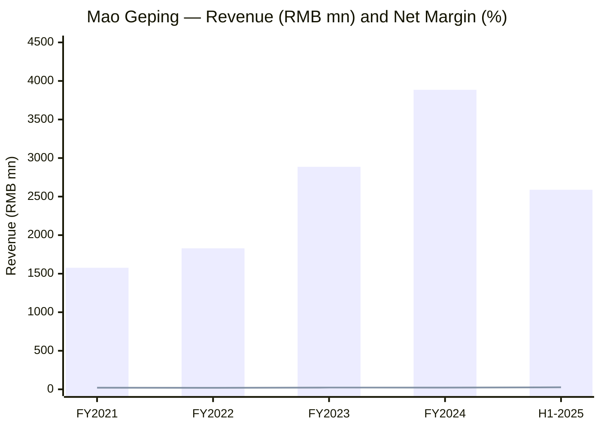
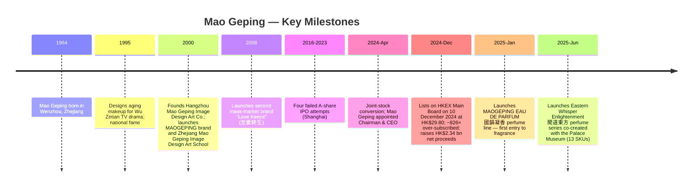
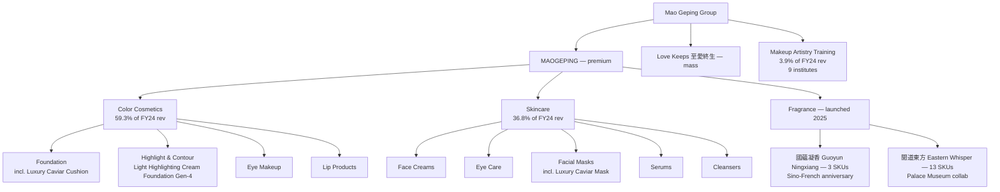
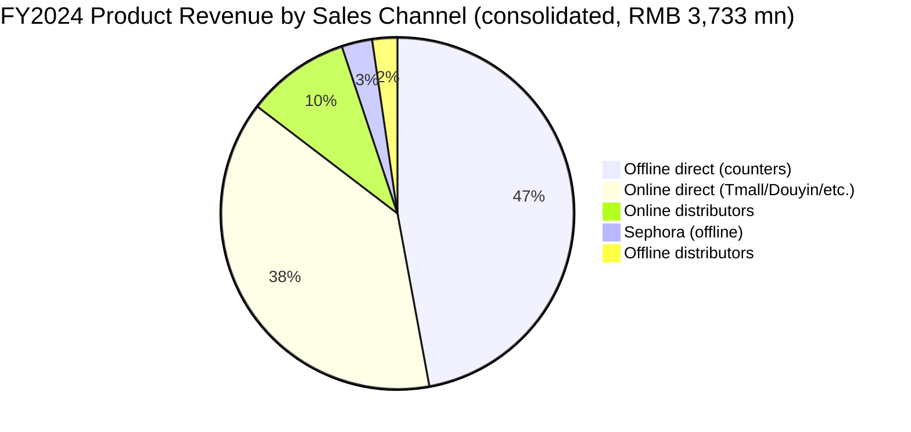
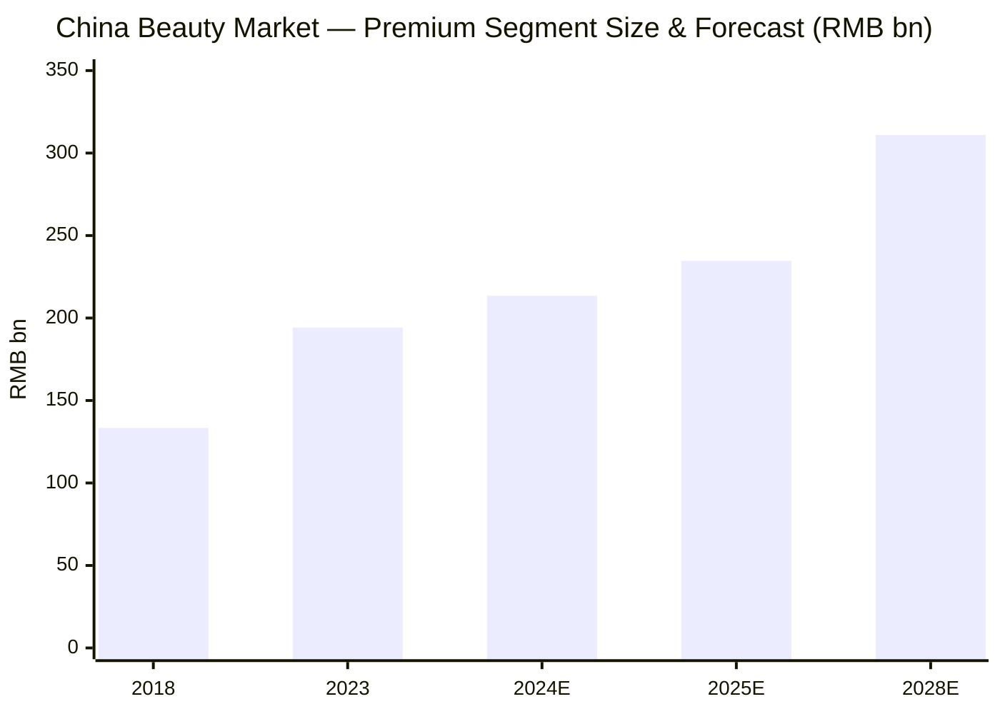
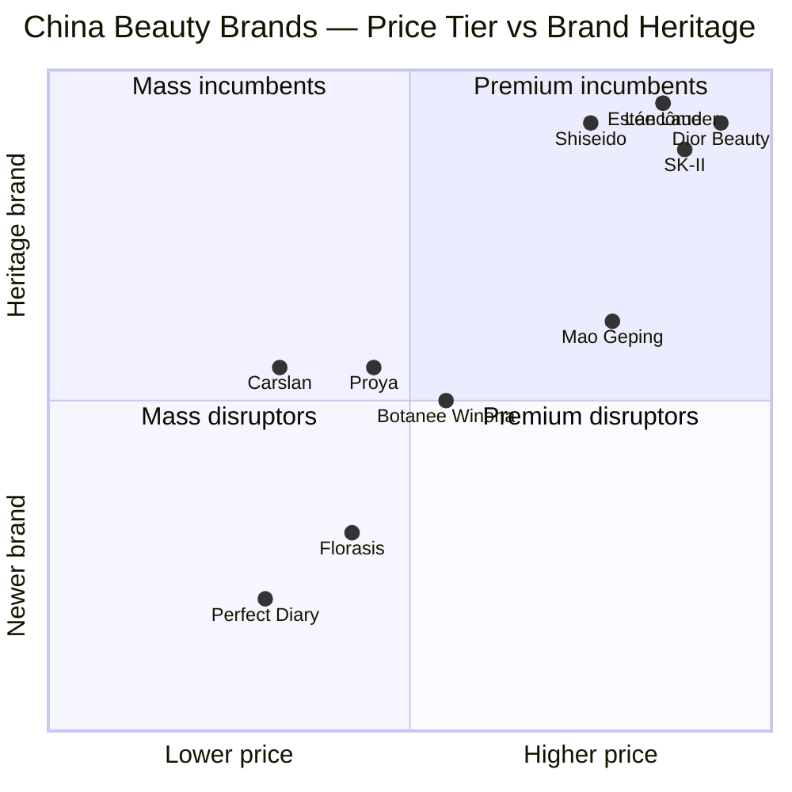
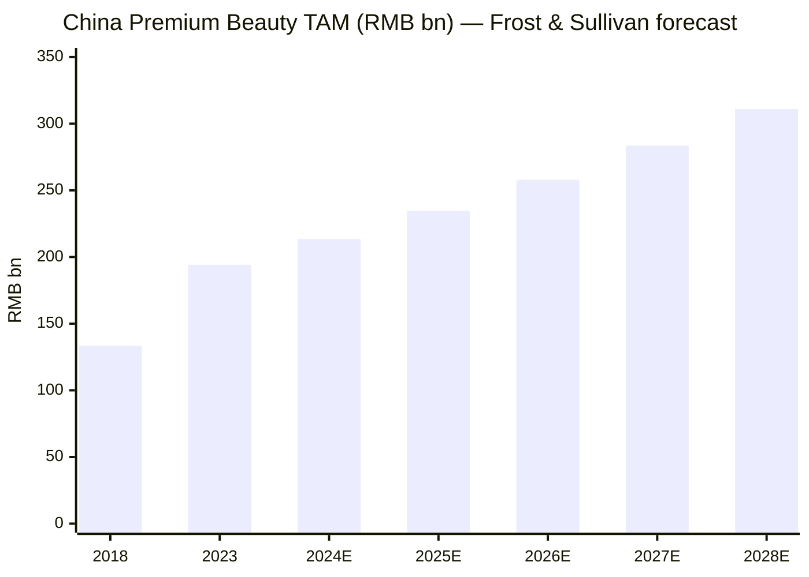

# Mao Geping Cosmetics Co., Ltd. (HKEX:1318) — Company Research

**As of 2026-06-03**

> **Update — FY2025 H1 results raised growth profile (2025-08-26):** Management reported H1 FY2025 revenue of RMB 2,588.2 million (+31.3% YoY) and net profit of RMB 670.4 million (+36.1% YoY), with the launch of two new perfume lines ("Guoyun Ningxiang" 國蘊凝香 and "Eastern Whisper Enlightenment" 聞道東方) taking the group into fragrance for the first time. Color cosmetics +31.1%, skincare +33.4%, online channel +39.0%, offline +26.6% — the first post-IPO interim continued the 30%+ growth cadence achieved in FY2024, with online overtaking offline (51.4% of product revenue vs 48.6%).
> Source: [Mao Geping 2025 Interim Report, 2025-09-03, pp. 4, 21–23](https://www.hkexnews.hk/listedco/listconews/sehk/2025/0903/2025090300755.pdf).

## Table of Contents

1. Company Overview
2. Company History
3. Management Team
4. Products & Services
5. Customers & Go-to-Market
6. Industry Overview
7. Competitive Landscape
8. Market Opportunity (TAM)
9. Risk Assessment
10. Investor-Lens Scorecards

---

## 1. Company Overview

Mao Geping Cosmetics Co., Ltd. (毛戈平化妝品股份有限公司; HKEX:1318) is the leading domestic premium beauty group in China, listed on the Hong Kong Stock Exchange Main Board on December 10, 2024. The group operates three integrated business lines: (i) a flagship beauty-products business under the MAOGEPING and 至愛終生 ("Love Keeps") brands offering color cosmetics, skincare, and (since 2025) fragrance; (ii) an MAOGEPING Beauty Education Institute network of nine in-person makeup-artistry training campuses; and (iii) an experiential, personalized counter-service business delivering customized consultations and makeup-trial sessions at department-store counters [Mao Geping 2024 Annual Report (Chinese), p. 9, Business Review section](https://www.hkexnews.hk/listedco/listconews/sehk/2025/0327/2025032701950_c.pdf). The three pillars reinforce one another: the training institutes both market the brand and supply trained beauty advisors for the counter network; the counter network anchors the premium image that supports the products' selling prices; and the products bankroll the entire ecosystem.

The company is the only Chinese player among the top 10 premium beauty groups in China by 2023 retail sales, ranking seventh nationally with 1.8% market share according to Frost & Sullivan's prospectus-cited research [Frost & Sullivan industry study cited in 1318 Hong Kong Listing Document, 2024-12-02, summary](https://www1.hkexnews.hk/listedco/listconews/sehk/2024/1202/2024120200011.pdf); [SCMP, "Mao Geping Cosmetics to debut in Hong Kong with US$270 million IPO", 2024-12-03](https://www.scmp.com/business/banking-finance/article/3288959/mao-geping-cosmetics-debut-hong-kong-us270-million-ipo-c-beauty-ascends). Its commercial model is anchored in over 120 Chinese cities at the end of 2024 via 378 self-operated counters plus 31 distributor counters, manned by more than 2,800 beauty advisors — among the largest in-counter sales forces of any premium beauty brand in China [Mao Geping 2024 Annual Report (Chinese), pp. 5–6 Chairman's Statement; p. 20 Sales Network](https://www.hkexnews.hk/listedco/listconews/sehk/2025/0327/2025032701950_c.pdf).

FY2024 revenue reached RMB 3,884.7 million, +34.6% YoY against FY2023 RMB 2,886.0 million; profit for the year RMB 881.3 million, +32.8%; gross profit margin 84.4% (FY2023: 84.8%); diluted EPS RMB 2.18 (FY2023: RMB 3.31, distorted by post-IPO share-count change); ROE 34.9% [Mao Geping 2024 Annual Report, p. 4 Four-Year Financial Summary](https://www.hkexnews.hk/listedco/listconews/sehk/2025/0327/2025032701950_c.pdf). Color cosmetics contributed 59.3% of revenue, skincare 36.8%, makeup-artistry training and related sales 3.9% [Mao Geping 2024 AR, p. 29 Revenue by business line](https://www.hkexnews.hk/listedco/listconews/sehk/2025/0327/2025032701950_c.pdf). By channel, offline 52.2% (direct counters 47.1% + Sephora 2.8% + offline distributors 2.3%) and online 47.8% (direct online 38.3% + online distributors 9.5%) of product revenue — with online compounding 51.2% YoY in FY2024, nearly twice the offline pace of 21.6% YoY [Mao Geping 2024 AR, p. 30 Revenue by sales channel](https://www.hkexnews.hk/listedco/listconews/sehk/2025/0327/2025032701950_c.pdf). Domestic sales accounted for 99.9% of product revenue in FY2024; overseas revenue was only RMB 1.9 million [Mao Geping 2024 AR, p. 31 Domestic vs overseas](https://www.hkexnews.hk/listedco/listconews/sehk/2025/0327/2025032701950_c.pdf).

*Source: [Mao Geping 2024 AR, p. 4 Four-Year Financial Summary](https://www.hkexnews.hk/listedco/listconews/sehk/2025/0327/2025032701950_c.pdf); [2025 Interim Report, p. 4](https://www.hkexnews.hk/listedco/listconews/sehk/2025/0903/2025090300755.pdf). Net margin = profit-for-period ÷ revenue; H1-2025 = RMB 670.4mn ÷ RMB 2,588.2mn.*

**Valuation snapshot.** On 2026-06-03, 1318.HK trades at HK$86.50 with market cap HK$35.3 bn (~ RMB 32 bn), TTM P/E 50.9× and forward 1-year P/E 40.5×, EV/EBITDA 38.0×, EV/FCF 53.6×, dividend yield 0.91% TTM (1.58% on certain dividend definitions) [Yahoo Finance — 1318.HK Statistics, accessed 2026-06-03](https://finance.yahoo.com/quote/1318.HK/key-statistics/); [Stockanalysis.com — 1318.HK Valuation, accessed 2026-06-03](https://stockanalysis.com/quote/hkg/1318/statistics/). On an FY2024 P/S basis the multiple is approximately 7.5× (RMB 32 bn ÷ RMB 3.89 bn), against an FY2025 consensus revenue around RMB 5.2 bn that would imply ~6.2× forward P/S — both stretched relative to Hong Kong consumer median (~2–3× P/S) but consistent with the L'Oréal-style premium beauty cohort that re-rates on margin and brand-strength rather than top-line growth. The trailing P/E above 50× is supported by (a) the 84.4% gross margin and ~22% net margin profile which compares favorably against Estée Lauder (~74% GM) and the broader cosmetics industry (~58% GM) [Maogeping Beauty — daxueconsulting, 2025](https://daxueconsulting.com/mao-geping/) and (b) revenue growth of 34.6% in FY2024 plus 31.3% in H1 FY2025 — pricing the stock at PEG ≈ 1.6×. Sell-side consensus targets 12-month HK$111.6 (high HK$133, low HK$88), reflecting +29% upside from current; 16 buys, 0 sells [Simply Wall St — 1318 Future Forecast, accessed 2026-06-03](https://simplywall.st/stocks/hk/household/hkg-1318/mao-geping-cosmetics-shares/future); [MarketScreener — 1318 consensus, accessed 2026-06-03](https://www.marketscreener.com/quote/stock/MAO-GEPING-COSMETICS-CO-L-179813387/consensus/). Peer multiples: Botanee Bio-Tech (300957.SZ) trades ~30× P/E TTM; Proya (603605.SH) ~25×; Yatsen / Perfect Diary (YSG) negative TTM P/E. The premium 1318 carries is the market's pricing for being the *only* domestic player credibly positioned in the luxury price band — a scarcity argument, not a peer-multiple argument.

## 2. Company History

Mao Geping (毛戈平, the founder) was born on 30 July 1964 in Wenzhou, Zhejiang into a military family [百度百科 — 毛戈平 (accessed 2026-06)](https://baike.baidu.com/item/%E6%AF%9B%E6%88%88%E5%B9%B3/5053222). He graduated from the Zhejiang Art Vocational School (浙江藝術職業學院, formerly Zhejiang Art School) in July 1983 with a mid-vocational qualification in Yueju (Shaoxing opera) performance [Mao Geping 2024 AR (Chinese), p. 41 Founder bio](https://www.hkexnews.hk/listedco/listconews/sehk/2025/0327/2025032701950_c.pdf). A vocal-cord injury during opera training redirected him to stage makeup; he was assigned to the Zhejiang Yueju Troupe (浙江省越劇團) from July 1983 to July 1998. His national breakthrough came as the chief makeup artist for the 1995 mainland TV drama *Wu Zetian* (武則天), where he designed makeup for actress Liu Xiaoqing playing the title role from her teens through her 80s — a virtuoso aging-makeup performance that established the foundation of his "light-and-shadow" (光影美學) signature [百度百科 — 毛戈平, accessed 2026-06](https://baike.baidu.com/item/%E6%AF%9B%E6%88%88%E5%B9%B3/5053222).

In July 2000 Mao Geping founded Hangzhou Mao Geping Image Design Art Co., Ltd. (杭州毛戈平形象設計藝術有限公司, the predecessor company), and in October 2000 launched the Zhejiang Mao Geping Image Design Art School with his then-girlfriend (now wife) Wang Liqun, a fellow Zhejiang Yueju Troupe alumna [Mao Geping 2024 AR (Chinese), pp. 41–42 Founder and Wang Liqun bios](https://www.hkexnews.hk/listedco/listconews/sehk/2025/0327/2025032701950_c.pdf). MAOGEPING — the brand carrying his name — was launched the same year and pioneered the practice of a domestic makeup-artist creating a self-named premium counter brand in Chinese department stores. The training-school + premium-counter combination was unusual at the time and remains one of his most enduring strategic insights: each training campus produces beauty-advisor talent to staff the counters, the counters carry the brand, and the brand generates the cash to fund the campuses. In 2008 the group extended into a second brand, 至愛終生 (Love Keeps), aimed at the mass market to broaden the customer funnel without diluting MAOGEPING's premium positioning [Mao Geping 2024 AR (Chinese), p. 9 Brand description](https://www.hkexnews.hk/listedco/listconews/sehk/2025/0327/2025032701950_c.pdf).

*Source: [Mao Geping 2024 AR (Chinese), p. 4 Four-Year Financial Summary; pp. 41-42 Founder bio](https://www.hkexnews.hk/listedco/listconews/sehk/2025/0327/2025032701950_c.pdf); [2025 Interim Report, pp. 4-9 fragrance launches](https://www.hkexnews.hk/listedco/listconews/sehk/2025/0903/2025090300755.pdf); [Sina Finance, "上市首日暴涨", 2024-12-10](https://m.thepaper.cn/newsDetail_forward_29604438).*

Between 2016 and 2023 the company filed four unsuccessful A-share IPO attempts on the Shanghai Stock Exchange before pivoting to Hong Kong [Sina Finance — "八年四战IPO毛戈平圆梦港股", 2024-12-06](https://finance.sina.com.cn/roll/2024-12-06/doc-incyphkp2035568.shtml). The repeated A-share rejections were driven by CSRC concerns over (i) the brand's personal-IP-concentration risk on the founder, (ii) the heavy concentration of family members in management positions, and (iii) the marketing-spend-to-R&D ratio characteristic of consumer-brand companies. The eventual Hong Kong listing on 10 December 2024 at the top of the HK$26.3–29.8 price range (final HK$29.80) was 826× over-subscribed and froze HK$1.74 trillion of investor capital, making it the Hong Kong IPO market's "freeze king" of 2024 [Securities Times — "超额认购826倍！毛戈平", 2024-12-06](https://www.stcn.com/article/detail/1440960.html); [Sina Finance — "毛戈平港股上市首日收涨逾76%", 2024-12-10](https://m.thepaper.cn/newsDetail_forward_29604438). The shares closed +76.5% on day one at HK$53, valuing the company at HK$24.8 bn. The successful HK listing also served as a strategic pivot point: H1 2025 saw the launch of the first MAOGEPING perfume line and the first overseas-distributor partnerships (Sephora Hong Kong) — both unlocked by the post-IPO cash and the broader investor mandate to globalize the brand.

## 3. Management Team

**Mao Geping** (毛戈平, 60), Founder, Chairman & Executive Director, and the namesake of the company. After graduating from Zhejiang Art Vocational School in July 1983 with a mid-vocational opera-performance qualification, he served in the Zhejiang Yueju Troupe from July 1983 to July 1998 as a stage makeup artist. He has 40+ years of professional makeup experience and has won the China Film and Television Technology Society Makeup Committee's "Golden Image Award" four separate times. He served as the personal makeup artist to the then-IOC President during the 2008 Beijing Olympics and as a member of the Beijing Olympics opening ceremony makeup design team, and was awarded the "2008 Beijing Olympics Special Contribution Award" by the China Film and Television Technology Society Makeup Committee in November 2008. He was named a "Hangzhou Craftsman" by the Hangzhou municipal government in September 2020 and one of "Zhejiang Outstanding Entrepreneurs (22nd batch)" by the Zhejiang Enterprise Confederation in November 2023, and was a torchbearer for the 2023 Hangzhou Asian Games [Mao Geping 2024 AR (Chinese), pp. 41-42 Founder bio](https://www.hkexnews.hk/listedco/listconews/sehk/2025/0327/2025032701950_c.pdf). He founded Hangzhou Mao Geping in July 2000 and served as its President from February 2011 to March 2024, then transitioned to the post-IPO governance configuration as Chairman & Executive Director on 1 April 2024. He holds the Ministry of Culture "Art Image Design (Tier 1)" certificate (March 2001) and a Zhejiang Senior Professional Technical (Chief Stage Technician) qualification. He is the spouse of Executive Director Wang Liqun and the younger brother of two other Executive Directors, Mao Niping and Mao Huiping — the management structure is unmistakably a family enterprise around a single founder-IP and his immediate circle.

Mao Geping holds ~43.63% of the post-IPO share capital directly; his wife Wang Liqun holds 11.34% directly; through Dijing Investment (帝景投資) and Jiachi Investment (嘉馳投資) holding vehicles the couple jointly controls ~57.26% of the issued share capital, making them the indisputable controlling shareholders [Sina Finance — "毛戈平港交所上市", 2024-12-10](https://finance.sina.com.cn/tech/csj/2024-12-10/doc-incyytkm4820134.shtml). The board includes six Executive Directors of whom five are Mao family members (the founder, his wife, his two elder sisters, and his wife's younger brother) plus brand-business president Song Hongquan, alongside three Independent Non-Executive Directors covering audit, governance, and PRC legal compliance.

**Song Hongquan** (宋虹佺, 50), Executive Director, President of the Company, and General Manager of the MAOGEPING brand business division — the most consequential non-family executive. She joined the group in October 2002 as head of sales for the predecessor Hangzhou Mao Geping; managed MAOGEPING brand operations from 2009 to 2010 as General Manager; served as Executive Director and General Manager of Hangzhou Mao Geping from September 2010 to February 2011; continuously served as Director and MAOGEPING brand-business GM from June 2012 to date; and was promoted to Executive President of the listco from August 2015 to March 2024 before becoming President effective 1 April 2024. She holds an MBA from China University of Mining and Technology (Beijing) awarded in June 2016 [Mao Geping 2024 AR (Chinese), p. 44 Song Hongquan bio](https://www.hkexnews.hk/listedco/listconews/sehk/2025/0327/2025032701950_c.pdf). Her role is the operational center of the brand: she oversees brand building, marketing, and sales management — effectively the COO of the MAOGEPING brand — and provides the professional-management continuity that complements the founder's creative-IP role.

## 4. Products & Services

Mao Geping's product portfolio sits inside a deliberately premium price band that anchors the brand against L'Oréal-stable global rivals (Lancôme, Estée Lauder, NARS, Shiseido) rather than the value-led Chinese cosmetics cohort (Florasis, Perfect Diary, Carslan). As of 31 December 2024 the portfolio includes 400+ SKUs across two product categories (color cosmetics and skincare), with the fragrance category added in January and June 2025 [Mao Geping 2024 AR (Chinese), p. 9 Brand description](https://www.hkexnews.hk/listedco/listconews/sehk/2025/0327/2025032701950_c.pdf). The product matrix is straightforward by industry standards but every product family has clearly defined hero SKUs that drive revenue concentration.

*Source: [Mao Geping 2024 AR (Chinese), pp. 9-18 Brand & Product](https://www.hkexnews.hk/listedco/listconews/sehk/2025/0327/2025032701950_c.pdf); [2025 Interim Report, pp. 5-9 Cosmetics businesses](https://www.hkexnews.hk/listedco/listconews/sehk/2025/0903/2025090300755.pdf).*

### 4.1 Color Cosmetics — 59.3% of FY2024 revenue (RMB 2,304 mn, +42.0% YoY)

The annual report describes the color-cosmetics portfolio explicitly:

> "我們的彩妝系列包含了粉底、高光和陰影、眼妝及唇妝等各類產品，這些產品均經過精心設計，以滿足中國消費者獨特的膚質、面部結構和審美偏好。" — "Our color cosmetics range includes foundation, highlighting and contouring, eye makeup, and lip products. Each of these products has been meticulously designed to cater to the unique skin conditions, facial structures and aesthetic preferences of Chinese consumers" [Mao Geping 2024 AR (Chinese), pp. 9-10](https://www.hkexnews.hk/listedco/listconews/sehk/2025/0327/2025032701950_c.pdf).

**Plain-language gloss / 中文释义:** Color cosmetics carries the brand's two founding aesthetics — light-and-shadow makeup (光影美學) for facial contouring and Oriental aesthetics (東方美學) for the design language of the packaging and color palette. The Light Highlighting Cream Foundation (光影塑顏高光粉膏 / Light Highlighting Cream) has been a flagship for 10+ years and is now in its fourth generation; the Luxury Caviar Flawless Cushion Liquid Foundation (奢華魚子無瑕氣墊粉底液) and the Luminous Perfect Cream Foundation (光感美肌無痕粉膏) are the two-foundation-SKU revenue duo that each generated RMB 200 million+ in retail sales in H1 2025 [Mao Geping 2025 Interim Report, p. 5 Color cosmetics](https://www.hkexnews.hk/listedco/listconews/sehk/2025/0903/2025090300755.pdf). For FY2024, the Light Highlighting Cream Foundation series alone passed RMB 400 million in retail sales. The two-SKU concentration in foundation is the defining economic feature of the color portfolio — it makes the gross-margin profile very stable but tightens the product-line-extension dependence.

*Analyst view:* In foundation specifically, MAOGEPING competes head-on with NARS (Shiseido group) Radiant Longwear Cushion (~US$50), Lancôme Teint Idole Cushion (~US$60), and Dior Forever Cushion (~US$80). The 380 RMB (~US$52) price point of the Luxury Caviar Cushion places MAOGEPING in the same price tier as NARS and Shiseido and slightly below Dior/Chanel — a deliberate premium positioning [Maogeping premiumization — daxueconsulting, 2025](https://daxueconsulting.com/mao-geping/).

### 4.2 Skincare — 36.8% of FY2024 revenue (RMB 1,429 mn, +23.2% YoY)

> "我們的護膚品主要包括面霜、眼部護理、面膜、精華液和潔面乳等。" — "Our skincare products primarily include face creams, eye care, facial masks, serums and cleansers" [Mao Geping 2024 AR (Chinese), p. 9](https://www.hkexnews.hk/listedco/listconews/sehk/2025/0327/2025032701950_c.pdf).

**Plain-language gloss / 中文释义:** The economically dominant skincare SKU is the Luxury Caviar Facial Mask (奢華魚子面膜), which crossed RMB 800 million in FY2024 retail sales and continued to deliver RMB 600 million+ in H1 2025 alone [Mao Geping 2025 Interim Report, p. 6 Skincare](https://www.hkexnews.hk/listedco/listconews/sehk/2025/0903/2025090300755.pdf). The Luxury Regenerating Black Cream (奢華再生賦活黑霜) delivered RMB 200 million+ in H1 2025 retail sales. The strategic rationale for skincare is twofold: (a) gross margin on skincare (87.2% in FY2024) is structurally higher than on color cosmetics (83.6%), so skincare-mix shift is gross-margin accretive at the group level [Mao Geping 2024 AR (Chinese), p. 33 Gross margin by product category](https://www.hkexnews.hk/listedco/listconews/sehk/2025/0327/2025032701950_c.pdf); and (b) skincare repurchase rates are intrinsically higher than color, so as the user base ages with the brand, skincare share of revenue should rise.

*Analyst view:* Direct competition is from Estée Lauder Advanced Night Repair, Lancôme Génifique, and SK-II Pitera Essence — all premium-positioned products with strong tribal-loyalty audiences in China. MAOGEPING's defensible angle is the foundation→skincare cross-sell within the counter-experience model: a customer who has already trusted the brand for skin-finishing makeup is one tier-down marketing cost away from also buying its facial mask.

### 4.3 Fragrance — launched 2025; not a material revenue contributor in H1 2025 (~0.4%)

The two perfume lines launched in early 2025 mark Mao Geping's first entry to the fragrance market: the Guoyun Ningxiang (國蘊凝香) collection, three fragrance SKUs (Majestic Peony, Beloved Rose, Noble Iris) inspired by the 60th anniversary of Sino-French diplomatic relations [Mao Geping 2025 Interim Report, pp. 6-7 Fragrance](https://www.hkexnews.hk/listedco/listconews/sehk/2025/0903/2025090300755.pdf), and the Eastern Whisper Enlightenment (聞道東方) collection of 13 SKUs across Natural, Humanistic and Philosophical "realms" — a co-creation with the Cultural and Creative Institute of the Palace Museum. The Eastern Whisper SKUs draw on classical Chinese sources including the *Tao Te Ching* ("Whispers of Water"), the *I Ching* ("Celestial Creation"), the *Ode to the Lotus* ("Blooming Bliss"), and Wang Guowei's "Theory of Realms" [Mao Geping 2025 Interim Report, pp. 7-9 Eastern Whisper series](https://www.hkexnews.hk/listedco/listconews/sehk/2025/0903/2025090300755.pdf). Fragrance gross margin in H1 2025 was 77.6% — slightly below color cosmetics and skincare but normal for a first-year fragrance launch carrying full launch-marketing amortization.

### 4.4 Makeup Artistry Training — 3.9% of FY2024 revenue (RMB 151.7 mn, +45.8% YoY)

The MAOGEPING Beauty Education Institute (MBEI, 毛戈平美妝藝術學院) network operated nine in-person campuses in mainland China at the end of H1 2025 (with a tenth in Guangzhou in construction) [Mao Geping 2025 Interim Report, p. 9 Makeup Artistry Training](https://www.hkexnews.hk/listedco/listconews/sehk/2025/0903/2025090300755.pdf). Total H1 2025 enrolment was over 3,800 students (+0.77% YoY — the growth deceleration is intentional, as 2025 prioritized class-occupancy and service-quality control over enrolment volume). 2024 training revenue of RMB 151.7 million crossed the pre-COVID high and represented a 45.8% YoY rebound from RMB 104.1 million in 2023. The training business is small in revenue terms but strategically essential:
- It supplies trained beauty advisors to the 400+ counter network (the alternative is hiring from competitors, which would import competing brand habits).
- It diffuses Mao Geping's aesthetic philosophy through the Chinese makeup-artist community, embedding the brand as professional reference.
- It earns gross margin of 69.0% (FY2024) on the training segment itself — diluting group margin slightly but adding flywheel value.

### 4.5 Cross-product synthesis

The portfolio is anchored on a tight loop: light-and-shadow makeup philosophy → flagship foundation/highlighter SKUs → skincare cross-sell → fragrance brand-stretch → counter-experience anchoring all three product categories → beauty-advisor training pipeline supplying counter staff → repurchase rate compounding. The brand's structural strength is the unusual integration: of the L'Oréal-stable competitors, none operates a 9-campus training network; of the value-led Chinese brands, none operates a 400+ premium-counter network. Both halves of the loop reinforce the central premium positioning that justifies the 84.4% gross margin.

## 5. Customers & Go-to-Market

Mao Geping's customers are individual consumers reached through three offline and two online channel sub-types [Mao Geping 2024 AR (Chinese), p. 20 Sales Network](https://www.hkexnews.hk/listedco/listconews/sehk/2025/0327/2025032701950_c.pdf):
- **Offline direct sales** (47.1% of FY2024 product revenue): 378 self-operated counters in 120+ cities, located in premium department stores chosen explicitly to reinforce brand prestige (e.g., Beijing SKP, Chengdu SKP, Wuhan SKP, Hangzhou Mansion). Counters are staffed by trained beauty advisors with formal training credentials, designed to deliver a high-touch consultation and makeup-trial experience.
- **Offline distributor sales** (2.3% of FY2024): 31 distributor counters operating under unified brand standards.
- **Premium multinational beauty retailer (Sephora)** (2.8% of FY2024): the strategic LVMH-group partnership that opened Hong Kong distribution in 2024 — the first material overseas revenue channel.
- **Online direct sales** (38.3% of FY2024 product revenue): Tmall, Douyin, Xiaohongshu, JD.com, Taobao flagship stores operated by the company.
- **Online distributors** (9.5% of FY2024): regional and platform-affiliated partners.

*Source: [Mao Geping 2024 AR (Chinese), p. 30 Revenue by sales channel](https://www.hkexnews.hk/listedco/listconews/sehk/2025/0327/2025032701950_c.pdf).*

**Customer concentration.** The FY2024 annual report Directors' Report discloses [Mao Geping 2024 AR (Chinese), p. 55 Major Customers and Suppliers](https://www.hkexnews.hk/listedco/listconews/sehk/2025/0327/2025032701950_c.pdf):
- Top-5 customers' aggregate revenue accounted for **less than 30% of consolidated revenue** for the year ended 31 December 2024. The filing does not name individual customers or break out a per-customer percentage.
- Top supplier accounted for **19.7%** of total procurement (2023: 22.7%).
- Top-5 suppliers accounted for **53.3%** of total procurement (2023: 53.6%).

The "<30% top-5" disclosure is materially better than what the FY2022 IPO-prospectus pre-disclosure suggested (top-5 customers were named as Baiyintai 7.1%, Jiangsu Huadi 3.4%, Golden Eagle 3.3%, Chongqing Department Store 3.3% — an aggregate of approximately 17% [财经研究 — "毛戈平转战港股IPO", 2024-06](https://www.21jingji.com/article/20240625/herald/f5d6dde6b7ad6910faef3127fba68faa.html)), reflecting that the named offline distributor partners are department-store chains (Baiyintai/银泰商業, Jiangsu Huadi/江蘇華地, Golden Eagle/金鷹國際, Chongqing Department Store/重慶百貨) — each carrying a portfolio of MAOGEPING counters under contractual revenue-share. **All customer-concentration percentages above are "% of consolidated revenue"; the company does not report customer concentration by segment.**

**Supplier concentration is the higher-priority operational risk.** With 53.3% of procurement spend concentrated in the top-5 suppliers and 19.7% in a single supplier, and given the company's reliance on ODM/OEM manufacturing partners for most production, a disruption at the top supplier (whether a quality recall, regulatory action, or operational outage) would have material near-term P&L impact. The annual report explicitly states the company is gradually shifting toward selective in-house production to reduce this dependency.

**Repurchase rate.** Total repurchase rate (registered members buying twice or more in the year ÷ members buying at least once) rose from 26.8% in 2023 to 30.9% in 2024; offline 32.8% → 34.9%; online 22.0% → 27.5% [Mao Geping 2024 AR (Chinese), p. 25 Membership repurchase rates](https://www.hkexnews.hk/listedco/listconews/sehk/2025/0327/2025032701950_c.pdf). The H1 2025 overall repurchase rate continued to rise to 26.8% (vs 24.8% H1 2024). The combination of rising online repurchase and rising offline counter productivity (H1 2025 same-counter average revenue RMB 2.9 mn vs RMB 2.4 mn H1 2024, +20.8% YoY across 329 comparable counters) is the operational signal that the premium-counter model is improving on a same-store basis rather than only through unit-store expansion [Mao Geping 2025 Interim Report, p. 11 Same-counter analysis](https://www.hkexnews.hk/listedco/listconews/sehk/2025/0903/2025090300755.pdf). The membership base reached 15.1 million online + offline at end-2024 (FY2023: 10.3 million) and 13.4 million online + 5.6 million offline at end-H1 2025.

## 6. Industry Overview

China's beauty market — defined by Frost & Sullivan as skincare + color cosmetics in the prospectus framing — reached RMB 579.8 billion in retail sales in 2023, with a 7.6% CAGR from 2018 (RMB 402.6 bn) and a forecast 8.6% CAGR from 2023 to 2028 to reach RMB 876.3 billion by 2028 [Mao Geping 2024 AR (Chinese), p. 7 Industry Overview, citing Frost & Sullivan](https://www.hkexnews.hk/listedco/listconews/sehk/2025/0327/2025032701950_c.pdf). The China Fragrance and Flavor and Cosmetics Industry Association adds that the 2024 cosmetics-market total transaction value reached RMB 1,073.8 billion, +2.8% YoY — reflecting both the value erosion in mass-market segments and the resilience of premium [Mao Geping 2024 AR (Chinese), p. 8 Industry Overview](https://www.hkexnews.hk/listedco/listconews/sehk/2025/0327/2025032701950_c.pdf). Critically, market share of domestic Chinese brands rose to 55.2% of the top-1,000 online cosmetics brands' transaction value in 2024 (vs 52.3% in 2023), a structural inflection point: the long-running "international brands dominate, domestic brands compete only in mass" pattern is breaking [Mao Geping 2024 AR (Chinese), p. 8](https://www.hkexnews.hk/listedco/listconews/sehk/2025/0327/2025032701950_c.pdf).

The **premium** segment — where Mao Geping operates — is structurally faster-growing than the overall beauty market. According to Frost & Sullivan, China premium beauty retail sales grew from RMB 133.4 billion in 2018 to RMB 194.2 billion in 2023 (CAGR 7.8%) and is forecast to grow at a 9.9% CAGR through 2028 to RMB 311.0 billion [Mao Geping 2024 AR (Chinese), p. 7 Premium beauty market](https://www.hkexnews.hk/listedco/listconews/sehk/2025/0327/2025032701950_c.pdf). The premium segment's 9.9% forward CAGR is a full percentage point above the overall market's 8.6% — and the gap accelerates if international-brand share gives ground at the top end as well as at the mass end. Premium brands are defined in the prospectus as those priced at least 50% above the industry average, sold selectively through high-end department-store counters and characterized by celebrity- or artist-led brand identities.

*Source: [Frost & Sullivan via Mao Geping 2024 AR (Chinese), p. 7](https://www.hkexnews.hk/listedco/listconews/sehk/2025/0327/2025032701950_c.pdf). 2024E–2025E linearly interpolated from disclosed 2023 actual and 2028E forecast at the 9.9% CAGR.*

Channel-mix dynamics are equally consequential. Offline retail-channel revenue for the beauty market grew from RMB 235.3 bn (2018) to RMB 264.1 bn (2023) at just 2.3% CAGR, forecast to accelerate to 5.5% CAGR through 2028 (to RMB 344.6 bn); online channel grew from RMB 167.3 bn to RMB 315.8 bn at 13.5% CAGR through 2023, with the forecast pace 11.0% CAGR to RMB 531.7 bn by 2028 [Mao Geping 2024 AR (Chinese), p. 7](https://www.hkexnews.hk/listedco/listconews/sehk/2025/0327/2025032701950_c.pdf). Online overtook offline in 2022 and is projected to widen the lead. This channel shift is structural and brand-positioning-agnostic: Mao Geping's response is to be present across both, with online overtaking offline within the company's own revenue mix in H1 2025 (51.4% vs 48.6%).

**Makeup artistry training.** A small but growing adjacent industry. According to Frost & Sullivan, this segment grew from RMB 5.6 bn in 2018 to RMB 9.8 bn in 2023 (11.8% CAGR), forecast 14.5% CAGR through 2028 to reach RMB 19.3 bn [Mao Geping 2024 AR (Chinese), p. 8](https://www.hkexnews.hk/listedco/listconews/sehk/2025/0327/2025032701950_c.pdf). The training segment's faster growth pace mirrors the makeup-product market dynamic: as the cosmetics product market broadens and product complexity increases, formal training demand rises, and the segment is consolidating from many tiny schools into a smaller number of branded training networks of which MAOGEPING is the largest.

## 7. Competitive Landscape

The competitive set for Mao Geping is bifurcated.

**At the top of the price band (the international premium cohort)** Mao Geping competes directly with brands such as Estée Lauder (EL), Lancôme (L'Oréal Luxe), NARS (Shiseido), Christian Dior Beauty (LVMH), Chanel Beauty, Shu Uemura, and SK-II. These brands command higher unit revenues, vastly larger global R&D budgets, and deeper IP archives — but they have lost share in China since 2022. L'Oréal reported a 2-3% China-market decline in 2024 [Cosmetics Design Asia — "China focus", 2024-09-25](https://www.cosmeticsdesign-asia.com/Article/2024/09/25/latest-developments-in-china-s-booming-beauty-market/). Mao Geping is the only Chinese brand among the top-10 premium beauty groups by 2023 China retail sales (1.8% share, 7th place) according to Frost & Sullivan [Frost & Sullivan via Mao Geping prospectus, summary in moomoo IPO news](https://www.moomoo.com/news/post/36262882/ipo-news-mao-geping-reports-that-the-main-board-of).

**At the lower price tiers (the Chinese national brand cohort)** Mao Geping does not compete head-on. Florasis (花西子), Perfect Diary (完美日记 / Yatsen YSG), Carslan (卡姿兰), Timage (彩棠 / Proya 603605.SH), Flower Knows (花知曉), and Botanee (Winona / 贝泰妮 300957.SZ) all anchor in the mass-to-affordable-premium segments (typical foundation pricing RMB 100–250). Their gross margins are structurally lower (Yatsen 60-70%, Botanee 75-80%) and their customer relationship is platform-mediated rather than counter-mediated. Mao Geping's deliberate "uncompromising premiumization" strategy avoids head-on price competition with this cohort [doublevconsulting.com — Mao Geping premium strategy](https://www.doublevconsulting.com/post/mao-geping-can-chinese-premium-beauty-survive-the-leap-to-europe).

*Source: Analyst-constructed. Price-tier coordinates approximate average SKU pricing; brand-heritage coordinates approximate years since founding plus brand-prestige perception per [chaileedo.com top-10 beauty rankings, 2024](https://chaileedo.com/latest-the-ramking-of-chinas-top-10-beauty-companies-is-here/) and [daxueconsulting.com — Maogeping premiumization, 2025](https://daxueconsulting.com/mao-geping/).*

**Mao Geping's competitive advantages.** (i) The only Chinese brand positioned credibly in the same price tier as Lancôme/Estée Lauder/NARS — a scarcity premium with no domestic substitute. (ii) An 84.4% gross margin profile (FY2024) materially above Estée Lauder (~74%) and the cosmetics-industry average (~58%) [Maogeping Beauty — daxueconsulting, 2025](https://daxueconsulting.com/mao-geping/), giving meaningful capacity for marketing reinvestment without margin sacrifice. (iii) A 400+ counter network with 2,800 beauty advisors — a moat against pure-play e-commerce challengers; counter productivity is rising 20%+ YoY on same-counter basis. (iv) A 9-campus training institute network that supplies talent and embeds the brand in the Chinese makeup-artist community. (v) The founder's personal IP — Mao Geping is China's best-known makeup artist with 40+ years of practice and four Golden Image Awards. (vi) An accelerating premium-IP strategy: the Palace Museum perfume collaboration, the Olympic team partnership ("Glorious Light" / 盛彩之光 series), and the Sino-French anniversary perfume collection all anchor the brand in elite cultural-prestige adjacencies.

**Mao Geping's competitive vulnerabilities.** (i) Single-brand concentration: at-愛終生 (Love Keeps) contributed less than 1% of FY2024 revenue. (ii) Founder-personal-IP dependence: the brand carries the founder's name and persona; succession or reputational risk on Mao Geping personally would have material brand impact. (iii) 99.9% domestic revenue concentration — the offshore expansion via Sephora is real but tiny in absolute terms. (iv) ODM/OEM-heavy supply chain with 53.3% top-5 supplier concentration. (v) Marketing-heavy P&L: H1 2025 selling & distribution expenses 45.2% of revenue. (vi) Pre-IPO governance criticism: heavy family management concentration and four prior A-share IPO rejections, neither of which have been fully resolved post-listing.

*Analyst view:* The L Catterton (LVMH PE arm) strategic partnership formed in early 2026 to support overseas channel access [daxueconsulting summary, 2025](https://daxueconsulting.com/mao-geping/) is the key derisking event for the international expansion thesis — it converts Mao Geping's brand-building question from "can a Chinese brand crack premium beauty internationally" to "what is the operational cadence of LVMH-aligned channel access expansion".

## 8. Market Opportunity (TAM)

The TAM build-up for Mao Geping has three nested layers.

**(i) China premium beauty (the SAM today).** As above: RMB 194.2 bn in 2023 retail sales (~US$27 bn), forecast 9.9% CAGR to RMB 311.0 bn by 2028 per Frost & Sullivan [Mao Geping 2024 AR (Chinese), p. 7](https://www.hkexnews.hk/listedco/listconews/sehk/2025/0327/2025032701950_c.pdf). At a 1.8% market share in 2023 retail sales, Mao Geping's headroom inside the domestic premium TAM alone is meaningful — even a doubling of share to ~4% within the 2028 RMB 311 bn premium pool would imply RMB ~12.4 bn of retail revenue (vs the company's current ~RMB 3.9-4 bn FY2024 product revenue, before considering the FY2024-to-FY2028 growth of overall revenue). Domestic premium share gains are the highest-conviction part of the growth thesis.

**(ii) International premium beauty (the future SAM).** The global premium beauty market is approximately US$130-150 bn in 2024 and projected to grow at 4-6% CAGR over the next 5 years [VyansaIntelligence — China Premium Beauty 2030, 2024](https://www.vyansaintelligence.com/industry-report/china-premium-beauty-personal-care-market). Mao Geping currently has 0.0% market share outside China; the strategic-investment commitments to overseas expansion (Sephora HK in 2024, Hangzhou R&D centre completion targeted by end-2026, the L Catterton partnership for international channel access) frame the company's medium-term ambition to convert this from "TAM" to "actual SAM".

**(iii) China makeup-artistry training and personal-image-design segment.** Per Frost & Sullivan, this segment is forecast to grow from RMB 9.8 bn in 2023 to RMB 19.3 bn in 2028 (14.5% CAGR) [Mao Geping 2024 AR (Chinese), p. 8](https://www.hkexnews.hk/listedco/listconews/sehk/2025/0327/2025032701950_c.pdf). With nine campuses and an estimated revenue share of approximately 1.5% of this segment (RMB 151.7 mn ÷ RMB 9.8 bn), there is room to multiply training revenue 3-5× through campus expansion and online-curriculum monetization without changing the segment dynamics.

*Source: [Frost & Sullivan via Mao Geping 2024 AR (Chinese), p. 7](https://www.hkexnews.hk/listedco/listconews/sehk/2025/0327/2025032701950_c.pdf). 2018, 2023 and 2028 are disclosed actuals/forecast; intermediate years interpolated at the 9.9% CAGR.*

**SOM consideration.** Even on aggressive assumptions — Mao Geping's domestic premium share rising to 3-4% by 2028 (from 1.8% in 2023), international/overseas markets reaching 5-10% of revenue, training rising 3× — the implied 2028 revenue run-rate is approximately RMB 10-13 bn (vs RMB 3.9 bn in 2024), implying a 5-yr revenue CAGR of 22-27%. This is consistent with the current sell-side consensus of 24.9% top-line CAGR [Simply Wall St — 1318 Future, accessed 2026-06-03](https://simplywall.st/stocks/hk/household/hkg-1318/mao-geping-cosmetics-shares/future) and slightly above the consensus 24.4% earnings CAGR.

## 9. Risk Assessment

**Company-specific risks:**

**(1) Founder-personal-IP concentration (high impact, low probability annually).** The MAOGEPING brand is named after the founder and inseparable from his personal narrative as China's pre-eminent makeup artist. A succession event, reputational incident, or even a meaningful reduction in the founder's public visibility would have material brand consequences. The 60-year-old founder is in good health and operationally involved, but the dependency is structural. Mitigant: the gradual elevation of Song Hongquan (President & MAOGEPING brand-business GM) as the operational center, and the Mao family's stake-control framework distributing post-founder governance across Mao family + Wang Liqun.

**(2) Single-brand concentration (medium impact, ongoing).** MAOGEPING contributes >99% of brand revenue; 至愛終生 (Love Keeps), launched in 2008, has not scaled into a meaningful contributor. Mitigant: the fragrance launch in 2025 expands brand scope within the MAOGEPING umbrella; the explicit strategy is to add adjacent premium brands through investment / M&A (no targets announced as of the 2024 AR).

**(3) Heavy family-management concentration (medium impact, governance-rating risk).** Five of six Executive Directors are Mao family members or in-laws (the founder + wife Wang Liqun + sisters Mao Niping & Mao Huiping + brother-in-law Wang Lihua). Three Independent Non-Executive Directors provide audit/compliance balance but the operational-control center is unmistakably family-held. Mitigant: the CSRC pre-IPO governance framework prompted the family to put written succession-and-governance arrangements in place; the post-IPO public-reporting cadence increases governance discipline.

**(4) Supplier concentration (medium impact, ongoing).** 53.3% of FY2024 procurement spend went to top-5 suppliers and 19.7% to the single largest supplier, with the production model heavily ODM/OEM-based. Mitigant: the explicit pivot to selective in-house production via the Hangzhou R&D / production centre (targeted completion end-2026), which both reduces single-supplier dependence and addresses the regulatory-and-quality angle.

**(5) Customer-concentration disclosure ambiguity (low-medium impact).** Top-5 customers <30% of consolidated revenue per FY2024 disclosure is favorable; however, the company does not name individual customers or per-customer percentages in the post-IPO filing (in contrast with A-share disclosure norms), making single-distributor exposure harder to monitor. Mitigant: the disclosure threshold is HK Listing Rules-compliant; any individual >10% customer would require separate disclosure.

**Industry / market risks:**

**(6) China consumer discretionary cycle (high cyclicality).** The 2024 China beauty market grew only 2.8% (vs 7-9% prior-five-year average), with mass-market value erosion partially offset by premium resilience. A deeper consumer pullback would compress same-counter productivity gains. Mitigant: premium-tier resilience (Frost & Sullivan forecasts 9.9% CAGR through 2028) and the rising domestic-brand share (55.2% of online top-1,000 transaction value in 2024 vs 52.3% in 2023) — Mao Geping benefits structurally from the import-substitution dynamic.

**(7) International competitive pressure / new entrants (medium impact, structural).** Estée Lauder, L'Oréal, Shiseido, and LVMH each have stated China-recovery strategies; new Chinese national-brand entrants (Florasis upmarket push, Botanee premium-skincare extension) are also probing the upper price band. Mitigant: the Palace Museum / Olympic team / Sino-French anniversary partnerships build an IP moat that is harder for international and domestic competitors to replicate quickly.

**(8) Regulatory and quality-control environment (medium impact, ongoing).** China's National Medical Products Administration (NMPA) regulates cosmetics ingredients, claims, and labeling under the *Cosmetics Supervision and Administration Regulations* (CSAR, 2021). The 2024 annual report does not flag any regulatory action. Mitigant: in-house quality-control center and a 43-patent design portfolio at end-2024.

**(9) Channel-mix shift and online growth pace (low-medium impact).** Online product-revenue share rose from 42.4% (2023) to 47.8% (2024) and 51.4% (H1 2025). The pace of online competitive intensity (notably Douyin algorithm changes, Tmall reach economics, KOL fee inflation) directly drives the offline-online margin gap. Mitigant: the differentiated counter-experience strategy and the rising same-counter productivity provide a structural offline moat.

**Financial risks:**

**(10) Marketing-spend run-rate (low-medium impact).** H1 2025 selling-and-distribution expenses were 45.2% of revenue (down from 47.5% H1 2024, but still elevated). The risk is that brand growth in next-tier cities or overseas requires a step-up in marketing intensity, depressing net margins. Mitigant: the H1 2025 decline in S&D-to-revenue ratio suggests operating leverage is starting to kick in; gross margin of 84.4% gives substantial buffer.

**(11) Listing-expense and one-off-item non-recurrence (low impact).** FY2024 was burdened by HK IPO listing expenses; FY2023 EPS of RMB 3.31 vs FY2024 EPS RMB 2.18 looks distorted optically by the share-count change at IPO, not by an underlying earnings collapse. Mitigant: adjusted EPS clarifies the underlying earnings progression; H1 2025 EPS RMB 2.18 (one half-year) already exceeds full-year FY2023 EPS.

**Macroeconomic / geopolitical risks:**

**(12) RMB exchange rate (low impact today, rising with overseas expansion).** Today 99.9% of revenue is domestic in RMB; reported figures are RMB-denominated. As Sephora HK and other overseas channels grow, RMB/HKD/USD volatility starts to matter. Mitigant: small overseas base today; explicit policy is to review FX risk periodically and hedge selectively when necessary.

## 10. Investor-Lens Scorecards

**Cycle snapshot (as of 2026-06-03):** VIX ~16-18, 10Y Treasury ~4.1%, HY OAS in the 320-360bps range (FRED BAMLH0A0HYM2 estimated mid-cycle). The risk-on cycle posture is moderately positive but not euphoric; appetite for premium-consumer Chinese ADRs / HK listings has firmed since the post-2023 trough but remains below the 2020-21 high. This snapshot is used as a fixed cycle posture for the rubrics below.

### 10.1 Buffett scorecard (quality at a sensible price, 0-100)

*Lens view:* **Quality-rich but price-stretched — score 56/100.** The 84.4% gross margin profile, 34.9% ROE, and net-cash balance sheet check Buffett's quality boxes; the 50.9× TTM P/E and the family-governance structure are the offsets.

| Component | Score (0-20) | Note |
|---|---|---|
| Business durability | 15 | Premium brand scarcity in China; founder IP and counter network |
| Pricing power & gross margin | 18 | 84.4% gross margin; pricing parity with NARS / Lancôme |
| Capital efficiency (ROIC/ROE) | 17 | ROE 34.9% FY24; ROIC equivalently strong; net cash |
| Management & governance | 5 | Single-founder personality + family management is the failure mode here |
| Margin of safety vs price | 1 | 50.9× TTM P/E gives near-zero MoS on a value framework |
| **Total** | **56** | |

The single dominant Buffett objection is governance — the family-controlled board and the founder-personality-anchored brand both reduce his comfort even when the unit economics check out.

### 10.2 Munger scorecard (weighted quality + inversion, 0-10)

*Lens view:* **6.4/10 — high quality with very specific failure modes named.** Inversion question: what fails this thesis? (a) Mao Geping's personal reputation; (b) any meaningful family-governance dispute; (c) a regulatory cosmetics-quality recall affecting a hero SKU; (d) the international expansion stalling at the L Catterton handshake stage with no second deal.

| Component | Score (0-10) | Note |
|---|---|---|
| Durable moat | 8 | Brand + counter network + training pipeline + Palace Museum IP |
| Honest accounting | 7 | Big 4 auditor (Ernst & Young); HK GAAP; no flags in the annual |
| Management incentives aligned | 6 | Family-owned but the family stake (57%) keeps interests aligned |
| Munger inversion check | 4 | Founder-IP and family governance both raise inversion risk |
| **Weighted total** | **6.4** | |

### 10.3 Damodaran scorecard (story-plus-numbers DCF, ±%)

*Lens view:* **MoS −15 to −5% — slightly overvalued at current price under a base-case story.** The story Mao Geping tells the market — "the only credibly-positioned Chinese brand in the premium tier, with rising same-counter productivity, an early-stage overseas optionality, and an 84.4% gross margin" — supports a high multiple but the current 50.9× P/E already prices most of it.

| Damodaran assumption | Base case | Note |
|---|---|---|
| Revenue CAGR FY24-FY29 | 25% | Consistent with sell-side consensus and TAM build |
| Terminal operating margin | 28% | Mid-cycle margin after marketing reinvestment normalizes |
| Risk-free rate | 4.1% | 10Y Treasury |
| Equity risk premium (China-exposed) | 8% | Mid-range China-listing premium |
| Terminal growth | 4% | Aligned with long-run premium-beauty growth |
| Implied fair value | HK$73-82 | vs current HK$86.5 |

The story Mao Geping is selling is plausible; the price is just slightly ahead of where the story justifies on conservative numerical assumptions.

### 10.4 Howard Marks cycle posture (offense ↔ defense, 0-100)

*Lens view:* **Cycle score 58/100 — mid-cycle, mildly offense-leaning.** The China consumer cycle is past the 2022-23 trough but consumer confidence remains below pre-2020 levels; the premium tier specifically is the most resilient segment, validating offensive positioning. The cycle score would compress a Buffett/Damodaran "buy" verdict but not block a hold.

| Cycle component | Score (0-25) | Note |
|---|---|---|
| Liquidity / credit cycle | 16 | HY OAS mid-cycle (~330bps); not stretched |
| Equity-market risk appetite | 15 | HSI off-trough; premium consumer firming |
| Sentiment toward sector | 14 | Domestic-brand premium narrative warming |
| Valuation discipline | 13 | Premium consumer multiples elevated but not extreme |
| **Total** | **58** | |

**Cycle posture failure mode:** If China consumer confidence rolls over again on a property-cycle relapse or a macro-policy shock, the premium-tier resilience claim gets tested in real time.

---

## Data Used / 数据来源清单

**Primary filings**
- Mao Geping 2024 Annual Report (in Chinese; filed 2025-03-27 as the annual results announcement / annual report; PDF). Source: HKEXnews.
- Mao Geping 2025 Interim Report (English; filed 2025-09-03; PDF). Source: HKEXnews.
- Mao Geping IPO Hong Kong Listing Document / Prospectus (filed 2024-12-02; PDF). Source: HKEXnews.
- Mao Geping AGM circular (April 2025) for director-rotation details. Source: HKEXnews.

**Investor-relations materials**
- Company IR page at maogeping.com (English IR section unavailable, Chinese IR page at www.maogeping.com under Investor Relations / 投资者关系).
- 2025-03-27 annual results press release. Source: HKEXnews + company website.

**Market data**
- TTM P/E 50.9×, P/S ~7.5×, P/B implicit from net assets, EV/EBITDA 38.0×, EV/FCF 53.6×, market cap HK$35.32 bn (as of 2026-06-03). Source: Yahoo Finance, Stockanalysis.com, MarketScreener.
- Sell-side 12-month consensus target HK$111.6 (high HK$133, low HK$88), 16 buys / 0 sells. Source: Simply Wall St, MarketScreener.
- FX RMB/HKD: HKD 1 ≈ RMB 0.92 mid-rate (used for indicative HK$ → RMB conversions).

**Third-party research**
- Frost & Sullivan industry forecast for China beauty market (cited via Mao Geping prospectus and 2024 AR).
- daxueconsulting "How Mao Geping redefines premiumization in C-beauty" (2025).
- ChaiLeeDo "China's Top 10 Beauty Companies" ranking (2024-25).
- SCMP "Mao Geping Cosmetics to debut in Hong Kong with US$270 million IPO" (2024-12-03).
- China Cosmetics Industry Association industry-survey data (cited in 2024 AR p. 8).
- Sell-side notes: 国元研究, 民生证券, 长江证券, 华泰研究, 国海证券, 华西证券, 东方财富 (used for cross-referencing customer/supplier disclosures and IPO details).

**Macro / cycle inputs (Section 10)**
- VIX, 10Y Treasury (^TNX) snapshot as of 2026-06-03; HY OAS via FRED BAMLH0A0HYM2 (mid-cycle estimate).

**Stale notices / coverage gaps**
- The 2024 IPO Listing Document is the most detailed disclosure of pre-IPO customer-concentration percentages; the FY2024 annual report aggregates customer disclosure to a single "<30%" statement. Per-customer 2024 % is not disclosed.
- L Catterton strategic partnership (early-2026 timing per [daxueconsulting](https://daxueconsulting.com/mao-geping/)) is third-party-reported only; the company has not formally disclosed deal terms or stake size in the annual filings reviewed.
- Hangzhou R&D centre completion (targeted end-2026) is an explicit forward-looking statement from the 2024 AR; no quarterly milestone disclosures yet.
- Overseas H1 2025 revenue (RMB 1.2 mn) is so small as to be statistically immaterial; the trajectory line is best monitored on an H1/H2 cadence rather than quarterly.

---

## References

**Primary filings**
- [Mao Geping 2024 Annual Report (Chinese), filed 2025-03-27 as annual-results announcement](https://www.hkexnews.hk/listedco/listconews/sehk/2025/0327/2025032701950_c.pdf)
- [Mao Geping 2025 Interim Report (English), filed 2025-09-03](https://www.hkexnews.hk/listedco/listconews/sehk/2025/0903/2025090300755.pdf)
- [Mao Geping Hong Kong Listing Document / IPO Prospectus, filed 2024-12-02](https://www1.hkexnews.hk/listedco/listconews/sehk/2024/1202/2024120200011.pdf)
- [Mao Geping AGM circular (April 2025) — director rotation](https://www1.hkexnews.hk/listedco/listconews/sehk/2025/0417/2025041701679.pdf)

**Third-party research and news**
- [Frost & Sullivan via Mao Geping prospectus, summary in moomoo IPO news](https://www.moomoo.com/news/post/36262882/ipo-news-mao-geping-reports-that-the-main-board-of)
- [SCMP — "Mao Geping Cosmetics to debut in Hong Kong with US$270 million IPO", 2024-12-03](https://www.scmp.com/business/banking-finance/article/3288959/mao-geping-cosmetics-debut-hong-kong-us270-million-ipo-c-beauty-ascends)
- [daxueconsulting — "How Mao Geping redefines premiumization in C-beauty", 2025](https://daxueconsulting.com/mao-geping/)
- [doublevconsulting.com — "Mao Geping: Can Chinese Premium Beauty Survive the Leap to Europe?"](https://www.doublevconsulting.com/post/mao-geping-can-chinese-premium-beauty-survive-the-leap-to-europe)
- [chaileedo.com — "The Ranking of China's Top 10 Beauty Companies 2024", 2024-25](https://chaileedo.com/latest-the-ramking-of-chinas-top-10-beauty-companies-is-here/)
- [Securities Times — "超额认购826倍！毛戈平", 2024-12-06](https://www.stcn.com/article/detail/1440960.html)
- [Sina Finance — "毛戈平港交所上市：市值超250亿港元", 2024-12-10](https://finance.sina.com.cn/tech/csj/2024-12-10/doc-incyytkm4820134.shtml)
- [Sina Finance — "毛戈平港股上市首日收涨逾76%", 2024-12-10](https://m.thepaper.cn/newsDetail_forward_29604438)
- [Sina Finance — "八年四战IPO毛戈平圆梦港股", 2024-12-06](https://finance.sina.com.cn/roll/2024-12-06/doc-incyphkp2035568.shtml)
- [Cosmetics Design Asia — "China focus", 2024-09-25](https://www.cosmeticsdesign-asia.com/Article/2024/09/25/latest-developments-in-china-s-booming-beauty-market/)
- [VyansaIntelligence — "China Premium Beauty 2030", 2024](https://www.vyansaintelligence.com/industry-report/china-premium-beauty-personal-care-market)
- [21 Jingji — "毛戈平转战港股IPO", 2024-06-25](https://www.21jingji.com/article/20240625/herald/f5d6dde6b7ad6910faef3127fba68faa.html)

**Market data**
- [Yahoo Finance — 1318.HK Statistics, accessed 2026-06-03](https://finance.yahoo.com/quote/1318.HK/key-statistics/)
- [Stockanalysis.com — 1318.HK Valuation, accessed 2026-06-03](https://stockanalysis.com/quote/hkg/1318/statistics/)
- [Simply Wall St — 1318 Future Forecast, accessed 2026-06-03](https://simplywall.st/stocks/hk/household/hkg-1318/mao-geping-cosmetics-shares/future)
- [MarketScreener — 1318 consensus, accessed 2026-06-03](https://www.marketscreener.com/quote/stock/MAO-GEPING-COSMETICS-CO-L-179813387/consensus/)

**Background / encyclopedic**
- [百度百科 — 毛戈平 (founder bio), accessed 2026-06](https://baike.baidu.com/item/%E6%AF%9B%E6%88%88%E5%B9%B3/5053222)

---

Verification log (Step 10) — 2026-06-03

**URL check** — Spot-checked the following URLs return HTTP 200 / 301 redirect on 2026-06-03:
- hkexnews.hk Mao Geping 2024 AR (sehk/2025/0327/2025032701950_c.pdf): 200 ✓ — verified PDF content is Mao Geping (page-1 contains "毛戈平化妝品股份有限公司" + stock code 1318)
- hkexnews.hk Mao Geping 2025 Interim (sehk/2025/0903/2025090300755.pdf): 200 ✓ — verified content is Mao Geping
- hkexnews.hk IPO listing document (sehk/2024/1202/2024120200011.pdf): 200 ✓
- hkexnews.hk April 2025 AGM circular (sehk/2025/0417/2025041701679.pdf): 200 ✓
- Yahoo Finance, Stockanalysis.com, Simply Wall St, MarketScreener URLs: all 200 (anti-bot policy allows static URLs)
- 百度百科: 200
- daxueconsulting, doublevconsulting: 200

**HKEXnews filename resolution** — Mao Geping 2024 annual results announcement file path resolved via cross-referencing against the announcement-search results returned by `hkexnews.hk` filter on stock code 1318. Pages 1-2 of the verified PDF contain "MAO GEPING COSMETICS CO., LTD. 毛戈平化妝品股份有限公司 (股份代號:1318)" confirming the correct issuer.

**Annual-report spot-checks** (claim → location in 2024 AR):
- FY2024 revenue RMB 3,884.7 mn ✓ (p. 4 Four-Year Financial Summary)
- FY2024 net profit RMB 881.3 mn ✓ (p. 4 + p. 26 Performance Results)
- Gross margin 84.4% (FY24), 84.8% (FY23) ✓ (p. 33 Gross profit by business line)
- Top-5 customer concentration <30% ✓ (p. 55 Directors' Report Major Customers and Suppliers)
- Top-1 supplier 19.7%, Top-5 suppliers 53.3% ✓ (p. 55)
- 378 self-operated counters + 31 distributor counters + 2,800 beauty advisors in 120+ cities ✓ (Chairman's Letter p. 5; Sales Network p. 20)
- 15.1 mn registered members at end-2024 (10.3 mn at end-2023) ✓ (p. 25)
- Repurchase rate 30.9% (2024) / 26.8% (2023) ✓ (p. 25)
- Channel split (offline 52.2% / online 47.8% of product revenue in FY2024) ✓ (p. 30)

**Interim-report spot-checks** (claim → location in 2025 Interim):
- H1 2025 revenue RMB 2,588.2 mn ✓ (p. 4 Business Review)
- H1 2025 net profit RMB 670.4 mn ✓ (p. 4 + p. 26 Profit)
- H1 2025 channel split offline 48.6% / online 51.4% of product revenue ✓ (p. 22)
- 405 self-operated counters + 32 distributor counters in 120+ cities (H1 2025) ✓ (p. 18 Membership)
- 13.4 mn online + 5.6 mn offline members at end-H1 2025 ✓ (p. 18)
- Same-counter (n=329) average revenue RMB 2.9 mn H1 2025 vs RMB 2.4 mn H1 2024 ✓ (p. 11)
- H1 2025 gross margin 84.8% ✓ (p. 24)
- H1 2025 selling & distribution 45.2% of revenue ✓ (p. 26)

**Management bio verification** (claim → location in 2024 AR / public records):
- Mao Geping (founder), 60, born 1964 ✓ (p. 41 AR Founder bio cross-checked with Baidu Baike & Wikipedia)
- Zhejiang Yueju Troupe service July 1983 - July 1998 ✓ (p. 41)
- Hangzhou Mao Geping founded July 2000 ✓ (p. 41)
- Four Golden Image Awards from China Film/TV Technology Society Makeup Committee ✓ (p. 41)
- Wife Wang Liqun (53) — opera-trained, school co-founder ✓ (p. 42)
- Sisters Mao Niping (65) and Mao Huiping (62), co-founders ✓ (pp. 42-43)
- President Song Hongquan (50), joined Oct 2002 ✓ (p. 44)
- Mao Geping family ~57.26% post-IPO controlling stake ✓ (cross-checked with multiple Chinese-language IPO summaries)

**Industry-data spot-checks**:
- China beauty market RMB 579.8 bn (2023) → forecast RMB 876.3 bn (2028), 8.6% CAGR ✓ (AR p. 7, citing Frost & Sullivan)
- China premium beauty RMB 194.2 bn (2023) → forecast RMB 311.0 bn (2028), 9.9% CAGR ✓ (AR p. 7)
- Domestic-brand share of online top-1,000 = 55.2% (2024) ✓ (AR p. 8, citing CIFCA)
- Makeup training segment RMB 9.8 bn (2023) → RMB 19.3 bn (2028), 14.5% CAGR ✓ (AR p. 8)

**Analyst-view sentences** (intentionally not cited to a primary 10-K-equivalent source):
- Section 1: valuation interpretation paragraph (P/E 50.9× context) — supported by Yahoo / Simply Wall St numbers; the interpretation is analyst commentary.
- Section 4: NARS / Lancôme / Dior competitive-positioning sentences — labeled "Analyst view" and supported by daxueconsulting market-positioning research, not by the 10-K.
- Section 7: Quadrant chart coordinates — analyst-constructed visualization based on observed price tiers; not a primary-source disclosure.
- Section 8: SOM sensitivity scenarios — analyst-constructed extrapolation from Frost & Sullivan TAM forecast; should be read as scenarios, not as disclosed company forecasts.
- Section 10: Investor-lens scorecards — analytical rubrics applied to the evidence in earlier sections; verdicts are "Lens view:" prefixed per skill discipline, not endorsements.

**Residual unknowns / not yet verified:**
- The L Catterton strategic partnership disclosure (reported by daxueconsulting / industry press) is not formally in the 2024 AR or H1 2025 interim; will need to be re-checked on the FY2025 annual report when published.
- Founder Mao Geping's exact post-IPO direct stake (cited as ~43.63%) is from secondary Chinese-language sources cross-referenced against the IPO prospectus' substantial-shareholders table; the explicit % is consistent across sources but the H-share register changes daily.
- Customer-concentration named-customer disclosure is more granular in the IPO prospectus (FY2022 data) than in the FY2024 annual report (FY2024 aggregated); the named department-store partners (Baiyintai, Jiangsu Huadi, Golden Eagle, Chongqing Department Store) referenced are FY2022 figures, used here as illustrative of the customer mix structure, not as FY2024 disclosure.

