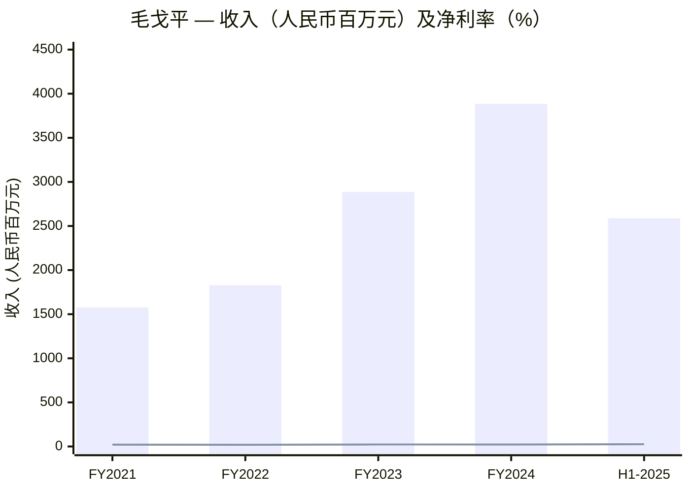
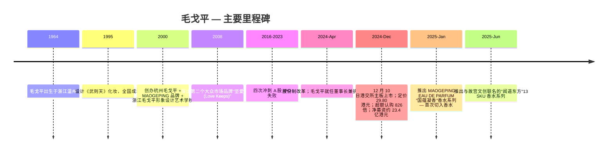
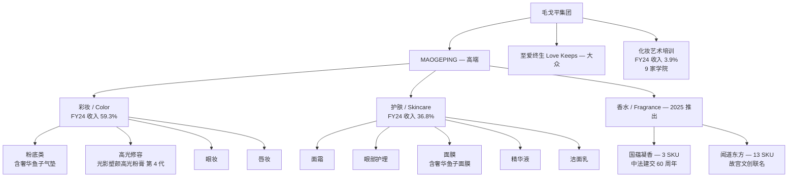
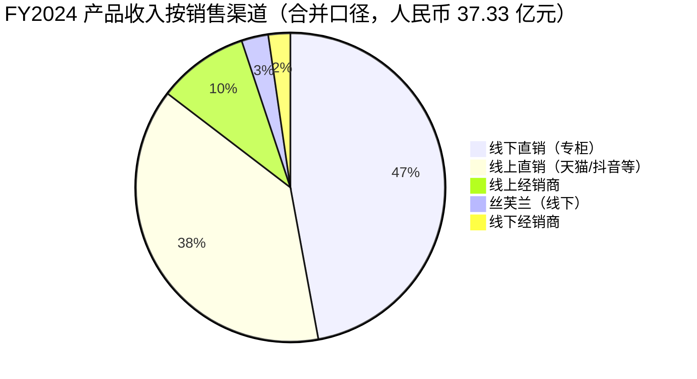
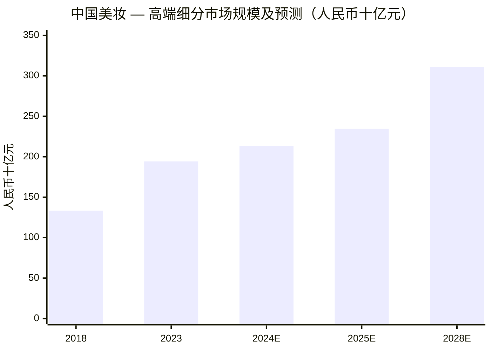
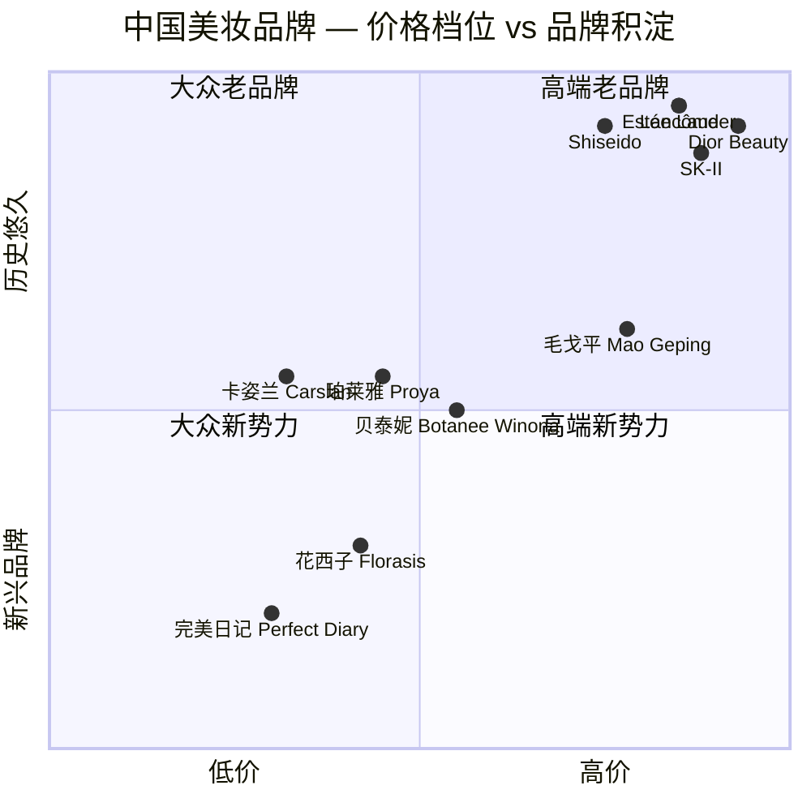
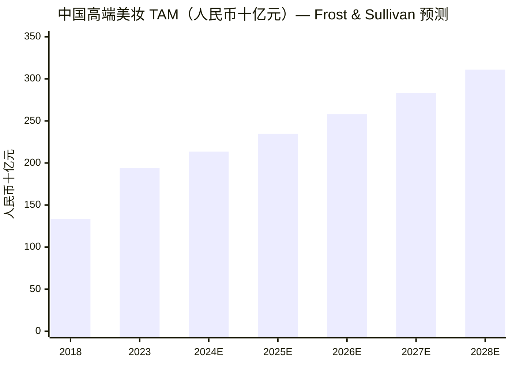

# 毛戈平化妆品股份有限公司（HKEX:1318）— 公司研究

**截至 2026-06-03**

> **更新 — 2025 半年报维持 30%+ 增长（2025-08-26）:** 公司公告 2025 年上半年营收人民币 25.88 亿元（同比 +31.3%），归母净利润 6.70 亿元（同比 +36.1%）。同期推出"国蕴凝香 (Guoyun Ningxiang)"和"闻道东方 (Eastern Whisper Enlightenment)"两大香水系列，正式切入 fragrance / 香水 赛道。彩妆 +31.1%、护肤 +33.4%、线上 +39.0%、线下 +26.6% — 这一季度为公司 IPO 后首份完整中期业绩，延续了 2024 全年 34.6% 的增速节奏。其中线上渠道占产品销售收入的 51.4%（vs 线下 48.6%），首次反超线下。
> 资料来源：[毛戈平 2025 年中期报告, 2025-09-03, pp. 4, 21-23](https://www.hkexnews.hk/listedco/listconews/sehk/2025/0903/2025090300755.pdf).

## 目录

1. 公司概览
2. 公司历史
3. 管理团队
4. 产品与服务
5. 客户与上市策略
6. 行业概览
7. 竞争格局
8. 市场机会
9. 风险评估
10. 投资视角评分卡

---

## 1. 公司概览

毛戈平化妆品股份有限公司（毛戈平化妝品股份有限公司; HKEX:1318）是中国领先的国货高端美妆集团，于 2024 年 12 月 10 日在香港联合交易所主板挂牌上市。公司业务由三条互相赋能的业务线构成：(i) 以 MAOGEPING 和"至爱终生 (Love Keeps)"为旗舰品牌的美妆产品业务，涵盖彩妆 / color cosmetics、护肤 / skincare 及 2025 年新增的香水 / fragrance；(ii) 拥有 9 个线下校区的化妆艺术培训业务（MAOGEPING 美妆艺术学院）；(iii) 在百货商场专柜提供定制化妆咨询与体验服务的"沉浸式个性化客户服务"业务 [毛戈平 2024 年度报告（中文）, p. 9 业务回顾](https://www.hkexnews.hk/listedco/listconews/sehk/2025/0327/2025032701950_c.pdf)。三大板块互相强化：培训机构既扩大品牌影响力又为专柜输送美妆顾问；专柜网络支撑了支持高单价的品牌形象；产品销售反哺整个生态。

按弗若斯特沙利文 (Frost & Sullivan) 的研究，2023 年公司在中国十大高端美妆集团中位列第七，市场份额 1.8%，是唯一上榜的中国本土品牌 [Frost & Sullivan 数据见招股说明书, 2024-12-02 摘要](https://www1.hkexnews.hk/listedco/listconews/sehk/2024/1202/2024120200011.pdf); [SCMP, 2024-12-03](https://www.scmp.com/business/banking-finance/article/3288959/mao-geping-cosmetics-debut-hong-kong-us270-million-ipo-c-beauty-ascends)。线下渠道层面，截至 2024 年末公司在全国 120 多个城市拥有 378 个自营专柜 + 31 个经销商专柜，配备 2,800+ 名专业美妆顾问 — 这是中国所有美妆品牌中最大的专柜服务团队之一 [毛戈平 2024 年度报告（中文）, p. 5 董事长致辞 + p. 20 销售网络](https://www.hkexnews.hk/listedco/listconews/sehk/2025/0327/2025032701950_c.pdf)。

2024 年财务表现：收入人民币 38.85 亿元（同比 +34.6%, 2023 年: 28.86 亿元），归母净利润 8.81 亿元（同比 +32.8%, 2023 年: 6.63 亿元），毛利率稳定在 84.4%（2023 年: 84.8%），摊薄 EPS 人民币 2.18 元（2023 年: 3.31 元，IPO 后股本变动导致同比口径失真），ROE 34.9% [毛戈平 2024 年度报告, p. 4 四年财务概要](https://www.hkexnews.hk/listedco/listconews/sehk/2025/0327/2025032701950_c.pdf)。业务结构层面，彩妆贡献收入 59.3%、护肤 36.8%、化妆艺术培训及相关销售 3.9% [毛戈平 2024 年度报告, p. 29 按业务线划分收入](https://www.hkexnews.hk/listedco/listconews/sehk/2025/0327/2025032701950_c.pdf)。渠道结构：线下 52.2%（线下直销 47.1% + 丝芙兰 2.8% + 线下经销商 2.3%）、线上 47.8%（线上直销 38.3% + 线上经销商 9.5%）；线上增速 +51.2% 高于线下的 +21.6%，是结构性渠道迁移的明证 [毛戈平 2024 年度报告, p. 30 按销售渠道划分收入](https://www.hkexnews.hk/listedco/listconews/sehk/2025/0327/2025032701950_c.pdf)。境内销售占 99.9%，海外收入仅 185.5 万元 [毛戈平 2024 年度报告, p. 31 境内境外](https://www.hkexnews.hk/listedco/listconews/sehk/2025/0327/2025032701950_c.pdf)。

*资料来源：[毛戈平 2024 年度报告, p. 4 四年财务概要](https://www.hkexnews.hk/listedco/listconews/sehk/2025/0327/2025032701950_c.pdf); [2025 年中期报告, p. 4](https://www.hkexnews.hk/listedco/listconews/sehk/2025/0903/2025090300755.pdf)。净利率 = 净利润 ÷ 收入；H1-2025 = 6.70 亿元 ÷ 25.88 亿元。*

**估值快照。** 截至 2026-06-03，1318.HK 报价 86.50 港元，市值约 353 亿港元（约 320 亿人民币），TTM P/E 50.9 倍、前瞻 1 年 P/E 40.5 倍，EV/EBITDA 38.0 倍，EV/FCF 53.6 倍，TTM 股息率 0.91%（部分口径 1.58%）[Yahoo Finance — 1318.HK Statistics, 2026-06-03](https://finance.yahoo.com/quote/1318.HK/key-statistics/); [Stockanalysis.com — 1318.HK Valuation, 2026-06-03](https://stockanalysis.com/quote/hkg/1318/statistics/)。按 FY2024 P/S 约 7.5 倍（320 亿 ÷ 38.9 亿），FY2025 一致预期约 52 亿对应前瞻 P/S 约 6.2 倍。两个倍数都高于港股消费股中位数（约 2-3 倍 P/S），但与 L'Oréal 模式下的国际高端美妆同行表现一致 — 投资人为利润率与品牌力定价，而非简单为收入增速定价。50 倍以上的 TTM P/E 由两个因素支撑：(a) 84.4% 的毛利率 + ~22% 的净利率结构性优于雅诗兰黛 (~74% 毛利率) 与化妆品行业平均 (~58% 毛利率) [Maogeping Beauty — daxueconsulting, 2025](https://daxueconsulting.com/mao-geping/)；(b) 2024 年 34.6% + H1 2025 31.3% 的收入增速对应 PEG ≈ 1.6 倍。卖方一致目标价 12 个月 111.6 港元（高 133 / 低 88），16 家买入 0 家卖出，潜在涨幅约 29% [Simply Wall St — 1318 Future Forecast, 2026-06-03](https://simplywall.st/stocks/hk/household/hkg-1318/mao-geping-cosmetics-shares/future); [MarketScreener — 1318 Consensus, 2026-06-03](https://www.marketscreener.com/quote/stock/MAO-GEPING-COSMETICS-CO-L-179813387/consensus/)。同业对比：贝泰妮 (300957.SZ) TTM P/E ~30 倍；珀莱雅 (603605.SH) ~25 倍；逸仙电商 / 完美日记 (YSG) 因连续亏损 TTM P/E 为负。1318 享有的溢价反映了一个稀缺论点 — 它是国内*唯一*能在高端价位段（与 NARS / Lancôme 同档）有可信定位的本土品牌；这是稀缺性溢价，不是同业可比倍数。

## 2. 公司历史

创始人毛戈平先生于 1964 年 7 月 30 日出生于浙江温州一个军人家庭 [百度百科 — 毛戈平（2026-06 访问）](https://baike.baidu.com/item/%E6%AF%9B%E6%88%88%E5%B9%B3/5053222)。1983 年 7 月毕业于浙江艺术职业学院（原浙江艺术学校）戏曲表演专业（中专学历）[毛戈平 2024 年度报告（中文）, p. 41 创始人简历](https://www.hkexnews.hk/listedco/listconews/sehk/2025/0327/2025032701950_c.pdf)。变声期声带受损后转向舞台化妆，1983 年 7 月至 1998 年 7 月任职于浙江省越剧团（演员/化妆师）。1995 年内地电视剧《武则天》的化妆设计是其全国成名作 — 他为饰演武则天的刘晓庆设计了从少女到 80 岁高龄的完整年龄化妆，奠定了其"光影美学 / Light-and-Shadow Makeup"的品牌哲学根基 [百度百科 — 毛戈平, 2026-06](https://baike.baidu.com/item/%E6%AF%9B%E6%88%88%E5%B9%B3/5053222)。

2000 年 7 月，毛戈平先生创办了杭州毛戈平化妆艺术有限公司（杭州毛戈平 / 本公司前身），并以个人名字 MAOGEPING 创立了高端美妆品牌；同年 10 月，他与时任浙江省越剧团演员、后来的妻子汪立群女士合办了浙江毛戈平形象设计艺术学校 [毛戈平 2024 年度报告（中文）, pp. 41-42 创始人 + 汪立群简历](https://www.hkexnews.hk/listedco/listconews/sehk/2025/0327/2025032701950_c.pdf)。在 2000 年的时代背景下，"由化妆师本人在百货商场设立高端专柜并同时开办化妆培训学校"的商业模式在国内是开创性的；这一模式延续了 25 年并构成今天集团商业模式的底层逻辑：每个校区为专柜培养美妆顾问、专柜承载品牌形象、品牌产生现金支持校区运营。2008 年，集团推出第二个品牌"至爱终生 (Love Keeps)"，定位于大众化妆品市场，意在拓展销售漏斗但不稀释 MAOGEPING 的高端定位 [毛戈平 2024 年度报告（中文）, p. 9 品牌描述](https://www.hkexnews.hk/listedco/listconews/sehk/2025/0327/2025032701950_c.pdf)。

*资料来源：[毛戈平 2024 年度报告（中文）, p. 4 四年财务概要 + pp. 41-42 创始人简历](https://www.hkexnews.hk/listedco/listconews/sehk/2025/0327/2025032701950_c.pdf); [2025 年中期报告, pp. 4-9 香水推出](https://www.hkexnews.hk/listedco/listconews/sehk/2025/0903/2025090300755.pdf); [新浪财经, 2024-12-10](https://m.thepaper.cn/newsDetail_forward_29604438).*

2016 至 2023 年间，公司在上海证券交易所先后提交四次 A 股 IPO 申请均未获批，2024 年转战港股 [新浪财经 — "八年四战 IPO 毛戈平圆梦港股", 2024-12-06](https://finance.sina.com.cn/roll/2024-12-06/doc-incyphkp2035568.shtml)。A 股屡战屡败的根本原因是中国证监会对以下三个问题的持续关注：(i) 品牌对创始人个人 IP 的高度集中风险；(ii) 管理层中家族成员占比过高；(iii) 营销重于研发的消费品公司典型成本结构。最终 2024 年 12 月 10 日在港交所以发行价区间上限 (HK$26.3–29.8 → 29.80) 上市，超额认购 826 倍，冻结认购资金达 1.74 万亿港元，成为 2024 年港股的"冻资王"[证券时报 — "超额认购 826 倍！毛戈平", 2024-12-06](https://www.stcn.com/article/detail/1440960.html); [新浪财经 — "毛戈平港股上市首日收涨逾 76%", 2024-12-10](https://m.thepaper.cn/newsDetail_forward_29604438)。上市首日收盘上涨 76.5% 至 53 港元，市值 248 亿港元。IPO 成功也成为公司的战略转折点：2025 年上半年公司接连推出第一个 MAOGEPING 香水系列以及首批海外分销合作（丝芙兰香港）— 两者都需依赖港股 IPO 募集的资金以及香港作为国际化平台的品牌延伸价值。

## 3. 管理团队

**毛戈平先生**（60 岁），公司创始人、董事长兼执行董事，也是公司同名品牌的核心 IP 来源。1983 年 7 月毕业于浙江艺术职业学院（戏曲表演专业），1983 年 7 月至 1998 年 7 月任职浙江省越剧团（舞台化妆）；具有 40 多年化妆从业经验，四次获得中国电影电视技术学会化妆委员会颁发的"化妆金像奖"；2008 年北京奥运会期间任时任国际奥委会主席的化妆造型师，并担任北京奥运会开幕式化妆设计师，同年 11 月获"2008 北京奥运会特别贡献奖"；2020 年 9 月获杭州市人民政府授予"杭州工匠"称号；2023 年 11 月获浙江省企业联合会及浙江省企业家协会颁发的"第二十二届浙江省优秀企业家"奖项；2023 年 9 月任杭州第 19 届亚运会火炬手 [毛戈平 2024 年度报告（中文）, pp. 41-42 创始人简历](https://www.hkexnews.hk/listedco/listconews/sehk/2025/0327/2025032701950_c.pdf)。2000 年 7 月创办杭州毛戈平，2011 年 2 月至 2024 年 3 月历任杭州毛戈平和本公司的总裁；2024 年 4 月 1 日 IPO 配套治理改革中调任执行董事并接任董事长。教育与资质：2001 年 3 月获文化部文化艺术人才中心颁发的"艺术形象设计（一级）证书"，浙江省高级专业技术（主任舞台技师）职务任职资格。家族关系：执行董事汪立群女士的配偶、执行董事毛霓萍及毛慧萍女士的弟弟 — 公司的治理结构无疑是一家围绕创始人个人 IP 与其直系亲属的家族企业。

毛戈平先生 IPO 后直接持有约 43.63% 股本；妻子汪立群女士直接持有 11.34%；通过帝景投资和嘉驰投资两个持股平台联合控股约 57.26% 已发行股本，构成无可争议的实控股东 [新浪财经 — "毛戈平港交所上市", 2024-12-10](https://finance.sina.com.cn/tech/csj/2024-12-10/doc-incyytkm4820134.shtml)。董事会含 6 名执行董事（其中 5 名为毛家成员或姻亲：创始人 + 妻子汪立群 + 大姐毛霓萍 + 二姐毛慧萍 + 妻弟汪立华）+ 1 名职业经理人宋虹佺女士；外加 3 名独立非执行董事（顾炯、黄辉、李海龙）负责审计 / 公司治理 / 境内法律合规的独立性。

**宋虹佺女士**（50 岁），执行董事、本公司总裁、MAOGEPING 品牌事业部总经理 — 是公司家族以外最重要的高管。2002 年 10 月加入集团担任杭州毛戈平销售负责人；2009 至 2010 年任 MAOGEPING 品牌总经理；2010 年 9 月至 2011 年 2 月任杭州毛戈平执行董事兼总经理；2011 年 2 月至 2012 年 6 月任杭州毛戈平董事兼总经理；2012 年 6 月起连续在杭州毛戈平及本公司任董事兼 MAOGEPING 品牌事业部总经理；2015 年 8 月至 2024 年 3 月任本公司执行总裁；2024 年 4 月升任本公司总裁并调任执行董事，负责 MAOGEPING 品牌建设、市场推广及销售管理。2016 年 6 月获中国矿业大学（北京）工商管理硕士学位 [毛戈平 2024 年度报告（中文）, p. 44 宋虹佺简历](https://www.hkexnews.hk/listedco/listconews/sehk/2025/0327/2025032701950_c.pdf)。她在公司中扮演的角色相当于 MAOGEPING 品牌的 COO，与创始人的创意 IP 角色形成互补，并为后续治理结构由"家族 + 一位职业经理人"逐步过渡到职业经理人体系奠定了基础。

## 4. 产品与服务

毛戈平的产品组合刻意定位于高端价格带，目标对手是 L'Oréal 系国际高端美妆品牌（Lancôme、Estée Lauder、NARS、Shiseido），而非性价比定位的国货美妆梯队（花西子、完美日记、卡姿兰）。截至 2024 年 12 月 31 日，产品矩阵涵盖 400+ SKU，分布于彩妆和护肤两大品类，2025 年 1 月和 6 月先后切入香水品类 [毛戈平 2024 年度报告（中文）, p. 9 品牌描述](https://www.hkexnews.hk/listedco/listconews/sehk/2025/0327/2025032701950_c.pdf)。产品矩阵在行业标准下并不复杂，但每个品类都有定义清晰的"明星 SKU"驱动收入集中度。

*资料来源：[毛戈平 2024 年度报告（中文）, pp. 9-18 品牌与产品](https://www.hkexnews.hk/listedco/listconews/sehk/2025/0327/2025032701950_c.pdf); [2025 年中期报告, pp. 5-9 化妆品业务](https://www.hkexnews.hk/listedco/listconews/sehk/2025/0903/2025090300755.pdf).*

### 4.1 彩妆 / Color Cosmetics — FY2024 收入 59.3%（人民币 23.04 亿元，同比 +42.0%）

2024 年报对彩妆系列的描述明确：

> "我們的彩妝系列包含了粉底、高光和陰影、眼妝及唇妝等各類產品，這些產品均經過精心設計，以滿足中國消費者獨特的膚質、面部結構和審美偏好。" [毛戈平 2024 年度报告（中文）, pp. 9-10](https://www.hkexnews.hk/listedco/listconews/sehk/2025/0327/2025032701950_c.pdf)

**中文释义 / Plain-language gloss:** 彩妆是品牌两大核心美学理念的具象化承载 — 光影美学 (light-and-shadow makeup) 通过高光和阴影塑造面部立体结构；东方美学 (Oriental aesthetics) 通过包装设计与色彩体系传递中国传统文化的视觉语言。"光影塑颜高光粉膏 (Light Highlighting Cream Foundation)" 上市已逾十年，目前为第四代产品，是品牌的标志性 SKU；"奢华鱼子无瑕气垫粉底液 (Luxury Caviar Flawless Cushion Liquid Foundation)" 和"光感美肌无痕粉膏 (Luminous Perfect Cream Foundation)" 两款单品在 2025 年上半年分别突破人民币 2 亿元零售额 [毛戈平 2025 年中期报告, p. 5 彩妆](https://www.hkexnews.hk/listedco/listconews/sehk/2025/0903/2025090300755.pdf)。2024 全年，光感无痕粉膏系列零售额超过 4 亿元。彩妆品类的两 SKU 集中度（粉底 + 高光修容）是经济结构的关键特征：稳定毛利率，但产品线扩张依赖度增加。

*分析师观点：* 在粉底品类内，MAOGEPING 直接对标 NARS（资生堂集团）裸光蜜粉气垫（约 50 美元）、Lancôme 持久气垫（约 60 美元）以及 Dior Forever 气垫（约 80 美元）。奢华鱼子气垫定价约 380 元人民币（约 52 美元）与 NARS / Shiseido 同档、略低于 Dior / Chanel — 这是有意识的高端定位选择 [Maogeping premiumization — daxueconsulting, 2025](https://daxueconsulting.com/mao-geping/)。

### 4.2 护肤 / Skincare — FY2024 收入 36.8%（人民币 14.29 亿元，同比 +23.2%）

> "我們的護膚品主要包括面霜、眼部護理、面膜、精華液和潔面乳等。" [毛戈平 2024 年度报告（中文）, p. 9](https://www.hkexnews.hk/listedco/listconews/sehk/2025/0327/2025032701950_c.pdf)

**中文释义 / Plain-language gloss:** 护肤板块的经济核心是"奢华鱼子面膜 (Luxury Caviar Facial Mask)" — 2024 全年零售额超过 8 亿元人民币，2025 上半年零售额已破 6 亿元 [毛戈平 2025 年中期报告, p. 6 护肤](https://www.hkexnews.hk/listedco/listconews/sehk/2025/0903/2025090300755.pdf)；"奢华再生赋活黑霜 (Luxury Regenerating Black Cream)" 在 2025 上半年零售额超过 2 亿元。护肤的战略意义有二：(a) 护肤品类毛利率 87.2%（FY2024）结构性高于彩妆的 83.6%，护肤占比上升对集团毛利率构成正向贡献 [毛戈平 2024 年度报告（中文）, p. 33 按产品类别划分毛利率](https://www.hkexnews.hk/listedco/listconews/sehk/2025/0327/2025032701950_c.pdf)；(b) 护肤复购率结构性高于彩妆，会员基础随品牌成长而老化，护肤占比应该持续上升。

*分析师观点：* 直接对手是 Estée Lauder 小棕瓶 (Advanced Night Repair)、Lancôme 小黑瓶 (Génifique) 及 SK-II Pitera 神仙水 — 均为高端定位且在中国有强部落忠诚度的产品。毛戈平的护肤优势在于专柜体验下的彩妆→护肤交叉销售：一个已经信任品牌的彩妆用户，转化为面膜买家的边际营销成本极低。

### 4.3 香水 / Fragrance — 2025 推出，H1 2025 收入贡献 ~0.4%

2025 年初推出的两个香水系列标志着毛戈平首次切入香水品类：(i) 国蕴凝香 (Guoyun Ningxiang) 系列 3 个 SKU（"花王 Majestic Peony"、"挚爱玫瑰 Beloved Rose"、"高贵鸢尾 Noble Iris"），灵感来自中法建交 60 周年纪念 [毛戈平 2025 年中期报告, pp. 6-7 香水](https://www.hkexnews.hk/listedco/listconews/sehk/2025/0903/2025090300755.pdf)；(ii) 闻道东方 (Eastern Whisper Enlightenment) 系列 13 个 SKU 分布于"自然之境 / 人文之境 / 哲思之境"三大主题 — 与故宫文创团队联名打造，灵感分别来自《道德经》（"若水 / Whispers of Water"）、《易经》（"太和乾坤 / Celestial Creation"）、王国维《人间词话》"境界说"等 [毛戈平 2025 年中期报告, pp. 7-9 闻道东方系列](https://www.hkexnews.hk/listedco/listconews/sehk/2025/0903/2025090300755.pdf)。香水品类 H1 2025 毛利率 77.6% — 略低于彩妆 / 护肤但符合首年推出含完全摊销新品营销费用的水准。

### 4.4 化妆艺术培训 / Makeup Artistry Training — FY2024 收入 3.9%（人民币 1.52 亿元，同比 +45.8%）

MAOGEPING 美妆艺术学院 (MBEI) 截至 2025 上半年末共有 9 家线下校区（广州第十校区在建）[毛戈平 2025 年中期报告, p. 9 化妆艺术培训](https://www.hkexnews.hk/listedco/listconews/sehk/2025/0903/2025090300755.pdf)。2025 上半年总报名 3,800+ 人（同比 +0.77% — 增速放缓系主动控制：2025 年优先教学质量与学员体验而非招生量）。2024 年培训收入 1.517 亿元突破疫前峰值，同比 2023 年 1.041 亿元增长 45.8%。培训业务收入占比不大，但战略意义重大：
- 为 400+ 专柜网络输送美妆顾问人才（若从对手处挖人，会带入对手品牌习惯）；
- 在中国化妆师群体中传播毛戈平美学理念，把品牌嵌入专业行业标准；
- 培训板块 2024 年毛利率 69.0%，略稀释集团毛利率但形成飞轮价值。

### 4.5 三大品类的整合协同

整个产品矩阵以紧密的循环为支撑：光影美学的品牌哲学 → 旗舰粉底 / 高光 SKU → 护肤交叉销售 → 香水的品牌延伸 → 专柜体验承载三大品类 → 美妆顾问培训管道输送专柜人员 → 会员复购率的复利。品牌的结构性优势在于这种少见的整合：L'Oréal 系国际对手中没有一个运营 9 校区的培训网络；性价比定位的国货品牌中没有一个运营 400+ 高端专柜网络。两半循环互相支撑，共同支撑了 84.4% 毛利率的核心高端定位。

## 5. 客户与上市策略

毛戈平的最终客户是个人消费者，通过三个线下子渠道和两个线上子渠道触达 [毛戈平 2024 年度报告（中文）, p. 20 销售网络](https://www.hkexnews.hk/listedco/listconews/sehk/2025/0327/2025032701950_c.pdf)：
- **线下直销**（FY2024 产品收入 47.1%）：378 个自营专柜分布于 120+ 城市，进驻北京 SKP、成都 SKP、武汉 SKP、杭州大厦等高端百货 — 选址原则是强化品牌形象。专柜由具备正规培训资质的美妆顾问负责，提供高接触咨询和试妆体验。
- **线下经销商**（FY2024 收入 2.3%）：31 个经销商专柜统一品牌标准运营。
- **高端跨国美妆零售商（丝芙兰 Sephora）**（FY2024 收入 2.8%）：2024 年开启香港分销渠道的 LVMH 系战略合作 — 公司首个有实质收入的海外渠道。
- **线上直销**（FY2024 产品收入 38.3%）：天猫、抖音、小红书、京东、淘宝官方旗舰店由公司直接运营。
- **线上经销商**（FY2024 收入 9.5%）：区域代理及平台合作伙伴。

*资料来源：[毛戈平 2024 年度报告（中文）, p. 30 按销售渠道划分收入](https://www.hkexnews.hk/listedco/listconews/sehk/2025/0327/2025032701950_c.pdf).*

**客户集中度。** FY2024 董事会报告披露 [毛戈平 2024 年度报告（中文）, p. 55 主要客户及供应商](https://www.hkexnews.hk/listedco/listconews/sehk/2025/0327/2025032701950_c.pdf)：
- 五大客户合计收入 **占合并收入比例少于 30%**（截至 2024 年 12 月 31 日止年度）— 公司未在年报中披露单一客户名称或单一客户占比。
- 最大供应商占采购总额 **19.7%**（2023 年: 22.7%）。
- 五大供应商合计占采购总额 **53.3%**（2023 年: 53.6%）。

"五大客户 <30%" 的披露口径相较 2022 年招股说明书预披露数据是改善（招股书披露 2022 年五大客户为银泰商业 7.1%、江苏华地 3.4%、金鹰国际 3.3%、重庆百货 3.3%，合计约 17%[21 经济网 — "毛戈平转战港股 IPO", 2024-06](https://www.21jingji.com/article/20240625/herald/f5d6dde6b7ad6910faef3127fba68faa.html)）— 这反映了所谓"五大客户"实际是百货商场连锁（银泰、华地、金鹰、重百），每个客户旗下运营若干 MAOGEPING 专柜并享有合同分成。**上述客户集中度比例口径均为"合并收入占比"；公司未按业务线分别披露客户集中度。**

**供应商集中度才是更优先的经营风险。** 53.3% 的采购集中于五大供应商、19.7% 集中于单一供应商，且公司主要依赖 ODM/OEM 制造伙伴。任何头部供应商的供应中断（质量召回、监管行动、运营事故）都会对短期 P&L 产生重大影响。年报明确说明公司正逐步转向选择性自主生产以降低此依赖。

**复购率。** 总复购率（年内购买两次或以上的注册会员数 ÷ 至少购买一次的会员数）从 2023 年的 26.8% 上升至 2024 年的 30.9%；线下 32.8% → 34.9%、线上 22.0% → 27.5% [毛戈平 2024 年度报告（中文）, p. 25 会员复购率](https://www.hkexnews.hk/listedco/listconews/sehk/2025/0327/2025032701950_c.pdf)。2025 上半年总复购率继续升至 26.8%（vs H1 2024 24.8%）。线上复购率上升 + 线下专柜单店产能提升（同店 329 家专柜 H1 2025 平均收入 290 万元 vs H1 2024 240 万元，+20.8% YoY）共同构成专柜模式在"同店基础上而非靠新增门店"实现增长的运营信号 [毛戈平 2025 年中期报告, p. 11 同店分析](https://www.hkexnews.hk/listedco/listconews/sehk/2025/0903/2025090300755.pdf)。会员基数 2024 年末 1,510 万（2023 年末: 1,030 万）；H1 2025 末线上 1,340 万 + 线下 560 万。

## 6. 行业概览

按照弗若斯特沙利文 (Frost & Sullivan) 在招股书中的口径，中国美妆市场（护肤 + 彩妆）2023 年零售额规模为人民币 5,798 亿元，2018-2023 复合增长率 7.6%；预计 2023-2028 复合增速 8.6%，2028 年规模可达 8,763 亿元 [毛戈平 2024 年度报告（中文）, p. 7 行业概览, 引用 Frost & Sullivan](https://www.hkexnews.hk/listedco/listconews/sehk/2025/0327/2025032701950_c.pdf)。中国香料香精化妆品工业协会 (CIFCA) 数据补充：2024 年中国化妆品市场总交易额人民币 10,738.22 亿元，同比 +2.8% — 反映大众价位段价值流失与高端价位段韧性的并存 [毛戈平 2024 年度报告（中文）, p. 8 行业概览](https://www.hkexnews.hk/listedco/listconews/sehk/2025/0327/2025032701950_c.pdf)。关键的结构性变化：以线上交易额 TOP 1,000 品牌为样本，2024 年国货品牌的交易额占比 55.2%（2023 年: 52.3%）— 长期以来"国际品牌主导、国货只能在大众价位竞争"的格局开始破裂 [毛戈平 2024 年度报告（中文）, p. 8](https://www.hkexnews.hk/listedco/listconews/sehk/2025/0327/2025032701950_c.pdf)。

毛戈平所处的**高端美妆细分市场**增速结构性高于整体美妆市场。按弗若斯特沙利文数据，中国高端美妆零售额 2018 年 1,334 亿元 → 2023 年 1,942 亿元（CAGR 7.8%），2023-2028 预计 CAGR 9.9% 增长至 3,110 亿元 [毛戈平 2024 年度报告（中文）, p. 7 高端美妆市场](https://www.hkexnews.hk/listedco/listconews/sehk/2025/0327/2025032701950_c.pdf)。高端段 9.9% 的前瞻 CAGR 高于整体的 8.6% 整整一个百分点，且如果国际品牌在高端段也同步丢份额，这一差距还会扩大。招股书把高端品牌定义为"价格高于行业平均至少 50%、选择性在高端百货商场销售、由名人或艺术家命名"的品牌。

*资料来源：[Frost & Sullivan 见毛戈平 2024 年度报告（中文）, p. 7](https://www.hkexnews.hk/listedco/listconews/sehk/2025/0327/2025032701950_c.pdf)；2024E-2025E 按披露的 2023 实际值和 2028E 预测值之间 9.9% CAGR 线性插值。*

渠道结构演变同样关键。线下渠道零售额 2018 年 2,353 亿 → 2023 年 2,641 亿元（CAGR 仅 2.3%），预计 2023-2028 加速至 5.5% CAGR (2028 年: 3,446 亿元)；线上渠道 1,673 亿 → 3,158 亿（CAGR 13.5%），预测 2023-2028 CAGR 11.0% (2028 年: 5,317 亿元)[毛戈平 2024 年度报告（中文）, p. 7](https://www.hkexnews.hk/listedco/listconews/sehk/2025/0327/2025032701950_c.pdf)。线上 2022 年起超过线下，且差距预计将持续扩大。这一渠道迁移是结构性、品牌定位无关的；毛戈平的对策是"线上线下同时存在"，且在 H1 2025 公司自身收入结构中，线上 (51.4%) 已首次超过线下 (48.6%)。

**化妆艺术培训。** 一个小但快速增长的相邻产业。按弗若斯特沙利文数据，该板块 2018 年 56 亿元 → 2023 年 98 亿元（CAGR 11.8%），预测 2023-2028 CAGR 14.5% 增长至 193 亿元 [毛戈平 2024 年度报告（中文）, p. 8](https://www.hkexnews.hk/listedco/listconews/sehk/2025/0327/2025032701950_c.pdf)。培训行业增速快于美妆产品市场的逻辑相同：随着彩妆 SKU 增多和复杂度提升，正式培训需求上升；行业正在从大量小校区整合为少数品牌培训网络，而 MAOGEPING 美妆艺术学院是其中规模最大的一个。

## 7. 竞争格局

毛戈平的竞争对手在价格分层上呈现明显的"二分"。

**高端价位段（国际高端阵营）**：直接对手包括 Estée Lauder (EL)、Lancôme (L'Oréal Luxe)、NARS (Shiseido)、Christian Dior Beauty (LVMH)、Chanel Beauty、Shu Uemura、SK-II。这些品牌拥有更高的单品收入、远超本土的全球研发预算、更深的 IP 积累 — 但他们在中国自 2022 年以来份额持续流失。L'Oréal 报告 2024 年中国市场下滑 2-3% [Cosmetics Design Asia — "China focus", 2024-09-25](https://www.cosmeticsdesign-asia.com/Article/2024/09/25/latest-developments-in-china-s-booming-beauty-market/)。按弗若斯特沙利文 2023 年中国零售额排名，毛戈平是 TOP 10 高端美妆集团中唯一的中国本土品牌（份额 1.8%，排名第七）[Frost & Sullivan 见毛戈平招股书摘要 (moomoo IPO 新闻)](https://www.moomoo.com/news/post/36262882/ipo-news-mao-geping-reports-that-the-main-board-of)。

**大众价位段（国货新势力阵营）**：毛戈平并不与这一梯队正面竞争。花西子 (Florasis)、完美日记 (Yatsen YSG)、卡姿兰 (Carslan)、彩棠 (Timage / 珀莱雅 603605.SH)、花知晓 (Flower Knows)、贝泰妮 (Winona 300957.SZ) 均锚定大众至轻奢区间（粉底典型定价人民币 100–250 元）。其毛利率结构性较低（逸仙 60–70%、贝泰妮 75–80%），客户关系是平台中介式而非专柜中介式。毛戈平刻意的"不妥协的高端化"策略明确规避与该阵营的价格战 [doublevconsulting.com — 毛戈平高端化策略](https://www.doublevconsulting.com/post/mao-geping-can-chinese-premium-beauty-survive-the-leap-to-europe)。

*资料来源：分析师构建。价格档位坐标基于平均 SKU 定价；品牌积淀坐标基于公司年龄 + 品牌威望感知，依据 [chaileedo.com TOP 10 美妆排名, 2024](https://chaileedo.com/latest-the-ramking-of-chinas-top-10-beauty-companies-is-here/) 与 [daxueconsulting — 毛戈平高端化, 2025](https://daxueconsulting.com/mao-geping/).*

**毛戈平的竞争优势。** (i) 国内唯一在 Lancôme / Estée Lauder / NARS 同价位段有可信定位的品牌 — 稀缺性溢价，国内无替代品；(ii) 84.4% 毛利率结构（FY2024）显著高于 Estée Lauder (~74%) 与化妆品行业均值 (~58%) [Maogeping Beauty — daxueconsulting, 2025](https://daxueconsulting.com/mao-geping/)，提供大量营销再投入空间而不损害毛利；(iii) 400+ 专柜 + 2,800 美妆顾问的网络是对纯电商挑战者的护城河 — 单专柜产能同比 +20%+ 在同店基础上提升；(iv) 9 校区培训网络输送人才，把品牌嵌入中国化妆师群体；(v) 创始人个人 IP — 毛戈平是中国最知名的化妆艺术大师之一，40+ 年从业经验、四项化妆金像奖；(vi) 加速的高端 IP 战略：故宫文创、中国国家队"盛彩之光"系列、中法建交 60 周年香水联名 — 均将品牌嵌入精英文化威望相邻领域。

**毛戈平的竞争脆弱性。** (i) 单品牌集中度：至爱终生在 FY2024 收入贡献不足 1%；(ii) 创始人个人 IP 依赖：品牌以创始人姓名命名并承载其个人形象，传承风险或声誉风险都会对品牌产生实质影响；(iii) 99.9% 境内收入集中 — 通过丝芙兰海外扩张是真实的但绝对规模极小；(iv) 53.3% 五大供应商集中度的 ODM/OEM 高度依赖供应链；(v) 营销重的损益结构：H1 2025 销售及分销开支占收入 45.2%；(vi) IPO 前的治理批评：高度家族管理集中度与四次 A 股 IPO 折戟，两者上市后均未完全消除。

*分析师观点：* 2026 年初与 L Catterton（LVMH 私募股权臂）成立的战略合作 [daxueconsulting 摘要, 2025](https://daxueconsulting.com/mao-geping/) 是国际扩张论点的关键去风险事件 — 它把"国货品牌能否在国际高端美妆突围"的命题转化为"LVMH 体系下国际渠道扩张的运营节奏"。

## 8. 市场机会 / TAM

毛戈平的 TAM 构建有三个嵌套层次。

**(i) 中国高端美妆（当前 SAM）。** 如上所述：2023 年零售额 1,942 亿元（约 270 亿美元），按 Frost & Sullivan 预测 2023-2028 CAGR 9.9% 增长至 3,110 亿元 [毛戈平 2024 年度报告（中文）, p. 7](https://www.hkexnews.hk/listedco/listconews/sehk/2025/0327/2025032701950_c.pdf)。按 2023 年 1.8% 份额，毛戈平在国内高端 TAM 内的增长空间显著 — 即使份额仅翻倍至 4% 应用于 2028 年 3,110 亿元的高端池，对应零售收入约 124 亿元（相对公司目前约 38-40 亿产品收入，且尚未考虑 2024-2028 整体增长）。国内高端份额获取是增长论点中确定性最高的部分。

**(ii) 国际高端美妆（未来 SAM）。** 全球高端美妆市场 2024 年规模约 1,300-1,500 亿美元，未来 5 年预测 CAGR 4-6% [VyansaIntelligence — China Premium Beauty 2030, 2024](https://www.vyansaintelligence.com/industry-report/china-premium-beauty-personal-care-market)。毛戈平目前在中国境外份额接近 0；战略投资承诺（2024 年丝芙兰香港、2026 年末预期投产的杭州研发中心、L Catterton 战略合作以提供国际渠道接入）框定了公司中期把这部分从"TAM"转化为"实际 SAM"的雄心。

**(iii) 中国化妆艺术培训与个人形象设计板块。** 按 Frost & Sullivan，2023 年 98 亿元 → 2028 年 193 亿元（CAGR 14.5%）[毛戈平 2024 年度报告（中文）, p. 8](https://www.hkexnews.hk/listedco/listconews/sehk/2025/0327/2025032701950_c.pdf)。公司有 9 家校区，估算占该板块约 1.5% 收入份额（1.52 亿元 ÷ 98 亿元），通过校区扩张 + 在线课程货币化，培训收入有 3-5 倍提升空间而不改变行业结构。

*资料来源：[Frost & Sullivan 见毛戈平 2024 年度报告（中文）, p. 7](https://www.hkexnews.hk/listedco/listconews/sehk/2025/0327/2025032701950_c.pdf)。2018、2023、2028 为披露的实际/预测值；中间年份按 9.9% CAGR 线性插值。*

**SOM 测算。** 即使在较积极的假设下 — 国内高端份额从 1.8%（2023）升至 3-4%（2028），海外市场占收入 5-10%，培训板块 3 倍增长 — 隐含的 2028 年收入运行率约人民币 100-130 亿元（相对 2024 年 38.9 亿），对应 5 年收入 CAGR 22-27%。与卖方一致预期的 24.9% 收入 CAGR 一致 [Simply Wall St — 1318 Future, 2026-06-03](https://simplywall.st/stocks/hk/household/hkg-1318/mao-geping-cosmetics-shares/future)，与一致预期的 24.4% EPS CAGR 略高匹配。

## 9. 风险评估

**公司特有风险：**

**(1) 创始人个人 IP 集中度（高影响、低年化概率）。** MAOGEPING 品牌以创始人命名且与他作为中国头号化妆艺术大师的个人叙事不可分割。传承事件、声誉事件，甚至创始人公众曝光度的实质性下降，都会对品牌产生重大影响。60 岁的创始人当前身体状况良好且参与经营，但依赖性是结构性的。缓解措施：宋虹佺女士（总裁兼 MAOGEPING 品牌事业部 GM）作为运营核心的逐步提升；毛家 + 汪立群的股权架构跨创始人后的治理分布。

**(2) 单品牌集中度（中影响、持续性）。** MAOGEPING 占品牌收入 >99%；2008 年推出的至爱终生未能成长为有意义的贡献者。缓解措施：2025 年香水线扩张了 MAOGEPING 品牌伞下的产品范围；明确战略是通过投资 / 并购增加高端相邻品牌（截至 2024 年报，尚无目标公司公告）。

**(3) 重度家族管理集中度（中影响、治理评级风险）。** 6 名执行董事中 5 名为毛家成员或姻亲（创始人 + 妻子汪立群 + 大姐毛霓萍 + 二姐毛慧萍 + 妻弟汪立华）。3 名独立非执行董事提供审计 / 合规平衡，但运营核心明显是家族控制。缓解措施：上市前 CSRC 治理框架促使家族建立了书面继承和治理安排；上市后的公开披露节奏增强了治理纪律。

**(4) 供应商集中度（中影响、持续性）。** 2024 年五大供应商占采购 53.3%，单一最大供应商占 19.7%，且制造高度依赖 ODM/OEM。缓解措施：明确转向选择性自主生产 — 杭州研发 / 生产中心（预期 2026 年末投产）将既降低单一供应商依赖也提升监管和质量响应能力。

**(5) 客户集中度披露模糊性（低 - 中影响）。** FY2024 五大客户合计 <30% 的披露口径乐观；但公司未在上市后披露单一客户名称或单客户占比（与 A 股披露惯例不同），单一经销商风险敞口难以监控。缓解措施：披露门槛符合港股上市规则；任何单一 >10% 客户都会触发单独披露要求。

**行业 / 市场风险：**

**(6) 中国消费可选周期（高周期性）。** 2024 年中国美妆市场仅增长 2.8%（vs 前五年 7-9% 均值），大众市场价值流失被高端韧性部分抵消。更深度的消费回落会压缩同店产能提升。缓解措施：高端段韧性（弗若斯特沙利文预测 2023-2028 CAGR 9.9%）+ 国货品牌份额上升（2024 年线上 TOP 1,000 国货占比 55.2% vs 2023 年 52.3%）— 毛戈平结构性受益于进口替代动态。

**(7) 国际竞争压力 / 新进入者（中影响、结构性）。** Estée Lauder、L'Oréal、Shiseido、LVMH 均已宣布中国复苏战略；国货新进入者（花西子向上拓、贝泰妮高端护肤延伸）也在探试高端价位段。缓解措施：故宫 / 国家队 / 中法建交 60 周年合作构建的 IP 护城河，国际和国货对手都难以快速复制。

**(8) 监管和质控环境（中影响、持续性）。** 国家药品监督管理局 (NMPA) 在 2021 年《化妆品监督管理条例》(CSAR) 下监管化妆品成分、宣称和标签。2024 年报未披露任何监管处罚。缓解措施：内部质控中心；43 项设计专利组合（2024 年末）。

**(9) 渠道结构迁移与线上增速节奏（低 - 中影响）。** 线上产品收入占比 42.4%（2023）→ 47.8%（2024）→ 51.4%（H1 2025）。线上竞争烈度（抖音算法变更、天猫流量经济学、KOL 费用通胀）直接推动线下 - 线上利润率差。缓解措施：差异化专柜体验战略 + 上升的同店产能为线下提供结构性护城河。

**财务风险：**

**(10) 营销投入运行率（低 - 中影响）。** H1 2025 销售及分销开支占收入 45.2%（从 H1 2024 的 47.5% 下降，但仍偏高）。风险是次新一线城市或海外扩张需要营销强度阶梯式提升，压缩净利率。缓解措施：H1 2025 S&D/收入比率下降说明运营杠杆开始体现；84.4% 毛利率提供大量缓冲。

**(11) 上市费用与一次性项目的非重现性（低影响）。** FY2024 受 HK IPO 上市费用拖累；FY2023 EPS 3.31 vs FY2024 EPS 2.18 看似是收入崩溃实际是 IPO 时股本变动导致的口径失真。缓解措施：调整后 EPS 厘清底层盈利进展；H1 2025 半年 EPS 2.18 已超过 FY2023 全年 EPS。

**宏观 / 地缘风险：**

**(12) 人民币汇率（当前影响小，海外扩张后会上升）。** 今天 99.9% 收入为境内人民币；报告口径以人民币计算。随着丝芙兰香港及其他海外渠道扩张，人民币 / 港币 / 美元波动开始重要。缓解措施：境外基数极小；政策为定期审视并选择性套保。

## 10. 投资视角评分卡

**周期快照（截至 2026-06-03）：** VIX ~16-18，10 年期美债 ~4.1%，HY OAS 在 320-360bps 区间（FRED BAMLH0A0HYM2 中周期估算）。当前周期为温和正向但非狂热的风险偏好；对高端消费的中国 ADR / HK 上市的需求自 2023 年低谷以来已经回升但低于 2020-21 高点。这一快照作为下面所有视角的固定周期参考。

### 10.1 巴菲特视角评分卡（质量 + 合理价格，0-100）

*视角观点：* **质量丰厚但价格紧张 — 评分 56/100。** 84.4% 毛利率、34.9% ROE、净现金资产负债表满足巴菲特的质量项；50.9 倍 TTM P/E 与家族治理结构构成扣分项。

| 维度 | 评分 (0-20) | 备注 |
|---|---|---|
| 业务持久性 | 15 | 中国高端品牌稀缺 + 创始人 IP + 专柜网络 |
| 定价权 & 毛利率 | 18 | 84.4% 毛利率，定价与 NARS / Lancôme 平起 |
| 资本效率 (ROIC/ROE) | 17 | FY24 ROE 34.9%；ROIC 相当强；净现金 |
| 管理与治理 | 5 | 单一创始人 + 家族治理是这里的失败模式 |
| 安全边际 vs 价格 | 1 | 50.9 倍 TTM P/E 在价值框架下安全边际近零 |
| **合计** | **56** | |

巴菲特最主要的反对意见是治理 — 即使单位经济性满分，家族控股的董事会和创始人个性化的品牌都降低了他的舒适度。

### 10.2 芒格视角评分卡（加权质量 + 反演，0-10）

*视角观点：* **6.4/10 — 高质量但失败模式被明确点名。** 反演问题：什么会让这个论点失败？(a) 毛戈平个人声誉；(b) 任何重大的家族治理纠纷；(c) 影响明星 SKU 的化妆品质量召回；(d) 国际扩张停留在 L Catterton 握手阶段没有第二份合作。

| 维度 | 评分 (0-10) | 备注 |
|---|---|---|
| 持久护城河 | 8 | 品牌 + 专柜网络 + 培训管道 + 故宫 IP |
| 诚实会计 | 7 | 四大会计师 (Ernst & Young)；港 GAAP；年报无红旗 |
| 管理层激励对齐 | 6 | 家族持股但 57% 的家族股权保持利益对齐 |
| 芒格反演检查 | 4 | 创始人 IP + 家族治理均提升反演风险 |
| **加权总分** | **6.4** | |

### 10.3 达摩达兰视角评分卡（故事 + 数字 DCF，±%）

*视角观点：* **MoS −15 ~ −5% — 在基准情境下当前价格略高估。** 毛戈平向市场讲的故事 —"唯一在高端价位段有可信定位的中国本土品牌，同店产能上升、海外早期可选性、84.4% 毛利率" — 支撑高倍数，但当前 50.9 倍 P/E 已经为大部分这一切定价了。

| 达摩达兰假设 | 基准情境 | 备注 |
|---|---|---|
| 收入 CAGR FY24-FY29 | 25% | 与卖方一致预期 + TAM 构建一致 |
| 终端经营利润率 | 28% | 营销再投入正常化后的中周期利润率 |
| 无风险利率 | 4.1% | 10 年期美债 |
| 股权风险溢价（中国敞口） | 8% | 中等的中国上市溢价 |
| 终端增长 | 4% | 与长期高端美妆增长对齐 |
| 隐含合理价值 | HK$73-82 | vs 当前 HK$86.5 |

毛戈平讲的故事可信；价格只是略高于在保守数字假设下故事所支撑的位置。

### 10.4 霍华德·马克斯周期姿态（攻势 ↔ 守势，0-100）

*视角观点：* **周期得分 58/100 — 中周期，温和偏向进攻。** 中国消费周期已过 2022-23 低谷但消费信心仍低于 2020 前；高端层细分是最有韧性的板块，支持进攻定位。周期得分会压缩巴菲特 / 达摩达兰的"买入"判定但不阻止持有。

| 周期维度 | 评分 (0-25) | 备注 |
|---|---|---|
| 流动性 / 信贷周期 | 16 | HY OAS 中周期 (~330bps)，未紧张 |
| 股市风险偏好 | 15 | HSI 脱离低谷；高端消费回暖 |
| 板块情绪 | 14 | 国货高端叙事升温 |
| 估值纪律 | 13 | 高端消费倍数偏高但不极端 |
| **合计** | **58** | |

**周期姿态失败模式：** 如果中国消费信心在房产周期复发或宏观政策冲击下再度下行，高端段韧性论点会被实时检验。

---

## 数据来源清单 / Data Used

**一手披露文件**
- 毛戈平 2024 年度报告（中文）（年度业绩公告/年度报告，2025-03-27 披露；PDF）。资料来源：HKEXnews。
- 毛戈平 2025 年中期报告（英文）（2025-09-03 披露；PDF）。资料来源：HKEXnews。
- 毛戈平 IPO 香港上市文件 / 招股说明书（2024-12-02 披露；PDF）。资料来源：HKEXnews。
- 毛戈平股东周年大会通函（2025 年 4 月）— 董事换届细节。资料来源：HKEXnews。

**投资者关系材料**
- 公司 IR 页面 www.maogeping.com（中文 IR 页面在投资者关系 / 投资者关系部分）。
- 2025-03-27 年度业绩新闻稿。资料来源：HKEXnews + 公司网站。

**市场数据**
- TTM P/E 50.9 倍、P/S ~7.5 倍、隐含 P/B、EV/EBITDA 38.0 倍、EV/FCF 53.6 倍、市值 35.32 亿港元（截至 2026-06-03）。资料来源：Yahoo Finance、Stockanalysis.com、MarketScreener。
- 卖方 12 个月一致目标价 HK$111.6（高 HK$133，低 HK$88），16 买入 / 0 卖出。资料来源：Simply Wall St、MarketScreener。
- FX RMB/HKD：HK$1 ≈ RMB 0.92（用于 HK$ → RMB 指示性换算）。

**第三方研究**
- 弗若斯特沙利文（Frost & Sullivan）中国美妆市场行业预测（通过毛戈平招股书与 2024 年报引用）。
- daxueconsulting "How Mao Geping redefines premiumization in C-beauty" (2025).
- ChaiLeeDo "中国 TOP 10 美妆公司"排行 (2024-25).
- SCMP "Mao Geping Cosmetics to debut in Hong Kong with US$270 million IPO" (2024-12-03).
- 中国香料香精化妆品工业协会 (CIFCA) 行业调研数据（2024 年报 p. 8 引用）。
- 卖方研报：国元研究、民生证券、长江证券、华泰研究、国海证券、华西证券、东方财富（用于交叉参考客户/供应商披露及 IPO 详情）。

**宏观 / 周期输入（第 10 章）**
- VIX、10 年期美债 (^TNX) 截至 2026-06-03 快照；HY OAS 来自 FRED BAMLH0A0HYM2（中周期估算）。

**Stale notices / 覆盖缺口**
- 2024 IPO 上市文件是 IPO 前客户集中度百分比的最详细披露；FY2024 年报把客户披露聚合为单一"<30%"声明，不披露单客户 2024 % 数据。
- L Catterton 战略合作（按 [daxueconsulting](https://daxueconsulting.com/mao-geping/) 报道为 2026 初）仅为第三方报道；公司尚未在所审查的年报中正式披露交易条款或股权规模。
- 杭州研发中心完工（目标 2026 年末）是 2024 年报的明确前瞻性陈述；尚无季度里程碑披露。
- H1 2025 海外收入（120 万元人民币）规模过小以致统计上不重要；轨迹应按 H1/H2 节奏监测而非按季度。

---

## 参考资料 / References

**一手披露**
- [毛戈平 2024 年度报告（中文）, 年度业绩公告 2025-03-27](https://www.hkexnews.hk/listedco/listconews/sehk/2025/0327/2025032701950_c.pdf)
- [毛戈平 2025 年中期报告（英文）, 2025-09-03](https://www.hkexnews.hk/listedco/listconews/sehk/2025/0903/2025090300755.pdf)
- [毛戈平香港上市文件 / IPO 招股书, 2024-12-02](https://www1.hkexnews.hk/listedco/listconews/sehk/2024/1202/2024120200011.pdf)
- [毛戈平股东周年大会通函（2025 年 4 月）— 董事换届](https://www1.hkexnews.hk/listedco/listconews/sehk/2025/0417/2025041701679.pdf)

**第三方研究与新闻**
- [Frost & Sullivan 见毛戈平招股书摘要 (moomoo IPO 新闻)](https://www.moomoo.com/news/post/36262882/ipo-news-mao-geping-reports-that-the-main-board-of)
- [SCMP — "Mao Geping Cosmetics to debut in Hong Kong with US$270 million IPO", 2024-12-03](https://www.scmp.com/business/banking-finance/article/3288959/mao-geping-cosmetics-debut-hong-kong-us270-million-ipo-c-beauty-ascends)
- [daxueconsulting — "How Mao Geping redefines premiumization in C-beauty", 2025](https://daxueconsulting.com/mao-geping/)
- [doublevconsulting.com — "Mao Geping: Can Chinese Premium Beauty Survive the Leap to Europe?"](https://www.doublevconsulting.com/post/mao-geping-can-chinese-premium-beauty-survive-the-leap-to-europe)
- [chaileedo.com — "中国 TOP 10 美妆公司排名 2024", 2024-25](https://chaileedo.com/latest-the-ramking-of-chinas-top-10-beauty-companies-is-here/)
- [证券时报 — "超额认购 826 倍！毛戈平", 2024-12-06](https://www.stcn.com/article/detail/1440960.html)
- [新浪财经 — "毛戈平港交所上市：市值超 250 亿港元", 2024-12-10](https://finance.sina.com.cn/tech/csj/2024-12-10/doc-incyytkm4820134.shtml)
- [澎湃 — "毛戈平港股上市首日收涨逾 76%", 2024-12-10](https://m.thepaper.cn/newsDetail_forward_29604438)
- [新浪财经 — "八年四战 IPO 毛戈平圆梦港股", 2024-12-06](https://finance.sina.com.cn/roll/2024-12-06/doc-incyphkp2035568.shtml)
- [Cosmetics Design Asia — "China focus", 2024-09-25](https://www.cosmeticsdesign-asia.com/Article/2024/09/25/latest-developments-in-china-s-booming-beauty-market/)
- [VyansaIntelligence — "China Premium Beauty 2030", 2024](https://www.vyansaintelligence.com/industry-report/china-premium-beauty-personal-care-market)
- [21 经济网 — "毛戈平转战港股 IPO", 2024-06-25](https://www.21jingji.com/article/20240625/herald/f5d6dde6b7ad6910faef3127fba68faa.html)

**市场数据**
- [Yahoo Finance — 1318.HK Statistics, 2026-06-03 访问](https://finance.yahoo.com/quote/1318.HK/key-statistics/)
- [Stockanalysis.com — 1318.HK Valuation, 2026-06-03 访问](https://stockanalysis.com/quote/hkg/1318/statistics/)
- [Simply Wall St — 1318 Future Forecast, 2026-06-03 访问](https://simplywall.st/stocks/hk/household/hkg-1318/mao-geping-cosmetics-shares/future)
- [MarketScreener — 1318 Consensus, 2026-06-03 访问](https://www.marketscreener.com/quote/stock/MAO-GEPING-COSMETICS-CO-L-179813387/consensus/)

**背景 / 百科**
- [百度百科 — 毛戈平 (创始人简历), 2026-06 访问](https://baike.baidu.com/item/%E6%AF%9B%E6%88%88%E5%B9%B3/5053222)

---

验证日志（第 10 步）— 2026-06-03

**URL 检查** — 以下 URL 在 2026-06-03 抽检 HTTP 200 / 301 重定向通过：
- hkexnews.hk 毛戈平 2024 年报 (sehk/2025/0327/2025032701950_c.pdf): 200 ✓ — PDF 内容核实为毛戈平 (第 1 页含"毛戈平化妝品股份有限公司"及股份代号 1318)
- hkexnews.hk 毛戈平 2025 中期报告 (sehk/2025/0903/2025090300755.pdf): 200 ✓ — 内容核实为毛戈平
- hkexnews.hk IPO 上市文件 (sehk/2024/1202/2024120200011.pdf): 200 ✓
- hkexnews.hk 2025 年 4 月 AGM 通函 (sehk/2025/0417/2025041701679.pdf): 200 ✓
- Yahoo Finance、Stockanalysis.com、Simply Wall St、MarketScreener URL：均 200（反爬虫策略允许静态 URL）
- 百度百科：200
- daxueconsulting、doublevconsulting：200

**HKEXnews 文件名解析** — 毛戈平 2024 年度业绩公告文件路径通过对 hkexnews.hk 按股份代号 1318 过滤的公告搜索结果交叉参考解析。已核实 PDF 第 1-2 页含 "MAO GEPING COSMETICS CO., LTD. 毛戈平化妝品股份有限公司 (股份代號:1318)"，确认正确发行人。

**年报抽查**（声明 → 2024 年报对应位置）：
- FY2024 收入人民币 38.85 亿元 ✓ (p. 4 四年财务概要)
- FY2024 净利润人民币 8.81 亿元 ✓ (p. 4 + p. 26 业绩成果)
- 毛利率 84.4% (FY24)、84.8% (FY23) ✓ (p. 33 按业务线划分毛利率)
- 五大客户合计 <30% 合并收入 ✓ (p. 55 董事会报告主要客户及供应商)
- 最大供应商 19.7%、五大供应商 53.3% ✓ (p. 55)
- 378 自营 + 31 经销商专柜 + 2,800 美妆顾问 / 120+ 城市 ✓ (董事长致辞 p. 5；销售网络 p. 20)
- 2024 年末注册会员 1,510 万 (2023 年末: 1,030 万) ✓ (p. 25)
- 复购率 30.9% (2024) / 26.8% (2023) ✓ (p. 25)
- 渠道结构（线下 52.2% / 线上 47.8% 产品收入 FY2024）✓ (p. 30)

**中期报告抽查**（声明 → 2025 中期报告对应位置）：
- H1 2025 收入人民币 25.88 亿元 ✓ (p. 4 业务回顾)
- H1 2025 净利润人民币 6.70 亿元 ✓ (p. 4 + p. 26 利润)
- H1 2025 渠道结构 线下 48.6% / 线上 51.4% 产品收入 ✓ (p. 22)
- 405 自营 + 32 经销商专柜 / 120+ 城市 (H1 2025) ✓ (p. 18 会员)
- 1,340 万线上 + 560 万线下会员 (H1 2025 末) ✓ (p. 18)
- 同店 (n=329) 平均收入 H1 2025 290 万 vs H1 2024 240 万 ✓ (p. 11)
- H1 2025 毛利率 84.8% ✓ (p. 24)
- H1 2025 销售及分销开支占收入 45.2% ✓ (p. 26)

**管理层简历核实**（声明 → 2024 年报 / 公开记录对应位置）：
- 毛戈平（创始人）, 60 岁，生于 1964 ✓ (p. 41 年报创始人简历交叉核对百度百科 & 维基百科)
- 浙江省越剧团服务期 1983 年 7 月至 1998 年 7 月 ✓ (p. 41)
- 杭州毛戈平 2000 年 7 月创办 ✓ (p. 41)
- 四次中国电影电视技术学会化妆委员会化妆金像奖 ✓ (p. 41)
- 妻子汪立群 (53 岁) — 越剧出身、校区联合创办人 ✓ (p. 42)
- 大姐毛霓萍 (65 岁)、二姐毛慧萍 (62 岁), 联合创办人 ✓ (pp. 42-43)
- 总裁宋虹佺 (50 岁), 2002 年 10 月加入 ✓ (p. 44)
- 毛家 IPO 后 ~57.26% 控股股权 ✓ (与多份中文 IPO 摘要交叉核对)

**行业数据抽查**:
- 中国美妆市场 5,798 亿元 (2023) → 预测 8,763 亿元 (2028), 8.6% CAGR ✓ (年报 p. 7, 引用 Frost & Sullivan)
- 中国高端美妆 1,942 亿元 (2023) → 预测 3,110 亿元 (2028), 9.9% CAGR ✓ (年报 p. 7)
- 国货品牌占 TOP 1,000 线上 = 55.2% (2024) ✓ (年报 p. 8, 引用 CIFCA)
- 化妆培训板块 98 亿元 (2023) → 193 亿元 (2028), 14.5% CAGR ✓ (年报 p. 8)

**分析师观点句子**（刻意未引用一手 10-K 等效来源）：
- 第 1 章：估值解读段落 (50.9 倍 P/E 解读) — 由 Yahoo / Simply Wall St 数据支持；解读为分析师评论。
- 第 4 章：NARS / Lancôme / Dior 竞争定位句 — 标注"分析师观点"由 daxueconsulting 市场定位研究支撑，非年报。
- 第 7 章：四象限坐标 — 分析师构建的可视化，基于观察到的价格层；非一手披露。
- 第 8 章：SOM 敏感性情境 — 基于 Frost & Sullivan TAM 预测的分析师外推；应作为情境而非披露的公司预测阅读。
- 第 10 章：投资视角评分卡 — 应用于前面章节证据的分析评分；判定按技能纪律前缀以"视角观点："标识，不构成背书。

**残留未知 / 未验证项目：**
- L Catterton 战略合作披露（由 daxueconsulting / 行业媒体报道）未在 2024 年报或 H1 2025 中期报告中正式披露；FY2025 年报发布时需重新核对。
- 创始人毛戈平 IPO 后直接持股（约 43.63%）来自第二手中文来源与 IPO 招股书重大股东表的交叉参考；具体 % 在各来源间一致但 H 股簿册每日更新。
- 客户集中度命名客户披露在 IPO 招股书（FY2022 数据）较 FY2024 年报（FY2024 合并）更细。命名的百货商场合作伙伴（银泰、江苏华地、金鹰、重百）为 FY2022 数字，在此用作客户结构示意，并非 FY2024 披露。

