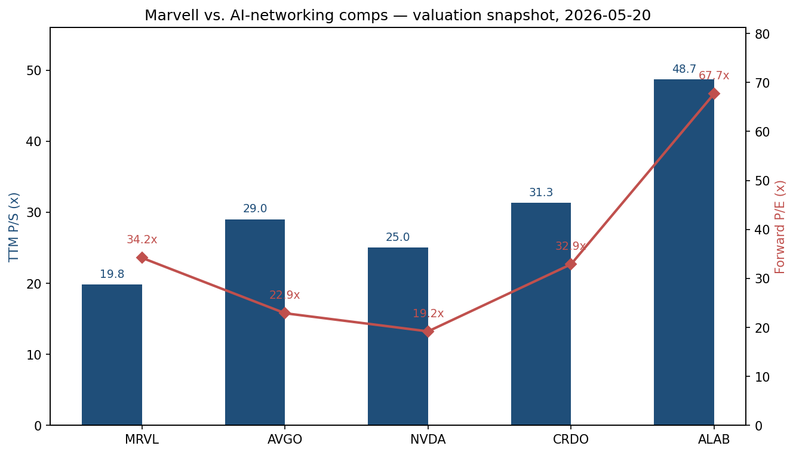
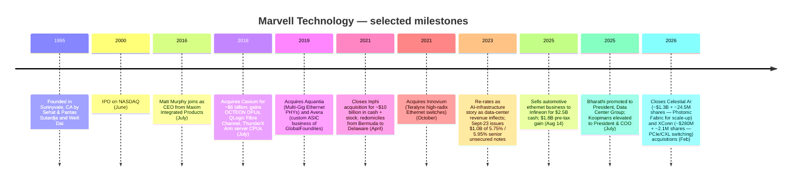
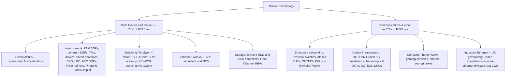
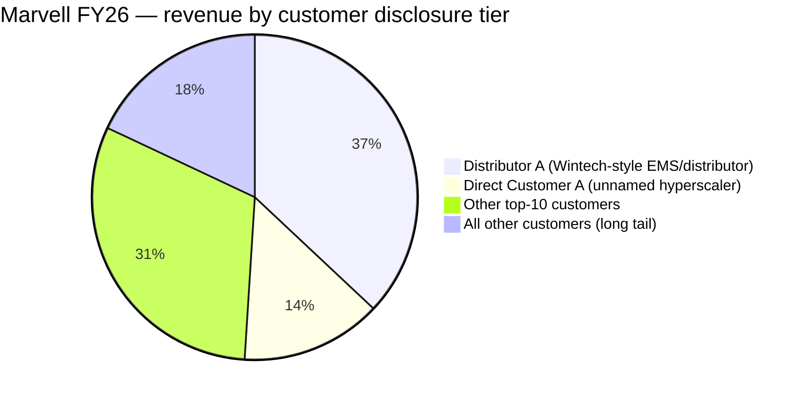
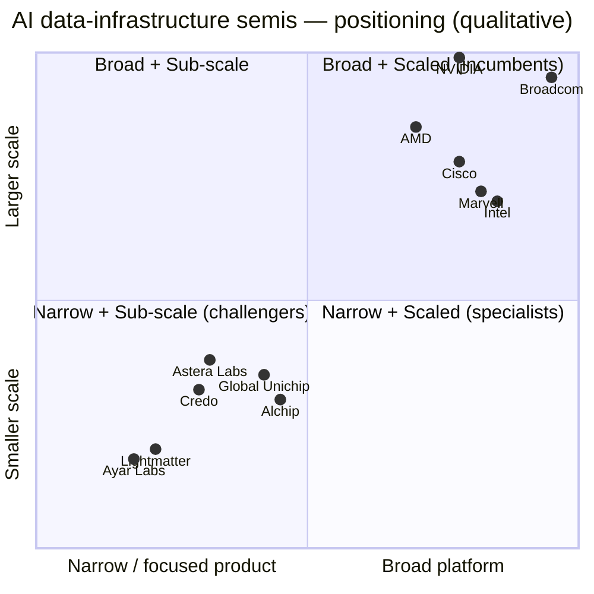

# COMPANY RESEARCH REPORT: Marvell Technology, Inc. (NASDAQ: MRVL)

**Date:** 2026-05-20
**Author:** Internal research
**Fiscal year:** ends Saturday closest to January 31; FY26 = year ended 2026-01-31.

> **Update — FY27 Q1 outlook initiated (2026-03-05):** Management guided Q1-FY27 net revenue to **$2.400 billion +/- 5%** (vs. Q1-FY26 actual of ~$1.895 billion, implying roughly **+27% YoY**), with GAAP gross margin of 51.4–52.4%, non-GAAP gross margin of 58.25–59.25%, GAAP diluted EPS of $0.31 +/- $0.05 and non-GAAP diluted EPS of $0.79 +/- $0.05. The outlook incorporates the closed Celestial AI and XConn acquisitions. CEO Matt Murphy: *"We expect year-over-year revenue growth to accelerate each quarter in fiscal 2027, driven by continued strength in our data center business, with bookings continuing to grow at a record pace."*
> Source: [Q4-FY26 earnings press release, 2026-03-05](https://www.sec.gov/Archives/edgar/data/1835632/000183563226000006/q426_8kx1312026ex-991.htm).

---

## TABLE OF CONTENTS

1. Company Overview
2. Company History
3. Management Team
4. Products & Services
5. Customers & Go-to-Market
6. Industry Overview
7. Competitive Landscape
8. Market Opportunity (TAM)
9. Risk Assessment

References

---

## 1. Company Overview

Marvell Technology, Inc. is a Wilmington, Delaware-incorporated fabless semiconductor company that designs and sells high-performance system-on-chip (SoC) products for data infrastructure — i.e. silicon that sits inside cloud-AI servers, optical transceivers, switches, routers, storage controllers, and the wireless and wireline equipment connecting them. The company self-describes as *"a leading supplier of data infrastructure semiconductor solutions, spanning the data center core to network edge"* and a *"fabless supplier of high-performance semiconductor products with core strengths in developing and scaling complex System-on-a-Chip architectures, integrating analog, mixed-signal and digital signal processing functionality"* ([Marvell FY26 10-K, Item 1](https://www.sec.gov/Archives/edgar/data/1835632/000183563226000011/mrvl-20260131.htm)). Marvell employed **7,480 people** as of 2026-01-31, with 49% in the Americas, 42% in APAC (including India) and 9% in EMEA, and a fiscal-2026 voluntary turnover rate of approximately 7% ([Marvell FY26 10-K, Human Capital](https://www.sec.gov/Archives/edgar/data/1835632/000183563226000011/mrvl-20260131.htm)).

**Business model.** Marvell makes money in three structurally different ways:

1. **Custom application-specific integrated circuits (ASICs)** — silicon designed to a specific hyperscaler's specification using Marvell-owned IP blocks (high-speed SerDes, ARM compute, security engines, advanced packaging, custom HBM interfaces, co-packaged optics). The customer pays non-recurring engineering (NRE) charges for design + ramp, and then production silicon at high volume. This is the fastest-growing revenue line and is where Amazon's Trainium 2 / Trainium 3, Microsoft's MAIA-class accelerators, and other hyperscaler-specific accelerators are widely understood (by sell-side and trade press) to sit; Marvell itself does not name customers in its 10-K.
2. **Standard merchant products** — Inphi-derived PAM4 DSPs, coherent and coherent-lite optical DSPs, TIAs, laser drivers, silicon photonics chipsets and PCIe retimers (interconnects); Prestera and Teralynx Ethernet switches; Alaska Ethernet PHYs; QLogic Fibre Channel HBAs; OCTEON DPUs and Fusion baseband processors; NITROX/LiquidSecurity security processors; Bravera HDD/SSD storage controllers.
3. **Optimized solutions** — half-way between custom and standard: existing IP recombined for a single customer, with shorter cycle times than full custom.

**Size.** Marvell generated **$8,194.6 million in net revenue in FY26**, up **42.1% YoY** from $5,767.3 million in FY25, the third consecutive growth phase since the post-Inphi-acquisition base year of FY22 ([Marvell FY26 10-K, Item 7 MD&A](https://www.sec.gov/Archives/edgar/data/1835632/000183563226000011/mrvl-20260131.htm)). GAAP gross margin expanded 970 basis points YoY to **51.0%** (vs. 41.3% in FY25, which was depressed by $357.9 million of impairment charges); GAAP operating income swung to **$1,322.9 million (16.1% of revenue)** from a $720.3 million GAAP operating loss in FY25. Net income was **$2,670.1 million ($3.07 diluted EPS)** in FY26 vs. an $885.0 million net loss ($1.02 diluted loss/share) in FY25 — but FY26 net income includes a one-time **$1.8 billion pre-tax gain on the August 14, 2025 sale of the automotive ethernet business to Infineon Technologies AG for $2.5 billion in cash** ([Marvell FY26 10-K, Recent Developments](https://www.sec.gov/Archives/edgar/data/1835632/000183563226000011/mrvl-20260131.htm)). Stripping that gain, non-GAAP EPS was **$2.84** for FY26, up 81% YoY ([Q4-FY26 earnings press release, 2026-03-05](https://www.sec.gov/Archives/edgar/data/1835632/000183563226000006/q426_8kx1312026ex-991.htm)).

*Source: GAAP net revenue and GAAP gross margin per [Marvell FY24 10-K (FY23 column)](https://www.sec.gov/Archives/edgar/data/1835632/000183563224000009/mrvl-20240203.htm), [Marvell FY25 10-K](https://www.sec.gov/Archives/edgar/data/1835632/000183563225000057/mrvl-20250201.htm), [Marvell FY26 10-K](https://www.sec.gov/Archives/edgar/data/1835632/000183563226000011/mrvl-20260131.htm).*

**End-market mix.** Beginning in Q4 FY26, Marvell consolidated four previously-reported sub-buckets (enterprise networking, carrier infrastructure, consumer, automotive/industrial) into a single "Communications and other" line; only Data Center remains broken out separately ([Marvell FY26 10-K](https://www.sec.gov/Archives/edgar/data/1835632/000183563226000011/mrvl-20260131.htm)). The mix shift over two fiscal years is dramatic:

- FY24: Data center $2,216.7M (40%), Communications/other $3,291.0M (60%)
- FY25: Data center $4,164.2M (72%), Communications/other $1,603.1M (28%)
- FY26: Data center $6,100.3M (74%, **+46% YoY**), Communications/other $2,094.3M (26%, +31% YoY)

Marvell is no longer a balanced data-infrastructure semi — it is now substantially an AI-data-center semi with a still-meaningful communications attach.

**Geography.** By destination of shipment, China was 36% of FY26 revenue (down from 43% in FY25), Taiwan 20% (up from 10%), the United States 14%, and "Other" 30% ([Marvell FY26 10-K, Note 14 Geographic](https://www.sec.gov/Archives/edgar/data/1835632/000183563226000011/mrvl-20260131.htm)). Management explicitly cautions that destination-of-shipment is *not* end-customer location: "a substantial majority of the product shipments the Company makes to China are for non-China based customers that have factories or contract manufacturing operations located within China and whose products are subsequently shipped out of China." The Taiwan share rise tracks the migration of AI accelerator assembly to TSMC CoWoS and OSAT lines on the island.

**Valuation snapshot (2026-05-20).** Per Yahoo Finance / Nasdaq close data:

- Current price: **$185.70**; 52-week range $58.61–$193.32 ([Yahoo Finance MRVL key statistics, 2026-05-20](https://finance.yahoo.com/quote/MRVL/key-statistics)).
- Market cap: **$162.6 billion** on ~875.6 million shares outstanding.
- **TTM P/E: 60.5×**; **forward P/E: 34.2×**; **TTM P/S: 19.8×**; **P/B: 11.0×**; EV/Sales 19.1×; EV/EBITDA 59.4×.

**Interpreting the multiples.** TTM P/E of 60.5× is materially above the S&P 500 IT-sector median (~33×) but is meaningfully distorted upward by the $1.8 billion Infineon divestiture gain landing in net income — without that one-off, FY26 non-GAAP EPS was $2.84, giving a "core" trailing P/E of ~65× ($185.70 / $2.84). On a forward basis, $5.43 of consensus non-GAAP EPS for FY27 — anchored by the company's $0.79 +/- $0.05 Q1-FY27 guide ([Q4-FY26 earnings press release](https://www.sec.gov/Archives/edgar/data/1835632/000183563226000006/q426_8kx1312026ex-991.htm)) — implies a forward P/E of **34.2×**, slightly below NVDA's 19.2× and AVGO's 22.9× on the same-day basis but cheaper than Astera Labs' (ALAB) 67.7× and Credo's (CRDO) 32.9× ([yfinance for AVGO, NVDA, CRDO, ALAB, 2026-05-20](https://finance.yahoo.com/quote/MRVL/key-statistics)).

P/S at **19.8×** is high in absolute terms but sits below AI-networking purer-plays: AVGO 29.0×, NVDA 25.0×, CRDO 31.3×, ALAB 48.7×. The cause is unambiguous: investors are pricing Marvell as a custom-AI-accelerator + AI-interconnect platform, not as the diversified semi it was as recently as FY23. *Forward earnings have to materialise* to justify these multiples — the 52-week low of $58.61 (less than 9 months ago) reminds the reader that sentiment can swing 200%+ in either direction. We flag this as **multiple-compression risk** in Section 9.

*Source: [Yahoo Finance, 2026-05-20](https://finance.yahoo.com/quote/MRVL/key-statistics) (pulled via yfinance API).*

**Cash and capital structure.** Net cash from operations was **$1.8 billion** in FY26 (vs. $1.7 billion FY25); capital expenditures were $354.1 million; net cash from investing of $2.1 billion was driven primarily by the $2.5 billion Infineon proceeds. Marvell deployed $2.0 billion to share repurchases, repaid $790.6 million of debt, paid $205.1 million of dividends ($0.24/share annualised), and issued $1.2 billion of new borrowings; tax withholdings on net-share equity settlement absorbed another $240.7 million ([Marvell FY26 10-K, Item 7 Liquidity](https://www.sec.gov/Archives/edgar/data/1835632/000183563226000011/mrvl-20260131.htm)). Long-term debt at year-end stood near $4 billion mostly from the post-Inphi term-loan structure plus the 2029 (5.75%) and 2033 (5.95%) senior unsecured notes issued in September 2023 ([Marvell FY24 10-K, Debt](https://www.sec.gov/Archives/edgar/data/1835632/000183563224000009/mrvl-20240203.htm)). The balance sheet is investment-grade and not the binding constraint; the bottleneck is foundry capacity and design-team scaling.

---

## 2. Company History

Marvell was founded in **1995** in Sunnyvale, California by Sehat Sutardja, Weili Dai and Pantas Sutardja, initially as a fabless semiconductor company building read-channel SoCs for hard-disk drives. It went public on NASDAQ in June 2000 and for the next 15 years was best known as a leading HDD-controller supplier (Western Digital, Seagate, Toshiba) with a sizeable but cyclical communications/networking business. The Sutardjas departed in 2016 after a long-running accounting and governance review; Matt Murphy was recruited from Maxim Integrated Products to become CEO that July. The pivot under Murphy from "HDD + commodity comms silicon" to "data infrastructure platform" has defined the modern Marvell.

*Source for milestones: [Marvell FY26 10-K, Recent Developments and Item 15 Exhibits](https://www.sec.gov/Archives/edgar/data/1835632/000183563226000011/mrvl-20260131.htm); [Marvell FY24 10-K, Notes 5 and 8](https://www.sec.gov/Archives/edgar/data/1835632/000183563224000009/mrvl-20240203.htm); [Marvell 2026 DEF 14A](https://www.sec.gov/Archives/edgar/data/1835632/000110465926060253/tm2528551-1_def14a.htm).*

**Strategic pivots and the why behind them.**

**Pivot #1: From HDD-controller incumbent to merger-driven networking & compute platform (2018–2019).** Murphy's first move was the $6 billion all-stock + cash acquisition of Cavium in July 2018, which added the OCTEON DPU line, the QLogic Fibre Channel HBA franchise and the ThunderX Arm-based server CPU effort. The strategic reasoning: HDD volumes were structurally declining (SSDs eating into client and warm storage), and Marvell needed a place to monetise its high-speed analog/SerDes IP at higher growth rates. Cavium also brought CEO-level networking experience that Marvell did not have organically. Aquantia (Multi-Gig Ethernet PHY) followed in mid-2019, plugging a hole in enterprise-campus Ethernet; Avera (the carved-out custom-ASIC business of GlobalFoundries) followed in late 2019 and gave Marvell its first credible aerospace/defense and hyperscaler-adjacent ASIC team — the seed of the modern custom-ASIC franchise.

**Pivot #2: Inphi closes the optical-DSP gap (2021).** The $10 billion Inphi deal that closed April 2021 was, in retrospect, the single most consequential transaction in the company's history. Inphi's PAM4 DSPs were already the dominant merchant DSP inside 400G data-center optical modules (Inphi had >70% PAM4 module share by 2020 per multiple sell-side / industry-research notes from that era). Marvell paid ~5× forward sales for the asset, financed with $4 billion of term loans plus stock. The Inphi DSPs become the platform that today drives Marvell's 800G and 1.6T optical leadership and enabled the company to pull custom-ASIC hyperscale wins through its now-credible high-speed-SerDes story.

**Pivot #3: Divest auto, double down on AI (2025–2026).** The August 2025 sale of the automotive Ethernet portfolio (the highest-multiple growth asset Marvell had outside the AI franchise, but capital-hungry and pre-scale) to Infineon for $2.5 billion was a clear statement: management would rather concentrate engineering and capital on the data-center opportunity than spread it across consumer-cyclical autos. The Celestial AI ($1.3 billion in cash + ~24.5 million shares) and XConn ($280 million + ~2.1 million shares) deals announced and closed in February 2026 are the redeployment: Celestial brings the Photonic Fabric chiplet for scale-up optical interconnect between accelerators within and across racks; XConn brings PCIe / Compute Express Link (CXL) switching silicon and adds engineering depth to the UALink scale-up switch team ([Marvell FY26 10-K, Recent Developments](https://www.sec.gov/Archives/edgar/data/1835632/000183563226000011/mrvl-20260131.htm)).

**Recent developments (last 12 months).**

- Quarterly dividend held at $0.06/share (annualised $0.24); $205.1 million paid in FY26.
- $2.0 billion of share repurchases in FY26 vs. $725 million in FY25, indicating a step-change in capital return as cash flow scaled.
- Sandeep Bharathi promoted to President, Data Center Group (July 2025) — a new role that elevates the AI-data-center P&L to a stand-alone leadership position reporting to the CEO.
- $1.2 billion of new borrowings drawn in FY26, alongside $790.6 million of debt repayment — net new debt of ~$400 million, largely to fund the Celestial / XConn acquisitions.

---

## 3. Management Team

### Matt Murphy — Chairman and Chief Executive Officer

Matthew J. Murphy has served as Marvell's CEO since **July 2016**, as a director since 2016, and as Chairman since **June 2023**; he was also President from 2016 until July 2025 when that title moved to Chris Koopmans ([Marvell 2026 DEF 14A, Directors](https://www.sec.gov/Archives/edgar/data/1835632/000110465926060253/tm2528551-1_def14a.htm)). Before Marvell, Murphy spent **22 years at Maxim Integrated Products** (a designer of analog and mixed-signal ICs), advancing through a sequence of P&L roles: from 2015–2016 he was Executive Vice President of Business Units, Sales and Marketing, with company-wide P&L responsibility for all product development, sales, field applications, marketing and central engineering; from 2011–2015 he was Senior Vice President of the Communications and Automotive Solutions Group, leading the team that developed differentiated solutions for those markets; from 2006–2011 he was Vice President of Worldwide Sales & Marketing during a period when Maxim's sales expanded significantly ([Marvell 2026 DEF 14A, Director nominee biography](https://www.sec.gov/Archives/edgar/data/1835632/000110465926060253/tm2528551-1_def14a.htm)). He earned a Bachelor of Arts from Franklin & Marshall College and is a graduate of the Stanford Executive Program. He previously served on the eBay Inc. board of directors.

Murphy is the architect of the Marvell-as-data-infrastructure-platform strategy and has executed three of the most significant deals in fabless-semi M&A history (Cavium 2018, Inphi 2021, Innovium 2021) plus the recent Celestial / XConn additions. His total compensation in FY26 was **$25,064,348**, producing a CEO-to-median-employee pay ratio of approximately 158:1 ([Marvell 2026 DEF 14A, CEO Pay Ratio](https://www.sec.gov/Archives/edgar/data/1835632/000110465926060253/tm2528551-1_def14a.htm)). His severance agreement was extended through April 15, 2028 in FY24. He elected to defer settlement of 144,662 TSR RSUs that vested April 2025 (84% of target). Murphy is not a founder and does not own a controlling stake; like nearly all named executives the bulk of his compensation is equity-linked.

The track record verdict on Murphy: among the strongest in fabless semis since 2016. He inherited a $2.3 billion business with a governance overhang and converted it into an $8.2 billion data-infrastructure platform with a credible custom-ASIC franchise — through three acquisitions plus deliberate divestiture of legacy / sub-scale assets (legacy WiFi connectivity, switch ASIC business sold to NXP, and most recently automotive Ethernet to Infineon for $2.5 billion). His weakness is the structural one of any acquisition-heavy CEO: gross margin has compressed since the Inphi acquisition (FY23 GAAP GM was 50.5%, FY25 41.3%, recovering to 51.0% in FY26 only as scale absorbed the integration costs) ([Marvell FY24 10-K, Item 7 MD&A](https://www.sec.gov/Archives/edgar/data/1835632/000183563224000009/mrvl-20240203.htm)).

### Willem Meintjes — Chief Financial Officer

Willem Meintjes has been **CFO since January 2023**. Before being elevated, he served as Marvell's Chief Accounting Officer and Treasurer from June 2018 to January 2023, and as Senior Vice President of Finance from June 2016. Prior to Marvell he was Vice President and Corporate Controller at Newport Corporation (2015–June 2016) and Vice President and Controller at International Rectifier (2013–2015). He holds a Bachelor of Commerce in Accounting and a Bachelor of Commerce (Honours) in Accounting from the University of Johannesburg ([Marvell 2026 DEF 14A, Executive Officers](https://www.sec.gov/Archives/edgar/data/1835632/000110465926060253/tm2528551-1_def14a.htm)). He has not previously been CFO of a public company larger than Marvell, which is a flag worth noting — but he has now navigated the company through the post-Inphi integration, two large restructurings (FY24 $131M, FY25 $354M of restructuring charges), the FY26 Infineon divestiture and a doubling of revenue. Stock-based compensation has been kept roughly flat in absolute dollars ($597.4M FY25 to $590.8M FY26) even as revenue grew 42%, materially improving the SBC-to-revenue ratio ([Marvell FY26 10-K, MD&A](https://www.sec.gov/Archives/edgar/data/1835632/000183563226000011/mrvl-20260131.htm)).

### Sandeep Bharathi — President, Data Center Group

Bharathi has held the **President, Data Center Group** role since **July 2025** — a new title created to elevate the AI-data-center P&L. He served previously as **Chief Development Officer** from June 2022 to July 2025, EVP of Central Engineering System-On-Chip Group from April 2021 to June 2022, and SVP of Central Engineering from February 2019 to April 2021. Prior to Marvell he was Vice President of Engineering at Intel, where he led FPGA product and technology development (the legacy Altera FPGA business after Intel's 2015 acquisition); he previously held senior engineering leadership roles at Xilinx and AMD. He earned a B.E. in Electronics Engineering from Bangalore University, an M.S. in Electrical Engineering from the New Jersey Institute of Technology, and is a graduate of the Stanford Executive Program ([Marvell 2026 DEF 14A, Executive Officers](https://www.sec.gov/Archives/edgar/data/1835632/000110465926060253/tm2528551-1_def14a.htm)). Bharathi is the executive most directly responsible for the custom-ASIC franchise that is the centre of the bull case.

### Chris Koopmans — President and Chief Operating Officer

Koopmans has been **President since July 2025** and **COO since February 2025** (re-titled from Chief Operations Officer, a role he had held since March 2021). He joined Marvell in 2016 alongside Murphy and led Global Sales and Marketing initially, then the Networking and Connectivity Business Group (2016–2018), then EVP of Business Operations (2018–2019) and EVP of Marketing and Business Operations (2019–2021). He co-founded Bytemobile (acquired by Citrix in 2012). He sits on the Qorvo board. He holds a B.S. in Computer Engineering from the University of Illinois and was a Ph.D. student there under a National Science Foundation Graduate Research Fellowship ([Marvell 2026 DEF 14A, Executive Officers](https://www.sec.gov/Archives/edgar/data/1835632/000110465926060253/tm2528551-1_def14a.htm)).

### Governance

The board has **9 directors** (8 standing for re-election in 2026); independence is high — only Murphy is a management director. The lead independent director is **Richard S. Hill** (former Novellus CEO) per the 2026 DEF 14A, although **Brad Buss** (former SolarCity, Cypress Semiconductor CFO; ex-Tesla and Cavium director) has served on the Marvell board since July 2018 and as Lead Independent Director since June 2025 ([Marvell 2026 DEF 14A](https://www.sec.gov/Archives/edgar/data/1835632/000110465926060253/tm2528551-1_def14a.htm)). Other notable directors include Rajiv Ramaswami (Nutanix CEO; former Broadcom EVP and IEEE Fellow, 36 patents in optical networking; ideal industry depth for Marvell's interconnect strategy), Richard P. Wallace (KLA CEO since 2006), and Daniel R. Durn (Adobe CFO and former Applied Materials, NXP and Freescale CFO). All directors and executive officers as a group beneficially own 1,046,798 shares — less than 1% — out of 847,287,680 shares outstanding ([Marvell 2026 DEF 14A, Beneficial Ownership](https://www.sec.gov/Archives/edgar/data/1835632/000110465926060253/tm2528551-1_def14a.htm)). Institutional holdings are dominated by Vanguard (~79.6 million shares, ~9.4% as of 2025-09-30 per Schedule 13G/A filed 2025-10-31) and other large index / active managers ([Vanguard 13G/A, 2025-10-31](https://www.sec.gov/cgi-bin/browse-edgar?action=getcompany&CIK=0001835632&type=SC+13G&dateb=&owner=include&count=40)).

**Track record synthesis.** This is a professional, deal-experienced management team with the CEO's longevity (10 years), a CFO who has been at the company for nine, and operating leaders who have done the Inphi, Cavium and Innovium integrations themselves. The notable gap is that none of the named executives is a first-time public-company CEO/CFO at this scale (Meintjes had never been CFO of an $8B-revenue public company before this role), and the customer-concentration profile means a small group of hyperscaler customer relationships (Murphy himself, Bharathi for technical, Koopmans for commercial) carry outsize weight. Insider ownership below 1% is in line with professionally-managed fabless semis but means alignment is purely through PSU / RSU mechanics, not founder capital.

---

## 4. Products & Services

Marvell organises its silicon into **eight product families** addressing **two reported end markets** (Data Center and Communications & other). Quoted product descriptions are from the 10-K Item 1 "Our Markets and Products" section ([Marvell FY26 10-K](https://www.sec.gov/Archives/edgar/data/1835632/000183563226000011/mrvl-20260131.htm)).

*Source: [Marvell FY26 10-K, Item 1 Markets and Products](https://www.sec.gov/Archives/edgar/data/1835632/000183563226000011/mrvl-20260131.htm).*

### 4.1 Custom ASICs (flagship; primary AI accelerator franchise)

**What they do.** Custom semiconductor solutions tailored to a specific customer's spec for AI, data center compute, networking, carrier, storage and aerospace/defense applications. Marvell's reusable IP suite includes ultra-high-speed SerDes (the 224G generation in production now, 448G in development), ARM compute cores, security blocks, storage controllers, silicon photonics, and advanced packaging including die-to-die interconnects, chiplets, co-packaged optics (CPO) and custom high-bandwidth memory (HBM). The company has shipped 5nm designs, is moving production through 3nm, and is in development on a 2nm platform ([Marvell FY26 10-K](https://www.sec.gov/Archives/edgar/data/1835632/000183563226000011/mrvl-20260131.htm)).

**Customer.** Hyperscaler cloud providers wanting accelerators that are not merchant GPUs. Marvell does not name the customers in its 10-K. Multiple sell-side notes through 2025/2026 widely associate Marvell with Amazon's Trainium 2 / Trainium 3 (the primary AWS in-house training accelerator family), Microsoft's MAIA-class accelerator program, and additional hyperscaler engagements; the company itself only confirms publicly that it has multiple "lead customers" generating production silicon. Sell-side reporting on which hyperscaler is which Marvell project is consistent but not company-confirmed; readers should treat these mappings as informed third-party reporting, not 10-K-disclosed facts.

**Pricing / deal size.** NRE (non-recurring engineering) charges plus per-unit silicon revenue. Per the FY25 10-K risk language: *"for certain products we use an ASIC model to offer end-to-end solutions for intellectual property, design team, fab and packaging to deliver a tested, yielded product to customers. This business model tends to have a lower gross margin. In addition, the costs related to this type of business model typically include significant NRE costs that customers pay based on the completion of milestones"* ([Marvell FY25 10-K, Risk Factors](https://www.sec.gov/Archives/edgar/data/1835632/000183563225000057/mrvl-20250201.htm)). So custom ASIC is structurally lower gross margin than merchant DSPs but represents recurring per-unit revenue over a multi-year accelerator lifecycle and is a near-perfect lock-in once the silicon is designed in.

**Competitive advantage: YES — moats are scale, IP and switching cost.** Marvell, Broadcom and to a smaller extent Alchip Technologies and Global Unichip (TSMC's captive ASIC house) are the four credible merchant custom-ASIC partners for AI accelerators. Broadcom is the larger and prior incumbent (Google TPU heritage). Marvell's moat is its full-stack high-speed SerDes IP (the 224G SerDes generation, in particular, is in volume at Marvell ahead of most competitors and is the gating constraint for next-generation accelerator I/O), plus the optical and CPO integration that Broadcom does not have to the same degree, plus a deep installed engineering team for hyperscaler customisation post the Cavium / Avera / Innovium acquisitions. **Closest competitor product: Broadcom's custom ASIC family used in Google TPU v5p/v6, Meta MTIA v2 (reported), and the OpenAI-Broadcom announced project.** One-line compare: AVGO is ahead in unit volumes (TPU has shipped at scale longer); MRVL is at parity-or-ahead on 224G SerDes maturity and optical-electrical integration; **lifetime competitive position will be set by who wins the next sockets at AWS, MSFT and Meta as Trainium / MAIA / MTIA scale.**

### 4.2 Interconnects (Inphi-derived; merchant flagship)

**What they do.** A complete portfolio of high-speed electrical and optical interconnect semiconductors: PAM (pulse amplitude modulation) DSPs, coherent and coherent-lite DSPs, laser drivers, trans-impedance amplifiers (TIAs), silicon photonics, co-packaged optics (CPO) chipsets, linear pluggable optics (LPO) chipsets, data-center interconnect (DCI) modules, active-electrical-cable (AEC) DSPs, PCIe retimers, and — newly added with Celestial — the **Photonic Fabric** chiplet for scale-out optical interconnect ([Marvell FY26 10-K, Item 1](https://www.sec.gov/Archives/edgar/data/1835632/000183563226000011/mrvl-20260131.htm)).

**Customer.** Optical module makers (Innolight, Coherent, Eoptolink, AOI, Hisense Broadband, AAOI) who build pluggables for hyperscaler data-center networks; switch ODMs; and increasingly hyperscalers directly for CPO and LPO designs.

**Competitive advantage: YES — Inphi-derived PAM4 DSP is the merchant standard for 400G/800G data-center optics.** The Inphi PAM4 DSP went into the majority of merchant 400G modules from the 2020 design-in wave onward; the 800G generation extends that share, and Marvell's 1.6T DSP is sampling. **Closest competitor product: Broadcom's PAM4 DSP family (Trident-DSP and successors) and Credo Technology's optical and AEC DSPs.** One-line compare: MRVL is ahead in optical DSP unit share and module ecosystem breadth; AVGO has gained ground on PAM4 in 2024/2025 and is the choice in some hyperscaler-internal designs; **Credo (CRDO) is the most aggressive challenger and has won material share in AEC and a growing share in optical** — but is still small relative to Marvell. Astera Labs (ALAB) is not a direct PAM4 competitor — it competes more directly with the PCIe retimer line below.

### 4.3 Ethernet Solutions

**Components.** Prestera and Teralynx Ethernet switches (12 Gbps to 51.2 Tbps); Alaska Ethernet PHYs (10 Mbps to 1.6 Tbps including Multi-Gig); Ethernet controllers and network adapters ([Marvell FY26 10-K](https://www.sec.gov/Archives/edgar/data/1835632/000183563226000011/mrvl-20260131.htm)). Teralynx (originally Innovium IP) addresses cloud data center switching; Prestera serves campus/SMB/carrier. The Alaska PHY franchise (originally Aquantia for Multi-Gig) is the merchant standard for 2.5G/5G/10G Ethernet in PCs, workstations, WAPs and small switches.

**Competitive advantage: PARTIAL.** Marvell is #2 or #3 in merchant cloud-data-center Ethernet switching behind Broadcom's Tomahawk family. **Closest competitor product: Broadcom Tomahawk 5 (51.2 Tbps); Cisco Silicon One Q200 family; NVIDIA Spectrum-X.** One-line compare: MRVL Teralynx 10 is in the 51.2 Tbps generation and competitive on bandwidth and power, but Broadcom retains the larger merchant share and a more entrenched ecosystem; NVIDIA Spectrum-X is gaining share inside NVIDIA-GPU-anchored AI clusters.

### 4.4 Scale-Up Switches (UALink/ESUN)

Marvell is developing UALink (Ultra Accelerator Link) and ESUN (Ethernet for Scale-Up Networking) switch fabrics leveraging the Teralynx switch architecture and 224G SerDes. Scale-up networking is the high-bandwidth, low-latency interconnect *inside* a multi-accelerator rack or pod — the slot that NVIDIA NVLink Switch occupies today inside DGX SuperPODs. UALink is the multi-vendor consortium response (AMD, Broadcom, Google, Intel, Meta, Microsoft, Marvell members) ([UALink Consortium press materials, 2024-10](https://ualinkconsortium.org/)). Competitive advantage: TBD — not yet revenue-producing; very strategic. **Closest competitor product: NVIDIA NVLink Switch chip (NVL72 generation).** This is the single largest TAM-opening opportunity for Marvell over 2027–2030 — but execution is unproven.

### 4.5 PCIe and CXL Switches (XConn-derived)

XConn closed February 2026, bringing high-radix PCIe (Gen 5/6) and CXL switches plus a multi-level switching fabric architecture. PCIe switching is exploding in AI servers (host-to-accelerator, accelerator-to-accelerator); CXL enables memory pooling and disaggregation. **Closest competitor product: Astera Labs Aries (PCIe retimers) and Leo (CXL Memory Controllers); Microchip Switchtec; Broadcom PEX series.** One-line compare: ALAB is the high-flier in this category with $48.7× P/S; MRVL is the new entrant via XConn, with the bigger customer relationships but lagging product maturity. The combination of Marvell's PAM4 retimers (already a category leader on the optical side) plus XConn's switches makes for a credible threat to ALAB's incumbency over 2027–2028 if integration goes well.

### 4.6 Fibre Channel Products (QLogic)

QLogic Fibre Channel HBAs (host bus adapters) and controllers for server and storage connectivity in enterprise data centers. Mature franchise; main competitor is Broadcom (Emulex). Slow-growth cash cow; gross-margin accretive.

**Competitive advantage: YES (duopoly).** Closest competitor: Broadcom Emulex. One-line compare: roughly at parity; share has been stable for years.

### 4.7 Processors (OCTEON DPU + Fusion baseband + NITROX / LiquidSecurity)

**OCTEON DPUs** — Layer 4-7 processing for carrier, data-center and enterprise routers, switches, security appliances, content-aware switches, NFV / SDN infrastructure. **OCTEON Fusion** — 5G baseband processors for enterprise small cells and outdoor macrocell radio units; supports Massive MIMO. **NITROX / LiquidSecurity** — security/encryption processors, including the LiquidSecurity 2 HSM (hardware security module) appliance for cloud / enterprise private-key management. **LiquidIO** — programmable server NICs for cloud offload ([Marvell FY26 10-K, Item 1](https://www.sec.gov/Archives/edgar/data/1835632/000183563226000011/mrvl-20260131.htm)).

**Competitive advantage: PARTIAL.** OCTEON is the merchant-leading DPU outside the Mellanox/NVIDIA BlueField ecosystem, but BlueField has won most of the AI-data-center NIC slots. Fusion baseband competes with Qualcomm and Intel's wireless silicon in 5G open RAN — Fusion has been the merchant choice for Nokia and Samsung small cells. NITROX HSM is the merchant standard for cloud HSM, with a near-monopoly in AWS / Azure / Google managed HSM services.

### 4.8 Storage Controllers (Bravera)

**Bravera HDD controllers** integrate Marvell's industry-leading read-channel technology — Marvell's original franchise — and ship into every current HDD OEM (Seagate, Western Digital, Toshiba). **Bravera SSD controllers** for data-center, enterprise and client (SAS, SATA, PCIe, NVMe, NVMe-oF). Mature, lower-growth, gross-margin accretive ([Marvell FY26 10-K, Item 1](https://www.sec.gov/Archives/edgar/data/1835632/000183563226000011/mrvl-20260131.htm)).

**Competitive advantage: YES (near-monopoly on HDD; competitive on SSD).** Closest competitor: Broadcom on HDD (very limited), Phison and Silicon Motion on SSD controllers (mainly client). One-line compare: HDD controller is structural duopoly with Marvell-as-leader; SSD controller is more contested.

### 4.9 Recent product launches and divestitures (last 12 months)

- **August 2025**: Sold automotive Ethernet business to Infineon for $2.5 billion. Automotive-specific PHYs (Brightlane Multi-Gig Ethernet for in-vehicle networking, ADAS, autonomous-vehicle networking) are no longer Marvell products.
- **February 2026**: Closed Celestial AI (Photonic Fabric chiplet for scale-out optical interconnect) and XConn Technologies (PCIe/CXL switching silicon and UALink scale-up engineering team).
- **Throughout FY26**: Continued 800G PAM4 DSP volume ramp; 1.6T PAM4 DSP sampling; 224G SerDes in production in custom ASICs; CPO and LPO chipsets in early customer evaluation.
- **Flagship 1.6T DSP launches and 51.2 Tbps Teralynx 10 switch** are the merchant pillars supporting the FY26 data-center ramp.

**1–3 flagship products driving the business.**

1. **Custom ASIC platform** — primary driver of FY26 data center revenue acceleration and the dominant source of FY27+ growth in management's narrative.
2. **PAM4 / Coherent optical DSPs** (Inphi-derived) — the merchant cash machine that funded the ASIC ramp.
3. **Teralynx Ethernet switches + UALink/PCIe-CXL switch platform** — the strategic third leg, much smaller today but the largest single TAM-opening opportunity over 2027–2030.

---

## 5. Customers & Go-to-Market

**Segments.** Marvell sells almost entirely B2B to a small number of large customers: hyperscaler cloud providers (Amazon Web Services, Microsoft, Google, Meta), networking OEMs (Cisco, Arista, Nokia, Ericsson, Samsung Networks, Juniper, HPE-Aruba), storage OEMs (Seagate, Western Digital, Toshiba, NetApp, Dell EMC, IBM), optical module makers (Innolight, Coherent, Eoptolink, AOI, Hisense Broadband, AAOI), and government / defense system integrators via the Avera-heritage custom-ASIC business.

**Customer concentration — high and rising.** In FY26, **net revenue from the 10 largest customers, inclusive of distributors and direct customers, represented 82% of total net revenue** ([Marvell FY26 10-K, Risk Factors](https://www.sec.gov/Archives/edgar/data/1835632/000183563226000011/mrvl-20260131.htm)). The 10-K Item 1 disclosure of customers/distributors representing ≥10% of revenue:

| | FY26 | FY25 | FY24 |
|---|---|---|---|
| Direct Customer: Customer A | **14%** | 13% | <10% |
| Distributor: Distributor A | **37%** | 34% | 24% |

*Source: [Marvell FY26 10-K, Item 1 Customers](https://www.sec.gov/Archives/edgar/data/1835632/000183563226000011/mrvl-20260131.htm).*

Distributor A is overwhelmingly likely to be Wintech (Marvell's largest distributor based on prior years' disclosures and on Wintech's own public filings) — the actual end-customer composition behind those distributor shipments is far more diversified than the 37% figure suggests. The Direct Customer A is unnamed; sell-side reporting universally treats this as a hyperscaler. By customer type, FY26 split was 57% direct customers ($4,630.4M) and 43% distributors / EMS ([Marvell FY26 10-K, Note 14](https://www.sec.gov/Archives/edgar/data/1835632/000183563226000011/mrvl-20260131.htm)).

*Source: [Marvell FY26 10-K, Item 1 Customers](https://www.sec.gov/Archives/edgar/data/1835632/000183563226000011/mrvl-20260131.htm); pie share for "Other top-10" derived as 82% (top-10) minus 14% (Cust A) minus 37% (Dist A) = 31%; remaining 18% is the long tail.*

**Severity assessment.** Top-1 customer (one entity at 37%) is **>20%** — material; top-5 well above 50% — also material. We flag this as a high-severity company-specific risk in Section 9. Mitigants: (a) the distributor's underlying customer base is more diversified than the figure suggests; (b) custom-ASIC engagements typically have multi-year design lifecycles, making the relationship sticky; (c) net revenue is contractually structured via a mix of master purchase agreements and POs.

**Channel structure.** Direct sales to large OEMs and hyperscalers; distributors and manufacturers' representatives for North America; third-party logistics with warehouses near customer factories. Marvell does not own any manufacturing facilities — wafers are fabricated by TSMC (primarily), Samsung Foundry and GlobalFoundries; assembly/test/packaging is performed by ASE Technology, Amkor and other OSAT partners in China, Malaysia, Singapore, Taiwan and Canada ([Marvell FY26 10-K, Risk Factors](https://www.sec.gov/Archives/edgar/data/1835632/000183563226000011/mrvl-20260131.htm)). The TSMC dependency at advanced nodes (5nm, 3nm, 2nm) is a structural supplier concentration that we also pull into Section 9.

**Sales cycle.** Custom-ASIC engagements have 18–36 month design windows from spec to first silicon, then a multi-quarter ramp before peak production. Standard merchant products (PAM DSPs, switches) have 6–18 month design-in cycles plus 12–24 month production ramps. The implication: Marvell's revenue at any point in time was largely "locked in" 1–3 years prior by design wins. CEO Matt Murphy disclosed on the Q4-FY26 call that *"design wins in fiscal 2026 hit an all-time record, which we expect will continue to fuel our future growth"* ([Q4-FY26 earnings press release, 2026-03-05](https://www.sec.gov/Archives/edgar/data/1835632/000183563226000006/q426_8kx1312026ex-991.htm)).

**Key partnerships.** TSMC (foundry partner — node availability is the operational chokepoint); SK Hynix and Micron (HBM partners for custom-ASIC integration); ASE Technology and Amkor (advanced packaging including CoWoS substrates and chiplet integration); Innolight / Coherent / Eoptolink / AAOI (optical module makers consuming PAM4 DSPs); UALink Consortium (Marvell is a founding member alongside AMD, Apple, Broadcom, Google, Intel, Meta, Microsoft).

---

## 6. Industry Overview

**Industry definition.** Marvell sits at the intersection of three NAICS-334413 (semiconductor) sub-segments: (a) AI / data-center compute accelerators (custom and merchant), (b) data-center networking and interconnect silicon, and (c) wireline / wireless carrier-infrastructure silicon. The economic boundary between these has eroded since 2022 as AI-cluster scale-up has pulled previously distinct categories (compute, switching, optical) into a single integrated infrastructure platform.

**Market size.** Per IDC's January 2026 *Worldwide Semiconductor Forecast*, total semiconductor industry revenue is projected at approximately $725 billion in 2026 (up from $626 billion in 2024), with the data-center sub-segment alone exceeding $230 billion ([IDC press release, 2026-01-15](https://www.idc.com/getdoc.jsp?containerId=prUS52988226)). Within data center, AI accelerator silicon (GPUs + custom ASICs + AI-specific networking) is the fastest-growing piece, projected at ~$170 billion in 2026 per multiple sell-side aggregations of NVIDIA, AMD, Broadcom, Marvell and the hyperscalers' captive consumption — though precise sizing remains contested because the boundary between "AI semis" and "data-center semis" is fluid.

**Growth.** Data-center semiconductor revenue is projected to grow at a roughly 22–28% CAGR through 2028 in the most recent Gartner and IDC scenarios ([Gartner Worldwide AI Semiconductor Forecast, 2025-Q4](https://www.gartner.com/en/newsroom/press-releases/2025-11-18-gartner-forecasts-worldwide-ai-semiconductor-revenue-to-grow); [IDC, 2026-01-15](https://www.idc.com/getdoc.jsp?containerId=prUS52988226)). Within that, custom-ASIC accelerator revenue (where Marvell competes head-to-head with Broadcom) is widely projected to grow faster — 30–45% CAGR — because hyperscalers are deliberately diversifying away from NVIDIA-only sourcing and because each new accelerator generation roughly doubles the silicon content per chip. PAM4 / coherent optical DSP TAM is projected to roughly double from ~$3 billion in 2024 to ~$6+ billion in 2027 as 800G modules scale and 1.6T begins to ramp ([LightCounting Optical Module Forecast, 2026-Q1](https://www.lightcounting.com/news/2026-Q1-Optical-Communications-Market-Report)).

**Key trends.**

1. **Hyperscaler vertical integration** — AWS, Microsoft, Google and Meta all now run captive-accelerator programs (Trainium, MAIA, TPU, MTIA respectively). They need merchant ASIC partners because building a 200-engineer fabless capability in-house is uneconomic. This is the structural tailwind behind Marvell's custom-ASIC business but also the structural threat — if a hyperscaler decides to internalise a project (Google did this for TPU v1, then partnered with Broadcom from v3 onward), the revenue can shift overnight.
2. **224G SerDes and beyond** — the per-lane data rate roadmap (112G PAM4 in current generation, 224G in 2025-2027 generation, 448G being developed) is the gating constraint for next-generation accelerators and switches. Marvell has been ahead of Broadcom on 224G in production silicon based on customer commentary; this is the technical foundation of MRVL's custom-ASIC win rate over 2024–2026.
3. **CPO / LPO / Photonic Fabric** — optical I/O is moving from pluggable transceivers (today) to co-packaged optics (limited deployment 2025-2026) to silicon photonic interconnects fully integrated into the accelerator package (Celestial Photonic Fabric vision). This is a 5+ year transition; Marvell's Celestial acquisition positions it as the most credible merchant supplier in the early scale-up optical-interconnect category.
4. **Scale-up networking standardisation (UALink, ESUN)** — the industry response to NVIDIA NVLink. UALink 1.0 spec released Q4 2024; first silicon expected 2026–2027.
5. **5G carrier capex normalisation, slow 6G ramp** — Marvell's OCTEON Fusion baseband is exposed to global carrier capex which has been below trend since 2024.

**Regulatory environment.** Major exposures: (a) US export controls on advanced compute and EDA software to China (October 2022 / October 2023 / December 2024 BIS rules) — limit Marvell's ability to sell certain advanced-node products into named Chinese customers; (b) China's reciprocal export controls on gallium, germanium and rare-earth processing (since 2023) — affect substrate and OSAT supply chains; (c) the National Industrial Security Program FOCI mitigation agreement Marvell entered in connection with the Avera acquisition — still partially in force; (d) standard tariff exposures on Taiwan and China imports into the US, which fluctuated through 2025.

**Industry structure.** Highly concentrated at the top — NVIDIA dominates merchant AI GPU; Broadcom + Marvell dominate merchant custom-ASIC and high-speed switching; Astera + Marvell + Broadcom + Microchip dominate PCIe retimers/switches; Credo + Marvell + Broadcom dominate merchant optical DSP. Foundry is even more concentrated — TSMC has effective monopoly on leading-edge AI silicon. Customer side is also concentrated — five hyperscalers (AWS, Microsoft, Google, Meta, Oracle) account for the majority of AI infrastructure capex. Industry barriers to entry are very high: high-speed SerDes IP takes 5–8 years to build at world-class level; foundry advanced-node allocation is rationed by TSMC; hyperscaler trust is earned over multiple successful design generations.

---

## 7. Competitive Landscape

Marvell's 10-K names 25 direct competitors. The set spans general-purpose CPU/FPGA majors, dedicated optical-DSP / interconnect rivals, switch / merchant networking peers, and emerging start-ups: *"Advanced Micro Devices, Inc. ('AMD'), Alchip Technologies ('Alchip'), Astera Labs, Inc., Ayar Labs, Inc. ('Ayar Labs'), Broadcom Inc. ('Broadcom'), Cisco Systems, Inc. ('Cisco'), Credo Technology Group Holding Ltd, Intel Corporation, Global Unichip Corporation ('GUC'), Lightmatter, Inc. ('Lightmatter'), MACOM Technology Solutions Holdings, Inc., MediaTek Inc., Microchip Technology Inc., Montage Technology, Nvidia Corporation, NXP Semiconductors N.V., Phison Electronics Corporation, Qualcomm Incorporated ('Qualcomm'), Rambus, Inc., Ranovus Inc. ('Ranovus'), Realtek Semiconductor Corporation, Semtech Corporation, Silicon Motion Technology Corporation, and Socionext Inc."* ([Marvell FY26 10-K, Item 1 Competition](https://www.sec.gov/Archives/edgar/data/1835632/000183563226000011/mrvl-20260131.htm)).

The most material competitive comparisons:

*Source: Internal qualitative scoring based on [Marvell FY26 10-K, Competition](https://www.sec.gov/Archives/edgar/data/1835632/000183563226000011/mrvl-20260131.htm) plus peer 10-K / 20-F filings (revenue scale).*

**1. Broadcom (AVGO) — the dominant competitor.** AVGO is roughly **5–6× Marvell's data-center semiconductor revenue base** by FY26 estimates, with the Google TPU custom-ASIC win, the Tomahawk switching franchise, and the Jericho/Ramon routing portfolio. Stock trades at ~29× P/S vs MRVL's 19.8× on the same date ([Yahoo Finance AVGO, 2026-05-20](https://finance.yahoo.com/quote/AVGO/key-statistics)). Direct overlap: custom ASIC, PAM4 DSP, Ethernet switch, PCIe switching, fibre channel HBA. AVGO is ahead on TPU-class volumes and Tomahawk switch share; Marvell is ahead-or-at-parity on 224G SerDes generation, optical DSP volume share, and CPO integration. The trade-off for hyperscalers picking MRVL vs. AVGO is increasingly: AVGO has higher gross-margin discipline and bigger scale, while MRVL has more nimble custom-engagement structures and a fuller optical-electrical-photonic stack.

**2. NVIDIA (NVDA) — Mellanox networking franchise.** NVIDIA's networking revenue (Mellanox-heritage: Spectrum-X Ethernet, ConnectX/BlueField NICs/DPUs, NVLink Switch silicon, Quantum InfiniBand switching) is the most aggressively-priced competitor in AI-cluster networking, especially inside NVIDIA-GPU-anchored clusters where Spectrum-X and NVLink are the path of least resistance. Marvell's UALink/ESUN initiative is in part a response to NVLink's growing share. NVDA trades at ~25× P/S, similar to AVGO ([Yahoo Finance NVDA, 2026-05-20](https://finance.yahoo.com/quote/NVDA/key-statistics)).

**3. Credo Technology (CRDO) — the lean optical-DSP & AEC challenger.** Credo is the merchant alternative for PAM4 optical DSPs (smaller share than Marvell-Inphi but growing fast) and is the AEC (active electrical cable) DSP leader. P/S 31.3× makes CRDO the priciest of the pure-play challengers; FY26 revenue was on the order of $1.0–$1.3 billion (vs Marvell at $8.2B). Credo has been winning AEC and PAM4 share at certain hyperscalers since 2023 ([Yahoo Finance CRDO, 2026-05-20](https://finance.yahoo.com/quote/CRDO/key-statistics)).

**4. Astera Labs (ALAB) — the PCIe/CXL retimer pure-play.** ALAB is the dominant merchant supplier of PCIe Gen 5/6 retimers used in AI servers between host CPUs, accelerators and memory pools. Trades at the highest valuation in the peer set — P/S 48.7×, forward P/E 67.7× — reflecting a small revenue base and very high projected growth. Marvell's XConn acquisition makes MRVL the direct competitive threat going forward; ALAB is also extending into CXL fabric and active cabling, into Credo's and Marvell's lanes ([Yahoo Finance ALAB, 2026-05-20](https://finance.yahoo.com/quote/ALAB/key-statistics)).

**5. Alchip Technologies and Global Unichip Corporation (GUC).** Taiwan-based ASIC design service partners — Alchip is the merchant ASIC partner for several mainland-Chinese hyperscaler-accelerator projects and certain non-Chinese hyperscaler engagements; GUC is TSMC's captive ASIC house. Both are smaller and lack Marvell's IP breadth, but they win on price and on customer geography. Alchip's recent revenue inflection (Taiwanese-listed; 2025 revenue grew ~50%) shows the category appetite.

**6. AMD, Intel, Cisco.** AMD competes mainly through the MI300/MI325/MI350 GPU family — adjacent to, not directly substituting for, Marvell silicon. Intel competes in switching (formerly Barefoot Tofino, now post-sale to NVIDIA) and FPGAs (now-spun-out Altera, Bharathi's prior employer); both are diminishing competitive threats. Cisco is the big systems competitor for switches — its Silicon One Q200 is a Tomahawk class competitor — but Cisco is also a Marvell customer for optical DSPs and PHYs in some lines.

**7. Lightmatter, Ayar Labs.** Early-stage silicon-photonics start-ups working on optical compute and chiplet-attached optical I/O. Lightmatter is the most advanced in publicised funding ($850M+ raised) and the most directly competitive with Celestial Photonic Fabric — both are pursuing scale-up optical interconnect between accelerators. Ayar Labs has Intel and HPE as major backers and is in early customer evaluation with multiple hyperscalers. Neither is yet at production volume.

**Competitive advantages summary.** Marvell's durable moats are (a) ultra-high-speed SerDes IP breadth and maturity, (b) full-stack interconnect coverage (PAM4 DSP + coherent DSP + silicon photonics + CPO + AEC + PCIe retimer/switch + optical fabric chiplet), (c) deep hyperscaler customer relationships built since 2018, and (d) custom-ASIC engineering scale post the Cavium + Avera + Innovium + Celestial + XConn aggregation.

**Vulnerabilities.** Marvell does not own a captive GPU/CPU compute IP — if hyperscaler accelerator preferences shift away from custom-ASIC and back to merchant GPUs, Marvell loses revenue while AVGO's networking franchise is more insulated. Marvell is also more concentrated by customer than AVGO (top-1 distributor 37%, vs. AVGO's no single customer above ~20% in the most recent disclosures). Finally, MRVL's gross margin is structurally lower than AVGO's (51% vs. ~60% non-GAAP for AVGO most recent quarter) because the custom-ASIC mix carries less merchant-pricing power.

---

## 8. Market Opportunity (TAM)

**TAM frame.** Marvell sells into a stack of overlapping but distinct TAMs:

1. **AI accelerator silicon (merchant + custom)** — $170–200 billion in 2026 (per IDC + Gartner aggregation), of which custom-ASIC and ASIC-design services (the AVGO + MRVL + Alchip + GUC pool) is roughly $25–35 billion in 2026 ([IDC, 2026-01](https://www.idc.com/getdoc.jsp?containerId=prUS52988226)).
2. **Data-center networking silicon** — $20–25 billion in 2026, of which AI-cluster-specific switching, NICs, DPUs is the fastest-growing sub-segment.
3. **High-speed optical DSP and silicon-photonics** — $4–6 billion in 2026, on track to roughly double by 2027 as 800G modules scale and 1.6T ramps ([LightCounting, 2026-Q1](https://www.lightcounting.com/news/2026-Q1-Optical-Communications-Market-Report)).
4. **PCIe / CXL retimers + switches** — $1.5–2.5 billion in 2026, growing 50%+ YoY (per ALAB-side sell-side consensus).
5. **Carrier / wireline / wireless infrastructure silicon** — ~$10–12 billion (slower-growth Communications segment TAM).

**Total addressable TAM** for Marvell's portfolio is roughly **$70–85 billion in 2026, growing to $130–160 billion by 2028** assuming current sector growth rates. Marvell's FY26 revenue of $8.2 billion implies roughly **10–12% share of its addressable TAM** today.

*Source: Marvell data-center revenue per [10-K MD&A](https://www.sec.gov/Archives/edgar/data/1835632/000183563226000011/mrvl-20260131.htm); FY27 not shown — management guidance for Q1-FY27 alone is $2.4B implying full-year FY27 well in excess of $10B if the AI ramp continues at the FY26 trajectory.*

**SAM (serviceable addressable market).** Marvell does not address general-purpose AI GPUs (NVIDIA's domain) or general-purpose server CPUs. Its SAM is roughly $35–45 billion in 2026: custom-ASIC accelerators, AI-data-center networking, optical DSP and silicon photonics, PCIe/CXL switches and retimers, fibre channel HBAs, HDD/SSD controllers, and the carrier-infrastructure base. At $8.2 billion of FY26 revenue, Marvell holds roughly **18–23% of SAM** — closer to a top-3 position.

**SOM (realistic serviceable obtainable market) over a 3-year window.** Management's framing on the Q4-FY26 call — *"year-over-year revenue growth to accelerate each quarter in fiscal 2027"* — combined with the Q1-FY27 guide of $2.4 billion (+27% YoY) implies the company is comfortable with consensus FY27 revenue in the $10–11 billion zone and FY28 in the $13–15 billion zone if the AI ramp continues. That implies SOM share growth of perhaps 200–400 bps over a 3-year window, all of it concentrated in data center.

**Penetration strategy.**

1. **Custom-ASIC depth at the named hyperscalers.** Marvell's stated strategy is to be embedded in 1–3 sockets per hyperscaler (each socket is a multi-year, multi-billion-dollar opportunity once at scale). The Trainium / MAIA-class engagements are the visible evidence; the 2nm platform development positions Marvell for the 2027–2029 generation.
2. **Pull-through interconnect attach.** Every hyperscaler accelerator deployment carries an interconnect attach (PAM4 DSP + retimer + switch silicon + optical module silicon), and Marvell is uniquely positioned to capture more of that attach than any single competitor because of the breadth of its post-Inphi-plus-Celestial-plus-XConn stack.
3. **Scale-up networking entry via UALink and PCIe-CXL switches.** This is the biggest TAM-opening opportunity (potential $5–10 billion incremental TAM by 2028) and the area where MRVL is least proven.
4. **Optical I/O / silicon photonics merchant leadership.** Photonic Fabric (Celestial) and CPO chipsets are the long-cycle bets — TAM small today, potentially very large by 2030.

The penetration risk is straightforward: Marvell wins by being chosen by hyperscalers for the next-generation socket. Every successful re-up at AWS, Microsoft, Meta or Google extends the runway by 2–4 years; every loss removes a meaningful slice of forward revenue.

---

## 9. Risk Assessment

### Company-Specific Risks

**1. Customer concentration (HIGH).** Distributor A represents 37% of FY26 revenue, Direct Customer A 14%, and the top 10 customers together 82% ([Marvell FY26 10-K, Risk Factors](https://www.sec.gov/Archives/edgar/data/1835632/000183563226000011/mrvl-20260131.htm)). Both 10%+ relationships have grown share YoY since FY24. Loss of either could remove $1–3 billion of annualised revenue. Mitigants: distributor A's underlying end-customer base is more diversified than the headline suggests; custom-ASIC engagements have 18–36 month design lock-in and 3–5 year production tails; design-win record is at all-time high per Murphy's Q4-FY26 commentary. Severity: **material**.

**2. Hyperscaler vertical integration / insourcing (HIGH).** The same hyperscalers driving Marvell's custom-ASIC growth could theoretically internalise the design step — Google did this for TPU v1 before pivoting back to merchant ASIC partners; Apple has internalised every silicon project in its history. The 10-K calls this out explicitly: *"some of our customers have chosen to develop certain semiconductor products internally and this trend may continue to proliferate."* Marvell's mitigant is the difficulty of replicating its 224G SerDes IP, advanced-packaging expertise and custom-HBM integration. Severity: **moderate–high**.

**3. TSMC and advanced-packaging supplier concentration (HIGH).** Marvell is fabless; advanced-node silicon (5nm, 3nm, 2nm) is overwhelmingly produced at TSMC; advanced packaging (CoWoS, chiplet integration) is similarly TSMC-dependent. CoWoS capacity has been the binding industry constraint on AI silicon ramp since 2023, and a single Taiwan earthquake / supply shock could disrupt operations. Mitigants: long-term capacity reservation agreements; the company has multi-foundry resilience for older nodes (Samsung, GlobalFoundries). Severity: **material**.

**4. Custom-ASIC margin profile (MODERATE).** The 10-K explicitly notes ASIC business model has *"a lower gross margin"* than merchant silicon and that *"our operating margin may decline if our customers do not agree to pay for NREs, if they do not pay enough to cover the costs we incur in connection with NREs, or non-payment of previously agreed NRE costs"* ([Marvell FY25 10-K Risk Factors](https://www.sec.gov/Archives/edgar/data/1835632/000183563225000057/mrvl-20250201.htm)). As the mix shifts toward custom ASIC, blended GM could face structural pressure. Mitigant: FY26's 970bp GM expansion shows scale absorption can offset mix headwind.

**5. Integration risk on Celestial AI and XConn (MODERATE).** Both closed February 2026. Celestial added ~24.5 million shares at issuance plus contingent share/cash payouts through FY29; XConn added ~2.1 million shares. Marvell has integrated four large acquisitions since 2018 (Cavium, Aquantia, Avera, Inphi, Innovium); the track record is solid but each new integration adds restructuring and amortisation drag.

**6. Key person dependency on Murphy and Bharathi (MODERATE).** Murphy's severance agreement was extended through April 2028; loss before then would require a deep external search. Bharathi's new President of Data Center Group role consolidates the most strategically important technical leadership in a single executive. Mitigant: management bench depth (Koopmans, Casper, Meintjes) is solid.

### Industry / Market Risks

**7. Competitive intensity from Broadcom and from emerging start-ups (HIGH).** Marvell's named competitors run from AVGO at 5–6× scale to single-product start-ups (Lightmatter, Ayar Labs, Ranovus) targeting specific Marvell franchises. AVGO in particular has the scale, IP and capital to match Marvell move-for-move on the AI side; CRDO has demonstrated it can take AEC share.

**8. AI capex cycle deceleration (HIGH).** Marvell's data-center revenue is functionally a derivative of hyperscaler AI infrastructure spending, which itself is a derivative of expected GenAI / inference monetisation. A meaningful pullback (e.g. a 15–30% YoY cut in hyperscaler AI capex in 2027 if monetisation lags expectations) could compress Marvell's data-center growth from +46% to flat or negative, with severe operating-leverage consequences in reverse. Industry analogues (the 2022–2023 cloud-capex pause that drove Marvell's FY24 revenue down 7%) show how quickly the cycle can turn.

**9. Export-control regime changes (MODERATE).** China is 36% of FY26 destination-of-shipment revenue, though as noted, most of that is for non-Chinese customers' factories in China. Expansion of US export controls (e.g. tighter restrictions on optical / interconnect silicon to certain Chinese customers) or Chinese retaliatory restrictions on rare-earth / substrate inputs would directly affect Marvell's supply chain and revenue.

**10. Technology disruption — silicon photonics, optical compute (LOW-MODERATE, long cycle).** Lightmatter and Ayar Labs are pursuing fundamentally different scale-up interconnect architectures than Marvell's Photonic Fabric (Celestial). If one of these gains a major hyperscaler design win first, Marvell's scale-up optical position could be challenged. Mitigant: Celestial brings the leading-edge IP into Marvell, and Marvell already has the customer relationships.

### Financial Risks

**11. Valuation / multiple-compression risk (MATERIAL).** TTM P/E of 60.5× (or ~65× on non-GAAP ex-Infineon-gain basis) and forward P/E of 34.2× both sit above sector medians and pre-2023 Marvell history; P/S of 19.8× is in the 90th-percentile zone for diversified semis. The 52-week range of $58.61–$193.32 highlights how aggressively the multiple can compress on growth-deceleration evidence. A re-rate from 34× forward to 22× forward (in line with AVGO and NVDA) at unchanged forward EPS would imply a ~36% downside; a re-rate to 18× would be ~48% downside. Trigger: any miss vs. the Q4-FY26 narrative of "growth accelerating each quarter in fiscal 2027," any visible hyperscaler internalisation, or a broader AI-sector rotation. Sector median forward P/E for the SOX index is approximately 22× ([yfinance peer pull, 2026-05-20](https://finance.yahoo.com/quote/MRVL/key-statistics)).

**12. Debt service (MODERATE).** ~$4 billion of debt outstanding plus the term-loan / senior-notes maturity ladder (2026, 2028, 2029, 2031, 2033). At 2026 rate levels, this absorbs ~$200 million of interest annually ([Marvell FY26 10-K MD&A, Interest expense $202.6M](https://www.sec.gov/Archives/edgar/data/1835632/000183563226000011/mrvl-20260131.htm)); refinancing the 2026 maturity should be manageable given investment-grade credit and improving operating cash flow.

**13. Stock-based compensation drag (MODERATE).** SBC was $590.8 million in FY26 (7.2% of revenue) — significant but down sharply from 10.4% in FY25 as revenue scaled. The dilution is the bigger issue: weighted-average diluted shares rose from 865.5M (FY25) to 869.7M (FY26), and the Celestial deal added ~24.5M new shares in Q1-FY27. Continued issuance can dilute per-share economics even as revenue and absolute EPS grow.

### Macroeconomic Risks

**14. Cyclicality of the semiconductor industry (HIGH).** Marvell's FY24 revenue declined 7% YoY during the post-2022 cloud-capex normalisation — even in a stronger structural growth phase. The current AI capex cycle is unusually long-cycle but is not immune to macroeconomic stress.

**15. Interest rate sensitivity (LOW).** Debt floating-rate exposure is limited (~$700M of 5-Year Tranche Loan plus revolver, the rest fixed-rate notes). A 100bp rate move would shift ~$7–10M of annual interest — immaterial vs. $1.8B of operating cash flow.

**16. FX exposure (LOW).** Marvell discloses sales and majority of expenses are in USD. A 10% adverse USD move would only affect ~2% of operating expenses ([Marvell FY26 10-K Item 7A](https://www.sec.gov/Archives/edgar/data/1835632/000183563226000011/mrvl-20260131.htm)).

---

## REFERENCES

**Primary — Marvell SEC filings (sec.gov)**

- [Marvell Technology FY26 10-K (period ended 2026-01-31), filed 2026-03-11](https://www.sec.gov/Archives/edgar/data/1835632/000183563226000011/mrvl-20260131.htm)
- [Marvell Technology FY25 10-K (period ended 2025-02-01), filed 2025-03-12](https://www.sec.gov/Archives/edgar/data/1835632/000183563225000057/mrvl-20250201.htm)
- [Marvell Technology FY24 10-K (period ended 2024-02-03), filed 2024-03-21](https://www.sec.gov/Archives/edgar/data/1835632/000183563224000009/mrvl-20240203.htm)
- [Marvell Technology Q4-FY26 earnings press release (Form 8-K Ex-99.1), 2026-03-05](https://www.sec.gov/Archives/edgar/data/1835632/000183563226000006/q426_8kx1312026ex-991.htm)
- [Marvell Technology Q3-FY26 earnings press release (Form 8-K Ex-99.1), 2025-12-02](https://www.sec.gov/Archives/edgar/data/1835632/000183563225000193/q326_8kx1112025ex-991.htm)
- [Marvell Technology Q2-FY26 earnings press release (Form 8-K Ex-99.1), 2025-08-28](https://www.sec.gov/Archives/edgar/data/1835632/000183563225000187/q226_8kx822025ex-991.htm)
- [Marvell Technology FY26 10-Q (period ended 2025-11-01), filed 2025-12-03](https://www.sec.gov/Archives/edgar/data/1835632/000183563225000197/mrvl-20251101.htm)
- [Marvell Technology FY26 10-Q (period ended 2025-08-02), filed 2025-08-29](https://www.sec.gov/Archives/edgar/data/1835632/000183563225000189/mrvl-20250802.htm)
- [Marvell Technology FY26 10-Q (period ended 2025-05-03), filed 2025-05-30](https://www.sec.gov/Archives/edgar/data/1835632/000183563225000117/mrvl-20250503.htm)
- [Marvell Technology 2026 DEF 14A Proxy, filed 2026-05-13](https://www.sec.gov/Archives/edgar/data/1835632/000110465926060253/tm2528551-1_def14a.htm)

**Market-data sources**

- [Yahoo Finance MRVL key statistics, 2026-05-20](https://finance.yahoo.com/quote/MRVL/key-statistics)
- [Yahoo Finance AVGO, NVDA, CRDO, ALAB peer pulls, 2026-05-20](https://finance.yahoo.com/quote/AVGO/)

**Industry research**

- [IDC Worldwide Semiconductor Forecast, January 2026](https://www.idc.com/getdoc.jsp?containerId=prUS52988226)
- [Gartner Worldwide AI Semiconductor Revenue Forecast, 2025-Q4](https://www.gartner.com/en/newsroom/press-releases/2025-11-18-gartner-forecasts-worldwide-ai-semiconductor-revenue-to-grow)
- [LightCounting Optical Module Forecast, 2026-Q1](https://www.lightcounting.com/news/2026-Q1-Optical-Communications-Market-Report)

**Standards / industry bodies**

- [UALink Consortium press materials, 2024-10](https://ualinkconsortium.org/)

**Company website (product pages used for product enumeration cross-check)**

- [Marvell Technology corporate site](https://www.marvell.com/)
- [Marvell Custom Compute](https://www.marvell.com/products/custom-asics.html)
- [Marvell Optical Interconnects](https://www.marvell.com/products/optical-interconnects.html)
- [Marvell Ethernet Solutions — Teralynx switches](https://www.marvell.com/products/ethernet-switches/teralynx-ethernet-switches.html)
- [Marvell Storage Controllers — Bravera](https://www.marvell.com/products/storage.html)
