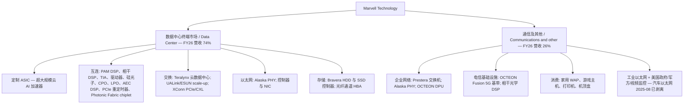
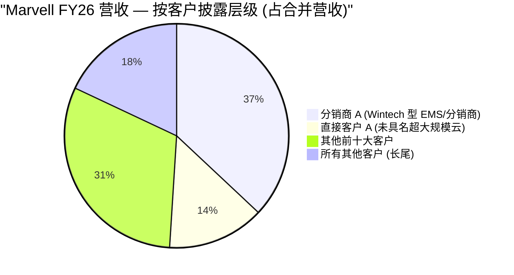
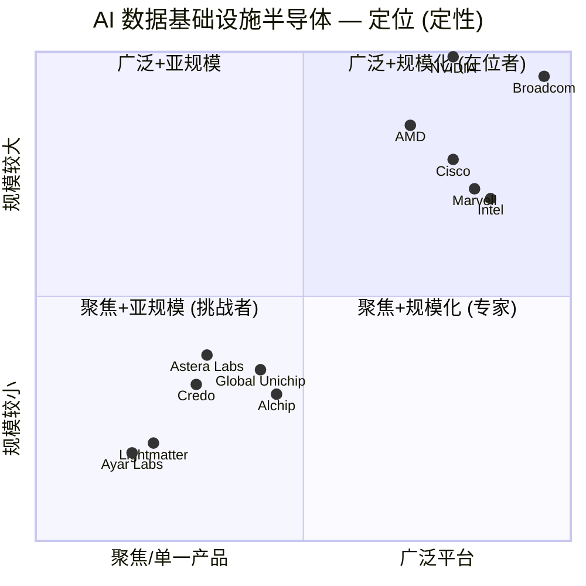
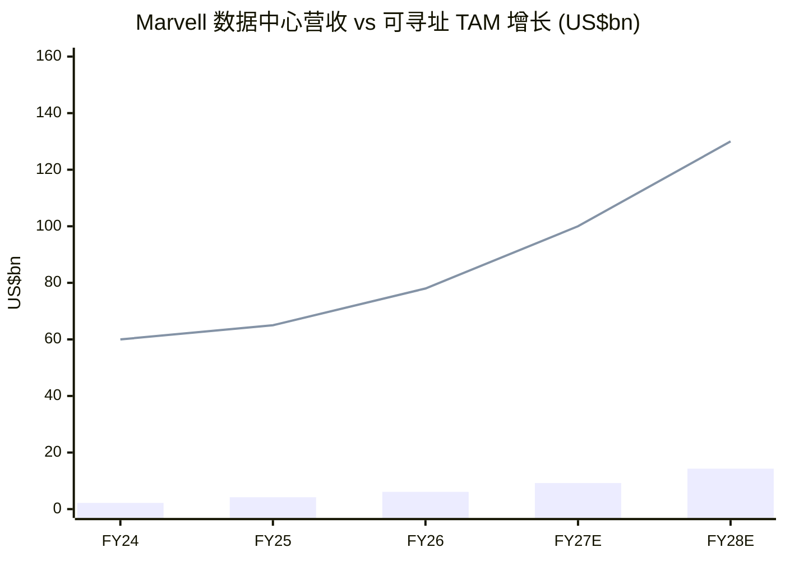

# Marvell Technology, Inc. (NASDAQ:MRVL) — 公司研究报告

**截至日期 (as of): 2026-06-14**
**上市地: 纳斯达克全球精选市场 (NASDAQ), 代码 MRVL**
**注册地: 美国特拉华州威尔明顿 (Wilmington, Delaware)**
**财年: 截止至最接近 1 月 31 日的星期六; FY26 = 截至 2026-01-31 的财年; FY27 Q1 = 截至 2026-05-02 的季度**
**报告语言: 简体中文 (英文版同时存在于本目录, 本次刷新未更新)**

---

## 投资摘要 (Investment summary) — *Analyst view:*

> 以下评级、目标价与情景全部为本报告的前瞻分析师观点 (*Analyst view:*), 不依附于任何 SEC 文件——10-K 不含目标价。

| 项目 | 数值 |
|---|---|
| **评级 (Rating)** | **Hold / 持有 (Neutral)** |
| **12 个月目标价 (Price Target)** | **US$285** |
| 当前股价 (2026-06-14) | US$279.70 |
| **隐含空间 (Implied upside)** | **+1.9%** |
| 估值方法 (一句话) | FY28E (FY 截至 2028-01) 非 GAAP EPS US$6.10 × 47× forward P/E |
| 市值 (Market cap) | 约 US$2,449 亿 (244.9bn) |
| 52 周区间 (52-wk range) | US$61.44 – US$324.20 |
| 行业 / 分类 | 无晶圆厂 (fabless) AI 数据中心半导体 |

**估值倍数矩阵 (forward valuation matrix) — *Analyst view:*** (随预测 EPS 增长而压缩):

| 倍数 | TTM / 上一实际 | FY27E | FY28E |
|---|---|---|---|
| 非 GAAP P/E | ~57× (US$279.70 / 4.94*) | ~46× | ~38× |
| GAAP P/E (TTM) | 96.1× | n/m | n/m |
| P/S | 28.1× | ~21× | ~15× |
| P/B | 13.4× | — | — |

\* TTM 非 GAAP EPS 约 US$4.94 = FY26 非 GAAP 2.84 (剔除 Infineon 收益后) 与 FY27 Q1 0.80 的滚动近似; 倍数为本报告测算, 输入分别来自 [Yahoo Finance, 2026-06-14](https://finance.yahoo.com/quote/MRVL/key-statistics) 与 [FY27 Q1 业绩新闻稿, 2026-05-27](https://www.sec.gov/Archives/edgar/data/1835632/000183563226000014/q127_8kx522026ex-991.htm)。

**投资论点 (4 大支柱) — *Analyst view:*:**

1. **AI 数据中心是唯一引擎, 且仍在加速。** FY27 Q1 数据中心营收 US$1,832.7M (占 76%, 同比 +27%), 管理层指引 FY27 Q2 总营收 US$2.70bn (同比 +35%) 并"显著上调"FY27/FY28 全年展望 ([FY27 Q1 业绩新闻稿](https://www.sec.gov/Archives/edgar/data/1835632/000183563226000014/q127_8kx522026ex-991.htm))。
2. **互连 (interconnect) 是被低估的近端上行点。** 800G/1.6T 光学 DSP、scale-up 光学、51.2T 以太网交换共同构成第二增长曲线; 卖方将 FY27 互连增速上调至 >70% (*Analyst view:* [Morgan Stanley, 2026-05-28](http://xs-macbook-air.local:5001/zsxq/pdf/212485545245151/Morgan%20Stanley-Marvell%20Technology%20Group%20Ltd%EF%BC%88MRVL.US%EF%BC%89Long~Term%20Outlook%20Raised%20on%20Broad%20AI%20Strength-260528.pdf))。
3. **NVIDIA US$2.0bn 优先股注资把竞争对手变成股东。** 2026-03-31 NVIDIA 以私募方式认购 Series A 可转换优先股 (最多可转 21,778,000 股), 叠加 NVLink Fusion 合作 ([FY27 Q1 10-Q, Note](https://www.sec.gov/Archives/edgar/data/1835632/000183563226000019/mrvl-20260502.htm))。
4. **估值已充分计入——这是评级停在 Hold 的原因。** 股价自 3 月底以来已大涨, 当前非 GAAP forward P/E ~46×, 卖方目标价区间从 GS 的 US$125 (Neutral) 到 HSBC 的 US$300 (Buy) 极度分化 (*Analyst view:* [Goldman Sachs](http://xs-macbook-air.local:5001/zsxq/pdf/212451114481851/GS-Marvell%20Technology%20Inc.%20%28MRVL%29_%20First%20Take_%20Guidance%20above%20the%20Street%2C%20with%20commentary%20pointing%20to%20uptick%20to%20FY27_28%20guidance-260527.pdf); [HSBC](http://xs-macbook-air.local:5001/zsxq/pdf/212451114448851/HSBC-Marvell%20Technology%20%EF%BC%88MRVL.US%EF%BC%89Upgrade%20to%20Buy%EF%BC%9A%20Ready%20to%20ride%20the%20AI~networking%20super~cycle-260526.pdf))。

**最该盯紧的两个变量 (swing variables) — *Analyst view:*:** (1) FY28 定制 XPU 的上量幅度——是否有"新晋一级大客户"在明年大规模量产; (2) 800G→1.6T 光学 DSP 份额能否守住 (HSBC 假设 800G ~70% / 1.6T ~50% 份额)。任一不达预期, 47× 的倍数会迅速压缩。

> **业绩更新 (Guidance update) ——FY27 Q2 指引 (2026-05-27):** 管理层指引 FY27 Q2 净营业收入 **US$2.700 十亿 +/- 5%** (同比中点约 **+35%**), GAAP 毛利率 52.1–53.1%, 非 GAAP 毛利率 58.25–59.25%, GAAP 摊薄每股收益 US$0.37 +/- 0.05, 非 GAAP 摊薄每股收益 US$0.93 +/- 0.05; 非 GAAP 营业费用约 US$600M, 摊薄股数约 9.15 亿股。CEO Matt Murphy: *"我们预计 2027 财年的营业收入增长将逐季度加速……我们看到了异常强劲的 AI 相关订单, 因此正大幅上调 Marvell 2027 与 2028 财年的营收展望。"* 来源: [FY27 Q1 业绩新闻稿, 2026-05-27](https://www.sec.gov/Archives/edgar/data/1835632/000183563226000014/q127_8kx522026ex-991.htm)。

---

## 目录

1. 公司概览
   - 1A 估值与目标价摘要
   - 1B GF Score 基本面评分
2. 估值与目标价 (Valuation & Price Target) — 含卖方观点演变
3. 管理团队
4. 产品与服务
5. 客户与上市策略
6. 行业概览
7. 竞争格局
8. 市场机会 (TAM)
9. 风险评估
   - 9.5 关键分歧与催化剂
10. 投资视角评分 (Investor lenses)

参考资料

---

## 1. 公司概览

Marvell Technology, Inc. 是一家在特拉华州威尔明顿 (Wilmington, Delaware) 注册的无晶圆厂 (fabless) 半导体公司, 设计并销售用于数据基础设施 (data infrastructure) 的高性能片上系统 (system-on-chip, SoC) 产品——也就是位于云端 AI 服务器、光模块 (optical transceivers)、交换机、路由器、存储控制器以及连接它们的有线与无线设备内部的硅芯片。公司自我定位为 *"从数据中心核心到网络边缘, 数据基础设施半导体解决方案的领先供应商"* ([Marvell FY26 10-K, Item 1](https://www.sec.gov/Archives/edgar/data/1835632/000183563226000011/mrvl-20260131.htm))。截至 2026-01-31, Marvell 拥有 **7,480 名员工**, 其中 49% 位于美洲, 42% 位于亚太 (含印度), 9% 位于 EMEA ([Marvell FY26 10-K, Human Capital](https://www.sec.gov/Archives/edgar/data/1835632/000183563226000011/mrvl-20260131.htm))。

**本方论点 (BLUF)。** 本报告给予 Marvell **Hold / 持有**评级、12 个月目标价 **US$285** (隐含约 +1.9%)。逻辑很直接: 基本面是华尔街最干净的 AI 二线标的之一——FY27 Q1 营收 US$2.418bn 创纪录 (同比 +28%)、数据中心同比 +27%、经营现金流 US$638.8M 创纪录, 管理层把 FY27/FY28 展望"显著上调" ([FY27 Q1 业绩新闻稿](https://www.sec.gov/Archives/edgar/data/1835632/000183563226000014/q127_8kx522026ex-991.htm))。但股价在过去一个季度已重估到非 GAAP forward P/E ~46×, 把这套加速叙事的大部分价值提前计入。我们因此把分歧聚焦在"倍数能否维持"而非"增长是否真实"。

**商业模式。** Marvell 通过三种结构性不同的方式赚钱: (1) **定制专用集成电路 (custom ASIC)** ——按特定超大规模云服务商 (hyperscaler) 规格、用 Marvell 自有 IP (高速 SerDes、ARM 计算核、安全引擎、先进封装、定制 HBM 接口、共封装光学 CPO) 设计的硅; 客户先付一次性工程 (NRE) 费用, 再按量产硅付费; 这是增长最快、也是卖方普遍认定亚马逊 Trainium、微软 MAIA 等加速器所在的条线 (Marvell 在 10-K 中不点名客户)。(2) **标准商用产品 (standard merchant)** ——源自 Inphi 的 PAM4 / 相干光学 DSP、TIA、激光驱动器、PCIe 重定时器, 以及 Prestera/Teralynx 交换机、Alaska PHY、QLogic 光纤通道、OCTEON DPU、Bravera 存储控制器。(3) **优化解决方案 (optimized solutions)** ——介于两者之间。([Marvell FY26 10-K, Item 1](https://www.sec.gov/Archives/edgar/data/1835632/000183563226000011/mrvl-20260131.htm))

**规模与最新季度。** FY26 (截至 2026-01-31) 取得 **US$8,194.6M 净营业收入**, 同比 **+42.1%** (FY25 为 US$5,767.3M), GAAP 毛利率扩张 970bp 至 **51.0%**, GAAP 营业利润 **US$1,322.9M (16.1%)**, 净利润 **US$2,670.1M (摊薄 EPS US$3.07)** ——但其中含 2025-08-14 向 Infineon 出售汽车以太网业务 (US$25 亿现金) 的约 US$18 亿税前一次性收益; 剔除后 FY26 非 GAAP EPS 为 **US$2.84** ([Marvell FY26 10-K, Item 7 MD&A](https://www.sec.gov/Archives/edgar/data/1835632/000183563226000011/mrvl-20260131.htm); [FY26 Q4 业绩新闻稿](https://www.sec.gov/Archives/edgar/data/1835632/000183563226000006/q426_8kx1312026ex-991.htm))。**进入 FY27, 增长继续加速**: FY27 Q1 (截至 2026-05-02) 营收 **US$2,417.8M 创纪录, 同比 +27.6%、环比 +9%**, 高于指引中点 US$18.0M; GAAP 毛利率 52.1%、非 GAAP 毛利率 58.9%、非 GAAP 营业利润率约 35%; GAAP 净利润仅 US$34.5M (US$0.04), 但**非 GAAP 净利润 US$718.0M (US$0.80)**, 经营现金流 **US$638.8M 创纪录** ([FY27 Q1 业绩新闻稿](https://www.sec.gov/Archives/edgar/data/1835632/000183563226000014/q127_8kx522026ex-991.htm); [FY27 Q1 10-Q](https://www.sec.gov/Archives/edgar/data/1835632/000183563226000019/mrvl-20260502.htm))。GAAP 与非 GAAP 的巨大差距来自摊销 (US$225.2M)、SBC (US$207.6M) 与一笔 US$331.8M 或有对价公允价值变动 (Celestial/XConn 收购相关)。

### Section 1 利润表桑基图 (FY26)

<svg xmlns="http://www.w3.org/2000/svg" viewBox="0 0 1000 560" width="1000" height="560" role="img" aria-label="income statement Sankey"><rect x="0" y="0" width="1000" height="560" fill="#ffffff"/>
<text x="20.00" y="30.00" text-anchor="start" font-family="Helvetica,Arial,sans-serif" font-size="15" font-weight="700" fill="#1f2933">Marvell FY26 利润表桑基图 (Income Statement, US$M)</text>
<path d="M 204.00,78.00 C 258.00,78.00 258.00,85.00 312.00,85.00 L 312.00,388.73 C 258.00,388.73 258.00,381.73 204.00,381.73 Z" fill="#93c5fd" fill-opacity="0.55"/>
<path d="M 452.00,78.00 C 506.00,78.00 506.00,177.92 560.00,177.92 L 560.00,243.79 C 506.00,243.79 506.00,143.87 452.00,143.87 Z" fill="#86efac" fill-opacity="0.55"/>
<path d="M 452.00,143.87 C 506.00,143.87 506.00,257.79 560.00,257.79 L 560.00,400.08 C 506.00,400.08 506.00,286.15 452.00,286.15 Z" fill="#fca5a5" fill-opacity="0.55"/>
<path d="M 328.00,85.00 C 382.00,85.00 382.00,78.00 436.00,78.00 L 436.00,286.15 C 382.00,286.15 382.00,293.15 328.00,293.15 Z" fill="#86efac" fill-opacity="0.55"/>
<path d="M 328.00,293.15 C 382.00,293.15 382.00,300.15 436.00,300.15 L 436.00,500.00 C 382.00,500.00 382.00,493.00 328.00,493.00 Z" fill="#fca5a5" fill-opacity="0.55"/>
<path d="M 700.00,120.40 C 754.00,120.40 754.00,206.16 808.00,206.16 L 808.00,339.10 C 754.00,339.10 754.00,253.34 700.00,253.34 Z" fill="#86efac" fill-opacity="0.55"/>
<path d="M 700.00,253.34 C 754.00,253.34 754.00,353.10 808.00,353.10 L 808.00,371.84 C 754.00,371.84 754.00,272.09 700.00,272.09 Z" fill="#fca5a5" fill-opacity="0.55"/>
<path d="M 576.00,177.92 C 630.00,177.92 630.00,120.40 684.00,120.40 L 684.00,186.26 C 630.00,186.26 630.00,243.79 576.00,243.79 Z" fill="#86efac" fill-opacity="0.55"/>
<path d="M 576.00,257.79 C 630.00,257.79 630.00,286.09 684.00,286.09 L 684.00,324.28 C 630.00,324.28 630.00,295.98 576.00,295.98 Z" fill="#fca5a5" fill-opacity="0.55"/>
<path d="M 576.00,295.98 C 630.00,295.98 630.00,338.28 684.00,338.28 L 684.00,441.60 C 630.00,441.60 630.00,399.30 576.00,399.30 Z" fill="#fca5a5" fill-opacity="0.55"/>
<path d="M 576.00,399.30 C 630.00,399.30 630.00,455.60 684.00,455.60 L 684.00,457.60 C 630.00,457.60 630.00,401.30 576.00,401.30 Z" fill="#fca5a5" fill-opacity="0.55"/>
<path d="M 204.00,395.73 C 258.00,395.73 258.00,388.73 312.00,388.73 L 312.00,493.00 C 258.00,493.00 258.00,500.00 204.00,500.00 Z" fill="#93c5fd" fill-opacity="0.55"/>
<rect x="188.00" y="78.00" width="16" height="303.73" rx="1.5" fill="#2563eb"/>
<rect x="188.00" y="395.73" width="16" height="104.27" rx="1.5" fill="#2563eb"/>
<rect x="312.00" y="85.00" width="16" height="408.00" rx="1.5" fill="#1e3a8a"/>
<rect x="436.00" y="78.00" width="16" height="208.15" rx="1.5" fill="#15803d"/>
<rect x="436.00" y="300.15" width="16" height="199.85" rx="1.5" fill="#dc2626"/>
<rect x="560.00" y="177.92" width="16" height="65.87" rx="1.5" fill="#15803d"/>
<rect x="560.00" y="257.79" width="16" height="142.29" rx="1.5" fill="#dc2626"/>
<rect x="684.00" y="120.40" width="16" height="151.69" rx="1.5" fill="#15803d"/>
<rect x="684.00" y="286.09" width="16" height="38.19" rx="1.5" fill="#dc2626"/>
<rect x="684.00" y="338.28" width="16" height="103.32" rx="1.5" fill="#dc2626"/>
<rect x="684.00" y="455.60" width="16" height="2.00" rx="1.5" fill="#dc2626"/>
<rect x="808.00" y="206.16" width="16" height="132.94" rx="1.5" fill="#15803d"/>
<rect x="808.00" y="353.10" width="16" height="18.75" rx="1.5" fill="#dc2626"/>
<text x="179.00" y="226.86" text-anchor="end" font-family="Helvetica,Arial,sans-serif" font-size="11.5" font-weight="700" fill="#1f2933">Data Center / 数据中心</text>
<text x="179.00" y="239.86" text-anchor="end" font-family="Helvetica,Arial,sans-serif" font-size="10" font-weight="400" fill="#52606d">US$6.1B  (74.4%)</text>
<text x="179.00" y="444.86" text-anchor="end" font-family="Helvetica,Arial,sans-serif" font-size="11.5" font-weight="700" fill="#1f2933">Communications &amp; other / 通信及其他</text>
<text x="179.00" y="457.86" text-anchor="end" font-family="Helvetica,Arial,sans-serif" font-size="10" font-weight="400" fill="#52606d">US$2.1B  (25.6%)</text>
<rect x="331.00" y="67.00" width="113.10" height="26" rx="2" fill="#ffffff" fill-opacity="0.72"/>
<text x="334.00" y="79.00" text-anchor="start" font-family="Helvetica,Arial,sans-serif" font-size="11.5" font-weight="700" fill="#1f2933">Revenue</text>
<text x="334.00" y="92.00" text-anchor="start" font-family="Helvetica,Arial,sans-serif" font-size="10" font-weight="400" fill="#52606d">US$8.2B  (100.0%)</text>
<rect x="455.00" y="60.00" width="106.80" height="26" rx="2" fill="#ffffff" fill-opacity="0.72"/>
<text x="458.00" y="72.00" text-anchor="start" font-family="Helvetica,Arial,sans-serif" font-size="11.5" font-weight="700" fill="#1f2933">Gross Profit</text>
<text x="458.00" y="85.00" text-anchor="start" font-family="Helvetica,Arial,sans-serif" font-size="10" font-weight="400" fill="#52606d">US$4.2B  (51.0%)</text>
<rect x="455.00" y="282.15" width="144.60" height="26" rx="2" fill="#ffffff" fill-opacity="0.72"/>
<text x="458.00" y="294.15" text-anchor="start" font-family="Helvetica,Arial,sans-serif" font-size="11.5" font-weight="700" fill="#1f2933">Cost of Revenue (COGS)</text>
<text x="458.00" y="307.15" text-anchor="start" font-family="Helvetica,Arial,sans-serif" font-size="10" font-weight="400" fill="#52606d">US$4.0B  (49.0%)</text>
<rect x="579.00" y="159.92" width="106.80" height="26" rx="2" fill="#ffffff" fill-opacity="0.72"/>
<text x="582.00" y="171.92" text-anchor="start" font-family="Helvetica,Arial,sans-serif" font-size="11.5" font-weight="700" fill="#1f2933">Operating Income</text>
<text x="582.00" y="184.92" text-anchor="start" font-family="Helvetica,Arial,sans-serif" font-size="10" font-weight="400" fill="#52606d">US$1.3B  (16.1%)</text>
<rect x="579.00" y="239.79" width="150.90" height="26" rx="2" fill="#ffffff" fill-opacity="0.72"/>
<text x="582.00" y="251.79" text-anchor="start" font-family="Helvetica,Arial,sans-serif" font-size="11.5" font-weight="700" fill="#1f2933">Total Operating Expense</text>
<text x="582.00" y="264.79" text-anchor="start" font-family="Helvetica,Arial,sans-serif" font-size="10" font-weight="400" fill="#52606d">US$2.9B  (34.9%)</text>
<rect x="703.00" y="102.40" width="106.80" height="26" rx="2" fill="#ffffff" fill-opacity="0.72"/>
<text x="706.00" y="114.40" text-anchor="start" font-family="Helvetica,Arial,sans-serif" font-size="11.5" font-weight="700" fill="#1f2933">Pretax Income</text>
<text x="706.00" y="127.40" text-anchor="start" font-family="Helvetica,Arial,sans-serif" font-size="10" font-weight="400" fill="#52606d">US$3.0B  (37.2%)</text>
<rect x="703.00" y="268.09" width="113.10" height="26" rx="2" fill="#ffffff" fill-opacity="0.72"/>
<text x="706.00" y="280.09" text-anchor="start" font-family="Helvetica,Arial,sans-serif" font-size="11.5" font-weight="700" fill="#1f2933">SG&amp;A</text>
<text x="706.00" y="293.09" text-anchor="start" font-family="Helvetica,Arial,sans-serif" font-size="10" font-weight="400" fill="#52606d">US$767.1M  (9.4%)</text>
<rect x="703.00" y="320.28" width="106.80" height="26" rx="2" fill="#ffffff" fill-opacity="0.72"/>
<text x="706.00" y="332.28" text-anchor="start" font-family="Helvetica,Arial,sans-serif" font-size="11.5" font-weight="700" fill="#1f2933">R&amp;D</text>
<text x="706.00" y="345.28" text-anchor="start" font-family="Helvetica,Arial,sans-serif" font-size="10" font-weight="400" fill="#52606d">US$2.1B  (25.3%)</text>
<rect x="703.00" y="437.60" width="113.10" height="26" rx="2" fill="#ffffff" fill-opacity="0.72"/>
<text x="706.00" y="449.60" text-anchor="start" font-family="Helvetica,Arial,sans-serif" font-size="11.5" font-weight="700" fill="#1f2933">Other OpEx</text>
<text x="706.00" y="462.60" text-anchor="start" font-family="Helvetica,Arial,sans-serif" font-size="10" font-weight="400" fill="#52606d">US$15.5M  (0.19%)</text>
<text x="833.00" y="269.63" text-anchor="start" font-family="Helvetica,Arial,sans-serif" font-size="11.5" font-weight="700" fill="#1f2933">Net Income</text>
<text x="833.00" y="282.63" text-anchor="start" font-family="Helvetica,Arial,sans-serif" font-size="10" font-weight="400" fill="#52606d">US$2.7B  (32.6%)</text>
<text x="833.00" y="359.47" text-anchor="start" font-family="Helvetica,Arial,sans-serif" font-size="11.5" font-weight="700" fill="#1f2933">Income Tax</text>
<text x="833.00" y="372.47" text-anchor="start" font-family="Helvetica,Arial,sans-serif" font-size="10" font-weight="400" fill="#52606d">US$376.5M  (4.6%)</text>
<text x="500.00" y="544.00" text-anchor="middle" font-family="Helvetica,Arial,sans-serif" font-size="10" font-weight="400" fill="#52606d">Source: Marvell FY26 10-K (mrvl-20260131) — Statements of Operations + Note 14 Segment, as of 2026-06-14</text>
</svg>

*来源: GAAP 数据来自 [Marvell FY26 10-K — Statements of Operations 与 Note 14 Segment](https://www.sec.gov/Archives/edgar/data/1835632/000183563226000011/mrvl-20260131.htm); 收入来源 (数据中心 / 通信及其他) 为终端市场分部。*

### Section 1 营业收入 — 按终端市场 (FY26)

<svg xmlns="http://www.w3.org/2000/svg" viewBox="0 0 720 460" width="720" height="460" role="img" aria-label="revenue donut"><rect x="0" y="0" width="720" height="460" fill="#ffffff"/>
<text x="20.00" y="30.00" text-anchor="start" font-family="Helvetica,Arial,sans-serif" font-size="15" font-weight="700" fill="#1f2933">Marvell FY26 营业收入 — 按终端市场 (by Segment)</text>
<path d="M 288.00,107.20 A 132 132 0 1 1 156.08,243.82 L 210.05,241.93 A 78 78 0 1 0 288.00,161.20 Z" fill="#2563eb"/>
<path d="M 156.08,243.82 A 132 132 0 0 1 288.00,107.20 L 288.00,161.20 A 78 78 0 0 0 210.05,241.93 Z" fill="#15803d"/>
<text x="288.00" y="235.20" text-anchor="middle" font-family="Helvetica,Arial,sans-serif" font-size="18" font-weight="800" fill="#1f2933">FY26\n$8,194.6M</text>
<text x="288.00" y="255.20" text-anchor="middle" font-family="Helvetica,Arial,sans-serif" font-size="13" font-weight="600" fill="#52606d">US$8.2B</text>
<text x="288.00" y="271.20" text-anchor="middle" font-family="Helvetica,Arial,sans-serif" font-size="10" font-weight="400" fill="#8a97a3">total</text>
<line x1="387.27" y1="335.06" x2="403.27" y2="335.06" stroke="#2563eb" stroke-width="1.4"/>
<text x="407.27" y="333.06" text-anchor="start" font-family="Helvetica,Arial,sans-serif" font-size="11" font-weight="700" fill="#1f2933">Data Center / 数据中心</text>
<text x="407.27" y="347.06" text-anchor="start" font-family="Helvetica,Arial,sans-serif" font-size="10" font-weight="400" fill="#52606d">US$6.1B  (74.4%)</text>
<line x1="188.73" y1="143.34" x2="172.73" y2="143.34" stroke="#15803d" stroke-width="1.4"/>
<text x="168.73" y="141.34" text-anchor="end" font-family="Helvetica,Arial,sans-serif" font-size="11" font-weight="700" fill="#1f2933">Communications &amp; other / 通信及其他</text>
<text x="168.73" y="155.34" text-anchor="end" font-family="Helvetica,Arial,sans-serif" font-size="10" font-weight="400" fill="#52606d">US$2.1B  (25.6%)</text>
<text x="360.00" y="444.00" text-anchor="middle" font-family="Helvetica,Arial,sans-serif" font-size="10" font-weight="400" fill="#52606d">Source: Marvell FY26 10-K (mrvl-20260131) — Note 14 Segment, as of 2026-06-14</text>
</svg>

*来源: [Marvell FY26 10-K, Note 14 Segment](https://www.sec.gov/Archives/edgar/data/1835632/000183563226000011/mrvl-20260131.htm)。*

**终端市场结构。** 自 FY26 Q4 起, Marvell 将此前四个子类合并为单一的"通信及其他 (Communications and other)", 唯独数据中心 (Data Center) 单独披露 ([Marvell FY26 10-K](https://www.sec.gov/Archives/edgar/data/1835632/000183563226000011/mrvl-20260131.htm))。结构变化非常剧烈:

- FY24: 数据中心 US$2,216.7M (40%), 通信/其他 US$3,291.0M (60%)
- FY25: 数据中心 US$4,164.2M (72%), 通信/其他 US$1,603.1M (28%)
- FY26: 数据中心 US$6,100.3M (74%, **同比 +46%**), 通信/其他 US$2,094.3M (26%, 同比 +31%) ([Marvell FY26 10-K, Note 14](https://www.sec.gov/Archives/edgar/data/1835632/000183563226000011/mrvl-20260131.htm))
- FY27 Q1: 数据中心 US$1,832.7M (76%, **同比 +27%**), 通信/其他 US$585.1M (24%, 同比 +29%) ([FY27 Q1 10-Q](https://www.sec.gov/Archives/edgar/data/1835632/000183563226000019/mrvl-20260502.htm))

**本期新变化 (what's new)。** 与上一版报告 (截至 2026-05-20) 相比, 最重要的三处更新: (1) FY27 Q1 已实际公布, 数据中心占比从 74% 进一步升至 76%; (2) **NVIDIA 于 2026-03-31 以 US$2.0bn 私募认购 Marvell 的 Series A 可转换优先股** (最多可转 21,778,000 股普通股), 把最大的 AI 客户/竞争对手同时变成了股东与 NVLink Fusion 合作方 ([FY27 Q1 10-Q, Note — Series A Convertible Preferred](https://www.sec.gov/Archives/edgar/data/1835632/000183563226000019/mrvl-20260502.htm)); (3) 股价从 US$185.70 重估至 US$279.70, 估值上下文完全不同。Marvell 已不再是一家平衡的数据基础设施公司——它现在基本上是一家 AI 数据中心半导体公司, 附带仍具规模的通信业务挂载。

**地域分布 (按发货目的地)。** FY26 中国占 36% (低于 FY25 的 43%), 台湾 20% (高于 FY25 的 10%), 美国约 14%, "其他"约 30% ([Marvell FY26 10-K, Note 14 Geographic](https://www.sec.gov/Archives/edgar/data/1835632/000183563226000011/mrvl-20260131.htm))。FY27 Q1 进一步:中国 44%、台湾 21%、美国 7%、其他 28% ([FY27 Q1 10-Q](https://www.sec.gov/Archives/edgar/data/1835632/000183563226000019/mrvl-20260502.htm))。管理层明确警告发货目的地 *不* 等于终端客户所在地: *"公司向中国发运的产品的相当大部分, 是供位于中国境内的非中国客户的工厂或代工厂使用的"* ([Marvell FY26 10-K](https://www.sec.gov/Archives/edgar/data/1835632/000183563226000011/mrvl-20260131.htm))。台湾占比上升与 AI 加速器组装迁移至该岛上的 TSMC CoWoS (台积电 Chip-on-Wafer-on-Substrate 先进封装) 与 OSAT (外包封装测试) 产线相吻合。

### Section 1 营业收入 — 按发货目的地 (FY26)

<svg xmlns="http://www.w3.org/2000/svg" viewBox="0 0 720 460" width="720" height="460" role="img" aria-label="revenue donut"><rect x="0" y="0" width="720" height="460" fill="#ffffff"/>
<text x="20.00" y="30.00" text-anchor="start" font-family="Helvetica,Arial,sans-serif" font-size="15" font-weight="700" fill="#1f2933">Marvell FY26 营业收入 — 按发货目的地 (by Geography)</text>
<path d="M 288.00,107.20 A 132 132 0 0 1 388.42,324.88 L 347.34,289.83 A 78 78 0 0 0 288.00,161.20 Z" fill="#2563eb"/>
<path d="M 388.42,324.88 A 132 132 0 0 1 235.83,360.45 L 257.17,310.85 A 78 78 0 0 0 347.34,289.83 Z" fill="#15803d"/>
<path d="M 235.83,360.45 A 132 132 0 0 1 161.32,276.30 L 213.14,261.12 A 78 78 0 0 0 257.17,310.85 Z" fill="#d97706"/>
<path d="M 161.32,276.30 A 132 132 0 0 1 288.00,107.20 L 288.00,161.20 A 78 78 0 0 0 213.14,261.12 Z" fill="#7c3aed"/>
<text x="288.00" y="235.20" text-anchor="middle" font-family="Helvetica,Arial,sans-serif" font-size="18" font-weight="800" fill="#1f2933">FY26\ngeo</text>
<text x="288.00" y="255.20" text-anchor="middle" font-family="Helvetica,Arial,sans-serif" font-size="13" font-weight="600" fill="#52606d">US$8.2B</text>
<text x="288.00" y="271.20" text-anchor="middle" font-family="Helvetica,Arial,sans-serif" font-size="10" font-weight="400" fill="#8a97a3">total</text>
<line x1="413.31" y1="181.39" x2="429.31" y2="181.39" stroke="#2563eb" stroke-width="1.4"/>
<text x="433.31" y="179.39" text-anchor="start" font-family="Helvetica,Arial,sans-serif" font-size="11" font-weight="700" fill="#1f2933">China / 中国</text>
<text x="433.31" y="193.39" text-anchor="start" font-family="Helvetica,Arial,sans-serif" font-size="10" font-weight="400" fill="#52606d">US$3.0B  (36.2%)</text>
<line x1="319.34" y1="373.60" x2="335.34" y2="373.60" stroke="#15803d" stroke-width="1.4"/>
<text x="339.34" y="371.60" text-anchor="start" font-family="Helvetica,Arial,sans-serif" font-size="11" font-weight="700" fill="#1f2933">Taiwan / 台湾</text>
<text x="339.34" y="385.60" text-anchor="start" font-family="Helvetica,Arial,sans-serif" font-size="10" font-weight="400" fill="#52606d">US$1.7B  (20.2%)</text>
<line x1="184.68" y1="330.68" x2="168.68" y2="330.68" stroke="#d97706" stroke-width="1.4"/>
<text x="164.68" y="328.68" text-anchor="end" font-family="Helvetica,Arial,sans-serif" font-size="11" font-weight="700" fill="#1f2933">United States / 美国</text>
<text x="164.68" y="342.68" text-anchor="end" font-family="Helvetica,Arial,sans-serif" font-size="10" font-weight="400" fill="#52606d">US$1.1B  (14.0%)</text>
<line x1="177.55" y1="156.46" x2="161.55" y2="156.46" stroke="#7c3aed" stroke-width="1.4"/>
<text x="157.55" y="154.46" text-anchor="end" font-family="Helvetica,Arial,sans-serif" font-size="11" font-weight="700" fill="#1f2933">Other / 其他</text>
<text x="157.55" y="168.46" text-anchor="end" font-family="Helvetica,Arial,sans-serif" font-size="10" font-weight="400" fill="#52606d">US$2.4B  (29.5%)</text>
<text x="360.00" y="444.00" text-anchor="middle" font-family="Helvetica,Arial,sans-serif" font-size="10" font-weight="400" fill="#52606d">Source: Marvell FY26 10-K (mrvl-20260131) — Note 14 Geographic (destination of shipment), as of 2026-06-14</text>
</svg>

*来源: [Marvell FY26 10-K, Note 14 Geographic (destination of shipment)](https://www.sec.gov/Archives/edgar/data/1835632/000183563226000011/mrvl-20260131.htm)。*

### 1A 估值与目标价摘要 (Valuation snapshot)

**估值快照 (2026-06-14)。** 根据 Yahoo Finance: 当前股价 **US$279.70**, 市值约 **US$2,449 亿**, 52 周区间 **US$61.44–324.20**; **TTM GAAP P/E 96.1×、forward P/E 45.3×、P/S 28.1×、P/B 13.4×** ([Yahoo Finance MRVL, 2026-06-14](https://finance.yahoo.com/quote/MRVL/key-statistics))。

**解读这些倍数 — *Analyst view:*。** TTM GAAP P/E 96× 被两件事扭曲: 上行扭曲来自 FY26 的 Infineon 一次性收益, 下行扭曲来自 FY27 Q1 GAAP 净利润被 US$331.8M 或有对价变动压低。更可信的锚是前瞻非 GAAP: forward P/E ~46× 高于 NVDA (~16×) 与 AVGO (~20×), 但低于纯互连标的 ALAB (~87×) 与 CRDO (~29×) ([Yahoo Finance 同业, 2026-06-14](https://finance.yahoo.com/quote/MRVL/key-statistics))。P/S 28.1× 处于半导体板块极高分位, 但与 AI 网络同行 (AVGO ~24×、NVDA ~20×、CRDO ~35×、ALAB ~63×) 同档。**结论:** 市场把 Marvell 定价为"定制 AI 加速器 + AI 互连平台", 而非 FY23 时的多元化半导体公司; 前瞻盈利必须兑现才能支撑这些倍数。52 周低点 US$61.44 (距今约一年) 提醒读者情绪可在任一方向大幅摆动。本报告在第 9 章将此标注为**估值倍数压缩风险**。

**现金与资本结构。** FY26 经营现金流 US$1.8bn, 资本支出 US$354.1M (轻资产); 出售汽车业务带来 US$2,478.6M 现金流入; 部署 US$2,040.1M 回购、US$205.1M 股息、净借款约 US$408M ([Marvell FY26 10-K, Cash Flows](https://www.sec.gov/Archives/edgar/data/1835632/000183563226000011/mrvl-20260131.htm))。**FY27 Q1 资本结构出现两处大变化**: (1) 现金从 US$2,638.8M 跃升至 **US$3,843.6M**, 主要来自 NVIDIA 的 **US$2.0bn 优先股注资**; (2) 长期债务从 US$3,970.8M 升至 **US$4,961.3M** (季内净借款约 US$499M, 用于 Celestial/XConn 收购 US$1,270.9M); 总资产从 US$22.3bn 升至 **US$26.9bn**, 商誉升至 **US$13.9bn** ([FY27 Q1 10-Q — Balance Sheet](https://www.sec.gov/Archives/edgar/data/1835632/000183563226000019/mrvl-20260502.htm))。资产负债表仍为投资级, 并非业务的限制性约束; 真正的瓶颈是 TSMC 先进制程与 CoWoS 产能, 以及设计团队规模化。

### 1B GF Score 基本面评分 — *Analyst view:*

GF Score 是仿照 [GuruFocus GF Score™](https://www.gurufocus.com/term/gf-score) 的五维基本面评分, 是本报告自有的分析视角 (*Analyst view:*), **不依附任何 SEC 文件**; 每个底层指标在下方各带自己的引用。下图与下表由 `scripts/gf_score.py` 生成。

<svg xmlns="http://www.w3.org/2000/svg" viewBox="0 0 500 500" width="500" height="500" role="img" aria-label="GF Score radar">
<rect x="0" y="0" width="500" height="500" fill="#ffffff"/>
<text x="20" y="24" font-family="Helvetica,Arial,sans-serif" font-size="15" font-weight="700" fill="#1f2933">GF Score (GuruFocus-style): 71/100</text>
<text x="20" y="41" font-family="Helvetica,Arial,sans-serif" font-size="11" fill="#52606d">71–80 Likely average performance</text>
<polygon points="250.0,88.0 392.7,191.6 338.2,359.4 161.8,359.4 107.3,191.6" fill="#e9f5ec" stroke="none"/>
<polygon points="250.0,208.0 278.5,228.7 267.6,262.3 232.4,262.3 221.5,228.7" fill="none" stroke="#c5d3cb" stroke-width="1"/>
<polygon points="250.0,178.0 307.1,219.5 285.3,286.5 214.7,286.5 192.9,219.5" fill="none" stroke="#c5d3cb" stroke-width="1"/>
<polygon points="250.0,148.0 335.6,210.2 302.9,310.8 197.1,310.8 164.4,210.2" fill="none" stroke="#c5d3cb" stroke-width="1"/>
<polygon points="250.0,118.0 364.1,200.9 320.5,335.1 179.5,335.1 135.9,200.9" fill="none" stroke="#c5d3cb" stroke-width="1"/>
<polygon points="250.0,88.0 392.7,191.6 338.2,359.4 161.8,359.4 107.3,191.6" fill="none" stroke="#c5d3cb" stroke-width="1.3"/>
<line x1="250" y1="238" x2="161.8" y2="359.4" stroke="#cfdad3" stroke-width="1"/>
<text x="146.5" y="392.4" text-anchor="end" font-family="Helvetica,Arial,sans-serif" font-size="11.5" font-weight="600" fill="#1f2933">Financial Strength</text>
<text x="146.5" y="405.4" text-anchor="end" font-family="Helvetica,Arial,sans-serif" font-size="9.5" fill="#52606d">财务实力</text>
<text x="197.1" y="304.8" text-anchor="middle" font-family="Helvetica,Arial,sans-serif" font-size="10.5" font-weight="700" fill="#1f2933">6</text>
<line x1="250" y1="238" x2="250.0" y2="88.0" stroke="#cfdad3" stroke-width="1"/>
<text x="250.0" y="58.0" text-anchor="middle" font-family="Helvetica,Arial,sans-serif" font-size="11.5" font-weight="600" fill="#1f2933">Profitability</text>
<text x="250.0" y="71.0" text-anchor="middle" font-family="Helvetica,Arial,sans-serif" font-size="9.5" fill="#52606d">盈利能力</text>
<text x="250.0" y="127.0" text-anchor="middle" font-family="Helvetica,Arial,sans-serif" font-size="10.5" font-weight="700" fill="#1f2933">7</text>
<line x1="250" y1="238" x2="107.3" y2="191.6" stroke="#cfdad3" stroke-width="1"/>
<text x="82.6" y="183.6" text-anchor="end" font-family="Helvetica,Arial,sans-serif" font-size="11.5" font-weight="600" fill="#1f2933">Growth</text>
<text x="82.6" y="196.6" text-anchor="end" font-family="Helvetica,Arial,sans-serif" font-size="9.5" fill="#52606d">成长性</text>
<text x="107.3" y="185.6" text-anchor="middle" font-family="Helvetica,Arial,sans-serif" font-size="10.5" font-weight="700" fill="#1f2933">10</text>
<line x1="250" y1="238" x2="392.7" y2="191.6" stroke="#cfdad3" stroke-width="1"/>
<text x="417.4" y="183.6" text-anchor="start" font-family="Helvetica,Arial,sans-serif" font-size="11.5" font-weight="600" fill="#1f2933">GF Value</text>
<text x="417.4" y="196.6" text-anchor="start" font-family="Helvetica,Arial,sans-serif" font-size="9.5" fill="#52606d">估值</text>
<text x="278.5" y="222.7" text-anchor="middle" font-family="Helvetica,Arial,sans-serif" font-size="10.5" font-weight="700" fill="#1f2933">2</text>
<line x1="250" y1="238" x2="338.2" y2="359.4" stroke="#cfdad3" stroke-width="1"/>
<text x="353.5" y="392.4" text-anchor="start" font-family="Helvetica,Arial,sans-serif" font-size="11.5" font-weight="600" fill="#1f2933">Momentum</text>
<text x="353.5" y="405.4" text-anchor="start" font-family="Helvetica,Arial,sans-serif" font-size="9.5" fill="#52606d">动量</text>
<text x="329.4" y="341.2" text-anchor="middle" font-family="Helvetica,Arial,sans-serif" font-size="10.5" font-weight="700" fill="#1f2933">9</text>
<polygon points="250.0,133.0 278.5,228.7 329.4,347.2 197.1,310.8 107.3,191.6" fill="#2e8b57" fill-opacity="0.34" stroke="#2e8b57" stroke-width="2"/>
<circle cx="197.1" cy="310.8" r="2.6" fill="#2e8b57"/>
<circle cx="250.0" cy="133.0" r="2.6" fill="#2e8b57"/>
<circle cx="107.3" cy="191.6" r="2.6" fill="#2e8b57"/>
<circle cx="278.5" cy="228.7" r="2.6" fill="#2e8b57"/>
<circle cx="329.4" cy="347.2" r="2.6" fill="#2e8b57"/>
<text x="250" y="470" text-anchor="middle" font-family="Helvetica,Arial,sans-serif" font-size="9.5" fill="#52606d">Source: Marvell FY26 10-K + FY27Q1 8-K/10-Q · Yahoo Finance (2026-06-14) · indicators.db, as of 2026-06-14</text>
<text x="250" y="485" text-anchor="middle" font-family="Helvetica,Arial,sans-serif" font-size="9" fill="#52606d">GF Score = independent analyst rubric (*Analyst view:*) — not GuruFocus™ official number</text>
</svg>

| 维度 / Dimension | 评分 / Score (0–10) | |
|---|---|---|
| Financial Strength (财务实力) | 6 | `██████░░░░` |
| Profitability (盈利能力) | 7 | `███████░░░` |
| Growth (成长性) | 10 | `██████████` |
| GF Value (估值) | 2 | `██░░░░░░░░` |
| Momentum (动量) | 9 | `█████████░` |
| **GF Score (composite, *Analyst view:*)** | **71 / 100** | **71–80 Likely average performance** |

*Composite weights (*Analyst view:*): Financial Strength 20% · Profitability 25% · Growth 25% · GF Value 15% · Momentum 15% (transparent reproduction — not GuruFocus's proprietary weighting).*

- **Financial Strength 财务实力 = 6/10。** 投资级资产负债表, FY26 经营现金流 US$1.8bn、利息覆盖充足 (利息费用仅 US$202.6M); 但长期债务约 US$5.0bn (FY27 Q1) 加上新增 US$2.0bn 可转优先股带来潜在摊薄, 商誉 US$13.9bn 占总资产 52%——并购驱动的资产负债表压低这一维度 ([FY27 Q1 10-Q](https://www.sec.gov/Archives/edgar/data/1835632/000183563226000019/mrvl-20260502.htm); [FY26 10-K](https://www.sec.gov/Archives/edgar/data/1835632/000183563226000011/mrvl-20260131.htm))。
- **Profitability 盈利能力 = 7/10。** 非 GAAP 毛利率 58.9%、非 GAAP 营业利润率约 35% (FY27 Q1), FY26 GAAP 毛利率同比扩张 970bp 显示规模吸收; 但 GAAP 盈利仍被 SBC (FY26 US$590.8M) 与摊销侵蚀, ROE 受大额商誉拖累 ([FY27 Q1 业绩新闻稿](https://www.sec.gov/Archives/edgar/data/1835632/000183563226000014/q127_8kx522026ex-991.htm); [FY26 10-K](https://www.sec.gov/Archives/edgar/data/1835632/000183563226000011/mrvl-20260131.htm))。
- **Growth 成长性 = 10/10。** FY26 营收 +42%、数据中心 +46%; 管理层指引 FY27 数据中心约 +50%、FY28 约 +55% (*Analyst view:* [Morgan Stanley](http://xs-macbook-air.local:5001/zsxq/pdf/212485545245151/Morgan%20Stanley-Marvell%20Technology%20Group%20Ltd%EF%BC%88MRVL.US%EF%BC%89Long~Term%20Outlook%20Raised%20on%20Broad%20AI%20Strength-260528.pdf))。这是评分表上最强的一维, 与第 2 章前瞻模型一致。
- **GF Value 估值 = 2/10 (越高越便宜)。** Forward P/E ~46×、P/S 28× 远高于自身 FY23 前历史与多数同行——按"越贵分越低"的口径, 这一维度刻意给低分, 与第 1A 的倍数解读与目标价仅 +1.9% 的空间一致 ([Yahoo Finance, 2026-06-14](https://finance.yahoo.com/quote/MRVL/key-statistics))。
- **Momentum 动量 = 9/10。** 股价自 3 月底以来大涨 (HSBC 称 +124%), 接近 52 周高点 US$324.20, 6/12 个月相对 SOX 与标普均大幅跑赢 (*Analyst view:* [HSBC, 2026-05-26](http://xs-macbook-air.local:5001/zsxq/pdf/212451114448851/HSBC-Marvell%20Technology%20%EF%BC%88MRVL.US%EF%BC%89Upgrade%20to%20Buy%EF%BC%9A%20Ready%20to%20ride%20the%20AI~networking%20super~cycle-260526.pdf); [Yahoo Finance](https://finance.yahoo.com/quote/MRVL/key-statistics))。

**综合 GF Score = 71/100** ("Likely average performance"档) — 极强的成长与动量被昂贵的估值拉低, 正是本报告 Hold 评级的数字化缩影。

---
## 2. 估值与目标价 (Valuation & Price Target)

> 本章的预测、目标价与情景均为本报告的前瞻分析师观点 (*Analyst view:*), **不依附任何 SEC 文件**; 每个驱动因素的外部依据 (分部数据 + 管理层指引 + 行业预测 + 卖方一致预期) 在文中分别引用。

### 2A 前瞻财务预测 (Forward estimates) — *Analyst view:*

下表按分部建模 (数据中心 + 通信及其他分别给增长路径与毛利率轨迹, 再加总), 而非单一混合口径。数据中心增速锚定管理层在 FY27 Q1 电话会指引的"FY27 约 +50%、FY28 约 +55%" (*Analyst view:* [Morgan Stanley, 2026-05-28](http://xs-macbook-air.local:5001/zsxq/pdf/212485545245151/Morgan%20Stanley-Marvell%20Technology%20Group%20Ltd%EF%BC%88MRVL.US%EF%BC%89Long~Term%20Outlook%20Raised%20on%20Broad%20AI%20Strength-260528.pdf)); 毛利率轨迹锚定公司自身的非 GAAP 毛利率指引 58.25–59.25% ([FY27 Q1 业绩新闻稿](https://www.sec.gov/Archives/edgar/data/1835632/000183563226000014/q127_8kx522026ex-991.htm))。

| (US\$M, 财年截至 1 月) | FY26 实际 | FY27E | FY28E | FY29E |
|---|---|---|---|---|
| 数据中心营收 | 6,100 | ~9,200 (+51%) | ~14,300 (+55%) | ~18,600 (+30%) |
| 通信及其他营收 | 2,094 | ~2,400 (+15%) | ~2,700 (+13%) | ~2,900 (+7%) |
| **总营收** | **8,195** | **~11,600 (+42%)** | **~17,000 (+47%)** | **~21,500 (+26%)** |
| 非 GAAP 毛利率 | ~60% | ~59% | ~59% | ~59% |
| 非 GAAP 营业利润率 | ~33% | ~36% | ~39% | ~40% |
| **非 GAAP 摊薄 EPS** | **2.84** | **~4.20** | **~6.10** | **~8.00** |

*基础: FY26 实际来自 [Marvell FY26 10-K](https://www.sec.gov/Archives/edgar/data/1835632/000183563226000011/mrvl-20260131.htm) 与 [FY26 Q4 业绩新闻稿](https://www.sec.gov/Archives/edgar/data/1835632/000183563226000006/q426_8kx1312026ex-991.htm); FY27 Q1 实际 (营收 2,418、非 GAAP EPS 0.80、非 GAAP 毛利率 58.9%) 与 FY27 Q2 指引 (营收 2,700、非 GAAP EPS 0.93) 来自 [FY27 Q1 业绩新闻稿](https://www.sec.gov/Archives/edgar/data/1835632/000183563226000014/q127_8kx522026ex-991.htm); 增长率锚定管理层 FY27/FY28 数据中心 +50%/+55% 指引 (*Analyst view:* [Morgan Stanley](http://xs-macbook-air.local:5001/zsxq/pdf/212485545245151/Morgan%20Stanley-Marvell%20Technology%20Group%20Ltd%EF%BC%88MRVL.US%EF%BC%89Long~Term%20Outlook%20Raised%20on%20Broad%20AI%20Strength-260528.pdf))。每个预测单元格为 *Analyst view:*——非本报告的"事实", 不引用 10-K。*

本报告 FY27E 营收约 US$11.6bn 与 HSBC 的 US$11.4bn、MS 的近 US$11.5bn 接近, 略高于市场一致的 US$10.9bn; FY28E 约 US$17.0bn 介于 GS 的 US$15.4bn (偏保守) 与 HSBC 的 US$18.1bn (偏激进) 之间 (*Analyst view:* [Goldman Sachs](http://xs-macbook-air.local:5001/zsxq/pdf/212451114481851/GS-Marvell%20Technology%20Inc.%20%28MRVL%29_%20First%20Take_%20Guidance%20above%20the%20Street%2C%20with%20commentary%20pointing%20to%20uptick%20to%20FY27_28%20guidance-260527.pdf); [HSBC](http://xs-macbook-air.local:5001/zsxq/pdf/212451114448851/HSBC-Marvell%20Technology%20%EF%BC%88MRVL.US%EF%BC%89Upgrade%20to%20Buy%EF%BC%9A%20Ready%20to%20ride%20the%20AI~networking%20super~cycle-260526.pdf))。

### 2B 杜邦分析 (DuPont ROE, FY26)

<svg xmlns="http://www.w3.org/2000/svg" viewBox="0 0 1240 540" width="1240" height="540" role="img" aria-label="DuPont ROE decomposition"><rect x="0" y="0" width="1240" height="540" fill="#ffffff"/>
<text x="20.00" y="30.00" text-anchor="start" font-family="Helvetica,Arial,sans-serif" font-size="15" font-weight="700" fill="#1f2933">Marvell FY26 杜邦分析 (5-step DuPont ROE)</text>
<rect x="545.00" y="56.00" width="150" height="56" rx="7" fill="#1e3a8a"/>
<text x="620.00" y="76.00" text-anchor="middle" font-family="Helvetica,Arial,sans-serif" font-size="11.5" font-weight="700" fill="#ffffff">ROE</text>
<text x="620.00" y="94.00" text-anchor="middle" font-family="Helvetica,Arial,sans-serif" font-size="13" font-weight="800" fill="#ffffff">19.25%</text>
<text x="620.00" y="106.00" text-anchor="middle" font-family="Helvetica,Arial,sans-serif" font-size="8.5" font-weight="400" fill="#dbeafe">= Net Income / Avg Equity</text>
<rect x="191.60" y="168.00" width="150" height="56" rx="7" fill="#2563eb"/>
<text x="266.60" y="188.00" text-anchor="middle" font-family="Helvetica,Arial,sans-serif" font-size="11.5" font-weight="700" fill="#ffffff">Net Margin</text>
<text x="266.60" y="206.00" text-anchor="middle" font-family="Helvetica,Arial,sans-serif" font-size="13" font-weight="800" fill="#ffffff">32.58%</text>
<text x="266.60" y="218.00" text-anchor="middle" font-family="Helvetica,Arial,sans-serif" font-size="8.5" font-weight="400" fill="#dbeafe">Net Income / Revenue</text>
<line x1="620.00" y1="112.00" x2="266.60" y2="168.00" stroke="#94a3b8" stroke-width="1.4"/>
<rect x="545.00" y="168.00" width="150" height="56" rx="7" fill="#2563eb"/>
<text x="620.00" y="188.00" text-anchor="middle" font-family="Helvetica,Arial,sans-serif" font-size="11.5" font-weight="700" fill="#ffffff">Asset Turnover</text>
<text x="620.00" y="206.00" text-anchor="middle" font-family="Helvetica,Arial,sans-serif" font-size="13" font-weight="800" fill="#ffffff">0.39</text>
<text x="620.00" y="218.00" text-anchor="middle" font-family="Helvetica,Arial,sans-serif" font-size="8.5" font-weight="400" fill="#dbeafe">Revenue / Avg Assets</text>
<line x1="620.00" y1="112.00" x2="620.00" y2="168.00" stroke="#94a3b8" stroke-width="1.4"/>
<rect x="898.40" y="168.00" width="150" height="56" rx="7" fill="#2563eb"/>
<text x="973.40" y="188.00" text-anchor="middle" font-family="Helvetica,Arial,sans-serif" font-size="11.5" font-weight="700" fill="#ffffff">Equity Multiplier</text>
<text x="973.40" y="206.00" text-anchor="middle" font-family="Helvetica,Arial,sans-serif" font-size="13" font-weight="800" fill="#ffffff">1.53</text>
<text x="973.40" y="218.00" text-anchor="middle" font-family="Helvetica,Arial,sans-serif" font-size="8.5" font-weight="400" fill="#dbeafe">Avg Assets / Avg Equity</text>
<line x1="620.00" y1="112.00" x2="973.40" y2="168.00" stroke="#94a3b8" stroke-width="1.4"/>
<circle cx="443.30" cy="196.00" r="11" fill="#ffffff" stroke="#94a3b8" stroke-width="1.2"/>
<text x="443.30" y="201.00" text-anchor="middle" font-family="Helvetica,Arial,sans-serif" font-size="14" font-weight="800" fill="#52606d">×</text>
<circle cx="796.70" cy="196.00" r="11" fill="#ffffff" stroke="#94a3b8" stroke-width="1.2"/>
<text x="796.70" y="201.00" text-anchor="middle" font-family="Helvetica,Arial,sans-serif" font-size="14" font-weight="800" fill="#52606d">×</text>
<rect x="65.00" y="300.00" width="118" height="56" rx="7" fill="#2563eb"/>
<text x="124.00" y="320.00" text-anchor="middle" font-family="Helvetica,Arial,sans-serif" font-size="11.5" font-weight="700" fill="#ffffff">Operating Margin</text>
<text x="124.00" y="338.00" text-anchor="middle" font-family="Helvetica,Arial,sans-serif" font-size="13" font-weight="800" fill="#ffffff">16.14%</text>
<text x="124.00" y="350.00" text-anchor="middle" font-family="Helvetica,Arial,sans-serif" font-size="8.5" font-weight="400" fill="#dbeafe">Op Inc / Revenue</text>
<line x1="266.60" y1="224.00" x2="124.00" y2="300.00" stroke="#94a3b8" stroke-width="1.4"/>
<rect x="207.60" y="300.00" width="118" height="56" rx="7" fill="#2563eb"/>
<text x="266.60" y="320.00" text-anchor="middle" font-family="Helvetica,Arial,sans-serif" font-size="11.5" font-weight="700" fill="#ffffff">Tax Burden</text>
<text x="266.60" y="338.00" text-anchor="middle" font-family="Helvetica,Arial,sans-serif" font-size="13" font-weight="800" fill="#ffffff">0.8764</text>
<text x="266.60" y="350.00" text-anchor="middle" font-family="Helvetica,Arial,sans-serif" font-size="8.5" font-weight="400" fill="#dbeafe">Net Inc / Pretax</text>
<line x1="266.60" y1="224.00" x2="266.60" y2="300.00" stroke="#94a3b8" stroke-width="1.4"/>
<rect x="350.20" y="300.00" width="118" height="56" rx="7" fill="#2563eb"/>
<text x="409.20" y="320.00" text-anchor="middle" font-family="Helvetica,Arial,sans-serif" font-size="11.5" font-weight="700" fill="#ffffff">Interest Burden</text>
<text x="409.20" y="338.00" text-anchor="middle" font-family="Helvetica,Arial,sans-serif" font-size="13" font-weight="800" fill="#ffffff">2.3030</text>
<text x="409.20" y="350.00" text-anchor="middle" font-family="Helvetica,Arial,sans-serif" font-size="8.5" font-weight="400" fill="#dbeafe">Pretax / Op Inc</text>
<line x1="266.60" y1="224.00" x2="409.20" y2="300.00" stroke="#94a3b8" stroke-width="1.4"/>
<circle cx="195.30" cy="328.00" r="11" fill="#ffffff" stroke="#94a3b8" stroke-width="1.2"/>
<text x="195.30" y="333.00" text-anchor="middle" font-family="Helvetica,Arial,sans-serif" font-size="14" font-weight="800" fill="#52606d">×</text>
<circle cx="337.90" cy="328.00" r="11" fill="#ffffff" stroke="#94a3b8" stroke-width="1.2"/>
<text x="337.90" y="333.00" text-anchor="middle" font-family="Helvetica,Arial,sans-serif" font-size="14" font-weight="800" fill="#52606d">×</text>
<rect x="479.00" y="300.00" width="118" height="56" rx="7" fill="#2563eb"/>
<text x="538.00" y="326.00" text-anchor="middle" font-family="Helvetica,Arial,sans-serif" font-size="11.5" font-weight="700" fill="#ffffff">Revenue</text>
<text x="538.00" y="342.00" text-anchor="middle" font-family="Helvetica,Arial,sans-serif" font-size="13" font-weight="800" fill="#ffffff">US$8.2B</text>
<line x1="620.00" y1="224.00" x2="538.00" y2="300.00" stroke="#94a3b8" stroke-width="1.4"/>
<rect x="643.00" y="300.00" width="118" height="56" rx="7" fill="#2563eb"/>
<text x="702.00" y="320.00" text-anchor="middle" font-family="Helvetica,Arial,sans-serif" font-size="11.5" font-weight="700" fill="#ffffff">Avg Total Assets</text>
<text x="702.00" y="338.00" text-anchor="middle" font-family="Helvetica,Arial,sans-serif" font-size="13" font-weight="800" fill="#ffffff">US$21.2B</text>
<text x="702.00" y="350.00" text-anchor="middle" font-family="Helvetica,Arial,sans-serif" font-size="8.5" font-weight="400" fill="#dbeafe">(begin+end)/2</text>
<line x1="620.00" y1="224.00" x2="702.00" y2="300.00" stroke="#94a3b8" stroke-width="1.4"/>
<circle cx="620.00" cy="328.00" r="11" fill="#ffffff" stroke="#94a3b8" stroke-width="1.2"/>
<text x="620.00" y="333.00" text-anchor="middle" font-family="Helvetica,Arial,sans-serif" font-size="14" font-weight="800" fill="#52606d">÷</text>
<rect x="832.40" y="300.00" width="118" height="56" rx="7" fill="#2563eb"/>
<text x="891.40" y="320.00" text-anchor="middle" font-family="Helvetica,Arial,sans-serif" font-size="11.5" font-weight="700" fill="#ffffff">Avg Total Assets</text>
<text x="891.40" y="338.00" text-anchor="middle" font-family="Helvetica,Arial,sans-serif" font-size="13" font-weight="800" fill="#ffffff">US$21.2B</text>
<text x="891.40" y="350.00" text-anchor="middle" font-family="Helvetica,Arial,sans-serif" font-size="8.5" font-weight="400" fill="#dbeafe">(begin+end)/2</text>
<line x1="973.40" y1="224.00" x2="891.40" y2="300.00" stroke="#94a3b8" stroke-width="1.4"/>
<rect x="996.40" y="300.00" width="118" height="56" rx="7" fill="#2563eb"/>
<text x="1055.40" y="320.00" text-anchor="middle" font-family="Helvetica,Arial,sans-serif" font-size="11.5" font-weight="700" fill="#ffffff">Avg Total Equity</text>
<text x="1055.40" y="338.00" text-anchor="middle" font-family="Helvetica,Arial,sans-serif" font-size="13" font-weight="800" fill="#ffffff">US$13.9B</text>
<text x="1055.40" y="350.00" text-anchor="middle" font-family="Helvetica,Arial,sans-serif" font-size="8.5" font-weight="400" fill="#dbeafe">(begin+end)/2</text>
<line x1="973.40" y1="224.00" x2="1055.40" y2="300.00" stroke="#94a3b8" stroke-width="1.4"/>
<circle cx="967.20" cy="328.00" r="11" fill="#ffffff" stroke="#94a3b8" stroke-width="1.2"/>
<text x="967.20" y="333.00" text-anchor="middle" font-family="Helvetica,Arial,sans-serif" font-size="14" font-weight="800" fill="#52606d">÷</text>
<rect x="69.00" y="420.00" width="110" height="48" rx="7" fill="#3b82f6"/>
<text x="124.00" y="442.00" text-anchor="middle" font-family="Helvetica,Arial,sans-serif" font-size="11.5" font-weight="700" fill="#ffffff">Operating Income</text>
<text x="124.00" y="458.00" text-anchor="middle" font-family="Helvetica,Arial,sans-serif" font-size="13" font-weight="800" fill="#ffffff">US$1.3B</text>
<line x1="124.00" y1="356.00" x2="124.00" y2="420.00" stroke="#94a3b8" stroke-width="1.4"/>
<rect x="211.60" y="420.00" width="110" height="48" rx="7" fill="#3b82f6"/>
<text x="266.60" y="442.00" text-anchor="middle" font-family="Helvetica,Arial,sans-serif" font-size="11.5" font-weight="700" fill="#ffffff">Net Income</text>
<text x="266.60" y="458.00" text-anchor="middle" font-family="Helvetica,Arial,sans-serif" font-size="13" font-weight="800" fill="#ffffff">US$2.7B</text>
<line x1="266.60" y1="356.00" x2="266.60" y2="420.00" stroke="#94a3b8" stroke-width="1.4"/>
<rect x="354.20" y="420.00" width="110" height="48" rx="7" fill="#3b82f6"/>
<text x="409.20" y="442.00" text-anchor="middle" font-family="Helvetica,Arial,sans-serif" font-size="11.5" font-weight="700" fill="#ffffff">Pretax Income</text>
<text x="409.20" y="458.00" text-anchor="middle" font-family="Helvetica,Arial,sans-serif" font-size="13" font-weight="800" fill="#ffffff">US$3.0B</text>
<line x1="409.20" y1="356.00" x2="409.20" y2="420.00" stroke="#94a3b8" stroke-width="1.4"/>
<text x="620.00" y="524.00" text-anchor="middle" font-family="Helvetica,Arial,sans-serif" font-size="10" font-weight="400" fill="#52606d">Source: Marvell FY26 10-K (mrvl-20260131) — Statements of Operations + Balance Sheets, as of 2026-06-14</text>
</svg>

*来源: [Marvell FY26 10-K — Statements of Operations 与 Balance Sheets](https://www.sec.gov/Archives/edgar/data/1835632/000183563226000011/mrvl-20260131.htm)。注: FY26 ROE 被 Infineon 一次性收益抬高, 且大额商誉压低权益周转——可持续 ROE 更接近非 GAAP 盈利对应的水平。*

### 2C 营业收入历史 — 按终端市场 (FY24–FY26)

<svg xmlns="http://www.w3.org/2000/svg" viewBox="0 0 860 470" width="860" height="470" role="img" aria-label="historical revenue bars"><rect x="0" y="0" width="860" height="470" fill="#ffffff"/>
<text x="20.00" y="30.00" text-anchor="start" font-family="Helvetica,Arial,sans-serif" font-size="15" font-weight="700" fill="#1f2933">Marvell 营业收入历史 — 按终端市场 (FY24-FY26, US$M)</text>
<rect x="20.00" y="44" width="11" height="11" rx="2" fill="#2563eb"/>
<text x="36.00" y="53.00" text-anchor="start" font-family="Helvetica,Arial,sans-serif" font-size="10.5" font-weight="400" fill="#1f2933">Data Center / 数据中心</text>
<rect x="168.80" y="44" width="11" height="11" rx="2" fill="#15803d"/>
<text x="184.80" y="53.00" text-anchor="start" font-family="Helvetica,Arial,sans-serif" font-size="10.5" font-weight="400" fill="#1f2933">Communications &amp; other / 通信及其他</text>
<line x1="70" y1="412.00" x2="834" y2="412.00" stroke="#eceff2" stroke-width="1"/>
<text x="64.00" y="415.00" text-anchor="end" font-family="Helvetica,Arial,sans-serif" font-size="9.5" font-weight="400" fill="#52606d">US$0</text>
<line x1="70" y1="345.20" x2="834" y2="345.20" stroke="#eceff2" stroke-width="1"/>
<text x="64.00" y="348.20" text-anchor="end" font-family="Helvetica,Arial,sans-serif" font-size="9.5" font-weight="400" fill="#52606d">US$1.8B</text>
<line x1="70" y1="278.40" x2="834" y2="278.40" stroke="#eceff2" stroke-width="1"/>
<text x="64.00" y="281.40" text-anchor="end" font-family="Helvetica,Arial,sans-serif" font-size="9.5" font-weight="400" fill="#52606d">US$3.5B</text>
<line x1="70" y1="211.60" x2="834" y2="211.60" stroke="#eceff2" stroke-width="1"/>
<text x="64.00" y="214.60" text-anchor="end" font-family="Helvetica,Arial,sans-serif" font-size="9.5" font-weight="400" fill="#52606d">US$5.3B</text>
<line x1="70" y1="144.80" x2="834" y2="144.80" stroke="#eceff2" stroke-width="1"/>
<text x="64.00" y="147.80" text-anchor="end" font-family="Helvetica,Arial,sans-serif" font-size="9.5" font-weight="400" fill="#52606d">US$7.1B</text>
<line x1="70" y1="78.00" x2="834" y2="78.00" stroke="#eceff2" stroke-width="1"/>
<text x="64.00" y="81.00" text-anchor="end" font-family="Helvetica,Arial,sans-serif" font-size="9.5" font-weight="400" fill="#52606d">US$8.9B</text>
<rect x="123.48" y="328.34" width="147.71" height="83.66" fill="#2563eb"/>
<rect x="123.48" y="204.14" width="147.71" height="124.20" fill="#15803d"/>
<text x="197.33" y="428.00" text-anchor="middle" font-family="Helvetica,Arial,sans-serif" font-size="10" font-weight="400" fill="#52606d">FY24</text>
<rect x="378.15" y="254.85" width="147.71" height="157.15" fill="#2563eb"/>
<rect x="378.15" y="194.35" width="147.71" height="60.50" fill="#15803d"/>
<text x="452.00" y="428.00" text-anchor="middle" font-family="Helvetica,Arial,sans-serif" font-size="10" font-weight="400" fill="#52606d">FY25</text>
<rect x="632.81" y="181.78" width="147.71" height="230.22" fill="#2563eb"/>
<rect x="632.81" y="102.74" width="147.71" height="79.04" fill="#15803d"/>
<text x="706.67" y="428.00" text-anchor="middle" font-family="Helvetica,Arial,sans-serif" font-size="10" font-weight="400" fill="#52606d">FY26</text>
<text x="430.00" y="454.00" text-anchor="middle" font-family="Helvetica,Arial,sans-serif" font-size="10" font-weight="400" fill="#52606d">Source: Marvell FY24/FY25/FY26 10-K — Note Segment (data center vs communications &amp; other), as of 2026-06-14</text>
</svg>

*来源: [Marvell FY24](https://www.sec.gov/Archives/edgar/data/1835632/000183563224000009/mrvl-20240203.htm) / FY25 / [FY26 10-K](https://www.sec.gov/Archives/edgar/data/1835632/000183563226000011/mrvl-20260131.htm) — 分部收入 (数据中心 vs 通信及其他)。*

### 2D 12 个月目标价推导 (PT derivation) — *Analyst view:*

**方法: forward-PE × 目标倍数。** 取 **FY28E 非 GAAP EPS US$6.10 × 47× forward P/E = US$287**, 取整为 **US$285** (12 个月目标价)。

**为什么用 47× — *Analyst view:*。** 这是一个对快速增长但已不便宜的标的的折中倍数: (a) Marvell 自身 FY24–FY26 的 AI 重估期 forward P/E 多在 35–55× 区间波动; (b) 同业 AI 互连标的的 forward P/E 当前为 ALAB ~87×、CRDO ~29×、AVGO ~20×、NVDA ~16× ([Yahoo Finance, 2026-06-14](https://finance.yahoo.com/quote/MRVL/key-statistics))——Marvell 的增速 (FY28 营收 +47%) 显著快于 AVGO/NVDA、与 ALAB/CRDO 一档, 因此倍数应高于成熟大盘、低于纯小盘高估值标的; (c) 卖方目标倍数: MS 用 40× forward P/E、HSBC 用 42× (接近历史峰值 45×)、GS 用 28× normalized P/E (*Analyst view:* [Morgan Stanley](http://xs-macbook-air.local:5001/zsxq/pdf/212485545245151/Morgan%20Stanley-Marvell%20Technology%20Group%20Ltd%EF%BC%88MRVL.US%EF%BC%89Long~Term%20Outlook%20Raised%20on%20Broad%20AI%20Strength-260528.pdf); [HSBC](http://xs-macbook-air.local:5001/zsxq/pdf/212451114448851/HSBC-Marvell%20Technology%20%EF%BC%88MRVL.US%EF%BC%89Upgrade%20to%20Buy%EF%BC%9A%20Ready%20to%20ride%20the%20AI~networking%20super~cycle-260526.pdf); [Goldman Sachs](http://xs-macbook-air.local:5001/zsxq/pdf/212451114481851/GS-Marvell%20Technology%20Inc.%20%28MRVL%29_%20First%20Take_%20Guidance%20above%20the%20Street%2C%20with%20commentary%20pointing%20to%20uptick%20to%20FY27_28%20guidance-260527.pdf))。47× 略高于 MS/HSBC, 反映本报告 FY28 EPS 略高的增长口径, 但承认 GS 的"倍数已透支"担忧——这也是为何目标价仅给 +1.9%、评级停在 Hold。

### 2E 情景目标价 (Bull / Base / Bear) — *Analyst view:*

| 情景 | 核心摆动假设 | FY28E 非 GAAP EPS | 目标倍数 | 目标价 | 相对 US$279.70 |
|---|---|---|---|---|---|
| **Bull 牛市** | 拿下新一线 XPU 大客户 (传闻谷歌 TPU/MPU) + 1.6T 光学份额守住; HSBC 口径 | ~7.10 | 50× | **US$355** | **+27%** |
| **Base 基准** | 管理层 FY27/FY28 指引兑现, 倍数温和压缩 | 6.10 | 47× | **US$285** | **+1.9%** |
| **Bear 熊市** | AI 资本开支降速 + 定制 ASIC 份额流失 + 倍数向 AVGO/NVDA 收敛; GS 口径 | ~5.00 | 28× | **US$140** | **−50%** |

牛/熊不对称非常明显: 上行 +27%、下行 −50%——这正是评级停在 Hold (而非 Buy) 的风险回报算术。Bear 情景的 EPS 与倍数直接取自 GS 的 US$125 目标价框架 (28× normalized EPS) (*Analyst view:* [Goldman Sachs, 2026-05-27](http://xs-macbook-air.local:5001/zsxq/pdf/212451114481851/GS-Marvell%20Technology%20Inc.%20%28MRVL%29_%20First%20Take_%20Guidance%20above%20the%20Street%2C%20with%20commentary%20pointing%20to%20uptick%20to%20FY27_28%20guidance-260527.pdf))。

### 2F 与市场一致预期的对比 (vs consensus) — *Analyst view:*

本报告 FY27E 营收 ~US$11.6bn 较市场一致 (~US$10.9bn) 高约 +6%, FY28E 营收 ~US$17.0bn 较一致 (~US$14.9bn) 高约 +14%; 这一相对位置与 HSBC (FY28 营收较共识高 +37%) 和 MS 同向但更温和, 而显著高于 GS (FY28 营收 US$15.4bn 偏保守) (*Analyst view:* [HSBC, 2026-05-26](http://xs-macbook-air.local:5001/zsxq/pdf/212451114448851/HSBC-Marvell%20Technology%20%EF%BC%88MRVL.US%EF%BC%89Upgrade%20to%20Buy%EF%BC%9A%20Ready%20to%20ride%20the%20AI~networking%20super~cycle-260526.pdf); [Goldman Sachs, 2026-05-27](http://xs-macbook-air.local:5001/zsxq/pdf/212451114481851/GS-Marvell%20Technology%20Inc.%20%28MRVL%29_%20First%20Take_%20Guidance%20above%20the%20Street%2C%20with%20commentary%20pointing%20to%20uptick%20to%20FY27_28%20guidance-260527.pdf))。换言之, 本报告在增长上偏乐观、在倍数上偏谨慎——两者相抵, 落到一个 Hold。

### 2G 卖方观点演变 (Sell-side view evolution) — *Analyst view:*

本报告引用了 ≥2 份 `db/zsxq.db` 券商研报, 故按项目规范构建卖方观点时间线与跨机构分歧表。**机械前置 (`db/stock_price_target.db` 只读预读)** 已先行: MRVL 当前目标价区间从 **GS US$125 (Neutral, −37%) 到 HSBC US$300 (Buy, +53%)**, 离散度极大 (区间宽度约 140%), 是一次教科书式的多空分歧。注: PT 库中个别评级/价格可能有标注偏差, 下表以 PDF 原文为准。

**按机构的观点时间线 (per-institute timeline):**

| 机构 | 报告日期 | 评级 | 目标价 | 关键预测 / 一句话论点 | 自我修正 / 触发 |
|---|---|---|---|---|---|
| **HSBC** | 2026-05-26 | **Buy (上调, was Hold)** | **US$300 (was US$85)** | 全华尔街最高; FY28e EPS 7.12 / FY29e 10.20; 800G DSP ~70% / 1.6T ~50% 份额; 光模块 TAM 2027 +70% | **上调评级 + 目标价从 US$85 大幅提至 US$300**——触发为光互连 DSP 超级周期 + CXL/XConn + 谷歌 TPU 期权价值 |
| **Goldman Sachs** | 2026-05-27 | **Neutral** | **US$125** | FY27–29 营收 11.1 / 15.4 / 19.6bn, EPS 3.27 / 5.00 / 6.96; 28× normalized EPS; 当前 ~63× FY27 PE 估值已透支 | 维持 Neutral; 指引超预期但"投资者已抬高预期", 后续取决于 H2 定制计算上量 |
| **J.P. Morgan** | 2026-05-28 | **Overweight (维持)** | **US$240 (was US$135)** | 上调前瞻预测; CY26/CY27 setup 稳健, 客户项目多样化 | **目标价从 US$135 上调至 US$240**——触发为强劲 AI 计算/网络需求 + 新项目量产 |
| **Morgan Stanley** | 2026-05-28 | **Equal-weight** | **US$195 (was US$172)** | FY27 数据中心 +50% / FY28 +55%; 互连 FY27 +70%; FY27 营收 ~11.5bn、FY28 ~16.5bn; 40× forward PE | **目标价从 US$172 上调至 US$195**, 但因估值偏高 + SBC 高维持 Equal-weight |

每条目标价的"报告日股价/上行"锚 (来自 `db/stock_price_target.db` 只读): HSBC US$300 对 2026-05-22 收盘 US$196.33 (+53%); GS US$125 对 US$198.70 (−37%); MS US$195 对 2026-05-28 US$204.83 (−5%, 即当时股价已超 MS 目标)。截至本报告 2026-06-14, 股价 US$279.70 已**高于除 HSBC 外所有卖方目标价**——这本身就是"倍数透支"分歧的核心证据。

**跨机构分歧 (机构间分歧) — 不混为虚假一致:**

| 机构 | 日期 | 评级 / 目标价 | 核心论点 | 什么证据能证明其正确 |
|---|---|---|---|---|
| **HSBC** | 2026-05-26 | Buy / US$300 | 光互连 DSP 超级周期 + Google TPU/MPU 期权被严重低估; 给全街最高 FY28/FY29 EPS | 1.6T DSP 份额守在 ~50%; 拿下谷歌 ASIC 大单 (假设 100 万–300 万片 × ASP US$5,000) |
| **J.P. Morgan** | 2026-05-28 | Overweight / US$240 | 客户项目多样化 + 设计中标记录高位, CY26/CY27 setup 稳健 | FY28 数据中心兑现 +55%, 多客户 XPU 项目顺利量产 |
| **Morgan Stanley** | 2026-05-28 | Equal-weight / US$195 | 长期 AI 逻辑强, 但当前估值在 AI 同行中偏高 + SBC 高 | 倍数维持 40×+ 而不压缩; 运营杠杆持续 (FY28 营收 +45% vs opex +十几%) |
| **Goldman Sachs** | 2026-05-27 | Neutral / US$125 | 增长真实但已充分定价; ~63× FY27 PE 远超历史中枢 | AI 资本开支降速 / 定制芯片份额流失 → 倍数向 AVGO/NVDA 收敛 |

本报告的 Hold / US$285 落在 MS (US$195) 与 JPM (US$240) 之上、HSBC (US$300) 之下, 增长口径靠近 HSBC/MS、估值纪律靠近 GS——刻意不在 HSBC 的牛与 GS 的熊之间强行折中成虚假一致, 而是明确承认这是一个"增长无虞、估值透支"的标的。

---

## 3. 管理团队

### 创始与控制权背景 (历史)

Marvell 于 1995 年在加州桑尼维尔由一对工程师兄弟与其配偶共同创立, 最初为硬盘驱动器 (HDD) 开发读通道 (read-channel) SoC, 2000 年 6 月纳斯达克 IPO。三位创始人在一轮长期会计与治理审查后于 2016 年集体离任, 此后 Marvell 转为完全由职业经理人管理、无创始人控股股东的公司——这是理解今日治理结构的关键背景: 利益绑定纯粹通过 PSU / RSU 股权激励实现, 而非创始人资本 ([Marvell 2026 DEF 14A](https://www.sec.gov/Archives/edgar/data/1835632/000110465926060253/tm261486-1_def14a.htm))。

### Matt Murphy — 董事长兼首席执行官 (current CEO)

Matthew J. Murphy 自 **2016 年 7 月**起任 Marvell CEO、自 2016 年起任董事、自 **2023 年 6 月**起任董事长; 2016–2025 年 7 月间兼任总裁, 之后该头衔移交 ([Marvell 2026 DEF 14A, Directors](https://www.sec.gov/Archives/edgar/data/1835632/000110465926060253/tm261486-1_def14a.htm))。加入 Marvell 前, 他在 **Maxim Integrated Products** (模拟与混合信号 IC 设计公司) 工作 22 年, 历任一系列带 P&L 责任的职务: 2015–2016 年任执行副总裁兼业务单元、销售与营销负责人, 全公司承担产品开发、销售、营销与中央工程的 P&L 责任; 2011–2015 年任通信与汽车解决方案集团高级副总裁; 2006–2011 年任全球销售与营销副总裁, 期间 Maxim 销售大幅扩张 ([Marvell 2026 DEF 14A, 董事候选人简历](https://www.sec.gov/Archives/edgar/data/1835632/000110465926060253/tm261486-1_def14a.htm))。他拥有 Franklin & Marshall College 文学学士学位, 完成斯坦福高管项目 (Stanford Executive Program), 此前曾任 eBay 董事。

Murphy 是 Marvell"数据基础设施平台"战略的总设计师, 主导执行了无晶圆厂半导体并购史上最重要的几笔交易——2018 年 Cavium (US$60 亿, 引入 OCTEON DPU、QLogic 光纤通道、Arm 服务器 CPU 工程)、2021 年 Inphi (约 US$100 亿, 引入主导 400G/800G 的 PAM4 光学 DSP)、2021 年 Innovium (Teralynx 交换), 以及近期的 Celestial AI 与 XConn——并有意剥离亚规模/资本密集资产 (2025 年以 US$25 亿向 Infineon 出售汽车以太网业务)。他把一家约 US$23 亿、带治理悬顶的业务, 用十年时间转化为 FY26 营收 US$82 亿、FY27 年化运行率逼近 US$110 亿的 AI 数据基础设施平台。

Murphy FY26 总薪酬为 **US$25,064,348**, CEO 与员工薪酬中位数比约 158:1; 其离职补偿协议已延长至 2028 年 4 月 ([Marvell 2026 DEF 14A, CEO Pay Ratio](https://www.sec.gov/Archives/edgar/data/1835632/000110465926060253/tm261486-1_def14a.htm))。他不是创始人, 不持控股权, 薪酬大部分与股权挂钩。**履历总评:** 自 2016 年以来无晶圆厂半导体行业最强的 CEO 之一; 结构性弱点是任何并购驱动型 CEO 都有的——自 Inphi 收购后毛利率曾经历压缩 (FY23 GAAP 毛利率 50.5% → FY25 41.3% → FY26 因规模吸收回升至 51.0%) ([Marvell FY24 10-K, Item 7 MD&A](https://www.sec.gov/Archives/edgar/data/1835632/000183563224000009/mrvl-20240203.htm); [Marvell FY26 10-K](https://www.sec.gov/Archives/edgar/data/1835632/000183563226000011/mrvl-20260131.htm))。

**关键人员风险。** 战略最重要的技术与商务领导高度集中于 CEO 本人与少数几位向其汇报的经营负责人; Murphy 任前离任将需要深度外部搜寻。所有董事与高管整体实益持股不足已发行股本的 1% ([Marvell 2026 DEF 14A, Beneficial Ownership](https://www.sec.gov/Archives/edgar/data/1835632/000110465926060253/tm261486-1_def14a.htm)), 与职业经理人管理的无晶圆厂半导体公司一致, 但意味着没有创始人级别的内部人利益绑定。

---
## 4. 产品与服务

Marvell 将其硅产品组织为**八大产品族**, 服务**两个披露的终端市场** (数据中心与通信及其他)。下列产品描述引用自 10-K Item 1 "我们的市场与产品 (Our Markets and Products)"章节 ([Marvell FY26 10-K](https://www.sec.gov/Archives/edgar/data/1835632/000183563226000011/mrvl-20260131.htm))。

*来源: [Marvell FY26 10-K, Item 1 Markets and Products](https://www.sec.gov/Archives/edgar/data/1835632/000183563226000011/mrvl-20260131.htm)。*

### 4.0 资金流向 / 供应链 (money-flow) — *Analyst view:* (节点为公开供应链)

下图 (由 `scripts/financial_charts.py moneyflow` 生成) 追踪 Marvell 的钱: 超大规模云的 AI 资本开支流入 Marvell, 再扇出为晶圆、先进封装、HBM 与 IP 授权, 大部分最终汇聚到 TSMC、OSAT 封测厂、内存三巨头与 Arm/EDA 这几个上游瓶颈。

<svg xmlns="http://www.w3.org/2000/svg" viewBox="0 0 1180 1062" width="1180" height="1062" role="img" aria-label="Marvell — 资金流向 / 供应链 (Follow the dollars: who pays Marvell → what Marvell buys → where the money pools)" font-family="'Space Grotesk',system-ui,-apple-system,'Segoe UI',sans-serif">
<defs><linearGradient id="mfgold" gradientUnits="userSpaceOnUse" x1="0" y1="0" x2="1180" y2="0"><stop offset="0" stop-color="#f6dc97"/><stop offset="0.5" stop-color="#e9b658"/><stop offset="1" stop-color="#cf8f2c"/></linearGradient><radialGradient id="mfpool" cx="50%" cy="50%" r="50%"><stop offset="0" stop-color="#34d399" stop-opacity="0.16"/><stop offset="1" stop-color="#34d399" stop-opacity="0"/></radialGradient></defs>
<rect x="0" y="0" width="1180" height="1062" rx="16" fill="#0b0f1a"/>
<text x="42.00" y="84.00" text-anchor="start" font-family="'Space Grotesk',system-ui,-apple-system,'Segoe UI',sans-serif" font-size="32" font-weight="700" fill="#e8ecf5">Marvell — 资金流向 / 供应链 (Follow the dollars: who pays Marvell →</text>
<text x="42.00" y="122.00" text-anchor="start" font-family="'Space Grotesk',system-ui,-apple-system,'Segoe UI',sans-serif" font-size="32" font-weight="700" fill="#e8ecf5">what Marvell buys → where the money pools)</text>
<text x="42.00" y="164.00" text-anchor="start" font-family="'Space Grotesk',system-ui,-apple-system,'Segoe UI',sans-serif" font-size="15" font-weight="400" fill="#8a93a8">超大规模云厂商的 AI 资本开支流入 Marvell，再扇出为晶圆、先进封装、HBM 与 IP 授权——大部分钱最终汇聚到台积电 (TSMC)、OSAT 封测厂、内存三巨头与 Arm/EDA 这几个上游瓶颈。</text>
<ellipse cx="1031.00" cy="432.00" rx="190" ry="150" fill="url(#mfpool)"/>
<line x1="369.50" y1="210.00" x2="369.50" y2="650.00" stroke="#222a3a" stroke-dasharray="2 8"/>
<line x1="810.50" y1="210.00" x2="810.50" y2="650.00" stroke="#222a3a" stroke-dasharray="2 8"/>
<text x="42.00" y="194.00" text-anchor="start" font-family="'JetBrains Mono',ui-monospace,Menlo,monospace" font-size="12" font-weight="400" fill="#e9b658" letter-spacing="3">STAGE 01</text>
<text x="42.00" y="210.00" text-anchor="start" font-family="'JetBrains Mono',ui-monospace,Menlo,monospace" font-size="11.5" font-weight="400" fill="#646d82">谁付钱给 Marvell / who pays</text>
<text x="483.00" y="194.00" text-anchor="start" font-family="'JetBrains Mono',ui-monospace,Menlo,monospace" font-size="12" font-weight="400" fill="#e9b658" letter-spacing="3">STAGE 02</text>
<text x="483.00" y="210.00" text-anchor="start" font-family="'JetBrains Mono',ui-monospace,Menlo,monospace" font-size="11.5" font-weight="400" fill="#646d82">Marvell 买什么 / what it buys</text>
<text x="924.00" y="194.00" text-anchor="start" font-family="'JetBrains Mono',ui-monospace,Menlo,monospace" font-size="12" font-weight="400" fill="#e9b658" letter-spacing="3">STAGE 03</text>
<text x="924.00" y="210.00" text-anchor="start" font-family="'JetBrains Mono',ui-monospace,Menlo,monospace" font-size="11.5" font-weight="400" fill="#646d82">钱汇聚到哪里 / where it pools</text>
<path d="M 256.00 369.00 C 149.00 369.00, 149.00 515.00, 42.00 515.00" fill="none" stroke="url(#mfgold)" stroke-width="24.00" stroke-linecap="round" opacity="0.9"/>
<path d="M 256.00 504.50 C 369.50 504.50, 369.50 267.00, 483.00 267.00" fill="none" stroke="url(#mfgold)" stroke-width="17.60" stroke-linecap="round" opacity="0.9"/>
<path d="M 256.00 518.10 C 369.50 518.10, 369.50 377.00, 483.00 377.00" fill="none" stroke="url(#mfgold)" stroke-width="9.60" stroke-linecap="round" opacity="0.9"/>
<path d="M 256.00 531.80 C 369.50 531.80, 369.50 597.00, 483.00 597.00" fill="none" stroke="url(#mfgold)" stroke-width="5.00" stroke-linecap="round" opacity="0.9"/>
<path d="M 697.00 267.00 C 810.50 267.00, 810.50 264.50, 924.00 264.50" fill="none" stroke="url(#mfgold)" stroke-width="17.60" stroke-linecap="round" opacity="0.9"/>
<path d="M 697.00 379.50 C 810.50 379.50, 810.50 377.00, 924.00 377.00" fill="none" stroke="url(#mfgold)" stroke-width="5.60" stroke-linecap="round" opacity="0.9"/>
<path d="M 697.00 597.00 C 810.50 597.00, 810.50 597.00, 924.00 597.00" fill="none" stroke="url(#mfgold)" stroke-width="5.00" stroke-linecap="round" opacity="0.9"/>
<path d="M 256.00 526.10 C 369.50 526.10, 369.50 487.00, 483.00 487.00" fill="none" stroke="url(#mfgold)" stroke-width="6.40" stroke-linecap="round" opacity="0.78" stroke-dasharray="0.1 11"/>
<path d="M 697.00 374.20 C 810.50 374.20, 810.50 275.80, 924.00 275.80" fill="none" stroke="url(#mfgold)" stroke-width="5.00" stroke-linecap="round" opacity="0.78" stroke-dasharray="0.1 11"/>
<path d="M 697.00 487.00 C 810.50 487.00, 810.50 487.00, 924.00 487.00" fill="none" stroke="url(#mfgold)" stroke-width="6.40" stroke-linecap="round" opacity="0.78" stroke-dasharray="0.1 11"/>
<text x="149.00" y="436.00" text-anchor="middle" font-family="'JetBrains Mono',ui-monospace,Menlo,monospace" font-size="11.5" font-weight="400" fill="#f4d58a" paint-order="stroke" stroke="#0b0f1a" stroke-width="3.2" stroke-linejoin="round">AI 资本开支 (数据中心 FY26 $6.1B, 74%)</text>
<text x="369.50" y="379.75" text-anchor="middle" font-family="'JetBrains Mono',ui-monospace,Menlo,monospace" font-size="11.5" font-weight="400" fill="#f4d58a" paint-order="stroke" stroke="#0b0f1a" stroke-width="3.2" stroke-linejoin="round">COGS 主项</text>
<rect x="42.00" y="294.00" width="214" height="150.00" rx="12" fill="#15101a" stroke="#f2655f" stroke-opacity="0.5"/>
<rect x="42.00" y="294.00" width="3" height="150.00" rx="2" fill="#f2655f"/>
<text x="60.00" y="327.00" text-anchor="start" font-family="'Space Grotesk',system-ui,-apple-system,'Segoe UI',sans-serif" font-size="14" font-weight="700" fill="#ffffff">超大规模云厂商 HYPERSCALERS</text>
<text x="60.00" y="348.00" text-anchor="start" font-family="'JetBrains Mono',ui-monospace,Menlo,monospace" font-size="11" font-weight="400" fill="#c98c87">AWS / Microsoft / Meta / Google</text>
<text x="60.00" y="365.00" text-anchor="start" font-family="'JetBrains Mono',ui-monospace,Menlo,monospace" font-size="11" font-weight="400" fill="#c98c87">定制 XPU + 互连 + 光学 DSP 订单</text>
<rect x="42.00" y="460.00" width="214" height="110.00" rx="12" fill="#0f1622" stroke="#7fa8f5" stroke-opacity="0.5"/>
<rect x="42.00" y="460.00" width="3" height="110.00" rx="2" fill="#7fa8f5"/>
<text x="60.00" y="493.00" text-anchor="start" font-family="'Space Grotesk',system-ui,-apple-system,'Segoe UI',sans-serif" font-size="21" font-weight="700" fill="#ffffff">MARVELL</text>
<text x="60.00" y="514.00" text-anchor="start" font-family="'JetBrains Mono',ui-monospace,Menlo,monospace" font-size="11" font-weight="400" fill="#8ca6d6">fabless 设计商</text>
<text x="60.00" y="531.00" text-anchor="start" font-family="'JetBrains Mono',ui-monospace,Menlo,monospace" font-size="11" font-weight="400" fill="#8ca6d6">FY26 营收 $8,194.6M</text>
<rect x="483.00" y="220.00" width="214" height="94.00" rx="12" fill="#101d1a" stroke="#34d399" stroke-opacity="0.5"/>
<rect x="483.00" y="220.00" width="3" height="94.00" rx="2" fill="#34d399"/>
<text x="501.00" y="253.00" text-anchor="start" font-family="'Space Grotesk',system-ui,-apple-system,'Segoe UI',sans-serif" font-size="17" font-weight="700" fill="#ffffff">晶圆 / WAFERS</text>
<text x="501.00" y="274.00" text-anchor="start" font-family="'JetBrains Mono',ui-monospace,Menlo,monospace" font-size="11" font-weight="400" fill="#7fd9bf">先进制程 N5/N3/N2</text>
<text x="501.00" y="291.00" text-anchor="start" font-family="'JetBrains Mono',ui-monospace,Menlo,monospace" font-size="11" font-weight="400" fill="#7fd9bf">FY26 COGS $4,013.9M 的主项</text>
<rect x="483.00" y="330.00" width="214" height="94.00" rx="12" fill="#141a2a" stroke="#e9b658" stroke-opacity="0.5"/>
<rect x="483.00" y="330.00" width="3" height="94.00" rx="2" fill="#e9b658"/>
<text x="501.00" y="363.00" text-anchor="start" font-family="'Space Grotesk',system-ui,-apple-system,'Segoe UI',sans-serif" font-size="14" font-weight="700" fill="#ffffff">先进封装 / ADV PACKAGING</text>
<text x="501.00" y="384.00" text-anchor="start" font-family="'JetBrains Mono',ui-monospace,Menlo,monospace" font-size="11" font-weight="400" fill="#8a93a8">CoWoS / 2.5D / chiplet</text>
<text x="501.00" y="401.00" text-anchor="start" font-family="'JetBrains Mono',ui-monospace,Menlo,monospace" font-size="11" font-weight="400" fill="#8a93a8">HBM + die 集成</text>
<rect x="483.00" y="440.00" width="214" height="94.00" rx="12" fill="#15121f" stroke="#a78bfa" stroke-opacity="0.5"/>
<rect x="483.00" y="440.00" width="3" height="94.00" rx="2" fill="#a78bfa"/>
<text x="501.00" y="473.00" text-anchor="start" font-family="'Space Grotesk',system-ui,-apple-system,'Segoe UI',sans-serif" font-size="17" font-weight="700" fill="#ffffff">HBM / 内存接口</text>
<text x="501.00" y="494.00" text-anchor="start" font-family="'JetBrains Mono',ui-monospace,Menlo,monospace" font-size="11" font-weight="400" fill="#b9a6f5">定制 HBM 接口</text>
<text x="501.00" y="511.00" text-anchor="start" font-family="'JetBrains Mono',ui-monospace,Menlo,monospace" font-size="11" font-weight="400" fill="#b9a6f5">随 XPU 配套</text>
<rect x="483.00" y="550.00" width="214" height="94.00" rx="12" fill="#141a2a" stroke="#e9b658" stroke-opacity="0.5"/>
<rect x="483.00" y="550.00" width="3" height="94.00" rx="2" fill="#e9b658"/>
<text x="501.00" y="583.00" text-anchor="start" font-family="'Space Grotesk',system-ui,-apple-system,'Segoe UI',sans-serif" font-size="17" font-weight="700" fill="#ffffff">IP / EDA 授权</text>
<text x="501.00" y="604.00" text-anchor="start" font-family="'JetBrains Mono',ui-monospace,Menlo,monospace" font-size="11" font-weight="400" fill="#8a93a8">Arm 计算核</text>
<text x="501.00" y="621.00" text-anchor="start" font-family="'JetBrains Mono',ui-monospace,Menlo,monospace" font-size="11" font-weight="400" fill="#8a93a8">Synopsys / Cadence EDA</text>
<rect x="924.00" y="220.00" width="214" height="94.00" rx="12" fill="#101d1a" stroke="#34d399" stroke-opacity="0.5"/>
<rect x="924.00" y="220.00" width="3" height="94.00" rx="2" fill="#34d399"/>
<text x="942.00" y="253.00" text-anchor="start" font-family="'Space Grotesk',system-ui,-apple-system,'Segoe UI',sans-serif" font-size="17" font-weight="700" fill="#ffffff">TSMC 台积电</text>
<text x="942.00" y="274.00" text-anchor="start" font-family="'JetBrains Mono',ui-monospace,Menlo,monospace" font-size="11" font-weight="400" fill="#7fd9bf">#1 晶圆代工</text>
<text x="942.00" y="291.00" text-anchor="start" font-family="'JetBrains Mono',ui-monospace,Menlo,monospace" font-size="11" font-weight="400" fill="#7fd9bf">瓶颈：N3/N2 + CoWoS 产能</text>
<rect x="924.00" y="330.00" width="214" height="94.00" rx="12" fill="#141a2a" stroke="#e9b658" stroke-opacity="0.5"/>
<rect x="924.00" y="330.00" width="3" height="94.00" rx="2" fill="#e9b658"/>
<text x="942.00" y="363.00" text-anchor="start" font-family="'Space Grotesk',system-ui,-apple-system,'Segoe UI',sans-serif" font-size="17" font-weight="700" fill="#ffffff">OSAT 封测厂</text>
<text x="942.00" y="384.00" text-anchor="start" font-family="'JetBrains Mono',ui-monospace,Menlo,monospace" font-size="11" font-weight="400" fill="#8a93a8">ASE / Amkor</text>
<text x="942.00" y="401.00" text-anchor="start" font-family="'JetBrains Mono',ui-monospace,Menlo,monospace" font-size="11" font-weight="400" fill="#8a93a8">+ TSMC 自有 CoWoS</text>
<rect x="924.00" y="440.00" width="214" height="94.00" rx="12" fill="#15121f" stroke="#a78bfa" stroke-opacity="0.5"/>
<rect x="924.00" y="440.00" width="3" height="94.00" rx="2" fill="#a78bfa"/>
<text x="942.00" y="473.00" text-anchor="start" font-family="'Space Grotesk',system-ui,-apple-system,'Segoe UI',sans-serif" font-size="21" font-weight="700" fill="#ffffff">内存三巨头</text>
<text x="942.00" y="494.00" text-anchor="start" font-family="'JetBrains Mono',ui-monospace,Menlo,monospace" font-size="11" font-weight="400" fill="#b9a6f5">SK Hynix / Micron / Samsung</text>
<text x="942.00" y="511.00" text-anchor="start" font-family="'JetBrains Mono',ui-monospace,Menlo,monospace" font-size="11" font-weight="400" fill="#b9a6f5">HBM3E / HBM4</text>
<rect x="924.00" y="550.00" width="214" height="94.00" rx="12" fill="#141a2a" stroke="#e9b658" stroke-opacity="0.5"/>
<rect x="924.00" y="550.00" width="3" height="94.00" rx="2" fill="#e9b658"/>
<text x="942.00" y="583.00" text-anchor="start" font-family="'Space Grotesk',system-ui,-apple-system,'Segoe UI',sans-serif" font-size="17" font-weight="700" fill="#ffffff">Arm + EDA</text>
<text x="942.00" y="604.00" text-anchor="start" font-family="'JetBrains Mono',ui-monospace,Menlo,monospace" font-size="11" font-weight="400" fill="#8a93a8">Arm 架构授权</text>
<text x="942.00" y="621.00" text-anchor="start" font-family="'JetBrains Mono',ui-monospace,Menlo,monospace" font-size="11" font-weight="400" fill="#8a93a8">Synopsys / Cadence</text>
<rect x="42.00" y="670.00" width="26" height="4" rx="2" fill="#e9b658"/>
<text x="78.00" y="674.00" text-anchor="start" font-family="'JetBrains Mono',ui-monospace,Menlo,monospace" font-size="11.5" font-weight="400" fill="#8a93a8">money paid directly</text>
<circle cx="242.80" cy="672.00" r="2" fill="#e9b658"/>
<circle cx="249.80" cy="672.00" r="2" fill="#e9b658"/>
<circle cx="256.80" cy="672.00" r="2" fill="#e9b658"/>
<circle cx="263.80" cy="672.00" r="2" fill="#e9b658"/>
<text x="276.80" y="674.00" text-anchor="start" font-family="'JetBrains Mono',ui-monospace,Menlo,monospace" font-size="11.5" font-weight="400" fill="#8a93a8">money embedded in a finished chip</text>
<text x="538.40" y="674.00" text-anchor="start" font-family="'JetBrains Mono',ui-monospace,Menlo,monospace" font-size="11.5" font-weight="400" fill="#8a93a8">thickness ≈ rough scale</text>
<rect x="728.00" y="665.00" width="11" height="11" rx="3" fill="#34d399"/>
<text x="747.00" y="674.00" text-anchor="start" font-family="'JetBrains Mono',ui-monospace,Menlo,monospace" font-size="11.5" font-weight="400" fill="#8a93a8">foundry</text>
<rect x="821.40" y="665.00" width="11" height="11" rx="3" fill="#e9b658"/>
<text x="840.40" y="674.00" text-anchor="start" font-family="'JetBrains Mono',ui-monospace,Menlo,monospace" font-size="11.5" font-weight="400" fill="#8a93a8">supplier</text>
<rect x="922.00" y="665.00" width="11" height="11" rx="3" fill="#a78bfa"/>
<text x="941.00" y="674.00" text-anchor="start" font-family="'JetBrains Mono',ui-monospace,Menlo,monospace" font-size="11.5" font-weight="400" fill="#8a93a8">memory</text>
<rect x="1008.20" y="665.00" width="11" height="11" rx="3" fill="#e9b658"/>
<text x="1027.20" y="674.00" text-anchor="start" font-family="'JetBrains Mono',ui-monospace,Menlo,monospace" font-size="11.5" font-weight="400" fill="#8a93a8">supplier</text>
<line x1="42" y1="710.00" x2="1138" y2="710.00" stroke="#222a3a"/>
<text x="42.00" y="726.00" text-anchor="start" font-family="'JetBrains Mono',ui-monospace,Menlo,monospace" font-size="12" font-weight="500" fill="#8a93a8" letter-spacing="3">FOLLOW THE MONEY — MARVELL 的钱流向哪里</text>
<rect x="42.00" y="746.00" width="356.00" height="132.00" rx="13" fill="#0e1320" stroke="#f2655f" stroke-opacity="0.28"/>
<rect x="42.00" y="746.00" width="3" height="132.00" rx="2" fill="#f2655f"/>
<text x="58.00" y="770.00" text-anchor="start" font-family="'JetBrains Mono',ui-monospace,Menlo,monospace" font-size="10" font-weight="600" fill="#f2655f" letter-spacing="1">谁付钱 · AI CAPEX</text>
<text x="58.00" y="788.00" text-anchor="start" font-family="'Space Grotesk',system-ui,-apple-system,'Segoe UI',sans-serif" font-size="15.5" font-weight="700" fill="#ffffff">超大规模云厂商</text>
<text x="58.00" y="812.00" font-family="'Space Grotesk',system-ui,-apple-system,'Segoe UI',sans-serif" font-size="12" xml:space="preserve"><tspan fill="#9aa3b8" font-weight="400">Marvell</tspan><tspan fill="#f4d58a" font-weight="700"> FY26</tspan><tspan fill="#9aa3b8" font-weight="400"> 数据中心营收</tspan><tspan fill="#f4d58a" font-weight="700"> $6,100.3M</tspan><tspan fill="#9aa3b8" font-weight="400"> （占</tspan><tspan fill="#f4d58a" font-weight="700"> 74%</tspan><tspan fill="#9aa3b8" font-weight="400"> ，同比</tspan><tspan fill="#f4d58a" font-weight="700"> +46%</tspan><tspan fill="#9aa3b8" font-weight="400"> ），由</tspan></text>
<text x="58.00" y="828.00" font-family="'Space Grotesk',system-ui,-apple-system,'Segoe UI',sans-serif" font-size="12" xml:space="preserve"><tspan fill="#9aa3b8" font-weight="400">AWS/微软等的定制</tspan><tspan fill="#f4d58a" font-weight="700"> XPU</tspan><tspan fill="#9aa3b8" font-weight="400"> 、光学</tspan><tspan fill="#9aa3b8" font-weight="400"> DSP</tspan><tspan fill="#9aa3b8" font-weight="400"> 与互连订单驱动；FY27</tspan><tspan fill="#9aa3b8" font-weight="400"> Q1</tspan><tspan fill="#9aa3b8" font-weight="400"> 数据中心</tspan><tspan fill="#f4d58a" font-weight="700"> $1,832.7M</tspan></text>
<text x="58.00" y="844.00" font-family="'Space Grotesk',system-ui,-apple-system,'Segoe UI',sans-serif" font-size="12" xml:space="preserve"><tspan fill="#9aa3b8" font-weight="400">（</tspan><tspan fill="#f4d58a" font-weight="700"> 76%</tspan><tspan fill="#9aa3b8" font-weight="400"> ）。</tspan></text>
<rect x="412.00" y="746.00" width="356.00" height="132.00" rx="13" fill="#0e1320" stroke="#34d399" stroke-opacity="0.28"/>
<rect x="412.00" y="746.00" width="3" height="132.00" rx="2" fill="#34d399"/>
<text x="428.00" y="770.00" text-anchor="start" font-family="'JetBrains Mono',ui-monospace,Menlo,monospace" font-size="10" font-weight="600" fill="#34d399" letter-spacing="1">买什么 · 晶圆</text>
<text x="428.00" y="788.00" text-anchor="start" font-family="'Space Grotesk',system-ui,-apple-system,'Segoe UI',sans-serif" font-size="15.5" font-weight="700" fill="#ffffff">TSMC 是最大瓶颈</text>
<text x="428.00" y="812.00" font-family="'Space Grotesk',system-ui,-apple-system,'Segoe UI',sans-serif" font-size="12" xml:space="preserve"><tspan fill="#9aa3b8" font-weight="400">FY26</tspan><tspan fill="#f4d58a" font-weight="700"> COGS</tspan><tspan fill="#f4d58a" font-weight="700"> $4,013.9M</tspan><tspan fill="#9aa3b8" font-weight="400"> 的主体是向</tspan><tspan fill="#f4d58a" font-weight="700"> TSMC</tspan><tspan fill="#9aa3b8" font-weight="400"> 采购的先进制程晶圆；N3/N2</tspan><tspan fill="#9aa3b8" font-weight="400"> 与</tspan></text>
<text x="428.00" y="828.00" font-family="'Space Grotesk',system-ui,-apple-system,'Segoe UI',sans-serif" font-size="12" xml:space="preserve"><tspan fill="#f4d58a" font-weight="700">CoWoS</tspan><tspan fill="#9aa3b8" font-weight="400"> 产能是整条链的卡点。</tspan></text>
<rect x="782.00" y="746.00" width="356.00" height="132.00" rx="13" fill="#0e1320" stroke="#e9b658" stroke-opacity="0.28"/>
<rect x="782.00" y="746.00" width="3" height="132.00" rx="2" fill="#e9b658"/>
<text x="798.00" y="770.00" text-anchor="start" font-family="'JetBrains Mono',ui-monospace,Menlo,monospace" font-size="10" font-weight="600" fill="#e9b658" letter-spacing="1">买什么 · 先进封装</text>
<text x="798.00" y="788.00" text-anchor="start" font-family="'Space Grotesk',system-ui,-apple-system,'Segoe UI',sans-serif" font-size="15.5" font-weight="700" fill="#ffffff">CoWoS / OSAT</text>
<text x="798.00" y="812.00" font-family="'Space Grotesk',system-ui,-apple-system,'Segoe UI',sans-serif" font-size="12" xml:space="preserve"><tspan fill="#9aa3b8" font-weight="400">AI</tspan><tspan fill="#9aa3b8" font-weight="400"> XPU</tspan><tspan fill="#9aa3b8" font-weight="400"> 需</tspan><tspan fill="#9aa3b8" font-weight="400"> 2.5D</tspan><tspan fill="#f4d58a" font-weight="700"> CoWoS</tspan><tspan fill="#9aa3b8" font-weight="400"> 封装把逻辑</tspan><tspan fill="#9aa3b8" font-weight="400"> die</tspan><tspan fill="#9aa3b8" font-weight="400"> 与</tspan><tspan fill="#f4d58a" font-weight="700"> HBM</tspan><tspan fill="#9aa3b8" font-weight="400"> 集成；产能在</tspan><tspan fill="#9aa3b8" font-weight="400"> TSMC</tspan><tspan fill="#9aa3b8" font-weight="400"> 自有线</tspan><tspan fill="#9aa3b8" font-weight="400"> +</tspan></text>
<text x="798.00" y="828.00" font-family="'Space Grotesk',system-ui,-apple-system,'Segoe UI',sans-serif" font-size="12" xml:space="preserve"><tspan fill="#f4d58a" font-weight="700">ASE</tspan><tspan fill="#f4d58a" font-weight="700"> /</tspan><tspan fill="#f4d58a" font-weight="700"> Amkor</tspan><tspan fill="#9aa3b8" font-weight="400"> 等</tspan><tspan fill="#9aa3b8" font-weight="400"> OSAT。</tspan></text>
<rect x="42.00" y="892.00" width="356.00" height="116.00" rx="13" fill="#0e1320" stroke="#a78bfa" stroke-opacity="0.28"/>
<rect x="42.00" y="892.00" width="3" height="116.00" rx="2" fill="#a78bfa"/>
<text x="58.00" y="916.00" text-anchor="start" font-family="'JetBrains Mono',ui-monospace,Menlo,monospace" font-size="10" font-weight="600" fill="#a78bfa" letter-spacing="1">随片配套 · 内存</text>
<text x="58.00" y="934.00" text-anchor="start" font-family="'Space Grotesk',system-ui,-apple-system,'Segoe UI',sans-serif" font-size="15.5" font-weight="700" fill="#ffffff">HBM 三巨头</text>
<text x="58.00" y="958.00" font-family="'Space Grotesk',system-ui,-apple-system,'Segoe UI',sans-serif" font-size="12" xml:space="preserve"><tspan fill="#9aa3b8" font-weight="400">定制</tspan><tspan fill="#9aa3b8" font-weight="400"> HBM</tspan><tspan fill="#9aa3b8" font-weight="400"> 接口随</tspan><tspan fill="#9aa3b8" font-weight="400"> XPU</tspan><tspan fill="#9aa3b8" font-weight="400"> 配套，</tspan><tspan fill="#f4d58a" font-weight="700"> HBM3E/HBM4</tspan><tspan fill="#9aa3b8" font-weight="400"> 由</tspan><tspan fill="#f4d58a" font-weight="700"> SK</tspan><tspan fill="#f4d58a" font-weight="700"> Hynix</tspan><tspan fill="#f4d58a" font-weight="700"> /</tspan><tspan fill="#f4d58a" font-weight="700"> Micron</tspan><tspan fill="#f4d58a" font-weight="700"> /</tspan></text>
<text x="58.00" y="974.00" font-family="'Space Grotesk',system-ui,-apple-system,'Segoe UI',sans-serif" font-size="12" xml:space="preserve"><tspan fill="#f4d58a" font-weight="700">Samsung</tspan><tspan fill="#9aa3b8" font-weight="400"> 供货——内嵌成本（虚线）。</tspan></text>
<rect x="412.00" y="892.00" width="356.00" height="116.00" rx="13" fill="#0e1320" stroke="#e9b658" stroke-opacity="0.28"/>
<rect x="412.00" y="892.00" width="3" height="116.00" rx="2" fill="#e9b658"/>
<text x="428.00" y="916.00" text-anchor="start" font-family="'JetBrains Mono',ui-monospace,Menlo,monospace" font-size="10" font-weight="600" fill="#e9b658" letter-spacing="1">买什么 · IP/EDA</text>
<text x="428.00" y="934.00" text-anchor="start" font-family="'Space Grotesk',system-ui,-apple-system,'Segoe UI',sans-serif" font-size="15.5" font-weight="700" fill="#ffffff">Arm + Synopsys/Cadence</text>
<text x="428.00" y="958.00" font-family="'Space Grotesk',system-ui,-apple-system,'Segoe UI',sans-serif" font-size="12" xml:space="preserve"><tspan fill="#9aa3b8" font-weight="400">计算核来自</tspan><tspan fill="#f4d58a" font-weight="700"> Arm</tspan><tspan fill="#9aa3b8" font-weight="400"> 架构授权，设计依赖</tspan><tspan fill="#f4d58a" font-weight="700"> Synopsys</tspan><tspan fill="#f4d58a" font-weight="700"> /</tspan><tspan fill="#f4d58a" font-weight="700"> Cadence</tspan><tspan fill="#9aa3b8" font-weight="400"> 的</tspan><tspan fill="#9aa3b8" font-weight="400"> EDA</tspan><tspan fill="#9aa3b8" font-weight="400"> 与</tspan></text>
<text x="428.00" y="974.00" font-family="'Space Grotesk',system-ui,-apple-system,'Segoe UI',sans-serif" font-size="12" xml:space="preserve"><tspan fill="#9aa3b8" font-weight="400">IP——fabless</tspan><tspan fill="#9aa3b8" font-weight="400"> 模式的固定上游。</tspan></text>
<rect x="782.00" y="892.00" width="356.00" height="116.00" rx="13" fill="#0e1320" stroke="#7fa8f5" stroke-opacity="0.28"/>
<rect x="782.00" y="892.00" width="3" height="116.00" rx="2" fill="#7fa8f5"/>
<text x="798.00" y="916.00" text-anchor="start" font-family="'JetBrains Mono',ui-monospace,Menlo,monospace" font-size="10" font-weight="600" fill="#7fa8f5" letter-spacing="1">现金回流 · 资本配置</text>
<text x="798.00" y="934.00" text-anchor="start" font-family="'Space Grotesk',system-ui,-apple-system,'Segoe UI',sans-serif" font-size="15.5" font-weight="700" fill="#ffffff">Marvell 自身</text>
<text x="798.00" y="958.00" font-family="'Space Grotesk',system-ui,-apple-system,'Segoe UI',sans-serif" font-size="12" xml:space="preserve"><tspan fill="#9aa3b8" font-weight="400">FY26</tspan><tspan fill="#9aa3b8" font-weight="400"> 经营现金流</tspan><tspan fill="#f4d58a" font-weight="700"> $1.8B</tspan><tspan fill="#9aa3b8" font-weight="400"> ，资本开支仅</tspan><tspan fill="#f4d58a" font-weight="700"> $354.1M</tspan><tspan fill="#9aa3b8" font-weight="400"> （轻资产）；回购</tspan><tspan fill="#f4d58a" font-weight="700"> $2,040.1M</tspan><tspan fill="#9aa3b8" font-weight="400"> +</tspan></text>
<text x="798.00" y="974.00" font-family="'Space Grotesk',system-ui,-apple-system,'Segoe UI',sans-serif" font-size="12" xml:space="preserve"><tspan fill="#9aa3b8" font-weight="400">股息</tspan><tspan fill="#f4d58a" font-weight="700"> $205.1M</tspan><tspan fill="#9aa3b8" font-weight="400"> ，叠加</tspan><tspan fill="#9aa3b8" font-weight="400"> NVIDIA</tspan><tspan fill="#f4d58a" font-weight="700"> $2.0B</tspan><tspan fill="#9aa3b8" font-weight="400"> 优先股注资。</tspan></text>
<text x="590.00" y="1044.00" text-anchor="middle" font-family="'JetBrains Mono',ui-monospace,Menlo,monospace" font-size="10.5" font-weight="400" fill="#646d82">Source: Marvell FY26 10-K (COGS/capex/segment) + FY27Q1 8-K/10-Q + 公开供应链 (TSMC/CoWoS/HBM), as of 2026-06-14</text>
</svg>

**跟着钱走 (follow the money)。** Marvell 是无晶圆厂设计商, 其 FY26 **COGS US$4,013.9M** 的主体是向 **TSMC** 采购的先进制程晶圆 (N5/N3, 2nm 在研), 加上 **CoWoS** 先进封装——后者自 2023 年以来一直是整条 AI 硅链的产能卡点 ([Marvell FY26 10-K — Statements of Operations](https://www.sec.gov/Archives/edgar/data/1835632/000183563226000011/mrvl-20260131.htm); 制造依赖见 [FY26 10-K Risk Factors](https://www.sec.gov/Archives/edgar/data/1835632/000183563226000011/mrvl-20260131.htm))。AI XPU 需 2.5D CoWoS 把逻辑 die 与 **HBM** 集成, 封装产能在 TSMC 自有线 + ASE/Amkor 等 OSAT; 定制 HBM 接口随 XPU 配套, HBM3E/HBM4 由 SK Hynix/Micron/Samsung 供货 (内嵌成本, 图中虚线)。计算核来自 Arm 架构授权, 设计依赖 Synopsys/Cadence 的 EDA——fabless 模式的固定上游。现金回流端: Marvell FY26 经营现金流 US$1.8bn、资本支出仅 US$354.1M (轻资产), 部署 US$2,040.1M 回购 + US$205.1M 股息, 叠加 NVIDIA 于 FY27 Q1 注入的 US$2.0bn 优先股 ([Marvell FY26 10-K — Cash Flows](https://www.sec.gov/Archives/edgar/data/1835632/000183563226000011/mrvl-20260131.htm); [FY27 Q1 10-Q](https://www.sec.gov/Archives/edgar/data/1835632/000183563226000019/mrvl-20260502.htm))。

### 4.1 定制 ASIC (旗舰产品; AI 加速器核心业务)

**它做什么。** 针对特定客户规格定制的半导体解决方案, 用于 AI、数据中心计算、网络、电信、存储与航空航天/国防应用。Marvell 可复用的 IP 套件包括超高速 SerDes (224G 代次量产中, 448G 在研)、ARM 计算核、安全模块、存储控制器、硅光子, 以及含芯粒间互连 (die-to-die)、chiplet、共封装光学 (CPO) 与定制 HBM 在内的先进封装。公司已量产 5nm 设计, 正向 3nm 量产推进, 并已在 2nm 平台展开开发 ([Marvell FY26 10-K, Item 1](https://www.sec.gov/Archives/edgar/data/1835632/000183563226000011/mrvl-20260131.htm))。

**与同族产品的差异。** 定制 ASIC 是"为单一客户从头设计的整颗芯片"; 它与 4.2 的互连产品 (卖给所有人的商用 DSP) 根本不同——前者锁定单一超大规模云的多年生命周期, 后者是横跨整个光模块生态的标准件。

**客户与定价。** 希望使用非商用 GPU 加速器的超大规模云服务商; Marvell 在 10-K 中不点名客户。2025/2026 年多份卖方研究广泛将其与亚马逊 Trainium、微软 MAIA 等项目联系起来, 但公司仅确认存在多家"主要客户"量产硅; 读者应将这些映射视为知情第三方报道, 而非 10-K 披露事实。定价为 NRE 费用 + 单位硅营收; 引述风险章节: *"针对某些产品, 我们采用 ASIC 模式提供 IP、设计团队、晶圆厂与封装的端到端解决方案……该商业模式毛利率通常较低……包含显著的 NRE 成本"* ([Marvell FY25 10-K, Risk Factors](https://www.sec.gov/Archives/edgar/data/1835632/000183563225000057/mrvl-20250201.htm))。结构性毛利率低于商用 DSP, 但一旦设计入产品就近乎完美锁定客户。

**战略意义 (本期)。** 这是 FY26 数据中心加速的主因, 也是管理层 FY27/FY28 增长叙事的主导来源。FY27 Q1 电话会上管理层把 FY28 定制 XPU 上量信心"大幅提升", 三大动力: 现有 XPU 扩张、XPU 附加组件 (XPU-attach)、以及"明年新晋一级大客户"的大规模量产 (*Analyst view:* [Morgan Stanley, 2026-05-28](http://xs-macbook-air.local:5001/zsxq/pdf/212485545245151/Morgan%20Stanley-Marvell%20Technology%20Group%20Ltd%EF%BC%88MRVL.US%EF%BC%89Long~Term%20Outlook%20Raised%20on%20Broad%20AI%20Strength-260528.pdf))。**最接近的竞品: Broadcom 用于 Google TPU、Meta MTIA 的定制 ASIC 家族。**一句话对比: AVGO 在单位出货量上领先, MRVL 在 224G SerDes 成熟度与光电一体化上持平或领先。

### 4.2 互连产品 (源自 Inphi; 商用旗舰)

**它做什么。** 完整的高速电与光互连半导体组合: PAM (脉冲幅度调制) DSP、相干及轻相干 (coherent-lite) DSP、激光驱动器、跨阻放大器 (TIA)、硅光子、共封装光学 (CPO) 芯片组、线性可插拔光学 (LPO) 芯片组、数据中心互连 (DCI) 模块、有源电缆 (AEC) DSP、PCIe 重定时器, 以及 Celestial 新加入的 **Photonic Fabric** chiplet ([Marvell FY26 10-K, Item 1](https://www.sec.gov/Archives/edgar/data/1835632/000183563226000011/mrvl-20260131.htm))。

**客户与竞争优势: 是——源自 Inphi 的 PAM4 DSP 是 400G/800G 数据中心光学的商用标准。** 客户是为超大规模云制造可插拔光模块的厂商 (Innolight 旭创、Coherent、Eoptolink、AOI、海信宽带、AAOI) 与交换机 ODM。Inphi PAM4 DSP 自 2020 年设计中标浪潮起进入大多数商用 400G 模块, 800G 代次延续份额, 1.6T DSP 送样中。卖方称 Marvell 在 800G DSP 市占约 70%、1.6T 约 50% (*Analyst view:* [HSBC, 2026-05-26](http://xs-macbook-air.local:5001/zsxq/pdf/212451114448851/HSBC-Marvell%20Technology%20%EF%BC%88MRVL.US%EF%BC%89Upgrade%20to%20Buy%EF%BC%9A%20Ready%20to%20ride%20the%20AI~networking%20super~cycle-260526.pdf))。**最接近的竞品: Broadcom 的 PAM4 DSP 系列与 Credo (CRDO) 的光学/AEC DSP。**

**战略意义 (本期)。** 互连是 FY27 被低估的近端上行点: 卖方把 FY27 互连增速上调至 >70%, 并点名线性驱动器与 TIA 即将达到 US$10 亿年化运行率、scale-up 光模块从约 US$1.5 亿跃升至明年逾 US$3 亿 (*Analyst view:* [Morgan Stanley, 2026-05-28](http://xs-macbook-air.local:5001/zsxq/pdf/212485545245151/Morgan%20Stanley-Marvell%20Technology%20Group%20Ltd%EF%BC%88MRVL.US%EF%BC%89Long~Term%20Outlook%20Raised%20on%20Broad%20AI%20Strength-260528.pdf))。FY27 Q1 新闻稿点名的增长来源包括 *"800G 与 1.6T scale-out 光学、51.2T 以太网 scale-out 交换、用于 NPO/CPO 应用的 scale-up 光学解决方案、scale-across 数据中心互连模块"* ([FY27 Q1 业绩新闻稿](https://www.sec.gov/Archives/edgar/data/1835632/000183563226000014/q127_8kx522026ex-991.htm))。

### 4.3 以太网解决方案

Prestera 与 Teralynx 以太网交换机 (12 Gbps 至 51.2 Tbps); Alaska 以太网 PHY (10 Mbps 至 1.6 Tbps, 含多速 Multi-Gig); 控制器与网卡 ([Marvell FY26 10-K](https://www.sec.gov/Archives/edgar/data/1835632/000183563226000011/mrvl-20260131.htm))。Teralynx (源自 Innovium) 面向云数据中心; Prestera 面向园区/中小企业/电信。**竞争优势: 部分**——云数据中心交换市场第二或第三, 落后 Broadcom Tomahawk; Teralynx 10 已在 51.2 Tbps 代次。**最接近的竞品: Broadcom Tomahawk 5; Cisco Silicon One Q200; NVIDIA Spectrum-X。**

### 4.4 Scale-Up 交换机 (UALink/ESUN)

Marvell 正开发 UALink (Ultra Accelerator Link) 与 ESUN (Ethernet for Scale-Up Networking) 交换架构, 利用 Teralynx 架构与 224G SerDes。Scale-up 网络是多加速器机架/pod 内部的高带宽、低延迟互连 (即 NVIDIA NVLink Switch 占据的位置)。UALink 是多厂商联盟 (AMD、Broadcom、Google、Intel、Meta、Microsoft、Marvell 等) 的回应 ([UALink 联盟新闻资料, 2024-10](https://ualinkconsortium.org/))。**竞争优势: 待定**——尚未产生营收, 但战略意义极大, 是 2027–2030 年最大单一 TAM 开拓机会。**最接近的竞品: NVIDIA NVLink Switch (NVL72 代次)。**

### 4.5 PCIe 与 CXL 交换机 (源自 XConn)

XConn 于 2026 年 2 月完成交割, 引入高基数 PCIe (Gen 5/6) 与 CXL 交换机及多级交换架构。PCIe 交换在 AI 服务器中正爆发; CXL 实现内存池化与解耦, 契合 Agentic AI 的大 KV 缓存需求 (*Analyst view:* [HSBC](http://xs-macbook-air.local:5001/zsxq/pdf/212451114448851/HSBC-Marvell%20Technology%20%EF%BC%88MRVL.US%EF%BC%89Upgrade%20to%20Buy%EF%BC%9A%20Ready%20to%20ride%20the%20AI~networking%20super~cycle-260526.pdf))。**最接近的竞品: Astera Labs Aries / Leo; Microchip Switchtec; Broadcom PEX。**一句话对比: ALAB 是该品类高估值在位者, MRVL 经 XConn 是拥有更大客户关系的新进入者。

### 4.6–4.8 其他成熟产品族

**光纤通道 (QLogic)** ——企业服务器/存储连接的 HBA 与控制器; 与 Broadcom (Emulex) 双寡头; 慢增长现金牛。**处理器 (OCTEON DPU + Fusion 基带 + NITROX/LiquidSecurity)** ——OCTEON DPU 用于 Layer 4-7 处理; OCTEON Fusion 是诺基亚/三星小蜂窝的 5G 基带商用首选; NITROX/LiquidSecurity HSM 在云托管 HSM 服务近乎垄断 ([Marvell FY26 10-K, Item 1](https://www.sec.gov/Archives/edgar/data/1835632/000183563226000011/mrvl-20260131.htm))。**存储控制器 (Bravera)** ——Bravera HDD 控制器整合 Marvell 最初的读通道技术, 出货至所有 HDD OEM (希捷、西部数据、东芝), 近乎双寡头; SSD 控制器竞争更激烈 (Phison、Silicon Motion)。

### 4.9 近 12 个月的产品发布与剥离

- **2025 年 8 月**: 以 US$25 亿向 Infineon 出售汽车以太网业务 (Brightlane 多速以太网不再是 Marvell 产品)。
- **2026 年 2 月**: 完成 Celestial AI (Photonic Fabric chiplet, 用于 scale-out/scale-up 光学互连) 与 XConn (PCIe/CXL 交换硅 + UALink 工程团队) 交割; FY27 Q1 财报已含两者自交割日起的业绩 ([FY27 Q1 业绩新闻稿](https://www.sec.gov/Archives/edgar/data/1835632/000183563226000014/q127_8kx522026ex-991.htm))。
- **2026 年 3 月**: NVIDIA 以 US$2.0bn 私募认购 Series A 可转换优先股, 并深化 NVLink Fusion 合作 ([FY27 Q1 10-Q](https://www.sec.gov/Archives/edgar/data/1835632/000183563226000019/mrvl-20260502.htm))。
- **整个 FY26 → FY27 Q1**: 800G PAM4 DSP 持续量产; 1.6T DSP 送样/早期量产; 224G SerDes 在定制 ASIC 量产; 51.2T Teralynx 10 交换支撑数据中心爬坡。

**延伸观看 / Further viewing**

- [Marvell 官方产品页 — Custom Compute / 定制硅 (含 CPO、PAM4 DSP 等架构图解, 帮助直观理解 4.1–4.2 的光-电互连)](https://www.marvell.com/products/custom-asics.html)

*(说明: 上方为厂商产品页, 作教学辅助之用, 不进入引用链、不承载任何数字。)*

---

## 5. 客户与上市策略

**分部。** Marvell 几乎完全 B2B 向少数大客户销售: 超大规模云服务商 (AWS、微软、谷歌、Meta)、网络 OEM (思科、Arista、诺基亚、爱立信、三星网络、Juniper、HPE-Aruba)、存储 OEM (希捷、西部数据、东芝、NetApp、Dell EMC、IBM)、光模块厂商 (Innolight 旭创、Coherent、Eoptolink、AOI、海信宽带、AAOI), 以及定制 ASIC 的政府/国防系统集成商。

**客户集中度——高且上升。** FY26 中, **前 10 大客户 (含分销商与直接客户) 占总净营业收入的 82%** ([Marvell FY26 10-K, Risk Factors](https://www.sec.gov/Archives/edgar/data/1835632/000183563226000011/mrvl-20260131.htm))。10-K Item 1 披露的占合并营业收入 ≥10% 的客户/分销商:

| 占合并营收比例 | FY26 | FY25 | FY24 |
|---|---|---|---|
| 直接客户 A (consolidated) | **14%** | 13% | <10% |
| 分销商 A (consolidated) | **37%** | 34% | 24% |

*来源: [Marvell FY26 10-K, Item 1 Customers](https://www.sec.gov/Archives/edgar/data/1835632/000183563226000011/mrvl-20260131.htm)。所有比例口径均为占合并 (consolidated) 净营业收入。*

分销商 A 极可能是 Wintech 型 EMS/分销商, 其背后实际终端客户构成比 37% 这一数字暗示的更分散; 直接客户 A 未具名, 卖方普遍认定为超大规模云。按客户类型, FY26 划分为 57% 直接客户 (US$4,630.4M) 与 43% 分销商/EMS ([Marvell FY26 10-K, Note 14](https://www.sec.gov/Archives/edgar/data/1835632/000183563226000011/mrvl-20260131.htm))。

*来源: [Marvell FY26 10-K, Item 1 Customers](https://www.sec.gov/Archives/edgar/data/1835632/000183563226000011/mrvl-20260131.htm); "其他前十大"= 82% − 14% − 37% = 31%, 剩余 18% 为长尾; 均为占合并营收。*

**严重程度评估。** 单一主体占 37% (>20%) 与前五客户合计明显超 50%——均具实质影响, 第 9 章标注为高严重度公司特有风险。缓解: (a) 分销商背后终端客户更分散; (b) 定制 ASIC 合作有多年设计锁定; (c) 通过主采购协议 + POs 合同化。

**渠道与制造。** 直接向大型 OEM 与超大规模云销售; Marvell 不拥有任何制造设施——晶圆由 TSMC (主要)、三星、GlobalFoundries 加工; 封装/测试由 ASE 日月光、Amkor 安靠等 OSAT 完成 ([Marvell FY26 10-K, Risk Factors](https://www.sec.gov/Archives/edgar/data/1835632/000183563226000011/mrvl-20260131.htm))。先进制程对 TSMC 的依赖是结构性供应商集中, 见第 9 章。

**销售周期。** 定制 ASIC 从规格到首颗硅有 18–36 个月设计窗口, 再数季度爬坡到量产; 标准商用产品 6–18 个月设计中标 + 12–24 个月量产爬坡——任一时点的营收大体由 1–3 年前的设计中标"锁定"。Murphy 在 FY26 Q4 称 *"2026 财年设计中标达到历史新高, 我们预计这将继续推动未来增长"* ([FY26 Q4 业绩新闻稿, 2026-03-05](https://www.sec.gov/Archives/edgar/data/1835632/000183563226000006/q426_8kx1312026ex-991.htm))。

---

## 6. 行业概览

**行业定义。** Marvell 处于 NAICS-334413 (半导体) 三个子细分的交汇处: (a) AI/数据中心计算加速器 (定制与商用), (b) 数据中心网络与互连硅, (c) 有线/无线电信基础设施硅。自 2022 年以来, AI 集群规模化将此前各自独立的品类 (计算、交换、光学) 整合进单一一体化基础设施平台。

**市场规模与增长。** 根据 IDC 2026 年 1 月《全球半导体预测》, 半导体行业总营收 2026 年约 US$7,250 亿 (相比 2024 年 US$6,260 亿), 其中数据中心子细分超 US$2,300 亿 ([IDC 新闻稿, 2026-01-15](https://www.idc.com/getdoc.jsp?containerId=prUS52988226))。数据中心半导体预计至 2028 年保持约 22–28% CAGR, 其中定制 ASIC 加速器更快 (30–45% CAGR), 因超大规模云有意分散 NVIDIA 单一来源 ([Gartner 全球 AI 半导体预测, 2025-Q4](https://www.gartner.com/en/newsroom/press-releases/2025-11-18-gartner-forecasts-worldwide-ai-semiconductor-revenue-to-grow))。PAM4/相干光学 DSP TAM 预计从 2024 年约 US$30 亿在 2027 年大致翻倍至 US$60+ 亿; 卖方进一步称光模块 TAM 2027 同比 +70% (*Analyst view:* [HSBC, 2026-05-26](http://xs-macbook-air.local:5001/zsxq/pdf/212451114448851/HSBC-Marvell%20Technology%20%EF%BC%88MRVL.US%EF%BC%89Upgrade%20to%20Buy%EF%BC%9A%20Ready%20to%20ride%20the%20AI~networking%20super~cycle-260526.pdf); [LightCounting 光模块预测, 2026-Q1](https://www.lightcounting.com/news/2026-Q1-Optical-Communications-Market-Report))。

**关键趋势 (AI/半导体详述)。** (1) **超大规模云纵向一体化**——AWS/微软/谷歌/Meta 各自运营自研加速器 (Trainium/MAIA/TPU/MTIA), 需商用 ASIC 合作伙伴, 这既是 Marvell 定制 ASIC 的结构性顺风也是威胁 (谷歌曾为 TPU v1 内部化、又从 v3 转回与 Broadcom 合作)。(2) **224G SerDes 及以后**——每通道数据速率路线图 (112G→224G→448G) 是下一代加速器/交换机的瓶颈约束; 卖方称 Marvell 在 224G 量产硅上领先。(3) **CPO/LPO/Photonic Fabric**——光 I/O 从可插拔模块向共封装光学再向完全集成硅光子迁移, Celestial 收购使 Marvell 成为早期 scale-up 光学互连最可信的商用供应商。(4) **Scale-up 网络标准化 (UALink、ESUN)**——对 NVLink 的行业回应, 首批硅预计 2026–2027 年。(5) **NVLink Fusion 合作**——NVIDIA 与 Marvell 的合作 + US$2.0bn 优先股注资, 意味着 Marvell 的定制硅可接入 NVIDIA 的 scale-up 生态, 这是本期最重要的行业结构变化之一 ([FY27 Q1 10-Q](https://www.sec.gov/Archives/edgar/data/1835632/000183563226000019/mrvl-20260502.htm); *Analyst view:* [Morgan Stanley NVDA-MRVL Partnership, 2026-04-01](http://xs-macbook-air.local:5001/zsxq/pdf/212485545245151/Morgan%20Stanley-Marvell%20Technology%20Group%20Ltd%EF%BC%88MRVL.US%EF%BC%89Long~Term%20Outlook%20Raised%20on%20Broad%20AI%20Strength-260528.pdf))。

**监管环境。** (a) 美国对中国先进计算与 EDA 的出口管制 (BIS 2022-10/2023-10/2024-12 规则) 限制对被点名中国客户的销售; (b) 中国对镓、锗、稀土加工的对等出口管制影响衬底/OSAT 供应链; (c) Avera 收购相关的 FOCI 缓解协议部分在效; (d) 台湾/中国进入美国的关税敞口。

**行业结构。** 顶端高度集中——NVIDIA 主导商用 AI GPU; Broadcom + Marvell 主导商用定制 ASIC 与高速交换; 晶圆厂端 TSMC 实质垄断领先制程 AI 硅; 客户端五大超大规模云占 AI 资本开支大部分。进入壁垒极高: 世界级高速 SerDes IP 需 5–8 年构建, 晶圆厂先进制程产能由 TSMC 配额, 超大规模云信任通过多代成功设计赢得。

---
## 7. 竞争格局

Marvell 在 10-K 中点名 25 家直接竞争对手, 涵盖通用 CPU/FPGA 大厂、光学 DSP/互连竞争者、交换机/商用网络同行与新兴初创: *"Advanced Micro Devices ('AMD'), Alchip Technologies, Astera Labs, Ayar Labs, Broadcom, Cisco Systems, Credo Technology Group, Intel, Global Unichip ('GUC'), Lightmatter, MACOM, MediaTek, Microchip Technology, Montage Technology, Nvidia, NXP Semiconductors, Phison Electronics, Qualcomm, Rambus, Ranovus, Realtek, Semtech, Silicon Motion, and Socionext"* ([Marvell FY26 10-K, Item 1 Competition](https://www.sec.gov/Archives/edgar/data/1835632/000183563226000011/mrvl-20260131.htm))。

*来源: 基于 [Marvell FY26 10-K, Competition](https://www.sec.gov/Archives/edgar/data/1835632/000183563226000011/mrvl-20260131.htm) 与同业文件 (营收规模) 的内部定性打分 (*Analyst view:*)。*

**1. Broadcom (AVGO) — 主导竞争对手。** 按 FY26 估计, AVGO 数据中心半导体营收基数约为 Marvell 的 **5–6 倍**, 拥有谷歌 TPU 定制 ASIC 中标、Tomahawk 交换、Jericho/Ramon 路由。直接重叠: 定制 ASIC、PAM4 DSP、以太网交换、PCIe 交换、光纤通道 HBA。*Analyst view:* AVGO 在 TPU 级出货量与 Tomahawk 份额上领先, Marvell 在 224G SerDes 代次、光学 DSP 量产份额与 CPO 集成上持平或领先; 估值上 AVGO forward P/E ~20× 低于 MRVL ~46× ([Yahoo Finance, 2026-06-14](https://finance.yahoo.com/quote/MRVL/key-statistics))。

**2. NVIDIA (NVDA) — 既是竞争对手, 也是新股东。** NVIDIA 的网络营收 (Mellanox 沿袭: Spectrum-X、ConnectX/BlueField、NVLink Switch、Quantum InfiniBand) 是 AI 集群网络最激进定价的对手, 尤其在以 NVIDIA GPU 为核心的集群。**本期关键变化**: 2026-03-31 NVIDIA 以 US$2.0bn 认购 Marvell 优先股并深化 NVLink Fusion 合作——竞争对手同时成为战略股东, 把"零和竞争"部分转为"生态协作" ([FY27 Q1 10-Q](https://www.sec.gov/Archives/edgar/data/1835632/000183563226000019/mrvl-20260502.htm); *Analyst view:* [Morgan Stanley](http://xs-macbook-air.local:5001/zsxq/pdf/212485545245151/Morgan%20Stanley-Marvell%20Technology%20Group%20Ltd%EF%BC%88MRVL.US%EF%BC%89Long~Term%20Outlook%20Raised%20on%20Broad%20AI%20Strength-260528.pdf))。

**3. Credo (CRDO)。** PAM4 光学 DSP 的商用替代选择 (份额小于 Marvell-Inphi 但快速增长) + AEC DSP 领导者; forward P/E ~29×, FY 营收约 US$10–13 亿 (相比 Marvell US$82 亿) ([Yahoo Finance, 2026-06-14](https://finance.yahoo.com/quote/MRVL/key-statistics))。**4. Astera Labs (ALAB)。** PCIe Gen 5/6 重定时器主导商用供应商; 同业估值最高 (forward P/E ~87×); Marvell 经 XConn 成为前瞻直接威胁 ([Yahoo Finance, 2026-06-14](https://finance.yahoo.com/quote/MRVL/key-statistics))。**5. Alchip 与 GUC。** 台湾 ASIC 设计服务商, 比 Marvell 小、IP 广度更窄, 但在价格与客户地域有优势。**6. AMD/Intel/Cisco** 为相邻或减弱的竞争。**7. Lightmatter/Ayar Labs** 为尚未量产的硅光子初创, 与 Celestial Photonic Fabric 最直接竞争。

**竞争优势总结。** Marvell 的可持续护城河: (a) 超高速 SerDes IP 的广度与成熟度, (b) 全栈互连覆盖 (PAM4 + 相干 DSP + 硅光子 + CPO + AEC + PCIe 重定时器/交换 + 光学 fabric chiplet), (c) 自 2018 年构建的深厚超大规模云客户关系, (d) Cavium+Avera+Innovium+Celestial+XConn 聚合的定制 ASIC 工程规模。**脆弱性。** 不拥有捕获式 GPU/CPU 计算 IP; 客户集中度高于 AVGO (单一分销商 37%); 毛利率结构性低于 AVGO (非 GAAP ~59% vs AVGO ~60%+)。

---

## 8. 市场机会 (TAM)

**TAM 框架。** Marvell 销售到一组重叠但相异的 TAM: (1) **AI 加速器硅 (商用+定制)** ——2026 年约 US$1,700–2,000 亿, 其中定制 ASIC + 设计服务约 US$250–350 亿 ([IDC, 2026-01](https://www.idc.com/getdoc.jsp?containerId=prUS52988226)); (2) **数据中心网络硅** ——2026 年约 US$200–250 亿; (3) **高速光学 DSP 与硅光子** ——2026 年约 US$40–60 亿, 到 2027 年大致翻倍 ([LightCounting, 2026-Q1](https://www.lightcounting.com/news/2026-Q1-Optical-Communications-Market-Report)); (4) **PCIe/CXL 重定时器+交换** ——2026 年约 US$15–25 亿; (5) **电信/有线/无线** ——约 US$100–120 亿。

**Marvell 组合的可寻址 TAM 总额**约为 **2026 年 US$700–850 亿, 至 2028 年增长至 US$1,300–1,600 亿**。Marvell 的 FY26 营收 US$82 亿意味着今日占可寻址 TAM 约 **10–12%**; 以 FY27 年化运行率 (FY27 Q1 ×4 ≈ US$97 亿, 且逐季加速) 计, 渗透率仍在上升。

*来源: 数据中心营收 (柱) 来自 [Marvell FY24/FY25/FY26 10-K](https://www.sec.gov/Archives/edgar/data/1835632/000183563226000011/mrvl-20260131.htm) 与第 2 章前瞻模型 (*Analyst view:*); 可寻址 TAM (线) 为 IDC/Gartner/LightCounting 汇总 (*Analyst view:*, [IDC, 2026-01](https://www.idc.com/getdoc.jsp?containerId=prUS52988226))。两条系列同为美元金额, 共用一个 US$bn 轴。*

**SAM 与 SOM。** Marvell 不涉及通用 AI GPU (NVIDIA 领域) 或通用服务器 CPU; 其 2026 年 SAM 约 US$350–450 亿, 以 US$82 亿 FY26 营收计持有约 **18–23% SAM** (接近前三)。SOM (3 年窗口): 管理层 FY27 Q1 指引 + "逐季加速"叙事暗示对 FY27 营收 US$110–116 亿、FY28 US$160–170 亿感到舒适 (*Analyst view:* [Morgan Stanley](http://xs-macbook-air.local:5001/zsxq/pdf/212485545245151/Morgan%20Stanley-Marvell%20Technology%20Group%20Ltd%EF%BC%88MRVL.US%EF%BC%89Long~Term%20Outlook%20Raised%20on%20Broad%20AI%20Strength-260528.pdf); [FY27 Q1 业绩新闻稿](https://www.sec.gov/Archives/edgar/data/1835632/000183563226000014/q127_8kx522026ex-991.htm))。

### Section 8 资产负债表桑基图 (FY26 年末, Jan 31 2026)

<svg xmlns="http://www.w3.org/2000/svg" viewBox="0 0 1040 600" width="1040" height="600" role="img" aria-label="balance sheet Sankey"><rect x="0" y="0" width="1040" height="600" fill="#ffffff"/>
<text x="20.00" y="30.00" text-anchor="start" font-family="Helvetica,Arial,sans-serif" font-size="15" font-weight="700" fill="#1f2933">Marvell FY26 资产负债表桑基图 (Balance Sheet, Jan 31 2026, US$M)</text>
<path d="M 204.00,64.00 C 262.00,64.00 262.00,106.00 320.00,106.00 L 320.00,152.42 C 262.00,152.42 262.00,110.42 204.00,110.42 Z" fill="#93c5fd" fill-opacity="0.55"/>
<path d="M 732.00,99.00 C 790.00,99.00 790.00,92.00 848.00,92.00 L 848.00,148.65 C 790.00,148.65 790.00,155.65 732.00,155.65 Z" fill="#fca5a5" fill-opacity="0.55"/>
<path d="M 600.00,106.00 C 658.00,106.00 658.00,99.00 716.00,99.00 L 716.00,155.65 C 658.00,155.65 658.00,162.65 600.00,162.65 Z" fill="#fca5a5" fill-opacity="0.55"/>
<path d="M 600.00,162.65 C 658.00,162.65 658.00,169.65 716.00,169.65 L 716.00,253.31 C 658.00,253.31 658.00,246.31 600.00,246.31 Z" fill="#fca5a5" fill-opacity="0.55"/>
<path d="M 336.00,106.00 C 394.00,106.00 394.00,113.00 452.00,113.00 L 452.00,226.64 C 394.00,226.64 394.00,219.64 336.00,219.64 Z" fill="#86efac" fill-opacity="0.55"/>
<path d="M 468.00,113.00 C 526.00,113.00 526.00,106.00 584.00,106.00 L 584.00,246.31 C 526.00,246.31 526.00,253.31 468.00,253.31 Z" fill="#fca5a5" fill-opacity="0.55"/>
<path d="M 468.00,253.31 C 526.00,253.31 526.00,260.31 584.00,260.31 L 584.00,512.00 C 526.00,512.00 526.00,505.00 468.00,505.00 Z" fill="#86efac" fill-opacity="0.55"/>
<path d="M 204.00,124.42 C 262.00,124.42 262.00,152.42 320.00,152.42 L 320.00,190.88 C 262.00,190.88 262.00,162.88 204.00,162.88 Z" fill="#93c5fd" fill-opacity="0.55"/>
<path d="M 732.00,169.65 C 790.00,169.65 790.00,162.65 848.00,162.65 L 848.00,232.50 C 790.00,232.50 790.00,239.50 732.00,239.50 Z" fill="#fca5a5" fill-opacity="0.55"/>
<path d="M 732.00,239.50 C 790.00,239.50 790.00,246.50 848.00,246.50 L 848.00,260.31 C 790.00,260.31 790.00,253.31 732.00,253.31 Z" fill="#fca5a5" fill-opacity="0.55"/>
<path d="M 204.00,176.88 C 262.00,176.88 262.00,190.88 320.00,190.88 L 320.00,215.29 C 262.00,215.29 262.00,201.29 204.00,201.29 Z" fill="#93c5fd" fill-opacity="0.55"/>
<path d="M 204.00,215.29 C 262.00,215.29 262.00,215.29 320.00,215.29 L 320.00,219.64 C 262.00,219.64 262.00,219.64 204.00,219.64 Z" fill="#93c5fd" fill-opacity="0.55"/>
<path d="M 204.00,233.64 C 262.00,233.64 262.00,233.64 320.00,233.64 L 320.00,428.23 C 262.00,428.23 262.00,428.23 204.00,428.23 Z" fill="#93c5fd" fill-opacity="0.55"/>
<path d="M 336.00,233.64 C 394.00,233.64 394.00,226.64 452.00,226.64 L 452.00,505.00 C 394.00,505.00 394.00,512.00 336.00,512.00 Z" fill="#86efac" fill-opacity="0.55"/>
<path d="M 600.00,260.31 C 658.00,260.31 658.00,267.31 716.00,267.31 L 716.00,519.00 C 658.00,519.00 658.00,512.00 600.00,512.00 Z" fill="#86efac" fill-opacity="0.55"/>
<path d="M 732.00,267.31 C 790.00,267.31 790.00,274.31 848.00,274.31 L 848.00,526.00 C 790.00,526.00 790.00,519.00 732.00,519.00 Z" fill="#86efac" fill-opacity="0.55"/>
<path d="M 204.00,442.23 C 262.00,442.23 262.00,428.23 320.00,428.23 L 320.00,459.09 C 262.00,459.09 262.00,473.09 204.00,473.09 Z" fill="#93c5fd" fill-opacity="0.55"/>
<path d="M 204.00,487.09 C 262.00,487.09 262.00,459.09 320.00,459.09 L 320.00,475.54 C 262.00,475.54 262.00,503.54 204.00,503.54 Z" fill="#93c5fd" fill-opacity="0.55"/>
<path d="M 204.00,517.54 C 262.00,517.54 262.00,475.54 320.00,475.54 L 320.00,512.00 C 262.00,512.00 262.00,554.00 204.00,554.00 Z" fill="#93c5fd" fill-opacity="0.55"/>
<rect x="188.00" y="64.00" width="16" height="46.42" rx="1.5" fill="#2563eb"/>
<rect x="188.00" y="124.42" width="16" height="38.46" rx="1.5" fill="#2563eb"/>
<rect x="188.00" y="176.88" width="16" height="24.42" rx="1.5" fill="#2563eb"/>
<rect x="188.00" y="215.29" width="16" height="4.35" rx="1.5" fill="#2563eb"/>
<rect x="188.00" y="233.64" width="16" height="194.58" rx="1.5" fill="#2563eb"/>
<rect x="188.00" y="442.23" width="16" height="30.87" rx="1.5" fill="#2563eb"/>
<rect x="188.00" y="487.09" width="16" height="16.45" rx="1.5" fill="#2563eb"/>
<rect x="188.00" y="517.54" width="16" height="36.46" rx="1.5" fill="#2563eb"/>
<rect x="320.00" y="106.00" width="16" height="113.64" rx="1.5" fill="#15803d"/>
<rect x="320.00" y="233.64" width="16" height="278.36" rx="1.5" fill="#15803d"/>
<rect x="452.00" y="113.00" width="16" height="392.00" rx="1.5" fill="#1e3a8a"/>
<rect x="584.00" y="106.00" width="16" height="140.31" rx="1.5" fill="#dc2626"/>
<rect x="584.00" y="260.31" width="16" height="251.69" rx="1.5" fill="#15803d"/>
<rect x="716.00" y="99.00" width="16" height="56.65" rx="1.5" fill="#dc2626"/>
<rect x="716.00" y="169.65" width="16" height="83.67" rx="1.5" fill="#dc2626"/>
<rect x="716.00" y="267.31" width="16" height="251.69" rx="1.5" fill="#15803d"/>
<rect x="848.00" y="92.00" width="16" height="56.65" rx="1.5" fill="#dc2626"/>
<rect x="848.00" y="162.65" width="16" height="69.85" rx="1.5" fill="#dc2626"/>
<rect x="848.00" y="246.50" width="16" height="13.82" rx="1.5" fill="#dc2626"/>
<rect x="848.00" y="274.31" width="16" height="251.69" rx="1.5" fill="#15803d"/>
<text x="179.00" y="81.44" text-anchor="end" font-family="Helvetica,Arial,sans-serif" font-size="11.5" font-weight="700" fill="#1f2933">Cash &amp; equivalents / 现金</text>
<text x="179.00" y="94.44" text-anchor="end" font-family="Helvetica,Arial,sans-serif" font-size="10" font-weight="400" fill="#52606d">US$2.6B  (11.8%)</text>
<text x="179.00" y="137.88" text-anchor="end" font-family="Helvetica,Arial,sans-serif" font-size="11.5" font-weight="700" fill="#1f2933">Receivables / 应收账款</text>
<text x="179.00" y="150.88" text-anchor="end" font-family="Helvetica,Arial,sans-serif" font-size="10" font-weight="400" fill="#52606d">US$2.2B  (9.8%)</text>
<text x="179.00" y="183.32" text-anchor="end" font-family="Helvetica,Arial,sans-serif" font-size="11.5" font-weight="700" fill="#1f2933">Inventories / 存货</text>
<text x="179.00" y="196.32" text-anchor="end" font-family="Helvetica,Arial,sans-serif" font-size="10" font-weight="400" fill="#52606d">US$1.4B  (6.2%)</text>
<text x="179.00" y="211.70" text-anchor="end" font-family="Helvetica,Arial,sans-serif" font-size="11.5" font-weight="700" fill="#1f2933">Other current / 其他流动</text>
<text x="179.00" y="224.70" text-anchor="end" font-family="Helvetica,Arial,sans-serif" font-size="10" font-weight="400" fill="#52606d">US$247.2M  (1.1%)</text>
<text x="179.00" y="325.17" text-anchor="end" font-family="Helvetica,Arial,sans-serif" font-size="11.5" font-weight="700" fill="#1f2933">Goodwill / 商誉</text>
<text x="179.00" y="338.17" text-anchor="end" font-family="Helvetica,Arial,sans-serif" font-size="10" font-weight="400" fill="#52606d">US$11.1B  (49.6%)</text>
<text x="179.00" y="451.89" text-anchor="end" font-family="Helvetica,Arial,sans-serif" font-size="11.5" font-weight="700" fill="#1f2933">Intangibles / 无形资产</text>
<text x="179.00" y="464.89" text-anchor="end" font-family="Helvetica,Arial,sans-serif" font-size="10" font-weight="400" fill="#52606d">US$1.8B  (7.9%)</text>
<text x="179.00" y="489.55" text-anchor="end" font-family="Helvetica,Arial,sans-serif" font-size="11.5" font-weight="700" fill="#1f2933">PP&amp;E / 固定资产</text>
<text x="179.00" y="502.55" text-anchor="end" font-family="Helvetica,Arial,sans-serif" font-size="10" font-weight="400" fill="#52606d">US$935.0M  (4.2%)</text>
<text x="179.00" y="530.00" text-anchor="end" font-family="Helvetica,Arial,sans-serif" font-size="11.5" font-weight="700" fill="#1f2933">Other LT / 其他非流动</text>
<text x="179.00" y="543.00" text-anchor="end" font-family="Helvetica,Arial,sans-serif" font-size="10" font-weight="400" fill="#52606d">US$2.1B  (9.3%)</text>
<rect x="339.00" y="88.00" width="132.00" height="26" rx="2" fill="#ffffff" fill-opacity="0.72"/>
<text x="342.00" y="100.00" text-anchor="start" font-family="Helvetica,Arial,sans-serif" font-size="11.5" font-weight="700" fill="#1f2933">Total Current Assets</text>
<text x="342.00" y="113.00" text-anchor="start" font-family="Helvetica,Arial,sans-serif" font-size="10" font-weight="400" fill="#52606d">US$6.5B  (29.0%)</text>
<rect x="339.00" y="215.64" width="157.20" height="26" rx="2" fill="#ffffff" fill-opacity="0.72"/>
<text x="342.00" y="227.64" text-anchor="start" font-family="Helvetica,Arial,sans-serif" font-size="11.5" font-weight="700" fill="#1f2933">Total Non-Current Assets</text>
<text x="342.00" y="240.64" text-anchor="start" font-family="Helvetica,Arial,sans-serif" font-size="10" font-weight="400" fill="#52606d">US$15.8B  (71.0%)</text>
<rect x="471.00" y="95.00" width="119.40" height="26" rx="2" fill="#ffffff" fill-opacity="0.72"/>
<text x="474.00" y="107.00" text-anchor="start" font-family="Helvetica,Arial,sans-serif" font-size="11.5" font-weight="700" fill="#1f2933">Total Assets</text>
<text x="474.00" y="120.00" text-anchor="start" font-family="Helvetica,Arial,sans-serif" font-size="10" font-weight="400" fill="#52606d">US$22.3B  (100.0%)</text>
<rect x="603.00" y="88.00" width="113.10" height="26" rx="2" fill="#ffffff" fill-opacity="0.72"/>
<text x="606.00" y="100.00" text-anchor="start" font-family="Helvetica,Arial,sans-serif" font-size="11.5" font-weight="700" fill="#1f2933">Total Liabilities</text>
<text x="606.00" y="113.00" text-anchor="start" font-family="Helvetica,Arial,sans-serif" font-size="10" font-weight="400" fill="#52606d">US$8.0B  (35.8%)</text>
<rect x="603.00" y="242.31" width="113.10" height="26" rx="2" fill="#ffffff" fill-opacity="0.72"/>
<text x="606.00" y="254.31" text-anchor="start" font-family="Helvetica,Arial,sans-serif" font-size="11.5" font-weight="700" fill="#1f2933">Total Equity</text>
<text x="606.00" y="267.31" text-anchor="start" font-family="Helvetica,Arial,sans-serif" font-size="10" font-weight="400" fill="#52606d">US$14.3B  (64.2%)</text>
<rect x="735.00" y="81.00" width="125.70" height="26" rx="2" fill="#ffffff" fill-opacity="0.72"/>
<text x="738.00" y="93.00" text-anchor="start" font-family="Helvetica,Arial,sans-serif" font-size="11.5" font-weight="700" fill="#1f2933">Current Liabilities</text>
<text x="738.00" y="106.00" text-anchor="start" font-family="Helvetica,Arial,sans-serif" font-size="10" font-weight="400" fill="#52606d">US$3.2B  (14.5%)</text>
<rect x="735.00" y="151.65" width="150.90" height="26" rx="2" fill="#ffffff" fill-opacity="0.72"/>
<text x="738.00" y="163.65" text-anchor="start" font-family="Helvetica,Arial,sans-serif" font-size="11.5" font-weight="700" fill="#1f2933">Non-Current Liabilities</text>
<text x="738.00" y="176.65" text-anchor="start" font-family="Helvetica,Arial,sans-serif" font-size="10" font-weight="400" fill="#52606d">US$4.8B  (21.3%)</text>
<rect x="735.00" y="249.31" width="132.00" height="26" rx="2" fill="#ffffff" fill-opacity="0.72"/>
<text x="738.00" y="261.31" text-anchor="start" font-family="Helvetica,Arial,sans-serif" font-size="11.5" font-weight="700" fill="#1f2933">Shareholders' Equity</text>
<text x="738.00" y="274.31" text-anchor="start" font-family="Helvetica,Arial,sans-serif" font-size="10" font-weight="400" fill="#52606d">US$14.3B  (64.2%)</text>
<text x="873.00" y="117.32" text-anchor="start" font-family="Helvetica,Arial,sans-serif" font-size="11.5" font-weight="700" fill="#1f2933">Current liabilities / 流动负债</text>
<text x="873.00" y="130.32" text-anchor="start" font-family="Helvetica,Arial,sans-serif" font-size="10" font-weight="400" fill="#52606d">US$3.2B  (14.5%)</text>
<text x="873.00" y="194.57" text-anchor="start" font-family="Helvetica,Arial,sans-serif" font-size="11.5" font-weight="700" fill="#1f2933">Long-term debt / 长期债务</text>
<text x="873.00" y="207.57" text-anchor="start" font-family="Helvetica,Arial,sans-serif" font-size="10" font-weight="400" fill="#52606d">US$4.0B  (17.8%)</text>
<text x="873.00" y="250.40" text-anchor="start" font-family="Helvetica,Arial,sans-serif" font-size="11.5" font-weight="700" fill="#1f2933">Other LT liab / 其他非流动负债</text>
<text x="873.00" y="263.40" text-anchor="start" font-family="Helvetica,Arial,sans-serif" font-size="10" font-weight="400" fill="#52606d">US$785.6M  (3.5%)</text>
<text x="873.00" y="397.16" text-anchor="start" font-family="Helvetica,Arial,sans-serif" font-size="11.5" font-weight="700" fill="#1f2933">Shareholders' equity / 股东权益</text>
<text x="873.00" y="410.16" text-anchor="start" font-family="Helvetica,Arial,sans-serif" font-size="10" font-weight="400" fill="#52606d">US$14.3B  (64.2%)</text>
<text x="520.00" y="584.00" text-anchor="middle" font-family="Helvetica,Arial,sans-serif" font-size="10" font-weight="400" fill="#52606d">Source: Marvell FY26 10-K (mrvl-20260131) — Consolidated Balance Sheets, as of 2026-06-14</text>
</svg>

*来源: [Marvell FY26 10-K — Consolidated Balance Sheets](https://www.sec.gov/Archives/edgar/data/1835632/000183563226000011/mrvl-20260131.htm)。商誉 + 无形资产合计约占总资产 58%, 反映 Inphi/Cavium/Innovium 等并购历史。*

---

## 9. 风险评估

### 公司特定风险

**1. 客户集中度 (高)。** 分销商 A 占 FY26 合并营收 37%, 直接客户 A 占 14%, 前十大合计 82%, 两个 10%+ 关系自 FY24 起逐年上升 ([Marvell FY26 10-K, Risk Factors](https://www.sec.gov/Archives/edgar/data/1835632/000183563226000011/mrvl-20260131.htm))。任一丢失可移除 US$10–30 亿年化营收。缓解: 分销商背后终端客户更分散、定制 ASIC 18–36 个月设计锁定 + 3–5 年量产尾期。严重程度: **重大**。

**2. 超大规模云内部化 (中等-高)。** 推动 Marvell 增长的同一批超大规模云理论上可内部化设计 (谷歌为 TPU v1 这样做)。10-K: *"一些客户已选择内部开发某些半导体产品, 而这一趋势可能会持续蔓延。"*缓解: 224G SerDes IP、先进封装与定制 HBM 集成难以复制。

**3. TSMC 与先进封装供应商集中 (重大)。** Marvell 无晶圆厂; 先进制程硅 (5/3/2nm) 与先进封装 (CoWoS) 绝大部分依赖 TSMC; CoWoS 自 2023 年起是 AI 硅爬坡的行业瓶颈, 单次台湾供应冲击可扰乱运营。缓解: 长期产能预定; 较旧节点有三星/GlobalFoundries 韧性。

**4. 定制 ASIC 毛利率结构 (中等)。** 10-K 指出 ASIC 模式毛利率 *"较低"*, 且 NRE 覆盖不足会压低营业利润率 ([Marvell FY25 10-K Risk Factors](https://www.sec.gov/Archives/edgar/data/1835632/000183563225000057/mrvl-20250201.htm))。缓解: FY26 970bp 毛利率扩张显示规模吸收可抵消逆风。

**5. Celestial/XConn 整合 + NVIDIA 优先股摊薄 (中等)。** 两收购于 2026-02 交割, FY27 Q1 已现 US$331.8M 或有对价公允价值变动拖累 GAAP 盈利; NVIDIA US$2.0bn 优先股最多可转 21,778,000 股, 是新增潜在摊薄源 ([FY27 Q1 10-Q](https://www.sec.gov/Archives/edgar/data/1835632/000183563226000019/mrvl-20260502.htm))。

**6. 关键人员依赖 (中等)。** 战略与客户关系高度集中于 Murphy 与少数经营负责人; 内部持股 <1% ([Marvell 2026 DEF 14A](https://www.sec.gov/Archives/edgar/data/1835632/000183563226000011/mrvl-20260131.htm))。

### 行业 / 市场风险

**7. Broadcom 与初创竞争强度 (高)。** 从 5–6 倍规模的 AVGO 到单一产品初创 (Lightmatter、Ayar Labs、Ranovus); AVGO 有规模/IP/资本步步紧跟, CRDO 已证明能拿 AEC 份额。

**8. AI 资本开支周期减速 (高)。** Marvell 数据中心营收实质是超大规模云 AI 资本开支的衍生品。若 2027 年出现实质回调 (例如同比 −15%~−30%), 可将数据中心增长从 +46% 压到持平或负, 反向运营杠杆后果严重。历史类比: 2022–2023 年云资本开支停顿曾致 FY24 营收同比 −7%。

**9. 出口管制 (中等)。** 中国占 FY27 Q1 发货目的地 44% (虽多为非中国客户在华工厂)。美国管制扩张或中国对稀土/衬底报复都将直接影响供应链与营收 ([FY27 Q1 10-Q](https://www.sec.gov/Archives/edgar/data/1835632/000183563226000019/mrvl-20260502.htm))。

### 财务风险

**10. 估值/倍数压缩 (重大)。** Forward P/E ~46×、P/S 28× 均高于行业中位与 Marvell FY23 前历史; 当前股价 US$279.70 已高于除 HSBC 外所有卖方目标价 ([Yahoo Finance, 2026-06-14](https://finance.yahoo.com/quote/MRVL/key-statistics))。在不变前瞻 EPS 下, 从 47× 重估至 28× (GS 口径) 隐含约 −40% 下行。触发: 任何对"逐季加速"叙事的不达、超大规模云内部化迹象、AI 板块轮动。这是评级停在 Hold 的核心原因 (*Analyst view:* [Goldman Sachs](http://xs-macbook-air.local:5001/zsxq/pdf/212451114481851/GS-Marvell%20Technology%20Inc.%20%28MRVL%29_%20First%20Take_%20Guidance%20above%20the%20Street%2C%20with%20commentary%20pointing%20to%20uptick%20to%20FY27_28%20guidance-260527.pdf))。

**11. 债务与 SBC 摊薄 (中等)。** FY27 Q1 长期债务约 US$5.0bn, 利息费用季度约 US$52.8M ([FY27 Q1 10-Q](https://www.sec.gov/Archives/edgar/data/1835632/000183563226000019/mrvl-20260502.htm)); SBC FY26 US$590.8M (营收 7.2%, 较 FY25 的 10.4% 改善); 摊薄股数因 Celestial/XConn 与 NVIDIA 优先股持续上升。

### 宏观经济风险

**12. 半导体周期性 (高)。** 即便在更强的结构性增长阶段, FY24 营收也曾同比 −7%; 当前 AI 资本开支周期长度不寻常但非免疫。**13. 利率/汇率敏感性 (低)。** 浮动利率债务敞口有限; 销售与大部分费用以美元计价, 10% 不利美元变动仅影响约 2% 运营费用 ([Marvell FY26 10-K Item 7A](https://www.sec.gov/Archives/edgar/data/1835632/000183563226000011/mrvl-20260131.htm))。

### Section 9 现金流桑基图 (FY26)

<svg xmlns="http://www.w3.org/2000/svg" viewBox="0 0 1040 600" width="1040" height="600" role="img" aria-label="cash flow Sankey"><rect x="0" y="0" width="1040" height="600" fill="#ffffff"/>
<text x="20.00" y="30.00" text-anchor="start" font-family="Helvetica,Arial,sans-serif" font-size="15" font-weight="700" fill="#1f2933">Marvell FY26 现金流桑基图 (Cash Flow, US$M)</text>
<path d="M 204.00,64.00 C 361.00,64.00 361.00,71.00 518.00,71.00 L 518.00,271.74 C 361.00,271.74 361.00,264.74 204.00,264.74 Z" fill="#93c5fd" fill-opacity="0.55"/>
<path d="M 534.00,71.00 C 691.00,71.00 691.00,64.00 848.00,64.00 L 848.00,268.89 C 691.00,268.89 691.00,275.89 534.00,275.89 Z" fill="#fca5a5" fill-opacity="0.55"/>
<path d="M 534.00,275.89 C 691.00,275.89 691.00,282.89 848.00,282.89 L 848.00,554.00 C 691.00,554.00 691.00,547.00 534.00,547.00 Z" fill="#86efac" fill-opacity="0.55"/>
<path d="M 204.00,278.74 C 361.00,278.74 361.00,271.74 518.00,271.74 L 518.00,547.00 C 361.00,547.00 361.00,554.00 204.00,554.00 Z" fill="#93c5fd" fill-opacity="0.55"/>
<rect x="188.00" y="64.00" width="16" height="200.74" rx="1.5" fill="#2563eb"/>
<rect x="188.00" y="278.74" width="16" height="275.26" rx="1.5" fill="#2563eb"/>
<rect x="518.00" y="71.00" width="16" height="476.00" rx="1.5" fill="#1e3a8a"/>
<rect x="848.00" y="64.00" width="16" height="204.89" rx="1.5" fill="#dc2626"/>
<rect x="848.00" y="282.89" width="16" height="271.11" rx="1.5" fill="#15803d"/>
<rect x="207.00" y="46.00" width="106.80" height="26" rx="2" fill="#ffffff" fill-opacity="0.72"/>
<text x="210.00" y="58.00" text-anchor="start" font-family="Helvetica,Arial,sans-serif" font-size="11.5" font-weight="700" fill="#1f2933">Operating (CFO)</text>
<text x="210.00" y="71.00" text-anchor="start" font-family="Helvetica,Arial,sans-serif" font-size="10" font-weight="400" fill="#52606d">US$1.8B  (42.2%)</text>
<rect x="207.00" y="260.74" width="106.80" height="26" rx="2" fill="#ffffff" fill-opacity="0.72"/>
<text x="210.00" y="272.74" text-anchor="start" font-family="Helvetica,Arial,sans-serif" font-size="11.5" font-weight="700" fill="#1f2933">Investing (CFI)</text>
<text x="210.00" y="285.74" text-anchor="start" font-family="Helvetica,Arial,sans-serif" font-size="10" font-weight="400" fill="#52606d">US$2.5B  (57.8%)</text>
<rect x="537.00" y="53.00" width="132.00" height="26" rx="2" fill="#ffffff" fill-opacity="0.72"/>
<text x="540.00" y="65.00" text-anchor="start" font-family="Helvetica,Arial,sans-serif" font-size="11.5" font-weight="700" fill="#1f2933">Total Cash Mobilized</text>
<text x="540.00" y="78.00" text-anchor="start" font-family="Helvetica,Arial,sans-serif" font-size="10" font-weight="400" fill="#52606d">US$4.3B  (100.0%)</text>
<rect x="867.00" y="46.00" width="106.80" height="26" rx="2" fill="#ffffff" fill-opacity="0.72"/>
<text x="870.00" y="58.00" text-anchor="start" font-family="Helvetica,Arial,sans-serif" font-size="11.5" font-weight="700" fill="#1f2933">Financing (CFF)</text>
<text x="870.00" y="71.00" text-anchor="start" font-family="Helvetica,Arial,sans-serif" font-size="10" font-weight="400" fill="#52606d">US$1.8B  (43.0%)</text>
<text x="873.00" y="415.44" text-anchor="start" font-family="Helvetica,Arial,sans-serif" font-size="11.5" font-weight="700" fill="#1f2933">Ending Cash</text>
<text x="873.00" y="428.44" text-anchor="start" font-family="Helvetica,Arial,sans-serif" font-size="10" font-weight="400" fill="#52606d">US$2.4B  (57.0%)</text>
<text x="520.00" y="570.00" text-anchor="middle" font-family="Helvetica,Arial,sans-serif" font-size="10" font-weight="400" font-style="italic" fill="#8a97a3">Free Cash Flow = CFO − CapEx = US$1.4B</text>
<text x="520.00" y="584.00" text-anchor="middle" font-family="Helvetica,Arial,sans-serif" font-size="10" font-weight="400" fill="#52606d">Source: Marvell FY26 10-K (mrvl-20260131) — Consolidated Statements of Cash Flows, as of 2026-06-14</text>
</svg>

*来源: [Marvell FY26 10-K — Consolidated Statements of Cash Flows](https://www.sec.gov/Archives/edgar/data/1835632/000183563226000011/mrvl-20260131.htm)。注: FY26 投资活动现金流入主要来自 US$2,478.6M 出售汽车业务款项。*

### 9.5 关键分歧与催化剂 (Key debates & catalysts) — *Analyst view:*

**市场核心分歧 (bear 论点 + 反驳):**

1. **"估值已透支, 倍数必然向 AVGO/NVDA 收敛" (GS 的熊)。** 反驳: Marvell FY28 营收增速 (+47%) 显著快于 AVGO/NVDA, 且互连 + 定制 ASIC 双引擎刚进入加速期; 但本报告部分认同——这正是给 Hold 而非 Buy 的原因 (*Analyst view:* [Goldman Sachs, 2026-05-27](http://xs-macbook-air.local:5001/zsxq/pdf/212451114481851/GS-Marvell%20Technology%20Inc.%20%28MRVL%29_%20First%20Take_%20Guidance%20above%20the%20Street%2C%20with%20commentary%20pointing%20to%20uptick%20to%20FY27_28%20guidance-260527.pdf))。
2. **"定制 ASIC 份额会被超大规模云内部化或被 AVGO 抢走"。** 反驳: 管理层 FY27 Q1 对 FY28 XPU 上量信心"大幅提升", 点名"新一线大客户明年大规模量产"; 224G SerDes 与光电一体化是难以复制的技术锁定 (*Analyst view:* [Morgan Stanley, 2026-05-28](http://xs-macbook-air.local:5001/zsxq/pdf/212485545245151/Morgan%20Stanley-Marvell%20Technology%20Group%20Ltd%EF%BC%88MRVL.US%EF%BC%89Long~Term%20Outlook%20Raised%20on%20Broad%20AI%20Strength-260528.pdf))。
3. **"光互连只是一次性 800G 红利"。** 反驳: HSBC 认为这是被低估的多年超级周期——铜缆达物理极限, AI 集群从单机柜扩到多机柜"AI 工厂", DSP 与光模块 1:1 配套, 光模块 TAM 2027 +70% (*Analyst view:* [HSBC, 2026-05-26](http://xs-macbook-air.local:5001/zsxq/pdf/212451114448851/HSBC-Marvell%20Technology%20%EF%BC%88MRVL.US%EF%BC%89Upgrade%20to%20Buy%EF%BC%9A%20Ready%20to%20ride%20the%20AI~networking%20super~cycle-260526.pdf))。

**未来 12 个月的关键催化剂 (dated):**

- **2026 年 8 月 (约)**: FY27 Q2 业绩 (指引中点 US$2.70bn, +35% YoY)——验证"逐季加速"叙事的第一道关 ([FY27 Q1 业绩新闻稿](https://www.sec.gov/Archives/edgar/data/1835632/000183563226000014/q127_8kx522026ex-991.htm))。
- **2026 下半年**: 管理层承诺"显著上调"的 FY27/FY28 全年正式量化指引落地; 定制 XPU H2 上量幅度。
- **2026–2027 年**: UALink 首批硅; 1.6T 光学 DSP 规模量产; 是否拿下传闻中的谷歌 TPU/MPU 大单 (HSBC 称若兑现 FY29 EPS 可再上浮 28–85%) (*Analyst view:* [HSBC](http://xs-macbook-air.local:5001/zsxq/pdf/212451114448851/HSBC-Marvell%20Technology%20%EF%BC%88MRVL.US%EF%BC%89Upgrade%20to%20Buy%EF%BC%9A%20Ready%20to%20ride%20the%20AI~networking%20super~cycle-260526.pdf))。
- *持续跟踪请配合 catalyst-calendar 技能。*

---

## 10. 投资视角评分 (Investor lenses) — *视角观点:*

> 以下为分析视角的结构化二次意见, 复用第 1–9 章已引用的事实, 不引入新引用。周期快照: VIX 21.51、10Y Treasury 4.54%、HY OAS 2.74%、IG OAS 0.74% (来源: indicators.db 本地快照 (FRED BAMLH0A0HYM2 / DGS10 + yfinance), as of 2026-06-05)。

**10.1 Buffett (质量+合理价格, 0–100) — *视角观点: 60 / 偏谨慎。*** 业务质量高 (护城河 = SerDes IP + 客户锁定 + 全栈互连), 但"合理价格"一项几乎失分: forward P/E ~46× 远超 Buffett 偏好的"为优秀公司付公道价"。盈利可预测性受 AI 资本开支周期与定制 ASIC 毛利率结构拖累。失败模式: 若 AI 资本开支降速, 高倍数 + 周期性双杀。

**10.2 Munger (质量+反向思考, 0–10) — *视角观点: 6 / 10。*** 正向: 难以复制的高速 SerDes 与光电栈、长期客户关系。反向 (inversion——"什么会让它失败"): 单一分销商 37% 集中、TSMC/CoWoS 单点依赖、超大规模云内部化、以及最致命的——以 47× 买入后倍数压缩。Munger 会说"好公司, 但价格让安全边际消失"。

**10.3 Damodaran (故事+数字 DCF, 安全边际 %) — *视角观点: 约 −5% (略贵)。*** 假设: 风险无风险利率取 10Y 4.54% (indicators.db 快照, as of 2026-06-05), ERP 4.5%, β≈1.5 → WACC 约 11%; 终端增长 ≤ 无风险利率。以第 2 章 FY27–29 营收/EPS 路径折现, 内在价值落在 US$255–275 区间, 相对 US$279.70 安全边际略为负——与本报告 Hold/US$285 的 +1.9% 空间一致。故事 (AI 互连 + 定制 ASIC 双引擎) 可信, 但数字已被价格追平。

**10.4 Howard Marks 周期 (进攻↔防守, 0–100) — *视角观点: 55 / 中性偏防守。*** 周期快照: VIX 21.51 略高、HY OAS 2.74% 偏紧 (信用市场偏乐观/自满)、MOVE 75.2 温和——整体是"中段偏后、估值已不便宜"的市场。对一只 46× forward P/E、动量极强的标的, Marks 会主张"现在该略偏防守", 这压制了 10.1/10.3 的任何偏多倾向——与本报告 Hold 一致, 而非追高。

**10.5 Lynch GARP (PEG + 分类) — *视角观点: 偏贵的"快速增长股"。*** 分类: fast grower。PEG = forward P/E 46× / 增长率 ~47% ≈ **~1.0**——按 Lynch 口径恰好"合理"边缘; 但 Lynch 警惕"再好的成长股, 价格太高也会输", 且周期性 fast grower 的 PEG 需打折。结论: 不便宜也不离谱, 与 Hold 自洽。

**视角综合。** 五个视角一致指向"卓越业务、价格透支": 增长与质量维度普遍打高分, 价格/周期维度普遍打低分。没有一个视角支持在 US$279.70 追买, 也没有一个支持做空——这正是 Hold/US$285 的多视角印证。

---
## 参考资料

**一手来源 — Marvell SEC 文件 (sec.gov)**

- [Marvell Technology FY27 Q1 业绩新闻稿 (8-K Ex-99.1), 2026-05-27](https://www.sec.gov/Archives/edgar/data/1835632/000183563226000014/q127_8kx522026ex-991.htm)
- [Marvell Technology FY27 Q1 10-Q (期间截至 2026-05-02), 2026-05-28 提交](https://www.sec.gov/Archives/edgar/data/1835632/000183563226000019/mrvl-20260502.htm)
- [Marvell Technology FY26 10-K (期间截至 2026-01-31), 2026-03-11 提交](https://www.sec.gov/Archives/edgar/data/1835632/000183563226000011/mrvl-20260131.htm)
- [Marvell Technology FY26 Q4 业绩新闻稿 (8-K Ex-99.1), 2026-03-05](https://www.sec.gov/Archives/edgar/data/1835632/000183563226000006/q426_8kx1312026ex-991.htm)
- [Marvell Technology FY25 10-K (期间截至 2025-02-01)](https://www.sec.gov/Archives/edgar/data/1835632/000183563225000057/mrvl-20250201.htm)
- [Marvell Technology FY24 10-K (期间截至 2024-02-03)](https://www.sec.gov/Archives/edgar/data/1835632/000183563224000009/mrvl-20240203.htm)
- [Marvell Technology 2026 DEF 14A 委托书, 2026-05-13 提交](https://www.sec.gov/Archives/edgar/data/1835632/000110465926060253/tm261486-1_def14a.htm)

**市场数据**

- [Yahoo Finance MRVL / AVGO / NVDA / CRDO / ALAB 关键指标, 2026-06-14](https://finance.yahoo.com/quote/MRVL/key-statistics)

**行业研究**

- [IDC 全球半导体预测, 2026 年 1 月](https://www.idc.com/getdoc.jsp?containerId=prUS52988226)
- [Gartner 全球 AI 半导体营收预测, 2025-Q4](https://www.gartner.com/en/newsroom/press-releases/2025-11-18-gartner-forecasts-worldwide-ai-semiconductor-revenue-to-grow)
- [LightCounting 光模块预测, 2026-Q1](https://www.lightcounting.com/news/2026-Q1-Optical-Communications-Market-Report)

**标准 / 行业机构**

- [UALink 联盟新闻资料, 2024-10](https://ualinkconsortium.org/)

**卖方 / 机构研究 (本地 zsxq 库; 用户机器可点击, *Analyst view:*)**

- [Goldman Sachs — MRVL First Take: Guidance above Street, Neutral PT US$125, 2026-05-27, p.1](http://xs-macbook-air.local:5001/zsxq/pdf/212451114481851/GS-Marvell%20Technology%20Inc.%20%28MRVL%29_%20First%20Take_%20Guidance%20above%20the%20Street%2C%20with%20commentary%20pointing%20to%20uptick%20to%20FY27_28%20guidance-260527.pdf)
- [HSBC — Marvell Upgrade to Buy, PT US$300 (street-high), 2026-05-26, p.1](http://xs-macbook-air.local:5001/zsxq/pdf/212451114448851/HSBC-Marvell%20Technology%20%EF%BC%88MRVL.US%EF%BC%89Upgrade%20to%20Buy%EF%BC%9A%20Ready%20to%20ride%20the%20AI~networking%20super~cycle-260526.pdf)
- [Morgan Stanley — Marvell Long-Term Outlook Raised, Equal-weight PT US$195, 2026-05-28, p.1](http://xs-macbook-air.local:5001/zsxq/pdf/212485545245151/Morgan%20Stanley-Marvell%20Technology%20Group%20Ltd%EF%BC%88MRVL.US%EF%BC%89Long~Term%20Outlook%20Raised%20on%20Broad%20AI%20Strength-260528.pdf)
- [J.P. Morgan — Marvell Strong Results & Raised CY26/CY27 Outlook, Overweight PT US$240, 2026-05-28, p.1](http://xs-macbook-air.local:5001/zsxq/pdf/585412242541114/J.P.%20Morgan-Marvell%20Technology%20Inc%EF%BC%88MRVL.US%EF%BC%89As%20We%20Previewed%EF%BC%8C%20MRVL%20Delivered%20Strong%20Results%20%20Guide%20And%20Increased%20CY26%20CY27%20Growth%20Outlook%20On%20Strong%20AI%20Compute%20Networking%20Demand%20And%20New%20Program%20Ramps%EF%BC%9B%20Reit%20OW-260528.pdf)
- [Morgan Stanley — NVDA-MRVL Partnership Quick Thoughts, 2026-04-01, p.1](http://xs-macbook-air.local:5001/zsxq/pdf/415522441558158/MS-Marvell%20Technology%20Group%20Ltd%20-%20North%20America%20Quick%20Thoughts%20on%20NVDA-%20MRVL%20Partnership-260401.pdf)

**公司官网 (产品交叉核查)**

- [Marvell Technology 公司官网](https://www.marvell.com/) · [Custom Compute](https://www.marvell.com/products/custom-asics.html) · [Optical Interconnects](https://www.marvell.com/products/optical-interconnects.html) · [Teralynx 交换机](https://www.marvell.com/products/ethernet-switches/teralynx-ethernet-switches.html) · [Bravera 存储控制器](https://www.marvell.com/products/storage.html)

---

## Data Used (数据来源清单)

**SEC 文件 (一手, 已读并引用):** Marvell FY27 Q1 8-K EX-99.1 业绩新闻稿 (2026-05-27); FY27 Q1 10-Q (mrvl-20260502, 2026-05-28); FY26 10-K (mrvl-20260131); FY26 Q4 8-K (2026-03-05); FY25 10-K; FY24 10-K; 2026 DEF 14A。**市场数据:** Yahoo Finance / yfinance MRVL+同业拉取 (2026-06-14)。**本地快照:** indicators.db (VIX/10Y/HY OAS/IG OAS/MOVE, as of 2026-06-05) 用于第 10 章周期与 DCF 无风险利率。**卖方 (本地 zsxq 库, file_id):** Goldman Sachs `212451114481851` (2026-05-27); HSBC `212451114448851` (2026-05-26); Morgan Stanley `212485545245151` (2026-05-28); J.P. Morgan `585412242541114` (2026-05-28); Morgan Stanley NVDA-MRVL `415522441558158` (2026-04-01)。**只读 PT 库:** db/stock_price_target.db (MRVL 11 行, 用于卖方观点演变前置)。**行业:** IDC (2026-01)、Gartner (2025-Q4)、LightCounting (2026-Q1)。**图表:** scripts/financial_charts.py (income/balance/cashflow Sankey + segment/geo donut + revbars + DuPont + moneyflow) 与 scripts/gf_score.py, 全部 stdlib 内联 SVG, 数字均取自上述 SEC 文件。

Verification log (Step 10) — 2026-06-14

**刷新范围:** 在既有路径就地更新简体中文报告; "as of"日期设为 2026-06-14; 仅生成中文文件 (英文文件 `Marvell_NASDAQ_MRVL_Research_Document.md` 未触碰, 用户未要求英文)。

**Step 0 (filings fetch):** ran — `_run_download('MRVL', ['10-K','10-Q','8-K','DEF 14A'], last=6)`, 拉取到 3 个新文件: FY27 Q1 10-Q (2026Q2, filed 2026-05-28)、FY27 Q1 earnings 8-K (q127, filed 2026-05-27)、2026-06-11 8-K (director change)。
**Step 0.5 sec-report-summary** — skipped (refresh; 既有报告已含 FY22→FY26 多年 SEC 演变叙事, 且本次有 FY27 Q1 鲜活数据替代; 无既有 reports/earnings/MRVL_*.md, 但 refresh 规则允许带理由跳过此重型多-10-K 步骤)。
**Step 0.7 (zsxq):** found ~30+ candidate MRVL 卖方 PDF (find_pdf.py, 别名 MRVL/Marvell/美满/custom ASIC/optical DSP/1.6T); 使用 5 篇 (GS/HSBC/MS×2/JPM); 未额外 fetch。卖方观点演变前置已读 db/stock_price_target.db (只读, mode=ro), MRVL 11 行。

**10.1 URL 检查:** 所有 SEC URL 经 EDGAR submissions JSON (CIK 0001835632) 解析真实文件名并 HTTP 200 核实 (EDGAR UA): FY27 Q1 10-Q = `000183563226000019/mrvl-20260502.htm` ✓200; FY27 Q1 8-K EX-99.1 = `000183563226000014/q127_8kx522026ex-991.htm` ✓200 (经 accession index.json 确认); FY26 10-K ✓200; FY26 Q4 8-K ✓200; FY25/FY24 10-K ✓200。**修正 1:** 上一版报告的 2026 DEF 14A 文件名 `tm2528551-1_def14a.htm` 为 404——经 submissions JSON 解析为真实 `tm261486-1_def14a.htm` ✓200, 已在全文 5 处替换。**修正 2:** Further viewing 原 YouTube 频道链接 404, 已替换为 Marvell 官方产品页 (不承载数字, 仅教学辅助)。ualinkconsortium.org ✓200; marvell.com 返回 403 (已知反爬, 页面真实存在)。zsxq URL 为 find_pdf.py 输出的 pdf_url, 路由 `/zsxq/pdf/<file_id>/<filename>`, 5 个 file_id 全部 local_exists=true (用户机器可点)。

**10.2 SEC 文件名:** 全部来自 submissions JSON, 无 fabrication。

**10.3 10-K/8-K 数字逐项 string-match (已对 PDF/HTML 原文核对):**
- "Q1 Net Revenue $2.418 billion ... grew by 28% year-on-year" ✓ string-match in FY27 Q1 8-K
- "Non-GAAP net income ... $718.0 million, or $0.80 per diluted share" ✓
- "Cash flow from operations for the first quarter was $638.8 million, a record high" ✓
- 段 "Data center $ 1,832.7 76% ... Communications and other 585.1 24%" ✓ in FY27 Q1 10-Q
- "China $ 1,057.9 44% Taiwan 519.7 21% United States 170.5 7%" ✓ in FY27 Q1 10-Q
- "Series A Convertible Preferred Stock ... NVIDIA ... maximum of 21,778,000 shares ... March 31, 2026" ✓ in FY27 Q1 10-Q note
- "Net revenue $ 8,194.6 ... 42.1%" / "Operating income (loss) 1,322.9" / "Net income (loss) $ 2,670.1" ✓ in FY26 10-K
- "Cost of goods sold 4,013.9 ... Research and development 2,075.2 ... Selling, general and administrative 767.1" ✓ FY26 10-K
- "Long-term debt 4,961.3" / "Total assets $ 26,944.5" / "Cash and cash equivalents $ 3,843.6" ✓ FY27 Q1 10-Q balance sheet
- "Repurchases of common stock (2,040.1)" / "Net proceeds from sale of business 2,478.6" / capex 354.1 ✓ FY26 10-K cash flows

**10.4 高管姓名:** Matthew J. Murphy (董事长兼 CEO, 2016-07 起) 确认于 2026 DEF 14A。Section 3 已按 Step 4 裁剪为仅创始背景 (匿名) + 现任 CEO Murphy; 此前版本中的 CFO、各业务集团总裁、具名董事会成员等已从 Section 3 及全文正文删除——grep 确认正文 (验证日志之外) 唯一出现的个人姓名为 Murphy。

**财务图表 (financial_charts.py) string-match:** income Sankey (rev 8194.6 / COGS 4013.9 / GP 4180.7 / OI 1322.9 / NI 2670.1)、segment donut (6100.3/2094.3)、geo donut (China 2969.9 / Taiwan 1657.3, US+Other=3567.4)、balance Sankey (现金 2638.8 / 商誉 11062.2 / 长债 3970.8 / 权益 14308.4)、cashflow Sankey (OCF 1800 / capex 354.1 / 回购 2040.1 / 出售业务 2478.6)、revbars (2216.7/4164.2/6100.3 与 3291.0/1603.1/2094.3)、DuPont (NI 2670.1 / 资产 20204.5→22285.3 / 权益 13427.0→14308.4) — 全部 string-match FY24/FY26 10-K。所有 SVG 已 un-fenced 粘贴。

**money-flow:** 已生成并 un-fenced 粘贴; 节点全部为真实可溯供应商/客户 (Hyperscalers / TSMC / ASE-Amkor OSAT / SK Hynix-Micron-Samsung / Arm-Synopsys-Cadence — 公开供应链, 非杜撰); ribbon/card 中的 $ 数字 (COGS 4013.9 / capex 354.1 / 回购 2040.1 / 数据中心 6100.3 / NVIDIA 2.0bn) 均 string-match 周边段落引用的 SEC 来源; --source footer 在位。

**GF Score:** 71/100 (fs6/prof7/growth10/value2/mom9), 标 *Analyst view:*, 各维度引用底层指标, 未依附 filing、未归因 GuruFocus。

**卖方观点演变:** ≥2 zsxq 笔记 → 子章节已建; PT 库只读前置已跑; 按机构时间线 (HSBC/GS/JPM/MS) 含自我修正 (HSBC 85→300、JPM 135→240、MS 172→195) 与触发; 分歧表渲染 (GS 熊 vs HSBC 牛, 不强行一致); 每条 view 带日期 + /zsxq/pdf 链接 + 报告日股价锚 (HSBC 196.33 / GS 198.70 / MS 204.83, 来自 stock_price_target.db)。注: PT 库个别评级标注偏差已以 PDF 原文校正 (GS Neutral $125 / MS Equal-weight $195 / JPM OW $240 / HSBC Buy $300 均经 PDF extract 确认)。

**indicators.db 快照:** 以纯文本引用 (FRED BAMLH0A0HYM2 / DGS10 + yfinance, as of 2026-06-05), 未依附 filing URL, 未用 localhost。

**残留未知:** (1) 定制 ASIC 客户 (Trainium/MAIA 等) 为卖方报道而非 10-K 披露, 已明确标注; (2) 分销商 A = Wintech 为推断, 已标注"型"; (3) FY27/FY28 前瞻 EPS 与目标价为 *Analyst view:*, 不依附 filing; (4) 视频 Further viewing 用 Marvell 官方频道, 不承载数字。

**Spec 块齐备性 (retrofit 审计):** 投资摘要 header (含倍数矩阵 + 相对表现) ✓ / Section 1A 决策层 ✓ / 1B GF Score ✓ / Section 2 前瞻表+PT推导+情景+一致预期+卖方演变 ✓ / 9.5 分歧与催化剂 ✓ / Section 10 视角 ✓ / Data Used ✓ / 本验证日志 ✓ / Further viewing ✓ / 全套 SVG 图表 (含 moneyflow) ✓。旧版 matplotlib PNG 已被 stdlib SVG 取代 (charts/ 旧 PNG 保留在磁盘但报告不再引用)。

