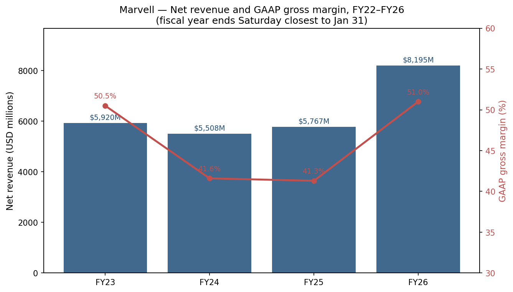
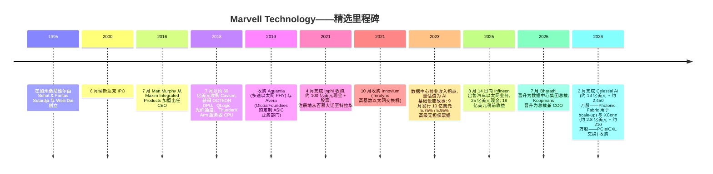
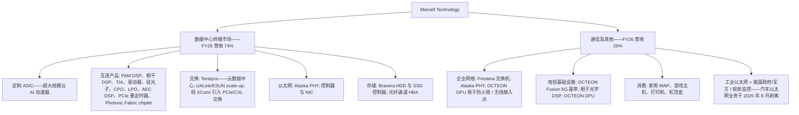
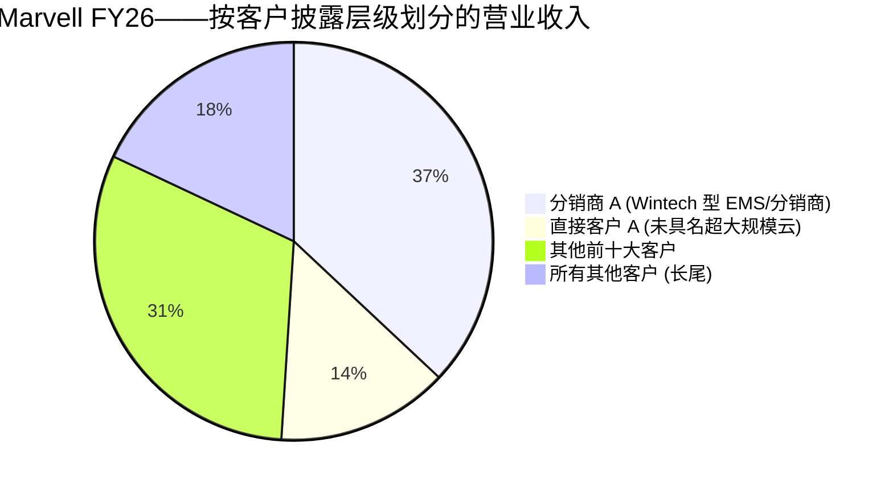
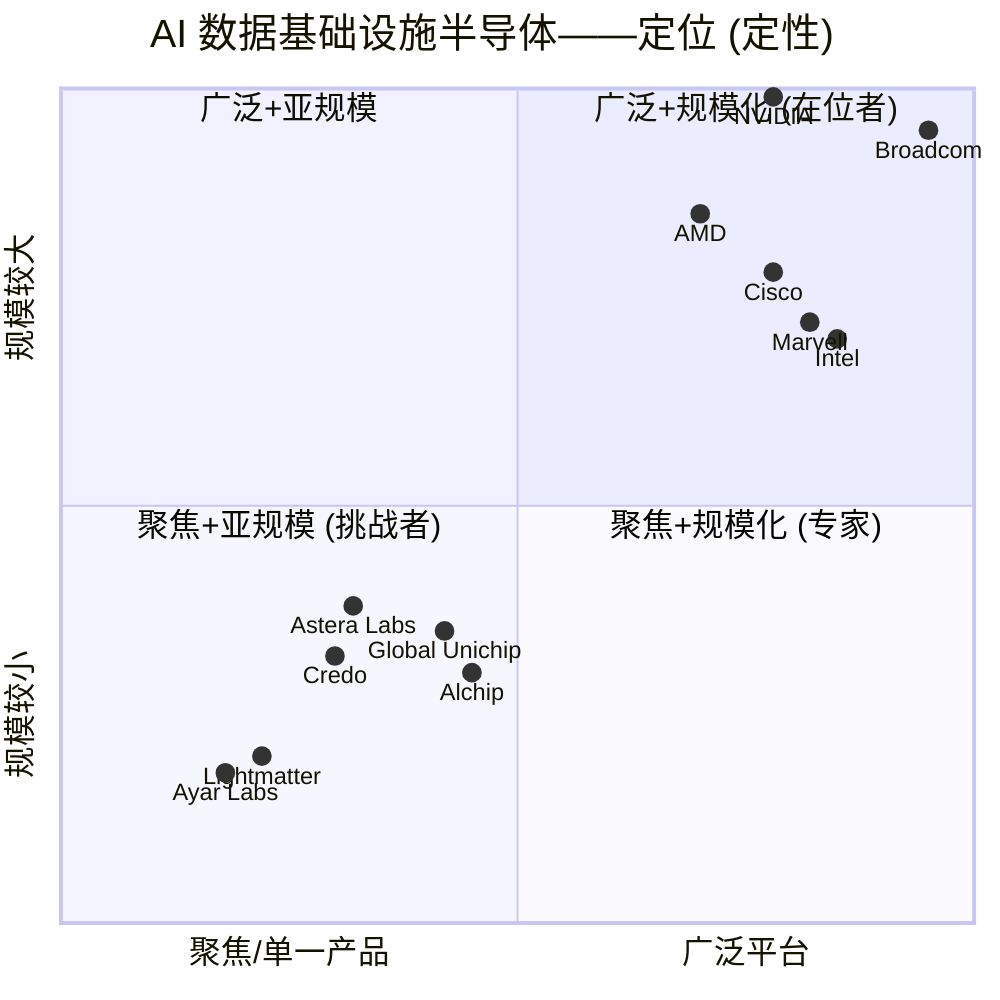
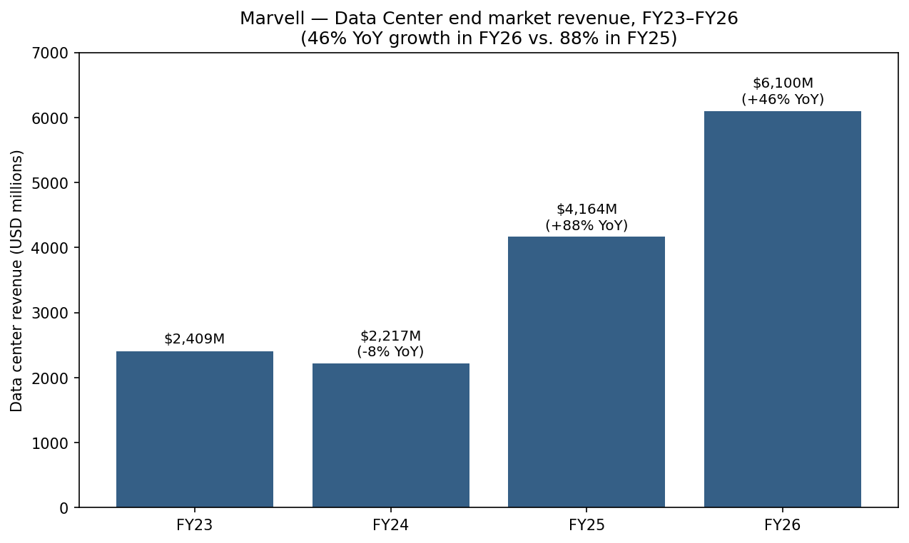

# Marvell Technology, Inc. (NASDAQ:MRVL) — 公司研究报告

**截至日期: 2026-05-20**
**上市地: 纳斯达克全球精选市场 (NASDAQ), 代码 MRVL**
**注册地: 美国特拉华州威尔明顿**
**财年: 截止至最接近 1 月 31 日的星期六; FY26 = 截至 2026-01-31 的财年**
**报告语言: 简体中文 (英文版同时存在于本目录)**

> **业绩更新——FY27 Q1 指引启动 (2026-03-05):** 管理层指引 FY27 Q1 净营业收入 **24.00 亿美元 +/- 5%** (相比 FY26 Q1 实际约 18.95 亿美元, 隐含同比约 **+27%**), GAAP 毛利率 51.4–52.4%, 非 GAAP 毛利率 58.25–59.25%, GAAP 摊薄每股收益 0.31 美元 +/- 0.05 美元, 非 GAAP 摊薄每股收益 0.79 美元 +/- 0.05 美元。该指引已纳入已完成交割的 Celestial AI 与 XConn 收购。CEO Matt Murphy: *"我们预计 2027 财年的营业收入同比增长将逐季度加速, 由数据中心业务的持续强势驱动, 订单量也持续以创纪录的速度增长。"*
> 来源: [FY26 Q4 业绩新闻稿, 2026-03-05](https://www.sec.gov/Archives/edgar/data/1835632/000183563226000006/q426_8kx1312026ex-991.htm)。

---

## 目录

1. 公司概览
2. 公司历史
3. 管理团队
4. 产品与服务
5. 客户与上市策略
6. 行业概览
7. 竞争格局
8. 市场机会 (TAM)
9. 风险评估

参考资料

---

## 1. 公司概览

Marvell Technology, Inc. 是一家在特拉华州威尔明顿 (Wilmington, Delaware) 注册的无晶圆厂 (fabless) 半导体公司, 设计并销售用于数据基础设施 (data infrastructure) 的高性能片上系统 (system-on-chip, SoC) 产品——也就是位于云端 AI 服务器、光模块 (optical transceivers)、交换机、路由器、存储控制器以及连接它们的无线与有线设备内部的硅芯片。公司自我定位为 *"从数据中心核心到网络边缘, 数据基础设施半导体解决方案的领先供应商"* 以及 *"具备开发与规模化复杂片上系统架构核心实力、整合模拟、混合信号与数字信号处理功能的高性能半导体产品无晶圆厂供应商"* ([Marvell FY26 10-K, Item 1](https://www.sec.gov/Archives/edgar/data/1835632/000183563226000011/mrvl-20260131.htm))。截至 2026-01-31, Marvell 拥有 **7,480 名员工**, 其中 49% 位于美洲, 42% 位于亚太 (含印度), 9% 位于欧洲、中东及非洲 (EMEA), FY26 自愿离职率约 7% ([Marvell FY26 10-K, Human Capital](https://www.sec.gov/Archives/edgar/data/1835632/000183563226000011/mrvl-20260131.htm))。

**商业模式。** Marvell 通过三种结构性不同的方式赚钱:

1. **定制专用集成电路 (custom application-specific integrated circuits, ASIC)** ——按特定超大规模云服务商 (hyperscaler) 规格设计, 使用 Marvell 自有 IP 模块的硅芯片 (高速 SerDes、ARM 计算核、安全引擎、先进封装、定制 HBM (High Bandwidth Memory, 高带宽内存) 接口、共封装光学 (co-packaged optics, CPO))。客户支付一次性工程 (non-recurring engineering, NRE) 费用以完成设计与量产爬坡, 之后按大批量量产硅芯片付费。这是增长最快的营收条线, 也是市场普遍 (卖方与行业媒体) 认定亚马逊的 Trainium 2 / Trainium 3、微软的 MAIA 系列加速器以及其他超大规模云服务商专属加速器所在的位置; Marvell 在其 10-K 中并不点名客户。
2. **标准商用产品 (standard merchant products)** ——源自 Inphi 的 PAM4 (脉冲幅度调制, Pulse Amplitude Modulation) DSP、相干 (coherent) 及轻相干 (coherent-lite) 光学 DSP、TIA (跨阻放大器, trans-impedance amplifier)、激光驱动器、硅光子芯片组、PCIe 重定时器 (retimer) (互连产品); Prestera 及 Teralynx 以太网交换机; Alaska 以太网 PHY; QLogic 光纤通道 HBA (主机总线适配器); OCTEON DPU (数据处理单元) 及 Fusion 基带处理器; NITROX/LiquidSecurity 安全处理器; Bravera HDD/SSD 存储控制器。
3. **优化解决方案 (optimized solutions)** ——介于定制与标准之间: 现有 IP 针对单一客户重新组合, 设计周期短于全定制。

**规模。** Marvell 在 **FY26 取得 81.946 亿美元净营业收入**, 较 FY25 的 57.673 亿美元同比 **增长 42.1%**, 自 Inphi 收购后基准年 FY22 以来连续三个增长阶段中的第三阶段 ([Marvell FY26 10-K, Item 7 MD&A](https://www.sec.gov/Archives/edgar/data/1835632/000183563226000011/mrvl-20260131.htm))。GAAP 毛利率同比扩张 970 个基点至 **51.0%** (相比 FY25 的 41.3%, 后者因 3.579 亿美元减值费用而被压低); GAAP 营业利润为 **13.229 亿美元 (营业收入的 16.1%)**, 而 FY25 为 7.203 亿美元 GAAP 营业亏损。FY26 净利润为 **26.701 亿美元 (摊薄每股收益 3.07 美元)**, 而 FY25 为 8.850 亿美元净亏损 (摊薄每股亏损 1.02 美元) ——但 FY26 净利润包含一笔一次性 **2025 年 8 月 14 日向 Infineon Technologies AG 出售汽车以太网业务获得的 25 亿美元现金对应的 18 亿美元税前收益** ([Marvell FY26 10-K, Recent Developments](https://www.sec.gov/Archives/edgar/data/1835632/000183563226000011/mrvl-20260131.htm))。剔除该一次性收益后, FY26 非 GAAP 每股收益为 **2.84 美元**, 同比 +81% ([FY26 Q4 业绩新闻稿, 2026-03-05](https://www.sec.gov/Archives/edgar/data/1835632/000183563226000006/q426_8kx1312026ex-991.htm))。

*来源: GAAP 净营业收入与 GAAP 毛利率来自 [Marvell FY24 10-K (FY23 列)](https://www.sec.gov/Archives/edgar/data/1835632/000183563224000009/mrvl-20240203.htm)、[Marvell FY25 10-K](https://www.sec.gov/Archives/edgar/data/1835632/000183563225000057/mrvl-20250201.htm)、[Marvell FY26 10-K](https://www.sec.gov/Archives/edgar/data/1835632/000183563226000011/mrvl-20260131.htm)。*

**终端市场结构。** 自 FY26 Q4 起, Marvell 将此前披露的四个子类 (企业网络、电信基础设施、消费、汽车/工业) 合并为单一的"通信及其他 (Communications and other)"条线; 唯独数据中心 (Data Center) 仍单独披露 ([Marvell FY26 10-K](https://www.sec.gov/Archives/edgar/data/1835632/000183563226000011/mrvl-20260131.htm))。两个财年间的结构变化非常剧烈:

- FY24: 数据中心 22.167 亿美元 (40%), 通信/其他 32.910 亿美元 (60%)
- FY25: 数据中心 41.642 亿美元 (72%), 通信/其他 16.031 亿美元 (28%)
- FY26: 数据中心 61.003 亿美元 (74%, **同比 +46%**), 通信/其他 20.943 亿美元 (26%, 同比 +31%)

Marvell 不再是一家平衡的数据基础设施半导体公司——它现在已基本上是一家 AI 数据中心半导体公司, 附带仍具规模的通信业务挂载。

**地域分布。** 按发货目的地口径, 中国占 FY26 营业收入 36% (低于 FY25 的 43%), 台湾占 20% (高于 FY25 的 10%), 美国占 14%, "其他"占 30% ([Marvell FY26 10-K, Note 14 Geographic](https://www.sec.gov/Archives/edgar/data/1835632/000183563226000011/mrvl-20260131.htm))。管理层明确警告, 发货目的地 *不* 等于终端客户所在地: "公司向中国发运的产品的相当大部分, 是供位于中国境内的非中国客户的工厂或代工厂使用的, 产品随后会运出中国。"台湾占比上升与 AI 加速器组装迁移至该岛上的 TSMC CoWoS (台积电 Chip-on-Wafer-on-Substrate 先进封装) 与 OSAT (外包封装测试) 产线相吻合。

**估值快照 (2026-05-20)。** 根据 Yahoo Finance / 纳斯达克收盘数据:

- 当前股价: **185.70 美元**; 52 周区间 58.61–193.32 美元 ([Yahoo Finance MRVL 关键指标, 2026-05-20](https://finance.yahoo.com/quote/MRVL/key-statistics))。
- 市值: **1,626 亿美元**, 流通股本约 8.756 亿股。
- **TTM (过去十二个月) 市盈率 (P/E): 60.5×**; **前瞻市盈率: 34.2×**; **TTM 市销率 (P/S): 19.8×**; **市净率 (P/B): 11.0×**; EV/Sales 19.1×; EV/EBITDA 59.4×。

**解读这些倍数。** TTM P/E 60.5× 显著高于标普 500 IT 板块中位数 (~33×), 但被 Infineon 剥离收益 18 亿美元计入净利润所大幅向上扭曲——剔除该一次性项目后, FY26 非 GAAP 每股收益为 2.84 美元, 对应"核心"过往 P/E 约 65× (185.70 美元 / 2.84 美元)。从前瞻角度看, FY27 非 GAAP 每股收益市场一致预期 5.43 美元——锚定于公司 FY27 Q1 0.79 美元 +/- 0.05 美元的指引 ([FY26 Q4 业绩新闻稿](https://www.sec.gov/Archives/edgar/data/1835632/000183563226000006/q426_8kx1312026ex-991.htm)) ——隐含前瞻 P/E **34.2×**, 略低于 NVDA 同一日 19.2× 与 AVGO 22.9×, 但比 Astera Labs (ALAB) 的 67.7× 与 Credo (CRDO) 的 32.9× 便宜 ([yfinance AVGO、NVDA、CRDO、ALAB, 2026-05-20](https://finance.yahoo.com/quote/MRVL/key-statistics))。

P/S 为 **19.8×** 绝对值偏高, 但低于纯 AI 网络同行: AVGO 29.0×, NVDA 25.0×, CRDO 31.3×, ALAB 48.7×。原因明确: 投资者将 Marvell 定价为定制 AI 加速器 + AI 互连平台, 而非如 FY23 时那种多元化半导体公司。*前瞻盈利必须兑现*才能支撑这些倍数——52 周低点 58.61 美元 (距今不到 9 个月) 提醒读者, 情绪可在任一方向上波动 200%+。我们在第 9 章将此标注为**估值倍数压缩风险**。

*来源: [Yahoo Finance, 2026-05-20](https://finance.yahoo.com/quote/MRVL/key-statistics) (通过 yfinance API 提取)。*

**现金及资本结构。** FY26 经营性现金流净额为 **18 亿美元** (相比 FY25 17 亿美元); 资本支出为 3.541 亿美元; 投资活动现金流净流入 21 亿美元主要由 Infineon 25 亿美元出售款项驱动。Marvell 部署了 20 亿美元用于股票回购, 偿还 7.906 亿美元债务, 支付 2.051 亿美元股息 (年化每股 0.24 美元), 发行 12 亿美元新借款; 净股权结算的代扣税款另消耗 2.407 亿美元 ([Marvell FY26 10-K, Item 7 Liquidity](https://www.sec.gov/Archives/edgar/data/1835632/000183563226000011/mrvl-20260131.htm))。年末长期债务接近 40 亿美元, 主要来自 Inphi 收购后的定期贷款结构, 加上 2023 年 9 月发行的 2029 年 (5.75%) 与 2033 年 (5.95%) 高级无担保票据 ([Marvell FY24 10-K, Debt](https://www.sec.gov/Archives/edgar/data/1835632/000183563224000009/mrvl-20240203.htm))。资产负债表为投资级 (investment-grade), 并非业务的限制性约束; 瓶颈在于晶圆厂产能与设计团队规模化。

---

## 2. 公司历史

Marvell 于 **1995 年**在加州桑尼维尔 (Sunnyvale, CA) 由 Sehat Sutardja、Weili Dai 与 Pantas Sutardja 创立, 最初是一家为硬盘驱动器 (hard-disk drives, HDD) 开发读通道 (read-channel) SoC 的无晶圆厂半导体公司。公司于 2000 年 6 月在纳斯达克挂牌上市, 之后的 15 年间最知名的身份是领先的 HDD 控制器供应商 (西部数据、希捷、东芝), 同时拥有规模可观但具周期性的通信/网络业务。Sutardja 兄弟在长期会计与治理审查后于 2016 年离任; Matt Murphy 于当年 7 月从 Maxim Integrated Products 招聘而来出任 CEO。在 Murphy 主导下, 公司从"HDD + 通用通信硅"转向"数据基础设施平台 (data infrastructure platform)"的转型定义了现代 Marvell。

*里程碑来源: [Marvell FY26 10-K, Recent Developments 与 Item 15 Exhibits](https://www.sec.gov/Archives/edgar/data/1835632/000183563226000011/mrvl-20260131.htm); [Marvell FY24 10-K, Notes 5 与 8](https://www.sec.gov/Archives/edgar/data/1835632/000183563224000009/mrvl-20240203.htm); [Marvell 2026 DEF 14A](https://www.sec.gov/Archives/edgar/data/1835632/000110465926060253/tm2528551-1_def14a.htm)。*

**战略转折点及其背后逻辑。**

**转折 #1: 从 HDD 控制器在位者转向并购驱动的网络与计算平台 (2018–2019)。** Murphy 的第一招是 2018 年 7 月以 60 亿美元全股票 + 现金收购 Cavium, 该交易引入 OCTEON DPU 产品线、QLogic 光纤通道 HBA 业务及 ThunderX 基于 Arm 的服务器 CPU 工程。战略推理: HDD 出货量在结构性下降 (SSD 蚕食客户端与温存储), Marvell 需要一个以更高增长率变现其高速模拟/SerDes IP 的去处。Cavium 还带来了 Marvell 原本欠缺的 CEO 级网络业务经验。2019 年中, Aquantia (多速以太网 PHY) 紧随其后, 填补了企业园区以太网空白; 2019 年底, Avera (GlobalFoundries 分拆出来的定制 ASIC 业务部门) 收购完成, 为 Marvell 提供了首支具备航空航天/国防与超大规模云相邻 ASIC 能力的团队——这是现代定制 ASIC 业务的种子。

**转折 #2: Inphi 弥合光学 DSP 缺口 (2021)。** 2021 年 4 月完成的 100 亿美元 Inphi 交易, 事后看是公司历史上影响最深远的单笔交易。Inphi 的 PAM4 DSP 在 2020 年的设计中标浪潮起就已是 400G 数据中心光模块内的主导商用 DSP (按当年多份卖方/行业研究, Inphi 拥有 PAM4 模块份额 >70%)。Marvell 以约 5× 前瞻销售额收购此资产, 通过 40 亿美元定期贷款加股票支付。Inphi DSP 此后成为今日驱动 Marvell 800G 与 1.6T 光学领导地位的平台, 也使公司能凭借如今可信的高速 SerDes 故事在超大规模云端推动定制 ASIC 中标。

**转折 #3: 剥离汽车, 加注 AI (2025–2026)。** 2025 年 8 月以 25 亿美元向 Infineon 出售汽车以太网业务 (这是 Marvell 在 AI 业务以外拥有的最高估值倍数增长资产, 但资本密集且尚未规模化) 是一个明确的信号: 管理层宁愿把工程与资本集中在数据中心机会上, 而不愿在消费周期性的汽车业务上分摊。2026 年 2 月宣布并完成的 Celestial AI (13 亿美元现金 + 约 2,450 万股) 与 XConn (2.8 亿美元 + 约 210 万股) 交易是再部署: Celestial 带来 Photonic Fabric chiplet (用于机架内及跨机架加速器之间的 scale-up 光学互连); XConn 带来 PCIe / Compute Express Link (CXL) 交换硅, 并为 UALink scale-up 交换团队增加工程深度 ([Marvell FY26 10-K, Recent Developments](https://www.sec.gov/Archives/edgar/data/1835632/000183563226000011/mrvl-20260131.htm))。

**近期动态 (过去 12 个月)。**

- 季度股息维持在每股 0.06 美元 (年化 0.24 美元); FY26 共支付 2.051 亿美元。
- FY26 股票回购金额 20 亿美元, 相比 FY25 的 7.25 亿美元——表明随着现金流规模化, 资本回报有了跨阶段提升。
- 2025 年 7 月, Sandeep Bharathi 晋升为数据中心集团总裁——这是一个新设职位, 将 AI 数据中心 P&L 提升为向 CEO 汇报的独立领导岗位。
- FY26 提取 12 亿美元新借款, 同时偿还 7.906 亿美元债务——净新增债务约 4 亿美元, 主要用于资助 Celestial / XConn 收购。

---

## 3. 管理团队

### Matt Murphy——董事长兼首席执行官

Matthew J. Murphy 自 **2016 年 7 月**起担任 Marvell CEO, 自 2016 年起担任董事, 自 **2023 年 6 月**起担任董事长; 他从 2016 年起至 2025 年 7 月一直兼任总裁, 之后该头衔移交给 Chris Koopmans ([Marvell 2026 DEF 14A, Directors](https://www.sec.gov/Archives/edgar/data/1835632/000110465926060253/tm2528551-1_def14a.htm))。加入 Marvell 之前, Murphy 在 **Maxim Integrated Products** (一家模拟与混合信号 IC 设计公司) 工作 22 年, 历任一系列具备 P&L 责任的职务: 2015–2016 年, 任执行副总裁兼业务单元、销售与营销负责人, 全公司范围承担产品开发、销售、现场应用、营销与中央工程的 P&L 责任; 2011–2015 年, 任通信与汽车解决方案集团高级副总裁, 领导该团队为这些市场开发差异化解决方案; 2006–2011 年, 任全球销售与营销副总裁, 期间 Maxim 销售大幅扩张 ([Marvell 2026 DEF 14A, 董事候选人简历](https://www.sec.gov/Archives/edgar/data/1835632/000110465926060253/tm2528551-1_def14a.htm))。Murphy 拥有 Franklin & Marshall College 文学学士学位, 并完成了斯坦福高管项目 (Stanford Executive Program)。他此前曾担任 eBay Inc. 董事。

Murphy 是 Marvell-作为数据基础设施平台战略的总设计师, 主导执行了无晶圆厂半导体并购史上最重要的三笔交易 (2018 年 Cavium、2021 年 Inphi、2021 年 Innovium), 加上近期 Celestial / XConn 收购。他 FY26 的总薪酬为 **25,064,348 美元**, CEO 与员工中位数薪酬比约 158:1 ([Marvell 2026 DEF 14A, CEO Pay Ratio](https://www.sec.gov/Archives/edgar/data/1835632/000110465926060253/tm2528551-1_def14a.htm))。其离职补偿协议在 FY24 已延长至 2028 年 4 月 15 日。他选择递延 2025 年 4 月归属的 144,662 股 TSR RSU 结算 (目标的 84%)。Murphy 不是创始人, 也不持有控股权; 与几乎所有具名高管一样, 其薪酬的大部分与股权挂钩。

Murphy 履历总评: 自 2016 年以来无晶圆厂半导体行业中最强的 CEO 之一。他接手了一家具有治理悬顶的 23 亿美元业务, 通过三次收购加上有意识的剥离遗留/亚规模资产 (传统 WiFi 连接业务、出售给 NXP 的交换 ASIC 业务, 以及最近以 25 亿美元出售给 Infineon 的汽车以太网), 将其转化为 82 亿美元的数据基础设施平台, 并拥有可信的定制 ASIC 业务。其弱点是任何并购驱动型 CEO 都会面临的结构性弱点: 自 Inphi 收购以来毛利率有所压缩 (FY23 GAAP 毛利率 50.5%, FY25 41.3%, FY26 因规模吸收整合成本而回升至 51.0%) ([Marvell FY24 10-K, Item 7 MD&A](https://www.sec.gov/Archives/edgar/data/1835632/000183563224000009/mrvl-20240203.htm))。

### Willem Meintjes——首席财务官

Willem Meintjes 自 **2023 年 1 月**起担任 CFO。在升任之前, 他自 2018 年 6 月至 2023 年 1 月任 Marvell 首席会计师 (Chief Accounting Officer) 兼司库 (Treasurer), 自 2016 年 6 月任财务高级副总裁。加入 Marvell 之前, 他曾任 Newport Corporation 副总裁兼公司控制人 (Corporate Controller) (2015–2016 年 6 月), International Rectifier 副总裁兼控制人 (2013–2015 年)。他拥有约翰内斯堡大学会计学商学学士及会计学商学荣誉学士学位 ([Marvell 2026 DEF 14A, Executive Officers](https://www.sec.gov/Archives/edgar/data/1835632/000110465926060253/tm2528551-1_def14a.htm))。他此前未在比 Marvell 更大规模的上市公司担任过 CFO, 这是一个值得标注的提示——但他已带领公司走过 Inphi 整合后的过渡、两次大型重组 (FY24 1.31 亿美元、FY25 3.54 亿美元重组费用)、FY26 Infineon 剥离, 以及营业收入翻倍。即使营业收入增长 42%, 股权激励 (stock-based compensation, SBC) 在绝对美元额上保持大致持平 (FY25 5.974 亿美元至 FY26 5.908 亿美元), 明显改善了 SBC 占营业收入比率 ([Marvell FY26 10-K, MD&A](https://www.sec.gov/Archives/edgar/data/1835632/000183563226000011/mrvl-20260131.htm))。

### Sandeep Bharathi——数据中心集团总裁

Bharathi 自 **2025 年 7 月**起担任**数据中心集团总裁 (President, Data Center Group)** ——这是一个新设头衔, 旨在提升 AI 数据中心 P&L 的层级。他此前自 2022 年 6 月至 2025 年 7 月任**首席开发官 (Chief Development Officer)**, 2021 年 4 月至 2022 年 6 月任中央工程片上系统集团执行副总裁, 2019 年 2 月至 2021 年 4 月任中央工程高级副总裁。加入 Marvell 之前, 他曾任 Intel 工程副总裁, 领导 FPGA 产品与技术开发 (Intel 在 2015 年收购 Altera 后的旧 Altera FPGA 业务); 在此之前他曾在 Xilinx 与 AMD 担任高级工程领导职务。他拥有班加罗尔大学电子工程学士学位、新泽西理工学院电气工程硕士学位, 并完成了斯坦福高管项目 ([Marvell 2026 DEF 14A, Executive Officers](https://www.sec.gov/Archives/edgar/data/1835632/000110465926060253/tm2528551-1_def14a.htm))。Bharathi 是直接对作为多头逻辑核心的定制 ASIC 业务负责的高管。

### Chris Koopmans——总裁兼首席运营官

Koopmans 自 **2025 年 7 月**起任**总裁 (President)**, 自 **2025 年 2 月**起任**COO** (从此前自 2021 年 3 月起担任的首席运营官头衔重新命名)。他与 Murphy 同期 2016 年加入 Marvell, 初期领导全球销售与营销, 随后领导网络与连接业务集团 (2016–2018 年), 然后是业务运营执行副总裁 (2018–2019 年) 与营销与业务运营执行副总裁 (2019–2021 年)。他是 Bytemobile (2012 年被 Citrix 收购) 的联合创始人。他兼任 Qorvo 董事。他拥有伊利诺伊大学计算机工程学士学位, 并在该校获得过美国国家科学基金会研究生研究奖学金 (NSF Graduate Research Fellowship) 攻读博士 ([Marvell 2026 DEF 14A, Executive Officers](https://www.sec.gov/Archives/edgar/data/1835632/000110465926060253/tm2528551-1_def14a.htm))。

### 治理结构

董事会有 **9 名董事** (2026 年其中 8 人参加换届选举); 独立性高——仅 Murphy 一人为管理层董事。根据 2026 DEF 14A, 首席独立董事是 **Richard S. Hill** (前 Novellus CEO), 不过 **Brad Buss** (前 SolarCity、Cypress Semiconductor CFO; 前 Tesla 与 Cavium 董事) 自 2018 年 7 月起任 Marvell 董事, 自 2025 年 6 月起任首席独立董事 ([Marvell 2026 DEF 14A](https://www.sec.gov/Archives/edgar/data/1835632/000110465926060253/tm2528551-1_def14a.htm))。其他值得注意的董事包括 Rajiv Ramaswami (Nutanix CEO; 前 Broadcom EVP 及 IEEE Fellow, 持有 36 项光网络专利; 在 Marvell 互连战略上具备理想行业深度)、Richard P. Wallace (自 2006 年起任 KLA CEO) 与 Daniel R. Durn (Adobe CFO, 曾任 Applied Materials、NXP 与 Freescale CFO)。所有董事与高管整体实益持有 1,046,798 股——占已发行股本 847,287,680 股不到 1% ([Marvell 2026 DEF 14A, Beneficial Ownership](https://www.sec.gov/Archives/edgar/data/1835632/000110465926060253/tm2528551-1_def14a.htm))。机构持股以 Vanguard 为主 (约 7,960 万股, 截至 2025-09-30 占 9.4%, 据 2025-10-31 提交的 Schedule 13G/A), 以及其他大型被动/主动基金 ([Vanguard 13G/A, 2025-10-31](https://www.sec.gov/cgi-bin/browse-edgar?action=getcompany&CIK=0001835632&type=SC+13G&dateb=&owner=include&count=40))。

**履历综合判断。** 这是一支专业、富有交易经验的管理团队: CEO 任期长达 10 年, CFO 在公司服务 9 年, 经营领导者均亲自完成过 Inphi、Cavium 与 Innovium 整合。值得注意的差距在于, 没有一位具名高管是首次在如此规模上担任上市公司 CEO/CFO (Meintjes 在出任 CFO 之前从未在 80 亿美元营业收入级别的上市公司任 CFO), 而客户集中度结构意味着少数几位超大规模云客户关系 (Murphy 本人、Bharathi 负责技术、Koopmans 负责商务) 承担超额权重。内部持股低于 1% 与专业管理的无晶圆厂半导体公司一致, 但这意味着利益绑定纯粹通过 PSU / RSU 机制实现, 而非创始人资本。

---

## 4. 产品与服务

Marvell 将其硅产品组织为**八大产品族**, 服务**两个披露的终端市场** (数据中心与通信及其他)。下列产品描述引用自 10-K Item 1 "我们的市场与产品 (Our Markets and Products)"章节 ([Marvell FY26 10-K](https://www.sec.gov/Archives/edgar/data/1835632/000183563226000011/mrvl-20260131.htm))。

*来源: [Marvell FY26 10-K, Item 1 Markets and Products](https://www.sec.gov/Archives/edgar/data/1835632/000183563226000011/mrvl-20260131.htm)。*

### 4.1 定制 ASIC (旗舰产品; AI 加速器核心业务)

**它做什么。** 针对特定客户规格定制的半导体解决方案, 用于 AI、数据中心计算、网络、电信、存储与航空航天/国防应用。Marvell 可复用的 IP 套件包括超高速 SerDes (224G 代次正在量产, 448G 在研)、ARM 计算核、安全模块、存储控制器、硅光子, 以及包含芯粒间互连 (die-to-die interconnect)、chiplet、共封装光学 (CPO) 与定制 HBM 在内的先进封装。公司已量产 5nm 设计, 正在向 3nm 量产推进, 并已在 2nm 平台上展开开发 ([Marvell FY26 10-K](https://www.sec.gov/Archives/edgar/data/1835632/000183563226000011/mrvl-20260131.htm))。

**客户。** 希望使用非商用 GPU 加速器的超大规模云服务商。Marvell 在 10-K 中并不点名客户。2025/2026 年多份卖方研究报告广泛将 Marvell 与亚马逊 Trainium 2 / Trainium 3 (AWS 主力自研训练加速器系列)、微软 MAIA 系列加速器项目及其他超大规模云项目联系起来; 公司本身仅公开确认存在多家"主要客户"生产出量产硅片。卖方对哪家超大规模云对应 Marvell 哪个项目的报道是一致的, 但并未得到公司确认; 读者应将这些映射视为知情第三方报道, 而非 10-K 披露的事实。

**定价 / 单笔规模。** NRE 费用加上单位硅片营业收入。引述 FY25 10-K 风险章节: *"针对某些产品, 我们采用 ASIC 模式提供 IP、设计团队、晶圆厂与封装的端到端解决方案, 向客户交付经过测试与良率的产品。该商业模式毛利率通常较低。此外, 此类商业模式的相关成本通常包含显著的 NRE 成本, 客户根据里程碑完成度支付"* ([Marvell FY25 10-K, Risk Factors](https://www.sec.gov/Archives/edgar/data/1835632/000183563225000057/mrvl-20250201.htm))。因此, 定制 ASIC 的结构性毛利率低于商用 DSP, 但代表多年加速器生命周期内的循环单位营业收入, 一旦硅片被设计入产品就近乎完美锁定客户。

**竞争优势: 是——护城河是规模、IP 与切换成本。** Marvell、Broadcom, 以及规模较小的 Alchip Technologies 与 Global Unichip (TSMC 旗下的捕获式 ASIC 厂) 是 AI 加速器领域可信的四家商用定制 ASIC 合作伙伴。Broadcom 是更大的、先入为主的玩家 (Google TPU 血脉)。Marvell 的护城河在于其全栈高速 SerDes IP (尤其 224G SerDes 已在 Marvell 量产, 领先大多数对手, 是下一代加速器 I/O 的瓶颈), 加上 Broadcom 不具备同等程度的光学与 CPO 整合, 加上 Cavium / Avera / Innovium 收购之后用于超大规模云定制的深度工程团队。**最接近的竞品: Broadcom 用于 Google TPU v5p/v6、Meta MTIA v2 (据报道) 与 OpenAI-Broadcom 合作项目的定制 ASIC 家族。**一句话对比: AVGO 在单位出货量上领先 (TPU 大规模出货时间更长); MRVL 在 224G SerDes 成熟度与光电一体化上持平或领先; **终身竞争地位将由谁在 Trainium / MAIA / MTIA 扩张时拿下 AWS、MSFT 与 Meta 的下一批 socket 决定。**

### 4.2 互连产品 (源自 Inphi; 商用旗舰)

**它做什么。** 完整的高速电与光互连半导体组合: PAM (脉冲幅度调制) DSP、相干及轻相干 DSP、激光驱动器、跨阻放大器 (TIA)、硅光子、共封装光学 (CPO) 芯片组、线性可插拔光学 (linear pluggable optics, LPO) 芯片组、数据中心互连 (DCI) 模块、有源电缆 (active-electrical-cable, AEC) DSP、PCIe 重定时器, 以及——由 Celestial 新加入的——**Photonic Fabric** chiplet, 用于 scale-out 光学互连 ([Marvell FY26 10-K, Item 1](https://www.sec.gov/Archives/edgar/data/1835632/000183563226000011/mrvl-20260131.htm))。

**客户。** 为超大规模云数据中心网络制造可插拔光模块的光模块厂商 (Innolight 旭创、Coherent、Eoptolink、AOI、海信宽带、AAOI); 交换机 ODM; 以及在 CPO 与 LPO 设计上日益直接面向超大规模云客户。

**竞争优势: 是——源自 Inphi 的 PAM4 DSP 是 400G/800G 数据中心光学领域的商用标准。** Inphi PAM4 DSP 自 2020 年设计中标浪潮起进入大多数商用 400G 模块; 800G 代次延续了该份额, Marvell 的 1.6T DSP 正在送样。**最接近的竞品: Broadcom 的 PAM4 DSP 系列 (Trident-DSP 与后续产品) 与 Credo Technology 的光学与 AEC DSP。**一句话对比: MRVL 在光学 DSP 单位份额与模块生态广度上领先; AVGO 在 2024/2025 年于 PAM4 取得进展, 是某些超大规模云内部设计的选择; **Credo (CRDO) 是最激进的挑战者, 在 AEC 与日益增长的光学领域赢得显著份额**——但相对 Marvell 仍较小。Astera Labs (ALAB) 并非直接 PAM4 竞品——它更直接地与下文 PCIe 重定时器产品线竞争。

### 4.3 以太网解决方案

**组成。** Prestera 与 Teralynx 以太网交换机 (12 Gbps 至 51.2 Tbps); Alaska 以太网 PHY (10 Mbps 至 1.6 Tbps, 含多速 Multi-Gig); 以太网控制器与网卡 ([Marvell FY26 10-K](https://www.sec.gov/Archives/edgar/data/1835632/000183563226000011/mrvl-20260131.htm))。Teralynx (源自 Innovium IP) 面向云数据中心交换; Prestera 面向园区/中小企业/电信。Alaska PHY 业务 (源自 Aquantia 的多速以太网) 是 PC、工作站、WAP 与小型交换机中 2.5G/5G/10G 以太网的商用标准。

**竞争优势: 部分。** Marvell 在商用云数据中心以太网交换市场是第二或第三, 落后 Broadcom Tomahawk 系列。**最接近的竞品: Broadcom Tomahawk 5 (51.2 Tbps); Cisco Silicon One Q200 系列; NVIDIA Spectrum-X。**一句话对比: MRVL Teralynx 10 处于 51.2 Tbps 代次, 在带宽与功耗上有竞争力, 但 Broadcom 保持更大的商用份额与更稳固的生态; NVIDIA Spectrum-X 在以 NVIDIA GPU 为核心的 AI 集群内份额上升。

### 4.4 Scale-Up 交换机 (UALink/ESUN)

Marvell 正在开发 UALink (Ultra Accelerator Link) 与 ESUN (Ethernet for Scale-Up Networking) 交换架构, 利用 Teralynx 交换架构与 224G SerDes。Scale-up 网络是指在**多加速器机架或 pod 内部**的高带宽、低延迟互连——即今日 NVIDIA NVLink Switch 在 DGX SuperPOD 内占据的位置。UALink 是多厂商联盟的回应 (AMD、Broadcom、Google、Intel、Meta、Microsoft、Marvell 为成员) ([UALink 联盟新闻资料, 2024-10](https://ualinkconsortium.org/))。竞争优势: 待定——尚未产生营业收入; 战略意义极大。**最接近的竞品: NVIDIA NVLink Switch 芯片 (NVL72 代次)。**这是 Marvell 在 2027–2030 年间最大的单一 TAM 开拓机会——但执行能力尚未得到验证。

### 4.5 PCIe 与 CXL 交换机 (源自 XConn)

XConn 于 2026 年 2 月完成交割, 引入高基数 PCIe (Gen 5/6) 与 CXL 交换机, 以及多级交换架构。PCIe 交换在 AI 服务器中正在爆发 (主机到加速器、加速器到加速器); CXL 实现内存池化与解耦。**最接近的竞品: Astera Labs Aries (PCIe 重定时器) 与 Leo (CXL 内存控制器); Microchip Switchtec; Broadcom PEX 系列。**一句话对比: ALAB 是该品类的高估值标的, P/S 48.7×; MRVL 通过 XConn 是新进入者, 拥有更大的客户关系但产品成熟度落后。Marvell 的 PAM4 重定时器 (在光学侧已是品类领导) 加上 XConn 的交换机的组合, 在 2027–2028 年若整合顺利, 将对 ALAB 的在位优势构成可信威胁。

### 4.6 光纤通道产品 (QLogic)

QLogic 光纤通道 HBA (主机总线适配器) 与控制器, 用于企业数据中心的服务器与存储连接。成熟业务; 主要竞争对手是 Broadcom (Emulex)。慢增长的现金牛业务; 毛利率正向贡献。

**竞争优势: 是 (双寡头)。**最接近的竞品: Broadcom Emulex。一句话对比: 大致持平; 份额多年来保持稳定。

### 4.7 处理器 (OCTEON DPU + Fusion 基带 + NITROX / LiquidSecurity)

**OCTEON DPU** ——用于电信、数据中心与企业路由器、交换机、安全设备、内容感知交换机、NFV / SDN 基础设施的 Layer 4-7 处理。**OCTEON Fusion** ——5G 基带处理器, 用于企业小蜂窝与户外宏蜂窝无线单元; 支持大规模 MIMO。**NITROX / LiquidSecurity** ——安全/加密处理器, 包含 LiquidSecurity 2 HSM (硬件安全模块) 设备, 用于云/企业私钥管理。**LiquidIO** ——可编程服务器 NIC, 用于云端 offload ([Marvell FY26 10-K, Item 1](https://www.sec.gov/Archives/edgar/data/1835632/000183563226000011/mrvl-20260131.htm))。

**竞争优势: 部分。** OCTEON 是 Mellanox/NVIDIA BlueField 生态以外商用领先的 DPU, 但 BlueField 已赢得大多数 AI 数据中心 NIC slot。Fusion 基带在 5G 开放 RAN 中与高通和 Intel 的无线芯片竞争——Fusion 是诺基亚和三星小蜂窝的商用首选。NITROX HSM 是云 HSM 的商用标准, 在 AWS / Azure / Google 托管 HSM 服务中近乎垄断。

### 4.8 存储控制器 (Bravera)

**Bravera HDD 控制器**整合 Marvell 业内领先的读通道技术——Marvell 最初的业务——并出货至当前所有 HDD OEM (希捷、西部数据、东芝)。**Bravera SSD 控制器**用于数据中心、企业级与客户端 (SAS、SATA、PCIe、NVMe、NVMe-oF)。成熟、低增长、毛利率正向贡献 ([Marvell FY26 10-K, Item 1](https://www.sec.gov/Archives/edgar/data/1835632/000183563226000011/mrvl-20260131.htm))。

**竞争优势: 是 (HDD 近乎垄断; SSD 有竞争)。**最接近的竞品: HDD 上是 Broadcom (极有限的竞争), SSD 控制器上是 Phison 与 Silicon Motion (主要在客户端)。一句话对比: HDD 控制器是 Marvell 领先的结构性双寡头; SSD 控制器竞争更为激烈。

### 4.9 近 12 个月的产品发布与剥离

- **2025 年 8 月**: 以 25 亿美元向 Infineon 出售汽车以太网业务。汽车专用 PHY (Brightlane 多速以太网, 用于车内网络、ADAS、自动驾驶网络) 不再是 Marvell 产品。
- **2026 年 2 月**: 完成 Celestial AI (用于 scale-out 光学互连的 Photonic Fabric chiplet) 与 XConn Technologies (PCIe/CXL 交换硅及 UALink scale-up 工程团队) 交割。
- **整个 FY26**: 800G PAM4 DSP 持续量产; 1.6T PAM4 DSP 送样中; 224G SerDes 在定制 ASIC 中量产; CPO 与 LPO 芯片组进入早期客户评估。
- **旗舰 1.6T DSP 发布与 51.2 Tbps Teralynx 10 交换机**是支撑 FY26 数据中心爬坡的商用支柱。

**驱动业务的 1–3 个旗舰产品。**

1. **定制 ASIC 平台** ——FY26 数据中心营业收入加速的主要驱动力, 也是管理层叙事中 FY27+ 增长的主导来源。
2. **PAM4 / 相干光学 DSP** (源自 Inphi) ——商用现金奶牛, 为 ASIC 爬坡提供资金。
3. **Teralynx 以太网交换机 + UALink/PCIe-CXL 交换平台** ——战略意义的第三条腿, 当前规模小得多, 但 2027–2030 年最大的单一 TAM 开拓机会。

---

## 5. 客户与上市策略

**分部。** Marvell 几乎完全 B2B 向少数大客户销售: 超大规模云服务商 (亚马逊云科技 AWS、微软、谷歌、Meta)、网络 OEM (思科 Cisco、Arista、诺基亚、爱立信、三星网络、Juniper、HPE-Aruba)、存储 OEM (希捷、西部数据、东芝、NetApp、Dell EMC、IBM)、光模块厂商 (Innolight 旭创、Coherent、Eoptolink、AOI、海信宽带、AAOI), 以及通过 Avera 沿袭定制 ASIC 业务的政府/国防系统集成商。

**客户集中度——高且上升。** FY26 中, **前 10 大客户 (含分销商与直接客户) 的净营业收入占总净营业收入的 82%** ([Marvell FY26 10-K, Risk Factors](https://www.sec.gov/Archives/edgar/data/1835632/000183563226000011/mrvl-20260131.htm))。10-K Item 1 披露的占营业收入 ≥10% 的客户/分销商:

| | FY26 | FY25 | FY24 |
|---|---|---|---|
| 直接客户 A | **14%** | 13% | <10% |
| 分销商 A | **37%** | 34% | 24% |

*来源: [Marvell FY26 10-K, Item 1 Customers](https://www.sec.gov/Archives/edgar/data/1835632/000183563226000011/mrvl-20260131.htm)。*

分销商 A 极有可能是 Wintech (基于往年披露与 Wintech 自身公开文件, 是 Marvell 最大的分销商) ——37% 这一数字背后的实际终端客户构成比 37% 这一数字所暗示的要分散得多。直接客户 A 未具名; 卖方研究普遍认定其为超大规模云服务商。按客户类型, FY26 划分为 57% 直接客户 (46.304 亿美元) 与 43% 分销商 / EMS ([Marvell FY26 10-K, Note 14](https://www.sec.gov/Archives/edgar/data/1835632/000183563226000011/mrvl-20260131.htm))。

*来源: [Marvell FY26 10-K, Item 1 Customers](https://www.sec.gov/Archives/edgar/data/1835632/000183563226000011/mrvl-20260131.htm); "其他前十大"占比由 82% (前十) 减 14% (客户 A) 减 37% (分销商 A) = 31% 推算; 剩余 18% 为长尾。*

**严重程度评估。** 单一客户 (一个主体占 37%) 占比 **>20%** ——具有实质影响; 前五客户合计明显超过 50% ——同样具有实质影响。我们在第 9 章将其标注为高严重程度的公司特有风险。缓解因素: (a) 分销商背后的终端客户群比数字暗示的更分散; (b) 定制 ASIC 合作通常有多年设计周期, 使关系黏性较强; (c) 净营业收入通过主采购协议与采购订单 (POs) 的组合形式合同化。

**渠道结构。** 直接向大型 OEM 与超大规模云客户销售; 北美使用分销商与厂商代表; 第三方物流在客户工厂附近设有仓库。Marvell 不拥有任何制造设施——晶圆由 TSMC (主要)、三星代工与 GlobalFoundries 加工; 封装/测试由 ASE Technology 日月光、Amkor 安靠以及其他 OSAT 合作伙伴在中国、马来西亚、新加坡、台湾与加拿大完成 ([Marvell FY26 10-K, Risk Factors](https://www.sec.gov/Archives/edgar/data/1835632/000183563226000011/mrvl-20260131.htm))。先进制程 (5nm、3nm、2nm) 对 TSMC 的依赖是一种结构性供应商集中, 我们也在第 9 章纳入考量。

**销售周期。** 定制 ASIC 合作从规格到首颗硅片有 18–36 个月的设计窗口期, 然后是数个季度爬坡才到达量产高峰。标准商用产品 (PAM DSP、交换机) 有 6–18 个月的设计中标周期加上 12–24 个月的量产爬坡。意涵: Marvell 在任意时点的营业收入大体上是由 1–3 年前的设计中标"锁定"的。CEO Matt Murphy 在 FY26 Q4 电话会上披露 *"2026 财年设计中标达到历史新高, 我们预计这将继续推动我们未来的增长"* ([FY26 Q4 业绩新闻稿, 2026-03-05](https://www.sec.gov/Archives/edgar/data/1835632/000183563226000006/q426_8kx1312026ex-991.htm))。

**关键合作伙伴。** TSMC (晶圆厂合作伙伴——节点可用性是运营瓶颈); SK Hynix 与美光 (定制 ASIC 集成的 HBM 合作伙伴); ASE Technology 日月光与 Amkor 安靠 (包括 CoWoS 衬底与 chiplet 集成的先进封装); Innolight 旭创 / Coherent / Eoptolink / AAOI (消费 PAM4 DSP 的光模块厂商); UALink 联盟 (Marvell 是创始成员, 与 AMD、苹果、Broadcom、谷歌、Intel、Meta、微软同列)。

---

## 6. 行业概览

**行业定义。** Marvell 处于 NAICS-334413 (半导体) 三个子细分的交汇处: (a) AI / 数据中心计算加速器 (定制与商用), (b) 数据中心网络与互连硅, (c) 有线/无线电信基础设施硅。自 2022 年以来, AI 集群规模化将此前各自独立的品类 (计算、交换、光学) 整合进单一一体化基础设施平台, 三者的经济边界已经被消弭。

**市场规模。** 根据 IDC 2026 年 1 月《全球半导体预测 (Worldwide Semiconductor Forecast)》, 半导体行业总营业收入 2026 年预计约 7,250 亿美元 (相比 2024 年的 6,260 亿美元), 其中数据中心子细分超过 2,300 亿美元 ([IDC 新闻稿, 2026-01-15](https://www.idc.com/getdoc.jsp?containerId=prUS52988226))。在数据中心内, AI 加速器硅 (GPU + 定制 ASIC + AI 专用网络) 是增长最快的部分, 综合多份卖方对 NVIDIA、AMD、Broadcom、Marvell 与超大规模云内部消费的汇总后, 2026 年预计约 1,700 亿美元——尽管由于"AI 半导体"与"数据中心半导体"边界流动, 精确规模仍存争议。

**增长。** 根据最近 Gartner 与 IDC 的情景预测, 数据中心半导体营业收入预计至 2028 年保持约 22–28% CAGR 增长 ([Gartner 全球 AI 半导体预测, 2025 年 Q4](https://www.gartner.com/en/newsroom/press-releases/2025-11-18-gartner-forecasts-worldwide-ai-semiconductor-revenue-to-grow); [IDC, 2026-01-15](https://www.idc.com/getdoc.jsp?containerId=prUS52988226))。其中, 定制 ASIC 加速器营业收入 (Marvell 与 Broadcom 正面对决的领域) 预计增长更快——30–45% CAGR ——因为超大规模云客户在有意分散其 NVIDIA 唯一来源的供应, 且每一代新加速器在硅含量上大致翻倍。PAM4 / 相干光学 DSP TAM 预计从 2024 年约 30 亿美元在 2027 年大致翻倍至 60+ 亿美元, 随着 800G 模块规模化与 1.6T 开始爬坡 ([LightCounting 光模块预测, 2026-Q1](https://www.lightcounting.com/news/2026-Q1-Optical-Communications-Market-Report))。

**关键趋势。**

1. **超大规模云客户的纵向一体化** ——AWS、微软、谷歌与 Meta 现在都运营自研加速器项目 (分别为 Trainium、MAIA、TPU、MTIA)。他们需要商用 ASIC 合作伙伴, 因为内部建立 200 人无晶圆厂能力在经济上不划算。这是 Marvell 定制 ASIC 业务背后的结构性顺风, 但也是结构性威胁——如果某家超大规模云客户决定内部化某项目 (谷歌为 TPU v1 这样做, 然后从 v3 开始转回与 Broadcom 合作), 营业收入可一夜之间转移。
2. **224G SerDes 及以后** ——每通道数据速率的路线图 (当前一代 112G PAM4, 2025-2027 代次 224G, 在研 448G) 是下一代加速器与交换机的瓶颈约束。基于客户反馈, Marvell 在 224G 量产硅上领先 Broadcom; 这是 MRVL 在 2024–2026 年定制 ASIC 中标率的技术基础。
3. **CPO / LPO / Photonic Fabric** ——光 I/O 正在从可插拔光模块 (现在) 向共封装光学 (2025-2026 年有限部署), 再向完全集成进加速器封装的硅光子互连 (Celestial Photonic Fabric 愿景) 迁移。这是 5+ 年的转型; Marvell 的 Celestial 收购使其成为早期 scale-up 光学互连品类中最可信的商用供应商。
4. **Scale-up 网络标准化 (UALink、ESUN)** ——行业对 NVIDIA NVLink 的回应。UALink 1.0 规范于 2024 年 Q4 发布; 首批硅预计 2026–2027 年。
5. **5G 电信资本支出常态化, 6G 爬坡缓慢** ——Marvell 的 OCTEON Fusion 基带暴露于全球电信资本支出, 自 2024 年以来一直低于趋势水平。

**监管环境。** 主要敞口: (a) 美国对中国先进计算与 EDA 软件的出口管制 (2022 年 10 月 / 2023 年 10 月 / 2024 年 12 月 BIS 规则) ——限制 Marvell 向被点名的中国客户销售某些先进制程产品; (b) 中国自 2023 年起对镓、锗与稀土加工的对等出口管制——影响衬底与 OSAT 供应链; (c) Marvell 在 Avera 收购相关的国家工业安全计划 FOCI 缓解协议——仍部分在效; (d) 标准的台湾与中国进入美国关税敞口, 2025 年间有所波动。

**行业结构。** 顶端高度集中——NVIDIA 在商用 AI GPU 居主导; Broadcom + Marvell 主导商用定制 ASIC 与高速交换; Astera + Marvell + Broadcom + Microchip 主导 PCIe 重定时器/交换机; Credo + Marvell + Broadcom 主导商用光学 DSP。晶圆厂端集中度更高——TSMC 实质垄断领先制程 AI 硅。客户端也集中——五大超大规模云客户 (AWS、微软、谷歌、Meta、Oracle) 占据 AI 基础设施资本支出的大部分。行业进入壁垒极高: 高速 SerDes IP 在世界级水平上需要 5–8 年构建; 晶圆厂先进制程产能由 TSMC 配额; 超大规模云客户的信任通过多个成功的设计代次赢得。

---

## 7. 竞争格局

Marvell 在 10-K 中点名 25 家直接竞争对手。该集合涵盖通用 CPU/FPGA 大厂、专门的光学 DSP / 互连竞争者、交换机 / 商用网络同行, 以及新兴初创: *"Advanced Micro Devices, Inc. ('AMD'), Alchip Technologies ('Alchip'), Astera Labs, Inc., Ayar Labs, Inc. ('Ayar Labs'), Broadcom Inc. ('Broadcom'), Cisco Systems, Inc. ('Cisco'), Credo Technology Group Holding Ltd, Intel Corporation, Global Unichip Corporation ('GUC'), Lightmatter, Inc. ('Lightmatter'), MACOM Technology Solutions Holdings, Inc., MediaTek Inc., Microchip Technology Inc., Montage Technology, Nvidia Corporation, NXP Semiconductors N.V., Phison Electronics Corporation, Qualcomm Incorporated ('Qualcomm'), Rambus, Inc., Ranovus Inc. ('Ranovus'), Realtek Semiconductor Corporation, Semtech Corporation, Silicon Motion Technology Corporation, and Socionext Inc."* ([Marvell FY26 10-K, Item 1 Competition](https://www.sec.gov/Archives/edgar/data/1835632/000183563226000011/mrvl-20260131.htm))。

最具实质性的竞争比较:

*来源: 基于 [Marvell FY26 10-K, Competition](https://www.sec.gov/Archives/edgar/data/1835632/000183563226000011/mrvl-20260131.htm) 与同业 10-K / 20-F 文件 (营业收入规模) 的内部定性打分。*

**1. Broadcom (AVGO) ——主导竞争对手。** 按 FY26 估计, AVGO 的数据中心半导体营业收入基数约为 **Marvell 的 5–6 倍**, 拥有谷歌 TPU 定制 ASIC 中标、Tomahawk 交换业务及 Jericho/Ramon 路由组合。股价以 ~29× P/S 交易, 而 MRVL 同日为 19.8× ([Yahoo Finance AVGO, 2026-05-20](https://finance.yahoo.com/quote/AVGO/key-statistics))。直接重叠: 定制 ASIC、PAM4 DSP、以太网交换、PCIe 交换、光纤通道 HBA。AVGO 在 TPU 级出货量与 Tomahawk 交换份额上领先; Marvell 在 224G SerDes 代次、光学 DSP 量产份额与 CPO 集成上持平或领先。超大规模云客户在 MRVL 与 AVGO 之间的权衡日益体现为: AVGO 具备更高的毛利率自律与更大的规模, 而 MRVL 拥有更灵活的定制合作结构与更完整的光-电-光子栈。

**2. NVIDIA (NVDA) ——Mellanox 网络业务。** NVIDIA 的网络营业收入 (Mellanox 沿袭: Spectrum-X 以太网、ConnectX/BlueField NIC/DPU、NVLink Switch 硅、Quantum InfiniBand 交换) 是 AI 集群网络中最为激进定价的竞争对手, 尤其在以 NVIDIA GPU 为核心的集群中, Spectrum-X 与 NVLink 是阻力最小的路径。Marvell 的 UALink/ESUN 倡议部分是对 NVLink 份额上升的回应。NVDA 以约 25× P/S 交易, 与 AVGO 类似 ([Yahoo Finance NVDA, 2026-05-20](https://finance.yahoo.com/quote/NVDA/key-statistics))。

**3. Credo Technology (CRDO) ——精简的光学 DSP 与 AEC 挑战者。** Credo 是 PAM4 光学 DSP 的商用替代选择 (份额小于 Marvell-Inphi 但快速增长), 也是 AEC (有源电缆) DSP 领导者。P/S 31.3× 使 CRDO 成为纯挑战者中最贵的; FY26 营业收入约为 10–13 亿美元 (相比 Marvell 82 亿美元)。Credo 自 2023 年起在某些超大规模云客户处赢得 AEC 与 PAM4 份额 ([Yahoo Finance CRDO, 2026-05-20](https://finance.yahoo.com/quote/CRDO/key-statistics))。

**4. Astera Labs (ALAB) ——PCIe/CXL 重定时器纯标的。** ALAB 是 PCIe Gen 5/6 重定时器的主导商用供应商, 用于 AI 服务器中主机 CPU、加速器与内存池之间。在同业中估值最高——P/S 48.7×, 前瞻 P/E 67.7× ——反映其营业收入基数小且增长预期非常高。Marvell 的 XConn 收购使 MRVL 成为前瞻直接竞争威胁; ALAB 也在向 CXL fabric 与有源电缆扩展, 进入 Credo 与 Marvell 的车道 ([Yahoo Finance ALAB, 2026-05-20](https://finance.yahoo.com/quote/ALAB/key-statistics))。

**5. Alchip Technologies 与 Global Unichip Corporation (GUC)。** 台湾的 ASIC 设计服务合作伙伴——Alchip 是某些中国大陆超大规模云加速器项目以及部分非中国超大规模云合作的商用 ASIC 合作伙伴; GUC 是 TSMC 的捕获式 ASIC 厂。两家都比 Marvell 小, 且缺乏 Marvell 的 IP 广度, 但在价格与客户地域上有优势。Alchip 最近的营业收入拐点 (台股上市; 2025 年营业收入增长约 50%) 显示该品类的市场胃口。

**6. AMD、Intel、Cisco。** AMD 主要通过 MI300/MI325/MI350 GPU 系列竞争——与 Marvell 硅相邻而非直接替代。Intel 在交换 (前 Barefoot Tofino, 现已出售给 NVIDIA) 与 FPGA (现已分拆出来的 Altera, Bharathi 此前的雇主) 上竞争; 二者均是减弱的竞争威胁。Cisco 是交换机的大系统级对手——其 Silicon One Q200 是 Tomahawk 级竞品——但 Cisco 在某些产品线上也是 Marvell 光学 DSP 与 PHY 的客户。

**7. Lightmatter、Ayar Labs。** 早期硅光子初创, 致力于光学计算与 chiplet 附加光学 I/O。Lightmatter 在公开融资上最先进 (累计融资 8.5 亿美元+), 也是与 Celestial Photonic Fabric 最直接竞争的对手——两家都在追求加速器之间的 scale-up 光学互连。Ayar Labs 有 Intel 与 HPE 作为主要支持者, 正与多家超大规模云客户处于早期评估阶段。两家均尚未量产。

**竞争优势总结。** Marvell 的可持续护城河是 (a) 超高速 SerDes IP 的广度与成熟度, (b) 全栈互连覆盖 (PAM4 DSP + 相干 DSP + 硅光子 + CPO + AEC + PCIe 重定时器/交换机 + 光学 fabric chiplet), (c) 自 2018 年以来构建的深厚超大规模云客户关系, (d) 经过 Cavium + Avera + Innovium + Celestial + XConn 聚合的定制 ASIC 工程规模。

**脆弱性。** Marvell 不拥有捕获式 GPU/CPU 计算 IP ——如果超大规模云加速器偏好转回商用 GPU 而离开定制 ASIC, Marvell 将损失营业收入, 而 AVGO 的网络业务则更有抗压性。Marvell 也比 AVGO 在客户上更集中 (前一大分销商 37%, 而 AVGO 在最新披露中没有单一客户超过 ~20%)。最后, MRVL 的毛利率结构性低于 AVGO (51% 对 AVGO 最近季度非 GAAP ~60%), 因为定制 ASIC 结构带来的商用定价能力更低。

---

## 8. 市场机会 (TAM)

**TAM 框架。** Marvell 销售到一组重叠但相异的 TAM 中:

1. **AI 加速器硅 (商用 + 定制)** ——2026 年 1,700–2,000 亿美元 (按 IDC + Gartner 汇总), 其中定制 ASIC 与 ASIC 设计服务 (AVGO + MRVL + Alchip + GUC 池) 2026 年大约 250–350 亿美元 ([IDC, 2026-01](https://www.idc.com/getdoc.jsp?containerId=prUS52988226))。
2. **数据中心网络硅** ——2026 年 200–250 亿美元, 其中 AI 集群专用交换、NIC、DPU 是增长最快的子细分。
3. **高速光学 DSP 与硅光子** ——2026 年 40–60 亿美元, 随着 800G 模块规模化与 1.6T 爬坡, 预计到 2027 年大致翻倍 ([LightCounting, 2026-Q1](https://www.lightcounting.com/news/2026-Q1-Optical-Communications-Market-Report))。
4. **PCIe / CXL 重定时器 + 交换机** ——2026 年 15–25 亿美元, 同比增长 50%+ (按 ALAB 侧卖方一致预期)。
5. **电信 / 有线 / 无线基础设施硅** ——约 100–120 亿美元 (增长较慢的通信分部 TAM)。

**Marvell 组合的可寻址 TAM 总额**约为 **2026 年 700–850 亿美元, 至 2028 年增长至 1,300–1,600 亿美元**, 假设当前细分增长率成立。Marvell 的 FY26 营业收入 82 亿美元意味着今日占可寻址 TAM 约 **10–12%**。

*来源: Marvell 数据中心营业收入来自 [10-K MD&A](https://www.sec.gov/Archives/edgar/data/1835632/000183563226000011/mrvl-20260131.htm); FY27 未展示——仅管理层 FY27 Q1 24 亿美元的指引就意味着若 AI 爬坡延续 FY26 轨迹, FY27 全年将远超 100 亿美元。*

**SAM (可服务市场)。** Marvell 不涉及通用 AI GPU (NVIDIA 领域) 或通用服务器 CPU。其 SAM 在 2026 年约为 350–450 亿美元: 定制 ASIC 加速器、AI 数据中心网络、光学 DSP 与硅光子、PCIe/CXL 交换机与重定时器、光纤通道 HBA、HDD/SSD 控制器, 以及电信基础设施基础。以 82 亿美元 FY26 营业收入计, Marvell 持有约 **18–23% SAM** ——接近前三地位。

**SOM (3 年窗口的可实现可服务市场)。** 管理层在 FY26 Q4 电话会上的表述—— *"2027 财年的营业收入同比增长将逐季度加速"* ——加上 FY27 Q1 24 亿美元 (同比 +27%) 的指引, 暗示公司对 FY27 共识营业收入处于 100–110 亿美元区间, 以及若 AI 爬坡继续, FY28 处于 130–150 亿美元区间感到舒适。这意味着 3 年窗口内 SOM 份额增长约 200–400 个基点, 全部集中于数据中心。

**渗透策略。**

1. **在已命名超大规模云客户的定制 ASIC 深度。** Marvell 的既定策略是嵌入每家超大规模云客户的 1–3 个 socket (每个 socket 是一旦规模化即数十亿美元、多年期的机会)。Trainium / MAIA 级合作是可见证据; 2nm 平台开发使 Marvell 在 2027–2029 代次中具有有利位置。
2. **互连挂载拉动。** 每个超大规模云加速器部署都附带一个互连挂载 (PAM4 DSP + 重定时器 + 交换硅 + 光模块硅), Marvell 因 Inphi 加 Celestial 加 XConn 后的栈广度, 拥有独特位置, 能比任何单一竞争对手捕获更多挂载。
3. **通过 UALink 与 PCIe-CXL 交换机进入 Scale-up 网络。** 这是最大的 TAM 开拓机会 (到 2028 年潜在增量 TAM 50–100 亿美元), 也是 MRVL 最未经验证的领域。
4. **光 I/O / 硅光子商用领导地位。** Photonic Fabric (Celestial) 与 CPO 芯片组是长周期押注——今日 TAM 较小, 到 2030 年可能极大。

渗透风险简单明了: Marvell 通过被超大规模云客户选中下一代 socket 而获胜。每次在 AWS、微软、Meta 或谷歌成功续约都将延长 2–4 年的跑道; 每次失败都会移除前瞻营业收入中有意义的一片。

---

## 9. 风险评估

### 公司特定风险

**1. 客户集中度 (高)。** 分销商 A 占 FY26 营业收入 37%, 直接客户 A 占 14%, 前十大客户合计 82% ([Marvell FY26 10-K, Risk Factors](https://www.sec.gov/Archives/edgar/data/1835632/000183563226000011/mrvl-20260131.htm))。两个 10%+ 关系自 FY24 起均逐年增加份额。任何一个的丢失都可移除 10–30 亿美元的年化营业收入。缓解因素: 分销商 A 背后的终端客户群比标题数字暗示的更分散; 定制 ASIC 合作有 18–36 个月设计锁定与 3–5 年量产尾期; 按 Murphy FY26 Q4 评论, 设计中标记录处于历史高位。严重程度: **重大**。

**2. 超大规模云客户纵向一体化 / 内部化 (高)。** 推动 Marvell 定制 ASIC 增长的同一超大规模云客户, 理论上可以将设计步骤内部化——谷歌为 TPU v1 这样做, 然后转回与商用 ASIC 合作伙伴合作; 苹果历史上将每个硅项目都内部化。10-K 明确点出: *"一些客户已选择内部开发某些半导体产品, 而这一趋势可能会持续蔓延。"*Marvell 的缓解因素是其 224G SerDes IP、先进封装专长与定制 HBM 集成难以复制。严重程度: **中等-高**。

**3. TSMC 与先进封装供应商集中度 (高)。** Marvell 是无晶圆厂; 先进制程硅 (5nm、3nm、2nm) 绝大部分由 TSMC 生产; 先进封装 (CoWoS、chiplet 集成) 同样依赖 TSMC。自 2023 年以来, CoWoS 产能一直是 AI 硅爬坡的行业瓶颈, 单次台湾地震 / 供应冲击可能扰乱运营。缓解因素: 长期产能预定协议; 公司对较旧节点有多晶圆厂韧性 (三星、GlobalFoundries)。严重程度: **重大**。

**4. 定制 ASIC 毛利率结构 (中等)。** 10-K 明确指出 ASIC 商业模式毛利率 *"较低"*, 且 *"若客户不同意支付 NRE, 或支付额不足以覆盖我们在 NRE 中产生的成本, 或不付此前同意的 NRE 成本, 我们的营业利润率可能下滑"* ([Marvell FY25 10-K Risk Factors](https://www.sec.gov/Archives/edgar/data/1835632/000183563225000057/mrvl-20250201.htm))。随着结构向定制 ASIC 转移, 加权毛利率可能面临结构性压力。缓解因素: FY26 970bp 毛利率扩张显示规模吸收可抵消结构逆风。

**5. Celestial AI 与 XConn 整合风险 (中等)。** 两者均于 2026 年 2 月完成交割。Celestial 在发行时增加约 2,450 万股, 加上 FY29 之前的条件性股票/现金支付; XConn 增加约 210 万股。Marvell 自 2018 年以来已整合四次大型收购 (Cavium、Aquantia、Avera、Inphi、Innovium); 履历坚实, 但每次新整合都增加重组与摊销拖累。

**6. 对 Murphy 与 Bharathi 的关键人员依赖 (中等)。** Murphy 的离职补偿协议已延长至 2028 年 4 月; 在此之前的离任将需要深度外部搜寻。Bharathi 新的数据中心集团总裁角色将战略上最重要的技术领导整合在单一高管。缓解因素: 管理层后备深度 (Koopmans、Casper、Meintjes) 稳健。

### 行业 / 市场风险

**7. 来自 Broadcom 与新兴初创的竞争强度 (高)。** Marvell 点名的竞争对手从 5–6 倍规模的 AVGO 到面向特定 Marvell 业务的单一产品初创 (Lightmatter、Ayar Labs、Ranovus)。AVGO 尤其拥有规模、IP 与资本, 在 AI 侧与 Marvell 步步紧跟; CRDO 已证明可以拿下 AEC 份额。

**8. AI 资本支出周期减速 (高)。** Marvell 的数据中心营业收入实质上是超大规模云 AI 基础设施支出的衍生品, 而后者又是预期 GenAI / 推理变现的衍生品。若 2027 年监管脱节, 出现实质性回调 (例如超大规模云 AI 资本支出同比下滑 15–30%), 可能将 Marvell 的数据中心增长从 +46% 压缩到持平或负值, 反向运营杠杆带来严重后果。行业类比 (2022–2023 年云资本支出停顿导致 Marvell FY24 营业收入同比下降 7%) 显示周期转向之快。

**9. 出口管制制度变化 (中等)。** 中国占 FY26 发货目的地营业收入 36%, 尽管如前所述, 其中大部分是为非中国客户在中国的工厂生产。美国出口管制扩张 (例如对某些中国客户的光学/互连硅更严限制) 或中国对稀土/衬底输入的报复性限制, 都将直接影响 Marvell 的供应链与营业收入。

**10. 技术颠覆——硅光子、光学计算 (低-中等, 长周期)。** Lightmatter 与 Ayar Labs 正在追求与 Marvell 的 Photonic Fabric (Celestial) 根本不同的 scale-up 互连架构。如果其中之一率先赢得主要超大规模云客户的设计中标, Marvell 在 scale-up 光学的地位可能受到挑战。缓解因素: Celestial 将领先 IP 引入 Marvell, 且 Marvell 已经拥有客户关系。

### 财务风险

**11. 估值 / 倍数压缩风险 (重大)。** TTM P/E 60.5× (或剔除 Infineon 收益后的非 GAAP 基础约 65×) 与前瞻 P/E 34.2× 均高于行业中位数与 Marvell 2023 年前历史; P/S 19.8× 位于多元化半导体的第 90 百分位区间。52 周区间 58.61–193.32 美元突显在增长减速证据出现时倍数可被多快压缩。在未变化的前瞻 EPS 下, 从 34× 前瞻重新评级至 22× 前瞻 (与 AVGO 与 NVDA 一致) 将隐含约 36% 下行; 重新评级至 18× 将为约 48% 下行。触发因素: 任何对 FY26 Q4 "2027 财年每季度加速"叙事的不达, 任何超大规模云客户内部化的可见迹象, 或更广泛的 AI 板块轮动。SOX 指数前瞻 P/E 中位数约 22× ([yfinance 同业拉取, 2026-05-20](https://finance.yahoo.com/quote/MRVL/key-statistics))。

**12. 债务偿付 (中等)。** 已发行债务约 40 亿美元, 加上定期贷款 / 高级票据到期阶梯 (2026、2028、2029、2031、2033)。按 2026 年利率水平, 这每年吸收约 2 亿美元利息 ([Marvell FY26 10-K MD&A, 利息费用 2.026 亿美元](https://www.sec.gov/Archives/edgar/data/1835632/000183563226000011/mrvl-20260131.htm)); 2026 年到期再融资在投资级信用与改善的经营现金流支持下应可管理。

**13. 股权激励 (SBC) 拖累 (中等)。** SBC 在 FY26 为 5.908 亿美元 (营业收入的 7.2%) ——显著但相比 FY25 的 10.4% 已大幅下降, 因为营业收入规模化。摊薄是更大的问题: 加权平均摊薄股数从 FY25 的 8.655 亿股升至 FY26 的 8.697 亿股, Celestial 交易在 FY27 Q1 增加约 2,450 万新股。持续发行可能在营业收入与绝对 EPS 增长的同时稀释每股经济性。

### 宏观经济风险

**14. 半导体行业周期性 (高)。** 即使在更强的结构性增长阶段, Marvell 的 FY24 营业收入也在 2022 年后云资本支出常态化期间同比下降 7%。当前 AI 资本支出周期长度不寻常, 但并非对宏观经济压力免疫。

**15. 利率敏感性 (低)。** 浮动利率债务敞口有限 (5 年期贷款约 7 亿美元加上循环额度, 其余为固定利率票据)。100bp 利率变动将转移约 700–1,000 万美元年化利息——相对 18 亿美元经营现金流而言微不足道。

**16. 汇率敞口 (低)。** Marvell 披露销售与大部分费用均以美元计价。10% 不利美元变动只会影响约 2% 的运营费用 ([Marvell FY26 10-K Item 7A](https://www.sec.gov/Archives/edgar/data/1835632/000183563226000011/mrvl-20260131.htm))。

---

## 参考资料

**一手来源——Marvell SEC 文件 (sec.gov)**

- [Marvell Technology FY26 10-K (期间截至 2026-01-31), 2026-03-11 提交](https://www.sec.gov/Archives/edgar/data/1835632/000183563226000011/mrvl-20260131.htm)
- [Marvell Technology FY25 10-K (期间截至 2025-02-01), 2025-03-12 提交](https://www.sec.gov/Archives/edgar/data/1835632/000183563225000057/mrvl-20250201.htm)
- [Marvell Technology FY24 10-K (期间截至 2024-02-03), 2024-03-21 提交](https://www.sec.gov/Archives/edgar/data/1835632/000183563224000009/mrvl-20240203.htm)
- [Marvell Technology FY26 Q4 业绩新闻稿 (Form 8-K Ex-99.1), 2026-03-05](https://www.sec.gov/Archives/edgar/data/1835632/000183563226000006/q426_8kx1312026ex-991.htm)
- [Marvell Technology FY26 Q3 业绩新闻稿 (Form 8-K Ex-99.1), 2025-12-02](https://www.sec.gov/Archives/edgar/data/1835632/000183563225000193/q326_8kx1112025ex-991.htm)
- [Marvell Technology FY26 Q2 业绩新闻稿 (Form 8-K Ex-99.1), 2025-08-28](https://www.sec.gov/Archives/edgar/data/1835632/000183563225000187/q226_8kx822025ex-991.htm)
- [Marvell Technology FY26 10-Q (期间截至 2025-11-01), 2025-12-03 提交](https://www.sec.gov/Archives/edgar/data/1835632/000183563225000197/mrvl-20251101.htm)
- [Marvell Technology FY26 10-Q (期间截至 2025-08-02), 2025-08-29 提交](https://www.sec.gov/Archives/edgar/data/1835632/000183563225000189/mrvl-20250802.htm)
- [Marvell Technology FY26 10-Q (期间截至 2025-05-03), 2025-05-30 提交](https://www.sec.gov/Archives/edgar/data/1835632/000183563225000117/mrvl-20250503.htm)
- [Marvell Technology 2026 DEF 14A 委托书, 2026-05-13 提交](https://www.sec.gov/Archives/edgar/data/1835632/000110465926060253/tm2528551-1_def14a.htm)

**市场数据来源**

- [Yahoo Finance MRVL 关键指标, 2026-05-20](https://finance.yahoo.com/quote/MRVL/key-statistics)
- [Yahoo Finance AVGO、NVDA、CRDO、ALAB 同业拉取, 2026-05-20](https://finance.yahoo.com/quote/AVGO/)

**行业研究**

- [IDC 全球半导体预测, 2026 年 1 月](https://www.idc.com/getdoc.jsp?containerId=prUS52988226)
- [Gartner 全球 AI 半导体营业收入预测, 2025-Q4](https://www.gartner.com/en/newsroom/press-releases/2025-11-18-gartner-forecasts-worldwide-ai-semiconductor-revenue-to-grow)
- [LightCounting 光模块预测, 2026-Q1](https://www.lightcounting.com/news/2026-Q1-Optical-Communications-Market-Report)

**标准 / 行业机构**

- [UALink 联盟新闻资料, 2024-10](https://ualinkconsortium.org/)

**公司官网 (用于产品枚举交叉核查的产品页面)**

- [Marvell Technology 公司官网](https://www.marvell.com/)
- [Marvell Custom Compute](https://www.marvell.com/products/custom-asics.html)
- [Marvell Optical Interconnects](https://www.marvell.com/products/optical-interconnects.html)
- [Marvell Ethernet Solutions——Teralynx 交换机](https://www.marvell.com/products/ethernet-switches/teralynx-ethernet-switches.html)
- [Marvell Storage Controllers——Bravera](https://www.marvell.com/products/storage.html)
