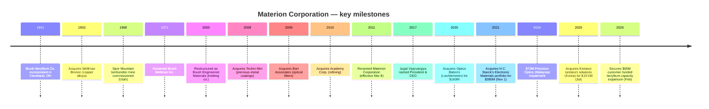
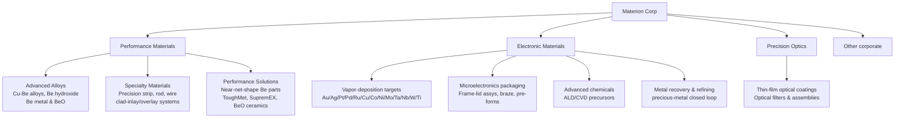

# Materion Corporation (NYSE: MTRN) — Company Research Report

**As of:** 2026-05-26
**Analyst language:** English
**Listing:** NYSE: MTRN | Headquartered Mayfield Heights, OH | Incorporated Ohio, 1931
**CIK:** 0001104657

> **Update — FY2026 outlook firmed at Q1-2026 print (2026-04-29):** Management reaffirmed full-year 2026 adjusted-EPS guidance of **USD 6.00–6.50** (≈+15% YoY at the midpoint vs. FY2025 adj-EPS of $5.44) and now expects **low-double-digit top-line growth** versus the mid-single-digit guide set at Q4-2025, citing "all-time-high backlog" up >20% YoY and 18% value-added-sales growth in Electronic Materials. Source: [Materion Q1-2026 earnings press release, 2026-04-29](https://www.sec.gov/Archives/edgar/data/1104657/000110465726000026/q12026pressrelease.htm). The Q4-2025 release also flagged a **$65 million customer-funded investment from a major US defense prime** to expand beryllium capacity at Elmore, OH — the largest single defense-driven capex commitment in Materion's recent history ([Q4-2025 earnings press release, 2026-02-12](https://www.sec.gov/Archives/edgar/data/1104657/000110465726000006/q42025pressrelease.htm)).

## Table of Contents

1. [Company Overview](#1-company-overview)
2. [Company History](#2-company-history)
3. [Management Team](#3-management-team)
4. [Products & Services](#4-products--services)
5. [Customers & Go-to-Market](#5-customers--go-to-market)
6. [Industry Overview](#6-industry-overview)
7. [Competitive Landscape](#7-competitive-landscape)
8. [Market Opportunity (TAM)](#8-market-opportunity-tam)
9. [Risk Assessment](#9-risk-assessment)
10. [References](#references)

---

## 1. Company Overview

Materion Corporation is a vertically integrated US producer of advanced engineered materials — high-purity metals, alloys, ceramics, inorganic chemicals, and thin-film optical coatings — used in semiconductor manufacturing, aerospace and defense, industrial, automotive, energy, consumer-electronics and life-sciences end markets. The 2025 Form 10-K describes the company as "an integrated producer of high-performance advanced engineered materials used in a variety of electrical, electronic, thermal, and structural applications with $1.8 billion in net sales in 2025" ([Materion FY2025 10-K, Item 1 Business, p. 2](https://www.sec.gov/Archives/edgar/data/1104657/000110465726000011/mtrn-20251231.htm)). The corporate footprint includes 30+ manufacturing, mining, service, and distribution sites across the United States, EMEA, and Asia-Pacific; the flagship complex at Elmore, Ohio operates the **only fully integrated beryllium primary-production chain in the Western world**, anchored by an open-pit bertrandite ore mine at Spor Mountain, Utah ([Materion FY2025 10-K, Item 2 Properties, p. 17](https://www.sec.gov/Archives/edgar/data/1104657/000110465726000011/mtrn-20251231.htm)).

The business is organized under four reportable segments: **Performance Materials** ($675.9M FY2025 net sales, –9% YoY), **Electronic Materials** ($1,010.0M, +19% YoY), **Precision Optics** ($100.7M, +7% YoY), and **Other** (corporate). Electronic Materials supplies high-purity sputter targets, vapor-deposition precursors, micro-electronics packaging components, and metal-reclamation services to leading-edge semiconductor fabs; Performance Materials produces copper-beryllium alloys, ToughMet copper-nickel-tin alloys, and primary beryllium metal sold into aerospace and defense, oil-and-gas, automotive and industrial connector markets; Precision Optics designs and manufactures thin-film optical filters and coatings for defense, aerospace, automotive and medical applications. Segment economics differ materially: Performance Materials carries higher fixed-asset intensity and structurally higher EBITDA margin on value-added sales, while Electronic Materials posts lower headline gross margins due to **substantial precious-metal pass-through revenue** ($682.3M of net sales in 2025 was pass-through metal cost) which the company netted out via its non-GAAP "value-added sales" measure ([Materion FY2025 10-K, MD&A — Value-Added Sales reconciliation, p. 25-26](https://www.sec.gov/Archives/edgar/data/1104657/000110465726000011/mtrn-20251231.htm)).

*Source: [Materion FY2025 10-K, Item 7 MD&A Results of Operations, p. 22-25](https://www.sec.gov/Archives/edgar/data/1104657/000110465726000011/mtrn-20251231.htm); chart compiled from the 10-K disclosed net sales, value-added sales and gross margin as a % of VAS for FY2023-2025; FY2021-2022 from prior 10-K filings.*

Geographically, Materion employs approximately 2,880 people globally as of December 31, 2025 — 2,127 in North America, 436 in EMEA, and 317 in Asia-Pacific ([Materion FY2025 10-K, Human Capital Management, p. 4](https://www.sec.gov/Archives/edgar/data/1104657/000110465726000011/mtrn-20251231.htm)). End-market sales are dominated by **semiconductor exposure (48.6% of FY2025 net sales, $867.6M)**, followed by aerospace and defense (12.0%, $213.8M), industrial (10.8%, $192.3M) and consumer electronics (9.5%, $168.9M); the semiconductor concentration has stepped up from 39.7% in FY2023 to 48.6% in FY2025, driven almost entirely by Electronic Materials precious-metal-target pass-through and incremental volumes ([Materion FY2025 10-K, Note C — Segment Reporting and Geographic Information, p. 53](https://www.sec.gov/Archives/edgar/data/1104657/000110465726000011/mtrn-20251231.htm)). No single customer accounted for ≥10% of net sales in FY2025, although a single Performance Materials customer crossed that threshold in both FY2024 and FY2023 — the same precision-clad-strip customer whose Q4-2025 quality event temporarily idled Reading, PA production ([Materion FY2025 10-K, Item 1A Risk Factors — customer concentration, p. 8](https://www.sec.gov/Archives/edgar/data/1104657/000110465726000011/mtrn-20251231.htm)).

Capital structure is investment-grade and modestly levered: total debt was approximately $400M at year-end 2025 against $13.7M of cash, supported by a JPMorgan-led Fourth Amended and Restated Credit Agreement and a revolving facility that was used to fund both the November 2021 H.C. Starck Solutions' Electronic Materials acquisition and the July 2025 Konasol tantalum-target deal ([Materion FY2025 10-K, MD&A Liquidity, p. 27-29](https://www.sec.gov/Archives/edgar/data/1104657/000110465726000011/mtrn-20251231.htm)). Dividend policy is a token but steadily growing: the quarterly common dividend was raised in May 2025 to $0.14 per share (from $0.135), implying a 2025 cash dividend payout of $11.5M against $103.2M of operating cash flow ([Materion FY2025 10-K, MD&A Cash Flow, p. 27](https://www.sec.gov/Archives/edgar/data/1104657/000110465726000011/mtrn-20251231.htm)). A $50M share-repurchase authorization was refreshed on October 29, 2025 — no shares were bought back in Q4-2025 — leaving capital allocation tilted toward M&A and organic capex (mine development at Spor Mountain, defense capacity expansion at Elmore) ([Materion FY2025 10-K, Item 5 Share Repurchases, p. 19](https://www.sec.gov/Archives/edgar/data/1104657/000110465726000011/mtrn-20251231.htm)).

**Valuation snapshot (May 2026).** MTRN closed near $215 in late May 2026, implying a market cap of roughly $4.5B, a TTM P/E of ~59x, and a TTM P/S of ~2.5x on $1.79B of FY2025 net sales ([Materion (NYSE:MTRN) hits new 1-year high, Daily Political, 2026-05-22](https://www.dailypolitical.com/2026/05/22/materion-nysemtrn-hits-new-1-year-high-heres-why.html)). On the company's preferred **adjusted-EPS** measure ($5.44 in FY2025; midpoint of FY2026 guidance ~$6.25), the implied forward P/E is closer to **34x** — still above MTRN's own 5-year TTM-P/E range (which has spent most of the post-COVID period between ~20-30x), and meaningfully above the S&P 600 Materials median ([Materion Q1-2026 earnings press release, 2026-04-29](https://www.sec.gov/Archives/edgar/data/1104657/000110465726000026/q12026pressrelease.htm)). The TTM-P/E gap to adj-EPS-based forward P/E is mechanical — TTM GAAP net income carries goodwill-impairment and acquisition-amortization charges from the FY2024 Precision Optics Malaysia impairment ($73M) and the H.C. Starck-related amortization that adjusted EBITDA strips out.

*Source: peer TTM P/E and P/S from each company's investor-relations page and consensus screens, May 2026; Materion from [Robinhood — MTRN quote](https://robinhood.com/us/en/stocks/MTRN/) and [Daily Political, 2026-05-22](https://www.dailypolitical.com/2026/05/22/materion-nysemtrn-hits-new-1-year-high-heres-why.html). Peer set: Entegris (ENTG, semi-materials peer), Coherent (COHR, photonics peer), Linde (LIN, industrial-gases peer), Air Products (APD, industrial-gases peer), DuPont (DD, advanced-materials peer).*

*Analyst view:* The 58.8x TTM P/E is high in absolute terms and well above the 31x peer median, but three interlocking factors explain why the market has tolerated it. **(1) Sector-proxy / AI-beneficiary premium** — investors looking for "picks-and-shovels" exposure to semiconductor process build-out (high-NA EUV, GAA, BPD, advanced packaging, hybrid bonding) have re-rated specialty-materials names as a group; the Nomura 2026-05-21 Greater China Semi anchor report explicitly catalogued sputter targets (and named "Materion / Heraeus" in its Fig. 44 supplier league table) as one of the structurally re-priced sub-categories ([Nomura "Greater China Semi: A guide to Semi renaissance in 2026~30F", 2026-05-21, Fig. 44, p. 29](https://www.nomuraconnects.com/) — subscription required; covered in the internal sector note `reports/sector/半导体材料.md`). **(2) Defense-cycle option value** — the $65M customer-funded beryllium capacity expansion announced on 2026-02-12 essentially de-risks the next leg of US-DoD CHIPS Act / critical-minerals reshoring spend ([Materion Q4-2025 earnings press release, 2026-02-12](https://www.sec.gov/Archives/edgar/data/1104657/000110465726000006/q42025pressrelease.htm)). **(3) Margin-expansion runway** — management's stated mid-term target of 23% adjusted EBITDA margin (vs. 20.7% in FY2025) implies $80-100M of incremental EBITDA over the next three years against a flat-to-modest revenue base, a powerful operating-leverage story for a $4.5B market cap. The risk is symmetric: if the AI-capex bull cycle pauses, MTRN's ~25-30x TTM-P/E baseline becomes the new ceiling — call it 25-30% downside in a multiple-compression scenario.

The investor takeaway from Section 1 is that Materion is a **levered call on three different cycles operating with low correlation** — (a) the AI / advanced-node semi capex super-cycle that pulls Electronic Materials; (b) the multi-year US defense / aerospace replenishment cycle that pulls Performance Materials beryllium; and (c) the Precision Optics turnaround that follows the Optics Balzers integration and Malaysia impairment write-down. The next eight sections develop each leg in detail.

---

## 2. Company History

Materion's corporate lineage stretches back to **1931, when Charles Frederick Brush II and Bengt Kjellgren incorporated The Brush Beryllium Company in Cleveland, Ohio** to commercialize the first viable industrial process for refining beryllium from beryl ore — work originally developed at Brush Laboratories (founded by Charles F. Brush Sr., inventor of the open-coil dynamo arc lamp and a contemporary of Edison) ([Materion FY2025 10-K, Item 1 Business — "The Company was incorporated in Ohio in 1931"](https://www.sec.gov/Archives/edgar/data/1104657/000110465726000011/mtrn-20251231.htm); historical context from [Brush Beryllium acquisition by Brush Engineered Materials press archive](https://www.sec.gov/Archives/edgar/data/0001104657/000129993311000170/htm_40414.htm)). Through the 1940s and 1950s Brush Beryllium became the dominant western-hemisphere supplier of beryllium metal for the early atomic-weapons program and aerospace platforms — a position that hardened into a quasi-monopoly when the company secured leases over the Spor Mountain bertrandite deposit in Juab County, Utah in the late 1960s and commissioned the Delta, Utah refinery and Elmore, Ohio finishing plant ([Materion FY2025 10-K, Item 2 Mine Property, p. 17-18](https://www.sec.gov/Archives/edgar/data/1104657/000110465726000011/mtrn-20251231.htm)).

The corporate name evolved as the portfolio diversified beyond pure beryllium: Brush Beryllium became Brush Wellman in 1971 (reflecting the 1953 acquisition of Wellman Bronze, the copper-alloy business), then Brush Engineered Materials in 2000 (a holding-company restructuring that placed thin-film coatings, advanced ceramics, and precious-metal operations alongside the historic beryllium franchise), and finally **Materion Corporation effective March 8, 2011**, a rebranding designed to signal the company had become an advanced-materials platform rather than a single-commodity producer ([Brush Engineered Materials 8-K announcing name change to Materion, FY2011](https://www.sec.gov/Archives/edgar/data/0001104657/000129993311000170/exhibit1.htm)). The 2011 rebrand was deliberately decoupled from beryllium because by then the Electronic Materials, Specialty Engineered Alloys and Precision Coatings segments together generated more revenue than the legacy beryllium business — and because beryllium's well-documented occupational-health profile created reputational headwinds that the company wanted to compartmentalize.

Two strategic pivots define the modern Materion. The first was the **2020 acquisition of Optics Balzers AG of Balzers, Liechtenstein** in an all-cash $160M transaction (closed September 2020), which gave Materion a global precision-coatings footprint across Europe (Liechtenstein, Germany), Asia (Penang, Malaysia) and the US — turning a domestic specialty business into a worldwide leader in thin-film optical filters for biomedical, projection, defense and consumer electronics applications ([Materion to acquire Optics Balzers, Electro Optics, 2020-06](https://www.electrooptics.com/news/materion-acquire-optics-balzers-combining-thin-film-coatings-expertise); [Materion investor news — Materion Corporation to Acquire Optics Balzers, 2020](https://investor.materion.com/news/news-details/2020/Materion-Corporation-to-Acquire-Optics-Balzers/default.aspx)). The second was the **November 2021 acquisition of H.C. Starck Solutions' Electronic Materials portfolio for $380M** in cash — a transaction that nearly doubled Electronic Materials revenue overnight and added the Newton, MA-based tantalum, niobium and refractory-metal sputter-target line that has become the largest single growth driver for the segment ([Materion to Acquire H.C. Starck's Electronic Materials Portfolio, BusinessWire, 2021-09-20](https://www.businesswire.com/news/home/20210920005444/en/Materion-to-Acquire-H.C.-Starck%E2%80%99s-Electronic-Materials-Portfolio-Creating-a-Global-Leader-in-Premium-Thin-Film-Materials-for-the-Semiconductor-Market); [Materion 8-K — Asset Purchase Agreement, 2021-09-19](https://www.sec.gov/Archives/edgar/data/0001104657/000110465721000094/mtrn-20210919.htm)). HCS-EM was expected to generate ~$145M in 2021 revenue and ~$29M of adjusted EBITDA — a ~13x EBITDA multiple before synergies and ~10x with run-rate synergies, a typical specialty-chemicals deal multiple ([HCS-EM acquisition press release exhibit, 2021-09-20](https://www.sec.gov/Archives/edgar/data/0001104657/000110465721000094/hcselectronicmaterialsre.htm)).

Smaller bolt-ons have continued: in **July 2025 Materion acquired the Korean tantalum-solutions manufacturing assets of Konasol Co., Ltd. in Dangjin City for $19.5M cash**, adding the company's first dedicated Asia-based sputter-target factory and meaningfully shortening the supply chain to Samsung and SK Hynix's Pyeongtaek / Cheongju memory complexes ([Materion FY2025 10-K, Note B — Acquisition, p. 50](https://www.sec.gov/Archives/edgar/data/1104657/000110465726000011/mtrn-20251231.htm)). The Konasol deal — modest in deal value but strategically large in customer-proximity terms — fits the same pattern as Optics Balzers and HCS-EM: filling regional white-space gaps in a portfolio of niches where Materion is already a global #2-3.

The Q4-2024 write-down deserves a dedicated callout. In FY2024 Materion took a **$73M goodwill and long-lived-asset impairment against the Precision Optics reporting unit in Malaysia**, driving the segment to a –$73.3M EBITDA loss for the year ([Materion FY2025 10-K, MD&A — Segment Disclosures, Precision Optics, p. 24](https://www.sec.gov/Archives/edgar/data/1104657/000110465726000011/mtrn-20251231.htm)). The write-down reflected slower-than-modeled recovery of consumer-electronics-related optical demand at the Penang facility post-COVID and a stalled customer ramp; management's response was a multi-quarter restructuring that began in 4Q-2024 and delivered ~800 bps of YoY margin expansion in FY2025 — a textbook example of recover-and-rebase. Q1-2026 marked the "5th consecutive quarter of bottom-line improvement" in Precision Optics, with management citing aerospace and defense volume strength ([Materion Q1-2026 earnings press release, 2026-04-29](https://www.sec.gov/Archives/edgar/data/1104657/000110465726000026/q12026pressrelease.htm)).

---

## 3. Management Team

Because Materion is an institutional, professionally-managed corporation with a founding lineage stretching to 1931 and no contemporary founder still in the business, this section covers only the **current CEO** per the company-research style guide (no founder bio is appropriate — the original Brush Beryllium founders are historical figures, not active management).

**Jugal K. Vijayvargiya — President and CEO since March 2017.** Vijayvargiya, 58, joined Materion in March 2017 after a 26-year international career at Delphi Automotive PLC (now Aptiv), the global automotive technology supplier ([Materion 2026 DEF 14A — Director Biographies, p. 4](https://www.sec.gov/Archives/edgar/data/1104657/000110465726000022/mtrn-20260326.htm)). His final Delphi role was President of the Electronics & Safety segment, a $3 billion global business unit headquartered in Germany — putting him on Delphi's executive committee with operational ownership of the company's largest unit by both revenue and engineering headcount. Before that, he held progressively senior roles in product and manufacturing engineering, sales, product-line management, acquisition integration, and general management across Europe and North America during the 1990s and 2000s — a profile that maps closely to Materion's own operating challenges (multi-region manufacturing, customer-specific product engineering, integration of bolt-on acquisitions). His CEO appointment was framed by the Materion board as a deliberate pivot from a research/operations-heavy CEO profile (his predecessors were largely promoted from within R&D and manufacturing) toward a commercial-and-integration-heavy profile suited to the post-2017 M&A strategy ([Materion Corp. names Delphi Automotive exec as CEO, Crain's Cleveland Business, 2017-03-03](https://www.crainscleveland.com/article/20170303/NEWS/170309932/materion-corp-names-delphi-automotive-exec-as-ceo)).

Education and external roles. Vijayvargiya holds both a Bachelor's and a Master's degree in Electrical Engineering from **The Ohio State University** — relevant context for Materion's Ohio headquarters and the strong overlap with the regional engineering talent pool that staffs Elmore ([Materion leadership page — Jugal Vijayvargiya](https://www.materion.com/en/about-materion/company-leadership/jugal-vijayvargiya)). He has served on the board of **Sensata Technologies Holding PLC (NYSE: ST)** since June 2023, and is a trustee of the Committee for Economic Development at The Conference Board — both governance roles that signal peer-recognition among large-cap industrial CEOs ([Materion 2026 DEF 14A — Director Biographies, p. 4](https://www.sec.gov/Archives/edgar/data/1104657/000110465726000022/mtrn-20260326.htm)).

Ownership and compensation. As of January 31, 2026 Vijayvargiya beneficially owned **290,495 Materion common shares (1.4% of class), including 151,589 stock-appreciation rights (SARs) exercisable within 60 days** — by far the largest insider position, well ahead of CFO Shelly Chadwick's 29,677 shares (<1%) ([Materion 2026 DEF 14A — Security Ownership of Directors and Named Executive Officers, p. 14-15](https://www.sec.gov/Archives/edgar/data/1104657/000110465726000022/mtrn-20260326.htm)). At a May 2026 share price near $215, his beneficial position is worth approximately $62M — a meaningful skin-in-the-game alignment. FY2025 total reported compensation was **$4,794,902**, comprising a $982,693 base salary, $2,960,100 in RSU/PRSU stock awards, $779,921 in SAR option awards, zero non-equity incentive (the AIP did not pay out in FY2025 due to the Q4 precision-clad-strip quality event), and $72,188 in "all other" (mostly retirement-plan contributions) — down from $5,858,482 in FY2024 ([Materion 2026 DEF 14A — Summary Compensation Table, p. 47](https://www.sec.gov/Archives/edgar/data/1104657/000110465726000022/mtrn-20260326.htm)). The pay mix is heavily equity-weighted (>78% of grant-date value), with PRSU vesting tied to relative total shareholder return (RTSR) versus the S&P Industrial Materials Index and return-on-invested-capital (ROIC) gates — both standard governance hallmarks for a mid-cap specialty-materials issuer.

CFO context (brief). Shelly M. Chadwick, 54, has served as Vice President, Finance and CFO since November 2020; she joined from The Timken Company where she was VP Finance and Chief Accounting Officer for four years. Her FY2025 total compensation was $2.07M ([Materion 2026 DEF 14A — Summary Compensation Table, p. 47](https://www.sec.gov/Archives/edgar/data/1104657/000110465726000022/mtrn-20260326.htm)). General Counsel Gregory Chemnitz rounds out the named executive officer group with $1.04M of FY2025 comp.

---

## 4. Products & Services

Section 4 is the most important chapter of this report. Materion is **not a single-product business** — it operates four reportable segments containing roughly 12 distinct product families that collectively serve eight named end markets across the semiconductor, defense, industrial, consumer-electronics and life-sciences value chains. To make the structure tractable, this section is organized to (a) anchor on the 10-K's verbatim product matrix; (b) walk Electronic Materials in depth (the segment the Nomura 2026 sector report flagged as the semi-materials growth core); (c) walk Performance Materials (the historic beryllium franchise that anchors defense exposure); (d) walk Precision Optics (the post-Optics-Balzers integration story); and (e) synthesize how the three segments compose Materion's identity as a "vertically-integrated specialty-materials" platform.

### 4.1 The 10-K product matrix

The structure below reproduces Materion's own Item 1 Business product organization verbatim — three operating segments (Performance Materials, Electronic Materials, Precision Optics) plus an unallocated Other corporate segment. Performance Materials is sub-divided into three product lines; Electronic Materials is sub-divided into four product families; Precision Optics is a single product line spanning multiple geographies.

| Segment | Product family / line | Description (paraphrased from 10-K Item 1) | Major end markets |
|---|---|---|---|
| **Performance Materials** | Advanced Alloys | Copper-/nickel-beryllium-containing and non-beryllium alloyed metals in ingot, billet, plate, rod, bar, tube; beryllium hydroxide; beryllium metal & beryllium oxide | Industrial, automotive, aerospace & defense, energy, life sciences |
| Performance Materials | Specialty Materials | Precision strip and rod/wire products in copper- and nickel-based (with/without Be) alloys; clad-inlay and overlay metal systems for connectors, contacts, springs, switches | Consumer electronics, life sciences, automotive, aerospace & defense, industrial, energy |
| Performance Materials | Performance Solutions | Engineered finished beryllium metal & alloy components (near-net-shape and machined); beryllium foil, BeO ceramics, ToughMet™ Cu-Ni-Sn alloys, SupremEX™ Al-SiC composites | Aerospace & defense, energy, industrial, sub-sea telecom |
| **Electronic Materials** | Vapor deposition / sputter targets | High-purity precious-metal and non-precious-metal sputter targets (Au, Ag, Pt, Pd, Ru, Cu, Co, Ni, Mo, Ta, Nb, W, Ti) | Semiconductor, energy, industrial |
| Electronic Materials | Microelectronics packaging | Frame-lid assemblies, clad and precious-metal pre-forms, high-temperature braze materials | Semiconductor, energy, industrial |
| Electronic Materials | Advanced chemicals | Inorganic precursors and specialty chemicals for thin-film deposition (ALD/CVD) | Semiconductor |
| Electronic Materials | Metal recovery / refining | In-house precious-metal recycling of sputter-target scrap and customer-returned material | Semiconductor (closed-loop) |
| **Precision Optics** | Precision thin-film coatings & optical filters | Thin-film optical coatings, optical filter materials, sputter-coated and precision-converted thin-film materials, assemblies | Aerospace & defense, automotive, consumer electronics, semiconductor, medical, industrial |
| **Other** | Corporate / unallocated | n/a | n/a |

Source: [Materion FY2025 10-K, Item 1 Business — Segment Information, p. 2-4](https://www.sec.gov/Archives/edgar/data/1104657/000110465726000011/mtrn-20251231.htm) (verbatim segment descriptions reproduced and paraphrased for table form).

### 4.2 Synthesis — how the segments compose one workflow

The three operating segments are not random portfolio pieces — they map onto distinct stages of the **electronics-and-defense materials value chain**, and Materion's competitive edge comes from owning every stage of that chain end-to-end for a small but strategically critical subset of materials. Performance Materials sits **upstream**: it owns the mine, the refinery, and the primary metal production. Electronic Materials sits **midstream**: it converts those primary metals (plus purchased precious metals) into the formats that semiconductor fabs and electronics OEMs actually consume — sputter targets, vapor-deposition precursors, ceramic frame-lids. Precision Optics sits **downstream / parallel**: it takes thin-film coating know-how (originally developed for Electronic Materials) and converts it into optical-filter end-products sold directly to defense/aerospace/medical-device customers. The reason the company exists as one entity rather than three is that the **upstream beryllium and refining capability is the source of moat for the entire stack** — TSMC, Samsung, Intel and US-DoD prime contractors all want a single-supplier relationship with a vertically integrated producer that controls feedstock; cobbling together a similar vertical chain from independent miners, refiners and target-fabricators would take a decade.

### 4.3 Electronic Materials — the segment that drives the AI/semi thesis

Electronic Materials is the segment Nomura's 2026-05-21 Greater China Semi report flagged as Materion's relevance to the AI-semi capex super-cycle ("Materion / Heraeus (US/DE)" entry in Fig. 44's sputter-target supplier league table — see internal sector note `reports/sector/半导体材料.md`). It generated **$1,010M of net sales in FY2025 (+19% YoY) and $71M of segment EBITDA (+50% YoY)**, making it both the largest revenue contributor and the fastest-growing segment in absolute-dollar terms ([Materion FY2025 10-K, MD&A — Electronic Materials Segment, p. 24](https://www.sec.gov/Archives/edgar/data/1104657/000110465726000011/mtrn-20251231.htm)). Headline growth is amplified by precious-metal pass-through accounting ($208M of the $164M YoY revenue gain was metal-price pass-through), but **value-added sales grew 8% organic excluding the Q4-2024 Albuquerque target-business divestiture** — a respectable result against a broadly flat semi-materials industry.

#### 4.3.1 Vapor-deposition sputter targets

> The 10-K describes the segment's flagship product as follows: "*Electronic Materials produces advanced chemicals, microelectronics packaging, precious metal, non-precious metal, and specialty metal products, including vapor deposition targets, frame lid assemblies, clad and precious metal pre-forms and high temperature braze materials. These products are used in high-performance logic, advanced memory, micro-electromechanical systems and power management integrated circuits, radio frequency devices, data storage, display, architectural glass, solar, optical coating, and other applications within the semiconductor, energy, and industrial end markets.*"
> Source: [Materion FY2025 10-K, Item 1 Business — Electronic Materials, p. 3](https://www.sec.gov/Archives/edgar/data/1104657/000110465726000011/mtrn-20251231.htm).

**中文释义 / Plain-language gloss.** A **sputter target / 溅射靶材** is a high-purity disc or rectangle of metal that is bombarded with argon ions inside a **physical-vapor-deposition (PVD, 物理气相沉积) chamber**; atoms knock off the target and re-deposit as a thin film (10-500 nm thick) on the wafer. Every modern logic and memory wafer goes through 30-100+ deposition steps, and each step consumes a target of a specific metal — **Cu / 铜** for interconnect lines, **Co / 钴** for liners and contact plugs, **Ta / TaN / 钽和氮化钽** for diffusion barriers under copper, **Ti / TiN / 钛和氮化钛** for adhesion and barrier layers, **W / 钨** for word-lines and contacts, **Mo / 钼** for DRAM word-lines (replacing W at 1α / 1β / 1γ nodes), **Ru / 钌** as the new conductor for sub-2nm interconnect, and **precious metals (Au, Pt, Pd, Ag) / 贵金属** for compound-semi, packaging and specialty applications. Target physics matters: sputter rate, film uniformity and particle generation are all sensitive to grain size, texture, and impurity content at the parts-per-billion level — so target manufacturing is closer to single-crystal growth than to bulk metallurgy, and the high-end of the market is dominated by maybe a dozen suppliers globally. The Nomura report estimates the global semiconductor-target market at **~$2 billion in 2024**, representing about 3% of the broader $80B/year semi-materials industry ([Nomura "Greater China Semi", 2026-05-21, Fig. 24-26, p. 18-19](https://www.nomuraconnects.com/) — subscription required).

*Analyst view (4.3.1).* Materion's sputter-target competitive position is **#2-3 globally in precious-metal targets**, behind JX Advanced Metals (the merged Tanaka-JX entity that is the consensus #1 in advanced-node sputter targets) and roughly co-leading with Honeywell Electronic Materials and Heraeus in the precious-metal sub-niche ([Precious Metal Sputtering Targets for Semiconductor Market analysis, LinkedIn, 2025](https://www.linkedin.com/pulse/precious-metal-sputtering-targets-semiconductor-market-size-mdjhe?trk=article-ssr-frontend-pulse_more-articles_related-content-card)). Moat type: **scale + customer-specific qualification (switching costs)** — every target type at every node must be qualified at every fab, a process that can take 12-24 months and creates very high stickiness once installed. The strategic inflection driving incremental demand: **(a) ruthenium adoption for sub-2nm interconnect**, where Ru replaces Cu liners at the smallest feature sizes; **(b) higher target consumption per wafer** at advanced nodes (more layers, more metal types); **(c) HBM (high-bandwidth memory) ramp** with its 12-16-die stacks each requiring TSVs and microbump targets; and **(d) Korean-fab proximity** secured by the July 2025 Konasol acquisition.

#### 4.3.2 Microelectronics packaging — frame-lid assemblies, clad and precious-metal pre-forms

> The 10-K lists the packaging products inside the same segment description: "*including vapor deposition targets, frame lid assemblies, clad and precious metal pre-forms and high temperature braze materials*" ([Materion FY2025 10-K, Item 1 Business — Electronic Materials, p. 3](https://www.sec.gov/Archives/edgar/data/1104657/000110465726000011/mtrn-20251231.htm)).

**中文释义 / Plain-language gloss.** **Frame-lid assemblies / 框架盖封装组件** are the metal housings that hermetically seal precision microelectronic devices — RF MEMS oscillators, optical transceivers, IR sensors, microwave ICs, specialty MMIC packages. Inside the package, **brazing pre-forms / 钎焊预制件** (custom-shaped stamping of gold-tin or gold-germanium eutectic alloy) act as the solder that joins the lid to the package body in a single high-temperature step. **Clad metal / 复合金属带** is the substrate from which lids and lead-frames are stamped — a sandwich of two or more metals (e.g. Cu-Invar-Cu) electron-beam-welded or roll-bonded together to deliver a precise coefficient-of-thermal-expansion match to the silicon die. The customer set is more concentrated than the sputter-target market: **MEMS / RF / photonics specialty packaging houses** dominate (think Broadcom RF, Skyworks, Qorvo, II-VI/Coherent photonics, NXP automotive, Texas Instruments) — and each customer typically qualifies one or two suppliers for life because re-qualifying a hermetic-seal package against MIL-STD-883 or AEC-Q200 takes years.

*Analyst view (4.3.2).* Moat type: **specification lock-in + low-volume / high-mix manufacturing** — neither giant integrated-circuit packagers (like Amkor, ASE) nor commodity metal-strip producers want to play in this market because volumes per SKU are too small to interest them and tolerances are too tight for general-purpose lines. Closest named competitor: **Heraeus Electronics and AMETEK Electronic Components & Packaging (named in the 10-K Competition section)** ([Materion FY2025 10-K, Item 1 Business — Electronic Materials competition, p. 3](https://www.sec.gov/Archives/edgar/data/1104657/000110465726000011/mtrn-20251231.htm)). The strategic inflection: **packaging-driven IC innovation** — as advanced packaging (CoWoS, EMIB-T, hybrid-bonded 3D stacks, glass core substrates) becomes the new performance frontier, the demand for tight-tolerance hermetic enclosures, optical-to-electrical interface lids, and high-melting-point brazes is rising sharply.

#### 4.3.3 Advanced chemicals — ALD/CVD precursors

> The 10-K wraps advanced chemicals into the same compact Electronic Materials paragraph: "*Electronic Materials produces advanced chemicals, microelectronics packaging…*" ([Materion FY2025 10-K, Item 1 Business — Electronic Materials, p. 3](https://www.sec.gov/Archives/edgar/data/1104657/000110465726000011/mtrn-20251231.htm)). Materion does not publicly disclose the chemical-precursor product names or revenue split.

**中文释义 / Plain-language gloss.** **Atomic-layer deposition (ALD, 原子层沉积) and chemical-vapor deposition (CVD, 化学气相沉积)** are competing thin-film deposition techniques to PVD/sputtering. The film is built atom-layer-by-atom-layer from a gas-phase chemical (the **precursor / 前驱体**) that reacts on the wafer surface — for example, hafnium tetrachloride + water vapor → HfO₂ (high-K dielectric for gate stacks); pentakis(dimethylamino) tantalum + ammonia → TaN (diffusion barrier); copper amidinates → metallic Cu (for sub-7nm interconnect seed layers). Materion's role is precursor synthesis — making the high-purity, low-particle-content organometallic source chemicals that fabs flow through the deposition chamber. The market is small (~$1.5B/year globally) but very high-margin, because each precursor is a custom molecule designed for one process step at one node ([Nomura "Greater China Semi", 2026-05-21, Fig. 26 — precursor share of semi-materials TAM ~2%, p. 19](https://www.nomuraconnects.com/) — subscription required).

*Analyst view (4.3.3).* Moat type: **regulated-chemistry IP + customer co-development**. Closest named competitors: **Air Liquide Electronics (Voltaix subsidiary), Versum Materials (now part of Merck KGaA / EMD Performance Materials), JSR Corp, SK Materials** — these are the four or five companies that dominate the leading-edge precursor market. Materion's share is small (estimated low-single-digit percent of the precursor TAM), but the franchise complements the sputter-target business — a fab buying tantalum sputter targets and tantalum-precursor for the same TaN barrier layer prefers to qualify a single vendor when possible.

#### 4.3.4 Metal recovery / refining — the precious-metal closed loop

> The 10-K notes: "*Electronic Materials also has metal recovery operations and in-house refining that allow for the recycling of precious metals.*" ([Materion FY2025 10-K, Item 1 Business — Electronic Materials, p. 3](https://www.sec.gov/Archives/edgar/data/1104657/000110465726000011/mtrn-20251231.htm)).

**中文释义 / Plain-language gloss.** A sputter target is **only 30-60% consumed** before it must be replaced (the rest is structurally locked into the cathode geometry); for precious-metal targets (gold, platinum, palladium, ruthenium, rhodium, iridium) the unconsumed portion contains millions of dollars of metal that must be returned to the supplier for **closed-loop recycling / 闭环回收**. Materion runs its own refinery operations (centered at Buffalo, NY) that recover spent precious-metal targets, target backing-plates, factory scrap and customer-returned material — re-purifying the metal back to >99.999% and re-spinning it into new targets. The economics are critical: **Materion does not "sell" precious metal**; it sells the **fabrication value** (the conversion of refined metal into a finished target) while passing through the metal cost dollar-for-dollar to the customer. This is why Electronic Materials' net sales include $682M of precious-metal pass-through but the value-added-sales line — the metric management actually uses to judge unit economics — strips that out ([Materion FY2025 10-K, MD&A — Value-Added Sales reconciliation, p. 25-26](https://www.sec.gov/Archives/edgar/data/1104657/000110465726000011/mtrn-20251231.htm)).

*Analyst view (4.3.4).* The refining capability is a **structural cost moat** for Electronic Materials. Customers prefer to deal with target suppliers who can also refine, because the alternative is shipping spent targets to a third-party precious-metals refiner (Heraeus, Asahi Refining, Argor-Heraeus), waiting weeks for assay, and then re-buying refined metal at spot prices — a slow, complex, and metal-leak-prone workflow. Wafer-level reclamation (the user-noted "wafer reclamation" capability) sits in Performance Materials / Specialty Materials adjacent to Electronic Materials and is a smaller but related closed-loop service.

### 4.4 Performance Materials — beryllium + ToughMet + clad-strip

Performance Materials generated **$675.9M of net sales (–9% YoY) and $127.2M of segment EBITDA in FY2025**, down from $169.3M in 2024 ([Materion FY2025 10-K, MD&A — Performance Materials Segment, p. 23](https://www.sec.gov/Archives/edgar/data/1104657/000110465726000011/mtrn-20251231.htm)). The YoY drop reflects two factors: (a) a **Q4-2025 customer-quality event at the Reading, PA precision-clad-strip facility** that caused a ~30% drop in consumer-electronics end-market volume and $27.3M of one-off costs (quality claim, scrap, plant-idling); (b) softness in commercial aerospace channels that took aerospace and defense end-market volume down 9%. Both factors are managed, with management noting that production resumed in December 2025 and ramped through Q1-2026 ([Materion Q1-2026 earnings press release, 2026-04-29](https://www.sec.gov/Archives/edgar/data/1104657/000110465726000026/q12026pressrelease.htm)).

#### 4.4.1 Advanced Alloys — beryllium hydroxide + alloyed metals + high-performance beryllium

> Verbatim 10-K description: "*Advanced Alloys manufactures and globally provides to our customers three upstream (primary) product lines: alloyed metals, high-performance beryllium products, and beryllium hydroxide. Alloyed metals are made with copper and/or nickel (with or without beryllium) in ingot, shot, billet, plate, rod, bar, tube forms, and customized shapes. Depending on the application, the materials may provide one or a combination of superior strength, specific strength, wear and corrosion resistance, thermal and electrical conductivity, tribological benefits, and machinability. … High performance beryllium products are primarily beryllium metal products, which may also be alloys or other mixtures with aluminum and may be beryllium oxide. … Beryllium hydroxide is produced at our milling operations in Utah from our bertrandite ore mine and purchased beryl ore. The hydroxide is used primarily as a raw material input for beryllium-containing alloys and, to a lesser extent, beryllium products.*"
> Source: [Materion FY2025 10-K, Item 1 Business — Performance Materials Advanced Alloys, p. 2](https://www.sec.gov/Archives/edgar/data/1104657/000110465726000011/mtrn-20251231.htm).

**中文释义 / Plain-language gloss.** **Beryllium / 铍** is element 4 — the lightest structural metal usable at elevated temperature, with unique combinations of high stiffness, low density, low neutron-cross-section (key for nuclear applications), and high thermal conductivity. Its applications are highly specialized: gyroscopes and inertial guidance, satellite mirrors, X-ray windows (because Be is nearly transparent to X-rays), nuclear-reactor reflector blocks, missile-guidance components. **Bertrandite ore / 硅铍石** at Spor Mountain is the western world's only large-scale primary source; the alternative is South African beryl ore (low grade, declining production) and Chinese / Kazakh sources (geopolitically constrained). The Elmore, Ohio refinery converts bertrandite → beryllium hydroxide → high-purity beryllium metal in a multi-step process involving acid leaching, ion exchange, fluoride conversion, and magnesium-thermic reduction — technology Materion has refined over 90 years and which no other company in the western hemisphere operates at scale.

*Analyst view (4.4.1).* Materion is **the sole US producer of primary beryllium metal**, a position that gives it a structural quasi-monopoly in domestic DoD-sensitive applications (the supply-chain reshoring story, formally backed by Defense Production Act Title III investments — see [Defense Production Act Title III project establishes domestic source for beryllium, Wright-Patterson AFB, 2016](https://www.wpafb.af.mil/News/Article-Display/Article/819343/defense-production-act-title-iii-project-establishes-domestic-source-for-beryll/)). Named competitors per the 10-K are **NGK Insulators, IBC Advanced Alloys, Ningxia Orient Tantalum Industry, Ulba Metallurgical (Kazakhstan), American Beryllia, CoorsTek** — but none operate the full vertically-integrated mine-to-metal chain, and most compete only in copper-beryllium alloys (not primary beryllium metal). Moat type: **regulated mining + 90 years of process know-how + sole-source DoD qualification** — about as durable a moat as exists in industrials.

#### 4.4.2 Specialty Materials — precision strip + clad-inlay/overlay metal systems

> Verbatim 10-K description: "*Specialty Materials produces and provides our customers various thicknesses of precision strip products as well as various diameters of rod and wire products. The strip, rod, and wire products are beryllium and non-beryllium containing alloys that are made primarily with copper and nickel to provide unique combinations of high conductivity, high reliability, and high formability for use as connectors, contacts, springs, switches, relays, shielding, and bearings. In addition, Specialty Materials also produces and provides unique engineered strip metal products, which incorporate clad inlay and overlay metals, including precious and base metal electroplated systems, electron beam welded systems, contour profiled systems, and solder-coated metal systems. These engineered strip metal products provide a variety of thermal, electrical, or mechanical properties from a surface area or particular section of the material. Our precision cladding and plating capabilities allow for precious metal or other base metals to be applied in continuous strip form, only where it is needed, reducing the material cost to our customers as well as providing design flexibility and performance.*"
> Source: [Materion FY2025 10-K, Item 1 Business — Performance Materials Specialty Materials, p. 2-3](https://www.sec.gov/Archives/edgar/data/1104657/000110465726000011/mtrn-20251231.htm).

**中文释义 / Plain-language gloss.** A **precision-clad strip / 精密包覆带** is a thin (50-500 μm) ribbon of copper-or-nickel-base alloy onto which a precious-metal or specialty-base-metal layer has been **selectively deposited only where the customer needs it** — for example, a 5-mm-wide stripe of gold-cobalt down the centerline of a 50-mm-wide copper strip. The customer (typically a connector or contact stamping house) then stamps connectors from the strip; the gold layer ends up only on the contact-mating surface, saving 90%+ of the precious-metal cost vs. plating the whole part. The technology — selective inlay, electron-beam welding, solder-coating — is a Materion proprietary process developed over decades. The end-customer pool is **consumer-electronics OEMs (Apple is the dominant unnamed precision-clad-strip customer based on industry analyst commentary), automotive Tier-1 connector makers (TE Connectivity, Yazaki, Sumitomo Electric), medical-device connector makers**. This is the segment that took the Q4-2025 quality-event hit; the customer is widely understood by analysts to be Apple, though the 10-K does not name it ([Materion FY2025 10-K, MD&A — Performance Materials Segment, p. 23](https://www.sec.gov/Archives/edgar/data/1104657/000110465726000011/mtrn-20251231.htm)).

*Analyst view (4.4.2).* The 10-K lists named competitors as **NGK Insulators, Wieland Electric, Aurubis Stolberg, Diehl Metall, Nippon Mining, Proterial Ltd. (formerly Hitachi Metals), Wickeder Group, Heraeus, AMI Doduco** ([Materion FY2025 10-K, Item 1 Business — Specialty Materials competition, p. 3](https://www.sec.gov/Archives/edgar/data/1104657/000110465726000011/mtrn-20251231.htm)). Moat type: **process IP + qualified supplier list (QSL) lock-in** at the named consumer-electronics OEM — re-qualifying a precision-clad-strip supplier for a high-volume connector at Apple, Samsung, Foxconn typically takes 12-18 months, which gave Materion strong pricing power until the Q4-2025 quality event reset the relationship. The strategic question for FY2026 is whether the recovered customer ramp restores the historical 30%-of-Performance-Materials revenue contribution; management language on the Q1-2026 call suggests the answer is yes but at a more measured pace.

#### 4.4.3 Performance Solutions — finished beryllium parts + ToughMet + SupremEX + BeO ceramics

> Verbatim 10-K description: "*Performance Solutions provides engineered end-product technologies to our customers, including near-net shape and finished machined beryllium containing and non-beryllium containing products. These products and materials are suitable for applications that require high stiffness and/or low density due to their unique combination of properties. Performance Solutions provides beryllium metal and beryllium alloy components mainly to the aerospace and defense and energy end markets. Beryllium foil products are provided for radiographic and acoustic applications, beryllium oxide ceramics are provided for a wide range of heat sink and high temperature industrial applications, and our copper beryllium products meet the demanding strength and corrosion resistance specifications required for sub-sea telecommunication equipment. … Our ToughMet™ alloys provide extended life for industrial bushings and bearings and tremendous wear resistance in oil and gas rig components. Our SupremEX™ products offer the industry a high quality aluminum silicon carbide metal matrix composite formulation, well suited for a wide range of applications from high performance engine components and aerospace structural components to high-stiffness consumer electronic components.*"
> Source: [Materion FY2025 10-K, Item 1 Business — Performance Materials Performance Solutions, p. 3](https://www.sec.gov/Archives/edgar/data/1104657/000110465726000011/mtrn-20251231.htm).

**中文释义 / Plain-language gloss.** This is the segment where Materion sells **finished engineered components** rather than mill-form material — fully-machined beryllium-alloy missile-guidance brackets, near-net-shape SupremEX Al-SiC composite engine components for aerospace, Cu-Be sub-sea-connector housings, BeO ceramic heat-sinks for high-power RF amplifiers. The product mix includes Materion's two best-known branded specialty materials: **ToughMet™** (a copper-nickel-tin spinodal-hardened alloy that outperforms Cu-Be in oil-and-gas downhole bushings and saltwater bearings) and **SupremEX™** (an aluminum-silicon-carbide metal-matrix composite optimized for high-stiffness, low-density structural applications). The 2024 expansion of the AlBeCast aluminum-beryllium investment-casting capability at Elmore — flagged in company communications — is the most recent capability addition for this product line ([Materion Expands Capabilities For Aluminum-Beryllium Products](https://www.materion.com/en/about-materion/news/beryllium-and-composites/materion-beryllium-and-composites-expands-capabilities-for-proprietary-albecast-aluminum-beryllium-products)).

*Analyst view (4.4.3).* The 10-K lists direct competitors as **IBC Advanced Alloys, NGK Metals, ATI Specialty Metals, CBL Ceramics, CoorsTek** ([Materion FY2025 10-K, Item 1 Business — Performance Solutions competition, p. 3](https://www.sec.gov/Archives/edgar/data/1104657/000110465726000011/mtrn-20251231.htm)). Moat type: **DoD-qualified-supplier-list lock-in + ITAR / export-controlled status** for beryllium-bearing components, which makes substitution legally as well as technically difficult. The strategic inflection: **the $65M customer-funded beryllium capacity expansion** announced February 12, 2026 — a major US defense prime is co-investing in Materion's Elmore capacity to support DoD inventory replenishment after multi-year drawdowns, the largest single defense-funded capex commitment in Materion's recent history ([Materion Q4-2025 earnings press release, 2026-02-12](https://www.sec.gov/Archives/edgar/data/1104657/000110465726000006/q42025pressrelease.htm); investor commentary at [Materion Corporation and the Strategic Upside from Defense and Beryllium Demand, ainvest, 2025-08](https://www.ainvest.com/news/materion-corporation-strategic-upside-defense-beryllium-demand-2508/)).

### 4.5 Precision Optics — Optics Balzers integration + Malaysia recovery

> Verbatim 10-K description: "*Precision Optics is a designer and manufacturer of advanced optical components, including precision thin-film coatings, optical filters, and assemblies. These critical components are essential for enabling cutting-edge technologies across diverse end markets, including aerospace and defense, automotive, consumer electronics, semiconductor, medical, and industrial applications. With manufacturing facilities strategically located in Europe, Asia, and the United States, Precision Optics ensures a global reach and efficient delivery of its products.*"
> Source: [Materion FY2025 10-K, Item 1 Business — Precision Optics, p. 3](https://www.sec.gov/Archives/edgar/data/1104657/000110465726000011/mtrn-20251231.htm).

**中文释义 / Plain-language gloss.** A **precision optical filter / 精密光学滤光片** is a glass or fused-silica substrate onto which dozens or hundreds of nanometer-thick dielectric layers (alternating high-index and low-index materials — typically Ta₂O₅, SiO₂, Nb₂O₅, TiO₂) have been deposited by **ion-beam sputtering (IBS) or magnetron sputtering** to create a wavelength-selective transmission and reflection profile. Applications: **fluorescence excitation/emission filters** in DNA sequencers and flow cytometers (life-sciences); **dichroic mirrors** in projector light engines (consumer); **bandpass filters** in laser communication systems (telecom); **anti-reflective and ITO coatings** on automotive HUD glass and AR/VR optics (consumer); **night-vision and IR-imaging filters** for defense/aerospace; **EUV-photomask absorber and capping-layer coatings** for semiconductor lithography. The Balzers, Liechtenstein and Jena, Germany operations (legacy Optics Balzers) plus Westford, MA, Tyngsboro, MA, Newton, MA (US legacy) and Penang, Malaysia (Asia) form a roughly continuous global footprint with redundant capacity.

*Analyst view (4.5).* Competitors are large diversified-technology companies (Carl Zeiss, Schott AG, II-VI/Coherent), smaller specialty firms (Iridian Spectral, Alluxa, Semrock subsidiary of IDEX Health and Science), and international competitors (Edmund Optics, Knight Optical). Moat type: **manufacturing know-how + customer-locked-in coating recipes** — each customer's coating is a custom spec, and re-qualifying a filter at a biomedical-instrument OEM (Illumina, BD Biosciences, Becton Dickinson) takes 6-12 months. The strategic inflection: **the recovery from the FY2024 $73M Malaysia impairment** has been the Precision Optics story since Q4-2024 — value-added sales grew 7% in FY2025 with ~800bps of margin expansion, and Q1-2026 was "the strongest top-line since 2021 and the 5th consecutive quarter of bottom-line improvement" per management ([Materion Q1-2026 earnings press release, 2026-04-29](https://www.sec.gov/Archives/edgar/data/1104657/000110465726000026/q12026pressrelease.htm)). Defense and aerospace coatings demand (up 35% YoY in FY2025) plus the multi-quarter cost-out have turned what was a problem segment into an emerging operating-leverage story.

### 4.6 Synthesis paragraph — how it all composes one customer workflow

For an advanced-logic fab (TSMC, Samsung Foundry, Intel) the Materion content tour through a single 5nm or 3nm wafer line looks like this: **at the front of the line**, the wafer goes through dozens of PVD steps each consuming an Electronic Materials sputter target (Ta/TaN for Cu barrier; Ti/TiN for Co liner; Ru for sub-2nm; Mo for word-lines); **interleaved** with those PVD steps are ALD/CVD steps consuming Electronic Materials advanced chemicals (HfO₂, TaN, Cu seed precursors); **at the back of the line**, the singulated die is mounted into a Materion-supplied frame-lid assembly (Electronic Materials microelectronics-packaging) and sealed with a Materion Au-Sn pre-form braze. **In parallel**, the precision-clad-strip stamped from Performance Materials' Specialty Materials line ships to a connector house and ends up as the data-line connectors inside the device housing. **Quality control** on the line uses optical inspection systems whose dichroic and bandpass filters were coated by Precision Optics. **Defense customers** layer beryllium gyroscope mirrors (Performance Solutions), beryllium-copper sub-sea connectors (also Performance Solutions), and BeO-ceramic heat-sinks on top. The point is that **no single competitor offers this stack** — each Materion segment alone would face a longer roster of specialized competitors, but the bundle is what creates moat: a fab consolidating onto one supplier for sputter targets, packaging components, and chemical precursors finds Materion is the only vertically-integrated option that also owns the upstream metal recovery and refining.

---

