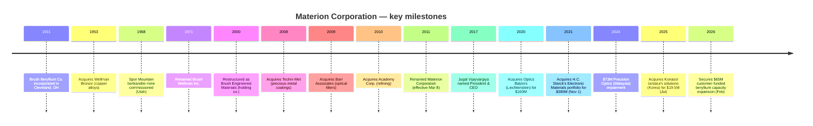

# Materion Corporation (NYSE: MTRN) — Company Research Report

**As of:** 2026-05-26
**Analyst language:** English
**Listing:** NYSE: MTRN | Headquartered Mayfield Heights, OH | Incorporated Ohio, 1931
**CIK:** 0001104657

> **Update — FY2026 outlook firmed at Q1-2026 print (2026-04-29):** Management reaffirmed full-year 2026 adjusted-EPS guidance of **USD 6.00–6.50** (≈+15% YoY at the midpoint vs. FY2025 adj-EPS of $5.44) and now expects **low-double-digit top-line growth** versus the mid-single-digit guide set at Q4-2025, citing "all-time-high backlog" up >20% YoY and 18% value-added-sales growth in Electronic Materials. Source: [Materion Q1-2026 earnings press release, 2026-04-29](https://www.sec.gov/Archives/edgar/data/1104657/000110465726000026/q12026pressrelease.htm). The Q4-2025 release also flagged a **$65 million customer-funded investment from a major US defense prime** to expand beryllium capacity at Elmore, OH — the largest single defense-driven capex commitment in Materion's recent history ([Q4-2025 earnings press release, 2026-02-12](https://www.sec.gov/Archives/edgar/data/1104657/000110465726000006/q42025pressrelease.htm)).

## Table of Contents

1. [Company Overview](#1-company-overview)
2. [Company History](#2-company-history)
3. [Management Team](#3-management-team)
4. [Products & Services](#4-products--services)
5. [Customers & Go-to-Market](#5-customers--go-to-market)
6. [Industry Overview](#6-industry-overview)
7. [Competitive Landscape](#7-competitive-landscape)
8. [Market Opportunity (TAM)](#8-market-opportunity-tam)
9. [Risk Assessment](#9-risk-assessment)
10. [References](#references)

---

## 1. Company Overview

Materion Corporation is a vertically integrated US producer of advanced engineered materials — high-purity metals, alloys, ceramics, inorganic chemicals, and thin-film optical coatings — used in semiconductor manufacturing, aerospace and defense, industrial, automotive, energy, consumer-electronics and life-sciences end markets. The 2025 Form 10-K describes the company as "an integrated producer of high-performance advanced engineered materials used in a variety of electrical, electronic, thermal, and structural applications with $1.8 billion in net sales in 2025" ([Materion FY2025 10-K, Item 1 Business, p. 2](https://www.sec.gov/Archives/edgar/data/1104657/000110465726000011/mtrn-20251231.htm)). The corporate footprint includes 30+ manufacturing, mining, service, and distribution sites across the United States, EMEA, and Asia-Pacific; the flagship complex at Elmore, Ohio operates the **only fully integrated beryllium primary-production chain in the Western world**, anchored by an open-pit bertrandite ore mine at Spor Mountain, Utah ([Materion FY2025 10-K, Item 2 Properties, p. 17](https://www.sec.gov/Archives/edgar/data/1104657/000110465726000011/mtrn-20251231.htm)).

The business is organized under four reportable segments: **Performance Materials** ($675.9M FY2025 net sales, –9% YoY), **Electronic Materials** ($1,010.0M, +19% YoY), **Precision Optics** ($100.7M, +7% YoY), and **Other** (corporate). Electronic Materials supplies high-purity sputter targets, vapor-deposition precursors, micro-electronics packaging components, and metal-reclamation services to leading-edge semiconductor fabs; Performance Materials produces copper-beryllium alloys, ToughMet copper-nickel-tin alloys, and primary beryllium metal sold into aerospace and defense, oil-and-gas, automotive and industrial connector markets; Precision Optics designs and manufactures thin-film optical filters and coatings for defense, aerospace, automotive and medical applications. Segment economics differ materially: Performance Materials carries higher fixed-asset intensity and structurally higher EBITDA margin on value-added sales, while Electronic Materials posts lower headline gross margins due to **substantial precious-metal pass-through revenue** ($682.3M of net sales in 2025 was pass-through metal cost) which the company netted out via its non-GAAP "value-added sales" measure ([Materion FY2025 10-K, MD&A — Value-Added Sales reconciliation, p. 25-26](https://www.sec.gov/Archives/edgar/data/1104657/000110465726000011/mtrn-20251231.htm)).

*Source: [Materion FY2025 10-K, Item 7 MD&A Results of Operations, p. 22-25](https://www.sec.gov/Archives/edgar/data/1104657/000110465726000011/mtrn-20251231.htm); chart compiled from the 10-K disclosed net sales, value-added sales and gross margin as a % of VAS for FY2023-2025; FY2021-2022 from prior 10-K filings.*

Geographically, Materion employs approximately 2,880 people globally as of December 31, 2025 — 2,127 in North America, 436 in EMEA, and 317 in Asia-Pacific ([Materion FY2025 10-K, Human Capital Management, p. 4](https://www.sec.gov/Archives/edgar/data/1104657/000110465726000011/mtrn-20251231.htm)). End-market sales are dominated by **semiconductor exposure (48.6% of FY2025 net sales, $867.6M)**, followed by aerospace and defense (12.0%, $213.8M), industrial (10.8%, $192.3M) and consumer electronics (9.5%, $168.9M); the semiconductor concentration has stepped up from 39.7% in FY2023 to 48.6% in FY2025, driven almost entirely by Electronic Materials precious-metal-target pass-through and incremental volumes ([Materion FY2025 10-K, Note C — Segment Reporting and Geographic Information, p. 53](https://www.sec.gov/Archives/edgar/data/1104657/000110465726000011/mtrn-20251231.htm)). No single customer accounted for ≥10% of net sales in FY2025, although a single Performance Materials customer crossed that threshold in both FY2024 and FY2023 — the same precision-clad-strip customer whose Q4-2025 quality event temporarily idled Reading, PA production ([Materion FY2025 10-K, Item 1A Risk Factors — customer concentration, p. 8](https://www.sec.gov/Archives/edgar/data/1104657/000110465726000011/mtrn-20251231.htm)).

Capital structure is investment-grade and modestly levered: total debt was approximately $400M at year-end 2025 against $13.7M of cash, supported by a JPMorgan-led Fourth Amended and Restated Credit Agreement and a revolving facility that was used to fund both the November 2021 H.C. Starck Solutions' Electronic Materials acquisition and the July 2025 Konasol tantalum-target deal ([Materion FY2025 10-K, MD&A Liquidity, p. 27-29](https://www.sec.gov/Archives/edgar/data/1104657/000110465726000011/mtrn-20251231.htm)). Dividend policy is a token but steadily growing: the quarterly common dividend was raised in May 2025 to $0.14 per share (from $0.135), implying a 2025 cash dividend payout of $11.5M against $103.2M of operating cash flow ([Materion FY2025 10-K, MD&A Cash Flow, p. 27](https://www.sec.gov/Archives/edgar/data/1104657/000110465726000011/mtrn-20251231.htm)). A $50M share-repurchase authorization was refreshed on October 29, 2025 — no shares were bought back in Q4-2025 — leaving capital allocation tilted toward M&A and organic capex (mine development at Spor Mountain, defense capacity expansion at Elmore) ([Materion FY2025 10-K, Item 5 Share Repurchases, p. 19](https://www.sec.gov/Archives/edgar/data/1104657/000110465726000011/mtrn-20251231.htm)).

**Valuation snapshot (May 2026).** MTRN closed near $215 in late May 2026, implying a market cap of roughly $4.5B, a TTM P/E of ~59x, and a TTM P/S of ~2.5x on $1.79B of FY2025 net sales ([Materion (NYSE:MTRN) hits new 1-year high, Daily Political, 2026-05-22](https://www.dailypolitical.com/2026/05/22/materion-nysemtrn-hits-new-1-year-high-heres-why.html)). On the company's preferred **adjusted-EPS** measure ($5.44 in FY2025; midpoint of FY2026 guidance ~$6.25), the implied forward P/E is closer to **34x** — still above MTRN's own 5-year TTM-P/E range (which has spent most of the post-COVID period between ~20-30x), and meaningfully above the S&P 600 Materials median ([Materion Q1-2026 earnings press release, 2026-04-29](https://www.sec.gov/Archives/edgar/data/1104657/000110465726000026/q12026pressrelease.htm)). The TTM-P/E gap to adj-EPS-based forward P/E is mechanical — TTM GAAP net income carries goodwill-impairment and acquisition-amortization charges from the FY2024 Precision Optics Malaysia impairment ($73M) and the H.C. Starck-related amortization that adjusted EBITDA strips out.

*Source: peer TTM P/E and P/S from each company's investor-relations page and consensus screens, May 2026; Materion from [Robinhood — MTRN quote](https://robinhood.com/us/en/stocks/MTRN/) and [Daily Political, 2026-05-22](https://www.dailypolitical.com/2026/05/22/materion-nysemtrn-hits-new-1-year-high-heres-why.html). Peer set: Entegris (ENTG, semi-materials peer), Coherent (COHR, photonics peer), Linde (LIN, industrial-gases peer), Air Products (APD, industrial-gases peer), DuPont (DD, advanced-materials peer).*

*Analyst view:* The 58.8x TTM P/E is high in absolute terms and well above the 31x peer median, but three interlocking factors explain why the market has tolerated it. **(1) Sector-proxy / AI-beneficiary premium** — investors looking for "picks-and-shovels" exposure to semiconductor process build-out (high-NA EUV, GAA, BPD, advanced packaging, hybrid bonding) have re-rated specialty-materials names as a group; the Nomura 2026-05-21 Greater China Semi anchor report explicitly catalogued sputter targets (and named "Materion / Heraeus" in its Fig. 44 supplier league table) as one of the structurally re-priced sub-categories ([Nomura "Greater China Semi: A guide to Semi renaissance in 2026~30F", 2026-05-21, Fig. 44, p. 29](https://www.nomuraconnects.com/) — subscription required; covered in the internal sector note `reports/sector/半导体材料.md`). **(2) Defense-cycle option value** — the $65M customer-funded beryllium capacity expansion announced on 2026-02-12 essentially de-risks the next leg of US-DoD CHIPS Act / critical-minerals reshoring spend ([Materion Q4-2025 earnings press release, 2026-02-12](https://www.sec.gov/Archives/edgar/data/1104657/000110465726000006/q42025pressrelease.htm)). **(3) Margin-expansion runway** — management's stated mid-term target of 23% adjusted EBITDA margin (vs. 20.7% in FY2025) implies $80-100M of incremental EBITDA over the next three years against a flat-to-modest revenue base, a powerful operating-leverage story for a $4.5B market cap. The risk is symmetric: if the AI-capex bull cycle pauses, MTRN's ~25-30x TTM-P/E baseline becomes the new ceiling — call it 25-30% downside in a multiple-compression scenario.

The investor takeaway from Section 1 is that Materion is a **levered call on three different cycles operating with low correlation** — (a) the AI / advanced-node semi capex super-cycle that pulls Electronic Materials; (b) the multi-year US defense / aerospace replenishment cycle that pulls Performance Materials beryllium; and (c) the Precision Optics turnaround that follows the Optics Balzers integration and Malaysia impairment write-down. The next eight sections develop each leg in detail.

---

## 2. Company History

Materion's corporate lineage stretches back to **1931, when Charles Frederick Brush II and Bengt Kjellgren incorporated The Brush Beryllium Company in Cleveland, Ohio** to commercialize the first viable industrial process for refining beryllium from beryl ore — work originally developed at Brush Laboratories (founded by Charles F. Brush Sr., inventor of the open-coil dynamo arc lamp and a contemporary of Edison) ([Materion FY2025 10-K, Item 1 Business — "The Company was incorporated in Ohio in 1931"](https://www.sec.gov/Archives/edgar/data/1104657/000110465726000011/mtrn-20251231.htm); historical context from [Brush Beryllium acquisition by Brush Engineered Materials press archive](https://www.sec.gov/Archives/edgar/data/0001104657/000129993311000170/htm_40414.htm)). Through the 1940s and 1950s Brush Beryllium became the dominant western-hemisphere supplier of beryllium metal for the early atomic-weapons program and aerospace platforms — a position that hardened into a quasi-monopoly when the company secured leases over the Spor Mountain bertrandite deposit in Juab County, Utah in the late 1960s and commissioned the Delta, Utah refinery and Elmore, Ohio finishing plant ([Materion FY2025 10-K, Item 2 Mine Property, p. 17-18](https://www.sec.gov/Archives/edgar/data/1104657/000110465726000011/mtrn-20251231.htm)).

The corporate name evolved as the portfolio diversified beyond pure beryllium: Brush Beryllium became Brush Wellman in 1971 (reflecting the 1953 acquisition of Wellman Bronze, the copper-alloy business), then Brush Engineered Materials in 2000 (a holding-company restructuring that placed thin-film coatings, advanced ceramics, and precious-metal operations alongside the historic beryllium franchise), and finally **Materion Corporation effective March 8, 2011**, a rebranding designed to signal the company had become an advanced-materials platform rather than a single-commodity producer ([Brush Engineered Materials 8-K announcing name change to Materion, FY2011](https://www.sec.gov/Archives/edgar/data/0001104657/000129993311000170/exhibit1.htm)). The 2011 rebrand was deliberately decoupled from beryllium because by then the Electronic Materials, Specialty Engineered Alloys and Precision Coatings segments together generated more revenue than the legacy beryllium business — and because beryllium's well-documented occupational-health profile created reputational headwinds that the company wanted to compartmentalize.

Two strategic pivots define the modern Materion. The first was the **2020 acquisition of Optics Balzers AG of Balzers, Liechtenstein** in an all-cash $160M transaction (closed September 2020), which gave Materion a global precision-coatings footprint across Europe (Liechtenstein, Germany), Asia (Penang, Malaysia) and the US — turning a domestic specialty business into a worldwide leader in thin-film optical filters for biomedical, projection, defense and consumer electronics applications ([Materion to acquire Optics Balzers, Electro Optics, 2020-06](https://www.electrooptics.com/news/materion-acquire-optics-balzers-combining-thin-film-coatings-expertise); [Materion investor news — Materion Corporation to Acquire Optics Balzers, 2020](https://investor.materion.com/news/news-details/2020/Materion-Corporation-to-Acquire-Optics-Balzers/default.aspx)). The second was the **November 2021 acquisition of H.C. Starck Solutions' Electronic Materials portfolio for $380M** in cash — a transaction that nearly doubled Electronic Materials revenue overnight and added the Newton, MA-based tantalum, niobium and refractory-metal sputter-target line that has become the largest single growth driver for the segment ([Materion to Acquire H.C. Starck's Electronic Materials Portfolio, BusinessWire, 2021-09-20](https://www.businesswire.com/news/home/20210920005444/en/Materion-to-Acquire-H.C.-Starck%E2%80%99s-Electronic-Materials-Portfolio-Creating-a-Global-Leader-in-Premium-Thin-Film-Materials-for-the-Semiconductor-Market); [Materion 8-K — Asset Purchase Agreement, 2021-09-19](https://www.sec.gov/Archives/edgar/data/0001104657/000110465721000094/mtrn-20210919.htm)). HCS-EM was expected to generate ~$145M in 2021 revenue and ~$29M of adjusted EBITDA — a ~13x EBITDA multiple before synergies and ~10x with run-rate synergies, a typical specialty-chemicals deal multiple ([HCS-EM acquisition press release exhibit, 2021-09-20](https://www.sec.gov/Archives/edgar/data/0001104657/000110465721000094/hcselectronicmaterialsre.htm)).

Smaller bolt-ons have continued: in **July 2025 Materion acquired the Korean tantalum-solutions manufacturing assets of Konasol Co., Ltd. in Dangjin City for $19.5M cash**, adding the company's first dedicated Asia-based sputter-target factory and meaningfully shortening the supply chain to Samsung and SK Hynix's Pyeongtaek / Cheongju memory complexes ([Materion FY2025 10-K, Note B — Acquisition, p. 50](https://www.sec.gov/Archives/edgar/data/1104657/000110465726000011/mtrn-20251231.htm)). The Konasol deal — modest in deal value but strategically large in customer-proximity terms — fits the same pattern as Optics Balzers and HCS-EM: filling regional white-space gaps in a portfolio of niches where Materion is already a global #2-3.

The Q4-2024 write-down deserves a dedicated callout. In FY2024 Materion took a **$73M goodwill and long-lived-asset impairment against the Precision Optics reporting unit in Malaysia**, driving the segment to a –$73.3M EBITDA loss for the year ([Materion FY2025 10-K, MD&A — Segment Disclosures, Precision Optics, p. 24](https://www.sec.gov/Archives/edgar/data/1104657/000110465726000011/mtrn-20251231.htm)). The write-down reflected slower-than-modeled recovery of consumer-electronics-related optical demand at the Penang facility post-COVID and a stalled customer ramp; management's response was a multi-quarter restructuring that began in 4Q-2024 and delivered ~800 bps of YoY margin expansion in FY2025 — a textbook example of recover-and-rebase. Q1-2026 marked the "5th consecutive quarter of bottom-line improvement" in Precision Optics, with management citing aerospace and defense volume strength ([Materion Q1-2026 earnings press release, 2026-04-29](https://www.sec.gov/Archives/edgar/data/1104657/000110465726000026/q12026pressrelease.htm)).

---

## 3. Management Team

Because Materion is an institutional, professionally-managed corporation with a founding lineage stretching to 1931 and no contemporary founder still in the business, this section covers only the **current CEO** per the company-research style guide (no founder bio is appropriate — the original Brush Beryllium founders are historical figures, not active management).

**Jugal K. Vijayvargiya — President and CEO since March 2017.** Vijayvargiya, 58, joined Materion in March 2017 after a 26-year international career at Delphi Automotive PLC (now Aptiv), the global automotive technology supplier ([Materion 2026 DEF 14A — Director Biographies, p. 4](https://www.sec.gov/Archives/edgar/data/1104657/000110465726000022/mtrn-20260326.htm)). His final Delphi role was President of the Electronics & Safety segment, a $3 billion global business unit headquartered in Germany — putting him on Delphi's executive committee with operational ownership of the company's largest unit by both revenue and engineering headcount. Before that, he held progressively senior roles in product and manufacturing engineering, sales, product-line management, acquisition integration, and general management across Europe and North America during the 1990s and 2000s — a profile that maps closely to Materion's own operating challenges (multi-region manufacturing, customer-specific product engineering, integration of bolt-on acquisitions). His CEO appointment was framed by the Materion board as a deliberate pivot from a research/operations-heavy CEO profile (his predecessors were largely promoted from within R&D and manufacturing) toward a commercial-and-integration-heavy profile suited to the post-2017 M&A strategy ([Materion Corp. names Delphi Automotive exec as CEO, Crain's Cleveland Business, 2017-03-03](https://www.crainscleveland.com/article/20170303/NEWS/170309932/materion-corp-names-delphi-automotive-exec-as-ceo)).

Education and external roles. Vijayvargiya holds both a Bachelor's and a Master's degree in Electrical Engineering from **The Ohio State University** — relevant context for Materion's Ohio headquarters and the strong overlap with the regional engineering talent pool that staffs Elmore ([Materion leadership page — Jugal Vijayvargiya](https://www.materion.com/en/about-materion/company-leadership/jugal-vijayvargiya)). He has served on the board of **Sensata Technologies Holding PLC (NYSE: ST)** since June 2023, and is a trustee of the Committee for Economic Development at The Conference Board — both governance roles that signal peer-recognition among large-cap industrial CEOs ([Materion 2026 DEF 14A — Director Biographies, p. 4](https://www.sec.gov/Archives/edgar/data/1104657/000110465726000022/mtrn-20260326.htm)).

Ownership and compensation. As of January 31, 2026 Vijayvargiya beneficially owned **290,495 Materion common shares (1.4% of class), including 151,589 stock-appreciation rights (SARs) exercisable within 60 days** — by far the largest insider position, well ahead of CFO Shelly Chadwick's 29,677 shares (<1%) ([Materion 2026 DEF 14A — Security Ownership of Directors and Named Executive Officers, p. 14-15](https://www.sec.gov/Archives/edgar/data/1104657/000110465726000022/mtrn-20260326.htm)). At a May 2026 share price near $215, his beneficial position is worth approximately $62M — a meaningful skin-in-the-game alignment. FY2025 total reported compensation was **$4,794,902**, comprising a $982,693 base salary, $2,960,100 in RSU/PRSU stock awards, $779,921 in SAR option awards, zero non-equity incentive (the AIP did not pay out in FY2025 due to the Q4 precision-clad-strip quality event), and $72,188 in "all other" (mostly retirement-plan contributions) — down from $5,858,482 in FY2024 ([Materion 2026 DEF 14A — Summary Compensation Table, p. 47](https://www.sec.gov/Archives/edgar/data/1104657/000110465726000022/mtrn-20260326.htm)). The pay mix is heavily equity-weighted (>78% of grant-date value), with PRSU vesting tied to relative total shareholder return (RTSR) versus the S&P Industrial Materials Index and return-on-invested-capital (ROIC) gates — both standard governance hallmarks for a mid-cap specialty-materials issuer.

CFO context (brief). Shelly M. Chadwick, 54, has served as Vice President, Finance and CFO since November 2020; she joined from The Timken Company where she was VP Finance and Chief Accounting Officer for four years. Her FY2025 total compensation was $2.07M ([Materion 2026 DEF 14A — Summary Compensation Table, p. 47](https://www.sec.gov/Archives/edgar/data/1104657/000110465726000022/mtrn-20260326.htm)). General Counsel Gregory Chemnitz rounds out the named executive officer group with $1.04M of FY2025 comp.

---

