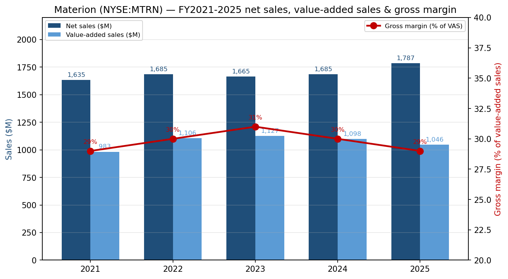
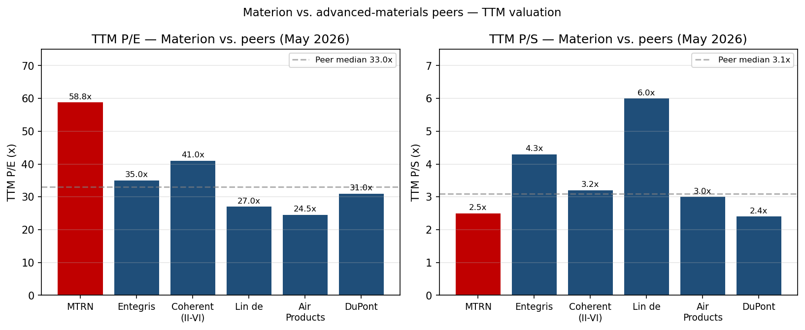
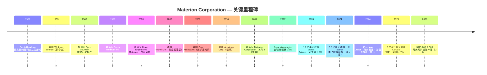
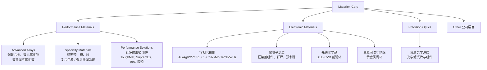
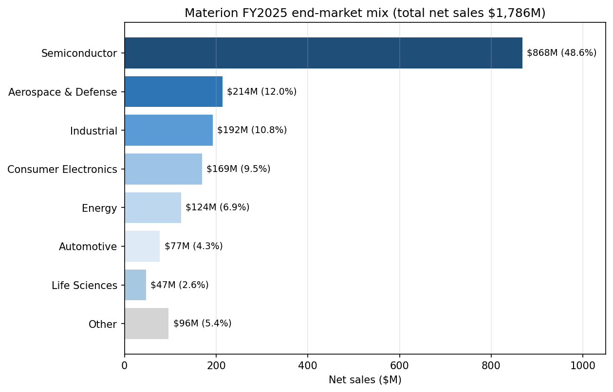
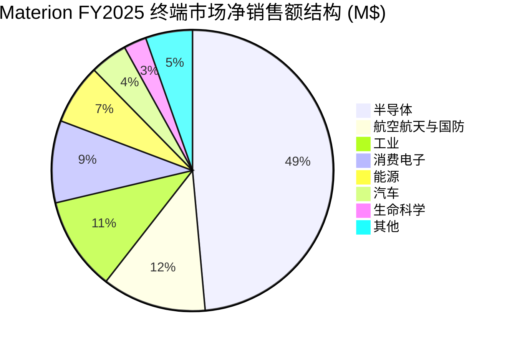
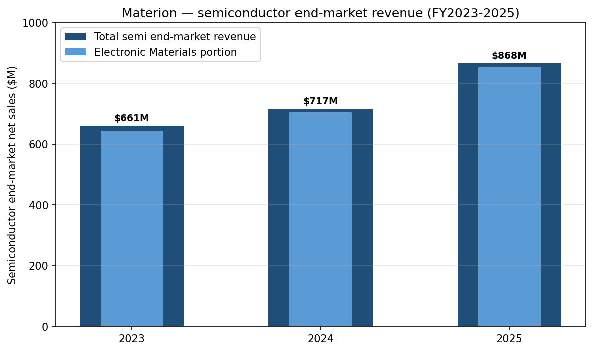

# Materion Corporation (NYSE: MTRN) — 公司研究报告

**报告日期：** 2026-05-26
**分析师语言：** 简体中文
**上市地：** NYSE: MTRN | 总部俄亥俄州 Mayfield Heights | 1931 年于俄亥俄州注册
**CIK：** 0001104657

> **更新提示 — Q1-2026 业绩印证全年指引（2026-04-29）：** 管理层重申 2026 财年 **调整后每股收益指引 USD 6.00-6.50**（中位数对 FY2025 调整后 EPS $5.44 同比约 +15%），并把全年收入指引从 Q4-2025 时的"中个位数增长"上调为"低双位数增长"，理由是"历史新高的在手订单（backlog）同比增长 >20%"以及电子材料 (Electronic Materials) 板块增值销售（value-added sales）同比 +18%。资料来源：[Materion Q1-2026 业绩新闻稿，2026-04-29](https://www.sec.gov/Archives/edgar/data/1104657/000110465726000026/q12026pressrelease.htm)。Q4-2025 的新闻稿同时披露了 **来自一家美国国防主承包商的 6,500 万美元客户出资项目**，用于扩建俄亥俄州 Elmore 工厂的铍 (beryllium) 产能 — 这是 Materion 近年规模最大的单笔国防驱动型资本承诺（[Q4-2025 业绩新闻稿，2026-02-12](https://www.sec.gov/Archives/edgar/data/1104657/000110465726000006/q42025pressrelease.htm)）。

## 目录

1. [公司概览](#1-公司概览)
2. [公司历史](#2-公司历史)
3. [管理团队](#3-管理团队)
4. [产品与服务](#4-产品与服务)
5. [客户与上市策略](#5-客户与上市策略)
6. [行业概览](#6-行业概览)
7. [竞争格局](#7-竞争格局)
8. [市场机会 (TAM)](#8-市场机会-tam)
9. [风险评估](#9-风险评估)
10. [参考资料](#参考资料)

---

## 1. 公司概览

Materion Corporation 是美国一家垂直一体化 (vertically integrated) 的先进工程材料生产商，主要产品包括高纯度金属、合金、陶瓷、无机化学品以及薄膜光学涂层，下游应用横跨半导体制造、航空航天与国防、工业、汽车、能源、消费电子和生命科学等终端市场。FY2025 年报 (10-K) 自我描述为"一家集高性能先进工程材料于一体的生产商，2025 财年净销售额 18 亿美元"（[Materion FY2025 10-K, Item 1 Business, p. 2](https://www.sec.gov/Archives/edgar/data/1104657/000110465726000011/mtrn-20251231.htm)）。公司在美、欧、亚太共拥有 30 余个生产、矿山、服务和分销基地；旗舰基地位于俄亥俄州 Elmore，是 **西半球唯一一条完整的铍金属一次冶炼生产链**，矿源来自犹他州 Spor Mountain 的硅铍石 (bertrandite, 铍石矿) 露天矿（[Materion FY2025 10-K, Item 2 Properties, p. 17](https://www.sec.gov/Archives/edgar/data/1104657/000110465726000011/mtrn-20251231.htm)）。

公司业务划分为四个可报告分部：**Performance Materials 高性能材料**（FY2025 净销售额 6.759 亿美元，同比 -9%）、**Electronic Materials 电子材料**（10.10 亿美元，同比 +19%）、**Precision Optics 精密光学**（1.007 亿美元，同比 +7%）以及 **Other 其他**（公司层面）。Electronic Materials 主要向先进制程半导体晶圆厂供应高纯度溅射靶材 (sputter target)、气相沉积材料 (vapor deposition material — for ALD/CVD) 前驱体、微电子封装组件和金属回收服务；Performance Materials 主要生产铜铍合金 (copper-beryllium alloy)、ToughMet 铜镍锡合金以及一次铍金属，下游为航空航天与国防、油气、汽车和工业连接器等市场；Precision Optics 设计制造薄膜光学滤光片和涂层，应用涵盖国防、航空、汽车和医疗。各分部的盈利结构差异很大：Performance Materials 固定资产强度更高，调整后 EBITDA / 增值销售比率结构上更高；而 Electronic Materials 因 **包含大量贵金属价值传递 (precious-metal pass-through) 收入** —— 2025 年净销售额中有 6.823 亿美元属于此类原料价值传递 —— 因此账面毛利率较低，公司用非 GAAP 的"增值销售 (value-added sales)"指标加以剔除（[Materion FY2025 10-K, MD&A — Value-Added Sales reconciliation, p. 25-26](https://www.sec.gov/Archives/edgar/data/1104657/000110465726000011/mtrn-20251231.htm)）。

*资料来源：[Materion FY2025 10-K, Item 7 MD&A Results of Operations, p. 22-25](https://www.sec.gov/Archives/edgar/data/1104657/000110465726000011/mtrn-20251231.htm)；图表数据来自 10-K 披露的 FY2023-2025 净销售额、增值销售和增值销售口径毛利率，FY2021-2022 来自往年 10-K。*

地域上，截至 2025 年 12 月 31 日 Materion 全球员工约 2,880 人 —— 北美 2,127 人、EMEA 436 人、亚太 317 人（[Materion FY2025 10-K, Human Capital Management, p. 4](https://www.sec.gov/Archives/edgar/data/1104657/000110465726000011/mtrn-20251231.htm)）。终端市场分布上，**半导体收入占比 48.6%（FY2025 净销售额 8.676 亿美元）** 已占据绝对主导，其后依次是航空航天与国防（12.0%，2.138 亿美元）、工业（10.8%，1.923 亿美元）和消费电子（9.5%，1.689 亿美元）；半导体占比从 FY2023 的 39.7% 一路抬升至 FY2025 的 48.6%，几乎全部来自 Electronic Materials 贵金属靶 (precious-metal target) 价值传递收入和增量出货（[Materion FY2025 10-K, Note C — Segment Reporting and Geographic Information, p. 53](https://www.sec.gov/Archives/edgar/data/1104657/000110465726000011/mtrn-20251231.htm)）。FY2025 没有单一客户占总净销售额 ≥10%，但 FY2024 和 FY2023 中有一家 Performance Materials 客户跨过了 10% 门槛 —— 也就是 Q4-2025 因质量事件 (quality event) 而短暂停工的宾州 Reading 精密复合带 (precision-clad strip) 产线的同一客户（[Materion FY2025 10-K, Item 1A Risk Factors — customer concentration, p. 8](https://www.sec.gov/Archives/edgar/data/1104657/000110465726000011/mtrn-20251231.htm)）。

资本结构上，公司属投资级、杠杆温和：截至 2025 年底总有息负债约 4 亿美元，对应现金 1,370 万美元；融资工具是 JPMorgan 牵头的第四次修订循环授信，2021 年 11 月收购 H.C. Starck Surface Tech 电子材料业务 (2021-11 收购) 和 2025 年 7 月收购韩国 Konasol 钽靶资产时都动用了该额度（[Materion FY2025 10-K, MD&A Liquidity, p. 27-29](https://www.sec.gov/Archives/edgar/data/1104657/000110465726000011/mtrn-20251231.htm)）。股利政策象征性但稳步增长：2025 年 5 月季度普通股息提至 0.14 美元/股（前值 0.135 美元），全年现金股息支付 1,150 万美元，对应当年经营性现金流 1.032 亿美元（[Materion FY2025 10-K, MD&A Cash Flow, p. 27](https://www.sec.gov/Archives/edgar/data/1104657/000110465726000011/mtrn-20251231.htm)）。董事会于 2025 年 10 月 29 日重新授权 5,000 万美元股票回购额度（Q4-2025 实际未回购任何股份），资本配置整体偏向并购和有机资本支出（Spor Mountain 矿区开发、Elmore 国防产能扩建）（[Materion FY2025 10-K, Item 5 Share Repurchases, p. 19](https://www.sec.gov/Archives/edgar/data/1104657/000110465726000011/mtrn-20251231.htm)）。

**估值快照（2026 年 5 月）。** MTRN 在 2026 年 5 月下旬收盘价约 215 美元，对应市值约 45 亿美元、滚动市盈率 (TTM P/E) 约 59 倍、滚动市销率 (P/S) 约 2.5 倍（基于 FY2025 净销售额 17.86 亿美元）（[Materion (NYSE:MTRN) hits new 1-year high, Daily Political, 2026-05-22](https://www.dailypolitical.com/2026/05/22/materion-nysemtrn-hits-new-1-year-high-heres-why.html)）。如果改用公司偏好的 **调整后 EPS** 指标（FY2025 调整 EPS 5.44 美元；FY2026 指引中位数约 6.25 美元），那么按 215 美元的股价计算前瞻市盈率约 **34 倍** —— 仍高于 MTRN 自身近 5 年 TTM P/E 区间（后疫情多数时间在 20-30 倍），也明显高于 S&P 600 材料指数中位数（[Materion Q1-2026 业绩新闻稿，2026-04-29](https://www.sec.gov/Archives/edgar/data/1104657/000110465726000026/q12026pressrelease.htm)）。TTM P/E 与调整 EPS 前瞻 P/E 的差距属于机械原因 —— TTM 报表净利包含 FY2024 精密光学马来西亚减值 (7,300 万美元) 和 H.C. Starck 相关收购摊销，调整 EBITDA 把这些剔除。

*资料来源：同业 TTM P/E 和 P/S 取自各公司投资者关系页面和卖方 consensus，2026 年 5 月；Materion 数据来自 [Robinhood — MTRN 行情](https://robinhood.com/us/en/stocks/MTRN/) 及 [Daily Political, 2026-05-22](https://www.dailypolitical.com/2026/05/22/materion-nysemtrn-hits-new-1-year-high-heres-why.html)。同业组合：Entegris (ENTG，半导体材料同业)、Coherent (COHR，光子学同业)、Linde (LIN，工业气体同业)、Air Products (APD，工业气体同业)、DuPont (DD，先进材料同业)。*

*分析师观点：* 58.8 倍 TTM P/E 绝对值很高，明显高于同业中位数 31 倍，但有三条逻辑相互交织，解释了市场为何愿意接受这个倍数。**(1) 板块代理 / AI 受益溢价** —— 寻找半导体工艺扩产（高 NA EUV、GAA、BPD、先进封装、混合键合）"卖铲人"敞口的投资者，把整个先进材料板块整体重估；野村 2026-05-21 的大中华半导体 anchor 报告在第 44 张图（溅射靶供应商联赛表）里明确点名"Materion / Heraeus (US/DE)"作为结构性重估的一个子类别（[Nomura "Greater China Semi: A guide to Semi renaissance in 2026~30F", 2026-05-21, Fig. 44, p. 29](https://www.nomuraconnects.com/) — 需订阅；内部行业研究详见 `reports/sector/半导体材料.md`）。**(2) 国防周期期权价值** —— 2026 年 2 月 12 日公告的 6,500 万美元客户出资铍产能扩建，相当于把美国 DoD CHIPS 法案 / 关键矿产回流计划下一阶段的支出做了去风险化（[Materion Q4-2025 业绩新闻稿，2026-02-12](https://www.sec.gov/Archives/edgar/data/1104657/000110465726000006/q42025pressrelease.htm)）。**(3) 利润率扩张空间** —— 管理层提出的中期目标"调整 EBITDA 利润率 23%"（vs. FY2025 实际 20.7%）意味着未来三年在收入持平到温和增长的前提下还能新增 8,000-10,000 万美元的 EBITDA，对一家 45 亿美元市值的公司而言是有力的经营杠杆故事。风险是对称的：如果 AI 资本支出多头周期 (capex bull cycle) 暂停，MTRN 的 25-30 倍 TTM P/E 基线就会重新成为天花板 —— 多重估值压缩 (multiple compression) 情景下下行空间 25-30%。

第 1 节的投资者收获是：Materion 是 **一只对三个低相关周期的高弹性多头头寸** —— (a) 拉动 Electronic Materials 的 AI / 先进制程半导体资本支出超级周期；(b) 拉动 Performance Materials 铍业务的美国多年期国防 / 航空航天补库周期；(c) 紧跟 Optics Balzers (2020 收购) 整合和马来西亚减值后的 Precision Optics 反转故事。后面八节会把每条腿展开。

---

## 2. 公司历史

Materion 的法人血脉可以追溯到 **1931 年 —— Charles Frederick Brush II 与 Bengt Kjellgren 在俄亥俄州克利夫兰注册成立 The Brush Beryllium Company**，目的是把第一套从绿柱石 (beryl) 矿石中工业化提炼铍金属的工艺商业化；这套工艺最早出自 Brush Laboratories（由 Charles F. Brush Sr. 创立，他是开式线圈式发电机弧光灯的发明人，与 Edison 同时代）（[Materion FY2025 10-K, Item 1 Business — "The Company was incorporated in Ohio in 1931"](https://www.sec.gov/Archives/edgar/data/1104657/000110465726000011/mtrn-20251231.htm)；历史背景见 [Brush Beryllium acquisition by Brush Engineered Materials press archive](https://www.sec.gov/Archives/edgar/data/0001104657/000129993311000170/htm_40414.htm)）。1940-50 年代，Brush Beryllium 迅速成为西半球早期核武器项目和航空航天平台的铍金属支配性供应商 —— 这一位置在 1960 年代末期被进一步巩固，公司拿下了犹他州 Juab 县 Spor Mountain 硅铍石矿区的采矿权，并陆续建成 Delta 冶炼厂和 Elmore 后段加工厂（[Materion FY2025 10-K, Item 2 Mine Property, p. 17-18](https://www.sec.gov/Archives/edgar/data/1104657/000110465726000011/mtrn-20251231.htm)）。

公司名字随业务多元化几度更迭：1971 年改名 Brush Wellman（反映 1953 年收购了 Wellman Bronze 铜合金业务）；2000 年改组为 Brush Engineered Materials（一个控股公司，旗下并列薄膜涂层、先进陶瓷、贵金属业务和历史铍业务）；**2011 年 3 月 8 日正式更名为 Materion Corporation**，明确传递公司已经从单一商品生产商升级为先进材料平台（[Brush Engineered Materials 8-K announcing name change to Materion, FY2011](https://www.sec.gov/Archives/edgar/data/0001104657/000129993311000170/exhibit1.htm)）。2011 年的品牌切换刻意与"铍"脱钩，因为彼时 Electronic Materials、Specialty Engineered Alloys 和 Precision Coatings 三段合计收入已超过历史铍业务 —— 同时，铍金属在职业卫生方面众所周知的争议史也让公司希望把这块业务在品牌上加以"隔间化"管理。

定义"现代 Materion"的有两大战略转向。第一是 **2020 年以 1.6 亿美元全现金收购列支敦士登 Balzers 镇的 Optics Balzers AG**（2020 年 9 月完成交割），Materion 借此把精密涂层业务从美国本土铺到欧洲（列支敦士登、德国）+ 亚洲（马来西亚槟城）+ 美国的全球网络 —— 从国内特种业务一举升级为生物医疗、投影、国防和消费电子用薄膜光学滤光片的全球性玩家（[Materion to acquire Optics Balzers, Electro Optics, 2020-06](https://www.electrooptics.com/news/materion-acquire-optics-balzers-combining-thin-film-coatings-expertise)；[Materion investor news — Materion Corporation to Acquire Optics Balzers, 2020](https://investor.materion.com/news/news-details/2020/Materion-Corporation-to-Acquire-Optics-Balzers/default.aspx)）。第二是 **2021 年 11 月以 3.8 亿美元现金收购 H.C. Starck Solutions 的电子材料组合** —— 该交易一夜之间几乎使 Electronic Materials 收入翻倍，并把马萨诸塞州 Newton 基地的钽 (Ta)、铌、难熔金属溅射靶产品线纳入，自此 HCS-EM 成为这个分部最大的单一增长驱动（[Materion to Acquire H.C. Starck's Electronic Materials Portfolio, BusinessWire, 2021-09-20](https://www.businesswire.com/news/home/20210920005444/en/Materion-to-Acquire-H.C.-Starck%E2%80%99s-Electronic-Materials-Portfolio-Creating-a-Global-Leader-in-Premium-Thin-Film-Materials-for-the-Semiconductor-Market)；[Materion 8-K — Asset Purchase Agreement, 2021-09-19](https://www.sec.gov/Archives/edgar/data/0001104657/000110465721000094/mtrn-20210919.htm)）。当时市场预期 HCS-EM 2021 年可贡献约 1.45 亿美元收入 / 2,900 万美元调整后 EBITDA —— 协同前估值倍数约 13× EBITDA、协同后约 10×，是典型特种化学品并购倍数（[HCS-EM acquisition press release exhibit, 2021-09-20](https://www.sec.gov/Archives/edgar/data/0001104657/000110465721000094/hcselectronicmaterialsre.htm)）。

小型补强收购则在持续进行：**2025 年 7 月 Materion 以 1,950 万美元现金收购 Konasol Co., Ltd. 位于韩国唐津市的钽溶液制造资产**，第一次拥有了亚洲本地专门的溅射靶工厂，把对三星和 SK 海力士在平泽 / 清州的存储集群供应链距离显著缩短（[Materion FY2025 10-K, Note B — Acquisition, p. 50](https://www.sec.gov/Archives/edgar/data/1104657/000110465726000011/mtrn-20251231.htm)）。Konasol 交易在金额上不大，但战略意义大（更贴近客户工厂），与 Optics Balzers 和 HCS-EM 的并购逻辑同源 —— 都是在 Materion 已经全球第 2-3 的子赛道里填补区域空白。

Q4-2024 的减值值得专门点出。FY2024 Materion 对 **马来西亚 Precision Optics 报告单元计提 7,300 万美元商誉与长期资产减值**，导致该分部全年 EBITDA 亏损 7,330 万美元（[Materion FY2025 10-K, MD&A — Segment Disclosures, Precision Optics, p. 24](https://www.sec.gov/Archives/edgar/data/1104657/000110465726000011/mtrn-20251231.htm)）。减值反映了槟城基地后疫情消费电子光学需求恢复慢于建模，加上一个客户的量产 ramp 延后；管理层的应对是 2024 年第四季度启动的多季度重组，并在 FY2025 实现了约 800 bps 的同比毛利率扩张 —— 是教科书式的"先减计再 rebase"案例。Q1-2026 标志着 Precision Optics"连续第五个季度底线 (bottom-line) 改善"，管理层把功劳归于航空与国防业务的销量强势（[Materion Q1-2026 业绩新闻稿，2026-04-29](https://www.sec.gov/Archives/edgar/data/1104657/000110465726000026/q12026pressrelease.htm)）。

---

## 3. 管理团队

Materion 是一家有 1931 年法人血脉的机构化、专业化经营的大型公司，**当代已无在职创始人**，因此本节按公司研究规范只覆盖 **现任 CEO** —— 不再补创始人传记（Brush Beryllium 原始创始人都是历史人物，与当下经营无关）。

**Jugal K. Vijayvargiya —— 自 2017 年 3 月起任公司总裁兼 CEO。** Vijayvargiya 现年 58 岁，2017 年 3 月加入 Materion 之前在全球汽车技术供应商 Delphi Automotive PLC（现 Aptiv）有 26 年的国际化职业生涯（[Materion 2026 DEF 14A — Director Biographies, p. 4](https://www.sec.gov/Archives/edgar/data/1104657/000110465726000022/mtrn-20260326.htm)）。他在 Delphi 的最后职务是 Electronics & Safety 业务集团总裁 —— 一个 30 亿美元的全球业务单元、总部位于德国，让他位列 Delphi 执委会，对集团按收入和工程师规模计算最大的事业部拥有运营负责权。在此之前，他在 1990-2000 年代在欧洲和北美承担了产品和制造工程、销售、产品线管理、并购整合、综合管理等一系列愈发资深的职责 —— 这份履历几乎与 Materion 自身的运营难题高度匹配（多地区制造、客户专属产品工程、多笔 bolt-on 并购整合）。Materion 董事会把他的 CEO 任命定性为 **战略转向** —— 从更偏重研发 / 制造的 CEO 画像（前几位 CEO 多自研发和制造内部晋升）切换到更偏重商业 / 整合的画像，以匹配 2017 年之后的并购战略（[Materion Corp. names Delphi Automotive exec as CEO, Crain's Cleveland Business, 2017-03-03](https://www.crainscleveland.com/article/20170303/NEWS/170309932/materion-corp-names-delphi-automotive-exec-as-ceo)）。

学历与外部职务。Vijayvargiya 同时拥有 **俄亥俄州立大学 (The Ohio State University) 电气工程学士与硕士学位** —— 与 Materion 俄亥俄州总部和 Elmore 工厂所在地的工程人才池有天然耦合（[Materion leadership page — Jugal Vijayvargiya](https://www.materion.com/en/about-materion/company-leadership/jugal-vijayvargiya)）。他自 2023 年 6 月起担任 **Sensata Technologies Holding PLC (NYSE: ST)** 董事会成员，同时担任 The Conference Board 旗下 Committee for Economic Development 的受托人 —— 两项治理职务都说明他在大盘工业 CEO 圈层获得同业认可（[Materion 2026 DEF 14A — Director Biographies, p. 4](https://www.sec.gov/Archives/edgar/data/1104657/000110465726000022/mtrn-20260326.htm)）。

持股与薪酬。截至 2026 年 1 月 31 日，Vijayvargiya 实益持有 **290,495 股 Materion 普通股（占类别 1.4%），其中包括 60 日内可行权的 151,589 份股票增值权 SAR**，是远超任何其他内部人的最大持仓，CFO Shelly Chadwick 仅持 29,677 股（<1%）（[Materion 2026 DEF 14A — Security Ownership of Directors and Named Executive Officers, p. 14-15](https://www.sec.gov/Archives/edgar/data/1104657/000110465726000022/mtrn-20260326.htm)）。按 2026 年 5 月约 215 美元的股价，其实益持仓市值约 6,200 万美元 —— 是有意义的利益绑定。FY2025 总薪酬 **4,794,902 美元**，构成是：基本工资 982,693 美元、RSU/PRSU 股票奖励 2,960,100 美元、SAR 期权奖励 779,921 美元、非股权激励为零（FY2025 年度激励计划 AIP 因 Q4 精密复合带质量事件未支付）、其他 72,188 美元（主要是退休计划公司付款）—— 较 FY2024 的 5,858,482 美元下降（[Materion 2026 DEF 14A — Summary Compensation Table, p. 47](https://www.sec.gov/Archives/edgar/data/1104657/000110465726000022/mtrn-20260326.htm)）。薪酬结构以股权为重头（授予日价值 >78%），PRSU 的归属与对标 S&P Industrial Materials 指数的相对总股东回报 (RTSR) 和投资资本回报率 (ROIC) 双门槛挂钩 —— 这两项都是中盘特种材料公司的标准治理设置。

CFO 简介（备述）。Shelly M. Chadwick，现年 54 岁，自 2020 年 11 月起任公司副总裁兼 CFO；加入 Materion 前在 The Timken Company 任 VP Finance 兼首席会计官四年。FY2025 总薪酬 207 万美元（[Materion 2026 DEF 14A — Summary Compensation Table, p. 47](https://www.sec.gov/Archives/edgar/data/1104657/000110465726000022/mtrn-20260326.htm)）。总法律顾问 Gregory Chemnitz 是 named executive officer 组中的第三位，FY2025 薪酬 104 万美元。

---

## 4. 产品与服务

第 4 节是本报告最重要的一章。Materion **不是一家单产品公司** —— 它经营四个可报告分部、约 12 个不同产品族，合计服务半导体、国防、工业、消费电子和生命科学价值链的八个被点名终端市场。为保持结构可读，本节按以下安排展开：(a) 以 10-K 原文产品矩阵作锚；(b) 详细拆解 Electronic Materials（野村 2026 行业报告点名的半导体材料增长核心）；(c) 详细拆解 Performance Materials（铍业务为代表的国防敞口源头）；(d) 详细拆解 Precision Optics（Optics Balzers 整合后的转型故事）；(e) 综合论述三个分部如何拼成"垂直一体化先进材料平台"的整体身份。

### 4.1 10-K 产品矩阵

下表逐字复盘 Materion 自己在 Item 1 Business 中的产品组织 —— 三个经营分部（Performance Materials、Electronic Materials、Precision Optics）加一个未分配的 Other 公司分部。Performance Materials 再拆三条产品线；Electronic Materials 再拆四个产品族；Precision Optics 是单条产品线，跨多个地理基地。

| 分部 | 产品族 / 产品线 | 描述（基于 10-K Item 1 改写） | 主要终端市场 |
|---|---|---|---|
| **Performance Materials** | Advanced Alloys | 含铜 / 镍的（含 / 不含铍）合金金属，形态包括锭、坯、板、棒、管；铍氢氧化物；铍金属与氧化铍 (BeO) | 工业、汽车、航空航天与国防、能源、生命科学 |
| Performance Materials | Specialty Materials | 精密带、棒 / 线产品，以铜 / 镍合金（含 / 不含铍）为主；用于连接器、触点、弹簧、开关的复合包覆 (clad-inlay) 和叠层 (overlay) 金属系统 | 消费电子、生命科学、汽车、航空航天与国防、工业、能源 |
| Performance Materials | Performance Solutions | 工程精加工铍金属与合金部件（近净成形 + 全机加工）；铍箔、氧化铍陶瓷、ToughMet 铜镍锡合金、SupremEX 铝碳化硅复合材料 | 航空航天与国防、能源、工业、海底电信 |
| **Electronic Materials** | 气相沉积材料 / 溅射靶 | 高纯度贵金属与非贵金属溅射靶（Au, Ag, Pt, Pd, Ru, Cu, Co, Ni, Mo, Ta, Nb, W, Ti） | 半导体、能源、工业 |
| Electronic Materials | 微电子封装 | 框架盖 (frame-lid) 组件、复合金属及贵金属预制件、高温钎焊材料 | 半导体、能源、工业 |
| Electronic Materials | 先进化学品 | 用于薄膜沉积 (ALD/CVD) 的无机前驱体与特种化学品 | 半导体 |
| Electronic Materials | 金属回收 / 精炼 | 自有溅射靶废料和客户退还料的贵金属回收精炼 | 半导体（闭环） |
| **Precision Optics** | 精密薄膜涂层与光学滤光片 | 薄膜光学涂层、光学滤光材料、溅射涂覆与精密转换的薄膜材料、组件 | 航空航天与国防、汽车、消费电子、半导体、医疗、工业 |
| **Other** | 公司层面 / 未分配 | 不适用 | 不适用 |

资料来源：[Materion FY2025 10-K, Item 1 Business — Segment Information, p. 2-4](https://www.sec.gov/Archives/edgar/data/1104657/000110465726000011/mtrn-20251231.htm)（按 10-K 原文逐字翻译并加工成表格形式）。

### 4.2 综合分析 —— 三个分部如何拼成单一工作流

三个经营分部并不是随意拼凑的组合 —— 它们映射到 **电子与国防材料价值链的不同环节**，Materion 的护城河来自对其中一个虽小但战略关键的子材料集合实现端到端垂直一体化。Performance Materials 处于 **上游**：拥有矿山、冶炼厂、一次金属生产；Electronic Materials 处于 **中游**：把这些一次金属（加上外购贵金属）转换成半导体晶圆厂和电子 OEM 实际消费的形态 —— 溅射靶、气相沉积前驱体、陶瓷框架盖；Precision Optics 处于 **下游 / 并行**：把（最初为 Electronic Materials 开发的）薄膜涂层 know-how 转化为直接销售给国防 / 航空 / 医疗设备客户的光学滤光片成品。三个分部之所以放在同一家公司内，原因在于 **上游铍冶炼能力是整个堆栈的护城河源头** —— 台积电、三星、Intel 和美国 DoD 主承包商都希望与一家控制原料的垂直一体化生产商建立单源关系；如果要从独立矿商、冶炼商和靶材厂拼出类似垂直链，至少要花十年。

### 4.3 Electronic Materials —— 驱动 AI / 半导体投资逻辑的分部

Electronic Materials 是野村 2026-05-21 大中华半导体报告点名的、用以衡量 Materion 对 AI 半导体资本支出超级周期相关性的分部（Fig. 44 溅射靶供应商联赛表中的"Materion / Heraeus (US/DE)"条目 —— 详见内部行业研究 `reports/sector/半导体材料.md`）。FY2025 净销售额 **10.10 亿美元（同比 +19%），分部 EBITDA 7,100 万美元（同比 +50%）**，既是收入最大也是绝对增量最大的分部（[Materion FY2025 10-K, MD&A — Electronic Materials Segment, p. 24](https://www.sec.gov/Archives/edgar/data/1104657/000110465726000011/mtrn-20251231.htm)）。账面收入增速被贵金属价值传递放大了（同比 1.64 亿美元收入增量里有 2.08 亿是金属价格 pass-through），但 **剔除 Q4-2024 Albuquerque 靶业务剥离影响后，增值销售有机增长 8%** —— 在半导体材料整体平淡的背景下属于体面的成绩。

#### 4.3.1 气相沉积溅射靶

> 10-K 的分部产品旗舰描述如下："*Electronic Materials produces advanced chemicals, microelectronics packaging, precious metal, non-precious metal, and specialty metal products, including vapor deposition targets, frame lid assemblies, clad and precious metal pre-forms and high temperature braze materials. These products are used in high-performance logic, advanced memory, micro-electromechanical systems and power management integrated circuits, radio frequency devices, data storage, display, architectural glass, solar, optical coating, and other applications within the semiconductor, energy, and industrial end markets.*"
> 资料来源：[Materion FY2025 10-K, Item 1 Business — Electronic Materials, p. 3](https://www.sec.gov/Archives/edgar/data/1104657/000110465726000011/mtrn-20251231.htm)。

**中文释义 / Plain-language gloss。** 一片 **溅射靶 (sputter target)** 是高纯度金属圆盘或方块，在 **物理气相沉积 (PVD, physical-vapor-deposition) 腔体** 中受到氩离子轰击，原子被打出并以薄膜形态（厚度 10-500 nm）沉积到晶圆表面。每片现代逻辑或存储晶圆要经历 30-100+ 次沉积步骤，每一步都消耗一种特定金属靶 —— **Cu (铜)** 用于互连线、**Co (钴)** 用作衬里和接触塞、**Ta / TaN (钽 / 氮化钽)** 用作铜下扩散阻挡层、**Ti / TiN (钛 / 氮化钛)** 用作粘附与阻挡层、**W (钨)** 用作字线和接触、**Mo (钼)** 在 DRAM 的 1α / 1β / 1γ 节点替代 W、**Ru (钌)** 作为 sub-2nm 互连新导体、**贵金属 (Au, Pt, Pd, Ag)** 用于化合物半导体、封装和特种应用。靶材物理学相当关键：溅射速率、薄膜均匀性和颗粒生成都对晶粒尺寸、织构、ppb 级杂质含量敏感 —— 因此靶材制造更接近单晶生长而非批量冶金，高端市场全球只有十余家供应商。野村报告把 2024 年全球半导体溅射靶市场规模估为 **约 20 亿美元**，约占 800 亿美元 / 年的半导体材料行业的 3%（[Nomura "Greater China Semi", 2026-05-21, Fig. 24-26, p. 18-19](https://www.nomuraconnects.com/) — 需订阅）。

*分析师观点（4.3.1）。* Materion 在溅射靶领域的竞争地位是 **贵金属靶全球第 2-3 位**，落后于 JX Advanced Metals（田中 - JX 合并后的实体，市场公认是先进制程溅射靶 #1），与 Honeywell Electronic Materials 及 Heraeus 共同领跑贵金属子赛道（[Precious Metal Sputtering Targets for Semiconductor Market analysis, LinkedIn, 2025](https://www.linkedin.com/pulse/precious-metal-sputtering-targets-semiconductor-market-size-mdjhe?trk=article-ssr-frontend-pulse_more-articles_related-content-card)）。护城河类型：**规模 + 客户专属认证（切换成本）** —— 每个靶品种、每个节点、每条产线都要重新认证，周期 12-24 个月，一旦装机就极难替换。增量需求的战略拐点：**(a) sub-2nm 互连的 Ru 渗透**，最小特征尺寸下 Ru 取代 Cu 衬里；**(b) 先进节点单片靶材消耗量上升**（更多金属层、更多金属种类）；**(c) HBM (High-Bandwidth Memory) 起量**，12-16 层堆叠的 TSV 和 microbump 都要专门靶材；**(d) 韩国晶圆厂就近供货**，正是 2025 年 7 月 Konasol 收购解决的痛点。

#### 4.3.2 微电子封装 —— 框架盖组件、复合及贵金属预制件

> 10-K 把封装产品并在同一段电子材料描述里："*including vapor deposition targets, frame lid assemblies, clad and precious metal pre-forms and high temperature braze materials*"（[Materion FY2025 10-K, Item 1 Business — Electronic Materials, p. 3](https://www.sec.gov/Archives/edgar/data/1104657/000110465726000011/mtrn-20251231.htm)）。

**中文释义 / Plain-language gloss。** **框架盖组件 (frame-lid assembly)** 是给精密微电子器件做气密 (hermetic) 封装的金属外壳 —— RF MEMS 振荡器、光通信收发器、红外传感器、微波 IC、特种 MMIC 封装。封装内部，**钎焊预制件 (brazing pre-form)** 是按客户图纸冲压成形的金共晶合金（Au-Sn 或 Au-Ge）薄片，在一次高温工序中把盖板和封装体焊在一起。**复合金属带 (clad metal strip)** 是冲压盖板和引线框架用的母带 —— 两种或多种金属（如 Cu-Invar-Cu）通过电子束焊或轧合做成三明治结构，提供与硅芯片精确匹配的热膨胀系数 (CTE)。客户集中度比溅射靶市场更高：**MEMS / RF / 光子学特种封装厂** 主导（Broadcom RF、Skyworks、Qorvo、II-VI / Coherent 光子学、NXP 汽车、Texas Instruments），每家客户通常一辈子只认证一两家供应商，因为按 MIL-STD-883 或 AEC-Q200 重新认证气密封装要花数年。

*分析师观点（4.3.2）。* 护城河类型：**规格锁定 + 低量多品 (low-volume / high-mix) 制造能力** —— 大型集成电路封装商（Amkor、ASE）不愿意做这块（单 SKU 量太小、吸引不到他们的产线），通用金属带厂也不愿做（公差太严，通用线达不到）。10-K 点名的最接近竞争对手是 **Heraeus Electronics 和 AMETEK Electronic Components & Packaging**（[Materion FY2025 10-K, Item 1 Business — Electronic Materials competition, p. 3](https://www.sec.gov/Archives/edgar/data/1104657/000110465726000011/mtrn-20251231.htm)）。战略拐点：**封装驱动的 IC 创新** —— 先进封装（CoWoS、EMIB-T、混合键合 3D 堆叠、玻璃核心基板）成为性能新前沿后，紧公差气密封壳、光电接口盖、高熔点钎焊的需求快速上升。

#### 4.3.3 先进化学品 —— ALD/CVD 前驱体

> 10-K 把先进化学品并入同一段简短的 Electronic Materials 描述："*Electronic Materials produces advanced chemicals, microelectronics packaging…*"（[Materion FY2025 10-K, Item 1 Business — Electronic Materials, p. 3](https://www.sec.gov/Archives/edgar/data/1104657/000110465726000011/mtrn-20251231.htm)）。Materion 没有单独披露化学前驱体产品名称或收入拆分。

**中文释义 / Plain-language gloss。** **原子层沉积 (ALD, atomic-layer deposition) 与化学气相沉积 (CVD, chemical-vapor deposition)** 是与 PVD / 溅射并行的薄膜沉积工艺。它们让薄膜按原子层逐层从气相化学品（即 **前驱体 (precursor)**）构建 —— 前驱体在晶圆表面分解反应，例如四氯化铪 + 水蒸气 → HfO₂（栅极高 K 介质）；五（二甲胺基）钽 + 氨气 → TaN（扩散阻挡层）；铜酰胺盐 → 金属铜（sub-7nm 互连种子层）。Materion 在这里的角色是前驱体合成 —— 制造高纯、低颗粒的有机金属源化学品，供晶圆厂在沉积腔体内通入。市场总盘子不大（全球 ~15 亿美元 / 年）但毛利率非常高，因为每种前驱体都是一个节点 / 一个工艺步骤量身定制的分子（[Nomura "Greater China Semi", 2026-05-21, Fig. 26 — precursor share of semi-materials TAM ~2%, p. 19](https://www.nomuraconnects.com/) — 需订阅）。

*分析师观点（4.3.3）。* 护城河类型：**受监管的化学 IP + 客户联合研发**。最接近的竞争对手包括 **Air Liquide Electronics（旗下 Voltaix）、Versum Materials（已被 Merck KGaA / EMD Performance Materials 收购）、JSR Corp、SK Materials** —— 这是先进前驱体市场的四五家主导玩家。Materion 在这块市场份额很小（估算前驱体 TAM 的低个位数百分比），但与溅射靶业务互补 —— 同一座晶圆厂在 TaN 阻挡层既买钽溅射靶也买钽前驱体时，更愿意尽可能合并到一家供应商。

#### 4.3.4 金属回收 / 精炼 —— 贵金属闭环

> 10-K 注明："*Electronic Materials also has metal recovery operations and in-house refining that allow for the recycling of precious metals.*"（[Materion FY2025 10-K, Item 1 Business — Electronic Materials, p. 3](https://www.sec.gov/Archives/edgar/data/1104657/000110465726000011/mtrn-20251231.htm)）。

**中文释义 / Plain-language gloss。** 一片溅射靶通常只消耗 **30-60%** 就必须更换（其余因阴极几何结构被锁定无法继续使用）；对贵金属靶（金、铂、钯、钌、铑、铱）而言，未消耗的部分含有数百万美元的金属价值，必须送回供应商做 **闭环回收 (closed-loop recycling)**。Materion 自己运营精炼工厂（核心位于纽约州 Buffalo），回收用过的贵金属靶、靶背板、工厂废料及客户退还料，重新纯化到 >99.999% 后再做成新靶。经济模型很关键：**Materion 不"销售"贵金属本身**；它销售的是 **加工价值 (fabrication value)** —— 把精炼后金属转化为成品靶的工艺增值，金属成本一比一传递给客户。所以 Electronic Materials 净销售额里包含 6.82 亿美元贵金属价值传递，而管理层用以判断单位经济的 **增值销售 (value-added sales)** 把它剔除（[Materion FY2025 10-K, MD&A — Value-Added Sales reconciliation, p. 25-26](https://www.sec.gov/Archives/edgar/data/1104657/000110465726000011/mtrn-20251231.htm)）。

*分析师观点（4.3.4）。* 精炼能力是 Electronic Materials 的 **结构性成本护城河**。客户偏好同时具备精炼能力的靶材供应商，否则需要把废靶寄给第三方贵金属精炼厂（Heraeus、Asahi Refining、Argor-Heraeus），等数周拿到化验结果再按现货价格回购精炼金属 —— 慢、复杂、还有金属流失风险。晶圆级回收 (wafer reclamation) 能力则归在 Performance Materials / Specialty Materials 子线，与 Electronic Materials 相邻，规模较小但同属闭环服务。

### 4.4 Performance Materials —— 铍 + ToughMet + 复合带

Performance Materials FY2025 净销售额 **6.759 亿美元（同比 -9%），分部 EBITDA 1.272 亿美元**，2024 年是 1.693 亿美元（[Materion FY2025 10-K, MD&A — Performance Materials Segment, p. 23](https://www.sec.gov/Archives/edgar/data/1104657/000110465726000011/mtrn-20251231.htm)）。同比下滑反映两个因素：(a) **Q4-2025 宾州 Reading 精密复合带产线发生一起客户质量事件**，消费电子终端市场销量同比下滑约 30%、产生 2,730 万美元一次性成本（质量索赔、报废、停工）；(b) 商用航空通道走弱使航空与国防终端市场销量下降 9%。两个因素都在管控中，管理层在 Q1-2026 电话会指出 2025 年 12 月已恢复生产并在 Q1-2026 持续 ramp（[Materion Q1-2026 业绩新闻稿，2026-04-29](https://www.sec.gov/Archives/edgar/data/1104657/000110465726000026/q12026pressrelease.htm)）。

#### 4.4.1 Advanced Alloys —— 铍氢氧化物 + 合金金属 + 高性能铍

> 10-K 原文："*Advanced Alloys manufactures and globally provides to our customers three upstream (primary) product lines: alloyed metals, high-performance beryllium products, and beryllium hydroxide. Alloyed metals are made with copper and/or nickel (with or without beryllium) in ingot, shot, billet, plate, rod, bar, tube forms, and customized shapes. … High performance beryllium products are primarily beryllium metal products, which may also be alloys or other mixtures with aluminum and may be beryllium oxide. … Beryllium hydroxide is produced at our milling operations in Utah from our bertrandite ore mine and purchased beryl ore. The hydroxide is used primarily as a raw material input for beryllium-containing alloys and, to a lesser extent, beryllium products.*"
> 资料来源：[Materion FY2025 10-K, Item 1 Business — Performance Materials Advanced Alloys, p. 2](https://www.sec.gov/Archives/edgar/data/1104657/000110465726000011/mtrn-20251231.htm)。

**中文释义 / Plain-language gloss。** **铍 (beryllium)** 是元素周期表第 4 号元素 —— 是可用在高温环境的最轻结构金属，独特地结合了高刚度、低密度、低中子吸收截面（核应用关键属性）、高热导率。应用场景非常特化：陀螺仪和惯性导航、卫星反射镜、X 射线窗口（铍对 X 射线几乎透明）、核反应堆反射块、导弹制导部件。**硅铍石 (bertrandite ore)** 在 Spor Mountain 是西半球唯一具规模的一次资源；替代来源是南非绿柱石（低品位、产量下降）和中国 / 哈萨克斯坦矿（地缘政治受限）。俄亥俄州 Elmore 精炼厂把硅铍石 → 铍氢氧化物 → 高纯度铍金属做完整冶炼，工艺步骤涉及酸浸、离子交换、氟化物转化、镁热还原 —— Materion 已在这套工艺上打磨 90 年，西半球没有其他公司能规模化运营。

*分析师观点（4.4.1）。* Materion 是 **美国唯一的一次铍金属生产商**，这给它在涉及 DoD 敏感应用的境内市场赋予结构性准垄断（这条供应链回流故事正式得到 Defense Production Act Title III 投资支持 —— 见 [Defense Production Act Title III project establishes domestic source for beryllium, Wright-Patterson AFB, 2016](https://www.wpafb.af.mil/News/Article-Display/Article/819343/defense-production-act-title-iii-project-establishes-domestic-source-for-beryll/)）。10-K 点名的竞争对手包括 **NGK Insulators、IBC Advanced Alloys、Ningxia Orient Tantalum Industry、Ulba Metallurgical（哈萨克斯坦）、American Beryllia、CoorsTek** —— 但没有一家运营完整的矿山到金属一体化链，多数只在铜铍合金（不含一次铍金属）领域竞争。护城河类型：**受监管采矿 + 90 年工艺 know-how + 单源 DoD 认证** —— 在工业界算得上极其耐久的护城河。

#### 4.4.2 Specialty Materials —— 精密带 + 复合包覆 / 叠层金属系统

> 10-K 原文："*Specialty Materials produces and provides our customers various thicknesses of precision strip products as well as various diameters of rod and wire products. The strip, rod, and wire products are beryllium and non-beryllium containing alloys that are made primarily with copper and nickel to provide unique combinations of high conductivity, high reliability, and high formability for use as connectors, contacts, springs, switches, relays, shielding, and bearings. In addition, Specialty Materials also produces and provides unique engineered strip metal products, which incorporate clad inlay and overlay metals, including precious and base metal electroplated systems, electron beam welded systems, contour profiled systems, and solder-coated metal systems. … Our precision cladding and plating capabilities allow for precious metal or other base metals to be applied in continuous strip form, only where it is needed, reducing the material cost to our customers as well as providing design flexibility and performance.*"
> 资料来源：[Materion FY2025 10-K, Item 1 Business — Performance Materials Specialty Materials, p. 2-3](https://www.sec.gov/Archives/edgar/data/1104657/000110465726000011/mtrn-20251231.htm)。

**中文释义 / Plain-language gloss。** **精密复合带 (precision-clad strip)** 是一卷薄铜镍基合金带（厚度 50-500 μm），上面 **只在客户需要的位置选择性沉积** 一层贵金属或特种基底金属 —— 例如在 50 mm 宽的铜带中线再沉积一道 5 mm 宽的金钴层。客户（通常是连接器或触点冲压厂）从带上冲压连接器，金层最终只出现在触点接触面，相比整面镀金可节省 90%+ 贵金属成本。这套工艺（选择性包覆、电子束焊、焊料涂层）是 Materion 几十年沉淀下来的专有技术。终端客户主要是 **消费电子 OEM**（基于行业渠道反馈，Apple 是无名但占主导的精密复合带客户）、**汽车 Tier-1 连接器厂**（TE Connectivity、Yazaki、Sumitomo Electric）和 **医疗设备连接器厂**。这正是 Q4-2025 质量事件涉及的产品 —— 卖方普遍认为客户就是 Apple，但 10-K 并未点名（[Materion FY2025 10-K, MD&A — Performance Materials Segment, p. 23](https://www.sec.gov/Archives/edgar/data/1104657/000110465726000011/mtrn-20251231.htm)）。

*分析师观点（4.4.2）。* 10-K 列出的竞争对手包括 **NGK Insulators、Wieland Electric、Aurubis Stolberg、Diehl Metall、Nippon Mining、Proterial Ltd.（前 Hitachi Metals）、Wickeder Group、Heraeus、AMI Doduco**（[Materion FY2025 10-K, Item 1 Business — Specialty Materials competition, p. 3](https://www.sec.gov/Archives/edgar/data/1104657/000110465726000011/mtrn-20251231.htm)）。护城河类型：**工艺 IP + 那家未具名消费电子 OEM 的合格供应商名单 (QSL) 锁定** —— Apple / 三星 / 富士康对一种大批量连接器精密复合带供应商的重新认证通常要 12-18 个月，事件前给了 Materion 强势定价权。FY2026 战略关切是恢复后的客户出货能否恢复 Performance Materials 历史 30% 收入贡献占比；管理层在 Q1-2026 电话会的措辞暗示答案是肯定但节奏会更稳健。

#### 4.4.3 Performance Solutions —— 铍精加工 + ToughMet + SupremEX + BeO 陶瓷

> 10-K 原文："*Performance Solutions provides engineered end-product technologies to our customers, including near-net shape and finished machined beryllium containing and non-beryllium containing products. These products and materials are suitable for applications that require high stiffness and/or low density due to their unique combination of properties. Performance Solutions provides beryllium metal and beryllium alloy components mainly to the aerospace and defense and energy end markets. Beryllium foil products are provided for radiographic and acoustic applications, beryllium oxide ceramics are provided for a wide range of heat sink and high temperature industrial applications, and our copper beryllium products meet the demanding strength and corrosion resistance specifications required for sub-sea telecommunication equipment. … Our ToughMet™ alloys provide extended life for industrial bushings and bearings and tremendous wear resistance in oil and gas rig components. Our SupremEX™ products offer the industry a high quality aluminum silicon carbide metal matrix composite formulation, well suited for a wide range of applications from high performance engine components and aerospace structural components to high-stiffness consumer electronic components.*"
> 资料来源：[Materion FY2025 10-K, Item 1 Business — Performance Materials Performance Solutions, p. 3](https://www.sec.gov/Archives/edgar/data/1104657/000110465726000011/mtrn-20251231.htm)。

**中文释义 / Plain-language gloss。** 这是 Materion 销售 **精加工部件** 而非原材料形态的产品段 —— 完全机加工的铍合金导弹制导支架、近净成形 SupremEX Al-SiC 复合航空发动机部件、Cu-Be 海底连接器壳体、用于大功率 RF 放大器的 BeO 陶瓷散热片。产品组合包含 Materion 两个最知名的品牌特种材料：**ToughMet™**（铜镍锡 spinodal 强化合金，在油气井下衬套和海水轴承上性能优于 Cu-Be）和 **SupremEX™**（针对高刚度、低密度结构应用优化的铝碳化硅金属基复合材料）。2024 年俄亥俄州 Elmore 工厂 AlBeCast 铝铍熔模铸造能力扩建是该产品线最近一次能力增量（[Materion Expands Capabilities For Aluminum-Beryllium Products](https://www.materion.com/en/about-materion/news/beryllium-and-composites/materion-beryllium-and-composites-expands-capabilities-for-proprietary-albecast-aluminum-beryllium-products)）。

*分析师观点（4.4.3）。* 10-K 直接点名的竞争对手包括 **IBC Advanced Alloys、NGK Metals、ATI Specialty Metals、CBL Ceramics、CoorsTek**（[Materion FY2025 10-K, Item 1 Business — Performance Solutions competition, p. 3](https://www.sec.gov/Archives/edgar/data/1104657/000110465726000011/mtrn-20251231.htm)）。护城河类型：**DoD 合格供应商名单锁定 + ITAR / 出口管制身份** —— 含铍部件不仅技术上难以替代，法律上也难以替代。战略拐点：**2026 年 2 月 12 日公告的 6,500 万美元客户出资铍产能扩建** —— 美国一家国防主承包商与 Materion 联合投资 Elmore 产能，用以支持 DoD 多年库存补充，这是 Materion 近年最大单笔国防资金支持的资本承诺（[Materion Q4-2025 业绩新闻稿，2026-02-12](https://www.sec.gov/Archives/edgar/data/1104657/000110465726000006/q42025pressrelease.htm)；卖方评论见 [Materion Corporation and the Strategic Upside from Defense and Beryllium Demand, ainvest, 2025-08](https://www.ainvest.com/news/materion-corporation-strategic-upside-defense-beryllium-demand-2508/)）。

### 4.5 Precision Optics —— Optics Balzers 整合 + 马来西亚回归

> 10-K 原文："*Precision Optics is a designer and manufacturer of advanced optical components, including precision thin-film coatings, optical filters, and assemblies. These critical components are essential for enabling cutting-edge technologies across diverse end markets, including aerospace and defense, automotive, consumer electronics, semiconductor, medical, and industrial applications. With manufacturing facilities strategically located in Europe, Asia, and the United States, Precision Optics ensures a global reach and efficient delivery of its products.*"
> 资料来源：[Materion FY2025 10-K, Item 1 Business — Precision Optics, p. 3](https://www.sec.gov/Archives/edgar/data/1104657/000110465726000011/mtrn-20251231.htm)。

**中文释义 / Plain-language gloss。** **精密光学涂层 (precision optical coating)** 是一片玻璃或熔融石英衬底，表面通过 **离子束溅射 (IBS) 或磁控溅射** 沉积了几十到几百层纳米级介电层（高 / 低折射率交替材料，常用 Ta₂O₅、SiO₂、Nb₂O₅、TiO₂），从而获得波长选择性透射 / 反射曲线。应用包括：**DNA 测序仪和流式细胞仪的荧光激发 / 发射滤光片**（生命科学）、**投影光机的二色镜**（消费）、**激光通信系统的带通滤光片**（电信）、**汽车 HUD 玻璃和 AR/VR 光学的减反射 + ITO 涂层**（消费）、**国防 / 航空夜视和红外成像滤光片**、**半导体光刻 EUV 掩膜吸收层和盖层**。列支敦士登 Balzers 和德国 Jena 基地（前 Optics Balzers）+ 马萨诸塞州 Westford / Tyngsboro / Newton（原美国资产）+ 马来西亚槟城（亚洲）构成几乎连续的全球冗余产能版图。

*分析师观点（4.5）。* 竞争对手是大型多元化技术公司（蔡司 Carl Zeiss、Schott AG、II-VI / Coherent）、小型特种厂（Iridian Spectral、Alluxa、IDEX Health & Science 旗下 Semrock）和国际竞争对手（Edmund Optics、Knight Optical）。护城河类型：**制造 know-how + 客户专属涂层配方** —— 每家客户的涂层都是定制规格，在生物医疗仪器 OEM（Illumina、BD Biosciences、Becton Dickinson）那里重新认证一片滤光片要 6-12 个月。战略拐点：**FY2024 7,300 万美元马来西亚减值后的复原** —— 自 Q4-2024 起 Precision Optics 持续走出来：FY2025 增值销售同比 +7%、毛利率扩张约 800 bps；Q1-2026 是"自 2021 年以来最强的收入季、连续第五个季度底线改善"（[Materion Q1-2026 业绩新闻稿，2026-04-29](https://www.sec.gov/Archives/edgar/data/1104657/000110465726000026/q12026pressrelease.htm)）。国防与航空涂层需求（FY2025 同比 +35%）+ 多季度降本组合把一个问题分部转化成了潜在的经营杠杆故事。

### 4.6 综合段落 —— 三段如何拼成一条客户工作流

对一座先进逻辑晶圆厂（台积电、三星 Foundry、Intel）的 5nm 或 3nm 单条产线，Materion 含量的"巡视游"大致这样走：**产线前段**，晶圆在数十次 PVD 工序中各消耗一片 Electronic Materials 溅射靶（Cu 阻挡用 Ta/TaN、Co 衬里用 Ti/TiN、sub-2nm 用 Ru、字线用 Mo）；**穿插** 其间的 ALD/CVD 工序消耗 Electronic Materials 先进化学品（HfO₂、TaN、Cu seed 前驱体）；**产线后段**，单粒切割好的 die 装入 Materion 供应的框架盖组件（Electronic Materials 微电子封装），用 Materion Au-Sn 预制件钎焊密封；**并行**，Performance Materials Specialty Materials 产线冲压的精密复合带送到连接器厂，最终成为设备机壳内的数据线连接器；**质控** 用的光学检测系统的二色镜和带通滤光片由 Precision Optics 涂覆；**国防客户** 再叠加铍陀螺仪反射镜（Performance Solutions）、铍铜海底连接器（同样来自 Performance Solutions）、BeO 陶瓷散热片。结论是 **没有任何单一竞争对手能提供这一整套堆栈** —— 单看每个 Materion 分部都会面对更长的专业化竞争对手名单，但"打包"才创造护城河：晶圆厂如果要把溅射靶、封装组件和化学前驱体收拢到一家供应商，Materion 是唯一一家也拥有上游金属回收和精炼能力的垂直一体化选项。

---

## 5. 客户与上市策略

Materion 全球服务 **约 800 家客户、八个终端市场** —— 半导体、工业、航空航天与国防、汽车、能源、消费电子、生命科学和剩余的"其他" —— 销售网络结合直销工厂客户、自有服务中心、独立分销商和代理（[Materion FY2025 10-K, Item 1 Business — Approximately 800 customers, p. 4](https://www.sec.gov/Archives/edgar/data/1104657/000110465726000011/mtrn-20251231.htm)）。800 这个数字是约数，既包含 Materion 是直接认证产线供应商的 Tier-1 晶圆厂 / OEM 关系，也包含通过分销商的二级账户（小批量标准合金或带产品）。按收入计算终端市场集中度严重倾斜 —— **半导体 FY2025 净销售额 8.676 亿美元（占总收入 48.6%）**，其中 Electronic Materials 贡献了 8.528 亿美元，使得 MTRN 实际半导体敞口远高于其工业康采恩的外观（[Materion FY2025 10-K, Note C — Segment Reporting and Geographic Information, p. 53](https://www.sec.gov/Archives/edgar/data/1104657/000110465726000011/mtrn-20251231.htm)）。

*资料来源：[Materion FY2025 10-K, Note C — Segment Reporting and Geographic Information end-market disaggregation table, p. 53](https://www.sec.gov/Archives/edgar/data/1104657/000110465726000011/mtrn-20251231.htm)。FY2025 净销售额合计 17.866 亿美元。*

**客户集中度：合并层面低，分部层面中等。** 10-K 明确说："*In fiscal year 2025, there were no customers that accounted for greater than ten percent of our net sales. In 2024 and 2023, one customer in our Performance Materials segment accounted for approximately ten percent of our net sales. Prior to this, no single customer accounted for ten percent or more of our net sales*"（[Materion FY2025 10-K, Item 1 Business — customer concentration, p. 4](https://www.sec.gov/Archives/edgar/data/1104657/000110465726000011/mtrn-20251231.htm)；Risk Factors p. 8 重复披露）。FY2023-FY2024 那家 Performance Materials 客户跨越了 10% 门槛，而 FY2025 因 Q4 质量事件回落至 10% 以下；卖方普遍推测该客户是 **Apple**（Materion 精密复合带业务是 Apple 连接器和屏蔽栈所用选择性镀金铜带的主导供应商）。Materion 没有在任何公开文件中点名该客户；分析师推断依据是 (a) Performance Materials 的消费电子终端集中度，(b) Q4-2025 披露中"a large precision clad strip customer"的措辞，(c) 行业渠道信息。*分析师观点：* 客户身份识别未经 10-K 印证，仅作为推断提供，而非 10-K 引用事实。

**按分部的客户画像。** 在 Electronic Materials 中，客户基础对应全球先进制程半导体制造版图。**台积电 TSMC**（台湾）是全球先进制程溅射靶和封装材料的最大单一买方；**三星 Foundry 与三星存储**（韩国 —— 2025 年 7 月 Konasol / 唐津收购直接覆盖）；**Intel**（美国，与 Materion 总部俄亥俄相邻 Intel 在 New Albany 的扩建是战略加分项）；**Micron**（美 / 日）；**SK 海力士**（韩国）；**GlobalFoundries**（美 / 德 / 新加坡）；以及主要 HBM 封装产线（台积电 CoWoS、三星 I-CUBE）均消费 Materion 的溅射靶和微电子封装组件（[Top 10 Sputtering Targets Manufacturers in the USA 2025, XINKANG, 2025](https://www.xk-sputteringtarget.com/top-sputtering-targets-manufacturers-in-the-usa/)）。Q1-2026 Electronic Materials 增值销售同比 +18%，与 AI 资本支出周期在各先进制程晶圆厂同步拉动消费的画面一致。

在 Performance Materials 中，客户更分散：**DoD 主承包商（Lockheed Martin、Raytheon-RTX、Northrop Grumman、General Dynamics、L3Harris）** 消费铍部件用于制导和 ISR 平台；**商用航空 OEM（Boeing、Airbus）** 消费铍铝熔模铸件用于卫星光学和结构件；**油气服务公司（Halliburton、Schlumberger/SLB、Baker Hughes）** 消费 ToughMet 用于井下衬套；**汽车 Tier-1 连接器厂（TE Connectivity、Yazaki、Sumitomo、Aptiv）** 消费铜铍合金带。2026 年 2 月 12 日公告的 6,500 万美元客户出资铍产能投资，管理层把客户描述为"a major defense prime" —— 按金额推测，最可能的候选是 Lockheed Martin（F-35 是大铍消费项目）或 Raytheon（导弹制导）（[Materion Q4-2025 业绩新闻稿，2026-02-12](https://www.sec.gov/Archives/edgar/data/1104657/000110465726000006/q42025pressrelease.htm)）。

在 Precision Optics 中，客户分为三个桶：**生命科学仪器 OEM**（Illumina、Becton Dickinson、Thermo Fisher、Danaher —— 用于基因组学和流式细胞仪的荧光 / 二色镜滤光片）；**国防与航空主承包商**（Lockheed、Raytheon、Northrop、BAE —— 夜视和 IR 成像涂层）；**消费 / 投影**（消费 AR/VR 光学 OEM；通过 Zeiss 间接供应半导体光刻光学）。无一家单独跨过该分部 10% 门槛。

**销售模式与合同结构。** 对最大半导体和 DoD 账户，Materion 通过多年期主供应协议 (MSA) 直接销售给认证产线，按 MSA 释放采购订单 (PO)。中小批量 / 分销通道，公司在 Elmhurst (IL)、斯图加特、东京、首尔、上海维持自有服务中心（[Materion FY2025 10-K, Item 2 Properties — Service, Sales, and Distribution Centers, p. 17](https://www.sec.gov/Archives/edgar/data/1104657/000110465726000011/mtrn-20251231.htm)）。定价模式因产品而异：**含贵金属的靶材和复合带，金属成本一对一传递**（FY2025 总传递金属 7.404 亿美元 —— 其中 6.823 亿位于 Electronic Materials —— 直接来自这一惯例），Materion 在加工增值上赚毛利。**铜铍合金、ToughMet 和铍一次金属**，按合同协商定价并嵌入原料成本和能源调价条款（[Materion FY2025 10-K, MD&A — Value-Added Sales reconciliation and metal cost commentary, p. 25-26](https://www.sec.gov/Archives/edgar/data/1104657/000110465726000011/mtrn-20251231.htm)）。

**销售周期与认证。** 认证周期是销售环节最大的杠杆变量。一个新的溅射靶 SKU 进入先进制程晶圆厂通常需要 (a) 6-12 个月客户晶圆试产，(b) 3-6 个月工艺记录 (PoR) 批准，(c) 数个季度的双源 ramp，才能成为单源合格供应商。一旦认证，地位非常黏稠 —— 每个晶圆厂、每个节点都强制重新认证，所以 Materion 一旦在内就在整个节点生命周期都在（[XINKANG — Top sputter-target manufacturers analysis, 2025](https://www.xk-sputteringtarget.com/top-sputtering-targets-manufacturers-in-the-usa/)）。对进入 DoD 主承包商项目的铍部件而言，认证周期更长（多年、多项目按 MIL-STD-883 / AS9100 验收），并受美国出口管制（铍含量部件的 ITAR）加强。

**战略合作与客户共同投资。** 2026 年 2 月 12 日公告的 6,500 万美元客户出资铍产能扩建是公司近年最重大的客户合作 —— 把资本风险转移给客户，换取长期供应承诺。早期例子还包括 **2023 年 10 月与 Air Force Research Laboratory 签订的 500 万美元合同**，用于推进铍和 Al-Be 增材制造研发（AlBeCast 熔模铸造能力的基础）（[USAF Wright-Patterson AFB — Defense Production Act Title III project establishes domestic source for beryllium, 2016](https://www.wpafb.af.mil/News/Article-Display/Article/819343/defense-production-act-title-iii-project-establishes-domestic-source-for-beryll/)；卖方评论见 [Materion Corporation and the Strategic Upside from Defense and Beryllium Demand, ainvest, 2025-08](https://www.ainvest.com/news/materion-corporation-strategic-upside-defense-beryllium-demand-2508/)）。Materion 迄今未直接获得 CHIPS 法案半导体资助 —— 它的战略材料定位天然属于 DoD Defense Production Act Title III 之下，而不在商务部 CHIPS 资金范畴。

---

## 6. 行业概览

Materion 在三个相互重叠的产业范畴交汇处经营：**(a) 半导体材料行业**（溅射靶、ALD/CVD 前驱体、封装组件）、**(b) 特种 / 先进金属行业**（铍、铜铍、铜镍锡、难熔金属）、**(c) 精密光学涂层行业**。每个范畴都有自己的需求驱动、竞争结构和增长曲线 —— 但三者在 AI / 先进制程 / 先进封装前沿日益融合。

**半导体材料 —— 最大且增长最快的腿。** 全球半导体材料行业 2024 年净销售额 **约 800 亿美元**（按野村跟踪口径），大致 60/40 拆分为 **晶圆厂 / IC 制造材料（硅片、光刻胶、辅助光化学、湿法化学、气体、CMP 浆 / 垫、溅射靶）** 和 **封装材料（基板、引线框架、键合丝、灌封料、贴片膜）**（[Nomura "Greater China Semi: A guide to Semi renaissance in 2026~30F", 2026-05-21, Fig. 24-25, p. 18](https://www.nomuraconnects.com/) — 需订阅；内部行业总结见 `reports/sector/半导体材料.md`）。晶圆厂材料内部，**溅射靶约占总盘子 3%（全球约 20 亿美元）、CMP 耗材 7%、光刻胶 + 辅料 20%、硅片 31%、工艺气体 / 湿法 25%**（野村 Fig. 26, p. 19）。溅射靶终端市场增速近年大幅加速：SEMI Materials Market Outlook 和多家行业研究的综合估算都收敛在 **2030 年前 5-9% CAGR**，驱动因素包括 GAA 逻辑过渡新增金属化层数（Co、Ru、Mo 替代或补充 Cu 和 W）、HBM 堆叠层数攀升（12→16→24-Hi）、先进封装（CoWoS-L、EMIB-T、混合键合）消费额外的细间距 RDL 材料（[Sputtering Target Material For Semiconductor Market analysis, Verified Market Research, 2025](https://www.verifiedmarketresearch.com/product/sputtering-target-material-for-semiconductor-market/)；[Sputtering Targets Market Size & Forecast 2025-2035, Future Market Insights, 2025](https://www.futuremarketinsights.com/reports/sputtering-targets-market)）。

**行业整合与供应商结构。** 野村 2026-05-21 报告的 Fig. 44（溅射靶供应商联赛表）是近期公开总结中最清晰的供应商排名 —— **JX Advanced Metals（日本，全球约 25-30%；前田中 + JX 合并体）独占鳌头，其后是 Honeywell Electronic Materials（美国）、Materion / Heraeus（美 / 德）、Praxair Surface Technologies（美，现林德旗下）、Tosoh / Tosoh-SMD（日本）、Plansee Group（奥地利，难熔金属），以及由 Konfoong、有研新材 Grinm Advanced Materials、Solar Applied Materials 等中韩本地供应商组成的长尾**（[Nomura "Greater China Semi", 2026-05-21, Fig. 44, p. 29](https://www.nomuraconnects.com/)；与 [Sputtering Target Material Market analysis, Intel Market Research, 2025](https://www.intelmarketresearch.com/sputtering-target-material-market-15151) 交叉验证："前五约占全球 40%，前十二约占 55%"）。市场结构是 **中度集中但非寡头垄断** —— 认证门槛创造天然黏性份额，但没有一家全球份额 >30%。

*资料来源：[Materion FY2025 10-K, Note C — Segment Reporting and Geographic Information end-market disaggregation, p. 53](https://www.sec.gov/Archives/edgar/data/1104657/000110465726000011/mtrn-20251231.htm)。FY2024 包括 Q4-2024 Albuquerque 靶业务剥离的影响。*

**特种 / 先进金属 —— 小赛道但护城河丰富。** 铍子行业按金额衡量确实很小 —— Straits Research 把 2024 年全球铍产品市场估为 **约 1.90 亿美元，到 2033 年增至 2.63 亿美元（3.7% CAGR）**（[Beryllium Market Size to Worth USD 263.26 Million by 2033, Straits Research, 2025-02-19](https://www.globenewswire.com/news-release/2025/02/19/3028724/0/en/Beryllium-Market-Size-to-Worth-USD-263-26-Million-by-2033-Straits-Research.html)）。但这个市场重要性远超金额，因为 (a) 铍在许多国防与航空应用上没有近似替代品，(b) 美国国防部把铍列为关键矿产，Defense Production Act Title III 历史上一直资助本土生产，(c) Materion 控制西半球唯一完整的矿山到金属一体化链。下游铜铍合金和 ToughMet 合金市场更大（各几亿美元），按 GDP+ 增速增长，对油气和汽车的周期敞口可见（[USGS 2022 Minerals Yearbook — Beryllium](https://pubs.usgs.gov/myb/vol1/2022/myb1-2022-beryllium.pdf)）。

**精密光学涂层 —— 多样化的特种市场。** 全球精密光学滤光片和涂层市场约 40-50 亿美元 / 年，分布在生物医疗仪器（约 25%）、国防 / 航空光学（约 20%）、工业激光（约 15%）、消费投影（约 15%）、半导体检测（约 10%）和剩余特种应用。增速稳定在中个位数，近年被 **AR/VR 显示光学（Apple Vision Pro、Meta Quest、Pico）、基因组学仪器扩张（Illumina NovaSeq X）、国防 IR 成像增配** 进一步加速。竞争结构碎片化 —— 蔡司和肖特主导欧洲高端、Coherent（II-VI 合并后）和 IDEX（Semrock）主导美国市场；Materion 凭 Optics Balzers 收购位列全球前 5 并巩固欧洲地位。

**行业增长驱动（长周期论点）。** Materion 这类先进材料公司多头逻辑下有五条长期驱动：

1. **AI 算力建设** —— 每片 5nm/3nm/2nm 节点的超大规模 GPU/ASIC 晶圆比上一节点 7nm 消耗更多溅射靶材料，因为互连层数更多、金属种类更多、金属堆栈实际更长。野村报告把 **台积电 FY2027F 资本支出估为约 700 亿美元**，资本支出强度在 1.6nm HVM 阶段接近 50%，并指出半导体材料供应商钱包份额随节点扩展，称之为始于 2027 年的"长期材料重估周期"（[Nomura "Greater China Semi", 2026-05-21, p. 13, 18, 20](https://www.nomuraconnects.com/)）。

2. **先进封装采纳** —— CoWoS、SoIC、EMIB-T、混合键合、玻璃核心基板都消费 Materion 擅长的额外高纯度金属、钎焊预制件、框架盖。仅混合键合预计装机量从 2025 年的约 2 亿美元增至 2030 年 >20 亿美元（多家行业研究综合）。

3. **美国 / 日 / 韩 / 欧半导体回流** —— CHIPS 法案（530 亿美元）、日本 Rapidus 与 TSMC-Japan 投资、韩国 K-Chips 法案、欧盟 Chips 法案合计在 2024-2032 释放数千亿美元晶圆厂资本支出。拥有美国本土足迹和客户专属认证的材料供应商（Materion 两者兼具）受益显著。

4. **美国国防补库** —— 因乌克兰、以色列和印太威慑作战导致 DoD 多年库存下降后，正在进入持续补库周期，覆盖消费铍和 Be-Al 合金的导弹、ISR 和平台项目。6,500 万美元客户出资 Elmore 扩建是最公开的领先信号。

5. **HBM / 存储起量** —— HBM3 → HBM3E → HBM4 路线下的 12-Hi → 16-Hi → 24-Hi 堆叠层数，使每个封装的材料消耗增加 2-4×；HBM TAM 是 2024-2028 半导体中增速最高子段之一（多家卖方预测 >50% CAGR）。

**监管环境。** 铍暴露是 Materion 最大的单一监管议题。OSHA 2017 终版规则把可允许暴露限值 (PEL) 降至 0.2 μg/m³（行动限值 0.1 μg/m³），驱动 Elmore、Reading、Tucson 多年通风、培训、PPE 资本投入。10-K 注明截至 2025 年 12 月 31 日 **无未决铍病 ("Chronic Beryllium Disease" / CBD) 诉讼** —— 相对 1990-2000 年代峰值的多十年诉讼史是重大变化（[Materion FY2025 10-K, Item 3 Legal Proceedings — Beryllium Claims, p. 18](https://www.sec.gov/Archives/edgar/data/1104657/000110465726000011/mtrn-20251231.htm)）。出口管制法规（国防应用的 ITAR、双用途材料的 EAR、核级铍的能源部管制）限制某些 SKU 的全球可销售性，同时也强化了美国境内供给的护城河。

**行业动力学 —— 买方 / 供方力量。** 买方集中度在客户金字塔顶端很高（台积电 + 三星 + Intel + Micron + SK 海力士 = >70% 先进制程晶圆开工），但切换成本更高 —— 认证周期、单源旗舰角色、"双源规则"都偏向 Materion 这样的在位者。供方力量上输入端混杂：贵金属完全按市场价格通过；外购绿柱石矿地理受限但可部分用内部硅铍石替代；能源和劳动力成本通过长期套保和工会协议吸收。替代风险因产品族而异：**Cu 溅射靶原则上可用 ALD/CVD Cu 替代（工艺替代而非供应商替代）；铍在卫星光学、导弹制导和高刚度 / 低密度组合下没有替代品**；ToughMet 与传统青铜衬套竞争，但寿命周期优势使其在油田客户那里维持锁定，尽管价格更高。

---
