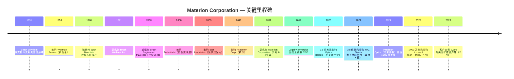

# Materion Corporation (NYSE: MTRN) — 公司研究报告

**报告日期：** 2026-05-26
**分析师语言：** 简体中文
**上市地：** NYSE: MTRN | 总部俄亥俄州 Mayfield Heights | 1931 年于俄亥俄州注册
**CIK：** 0001104657

> **更新提示 — Q1-2026 业绩印证全年指引（2026-04-29）：** 管理层重申 2026 财年 **调整后每股收益指引 USD 6.00-6.50**（中位数对 FY2025 调整后 EPS $5.44 同比约 +15%），并把全年收入指引从 Q4-2025 时的"中个位数增长"上调为"低双位数增长"，理由是"历史新高的在手订单（backlog）同比增长 >20%"以及电子材料 (Electronic Materials) 板块增值销售（value-added sales）同比 +18%。资料来源：[Materion Q1-2026 业绩新闻稿，2026-04-29](https://www.sec.gov/Archives/edgar/data/1104657/000110465726000026/q12026pressrelease.htm)。Q4-2025 的新闻稿同时披露了 **来自一家美国国防主承包商的 6,500 万美元客户出资项目**，用于扩建俄亥俄州 Elmore 工厂的铍 (beryllium) 产能 — 这是 Materion 近年规模最大的单笔国防驱动型资本承诺（[Q4-2025 业绩新闻稿，2026-02-12](https://www.sec.gov/Archives/edgar/data/1104657/000110465726000006/q42025pressrelease.htm)）。

## 目录

1. [公司概览](#1-公司概览)
2. [公司历史](#2-公司历史)
3. [管理团队](#3-管理团队)
4. [产品与服务](#4-产品与服务)
5. [客户与上市策略](#5-客户与上市策略)
6. [行业概览](#6-行业概览)
7. [竞争格局](#7-竞争格局)
8. [市场机会 (TAM)](#8-市场机会-tam)
9. [风险评估](#9-风险评估)
10. [参考资料](#参考资料)

---

## 1. 公司概览

Materion Corporation 是美国一家垂直一体化 (vertically integrated) 的先进工程材料生产商，主要产品包括高纯度金属、合金、陶瓷、无机化学品以及薄膜光学涂层，下游应用横跨半导体制造、航空航天与国防、工业、汽车、能源、消费电子和生命科学等终端市场。FY2025 年报 (10-K) 自我描述为"一家集高性能先进工程材料于一体的生产商，2025 财年净销售额 18 亿美元"（[Materion FY2025 10-K, Item 1 Business, p. 2](https://www.sec.gov/Archives/edgar/data/1104657/000110465726000011/mtrn-20251231.htm)）。公司在美、欧、亚太共拥有 30 余个生产、矿山、服务和分销基地；旗舰基地位于俄亥俄州 Elmore，是 **西半球唯一一条完整的铍金属一次冶炼生产链**，矿源来自犹他州 Spor Mountain 的硅铍石 (bertrandite, 铍石矿) 露天矿（[Materion FY2025 10-K, Item 2 Properties, p. 17](https://www.sec.gov/Archives/edgar/data/1104657/000110465726000011/mtrn-20251231.htm)）。

公司业务划分为四个可报告分部：**Performance Materials 高性能材料**（FY2025 净销售额 6.759 亿美元，同比 -9%）、**Electronic Materials 电子材料**（10.10 亿美元，同比 +19%）、**Precision Optics 精密光学**（1.007 亿美元，同比 +7%）以及 **Other 其他**（公司层面）。Electronic Materials 主要向先进制程半导体晶圆厂供应高纯度溅射靶材 (sputter target)、气相沉积材料 (vapor deposition material — for ALD/CVD) 前驱体、微电子封装组件和金属回收服务；Performance Materials 主要生产铜铍合金 (copper-beryllium alloy)、ToughMet 铜镍锡合金以及一次铍金属，下游为航空航天与国防、油气、汽车和工业连接器等市场；Precision Optics 设计制造薄膜光学滤光片和涂层，应用涵盖国防、航空、汽车和医疗。各分部的盈利结构差异很大：Performance Materials 固定资产强度更高，调整后 EBITDA / 增值销售比率结构上更高；而 Electronic Materials 因 **包含大量贵金属价值传递 (precious-metal pass-through) 收入** —— 2025 年净销售额中有 6.823 亿美元属于此类原料价值传递 —— 因此账面毛利率较低，公司用非 GAAP 的"增值销售 (value-added sales)"指标加以剔除（[Materion FY2025 10-K, MD&A — Value-Added Sales reconciliation, p. 25-26](https://www.sec.gov/Archives/edgar/data/1104657/000110465726000011/mtrn-20251231.htm)）。

*资料来源：[Materion FY2025 10-K, Item 7 MD&A Results of Operations, p. 22-25](https://www.sec.gov/Archives/edgar/data/1104657/000110465726000011/mtrn-20251231.htm)；图表数据来自 10-K 披露的 FY2023-2025 净销售额、增值销售和增值销售口径毛利率，FY2021-2022 来自往年 10-K。*

地域上，截至 2025 年 12 月 31 日 Materion 全球员工约 2,880 人 —— 北美 2,127 人、EMEA 436 人、亚太 317 人（[Materion FY2025 10-K, Human Capital Management, p. 4](https://www.sec.gov/Archives/edgar/data/1104657/000110465726000011/mtrn-20251231.htm)）。终端市场分布上，**半导体收入占比 48.6%（FY2025 净销售额 8.676 亿美元）** 已占据绝对主导，其后依次是航空航天与国防（12.0%，2.138 亿美元）、工业（10.8%，1.923 亿美元）和消费电子（9.5%，1.689 亿美元）；半导体占比从 FY2023 的 39.7% 一路抬升至 FY2025 的 48.6%，几乎全部来自 Electronic Materials 贵金属靶 (precious-metal target) 价值传递收入和增量出货（[Materion FY2025 10-K, Note C — Segment Reporting and Geographic Information, p. 53](https://www.sec.gov/Archives/edgar/data/1104657/000110465726000011/mtrn-20251231.htm)）。FY2025 没有单一客户占总净销售额 ≥10%，但 FY2024 和 FY2023 中有一家 Performance Materials 客户跨过了 10% 门槛 —— 也就是 Q4-2025 因质量事件 (quality event) 而短暂停工的宾州 Reading 精密复合带 (precision-clad strip) 产线的同一客户（[Materion FY2025 10-K, Item 1A Risk Factors — customer concentration, p. 8](https://www.sec.gov/Archives/edgar/data/1104657/000110465726000011/mtrn-20251231.htm)）。

资本结构上，公司属投资级、杠杆温和：截至 2025 年底总有息负债约 4 亿美元，对应现金 1,370 万美元；融资工具是 JPMorgan 牵头的第四次修订循环授信，2021 年 11 月收购 H.C. Starck Surface Tech 电子材料业务 (2021-11 收购) 和 2025 年 7 月收购韩国 Konasol 钽靶资产时都动用了该额度（[Materion FY2025 10-K, MD&A Liquidity, p. 27-29](https://www.sec.gov/Archives/edgar/data/1104657/000110465726000011/mtrn-20251231.htm)）。股利政策象征性但稳步增长：2025 年 5 月季度普通股息提至 0.14 美元/股（前值 0.135 美元），全年现金股息支付 1,150 万美元，对应当年经营性现金流 1.032 亿美元（[Materion FY2025 10-K, MD&A Cash Flow, p. 27](https://www.sec.gov/Archives/edgar/data/1104657/000110465726000011/mtrn-20251231.htm)）。董事会于 2025 年 10 月 29 日重新授权 5,000 万美元股票回购额度（Q4-2025 实际未回购任何股份），资本配置整体偏向并购和有机资本支出（Spor Mountain 矿区开发、Elmore 国防产能扩建）（[Materion FY2025 10-K, Item 5 Share Repurchases, p. 19](https://www.sec.gov/Archives/edgar/data/1104657/000110465726000011/mtrn-20251231.htm)）。

**估值快照（2026 年 5 月）。** MTRN 在 2026 年 5 月下旬收盘价约 215 美元，对应市值约 45 亿美元、滚动市盈率 (TTM P/E) 约 59 倍、滚动市销率 (P/S) 约 2.5 倍（基于 FY2025 净销售额 17.86 亿美元）（[Materion (NYSE:MTRN) hits new 1-year high, Daily Political, 2026-05-22](https://www.dailypolitical.com/2026/05/22/materion-nysemtrn-hits-new-1-year-high-heres-why.html)）。如果改用公司偏好的 **调整后 EPS** 指标（FY2025 调整 EPS 5.44 美元；FY2026 指引中位数约 6.25 美元），那么按 215 美元的股价计算前瞻市盈率约 **34 倍** —— 仍高于 MTRN 自身近 5 年 TTM P/E 区间（后疫情多数时间在 20-30 倍），也明显高于 S&P 600 材料指数中位数（[Materion Q1-2026 业绩新闻稿，2026-04-29](https://www.sec.gov/Archives/edgar/data/1104657/000110465726000026/q12026pressrelease.htm)）。TTM P/E 与调整 EPS 前瞻 P/E 的差距属于机械原因 —— TTM 报表净利包含 FY2024 精密光学马来西亚减值 (7,300 万美元) 和 H.C. Starck 相关收购摊销，调整 EBITDA 把这些剔除。

*资料来源：同业 TTM P/E 和 P/S 取自各公司投资者关系页面和卖方 consensus，2026 年 5 月；Materion 数据来自 [Robinhood — MTRN 行情](https://robinhood.com/us/en/stocks/MTRN/) 及 [Daily Political, 2026-05-22](https://www.dailypolitical.com/2026/05/22/materion-nysemtrn-hits-new-1-year-high-heres-why.html)。同业组合：Entegris (ENTG，半导体材料同业)、Coherent (COHR，光子学同业)、Linde (LIN，工业气体同业)、Air Products (APD，工业气体同业)、DuPont (DD，先进材料同业)。*

*分析师观点：* 58.8 倍 TTM P/E 绝对值很高，明显高于同业中位数 31 倍，但有三条逻辑相互交织，解释了市场为何愿意接受这个倍数。**(1) 板块代理 / AI 受益溢价** —— 寻找半导体工艺扩产（高 NA EUV、GAA、BPD、先进封装、混合键合）"卖铲人"敞口的投资者，把整个先进材料板块整体重估；野村 2026-05-21 的大中华半导体 anchor 报告在第 44 张图（溅射靶供应商联赛表）里明确点名"Materion / Heraeus (US/DE)"作为结构性重估的一个子类别（[Nomura "Greater China Semi: A guide to Semi renaissance in 2026~30F", 2026-05-21, Fig. 44, p. 29](https://www.nomuraconnects.com/) — 需订阅；内部行业研究详见 `reports/sector/半导体材料.md`）。**(2) 国防周期期权价值** —— 2026 年 2 月 12 日公告的 6,500 万美元客户出资铍产能扩建，相当于把美国 DoD CHIPS 法案 / 关键矿产回流计划下一阶段的支出做了去风险化（[Materion Q4-2025 业绩新闻稿，2026-02-12](https://www.sec.gov/Archives/edgar/data/1104657/000110465726000006/q42025pressrelease.htm)）。**(3) 利润率扩张空间** —— 管理层提出的中期目标"调整 EBITDA 利润率 23%"（vs. FY2025 实际 20.7%）意味着未来三年在收入持平到温和增长的前提下还能新增 8,000-10,000 万美元的 EBITDA，对一家 45 亿美元市值的公司而言是有力的经营杠杆故事。风险是对称的：如果 AI 资本支出多头周期 (capex bull cycle) 暂停，MTRN 的 25-30 倍 TTM P/E 基线就会重新成为天花板 —— 多重估值压缩 (multiple compression) 情景下下行空间 25-30%。

第 1 节的投资者收获是：Materion 是 **一只对三个低相关周期的高弹性多头头寸** —— (a) 拉动 Electronic Materials 的 AI / 先进制程半导体资本支出超级周期；(b) 拉动 Performance Materials 铍业务的美国多年期国防 / 航空航天补库周期；(c) 紧跟 Optics Balzers (2020 收购) 整合和马来西亚减值后的 Precision Optics 反转故事。后面八节会把每条腿展开。

---

## 2. 公司历史

Materion 的法人血脉可以追溯到 **1931 年 —— Charles Frederick Brush II 与 Bengt Kjellgren 在俄亥俄州克利夫兰注册成立 The Brush Beryllium Company**，目的是把第一套从绿柱石 (beryl) 矿石中工业化提炼铍金属的工艺商业化；这套工艺最早出自 Brush Laboratories（由 Charles F. Brush Sr. 创立，他是开式线圈式发电机弧光灯的发明人，与 Edison 同时代）（[Materion FY2025 10-K, Item 1 Business — "The Company was incorporated in Ohio in 1931"](https://www.sec.gov/Archives/edgar/data/1104657/000110465726000011/mtrn-20251231.htm)；历史背景见 [Brush Beryllium acquisition by Brush Engineered Materials press archive](https://www.sec.gov/Archives/edgar/data/0001104657/000129993311000170/htm_40414.htm)）。1940-50 年代，Brush Beryllium 迅速成为西半球早期核武器项目和航空航天平台的铍金属支配性供应商 —— 这一位置在 1960 年代末期被进一步巩固，公司拿下了犹他州 Juab 县 Spor Mountain 硅铍石矿区的采矿权，并陆续建成 Delta 冶炼厂和 Elmore 后段加工厂（[Materion FY2025 10-K, Item 2 Mine Property, p. 17-18](https://www.sec.gov/Archives/edgar/data/1104657/000110465726000011/mtrn-20251231.htm)）。

公司名字随业务多元化几度更迭：1971 年改名 Brush Wellman（反映 1953 年收购了 Wellman Bronze 铜合金业务）；2000 年改组为 Brush Engineered Materials（一个控股公司，旗下并列薄膜涂层、先进陶瓷、贵金属业务和历史铍业务）；**2011 年 3 月 8 日正式更名为 Materion Corporation**，明确传递公司已经从单一商品生产商升级为先进材料平台（[Brush Engineered Materials 8-K announcing name change to Materion, FY2011](https://www.sec.gov/Archives/edgar/data/0001104657/000129993311000170/exhibit1.htm)）。2011 年的品牌切换刻意与"铍"脱钩，因为彼时 Electronic Materials、Specialty Engineered Alloys 和 Precision Coatings 三段合计收入已超过历史铍业务 —— 同时，铍金属在职业卫生方面众所周知的争议史也让公司希望把这块业务在品牌上加以"隔间化"管理。

定义"现代 Materion"的有两大战略转向。第一是 **2020 年以 1.6 亿美元全现金收购列支敦士登 Balzers 镇的 Optics Balzers AG**（2020 年 9 月完成交割），Materion 借此把精密涂层业务从美国本土铺到欧洲（列支敦士登、德国）+ 亚洲（马来西亚槟城）+ 美国的全球网络 —— 从国内特种业务一举升级为生物医疗、投影、国防和消费电子用薄膜光学滤光片的全球性玩家（[Materion to acquire Optics Balzers, Electro Optics, 2020-06](https://www.electrooptics.com/news/materion-acquire-optics-balzers-combining-thin-film-coatings-expertise)；[Materion investor news — Materion Corporation to Acquire Optics Balzers, 2020](https://investor.materion.com/news/news-details/2020/Materion-Corporation-to-Acquire-Optics-Balzers/default.aspx)）。第二是 **2021 年 11 月以 3.8 亿美元现金收购 H.C. Starck Solutions 的电子材料组合** —— 该交易一夜之间几乎使 Electronic Materials 收入翻倍，并把马萨诸塞州 Newton 基地的钽 (Ta)、铌、难熔金属溅射靶产品线纳入，自此 HCS-EM 成为这个分部最大的单一增长驱动（[Materion to Acquire H.C. Starck's Electronic Materials Portfolio, BusinessWire, 2021-09-20](https://www.businesswire.com/news/home/20210920005444/en/Materion-to-Acquire-H.C.-Starck%E2%80%99s-Electronic-Materials-Portfolio-Creating-a-Global-Leader-in-Premium-Thin-Film-Materials-for-the-Semiconductor-Market)；[Materion 8-K — Asset Purchase Agreement, 2021-09-19](https://www.sec.gov/Archives/edgar/data/0001104657/000110465721000094/mtrn-20210919.htm)）。当时市场预期 HCS-EM 2021 年可贡献约 1.45 亿美元收入 / 2,900 万美元调整后 EBITDA —— 协同前估值倍数约 13× EBITDA、协同后约 10×，是典型特种化学品并购倍数（[HCS-EM acquisition press release exhibit, 2021-09-20](https://www.sec.gov/Archives/edgar/data/0001104657/000110465721000094/hcselectronicmaterialsre.htm)）。

小型补强收购则在持续进行：**2025 年 7 月 Materion 以 1,950 万美元现金收购 Konasol Co., Ltd. 位于韩国唐津市的钽溶液制造资产**，第一次拥有了亚洲本地专门的溅射靶工厂，把对三星和 SK 海力士在平泽 / 清州的存储集群供应链距离显著缩短（[Materion FY2025 10-K, Note B — Acquisition, p. 50](https://www.sec.gov/Archives/edgar/data/1104657/000110465726000011/mtrn-20251231.htm)）。Konasol 交易在金额上不大，但战略意义大（更贴近客户工厂），与 Optics Balzers 和 HCS-EM 的并购逻辑同源 —— 都是在 Materion 已经全球第 2-3 的子赛道里填补区域空白。

Q4-2024 的减值值得专门点出。FY2024 Materion 对 **马来西亚 Precision Optics 报告单元计提 7,300 万美元商誉与长期资产减值**，导致该分部全年 EBITDA 亏损 7,330 万美元（[Materion FY2025 10-K, MD&A — Segment Disclosures, Precision Optics, p. 24](https://www.sec.gov/Archives/edgar/data/1104657/000110465726000011/mtrn-20251231.htm)）。减值反映了槟城基地后疫情消费电子光学需求恢复慢于建模，加上一个客户的量产 ramp 延后；管理层的应对是 2024 年第四季度启动的多季度重组，并在 FY2025 实现了约 800 bps 的同比毛利率扩张 —— 是教科书式的"先减计再 rebase"案例。Q1-2026 标志着 Precision Optics"连续第五个季度底线 (bottom-line) 改善"，管理层把功劳归于航空与国防业务的销量强势（[Materion Q1-2026 业绩新闻稿，2026-04-29](https://www.sec.gov/Archives/edgar/data/1104657/000110465726000026/q12026pressrelease.htm)）。

---

## 3. 管理团队

Materion 是一家有 1931 年法人血脉的机构化、专业化经营的大型公司，**当代已无在职创始人**，因此本节按公司研究规范只覆盖 **现任 CEO** —— 不再补创始人传记（Brush Beryllium 原始创始人都是历史人物，与当下经营无关）。

**Jugal K. Vijayvargiya —— 自 2017 年 3 月起任公司总裁兼 CEO。** Vijayvargiya 现年 58 岁，2017 年 3 月加入 Materion 之前在全球汽车技术供应商 Delphi Automotive PLC（现 Aptiv）有 26 年的国际化职业生涯（[Materion 2026 DEF 14A — Director Biographies, p. 4](https://www.sec.gov/Archives/edgar/data/1104657/000110465726000022/mtrn-20260326.htm)）。他在 Delphi 的最后职务是 Electronics & Safety 业务集团总裁 —— 一个 30 亿美元的全球业务单元、总部位于德国，让他位列 Delphi 执委会，对集团按收入和工程师规模计算最大的事业部拥有运营负责权。在此之前，他在 1990-2000 年代在欧洲和北美承担了产品和制造工程、销售、产品线管理、并购整合、综合管理等一系列愈发资深的职责 —— 这份履历几乎与 Materion 自身的运营难题高度匹配（多地区制造、客户专属产品工程、多笔 bolt-on 并购整合）。Materion 董事会把他的 CEO 任命定性为 **战略转向** —— 从更偏重研发 / 制造的 CEO 画像（前几位 CEO 多自研发和制造内部晋升）切换到更偏重商业 / 整合的画像，以匹配 2017 年之后的并购战略（[Materion Corp. names Delphi Automotive exec as CEO, Crain's Cleveland Business, 2017-03-03](https://www.crainscleveland.com/article/20170303/NEWS/170309932/materion-corp-names-delphi-automotive-exec-as-ceo)）。

学历与外部职务。Vijayvargiya 同时拥有 **俄亥俄州立大学 (The Ohio State University) 电气工程学士与硕士学位** —— 与 Materion 俄亥俄州总部和 Elmore 工厂所在地的工程人才池有天然耦合（[Materion leadership page — Jugal Vijayvargiya](https://www.materion.com/en/about-materion/company-leadership/jugal-vijayvargiya)）。他自 2023 年 6 月起担任 **Sensata Technologies Holding PLC (NYSE: ST)** 董事会成员，同时担任 The Conference Board 旗下 Committee for Economic Development 的受托人 —— 两项治理职务都说明他在大盘工业 CEO 圈层获得同业认可（[Materion 2026 DEF 14A — Director Biographies, p. 4](https://www.sec.gov/Archives/edgar/data/1104657/000110465726000022/mtrn-20260326.htm)）。

持股与薪酬。截至 2026 年 1 月 31 日，Vijayvargiya 实益持有 **290,495 股 Materion 普通股（占类别 1.4%），其中包括 60 日内可行权的 151,589 份股票增值权 SAR**，是远超任何其他内部人的最大持仓，CFO Shelly Chadwick 仅持 29,677 股（<1%）（[Materion 2026 DEF 14A — Security Ownership of Directors and Named Executive Officers, p. 14-15](https://www.sec.gov/Archives/edgar/data/1104657/000110465726000022/mtrn-20260326.htm)）。按 2026 年 5 月约 215 美元的股价，其实益持仓市值约 6,200 万美元 —— 是有意义的利益绑定。FY2025 总薪酬 **4,794,902 美元**，构成是：基本工资 982,693 美元、RSU/PRSU 股票奖励 2,960,100 美元、SAR 期权奖励 779,921 美元、非股权激励为零（FY2025 年度激励计划 AIP 因 Q4 精密复合带质量事件未支付）、其他 72,188 美元（主要是退休计划公司付款）—— 较 FY2024 的 5,858,482 美元下降（[Materion 2026 DEF 14A — Summary Compensation Table, p. 47](https://www.sec.gov/Archives/edgar/data/1104657/000110465726000022/mtrn-20260326.htm)）。薪酬结构以股权为重头（授予日价值 >78%），PRSU 的归属与对标 S&P Industrial Materials 指数的相对总股东回报 (RTSR) 和投资资本回报率 (ROIC) 双门槛挂钩 —— 这两项都是中盘特种材料公司的标准治理设置。

CFO 简介（备述）。Shelly M. Chadwick，现年 54 岁，自 2020 年 11 月起任公司副总裁兼 CFO；加入 Materion 前在 The Timken Company 任 VP Finance 兼首席会计官四年。FY2025 总薪酬 207 万美元（[Materion 2026 DEF 14A — Summary Compensation Table, p. 47](https://www.sec.gov/Archives/edgar/data/1104657/000110465726000022/mtrn-20260326.htm)）。总法律顾问 Gregory Chemnitz 是 named executive officer 组中的第三位，FY2025 薪酬 104 万美元。

---
