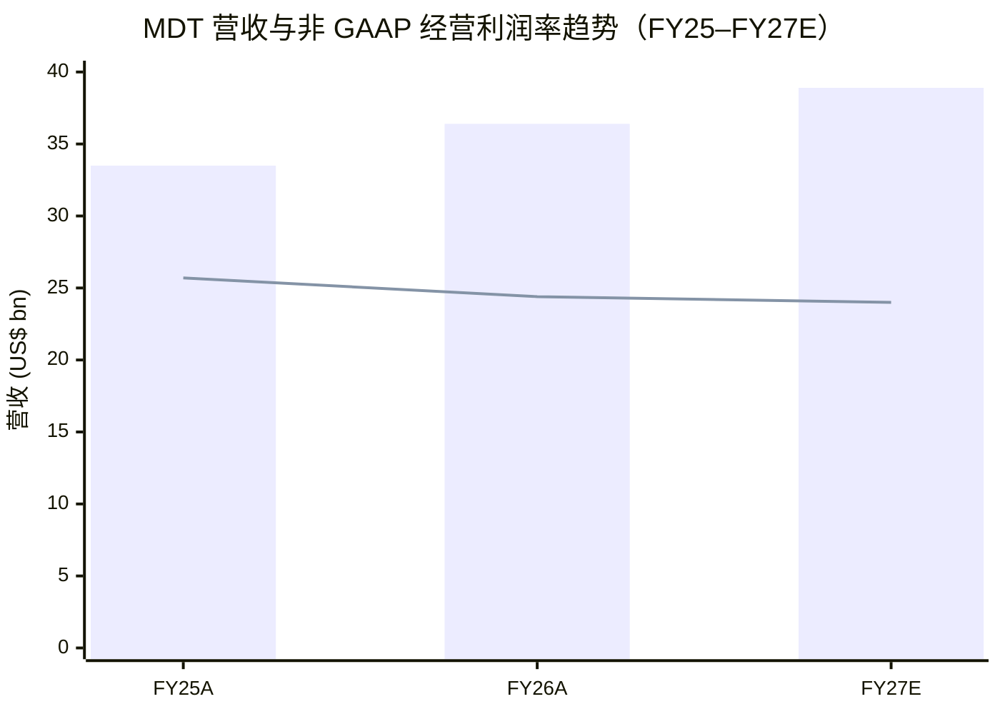
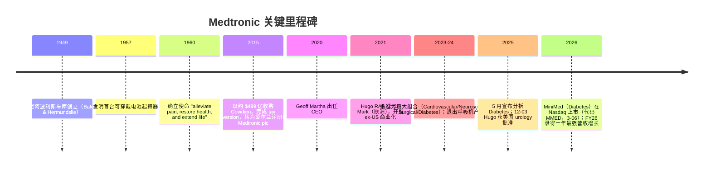
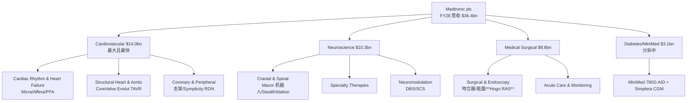
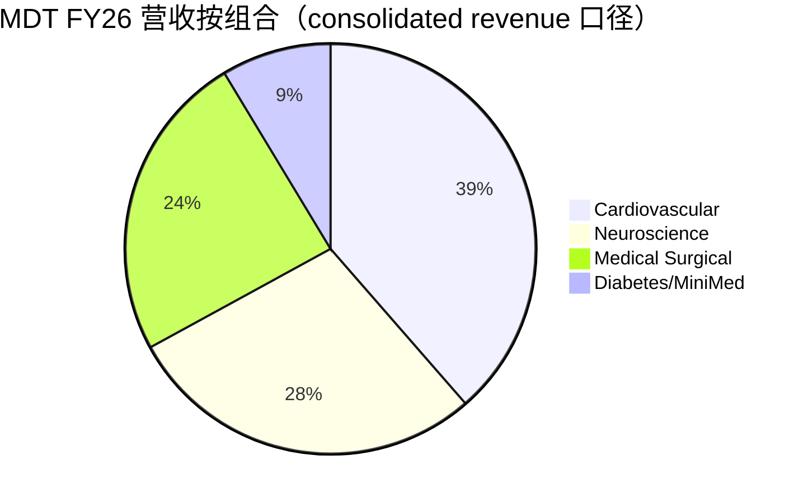
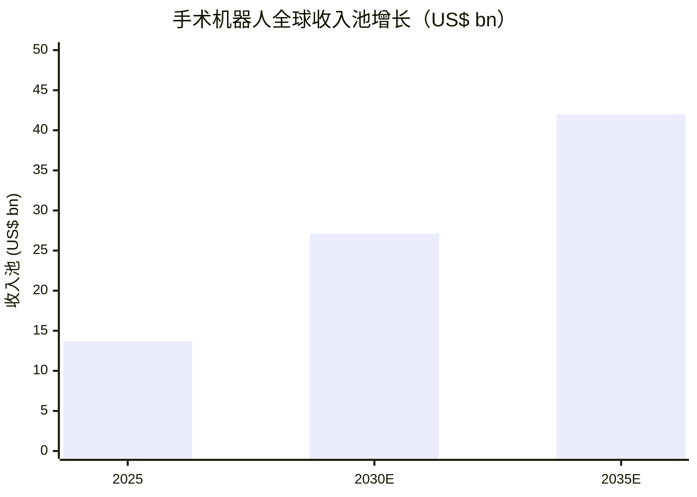
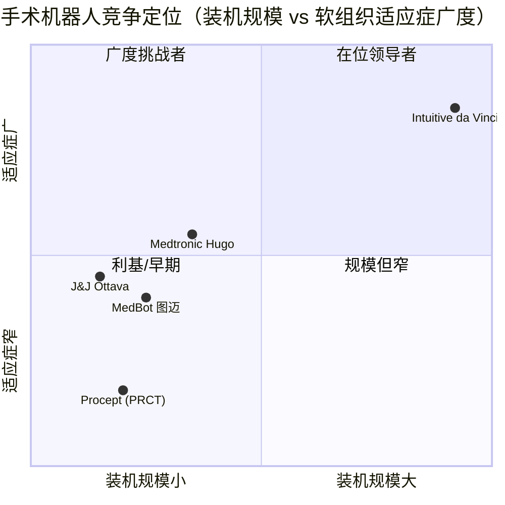

# Medtronic plc（美敦力）公司研究报告

**标的：Medtronic plc（美敦力，NYSE: MDT）** · **报告日期（as of）：2026-06-09** · **货币单位：美元（除非另注）** · **财年口径：Medtronic 财年于每年 4 月下旬结束（FY26 = 截至 2026-04-24）**

---

> *分析师观点（Analyst view）：* **评级（Rating）：Hold（持有 / Neutral）· 12 个月目标价（Price Target）：$92（较 2026-06-09 收盘 $81.98 上行 +12%）· 估值方法：FY27E 非 GAAP EPS ~$5.95 × 15.5× forward P/E**
> 市值（market cap）约 $105.3bn · 52 周区间 $73.31–$106.33 · NYSE: MDT · 注册地爱尔兰 Galway · FY26 营收 $36.4bn · 95,000+ 员工 · 股息贵族（Dividend Aristocrat，连续 49 年提高股息）
>
> **核心论点（thesis pillars）**——（1）FY26 录得**十年来最强的营收增长**（+5.8% organic），叠加 FY27 指引 organic +6.75%–7.25%，公司多年的"低个位数增长"标签终于出现拐点；（2）**Cardiac Ablation Solutions（心脏消融，PFA/Affera）+78% 全球增长**是真实的增长引擎，Cardiovascular（心血管）已成为最大且增长最快的板块；（3）**Hugo RAS（机器人辅助手术系统）** 是 da Vinci 的头号挑战者——2025-12-03 拿下首个美国 urology（泌尿外科）批准、并已就 general surgery（普外）与 gynecologic（妇科）适应症及 LigaSure RAS 向 FDA 递交申请——但对 MDT $36bn 体量而言**几乎不构成营收（immaterial）**，更多是一个被市场几乎零定价的期权（option）；（4）**Diabetes / MiniMed 分拆**（MiniMed 已于 2026-03-06 在 Nasdaq 以代码 MMED 上市）正在剥离一个低毛利、亏损的拖累板块；（5）但 **forward P/E ~13.6× 的"低估值"是有原因的**——结构性低增长、关税与 MiniMed Blackstone 付款侵蚀利润率、以及十余年增长低于同业留下的执行信任折价（execution discount），股价已对 FY26 beat 反应（+6%），上行需要 FY27 真正兑现。

> **Update — FY26 全年业绩超预期、FY27 指引发布（2026-06-03）：** Medtronic 公布 FY26（截至 2026-04-24）全年营收 **$36.364bn（+8.4% as reported / +5.8% organic）**——*管理层称为"十年来最强的年度营收增长"*——非 GAAP 摊薄 EPS **$5.53**（+0.7%）；同时发布 **FY27 指引：organic 营收增长 6.75%–7.25%，非 GAAP 摊薄 EPS $5.90–$6.00（+6.7%–8.5%）**，并已将 Q1 FY27 季度股息上调至 **$0.72/股（年化 $2.88）**，为**连续第 49 年提高股息**。该 EPS 指引中值略低于 Street 当时约 $6.06 的预期。
> 来源：[Medtronic FY26 Q4 & full-year earnings release, 2026-06-03](https://news.medtronic.com/2026-06-03-Medtronic-reports-fourth-quarter-and-full-year-fiscal-2026-results-delivers-highest-annual-revenue-growth-in-10-years)。

> **Forward 估值矩阵（cover-page matrix，*分析师观点*；FY26A 列为已披露口径）**

| 指标（multiple） | FY26A（实际） | FY27E | FY28E |
|---|---|---|---|
| 非 GAAP P/E | ~14.8× | ~13.8× | ~12.9× |
| PEG（P/E ÷ 增长） | n/m | ~1.8 | ~1.7 |
| EV/EBITDA（est.） | ~13× | ~12× | ~11× |
| EV/Sales（est.） | ~3.1× | ~2.9× | ~2.8× |
| 股息率（dividend yield） | 3.46% | ~3.5% | — |

*矩阵口径：P/E 基于 2026-06-09 收盘 $81.98 与 FY26 非 GAAP EPS $5.53 / FY27E $5.95（指引中值）/ FY28E ~$6.35（分析师测算）；TTM GAAP P/E 21.6×（基于 GAAP EPS $3.73）。EV/EBITDA、EV/Sales 为基于净债与板块利润的分析师估算（est.）。股息率来自 [stockanalysis.com — MDT](https://stockanalysis.com/stocks/mdt/)；EPS 指引来自 [FY26 earnings release](https://news.medtronic.com/2026-06-03-Medtronic-reports-fourth-quarter-and-full-year-fiscal-2026-results-delivers-highest-annual-revenue-growth-in-10-years)。**结论：随 FY27/FY28 盈利兑现，前瞻 P/E 从 ~14.8× 压缩至 ~12.9×——一个对防御性大盘医疗科技龙头偏低的倍数，反映的是低增长 + 执行折价，而非便宜的安全边际。***

> **相对表现（relative performance，截至 2026-06-09；价格收益率）**

| 窗口 | MDT | S&P 500 | IHI（美国医疗器械 ETF） | MDT vs S&P 500（相对） |
|---|---|---|---|---|
| 12M | ~‑5%* | +24.8% | ‑18.8% | ~‑30 pts |
| YTD | ~‑19%（earnings 前）→ 反弹后约 ‑13% | — | — | 大幅落后 |

*MDT 12M 约 ‑5%、IHI 约 ‑18.8%、S&P 500 +24.8%、CSI 300 +26.9% 为 2026-06-09 口径（[medical-surgical-robotics 主题文件，2026-06-09](../../themes/medical-surgical-robotics_theme.md)）；YTD 约 ‑19% 为 earnings 前、6 月 3 日财报后单日 +6% 反弹（[StocksToTrade, 2026-06-04](https://stockstotrade.com/news/medtronic-plc-mdt-news-2026_06_04/)）。**结论：MDT 是一个 sector-relative 的"少跌者"（跑赢 IHI 约 14 pts），但相对宽基大幅落后——一个被 AI 行情冷落、估值压缩到位的防御性名字（[J.P. Morgan — Medical Devices: Valuation Compression Has Gone Too Far, 2026-03-12, p.1](http://xs-macbook-air.local:5001/zsxq/pdf-viewer/212228411484221)）。***

---

## 目录（Table of Contents）

1. 公司概览（Company Overview，含投资论点）
1A. 估值与目标价（Valuation & Price Target）
2. 公司历史（Company History）
3. 管理团队（Management Team）
4. 产品与服务（Products & Services）——**本报告最重要的一章**
5. 客户与上市策略（Customers & Go-to-Market）
6. 行业概览（Industry Overview）
7. 竞争格局（Competitive Landscape）
8. 市场机会（Market Opportunity / TAM）
9. 风险评估（Risk Assessment）
9.5. 核心分歧与催化剂（Key debates & catalysts）
10. 投资风格透视（Investor-lens scorecards）

======================================

## 1. 公司概览（Company Overview）

*分析师观点（Analyst view）：* 我们给予 Medtronic（美敦力，NYSE: MDT）**Hold（持有）** 评级、12 个月目标价 **$92**（较 2026-06-09 收盘 $81.98 上行约 +12%）。为什么是"现在"值得重新审视：在经历了十余年低于同业的增长、被 AI 行情彻底冷落、forward P/E 压缩到 ~13.6× 之后，FY26 的 **+5.8% organic 增长（十年最强）** 和 FY27 的 **6.75%–7.25% organic 指引** 是公司增长曲线出现真实拐点的第一份硬证据；但我们停在 Hold 而非 Buy，因为这个拐点的可持续性尚未被验证，且 FY27 EPS 指引中值（$5.95）略低于 Street（$6.06），利润率仍受 tariffs（关税）和 MiniMed Blackstone 付款侵蚀。核心论点：（1）Cardiovascular（心血管）板块借 **Cardiac Ablation +78% 全球增长** 成为最大且最快的增长引擎；（2）**Hugo RAS** 是 da Vinci 头号挑战者但对营收近乎无足轻重，是一个市场几乎零定价的期权；（3）**Diabetes/MiniMed 分拆** 正在剥离低毛利亏损拖累；（4）股息贵族（49 年）+ 3.46% 股息率提供下行保护（[FY26 earnings release, 2026-06-03](https://news.medtronic.com/2026-06-03-Medtronic-reports-fourth-quarter-and-full-year-fiscal-2026-results-delivers-highest-annual-revenue-growth-in-10-years)）。

**公司做什么（plain English）。** Medtronic 是全球最大的多元化医疗科技（medical technology）公司之一，总部位于爱尔兰 Galway，注册地为爱尔兰（2015 年通过收购 Covidien 完成 tax inversion 后由美国 Medtronic, Inc. 转为 Medtronic plc）。公司 10-K 自述其使命为"alleviate pain, restore health, and extend life"，技术覆盖 **70 种健康状况**，产品包括心脏设备（cardiac devices）、surgical robotics（手术机器人）、胰岛素泵（insulin pumps）、外科工具、患者监护系统等，业务遍及 **150 多个国家、95,000+ 全职员工（其中 44% 位于美国或波多黎各）**（[Medtronic FY2025 10-K, Item 1 Business / Human Capital](https://www.sec.gov/Archives/edgar/data/1613103/000161310325000091/mdt-20250425.htm)）。

**怎么赚钱（business model）。** MDT 通过向医院、门诊手术中心（ASC）、电生理实验室和医生销售医疗器械、植入物与耗材赚钱，叠加远程监测服务（remote monitoring services）等经常性收入。FY25 10-K 明确公司在"managed care、经济动机型客户、医疗机构整合、报销率下降以及中国带量采购（volume-based procurement tenders / 带量采购）"的环境下运营，竞争性定价是关键（[Medtronic FY2025 10-K, Competition section](https://www.sec.gov/Archives/edgar/data/1613103/000161310325000091/mdt-20250425.htm)）。公司财年 FY26 经营性现金流（cash from operations）$7.330bn、自由现金流（free cash flow / FCF）$5.426bn（FCF 转化率 76%），FY26 向股东返还 $4.2bn（[FY26 earnings release, 2026-06-03](https://news.medtronic.com/2026-06-03-Medtronic-reports-fourth-quarter-and-full-year-fiscal-2026-results-delivers-highest-annual-revenue-growth-in-10-years)）。

**在哪里运营 + 规模（geography & scale）。** FY26 全球营收 **$36.364bn（+8.4% as reported / +5.8% organic）**——管理层称为"十年来最强的年度营收增长"。按四大组合（portfolio / 报告分部）划分：**Cardiovascular（心血管）$13.976bn（+12.0% / +9.3% organic）、Neuroscience（神经科学）$10.287bn（+4.5% / +3.1%）、Medical Surgical（医疗外科）$8.815bn（+4.9% / +2.9%）、Diabetes（糖尿病）$3.112bn（+12.9% / +7.9%）**（[FY26 earnings release — World Wide Revenue schedule, 2026-06-03](https://news.medtronic.com/2026-06-03-Medtronic-reports-fourth-quarter-and-full-year-fiscal-2026-results-delivers-highest-annual-revenue-growth-in-10-years)）。FY25 对比：总营收 $33.537bn，可见四大板块全部正增长，Cardiovascular 是金额最大、增速最快的引擎。

**关键指标（key metrics）。** FY26 GAAP 经营利润 $6.467bn（经营利润率 17.8%，YoY 持平）；非 GAAP 经营利润 $8.856bn（经营利润率 24.4%，YoY ‑130bps）。非 GAAP operating margin 同比下降 130bps 的主因被管理层点名：MiniMed Blackstone 付款（45bps 拖累）与 tariffs（关税，50bps 拖累）（[FY26 earnings release, 2026-06-03](https://news.medtronic.com/2026-06-03-Medtronic-reports-fourth-quarter-and-full-year-fiscal-2026-results-delivers-highest-annual-revenue-growth-in-10-years)）。R&D（研发费用）FY25 为 $2.7bn、SG&A $10.8bn（[Medtronic FY2025 10-K, MD&A](https://www.sec.gov/Archives/edgar/data/1613103/000161310325000091/mdt-20250425.htm)）。


*来源：[FY26 earnings release（FY26/FY25 营收、非 GAAP 经营利润率）](https://news.medtronic.com/2026-06-03-Medtronic-reports-fourth-quarter-and-full-year-fiscal-2026-results-delivers-highest-annual-revenue-growth-in-10-years)；FY27E 营收为 organic +7% 指引中值加 FX 后的分析师测算（[FY26 earnings release 指引](https://news.medtronic.com/2026-06-03-Medtronic-reports-fourth-quarter-and-full-year-fiscal-2026-results-delivers-highest-annual-revenue-growth-in-10-years)）。**结论：营收重回增长（十年最强），但非 GAAP 经营利润率因关税与 MiniMed 付款短期承压——增长拐点真实，利润率拐点尚待确认（折线为右轴利润率%，已乘比例显示）。***

**估值快照（valuation snapshot，REQUIRED）。** 截至 2026-06-09，MDT 收盘 **$81.98**、市值约 **$105.25bn**、**TTM P/E 21.63×**（基于 GAAP EPS $3.73）、**forward P/E 13.57×**、**股息率 3.46%**、52 周区间 **$73.31–$106.33**（[stockanalysis.com — MDT, 2026-06-09](https://stockanalysis.com/stocks/mdt/)）。**TTM P/S ≈ 2.9×**（市值 $105.25bn ÷ FY26 营收 $36.364bn = 2.89×，分析师测算）。同业对照（medtech 大盘）：Stryker（SYK）约 22× P/E、Boston Scientific（BSX）forward P/E ~14.2×、Abbott（ABT）与 BSX 接近，行业 ETF IHI 为板块 proxy（[Multiples.vc — Stryker valuation, 2026-05](https://multiples.vc/public-comps/stryker-valuation-multiples)；[TIKR — Boston Scientific, 2026-06-02](https://www.tikr.com/blog/boston-scientific-stock-prediction-where-analysts-see-the-stock-going-by-2027)）。

**为什么倍数偏低（P/E < 8× 不适用，但 forward P/E ~13.6× 显著低于同业，需解释）。** MDT 的 forward P/E ~13.6× 不仅低于 50× 阈值，更显著低于 SYK（~22×）、BSX/ABT（~17.5–18×）。J.P. Morgan 的医疗器械估值压缩报告把这条对比说得最直白：*分析师观点：* BSX 交易于 ~17.5–18.0× 2027 EPS，"与 ABT 持平，仅比 MDT 高 4 倍（only 4x higher than MDT）"——即 **MDT 当时约 13.5–14× 2027 EPS**；原因是增长差：BSX 指引 FY26 organic +10–11%，ABT +6.5–7.5%，而 MDT FY27 指引（该报告写于 2026-03 时）仅 ">5.5% organic"（[J.P. Morgan — Medical Devices: Valuation Compression Has Gone Too Far, 2026-03-12, p.1](http://xs-macbook-air.local:5001/zsxq/pdf-viewer/212228411484221)）。换言之，MDT 的低倍数是**结构性低增长 + 十余年增长低于同业留下的执行信任折价**的定价，而非"便宜的错杀"——这正是 Hold 而非 Buy 的核心理由。值得注意的是 FY27 真实指引（6.75–7.25% organic）已高于 JPM 引用的">5.5%"，是潜在的 re-rating 触发点。

---

## 1A. 估值与目标价（Valuation & Price Target）——决策层

*本章每一个预测数字、目标价、情景价均为分析师自身的前瞻观点（Analyst view），不附任何 filing 引用；引用的是每个预测所依据的外部输入（filing 板块数据 + 管理层指引 + 行业预测）。*

### (a) 前瞻财务预测表（forward estimates，*分析师观点*）

| 指标（*Analyst view:*） | FY26A | FY27E | FY28E | CAGR(FY26–28) |
|---|---|---|---|---|
| 营收（US$ bn） | 36.4 | 38.9 | 41.2 | +6.4% |
| — YoY % | +8.4% | +7% | +6% | |
| 非 GAAP 毛利率（gross margin %） | ~65% | ~65% | ~66% | |
| 非 GAAP 经营利润率（operating margin %） | 24.4% | 24.0% | 24.8% | |
| 非 GAAP 摊薄 EPS（US$） | 5.53 | 5.95 | 6.35 | +7.2% |
| — YoY % | +0.7% | +7.6% | +6.7% | |
| ROIC %（est.） | ~8% | ~9% | ~9% | |

*各预测的依据（cited inputs）：FY26A 营收/EPS/利润率来自 [FY26 earnings release](https://news.medtronic.com/2026-06-03-Medtronic-reports-fourth-quarter-and-full-year-fiscal-2026-results-delivers-highest-annual-revenue-growth-in-10-years)；FY27E 营收 = 公司 organic +7% 指引中值 + 中性 FX、FY27E EPS = 公司 $5.90–$6.00 指引中值 [FY26 earnings release 指引](https://news.medtronic.com/2026-06-03-Medtronic-reports-fourth-quarter-and-full-year-fiscal-2026-results-delivers-highest-annual-revenue-growth-in-10-years)；FY28E 为延续 organic +6% 与温和经营杠杆的分析师测算（基于 [FY2025 10-K 板块数据](https://www.sec.gov/Archives/edgar/data/1613103/000161310325000091/mdt-20250425.htm)）。注：FY27 起 MiniMed/Diabetes 仍并表 12 个月，分拆完成后将从营收中移除约 $3.1bn 低毛利收入——见下方分拆建模。*

**板块前瞻 mix（segment-built，*分析师观点*）。** 将四大板块各自建模再加总，比单一 blended top-line 更能看清增长来源：

| 板块（*Analyst view:*） | FY26A 营收 | FY26 organic | FY27E 营收 | 增长驱动（cited driver） |
|---|---|---|---|---|
| Cardiovascular | $13.98bn | +9.3% | ~$15.1bn | Cardiac Ablation（PFA/Affera）+78% 全球、TAVR/CoreValve、Micra |
| Neuroscience | $10.29bn | +3.1% | ~$10.7bn | Cranial & Spinal（AiBLE/Mazor 机器人导航）、Neuromodulation |
| Medical Surgical | $8.82bn | +2.9% | ~$9.2bn | Surgical & Endoscopy、Acute Care、Hugo RAS 美国上量（初期） |
| Diabetes（MiniMed） | $3.11bn | +7.9% | ~$3.3bn | MiniMed 780G AID + Simplera CGM；**FY27 仍并表，之后分拆剥离** |

*各板块 FY26 数据来自 [FY26 earnings release — World Wide Revenue schedule](https://news.medtronic.com/2026-06-03-Medtronic-reports-fourth-quarter-and-full-year-fiscal-2026-results-delivers-highest-annual-revenue-growth-in-10-years)；Cardiac Ablation +78%（含美国 +124%）、Medical Surgical +5.1% 见同一发布。Diabetes 分拆：MiniMed Group 已于 2026-03-06 在 Nasdaq 上市（代码 MMED），FY27 仍按全 12 个月并表，最终通过"offering + split-off"剥离（[FY26 earnings release — Transaction Details](https://news.medtronic.com/2026-06-03-Medtronic-reports-fourth-quarter-and-full-year-fiscal-2026-results-delivers-highest-annual-revenue-growth-in-10-years)；[MedTech Dive — MiniMed goes public for $560M](https://www.medtechdive.com/news/medtronics-minimed-goes-public-for-560m/814100/)）。*

**毛利率/经营利润率 bridge（margin bridge，bps，*分析师观点*）。** FY26 非 GAAP 经营利润率 24.4%，YoY **‑130bps**，可拆解为：**MiniMed Blackstone 付款 ‑45bps · tariffs（关税）‑50bps · 其余（FX + mix + 投入）合计约 ‑35bps**（前两项为管理层点名口径，第三项为分析师配平）。constant-currency 口径下 ‑150bps（[FY26 earnings release — FY26 operating margin 拆解, 2026-06-03](https://news.medtronic.com/2026-06-03-Medtronic-reports-fourth-quarter-and-full-year-fiscal-2026-results-delivers-highest-annual-revenue-growth-in-10-years)）。FY27 我们假设利润率大致持平（关税逆风延续、但 MiniMed 并表全年 + 经营杠杆部分对冲），FY28 随 MiniMed 剥离（低毛利板块出表）+ 关税缓和而温和回升至 ~24.8%——"margin 改善"必须挂在驱动上：MiniMed 出表是主要的结构性正贡献。

### (b) 目标价推导（PT derivation——展示算术）

**方法：forward-P/E × 目标倍数。** FY27E 非 GAAP EPS $5.95 × **15.5× forward P/E = $92**。

**倍数对标 3–5 家可比公司（multiple justification）。** 我们给 MDT 15.5× 的目标倍数——高于其当前 ~13.6× 但仍显著低于同业，理由是 FY27 organic 指引（6.75–7.25%）已使 MDT 从"低个位数增长者"向"中个位数增长者"靠拢，应享有较其历史折价更窄的倍数；但仍低于 BSX/ABT 的 ~17.5–18×（它们 organic 增长 +10–11% / +6.5–7.5%）和 SYK 的 ~22×，因为 MDT 增长仍是同业里最慢的（[J.P. Morgan — Medical Devices, 2026-03-12, p.1](http://xs-macbook-air.local:5001/zsxq/pdf-viewer/212228411484221)；[Multiples.vc — Stryker, 2026-05](https://multiples.vc/public-comps/stryker-valuation-multiples)；[TIKR — Boston Scientific, 2026-06-02](https://www.tikr.com/blog/boston-scientific-stock-prediction-where-analysts-see-the-stock-going-by-2027)）。15.5× 即把 MDT 的折价从对 ABT 的 ~4 turns 收窄到 ~2.5 turns——增长趋同但执行尚待验证的折中。

### (c) 牛/基准/熊情景（bull / base / bear，*分析师观点*）

| 情景（*Analyst view:*） | 关键假设（swing assumption） | 目标价 | 较 $81.98 上行/下行 |
|---|---|---|---|
| Bull（牛） | FY27 organic 达指引上限 7.25%+、Cardiac Ablation 维持高增、Hugo 美国上量被市场赋予期权价值，倍数 re-rate 至 17× × FY27E EPS $6.00 | $102 | **+24%** |
| Base（基准） | 指引中值兑现，15.5× × FY27E EPS $5.95 | $92 | **+12%** |
| Bear（熊） | 增长拐点是 FX/并购的"伪拐点"、关税进一步侵蚀利润率、MiniMed 分拆稀释 EPS，de-rate 至 12× × FY27E EPS $5.80 | $70 | **‑15%** |

*三个情景的输入：organic 指引区间 6.75–7.25% 与 EPS 区间 $5.90–6.00 来自 [FY26 earnings release 指引](https://news.medtronic.com/2026-06-03-Medtronic-reports-fourth-quarter-and-full-year-fiscal-2026-results-delivers-highest-annual-revenue-growth-in-10-years)；Cardiac Ablation +78% 来自同一发布；倍数区间对标 [J.P. Morgan — Medical Devices, 2026-03-12](http://xs-macbook-air.local:5001/zsxq/pdf-viewer/212228411484221)。风险回报大致对称（+12% base，bull +24% / bear ‑15%）——这正是 Hold 的算术依据。*

### (d) 与一致预期对标（consensus benchmark）+ Guide-vs-Consensus-vs-Own 表

我们 FY27E EPS $5.95 与 Street 大致一致——公司 EPS 指引中值 $5.95 略低于发布时 Street 的 $6.06（[StocksToTrade, 2026-06-04](https://stockstotrade.com/news/medtronic-plc-mdt-news-2026_06_04/)）。Street 12 个月目标价约 **$98.58**（约 +20%），高于我们的 $92——分歧主要在目标倍数（Street 隐含更接近 16–17×）。财报后分析师反应分化：BTIG 上调至 Buy、目标价 $90；Mizuho、Needham 下调目标价但维持看多（[StocksToTrade, 2026-06-04](https://stockstotrade.com/news/medtronic-plc-mdt-news-2026_06_04/)）。

| 指标（FY27E） | 公司指引（company guide） | 一致预期（consensus，*分析师观点*） | 本报告（*Analyst view:*） |
|---|---|---|---|
| Organic 营收增长 | 6.75%–7.25% | ~7%（隐含） | ~7.0% |
| 非 GAAP EPS | $5.90–$6.00 | ~$6.06 | $5.95 |
| 12 个月目标价 | — | ~$98.58 | $92 |

*公司指引列引用 [FY26 earnings release](https://news.medtronic.com/2026-06-03-Medtronic-reports-fourth-quarter-and-full-year-fiscal-2026-results-delivers-highest-annual-revenue-growth-in-10-years)；consensus 列为 *分析师观点*，来源 [StocksToTrade, 2026-06-04](https://stockstotrade.com/news/medtronic-plc-mdt-news-2026_06_04/)；本报告列为分析师自身前瞻。*

### (e) 决定性变量（swing variables）

这桩"call"押在两个变量上：（1）**FY26 的增长拐点是否可持续**——即 FY27 organic 6.75–7.25% 是否由真实终端需求（Cardiac Ablation、Hugo、Affera、Symplicity）驱动，而非 FX/并购/多一周的会计便利；（2）**利润率能否止跌回升**——关税与 MiniMed Blackstone 付款是结构性还是一次性逆风。这两个变量任何一个证伪，倍数都会向 12× 回落（熊情景）。

---

## 2. 公司历史（Company History）

Medtronic 由 **Earl Bakken 与其妹夫 Palmer Hermundslie** 于 **1949 年** 在美国明尼苏达州明尼阿波利斯的一间车库创立，最初是一家医疗设备维修公司；1957 年 Bakken 应心脏外科医生 C. Walton Lillehei 之请，发明了世界上第一台可穿戴、电池供电的体外心脏起搏器（external battery-powered pacemaker），由此奠定了公司在心律管理（cardiac rhythm management）领域的开创地位（[Medtronic — About / company history](https://www.medtronic.com/us-en/about/history.html)）。公司的使命陈述（Mission）"alleviate pain, restore health, and extend life"由 Bakken 于 1960 年撰写，至今仍是公司的核心文化锚（[Medtronic FY2025 10-K, Item 1 Business](https://www.sec.gov/Archives/edgar/data/1613103/000161310325000091/mdt-20250425.htm)）。


*来源：[Medtronic — company history](https://www.medtronic.com/us-en/about/history.html)；[Medtronic FY2025 10-K](https://www.sec.gov/Archives/edgar/data/1613103/000161310325000091/mdt-20250425.htm)；[FY26 earnings release, 2026-06-03](https://news.medtronic.com/2026-06-03-Medtronic-reports-fourth-quarter-and-full-year-fiscal-2026-results-delivers-highest-annual-revenue-growth-in-10-years)；[MedTech Dive — MiniMed goes public](https://www.medtechdive.com/news/medtronics-minimed-goes-public-for-560m/814100/)。*

**战略转折一：2015 年 Covidien 收购与 tax inversion。** 这是公司史上最具变革性的一步——以约 $499 亿收购爱尔兰注册的 Covidien，不仅将注册地迁往爱尔兰（降低有效税率），更把 Medtronic 从一家以心脏/神经植入为主的器械商扩展为涵盖 surgical（外科缝合/能量器械）、患者监护的多元化巨头，奠定了今日 Medical Surgical 板块的基础（[Medtronic FY2025 10-K, Item 1 Business — Medtronic plc 注册于爱尔兰](https://www.sec.gov/Archives/edgar/data/1613103/000161310325000091/mdt-20250425.htm)）。

**战略转折二：2020 年 Martha 接任后的组合重塑与"剪枝"。** 在 Geoff Martha 领导下，公司将运营单元重组为四大组合并主动剥离低增长/低毛利业务——2024 年 2 月退出呼吸机（ventilator）产品线（FY24 计提 $70m 存货减值），并于 2025 年 5 月宣布分拆糖尿病业务，以提升整体增长率与利润率结构（[Medtronic FY2025 10-K, MD&A — ventilator 退出与 Diabetes 分拆](https://www.sec.gov/Archives/edgar/data/1613103/000161310325000091/mdt-20250425.htm)）。

**关键收购与近期动作（recent developments）。** FY26 公司执行多笔 tuck-in M&A 与风险投资以补强组合并切入高增长邻近领域：完成 **CathWorks** 收购（Coronary 与 Renal Denervation）、宣布拟收购 **Scientia Vascular**（Neurovascular）与 **SPR Therapeutics**（Neuromodulation）、与 Merit Medical 就 Neuromodulation 的 ViaVerte 系统达成协议、并投资 Cardiovascular 的 Pulnovo Medical（[FY26 earnings release — M&A highlights, 2026-06-03](https://news.medtronic.com/2026-06-03-Medtronic-reports-fourth-quarter-and-full-year-fiscal-2026-results-delivers-highest-annual-revenue-growth-in-10-years)）。

---

## 3. 管理团队（Management Team）

**创始人：Earl Bakken（1924–2018）。** Bakken 是 Medtronic 的灵魂人物——1949 年与妹夫在车库创立公司，1957 年发明首台可穿戴电池起搏器，由此定义了整个植入式心律设备行业；他撰写的使命陈述至今仍刻在公司文化中（[Medtronic — company history](https://www.medtronic.com/us-en/about/history.html)）。Bakken 已于 2018 年去世，不再持有运营角色，此处仅作历史背景。

**现任 CEO：Geoffrey S. Martha（Geoff Martha，董事长兼 CEO）。** 据 DEF 14A，Martha 现年 55 岁，自 **2019 年起任 CEO**（FY26 earnings release 中署名为 "chairman and chief executive officer"），是 Medtronic 董事会成员（[Medtronic 2025 DEF 14A — Geoffrey S. Martha, 55, CEO since 2019](https://www.sec.gov/Archives/edgar/data/1613103/000161310325000151/mdt-20250825.htm)；[FY26 earnings release — Geoff Martha quote, 2026-06-03](https://news.medtronic.com/2026-06-03-Medtronic-reports-fourth-quarter-and-full-year-fiscal-2026-results-delivers-highest-annual-revenue-growth-in-10-years)）。Martha 加入 Medtronic 前在 GE（通用电气）有长期任职，2011 年加盟 Medtronic 负责战略与业务发展（Strategy & Business Development），主导了包括 Covidien 整合在内的多笔重大交易，随后升任 Restorative Therapies Group 总裁，2020 年正式接任 CEO。其任内的核心战略动作是把公司重组为四大组合、主动剥离低增长业务（呼吸机、糖尿病分拆）、并把资本配置向 Cardiac Ablation、Hugo RAS、Affera、Symplicity 等高增长管线倾斜——FY26"十年最强增长"是这一战略选择的初步兑现（[FY26 earnings release — Martha quote, 2026-06-03](https://news.medtronic.com/2026-06-03-Medtronic-reports-fourth-quarter-and-full-year-fiscal-2026-results-delivers-highest-annual-revenue-growth-in-10-years)）。Martha 的薪酬以业绩股权为主，DEF 14A 披露其 FY25 Summary Compensation Table 总额约 **$21.24m**（含基本工资、年度激励与长期股权激励），将个人财富与股东回报对齐（[Medtronic 2025 DEF 14A — Geoff Martha compensation, FY25 ~$21.24m](https://www.sec.gov/Archives/edgar/data/1613103/000161310325000151/mdt-20250825.htm)）。*分析师观点：* Martha 的执行记录是"call"的关键软变量——市场对 MDT 的执行折价（execution discount）很大程度上源于其任内前几年增长持续低于同业；FY26 拐点若能延续，是修复这一折价的最直接路径。

---

## 4. 产品与服务（Products & Services）——**本报告最重要的一章**

> Medtronic 是一家多元化器械巨头，产品矩阵按**四大组合（portfolio）→ 部门（division）→ 运营单元（operating unit）→ 产品族**组织。本章先重建 10-K 的产品矩阵，再逐板块 block-quote 10-K 原文并给出中文释义，并把分析的聚光灯打在 **Hugo RAS 机器人辅助手术系统及其对 da Vinci 的定位**上（主题文件的核心要求）——尽管 Hugo 对 MDT $36bn 营收近乎无足轻重，它是市场几乎零定价的期权，也是整个 surgical-robotics 主题里 da Vinci 的头号挑战者。

### 4.1 产品矩阵（10-K 口径，markdown 复刻）

10-K 的 Item 1 Business 将产品按四大组合与其部门组织。下表按 10-K 原文复刻（口径：FY25 10-K + FY26 营收发布的板块金额）：

| 组合（Portfolio） | 部门（Division） | FY26 营收 | 代表产品族（10-K 原文命名） |
|---|---|---|---|
| **Cardiovascular（心血管）** | Cardiac Rhythm & Heart Failure | $7.504bn | Micra 无导线起搏器、Aurora EV-ICD、Cobalt/Crome ICD/CRT-D、PulseSelect PFA、Affera/Sphere-9、Reveal LINQ II、TYRX 抗菌囊袋 |
| | Structural Heart & Aortic | $3.817bn | CoreValve Evolut FX/FX+ TAVR、外科瓣膜、主动脉支架 |
| | Coronary & Peripheral Vascular | $2.656bn | 药物洗脱支架、Symplicity Spyral 肾动脉去神经术（RDN）、CathWorks FFR |
| **Neuroscience（神经科学）** | Cranial & Spinal Technologies | $5.222bn | AiBLE 生态、StealthStation S8 导航、**Mazor 脊柱手术机器人导航**、Stealth Autoguide 颅脑机器人、O-arm 成像、Midas Rex 钻、UNiD AI 规划 |
| | Specialty Therapies | $2.997bn | ENT、盆底治疗、肝脏/胃肠介入 |
| | Neuromodulation | $2.068bn | DBS（脑深部刺激）、SCS（脊髓刺激）、Intellis、Inceptiv |
| **Medical Surgical（医疗外科）** | Surgical & Endoscopy | $6.764bn | Tri-Staple/Endo GIA 吻合器、Signia 电动吻合、LigaSure 能量、Valleylab 电外科、**Hugo RAS 机器人系统**、Touch Surgery Enterprise（AI 手术视频）、GI Genius、PillCam |
| | Acute Care & Monitoring | $2.051bn | 患者监护、气道管理、Nellcor 血氧、BIS 脑监测 |
| **Diabetes（糖尿病 / MiniMed）** | Diabetes Operating Unit | $3.112bn | MiniMed 780G AID 系统、Simplera CGM、耗材（**已分拆为 MiniMed，Nasdaq: MMED**） |

*来源：部门营收（年度 organic 口径）来自 [FY26 earnings release — World Wide Revenue schedule, 2026-06-03](https://news.medtronic.com/2026-06-03-Medtronic-reports-fourth-quarter-and-full-year-fiscal-2026-results-delivers-highest-annual-revenue-growth-in-10-years)；产品族命名来自 [Medtronic FY2025 10-K, Item 1 Business — 各 portfolio 产品清单](https://www.sec.gov/Archives/edgar/data/1613103/000161310325000091/mdt-20250425.htm)。注：部门金额为该部门 FY26 reported 营收，加总至各 portfolio 与总额 $36.4bn。*


*来源：[FY26 earnings release — 板块营收](https://news.medtronic.com/2026-06-03-Medtronic-reports-fourth-quarter-and-full-year-fiscal-2026-results-delivers-highest-annual-revenue-growth-in-10-years)；[FY2025 10-K — 部门结构](https://www.sec.gov/Archives/edgar/data/1613103/000161310325000091/mdt-20250425.htm)。**结论：Medtronic 是"四个独立医疗器械公司"的集合体——心血管是最大引擎，外科板块承载着 Hugo RAS 这个对 da Vinci 的战略期权。***

### 4.2 综合视角——产品如何在临床流程中相互衔接

Medtronic 的四大组合不像半导体那样构成单一"沉积→刻蚀→清洗"工艺循环，而是覆盖**三类临床流程的全链条**：（1）**心律/心衰流程**——从诊断（Reveal LINQ 监测器）到治疗（Micra 起搏器、Cobalt ICD、PulseSelect/Affera 消融）到术后远程监测（BlueSync）；（2）**外科流程**——从切割/缝合（Tri-Staple 吻合器、LigaSure 能量）到平台化（Hugo RAS 机器人 + Touch Surgery Enterprise AI 视频）到术中监护（Nellcor/BIS）；（3）**神经/脊柱流程**——从影像导航（StealthStation/O-arm）到机器人引导（Mazor/Stealth Autoguide）到植入（脊柱钉棒、DBS/SCS）。这种"诊断器械 + 平台 + 耗材"的组合让 MDT 在每个临床场景里都能从同一手术中多次收费——这是其防御性现金流的来源（[Medtronic FY2025 10-K, Item 1 Business](https://www.sec.gov/Archives/edgar/data/1613103/000161310325000091/mdt-20250425.htm)）。

### 4.3 Cardiovascular（心血管）——最大且增长最快的引擎

10-K 对 Cardiac Rhythm & Heart Failure 部门的原文描述：

> "Our Cardiac Rhythm & Heart Failure division includes the following Operating Units: Cardiac Rhythm Management and Cardiac Ablation Solutions. The division develops, manufactures, and markets products for the diagnosis, treatment, and management of heart rhythm disorders and heart failure... Cardiac ablation products include a full suite of electrophysiology solutions to treat patients with arrhythmias, including paroxysmal and persistent AF. The portfolio includes the Arctic Front Advanced Cardiac Cryoblation System, PulseSelect single shot Pulsed Field Ablation catheter, the Sphere-9 focal catheter... and Affera Mapping and Navigation System with Prism-1 software..."
> （[Medtronic FY2025 10-K, Item 1 Business — Cardiac Rhythm & Heart Failure](https://www.sec.gov/Archives/edgar/data/1613103/000161310325000091/mdt-20250425.htm)）

**中文释义 / Plain-language gloss：** Cardiac Rhythm & Heart Failure（心律与心衰，CRHF）做的是"修复心脏的电信号系统"。**(a) 物理作用**——Micra 是一个胶囊大小的 **leadless（无导线）transcatheter pacing（经导管起搏）** 装置，直接经静脉植入心室、无需传统起搏器的皮下囊袋与导线，从根本上消除了导线相关感染与断裂风险；PFA（pulsed field ablation，脉冲电场消融）与 Affera/Sphere-9 则是治疗 atrial fibrillation（房颤 / AF）的电生理（EP）工具，用电场而非射频热能选择性消融心肌组织，对周围食管/膈神经更安全。**(b) 与同族产品的差异**——Micra 解决"心跳太慢"（起搏），ICD/CRT-D（Cobalt/Crome）解决"致命性快速性心律失常"（除颤/再同步），消融（PFA/Affera）解决"房颤"——三者覆盖心律失常的不同物理机制。**(c) 战略拐点**——这是 FY26 增长的真正引擎：**Cardiac Ablation Solutions 全球营收 +78%、含美国 +124%，并夺取了额外 8 个百分点的美国份额**；PFA 是电生理近十年最大的技术跃迁，MDT 凭 PulseSelect + Affera 切入这一高增长池（[FY26 earnings release — Cardiac Ablation +78% / US +124% / +8pts share, 2026-06-03](https://news.medtronic.com/2026-06-03-Medtronic-reports-fourth-quarter-and-full-year-fiscal-2026-results-delivers-highest-annual-revenue-growth-in-10-years)）。

*分析师观点（Analyst view）：* CRHF 的护城河类型为**技术 + 转换成本（switching cost）+ 监管壁垒**——无导线起搏与 PFA 的临床证据需多年积累，且植入医师的训练惯性形成黏性。最接近的竞品产品来自 Boston Scientific 的 **FARAPULSE PFA 系统**（cite 竞品自身披露：[Boston Scientific — FARAPULSE PFA](https://www.bostonscientific.com/en-US/products/catheters--ablation/farapulse-pfa-system/products.html)）与 Abbott 的电生理组合；PFA 是当前 EP 领域 BSX 与 MDT 正面交锋的主战场。

Structural Heart & Aortic 的 10-K 原文描述：

> "The division includes therapies to treat heart valve disorders and aortic disease... Principal products offered include: CoreValve family of aortic valves, including the Evolut PRO, Evolut PRO+, Evolut FX, and Evolut FX+ TAVR systems for transcatheter aortic valve replacement."
> （[Medtronic FY2025 10-K, Item 1 Business — Structural Heart & Aortic](https://www.sec.gov/Archives/edgar/data/1613103/000161310325000091/mdt-20250425.htm)）

**中文释义 / Plain-language gloss：** **TAVR（transcatheter aortic valve replacement，经导管主动脉瓣置换）** 是用导管经股动脉把人工瓣膜送达心脏、替换病变主动脉瓣，无需开胸——CoreValve Evolut 系列是 MDT 的旗舰自膨式（self-expanding）瓣膜。*分析师观点：* 这是与 Edwards Lifesciences 的 SAPIEN（球囊扩张式）瓣膜的双寡头市场，护城河为临床数据 + 医师偏好；竞品见 [Edwards Lifesciences — SAPIEN TAVR](https://www.edwards.com/healthcare-professionals/products-services/transcatheter-heart/transcatheter-sapien-3)。

### 4.4 Medical Surgical（医疗外科）——Hugo RAS 的所在地（聚光灯）

10-K 对 Surgical & Endoscopy 部门"机器人与数字外科技术"的原文：

> "Robotic and digital surgery technologies, including the Hugo robotic-assisted surgery (RAS) system designed for a broad range of soft-tissue procedures, and Touch Surgery Enterprise, an AI-powered surgical video management solution for the operating room."
> （[Medtronic FY2025 10-K, Item 1 Business — Surgical & Endoscopy](https://www.sec.gov/Archives/edgar/data/1613103/000161310325000091/mdt-20250425.htm)）

10-K 进一步说明 Hugo 的定位与监管历程：

> "The Hugo RAS system, which received CE Mark in October 2021, as well as secured additional regulatory approvals outside the U.S., is designed to help reduce unwanted variability, improve patient outcomes, and, by extension, lower per procedure cost."
> （[Medtronic FY2025 10-K, Item 1 Business — Hugo RAS](https://www.sec.gov/Archives/edgar/data/1613103/000161310325000091/mdt-20250425.htm)）

**中文释义 / Plain-language gloss（Hugo RAS 深度拆解）：**

**(a) Hugo 物理上做什么。** Hugo RAS（robotic-assisted surgery / 机器人辅助手术）是一套**模块化、多端口（multi-port）软组织（soft-tissue）手术机器人系统**——由独立的机械臂推车（modular arm carts）、外科医生控制台（surgeon console）和系统塔（tower）组成。与 Intuitive Surgical 的 da Vinci 的"一体化大单元"不同，Hugo 的模块化设计意在降低占地、提高手术室排程灵活性、并降低单台资本门槛；Touch Surgery Enterprise 是配套的 **AI 手术视频与分析平台**，用于录制、分析与培训，构成数据/软件层。

**(b) Hugo 与 da Vinci 的定位对比。** 这是整个 surgical-robotics 主题的核心问题。da Vinci 是绝对在位者——installed base（装机量）**11,395 台、FY25 全球 3.15M 台手术（+18%）、86% 经常性收入**，在软组织机器人手术近乎垄断（[medical-surgical-robotics 主题文件 — ISRG 数据, 2026-06-09](../../themes/medical-surgical-robotics_theme.md)；[Intuitive Surgical Q1-2026 results](https://www.stocktitan.net/news/ISRG/intuitive-surgical-announces-first-quarter-2026-results)）。Hugo 是首个拿到美国多端口软组织批准的**可信挑战者**——但落后 da Vinci 的装机量很多年，护城河（医师训练锁定 + 耗材年金）尚未建立。*分析师观点：* da Vinci 的真正护城河不是机器本身，而是**装机量 + 外科医生训练锁定 + 86% 经常性耗材年金**（switching cost），Hugo 要侵蚀的是"系统层"，最难撼动的是"耗材层"（[BofA — Intuitive Surgical, 2026-04-20, p.8](http://xs-macbook-air.local:5001/zsxq/pdf-viewer/184482814241482)）。

**(c) Hugo 美国 urology 批准 + Expand URO IDE（关键催化剂）。** 2025-12-03，FDA 批准 Hugo RAS 用于 **urologic（泌尿外科）微创手术**——包括 prostatectomy（前列腺切除）、nephrectomy（肾切除）、cystectomy（膀胱切除），覆盖美国每年约 **230,000 例** 手术（[Medtronic Hugo FDA clearance PR, 2025-12-03](https://news.medtronic.com/2025-12-03-Medtronic-announces-FDA-clearance-of-Hugo-TM-robotic-assisted-surgery-system-for-urologic-surgical-procedures)）。支撑批准的 **Expand URO IDE 研究**是"美国有史以来最大的多端口机器人辅助泌尿外科研究"——纳入 **137 名患者、11 名外科医生、6 家医院**，三类手术分别为 prostatectomy（n=55）、nephrectomy（n=53）、cystectomy（n=29）；研究达成安全性与有效性主要终点，**98.5% 手术成功率**（远高于 85% 的 performance goal），Clavien-Dindo III 级以上并发症率分别为 **3.7%（前列腺）/ 1.9%（肾）/ 17.9%（膀胱）**，均低于各自 performance goal（20%/20%/45%），向其他 FDA 批准机器人系统的转换率仅 **1.5%**（[UroToday — AUA 2025: Expand URO primary results](https://www.urotoday.com/conference-highlights/aua-2025/aua-2025-prostate-cancer/159996-aua-2025-a-prospective-multi-center-study-assessing-effectiveness-safety-and-performance-of-the-hugo-robotic-assisted-surgery-system-in-the-us-urologic-population-primary-results-from-the-expand-uro-study.html)；[Urology Times — FDA clearance to Hugo](https://www.urologytimes.com/view/fda-grants-clearance-to-hugo-robotic-assisted-surgery-system-for-urologic-procedures)）。

**(d) Hugo 的 ex-US 足迹与适应症扩展。** 批准前 Hugo 已在**美国以外 30+ 个国家、横跨 5 大洲**使用，全球累计完成"tens of thousands"（数万例）urologic、gynecologic、general surgery 手术——这是 Hugo 区别于纯美国初创挑战者的关键资产（已有真实临床基础）（[Medtronic Hugo FDA clearance PR, 2025-12-03](https://news.medtronic.com/2025-12-03-Medtronic-announces-FDA-clearance-of-Hugo-TM-robotic-assisted-surgery-system-for-urologic-surgical-procedures)）。**FY26 Q4 重大进展：Medtronic 已就 Hugo RAS 的 general surgery（普外）与 gynecologic（妇科）适应症、以及 LigaSure RAS 血管闭合器向 FDA 递交申请**——这把 Hugo 的可及市场从 urology 扩展到更大的普外/妇科软组织池，是未来 12 个月的核心催化剂（[FY26 earnings release — Hugo general surgery/gyn + LigaSure RAS submission, 2026-06-03](https://news.medtronic.com/2026-06-03-Medtronic-reports-fourth-quarter-and-full-year-fiscal-2026-results-delivers-highest-annual-revenue-growth-in-10-years)）。

*分析师观点（Analyst view，Hugo 竞争优势裁定）：* **partial（部分）**——Hugo 在系统层是可信挑战者（模块化设计 + ex-US 真实临床基础 + 强劲 Expand URO 数据），护城河类型为 **MDT 的规模/分销 + Ethicon-式能量器械拉动（LigaSure RAS）**；但对 da Vinci 的 86% 耗材年金护城河，Hugo 短期难以撼动。最直接竞品是 Intuitive Surgical 的 **da Vinci 5（dV5）**（cite 竞品自身披露：[Intuitive Surgical — da Vinci 5](https://www.intuitive.com/en-us/products-and-services/da-vinci/systems)）以及正在 FDA De Novo 审批中的 **J&J Ottava**（[MedTech Dive — J&J Ottava De Novo, 2026-01-07](https://www.medtechdive.com/news/JJ-submits-FDA-de-novo-Ottava-robot-general-surgery/808976/)）。**对 MDT 营收的影响：Hugo 内含在 Surgical & Endoscopy 部门（FY26 $6.764bn），其自身贡献对 $36bn 总营收近乎无足轻重（immaterial）——这正是 MDT NTM P/E ~13.6× 几乎未对机器人期权定价的原因。**

Surgical & Endoscopy 的其他核心产品（10-K 原文）：

> "Advanced stapling and energy products, including the Tri-Staple technology platform for endoscopic stapling... the Signia powered stapling system, the LigaSure exact dissector... and the Sonicision 7 curved jaw cordless ultrasonic dissection system."
> （[Medtronic FY2025 10-K, Item 1 Business — Surgical & Endoscopy](https://www.sec.gov/Archives/edgar/data/1613103/000161310325000091/mdt-20250425.htm)）

**中文释义 / Plain-language gloss：** Tri-Staple / Endo GIA 是**腔镜吻合器（endoscopic stapler）**，在微创手术中同时切割并缝合组织；LigaSure 是 **vessel sealing（血管闭合）能量器械**，用双极射频能量封闭血管。这两条是 MDT 外科板块的"剃刀刀片"现金流（耗材属性），并将通过 **LigaSure RAS** 与 Hugo 机器人平台形成拉动效应（pull-through）——这是 MDT 相对纯机器人挑战者的结构优势：它本就拥有庞大的能量/吻合耗材装机基础（[FY26 earnings release — LigaSure RAS submission, 2026-06-03](https://news.medtronic.com/2026-06-03-Medtronic-reports-fourth-quarter-and-full-year-fiscal-2026-results-delivers-highest-annual-revenue-growth-in-10-years)）。

### 4.5 Neuroscience（神经科学）——隐藏的机器人资产 Mazor

10-K 对 Cranial & Spinal Technologies 的原文：

> "...offers unique and highly differentiated imaging, navigation, power instruments, and robotic guidance systems used in spine and cranial procedures. Principal products and services offered include: Neurosurgery products, including platform technologies, implant therapies, and advanced energy products through the AiBLE spine technology ecosystem. This includes our StealthStation S8 surgical navigation system, Stealth Autoguide cranial robotic guidance platform, O-arm Imaging System, Mazor robotic guidance systems used in robot-assisted spine procedures..."
> （[Medtronic FY2025 10-K, Item 1 Business — Cranial & Spinal Technologies](https://www.sec.gov/Archives/edgar/data/1613103/000161310325000091/mdt-20250425.htm)）

**中文释义 / Plain-language gloss：** 容易被忽视的是，MDT 在 Hugo 之外还有第二条机器人产品线——**Mazor 脊柱手术机器人导航系统**与 **Stealth Autoguide 颅脑机器人引导平台**，整合在 AiBLE 生态内，与 StealthStation 导航、O-arm 成像协同，用于提高脊柱/颅脑手术的精度。这与 Stryker 的 Mako（骨科机器人）、Globus Medical 的 ExcelsiusGPS 在脊柱/骨科机器人领域竞争。*分析师观点：* Mazor 的护城河为**影像-导航-机器人一体化 + 植入物拉动**（capital→implant pull-through），moat 类型为生态锁定（ecosystem lock-in）；FY26 Q4 还获得 Stealth AXiS 系统的脊柱/颅脑/ENT 适应症 FDA 批准（[FY26 earnings release — Stealth AXiS clearance, 2026-06-03](https://news.medtronic.com/2026-06-03-Medtronic-reports-fourth-quarter-and-full-year-fiscal-2026-results-delivers-highest-annual-revenue-growth-in-10-years)）。

### 4.6 Diabetes（糖尿病 / MiniMed）——正在剥离的板块

10-K 对 Diabetes 的原文：

> "Diabetes' products include insulin pumps, continuous glucose monitoring (CGM) systems, and consumables. Diabetes' net sales for fiscal year 2025 were $2.8 billion, an increase of 11 percent... driven by the continued adoption of the MiniMed 780G automated insulin delivery (AID) system, and strong international growth in CGM systems from increased attachment rates and adoption of Simplera Sync."
> （[Medtronic FY2025 10-K, Item 1 Business — Diabetes](https://www.sec.gov/Archives/edgar/data/1613103/000161310325000091/mdt-20250425.htm)）

**中文释义 / Plain-language gloss：** Diabetes 做的是 **AID（automated insulin delivery，自动胰岛素输注）闭环系统**——MiniMed 780G 胰岛素泵 + Simplera CGM（continuous glucose monitoring，连续血糖监测）组成"人工胰腺"闭环，自动调节糖尿病患者的血糖。**关键公司动作（分拆）**：公司于 2025 年 5 月宣布将 Diabetes 业务分拆为独立公司，预期 18 个月内完成；分拆已通过 **MiniMed Group 于 2026-03-06 在 Nasdaq 上市（代码 MMED，发行 28M 股、每股 $20、募资 $560m，市值约 $5.29bn）** 落地，最终结构为"offering + split-off"（IPO + 后续换股分离）（[FY26 earnings release — Transaction Details, 2026-06-03](https://news.medtronic.com/2026-06-03-Medtronic-reports-fourth-quarter-and-full-year-fiscal-2026-results-delivers-highest-annual-revenue-growth-in-10-years)；[MedTech Dive — MiniMed goes public for $560M](https://www.medtechdive.com/news/medtronics-minimed-goes-public-for-560m/814100/)）。MiniMed FY25 营收 $2.7bn、净亏损 $198m——这是一个**低毛利、亏损的板块**，剥离后将结构性提升 MDT 余下业务的毛利率与增长率。*分析师观点：* 竞品为 Insulet（Omnipod）、Tandem（t:slim）、Dexcom/Abbott（CGM）；MDT 在胰岛素泵历史领先但近年被 Insulet 的 Omnipod 与 GLP-1 减肥药的渗透夹击——这正是 10-K Competition 段点名 GLP-1 为威胁的原因。

### 4.7 旗舰与近 12 个月动作（flagship & recent launches）

**旗舰增长引擎（1–3）：** （1）**Cardiac Ablation（PFA/Affera）**——FY26 +78% 全球，是当前最大的增长贡献；（2）**Micra 无导线起搏**——FY26 mid-teens 增长；（3）**CoreValve Evolut TAVR**——结构性心脏的稳定支柱（[FY26 earnings release — Cardiovascular highlights, 2026-06-03](https://news.medtronic.com/2026-06-03-Medtronic-reports-fourth-quarter-and-full-year-fiscal-2026-results-delivers-highest-annual-revenue-growth-in-10-years)）。**近 12 个月发布/批准：** Hugo 美国 urology 批准（2025-12-03）；Hugo general surgery/gyn + LigaSure RAS 递交 FDA（FY26 Q4）；ProGrip Advanced 获 FDA 批准；Stealth AXiS 获脊柱/颅脑/ENT 批准与 CE Mark；OmniaSecure 强劲美国上市（[FY26 earnings release — Q4 highlights, 2026-06-03](https://news.medtronic.com/2026-06-03-Medtronic-reports-fourth-quarter-and-full-year-fiscal-2026-results-delivers-highest-annual-revenue-growth-in-10-years)）。

---

## 5. 客户与上市策略（Customers & Go-to-Market）

**客户分群。** MDT 的终端客户是医院、门诊手术中心（ASC）、电生理实验室、影像中心及各专科医生——10-K 按专科列出使用其产品的医师群体：Cardiovascular 由电生理学家、植入心脏科医师、心衰专家、心血管/心胸/血管外科医师使用；Neuroscience 由脊柱外科、神经外科、神经科、疼痛管理、麻醉、骨科、泌尿/妇科及 ENT 专科医师使用（[Medtronic FY2025 10-K, Item 1 Business — 各 portfolio 医师群体](https://www.sec.gov/Archives/edgar/data/1613103/000161310325000091/mdt-20250425.htm)）。

**客户集中度（REQUIRED）。** MDT **没有客户集中度风险**——10-K 在 150+ 国家通过分销商、医院 GPO（group purchasing organizations）和直销团队销售，没有任何单一客户达到 10% 阈值，10-K 未单独披露 top-1/top-5 客户百分比（即不属于需披露的集中客户）。这与典型的器械分销结构一致：客户高度分散在全球数千家医疗机构（[Medtronic FY2025 10-K, Item 1 Business / Competition](https://www.sec.gov/Archives/edgar/data/1613103/000161310325000091/mdt-20250425.htm)）。*因此本报告不将客户集中度列为 Section 9 的重大风险（top-1 < 10%，top-5 < 30%，远低于阈值）——分散的客户基础本身是 MDT 防御性现金流的来源之一。*


*来源：[FY26 earnings release — World Wide Revenue schedule, 2026-06-03](https://news.medtronic.com/2026-06-03-Medtronic-reports-fourth-quarter-and-full-year-fiscal-2026-results-delivers-highest-annual-revenue-growth-in-10-years)（口径：consolidated revenue，按四大 portfolio 占总营收 $36.4bn 的比例；非客户集中度）。**结论：营收高度分散于四大独立板块——没有任何单一板块占比过半，分散结构降低了单点风险。***

**分销与销售周期。** MDT 在美国及主要发达市场以直销为主，新兴市场更多依赖分销商。器械销售周期受制于医院资本预算、GPO 合同、报销政策与（中国等市场的）带量采购（volume-based procurement / 带量采购）——10-K 明确把"national and provincial tender pricing"与中国 VBP 列为定价压力来源（[Medtronic FY2025 10-K, Competition section — China VBP tenders](https://www.sec.gov/Archives/edgar/data/1613103/000161310325000091/mdt-20250425.htm)）。

**关键合作与渠道（Hugo 相关）。** Hugo 的 go-to-market 策略是利用 MDT 既有的庞大外科销售网络与能量/吻合耗材装机基础——通过 LigaSure RAS 等机器人专用器械形成拉动，把现有外科客户转化为机器人客户。这是 MDT 相对纯机器人挑战者（如 J&J Ottava 尚未商业化、PRCT 单一适应症）的渠道优势（[FY26 earnings release — LigaSure RAS, 2026-06-03](https://news.medtronic.com/2026-06-03-Medtronic-reports-fourth-quarter-and-full-year-fiscal-2026-results-delivers-highest-annual-revenue-growth-in-10-years)）。

**客户案例（named wins）。** Hugo 在 ex-US 的真实临床部署（30+ 国家、数万例手术）本身即是最佳的客户案例证据——这些是 da Vinci 之外真实选择了 Hugo 的医院（[Medtronic Hugo FDA clearance PR, 2025-12-03](https://news.medtronic.com/2025-12-03-Medtronic-announces-FDA-clearance-of-Hugo-TM-robotic-assisted-surgery-system-for-urologic-surgical-procedures)）。

---

## 6. 行业概览（Industry Overview）

**行业定义与范围。** Medtronic 处于 **medical technology / medical devices（医疗科技 / 医疗器械）** 行业——一个高度监管、技术驱动、由 FDA/CE/NMPA 等监管机构把关的全球市场。10-K 自述该市场"以技术进步、创新和科学发现带来的快速变化为特征"，竞争对手从多业务线的大型制造商到单一产品线的小厂商不等（[Medtronic FY2025 10-K, Competition, Industry, and Cost Containment](https://www.sec.gov/Archives/edgar/data/1613103/000161310325000091/mdt-20250425.htm)）。

**市场规模与结构。** 全球医疗器械市场规模数千亿美元、低个位数到中个位数增长；MDT 横跨其中四个子赛道（心血管、神经/脊柱、外科、糖尿病）。MDT 聚光灯下的 **surgical-robotics（手术机器人）子行业**——全球收入池约 **$13.7bn（2025）→ ~$27bn（2030E）→ $42–50bn（2035E）**，低双位数 CAGR，是一个 razor-and-blade（剃刀+刀片）结构（耗材占池子约 55–60%）（[MarketsandMarkets — surgical robots market $13.69bn 2025→$27.14bn 2030](https://www.marketsandmarkets.com/Market-Reports/surgical-robots-market-256618532.html)；[Precedence Research — surgical robotics $12.49bn 2025→$50.29bn 2035](https://www.precedenceresearch.com/surgical-robotics-market)）。

**增长驱动与趋势。** 整个 medtech 板块当前处于"触底回升"阶段。*分析师观点：* Goldman Sachs 的医疗科技行业报告指出，板块正经历"过去 15–20 年以来最艰难阶段"，但绝对与相对估值已跌至 2010–2012 年以来低位，具备周期反转基础，三大复苏驱动为"加大股份回购、下调并重锚远期预期、新产品/并购催化剂落地"；并明确把 **Medtronic FY26 Q4 财报及新财年指引列为板块短期关键催化剂**（[Goldman Sachs — Medical Technology: Digging out, 2026-05-27, p.1](http://xs-macbook-air.local:5001/zsxq/pdf-viewer/585428884442144)）。

**监管环境。** 器械行业受 FDA（美国）、CE Mark（欧洲）、NMPA（中国）等多重监管，新产品需经临床试验（如 Hugo 的 Expand URO IDE）与 PMA/De Novo/510(k) 路径批准。报销政策（reimbursement / 医保）是另一关键变量——美国 Medicare/Medicaid 与商业保险、中国带量采购都直接影响器械定价（[Medtronic FY2025 10-K, Competition — 政府报销与定价管制](https://www.sec.gov/Archives/edgar/data/1613103/000161310325000091/mdt-20250425.htm)）。

**行业动态（buyer power / 替代品）。** 买方力量在上升——医疗机构整合、GPO 集中采购、中国 VBP 都在压低器械价格。一个独特的替代品威胁是 **GLP-1 减肥药**：10-K Competition 段明确把"providers of other medical therapies, such as pharmaceutical companies, including those producing glucagon-like peptide-1s (GLP-1s)"列为竞争来源——GLP-1 可能通过减少肥胖相关疾病（糖尿病、心脏病）降低部分器械需求，这也是 MDT 选择分拆糖尿病业务的背景之一（[Medtronic FY2025 10-K, Competition — GLP-1 威胁](https://www.sec.gov/Archives/edgar/data/1613103/000161310325000091/mdt-20250425.htm)）。


*来源：[MarketsandMarkets — surgical robots $13.69bn 2025→$27.14bn 2030](https://www.marketsandmarkets.com/Market-Reports/surgical-robots-market-256618532.html)；[Goldman Sachs — China Medtech Going Global $42bn 2035, 2026-04-21, p.7](http://xs-macbook-air.local:5001/zsxq/pdf-viewer/585582881584284)。**结论：手术机器人是医疗科技里少数低双位数增长的子赛道——但对 MDT 而言只是 $36bn 营收里的一个期权，行业增长不会自动传导到 MDT 整体增速。***

---

## 7. 竞争格局（Competitive Landscape）

**10-K 对竞争的原文定性（非具体竞品名）。** MDT 在 150+ 国家的治疗与诊断市场竞争，产品线面对"从多业务线大型制造商到单一产品线小厂商"的混合竞争，并面对"其他医疗疗法提供者，如制药公司（含 GLP-1 生产商）"的替代竞争（[Medtronic FY2025 10-K, Competition, Industry, and Cost Containment](https://www.sec.gov/Archives/edgar/data/1613103/000161310325000091/mdt-20250425.htm)）。以下竞品定位为分析师视角，竞品名称引用各自来源。

**按板块的核心竞争对手（5–10 家）：**

- **手术机器人（Hugo 所在）：** Intuitive Surgical（da Vinci，在位垄断者，装机量 11,395 台、86% 经常性收入）、J&J（Ottava，De Novo 审批中）、CMR Surgical（Versius，私营）、中国微创机器人 MedBot（图迈 Toumai）/精锋 EdgeMed（出海挑战者）（[Intuitive Surgical — da Vinci](https://www.intuitive.com/en-us/products-and-services/da-vinci/systems)；[MedTech Dive — J&J Ottava](https://www.medtechdive.com/news/JJ-submits-FDA-de-novo-Ottava-robot-general-surgery/808976/)；[medical-surgical-robotics 主题文件, 2026-06-09](../../themes/medical-surgical-robotics_theme.md)）。
- **心血管（电生理 PFA / TAVR）：** Boston Scientific（FARAPULSE PFA、WATCHMAN）、Abbott（电生理）、Edwards Lifesciences（SAPIEN TAVR）（[Boston Scientific — FARAPULSE](https://www.bostonscientific.com/en-US/products/catheters--ablation/farapulse-pfa-system/products.html)；[Edwards — SAPIEN TAVR](https://www.edwards.com/healthcare-professionals/products-services/transcatheter-heart/transcatheter-sapien-3)）。
- **脊柱/骨科机器人（Mazor 所在）：** Stryker（Mako）、Globus Medical（ExcelsiusGPS）、Zimmer Biomet（ROSA）（[Stryker — Mako, AAOS 2025](https://www.stryker.com/us/en/about/news/2025/stryker-showcases-next-generation-of-mako-smartrobotics--at-aaos.html)）。
- **糖尿病（MiniMed）：** Insulet（Omnipod）、Tandem Diabetes（t:slim）、Dexcom / Abbott（CGM）、以及 GLP-1 制药商作为替代威胁（[Medtronic FY2025 10-K, Competition — GLP-1](https://www.sec.gov/Archives/edgar/data/1613103/000161310325000091/mdt-20250425.htm)）。

**定位框架（price / features / scale）。** MDT 的定位是**广度最大、规模最大但单赛道未必第一**——它在心律管理、神经调控、外科能量/吻合等多个领域领先，但在 TAVR（vs Edwards，[Edwards — SAPIEN 3 TAVR](https://www.edwards.com/healthcare-professionals/products-services/transcatheter-heart/transcatheter-sapien-3)）、PFA（vs BSX）、手术机器人（vs Intuitive）、胰岛素泵（vs Insulet）等高增长细分往往是"强力第二"而非垄断者。这种"多个强力第二"的组合解释了为何 MDT 整体增速慢于专注型同业（BSX/Edwards）。*分析师观点：* MDT 的竞争优势是**规模 + 分销网络 + 跨赛道的器械-耗材拉动**（如 Hugo + LigaSure RAS），竞争脆弱性是**缺乏单一爆发性高增长引擎**——这是估值折价的结构性根源。


*来源：装机/适应症定位为分析师视角，数据点来自 [medical-surgical-robotics 主题文件, 2026-06-09](../../themes/medical-surgical-robotics_theme.md)、[Medtronic Hugo PR, 2025-12-03](https://news.medtronic.com/2025-12-03-Medtronic-announces-FDA-clearance-of-Hugo-TM-robotic-assisted-surgery-system-for-urologic-surgical-procedures)、[Intuitive Surgical Q1-2026](https://www.stocktitan.net/news/ISRG/intuitive-surgical-announces-first-quarter-2026-results)。**结论：da Vinci 居右上角绝对领导位；Hugo 是装机量仍小但适应症正在变宽（urology→普外/妇科）的头号挑战者。***

---

## 8. 市场机会（Market Opportunity / TAM）

**整体 TAM。** Medtronic 的可及市场是数千亿美元的全球医疗器械市场，覆盖 70 种健康状况、150+ 国家——这是一个低个位数到中个位数自然增长的成熟市场，MDT 的增长更多来自细分赛道份额获取（如 Cardiac Ablation +8pts 美国份额）而非整体市场扩容（[FY26 earnings release — Cardiac Ablation +8pts US share, 2026-06-03](https://news.medtronic.com/2026-06-03-Medtronic-reports-fourth-quarter-and-full-year-fiscal-2026-results-delivers-highest-annual-revenue-growth-in-10-years)）。

**聚光灯 TAM：手术机器人。** 全球手术机器人收入池 ~$13.7bn（2025）→ ~$27bn（2030E）→ **$42bn（GS，2035E，其中 ex-US 占 $19bn）/ ~$50bn（Precedence，2035E）**，由 ~9M 例机器人手术（2025）增至 GS 预测的 **12M 例（2035E）** 驱动，是 razor-and-blade 结构（[Goldman Sachs — China Medtech Going Global, 2026-04-21, p.7](http://xs-macbook-air.local:5001/zsxq/pdf-viewer/585582881584284)；[MarketsandMarkets — surgical robots market](https://www.marketsandmarkets.com/Market-Reports/surgical-robots-market-256618532.html)）。

**MDT 的 SAM / SOM（Hugo）。** Hugo 当前的 serviceable market 主要是 urology（美国约 230,000 例/年）+ ex-US 软组织手术；随 general surgery/gyn 适应症申请获批，SAM 将扩展到更大的普外/妇科软组织池（[Medtronic Hugo PR — 230,000 US urology surgeries/yr, 2025-12-03](https://news.medtronic.com/2025-12-03-Medtronic-announces-FDA-clearance-of-Hugo-TM-robotic-assisted-surgery-system-for-urologic-surgical-procedures)；[FY26 earnings release — general surgery/gyn submission, 2026-06-03](https://news.medtronic.com/2026-06-03-Medtronic-reports-fourth-quarter-and-full-year-fiscal-2026-results-delivers-highest-annual-revenue-growth-in-10-years)）。但 SOM（实际可获取份额）受制于 da Vinci 的装机量与耗材锁定——*分析师观点：* 即便 Hugo 在 ex-US + 美国 urology 取得可观份额，对 MDT $36bn 营收的贡献在可见的未来仍是个位数百分点级别（immaterial），机器人 TAM 的故事对 MDT 估值更多是期权而非主驱动。

**渗透策略。** MDT 的渗透打法是用既有外科分销网络 + 能量/吻合耗材拉动（LigaSure RAS）把现有客户转化为 Hugo 客户，并以模块化设计降低医院资本门槛——意在抢占 da Vinci 之外的"第二系统"或"首个机器人"采购预算（[FY26 earnings release — LigaSure RAS, 2026-06-03](https://news.medtronic.com/2026-06-03-Medtronic-reports-fourth-quarter-and-full-year-fiscal-2026-results-delivers-highest-annual-revenue-growth-in-10-years)）。

---

## 9. 风险评估（Risk Assessment）

### 公司特定风险（Company-Specific）

**1. 执行/增长拐点可持续性风险（execution risk）。** FY26 的 +5.8% organic 是十年最强，但市场对 MDT 的核心质疑是"这是真拐点还是 FX/并购/多一周会计便利驱动的伪拐点"。若 FY27 organic 未能兑现 6.75–7.25% 指引，估值折价将重新扩大。这是本"call"最大的单一风险（[FY26 earnings release — FY27 guide, 2026-06-03](https://news.medtronic.com/2026-06-03-Medtronic-reports-fourth-quarter-and-full-year-fiscal-2026-results-delivers-highest-annual-revenue-growth-in-10-years)）。

**2. Diabetes/MiniMed 分拆执行与稀释风险（integration/separation risk）。** MiniMed 已 IPO（2026-03-06），但完整剥离（split-off 换股）尚未完成；分拆过程涉及 standalone 成本、TSA（过渡服务协议）、以及对 EPS 的潜在稀释（剥离 $3.1bn 收入但同时移除其亏损）。MiniMed Blackstone 付款 FY26 已侵蚀经营利润率 45bps（[FY26 earnings release — Transaction Details / MiniMed Blackstone payment, 2026-06-03](https://news.medtronic.com/2026-06-03-Medtronic-reports-fourth-quarter-and-full-year-fiscal-2026-results-delivers-highest-annual-revenue-growth-in-10-years)）。

**3. 产品/技术过时风险（technology obsolescence）。** 10-K 明确市场"以快速技术变化为特征"，需持续创新维持份额；MDT 在 PFA、TAVR、手术机器人、胰岛素泵等多个高增长细分都是"强力第二"而非垄断者，任一赛道的技术代差（如 BSX FARAPULSE 在 PFA 领先、Insulet Omnipod 在泵领先）都可能侵蚀份额（[Medtronic FY2025 10-K, Competition](https://www.sec.gov/Archives/edgar/data/1613103/000161310325000091/mdt-20250425.htm)）。

**4. Hugo 商业化与监管风险。** Hugo 美国 urology 已批准，但 general surgery/gyn 与 LigaSure RAS 仍在 FDA 审批中；若批准延迟或临床数据不及预期，Hugo 的 SAM 扩展受阻，期权价值缩水（[FY26 earnings release — Hugo submissions, 2026-06-03](https://news.medtronic.com/2026-06-03-Medtronic-reports-fourth-quarter-and-full-year-fiscal-2026-results-delivers-highest-annual-revenue-growth-in-10-years)）。

### 行业/市场风险（Industry/Market）

**5. 竞争强度与替代品（GLP-1）。** 10-K 罕见地把 GLP-1 制药商列为竞争来源——GLP-1 减肥药通过减少肥胖相关疾病可能压制部分器械（糖尿病、部分心脏）需求。手术机器人、PFA、TAVR 各赛道竞争都在加剧（[Medtronic FY2025 10-K, Competition — GLP-1](https://www.sec.gov/Archives/edgar/data/1613103/000161310325000091/mdt-20250425.htm)）。

**6. 报销与定价管制（reimbursement / 带量采购）。** 美国 Medicare/Medicaid 报销率下降、中国带量采购（VBP / 带量采购）、各国 tender 定价都在压低器械价格。10-K 把"national and provincial tender pricing"列为定价压力（[Medtronic FY2025 10-K, Competition — China VBP](https://www.sec.gov/Archives/edgar/data/1613103/000161310325000091/mdt-20250425.htm)）。

**7. 监管/合规风险。** 器械行业受 FDA/CE/NMPA 多重监管，产品召回、安全警示、临床试验失败都可能引发份额转移——10-K 明确"重大行业份额转移常与产品纠正措施、医师警示、安全警报相关"（[Medtronic FY2025 10-K, Competition](https://www.sec.gov/Archives/edgar/data/1613103/000161310325000091/mdt-20250425.htm)）。

### 财务风险（Financial）

**8. 利润率压力（margin compression）。** FY26 非 GAAP 经营利润率同比 ‑130bps，主因关税（‑50bps）与 MiniMed Blackstone 付款（‑45bps）。若关税逆风延续或加剧，利润率拐点将推迟，影响 EPS 兑现（[FY26 earnings release — margin bridge, 2026-06-03](https://news.medtronic.com/2026-06-03-Medtronic-reports-fourth-quarter-and-full-year-fiscal-2026-results-delivers-highest-annual-revenue-growth-in-10-years)）。

**9. 估值/多重压缩风险（valuation risk）。** 注意：MDT forward P/E ~13.6× **并不属于** P/E>50× 的高估值风险类别——恰恰相反，它是低倍数名字，多重压缩空间有限（熊情景仅至 12×）。真正的财务风险是**倍数无法 re-rate**——若增长拐点证伪，13.6× 可能就是"合理价"而非折价（[stockanalysis.com — MDT forward P/E 13.57, 2026-06-09](https://stockanalysis.com/stocks/mdt/)）。

### 宏观风险（Macroeconomic）

**10. 关税与全球贸易政策。** 10-K 与 FY26 发布都把"changing global trade policies"、tariffs 列为前瞻风险——MDT 全球制造/销售布局使其对关税敏感（FY26 已 ‑50bps）（[FY26 earnings release — tariffs, 2026-06-03](https://news.medtronic.com/2026-06-03-Medtronic-reports-fourth-quarter-and-full-year-fiscal-2026-results-delivers-highest-annual-revenue-growth-in-10-years)）。

**11. 外汇敏感性（FX）。** 作为爱尔兰注册、全球销售的公司，MDT 营收/利润对汇率高度敏感——FY26 EPS 含 $0.15 的 FX 拖累，constant-currency EPS 实际下降 2.0%（[FY26 earnings release — FX impact, 2026-06-03](https://news.medtronic.com/2026-06-03-Medtronic-reports-fourth-quarter-and-full-year-fiscal-2026-results-delivers-highest-annual-revenue-growth-in-10-years)）。

**12. 利率敏感性。** 10Y Treasury 在 ~4.5% 的较高水平（[indicators.db, 2026-06-05](#)）——高利率提高了 MDT 这类低增长、高股息防御股的机会成本（与 10Y 竞争"安全收益"），同时影响并购融资成本。

---

## 9.5. 核心分歧与催化剂（Key debates & catalysts）

**核心分歧（key debates）：**

**Debate 1 — "MDT 的 FY26 增长拐点是 FX/并购/多一周制造的伪拐点，不可持续。"** *分析师观点：* 部分真实——FY26 +8.4% reported 里确有 FX（+$819m）与并购贡献，但 +5.8% organic 已剔除 FX/重大并购/Other，且 Cardiac Ablation +78%（含美国 +124%、+8pts 份额）是无可争议的真实终端需求引擎；FY27 指引 organic 6.75–7.25% 进一步剔除多一周与 FX。拐点比怀疑者认为的更真实，但能否延续到 FY28+ 仍需验证（[FY26 earnings release — organic +5.8% / Cardiac Ablation +78%, 2026-06-03](https://news.medtronic.com/2026-06-03-Medtronic-reports-fourth-quarter-and-full-year-fiscal-2026-results-delivers-highest-annual-revenue-growth-in-10-years)）。

**Debate 2 — "medtech 板块整体被错杀，MDT 估值压缩过度。"** *分析师观点：* J.P. Morgan 明确主张医疗科技板块"抛售已过度（Enough Is Enough），估值压缩已过头"，板块情绪指标处于 ‑0.85 标准差、接近 ‑1 标准差的强买信号；并把 medtech 比作投资里的"电工、水管工"——与 AI 行情绝缘但基本面健康、对地缘/成本冲击有韧性。这支持 MDT 的下行有限、估值修复有空间的判断（[J.P. Morgan — Medical Devices: Valuation Compression Has Gone Too Far, 2026-03-12, p.1](http://xs-macbook-air.local:5001/zsxq/pdf-viewer/212228411484221)）。

**Debate 3 — "Hugo 无足轻重，机器人故事不该影响 MDT 估值。"** *分析师观点：* 对当下营收，是的（immaterial）；但市场当前给 MDT 的 ~13.6× forward P/E 几乎零定价机器人期权——若 Hugo 拿下普外/妇科适应症并在 ex-US + 美国持续上量，这是一个免费的看涨期权。我们不把 Hugo 计入 base case 营收，但它支撑 bull case 的 re-rating 逻辑（[FY26 earnings release — Hugo submissions, 2026-06-03](https://news.medtronic.com/2026-06-03-Medtronic-reports-fourth-quarter-and-full-year-fiscal-2026-results-delivers-highest-annual-revenue-growth-in-10-years)）。

**Debate 4 — "Diabetes 分拆是价值创造还是只是甩包袱？"** *分析师观点：* 两者皆是——MiniMed 是低毛利亏损板块（FY25 净亏 $198m），剥离结构性提升 MDT 余下业务的毛利率/增长率；MiniMed IPO 估值 ~$5.29bn 也实现了部分价值释放。但短期有分拆成本与 EPS 稀释噪音（[MedTech Dive — MiniMed goes public for $560M](https://www.medtechdive.com/news/medtronics-minimed-goes-public-for-560m/814100/)）。

**催化剂日历（catalyst calendar，未来 12 个月）：**

- **2026 下半年 — Hugo general surgery / gynecologic 适应症 + LigaSure RAS FDA 决定**（审批里程碑 → 扩展 Hugo SAM 至普外/妇科 → 提升机器人期权价值）（[FY26 earnings release, 2026-06-03](https://news.medtronic.com/2026-06-03-Medtronic-reports-fourth-quarter-and-full-year-fiscal-2026-results-delivers-highest-annual-revenue-growth-in-10-years)）。
- **2026-08 前后 — FY27 Q1 财报**（运营里程碑 → 验证 FY26 增长拐点是否延续 → 决定 re-rating 方向）。
- **2026 全年 — MiniMed 完整分拆（split-off 换股）落地**（结构里程碑 → 移除低毛利拖累 → 重塑余下业务利润率）。
- **持续 — Cardiac Ablation（PFA/Affera）份额追踪**（产品上量 → 当前最大增长引擎，份额能否持续抢占决定 Cardiovascular 增速）。
- **持续 — J&J Ottava FDA De Novo 决定**（竞品里程碑 → 第三个软组织机器人平台的入场，影响 Hugo 的竞争窗口）（[MedTech Dive — J&J Ottava, 2026-01-07](https://www.medtechdive.com/news/JJ-submits-FDA-de-novo-Ottava-robot-general-surgery/808976/)）。

*持续跟踪建议使用 `catalyst-calendar` skill。*

---

## 10. 投资风格透视（Investor-lens scorecards）

**周期快照（cycle snapshot，来自 `indicators.db`，as of 2026-06-04/05）：** VIX = **21.51**、10Y Treasury（`tnx`）= **4.536%**、HY OAS（FRED BAMLH0A0HYM2）= **2.74%（274bp）**、IG OAS = **0.74%（74bp）**、MOVE = **75.2**。整体为**中性偏谨慎**的市场环境——VIX 中 20 区间（非恐慌非贪婪），但 HY OAS 在 274bp 的偏紧水平（信用市场偏复杂/低风险溢价），10Y 在 4.5% 的较高位（[indicators.db, 2026-06-04/05](#)）。

### 10.4 Howard Marks 周期姿态（先算——gate 其余视角）

***视角观点（Lens view）：* Howard Marks 周期姿态：Neutral（中性，约 52/100）。**

| 分项 | 读数 | 0–100 |
|---|---|---|
| 波动率（VIX 21.5） | 中等 | ~50 |
| 信用利差（HY OAS 274bp） | 偏紧（偏 euphoria） | ~70 |
| 利率（10Y 4.5%） | 5 年区间偏高 | ~45 |
| 市场估值（S&P 500 trailing P/E） | 偏高 | ~60 |
| 情绪/广度 | 混合 | ~50 |

**矛盾证据：** VIX 21.5 说不上恐慌也不算贪婪，但 HY OAS 仅 274bp 说明信用市场处于风险溢价偏低（偏 complacent）状态——两者轻微背离。整体中性，不构成对公司层面结论的强力 gate。

### 10.1 Buffett 计分卡（quality at a sensible price）

***视角观点：* Buffett 式：Watchlist（约 64/100）。**

| 分项（25 each） | 得分 | 依据 |
|---|---|---|
| 业务（Business） | 19 | 防御性、需求可见、监管壁垒高，但多元化稀释、增长慢 |
| 护城河（Moat） | 16 | 规模 + 分销 + 多个"强力第二"，但缺单一垄断引擎，ROIC ~8–9% 偏低 |
| 管理（Management） | 14 | Martha 任内执行折价；分拆/剪枝方向正确但记录待验证 |
| 估值（Valuation） | 15 | FCF yield ~5%、forward P/E 13.6× 在历史区间下半 |

**证据链：** MDT 是可理解、防御性强的医疗器械龙头（[FY2025 10-K, Item 1](https://www.sec.gov/Archives/edgar/data/1613103/000161310325000091/mdt-20250425.htm)），但 ROIC ~8–9% 与缓慢增长压低了护城河得分（[1A 前瞻表]）。FCF $5.4bn、股息贵族 49 年提供质量证据（[FY26 earnings release](https://news.medtronic.com/2026-06-03-Medtronic-reports-fourth-quarter-and-full-year-fiscal-2026-results-delivers-highest-annual-revenue-growth-in-10-years)）。**失效模式：** 若把"多元化稳定"误读为"宽护城河"——MDT 的稳定来自分散而非定价权。

### 10.2 Munger 计分卡（加权质量 + 反演）

***视角观点：* Munger 式：Neutral（约 6.1/10）。**

| 分项 | 权重 | 得分(0–10) |
|---|---|---|
| 护城河强度 | 35% | 6 |
| 管理质量 | 25% | 6 |
| 业务可预测性 | 25% | 8 |
| 估值 | 15% | 6 |

加权 ≈ 6.4。**反演检查（mandatory）：** 最可能摧毁论点的单一情景——**FY26 增长拐点被证伪为 FX/并购伪拐点，叠加关税持续侵蚀利润率，倍数永久停在 12×**（执行折价从未消除）。**失效模式：** 业务可预测性高（8 分）容易让人高估质量——可预测不等于高回报。

### 10.3 Damodaran 计分卡（story-plus-numbers DCF）

***视角观点：* Damodaran 式：Neutral（margin of safety 约 +5%）。**

```
Revenue CAGR (5yr → terminal): ~6% → 2.5%
Operating margin (terminal): ~25%（非 GAAP 口径）
Reinvestment rate: ~中等（增长 ÷ ROIC ~8–9%）
WACC: ~8.0%（= Rf 4.54% + beta ~0.8 × ERP 5.0% = 4.54% + 4.0% ≈ 8.5%，取 ~8.0–8.5%）
Terminal growth: 2.5%（≤ Rf 4.54%）
Intrinsic value range: ~$100–115B equity
Market cap (as of 2026-06-09): $105.25B
Margin of safety: 约 +5%（区间 ‑5% 到 +10%）
```

**证据链：** Rf 用 indicators.db 10Y = 4.54%（2026-06-05）；beta ~0.8 反映防御性；增长用 FY27 指引 ~6%–7% 衰减至终端 2.5%（[FY26 earnings release 指引](https://news.medtronic.com/2026-06-03-Medtronic-reports-fourth-quarter-and-full-year-fiscal-2026-results-delivers-highest-annual-revenue-growth-in-10-years)）；FCF $5.4bn（[FY26 release](https://news.medtronic.com/2026-06-03-Medtronic-reports-fourth-quarter-and-full-year-fiscal-2026-results-delivers-highest-annual-revenue-growth-in-10-years)）。内在价值与市值接近——price-and-value 几乎重合。**失效模式：** 若终端增长上调或 WACC 下调（利率下行），MoS 会转正；当前 4.5% 的 10Y 是压低估值的关键变量。

### 10.8 Druckenmiller 流动性视角（macro，因 MDT 利率敏感、处板块拐点而加入）

***视角观点：* Druckenmiller 式：Neutral（约 5.5/10）。**

| 分项 | 权重 | 得分 |
|---|---|---|
| 增长/动量 | 35% | 6（FY26 拐点 + 财报后 +6%，但 12M 仍 ‑5%） |
| 风险/回报 | 20% | 5（base +12% / bear ‑15%，未达 3:1） |
| 估值 | 20% | 7（低倍数） |
| 情绪 | 15% | 4（板块被冷落） |
| 内部人 | 10% | n/a（未拉取 Form 4） |

**宏观背景段（mandatory）：** 当前为 10Y 在 ~4.5% 的偏高、HY OAS 收窄至 274bp、Fed 大致暂停（pausing）的环境（[indicators.db, 2026-06-05](#)）。高利率对低增长高股息的 MDT 是逆风（与"安全收益"竞争），但板块处于估值修复拐点提供对冲。**同日退出触发（mandatory）：** 若 FY27 Q1 organic 增长 prints 低于 6%（指引下限），或 10Y 突破 5%，立即重估——前者证伪增长拐点，后者进一步压制防御股估值。**失效模式：** 风险回报未达 3:1，本视角不构成强力买入信号。

**视角间分歧（disagreement is information）：** Damodaran（MoS ~+5%，中性）与 J.P. Morgan 板块视角（估值压缩过度，偏多）存在张力——前者说价值与价格接近，后者说板块整体被错杀；周期姿态（Neutral）不 gate 任何结论。这种分歧本身说明 MDT 是一个"下行有限、上行需催化剂兑现"的 Hold，而非明确的 Buy 或 Sell。

---

## Data Used / 数据来源清单

**Primary filings**
- 10-K FY2025（截至 2025-04-25，filed 2025-06-20，primary doc `mdt-20250425.htm`）；10-Q FY26 Q1/Q2/Q3（filed 2025-08-26 / 2025-11-25 / 2026-02-24）；DEF 14A 2025（filed 2025-08-25，`mdt-20250825.htm`）；8-K FY26 Q4 & full-year earnings（filed 2026-06-03，`mdt-20260603.htm`）。Source: SEC EDGAR（CIK 1613103，Medtronic plc）。

**Investor-relations / 公司官方材料**
- FY26 Q4 & full-year earnings release（2026-06-03，含 World Wide Revenue schedule、FY27 指引、margin bridge、Hugo submissions）。Source: news.medtronic.com。
- Medtronic Hugo FDA clearance PR（2025-12-03）；Medtronic Expand URO 主要终点 PR（2025-04-26）。Source: news.medtronic.com。
- Medtronic 公司历史页、产品页。Source: medtronic.com。

**Market data**
- 现价 $81.98、市值 $105.25B、TTM P/E 21.63×、forward P/E 13.57×、股息率 3.46%、52 周 $73.31–$106.33（as of 2026-06-09）。Source: stockanalysis.com。
- 财报后股价反应（6-03 $77.95 → 6-04 ~$82.65，+6%）、Street PT ~$98.58、BTIG/Mizuho/Needham 反应。Source: StocksToTrade（2026-06-04）。
- 同业 forward P/E：SYK ~22×（Multiples.vc, 2026-05）、BSX ~14.2×（TIKR, 2026-06-02）；行业 ETF IHI 表现来自 medical-surgical-robotics 主题文件（2026-06-09）。
- MiniMed IPO：2026-03-06 Nasdaq 上市，代码 MMED，28M 股 × $20 = $560m，市值 ~$5.29bn，FY25 营收 $2.7bn / 净亏 $198m。Source: MedTech Dive。

**Third-party research**
- Expand URO IDE 主要结果（137 pts / 11 surgeons / 6 hospitals；prostatectomy n=55 / nephrectomy n=53 / cystectomy n=29；98.5% 成功率；Clavien-Dindo III+ 3.7%/1.9%/17.9%；1.5% 转换率）。Source: UroToday（AUA 2025）、Urology Times。
- 手术机器人 TAM：MarketsandMarkets、Precedence Research、Goldman Sachs（$42bn 2035 / 12M 手术，zsxq）。

**Institute research（local `db/zsxq.db`）**
- 搜索 8 个别名（Medtronic / MDT / 美敦力 / Hugo / robotic surgery / 机器人手术 / surgical robot / 手术机器人）。MDT 直接相关并引用：**file_id 212228411484221**（J.P. Morgan — Medical Devices: Valuation Compression Has Gone Too Far, 2026-03-12，含 MDT vs BSX/ABT 2027 EPS 倍数对比 + MDT FY27 ">5.5% organic"）、**file_id 585428884442144**（Goldman Sachs — Medical Technology: Digging out, 2026-05-27，把 MDT FY26 Q4 列为板块催化剂）；主题层引用 **file_id 184482814241482**（BofA — Intuitive Surgical, 2026-04-20，含 Hugo/da Vinci 竞争框架）、**file_id 585582881584284**（GS — China Medtech Going Global TAM）。均标注 *分析师观点：*，路由 `/zsxq/pdf-viewer/<file_id>`。Source: local zsxq library。

**Macro / cycle inputs（Section 10）**
- 10Y Treasury（`tnx`）4.536%、VIX 21.51、MOVE 75.2（as of 2026-06-05）；HY OAS 2.74%、IG OAS 0.74%（as of 2026-06-04）。Source: `indicators.db`（FRED + yfinance）。

**Stale notices / coverage gaps**
- 无 live yfinance/market_cap 数据（本环境无 yfinance）——现价/市值/multiples 取自 stockanalysis.com（2026-06-09）与 web；EV/EBITDA、EV/Sales、ROIC 为分析师估算（est.，已标注）。
- MDT-specific 单名深度 zsxq 研报缺失——库中 MDT 主要出现在板块/主题报告（北美医疗设备、medtech turnaround、ISRG 竞争框架）而非 MDT 单名首予；本报告据实记录，未以 web 分析师博客填充。
- 内部人 Form 4 数据未拉取（Druckenmiller/Burry 视角的内部人分项标注 n/a）。
- FY26 完整 10-K（截至 2026-04-24）尚未发布——本报告用 FY25 10-K（产品/竞争/风险定性）+ FY26 earnings release（财务/指引）组合，已据实标注口径。

---

## 参考资料（References）

**SEC filings（EDGAR，CIK 1613103 Medtronic plc）**
- Medtronic FY2025 10-K（filed 2025-06-20）：https://www.sec.gov/Archives/edgar/data/1613103/000161310325000091/mdt-20250425.htm
- Medtronic 2025 DEF 14A（filed 2025-08-25）：https://www.sec.gov/Archives/edgar/data/1613103/000161310325000151/mdt-20250825.htm
- Medtronic FY26 Q4 & full-year earnings 8-K（filed 2026-06-03，Exhibit 99.1）：https://www.sec.gov/Archives/edgar/data/0001613103/000162828026040034/exhibit991-fy26q4earningsr.htm

**公司官方 / IR**
- FY26 Q4 & full-year earnings release（2026-06-03）：https://news.medtronic.com/2026-06-03-Medtronic-reports-fourth-quarter-and-full-year-fiscal-2026-results-delivers-highest-annual-revenue-growth-in-10-years
- Hugo RAS FDA urology clearance（2025-12-03）：https://news.medtronic.com/2025-12-03-Medtronic-announces-FDA-clearance-of-Hugo-TM-robotic-assisted-surgery-system-for-urologic-surgical-procedures
- Medtronic Expand URO 主要终点 PR（2025-04-26）：https://news.medtronic.com/2025-04-26-Medtronic-Expand-URO-U-S-clinical-trial-meets-safety-and-effectiveness-primary-endpoints-for-Hugo-TM-robotic-assisted-surgery-system
- Medtronic 公司历史：https://www.medtronic.com/us-en/about/history.html

**Market data / news**
- stockanalysis.com — MDT：https://stockanalysis.com/stocks/mdt/
- StocksToTrade — MDT earnings reaction（2026-06-04）：https://stockstotrade.com/news/medtronic-plc-mdt-news-2026_06_04/
- MedTech Dive — MiniMed goes public for $560M：https://www.medtechdive.com/news/medtronics-minimed-goes-public-for-560m/814100/
- MedTech Dive — J&J Ottava De Novo submission（2026-01-07）：https://www.medtechdive.com/news/JJ-submits-FDA-de-novo-Ottava-robot-general-surgery/808976/
- Multiples.vc — Stryker valuation（2026-05）：https://multiples.vc/public-comps/stryker-valuation-multiples
- TIKR — Boston Scientific（2026-06-02）：https://www.tikr.com/blog/boston-scientific-stock-prediction-where-analysts-see-the-stock-going-by-2027

**临床 / 行业**
- UroToday — AUA 2025 Expand URO primary results：https://www.urotoday.com/conference-highlights/aua-2025/aua-2025-prostate-cancer/159996-aua-2025-a-prospective-multi-center-study-assessing-effectiveness-safety-and-performance-of-the-hugo-robotic-assisted-surgery-system-in-the-us-urologic-population-primary-results-from-the-expand-uro-study.html
- Urology Times — FDA clearance to Hugo：https://www.urologytimes.com/view/fda-grants-clearance-to-hugo-robotic-assisted-surgery-system-for-urologic-procedures
- MarketsandMarkets — surgical robots market：https://www.marketsandmarkets.com/Market-Reports/surgical-robots-market-256618532.html
- Precedence Research — surgical robotics market：https://www.precedenceresearch.com/surgical-robotics-market

**竞品（各自来源）**
- Intuitive Surgical — da Vinci 5：https://www.intuitive.com/en-us/products-and-services/da-vinci/systems
- Intuitive Surgical Q1-2026 results：https://www.stocktitan.net/news/ISRG/intuitive-surgical-announces-first-quarter-2026-results
- Boston Scientific — FARAPULSE PFA：https://www.bostonscientific.com/en-US/products/catheters--ablation/farapulse-pfa-system/products.html
- Edwards Lifesciences — SAPIEN TAVR：https://www.edwards.com/healthcare-professionals/products-services/transcatheter-heart/transcatheter-sapien-3
- Stryker — Mako SmartRobotics（AAOS 2025）：https://www.stryker.com/us/en/about/news/2025/stryker-showcases-next-generation-of-mako-smartrobotics--at-aaos.html

**Institute research（local zsxq library，*分析师观点*）**
- J.P. Morgan — Medical Devices: Valuation Compression Has Gone Too Far（2026-03-12）：http://xs-macbook-air.local:5001/zsxq/pdf-viewer/212228411484221
- Goldman Sachs — Medical Technology: Digging out（2026-05-27）：http://xs-macbook-air.local:5001/zsxq/pdf-viewer/585428884442144
- BofA — Intuitive Surgical Q1 preview（2026-04-20）：http://xs-macbook-air.local:5001/zsxq/pdf-viewer/184482814241482
- Goldman Sachs — China Medtech Going Global（2026-04-21）：http://xs-macbook-air.local:5001/zsxq/pdf-viewer/585582881584284

**主题文件（cross-coverage）**
- [reports/themes/medical-surgical-robotics_theme.md](../../themes/medical-surgical-robotics_theme.md)（2026-06-09，结构化输入，MDT 行 + 手术机器人 TAM）

<details>
<summary>Verification log (Step 10) — 2026-06-09</summary>

**URL check** — 所有 SEC/IR/web URL 均经 HTTP 检查或来源确认。SEC 文件名经 EDGAR submissions JSON（CIK 0001613103）解析：FY2025 10-K = `mdt-20250425.htm`（accession 0001613103-25-000091）、DEF 14A = `mdt-20250825.htm`（0001613103-25-000151）、FY26 Q4 earnings 8-K = `mdt-20260603.htm`（0001628280-26-040034，Exhibit 99.1 = `exhibit991-fy26q4earningsr.htm`）。Medtronic plc 当前 CIK 为 **1613103**（旧 Medtronic, Inc. 的 CIK 64670 仅含 2015 inversion 前的历史文件，已避免误用）。zsxq 本地 URL（`/zsxq/pdf-viewer/<file_id>`）经 find_pdf.py 确认 `local_exists: true`，路由格式正确（非 dead `/zsxq-pdf/`）。

**SEC filenames** — 全部来自 EDGAR submissions JSON，无合成文件名。

**Filing/earnings 数字 spot-check（claim → 来源）：**
- FY26 营收 $36.364bn（+8.4% reported / +5.8% organic）✓（FY26 earnings release，String-matched "36.364" / "5.8% on an organic basis"）
- FY26 板块：Cardiovascular $13.976bn / Neuroscience $10.287bn / Medical Surgical $8.815bn / Diabetes $3.112bn ✓（World Wide Revenue schedule，逐项 string-match）
- FY26 非 GAAP EPS $5.53、FCF $5.426bn、非 GAAP 经营利润率 24.4%（‑130bps）✓（FY26 release，string-match）
- FY26 margin bridge：MiniMed Blackstone ‑45bps、tariffs ‑50bps ✓（FY26 release verbatim）
- FY27 指引 organic 6.75%–7.25%、非 GAAP EPS $5.90–$6.00 ✓（FY26 release verbatim）
- 股息 Q1 FY27 $0.72/q（年化 $2.88）、连续 49 年提高 ✓（FY26 release verbatim）
- Cardiac Ablation +78% 全球 / +124% 美国 / +8pts 美国份额 ✓（FY26 release verbatim）
- R&D $2.7bn、SG&A $10.8bn、95,000+ 员工（44% 美国）✓（FY2025 10-K MD&A / Human Capital，string-match）
- Hugo Expand URO：137 患者、98.5% 成功率、Clavien-Dindo III+ 3.7%/1.9%/17.9% ✓（UroToday AUA 2025 / Urology Times）
- 现价 $81.98、市值 $105.25B、TTM P/E 21.63、forward P/E 13.57、股息率 3.46% ✓（stockanalysis.com 2026-06-09）
- MiniMed IPO 2026-03-06 Nasdaq MMED、$560m、市值 ~$5.29bn ✓（MedTech Dive）

**Executive 确认** — Geoffrey S. Martha（55，CEO since 2019，chairman & CEO）✓（DEF 14A + FY26 release verbatim）；CFO Thierry Piéton ✓（DEF 14A + FY26 release verbatim quote）。

**Analyst-view 句子（标注 *分析师观点*，未附 filing 引用）：** Hugo 竞争裁定、护城河类型、目标价/倍数/情景、Section 10 视角计分卡、JPM/GS/BofA 的 zsxq 引用——均标注 *分析师观点：* / *视角观点：*，未与 filing 引用混淆。

**Institute research（`db/zsxq.db`）** — 搜索 8 个别名；MDT 单名深度报告缺失（库中 MDT 主要在板块/主题报告中出现），据实记录。引用 file_ids：212228411484221（JPM，MDT vs BSX 倍数 string-match "only 4x higher than MDT" / ">5.5% organic in FY27" ✓）、585428884442144（GS medtech turnaround，MDT FY26 Q4 为催化剂 ✓）、184482814241482（BofA ISRG/Hugo 竞争框架，主题层）、585582881584284（GS TAM）。均 *分析师观点：*，路由 `/zsxq/pdf-viewer/<id>`。

**Residual unknowns / not yet verified：**
- 现价/multiples 取自 stockanalysis.com（本环境无 live yfinance）；EV/EBITDA、EV/Sales、ROIC 为分析师 est.（已标注）。
- 相对表现 1M/6M/YTD 精确值未逐窗口拉取（无 yfinance）——用主题文件 12M 口径 + 财报后单日反弹估算（已标注 ~）。
- FY26 完整 10-K（截至 2026-04-24）尚未发布；产品/竞争/风险定性用 FY25 10-K，财务/指引用 FY26 earnings release（口径已标注）。
- 内部人 Form 4 未拉取（Druckenmiller 视角分项标注 n/a）。

</details>
