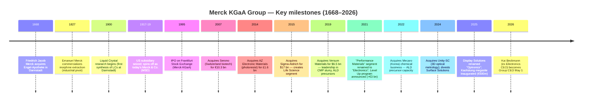

# Merck KGaA (ETR:MRK / FWB:MRK) — Company Research Document

**Subject:** Merck KGaA, Darmstadt, Germany — German pharmaceutical & technology conglomerate; semi-relevant business is the Electronics segment, branded **"EMD Electronics"** in the US and Asia.
**Listing:** Deutsche Börse Xetra / Frankfurt (ETR:MRK, ISIN DE0006599905). Unsponsored ADR: MKGAY (OTC). **Does NOT file with the SEC.**
**As of:** 2026-05-26.
**Author note:** This report focuses **disproportionately on the Electronics segment (EMD Electronics)** as that is the unit relevant to the Nomura "Greater China Semi — Renaissance 2026–30F" anchor report ([sector overview](../../sector/半导体材料.md)). Pharma (Healthcare) and Life Science are covered only to the depth needed for proper context, capital allocation, and risk framing.

> **Update — FY2026 guidance raised (2026-05-13):** Management lifted full-year 2026 net-sales guidance to **€20.4–21.4 bn** (from €19.8–21.0 bn), EBITDA pre to **€5.7–6.1 bn** (from €5.5–5.9 bn), and EPS pre to **€7.50–8.20** (from €7.10–8.00) after a Q1 2026 beat driven by Life Science Process Solutions (+16% organic, first €1 bn+ quarter since Q1 2023) and Electronics semiconductor materials (low-double-digit organic growth on AI/advanced-node pull). Electronics organic growth was +4.2%, Semiconductor Solutions +7.5%.
> Source: [Q1 2026 Press Release, 2026-05-13](https://www.emdgroup.com/en/news/q1-2026-13-05-2026.html); [Investing.com transcript, 2026-05-13](https://www.investing.com/news/transcripts/earnings-call-transcript-merck-kgaa-beats-q1-2026-expectations-stock-rises-6-93CH-4684993).

---

## Table of Contents

1. Company Overview
2. Company History
3. Management Team (Founder + Current CEO)
4. Products & Services — Electronics segment deep dive
5. Customers & Go-to-Market
6. Industry Overview — semiconductor materials
7. Competitive Landscape
8. Market Opportunity (TAM)
9. Risk Assessment
10. References

---

## 1. Company Overview

**Merck KGaA, Darmstadt, Germany** (henceforth "Merck KGaA") is a 358-year-old German science and technology conglomerate headquartered in Darmstadt, Hesse. It operates three reportable business sectors — **Life Science** (lab + bioprocessing reagents), **Healthcare** (prescription pharma), and **Electronics** (semiconductor + display materials, branded **"EMD Electronics"** in the US and Asia). FY2024 Group net sales were **€21.16 bn**, with EBITDA pre of **€6.07 bn** and net income post tax of **€2.78 bn**, employing ~63,000 people across 65 countries ([Merck KGaA Annual Report 2024, "The Group" section](https://www.emdgroup.com/en/annualreport/2024/management-report/report-on-economic-position/course-of-business-and-economic-position/the-group.html)).

The Electronics segment — the focus of this report — generated **€3.78 bn in FY2024 net sales (≈18% of Group)**, with EBITDA pre margin of **25.6%** (up 60 bps yoy from 25.0% in 2023). Within Electronics, **Semiconductor Solutions accounted for 69% of segment sales (~€2.6 bn)**, **Display Solutions / Optronics 20% (~€0.75 bn)**, and **Surface Solutions 11% (~€0.41 bn — being divested in 2025 to Global New Material International Holdings)** ([Electronics, Course of Business 2024](https://www.emdgroup.com/en/annualreport/2024/management-report/report-on-economic-position/course-of-business-and-economic-position/electronics.html)). The strategic narrative for the next five years rests almost entirely on Semiconductor Solutions: AI-driven advanced-node ramps, the Backside Power Delivery / GAA transition starting 2027F, hybrid-bonding and advanced packaging, and metal-oxide resist for High-NA EUV — all of which the Nomura 2026-05-21 "Greater China Semi" anchor report identifies as the five-year materials supercycle ([sector overview, p. 18–30](../../sector/半导体材料.md)).

**The company is not a "pure-play" semi-materials name.** Roughly 82% of Group revenue, ~85% of EBITDA, and the bulk of investor attention sit in Life Science and Healthcare. Investors who want concentrated exposure to semi materials prefer Entegris (ENTG) or Resonac (4004 JP); Merck KGaA trades as a diversified industrial-chemicals + healthcare conglomerate and prices accordingly ([Capital Markets Day 2024 press release](https://www.emdgroup.com/en/news/capital-markets-day-17-10-2024.html)). The semi optionality is real (top-3 to top-5 globally across CMP slurry, ALD/CVD precursors, photoresist auxiliaries, OLED emissive materials) but is materially diluted by the conglomerate structure. Belén Garijo, CEO from May 2021 to April 2026, was succeeded on **May 1, 2026** by **Kai Beckmann**, the former Electronics CEO who ran the unit from 2017 to April 2026 — a notable signal that the family + Supervisory Board view Electronics as the long-cycle growth engine ([Garijo / Beckmann succession announcement, 2025-09-25](https://www.emdgroup.com/en/news/garijo-beckmann-25-09-25.html)).

**Geographic footprint.** The Group disclosed in 2024 that Asia-Pacific generated roughly 38% of net sales, Europe 26%, North America 28%, and Latin America + Middle East/Africa the remainder ([Group Course of Business 2024](https://www.emdgroup.com/en/annualreport/2024/management-report/report-on-economic-position/course-of-business-and-economic-position/the-group.html)). Within Electronics specifically the Asia weighting is even higher — Taiwan, Korea, China, and Japan together account for the substantial majority of semiconductor materials sales because the world's leading-edge foundries and memory fabs are clustered there. Major recent Electronics-segment capex sites include Kaohsiung (Taiwan, €500 m, inaugurated Dec 2025), Chandler/Arizona (DS&S factory, $39 m), Cheonan/Korea (post-Mecaro acquisition, ALD precursors), and ongoing expansion at the legacy Darmstadt site ([Kaohsiung inauguration release, 2025-12-01](https://www.merckgroup.com/en/news/inauguration-kaohsiung-megasite.html); [Mecaro acquisition closing, 2023](https://www.emdgroup.com/en/news/chemical-closing.html); [EMD Electronics Arizona opening, 2022](https://www.chandleraz.gov/news-center/emd-electronics-celebrates-opening-new-arizona-factory-contributing-states-growing)).

*Source: [Merck KGaA Annual Reports 2020–2024](https://www.emdgroup.com/en/investors/reports-and-financials.html); [FY2024 Q4 press release, 2025-03-06](https://www.emdgroup.com/en/news/q4-2024-06-03-2025.html).*

**Valuation snapshot (as of 2026-05-26).** Merck KGaA trades at **€128.80** for a market cap of **€56.5 bn**, with TTM P/E of **22.3×**, TTM EV/EBITDA of ~**10.7×**, and TTM P/S of **2.7×** on annual revenue of **€20.96 bn** ([Stockanalysis.com market-cap page, 2026-05-26](https://stockanalysis.com/quote/etr/MRK/market-cap/)). The 3-year P/E range has been 14–28× — the stock de-rated in 2022–2023 on Healthcare patent-cliff fears and a Life Science bioprocessing destocking cycle, and is now re-rating as both pressures fade and Electronics organic growth accelerates ([Capital Markets Day 2025, 2025-10-16](https://www.emdgroup.com/en/news/capital-markets-day-16-10-2025.html)). Peer median P/E in the semi-materials / industrial-gas universe is ~26× on our sample (DD 24×, AI.PA 27×, LIN 32×, APD 28×, Resonac 18×, Entegris 32×) — Merck KGaA trades roughly 1 turn below peer median, which an *Analyst view:* attributes to the conglomerate discount (semi exposure diluted by pharma cyclicality + Life Science destocking memory). EBITDA-pre margin of 28.7% is in line with industrial-gas peers (LIN 28%, APD 31%) but below pure-play Electronics-only peers (Entegris ~28%, Resonac ~22% blended). For a deeper peer view see Section 7.

*Source: [Stockanalysis.com — Merck KGaA](https://stockanalysis.com/quote/etr/MRK/market-cap/) (and equivalent pages for DD / LIN / APD / ENTG / Resonac / Air Liquide / JSR); JSR shown pre-delisting (JIC TOB closed Mar 2024).*

**Capital allocation and shareholder structure.** The capital structure is unusual and material to any valuation analysis: Merck KGaA is a *Kommanditgesellschaft auf Aktien* (KGaA — a partnership limited by shares), whose general partner is **E. Merck KG**, controlled by the **Merck family** (13th generation, ~250 family shareholders). The general partner holds **70.3% of total capital** through participation certificates; only the residual ~29.7% is freely tradeable ordinary share capital, of which a portion is also retained as treasury or family-aligned holdings ([Merck family, Wikipedia / Capital Structure of Merck KGaA](https://www.emdgroup.com/en/company/management.html); [Stangenberg-Haverkamp interview](https://pharmadispatch.com/news/dr-frank-stangenberg-haverkamp)). This means management cannot be ousted by an activist or hostile bidder — Belén Garijo's transition to CEO of Sanofi in April 2026 was a *voluntary* move ([FiercePharma, 2026-02-11](https://www.fiercepharma.com/pharma/sanofi-ousts-paul-hudson-after-bumpy-ride-poaches-merck-kgaa-ceo-lead-company)). The family's stated philosophy is "thinking in generations, not quarters", which historically has supported counter-cyclical capex (€3 bn+ "Level Up" Electronics program through 2025) but has also meant the dividend payout ratio is set conservatively (~30% of EPS) and major M&A is preferred over buybacks ([Capital Markets Day 2025](https://www.emdgroup.com/en/news/capital-markets-day-16-10-2025.html); [350 Years of Family Business: Lessons from Merck, ISB Insight](https://isbinsight.isb.edu/350-years-of-family-business-lessons-from-merck/)).

**Scale indicators.** ~63,000 employees globally, of whom roughly 9,500 sit within Electronics (~15% of headcount versus 18% of sales — Electronics is the most capital-intensive segment) ([AR 2024, Group section](https://www.emdgroup.com/en/annualreport/2024/management-report/report-on-economic-position/course-of-business-and-economic-position/the-group.html)). Group R&D in FY2024 was **€2.7 bn (12.7% of sales)** — among the highest absolute R&D budgets in European industrials, with the majority going to Healthcare oncology / neurology pipeline, but roughly €330 m allocated to Electronics innovation (ALD/CVD precursor chemistry, dielectric film tuning, OLED emitter design, MOR/EUV resist) ([Electronics R&D 2024 annual report section](https://www.reports.emdgroup.com/en/annualreport/2024/management-report/fundamental-information-about-the-group/research-and-development/electronics.html)). Group capex was **€2.2 bn in FY2024**, of which an estimated ~30% (≈€650 m) flowed to Electronics — primarily the Kaohsiung megasite, Korea expansion, and Darmstadt R&D + pilot lines ([AR 2024 Cash Flow Statement](https://www.emdgroup.com/en/annualreport/2024/consolidated-financial-statements/cash-flow-statement.html)).

---

## 2. Company History

Merck KGaA traces its origin to **1668**, when the apothecary **Friedrich Jacob Merck** took ownership of the *Engel-Apotheke* (Angel Pharmacy) in Darmstadt — making it the world's oldest continuously operating pharmaceutical / chemical company ([Merck KGaA company history page](https://www.emdgroup.com/en/company/history.html); [Merck Group, Wikipedia](https://en.wikipedia.org/wiki/Merck_Group)). In **1816**, **Emanuel Merck** — a descendant of the founder — assumed control and transitioned the operation from a single retail pharmacy into a serious chemical-research enterprise; commercial isolation and large-scale manufacture of **morphine and other plant alkaloids** in 1827 marks the firm's birth as an industrial manufacturer rather than a pharmacy ([company history page](https://www.emdgroup.com/en/company/history.html)). Through the late 1800s the company expanded into specialty chemicals, dyestuffs, and pharmaceuticals, and by 1900 had subsidiaries in the US, UK, and Russia ([Merck family page](https://en.wikipedia.org/wiki/Merck_family)).

**The "two Mercks" split (1917–1919).** The single most consequential event in the company's history occurred during and after World War I, when the US subsidiary — established by **George Merck** in 1891 as the American arm — was seized by the US government under the Trading With the Enemy Act and divested. That seized US business became today's **Merck & Co. (NYSE:MRK)**, headquartered in Rahway, NJ — a wholly independent company despite the shared name. To this day, **the two Mercks operate as "Merck" in opposite jurisdictions** by treaty: the German company calls itself "Merck KGaA, Darmstadt, Germany" in the US (and uses the brand **EMD** — for **E**manuel **M**erck **D**armstadt — for its US operations including EMD Serono / EMD Performance Materials / EMD Electronics); the US Merck & Co. calls itself "MSD" outside the US and Canada ([Merck Group, Wikipedia](https://en.wikipedia.org/wiki/Merck_Group); [EMD Serono history page](https://www.emdserono.com/us-en/company/who-we-are/history.html)). The naming distinction is not pedantry — it is a frequent source of investor and analyst confusion (e.g. headlines about "Merck's Keytruda" refer to MSD/Merck & Co., not Merck KGaA, which has no PD-1 oncology asset).

**Founding events for the Electronics franchise.** The Electronics business — today branded **EMD Electronics** in the US/Asia, **Merck Electronics** in Europe — was built in three discrete acquisitions plus a half-century of organic development:

1. **Liquid Crystals — internal R&D from 1904.** Merck KGaA was the first company in the world to commercialize liquid crystal mixtures (1968) and remains the dominant supplier of LC formulations to LCD panel makers globally, alongside JNC (formerly Chisso) and DIC ([company history page](https://www.emdgroup.com/en/company/history.html)). At the LCD industry's peak (~2012–2018) LC sales were a >€1 bn business at >40% EBITDA margin; the multi-year glide path from LCD to OLED has compressed both volume and pricing, which is why Display Solutions sales fell from a peak near €2.0 bn (2018, then part of Performance Materials) to ~€0.75 bn in FY2024 ([Statista: Merck KGaA revenue by segment 2014–2023](https://www.statista.com/statistics/270841/merck-kgaa-revenue-by-segment/)).

2. **AZ Electronic Materials — acquired 2014 for £1.6 bn (~€1.9 bn).** AZ was a Luxembourg-headquartered, London-listed pure-play photoresist company spun out of Hoechst Celanese in 2004 and owned by The Carlyle Group from 2007 to 2014. The acquisition gave Merck KGaA the **AZ®** lithography brand — i-line/g-line, KrF, ArF immersion, and specialty thick-film resists — plus patterning-enhancement materials (BARC, anti-reflective coatings, hard masks) and process chemistry (developers, removers, edge-bead) ([MOFCOM antitrust approval, 2014-08-23](http://english.www.gov.cn/policies/latest_releases/2014/08/23/content_281474983026481.htm); [AZ photoresist product page](https://www.emdgroup.com/en/expertise/displays/solutions/photoresist-materials.html)). The AZ deal was Merck's first major step beyond LCD materials into the broader semiconductor materials value chain.

3. **Sigma-Aldrich — acquired 2015 for $17 bn (€13.1 bn).** This deal does not directly create Electronics value but is critical context for capital allocation: it was Merck's largest acquisition ever, doubled the Life Science segment overnight (combining legacy EMD Millipore with Sigma's lab-chemicals + bioprocessing portfolio under the **MilliporeSigma** brand in the US/Canada), and absorbed essentially all of Merck KGaA's M&A bandwidth from 2015 to 2018. The €13 bn debt taken on to fund it constrained Electronics M&A through 2019 ([BioPharm International press release, 2015-11-18](https://www.biopharminternational.com/view/merck-kgaa-darmstadt-germany-announces-completion-sigma-aldrich-acquisition-0); [BioInformant analysis](https://bioinformant.com/merck-kgaa-completes-acquisition-of-sigma-aldrich-for-17-billion-140share/)).

4. **Versum Materials — acquired October 2019 for $6.5 bn (€5.8 bn).** This is the single most important transaction for the Electronics franchise. Versum had been spun off from Air Products & Chemicals in **October 2016** as the "Electronic Materials" pure-play, listed on NYSE as VSM, with FY2018 revenue of ~$1.4 bn ([Air Products spin-off completion, 2016-10-03](https://www.prnewswire.com/news-releases/air-products-completes-spin-off-of-versum-materials-300337710.html)). After a contested takeover battle in 1H 2019 — Versum first agreed to merge with Entegris in late 2018, then accepted a higher all-cash offer from Merck KGaA in April 2019 — the deal closed October 7, 2019, with €75 m expected run-rate synergies by the third full year ([Merck KGaA Versum closing release, 2019](https://www.emdgroup.com/en/news/versum-definitive-agreement-12-04-2019.html); [Versum Materials Wikipedia](https://en.wikipedia.org/wiki/Versum_Materials)). Versum brought Merck KGaA: **(a)** ~$700 m of CMP slurry revenue (#2 globally pre-deal); **(b)** ~$400 m of advanced precursors for ALD/CVD (thin-film dielectric and metal precursors used in 3D-NAND, DRAM, advanced logic); **(c)** ~$200 m of process chemistry (developers, removers, formulated cleans); **(d)** the Delivery Systems & Services (DS&S) equipment franchise — gas cabinets, bulk delivery, point-of-use mixers; and **(e)** roughly 2,300 employees and ~14 manufacturing sites concentrated in the US, Taiwan, Korea ([Versum spin-off 8-K, 2016](https://www.sec.gov/Archives/edgar/data/0000002969/000119312516661047/d231364dex991.htm)).

5. **Mecaro (Korea) — acquired 2022.** Bolt-on adding ~100 employees and Korean ALD/CVD precursor manufacturing — strategically positioned next to Samsung and SK Hynix's memory fabs ([Mecaro acquisition announcement, 2022-08-17](https://www.emdgroup.com/en/news/news-electronics-business-17-08-2022.html); [Mecaro closing, 2023](https://www.emdgroup.com/en/news/chemical-closing.html)).

6. **Unity-SC — acquired October 2024 for €144 m.** A small but strategically symbolic deal: Unity-SC is a French manufacturer of 3D optical metrology and inspection instrumentation for advanced packaging (hybrid bonding, heterogeneous integration, HBM stacking). The acquisition signals Merck's intent to migrate from a pure-chemicals supplier to a **"materials + tools + services"** vendor — the same playbook ASML, Applied Materials, and Lam Research have used to lock in advanced-node customers ([Unity-SC closing release, 2024-10-31](https://www.emdgroup.com/en/news/unity-sc-acquisition-and-optronics-31-10-2024.html); [Metrology News coverage](https://metrology.news/metrology-and-inspection-instrumentation-company-acquired-by-merck/)). The same announcement renamed Display Solutions to **"Optronics"** effective Jan 1, 2025, to telegraph the unit's expanded scope beyond traditional LCD/OLED into optical metrology and inspection.

7. **2021 — segment rename and "Level Up" program.** The Performance Materials segment was renamed **Electronics** on Mar 4, 2021, explicitly to signal a sharper semi-industry focus and shed the conglomerate-sounding "Performance Materials" label ([Performance Materials is now Electronics, 2021-03-04](https://www.merckgroup.com/en/news/performance-materials-is-now-electronics-04-03-2021.html)). At the September 9, 2021 Capital Markets Day, Merck KGaA committed to invest **"significantly more than €3 billion"** in Electronics innovation + capacity through 2025 — branded the **"Level Up"** growth program, with four pillars (Scale, Technology, Portfolio, Capabilities) and a corridor of **5–9% medium-term organic growth** for the segment ([Electronics invests in growth, 2021-09-20](https://www.emdgroup.com/en/news/electronics-invests-in-growth-20-09-2021.html); [Capital Markets Day 2024, 2024-10-17](https://www.emdgroup.com/en/news/capital-markets-day-17-10-2024.html)). The successor program — **"Level Up Next"** — was outlined at the October 16, 2025 Capital Markets Day with extended ambition through ~2030 ([Capital Markets Day 2025: Ready for the Next Wave of Growth](https://www.emdgroup.com/en/news/capital-markets-day-16-10-2025.html)).

**Two strategic pivots worth flagging.** First, the 2014 AZ + 2019 Versum + 2024 Unity-SC sequence transformed Electronics from a single-product (liquid crystals) unit into a vertically-integrated semiconductor specialty materials supplier with leadership positions across CMP slurry, ALD/CVD precursors, photoresists/auxiliaries, OLED emissive materials, and now optical metrology. Second, the **2025 Surface Solutions divestiture** (decorative pigments for cosmetics + coatings, sold to China-based Global New Material International) sharpens the Electronics segment to be exclusively semiconductor + display by 2026 — removing a cyclical, lower-multiple business and freeing capital for further semi M&A ([Surface Solutions divestiture, Q4 2024 press release context](https://www.emdgroup.com/en/news/q4-2024-06-03-2025.html)).

---

## 3. Management Team

This section follows the company-research skill's prescribed structure: founder + current Group CEO only. Since the founder lived 350+ years ago, the "founder" bio is necessarily institutional and brief; the focus is the current CEO **Kai Beckmann**, who took over as Group CEO on **May 1, 2026** and whose semi-materials operating background makes the Electronics segment particularly central to the equity narrative.

**Friedrich Jacob Merck — institutional founder (1668)**

The original Merck operation was founded in **1668** when **Friedrich Jacob Merck** acquired the *Engel-Apotheke* in Darmstadt — a single retail pharmacy ([company history page](https://www.emdgroup.com/en/company/history.html)). The current corporate form (Merck KGaA, a *Kommanditgesellschaft auf Aktien*) was created in 1995 when the family floated ~30% of the equity on the Frankfurt Stock Exchange while retaining 70.3% of total capital through E. Merck KG, the general partner ([Merck Group, Wikipedia](https://en.wikipedia.org/wiki/Merck_Group); [Merck family ownership analysis](https://pharmadispatch.com/news/dr-frank-stangenberg-haverkamp)). The **Merck family** — now approximately 250 descendants across the 13th generation — collectively controls 99.9% of E. Merck KG and therefore 70.3% of Merck KGaA's capital, making this one of the world's largest family-controlled listed companies. The Chairman of the Family Board is **Dr. Frank Stangenberg-Haverkamp** (since 2014), who is also Chairman of the Board of Partners of E. Merck KG and a personally liable partner. The family's stated philosophy — "we are not shareholders, we are trustees" — has historically supported counter-cyclical capex (€3 bn+ Level Up Electronics investment 2021–2025 was sized in the depths of the post-Versum integration period when reported EPS was under pressure) and a conservative ~30% dividend payout ratio ([Stangenberg-Haverkamp interview, BioPharmaDispatch](https://pharmadispatch.com/news/dr-frank-stangenberg-haverkamp); [350 Years of Family Business: Lessons from Merck](https://isbinsight.isb.edu/350-years-of-family-business-lessons-from-merck/); [Boards of E. Merck KG, 2019-01-28](https://www.emdgroup.com/en/news/em-boards-28-01-2019.html)).

**Kai Beckmann — Chairman of the Executive Board & Group CEO (since May 1, 2026)**

**Kai Beckmann** was born in 1965 in Hanau (Hesse), Germany. He holds a **master's degree in computer science and a doctorate (Dr. rer. nat.) in economics from the Technical University of Darmstadt** — a notable academic profile, since most German DAX CEOs come from finance, law, or engineering rather than computer science ([Merck KGaA Executive Board page — Kai Beckmann](https://www.emdgroup.com/en/company/management/executive-board/kai-beckmann.html); [Bloomberg profile](https://www.bloomberg.com/profile/person/17046978); [SEMI Europa speaker bio](https://www.semiconeuropa.org/Kai_Beckmann)). He joined Merck in **1989 straight from university**, never having worked anywhere else — a 37-year company tenure that makes him a quintessential "lifer", in the same mold as long-serving German industrial CEOs at Siemens, BASF, and Bayer.

His career path through Merck moved through three distinct phases. **First (1989–2004): IT and consulting.** Beckmann ran the company's internal Information Management and Consulting unit from 1999 to 2004 — building the digital infrastructure that today connects ~63,000 employees across 65 countries. **Second (2004–2011): Asia-Pacific operating roles.** From 2004 to 2007 he was Managing Director of Merck KGaA's businesses in Singapore and Malaysia, then in 2007 became Merck KGaA's first Chief Information Officer with global responsibility. **Third (2011–2026): Executive Board.** He joined the Executive Board in 2011 with responsibility for human resources, IT, procurement, and the Darmstadt site, then in **2017 became CEO of the Performance Materials / Electronics business sector**, a role he held continuously until April 2026 ([SEMICON West speaker bio](https://www.semiconwest.org/programs/speaker-bio/kai-beckman); [TheOrg profile](https://theorg.com/org/merck-group/org-chart/kai-beckmann)). He was appointed Deputy Chairman of the Executive Board in 2025 as part of the orderly succession planning that culminated in his elevation to Group CEO on May 1, 2026 ([Garijo / Beckmann succession announcement, 2025-09-25](https://www.emdgroup.com/en/news/garijo-beckmann-25-09-25.html)).

His **9-year Electronics tenure (2017–April 2026)** is the most directly relevant span for any equity research investor. During that period: (a) the Versum Materials acquisition was negotiated, won in a contested process, closed, and integrated, generating roughly $1.5 bn of incremental revenue and the targeted €75 m+ of synergies; (b) the Performance Materials segment was rebranded Electronics; (c) the **"Level Up"** €3 bn+ capex/R&D program was conceived and largely executed; (d) the Mecaro (Korea), Unity-SC (France) bolt-ons were closed; (e) the Kaohsiung €500 m megasite was built; (f) the Display Solutions unit was renamed Optronics. He has been a regular keynote speaker at SEMICON West, SEMICON Europa, and the SEMI annual conferences, with deep operating relationships across the global wafer fab and OSAT customer base ([SEMICON Europa keynote 2024](https://www.semiconeuropa.org/Kai_Beckmann)). External roles include serving as **Chairman of the Supervisory Board of Bundesdruckerei** (Germany's federal security printer) from 2023 to May 2026, Vice President of the Confederation of German Employers' Associations (BDA) from 2017 to 2025, and President of the German Federation of Chemical Employers' Associations (BAVC) from 2017 to 2024 — all signals of his standing in the German industrial-policy establishment ([Bloomberg biography](https://www.bloomberg.com/profile/person/17046978); [LinkedIn](https://www.linkedin.com/in/kai-beckmann/); [World Economic Forum profile](https://www.weforum.org/people/kai-beckmann/)).

**Ownership stake and compensation.** Beckmann holds an undisclosed but small number of Merck KGaA shares (the company is not subject to US Section 16 reporting and German DEF14A-equivalents disclose executive holdings only in aggregate). As an Executive Board member at a KGaA structure, compensation is set by the Personnel Committee of the Board of Partners (controlled by the family) rather than by a free-float-elected supervisory board — typical FY2024 total comp for a German DAX CEO in industrials ran ~€7–9 m, and Merck KGaA's 2024 remuneration report disclosed Belén Garijo at €8.3 m total comp; Beckmann's package as Group CEO is expected to fall in that range based on consistent compensation policy ([Capital Markets Day 2025](https://www.emdgroup.com/en/news/capital-markets-day-16-10-2025.html); [AR 2024 Remuneration Report](https://www.emdgroup.com/en/annualreport/2024/)). The interpretation for the equity story: a long-tenured insider with deep semi-materials operating experience, now running the conglomerate. The promotion of the Electronics chief to Group CEO is itself a signal that the family Board views the long-term value of the company as anchored in the Electronics-materials franchise, with Healthcare and Life Science increasingly playing supporting roles.

---

