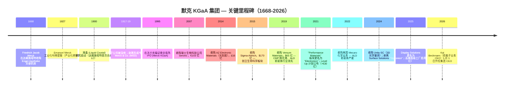

# 默克 KGaA / Merck KGaA (ETR:MRK / FWB:MRK) — 公司研究报告

> **关键提示 / Disambiguation banner**：本报告对象为德国默克 **Merck KGaA (ETR:MRK)**，并非美国"默克公司 **Merck & Co. (NYSE:MRK)**" —— 两家公司同名但完全不相关。在亚洲市场默克 KGaA 的电子业务以 **"EMD Electronics"** 品牌运营。详见 §2 "公司历史 — 1917 年两家默克分裂"。

**研究对象**：Merck KGaA, Darmstadt, Germany —— 德国制药与科技综合集团；与半导体相关的业务是电子业务 (Electronics segment / EMD Electronics)。
**上市信息**：法兰克福证券交易所 Xetra (ETR:MRK, ISIN DE0006599905)。非赞助型 ADR：MKGAY (OTC)。**不向 SEC 申报。**
**截至日期**：2026-05-26。
**作者说明**：本报告**有意聚焦于电子业务 (Electronics segment / EMD Electronics)**，因为这是与野村《大中华半导体 2026-2030 复兴指南》（[半导体材料行业总览](../../sector/半导体材料.md)）相关的板块。医药 (Healthcare) 与生命科学 (Life Science) 仅在资本配置和风险框架所需的深度内涉及。

> **更新 — FY2026 业绩指引上调 (2026-05-13)**：管理层将全年 2026 净销售额指引上调至 **€204–214 亿**（原 €198–210 亿），EBITDA pre 上调至 **€57–61 亿**（原 €55–59 亿），EPS pre 上调至 **€7.50–8.20**（原 €7.10–8.00）。Q1 2026 业绩超预期主要由生命科学 Process Solutions（+16% 有机增长，自 Q1 2023 以来首个单季 €10 亿+）以及电子业务半导体材料（AI / 先进节点拉货带动两位数中段有机增长）驱动。电子业务有机增长 +4.2%，半导体解决方案 (Semiconductor Solutions) +7.5%。
> 资料来源：[Q1 2026 新闻稿, 2026-05-13](https://www.emdgroup.com/en/news/q1-2026-13-05-2026.html); [Investing.com 业绩电话会议记录, 2026-05-13](https://www.investing.com/news/transcripts/earnings-call-transcript-merck-kgaa-beats-q1-2026-expectations-stock-rises-6-93CH-4684993)。

---

## 目录

1. 公司概览
2. 公司历史
3. 管理团队（创始人 + 现任 CEO）
4. 产品与服务 —— 电子业务 (EMD Electronics) 深度拆解
5. 客户与上市策略
6. 行业概览 —— 半导体材料
7. 竞争格局
8. 市场机会 (TAM)
9. 风险评估
10. 参考资料

---

## 1. 公司概览

**默克 KGaA，达姆施塔特，德国 / Merck KGaA, Darmstadt, Germany**（下文简称"默克 KGaA"）是一家拥有 358 年历史的德国科学与技术综合企业，总部位于黑森州达姆施塔特 (Darmstadt)。公司经营三大可报告业务板块——**生命科学 (Life Science)**（实验室 + 生物工艺试剂）、**医疗健康 (Healthcare)**（处方药）、**电子业务 (Electronics segment / EMD Electronics)**（半导体 + 显示材料，在美国和亚洲使用 "EMD Electronics" 品牌）。FY2024 集团净销售额为 **€211.6 亿**，EBITDA pre 为 **€60.7 亿**，税后净利润 **€27.8 亿**，全球 65 个国家约 63,000 名员工 ([Merck KGaA Annual Report 2024, "The Group" section](https://www.emdgroup.com/en/annualreport/2024/management-report/report-on-economic-position/course-of-business-and-economic-position/the-group.html))。

本报告所聚焦的电子业务，FY2024 净销售额为 **€37.8 亿（约占集团 18%）**，EBITDA pre 利润率为 **25.6%**（同比上升 60 bp，2023 年为 25.0%）。电子业务内部，**半导体解决方案 (Semiconductor Solutions) 占板块销售额 69%（约 €26 亿）**，**显示解决方案 (Display Solutions / Optronics) 占 20%（约 €7.5 亿）**，**表面解决方案 (Surface Solutions) 占 11%（约 €4.1 亿 —— 2025 年正在剥离给 Global New Material International Holdings）** ([Electronics, Course of Business 2024](https://www.emdgroup.com/en/annualreport/2024/management-report/report-on-economic-position/course-of-business-and-economic-position/electronics.html))。未来五年的战略叙事几乎完全依托于半导体解决方案：AI 驱动的先进节点放量、2027F 起启动的背面供电网络 (Backside Power Delivery, BPD) / 环绕栅极 (Gate-All-Around, GAA) 转换、混合键合 (hybrid bonding) 与先进封装、以及为 High-NA EUV 准备的金属氧化物光刻胶 (Metal-Oxide Resist, MOR) —— 这些都是野村 2026-05-21《大中华半导体》报告确认的五年材料超级周期 ([行业总览，第 18-30 页](../../sector/半导体材料.md))。

**默克 KGaA 不是"纯半导体材料"标的**。集团约 82% 的收入、约 85% 的 EBITDA 和绝大部分投资者关注度都集中在生命科学与医疗健康业务。希望集中持有半导体材料敞口的投资者通常选择 Entegris (ENTG) 或 Resonac (4004 JP)；默克 KGaA 作为多元化的工业化学 + 医疗健康集团进行定价 ([Capital Markets Day 2024 press release](https://www.emdgroup.com/en/news/capital-markets-day-17-10-2024.html))。半导体的可选性是真实存在的（CMP 抛光液、ALD/CVD 先进前驱体、光刻胶辅材、OLED 发光材料全球排名前 3 至前 5），但被集团结构显著稀释。Belén Garijo 自 2021 年 5 月起担任 CEO，于 2026 年 4 月离任，**2026 年 5 月 1 日由 Kai Beckmann 接任** —— 他原本担任电子业务 CEO（2017 年至 2026 年 4 月），这一接班安排明确传达出家族 + 监事会将电子业务视为长周期增长引擎的信号 ([Garijo / Beckmann succession announcement, 2025-09-25](https://www.emdgroup.com/en/news/garijo-beckmann-25-09-25.html))。

**地理布局**。集团 2024 年披露：亚太地区贡献约 38% 净销售额，欧洲 26%，北美 28%，拉美 + 中东 / 非洲为其余部分 ([Group Course of Business 2024](https://www.emdgroup.com/en/annualreport/2024/management-report/report-on-economic-position/course-of-business-and-economic-position/the-group.html))。具体到电子业务，亚洲权重更高 —— 中国台湾、韩国、中国大陆、日本合计构成半导体材料销售的绝大部分，因为全球领先的代工厂和存储厂都集中在这些地区。近期电子业务主要资本支出项目包括高雄超级工厂（中国台湾，€5 亿，2025 年 12 月启用）、Chandler / 亚利桑那州 DS&S 工厂（$3,900 万）、Cheonan / 韩国（收购 Mecaro 后 ALD 前驱体产能扩张）以及达姆施塔特总部继续扩建 ([Kaohsiung inauguration release, 2025-12-01](https://www.merckgroup.com/en/news/inauguration-kaohsiung-megasite.html); [Mecaro acquisition closing, 2023](https://www.emdgroup.com/en/news/chemical-closing.html); [EMD Electronics Arizona opening, 2022](https://www.chandleraz.gov/news-center/emd-electronics-celebrates-opening-new-arizona-factory-contributing-states-growing))。

*资料来源：[Merck KGaA Annual Reports 2020–2024](https://www.emdgroup.com/en/investors/reports-and-financials.html); [FY2024 Q4 press release, 2025-03-06](https://www.emdgroup.com/en/news/q4-2024-06-03-2025.html)。*

**估值快照（截至 2026-05-26）**。默克 KGaA 当前股价 **€128.80**，市值 **€565 亿**，TTM 市盈率 (P/E) **22.3 倍**，TTM EV/EBITDA 约 **10.7 倍**，TTM 市销率 (P/S) **2.7 倍**（基于年化收入 **€209.6 亿**）([Stockanalysis.com market-cap page, 2026-05-26](https://stockanalysis.com/quote/etr/MRK/market-cap/))。过去 3 年 P/E 区间为 14–28 倍 —— 股价在 2022–2023 年因医疗健康专利悬崖 (patent cliff) 担忧 + 生命科学生物工艺去库存周期而 de-rate 重新估值下调；目前两类压力消退、电子业务有机增长加速，估值正在重新上升 ([Capital Markets Day 2025, 2025-10-16](https://www.emdgroup.com/en/news/capital-markets-day-16-10-2025.html))。同业（半导体材料 / 工业气体可比公司）P/E 中位数约 26 倍（DD 24×, AI.PA 27×, LIN 32×, APD 28×, Resonac 18×, Entegris 32×）—— 默克 KGaA 较同业中位数低约 1 倍，*分析师观点：* 主要归因于集团折价 (conglomerate discount)（半导体敞口被医药周期 + 生命科学去库记忆稀释）。28.7% 的 EBITDA pre 利润率与工业气体同业（LIN 28%, APD 31%）相当，但低于纯电子材料同业（Entegris ~28%、Resonac 综合 ~22%）。同业详细比较见第 7 章。

*资料来源：[Stockanalysis.com — Merck KGaA](https://stockanalysis.com/quote/etr/MRK/market-cap/)（同等页面 DD / LIN / APD / ENTG / Resonac / Air Liquide / JSR）；JSR 显示退市前数据（JIC TOB 2024 年 3 月完成）。*

**资本配置与股东结构**。资本结构异常且对估值分析至关重要：默克 KGaA 是一家 *Kommanditgesellschaft auf Aktien* (KGaA，股份合资公司)，其无限责任合伙人为 **E. Merck KG**，由 **默克家族** 控制（第 13 代，约 250 位家族股东）。无限责任合伙人通过参与证书持有 **总资本的 70.3%**；仅有剩余 ~29.7% 为公开交易的普通股资本，且其中部分仍由公司留存为库存股或家族关联持仓 ([Merck family, Wikipedia / Capital Structure of Merck KGaA](https://www.emdgroup.com/en/company/management.html); [Stangenberg-Haverkamp interview](https://pharmadispatch.com/news/dr-frank-stangenberg-haverkamp))。这意味着管理层无法被激进股东或敌意收购方驱逐 —— Belén Garijo 2026 年 4 月转任赛诺菲 (Sanofi) CEO 是 *自愿* 行为 ([FiercePharma, 2026-02-11](https://www.fiercepharma.com/pharma/sanofi-ousts-paul-hudson-after-bumpy-ride-poaches-merck-kgaa-ceo-lead-company))。家族公开的理念是"以代际而非季度思考"，从历史上看支持了反周期资本支出（电子业务 2025 年前 €30 亿+ "Level Up" 计划），但也意味着股息派付率保守（约 EPS 的 30%），且偏好重大并购而非回购 ([Capital Markets Day 2025](https://www.emdgroup.com/en/news/capital-markets-day-16-10-2025.html); [350 Years of Family Business: Lessons from Merck, ISB Insight](https://isbinsight.isb.edu/350-years-of-family-business-lessons-from-merck/))。

**规模指标**。全球约 63,000 名员工，其中约 9,500 人在电子业务（占员工 ~15% vs 销售额 18% —— 电子业务是资本最密集的板块）([AR 2024, Group section](https://www.emdgroup.com/en/annualreport/2024/management-report/report-on-economic-position/course-of-business-and-economic-position/the-group.html))。集团 FY2024 R&D 投入为 **€27 亿（占销售额 12.7%）**—— 在欧洲工业品行业属最高的绝对 R&D 预算之一，多数流向医疗健康肿瘤 / 神经科室管线，但约 €3.3 亿分配至电子业务创新（ALD/CVD 前驱体化学、介电薄膜调控、OLED 发光体设计、MOR/EUV 光刻胶）([Electronics R&D 2024 annual report section](https://www.reports.emdgroup.com/en/annualreport/2024/management-report/fundamental-information-about-the-group/research-and-development/electronics.html))。集团 FY2024 资本支出 **€22 亿**，估计约 30%（约 €6.5 亿）流向电子业务 —— 主要用于高雄超级工厂、韩国扩产、达姆施塔特 R&D + 试产线 ([AR 2024 Cash Flow Statement](https://www.emdgroup.com/en/annualreport/2024/consolidated-financial-statements/cash-flow-statement.html))。

---

## 2. 公司历史

默克 KGaA 的历史可追溯到 **1668 年**，当时药剂师 **Friedrich Jacob Merck**（弗里德里希·雅各布·默克）接手了达姆施塔特的 *Engel-Apotheke*（天使药房）—— 使其成为世界上历史最悠久、持续经营至今的制药 / 化学公司 ([Merck KGaA company history page](https://www.emdgroup.com/en/company/history.html); [Merck Group, Wikipedia](https://en.wikipedia.org/wiki/Merck_Group))。**1816 年**，创始人后代 **Emanuel Merck**（伊曼纽尔·默克）接管经营，将业务从单店零售药房转型为严肃的化学研究企业；1827 年商业化分离与大规模生产 **吗啡及其他植物生物碱**，标志着公司由药房变为工业制造商 ([company history page](https://www.emdgroup.com/en/company/history.html))。1800 年代后期，公司扩展至专用化学品、染料和制药领域；到 1900 年已在美国、英国和俄罗斯设立子公司 ([Merck family page](https://en.wikipedia.org/wiki/Merck_family))。

**"两个默克"的分裂（1917–1919 年）**。公司历史上最重要的事件发生在第一次世界大战期间及战后：1891 年由 **George Merck**（乔治·默克）在美国设立的子公司，根据《对敌贸易法》(Trading With the Enemy Act) 被美国政府没收并剥离。被没收的美国业务成为今天的 **Merck & Co. (NYSE:MRK)**，总部位于新泽西州拉威 (Rahway)，尽管同名但完全独立。至今，**两家默克按条约在彼此辖区使用不同名称**：德国公司在美国称作 "Merck KGaA, Darmstadt, Germany"，并使用 **EMD** 品牌（**E**manuel **M**erck **D**armstadt 首字母）用于美国业务（包括 EMD Serono / EMD Performance Materials / EMD Electronics）；美国 Merck & Co. 在美国和加拿大以外则称作 "MSD" ([Merck Group, Wikipedia](https://en.wikipedia.org/wiki/Merck_Group); [EMD Serono history page](https://www.emdserono.com/us-en/company/who-we-are/history.html))。这种命名区别并非吹毛求疵 —— 它是投资者与分析师频繁混淆的来源（例如，关于"默克的 Keytruda"的新闻标题指的是 MSD/Merck & Co.，与默克 KGaA 无关，后者没有 PD-1 肿瘤资产）。

**电子业务的建立**。今天在美国 / 亚洲品牌为 **EMD Electronics**、在欧洲为 **Merck Electronics** 的电子业务，由三次离散收购加上半个世纪的内生发展构建而成：

1. **液晶 (Liquid Crystals) —— 自 1904 年起的内部 R&D**。默克 KGaA 是全球第一家商业化液晶混合物的公司（1968 年），至今仍是全球液晶配方的主导供应商，主要服务于 LCD 面板厂商，与 JNC（前身 Chisso）和 DIC 并列三强 ([company history page](https://www.emdgroup.com/en/company/history.html))。在 LCD 行业顶峰期（约 2012–2018 年），LC 销售额超 €10 亿、EBITDA 利润率超 40%；从 LCD 向 OLED 的多年转移压缩了销量和定价 —— 这就是 Display Solutions 销售额从 2018 年峰值近 €20 亿（当时归属 Performance Materials 板块）跌至 FY2024 约 €7.5 亿的原因 ([Statista: Merck KGaA revenue by segment 2014–2023](https://www.statista.com/statistics/270841/merck-kgaa-revenue-by-segment/))。

2. **AZ Electronic Materials —— 2014 年收购，£16 亿（约 €19 亿）**。AZ 是一家总部位于卢森堡、伦敦上市的纯光刻胶公司，2004 年从 Hoechst Celanese 分拆，2007–2014 年由 The Carlyle Group 持有。该次收购为默克 KGaA 带来 **AZ®** 光刻品牌 —— i-line/g-line、KrF、ArF 浸没、特种厚膜光刻胶 —— 加上图形增强材料 (BARC 抗反射涂层、硬掩膜) 与工艺化学品（显影液、清除剂、边缘湿化学）([MOFCOM antitrust approval, 2014-08-23](http://english.www.gov.cn/policies/latest_releases/2014/08/23/content_281474983026481.htm); [AZ photoresist product page](https://www.emdgroup.com/en/expertise/displays/solutions/photoresist-materials.html))。AZ 交易是默克进入 LCD 材料以外更广泛半导体材料价值链的首个重大步骤。

3. **Sigma-Aldrich —— 2015 年收购，$170 亿（€131 亿）**。此交易并未直接创造电子业务价值，但对资本配置至关重要：这是默克有史以来最大的并购，使生命科学板块规模一夜翻倍（将原 EMD Millipore 与 Sigma 的实验室化学品 + 生物工艺组合合并在美 / 加 **MilliporeSigma** 品牌下），且实际上耗尽了默克 KGaA 2015 至 2018 年的全部并购资源。为该笔交易承担的 €130 亿债务限制了 2019 年前的电子业务并购空间 ([BioPharm International press release, 2015-11-18](https://www.biopharminternational.com/view/merck-kgaa-darmstadt-germany-announces-completion-sigma-aldrich-acquisition-0); [BioInformant analysis](https://bioinformant.com/merck-kgaa-completes-acquisition-of-sigma-aldrich-for-17-billion-140share/))。

4. **Versum Materials —— 2019 年 10 月收购，$65 亿（€58 亿）**。这是电子业务历史上最重要的单一交易 (**Versum 2019 $6.5B 收购**)。Versum 原在 **2016 年 10 月** 由 Air Products & Chemicals 分拆成立，作为纯"电子材料"标的在纽交所以 VSM 代码上市，FY2018 收入约 $14 亿 ([Air Products spin-off completion, 2016-10-03](https://www.prnewswire.com/news-releases/air-products-completes-spin-off-of-versum-materials-300337710.html))。2019 年上半年经过激烈的争夺战（Versum 于 2018 年末先同意与 Entegris 合并，然后于 2019 年 4 月接受默克 KGaA 的更高全现金报价），交易于 2019 年 10 月 7 日完成，第三个完整年度预期实现 €7,500 万运行率协同效应 ([Merck KGaA Versum closing release, 2019](https://www.emdgroup.com/en/news/versum-definitive-agreement-12-04-2019.html); [Versum Materials Wikipedia](https://en.wikipedia.org/wiki/Versum_Materials))。Versum 为默克 KGaA 带来：**(a)** 约 $7 亿 CMP 抛光液收入（交易前全球 #2）；**(b)** 约 $4 亿 ALD/CVD 先进前驱体 (advanced precursors for ALD/CVD)（用于 3D-NAND、DRAM、先进逻辑的薄膜介电与金属前驱体）；**(c)** 约 $2 亿工艺化学品（显影液、清除剂、配方清洗剂）；**(d)** Delivery Systems & Services (DS&S) 设备业务 —— 气柜、批量输送、点对点混合器；以及 **(e)** 约 2,300 名员工与约 14 个生产基地，集中在美国、中国台湾、韩国 ([Versum spin-off 8-K, 2016](https://www.sec.gov/Archives/edgar/data/0000002969/000119312516661047/d231364dex991.htm))。

5. **Mecaro（韩国）—— 2022 年收购**。补强型收购，新增约 100 名员工 + 韩国 ALD/CVD 前驱体产能 —— 战略上紧邻三星和 SK 海力士的存储 fab ([Mecaro acquisition announcement, 2022-08-17](https://www.emdgroup.com/en/news/news-electronics-business-17-08-2022.html); [Mecaro closing, 2023](https://www.emdgroup.com/en/news/chemical-closing.html))。

6. **Unity-SC —— 2024 年 10 月收购，€1.44 亿**。规模虽小但战略意义象征：Unity-SC 是法国一家生产 3D 光学量测与检测仪表的厂商，专注于先进封装（混合键合、异构集成、HBM 堆叠）。这次收购标志默克从纯化学品供应商向 **"材料 + 工具 + 服务"** 供应商转型 —— 这正是 ASML、Applied Materials 和 Lam Research 用来锁定先进节点客户的同样剧本 ([Unity-SC closing release, 2024-10-31](https://www.emdgroup.com/en/news/unity-sc-acquisition-and-optronics-31-10-2024.html); [Metrology News coverage](https://metrology.news/metrology-and-inspection-instrumentation-company-acquired-by-merck/))。同一公告将 Display Solutions 自 2025 年 1 月 1 日起更名为 **"Optronics"**，传达该板块从传统 LCD/OLED 扩展至光学量测和检测的内涵。

7. **2021 年 —— 板块重命名与 "Level Up" 计划**。Performance Materials 板块于 2021 年 3 月 4 日更名为 **Electronics**，明确传达更聚焦半导体行业的信号，摆脱听起来综合化的 "Performance Materials" 标签 ([Performance Materials is now Electronics, 2021-03-04](https://www.merckgroup.com/en/news/performance-materials-is-now-electronics-04-03-2021.html))。2021 年 9 月 9 日资本市场日，默克 KGaA 承诺到 2025 年在电子业务创新 + 产能上投资 **"显著超过 €30 亿"** —— 即 **"Level Up"** 增长计划，包含四大支柱（规模、技术、组合、能力）以及板块中期 **5–9%** 有机增长走廊 ([Electronics invests in growth, 2021-09-20](https://www.emdgroup.com/en/news/electronics-invests-in-growth-20-09-2021.html); [Capital Markets Day 2024, 2024-10-17](https://www.emdgroup.com/en/news/capital-markets-day-17-10-2024.html))。继任计划 —— **"Level Up Next"** —— 在 2025 年 10 月 16 日资本市场日宣布，野心延伸至约 2030 年 ([Capital Markets Day 2025: Ready for the Next Wave of Growth](https://www.emdgroup.com/en/news/capital-markets-day-16-10-2025.html))。

**两大战略转折值得标注**。首先，2014 年 AZ + 2019 年 Versum + 2024 年 Unity-SC 的序列将电子业务从单一产品（液晶）业务转型为垂直整合的半导体专用材料供应商，在 CMP 抛光液、ALD/CVD 前驱体、光刻胶 / 辅材、OLED 发光材料以及现在的光学量测领域都具备领先地位。其次，**2025 年 Surface Solutions 剥离**（用于化妆品 + 涂料的装饰颜料，售予总部位于中国的环球新材国际控股）使电子业务到 2026 年聚焦于纯半导体 + 显示 —— 剔除了一项周期性更强、估值倍数较低的业务，释放资本用于进一步半导体并购 ([Surface Solutions divestiture, Q4 2024 press release context](https://www.emdgroup.com/en/news/q4-2024-06-03-2025.html))。

---

## 3. 管理团队

本节遵循公司研究方法论规定的结构：仅涵盖创始人 + 现任集团 CEO。鉴于创始人生活在 350 多年前，"创始人"传记必然偏制度化且简短；重点是现任 CEO **Kai Beckmann**，他于 **2026 年 5 月 1 日** 接任集团 CEO，其半导体材料运营背景使电子业务在股权叙事中占据特别核心的地位。

**Friedrich Jacob Merck —— 制度创始人（1668 年）**

原默克业务始于 **1668 年**，当 **Friedrich Jacob Merck** 收购达姆施塔特的 *Engel-Apotheke* —— 一间零售药房 ([company history page](https://www.emdgroup.com/en/company/history.html))。当前公司形态（默克 KGaA，一家 *Kommanditgesellschaft auf Aktien* 股份合资公司）于 1995 年成立，当时家族将约 30% 股权在法兰克福证券交易所 IPO，同时通过无限责任合伙人 E. Merck KG 保留 70.3% 的总资本 ([Merck Group, Wikipedia](https://en.wikipedia.org/wiki/Merck_Group); [Merck family ownership analysis](https://pharmadispatch.com/news/dr-frank-stangenberg-haverkamp))。**默克家族** —— 现今约 250 位第 13 代后代 —— 集体控制 E. Merck KG 99.9% 的股权，因此控制默克 KGaA 70.3% 的资本，使其成为全球最大的家族控股上市公司之一。家族委员会主席为 **Dr. Frank Stangenberg-Haverkamp**（自 2014 年起任职），同时担任 E. Merck KG 合伙人委员会主席及个人无限责任合伙人。家族的明确理念 —— "我们不是股东，是受托人" —— 历史上支持反周期资本支出（2021–2025 €30 亿+ Level Up 电子业务投资是在 Versum 整合后期 EPS 承压时启动的）以及保守约 30% 的股息派付率 ([Stangenberg-Haverkamp interview, BioPharmaDispatch](https://pharmadispatch.com/news/dr-frank-stangenberg-haverkamp); [350 Years of Family Business: Lessons from Merck](https://isbinsight.isb.edu/350-years-of-family-business-lessons-from-merck/); [Boards of E. Merck KG, 2019-01-28](https://www.emdgroup.com/en/news/em-boards-28-01-2019.html))。

**Kai Beckmann —— 执行委员会主席 & 集团 CEO（自 2026 年 5 月 1 日起）**

**Kai Beckmann** 1965 年生于德国黑森州哈瑙 (Hanau)。他拥有 **达姆施塔特工业大学 (Technical University of Darmstadt) 计算机科学硕士学位和经济学博士 (Dr. rer. nat.)** —— 这是一个值得关注的学术背景，因为大多数德国 DAX CEO 来自金融、法律或工程领域，而非计算机科学 ([Merck KGaA Executive Board page — Kai Beckmann](https://www.emdgroup.com/en/company/management/executive-board/kai-beckmann.html); [Bloomberg profile](https://www.bloomberg.com/profile/person/17046978); [SEMI Europa speaker bio](https://www.semiconeuropa.org/Kai_Beckmann))。他于 **1989 年大学毕业后直接加入默克**，从未在其他地方工作 —— 37 年公司工龄使他成为典型的"老员工"，与西门子、巴斯夫、拜耳的长期任职德国工业 CEO 是同一类型。

他在默克的职业路径分三个阶段：**第一阶段（1989–2004 年）：IT 与咨询**。Beckmann 自 1999 年至 2004 年负责公司内部信息管理与咨询单位 —— 构建了今天连接 65 个国家 ~63,000 名员工的数字基础设施。**第二阶段（2004–2011 年）：亚太运营岗位**。2004–2007 年任默克 KGaA 在新加坡和马来西亚业务的总经理，2007 年成为默克 KGaA 全球首席信息官 (CIO)。**第三阶段（2011–2026 年）：执行委员会**。2011 年加入执行委员会，负责人力资源、IT、采购及达姆施塔特总部，之后在 **2017 年成为 Performance Materials / 电子业务板块 CEO**，连续担任至 2026 年 4 月 ([SEMICON West speaker bio](https://www.semiconwest.org/programs/speaker-bio/kai-beckman); [TheOrg profile](https://theorg.com/org/merck-group/org-chart/kai-beckmann))。2025 年被任命为执行委员会副主席，作为有序接班规划的一部分，最终于 2026 年 5 月 1 日升任集团 CEO ([Garijo / Beckmann succession announcement, 2025-09-25](https://www.emdgroup.com/en/news/garijo-beckmann-25-09-25.html))。

他 **9 年的电子业务任期（2017 年 - 2026 年 4 月）** 是任何股权研究投资者最直接相关的时间段。期间：(a) Versum Materials 收购被谈判、在竞争性流程中赢得、完成并整合，新增约 $15 亿收入与目标 €7,500 万+ 协同；(b) Performance Materials 板块更名为 Electronics；(c) **"Level Up"** €30 亿+ 资本支出 / R&D 计划被构思且大部分执行；(d) Mecaro（韩国）、Unity-SC（法国）补强收购完成；(e) 高雄 €5 亿超级工厂建成；(f) Display Solutions 单位更名为 Optronics。他多次在 SEMICON West、SEMICON Europa 以及 SEMI 年会做主题演讲，与全球晶圆厂和 OSAT 客户群有深厚运营关系 ([SEMICON Europa keynote 2024](https://www.semiconeuropa.org/Kai_Beckmann))。外部角色包括：自 2023 年至 2026 年 5 月担任德国联邦印刷局 (Bundesdruckerei) 监事会主席（德国的联邦安全印刷机构）；2017–2025 年任德国雇主协会联合会 (BDA) 副主席；2017–2024 年任德国化学雇主协会联合会 (BAVC) 主席 —— 全部反映他在德国产业政策建制中的地位 ([Bloomberg biography](https://www.bloomberg.com/profile/person/17046978); [LinkedIn](https://www.linkedin.com/in/kai-beckmann/); [World Economic Forum profile](https://www.weforum.org/people/kai-beckmann/))。

**持股与薪酬**。Beckmann 持有未披露但少量的默克 KGaA 股份（公司不受美国《证券法》第 16 节申报约束，且德国相当于 DEF 14A 的披露仅披露管理层持股的合计数）。作为 KGaA 结构下的执行委员会成员，薪酬由合伙人委员会的人事委员会（由家族控制）设定，而非由自由流通股东选举的监事会设定 —— 2024 年德国 DAX 工业 CEO 的典型总薪酬约 €700-900 万，默克 KGaA 2024 年薪酬报告披露 Belén Garijo 总薪酬 €830 万；根据一致的薪酬政策，Beckmann 作为集团 CEO 的薪酬包预计在此范围 ([Capital Markets Day 2025](https://www.emdgroup.com/en/news/capital-markets-day-16-10-2025.html); [AR 2024 Remuneration Report](https://www.emdgroup.com/en/annualreport/2024/))。股权故事的解读：一位有深厚半导体材料运营经验的长期任职内部人士，现在掌舵集团。将电子业务负责人升任集团 CEO 本身就是一个信号 —— 家族委员会认为公司长期价值的根基在电子材料业务，医疗健康和生命科学日益扮演辅助角色。

---
