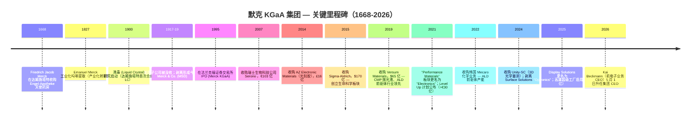
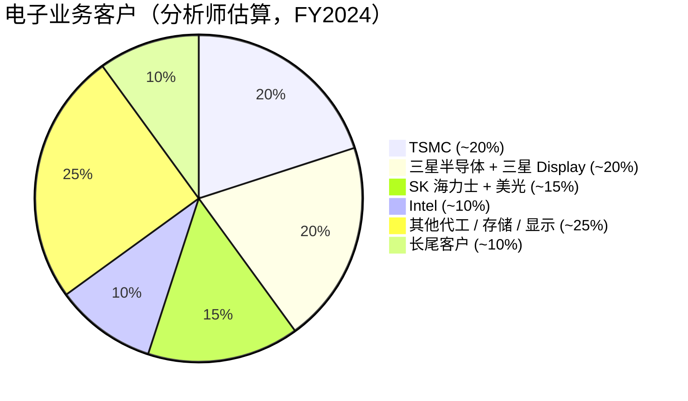

# 默克 KGaA / Merck KGaA (ETR:MRK / FWB:MRK) — 公司研究报告

> **关键提示 / Disambiguation banner**：本报告对象为德国默克 **Merck KGaA (ETR:MRK)**，并非美国"默克公司 **Merck & Co. (NYSE:MRK)**" —— 两家公司同名但完全不相关。在亚洲市场默克 KGaA 的电子业务以 **"EMD Electronics"** 品牌运营。详见 §2 "公司历史 — 1917 年两家默克分裂"。

**研究对象**：Merck KGaA, Darmstadt, Germany —— 德国制药与科技综合集团；与半导体相关的业务是电子业务 (Electronics segment / EMD Electronics)。
**上市信息**：法兰克福证券交易所 Xetra (ETR:MRK, ISIN DE0006599905)。非赞助型 ADR：MKGAY (OTC)。**不向 SEC 申报。**
**截至日期**：2026-05-26。
**作者说明**：本报告**有意聚焦于电子业务 (Electronics segment / EMD Electronics)**，因为这是与野村《大中华半导体 2026-2030 复兴指南》（[半导体材料行业总览](../../sector/半导体材料.md)）相关的板块。医药 (Healthcare) 与生命科学 (Life Science) 仅在资本配置和风险框架所需的深度内涉及。

> **更新 — FY2026 业绩指引上调 (2026-05-13)**：管理层将全年 2026 净销售额指引上调至 **€204–214 亿**（原 €198–210 亿），EBITDA pre 上调至 **€57–61 亿**（原 €55–59 亿），EPS pre 上调至 **€7.50–8.20**（原 €7.10–8.00）。Q1 2026 业绩超预期主要由生命科学 Process Solutions（+16% 有机增长，自 Q1 2023 以来首个单季 €10 亿+）以及电子业务半导体材料（AI / 先进节点拉货带动两位数中段有机增长）驱动。电子业务有机增长 +4.2%，半导体解决方案 (Semiconductor Solutions) +7.5%。
> 资料来源：[Q1 2026 新闻稿, 2026-05-13](https://www.emdgroup.com/en/news/q1-2026-13-05-2026.html); [Investing.com 业绩电话会议记录, 2026-05-13](https://www.investing.com/news/transcripts/earnings-call-transcript-merck-kgaa-beats-q1-2026-expectations-stock-rises-6-93CH-4684993)。

---

## 目录

1. 公司概览
2. 公司历史
3. 管理团队（创始人 + 现任 CEO）
4. 产品与服务 —— 电子业务 (EMD Electronics) 深度拆解
5. 客户与上市策略
6. 行业概览 —— 半导体材料
7. 竞争格局
8. 市场机会 (TAM)
9. 风险评估
10. 参考资料

---

## 1. 公司概览

**默克 KGaA，达姆施塔特，德国 / Merck KGaA, Darmstadt, Germany**（下文简称"默克 KGaA"）是一家拥有 358 年历史的德国科学与技术综合企业，总部位于黑森州达姆施塔特 (Darmstadt)。公司经营三大可报告业务板块——**生命科学 (Life Science)**（实验室 + 生物工艺试剂）、**医疗健康 (Healthcare)**（处方药）、**电子业务 (Electronics segment / EMD Electronics)**（半导体 + 显示材料，在美国和亚洲使用 "EMD Electronics" 品牌）。FY2024 集团净销售额为 **€211.6 亿**，EBITDA pre 为 **€60.7 亿**，税后净利润 **€27.8 亿**，全球 65 个国家约 63,000 名员工 ([Merck KGaA Annual Report 2024, "The Group" section](https://www.emdgroup.com/en/annualreport/2024/management-report/report-on-economic-position/course-of-business-and-economic-position/the-group.html))。

本报告所聚焦的电子业务，FY2024 净销售额为 **€37.8 亿（约占集团 18%）**，EBITDA pre 利润率为 **25.6%**（同比上升 60 bp，2023 年为 25.0%）。电子业务内部，**半导体解决方案 (Semiconductor Solutions) 占板块销售额 69%（约 €26 亿）**，**显示解决方案 (Display Solutions / Optronics) 占 20%（约 €7.5 亿）**，**表面解决方案 (Surface Solutions) 占 11%（约 €4.1 亿 —— 2025 年正在剥离给 Global New Material International Holdings）** ([Electronics, Course of Business 2024](https://www.emdgroup.com/en/annualreport/2024/management-report/report-on-economic-position/course-of-business-and-economic-position/electronics.html))。未来五年的战略叙事几乎完全依托于半导体解决方案：AI 驱动的先进节点放量、2027F 起启动的背面供电网络 (Backside Power Delivery, BPD) / 环绕栅极 (Gate-All-Around, GAA) 转换、混合键合 (hybrid bonding) 与先进封装、以及为 High-NA EUV 准备的金属氧化物光刻胶 (Metal-Oxide Resist, MOR) —— 这些都是野村 2026-05-21《大中华半导体》报告确认的五年材料超级周期 ([行业总览，第 18-30 页](../../sector/半导体材料.md))。

**默克 KGaA 不是"纯半导体材料"标的**。集团约 82% 的收入、约 85% 的 EBITDA 和绝大部分投资者关注度都集中在生命科学与医疗健康业务。希望集中持有半导体材料敞口的投资者通常选择 Entegris (ENTG) 或 Resonac (4004 JP)；默克 KGaA 作为多元化的工业化学 + 医疗健康集团进行定价 ([Capital Markets Day 2024 press release](https://www.emdgroup.com/en/news/capital-markets-day-17-10-2024.html))。半导体的可选性是真实存在的（CMP 抛光液、ALD/CVD 先进前驱体、光刻胶辅材、OLED 发光材料全球排名前 3 至前 5），但被集团结构显著稀释。Belén Garijo 自 2021 年 5 月起担任 CEO，于 2026 年 4 月离任，**2026 年 5 月 1 日由 Kai Beckmann 接任** —— 他原本担任电子业务 CEO（2017 年至 2026 年 4 月），这一接班安排明确传达出家族 + 监事会将电子业务视为长周期增长引擎的信号 ([Garijo / Beckmann succession announcement, 2025-09-25](https://www.emdgroup.com/en/news/garijo-beckmann-25-09-25.html))。

**地理布局**。集团 2024 年披露：亚太地区贡献约 38% 净销售额，欧洲 26%，北美 28%，拉美 + 中东 / 非洲为其余部分 ([Group Course of Business 2024](https://www.emdgroup.com/en/annualreport/2024/management-report/report-on-economic-position/course-of-business-and-economic-position/the-group.html))。具体到电子业务，亚洲权重更高 —— 中国台湾、韩国、中国大陆、日本合计构成半导体材料销售的绝大部分，因为全球领先的代工厂和存储厂都集中在这些地区。近期电子业务主要资本支出项目包括高雄超级工厂（中国台湾，€5 亿，2025 年 12 月启用）、Chandler / 亚利桑那州 DS&S 工厂（$3,900 万）、Cheonan / 韩国（收购 Mecaro 后 ALD 前驱体产能扩张）以及达姆施塔特总部继续扩建 ([Kaohsiung inauguration release, 2025-12-01](https://www.merckgroup.com/en/news/inauguration-kaohsiung-megasite.html); [Mecaro acquisition closing, 2023](https://www.emdgroup.com/en/news/chemical-closing.html); [EMD Electronics Arizona opening, 2022](https://www.chandleraz.gov/news-center/emd-electronics-celebrates-opening-new-arizona-factory-contributing-states-growing))。

*资料来源：[Merck KGaA Annual Reports 2020–2024](https://www.emdgroup.com/en/investors/reports-and-financials.html); [FY2024 Q4 press release, 2025-03-06](https://www.emdgroup.com/en/news/q4-2024-06-03-2025.html)。*

**估值快照（截至 2026-05-26）**。默克 KGaA 当前股价 **€128.80**，市值 **€565 亿**，TTM 市盈率 (P/E) **22.3 倍**，TTM EV/EBITDA 约 **10.7 倍**，TTM 市销率 (P/S) **2.7 倍**（基于年化收入 **€209.6 亿**）([Stockanalysis.com market-cap page, 2026-05-26](https://stockanalysis.com/quote/etr/MRK/market-cap/))。过去 3 年 P/E 区间为 14–28 倍 —— 股价在 2022–2023 年因医疗健康专利悬崖 (patent cliff) 担忧 + 生命科学生物工艺去库存周期而 de-rate 重新估值下调；目前两类压力消退、电子业务有机增长加速，估值正在重新上升 ([Capital Markets Day 2025, 2025-10-16](https://www.emdgroup.com/en/news/capital-markets-day-16-10-2025.html))。同业（半导体材料 / 工业气体可比公司）P/E 中位数约 26 倍（DD 24×, AI.PA 27×, LIN 32×, APD 28×, Resonac 18×, Entegris 32×）—— 默克 KGaA 较同业中位数低约 1 倍，*分析师观点：* 主要归因于集团折价 (conglomerate discount)（半导体敞口被医药周期 + 生命科学去库记忆稀释）。28.7% 的 EBITDA pre 利润率与工业气体同业（LIN 28%, APD 31%）相当，但低于纯电子材料同业（Entegris ~28%、Resonac 综合 ~22%）。同业详细比较见第 7 章。

*资料来源：[Stockanalysis.com — Merck KGaA](https://stockanalysis.com/quote/etr/MRK/market-cap/)（同等页面 DD / LIN / APD / ENTG / Resonac / Air Liquide / JSR）；JSR 显示退市前数据（JIC TOB 2024 年 3 月完成）。*

**资本配置与股东结构**。资本结构异常且对估值分析至关重要：默克 KGaA 是一家 *Kommanditgesellschaft auf Aktien* (KGaA，股份合资公司)，其无限责任合伙人为 **E. Merck KG**，由 **默克家族** 控制（第 13 代，约 250 位家族股东）。无限责任合伙人通过参与证书持有 **总资本的 70.3%**；仅有剩余 ~29.7% 为公开交易的普通股资本，且其中部分仍由公司留存为库存股或家族关联持仓 ([Merck family, Wikipedia / Capital Structure of Merck KGaA](https://www.emdgroup.com/en/company/management.html); [Stangenberg-Haverkamp interview](https://pharmadispatch.com/news/dr-frank-stangenberg-haverkamp))。这意味着管理层无法被激进股东或敌意收购方驱逐 —— Belén Garijo 2026 年 4 月转任赛诺菲 (Sanofi) CEO 是 *自愿* 行为 ([FiercePharma, 2026-02-11](https://www.fiercepharma.com/pharma/sanofi-ousts-paul-hudson-after-bumpy-ride-poaches-merck-kgaa-ceo-lead-company))。家族公开的理念是"以代际而非季度思考"，从历史上看支持了反周期资本支出（电子业务 2025 年前 €30 亿+ "Level Up" 计划），但也意味着股息派付率保守（约 EPS 的 30%），且偏好重大并购而非回购 ([Capital Markets Day 2025](https://www.emdgroup.com/en/news/capital-markets-day-16-10-2025.html); [350 Years of Family Business: Lessons from Merck, ISB Insight](https://isbinsight.isb.edu/350-years-of-family-business-lessons-from-merck/))。

**规模指标**。全球约 63,000 名员工，其中约 9,500 人在电子业务（占员工 ~15% vs 销售额 18% —— 电子业务是资本最密集的板块）([AR 2024, Group section](https://www.emdgroup.com/en/annualreport/2024/management-report/report-on-economic-position/course-of-business-and-economic-position/the-group.html))。集团 FY2024 R&D 投入为 **€27 亿（占销售额 12.7%）**—— 在欧洲工业品行业属最高的绝对 R&D 预算之一，多数流向医疗健康肿瘤 / 神经科室管线，但约 €3.3 亿分配至电子业务创新（ALD/CVD 前驱体化学、介电薄膜调控、OLED 发光体设计、MOR/EUV 光刻胶）([Electronics R&D 2024 annual report section](https://www.reports.emdgroup.com/en/annualreport/2024/management-report/fundamental-information-about-the-group/research-and-development/electronics.html))。集团 FY2024 资本支出 **€22 亿**，估计约 30%（约 €6.5 亿）流向电子业务 —— 主要用于高雄超级工厂、韩国扩产、达姆施塔特 R&D + 试产线 ([AR 2024 Cash Flow Statement](https://www.emdgroup.com/en/annualreport/2024/consolidated-financial-statements/cash-flow-statement.html))。

---

## 2. 公司历史

默克 KGaA 的历史可追溯到 **1668 年**，当时药剂师 **Friedrich Jacob Merck**（弗里德里希·雅各布·默克）接手了达姆施塔特的 *Engel-Apotheke*（天使药房）—— 使其成为世界上历史最悠久、持续经营至今的制药 / 化学公司 ([Merck KGaA company history page](https://www.emdgroup.com/en/company/history.html); [Merck Group, Wikipedia](https://en.wikipedia.org/wiki/Merck_Group))。**1816 年**，创始人后代 **Emanuel Merck**（伊曼纽尔·默克）接管经营，将业务从单店零售药房转型为严肃的化学研究企业；1827 年商业化分离与大规模生产 **吗啡及其他植物生物碱**，标志着公司由药房变为工业制造商 ([company history page](https://www.emdgroup.com/en/company/history.html))。1800 年代后期，公司扩展至专用化学品、染料和制药领域；到 1900 年已在美国、英国和俄罗斯设立子公司 ([Merck family page](https://en.wikipedia.org/wiki/Merck_family))。

**"两个默克"的分裂（1917–1919 年）**。公司历史上最重要的事件发生在第一次世界大战期间及战后：1891 年由 **George Merck**（乔治·默克）在美国设立的子公司，根据《对敌贸易法》(Trading With the Enemy Act) 被美国政府没收并剥离。被没收的美国业务成为今天的 **Merck & Co. (NYSE:MRK)**，总部位于新泽西州拉威 (Rahway)，尽管同名但完全独立。至今，**两家默克按条约在彼此辖区使用不同名称**：德国公司在美国称作 "Merck KGaA, Darmstadt, Germany"，并使用 **EMD** 品牌（**E**manuel **M**erck **D**armstadt 首字母）用于美国业务（包括 EMD Serono / EMD Performance Materials / EMD Electronics）；美国 Merck & Co. 在美国和加拿大以外则称作 "MSD" ([Merck Group, Wikipedia](https://en.wikipedia.org/wiki/Merck_Group); [EMD Serono history page](https://www.emdserono.com/us-en/company/who-we-are/history.html))。这种命名区别并非吹毛求疵 —— 它是投资者与分析师频繁混淆的来源（例如，关于"默克的 Keytruda"的新闻标题指的是 MSD/Merck & Co.，与默克 KGaA 无关，后者没有 PD-1 肿瘤资产）。

**电子业务的建立**。今天在美国 / 亚洲品牌为 **EMD Electronics**、在欧洲为 **Merck Electronics** 的电子业务，由三次离散收购加上半个世纪的内生发展构建而成：

1. **液晶 (Liquid Crystals) —— 自 1904 年起的内部 R&D**。默克 KGaA 是全球第一家商业化液晶混合物的公司（1968 年），至今仍是全球液晶配方的主导供应商，主要服务于 LCD 面板厂商，与 JNC（前身 Chisso）和 DIC 并列三强 ([company history page](https://www.emdgroup.com/en/company/history.html))。在 LCD 行业顶峰期（约 2012–2018 年），LC 销售额超 €10 亿、EBITDA 利润率超 40%；从 LCD 向 OLED 的多年转移压缩了销量和定价 —— 这就是 Display Solutions 销售额从 2018 年峰值近 €20 亿（当时归属 Performance Materials 板块）跌至 FY2024 约 €7.5 亿的原因 ([Statista: Merck KGaA revenue by segment 2014–2023](https://www.statista.com/statistics/270841/merck-kgaa-revenue-by-segment/))。

2. **AZ Electronic Materials —— 2014 年收购，£16 亿（约 €19 亿）**。AZ 是一家总部位于卢森堡、伦敦上市的纯光刻胶公司，2004 年从 Hoechst Celanese 分拆，2007–2014 年由 The Carlyle Group 持有。该次收购为默克 KGaA 带来 **AZ®** 光刻品牌 —— i-line/g-line、KrF、ArF 浸没、特种厚膜光刻胶 —— 加上图形增强材料 (BARC 抗反射涂层、硬掩膜) 与工艺化学品（显影液、清除剂、边缘湿化学）([MOFCOM antitrust approval, 2014-08-23](http://english.www.gov.cn/policies/latest_releases/2014/08/23/content_281474983026481.htm); [AZ photoresist product page](https://www.emdgroup.com/en/expertise/displays/solutions/photoresist-materials.html))。AZ 交易是默克进入 LCD 材料以外更广泛半导体材料价值链的首个重大步骤。

3. **Sigma-Aldrich —— 2015 年收购，$170 亿（€131 亿）**。此交易并未直接创造电子业务价值，但对资本配置至关重要：这是默克有史以来最大的并购，使生命科学板块规模一夜翻倍（将原 EMD Millipore 与 Sigma 的实验室化学品 + 生物工艺组合合并在美 / 加 **MilliporeSigma** 品牌下），且实际上耗尽了默克 KGaA 2015 至 2018 年的全部并购资源。为该笔交易承担的 €130 亿债务限制了 2019 年前的电子业务并购空间 ([BioPharm International press release, 2015-11-18](https://www.biopharminternational.com/view/merck-kgaa-darmstadt-germany-announces-completion-sigma-aldrich-acquisition-0); [BioInformant analysis](https://bioinformant.com/merck-kgaa-completes-acquisition-of-sigma-aldrich-for-17-billion-140share/))。

4. **Versum Materials —— 2019 年 10 月收购，$65 亿（€58 亿）**。这是电子业务历史上最重要的单一交易 (**Versum 2019 $6.5B 收购**)。Versum 原在 **2016 年 10 月** 由 Air Products & Chemicals 分拆成立，作为纯"电子材料"标的在纽交所以 VSM 代码上市，FY2018 收入约 $14 亿 ([Air Products spin-off completion, 2016-10-03](https://www.prnewswire.com/news-releases/air-products-completes-spin-off-of-versum-materials-300337710.html))。2019 年上半年经过激烈的争夺战（Versum 于 2018 年末先同意与 Entegris 合并，然后于 2019 年 4 月接受默克 KGaA 的更高全现金报价），交易于 2019 年 10 月 7 日完成，第三个完整年度预期实现 €7,500 万运行率协同效应 ([Merck KGaA Versum closing release, 2019](https://www.emdgroup.com/en/news/versum-definitive-agreement-12-04-2019.html); [Versum Materials Wikipedia](https://en.wikipedia.org/wiki/Versum_Materials))。Versum 为默克 KGaA 带来：**(a)** 约 $7 亿 CMP 抛光液收入（交易前全球 #2）；**(b)** 约 $4 亿 ALD/CVD 先进前驱体 (advanced precursors for ALD/CVD)（用于 3D-NAND、DRAM、先进逻辑的薄膜介电与金属前驱体）；**(c)** 约 $2 亿工艺化学品（显影液、清除剂、配方清洗剂）；**(d)** Delivery Systems & Services (DS&S) 设备业务 —— 气柜、批量输送、点对点混合器；以及 **(e)** 约 2,300 名员工与约 14 个生产基地，集中在美国、中国台湾、韩国 ([Versum spin-off 8-K, 2016](https://www.sec.gov/Archives/edgar/data/0000002969/000119312516661047/d231364dex991.htm))。

5. **Mecaro（韩国）—— 2022 年收购**。补强型收购，新增约 100 名员工 + 韩国 ALD/CVD 前驱体产能 —— 战略上紧邻三星和 SK 海力士的存储 fab ([Mecaro acquisition announcement, 2022-08-17](https://www.emdgroup.com/en/news/news-electronics-business-17-08-2022.html); [Mecaro closing, 2023](https://www.emdgroup.com/en/news/chemical-closing.html))。

6. **Unity-SC —— 2024 年 10 月收购，€1.44 亿**。规模虽小但战略意义象征：Unity-SC 是法国一家生产 3D 光学量测与检测仪表的厂商，专注于先进封装（混合键合、异构集成、HBM 堆叠）。这次收购标志默克从纯化学品供应商向 **"材料 + 工具 + 服务"** 供应商转型 —— 这正是 ASML、Applied Materials 和 Lam Research 用来锁定先进节点客户的同样剧本 ([Unity-SC closing release, 2024-10-31](https://www.emdgroup.com/en/news/unity-sc-acquisition-and-optronics-31-10-2024.html); [Metrology News coverage](https://metrology.news/metrology-and-inspection-instrumentation-company-acquired-by-merck/))。同一公告将 Display Solutions 自 2025 年 1 月 1 日起更名为 **"Optronics"**，传达该板块从传统 LCD/OLED 扩展至光学量测和检测的内涵。

7. **2021 年 —— 板块重命名与 "Level Up" 计划**。Performance Materials 板块于 2021 年 3 月 4 日更名为 **Electronics**，明确传达更聚焦半导体行业的信号，摆脱听起来综合化的 "Performance Materials" 标签 ([Performance Materials is now Electronics, 2021-03-04](https://www.merckgroup.com/en/news/performance-materials-is-now-electronics-04-03-2021.html))。2021 年 9 月 9 日资本市场日，默克 KGaA 承诺到 2025 年在电子业务创新 + 产能上投资 **"显著超过 €30 亿"** —— 即 **"Level Up"** 增长计划，包含四大支柱（规模、技术、组合、能力）以及板块中期 **5–9%** 有机增长走廊 ([Electronics invests in growth, 2021-09-20](https://www.emdgroup.com/en/news/electronics-invests-in-growth-20-09-2021.html); [Capital Markets Day 2024, 2024-10-17](https://www.emdgroup.com/en/news/capital-markets-day-17-10-2024.html))。继任计划 —— **"Level Up Next"** —— 在 2025 年 10 月 16 日资本市场日宣布，野心延伸至约 2030 年 ([Capital Markets Day 2025: Ready for the Next Wave of Growth](https://www.emdgroup.com/en/news/capital-markets-day-16-10-2025.html))。

**两大战略转折值得标注**。首先，2014 年 AZ + 2019 年 Versum + 2024 年 Unity-SC 的序列将电子业务从单一产品（液晶）业务转型为垂直整合的半导体专用材料供应商，在 CMP 抛光液、ALD/CVD 前驱体、光刻胶 / 辅材、OLED 发光材料以及现在的光学量测领域都具备领先地位。其次，**2025 年 Surface Solutions 剥离**（用于化妆品 + 涂料的装饰颜料，售予总部位于中国的环球新材国际控股）使电子业务到 2026 年聚焦于纯半导体 + 显示 —— 剔除了一项周期性更强、估值倍数较低的业务，释放资本用于进一步半导体并购 ([Surface Solutions divestiture, Q4 2024 press release context](https://www.emdgroup.com/en/news/q4-2024-06-03-2025.html))。

---

## 3. 管理团队

本节遵循公司研究方法论规定的结构：仅涵盖创始人 + 现任集团 CEO。鉴于创始人生活在 350 多年前，"创始人"传记必然偏制度化且简短；重点是现任 CEO **Kai Beckmann**，他于 **2026 年 5 月 1 日** 接任集团 CEO，其半导体材料运营背景使电子业务在股权叙事中占据特别核心的地位。

**Friedrich Jacob Merck —— 制度创始人（1668 年）**

原默克业务始于 **1668 年**，当 **Friedrich Jacob Merck** 收购达姆施塔特的 *Engel-Apotheke* —— 一间零售药房 ([company history page](https://www.emdgroup.com/en/company/history.html))。当前公司形态（默克 KGaA，一家 *Kommanditgesellschaft auf Aktien* 股份合资公司）于 1995 年成立，当时家族将约 30% 股权在法兰克福证券交易所 IPO，同时通过无限责任合伙人 E. Merck KG 保留 70.3% 的总资本 ([Merck Group, Wikipedia](https://en.wikipedia.org/wiki/Merck_Group); [Merck family ownership analysis](https://pharmadispatch.com/news/dr-frank-stangenberg-haverkamp))。**默克家族** —— 现今约 250 位第 13 代后代 —— 集体控制 E. Merck KG 99.9% 的股权，因此控制默克 KGaA 70.3% 的资本，使其成为全球最大的家族控股上市公司之一。家族委员会主席为 **Dr. Frank Stangenberg-Haverkamp**（自 2014 年起任职），同时担任 E. Merck KG 合伙人委员会主席及个人无限责任合伙人。家族的明确理念 —— "我们不是股东，是受托人" —— 历史上支持反周期资本支出（2021–2025 €30 亿+ Level Up 电子业务投资是在 Versum 整合后期 EPS 承压时启动的）以及保守约 30% 的股息派付率 ([Stangenberg-Haverkamp interview, BioPharmaDispatch](https://pharmadispatch.com/news/dr-frank-stangenberg-haverkamp); [350 Years of Family Business: Lessons from Merck](https://isbinsight.isb.edu/350-years-of-family-business-lessons-from-merck/); [Boards of E. Merck KG, 2019-01-28](https://www.emdgroup.com/en/news/em-boards-28-01-2019.html))。

**Kai Beckmann —— 执行委员会主席 & 集团 CEO（自 2026 年 5 月 1 日起）**

**Kai Beckmann** 1965 年生于德国黑森州哈瑙 (Hanau)。他拥有 **达姆施塔特工业大学 (Technical University of Darmstadt) 计算机科学硕士学位和经济学博士 (Dr. rer. nat.)** —— 这是一个值得关注的学术背景，因为大多数德国 DAX CEO 来自金融、法律或工程领域，而非计算机科学 ([Merck KGaA Executive Board page — Kai Beckmann](https://www.emdgroup.com/en/company/management/executive-board/kai-beckmann.html); [Bloomberg profile](https://www.bloomberg.com/profile/person/17046978); [SEMI Europa speaker bio](https://www.semiconeuropa.org/Kai_Beckmann))。他于 **1989 年大学毕业后直接加入默克**，从未在其他地方工作 —— 37 年公司工龄使他成为典型的"老员工"，与西门子、巴斯夫、拜耳的长期任职德国工业 CEO 是同一类型。

他在默克的职业路径分三个阶段：**第一阶段（1989–2004 年）：IT 与咨询**。Beckmann 自 1999 年至 2004 年负责公司内部信息管理与咨询单位 —— 构建了今天连接 65 个国家 ~63,000 名员工的数字基础设施。**第二阶段（2004–2011 年）：亚太运营岗位**。2004–2007 年任默克 KGaA 在新加坡和马来西亚业务的总经理，2007 年成为默克 KGaA 全球首席信息官 (CIO)。**第三阶段（2011–2026 年）：执行委员会**。2011 年加入执行委员会，负责人力资源、IT、采购及达姆施塔特总部，之后在 **2017 年成为 Performance Materials / 电子业务板块 CEO**，连续担任至 2026 年 4 月 ([SEMICON West speaker bio](https://www.semiconwest.org/programs/speaker-bio/kai-beckman); [TheOrg profile](https://theorg.com/org/merck-group/org-chart/kai-beckmann))。2025 年被任命为执行委员会副主席，作为有序接班规划的一部分，最终于 2026 年 5 月 1 日升任集团 CEO ([Garijo / Beckmann succession announcement, 2025-09-25](https://www.emdgroup.com/en/news/garijo-beckmann-25-09-25.html))。

他 **9 年的电子业务任期（2017 年 - 2026 年 4 月）** 是任何股权研究投资者最直接相关的时间段。期间：(a) Versum Materials 收购被谈判、在竞争性流程中赢得、完成并整合，新增约 $15 亿收入与目标 €7,500 万+ 协同；(b) Performance Materials 板块更名为 Electronics；(c) **"Level Up"** €30 亿+ 资本支出 / R&D 计划被构思且大部分执行；(d) Mecaro（韩国）、Unity-SC（法国）补强收购完成；(e) 高雄 €5 亿超级工厂建成；(f) Display Solutions 单位更名为 Optronics。他多次在 SEMICON West、SEMICON Europa 以及 SEMI 年会做主题演讲，与全球晶圆厂和 OSAT 客户群有深厚运营关系 ([SEMICON Europa keynote 2024](https://www.semiconeuropa.org/Kai_Beckmann))。外部角色包括：自 2023 年至 2026 年 5 月担任德国联邦印刷局 (Bundesdruckerei) 监事会主席（德国的联邦安全印刷机构）；2017–2025 年任德国雇主协会联合会 (BDA) 副主席；2017–2024 年任德国化学雇主协会联合会 (BAVC) 主席 —— 全部反映他在德国产业政策建制中的地位 ([Bloomberg biography](https://www.bloomberg.com/profile/person/17046978); [LinkedIn](https://www.linkedin.com/in/kai-beckmann/); [World Economic Forum profile](https://www.weforum.org/people/kai-beckmann/))。

**持股与薪酬**。Beckmann 持有未披露但少量的默克 KGaA 股份（公司不受美国《证券法》第 16 节申报约束，且德国相当于 DEF 14A 的披露仅披露管理层持股的合计数）。作为 KGaA 结构下的执行委员会成员，薪酬由合伙人委员会的人事委员会（由家族控制）设定，而非由自由流通股东选举的监事会设定 —— 2024 年德国 DAX 工业 CEO 的典型总薪酬约 €700-900 万，默克 KGaA 2024 年薪酬报告披露 Belén Garijo 总薪酬 €830 万；根据一致的薪酬政策，Beckmann 作为集团 CEO 的薪酬包预计在此范围 ([Capital Markets Day 2025](https://www.emdgroup.com/en/news/capital-markets-day-16-10-2025.html); [AR 2024 Remuneration Report](https://www.emdgroup.com/en/annualreport/2024/))。股权故事的解读：一位有深厚半导体材料运营经验的长期任职内部人士，现在掌舵集团。将电子业务负责人升任集团 CEO 本身就是一个信号 —— 家族委员会认为公司长期价值的根基在电子材料业务，医疗健康和生命科学日益扮演辅助角色。

---

## 4. 产品与服务 —— 电子业务 (EMD Electronics) 深度拆解

本节 *有意* 过度倾斜于 **半导体解决方案** 业务单位（约占电子业务销售的 69%，FY2024 约 €26 亿），因为这是与野村 2026-05-21 锚定报告相关的部分，也是寻求半导体材料超级周期敞口的投资者关注的部分。Display Solutions / Optronics（约 20%）与 Surface Solutions（约 11%，正在剥离）将简要处理。第 4 节是报告的承重章节，预计在此约 1,500 字。

### 4.1 2024 年报产品矩阵 —— 电子业务

电子业务产品分类的最权威单一文档基准是 2024 年报的 **Company Profile and Structure: Electronics** 章节。逐字引用 ([Annual Report 2024 — Electronics Company Profile](https://www.reports.emdgroup.com/en/annualreport/2024/management-report/fundamental-information-about-the-group/company-profile-and-structure/electronics.html))：

> *"The Electronics business sector is an integral part of the semiconductor ecosystem, providing materials, the related delivery equipment and tools for metrology and inspection. The business sector comprises the business units **Semiconductor Solutions**, **Display Solutions**, and **Surface Solutions**."*

半导体解决方案单位进一步划分为四个业务领域，同样来自年报 ([same source](https://www.reports.emdgroup.com/en/annualreport/2024/management-report/fundamental-information-about-the-group/company-profile-and-structure/electronics.html))：

| 业务单元 | 业务领域 | 产品类别 | FY2024 占比 |
|---|---|---|---|
| **半导体解决方案 (Semiconductor Solutions)** | **薄膜 (Thin Films)** | 用于原子级沉积的介电与金属材料（ALD/CVD 前驱体）| ~25% Semi Sol. |
| 半导体解决方案 | **配方 (Formulations)** | 光刻胶 + 光刻辅材 (AZ®)、化学机械抛光 (CMP) 抛光液 | ~30% Semi Sol. |
| 半导体解决方案 | **特种气体 (Specialty Gases)** | 用于晶圆加工的高纯气体（NF₃、WF₆、SiH₄、NH₃、刻蚀混合气）| ~25% Semi Sol. |
| 半导体解决方案 | **输送系统与服务 (Delivery Systems & Services, DS&S)** | MEGASYS® 气柜、大宗化学品输送、点式混合器、服务 | ~15% Semi Sol. |
| 半导体解决方案 | **量测与检测 (Metrology & Inspection)** | Unity-SC 3D 光学仪表（2024 年 10 月后）| ~5% Semi Sol. |
| **显示解决方案 / Optronics (Display Solutions / Optronics)** | LC + 图形化 | 液晶 (liquid crystal)、OLED 发光 + 传输材料、显示光刻胶、反应介晶 | 100% Display |
| **表面解决方案 (Surface Solutions)**（剥离中）| 活性成分 + 功能材料 | 化妆品活性物、汽车涂料颜料 (Xirallic®、Iriodin®) | 100% Surface |

*资料来源：以上矩阵为分析师根据 [Annual Report 2024, Electronics Company Profile section](https://www.reports.emdgroup.com/en/annualreport/2024/management-report/fundamental-information-about-the-group/company-profile-and-structure/electronics.html) 所述结构编制；业务领域收入拆分为分析师根据 Versum legacy 收入（收购时约 $14 亿）、AZ legacy 收入和披露的 FY2024 半导体解决方案合计进行的三角验证估算，非公司披露。*

### 4.2 综合视图 —— 电子产品类别在晶圆厂工艺流程中的相互作用

在逐一走访每个业务领域前，值得先展示 **默克 KGaA 电子产品在晶圆制造周期中被消耗的位置**。一片前沿节点晶圆（TSMC N2、三星 2nm GAA、Intel 18A、SK 海力士 1c DRAM）大约经过 ~600–1,000 道工艺步骤；默克 KGaA 材料在其中相当一部分被使用 —— 但在每个节点的所有主导步骤中都不可或缺：

```mermaid
graph LR
    A[裸硅晶圆<br>来自 SUMCO / Shin-Etsu / GlobalWafers] -->|清洗 + 表面预处理<br>Versum 配方清洗剂| B(薄膜沉积)
    B -->|ALD/CVD 前驱体<br>Mecaro Thin Films| C(光刻)
    C -->|AZ 光刻胶 +<br>BARC + 显影液| D(刻蚀)
    D -->|NF3、SF6、氟碳<br>特种气体| E(CMP 平坦化)
    E -->|Versum CMP 抛光液<br>+ CMP 后清洗| F(注入 / 退火)
    F --> G(金属化)
    G -->|Cu / W / Mo ALD<br>+ 特种气体| H(检测 + 量测)
    H -->|Unity-SC 光学<br>量测，2024 年起| I(重复 600-1000 步)
    I --> J[完工晶粒<br>到 OSAT / 先进封装]
    J -->|混合键合化学品、<br>TSV 填充化学品、<br>RDL 配方| K[最终堆叠产品]
```

需要记住的综合视图是：3nm 节点的一片晶圆在清洗步骤经过默克 KGaA 材料，每个沉积步骤再次经过（Thin Films + Specialty Gases），每个光刻步骤再次经过（Formulations / AZ 光刻胶），每个 CMP 步骤再次经过（Versum 抛光液 + CMP 后清洗），现在 —— Unity-SC 收购后 —— 在某些量测 / 检测检查点也会经过。**默克 KGaA 的竞争优势真正在于"晶圆周期覆盖广度"**，而非任何单一产品的主导地位。这与 Entegris（纯化 + 滤芯 + 抛光液，没有光刻胶）、JSR（光刻胶主导，其他狭窄）或 Resonac（抛光液强，其他狭窄）形成对比。广度正是 2019 年 Versum 收购的明确逻辑 —— Beckmann 本人在 2019 年的行业访谈中将默克定位为"广基础供应商"与 Entegris 的纯标的模式形成对比 ([SEMI Versum / Merck deal coverage](https://www.semi.org/en/news-resources/Merck-EMD_Electronics))。

### 4.3 薄膜 —— ALD / CVD **先进前驱体 (advanced precursors for ALD/CVD)**（Versum + Mecaro legacy）

根据 [Annual Report 2024 product description](https://www.reports.emdgroup.com/en/annualreport/2024/management-report/fundamental-information-about-the-group/company-profile-and-structure/electronics.html)：

> *"\"Thin Films\" offers dielectrics and metallic materials for atomic-level deposition."*

**中文释义 / Plain-language gloss**："前驱体" (precursor) 是以蒸气形式被引入真空腔室、与加热晶圆表面发生反应的化学试剂，沉积出目标材料的单个原子层 —— 二氧化硅、氮化硅、氧化铪、氮化钛、钨、钼、钌等。**ALD / 原子层沉积** (atomic layer deposition) 以极高的厚度控制每次沉积一个单分子层；**CVD / 化学气相沉积** (chemical vapor deposition) 以更高速率沉积，但精度稍逊。两者都关键性地依赖前驱体分子的化学特性 —— "良好行为"的前驱体在目标温度清洁分解，沉积目标原子且不留碳残留，也不损坏相邻材料。随着节点缩小（N3 → N2 → A14 → A10）以及 3D-NAND 堆叠层数增至 400+，*每片晶圆上不同 ALD/CVD 步骤的数量* 和 *每步纯度容差* 都呈指数级上升。这是野村行业总览所述 GAA → BPD → CFET 转换最直接的受益方向 ([行业总览，第 6-9 页](../../sector/半导体材料.md))。

**与其他产品的差异化**：薄膜位于光刻（AZ 光刻胶 + BARC）、刻蚀（特种气体）和 CMP（Versum 抛光液）的 *上游* —— 是 *材料沉积* 之后，下游步骤再对其图形化、刻蚀或平坦化。薄膜内部，介电前驱体（用于栅极绝缘、电容薄膜、互连 ILD）是与金属前驱体（用于钨 / 钼 / 钌 / 钴填充、铜阻挡层）截然不同的分子家族。Mecaro 收购具体增强了默克 KGaA 面向韩国存储客户的介电前驱体家族 ([Mecaro closing announcement](https://www.emdgroup.com/en/news/chemical-closing.html); [Innovations in ALD and ALE webinar series](https://www.emdgroup.com/en/s/semi-webinar-series/revolutionizing-materials-and-products.html))。

***分析师观点：*** 默克 KGaA / EMD Electronics 是 **全球前 3 大先进前驱体供应商之一**，与 **法液空 Air Liquide**（Voltaix legacy，2013 年收购）、**DNF / SK Specialty Chemicals**（韩国）、**ADEKA**（日本）以及交易前已有的 Versum legacy 配方并列。竞争优势：**部分** —— 默克 KGaA 拥有化学 IP 和规模，但客户认证周期为 18–24 个月，且因每家主要 fab 倾向于双源采购关键前驱体以保证供应安全，市场较分散。最接近的同类竞品：法液空的 **enScribe™** 与 **Voltaix™** 前驱体家族 ([Air Liquide ALOHA + Voltaix product page](https://www.airliquide.com/group/activities/electronics))。野村报告明确指出 ALD 前驱体是 GAA / BPD 转换的"用量规模"增长驱动力，多个韩国前驱体供应商（DNF / 韩松化学 / SK Specialty）也将获益。

### 4.4 配方 —— 光刻胶 (AZ®) 与 CMP 抛光液 (Versum-legacy)

根据 [Annual Report 2024 product description](https://www.reports.emdgroup.com/en/annualreport/2024/management-report/fundamental-information-about-the-group/company-profile-and-structure/electronics.html)：

> *"\"Formulations\" provides lithography products and chemical-mechanical planarization materials."*

这是一个 **双子产品** 类别，竞争动态截然不同，需要分别处理。

**4.4.a — 光刻胶（AZ® 品牌，来自 2014 年 AZ Electronic Materials 收购）**。根据 [Photoresists product page](https://www.emdgroup.com/en/expertise/displays/solutions/photoresist-materials.html)，默克 KGaA 在 AZ® 品牌下的光刻组合包括 **光刻胶、图形增强材料（BARC 抗反射涂层）、工艺材料（显影液、边缘湿化学清除剂、光刻胶去除剂）、旋涂硬掩膜、DSA（定向自组装）**。具体命名家族包括 **AZ® NLOF® / pLOF** i-line lift-off 光刻胶、**AZ® 4500 系列** 用于半导体封装与先进晶圆级工艺的厚膜光刻胶，以及 **AZ® 910 Remover** NMP-free 光刻胶去除剂 ([AZ 4500 datasheet](https://www.microchemicals.com/dokumente/datenblaetter/tds/merck/en/tds_az_4500_series.pdf); [AZ Lift-off Resists page](https://www.emdgroup.com/en/expertise/semiconductors/offering/lift-off-resists.html))。

**中文释义 / Plain-language gloss**：光刻胶 (photoresist / 光刻胶) 是一种感光聚合物涂层，在通过图形掩膜暴露紫外（或 EUV）光之前旋涂在晶圆上。光线照射处，聚合物要么交联（负胶），要么变得可溶（正胶），随后的显影液冲洗去除相应区域 —— 在晶圆上留下定义下游刻蚀 / 沉积 / 注入操作的 2D 图形。**AZ® 品牌在 i-line、KrF（248 nm）和 ArF 浸没（193 nm）光刻胶上最强**，用于成熟节点和中阶逻辑加 3D-NAND 非关键层 —— *不在* 关键光刻所用的前沿 ArF / EUV 光刻胶。**JSR、东京应化 (TOK)、住友化学、富士胶片电子材料、信越化学** 主导 EUV ([Mordor Intelligence photoresist market analysis](https://www.mordorintelligence.com/industry-reports/photoresist-market); [Fountyl: Japanese companies monopolize EUV photoresist](https://www.fountyltech.com/news/japanese-companies-monopolize-the-euv-photoresist-supply-market/))。默克 KGaA 的特定强项在 **图形化辅材（BARC、硬掩膜、边缘湿化学清除剂）以及更广泛的"光刻胶材料生态系统"**，它从能够将光刻胶 + 辅材 + 显影液 + 去除剂打包为一站式解决方案中获益，简化了 fab 供应链 ([Green solvents launch, 2021](https://www.emdgroup.com/en/news/green-solvents-for-chip-production-22-07-2021.html))。

***分析师观点：*** 在更广泛的光刻胶市场（DUV + EUV，2024 年约 $26 亿）中，JSR 持有约 22%，TOK / 富士胶片 / 信越 / 东进合计另占约 30%，**默克 KGaA (AZ®) 处于 top 10 的尾部，估计约 5–8% 份额** ([Mordor Intelligence](https://www.mordorintelligence.com/industry-reports/photoresist-market/companies); [GMInsights photoresist analysis](https://www.gminsights.com/industry-analysis/photoresist-chemicals-for-advanced-lithography-market))。竞争优势：**部分** —— 广泛辅材组合 + 打包销售 vs 日本纯光刻胶领导者。最接近的竞品：JSR 的 **ARX1671J** EUV 光刻胶、TOK 的 **TDUR-Pi** 系列。还要注意野村对 2029-30 起用于 High-NA EUV（NA 0.55）的 **金属氧化物光刻胶 (Metal-Oxide Resist, MOR)** 的强调 —— 这是化学拐点，默克 KGaA 在金属前驱体化学（薄膜）和图形化材料上的专长有望融合，若 MOR 按预期商业化，将赋予其结构性优势 ([行业总览，第 10-12 页](../../sector/半导体材料.md))。

**4.4.b — CMP 抛光液 (post 2019 Versum 收购，与默克 legacy 合并)**。2019 年 Versum 收购使默克 KGaA 跃居 **CMP 抛光液全球 #2**（Versum + 默克 legacy CMP 合计），仅次于富士胶片电子材料（2023 年底收购 Entegris 电子化学品业务，合计份额约 31%）。根据 [行业研究，2024 年 CMP 抛光液市场约 $30 亿](https://reports.valuates.com/market-reports/QYRE-Auto-14V14904/global-cmp-materials-for-semiconductor)，前 8 大供应商合计占约 77% 份额。2024 年 CMP 抛光液估计份额表：

*资料来源：分析师根据 [Mordor Intelligence](https://www.mordorintelligence.com/industry-reports/photoresist-market) + [Valuates CMP Materials report](https://reports.valuates.com/market-reports/QYRE-Auto-14V14904/global-cmp-materials-for-semiconductor) + [Fortune Business Insights specialty gas / materials reports](https://www.fortunebusinessinsights.com/us-electronic-specialty-gas-market-114856) 编制；份额为分析师估算，非公司披露。*

**中文释义 / Plain-language gloss**：CMP / **化学机械抛光** (chemical-mechanical planarization) 是晶圆加工步骤，将晶圆按压在抛光垫上，含纳米颗粒的化学活性抛光液在两者之间流动 —— 复合化学作用（抛光液化学攻击表面材料）与机械作用（抛光垫微观粗糙度擦磨）留下平坦、抛光的表面，为下一个光刻步骤准备。不同的"CMP 步骤"使用不同抛光液 —— **Cu CMP**（铜互连平坦化，最大单一类别）、**W CMP**（钨塞平坦化）、**STI CMP**（浅沟槽隔离氧化物）、**ILD CMP**（层间介质）、**barrier CMP**（Cu 与介质之间的 TaN/Ti 阻挡层）。CMP 步骤数随逻辑节点推进而上升 —— N5 需要约 25 道 CMP 步骤，N3 约 30 道，N2 + BPD 预计将突破 35 道 ([行业总览，BPD 分析第 6-9 页](../../sector/半导体材料.md))。

***分析师观点：*** 根据野村锚定报告，CMP 抛光液领军榜为 **富士胶片（含 Entegris 电子化学品）约 31%，Versum (默克 KGaA) 约 18%，Fujimi/CMC 约 18%，Resonac 约 14%，其他（杜邦 / 安集 / KC Tech）约 19%** ([行业总览，第 69 页](../../sector/半导体材料.md))。竞争优势：**强** —— CMP 抛光液有 24 个月的认证周期、客户不轻易切换、Versum 时代在先进节点 Cu 和 W 抛光液的 IP 密集。最接近的竞品：Fujimi 的 **Compol™ 80** 家族、安集的 **Polishing 3000 系列** 抛光液 ([Anji Microelectronics product page](http://www.anjimicro.com/en/products.aspx))。N2 + BPD 晶圆键合周期是 *直接* 顺风，因为背面供电网络需要 reclaim wafer + 极致薄化 + 额外 CMP 循环 ([行业总览，BPD 分析](../../sector/半导体材料.md))。

### 4.5 特种气体 (Specialty Gases)（Versum legacy）

根据 [Annual Report 2024](https://www.reports.emdgroup.com/en/annualreport/2024/management-report/fundamental-information-about-the-group/company-profile-and-structure/electronics.html)：

> *"\"Specialty Gases\" delivers high-purity gases for wafer processing."*

**中文释义 / Plain-language gloss**：特种气体 (**电子特气** / specialty gases) 是用于沉积（甲硅烷 SiH₄、氨 NH₃、用于钨 CVD 的六氟化钨 WF₆）、刻蚀（用于腔体清洗的三氟化氮 NF₃、用于硅刻蚀的六氟化硫 SF₆、用于介质刻蚀的氟碳 C₄F₆/CF₄）、掺杂（乙硼烷 B₂H₆、磷化氢 PH₃、砷化氢 AsH₃）以及大宗惰性（氮、氦、氩 —— 通常由空分工业气体公司提供）的超高纯无机和氟碳气体。Versum 收购使默克 KGaA 在半导体特种气体中获得 **全球 #5 地位**，前四为林德（含工业气体 + Linde Electronics）、法液空、Air Products、Resonac，与大阳日酸 (Taiyo Nippon Sanso) / 三井化学根据产品切片大致并列 ([Fortune Business Insights specialty gas report](https://www.fortunebusinessinsights.com/us-electronic-specialty-gas-market-114856); [Mordor Intelligence specialty gas market](https://www.mordorintelligence.com/industry-reports/specialty-gas-market))。

***分析师观点：*** 竞争优势：**部分** —— 默克 KGaA 是可信的全球 #4-#5，但缺乏工业气体玩家（林德、法液空、APD）能在客户现场提供的大宗气体基础设施（它们经常将大宗 N₂ 与特种气体打包销售 —— 一种默克 KGaA 在没有空分布点的情况下无法匹敌的护城河）。最接近的竞品：Linde Electronics 的 SPECTRA 系列、法液空的 ALPHAGAZ / ALOHA、Air Products 的特种氟碳组合 ([Linde Electronics page](https://www.lindeus.com/industries/electronics); [Air Liquide Electronics page](https://www.airliquide.com/group/activities/electronics))。因此特种气体是默克 KGaA 最明显存在结构性天花板的细分。

### 4.6 输送系统与服务 DS&S（Versum legacy 设备业务）

根据 [Annual Report 2024](https://www.reports.emdgroup.com/en/annualreport/2024/management-report/fundamental-information-about-the-group/company-profile-and-structure/electronics.html)：

> *"\"Delivery Systems & Services\" installs equipment for chemical and gas handling, including MEGASYS® services."*

**中文释义 / Plain-language gloss**：DS&S 是设备 + 服务混合业务：默克 KGaA 设计并制造 **MEGASYS® 气柜**（位于每个晶圆加工腔室旁，按精确比例混合并计量特种气体，并供给腔室）、大宗化学品输送系统（将 CMP 抛光液、光刻胶、显影液从中央存储输送至使用点的管路 + 泵 + 罐）以及 **点式混合器与滤芯**（在注入腔室前的毫秒级完成配方最终配制）。2022 年建成的 Chandler / 亚利桑那州工厂专门用于 DS&S 设备制造 —— 默克 KGaA 称该 $3,900 万投资是"半导体设备与服务领域的最大单笔投资" ([EMD Electronics Arizona opening, 2022](https://www.chandleraz.gov/news-center/emd-electronics-celebrates-opening-new-arizona-factory-contributing-states-growing))。

***分析师观点：*** DS&S 在 2024–2025 年承受 **周期性拖累**，因 fab 客户推迟设备相关资本支出项目（传统资本支出周期动力学 —— 当 fab 稼动率下滑，设备交付滞后）。Q1 2025 DS&S 下滑"低两位数百分比"，2025 年 Q4 / 2026 年 Q1 趋稳 ([Q1 2025 earnings release, 2025-05-15](https://www.emdgroup.com/en/news/q1-2025-15-05-2025.html); [TipRanks Q4 2025 transcript summary](https://www.tipranks.com/news/company-announcements/merck-kgaa-earnings-call-signals-cautious-upswing))。竞争优势：在装机锁定上 **强**（一旦 MEGASYS 气柜安装至 fab，更换它们是数季度的改造项目）；但在新建项目上 **中等**，那里法液空和林德能与各自的特种气体捆绑积极竞争。DS&S 按分析师三角验证约占半导体解决方案销售的 15%，公司已指引 DS&S 在"2026 年不再是增长逆风" ([Investing.com Q1 2026 transcript](https://www.investing.com/news/transcripts/earnings-call-transcript-merck-kgaa-beats-q1-2026-expectations-stock-rises-6-93CH-4684993))。

### 4.7 显示解决方案 / Optronics —— LC + **OLED 材料** + 显示光刻胶 + 量测

根据 [Annual Report 2024](https://www.reports.emdgroup.com/en/annualreport/2024/management-report/fundamental-information-about-the-group/company-profile-and-structure/electronics.html)：

> *"\"Display Solutions\" develops liquid crystals (LC), display patterning materials (photoresists), materials for organic light-emitting diodes (OLED), and reactive mesogens. Display Solutions will operate under the name \"Optronics\" as of 2025."*

**中文释义 / Plain-language gloss**：Display Solutions 是默克原液晶业务的延续 —— 默克 KGaA 1904 年开创液晶 (liquid crystal) 化学，至今仍是 LCD 面板用 LC 混合物的全球 #1 供应商，唯一可信的竞争对手为 **JNC（前 Chisso）和 DIC**。在 OLED 领域，默克 KGaA 参与 **发光材料** 层（在电流流过时发光的主体 + 掺杂分子），与 **Universal Display Corporation (UDC, NASDAQ:OLED) —— 主导磷光发光 IP 持有者 —— 出光兴产 (Idemitsu Kosan, TSE:5019)、住友化学、LG 化学 (KS:051910) 以及三星 SDI** 共同竞争 ([OLED Materials Market Research analysis](https://www.marketresearchfuture.com/reports/oled-materials-market/companies); [UDC Q3 2025 8-K context](https://www.sec.gov/Archives/edgar/data/0001005284/000119312525269519/oled-ex99_2.htm))。2024 年 10 月的 Unity-SC 收购为半导体封装侧增加了 3D 光学量测能力，这是"Optronics"重命名的战略逻辑 —— 将单位从"我们销售材料的显示器"扩展至"任何默克光学物理 + 材料专长可差异化的应用"。

***分析师观点：*** 竞争优势：在 OLED 上 **部分**（UDC + 出光的 IP 更强）；在 LC 上 **强**（在位 + 100+ 年 R&D 历史），但市场结构性衰退；在量测上 **早期 / 不确定**（Unity-SC 收入低于 €1 亿，需与 KLA、Camtek、Onto Innovation、日立高新竞争）。最接近的竞品：UDC 的 **PHOLED™** 磷光发光体平台、出光的蓝光 OLED 发光化学。Display Solutions 单位 FY2024 销售额 **€7.48 亿**，有机增长适度下滑；改名为 Optronics、Unity-SC 收购以及聚焦显示以外光学应用的新方向，都表明管理层认为该单位"纯 LCD 遗产"时代正在淡去 ([Unity-SC closing release, 2024-10-31](https://www.emdgroup.com/en/news/unity-sc-acquisition-and-optronics-31-10-2024.html); [BusinessWire Unity-SC release](https://www.businesswire.com/news/home/20241030134076/en/The-Electronics-Business-of-Merck-KGaA-Darmstadt-Germany-Completes-Acquisition-of-Unity-SC-and-Strengthens-Optronics-Offering-to-Better-Serve-the-Semiconductor-Industry))。

### 4.8 表面解决方案 (Surface Solutions) —— 2025 年正在剥离

根据 [Annual Report 2024](https://www.reports.emdgroup.com/en/annualreport/2024/management-report/fundamental-information-about-the-group/company-profile-and-structure/electronics.html)，Surface Solutions 提供 *"用于化妆品的活性成分和用于汽车涂料的功能性解决方案"* —— 具体包括 **Xirallic®** 效果颜料系列（高端汽车漆面的闪光金属饰面）、**Iriodin®** 云母基化妆品颜料以及珠光效果着色剂。该单位 FY2024 销售额约 €4.06 亿，2024 年公告剥离给 **环球新材国际控股有限公司 (HKEX:6616)**；预计 2025 年完成 ([AR 2024 Cash Flow / Investing Activities section](https://www.emdgroup.com/en/annualreport/2024/notes/operating-assets-liabilities-and-contingent-liabilities/cash-flow-from-investing-activities.html); [FY2024 press release, 2025-03-06](https://www.emdgroup.com/en/news/q4-2024-06-03-2025.html))。

***分析师观点：*** Surface Solutions 与半导体逻辑无关；剥离使电子业务到 2026 年聚焦于纯半导体 + 显示，并剔除一项估值倍数较低、周期性较强（汽车涂料）的业务 —— 从分类估值 (sum-of-the-parts) 角度看显然是正面动作。

### 4.9 近期发布与路线图（最近 12 个月）

- **2024 年 Q4 — Unity-SC 收购完成（€1.44 亿）**。用于混合键合、HBM 堆叠、异构集成的 3D 光学量测 ([Unity-SC release, 2024-10-31](https://www.emdgroup.com/en/news/unity-sc-acquisition-and-optronics-31-10-2024.html))。
- **2025 年 12 月 1 日 — 高雄超级工厂启用（€5 亿、150,000 m²、约 150 个新增工作岗位）**。默克 KGaA 全球最大半导体材料园区，生产薄膜、配方材料、特种气体。LEED 金牌认证；50% 电力来自可再生能源抵消 ([Kaohsiung release, 2025-12-01](https://www.merckgroup.com/en/news/inauguration-kaohsiung-megasite.html))。
- **2025 年 1 月 1 日 — Display Solutions 更名为 "Optronics"**，传达超越传统显示的光学技术扩展焦点 ([Unity-SC + Optronics announcement, 2024-10-31](https://www.emdgroup.com/en/news/unity-sc-acquisition-and-optronics-31-10-2024.html))。
- **2025 年 — Surface Solutions 剥离流程**至环球新材国际，使电子业务聚焦半导体 + 显示。
- **2025 年 10 月 16 日 — "Level Up Next" 计划在资本市场日宣布**，接续 €30 亿+ 的 Level Up 计划（2021–2025）；将投资野心延伸至约 2030 年，聚焦 AI 驱动的半导体材料需求 ([Capital Markets Day 2025](https://www.emdgroup.com/en/news/capital-markets-day-16-10-2025.html))。

*资料来源：分析师基于累计 >€30 亿投资承诺 ([Electronics invests in growth, 2021-09-20](https://www.emdgroup.com/en/news/electronics-invests-in-growth-20-09-2021.html)) 与各项目单独披露（高雄 €5 亿、Arizona $3,900 万、Mecaro 未披露、Unity-SC €1.44 亿）的估算。*

---

## 5. 客户与上市策略 —— 电子业务

### 5.1 客户集中度披露 —— 默克 KGaA 实际披露的内容

**默克 KGaA 在年报中并未披露电子业务的具体客户集中度百分比**。与必须按 ASC 280-10-50-42 披露占合并收入 ≥10% 任何客户的美国 10-K 申报方，或必须按中国 GAAP 报告标准披露前 5 大客户的中国 A 股 / 港股发行人不同，默克 KGaA 的德国 GAAP / IFRS 报告标准并不要求按项披露客户集中度 ([AR 2024 Segment Reporting](https://www.emdgroup.com/en/annualreport/2024/notes/operating-activities/segment-reporting.html))。AR 2024 仅声明电子业务服务 *"全球半导体和显示行业"*，未点名客户 ([AR 2024 Electronics Company Profile](https://www.reports.emdgroup.com/en/annualreport/2024/management-report/fundamental-information-about-the-group/company-profile-and-structure/electronics.html))。这对试图精确风险建模的分析师而言是真实的披露缺口。

***分析师观点：*** 根据先进节点晶圆产能的地理集中度，半导体解决方案的客户集中度实质上较高 —— 估计 **前 5 大客户占板块销售 ~60–70%，前 10 大占 ~80%+**，单一最大客户（几乎可肯定为 TSMC）可能在 15–25% 区间。该估算通过以下三角验证：(a) 电子业务披露的亚太收入权重；(b) 先进节点晶圆产能的地理分布（TSMC、三星半导体、SK 海力士、Intel、美光控制 ≥90% 的领先位元）；(c) 默克 KGaA 自己的投资场地选择（高雄直接服务 TSMC；韩国 Cheonan 服务三星 / SK 海力士；Arizona DS&S 服务 TSMC / Intel / 三星 Austin / 三星 Texas）。该估算 **不是** 来自默克 KGaA 申报，而是分析师推断。

### 5.2 来自公开资料可见的具名客户

以下客户 / 客户情境通过默克 KGaA 一手披露、客户 SEC 申报或行业媒体得到佐证；这 *不是* 完整客户清单，但代表可见的部分：

- **TSMC (TWSE:2330 / NYSE:TSM)**。高雄 €5 亿超级工厂 —— 默克 KGaA 全球最大半导体材料园区 —— 选址专门服务 TSMC 南部台湾 fab 集群（台南、高雄）。Kai Beckmann 在启用仪式上的发言：*"我们的战略是紧贴客户及其技术路线图"* ([Kaohsiung inauguration release, 2025-12-01](https://www.merckgroup.com/en/news/inauguration-kaohsiung-megasite.html))。台北时报 2024 年 9 月报道默克计划 *"引入更多关键材料以推动本土化"* 以服务 TSMC 供应 ([Taipei Times, 2024-09-06](https://www.taipeitimes.com/News/biz/archives/2024/09/06/2003823328))。

- **三星半导体 (KRX:005930)**。2022 年 Mecaro 收购（约 100 名员工，韩国基地）明确定位为扩张 ALD 前驱体产能 *"以紧邻韩国存储客户"* ([Mecaro closing release, 2023](https://www.emdgroup.com/en/news/chemical-closing.html))。默克 KGaA / 三星关系涵盖三星 Display LCD 面板用 LC 混合物、三星 Display OLED 面板（高端智能手机、可折叠）用 OLED 发光材料，以及三星半导体逻辑 + 存储 fab 用先进前驱体 / CMP 抛光液。

- **SK 海力士 (KRX:000660)**。从韩国 Mecaro 收购和 SK 海力士 Icheon、Cheongju 存储 fab 的 Versum legacy CMP 抛光液在位推断。SK 海力士的 HBM4 放量（2026-2027 周期最重要的 AI 存储产品）是最受关注的先进 ALD 前驱体和 CMP 抛光液单一需求驱动力 ([SK Hynix 62% HBM share, Astute Group, 2026](https://www.astutegroup.com/news/general/sk-hynix-holds-62-of-hbm-micron-overtakes-samsung-2026-battle-pivots-to-hbm4/))。

- **Intel (NASDAQ:INTC)**。Arizona DS&S 工厂（Chandler，$3,900 万，2022 年开业）选址在 Intel Ocotillo 园区和 TSMC Arizona 大型 fab 旁。Intel 18A（2025-2026 量产）加 Foundry 外部客户放量是 Intel 侧需求催化剂 ([EMD Electronics Arizona opening, 2022](https://www.chandleraz.gov/news-center/emd-electronics-celebrates-opening-new-arizona-factory-contributing-states-growing))。

- **美光 (NASDAQ:MU)**。从美光对先进节点 1c DRAM 和 HBM4 的采用推断 —— Versum legacy CMP 抛光液在美光的 Boise 和台湾 fab 中具备较强在位地位。

- **三星 Display + LG Display + 京东方**。OLED 发光材料客户群。三星 Display 主导高端智能手机 OLED；LG Display 主导大尺寸 OLED 电视；京东方是中国领先的 OLED 面板厂商。默克 KGaA 作为主体 / 掺杂材料供应商，与 UDC、出光和 DS Neolux 并列 ([OLED Materials Companies analysis, Market Research Future](https://www.marketresearchfuture.com/reports/oled-materials-market/companies))。

### 5.3 客户集中度可视化

*资料来源：分析师根据披露的亚太收入集中度、先进节点 fab 产能份额 ([TrendForce foundry share 2024](https://www.trendforce.com/)) 以及默克 KGaA 的场地投资模式三角验证估算。**非公司披露**。*

### 5.4 合同结构与上市策略

半导体材料销售通常由 **3–5 年期多年主供协议** 管理，每年定价费率表 + 季度量预测，在公司层面与每家主要 fab 客户签订。在主协议内，**单个采购订单随晶圆 fab 在卡匣批次基础上消耗材料而流转** —— 典型再订货周期为按周到按月，取决于材料类别（CMP 抛光液批量消耗、按周再订；特种前驱体按腔室按配方微量、按月再订）。**将新供应商加入 fab 配方的认证周期为 12–24 个月**（在位替代），新建工艺集成更长 —— 这是保护在位供应商免受价格竞争的主要护城河 ([SEMICON Europa industry coverage](https://www.semiconeuropa.org/Kai_Beckmann))。

**上市模式**：直接销售给 fab 客户，技术销售 / 现场应用工程师 (FAE) 嵌入到主要 fab 站点（新竹、台南、高雄、平泽、华城、无锡、西安、Boise、Hillsboro、Chandler、Albuquerque、Dresden）。约 90%+ 收入为直接销售；少量分销渠道服务于学术 / R&D / 试产线客户的不太关键化学品。定价 **按认证 + 按年度费率表更新协商**，晶圆数 + 配方组合是量驱动因素。每步 CMP 抛光液定价历史上约为每片晶圆每 CMP 步 $3–15，取决于抛光液等级；每步 ALD 前驱体约每片晶圆每 ALD 步 $5–30，取决于前驱体特异性；特种气体约为每片晶圆每气体步 $0.5–5。因此前沿 fab 一片 300mm 晶圆上的默克 KGaA 材料含量可达 **每片晶圆 ~$50–200 默克 KGaA 供应材料**（分析师估算；未披露）。

### 5.5 近期亚洲产能投资紧跟客户

默克 KGaA 近期电子业务资本支出的地理集中直接映射客户在哪建设新 fab 产能：

- **高雄（中国台湾）** —— €5 亿超级工厂，2025 年 12 月 1 日启用。特种气体 + 薄膜 + 配方。服务 TSMC 南部台湾集群 ([Kaohsiung release](https://www.merckgroup.com/en/news/inauguration-kaohsiung-megasite.html))。
- **Cheonan（韩国）** —— Mecaro 收购场地 + 内生扩产。ALD 前驱体。服务三星平泽 / 华城 + SK 海力士 Icheon / Cheongju ([Mecaro closing](https://www.emdgroup.com/en/news/chemical-closing.html))。
- **Chandler（亚利桑那）** —— $3,900 万 DS&S 工厂，2022 年开业。MEGASYS 气柜 + 输送设备。服务 Intel Ocotillo + TSMC Arizona ([Arizona opening, 2022](https://www.chandleraz.gov/news-center/emd-electronics-celebrates-opening-new-arizona-factory-contributing-states-growing))。
- **Tres Cantos（马德里）、达姆施塔特（德国）** —— AZ 光刻胶和 Optronics LC/OLED 的 legacy R&D + 试产线。服务欧洲客户（Globalfoundries Dresden、英飞凌、ST 微电子）。
- **新加坡 + 上海** —— 亚太 HQ + 区域生产 legacy LC + 部分配方。

电子业务 2021–2025 年累计资本支出 **>€30 亿（Level Up 计划）**，地理分布大致为 **中国台湾 ~25%，韩国 ~20%，美国 ~20%，德国 ~15%，中国大陆 ~10%，其他 ~10%**，基于披露的项目价值 ([Electronics invests in growth, 2021-09-20](https://www.emdgroup.com/en/news/electronics-invests-in-growth-20-09-2021.html); [EMD Electronics $1bn US investment announcement, 2021-12-07](https://www.emdgroup.com/en/news/emd-electronics-investment-07-12-2021.html))。

### 5.6 合作伙伴与生态系统定位

默克 KGaA 是 **SEMI 年度 SEMICON 会议（West、Europa、Japan、Taiwan、Korea、China）的创始赞助商和常驻主题演讲者** —— 行业首要的供应链生态系统活动。Kai Beckmann 本人在 SEMICON Europa 2024 和 SEMICON West 多年都做了主题演讲 ([SEMICON Europa speaker page](https://www.semiconeuropa.org/Kai_Beckmann); [SEMICON West speaker page](https://www.semiconwest.org/programs/speaker-bio/kai-beckman))。公司是 **SEMI 材料组**（半导体材料规范标准化机构）成员，并与 **比利时 IMEC** 和 **法国 CEA-Leti** 参与早期节点材料认证的合作 R&D 项目 —— 两者都是新材料抵达商业 fab 前的关键预生产验证步骤。

---

## 6. 行业概览 —— 全球半导体材料市场

### 6.1 市场定义与结构

**全球半导体材料市场**（IC 晶圆制造和封装所消耗的上游化学品、气体、抛光液、光刻胶、晶圆、光罩和电子基板输入）2024 年约 **$800 亿**，按野村行业总览分布大致为 **~60% 晶圆制造材料 / ~40% 封装材料** ([Nomura "Greater China Semi" report, 2026-05-21, p. 18-30, summarized in sector overview](../../sector/半导体材料.md))。在晶圆制造材料（~$480 亿）中，主要子类别为：

| 材料类别 | 2024 市场规模（估算） | 主要供应商 |
|---|---|---|
| 硅晶圆（300mm + 200mm）| ~$150 亿（占 fab 材料 31%） | 信越、SUMCO、GlobalWafers、Siltronic、SK Siltron |
| 光刻胶（i-line / KrF / ArF / EUV）| ~$60 亿（13%）| JSR、TOK、住友、富士胶片、信越、东进、**默克 KGaA (AZ®)** |
| 光刻辅材（BARC、显影液、清除剂）| ~$35 亿（7%）| **默克 KGaA (AZ®)**、JSR、Brewer Science、TOK |
| 特种气体 | ~$60 亿（13%）| 林德、法液空、Air Products、Resonac、大阳日酸、**默克 KGaA (Versum)** |
| CMP 抛光液 + 抛光垫 | ~$30 亿（7%）| 富士胶片（含 Entegris）、**默克 KGaA (Versum)**、Fujimi/CMC、Resonac、杜邦、安集 |
| 溅射靶材 | ~$15 亿（3%）| JX 日矿、霍尼韦尔、Plansee、Tosoh |
| 湿化学品 + 清洗 | ~$30 亿（6%）| 巴斯夫、Stella Chemifa、三菱化学、**默克 KGaA** |
| 其他（前驱体、光罩坯料等）| ~$100 亿（20%）| 各家 |

*资料来源：野村 2026-05-21 锚定报告 Fig. 26，总结于 [半导体材料行业总览](../../sector/半导体材料.md)；[Mordor Intelligence specialty gas market](https://www.mordorintelligence.com/industry-reports/specialty-gas-market)；[Fortune Business Insights specialty gas report](https://www.fortunebusinessinsights.com/us-electronic-specialty-gas-market-114856)；[Valuates CMP Materials report](https://reports.valuates.com/market-reports/QYRE-Auto-14V14904/global-cmp-materials-for-semiconductor)；[Mordor Intelligence photoresist market](https://www.mordorintelligence.com/industry-reports/photoresist-market)。*

### 6.2 需求地理分布

根据野村锚定报告 Fig. 29-30 ([行业总览](../../sector/半导体材料.md))，半导体材料 *需求* 的地理分布跟随晶圆 fab 产能的地理集中：**中国台湾占全球 30%，中国大陆 20%，韩国 18%，日本 10%，北美 10%，欧洲 8%**。这是所有主要半导体材料供应商 —— 包括默克 KGaA —— 都将产能向亚洲迁移的结构性原因：客户在那里、就地生产时认证流程更快、供应链风险（海运延误、关税）更低，且许多 fab 客户明确偏好（或要求）本地亚洲制造布点。默克 KGaA 的高雄 €5 亿超级工厂是对这一动力学的直接响应，韩国 Cheonan + 新加坡扩张也是如此。

### 6.3 历史增长与预测增长率

半导体材料 *用量* 历史上跟随晶圆开工（10 年周期内 ~5-7% CAGR，以 200/300mm 等量单元计），但 **收入增长持续滞后于晶圆开工增长，因供应商被迫吸收大 fab 客户的价格压缩** —— 野村报告的核心洞见是这一动力学在 2026-2030F *逆转*，因为每片晶圆的材料用量上升快于每片晶圆的价格压缩 ([行业总览，第 18-30 页](../../sector/半导体材料.md))。具体而言：

- **GAA（环绕栅极）转换** 2027 年起步（TSMC N2、三星 2nm、Intel 18A）：每片晶圆新增 ~15–20% 的 ALD 步骤，因为每个 GAA 纳米片堆叠都需要在沟道之间精确隔离介质层 ([行业总览，第 6-9 页](../../sector/半导体材料.md))。
- **背面供电网络 (BPD)** 2028-29 起步（TSMC A16、Intel 18A）：要求将两片晶圆键合并将其中一片薄化至 ~1µm，新增 5-10 道 CMP 步骤 + 多种新前驱体需求 ([行业总览，第 6-9 页](../../sector/半导体材料.md))。
- **High-NA EUV + 金属氧化物光刻胶 (MOR)** 2029-30 起步：要求从化学放大的有机光刻胶切换至干法沉积的金属氧化物光刻胶，每片晶圆光刻胶价值翻倍 ([行业总览，第 10-12 页](../../sector/半导体材料.md))。
- **3D-NAND 缩放至 400+ 层** 2026-27 起步：每对层需要一次沉积 + 刻蚀 + 清洗循环，因此 400 层 = 当前 200 层 NAND 的 ~3 倍每位元材料用量 ([行业总览，第 9 页](../../sector/半导体材料.md))。
- **HBM4 + HBM4e + 先进封装**（SoIC、CoWoS、EMIB-T、玻璃核心基板）：每种新封装模式开放增量材料需求。HBM4 堆叠层数从 HBM3e 的 12 层升至潜在 16 层，每堆叠相应增加更多混合键合化学 ([SK Hynix HBM4 ramp coverage, Tom's Hardware](https://www.tomshardware.com/tech-industry/artificial-intelligence/samsung-and-sk-hynix-warn-ai-driven-memory-shortages-could-last-until-2027-and-beyond-as-hbm-demand-explodes-customers-already-reserving-supply-years-ahead-while-the-wider-dram-market-begins-to-tighten))。

累计效应：野村预测半导体材料市场从 **~$800 亿（2025 年）增至 ~$1,300 亿（2030 年）**，~10% CAGR，最激进的增长来自先进 ALD/CVD 前驱体（~15% CAGR）、CMP 抛光液（~12% CAGR）和 EUV / MOR 光刻胶（~20% CAGR）([行业总览，第 18-30 页](../../sector/半导体材料.md))。

### 6.4 监管环境

半导体材料位于三个监管框架的交叉点：

- **出口管制**。美国工业与安全局 (BIS) 对先进芯片制造设备和材料的出口管制（2022 年 10 月 + 2023 年 10 月 + 2024 年更新）限制向中国 fab 销售特定 ALD 前驱体、光刻胶和气体，针对生产逻辑 ≤14nm 或 DRAM ≤18nm 或 NAND ≥128 层。默克 KGaA 作为非美国公司，部分受美国外国直接产品规则扩展约束，但与美国基础竞争对手（如 Entegris、杜邦）相比在更宽松框架下运营。这是欧洲和日本材料供应商在销售至中国时的结构性优势 ([Reuters BIS coverage 2024](https://www.reuters.com/) —— 注：此点为竞争影响的 *分析师观点*，非默克 KGaA 披露)。

- **化学品 / 环境监管**。欧盟 REACH（化学品的注册、评估、授权和限制）管理氟化化学品（全氟化合物 PFAS）的使用 —— 这是 CMP 抛光液稳定剂和特种气体混合物的主要组分。限制在 2024-2025 年收紧并持续演化，可能给行业带来材料重新配方成本。默克 KGaA 的德国化学血统使其在 REACH 合规上相对优于经验较浅的新进入者。

- **贸易与关税**。各种美国 301 条款关税对中国半导体进口间接影响材料流动；CHIPS 法案（美国，2022）资助促进了国内半导体材料产能（如 Versum / 默克 KGaA 的亚利桑那扩张）。德国政府自身的关键原材料法案 (KrW) 和欧盟 Chips 法案为欧洲材料供应商提供支持性框架。

### 6.5 行业动力学 —— 集中度、供应商 / 买家议价权、替代品

**行业集中度高且持续上升**。根据野村分析，半导体材料每个主要子类别的前 5 大供应商合计占 50–80% 市场份额，整合正在加速（富士胶片 + Entegris 电子化学品、JSR 由 JIC 私有化、默克 KGaA 的 Versum + Mecaro 交易全部在 2019-2024 年）。**买家议价权也高** —— 客户群高度集中（TSMC、三星、SK 海力士、Intel、美光合计占前沿晶圆需求 ~70%+），允许客户激进议价。**在已认证配方内替代品有限** —— 一旦 fab 为某个节点认证特定抛光液 / 前驱体 / 光刻胶，切换成本和良率风险使替换在该节点持续期内（通常 4–6 年）极为禁忌。

**先进节点材料的供应商议价权正在上升**，因为 (a) 化学品更稀有、开发更难、(b) 认证周期更长、(c) 每个关键产品的可行供应商数量已经压缩（如 EUV 光刻胶在 JSR 2021 年收购 Inpria 后，已实质成为 4 供应商寡头 —— JSR/Inpria、TOK、信越、富士胶片）。这是野村"材料重估"论：随着材料变得更关键、更难以认证，供应商定价权和利润率应当结构性上升。

---
