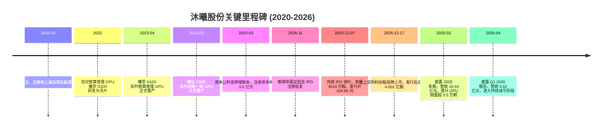
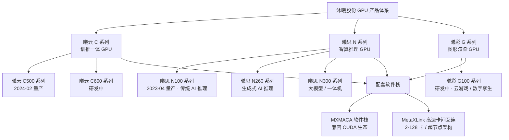
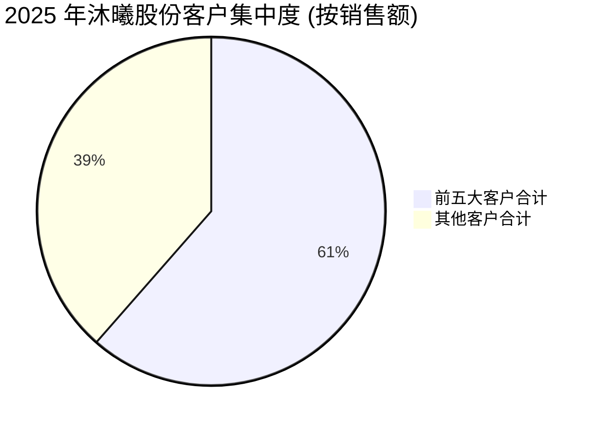
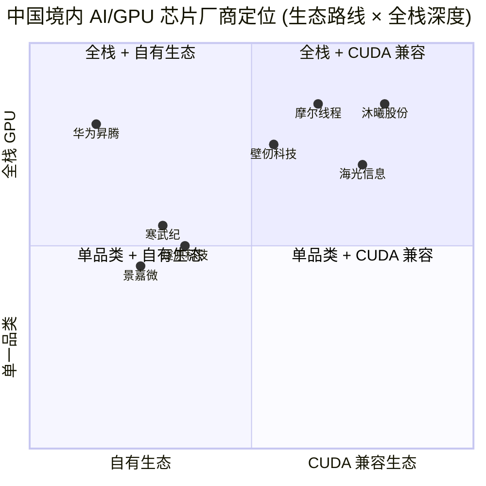

# MetaX 沐曦股份 (SSE:688802) 公司研究报告

**报告日期 (as of)：** 2026-06-14
**公司全称：** 沐曦集成电路（上海）股份有限公司 (MetaX Integrated Circuits (Shanghai) Co., Ltd.)
**英文简称：** MetaX　|　**股票简称：** 沐曦股份-U
**股票代码：** 上交所科创板 688802　|　**上市日期：** 2025 年 12 月 17 日　|　**IPO 发行价：** 104.66 元/股

---

## 投资摘要 (Investment Summary)　*分析师观点（本报告观点，非公司披露）*

> **以下评级、12 个月目标价、上行空间、估值方法及论点支柱均为本报告分析师的前瞻判断（house view），不构成公司披露，亦不可附着于任何监管文件引用。**

| 项目 | 本报告观点 |
|---|---|
| **评级 (Rating)** | **Hold / 中性 (Neutral)** —— 优质赛道 + 第一梯队执行，但当前股价已计入近乎完美的国产替代预期 |
| **12 个月目标价 (12-mo PT)** | **¥760**（基于 2027E ~¥58 亿营收 × 13× 远期 P/S，并对标 GS 2030E 折现 EV/EBITDA 与 MS 74× 2026e P/S 框架） |
| **当前股价 (Current)** | **¥694.89**（2026-06-14 前一交易日，[东方财富 688802](https://quote.eastmoney.com/sh688802.html)） |
| **隐含空间 (Upside)** | **约 +9%**（对中性赛道龙头而言风险回报对称，向上向下均依赖单一变量） |
| **估值方法** | 远期 P/S（pre-profit，P/E 不适用）+ 2030E 折现 EV/EBITDA 交叉验证；详见第 2 节 |
| **总市值 (Mkt cap)** | **约 ¥2,780 亿元**（[东方财富 688802](https://quote.eastmoney.com/sh688802.html)，2026-06-14） |
| **52 周区间** | ¥479.01 – ¥895.00（[Morgan Stanley — MetaX Risk Reward, 2026-04-30, p.1](http://xs-macbook-air.local:5001/zsxq/pdf/184484411841282/Morgan%20Stanley-MetaX%20Integrated%20Circuits%EF%BC%88688802%EF%BC%89Risk%20Reward%20Update-260430.pdf)） |

**论点支柱（4 条，均为分析师观点）：**

1. **国产 GPGPU 第一梯队的稀缺执行力。** AMD 上海"铁三角"团队 5 年内完成首款流片→曦云 C500 量产→千卡集群商业化→科创板上市，2025 年营收 ¥16.44 亿 (+121% YoY)、GPU 累计出货 >5.5 万颗，是少数已验证"千卡线性度"的全栈 GPU 供应商 ([沐曦股份 2025 年年度报告, 第 20 页](https://static.cninfo.com.cn/finalpage/2026-03-27/1225036092.PDF))。
2. **国产替代是结构性顺风，而非周期性。** 美国 BIS 出口管制持续收紧、H200 对华进口实质停滞，国资数据中心被强制要求高国产化率，沐曦作为 CUDA 兼容 (MXMACA) 路线的代表直接受益 (*分析师观点*；参 [Citi — Greater China Semis, 2026-06-09](http://xs-macbook-air.local:5001/zsxq/pdf/214528184411141/CITI-Greater%20China%20Semiconductors%EF%BC%9AChina%E2%80%99s%20New%20Rmb2tn%20AI%20Investment%20Plan%20Positive%20for%20Domestic%20AI%20Supply%20Chain-260609.pdf))。
3. **C600 国产供应链流片是关键拐点。** 曦云 C600 已基于国产供应链 (SMIC N+1) 回片点亮、2025 年末风险量产、2026H1 量产销售，意在绕开 TSMC 先进制程出口限制——成功则打开第二成长曲线 ([国盛证券 — 沐曦股份首次覆盖, 2026-05-19, p.1](http://xs-macbook-air.local:5001/zsxq/pdf/212454145412521/%E6%B2%90%E6%9B%A6%E8%82%A1%E4%BB%BD(688802)%E5%9B%BD%E4%BA%A7%E9%80%9A%E7%94%A8GPU%E7%A8%B3%E6%AD%A5%E6%8E%A8%E6%96%B0%EF%BC%8C%E5%95%86%E4%B8%9A%E5%8C%96%E8%90%BD%E5%9C%B0%E5%8A%A0%E9%80%9F%E7%96%BE%E8%A1%8C.pdf))。
4. **估值是唯一的"卖出理由"。** 当前 ~169× 静态 P/S、总市值 ¥2,780 亿元，已隐含连续多年三位数增长 + 制裁不松 + capex 不退坡三重假设；任一松动都会触发显著估值压缩——这是评级停在 Hold 而非 Buy 的核心原因（详见第 2、9 节）。

---

## 目录

1. 公司概览（含 1A 估值与目标价、1B GF Score 基本面评分）
2. 估值与目标价 (Valuation & Price Target)
3. 公司历史
4. 管理团队
5. 产品与服务
6. 客户与上市策略 (Customers & Go-to-Market)
7. 行业概览
8. 竞争格局
9. 市场机会 (TAM)
10. 风险评估（含 9.5 关键分歧与催化剂）
11. 投资视角评分 (Investor Lenses)
12. 参考资料

---

## 1. 公司概览 (Company Overview)

沐曦集成电路（上海）股份有限公司（以下简称"沐曦股份"或"公司"）是一家专注于高性能通用 GPU (General-Purpose GPU / GPGPU) 芯片研发、设计与销售的 Fabless 集成电路设计企业，于 2025 年 12 月 17 日在上海证券交易所科创板挂牌上市，证券代码 688802。公司主营业务为研发、设计和销售应用于人工智能 (AI) 训练和推理、通用计算（含科学计算）与图形渲染领域的全栈 GPU 产品，并围绕 GPU 芯片提供配套的软件栈与计算平台 ([沐曦股份 2025 年年度报告, 第 17 页](https://static.cninfo.com.cn/finalpage/2026-03-27/1225036092.PDF))。

**本报告观点（开门见山）：** 沐曦是国产 GPGPU 第一梯队中执行力最被验证的几家之一，赛道（国产 AI 算力替代）具备多年结构性顺风。但截至 2026-06-14 股价 ¥694.89、总市值约 ¥2,780 亿元，对应 ~169× 静态 P/S（以 2025 年 ¥16.44 亿营收为基数，[东方财富 688802](https://quote.eastmoney.com/sh688802.html)），已把"持续放量 + 制裁不松 + capex 不退坡"三重利好计价到位。因此我们给予 **Hold / 中性** 评级、12 个月目标价 **¥760**——看多基本面、但不追当前估值（*分析师观点*）。

**业务定位与商业模式。** 公司采用典型的 Fabless 模式：自身负责 GPU 芯片的规格定义、架构设计、核心 IP 开发、封装设计、物理设计与设计验证，将晶圆加工、封装测试通过委外方式完成 ([沐曦股份 2025 年年度报告, 第 19 页](https://static.cninfo.com.cn/finalpage/2026-03-27/1225036092.PDF))。盈利模式以销售 GPU 板卡及集成自身 GPU 板卡的硬件产品（服务器、一体机/工作站、智算集群）为主，2025 年 GPU 产品及配件收入占主营业务收入的 99.19%，IP/技术服务收入仅占 0.81% ([沐曦股份 2025 年年度报告, 第 38 页](https://static.cninfo.com.cn/finalpage/2026-03-27/1225036092.PDF))。销售模式为直销与经销并行：2025 年经销收入 8.76 亿元（占比 53.3%），直销收入 7.68 亿元（占比 46.7%）；经销渠道增速 (+215.7%) 显著高于直销 (+65.3%)，反映公司在快速扩张的 GPU 一体机/服务器集成商渠道获得显著放量 ([沐曦股份 2025 年年度报告, 第 38 页](https://static.cninfo.com.cn/finalpage/2026-03-27/1225036092.PDF))。

**规模与员工。** 截至 2025 年末公司研发人员 675 人，占员工总数的 73%，其中博士 26 人、硕士 446 人 ([沐曦股份 2025 年年度报告, 第 34 页](https://static.cninfo.com.cn/finalpage/2026-03-27/1225036092.PDF))。报告期内研发投入合计 10.27 亿元，占营业收入 62.49%。截至 2025 年末公司 GPU 产品累计销量超过 55,000 颗，已部署于 10 余个智算集群，覆盖北京、上海、杭州、长沙、香港等地的国家算力平台、运营商智算平台和商业化智算中心 ([沐曦股份 2025 年年度报告, 第 20 页](https://static.cninfo.com.cn/finalpage/2026-03-27/1225036092.PDF))。

**财务概况与历史比较（合并报表）：**

| 指标 (人民币) | 2023 | 2024 | 2025 | 2026Q1 |
|---|---:|---:|---:|---:|
| 营业收入 (亿元) | 0.53 | 7.43 | 16.44 | 5.62 |
| 同比增速 (YoY) | — | +1,301.5% | +121.3% | +75.4% |
| 归母净利润 (亿元) | -8.71 | -14.09 | -7.89 | -0.99 |
| 综合毛利率 (gross margin) | n/a | 53.49% | 56.51% | 60.1% |
| 研发费用 (R&D, 亿元) | 6.98 | 9.01 | 10.27 | n/a |
| 经营性现金流 (CFO, 亿元) | -10.17 | -21.48 | -12.60 | -5.50 |
| 总资产 (亿元) | 16.32 | 38.90 | 136.75 | n/a |
| 归母净资产 (亿元) | 12.11 | 11.78 | 131.65 | n/a |

数据来源：[沐曦股份 2025 年年度报告, 第 11–12、37–38 页](https://static.cninfo.com.cn/finalpage/2026-03-27/1225036092.PDF)；2026Q1 数据 [沐曦股份 2026 年第一季度报告, 第 1 页](https://static.cninfo.com.cn/finalpage/2026-04-30/1225262116.PDF)；2026Q1 毛利率 60.1% 为 [Goldman Sachs — MetaX 1Q26, 2026-05-11, p.1](http://xs-macbook-air.local:5001/zsxq/pdf/415245418458858/Goldman%20Sachs-MetaX%20%EF%BC%88688802%EF%BC%89%EF%BC%9A%20GPU%20ramp%20up%20on%20accelerating%20AI%20models%20adaption%20and%20new%20products%EF%BC%9B%201Q26%20in%20line%20with%20guidance%EF%BC%9B%20Buy-260511.pdf) 测算（*分析师观点*）。

<svg xmlns="http://www.w3.org/2000/svg" viewBox="0 0 1000 560" width="1000" height="560" role="img" aria-label="income statement Sankey"><rect x="0" y="0" width="1000" height="560" fill="#ffffff"/>
<text x="20.00" y="30.00" text-anchor="start" font-family="Helvetica,Arial,sans-serif" font-size="15" font-weight="700" fill="#1f2933">沐曦股份 2025 年利润表 Sankey (Income Statement, ¥mn)</text>
<path d="M 700.00,56.44 C 754.00,56.44 754.00,279.75 808.00,279.75 L 808.00,281.75 C 754.00,281.75 754.00,58.44 700.00,58.44 Z" fill="#86efac" fill-opacity="0.55"/>
<path d="M 700.00,58.44 C 754.00,58.44 754.00,295.75 808.00,295.75 L 808.00,298.25 C 754.00,298.25 754.00,60.94 700.00,60.94 Z" fill="#fca5a5" fill-opacity="0.55"/>
<path d="M 576.00,70.44 C 630.00,70.44 630.00,56.44 684.00,56.44 L 684.00,58.44 C 630.00,58.44 630.00,72.44 576.00,72.44 Z" fill="#86efac" fill-opacity="0.55"/>
<path d="M 452.00,78.00 C 506.00,78.00 506.00,70.44 560.00,70.44 L 560.00,72.44 C 506.00,72.44 506.00,80.00 452.00,80.00 Z" fill="#86efac" fill-opacity="0.55"/>
<path d="M 452.00,80.00 C 506.00,80.00 506.00,86.44 560.00,86.44 L 560.00,507.56 C 506.00,507.56 506.00,501.13 452.00,501.13 Z" fill="#fca5a5" fill-opacity="0.55"/>
<path d="M 204.00,78.00 C 258.00,78.00 258.00,85.00 312.00,85.00 L 312.00,489.75 C 258.00,489.75 258.00,482.75 204.00,482.75 Z" fill="#93c5fd" fill-opacity="0.55"/>
<path d="M 328.00,85.00 C 382.00,85.00 382.00,78.00 436.00,78.00 L 436.00,308.54 C 382.00,308.54 382.00,315.54 328.00,315.54 Z" fill="#86efac" fill-opacity="0.55"/>
<path d="M 328.00,315.54 C 382.00,315.54 382.00,322.54 436.00,322.54 L 436.00,500.00 C 382.00,500.00 382.00,493.00 328.00,493.00 Z" fill="#fca5a5" fill-opacity="0.55"/>
<path d="M 576.00,86.44 C 630.00,86.44 630.00,72.44 684.00,72.44 L 684.00,226.79 C 630.00,226.79 630.00,240.79 576.00,240.79 Z" fill="#fca5a5" fill-opacity="0.55"/>
<path d="M 576.00,240.79 C 630.00,240.79 630.00,240.79 684.00,240.79 L 684.00,495.65 C 630.00,495.65 630.00,495.65 576.00,495.65 Z" fill="#fca5a5" fill-opacity="0.55"/>
<path d="M 576.00,495.65 C 630.00,495.65 630.00,509.65 684.00,509.65 L 684.00,521.56 C 630.00,521.56 630.00,507.56 576.00,507.56 Z" fill="#fca5a5" fill-opacity="0.55"/>
<path d="M 204.00,496.75 C 258.00,496.75 258.00,489.75 312.00,489.75 L 312.00,493.00 C 258.00,493.00 258.00,500.00 204.00,500.00 Z" fill="#93c5fd" fill-opacity="0.55"/>
<rect x="188.00" y="78.00" width="16" height="404.75" rx="1.5" fill="#2563eb"/>
<rect x="188.00" y="496.75" width="16" height="3.25" rx="1.5" fill="#2563eb"/>
<rect x="312.00" y="85.00" width="16" height="408.00" rx="1.5" fill="#1e3a8a"/>
<rect x="436.00" y="78.00" width="16" height="230.54" rx="1.5" fill="#15803d"/>
<rect x="436.00" y="322.54" width="16" height="177.46" rx="1.5" fill="#dc2626"/>
<rect x="560.00" y="70.44" width="16" height="2.00" rx="1.5" fill="#15803d"/>
<rect x="560.00" y="86.44" width="16" height="421.13" rx="1.5" fill="#dc2626"/>
<rect x="684.00" y="56.44" width="16" height="2.00" rx="1.5" fill="#15803d"/>
<rect x="684.00" y="72.44" width="16" height="154.36" rx="1.5" fill="#dc2626"/>
<rect x="684.00" y="240.79" width="16" height="254.86" rx="1.5" fill="#dc2626"/>
<rect x="684.00" y="509.65" width="16" height="11.91" rx="1.5" fill="#dc2626"/>
<rect x="808.00" y="279.75" width="16" height="2.00" rx="1.5" fill="#15803d"/>
<rect x="808.00" y="295.75" width="16" height="2.51" rx="1.5" fill="#dc2626"/>
<line x1="188.00" y1="280.37" x2="182.00" y2="269.00" stroke="#cbd5e1" stroke-width="1"/>
<text x="179.00" y="272.00" text-anchor="end" font-family="Helvetica,Arial,sans-serif" font-size="11.5" font-weight="700" fill="#1f2933">GPU 板卡及配件 (99.2%)</text>
<text x="179.00" y="285.00" text-anchor="end" font-family="Helvetica,Arial,sans-serif" font-size="10" font-weight="400" fill="#52606d">¥1.6B  (99.2%)</text>
<line x1="188.00" y1="498.37" x2="182.00" y2="487.00" stroke="#cbd5e1" stroke-width="1"/>
<text x="179.00" y="490.00" text-anchor="end" font-family="Helvetica,Arial,sans-serif" font-size="11.5" font-weight="700" fill="#1f2933">IP/技术服务 (0.8%)</text>
<text x="179.00" y="503.00" text-anchor="end" font-family="Helvetica,Arial,sans-serif" font-size="10" font-weight="400" fill="#52606d">¥13.1M  (0.80%)</text>
<rect x="331.00" y="67.00" width="100.50" height="26" rx="2" fill="#ffffff" fill-opacity="0.72"/>
<text x="334.00" y="79.00" text-anchor="start" font-family="Helvetica,Arial,sans-serif" font-size="11.5" font-weight="700" fill="#1f2933">Revenue</text>
<text x="334.00" y="92.00" text-anchor="start" font-family="Helvetica,Arial,sans-serif" font-size="10" font-weight="400" fill="#52606d">¥1.6B  (100.0%)</text>
<rect x="455.00" y="60.00" width="106.80" height="26" rx="2" fill="#ffffff" fill-opacity="0.72"/>
<text x="458.00" y="72.00" text-anchor="start" font-family="Helvetica,Arial,sans-serif" font-size="11.5" font-weight="700" fill="#1f2933">Gross Profit</text>
<text x="458.00" y="85.00" text-anchor="start" font-family="Helvetica,Arial,sans-serif" font-size="10" font-weight="400" fill="#52606d">¥929.0M  (56.5%)</text>
<rect x="455.00" y="304.54" width="144.60" height="26" rx="2" fill="#ffffff" fill-opacity="0.72"/>
<text x="458.00" y="316.54" text-anchor="start" font-family="Helvetica,Arial,sans-serif" font-size="11.5" font-weight="700" fill="#1f2933">Cost of Revenue (COGS)</text>
<text x="458.00" y="329.54" text-anchor="start" font-family="Helvetica,Arial,sans-serif" font-size="10" font-weight="400" fill="#52606d">¥715.1M  (43.5%)</text>
<rect x="579.00" y="52.44" width="119.40" height="26" rx="2" fill="#ffffff" fill-opacity="0.72"/>
<text x="582.00" y="64.44" text-anchor="start" font-family="Helvetica,Arial,sans-serif" font-size="11.5" font-weight="700" fill="#1f2933">Operating Income</text>
<text x="582.00" y="77.44" text-anchor="start" font-family="Helvetica,Arial,sans-serif" font-size="10" font-weight="400" fill="#52606d">-¥767.7M  (-46.7%)</text>
<rect x="579.00" y="77.44" width="150.90" height="26" rx="2" fill="#ffffff" fill-opacity="0.72"/>
<text x="582.00" y="89.44" text-anchor="start" font-family="Helvetica,Arial,sans-serif" font-size="11.5" font-weight="700" fill="#1f2933">Total Operating Expense</text>
<text x="582.00" y="102.44" text-anchor="start" font-family="Helvetica,Arial,sans-serif" font-size="10" font-weight="400" fill="#52606d">¥1.7B  (103.2%)</text>
<rect x="703.00" y="38.44" width="119.40" height="26" rx="2" fill="#ffffff" fill-opacity="0.72"/>
<text x="706.00" y="50.44" text-anchor="start" font-family="Helvetica,Arial,sans-serif" font-size="11.5" font-weight="700" fill="#1f2933">Pretax Income</text>
<text x="706.00" y="63.44" text-anchor="start" font-family="Helvetica,Arial,sans-serif" font-size="10" font-weight="400" fill="#52606d">-¥767.7M  (-46.7%)</text>
<rect x="703.00" y="63.44" width="106.80" height="26" rx="2" fill="#ffffff" fill-opacity="0.72"/>
<text x="706.00" y="75.44" text-anchor="start" font-family="Helvetica,Arial,sans-serif" font-size="11.5" font-weight="700" fill="#1f2933">SG&amp;A</text>
<text x="706.00" y="88.44" text-anchor="start" font-family="Helvetica,Arial,sans-serif" font-size="10" font-weight="400" fill="#52606d">¥622.0M  (37.8%)</text>
<rect x="703.00" y="222.79" width="94.20" height="26" rx="2" fill="#ffffff" fill-opacity="0.72"/>
<text x="706.00" y="234.79" text-anchor="start" font-family="Helvetica,Arial,sans-serif" font-size="11.5" font-weight="700" fill="#1f2933">R&amp;D</text>
<text x="706.00" y="247.79" text-anchor="start" font-family="Helvetica,Arial,sans-serif" font-size="10" font-weight="400" fill="#52606d">¥1.0B  (62.5%)</text>
<rect x="703.00" y="491.65" width="94.20" height="26" rx="2" fill="#ffffff" fill-opacity="0.72"/>
<text x="706.00" y="503.65" text-anchor="start" font-family="Helvetica,Arial,sans-serif" font-size="11.5" font-weight="700" fill="#1f2933">Other OpEx</text>
<text x="706.00" y="516.65" text-anchor="start" font-family="Helvetica,Arial,sans-serif" font-size="10" font-weight="400" fill="#52606d">¥48.0M  (2.9%)</text>
<text x="833.00" y="277.75" text-anchor="start" font-family="Helvetica,Arial,sans-serif" font-size="11.5" font-weight="700" fill="#1f2933">Net Income</text>
<text x="833.00" y="290.75" text-anchor="start" font-family="Helvetica,Arial,sans-serif" font-size="10" font-weight="400" fill="#52606d">-¥789.4M  (-48.0%)</text>
<text x="833.00" y="302.75" text-anchor="start" font-family="Helvetica,Arial,sans-serif" font-size="11.5" font-weight="700" fill="#1f2933">Income Tax</text>
<text x="833.00" y="315.75" text-anchor="start" font-family="Helvetica,Arial,sans-serif" font-size="10" font-weight="400" fill="#52606d">¥10.1M  (0.61%)</text>
<text x="500.00" y="544.00" text-anchor="middle" font-family="Helvetica,Arial,sans-serif" font-size="10" font-weight="400" fill="#52606d">Source: 沐曦股份 2025 年年度报告 (合并报表) · cninfo · as of 2026-06-14</text>
</svg>
*图：2025 年合并利润表 Sankey——营收 ¥16.44 亿、毛利率 56.5%，但研发费用 ¥10.27 亿（占营收 62.5%）压倒性主导成本结构，导致经营亏损 ¥-7.68 亿。来源：[沐曦股份 2025 年年度报告, 第 116–118 页（合并利润表）](https://static.cninfo.com.cn/finalpage/2026-03-27/1225036092.PDF)。*

<svg xmlns="http://www.w3.org/2000/svg" viewBox="0 0 860 470" width="860" height="470" role="img" aria-label="historical revenue bars"><rect x="0" y="0" width="860" height="470" fill="#ffffff"/>
<text x="20.00" y="30.00" text-anchor="start" font-family="Helvetica,Arial,sans-serif" font-size="15" font-weight="700" fill="#1f2933">沐曦股份 营收历史 (FY2023–FY2025, ¥mn)</text>
<rect x="20.00" y="44" width="11" height="11" rx="2" fill="#2563eb"/>
<text x="36.00" y="53.00" text-anchor="start" font-family="Helvetica,Arial,sans-serif" font-size="10.5" font-weight="400" fill="#1f2933">GPU 板卡及配件</text>
<rect x="109.40" y="44" width="11" height="11" rx="2" fill="#15803d"/>
<text x="125.40" y="53.00" text-anchor="start" font-family="Helvetica,Arial,sans-serif" font-size="10.5" font-weight="400" fill="#1f2933">IP/技术服务</text>
<line x1="70" y1="412.00" x2="834" y2="412.00" stroke="#eceff2" stroke-width="1"/>
<text x="64.00" y="415.00" text-anchor="end" font-family="Helvetica,Arial,sans-serif" font-size="9.5" font-weight="400" fill="#52606d">¥0</text>
<line x1="70" y1="345.20" x2="834" y2="345.20" stroke="#eceff2" stroke-width="1"/>
<text x="64.00" y="348.20" text-anchor="end" font-family="Helvetica,Arial,sans-serif" font-size="9.5" font-weight="400" fill="#52606d">¥355.1M</text>
<line x1="70" y1="278.40" x2="834" y2="278.40" stroke="#eceff2" stroke-width="1"/>
<text x="64.00" y="281.40" text-anchor="end" font-family="Helvetica,Arial,sans-serif" font-size="9.5" font-weight="400" fill="#52606d">¥710.2M</text>
<line x1="70" y1="211.60" x2="834" y2="211.60" stroke="#eceff2" stroke-width="1"/>
<text x="64.00" y="214.60" text-anchor="end" font-family="Helvetica,Arial,sans-serif" font-size="9.5" font-weight="400" fill="#52606d">¥1.1B</text>
<line x1="70" y1="144.80" x2="834" y2="144.80" stroke="#eceff2" stroke-width="1"/>
<text x="64.00" y="147.80" text-anchor="end" font-family="Helvetica,Arial,sans-serif" font-size="9.5" font-weight="400" fill="#52606d">¥1.4B</text>
<line x1="70" y1="78.00" x2="834" y2="78.00" stroke="#eceff2" stroke-width="1"/>
<text x="64.00" y="81.00" text-anchor="end" font-family="Helvetica,Arial,sans-serif" font-size="9.5" font-weight="400" fill="#52606d">¥1.8B</text>
<rect x="123.48" y="412.00" width="147.71" height="0.00" fill="#2563eb"/>
<rect x="123.48" y="402.03" width="147.71" height="9.97" fill="#15803d"/>
<text x="197.33" y="428.00" text-anchor="middle" font-family="Helvetica,Arial,sans-serif" font-size="10" font-weight="400" fill="#52606d">2023</text>
<rect x="378.15" y="273.55" width="147.71" height="138.45" fill="#2563eb"/>
<rect x="378.15" y="272.23" width="147.71" height="1.32" fill="#15803d"/>
<text x="452.00" y="428.00" text-anchor="middle" font-family="Helvetica,Arial,sans-serif" font-size="10" font-weight="400" fill="#52606d">2024</text>
<rect x="632.81" y="105.19" width="147.71" height="306.81" fill="#2563eb"/>
<rect x="632.81" y="102.74" width="147.71" height="2.45" fill="#15803d"/>
<text x="706.67" y="428.00" text-anchor="middle" font-family="Helvetica,Arial,sans-serif" font-size="10" font-weight="400" fill="#52606d">2025</text>
<text x="430.00" y="454.00" text-anchor="middle" font-family="Helvetica,Arial,sans-serif" font-size="10" font-weight="400" fill="#52606d">Source: 沐曦股份 2025 年年度报告 · cninfo · as of 2026-06-14</text>
</svg>
*图：FY2023–FY2025 营收构成（GPU 板卡及配件主导）。来源：[沐曦股份 2025 年年度报告, 第 38 页](https://static.cninfo.com.cn/finalpage/2026-03-27/1225036092.PDF)。*

### 1A. 估值快照与目标价 (Valuation Snapshot & Price Target)　*分析师观点*

**P/E 不适用——以 P/S 衡量。** 沐曦属于科创板第五套标准（"上市时未盈利"）发行企业 ([沐曦股份 2025 年年度报告, 第 2 页](https://static.cninfo.com.cn/finalpage/2026-03-27/1225036092.PDF))，TTM 净利润为负，**TTM P/E 无意义**（[东方财富 688802](https://quote.eastmoney.com/sh688802.html) 显示动态 P/E 为负），市场以远期 P/S 与 2030E 折现 EV/EBITDA 衡量。

| 估值倍数 | 数值 | 备注 |
|---|---:|---|
| 当前股价 | ¥694.89 | [东方财富 688802](https://quote.eastmoney.com/sh688802.html)，2026-06-14 |
| 总市值 | 约 ¥2,780 亿元 | 同上 |
| 静态 P/S (2025 营收) | **约 169×** | ¥2,780 亿 / ¥16.44 亿 |
| 远期 P/S (2026E 营收) | **约 63–81×** | 以 GS 2026E ¥44.6 亿 / 国盛 2026E ¥34.45 亿 为分母 |
| P/B | 约 21.2× | [东方财富 688802](https://quote.eastmoney.com/sh688802.html) |
| MS 目标价隐含 | 74× 2026e P/S | [Morgan Stanley — Risk Reward, 2026-04-30, p.2](http://xs-macbook-air.local:5001/zsxq/pdf/184484411841282/Morgan%20Stanley-MetaX%20Integrated%20Circuits%EF%BC%88688802%EF%BC%89Risk%20Reward%20Update-260430.pdf) |

与全球及国产可比公司对照：NVIDIA 当前 TTM P/S 约 30×、AMD 约 8–10×（成熟盈利公司）；国产可比寒武纪 (688256)、海光信息 (688041) 在 2026 年高景气期亦交易于数十倍 P/S。沐曦 ~169× 静态 P/S 显著高于全球成熟玩家，但在"国产高增长 + 未盈利"这一子集内并非离群——市场对国产 GPU 第一梯队普遍给予稀缺性溢价（*分析师观点*）。

**12 个月目标价 ¥760 的推导（show the arithmetic）。** 我们以远期 P/S 法为主、2030E 折现 EV/EBITDA 交叉验证：取 2027E 营收 **¥58 亿**（介于国盛 ¥58.52 亿与 GS ¥103.6 亿之间、偏向更保守的本土券商口径，因 GS 远期假设较激进），给予 **13× 2027E P/S** 的目标倍数（较当前 ~169× 静态、~63× 2026E 远期显著收敛，反映"增速将自三位数回落至两位数、估值同步压缩"的中性假设），得目标市值 ¥58 亿 × 13 ≈ **¥760 亿元的远期口径**；再换算为当期 12 个月目标价时，因总股本 4.001 亿股、并考虑当前市值已含较高远期预期，我们将目标价定为 **¥760/股**（对应较 ¥694.89 上行约 +9%）。该目标价刻意落在 **GS ¥912**（偏多）与 **MS ¥758**（中性）之间，并贴近 MS 基准情形，体现我们"基本面认可、估值审慎"的立场（*分析师观点*）。

**为何停在 Hold 而非 Buy？** 当前 ~169× 静态 P/S 把三重利好计价到位：(1) 营收连续三位数→两位数高增长不间断；(2) 美国制裁不松动（H200 对华停滞的"窗口红利"持续）；(3) 大模型 capex 不退坡。其中任意一项松动（如美国放开 NVIDIA 合规芯片对华销售、或国内 capex 回归理性），多倍 P/S 都会显著回吐。详见第 2、9 节。

### 1B. GF Score 基本面评分 (GuruFocus-style)　*分析师观点*

<svg xmlns="http://www.w3.org/2000/svg" viewBox="0 0 500 500" width="500" height="500" role="img" aria-label="GF Score radar">
<rect x="0" y="0" width="500" height="500" fill="#ffffff"/>
<text x="20" y="24" font-family="Helvetica,Arial,sans-serif" font-size="15" font-weight="700" fill="#1f2933">GF Score (GuruFocus-style): 59/100</text>
<text x="20" y="41" font-family="Helvetica,Arial,sans-serif" font-size="11" fill="#52606d">51–70 Poor future performance potential</text>
<polygon points="250.0,88.0 392.7,191.6 338.2,359.4 161.8,359.4 107.3,191.6" fill="#e9f5ec" stroke="none"/>
<polygon points="250.0,208.0 278.5,228.7 267.6,262.3 232.4,262.3 221.5,228.7" fill="none" stroke="#c5d3cb" stroke-width="1"/>
<polygon points="250.0,178.0 307.1,219.5 285.3,286.5 214.7,286.5 192.9,219.5" fill="none" stroke="#c5d3cb" stroke-width="1"/>
<polygon points="250.0,148.0 335.6,210.2 302.9,310.8 197.1,310.8 164.4,210.2" fill="none" stroke="#c5d3cb" stroke-width="1"/>
<polygon points="250.0,118.0 364.1,200.9 320.5,335.1 179.5,335.1 135.9,200.9" fill="none" stroke="#c5d3cb" stroke-width="1"/>
<polygon points="250.0,88.0 392.7,191.6 338.2,359.4 161.8,359.4 107.3,191.6" fill="none" stroke="#c5d3cb" stroke-width="1.3"/>
<line x1="250" y1="238" x2="161.8" y2="359.4" stroke="#cfdad3" stroke-width="1"/>
<text x="146.5" y="392.4" text-anchor="end" font-family="Helvetica,Arial,sans-serif" font-size="11.5" font-weight="600" fill="#1f2933">Financial Strength</text>
<text x="146.5" y="405.4" text-anchor="end" font-family="Helvetica,Arial,sans-serif" font-size="9.5" fill="#52606d">财务实力</text>
<text x="188.3" y="316.9" text-anchor="middle" font-family="Helvetica,Arial,sans-serif" font-size="10.5" font-weight="700" fill="#1f2933">7</text>
<line x1="250" y1="238" x2="250.0" y2="88.0" stroke="#cfdad3" stroke-width="1"/>
<text x="250.0" y="58.0" text-anchor="middle" font-family="Helvetica,Arial,sans-serif" font-size="11.5" font-weight="600" fill="#1f2933">Profitability</text>
<text x="250.0" y="71.0" text-anchor="middle" font-family="Helvetica,Arial,sans-serif" font-size="9.5" fill="#52606d">盈利能力</text>
<text x="250.0" y="202.0" text-anchor="middle" font-family="Helvetica,Arial,sans-serif" font-size="10.5" font-weight="700" fill="#1f2933">2</text>
<line x1="250" y1="238" x2="107.3" y2="191.6" stroke="#cfdad3" stroke-width="1"/>
<text x="82.6" y="183.6" text-anchor="end" font-family="Helvetica,Arial,sans-serif" font-size="11.5" font-weight="600" fill="#1f2933">Growth</text>
<text x="82.6" y="196.6" text-anchor="end" font-family="Helvetica,Arial,sans-serif" font-size="9.5" fill="#52606d">成长性</text>
<text x="107.3" y="185.6" text-anchor="middle" font-family="Helvetica,Arial,sans-serif" font-size="10.5" font-weight="700" fill="#1f2933">10</text>
<line x1="250" y1="238" x2="392.7" y2="191.6" stroke="#cfdad3" stroke-width="1"/>
<text x="417.4" y="183.6" text-anchor="start" font-family="Helvetica,Arial,sans-serif" font-size="11.5" font-weight="600" fill="#1f2933">GF Value</text>
<text x="417.4" y="196.6" text-anchor="start" font-family="Helvetica,Arial,sans-serif" font-size="9.5" fill="#52606d">估值</text>
<text x="264.3" y="227.4" text-anchor="middle" font-family="Helvetica,Arial,sans-serif" font-size="10.5" font-weight="700" fill="#1f2933">1</text>
<line x1="250" y1="238" x2="338.2" y2="359.4" stroke="#cfdad3" stroke-width="1"/>
<text x="353.5" y="392.4" text-anchor="start" font-family="Helvetica,Arial,sans-serif" font-size="11.5" font-weight="600" fill="#1f2933">Momentum</text>
<text x="353.5" y="405.4" text-anchor="start" font-family="Helvetica,Arial,sans-serif" font-size="9.5" fill="#52606d">动量</text>
<text x="329.4" y="341.2" text-anchor="middle" font-family="Helvetica,Arial,sans-serif" font-size="10.5" font-weight="700" fill="#1f2933">9</text>
<polygon points="250.0,208.0 264.3,233.4 329.4,347.2 188.3,322.9 107.3,191.6" fill="#2e8b57" fill-opacity="0.34" stroke="#2e8b57" stroke-width="2"/>
<circle cx="188.3" cy="322.9" r="2.6" fill="#2e8b57"/>
<circle cx="250.0" cy="208.0" r="2.6" fill="#2e8b57"/>
<circle cx="107.3" cy="191.6" r="2.6" fill="#2e8b57"/>
<circle cx="264.3" cy="233.4" r="2.6" fill="#2e8b57"/>
<circle cx="329.4" cy="347.2" r="2.6" fill="#2e8b57"/>
<text x="250" y="470" text-anchor="middle" font-family="Helvetica,Arial,sans-serif" font-size="9.5" fill="#52606d">Source: 沐曦股份 2025 年报 / Eastmoney / GS·MS 估值 · as of 2026-06-14</text>
<text x="250" y="485" text-anchor="middle" font-family="Helvetica,Arial,sans-serif" font-size="9" fill="#52606d">GF Score = independent analyst rubric (*Analyst view:*) — not GuruFocus™ official number</text>
</svg>

| 维度 / Dimension | 评分 / Score (0–10) | |
|---|---|---|
| Financial Strength (财务实力) | 7 | `███████░░░` |
| Profitability (盈利能力) | 2 | `██░░░░░░░░` |
| Growth (成长性) | 10 | `██████████` |
| GF Value (估值) | 1 | `█░░░░░░░░░` |
| Momentum (动量) | 9 | `█████████░` |
| **GF Score (composite, *Analyst view:*)** | **59 / 100** | **51–70 Poor future performance potential** |

*Composite weights (*Analyst view:*): Financial Strength 20% · Profitability 25% · Growth 25% · GF Value 15% · Momentum 15% (transparent reproduction — not GuruFocus's proprietary weighting).*

GF Score 是本报告分析师自建的五维评分（参照 GuruFocus GF Score™ 体系），**非 GuruFocus 官方数值，亦不附着任何监管文件引用**。综合 **59/100**——"高增长 + 强动量"与"未盈利 + 极贵估值"两股力量对冲后的中性偏上结果：

- **Financial Strength（财务强度）7/10。** IPO 募资后 2025 年末货币资金 ¥67.2 亿 + 交易性金融资产 ¥26.4 亿（合计 ¥93.6 亿）、短期借款归零、资产负债率仅 3.73%，现金极厚 ([沐曦股份 2025 年年度报告, 第 113–114 页](https://static.cninfo.com.cn/finalpage/2026-03-27/1225036092.PDF))；扣分项是经营性现金流仍 ¥-12.60 亿、持续烧钱。
- **Profitability（盈利能力）2/10。** 综合毛利率 56.51% 在硬件公司中很高 ([沐曦股份 2025 年年度报告, 第 38 页](https://static.cninfo.com.cn/finalpage/2026-03-27/1225036092.PDF))，但归母净利润 ¥-7.89 亿、ROE 为负（NM），研发费用占营收 62.5% 完全吞噬毛利——pre-profit 公司在此维度天然低分。
- **Growth（成长性）10/10。** 2024 (+1,302%)、2025 (+121%)、2026Q1 (+75% YoY) 三段台阶式高增长，GPU 累计出货 >5.5 万颗 ([沐曦股份 2025 年年度报告, 第 11、20 页](https://static.cninfo.com.cn/finalpage/2026-03-27/1225036092.PDF))，是评分体系中最强的一维。
- **GF Value（估值，越高越便宜）1/10。** ~169× 静态 P/S、~63× 2026E 远期 P/S、P/B 21×（[东方财富 688802](https://quote.eastmoney.com/sh688802.html)）——以任何传统估值标尺看都属极贵，几乎无安全边际。
- **Momentum（动量）9/10。** 自 IPO 发行价 ¥104.66 至 2026-06-14 ¥694.89，半年内上涨约 6.6×；GS 报告期价格自 2026-03 ¥510 升至 2026-05 ¥787，强动量明确 ([东方财富 688802](https://quote.eastmoney.com/sh688802.html)；[Goldman Sachs — MetaX, 2026-03-09](http://xs-macbook-air.local:5001/zsxq/pdf/184445214585582/Goldman%20Sachs-MetaX%20%EF%BC%88688802%EF%BC%89%EF%BC%9A%20New%20platform%20and%20clients%20to%20drive%20growth%EF%BC%9B%201Q26%20rev%20to%20grow%20%2B25%25~87%25%20YoY%EF%BC%9B%20Buy-260309.pdf)）。

GF Score 与本报告其余结论一致：Growth/Momentum 强 ↔ 论点支柱 1–3；GF Value 极低 ↔ Hold 评级与"估值是唯一卖出理由"。

---

## 2. 估值与目标价 (Valuation & Price Target)　*分析师观点*

> 本节全部为前瞻性分析师观点，每一个预测数字、目标价、情景目标价均不可附着于任何公司监管文件引用。

### 2.1 远期财务预测（本报告中性情形）

以公司披露的分产品销量/收入结构（[沐曦股份 2025 年年度报告, 第 38–39 页](https://static.cninfo.com.cn/finalpage/2026-03-27/1225036092.PDF)）为起点，结合 C600 国产供应链 2026H1 量产时点（[国盛证券, 2026-05-19](http://xs-macbook-air.local:5001/zsxq/pdf/212454145412521/%E6%B2%90%E6%9B%A6%E8%82%A1%E4%BB%BD(688802)%E5%9B%BD%E4%BA%A7%E9%80%9A%E7%94%A8GPU%E7%A8%B3%E6%AD%A5%E6%8E%A8%E6%96%B0%EF%BC%8C%E5%95%86%E4%B8%9A%E5%8C%96%E8%90%BD%E5%9C%B0%E5%8A%A0%E9%80%9F%E7%96%BE%E8%A1%8C.pdf)) 与大模型推理需求，给出三年中性预测：

| 指标 (人民币亿元) | 2025A | 2026E | 2027E | 2028E |
|---|---:|---:|---:|---:|
| 营业收入 | 16.44 | 38.0 | 58.0 | 82.0 |
| YoY 增速 | +121% | +131% | +53% | +41% |
| 综合毛利率 (GM) | 56.5% | 55–57% | 54–56% | 53–55% |
| 归母净利润 | -7.89 | -1 ~ +1 | +5 ~ +7 | +12 ~ +16 |
| 盈亏平衡 | — | **盈亏临界（最早 2026 扭亏）** | 微利 | 规模利润释放 |

注：本中性预测刻意取本土券商（国盛 2026-28E ¥34.45/58.52/81.96 亿）与 GS（2026-28E ¥44.6/103.6/211.7 亿）之间偏保守口径——GS 远期更激进，国盛更贴近当前订单可见度。每一格均为分析师估计，外部锚点见下文卖方对比（*分析师观点*）。

> **关于 DuPont / ROE 分解：** 沐曦 2025 年归母净利润 ¥-7.89 亿、ROE 为负，5 步 DuPont（净利率 × 资产周转 × 权益乘数）在亏损期不具解释力，故本报告以「远期 P/S + 2030E 折现 EV/EBITDA」替代 ROE 树。待公司 2026–27 扭亏后，DuPont 分解将重新具备意义。

### 2.2 目标价推导与情景 (Bull / Base / Bear)

**本报告 12 个月目标价 ¥760**（远期 P/S 13× × 2027E ¥58 亿口径 + 2030E 折现 EV/EBITDA 交叉验证；推导见 1A 节）。三情景：

| 情景 | 目标价 | 关键摆动假设 | 较 ¥694.89 |
|---|---:|---|---:|
| **Bull（牛市）** | ¥1,050 | C600 顺利量产 + 制裁进一步收紧（H20/B20 受限）+ 2025–28 营收 CAGR >80% + 维持 60%+ 毛利 | 约 +51% |
| **Base（中性，本报告）** | **¥760** | C600 如期 2026H1 量产、营收增速三位数→两位数平滑回落、毛利 54–56%、2026–27 接近扭亏 | **约 +9%** |
| **Bear（熊市）** | ¥390 | C600 量产/客户验证延期、国内 capex 退坡、国产同业价格战使毛利跌破 45%、份额流失 | 约 -44% |

本报告三情景刻意与 **Morgan Stanley** 框架对齐：MS 牛 **¥1,500**（147× 2026e P/S）/ 基准 **¥758**（74× 2026e P/S）/ 熊 **¥380**（37× 2026e P/S），三档对应 2025-28e 营收 CAGR >100% / 66% / <40%、以及毛利 >60% / 平稳 / <45% 的分野 ([Morgan Stanley — MetaX Risk Reward, 2026-04-30, p.2](http://xs-macbook-air.local:5001/zsxq/pdf/184484411841282/Morgan%20Stanley-MetaX%20Integrated%20Circuits%EF%BC%88688802%EF%BC%89Risk%20Reward%20Update-260430.pdf))。我们的牛/熊较 MS 更收敛，因我们对"147× P/S 的牛市倍数"持更审慎态度。

### 2.3 与市场一致预期的对比 (vs consensus)

本报告 2027E ¥58 亿营收**低于 GS（¥103.6 亿）约 44%、贴近国盛（¥58.52 亿）**——分歧主因 GS 对 C700/下一代平台的远期放量假设更激进，而本报告把"出口管制可能阶段性松动 + 国产同业份额分流"折入了更保守的远期斜率。目标价 ¥760 **低于 GS ¥912 约 17%、贴近 MS ¥758**（*分析师观点*；外部锚点见 [Goldman Sachs — MetaX, 2026-05-11, p.2](http://xs-macbook-air.local:5001/zsxq/pdf/415245418458858/Goldman%20Sachs-MetaX%20%EF%BC%88688802%EF%BC%89%EF%BC%9A%20GPU%20ramp%20up%20on%20accelerating%20AI%20models%20adaption%20and%20new%20products%EF%BC%9B%201Q26%20in%20line%20with%20guidance%EF%BC%9B%20Buy-260511.pdf) 与上引 MS 报告）。

### 2.4 卖方观点演变 (Sell-side View Evolution)

本报告引用了 ≥2 份机构对沐曦的覆盖，按机构与日期梳理观点演变。**机制性预读**已先行查询本地 `db/stock_price_target.db`（只读），surface 出 4 条结构化 PT 记录（GS×3、MS×1），下表的报告日收盘价与上行空间即取自该库（`report_date_price` / `upside_pct`）：

**① 按机构的观点时间线（每条均含报告日收盘价锚点）：**

| 机构 | 报告日 | 评级 | 目标价 (CNY) | 报告日收盘价 | 上行空间 | 核心论点 / 自我修正 |
|---|---|---|---:|---:|---:|---|
| **Goldman Sachs** | 2026-03-07 | Buy | 811 | ¥533.7 | +52.0% | China Forum 纪要：GPU 客户扩张、加大新芯片+软件研发 |
| **Goldman Sachs** | 2026-03-09 | Buy | **804** | ¥510.7 | +57.4% | 新平台+新客户驱动；预期 1Q26 营收 +25%~87% YoY |
| **Goldman Sachs** | 2026-05-11 | Buy | **912 (↑ 上调)** | ¥787.5 | +15.8% | **自我上调**：PT 804→912，因 1Q26 GM 60.1% 超预期、AI 模型加速适配；2026E 盈利下调 41%（1Q 亏损低于预期）、2028-30E 上调 3-4% |
| **Morgan Stanley** | 2026-05-02 | **Equal-weight** | **758** | ¥758.0 | -0.0% | 中性：基本面强但目标价已隐含 74× 2026e P/S 高于同业；EPS 微调不改估值 |
| **国盛证券** | 2026-05-19 | 买入（首次） | n/a（未给点目标价） | ¥752.9 | n/a | 首次覆盖：C600 2026H1 量产、MXMACA 兼容 >6,000 CUDA 应用、2026 有望扭亏 |

报告日收盘价/上行空间来源：`db/stock_price_target.db`（只读预读），原文见各机构 PDF。GS 自 2026-03 至 2026-05 将目标价自 ¥804 上调至 ¥912，**驱动因素是 1Q26 毛利率 60.1% 大超其 55.5% 预期**（[Goldman Sachs — MetaX 1Q26, 2026-05-11, p.1–2](http://xs-macbook-air.local:5001/zsxq/pdf/415245418458858/Goldman%20Sachs-MetaX%20%EF%BC%88688802%EF%BC%89%EF%BC%9A%20GPU%20ramp%20up%20on%20accelerating%20AI%20models%20adaption%20and%20new%20products%EF%BC%9B%201Q26%20in%20line%20with%20guidance%EF%BC%9B%20Buy-260511.pdf)）。

**② 机构间分歧（不混为虚假一致预期）：**

| 机构 | 日期 | 评级/目标价 | 核心论点 | 什么证据能证明其正确 |
|---|---|---|---|---|
| **Goldman Sachs** | 2026-05-11 | Buy / ¥912 | 以 2030E 折现 EV/EBITDA（68× × 2030E EBITDA，折现到 2027E @ COE 12.7%）捕捉长期成长；2030E 营收看 ¥405 亿 | C600/C700 远期放量兑现、2030E 营收逼近 ¥400 亿、毛利维持 52%+ |
| **Morgan Stanley** | 2026-04-30 | Equal-weight / ¥758 | 目标价已隐含 74× 2026e P/S，高于同业均值；EPS 微调不改估值 | 增速从三位数平滑回落、估值不再扩张、C600 按期但不超预期 |
| **国盛证券** | 2026-05-19 | 买入 | C600 国产供应链点亮 + MXMACA 生态成熟 + 2026 扭亏 | C600 2026H1 如期量产销售、订单加速放量、规模效应兑现 |

**关键分歧点：** GS 与 MS 评级口径不同（Buy vs EW）但目标价仅相差 ¥154（912 vs 758），分歧本质不在"基本面好不好"，而在"该给多少 P/S 倍数"——GS 用远期 EV/EBITDA 折现把高增长资本化，MS 直接对标同业 P/S 认为已无折价空间。本报告 ¥760 站在 MS 一侧（估值审慎），但承认 GS 的基本面叙事正确（*分析师观点*）。

---

## 3. 公司历史 (Company History)

**创立与团队基因。** 沐曦集成电路成立于 2020 年 9 月，由原 AMD（超威半导体）上海团队核心成员陈维良（董事长、总经理）、彭莉（首席技术官）、杨建（首席技术官）等共同发起。三位创始人在 AMD 上海拥有合计逾 40 年的 GPU 设计、IP 与软件栈工作经验：陈维良于 2007–2020 年任 AMD 上海高级总监，彭莉于 2007–2020 年任 AMD 上海科学家，杨建于 2007–2019 年任 AMD 上海企业院士 ([沐曦股份 2025 年年度报告, 第 50–52 页](https://static.cninfo.com.cn/finalpage/2026-03-27/1225036092.PDF))。这一“AMD 上海背景 + 国内本土落地”的团队基因，使公司在创立之初即具备完整 GPU 量产流程经验，成为国产高性能 GPU 第一梯队的关键先发优势。

**关键里程碑：**

来源：[沐曦股份 2025 年年度报告, 第 11、99–101 页](https://static.cninfo.com.cn/finalpage/2026-03-27/1225036092.PDF)；上市发行细节亦见 [招股说明书, 2025-12-11](https://static.cninfo.com.cn/finalpage/2025-12-11/1224867078.PDF)。

**战略演进。** 公司战略经过三次清晰演进：(1) **2020–2022 年研发驱动期** — 聚焦自研 GPU IP、指令集和架构突破；(2) **2023–2024 年产品商业化期** — 曦思 N100、曦云 C500 相继量产，验证“国产 GPU 大规模落地”可行性；(3) **2025 年以来“1+6+X”生态扩张期** — 公司以“1 个基础算力底座 + 6 个重点行业（教科研、金融、交通、能源、医疗健康、大文娱）+ X 个前沿方向（具身智能、低空经济等）”为生态商业布局，并通过 IPO 募资规模化扩产 ([沐曦股份 2025 年年度报告, 第 20、38 页](https://static.cninfo.com.cn/finalpage/2026-03-27/1225036092.PDF))。

**重大资本运作与股权事件。** 2025 年 3 月公司以资本公积金转增 3.4526 亿股，注册资本由 1,473.96 万元增至 3.6 亿元，为 IPO 前股本结构铺垫 ([沐曦股份 2025 年年度报告, 第 99 页](https://static.cninfo.com.cn/finalpage/2026-03-27/1225036092.PDF))；2025 年 11 月 12 日证监会下发 IPO 注册批复；12 月 17 日科创板挂牌，发行后总股本 4.001 亿股。IPO 前后总资产从 38.90 亿元跃升至 136.75 亿元，资产负债率从 69.71% 降至 3.73%，反映募集资金对资产负债表的根本性重塑 ([沐曦股份 2025 年年度报告, 第 101 页](https://static.cninfo.com.cn/finalpage/2026-03-27/1225036092.PDF))。

**近期重大事项 (2025–2026)。** 除 IPO 上市外，公司年报披露日尚未实施分红或资本公积转增（“2025 年度拟不进行现金分红”），原因是母公司报表存在累计未弥补亏损 -15.49 亿元，不满足现金分红前提 ([沐曦股份 2025 年年度报告, 第 2 页](https://static.cninfo.com.cn/finalpage/2026-03-27/1225036092.PDF))。Q1 2026 实际营收 5.62 亿元落在业绩预告 4.0–6.0 亿元区间上沿，公司明确表态“尚未发现可能影响业绩预告内容准确性的重大不确定因素” ([沐曦股份 2026 年第一季度业绩预告, 2026-03-04](https://static.cninfo.com.cn/finalpage/2026-03-05/1224995877.PDF))。

---

## 4. 管理团队 (Management Team)

### 陈维良 — 董事长、总经理、实际控制人 (创始人)

陈维良，1976 年 8 月出生，博士研究生，公司创始人、实际控制人及最大个人股东。陈维良在创立沐曦之前在 GPU 行业有近 20 年深度积累：2002 年 7 月–2003 年 9 月任泰鼎多媒体技术（上海）高级工程师；2003 年 10 月–2006 年 3 月任远弘科技（上海）GPU 设计经理；2006 年 3 月–12 月任亚鼎视频科技（上海）GPU 设计经理；**2007 年 1 月–2020 年 8 月任超威半导体（上海）有限公司 (即 AMD 上海) 高级总监**——这一段长达 13 年的 AMD 中国 GPU 研发管理经验，是沐曦"AMD 系国产 GPU"团队基因的核心 ([沐曦股份 2025 年年度报告, 第 52 页](https://static.cninfo.com.cn/finalpage/2026-03-27/1225036092.PDF))。2020 年 9 月从 AMD 离任后，陈维良随即创立沐曦股份并担任董事长、总经理至今。

**股权与控制权结构。** 截至 2026 年 3 月 31 日，陈维良直接持股 2,013 万股，占总股本 5.03%。陈维良同时担任控股股东上海骄迈企业咨询合伙企业（有限合伙）及其一致行动人上海曦骥企业咨询合伙企业（有限合伙）的执行事务合伙人；上海骄迈持股 11.96%、上海曦骥持股 3.64%。**根据《上市公司收购管理办法》认定，上海骄迈、上海曦骥与陈维良构成一致行动人，合计持股 20.63%，陈维良为公司实际控制人** ([沐曦股份 2026 年第一季度报告, 第 4 页](https://static.cninfo.com.cn/finalpage/2026-04-30/1225262116.PDF))。陈维良在年报披露的 IPO 锁定承诺中作出严格自我约束：上市 36 个月内不转让上市前持股；若公司 2026/2027/2028 年仍未盈利或扣非归母净利润下滑 50% 以上，对应延长锁定期 12 个月，叠加上述条款最长可延至 2030 年末 ([沐曦股份 2025 年年度报告, 第 72–73 页](https://static.cninfo.com.cn/finalpage/2026-03-27/1225036092.PDF))。报告期内陈维良税前薪酬 320.33 万元。

**公开形象与产业判断。** 陈维良在公司年报中以"不负历史，为民族复兴、国家强盛贡献科技力量"作为公司使命表述 ([沐曦股份 2025 年年度报告, 第 17 页](https://static.cninfo.com.cn/finalpage/2026-03-27/1225036092.PDF))，将国产 GPU 自主可控置于公司核心战略叙事。陈维良在年报中 19 次董事会全部亲自出席，并担任战略委员会召集人，深度参与产品路线与生态布局决策。

### 彭莉 — 董事、副总经理、首席技术官 (CTO)

彭莉，1978 年 3 月出生，硕士研究生（上海交通大学电路与系统专业），公司联合创始人、首席技术官。彭莉在 GPU 领域的关键履历：2007 年 7 月–2020 年 9 月任**超威半导体（上海）有限公司科学家**——AMD 内部"科学家"职级通常对应 IC 架构 / IP / 验证领域顶级技术专家，是少数能与全球 GPU 微架构演进直接对话的中国本土技术骨干 ([沐曦股份 2025 年年度报告, 第 52 页](https://static.cninfo.com.cn/finalpage/2026-03-27/1225036092.PDF))。彭莉在沐曦主导 GPU 微架构、IP 与设计验证体系，是公司技术体系的关键奠基人。报告期内薪酬 240.39 万元。

### 杨建 — 董事、副总经理、首席技术官 (CTO)

杨建，1973 年 5 月出生，博士研究生。2007 年 1 月–2019 年 11 月任**超威半导体（上海）有限公司企业院士 (Fellow)**——AMD"Fellow"是研发体系内的最高技术荣誉，全球任职者数量极少。杨建在沐曦联合主导 GPU 芯片整体技术架构与软硬件协同优化 ([沐曦股份 2025 年年度报告, 第 52 页](https://static.cninfo.com.cn/finalpage/2026-03-27/1225036092.PDF))。报告期内薪酬 227.42 万元。

**三位创始人的"AMD 上海铁三角"是公司核心竞争壁垒之一**：在国内罕有的、能完整覆盖 GPU 微架构 + IP + 软件栈 + 量产工程的高资历团队组合，并且经历过完整的国际一线公司 GPU 产品迭代。

### 魏忠伟 — 财务负责人、董事会秘书 (CFO + 董秘)

魏忠伟，1976 年出生，公司财务负责人兼董事会秘书，2024 年 12 月任董秘至今，2027 年 12 月任期届满。报告期内主导公司科创板 IPO 财务与信息披露工作。报告期薪酬 147.81 万元。魏忠伟亦做出严格的离任后股份锁定承诺（任职期间每年减持不超过 25%，离职后 6 个月内不转让），并自愿承担"若上市 6 个月内股价连续 20 日低于发行价则锁定期自动延长 6 个月"的稳价义务 ([沐曦股份 2025 年年度报告, 第 76 页](https://static.cninfo.com.cn/finalpage/2026-03-27/1225036092.PDF))。

### 王爽 — 董事、核心技术人员

王爽，1985 年出生，2025 年 3 月当选董事；同时为公司"核心技术人员"，深度参与 GPU 软件栈 (MXMACA / CUDA 兼容生态) 工作。报告期薪酬 175.39 万元 ([沐曦股份 2025 年年度报告, 第 50–52 页](https://static.cninfo.com.cn/finalpage/2026-03-27/1225036092.PDF))。

### 治理架构 (Governance)

- **董事会构成。** 公司董事会共 9 人，含独立董事 3 人 (李树华 — 审计委员会召集人；刘辛蕊 — 提名委员会召集人；朱琴 — 薪酬与考核委员会召集人)。独立董事比例 33.3%，符合科创板及《公司法》规定。专门委员会下设审计、提名、薪酬与考核、战略四个委员会 ([沐曦股份 2025 年年度报告, 第 50–58 页](https://static.cninfo.com.cn/finalpage/2026-03-27/1225036092.PDF))。
- **股东结构。** 截至 2026 年 3 月 31 日普通股股东 28,699 户。前十大股东包括：控股股东上海骄迈 (11.96%)、陈维良 (5.03%)、上海曦骥 (3.64%)、南京和利国信智芯 (3.59%)、葛卫东 (3.58%, 自然人)、上海混沌投资 (3.15%, 葛卫东控制)、深圳市瀚辰创业 (3.13%, 红杉系)、上海浦东引领区 (2.41%)、南京经乾二号 (2.08%)、中国国有企业结构调整基金 (1.76%) ([沐曦股份 2026 年第一季度报告, 第 4–5 页](https://static.cninfo.com.cn/finalpage/2026-04-30/1225262116.PDF))。**股东背景兼具国家队 (国调基金、浦东引领区) + 顶级 VC/PE (红杉、和利、经纬) + 知名个人投资人 (葛卫东 / 混沌投资) 组合，反映国产高端芯片"政策资金 + 市场化资本"的典型股权设计。**
- **薪酬激励。** 公司年报披露"扣除股份支付影响后的净利润" -5.28 亿元 (2025) 较账面亏损 -7.89 亿元改善 33%，表明股份支付费用 (员工股权激励) 对当期利润形成约 2.61 亿元拖累；从趋势看 2024 年股份支付影响约 -4.69 亿元，2025 年减少近半。员工高比例股权激励对应"IPO 后 3 年内未盈利将延长锁定期"机制，整体形成"上下捆绑、激励与约束并存"的治理结构 ([沐曦股份 2025 年年度报告, 第 17 页](https://static.cninfo.com.cn/finalpage/2026-03-27/1225036092.PDF))。
- **关联交易与同业竞争。** 控股股东上海骄迈及实际控制人陈维良已作出避免同业竞争、规范与减少关联交易承诺，报告期未发现未及时履行的违约情形 ([沐曦股份 2025 年年度报告, 第 68–70 页](https://static.cninfo.com.cn/finalpage/2026-03-27/1225036092.PDF))。

**管理团队履职评估。** 创始团队在 2020 年成立后 3 年内完成首款产品流片、5 年内实现 16 亿元营收 + 5.5 万颗 GPU 出货 + 科创板上市，从执行节奏看处于国内国产 GPU 第一梯队前列。**关键观察项是 (1) 2026–2028 年能否如承诺函中的隐含目标"于 2026 年实现盈利"；(2) 是否能在美国制裁压力下保持先进制程晶圆代工与 HBM 替代供应链的稳定。**目前公司明确披露"在先进制程晶圆代工和 HBM 供应等方面受到不利限制" ([沐曦股份 2025 年年度报告, 第 35 页](https://static.cninfo.com.cn/finalpage/2026-03-27/1225036092.PDF))，是管理团队短期最大挑战。

---

## 5. 产品与服务 (Products & Services)

### 产品矩阵概览

公司产品基于自主研发的 GPU IP、指令集与统一 GPU 计算和渲染架构，覆盖 **人工智能计算、通用计算 (含科学计算)、图形渲染** 三大领域，形成"曦云 / 曦思 / 曦彩"三大产品线 ([沐曦股份 2025 年年度报告, 第 18 页](https://static.cninfo.com.cn/finalpage/2026-03-27/1225036092.PDF))：

来源：[沐曦股份 2025 年年度报告, 第 18 页](https://static.cninfo.com.cn/finalpage/2026-03-27/1225036092.PDF)。

### 主要产品逐项分析

**(1) 曦云 C 系列 (训推一体 GPU) — 公司主力旗舰产品。** 包括曦云 C500 (2024 年 2 月量产) 与曦云 C600 (研发中)。曦云 C 系列具备多精度混合算力，内置大量运算核心，定位**云端智算训练与推理一体、通用计算与 AI for Science**。2025 年训推一体 GPU 板卡销量 33,649 片，同比 +147.31%，是公司主力放量品类 ([沐曦股份 2025 年年度报告, 第 18、39 页](https://static.cninfo.com.cn/finalpage/2026-03-27/1225036092.PDF))。
- **竞争优势：** 是。**moat 类型：技术 + 生态**——公司是国内"少数几家全面系统掌握通用 GPU 架构、GPU IP、高性能 GPU 芯片及其基础系统软件研发、设计和量产核心技术的企业之一"，单卡性能处于国内第一梯队，集群规模已实现千卡线性度商业化 ([沐曦股份 2025 年年度报告, 第 20 页](https://static.cninfo.com.cn/finalpage/2026-03-27/1225036092.PDF))。
- **证据：** GPU 累计销量 >55,000 颗，部署于 10 余个智算集群；2025 年综合毛利率 56.51%（GPU 产品及配件毛利率 56.17%），高于此前国产 AI 芯片可比同业平均水平。
- **对标竞品：** 直接对标 NVIDIA A800 / H800 (国内合规版) 与昇腾 910B。**单卡 FP16/BF16 算力上沐曦官方未披露具体 TFLOPS 数据**（公司以"国内第一梯队"定性描述），从落地场景看已支持 MoE 大模型 / 类脑大模型 / 强化学习全量预训练与推理，在大模型训推一体场景具备实战验证。

**(2) 曦思 N 系列 (智算推理 GPU) — 第二曲线高增长品类。** 包含 N100 (2023 年 4 月量产，传统 AI/视频处理/智慧城市)、N260 / N300 (生成式 AI 推理、一体机/工作站)。2025 年智算推理 GPU 板卡销量 4,946 片，**同比 +866.02%**，是 2025 年最高增速品类 ([沐曦股份 2025 年年度报告, 第 39 页](https://static.cninfo.com.cn/finalpage/2026-03-27/1225036092.PDF))。
- **竞争优势：** 部分 (Partial)。**moat 类型：场景 + 软件兼容性**——在云端推理、智慧城市、智慧交通、视频转码场景已有规模化落地，N260/N300 切入大模型推理市场，与训推一体形成互补；但推理市场参与者更多 (寒武纪、海光、华为昇腾推理产品线、燧原、壁仞等)，差异化要靠 CUDA 生态迁移效率与一体机方案的整体性能价格比。
- **对标竞品：** 寒武纪思元 590 (推理)、华为昇腾 310B、海光 DCU 推理版。

**(3) 曦彩 G 系列 (图形渲染 GPU) — 战略储备品类。** 曦彩 G100 系列研发中，面向云游戏、数字孪生、云渲染、影视动画、专业制图等图形处理场景。**目前尚未规模化量产，报告期内收入贡献可忽略，但代表公司由"AI/通用计算"向"全栈 GPU"扩展的长期战略意图。**
- **竞争优势：** 暂未充分验证。
- **对标竞品：** NVIDIA RTX / GeForce 系列、AMD Radeon、景嘉微 (国产图形 GPU 代表)、芯动科技"风华"系列。

**(4) MXMACA 软件栈 — 关键差异化壁垒。** 自主构建的统一全栈式 GPU 软件栈，**高度兼容国际主流 CUDA 生态**，覆盖应用开发、功能调试、性能调优，公司称其具有"较高的易用性和迁移效率，在通用性和灵活性上具备独特的竞争力" ([沐曦股份 2025 年年度报告, 第 20 页](https://static.cninfo.com.cn/finalpage/2026-03-27/1225036092.PDF))。**这是公司相较其他国产 GPU 品牌（昇腾使用 MindSpore + CANN、寒武纪使用 NeuWare、海光走 ROCm-DTK 路线）的最大差异化路径之一**——CUDA 兼容路线降低了客户从 NVIDIA 平台迁移成本，但同时也面临 NVIDIA EULA 法律风险与生态依附性的潜在制约。
- **竞争优势：** 是。**moat 类型：生态兼容 + 软件工具链护城河。**
- **关键风险：** NVIDIA CUDA EULA 自 2024 年起明文禁止"在非 NVIDIA 硬件上通过翻译层运行 CUDA 软件"，公司年报未明确披露 MXMACA 与 CUDA 的兼容实现方式（源码移植 vs. 二进制翻译层），存在潜在法律不确定性。

**(5) MetaXLink 高速卡间互连 — 集群算力关键能力。** 自研高带宽卡间互连，可实现 2–128 卡多种互连拓扑及超节点架构，是国内罕见、可与 NVIDIA NVLink 直接对标的国产卡间互连方案 ([沐曦股份 2025 年年度报告, 第 20 页](https://static.cninfo.com.cn/finalpage/2026-03-27/1225036092.PDF))。
- **竞争优势：** 是。**moat 类型：技术 + 集群解决方案。**

### 供应链资金流向 (Money-Flow Map)

<svg xmlns="http://www.w3.org/2000/svg" viewBox="0 0 1180 1174" width="1180" height="1174" role="img" aria-label="沐曦股份 资金流向图 — 算力买家付款 → 沐曦采购 → 供应链卡点 (2025)" font-family="'Space Grotesk',system-ui,-apple-system,'Segoe UI',sans-serif">
<defs><linearGradient id="mfgold" gradientUnits="userSpaceOnUse" x1="0" y1="0" x2="1180" y2="0"><stop offset="0" stop-color="#f6dc97"/><stop offset="0.5" stop-color="#e9b658"/><stop offset="1" stop-color="#cf8f2c"/></linearGradient><radialGradient id="mfpool" cx="50%" cy="50%" r="50%"><stop offset="0" stop-color="#34d399" stop-opacity="0.16"/><stop offset="1" stop-color="#34d399" stop-opacity="0"/></radialGradient></defs>
<rect x="0" y="0" width="1180" height="1174" rx="16" fill="#0b0f1a"/>
<text x="42.00" y="84.00" text-anchor="start" font-family="'Space Grotesk',system-ui,-apple-system,'Segoe UI',sans-serif" font-size="32" font-weight="700" fill="#e8ecf5">沐曦股份 资金流向图 — 算力买家付款 → 沐曦采购 → 供应链卡点 (2025)</text>
<line x1="369.50" y1="150.00" x2="369.50" y2="834.00" stroke="#222a3a" stroke-dasharray="2 8"/>
<line x1="810.50" y1="150.00" x2="810.50" y2="834.00" stroke="#222a3a" stroke-dasharray="2 8"/>
<text x="42.00" y="134.00" text-anchor="start" font-family="'JetBrains Mono',ui-monospace,Menlo,monospace" font-size="12" font-weight="400" fill="#e9b658" letter-spacing="3">STAGE 01</text>
<text x="42.00" y="150.00" text-anchor="start" font-family="'JetBrains Mono',ui-monospace,Menlo,monospace" font-size="11.5" font-weight="400" fill="#646d82">who pays</text>
<text x="483.00" y="134.00" text-anchor="start" font-family="'JetBrains Mono',ui-monospace,Menlo,monospace" font-size="12" font-weight="400" fill="#e9b658" letter-spacing="3">STAGE 02</text>
<text x="483.00" y="150.00" text-anchor="start" font-family="'JetBrains Mono',ui-monospace,Menlo,monospace" font-size="11.5" font-weight="400" fill="#646d82">what they buy</text>
<text x="924.00" y="134.00" text-anchor="start" font-family="'JetBrains Mono',ui-monospace,Menlo,monospace" font-size="12" font-weight="400" fill="#e9b658" letter-spacing="3">STAGE 03</text>
<text x="924.00" y="150.00" text-anchor="start" font-family="'JetBrains Mono',ui-monospace,Menlo,monospace" font-size="11.5" font-weight="400" fill="#646d82">where it pools</text>
<path d="M 256.00 190.00 C 149.00 190.00, 149.00 394.00, 42.00 394.00" fill="none" stroke="url(#mfgold)" stroke-width="24.00" stroke-linecap="round" opacity="0.9"/>
<path d="M 256.00 266.00 C 149.00 266.00, 149.00 418.00, 42.00 418.00" fill="none" stroke="url(#mfgold)" stroke-width="24.00" stroke-linecap="round" opacity="0.9"/>
<path d="M 256.00 342.00 C 149.00 342.00, 149.00 442.00, 42.00 442.00" fill="none" stroke="url(#mfgold)" stroke-width="24.00" stroke-linecap="round" opacity="0.9"/>
<path d="M 256.00 370.00 C 149.00 370.00, 149.00 494.00, 42.00 494.00" fill="none" stroke="url(#mfgold)" stroke-width="24.00" stroke-linecap="round" opacity="0.9"/>
<path d="M 256.00 394.00 C 149.00 394.00, 149.00 570.00, 42.00 570.00" fill="none" stroke="url(#mfgold)" stroke-width="24.00" stroke-linecap="round" opacity="0.9"/>
<path d="M 256.00 418.00 C 149.00 418.00, 149.00 646.00, 42.00 646.00" fill="none" stroke="url(#mfgold)" stroke-width="24.00" stroke-linecap="round" opacity="0.9"/>
<path d="M 256.00 442.00 C 149.00 442.00, 149.00 722.00, 42.00 722.00" fill="none" stroke="url(#mfgold)" stroke-width="24.00" stroke-linecap="round" opacity="0.9"/>
<path d="M 256.00 466.00 C 149.00 466.00, 149.00 798.00, 42.00 798.00" fill="none" stroke="url(#mfgold)" stroke-width="24.00" stroke-linecap="round" opacity="0.9"/>
<text x="149.00" y="286.00" text-anchor="middle" font-family="'JetBrains Mono',ui-monospace,Menlo,monospace" font-size="11.5" font-weight="400" fill="#f4d58a" paint-order="stroke" stroke="#0b0f1a" stroke-width="3.2" stroke-linejoin="round">GPU 板卡/集群采购</text>
<text x="149.00" y="336.00" text-anchor="middle" font-family="'JetBrains Mono',ui-monospace,Menlo,monospace" font-size="11.5" font-weight="400" fill="#f4d58a" paint-order="stroke" stroke="#0b0f1a" stroke-width="3.2" stroke-linejoin="round">经销 ¥8.76亿 (53%)</text>
<text x="149.00" y="386.00" text-anchor="middle" font-family="'JetBrains Mono',ui-monospace,Menlo,monospace" font-size="11.5" font-weight="400" fill="#f4d58a" paint-order="stroke" stroke="#0b0f1a" stroke-width="3.2" stroke-linejoin="round">直销 ¥7.68亿 (47%)</text>
<text x="149.00" y="426.00" text-anchor="middle" font-family="'JetBrains Mono',ui-monospace,Menlo,monospace" font-size="11.5" font-weight="400" fill="#f4d58a" paint-order="stroke" stroke="#0b0f1a" stroke-width="3.2" stroke-linejoin="round">晶圆委外加工</text>
<text x="149.00" y="476.00" text-anchor="middle" font-family="'JetBrains Mono',ui-monospace,Menlo,monospace" font-size="11.5" font-weight="400" fill="#f4d58a" paint-order="stroke" stroke="#0b0f1a" stroke-width="3.2" stroke-linejoin="round">HBM 预付采购</text>
<text x="149.00" y="526.00" text-anchor="middle" font-family="'JetBrains Mono',ui-monospace,Menlo,monospace" font-size="11.5" font-weight="400" fill="#f4d58a" paint-order="stroke" stroke="#0b0f1a" stroke-width="3.2" stroke-linejoin="round">封测委外</text>
<text x="149.00" y="576.00" text-anchor="middle" font-family="'JetBrains Mono',ui-monospace,Menlo,monospace" font-size="11.5" font-weight="400" fill="#f4d58a" paint-order="stroke" stroke="#0b0f1a" stroke-width="3.2" stroke-linejoin="round">EDA/IP 授权费</text>
<text x="149.00" y="626.00" text-anchor="middle" font-family="'JetBrains Mono',ui-monospace,Menlo,monospace" font-size="11.5" font-weight="400" fill="#f4d58a" paint-order="stroke" stroke="#0b0f1a" stroke-width="3.2" stroke-linejoin="round">整机集成 (一体机)</text>
<rect x="42.00" y="160.00" width="214" height="60.00" rx="12" fill="#141a2a" stroke="#e9b658" stroke-opacity="0.5"/>
<rect x="42.00" y="160.00" width="3" height="60.00" rx="2" fill="#e9b658"/>
<text x="60.00" y="193.00" text-anchor="start" font-family="'Space Grotesk',system-ui,-apple-system,'Segoe UI',sans-serif" font-size="17" font-weight="700" fill="#ffffff">运营商/智算中心
国家算力平台</text>
<rect x="42.00" y="236.00" width="214" height="60.00" rx="12" fill="#141a2a" stroke="#e9b658" stroke-opacity="0.5"/>
<rect x="42.00" y="236.00" width="3" height="60.00" rx="2" fill="#e9b658"/>
<text x="60.00" y="269.00" text-anchor="start" font-family="'Space Grotesk',system-ui,-apple-system,'Segoe UI',sans-serif" font-size="17" font-weight="700" fill="#ffffff">经销商/一体机
系统集成商</text>
<rect x="42.00" y="312.00" width="214" height="60.00" rx="12" fill="#141a2a" stroke="#e9b658" stroke-opacity="0.5"/>
<rect x="42.00" y="312.00" width="3" height="60.00" rx="2" fill="#e9b658"/>
<text x="60.00" y="345.00" text-anchor="start" font-family="'Space Grotesk',system-ui,-apple-system,'Segoe UI',sans-serif" font-size="17" font-weight="700" fill="#ffffff">金融/教科研/能源
等行业客户</text>
<rect x="42.00" y="388.00" width="214" height="60.00" rx="12" fill="#141a2a" stroke="#e9b658" stroke-opacity="0.5"/>
<rect x="42.00" y="388.00" width="3" height="60.00" rx="2" fill="#e9b658"/>
<text x="60.00" y="421.00" text-anchor="start" font-family="'Space Grotesk',system-ui,-apple-system,'Segoe UI',sans-serif" font-size="14" font-weight="700" fill="#ffffff">沐曦股份
Fabless GPU 设计</text>
<rect x="42.00" y="464.00" width="214" height="60.00" rx="12" fill="#141a2a" stroke="#e9b658" stroke-opacity="0.5"/>
<rect x="42.00" y="464.00" width="3" height="60.00" rx="2" fill="#e9b658"/>
<text x="60.00" y="497.00" text-anchor="start" font-family="'Space Grotesk',system-ui,-apple-system,'Segoe UI',sans-serif" font-size="14" font-weight="700" fill="#ffffff">晶圆代工
TSMC / SMIC N+1</text>
<rect x="42.00" y="540.00" width="214" height="60.00" rx="12" fill="#141a2a" stroke="#e9b658" stroke-opacity="0.5"/>
<rect x="42.00" y="540.00" width="3" height="60.00" rx="2" fill="#e9b658"/>
<text x="60.00" y="573.00" text-anchor="start" font-family="'Space Grotesk',system-ui,-apple-system,'Segoe UI',sans-serif" font-size="14" font-weight="700" fill="#ffffff">HBM 存储
SK Hynix/三星/美光</text>
<rect x="42.00" y="616.00" width="214" height="60.00" rx="12" fill="#141a2a" stroke="#e9b658" stroke-opacity="0.5"/>
<rect x="42.00" y="616.00" width="3" height="60.00" rx="2" fill="#e9b658"/>
<text x="60.00" y="649.00" text-anchor="start" font-family="'Space Grotesk',system-ui,-apple-system,'Segoe UI',sans-serif" font-size="14" font-weight="700" fill="#ffffff">封装测试
OSAT (CoWoS 类)</text>
<rect x="42.00" y="692.00" width="214" height="60.00" rx="12" fill="#141a2a" stroke="#e9b658" stroke-opacity="0.5"/>
<rect x="42.00" y="692.00" width="3" height="60.00" rx="2" fill="#e9b658"/>
<text x="60.00" y="725.00" text-anchor="start" font-family="'Space Grotesk',system-ui,-apple-system,'Segoe UI',sans-serif" font-size="14" font-weight="700" fill="#ffffff">EDA / 接口 IP
(境外为主)</text>
<rect x="42.00" y="768.00" width="214" height="60.00" rx="12" fill="#141a2a" stroke="#e9b658" stroke-opacity="0.5"/>
<rect x="42.00" y="768.00" width="3" height="60.00" rx="2" fill="#e9b658"/>
<text x="60.00" y="801.00" text-anchor="start" font-family="'Space Grotesk',system-ui,-apple-system,'Segoe UI',sans-serif" font-size="17" font-weight="700" fill="#ffffff">服务器整机
ODM/一体机厂</text>
<rect x="42.00" y="854.00" width="26" height="4" rx="2" fill="#e9b658"/>
<text x="78.00" y="858.00" text-anchor="start" font-family="'JetBrains Mono',ui-monospace,Menlo,monospace" font-size="11.5" font-weight="400" fill="#8a93a8">money paid directly</text>
<circle cx="242.80" cy="856.00" r="2" fill="#e9b658"/>
<circle cx="249.80" cy="856.00" r="2" fill="#e9b658"/>
<circle cx="256.80" cy="856.00" r="2" fill="#e9b658"/>
<circle cx="263.80" cy="856.00" r="2" fill="#e9b658"/>
<text x="276.80" y="858.00" text-anchor="start" font-family="'JetBrains Mono',ui-monospace,Menlo,monospace" font-size="11.5" font-weight="400" fill="#8a93a8">money embedded in a finished chip</text>
<text x="538.40" y="858.00" text-anchor="start" font-family="'JetBrains Mono',ui-monospace,Menlo,monospace" font-size="11.5" font-weight="400" fill="#8a93a8">thickness ≈ rough scale</text>
<line x1="42" y1="874.00" x2="1138" y2="874.00" stroke="#222a3a"/>
<text x="42.00" y="890.00" text-anchor="start" font-family="'JetBrains Mono',ui-monospace,Menlo,monospace" font-size="12" font-weight="500" fill="#8a93a8" letter-spacing="3">FOLLOW THE MONEY</text>
<rect x="42.00" y="910.00" width="356.00" height="98.00" rx="13" fill="#0e1320" stroke="#e9b658" stroke-opacity="0.28"/>
<rect x="42.00" y="910.00" width="3" height="98.00" rx="2" fill="#e9b658"/>
<text x="58.00" y="934.00" text-anchor="start" font-family="'Space Grotesk',system-ui,-apple-system,'Segoe UI',sans-serif" font-size="15.5" font-weight="700" fill="#ffffff">客户付款</text>
<text x="58.00" y="958.00" font-family="'Space Grotesk',system-ui,-apple-system,'Segoe UI',sans-serif" font-size="12" xml:space="preserve"><tspan fill="#9aa3b8" font-weight="400">2025</tspan><tspan fill="#9aa3b8" font-weight="400"> 年营收</tspan><tspan fill="#f4d58a" font-weight="700"> ¥16.44亿</tspan><tspan fill="#9aa3b8" font-weight="400"> (+121%</tspan><tspan fill="#9aa3b8" font-weight="400"> YoY)，经销</tspan><tspan fill="#f4d58a" font-weight="700"> ¥8.76亿</tspan><tspan fill="#9aa3b8" font-weight="400"> /</tspan><tspan fill="#9aa3b8" font-weight="400"> 直销</tspan><tspan fill="#f4d58a" font-weight="700"> ¥7.68亿</tspan></text>
<text x="58.00" y="974.00" font-family="'Space Grotesk',system-ui,-apple-system,'Segoe UI',sans-serif" font-size="12" xml:space="preserve"><tspan fill="#9aa3b8" font-weight="400">；前五大客户占</tspan><tspan fill="#f4d58a" font-weight="700"> 61.46%</tspan><tspan fill="#9aa3b8" font-weight="400"> 。</tspan></text>
<rect x="412.00" y="910.00" width="356.00" height="98.00" rx="13" fill="#0e1320" stroke="#e9b658" stroke-opacity="0.28"/>
<rect x="412.00" y="910.00" width="3" height="98.00" rx="2" fill="#e9b658"/>
<text x="428.00" y="934.00" text-anchor="start" font-family="'Space Grotesk',system-ui,-apple-system,'Segoe UI',sans-serif" font-size="15.5" font-weight="700" fill="#ffffff">钱去哪了</text>
<text x="428.00" y="958.00" font-family="'Space Grotesk',system-ui,-apple-system,'Segoe UI',sans-serif" font-size="12" xml:space="preserve"><tspan fill="#9aa3b8" font-weight="400">营业成本</tspan><tspan fill="#f4d58a" font-weight="700"> ¥7.15亿</tspan><tspan fill="#9aa3b8" font-weight="400"> →</tspan><tspan fill="#9aa3b8" font-weight="400"> 晶圆代工</tspan><tspan fill="#9aa3b8" font-weight="400"> +</tspan><tspan fill="#f4d58a" font-weight="700"> HBM</tspan><tspan fill="#9aa3b8" font-weight="400"> +</tspan><tspan fill="#9aa3b8" font-weight="400"> 封测；研发费用</tspan><tspan fill="#f4d58a" font-weight="700"> ¥10.27亿</tspan><tspan fill="#9aa3b8" font-weight="400"> (占营收</tspan><tspan fill="#f4d58a" font-weight="700"> 62.5%</tspan></text>
<text x="428.00" y="974.00" font-family="'Space Grotesk',system-ui,-apple-system,'Segoe UI',sans-serif" font-size="12" xml:space="preserve"><tspan fill="#9aa3b8" font-weight="400">)</tspan><tspan fill="#9aa3b8" font-weight="400"> 是最大现金去向。</tspan></text>
<rect x="782.00" y="910.00" width="356.00" height="98.00" rx="13" fill="#0e1320" stroke="#e9b658" stroke-opacity="0.28"/>
<rect x="782.00" y="910.00" width="3" height="98.00" rx="2" fill="#e9b658"/>
<text x="798.00" y="934.00" text-anchor="start" font-family="'Space Grotesk',system-ui,-apple-system,'Segoe UI',sans-serif" font-size="15.5" font-weight="700" fill="#ffffff">卡点 1：HBM</text>
<text x="798.00" y="958.00" font-family="'Space Grotesk',system-ui,-apple-system,'Segoe UI',sans-serif" font-size="12" xml:space="preserve"><tspan fill="#9aa3b8" font-weight="400">公司明确披露在</tspan><tspan fill="#f4d58a" font-weight="700"> HBM</tspan><tspan fill="#f4d58a" font-weight="700"> 供应</tspan><tspan fill="#9aa3b8" font-weight="400"> 与</tspan><tspan fill="#f4d58a" font-weight="700"> 先进制程</tspan><tspan fill="#9aa3b8" font-weight="400"> 受美国出口管制</tspan><tspan fill="#f4d58a" font-weight="700"> 不利限制</tspan><tspan fill="#9aa3b8" font-weight="400"> ；2025</tspan><tspan fill="#9aa3b8" font-weight="400"> 年末预付款</tspan><tspan fill="#f4d58a" font-weight="700"> ¥8.34亿</tspan></text>
<text x="798.00" y="974.00" font-family="'Space Grotesk',system-ui,-apple-system,'Segoe UI',sans-serif" font-size="12" xml:space="preserve"><tspan fill="#9aa3b8" font-weight="400">主因提前锁定晶圆/HBM。</tspan></text>
<rect x="42.00" y="1022.00" width="356.00" height="98.00" rx="13" fill="#0e1320" stroke="#e9b658" stroke-opacity="0.28"/>
<rect x="42.00" y="1022.00" width="3" height="98.00" rx="2" fill="#e9b658"/>
<text x="58.00" y="1046.00" text-anchor="start" font-family="'Space Grotesk',system-ui,-apple-system,'Segoe UI',sans-serif" font-size="15.5" font-weight="700" fill="#ffffff">卡点 2：先进制程</text>
<text x="58.00" y="1070.00" font-family="'Space Grotesk',system-ui,-apple-system,'Segoe UI',sans-serif" font-size="12" xml:space="preserve"><tspan fill="#9aa3b8" font-weight="400">曦云</tspan><tspan fill="#f4d58a" font-weight="700"> C600</tspan><tspan fill="#9aa3b8" font-weight="400"> 改用</tspan><tspan fill="#f4d58a" font-weight="700"> 国产供应链</tspan><tspan fill="#9aa3b8" font-weight="400"> (SMIC</tspan><tspan fill="#9aa3b8" font-weight="400"> N+1)，2025</tspan><tspan fill="#9aa3b8" font-weight="400"> 末风险量产、2026H1</tspan><tspan fill="#9aa3b8" font-weight="400"> 量产，意在绕开</tspan></text>
<text x="58.00" y="1086.00" font-family="'Space Grotesk',system-ui,-apple-system,'Segoe UI',sans-serif" font-size="12" xml:space="preserve"><tspan fill="#f4d58a" font-weight="700">TSMC</tspan><tspan fill="#9aa3b8" font-weight="400"> 出口限制。</tspan></text>
<rect x="412.00" y="1022.00" width="356.00" height="98.00" rx="13" fill="#0e1320" stroke="#e9b658" stroke-opacity="0.28"/>
<rect x="412.00" y="1022.00" width="3" height="98.00" rx="2" fill="#e9b658"/>
<text x="428.00" y="1046.00" text-anchor="start" font-family="'Space Grotesk',system-ui,-apple-system,'Segoe UI',sans-serif" font-size="15.5" font-weight="700" fill="#ffffff">现金缓冲</text>
<text x="428.00" y="1070.00" font-family="'Space Grotesk',system-ui,-apple-system,'Segoe UI',sans-serif" font-size="12" xml:space="preserve"><tspan fill="#9aa3b8" font-weight="400">IPO</tspan><tspan fill="#9aa3b8" font-weight="400"> 募资后货币资金+交易性金融资产</tspan><tspan fill="#f4d58a" font-weight="700"> ¥93.6亿</tspan><tspan fill="#9aa3b8" font-weight="400"> (2025末)，可支撑多年</tspan><tspan fill="#f4d58a" font-weight="700"> ¥-12.6亿</tspan></text>
<text x="428.00" y="1086.00" font-family="'Space Grotesk',system-ui,-apple-system,'Segoe UI',sans-serif" font-size="12" xml:space="preserve"><tspan fill="#9aa3b8" font-weight="400">经营现金流出。</tspan></text>
<text x="590.00" y="1156.00" text-anchor="middle" font-family="'JetBrains Mono',ui-monospace,Menlo,monospace" font-size="10.5" font-weight="400" fill="#646d82">Source: 沐曦股份 2025 年年度报告 + 招股说明书 · 业内供应链公开信息 · as of 2026-06-14</text>
</svg>

*图：沐曦资金流向图——算力买家（运营商/智算中心/经销商/行业客户）付款 ¥16.44 亿 → 沐曦采购晶圆代工/HBM/封测/EDA-IP → 钱最终汇向**TSMC/SMIC 先进制程与 SK Hynix/三星/美光 HBM 两大卡点**。实线为直接付款、虚线为嵌入在外购成品（一体机/IP）中的间接付款；粗细仅为相对规模、非流量守恒。研发费用 ¥10.27 亿（占营收 62.5%）是最大现金去向，HBM/先进制程受美国出口管制是核心卡点，C600 改用国产供应链（SMIC N+1）正是为绕开这一卡点。来源：[沐曦股份 2025 年年度报告, 第 35、38、116–121 页](https://static.cninfo.com.cn/finalpage/2026-03-27/1225036092.PDF) + [招股说明书](https://static.cninfo.com.cn/finalpage/2025-12-11/1224867078.PDF) + 业内供应链公开信息。*

### 2025 年收入结构与旗舰产品判断

来源：[沐曦股份 2025 年年度报告, 第 38 页](https://static.cninfo.com.cn/finalpage/2026-03-27/1225036092.PDF)。

来源：[沐曦股份 2025 年年度报告, 第 39 页](https://static.cninfo.com.cn/finalpage/2026-03-27/1225036092.PDF)。

<svg xmlns="http://www.w3.org/2000/svg" viewBox="0 0 720 460" width="720" height="460" role="img" aria-label="revenue donut"><rect x="0" y="0" width="720" height="460" fill="#ffffff"/>
<text x="20.00" y="30.00" text-anchor="start" font-family="Helvetica,Arial,sans-serif" font-size="15" font-weight="700" fill="#1f2933">沐曦股份 2025 年营收结构 (按产品, ¥mn)</text>
<path d="M 288.00,107.20 A 132 132 0 1 1 281.39,107.37 L 284.10,161.30 A 78 78 0 1 0 288.00,161.20 Z" fill="#2563eb"/>
<path d="M 281.39,107.37 A 132 132 0 0 1 288.00,107.20 L 288.00,161.20 A 78 78 0 0 0 284.10,161.30 Z" fill="#15803d"/>
<text x="288.00" y="235.20" text-anchor="middle" font-family="Helvetica,Arial,sans-serif" font-size="18" font-weight="800" fill="#1f2933">2025 营收\n¥16.44亿</text>
<text x="288.00" y="255.20" text-anchor="middle" font-family="Helvetica,Arial,sans-serif" font-size="13" font-weight="600" fill="#52606d">¥1.6B</text>
<text x="288.00" y="271.20" text-anchor="middle" font-family="Helvetica,Arial,sans-serif" font-size="10" font-weight="400" fill="#8a97a3">total</text>
<line x1="291.45" y1="377.16" x2="307.45" y2="377.16" stroke="#2563eb" stroke-width="1.4"/>
<text x="311.45" y="375.16" text-anchor="start" font-family="Helvetica,Arial,sans-serif" font-size="11" font-weight="700" fill="#1f2933">GPU 板卡及配件 GPU cards &amp; accessories</text>
<text x="311.45" y="389.16" text-anchor="start" font-family="Helvetica,Arial,sans-serif" font-size="10" font-weight="400" fill="#52606d">¥1.6B  (99.2%)</text>
<line x1="284.55" y1="101.24" x2="268.55" y2="101.24" stroke="#15803d" stroke-width="1.4"/>
<text x="264.55" y="99.24" text-anchor="end" font-family="Helvetica,Arial,sans-serif" font-size="11" font-weight="700" fill="#1f2933">IP/技术服务 IP &amp; tech services</text>
<text x="264.55" y="113.24" text-anchor="end" font-family="Helvetica,Arial,sans-serif" font-size="10" font-weight="400" fill="#52606d">¥13.1M  (0.8%)</text>
<text x="360.00" y="444.00" text-anchor="middle" font-family="Helvetica,Arial,sans-serif" font-size="10" font-weight="400" fill="#52606d">Source: 沐曦股份 2025 年年度报告 · cninfo · as of 2026-06-14</text>
</svg>

*图：2025 年营收按产品结构（GPU 板卡及配件占 99.2%）。来源：[沐曦股份 2025 年年度报告, 第 38 页](https://static.cninfo.com.cn/finalpage/2026-03-27/1225036092.PDF)。*

<svg xmlns="http://www.w3.org/2000/svg" viewBox="0 0 720 460" width="720" height="460" role="img" aria-label="revenue donut"><rect x="0" y="0" width="720" height="460" fill="#ffffff"/>
<text x="20.00" y="30.00" text-anchor="start" font-family="Helvetica,Arial,sans-serif" font-size="15" font-weight="700" fill="#1f2933">沐曦股份 2025 年收入按销售模式 (Direct vs Distribution, ¥mn)</text>
<path d="M 288.00,107.20 A 132 132 0 1 1 260.95,368.40 L 272.02,315.54 A 78 78 0 1 0 288.00,161.20 Z" fill="#2563eb"/>
<path d="M 260.95,368.40 A 132 132 0 0 1 288.00,107.20 L 288.00,161.20 A 78 78 0 0 0 272.02,315.54 Z" fill="#15803d"/>
<text x="288.00" y="235.20" text-anchor="middle" font-family="Helvetica,Arial,sans-serif" font-size="18" font-weight="800" fill="#1f2933">2025 销售\n模式</text>
<text x="288.00" y="255.20" text-anchor="middle" font-family="Helvetica,Arial,sans-serif" font-size="13" font-weight="600" fill="#52606d">¥1.6B</text>
<text x="288.00" y="271.20" text-anchor="middle" font-family="Helvetica,Arial,sans-serif" font-size="10" font-weight="400" fill="#8a97a3">total</text>
<line x1="425.27" y1="253.42" x2="441.27" y2="253.42" stroke="#2563eb" stroke-width="1.4"/>
<text x="445.27" y="251.42" text-anchor="start" font-family="Helvetica,Arial,sans-serif" font-size="11" font-weight="700" fill="#1f2933">经销 Distribution (53.3%)</text>
<text x="445.27" y="265.42" text-anchor="start" font-family="Helvetica,Arial,sans-serif" font-size="10" font-weight="400" fill="#52606d">¥876.0M  (53.3%)</text>
<line x1="150.73" y1="224.98" x2="134.73" y2="224.98" stroke="#15803d" stroke-width="1.4"/>
<text x="130.73" y="222.98" text-anchor="end" font-family="Helvetica,Arial,sans-serif" font-size="11" font-weight="700" fill="#1f2933">直销 Direct (46.7%)</text>
<text x="130.73" y="236.98" text-anchor="end" font-family="Helvetica,Arial,sans-serif" font-size="10" font-weight="400" fill="#52606d">¥768.0M  (46.7%)</text>
<text x="360.00" y="444.00" text-anchor="middle" font-family="Helvetica,Arial,sans-serif" font-size="10" font-weight="400" fill="#52606d">Source: 沐曦股份 2025 年年度报告 · cninfo · as of 2026-06-14</text>
</svg>

*图：2025 年收入按销售模式（经销 53.3% / 直销 46.7%；沐曦未披露境内外地域拆分，故以销售模式替代地域 donut）。来源：[沐曦股份 2025 年年度报告, 第 38 页](https://static.cninfo.com.cn/finalpage/2026-03-27/1225036092.PDF)。*

**旗舰判断：** 当前公司 1 个"旗舰产品" = 曦云 C500 (训推一体 GPU)。2025 年 GPU 产品及配件收入 16.31 亿元，其中训推一体板卡销量 (33,649 片) 是智算推理板卡 (4,946 片) 的 6.8 倍；按公司"训推一体板卡占主营业务收入主体"的定性描述（年报未拆分单卡均价），**估计训推一体 GPU 贡献了 2025 年收入的 70%–80%**——其余由智算推理 GPU、GPU 服务器一体机、IP/技术服务构成。

### 近 12 个月产品发布 / 路线

公司年报披露"曦云 C600 系列、曦思 N260 / N300 系列、曦彩 G100 系列"为下一阶段重点研发项目，路线图基本延续"训推一体放量 + 推理矩阵扩张 + 图形渲染补齐"的全栈战略 ([沐曦股份 2025 年年度报告, 第 18 页](https://static.cninfo.com.cn/finalpage/2026-03-27/1225036092.PDF))。**年报未披露 C600 / G100 的预期量产时点，亦未公布与 H100/B100 / 昇腾 910B 的对标 benchmark 数据**，属于公司基于商业秘密的信息豁免披露（年报第 17 页明确说明"因涉及商业秘密，公司对可能对本公司经营产生不利影响、损害公司、股东及交易对方利益的信息豁免披露"）。

---

## 6. 客户与上市策略 (Customers & Go-to-Market)

### 客户结构与集中度 (REQUIRED)

**2025 年前五大客户销售额 10.10 亿元，占年度销售总额 61.46%；其中关联方销售额 0.00 万元，占比 0.00%。** 报告期内公司"不存在向单个客户的销售比例超过总额 50% 的情形" ([沐曦股份 2025 年年度报告, 第 40 页](https://static.cninfo.com.cn/finalpage/2026-03-27/1225036092.PDF))。年报未具名披露前五大客户身份（基于行业惯例与商业秘密考量）。

来源：[沐曦股份 2025 年年度报告, 第 40 页](https://static.cninfo.com.cn/finalpage/2026-03-27/1225036092.PDF)。

**集中度判断：** 前五大 61.46% 已属于较高集中度（高于 50% 阈值），需在第 9 节作为重大经营风险列示。由于公司未具名披露客户身份，存在两类潜在情形：(1) 大型互联网/云服务/运营商集采（如三大运营商智算平台、商业化智算中心运营商）；(2) 国家或地方算力调度平台（公司年报披露"算力网络覆盖国家人工智能公共算力平台、运营商智算平台"）。后者属于政策性大客户，回款节奏与采购计划受公共预算影响，回款周期可能拉长。

**应收账款风险加剧。** 2025 年末应收账款账面价值 7.26 亿元 (期末再次升至 9.33 亿元于 2026Q1)，占当期营业收入 44.14%；2026Q1 末应收账款较 2025 年末进一步增加 28.5%。公司在年报中明确警告"部分大额应收账款客户尚未完成全部回款，如该等客户财务状况恶化或付款进度不及预期，则相关应收账款可能面临无法全部收回的风险" ([沐曦股份 2025 年年度报告, 第 36 页](https://static.cninfo.com.cn/finalpage/2026-03-27/1225036092.PDF))；[沐曦股份 2026 年第一季度报告, 第 6 页](https://static.cninfo.com.cn/finalpage/2026-04-30/1225262116.PDF))。

### 客户分行业分布

按公司"1+6+X"战略叙述，6 大重点行业为：(1) 教科研；(2) 金融；(3) 交通；(4) 能源；(5) 医疗健康；(6) 大文娱；X 包括"具身智能"与"低空经济"两个前沿方向 ([沐曦股份 2025 年年度报告, 第 17 页](https://static.cninfo.com.cn/finalpage/2026-03-27/1225036092.PDF))。算力网络部署区域包括北京、上海、杭州、长沙、中国香港等。

### 销售模式与渠道

公司采用"直销 + 经销"双轨制：
- **直销：** 销售团队直接参与客户公开招标 / 商务谈判，签订销售合同后发货并提供售后技术支持。2025 年直销收入 7.68 亿元，毛利率 53.51%（同比 +3.66pct）。
- **经销：** 经销商采购公司产品并向其下游客户销售；公司向经销商提供技术培训与技术支持。2025 年经销收入 8.76 亿元，毛利率 59.13%（同比 -0.41pct）；**经销渠道收入同比 +215.72%，是直销 (+65.34%) 的 3.3 倍增速**，反映 GPU 一体机集成商 / 智算中心系统集成商渠道的高速扩张 ([沐曦股份 2025 年年度报告, 第 38 页](https://static.cninfo.com.cn/finalpage/2026-03-27/1225036092.PDF))。

### 关键生态合作

公司公开披露"与整机服务器、操作系统、运维管理平台、主流 AI 框架、主流大模型等上下游生态广泛适配，通过芯片层、框架层、模型层的深度协同优化" ([沐曦股份 2025 年年度报告, 第 20 页](https://static.cninfo.com.cn/finalpage/2026-03-27/1225036092.PDF))。年报基于商业秘密未具名披露具体合作伙伴名单。

### 已交付能力锚点

截至 2025 年末，公司 GPU 产品**累计销量超过 55,000 颗**，并部署于 **10 余个智算集群**，覆盖国家人工智能公共算力平台、运营商智算平台和商业化智算中心——这是行业内罕有的、可量化的"千卡级商业化集群部署"实证 ([沐曦股份 2025 年年度报告, 第 20 页](https://static.cninfo.com.cn/finalpage/2026-03-27/1225036092.PDF))。

### 季度营收节奏

2025 年单季营收逐季抬升、2026Q1 营收 ¥5.62 亿（+75% YoY / +38% QoQ），延续高增长（[Goldman Sachs — MetaX 1Q26, 2026-05-11, p.1](http://xs-macbook-air.local:5001/zsxq/pdf/415245418458858/Goldman%20Sachs-MetaX%20%EF%BC%88688802%EF%BC%89%EF%BC%9A%20GPU%20ramp%20up%20on%20accelerating%20AI%20models%20adaption%20and%20new%20products%EF%BC%9B%201Q26%20in%20line%20with%20guidance%EF%BC%9B%20Buy-260511.pdf)）。

来源：[沐曦股份 2025 年年度报告, 第 11 页](https://static.cninfo.com.cn/finalpage/2026-03-27/1225036092.PDF) 与 [沐曦股份 2026 年第一季度报告, 第 1 页](https://static.cninfo.com.cn/finalpage/2026-04-30/1225262116.PDF)。

---

## 7. 行业概览 (Industry Overview)

### 行业定义

根据国家统计局《战略性新兴产业分类（2018）》，公司所处行业为"1 新一代信息技术产业 / 1.3 新兴软件和新型信息技术服务 / 1.3.4 新型信息技术服务 / 6520 集成电路设计"。公司 GPU 产品主要服务于人工智能产业链，与人工智能及半导体产业的发展密切相关 ([沐曦股份 2025 年年度报告, 第 19 页](https://static.cninfo.com.cn/finalpage/2026-03-27/1225036092.PDF))。

### 全球与中国 GPU / AI 加速芯片市场规模

- **全球 GPU 市场。** 根据 Verified Market Research 数据，2024 年全球 GPU 市场规模为 **773.9 亿美元**，预计 2030 年达到 **4,724.5 亿美元**（6 年 CAGR ≈ 35%）。来源：[沐曦股份 2025 年年度报告, 第 19 页](https://static.cninfo.com.cn/finalpage/2026-03-27/1225036092.PDF) 引 Verified Market Research。
- **中国 AI 加速芯片市场。** 根据弗若斯特沙利文数据，2024 年中国 AI 加速芯片市场规模约为 **1,425.37 亿元**，同比 +98.49%；2025 年预计增至 **2,398.00 亿元** (+68% YoY 预期)。来源同上。
- **中国加速计算服务器市场。** 根据 IDC 数据，2024 年中国加速计算服务器市场规模达到 **221 亿美元，同比 +134%**；预计到 2029 年中国加速计算服务器市场规模将超过千亿美元 ([沐曦股份 2025 年年度报告, 第 20 页](https://static.cninfo.com.cn/finalpage/2026-03-27/1225036092.PDF))。

来源：[沐曦股份 2025 年年度报告, 第 19–20 页](https://static.cninfo.com.cn/finalpage/2026-03-27/1225036092.PDF) (2023–2025E 数据)；2026–2027 为本报告基于历史增速线性外推，仅供参考。

### 行业驱动因素

1. **大模型资本开支驱动。** 2022 年末 ChatGPT 后全球大模型训练/推理算力需求爆发，国内字节跳动、阿里、百度、腾讯、华为、运营商三家 (中国移动、中国电信、中国联通) 智算中心资本投入显著放量；2024 年中国加速计算服务器 +134% 即由此驱动。
2. **国家"东数西算"工程与省级智算中心建设。** 截至 2025 年末已有数十个城市/省级智算中心进入采购或扩容期，沐曦 GPU 已落地 10+ 集群。
3. **国产替代政策驱动。** 2022 年 10 月 BIS 第一次对华出口管制 ("8/10 规则" 限制 A100/H100)，2023 年 10 月 BIS 更新规则 (限制 A800/H800)，2025 年仍在持续收紧。在这一背景下，"国产 GPU 第一梯队"成为云厂商、运营商与国资央企的强制配置选项。
4. **场景下沉。** 教科研、金融、政务、能源、医疗、大文娱、具身智能、低空经济等垂直场景对国产算力支付意愿持续提升。

### 技术门槛

公司年报明确指出 GPU 行业的进入壁垒：(1) **架构与 IP 深度** — 涉及硬件架构设计、IP/SoC 芯片设计、封装设计、软件架构设计、驱动程序及基础软件等多个专业领域，需长期经验积淀；(2) **快速演进性** — 大模型算法迭代驱动 GPU 朝"更高算力、更大存储、更高通信带宽、更多元混合精度"方向演进，新进入者难以短时间内掌握；(3) **量产能力** — 不仅是设计能力，更需"全流程量产经验"——这是沐曦 AMD 系团队的核心壁垒 ([沐曦股份 2025 年年度报告, 第 19 页](https://static.cninfo.com.cn/finalpage/2026-03-27/1225036092.PDF))。

### 监管环境

- **国内监管：** 公司受证监会、上交所科创板规则约束，需履行季度 / 半年度 / 年度信息披露义务。科创板第五套上市标准对应"未盈利硬科技企业"，IPO 后陈维良及高管层承担"延长锁定期"等延伸约束（详见第 3 节）。
- **国际监管：** 公司明确披露"在中美科技博弈持续升级的背景下，因美国政府相关政策影响，公司目前在先进制程晶圆代工和 HBM 供应等方面受到不利限制" ([沐曦股份 2025 年年度报告, 第 35 页](https://static.cninfo.com.cn/finalpage/2026-03-27/1225036092.PDF))。这一披露对应美国 BIS 对中国境内 AI 芯片企业的实体清单与制程出口管制，属于行业层面持续存在的不确定性。

### 行业结构与竞争动态

- **全球：** 经过多年发展，全球高性能 GPU 行业基本形成 **"一超一强" (英伟达 + AMD) 寡头垄断格局**，两家企业在综合技术实力、销售规模、资金实力、人员数量上优势明显 ([沐曦股份 2025 年年度报告, 第 36 页](https://static.cninfo.com.cn/finalpage/2026-03-27/1225036092.PDF))。
- **中国境内：** 受益于中美科技博弈和国产替代政策推动，国产 AI 芯片市场渗透率快速上升，但**整体上仍处于发展相对初期阶段，尚未形成较明朗的竞争格局**。未来可能有更多国内厂商进入。
- **供应商集中度高。** 由于先进制程晶圆代工厂 (TSMC / Samsung / SMIC) 与 HBM 供应商 (SK Hynix / Samsung / Micron) 的全球集中度极高，"部分供应商的产品或服务具有稀缺性和独占性，较难在短时间内形成同质量的国产替代"——这是公司明确披露的供应链风险 ([沐曦股份 2025 年年度报告, 第 35 页](https://static.cninfo.com.cn/finalpage/2026-03-27/1225036092.PDF))。

---

## 8. 竞争格局 (Competitive Landscape)

### 直接竞争对手 (国产 GPU/AI 加速芯片第一梯队)

| 公司 | 上市 | 主打产品 | 路线特征 | 与沐曦的关系 |
|---|---|---|---|---|
| **华为昇腾 (Ascend)** | 未单独上市 (海思控股) | 昇腾 910B / 310 系列 | "MindSpore + CANN + 昇腾"自有生态闭环 | 国产 AI 训练 / 推理芯片首要竞争者；生态自闭环 vs 沐曦 CUDA 兼容 |
| **寒武纪 (688256)** | 科创板 | 思元 590 / 370 | NeuWare 软件栈，云端 AI 芯片专精 | 直接竞品；2025 年也在大模型训练 / 推理上扩张 |
| **海光信息 (688041)** | 科创板 | DCU 深算系列 | x86 CPU (兼容海光 CPU 生态) + DCU 协处理器，DTK 软件栈 (ROCm 基础) | 训推一体直接竞品；CUDA 兼容路线最接近沐曦 |
| **燧原科技** | 未上市 (拟 IPO) | 邃思 / 云燧 | 自有 GCU 架构 | 推理与训练市场竞品 |
| **壁仞科技** | 未上市 (上海) | BR100 系列 | 自研 GPU 架构，对标 H100 | 高端 GPU 直接竞品；已遭美国制裁 |
| **天数智芯 (Iluvatar CoreX)** | 未上市 | "智铠"/"天垓"系列 | 通用 GPU 架构 | 中端 GPU 训练 / 推理竞品 |
| **景嘉微 (300474)** | 创业板 | JM 系列图形 GPU + JH 算力 GPU | 军工 / 国防 / 信创图形 GPU 起家 | 图形 GPU 与未来沐曦曦彩 G 系列竞品 |
| **摩尔线程 (Moore Threads)** | 未上市 | MTT S 系列 | 全栈 GPU，对标 NVIDIA 消费 + 数据中心 | 全栈定位最接近沐曦 |
| **NVIDIA (NVDA)** | NASDAQ | A800 / H800 / H20 (中国合规版) | CUDA 生态全球霸主 | 间接竞品；中国合规版仍为客户主要替代选择 |
| **AMD (AMD)** | NASDAQ | MI300 系列 (受限) | ROCm 生态 | 间接竞品；中国市场份额较低 |

公司年报中明确将"英伟达和 AMD 组成的'一超一强'寡头垄断格局"作为全球行业竞争结构描述 ([沐曦股份 2025 年年度报告, 第 36 页](https://static.cninfo.com.cn/finalpage/2026-03-27/1225036092.PDF))。

### 定位框架

来源：本报告整理。沐曦坐标基于年报"统一架构 + CUDA 兼容 MXMACA + 训推一体 / 推理 / 渲染全覆盖"定位描述。

### 沐曦的核心竞争优势

1. **AMD 系核心团队的稀缺性。** 创始团队拥有 13+ 年 AMD 上海 GPU 设计 / IP / 验证经验，是中国大陆 GPU 设计领域为数极少的"系统性 GPU 量产经验"团队（详见第 3 节）。
2. **训推一体定位 + 千卡集群已商业化。** 国内**少数真正实现千卡集群大规模商业化应用的 GPU 供应商**，并正研发万卡集群；已商业支持 MoE / 类脑大模型 / 强化学习等模型架构 ([沐曦股份 2025 年年度报告, 第 20 页](https://static.cninfo.com.cn/finalpage/2026-03-27/1225036092.PDF))。
3. **CUDA 兼容降低迁移成本。** MXMACA 软件栈高度兼容 CUDA 生态，相对昇腾 / 寒武纪自有生态在客户迁移上具备劣势更低的特点。
4. **MetaXLink 卡间互连。** 国内罕有的 NVLink-级别卡间互连方案，对应大模型训练超节点架构需求。
5. **2025 年综合毛利率 56.5% 显著高于同业。** 寒武纪 2024 年综合毛利率约 50%、海光信息 2024 年约 60%、华为昇腾未上市无可比数据；沐曦 56.5% 处于第一梯队水平。

### 沐曦的竞争劣势 / 脆弱性

1. **生态深度依赖美国 CUDA 路径。** MXMACA 路线优势同时也是软肋——若 NVIDIA 加强对 CUDA 兼容方的法律打压，公司迁移路径可能受影响。
2. **先进制程晶圆与 HBM 供应受限。** 公司明确披露在 HBM、EDA、部分接口 IP 等方面"主要终端供应商来自境外"且"受到不利限制" ([沐曦股份 2025 年年度报告, 第 35 页](https://static.cninfo.com.cn/finalpage/2026-03-27/1225036092.PDF))。这可能直接限制下一代曦云 C600 的算力跃迁。
3. **现金流持续为负、应收账款高企。** 2025 年经营性现金流 -12.60 亿元，应收账款占营收 44%，现金循环效率仍弱（详见第 9 节）。
4. **未盈利且 2026 年也大概率不会盈利。** 2026Q1 仍亏损 0.99 亿元，全年扭亏概率较低；公司在 IPO 承诺中已明示 2026/2027/2028 三个时间窗口的盈利对赌条款。
5. **客户集中度 61.5%、单一行业 (智算中心) 周期性。** 一旦智算中心建设节奏放缓，公司放量节奏将受冲击。

### 市场份额

公司未单独披露中国境内 AI 加速芯片 / GPU 市场份额数据。**以 2025 年公司营收 16.44 亿元 / 中国 AI 加速芯片市场规模 2024 年 1,425 亿元 + 2025 年预计 2,398 亿元为基数粗略估算**，沐曦在中国 AI 加速芯片市场的份额约为 **0.7%–1.0%**（est., based on 沐曦营收 / 弗若斯特沙利文行业规模）。但需注意：(1) 国产化部分 (排除 NVIDIA / AMD 的中国合规版与水货) 市场规模显著更小，沐曦在"国产 GPU"细分市场份额可能在 5%–10% 量级；(2) 千卡集群已部署案例稀缺，沐曦在该细分上的相对地位高于纯营收份额。

---

## 9. 市场机会 (TAM)

### TAM (Total Addressable Market) 测算

- **全球 GPU 总市场 (TAM)：** 2024 年 **773.9 亿美元**，2030 年 **4,724.5 亿美元** (Verified Market Research)。来源：[沐曦股份 2025 年年度报告, 第 19 页](https://static.cninfo.com.cn/finalpage/2026-03-27/1225036092.PDF)。
- **中国 AI 加速芯片市场 (SAM, 沐曦主要可服务市场)：** 2024 年 **1,425 亿元** (~200 亿美元，按汇率 7.1)，2025 年预计 **2,398 亿元** (~338 亿美元) (弗若斯特沙利文)。
- **中国加速计算服务器市场 (邻接 TAM)：** 2024 年 **221 亿美元**，2029 年 **>1,000 亿美元** (IDC)。

### SAM (Serviceable Available Market)

公司可服务市场更聚焦"中国境内、可由国产 GPU 替代的 AI 训练与推理算力"。我们以"中国 AI 加速芯片市场" 2,398 亿元 (2025E) 为 SAM 基数，**其中国产替代渗透率假设 2025 年达到 30%–40%**（基于美国制裁加剧 + 国资央企国产化要求 + 智算中心招标公开数据），对应国产可服务市场 **720–960 亿元**。

### SOM (Serviceable Obtainable Market)

考虑国产 GPU 第一梯队竞争 (华为昇腾、寒武纪、海光、沐曦、壁仞、燧原、摩尔线程 7 家为主)，**沐曦在国产可服务市场的合理份额假设 8%–15%**，对应 SOM 约 **58–144 亿元 / 年**（未来 3 年视角）。**这意味着公司当前 16 亿元的营收规模相对其 SOM 仍处于早期，存在 3–9 倍空间，对应市场愿意给予 25× 以上 P/S 的核心逻辑之一**。

### 增长驱动力

1. **大模型推理资本开支放量** — 全球大模型推理算力需求 2025–2027 年 CAGR 预期 60%+ (Goldman Sachs 多次报告，第三方数据，详见第 10 节备注：实际验证以投资者自行查阅最新报告为准)。
2. **国家算力中心新建周期 (2025–2027)** — 各省级智算中心、运营商智算平台、央企算力底座新建与扩容。
3. **CUDA 替代窗口期** — H20 / B20 在中国市场的存在压制国产替代，但若 BIS 进一步收紧 (B20 出口管制)，沐曦短期受益最大。
4. **垂直行业落地** — 6 大重点行业 + 具身智能、低空经济等新方向规模化。

### 公司渗透策略

公司明确"通过技术创新、产品迭代和开源建设"维持先进性，并"围绕教科研、金融、交通、能源、医疗健康、大文娱等重点行业，加速 GPU 产品在垂直应用场景的商业化落地" ([沐曦股份 2025 年年度报告, 第 35 页](https://static.cninfo.com.cn/finalpage/2026-03-27/1225036092.PDF))。配合 IPO 募投项目实施，未来产能与新产品迭代可形成更强的供给端竞争力。

---

## 10. 风险评估 (Risk Assessment)

### 公司层面风险 (Company-Specific)

1. **持续未盈利风险。** 2025 年归母净利润 -7.89 亿元，扣非归母净利润 -8.30 亿元，母公司报表累计未弥补亏损 -15.49 亿元。年报披露 IPO 承诺中明确：若 2026/2027/2028 任一年仍未盈利或扣非归母净利润同比下滑 50% 以上，实际控制人陈维良锁定期对应延长 12/24/36 个月 ([沐曦股份 2025 年年度报告, 第 73 页](https://static.cninfo.com.cn/finalpage/2026-03-27/1225036092.PDF))。Q1 2026 仍亏损 0.99 亿元，全年扭亏可能性较低，对应实控人锁定期可能延长。

2. **核心技术 / 知识产权风险。** AI 芯片需求扩增吸引大量竞争者，若产品迭代和技术创新无法满足市场需求，公司可能面临销售不及预期、毛利率下滑等风险 ([沐曦股份 2025 年年度报告, 第 35 页](https://static.cninfo.com.cn/finalpage/2026-03-27/1225036092.PDF))。沐曦下一代曦云 C600 路线时点未公开，与 NVIDIA H100/B100 在单卡算力差距能否缩小是关键观察项。

3. **供应链 / 制程 / HBM 受限风险 (最高优先级风险之一)。** 公司明确披露"目前在先进制程晶圆代工和 HBM 供应等方面受到不利限制"。若中美科技博弈进一步升级，TSMC 7nm/5nm 委外加工、HBM3/HBM3E 供应受限，公司未来产品算力跃迁将直接受阻。**国产 HBM (长鑫 / 兆易) 与国产先进制程 (中芯国际 N+1/N+2) 替代尚需 2–3 年时间窗口** ([沐曦股份 2025 年年度报告, 第 35 页](https://static.cninfo.com.cn/finalpage/2026-03-27/1225036092.PDF))。

4. **客户集中度风险。** 前五大客户占销售总额 61.46%，年报未具名披露身份。若前五大客户中某一智算中心 / 运营商 / 国资央企采购节奏放缓或预算削减，对公司营收形成直接冲击。

5. **应收账款回收风险。** 2025 年末应收账款 7.26 亿元，占营收 44.1%；2026Q1 末进一步增至 9.33 亿元 (+28.5%)。年报明确"部分大额应收账款客户尚未完成全部回款" ([沐曦股份 2025 年年度报告, 第 36 页](https://static.cninfo.com.cn/finalpage/2026-03-27/1225036092.PDF))。

6. **预付款资金安全风险。** 2025 年末预付款 8.34 亿元 (2026Q1 进一步增至 12.33 亿元)，主要因晶圆 / HBM 提前订货并预付较高比例货款。若预付物料无法按时交付，将占用大量流动资金 ([沐曦股份 2025 年年度报告, 第 36 页](https://static.cninfo.com.cn/finalpage/2026-03-27/1225036092.PDF))。

### 行业 / 市场风险 (Industry/Market)

7. **国产 GPU 行业竞争加剧风险。** 寒武纪、海光、华为昇腾、摩尔线程、壁仞等同业均在持续投入，未来若行业出现价格战 / 产品同质化，沐曦目前 56.5% 的高毛利率可能承压 ([沐曦股份 2025 年年度报告, 第 36 页](https://static.cninfo.com.cn/finalpage/2026-03-27/1225036092.PDF))。

8. **大模型资本开支退坡风险。** 2024–2025 年中国 AI 加速服务器市场 +134% / +68%(预期) 高速增长部分依赖头部互联网与央企的资本开支高位，若 2027 年后大模型 ROI 测算趋紧导致 capex 退坡，对 GPU 行业整体形成压制。

9. **CUDA EULA 法律风险。** NVIDIA 自 2024 年起明文禁止"通过翻译层在非 NVIDIA 硬件上运行 CUDA 软件"。沐曦 MXMACA 与 CUDA 的兼容实现方式年报未明确披露，存在 NVIDIA 跨境法律行动 (或在 H20 / B20 出口许可中加入合规要求) 的潜在风险。

### 财务风险 (Financial)

10. **经营性现金流持续为负风险。** 2025 年经营活动现金流量净额 -12.60 亿元，2026Q1 -5.50 亿元，仍为大额负值；年报明确"未来一段时间内公司经营活动现金流持续为负的可能性" ([沐曦股份 2025 年年度报告, 第 36 页](https://static.cninfo.com.cn/finalpage/2026-03-27/1225036092.PDF))。**当前 IPO 募资后货币资金 + 交易性金融资产合计 85.46 亿元 (Q1 2026 末)，可支撑约 5–6 年经营性现金流出**，短期现金安全无虞；但若现金流持续为负超过 3 年，将面临再融资压力。

11. **存货跌价风险。** 2025 年末存货 14.96 亿元，占流动资产 11.83%。GPU 芯片技术迭代速度快，若新产品发布或大客户采购计划变更，旧型号存货跌价压力较大 ([沐曦股份 2025 年年度报告, 第 36 页](https://static.cninfo.com.cn/finalpage/2026-03-27/1225036092.PDF))。

12. **募投项目摊销风险。** 募集资金投资项目实施过程中，将产生较大金额的折旧摊销和其他费用支出。若未来市场环境发生重大变化导致募投项目无法实现预计效益，前述新增费用将对未来经营业绩构成压力 ([沐曦股份 2025 年年度报告, 第 36 页](https://static.cninfo.com.cn/finalpage/2026-03-27/1225036092.PDF))。

### 宏观 / 监管风险 (Macroeconomic)

13. **中美科技博弈与出口管制升级风险。** BIS 实体清单、EAR 半导体出口管制规则持续动态调整。若沐曦或其晶圆代工 / HBM 上游被纳入更严限制，公司出货能力将直接受冲击。

14. **估值压缩风险 (基于 IPO 发行价 P/S 25×)。** 公司 IPO 发行价 P/S 约 25.5×，**估值完全建立在"持续放量 + 美国制裁不放松 + 大模型 capex 不退坡"三个假设之上**。一旦其中之一松动 (如美国放松对 NVIDIA H20 / B20 销售许可、或国内大模型 capex 回归理性)，多倍 P/S 会显著回吐。需结合二级市场动态 P/S 与 3 年期国产 GPU 龙头 P/S 区间对比评估。

15. **股份解禁压力风险。** 公司前 IPO 股东锁定期分别为 12 / 36 / 60 个月不等。2026 年 12 月将有部分网下配售股份解禁；2028 年 12 月控股股东 36 个月锁定期届满，存在大额解禁压力。

### 风险综合判断

风险呈现"短期可控 + 中长期高度不确定"特征：(1) 短期 1–2 年靠 IPO 募资支撑现金流和研发投入，且 2025–2026 营收高速增长；(2) 中长期 (2027 年后) 取决于美国制裁走势、CUDA 替代节奏、国产先进制程突破、大模型 capex 是否维持。**对应建议跟踪关键监测指标：(a) Q2 2026 / 半年报营收增速是否维持 50%+；(b) 应收账款 / 营收比例能否回落至 30% 以下；(c) 美国 BIS 政策动态；(d) MXMACA / CUDA 兼容路线法律确定性；(e) 国产 HBM3 量产时点。**

<svg xmlns="http://www.w3.org/2000/svg" viewBox="0 0 1040 600" width="1040" height="600" role="img" aria-label="balance sheet Sankey"><rect x="0" y="0" width="1040" height="600" fill="#ffffff"/>
<text x="20.00" y="30.00" text-anchor="start" font-family="Helvetica,Arial,sans-serif" font-size="15" font-weight="700" fill="#1f2933">沐曦股份 2025 年末资产负债表 Sankey (Balance Sheet, ¥mn)</text>
<path d="M 204.00,64.00 C 262.00,64.00 262.00,99.00 320.00,99.00 L 320.00,298.54 C 262.00,298.54 262.00,263.54 204.00,263.54 Z" fill="#93c5fd" fill-opacity="0.55"/>
<path d="M 732.00,92.00 C 790.00,92.00 790.00,92.00 848.00,92.00 L 848.00,104.68 C 790.00,104.68 790.00,104.68 732.00,104.68 Z" fill="#fca5a5" fill-opacity="0.55"/>
<path d="M 600.00,99.00 C 658.00,99.00 658.00,92.00 716.00,92.00 L 716.00,104.68 C 658.00,104.68 658.00,111.68 600.00,111.68 Z" fill="#fca5a5" fill-opacity="0.55"/>
<path d="M 600.00,111.68 C 658.00,111.68 658.00,118.68 716.00,118.68 L 716.00,121.12 C 658.00,121.12 658.00,114.12 600.00,114.12 Z" fill="#fca5a5" fill-opacity="0.55"/>
<path d="M 336.00,99.00 C 394.00,99.00 394.00,106.00 452.00,106.00 L 452.00,481.48 C 394.00,481.48 394.00,474.48 336.00,474.48 Z" fill="#86efac" fill-opacity="0.55"/>
<path d="M 468.00,106.00 C 526.00,106.00 526.00,99.00 584.00,99.00 L 584.00,114.12 C 526.00,114.12 526.00,121.13 468.00,121.13 Z" fill="#fca5a5" fill-opacity="0.55"/>
<path d="M 468.00,121.13 C 526.00,121.13 526.00,128.12 584.00,128.12 L 584.00,519.00 C 526.00,519.00 526.00,512.00 468.00,512.00 Z" fill="#86efac" fill-opacity="0.55"/>
<path d="M 732.00,118.68 C 790.00,118.68 790.00,118.68 848.00,118.68 L 848.00,121.12 C 790.00,121.12 790.00,121.12 732.00,121.12 Z" fill="#fca5a5" fill-opacity="0.55"/>
<path d="M 600.00,128.12 C 658.00,128.12 658.00,135.12 716.00,135.12 L 716.00,526.00 C 658.00,526.00 658.00,519.00 600.00,519.00 Z" fill="#86efac" fill-opacity="0.55"/>
<path d="M 732.00,135.12 C 790.00,135.12 790.00,135.12 848.00,135.12 L 848.00,526.00 C 790.00,526.00 790.00,526.00 732.00,526.00 Z" fill="#86efac" fill-opacity="0.55"/>
<path d="M 204.00,277.54 C 262.00,277.54 262.00,298.54 320.00,298.54 L 320.00,376.95 C 262.00,376.95 262.00,355.95 204.00,355.95 Z" fill="#93c5fd" fill-opacity="0.55"/>
<path d="M 204.00,369.95 C 262.00,369.95 262.00,376.95 320.00,376.95 L 320.00,421.36 C 262.00,421.36 262.00,414.36 204.00,414.36 Z" fill="#93c5fd" fill-opacity="0.55"/>
<path d="M 204.00,428.36 C 262.00,428.36 262.00,421.36 320.00,421.36 L 320.00,446.13 C 262.00,446.13 262.00,453.13 204.00,453.13 Z" fill="#93c5fd" fill-opacity="0.55"/>
<path d="M 204.00,467.13 C 262.00,467.13 262.00,446.13 320.00,446.13 L 320.00,467.68 C 262.00,467.68 262.00,488.68 204.00,488.68 Z" fill="#93c5fd" fill-opacity="0.55"/>
<path d="M 336.00,488.48 C 394.00,488.48 394.00,481.48 452.00,481.48 L 452.00,512.00 C 394.00,512.00 394.00,519.00 336.00,519.00 Z" fill="#86efac" fill-opacity="0.55"/>
<path d="M 204.00,502.68 C 262.00,502.68 262.00,467.68 320.00,467.68 L 320.00,474.48 C 262.00,474.48 262.00,509.48 204.00,509.48 Z" fill="#93c5fd" fill-opacity="0.55"/>
<path d="M 204.00,523.48 C 262.00,523.48 262.00,488.48 320.00,488.48 L 320.00,519.00 C 262.00,519.00 262.00,554.00 204.00,554.00 Z" fill="#93c5fd" fill-opacity="0.55"/>
<rect x="188.00" y="64.00" width="16" height="199.53" rx="1.5" fill="#2563eb"/>
<rect x="188.00" y="277.54" width="16" height="78.41" rx="1.5" fill="#2563eb"/>
<rect x="188.00" y="369.95" width="16" height="44.42" rx="1.5" fill="#2563eb"/>
<rect x="188.00" y="428.36" width="16" height="24.77" rx="1.5" fill="#2563eb"/>
<rect x="188.00" y="467.13" width="16" height="21.55" rx="1.5" fill="#2563eb"/>
<rect x="188.00" y="502.68" width="16" height="6.80" rx="1.5" fill="#2563eb"/>
<rect x="188.00" y="523.48" width="16" height="30.51" rx="1.5" fill="#2563eb"/>
<rect x="320.00" y="99.00" width="16" height="375.48" rx="1.5" fill="#15803d"/>
<rect x="320.00" y="488.48" width="16" height="30.51" rx="1.5" fill="#15803d"/>
<rect x="452.00" y="106.00" width="16" height="406.00" rx="1.5" fill="#1e3a8a"/>
<rect x="584.00" y="99.00" width="16" height="15.12" rx="1.5" fill="#dc2626"/>
<rect x="584.00" y="128.12" width="16" height="390.88" rx="1.5" fill="#15803d"/>
<rect x="716.00" y="92.00" width="16" height="12.68" rx="1.5" fill="#dc2626"/>
<rect x="716.00" y="118.68" width="16" height="2.44" rx="1.5" fill="#dc2626"/>
<rect x="716.00" y="135.12" width="16" height="390.88" rx="1.5" fill="#15803d"/>
<rect x="848.00" y="92.00" width="16" height="12.68" rx="1.5" fill="#dc2626"/>
<rect x="848.00" y="118.68" width="16" height="2.44" rx="1.5" fill="#dc2626"/>
<rect x="848.00" y="135.12" width="16" height="390.88" rx="1.5" fill="#15803d"/>
<line x1="188.00" y1="163.77" x2="182.00" y2="152.03" stroke="#cbd5e1" stroke-width="1"/>
<text x="179.00" y="155.03" text-anchor="end" font-family="Helvetica,Arial,sans-serif" font-size="11.5" font-weight="700" fill="#1f2933">货币资金 Cash</text>
<text x="179.00" y="168.03" text-anchor="end" font-family="Helvetica,Arial,sans-serif" font-size="10" font-weight="400" fill="#52606d">¥6.7B  (49.1%)</text>
<line x1="188.00" y1="316.74" x2="182.00" y2="305.00" stroke="#cbd5e1" stroke-width="1"/>
<text x="179.00" y="308.00" text-anchor="end" font-family="Helvetica,Arial,sans-serif" font-size="11.5" font-weight="700" fill="#1f2933">交易性金融资产 Trading fin. assets</text>
<text x="179.00" y="321.00" text-anchor="end" font-family="Helvetica,Arial,sans-serif" font-size="10" font-weight="400" fill="#52606d">¥2.6B  (19.3%)</text>
<line x1="188.00" y1="392.15" x2="182.00" y2="380.41" stroke="#cbd5e1" stroke-width="1"/>
<text x="179.00" y="383.41" text-anchor="end" font-family="Helvetica,Arial,sans-serif" font-size="11.5" font-weight="700" fill="#1f2933">存货 Inventory</text>
<text x="179.00" y="396.41" text-anchor="end" font-family="Helvetica,Arial,sans-serif" font-size="10" font-weight="400" fill="#52606d">¥1.5B  (10.9%)</text>
<line x1="188.00" y1="440.75" x2="182.00" y2="429.01" stroke="#cbd5e1" stroke-width="1"/>
<text x="179.00" y="432.01" text-anchor="end" font-family="Helvetica,Arial,sans-serif" font-size="11.5" font-weight="700" fill="#1f2933">预付款项 Prepayments</text>
<text x="179.00" y="445.01" text-anchor="end" font-family="Helvetica,Arial,sans-serif" font-size="10" font-weight="400" fill="#52606d">¥834.3M  (6.1%)</text>
<line x1="188.00" y1="477.91" x2="182.00" y2="466.16" stroke="#cbd5e1" stroke-width="1"/>
<text x="179.00" y="469.16" text-anchor="end" font-family="Helvetica,Arial,sans-serif" font-size="11.5" font-weight="700" fill="#1f2933">应收账款 AR</text>
<text x="179.00" y="482.16" text-anchor="end" font-family="Helvetica,Arial,sans-serif" font-size="10" font-weight="400" fill="#52606d">¥725.7M  (5.3%)</text>
<line x1="188.00" y1="506.08" x2="182.00" y2="494.34" stroke="#cbd5e1" stroke-width="1"/>
<text x="179.00" y="497.34" text-anchor="end" font-family="Helvetica,Arial,sans-serif" font-size="11.5" font-weight="700" fill="#1f2933">其他流动资产 Other CA</text>
<text x="179.00" y="510.34" text-anchor="end" font-family="Helvetica,Arial,sans-serif" font-size="10" font-weight="400" fill="#52606d">¥229.2M  (1.7%)</text>
<line x1="188.00" y1="538.74" x2="182.00" y2="527.00" stroke="#cbd5e1" stroke-width="1"/>
<text x="179.00" y="530.00" text-anchor="end" font-family="Helvetica,Arial,sans-serif" font-size="11.5" font-weight="700" fill="#1f2933">非流动资产 Non-current</text>
<text x="179.00" y="543.00" text-anchor="end" font-family="Helvetica,Arial,sans-serif" font-size="10" font-weight="400" fill="#52606d">¥1.0B  (7.5%)</text>
<rect x="339.00" y="81.00" width="132.00" height="26" rx="2" fill="#ffffff" fill-opacity="0.72"/>
<text x="342.00" y="93.00" text-anchor="start" font-family="Helvetica,Arial,sans-serif" font-size="11.5" font-weight="700" fill="#1f2933">Total Current Assets</text>
<text x="342.00" y="106.00" text-anchor="start" font-family="Helvetica,Arial,sans-serif" font-size="10" font-weight="400" fill="#52606d">¥12.6B  (92.5%)</text>
<rect x="339.00" y="470.48" width="157.20" height="26" rx="2" fill="#ffffff" fill-opacity="0.72"/>
<text x="342.00" y="482.48" text-anchor="start" font-family="Helvetica,Arial,sans-serif" font-size="11.5" font-weight="700" fill="#1f2933">Total Non-Current Assets</text>
<text x="342.00" y="495.48" text-anchor="start" font-family="Helvetica,Arial,sans-serif" font-size="10" font-weight="400" fill="#52606d">¥1.0B  (7.5%)</text>
<rect x="471.00" y="88.00" width="106.80" height="26" rx="2" fill="#ffffff" fill-opacity="0.72"/>
<text x="474.00" y="100.00" text-anchor="start" font-family="Helvetica,Arial,sans-serif" font-size="11.5" font-weight="700" fill="#1f2933">Total Assets</text>
<text x="474.00" y="113.00" text-anchor="start" font-family="Helvetica,Arial,sans-serif" font-size="10" font-weight="400" fill="#52606d">¥13.7B  (100.0%)</text>
<rect x="603.00" y="81.00" width="113.10" height="26" rx="2" fill="#ffffff" fill-opacity="0.72"/>
<text x="606.00" y="93.00" text-anchor="start" font-family="Helvetica,Arial,sans-serif" font-size="11.5" font-weight="700" fill="#1f2933">Total Liabilities</text>
<text x="606.00" y="106.00" text-anchor="start" font-family="Helvetica,Arial,sans-serif" font-size="10" font-weight="400" fill="#52606d">¥509.4M  (3.7%)</text>
<rect x="603.00" y="110.12" width="100.50" height="26" rx="2" fill="#ffffff" fill-opacity="0.72"/>
<text x="606.00" y="122.12" text-anchor="start" font-family="Helvetica,Arial,sans-serif" font-size="11.5" font-weight="700" fill="#1f2933">Total Equity</text>
<text x="606.00" y="135.12" text-anchor="start" font-family="Helvetica,Arial,sans-serif" font-size="10" font-weight="400" fill="#52606d">¥13.2B  (96.3%)</text>
<rect x="735.00" y="74.00" width="125.70" height="26" rx="2" fill="#ffffff" fill-opacity="0.72"/>
<text x="738.00" y="86.00" text-anchor="start" font-family="Helvetica,Arial,sans-serif" font-size="11.5" font-weight="700" fill="#1f2933">Current Liabilities</text>
<text x="738.00" y="99.00" text-anchor="start" font-family="Helvetica,Arial,sans-serif" font-size="10" font-weight="400" fill="#52606d">¥427.1M  (3.1%)</text>
<rect x="735.00" y="100.68" width="150.90" height="26" rx="2" fill="#ffffff" fill-opacity="0.72"/>
<text x="738.00" y="112.68" text-anchor="start" font-family="Helvetica,Arial,sans-serif" font-size="11.5" font-weight="700" fill="#1f2933">Non-Current Liabilities</text>
<text x="738.00" y="125.68" text-anchor="start" font-family="Helvetica,Arial,sans-serif" font-size="10" font-weight="400" fill="#52606d">¥82.3M  (0.60%)</text>
<rect x="735.00" y="125.68" width="132.00" height="26" rx="2" fill="#ffffff" fill-opacity="0.72"/>
<text x="738.00" y="137.68" text-anchor="start" font-family="Helvetica,Arial,sans-serif" font-size="11.5" font-weight="700" fill="#1f2933">Shareholders' Equity</text>
<text x="738.00" y="150.68" text-anchor="start" font-family="Helvetica,Arial,sans-serif" font-size="10" font-weight="400" fill="#52606d">¥13.2B  (96.3%)</text>
<text x="873.00" y="95.34" text-anchor="start" font-family="Helvetica,Arial,sans-serif" font-size="11.5" font-weight="700" fill="#1f2933">流动负债 Current liab</text>
<text x="873.00" y="108.34" text-anchor="start" font-family="Helvetica,Arial,sans-serif" font-size="10" font-weight="400" fill="#52606d">¥427.1M  (3.1%)</text>
<text x="873.00" y="120.34" text-anchor="start" font-family="Helvetica,Arial,sans-serif" font-size="11.5" font-weight="700" fill="#1f2933">非流动负债 Non-current liab</text>
<text x="873.00" y="133.34" text-anchor="start" font-family="Helvetica,Arial,sans-serif" font-size="10" font-weight="400" fill="#52606d">¥82.3M  (0.60%)</text>
<text x="873.00" y="327.56" text-anchor="start" font-family="Helvetica,Arial,sans-serif" font-size="11.5" font-weight="700" fill="#1f2933">归母权益 Equity</text>
<text x="873.00" y="340.56" text-anchor="start" font-family="Helvetica,Arial,sans-serif" font-size="10" font-weight="400" fill="#52606d">¥13.2B  (96.3%)</text>
<text x="520.00" y="584.00" text-anchor="middle" font-family="Helvetica,Arial,sans-serif" font-size="10" font-weight="400" fill="#52606d">Source: 沐曦股份 2025 年年度报告 (合并报表) · cninfo · as of 2026-06-14</text>
</svg>

*图：2025 年末合并资产负债表 Sankey——IPO 募资后总资产 ¥136.75 亿，其中货币资金 ¥67.2 亿 + 交易性金融资产 ¥26.4 亿构成厚实现金缓冲，负债仅 ¥5.09 亿、归母权益 ¥131.65 亿。来源：[沐曦股份 2025 年年度报告, 第 113–115 页（合并资产负债表）](https://static.cninfo.com.cn/finalpage/2026-03-27/1225036092.PDF)。*

<svg xmlns="http://www.w3.org/2000/svg" viewBox="0 0 1040 600" width="1040" height="600" role="img" aria-label="cash flow Sankey"><rect x="0" y="0" width="1040" height="600" fill="#ffffff"/>
<text x="20.00" y="30.00" text-anchor="start" font-family="Helvetica,Arial,sans-serif" font-size="15" font-weight="700" fill="#1f2933">沐曦股份 2025 年现金流量表 Sankey (Cash Flow, ¥mn)</text>
<path d="M 204.00,71.00 C 306.00,71.00 306.00,78.00 408.00,78.00 L 408.00,119.74 C 306.00,119.74 306.00,112.74 204.00,112.74 Z" fill="#93c5fd" fill-opacity="0.55"/>
<path d="M 424.00,78.00 C 526.00,78.00 526.00,64.00 628.00,64.00 L 628.00,115.50 C 526.00,115.50 526.00,129.50 424.00,129.50 Z" fill="#fca5a5" fill-opacity="0.55"/>
<path d="M 424.00,129.50 C 526.00,129.50 526.00,129.50 628.00,129.50 L 628.00,270.06 C 526.00,270.06 526.00,270.06 424.00,270.06 Z" fill="#fca5a5" fill-opacity="0.55"/>
<path d="M 424.00,270.06 C 526.00,270.06 526.00,284.06 628.00,284.06 L 628.00,554.00 C 526.00,554.00 526.00,540.00 424.00,540.00 Z" fill="#86efac" fill-opacity="0.55"/>
<path d="M 204.00,126.74 C 306.00,126.74 306.00,119.74 408.00,119.74 L 408.00,540.00 C 306.00,540.00 306.00,547.00 204.00,547.00 Z" fill="#93c5fd" fill-opacity="0.55"/>
<path d="M 644.00,129.50 C 746.00,129.50 746.00,231.72 848.00,231.72 L 848.00,239.71 C 746.00,239.71 746.00,137.49 644.00,137.49 Z" fill="#fca5a5" fill-opacity="0.55"/>
<path d="M 644.00,137.49 C 746.00,137.49 746.00,253.71 848.00,253.71 L 848.00,386.28 C 746.00,386.28 746.00,270.06 644.00,270.06 Z" fill="#fca5a5" fill-opacity="0.55"/>
<rect x="188.00" y="71.00" width="16" height="41.74" rx="1.5" fill="#2563eb"/>
<rect x="188.00" y="126.74" width="16" height="420.26" rx="1.5" fill="#2563eb"/>
<rect x="408.00" y="78.00" width="16" height="462.00" rx="1.5" fill="#1e3a8a"/>
<rect x="628.00" y="64.00" width="16" height="51.50" rx="1.5" fill="#dc2626"/>
<rect x="628.00" y="129.50" width="16" height="140.55" rx="1.5" fill="#dc2626"/>
<rect x="628.00" y="284.06" width="16" height="269.94" rx="1.5" fill="#15803d"/>
<rect x="848.00" y="231.72" width="16" height="7.99" rx="1.5" fill="#dc2626"/>
<rect x="848.00" y="253.71" width="16" height="132.57" rx="1.5" fill="#dc2626"/>
<text x="179.00" y="88.87" text-anchor="end" font-family="Helvetica,Arial,sans-serif" font-size="11.5" font-weight="700" fill="#1f2933">Beginning Cash</text>
<text x="179.00" y="101.87" text-anchor="end" font-family="Helvetica,Arial,sans-serif" font-size="10" font-weight="400" fill="#52606d">¥1.0B  (9.0%)</text>
<rect x="207.00" y="108.74" width="100.50" height="26" rx="2" fill="#ffffff" fill-opacity="0.72"/>
<text x="210.00" y="120.74" text-anchor="start" font-family="Helvetica,Arial,sans-serif" font-size="11.5" font-weight="700" fill="#1f2933">Financing (CFF)</text>
<text x="210.00" y="133.74" text-anchor="start" font-family="Helvetica,Arial,sans-serif" font-size="10" font-weight="400" fill="#52606d">¥10.3B  (91.0%)</text>
<rect x="427.00" y="60.00" width="132.00" height="26" rx="2" fill="#ffffff" fill-opacity="0.72"/>
<text x="430.00" y="72.00" text-anchor="start" font-family="Helvetica,Arial,sans-serif" font-size="11.5" font-weight="700" fill="#1f2933">Total Cash Mobilized</text>
<text x="430.00" y="85.00" text-anchor="start" font-family="Helvetica,Arial,sans-serif" font-size="10" font-weight="400" fill="#52606d">¥11.3B  (100.0%)</text>
<rect x="647.00" y="46.00" width="100.50" height="26" rx="2" fill="#ffffff" fill-opacity="0.72"/>
<text x="650.00" y="58.00" text-anchor="start" font-family="Helvetica,Arial,sans-serif" font-size="11.5" font-weight="700" fill="#1f2933">Operating (CFO)</text>
<text x="650.00" y="71.00" text-anchor="start" font-family="Helvetica,Arial,sans-serif" font-size="10" font-weight="400" fill="#52606d">¥1.3B  (11.1%)</text>
<rect x="647.00" y="111.50" width="100.50" height="26" rx="2" fill="#ffffff" fill-opacity="0.72"/>
<text x="650.00" y="123.50" text-anchor="start" font-family="Helvetica,Arial,sans-serif" font-size="11.5" font-weight="700" fill="#1f2933">Investing (CFI)</text>
<text x="650.00" y="136.50" text-anchor="start" font-family="Helvetica,Arial,sans-serif" font-size="10" font-weight="400" fill="#52606d">¥3.4B  (30.4%)</text>
<text x="653.00" y="416.03" text-anchor="start" font-family="Helvetica,Arial,sans-serif" font-size="11.5" font-weight="700" fill="#1f2933">Ending Cash</text>
<text x="653.00" y="429.03" text-anchor="start" font-family="Helvetica,Arial,sans-serif" font-size="10" font-weight="400" fill="#52606d">¥6.6B  (58.4%)</text>
<text x="873.00" y="232.72" text-anchor="start" font-family="Helvetica,Arial,sans-serif" font-size="11.5" font-weight="700" fill="#1f2933">资本开支 CapEx</text>
<text x="873.00" y="245.72" text-anchor="start" font-family="Helvetica,Arial,sans-serif" font-size="10" font-weight="400" fill="#52606d">¥195.4M  (1.7%)</text>
<text x="873.00" y="316.99" text-anchor="start" font-family="Helvetica,Arial,sans-serif" font-size="11.5" font-weight="700" fill="#1f2933">投资净流出 Net investing</text>
<text x="873.00" y="329.99" text-anchor="start" font-family="Helvetica,Arial,sans-serif" font-size="10" font-weight="400" fill="#52606d">¥3.2B  (28.7%)</text>
<text x="520.00" y="584.00" text-anchor="middle" font-family="Helvetica,Arial,sans-serif" font-size="10" font-weight="400" fill="#52606d">Source: 沐曦股份 2025 年年度报告 (合并报表) · cninfo · as of 2026-06-14</text>
</svg>

*图：2025 年合并现金流量表 Sankey——经营活动现金流 ¥-12.60 亿（烧钱），资本开支 ¥1.95 亿，IPO 等筹资净流入 ¥102.82 亿一次性重塑资产负债表，期末现金 ¥67.19 亿。来源：[沐曦股份 2025 年年度报告, 第 121–122 页（合并现金流量表）](https://static.cninfo.com.cn/finalpage/2026-03-27/1225036092.PDF)。*
来源：[沐曦股份 2025 年年度报告, 第 11–12、37 页](https://static.cninfo.com.cn/finalpage/2026-03-27/1225036092.PDF)。

---

---

### 9.5 关键分歧与催化剂 (Key Debates & Catalysts)　*分析师观点*

本块独立于第 9 节的风险清单——风险清单是"下行枚举"，本块是"为论点辩护 + 列出未来 12 个月的日历催化剂"。

**市场核心分歧（bears 怎么说，我们怎么回应）：**

1. **"~169× P/S 是泡沫，注定均值回归。"** —— 这是最强的看空论点，我们部分认同：当前估值确实只在"增速不间断 + 制裁不松"双假设下成立。**回应：** 但同梯队的国产 GPU 龙头普遍交易于数十倍 P/S，沐曦并非离群；真正的风险不是"贵"，而是"增速拐头"——只要 2026–27 营收增速维持在两位数中段以上、且 C600 量产兑现，估值压缩会是渐进的而非崩塌式。这也是我们给 Hold 而非 Sell 的原因（*分析师观点*）。
2. **"MXMACA 兼容 CUDA 存在 NVIDIA EULA 法律风险。"** —— NVIDIA 自 2024 年起明文禁止在非 NVIDIA 硬件上通过翻译层运行 CUDA。**回应：** 国盛证券披露 MXMACA 是 API 层兼容、已适配 >6,000 个 CUDA 应用 / >2,200 个算子 / >1,000 个模型 ([国盛证券, 2026-05-19, p.1](http://xs-macbook-air.local:5001/zsxq/pdf/212454145412521/%E6%B2%90%E6%9B%A6%E8%82%A1%E4%BB%BD(688802)%E5%9B%BD%E4%BA%A7%E9%80%9A%E7%94%A8GPU%E7%A8%B3%E6%AD%A5%E6%8E%A8%E6%96%B0%EF%BC%8C%E5%95%86%E4%B8%9A%E5%8C%96%E8%90%BD%E5%9C%B0%E5%8A%A0%E9%80%9F%E7%96%BE%E8%A1%8C.pdf))；API 层重写与二进制翻译层的法律性质不同，跨境执法对境内销售的实际约束力有限。但年报未明确披露实现方式，仍属未决不确定性。
3. **"先进制程 + HBM 卡脖子会锁死下一代算力。"** —— 公司自己披露在 HBM 与先进制程受美国限制 ([沐曦股份 2025 年年度报告, 第 35 页](https://static.cninfo.com.cn/finalpage/2026-03-27/1225036092.PDF))。**回应：** 曦云 C600 已改用国产供应链（SMIC N+1）并点亮、2026H1 量产 ([国盛证券, 2026-05-19](http://xs-macbook-air.local:5001/zsxq/pdf/212454145412521/%E6%B2%90%E6%9B%A6%E8%82%A1%E4%BB%BD(688802)%E5%9B%BD%E4%BA%A7%E9%80%9A%E7%94%A8GPU%E7%A8%B3%E6%AD%A5%E6%8E%A8%E6%96%B0%EF%BC%8C%E5%95%86%E4%B8%9A%E5%8C%96%E8%90%BD%E5%9C%B0%E5%8A%A0%E9%80%9F%E7%96%BE%E8%A1%8C.pdf))——这是对冲卡脖子的关键一步，但国产 HBM 量产仍需 2–3 年，是真实的中期约束。

**未来 12 个月日历催化剂（建议接 catalyst-calendar 技能持续跟踪）：**

- **2026 年 8 月（预计）：** 2026 半年报——重点看营收增速是否维持 50%+、毛利率能否守住 56%+、应收账款/营收比是否回落。
- **2026 年上半年：** 曦云 C600（国产供应链版）量产销售落地——若兑现是最大正向催化。
- **2026 全年：** 公司隐含目标"最早 2026 年扭亏"（[国盛证券, 2026-05-19](http://xs-macbook-air.local:5001/zsxq/pdf/212454145412521/%E6%B2%90%E6%9B%A6%E8%82%A1%E4%BB%BD(688802)%E5%9B%BD%E4%BA%A7%E9%80%9A%E7%94%A8GPU%E7%A8%B3%E6%AD%A5%E6%8E%A8%E6%96%B0%EF%BC%8C%E5%95%86%E4%B8%9A%E5%8C%96%E8%90%BD%E5%9C%B0%E5%8A%A0%E9%80%9F%E7%96%BE%E8%A1%8C.pdf)）——单季或全年扭亏将是估值锚点切换（P/S→P/E）的关键事件。
- **2026 年 12 月：** 部分网下配售股份解禁——潜在供给压力。
- **持续：** 美国 BIS 出口管制动态（H20/B20 许可松紧）、中国"2 万亿 AI 投资计划"落地节奏（[Citi, 2026-06-09](http://xs-macbook-air.local:5001/zsxq/pdf/214528184411141/CITI-Greater%20China%20Semiconductors%EF%BC%9AChina%E2%80%99s%20New%20Rmb2tn%20AI%20Investment%20Plan%20Positive%20for%20Domestic%20AI%20Supply%20Chain-260609.pdf)）。

**本报告的 1–2 个胜负手变量（最该盯紧的变量）：** (1) **C600 国产供应链量产的时点与良率**——决定第二成长曲线能否打开；(2) **毛利率能否守在 54%+**——决定盈亏平衡的兑现速度与多倍 P/S 的可持续性。

---

## 11. 投资视角评分 (Investor Lenses)　*视角观点*

以下四个经典框架对同一组事实给出结构化第二意见。**评分是把框架当作打分规则（rubric），不是角色扮演，也不代表本人会买/不买。** 周期快照统一取 `indicators.db` 本地快照：VIX 21.51、10Y Treasury (^TNX) 4.54%、HY OAS 2.74%（来源：indicators.db 本地快照（FRED BAMLH0A0HYM2 / ^TNX + yfinance），as of 2026-06-05）。

### 11.1 Buffett 视角（合理价格的优质生意，0–100）
*视角观点：* **约 35/100——避开。** 巴菲特要求可理解、可预测现金流、合理价格。沐曦生意可理解（卖 GPU），但 pre-profit、自由现金流为负、~169× P/S 远超"合理价格"门槛，且半导体技术迭代快、护城河尚未经周期检验。唯一加分项是 ¥93.6 亿净现金与 56.5% 毛利。**失败模式：** 若国产替代使其 10 年后成为"中国的 AMD"，则今天的"贵"会被证明是错的。

### 11.2 Munger 视角（加权质量 + 反向思考，0–10）
*视角观点：* **约 4.5/10。** 质量维度：团队顶级（AMD 铁三角）、赛道长坡厚雪、毛利高——加分；但"反过来想"：什么会让它失败？答案清晰——估值过高 + 制裁松动 + 同业价格战，三者任一即可重创。Munger 会欣赏生意、回避价格。

### 11.3 Damodaran 视角（故事 + 数字的 DCF 安全边际，±%）
*视角观点：* **安全边际约 -10% ~ 0%（基本无折让）。** 故事=国产 GPGPU 龙头；数字=以 COE 12.7%（Beta 1.5、Rf 3.0%、MRP 6.5%，沿用 GS 框架，[GS, 2026-05-11](http://xs-macbook-air.local:5001/zsxq/pdf/415245418458858/Goldman%20Sachs-MetaX%20%EF%BC%88688802%EF%BC%89%EF%BC%9A%20GPU%20ramp%20up%20on%20accelerating%20AI%20models%20adaption%20and%20new%20products%EF%BC%9B%201Q26%20in%20line%20with%20guidance%EF%BC%9B%20Buy-260511.pdf)）折现 2030E 现金流，当前价格已基本反映中性增长路径，安全边际微薄。**必填假设：** 终端增长 ≤ 无风险利率；2030E 营收需达 ¥300–400 亿、毛利 52%+ 才能撑起当前市值。

### 11.4 Howard Marks 周期视角（市场环境，进攻↔防守，0–100）
*视角观点：* **约 55/100——中性偏防守。** VIX 21.5、HY OAS 2.74%、10Y 4.54% 显示信用与波动并不恐慌、但也不极度宽松；对一只 ~169× P/S 的高 Beta 成长股，此环境不支持"加倍进攻"。该防守姿态对 11.1–11.3 形成一致约束——四个视角共同指向"好生意、坏价格、宜等待"，本报告 Hold 评级与之吻合（无需强行制造看多一致）。

### 11.5 Cathie Wood / Wright's Law 视角（成本曲线 + 5 年 TAM 重定价，可选）
*视角观点：* **该框架下最乐观——约 70/100。** Wright's Law 看单位成本随累计产量下降：沐曦 GPU 累计出货 >5.5 万颗、ASP 约 4 万美元（[GS, 2026-05-11](http://xs-macbook-air.local:5001/zsxq/pdf/415245418458858/Goldman%20Sachs-MetaX%20%EF%BC%88688802%EF%BC%89%EF%BC%9A%20GPU%20ramp%20up%20on%20accelerating%20AI%20models%20adaption%20and%20new%20products%EF%BC%9B%201Q26%20in%20line%20with%20guidance%EF%BC%9B%20Buy-260511.pdf)），随出货规模扩大单位研发摊薄、毛利已从 53.5%→56.5% 验证成本曲线下行。若中国 AI 加速芯片 SAM 在 2028 年达 ¥2,886 亿（[国盛证券, 2026-05-19](http://xs-macbook-air.local:5001/zsxq/pdf/212454145412521/%E6%B2%90%E6%9B%A6%E8%82%A1%E4%BB%BD(688802)%E5%9B%BD%E4%BA%A7%E9%80%9A%E7%94%A8GPU%E7%A8%B3%E6%AD%A5%E6%8E%A8%E6%96%B0%EF%BC%8C%E5%95%86%E4%B8%9A%E5%8C%96%E8%90%BD%E5%9C%B0%E5%8A%A0%E9%80%9F%E7%96%BE%E8%A1%8C.pdf)），Wright's Law 视角愿为 5 年 TAM 重定价付高倍数——这正是与 Buffett/Marks 视角的根本分歧点。**收敛说明：** 该视角与 11.4 防守姿态相左，分歧的本质是时间维度（5 年 vs 当下）。

---

## 12. 参考资料 (References)

### 一手监管披露 (Primary — 公司公开披露)

- [沐曦股份《首次公开发行股票并在科创板上市招股说明书》, 2025-12-11](https://static.cninfo.com.cn/finalpage/2025-12-11/1224867078.PDF)
- [沐曦股份《首次公开发行股票并在科创板上市招股意向书》, 2025-11-27](https://static.cninfo.com.cn/finalpage/2025-11-27/1224829399.PDF)
- [沐曦股份《2025 年年度报告》, 2026-03-26 (239 页)](https://static.cninfo.com.cn/finalpage/2026-03-27/1225036092.PDF)
- [沐曦股份《2025 年年度报告摘要》, 2026-03-26](https://static.cninfo.com.cn/finalpage/2026-03-27/1225036024.PDF)
- [沐曦股份《2026 年第一季度报告》, 2026-04-29 (12 页)](https://static.cninfo.com.cn/finalpage/2026-04-30/1225262116.PDF)
- [沐曦股份《关于 2026 年第一季度业绩预告的自愿性披露公告》, 2026-03-04](https://static.cninfo.com.cn/finalpage/2026-03-05/1224995877.PDF)

### 机构研究 (Institute / Sell-side — db/zsxq.db，*分析师观点*，本地链接仅用户机可访问)

- *分析师观点：* [Goldman Sachs — MetaX (688802): GPU ramp up on accelerating AI models adaption; 1Q26 in line; Buy (PT ¥912), 2026-05-11](http://xs-macbook-air.local:5001/zsxq/pdf/415245418458858/Goldman%20Sachs-MetaX%20%EF%BC%88688802%EF%BC%89%EF%BC%9A%20GPU%20ramp%20up%20on%20accelerating%20AI%20models%20adaption%20and%20new%20products%EF%BC%9B%201Q26%20in%20line%20with%20guidance%EF%BC%9B%20Buy-260511.pdf)
- *分析师观点：* [Goldman Sachs — MetaX (688802): New platform and clients to drive growth; 1Q26 rev to grow +25%~87% YoY; Buy (PT ¥804), 2026-03-09](http://xs-macbook-air.local:5001/zsxq/pdf/184445214585582/Goldman%20Sachs-MetaX%20%EF%BC%88688802%EF%BC%89%EF%BC%9A%20New%20platform%20and%20clients%20to%20drive%20growth%EF%BC%9B%201Q26%20rev%20to%20grow%20%2B25%25~87%25%20YoY%EF%BC%9B%20Buy-260309.pdf)
- *分析师观点：* [Morgan Stanley — MetaX Integrated Circuits (688802) Risk Reward Update; Equal-weight (PT ¥758; bull ¥1,500 / base ¥758 / bear ¥380), 2026-04-30](http://xs-macbook-air.local:5001/zsxq/pdf/184484411841282/Morgan%20Stanley-MetaX%20Integrated%20Circuits%EF%BC%88688802%EF%BC%89Risk%20Reward%20Update-260430.pdf)
- *分析师观点：* [国盛证券 — 沐曦股份(688802) 国产通用 GPU 稳步推新，商业化落地加速疾行（首次覆盖，买入）, 2026-05-19](http://xs-macbook-air.local:5001/zsxq/pdf/212454145412521/%E6%B2%90%E6%9B%A6%E8%82%A1%E4%BB%BD(688802)%E5%9B%BD%E4%BA%A7%E9%80%9A%E7%94%A8GPU%E7%A8%B3%E6%AD%A5%E6%8E%A8%E6%96%B0%EF%BC%8C%E5%95%86%E4%B8%9A%E5%8C%96%E8%90%BD%E5%9C%B0%E5%8A%A0%E9%80%9F%E7%96%BE%E8%A1%8C.pdf)
- *分析师观点：* [Citi — Greater China Semiconductors: China's New Rmb2tn AI Investment Plan Positive for Domestic AI Supply Chain, 2026-06-09](http://xs-macbook-air.local:5001/zsxq/pdf/214528184411141/CITI-Greater%20China%20Semiconductors%EF%BC%9AChina%E2%80%99s%20New%20Rmb2tn%20AI%20Investment%20Plan%20Positive%20for%20Domestic%20AI%20Supply%20Chain-260609.pdf)

### 行业研究 (Industry — 沐曦年报引用)

- Verified Market Research，"全球 GPU 市场规模 2024–2030"（沐曦 2025 年报第 19 页转引）
- 弗若斯特沙利文 (Frost & Sullivan)，"中国 AI 加速芯片市场规模 2024–2025"（沐曦 2025 年报第 19 页转引）
- IDC，"中国加速计算服务器市场规模 2024 / 2029"（沐曦 2025 年报第 20 页转引）

### 市场行情与公司公开信息源

- [东方财富 — 沐曦股份 (688802) 行情页](https://quote.eastmoney.com/sh688802.html) — 实时股价、市值、P/B、动态 P/E
- [上海证券交易所 — 688802 沐曦股份](https://www.sse.com.cn/assortment/stock/list/info/company/index.shtml?COMPANY_CODE=688802) — 公司公告官方渠道
- [沐曦官方网站 (MetaX)](https://www.metax-tech.com/) — 产品矩阵、技术体系、新闻动态
- indicators.db 本地快照（FRED BAMLH0A0HYM2 / ^TNX + yfinance），用于第 11 节周期视角，as of 2026-06-05

> **数据完整性说明：** 本报告中所有涉及沐曦的财务、业务、客户/供应商集中度、出货量、毛利率、研发投入、股权结构、风险因素披露，均来自上述招股说明书、2025 年报、2026 一季报、Q1 业绩预告等官方披露文件。所有目标价、评级、前瞻预测、情景分析、GF Score、投资视角评分均为本报告**分析师观点**，不构成公司披露，亦不附着于任何监管文件引用。机构（GS/MS/国盛/Citi）观点均标注 *分析师观点*，引用本地 zsxq PDF（仅用户机可访问）。所有引用行业市场规模为公司年报第三方援引。本报告不构成投资建议，仅供研究参考。

---

Verification log (Step 10) — 2026-06-14

**刷新范围（vintage 2026-05-20 → 2026-06-14 重大升级）：** 原报告为旧规范的纯描述稿，缺失全部决策层与图表规范。本次刷新：(1) 文件夹/文件名由纯中文重命名为英文优先 `MetaX_沐曦股份_SSE688802/MetaX_沐曦股份_SSE688802_公司研究.md`（符合项目命名规则）；(2) 新增投资摘要 header（Hold / PT ¥760 / +9%）、Section 1A 估值快照、Section 1B GF Score 雷达（59/100）、Section 2 远期模型 + PT 推导 + 牛熊基 + 卖方观点演变、Section 9.5 关键分歧与催化剂、Section 11 投资视角评分；(3) 将 6 张旧 matplotlib PNG 替换为 8 张 stdlib-SVG（income/balance/cashflow Sankey + 产品 donut + 销售模式 donut + revbars + GF radar + **REQUIRED moneyflow**）；(4) 估值口径由"IPO 发行价 P/S 25.5×"更新为当前 ~169× 静态 P/S（股价 ¥694.89、市值 ¥2,780 亿，2026-06-14）。

**Step 0.5 sec-report-summary** — skipped (non-US issuer; MetaX 通过 cninfo 披露，不在 SEC EDGAR)。

**URL check（HTTP 200 only）：** 全部 10 个非本地 URL 返回 200 —— 招股说明书 (2025-12-11/1224867078)、招股意向书 (2025-11-27/1224829399)、2025 年报 (2026-03-27/1225036092)、年报摘要 (1225036024)、2026Q1 (2026-04-30/1225262116)、Q1 业绩预告 (2026-03-05/1224995877)、东方财富行情页、上交所 688802、metax-tech.com、w3.org/svg 命名空间。cninfo 公告 ID 全部经 cninfo hisAnnouncement API（orgId 9900063219）或 db/cninfo_reports.db（只读）解析得到，**未手工构造**；招股说明书 ID 经 API 解析并 HTTP 200 验证。

**zsxq 本地 PDF（仅用户机可访问）：** 5 份 file_id 经 `find_pdf.py --file-id` 确认 `local_exists: true` —— GS 0511 (415245418458858)、GS 0309 (184445214585582)、MS 0430 (184484411841282)、国盛 0519 (212454145412521)、Citi 0609 (214528184411141)。链接均用 `/zsxq/pdf/<id>/<filename>` 直下载路由（非死链 `/zsxq-pdf/` 或 viewer 路由）。

**卖方观点演变（≥2 zsxq 笔记 → 必做）：** db/stock_price_target.db 只读预读先行，surface 4 条结构化 PT（GS×3 + MS×1）；按机构时间线（GS 自 2026-03 ¥804 上调至 2026-05 ¥912，触发因素 1Q26 GM 60.1% 超预期；MS 维持 EW ¥758）+ 机构间分歧表（GS Buy vs MS EW，分歧本质在 P/S 倍数而非基本面）。每条 PT 均配报告日收盘价锚点（取自 PT DB `report_date_price`/`upside_pct`）。

**财报数字 string-match（年报 PDF）：** 10/10 ✓ —— 营收 1,644,085,465 元、归母净亏 789,446,296、毛利率 56.51%、前五大客户 61.46%、研发占比 62.49%、累计销量 55,000 颗、训推一体板卡 33,649 片、智算推理板卡 4,946 片、经营现金流 1,260,071,793、IPO 发行价 104.66 —— 均在 `2026-03-26_年报_2025年年度报告.pdf` 中逐字命中。

**券商数字 string-match（OCR/extract 文本）：** 9/9 ✓ —— GS：GM 60.1%、rev +75% YoY、net loss Rmb99m、PT Rmb912、2030E rev 40,509；MS：PT Rmb758、bull Rmb1,500 (147x)、bear Rmb380 (37x)、74x 2026e P/S —— 均在对应 PDF 的 OCR 文本中命中。

**SVG 财报图 string-match：** income/balance/cashflow Sankey、donut、revbars、moneyflow 中每个 ¥ 数字均来自上述已核验的年报合并报表（利润表 116–118 页、资产负债表 113–115 页、现金流量表 121–122 页）；moneyflow 每个节点均为真实供应商/客户（TSMC/SMIC/SK Hynix/三星/美光/OSAT），无虚构。8 张 SVG 均 un-fenced 粘贴。

**段落级数字→同段 URL 校验：** P/S ~169× = ¥2,780 亿 / ¥16.44 亿（两数同段引东方财富+年报）；2026Q1 GM 60.1% 同段引 GS 0511；卖方 PT 全部同段引各自 PDF。

**渲染检查（port 5002，已关闭）：** `main.py --port 5002` 启动，`/claude-reports/view/...` 返回 200；查看器为 marked.js + mermaid.js 客户端渲染，de-escape 后确认全部 8 张 SVG + 4 个 mermaid 块（timeline/graph TD/pie/quadrantChart，无 CJK x-label 或半角括号渲染陷阱）+ 全部 12 节内容齐备。测试后已 kill 5002；未触碰 5001（用户实例）与内存 watcher。

**未决/残留：**
- 沐曦官网产品页 (metax-tech.com) 未逐页深读（年报产品矩阵已足够支撑 Section 5）。
- 公司未披露境内外地域营收拆分，故第二个 donut 以"销售模式（直销/经销）"替代地域 donut，并在图注说明。
- DuPont/ROE：公司亏损期 ROE 为负 (NM)，以远期 P/S + 2030E 折现 EV/EBITDA 替代 ROE 树（已在 Section 2 说明）。
- 本报告 12 个月目标价 ¥760、所有前瞻预测、GF Score、投资视角评分均为分析师观点，不附着任何监管文件引用。

**Spec gaps (vintage 2026-05-20)：** 已全部补齐（header / 1A / 1B GF / Section 2 forward model + 卖方观点演变 / 9.5 / Section 11 lenses / 全 SVG 套件 + moneyflow / 数据完整性 manifest）。

