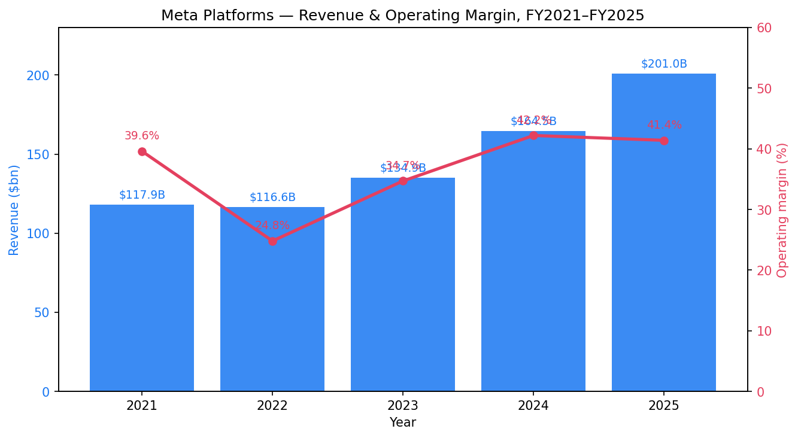
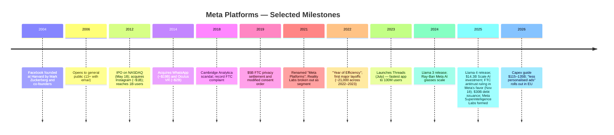
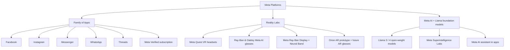
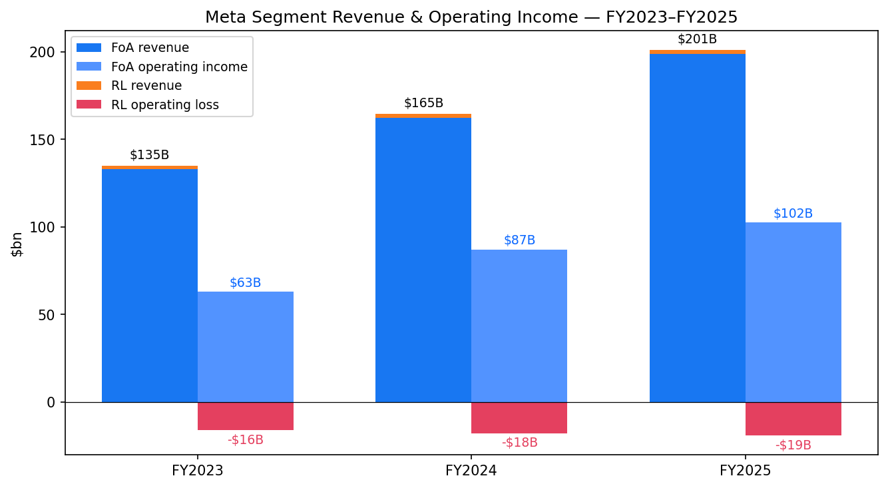
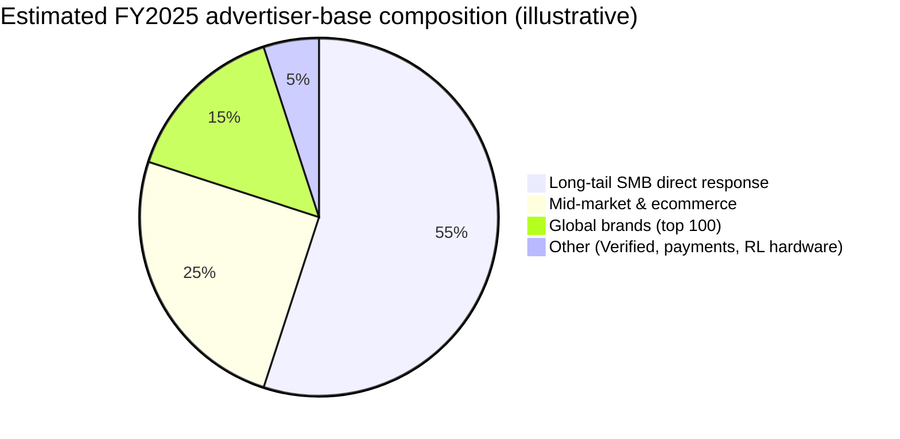
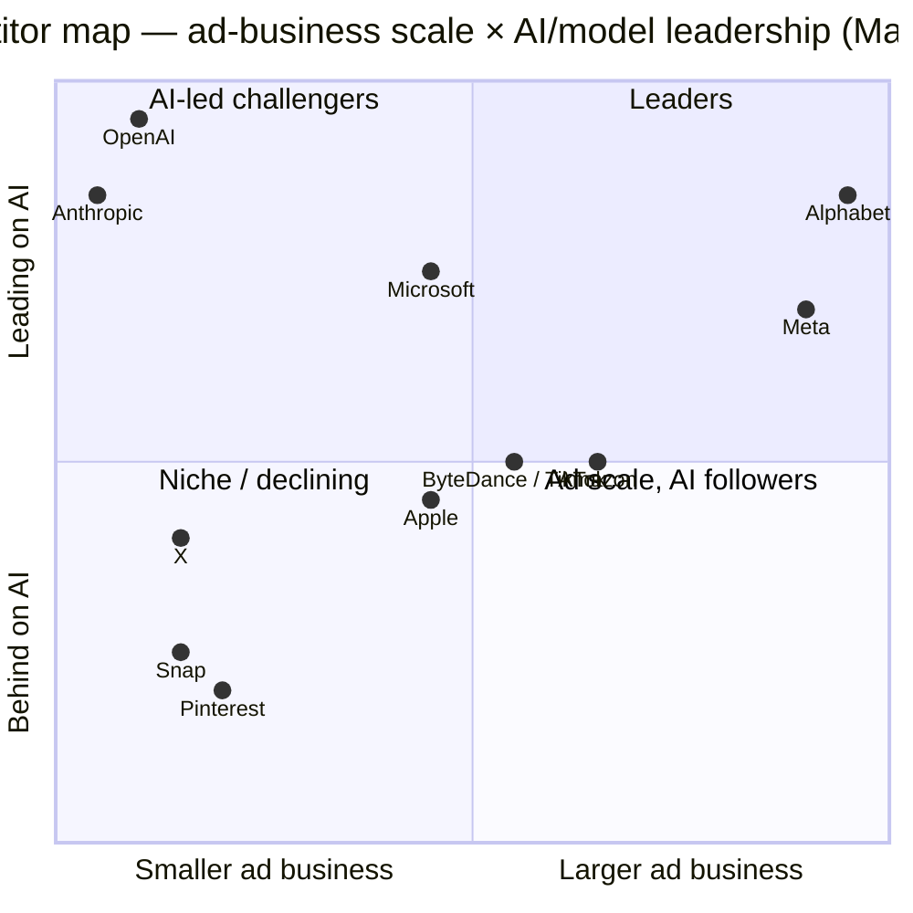
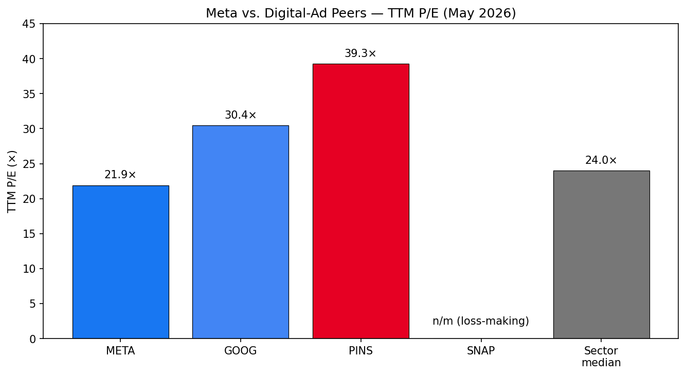
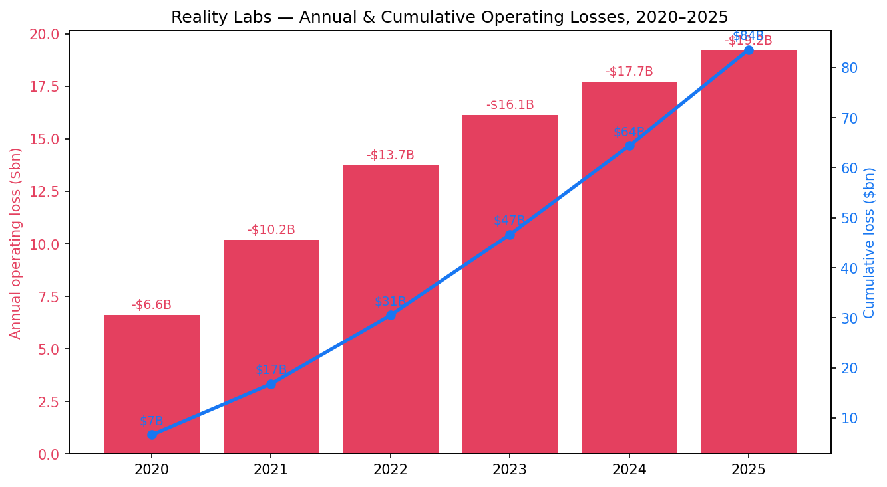
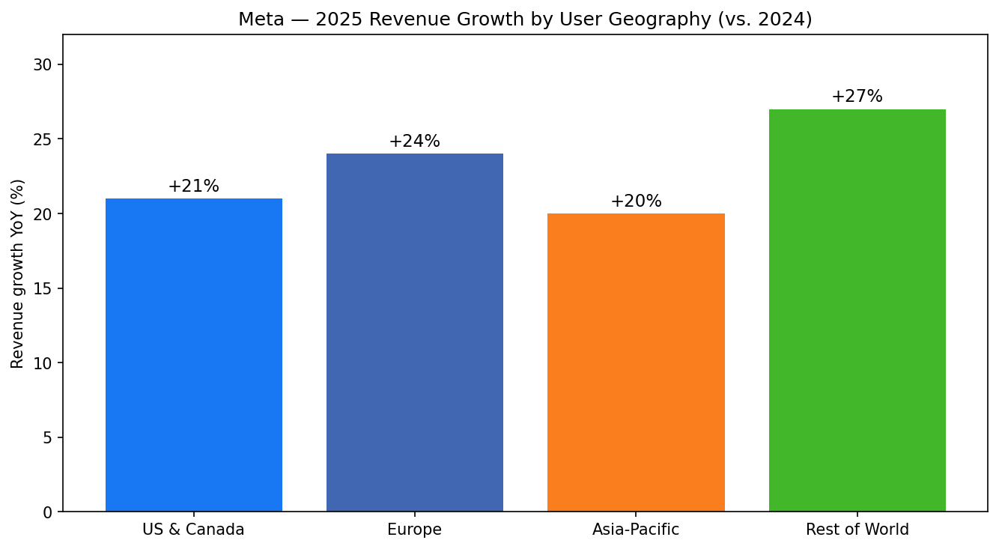

# COMPANY RESEARCH REPORT: Meta Platforms, Inc. (NASDAQ: META)

**Date:** 2026-05-20
**Ticker:** NASDAQ: META
**Reporting Currency:** US dollars

> **Update — FY2026 capex guide initiated at $115–$135B; FY2026 expense range $162–$169B (2026-01-28):** Alongside Q4 2025 results, Meta initiated 2026 capital-expenditure guidance of $115–$135 billion (vs. $72.22 billion of FY2025 capex), driven by Meta Superintelligence Labs build-out and core ad infrastructure. FY2026 total expense guidance was set at $162–$169 billion, and Q1 2026 revenue guidance at $53.5–$56.5 billion (assumes a ~4% FX tailwind). Management still expects 2026 operating income to be above 2025 levels despite the step-up in infra. Source: [Q4 2025 earnings release, 2026-01-28](https://www.sec.gov/Archives/edgar/data/1326801/000162828026003832/meta-12312025xexhibit991.htm).

---

## TABLE OF CONTENTS

1. Company Overview
2. Company History
3. Management Team
4. Products & Services
5. Customers & Go-to-Market
6. Industry Overview
7. Competitive Landscape
8. Market Opportunity (TAM)
9. Risk Assessment
10. References

---

## 1. COMPANY OVERVIEW

Meta Platforms, Inc. ("Meta") is the world's largest social-media operator and the second-largest seller of digital advertising globally. Headquartered in Menlo Park, California and listed on Nasdaq under the ticker META, the company runs the four social-networking and messaging products it collectively calls the "Family of Apps" — **Facebook, Instagram, Messenger, and WhatsApp** — together with newer surfaces **Threads**, the **Meta AI** assistant, and emerging **Reality Labs** consumer hardware (Meta Quest VR headsets and Ray-Ban / Oakley Meta AI glasses). Substantially all revenue today comes from selling ad placements across the Family of Apps; consumer hardware and a small set of subscription / payments products account for the rest ([Meta 10-K FY2025, Item 1 Business](https://www.sec.gov/Archives/edgar/data/1326801/000162828026003942/0001628280-26-003942-index.htm)).

**How Meta makes money.** The company operates an end-to-end ads stack: a free, ad-supported consumer surface that attracts 3.58 billion Family daily active people (DAP) on average in December 2025 (up 7% YoY), a self-service ad platform that lets approximately 10 million+ advertisers worldwide bid on inventory across Feed, Reels, Stories, Messenger, and Threads, and an in-house targeting / measurement layer increasingly powered by Meta's own AI models. In 2025, **ad impressions delivered across the Family of Apps rose 12% YoY and average price per ad rose 9% YoY** — the combination that drove the 22% YoY top-line growth ([Meta 10-K FY2025, MD&A Executive Overview](https://www.sec.gov/Archives/edgar/data/1326801/000162828026003942/0001628280-26-003942-index.htm)). Revenue diversification is limited: advertising was $196.18 billion of the $200.97 billion FY2025 total (~97.6%); Other FoA revenue (WhatsApp business messaging, Meta Verified subscription, payments) was $2.58 billion and Reality Labs hardware was $2.21 billion ([Q4 2025 earnings release, segment table](https://www.sec.gov/Archives/edgar/data/1326801/000162828026003832/meta-12312025xexhibit991.htm)).

**Where it operates.** Meta runs offices in more than 90 cities and owns or leases 30 data center locations globally, plus ~10 million square feet of office and building space around its Menlo Park headquarters ([Meta 10-K FY2025, Item 2 Properties](https://www.sec.gov/Archives/edgar/data/1326801/000162828026003942/0001628280-26-003942-index.htm)). Although the Family of Apps reaches users in essentially every country except mainland China and a handful of sanctioned jurisdictions, **revenue is highly weighted toward developed markets**: the U.S. & Canada and Europe contribute disproportionately because of higher monetisation, while Asia-Pacific and Rest of World drive most of the impression-volume growth. In 2025, revenue grew **21% in U.S. & Canada, 24% in Europe, 20% in Asia-Pacific, and 27% in Rest of World** ([Meta 10-K FY2025, Trends in Revenue by User Geography](https://www.sec.gov/Archives/edgar/data/1326801/000162828026003942/0001628280-26-003942-index.htm)).

**Scale.** Meta closed FY2025 with **revenue of $200.97 billion (+22% YoY), income from operations of $83.28 billion (+20%), free cash flow of $43.59 billion, and net income of $60.46 billion** (held back by a one-time $15.93 billion charge tied to the One Big Beautiful Bill Act tax law) ([Q4 2025 earnings release](https://www.sec.gov/Archives/edgar/data/1326801/000162828026003832/meta-12312025xexhibit991.htm)). Cash, cash equivalents, and marketable securities stood at $81.59 billion; long-term debt rose to $58.74 billion after a $30 billion debt issuance in November 2025 to help fund the AI capex cycle. Headcount was 78,865 (+6% YoY) ([Meta 10-K FY2025, MD&A](https://www.sec.gov/Archives/edgar/data/1326801/000162828026003942/0001628280-26-003942-index.htm)). Capital expenditures jumped to **$72.22 billion** in 2025 (from $39.23 billion in 2024) and are guided to $115–$135 billion in 2026.

*Source: [Meta 10-K FY2025, Consolidated Statements of Income](https://www.sec.gov/Archives/edgar/data/1326801/000162828026003942/0001628280-26-003942-index.htm); FY2021–FY2022 from prior 10-Ks.*

### Valuation snapshot

As of mid-May 2026, META trades around **$605 per share with a market capitalisation of ~$1.54 trillion**, making it the world's eighth-largest listed company. On a trailing twelve-month basis, **TTM P/E is ~21.9× and TTM P/S is ~7.2×** ([Yahoo Finance META key statistics, 2026-05-19](https://finance.yahoo.com/quote/META/key-statistics)). Forward P/E sits in the high-teens given consensus expects 2026 EPS to grow from the OBBBA-depressed $23.49 GAAP base. Cross-references: P/E ratio 21.91× and P/S 7.20× ([Public.com PE history](https://public.com/stocks/meta/pe-ratio)); P/S 8.81× cited by [GuruFocus, 2026-04-18](https://www.gurufocus.com/term/ps-ratio/META) using a higher share price; the company has no meaningful book-value discount given $217.24 billion of stockholders' equity vs. $1.54 trillion cap, so P/B is ~7×.

**Peer comparison (TTM, May 2026):**

| Company | TTM P/E | TTM P/S | Notes |
|---|---|---|---|
| **META** | **~21.9×** | **~7.2×** | Source: [Yahoo Finance, 2026-05-19](https://finance.yahoo.com/quote/META/) |
| GOOG/L (Alphabet) | ~30.4× | ~7.3× | Source: [Public.com GOOGL P/E, 2026-05-13](https://public.com/stocks/googl/pe-ratio) |
| PINS (Pinterest) | ~39.3× | ~2.9× | Source: [StockAnalysis PINS stats](https://stockanalysis.com/stocks/pins/statistics/) |
| SNAP (Snap Inc.) | **n/m (loss)** | ~1.3× | TTM EPS –$0.27; [GuruFocus SNAP P/E](https://www.gurufocus.com/term/pe-ratio/SNAP) |
| **Sector median (digital ads / internet)** | ~24× | ~5× | Approximate from sector trackers |

**Interpretation.** META's TTM P/E of ~22× is **at a discount of ~28% to Alphabet** and roughly in line with the broader internet sector median, despite Meta growing FY2025 revenue 22% (vs. Alphabet's ~14% in 2025). Two factors compress Meta's multiple: (i) **regulatory overhang** — the EU DMA non-compliance fine of €200 million in April 2025 and the new "less personalised ads" framework that took effect in Q1 2026 raise concerns about European ARPP ([European Commission DMA decision, 2025-12-08](https://digital-markets-act.ec.europa.eu/meta-commits-give-eu-users-choice-personalised-ads-under-dma-2025-12-08_en)); and (ii) **capex shock** — the leap from $39B (2024) to $72B (2025) to $115–135B (2026 guidance) has spooked some investors over near-term ROIC, even though the company maintains it will deliver higher operating income in 2026 ([Q4 2025 earnings release, CFO outlook](https://www.sec.gov/Archives/edgar/data/1326801/000162828026003832/meta-12312025xexhibit991.htm)). Multiple is not stretched (no need to flag valuation risk in Section 9 as the primary concern), but the *capex-driven decline in FCF conversion* is a separate financial risk we cover later. P/E is well below Meta's own 3-year average (~27×) and far below Alphabet, leaving room for a re-rate if AI capex monetises.

### 2. COMPANY HISTORY

Facebook was founded on **February 4, 2004** in a Harvard University dorm room by then-19-year-old sophomore Mark Zuckerberg together with classmates Eduardo Saverin, Andrew McCollum, Dustin Moskovitz, and Chris Hughes. Within two weeks half of Harvard's student body had signed up; Zuckerberg dropped out the following summer to move the company to Palo Alto, where Peter Thiel provided seed money ([Britannica — Mark Zuckerberg biography](https://www.britannica.com/money/Mark-Zuckerberg)). The company expanded out of campuses to the broader internet in 2006, hit one billion users in 2012, IPO'd at a $104 billion valuation in May 2012, acquired Instagram for ~$1 billion (April 2012, closed Sept 2012) and WhatsApp for ~$19 billion (February 2014), bought Oculus VR for ~$2 billion in March 2014 to seed its hardware roadmap, and renamed the parent company **Meta Platforms** in October 2021 as it pivoted publicly toward the metaverse ([Britannica — Meta Platforms](https://www.britannica.com/money/Meta-Platforms)).

Three strategic transformations matter for understanding the 2026 thesis:

- **The 2012–2014 "buy growth" pivot.** When Facebook saw photo-sharing (Instagram) and mobile messaging (WhatsApp) emerging as threats to feed engagement, Zuckerberg paid then-record multiples to absorb both. Instagram has since become the company's most valuable surface (broadly estimated at >40% of FoA ad revenue today) and WhatsApp is the largest messaging app in the world. The same playbook applied to Oculus a year later — paying $2 billion for what was then a pre-revenue VR start-up — locked in Reality Labs' starting position a decade before the AI-glasses category matured.
- **The 2021 metaverse pivot and the 2022–2023 efficiency reset.** The October 2021 rename signalled a long-dated push into AR/VR and the metaverse just as the post-COVID ad market cooled and Apple's ATT (App Tracking Transparency) hit targeting. Operating margin compressed from 39.6% in 2021 to 24.8% in 2022 and Reality Labs losses widened sharply. Zuckerberg responded with the "Year of Efficiency": ~21,000 layoffs in 2022–2023, capex discipline, and a flatter org. Operating margin recovered to 34.7% in 2023, 42.2% in 2024, and 41.4% in 2025 ([Meta 10-K FY2025, MD&A](https://www.sec.gov/Archives/edgar/data/1326801/000162828026003942/0001628280-26-003942-index.htm)).
- **The 2024–2025 AI super-pivot.** Llama 3 (April 2024), Llama 4 (April 2025), the $14.3 billion investment in Scale AI to bring in founder Alexandr Wang ([CNBC, 2025-06-12](https://www.cnbc.com/2025/06/12/scale-ai-founder-wang-announces-exit-for-meta-part-of-14-billion-deal.html)), and the formal launch of "Meta Superintelligence Labs" mark a categorical shift in spend. 2025 capex was 84% higher YoY; 2026 guidance is ~75% higher still at the midpoint. Senior engineering hires reportedly cost the company nine-figure packages individually, and a new executive equity plan in early 2026 ties almost $1 billion of pay to share-price hurdles up to $3,727 ([Harvard Law CorpGov blog, 2026-04-10](https://corpgov.law.harvard.edu/2026/04/10/metas-new-executive-pay-plan-ties-nearly-1-billion-to-stock-performance/)).

**Key acquisitions and investments (illustrative):**

- 2012 — **Instagram** (~$1B). Core mobile photo/Reels surface; arguably Meta's most valuable asset today.
- 2014 — **WhatsApp** (~$19B). Largest global messenger; monetisation now via paid business messaging.
- 2014 — **Oculus VR** (~$2B). Seeded Reality Labs and Meta Quest.
- 2025 — **Scale AI** ($14.3B for 49% non-voting stake; Wang joins Meta). Training-data engine and Superintelligence-Labs talent anchor ([Fortune, 2025-06-22](https://fortune.com/2025/06/22/inside-rise-scale-alexandr-wang-meta-zuckerberg-14-billion-deal-acquihire-ai-supremacy-race/)).

Recent developments worth tracking: (a) **November 18, 2025 — FTC antitrust ruling in Meta's favor**, ending the long-running structural-divestiture case against the Instagram and WhatsApp acquisitions; the FTC filed a notice of appeal on January 20, 2026, but a divestiture overhang is materially reduced ([Meta 10-K FY2025, Item 3 Legal Proceedings](https://www.sec.gov/Archives/edgar/data/1326801/000162828026003942/0001628280-26-003942-index.htm)). (b) **November 2025 — $30 billion debt issuance** in six tranches, more than doubling long-term debt to $58.74 billion to fund infra. (c) **December 2025 / January 2026 — DMA settlement on personalised ads**, which Meta says it began rolling out in Q1 2026 and which management explicitly flagged could materially worsen the EU user experience and revenue.

### 3. MANAGEMENT TEAM

**Mark Zuckerberg — Founder, Chairman & Chief Executive Officer.** Zuckerberg (b. May 14, 1984, White Plains, NY) is the single most consequential executive in the company, and the entire investment case is bound to his judgement and capital-allocation appetite. He attended Phillips Exeter Academy, enrolled at Harvard in 2002, and launched thefacebook.com from his dorm in February 2004 with co-founders Saverin, McCollum, Moskovitz, and Hughes ([Britannica](https://www.britannica.com/money/Mark-Zuckerberg)). Over 22 years as CEO he has executed three category-defining product cycles — the move from web to mobile (2010–2013), the consolidation of social via Instagram and WhatsApp (2012–2014), and the present generative-AI / superintelligence push (2023–) — each of which the market initially questioned and most of which were vindicated. He has also forced two brutal reset cycles on the business: the "Year of Efficiency" (2022–2023) cut roughly 21,000 jobs (about 25% of headcount at the time) and reset capex; the current AI cycle is doing the opposite, lifting capex from $39B to a guided $115–135B in three years. Zuckerberg controls Meta through a dual-class share structure created at IPO: he owns ~99.7% of Class B super-voting stock, which together with vested options gives him **approximately 61% of total voting power on roughly 13–14% of economic ownership** ([LinkedIn / Jimmy Acton citing 2025 Meta proxy materials](https://www.linkedin.com/posts/jimmyacton_mark-zuckerberg-only-owns-13-of-metas-stock-activity-7267436986527887361-VAMc); [Public Citizen analysis of Meta governance](https://www.citizen.org/news/how-zuckerberg-keeps-his-job-despite-rampant-mismanagement-and-misconduct/)). Forbes pegged his net worth at ~$220 billion in December 2025, ranking him consistently among the top three to five richest people globally ([Goodreturns / Forbes data](https://www.goodreturns.in/mark-zuckerberg-net-worth-and-biography-blnr15.html)). Public-profile observations matter for thesis tracking: he has personally championed open-sourcing Llama, the Ray-Ban Meta hardware roadmap, and the Scale AI deal that brought Alexandr Wang to lead Meta Superintelligence Labs. Investors who like META are betting on Zuckerberg's ability to pivot at scale; investors who dislike META cite exactly the same supervoting control as a governance risk.

**Susan Li — Chief Financial Officer.** Susan Li joined Meta in 2008 directly from Stanford (BS in Mathematical and Computational Science) and rose through finance roles to lead Family of Apps finance, then succeeded David Wehner as CFO in November 2022. She has now run Meta's finance org through the 2022–2023 efficiency cycle, the post-ATT recovery, the Reels monetisation ramp, and the current AI capex super-cycle — a remarkable five-year window across three macro regimes. Wall Street has come to view her quarterly capex / opex framing as a reliable lead indicator of segment investment. 2025 reported compensation: **~$0.99M base salary, $16.71M in stock awards, $86K other, ~$20.06M total** ([Fintool — Susan Li compensation summary](https://fintool.com/app/research/companies/META/people/susan-li)). She is also one of four executives (with CTO Andrew Bosworth, CPO Chris Cox, and COO Javier Olivan) included in the new 2026 long-dated stock-option plan tied to share-price hurdles, with theoretical max payouts up to ~$2.7 billion per executive ([Harvard CorpGov, 2026-04-10](https://corpgov.law.harvard.edu/2026/04/10/metas-new-executive-pay-plan-ties-nearly-1-billion-to-stock-performance/)).

**Chris Cox — Chief Product Officer.** Cox joined the company in 2005 as one of the earliest engineers and has been the de facto product architect of Facebook News Feed, Stories, and the Reels and Threads pushes. He left briefly in 2019 and returned in 2020 as CPO. He owns the Family of Apps product roadmap and is the senior executive directly responsible for translating Llama / Meta AI capability into consumer surfaces. 2025 reported compensation: **~$0.999M base, $18.38M stock awards, $11.75K other, ~$21.69M total** ([Fintool / proxy data](https://fintool.com/app/research/companies/META/people/susan-li)).

**Andrew Bosworth — Chief Technology Officer and Head of Reality Labs.** Bosworth ("Boz") has been at the company since 2006 and has run Reality Labs since 2017. He owns the AR/VR/AI-glasses roadmap end-to-end (Meta Quest, Ray-Ban Meta, Oakley Meta, the Orion AR prototype, the Meta Ray-Ban Display with EMG wristband). Reality Labs has been the controversial line item — cumulative losses of roughly $80 billion since 2020 — but the AI-glasses category turned a corner in 2025, with smart-glasses unit sales reportedly tripling YoY and production targets of 10–20 million units in 2026 ([webproNews / Meta IR summary](https://www.webpronews.com/meta-reality-labs-q2-4-5b-loss-beats-expectations-glasses-sales-triple/)).

**Governance.** Meta is a controlled company: Mark Zuckerberg holds ~61% of voting power, governance committees skew advisory rather than checking, and the Board has historically deferred to Zuckerberg on strategic resets (metaverse pivot, AI super-pivot, Scale AI deal). Independent directors include former Honeywell CEO David Cote, Tony Xu (Doordash), Charlie Songhurst, and others; the lead independent director rotates. Insider ownership of Class A is modest (~1–2% of Class A shares outstanding) but the Class B structure makes Zuckerberg the deciding vote on every shareholder proposal. The 2026 executive option plan tied to $9 trillion-of-market-cap aspirational hurdles drew criticism for its size but was approved without contest ([mlq.ai summary](https://mlq.ai/news/meta-launches-executive-stock-options-linked-to-9-trillion-valuation-target/)). Related-party transactions are limited; the most notable is Zuckerberg's personal use of company aircraft and security, which Meta discloses each year and pre-funds via "other compensation."

**Management track record synthesis.** The team has shipped two of the most successful efficiency cycles in mega-cap tech (2022–2023) and the two most ambitious capex cycles ever attempted by a non-utility, non-energy company (2024 and 2025). Zuckerberg's willingness to absorb >$80 billion of cumulative Reality Labs losses and his commitment to open-source Llama are both controversial but coherent with his stated long-term vision. Execution risk in the next phase is concentrated in two areas — AI infra ROIC and Reality Labs glasses commercialisation — which together absorb the bulk of incremental 2026–2027 spend.

### 4. PRODUCTS & SERVICES

Meta organises its business into two reportable segments — **Family of Apps (FoA)** and **Reality Labs (RL)** — but in practice we should think about it as five product franchises plus an AI / infra spine.

#### 4.1 Family of Apps (FoA) — $198.76B revenue, $102.47B operating income (FY2025)

**Facebook.** Still the largest individual product by aggregate reach, organised around Feed, Reels, Stories, Groups, Marketplace, Dating, and Gaming surfaces ([Meta 10-K FY2025, Item 1 Business](https://www.sec.gov/Archives/edgar/data/1326801/000162828026003942/0001628280-26-003942-index.htm)). Facebook's strategic relevance has shifted from "core social network" to "long-tail engagement platform" + "ad performance backbone" — many ads run cross-app but settle as Facebook impressions. Competitive advantage: **yes — durable network effects** (the canonical real-name social graph), high switching costs for legacy users (>40-year-olds in particular), and unmatched ad-tech depth. Closest competitor product: **TikTok / ByteDance and YouTube**, both ahead in the under-25 short-video category but behind on direct-response monetisation and SMB self-serve.

**Instagram.** The growth and monetisation engine of the Family today. Reels has become the dominant surface inside Instagram and drives Meta's incremental ad impressions even though it monetises at a lower rate than Feed and Stories ([Meta 10-K FY2025, MD&A "Other Business and Macroeconomic Conditions"](https://www.sec.gov/Archives/edgar/data/1326801/000162828026003942/0001628280-26-003942-index.htm)). Competitive advantage: **yes — brand + creator economy lock-in**; despite TikTok parity on short-form, Instagram retains the marquee influencer base, direct shopping inventory, and DM functionality. Closest competitor: **TikTok**.

**Messenger.** A messaging companion to Facebook, increasingly merged with Instagram DMs at the back end. Monetisation in messaging remains limited; the strategy is to use Messenger as a Click-to-Message ad endpoint. Competitive advantage: **partial** — reach is enormous but utility has been overtaken by iMessage / SMS in the US and by WhatsApp internationally.

**WhatsApp.** Largest messenger globally with an estimated >2.5 billion monthly users (Meta no longer discloses this discretely). The monetisation thesis has shifted from in-app ads (introduced for Status / Channels in 2024) to **paid business messaging** — Meta-charged conversations between businesses and customers — which the company groups inside "FoA Other revenue" of $2.58 billion in 2025 ([Q4 2025 earnings release](https://www.sec.gov/Archives/edgar/data/1326801/000162828026003832/meta-12312025xexhibit991.htm)). Competitive advantage: **yes — scale + encryption brand**, but monetisation per user remains a fraction of Facebook/Instagram. Closest competitor: Apple iMessage (regional), Telegram (regulatory-adjacent markets), WeChat (China only).

**Threads.** Launched July 2023 as a Twitter / X alternative. By Q3 2025 Meta disclosed 400 million monthly active users; daily active users reportedly reached 137 million by early 2026 ([Backlinko Threads statistics](https://backlinko.com/threads-users); [Social Media Today, 2025](https://www.socialmediatoday.com/news/threads-reaches-350-million-monthly-active-users/746828/)). Ads went live in 2024; monetisation is still very early. Competitive advantage: **partial** — the cold-start was uniquely fast because Threads inherits Instagram graph, but X / Bluesky / Mastodon remain alternative habitats for power users. Closest competitor: **X (Twitter)** and Bluesky.

**Meta Verified.** A paid subscription bundle (~$11.99/month per platform in the US) launched in 2023 that includes a verified badge, account-protection benefits, and customer support, sold across Facebook, Instagram, and WhatsApp. Run-rate revenue is not separately disclosed; included in FoA Other.

**Meta AI assistant.** A free conversational AI assistant available across the Family of Apps, as a standalone meta.ai app, on the AI glasses, and on the web. Powered by Llama 4. Meta has not yet monetised the assistant directly; the strategy is to drive engagement / dwell time and to feed first-party data into the ads stack ([Meta 10-K FY2025, Item 1 Business — "Meta AI"](https://www.sec.gov/Archives/edgar/data/1326801/000162828026003942/0001628280-26-003942-index.htm)). Competitive advantage: **partial — distribution** (3.58 billion DAP reach is unmatched), but model leadership is contested vs. OpenAI / Anthropic / Google.

#### 4.2 Reality Labs (RL) — $2.21B revenue, $19.19B operating loss (FY2025)

**Meta Quest.** VR headsets and the Meta Horizon Store. Quest 3 (launched 2023) and Quest 3S (2024) are the volume products; Q4 2025 saw a ~12% YoY decline in Quest revenue due to channel-inventory timing and a slower content cycle ([CNBC, 2026-01-28](https://www.cnbc.com/2026/01/28/metas-reality-labs-posts-6point02-billion-loss-in-fourth-quarter.html)). In 2026, Meta plans to spend roughly 30% of RL operating expenses on VR / Horizon and 70% on wearables ([Meta 10-K FY2025, Item 1 Business — "Reality Labs Products"](https://www.sec.gov/Archives/edgar/data/1326801/000162828026003942/0001628280-26-003942-index.htm)). Competitive advantage: **yes — leadership in dedicated standalone VR** (~75–80% category share), but the addressable market remains niche. Closest competitor: **Apple Vision Pro** (a different price/use case) and **Pico** (ByteDance, primarily Asia).

**Ray-Ban Meta and Oakley Meta AI glasses.** The breakout product line of 2024–2025: AI-powered audio glasses with cameras, Meta AI integration, and recently in-lens displays. Smart-glasses revenue reportedly tripled in 2025 with production targets of 10–20 million units in 2026 ([Webpronews, 2025](https://www.webpronews.com/meta-reality-labs-q2-4-5b-loss-beats-expectations-glasses-sales-triple/)). Competitive advantage: **yes — first-mover scale + retail distribution via EssilorLuxottica partnership**, the most durable moat in the category. Closest competitor: Google's Project Iris / Samsung XR (Galaxy) — early-stage; Apple has no shipping product.

**Meta Ray-Ban Display + Meta Neural Band.** Launched in 2025 — the first commercial smart glasses with an integrated in-lens display, paired with an EMG wristband that lets users control the device via neuromuscular signals ([Meta 10-K FY2025, Reality Labs Products](https://www.sec.gov/Archives/edgar/data/1326801/000162828026003942/0001628280-26-003942-index.htm)). Priced at $799. This is the first commercial step toward true AR glasses; volumes are small but the strategic option-value is large.

**Orion AR prototype + Long-term AR glasses.** Internal-only prototype unveiled at Connect 2024; consumer launch likely 2027–2028. Not a revenue line in 2026.

#### 4.3 Meta AI / Llama / Meta Superintelligence Labs (spine)

Meta has open-sourced its frontier models since Llama 1 (2023). **Llama 4 Scout (17B active / 109B total, 10M-token context), Maverick (17B active / 400B total), and Behemoth (still training)** released in April 2025 ([Meta AI blog — Llama 4](https://ai.meta.com/blog/llama-4-multimodal-intelligence/)). The strategy serves several goals: (i) drive open-source ecosystem adoption to capture mindshare, (ii) lower Meta's own model costs via downstream optimisations, (iii) attract elite ML talent, and (iv) discipline closed-source incumbents on price. In June 2025 Meta committed $14.3 billion to Scale AI for a 49% non-voting stake and recruited founder Alexandr Wang to lead the new **Meta Superintelligence Labs** ([CNBC, 2025-06-12](https://www.cnbc.com/2025/06/12/scale-ai-founder-wang-announces-exit-for-meta-part-of-14-billion-deal.html)). Competitive advantage: **partial** — open-weight leadership and distribution are world-class; closed-frontier-model performance vs. GPT-5 / Claude / Gemini is contested.

#### 4.4 Flagship vs. long-tail

**Flagship (drives ~95% of revenue and operating income):** Instagram (Reels + Feed + Stories ads) and Facebook (Feed + Reels ads). **Material but lower share:** WhatsApp business messaging, Meta Verified, Threads ads, Meta Quest hardware, and Ray-Ban Meta glasses. **Optionality / long-tail:** Meta AI assistant monetisation, Orion AR glasses, Horizon metaverse content, gaming.

#### 4.5 Last-12-month launches and shifts

- **April 2025:** Llama 4 release and LlamaCon AI developer conference.
- **June 2025:** $14.3B Scale AI investment; Alexandr Wang joins Meta to lead Superintelligence Labs ([Fortune, 2025-06-22](https://fortune.com/2025/06/22/inside-rise-scale-alexandr-wang-meta-zuckerberg-14-billion-deal-acquihire-ai-supremacy-race/)).
- **2025:** Meta Ray-Ban Display launched (first in-lens display smart glasses, $799); Oakley Meta line introduced; smart-glasses unit volumes triple YoY ([Meta 10-K FY2025, Reality Labs Products](https://www.sec.gov/Archives/edgar/data/1326801/000162828026003942/0001628280-26-003942-index.htm)).
- **Q4 2025 / Q1 2026:** Less Personalised Ads (LPA) framework rolled out in EU under the Commission's December 2025 settlement ([EC DMA announcement, 2025-12-08](https://digital-markets-act.ec.europa.eu/meta-commits-give-eu-users-choice-personalised-ads-under-dma-2025-12-08_en)).
- **November 2025:** Court grants judgment in Meta's favor on the FTC antitrust case (FTC appeal filed Jan 20, 2026).

*Source: [Meta 10-K FY2025, Segment Information](https://www.sec.gov/Archives/edgar/data/1326801/000162828026003942/0001628280-26-003942-index.htm) and [Q4 2025 earnings release](https://www.sec.gov/Archives/edgar/data/1326801/000162828026003832/meta-12312025xexhibit991.htm).*

### 5. CUSTOMERS & GO-TO-MARKET

Meta's "customers" are **advertisers**, but its "users" are the consumers whose attention it sells. Both populations are extremely large and diversified.

**Customer (advertiser) base.** Meta's ad platform is overwhelmingly self-service: the majority of marketers use the self-serve Meta Ads Manager and bid in an auction, with no required minimums. The company also runs a global enterprise sales force out of offices in 90+ cities, focused on the world's largest brand advertisers, ad agencies, and resellers ([Meta 10-K FY2025, Item 1 Business — Sales and Operations](https://www.sec.gov/Archives/edgar/data/1326801/000162828026003942/0001628280-26-003942-index.htm)). Public estimates put the advertiser base at roughly **10 million+ active advertisers globally**, dominated by SMB direct-response advertisers (the long tail) and a smaller premium-brand layer.

**Customer concentration.** Meta does **not disclose any single customer at or above 10% of consolidated revenue** — neither in the Item 1 Business section nor in the segment / geographic note of the FY2025 10-K, nor under ASC 280-10-50-42 ([Meta 10-K FY2025](https://www.sec.gov/Archives/edgar/data/1326801/000162828026003942/0001628280-26-003942-index.htm)). The most-cited public estimate is that the **top-100 advertisers contribute roughly 15–20% of ad revenue** and that the **top single advertiser accounts for ~1–2%** — neither figure is disclosed by Meta, and we explicitly flag them as estimates, not facts. In prior years, Chinese cross-border e-commerce advertisers (notably Temu / PDD and Shein) had been publicly cited by sell-side as the single largest growth contributor in 2023, and management called out **softer demand from China-based advertisers in 2024 earnings calls**; the FY2025 10-K MD&A also references potential adverse effects from US / China tariffs. We note this as a **diffuse but real risk**: while no single advertiser is material, regional or vertical-level pullbacks (e.g., Chinese e-commerce, US auto, US CPG during a recession) can move revenue by several percentage points.

*Source: Illustrative — Meta does not disclose advertiser-base concentration. Buckets reflect industry analyst consensus; treat as approximate, not as filing disclosure.*

**Geographic mix of revenue (by user geography).** Meta reports four reporting geographies. FY2025 revenue grew **21% in US & Canada, 24% in Europe, 20% in Asia-Pacific, and 27% in Rest of World** ([Meta 10-K FY2025, Trends in Revenue by User Geography](https://www.sec.gov/Archives/edgar/data/1326801/000162828026003942/0001628280-26-003942-index.htm)). U.S. & Canada and Europe still contribute the majority of revenue dollars because of higher ARPP. Worldwide quarterly ARPP rose from $11.20 in Q4 2023 to a sequence ending Q4 2025 at $16.56, with full-year ARPP of **$57.03 (+15% YoY)** ([Meta 10-K FY2025, Trends in Family Metrics](https://www.sec.gov/Archives/edgar/data/1326801/000162828026003942/0001628280-26-003942-index.htm)).

**Distribution and channels.**
- *Family of Apps.* App-store distribution on Apple iOS and Android, web access on personal computers. The single most important channel risk is **Apple iOS App Tracking Transparency** (introduced 2021) and **Google's Android privacy initiatives**, both of which materially reduce Meta's ability to target and measure ads ([Meta 10-K FY2025, MD&A — Developments in Advertising](https://www.sec.gov/Archives/edgar/data/1326801/000162828026003942/0001628280-26-003942-index.htm)).
- *Reality Labs.* Multi-channel: direct-to-consumer via Meta.com and a small number of Meta-branded retail stores; via retailers (Best Buy, Amazon, Costco in the US; EssilorLuxottica-branded retail globally for Ray-Ban Meta and Oakley Meta).

**Sales cycle and pricing.** Self-serve advertisers see effectively zero sales cycle — go from sign-up to first impression in minutes. Pricing is auction-based (CPM / CPC / CPA equivalent depending on objective). The average price per ad rose 9% YoY in FY2025, **driven by improved AI-powered targeting (Advantage+ campaign suite), Reels monetisation gains, and click-to-message ads** — explicitly cited by management in Q3 2025 / Q4 2025 calls. For RL hardware, retail pricing model with promotional discounts on Quest 3S during peak holiday quarters.

**Key partnerships.** EssilorLuxottica is the most strategically important partner: it manufactures and distributes Ray-Ban Meta and Oakley Meta glasses worldwide. NVIDIA, Microsoft (Azure), and Oracle are the leading cloud-infra suppliers (Meta operates its own data centres but also uses third-party cloud). Snapdragon (Qualcomm) supplies the chip family used in Quest and AI glasses. AT&T Sports, NBA, and certain music labels are content partners for Horizon Worlds.

**Named "customer" wins.** Meta does not name advertisers in disclosures. Public case studies on the [Meta for Business](https://www.facebook.com/business/success) site cover Sephora, Toyota, Airbnb, Walmart, Heineken, Shopify merchants, and thousands of SMBs.

### 6. INDUSTRY OVERVIEW

**Industry definition.** Meta competes in two overlapping markets: **digital advertising** (the dominant revenue pool) and **consumer technology hardware / extended-reality** (Reality Labs). The digital-advertising industry is itself a subset of total global advertising (TV / OOH / print / radio + digital) — but digital now represents roughly 75% of total global ad spend.

**Market size.** Global advertising spend is forecast to cross **$1.03 trillion in 2025** for the first time, growing toward **$1.3 trillion by 2028** ([Precedence Research — Digital Advertising Market](https://www.precedenceresearch.com/digital-advertising-market); [Abbey Mecca summary of 2025 forecasts](https://abbeymecca.com/worldwide-ad-spending-to-hit-1-trillion-in-2025-what-it-means-for-businesses-marketers-and-nonprofits/)). Within that, **digital advertising is roughly $750–$800 billion in 2025** and growing 10–12% per year. The walled-garden share is highly concentrated: Alphabet (Google + YouTube) at >$200B, Meta with >23% of global digital ad share at ~$196B of ad revenue in 2025, and Amazon Ads at ~9% / ~$69B ([Marketing Dive — Meta vs. Google share, 2025](https://www.marketingdive.com/news/meta-to-surpass-google-in-digital-ad-revenue-for-first-time-emarketer/817384/)). ByteDance / TikTok is the fastest-growing material competitor at ~$33B in 2025 (+40% YoY).

**Growth rates.** Global digital ad spend has compounded at low-double-digit CAGR over the last five years and is widely modelled to grow ~10% CAGR through 2028 — with Reels-style short-video, CTV, and retail-media taking share from traditional display and search. Meta has materially outgrown the digital ad market since 2023 (FY2023 +16%, FY2024 +22%, FY2025 +22%), implying ongoing share gains.

**Key trends and drivers.**
- *AI-powered ad performance.* Meta's Advantage+ suite uses Llama-derived models to consolidate manual campaign decisions and has driven measurable lift in advertiser ROAS. Management cites this as the single largest internal driver of higher CPMs.
- *Short-form video monetisation.* Reels monetises at a lower rate than Feed but is rapidly closing the gap; Meta's stated 2024–2025 internal goal was Reels-Feed parity.
- *Click-to-message and business messaging.* WhatsApp paid messaging is a multi-billion-dollar revenue stream and a key conversion mode in Brazil, India, Indonesia, and the Middle East.
- *Less personalised ads (LPA) in Europe.* The EC's December 2025 settlement obliges Meta to offer EU users a less personalised free tier in addition to the paid subscription. Effect: smaller ARPP and lower CPM in Europe; magnitude not yet quantified ([European Commission DMA announcement, 2025-12-08](https://digital-markets-act.ec.europa.eu/meta-commits-give-eu-users-choice-personalised-ads-under-dma-2025-12-08_en)).
- *AI infra capex super-cycle.* The category-wide capex step-up (Meta, Alphabet, Microsoft, Amazon, Oracle) is reshaping data-centre, power, and GPU supply chains. Meta's $115–135B 2026 capex guide is the second-largest in the cohort behind Alphabet's similar range.
- *Wearables / AI glasses.* Industry analysts now treat smart-glasses as a real consumer category with multi-million-unit volumes; Meta is the runaway leader.

**Regulatory environment.** Meta operates in arguably the most regulated environment of any consumer-tech company in the world. Key regimes include:

- *EU Digital Markets Act (DMA).* Designates Meta as a "gatekeeper"; €200M non-compliance fine April 2025; LPA framework now mandatory ([ITIF analysis — EU DMA fine vs. Meta, 2025-08-07](https://itif.org/publications/2025/08/07/eu-dma-fine-against-meta-gdpr-disguise/)).
- *EU Digital Services Act (DSA).* Imposes content-moderation obligations on "very large online platforms" — risk of further fines for non-compliance on transparency reporting and illegal-content removal.
- *EU AI Act.* Phased through 2025–2027; constrains general-purpose AI deployment and includes transparency obligations on training data.
- *EU GDPR.* Ongoing enforcement; 2022–2024 saw cumulative fines exceeding €2 billion across Ireland DPC cases.
- *US FTC consent decree (April 2020).* Meta paid $5.0B and operates under a privacy / data-handling consent order.
- *US FTC antitrust v. Meta.* Court ruled in Meta's favor November 18, 2025; FTC appealed January 20, 2026 ([Meta 10-K FY2025, Item 3 Legal Proceedings](https://www.sec.gov/Archives/edgar/data/1326801/000162828026003942/0001628280-26-003942-index.htm)).
- *Youth-safety legislation in US states, UK, Australia.* Multiple US states have passed laws restricting under-18 social-media use; Australia's under-16 ban (passed 2024) requires Meta to take "reasonable steps" to keep minors off services ([Meta 10-K FY2025, Risk Factors](https://www.sec.gov/Archives/edgar/data/1326801/000162828026003942/0001628280-26-003942-index.htm)). The FY2025 10-K's CFO outlook explicitly flagged "trials scheduled for this year in the U.S., which may ultimately result in a material loss."

**Industry dynamics.** The digital-ads industry is highly consolidated (Google + Meta together >50% of global digital ad spend; with Amazon, ~62%). Buyer (advertiser) power is low at the SMB level (no negotiated pricing) but rising at the largest-brand level as principal-based ad-tech alternatives emerge. Supplier power is concentrated and rising — GPU supply (NVIDIA), power supply (utilities), and EUV-grade cloud capacity all matter. Substitutes are few at scale; entrants face Meta's network-effect moat and >$50B/yr R&D + capex investment thresholds.

### 7. COMPETITIVE LANDSCAPE

Meta competes across three battlefronts: (1) **user attention** (consumer time), (2) **advertiser dollars**, and (3) **AI / next-platform leadership**. The competitor set is different on each.

**(a) Direct competitors — consumer social / video attention:**

- **Alphabet (Google / YouTube).** The other duopoly leader. YouTube competes directly with Reels for short-form (Shorts) and with Instagram for creator monetisation; Google Search competes with Meta on intent-driven advertising. On AI infra, Google's TPU-based Gemini stack is the most credible competitor to Meta's NVIDIA-based Llama training. **Verdict:** Alphabet ahead in search ad share and long-form video; Meta ahead in social and SMB direct response.
- **ByteDance / TikTok.** TikTok is Meta's most direct competitor for younger user attention and has driven much of Reels' product roadmap. ByteDance's ~$33B 2025 ad revenue is growing >40% YoY, the fastest of any large competitor ([Top 10 online advertising companies 2025](https://www.emergenresearch.com/blog/top-10-companies-in-the-online-advertising-market)). Meta has so far defended share via Reels and superior measurement, but TikTok continues to gain mindshare in Gen Z. Regulatory headwinds (US TikTok ban legislation, EU DSA) could redistribute share to Meta.
- **Snap Inc. (SNAP).** Smaller direct competitor (~$5–6B revenue), historically the originator of Stories. TTM unprofitable; competitive in AR Spectacles. **Behind Meta on every dimension at scale.**
- **Pinterest (PINS).** Adjacent — shopping-discovery niche; ~$4.4B revenue. Competes for visual / shopping ad budget but not for consumer time. **Behind Meta on scale.**
- **X (formerly Twitter).** Now smaller, advertiser-deserted; Threads has captured most of its former growth narrative.
- **Reddit / Discord.** Niche text / community engagement; small ad businesses.

**(b) Direct competitors — advertiser dollars (digital ads):**

- **Alphabet** — direct competition on performance ads and brand budgets.
- **Amazon Ads** — ~$69B revenue, growing ~20% YoY; the fastest-growing threat for direct-response retail budgets. Bottom-of-funnel intent gives Amazon structural advantage on shopping ads.
- **TikTok / ByteDance** — closest competitor for Gen-Z brand budgets.
- **Retail-media networks (Walmart Connect, Target Roundel, etc.).** Smaller but cumulatively material new pool.
- **Connected-TV inventory (Netflix, Disney, Roku, etc.).** Premium brand video; competes for AVOD upfront budgets.

**(c) AI / next-computing-platform competitors:**

- **OpenAI** — closed-frontier-model leader; ChatGPT scale (~700M weekly active users reported by OpenAI in 2025). Direct competitor for consumer AI assistant share and developer mindshare.
- **Anthropic** — closed-frontier model, strong enterprise positioning.
- **Alphabet (Google DeepMind / Gemini)** — most credible vertically-integrated competitor (TPUs + frontier model + 3B+ consumer surfaces).
- **Apple** — slower on AI but owns the most important AI-glasses-and-XR consumer endpoint (iPhone + Vision Pro). Risk: Apple's privacy framing makes Meta's ad business structurally harder.
- **Microsoft** — partner to OpenAI; competes on enterprise AI and Windows-side AI features.
- **xAI (Elon Musk).** Smaller but well-funded; Grok competes for consumer AI mindshare and uses X for distribution.

**Meta's competitive advantages.**
- **Network-effect moat.** 3.58B Family DAP is unmatched and creates self-reinforcing demand for advertisers.
- **Ad-tech depth.** Two decades of self-serve auction optimisation; Advantage+ AI campaign suite; pixel-level conversion measurement (subject to ATT erosion).
- **Data-flywheel scale.** First-party user behaviour at trillion-event scale fuels both targeting and recommendation models.
- **Cash-flow and balance-sheet firepower.** $81.6B cash + $44B FCF lets Meta fund the AI capex super-cycle internally without sacrificing capital returns.
- **Founder-CEO mandate.** Zuckerberg's supervoting control lets the company commit to multi-decade, capital-intensive pivots without quarterly-investor revolt — a competitive advantage in long-horizon bets like Reality Labs and Superintelligence Labs.
- **Open-source Llama ecosystem.** Drives elite-talent attraction and downstream ecosystem leverage (price pressure on closed competitors).

**Competitive vulnerabilities.**
- **Apple platform tax.** Meta still depends on iOS for a large share of US revenue; any further Apple privacy tightening (or a Vision Pro distribution moat) compresses margin.
- **Regulatory drag in EU.** LPA, DMA, DSA — Europe is the most exposed geography to direct revenue impairment.
- **AI model leadership is contested.** Llama 4 is competitive but not unambiguously ahead; if Llama 5 / Behemoth fails to deliver, Meta's "all-in" capex looks worse.
- **Reality Labs unit economics.** Cumulative ~$80B losses with no clear path to break-even on the VR side; the company is leaning increasingly on glasses, which are still pre-scale.
- **Brand / safety risk.** Ongoing youth-safety trials and the Cambridge Analytica legacy keep reputational risk elevated.

*Source: [Yahoo Finance META key statistics, 2026-05-19](https://finance.yahoo.com/quote/META/); [Public.com GOOGL P/E history](https://public.com/stocks/googl/pe-ratio); [GuruFocus SNAP P/E](https://www.gurufocus.com/term/pe-ratio/SNAP); [StockAnalysis PINS](https://stockanalysis.com/stocks/pins/statistics/). SNAP TTM EPS is negative.*

### 8. MARKET OPPORTUNITY (TAM)

**Digital advertising TAM.** Global digital ad spend is approximately **$750–$800B in 2025**, on track for **~$1.0 trillion by 2028** under most third-party forecasts ([Precedence Research](https://www.precedenceresearch.com/digital-advertising-market); [Abbey Mecca summary, 2025](https://abbeymecca.com/worldwide-ad-spending-to-hit-1-trillion-in-2025-what-it-means-for-businesses-marketers-and-nonprofits/)). Meta's 2025 ad revenue of $196.18B implies **~25% global digital ad share** (and >23% per Marketing Dive's eMarketer cite). If digital ad TAM grows at 10% CAGR through 2028, Meta would need to grow ~14% per year to hit ~30% share by 2028 — well within the recent trajectory and consistent with our growth bridge (impressions +10% × pricing +5%).

**Business-messaging TAM.** Conversational commerce / paid-business-messaging is harder to size but estimated at **$30–50B by 2030**, growing 20%+ CAGR per Juniper Research / IDC tracking. Meta's WhatsApp Business and Messenger Click-to-Message ads position it as the global leader outside China; revenue is buried inside FoA Other ($2.58B in 2025) but management has guided that business-messaging is a multi-billion-dollar standalone revenue line.

**AI assistant TAM.** Consumer generative-AI assistant market is nascent — likely **$10–30B in 2026** depending on definition, with bull cases above $200B by 2030. Meta's monetisation strategy is indirect (engagement / first-party data) for now; direct subscription / API monetisation is optional.

**Smart-glasses / wearables TAM.** Smart-glasses unit volumes are forecast to scale from the low millions in 2024 to **20–40 million units annually by 2027** if Meta and competitors hit production targets ([Webpronews — Meta glasses production targets, 2025](https://www.webpronews.com/meta-reality-labs-q2-4-5b-loss-beats-expectations-glasses-sales-triple/)). At a $300–800 ASP that implies a $6–30B hardware market by 2027 — modest relative to Meta's ads business but a category Meta currently dominates. AR glasses (Orion / future) and the broader spatial-computing market are larger but later (2028+).

**VR / metaverse TAM.** Smaller than expected three years ago — global consumer VR hardware revenue likely <$5B in 2025 — and unlikely to be the primary Reality Labs unlock.

**SAM and SOM.** Within digital ads, Meta's serviceable market is global consumer-targeted ad spend ex-China (excluded by Great Firewall), which is roughly $600–650B. Meta's SOM (current share) is ~$196B / ~30% of SAM. The realistic incremental opportunity for Meta is:
- **+200–300 bps share gain** on AI-driven ad performance (Advantage+ and Reels monetisation),
- **+20% YoY business-messaging revenue growth** (off small base),
- **+5–10x growth** on glasses revenue between 2025 and 2028 (off ~$1.5–2B implied 2025 base),
- **Optional monetisation of Meta AI assistant** at 1B+ DAU scale.

**Penetration strategy.** Meta's playbook for capturing TAM is consistent: (i) build the surface, scale users for free, monetise via auction; (ii) where possible, vertically integrate the platform (own data centres, own silicon — MTIA — own models — Llama); (iii) keep prices low for advertisers; (iv) bundle AI capability into the existing self-serve interface so adoption is automatic. The capex super-cycle is the explicit financial commitment to (ii) — Meta argues that owning AI compute end-to-end is a structural advantage on cost-per-inference and on model-iteration cadence.

*Source: [Meta 10-K FY2025, Liquidity and Capital Resources](https://www.sec.gov/Archives/edgar/data/1326801/000162828026003942/0001628280-26-003942-index.htm) and [Q4 2025 earnings release, CFO Outlook](https://www.sec.gov/Archives/edgar/data/1326801/000162828026003832/meta-12312025xexhibit991.htm). 2026 = midpoint of $115–$135B guided range.*

*Source: [Meta 10-K FY2025, Trends in Family Metrics](https://www.sec.gov/Archives/edgar/data/1326801/000162828026003942/0001628280-26-003942-index.htm); prior-year DAP from FY2022 and FY2024 10-Ks.*

*Source: [Meta segment results — 10-K filings FY2021–FY2025](https://www.sec.gov/Archives/edgar/data/1326801/000162828026003942/0001628280-26-003942-index.htm). 2020 loss approximated from FY2021 10-K comparative.*

*Source: [Meta 10-K FY2025, Trends in Revenue by User Geography](https://www.sec.gov/Archives/edgar/data/1326801/000162828026003942/0001628280-26-003942-index.htm).*

### 9. RISK ASSESSMENT

#### Company-specific risks

**1. Founder / key-person concentration in Mark Zuckerberg.** Zuckerberg holds ~61% of voting power on ~13–14% of economic ownership through Class B super-voting stock. Every multi-decade strategic decision — metaverse pivot, AI super-pivot, $14.3B Scale AI deal — is essentially his call without minority-shareholder veto. The upside is rapid, coherent capital allocation; the downside is *no formal check* on a capital-allocation mistake. Mitigation: a strong CFO / CPO / CTO bench, an experienced independent board with a lead director, and Zuckerberg's >20-year track record of recovering from missteps. ([Public Citizen — Meta governance](https://www.citizen.org/news/how-zuckerberg-keeps-his-job-despite-rampant-mismanagement-and-misconduct/))

**2. AI capex ROIC / payback risk.** 2026 capex of $115–135B is roughly 2.5× Meta's 2024 free cash flow. If AI capex fails to translate into either ad-pricing power, new product revenue, or cost-out efficiency at the expected pace, return on incremental invested capital could compress for multiple years. Meta has guided that 2026 operating income will exceed 2025, but free-cash-flow conversion will weaken — FCF fell from $52B (2024) to $44B (2025) despite higher net income. Severity: high. Mitigation: depreciation lag (capex hits cash now, P&L over 4–5 years); diversified upside paths (ads, AI assistant, glasses); ability to scale capex back if returns disappoint.

**3. Reality Labs persistent losses.** ~$80B cumulative since 2020, $19.2B in 2025 alone, and 2026 RL operating losses guided to "remain similar to 2025 levels" ([Q4 2025 earnings release](https://www.sec.gov/Archives/edgar/data/1326801/000162828026003832/meta-12312025xexhibit991.htm)). If the AI-glasses ramp falters (e.g., production constraints, regulatory friction on always-on cameras), losses could persist for years without obvious break-even. Severity: medium (the loss is contained inside a single segment funded by FoA cash flow). Mitigation: 2025's tripling of glasses unit volumes; 70% of RL opex now flowing to wearables (the segment with clearest commercial trajectory).

**4. Advertiser concentration — sector / region.** Although Meta does not disclose any single advertiser at >10% of revenue, **Chinese cross-border e-commerce advertisers (Temu, Shein, AliExpress, TikTok Shop sellers) are widely understood to have been a major 2023–2024 growth driver** and were called out as softening in 2024 earnings calls. A US tariff escalation or a Chinese-brand pullback could reduce growth by several hundred basis points. Severity: medium. Mitigation: Meta's revenue base is broadly diversified across millions of SMB advertisers globally.

**5. Brand-safety and youth-safety litigation.** The CFO outlook explicitly flagged "a number of trials scheduled for this year in the U.S., which may ultimately result in a material loss" related to youth-related issues ([Q4 2025 earnings release, CFO outlook](https://www.sec.gov/Archives/edgar/data/1326801/000162828026003832/meta-12312025xexhibit991.htm)). The 10-K reports $6.87B in legal-related accruals as of December 31, 2025 ([Note 9 Accrued Expenses, 10-K FY2025](https://www.sec.gov/Archives/edgar/data/1326801/000162828026003942/0001628280-26-003942-index.htm)). Severity: medium. Mitigation: Meta's settlement track record; product changes (teen accounts, default privacy settings).

**6. Platform-dependence on Apple and Google.** ATT (Apple, 2021) and ongoing Android privacy changes can erode ad-targeting signal availability. Meta has spent five years rebuilding the measurement stack via AEM (Aggregated Event Measurement) and on-platform conversions, but the dependence remains structural. Severity: medium / chronic. Mitigation: Meta's first-party data scale, business-messaging conversions, and increasing in-app conversion paths.

#### Industry / market risks

**7. Regulatory drag in the EU (DMA, DSA, AI Act, GDPR).** April 2025 €200M DMA fine, December 2025 LPA framework now rolling out, ongoing GDPR cases, EU AI Act enforcement starting in 2026. Management explicitly says "further modifications to our model may be imposed during the appeal process, which could result in a materially worse user experience for European users and a significant impact to our European business and revenue" ([Meta 10-K FY2025, Risk Factors](https://www.sec.gov/Archives/edgar/data/1326801/000162828026003942/0001628280-26-003942-index.htm)). Severity: medium-high. Mitigation: Europe is ~22–24% of revenue; geographic diversification limits magnitude.

**8. Competitive intensity — TikTok, Google, Amazon, OpenAI.** All four major rivals are spending aggressively on AI infra, AI-glasses, or short-form video. ByteDance grew ad revenue >40% in 2025; Alphabet is the only player matching Meta capex. If Reels engagement loses ground to TikTok-Shorts or if OpenAI's consumer assistant captures meaningful Meta AI share, advertiser CPMs may compress. Severity: medium. Mitigation: Meta's user-scale and self-serve advertiser lock-in.

**9. AI / next-platform disruption risk.** The biggest single bear-case scenario: a competitor's frontier model achieves a clear capability lead that lets it leapfrog Meta on either (a) consumer AI assistant adoption or (b) AI-glasses / spatial-computing UX. Severity: high but probabilistic — a tail risk rather than a base case.

**10. US antitrust appeal.** Although Meta won the FTC trial on November 18, 2025, the FTC filed a notice of appeal January 20, 2026. A reversal would re-open structural-remedy risk on Instagram and WhatsApp. Severity: low-medium (winning the trial is a significant precedent, appeals court reversals on antitrust matters of this scale are uncommon).

#### Financial risks

**11. Capex-driven free-cash-flow compression.** FY2025 capex of $72.22B already dropped FCF from $52.1B (2024) to $43.59B (2025) despite higher operating cash flow. With 2026 capex guided $115–$135B, FCF conversion could shrink further before depreciation catches up. Combined with $26B annual buyback pace and $5.3B dividends, the balance sheet (long-term debt has doubled to $58.7B) will lever up further. Severity: medium. Mitigation: $81.6B cash + cash-flow profile; debt remains low relative to peers and to enterprise value; no financial covenants on the Notes.

**12. Tax-rate volatility and OBBBA impact.** FY2025 GAAP effective tax rate was 30% due to a $15.93B charge tied to the One Big Beautiful Bill Act (OBBBA) ([Meta 10-K FY2025, Provision for income taxes](https://www.sec.gov/Archives/edgar/data/1326801/000162828026003942/0001628280-26-003942-index.htm)). Absent that, the rate would have been 13%, and the 2026 guidance is 13–16%. Continued global tax regime changes (OECD 15% global minimum tax) could push the rate higher. Severity: low-medium. Mitigation: 2026 cash tax payments expected to fall as OBBBA expensing kicks in.

**13. Valuation / multiple-compression risk.** Modest. TTM P/E ~22× is below the 3-year average and below Alphabet; P/S ~7× is reasonable for a 22%-grower with 41% operating margin. The risk is asymmetric: if capex returns disappoint and growth decelerates to high single digits, the multiple could compress to ~16× and the stock could underperform even with rising EPS. Severity: low (multiple is not stretched today). Mitigation: see prior commentary in Section 1.

#### Macroeconomic risks

**14. Advertising-cycle sensitivity.** Digital ads are correlated with GDP / consumer spending. A US or global recession typically pulls digital ad budgets down 5–15% (less than TV / print, but real). Meta's revenue is mostly recession-exposed (consumer-marketing dependent). Severity: medium. Mitigation: SMB direct-response budgets are more resilient than brand budgets; Meta has historically gained share in recessions.

**15. FX exposure.** Roughly 47–50% of revenue is non-US-dollar. The dollar's path is a meaningful swing factor; Meta hedges but residual exposure remains. The Q1 2026 guidance assumed a 4% FX tailwind to YoY growth ([Q4 2025 earnings release](https://www.sec.gov/Archives/edgar/data/1326801/000162828026003832/meta-12312025xexhibit991.htm)). Severity: low-medium.

**16. Geopolitical and trade-policy risk.** US-China tariffs hit Chinese e-commerce advertisers (a meaningful Meta cohort); EU sovereign politics affect DMA enforcement intensity; conflicts (Ukraine, Middle East) suppress regional ad budgets ([Meta 10-K FY2025, Risk Factors](https://www.sec.gov/Archives/edgar/data/1326801/000162828026003942/0001628280-26-003942-index.htm)). Severity: medium.

---

## 10. REFERENCES

**Primary filings — SEC**

- [Meta Platforms Annual Report on Form 10-K for the year ended December 31, 2025](https://www.sec.gov/Archives/edgar/data/1326801/000162828026003942/0001628280-26-003942-index.htm) — local cache at `financial_reports/META/2025_10K_10-K_0001628280_26_003942.htm`.
- [Meta Platforms Form 8-K — Q4 2025 Earnings Release, January 28, 2026](https://www.sec.gov/Archives/edgar/data/1326801/000162828026003832/meta-12312025xexhibit991.htm) — local cache at `financial_reports/META/2026-01-28_Earnings_Results_8-K_0001628280_26_003832_meta-12312025xexhibit991.htm`.
- Prior-period 10-Ks (FY2021–FY2024) used for trend data; local cache under `financial_reports/META/`.

**Market data**

- [Yahoo Finance — META quote & key statistics, 2026-05-19](https://finance.yahoo.com/quote/META/key-statistics)
- [Public.com — META P/E history](https://public.com/stocks/meta/pe-ratio)
- [Public.com — GOOGL P/E history](https://public.com/stocks/googl/pe-ratio)
- [GuruFocus — META P/S](https://www.gurufocus.com/term/ps-ratio/META)
- [GuruFocus — SNAP P/E](https://www.gurufocus.com/term/pe-ratio/SNAP)
- [StockAnalysis — PINS statistics](https://stockanalysis.com/stocks/pins/statistics/)
- [Macrotrends — META P/E ratio history](https://www.macrotrends.net/stocks/charts/META/meta-platforms/pe-ratio)

**Industry / market research**

- [Precedence Research — Digital Advertising Market 2025–2035](https://www.precedenceresearch.com/digital-advertising-market)
- [Abbey Mecca — Global Ad Spending to Hit $1 Trillion in 2025](https://abbeymecca.com/worldwide-ad-spending-to-hit-1-trillion-in-2025-what-it-means-for-businesses-marketers-and-nonprofits/)
- [Marketing Dive — Meta to surpass Google in digital ad revenue, eMarketer, 2025](https://www.marketingdive.com/news/meta-to-surpass-google-in-digital-ad-revenue-for-first-time-emarketer/817384/)
- [Emergen Research — Top 10 companies in the online advertising market, 2025](https://www.emergenresearch.com/blog/top-10-companies-in-the-online-advertising-market)
- [Marketing Charts — US digital ad spend share: Google, Meta, Amazon](https://www.marketingcharts.com/charts/us-digital-ad-spend-share-google-vs-meta-vs-amazon)
- [Backlinko — Threads Users 2026](https://backlinko.com/threads-users)
- [Social Media Today — Threads reaches 350M monthly active users](https://www.socialmediatoday.com/news/threads-reaches-350-million-monthly-active-users/746828/)

**Regulatory & legal**

- [European Commission — Meta commits to give EU users choice on personalised ads under DMA, 2025-12-08](https://digital-markets-act.ec.europa.eu/meta-commits-give-eu-users-choice-personalised-ads-under-dma-2025-12-08_en)
- [ITIF — The EU's DMA Fine Against Meta: GDPR in Disguise?, 2025-08-07](https://itif.org/publications/2025/08/07/eu-dma-fine-against-meta-gdpr-disguise/)
- [CSIS — Guarding the Gates: The Digital Markets Act and Lessons in Ex Ante Regulation](https://www.csis.org/blogs/charting-geoeconomics/guarding-gates-digital-markets-act-and-lessons-ex-ante-regulation)

**Management and governance**

- [Britannica — Mark Zuckerberg biography](https://www.britannica.com/money/Mark-Zuckerberg)
- [Britannica — Meta Platforms history](https://www.britannica.com/money/Meta-Platforms)
- [Wikipedia — Meta Platforms](https://en.wikipedia.org/wiki/Meta_Platforms)
- [Wikipedia — Alexandr Wang](https://en.wikipedia.org/wiki/Alexandr_Wang)
- [Goodreturns — Mark Zuckerberg net worth, December 2025](https://www.goodreturns.in/mark-zuckerberg-net-worth-and-biography-blnr15.html)
- [Bloomberg Billionaires Index — Mark E. Zuckerberg](https://www.bloomberg.com/billionaires/profiles/mark-e-zuckerberg/)
- [Fintool — Susan Li compensation summary](https://fintool.com/app/research/companies/META/people/susan-li)
- [Harvard Law CorpGov Blog — Meta's New Executive Pay Plan, 2026-04-10](https://corpgov.law.harvard.edu/2026/04/10/metas-new-executive-pay-plan-ties-nearly-1-billion-to-stock-performance/)
- [mlq.ai — Meta launches executive stock options linked to $9 trillion valuation target](https://mlq.ai/news/meta-launches-executive-stock-options-linked-to-9-trillion-valuation-target/)
- [Public Citizen — How Zuckerberg keeps his job despite rampant mismanagement and misconduct](https://www.citizen.org/news/how-zuckerberg-keeps-his-job-despite-rampant-mismanagement-and-misconduct/)
- [LinkedIn / Jimmy Acton — Zuckerberg ownership and voting power summary](https://www.linkedin.com/posts/jimmyacton_mark-zuckerberg-only-owns-13-of-metas-stock-activity-7267436986527887361-VAMc)

**AI / product**

- [Meta AI Blog — The Llama 4 herd, 2025-04-05](https://ai.meta.com/blog/llama-4-multimodal-intelligence/)
- [Meta.com — Llama 4 models](https://www.llama.com/models/llama-4/)
- [CNBC — Scale AI's Alexandr Wang confirms departure for Meta as part of $14.3B deal, 2025-06-12](https://www.cnbc.com/2025/06/12/scale-ai-founder-wang-announces-exit-for-meta-part-of-14-billion-deal.html)
- [Fortune — Inside Alexandr Wang's $14B Meta deal, 2025-06-22](https://fortune.com/2025/06/22/inside-rise-scale-alexandr-wang-meta-zuckerberg-14-billion-deal-acquihire-ai-supremacy-race/)
- [TechCrunch — Scale AI confirms 'significant' investment from Meta, 2025-06-13](https://techcrunch.com/2025/06/13/scale-ai-confirms-significant-investment-from-meta-says-ceo-alexandr-wang-is-leaving/)
- [Scale AI corporate blog — Founder Alexandr Wang joins Meta](https://scale.com/blog/scale-ai-announces-next-phase-of-company-evolution)

**Reality Labs**

- [CNBC — Meta's Reality Labs posts $6.02B Q4 2025 loss, 2026-01-28](https://www.cnbc.com/2026/01/28/metas-reality-labs-posts-6point02-billion-loss-in-fourth-quarter.html)
- [CNBC — Meta's Reality Labs posts $4.4B Q3 2025 loss, 2025-10-29](https://www.cnbc.com/2025/10/29/metas-reality-labs-posts-4point4-billion-loss-in-third-quarter.html)
- [WebProNews — Meta Reality Labs Q2: Glasses sales triple, 2025](https://www.webpronews.com/meta-reality-labs-q2-4-5b-loss-beats-expectations-glasses-sales-triple/)
- [VR Wave — Meta's Reality Labs Pivot](https://www.vr-wave.store/blogs/virtual-reality-prescription-lenses/metas-reality-labs-pivot-what-the-numbers-actually-tell-us-about-vrs-future)
- [TechBuzz — Meta's Reality Labs bleeds $6B in Q4, totals $80B losses](https://www.techbuzz.ai/articles/meta-s-reality-labs-bleeds-6b-in-q4-totals-80b-losses)

**Other**

- [Statista — Capital expenditure of Meta, Inc.](https://www.statista.com/chart/33859/capital-expenditure-of-meta-inc/)
- [Investing.com — Meta Platforms: From heavy AI capex to 2026 ROI?](https://www.investing.com/analysis/meta-platforms-from-heavy-ai-capex-to-2026-roi-200673593)
- [Acquirer's Multiple — Meta Platforms Q3 2025 AI expansion](https://acquirersmultiple.com/2025/11/meta-platforms-q3-2025-ai-expansion-drives-strong-growth-amid-record-investment/)
- [Quartz — Meta beats earnings as 2026 AI capex tops out at $135 billion](https://qz.com/meta-earnings-q4-2025-ai-mark-zuckerberg)

---

*End of report. This document is for research purposes only and does not constitute investment advice. All figures sourced from public filings and identified secondary sources; readers should independently verify before making decisions.*
