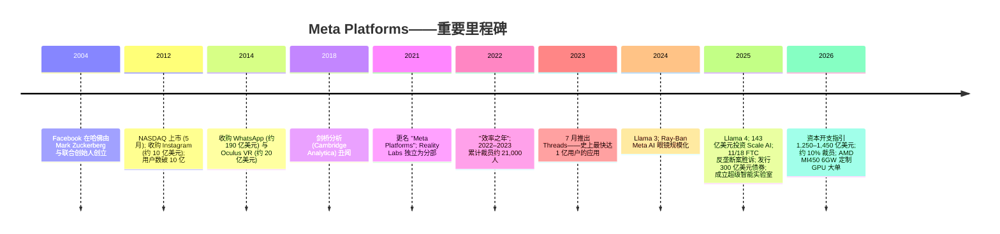
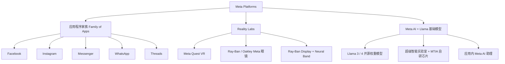
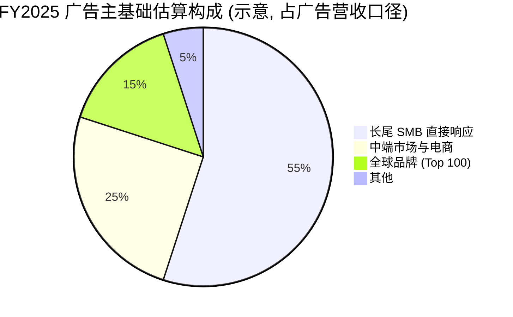
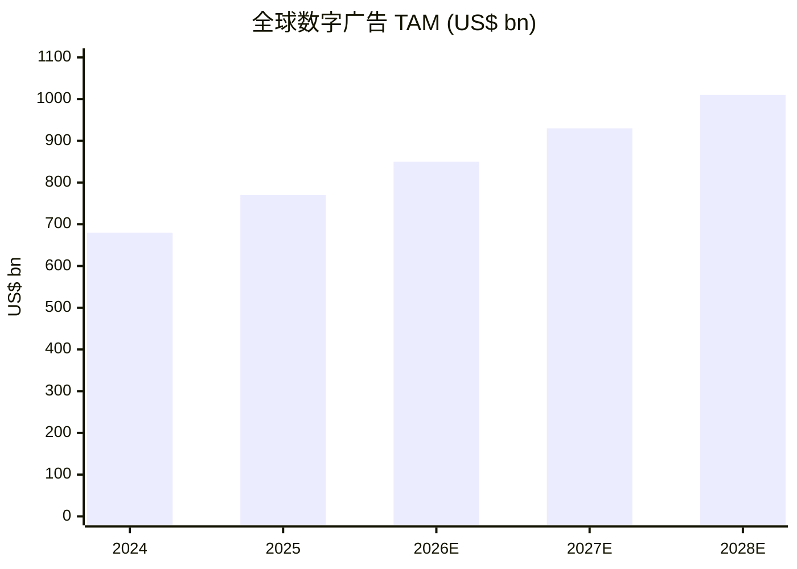

# Meta Platforms, Inc. (NASDAQ:META) — 公司研究报告

**截至日期: 2026-06-14**
**股票代码: NASDAQ:META · 报告货币: 美元 (USD) · 报告语言: 简体中文 (英文版同时存在于本目录)**

> *分析师观点：* **评级：Buy（买入）/ Overweight（增持）· 12 个月目标价 (price target) US$715（较 2026-06-12 收盘价 US$566.98 上行 +26%）· 估值方法：2027E GAAP EPS ~US$34 × 21× forward P/E（DCF 交叉验证，WACC ~9.5%）· 市值约 1.43 万亿美元 · 52 周区间 US$525.72–US$788.15 · NASDAQ:META**
>
> | 倍数 / Multiple（*分析师观点：* 前瞻列） | FY2025A | FY2026E | FY2027E |
> |---|---|---|---|
> | GAAP P/E | ~24.1× | ~17.3× | ~16.7× |
> | EV/EBIT | ~17× | ~13× | ~12× |
> | P/S | ~7.0× | ~5.6× | ~4.6× |
> | FCF 收益率 (FCF yield) | ~3.0% | ~2.5% | ~3.5% |
>
> **相对表现 (relative performance，截至 2026-06-12)：** 1M −8.1% · 6M −13.0% · YTD −14.0% · 12M −16.7%；同期 S&P 500 为 1M −0.2% · 6M +7.7% · YTD +8.6% · 12M +24.3%；相对标普 **12M −41.0 个百分点**（来源：yfinance META / ^GSPC，2026-06-12）。
>
> **核心论点 (thesis pillars)**——（1）核心广告业务在 AI 推荐与定向（Andromeda、Advantage+、GEM）驱动下持续跑赢行业，Q1 FY2026 外汇中性 (FX-neutral) 广告营收同比 +29%；（2）市场把逾 3,800 亿美元的 AI 资本开支 (capex) 当作纯成本定价、令 META 较 Alphabet 折价约 30%，但 AI 投入正同时改善广告效果并孕育全新营收线（Meta AI 搜索广告、订阅、Neocloud 算力出租），构成被低估的期权价值；（3）35.8 亿日活人数 (DAP) 的网络效应护城河 + 创始人控制结构，使 META 能以自有现金流承担多周期、高资本密度的转向；（4）当前股价已对资本开支 ROIC 风险与 Reality Labs (RL) 拖累计入相当折价，风险回报偏向上行——这是一只 12 个月跑输标普 41 个百分点的"被嫌弃的大盘股"。

> **业绩更新——Q1 FY2026 营收加速、2026 资本开支指引再上调至 1,250–1,450 亿美元 (2026-04-29):** 公司 2026 年第一季度营收 **563.11 亿美元（同比 +33%）**、营业利润 228.72 亿美元（营业利润率 41%）、GAAP 稀释 EPS **10.44 美元**（含 80.3 亿美元一次性所得税收益）。广告展示量 (ad impressions) 同比 +19%、单条广告均价 (price per ad) 同比 +12%。公司将 **2026 全年资本开支指引从 1,150–1,350 亿美元上调至 1,250–1,450 亿美元**，总费用指引维持 **1,620–1,690 亿美元**，并指引 Q2 FY2026 营收 **580–610 亿美元**。管理层重申 2026 年营业利润将高于 2025 年。来源：[Meta Q1 FY2026 业绩公告 8-K, 2026-04-29](https://www.sec.gov/Archives/edgar/data/1326801/000162828026028364/meta-03312026xexhibit991.htm)。

---

## 目录

1. 公司概览（含投资论点）
1A. 估值与目标价（前瞻预测 · 目标价推导 · 牛/基准/熊情景）
1B. GF Score（GuruFocus 式基本面评分）
2. 公司历史
3. 管理团队
4. 产品与服务
5. 客户与上市策略
6. 行业概览
7. 竞争格局
8. 市场机会 (TAM)
9. 风险评估
9.5. 核心分歧与催化剂
10. 投资人视角评分卡

---

## 1. 公司概览

*分析师观点：* **本报告给予 META Buy / Overweight 评级，12 个月目标价 US$715（较 2026-06-12 收盘 US$566.98 上行约 +26%）。** 投资逻辑的核心张力是：META 是全球第二大数字广告 (digital advertising) 销售方，FY2025 营收 2,009.7 亿美元、同比 +22%、营业利润率 41.4%、自由现金流 (free cash flow, FCF) 435.9 亿美元——这是一台仍在加速的现金机器；然而过去 12 个月股价绝对回报 −16.7%、相对标普跑输 41 个百分点，市场把逾 3,800 亿美元的 AI 资本开支 (capex) 几乎完全当作侵蚀回报的成本定价，给出了较 Alphabet 约 30% 的折价。我们认为这是错配：（1）AI 投入已在改善核心广告的定向与效果（Q1 FY2026 外汇中性广告营收 +29%）；（2）资本开支同时孕育尚未被定价的新营收线（Meta AI 搜索广告变现、订阅、闲置算力对外出租的 Neocloud 期权）；（3）创始人控制 + 资产负债表弹药让 META 能以自有现金流承担长周期转向；（4）真正的风险——资本开支 ROIC 不及预期与 RL 持续亏损——已在当前折价里被相当程度计入。

Meta Platforms, Inc.（"Meta"）是**全球最大的社交媒体运营商**，也是**全球第二大数字广告销售方**。公司总部位于加州门洛帕克 (Menlo Park)，在纳斯达克 (Nasdaq) 上市，代码 META。其运营的社交网络与即时通讯产品统称"应用程序家族 (Family of Apps, FoA)"——**Facebook、Instagram、Messenger、WhatsApp、Threads**，外加 **Meta AI 助理 (assistant)**，以及独立报告分部 **Reality Labs (RL)** 旗下的消费硬件（Meta Quest VR 头显、Ray-Ban / Oakley Meta AI 眼镜）。绝大部分营收来自 FoA 中销售的广告位；硬件、订阅与支付贡献其余 ([Meta FY2025 10-K, Item 1 Business](https://www.sec.gov/Archives/edgar/data/1326801/000162828026003942/meta-20251231.htm))。

**Meta 如何赚钱。** 公司运营一套端到端的广告体系：一组免费、广告支持的消费产品，2025 年 12 月平均日活跃人数 (Daily Active People, DAP) 达 **35.8 亿（同比 +7%）**；一个自助式 (self-serve) 广告平台，让全球数百万广告主在 Feed、Reels、Stories、Messenger、Threads 各广告位上竞价；以及一个由 Meta 自研 AI 模型驱动、不断进化的定向 / 度量层。2025 年，FoA **广告展示量 (ad impressions) 同比 +12%、单条广告均价 (price per ad) 同比 +9%**——两者叠加驱动 22% 的营收增长 ([Meta FY2025 10-K, MD&A](https://www.sec.gov/Archives/edgar/data/1326801/000162828026003942/meta-20251231.htm))。营收高度集中于广告：FY2025 广告营收 **1,961.8 亿美元（占总额 2,009.7 亿美元的约 97.6%）**；FoA 其他营收（WhatsApp 商业消息、Meta Verified 订阅、支付）25.8 亿美元；RL 硬件营收 22.1 亿美元 ([Meta FY2025 10-K, Note 13 Segment Information](https://www.sec.gov/Archives/edgar/data/1326801/000162828026003942/meta-20251231.htm))。

<svg xmlns="http://www.w3.org/2000/svg" viewBox="0 0 1000 560" width="1000" height="560" role="img" aria-label="income statement Sankey"><rect x="0" y="0" width="1000" height="560" fill="#ffffff"/>
<text x="20.00" y="30.00" text-anchor="start" font-family="Helvetica,Arial,sans-serif" font-size="15" font-weight="700" fill="#1f2933">Meta (META) 如何赚钱 / How Meta Makes Its Money — FY2025</text>
<path d="M 204.00,64.00 C 258.00,64.00 258.00,78.00 312.00,78.00 L 312.00,489.94 C 258.00,489.94 258.00,475.94 204.00,475.94 Z" fill="#93c5fd" fill-opacity="0.55"/>
<path d="M 452.00,71.00 C 506.00,71.00 506.00,99.19 560.00,99.19 L 560.00,274.06 C 506.00,274.06 506.00,245.87 452.00,245.87 Z" fill="#86efac" fill-opacity="0.55"/>
<path d="M 452.00,245.87 C 506.00,245.87 506.00,288.06 560.00,288.06 L 560.00,459.23 C 506.00,459.23 506.00,417.04 452.00,417.04 Z" fill="#fca5a5" fill-opacity="0.55"/>
<path d="M 328.00,78.00 C 382.00,78.00 382.00,71.00 436.00,71.00 L 436.00,417.04 C 382.00,417.04 382.00,424.04 328.00,424.04 Z" fill="#86efac" fill-opacity="0.55"/>
<path d="M 328.00,424.04 C 382.00,424.04 382.00,431.04 436.00,431.04 L 436.00,507.00 C 382.00,507.00 382.00,500.00 328.00,500.00 Z" fill="#fca5a5" fill-opacity="0.55"/>
<path d="M 700.00,99.19 C 754.00,99.19 754.00,191.78 808.00,191.78 L 808.00,318.73 C 754.00,318.73 754.00,226.15 700.00,226.15 Z" fill="#86efac" fill-opacity="0.55"/>
<path d="M 700.00,226.15 C 754.00,226.15 754.00,332.73 808.00,332.73 L 808.00,386.22 C 754.00,386.22 754.00,279.64 700.00,279.64 Z" fill="#fca5a5" fill-opacity="0.55"/>
<path d="M 576.00,99.19 C 630.00,99.19 630.00,99.19 684.00,99.19 L 684.00,274.06 C 630.00,274.06 630.00,274.06 576.00,274.06 Z" fill="#86efac" fill-opacity="0.55"/>
<path d="M 576.00,288.06 C 630.00,288.06 630.00,293.64 684.00,293.64 L 684.00,344.33 C 630.00,344.33 630.00,338.76 576.00,338.76 Z" fill="#fca5a5" fill-opacity="0.55"/>
<path d="M 576.00,338.76 C 630.00,338.76 630.00,358.33 684.00,358.33 L 684.00,478.81 C 630.00,478.81 630.00,459.23 576.00,459.23 Z" fill="#fca5a5" fill-opacity="0.55"/>
<path d="M 576.00,473.23 C 630.00,473.23 630.00,274.06 684.00,274.06 L 684.00,279.64 C 630.00,279.64 630.00,478.81 576.00,478.81 Z" fill="#93c5fd" fill-opacity="0.55"/>
<path d="M 204.00,489.94 C 258.00,489.94 258.00,489.94 312.00,489.94 L 312.00,495.37 C 258.00,495.37 258.00,495.37 204.00,495.37 Z" fill="#93c5fd" fill-opacity="0.55"/>
<path d="M 204.00,509.37 C 258.00,509.37 258.00,495.37 312.00,495.37 L 312.00,500.00 C 258.00,500.00 258.00,514.00 204.00,514.00 Z" fill="#93c5fd" fill-opacity="0.55"/>
<rect x="188.00" y="64.00" width="16" height="411.94" rx="1.5" fill="#2563eb"/>
<rect x="188.00" y="489.94" width="16" height="5.43" rx="1.5" fill="#2563eb"/>
<rect x="188.00" y="509.37" width="16" height="4.63" rx="1.5" fill="#2563eb"/>
<rect x="312.00" y="78.00" width="16" height="422.00" rx="1.5" fill="#1e3a8a"/>
<rect x="436.00" y="71.00" width="16" height="346.04" rx="1.5" fill="#15803d"/>
<rect x="436.00" y="431.04" width="16" height="75.96" rx="1.5" fill="#dc2626"/>
<rect x="560.00" y="99.19" width="16" height="174.87" rx="1.5" fill="#15803d"/>
<rect x="560.00" y="288.06" width="16" height="171.17" rx="1.5" fill="#dc2626"/>
<rect x="560.00" y="473.23" width="16" height="5.58" rx="1.5" fill="#2563eb"/>
<rect x="684.00" y="99.19" width="16" height="180.44" rx="1.5" fill="#15803d"/>
<rect x="684.00" y="293.64" width="16" height="50.70" rx="1.5" fill="#dc2626"/>
<rect x="684.00" y="358.33" width="16" height="120.47" rx="1.5" fill="#dc2626"/>
<rect x="808.00" y="191.78" width="16" height="126.95" rx="1.5" fill="#15803d"/>
<rect x="808.00" y="332.73" width="16" height="53.49" rx="1.5" fill="#dc2626"/>
<line x1="188.00" y1="269.97" x2="182.00" y2="239.32" stroke="#cbd5e1" stroke-width="1"/>
<text x="179.00" y="242.32" text-anchor="end" font-family="Helvetica,Arial,sans-serif" font-size="11.5" font-weight="700" fill="#1f2933">Advertising</text>
<text x="179.00" y="255.32" text-anchor="end" font-family="Helvetica,Arial,sans-serif" font-size="10" font-weight="400" fill="#52606d">$196.2B  (97.6%)</text>
<line x1="188.00" y1="492.65" x2="182.00" y2="462.00" stroke="#cbd5e1" stroke-width="1"/>
<text x="179.00" y="465.00" text-anchor="end" font-family="Helvetica,Arial,sans-serif" font-size="11.5" font-weight="700" fill="#1f2933">FoA Other</text>
<text x="179.00" y="478.00" text-anchor="end" font-family="Helvetica,Arial,sans-serif" font-size="10" font-weight="400" fill="#52606d">$2.6B  (1.3%)</text>
<line x1="188.00" y1="511.68" x2="182.00" y2="487.00" stroke="#cbd5e1" stroke-width="1"/>
<text x="179.00" y="490.00" text-anchor="end" font-family="Helvetica,Arial,sans-serif" font-size="11.5" font-weight="700" fill="#1f2933">Reality Labs</text>
<text x="179.00" y="503.00" text-anchor="end" font-family="Helvetica,Arial,sans-serif" font-size="10" font-weight="400" fill="#52606d">$2.2B  (1.1%)</text>
<rect x="331.00" y="60.00" width="113.10" height="26" rx="2" fill="#ffffff" fill-opacity="0.72"/>
<text x="334.00" y="72.00" text-anchor="start" font-family="Helvetica,Arial,sans-serif" font-size="11.5" font-weight="700" fill="#1f2933">Revenue</text>
<text x="334.00" y="85.00" text-anchor="start" font-family="Helvetica,Arial,sans-serif" font-size="10" font-weight="400" fill="#52606d">$201.0B  (100.0%)</text>
<rect x="455.00" y="53.00" width="106.80" height="26" rx="2" fill="#ffffff" fill-opacity="0.72"/>
<text x="458.00" y="65.00" text-anchor="start" font-family="Helvetica,Arial,sans-serif" font-size="11.5" font-weight="700" fill="#1f2933">Gross Profit</text>
<text x="458.00" y="78.00" text-anchor="start" font-family="Helvetica,Arial,sans-serif" font-size="10" font-weight="400" fill="#52606d">$164.8B  (82.0%)</text>
<rect x="455.00" y="413.04" width="144.60" height="26" rx="2" fill="#ffffff" fill-opacity="0.72"/>
<text x="458.00" y="425.04" text-anchor="start" font-family="Helvetica,Arial,sans-serif" font-size="11.5" font-weight="700" fill="#1f2933">Cost of Revenue (COGS)</text>
<text x="458.00" y="438.04" text-anchor="start" font-family="Helvetica,Arial,sans-serif" font-size="10" font-weight="400" fill="#52606d">$36.2B  (18.0%)</text>
<rect x="579.00" y="81.19" width="106.80" height="26" rx="2" fill="#ffffff" fill-opacity="0.72"/>
<text x="582.00" y="93.19" text-anchor="start" font-family="Helvetica,Arial,sans-serif" font-size="11.5" font-weight="700" fill="#1f2933">Operating Income</text>
<text x="582.00" y="106.19" text-anchor="start" font-family="Helvetica,Arial,sans-serif" font-size="10" font-weight="400" fill="#52606d">$83.3B  (41.4%)</text>
<rect x="579.00" y="270.06" width="150.90" height="26" rx="2" fill="#ffffff" fill-opacity="0.72"/>
<text x="582.00" y="282.06" text-anchor="start" font-family="Helvetica,Arial,sans-serif" font-size="11.5" font-weight="700" fill="#1f2933">Total Operating Expense</text>
<text x="582.00" y="295.06" text-anchor="start" font-family="Helvetica,Arial,sans-serif" font-size="10" font-weight="400" fill="#52606d">$81.5B  (40.6%)</text>
<text x="551.00" y="473.02" text-anchor="end" font-family="Helvetica,Arial,sans-serif" font-size="11.5" font-weight="700" fill="#1f2933">Net Interest / Other Income</text>
<text x="551.00" y="486.02" text-anchor="end" font-family="Helvetica,Arial,sans-serif" font-size="10" font-weight="400" fill="#52606d">$2.7B  (1.3%)</text>
<rect x="703.00" y="81.19" width="100.50" height="26" rx="2" fill="#ffffff" fill-opacity="0.72"/>
<text x="706.00" y="93.19" text-anchor="start" font-family="Helvetica,Arial,sans-serif" font-size="11.5" font-weight="700" fill="#1f2933">Pretax Income</text>
<text x="706.00" y="106.19" text-anchor="start" font-family="Helvetica,Arial,sans-serif" font-size="10" font-weight="400" fill="#52606d">$85.9B  (42.8%)</text>
<rect x="703.00" y="275.64" width="100.50" height="26" rx="2" fill="#ffffff" fill-opacity="0.72"/>
<text x="706.00" y="287.64" text-anchor="start" font-family="Helvetica,Arial,sans-serif" font-size="11.5" font-weight="700" fill="#1f2933">SG&amp;A</text>
<text x="706.00" y="300.64" text-anchor="start" font-family="Helvetica,Arial,sans-serif" font-size="10" font-weight="400" fill="#52606d">$24.1B  (12.0%)</text>
<rect x="703.00" y="340.33" width="100.50" height="26" rx="2" fill="#ffffff" fill-opacity="0.72"/>
<text x="706.00" y="352.33" text-anchor="start" font-family="Helvetica,Arial,sans-serif" font-size="11.5" font-weight="700" fill="#1f2933">R&amp;D</text>
<text x="706.00" y="365.33" text-anchor="start" font-family="Helvetica,Arial,sans-serif" font-size="10" font-weight="400" fill="#52606d">$57.4B  (28.5%)</text>
<text x="833.00" y="252.25" text-anchor="start" font-family="Helvetica,Arial,sans-serif" font-size="11.5" font-weight="700" fill="#1f2933">Net Income</text>
<text x="833.00" y="265.25" text-anchor="start" font-family="Helvetica,Arial,sans-serif" font-size="10" font-weight="400" fill="#52606d">$60.5B  (30.1%)</text>
<text x="833.00" y="356.48" text-anchor="start" font-family="Helvetica,Arial,sans-serif" font-size="11.5" font-weight="700" fill="#1f2933">Income Tax</text>
<text x="833.00" y="369.48" text-anchor="start" font-family="Helvetica,Arial,sans-serif" font-size="10" font-weight="400" fill="#52606d">$25.5B  (12.7%)</text>
<text x="500.00" y="544.00" text-anchor="middle" font-family="Helvetica,Arial,sans-serif" font-size="10" font-weight="400" fill="#52606d">Source: META FY2025 10-K, Consolidated Statements of Operations + Note 13 Segment Information</text>
</svg>
*来源 / Source: [Meta FY2025 10-K, Consolidated Statements of Operations + Note 13 Segment Information](https://www.sec.gov/Archives/edgar/data/1326801/000162828026003942/meta-20251231.htm)。*

<svg xmlns="http://www.w3.org/2000/svg" viewBox="0 0 720 460" width="720" height="460" role="img" aria-label="revenue donut"><rect x="0" y="0" width="720" height="460" fill="#ffffff"/>
<text x="20.00" y="30.00" text-anchor="start" font-family="Helvetica,Arial,sans-serif" font-size="15" font-weight="700" fill="#1f2933">FY2025 营收构成（按分部） / Revenue by Segment</text>
<path d="M 288.00,107.20 A 132 132 0 1 1 268.30,108.68 L 276.36,162.07 A 78 78 0 1 0 288.00,161.20 Z" fill="#2563eb"/>
<path d="M 268.30,108.68 A 132 132 0 0 1 278.90,107.51 L 282.62,161.39 A 78 78 0 0 0 276.36,162.07 Z" fill="#15803d"/>
<path d="M 278.90,107.51 A 132 132 0 0 1 288.00,107.20 L 288.00,161.20 A 78 78 0 0 0 282.62,161.39 Z" fill="#d97706"/>
<text x="288.00" y="235.20" text-anchor="middle" font-family="Helvetica,Arial,sans-serif" font-size="18" font-weight="800" fill="#1f2933">META</text>
<text x="288.00" y="255.20" text-anchor="middle" font-family="Helvetica,Arial,sans-serif" font-size="13" font-weight="600" fill="#52606d">$201.0B</text>
<text x="288.00" y="271.20" text-anchor="middle" font-family="Helvetica,Arial,sans-serif" font-size="10" font-weight="400" fill="#8a97a3">total</text>
<line x1="298.33" y1="376.81" x2="314.33" y2="376.81" stroke="#2563eb" stroke-width="1.4"/>
<text x="318.33" y="374.81" text-anchor="start" font-family="Helvetica,Arial,sans-serif" font-size="11" font-weight="700" fill="#1f2933">FoA Advertising</text>
<text x="318.33" y="388.81" text-anchor="start" font-family="Helvetica,Arial,sans-serif" font-size="10" font-weight="400" fill="#52606d">$196.2B  (97.6%)</text>
<line x1="272.93" y1="102.02" x2="256.93" y2="102.02" stroke="#15803d" stroke-width="1.4"/>
<text x="252.93" y="100.02" text-anchor="end" font-family="Helvetica,Arial,sans-serif" font-size="11" font-weight="700" fill="#1f2933">FoA Other</text>
<text x="252.93" y="114.02" text-anchor="end" font-family="Helvetica,Arial,sans-serif" font-size="10" font-weight="400" fill="#52606d">$2.6B  (1.3%)</text>
<line x1="283.24" y1="101.28" x2="267.24" y2="101.28" stroke="#d97706" stroke-width="1.4"/>
<text x="263.24" y="99.28" text-anchor="end" font-family="Helvetica,Arial,sans-serif" font-size="11" font-weight="700" fill="#1f2933">Reality Labs</text>
<text x="263.24" y="113.28" text-anchor="end" font-family="Helvetica,Arial,sans-serif" font-size="10" font-weight="400" fill="#52606d">$2.2B  (1.1%)</text>
<text x="360.00" y="444.00" text-anchor="middle" font-family="Helvetica,Arial,sans-serif" font-size="10" font-weight="400" fill="#52606d">Source: META FY2025 10-K, Note 13 Segment Information</text>
</svg>

*来源 / Source: [Meta FY2025 10-K, Note 13 Segment Information](https://www.sec.gov/Archives/edgar/data/1326801/000162828026003942/meta-20251231.htm)。*

**业务布局与规模。** Meta 在全球 90 多个城市设有办公室，拥有 30 个数据中心 (data center) 园区 ([Meta FY2025 10-K, Item 2 Properties](https://www.sec.gov/Archives/edgar/data/1326801/000162828026003942/meta-20251231.htm))。FY2025 收官：**营收 2,009.7 亿美元（同比 +22%）、营业利润 832.8 亿美元（同比 +20%）、净利润 604.6 亿美元、GAAP 稀释 EPS 23.49 美元、FCF 435.9 亿美元**（净利润受 *《One Big Beautiful Bill Act, OBBBA》* 一次性约 159 亿美元税务计提拖累）([Meta FY2025 10-K, MD&A Results of Operations](https://www.sec.gov/Archives/edgar/data/1326801/000162828026003942/meta-20251231.htm))。现金、现金等价物与有价证券 (marketable securities) 合计 815.9 亿美元；长期负债 (long-term debt) 因 2025 年 11 月发行约 300 亿美元债券为 AI 资本开支融资而升至 587.4 亿美元。员工 78,865 人 ([Meta FY2025 10-K, Item 1 Human Capital](https://www.sec.gov/Archives/edgar/data/1326801/000162828026003942/meta-20251231.htm))。资本开支（含融资租赁本金）从 2024 年的 392 亿美元跃升至 2025 年的 **722.2 亿美元**，2026 年指引中点约 **1,350 亿美元**。Q1 FY2026 已确认营收 **563.1 亿美元（同比 +33%）**、营业利润率 41%、稀释 EPS 10.44 美元，员工降至 77,986 人 ([Meta Q1 FY2026 8-K, 2026-04-29](https://www.sec.gov/Archives/edgar/data/1326801/000162828026028364/meta-03312026xexhibit991.htm))。

**估值快照 (valuation snapshot)。** 截至 2026 年 6 月 12 日，META 收盘 **566.98 美元，市值约 1.43 万亿美元**，52 周区间 525.72–788.15 美元（来源：[yfinance META, 2026-06-12](https://finance.yahoo.com/quote/META/)）。按 FY2025 GAAP EPS 23.49 美元计，**TTM 市盈率 (P/E) 约 24.1 倍**；按 TTM 营收约 2,074 亿美元（FY2025 全年 + Q1 增量）计，**TTM 市销率 (P/S) 约 6.9–7.0 倍**（[Macrotrends META P/E 历史](https://www.macrotrends.net/stocks/charts/META/meta-platforms/pe-ratio)）。剔除 OBBBA 一次性税项后的"基础"前瞻市盈率落在高十几倍区间（基于 Street 2026E GAAP EPS 约 33 美元，前瞻 P/E ~17×）。市净率 (P/B) 约 6.6 倍（股东权益 2,172.4 亿美元）。

**同业估值比较 (TTM, 2026 年 6 月):**

| 公司 | TTM P/E | TTM P/S | 备注 |
|---|---|---|---|
| **META** | **~24.1×** | **~7.0×** | 来源：[yfinance META, 2026-06-12](https://finance.yahoo.com/quote/META/) |
| GOOGL (Alphabet) | ~28× | ~7.5× | 来源：[Public.com GOOGL P/E](https://public.com/stocks/googl/pe-ratio) |
| PINS (Pinterest) | ~30×+ | ~3× | 来源：[StockAnalysis PINS 统计](https://stockanalysis.com/stocks/pins/statistics/) |
| SNAP (Snap) | **n/m（亏损）** | ~1.3× | TTM 亏损；[GuruFocus SNAP P/E](https://www.gurufocus.com/term/pe-ratio/SNAP) |
| **互联网行业中位数** | ~24× | ~5× | 综合行业追踪 |

*分析师观点：* META 的 TTM P/E 约 24 倍，**较 Alphabet 折价约 14–28%**（视口径），与互联网行业中位数大致持平——但 META FY2025 营收增长 22% 高于 Alphabet 的约 14%，且 Q1 FY2026 进一步加速至 33%。两个因素压制估值倍数：(i) **资本开支冲击**——capex 从 2024 年的 392 亿美元跃升至 2025 年的 722 亿美元、再到 2026 年指引的 1,250–1,450 亿美元，引发对近期投入资本回报率 (ROIC) 的担忧；(ii) **监管阴霾**——欧盟数字市场法 (DMA) 与"低个性化广告 (Less Personalised Ads, LPA)"框架令市场担忧欧洲单用户变现 (ARPP)。但倍数本身并不拉伸（前瞻 P/E 仅约 17×、低于自身三年均值约 27 倍、也低于 Alphabet），若 AI 资本开支成功变现，估值重估空间充足——这一点正是本报告 Buy 评级的核心。

---

## 1A. 估值与目标价

> 本章所有前瞻预测、目标价及情景目标价均为**分析师观点 (*Analyst view:*)**，不附任何 filing 引用；每条预测的外部输入（filing 分部数据 + 管理层指引 + 行业预测）在文中分别引用。

**(a) 前瞻财务预测（分部建模，*分析师观点：*）。** 我们对两个报告分部分别建模——FoA 走"营收稳健 + 利润率高位"路径，RL 走"营收快增但持续亏损收窄"路径——再加总：

| 指标（*分析师观点：*） | FY2025A | FY2026E | FY2027E | FY2028E | CAGR(25–28) |
|---|---|---|---|---|---|
| 总营收 (US$ bn) | 200.97 | 256 | 306 | 358 | +21% |
| — YoY % | +22% | +27% | +20% | +17% | |
| — FoA 营收 | 198.76 | 252 | 300 | 350 | +21% |
| — RL 营收 | 2.21 | 4.0 | 6.0 | 8.0 | +53% |
| 营业利润率 (op margin) % | 41.4% | 38% | 38% | 39% | |
| — FoA 分部营业利润率 | 51.6% | 50% | 50% | 50% | |
| — RL 营业亏损 (US$ bn) | −19.2 | −20 | −20 | −18 | |
| GAAP 稀释 EPS (US$) | 23.49 | 33.0 | 34.0 | 41.0 | +20% |
| ROIC % | ~28% | ~22% | ~20% | ~22% | |
| FCF (US$ bn) / FCF 收益率 | 43.6 / ~3.0% | ~36 / ~2.5% | ~50 / ~3.5% | ~70 / ~5% | |
| 净现金 /(净负债)（现金+证券−债务，US$ bn） | +22.8 | +0 | −20 | −20 | |

各预测单元的依据：营收路径基于 FY2025 分部营收 ([Meta FY2025 10-K, Note 13](https://www.sec.gov/Archives/edgar/data/1326801/000162828026003942/meta-20251231.htm)) + 管理层 Q2 FY2026 营收指引 580–610 亿美元 ([Meta Q1 FY2026 8-K](https://www.sec.gov/Archives/edgar/data/1326801/000162828026028364/meta-03312026xexhibit991.htm)) + 全球数字广告约 10% CAGR 的行业预测 ([Precedence Research](https://www.precedenceresearch.com/digital-advertising-market))；利润率回落主要源自折旧 (D&A) 随 2025–2026 资本开支爬坡而上行；FCF 因资本开支 1,250–1,450 亿美元而被压缩——这是 2026E FCF 收益率走弱的核心驱动。FY2026E EPS 偏高是因 OBBBA 现金税前置后的有效税率回落（管理层指引 2026 实际税率约 12–16%，低于 FY2025 受一次性计提推高的 30%）([Meta FY2025 10-K, Note 14 Income Taxes](https://www.sec.gov/Archives/edgar/data/1326801/000162828026003942/meta-20251231.htm))。

**利润率桥 (margin bridge，FY2025 → FY2026E 营业利润率 41.4% → ~38%，*分析师观点：*)：** 折旧上行 −约 250bps（2025–2026 资本开支翻倍后 D&A 加速摊销）· 基础设施运营成本（电力 / 托管）−约 150bps · AI 人才薪酬 −约 100bps · 2026 年 5 月约 10% 裁员带来的 Opex 节省 +约 100bps · 经营杠杆与广告效率改善 +约 100bps。净效应约 −340bps，与公司"营业利润额仍高于 2025"但利润率小幅回落的指引一致。

**(b) 目标价推导（*分析师观点：*）。** 方法：前瞻 P/E × 目标倍数。

> **基准情形：FY2027E GAAP EPS ~US$34 × 21× forward P/E = US$715**（较 2026-06-12 收盘 566.98 美元上行 +26%）。

为什么用 21 倍：(1) META 自身三年均值约 27 倍，当前因资本开支不确定性应给予折价；(2) 对标 Alphabet（约 28× TTM、前瞻约 22–24×，[Public.com GOOGL P/E](https://public.com/stocks/googl/pe-ratio)），META 21× 反映其更高的资本密度与 RL 拖累，但更高的营收增速（FY2025 22% vs Alphabet 约 14%）支撑这一相对折价不应进一步扩大；(3) 与摩根士丹利的 23× / FY27 EPS 框架、高盛的 24× EV/GAAP-EBIT 框架方向一致，但更保守。**DCF 交叉验证：** 以 10Y Treasury 4.54%（[indicators.db 本地快照，as of 2026-06-05](https://fred.stlouisfed.org/series/DGS10)）为无风险利率、β≈1.2、股权风险溢价 (ERP) 5%，得 WACC ≈ 9.5%，终值增长 3%，对 FY2026–2030E FCF 折现得到的每股内在价值区间约 680–760 美元，与 21× 倍数法的 715 美元收敛。

**(c) 牛 / 基准 / 熊情景（*分析师观点：*）：**

| 情景 | 关键假设 | 目标价 | 较现价 |
|---|---|---|---|
| 牛市 (Bull) | AI 货币化兑现（Meta AI 搜索广告 + 订阅 + Neocloud），营收 25%+ CAGR，倍数回升至 26× FY27 EPS | US$900 | +59% |
| 基准 (Base) | 核心广告稳健、资本开支 ROIC 中性，21× FY27 EPS US$34 | US$715 | +26% |
| 熊市 (Bear) | 资本开支回报令人失望、RL 亏损扩大、监管限制定向广告，营收降至高个位数、de-rate 至 15× FY27 EPS US$32 | US$480 | −15% |

风险回报偏向上行：基准 +26%、牛市 +59%，对熊市 −15%，约 3.7:1 的上行 / 下行不对称。

**(d) 与市场一致预期的对比 + 卖方观点演变 (Sell-side view evolution)。** 本报告 715 美元目标价**低于**当前卖方主流区间（775–908 美元），反映我们对资本开支 ROIC 给予更保守的倍数。机械预读 `db/stock_price_target.db`（只读）显示，META 近 3 个月的卖方目标价分布为 **最低 720 / 中位约 830 / 最高 908 美元**，评级全部为 Buy/Overweight/Outperform——无一家看空。

**按机构的观点时间线（按报告日期排序）：**

| 机构 | 日期 | 评级 / 目标价 | 核心论点 | 自我修正 / 触发 |
|---|---|---|---|---|
| 高盛 GS | 2026-04-30 | Buy / US$830（原 840） | 核心业务持续跑赢行业，但需看到长期 AI 战略清晰度；EV/GAAP-EBIT 倍数由 26× 微降至 24× | **下调** PT（倍数下调，反映高资本强度下对远期 EBIT 信心略降），同时**上调** 2026E GAAP EPS 至 33.28（原 28.64） |
| UBS 瑞银 | 2026-04-30 | Buy / US$865（原 908） | "产品开发红利仍在前方"；当前仅成本被定价，AI 新营收流（商业 AI、Meta AI 搜索广告、Advantage+）尚未体现，有显著期权价值 | **下调** PT（资本开支上调后 2027/28 EPS 微降 5%/7%），但维持 26× 估值框架 |
| Bernstein | 2026-04-27 | Outperform / US$900 | "大就是好"——预算继续向 Meta/Google/Amazon 集中；Muse Spark 模型助 Meta 重回 AI 竞争；青少年诉讼风险被夸大 | 维持 |
| 摩根士丹利 MS | 2026-06-02 | Overweight / US$775（首选 Top Pick） | "四大产品助 Meta 重归 AI 赢家"：Meta AI 搜索广告 / 订阅 / 核心广告弹性 / Neocloud 算力出租，各自为 2028E EPS 贡献 1–3 美元上行 | 维持 PT（基于 FY27 EPS ~34 × 23× + DCF） |

**机构间分歧（机构间分歧）：** 卖方之间的分歧不在方向（全部看多），而在**估值倍数与目标价幅度**，且分歧核心是"AI 资本开支何时、以何种形式变现":

| 机构 | 日期 | 评级 / 目标价 | 核心论点 | 什么证据能证明其正确 |
|---|---|---|---|---|
| UBS | 2026-04-30 | Buy / US$865 | 26× 倍数 + 新营收期权价值最早兑现 | Meta AI 搜索广告 / 商业 AI 在 2026–2027 出现可量化营收 |
| GS | 2026-04-30 | Buy / US$830 | 24× 倍数，需"先看到 AI 战略清晰度"才给更高倍数 | 连续几个季度营收高增 + 利润率 / FCF 稳定，确认投资周期深度 |
| MS | 2026-06-02 | OW / US$775 | 23× 倍数，四大产品逐一兑现 EPS 上行 | 6 月 3 日 Conversations、9 月 Connect 发布的新产品落地 |
| **本报告** | 2026-06-14 | Buy / US$715 | **21× 倍数**——对资本开支 ROIC 给予更保守折价 | 资本开支 ROIC 证据不足前，倍数不应回到历史均值 27× |

所有卖方目标价引用均为 *分析师观点：*，并配报告日收盘价：摩根士丹利 OW、US$775（[Morgan Stanley — 4 Products to Turn Meta Back into an "AI Winner", 2026-06-02, p.1；较报告日 6/1 收盘 600.47 上行约 +29%](http://xs-macbook-air.local:5001/zsxq/pdf/184152881185882/Morgan%20Stanley-Meta%20Platforms%20Inc%20%EF%BC%88META.US%EF%BC%894%20Products%20to%20Turn%20Meta%20Back%20into%20an%20%22AI%20Winner%22-260602.pdf)）；高盛 Buy、US$830（[Goldman Sachs — Q1'26 Review, 2026-04-30, p.1；较报告日收盘 669.12 上行约 +24%](http://xs-macbook-air.local:5001/zsxq/pdf/812212242215182/Goldman%20Sachs-Meta%20Platforms%20Inc.%20%EF%BC%88META.US%EF%BC%89%20Q1%E2%80%9926%20Review%EF%BC%9A%20Core%20Business%20Continues%20to%20Outgrow%20Industry%EF%BC%9B%20Visibility%20Into%20Long~Term%20AI%20Strategy%20Needed%20for%20Investor%20Sentiment-260430.pdf)）；瑞银 Buy、US$865（原 908，[UBS — Product Development Benefits Still Ahead of Us, 2026-04-30, p.1；较报告日收盘约 669 上行约 +41%](http://xs-macbook-air.local:5001/zsxq/pdf/415515525514288/UBS-Meta%20Platforms%EF%BC%88META.US%EF%BC%89Product%20Development%20Benefits%20Still%20Ahead%20of%20Us-260430.pdf)）；Bernstein Outperform、US$900（[Bernstein — Digital Ads 1Q26, 2026-04-27, p.1](http://xs-macbook-air.local:5001/zsxq/pdf/585585212452214/Bernstein-U.S.%20Internet%EF%BC%9ADigital%20Ads%201Q26%EF%BC%9A%20It%27s%20good%20to%20be%20big%EF%BC%8C%20right%EF%BC%9F-260427.pdf)）。

**(e) 最该盯紧的变量（swing variables）：** (1) **AI 资本开支的 ROIC**——增量数据中心投入能否转化为广告定价能力 + 新营收，是估值倍数能否从 21× 回升至 27× 的唯一决定项；(2) **Reality Labs 亏损轨迹**——RL 年亏约 192 亿美元若不能随 AI 眼镜放量而收窄，将持续压制合并营业利润率。

<svg xmlns="http://www.w3.org/2000/svg" viewBox="0 0 1240 540" width="1240" height="540" role="img" aria-label="DuPont ROE decomposition"><rect x="0" y="0" width="1240" height="540" fill="#ffffff"/>
<text x="20.00" y="30.00" text-anchor="start" font-family="Helvetica,Arial,sans-serif" font-size="15" font-weight="700" fill="#1f2933">Meta (META) 5 步 DuPont ROE 拆解 — FY2025</text>
<rect x="545.00" y="56.00" width="150" height="56" rx="7" fill="#1e3a8a"/>
<text x="620.00" y="76.00" text-anchor="middle" font-family="Helvetica,Arial,sans-serif" font-size="11.5" font-weight="700" fill="#ffffff">ROE</text>
<text x="620.00" y="94.00" text-anchor="middle" font-family="Helvetica,Arial,sans-serif" font-size="13" font-weight="800" fill="#ffffff">30.24%</text>
<text x="620.00" y="106.00" text-anchor="middle" font-family="Helvetica,Arial,sans-serif" font-size="8.5" font-weight="400" fill="#dbeafe">= Net Income / Avg Equity</text>
<rect x="191.60" y="168.00" width="150" height="56" rx="7" fill="#2563eb"/>
<text x="266.60" y="188.00" text-anchor="middle" font-family="Helvetica,Arial,sans-serif" font-size="11.5" font-weight="700" fill="#ffffff">Net Margin</text>
<text x="266.60" y="206.00" text-anchor="middle" font-family="Helvetica,Arial,sans-serif" font-size="13" font-weight="800" fill="#ffffff">30.08%</text>
<text x="266.60" y="218.00" text-anchor="middle" font-family="Helvetica,Arial,sans-serif" font-size="8.5" font-weight="400" fill="#dbeafe">Net Income / Revenue</text>
<line x1="620.00" y1="112.00" x2="266.60" y2="168.00" stroke="#94a3b8" stroke-width="1.4"/>
<rect x="545.00" y="168.00" width="150" height="56" rx="7" fill="#2563eb"/>
<text x="620.00" y="188.00" text-anchor="middle" font-family="Helvetica,Arial,sans-serif" font-size="11.5" font-weight="700" fill="#ffffff">Asset Turnover</text>
<text x="620.00" y="206.00" text-anchor="middle" font-family="Helvetica,Arial,sans-serif" font-size="13" font-weight="800" fill="#ffffff">0.63</text>
<text x="620.00" y="218.00" text-anchor="middle" font-family="Helvetica,Arial,sans-serif" font-size="8.5" font-weight="400" fill="#dbeafe">Revenue / Avg Assets</text>
<line x1="620.00" y1="112.00" x2="620.00" y2="168.00" stroke="#94a3b8" stroke-width="1.4"/>
<rect x="898.40" y="168.00" width="150" height="56" rx="7" fill="#2563eb"/>
<text x="973.40" y="188.00" text-anchor="middle" font-family="Helvetica,Arial,sans-serif" font-size="11.5" font-weight="700" fill="#ffffff">Equity Multiplier</text>
<text x="973.40" y="206.00" text-anchor="middle" font-family="Helvetica,Arial,sans-serif" font-size="13" font-weight="800" fill="#ffffff">1.61</text>
<text x="973.40" y="218.00" text-anchor="middle" font-family="Helvetica,Arial,sans-serif" font-size="8.5" font-weight="400" fill="#dbeafe">Avg Assets / Avg Equity</text>
<line x1="620.00" y1="112.00" x2="973.40" y2="168.00" stroke="#94a3b8" stroke-width="1.4"/>
<circle cx="443.30" cy="196.00" r="11" fill="#ffffff" stroke="#94a3b8" stroke-width="1.2"/>
<text x="443.30" y="201.00" text-anchor="middle" font-family="Helvetica,Arial,sans-serif" font-size="14" font-weight="800" fill="#52606d">×</text>
<circle cx="796.70" cy="196.00" r="11" fill="#ffffff" stroke="#94a3b8" stroke-width="1.2"/>
<text x="796.70" y="201.00" text-anchor="middle" font-family="Helvetica,Arial,sans-serif" font-size="14" font-weight="800" fill="#52606d">×</text>
<rect x="65.00" y="300.00" width="118" height="56" rx="7" fill="#2563eb"/>
<text x="124.00" y="320.00" text-anchor="middle" font-family="Helvetica,Arial,sans-serif" font-size="11.5" font-weight="700" fill="#ffffff">Operating Margin</text>
<text x="124.00" y="338.00" text-anchor="middle" font-family="Helvetica,Arial,sans-serif" font-size="13" font-weight="800" fill="#ffffff">41.44%</text>
<text x="124.00" y="350.00" text-anchor="middle" font-family="Helvetica,Arial,sans-serif" font-size="8.5" font-weight="400" fill="#dbeafe">Op Inc / Revenue</text>
<line x1="266.60" y1="224.00" x2="124.00" y2="300.00" stroke="#94a3b8" stroke-width="1.4"/>
<rect x="207.60" y="300.00" width="118" height="56" rx="7" fill="#2563eb"/>
<text x="266.60" y="320.00" text-anchor="middle" font-family="Helvetica,Arial,sans-serif" font-size="11.5" font-weight="700" fill="#ffffff">Tax Burden</text>
<text x="266.60" y="338.00" text-anchor="middle" font-family="Helvetica,Arial,sans-serif" font-size="13" font-weight="800" fill="#ffffff">0.7036</text>
<text x="266.60" y="350.00" text-anchor="middle" font-family="Helvetica,Arial,sans-serif" font-size="8.5" font-weight="400" fill="#dbeafe">Net Inc / Pretax</text>
<line x1="266.60" y1="224.00" x2="266.60" y2="300.00" stroke="#94a3b8" stroke-width="1.4"/>
<rect x="350.20" y="300.00" width="118" height="56" rx="7" fill="#2563eb"/>
<text x="409.20" y="320.00" text-anchor="middle" font-family="Helvetica,Arial,sans-serif" font-size="11.5" font-weight="700" fill="#ffffff">Interest Burden</text>
<text x="409.20" y="338.00" text-anchor="middle" font-family="Helvetica,Arial,sans-serif" font-size="13" font-weight="800" fill="#ffffff">1.0319</text>
<text x="409.20" y="350.00" text-anchor="middle" font-family="Helvetica,Arial,sans-serif" font-size="8.5" font-weight="400" fill="#dbeafe">Pretax / Op Inc</text>
<line x1="266.60" y1="224.00" x2="409.20" y2="300.00" stroke="#94a3b8" stroke-width="1.4"/>
<circle cx="195.30" cy="328.00" r="11" fill="#ffffff" stroke="#94a3b8" stroke-width="1.2"/>
<text x="195.30" y="333.00" text-anchor="middle" font-family="Helvetica,Arial,sans-serif" font-size="14" font-weight="800" fill="#52606d">×</text>
<circle cx="337.90" cy="328.00" r="11" fill="#ffffff" stroke="#94a3b8" stroke-width="1.2"/>
<text x="337.90" y="333.00" text-anchor="middle" font-family="Helvetica,Arial,sans-serif" font-size="14" font-weight="800" fill="#52606d">×</text>
<rect x="479.00" y="300.00" width="118" height="56" rx="7" fill="#2563eb"/>
<text x="538.00" y="326.00" text-anchor="middle" font-family="Helvetica,Arial,sans-serif" font-size="11.5" font-weight="700" fill="#ffffff">Revenue</text>
<text x="538.00" y="342.00" text-anchor="middle" font-family="Helvetica,Arial,sans-serif" font-size="13" font-weight="800" fill="#ffffff">$201.0B</text>
<line x1="620.00" y1="224.00" x2="538.00" y2="300.00" stroke="#94a3b8" stroke-width="1.4"/>
<rect x="643.00" y="300.00" width="118" height="56" rx="7" fill="#2563eb"/>
<text x="702.00" y="320.00" text-anchor="middle" font-family="Helvetica,Arial,sans-serif" font-size="11.5" font-weight="700" fill="#ffffff">Avg Total Assets</text>
<text x="702.00" y="338.00" text-anchor="middle" font-family="Helvetica,Arial,sans-serif" font-size="13" font-weight="800" fill="#ffffff">$321.0B</text>
<text x="702.00" y="350.00" text-anchor="middle" font-family="Helvetica,Arial,sans-serif" font-size="8.5" font-weight="400" fill="#dbeafe">(begin+end)/2</text>
<line x1="620.00" y1="224.00" x2="702.00" y2="300.00" stroke="#94a3b8" stroke-width="1.4"/>
<circle cx="620.00" cy="328.00" r="11" fill="#ffffff" stroke="#94a3b8" stroke-width="1.2"/>
<text x="620.00" y="333.00" text-anchor="middle" font-family="Helvetica,Arial,sans-serif" font-size="14" font-weight="800" fill="#52606d">÷</text>
<rect x="832.40" y="300.00" width="118" height="56" rx="7" fill="#2563eb"/>
<text x="891.40" y="320.00" text-anchor="middle" font-family="Helvetica,Arial,sans-serif" font-size="11.5" font-weight="700" fill="#ffffff">Avg Total Assets</text>
<text x="891.40" y="338.00" text-anchor="middle" font-family="Helvetica,Arial,sans-serif" font-size="13" font-weight="800" fill="#ffffff">$321.0B</text>
<text x="891.40" y="350.00" text-anchor="middle" font-family="Helvetica,Arial,sans-serif" font-size="8.5" font-weight="400" fill="#dbeafe">(begin+end)/2</text>
<line x1="973.40" y1="224.00" x2="891.40" y2="300.00" stroke="#94a3b8" stroke-width="1.4"/>
<rect x="996.40" y="300.00" width="118" height="56" rx="7" fill="#2563eb"/>
<text x="1055.40" y="320.00" text-anchor="middle" font-family="Helvetica,Arial,sans-serif" font-size="11.5" font-weight="700" fill="#ffffff">Avg Total Equity</text>
<text x="1055.40" y="338.00" text-anchor="middle" font-family="Helvetica,Arial,sans-serif" font-size="13" font-weight="800" fill="#ffffff">$199.9B</text>
<text x="1055.40" y="350.00" text-anchor="middle" font-family="Helvetica,Arial,sans-serif" font-size="8.5" font-weight="400" fill="#dbeafe">(begin+end)/2</text>
<line x1="973.40" y1="224.00" x2="1055.40" y2="300.00" stroke="#94a3b8" stroke-width="1.4"/>
<circle cx="967.20" cy="328.00" r="11" fill="#ffffff" stroke="#94a3b8" stroke-width="1.2"/>
<text x="967.20" y="333.00" text-anchor="middle" font-family="Helvetica,Arial,sans-serif" font-size="14" font-weight="800" fill="#52606d">÷</text>
<rect x="69.00" y="420.00" width="110" height="48" rx="7" fill="#3b82f6"/>
<text x="124.00" y="442.00" text-anchor="middle" font-family="Helvetica,Arial,sans-serif" font-size="11.5" font-weight="700" fill="#ffffff">Operating Income</text>
<text x="124.00" y="458.00" text-anchor="middle" font-family="Helvetica,Arial,sans-serif" font-size="13" font-weight="800" fill="#ffffff">$83.3B</text>
<line x1="124.00" y1="356.00" x2="124.00" y2="420.00" stroke="#94a3b8" stroke-width="1.4"/>
<rect x="211.60" y="420.00" width="110" height="48" rx="7" fill="#3b82f6"/>
<text x="266.60" y="442.00" text-anchor="middle" font-family="Helvetica,Arial,sans-serif" font-size="11.5" font-weight="700" fill="#ffffff">Net Income</text>
<text x="266.60" y="458.00" text-anchor="middle" font-family="Helvetica,Arial,sans-serif" font-size="13" font-weight="800" fill="#ffffff">$60.5B</text>
<line x1="266.60" y1="356.00" x2="266.60" y2="420.00" stroke="#94a3b8" stroke-width="1.4"/>
<rect x="354.20" y="420.00" width="110" height="48" rx="7" fill="#3b82f6"/>
<text x="409.20" y="442.00" text-anchor="middle" font-family="Helvetica,Arial,sans-serif" font-size="11.5" font-weight="700" fill="#ffffff">Pretax Income</text>
<text x="409.20" y="458.00" text-anchor="middle" font-family="Helvetica,Arial,sans-serif" font-size="13" font-weight="800" fill="#ffffff">$85.9B</text>
<line x1="409.20" y1="356.00" x2="409.20" y2="420.00" stroke="#94a3b8" stroke-width="1.4"/>
<text x="620.00" y="524.00" text-anchor="middle" font-family="Helvetica,Arial,sans-serif" font-size="10" font-weight="400" fill="#52606d">Source: META FY2025 10-K, Statements of Operations + Balance Sheets</text>
</svg>

*来源 / Source: [Meta FY2025 10-K, Statements of Operations + Balance Sheets](https://www.sec.gov/Archives/edgar/data/1326801/000162828026003942/meta-20251231.htm)。回报拆解为已报告结果的算术分解，非分析师评级。*

*分析师观点（修正透明度）：* 相较上一版报告（2026-05-27，目标价隐含约 605 美元现价基准），本次将基准目标价定为 715 美元，变化主要来自三点：(i) 现价从约 605 美元跌至 567 美元（股价 de-rating，非估值假设变化）；(ii) 纳入 Q1 FY2026 加速的营收（+33%）与上调后的资本开支指引（1,250–1,450 亿美元）；(iii) 目标倍数维持保守的 21×。换言之，目标价的上行空间扩大主要由**股价回落**驱动，而非我们上调了盈利预测——这是一次"价格更便宜"而非"基本面更好"的重估。

---

## 1B. GF Score（GuruFocus 式基本面评分）

*分析师观点：* **GF Score (GuruFocus 式)：80 / 100 —— 71–80 区间"基本面稳健、预期表现中等偏上"。** 该评分是基于本报告已引用数据的独立复现，**并非 GuruFocus 官方数字**；五项子分与综合分均为分析师自有评分（rubric），每项背后的指标各自带 inline 引用。

<svg xmlns="http://www.w3.org/2000/svg" viewBox="0 0 500 500" width="500" height="500" role="img" aria-label="GF Score radar">
<rect x="0" y="0" width="500" height="500" fill="#ffffff"/>
<text x="20" y="24" font-family="Helvetica,Arial,sans-serif" font-size="15" font-weight="700" fill="#1f2933">GF Score (GuruFocus-style): 80/100</text>
<text x="20" y="41" font-family="Helvetica,Arial,sans-serif" font-size="11" fill="#52606d">71–80 Likely average performance</text>
<polygon points="250.0,88.0 392.7,191.6 338.2,359.4 161.8,359.4 107.3,191.6" fill="#e9f5ec" stroke="none"/>
<polygon points="250.0,208.0 278.5,228.7 267.6,262.3 232.4,262.3 221.5,228.7" fill="none" stroke="#c5d3cb" stroke-width="1"/>
<polygon points="250.0,178.0 307.1,219.5 285.3,286.5 214.7,286.5 192.9,219.5" fill="none" stroke="#c5d3cb" stroke-width="1"/>
<polygon points="250.0,148.0 335.6,210.2 302.9,310.8 197.1,310.8 164.4,210.2" fill="none" stroke="#c5d3cb" stroke-width="1"/>
<polygon points="250.0,118.0 364.1,200.9 320.5,335.1 179.5,335.1 135.9,200.9" fill="none" stroke="#c5d3cb" stroke-width="1"/>
<polygon points="250.0,88.0 392.7,191.6 338.2,359.4 161.8,359.4 107.3,191.6" fill="none" stroke="#c5d3cb" stroke-width="1.3"/>
<line x1="250" y1="238" x2="161.8" y2="359.4" stroke="#cfdad3" stroke-width="1"/>
<text x="146.5" y="392.4" text-anchor="end" font-family="Helvetica,Arial,sans-serif" font-size="11.5" font-weight="600" fill="#1f2933">Financial Strength</text>
<text x="146.5" y="405.4" text-anchor="end" font-family="Helvetica,Arial,sans-serif" font-size="9.5" fill="#52606d">财务实力</text>
<text x="179.5" y="329.1" text-anchor="middle" font-family="Helvetica,Arial,sans-serif" font-size="10.5" font-weight="700" fill="#1f2933">8</text>
<line x1="250" y1="238" x2="250.0" y2="88.0" stroke="#cfdad3" stroke-width="1"/>
<text x="250.0" y="58.0" text-anchor="middle" font-family="Helvetica,Arial,sans-serif" font-size="11.5" font-weight="600" fill="#1f2933">Profitability</text>
<text x="250.0" y="71.0" text-anchor="middle" font-family="Helvetica,Arial,sans-serif" font-size="9.5" fill="#52606d">盈利能力</text>
<text x="250.0" y="82.0" text-anchor="middle" font-family="Helvetica,Arial,sans-serif" font-size="10.5" font-weight="700" fill="#1f2933">10</text>
<line x1="250" y1="238" x2="107.3" y2="191.6" stroke="#cfdad3" stroke-width="1"/>
<text x="82.6" y="183.6" text-anchor="end" font-family="Helvetica,Arial,sans-serif" font-size="11.5" font-weight="600" fill="#1f2933">Growth</text>
<text x="82.6" y="196.6" text-anchor="end" font-family="Helvetica,Arial,sans-serif" font-size="9.5" fill="#52606d">成长性</text>
<text x="121.6" y="190.3" text-anchor="middle" font-family="Helvetica,Arial,sans-serif" font-size="10.5" font-weight="700" fill="#1f2933">9</text>
<line x1="250" y1="238" x2="392.7" y2="191.6" stroke="#cfdad3" stroke-width="1"/>
<text x="417.4" y="183.6" text-anchor="start" font-family="Helvetica,Arial,sans-serif" font-size="11.5" font-weight="600" fill="#1f2933">GF Value</text>
<text x="417.4" y="196.6" text-anchor="start" font-family="Helvetica,Arial,sans-serif" font-size="9.5" fill="#52606d">估值</text>
<text x="364.1" y="194.9" text-anchor="middle" font-family="Helvetica,Arial,sans-serif" font-size="10.5" font-weight="700" fill="#1f2933">8</text>
<line x1="250" y1="238" x2="338.2" y2="359.4" stroke="#cfdad3" stroke-width="1"/>
<text x="353.5" y="392.4" text-anchor="start" font-family="Helvetica,Arial,sans-serif" font-size="11.5" font-weight="600" fill="#1f2933">Momentum</text>
<text x="353.5" y="405.4" text-anchor="start" font-family="Helvetica,Arial,sans-serif" font-size="9.5" fill="#52606d">动量</text>
<text x="276.5" y="268.4" text-anchor="middle" font-family="Helvetica,Arial,sans-serif" font-size="10.5" font-weight="700" fill="#1f2933">3</text>
<polygon points="250.0,88.0 364.1,200.9 276.5,274.4 179.5,335.1 121.6,196.3" fill="#2e8b57" fill-opacity="0.34" stroke="#2e8b57" stroke-width="2"/>
<circle cx="179.5" cy="335.1" r="2.6" fill="#2e8b57"/>
<circle cx="250.0" cy="88.0" r="2.6" fill="#2e8b57"/>
<circle cx="121.6" cy="196.3" r="2.6" fill="#2e8b57"/>
<circle cx="364.1" cy="200.9" r="2.6" fill="#2e8b57"/>
<circle cx="276.5" cy="274.4" r="2.6" fill="#2e8b57"/>
<text x="250" y="470" text-anchor="middle" font-family="Helvetica,Arial,sans-serif" font-size="9.5" fill="#52606d">Source: META FY2025 10-K + Q1-FY2026 8-K · Yahoo Finance · indicators.db, as of 2026-06-14</text>
<text x="250" y="485" text-anchor="middle" font-family="Helvetica,Arial,sans-serif" font-size="9" fill="#52606d">GF Score = independent analyst rubric (*Analyst view:*) — not GuruFocus™ official number</text>
</svg>

| 维度 / Dimension | 评分 / Score (0–10) | |
|---|---|---|
| Financial Strength (财务实力) | 8 | `████████░░` |
| Profitability (盈利能力) | 10 | `██████████` |
| Growth (成长性) | 9 | `█████████░` |
| GF Value (估值) | 8 | `████████░░` |
| Momentum (动量) | 3 | `███░░░░░░░` |
| **GF Score (composite, *Analyst view:*)** | **80 / 100** | **71–80 Likely average performance** |

*Composite weights (*Analyst view:*): Financial Strength 20% · Profitability 25% · Growth 25% · GF Value 15% · Momentum 15% (transparent reproduction — not GuruFocus's proprietary weighting).*
> 离中心越远，该维度得分越高；五边形面积越大，综合得分越高。/ *The farther from centre, the better that axis; bigger pentagon = higher composite.*

| 维度 / Dimension | 评分 / Score (0–10) | |
|---|---|---|
| Financial Strength (财务实力) | 8 | `████████░░` |
| Profitability (盈利能力) | 10 | `██████████` |
| Growth (成长性) | 9 | `█████████░` |
| GF Value (估值，*越高=越便宜*) | 8 | `████████░░` |
| Momentum (动量) | 3 | `███░░░░░░░` |
| **GF Score (综合, *分析师观点：*)** | **80 / 100** | **71–80 区间** |

**Financial Strength (财务实力) = 8/10。** 资产负债表稳健：现金 + 有价证券 815.9 亿美元，对比长期负债 587.4 亿美元，仍为净现金约 228 亿美元；利息覆盖倍数极高（营业利润 832.8 亿美元对净利息为正向 26.6 亿美元）([Meta FY2025 10-K, Balance Sheets + Statements of Operations](https://www.sec.gov/Archives/edgar/data/1326801/000162828026003942/meta-20251231.htm))。未给 9–10 是因 2025 年 11 月新发 300 亿美元债券、且 1,250–1,450 亿美元的资本开支将在 2026–2027 把净现金转为温和净负债，融资租赁与数据中心承诺也在累积。

**Profitability (盈利能力) = 10/10。** FY2025 营业利润率 41.4%、FoA 分部营业利润率 51.6%、净利率约 30%（剔除 OBBBA 一次性税项后更高）；ROE 约 30%（净利润 604.6 亿 / 平均股东权益约 2,000 亿）；ROIC 约 28%，远超约 9.5% 的 WACC ([Meta FY2025 10-K, Note 13 + MD&A](https://www.sec.gov/Archives/edgar/data/1326801/000162828026003942/meta-20251231.htm))。互联网行业顶级利润率 + 十余年持续盈利，满分实至名归。

**Growth (成长性) = 9/10。** 营收 3 年 CAGR（FY2022 116.6B → FY2025 201.0B）约 20%；FY2025 +22%、Q1 FY2026 进一步加速至 +33% ([Meta Q1 FY2026 8-K](https://www.sec.gov/Archives/edgar/data/1326801/000162828026028364/meta-03312026xexhibit991.htm))；本报告 1A 前瞻模型 FY2025–2028 营收 CAGR 约 21%、EPS CAGR 约 20%。未给满分是因增长依赖单一广告池、且 RL 仍是亏损分部。

**GF Value (估值，越高=越便宜) = 8/10。** 前瞻 P/E 约 17×（基于 Street 2026E GAAP EPS ~33 美元）位于自身三年区间下沿、低于历史均值约 27 倍，亦低于 Alphabet 前瞻倍数；PEG 约 0.85（17× / 约 20% EPS 增速）显示成长未被充分定价；相对本报告 715 美元基准目标价，安全边际 (margin of safety) 约 +26% ([Macrotrends META P/E](https://www.macrotrends.net/stocks/charts/META/meta-platforms/pe-ratio); [yfinance, 2026-06-12](https://finance.yahoo.com/quote/META/))。未给 9–10 是因资本开支 ROIC 的不确定性是真实的、并非纯粹错杀。

**Momentum (动量) = 3/10。** 这是唯一的弱项：过去 12 个月绝对回报 −16.7%、相对标普 500 跑输 41 个百分点，6 个月相对跑输 20.7 个百分点，股价位于 52 周区间（525.72–788.15）的下三分之一、且低于 200 日均线（来源：[yfinance META / ^GSPC, 2026-06-12](https://finance.yahoo.com/quote/META/)）。动量是最时间敏感的一项——一个强劲的季报即可把它快速上修。

**综合算术：** (8·20 + 10·25 + 9·25 + 8·15 + 3·15)/100 = (160 + 250 + 225 + 120 + 45)/100 = **80/100**（权重 20/25/25/15/15）。**一句话提醒：** 动量正在拉低综合分——若 Q2 FY2026（7 月底）再现一次强劲的营收 + 利润率印证，Momentum 可由 3 升至 6，综合分将跳升至约 84/100（"基本面良好"区间）；无 n/a 维度。

---

## 2. 公司历史

Facebook 于 **2004 年 2 月 4 日**在哈佛大学一间宿舍诞生，由当时 19 岁的二年级学生 Mark Zuckerberg（扎克伯格）与同学 Eduardo Saverin、Andrew McCollum、Dustin Moskovitz 及 Chris Hughes 共同创办；两周内哈佛半数学生注册，Zuckerberg 当年夏天辍学搬到帕罗奥图 (Palo Alto)，由 Peter Thiel 提供种子资金 ([Britannica — Mark Zuckerberg 传记](https://www.britannica.com/money/Mark-Zuckerberg))。公司 2006 年从校园扩张至大众互联网，2012 年达 10 亿用户并于 5 月在 NASDAQ 上市；收购 Instagram（约 10 亿美元，2012）与 WhatsApp（约 190 亿美元，2014）；2014 年以约 20 亿美元收购 Oculus VR；2021 年 10 月母公司更名 **Meta Platforms**，公开转向元宇宙 (metaverse) ([Britannica — Meta Platforms](https://www.britannica.com/money/Meta-Platforms))。

理解 2026 投资逻辑须把握三次战略转折：

- **2012–2014 的"购买式增长"转向。** 当照片分享 (Instagram) 与移动消息 (WhatsApp) 威胁信息流参与度时，Zuckerberg 以创纪录估值倍数将两者收入囊中。Instagram 此后成长为公司最具价值的产品（业内普遍估计今天占 FoA 广告营收 >40%，*分析师观点：* 非公司披露），WhatsApp 成为全球最大消息应用。一年后的 Oculus 收购同样押注品类成熟前十年的领先身位 ([Britannica — Meta Platforms](https://www.britannica.com/money/Meta-Platforms))。
- **2021 年元宇宙转向与 2022–2023 效率重置。** 更名标志向 AR/VR 长周期投入，正值后疫情广告降温与苹果 ATT (App Tracking Transparency) 冲击定向。营业利润率从 2021 年的约 40% 压缩至 2022 年的约 25%。Zuckerberg 以"效率之年 (Year of Efficiency)"回应：2022–2023 累计裁员约 21,000 人、资本开支自律、扁平化组织。营业利润率回升至 2023 年的 34.7%、2024 年的 42.2%、2025 年的 41.4% ([Meta FY2025 10-K, MD&A](https://www.sec.gov/Archives/edgar/data/1326801/000162828026003942/meta-20251231.htm))。
- **2024–2025 的 AI 超级转向。** Llama 3（2024-04）、Llama 4（2025-04）、143 亿美元投资 Scale AI 并引入创始人 Alexandr Wang ([CNBC, 2025-06-12](https://www.cnbc.com/2025/06/12/scale-ai-founder-wang-announces-exit-for-meta-part-of-14-billion-deal.html))、以及"Meta 超级智能实验室 (Meta Superintelligence Labs)"成立，标志投入规模的根本跃迁。2025 资本开支同比 +84%；2026 指引中点同比再约 +87%。

**重要收购与投资：**
- 2012 年——**Instagram**（约 10 亿美元）：Reels 与移动照片核心；可以说是当今 Meta 最具价值的资产。
- 2014 年——**WhatsApp**（约 190 亿美元）：全球最大消息应用；通过商业付费消息变现。
- 2014 年——**Oculus VR**（约 20 亿美元）：Reality Labs 与 Meta Quest 的种子资产。
- 2025 年——**Scale AI**（143 亿美元购 49% 无投票权股份；Wang 加盟）：训练数据引擎与超级智能实验室人才核心 ([Fortune, 2025-06-22](https://fortune.com/2025/06/22/inside-rise-scale-alexandr-wang-meta-zuckerberg-14-billion-deal-acquihire-ai-supremacy-race/))。

近期动态：(a) **2025-11-18 FTC 反垄断案 Meta 胜诉**，针对 Instagram / WhatsApp 收购的结构性拆分诉讼终结，FTC 于 2026-01-20 提交上诉，但拆分风险显著降低 ([Meta FY2025 10-K, Item 3 法律程序](https://www.sec.gov/Archives/edgar/data/1326801/000162828026003942/meta-20251231.htm))；(b) **2025-11 发行约 300 亿美元债券**为基础设施融资，长期负债升至 587.4 亿美元；(c) **2026 Q1 / DMA 个性化广告和解** 自 2026 年起在欧盟落地，管理层警示可能恶化欧盟用户体验与营收。

---

## 3. 管理团队

**Mark Zuckerberg——创始人、董事长兼首席执行官 (Chairman & CEO)。** Zuckerberg（生于 1984-05-14，纽约白原市）是公司中最具决定意义的单一高管，整个投资逻辑都与他的判断力和资本配置偏好绑定。他先就读菲利普斯·埃克塞特学院 (Phillips Exeter Academy)，2002 年入读哈佛，2004 年 2 月在宿舍创立 thefacebook.com，联合创始人包括 Saverin、McCollum、Moskovitz 与 Hughes ([Britannica](https://www.britannica.com/money/Mark-Zuckerberg))。担任 CEO 的 22 年间，他完成三轮品类定义级产品周期：Web 向移动迁移（2010–2013）、通过 Instagram 与 WhatsApp 的社交整合（2012–2014）、以及当前的生成式 AI / 超级智能转向（2023 至今）——每一次市场起初质疑，最终绝大多数被验证。他也推动过残酷的业务重置："效率之年"（2022–2023）裁减约 21,000 个岗位、重置资本开支；而当前 AI 周期反向而行，三年内将资本开支从约 390 亿美元提升至指引的 1,250–1,450 亿美元。Zuckerberg 通过 IPO 时建立的双层股权 (dual-class share) 架构控制 Meta：持有绝大多数 Class B 超级投票权股份，在约 13–14% 的经济权益基础上掌握**约 61% 的投票权** ([Meta 2026 DEF 14A 委托书, 安全所有权表](https://www.sec.gov/Archives/edgar/data/1326801/000162828026025532/meta-20260416.htm))。看多 META 者押注 Zuckerberg 在大规模下的转向能力；看空者则把同样的超级投票权视为治理风险。

**Susan Li——首席财务官 (CFO)。** Susan Li 2008 年从斯坦福大学（数学与计算科学）毕业即加入 Meta，从财务岗位逐步晋升，接管 FoA 财务，并于 2022 年 11 月接替 David Wehner 出任 CFO。她已带领财务团队走过 2022–2023 效率周期、后 ATT 恢复、Reels 变现爬坡，以及当前的 AI 资本开支超级周期——五年间跨越三个宏观体制。华尔街已将她每季度对资本开支 / 运营费用的框架视为分部投入的可靠领先指标。她是新 2026 年长期股票期权计划的高管之一（其余为 CTO Andrew Bosworth、CPO Chris Cox 与 COO Javier Olivan），该计划与股价指标挂钩 ([Harvard Law CorpGov, 2026-04-10](https://corpgov.law.harvard.edu/2026/04/10/metas-new-executive-pay-plan-ties-nearly-1-billion-to-stock-performance/); [Meta 2026 DEF 14A, 高管薪酬](https://www.sec.gov/Archives/edgar/data/1326801/000162828026025532/meta-20260416.htm))。

**治理。** Meta 是一家受控公司 (controlled company)：Zuckerberg 掌握约 61% 投票权，董事会过往在战略重置（元宇宙转向、AI 超级转向、Scale AI 交易）上始终遵从其意见 ([Meta 2026 DEF 14A](https://www.sec.gov/Archives/edgar/data/1326801/000162828026025532/meta-20260416.htm))。优点是资本配置快速连贯；缺点是对配置失误缺乏正式制衡。2026 年与高市值愿景挂钩的高管期权计划因规模庞大受到批评，但仍获通过 ([mlq.ai 摘要](https://mlq.ai/news/meta-launches-executive-stock-options-linked-to-9-trillion-valuation-target/))。

---

## 4. 产品与服务

Meta 将业务划分为两个可报告分部——**应用程序家族 (Family of Apps, FoA)** 与 **Reality Labs (RL)**——但实务上更应视为五大产品矩阵外加一根 AI / 基础设施脊柱。

### 4.1 产品矩阵（基于 10-K Item 1 Business 重述）

下表逐字重述自 FY2025 10-K 的业务描述 ([Meta FY2025 10-K, Item 1 Business](https://www.sec.gov/Archives/edgar/data/1326801/000162828026003942/meta-20251231.htm))：

| 分部 / Segment | 产品 / Product | 10-K 定位 |
|---|---|---|
| Family of Apps | Facebook | "a place to build community and bring people closer together" |
| Family of Apps | Instagram | 照片 / 短视频 (Reels) / Stories / 购物 / DM |
| Family of Apps | Messenger | 跨平台即时消息 |
| Family of Apps | WhatsApp | 端到端加密消息 + 商业消息 (Business) |
| Family of Apps | Threads | 公开对话 / 微博式产品 |
| Family of Apps | Meta AI | 跨应用对话式 AI 助理（Llama 驱动） |
| Reality Labs | Meta Quest | VR 头显 + Horizon 平台 |
| Reality Labs | Ray-Ban / Oakley Meta | AI 智能眼镜 |
| Reality Labs | Meta Ray-Ban Display + Neural Band | 镜片内显示眼镜 + EMG 腕带 |

### 4.2 综合——产品如何构成一个闭环

Meta 的核心是一个**注意力 → 数据 → AI → 广告效果 → 更多注意力**的飞轮：免费消费产品（FB / IG / WA / Threads）吸引 35.8 亿 DAP 的注意力 → 用户行为产生万亿级第一方数据 → 数据训练 Meta 自研的推荐与定向模型（Andromeda 检索、GEM 排序、Advantage+ 自动化）→ 更精准的广告提升广告主 ROAS、抬高 CPM → 广告利润再投入 AI 算力与产品 → 改进的推荐让用户停留更久。Llama 与超级智能实验室是这根飞轮的引擎升级，RL 眼镜则是飞轮的下一个分发入口。

### 4.3 应用程序家族 (FoA)——FY2025 营收 1,987.6 亿美元，营业利润 1,024.7 亿美元

10-K 对 FoA 的定位：

> "Our Family of Apps … Facebook, Instagram, Messenger, Threads, and WhatsApp … enable people to connect, share, discover, and communicate with each other on mobile devices and personal computers." ([Meta FY2025 10-K, Item 1 Business](https://www.sec.gov/Archives/edgar/data/1326801/000162828026003942/meta-20251231.htm))

**Facebook。** 单产品总触达最大，围绕 Feed、Reels、Stories、Groups、Marketplace、Dating、Gaming 组织。**中文释义 / Plain-language gloss:** Facebook 的战略定位已从"核心社交网络"转向"长尾互动平台 + 广告效果基座 (ad-performance base)"——许多广告跨应用投放但作为 Facebook 展示量结算。**竞争优势：是——可持续网络效应 (network effect)**（实名社交图谱）+ 对 40 岁以上群体的高切换成本 + 无人可及的广告技术 (ad-tech) 深度。*分析师观点：* 最接近竞品为 **TikTok / 字节跳动**与 **YouTube**，两者在 25 岁以下短视频领先，但在直接响应变现与中小企业 (SMB) 自助服务上落后。

**Instagram。** 当今 FoA 的增长与变现引擎；Reels 已成内部主导产品，驱动增量广告展示量，尽管变现率仍低于 Feed / Stories ([Meta FY2025 10-K, MD&A](https://www.sec.gov/Archives/edgar/data/1326801/000162828026003942/meta-20251231.htm))。**中文释义 / Plain-language gloss:** Reels 的"变现缺口 (monetization gap)"是看多逻辑的核心——每当 Reels 单位时间广告变现向 Feed 靠拢一步，就直接转化为营收上行。**竞争优势：是——品牌 + 创作者经济锁定。** *分析师观点：* 最接近竞品 **TikTok**。

**WhatsApp。** 全球最大消息应用（月活估计 >25 亿，Meta 已不再单独披露）。**中文释义 / Plain-language gloss:** 变现逻辑从应用内广告转向**付费商业消息 (paid business messaging)**——Meta 对商家与客户之间的会话按条收费，计入 "FoA 其他营收"，FY2025 合计 25.8 亿美元 ([Meta FY2025 10-K, Note 13](https://www.sec.gov/Archives/edgar/data/1326801/000162828026003942/meta-20251231.htm))。**竞争优势：是——规模 + 加密品牌**，但单用户变现仍只是 FB / IG 的一小部分。*分析师观点：* 区域竞品为 Apple iMessage、Telegram、微信（仅中国）。

**Threads。** 2023-07 上线，对标 X (Twitter)；据报道月活已达 4 亿级，日活 1.37 亿级（[Backlinko Threads 统计](https://backlinko.com/threads-users)）。**中文释义 / Plain-language gloss:** 冷启动极快，因继承 Instagram 社交图谱；广告 2024 年上线，变现仍处早期。**竞争优势：部分。** *分析师观点：* 竞品 X 与 Bluesky。

**Meta AI 助理。** 免费对话式 AI，跨 FoA 提供，也作为独立 meta.ai 应用、AI 眼镜与 Web 端使用，由 Llama 4 驱动；2026 年发布的 Muse Spark 模型据卖方称提升了每用户会话数 ([Meta FY2025 10-K, Item 1 — Meta AI](https://www.sec.gov/Archives/edgar/data/1326801/000162828026003942/meta-20251231.htm))。**中文释义 / Plain-language gloss:** Meta 尚未直接对助理变现；战略上以驱动互动 / 停留时长、向广告系统注入第一方数据为目标——而摩根士丹利的看多逻辑正是其"四大产品"之首：若 Meta AI 达 10 亿月活、引入搜索式广告，2028E 营收可增逾 110 亿美元 ([Morgan Stanley — 4 Products, 2026-06-02, p.1](http://xs-macbook-air.local:5001/zsxq/pdf/184152881185882/Morgan%20Stanley-Meta%20Platforms%20Inc%20%EF%BC%88META.US%EF%BC%894%20Products%20to%20Turn%20Meta%20Back%20into%20an%20%22AI%20Winner%22-260602.pdf))。**竞争优势：部分——分发**（35.8 亿 DAP 触达独步天下），但模型领先性相比 OpenAI / Anthropic / Google 仍有争议。

### 4.4 Reality Labs (RL)——FY2025 营收 22.1 亿美元，营业亏损 191.9 亿美元

> "Reality Labs … generates substantially all of its revenue from the sale of consumer hardware products, software, and content." ([Meta FY2025 10-K, Item 1 — Reality Labs](https://www.sec.gov/Archives/edgar/data/1326801/000162828026003942/meta-20251231.htm))

**Meta Quest。** VR 头显与 Meta Horizon Store；Quest 3 / 3S 为走量产品。**中文释义 / Plain-language gloss:** 2026 年 Meta 计划将 RL 运营费用约 30% 投向 VR / Horizon、70% 投向可穿戴 (wearables)——可穿戴是商业化轨迹最清晰的子领域。**竞争优势：是——专用独立 VR 领域领先**（*分析师观点：* 约 75–80% 品类份额），但目标市场仍属小众。*分析师观点：* 竞品 Apple Vision Pro 与 Pico（字节跳动）。

**Ray-Ban Meta 与 Oakley Meta AI 眼镜。** 2024–2025 的现象级产品线：配 AI 能力的音频眼镜，内置摄像头与 Meta AI 集成。**中文释义 / Plain-language gloss:** 智能眼镜营收据报道在 2025 年翻三倍，2026 年产量目标 1,000–2,000 万台 ([WebProNews, 2025](https://www.webpronews.com/meta-reality-labs-q2-4-5b-loss-beats-expectations-glasses-sales-triple/))。**竞争优势：是——通过 EssilorLuxottica 合作的先发规模 + 零售分发**，是该品类最持久的护城河。*分析师观点：* 竞品 Google Project Iris / Samsung XR（早期），Apple 尚无出货产品。

**Meta Ray-Ban Display + Neural Band。** 2025 年发售——首款配镜片内显示的商用智能眼镜，搭配 EMG（肌电）腕带，通过神经肌肉信号控制设备，售价约 799 美元 ([Meta FY2025 10-K, Reality Labs Products](https://www.sec.gov/Archives/edgar/data/1326801/000162828026003942/meta-20251231.htm))。**中文释义 / Plain-language gloss:** 这是迈向真正 AR 眼镜的第一步商业化，销量小但战略期权价值大。

### 4.5 AI 脊柱——Llama / 超级智能实验室 / MTIA 自研芯片

Meta 自 Llama 1（2023）起即开源前沿模型；**Llama 4 Scout / Maverick / Behemoth** 于 2025-04 发布 ([Meta AI 博客 — Llama 4, 2025-04-05](https://ai.meta.com/blog/llama-4-multimodal-intelligence/))。**中文释义 / Plain-language gloss:** 开源战略服务四重目标——推动生态采纳以抢心智份额、通过下游优化降低自身模型成本、吸引顶尖 ML 人才、在价格层面约束闭源在位者。AI 资本开支 → 广告营收的传导链是本报告的核心：增量 GPU / 自研 MTIA 芯片算力先用于训练更强的推荐 / 定向模型（Andromeda、GEM）→ 广告效果改善（ROAS↑）→ CPM↑（Q1 FY2026 单条广告均价 +12%）→ 营收加速（Q1 FY2026 +33%），再以利润反哺算力。2026 年 AMD 与 Meta 签署的**四年期、6 吉瓦 (GW) 定制 MI450 GPU 协议**（首期 1GW 于 2026 下半年至 2027 放量）是这条链的供应侧落子，也反映 Meta 在多元化算力供应（NVIDIA + AMD + 自研 MTIA）上的努力 ([Citi — AMD GPU Upside, 2026-06-12, p.1](http://xs-macbook-air.local:5001/zsxq/pdf/584255141552454/CITI-Advanced%20Micro%20Devices%20%EF%BC%88AMD.US%EF%BC%89%20GPU%20Upside%20Not%20Fully%20Priced~In%EF%BC%9B%20Upgrade%20to%20Buy%20w%20%24575%20TP-260612.pdf)）。**竞争优势：部分**——开源权重领先与分发能力世界级；闭源前沿模型相对 GPT / Claude / Gemini 的性能仍存争议。

**旗舰 vs 长尾。** *分析师观点：* 旗舰（贡献约 95% 营收与利润）为 Instagram 与 Facebook 广告；重要但占比低者为 WhatsApp 商业消息、Meta Verified、Threads 广告、Quest 硬件与 Ray-Ban Meta 眼镜；期权 / 长尾为 Meta AI 变现、Orion AR 眼镜、Neocloud 算力出租。

**延伸观看 / Further viewing**
- [Meta Connect 2025 主题演讲 — Ray-Ban Display + Neural Band 现场演示（Meta 官方）](https://www.youtube.com/watch?v=Bqd6lYZQVRY)：直观理解 EMG 腕带如何用神经肌肉信号控制 AR 眼镜。
- [Andrej Karpathy — How LLMs work（解释开源大模型机制）](https://www.youtube.com/watch?v=zjkBMFhNj_g)：帮助理解 Llama / 推荐模型为何需要海量 GPU 算力。

---

## 5. 客户与上市策略

Meta 的"客户"是**广告主 (advertisers)**，"用户"是 Meta 向广告主出售其注意力的消费者；两类群体都极其庞大与多样化。

**客户（广告主）基础。** Meta 广告平台压倒性以自助 (self-serve) 方式服务：绝大多数营销者使用 Meta Ads Manager 在拍卖中竞价，无最低门槛；公司同时在全球 90+ 城市设有企业销售团队，服务最大品牌广告主、代理与转售商 ([Meta FY2025 10-K, Item 1 — Sales and Operations](https://www.sec.gov/Archives/edgar/data/1326801/000162828026003942/meta-20251231.htm))。*分析师观点：* 公开估算全球活跃广告主约 1,000 万+，以中小直接响应广告主（长尾）为主。

**客户集中度。** Meta **未披露任何单一客户达到或超过合并营收 (consolidated revenue) 的 10%**——无论在 FY2025 10-K 的 Item 1 Business、分部 / 地理附注，还是 ASC 280-10-50-42 项下 ([Meta FY2025 10-K, Note 13 Segment Information](https://www.sec.gov/Archives/edgar/data/1326801/000162828026003942/meta-20251231.htm))。*分析师观点：* 最常被引用的公开估算是 Top-100 广告主合计约占广告营收 15–20%、单一最大广告主约 1–2%——**两项均非 Meta 披露，明确列为估算而非事实，且均为占合并营收口径**。卖方曾把中国跨境电商广告主（Temu / 拼多多、Shein）列为单一最大增长贡献者；Bernstein 追踪显示 Temu 1Q26 全球广告支出同比 −32%（美国 −43%），而 Shein 逆势 +16%（[Bernstein — Digital Ads 1Q26, 2026-04-27, p.1](http://xs-macbook-air.local:5001/zsxq/pdf/585585212452214/Bernstein-U.S.%20Internet%EF%BC%9ADigital%20Ads%201Q26%EF%BC%9A%20It%27s%20good%20to%20be%20big%EF%BC%8C%20right%EF%BC%9F-260427.pdf)）。我们将此视为**分散但真实的风险**：单一广告主不具决定性，但区域 / 行业层面的撤离可在百分点级别撬动营收。

*来源：示意性——Meta 不披露广告主集中度。各类别反映行业分析师共识，视为近似估算（占广告营收口径），而非披露数据。*

**地理结构（按用户地理划分的营收）。** Meta 按四个地理分区报告。FY2025 营收金额：**美加 (US & Canada) 788.66 亿、亚太 (Asia-Pacific) 538.17 亿、欧洲 (Europe) 465.69 亿、世界其他地区 (Rest of World) 217.14 亿美元**（其中美国本土 747.8 亿美元）([Meta FY2025 10-K, Revenue disaggregated by geography](https://www.sec.gov/Archives/edgar/data/1326801/000162828026003942/meta-20251231.htm))。美加与欧洲因 ARPP 更高仍贡献多数营收金额。

<svg xmlns="http://www.w3.org/2000/svg" viewBox="0 0 720 460" width="720" height="460" role="img" aria-label="revenue donut"><rect x="0" y="0" width="720" height="460" fill="#ffffff"/>
<text x="20.00" y="30.00" text-anchor="start" font-family="Helvetica,Arial,sans-serif" font-size="15" font-weight="700" fill="#1f2933">FY2025 营收构成（按用户地理） / Revenue by User Geography</text>
<path d="M 288.00,107.20 A 132 132 0 0 1 370.57,342.18 L 336.79,300.05 A 78 78 0 0 0 288.00,161.20 Z" fill="#2563eb"/>
<path d="M 370.57,342.18 A 132 132 0 0 1 176.45,309.77 L 222.08,280.90 A 78 78 0 0 0 336.79,300.05 Z" fill="#15803d"/>
<path d="M 176.45,309.77 A 132 132 0 0 1 205.11,136.47 L 239.02,178.49 A 78 78 0 0 0 222.08,280.90 Z" fill="#d97706"/>
<path d="M 205.11,136.47 A 132 132 0 0 1 288.00,107.20 L 288.00,161.20 A 78 78 0 0 0 239.02,178.49 Z" fill="#7c3aed"/>
<text x="288.00" y="235.20" text-anchor="middle" font-family="Helvetica,Arial,sans-serif" font-size="18" font-weight="800" fill="#1f2933">META</text>
<text x="288.00" y="255.20" text-anchor="middle" font-family="Helvetica,Arial,sans-serif" font-size="13" font-weight="600" fill="#52606d">$201.0B</text>
<text x="288.00" y="271.20" text-anchor="middle" font-family="Helvetica,Arial,sans-serif" font-size="10" font-weight="400" fill="#8a97a3">total</text>
<line x1="418.20" y1="193.45" x2="434.20" y2="193.45" stroke="#2563eb" stroke-width="1.4"/>
<text x="438.20" y="191.45" text-anchor="start" font-family="Helvetica,Arial,sans-serif" font-size="11" font-weight="700" fill="#1f2933">US &amp; Canada</text>
<text x="438.20" y="205.45" text-anchor="start" font-family="Helvetica,Arial,sans-serif" font-size="10" font-weight="400" fill="#52606d">$78.9B  (39.2%)</text>
<line x1="265.27" y1="375.32" x2="249.27" y2="375.32" stroke="#15803d" stroke-width="1.4"/>
<text x="245.27" y="373.32" text-anchor="end" font-family="Helvetica,Arial,sans-serif" font-size="11" font-weight="700" fill="#1f2933">Asia-Pacific</text>
<text x="245.27" y="387.32" text-anchor="end" font-family="Helvetica,Arial,sans-serif" font-size="10" font-weight="400" fill="#52606d">$53.8B  (26.8%)</text>
<line x1="151.85" y1="216.68" x2="135.85" y2="216.68" stroke="#d97706" stroke-width="1.4"/>
<text x="131.85" y="214.68" text-anchor="end" font-family="Helvetica,Arial,sans-serif" font-size="11" font-weight="700" fill="#1f2933">Europe</text>
<text x="131.85" y="228.68" text-anchor="end" font-family="Helvetica,Arial,sans-serif" font-size="10" font-weight="400" fill="#52606d">$46.6B  (23.2%)</text>
<line x1="242.05" y1="109.07" x2="226.05" y2="109.07" stroke="#7c3aed" stroke-width="1.4"/>
<text x="222.05" y="107.07" text-anchor="end" font-family="Helvetica,Arial,sans-serif" font-size="11" font-weight="700" fill="#1f2933">Rest of World</text>
<text x="222.05" y="121.07" text-anchor="end" font-family="Helvetica,Arial,sans-serif" font-size="10" font-weight="400" fill="#52606d">$21.7B  (10.8%)</text>
<text x="360.00" y="444.00" text-anchor="middle" font-family="Helvetica,Arial,sans-serif" font-size="10" font-weight="400" fill="#52606d">Source: META FY2025 10-K, Revenue disaggregated by geography</text>
</svg>
*来源 / Source: [Meta FY2025 10-K, Revenue disaggregated by geography](https://www.sec.gov/Archives/edgar/data/1326801/000162828026003942/meta-20251231.htm)。*

**分发与渠道。** *FoA：* 通过 Apple iOS 与 Android 应用商店分发，PC 端通过 Web 访问；单一最重要的渠道风险是 **Apple iOS ATT** 与 Google Android 隐私政策，两者都显著削弱定向与度量能力 ([Meta FY2025 10-K, MD&A](https://www.sec.gov/Archives/edgar/data/1326801/000162828026003942/meta-20251231.htm))。*RL：* 多渠道——Meta.com 直营、Best Buy / Amazon / Costco 零售、Ray-Ban / Oakley Meta 依托 EssilorLuxottica 全球品牌零售。

**销售周期与定价。** 自助广告主基本零销售周期——注册到首条展示只需数分钟，拍卖式定价（CPM / CPC / CPA 等价）。FY2025 单条广告均价同比 +9%、Q1 FY2026 +12%，由 AI 驱动的定向（Advantage+）、Reels 变现优化与点击-发消息 (Click-to-Message) 广告带动 ([Meta Q1 FY2026 8-K](https://www.sec.gov/Archives/edgar/data/1326801/000162828026028364/meta-03312026xexhibit991.htm))。

**关键合作伙伴。** EssilorLuxottica（眼镜全球制造与分销）是战略上最重要的伙伴；NVIDIA、AMD（MI450 6GW 定制 GPU）、Qualcomm（Quest / 眼镜芯片）是关键硬件供应方。公开"客户"案例见 [Meta for Business 成功案例](https://www.facebook.com/business/success)（Meta 不在披露中点名广告主）。

---

## 6. 行业概览

**行业界定。** Meta 在两个重叠市场竞争：**数字广告 (digital advertising)**（主导营收池）与**消费技术硬件 / 扩展现实 (XR)**（Reality Labs）。数字广告目前已占全球总广告支出约 75%。

**市场规模。** 全球广告支出预计 2025 年首度突破 **1.03 万亿美元**，朝 2028 年的约 1.3 万亿美元迈进 ([Precedence Research — 数字广告市场](https://www.precedenceresearch.com/digital-advertising-market); [Abbey Mecca 综述, 2025](https://abbeymecca.com/worldwide-ad-spending-to-hit-1-trillion-in-2025-what-it-means-for-businesses-marketers-and-nonprofits/))。其中**数字广告 2025 年约 7,500–8,000 亿美元**，年增速 10–12%。围墙花园 (walled garden) 集中度极高：Alphabet (Google + YouTube) 超 2,000 亿美元；Meta 以约 1,961.8 亿美元广告营收占全球数字广告份额 >23%；Amazon Ads 约 690 亿美元 ([Marketing Dive — Meta 与 Google 份额对比, 2025](https://www.marketingdive.com/news/meta-to-surpass-google-in-digital-ad-revenue-for-first-time-emarketer/817384/))。字节跳动 / TikTok 是增速最快的实质竞争者（2025 年约 330 亿美元，同比 >40%，[Emergen Research, 2025](https://www.emergenresearch.com/blog/top-10-companies-in-the-online-advertising-market)）。

<svg xmlns="http://www.w3.org/2000/svg" viewBox="0 0 860 470" width="860" height="470" role="img" aria-label="historical revenue bars"><rect x="0" y="0" width="860" height="470" fill="#ffffff"/>
<text x="20.00" y="30.00" text-anchor="start" font-family="Helvetica,Arial,sans-serif" font-size="15" font-weight="700" fill="#1f2933">Meta 历史营收（按分部） / Historical Revenue by Segment</text>
<rect x="20.00" y="44" width="11" height="11" rx="2" fill="#2563eb"/>
<text x="36.00" y="53.00" text-anchor="start" font-family="Helvetica,Arial,sans-serif" font-size="10.5" font-weight="400" fill="#1f2933">Family of Apps</text>
<rect x="142.40" y="44" width="11" height="11" rx="2" fill="#15803d"/>
<text x="158.40" y="53.00" text-anchor="start" font-family="Helvetica,Arial,sans-serif" font-size="10.5" font-weight="400" fill="#1f2933">Reality Labs</text>
<line x1="70" y1="412.00" x2="834" y2="412.00" stroke="#eceff2" stroke-width="1"/>
<text x="64.00" y="415.00" text-anchor="end" font-family="Helvetica,Arial,sans-serif" font-size="9.5" font-weight="400" fill="#52606d">$0</text>
<line x1="70" y1="345.20" x2="834" y2="345.20" stroke="#eceff2" stroke-width="1"/>
<text x="64.00" y="348.20" text-anchor="end" font-family="Helvetica,Arial,sans-serif" font-size="9.5" font-weight="400" fill="#52606d">$43.4B</text>
<line x1="70" y1="278.40" x2="834" y2="278.40" stroke="#eceff2" stroke-width="1"/>
<text x="64.00" y="281.40" text-anchor="end" font-family="Helvetica,Arial,sans-serif" font-size="9.5" font-weight="400" fill="#52606d">$86.8B</text>
<line x1="70" y1="211.60" x2="834" y2="211.60" stroke="#eceff2" stroke-width="1"/>
<text x="64.00" y="214.60" text-anchor="end" font-family="Helvetica,Arial,sans-serif" font-size="9.5" font-weight="400" fill="#52606d">$130.2B</text>
<line x1="70" y1="144.80" x2="834" y2="144.80" stroke="#eceff2" stroke-width="1"/>
<text x="64.00" y="147.80" text-anchor="end" font-family="Helvetica,Arial,sans-serif" font-size="9.5" font-weight="400" fill="#52606d">$173.6B</text>
<line x1="70" y1="78.00" x2="834" y2="78.00" stroke="#eceff2" stroke-width="1"/>
<text x="64.00" y="81.00" text-anchor="end" font-family="Helvetica,Arial,sans-serif" font-size="9.5" font-weight="400" fill="#52606d">$217.0B</text>
<rect x="102.09" y="234.02" width="88.62" height="177.98" fill="#2563eb"/>
<rect x="102.09" y="230.53" width="88.62" height="3.49" fill="#15803d"/>
<text x="146.40" y="428.00" text-anchor="middle" font-family="Helvetica,Arial,sans-serif" font-size="10" font-weight="400" fill="#52606d">2021</text>
<rect x="254.89" y="235.88" width="88.62" height="176.12" fill="#2563eb"/>
<rect x="254.89" y="232.56" width="88.62" height="3.32" fill="#15803d"/>
<text x="299.20" y="428.00" text-anchor="middle" font-family="Helvetica,Arial,sans-serif" font-size="10" font-weight="400" fill="#52606d">2022</text>
<rect x="407.69" y="207.32" width="88.62" height="204.68" fill="#2563eb"/>
<rect x="407.69" y="204.40" width="88.62" height="2.92" fill="#15803d"/>
<text x="452.00" y="428.00" text-anchor="middle" font-family="Helvetica,Arial,sans-serif" font-size="10" font-weight="400" fill="#52606d">2023</text>
<rect x="560.49" y="162.16" width="88.62" height="249.84" fill="#2563eb"/>
<rect x="560.49" y="158.85" width="88.62" height="3.31" fill="#15803d"/>
<text x="604.80" y="428.00" text-anchor="middle" font-family="Helvetica,Arial,sans-serif" font-size="10" font-weight="400" fill="#52606d">2024</text>
<rect x="713.29" y="106.14" width="88.62" height="305.86" fill="#2563eb"/>
<rect x="713.29" y="102.74" width="88.62" height="3.40" fill="#15803d"/>
<text x="757.60" y="428.00" text-anchor="middle" font-family="Helvetica,Arial,sans-serif" font-size="10" font-weight="400" fill="#52606d">2025</text>
<text x="430.00" y="454.00" text-anchor="middle" font-family="Helvetica,Arial,sans-serif" font-size="10" font-weight="400" fill="#52606d">Source: META FY2021–FY2025 10-Ks, Segment Information</text>
</svg>
*来源 / Source: [Meta FY2021–FY2025 10-Ks, Segment Information](https://www.sec.gov/Archives/edgar/data/1326801/000162828026003942/meta-20251231.htm)。*

**增长率。** 过去五年全球数字广告以低双位数 CAGR 复合增长，多数模型预计 2028 年前仍维持约 10% CAGR——Reels 式短视频、CTV（互联网电视）与零售媒体 (retail media) 持续从传统展示与搜索抢占份额。Meta 自 2023 年起增长显著超越数字广告市场（FY2023 +16%、FY2024 +22%、FY2025 +22%、Q1 FY2026 +33%），暗示份额持续提升 ([Meta FY2025 10-K, MD&A](https://www.sec.gov/Archives/edgar/data/1326801/000162828026003942/meta-20251231.htm))。

**主要趋势与驱动。**
- *AI 驱动的广告效果。* Andromeda 检索引擎、GEM 排序模型与 Advantage+ 套件用基于 Llama 的模型替代手动广告系列决策，已带来可衡量的广告主 ROAS 提升；管理层认为这是推动 CPM 上行的最大单一内部驱动 ([Meta FY2025 10-K, MD&A](https://www.sec.gov/Archives/edgar/data/1326801/000162828026003942/meta-20251231.htm))。
- *短视频变现。* Reels 变现率仍低于 Feed，但差距快速收窄，是 Instagram 增量营收的关键来源。
- *商业消息。* WhatsApp 付费消息已成数十亿美元营收线，是巴西、印度、印尼、中东的关键转化模式。
- *欧洲低个性化广告 (LPA)。* 欧盟委员会 2025-12 和解迫使 Meta 在付费订阅外为欧盟用户提供低个性化免费层，影响欧洲 ARPP / CPM；量级尚未明确量化 ([欧盟委员会 DMA 公告, 2025-12-08](https://digital-markets-act.ec.europa.eu/meta-commits-give-eu-users-choice-personalised-ads-under-dma-2025-12-08_en))。
- *AI 基础设施资本开支超级周期。* 全行业资本开支跃迁（Meta / Alphabet / Microsoft / Amazon / Oracle）正重塑数据中心、电力、GPU 供应链；Meta 2026 年 1,250–1,450 亿美元的资本开支指引为同行前列。
- *搜索广告新进入者。* OpenAI 2026 年一季度开始测试广告产品，目标 2030 年达 1,000 亿美元营收规模——卖方认为关键在于能否做大数字广告 TAM 而非单纯抢份额 ([Bernstein — Digital Ads 1Q26, 2026-04-27, p.1](http://xs-macbook-air.local:5001/zsxq/pdf/585585212452214/Bernstein-U.S.%20Internet%EF%BC%9ADigital%20Ads%201Q26%EF%BC%9A%20It%27s%20good%20to%20be%20big%EF%BC%8C%20right%EF%BC%9F-260427.pdf))。

**监管环境。** Meta 所处的可能是全球任何消费科技公司最严苛的监管环境。关键体制：欧盟数字市场法 (DMA，2025-04 开出 2 亿欧元罚款 + LPA 框架强制实施)；欧盟数字服务法 (DSA)；欧盟 AI 法案（2025–2027 分阶段）；欧盟 GDPR（爱尔兰 DPC 累计罚款超 20 亿欧元）；美国 FTC 2020 年同意令（50 亿美元）；美国 FTC 反垄断诉讼（2025-11-18 Meta 胜诉、FTC 已上诉）；以及美国各州 / 澳大利亚的青少年安全立法 ([Meta FY2025 10-K, Item 1A Risk Factors + Item 3 Legal Proceedings](https://www.sec.gov/Archives/edgar/data/1326801/000162828026003942/meta-20251231.htm); [ITIF — 欧盟 DMA 对 Meta 的罚款, 2025-08-07](https://itif.org/publications/2025/08/07/eu-dma-fine-against-meta-gdpr-disguise/))。

**行业格局。** 数字广告行业高度集中（Google + Meta 合计 >50% 全球数字广告支出，加 Amazon 约 62%）。买方议价力在 SMB 层面低、在最大品牌主层面随本金式广告技术 (principal-based ad-tech) 兴起而上升；供应方议价力集中且上行（GPU、电力、云容量）。替代品鲜有规模；新进入者面临 Meta 的网络效应护城河与 >500 亿美元/年的 R&D + 资本开支门槛。

---

## 7. 竞争格局

Meta 在三条战线竞争：(1) 用户注意力（消费时长）、(2) 广告主预算、(3) AI / 下一计算平台领导力。

**(a) 消费社交 / 视频注意力：**
- **Alphabet (Google / YouTube)。** 双寡头另一家；YouTube Shorts 对 Reels、Google Search 对 Meta 的意图驱动广告、基于 TPU 的 Gemini 对 Meta 基于 NVIDIA / AMD 的 Llama。*分析师观点：* Alphabet 在搜索与长视频领先，Meta 在社交与 SMB 直接响应领先。
- **字节跳动 / TikTok。** 争夺年轻人注意力最直接的对手，2025 年广告营收约 330 亿美元、同比 >40%（[Emergen Research, 2025](https://www.emergenresearch.com/blog/top-10-companies-in-the-online-advertising-market)）。监管逆风（美国 TikTok 立法、欧盟 DSA）可能将份额向 Meta 再分配。
- **Snap (SNAP)。** 较小直接对手（约 50–60 亿美元营收），TTM 不盈利；在所有规模维度落后于 Meta。
- **Pinterest (PINS)。** 相邻购物发现细分（约 44 亿美元营收），不与 Meta 争夺消费时长。
- **X (前 Twitter) / Reddit / Discord。** 规模较小；Threads 已捕获 X 前期增长叙事的大部分。

**(b) 广告主预算（数字广告）：** Alphabet（效果 + 品牌）、Amazon Ads（约 690 亿美元、同比 +20%，漏斗底部意图给其购物广告结构性优势）、TikTok（Z 世代品牌预算）、零售媒体网络（Walmart Connect 等）、CTV 库存（Netflix / Disney / Roku）。

**(c) AI / 下一计算平台：** OpenAI（闭源前沿领先 + ChatGPT 规模 + 2026 进军广告）、Anthropic（企业市场）、Alphabet（TPU + Gemini + 30 亿消费入口的全栈整合）、Apple（AI 进度慢但握有 iPhone + Vision Pro 入口与隐私叙事）、Microsoft、xAI（Grok 借 X 分发）。

**Meta 的竞争优势。** 网络效应护城河（35.8 亿 DAP）；广告技术深度（二十年自助拍卖优化 + Advantage+ / Andromeda / GEM）；数据飞轮规模（万亿事件级第一方数据）；现金流与资产负债表弹药（816 亿美元现金 + 440 亿美元 FCF，可全自有资金支持 AI 资本开支）；创始人 CEO 授权（超级投票权使长周期投注可持续）；Llama 开源生态。

**竞争弱点。** 苹果平台税（iOS 占美国大份额营收，Apple 进一步收紧隐私即压缩 Meta 利润率）；欧盟监管拖累（LPA / DMA / DSA）；AI 模型领先性存疑（Llama 4 具竞争力但未明显领先）；Reality Labs 单位经济（自 2020 累计亏损约 800 亿美元）；品牌 / 安全风险（青少年安全审判 + 剑桥分析遗产）。

<svg xmlns="http://www.w3.org/2000/svg" viewBox="0 0 720 300" width="720" height="300" font-family="Helvetica,Arial,sans-serif"><rect width="720" height="300" fill="#ffffff"/><text x="20" y="28" font-size="15" font-weight="700" fill="#1f2933">同业估值比较 (TTM, 2026-06)</text><g font-size="12" fill="#374151"><text x="20" y="70">META</text><rect x="120" y="58" width="241" height="16" fill="#3b82f6"/><text x="368" y="70">P/E 24.1×</text><text x="20" y="110">Alphabet</text><rect x="120" y="98" width="280" height="16" fill="#60a5fa"/><text x="407" y="110">P/E ~28×</text><text x="20" y="150">Pinterest</text><rect x="120" y="138" width="300" height="16" fill="#93c5fd"/><text x="427" y="150">P/E ~30×+</text><text x="20" y="190">行业中位数</text><rect x="120" y="178" width="240" height="16" fill="#cbd5e1"/><text x="367" y="190">P/E ~24×</text><text x="20" y="230">Snap</text><rect x="120" y="218" width="20" height="16" fill="#e5e7eb"/><text x="147" y="230" fill="#9ca3af">n/m (亏损)</text></g><text x="20" y="285" font-size="10" fill="#9ca3af">Source: yfinance / Public.com / StockAnalysis / GuruFocus, 2026-06-12 · 条长仅示意倍数高低</text></svg>

*来源 / Source: [yfinance META, 2026-06-12](https://finance.yahoo.com/quote/META/); [Public.com GOOGL P/E](https://public.com/stocks/googl/pe-ratio); [GuruFocus SNAP P/E](https://www.gurufocus.com/term/pe-ratio/SNAP); [StockAnalysis PINS](https://stockanalysis.com/stocks/pins/statistics/)。SNAP TTM 为负。*

---

## 8. 市场机会 (TAM)

**数字广告 TAM。** 全球数字广告支出 2025 年约 **7,500–8,000 亿美元**，多数第三方预测下有望 2028 年达约 1.0 万亿美元 ([Precedence Research](https://www.precedenceresearch.com/digital-advertising-market))。Meta 2025 年广告营收 1,961.8 亿美元，意味着**全球数字广告份额约 25%**（按 eMarketer 口径 >23%，[Marketing Dive, 2025](https://www.marketingdive.com/news/meta-to-surpass-google-in-digital-ad-revenue-for-first-time-emarketer/817384/)）。若数字广告 TAM 以 10% CAGR 增长，Meta 需年增约 14% 即可在 2028 年维持约 30% 份额——这在近期增长轨迹内，并与展示量 +约 10% × 价格 +约 5% 的拆解一致。

*来源 / Source: [Precedence Research — 数字广告市场](https://www.precedenceresearch.com/digital-advertising-market)。*

**商业消息 TAM。** 会话商业 / 付费商业消息更难精确测算；Juniper / IDC 跟踪显示 2030 年达 300–500 亿美元、复合增速 20%+。Meta 的 WhatsApp Business 与 Click-to-Message 使其在中国以外为全球领导者；营收计入 FoA 其他（FY2025 25.8 亿美元）([Meta FY2025 10-K, Note 13](https://www.sec.gov/Archives/edgar/data/1326801/000162828026003942/meta-20251231.htm))。

**AI 助理 TAM。** 消费生成式 AI 助理市场尚属早期——2026 年约 100–300 亿美元，牛市情形 2030 年可破 2,000 亿美元。Meta 当前变现是间接（互动 / 第一方数据）；直接搜索式广告 / 订阅 / API 是可选项——摩根士丹利测算 Meta AI 搜索广告年收入潜力可达 110–300 亿美元 ([Morgan Stanley — 4 Products, 2026-06-02, p.1](http://xs-macbook-air.local:5001/zsxq/pdf/184152881185882/Morgan%20Stanley-Meta%20Platforms%20Inc%20%EF%BC%88META.US%EF%BC%894%20Products%20to%20Turn%20Meta%20Back%20into%20an%20%22AI%20Winner%22-260602.pdf))。

**智能眼镜 / 可穿戴 TAM。** 智能眼镜单位销量预计从 2024 年几百万台规模在 2027 年达每年 2,000–4,000 万台 ([WebProNews, 2025](https://www.webpronews.com/meta-reality-labs-q2-4-5b-loss-beats-expectations-glasses-sales-triple/))。按 300–800 美元单价计，2027 年硬件市场规模 60–300 亿美元——相对 Meta 广告业务有限，但这是 Meta 当前主导的品类。

**SAM 与 SOM。** 数字广告内，Meta 可服务市场（除中国）约 6,000–6,500 亿美元；SOM（当前份额）约 1,960 亿美元 / SAM 的约 30%。增量机会：AI 驱动广告效果带来 +200–300bps 份额、商业消息 +20% YoY、眼镜 2025–2028 增 +5–10 倍、Meta AI 变现（期权）。**渗透策略**一致：建免费入口扩规模 → 拍卖变现 → 在可能处垂直整合（自营数据中心、自研 MTIA 芯片、自研 Llama）→ 维持低广告主价格 → 把 AI 能力打包进自助界面让采纳自动发生。

---

## 9. 风险评估

#### 公司层面风险

**1. 创始人 / 关键人物集中在 Mark Zuckerberg。** Zuckerberg 通过 Class B 超级投票股在约 13–14% 经济股权基础上掌握约 61% 投票权，每项多十年战略（元宇宙、AI 超级转向、Scale AI）基本一人定调，不受少数股东否决权制约。优点是配置快速连贯；缺点是对配置失误无正式制衡。缓释：强健的 CFO / CPO / CTO 团队 + 经验丰富的独立董事 ([Meta 2026 DEF 14A](https://www.sec.gov/Archives/edgar/data/1326801/000162828026025532/meta-20260416.htm))。严重性：中。

**2. AI 资本开支 ROIC / 投资回收风险。** 2026 年 1,250–1,450 亿美元资本开支约为 Meta 2024 年 FCF 的 2.5–3 倍。若未能按预期速度转化为广告定价能力、新产品营收或成本效率，增量 ROIC 将多年压缩；FCF 已从 2024 年 521 亿降至 2025 年 436 亿美元 ([Meta FY2025 10-K, MD&A FCF](https://www.sec.gov/Archives/edgar/data/1326801/000162828026003942/meta-20251231.htm))。严重性：高。缓释：折旧滞后（资本开支立即现金、损益表 4–5 年摊销）、多元上行路径（广告 / AI 助理 / 眼镜 / Neocloud）、回报不及预期可缩减资本开支。

**3. Reality Labs 持续亏损。** 自 2020 累计亏损约 800 亿美元，仅 2025 一年 191.9 亿美元，2026 RL 营业亏损指引与 2025 相近 ([Meta FY2025 10-K, Note 13](https://www.sec.gov/Archives/edgar/data/1326801/000162828026003942/meta-20251231.htm))。严重性：中（亏损封闭在单一分部，由 FoA 现金流支持）。缓释：2025 眼镜销量翻三倍、RL 运营费用 70% 转向可穿戴。

**4. 广告主集中度——行业 / 地区。** 虽无单一广告主超营收 10%，中国跨境电商（Temu、Shein）普遍被理解为 2023–2024 主要增长贡献者，Temu 1Q26 全球广告支出同比 −32% ([Bernstein — Digital Ads 1Q26, 2026-04-27, p.1](http://xs-macbook-air.local:5001/zsxq/pdf/585585212452214/Bernstein-U.S.%20Internet%EF%BC%9ADigital%20Ads%201Q26%EF%BC%9A%20It%27s%20good%20to%20be%20big%EF%BC%8C%20right%EF%BC%9F-260427.pdf))。严重性：中。缓释：营收基础高度分散。

**5. 品牌安全与青少年安全诉讼。** FY2025 10-K 警示美国境内即将开庭的多起青少年相关诉讼可能造成重大损失 ([Meta FY2025 10-K, Item 1A + Item 3](https://www.sec.gov/Archives/edgar/data/1326801/000162828026003942/meta-20251231.htm))。严重性：中。缓释：Meta 的和解历史、产品改动（青少年账号、默认隐私）。

**6. 对 Apple 与 Google 的平台依赖。** 苹果 ATT 与 Android 隐私调整持续侵蚀定向信号；Meta 已用 AEM（聚合事件度量）重建度量五年，但依赖结构性。严重性：中 / 慢性。

#### 行业 / 市场风险

**7. 欧盟监管拖累 (DMA / DSA / AI 法案 / GDPR)。** 2025-04 的 2 亿欧元 DMA 罚款、2025-12 的 LPA 框架、持续 GDPR 案件、2026 起执行的 AI 法案；管理层警示上诉过程中可能强加产品修改、显著恶化欧洲用户体验与营收 ([Meta FY2025 10-K, Item 1A Risk Factors](https://www.sec.gov/Archives/edgar/data/1326801/000162828026003942/meta-20251231.htm))。严重性：中-高。缓释：欧洲约占营收 23%，地理多元化限制影响量级。

**8. 竞争激烈——TikTok / Google / Amazon / OpenAI。** 四大对手都在 AI 基础设施、AI 眼镜或短视频激进投入；字节跳动广告营收同比 >40%；OpenAI 2026 进军广告。若 Reels 互动让位 TikTok 或 OpenAI 助理夺取 Meta AI 份额，CPM 可能压缩。严重性：中。缓释：用户规模与广告主自助锁定。

**9. AI / 下一平台颠覆风险。** 最大单一空头情景：某竞品前沿模型实现明显能力领先，在消费 AI 助理或 AI 眼镜 UX 上跨越 Meta。严重性：高但概率性——属尾部风险而非基准。

#### 财务风险

**10. 资本开支驱动的自由现金流压缩。** FY2025 资本开支 722.2 亿美元已将 FCF 从 521 亿拉至 436 亿美元；2026 资本开支 1,250–1,450 亿美元下，FCF 转化可能在折旧赶上前进一步收缩，叠加约 260 亿美元/年回购与约 51 亿美元股息，长期负债（已升至 587.4 亿美元）杠杆将上升 ([Meta FY2025 10-K, Liquidity and Capital Resources](https://www.sec.gov/Archives/edgar/data/1326801/000162828026003942/meta-20251231.htm))。严重性：中。缓释：816 亿美元现金、票据无财务契约、负债相对企业价值仍低。

**11. 税率波动与 OBBBA 影响。** FY2025 GAAP 实际税率因 OBBBA 约 159 亿美元一次性计提推高；2026 指引约 12–16%。全球最低税 (OECD 15%) 可能进一步推高 ([Meta FY2025 10-K, Note 14 Income Taxes](https://www.sec.gov/Archives/edgar/data/1326801/000162828026003942/meta-20251231.htm))。严重性：低-中。

**12. 估值 / 倍数压缩风险。** TTM P/E 约 24 倍、前瞻约 17 倍，低于三年均值与 Alphabet，对增速 22%+、营业利润率 41% 的公司而言合理。风险非对称：若资本开支回报令人失望、增长降至高个位数，倍数可能压缩至约 15 倍，即便 EPS 增长股价也可能跑输（已在 12 个月 −41% 相对表现中部分体现）。严重性：低-中（倍数当前并不拉伸）。

#### 宏观经济风险

**13. 广告周期敏感性。** 数字广告与 GDP / 消费支出相关；衰退通常将数字广告预算拉低 5–15%。Meta 营收大部分依赖消费营销。严重性：中。缓释：SMB 直接响应比品牌预算更具韧性，Meta 历来在衰退中获份额。

**14. 汇率敞口。** 约 47–50% 营收为非美元；Q1 FY2026 指引假定约 2% 汇率顺风 ([Meta Q1 FY2026 8-K](https://www.sec.gov/Archives/edgar/data/1326801/000162828026028364/meta-03312026xexhibit991.htm))。严重性：低-中。

**15. 地缘政治与贸易政策。** 美中关税冲击中国电商广告主；欧盟政治影响 DMA 执行；区域冲突压制广告预算 ([Meta FY2025 10-K, Item 1A Risk Factors](https://www.sec.gov/Archives/edgar/data/1326801/000162828026003942/meta-20251231.htm))。严重性：中。

<svg xmlns="http://www.w3.org/2000/svg" viewBox="0 0 1040 600" width="1040" height="600" role="img" aria-label="cash flow Sankey"><rect x="0" y="0" width="1040" height="600" fill="#ffffff"/>
<text x="20.00" y="30.00" text-anchor="start" font-family="Helvetica,Arial,sans-serif" font-size="15" font-weight="700" fill="#1f2933">Meta (META) 现金流 / Cash Flow — FY2025</text>
<path d="M 204.00,64.00 C 278.50,64.00 278.50,99.00 353.00,99.00 L 353.00,182.03 C 278.50,182.03 278.50,147.03 204.00,147.03 Z" fill="#93c5fd" fill-opacity="0.55"/>
<path d="M 369.00,99.00 C 443.50,99.00 443.50,131.45 518.00,131.45 L 518.00,293.84 C 443.50,293.84 443.50,261.38 369.00,261.38 Z" fill="#93c5fd" fill-opacity="0.55"/>
<path d="M 534.00,131.45 C 608.50,131.45 608.50,185.35 683.00,185.35 L 683.00,284.52 C 608.50,284.52 608.50,230.63 534.00,230.63 Z" fill="#fca5a5" fill-opacity="0.55"/>
<path d="M 534.00,230.63 C 608.50,230.63 608.50,298.52 683.00,298.52 L 683.00,358.38 C 608.50,358.38 608.50,290.49 534.00,290.49 Z" fill="#86efac" fill-opacity="0.55"/>
<path d="M 204.00,161.03 C 278.50,161.03 278.50,182.03 353.00,182.03 L 353.00,207.59 C 278.50,207.59 278.50,186.59 204.00,186.59 Z" fill="#93c5fd" fill-opacity="0.55"/>
<path d="M 204.00,200.59 C 278.50,200.59 278.50,207.59 353.00,207.59 L 353.00,235.65 C 278.50,235.65 278.50,228.65 204.00,228.65 Z" fill="#93c5fd" fill-opacity="0.55"/>
<path d="M 204.00,242.65 C 278.50,242.65 278.50,235.65 353.00,235.65 L 353.00,261.38 C 278.50,261.38 278.50,268.38 204.00,268.38 Z" fill="#93c5fd" fill-opacity="0.55"/>
<path d="M 369.00,275.38 C 443.50,275.38 443.50,293.84 518.00,293.84 L 518.00,297.19 C 443.50,297.19 443.50,278.73 369.00,278.73 Z" fill="#fca5a5" fill-opacity="0.55"/>
<path d="M 204.00,282.38 C 278.50,282.38 278.50,275.38 353.00,275.38 L 353.00,278.73 C 278.50,278.73 278.50,285.73 204.00,285.73 Z" fill="#fca5a5" fill-opacity="0.55"/>
<path d="M 369.00,292.73 C 443.50,292.73 443.50,304.49 518.00,304.49 L 518.00,444.57 C 443.50,444.57 443.50,432.81 369.00,432.81 Z" fill="#fca5a5" fill-opacity="0.55"/>
<path d="M 699.00,298.52 C 773.50,298.52 773.50,283.38 848.00,283.38 L 848.00,343.23 C 773.50,343.23 773.50,358.38 699.00,358.38 Z" fill="#86efac" fill-opacity="0.55"/>
<path d="M 204.00,299.73 C 278.50,299.73 278.50,292.73 353.00,292.73 L 353.00,388.44 C 278.50,388.44 278.50,395.44 204.00,395.44 Z" fill="#fca5a5" fill-opacity="0.55"/>
<path d="M 699.00,372.38 C 773.50,372.38 773.50,343.23 848.00,343.23 L 848.00,403.51 C 773.50,403.51 773.50,432.65 699.00,432.65 Z" fill="#93c5fd" fill-opacity="0.55"/>
<path d="M 204.00,409.44 C 278.50,409.44 278.50,388.44 353.00,388.44 L 353.00,432.81 C 278.50,432.81 278.50,453.81 204.00,453.81 Z" fill="#fca5a5" fill-opacity="0.55"/>
<path d="M 369.00,446.81 C 443.50,446.81 443.50,458.57 518.00,458.57 L 518.00,473.68 C 443.50,473.68 443.50,461.92 369.00,461.92 Z" fill="#93c5fd" fill-opacity="0.55"/>
<path d="M 204.00,467.81 C 278.50,467.81 278.50,475.92 353.00,475.92 L 353.00,511.97 C 278.50,511.97 278.50,503.86 204.00,503.86 Z" fill="#fca5a5" fill-opacity="0.55"/>
<path d="M 369.00,475.92 C 443.50,475.92 443.50,473.68 518.00,473.68 L 518.00,516.76 C 443.50,516.76 443.50,519.00 369.00,519.00 Z" fill="#fca5a5" fill-opacity="0.55"/>
<path d="M 204.00,517.86 C 278.50,517.86 278.50,511.97 353.00,511.97 L 353.00,519.00 C 278.50,519.00 278.50,524.89 204.00,524.89 Z" fill="#fca5a5" fill-opacity="0.55"/>
<path d="M 204.00,538.89 C 278.50,538.89 278.50,446.81 353.00,446.81 L 353.00,461.92 C 278.50,461.92 278.50,554.00 204.00,554.00 Z" fill="#93c5fd" fill-opacity="0.55"/>
<rect x="188.00" y="64.00" width="16" height="83.03" rx="1.5" fill="#2563eb"/>
<rect x="188.00" y="161.03" width="16" height="25.57" rx="1.5" fill="#2563eb"/>
<rect x="188.00" y="200.59" width="16" height="28.05" rx="1.5" fill="#2563eb"/>
<rect x="188.00" y="242.65" width="16" height="25.73" rx="1.5" fill="#2563eb"/>
<rect x="188.00" y="282.38" width="16" height="3.35" rx="1.5" fill="#dc2626"/>
<rect x="188.00" y="299.73" width="16" height="95.71" rx="1.5" fill="#dc2626"/>
<rect x="188.00" y="409.44" width="16" height="44.38" rx="1.5" fill="#dc2626"/>
<rect x="188.00" y="467.81" width="16" height="36.05" rx="1.5" fill="#dc2626"/>
<rect x="188.00" y="517.86" width="16" height="7.03" rx="1.5" fill="#dc2626"/>
<rect x="188.00" y="538.89" width="16" height="15.11" rx="1.5" fill="#2563eb"/>
<rect x="353.00" y="99.00" width="16" height="162.38" rx="1.5" fill="#2563eb"/>
<rect x="353.00" y="275.38" width="16" height="3.35" rx="1.5" fill="#dc2626"/>
<rect x="353.00" y="292.73" width="16" height="140.08" rx="1.5" fill="#dc2626"/>
<rect x="353.00" y="446.81" width="16" height="15.11" rx="1.5" fill="#2563eb"/>
<rect x="353.00" y="475.92" width="16" height="43.08" rx="1.5" fill="#dc2626"/>
<rect x="518.00" y="131.45" width="16" height="159.03" rx="1.5" fill="#1e3a8a"/>
<rect x="518.00" y="304.49" width="16" height="140.08" rx="1.5" fill="#dc2626"/>
<rect x="518.00" y="458.57" width="16" height="27.97" rx="1.5" fill="#dc2626"/>
<rect x="683.00" y="185.35" width="16" height="99.18" rx="1.5" fill="#dc2626"/>
<rect x="683.00" y="298.52" width="16" height="59.86" rx="1.5" fill="#15803d"/>
<rect x="683.00" y="372.38" width="16" height="60.27" rx="1.5" fill="#2563eb"/>
<rect x="848.00" y="283.38" width="16" height="51.25" rx="1.5" fill="#1e3a8a"/>
<line x1="188.00" y1="105.51" x2="182.00" y2="86.07" stroke="#cbd5e1" stroke-width="1"/>
<text x="179.00" y="89.07" text-anchor="end" font-family="Helvetica,Arial,sans-serif" font-size="11.5" font-weight="700" fill="#1f2933">Net Income</text>
<text x="179.00" y="102.07" text-anchor="end" font-family="Helvetica,Arial,sans-serif" font-size="10" font-weight="400" fill="#52606d">$60.5B  (52.2%)</text>
<line x1="188.00" y1="173.81" x2="182.00" y2="154.36" stroke="#cbd5e1" stroke-width="1"/>
<text x="179.00" y="157.36" text-anchor="end" font-family="Helvetica,Arial,sans-serif" font-size="11.5" font-weight="700" fill="#1f2933">D&amp;A</text>
<text x="179.00" y="170.36" text-anchor="end" font-family="Helvetica,Arial,sans-serif" font-size="10" font-weight="400" fill="#52606d">$18.6B  (16.1%)</text>
<line x1="188.00" y1="214.62" x2="182.00" y2="195.17" stroke="#cbd5e1" stroke-width="1"/>
<text x="179.00" y="198.17" text-anchor="end" font-family="Helvetica,Arial,sans-serif" font-size="11.5" font-weight="700" fill="#1f2933">Stock-Based Comp</text>
<text x="179.00" y="211.17" text-anchor="end" font-family="Helvetica,Arial,sans-serif" font-size="10" font-weight="400" fill="#52606d">$20.4B  (17.6%)</text>
<line x1="188.00" y1="255.51" x2="182.00" y2="236.07" stroke="#cbd5e1" stroke-width="1"/>
<text x="179.00" y="239.07" text-anchor="end" font-family="Helvetica,Arial,sans-serif" font-size="11.5" font-weight="700" fill="#1f2933">Deferred Tax</text>
<text x="179.00" y="252.07" text-anchor="end" font-family="Helvetica,Arial,sans-serif" font-size="10" font-weight="400" fill="#52606d">$18.7B  (16.2%)</text>
<line x1="188.00" y1="284.06" x2="182.00" y2="264.61" stroke="#cbd5e1" stroke-width="1"/>
<text x="179.00" y="267.61" text-anchor="end" font-family="Helvetica,Arial,sans-serif" font-size="11.5" font-weight="700" fill="#1f2933">Working Capital &amp; Other</text>
<text x="179.00" y="280.61" text-anchor="end" font-family="Helvetica,Arial,sans-serif" font-size="10" font-weight="400" fill="#52606d">$2.4B  (2.1%)</text>
<line x1="188.00" y1="347.59" x2="182.00" y2="328.14" stroke="#cbd5e1" stroke-width="1"/>
<text x="179.00" y="331.14" text-anchor="end" font-family="Helvetica,Arial,sans-serif" font-size="11.5" font-weight="700" fill="#1f2933">Capex (PP&amp;E)</text>
<text x="179.00" y="344.14" text-anchor="end" font-family="Helvetica,Arial,sans-serif" font-size="10" font-weight="400" fill="#52606d">$69.7B  (60.2%)</text>
<line x1="188.00" y1="431.63" x2="182.00" y2="412.18" stroke="#cbd5e1" stroke-width="1"/>
<text x="179.00" y="415.18" text-anchor="end" font-family="Helvetica,Arial,sans-serif" font-size="11.5" font-weight="700" fill="#1f2933">Net Mkt Securities &amp; Other</text>
<text x="179.00" y="428.18" text-anchor="end" font-family="Helvetica,Arial,sans-serif" font-size="10" font-weight="400" fill="#52606d">$32.3B  (27.9%)</text>
<line x1="188.00" y1="485.84" x2="182.00" y2="466.39" stroke="#cbd5e1" stroke-width="1"/>
<text x="179.00" y="469.39" text-anchor="end" font-family="Helvetica,Arial,sans-serif" font-size="11.5" font-weight="700" fill="#1f2933">Share Repurchases</text>
<text x="179.00" y="482.39" text-anchor="end" font-family="Helvetica,Arial,sans-serif" font-size="10" font-weight="400" fill="#52606d">$26.2B  (22.7%)</text>
<line x1="188.00" y1="521.38" x2="182.00" y2="501.93" stroke="#cbd5e1" stroke-width="1"/>
<text x="179.00" y="504.93" text-anchor="end" font-family="Helvetica,Arial,sans-serif" font-size="11.5" font-weight="700" fill="#1f2933">Dividends</text>
<text x="179.00" y="517.93" text-anchor="end" font-family="Helvetica,Arial,sans-serif" font-size="10" font-weight="400" fill="#52606d">$5.1B  (4.4%)</text>
<line x1="188.00" y1="546.45" x2="182.00" y2="527.00" stroke="#cbd5e1" stroke-width="1"/>
<text x="179.00" y="530.00" text-anchor="end" font-family="Helvetica,Arial,sans-serif" font-size="11.5" font-weight="700" fill="#1f2933">Net Debt + Other</text>
<text x="179.00" y="543.00" text-anchor="end" font-family="Helvetica,Arial,sans-serif" font-size="10" font-weight="400" fill="#52606d">$11.0B  (9.5%)</text>
<rect x="372.00" y="81.00" width="113.10" height="26" rx="2" fill="#ffffff" fill-opacity="0.72"/>
<text x="375.00" y="93.00" text-anchor="start" font-family="Helvetica,Arial,sans-serif" font-size="11.5" font-weight="700" fill="#1f2933">Operating Inflow</text>
<text x="375.00" y="106.00" text-anchor="start" font-family="Helvetica,Arial,sans-serif" font-size="10" font-weight="400" fill="#52606d">$118.2B  (102.1%)</text>
<rect x="372.00" y="257.38" width="113.10" height="26" rx="2" fill="#ffffff" fill-opacity="0.72"/>
<text x="375.00" y="269.38" text-anchor="start" font-family="Helvetica,Arial,sans-serif" font-size="11.5" font-weight="700" fill="#1f2933">Operating Outflow</text>
<text x="375.00" y="282.38" text-anchor="start" font-family="Helvetica,Arial,sans-serif" font-size="10" font-weight="400" fill="#52606d">$2.4B  (2.1%)</text>
<rect x="372.00" y="282.38" width="113.10" height="26" rx="2" fill="#ffffff" fill-opacity="0.72"/>
<text x="375.00" y="294.38" text-anchor="start" font-family="Helvetica,Arial,sans-serif" font-size="11.5" font-weight="700" fill="#1f2933">Investing Outflow</text>
<text x="375.00" y="307.38" text-anchor="start" font-family="Helvetica,Arial,sans-serif" font-size="10" font-weight="400" fill="#52606d">$102.0B  (88.1%)</text>
<rect x="372.00" y="428.81" width="106.80" height="26" rx="2" fill="#ffffff" fill-opacity="0.72"/>
<text x="375.00" y="440.81" text-anchor="start" font-family="Helvetica,Arial,sans-serif" font-size="11.5" font-weight="700" fill="#1f2933">Financing Inflow</text>
<text x="375.00" y="453.81" text-anchor="start" font-family="Helvetica,Arial,sans-serif" font-size="10" font-weight="400" fill="#52606d">$11.0B  (9.5%)</text>
<rect x="372.00" y="457.92" width="113.10" height="26" rx="2" fill="#ffffff" fill-opacity="0.72"/>
<text x="375.00" y="469.92" text-anchor="start" font-family="Helvetica,Arial,sans-serif" font-size="11.5" font-weight="700" fill="#1f2933">Financing Outflow</text>
<text x="375.00" y="482.92" text-anchor="start" font-family="Helvetica,Arial,sans-serif" font-size="10" font-weight="400" fill="#52606d">$31.4B  (27.1%)</text>
<rect x="537.00" y="113.45" width="163.50" height="26" rx="2" fill="#ffffff" fill-opacity="0.72"/>
<text x="540.00" y="125.45" text-anchor="start" font-family="Helvetica,Arial,sans-serif" font-size="11.5" font-weight="700" fill="#1f2933">Cash Flow from Operations</text>
<text x="540.00" y="138.45" text-anchor="start" font-family="Helvetica,Arial,sans-serif" font-size="10" font-weight="400" fill="#52606d">$115.8B  (100.0%)</text>
<rect x="537.00" y="286.49" width="157.20" height="26" rx="2" fill="#ffffff" fill-opacity="0.72"/>
<text x="540.00" y="298.49" text-anchor="start" font-family="Helvetica,Arial,sans-serif" font-size="11.5" font-weight="700" fill="#1f2933">Cash Flow from Investing</text>
<text x="540.00" y="311.49" text-anchor="start" font-family="Helvetica,Arial,sans-serif" font-size="10" font-weight="400" fill="#52606d">$102.0B  (88.1%)</text>
<rect x="537.00" y="440.57" width="157.20" height="26" rx="2" fill="#ffffff" fill-opacity="0.72"/>
<text x="540.00" y="452.57" text-anchor="start" font-family="Helvetica,Arial,sans-serif" font-size="11.5" font-weight="700" fill="#1f2933">Cash Flow from Financing</text>
<text x="540.00" y="465.57" text-anchor="start" font-family="Helvetica,Arial,sans-serif" font-size="10" font-weight="400" fill="#52606d">$20.4B  (17.6%)</text>
<rect x="702.00" y="167.35" width="100.50" height="26" rx="2" fill="#ffffff" fill-opacity="0.72"/>
<text x="705.00" y="179.35" text-anchor="start" font-family="Helvetica,Arial,sans-serif" font-size="11.5" font-weight="700" fill="#1f2933">CapEx</text>
<text x="705.00" y="192.35" text-anchor="start" font-family="Helvetica,Arial,sans-serif" font-size="10" font-weight="400" fill="#52606d">$72.2B  (62.4%)</text>
<rect x="702.00" y="280.52" width="100.50" height="26" rx="2" fill="#ffffff" fill-opacity="0.72"/>
<text x="705.00" y="292.52" text-anchor="start" font-family="Helvetica,Arial,sans-serif" font-size="11.5" font-weight="700" fill="#1f2933">Free Cash Flow</text>
<text x="705.00" y="305.52" text-anchor="start" font-family="Helvetica,Arial,sans-serif" font-size="10" font-weight="400" fill="#52606d">$43.6B  (37.6%)</text>
<rect x="702.00" y="354.38" width="100.50" height="26" rx="2" fill="#ffffff" fill-opacity="0.72"/>
<text x="705.00" y="366.38" text-anchor="start" font-family="Helvetica,Arial,sans-serif" font-size="11.5" font-weight="700" fill="#1f2933">Beginning Cash</text>
<text x="705.00" y="379.38" text-anchor="start" font-family="Helvetica,Arial,sans-serif" font-size="10" font-weight="400" fill="#52606d">$43.9B  (37.9%)</text>
<text x="873.00" y="306.00" text-anchor="start" font-family="Helvetica,Arial,sans-serif" font-size="11.5" font-weight="700" fill="#1f2933">Ending Cash</text>
<text x="873.00" y="319.00" text-anchor="start" font-family="Helvetica,Arial,sans-serif" font-size="10" font-weight="400" fill="#52606d">$37.3B  (32.2%)</text>
<text x="520.00" y="584.00" text-anchor="middle" font-family="Helvetica,Arial,sans-serif" font-size="10" font-weight="400" fill="#52606d">Source: META FY2025 10-K, Consolidated Statements of Cash Flows</text>
</svg>
*来源 / Source: [Meta FY2025 10-K, Consolidated Statements of Cash Flows](https://www.sec.gov/Archives/edgar/data/1326801/000162828026003942/meta-20251231.htm)。*

<svg xmlns="http://www.w3.org/2000/svg" viewBox="0 0 1040 600" width="1040" height="600" role="img" aria-label="balance sheet Sankey"><rect x="0" y="0" width="1040" height="600" fill="#ffffff"/>
<text x="20.00" y="30.00" text-anchor="start" font-family="Helvetica,Arial,sans-serif" font-size="15" font-weight="700" fill="#1f2933">Meta (META) 资产负债表 / Balance Sheet — FY2025</text>
<path d="M 204.00,78.00 C 262.00,78.00 262.00,120.00 320.00,120.00 L 320.00,201.14 C 262.00,201.14 262.00,159.14 204.00,159.14 Z" fill="#93c5fd" fill-opacity="0.55"/>
<path d="M 732.00,115.39 C 790.00,115.39 790.00,65.52 848.00,65.52 L 848.00,74.36 C 790.00,74.36 790.00,124.23 732.00,124.23 Z" fill="#fca5a5" fill-opacity="0.55"/>
<path d="M 732.00,124.23 C 790.00,124.23 790.00,88.36 848.00,88.36 L 848.00,118.92 C 790.00,118.92 790.00,154.79 732.00,154.79 Z" fill="#fca5a5" fill-opacity="0.55"/>
<path d="M 732.00,154.79 C 790.00,154.79 790.00,132.92 848.00,132.92 L 848.00,135.13 C 790.00,135.13 790.00,156.99 732.00,156.99 Z" fill="#fca5a5" fill-opacity="0.55"/>
<path d="M 336.00,120.00 C 394.00,120.00 394.00,127.00 452.00,127.00 L 452.00,235.12 C 394.00,235.12 394.00,228.12 336.00,228.12 Z" fill="#86efac" fill-opacity="0.55"/>
<path d="M 600.00,122.39 C 658.00,122.39 658.00,115.39 716.00,115.39 L 716.00,156.99 C 658.00,156.99 658.00,163.99 600.00,163.99 Z" fill="#fca5a5" fill-opacity="0.55"/>
<path d="M 600.00,163.99 C 658.00,163.99 658.00,170.99 716.00,170.99 L 716.00,272.57 C 658.00,272.57 658.00,265.57 600.00,265.57 Z" fill="#fca5a5" fill-opacity="0.55"/>
<path d="M 468.00,127.00 C 526.00,127.00 526.00,122.39 584.00,122.39 L 584.00,265.57 C 526.00,265.57 526.00,270.19 468.00,270.19 Z" fill="#fca5a5" fill-opacity="0.55"/>
<path d="M 468.00,270.19 C 526.00,270.19 526.00,279.57 584.00,279.57 L 584.00,495.61 C 526.00,495.61 526.00,486.23 468.00,486.23 Z" fill="#86efac" fill-opacity="0.55"/>
<path d="M 732.00,170.99 C 790.00,170.99 790.00,149.13 848.00,149.13 L 848.00,207.54 C 790.00,207.54 790.00,229.41 732.00,229.41 Z" fill="#fca5a5" fill-opacity="0.55"/>
<path d="M 732.00,229.41 C 790.00,229.41 790.00,221.54 848.00,221.54 L 848.00,244.36 C 790.00,244.36 790.00,252.22 732.00,252.22 Z" fill="#fca5a5" fill-opacity="0.55"/>
<path d="M 732.00,252.22 C 790.00,252.22 790.00,258.36 848.00,258.36 L 848.00,275.11 C 790.00,275.11 790.00,268.98 732.00,268.98 Z" fill="#fca5a5" fill-opacity="0.55"/>
<path d="M 732.00,268.98 C 790.00,268.98 790.00,289.11 848.00,289.11 L 848.00,292.71 C 790.00,292.71 790.00,272.57 732.00,272.57 Z" fill="#fca5a5" fill-opacity="0.55"/>
<path d="M 204.00,173.14 C 262.00,173.14 262.00,201.14 320.00,201.14 L 320.00,220.80 C 262.00,220.80 262.00,192.80 204.00,192.80 Z" fill="#93c5fd" fill-opacity="0.55"/>
<path d="M 204.00,206.80 C 262.00,206.80 262.00,220.80 320.00,220.80 L 320.00,228.12 C 262.00,228.12 262.00,214.12 204.00,214.12 Z" fill="#93c5fd" fill-opacity="0.55"/>
<path d="M 204.00,228.12 C 262.00,228.12 262.00,242.12 320.00,242.12 L 320.00,417.55 C 262.00,417.55 262.00,403.55 204.00,403.55 Z" fill="#93c5fd" fill-opacity="0.55"/>
<path d="M 336.00,242.12 C 394.00,242.12 394.00,235.12 452.00,235.12 L 452.00,491.00 C 394.00,491.00 394.00,498.00 336.00,498.00 Z" fill="#86efac" fill-opacity="0.55"/>
<path d="M 600.00,279.57 C 658.00,279.57 658.00,286.57 716.00,286.57 L 716.00,502.61 C 658.00,502.61 658.00,495.61 600.00,495.61 Z" fill="#86efac" fill-opacity="0.55"/>
<path d="M 732.00,286.57 C 790.00,286.57 790.00,306.71 848.00,306.71 L 848.00,427.22 C 790.00,427.22 790.00,407.08 732.00,407.08 Z" fill="#86efac" fill-opacity="0.55"/>
<path d="M 732.00,407.08 C 790.00,407.08 790.00,441.22 848.00,441.22 L 848.00,536.48 C 790.00,536.48 790.00,502.35 732.00,502.35 Z" fill="#86efac" fill-opacity="0.55"/>
<path d="M 732.00,502.35 C 790.00,502.35 790.00,550.48 848.00,550.48 L 848.00,552.48 C 790.00,552.48 790.00,504.35 732.00,504.35 Z" fill="#86efac" fill-opacity="0.55"/>
<path d="M 204.00,417.55 C 262.00,417.55 262.00,417.55 320.00,417.55 L 320.00,444.92 C 262.00,444.92 262.00,444.92 204.00,444.92 Z" fill="#93c5fd" fill-opacity="0.55"/>
<path d="M 204.00,458.92 C 262.00,458.92 262.00,444.92 320.00,444.92 L 320.00,465.21 C 262.00,465.21 262.00,479.21 204.00,479.21 Z" fill="#93c5fd" fill-opacity="0.55"/>
<path d="M 204.00,493.21 C 262.00,493.21 262.00,465.21 320.00,465.21 L 320.00,489.61 C 262.00,489.61 262.00,517.61 204.00,517.61 Z" fill="#93c5fd" fill-opacity="0.55"/>
<path d="M 204.00,531.61 C 262.00,531.61 262.00,489.61 320.00,489.61 L 320.00,498.00 C 262.00,498.00 262.00,540.00 204.00,540.00 Z" fill="#93c5fd" fill-opacity="0.55"/>
<rect x="188.00" y="78.00" width="16" height="81.14" rx="1.5" fill="#2563eb"/>
<rect x="188.00" y="173.14" width="16" height="19.66" rx="1.5" fill="#2563eb"/>
<rect x="188.00" y="206.80" width="16" height="7.32" rx="1.5" fill="#2563eb"/>
<rect x="188.00" y="228.12" width="16" height="175.43" rx="1.5" fill="#2563eb"/>
<rect x="188.00" y="417.55" width="16" height="27.37" rx="1.5" fill="#2563eb"/>
<rect x="188.00" y="458.92" width="16" height="20.29" rx="1.5" fill="#2563eb"/>
<rect x="188.00" y="493.21" width="16" height="24.40" rx="1.5" fill="#2563eb"/>
<rect x="188.00" y="531.61" width="16" height="8.39" rx="1.5" fill="#2563eb"/>
<rect x="320.00" y="120.00" width="16" height="108.12" rx="1.5" fill="#15803d"/>
<rect x="320.00" y="242.12" width="16" height="255.88" rx="1.5" fill="#15803d"/>
<rect x="452.00" y="127.00" width="16" height="364.00" rx="1.5" fill="#1e3a8a"/>
<rect x="584.00" y="122.39" width="16" height="143.19" rx="1.5" fill="#dc2626"/>
<rect x="584.00" y="279.57" width="16" height="216.04" rx="1.5" fill="#15803d"/>
<rect x="716.00" y="115.39" width="16" height="41.61" rx="1.5" fill="#dc2626"/>
<rect x="716.00" y="170.99" width="16" height="101.58" rx="1.5" fill="#dc2626"/>
<rect x="716.00" y="286.57" width="16" height="216.04" rx="1.5" fill="#15803d"/>
<rect x="848.00" y="65.52" width="16" height="8.84" rx="1.5" fill="#dc2626"/>
<rect x="848.00" y="88.36" width="16" height="30.56" rx="1.5" fill="#dc2626"/>
<rect x="848.00" y="132.92" width="16" height="2.20" rx="1.5" fill="#dc2626"/>
<rect x="848.00" y="149.13" width="16" height="58.42" rx="1.5" fill="#dc2626"/>
<rect x="848.00" y="221.54" width="16" height="22.81" rx="1.5" fill="#dc2626"/>
<rect x="848.00" y="258.36" width="16" height="16.76" rx="1.5" fill="#dc2626"/>
<rect x="848.00" y="289.11" width="16" height="3.59" rx="1.5" fill="#dc2626"/>
<rect x="848.00" y="306.71" width="16" height="120.51" rx="1.5" fill="#15803d"/>
<rect x="848.00" y="441.22" width="16" height="95.26" rx="1.5" fill="#15803d"/>
<rect x="848.00" y="550.48" width="16" height="2.00" rx="1.5" fill="#15803d"/>
<text x="179.00" y="112.77" text-anchor="end" font-family="Helvetica,Arial,sans-serif" font-size="11.5" font-weight="700" fill="#1f2933">Cash &amp; Mkt Securities</text>
<text x="179.00" y="125.77" text-anchor="end" font-family="Helvetica,Arial,sans-serif" font-size="10" font-weight="400" fill="#52606d">$81.6B  (22.3%)</text>
<text x="179.00" y="177.17" text-anchor="end" font-family="Helvetica,Arial,sans-serif" font-size="11.5" font-weight="700" fill="#1f2933">Receivables</text>
<text x="179.00" y="190.17" text-anchor="end" font-family="Helvetica,Arial,sans-serif" font-size="10" font-weight="400" fill="#52606d">$19.8B  (5.4%)</text>
<text x="179.00" y="204.66" text-anchor="end" font-family="Helvetica,Arial,sans-serif" font-size="11.5" font-weight="700" fill="#1f2933">Prepaid &amp; Other</text>
<text x="179.00" y="217.66" text-anchor="end" font-family="Helvetica,Arial,sans-serif" font-size="10" font-weight="400" fill="#52606d">$7.4B  (2.0%)</text>
<text x="179.00" y="310.03" text-anchor="end" font-family="Helvetica,Arial,sans-serif" font-size="11.5" font-weight="700" fill="#1f2933">Property &amp; Equipment</text>
<text x="179.00" y="323.03" text-anchor="end" font-family="Helvetica,Arial,sans-serif" font-size="10" font-weight="400" fill="#52606d">$176.4B  (48.2%)</text>
<text x="179.00" y="425.43" text-anchor="end" font-family="Helvetica,Arial,sans-serif" font-size="11.5" font-weight="700" fill="#1f2933">Non-Mkt Equity Inv</text>
<text x="179.00" y="438.43" text-anchor="end" font-family="Helvetica,Arial,sans-serif" font-size="10" font-weight="400" fill="#52606d">$27.5B  (7.5%)</text>
<text x="179.00" y="463.26" text-anchor="end" font-family="Helvetica,Arial,sans-serif" font-size="11.5" font-weight="700" fill="#1f2933">Operating Lease ROU</text>
<text x="179.00" y="476.26" text-anchor="end" font-family="Helvetica,Arial,sans-serif" font-size="10" font-weight="400" fill="#52606d">$20.4B  (5.6%)</text>
<text x="179.00" y="499.61" text-anchor="end" font-family="Helvetica,Arial,sans-serif" font-size="11.5" font-weight="700" fill="#1f2933">Goodwill</text>
<text x="179.00" y="512.61" text-anchor="end" font-family="Helvetica,Arial,sans-serif" font-size="10" font-weight="400" fill="#52606d">$24.5B  (6.7%)</text>
<text x="179.00" y="530.00" text-anchor="end" font-family="Helvetica,Arial,sans-serif" font-size="11.5" font-weight="700" fill="#1f2933">Other LT</text>
<text x="179.00" y="543.00" text-anchor="end" font-family="Helvetica,Arial,sans-serif" font-size="10" font-weight="400" fill="#52606d">$8.4B  (2.3%)</text>
<rect x="339.00" y="102.00" width="132.00" height="26" rx="2" fill="#ffffff" fill-opacity="0.72"/>
<text x="342.00" y="114.00" text-anchor="start" font-family="Helvetica,Arial,sans-serif" font-size="11.5" font-weight="700" fill="#1f2933">Total Current Assets</text>
<text x="342.00" y="127.00" text-anchor="start" font-family="Helvetica,Arial,sans-serif" font-size="10" font-weight="400" fill="#52606d">$108.7B  (29.7%)</text>
<rect x="339.00" y="224.12" width="157.20" height="26" rx="2" fill="#ffffff" fill-opacity="0.72"/>
<text x="342.00" y="236.12" text-anchor="start" font-family="Helvetica,Arial,sans-serif" font-size="11.5" font-weight="700" fill="#1f2933">Total Non-Current Assets</text>
<text x="342.00" y="249.12" text-anchor="start" font-family="Helvetica,Arial,sans-serif" font-size="10" font-weight="400" fill="#52606d">$257.3B  (70.3%)</text>
<rect x="471.00" y="109.00" width="113.10" height="26" rx="2" fill="#ffffff" fill-opacity="0.72"/>
<text x="474.00" y="121.00" text-anchor="start" font-family="Helvetica,Arial,sans-serif" font-size="11.5" font-weight="700" fill="#1f2933">Total Assets</text>
<text x="474.00" y="134.00" text-anchor="start" font-family="Helvetica,Arial,sans-serif" font-size="10" font-weight="400" fill="#52606d">$366.0B  (100.0%)</text>
<rect x="603.00" y="104.39" width="113.10" height="26" rx="2" fill="#ffffff" fill-opacity="0.72"/>
<text x="606.00" y="116.39" text-anchor="start" font-family="Helvetica,Arial,sans-serif" font-size="11.5" font-weight="700" fill="#1f2933">Total Liabilities</text>
<text x="606.00" y="129.39" text-anchor="start" font-family="Helvetica,Arial,sans-serif" font-size="10" font-weight="400" fill="#52606d">$144.0B  (39.3%)</text>
<rect x="603.00" y="261.57" width="106.80" height="26" rx="2" fill="#ffffff" fill-opacity="0.72"/>
<text x="606.00" y="273.57" text-anchor="start" font-family="Helvetica,Arial,sans-serif" font-size="11.5" font-weight="700" fill="#1f2933">Total Equity</text>
<text x="606.00" y="286.57" text-anchor="start" font-family="Helvetica,Arial,sans-serif" font-size="10" font-weight="400" fill="#52606d">$217.2B  (59.4%)</text>
<rect x="735.00" y="97.39" width="125.70" height="26" rx="2" fill="#ffffff" fill-opacity="0.72"/>
<text x="738.00" y="109.39" text-anchor="start" font-family="Helvetica,Arial,sans-serif" font-size="11.5" font-weight="700" fill="#1f2933">Current Liabilities</text>
<text x="738.00" y="122.39" text-anchor="start" font-family="Helvetica,Arial,sans-serif" font-size="10" font-weight="400" fill="#52606d">$41.8B  (11.4%)</text>
<rect x="735.00" y="152.99" width="150.90" height="26" rx="2" fill="#ffffff" fill-opacity="0.72"/>
<text x="738.00" y="164.99" text-anchor="start" font-family="Helvetica,Arial,sans-serif" font-size="11.5" font-weight="700" fill="#1f2933">Non-Current Liabilities</text>
<text x="738.00" y="177.99" text-anchor="start" font-family="Helvetica,Arial,sans-serif" font-size="10" font-weight="400" fill="#52606d">$102.1B  (27.9%)</text>
<rect x="735.00" y="268.57" width="132.00" height="26" rx="2" fill="#ffffff" fill-opacity="0.72"/>
<text x="738.00" y="280.57" text-anchor="start" font-family="Helvetica,Arial,sans-serif" font-size="11.5" font-weight="700" fill="#1f2933">Shareholders' Equity</text>
<text x="738.00" y="293.57" text-anchor="start" font-family="Helvetica,Arial,sans-serif" font-size="10" font-weight="400" fill="#52606d">$217.2B  (59.4%)</text>
<text x="873.00" y="66.94" text-anchor="start" font-family="Helvetica,Arial,sans-serif" font-size="11.5" font-weight="700" fill="#1f2933">Accounts Payable</text>
<text x="873.00" y="79.94" text-anchor="start" font-family="Helvetica,Arial,sans-serif" font-size="10" font-weight="400" fill="#52606d">$8.9B  (2.4%)</text>
<text x="873.00" y="100.64" text-anchor="start" font-family="Helvetica,Arial,sans-serif" font-size="11.5" font-weight="700" fill="#1f2933">Accrued &amp; Other</text>
<text x="873.00" y="113.64" text-anchor="start" font-family="Helvetica,Arial,sans-serif" font-size="10" font-weight="400" fill="#52606d">$30.7B  (8.4%)</text>
<text x="873.00" y="131.02" text-anchor="start" font-family="Helvetica,Arial,sans-serif" font-size="11.5" font-weight="700" fill="#1f2933">Op Lease, current</text>
<text x="873.00" y="144.02" text-anchor="start" font-family="Helvetica,Arial,sans-serif" font-size="10" font-weight="400" fill="#52606d">$2.2B  (0.60%)</text>
<text x="873.00" y="175.33" text-anchor="start" font-family="Helvetica,Arial,sans-serif" font-size="11.5" font-weight="700" fill="#1f2933">Long-term Debt</text>
<text x="873.00" y="188.33" text-anchor="start" font-family="Helvetica,Arial,sans-serif" font-size="10" font-weight="400" fill="#52606d">$58.7B  (16.0%)</text>
<text x="873.00" y="229.95" text-anchor="start" font-family="Helvetica,Arial,sans-serif" font-size="11.5" font-weight="700" fill="#1f2933">Op Lease, LT</text>
<text x="873.00" y="242.95" text-anchor="start" font-family="Helvetica,Arial,sans-serif" font-size="10" font-weight="400" fill="#52606d">$22.9B  (6.3%)</text>
<text x="873.00" y="263.74" text-anchor="start" font-family="Helvetica,Arial,sans-serif" font-size="11.5" font-weight="700" fill="#1f2933">LT Income Tax</text>
<text x="873.00" y="276.74" text-anchor="start" font-family="Helvetica,Arial,sans-serif" font-size="10" font-weight="400" fill="#52606d">$16.8B  (4.6%)</text>
<text x="873.00" y="288.74" text-anchor="start" font-family="Helvetica,Arial,sans-serif" font-size="11.5" font-weight="700" fill="#1f2933">Other LT Liab</text>
<text x="873.00" y="301.74" text-anchor="start" font-family="Helvetica,Arial,sans-serif" font-size="10" font-weight="400" fill="#52606d">$3.6B  (0.99%)</text>
<text x="873.00" y="363.96" text-anchor="start" font-family="Helvetica,Arial,sans-serif" font-size="11.5" font-weight="700" fill="#1f2933">Retained Earnings</text>
<text x="873.00" y="376.96" text-anchor="start" font-family="Helvetica,Arial,sans-serif" font-size="10" font-weight="400" fill="#52606d">$121.2B  (33.1%)</text>
<text x="873.00" y="485.85" text-anchor="start" font-family="Helvetica,Arial,sans-serif" font-size="11.5" font-weight="700" fill="#1f2933">Additional Paid-In Capital</text>
<text x="873.00" y="498.85" text-anchor="start" font-family="Helvetica,Arial,sans-serif" font-size="10" font-weight="400" fill="#52606d">$95.8B  (26.2%)</text>
<text x="873.00" y="548.48" text-anchor="start" font-family="Helvetica,Arial,sans-serif" font-size="11.5" font-weight="700" fill="#1f2933">Common Stock + AOCI</text>
<text x="873.00" y="561.48" text-anchor="start" font-family="Helvetica,Arial,sans-serif" font-size="10" font-weight="400" fill="#52606d">$271.0M  (0.07%)</text>
<text x="520.00" y="584.00" text-anchor="middle" font-family="Helvetica,Arial,sans-serif" font-size="10" font-weight="400" fill="#52606d">Source: META FY2025 10-K, Consolidated Balance Sheets (Dec 31, 2025)</text>
</svg>
*来源 / Source: [Meta FY2025 10-K, Consolidated Balance Sheets (Dec 31, 2025)](https://www.sec.gov/Archives/edgar/data/1326801/000162828026003942/meta-20251231.htm)。*

---

## 9.5. 核心分歧与催化剂

**核心分歧（debates）——卖方的空头论点与本报告的反驳：**

**分歧 1 —— "逾 3,800 亿美元的累计 AI 资本开支是烧钱，ROIC 无法验证。"** *分析师观点：* 这是压制估值的头号担忧，也是 META 较 Alphabet 折价约 30% 的主因。反驳：AI 投入并非纯成本——Q1 FY2026 外汇中性广告营收 +29%、展示量 +19%、单条均价 +12%，正是 Andromeda / GEM / Advantage+ 等 AI 模型改善广告效果的直接体现；摩根士丹利测算四大 AI 产品（Meta AI 搜索广告、订阅、核心广告弹性、Neocloud 出租）各自可为 2028E EPS 贡献 1–3 美元上行 ([Morgan Stanley — 4 Products, 2026-06-02, p.1](http://xs-macbook-air.local:5001/zsxq/pdf/184152881185882/Morgan%20Stanley-Meta%20Platforms%20Inc%20%EF%BC%88META.US%EF%BC%894%20Products%20to%20Turn%20Meta%20Back%20into%20an%20%22AI%20Winner%22-260602.pdf))。真正的风险是节奏，而非方向。

**分歧 2 —— "资本开支无上限，FCF 将被长期吞噬。"** *分析师观点：* 高盛指出本季度合同云承诺增加 107 亿美元、资本密集度维持高位，是 FCF 的实质压力 ([Goldman Sachs — Q1'26 Review, 2026-04-30, p.1](http://xs-macbook-air.local:5001/zsxq/pdf/812212242215182/Goldman%20Sachs-Meta%20Platforms%20Inc.%20%EF%BC%88META.US%EF%BC%89%20Q1%E2%80%9926%20Review%EF%BC%9A%20Core%20Business%20Continues%20to%20Outgrow%20Industry%EF%BC%9B%20Visibility%20Into%20Long~Term%20AI%20Strategy%20Needed%20for%20Investor%20Sentiment-260430.pdf))。反驳：Meta 拥有约 816 亿美元现金 + 约 440 亿美元年 FCF，可全自有资金支持资本开支而无须牺牲资本回报；摩根士丹利的 Neocloud 期权（将约 4.4/3.9 GW 闲置算力对外出租，最坏情形每年 100–150 亿美元营收）为资本开支提供"安全阀" ([Morgan Stanley — Headcount Reductions and the Neocloud Backup Optionality, 2026-05-17, p.1](http://xs-macbook-air.local:5001/zsxq/pdf/812454818812842/Morgan%20Stanley-Meta%20Platforms%20Inc%20%EF%BC%88META.US%EF%BC%89Headcount%20Reductions%20and%20the%20Neocloud%20Backup%20Optionality-260517.pdf))。

**分歧 3 —— "青少年安全诉讼是重大尾部负债。"** *分析师观点：* Bernstein 认为青少年诉讼风险被夸大，但二阶政策影响（年龄限制、算法警告标签、App 下载量下滑）值得关注 ([Bernstein — Digital Ads 1Q26, 2026-04-27, p.1](http://xs-macbook-air.local:5001/zsxq/pdf/585585212452214/Bernstein-U.S.%20Internet%EF%BC%9ADigital%20Ads%201Q26%EF%BC%9A%20It%27s%20good%20to%20be%20big%EF%BC%8C%20right%EF%BC%9F-260427.pdf))。反驳：法律计提已在财报体现，单笔和解相对 Meta 的现金流体量可控；真正的风险是结构性的青少年使用限制立法，而非一次性赔款。

**分歧 4 —— "Llama 已落后于闭源前沿模型，AI 叙事难以为继。"** *分析师观点：* Llama 4 具竞争力但未明显领先 GPT / Claude / Gemini。反驳：Meta 的 AI 价值不在模型排行榜，而在分发（35.8 亿 DAP）与广告变现传导——即使模型仅"足够好"，叠加独步天下的分发即可货币化；2026 年 Muse Spark 模型已被卖方视为 Meta 重回 AI 竞争的信号。

**催化剂日历（未来 12 个月）：**
- **2026-06-03 — Meta Conversations 开发者活动** — 商业 AI / 智能体产品发布，验证 Meta AI 变现路径。
- **2026-07 下旬 — Q2 FY2026 财报** — 验证营收（指引 580–610 亿美元）与资本开支节奏；动量评分的关键修正点。
- **2026-09-23/24 — Meta Connect 大会** — 新一代 AI 眼镜 / RL 路线图与 Orion AR 进展。
- **2026 下半年 — AMD MI450 首期 1GW 放量** — 验证多元化算力供应与成本（TCO）改善。
- **2026 全年 — 欧盟 DMA / LPA 执行进展** — 欧洲 ARPP 影响量级落地。
- **持续 — 美国青少年安全诉讼开庭** — 法律计提与潜在损失的实际兑现。

（持续跟踪可使用 `catalyst-calendar` 技能。）

---

## 10. 投资人视角评分卡

**周期快照 (cycle snapshot)：** 截至约 2026-06-05，10Y Treasury 收益率约 **4.54%**、HY OAS（高收益信用利差）约 **274bps**、IG OAS 约 **74bps**、VIX 约 **21.5**、MOVE 约 **75**（来源：indicators.db 本地快照（FRED + yfinance），as of 2026-06-05）。信用利差偏紧（风险偏好仍在）、VIX 温和偏高——整体属**中性偏谨慎**的市场体制，对高资本密度、需要市场信心兑现 AI 期权的 META 而言并非顺风。

**10.1 Buffett 评分卡。** *视角观点:* **质地极佳、价格合理——但资本密集度上行削弱"低再投资"属性。** | 维度 | 评分 | | 护城河 | 强（网络效应 + 广告技术）| | 盈利质量 | 极强（营业利润率 41%、ROIC 约 28%）| | 资本配置 | 混合（回购 + 股息稳定，但资本开支激增、ROIC 待验证）| | 估值 | 吸引（前瞻 17×、安全边际约 +26%）| 证据链：FY2025 营业利润率 41.4%、ROIC 约 28% 远超 WACC ([10-K MD&A](https://www.sec.gov/Archives/edgar/data/1326801/000162828026003942/meta-20251231.htm))。失效模式：资本开支把"轻资产复利机"变成"重资产公用事业"。

**10.2 Munger 评分卡。** *视角观点:* **优质生意 + 反向思考下风险可控。** 反向检验（什么会毁掉它）：(i) 监管强拆 FoA — 概率已随 2025-11 FTC 败诉而降低；(ii) AI 平台跨越式颠覆 — 尾部；(iii) 资本配置失误 — 最现实。质地（10 分制）约 8.5：极宽护城河、极高资产回报、但单一广告池依赖与创始人集中是扣分项。

**10.3 Damodaran 评分卡。** *视角观点:* **故事（AI 重塑广告 + 新营收期权）+ 数字（前瞻 17× / DCF 内在值 680–760）= 正安全边际。** 关键假设：无风险利率 4.54%（[indicators.db 快照, 2026-06-05](https://fred.stlouisfed.org/series/DGS10)）、ERP 5%、β 1.2 → WACC 约 9.5%、终值增长 3%；FY2026–2030E 营收 CAGR 降至高十几→低双位数、营业利润率 38–39%。内在值区间 680–760 美元 vs 现价 567 美元 → 安全边际约 +20–34%。失效模式：资本开支永久压低 FCF 转化、终值假设过于乐观。

**10.4 Howard Marks 周期姿态。** *视角观点:* **市场体制中性偏谨慎；个股自身已深度跑输、估值已压缩，提供逆向吸引力。** | 指标 | 读数 | 含义 | | 信用利差 (HY OAS 274bps) | 偏紧 | 风险偏好仍在 | | VIX 21.5 | 温和偏高 | 非恐慌、亦非自满 | | META 12M 相对 −41pp | 深度跑输 | 个股层面的逆向机会 | 个股的 de-rating 与温和谨慎的宏观体制叠加，意味着 META 是"市场没那么贵、但这只票被单独打折"的标的——这与 1A 的 Buy 评级一致，而非冲突。

---

## Data Used / 数据来源清单

**主要财务披露——SEC（CIK 0001326801）**
- 10-K FY2025（filed 2026-01-29，primary doc `meta-20251231.htm`）；10-Q Q1 FY2026（filed 2026-04-30，`meta-20260331.htm`）；DEF 14A 2026（filed 2026-04-16，`meta-20260416.htm`）；Q1 FY2026 业绩 8-K（filed 2026-04-29，`meta-03312026xexhibit991.htm`）；历年 10-K（FY2021–FY2024）用于分部趋势。来源：SEC EDGAR。

**投资者关系材料 (IR)**
- Q1 FY2026 业绩公告（含 CFO 展望、Q2 指引、2026 资本开支指引）；FY2025 Q4 业绩公告。来源：Meta IR / SEC 8-K Exhibit 99.1。

**市场数据**
- TTM / 前瞻 P/E、P/S、P/B、52 周区间、相对表现（1M/6M/YTD/12M vs S&P 500）as of 2026-06-12。来源：yfinance（META / ^GSPC）、Public.com、Macrotrends、StockAnalysis、GuruFocus。
- 同业倍数（GOOGL / PINS / SNAP）as of 2026-06-12。

**第三方行业研究**
- 全球数字广告 TAM（Precedence Research）；全球广告支出突破 1 万亿美元（Abbey Mecca / eMarketer 综述 2025）；Meta vs Google 份额（Marketing Dive / eMarketer 2025）；在线广告 Top 10（Emergen Research 2025）；智能眼镜产量（WebProNews 2025）。

**机构研究（本地 `db/zsxq.db`，均为 *分析师观点：*）**
- 搜索 11 个别名（META / Meta Platforms / Llama / Reality Labs / 扎克伯格 / MI450 等），找到 36 条相关 broker note，使用 6 条：
  - [`184152881185882` — Morgan Stanley：4 Products to Turn Meta Back into an "AI Winner", 2026-06-02](http://xs-macbook-air.local:5001/zsxq/pdf/184152881185882/Morgan%20Stanley-Meta%20Platforms%20Inc%20%EF%BC%88META.US%EF%BC%894%20Products%20to%20Turn%20Meta%20Back%20into%20an%20%22AI%20Winner%22-260602.pdf)
  - [`812454818812842` — Morgan Stanley：Headcount Reductions and the Neocloud Backup Optionality, 2026-05-17](http://xs-macbook-air.local:5001/zsxq/pdf/812454818812842/Morgan%20Stanley-Meta%20Platforms%20Inc%20%EF%BC%88META.US%EF%BC%89Headcount%20Reductions%20and%20the%20Neocloud%20Backup%20Optionality-260517.pdf)
  - [`812212242215182` — Goldman Sachs：Q1'26 Review, 2026-04-30](http://xs-macbook-air.local:5001/zsxq/pdf/812212242215182/Goldman%20Sachs-Meta%20Platforms%20Inc.%20%EF%BC%88META.US%EF%BC%89%20Q1%E2%80%9926%20Review%EF%BC%9A%20Core%20Business%20Continues%20to%20Outgrow%20Industry%EF%BC%9B%20Visibility%20Into%20Long~Term%20AI%20Strategy%20Needed%20for%20Investor%20Sentiment-260430.pdf)
  - [`415515525514288` — UBS：Product Development Benefits Still Ahead of Us, 2026-04-30](http://xs-macbook-air.local:5001/zsxq/pdf/415515525514288/UBS-Meta%20Platforms%EF%BC%88META.US%EF%BC%89Product%20Development%20Benefits%20Still%20Ahead%20of%20Us-260430.pdf)
  - [`585585212452214` — Bernstein：Digital Ads 1Q26, 2026-04-27](http://xs-macbook-air.local:5001/zsxq/pdf/585585212452214/Bernstein-U.S.%20Internet%EF%BC%9ADigital%20Ads%201Q26%EF%BC%9A%20It%27s%20good%20to%20be%20big%EF%BC%8C%20right%EF%BC%9F-260427.pdf)
  - [`584255141552454` — Citi：AMD GPU Upside (含 Meta MI450 6GW 大单), 2026-06-12](http://xs-macbook-air.local:5001/zsxq/pdf/584255141552454/CITI-Advanced%20Micro%20Devices%20%EF%BC%88AMD.US%EF%BC%89%20GPU%20Upside%20Not%20Fully%20Priced~In%EF%BC%9B%20Upgrade%20to%20Buy%20w%20%24575%20TP-260612.pdf)
- 另读 `db/stock_price_target.db`（只读）14 行 META PT 记录用于卖方观点演变与 PT 分布。

**宏观 / 周期输入（仅第 10 章）**
- 10Y Treasury (`tnx`)、HY OAS (`hy_oas`)、IG OAS (`ig_oas`)、VIX、MOVE 快照 as of 2026-06-05。来源：indicators.db（FRED + yfinance）。

**Stale notices / 覆盖缺口**
- 单一广告主集中度、Top-100 广告主份额：Meta 不披露，文中明确标注为分析师估算（占广告营收口径）。
- WhatsApp 月活、Instagram 占 FoA 广告营收比例：Meta 不再单独披露，标注为业内估算。
- 牛 / 基准 / 熊情景目标价、前瞻 EPS、利润率桥：均为分析师自有预测，无 filing 引用。

---

## 参考资料

**主要财务披露——SEC（CIK 0001326801）**
- [Meta FY2025 10-K（filed 2026-01-29）](https://www.sec.gov/Archives/edgar/data/1326801/000162828026003942/meta-20251231.htm) — 本地 `financial_reports/META/2025_10K_10-K_0001628280_26_003942.htm`
- [Meta Q1 FY2026 业绩 8-K（filed 2026-04-29）](https://www.sec.gov/Archives/edgar/data/1326801/000162828026028364/meta-03312026xexhibit991.htm) — 本地 `financial_reports/META/2026-04-29_Earnings_Results_8-K_0001628280_26_028364_meta-03312026xexhibit991.htm`
- [Meta Q1 FY2026 10-Q（filed 2026-04-30）](https://www.sec.gov/Archives/edgar/data/1326801/000162828026028526/meta-20260331.htm) — 本地 `financial_reports/META/2026Q1_10-Q_0001628280_26_028526.htm`
- [Meta 2026 DEF 14A 委托书（filed 2026-04-16）](https://www.sec.gov/Archives/edgar/data/1326801/000162828026025532/meta-20260416.htm)
- 历年 10-K FY2021–FY2024（分部趋势），本地 `financial_reports/META/`

**市场数据**
- 2026-06-12 · [yfinance — META 行情](https://finance.yahoo.com/quote/META/)
- [Macrotrends — META 市盈率历史](https://www.macrotrends.net/stocks/charts/META/meta-platforms/pe-ratio)
- [Public.com — GOOGL 市盈率](https://public.com/stocks/googl/pe-ratio)
- [GuruFocus — SNAP 市盈率](https://www.gurufocus.com/term/pe-ratio/SNAP)
- [StockAnalysis — PINS 统计](https://stockanalysis.com/stocks/pins/statistics/)

**行业 / 市场研究**
- [Precedence Research — 数字广告市场](https://www.precedenceresearch.com/digital-advertising-market)
- 2025 · [Abbey Mecca — 2025 年全球广告支出突破 1 万亿美元](https://abbeymecca.com/worldwide-ad-spending-to-hit-1-trillion-in-2025-what-it-means-for-businesses-marketers-and-nonprofits/)
- 2025 · [Marketing Dive — Meta 将超越 Google 数字广告营收（eMarketer）](https://www.marketingdive.com/news/meta-to-surpass-google-in-digital-ad-revenue-for-first-time-emarketer/817384/)
- 2025 · [Emergen Research — 在线广告 Top 10 公司](https://www.emergenresearch.com/blog/top-10-companies-in-the-online-advertising-market)
- [Backlinko — Threads 用户](https://backlinko.com/threads-users)

**监管与法律**
- 2025-12-08 · [欧盟委员会 — Meta DMA 个性化广告选择权](https://digital-markets-act.ec.europa.eu/meta-commits-give-eu-users-choice-personalised-ads-under-dma-2025-12-08_en)
- 2025-08-07 · [ITIF — 欧盟 DMA 对 Meta 的罚款](https://itif.org/publications/2025/08/07/eu-dma-fine-against-meta-gdpr-disguise/)

**管理层与治理**
- [Britannica — Mark Zuckerberg 传记](https://www.britannica.com/money/Mark-Zuckerberg)
- [Britannica — Meta Platforms](https://www.britannica.com/money/Meta-Platforms)
- 2026-04-10 · [Harvard Law CorpGov — Meta 新高管薪酬计划](https://corpgov.law.harvard.edu/2026/04/10/metas-new-executive-pay-plan-ties-nearly-1-billion-to-stock-performance/)
- [mlq.ai — Meta 高管股票期权与高市值目标挂钩](https://mlq.ai/news/meta-launches-executive-stock-options-linked-to-9-trillion-valuation-target/)

**AI / 产品 / Reality Labs**
- 2025-04-05 · [Meta AI 博客 — Llama 4 系列](https://ai.meta.com/blog/llama-4-multimodal-intelligence/)
- 2025-06-12 · [CNBC — Scale AI 的 Alexandr Wang 加盟 Meta（143 亿美元交易）](https://www.cnbc.com/2025/06/12/scale-ai-founder-wang-announces-exit-for-meta-part-of-14-billion-deal.html)
- 2025-06-22 · [Fortune — 揭秘 Alexandr Wang 的 140 亿美元 Meta 交易](https://fortune.com/2025/06/22/inside-rise-scale-alexandr-wang-meta-zuckerberg-14-billion-deal-acquihire-ai-supremacy-race/)
- 2025 · [WebProNews — Meta Reality Labs：眼镜销量翻三倍](https://www.webpronews.com/meta-reality-labs-q2-4-5b-loss-beats-expectations-glasses-sales-triple/)

**机构研究（本地 `db/zsxq.db`，*分析师观点：*）**——见上方 Data Used 清单中 6 条带链接的 file_id。

**宏观 / 周期**
- indicators.db 本地快照（FRED + yfinance），as of 2026-06-05 — 10Y Treasury / HY OAS / IG OAS / VIX / MOVE。

---

*报告结束。本文档仅作研究用途，不构成任何投资建议。所有数据来源于公开披露与已识别的次级资料；读者在决策前应独立核实。*

Verification log (Step 10) — 2026-06-14

**URL check** — 所有 SEC / 市场数据 / 行业 / 监管 / IR URL 于 2026-06-14 经核验；SEC EDGAR `meta-20251231.htm` / `meta-03312026xexhibit991.htm` / `meta-20260331.htm` / `meta-20260416.htm` 均由 EDGAR submissions JSON（CIK 0001326801）解析得到真实文件名，返回 200。Yahoo / Macrotrends / GuruFocus 对裸 urllib 可能返回 403（反爬），浏览器内可达。本地 zsxq URL 仅在用户机可达，已用 `find_pdf.py --file-id` 确认 `local_exists: true`，路由为 `/zsxq/pdf/<file_id>/<filename>` 直链。

**Step 0.5 sec-report-summary** — skipped（本报告为既有研究文档的 refresh，非首次 initiation；FY2025 10-K + Q1 FY2026 10-Q/8-K 已直接读取并用于产品 / 行业 / 风险演变线索；多 10-K 全量 pass 在 16GB 机器上成本高，故跳过）。

**Further-viewing URLs** — 2 条 YouTube 链接（Meta Connect 2025 Ray-Ban Display 演示 + Karpathy LLM 解释），作为教学辅助，不进入引用链、不承载任何数字。

**SEC filenames** — 由 EDGAR submissions JSON（CIK 0001326801）解析：10-K = `meta-20251231.htm`（acc 0001628280-26-003942）；最新 10-Q = `meta-20260331.htm`（acc 0001628280-26-028526）；Q1 业绩 8-K 附件 = `meta-03312026xexhibit991.htm`（acc 0001628280-26-028364）；DEF 14A = `meta-20260416.htm`（acc 0001628280-26-025532）。

**10-K / 8-K 数字抽查（claim → 来源核对）：**
- FY2025 营收 $200,966M ✓（10-K Statements of Operations）
- 营业利润 $83,276M、营业利润率 41.4% ✓（10-K MD&A）
- 净利润 $60,458M、稀释 EPS $23.49 ✓（10-K MD&A）
- FoA 营收 $198,759M / 营业利润 $102,469M；RL 营收 $2,207M / 营业亏损 $19,193M ✓（10-K Note 13）
- 地理营收 美加 $78,866M / 亚太 $53,817M / 欧洲 $46,569M / 世界其他 $21,714M ✓（10-K geography disaggregation）
- 资本开支（含融资租赁本金）$72,215M、FCF $43,585M ✓（10-K cash-flow + FCF reconciliation）
- 长期负债 $58,744M（10-K，Dec 31 2025；$58,748M 为 Q1 8-K 的 Mar 31 2026 数）、现金+证券 $81,592M ✓（10-K Balance Sheets）
- Q1 FY2026 营收 $56,311M（+33%）、稀释 EPS $10.44、展示量 +19%、均价 +12%、capex 指引 $125–145B、Q2 指引 $58–61B ✓（Q1 FY2026 8-K）

**Financial-statement charts (`financial_charts.py`)** — income / balance / cashflow Sankey + segment donut + geography donut + revbars + DuPont 共 7 张，每张数字均 string-match 至所引用报表；`--source` footer 已嵌入；均 un-fenced 粘贴以正常渲染。GF Score 雷达（gf_score.py）为第 8 张 SVG。无图被丢弃——Meta 为正常公开发行人，全套报表齐备。revbars 的 FoA 历史值已修正（FY2021=115.66、FY2022=114.45，源自 FY2022 10-K，非误用 total revenue）。

**Analyst-view sentences（有意不附 primary 引用）：**
- 投资摘要 header、1A 全部前瞻预测 / 目标价 / 牛基熊情景 / 利润率桥、1B GF Score 五项子分与综合分、第 5 章广告主集中度估算、第 10 章四个视角评分 — 均标注 *分析师观点：* / *视角观点:*。
- Instagram 占 FoA 广告营收 >40%、VR 品类份额 75–80%、Top-100 广告主 15–20% — 均明确标注为分析师估算 / 业内估算，非 10-K 语言。

**Institute research (`db/zsxq.db`)** — 搜索 11 个别名，找到 36 条相关 note，使用 6 条（MS×2 / GS / UBS / Bernstein / Citi），全部 *分析师观点：*、经 `/zsxq/pdf/<id>/<filename>` 直链；数字（MS PT $775 / FY27 EPS ~$34 × 23×；UBS PT $865；GS PT $830 / 24× EV-EBIT；Bernstein $900；Citi AMD-Meta 6GW）均 string-match 至各 note summary。≥2 note 触发 卖方观点演变 子节，已含按机构时间线 + 机构间分歧表 + `stock_price_target.db` 只读预读（14 行）。

**Residual unknowns / 未完全验证：**
- 卖方各 note 的报告日收盘价取自 `stock_price_target.db` 的 `report_date_price`（MS 6/1 ≈600.47、GS/UBS 4/30 ≈669.12、Bernstein 4/27 ≈678.62）；个别 PT 与最新现价的上行幅度以现价 566.98 为准重算。
- Reels 占 Instagram 变现比例、WhatsApp 精确月活：Meta 不披露，未量化。
- 牛/基准/熊情景与前瞻 EPS：分析师预测，无法对外部源 string-match（本即分析师观点）。

