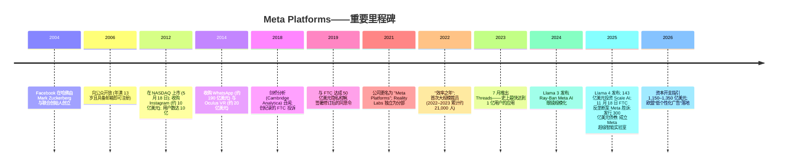
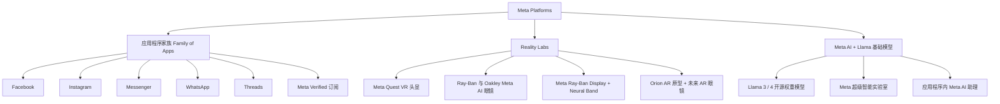
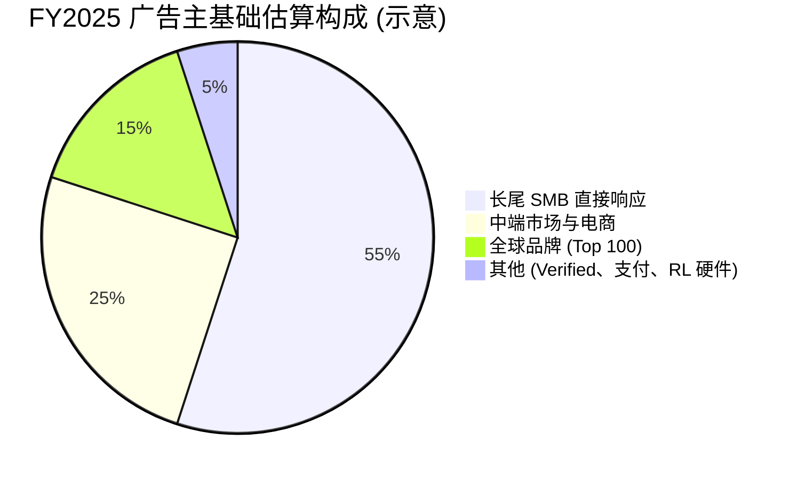
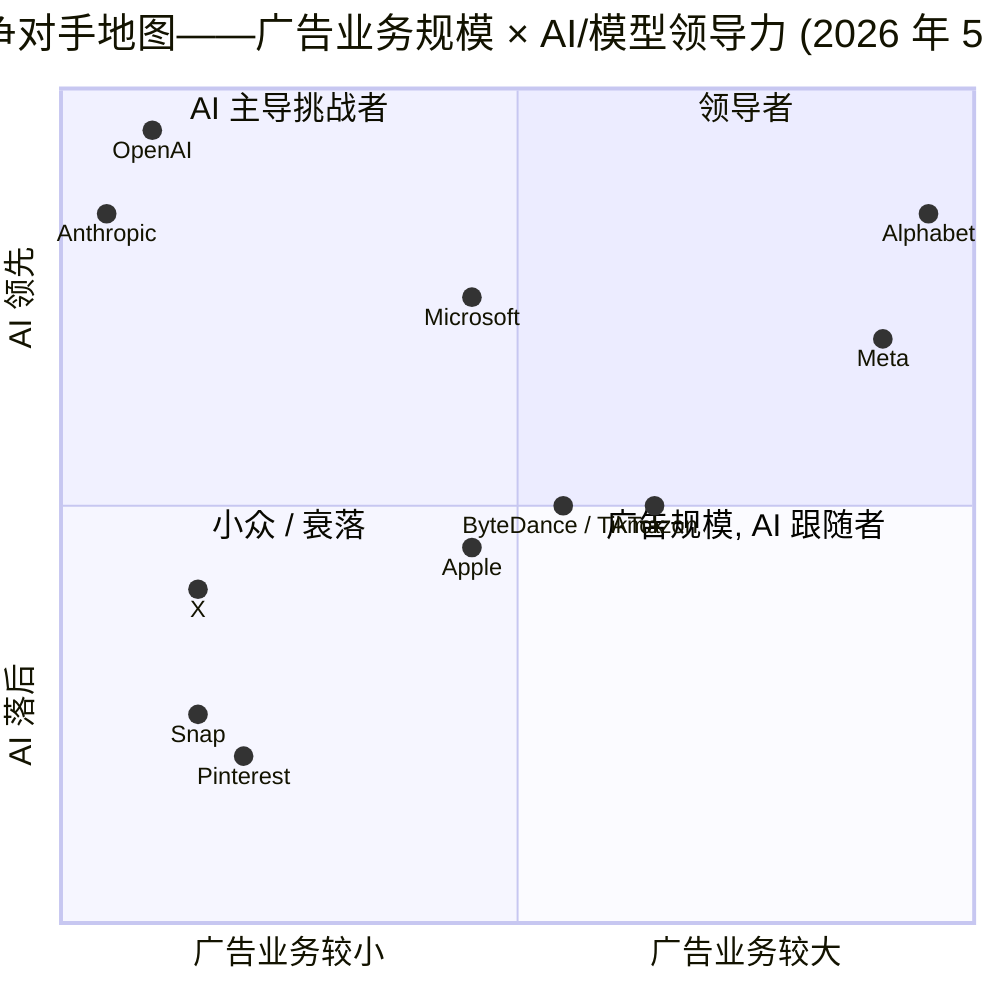
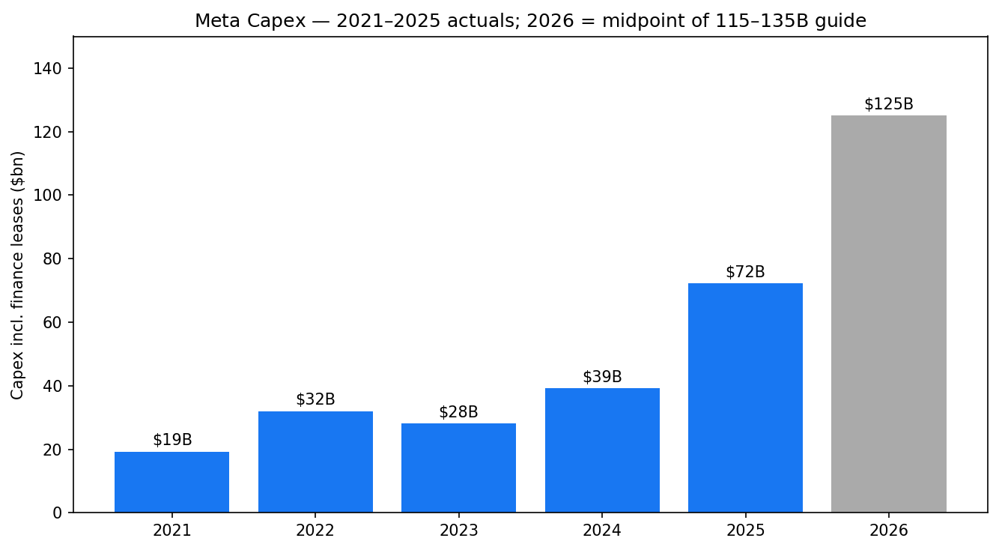
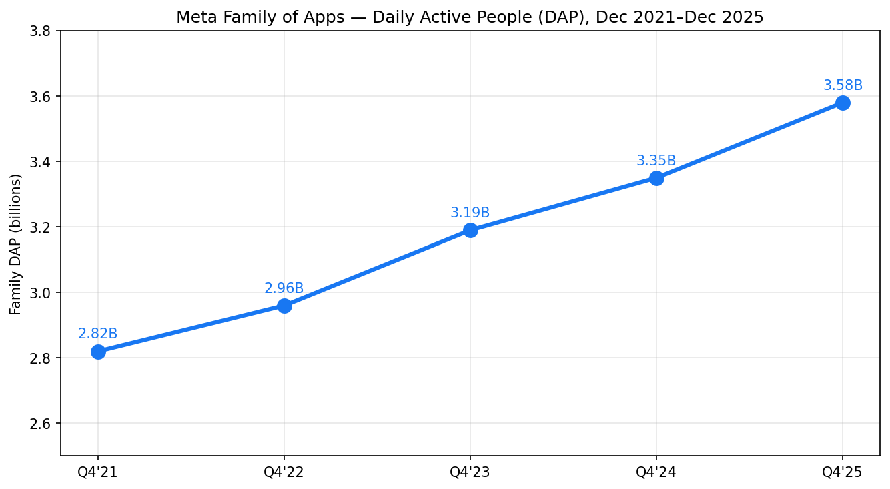

# Meta Platforms, Inc. (NASDAQ:META) — 公司研究报告

**截至日期: 2026-05-20**
**股票代码: NASDAQ:META**
**报告货币: 美元**
**报告语言: 简体中文 (英文版同时存在于本目录)**

> **更新——2026 财年资本开支指引初定 1,150–1,350 亿美元; 2026 财年总费用区间 1,620–1,690 亿美元 (2026-01-28):** 公司在 2025 年 Q4 业绩公告中首次给出 2026 年资本开支指引 **1,150–1,350 亿美元** (相较 2025 财年实际资本开支 722.2 亿美元), 主要驱动因素为 Meta 超级智能实验室 (Meta Superintelligence Labs) 基础设施建设与核心广告基础设施投入。2026 财年总费用指引设定为 **1,620–1,690 亿美元**, Q1 2026 营业收入指引为 **535–565 亿美元** (假定约 4% 的汇率顺风)。即便基础设施投入显著加码, 管理层仍预计 2026 年营业利润将高于 2025 年。来源: [2025 年 Q4 业绩公告, 2026-01-28](https://www.sec.gov/Archives/edgar/data/1326801/000162828026003832/meta-12312025xexhibit991.htm)。

---

## 目录

1. 公司概览
2. 公司历史
3. 管理团队
4. 产品与服务
5. 客户与上市策略
6. 行业概览
7. 竞争格局
8. 市场机会 (TAM)
9. 风险评估
10. 参考资料

---

## 1. 公司概览

Meta Platforms, Inc. ("Meta") 是**全球最大的社交媒体运营商**, 也是**全球第二大数字广告 (digital advertising) 销售方**。公司总部位于加州门洛帕克 (Menlo Park), 在纳斯达克 (Nasdaq) 上市, 股票代码 META。其运营的四款社交网络与即时通讯产品统称为"应用程序家族 (Family of Apps)"——**Facebook、Instagram、Messenger 与 WhatsApp**, 此外还包括新兴产品 **Threads**、**Meta AI 助理 (Meta AI assistant)**, 以及新兴的 **Reality Labs (现实实验室)** 消费硬件 (Meta Quest VR 头显、Ray-Ban / Oakley Meta AI 眼镜)。当前公司绝大部分营业收入来自应用程序家族中销售的广告位; 消费硬件以及少量订阅 / 支付产品贡献其余 ([Meta 10-K FY2025, Item 1 Business](https://www.sec.gov/Archives/edgar/data/1326801/000162828026003942/0001628280-26-003942-index.htm))。

**Meta 如何赚钱。** 公司运营的是一套端到端的广告体系: 一项免费、广告支持的消费产品矩阵, 在 2025 年 12 月平均日活跃用户 (Daily Active People, DAP) 已达 35.8 亿 (同比增长 7%); 一个自助式广告平台, 让全球约 **1,000 万+** 广告主可在 Feed、Reels、Stories、Messenger 与 Threads 各广告位上参与竞价; 以及一个由 Meta 自研 AI 模型驱动、不断进化的定向 / 度量层。2025 年, **应用程序家族广告展示量 (ad impressions) 同比增长 12%、单条广告平均价格同比增长 9%**——两者结合共同驱动了 22% 的同比营业收入增长 ([Meta 10-K FY2025, MD&A Executive Overview](https://www.sec.gov/Archives/edgar/data/1326801/000162828026003942/0001628280-26-003942-index.htm))。营业收入多元化程度有限: 2025 财年广告营业收入为 **1,961.8 亿美元 (占总额 2,009.7 亿美元的约 97.6%)**; 应用程序家族其他营业收入 (WhatsApp 商业消息、Meta Verified 订阅、支付) 为 25.8 亿美元, Reality Labs 硬件营业收入为 22.1 亿美元 ([Q4 2025 业绩公告, 分部数据](https://www.sec.gov/Archives/edgar/data/1326801/000162828026003832/meta-12312025xexhibit991.htm))。

**业务布局。** Meta 在全球 90 多个城市设有办公室, 拥有或租赁 30 个数据中心 (data center) 园区, 加上门洛帕克总部周边约 1,000 万平方英尺 (square feet) 的办公及建筑面积 ([Meta 10-K FY2025, Item 2 Properties](https://www.sec.gov/Archives/edgar/data/1326801/000162828026003942/0001628280-26-003942-index.htm))。尽管应用程序家族覆盖除中国大陆及少数被制裁地区之外的几乎全球用户, **营业收入仍高度集中于发达市场**——美加与欧洲贡献远高于人口比例的份额, 因为单位用户变现 (ARPP) 更高; 而亚太与世界其他地区则贡献了大部分广告展示量增长。2025 年, 营业收入在四大地理分区的增速依次为 **美加 21%、欧洲 24%、亚太 20%、世界其他地区 27%** ([Meta 10-K FY2025, Trends in Revenue by User Geography](https://www.sec.gov/Archives/edgar/data/1326801/000162828026003942/0001628280-26-003942-index.htm))。

**规模指标。** Meta 2025 财年收官: **营业收入 2,009.7 亿美元 (同比 +22%)、营业利润 832.8 亿美元 (同比 +20%)、自由现金流 (free cash flow) 435.9 亿美元、净利润 604.6 亿美元** (净利润受到 *《伟大美丽法案 (One Big Beautiful Bill Act, OBBBA)》* 一次性 159.3 亿美元税务计提的拖累) ([Q4 2025 业绩公告](https://www.sec.gov/Archives/edgar/data/1326801/000162828026003832/meta-12312025xexhibit991.htm))。现金、现金等价物与有价证券合计为 815.9 亿美元; 长期负债 (long-term debt) 因 2025 年 11 月发行 300 亿美元债券为 AI 资本开支提供资金而升至 587.4 亿美元。员工人数为 78,865 人 (同比 +6%) ([Meta 10-K FY2025, MD&A](https://www.sec.gov/Archives/edgar/data/1326801/000162828026003942/0001628280-26-003942-index.htm))。资本开支 (capital expenditures) 从 2024 年的 392.3 亿美元跃升至 2025 年的 **722.2 亿美元**, 2026 年指引为 **1,150–1,350 亿美元**。

*来源: [Meta 10-K FY2025, 综合损益表](https://www.sec.gov/Archives/edgar/data/1326801/000162828026003942/0001628280-26-003942-index.htm); 2021–2022 财年数据来自历年 10-K。*

### 估值快照

截至 2026 年 5 月中旬, META 股价约 **605 美元/股, 市值约 1.54 万亿美元**, 为全球第八大上市公司。按过去十二个月 (TTM) 计算, **TTM 市盈率 (P/E) 约 21.9 倍, TTM 市销率 (P/S) 约 7.2 倍** ([Yahoo Finance META 关键统计, 2026-05-19](https://finance.yahoo.com/quote/META/key-statistics))。考虑到市场一致预期 2026 EPS 将从受 OBBBA 压低的 23.49 美元 GAAP 基数恢复增长, 前瞻市盈率位于高十几倍区间。交叉验证: 市盈率 21.91 倍, 市销率 7.20 倍 ([Public.com PE 历史](https://public.com/stocks/meta/pe-ratio)); [GuruFocus, 2026-04-18](https://www.gurufocus.com/term/ps-ratio/META) 引用更高股价基础下的市销率 8.81 倍。考虑到股东权益 2,172.4 亿美元对比 1.54 万亿美元市值, Meta 没有有意义的账面价值折扣, 市净率 (P/B) 约 7 倍。

**同业估值比较 (TTM, 2026 年 5 月):**

| 公司 | TTM 市盈率 | TTM 市销率 | 备注 |
|---|---|---|---|
| **META** | **~21.9×** | **~7.2×** | 来源: [Yahoo Finance, 2026-05-19](https://finance.yahoo.com/quote/META/) |
| GOOG/L (Alphabet 字母表) | ~30.4× | ~7.3× | 来源: [Public.com GOOGL P/E, 2026-05-13](https://public.com/stocks/googl/pe-ratio) |
| PINS (Pinterest) | ~39.3× | ~2.9× | 来源: [StockAnalysis PINS 统计](https://stockanalysis.com/stocks/pins/statistics/) |
| SNAP (Snap Inc.) | **n/m (亏损)** | ~1.3× | TTM EPS –0.27 美元; [GuruFocus SNAP P/E](https://www.gurufocus.com/term/pe-ratio/SNAP) |
| **行业中位数 (数字广告 / 互联网)** | ~24× | ~5× | 综合自行业追踪数据 |

*分析师观点:* META 的 TTM 市盈率约 22 倍 **较 Alphabet 折价约 28%**, 大致与更广义的互联网行业中位数持平——但 Meta 2025 财年营业收入增长 22%, 显著高于 Alphabet 2025 年的约 14%。两个因素压制了 Meta 估值倍数: (i) **监管阴霾**——2025 年 4 月欧盟数字市场法 (Digital Markets Act, DMA) 不合规罚款 2 亿欧元, 加上 2026 年 Q1 生效的"低个性化广告"框架, 引发市场对欧洲 ARPP 的担忧 ([欧盟委员会 DMA 决定, 2025-12-08](https://digital-markets-act.ec.europa.eu/meta-commits-give-eu-users-choice-personalised-ads-under-dma-2025-12-08_en)); 以及 (ii) **资本开支冲击**——资本开支从 2024 年的 390 亿美元跃升至 2025 年的 720 亿美元, 再到 2026 年指引的 1,150–1,350 亿美元, 已引发投资者对近期投入资本回报率 (ROIC) 的担忧, 尽管公司维持 2026 年营业利润将高于 2025 年的指引 ([Q4 2025 业绩公告, CFO 展望](https://www.sec.gov/Archives/edgar/data/1326801/000162828026003832/meta-12312025xexhibit991.htm))。估值倍数并未拉伸 (因此无需在第 9 章将估值风险列为首要担忧), 但**资本开支驱动下自由现金流转化率的下行**是一项独立的财务风险, 我们将在后文进一步讨论。市盈率明显低于 Meta 自身的三年均值 (约 27 倍), 也远低于 Alphabet, 如果 AI 资本开支能够成功变现, 估值重估空间充足。

### 2. 公司历史

Facebook 于 **2004 年 2 月 4 日**在哈佛大学一间宿舍诞生, 由当时 19 岁的二年级学生 Mark Zuckerberg (扎克伯格) 与同学 Eduardo Saverin、Andrew McCollum、Dustin Moskovitz 及 Chris Hughes 共同创办。两周内, 哈佛大学有一半学生已注册; Zuckerberg 在那年夏天辍学搬到帕罗奥图 (Palo Alto), 由 Peter Thiel 提供种子资金 ([Britannica——Mark Zuckerberg 传记](https://www.britannica.com/money/Mark-Zuckerberg))。公司在 2006 年从校园扩张至大众互联网, 2012 年达到 10 亿用户, 同年 5 月以 1,040 亿美元估值在 NASDAQ 上市; 收购 Instagram (约 10 亿美元, 2012 年 4 月宣布、9 月完成) 与 WhatsApp (约 190 亿美元, 2014 年 2 月); 2014 年 3 月以约 20 亿美元收购 Oculus VR, 为硬件路线图打下基础; 2021 年 10 月母公司更名为 **Meta Platforms**, 公开转向元宇宙 (metaverse) ([Britannica——Meta Platforms](https://www.britannica.com/money/Meta-Platforms))。

理解 2026 投资逻辑, 须把握三次战略性转折:

- **2012–2014 的"购买式增长"转向。** 当 Facebook 看到照片分享 (Instagram) 与移动消息 (WhatsApp) 正在威胁信息流参与度时, Zuckerberg 以创历史纪录的估值倍数将两者收入囊中。Instagram 此后成长为公司价值最高的产品 (业内普遍估计今天占应用程序家族广告营业收入 >40%), WhatsApp 则成为全球最大的消息应用。同样的剧本在一年后用于 Oculus——为一家当时尚无收入的 VR 创业公司支付 20 亿美元——为 Reality Labs 锁定了 AI 眼镜品类成熟前十年的领先身位。
- **2021 年元宇宙转向与 2022–2023 效率重置。** 2021 年 10 月的更名标志公司向 AR/VR 与元宇宙的长周期投入, 正值后疫情广告市场降温以及苹果 ATT (App Tracking Transparency, 应用追踪透明度) 框架冲击广告定向。营业利润率从 2021 年的 39.6% 一路压缩至 2022 年的 24.8%, Reality Labs 亏损急剧扩大。Zuckerberg 以"效率之年 (Year of Efficiency)"回应: 2022–2023 累计裁员约 21,000 人、资本开支自律、扁平化组织。营业利润率回升至 2023 年的 34.7%、2024 年的 42.2%、2025 年的 41.4% ([Meta 10-K FY2025, MD&A](https://www.sec.gov/Archives/edgar/data/1326801/000162828026003942/0001628280-26-003942-index.htm))。
- **2024–2025 的 AI 超级转向。** Llama 3 (2024 年 4 月)、Llama 4 (2025 年 4 月)、143 亿美元投资 Scale AI 并引入创始人 Alexandr Wang ([CNBC, 2025-06-12](https://www.cnbc.com/2025/06/12/scale-ai-founder-wang-announces-exit-for-meta-part-of-14-billion-deal.html))、以及"Meta 超级智能实验室"的正式成立, 标志着投入规模的根本性跃迁。2025 资本开支同比 +84%; 2026 指引中点同比再 +75%。据报道, 资深工程师招聘的个人薪酬包高达九位数, 2026 年初推出的高管股权计划将近 10 亿美元的薪酬挂钩于股价指标, 最高可触发 3,727 美元目标价 ([Harvard Law CorpGov 博客, 2026-04-10](https://corpgov.law.harvard.edu/2026/04/10/metas-new-executive-pay-plan-ties-nearly-1-billion-to-stock-performance/))。

**重要收购与投资 (示例):**

- 2012 年——**Instagram** (约 10 亿美元)。Reels 与移动照片核心产品; 可以说是当今 Meta 最具价值的资产。
- 2014 年——**WhatsApp** (约 190 亿美元)。全球最大消息应用; 当前通过商业付费消息变现。
- 2014 年——**Oculus VR** (约 20 亿美元)。培育 Reality Labs 与 Meta Quest 的种子资产。
- 2025 年——**Scale AI** (143 亿美元购得 49% 无投票权股份; Wang 加盟 Meta)。训练数据引擎及超级智能实验室人才核心 ([Fortune, 2025-06-22](https://fortune.com/2025/06/22/inside-rise-scale-alexandr-wang-meta-zuckerberg-14-billion-deal-acquihire-ai-supremacy-race/))。

值得跟踪的近期动态: (a) **2025 年 11 月 18 日——FTC 反垄断案 Meta 胜诉**, 长期悬而未决的针对 Instagram 与 WhatsApp 收购的结构性拆分诉讼宣告终结; FTC 于 2026 年 1 月 20 日提交上诉通知, 但拆分风险已显著降低 ([Meta 10-K FY2025, Item 3 法律程序](https://www.sec.gov/Archives/edgar/data/1326801/000162828026003942/0001628280-26-003942-index.htm))。(b) **2025 年 11 月——发行 300 亿美元债券**, 共六档, 长期负债翻倍至 587.4 亿美元, 为基础设施投入提供资金。(c) **2025 年 12 月 / 2026 年 1 月——DMA 个性化广告和解**, Meta 自 2026 年 Q1 起开始推出, 管理层明确警示这一变动可能严重恶化欧盟用户体验和营业收入。

### 3. 管理团队

**Mark Zuckerberg——创始人、董事长兼首席执行官。** Zuckerberg (生于 1984 年 5 月 14 日, 纽约白原市) 是公司中最具决定意义的单一高管, 整个投资逻辑都与他的判断力和资本配置偏好绑定。他先就读于菲利普斯·埃克塞特学院 (Phillips Exeter Academy), 2002 年入读哈佛, 2004 年 2 月在宿舍创立 thefacebook.com, 联合创始人包括 Saverin、McCollum、Moskovitz 与 Hughes ([Britannica](https://www.britannica.com/money/Mark-Zuckerberg))。担任 CEO 的 22 年间, 他完成了三轮品类定义级的产品周期: 从 Web 向移动的转移 (2010–2013)、通过 Instagram 与 WhatsApp 实现的社交整合 (2012–2014)、以及当前的生成式 AI / 超级智能转向 (2023 至今)——每一次市场起初都质疑, 但绝大多数最终被验证。他还推动过两轮残酷的业务重置: "效率之年" (2022–2023) 裁减约 21,000 个岗位 (相当于当时员工人数的约 25%) 并重置资本开支; 而当前 AI 周期反向而行, 三年内将资本开支从 390 亿美元提升至指引的 1,150–1,350 亿美元。Zuckerberg 通过 IPO 时建立的双层股权 (dual-class share) 架构控制 Meta: 他持有约 99.7% 的 Class B 超级投票权股份, 加上行权期权, 在约 13–14% 的经济权益基础上掌握**约 61% 的投票权** ([LinkedIn / Jimmy Acton 引用 2025 Meta 委托书](https://www.linkedin.com/posts/jimmyacton_mark-zuckerberg-only-owns-13-of-metas-stock-activity-7267436986527887361-VAMc); [Public Citizen 关于 Meta 治理的分析](https://www.citizen.org/news/how-zuckerberg-keeps-his-job-despite-rampant-mismanagement-and-misconduct/))。福布斯 2025 年 12 月估算其净资产约 2,200 亿美元, 常年位列全球前 3–5 富豪 ([Goodreturns / 福布斯数据](https://www.goodreturns.in/mark-zuckerberg-net-worth-and-biography-blnr15.html))。对投资逻辑跟踪而言, 公开观察具有意义: 他亲自推动 Llama 开源、Ray-Ban Meta 硬件路线图, 以及把 Alexandr Wang 带到 Meta 超级智能实验室的 Scale AI 交易。看多 META 的投资者押注 Zuckerberg 在大规模下的转向能力; 看空者则把同样的超级投票权控制视为治理风险。

**Susan Li——首席财务官。** Susan Li 2008 年从斯坦福大学 (数学与计算科学本科) 毕业即加入 Meta, 从财务岗位逐步晋升, 接管应用程序家族财务, 并于 2022 年 11 月接替 David Wehner 出任 CFO。她已带领 Meta 财务团队走过 2022–2023 效率周期、后 ATT 的恢复、Reels 变现爬坡, 以及当前的 AI 资本开支超级周期——五年间跨越三个宏观体制, 难度堪称非凡。华尔街已将她每个季度对资本开支 / 运营费用的框架视为分部投入的可靠领先指标。2025 年披露薪酬: **基本工资约 99 万美元, 股票奖励 1,671 万美元, 其他 8.6 万美元, 总额约 2,006 万美元** ([Fintool——Susan Li 薪酬汇总](https://fintool.com/app/research/companies/META/people/susan-li))。她也是新 2026 年长期股票期权计划的四名高管之一 (其余为 CTO Andrew Bosworth、CPO Chris Cox 与 COO Javier Olivan), 该计划与股价指标挂钩, 每名高管理论上最高可获约 27 亿美元 ([Harvard CorpGov, 2026-04-10](https://corpgov.law.harvard.edu/2026/04/10/metas-new-executive-pay-plan-ties-nearly-1-billion-to-stock-performance/))。

**Chris Cox——首席产品官。** Cox 2005 年作为最早的工程师之一加入公司, 是 Facebook News Feed、Stories, 以及 Reels 与 Threads 的事实上的产品架构师。他于 2019 年短暂离职, 2020 年以 CPO 身份回归。他统管应用程序家族的产品路线图, 是把 Llama / Meta AI 能力翻译到消费产品的最高级别高管。2025 年披露薪酬: **基本工资约 99.9 万美元, 股票奖励 1,838 万美元, 其他 1.175 万美元, 总额约 2,169 万美元** ([Fintool / 委托书数据](https://fintool.com/app/research/companies/META/people/susan-li))。

**Andrew Bosworth——首席技术官兼 Reality Labs 负责人。** Bosworth ("Boz") 2006 年加入公司, 2017 年起执掌 Reality Labs。他全面统筹 AR/VR/AI 眼镜路线图 (Meta Quest、Ray-Ban Meta、Oakley Meta、Orion AR 原型、配备 EMG 腕带的 Meta Ray-Ban Display)。Reality Labs 一直是争议焦点——自 2020 年以来累计亏损约 800 亿美元——但 AI 眼镜品类在 2025 年迎来拐点, 智能眼镜单位销量据报道同比翻三倍, 2026 年产量目标为 1,000–2,000 万台 ([webProNews / Meta IR 摘要](https://www.webpronews.com/meta-reality-labs-q2-4-5b-loss-beats-expectations-glasses-sales-triple/))。

**治理。** Meta 是一家受控公司: Mark Zuckerberg 掌握约 61% 投票权, 治理委员会偏咨询性而非制衡性, 董事会过往在战略重置 (元宇宙转向、AI 超级转向、Scale AI 交易) 上始终遵从 Zuckerberg 的意见。独立董事包括前霍尼韦尔 CEO David Cote、Tony Xu (Doordash)、Charlie Songhurst 等; 首席独立董事职位轮换。Class A 内部持股较温和 (约占在外 Class A 股份的 1–2%), 但 Class B 结构使 Zuckerberg 在每项股东提案上都享有决定性投票。2026 年与 9 万亿美元市值愿景目标挂钩的高管期权计划因规模庞大而受到批评, 但仍获通过 ([mlq.ai 摘要](https://mlq.ai/news/meta-launches-executive-stock-options-linked-to-9-trillion-valuation-target/))。关联方交易有限; 最值得关注的是 Zuckerberg 个人使用公司飞机与安保服务, Meta 每年披露并通过"其他薪酬"预付。

**管理层业绩综述。** 该团队完成了大型科技公司近年最成功的两轮效率周期 (2022–2023), 并启动了非公用事业、非能源公司有史以来最雄心勃勃的两轮资本开支周期 (2024 与 2025)。Zuckerberg 愿意承担 Reality Labs >800 亿美元累计亏损, 以及对 Llama 开源的坚定承诺, 虽然有争议, 但与他公开宣示的长期愿景一致。下一阶段的执行风险集中在两个方向——AI 基础设施 ROIC 与 Reality Labs 眼镜商业化——两者合计吸纳 2026–2027 大部分新增投入。

### 4. 产品与服务

Meta 将业务划分为两个可报告分部——**应用程序家族 (Family of Apps, FoA)** 与 **Reality Labs (RL)**——但实务上更应把它视为五大产品矩阵, 外加一根 AI / 基础设施脊柱。

#### 4.1 应用程序家族 (FoA)——2025 财年营业收入 1,987.6 亿美元, 营业利润 1,024.7 亿美元

**Facebook。** 仍是单产品总触达最大的产品, 围绕 Feed、Reels、Stories、Groups、Marketplace、Dating 与 Gaming 等界面组织 ([Meta 10-K FY2025, Item 1 Business](https://www.sec.gov/Archives/edgar/data/1326801/000162828026003942/0001628280-26-003942-index.htm))。Facebook 的战略定位已从"核心社交网络"转向"长尾互动平台 + 广告效果基座"——许多广告跨应用程序投放但作为 Facebook 的展示量结算。**竞争优势: 是——可持续的网络效应** (经典的实名社交图谱)、对老用户 (尤其是 40 岁以上群体) 的高切换成本、以及无人可及的广告技术深度。最接近的竞争产品: **TikTok / 字节跳动与 YouTube**, 两者在 25 岁以下短视频品类领先, 但在直接响应变现与 SMB 自助服务上落后。

**Instagram。** 当今应用程序家族的增长与变现引擎。Reels 已成 Instagram 内部主导产品, 驱动 Meta 增量广告展示量, 尽管其变现率低于 Feed 与 Stories ([Meta 10-K FY2025, MD&A "其他业务与宏观经济条件"](https://www.sec.gov/Archives/edgar/data/1326801/000162828026003942/0001628280-26-003942-index.htm))。**竞争优势: 是——品牌 + 创作者经济锁定**; 尽管 TikTok 在短视频上势均力敌, Instagram 仍掌控顶级网红基础、直接购物广告位与 DM 功能。最接近的竞争产品: **TikTok**。

**Messenger。** Facebook 的消息伴侣, 后端正与 Instagram DM 加深合并。消息变现仍然有限; 战略上将 Messenger 作为点击-发消息广告 (Click-to-Message) 的承接点。**竞争优势: 部分**——触达极大, 但在美国 iMessage / SMS 已超越其实用性, 国际上则被 WhatsApp 超越。

**WhatsApp。** 全球最大消息应用, 月活用户估计 >25 亿 (Meta 已不再单独披露)。变现逻辑已从应用程序内广告 (2024 年在 Status / Channels 引入) 转向**付费商业消息**——Meta 对商家与客户之间会话按条收费——计入"应用程序家族其他营业收入"项下, 2025 年合计 25.8 亿美元 ([Q4 2025 业绩公告](https://www.sec.gov/Archives/edgar/data/1326801/000162828026003832/meta-12312025xexhibit991.htm))。**竞争优势: 是——规模 + 加密品牌**, 但单用户变现仍只是 Facebook / Instagram 的一小部分。最接近竞品: Apple iMessage (地区性)、Telegram (监管相邻市场)、微信 (仅中国)。

**Threads。** 2023 年 7 月上线, 对标 Twitter / X。截至 2025 年 Q3, Meta 披露月活用户 4 亿; 据报道日活用户在 2026 年初已达 1.37 亿 ([Backlinko Threads 统计](https://backlinko.com/threads-users); [Social Media Today, 2025](https://www.socialmediatoday.com/news/threads-reaches-350-million-monthly-active-users/746828/))。广告功能于 2024 年上线; 变现仍处早期。**竞争优势: 部分**——冷启动速度极快, 因为 Threads 继承了 Instagram 图谱, 但 X / Bluesky / Mastodon 仍是重度用户的替代栖息地。最接近竞品: **X (Twitter)** 与 Bluesky。

**Meta Verified。** 一项付费订阅套餐 (美国约 11.99 美元/月/平台), 2023 年推出, 包含认证徽章、账户保护权益与客服支持, 跨 Facebook、Instagram 与 WhatsApp 销售。运营营收未单独披露, 计入 FoA Other。

**Meta AI 助理。** 一项免费对话式 AI 助理, 跨应用程序家族提供, 也可作为独立的 meta.ai 应用、AI 眼镜以及 Web 端使用。由 Llama 4 驱动。Meta 尚未直接对该助理变现; 战略上以驱动互动 / 停留时长以及向广告系统注入第一方数据为目标 ([Meta 10-K FY2025, Item 1 Business——"Meta AI"](https://www.sec.gov/Archives/edgar/data/1326801/000162828026003942/0001628280-26-003942-index.htm))。**竞争优势: 部分——分发**(35.8 亿 DAP 触达独步天下), 但模型领先性相比 OpenAI / Anthropic / Google 仍有争议。

#### 4.2 Reality Labs (RL)——2025 财年营业收入 22.1 亿美元, 营业亏损 191.9 亿美元

**Meta Quest。** VR 头显与 Meta Horizon Store。Quest 3 (2023 年发售) 与 Quest 3S (2024) 为走量产品; 2025 年 Q4, Quest 营业收入因渠道库存周期与内容节奏放缓同比下滑约 12% ([CNBC, 2026-01-28](https://www.cnbc.com/2026/01/28/metas-reality-labs-posts-6point02-billion-loss-in-fourth-quarter.html))。2026 年, Meta 计划将 RL 运营费用的约 30% 用于 VR / Horizon, 70% 用于可穿戴 ([Meta 10-K FY2025, Item 1 Business——"Reality Labs Products"](https://www.sec.gov/Archives/edgar/data/1326801/000162828026003942/0001628280-26-003942-index.htm))。**竞争优势: 是——专用独立 VR 领域领先** (约 75–80% 品类份额), 但目标市场仍属小众。最接近竞品: **Apple Vision Pro** (定价 / 用例不同) 与 **Pico** (字节跳动, 主要在亚洲)。

**Ray-Ban Meta 与 Oakley Meta AI 眼镜。** 2024–2025 年的现象级产品线: 配备 AI 能力的音频眼镜, 内置摄像头、Meta AI 集成, 近期新增镜片内显示。智能眼镜营业收入据报道在 2025 年翻三倍, 2026 年产量目标为 1,000–2,000 万台 ([Webpronews, 2025](https://www.webpronews.com/meta-reality-labs-q2-4-5b-loss-beats-expectations-glasses-sales-triple/))。**竞争优势: 是——通过 EssilorLuxottica 合作伙伴构建的先发规模 + 零售分发**, 是该品类最持久的护城河。最接近竞品: Google 的 Project Iris / Samsung XR (Galaxy)——尚在早期; Apple 没有出货产品。

**Meta Ray-Ban Display + Meta Neural Band。** 2025 年发售——首款配备镜片内显示的商用智能眼镜, 搭配一条 EMG 腕带, 让用户通过神经肌肉信号控制设备 ([Meta 10-K FY2025, Reality Labs Products](https://www.sec.gov/Archives/edgar/data/1326801/000162828026003942/0001628280-26-003942-index.htm))。售价 799 美元。这是迈向真正 AR 眼镜的第一步商业化; 销量小, 但战略期权价值大。

**Orion AR 原型 + 长期 AR 眼镜。** 2024 年 Connect 大会发布的内部专用原型; 消费版上市可能要等到 2027–2028 年。2026 年无营业收入科目。

#### 4.3 Meta AI / Llama / Meta 超级智能实验室 (脊柱)

Meta 自 Llama 1 (2023 年) 起即开源前沿模型。**Llama 4 Scout (17B 激活 / 109B 总参, 10M token 上下文)、Maverick (17B 激活 / 400B 总参) 与 Behemoth (仍在训练)** 于 2025 年 4 月发布 ([Meta AI 博客——Llama 4](https://ai.meta.com/blog/llama-4-multimodal-intelligence/))。这一战略服务多重目标: (i) 推动开源生态采纳以抢占心智份额, (ii) 通过下游优化降低 Meta 自身模型成本, (iii) 吸引顶尖 ML 人才, (iv) 在价格层面约束闭源在位者。2025 年 6 月, Meta 承诺以 143 亿美元收购 Scale AI 49% 无投票权股份, 并招募创始人 Alexandr Wang 出任新设的 **Meta 超级智能实验室**负责人 ([CNBC, 2025-06-12](https://www.cnbc.com/2025/06/12/scale-ai-founder-wang-announces-exit-for-meta-part-of-14-billion-deal.html))。**竞争优势: 部分**——开源权重领先与分发能力世界级; 闭源前沿模型相对 GPT-5 / Claude / Gemini 的性能仍存争议。

#### 4.4 旗舰与长尾

**旗舰 (贡献约 95% 营业收入与营业利润):** Instagram (Reels + Feed + Stories 广告) 与 Facebook (Feed + Reels 广告)。**重要但占比较低:** WhatsApp 商业消息、Meta Verified、Threads 广告、Meta Quest 硬件以及 Ray-Ban Meta 眼镜。**期权 / 长尾:** Meta AI 助理变现、Orion AR 眼镜、Horizon 元宇宙内容、游戏。

#### 4.5 过去 12 个月的发布与转向

- **2025 年 4 月:** Llama 4 发布及 LlamaCon AI 开发者大会。
- **2025 年 6 月:** 143 亿美元投资 Scale AI; Alexandr Wang 加盟 Meta 领导超级智能实验室 ([Fortune, 2025-06-22](https://fortune.com/2025/06/22/inside-rise-scale-alexandr-wang-meta-zuckerberg-14-billion-deal-acquihire-ai-supremacy-race/))。
- **2025 年:** Meta Ray-Ban Display 发售 (首款镜片内显示智能眼镜, 799 美元); Oakley Meta 系列推出; 智能眼镜单位销量同比翻三倍 ([Meta 10-K FY2025, Reality Labs Products](https://www.sec.gov/Archives/edgar/data/1326801/000162828026003942/0001628280-26-003942-index.htm))。
- **2025 年 Q4 / 2026 年 Q1:** 根据欧盟委员会 2025 年 12 月和解协议, 低个性化广告 (Less Personalised Ads, LPA) 框架在欧盟落地 ([EC DMA 公告, 2025-12-08](https://digital-markets-act.ec.europa.eu/meta-commits-give-eu-users-choice-personalised-ads-under-dma-2025-12-08_en))。
- **2025 年 11 月:** FTC 反垄断案法庭裁定 Meta 胜诉 (FTC 于 2026 年 1 月 20 日提交上诉)。

*来源: [Meta 10-K FY2025, 分部信息](https://www.sec.gov/Archives/edgar/data/1326801/000162828026003942/0001628280-26-003942-index.htm) 与 [Q4 2025 业绩公告](https://www.sec.gov/Archives/edgar/data/1326801/000162828026003832/meta-12312025xexhibit991.htm)。*

### 5. 客户与上市策略

Meta 的"客户"是**广告主**, 而"用户"是 Meta 向广告主出售其注意力的消费者。两类群体都极其庞大、极其多样化。

**客户 (广告主) 基础。** Meta 广告平台压倒性地以自助方式服务: 绝大多数营销者使用 Meta Ads Manager 自助平台, 在拍卖中竞价, 无任何最低门槛。公司同时在全球 90+ 城市设有企业销售团队, 服务于全球最大的品牌广告主、广告代理与转售商 ([Meta 10-K FY2025, Item 1 Business——Sales and Operations](https://www.sec.gov/Archives/edgar/data/1326801/000162828026003942/0001628280-26-003942-index.htm))。公开估算显示, 全球活跃广告主基础约 **1,000 万+**, 以中小直接响应广告主 (长尾) 为主, 高端品牌广告主居其上。

**客户集中度。** Meta **未披露任何单一客户达到或超过合并营业收入的 10%**——无论在 FY2025 10-K 的 Item 1 Business 部分、分部 / 地理附注, 还是 ASC 280-10-50-42 项下 ([Meta 10-K FY2025](https://www.sec.gov/Archives/edgar/data/1326801/000162828026003942/0001628280-26-003942-index.htm))。最常被引用的公开估算是, **Top-100 广告主合计贡献广告营业收入的约 15–20%, 单一最大广告主约 1–2%**——这两项数据均非 Meta 披露, 我们明确将其列为估算而非事实。前期, 卖方研究曾在 2023 年公开将中国跨境电商广告主 (尤其是 Temu / 拼多多与 Shein) 列为单一最大增长贡献者, 管理层在 2024 财报电话会议上提到**来自中国广告主的需求出现疲软**; FY2025 10-K MD&A 同样提及美中关税可能造成的不利影响。我们将此视为**分散但真实的风险**: 虽然单一广告主不具决定性, 但区域 / 行业层面的撤离 (如中国电商、美国汽车、衰退中的美国 CPG) 可在百分点级别撬动营业收入。

*来源: 示意性——Meta 不披露广告主基础集中度。各类别反映行业分析师共识; 视为近似估算, 而非披露数据。*

**地理结构 (按用户地理划分的营业收入)。** Meta 按四个地理分区报告。FY2025 营业收入增速分别为 **美加 21%、欧洲 24%、亚太 20%、世界其他地区 27%** ([Meta 10-K FY2025, Trends in Revenue by User Geography](https://www.sec.gov/Archives/edgar/data/1326801/000162828026003942/0001628280-26-003942-index.htm))。美加与欧洲因 ARPP 更高, 仍贡献多数营业收入金额。全球季度 ARPP 从 2023 年 Q4 的 11.20 美元一路提升至 2025 年 Q4 的 16.56 美元, 全年 ARPP 为 **57.03 美元 (同比 +15%)** ([Meta 10-K FY2025, Trends in Family Metrics](https://www.sec.gov/Archives/edgar/data/1326801/000162828026003942/0001628280-26-003942-index.htm))。

**分发与渠道。**
- *应用程序家族。* 通过 Apple iOS 与 Android 应用商店分发, 个人电脑端通过 Web 访问。单一最重要的渠道风险是**Apple iOS 应用追踪透明度 (ATT)** (2021 年推出) 与 **Google Android 的隐私政策**, 两者都显著削弱了 Meta 的广告定向与度量能力 ([Meta 10-K FY2025, MD&A——广告业务发展](https://www.sec.gov/Archives/edgar/data/1326801/000162828026003942/0001628280-26-003942-index.htm))。
- *Reality Labs。* 多渠道: 通过 Meta.com 与少量 Meta 品牌门店直接面向消费者; 通过零售商分发 (美国为 Best Buy、Amazon、Costco; Ray-Ban Meta 与 Oakley Meta 全球依托 EssilorLuxottica 品牌零售)。

**销售周期与定价。** 自助广告主基本零销售周期——从注册到首条展示只需数分钟。定价为拍卖式 (按目标分别为 CPM / CPC / CPA 等价)。FY2025 单条广告平均价格同比上涨 9%, **由 AI 驱动的定向 (Advantage+ 广告系列套件) 改善、Reels 变现优化、以及 Click-to-Message 广告**带动——管理层在 2025 年 Q3 / Q4 电话会议中明确提到。RL 硬件则采用零售定价模式, Quest 3S 在节日季高峰期间提供促销折扣。

**关键合作伙伴。** EssilorLuxottica 是战略上最重要的合作伙伴: 负责 Ray-Ban Meta 与 Oakley Meta 眼镜的全球制造与分销。NVIDIA、Microsoft (Azure) 与 Oracle 是主要的云基础设施供应商 (Meta 自营数据中心, 同时也使用第三方云)。Snapdragon (Qualcomm) 为 Quest 与 AI 眼镜供应芯片家族。AT&T Sports、NBA、以及部分音乐厂牌是 Horizon Worlds 的内容合作伙伴。

**公开"客户"案例。** Meta 不在披露中点名广告主。公开的 [Meta for Business](https://www.facebook.com/business/success) 案例页面覆盖 Sephora、Toyota、Airbnb、Walmart、Heineken、Shopify 商户以及数以千计的中小企业。

### 6. 行业概览

**行业界定。** Meta 在两个重叠的市场竞争: **数字广告** (主导营收池) 与 **消费技术硬件 / 扩展现实** (Reality Labs)。数字广告本身又是全球总广告市场 (电视 / 户外 / 印刷 / 广播 + 数字) 的子集——但数字目前已占全球总广告支出的约 75%。

**市场规模。** 全球广告支出预计 2025 年首度突破 **1.03 万亿美元**, 朝 2028 年的 **1.3 万亿美元**迈进 ([Precedence Research——数字广告市场](https://www.precedenceresearch.com/digital-advertising-market); [Abbey Mecca 关于 2025 预测的综述](https://abbeymecca.com/worldwide-ad-spending-to-hit-1-trillion-in-2025-what-it-means-for-businesses-marketers-and-nonprofits/))。其中, **数字广告 2025 年规模约 7,500–8,000 亿美元**, 年增速 10–12%。围墙花园 (walled garden) 集中度极高: Alphabet (Google + YouTube) 超 2,000 亿美元; Meta 以约 1,961.8 亿美元广告营业收入占据全球数字广告份额 >23%; Amazon Ads 约 690 亿美元 / 约 9% ([Marketing Dive——Meta 与 Google 份额对比, 2025](https://www.marketingdive.com/news/meta-to-surpass-google-in-digital-ad-revenue-for-first-time-emarketer/817384/))。字节跳动 / TikTok 是增速最快的实质竞争者, 2025 年约 330 亿美元, 同比 +40%。

**增长率。** 过去五年, 全球数字广告支出以低双位数 CAGR 复合增长, 多数模型预计 2028 年前仍维持约 10% CAGR——Reels 风格短视频、CTV (互联网电视) 与零售媒体 (retail media) 持续从传统展示与搜索类抢占份额。Meta 自 2023 年起增长显著超越数字广告市场 (FY2023 +16%、FY2024 +22%、FY2025 +22%), 暗示份额持续提升。

**主要趋势与驱动。**
- *AI 驱动的广告效果。* Meta 的 Advantage+ 套件使用基于 Llama 的模型替代手动广告系列决策, 已带来可衡量的广告主 ROAS 提升。管理层认为这是推动 CPM 上行的最大单一内部驱动因素。
- *短视频变现。* Reels 变现率仍低于 Feed, 但差距正快速收窄; Meta 在 2024–2025 内部目标是 Reels 与 Feed 变现持平。
- *Click-to-message 与商业消息。* WhatsApp 付费消息已成数十亿美元营收线, 是巴西、印度、印尼与中东的关键转化模式。
- *欧洲的低个性化广告 (LPA)。* 欧盟委员会 2025 年 12 月和解迫使 Meta 在付费订阅之外, 为欧盟用户提供低个性化免费层。影响: 欧洲 ARPP 缩水, CPM 下滑; 量级尚未明确量化 ([欧盟委员会 DMA 公告, 2025-12-08](https://digital-markets-act.ec.europa.eu/meta-commits-give-eu-users-choice-personalised-ads-under-dma-2025-12-08_en))。
- *AI 基础设施资本开支超级周期。* 全行业资本开支跃迁 (Meta、Alphabet、Microsoft、Amazon、Oracle) 正在重塑数据中心、电力与 GPU 供应链。Meta 2026 年 1,150–1,350 亿美元的资本开支指引为同行第二, 仅低于 Alphabet 的类似区间。
- *可穿戴 / AI 眼镜。* 行业分析师如今已将智能眼镜视为真实消费品类, 单位销量达数百万级; Meta 一骑绝尘。

**监管环境。** Meta 所处的可能是全球任何消费科技公司最严苛的监管环境。关键监管体制包括:

- *欧盟数字市场法 (DMA)。* 指定 Meta 为"看门人 (gatekeeper)"; 2025 年 4 月开出 2 亿欧元不合规罚款; LPA 框架已强制实施 ([ITIF 分析——欧盟 DMA 对 Meta 的罚款, 2025-08-07](https://itif.org/publications/2025/08/07/eu-dma-fine-against-meta-gdpr-disguise/))。
- *欧盟数字服务法 (DSA)。* 向"超大型在线平台"施加内容审核义务——透明度报告与非法内容删除上的进一步罚款风险。
- *欧盟 AI 法案。* 2025–2027 分阶段实施; 约束通用 AI 的部署, 并对训练数据施加透明度义务。
- *欧盟 GDPR。* 持续执法; 2022–2024 累计罚款 (爱尔兰 DPC 案件) 超过 20 亿欧元。
- *美国 FTC 同意令 (2020 年 4 月)。* Meta 缴纳 50.0 亿美元, 并在隐私 / 数据处理同意令下运营。
- *美国 FTC 反垄断诉讼。* 法庭于 2025 年 11 月 18 日裁定 Meta 胜诉; FTC 于 2026 年 1 月 20 日提交上诉 ([Meta 10-K FY2025, Item 3 法律程序](https://www.sec.gov/Archives/edgar/data/1326801/000162828026003942/0001628280-26-003942-index.htm))。
- *美国各州、英国、澳大利亚的青少年安全立法。* 美国多州已通过限制 18 岁以下使用社交媒体的法律; 澳大利亚的 16 岁以下禁令 (2024 年通过) 要求 Meta 采取"合理措施"将未成年人挡在服务之外 ([Meta 10-K FY2025, 风险因素](https://www.sec.gov/Archives/edgar/data/1326801/000162828026003942/0001628280-26-003942-index.htm))。FY2025 10-K 的 CFO 展望明确警示, "今年美国境内即将开庭审理多起诉讼, 最终可能造成重大损失。"

**行业格局。** 数字广告行业高度集中 (Google + Meta 合计 >50% 全球数字广告支出; 加上 Amazon 约 62%)。买方 (广告主) 议价力在 SMB 层面较低 (无议价空间), 但在最大品牌主层面随着以本金为基础的广告技术 (principal-based ad-tech) 替代品的兴起而上升。供应方议价力集中且上行——GPU 供应 (NVIDIA)、电力供应 (公用事业) 以及 EUV 级云容量都是重要变量。替代品鲜有规模; 新进入者面临 Meta 的网络效应护城河与 >500 亿美元/年的 R&D + 资本开支门槛。

### 7. 竞争格局

Meta 在三条战线上竞争: (1) **用户注意力** (消费时长), (2) **广告主预算**, 以及 (3) **AI / 下一计算平台领导力**。每条战线的竞争集合不同。

**(a) 直接竞争对手——消费社交 / 视频注意力:**

- **Alphabet (Google / YouTube)。** 双寡头中的另一家领头。YouTube 在短视频 (Shorts) 上与 Reels 正面竞争, 在创作者变现上与 Instagram 直接竞争; Google Search 则在意图驱动 (intent-driven) 的广告上与 Meta 较量。在 AI 基础设施上, Google 基于 TPU 的 Gemini 体系是 Meta 基于 NVIDIA 的 Llama 训练最可信的对手。**判断:** Alphabet 在搜索广告与长视频上领先; Meta 在社交与 SMB 直接响应上领先。
- **字节跳动 / TikTok。** TikTok 是 Meta 争夺年轻人注意力最直接的对手, 并推动了 Reels 大部分的产品路线图。字节跳动 2025 年广告营业收入约 330 亿美元, 同比 >40%, 是大型对手中增速最快的 ([2025 年 Top 10 在线广告公司](https://www.emergenresearch.com/blog/top-10-companies-in-the-online-advertising-market))。Meta 此前借 Reels 与领先度量能力守住份额, 但 TikTok 仍在 Z 世代中持续争夺心智份额。监管逆风 (美国 TikTok 禁令立法、欧盟 DSA) 可能将份额向 Meta 再分配。
- **Snap Inc. (SNAP)。** 较小的直接对手 (约 50–60 亿美元营业收入), 历史上是 Stories 的发明者。TTM 不盈利; AR Spectacles 仍有竞争力。**在所有规模维度上落后于 Meta。**
- **Pinterest (PINS)。** 相邻——购物发现细分; 约 44 亿美元营业收入。在视觉 / 购物广告预算上竞争, 但不与 Meta 争夺消费时长。**规模上落后于 Meta。**
- **X (前身 Twitter)。** 当前规模已缩小, 广告主大量流失; Threads 已捕获其前期增长叙事的大部分。
- **Reddit / Discord。** 小众文本 / 社区互动; 广告业务规模较小。

**(b) 直接竞争对手——广告主预算 (数字广告):**

- **Alphabet**——在效果广告与品牌预算上直接竞争。
- **Amazon Ads**——约 690 亿美元营业收入, 同比 +20%; 在直接响应零售预算上, 是增速最快的威胁。漏斗底部的意图给 Amazon 在购物广告上结构性的优势。
- **TikTok / 字节跳动**——在 Z 世代品牌预算上最接近 Meta 的对手。
- **零售媒体网络 (Walmart Connect、Target Roundel 等)。** 较小但总和已不容忽视, 是新兴预算池。
- **互联网电视库存 (Netflix、Disney、Roku 等)。** 高端品牌视频; 与 AVOD 上前预算 (upfront) 竞争。

**(c) AI / 下一计算平台对手:**

- **OpenAI**——闭源前沿模型领先者; ChatGPT 规模 (OpenAI 报告 2025 年约 7 亿周活)。在消费 AI 助理与开发者心智份额上是 Meta 的直接竞争对手。
- **Anthropic**——闭源前沿模型, 企业市场定位强。
- **Alphabet (Google DeepMind / Gemini)**——最可信的全栈垂直整合竞争对手 (TPU + 前沿模型 + 30 亿+ 消费产品入口)。
- **Apple**——AI 进度偏慢, 但拥有最重要的 AI 眼镜与 XR 消费入口 (iPhone + Vision Pro)。风险: Apple 的隐私叙事在结构上让 Meta 的广告业务更难。
- **Microsoft**——OpenAI 的合作伙伴; 在企业 AI 与 Windows 侧 AI 功能上竞争。
- **xAI (Elon Musk)。** 规模较小但资金充足; Grok 在消费 AI 心智上竞争, 借 X 实现分发。

**Meta 的竞争优势。**
- **网络效应护城河。** 35.8 亿应用程序家族 DAP 独步天下, 形成对广告主自我强化的吸引力。
- **广告技术深度。** 二十年自助拍卖优化; Advantage+ AI 广告系列套件; 像素级转化度量 (受 ATT 侵蚀)。
- **数据飞轮规模。** 万亿事件级的第一方用户行为数据, 同时驱动定向与推荐模型。
- **现金流与资产负债表弹药。** 816 亿美元现金 + 440 亿美元 FCF, 让 Meta 可以在不牺牲资本回报的前提下, 完全以自有资金支持 AI 资本开支超级周期。
- **创始人 CEO 授权。** Zuckerberg 的超级投票权控制让公司能够承诺多十年、高资本密集度的转向, 而无须担心每季度的投资者抗议——这在 Reality Labs 与超级智能实验室这类长周期投注上是一种竞争优势。
- **Llama 开源生态。** 驱动顶尖人才吸引与下游生态杠杆 (对闭源竞品造成定价压力)。

**竞争弱点。**
- **苹果平台税。** Meta 仍依赖 iOS 在美国占据大份额营业收入; Apple 任何进一步收紧隐私 (或 Vision Pro 的分发护城河) 都会压缩 Meta 的利润率。
- **欧盟的监管拖累。** LPA、DMA、DSA——欧洲是直接营业收入受损暴露最大的地理分区。
- **AI 模型领先性存疑。** Llama 4 具竞争力但未明显领先; 若 Llama 5 / Behemoth 未能交付, Meta "全力以赴"的资本开支将更难看。
- **Reality Labs 单位经济。** 自 2020 年累计亏损约 800 亿美元, VR 端无清晰盈亏平衡路径; 公司正越来越倚靠眼镜, 而眼镜仍处于规模化前夕。
- **品牌 / 安全风险。** 未决的青少年安全审判与剑桥分析的遗产, 让声誉风险持续高悬。

*来源: [Yahoo Finance META 关键统计, 2026-05-19](https://finance.yahoo.com/quote/META/); [Public.com GOOGL P/E 历史](https://public.com/stocks/googl/pe-ratio); [GuruFocus SNAP P/E](https://www.gurufocus.com/term/pe-ratio/SNAP); [StockAnalysis PINS](https://stockanalysis.com/stocks/pins/statistics/)。SNAP TTM EPS 为负。*

### 8. 市场机会 (TAM)

**数字广告 TAM。** 全球数字广告支出 2025 年约 **7,500–8,000 亿美元**, 在多数第三方预测下有望在 **2028 年达到约 1.0 万亿美元** ([Precedence Research](https://www.precedenceresearch.com/digital-advertising-market); [Abbey Mecca 综述, 2025](https://abbeymecca.com/worldwide-ad-spending-to-hit-1-trillion-in-2025-what-it-means-for-businesses-marketers-and-nonprofits/))。Meta 2025 年广告营业收入 1,961.8 亿美元, 意味着**全球数字广告份额约 25%** (按 Marketing Dive 引用的 eMarketer 口径 >23%)。若数字广告 TAM 以 10% CAGR 增长至 2028, Meta 需每年增长约 14% 才能在 2028 年达到约 30% 份额——这在近期增长轨迹内, 并与我们的增长拆解 (展示量 +10% × 价格 +5%) 一致。

**商业消息 TAM。** 会话商业 / 付费商业消息更难精确测算, 但 Juniper Research / IDC 跟踪显示 **2030 年达 300–500 亿美元**, 复合增速 20%+。Meta 的 WhatsApp Business 与 Messenger Click-to-Message 广告使其在中国以外成为全球领导者; 营业收入计入 FoA 其他 (2025 年 25.8 亿美元), 但管理层已指引商业消息将成为数十亿美元的独立营业收入线。

**AI 助理 TAM。** 消费生成式 AI 助理市场尚属早期——视定义而定, 2026 年约 **100–300 亿美元**, 牛市情形可在 2030 年突破 2,000 亿美元。Meta 当前的变现策略是间接 (互动 / 第一方数据); 直接订阅 / API 变现是可选项。

**智能眼镜 / 可穿戴 TAM。** 智能眼镜单位销量预计从 2024 年的几百万台规模, 在 2027 年达到 **每年 2,000–4,000 万台**, 如 Meta 与竞品达成产量目标 ([Webpronews——Meta 眼镜产量目标, 2025](https://www.webpronews.com/meta-reality-labs-q2-4-5b-loss-beats-expectations-glasses-sales-triple/))。按 300–800 美元单价计算, 意味着 2027 年硬件市场规模 60–300 亿美元——相对 Meta 的广告业务规模有限, 但这是 Meta 当前主导的品类。AR 眼镜 (Orion / 未来) 与更广义的空间计算市场更大但时点更晚 (2028+)。

**VR / 元宇宙 TAM。** 较三年前预期为小——2025 年全球消费 VR 硬件营业收入估计 <50 亿美元——也不太可能是 Reality Labs 的主要解锁项。

**SAM 与 SOM。** 在数字广告内, Meta 的可服务市场是除中国之外 (因防火长城被排除) 的全球面向消费者广告支出, 大约 6,000–6,500 亿美元。Meta 的 SOM (当前份额) 约 1,960 亿美元 / SAM 的约 30%。Meta 的现实增量机会包括:
- **+200–300 bps 份额增长**, 来自 AI 驱动的广告效果 (Advantage+ 与 Reels 变现);
- **商业消息营业收入 +20% YoY 增长** (基数小);
- 眼镜营业收入在 2025–2028 年间 **增长 +5–10 倍** (相对 2025 年约 15–20 亿美元基数);
- 在 10 亿+ DAU 规模下的 Meta AI 助理变现 (可选项)。

**渗透策略。** Meta 捕获 TAM 的剧本一致: (i) 建立产品入口、免费扩大用户规模, 通过拍卖变现; (ii) 在可能的地方垂直整合平台 (自营数据中心、自研芯片——MTIA、自研模型——Llama); (iii) 维持低广告主价格; (iv) 把 AI 能力打包进现有自助界面, 让采纳自动发生。资本开支超级周期是对 (ii) 的明确财务承诺——Meta 论证, 端到端拥有 AI 算力是单位推理成本与模型迭代节奏的结构性优势。

*来源: [Meta 10-K FY2025, 流动性与资本资源](https://www.sec.gov/Archives/edgar/data/1326801/000162828026003942/0001628280-26-003942-index.htm) 与 [Q4 2025 业绩公告, CFO 展望](https://www.sec.gov/Archives/edgar/data/1326801/000162828026003832/meta-12312025xexhibit991.htm)。2026 = 1,150–1,350 亿美元指引区间中点。*

*来源: [Meta 10-K FY2025, 应用程序家族指标趋势](https://www.sec.gov/Archives/edgar/data/1326801/000162828026003942/0001628280-26-003942-index.htm); 历年 DAP 来自 FY2022 与 FY2024 的 10-K。*

*来源: [Meta 分部业绩——FY2021–FY2025 历年 10-K](https://www.sec.gov/Archives/edgar/data/1326801/000162828026003942/0001628280-26-003942-index.htm)。2020 亏损按 FY2021 10-K 比较数推算。*

*来源: [Meta 10-K FY2025, 按用户地理划分的营业收入趋势](https://www.sec.gov/Archives/edgar/data/1326801/000162828026003942/0001628280-26-003942-index.htm)。*

### 9. 风险评估

#### 公司层面风险

**1. 创始人 / 关键人物集中在 Mark Zuckerberg。** Zuckerberg 通过 Class B 超级投票股, 在约 13–14% 经济股权基础上掌握约 61% 投票权。每一项多十年战略决策——元宇宙转向、AI 超级转向、143 亿美元 Scale AI 交易——基本都是他一人定调, 不受少数股东否决权的制约。优点是资本配置快速且连贯; 缺点是对资本配置失误**没有正式的制衡机制**。缓释因素: 强健的 CFO / CPO / CTO 团队、富有经验的独立董事 + 首席独立董事, 以及 Zuckerberg 二十多年来从失误中恢复的纪录。([Public Citizen——Meta 治理](https://www.citizen.org/news/how-zuckerberg-keeps-his-job-despite-rampant-mismanagement-and-misconduct/))

**2. AI 资本开支 ROIC / 投资回收风险。** 2026 年 1,150–1,350 亿美元的资本开支约为 Meta 2024 年自由现金流的 2.5 倍。若 AI 资本开支未能按预期速度转化为 (a) 广告定价能力、(b) 新产品营业收入、或 (c) 成本节约效率, 增量投资回报率将在多年内压缩。Meta 已指引 2026 年营业利润将超过 2025 年, 但自由现金流转化将走弱——尽管净利润上升, FCF 仍从 2024 年的 520 亿美元降至 2025 年的 440 亿美元。严重性: 高。缓释因素: 折旧滞后效应 (资本开支立即体现在现金, 损益表则在 4–5 年内摊销); 多元化的上行路径 (广告、AI 助理、眼镜); 若回报令人失望, 可缩减资本开支。

**3. Reality Labs 持续亏损。** 自 2020 年累计亏损约 800 亿美元, 仅 2025 一年就 192 亿美元, 2026 年 RL 营业亏损指引"与 2025 水平相近" ([Q4 2025 业绩公告](https://www.sec.gov/Archives/edgar/data/1326801/000162828026003832/meta-12312025xexhibit991.htm))。若 AI 眼镜的爬坡受阻 (例如, 产能约束、对常开摄像头的监管摩擦), 亏损可能持续多年而无明显盈亏平衡点。严重性: 中等 (亏损封闭在单一分部内, 由 FoA 现金流支持)。缓释因素: 2025 年眼镜销量翻三倍; RL 运营费用现在 70% 用于可穿戴 (商业化轨迹最清晰的子领域)。

**4. 广告主集中度——行业 / 地区。** 虽然 Meta 未披露任何单一广告主超过营业收入的 10%, **中国跨境电商广告主 (Temu、Shein、AliExpress、TikTok Shop 卖家) 普遍被理解为 2023–2024 年的主要增长贡献者**, 并在 2024 财报电话会议中被点名"出现疲软"。美中关税升级或中国品牌撤离, 可能将增长拉低数百个基点。严重性: 中等。缓释因素: Meta 营业收入基础高度分散, 涵盖全球数百万 SMB 广告主。

**5. 品牌安全与青少年安全诉讼。** CFO 展望明确警示"今年美国境内即将开庭审理多起与青少年相关的诉讼, 最终可能造成重大损失" ([Q4 2025 业绩公告, CFO 展望](https://www.sec.gov/Archives/edgar/data/1326801/000162828026003832/meta-12312025xexhibit991.htm))。截至 2025 年 12 月 31 日, 10-K 披露法律相关计提为 68.7 亿美元 ([10-K FY2025 附注 9 应计费用](https://www.sec.gov/Archives/edgar/data/1326801/000162828026003942/0001628280-26-003942-index.htm))。严重性: 中等。缓释因素: Meta 的和解历史; 产品改动 (青少年账号、默认隐私设置)。

**6. 对 Apple 与 Google 的平台依赖。** 苹果 ATT (2021) 与 Android 持续的隐私调整, 都会侵蚀广告定向信号可用性。Meta 已通过 AEM (聚合事件度量) 和应用程序内转化重建度量体系五年, 但依赖仍是结构性的。严重性: 中等 / 慢性。缓释因素: Meta 的第一方数据规模、商业消息转化, 以及不断增加的应用程序内转化路径。

#### 行业 / 市场风险

**7. 欧盟监管拖累 (DMA、DSA、AI 法案、GDPR)。** 2025 年 4 月 2 亿欧元 DMA 罚款, 2025 年 12 月 LPA 框架正在推进, 持续的 GDPR 案件, 2026 年开始执行的欧盟 AI 法案。管理层明确指出"上诉过程中可能强加进一步的产品修改, 可能导致欧洲用户体验显著恶化, 并对欧洲业务与营业收入造成重大冲击" ([Meta 10-K FY2025, 风险因素](https://www.sec.gov/Archives/edgar/data/1326801/000162828026003942/0001628280-26-003942-index.htm))。严重性: 中-高。缓释因素: 欧洲约占营业收入 22–24%; 地理多元化限制影响量级。

**8. 竞争激烈——TikTok、Google、Amazon、OpenAI。** 四大主要对手都在 AI 基础设施、AI 眼镜或短视频上激进投入。字节跳动 2025 年广告营业收入同比 +40%; Alphabet 是唯一与 Meta 资本开支匹敌的玩家。若 Reels 互动让位于 TikTok-Shorts, 或 OpenAI 的消费助理夺取 Meta AI 大量份额, 广告主 CPM 可能压缩。严重性: 中等。缓释因素: Meta 的用户规模与广告主的自助锁定。

**9. AI / 下一平台颠覆风险。** 最大的单一空头情景: 某竞争对手的前沿模型实现明显能力领先, 让其在 (a) 消费 AI 助理采纳、或 (b) AI 眼镜 / 空间计算 UX 上完成对 Meta 的跨越。严重性: 高但具概率性——属尾部风险, 而非基准情景。

**10. 美国反垄断上诉。** 虽 Meta 在 2025 年 11 月 18 日 FTC 诉讼中胜诉, FTC 已于 2026 年 1 月 20 日提交上诉。反转将重新打开 Instagram 与 WhatsApp 的结构性救济风险。严重性: 低-中 (胜诉是重要先例, 此规模反垄断案件上诉法庭反转较为罕见)。

#### 财务风险

**11. 资本开支驱动的自由现金流压缩。** FY2025 资本开支 722.2 亿美元已将 FCF 从 2024 年的 521 亿美元拉至 2025 年的 435.9 亿美元, 即便经营现金流增加。在 2026 资本开支指引 1,150–1,350 亿美元下, FCF 转化可能在折旧赶上之前进一步收缩。结合每年 260 亿美元回购节奏与 53 亿美元股息, 资产负债表 (长期负债已翻倍至 587 亿美元) 杠杆将进一步上升。严重性: 中等。缓释因素: 816 亿美元现金 + 现金流画像; 负债相对同业与企业价值仍较低; 票据无财务契约约束。

**12. 税率波动与 OBBBA 影响。** FY2025 GAAP 实际有效税率因 OBBBA (《伟大美丽法案》) 159.3 亿美元一次性计提达到 30% ([Meta 10-K FY2025, 所得税支出](https://www.sec.gov/Archives/edgar/data/1326801/000162828026003942/0001628280-26-003942-index.htm))。剔除该项后实际税率为 13%, 2026 指引为 13–16%。全球税制变化 (OECD 15% 全球最低税) 可能进一步推高税率。严重性: 低-中。缓释因素: 随着 OBBBA 费用化生效, 2026 年现金税预计减少。

**13. 估值 / 倍数压缩风险。** 中等。TTM 市盈率约 22 倍低于三年均值, 也低于 Alphabet; 市销率约 7 倍, 对于增速 22%、营业利润率 41% 的公司来说是合理的。风险是非对称的: 若资本开支回报令人失望, 增长降至高个位数, 倍数可能压缩至约 16 倍, 即便 EPS 仍在增长股价也可能跑输。严重性: 低 (倍数当前并未拉伸)。缓释因素: 见第 1 章前文评论。

#### 宏观经济风险

**14. 广告周期敏感性。** 数字广告与 GDP / 消费支出相关。美国或全球衰退通常将数字广告预算拉低 5–15% (低于电视 / 印刷, 但仍是实质冲击)。Meta 营业收入大部分依赖消费营销, 因此受经济周期影响显著。严重性: 中等。缓释因素: SMB 直接响应预算比品牌预算更具韧性; Meta 在衰退中历来获得份额。

**15. 汇率敞口。** 约 47–50% 营业收入为非美元。美元路径是显著摆动因子; Meta 进行套保但仍存在残余暴露。Q1 2026 指引假定 4% 汇率顺风 ([Q4 2025 业绩公告](https://www.sec.gov/Archives/edgar/data/1326801/000162828026003832/meta-12312025xexhibit991.htm))。严重性: 低-中。

**16. 地缘政治与贸易政策风险。** 美中关税冲击中国电商广告主 (Meta 重要客户群); 欧盟主权政治影响 DMA 执行力度; 冲突 (乌克兰、中东) 压制区域广告预算 ([Meta 10-K FY2025, 风险因素](https://www.sec.gov/Archives/edgar/data/1326801/000162828026003942/0001628280-26-003942-index.htm))。严重性: 中等。

---

## 10. 参考资料

以下为本研究使用的主要资料来源。链接保留原文标题与 URL, 简体中文版本未对原文链接进行翻译, 以确保引用可追溯。

**主要财务披露——SEC**

- [Meta Platforms 截至 2025 年 12 月 31 日财年的 10-K 年报](https://www.sec.gov/Archives/edgar/data/1326801/000162828026003942/0001628280-26-003942-index.htm)——本地缓存路径 `financial_reports/META/2025_10K_10-K_0001628280_26_003942.htm`。
- [Meta Platforms 8-K 表——2025 年 Q4 业绩公告, 2026-01-28](https://www.sec.gov/Archives/edgar/data/1326801/000162828026003832/meta-12312025xexhibit991.htm)——本地缓存路径 `financial_reports/META/2026-01-28_Earnings_Results_8-K_0001628280_26_003832_meta-12312025xexhibit991.htm`。
- 历年 10-K (FY2021–FY2024) 用于趋势数据; 本地缓存路径 `financial_reports/META/`。

**市场数据**

- [Yahoo Finance——META 行情与关键统计, 2026-05-19](https://finance.yahoo.com/quote/META/key-statistics)
- [Public.com——META 市盈率历史](https://public.com/stocks/meta/pe-ratio)
- [Public.com——GOOGL 市盈率历史](https://public.com/stocks/googl/pe-ratio)
- [GuruFocus——META 市销率](https://www.gurufocus.com/term/ps-ratio/META)
- [GuruFocus——SNAP 市盈率](https://www.gurufocus.com/term/pe-ratio/SNAP)
- [StockAnalysis——PINS 统计](https://stockanalysis.com/stocks/pins/statistics/)
- [Macrotrends——META 市盈率历史](https://www.macrotrends.net/stocks/charts/META/meta-platforms/pe-ratio)

**行业 / 市场研究**

- [Precedence Research——数字广告市场 2025–2035](https://www.precedenceresearch.com/digital-advertising-market)
- [Abbey Mecca——2025 年全球广告支出突破 1 万亿美元](https://abbeymecca.com/worldwide-ad-spending-to-hit-1-trillion-in-2025-what-it-means-for-businesses-marketers-and-nonprofits/)
- [Marketing Dive——Meta 将超越 Google 数字广告营业收入, eMarketer, 2025](https://www.marketingdive.com/news/meta-to-surpass-google-in-digital-ad-revenue-for-first-time-emarketer/817384/)
- [Emergen Research——在线广告市场 Top 10 公司, 2025](https://www.emergenresearch.com/blog/top-10-companies-in-the-online-advertising-market)
- [Marketing Charts——美国数字广告支出份额: Google、Meta、Amazon](https://www.marketingcharts.com/charts/us-digital-ad-spend-share-google-vs-meta-vs-amazon)
- [Backlinko——Threads 用户 2026](https://backlinko.com/threads-users)
- [Social Media Today——Threads 月活跃用户达 3.5 亿](https://www.socialmediatoday.com/news/threads-reaches-350-million-monthly-active-users/746828/)

**监管与法律**

- [欧盟委员会——Meta 承诺根据 DMA 给予欧盟用户个性化广告选择权, 2025-12-08](https://digital-markets-act.ec.europa.eu/meta-commits-give-eu-users-choice-personalised-ads-under-dma-2025-12-08_en)
- [ITIF——欧盟 DMA 对 Meta 的罚款: 披着 GDPR 外衣, 2025-08-07](https://itif.org/publications/2025/08/07/eu-dma-fine-against-meta-gdpr-disguise/)
- [CSIS——把守门户: 数字市场法与事前监管的经验](https://www.csis.org/blogs/charting-geoeconomics/guarding-gates-digital-markets-act-and-lessons-ex-ante-regulation)

**管理层与治理**

- [Britannica——Mark Zuckerberg 传记](https://www.britannica.com/money/Mark-Zuckerberg)
- [Britannica——Meta Platforms 历史](https://www.britannica.com/money/Meta-Platforms)
- [Wikipedia——Meta Platforms](https://en.wikipedia.org/wiki/Meta_Platforms)
- [Wikipedia——Alexandr Wang](https://en.wikipedia.org/wiki/Alexandr_Wang)
- [Goodreturns——Mark Zuckerberg 净资产, 2025 年 12 月](https://www.goodreturns.in/mark-zuckerberg-net-worth-and-biography-blnr15.html)
- [Bloomberg Billionaires Index——Mark E. Zuckerberg](https://www.bloomberg.com/billionaires/profiles/mark-e-zuckerberg/)
- [Fintool——Susan Li 薪酬汇总](https://fintool.com/app/research/companies/META/people/susan-li)
- [Harvard Law CorpGov 博客——Meta 新高管薪酬计划, 2026-04-10](https://corpgov.law.harvard.edu/2026/04/10/metas-new-executive-pay-plan-ties-nearly-1-billion-to-stock-performance/)
- [mlq.ai——Meta 推出与 9 万亿美元估值目标挂钩的高管股票期权](https://mlq.ai/news/meta-launches-executive-stock-options-linked-to-9-trillion-valuation-target/)
- [Public Citizen——Zuckerberg 如何在管理不善与不当行为泛滥的情况下保住职位](https://www.citizen.org/news/how-zuckerberg-keeps-his-job-despite-rampant-mismanagement-and-misconduct/)
- [LinkedIn / Jimmy Acton——Zuckerberg 持股与投票权汇总](https://www.linkedin.com/posts/jimmyacton_mark-zuckerberg-only-owns-13-of-metas-stock-activity-7267436986527887361-VAMc)

**AI / 产品**

- [Meta AI 博客——Llama 4 系列, 2025-04-05](https://ai.meta.com/blog/llama-4-multimodal-intelligence/)
- [Meta.com——Llama 4 模型](https://www.llama.com/models/llama-4/)
- [CNBC——Scale AI 的 Alexandr Wang 确认作为 143 亿美元交易一部分加盟 Meta, 2025-06-12](https://www.cnbc.com/2025/06/12/scale-ai-founder-wang-announces-exit-for-meta-part-of-14-billion-deal.html)
- [Fortune——揭秘 Alexandr Wang 的 140 亿美元 Meta 交易, 2025-06-22](https://fortune.com/2025/06/22/inside-rise-scale-alexandr-wang-meta-zuckerberg-14-billion-deal-acquihire-ai-supremacy-race/)
- [TechCrunch——Scale AI 确认 Meta "重大"投资, 2025-06-13](https://techcrunch.com/2025/06/13/scale-ai-confirms-significant-investment-from-meta-says-ceo-alexandr-wang-is-leaving/)
- [Scale AI 官方博客——创始人 Alexandr Wang 加盟 Meta](https://scale.com/blog/scale-ai-announces-next-phase-of-company-evolution)

**Reality Labs**

- [CNBC——Meta Reality Labs 2025 年 Q4 亏损 60.2 亿美元, 2026-01-28](https://www.cnbc.com/2026/01/28/metas-reality-labs-posts-6point02-billion-loss-in-fourth-quarter.html)
- [CNBC——Meta Reality Labs 2025 年 Q3 亏损 44 亿美元, 2025-10-29](https://www.cnbc.com/2025/10/29/metas-reality-labs-posts-4point4-billion-loss-in-third-quarter.html)
- [WebProNews——Meta Reality Labs Q2: 眼镜销量翻三倍, 2025](https://www.webpronews.com/meta-reality-labs-q2-4-5b-loss-beats-expectations-glasses-sales-triple/)
- [VR Wave——Meta Reality Labs 的转向](https://www.vr-wave.store/blogs/virtual-reality-prescription-lenses/metas-reality-labs-pivot-what-the-numbers-actually-tell-us-about-vrs-future)
- [TechBuzz——Meta Reality Labs Q4 亏损 60 亿美元, 累计 800 亿美元](https://www.techbuzz.ai/articles/meta-s-reality-labs-bleeds-6b-in-q4-totals-80b-losses)

**其他**

- [Statista——Meta 的资本开支](https://www.statista.com/chart/33859/capital-expenditure-of-meta-inc/)
- [Investing.com——Meta Platforms: 从重 AI 资本开支到 2026 ROI?](https://www.investing.com/analysis/meta-platforms-from-heavy-ai-capex-to-2026-roi-200673593)
- [Acquirer's Multiple——Meta Platforms 2025 年 Q3 AI 扩张](https://acquirersmultiple.com/2025/11/meta-platforms-q3-2025-ai-expansion-drives-strong-growth-amid-record-investment/)
- [Quartz——Meta 超出业绩预期, 2026 年 AI 资本开支上限 1,350 亿美元](https://qz.com/meta-earnings-q4-2025-ai-mark-zuckerberg)

---

*报告结束。本文档仅作研究用途, 不构成任何投资建议。所有数据来源于公开披露与已识别的次级资料; 读者在决策前应独立核实。*
