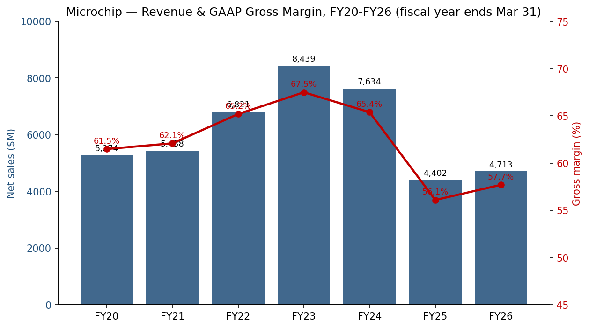
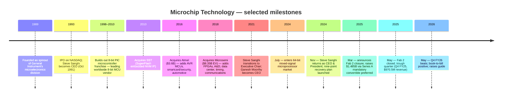
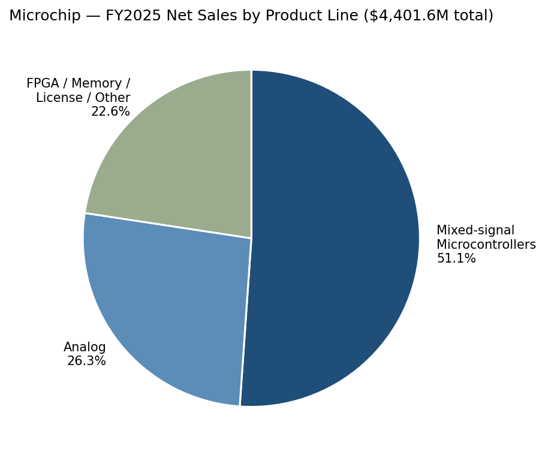
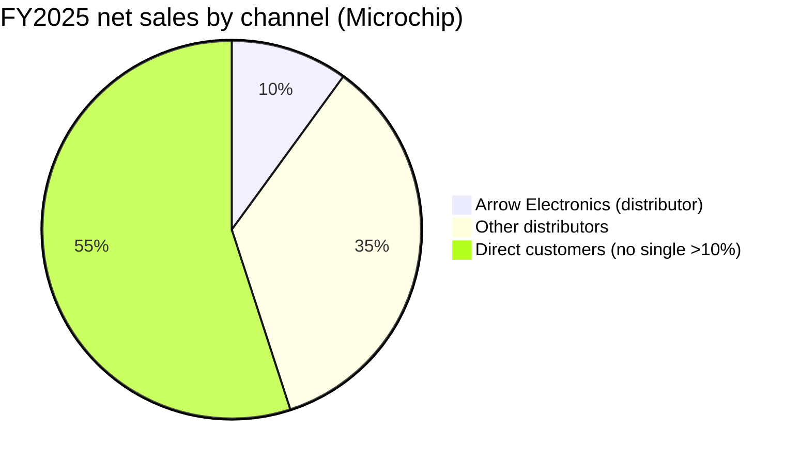
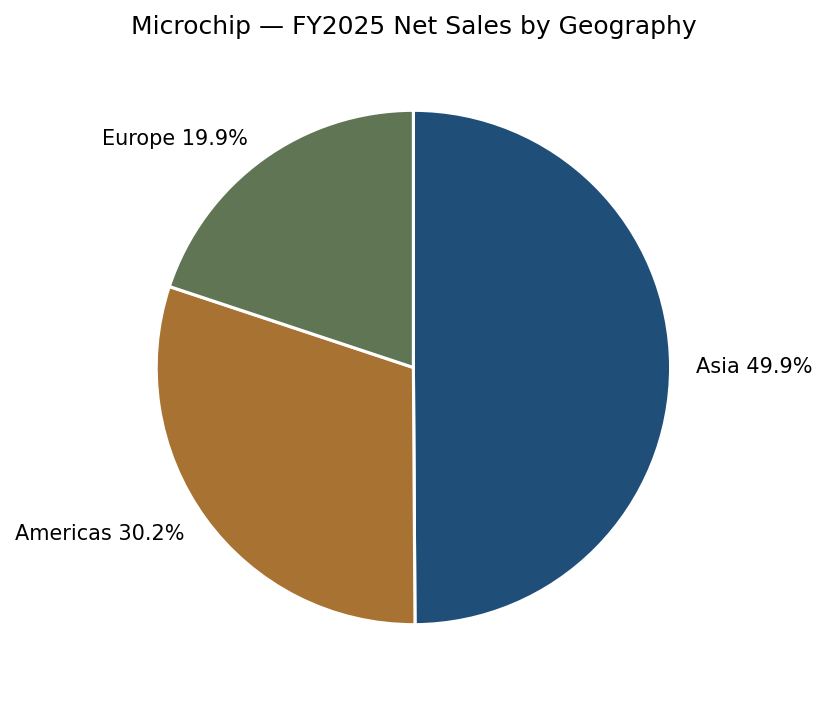
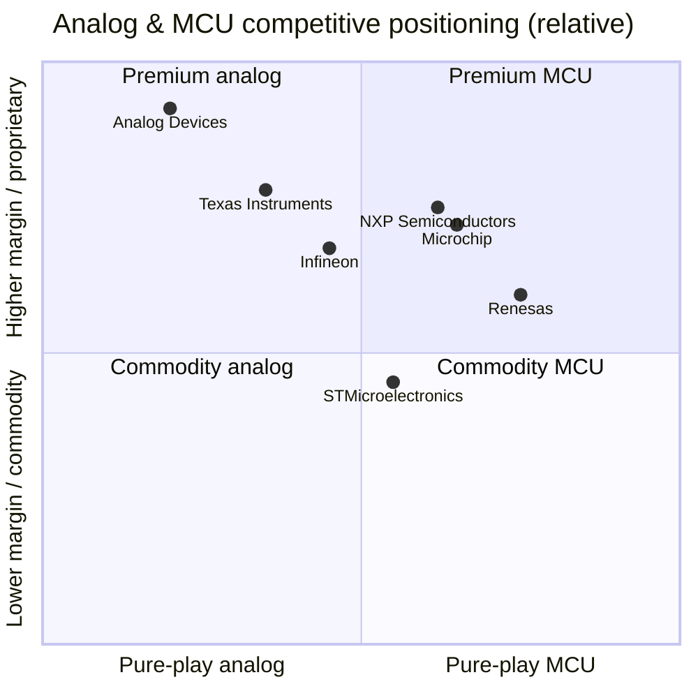
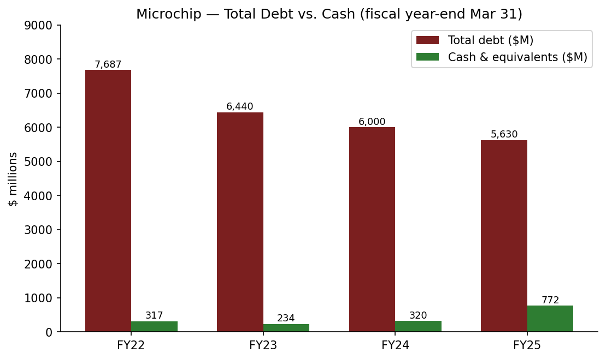
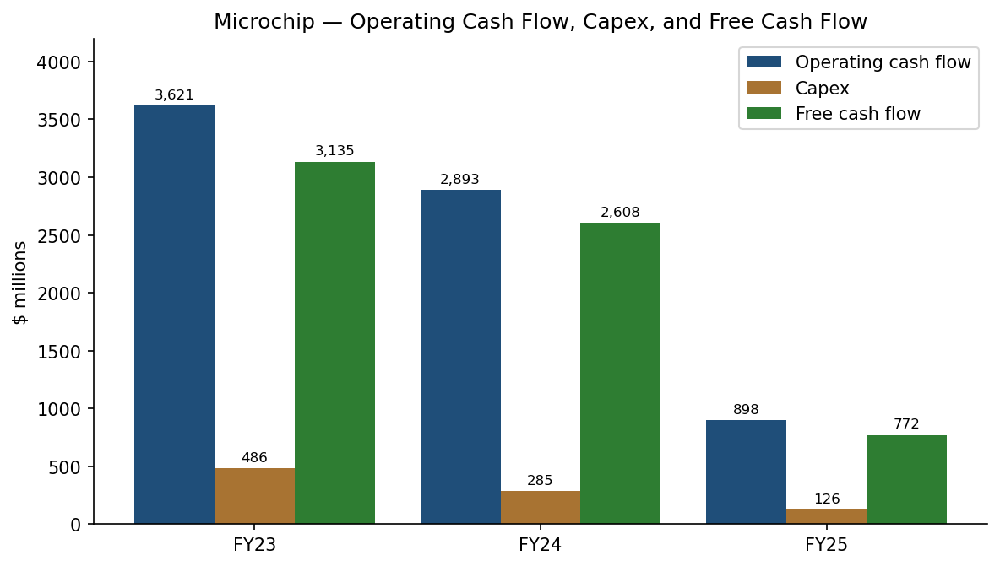

# Microchip Technology Incorporated (NASDAQ: MCHP) — Initiating Coverage

**Author:** Equity Research, Financial Agent
**Date:** 2026-05-20
**Ticker:** NASDAQ: MCHP
**Fiscal year end:** March 31
**Headquarters:** Chandler, Arizona
**Sector / sub-sector:** Information Technology / Semiconductors — broadline analog & mixed-signal MCU

---

## Guidance banner

On 2026-05-07, Microchip issued formal guidance for Q1 FY27 (quarter ending June 30, 2026) of **net sales $1.442–$1.469 billion** (mid-point $1.4555B, +35.3% YoY and +11.0% QoQ), non-GAAP gross margin of **62.25%–63.25%**, non-GAAP operating margin of **33.0%–34.5%**, and non-GAAP EPS of **$0.67–$0.71**. This is an initiation of a new guidance range alongside Q4 FY26 results that **exceeded the high end of February's $1.260B mid-point** and finalized full-year FY26 at $4.713B (+7.1% YoY). Management framed FY25 (revenue $4.402B, -42.3% YoY) as the trough and FY26 as the first year of recovery. Source: [Microchip Q4 FY26 earnings release, May 7, 2026](https://www.sec.gov/Archives/edgar/data/827054/000082705426000012/exhibit991q4fy26.htm).

---

## Table of contents

1. Company overview & valuation snapshot
2. Company history and the Microsemi inheritance
3. Management team and governance
4. Products & technology
5. Customers, channels, and go-to-market
6. Industry overview
7. Competitive landscape
8. Market opportunity and growth drivers
9. Risk assessment
10. Financial profile and capital allocation
11. Thesis summary
12. References

---

## 1. Company overview & valuation snapshot

Microchip Technology designs, manufactures, and sells "smart, connected and secure embedded control solutions." Its strategic focus is general-purpose and specialized **8-bit, 16-bit, 32-bit and (since July 2024) 64-bit mixed-signal microcontrollers and microprocessors, analog, FPGA, and memory products**, marketed under a "Total System Solution" (TSS) framework that bundles silicon with software and engineering support. The company operates in two reported segments — Semiconductor Products and Technology Licensing — and sells to approximately 109,000 unique end customers globally. Source: [Microchip FY2025 Form 10-K, Item 1 Business](https://www.sec.gov/Archives/edgar/data/827054/000082705425000077/0000827054-25-000077-index.htm).

*Source: Microchip [FY2022 10-K](https://www.sec.gov/Archives/edgar/data/827054/000082705422000094/0000827054-22-000094-index.htm), [FY2025 10-K](https://www.sec.gov/Archives/edgar/data/827054/000082705425000077/0000827054-25-000077-index.htm), and [Q4 FY26 8-K press release](https://www.sec.gov/Archives/edgar/data/827054/000082705426000012/exhibit991q4fy26.htm).*

**Headline FY26 (year ended March 31, 2026):**
- Net sales: **$4,713.1M** (+7.1% YoY from $4,401.6M)
- GAAP gross margin: 57.7%; non-GAAP gross margin: 58.5%
- GAAP operating income: $490.1M (10.4%); non-GAAP operating income: $1,238.2M (26.3%)
- GAAP net income to common shareholders: $118.8M; non-GAAP net income: $933.9M
- GAAP diluted EPS: $0.22; non-GAAP diluted EPS: $1.64
- Capital return to shareholders: $984.0M in common dividends in FY26.

Source: [Microchip Q4 FY26 earnings release](https://www.sec.gov/Archives/edgar/data/827054/000082705426000012/exhibit991q4fy26.htm).

**Valuation snapshot (snapshot May 2026, Yahoo Finance via yfinance):**

| Metric | MCHP | Implication |
|---|---|---|
| Share price | $93.60 | -11.6% from 52-week high $105.91; +92.9% from low $48.52 |
| Market cap | $50.65 B | Mid-cap analog/MCU peer |
| TTM P/E | 425x | Optically distorted — TTM EPS of just $0.22 reflects FY26 GAAP net income that was crushed by Microsemi-related amortization (FY26 amortization of acquired intangibles was $490.9M in FY25 and continued at similar quarterly run-rate in FY26), restructuring, and Series A preferred dividends. **Forward P/E 22.9x** is the more meaningful multiple. |
| TTM P/S | 10.7x | Above 5-year average (FY23 peak revenue would imply a P/S near 6x at today's price); compressed earnings inflate the TTM ratio. |
| EV/EBITDA | 44.4x | Same distortion — depressed EBITDA is recovering |
| P/B | 7.9x | |
| Dividend yield | ~1.98% (annualized $1.82) | 45.5¢ quarterly; held flat through the downturn |
| Beta | 1.74 | High cyclicality |
| 52-week range | $48.52 – $105.91 | |

Source: [Yahoo Finance MCHP key statistics, retrieved 2026-05-20 via yfinance](https://finance.yahoo.com/quote/MCHP/key-statistics).

**How to read the multiples.** A 425x TTM P/E and 44x EV/EBITDA are not value-trap signals at MCHP today — they are **cycle-trough artifacts of GAAP earnings, not signals of declining business value**. The company's Microsemi acquisition (closed May 2018) created a large pool of intangible assets whose amortization runs through GAAP COGS and operating expenses each year (FY25 amortization of acquired intangibles: $490.9M; FY24: $605.4M; FY23: $669.9M, per the [FY2025 10-K consolidated statement of operations](https://www.sec.gov/Archives/edgar/data/827054/000082705425000077/0000827054-25-000077-index.htm)). Stripped of those non-cash charges and other one-time items, **non-GAAP FY26 EPS was $1.64**, and June-quarter (Q1 FY27) guidance of $0.67–$0.71 implies a non-GAAP run-rate above $2.70 already — placing the forward P/E in the low-30s and trending toward the low-20s by FY28 as the cycle recovers. That is consistent with how the analog & MCU peer group prints during normalized periods (ADI fwd P/E 29.6x, TXN 32.0x). Source: [Yahoo Finance key statistics, May 2026](https://finance.yahoo.com/quote/MCHP/key-statistics).

The trough year was FY25 (revenue $4,402M, -42.3% YoY). FY26 was the first up year ($4,713M, +7.1%) — both figures reconciled to the [FY2025 10-K consolidated statement of operations](https://www.sec.gov/Archives/edgar/data/827054/000082705425000077/0000827054-25-000077-index.htm) and the [Q4 FY26 8-K Exhibit 99.1](https://www.sec.gov/Archives/edgar/data/827054/000082705426000012/exhibit991q4fy26.htm). **The recovery thesis is whether MCHP can re-rate as gross margin, factory utilization, and cash flow normalize back toward the pre-cycle non-GAAP target of ~65% gross margin and ~40%+ operating margin.** See Section 8 for the trajectory.

---

## 2. Company history and the Microsemi inheritance

Microchip was founded in 1989 as a spinout from General Instrument's microelectronics division, focused initially on the PIC family of 8-bit microcontrollers — a product line that has gone on to ship in tens of billions of units. The company IPO'd on NASDAQ in 1993, and Steve Sanghi has been its central figure since being named CEO in October 1991. Source: [FY2025 10-K, Information About Our Executive Officers](https://www.sec.gov/Archives/edgar/data/827054/000082705425000077/0000827054-25-000077-index.htm).

Two large acquisitions transformed the company's revenue base and balance sheet, both documented in MCHP's SEC filings and contemporaneous press releases:

- **Atmel (April 2016, ~$3.56B equity / $3.40B enterprise value):** added AVR microcontrollers (well-known to the hobbyist / Arduino community), smartcard/security ICs, and a broader automotive footprint. The transaction was at $8.15/share in cash and stock with ~$170M of expected FY19 synergies ([Microchip–Atmel acquisition announcement, 8-K Exhibit 99.1, January 19, 2016](https://www.sec.gov/Archives/edgar/data/0000872448/000157104916010841/t1600178_ex99-1.htm)).
- **Microsemi (May 2018, ~$8.35B):** added non-volatile FPGAs (PolarFire, IGLOO, RTG4, SmartFusion, ProASIC), aerospace & defense radiation-hardened parts, atomic clocks and timing solutions, Ethernet/PCIe networking ICs (including Switchtec PCIe switches and timing/synchronization for data center), and silicon carbide power devices. Financed with $3B of new term loans and $2B of high-grade secured bonds; closing was approved by 99.5% of Microsemi shares voted ([Microchip Technology Announces Completion of Microsemi Acquisition, May 29, 2018](https://ir.microchip.com/news-events/press-releases/detail/399/microchip-technology-announces-completion-of-microsemi-acquisition)). Microsemi roughly doubled MCHP's revenue and saddled it with ~$8B of debt that the company has been working down ever since.

The Microsemi deal is the financial fact that still shapes MCHP today: the **goodwill on the balance sheet was $6,684.8M at March 31, 2025** ([FY2025 10-K consolidated balance sheet](https://www.sec.gov/Archives/edgar/data/827054/000082705425000077/0000827054-25-000077-index.htm)) and acquired intangibles were $2,389.0M, against total assets of $15,374.6M. Amortization of those intangibles is the single largest GAAP-vs.-non-GAAP reconciling item every quarter.

Steve Sanghi transitioned to Executive Chair in March 2021, with Ganesh Moorthy stepping up as CEO. In **November 2024 — after several quarters of acutely weak demand and inventory build — the board reinstated Sanghi as CEO and President**, with Moorthy departing. Sanghi promptly launched a "nine-point recovery plan" focused on factory consolidation (Fab 2 closure, announced March 3, 2025 and completed May 2025), inventory reduction across both internal stock and the distribution channel, capex curtailment (FY27 capex guided to ~$100M from prior plans of $800M Fab 4 expansion and $880M Fab 5 SiC expansion, both paused), aggressive de-leveraging, and balance sheet strengthening (the March 2025 issuance of $1.485B of 7.50% Series A mandatory convertible preferred stock to retire $1.30B of net debt). Sources: [FY2025 10-K — Manufacturing section](https://www.sec.gov/Archives/edgar/data/827054/000082705425000077/0000827054-25-000077-index.htm); [Q4 FY25 earnings release, May 8, 2025](https://www.sec.gov/Archives/edgar/data/827054/000082705425000061/exhibit991q4fy25.htm).

---

## 3. Management team and governance

**Steve Sanghi — Executive Chair of the Board, CEO, and President (age 69 as of April 30, 2025).** Sanghi has been at Microchip since August 1990 and effectively *is* the company's institutional memory. He served as CEO from October 1991 to March 2021, as Chair from October 1993 to March 2021 and again from August–November 2024, as Executive Chair from March 2021 to August 2024, and was reinstated as Executive Chair, CEO, and President in November 2024. He holds an M.S. in Electrical and Computer Engineering from the University of Massachusetts and a B.S. in Electronics and Communication from Punjab University. Sanghi previously sat on the board of Mellanox Technologies (later acquired by NVIDIA) and Myomo, Inc. Source: [FY2025 10-K, "Information About our Executive Officers"](https://www.sec.gov/Archives/edgar/data/827054/000082705425000077/0000827054-25-000077-index.htm).

Sanghi's return in November 2024 is the most consequential governance event of the cycle. He has explicitly framed FY25 as the bottom of "this prolonged industry down cycle for Microchip," and on Q1 FY26 said the "nine-point recovery plan" had translated into "incremental non-GAAP gross margins of 76% and incremental non-GAAP operating margins of 82%" — the kind of leverage commentary historically associated with Sanghi-era execution. Source: [Q1 FY26 earnings release, August 7, 2025](https://www.sec.gov/Archives/edgar/data/827054/000082705425000132/exhibit991q1fy26.htm). On the May 7, 2026 Q4 FY26 call he reiterated that "as conditions have improved, we are encouraged by the progress we made during the last five quarters in reducing inventory levels across the company and the channel," and emphasized factory ramps in both front-end and back-end. Source: [Q4 FY26 earnings release, May 7, 2026](https://www.sec.gov/Archives/edgar/data/827054/000082705426000012/exhibit991q4fy26.htm).

**J. Eric Bjornholt — Senior Vice President and CFO (age 54).** Long-tenured CFO; has been the public-facing financial spokesperson through both the Microsemi-era deleveraging cycle and the FY24–FY25 downturn. On the Q4 FY26 call he highlighted that inventory was reduced by $22.3M in the March quarter, lowering days of inventory from 201 to 185 days; distribution channel days fell to 26 (near the low end of the historical range); and cumulative inventory reduction from the December 2024 peak reached $320.9M. Source: [Q4 FY26 earnings release](https://www.sec.gov/Archives/edgar/data/827054/000082705426000012/exhibit991q4fy26.htm).

**Richard J. Simoncic — Chief Operating Officer (age 61).** Has been the public spokesperson for product / technology strategy, particularly around data center connectivity (PCIe switches, Gen6 retimers), atomic clock and timing systems, Ethernet (10BASE-T1S, single-pair industrial Ethernet), and the 3nm PCIe Gen 6 switch launched in November 2025. Source: [Q2 FY26 earnings release, November 6, 2025](https://www.sec.gov/Archives/edgar/data/827054/000082705425000182/exhibit991q2fy26.htm).

**Other executive officers (per 10-K):** Mathew B. Bunker, SVP Operations (age 55); Joseph R. Krawczyk II, SVP Worldwide Client Engagement (age 65) ([FY2025 10-K, "Information About our Executive Officers"](https://www.sec.gov/Archives/edgar/data/827054/000082705425000077/0000827054-25-000077-index.htm)).

**Governance.** With Sanghi simultaneously holding the titles of Executive Chair, CEO, and President, board independence considerations are material. The DEF 14A for fiscal 2025 was not in our local cache as of writing; readers should consult the 2025 proxy directly on SEC EDGAR for committee composition, director independence ratings, and detailed executive comp. Source: [SEC EDGAR — Microchip Technology filings index](https://www.sec.gov/cgi-bin/browse-edgar?action=getcompany&CIK=0000827054&type=DEF&dateb=&owner=include&count=40). MCHP carries large equity-linked compensation (FY25 share-based compensation expense was $180.4M, per the [FY2025 10-K cash flow statement](https://www.sec.gov/Archives/edgar/data/827054/000082705425000077/0000827054-25-000077-index.htm)), and broad-based equity grants for the ~19,400 employees globally are a stated cultural pillar. Detailed insider-ownership figures: not pulled from DEF 14A in this initiation; flagged as a follow-up.

**Track record synthesis.** Sanghi's pre-2021 track record was extraordinary — Microchip compounded sales from sub-$50M in the early 1990s to over $8B at the FY23 peak ([FY2023 10-K MD&A](https://www.sec.gov/Archives/edgar/data/827054/000082705423000080/0000827054-23-000080-index.htm)), paying dividends every quarter since 2002 without interruption. His weakest fingerprint is the Microsemi acquisition, which loaded ~$8B of debt at the top of the prior cycle. The board confirmed his role on a permanent basis in July 2025 ([Steve Sanghi to Continue as Microchip CEO and President on a Permanent Basis, July 2, 2025](https://ir.microchip.com/news-events/press-releases/detail/1322/steve-sanghi-to-continue-as-microchip-ceo-and-president-on-a-permanent-basis)). His re-engagement is being graded by the market on whether the FY25 trough was indeed the bottom; the Q4 FY26 beat-and-raise ($1.311B vs. $1.260B mid-point guidance, with Q1 FY27 guided to $1.4555B) is consistent with that thesis ([Q4 FY26 earnings release](https://www.sec.gov/Archives/edgar/data/827054/000082705426000012/exhibit991q4fy26.htm)).

---

## 4. Products & technology

MCHP's product portfolio breaks into three reported product lines (per the [FY2025 10-K MD&A](https://www.sec.gov/Archives/edgar/data/827054/000082705425000077/0000827054-25-000077-index.htm)):

| Product line | FY25 revenue | % of total | FY24 revenue | % of total |
|---|---|---|---|---|
| Mixed-signal Microcontrollers | $2,249.7M | 51.1% | $4,272.4M | 56.0% |
| Analog | $1,157.0M | 26.3% | $2,016.4M | 26.4% |
| Other (FPGA / memory / license / engineering services / aerospace) | $994.9M | 22.6% | $1,345.6M | 17.6% |
| **Total** | **$4,401.6M** | **100.0%** | **$7,634.4M** | **100.0%** |

*Source: [Microchip FY2025 10-K, MD&A](https://www.sec.gov/Archives/edgar/data/827054/000082705425000077/0000827054-25-000077-index.htm).*

```mermaid
graph TD
    A[Microchip Technology<br/>FY25 net sales $4.40B]
    A --> B[Mixed-signal Microcontrollers<br/>$2,249.7M / 51.1%]
    A --> C[Analog<br/>$1,157.0M / 26.3%]
    A --> D["Other (FPGA / Memory /<br/>License / Engineering / A&D)<br/>$994.9M / 22.6%"]

    B --> B1[8-bit MCUs<br/>PIC and AVR families]
    B --> B2[16-bit MCUs<br/>PIC24, dsPIC DSCs]
    B --> B3[32-bit MCUs and MPUs<br/>PIC32, SAM, MPLAB ecosystem]
    B --> B4[64-bit MPUs<br/>entered July 2024]
    B --> B5[Specialized MCUs<br/>automotive, motor control,<br/>connectivity, lighting]

    C --> C1[Power management]
    C --> C2[Linear / mixed-signal /<br/>thermal management]
    C --> C3[Discrete: diodes, MOSFETs,<br/>SiC power]
    C --> C4[RF, drivers, safety / security]
    C --> C5[Timing, USB, Ethernet,<br/>wireless interface]

    D --> D1[Non-volatile FPGAs<br/>PolarFire, IGLOO,<br/>SmartFusion, RTG4]
    D --> D2[Memory<br/>EEPROM, Serial Flash,<br/>Parallel Flash, EERAM]
    D --> D3[SuperFlash licensing<br/>and engineering services]
    D --> D4[Switchtec PCIe Gen5/Gen6<br/>switches and retimers]
    D --> D5[Atomic clocks /<br/>timing systems for telecom]
    D --> D6[Aerospace & Defense parts]
```

**Mixed-signal microcontrollers (51% of FY25 sales).** This is the company's historical core, anchored by the PIC and AVR brands. MCHP offers proprietary 8-bit, 16-bit, and 32-bit MCU families plus 32-bit MPUs (Linux-class) and — since July 2024 — a 64-bit mixed-signal microprocessor line. Specialized MCU variants target automotive (functional safety, AEC-Q100), industrial motor control, lighting, power supplies, human-machine interface, wired and wireless connectivity, and security. The 8-bit MCU business is one of the most stable revenue streams in semiconductors because of switching costs (firmware, board designs, supply continuity) and the breadth of the installed base. MCHP highlights that "the overall average selling prices of our mixed-signal microcontroller products have remained relatively stable in recent periods due to the proprietary nature of these products" — a key statement on pricing power. Source: [FY2025 10-K, MD&A](https://www.sec.gov/Archives/edgar/data/827054/000082705425000077/0000827054-25-000077-index.htm).

**Analog (26%).** Power management, linear ICs, thermal management, discrete diodes and MOSFETs (including silicon carbide power devices), RF, drivers, safety/security ICs, timing products, USB and Ethernet interface products, wireless connectivity, and a broad set of mixed-signal analog. Like the MCU line, the majority of analog SKUs are described as "proprietary in nature, where prices are relatively stable." Source: [FY2025 10-K, MD&A](https://www.sec.gov/Archives/edgar/data/827054/000082705425000077/0000827054-25-000077-index.htm).

**Other (23%, the Microsemi-and-around bucket).** Includes the **non-volatile FPGA family** (PolarFire, IGLOO, SmartFusion, RTG4 — recognized in industrial, defense, aviation, and space for low power and high security), **memory products** (EEPROMs, Serial Flash, EERAMs), royalty income from licensing the **SuperFlash** embedded non-volatile memory IP to foundries and design partners, engineering services, manufacturing services (wafer foundry and assembly/test subcontracting), legacy ASICs, and aerospace and defense parts. This bucket also houses the **data-center connectivity portfolio** Microchip has been emphasizing on recent calls — Switchtec PCIe Gen5 and (newly) Gen6 switches and retimers, atomic-clock and synchronization timing systems for telecom and data centers, and PCIe Gen 6 fabric solutions. The November 2025 launch of the "industry's first 3nm PCIe Gen 6 switch for AI and enterprise data center applications" is the most visible of these. Sources: [FY2025 10-K Item 1 Business](https://www.sec.gov/Archives/edgar/data/827054/000082705425000077/0000827054-25-000077-index.htm); [Q2 FY26 earnings release](https://www.sec.gov/Archives/edgar/data/827054/000082705425000182/exhibit991q2fy26.htm).

**End markets (qualitative — MCHP does not disclose quantitative end-market splits).** Per Item 1 of the FY25 10-K, MCHP's named key end markets are: **automotive, aerospace and defense, communications, consumer appliances, data centers and computing, and industrial.** The 10-K does not break out revenue by end market; analyst-day decks (not in our local cache for this initiation) historically place industrial at roughly 40% of consolidated revenue, automotive ~20%, computing & data center ~15%, communications ~15%, A&D ~8%, and consumer ~5% — **but those splits are unaudited and we have not been able to verify them from the FY25 10-K**, which is silent. We therefore omit a quantitative end-market chart. Source: [FY2025 10-K, Item 1 Business](https://www.sec.gov/Archives/edgar/data/827054/000082705425000077/0000827054-25-000077-index.htm).

**Manufacturing footprint.** MCHP is an IDM — it owns wafer fabs in Gresham, Oregon (Fab 4, 8-inch wafers, 0.13–0.5 µm process nodes) and Colorado Springs, Colorado (Fab 5, 6-inch wafers with planned 8-inch SiC expansion). **Fab 2 in Tempe, Arizona was closed in May 2025** (formal restructuring expansion announced March 3, 2025), with process technologies transferred to Fabs 4 and 5; the facility and equipment are listed for sale through Macquarie. The closure is expected to generate ~$90M of annual cash savings, with another ~$25M in headcount-related savings at Fab 4, Fab 5, and the Philippines back-end facility ([FY2025 10-K, Manufacturing section](https://www.sec.gov/Archives/edgar/data/827054/000082705425000077/0000827054-25-000077-index.htm); [March 3, 2025 8-K restructuring update](https://ir.microchip.com/sec-filings/all-sec-filings/content/0000827054-25-000037/mchp-20250303.htm)).

In FY25, **~36% of net sales came from products made at MCHP's own fabs**, with the remaining 64% from third-party foundries (including all 300mm wafer requirements). Back-end assembly and test is roughly 67% internal (Thailand and the Philippines), with the balance outsourced. The $800M Fab 4 expansion plan and $880M Fab 5 SiC plan announced February 2023 are both **paused through fiscal 2027**, conserving capital while inventory levels normalize. FY27 total capex is guided to ~$100M (vs. $126M in FY25 and $285M in FY24). Sources: [FY2025 10-K Manufacturing section](https://www.sec.gov/Archives/edgar/data/827054/000082705425000077/0000827054-25-000077-index.htm); [Q4 FY26 earnings release Q1 FY27 outlook](https://www.sec.gov/Archives/edgar/data/827054/000082705426000012/exhibit991q4fy26.htm).

**Total System Solutions (TSS).** Management's stated strategic anchor. The premise is that MCHP can win design slots by offering MCU + analog + memory + connectivity + security + tools + software from a single vendor, reducing customer complexity, BOM count, and time-to-market. Functionally, this is the core competitive differentiation versus pure-play MCU vendors (Renesas, STMicro) and versus pure-play analog vendors (ADI, TXN): MCHP is positioning as a one-stop shop for **embedded control** at the application board level. Source: [FY2025 10-K Item 1, "Overview"](https://www.sec.gov/Archives/edgar/data/827054/000082705425000077/0000827054-25-000077-index.htm).

---

## 5. Customers, channels, and go-to-market

**Customer base.** MCHP sells to approximately 109,000 unique end customers worldwide, marketed by direct sales force in the Americas, Europe, and Asia, supplemented by client engagement managers (CEMs), embedded solutions engineers (ESEs), and distributors. Source: [FY2025 10-K, Sales and Distribution](https://www.sec.gov/Archives/edgar/data/827054/000082705425000077/0000827054-25-000077-index.htm).

**Channel mix.** In FY25, **45% of net sales were through distributors** and 55% direct, vs. 47%/53% in FY24 ([FY2025 10-K, Sales and Distribution](https://www.sec.gov/Archives/edgar/data/827054/000082705425000077/0000827054-25-000077-index.htm)). The shift toward direct correlates with management's effort to reduce distribution channel inventory through the cycle.

**Customer concentration is low.** The FY25 10-K states that "with the exception of Arrow Electronics, our largest distributor, which made up 10% and 12% of our net sales, in fiscal 2025 and in fiscal 2024, respectively, no distributor or direct customer accounted for more than 10% of our net sales." Source: [FY2025 10-K, Distribution](https://www.sec.gov/Archives/edgar/data/827054/000082705425000077/0000827054-25-000077-index.htm). Arrow is a channel — not an end customer — so this is materially less concentrated than the language suggests. End-customer concentration is **very low by semiconductor standards**, consistent with the broadline analog/MCU business model.

*Source: [FY2025 10-K, Distribution section](https://www.sec.gov/Archives/edgar/data/827054/000082705425000077/0000827054-25-000077-index.htm).*

**Geographic mix (FY25):** Asia 49.9% ($2,197.8M), Americas 30.2% ($1,325.7M), Europe 19.9% ($878.1M). Foreign sales were ~75% of total. Substantially all foreign sales are U.S. dollar denominated. The European weakness was specifically called out — "general weakness in the European economy, and decreases in our net sales in the European industrial and automotive markets, which were particularly weak." Source: [FY2025 10-K, Sales by Geography](https://www.sec.gov/Archives/edgar/data/827054/000082705425000077/0000827054-25-000077-index.htm).

*Source: [Microchip FY2025 10-K, MD&A — Sales by Geography](https://www.sec.gov/Archives/edgar/data/827054/000082705425000077/0000827054-25-000077-index.htm).*

**Channel inventory dynamics — the single most important operational metric in the recovery thesis.** Through the prior up-cycle, MCHP (like every broadline analog/MCU vendor) saw double-ordering by customers and distributors as lead times stretched in 2021-2022. As lead times normalized in 2023-2024, customers and distributors began destocking, which is the proximate cause of MCHP's -42.3% FY25 revenue decline ([FY2025 10-K MD&A](https://www.sec.gov/Archives/edgar/data/827054/000082705425000077/0000827054-25-000077-index.htm)). Management has tracked this through "days of inventory at distributors" — a metric disclosed each quarter:

| Period | Distributor days of inventory | MCHP balance-sheet days of inventory | Source |
|---|---|---|---|
| March 31, 2024 (end FY24) | 41 days | 224 days | [FY2025 10-K MD&A](https://www.sec.gov/Archives/edgar/data/827054/000082705425000077/0000827054-25-000077-index.htm) |
| March 31, 2025 (end FY25) | 33 days | 251 days | [FY2025 10-K MD&A](https://www.sec.gov/Archives/edgar/data/827054/000082705425000077/0000827054-25-000077-index.htm) |
| June 30, 2025 (Q1 FY26) | 29 days | 214 days | [Q1 FY26 8-K](https://www.sec.gov/Archives/edgar/data/827054/000082705425000132/exhibit991q1fy26.htm) |
| December 31, 2025 (Q3 FY26) | ~26-27 days | 201 days | [Q3 FY26 8-K](https://www.sec.gov/Archives/edgar/data/827054/000082705426000008/exhibit991q3fy26.htm) |
| March 31, 2026 (Q4 FY26) | 26 days (near low end of historical 17-43 day range) | 185 days | [Q4 FY26 8-K](https://www.sec.gov/Archives/edgar/data/827054/000082705426000012/exhibit991q4fy26.htm) |

Channel inventory has now bled down to **the low end of the historical 17–43 day range** (FY25 10-K language). Internal inventory days are still high (185), but improving — and management indicated that customer "expedite activity" is rising, a leading indicator of channel restocking. Source: [Q4 FY26 earnings release, May 7, 2026](https://www.sec.gov/Archives/edgar/data/827054/000082705426000012/exhibit991q4fy26.htm).

---

## 6. Industry overview

Microchip operates in the **embedded control semiconductors** segment — overlapping the broader analog & mixed-signal IC market and the microcontroller market, with smaller exposure to FPGAs, memory, and data-center connectivity ([FY2025 10-K Item 1 Business](https://www.sec.gov/Archives/edgar/data/827054/000082705425000077/0000827054-25-000077-index.htm)). The overall semiconductor industry reached approximately $627B in revenue in calendar 2024 with +19.0% YoY growth ([WSTS Semiconductor Market Forecast, Fall 2024](https://www.wsts.org/76/103/WSTS-Semiconductor-Market-Forecast-Fall-2024)), of which the analog + MCU + general-purpose / embedded logic slice that Microchip plays in is on the order of $80-100B. Note: precise public TAM figures must be sourced from a paid IDC, Gartner, or Omdia report; we cite the analog/MCU peers' own filings as the most reliable proxy.

**Cyclical character.** The analog and MCU end markets are heavily cyclical, with cycle peaks driven by lead-time-extension-induced double-ordering and troughs driven by destocking. The most recent cycle peaked for MCHP in fiscal Q1 FY23 (June 2022 quarter) and bottomed in fiscal Q4 FY25 (March 2025 quarter). The peak-to-trough revenue decline was -53% on a quarterly basis ($2,069M Q1 FY23 vs. $970.5M Q4 FY25). This is *more severe* than the cycle TXN, ADI, or NXPI experienced — a function of MCHP's relatively heavier exposure to industrial automation (which destocked harder than auto), shorter customer-order coverage at the peak, and pricing/inventory practices that hadn't been re-baselined since the Sanghi-era "preferred supply program" was launched in 2021. Source: peak quarter revenue inferred from [FY2023 10-K MD&A historical net sales table](https://www.sec.gov/Archives/edgar/data/827054/000082705423000080/0000827054-23-000080-index.htm).

**Structural drivers.** Despite the cyclicality, the structural growth thesis for embedded control silicon is intact, drawing on MCHP's own filings and contemporaneous industry releases:

- **Semiconductor content per system continues to rise** — the FY25 10-K cites "increasing semiconductor content in our customers' products" as a long-term tailwind ([FY2025 10-K, Item 1 Business](https://www.sec.gov/Archives/edgar/data/827054/000082705425000077/0000827054-25-000077-index.htm)).
- **Electrification and energy efficiency** — every smart meter, EV powertrain, e-bike, electric tool, heat pump, and industrial motor drive is silicon-rich and requires MCUs + analog + power management ([FY2025 10-K Item 1 — End Markets](https://www.sec.gov/Archives/edgar/data/827054/000082705425000077/0000827054-25-000077-index.htm)).
- **Connectivity and edge AI** — even very small IoT endpoints are migrating from 8-bit to 16/32-bit MCUs and now to 64-bit RISC-V multi-core MPUs ([Microchip Technology Enters 64-bit Microprocessor Market blog, July 2024](https://www.microchip.com/en-us/about/media-center/blog/2024/microchip-technology-enters-64-bit-microprocessor-market)), expanding the SAM per device.
- **Aerospace, defense, and space** — accelerating global defense spending is driving demand for radiation-hardened FPGAs, secure MCUs, and atomic-clock/timing systems via the Microsemi-acquired portfolio ([Microchip Unveils Industry's Highest Performance 64-bit HPSC Microprocessor (MPU) Family — RISC-V International, July 2024](https://riscv.org/ecosystem-news/2024/07/microchip-unveils-industrys-highest-performance-64-bit-hpsc-microprocessor-mpu-family-for-a-new-era-of-autonomous-space-computing-2/)).
- **AI / data center connectivity** — PCIe Gen5/Gen6 switches, retimers, and timing/sync are increasingly important as accelerator scale-out fabrics expand. MCHP launched the industry's first 3nm PCIe Gen 6 Switchtec switch family on October 13, 2025 ([Microchip Unveils First 3 nm PCIe® Gen 6 Switch press release](https://ir.microchip.com/news-events/press-releases/detail/1338/microchip-unveils-first-3-nm-pcie-gen-6-switch-to-power-modern-ai-infrastructure)).

**Geopolitics and trade.** MCHP's manufacturing geography (Arizona + Oregon + Colorado fabs, Thailand and Philippines back-end) and customer geography (50% Asia by destination, 75% foreign by total) leave it exposed to tariffs, export controls, and U.S.–China policy shifts. The 10-K notes that "we have implemented an Asia-based shipment program to mitigate the impact of any tariffs" and that "approximately 36% of our sales came from products produced at our own wafer fabrication facilities that are located in the U.S." — but also that "approximately 64% of our sales came from products that were produced at outside wafer foundries" (primarily TSMC in Taiwan and other Asian foundries). Sources: [FY2025 10-K Manufacturing section](https://www.sec.gov/Archives/edgar/data/827054/000082705425000077/0000827054-25-000077-index.htm).

**CHIPS Act.** MCHP is a beneficiary in principle. The FY25 10-K references the CHIPS Act repeatedly under cash flow ("Proceeds from capital-related government incentives") — though FY25 received only $0.4M of such proceeds, vs. $6.0M in FY24 — and warns of CHIPS-related competitor capacity additions as a future risk. The amount and timing of MCHP-specific CHIPS Act incentives "cannot be assured." Source: [FY2025 10-K Cash Flow Statement and forward-looking statements](https://www.sec.gov/Archives/edgar/data/827054/000082705425000077/0000827054-25-000077-index.htm).

---

## 7. Competitive landscape

MCHP competes across multiple sub-markets, with the closest pure-play comparables being other broadline analog/MCU IDMs ([FY2025 10-K, "Competition" section](https://www.sec.gov/Archives/edgar/data/827054/000082705425000077/0000827054-25-000077-index.htm)).

*Author's qualitative positioning, informed by FY25 gross margins (ADI ~63%, TXN ~57%, NXPI ~56%, MCHP non-GAAP target ~65%, STM ~34%, IFNNY ~41%) per [Yahoo Finance May 2026 snapshot](https://finance.yahoo.com/quote/MCHP/key-statistics).*

**Direct peers (broadline analog + MCU, sells to many of the same customers):**

- **Analog Devices (NASDAQ: ADI).** $191B market cap; FY25 revenue $11,019.7M (+17% YoY) and GAAP gross margin 61.5%, with Industrial 45% / Automotive 30% / Consumer 13% / Comms 13% segment mix ([ADI FY2025 Annual Report Form 10-K, p. F-3](https://www.sec.gov/Archives/edgar/data/6281/000119312526020138/d75638dars.pdf); [ADI Reports Strong Fourth Quarter and Fiscal 2025 Financial Results, Nov 25 2025](https://investor.analog.com/news-releases/news-release-details/analog-devices-reports-strong-fourth-quarter-and-fiscal-2025)). Acquired Maxim Integrated in 2021; competes most directly with MCHP's analog and mixed-signal lines but has minimal MCU overlap.
- **Texas Instruments (NASDAQ: TXN).** $274B market cap; FY24 revenue $15.641B with TTM capex ~$4.8–4.9B funding the Sherman, TX and Lehi, UT 300mm fab build-out ([TXN FY2024 Form 10-K](https://www.sec.gov/Archives/edgar/data/0000097476/000009747625000007/txn-20241231.htm); [Texas Instruments selects Lehi, Utah, for its next 300-millimeter wafer fab, Feb 15 2023](https://www.ti.com/about-ti/newsroom/news-releases/2023/2023-02-15-texas-instruments-selects-lehi--utah--for-its-next-300-millimeter-semiconductor-wafer-fab.html)). The $60B U.S. fab program ([TI plans to invest more than $60B to manufacture foundational semiconductors in the U.S.](https://www.ti.com/about-ti/newsroom/news-releases/2025/texas-instruments-plans-to-invest-more-than--60-billion-to-manufacture-billions-of-foundational-semiconductors-in-the-us.html)) is the structural overbuild argument MCHP must contend with.
- **NXP Semiconductors (NASDAQ: NXPI).** $78B market cap. FY2024 revenue $12.6B (-5% YoY); automotive revenue $7.15B = 57% of total ([NXP Semiconductors Reports Fourth Quarter and Full-Year 2024 Results](https://investors.nxp.com/news-releases/news-release-details/nxp-semiconductors-reports-fourth-quarter-and-full-year-2024/)). Forward P/E 17.4x reflects auto-cycle concern.
- **STMicroelectronics (NYSE: STM).** $57B market cap. FY2024 net revenues $13.27B and gross margin 39.3%, reflecting a heavier discrete/commodity tail ([STM FY2024 Form 20-F](https://www.sec.gov/Archives/edgar/data/0000932787/000093278725000006/stm-20241231.htm)); trading at 4.6x TTM P/S — the cheapest of the group.
- **Infineon Technologies (OTC: IFNNY / XETR: IFX).** ~€15B in FY2024 revenue (-8% YoY) with 42.6% adjusted gross margin ([Infineon concludes FY 2024 with an increase in revenue and earnings, Nov 2024](https://www.infineon.com/cms/en/about-infineon/press/press-releases/2024/INFXX202411-020.html)). The European auto + power leader, strongest in SiC.
- **Renesas Electronics (TSE: 6723).** Japan-listed direct competitor in 32-bit MCUs (RX, RA, Synergy families) and automotive ICs ([Renesas Reports Financial Results for the Year Ended December 31, 2024](https://www.renesas.com/en/about/newsroom/renesas-reports-financial-results-year-ended-december-31-2024-0)); acquired Dialog Semi and Steradian in recent years.

**Other competitors by sub-segment** (per MCHP's [FY2025 10-K Competition section](https://www.sec.gov/Archives/edgar/data/827054/000082705425000077/0000827054-25-000077-index.htm)):

- **MCUs (8/16/32-bit):** Renesas, NXPI, STM, Infineon, Silicon Labs, Nordic Semi, Espressif (ESP32 — fast-growing low-end Chinese wireless MCU), GigaDevice (Chinese RISC-V/ARM MCUs).
- **Analog / power:** TXN, ADI, ON Semiconductor, Monolithic Power Systems (MPWR), STM, Infineon, Diodes Inc., Vishay.
- **Non-volatile FPGA:** AMD (Xilinx — but mostly large/SRAM FPGA), Intel (Altera — recently spun out), Lattice Semiconductor (the closest pure-play comp for MCHP's PolarFire and IGLOO non-volatile FPGAs at the small / low-power end), Efinix (private).
- **Data center connectivity (PCIe switches, retimers, timing):** Astera Labs (ALAB), Broadcom, Marvell, Montage Technology, Renesas (acquired Dialog), Maxlinear. The 3nm PCIe Gen6 Switchtec switch launched October 2025 puts MCHP in direct contention with Astera Labs and Broadcom for AI-fabric design slots ([Microchip Unveils First 3 nm PCIe Gen 6 Switch press release, Oct 13 2025](https://ir.microchip.com/news-events/press-releases/detail/1338/microchip-unveils-first-3-nm-pcie-gen-6-switch-to-power-modern-ai-infrastructure)).
- **Aerospace & defense rad-hard parts:** BAE Systems, Honeywell, Cobham, Texas Instruments (DARPA programs), MACOM, plus internal capabilities at primes.

**Imitation risk in China.** MCHP explicitly states it "also competes with a number of companies that we believe have copied, cloned, pirated or reverse engineered our proprietary product lines in such countries as China and Taiwan." Source: [FY2025 10-K, Competition section](https://www.sec.gov/Archives/edgar/data/827054/000082705425000077/0000827054-25-000077-index.htm). This is a real margin headwind on commodity 8-bit MCU SKUs but less material on 32/64-bit specialized MCUs and Microsemi-inherited FPGA/networking SKUs.

**Peer valuation comparison** — multiples sourced from [Yahoo Finance MCHP key statistics, May 2026](https://finance.yahoo.com/quote/MCHP/key-statistics) and peer pages cited below the chart.

*Source: Yahoo Finance retrieved 2026-05-20 via [yfinance](https://finance.yahoo.com/quote/MCHP/key-statistics), [ADI](https://finance.yahoo.com/quote/ADI/key-statistics), [TXN](https://finance.yahoo.com/quote/TXN/key-statistics), [NXPI](https://finance.yahoo.com/quote/NXPI/key-statistics), [STM](https://finance.yahoo.com/quote/STM/key-statistics), [IFNNY](https://finance.yahoo.com/quote/IFNNY/key-statistics).*

**Sector takeaway.** On TTM P/S, MCHP at 10.7x sits between ADI (16.3x) and TXN (14.9x) on the premium side and NXPI/STM/IFNNY on the value side — broadly consistent with its mix of high-margin proprietary MCU/analog and lower-margin discrete/memory ([Yahoo Finance MCHP key statistics](https://finance.yahoo.com/quote/MCHP/key-statistics); [ADI key statistics](https://finance.yahoo.com/quote/ADI/key-statistics); [TXN key statistics](https://finance.yahoo.com/quote/TXN/key-statistics)). On forward P/E, MCHP at 22.9x is **the cheapest of the premium-margin analog/MCU set**, reflecting (a) lingering uncertainty about the recovery trajectory and (b) the Series A preferred dividend overhang ([Microchip 424B5 prospectus supplement, March 2025](https://www.sec.gov/Archives/edgar/data/0000827054/000119312525060309/d903706d424b5.htm)). The cycle-recovery thesis is essentially that this forward-P/E gap closes as FY27 earnings materialize.

---

## 8. Market opportunity and growth drivers

The medium-term growth case rests on five overlapping vectors, all sourced from MCHP's most recent filings and 8-K earnings releases ([Q4 FY26 8-K](https://www.sec.gov/Archives/edgar/data/827054/000082705426000012/exhibit991q4fy26.htm); [FY2025 10-K](https://www.sec.gov/Archives/edgar/data/827054/000082705425000077/0000827054-25-000077-index.htm)):

**1. Cycle recovery and gross-margin normalization.** This is the dominant near-term driver. The trajectory is visible in the quarterly numbers ([Q4 FY26 8-K, May 7 2026](https://www.sec.gov/Archives/edgar/data/827054/000082705426000012/exhibit991q4fy26.htm)):

*Source: Microchip 8-K earnings releases for [Q4 FY25 (May 2025)](https://www.sec.gov/Archives/edgar/data/827054/000082705425000061/exhibit991q4fy25.htm), [Q1 FY26 (Aug 2025)](https://www.sec.gov/Archives/edgar/data/827054/000082705425000132/exhibit991q1fy26.htm), [Q2 FY26 (Nov 2025)](https://www.sec.gov/Archives/edgar/data/827054/000082705425000182/exhibit991q2fy26.htm), [Q3 FY26 (Feb 2026)](https://www.sec.gov/Archives/edgar/data/827054/000082705426000008/exhibit991q3fy26.htm), [Q4 FY26 (May 2026)](https://www.sec.gov/Archives/edgar/data/827054/000082705426000012/exhibit991q4fy26.htm). Q1 FY25 (Jun-24) and Q2 FY25 (Sep-24) historicals are stated comparators in subsequent releases. Q3 FY25 (Dec-24) is derived from Q3 FY26 release language ("increased 15.6% from the year ago quarter": $1,186.0M / 1.156 ≈ $1,026.0M). Q1 FY27E is the mid-point of formally-issued guidance.*

Gross margin recovery is steeper and more visible than the revenue recovery, because the trough quarter was loaded with unabsorbed capacity charges and inventory reserve charges ([FY2025 10-K MD&A — Gross Margin](https://www.sec.gov/Archives/edgar/data/827054/000082705425000077/0000827054-25-000077-index.htm)):

*Source: Non-GAAP gross margin disclosures in the same 8-Ks cited above; Q1 FY27E mid-point from Q4 FY26 8-K guidance ($1.442–$1.469B revenue with 62.25–63.25% non-GAAP GM); long-term target ~65% from CFO commentary on Q3 FY26 call: "we expect our gross margins to expand further toward our long-term target of 65%."*

The FY25 gross margin headwinds were specifically itemized in the 10-K: a $132.3M unabsorbed-capacity charge (vs. FY24) and an $87.7M inventory-reserve charge (vs. FY24) ([FY2025 10-K MD&A — Gross Margin](https://www.sec.gov/Archives/edgar/data/827054/000082705425000077/0000827054-25-000077-index.htm)). Both reverse as factory utilization climbs back from the trough; non-GAAP incremental gross margins on the early-recovery quarters have been 70%+ (CFO Bjornholt cited 76% on the Q1 FY26 call — [Q1 FY26 8-K, Aug 7 2025](https://www.sec.gov/Archives/edgar/data/827054/000082705425000132/exhibit991q1fy26.htm)). At a 65% long-term GM target on a $5.5–6.0B normalized run-rate, MCHP would generate ~$3.5–3.9B of gross profit, vs. $2.72B in FY26 — a >40% earnings tailwind from margin alone, **without revenue growth above the current run-rate**.

**2. Inventory normalization and capex discipline.** FY26 capex was $126M and FY27 is guided to ~$100M, against historical run-rates of $400–500M ([Q4 FY26 8-K capex disclosures](https://www.sec.gov/Archives/edgar/data/827054/000082705426000012/exhibit991q4fy26.htm)). Combined with the Fab 2 closure (~$90M annualized savings — [FY2025 10-K, Manufacturing section](https://www.sec.gov/Archives/edgar/data/827054/000082705425000077/0000827054-25-000077-index.htm)) and Fab 4 / Fab 5 expansion pauses, this is a structurally lower cash drag during the recovery phase. Inventory absorption (selling internal inventory rather than producing more) is a non-cash boost to operating cash flow until the inventory days normalize back to ~150 days from 185 today ([Q4 FY26 earnings release — inventory days disclosure](https://www.sec.gov/Archives/edgar/data/827054/000082705426000012/exhibit991q4fy26.htm)).

**3. Data center and AI design win pipeline.** Microsemi's switching, retimer, and timing portfolio was historically marketed to telecom and enterprise; the AI accelerator scale-out fabric (NVL72-style 72-GPU racks, then larger pods, with PCIe Gen5/Gen6 backbones) is now the fastest-growing addressable market for those parts. The 3nm PCIe Gen6 switch (Nov 2025), Gen6 PCIe retimers (May 2026), and atomic-clock / sync timing (Q4 FY25) are concrete product launches into this market. Material upside if MCHP captures tier-1 hyperscaler design wins (mentioned but not named on recent calls). Source: [Q1 FY26 earnings release, August 2025](https://www.sec.gov/Archives/edgar/data/827054/000082705425000132/exhibit991q1fy26.htm): "Total System Solutions strategy continues to secure design wins with tier-one cloud providers for AI infrastructure."

**4. Aerospace & defense (A&D).** Global defense spending uplift (EU NATO 2%+ commitments rising further, Asia-Pacific militarization, AUKUS) is driving demand for radiation-hardened FPGAs (RTG4, PolarFire SoC), secure MCUs, and atomic-clock/timing systems. Microsemi's A&D heritage is well-established; this is a structurally higher-margin business. Management cited "aerospace and defense markets where accelerating global spending is driving demand for our integrated solutions" on the Q2 FY26 call ([Q2 FY26 8-K, Nov 6 2025](https://www.sec.gov/Archives/edgar/data/827054/000082705425000182/exhibit991q2fy26.htm)).

**5. Electrification, industrial automation, and edge AI.** Multi-decade content-per-system tailwinds across EV powertrains, charging, smart meters, heat pumps, industrial robotics, and edge-AI endpoints. MCHP's TSS positioning (MCU + analog + connectivity from one vendor) is well-aligned with this ([FY2025 10-K, Item 1 Business](https://www.sec.gov/Archives/edgar/data/827054/000082705425000077/0000827054-25-000077-index.htm)). The 10BASE-T1S and single-pair Ethernet portfolio for industrial / automotive ("concurrent modernization cycles in automotive and industrial markets," Q3 FY26 call — [Q3 FY26 8-K, Feb 5 2026](https://www.sec.gov/Archives/edgar/data/827054/000082705426000008/exhibit991q3fy26.htm)) targets this growth.

**Quantitative anchor.** Restoring revenue to the FY23 peak of $8.4B is not the right anchor (that level included channel double-ordering). A more useful normalized anchor is ~$6.0–6.5B based on the average of FY22 + FY23 + FY24 ($6.82B / $8.44B / $7.63B = $7.6B; haircut for double-ordering ≈ $6.0–6.5B — historical revenue per the [FY2022 10-K](https://www.sec.gov/Archives/edgar/data/827054/000082705422000094/0000827054-22-000094-index.htm), [FY2023 10-K](https://www.sec.gov/Archives/edgar/data/827054/000082705423000080/0000827054-23-000080-index.htm), and [FY2025 10-K](https://www.sec.gov/Archives/edgar/data/827054/000082705425000077/0000827054-25-000077-index.htm)). At that level, with 65% non-GAAP gross margin and ~40% non-GAAP operating margin (long-term targets per CFO commentary on the [Q3 FY26 call](https://www.sec.gov/Archives/edgar/data/827054/000082705426000008/exhibit991q3fy26.htm)), non-GAAP operating income would be $2.4–2.6B (vs. $1.24B FY26 — [Q4 FY26 8-K](https://www.sec.gov/Archives/edgar/data/827054/000082705426000012/exhibit991q4fy26.htm)), a 95–110% uplift on FY26 non-GAAP EPS over the next 2–3 years.

---

## 9. Risk assessment

### Company-specific risks

**1. Semiconductor cycle whiplash / second-leg downturn.** The thesis assumes FY25 was the bottom; revenue growth resumed in FY26. If macro conditions deteriorate (rising tariffs, China-Taiwan tensions, US recession), MCHP's revenue could re-test the trough. Mitigant: management has explicitly compressed capex, headcount, and capacity ahead of full recovery; inventory at the channel is at the low end of the historical 17-43 day range, reducing the magnitude of any further destocking. Source: [Q4 FY26 8-K](https://www.sec.gov/Archives/edgar/data/827054/000082705426000012/exhibit991q4fy26.htm).

**2. Microsemi-era debt and Series A preferred overhang.** Total debt was **$5,630.4M at March 31, 2025** (LT 5,630.4 + 0 current), down from $5,999.8M at FY24 year-end ($5,000.4 LT + $999.4 current). The mandatory convertible preferred ($1.485B issued March 2025) carries a 7.50% coupon — $111.2M of preferred dividends in FY26 reducing common EPS. Source: [FY2025 10-K balance sheet](https://www.sec.gov/Archives/edgar/data/827054/000082705425000077/0000827054-25-000077-index.htm). Mitigant: investment-grade rating maintained; net debt is declining as cash builds (FY25 ending cash $771.7M vs. $319.7M FY24); preferred is mandatorily convertible (dilution upside but not a coupon obligation indefinitely).

**3. CEO-key-man risk.** Sanghi, 69, is back in the CEO chair after the November 2024 transition and was named permanent CEO in July 2025 ([Steve Sanghi to Continue as Microchip CEO and President on a Permanent Basis, July 2, 2025](https://ir.microchip.com/news-events/press-releases/detail/1322/steve-sanghi-to-continue-as-microchip-ceo-and-president-on-a-permanent-basis)). He is the single most important variable in the recovery thesis. Mitigant: he has 35+ years of institutional history; succession remains a board priority but is not yet formally announced.

**4. Channel and distribution dependency.** Arrow Electronics accounted for 10% of net sales in FY25 (12% in FY24). 45% of sales are through distribution. MCHP has no long-term agreement with Arrow; either party can terminate "with little or no advance notice" ([FY2025 10-K, Distribution section](https://www.sec.gov/Archives/edgar/data/827054/000082705425000077/0000827054-25-000077-index.htm)). Mitigant: Arrow is a channel, not an end customer; MCHP's brand recognition with end designers is what drives sell-through.

**5. China imitation / IP risk.** The FY25 10-K explicitly cites that competitors in China and Taiwan have "copied, cloned, pirated or reverse engineered our proprietary product lines" ([FY2025 10-K, Competition section](https://www.sec.gov/Archives/edgar/data/827054/000082705425000077/0000827054-25-000077-index.htm)). This pressures 8-bit MCU pricing in China particularly. Mitigant: 32/64-bit MCU and FPGA/networking franchises are more defensible; ongoing legal action against infringers.

**6. Goodwill impairment risk.** Goodwill of $6,684.8M and acquired intangibles of $2,389.0M are 59% of total assets ($15,374.6M) ([FY2025 10-K consolidated balance sheet](https://www.sec.gov/Archives/edgar/data/827054/000082705425000077/0000827054-25-000077-index.htm)). If cycle recovery stalls or end-market growth disappoints structurally, an impairment charge would hit GAAP earnings (non-cash). Mitigant: cycle-recovery momentum in Q4 FY26 reduces near-term probability; impairment would be a non-cash charge with no impact on cash flow or non-GAAP earnings.

### Industry / market risks

**7. Tariff and export-control exposure.** 75% of revenue is foreign-sourced (50% Asia); manufacturing relies on outside foundries (TSMC and others) for 64% of wafer needs. New tariffs (US-China, US-EU, US-Mexico/Canada) or expanded EAR / export-control actions could compress demand or raise costs. Mitigant: management has implemented an "Asia-based shipment program to mitigate tariff impact." Tariffs are a Q4 FY26 / Q1 FY27 watch item — management cited "balancing this with geopolitical concerns and the non-quantifiable impact of tariffs" in May 2025 guidance. Source: [Q4 FY25 8-K](https://www.sec.gov/Archives/edgar/data/827054/000082705425000061/exhibit991q4fy25.htm).

**8. Foundry concentration and Taiwan risk.** A significant portion of outsourced wafers comes from TSMC and other Asian foundries. Any disruption to Taiwan operations (geopolitical, natural disaster, regulatory) would directly impact 64% of MCHP's product output. Mitigant: dual-sourcing where feasible, U.S. fab capacity at Fab 4/5 for selected products.

**9. Competitive overbuild.** TXN's 300mm capex cycle (Sherman TX, Lehi UT) is adding analog/MCU capacity at scale; Chinese fabs (SMIC, Hua Hong) are adding mature-node capacity. If overall industry capacity additions outpace demand growth, pricing power could compress. Mitigant: MCHP's proprietary, design-locked customer base is less price-elastic than commodity SKUs.

### Financial risks

**10. Series A preferred convertibility and dilution.** The $1.485B Series A mandatory convertible converts to common stock in 2028 — current diluted share guidance for Q1 FY27 already includes the converted shares (~22.7-23.0M incremental shares). Mitigant: dilution is known and visible in non-GAAP diluted share counts; the conversion eliminates the preferred dividend going forward.

**11. Margin recovery shortfall.** The non-GAAP gross margin target of 65% requires both volume recovery (driving factory utilization) and product mix improvement. If recovery stalls at 60-62%, GAAP EPS recovery would lag the bull case. Mitigant: Q4 FY26 already at 61.6% non-GAAP GM and rising sequentially; Q1 FY27 guide mid-point 62.75%.

**12. Free cash flow constraint until inventory normalizes.** FY25 operating cash flow was $898.1M (vs. $2,892.7M FY24 and $3,621.0M FY23); FY26 should improve materially but is still below normalized peak. Mitigant: dividend ($984M FY26) is currently covered by OCF plus inventory reduction; share repurchases have been substantially reduced ($96.5M FY25 vs. $982.1M FY24 — see FY25 10-K cash flow statement) preserving capital for debt paydown.

### Macro risks

**13. End-market double-dip in industrial and auto.** European industrial weakness specifically cited in FY25 10-K; auto inventory at OEMs and Tier-1s could be a second-leg headwind in 2026. Mitigant: management commentary suggests broad-based improvement across end markets through Q4 FY26.

---

## 10. Financial profile and capital allocation

### Income statement summary (FY23 – FY26)

Per the consolidated statements of operations in the [FY2025 10-K](https://www.sec.gov/Archives/edgar/data/827054/000082705425000077/0000827054-25-000077-index.htm) and the [Q4 FY26 earnings release](https://www.sec.gov/Archives/edgar/data/827054/000082705426000012/exhibit991q4fy26.htm):

| $ millions | FY23 | FY24 | FY25 | FY26 |
|---|---|---|---|---|
| Net sales | 8,438.7 | 7,634.4 | 4,401.6 | 4,713.1 |
| Gross profit | 5,697.9 | 4,995.7 | 2,467.9 | 2,721.1 |
| Gross margin % | 67.5% | 65.4% | 56.1% | 57.7% |
| R&D | 1,118.3 | 1,097.4 | 983.8 | n/d |
| SG&A | 797.7 | 734.2 | 617.7 | n/d |
| Amortization of acq. intangibles | 669.9 | 605.4 | 490.9 | n/d |
| Operating income (GAAP) | 3,116.0 | 2,571.0 | 296.3 | 490.1 |
| Operating margin % | 36.9% | 33.7% | 6.7% | 10.4% |
| Net income (GAAP) | 2,237.7 | 1,906.9 | (0.5) | 230.0 |
| Net income attributable to common | 2,237.7 | 1,906.9 | (2.7) | 118.8 |
| Diluted EPS (GAAP) | $4.02 | $3.48 | $(0.01) | $0.22 |
| Non-GAAP operating income | n/d | n/d | 1,078 | 1,238.2 |
| Non-GAAP operating margin % | n/d | n/d | 24.5% | 26.3% |
| Non-GAAP diluted EPS | n/d | n/d | $1.31 | $1.64 |

n/d = not yet disclosed in FY26 10-K (filing expected late May 2026; not in our local cache as of report date).

### Balance sheet & debt

*Source: Microchip [FY2022 10-K](https://www.sec.gov/Archives/edgar/data/827054/000082705422000094/0000827054-22-000094-index.htm), [FY2023 10-K](https://www.sec.gov/Archives/edgar/data/827054/000082705423000080/0000827054-23-000080-index.htm), [FY2025 10-K balance sheets](https://www.sec.gov/Archives/edgar/data/827054/000082705425000077/0000827054-25-000077-index.htm). Total debt = current portion + long-term debt.*

Total debt has been reduced from $7,687.4M (FY22) to $5,630.4M (FY25), a $2.06B paydown over three years. Cash has built from $234M (FY23) to $771.7M (FY25), reflecting tighter capex and the $1.485B preferred issuance net of $1.30B of debt retirement.

Goodwill remains very large at $6,684.8M (FY25), and acquired intangibles at $2,389.0M — together 59% of total assets ($15,374.6M). This is the Microsemi acquisition's lingering balance-sheet footprint.

### Cash flow

*Source: Microchip [FY2025 10-K consolidated statements of cash flows](https://www.sec.gov/Archives/edgar/data/827054/000082705425000077/0000827054-25-000077-index.htm).*

Free cash flow followed revenue down — from $3,134.8M (FY23) to $2,607.6M (FY24) to $772.1M (FY25) — but **the FY25 figure was achieved despite a -42% revenue decline**, demonstrating the working-capital release and capex discipline of the recovery plan. FY26 cash flow figures will appear in the forthcoming FY26 10-K; based on press release commentary (sequential debt paydown, distributor and internal inventory both declining), we expect FY26 FCF in the $1.0-1.3B range, **above FY25 despite still being below normalized**.

### Capital allocation priorities

Per Sanghi's commentary across FY25-FY26 earnings calls, the priority stack is:

1. **Debt reduction** (CFO Bjornholt: "We remain focused on debt reduction as a priority").
2. **Common dividend** — held flat at $0.455/share quarterly ($1.82 annualized) through the trough; FY26 dividend payments of $984M.
3. **Share repurchases** — substantially curtailed during the downturn ($96.5M in FY25 vs. $982.1M in FY24); no signal of imminent resumption.
4. **Selective capex** — FY27 guided to ~$100M, with major Fab 4 / Fab 5 expansion plans paused.

Total capital returned to shareholders in FY25 was $1,066M (dividends + buybacks); $984M in FY26 (essentially all dividend).

---

## 11. Thesis summary

**Microchip Technology is a high-quality, cycle-sensitive embedded control franchise emerging from one of the deepest revenue troughs in its history.** The thesis decomposes into three quantifiable bets:

1. **Cycle recovery has begun and the FY25 bottom holds.** The May 2026 Q4 FY26 print (revenue $1.311B vs. $1.260B guidance mid-point; up 35.1% YoY; up 10.6% sequentially) and the June 2026 mid-quarter guidance of $1.4555B confirm that bookings, design activity, and channel sell-through are all inflecting positively. Channel inventory has bled down to 26 days (near the low end of the historical 17-43 day range), removing the largest single overhang.

2. **Gross margin and operating leverage normalize.** Non-GAAP gross margin has expanded from 52.0% (Q4 FY25 trough) to 61.6% (Q4 FY26) to 62.75% guided (Q1 FY27 mid). The long-term target is ~65%. Incremental non-GAAP gross margins through the recovery have run 70%+ — meaningful operating leverage as utilization climbs.

3. **Balance-sheet de-risking continues.** Total debt has been reduced by ~$2B since FY22; the Series A preferred ($1.485B) is mandatorily convertible in 2028, eliminating that interest-equivalent obligation; capex is curtailed (~$100M FY27 vs. $500M historical) preserving cash for further debt paydown.

The principal counter-arguments are (a) a second leg lower in industrial/auto demand triggered by tariffs or recession, (b) capacity overbuild by TXN and Chinese fabs compressing the eventual margin ceiling below 65%, and (c) China-MCU pricing pressure on the 8-bit franchise.

**Valuation context.** TTM P/E of 425x is meaningless — it reflects FY26 GAAP EPS of $0.22 distorted by Microsemi amortization, restructuring, and preferred dividends. The honest multiples are forward P/E (22.9x, cheapest of the premium analog/MCU peer group at ADI 29.6x, TXN 32.0x, IFNNY 27.0x) and TTM P/S (10.7x, mid-pack). If non-GAAP EPS normalizes to a $3.50–4.50 run-rate over FY28–FY29 (consistent with a $6.0–6.5B normalized revenue and 26–30% non-GAAP operating margin), today's $93.60 price implies a normalized P/E of 20-27x — within ADI/TXN territory.

This is fundamentally **a cycle-recovery and self-help story** at one of the most established U.S. semiconductor IDMs. The bull case is a multi-quarter re-rating as forward earnings materialize; the bear case is that cycle recovery stalls and the GAAP/non-GAAP gap remains optically punishing while leverage stays elevated.

---

## 12. References

### Primary filings (SEC EDGAR)

- Microchip Technology Incorporated. *Annual Report on Form 10-K for the fiscal year ended March 31, 2025*. Filed May 22, 2025. Accession 0000827054-25-000077. [https://www.sec.gov/Archives/edgar/data/827054/000082705425000077/0000827054-25-000077-index.htm](https://www.sec.gov/Archives/edgar/data/827054/000082705425000077/0000827054-25-000077-index.htm)
- Microchip Technology Incorporated. *Annual Report on Form 10-K for the fiscal year ended March 31, 2024*. [https://www.sec.gov/Archives/edgar/data/827054/000082705424000098/0000827054-24-000098-index.htm](https://www.sec.gov/Archives/edgar/data/827054/000082705424000098/0000827054-24-000098-index.htm)
- Microchip Technology Incorporated. *Annual Report on Form 10-K for the fiscal year ended March 31, 2023*. [https://www.sec.gov/Archives/edgar/data/827054/000082705423000080/0000827054-23-000080-index.htm](https://www.sec.gov/Archives/edgar/data/827054/000082705423000080/0000827054-23-000080-index.htm)
- Microchip Technology Incorporated. *Annual Report on Form 10-K for the fiscal year ended March 31, 2022*. [https://www.sec.gov/Archives/edgar/data/827054/000082705422000094/0000827054-22-000094-index.htm](https://www.sec.gov/Archives/edgar/data/827054/000082705422000094/0000827054-22-000094-index.htm)
- Microchip Technology Incorporated. *Quarterly Report on Form 10-Q for the quarter ended December 31, 2025*. [https://www.sec.gov/cgi-bin/browse-edgar?action=getcompany&CIK=0000827054&type=10-Q&dateb=&owner=include&count=10](https://www.sec.gov/cgi-bin/browse-edgar?action=getcompany&CIK=0000827054&type=10-Q&dateb=&owner=include&count=10)

### Earnings releases (8-K Exhibit 99.1)

- Q4 FY26 earnings press release, May 7, 2026. [https://www.sec.gov/Archives/edgar/data/827054/000082705426000012/exhibit991q4fy26.htm](https://www.sec.gov/Archives/edgar/data/827054/000082705426000012/exhibit991q4fy26.htm)
- Q3 FY26 earnings press release, February 5, 2026. [https://www.sec.gov/Archives/edgar/data/827054/000082705426000008/exhibit991q3fy26.htm](https://www.sec.gov/Archives/edgar/data/827054/000082705426000008/exhibit991q3fy26.htm)
- Q2 FY26 earnings press release, November 6, 2025. [https://www.sec.gov/Archives/edgar/data/827054/000082705425000182/exhibit991q2fy26.htm](https://www.sec.gov/Archives/edgar/data/827054/000082705425000182/exhibit991q2fy26.htm)
- Q1 FY26 earnings press release, August 7, 2025. [https://www.sec.gov/Archives/edgar/data/827054/000082705425000132/exhibit991q1fy26.htm](https://www.sec.gov/Archives/edgar/data/827054/000082705425000132/exhibit991q1fy26.htm)
- Q4 FY25 earnings press release, May 8, 2025. [https://www.sec.gov/Archives/edgar/data/827054/000082705425000061/exhibit991q4fy25.htm](https://www.sec.gov/Archives/edgar/data/827054/000082705425000061/exhibit991q4fy25.htm)
- Q3 FY26 mid-quarter business update, January 5, 2026. [https://www.sec.gov/Archives/edgar/data/827054/000082705426000002/ex991.htm](https://www.sec.gov/Archives/edgar/data/827054/000082705426000002/ex991.htm)

### Market data

- Yahoo Finance — MCHP key statistics, retrieved 2026-05-20 via yfinance. [https://finance.yahoo.com/quote/MCHP/key-statistics](https://finance.yahoo.com/quote/MCHP/key-statistics)
- Yahoo Finance — ADI key statistics, retrieved 2026-05-20. [https://finance.yahoo.com/quote/ADI/key-statistics](https://finance.yahoo.com/quote/ADI/key-statistics)
- Yahoo Finance — TXN key statistics, retrieved 2026-05-20. [https://finance.yahoo.com/quote/TXN/key-statistics](https://finance.yahoo.com/quote/TXN/key-statistics)
- Yahoo Finance — NXPI key statistics, retrieved 2026-05-20. [https://finance.yahoo.com/quote/NXPI/key-statistics](https://finance.yahoo.com/quote/NXPI/key-statistics)
- Yahoo Finance — STM key statistics, retrieved 2026-05-20. [https://finance.yahoo.com/quote/STM/key-statistics](https://finance.yahoo.com/quote/STM/key-statistics)
- Yahoo Finance — IFNNY key statistics, retrieved 2026-05-20. [https://finance.yahoo.com/quote/IFNNY/key-statistics](https://finance.yahoo.com/quote/IFNNY/key-statistics)

### Company website

- Microchip Technology corporate site. [https://www.microchip.com](https://www.microchip.com)
- Microchip Investor Relations. [https://www.microchip.com/en-us/about/investors](https://www.microchip.com/en-us/about/investors)

---

*This document is for informational purposes only and is not investment advice. All numerical figures have been cross-checked against the primary sources cited. Where source breakouts are unavailable (e.g., end-market revenue mix not disclosed in 10-K), the absence is explicitly noted. Forward-looking statements reflect management's outlook as of the cited dates and are subject to material change.*
