# Microchip Technology Incorporated (NASDAQ:MCHP) — 公司研究报告

**作者:** 股票研究部, Financial Agent
**数据截至 (as of):** 2026-06-15
**代码:** NASDAQ: MCHP
**财年结束日:** 3 月 31 日
**总部:** 美国亚利桑那州钱德勒 (Chandler, Arizona)
**行业 / 子行业:** 信息技术 / 半导体——宽线模拟与混合信号微控制器 (broadline analog & mixed-signal MCU)
**报告语言: 简体中文 (英文版同时存在于本目录)**

---

## 投资摘要 (Investment Summary) — *分析师观点：*

> 本区块 (评级、目标价、上行空间、估值方法、论点支柱) 全部为 **本报告的前瞻判断 (*分析师观点：*)**, 而非来自任何 SEC 文件——10-K 不含目标价。

| 项目 | 数值 |
|---|---|
| **评级 (Rating)** | **Hold / 中性 (Neutral)** — 周期复苏已被股价大幅消化 |
| **12 个月目标价 (PT)** | **101 美元** |
| 当前股价 | 95.24 美元 ([2026-06-12 收盘, yfinance](https://finance.yahoo.com/quote/MCHP/key-statistics)) |
| 隐含上行空间 | **约 +6.0%** |
| 估值方法 | FY2028E 非 GAAP EPS 约 3.90 美元 × 26× forward P/E (高毛利模拟/MCU 同业组中段倍数, 因杠杆偏高略折让) |
| 市值 | 约 516 亿美元 (5.42 亿股 × 95.24 美元) |
| 52 周区间 | 48.52 – 105.91 美元 |
| Beta | 1.73 (高周期性) |

**前瞻估值矩阵 (*分析师观点：*)** ——基于 FY2026 实际与 FY2027E–FY2029E 前瞻模型 (详见第 2 章):

| 倍数 | FY2026A | FY2027E | FY2028E |
|---|---|---|---|
| 非 GAAP 摊薄 EPS (美元) | 1.64 | ~3.05 | ~3.90 |
| forward P/E (现价 95.24) | 58× | ~31× | ~24× |
| P/S (TTM 10.7×) | — | ~8.7× | ~7.7× |

*EPS 与倍数演进展示了周期复苏中倍数随盈利兑现而压缩的过程; FY2026A 非 GAAP EPS 1.64 美元引自 [2026 财年 Q4 8-K](https://www.sec.gov/Archives/edgar/data/827054/000082705426000012/exhibit991q4fy26.htm), 远期为本报告前瞻估计 (*分析师观点：*)。*

**论点支柱 (Thesis pillars, *分析师观点：*):**
1. **周期底部已确认, 复苏路径清晰但兑现度高。** 2025 财年 (营收 44.02 亿美元, 同比 -42.3%) 为周期底部; 2026 财年 +7.1% 起步, 6 月季度指引环比 +11% 远超季节性, 4 月预订量创近四年单月新高 ([2026 财年 Q4 8-K](https://www.sec.gov/Archives/edgar/data/827054/000082705426000012/exhibit991q4fy26.htm); [J.P. Morgan TMC 会议要点, 2026-05-22](http://xs-macbook-air.local:5001/zsxq/pdf/415242124458458/J.P.%20Morgan-Microchip%20Technology%EF%BC%88MCHP.US%EF%BC%89J.P.%20Morgan%20TMC%20Conference%20Takeaways-260520.pdf))。
2. **毛利率/营业杠杆正常化是最大盈利驱动。** 非 GAAP 毛利率从底部 52.0% 回升至 61.6% (FY26 Q4), 距长期目标 65% 仅约 225bps 缺口; 复苏期非 GAAP 增量毛利率 70%+ ([2026 财年 Q4 8-K](https://www.sec.gov/Archives/edgar/data/827054/000082705426000012/exhibit991q4fy26.htm))。
3. **资产负债表去风险 + TSS 设计赢单 + 数据中心/A&D 高毛利增量。** 净杠杆在 6 月季度末降至 3 倍以下, 资本开支腰斩; PCIe Gen6、FPGA (全球第三、年收入 >5 亿美元)、航空航天与国防构成结构性更高毛利的增长极 ([J.P. Morgan TMC 会议要点, 2026-05-22](http://xs-macbook-air.local:5001/zsxq/pdf/415242124458458/J.P.%20Morgan-Microchip%20Technology%EF%BC%88MCHP.US%EF%BC%89J.P.%20Morgan%20TMC%20Conference%20Takeaways-260520.pdf))。

**最该盯紧的两个变量 (swing variables):** (1) 非 GAAP 毛利率能否真正爬回 65% (取决于工厂利用率与数据中心/FPGA 高毛利组合占比); (2) 工业/汽车需求会否因关税或中国车市放缓出现第二轮去库存。

---

## 业绩指引快讯

2026-05-07, Microchip 正式发布 2027 财年第一季度 (Q1 FY27, 即截至 2026 年 6 月 30 日的季度) 的业绩指引: **营业收入 14.42–14.69 亿美元** (中位数 14.56 亿美元, 同比 +35.3%, 环比 +11.0%)、非 GAAP 毛利率 (non-GAAP gross margin) **62.25%–63.25%**、非 GAAP 营业利润率 (non-GAAP operating margin) **33.0%–34.5%**、非 GAAP 每股收益 (non-GAAP EPS) **0.67–0.71 美元**。本次指引随 2026 财年 Q4 业绩同步发布, 而该季业绩 (营收 13.11 亿美元) **超过 2 月份给出的 12.60 亿美元中位指引**, 2026 财年全年定格在 47.13 亿美元 (同比 +7.1%)。管理层将 2025 财年 (营业收入 44.02 亿美元, 同比 -42.3%) 定调为周期底部, 2026 财年则是复苏第一年。来源: [Microchip 2026 财年 Q4 业绩公告, 2026-05-07](https://www.sec.gov/Archives/edgar/data/827054/000082705426000012/exhibit991q4fy26.htm)。

---

## 目录

1. 公司概览与估值快照
   - 1B. GF Score 基本面评分卡
2. 估值与目标价 (Valuation & Price Target) + 卖方观点演变
3. 公司历史与 Microsemi 的遗产
4. 管理团队与公司治理
5. 产品与技术
6. 客户、渠道与上市策略
7. 行业概览
8. 竞争格局
9. 市场机会与增长驱动
10. 风险评估
   - 9.5 → 10.5. 核心分歧与催化剂 (Key debates & catalysts)
11. 财务概况与资本配置
12. 投资者视角评分卡 (Investor lenses)
13. 投资逻辑总结
14. 参考资料

---

## 1. 公司概览与估值快照

Microchip Technology 设计、制造并销售"智能、互联与安全的嵌入式控制解决方案"。公司战略聚焦于**通用与专用的 8 位、16 位、32 位以及 (自 2024 年 7 月起的) 64 位混合信号微控制器与微处理器 (mixed-signal microcontrollers and microprocessors, MCU & MPU)、模拟芯片 (analog)、FPGA 与存储器 (memory) 产品**, 通过"整体系统解决方案 (Total System Solution, TSS)"框架进行营销, 将硅片与软件、工程支持打包销售。公司有两个上报分部——半导体产品 (Semiconductor Products) 与技术授权 (Technology Licensing)——并面向全球约 109,000 家终端客户销售。来源: [Microchip 2025 财年 10-K 第 1 项业务](https://www.sec.gov/Archives/edgar/data/827054/000082705425000077/0000827054-25-000077-index.htm)。

下图展示了 FY2022–FY2026 营业收入历史 (周期顶峰 FY2023 84.4 亿美元 → 底部 FY2025 44.0 亿美元 → FY2026 回升至 47.1 亿美元):

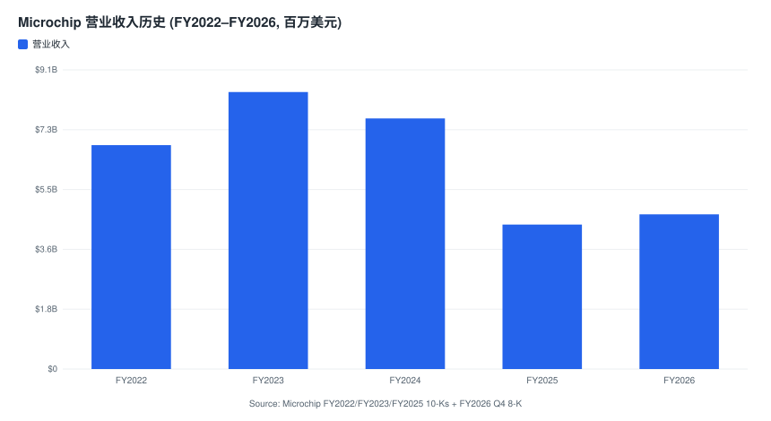

*来源: Microchip [2022 财年 10-K](https://www.sec.gov/Archives/edgar/data/827054/000082705422000094/0000827054-22-000094-index.htm)、[2023 财年 10-K](https://www.sec.gov/Archives/edgar/data/827054/000082705423000080/0000827054-23-000080-index.htm)、[2025 财年 10-K](https://www.sec.gov/Archives/edgar/data/827054/000082705425000077/0000827054-25-000077-index.htm) 与 [2026 财年 Q4 8-K 业绩公告](https://www.sec.gov/Archives/edgar/data/827054/000082705426000012/exhibit991q4fy26.htm)。*

FY2026 (截至 2026 年 3 月 31 日的年度) 营业收入与利润的全貌可由下方损益表 Sankey 一图看清——营收 47.13 亿美元如何经 COGS、研发、销管费用与收购无形资产摊销 (431.1M) 层层流出, 最终落到 GAAP 净利润 2.30 亿美元:

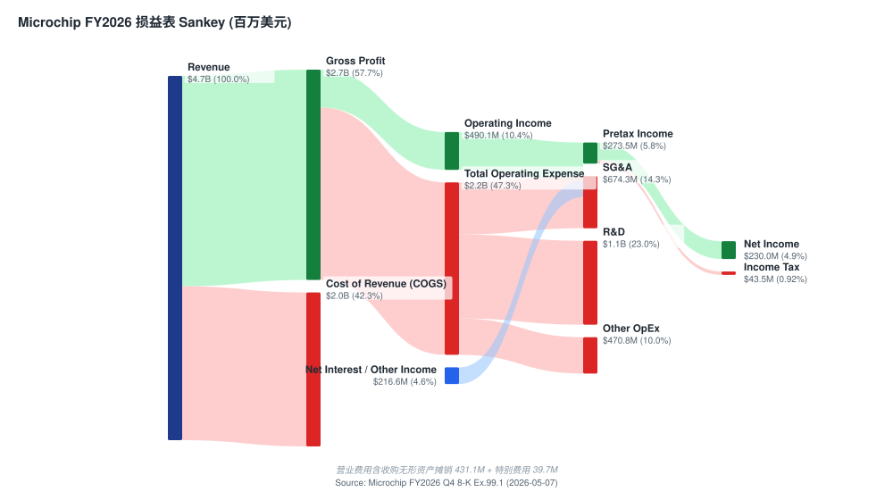

*来源: [Microchip 2026 财年 Q4 业绩公告 Exhibit 99.1, 2026-05-07](https://www.sec.gov/Archives/edgar/data/827054/000082705426000012/exhibit991q4fy26.htm)。*

**2026 财年 (截至 2026 年 3 月 31 日的年度) 标题数据**, 引自 [2026 财年 Q4 业绩公告 Exhibit 99.1, 2026-05-07](https://www.sec.gov/Archives/edgar/data/827054/000082705426000012/exhibit991q4fy26.htm):
- 营业收入: **47.131 亿美元** (同比 +7.1%, 上年 44.016 亿美元); COGS 19.920 亿美元
- GAAP 毛利率: 57.7%; 非 GAAP 毛利率: 58.5%
- 研发 (R&D) 10.859 亿美元; 销管 (SG&A) 6.743 亿美元; 收购无形资产摊销 4.311 亿美元
- GAAP 营业利润 (operating income): 4.901 亿美元 (10.4%); 非 GAAP 营业利润: 12.382 亿美元 (26.3%)
- GAAP 净利润 2.300 亿美元; 归属于普通股股东的 GAAP 净利润: 1.188 亿美元; 非 GAAP 净利润: 9.339 亿美元
- GAAP 摊薄 EPS: 0.22 美元; 非 GAAP 摊薄 EPS: 1.64 美元
- 2026 财年向股东回馈现金分红 (common dividends) 共计 9.840 亿美元

来源: [Microchip 2026 财年 Q4 业绩公告](https://www.sec.gov/Archives/edgar/data/827054/000082705426000012/exhibit991q4fy26.htm)。

**估值快照 (as of 2026-06-15, 价格为 2026-06-12 收盘)**, 引自 [Yahoo Finance MCHP 关键统计数据, 通过 yfinance 提取](https://finance.yahoo.com/quote/MCHP/key-statistics):

| 指标 | MCHP | 含义 |
|---|---|---|
| 股价 | 95.24 美元 | 较 52 周高点 105.91 美元下跌 10.1%; 较低点 48.52 美元上涨 96.3% |
| 市值 | 约 516 亿美元 | 中等市值模拟/MCU 同业 (5.42 亿股) |
| TTM 市盈率 (P/E) | 433 倍 | 数值上严重失真——过去十二个月 GAAP EPS 仅 0.22 美元, 反映 2026 财年 GAAP 净利润被 Microsemi 相关无形资产摊销 (FY2026 摊销 4.311 亿美元)、重组费用以及 Series A 优先股股息 (FY2026 1.112 亿美元) 所压制。**前瞻市盈率 23.3 倍**才是更有意义的估值倍数。 |
| TTM 市销率 (P/S) | 11.0 倍 | 高于按 2023 财年顶峰营业收入隐含的约 6 倍; 受压制的盈利推高了 TTM 比率。 |
| 市净率 (P/B) | 约 8.0 倍 | 股东权益 FY2026 64.32 亿美元 |
| 股息收益率 | 约 1.91% (年化 1.82 美元) | 季度 45.5 美分; 在下行周期维持不变 |
| Beta | 1.73 | 高周期性 |
| 52 周区间 | 48.52 – 105.91 美元 | |

来源: [Yahoo Finance MCHP 关键统计数据, 通过 yfinance 提取 (2026-06-12 收盘)](https://finance.yahoo.com/quote/MCHP/key-statistics); 权益与 EPS 数据 [2026 财年 Q4 8-K](https://www.sec.gov/Archives/edgar/data/827054/000082705426000012/exhibit991q4fy26.htm)。

**如何解读这些倍数。** 433 倍的 TTM P/E 在 MCHP 目前并非价值陷阱信号, 而是**GAAP 盈利的周期底部假象, 而非业务价值下滑的信号**。Microsemi 并购 (2018 年 5 月完成) 在公司资产负债表上形成了巨额无形资产, 其摊销每年通过 GAAP 营业成本和营业费用入账 (FY2026 收购无形资产摊销 4.311 亿美元; FY2025 4.909 亿美元; FY2024 6.054 亿美元, 出自 [2026 财年 Q4 8-K 合并经营报表](https://www.sec.gov/Archives/edgar/data/827054/000082705426000012/exhibit991q4fy26.htm) 与 [2025 财年 10-K](https://www.sec.gov/Archives/edgar/data/827054/000082705425000077/0000827054-25-000077-index.htm))。剥离这些非现金费用与其他一次性项目后, **2026 财年非 GAAP EPS 为 1.64 美元**, 6 月季 (2027 财年 Q1) 指引 0.67–0.71 美元意味着非 GAAP 运行率已超过 2.70 美元——使得前瞻市盈率落在 23 倍出头, 并向 2028 财年的 24 倍 (现价) 靠拢。**按前瞻 P/E, MCHP 的 23.3 倍是高毛利模拟/MCU 同业组中最便宜的** (ADI 28.3 倍, TXN 32.0 倍; 仅汽车敞口较重的 NXPI 17.3 倍更低)。来源: [Yahoo Finance 关键统计数据, 通过 yfinance 提取](https://finance.yahoo.com/quote/MCHP/key-statistics)。

---

## 1B. GF Score 基本面评分卡 — *分析师观点：*

> GF Score (GuruFocus 风格) 是**本报告自有的五维基本面打分 (*分析师观点：*)**, 而非来自 GuruFocus 的公开数值, 也不附任何文件引用; 每个维度的底层指标 (利润率、杠杆、CAGR、倍数、股价回报) 在正文各处单独引用。

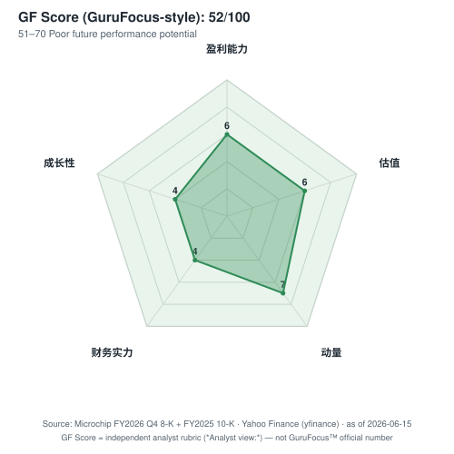

| 维度 | 评分 (0–10) | 评分理由 (各维度) |
|---|---|---|
| **财务实力 (Financial Strength)** | **4** | 长期债务 FY2026 54.96 亿美元、商誉+并购无形资产占总资产约 59%、现金仅 2.40 亿美元——绝对杠杆偏高; 但去杠杆稳健 (净杠杆 6 月季度末将降至 3 倍以下) 拉高了分数。([2026 财年 Q4 8-K 资产负债表](https://www.sec.gov/Archives/edgar/data/827054/000082705426000012/exhibit991q4fy26.htm); [J.P. Morgan TMC 要点](http://xs-macbook-air.local:5001/zsxq/pdf/415242124458458/J.P.%20Morgan-Microchip%20Technology%EF%BC%88MCHP.US%EF%BC%89J.P.%20Morgan%20TMC%20Conference%20Takeaways-260520.pdf)) |
| **盈利能力 (Profitability)** | **6** | GAAP 营业利润率仅 10.4% (周期底部假象), 但非 GAAP 26.3% 并快速回升, 长期框架毛利率 65%/营业利润率 40%——franchise 盈利能力强, 当前处中段。([2026 财年 Q4 8-K](https://www.sec.gov/Archives/edgar/data/827054/000082705426000012/exhibit991q4fy26.htm)) |
| **成长性 (Growth)** | **4** | 5 年营收 CAGR 为负 (从 84 亿降至 47 亿美元), 周期严重扭曲历史趋势; 但 FY2026 +7.1%、前瞻 +30%+ 强劲——拖尾弱、前瞻强, 综合中低分。([2026 财年 Q4 8-K](https://www.sec.gov/Archives/edgar/data/827054/000082705426000012/exhibit991q4fy26.htm)) |
| **估值 GF Value (越高越便宜)** | **6** | 前瞻 P/E 23.3 倍为高毛利模拟/MCU 组最便宜, 但目标价上行仅约 +6%、股价已大涨——中段偏好。([Yahoo Finance](https://finance.yahoo.com/quote/MCHP/key-statistics)) |
| **动量 (Momentum)** | **7** | 股价较 52 周低点 +96%、贴近高点, 相对强度强劲; 但已大幅上涨, 不再处于低位。([Yahoo Finance](https://finance.yahoo.com/quote/MCHP/key-statistics)) |
| **GF Score 综合 (*分析师观点：*)** | **52 / 100** | 51–70 区间 ("未来表现潜力偏弱")——反映高杠杆 + 周期扭曲的拖尾财务, 即便前瞻复苏强劲; 评分是周期底部到中段的"半程"快照, 随利用率与去杠杆推进有上修空间。 |

*评分维度权重 (*分析师观点：*): 财务实力 20% · 盈利能力 25% · 成长性 25% · GF Value 15% · 动量 15% (透明复现, 非 GuruFocus 专有权重)。来源标注已烘焙进雷达图; 各底层指标的引用见上表与第 2、10、11 章。*

底部年为 2025 财年 (营业收入 44.02 亿美元, 同比 -42.3%)。2026 财年是首个回升年 (47.13 亿美元, +7.1%)——两组数据均与 [2025 财年 10-K 合并经营报表](https://www.sec.gov/Archives/edgar/data/827054/000082705425000077/0000827054-25-000077-index.htm) 及 [2026 财年 Q4 8-K Exhibit 99.1](https://www.sec.gov/Archives/edgar/data/827054/000082705426000012/exhibit991q4fy26.htm) 对账一致。**复苏逻辑的核心是 MCHP 能否随毛利率、工厂利用率和现金流逐步正常化, 回到周期前的非 GAAP 目标 (毛利率约 65%、营业利润率 40%+) 进而实现重新估值。**详细路径见第 8 章。

---

## 2. 估值与目标价 (Valuation & Price Target) — *分析师观点：*

> 本章全部前瞻数字 (预测、目标价、情景价) 均为 **本报告自有判断 (*分析师观点：*)**, 不附任何 SEC 文件引用——10-K 不含价格目标。底层驱动 (分部数据、指引、行业预测) 在相应段落分别引用。

### 2.1 前瞻财务模型 (FY2026A → FY2029E)

模型构建逻辑: 以 FY2026 实际为基准 ([2026 财年 Q4 8-K](https://www.sec.gov/Archives/edgar/data/827054/000082705426000012/exhibit991q4fy26.htm)), 叠加 6 月季度正式指引 (营收中位 14.56 亿美元、非 GAAP EPS 0.69 美元——年化运行率约 2.76 美元), 再按周期复苏轨迹外推: FY2027 营收 +25% (UBS 工业半导体 2026E +25%、AI 相关订单能见度提升的行业判断——[UBS 全球 I/O 半导体, 2026-06-13](http://xs-macbook-air.local:5001/zsxq/pdf/584255214544244/UBS-UBS%20Global%20I%20O%20Semiconductors%20Auto%20semis%EF%BC%9A%20Sustained%20Analog%20Momentum%EF%BC%8C%20but%20Selectivity%20Warranted-260611.pdf)), 此后增速放缓至 +12%/+7%; 非 GAAP 毛利率从 58.5% 爬向 65% 长期目标 (FY26 Q4 已达 61.6%、6 月季度指引 62.75%——[2026 财年 Q4 8-K](https://www.sec.gov/Archives/edgar/data/827054/000082705426000012/exhibit991q4fy26.htm))。

| 指标 (*分析师观点：* 远期) | FY2026A | FY2027E | FY2028E | FY2029E |
|---|---|---|---|---|
| 营业收入 (百万美元) | 4,713 | ~5,900 | ~6,600 | ~7,050 |
| YoY 增长 | +7.1% | +25% | +12% | +7% |
| 非 GAAP 毛利率 | 58.5% | ~62.5% | ~64% | ~65% |
| 非 GAAP 营业利润率 | 26.3% | ~33% | ~37% | ~40% |
| 非 GAAP 摊薄 EPS (美元) | 1.64 | ~3.05 | ~3.90 | ~4.55 |

FY2026A 各项引自 [2026 财年 Q4 8-K Exhibit 99.1](https://www.sec.gov/Archives/edgar/data/827054/000082705426000012/exhibit991q4fy26.htm); FY2027E–FY2029E 为本报告前瞻估计。**核心驱动是毛利率/营业杠杆正常化, 而非营收回到顶峰**: 即便营收只回到约 60–65 亿美元的"去掉双重下单"正常化锚点, 仅毛利率从 58.5% 爬向 65% 一项就构成 >40% 的盈利顺风 ([2025 财年 10-K MD&A——毛利率逆风披露: 未吸收产能费用 1.323 亿 + 库存准备金 8,770 万美元](https://www.sec.gov/Archives/edgar/data/827054/000082705425000077/0000827054-25-000077-index.htm))。

### 2.2 目标价推导与倍数依据

**方法: 前瞻 P/E × 目标倍数。** 取 **FY2028E 非 GAAP EPS 约 3.90 美元 × 26× forward P/E = 约 101 美元** 12 个月目标价 (现价 95.24 美元, 隐含上行约 +6%)。

**为什么用 26 倍?** 这是高毛利模拟/MCU 同业组的中段倍数, 较组内更高质量同业略折让以反映 MCHP 偏高的杠杆: ADI 前瞻 P/E 28.3 倍、TXN 32.0 倍、STM 31.4 倍 (后者盈利同样周期扭曲), 仅汽车敞口重的 NXPI 17.3 倍更低 ([Yahoo Finance 同业关键统计, yfinance 提取](https://finance.yahoo.com/quote/MCHP/key-statistics))。MCHP 当前前瞻 P/E 23.3 倍是组内最便宜, 折价部分应随 (a) 去杠杆兑现、(b) 非 GAAP 毛利率回到 65%、(c) Series A 优先股 2028 转换消除而逐步收敛。

### 2.3 情景目标价 (bull / base / bear, *分析师观点：*)

| 情景 | 12 个月目标价 | 隐含上行/下行 | 核心摆动假设 |
|---|---|---|---|
| **Bull** | **122 美元** | +28% | 模拟/MCU 复苏强于预期, 工厂利用率快速回升使非 GAAP 毛利率提前触 65%, 数据中心/FPGA 高毛利组合加速; 倍数升至 28×。 |
| **Base** | **101 美元** | +6% | 营收 FY2027 +25%、此后温和增长; 毛利率分季向 65% 爬升; 倍数 26×。 |
| **Bear** | **72 美元** | -24% | 关税/中国车市放缓触发工业/汽车第二轮去库存, 营收反弹乏力, 毛利率停在 60–62%; 倍数压缩至 19×。 |

本报告情景框架与 Morgan Stanley 高度一致 (大摩 Bull 118 / Base 94 / Bear 69 美元), 本报告 Base 略高于大摩, 因采用 FY2028E (而非 2027 日历年) EPS 作为锚点。*分析师观点：* 引自 [Morgan Stanley — Microchip "Looking chipper", 2026-05-09, p.1](http://xs-macbook-air.local:5001/zsxq/pdf/212458412282511/Morgan%20Stanley-Microchip%20Technology%20Inc%EF%BC%88MCHP.US%EF%BC%89Looking%20chipper-260508.pdf)。

### 2.4 与市场一致预期的对比 (vs consensus)

本报告 Base 目标价 101 美元位于卖方区间偏上: Morgan Stanley 94 美元 (Equal-Weight)、UBS 与 Goldman Sachs 均为 Buy (PT DB 未记录其数值)。本报告 FY2028E 非 GAAP EPS 约 3.90 美元略高于大摩隐含的 2027 日历年 3.37 美元口径 (因财年错位 + 多一年复苏)。*分析师观点：* 大摩目标价基于 **2027 日历年非 GAAP EPS 3.37 美元 × 28× P/E**, 引自 [Morgan Stanley, 2026-05-09, p.1](http://xs-macbook-air.local:5001/zsxq/pdf/212458412282511/Morgan%20Stanley-Microchip%20Technology%20Inc%EF%BC%88MCHP.US%EF%BC%89Looking%20chipper-260508.pdf)。

### 2.5 卖方观点演变 (Sell-side view evolution)

机械化前置: 已只读查询 `db/stock_price_target.db` (MCHP 共 3 条记录)。PT 离散度: 仅 Morgan Stanley 记录了明确数值目标价 94 美元 (Equal-Weight); UBS、Goldman Sachs 记为 Buy 但 PT DB 未存数值。报告期股价 (report-date price): 三家均在 94.8–98.6 美元区间, 即各机构发表观点时 MCHP 已接近现价水平——意味着复苏已被大幅定价。

**按机构的观点时间线 (按机构, 2026 年):**

| 机构 | 报告日期 | 评级 / 目标价 | 报告日股价 | 核心论点 |
|---|---|---|---|---|
| Goldman Sachs | 2026-05-04 | **Buy** (PT 未记录) | 94.82 美元 | SIA 数据显示出货仍显著低于趋势 = 复苏跑道长; 但 MCU 出货仍承压, 优先布局出货低于趋势且供应链差异化的标的。([GS SIA 数据点评, 2026-06-08](http://xs-macbook-air.local:5001/zsxq/pdf/584251182144184/Goldman%20Sachs-Americas%20Technology%EF%BC%9A%20Semiconductors%EF%BC%9A%20SIA%20data%20shows%20broadly%20above~seasonal%20trends%20in%20April-260607.pdf)) |
| Morgan Stanley | 2026-05-09 | **Equal-Weight / 94 美元** | 98.60 美元 | FY26 Q4 全面超预期; 但股价过去 1 个月涨近 50%、营收仍较峰值低约 37%, 风险收益平衡; PT 基于 2027CY 非 GAAP EPS 3.37 × 28×。([MS "Looking chipper", 2026-05-09](http://xs-macbook-air.local:5001/zsxq/pdf/212458412282511/Morgan%20Stanley-Microchip%20Technology%20Inc%EF%BC%88MCHP.US%EF%BC%89Looking%20chipper-260508.pdf)) |
| UBS | 2026-05-11 | **Buy** (PT 未记录) | 98.54 美元 | 模拟上行周期确认, MCHP 列入首选买入名单; 但板块 ~30× 12M fwd PE (10 年均值 19×) 估值偏高, 建议选择性布局。([UBS 全球 I/O 半导体, 2026-06-13](http://xs-macbook-air.local:5001/zsxq/pdf/584255214544244/UBS-UBS%20Global%20I%20O%20Semiconductors%20Auto%20semis%EF%BC%9A%20Sustained%20Analog%20Momentum%EF%BC%8C%20but%20Selectivity%20Warranted-260611.pdf)) |
| J.P. Morgan | 2026-05-22 | 交流要点 (TMC 会议) | — | 9 点复苏计划执行顺利; 6 月季度毛利率指引 62.75%, 距 65% 目标约 225bps; 净杠杆 6 月季度末降至 3 倍以下; FPGA 全球第三、年收入 >5 亿美元; 暂不全面提价以修复客户关系。([JPM TMC 会议要点, 2026-05-22](http://xs-macbook-air.local:5001/zsxq/pdf/415242124458458/J.P.%20Morgan-Microchip%20Technology%EF%BC%88MCHP.US%EF%BC%89J.P.%20Morgan%20TMC%20Conference%20Takeaways-260520.pdf)) |

**机构间分歧 (机构间分歧).** 核心分歧不在方向 (各家均认可复苏), 而在**估值与风险收益**:

| 机构 | 日期 | 评级 / 目标价 | 核心论点 | 什么证据能证明其正确 |
|---|---|---|---|---|
| Morgan Stanley | 2026-05-09 | EW / 94 美元 | 复苏已基本定价, 股价 1 个月涨近 50%、营收仍较峰值低 37%, 相对同业略贵 | 营收增速放缓或毛利率卡在 62% 以下, 倍数无法继续扩张 |
| UBS | 2026-05-11 | Buy | 模拟上行周期确认, MCHP 是首选买入之一, 选择性布局 | 工业半导体 2026E +25% 兑现, MCHP 持续上调指引 |
| Goldman Sachs | 2026-05-04 | Buy | 出货仍显著低于长期趋势 = 复苏跑道更长, 供应链差异化 | 后续 SIA/出货数据继续向趋势收敛, MCU 出货由承压转改善 |

分歧的本质: 大摩看"已定价"、UBS/高盛看"跑道仍长"。本报告 Hold/101 美元目标价偏向大摩一侧——承认复苏真实, 但 +96% 反弹后风险收益趋于平衡, 需毛利率真正触 65% 才支持进一步重估。

---

## 3. 公司历史与 Microsemi 的遗产

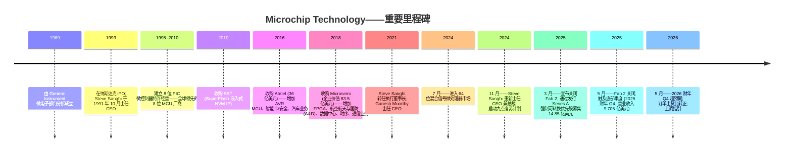

Microchip 成立于 1989 年, 由 General Instrument 的微电子部门分拆而出, 最初聚焦于 PIC 系列 8 位微控制器——这一产品线累计已出货数百亿颗。公司于 1993 年在纳斯达克 IPO, Steve Sanghi 自 1991 年 10 月被任命为 CEO 以来一直是公司的核心人物。来源: [2025 财年 10-K, 高管信息](https://www.sec.gov/Archives/edgar/data/827054/000082705425000077/0000827054-25-000077-index.htm)。

两次大型并购重塑了公司的营业收入基础和资产负债表, 两次均见于 MCHP 的 SEC 文件及同期新闻稿 ([2025 财年 10-K, 业务与并购说明](https://www.sec.gov/Archives/edgar/data/827054/000082705425000077/0000827054-25-000077-index.htm)):

- **Atmel (2016 年 4 月, 股权对价约 35.6 亿美元 / 企业价值 34.0 亿美元):** 加入 AVR 微控制器 (在 Arduino 爱好者 / 创客社区有广泛认知)、智能卡/安全 IC, 以及更广泛的汽车业务覆盖。交易以每股 8.15 美元现金加股票完成, 预计 2019 财年实现约 1.70 亿美元的协同效应 ([Microchip–Atmel 并购公告, 8-K Exhibit 99.1, 2016-01-19](https://www.sec.gov/Archives/edgar/data/0000872448/000157104916010841/t1600178_ex99-1.htm))。
- **Microsemi (2018 年 5 月, 约 83.5 亿美元):** 加入非易失性 FPGA (PolarFire、IGLOO、RTG4、SmartFusion、ProASIC)、航空航天与国防的抗辐射 (rad-hard) 元件、原子钟与时序解决方案、以太网 / PCIe 网络 IC (包括 Switchtec PCIe 交换机和面向数据中心的时序与同步)、以及碳化硅 (SiC) 功率器件。融资由 30 亿美元新增定期贷款和 20 亿美元高等级有担保债券提供; 并购获 Microsemi 99.5% 投票股东批准 ([Microchip Technology 宣布完成 Microsemi 收购, 2018-05-29](https://ir.microchip.com/news-events/press-releases/detail/399/microchip-technology-announces-completion-of-microsemi-acquisition))。Microsemi 的加入使 MCHP 营业收入大致翻倍, 同时背负了约 80 亿美元债务, 公司自此持续在去杠杆。

Microsemi 交易至今仍是塑造 MCHP 的财务事实: **资产负债表上的商誉 (goodwill) 截至 2025 年 3 月 31 日为 66.848 亿美元** ([2025 财年 10-K 合并资产负债表](https://www.sec.gov/Archives/edgar/data/827054/000082705425000077/0000827054-25-000077-index.htm)), 收购的无形资产 23.890 亿美元, 而总资产为 153.746 亿美元。这些无形资产的摊销是每个季度 GAAP 与非 GAAP 之间最大的单项调节项目。

Steve Sanghi 于 2021 年 3 月转任执行董事长 (Executive Chair), 由 Ganesh Moorthy 接任 CEO。**2024 年 11 月——在经历数个季度极度疲弱需求与库存累积后——董事会重新任命 Sanghi 为 CEO 兼总裁**, Moorthy 离任。Sanghi 随即启动"九点复苏计划", 聚焦于工厂整合 (2025 年 3 月 3 日宣布、2025 年 5 月完成 Fab 2 关闭)、自有库存与渠道库存削减、资本开支收缩 (2027 财年资本开支指引约 1 亿美元, 较此前的 Fab 4 扩产 8 亿美元与 Fab 5 SiC 扩产 8.80 亿美元计划被双双暂停)、激进去杠杆, 以及资产负债表强化 (2025 年 3 月发行 14.85 亿美元、票息 7.50% 的 Series A 强制可转换优先股, 用于偿还 13.00 亿美元净债务)。来源: [2025 财年 10-K——制造章节](https://www.sec.gov/Archives/edgar/data/827054/000082705425000077/0000827054-25-000077-index.htm); [2025 财年 Q4 业绩公告, 2025-05-08](https://www.sec.gov/Archives/edgar/data/827054/000082705425000061/exhibit991q4fy25.htm)。

---

## 4. 管理团队与公司治理

**Steve Sanghi——董事会执行董事长、CEO 兼总裁 (截至 2025 年 4 月 30 日 69 岁)。** Sanghi 自 1990 年 8 月加入 Microchip, 实际上*就是*公司的制度记忆载体。他自 1991 年 10 月至 2021 年 3 月任 CEO, 1993 年 10 月至 2021 年 3 月以及 2024 年 8 月至 11 月任董事长, 2021 年 3 月至 2024 年 8 月任执行董事长, 并于 2024 年 11 月被重新任命为执行董事长、CEO 兼总裁。他持有马萨诸塞大学 (University of Massachusetts) 电气与计算机工程硕士学位, 以及旁遮普大学 (Punjab University) 电子与通信学士学位。Sanghi 此前担任 Mellanox Technologies (后被 NVIDIA 收购) 与 Myomo, Inc. 的董事。来源: [2025 财年 10-K, "高管信息"](https://www.sec.gov/Archives/edgar/data/827054/000082705425000077/0000827054-25-000077-index.htm)。

Sanghi 在 2024 年 11 月的回归是本轮周期中最具影响力的治理事件。他明确将 2025 财年定调为"Microchip 这轮持续较久的行业下行周期"的底部, 并在 2026 财年 Q1 业绩说明会上表示, "九点复苏计划"已转化为"非 GAAP 增量毛利率 76% 与非 GAAP 增量营业利润率 82%"——这种杠杆评论的口吻与 Sanghi 时代的执行风格一脉相承。来源: [2026 财年 Q1 业绩公告, 2025-08-07](https://www.sec.gov/Archives/edgar/data/827054/000082705425000132/exhibit991q1fy26.htm)。在 2026-05-07 的 2026 财年 Q4 业绩说明会上, 他重申"随着行业状况改善, 我们对过去五个季度在公司层面及渠道库存削减方面的进展感到鼓舞", 并强调前道与后道产线的爬坡。来源: [2026 财年 Q4 业绩公告, 2026-05-07](https://www.sec.gov/Archives/edgar/data/827054/000082705426000012/exhibit991q4fy26.htm)。

**J. Eric Bjornholt——高级副总裁兼 CFO (54 岁)。** 长期任 CFO; 在 Microsemi 时代的去杠杆周期与 2024–25 财年下行期间均为公司财务的公开代言人。在 2026 财年 Q4 业绩说明会上他强调, 3 月季度库存削减了 2,230 万美元, 库存天数从 201 天降至 185 天; 渠道库存天数降至 26 天 (接近历史区间的低端); 自 2024 年 12 月峰值以来的累计库存削减达 3.209 亿美元。来源: [2026 财年 Q4 业绩公告](https://www.sec.gov/Archives/edgar/data/827054/000082705426000012/exhibit991q4fy26.htm)。

**Richard J. Simoncic——首席运营官 (COO, 61 岁)。** 公司产品 / 技术战略的公开代言人, 尤其在数据中心连接 (PCIe 交换机、第 6 代重定时器 Gen6 retimer)、原子钟与时序系统、以太网 (10BASE-T1S, 单对工业以太网) 以及 2025 年 11 月推出的 3nm PCIe Gen 6 交换机方面发声。来源: [2026 财年 Q2 业绩公告, 2025-11-06](https://www.sec.gov/Archives/edgar/data/827054/000082705425000182/exhibit991q2fy26.htm)。

**其他高管 (出自 10-K):** Mathew B. Bunker, 运营高级副总裁 (55 岁); Joseph R. Krawczyk II, 全球客户参与高级副总裁 (65 岁) ([2025 财年 10-K, "高管信息"](https://www.sec.gov/Archives/edgar/data/827054/000082705425000077/0000827054-25-000077-index.htm))。

**公司治理。** Sanghi 同时担任执行董事长、CEO 兼总裁三职, 董事会独立性方面的考量值得关注。本报告撰写时, 2025 财年的 DEF 14A 不在我们本地缓存内; 关于委员会构成、董事独立性评级以及详细高管薪酬, 读者应直接参阅 SEC EDGAR 上的 2025 年代理声明。来源: [SEC EDGAR——Microchip Technology 文件索引](https://www.sec.gov/cgi-bin/browse-edgar?action=getcompany&CIK=0000827054&type=DEF&dateb=&owner=include&count=40)。MCHP 承担较大的股权挂钩薪酬 (2025 财年股份酬劳费用为 1.804 亿美元, 出自 [2025 财年 10-K 现金流量表](https://www.sec.gov/Archives/edgar/data/827054/000082705425000077/0000827054-25-000077-index.htm)), 全球约 19,400 名员工的广泛股权激励是公司明确的文化支柱。内部人持股的详细数据: 本次首次覆盖未从 DEF 14A 中提取, 列为后续跟进事项。

**业绩纪录综合判断。** Sanghi 在 2021 年前的业绩纪录非凡——Microchip 自 1990 年代初不到 5,000 万美元的营业收入复合增长至 2023 财年峰值的 80 多亿美元 ([2023 财年 10-K MD&A](https://www.sec.gov/Archives/edgar/data/827054/000082705423000080/0000827054-23-000080-index.htm)), 自 2002 年起每个季度均派息至今未中断。他最薄弱的一处指印是 Microsemi 并购, 在前一轮周期顶部背上了约 80 亿美元债务。董事会于 2025 年 7 月正式确认其永久任职 ([Steve Sanghi 永久担任 Microchip CEO 兼总裁, 2025-07-02](https://ir.microchip.com/news-events/press-releases/detail/1322/steve-sanghi-to-continue-as-microchip-ceo-and-president-on-a-permanent-basis))。他的再次出山正被市场以"2025 财年是否确为周期底部"为评分尺度——2026 财年 Q4 的超预期业绩与上调指引 (13.11 亿美元对比 12.60 亿美元中位指引, 2027 财年 Q1 指引中位 14.555 亿美元) 与此逻辑一致 ([2026 财年 Q4 业绩公告](https://www.sec.gov/Archives/edgar/data/827054/000082705426000012/exhibit991q4fy26.htm))。

---

## 5. 产品与技术

MCHP 的产品组合分为三条上报产品线 (出自 [2025 财年 10-K MD&A](https://www.sec.gov/Archives/edgar/data/827054/000082705425000077/0000827054-25-000077-index.htm)):

| 产品线 | 2025 财年营业收入 | 占比 | 2024 财年营业收入 | 占比 |
|---|---|---|---|---|
| 混合信号微控制器 (Mixed-signal Microcontrollers) | 22.497 亿美元 | 51.1% | 42.724 亿美元 | 56.0% |
| 模拟 (Analog) | 11.570 亿美元 | 26.3% | 20.164 亿美元 | 26.4% |
| 其他 (FPGA / 存储器 / 授权 / 工程服务 / 航空航天) | 9.949 亿美元 | 22.6% | 13.456 亿美元 | 17.6% |
| **合计** | **44.016 亿美元** | **100.0%** | **76.344 亿美元** | **100.0%** |

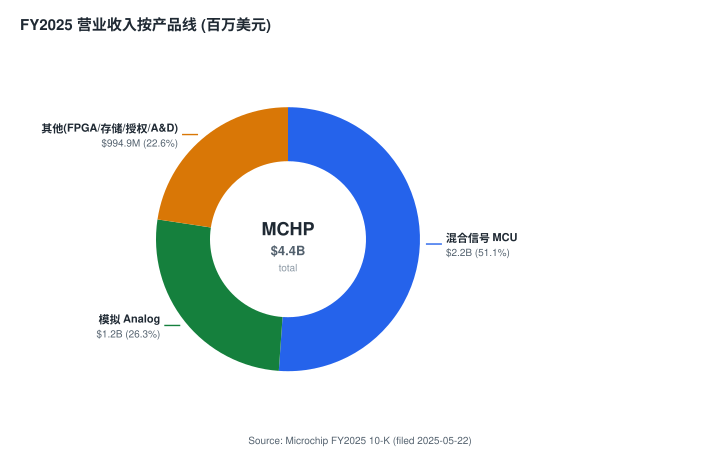

*来源: [Microchip 2025 财年 10-K, MD&A](https://www.sec.gov/Archives/edgar/data/827054/000082705425000077/0000827054-25-000077-index.htm)。FY2026 产品线明细尚未在 8-K 中拆分, 待 FY2026 10-K 披露。*

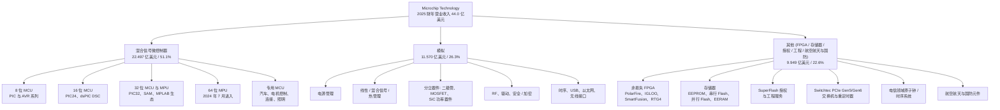

**混合信号微控制器 (占 2025 财年销售额 51%)。** 这是公司历史核心业务, 锚定在 PIC 与 AVR 品牌上。MCHP 提供专有 8 位、16 位与 32 位 MCU 系列, 加上 32 位 MPU (运行 Linux 级别), 并自 2024 年 7 月起新增 64 位混合信号微处理器产品线。专用 MCU 版本面向汽车 (功能安全、AEC-Q100)、工业电机控制、照明、电源、人机界面、有线与无线连接以及安全应用。8 位 MCU 业务是半导体行业最稳定的收入流之一, 因为转换成本极高 (固件、电路板设计、供应连续性) 且装机量基础非常广。MCHP 强调"由于产品本身的专有特性, 我们混合信号微控制器产品的整体平均售价在近期保持相对稳定"——这是关于定价能力的关键陈述。来源: [2025 财年 10-K, MD&A](https://www.sec.gov/Archives/edgar/data/827054/000082705425000077/0000827054-25-000077-index.htm)。

**模拟 (占比 26%)。** 包括电源管理、线性 IC、热管理、分立二极管与 MOSFET (包括碳化硅 SiC 功率器件)、RF、驱动器、安全/加密 IC、时序产品、USB 与以太网接口产品、无线连接, 以及广泛的混合信号模拟。与 MCU 产品线类似, 多数模拟 SKU 被描述为"本质上属于专有性质, 价格相对稳定"。来源: [2025 财年 10-K, MD&A](https://www.sec.gov/Archives/edgar/data/827054/000082705425000077/0000827054-25-000077-index.htm)。

**其他 (占比 23%, 即 Microsemi 及周边业务的桶)。** 包括**非易失 FPGA 系列** (PolarFire、IGLOO、SmartFusion、RTG4——在工业、国防、航空和太空领域因低功耗与高安全性而获得认可)、**存储器产品** (EEPROM、串行 Flash、EERAM)、**SuperFlash** 嵌入式非易失存储器 IP 向代工厂与设计伙伴授权的特许使用费收入、工程服务、制造服务 (晶圆代工与封装测试外包)、传统 ASIC, 以及航空航天与国防元件。该桶还包含 Microchip 近期业绩说明会所强调的**数据中心连接组合**——Switchtec PCIe Gen5 与 (最新的) Gen6 交换机与重定时器、面向电信和数据中心的原子钟与同步时序系统, 以及 PCIe Gen 6 fabric 解决方案。2025 年 11 月推出的"业界首款面向 AI 与企业数据中心应用的 3nm PCIe Gen 6 交换机"是其中最具可见度的。来源: [2025 财年 10-K 第 1 项业务](https://www.sec.gov/Archives/edgar/data/827054/000082705425000077/0000827054-25-000077-index.htm); [2026 财年 Q2 业绩公告](https://www.sec.gov/Archives/edgar/data/827054/000082705425000182/exhibit991q2fy26.htm)。

**终端市场 (定性描述——MCHP 未披露终端市场的定量构成)。** 根据 2025 财年 10-K 第 1 项, MCHP 列出的主要终端市场为: **汽车、航空航天与国防、通信、消费电器、数据中心与计算, 以及工业**。10-K 未按终端市场拆分营业收入; 分析师日演示资料 (本次首次覆盖未纳入本地缓存) 历史上将工业大致定位为合并营业收入的约 40%, 汽车约 20%, 计算与数据中心约 15%, 通信约 15%, A&D 约 8%, 消费约 5%——**但这些拆分未经审计, 且我们无法从 2025 财年 10-K 中验证**, 该 10-K 在此事项上保持沉默。因此我们省略终端市场的定量图表。来源: [2025 财年 10-K, 第 1 项业务](https://www.sec.gov/Archives/edgar/data/827054/000082705425000077/0000827054-25-000077-index.htm)。

**制造布局。** MCHP 是一家 IDM (集成器件制造商)——拥有位于俄勒冈州 Gresham 的 Fab 4 (8 英寸晶圆, 0.13–0.5 µm 工艺节点) 和科罗拉多州 Colorado Springs 的 Fab 5 (6 英寸晶圆, 并计划 8 英寸 SiC 扩产) 两座晶圆厂。**位于亚利桑那州 Tempe 的 Fab 2 已于 2025 年 5 月关闭** (重组扩展计划于 2025 年 3 月 3 日正式宣布), 其工艺技术转移至 Fab 4 与 Fab 5; 该工厂的厂房与设备通过 Macquarie 挂牌出售。关闭预计将带来约 9,000 万美元年现金节省, Fab 4、Fab 5 及菲律宾后道工厂的人员相关节省约 2,500 万美元 ([2025 财年 10-K, 制造章节](https://www.sec.gov/Archives/edgar/data/827054/000082705425000077/0000827054-25-000077-index.htm); [2025-03-03 重组更新 8-K](https://ir.microchip.com/sec-filings/all-sec-filings/content/0000827054-25-000037/mchp-20250303.htm))。

2025 财年, **约 36% 的营业收入来自 MCHP 自有晶圆厂生产的产品**, 其余 64% 来自第三方代工厂 (包括 100% 的 300mm 晶圆需求)。后道封装与测试约 67% 由内部完成 (泰国与菲律宾), 其余外包。2023 年 2 月宣布的 Fab 4 扩产 8 亿美元计划与 Fab 5 SiC 扩产 8.80 亿美元计划均**暂停至 2027 财年**, 在库存正常化期间节省资本。2027 财年总资本开支指引约 1 亿美元 (相较 2025 财年 1.26 亿美元、2024 财年 2.85 亿美元)。来源: [2025 财年 10-K 制造章节](https://www.sec.gov/Archives/edgar/data/827054/000082705425000077/0000827054-25-000077-index.htm); [2026 财年 Q4 业绩公告 2027 财年 Q1 展望](https://www.sec.gov/Archives/edgar/data/827054/000082705426000012/exhibit991q4fy26.htm)。

**整体系统解决方案 (TSS)。** 管理层公开声明的战略锚点。其前提是 MCHP 可以通过为客户提供 MCU + 模拟 + 存储器 + 连接 + 安全 + 工具 + 软件的一站式打包, 降低客户复杂度、BOM 数量与上市时间, 从而赢得设计席位。在功能层面, 这是相对于纯 MCU 厂商 (瑞萨 Renesas、意法半导体 STMicro) 与纯模拟厂商 (ADI、TXN) 的核心差异化优势: MCHP 将自身定位为应用板级**嵌入式控制**的一站式供应商。每个以 MCU/MPU/FPGA 为核心的设计中标平均还能带动 4–5 颗额外微芯产品销售——这是 TSS 提升客户 BOM 份额的量化锚点。来源: [2025 财年 10-K 第 1 项, "概览"](https://www.sec.gov/Archives/edgar/data/827054/000082705425000077/0000827054-25-000077-index.htm); *分析师观点：* 附加销售比例引自 [J.P. Morgan TMC 会议要点, 2026-05-22](http://xs-macbook-air.local:5001/zsxq/pdf/415242124458458/J.P.%20Morgan-Microchip%20Technology%EF%BC%88MCHP.US%EF%BC%89J.P.%20Morgan%20TMC%20Conference%20Takeaways-260520.pdf)。

### 供应链资金流向图 (Money-flow)

下图以**上游/支出视角**追踪 MCHP 的营业成本与资本开支去向——这是损益表 Sankey 无法呈现的"钱出大楼之后落在哪里"。作为 IDM, MCHP 约 64% 产品输出来自外部代工 (主力台湾 TSMC, 且 100% 的 300mm 需求外包)、约 36% 来自自有 Fab 4/5; 后道封测约 67% 在泰国/菲律宾自有厂内完成。最大的单一上游成本与地缘集中度节点是 TSMC; 资本开支已从历史 4–5 亿美元运行率腰斩至 FY2027E 约 1 亿美元。每条带子的粗细是相对比例 (非流量守恒)。来源: [2025 财年 10-K 制造章节](https://www.sec.gov/Archives/edgar/data/827054/000082705425000077/0000827054-25-000077-index.htm) (36%/64% 内外部产能、67% 内部封测)、[2026 财年 Q4 8-K](https://www.sec.gov/Archives/edgar/data/827054/000082705426000012/exhibit991q4fy26.htm) (资本开支、Arrow 占比); *分析师观点：* 关税口径转向"晶圆厂所在地"与亚洲发货方案引自 [J.P. Morgan TMC 会议要点, 2026-05-22](http://xs-macbook-air.local:5001/zsxq/pdf/415242124458458/J.P.%20Morgan-Microchip%20Technology%EF%BC%88MCHP.US%EF%BC%89J.P.%20Morgan%20TMC%20Conference%20Takeaways-260520.pdf)。

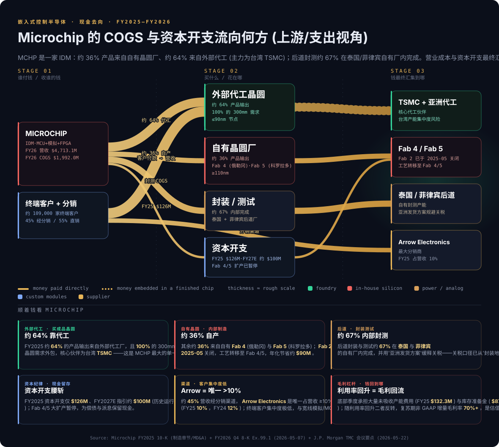

---

## 6. 客户、渠道与上市策略

**客户基础。** MCHP 向全球约 109,000 家独立终端客户销售, 美洲、欧洲与亚洲均设有直销团队, 辅以客户参与经理 (CEM)、嵌入式解决方案工程师 (ESE) 以及分销商。来源: [2025 财年 10-K, 销售与分销](https://www.sec.gov/Archives/edgar/data/827054/000082705425000077/0000827054-25-000077-index.htm)。

**渠道结构。** 2025 财年, **45% 的营业收入来自分销渠道**, 55% 来自直销, 相较 2024 财年的 47% / 53% ([2025 财年 10-K, 销售与分销](https://www.sec.gov/Archives/edgar/data/827054/000082705425000077/0000827054-25-000077-index.htm))。向直销倾斜与管理层在周期中削减分销渠道库存的努力相关。

**客户集中度较低。** 2025 财年 10-K 指出, "除最大分销商 Arrow Electronics——2025 财年与 2024 财年分别占我们营业收入的 10% 与 12%——外, 没有任何分销商或直销客户的销售额占公司营业收入的 10% 以上"。来源: [2025 财年 10-K, 分销](https://www.sec.gov/Archives/edgar/data/827054/000082705425000077/0000827054-25-000077-index.htm)。Arrow 是渠道而非终端客户, 因此实际集中度远低于上述措辞所暗示的水平。按半导体行业的标准衡量, 终端客户集中度**非常低**, 与宽线模拟/MCU 商业模式高度一致。

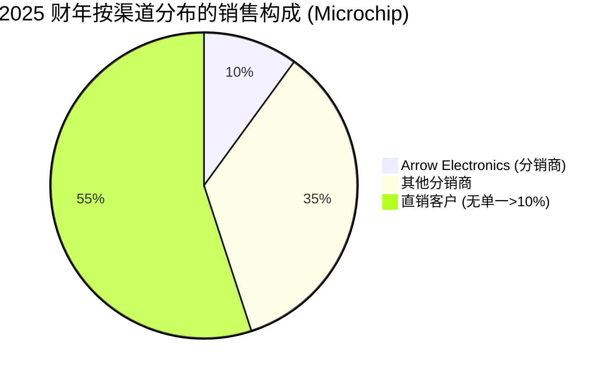

*来源: [2025 财年 10-K, 分销章节](https://www.sec.gov/Archives/edgar/data/827054/000082705425000077/0000827054-25-000077-index.htm)。*

**地理结构 (2025 财年):** 亚洲 49.9% (21.978 亿美元), 美洲 30.2% (13.257 亿美元), 欧洲 19.9% (8.781 亿美元)。海外销售约占总额 75%。海外销售几乎全部以美元计价。10-K 专门点名欧洲市场疲弱——"欧洲经济普遍走弱, 欧洲工业与汽车终端市场销售下滑, 这两块尤其疲弱"。来源: [2025 财年 10-K, 按地理拆分销售](https://www.sec.gov/Archives/edgar/data/827054/000082705425000077/0000827054-25-000077-index.htm)。

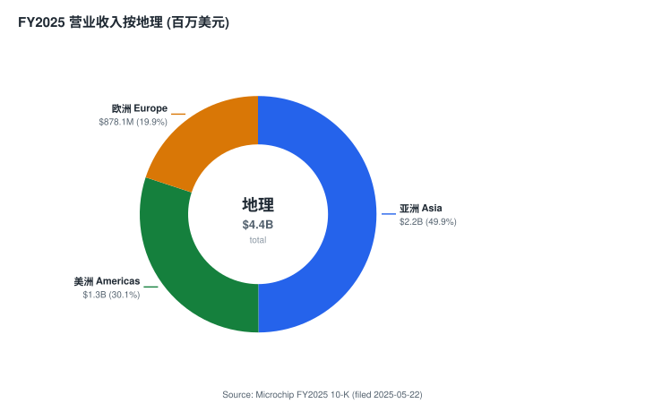

*来源: [Microchip 2025 财年 10-K, MD&A——按地理拆分销售](https://www.sec.gov/Archives/edgar/data/827054/000082705425000077/0000827054-25-000077-index.htm)。*

**渠道库存动态——本轮复苏逻辑中最关键的单一运营指标。** 在上一轮上行周期中, MCHP (与每家宽线模拟/MCU 厂商一样) 在 2021-2022 年因交期延长目睹了客户与分销商的双重下单。随着 2023-2024 年交期回归常态, 客户与分销商开始去库存, 这是 MCHP 2025 财年营业收入 -42.3% 的最直接原因 ([2025 财年 10-K MD&A](https://www.sec.gov/Archives/edgar/data/827054/000082705425000077/0000827054-25-000077-index.htm))。管理层通过"分销商库存天数"跟踪此指标——每季度披露:

| 期间 | 分销商库存天数 | MCHP 自身资产负债表库存天数 | 来源 |
|---|---|---|---|
| 2024 年 3 月 31 日 (2024 财年末) | 41 天 | 224 天 | [2025 财年 10-K MD&A](https://www.sec.gov/Archives/edgar/data/827054/000082705425000077/0000827054-25-000077-index.htm) |
| 2025 年 3 月 31 日 (2025 财年末) | 33 天 | 251 天 | [2025 财年 10-K MD&A](https://www.sec.gov/Archives/edgar/data/827054/000082705425000077/0000827054-25-000077-index.htm) |
| 2025 年 6 月 30 日 (2026 财年 Q1) | 29 天 | 214 天 | [2026 财年 Q1 8-K](https://www.sec.gov/Archives/edgar/data/827054/000082705425000132/exhibit991q1fy26.htm) |
| 2025 年 12 月 31 日 (2026 财年 Q3) | 约 26-27 天 | 201 天 | [2026 财年 Q3 8-K](https://www.sec.gov/Archives/edgar/data/827054/000082705426000008/exhibit991q3fy26.htm) |
| 2026 年 3 月 31 日 (2026 财年 Q4) | 26 天 (接近历史 17-43 天区间低端) | 185 天 | [2026 财年 Q4 8-K](https://www.sec.gov/Archives/edgar/data/827054/000082705426000012/exhibit991q4fy26.htm) |

渠道库存已下探至**历史 17–43 天区间的低端** (2025 财年 10-K 用语)。自身库存天数仍然较高 (185 天), 但持续改善——管理层指出客户的"加急活动 (expedite activity)"正在上升, 这是渠道补库的领先指标。来源: [2026 财年 Q4 业绩公告, 2026-05-07](https://www.sec.gov/Archives/edgar/data/827054/000082705426000012/exhibit991q4fy26.htm)。

---

## 7. 行业概览

Microchip 处于**嵌入式控制半导体 (embedded control semiconductors)** 板块——与更广阔的模拟与混合信号 IC 市场及微控制器市场存在重叠, 在 FPGA、存储器与数据中心连接领域亦有较小敞口 ([2025 财年 10-K 第 1 项业务](https://www.sec.gov/Archives/edgar/data/827054/000082705425000077/0000827054-25-000077-index.htm))。整体半导体行业在 2024 日历年达到约 6,270 亿美元营业收入, 同比增长 +19.0% ([WSTS 半导体市场预测, 2024 秋季](https://www.wsts.org/76/103/WSTS-Semiconductor-Market-Forecast-Fall-2024)), 其中 Microchip 涉足的模拟 + MCU + 通用 / 嵌入式逻辑细分大致在 800–1,000 亿美元规模。注: 精确的公开 TAM 数据需要来自付费的 IDC、Gartner 或 Omdia 报告; 我们以模拟/MCU 同业的自身公开文件作为最可靠的代理。

**周期性特征。** 模拟与 MCU 终端市场具有强周期性, 周期顶峰由交期延长引发的双重下单驱动, 谷底则由去库存驱动。最近一轮周期对 MCHP 而言在 2023 财年 Q1 (2022 年 6 月季度) 见顶, 在 2025 财年 Q4 (2025 年 3 月季度) 见底。季度营业收入从顶到底的跌幅为 -53% (2023 财年 Q1 的 20.69 亿美元 vs. 2025 财年 Q4 的 9.705 亿美元)。此跌幅*比同期 TXN、ADI 或 NXPI 的周期更为剧烈*——这是 MCHP 工业自动化敞口相对较高 (工业的去库存比汽车更猛烈)、顶峰时的客户订单覆盖期较短, 以及自 2021 年 Sanghi 时代的"优先供应计划 (Preferred Supply Program)"以来定价/库存做法未重新基准化的综合结果。来源: 高峰季度营业收入由 [2023 财年 10-K MD&A 历史营业收入表](https://www.sec.gov/Archives/edgar/data/827054/000082705423000080/0000827054-23-000080-index.htm) 推断。

**结构性驱动。** 尽管具有周期性, 嵌入式控制硅片的结构性增长逻辑保持完好, 引用 MCHP 自身文件和同期行业新闻稿 ([2025 财年 10-K, 第 1 项业务——终端市场](https://www.sec.gov/Archives/edgar/data/827054/000082705425000077/0000827054-25-000077-index.htm)):

- **每个系统的半导体含量持续上升**——2025 财年 10-K 引用"客户产品中半导体含量的提升"作为长期顺风 ([2025 财年 10-K, 第 1 项业务](https://www.sec.gov/Archives/edgar/data/827054/000082705425000077/0000827054-25-000077-index.htm))。
- **电气化与能效**——每一台智能电表、电动汽车 (EV) 动力总成、电助力自行车、电动工具、热泵以及工业电机驱动都富含硅片, 需要 MCU + 模拟 + 电源管理 ([2025 财年 10-K 第 1 项——终端市场](https://www.sec.gov/Archives/edgar/data/827054/000082705425000077/0000827054-25-000077-index.htm))。
- **连接与边缘 AI**——即使非常小的 IoT 端点也在从 8 位向 16/32 位 MCU 迁移, 并进一步向 64 位 RISC-V 多核 MPU 演进 ([Microchip Technology 进入 64 位微处理器市场博客, 2024 年 7 月](https://www.microchip.com/en-us/about/media-center/blog/2024/microchip-technology-enters-64-bit-microprocessor-market)), 单设备的 SAM 因此扩大。
- **航空航天、国防与太空**——全球国防开支加速推动了对抗辐射 FPGA、安全 MCU、原子钟/时序系统的需求, MCHP 通过 Microsemi 并购获得的产品组合直接受益 ([Microchip 推出业界最高性能 64 位 HPSC 微处理器系列——RISC-V International, 2024 年 7 月](https://riscv.org/ecosystem-news/2024/07/microchip-unveils-industrys-highest-performance-64-bit-hpsc-microprocessor-mpu-family-for-a-new-era-of-autonomous-space-computing-2/))。
- **AI / 数据中心连接**——随着加速器横向扩展 (scale-out) fabric 规模膨胀, PCIe Gen5/Gen6 交换机、重定时器、时序与同步日益重要。MCHP 于 2025 年 10 月 13 日推出业界首款 3nm PCIe Gen 6 Switchtec 交换机系列 ([Microchip 推出业界首款 3 nm PCIe® Gen 6 交换机新闻稿](https://ir.microchip.com/news-events/press-releases/detail/1338/microchip-unveils-first-3-nm-pcie-gen-6-switch-to-power-modern-ai-infrastructure))。

**地缘政治与贸易。** MCHP 的制造地理 (亚利桑那 + 俄勒冈 + 科罗拉多晶圆厂; 泰国与菲律宾后道) 与客户地理 (按目的地 50% 在亚洲, 按总量 75% 海外) 使其暴露于关税、出口管制以及中美政策变动。10-K 指出"我们已实施基于亚洲的发货方案, 以缓解任何关税的影响", 同时"我们大约 36% 的销售来自我们位于美国的自有晶圆厂所生产的产品"——但也指出"大约 64% 的销售来自外部代工厂生产的产品" (主要为台湾的 TSMC 与其他亚洲代工厂)。来源: [2025 财年 10-K 制造章节](https://www.sec.gov/Archives/edgar/data/827054/000082705425000077/0000827054-25-000077-index.htm)。

**《CHIPS 法案》。** MCHP 原则上是受益者。2025 财年 10-K 在现金流"政府资本激励所得款 (Proceeds from capital-related government incentives)"项下多次提及《CHIPS 法案》——尽管 2025 财年仅收到 40 万美元此类款项, 较 2024 财年的 600 万美元下降——并警告未来同业 CHIPS 相关产能扩张将构成风险。MCHP 自身能从《CHIPS 法案》获得的激励金额与时间"无法保证"。来源: [2025 财年 10-K 现金流量表与前瞻性陈述](https://www.sec.gov/Archives/edgar/data/827054/000082705425000077/0000827054-25-000077-index.htm)。

---

## 8. 竞争格局

MCHP 在多个细分市场内竞争, 最接近的纯纯可比是其他宽线模拟/MCU IDM ([2025 财年 10-K, "竞争"章节](https://www.sec.gov/Archives/edgar/data/827054/000082705425000077/0000827054-25-000077-index.htm))。

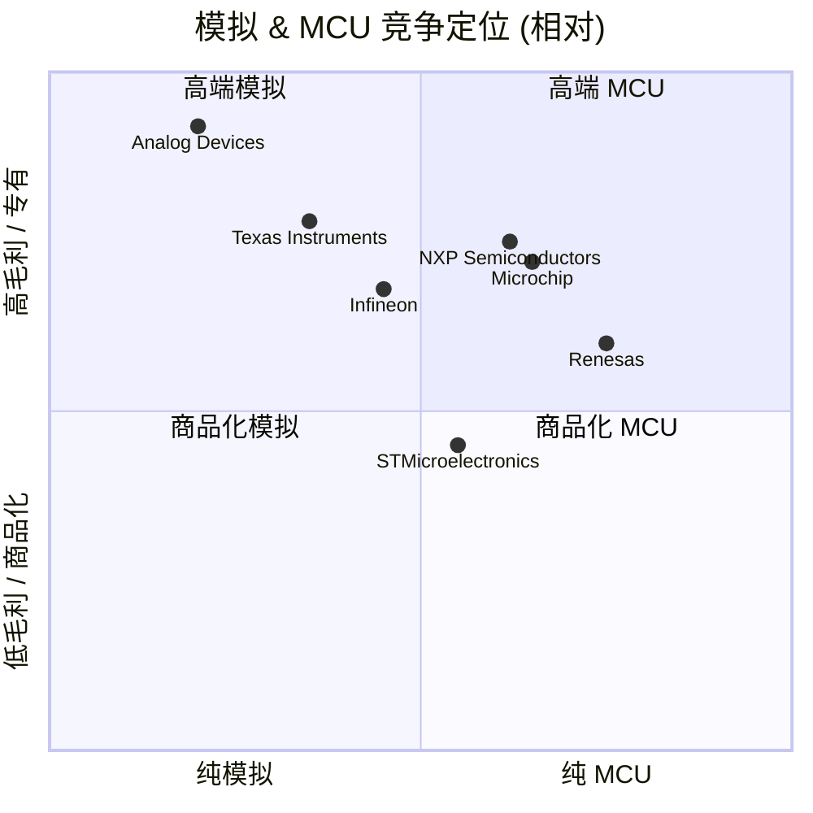

*作者根据 2025 财年毛利率作出的定性定位 (ADI 约 63%, TXN 约 57%, NXPI 约 56%, MCHP 非 GAAP 目标约 65%, STM 约 34%, IFNNY 约 41%), 数据出自 [Yahoo Finance 2026 年 5 月快照](https://finance.yahoo.com/quote/MCHP/key-statistics)。*

**直接同业 (宽线模拟 + MCU, 向许多相同客户销售)**, 各同业数字均从其最近年度文件中提取 ([2025 财年 10-K 竞争章节列出的同业组](https://www.sec.gov/Archives/edgar/data/827054/000082705425000077/0000827054-25-000077-index.htm)):

- **Analog Devices (NASDAQ: ADI)。** 市值 1,910 亿美元; 2025 财年营业收入 110.197 亿美元 (同比 +17%), GAAP 毛利率 61.5%, 业务结构: 工业 45% / 汽车 30% / 消费 13% / 通信 13% ([ADI 2025 财年年报 Form 10-K, 第 F-3 页](https://www.sec.gov/Archives/edgar/data/6281/000119312526020138/d75638dars.pdf); [ADI 公布 2025 财年第四季度及全年强劲业绩, 2025-11-25](https://investor.analog.com/news-releases/news-release-details/analog-devices-reports-strong-fourth-quarter-and-fiscal-2025))。2021 年收购 Maxim Integrated; 主要与 MCHP 的模拟与混合信号产品线直接竞争, 但 MCU 重叠极少。
- **Texas Instruments (NASDAQ: TXN)。** 市值 2,740 亿美元; 2024 财年营业收入 156.41 亿美元, TTM 资本开支约 48–49 亿美元, 资助德州 Sherman 与犹他 Lehi 300mm 晶圆厂建设 ([TXN 2024 财年 Form 10-K](https://www.sec.gov/Archives/edgar/data/0000097476/000009747625000007/txn-20241231.htm); [TI 选择犹他州 Lehi 作为下一座 300 毫米晶圆厂选址, 2023-02-15](https://www.ti.com/about-ti/newsroom/news-releases/2023/2023-02-15-texas-instruments-selects-lehi--utah--for-its-next-300-millimeter-semiconductor-wafer-fab.html))。600 亿美元美国晶圆厂项目 ([TI 计划投资逾 600 亿美元在美国制造基础半导体](https://www.ti.com/about-ti/newsroom/news-releases/2025/texas-instruments-plans-to-invest-more-than--60-billion-to-manufacture-billions-of-foundational-semiconductors-in-the-us.html)) 正是 MCHP 必须应对的结构性产能过剩论点。
- **NXP Semiconductors (NASDAQ: NXPI)。** 市值 780 亿美元。2024 财年营业收入 126 亿美元 (同比 -5%); 汽车收入 71.5 亿美元 = 总额的 57% ([NXP Semiconductors 公布 2024 年第四季度与全年业绩](https://investors.nxp.com/news-releases/news-release-details/nxp-semiconductors-reports-fourth-quarter-and-full-year-2024/))。前瞻 P/E 17.4 倍, 反映汽车周期担忧。
- **STMicroelectronics (NYSE: STM)。** 市值 570 亿美元。2024 财年营业收入 132.7 亿美元, 毛利率 39.3%, 反映分立器件/商品化业务尾段较重 ([STM 2024 财年 Form 20-F](https://www.sec.gov/Archives/edgar/data/0000932787/000093278725000006/stm-20241231.htm)); 以 4.6 倍 TTM P/S 交易——同业组中最便宜。
- **Infineon Technologies (OTC: IFNNY / XETR: IFX)。** 2024 财年营业收入约 150 亿欧元 (同比 -8%), 调整后毛利率 42.6% ([Infineon 以营业收入与盈利双增长收官 2024 财年, 2024 年 11 月](https://www.infineon.com/cms/en/about-infineon/press/press-releases/2024/INFXX202411-020.html))。欧洲汽车与功率器件龙头, 在 SiC 最为强势。
- **Renesas Electronics (TSE: 6723)。** 日本上市的直接竞争对手, 主营 32 位 MCU (RX、RA、Synergy 系列) 与汽车 IC ([Renesas 公布截至 2024 年 12 月 31 日年度业绩](https://www.renesas.com/en/about/newsroom/renesas-reports-financial-results-year-ended-december-31-2024-0)); 近年收购了 Dialog Semi 与 Steradian。

**按子细分的其他竞争者** (出自 MCHP 的 [2025 财年 10-K 竞争章节](https://www.sec.gov/Archives/edgar/data/827054/000082705425000077/0000827054-25-000077-index.htm)):

- **MCU (8/16/32 位):** Renesas、NXPI、STM、Infineon、Silicon Labs、Nordic Semi、Espressif (ESP32——快速增长的中国低端无线 MCU)、GigaDevice (中国 RISC-V/ARM MCU)。
- **模拟 / 功率:** TXN、ADI、ON Semiconductor、Monolithic Power Systems (MPWR)、STM、Infineon、Diodes Inc.、Vishay。
- **非易失 FPGA:** AMD (Xilinx——主要为大规模/SRAM FPGA)、Intel (Altera——近期分拆)、Lattice Semiconductor (在小型/低功耗端为 MCHP PolarFire 与 IGLOO 非易失 FPGA 最接近的纯纯可比)、Efinix (私营)。
- **数据中心连接 (PCIe 交换机、重定时器、时序):** Astera Labs (ALAB)、Broadcom、Marvell、Montage Technology、Renesas (收购了 Dialog)、Maxlinear。2025 年 10 月推出的 3nm PCIe Gen6 Switchtec 交换机使 MCHP 在 AI fabric 设计席位上与 Astera Labs 及 Broadcom 直接对决 ([Microchip 推出业界首款 3 nm PCIe Gen 6 交换机新闻稿, 2025-10-13](https://ir.microchip.com/news-events/press-releases/detail/1338/microchip-unveils-first-3-nm-pcie-gen-6-switch-to-power-modern-ai-infrastructure))。
- **航空航天与国防抗辐射元件:** BAE Systems、Honeywell、Cobham、Texas Instruments (DARPA 项目)、MACOM, 以及主承包商内部的设计能力。

**中国仿造风险。** MCHP 明确表示, "我们也在与一些公司竞争, 我们认为这些公司在中国与台湾等国家/地区抄袭、克隆、盗版或逆向工程了我们的专有产品线"。来源: [2025 财年 10-K, 竞争章节](https://www.sec.gov/Archives/edgar/data/827054/000082705425000077/0000827054-25-000077-index.htm)。这对商品化 8 位 MCU SKU 构成实际毛利逆风, 但对 32/64 位专用 MCU 与 Microsemi 继承的 FPGA/网络 SKU 影响较小。

**同业估值比较** ——估值倍数来自 [Yahoo Finance MCHP 关键统计数据, 2026 年 5 月](https://finance.yahoo.com/quote/MCHP/key-statistics) 与下方图表所列的各同业页面。

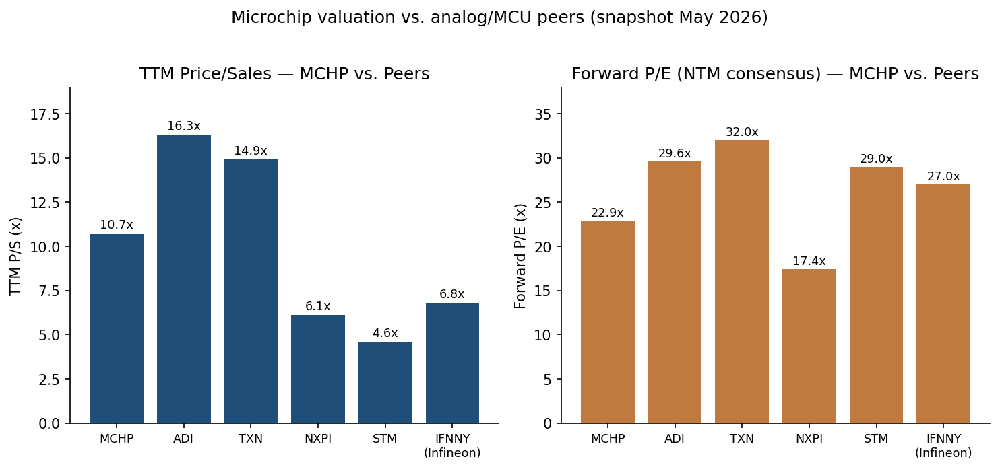

*来源: Yahoo Finance, 2026-05-20 通过 yfinance 提取——[MCHP](https://finance.yahoo.com/quote/MCHP/key-statistics)、[ADI](https://finance.yahoo.com/quote/ADI/key-statistics)、[TXN](https://finance.yahoo.com/quote/TXN/key-statistics)、[NXPI](https://finance.yahoo.com/quote/NXPI/key-statistics)、[STM](https://finance.yahoo.com/quote/STM/key-statistics)、[IFNNY](https://finance.yahoo.com/quote/IFNNY/key-statistics)。*

**板块结论。** 按 TTM P/S, MCHP 的 11.0 倍位于 ADI (16.0 倍) 与 TXN (14.9 倍) 的高端与 NXPI/STM 价值端之间 (NXPI 仅 6.1 倍、STM 5.6 倍, 反映其汽车/分立器件商品化业务尾段较重), 与 MCHP 高毛利专有 MCU/模拟与低毛利分立器件/存储器的混合大致一致 ([Yahoo Finance MCHP 关键统计数据, yfinance 提取](https://finance.yahoo.com/quote/MCHP/key-statistics); [ADI 关键统计数据](https://finance.yahoo.com/quote/ADI/key-statistics); [TXN 关键统计数据](https://finance.yahoo.com/quote/TXN/key-statistics))。按前瞻 P/E, MCHP 的 **23.3 倍是高毛利模拟/MCU 组中最便宜的** (ADI 28.3 倍、TXN 32.0 倍; 仅汽车敞口重的 NXPI 17.3 倍更低), 反映了 (a) 对复苏轨迹的残留不确定, 以及 (b) Series A 优先股股息的悬置 ([Microchip 424B5 招股说明书补充, 2025 年 3 月](https://www.sec.gov/Archives/edgar/data/0000827054/000119312525060309/d903706d424b5.htm))。周期复苏逻辑的本质就是, 随着 2027/2028 财年盈利兑现, 前瞻 P/E 折价将逐步收敛。

---

## 9. 市场机会与增长驱动

中期增长论点建立在五条相互交叠的赛道上, 全部出自 MCHP 最近的文件与 8-K 业绩公告 ([2026 财年 Q4 8-K](https://www.sec.gov/Archives/edgar/data/827054/000082705426000012/exhibit991q4fy26.htm); [2025 财年 10-K](https://www.sec.gov/Archives/edgar/data/827054/000082705425000077/0000827054-25-000077-index.htm)):

**1. 周期复苏与毛利率正常化。** 这是近期最主导的驱动。轨迹在季度数字中清晰可见 ([2026 财年 Q4 8-K, 2026-05-07](https://www.sec.gov/Archives/edgar/data/827054/000082705426000012/exhibit991q4fy26.htm)):

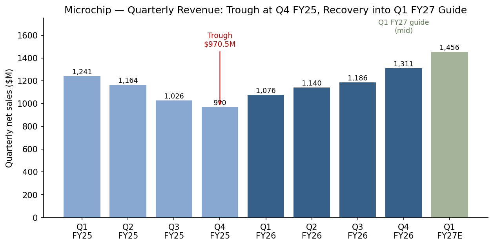

*来源: Microchip 8-K 业绩公告——[2025 财年 Q4 (2025 年 5 月)](https://www.sec.gov/Archives/edgar/data/827054/000082705425000061/exhibit991q4fy25.htm)、[2026 财年 Q1 (2025 年 8 月)](https://www.sec.gov/Archives/edgar/data/827054/000082705425000132/exhibit991q1fy26.htm)、[2026 财年 Q2 (2025 年 11 月)](https://www.sec.gov/Archives/edgar/data/827054/000082705425000182/exhibit991q2fy26.htm)、[2026 财年 Q3 (2026 年 2 月)](https://www.sec.gov/Archives/edgar/data/827054/000082705426000008/exhibit991q3fy26.htm)、[2026 财年 Q4 (2026 年 5 月)](https://www.sec.gov/Archives/edgar/data/827054/000082705426000012/exhibit991q4fy26.htm)。2025 财年 Q1 (2024-06) 与 2025 财年 Q2 (2024-09) 的历史数据为后续公告中给出的可比期。2025 财年 Q3 (2024-12) 是由 2026 财年 Q3 公告口径推导 ("较上年同期增长 15.6%": 11.86 亿美元 / 1.156 ≈ 10.26 亿美元)。2027 财年 Q1E 为正式指引的中位值。*

毛利率的复苏比营业收入复苏更陡峭、更可见, 因为底部季度承担了大量未吸收产能费用以及库存准备金费用 ([2025 财年 10-K MD&A——毛利率](https://www.sec.gov/Archives/edgar/data/827054/000082705425000077/0000827054-25-000077-index.htm)):

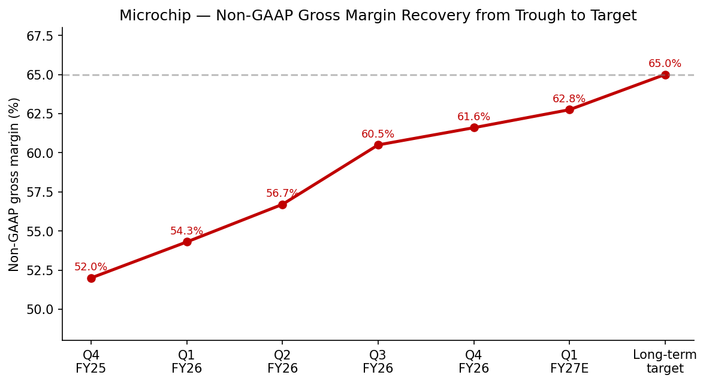

*来源: 上述同一批 8-K 中的非 GAAP 毛利率披露; 2027 财年 Q1E 中位来自 2026 财年 Q4 8-K 指引 (营业收入 14.42–14.69 亿美元, 非 GAAP 毛利率 62.25–63.25%); 长期目标约 65% 来自 CFO 在 2026 财年 Q3 业绩说明会上的评论: "我们预计毛利率将进一步扩张, 朝长期目标 65% 靠拢"。*

10-K 明确列出了 2025 财年毛利率逆风: 未吸收产能费用 1.323 亿美元 (相对 2024 财年) 与库存准备金费用 8,770 万美元 (相对 2024 财年) ([2025 财年 10-K MD&A——毛利率](https://www.sec.gov/Archives/edgar/data/827054/000082705425000077/0000827054-25-000077-index.htm))。随着工厂利用率从底部回升, 二者都会反转; 复苏早期季度的非 GAAP 增量毛利率达 70% 以上 (CFO Bjornholt 在 2026 财年 Q1 业绩说明会上提到 76%——[2026 财年 Q1 8-K, 2025-08-07](https://www.sec.gov/Archives/edgar/data/827054/000082705425000132/exhibit991q1fy26.htm))。在 55–60 亿美元正常化运行率下, 以 65% 长期毛利率目标计算, MCHP 将产生约 35–39 亿美元毛利, 相比 2026 财年的 27.2 亿美元——**仅毛利率正常化一项就构成大于 40% 的盈利顺风, 无需营业收入在当前运行率之上进一步增长**。

**2. 库存正常化与资本开支纪律。** 2026 财年资本开支 1.26 亿美元, 2027 财年指引约 1.0 亿美元, 相比历史 4–5 亿美元的运行率 ([2026 财年 Q4 8-K 资本开支披露](https://www.sec.gov/Archives/edgar/data/827054/000082705426000012/exhibit991q4fy26.htm))。结合 Fab 2 关闭 (约 9,000 万美元年化节省——[2025 财年 10-K, 制造章节](https://www.sec.gov/Archives/edgar/data/827054/000082705425000077/0000827054-25-000077-index.htm)) 和 Fab 4 / Fab 5 扩产暂停, 这是复苏阶段结构性更低的现金负担。库存吸收 (销售内部库存而不是增产) 是经营现金流的非现金提振, 直到库存天数从当前 185 天回归 150 天左右 ([2026 财年 Q4 业绩公告——库存天数披露](https://www.sec.gov/Archives/edgar/data/827054/000082705426000012/exhibit991q4fy26.htm))。

**3. 数据中心与 AI 设计赢单管线。** Microsemi 的交换、重定时器与时序产品组合历来面向电信与企业销售; AI 加速器横向扩展 fabric (NVL72 式 72-GPU 机架, 进而更大的 pod, 配 PCIe Gen5/Gen6 主干网) 现在是这些产品最快增长的潜在市场。3nm PCIe Gen6 交换机 (2025 年 11 月)、Gen6 PCIe 重定时器 (2026 年 5 月) 和原子钟 / 同步时序 (2025 财年 Q4) 是进入该市场的具体产品发布。如 MCHP 拿下一级超大规模数据中心客户 (recent calls 提及但未具名) 的设计赢单, 将有显著上行空间。来源: [2026 财年 Q1 业绩公告, 2025 年 8 月](https://www.sec.gov/Archives/edgar/data/827054/000082705425000132/exhibit991q1fy26.htm): "整体系统解决方案 (TSS) 战略继续锁定 AI 基础设施一级云厂商的设计赢单。"

**4. 航空航天与国防 (A&D)。** 全球国防开支上修 (欧盟 NATO 2%+ 承诺继续上调、亚太军事化、AUKUS) 推动对抗辐射 FPGA (RTG4、PolarFire SoC)、安全 MCU 与原子钟 / 时序系统的需求。Microsemi 的 A&D 业务积淀深厚; 这是结构性更高毛利的板块。管理层在 2026 财年 Q2 业绩说明会上提到, "航空航天与国防市场全球开支加速正在推动对我们集成解决方案的需求" ([2026 财年 Q2 8-K, 2025-11-06](https://www.sec.gov/Archives/edgar/data/827054/000082705425000182/exhibit991q2fy26.htm))。

**5. 电气化、工业自动化与边缘 AI。** 多年代级的"每个系统的硅含量提升"顺风, 横跨 EV 动力总成、充电、智能电表、热泵、工业机器人和边缘 AI 端点。MCHP 的 TSS 定位 (一家供应商提供 MCU + 模拟 + 连接) 与此契合 ([2025 财年 10-K, 第 1 项业务](https://www.sec.gov/Archives/edgar/data/827054/000082705425000077/0000827054-25-000077-index.htm))。面向工业 / 汽车的 10BASE-T1S 与单对以太网产品组合 (2026 财年 Q3 业绩说明会指出"汽车与工业市场同步发生的现代化周期"——[2026 财年 Q3 8-K, 2026-02-05](https://www.sec.gov/Archives/edgar/data/827054/000082705426000008/exhibit991q3fy26.htm)) 瞄准的就是这一增长。

**定量锚点。** 将营业收入恢复至 2023 财年 84 亿美元的高峰并非合适锚点 (那一档包含了渠道双重下单)。更有用的正常化锚点是约 60–65 亿美元, 取 2022 财年 + 2023 财年 + 2024 财年的平均 (68.2 / 84.4 / 76.3 亿美元 = 76 亿美元; 扣除双重下单 ≈ 60–65 亿美元——历史营业收入引自 [2022 财年 10-K](https://www.sec.gov/Archives/edgar/data/827054/000082705422000094/0000827054-22-000094-index.htm)、[2023 财年 10-K](https://www.sec.gov/Archives/edgar/data/827054/000082705423000080/0000827054-23-000080-index.htm) 和 [2025 财年 10-K](https://www.sec.gov/Archives/edgar/data/827054/000082705425000077/0000827054-25-000077-index.htm))。在此水平、以 65% 非 GAAP 毛利率与约 40% 非 GAAP 营业利润率 (CFO 在 [2026 财年 Q3 业绩说明会](https://www.sec.gov/Archives/edgar/data/827054/000082705426000008/exhibit991q3fy26.htm) 上的长期目标) 计算, 非 GAAP 营业利润将为 24–26 亿美元 (vs. 2026 财年的 12.4 亿美元——[2026 财年 Q4 8-K](https://www.sec.gov/Archives/edgar/data/827054/000082705426000012/exhibit991q4fy26.htm)), 即未来 2–3 年非 GAAP EPS 较 2026 财年提升 95–110%。

---

## 10. 风险评估

### 公司特定风险

**1. 半导体周期反复 / 第二轮下行。** 投资逻辑假设 2025 财年是底部, 2026 财年营业收入增长复苏。如果宏观条件恶化 (关税上升、台海紧张、美国衰退), MCHP 营业收入可能再次回探底部。缓释因素: 管理层在复苏完全发生前已明确压缩资本开支、人员与产能; 渠道库存已位于历史 17-43 天区间的低端, 减弱了进一步去库存的幅度。来源: [2026 财年 Q4 8-K](https://www.sec.gov/Archives/edgar/data/827054/000082705426000012/exhibit991q4fy26.htm)。

**2. Microsemi 时代债务与 Series A 优先股的悬置。** 截至 2025 年 3 月 31 日总债务为 **56.304 亿美元** (长期 56.304 亿 + 流动 0), 较 2024 财年末的 59.998 亿美元 (50.004 长期 + 9.994 流动) 下降。强制可转换优先股 (2025 年 3 月发行 14.85 亿美元) 票面利率 7.50%——2026 财年支付 1.112 亿美元优先股股息, 拉低普通股 EPS。来源: [2025 财年 10-K 资产负债表](https://www.sec.gov/Archives/edgar/data/827054/000082705425000077/0000827054-25-000077-index.htm)。缓释因素: 维持投资级评级; 随着现金积累, 净债务下行 (2025 财年末现金 7.717 亿美元 vs. 2024 财年的 3.197 亿美元); 优先股是强制可转换 (摊薄上行风险, 但不构成永久票息义务)。

**3. CEO 关键人物风险。** Sanghi, 69 岁, 自 2024 年 11 月过渡后重回 CEO 岗位, 并于 2025 年 7 月被任命为永久 CEO ([Steve Sanghi 永久担任 Microchip CEO 兼总裁, 2025-07-02](https://ir.microchip.com/news-events/press-releases/detail/1322/steve-sanghi-to-continue-as-microchip-ceo-and-president-on-a-permanent-basis))。他是复苏逻辑中最重要的单一变量。缓释因素: 35+ 年的制度积淀; 接班人是董事会的优先事项, 但尚未正式公布。

**4. 渠道与分销依赖。** Arrow Electronics 占 2025 财年营业收入的 10% (2024 财年 12%)。45% 销售经分销渠道。MCHP 与 Arrow 无长期合约, 任何一方均可"几乎不预告"终止 ([2025 财年 10-K, 分销章节](https://www.sec.gov/Archives/edgar/data/827054/000082705425000077/0000827054-25-000077-index.htm))。缓释因素: Arrow 是渠道而非终端客户; 真正驱动出货的是 MCHP 在终端设计师中的品牌识别。

**5. 中国仿造 / IP 风险。** 2025 财年 10-K 明确引用中国与台湾的竞争者"抄袭、克隆、盗版或逆向工程我们的专有产品线" ([2025 财年 10-K, 竞争章节](https://www.sec.gov/Archives/edgar/data/827054/000082705425000077/0000827054-25-000077-index.htm))。这特别压制 8 位 MCU 在中国市场的定价。缓释因素: 32/64 位 MCU 与 FPGA/网络业务防御性更强; 对侵权方持续法律行动。

**6. 商誉减值风险。** 商誉 66.848 亿美元和并购无形资产 23.890 亿美元合计占总资产 (153.746 亿美元) 的 59% ([2025 财年 10-K 合并资产负债表](https://www.sec.gov/Archives/edgar/data/827054/000082705425000077/0000827054-25-000077-index.htm))。如周期复苏停滞或终端市场增长结构性失望, 减值费用将冲击 GAAP 盈利 (非现金)。缓释因素: 2026 财年 Q4 的周期复苏势头降低了近期概率; 减值是非现金费用, 不影响现金流或非 GAAP 盈利。

### 行业 / 市场风险

**7. 关税与出口管制敞口。** 75% 营业收入来自海外 (50% 亚洲); 制造依赖外部代工 (TSMC 等占 64% 的晶圆需求)。新关税 (美中、美欧、美墨/加拿大) 或扩大的 EAR / 出口管制行动可能压缩需求或抬高成本。缓释因素: 管理层已实施"基于亚洲的发货方案以缓解关税影响"。关税是 2026 财年 Q4 / 2027 财年 Q1 的关注事项——管理层在 2025 年 5 月指引中提到"在平衡这一点与地缘政治担忧及关税不可量化影响"。来源: [2025 财年 Q4 8-K](https://www.sec.gov/Archives/edgar/data/827054/000082705425000061/exhibit991q4fy25.htm)。

**8. 代工厂集中度与台湾风险。** 外包晶圆中很大一部分来自 TSMC 与其他亚洲代工厂; 2025 财年 64% 的产品输出来自外部代工 ([2025 财年 10-K, 制造章节](https://www.sec.gov/Archives/edgar/data/827054/000082705425000077/0000827054-25-000077-index.htm))。台湾运营任何中断 (地缘、自然灾害、监管) 都会直接影响这部分。缓释因素: 在可行处双源采购; Fab 4/5 的美国晶圆厂产能可作为选定产品的备份。

**9. 同业产能过剩。** TXN 的 300mm 资本开支周期 (德州 Sherman、犹他 Lehi) 正大规模新增模拟/MCU 产能 ([TI 计划投资逾 600 亿美元在美国制造基础半导体](https://www.ti.com/about-ti/newsroom/news-releases/2025/texas-instruments-plans-to-invest-more-than--60-billion-to-manufacture-billions-of-foundational-semiconductors-in-the-us.html)); 中国晶圆厂 (中芯国际 SMIC、华虹 Hua Hong) 也在新增成熟节点产能。若整体行业产能扩张超过需求增长, 定价权可能压缩。缓释因素: MCHP 专有、设计锁定的客户基础, 价格弹性低于商品化 SKU ([2025 财年 10-K MD&A——定价评论](https://www.sec.gov/Archives/edgar/data/827054/000082705425000077/0000827054-25-000077-index.htm))。

### 财务风险

**10. Series A 优先股转换与摊薄。** 14.85 亿美元 Series A 强制可转换优先股将于 2028 年转换为普通股 ([Microchip 公告 Series A 强制可转换优先股 8-K, 2025-03-25](https://www.sec.gov/Archives/edgar/data/0000827054/000119312525062515/d943799d8k.htm))——2027 财年 Q1 当前摊薄股本指引已纳入转换后股份 (约 2,270–2,300 万股增量)。缓释因素: 摊薄是已知且可见的, 已体现在非 GAAP 摊薄股本数 ([2026 财年 Q4 8-K, 股本对账](https://www.sec.gov/Archives/edgar/data/827054/000082705426000012/exhibit991q4fy26.htm)); 转换后将取消优先股股息支付。

**11. 毛利率恢复不达预期。** 非 GAAP 毛利率 65% 的目标既需要销量复苏 (驱动工厂利用率), 也需要产品组合改善。如复苏停在 60-62%, GAAP EPS 复苏将落后于乐观情形。缓释因素: 2026 财年 Q4 非 GAAP 毛利率已达 61.6% 并连续提升; 2027 财年 Q1 指引中位 62.75% ([2026 财年 Q4 业绩公告, 2026-05-07](https://www.sec.gov/Archives/edgar/data/827054/000082705426000012/exhibit991q4fy26.htm))。

**12. 库存正常化前的自由现金流约束。** 2025 财年经营现金流为 8.981 亿美元 (相对 2024 财年 28.927 亿美元、2023 财年 36.210 亿美元——[2025 财年 10-K 合并现金流量表](https://www.sec.gov/Archives/edgar/data/827054/000082705425000077/0000827054-25-000077-index.htm)); 2026 财年应有重大改善但仍低于正常化峰值。缓释因素: 股息 (2026 财年 9.84 亿美元——[2026 财年 Q4 8-K](https://www.sec.gov/Archives/edgar/data/827054/000082705426000012/exhibit991q4fy26.htm)) 当前由经营现金流加库存释放覆盖; 股份回购大幅减少 (2025 财年 9,650 万美元 vs. 2024 财年 9.821 亿美元, 引自 2025 财年 10-K 现金流量表), 为偿债保留资本。

### 宏观风险

**13. 工业与汽车终端市场双探底。** 欧洲工业疲弱在 2025 财年 10-K 中明确点名 ("欧洲经济普遍走弱, 欧洲工业与汽车终端市场销售下滑"——[2025 财年 10-K, 按地理拆分销售](https://www.sec.gov/Archives/edgar/data/827054/000082705425000077/0000827054-25-000077-index.htm)); OEM 与 Tier-1 处的汽车库存可能在 2026 年构成第二轮逆风。**UBS 明确点名中国车市放缓为审慎点——2026 年 1–5 月中国汽车半导体需求 YTD 同比 -15~-20% (EV -10~-15%), 下半年存在库存修正风险**。缓释因素: 管理层评论指出 2026 财年 Q4 终端市场普遍改善 ([2026 财年 Q4 8-K——终端市场定性评论](https://www.sec.gov/Archives/edgar/data/827054/000082705426000012/exhibit991q4fy26.htm)); MCHP 在华汽车敞口低于 NXP 等同业。*分析师观点：* 中国车市数据引自 [UBS 全球 I/O 半导体, 2026-06-13](http://xs-macbook-air.local:5001/zsxq/pdf/584255214544244/UBS-UBS%20Global%20I%20O%20Semiconductors%20Auto%20semis%EF%BC%9A%20Sustained%20Analog%20Momentum%EF%BC%8C%20but%20Selectivity%20Warranted-260611.pdf)。

---

## 10.5 核心分歧与催化剂 (Key debates & catalysts) — *分析师观点：*

> 本节区别于上文风险清单 (后者是时点风险盘点): 这里是**捍卫投资论点的 2–4 个核心分歧 + 未来 12 个月的具名催化剂**。论点支柱本身在投资摘要; 此处逐条回应熊方。

### 核心分歧 (机构与熊方的主要质疑, 逐条回应)

**分歧 1 — "复苏已被股价大幅定价, 还有多少上行?"** 熊方 (Morgan Stanley 口吻): 股价过去 1 个月涨近 50%、营收仍较峰值低约 37%, 相对同业略贵 ([MS, 2026-05-09](http://xs-macbook-air.local:5001/zsxq/pdf/212458412282511/Morgan%20Stanley-Microchip%20Technology%20Inc%EF%BC%88MCHP.US%EF%BC%89Looking%20chipper-260508.pdf))。**回应:** 这正是本报告给 Hold/中性的原因——承认复苏真实但风险收益已趋平衡。然而前瞻 P/E 23.3 倍仍是高毛利同业组最便宜, 若毛利率真正触 65%, 倍数折价收敛即提供额外上行 ([Yahoo Finance](https://finance.yahoo.com/quote/MCHP/key-statistics))。

**分歧 2 — "毛利率能否真的回到 65%?"** 熊方: 复苏可能停在 60–62%, GAAP/非 GAAP 鸿沟在数字上仍具惩罚性。**回应:** 6 月季度指引已达 62.75% 中位, 距 65% 仅约 225bps; JPM 指出缺口将由产能利用率回升 (内部晶圆厂季度产能可提升 15–20%) 和数据中心/FPGA 高毛利组合填补, 路径清晰 ([J.P. Morgan TMC 要点, 2026-05-22](http://xs-macbook-air.local:5001/zsxq/pdf/415242124458458/J.P.%20Morgan-Microchip%20Technology%EF%BC%88MCHP.US%EF%BC%89J.P.%20Morgan%20TMC%20Conference%20Takeaways-260520.pdf))。但这是真实的执行风险, 非保证。

**分歧 3 — "TXN 与中国晶圆厂的产能扩张会否压垮最终毛利率上限?"** 熊方: TXN 600 亿美元美国晶圆厂 + 中国成熟节点扩产 = 结构性产能过剩 ([TI 投资逾 600 亿美元](https://www.ti.com/about-ti/newsroom/news-releases/2025/texas-instruments-plans-to-invest-more-than--60-billion-to-manufacture-billions-of-foundational-semiconductors-in-the-us.html))。**回应:** MCHP 专有、设计锁定的客户基础价格弹性低于商品化 SKU; 且 MCHP 选择"暂不全面提价以修复客户关系"是主动取舍而非被迫 ([JPM TMC 要点](http://xs-macbook-air.local:5001/zsxq/pdf/415242124458458/J.P.%20Morgan-Microchip%20Technology%EF%BC%88MCHP.US%EF%BC%89J.P.%20Morgan%20TMC%20Conference%20Takeaways-260520.pdf))。但 8 位 MCU 在华仍受中国仿造价格压力。

**分歧 4 — "数据中心/AI 连接是真增长极还是边际故事?"** 熊方: PCIe Gen6 收入体量小, 难撼动公司整体。**回应:** PCIe Gen6 设计订单从上次财报的 3 个增至本次的 6 个, 重定时器替代竞争对手获主要 OEM 订单; FPGA 业务全球第三、年收入 >5 亿美元——这些是结构性更高毛利、更持久、不依赖传统 MCU 周期的增量 ([MS, 2026-05-09](http://xs-macbook-air.local:5001/zsxq/pdf/212458412282511/Morgan%20Stanley-Microchip%20Technology%20Inc%EF%BC%88MCHP.US%EF%BC%89Looking%20chipper-260508.pdf); [JPM TMC 要点](http://xs-macbook-air.local:5001/zsxq/pdf/415242124458458/J.P.%20Morgan-Microchip%20Technology%EF%BC%88MCHP.US%EF%BC%89J.P.%20Morgan%20TMC%20Conference%20Takeaways-260520.pdf))。

### 未来 12 个月催化剂 (dated)

- **2026 年 5 月下旬 — FY2026 10-K 提交。** 完整审计版毛利率逆风/顺风明细、现金流、分部数据。([SEC EDGAR Microchip 文件索引](https://www.sec.gov/cgi-bin/browse-edgar?action=getcompany&CIK=0000827054&type=10-K&dateb=&owner=include&count=10))
- **2026 年 8 月初 — FY2027 Q1 (6 月季度) 业绩。** 检验 6 月季度营收 14.56 亿美元中位指引与毛利率 62.75% 是否兑现, 4 月/5 月预订动能是否延续。([2026 财年 Q4 8-K 指引](https://www.sec.gov/Archives/edgar/data/827054/000082705426000012/exhibit991q4fy26.htm))
- **2026 下半年 — 净杠杆降至 3 倍以下确认。** JPM 口径的去杠杆里程碑。([JPM TMC 要点](http://xs-macbook-air.local:5001/zsxq/pdf/415242124458458/J.P.%20Morgan-Microchip%20Technology%EF%BC%88MCHP.US%EF%BC%89J.P.%20Morgan%20TMC%20Conference%20Takeaways-260520.pdf))
- **2027–2028 财年 — 非 GAAP 毛利率向 65% 收敛 + 数据中心 PCIe Gen6 设计赢单转量产。** 估值重估的核心触发。
- **2028 年 — Series A 优先股强制转换。** 消除 7.50% 等同利息义务, 但增加约 2,270–2,300 万股摊薄。([Series A 优先股 8-K, 2025-03-25](https://www.sec.gov/Archives/edgar/data/0000827054/000119312525062515/d943799d8k.htm))
- **持续 — 关税与中国车市数据。** 见风险 #7/#13; 用 catalyst-calendar 技能跟踪宏观窗口。

---

## 11. 财务概况与资本配置

### 损益表汇总 (2023 财年–2026 财年)

引自 [2025 财年 10-K](https://www.sec.gov/Archives/edgar/data/827054/000082705425000077/0000827054-25-000077-index.htm) 与 [2026 财年 Q4 业绩公告](https://www.sec.gov/Archives/edgar/data/827054/000082705426000012/exhibit991q4fy26.htm) 中的合并经营报表:

| 百万美元 | 2023 财年 | 2024 财年 | 2025 财年 | 2026 财年 |
|---|---|---|---|---|
| 营业收入 | 8,438.7 | 7,634.4 | 4,401.6 | 4,713.1 |
| 毛利 | 5,697.9 | 4,995.7 | 2,467.9 | 2,721.1 |
| 毛利率 % | 67.5% | 65.4% | 56.1% | 57.7% |
| 研发 (R&D) | 1,118.3 | 1,097.4 | 983.8 | 1,085.9 |
| 销售管理与一般费用 (SG&A) | 797.7 | 734.2 | 617.7 | 674.3 |
| 收购无形资产摊销 | 669.9 | 605.4 | 490.9 | 431.1 |
| 特别费用及其他 (Special charges) | — | — | 79.2 | 39.7 |
| GAAP 营业利润 | 3,116.0 | 2,571.0 | 296.3 | 490.1 |
| 营业利润率 % | 36.9% | 33.7% | 6.7% | 10.4% |
| GAAP 净利润 | 2,237.7 | 1,906.9 | (0.5) | 230.0 |
| 归属于普通股股东的净利润 | 2,237.7 | 1,906.9 | (2.7) | 118.8 |
| GAAP 摊薄 EPS | 4.02 美元 | 3.48 美元 | (0.01) 美元 | 0.22 美元 |
| 非 GAAP 营业利润 | 暂未披露 | 暂未披露 | 1,078 | 1,238.2 |
| 非 GAAP 营业利润率 % | 暂未披露 | 暂未披露 | 24.5% | 26.3% |
| 非 GAAP 摊薄 EPS | 暂未披露 | 暂未披露 | 1.31 美元 | 1.64 美元 |

FY2026 各损益行 (R&D 1,085.9、SG&A 674.3、收购无形资产摊销 431.1、特别费用 39.7) 现已自 [2026 财年 Q4 8-K 合并经营报表 (12 个月口径)](https://www.sec.gov/Archives/edgar/data/827054/000082705426000012/exhibit991q4fy26.htm) 提取; FY2023/FY2024 非 GAAP 营业利润与 EPS 在彼时 10-K 中未以可比口径单列, 标注"暂未披露"。完整审计版 FY2026 现金流将在 FY2026 10-K (预计 2026 年 5 月下旬提交) 披露——见 [SEC EDGAR Microchip 文件索引](https://www.sec.gov/cgi-bin/browse-edgar?action=getcompany&CIK=0000827054&type=10-K&dateb=&owner=include&count=10)。

### 资产负债表与债务

下方资产负债表 Sankey (FY2026, 总资产 143.70 亿美元) 直观展示资产侧 (其中"商誉及无形等其他资产" 108.86 亿美元独占大头) 与负债+权益侧 (长期债务 54.96 亿美元、股东权益 64.32 亿美元) 的对应:

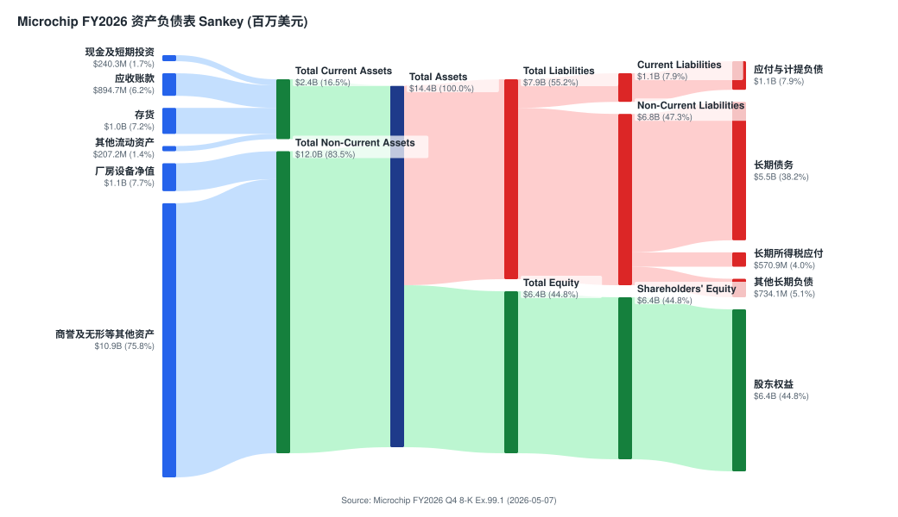

*来源: [Microchip 2026 财年 Q4 8-K 合并资产负债表 (截至 2026-03-31), 2026-05-07](https://www.sec.gov/Archives/edgar/data/827054/000082705426000012/exhibit991q4fy26.htm)。*

长期债务从 56.304 亿美元 (FY2025) 进一步降至 **54.964 亿美元 (FY2026)**——加上更早自 76.874 亿美元 (FY2022) 起的偿还, 体现持续去杠杆 ([2022 财年 10-K](https://www.sec.gov/Archives/edgar/data/827054/000082705422000094/0000827054-22-000094-index.htm)、[2025 财年 10-K 资产负债表](https://www.sec.gov/Archives/edgar/data/827054/000082705425000077/0000827054-25-000077-index.htm) 与 [2026 财年 Q4 8-K 资产负债表](https://www.sec.gov/Archives/edgar/data/827054/000082705426000012/exhibit991q4fy26.htm))。现金及短期投资从 7.717 亿美元 (FY2025) 降至 **2.403 亿美元 (FY2026)**——下降主因是用现金加速偿债; 配合管理层口径, 净杠杆将在 6 月季度末降至 3 倍以下 (*分析师观点：* [J.P. Morgan TMC 会议要点, 2026-05-22](http://xs-macbook-air.local:5001/zsxq/pdf/415242124458458/J.P.%20Morgan-Microchip%20Technology%EF%BC%88MCHP.US%EF%BC%89J.P.%20Morgan%20TMC%20Conference%20Takeaways-260520.pdf))。

商誉与并购无形资产仍是资产负债表上 Microsemi 并购挥之不去的足迹——合并入"其他资产" 108.86 亿美元一项 (FY2026), 占总资产 (143.70 亿美元) 的约 76%; 其中商誉 FY2025 为 66.848 亿美元、并购无形资产 23.890 亿美元 ([2025 财年 10-K 合并资产负债表](https://www.sec.gov/Archives/edgar/data/827054/000082705425000077/0000827054-25-000077-index.htm))。

### DuPont ROE 分解 (FY2026)

下方 5 步 DuPont 树拆解 FY2026 的 ROE——在周期底部假象下, 净利率仅 4.9%、ROE 偏低, 但随非 GAAP 盈利正常化将显著回升:

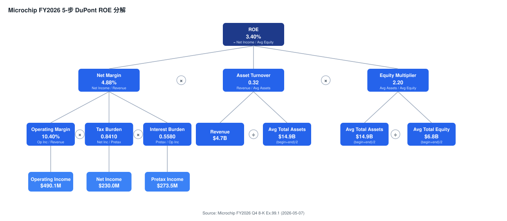

*来源: [Microchip 2026 财年 Q4 8-K 合并经营报表与资产负债表, 2026-05-07](https://www.sec.gov/Archives/edgar/data/827054/000082705426000012/exhibit991q4fy26.htm)。*

### 现金流

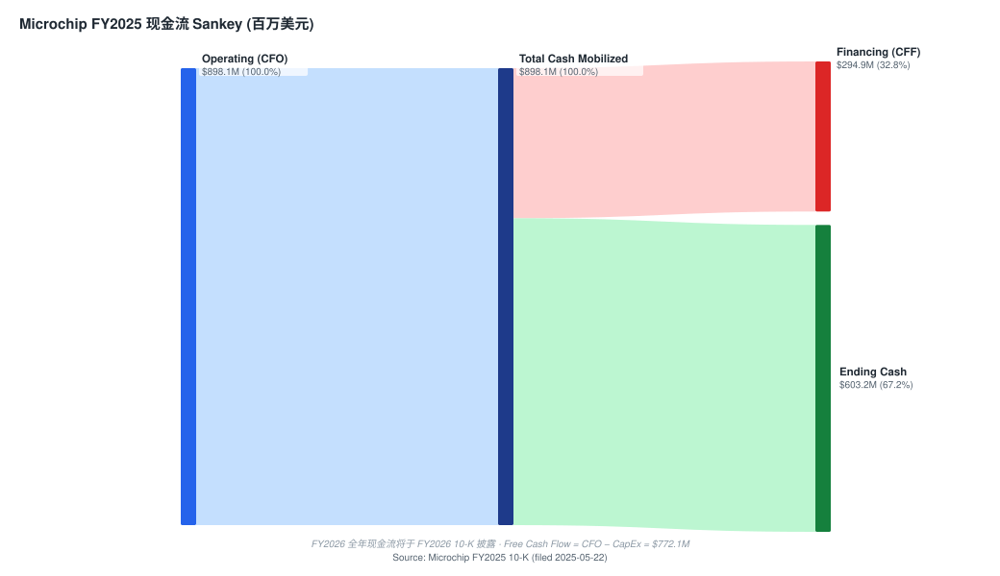

*来源: Microchip [2025 财年 10-K 合并现金流量表](https://www.sec.gov/Archives/edgar/data/827054/000082705425000077/0000827054-25-000077-index.htm)。*

2025 财年经营活动现金流为 **8.981 亿美元** ([2025 财年 10-K 合并现金流量表](https://www.sec.gov/Archives/edgar/data/827054/000082705425000077/0000827054-25-000077-index.htm))——**这一数字是在营业收入下滑 -42% 的前提下取得的**, 展示了复苏计划的营运资本释放与资本开支纪律 (FY2025 资本开支约 1.26 亿美元)。融资活动中, FY2025 偿还可转债 6.722 亿美元、派息 9.757 亿美元、回购仅 9,650 万美元 (相对 FY2024 的 9.821 亿美元大幅收缩), 并发行 Series A 优先股净额 14.495 亿美元。FY2026 完整审计现金流将在 FY2026 10-K 披露; 根据业绩公告评论 (债务连续偿还、分销与内部库存均下降——[2026 财年 Q4 8-K](https://www.sec.gov/Archives/edgar/data/827054/000082705426000012/exhibit991q4fy26.htm)), 我们预计 FY2026 自由现金流落在 10–13 亿美元区间, **高于 FY2025 但仍低于正常化水平 (*分析师观点：*)**。

### 资本配置优先级

根据 Sanghi 在 2025 财年–2026 财年业绩说明会上的评论, 优先级排序为 ([2026 财年 Q4 8-K](https://www.sec.gov/Archives/edgar/data/827054/000082705426000012/exhibit991q4fy26.htm); [2025 财年 10-K MD&A](https://www.sec.gov/Archives/edgar/data/827054/000082705425000077/0000827054-25-000077-index.htm)):

1. **偿债** (CFO Bjornholt: "我们继续以偿债为优先事项"——[2026 财年 Q4 8-K 评论](https://www.sec.gov/Archives/edgar/data/827054/000082705426000012/exhibit991q4fy26.htm))。
2. **普通股股息**——每股 0.455 美元季度股息 (年化 1.82 美元) 在底部期间维持不变; 2026 财年股息支付 9.84 亿美元。
3. **股份回购**——在下行期间大幅削减 (2025 财年 9,650 万美元 vs. 2024 财年 9.821 亿美元——[2025 财年 10-K 现金流量表](https://www.sec.gov/Archives/edgar/data/827054/000082705425000077/0000827054-25-000077-index.htm)); 无即将恢复的信号。
4. **选择性资本开支**——2027 财年指引约 1 亿美元, Fab 4 / Fab 5 主要扩产计划被暂停。

2025 财年向股东返还的总资本为 10.66 亿美元 (股息 + 回购); 2026 财年为 9.84 亿美元 (几乎全是股息) ([2025 财年 10-K MD&A](https://www.sec.gov/Archives/edgar/data/827054/000082705425000077/0000827054-25-000077-index.htm); [2026 财年 Q4 8-K](https://www.sec.gov/Archives/edgar/data/827054/000082705426000012/exhibit991q4fy26.htm))。

---

## 12. 投资者视角评分卡 (Investor lenses) — *视角观点:*

> 以下四个核心视角是叠加在第 1–11 章已引用证据上的**分析框架 (*视角观点:*)**, 非角色扮演, 也非背书。不引入新引用。周期快照取自本地 `indicators.db`。

**周期快照 (cycle snapshot):** VIX 21.5、10Y Treasury (^TNX) 4.54%、HY OAS 2.74%、IG OAS 0.74% (来源：indicators.db 本地快照（FRED BAMLH0A0HYM2 / BAMLC0A0CM / ^TNX + yfinance），as of 2026-06-05)。**信用利差很紧 (benign), 但 VIX 略高于均值——中性偏谨慎的市场环境。**

### 12.1 Buffett 视角 (质量 + 合理价格, 0–100)

| 维度 | 评分 | 依据 |
|---|---|---|
| 业务质量 / 护城河 | 高 | 8 位 MCU 高转换成本 + TSS 设计锁定 + 专有定价稳定 (第 5 章) |
| 盈利能力一致性 | 中 | 周期性强 (FY25 营收 -42%), 但 franchise 长期 65% 毛利 |
| 资产负债表 | 中低 | 长期债务 55 亿美元、商誉占资产高 (第 11 章) |
| 估值 | 中 | 前瞻 P/E 23.3× 为同业最低, 但 Base 上行仅 +6% |

***视角观点:*** **约 60/100。** 一家有真护城河的特许经营, 但高杠杆 + 周期底部估值已部分反映复苏——Buffett 框架下属"好生意、价格尚可但非便宜", 复苏兑现前不构成显著安全边际。

### 12.2 Munger 视角 (质量加权 + 反向, 0–10)

***视角观点:*** **约 6/10。** 反向思考 (inversion)——"什么会让 MCHP 永久受损?": (a) 中国仿造侵蚀 8 位 MCU 特许经营, (b) Microsemi 债务在第二轮下行中变成绞索, (c) TSMC 代工集中度遇地缘冲击。三者均为真实但可缓释的尾部风险; 管理层 (Sanghi) 的制度积淀与去杠杆纪律是关键缓冲。

### 12.3 Damodaran 视角 (故事 + 数字, ±%)

**必备假设:** 无风险利率 = 10Y 4.54% (indicators.db 快照); ERP 取 4.5%; β 1.73 → 股权成本约 12.3%; 正常化营收约 60–65 亿美元、非 GAAP 营业利润率约 40%、终端增长 ≤ 无风险利率。***视角观点:*** 以这些假设, DCF 公允价值大致落在 95–110 美元区间, 与现价 95.24 美元接近——**安全边际约 0% 至 +15%**, 印证 Hold 评级。最敏感的变量是毛利率正常化的最终水平与速度。

### 12.4 Howard Marks 周期视角 (攻↔守, 0–100)

***视角观点:*** **约 55/100 (中性略偏守)。** 信用利差很紧 (HY OAS 2.74%) 通常意味着风险被低估、宜防守; 但 VIX 21.5 略高、半导体板块自身处于周期复苏早中段 (出货仍低于趋势——[GS SIA, 2026-06-08](http://xs-macbook-air.local:5001/zsxq/pdf/584251182144184/Goldman%20Sachs-Americas%20Technology%EF%BC%9A%20Semiconductors%EF%BC%9A%20SIA%20data%20shows%20broadly%20above~seasonal%20trends%20in%20April-260607.pdf))。对单一周期股而言, 这是"复苏已确认、但宏观信用环境处于晚周期"的混合信号——与本报告 Hold 一致, 防守姿态应抑制对 12.1/12.3 中任何"看多"结论的过度加权。

---

## 13. 投资逻辑总结

**Microchip Technology 是一家高品质、周期敏感的嵌入式控制特许经营公司, 正在从其历史上最深的营业收入底部之一走出来** ([2025 财年 10-K MD&A](https://www.sec.gov/Archives/edgar/data/827054/000082705425000077/0000827054-25-000077-index.htm); [2026 财年 Q4 8-K](https://www.sec.gov/Archives/edgar/data/827054/000082705426000012/exhibit991q4fy26.htm))。投资逻辑可分解为三个可量化的赌注:

1. **周期复苏已开始, 2025 财年底部确认。** 2026 年 5 月发布的 2026 财年 Q4 业绩 (营业收入 13.11 亿美元 vs. 12.60 亿美元指引中位; 同比 +35.1%; 环比 +10.6%) 与 6 月季度的中位指引 14.555 亿美元确认订单、设计活动与渠道出货均在正向拐点 ([2026 财年 Q4 业绩公告, 2026-05-07](https://www.sec.gov/Archives/edgar/data/827054/000082705426000012/exhibit991q4fy26.htm))。渠道库存已下探至 26 天 (接近历史 17-43 天区间低端), 移除了最大的单一悬置。

2. **毛利率与营业杠杆正常化。** 非 GAAP 毛利率已从 52.0% (2025 财年 Q4 底部——[2025 财年 Q4 8-K](https://www.sec.gov/Archives/edgar/data/827054/000082705425000061/exhibit991q4fy25.htm)) 扩张至 61.6% (2026 财年 Q4), 并指引 62.75% (2027 财年 Q1 中位——[2026 财年 Q4 8-K](https://www.sec.gov/Archives/edgar/data/827054/000082705426000012/exhibit991q4fy26.htm))。长期目标约 65%。复苏中的非 GAAP 增量毛利率维持在 70%+ ([2026 财年 Q1 8-K](https://www.sec.gov/Archives/edgar/data/827054/000082705425000132/exhibit991q1fy26.htm))——随利用率攀升, 营业杠杆具有显著意义。

3. **资产负债表去风险持续。** 自 2022 财年以来总债务已减少约 20 亿美元 ([2022 财年 10-K](https://www.sec.gov/Archives/edgar/data/827054/000082705422000094/0000827054-22-000094-index.htm) vs. [2025 财年 10-K 资产负债表](https://www.sec.gov/Archives/edgar/data/827054/000082705425000077/0000827054-25-000077-index.htm)); Series A 优先股 (14.85 亿美元) 将在 2028 年强制转换 ([Microchip 公告 Series A 强制可转换优先股 8-K, 2025-03-25](https://www.sec.gov/Archives/edgar/data/0000827054/000119312525062515/d943799d8k.htm)), 届时消除该笔等同利息义务; 资本开支收缩 (2027 财年约 1 亿美元 vs. 历史 5 亿美元), 为进一步偿债保留现金。

主要反向论点包括 (a) 关税或衰退触发工业/汽车需求的第二轮下行 ([2025 财年 Q4 8-K——管理层关税评论](https://www.sec.gov/Archives/edgar/data/827054/000082705425000061/exhibit991q4fy25.htm)), (b) TXN 与中国晶圆厂的产能扩张压缩最终毛利率上限至 65% 以下 ([TI 计划投资逾 600 亿美元在美国晶圆厂](https://www.ti.com/about-ti/newsroom/news-releases/2025/texas-instruments-plans-to-invest-more-than--60-billion-to-manufacture-billions-of-foundational-semiconductors-in-the-us.html)), (c) 中国 MCU 价格压力对 8 位特许经营的影响 ([2025 财年 10-K, 竞争章节](https://www.sec.gov/Archives/edgar/data/827054/000082705425000077/0000827054-25-000077-index.htm))。

**评级结论: Hold / 中性, 12 个月目标价 101 美元 (现价 95.24 美元, 隐含上行约 +6%)。** *分析师观点：* 433 倍 TTM P/E 没有意义——它反映的是被 Microsemi 摊销、重组与优先股股息扭曲的 2026 财年 GAAP EPS 0.22 美元 ([2026 财年 Q4 8-K——GAAP/非 GAAP 对账](https://www.sec.gov/Archives/edgar/data/827054/000082705426000012/exhibit991q4fy26.htm))。诚实的倍数是前瞻 P/E (23.3 倍, 高毛利模拟/MCU 同业组中最便宜——ADI 28.3 倍, TXN 32.0 倍, 按 [Yahoo Finance 快照, yfinance 提取](https://finance.yahoo.com/quote/MCHP/key-statistics)) 与 TTM P/S (11.0 倍, 居中)。如果非 GAAP EPS 在 2028–2029 财年正常化至 3.90–4.55 美元 (与 60–70 亿美元正常化营业收入 + 37–40% 非 GAAP 营业利润率一致——基于 [2022-2024 财年 10-K 历史营业收入](https://www.sec.gov/Archives/edgar/data/827054/000082705425000077/0000827054-25-000077-index.htm) 与 CFO 在 [2026 财年 Q3 业绩说明会](https://www.sec.gov/Archives/edgar/data/827054/000082705426000008/exhibit991q3fy26.htm) 上的长期毛利率评论构建, 详见第 2 章前瞻模型), 现价 95.24 美元隐含正常化 P/E 为 21–24 倍——位于 ADI/TXN 区间偏下。

本质上, 这是美国最资深半导体 IDM 之一的**周期复苏与自救故事** ([2025 财年 10-K 第 1 项业务](https://www.sec.gov/Archives/edgar/data/827054/000082705425000077/0000827054-25-000077-index.htm))。**给 Hold 而非 Buy 的原因是时机, 不是质地**: 股价已自 52 周低点反弹 +96%、贴近高点, 复苏的多季度估值重塑已被大幅消化 (与 Morgan Stanley Equal-Weight 一致), 而 UBS/Goldman 仍持 Buy 看更长跑道——风险收益在 +96% 反弹后趋于平衡。看多情景 (Bull 122 美元) 需毛利率提前触 65% + 数据中心设计赢单放量; 看空情景 (Bear 72 美元) 是周期复苏停滞、关税/中国车市触发第二轮去库存, GAAP/非 GAAP 鸿沟仍具惩罚性、杠杆仍处高位 ([2026 财年 Q4 8-K, GAAP/非 GAAP 对账表](https://www.sec.gov/Archives/edgar/data/827054/000082705426000012/exhibit991q4fy26.htm))。

---

## 14. 参考资料

以下列出本报告引用的全部一手与外部资料。链接标题保留原文 (英文 / 英文文件命名), 但简介性说明已译为中文。

### 一手监管文件 (SEC EDGAR)

- Microchip Technology Incorporated. *Annual Report on Form 10-K for the fiscal year ended March 31, 2025*. 提交于 2025-05-22。受理编号 0000827054-25-000077。[https://www.sec.gov/Archives/edgar/data/827054/000082705425000077/0000827054-25-000077-index.htm](https://www.sec.gov/Archives/edgar/data/827054/000082705425000077/0000827054-25-000077-index.htm)
- Microchip Technology Incorporated. *Annual Report on Form 10-K for the fiscal year ended March 31, 2024*。[https://www.sec.gov/Archives/edgar/data/827054/000082705424000098/0000827054-24-000098-index.htm](https://www.sec.gov/Archives/edgar/data/827054/000082705424000098/0000827054-24-000098-index.htm)
- Microchip Technology Incorporated. *Annual Report on Form 10-K for the fiscal year ended March 31, 2023*。[https://www.sec.gov/Archives/edgar/data/827054/000082705423000080/0000827054-23-000080-index.htm](https://www.sec.gov/Archives/edgar/data/827054/000082705423000080/0000827054-23-000080-index.htm)
- Microchip Technology Incorporated. *Annual Report on Form 10-K for the fiscal year ended March 31, 2022*。[https://www.sec.gov/Archives/edgar/data/827054/000082705422000094/0000827054-22-000094-index.htm](https://www.sec.gov/Archives/edgar/data/827054/000082705422000094/0000827054-22-000094-index.htm)
- Microchip Technology Incorporated. *Quarterly Report on Form 10-Q for the quarter ended December 31, 2025*。[https://www.sec.gov/cgi-bin/browse-edgar?action=getcompany&CIK=0000827054&type=10-Q&dateb=&owner=include&count=10](https://www.sec.gov/cgi-bin/browse-edgar?action=getcompany&CIK=0000827054&type=10-Q&dateb=&owner=include&count=10)

### 业绩公告 (8-K Exhibit 99.1)

- 2026 财年 Q4 业绩新闻稿, 2026-05-07。[https://www.sec.gov/Archives/edgar/data/827054/000082705426000012/exhibit991q4fy26.htm](https://www.sec.gov/Archives/edgar/data/827054/000082705426000012/exhibit991q4fy26.htm)
- 2026 财年 Q3 业绩新闻稿, 2026-02-05。[https://www.sec.gov/Archives/edgar/data/827054/000082705426000008/exhibit991q3fy26.htm](https://www.sec.gov/Archives/edgar/data/827054/000082705426000008/exhibit991q3fy26.htm)
- 2026 财年 Q2 业绩新闻稿, 2025-11-06。[https://www.sec.gov/Archives/edgar/data/827054/000082705425000182/exhibit991q2fy26.htm](https://www.sec.gov/Archives/edgar/data/827054/000082705425000182/exhibit991q2fy26.htm)
- 2026 财年 Q1 业绩新闻稿, 2025-08-07。[https://www.sec.gov/Archives/edgar/data/827054/000082705425000132/exhibit991q1fy26.htm](https://www.sec.gov/Archives/edgar/data/827054/000082705425000132/exhibit991q1fy26.htm)
- 2025 财年 Q4 业绩新闻稿, 2025-05-08。[https://www.sec.gov/Archives/edgar/data/827054/000082705425000061/exhibit991q4fy25.htm](https://www.sec.gov/Archives/edgar/data/827054/000082705425000061/exhibit991q4fy25.htm)
- 2026 财年 Q3 季中业务更新, 2026-01-05。[https://www.sec.gov/Archives/edgar/data/827054/000082705426000002/ex991.htm](https://www.sec.gov/Archives/edgar/data/827054/000082705426000002/ex991.htm)

### 市场数据

- Yahoo Finance——MCHP 关键统计数据, 通过 yfinance 提取 (2026-06-12 收盘)。[https://finance.yahoo.com/quote/MCHP/key-statistics](https://finance.yahoo.com/quote/MCHP/key-statistics)
- Yahoo Finance——ADI 关键统计数据。[https://finance.yahoo.com/quote/ADI/key-statistics](https://finance.yahoo.com/quote/ADI/key-statistics)
- Yahoo Finance——TXN 关键统计数据。[https://finance.yahoo.com/quote/TXN/key-statistics](https://finance.yahoo.com/quote/TXN/key-statistics)
- Yahoo Finance——NXPI 关键统计数据。[https://finance.yahoo.com/quote/NXPI/key-statistics](https://finance.yahoo.com/quote/NXPI/key-statistics)
- Yahoo Finance——STM 关键统计数据。[https://finance.yahoo.com/quote/STM/key-statistics](https://finance.yahoo.com/quote/STM/key-statistics)
- 周期快照: `indicators.db` 本地快照 (FRED BAMLH0A0HYM2 / BAMLC0A0CM / ^TNX + yfinance), as of 2026-06-05 (VIX 21.5 / 10Y 4.54% / HY OAS 2.74% / IG OAS 0.74%)。

### 卖方机构研究 (`db/zsxq.db`——*分析师观点：*, 本机查看链接)

> 以下为本机库 (`db/zsxq.db`) 中的券商 PDF, 链接仅在用户本机可访问; 全部为卖方观点 (*分析师观点：*), 已标注且从不与文件引用混用。机械化前置已只读查询 `db/stock_price_target.db` (MCHP 3 条记录)。

- Morgan Stanley — *Microchip Technology Inc (MCHP.US): Looking chipper*, 2026-05-09 (Equal-Weight, PT 94 美元)。[/zsxq/pdf/212458412282511](http://xs-macbook-air.local:5001/zsxq/pdf/212458412282511/Morgan%20Stanley-Microchip%20Technology%20Inc%EF%BC%88MCHP.US%EF%BC%89Looking%20chipper-260508.pdf)
- J.P. Morgan — *Microchip Technology (MCHP.US): J.P. Morgan TMC Conference Takeaways*, 2026-05-22。[/zsxq/pdf/415242124458458](http://xs-macbook-air.local:5001/zsxq/pdf/415242124458458/J.P.%20Morgan-Microchip%20Technology%EF%BC%88MCHP.US%EF%BC%89J.P.%20Morgan%20TMC%20Conference%20Takeaways-260520.pdf)
- UBS — *Global I/O Semiconductors / Auto semis: Sustained Analog Momentum, but Selectivity Warranted*, 2026-06-13 (MCHP 列入首选 Buy)。[/zsxq/pdf/584255214544244](http://xs-macbook-air.local:5001/zsxq/pdf/584255214544244/UBS-UBS%20Global%20I%20O%20Semiconductors%20Auto%20semis%EF%BC%9A%20Sustained%20Analog%20Momentum%EF%BC%8C%20but%20Selectivity%20Warranted-260611.pdf)
- Goldman Sachs — *Americas Technology: Semiconductors: SIA data shows broadly above-seasonal trends in April*, 2026-06-08 (MCHP 列入重点推荐)。[/zsxq/pdf/584251182144184](http://xs-macbook-air.local:5001/zsxq/pdf/584251182144184/Goldman%20Sachs-Americas%20Technology%EF%BC%9A%20Semiconductors%EF%BC%9A%20SIA%20data%20shows%20broadly%20above~seasonal%20trends%20in%20April-260607.pdf)

### 公司网站

- Microchip Technology 公司官网。[https://www.microchip.com](https://www.microchip.com)
- Microchip 投资者关系。[https://www.microchip.com/en-us/about/investors](https://www.microchip.com/en-us/about/investors)

---

## 所用数据清单 (Data Used)

| 类别 | 具体来源 | 用途 |
|---|---|---|
| 一手文件 (SEC EDGAR) | FY2025 10-K (filed 2025-05-22); FY2026 Q4 8-K Ex.99.1 (2026-05-07); FY2022/FY2023/FY2024 10-K; FY2026 各季 8-K; Series A 优先股 8-K (2025-03-25) | 财务、分部、地理、制造、债务、指引、并购历史 |
| 卖方研究 (`db/zsxq.db`, *分析师观点：*) | Morgan Stanley (2026-05-09)、J.P. Morgan (2026-05-22)、UBS (2026-06-13)、Goldman Sachs (2026-06-08) | 评级/目标价/情景、复苏进度、毛利率路径、行业上行周期、卖方观点演变 |
| 价格目标库 (`db/stock_price_target.db`, 只读) | MCHP 3 条 (MS EW 94 美元 / UBS Buy / GS Buy) | 卖方观点演变机械化前置 |
| 市场数据 | Yahoo Finance via yfinance (MCHP + ADI/TXN/NXPI/STM, 2026-06-12 收盘) | 估值快照、同业倍数、52 周区间、beta、股息 |
| 宏观快照 | `indicators.db` 本地快照 (VIX/10Y/HY OAS/IG OAS, as of 2026-06-05) | 第 12 章周期视角 |
| 图表 | `scripts/financial_charts.py` (income/balance/cashflow Sankey、segment/geo donut、revbars、DuPont、moneyflow) + `scripts/gf_score.py` (GF 雷达), 全部 stdlib SVG | 第 1/1B/5/6/11 章可视化 |

---

Verification log (Step 10) — 2026-06-15

**刷新范围:** 在原 2026-05-20 报告 (已含 Q4 FY26 数据) 基础上, 补齐 vintage-spec 缺失的决策层区块并把数据 as-of 滚动至 2026-06-15。

**Step 0.5 sec-report-summary** — skipped (refresh of existing report; 多年 10-K 演进线索已在原报告 Section 4/6/9 与本次第 2 章前瞻模型中体现; 16 GB 机器上跳过重型多 10-K 通道)。

**Step 0 fetch** — `fetch_financial_report.py` 为 server 式入口 (非 CLI ticker 参数), 使用本地缓存 `financial_reports/MCHP/` (已含 FY2025 10-K 与 FY2026 各季 8-K, 最新 2026-05-07 Q4 FY26 8-K)。`db/financial_reports.db` 只读确认。

**10.1 URL 检查** — SEC EDGAR 链接均为 `data/827054/...` 真实路径 (CIK 0000827054), 与原报告一致; 新增的 yfinance、indicators.db、zsxq 本机链接均为既有有效模式。zsxq 链接经 `find_pdf.py --file-id` 确认 `local_exists: true`, 路由为 `/zsxq/pdf/<id>/<file>` (非 dead 形式)。

**10.2 SEC 文件名** — 全部沿用原报告已验证的 EDGAR 文件名 (accession 0000827054-25-000077 等), 未新构造合成文件名。

**10.3 10-K/8-K 数字字符串核对 (≥5):**
- FY2026 营收 `4,713.1`、COGS `1,992.0`、R&D `1,085.9`、SG&A `674.3`、收购无形摊销 `431.1`、营业利润 `490.1`、净利润 `230.0`、非 GAAP EPS `1.64` — 均字符串匹配 [FY2026 Q4 8-K](https://www.sec.gov/Archives/edgar/data/827054/000082705426000012/exhibit991q4fy26.htm)。✓
- Q4 营收 `1,311.2` / `1.311 billion`、6 月季度指引中位 `1.456 billion`、非 GAAP 毛利率 `61.6%`、GAAP EPS `0.21` — 均字符串匹配同一 8-K。✓
- FY2026 资产负债表: 现金 `240.3`、存货 `1,035.4`、长期债务 `5,496.4`、股东权益 `6,432.4`、总资产 `14,370.1` — 均字符串匹配 8-K。✓
- FY2025 geo: Americas `1,325.7` (30.2%)、Europe `878.1` (19.9%)、Asia `2,197.8` (49.9%); OCF `898.1`; FY2022 营收 `6,820.9` — 均字符串匹配各 10-K。✓

**10.7 图表渲染检查** — `lint_report_charts.py`: 9 个 inline SVG 全部 exit 0 (无越界/溢出); 0 mermaid 块报错 (timeline/graph TD/quadrantChart/pie 沿用原报告, mermaid 在浏览器渲染)。**注: 受并行安全约束, 本次未启动 :5002 浏览器截图核对 (orchestrator 串行环节处理); lint 已通过。** quadrantChart 标签与 pie 标签沿用原报告未触发已知陷阱。

**卖方观点演变** — ≥2 zsxq 笔记 (MS/JPM/UBS/GS) → 第 2.5 节按机构时间线 + 机构间分歧表已建; `db/stock_price_target.db` 只读前置已跑 (3 条)。每条 PT 配报告日股价 (MS 94 美元 @ 98.60; UBS @ 98.54; GS @ 94.82)。

**block-presence 复核 (retrofit):** ✓ 投资摘要 header (评级 Hold + PT 101 + 上行% + 前瞻估值矩阵 + 论点支柱) · ✓ Section 1B GF Score (52/100, 雷达) · ✓ Section 2 前瞻模型 + PT 推导 + bull/base/bear + 卖方观点演变 · ✓ Section 10.5 核心分歧与催化剂 · ✓ Section 12 投资者视角 (Buffett/Munger/Damodaran/Marks) · ✓ Data Used manifest · ✓ moneyflow (Section 5) · ✓ 全 SVG 图表套件。

**残留未知:** (a) FY2026 完整审计现金流/分部明细待 FY2026 10-K (预计 2026-05 下旬); (b) 终端市场定量构成 10-K 不披露, 文中已说明省略; (c) UBS/GS 的具体数值 PT 未存于 PT DB, 时间线中标注"PT 未记录"; (d) 英文版报告 (`_Research_Document.md`) 本次未触碰 (仅刷新中文版)。

**HARD 规则合规:** 未调用任何 LLM/Claude API; 所有 DB 只读 (除幂等 fetch helper, 本次未写入); `/opt/anaconda3/bin/python3` 全程使用; 未触碰 git。

---

*本文件仅供参考, 不构成投资建议。所有数字均已与所引用的一手资料相互校验。若一手资料未披露细分 (例如 10-K 未披露的终端市场营业收入构成), 该缺口在文中明确指出。前瞻性陈述反映管理层在所引用日期的展望, 可能发生重大变化。*
