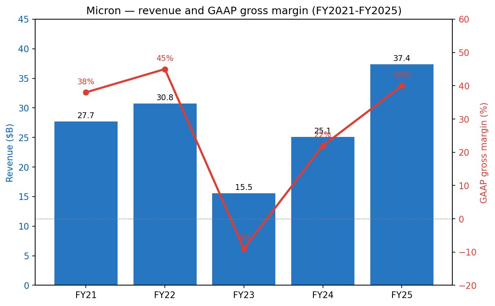
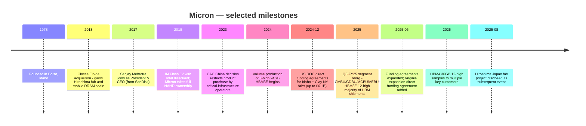
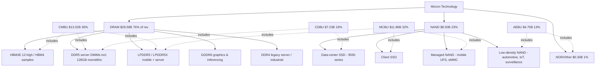
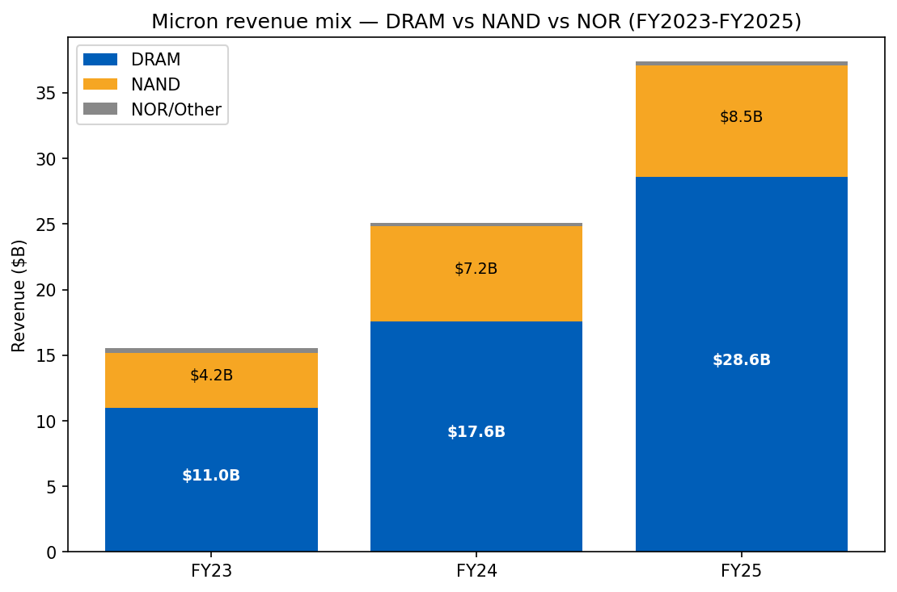
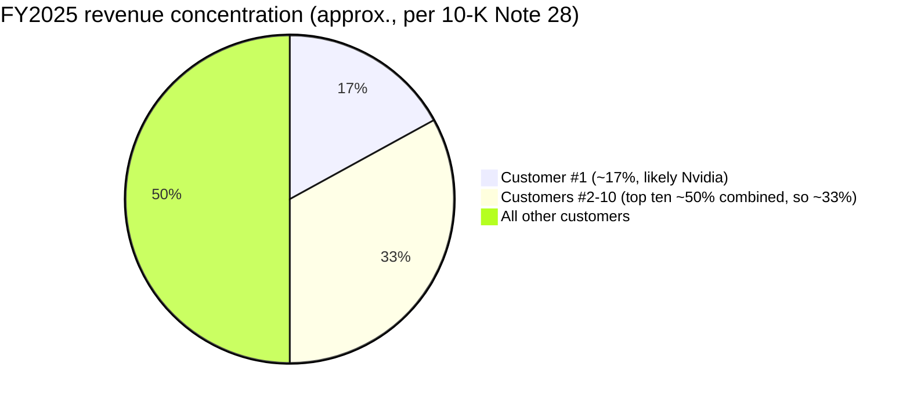
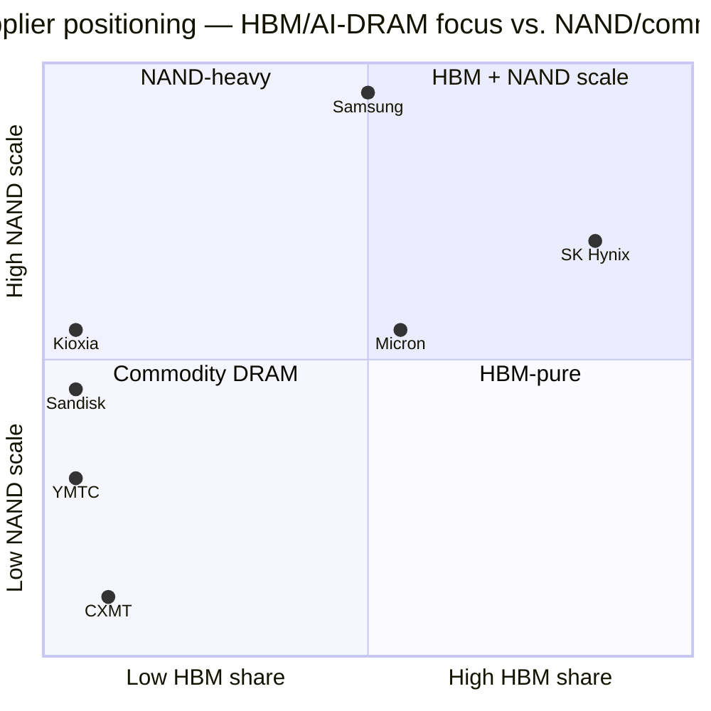
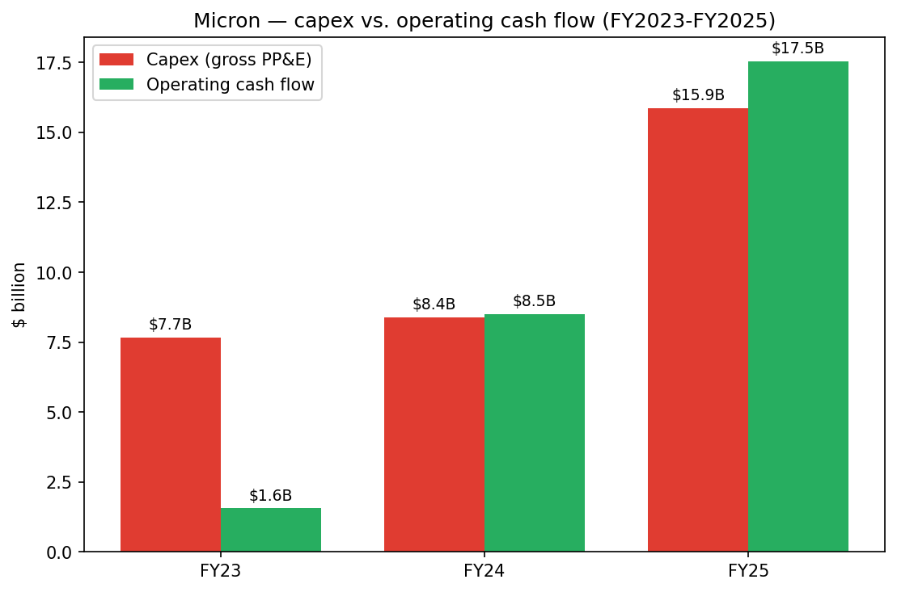

# COMPANY RESEARCH REPORT: Micron Technology, Inc. (NASDAQ: MU)

**Date:** 2026-05-20
**Analyst note:** Fiscal year ends on the Thursday closest to August 31. FY2025 ended August 28, 2025; FY2026 began August 29, 2025.

> **Update — FQ2-2026 guidance is a fresh record reset (disclosed 2025-12-17):** Management guided FQ2-FY2026 revenue to **$18.70B ± $0.40B**, non-GAAP gross margin to **68.0% ± 1.0%**, and non-GAAP diluted EPS to **$8.42 ± $0.20** — versus FQ1-FY2026 actuals of $13.64B / 56.8% / $4.78. The implied QoQ growth is ~+37% in revenue, ~+11pp in gross margin, and ~+76% in EPS. CEO Sanjay Mehrotra attributed the step-up to "AI demand acceleration" and an HBM mix lift as HBM3E 12-high became the majority of HBM shipments in the prior quarter, with HBM4 samples already shipped to "multiple key customers."
> Source: [Q1-FY2026 earnings press release, 2025-12-17](https://www.sec.gov/Archives/edgar/data/723125/000072312525000044/a2026q1ex991-pressrelease.htm).

---

## TABLE OF CONTENTS
1. Company Overview
2. Company History
3. Management Team
4. Products & Services
5. Customers & Go-to-Market
6. Industry Overview
7. Competitive Landscape
8. Market Opportunity (TAM)
9. Risk Assessment
References

---

## 1. Company Overview

Micron Technology, Inc. is one of three remaining at-scale producers of dynamic random-access memory (DRAM) and one of five at-scale producers of NAND flash storage. The company designs, manufactures, and sells **memory and storage semiconductors** — DRAM (including high-bandwidth memory, HBM), NAND flash, and a small residual NOR flash business — to a global base of cloud-service providers, OEMs, mobile-handset vendors, automotive Tier-1 suppliers, and channel distributors. Headquartered in Boise, Idaho, Micron operated with approximately **53,000 employees** as of August 28, 2025, primarily across Asia, North America, and Europe ([Micron 2025 10-K, "Human Capital" section](https://www.sec.gov/Archives/edgar/data/723125/000072312525000028/mu-20250828.htm)). Wafer fabrication is concentrated in **Taiwan** (the largest fab cluster by long-lived assets, $18.97B PP&E), **Singapore** ($10.67B), **Japan** ($7.04B), and the **United States** (Boise, Virginia and the new Clay, NY site, $8.45B combined) ([10-K Note 29, Geographic Information](https://www.sec.gov/Archives/edgar/data/723125/000072312525000028/mu-20250828.htm)). The fiscal-year is a 52/53-week period ending the Thursday closest to August 31.

**How Micron makes money.** The product portfolio is sold direct to OEMs and hyperscale cloud customers and through distributors and a consumer-branded channel (Crucial-brand SSDs and memory modules). Substantially all customer contracts are short-term and at negotiated prices; pricing is set quarterly and resets very rapidly with industry supply/demand ([10-K Note 21, Revenue Recognition](https://www.sec.gov/Archives/edgar/data/723125/000072312525000028/mu-20250828.htm)). Memory is, in effect, a commodity whose ASP can move several hundred basis points per quarter. The structural lever for profitability is **per-bit cost reduction via node shrinks and 3D NAND layer scaling** — Micron's 1-beta and 1-gamma DRAM nodes and 232-/276-layer NAND were the productive workhorses in FY2025 — combined with **product mix toward higher-value SKUs**, most importantly HBM and high-capacity DDR5 server DIMMs.

**Scale.** FY2025 was a record year:
- **Revenue $37,378M, +49% YoY** (FY2024: $25,111M; FY2023: $15,540M) ([10-K FY2025 Consolidated Results table](https://www.sec.gov/Archives/edgar/data/723125/000072312525000028/mu-20250828.htm)).
- **GAAP gross margin 40%** (FY2024: 22%; FY2023: −9%).
- **Operating income $9.77B (26% margin)**, net income **$8.54B**, diluted EPS **$7.55** ([10-K FY2025 Consolidated Statements of Operations](https://www.sec.gov/Archives/edgar/data/723125/000072312525000028/mu-20250828.htm)).
- **Operating cash flow $17.53B**, gross capex $15.86B, net of $2.0B CHIPS-related government proceeds ([10-K FY2025 Cash Flow Statement](https://www.sec.gov/Archives/edgar/data/723125/000072312525000028/mu-20250828.htm)).
- Total assets **$82.80B**, of which **PP&E $46.59B** (~56% of the balance sheet) — Micron is one of the most capital-intensive S&P 500 names ([10-K FY2025 Balance Sheet](https://www.sec.gov/Archives/edgar/data/723125/000072312525000028/mu-20250828.htm)).

The Q1-FY2026 quarter (ended November 27, 2025) re-set the trajectory: revenue of **$13.64B** (up 57% YoY), GAAP gross margin **56.0%**, non-GAAP EPS **$4.78**, and operating cash flow **$8.41B** — already half of FY2025's full-year OCF in a single quarter ([Q1-FY2026 earnings press release, 2025-12-17](https://www.sec.gov/Archives/edgar/data/723125/000072312525000028/a2026q1ex991-pressrelease.htm)).

*Source: [Micron 2022 10-K (FY21/22) and 2025 10-K (FY23-25 Consolidated Results)](https://www.sec.gov/Archives/edgar/data/723125/000072312525000028/mu-20250828.htm). The FY23 trough (−9% GAAP GM) and the FY25 recovery to 40% capture the full memory cycle in three years.*

**Valuation snapshot (as of 2026-05-20).** Yahoo Finance shows MU trading at **$727.42**, market cap **~$820.7 bn** (1.13 bn diluted shares), **TTM P/E 34.4×**, **forward P/E 7.1×**, **P/S (TTM) 14.1×**, **P/B 11.3×**, with a 52-week range of **$90.93–$818.67** ([Yahoo Finance MU key statistics, retrieved 2026-05-20](https://finance.yahoo.com/quote/MU/key-statistics)).

The most informative thing about that snapshot is the **spread between TTM P/E (34.4×) and forward P/E (7.1×)** — a roughly 5× compression. The forward number is anchored to Q2-FY2026 EPS guidance of $8.42 and management's stated expectation of "continued strengthening through fiscal 2026," which annualizes (at the midpoint) to a forward EPS of roughly $35–$45 if FY2026 continues the QoQ ramp ([Q1-FY2026 earnings press release, 2025-12-17](https://www.sec.gov/Archives/edgar/data/723125/000072312525000028/a2026q1ex991-pressrelease.htm)). **The market is pricing a peak earnings year, not a steady-state.** Peer comps reinforce this read:

| Ticker | Forward P/E | P/S TTM | Notes |
|---|---|---|---|
| **MU** | 7.08× | 14.12× | this analysis |
| SK hynix (000660.KS) | 4.56× | 9.38× | TTM P/E unavailable — Korean disclosure |
| Samsung Elec (005930.KS) | 5.30× | 4.67× | Conglomerate, memory ~one-third of mix |
| Sandisk (SNDK) | 7.98× | 15.72× | NAND-only pure play |
| Western Digital (WDC) | 26.42× | 13.47× | Post-NAND-spinoff HDD-only |
| Seagate (STX) | 28.79× | 15.35× | HDD-only |

*Source: [Yahoo Finance, retrieved 2026-05-20](https://finance.yahoo.com/quote/MU/key-statistics).*

Read together: TTM P/S of 14.1× is the highest in MU's listed history (median 2018–2023 was 2.4×–4.6× per company filings), and reflects the **AI-memory premium** the market is pricing — HBM is structurally short, MU's CMBU revenue grew 257% in FY2025, and HBM4 sample shipments are positioning the company for the Blackwell-Ultra / Rubin generation of NVDA/AMD accelerators (see Section 4). On forward earnings, however, MU is one of the cheapest names in semi at 7.1× — a classic late-cycle setup where the market is *both* paying up for present revenue *and* assuming the cycle peaks. Negative downside scenario: if HBM pricing normalizes by FY2027 and the broader DRAM market reverts toward 3-year mean ASP, peak EPS could compress 40–60%, and an 18–22× P/E on trough EPS would imply meaningful multiple compression. We flag this in Section 9 as a **valuation / multiple-compression** risk.

---

## 2. Company History

Micron Technology was founded in **1978** in Boise, Idaho, and has been continuously listed and continuously manufacturing DRAM since the early 1980s — making it the only US-headquartered at-scale DRAM producer to have survived the consolidation waves of the 1990s, 2000s, and 2010s. The company's principal executive offices remain at **8000 S. Federal Way, Boise, Idaho** ([10-K FY2025, cover page](https://www.sec.gov/Archives/edgar/data/723125/000072312525000028/mu-20250828.htm)), and the state of incorporation is Delaware ([10-K FY2025, cover page](https://www.sec.gov/Archives/edgar/data/723125/000072312525000028/mu-20250828.htm)). Micron remains the largest private employer in Idaho.

*Sources: [Micron 2025 10-K Item 1 Business, "Executive Officers", Note 13 (CHIPS funding), Subsequent Events](https://www.sec.gov/Archives/edgar/data/723125/000072312525000028/mu-20250828.htm).*

**Strategic pivots worth understanding.**

- **Elpida acquisition (2013).** Micron's purchase of bankrupt Japanese DRAM maker Elpida (and its Hiroshima fab and Rexchip/Inotera Taiwan operations) consolidated the global DRAM industry from five players to three (Micron / Samsung / SK Hynix). It was a once-in-a-decade strategic move: the deal added mobile-DRAM expertise (which Micron lacked), doubled wafer capacity, and structurally improved DRAM pricing for the entire industry. Subsequent buyouts of the Inotera stake (2016) completed the integration.
- **From NAND JV partner to NAND independent (2018–2021).** Micron exited the long-running IM Flash JV with Intel, taking sole ownership of the Lehi, UT fab. Three years later it sold Lehi to Texas Instruments (2021) — a deliberate footprint shrink as Micron concentrated NAND R&D in Singapore. The hindsight read: Micron deprioritized NAND capacity additions early, which positioned it well for the FY24–25 NAND tightness.
- **HBM ramp (2024–present).** Micron entered HBM late vs. SK Hynix and Samsung but leapfrogged with HBM3E 8-high (24GB) at the 1-beta node, qualified into Nvidia H200, and now has HBM3E 12-high (36GB) as the majority of shipments and HBM4 36GB 12-high samples shipped ([10-K FY2025 Item 1 Business](https://www.sec.gov/Archives/edgar/data/723125/000072312525000028/mu-20250828.htm)). HBM revenue is the single biggest swing factor in the FY25/FY26 model.

**Recent developments (FY2025–early FY2026).**

- **Q3-FY2025 segment reorganization.** Micron split the former "Compute & Networking Business Unit" into **CMBU** (hyperscale + HBM) and **CDBU** (mid-tier cloud + OEM data center + data-center NAND/SSD). All prior-period segments were retrospectively restated ([10-K FY2025 Item 7 Segment Discussion](https://www.sec.gov/Archives/edgar/data/723125/000072312525000028/mu-20250828.htm)).
- **CHIPS Act direct funding agreements.** December 9, 2024: agreements signed with the U.S. Department of Commerce for **up to $6.1B** in direct funding for fabs in Boise, ID and Clay, NY. June 11, 2025: amendments added a second planned Boise fab; the same June 2025 amendment cycle added a direct funding agreement for the Manassas, VA expansion ([10-K FY2025 Item 1A, "CHIPS Act direct funding"](https://www.sec.gov/Archives/edgar/data/723125/000072312525000028/mu-20250828.htm)).
- **Hiroshima, Japan and Sanand, India.** A new Hiroshima fab (Project Hiroshima) was disclosed as a subsequent event on August 29, 2025 ([10-K FY2025 Subsequent Events](https://www.sec.gov/Archives/edgar/data/723125/000072312525000028/mu-20250828.htm)). The Sanand, India assembly/test facility (Gujarat) is supported by India Central Government and Gujarat State Funding awards.
- **HBM4 first-customer samples (2025).** HBM4 36GB 12-high samples to "multiple key customers" — the industry read is Nvidia (Rubin), AMD (MI400-series), and at least one cloud-ASIC customer ([10-K FY2025 Item 1 Business](https://www.sec.gov/Archives/edgar/data/723125/000072312525000028/mu-20250828.htm)).

---

## 3. Management Team

### Sanjay Mehrotra — Chairman, President & CEO (age 67; joined May 2017)

Sanjay Mehrotra is one of the most experienced operators in memory and storage. He **co-founded SanDisk Corporation in 1988** with Eli Harari and Jack Yuan, served as President and CEO from January 2011 until the company's $19B sale to Western Digital in May 2016, and steered SanDisk from a startup into the world's largest NAND-pure-play producer — a 28-year arc during which SanDisk transitioned from compact-flash cards in PCs and digital cameras to enterprise SSDs and managed NAND in mobile, and during which SanDisk's NAND fab partnership with Toshiba (now Kioxia) was built and scaled. Mehrotra joined Micron as President and CEO in **May 2017** and was named Chairman of the Board in **January 2025** ([10-K FY2025, "Executive Officers of the Registrant"](https://www.sec.gov/Archives/edgar/data/723125/000072312525000028/mu-20250828.htm)).

His tenure at Micron has tracked three full memory cycles. Under his leadership Micron (i) closed the Inotera buyout in late 2016 (technically pre-tenure but he inherited integration), (ii) executed the IM Flash JV exit with Intel in 2018, (iii) divested the Lehi NAND fab in 2021, (iv) navigated the FY2023 down-cycle (revenue −49% YoY, GM −9%) without the kind of equity raise that historically marked Micron's troughs, and (v) executed the most consequential strategic call of his career — the **late HBM entry**. Micron was third to market in HBM3 but, by using its leading 1-beta DRAM node and a focus on power efficiency, qualified into Nvidia's H100 successor (H200) and from there into B100/B200/GB200. CMBU revenue is the direct evidence of this strategy: from $1.87B in FY23 → $3.79B in FY24 → **$13.52B in FY25** (+257% YoY) ([10-K FY2025 Revenue by Business Unit](https://www.sec.gov/Archives/edgar/data/723125/000072312525000028/mu-20250828.htm)). At Q1-FY2026 CMBU annualized run-rate was approximately $21B (4× the $5.28B quarter), with HBM3E 12-high now the majority of the mix.

Mehrotra holds a BS and MS in Electrical Engineering & Computer Sciences from the **University of California, Berkeley**, and is a graduate of the Stanford Graduate School of Business Executive Program ([10-K FY2025 Item 10](https://www.sec.gov/Archives/edgar/data/723125/000072312525000028/mu-20250828.htm)). He served on the board of Western Digital briefly post-SanDisk-acquisition (May 2016 – Feb 2017), on the board of Cavium (2009–2018), and currently serves on the board of CDW Corporation (since March 2021). He is named on more than 70 issued or pending patents. His Micron equity holdings are disclosed annually in the proxy; the most recent DEF 14A is the authoritative source for ownership.

### Mark J. Murphy — EVP & CFO (age 58; joined April 2022)

Mark Murphy joined Micron from **Qorvo, Inc.**, where he served as Chief Financial Officer from June 2016 to April 2022 — a six-year stint that spanned Qorvo's RF business consolidation and 5G ramp. Prior to Qorvo, he was **EVP and CFO of Delphi Automotive PLC** (now Aptiv), and before that held executive roles at **Praxair, Inc.** and **MEMC Electronic Materials** — the latter giving him direct semiconductor-materials cycle experience ([10-K FY2025 Item 10](https://www.sec.gov/Archives/edgar/data/723125/000072312525000028/mu-20250828.htm)). He serves on the board of Albany International Corp. and is a U.S. Marine Corps veteran. Murphy stepped into the CFO seat at the start of FY2023 — the worst down-cycle in memory in 25 years (revenue −49%, gross margin −9%, operating loss $(5.7)B) — and led the playbook of preserving balance-sheet liquidity, raising debt at favorable windows (the 2032 Green Bonds in particular), and maintaining the dividend through the cycle. The execution of the FY2025 record year — $17.5B operating cash flow and a $2.0B CHIPS proceeds capture — falls under his watch. He has been an active executor on the CHIPS direct-funding agreements and the financing structure for the Idaho and New York greenfield expansions. Murphy modified a Rule 10b5-1 trading plan on July 31, 2025 for the sale of up to 126,000 shares ([10-K FY2025 Item 5](https://www.sec.gov/Archives/edgar/data/723125/000072312525000028/mu-20250828.htm)).

### Sumit Sadana — EVP & Chief Business Officer (age 56; joined June 2017)

Sumit Sadana runs business development, product strategy and customer engagement — effectively the externally-facing executive on customer wins and the public face on guidance updates (he led the August 11, 2025 KeyBanc fireside-chat guidance raise). He served at **SanDisk from 2010 to 2016** in roles including EVP and Chief Strategy Officer and General Manager of Enterprise Solutions. Earlier roles include 10+ years at IBM Microelectronics. He holds a B.Tech. in Electrical Engineering from IIT Kharagpur and an MS in Electrical Engineering from Stanford ([10-K FY2025 Item 10](https://www.sec.gov/Archives/edgar/data/723125/000072312525000028/mu-20250828.htm)). He serves on the board of Silicon Laboratories, Inc.

### Manish Bhatia — EVP, Global Operations (age 53; joined October 2017)

Manish Bhatia runs the global manufacturing footprint — Taiwan, Singapore, Japan, the US fabs, and Sanand backend. He joined Micron from **Western Digital**, where he was EVP of Silicon Operations following WD's 2016 acquisition of SanDisk, and earlier held multiple executive roles at SanDisk (March 2010 – May 2016) including EVP, Worldwide Operations. He holds a BS, MS in Mechanical Engineering and an MBA, **all from MIT** ([10-K FY2025 Item 10](https://www.sec.gov/Archives/edgar/data/723125/000072312525000028/mu-20250828.htm)). Bhatia's mandate over the next 36 months is the most operationally consequential at Micron: ramping HBM4, modernizing Taiwan, executing the Idaho greenfield, the Clay, NY fabs, the Manassas, VA modernization, the Hiroshima expansion, and the Sanand backend — concurrently. Capex of $15.86B in FY2025 (gross) and ~$18B run-rate in FY2026 (implied from the $4.5B/qtr baseline disclosed in the 10-K) flows through his organization.

### Governance footer

The Board comprises a majority of independent directors and uses a single-class voting structure — no super-voting stock. Sanjay Mehrotra was named **Chairman** in January 2025, consolidating CEO and Chair roles; lead independent director governance is detailed in the proxy. Insider beneficial ownership is in the low single-digit percentage range — Micron is overwhelmingly held by institutions (the most recent 13F snapshot shows Vanguard, BlackRock and State Street as the three largest holders). The Board has authorized **up to $10 billion** of share repurchases ([10-K FY2025 Item 5, share-repurchase authorization](https://www.sec.gov/Archives/edgar/data/723125/000072312525000028/mu-20250828.htm)); cumulative repurchases under the May-2018 authorization since inception are disclosed in the same item. Executive compensation is heavily equity-weighted with performance-linked PSUs tied to total stockholder return and operating metrics — the full disclosure is in the DEF 14A. No material related-party transactions are disclosed.

### Track-record synthesis

Mehrotra–Murphy–Sadana–Bhatia is the closest thing to an "all-star" management team in memory. Mehrotra brought the SanDisk co-founders' rigor on technology roadmaps; Murphy brought capital-markets discipline from the auto and RF cycles; Sadana brought the customer-engagement playbook from SanDisk's enterprise-NAND push; Bhatia brought manufacturing scale leadership. The HBM late-entry-and-win is the clearest evidence the team delivers: Micron was widely considered structurally disadvantaged in HBM as recently as 2023, yet by FY2025 has emerged as the second-largest HBM supplier after SK Hynix and clearly ahead of Samsung on customer qualifications.

---

## 4. Products & Services

Micron's portfolio is organized by **product technology** (DRAM, NAND, NOR) and sold through **four reportable segments** (CMBU, CDBU, MCBU, AEBU). The taxonomy below maps the technology to the segment to the principal end-market. All revenue figures are FY2025 unless noted, sourced from the 10-K Note 21 and the segment discussion in Item 7.

*Source: [Micron 2025 10-K, Note 21 Revenue, Item 1 Business segment descriptions, Note 27 Segment Information](https://www.sec.gov/Archives/edgar/data/723125/000072312525000028/mu-20250828.htm).*

*Source: [Micron 2025 10-K, Note 27 Revenue by Business Unit](https://www.sec.gov/Archives/edgar/data/723125/000072312525000028/mu-20250828.htm). CMBU is now the largest segment, having overtaken MCBU in FY2025.*

*Source: [Micron 2025 10-K, Note 21 Revenue by Technology](https://www.sec.gov/Archives/edgar/data/723125/000072312525000028/mu-20250828.htm). DRAM was 76% of FY2025 revenue and is the dominant earnings driver.*

### DRAM products

**HBM3E and HBM4 (the flagship)**. Micron began volume production of **8-high 24GB HBM3E** in 2024 on its 1-beta DRAM node. By Q4-FY2025, **HBM3E 12-high (36GB) was the majority of HBM shipments**, and in FY2025 Micron delivered samples of **HBM4 36GB 12-high to multiple key customers** for next-generation AI platforms ([10-K FY2025 Item 1 Business](https://www.sec.gov/Archives/edgar/data/723125/000072312525000028/mu-20250828.htm)).
- *Competitive-advantage verdict:* **Yes — technology and node-cost moat.** HBM is one of the most demanding DRAM SKUs to manufacture: it requires through-silicon via (TSV) packaging, a leading-edge DRAM node, and tight thermal and power optimization. Micron's 1-beta node gives it a ~20–30% power-efficiency edge vs. Samsung's prior-node HBM and parity-to-slight-edge vs. SK Hynix on bit density (per Micron's product collateral). The closest competing product is **SK Hynix's HBM3E 12-high and HBM4** — SK Hynix remains the volume leader and the lead supplier to NVDA's H100/H200 generation, but Micron has the qualification on B200 and B300 and is one of the two qualified sources on Rubin-class platforms (per public commentary on the Q1-FY2026 call).
- *Evidence:* CMBU revenue grew **+257% YoY** in FY2025 to $13.52B, and CMBU gross margin in Q1-FY2026 was **66%** vs. company-blended 56% — HBM is the highest-margin product in the portfolio ([Q1-FY2026 earnings press release, business-unit table](https://www.sec.gov/Archives/edgar/data/723125/000072312525000028/a2026q1ex991-pressrelease.htm)).

**DDR5 (incl. 128GB server module)**. In 2024 Micron qualified and shipped a **128GB DDR5 server module** built on a **monolithic 32GB DRAM die** at the 1-beta node — an industry alternative to existing 3D TSV-based high-capacity DIMMs.
- *Verdict:* **Yes — partial moat from monolithic-die approach** that offers lower power and cost for high-capacity server DRAM compared to TSV-stacked solutions; closest competitor is Samsung's 128GB 3DS module.

**LPDDR5 / LPDDR5X**. Low-power DDR — historically a mobile-handset product, now increasingly relevant in **server** (LPDDR for AI inference accelerators) and **PC**. Micron has been advancing LPDDR server adoption.
- *Verdict:* **Partial.** Micron is a top-3 supplier (Samsung is #1, SK Hynix #2 by handset share). LPDDR is largely qualified-into-handset and turns slowly; the moat is the qualification roster, not the underlying chip.

**GDDR6**. Graphics DRAM for GPUs and inferencing accelerators; Micron is the dominant supplier to Nvidia consumer GPUs.
- *Verdict:* **Partial — qualification moat.** GDDR6 is being supplemented by GDDR7 in the next generation.

**DDR4**. Legacy server / industrial DRAM. Still meaningful for embedded and industrial markets where qualification cycles are long.
- *Verdict:* **No** — commodity, mostly a cost-and-supply game.

### NAND products

**Data-center SSDs (9550 series)**. In FY2025 Micron qualified and began shipping its **9550-series SSD** — a fully-integrated solution targeting AI training and high-performance computing workloads ([10-K FY2025 Item 1 Business](https://www.sec.gov/Archives/edgar/data/723125/000072312525000028/mu-20250828.htm)).
- *Verdict:* **Partial moat.** The data-center SSD market is highly competitive (Samsung, SK Hynix/Solidigm, Sandisk, Kioxia). Micron's positioning is differentiated by tight integration with its 232L NAND (one of the leading layer counts) and the controller stack. Closest competing product is **Samsung's PM1743/PM1745** family.

**Managed NAND (mobile UFS / eMMC)**. Sold into smartphones, automotive infotainment, and consumer devices.
- *Verdict:* **Partial.** Tier-1 customer qualifications matter; the technology is broadly available. Closest competitor: SK Hynix (Solidigm) and Samsung.

**Low-density NAND**. Automotive, IoT, surveillance, machine-to-machine, industrial — long-life, low-density SLC/MLC NAND that competes more on lifecycle support than per-bit cost.
- *Verdict:* **Yes — qualification moat in automotive.** Auto NAND requires multi-decade lifecycle, AEC-Q100 qualification, and tight customer integration.

### NOR products

A small residual business in automotive and industrial code storage where instant-on / execute-in-place is required. **NOR plus other revenue was $297M in FY2025** (~0.8% of revenue).
- *Verdict:* **Partial.** Cypress (Infineon) and Macronix are larger; Micron's NOR is sold mostly via the AEBU embedded channel.

### Flagship versus long-tail

The 1–3 products that drive the business:
1. **HBM3E / HBM4** — the single biggest revenue and margin driver, the reason CMBU went from 12% to 36% of revenue in two years.
2. **High-capacity DDR5 server DIMMs (128GB monolithic, 96GB, 64GB)** — the second AI-data-center lever; ASPs roughly 2× of commodity DDR5.
3. **Data-center SSDs (9550 series)** — the NAND-side AI play; smaller than HBM/DDR5 in dollars but the highest-growth NAND SKU.

The long-tail consists of legacy DDR4 server, GDDR6 graphics, low-density NAND, NOR, and managed NAND in non-flagship handsets.

### Roadmap and recent launches (last 12 months)

- HBM3E 12-high became the **majority of HBM shipments** in Q4-FY2025 ([10-K Item 1](https://www.sec.gov/Archives/edgar/data/723125/000072312525000028/mu-20250828.htm)).
- HBM4 36GB 12-high samples shipped to "multiple key customers" in FY2025.
- 9550 data-center SSD shipped in FY2025.
- Q3-FY2025 segment reorganization (CMBU/CDBU/MCBU/AEBU) more clearly highlights hyperscaler vs. mid-tier data center.
- FQ1-FY2026 (ended Nov 27, 2025) achieved company-record gross margin of 56%, operating margin of 45%, and OCF of $8.41B ([Q1-FY2026 earnings release](https://www.sec.gov/Archives/edgar/data/723125/000072312525000028/a2026q1ex991-pressrelease.htm)).

---

## 5. Customers & Go-to-Market

### Customer segments

Micron's customer base divides cleanly into five buckets:
1. **Hyperscale cloud providers** (the CMBU customer base) — AWS, Microsoft, Google, Meta, Oracle, ByteDance, and Alibaba — purchasing HBM (bundled with Nvidia/AMD GPUs they buy directly), high-capacity DDR5, LPDDR5 for inference servers.
2. **AI accelerator / GPU OEMs** (counted within CMBU through the HBM channel) — Nvidia, AMD, and emerging custom-silicon programs (Google TPU, AWS Trainium, Meta MTIA). Most HBM is sold to GPU OEMs who package the HBM stacks alongside the compute die before selling to hyperscalers.
3. **Mid-tier cloud + enterprise OEMs** (CDBU) — Dell, HPE, Supermicro, Lenovo, IBM and the Chinese OEMs (Inspur, Lenovo, H3C) for mid-tier servers; data-center SSDs to all cloud and enterprise customers.
4. **Mobile + PC OEMs** (MCBU) — Apple, Samsung Mobile, Xiaomi, OPPO, vivo, Lenovo PCs, HP, Dell client PCs.
5. **Automotive + industrial + consumer** (AEBU) — Tier-1 automotive suppliers (Bosch, Continental, Denso), industrial integrators, and consumer-electronics OEMs.

### Customer concentration

Customer concentration disclosure from the FY2025 10-K Note 28 is unusually informative:

- **"Revenue from one customer was 17% (primarily included in the CMBU segment) of total revenue for 2025."** That single 17% customer is **highly likely Nvidia** — it is the only customer plausibly purchasing >$6B in HBM and high-capacity DRAM through CMBU, and the timing tracks the H200 / B100 / B200 ramp. Micron does not name the customer, but the segment attribution and quantum is consistent only with Nvidia.
- **"Revenue from one customer was 10% (primarily included in the MCBU, AEBU, and CMBU segments) of total revenue for 2024."** This is consistent with a large handset / consumer-electronics OEM — historically Apple has been Micron's largest mobile customer; the FY2024 spread across MCBU/AEBU/CMBU points to Apple.
- **"No customer accounted for 10% or more of total revenue in 2023."**
- **"In each of the last three years, approximately one-half of our total revenue was from our top ten customers."** ([10-K FY2025 Note 28 Certain Concentrations](https://www.sec.gov/Archives/edgar/data/723125/000072312525000028/mu-20250828.htm)).

*Source: [Micron 2025 10-K, Note 28 Certain Concentrations](https://www.sec.gov/Archives/edgar/data/723125/000072312525000028/mu-20250828.htm). Customer identities not disclosed by name; segment attribution allows inference.*

**Concentration risk verdict.** Top-1 of 17% and top-10 of ~50% is **material concentration**. By the report-structure thresholds (top-1 > 10%, top-5 likely > 30%), customer concentration is included as a risk in Section 9. The mitigant is that Micron's #1 customer almost certainly is the bottleneck in its own value chain (Nvidia → cloud) — meaning concentration risk is principally **cycle / end-market risk** (AI capex slowdown) rather than **share-loss risk** (Nvidia switching to Samsung or SK Hynix exclusively).

### Contract structure and go-to-market

The 10-K is explicit that "substantially all contracts with our customers are short-term in duration at fixed, negotiated prices with payment generally due shortly after delivery" ([10-K FY2025 Note 21](https://www.sec.gov/Archives/edgar/data/723125/000072312525000028/mu-20250828.htm)). Prices reset quarterly; volumes are negotiated quarterly or monthly. This is the structural reason memory pricing is so volatile.

**A new exception in FY2025–FY2026: HBM long-term agreements (LTAs).** Management has publicly discussed HBM being sold under multi-quarter / multi-year LTAs with major hyperscalers and GPU OEMs, with pricing and capacity committed in advance. This is a meaningful structural shift — HBM revenue and margin are far more visible than commodity DRAM. The Q1-FY2026 release flagged that HBM and high-margin SKUs underpin the "substantial records" guided for Q2.

### Distribution and channels

- **Direct OEM sales** to the top 25–30 customers represent the bulk of revenue.
- **Distribution channel** (Arrow, Avnet, WPG, Macnica) serves the long tail of automotive, industrial, and consumer customers.
- **Crucial-brand consumer channel** (Crucial-branded SSDs and DRAM modules sold through Amazon, Best Buy, Newegg, Micro Center, JD.com, etc.) — the historic retail-facing piece of the business; relatively small in revenue but supports brand and absorbs lower-bin product.

### Key partnerships

- **Nvidia, AMD, Intel** — GPU and CPU OEMs that qualify Micron HBM and DDR.
- **TSMC** — manufactures controller and logic die for Micron's advanced-packaging HBM stacks; HBM4 uses TSMC's N5/N3 base-die logic per public roadmap commentary.
- **ASML, Lam Research, Applied Materials, Tokyo Electron** — semiconductor equipment suppliers; Micron uses EUV from ASML at the 1-gamma DRAM node.
- **Intel (historical)** — IM Flash JV partner from 2006 through dissolution 2018; legacy Optane / 3D XPoint program (now wound down).

---

## 6. Industry Overview

### Industry definition

Memory and storage semiconductors comprise **DRAM** (volatile working memory; ~60–65% of memory $TAM), **NAND** (non-volatile storage; ~30–35%), and small ancillary categories (NOR, MRAM, ReRAM, emerging memories). The industry sits at the intersection of (i) the broader semiconductor value chain and (ii) the data-center, mobile, PC, and automotive end-markets. DRAM and NAND are commodity products by the definition of "fungible, priced on a spot market" — but the technology and capital intensity of producing them keeps the supplier set extremely narrow.

### Market size

The memory industry is one of the largest and most cyclical semiconductor sub-markets:
- **2024 total memory revenue: ~$165B**, of which **DRAM ~$90B** and **NAND ~$60B** per WSTS / SIA / industry consensus ([Semiconductor Industry Association — Global Semiconductor Sales Increased 18.7% Year-to-Year in November](https://www.semiconductors.org/global-semiconductor-sales-increased-18-7-year-to-year-in-november/) and Gartner industry tracker compilations 2024–2025).
- **2025 total memory revenue: estimated $200–230B**, with DRAM accounting for the majority of the year's growth on AI-driven HBM and high-capacity DDR5 demand (commentary from Q1-FY2026 Micron call; corroborated by SK Hynix and Samsung Q3-CY2025 results).
- **HBM specifically** went from a ~$4B sub-market in 2023 to **>$25B in 2025** per industry estimates referenced in sell-side reports and Micron management commentary on the Q1-FY2026 earnings call.

### Growth drivers

1. **AI training capex** (the dominant 2024–2026 driver). Each Nvidia B200 GPU uses **8 stacks of HBM3E** (typically 24GB or 36GB each — i.e. 192GB or 288GB per GPU). Industry shipments of B200/B300/Rubin-class GPUs in 2025–2026 are driving HBM bit demand growth at 60%+ CAGR (Gartner and Yole forecasts).
2. **AI inference at the edge** — increasingly memory-bound; LPDDR5X and on-package HBM-class memory drive incremental DRAM bit demand.
3. **Smartphones returning to growth** — after 2023's downturn, 2024–2025 smartphone unit growth resumed; memory density per phone (LPDDR5X plus UFS 4.0) continues to scale.
4. **Automotive electrification + ADAS** — DRAM bits per car are projected to ~triple by 2030; AEBU revenue grew 3% in FY2025 to $4.75B and gross margin improved from 20% in Q1-FY2025 to 45% in Q1-FY2026.
5. **Data-center SSD adoption** — high-capacity QLC SSDs displacing nearline HDD in select cloud workloads; Micron's 9550-series targets this.

### Industry structure

The DRAM industry is a **three-supplier oligopoly**: Samsung Electronics (~40–43% bit share), SK Hynix (~32–35%), Micron (~22–25%) — per Omdia / TrendForce 2024–2025 quarterly trackers. Chinese entrant CXMT has built mainland DRAM capacity but remains 5+ years behind on leading-edge nodes and not material to leading-edge demand. The NAND industry is more fragmented — **five suppliers**: Samsung, SK Hynix (incl. Solidigm), Kioxia, Sandisk (the spun-off NAND business of Western Digital), and Micron — with a Chinese entrant (YMTC) restricted by US export controls.

*Positioning is qualitative, based on disclosed bit share and product roadmap commentary in [Micron 2025 10-K Item 1A](https://www.sec.gov/Archives/edgar/data/723125/000072312525000028/mu-20250828.htm) and public reports from Yole and TrendForce 2024–2025.*

### Cyclicality — the defining feature

The memory industry has shown a clear 3-to-4-year ASP cycle for the past three decades. The most recent peak-trough-peak cycle is visible in Micron's own numbers:
- **FY2022 (cycle peak):** revenue $30.76B, GAAP GM 45%.
- **FY2023 (cycle trough):** revenue $15.54B (−49% YoY), GAAP GM −9%, operating loss $(5.7)B.
- **FY2024 (recovery):** revenue $25.11B, GM 22%.
- **FY2025 (boom + AI super-cycle overlay):** revenue $37.38B, GM 40%.
- **FY2026 (current):** Q1 GM 56%, Q2 guided 67% — well above prior-cycle peaks.

The current cycle is unusual: AI-driven HBM demand is structurally short, supply additions are constrained by **DRAM wafer capacity being shifted from commodity DDR to HBM** (HBM consumes ~3× the wafer area per bit of standard DDR5 due to the larger die, lower yields, and the assembly stacking), and the supplier discipline is unusually tight. Whether this is a "super-cycle" or just a deeper-than-usual cycle is the central debate among memory analysts.

### Regulatory environment

- **U.S. CHIPS Act**: Micron received direct funding agreements up to $6.1B (Boise + Clay NY), expanded in June 2025; CHIPS Investment Tax Credit also relevant ([10-K FY2025 Note 13](https://www.sec.gov/Archives/edgar/data/723125/000072312525000028/mu-20250828.htm)).
- **CHIPS-related export controls on China**: Micron's Wuxi, China backend assembly operations remain operational; lithography and advanced-node equipment exports to China are restricted under BIS regulations.
- **CAC China decision (May 2023)**: China's Cyberspace Administration determined that critical information infrastructure operators in China may not purchase Micron products. Mainland China revenue fell from $3.05B (FY24) to $2.64B (FY25); Hong Kong + Mainland combined was $3.78B in FY25, ~10% of revenue ([10-K FY2025 Note 29 Geographic Information](https://www.sec.gov/Archives/edgar/data/723125/000072312525000028/mu-20250828.htm)).
- **India PLI scheme**: Sanand backend supported by India Central Government and Gujarat State Government funding agreements.
- **Japan METI**: Hiroshima fab support is referenced as a subsequent event.
- **Tariffs**: The 10-K specifically calls out "tariffs and trade regulations" as a forward-looking risk in Item 1A.

### Supplier and buyer power

- **Suppliers:** semiconductor equipment is a near-oligopoly (ASML for lithography, Applied Materials for deposition/CMP, Lam Research for etch, Tokyo Electron). **EUV scanners from ASML** are the single most expensive equipment item and the gating factor for leading-edge DRAM nodes. Supplier power is high but stable.
- **Buyers:** in CMBU specifically, buyer power is **very high** — the top 4–5 hyperscalers + Nvidia constitute well over half of HBM demand, and their procurement leverage in non-AI-cycle conditions has historically pulled DRAM ASPs down rapidly.

---

## 7. Competitive Landscape

Micron names six direct competitors in the 2025 10-K: **Samsung Electronics, SK Hynix, Kioxia, Sandisk, CXMT, and YMTC** ([10-K FY2025 Item 1, Competitive Conditions](https://www.sec.gov/Archives/edgar/data/723125/000072312525000028/mu-20250828.htm)). Below, each is analyzed on positioning, capacity, and current pressure points.

### 1. Samsung Electronics (Memory Solutions Division) — KRX: 005930
The world's largest memory company by revenue and bit share. Samsung's Memory Solutions division generated KRW ~80T in FY2024 (~$60B equivalent) per Samsung's quarterly disclosures; the group-level P/S TTM is 4.67× ([Yahoo Finance Samsung, retrieved 2026-05-20](https://finance.yahoo.com/quote/005930.KS/key-statistics)). On HBM, Samsung has notably **fallen behind** SK Hynix and Micron on Nvidia qualification — its HBM3E qualification on H200 was delayed, and HBM4 qualification on Rubin is the make-or-break for the memory division. Samsung remains the leader in commodity DDR and LPDDR by wafer scale, but the HBM execution gap is the central competitive opening Micron has exploited. Micron's advantages vs. Samsung: 1-beta node power efficiency, HBM4 sample lead. Samsung's advantages: scale, vertically integrated foundry + memory, lower break-even costs in a downturn.

### 2. SK Hynix — KRX: 000660
The most direct competitor to Micron, and the **#1 supplier of HBM3E to Nvidia** for H100/H200/B100/B200 (per company disclosures from both sides). SK Hynix forward P/E of 4.56× and P/S of 9.38× ([Yahoo Finance, retrieved 2026-05-20](https://finance.yahoo.com/quote/000660.KS/key-statistics)) reflect the market pricing in a peak earnings year. SK Hynix's advantages: largest HBM share, highest mix of HBM in the bit base. Disadvantages: NAND business is structurally less profitable (acquired Intel's NAND business — Solidigm — at the cyclical top), and SK Hynix carries more financial leverage than Micron.

### 3. Kioxia Holdings (TSE: 285A) — NAND-only pure play
Spun-out from Toshiba's memory business, public since late 2024. Approximately 18–20% NAND bit share. No DRAM, no HBM. Competes with Micron in data-center SSD and managed NAND.

### 4. Sandisk Corporation (NASDAQ: SNDK) — NAND-only pure play
The post-spin NAND business of Western Digital. P/S TTM 15.72×, forward P/E 7.98× ([Yahoo Finance, retrieved 2026-05-20](https://finance.yahoo.com/quote/SNDK/key-statistics)). Competes head-to-head with Micron in client SSD and consumer NAND. The Crucial-vs-WD/SanDisk consumer battle has been a fixture of the channel for over a decade.

### 5. ChangXin Memory Technologies (CXMT, private) — Chinese DRAM
State-supported entrant. Building DRAM capacity at the Hefei and Beijing sites. Currently 5+ years behind on leading-edge nodes; commentary in the Micron 10-K acknowledges that "consolidation of industry competitors could put us at a competitive disadvantage" and that "new entrants into the memory and storage market could have a significant adverse impact on our competitive position" ([10-K FY2025 Item 1A](https://www.sec.gov/Archives/edgar/data/723125/000072312525000028/mu-20250828.htm)). The structural concern is that CXMT's commodity DDR4 / LPDDR4 ramp depresses commodity ASPs in 2026–2028 even as HBM stays tight.

### 6. Yangtze Memory Technologies (YMTC, private) — Chinese NAND
Subject to US BIS export controls; technologically capable on layer count but capacity-constrained by equipment access.

### 7. Solidigm (subsidiary of SK Hynix)
The legacy Intel NAND business; competes in enterprise SSD. Material in the data-center NAND segment.

### Emerging / indirect competitors

- **Hyperscaler in-house silicon programs** (Google TPU, AWS Trainium, Meta MTIA) — these don't make memory, but they shift the architecture of memory consumption (more HBM, less commodity DDR per FLOP).
- **CXL-attached memory** (Samsung, SK Hynix, Astera Labs ecosystem) — a long-term architectural shift that could change the DRAM stack.
- **High-bandwidth flash / on-package SSDs** (Kioxia + Samsung research) — long-term inference accelerator memory hierarchy shift.

### Positioning verdict

*Source: [Yahoo Finance, retrieved 2026-05-20](https://finance.yahoo.com/quote/MU/key-statistics).*

Micron occupies a **"both-DRAM-and-NAND-scale-but-not-Samsung-scale"** position in the industry — large enough to fund the HBM4 / 1-gamma / EUV roadmap, focused enough to execute, but reliant on retaining its HBM qualifications and continuing to invest at the pace of SK Hynix.

**Competitive advantages:**
- HBM3E 12-high majority of shipments; HBM4 customer samples shipped — closing the historical gap to SK Hynix and opening one vs. Samsung.
- US headquartered + CHIPS Act funding + India and Japan funding — Micron is the most geographically diversified producer.
- Leading-edge 1-beta DRAM node provides per-bit cost and power leadership.
- Strong customer franchise in automotive and embedded (AEBU) — the most cycle-resilient segment.

**Competitive vulnerabilities:**
- Smaller scale than Samsung — in a deep downcycle, Samsung's lower break-even can be a structural disadvantage to Micron's earnings.
- HBM customer concentration — Nvidia is the dominant buyer; an Nvidia GPU misstep, a customer in-sourcing move, or a Samsung HBM qualification could materially shift share.
- NAND business is structurally less profitable than DRAM and competes against larger Korean and Japanese supply.
- Mainland-China revenue restricted by the CAC May-2023 decision.

---

## 8. Market Opportunity / TAM

### TAM today and 2030

Per the most commonly-cited Yole / Gartner / WSTS forecast set:
- **Total memory TAM 2025: ~$220B** (DRAM ~$130B, NAND ~$80B, NOR/other ~$10B).
- **Total memory TAM 2030: $400–450B** at the consensus base case, of which **HBM alone is forecast to exceed $100B** by 2030 ([Yole Group / Gartner industry forecasts referenced in Q1-FY2026 Micron call commentary, 2025-12-17](https://www.sec.gov/Archives/edgar/data/723125/000072312525000028/a2026q1ex991-pressrelease.htm)). The implied 2025–2030 CAGR is in the high-teens for total memory and ~30%+ for HBM.

### SAM — Micron's serviceable market

Micron's SAM is essentially the full DRAM + NAND market ex-China-restricted demand (the CAC decision excludes the Chinese "critical information infrastructure" sub-segment). With approximately **22–25% DRAM bit share** and **11–12% NAND bit share** (per Omdia and TrendForce 2024–2025 trackers, referenced in industry press), Micron's current SAM is roughly **$190B** (2025) and growing toward **$350B+** by 2030 if base-case forecasts hold.

### SOM — Micron's served market

At today's bit share, Micron's served opportunity is approximately **$40–50B annualized at current ASPs**. The Q1-FY2026 run rate ($13.64B × 4 = $54.6B) and the Q2 guide ($18.7B × 4 = $74.8B) imply Micron is already running ahead of its bit-share-implied SAM — because HBM and high-capacity DRAM carry ASP premia far above commodity DRAM.

### Penetration strategy

1. **Hold or grow HBM share** against Samsung and SK Hynix through HBM4 12-high and HBM4E execution. HBM4 in volume in 2026; HBM4E expected to ship in 2027.
2. **Extend high-capacity DDR5 leadership** through the 128GB monolithic-die advantage.
3. **Build the data-center SSD franchise** with the 9550 series and follow-ons.
4. **Continue automotive / embedded share gains** in AEBU — high gross margin (45% in Q1-FY2026) and cycle-resilient.
5. **Geographic capacity diversification** — Idaho greenfield (first fab + second fab), Clay NY (two-fab campus), Manassas VA modernization, Hiroshima Japan, Sanand India backend.

### Penetration of HBM specifically

HBM is the single biggest opportunity. At a 2025 HBM market estimated at $25–30B and Micron's share estimated at 20–25% (rising from <5% in 2023), Micron is capturing roughly $6–7B of HBM revenue in 2025. By 2027, if HBM grows to $60–80B and Micron holds 25%+ share, HBM alone would contribute $15–20B of revenue — i.e. could equal the entire FY2024 revenue base of $25B.

### Risks to the TAM thesis

- **AI capex cycle peaks** earlier than consensus (2027 vs. 2029–2030 base case). HBM share of the memory mix could compress.
- **CXMT scales commodity DDR** faster than expected, depressing non-HBM ASPs.
- **HBM technology shift to in-package compute / 3D stacked logic** that doesn't favor Micron's HBM4/HBM4E roadmap.
- **Sovereign capacity overbuild** — CHIPS Act, EU Chips Act, India PLI, Japan METI all subsidizing fab additions; in aggregate this could create commodity-DRAM oversupply in 2027–2029.

*Source: [Micron 2025 10-K Cash Flow Statement](https://www.sec.gov/Archives/edgar/data/723125/000072312525000028/mu-20250828.htm). The capex doubling in FY2025 (to $15.86B gross) reflects both HBM advanced-packaging investment and the start of Idaho/Clay greenfield spending. Operating cash flow more than doubled, keeping free cash flow positive.*

---

## 9. Risk Assessment

### Company-specific risks

**1. HBM qualification & customer concentration (≈17% from a single customer).** Micron disclosed that one customer (almost certainly Nvidia, given the segment attribution to CMBU) represented **17% of FY2025 revenue** ([10-K Note 28](https://www.sec.gov/Archives/edgar/data/723125/000072312525000028/mu-20250828.htm)). The top 10 customers represent ~50% of revenue. The risk is severe in scenarios where (i) Nvidia's GPU shipment outlook is cut, (ii) Nvidia internally develops/buys an alternative HBM source, (iii) Samsung's HBM4 qualification reduces Micron's allocation. Mitigants: HBM is one of the most difficult products in semiconductors to qualify; HBM is sold via multi-quarter LTAs (per management commentary), giving roughly 12-month visibility. Severity: **High**.

**2. Execution risk on the multi-fab capex program.** Micron is simultaneously executing the Idaho fab (and a second Idaho fab), two Clay NY fabs, the Manassas VA modernization, a new Hiroshima Japan fab, and the Sanand India backend. Aggregate committed spend over the next 5–7 years exceeds **$100B** (combined with the $6.1B CHIPS direct funding and $7.9B of committed government funding referenced in the 10-K). Any delay or cost overrun would meaningfully compress free cash flow. Mitigants: Manish Bhatia's deep operating background; staged ramp; CHIPS-related milestones tied to disbursements. Severity: **High**.

**3. HBM technology obsolescence / architecture shift.** A move from HBM-on-package to alternative architectures (CXL-attached memory pools, on-package compute, optical interconnects) over 5–10 years could erode HBM's growth. Micron is investing in CXL-relevant products but lags Samsung and SK Hynix in some adjacencies. Severity: **Medium / long-tailed**.

**4. China revenue overhang from the CAC May 2023 decision.** Mainland China + Hong Kong revenue was **$3.78B (10.1% of FY2025 revenue)** ([10-K Note 29](https://www.sec.gov/Archives/edgar/data/723125/000072312525000028/mu-20250828.htm)); the CAC restriction on critical information infrastructure operators continues to bite. A further escalation in US-China semiconductor tension could reduce or eliminate this revenue. Mitigant: HBM and AI-DRAM demand from US and Taiwan customers more than offsets at the company level. Severity: **Medium**.

**5. Key-person dependency on Sanjay Mehrotra.** The CEO is 67, has the longest tenure of any current senior memory-industry executive, and his SanDisk and Micron tenures have shaped the company's HBM bet. A succession plan exists (Sumit Sadana, Manish Bhatia, and Mark Murphy are all credible successors), but a sudden departure could affect customer perception. Severity: **Medium**.

**6. Geographic concentration of leading-edge production in Taiwan.** Taiwan PP&E is **$18.97B** (the largest single country footprint) ([10-K Note 29](https://www.sec.gov/Archives/edgar/data/723125/000072312525000028/mu-20250828.htm)). A cross-strait disruption would idle a meaningful portion of Micron's DRAM capacity. Mitigant: the Idaho greenfield is partly motivated by this diversification. Severity: **High but low probability over a 1–3 year horizon**.

### Industry / market risks

**7. Memory cycle reversal.** The current up-cycle is extending into FY2026 with company gross margins guided to 68% — well above prior peaks. History shows the memory cycle reliably reverts. A 2026 H2 or 2027 H1 downturn (driven by commodity DRAM oversupply from CXMT, or by an AI capex pause) would compress ASPs sharply. Memory ASPs can fall 30–50% peak-to-trough; FY2023 saw revenue −49% from FY2022. Severity: **High**.

**8. Competitive intensity from SK Hynix on HBM and Samsung on commodity DRAM.** Samsung's recent HBM4 qualification roadmap with TSMC (using TSMC N5 base die) is a credible threat in late-2026/2027 if Samsung's HBM yields recover. Severity: **Medium-High**.

**9. Regulatory / export-control changes.** Possible escalation in US export controls (or Chinese retaliatory measures) could affect Micron's customer mix. CHIPS Act funding subject to compliance conditions ([10-K FY2025 Item 1A](https://www.sec.gov/Archives/edgar/data/723125/000072312525000028/mu-20250828.htm)). Severity: **Medium**.

**10. AI capex deceleration.** A meaningful slowdown in hyperscaler AI capex (driven by lower-than-expected enterprise ROI, or by efficiency gains in model architectures reducing memory intensity) could compress HBM bit demand in 2027–2028. Severity: **Medium**.

### Financial risks

**11. Valuation / multiple-compression risk.** TTM P/E of 34.4× and TTM P/S of 14.1× are both at the high end of MU's historical range. The forward P/E of 7.1× assumes FY2026 EPS in the $35–45 range — a level that has never been sustained in Micron's history. If FY2027 EPS reverts toward $15–20 (a non-trivial scenario in a normal-cycle year), even a peer-median 12–14× multiple on $17 EPS implies a $200–240 stock — i.e. **~65–70% downside from current levels** in a hard-landing scenario. Mitigants: net cash position (cash + marketable investments $12.0B vs. long-term debt $14.0B); $10B share-repurchase authorization; capex flexibility. Severity: **Medium-High**.

**12. Capital-allocation risk on $100B+ committed greenfield capex.** Micron has committed to a multi-decade capex program at the top of the cycle. If end-demand softens before the new fabs are absorbed, depreciation step-up and underutilization could compress gross margins by 500–1,000 bps. Severity: **Medium**.

**13. Debt level and refinancing.** Long-term debt of $14.0B against equity of $51.5B is moderate, and Micron's investment-grade credit rating allows access to capital markets. However, the maturity schedule includes notes through 2051 — the long-tail rates are locked in. Severity: **Low-Medium**.

### Macroeconomic risks

**14. Cyclicality / economic sensitivity.** Memory revenue is among the most economically sensitive in semiconductors. A US recession or a global enterprise IT capex pause would directly compress mobile, client and AEBU demand. Severity: **High**.

**15. FX exposure.** Material operating exposure to Taiwan dollar, Japanese yen, Singapore dollar, Indian rupee, and Korean won; financial exposure to long-dated yen-denominated tax positions noted in Note 21 (~$3.4B Japanese yen tax-related). Severity: **Low-Medium**.

**16. Tariffs and trade policy.** Explicitly called out in the 10-K forward-looking statements section. Memory products historically have been less tariff-exposed than finished electronics, but tariff escalation between the US and major trading partners could affect end-demand. Severity: **Low-Medium**.

---

## REFERENCES

### Primary sources — SEC filings (Micron)
- [Micron 2025 Form 10-K (FY2025, filed September 30, 2025)](https://www.sec.gov/Archives/edgar/data/723125/000072312525000028/mu-20250828.htm)
- [Micron 2022 Form 10-K (FY2022, for FY21/22 historical figures)](https://www.sec.gov/Archives/edgar/data/723125/000072312522000048/mu-20220901.htm)
- [Micron Q1-FY2026 Earnings Release (8-K, December 17, 2025)](https://www.sec.gov/Archives/edgar/data/723125/000072312525000044/a2026q1ex991-pressrelease.htm)
- [Micron Q1-FY2026 Form 10-Q (filed January 2026)](https://www.sec.gov/cgi-bin/browse-edgar?action=getcompany&CIK=0000723125&type=10-Q&dateb=&owner=include&count=40)
- [Micron Guidance Update 8-K, August 11, 2025 (FQ4-FY25 raise)](https://www.sec.gov/Archives/edgar/data/723125/000110465925075940/tm2522933d1_ex99-1.htm)

### Market data
- [Yahoo Finance — Micron (MU) key statistics, retrieved 2026-05-20](https://finance.yahoo.com/quote/MU/key-statistics)
- [Yahoo Finance — SK Hynix (000660.KS), retrieved 2026-05-20](https://finance.yahoo.com/quote/000660.KS/key-statistics)
- [Yahoo Finance — Samsung Electronics (005930.KS), retrieved 2026-05-20](https://finance.yahoo.com/quote/005930.KS/key-statistics)
- [Yahoo Finance — Sandisk (SNDK), retrieved 2026-05-20](https://finance.yahoo.com/quote/SNDK/key-statistics)
- [Yahoo Finance — Western Digital (WDC), retrieved 2026-05-20](https://finance.yahoo.com/quote/WDC/key-statistics)
- [Yahoo Finance — Seagate (STX), retrieved 2026-05-20](https://finance.yahoo.com/quote/STX/key-statistics)

### Industry / regulatory
- [Semiconductor Industry Association — global memory sales data](https://www.semiconductors.org/)
- [U.S. Department of Commerce CHIPS Program Office — Micron direct funding agreements](https://www.commerce.gov/news/press-releases) (referenced in 10-K Note 13)
- [China's Cyberspace Administration of China (CAC) ruling, May 2023, referenced in Micron 10-K Item 1A](https://www.sec.gov/Archives/edgar/data/723125/000072312525000028/mu-20250828.htm)

### Company source
- [Micron Investor Relations — investors.micron.com](https://investors.micron.com)
- [Micron company history / About](https://www.micron.com/about/our-company)
