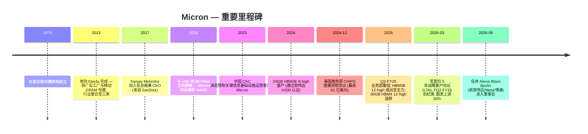
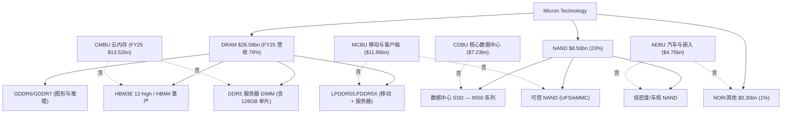
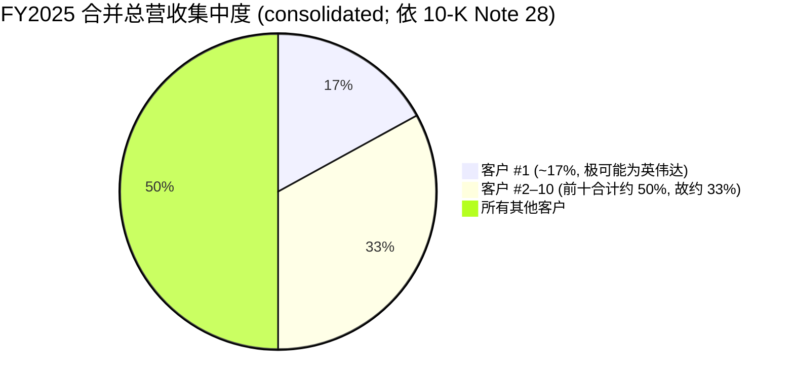
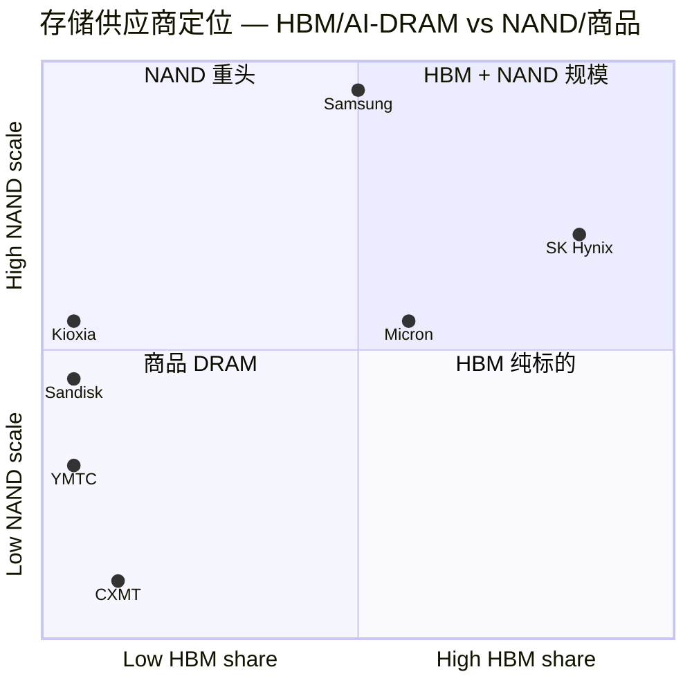

# Micron Technology, Inc. (NASDAQ:MU) — 公司研究报告

**截至日期 (As of): 2026-06-13**
**上市地: 纳斯达克 (NASDAQ), 代码 MU**
**注册地: 美国特拉华州 (总部位于爱达荷州博伊西 Boise, Idaho)**
**报告语言: 简体中文 (zh-CN)；英文版同时存在于本目录 `Micron_NASDAQ_MU_Research_Document.md`**

**分析师说明 (Fiscal-year convention):** 财年截止日为最接近 8 月 31 日的星期四。2025 财年 (FY2025) 截至 2025 年 8 月 28 日；2026 财年 (FY2026) 自 2025 年 8 月 29 日起，FQ2-FY2026 截至 2026 年 2 月 26 日。本报告所有"$"均指美元 (USD)。

> ### 投资摘要 (Investment Summary) — *分析师观点 (Analyst view)*
> *(以下整块均为本报告自身的观点（house view / 本方观点），不属于任何申报文件内容；申报文件本身不含目标价。)*
>
> | 项目 | 数值 |
> |---|---|
> | **评级 (Rating)** | **持有 / Hold (Neutral)** |
> | **12 个月目标价 (12-mo PT)** | **基准 $1,050**（牛市 $1,600 / 熊市 $420） |
> | **现价 (Current)** | **$981.61**（2026-06-12 收盘） |
> | **隐含空间 (Upside/Downside)** | 基准 **+7%** / 牛市 +63% / 熊市 **−57%** |
> | **估值方法 (Method)** | ~18× × 归一化 (normalized) non-GAAP EPS ~$58 |
> | **市值 (Market cap)** | ~**$1.11 万亿** (≈ 1.128bn 股) |
> | **52 周区间** | $103.38 – $1,089.29 |
> | **相对表现 (Momentum)** | 过去约 12 个月 **≈ +850%**（52 周低点 $103.38 → 现价 $981.61，呈抛物线 (parabolic)） |
>
> 市场数据来源：[Yahoo Finance — MU Key Statistics, 检索于 2026-06-12](https://finance.yahoo.com/quote/MU/key-statistics)。
>
> **论点支柱 (Thesis pillars) — *分析师观点*：**
> 1. **AI 存储超级周期 (super-cycle) 把 Micron 推入历史性盈利区间。** FQ2-FY2026 营收 $23.86bn、GAAP 毛利率 (gross margin) 74.4%、季度净利 $13.79bn、摊薄 EPS $12.07——HBM (高带宽内存) + 高容量 DDR5 是核心引擎 ([FQ2-FY2026 8-K, 2026-03-18](https://www.sec.gov/Archives/edgar/data/723125/000072312526000004/a2026q2ex991-pressrelease.htm))。
> 2. **增强型长期协议 (enhanced LTAs) 为 2027 年前的营收/利润提供前所未见的可见度。** 这是"结构性重定价 (structural re-rating) vs 又一次更大的周期 (cyclical peak)"辩论的核心 (*分析师观点*：[UBS — LTAs Gain Traction, 2026-05-26](http://xs-macbook-air.local:5001/zsxq/pdf/585428582552154/UBS-Micron%20Technology%20Inc%20LTAs%20Gain%20Traction%3B%20PT%20to%20%241%2C625%20with%20EPS%20Remaining%20Well%20-%24100-260526.pdf))。
> 3. **但存储是半导体周期性最强的子行业，股价已涨至 ~$1.1 万亿、TTM P/S 19×（上市以来最高）——市场在峰值盈利 (peak earnings) 上定价。** 下行情景（CXMT 商品 DRAM 放量 + AI 资本开支见顶）隐含巨大回撤 ([Yahoo Finance, 2026-06-12](https://finance.yahoo.com/quote/MU/key-statistics))。
> 4. **卖方极度分歧 (wide sell-side dispersion)：高盛中性 $900 ↔ 瑞银买入 $1,625。** 分歧点在"归一化 EPS 是多少"与"该给周期股倍数还是公用事业式 (utility-like) 倍数"（详见第 1A 节 卖方观点演变）。

> ### 业绩更新 (Guidance update) — FQ2-FY2026 创纪录、Q3 指引再上台阶、股息上调 30%
> **2026-03-18 披露的 FQ2-FY2026 实际值（截至 2026-02-26）远超 2025 年 12 月给出的原指引（营收 $18.7bn ±0.4 / 非 GAAP 毛利率 68%）：**
> - 营收 **$23.86bn**（环比 +75%、同比 +196%，对照 FQ1 $13.64bn / 去年同期 $8.05bn）；
> - GAAP 毛利率 **74.4%**、营业利润率 **67.6%**；非 GAAP 摊薄 EPS **$12.20**（GAAP $12.07）；
> - 经营性现金流 (operating cash flow) **$11.90bn**、调整后自由现金流 (adjusted FCF) **$6.9bn**；
> - **董事会将季度股息上调 30% 至 $0.15/股**（2026-03-18 宣派，4 月 15 日支付）。
>
> **FQ3-FY2026 公司指引（2026-03-18 同步给出）：营收 $33.5bn ±0.75、毛利率 ~81%、非 GAAP 摊薄 EPS $19.15 ±0.40（GAAP $18.90）。**
> CEO Sanjay Mehrotra：*"In the AI era, memory has become a strategic asset for our customers…we expect significant records again in fiscal Q3."*
> 来源：[Micron FQ2-FY2026 业绩新闻稿 (8-K), 2026-03-18](https://www.sec.gov/Archives/edgar/data/723125/000072312526000004/a2026q2ex991-pressrelease.htm)。

---

## 目录
1. 公司概览 (Company Overview)
   - 1A. 估值与目标价 (Valuation & Price Target) — 含卖方观点演变
   - 1B. GF Score 基本面评分卡
2. 公司历史 (History)
3. 管理团队 (Management)
4. 产品与服务 (Products & Services)
5. 客户与上市策略 (Customers & Go-to-Market)
6. 行业概览 (Industry)
7. 竞争格局 (Competitive Landscape)
8. 市场机会 / TAM
9. 风险评估 (Risk Assessment)
   - 9.5. 关键争论与催化剂 (Key Debates & Catalysts)
10. 投资者视角评分卡 (Investor Lenses)
- 参考资料 (References) · Data Used 数据清单 · 延伸观看 (Further viewing) · 验证日志 (Verification log)

---

## 1. 公司概览 (Company Overview)

**投资论点先行 (BLUF)。** Micron 正处在公司 47 年历史上从未出现过的盈利环境：FQ2-FY2026 单季营收 $23.86bn、净利 $13.79bn，毛利率 74.4%——而仅仅一年前（FQ2-FY2025）同口径营收只有 $8.05bn、毛利率 36.8% ([Micron FQ2-FY2026 8-K, 2026-03-18](https://www.sec.gov/Archives/edgar/data/723125/000072312526000004/a2026q2ex991-pressrelease.htm))。驱动力是一次由 AI 引发的 DRAM/HBM 结构性短缺，叠加供给方异常严格的纪律 (supply discipline)（[J.P. Morgan — April WSTS：ASP 同比 +69.9%, 2026-06-11](http://xs-macbook-air.local:5001/zsxq/pdf/584255214545824/J.P.%20Morgan-Semiconductors%EF%BC%9A%20April%20WSTS%EF%BC%9A%20Growth%20Accelerates%20Again%EF%BC%8C%20Driven%20by%20Continued%20Cyclical%20Momentum%EF%BC%8C%20AI%20Spending%20Strength%20and%20Favorable%20Pricing%20Dynamics%EF%BC%9B%20Stay%20OW%20the%20Group-260611.pdf)）。我们给予 **持有 (Hold)** 评级：基本面无可挑剔，但股价已涨至 ~$1.1 万亿、在峰值盈利上定价，而存储仍是半导体中周期性最强的子行业——风险/回报在当前价位大致平衡偏负。

Micron Technology, Inc. 是全球仅存的三家具规模的 **DRAM (Dynamic Random-Access Memory, 动态随机存取存储器)** 生产商之一，也是五家具规模的 **NAND flash (NAND 闪存)** 生产商之一。公司设计、制造并销售**存储与内存半导体 (memory and storage semiconductors)**——包括 DRAM（内含 HBM）、NAND，以及一项规模很小的残余 NOR 闪存业务——向云服务商 (hyperscalers)、AI 加速器 OEM、移动手机厂商、汽车 Tier-1 供应商及渠道分销商销售。总部位于爱达荷州博伊西，截至 2025 年 8 月 28 日员工约 **5.3 万人** ([Micron FY2025 10-K, "Human Capital" 章节](https://www.sec.gov/Archives/edgar/data/723125/000072312525000028/mu-20250828.htm))。晶圆制造主要集中在**台湾**（以长期资产口径衡量最大，PP&E 厂房设备 $18.97bn）、**新加坡**（$10.67bn）、**日本**（$7.04bn）及**美国**（博伊西、弗吉尼亚、新建纽约州 Clay，合计 $8.45bn）([FY2025 10-K, Note 29 地理信息](https://www.sec.gov/Archives/edgar/data/723125/000072312525000028/mu-20250828.htm))。

**盈利方式 (How Micron makes money)。** 产品通过直接销售给 OEM 与云客户，以及通过分销商和 Crucial 消费品牌渠道销售。10-K 明确："我们与客户的合同几乎全部为短期固定价格协议"，价格按季度重置并随行业供需迅速变化 ([FY2025 10-K, Note 21 营业收入确认](https://www.sec.gov/Archives/edgar/data/723125/000072312525000028/mu-20250828.htm))。存储本质上是**商品 (commodity)**，ASP (平均销售价格) 单季可波动几百个基点。结构性盈利杠杆来自**通过节点收缩 (node shrinks) 与 3D NAND 层堆叠降低单位比特成本**，再叠加**面向高附加值 SKU（以 HBM 和高容量 DDR5 服务器 DIMM 为主）的产品组合升级 (mix-up)**——本轮超级周期正是后者发挥到极致。

下图用 FQ2-FY2026（创纪录季度）的实际经营报表展示"钱是怎么赚的"：$23.86bn 营收中仅 $6.1bn 是成本，$17.76bn 落入毛利（毛利率 74.4%），扣除 $1.62bn 经营费用后，$16.14bn 为营业利润，最终净利 $13.79bn（净利率 57.8%）。

<svg xmlns="http://www.w3.org/2000/svg" viewBox="0 0 1000 560" width="1000" height="560" role="img" aria-label="income statement Sankey"><rect x="0" y="0" width="1000" height="560" fill="#ffffff"/>
<text x="20.00" y="30.00" text-anchor="start" font-family="Helvetica,Arial,sans-serif" font-size="15" font-weight="700" fill="#1f2933">Micron 收入瀑布 — FQ2-FY2026 (截至 2026-02-26)</text>
<path d="M 204.00,64.04 C 258.00,64.04 258.00,85.00 312.00,85.00 L 312.00,217.51 C 258.00,217.51 258.00,196.55 204.00,196.55 Z" fill="#93c5fd" fill-opacity="0.55"/>
<path d="M 452.00,78.00 C 506.00,78.00 506.00,122.20 560.00,122.20 L 560.00,398.10 C 506.00,398.10 506.00,353.90 452.00,353.90 Z" fill="#86efac" fill-opacity="0.55"/>
<path d="M 452.00,353.90 C 506.00,353.90 506.00,412.10 560.00,412.10 L 560.00,439.80 C 506.00,439.80 506.00,381.61 452.00,381.61 Z" fill="#fca5a5" fill-opacity="0.55"/>
<path d="M 328.00,85.00 C 382.00,85.00 382.00,78.00 436.00,78.00 L 436.00,381.61 C 382.00,381.61 382.00,388.61 328.00,388.61 Z" fill="#86efac" fill-opacity="0.55"/>
<path d="M 328.00,388.61 C 382.00,388.61 382.00,395.61 436.00,395.61 L 436.00,500.00 C 382.00,500.00 382.00,493.00 328.00,493.00 Z" fill="#fca5a5" fill-opacity="0.55"/>
<path d="M 700.00,115.21 C 754.00,115.21 754.00,143.87 808.00,143.87 L 808.00,379.59 C 754.00,379.59 754.00,350.93 700.00,350.93 Z" fill="#86efac" fill-opacity="0.55"/>
<path d="M 700.00,350.93 C 754.00,350.93 754.00,393.59 808.00,393.59 L 808.00,434.13 C 754.00,434.13 754.00,391.47 700.00,391.47 Z" fill="#fca5a5" fill-opacity="0.55"/>
<path d="M 576.00,122.20 C 630.00,122.20 630.00,115.21 684.00,115.21 L 684.00,391.11 C 630.00,391.11 630.00,398.10 576.00,398.10 Z" fill="#86efac" fill-opacity="0.55"/>
<path d="M 204.00,210.55 C 258.00,210.55 258.00,217.51 312.00,217.51 L 312.00,314.75 C 258.00,314.75 258.00,307.79 204.00,307.79 Z" fill="#93c5fd" fill-opacity="0.55"/>
<path d="M 204.00,321.79 C 258.00,321.79 258.00,314.75 312.00,314.75 L 312.00,446.61 C 258.00,446.61 258.00,453.65 204.00,453.65 Z" fill="#93c5fd" fill-opacity="0.55"/>
<path d="M 576.00,412.10 C 630.00,412.10 630.00,405.54 684.00,405.54 L 684.00,411.42 C 630.00,411.42 630.00,417.98 576.00,417.98 Z" fill="#fca5a5" fill-opacity="0.55"/>
<path d="M 576.00,417.98 C 630.00,417.98 630.00,425.42 684.00,425.42 L 684.00,446.79 C 630.00,446.79 630.00,439.36 576.00,439.36 Z" fill="#fca5a5" fill-opacity="0.55"/>
<path d="M 576.00,439.36 C 630.00,439.36 630.00,460.79 684.00,460.79 L 684.00,462.79 C 630.00,462.79 630.00,441.36 576.00,441.36 Z" fill="#fca5a5" fill-opacity="0.55"/>
<path d="M 576.00,453.80 C 630.00,453.80 630.00,391.11 684.00,391.11 L 684.00,393.11 C 630.00,393.11 630.00,455.80 576.00,455.80 Z" fill="#93c5fd" fill-opacity="0.55"/>
<path d="M 204.00,467.65 C 258.00,467.65 258.00,446.61 312.00,446.61 L 312.00,492.91 C 258.00,492.91 258.00,513.96 204.00,513.96 Z" fill="#93c5fd" fill-opacity="0.55"/>
<rect x="188.00" y="64.04" width="16" height="132.51" rx="1.5" fill="#2563eb"/>
<rect x="188.00" y="210.55" width="16" height="97.25" rx="1.5" fill="#2563eb"/>
<rect x="188.00" y="321.79" width="16" height="131.86" rx="1.5" fill="#2563eb"/>
<rect x="188.00" y="467.65" width="16" height="46.31" rx="1.5" fill="#2563eb"/>
<rect x="312.00" y="85.00" width="16" height="408.00" rx="1.5" fill="#1e3a8a"/>
<rect x="436.00" y="78.00" width="16" height="303.61" rx="1.5" fill="#15803d"/>
<rect x="436.00" y="395.61" width="16" height="104.39" rx="1.5" fill="#dc2626"/>
<rect x="560.00" y="122.20" width="16" height="275.90" rx="1.5" fill="#15803d"/>
<rect x="560.00" y="412.10" width="16" height="27.70" rx="1.5" fill="#dc2626"/>
<rect x="560.00" y="453.80" width="16" height="2.00" rx="1.5" fill="#2563eb"/>
<rect x="684.00" y="115.21" width="16" height="276.33" rx="1.5" fill="#15803d"/>
<rect x="684.00" y="405.54" width="16" height="5.88" rx="1.5" fill="#dc2626"/>
<rect x="684.00" y="425.42" width="16" height="21.37" rx="1.5" fill="#dc2626"/>
<rect x="684.00" y="460.79" width="16" height="2.00" rx="1.5" fill="#dc2626"/>
<rect x="808.00" y="143.87" width="16" height="235.72" rx="1.5" fill="#15803d"/>
<rect x="808.00" y="393.59" width="16" height="40.54" rx="1.5" fill="#dc2626"/>
<text x="179.00" y="127.30" text-anchor="end" font-family="Helvetica,Arial,sans-serif" font-size="11.5" font-weight="700" fill="#1f2933">Cloud Memory BU</text>
<text x="179.00" y="140.30" text-anchor="end" font-family="Helvetica,Arial,sans-serif" font-size="10" font-weight="400" fill="#52606d">US$7.7B  (32.5%)</text>
<text x="179.00" y="256.17" text-anchor="end" font-family="Helvetica,Arial,sans-serif" font-size="11.5" font-weight="700" fill="#1f2933">Core Data Center BU</text>
<text x="179.00" y="269.17" text-anchor="end" font-family="Helvetica,Arial,sans-serif" font-size="10" font-weight="400" fill="#52606d">US$5.7B  (23.8%)</text>
<text x="179.00" y="384.72" text-anchor="end" font-family="Helvetica,Arial,sans-serif" font-size="11.5" font-weight="700" fill="#1f2933">Mobile &amp; Client BU</text>
<text x="179.00" y="397.72" text-anchor="end" font-family="Helvetica,Arial,sans-serif" font-size="10" font-weight="400" fill="#52606d">US$7.7B  (32.3%)</text>
<text x="179.00" y="487.80" text-anchor="end" font-family="Helvetica,Arial,sans-serif" font-size="11.5" font-weight="700" fill="#1f2933">Auto &amp; Embedded BU</text>
<text x="179.00" y="500.80" text-anchor="end" font-family="Helvetica,Arial,sans-serif" font-size="10" font-weight="400" fill="#52606d">US$2.7B  (11.3%)</text>
<rect x="331.00" y="67.00" width="119.40" height="26" rx="2" fill="#ffffff" fill-opacity="0.72"/>
<text x="334.00" y="79.00" text-anchor="start" font-family="Helvetica,Arial,sans-serif" font-size="11.5" font-weight="700" fill="#1f2933">Revenue</text>
<text x="334.00" y="92.00" text-anchor="start" font-family="Helvetica,Arial,sans-serif" font-size="10" font-weight="400" fill="#52606d">US$23.9B  (100.0%)</text>
<rect x="455.00" y="60.00" width="113.10" height="26" rx="2" fill="#ffffff" fill-opacity="0.72"/>
<text x="458.00" y="72.00" text-anchor="start" font-family="Helvetica,Arial,sans-serif" font-size="11.5" font-weight="700" fill="#1f2933">Gross Profit</text>
<text x="458.00" y="85.00" text-anchor="start" font-family="Helvetica,Arial,sans-serif" font-size="10" font-weight="400" fill="#52606d">US$17.8B  (74.4%)</text>
<rect x="455.00" y="377.61" width="144.60" height="26" rx="2" fill="#ffffff" fill-opacity="0.72"/>
<text x="458.00" y="389.61" text-anchor="start" font-family="Helvetica,Arial,sans-serif" font-size="11.5" font-weight="700" fill="#1f2933">Cost of Revenue (COGS)</text>
<text x="458.00" y="402.61" text-anchor="start" font-family="Helvetica,Arial,sans-serif" font-size="10" font-weight="400" fill="#52606d">US$6.1B  (25.6%)</text>
<rect x="579.00" y="104.20" width="113.10" height="26" rx="2" fill="#ffffff" fill-opacity="0.72"/>
<text x="582.00" y="116.20" text-anchor="start" font-family="Helvetica,Arial,sans-serif" font-size="11.5" font-weight="700" fill="#1f2933">Operating Income</text>
<text x="582.00" y="129.20" text-anchor="start" font-family="Helvetica,Arial,sans-serif" font-size="10" font-weight="400" fill="#52606d">US$16.1B  (67.6%)</text>
<rect x="579.00" y="394.10" width="150.90" height="26" rx="2" fill="#ffffff" fill-opacity="0.72"/>
<text x="582.00" y="406.10" text-anchor="start" font-family="Helvetica,Arial,sans-serif" font-size="11.5" font-weight="700" fill="#1f2933">Total Operating Expense</text>
<text x="582.00" y="419.10" text-anchor="start" font-family="Helvetica,Arial,sans-serif" font-size="10" font-weight="400" fill="#52606d">US$1.6B  (6.8%)</text>
<text x="551.00" y="451.80" text-anchor="end" font-family="Helvetica,Arial,sans-serif" font-size="11.5" font-weight="700" fill="#1f2933">Net Interest / Other Income</text>
<text x="551.00" y="464.80" text-anchor="end" font-family="Helvetica,Arial,sans-serif" font-size="10" font-weight="400" fill="#52606d">US$25.0M  (0.10%)</text>
<rect x="703.00" y="97.21" width="113.10" height="26" rx="2" fill="#ffffff" fill-opacity="0.72"/>
<text x="706.00" y="109.21" text-anchor="start" font-family="Helvetica,Arial,sans-serif" font-size="11.5" font-weight="700" fill="#1f2933">Pretax Income</text>
<text x="706.00" y="122.21" text-anchor="start" font-family="Helvetica,Arial,sans-serif" font-size="10" font-weight="400" fill="#52606d">US$16.2B  (67.7%)</text>
<rect x="703.00" y="387.54" width="113.10" height="26" rx="2" fill="#ffffff" fill-opacity="0.72"/>
<text x="706.00" y="399.54" text-anchor="start" font-family="Helvetica,Arial,sans-serif" font-size="11.5" font-weight="700" fill="#1f2933">SG&amp;A</text>
<text x="706.00" y="412.54" text-anchor="start" font-family="Helvetica,Arial,sans-serif" font-size="10" font-weight="400" fill="#52606d">US$344.0M  (1.4%)</text>
<rect x="703.00" y="412.54" width="100.50" height="26" rx="2" fill="#ffffff" fill-opacity="0.72"/>
<text x="706.00" y="424.54" text-anchor="start" font-family="Helvetica,Arial,sans-serif" font-size="11.5" font-weight="700" fill="#1f2933">R&amp;D</text>
<text x="706.00" y="437.54" text-anchor="start" font-family="Helvetica,Arial,sans-serif" font-size="10" font-weight="400" fill="#52606d">US$1.2B  (5.2%)</text>
<rect x="703.00" y="442.79" width="113.10" height="26" rx="2" fill="#ffffff" fill-opacity="0.72"/>
<text x="706.00" y="454.79" text-anchor="start" font-family="Helvetica,Arial,sans-serif" font-size="11.5" font-weight="700" fill="#1f2933">Other OpEx</text>
<text x="706.00" y="467.79" text-anchor="start" font-family="Helvetica,Arial,sans-serif" font-size="10" font-weight="400" fill="#52606d">US$26.0M  (0.11%)</text>
<text x="833.00" y="258.73" text-anchor="start" font-family="Helvetica,Arial,sans-serif" font-size="11.5" font-weight="700" fill="#1f2933">Net Income</text>
<text x="833.00" y="271.73" text-anchor="start" font-family="Helvetica,Arial,sans-serif" font-size="10" font-weight="400" fill="#52606d">US$13.8B  (57.8%)</text>
<text x="833.00" y="410.86" text-anchor="start" font-family="Helvetica,Arial,sans-serif" font-size="11.5" font-weight="700" fill="#1f2933">Income Tax</text>
<text x="833.00" y="423.86" text-anchor="start" font-family="Helvetica,Arial,sans-serif" font-size="10" font-weight="400" fill="#52606d">US$2.4B  (9.9%)</text>
<text x="500.00" y="530.00" text-anchor="middle" font-family="Helvetica,Arial,sans-serif" font-size="10" font-weight="400" font-style="italic" fill="#8a97a3">GAAP；记录性季度，毛利率 74.4%、营业利润率 67.6%</text>
<text x="500.00" y="544.00" text-anchor="middle" font-family="Helvetica,Arial,sans-serif" font-size="10" font-weight="400" fill="#52606d">Source: Micron FQ2-FY2026 8-K Ex-99.1 收益新闻稿, 2026-03-18 (经营报表)</text>
</svg>

*来源: [Micron FQ2-FY2026 8-K Ex-99.1 经营报表, 2026-03-18](https://www.sec.gov/Archives/edgar/data/723125/000072312526000004/a2026q2ex991-pressrelease.htm)。*

**规模指标的发展轨迹 (development over time)。** 下表把同一组核心指标按财年/季度并列，凸显本轮超级周期的速度——每一列都各自标注其申报来源：

| 期间 | 营收 | GAAP 毛利率 | GAAP 摊薄 EPS | 经营性现金流 | 来源 |
|---|---|---|---|---|---|
| FY2023（周期谷底） | $15.54bn | −9% | 亏损 | 低位 | [FY2025 10-K](https://www.sec.gov/Archives/edgar/data/723125/000072312525000028/mu-20250828.htm) |
| FY2024（复苏） | $25.11bn | 22% | — | — | [FY2025 10-K](https://www.sec.gov/Archives/edgar/data/723125/000072312525000028/mu-20250828.htm) |
| FY2025（繁荣） | **$37.38bn** (+49%) | 40% | $7.55 | $17.53bn | [FY2025 10-K](https://www.sec.gov/Archives/edgar/data/723125/000072312525000028/mu-20250828.htm) |
| FQ1-FY2026 | $13.64bn | 56.0% | $4.60 | $8.41bn | [FQ2-26 8-K（对照列）](https://www.sec.gov/Archives/edgar/data/723125/000072312526000004/a2026q2ex991-pressrelease.htm) |
| **FQ2-FY2026** | **$23.86bn** | **74.4%** | **$12.07** | **$11.90bn** | [FQ2-26 8-K, 2026-03-18](https://www.sec.gov/Archives/edgar/data/723125/000072312526000004/a2026q2ex991-pressrelease.htm) |
| FQ3-FY2026（公司指引） | $33.5bn ±0.75 | ~81% | $18.90 (GAAP) | — | [FQ2-26 8-K — Business Outlook](https://www.sec.gov/Archives/edgar/data/723125/000072312526000004/a2026q2ex991-pressrelease.htm) |

**本期新变化 (what changed this period)：** 相比 5 月时市场对 FQ2 的认知（原指引营收 $18.7bn / 毛利率 68%），实际值高出近 30%（营收）和 6 个百分点（毛利率）；公司同时给出 $33.5bn 的 Q3 指引（环比再增 40%）并把股息上调 30%——这三件事一起把整条上行轨迹再次重置 ([FQ2-26 8-K, 2026-03-18](https://www.sec.gov/Archives/edgar/data/723125/000072312526000004/a2026q2ex991-pressrelease.htm))。资产负债表方面，截至 2026-02-26 现金、可销售投资及受限现金合计 $16.7bn ([同上, 资产负债表](https://www.sec.gov/Archives/edgar/data/723125/000072312526000004/a2026q2ex991-pressrelease.htm))。

*来源: [Micron 2022 10-K (FY21/22) 及 FY2025 10-K (FY23–25)](https://www.sec.gov/Archives/edgar/data/723125/000072312525000028/mu-20250828.htm)。FY2023 的低谷（GAAP 毛利率 −9%）与 FY2025 回升至 40%、FY2026 上半年再跳至 74%，浓缩了一个完整存储周期外加 AI 超级周期的叠加。*

**估值快照 (截至 2026-06-12)。** MU 收盘价 **$981.61**，市值约 **$1.11 万亿**（约 1.128bn 股），**TTM P/E 46.3×**、**TTM P/S 19.0×**、**P/B 15.3×**，52 周区间 **$103.38–$1,089.29** ([Yahoo Finance MU Key Statistics, 检索于 2026-06-12](https://finance.yahoo.com/quote/MU/key-statistics))。该快照最具信息量的是 **TTM P/E (46×) 与前瞻 P/E (forward P/E, ~8.8×) 之间约 5 倍的压缩**——前瞻数字锚定的是市场一致预期的前瞻 EPS ~$112（一个高度乐观、且各方分歧极大的数字，见 1A 节）。**市场正在为峰值盈利年定价，而非稳态**；TTM P/S 19× 是 MU 上市以来最高水平（10 年 P/S 中位数约 2.76×，见 [Macrotrends MU 市销率历史](https://www.macrotrends.net/stocks/charts/MU/micron-technology/price-sales)），反映了市场为 **AI 存储溢价 (AI-memory premium)** 所付的代价。

---

### 1A. 估值与目标价 (Valuation & Price Target) — *分析师观点*

> **本节全部为本报告的前瞻判断 (forward view)；每一个预测单元格、目标价及情景目标价都是 *分析师观点*，绝不附在任何申报文件引用上（10-K 不含目标价）。预测的外部依据（实际季度 + 公司指引 + 行业预测 + LTA 结构）逐条内联标注。**

**前瞻财务模型 (forward estimates) — 基准情景 (base case)。** 模型自下而上：FQ1+FQ2 为实际值，FQ3 取公司指引中值，FQ4 为我们的估计；FY2027 假设短缺在 LTA 支撑下维持高位但开始边际正常化，FY2028 进入正常化下行。

| 财年 | 营收 (US$bn) | YoY | GAAP 毛利率 | non-GAAP 摊薄 EPS | 关键依据（*分析师观点*） |
|---|---|---|---|---|---|
| FY2025A | 37.4 | +49% | 40% | (GAAP $7.55) | [FY2025 10-K](https://www.sec.gov/Archives/edgar/data/723125/000072312525000028/mu-20250828.htm) |
| FY2026E | ~115 | ~+208% | ~76% | ~**$61** | FQ1 $4.78 + FQ2 $12.20（实际）+ FQ3 $19.15（指引）+ FQ4 ~$25（估计） ([FQ2-26 8-K](https://www.sec.gov/Archives/edgar/data/723125/000072312526000004/a2026q2ex991-pressrelease.htm)) |
| FY2027E | ~150 | ~+30% | ~73% | ~**$85** | LTA 锁价支撑 + HBM4 上量；ASP 边际回落 ([UBS, 2026-05-26](http://xs-macbook-air.local:5001/zsxq/pdf/585428582552154/UBS-Micron%20Technology%20Inc%20LTAs%20Gain%20Traction%3B%20PT%20to%20%241%2C625%20with%20EPS%20Remaining%20Well%20-%24100-260526.pdf)) |
| FY2028E | ~120 | ~−20% | ~58% | ~**$55** | 商品 DRAM 正常化（CXMT 放量）；HBM 仍紧 ([TrendForce, 2025-12-02](https://www.trendforce.com/news/2025/12/02/news-memory-price-rally-may-run-past-2028-as-samsung-sk-hynix-reportedly-cautious-on-expansion/)) |

> *FY2026E 营收依赖 FQ4 估计 ~$42–48bn（高盛预测 $48.8bn，我们取偏保守端）；FY2027/2028 为情景判断，下行风险显著。这些是 *分析师观点*，非公司指引。*

**前瞻估值矩阵 (forward valuation matrix)**（基于现价 $981.61 / 市值 $1,107bn）：

| 倍数 | FY2025A | FY2026E | FY2027E |
|---|---|---|---|
| P/E (non-GAAP) | TTM 46× | ~16× | ~12× |
| P/S | 29.6× | ~9.6× | ~7.4× |
| P/B (当前) | 15.3× | — | — |

*注：随着估计 EPS 攀升，前瞻 P/E 从 46× 压缩至 ~12×——这是典型的"峰值盈利在前、倍数在后"形态；市场一致前瞻 EPS ~$112 对应前瞻 P/E ~8.8× ([Yahoo Finance, 2026-06-12](https://finance.yahoo.com/quote/MU/key-statistics))。本报告基准 FY2027 EPS $85 *低于* 市场一致 (~$112) 与 UBS (C2027 $155)，反映我们对正常化时点更早的判断。*

**ROE 拆解 (5-step DuPont) — FY2025。** 下图把 FY2025 的 ROE（约 17%，净利 $8,539M / 平均权益约 $49.6bn）拆为五步：税负 (tax burden) × 利息负担 (interest burden) × 营业利润率 (operating margin) × 资产周转 (asset turnover) × 财务杠杆 (leverage)——展示的是一个 *正常化年份* 的回报结构；FY2026 超级周期下营业利润率（已达 67.6%）会把 ROE 推至远高于此的水平。

<svg xmlns="http://www.w3.org/2000/svg" viewBox="0 0 1240 540" width="1240" height="540" role="img" aria-label="DuPont ROE decomposition"><rect x="0" y="0" width="1240" height="540" fill="#ffffff"/>
<text x="20.00" y="30.00" text-anchor="start" font-family="Helvetica,Arial,sans-serif" font-size="15" font-weight="700" fill="#1f2933">5-Step DuPont ROE 拆解 — FY2025</text>
<rect x="545.00" y="56.00" width="150" height="56" rx="7" fill="#1e3a8a"/>
<text x="620.00" y="76.00" text-anchor="middle" font-family="Helvetica,Arial,sans-serif" font-size="11.5" font-weight="700" fill="#ffffff">ROE</text>
<text x="620.00" y="94.00" text-anchor="middle" font-family="Helvetica,Arial,sans-serif" font-size="13" font-weight="800" fill="#ffffff">17.20%</text>
<text x="620.00" y="106.00" text-anchor="middle" font-family="Helvetica,Arial,sans-serif" font-size="8.5" font-weight="400" fill="#dbeafe">= Net Income / Avg Equity</text>
<rect x="191.60" y="168.00" width="150" height="56" rx="7" fill="#2563eb"/>
<text x="266.60" y="188.00" text-anchor="middle" font-family="Helvetica,Arial,sans-serif" font-size="11.5" font-weight="700" fill="#ffffff">Net Margin</text>
<text x="266.60" y="206.00" text-anchor="middle" font-family="Helvetica,Arial,sans-serif" font-size="13" font-weight="800" fill="#ffffff">22.84%</text>
<text x="266.60" y="218.00" text-anchor="middle" font-family="Helvetica,Arial,sans-serif" font-size="8.5" font-weight="400" fill="#dbeafe">Net Income / Revenue</text>
<line x1="620.00" y1="112.00" x2="266.60" y2="168.00" stroke="#94a3b8" stroke-width="1.4"/>
<rect x="545.00" y="168.00" width="150" height="56" rx="7" fill="#2563eb"/>
<text x="620.00" y="188.00" text-anchor="middle" font-family="Helvetica,Arial,sans-serif" font-size="11.5" font-weight="700" fill="#ffffff">Asset Turnover</text>
<text x="620.00" y="206.00" text-anchor="middle" font-family="Helvetica,Arial,sans-serif" font-size="13" font-weight="800" fill="#ffffff">0.49</text>
<text x="620.00" y="218.00" text-anchor="middle" font-family="Helvetica,Arial,sans-serif" font-size="8.5" font-weight="400" fill="#dbeafe">Revenue / Avg Assets</text>
<line x1="620.00" y1="112.00" x2="620.00" y2="168.00" stroke="#94a3b8" stroke-width="1.4"/>
<rect x="898.40" y="168.00" width="150" height="56" rx="7" fill="#2563eb"/>
<text x="973.40" y="188.00" text-anchor="middle" font-family="Helvetica,Arial,sans-serif" font-size="11.5" font-weight="700" fill="#ffffff">Equity Multiplier</text>
<text x="973.40" y="206.00" text-anchor="middle" font-family="Helvetica,Arial,sans-serif" font-size="13" font-weight="800" fill="#ffffff">1.53</text>
<text x="973.40" y="218.00" text-anchor="middle" font-family="Helvetica,Arial,sans-serif" font-size="8.5" font-weight="400" fill="#dbeafe">Avg Assets / Avg Equity</text>
<line x1="620.00" y1="112.00" x2="973.40" y2="168.00" stroke="#94a3b8" stroke-width="1.4"/>
<circle cx="443.30" cy="196.00" r="11" fill="#ffffff" stroke="#94a3b8" stroke-width="1.2"/>
<text x="443.30" y="201.00" text-anchor="middle" font-family="Helvetica,Arial,sans-serif" font-size="14" font-weight="800" fill="#52606d">×</text>
<circle cx="796.70" cy="196.00" r="11" fill="#ffffff" stroke="#94a3b8" stroke-width="1.2"/>
<text x="796.70" y="201.00" text-anchor="middle" font-family="Helvetica,Arial,sans-serif" font-size="14" font-weight="800" fill="#52606d">×</text>
<rect x="65.00" y="300.00" width="118" height="56" rx="7" fill="#2563eb"/>
<text x="124.00" y="320.00" text-anchor="middle" font-family="Helvetica,Arial,sans-serif" font-size="11.5" font-weight="700" fill="#ffffff">Operating Margin</text>
<text x="124.00" y="338.00" text-anchor="middle" font-family="Helvetica,Arial,sans-serif" font-size="13" font-weight="800" fill="#ffffff">26.14%</text>
<text x="124.00" y="350.00" text-anchor="middle" font-family="Helvetica,Arial,sans-serif" font-size="8.5" font-weight="400" fill="#dbeafe">Op Inc / Revenue</text>
<line x1="266.60" y1="224.00" x2="124.00" y2="300.00" stroke="#94a3b8" stroke-width="1.4"/>
<rect x="207.60" y="300.00" width="118" height="56" rx="7" fill="#2563eb"/>
<text x="266.60" y="320.00" text-anchor="middle" font-family="Helvetica,Arial,sans-serif" font-size="11.5" font-weight="700" fill="#ffffff">Tax Burden</text>
<text x="266.60" y="338.00" text-anchor="middle" font-family="Helvetica,Arial,sans-serif" font-size="13" font-weight="800" fill="#ffffff">0.8845</text>
<text x="266.60" y="350.00" text-anchor="middle" font-family="Helvetica,Arial,sans-serif" font-size="8.5" font-weight="400" fill="#dbeafe">Net Inc / Pretax</text>
<line x1="266.60" y1="224.00" x2="266.60" y2="300.00" stroke="#94a3b8" stroke-width="1.4"/>
<rect x="350.20" y="300.00" width="118" height="56" rx="7" fill="#2563eb"/>
<text x="409.20" y="320.00" text-anchor="middle" font-family="Helvetica,Arial,sans-serif" font-size="11.5" font-weight="700" fill="#ffffff">Interest Burden</text>
<text x="409.20" y="338.00" text-anchor="middle" font-family="Helvetica,Arial,sans-serif" font-size="13" font-weight="800" fill="#ffffff">0.9881</text>
<text x="409.20" y="350.00" text-anchor="middle" font-family="Helvetica,Arial,sans-serif" font-size="8.5" font-weight="400" fill="#dbeafe">Pretax / Op Inc</text>
<line x1="266.60" y1="224.00" x2="409.20" y2="300.00" stroke="#94a3b8" stroke-width="1.4"/>
<circle cx="195.30" cy="328.00" r="11" fill="#ffffff" stroke="#94a3b8" stroke-width="1.2"/>
<text x="195.30" y="333.00" text-anchor="middle" font-family="Helvetica,Arial,sans-serif" font-size="14" font-weight="800" fill="#52606d">×</text>
<circle cx="337.90" cy="328.00" r="11" fill="#ffffff" stroke="#94a3b8" stroke-width="1.2"/>
<text x="337.90" y="333.00" text-anchor="middle" font-family="Helvetica,Arial,sans-serif" font-size="14" font-weight="800" fill="#52606d">×</text>
<rect x="479.00" y="300.00" width="118" height="56" rx="7" fill="#2563eb"/>
<text x="538.00" y="326.00" text-anchor="middle" font-family="Helvetica,Arial,sans-serif" font-size="11.5" font-weight="700" fill="#ffffff">Revenue</text>
<text x="538.00" y="342.00" text-anchor="middle" font-family="Helvetica,Arial,sans-serif" font-size="13" font-weight="800" fill="#ffffff">US$37.4B</text>
<line x1="620.00" y1="224.00" x2="538.00" y2="300.00" stroke="#94a3b8" stroke-width="1.4"/>
<rect x="643.00" y="300.00" width="118" height="56" rx="7" fill="#2563eb"/>
<text x="702.00" y="320.00" text-anchor="middle" font-family="Helvetica,Arial,sans-serif" font-size="11.5" font-weight="700" fill="#ffffff">Avg Total Assets</text>
<text x="702.00" y="338.00" text-anchor="middle" font-family="Helvetica,Arial,sans-serif" font-size="13" font-weight="800" fill="#ffffff">US$76.1B</text>
<text x="702.00" y="350.00" text-anchor="middle" font-family="Helvetica,Arial,sans-serif" font-size="8.5" font-weight="400" fill="#dbeafe">(begin+end)/2</text>
<line x1="620.00" y1="224.00" x2="702.00" y2="300.00" stroke="#94a3b8" stroke-width="1.4"/>
<circle cx="620.00" cy="328.00" r="11" fill="#ffffff" stroke="#94a3b8" stroke-width="1.2"/>
<text x="620.00" y="333.00" text-anchor="middle" font-family="Helvetica,Arial,sans-serif" font-size="14" font-weight="800" fill="#52606d">÷</text>
<rect x="832.40" y="300.00" width="118" height="56" rx="7" fill="#2563eb"/>
<text x="891.40" y="320.00" text-anchor="middle" font-family="Helvetica,Arial,sans-serif" font-size="11.5" font-weight="700" fill="#ffffff">Avg Total Assets</text>
<text x="891.40" y="338.00" text-anchor="middle" font-family="Helvetica,Arial,sans-serif" font-size="13" font-weight="800" fill="#ffffff">US$76.1B</text>
<text x="891.40" y="350.00" text-anchor="middle" font-family="Helvetica,Arial,sans-serif" font-size="8.5" font-weight="400" fill="#dbeafe">(begin+end)/2</text>
<line x1="973.40" y1="224.00" x2="891.40" y2="300.00" stroke="#94a3b8" stroke-width="1.4"/>
<rect x="996.40" y="300.00" width="118" height="56" rx="7" fill="#2563eb"/>
<text x="1055.40" y="320.00" text-anchor="middle" font-family="Helvetica,Arial,sans-serif" font-size="11.5" font-weight="700" fill="#ffffff">Avg Total Equity</text>
<text x="1055.40" y="338.00" text-anchor="middle" font-family="Helvetica,Arial,sans-serif" font-size="13" font-weight="800" fill="#ffffff">US$49.6B</text>
<text x="1055.40" y="350.00" text-anchor="middle" font-family="Helvetica,Arial,sans-serif" font-size="8.5" font-weight="400" fill="#dbeafe">(begin+end)/2</text>
<line x1="973.40" y1="224.00" x2="1055.40" y2="300.00" stroke="#94a3b8" stroke-width="1.4"/>
<circle cx="967.20" cy="328.00" r="11" fill="#ffffff" stroke="#94a3b8" stroke-width="1.2"/>
<text x="967.20" y="333.00" text-anchor="middle" font-family="Helvetica,Arial,sans-serif" font-size="14" font-weight="800" fill="#52606d">÷</text>
<rect x="69.00" y="420.00" width="110" height="48" rx="7" fill="#3b82f6"/>
<text x="124.00" y="442.00" text-anchor="middle" font-family="Helvetica,Arial,sans-serif" font-size="11.5" font-weight="700" fill="#ffffff">Operating Income</text>
<text x="124.00" y="458.00" text-anchor="middle" font-family="Helvetica,Arial,sans-serif" font-size="13" font-weight="800" fill="#ffffff">US$9.8B</text>
<line x1="124.00" y1="356.00" x2="124.00" y2="420.00" stroke="#94a3b8" stroke-width="1.4"/>
<rect x="211.60" y="420.00" width="110" height="48" rx="7" fill="#3b82f6"/>
<text x="266.60" y="442.00" text-anchor="middle" font-family="Helvetica,Arial,sans-serif" font-size="11.5" font-weight="700" fill="#ffffff">Net Income</text>
<text x="266.60" y="458.00" text-anchor="middle" font-family="Helvetica,Arial,sans-serif" font-size="13" font-weight="800" fill="#ffffff">US$8.5B</text>
<line x1="266.60" y1="356.00" x2="266.60" y2="420.00" stroke="#94a3b8" stroke-width="1.4"/>
<rect x="354.20" y="420.00" width="110" height="48" rx="7" fill="#3b82f6"/>
<text x="409.20" y="442.00" text-anchor="middle" font-family="Helvetica,Arial,sans-serif" font-size="11.5" font-weight="700" fill="#ffffff">Pretax Income</text>
<text x="409.20" y="458.00" text-anchor="middle" font-family="Helvetica,Arial,sans-serif" font-size="13" font-weight="800" fill="#ffffff">US$9.7B</text>
<line x1="409.20" y1="356.00" x2="409.20" y2="420.00" stroke="#94a3b8" stroke-width="1.4"/>
<text x="620.00" y="524.00" text-anchor="middle" font-family="Helvetica,Arial,sans-serif" font-size="10" font-weight="400" fill="#52606d">Source: Micron FY2025 10-K (income statement + balance sheet)</text>
</svg>

*来源: [Micron FY2025 10-K（利润表 + 资产负债表）](https://www.sec.gov/Archives/edgar/data/723125/000072312525000028/mu-20250828.htm)。*

**目标价推导 (PT derivation) — 展示算术。** 对存储这种极周期股，正确做法是**对归一化/穿越周期 (normalized/through-cycle) EPS 应用穿越周期倍数**，而非对峰值 EPS 套峰值倍数：

- **基准 PT $1,050 = ~18× × 归一化 non-GAAP EPS ~$58。** 归一化 EPS $58 介于高盛的 $50（纯周期假设）与 LTA 支撑下更高的盈利底部之间；18× 与高盛一致、低于大摩的 29.5×、也低于牛方主张的"宽口径半导体倍数"，反映即便有 LTA、存储仍保留实质周期性。交叉验证：~16× × FY2027E EPS $85 ≈ $1,056，结论一致。隐含 +7%。
- **牛市 PT $1,600 = ~15× × ~$110**（UBS 式结构性重定价：LTA 把存储变成准公用事业，EPS 在 2029 前维持 >$100）。隐含 +63%。
- **熊市 PT $420 = ~15× × ~$28**（周期均值回归：2027 年 ASP 受 CXMT 商品 DRAM 放量 + AI 资本开支见顶冲击，归一化 EPS 回落至 ~$28，仍远高于 2023 年低谷因 HBM 占比提升）。隐含 **−57%**。

**为什么用这个倍数 (multiple justification)。** 18× 高于 SK 海力士的前瞻 ~4.6×（但后者口径为峰值 EPS 且韩国披露不可比）、低于稳态大型半导体（NVDA/AVGO ~30×+）。整个目标价辩论真正的两个变量是**归一化 EPS 是多少**与**该用周期倍数还是公用事业倍数**——这恰是卖方分歧的根源（见下）。

**与市场一致预期的对比 (vs consensus)。** 我们的基准 FY2027 EPS ~$85 **低于** 市场一致预期 ~$112 ([Yahoo Finance, 2026-06-12](https://finance.yahoo.com/quote/MU/key-statistics)) 和 UBS 的 C2027 $155 ([UBS, 2026-05-26](http://xs-macbook-air.local:5001/zsxq/pdf/585428582552154/UBS-Micron%20Technology%20Inc%20LTAs%20Gain%20Traction%3B%20PT%20to%20%241%2C625%20with%20EPS%20Remaining%20Well%20-%24100-260526.pdf))，但**高于**高盛的归一化 $50 ([GS, 2026-06-08](http://xs-macbook-air.local:5001/zsxq/pdf/412458524148888/GS-Micron%20Technology%20Inc.%20%28MU%29_%203Q%20Preview_%20Another%20strong%20quarter%20reflects%20extension%20of%20tight%20supply_demand%20through%202027-260608.pdf))——我们刻意取中。

**最该盯紧的几个变量 (swing variables) —— 读者应重点压力测试：** (1) 增强型 LTA 是否真的结构性削弱了周期（→ 更高倍数 + 更高归一化 EPS）？(2) HBM4 世代 Micron 的份额相对三星/SK 海力士的走向；(3) CXMT 商品 DRAM 的放量时点。

#### 卖方观点演变 (Sell-side view evolution) — *分析师观点*

> 本报告引用 ≥2 篇 `db/zsxq.db` 美光单名/存储研报，故按机构编制观点时间线 + 机构间分歧表。机械预扫描已先行读取 `db/stock_price_target.db`（只读）以确认目标价与修订；所有目标价均为各机构观点，按各自报告日期注明，绝不混入申报文件引用。

**按机构的观点时间线 (per-institute timeline)** —— 2026 上半年美光目标价的"接力上调"清晰可见（除注明外均为 USD、单名美光.US 研报，已剔除被同库误标为 MU 的欣興 (Unimicron, 3037.TW, TWD) 行）：

| 日期 | 机构 | 评级 | 目标价 | 报告日股价 | 核心论点 / 方法 | 链接 |
|---|---|---|---|---|---|---|
| 2026-01-13 | Bernstein | Outperform | $330 | ~$338 | CES：HBM 2026 已售罄、DRAM/NAND 极度紧张 | [Bernstein CES, 01-13](http://xs-macbook-air.local:5001/zsxq/pdf/184425218118812/Bernstein-Global%20Technology%EF%BC%9A%20What%20happened%20in%20Vegas%EF%BC%9F%20Takeaways%20from%20management%20meetings%20at%20CES-260113.pdf) |
| 2026-03-09 | UBS | Buy | $475 | ~$389 | 短缺延续至 2027–28；HBM4 出样 | （UBS 系列，见 05-26 终版） |
| 2026-03-19 | Citi | Buy | $510 | ~$444 | "DRAM Supercycle"；首份 5 年战略客户协议 | [Citi DRAM Supercycle, 03-19](http://xs-macbook-air.local:5001/zsxq/pdf/184444852442212/CITI-Micron%20Technology%20Inc%20%EF%BC%88MU.US%EF%BC%89%20DRAM%20Supercycle%EF%BC%9B%20Maintain%20Buy-260319.pdf) |
| 2026-03-19 | Goldman Sachs | (read-across) | — | — | MU 签首份 5 年长约 (LTA)，长约将成投资者焦点 | [GS 2QFY26 read-across, 03-19](http://xs-macbook-air.local:5001/zsxq/pdf/415555148854428/Goldman%20Sachs-South%20Korea%20Tech%EF%BC%9A%20Memory%EF%BC%9A%20MU%202QFY26%20read~across%EF%BC%9A%20MU%20signs%20first%205~yr%20long~term%20contract%EF%BC%9B%20long~term%20contracts%20to%20be%20a%20key%20investor%20interest-260319.pdf) |
| 2026-03-26 | Morgan Stanley | Overweight | $520 | ~$355 | "A defense of US memory stocks"；25× × 中周期 EPS ~$21 | [MS defense, 03-26](http://xs-macbook-air.local:5001/zsxq/pdf/812224152414242/MS-Semiconductors%20-%20North%20America%20A%20defense%20of%20US%20memory%20stocks-260326.pdf) |
| 2026-04-21 | HSBC | Buy | $750 | ~$449 | 亚洲存储 GIS 2026：高预期 vs 见顶担忧 | [HSBC Asia Memory, 04-21](http://xs-macbook-air.local:5001/zsxq/pdf/184485554121482/HSBC-Asia%20Memory%EF%BC%9AGIS%202026%20key%20takeaways%E2%80%93high%20expectation%20vs%20ongoing%20peak%20out%20concerns-260421.pdf) |
| 2026-05-13 | BofA | Buy | $950 | ~$804 | "AI 2030 — Stronger for longer"；SOTP：AI/HBM $240 + 传统存储 $710 | [BofA AI 2030, 05-13](http://xs-macbook-air.local:5001/zsxq/pdf/585425822812214/Bofa-US%20Semiconductors-AI%202030-Stronger%20for%20longer%20for%20compute%2Cmemory%2C%20networking-260513%20%281%29.pdf) |
| 2026-05-18 | Citi | Buy | $840 | ~$682 | 上调 TP；2026 DRAM +200%/NAND +186% ASP；2027 HBM 提价 | [Citi Raising TP, 05-18](http://xs-macbook-air.local:5001/zsxq/pdf/212454225428121/Citi-Micron%20Technology%20Inc%20%28MU.O%29-Raising%20TP%3B%20HBM%20Price%20Hikes%20Likely%20in%202027-260518.pdf) |
| 2026-05-20 | J.P. Morgan | Overweight | — | — | TMC 大会纪要；维持板块首选 | [JPM TMC Takeaways, 05-20](http://xs-macbook-air.local:5001/zsxq/pdf/212454145525181/J.P.%20Morgan-Micron%20Technology%EF%BC%88MU.US%EF%BC%89J.P.%20Morgan%20TMC%20Conference%20Takeaways-260520.pdf) |
| **2026-05-26** | **UBS** | **Buy** | **$1,625**（自 $535） | ~$896 | **LTA 落地 → C2027–29 EPS >$100、>$400bn FCF；~15× NTM × C2029E $117** | [UBS LTAs, 05-26](http://xs-macbook-air.local:5001/zsxq/pdf/585428582552154/UBS-Micron%20Technology%20Inc%20LTAs%20Gain%20Traction%3B%20PT%20to%20%241%2C625%20with%20EPS%20Remaining%20Well%20-%24100-260526.pdf) |
| **2026-06-03** | **Morgan Stanley** | **Overweight** | **$1,050**（自 $520） | ~$1,080 | "Chipflation — Navigating A Memory Crisis"；2–3 年以上紧张；29.5× × 穿越周期 EPS ~$35 | [MS Chipflation, 06-03](http://xs-macbook-air.local:5001/zsxq/pdf/585412884821284/MS-Semiconductors%20-%20North%20America%20Raising%20estimates-PTs%20for%20memory%20stocks%20as%20demand%20continues%20to%20outpace%20supply-260603.pdf) |
| **2026-06-08** | **Goldman Sachs** | **Neutral** | **$900**（自 $400） | $864.01 | **谨慎方**：18× × 归一化 EPS $50（自 $22 上调）；仍视为周期股 | [GS 3Q Preview, 06-08](http://xs-macbook-air.local:5001/zsxq/pdf/412458524148888/GS-Micron%20Technology%20Inc.%20%28MU%29_%203Q%20Preview_%20Another%20strong%20quarter%20reflects%20extension%20of%20tight%20supply_demand%20through%202027-260608.pdf) |

**机构内的自我修订 (self-revisions)** 极为剧烈：高盛在约 6 周内把归一化 EPS 从 $22 上调至 $50、目标价从 $400 上调至 $900（评级仍为**中性**，因 $900 相对其报告日股价 $864.01 仅 +4.2%）([GS, 2026-06-08](http://xs-macbook-air.local:5001/zsxq/pdf/412458524148888/GS-Micron%20Technology%20Inc.%20%28MU%29_%203Q%20Preview_%20Another%20strong%20quarter%20reflects%20extension%20of%20tight%20supply_demand%20through%202027-260608.pdf))；瑞银把目标价从 $535 一举上调至 $1,625（C27/28/29 EPS 自 $133/$122/$77 上调至 **$155/$167/$117**）([UBS, 2026-05-26](http://xs-macbook-air.local:5001/zsxq/pdf/585428582552154/UBS-Micron%20Technology%20Inc%20LTAs%20Gain%20Traction%3B%20PT%20to%20%241%2C625%20with%20EPS%20Remaining%20Well%20-%24100-260526.pdf))；大摩从 $520 上调至 $1,050 ([MS, 2026-06-03](http://xs-macbook-air.local:5001/zsxq/pdf/585412884821284/MS-Semiconductors%20-%20North%20America%20Raising%20estimates-PTs%20for%20memory%20stocks%20as%20demand%20continues%20to%20outpace%20supply-260603.pdf))。触发因素一致：FQ2 大幅超预期 + 增强型 LTA 落地 + DRAM 现货持续涨价。

**机构间分歧 (cross-institute disagreement) —— 绝不混为"假共识"。** 同一时点（6 月初）三家美国大行的目标价从 $900（GS 中性）到 $1,625（UBS 买入），价差 1.8×。分歧不在事实（都认同短缺延续至 2027），而在**两个判断**：

| 机构 | 日期 | 评级 / 目标价 | 核心论点 | 什么证据能证明其正确 |
|---|---|---|---|---|
| Goldman Sachs | 06-08 | 中性 / $900 | 仍是**周期股**；归一化 EPS $50、18× | 2027–28 出现 ASP 回调、CXMT 份额上升 → EPS 向 $50 收敛 |
| Morgan Stanley | 06-03 | 增持 / $1,050 | "Chipflation"：紧张持续 2–3 年，**久期 (duration)** 值更高倍数 (29.5×) | 短缺确实延续到 2028，但终会正常化 → 高倍数 × 中周期 $35 |
| UBS | 05-26 | 买入 / $1,625 | **结构性重定价**：LTA 把存储变准公用事业，EPS 2029 前 >$100 | 30% DDR 比特锁价、峰谷波幅减半、市场给予"宽半导体倍数" |

我们的 **持有 / $1,050 基准**在数值上与大摩接近，但评级更谨慎——因为现价 $981.61 已逼近大摩目标价、且最新最严谨的高盛研报给出的目标价低于现价。

---

### 1B. GF Score 基本面评分卡 (GuruFocus-style) — *分析师观点*

> GF Score 是本报告自有的五轴评分规则（类 [GuruFocus GF Score™](https://www.gurufocus.com/term/gf-score)），是对已引用证据的结构化"第二读"，**不是新数据源、也不是 GuruFocus 官方数字**。五个子分及综合分均为 *分析师观点*，绝不附在申报文件引用上；每项底层指标的引用见第 1–2 节。

<svg xmlns="http://www.w3.org/2000/svg" viewBox="0 0 500 500" width="500" height="500" role="img" aria-label="GF Score radar">
<rect x="0" y="0" width="500" height="500" fill="#ffffff"/>
<text x="20" y="24" font-family="Helvetica,Arial,sans-serif" font-size="15" font-weight="700" fill="#1f2933">GF Score (GuruFocus-style): 81/100</text>
<text x="20" y="41" font-family="Helvetica,Arial,sans-serif" font-size="11" fill="#52606d">81–90 Good outperformance potential</text>
<polygon points="250.0,88.0 392.7,191.6 338.2,359.4 161.8,359.4 107.3,191.6" fill="#e9f5ec" stroke="none"/>
<polygon points="250.0,208.0 278.5,228.7 267.6,262.3 232.4,262.3 221.5,228.7" fill="none" stroke="#c5d3cb" stroke-width="1"/>
<polygon points="250.0,178.0 307.1,219.5 285.3,286.5 214.7,286.5 192.9,219.5" fill="none" stroke="#c5d3cb" stroke-width="1"/>
<polygon points="250.0,148.0 335.6,210.2 302.9,310.8 197.1,310.8 164.4,210.2" fill="none" stroke="#c5d3cb" stroke-width="1"/>
<polygon points="250.0,118.0 364.1,200.9 320.5,335.1 179.5,335.1 135.9,200.9" fill="none" stroke="#c5d3cb" stroke-width="1"/>
<polygon points="250.0,88.0 392.7,191.6 338.2,359.4 161.8,359.4 107.3,191.6" fill="none" stroke="#c5d3cb" stroke-width="1.3"/>
<line x1="250" y1="238" x2="161.8" y2="359.4" stroke="#cfdad3" stroke-width="1"/>
<text x="146.5" y="392.4" text-anchor="end" font-family="Helvetica,Arial,sans-serif" font-size="11.5" font-weight="600" fill="#1f2933">财务实力</text>
<text x="179.5" y="329.1" text-anchor="middle" font-family="Helvetica,Arial,sans-serif" font-size="10.5" font-weight="700" fill="#1f2933">8</text>
<line x1="250" y1="238" x2="250.0" y2="88.0" stroke="#cfdad3" stroke-width="1"/>
<text x="250.0" y="58.0" text-anchor="middle" font-family="Helvetica,Arial,sans-serif" font-size="11.5" font-weight="600" fill="#1f2933">盈利能力</text>
<text x="250.0" y="127.0" text-anchor="middle" font-family="Helvetica,Arial,sans-serif" font-size="10.5" font-weight="700" fill="#1f2933">7</text>
<line x1="250" y1="238" x2="107.3" y2="191.6" stroke="#cfdad3" stroke-width="1"/>
<text x="82.6" y="183.6" text-anchor="end" font-family="Helvetica,Arial,sans-serif" font-size="11.5" font-weight="600" fill="#1f2933">成长性</text>
<text x="107.3" y="185.6" text-anchor="middle" font-family="Helvetica,Arial,sans-serif" font-size="10.5" font-weight="700" fill="#1f2933">10</text>
<line x1="250" y1="238" x2="392.7" y2="191.6" stroke="#cfdad3" stroke-width="1"/>
<text x="417.4" y="183.6" text-anchor="start" font-family="Helvetica,Arial,sans-serif" font-size="11.5" font-weight="600" fill="#1f2933">估值</text>
<text x="321.3" y="208.8" text-anchor="middle" font-family="Helvetica,Arial,sans-serif" font-size="10.5" font-weight="700" fill="#1f2933">5</text>
<line x1="250" y1="238" x2="338.2" y2="359.4" stroke="#cfdad3" stroke-width="1"/>
<text x="353.5" y="392.4" text-anchor="start" font-family="Helvetica,Arial,sans-serif" font-size="11.5" font-weight="600" fill="#1f2933">动量</text>
<text x="338.2" y="353.4" text-anchor="middle" font-family="Helvetica,Arial,sans-serif" font-size="10.5" font-weight="700" fill="#1f2933">10</text>
<polygon points="250.0,133.0 321.3,214.8 338.2,359.4 179.5,335.1 107.3,191.6" fill="#2e8b57" fill-opacity="0.34" stroke="#2e8b57" stroke-width="2"/>
<circle cx="179.5" cy="335.1" r="2.6" fill="#2e8b57"/>
<circle cx="250.0" cy="133.0" r="2.6" fill="#2e8b57"/>
<circle cx="107.3" cy="191.6" r="2.6" fill="#2e8b57"/>
<circle cx="321.3" cy="214.8" r="2.6" fill="#2e8b57"/>
<circle cx="338.2" cy="359.4" r="2.6" fill="#2e8b57"/>
<text x="250" y="470" text-anchor="middle" font-family="Helvetica,Arial,sans-serif" font-size="9.5" fill="#52606d">Source: MU FY2025 10-K · Q2-FY2026 8-K (2026-03-18) · Yahoo Finance · indicators.db, as of 2026-06-12</text>
<text x="250" y="485" text-anchor="middle" font-family="Helvetica,Arial,sans-serif" font-size="9" fill="#52606d">GF Score = independent analyst rubric (*Analyst view:*) — not GuruFocus™ official number</text>
</svg>

| 维度 | 评分 (0–10) | |
|---|---|---|
| 财务实力 (Financial Strength) | 8 | `████████░░` |
| 盈利能力 (Profitability) | 7 | `███████░░░` |
| 成长性 (Growth) | 10 | `██████████` |
| 估值 GF Value（越高越便宜） | 5 | `█████░░░░░` |
| 动量 (Momentum) | 10 | `██████████` |
| **GF Score（综合, *分析师观点*）** | **81 / 100** | **81–90 Good outperformance potential** |

*综合权重 (*分析师观点*)：财务实力 20% · 盈利能力 25% · 成长性 25% · GF Value 15% · 动量 15%（透明复刻，非 GuruFocus 专有权重）。*

**各维度评分理由（为什么是这个分数）：**
- **财务实力 8。** 现金/可销售/受限现金 $16.7bn、长期债务约 $14bn → 接近净现金；FQ2 单季经营性现金流 $11.9bn、调整后 FCF $6.9bn，利息覆盖率极高 ([FQ2-26 8-K](https://www.sec.gov/Archives/edgar/data/723125/000072312526000004/a2026q2ex991-pressrelease.htm))。唯一扣分项是资本密集度——PP&E 占资产负债表约 56%、未来数年绿地资本开支承诺逾 $1,000 亿 ([FY2025 10-K, Note 13](https://www.sec.gov/Archives/edgar/data/723125/000072312525000028/mu-20250828.htm))。
- **盈利能力 7。** 当前营业利润率 67.6%、净利率 57.8%、ROE/ROIC 居标普 500 顶尖 ([FQ2-26 8-K](https://www.sec.gov/Archives/edgar/data/723125/000072312526000004/a2026q2ex991-pressrelease.htm))；**但一致性 (consistency) 是硬伤**——FY2023 GAAP 毛利率 −9%、营业亏损 ([FY2025 10-K](https://www.sec.gov/Archives/edgar/data/723125/000072312525000028/mu-20250828.htm))。当下精彩，穿越周期波动巨大，故 7 而非 9。
- **成长性 10。** FY2025 营收 +49%，FY2026 上半年同比近 3 倍 ([FQ2-26 8-K](https://www.sec.gov/Archives/edgar/data/723125/000072312526000004/a2026q2ex991-pressrelease.htm))；满分——但属周期性增长（自低谷反弹），非有机复利。
- **GF Value 5（谨慎信号）。** 前瞻 P/E（FY26E ~16×）绝对值偏低、看似便宜；但 TTM P/S 19×、P/B 15× 处历史最高，且基准目标价相对现价仅 +7% 安全边际很薄 ([Yahoo Finance, 2026-06-12](https://finance.yahoo.com/quote/MU/key-statistics))。"便宜的峰值盈利"正是价值陷阱 (value trap) 的经典特征——这是五轴中的警示项。
- **动量 10。** 过去约 12 个月 ~+850%、远高于 200 日均线 ([Yahoo Finance, 2026-06-12](https://finance.yahoo.com/quote/MU/key-statistics))；满分——但抛物线式上涨本身蕴含均值回归风险。

**一致性说明：** 综合 81（"良好跑赢潜力"）主要由满分的成长 (10) + 动量 (10) 拉动，而这两项都被周期峰值"美化"；GF Value 仅 5 正是我们给"持有"评级所反映的谨慎所在。**强劲的当下，被周期性放大的成长/动量抬高了综合分，而估值轴的低分才是前瞻风险/回报的真实信号。**

---

## 2. 公司历史 (History)

Micron Technology 于 **1978 年**在爱达荷州博伊西成立，自 1980 年代初起持续上市、持续制造 DRAM——使其成为唯一一家穿越 1990 年代、2000 年代及 2010 年代行业整合浪潮、总部位于美国且具规模的 DRAM 生产商。主要执行办公室仍位于 8000 S. Federal Way, Boise, Idaho，注册州为特拉华州 ([FY2025 10-K 封面](https://www.sec.gov/Archives/edgar/data/723125/000072312525000028/mu-20250828.htm))。Micron 至今仍是爱达荷州最大的私营部门雇主。

*来源: [Micron FY2025 10-K Item 1 业务 / 管理层 / Note 13 / 期后事项](https://www.sec.gov/Archives/edgar/data/723125/000072312525000028/mu-20250828.htm)；[GS — MU 签首份 5 年长约 read-across, 2026-03-19](http://xs-macbook-air.local:5001/zsxq/pdf/415555148854428/Goldman%20Sachs-South%20Korea%20Tech%EF%BC%9A%20Memory%EF%BC%9A%20MU%202QFY26%20read~across%EF%BC%9A%20MU%20signs%20first%205~yr%20long~term%20contract%EF%BC%9B%20long~term%20contracts%20to%20be%20a%20key%20investor%20interest-260319.pdf)；[FQ2-26 8-K, 2026-03-18](https://www.sec.gov/Archives/edgar/data/723125/000072312526000004/a2026q2ex991-pressrelease.htm)。*

**三个值得理解的战略转折** ([FY2025 10-K Item 1 业务](https://www.sec.gov/Archives/edgar/data/723125/000072312525000028/mu-20250828.htm))：

- **收购 Elpida (2013)。** Micron 收购日本破产 DRAM 厂商 Elpida（及广岛工厂与台湾 Rexchip/Inotera），将全球 DRAM 行业从五家整合至三家（Micron / 三星 / SK 海力士），引入移动 DRAM 能力并使产能翻倍；2016 年完成对 Inotera 剩余股份的收购完成整合 ([Micron 8-K, Elpida 交割, 2013-07-31](https://www.sec.gov/Archives/edgar/data/0000723125/000072312513000133/form8k-elpidaclosingpr.htm))。这是改善整个 DRAM 行业定价结构的十年级行动。
- **由 NAND 合资转向独立运营 (2018–2021)。** Micron 退出与 Intel 的 IM Flash 合资、独资接管犹他州 Lehi 工厂，三年后将 Lehi 出售给德州仪器，把 NAND 研发集中于新加坡——这一有意的 NAND 产能克制使其在 2024–25 的 NAND 紧张周期中占得先机 ([FY2025 10-K Item 1 业务](https://www.sec.gov/Archives/edgar/data/723125/000072312525000028/mu-20250828.htm))。
- **HBM 后发并取胜 (2024–至今)。** Micron 进入 HBM 晚于 SK 海力士与三星，却凭借领先的 1-beta DRAM 节点在 HBM3E 8-high (24GB) 上弯道超车、通过英伟达 H200 认证 ([Micron HBM3E 量产, 2024-02-26](https://videocardz.com/press-release/micron-starts-volume-production-of-hbm3e-memory-for-nvidia-h200-tensor-core-gpu))；目前 HBM3E 12-high (36GB) 为出货主力，并已向"多家关键客户"送样 HBM4 36GB 12-high ([FY2025 10-K Item 1](https://www.sec.gov/Archives/edgar/data/723125/000072312525000028/mu-20250828.htm))。HBM 是 FY25/FY26 模型中最大的单一波动因素。

**近期动态（FY2025–FY2026）。** Q3-FY2025 将原"计算与网络业务部"拆分为 **CMBU**（云客户 + HBM）与 **CDBU**（Compute & Datacenter；2026 财年披露中称 **Core Data Center Business Unit**），所有过往期间追溯重述 ([FY2025 10-K Item 7](https://www.sec.gov/Archives/edgar/data/723125/000072312525000028/mu-20250828.htm))。CHIPS 法案：2024-12-09 与美国商务部签署**最高 61 亿美元**直接资助协议（博伊西 + 纽约 Clay），2025 年 6 月扩大并新增弗吉尼亚 Manassas ([FY2025 10-K Item 1A / Note 13](https://www.sec.gov/Archives/edgar/data/723125/000072312525000028/mu-20250828.htm))。新建广岛工厂作为期后事项于 2025-08-29 披露；Sanand（印度）后端获中央与古吉拉特邦资助 ([FY2025 10-K 期后事项](https://www.sec.gov/Archives/edgar/data/723125/000072312525000028/mu-20250828.htm))。**2026 年 3 月，Micron 签署其首份 5 年期战略客户协议 (LTA)**——这是本轮"结构性 vs 周期性"辩论的引爆点 ([GS read-across, 2026-03-19](http://xs-macbook-air.local:5001/zsxq/pdf/415555148854428/Goldman%20Sachs-South%20Korea%20Tech%EF%BC%9A%20Memory%EF%BC%9A%20MU%202QFY26%20read~across%EF%BC%9A%20MU%20signs%20first%205~yr%20long~term%20contract%EF%BC%9B%20long~term%20contracts%20to%20be%20a%20key%20investor%20interest-260319.pdf)）。

---

## 3. 管理团队 (Management)

**创始与传承。** Micron 1978 年由 Ward Parkinson、Joe Parkinson 等人在博伊西创立，早期获爱达荷州本地投资者（含 J.R. Simplot）支持，从一家地下室设计公司成长为美国唯一的规模化 DRAM 厂商；创始团队早已不在管理岗，公司今日由职业经理人团队运营 ([FY2025 10-K Item 1 业务](https://www.sec.gov/Archives/edgar/data/723125/000072312525000028/mu-20250828.htm))。

### Sanjay Mehrotra — 董事长、总裁兼 CEO（2017 年 5 月加入；2025 年 1 月任董事长）

Sanjay Mehrotra 是存储行业最资深的运营者之一。他**于 1988 年与 Eli Harari、Jack Yuan 共同创立 SanDisk**，2011 年 1 月起任总裁兼 CEO，直至 2016 年 5 月该公司以约 190 亿美元出售给 Western Digital——28 年间把 SanDisk 从初创带成全球最大的纯 NAND 厂商，并与（现）铠侠 (Kioxia) 共建 NAND 工厂合作。他**2017 年 5 月**加入 Micron 任总裁兼 CEO，**2025 年 1 月**出任董事会主席 ([FY2025 10-K, "管理层"章节](https://www.sec.gov/Archives/edgar/data/723125/000072312525000028/mu-20250828.htm))。

Mehrotra 在 Micron 的任期已覆盖三个完整存储周期。其领导下，Micron (i) 完成 Inotera 整合；(ii) 2018 年退出 IM Flash 合资；(iii) 2021 年剥离 Lehi NAND 厂；(iv) 穿越 FY2023 下行周期（营收 −49%、毛利率 −9%）而未实施低谷股权融资；(v) 完成其职业生涯影响最深的战略——**HBM 后发入场**。CMBU 营收是这一押注最直接的证据：FY2023 的 $1.87bn → FY2024 的 $3.79bn → **FY2025 的 $13.52bn（同比 +257%）**，到 FQ2-FY2026 单季已达 **$7.75bn**（年化超 $310 亿）([FY2025 10-K 业务部营收](https://www.sec.gov/Archives/edgar/data/723125/000072312525000028/mu-20250828.htm)；[FQ2-26 8-K 业务部表](https://www.sec.gov/Archives/edgar/data/723125/000072312526000004/a2026q2ex991-pressrelease.htm))。Mehrotra 持加州大学伯克利分校电气工程与计算机科学学士、硕士，并为斯坦福商学院高管项目毕业生；其 Micron 持股逐年披露于委托书 (DEF 14A) ([FY2025 10-K Item 10](https://www.sec.gov/Archives/edgar/data/723125/000072312525000028/mu-20250828.htm))。

### 治理 (Governance)

董事会以多数独立董事构成、单类投票（无超级投票权股）；Mehrotra 自 2025 年 1 月集 CEO 与董事长于一身，牵头独立董事 (lead independent director) 机制详见委托书 ([FY2025 DEF 14A, 2024-11-26 申报](https://www.sec.gov/cgi-bin/browse-edgar?action=getcompany&CIK=0000723125&type=DEF+14A&dateb=&owner=include&count=10))。**本期治理新变化**：2026-06-09，Micron 任命 **Dr. Alexis Black Björlin** 进入董事会——她现任 General Catalyst 首席战略官，此前曾任英伟达 DGX Cloud 高级副总裁兼总经理、Meta 基础设施副总裁、博通光学系统部门负责人，是 AI 基础设施/云/半导体交叉领域的资深高管——这是一项明确的"绑定 AI 客户视角"的董事会信号 ([Micron 8-K — Björlin 董事任命, 2026-06-09](https://www.sec.gov/Archives/edgar/data/723125/000110465926071845/tm2617112d1_ex99-1.htm))。资本配置上，董事会授权**最高 100 亿美元**股票回购，并在 FQ2-FY2026 将季度股息上调 30% 至 $0.15/股 ([FY2025 10-K Item 5](https://www.sec.gov/Archives/edgar/data/723125/000072312525000028/mu-20250828.htm)；[FQ2-26 8-K, 2026-03-18](https://www.sec.gov/Archives/edgar/data/723125/000072312526000004/a2026q2ex991-pressrelease.htm))。机构持股为主（13F 显示 Vanguard、BlackRock、State Street 为前三）。

---

## 4. 产品与服务 (Products & Services) — 本报告最重要的章节

Micron 的产品组合按**产品技术** (DRAM / NAND / NOR) 组织，通过**四个可报告分部** (CMBU / CDBU / MCBU / AEBU) 销售。下面的产品树把技术映射到分部，再到终端市场；随后逐一拆解每条产品线"物理上做什么、与同门产品如何区分、当前由什么技术拐点驱动"。除注明外，分部营收为 FY2025、来自 [FY2025 10-K Note 21 / Note 27](https://www.sec.gov/Archives/edgar/data/723125/000072312525000028/mu-20250828.htm)。

*来源: [Micron FY2025 10-K, Note 21 营业收入 / Note 27 分部信息](https://www.sec.gov/Archives/edgar/data/723125/000072312525000028/mu-20250828.htm)。*

**FQ2-FY2026 各业务部已全面进入高毛利区间**——这是组合升级的最新证据：

| 业务部 (Business Unit) | FQ2-26 营收 | 毛利率 | 营业利润率 | 同比（vs FQ2-25 营收） |
|---|---|---|---|---|
| Cloud Memory (CMBU) | $7.749bn | 74% | 66% | +163%（$2.947bn） |
| Core Data Center (CDBU) | $5.687bn | 74% | 67% | +211%（$1.830bn） |
| Mobile & Client (MCBU) | $7.711bn | 79% | 76% | +245%（$2.236bn） |
| Auto & Embedded (AEBU) | $2.708bn | 68% | 62% | +162%（$1.034bn） |

*来源: [Micron FQ2-FY2026 8-K — Quarterly Business Unit Financial Results, 2026-03-18](https://www.sec.gov/Archives/edgar/data/723125/000072312526000004/a2026q2ex991-pressrelease.htm)。最戏剧性的变化是 MCBU 毛利率从去年同期的 15% 跳至 79%——商品 DRAM/移动存储涨价的直接体现。*

<svg xmlns="http://www.w3.org/2000/svg" viewBox="0 0 720 460" width="720" height="460" role="img" aria-label="revenue donut"><rect x="0" y="0" width="720" height="460" fill="#ffffff"/>
<text x="20.00" y="30.00" text-anchor="start" font-family="Helvetica,Arial,sans-serif" font-size="15" font-weight="700" fill="#1f2933">FQ2-FY2026 收入按业务部 (Business Unit)</text>
<path d="M 288.00,107.20 A 132 132 0 0 1 405.67,299.01 L 357.53,274.54 A 78 78 0 0 0 288.00,161.20 Z" fill="#2563eb"/>
<path d="M 405.67,299.01 A 132 132 0 0 1 182.15,318.07 L 225.45,285.80 A 78 78 0 0 0 357.53,274.54 Z" fill="#15803d"/>
<path d="M 182.15,318.07 A 132 132 0 0 1 201.63,139.38 L 236.96,180.21 A 78 78 0 0 0 225.45,285.80 Z" fill="#d97706"/>
<path d="M 201.63,139.38 A 132 132 0 0 1 288.00,107.20 L 288.00,161.20 A 78 78 0 0 0 236.96,180.21 Z" fill="#7c3aed"/>
<text x="288.00" y="235.20" text-anchor="middle" font-family="Helvetica,Arial,sans-serif" font-size="18" font-weight="800" fill="#1f2933">MU</text>
<text x="288.00" y="255.20" text-anchor="middle" font-family="Helvetica,Arial,sans-serif" font-size="13" font-weight="600" fill="#52606d">US$23.9B</text>
<text x="288.00" y="271.20" text-anchor="middle" font-family="Helvetica,Arial,sans-serif" font-size="10" font-weight="400" fill="#8a97a3">total</text>
<line x1="405.63" y1="167.04" x2="421.63" y2="167.04" stroke="#2563eb" stroke-width="1.4"/>
<text x="425.63" y="165.04" text-anchor="start" font-family="Helvetica,Arial,sans-serif" font-size="11" font-weight="700" fill="#1f2933">Cloud Memory (CMBU)</text>
<text x="425.63" y="179.04" text-anchor="start" font-family="Helvetica,Arial,sans-serif" font-size="10" font-weight="400" fill="#52606d">US$7.7B  (32.5%)</text>
<line x1="299.73" y1="376.70" x2="315.73" y2="376.70" stroke="#15803d" stroke-width="1.4"/>
<text x="319.73" y="374.70" text-anchor="start" font-family="Helvetica,Arial,sans-serif" font-size="11" font-weight="700" fill="#1f2933">Mobile &amp; Client (MCBU)</text>
<text x="319.73" y="388.70" text-anchor="start" font-family="Helvetica,Arial,sans-serif" font-size="10" font-weight="400" fill="#52606d">US$7.7B  (32.3%)</text>
<line x1="150.81" y1="224.24" x2="134.81" y2="224.24" stroke="#d97706" stroke-width="1.4"/>
<text x="130.81" y="222.24" text-anchor="end" font-family="Helvetica,Arial,sans-serif" font-size="11" font-weight="700" fill="#1f2933">Core Data Center (CDBU)</text>
<text x="130.81" y="236.24" text-anchor="end" font-family="Helvetica,Arial,sans-serif" font-size="10" font-weight="400" fill="#52606d">US$5.7B  (23.8%)</text>
<line x1="239.82" y1="109.88" x2="223.82" y2="109.88" stroke="#7c3aed" stroke-width="1.4"/>
<text x="219.82" y="107.88" text-anchor="end" font-family="Helvetica,Arial,sans-serif" font-size="11" font-weight="700" fill="#1f2933">Auto &amp; Embedded (AEBU)</text>
<text x="219.82" y="121.88" text-anchor="end" font-family="Helvetica,Arial,sans-serif" font-size="10" font-weight="400" fill="#52606d">US$2.7B  (11.4%)</text>
<text x="360.00" y="444.00" text-anchor="middle" font-family="Helvetica,Arial,sans-serif" font-size="10" font-weight="400" fill="#52606d">Source: Micron FQ2-FY2026 8-K Ex-99.1, 2026-03-18 (Quarterly Business Unit Financial Results)</text>
</svg>

*来源: [Micron FQ2-FY2026 8-K — Quarterly Business Unit Financial Results, 2026-03-18](https://www.sec.gov/Archives/edgar/data/723125/000072312526000004/a2026q2ex991-pressrelease.htm)。口径为业务部 (BU) 营收，非按客户。*

**业务部收入的三年演变 (segment revenue history)。** CMBU（含 HBM）两年内从 FY2023 的 $1.87bn（占营收 12%）跃升至 FY2025 的 $13.52bn（36%），是组合升级最直观的证据；同期 MCBU 占比从 48% 降至 32%——并非萎缩，而是被 CMBU 的爆发稀释。

<svg xmlns="http://www.w3.org/2000/svg" viewBox="0 0 860 470" width="860" height="470" role="img" aria-label="historical revenue bars"><rect x="0" y="0" width="860" height="470" fill="#ffffff"/>
<text x="20.00" y="30.00" text-anchor="start" font-family="Helvetica,Arial,sans-serif" font-size="15" font-weight="700" fill="#1f2933">历史收入按业务部 (FY2023–FY2025)</text>
<rect x="20.00" y="44" width="11" height="11" rx="2" fill="#2563eb"/>
<text x="36.00" y="53.00" text-anchor="start" font-family="Helvetica,Arial,sans-serif" font-size="10.5" font-weight="400" fill="#1f2933">CMBU (Cloud Memory)</text>
<rect x="175.40" y="44" width="11" height="11" rx="2" fill="#15803d"/>
<text x="191.40" y="53.00" text-anchor="start" font-family="Helvetica,Arial,sans-serif" font-size="10.5" font-weight="400" fill="#1f2933">CDBU (Core Data Center)</text>
<rect x="357.20" y="44" width="11" height="11" rx="2" fill="#d97706"/>
<text x="373.20" y="53.00" text-anchor="start" font-family="Helvetica,Arial,sans-serif" font-size="10.5" font-weight="400" fill="#1f2933">MCBU (Mobile &amp; Client)</text>
<rect x="532.40" y="44" width="11" height="11" rx="2" fill="#7c3aed"/>
<text x="548.40" y="53.00" text-anchor="start" font-family="Helvetica,Arial,sans-serif" font-size="10.5" font-weight="400" fill="#1f2933">AEBU (Auto &amp; Embedded)</text>
<line x1="70" y1="412.00" x2="834" y2="412.00" stroke="#eceff2" stroke-width="1"/>
<text x="64.00" y="415.00" text-anchor="end" font-family="Helvetica,Arial,sans-serif" font-size="9.5" font-weight="400" fill="#52606d">US$0</text>
<line x1="70" y1="345.20" x2="834" y2="345.20" stroke="#eceff2" stroke-width="1"/>
<text x="64.00" y="348.20" text-anchor="end" font-family="Helvetica,Arial,sans-serif" font-size="9.5" font-weight="400" fill="#52606d">US$8.1B</text>
<line x1="70" y1="278.40" x2="834" y2="278.40" stroke="#eceff2" stroke-width="1"/>
<text x="64.00" y="281.40" text-anchor="end" font-family="Helvetica,Arial,sans-serif" font-size="9.5" font-weight="400" fill="#52606d">US$16.1B</text>
<line x1="70" y1="211.60" x2="834" y2="211.60" stroke="#eceff2" stroke-width="1"/>
<text x="64.00" y="214.60" text-anchor="end" font-family="Helvetica,Arial,sans-serif" font-size="9.5" font-weight="400" fill="#52606d">US$24.2B</text>
<line x1="70" y1="144.80" x2="834" y2="144.80" stroke="#eceff2" stroke-width="1"/>
<text x="64.00" y="147.80" text-anchor="end" font-family="Helvetica,Arial,sans-serif" font-size="9.5" font-weight="400" fill="#52606d">US$32.3B</text>
<line x1="70" y1="78.00" x2="834" y2="78.00" stroke="#eceff2" stroke-width="1"/>
<text x="64.00" y="81.00" text-anchor="end" font-family="Helvetica,Arial,sans-serif" font-size="9.5" font-weight="400" fill="#52606d">US$40.4B</text>
<rect x="123.48" y="396.51" width="147.71" height="15.49" fill="#2563eb"/>
<rect x="123.48" y="378.93" width="147.71" height="17.58" fill="#15803d"/>
<rect x="123.48" y="317.73" width="147.71" height="61.20" fill="#d97706"/>
<rect x="123.48" y="283.47" width="147.71" height="34.26" fill="#7c3aed"/>
<text x="197.33" y="428.00" text-anchor="middle" font-family="Helvetica,Arial,sans-serif" font-size="10" font-weight="400" fill="#52606d">2023</text>
<rect x="378.15" y="380.61" width="147.71" height="31.39" fill="#2563eb"/>
<rect x="378.15" y="339.36" width="147.71" height="41.25" fill="#15803d"/>
<rect x="378.15" y="242.80" width="147.71" height="96.56" fill="#d97706"/>
<rect x="378.15" y="204.47" width="147.71" height="38.33" fill="#7c3aed"/>
<text x="452.00" y="428.00" text-anchor="middle" font-family="Helvetica,Arial,sans-serif" font-size="10" font-weight="400" fill="#52606d">2024</text>
<rect x="632.81" y="300.07" width="147.71" height="111.93" fill="#2563eb"/>
<rect x="632.81" y="240.23" width="147.71" height="59.83" fill="#15803d"/>
<rect x="632.81" y="142.08" width="147.71" height="98.15" fill="#d97706"/>
<rect x="632.81" y="102.74" width="147.71" height="39.34" fill="#7c3aed"/>
<text x="706.67" y="428.00" text-anchor="middle" font-family="Helvetica,Arial,sans-serif" font-size="10" font-weight="400" fill="#52606d">2025</text>
<text x="430.00" y="440.00" text-anchor="middle" font-family="Helvetica,Arial,sans-serif" font-size="10" font-weight="400" font-style="italic" fill="#8a97a3">CMBU(含 HBM) 两年 7 倍, 从营收 12% 升至 36%</text>
<text x="430.00" y="454.00" text-anchor="middle" font-family="Helvetica,Arial,sans-serif" font-size="10" font-weight="400" fill="#52606d">Source: Micron FY2025 10-K, Net Revenue by Business Unit (3 年)</text>
</svg>

*来源: [Micron FY2025 10-K, Net Revenue by Business Unit（3 年）](https://www.sec.gov/Archives/edgar/data/723125/000072312525000028/mu-20250828.htm)。CMBU $1,872 → $3,792 → $13,524；CDBU $2,124 → $4,984 → $7,229；MCBU $7,394 → $11,667 → $11,859；AEBU $4,139 → $4,631 → $4,753（百万美元）。*

### DRAM 产品

**HBM3E 与 HBM4（旗舰）。** Micron 2024 年在 1-beta 节点量产 8-high 24GB HBM3E；到 FY2025 Q4，**HBM3E 12-high (36GB) 已成 HBM 出货主力**，并向多家关键客户送样 HBM4 36GB 12-high ([FY2025 10-K Item 1](https://www.sec.gov/Archives/edgar/data/723125/000072312525000028/mu-20250828.htm))。**物理上做什么：** HBM 把 8–12 颗 DRAM 裸晶用**硅通孔 (TSV, Through-Silicon Via)** 垂直堆叠、再与 GPU 共封装，为 AI 加速器提供数 TB/s 的带宽——它是 AI 训练算力的"内存墙"瓶颈解。**与同门如何区分：** HBM 是制造难度最高的 DRAM SKU，需领先节点 + TSV 封装 + 严苛散热/功耗优化，单位比特占用晶圆面积约为标准 DDR5 的 3 倍。*分析师观点：* 行业判读 Micron 的 HBM 现有份额约 **20%**，落后龙头 SK 海力士、但已明显领先三星的客户认证进度（[GS 3Q Preview — "~20% share in HBM", 2026-06-08](http://xs-macbook-air.local:5001/zsxq/pdf/412458524148888/GS-Micron%20Technology%20Inc.%20%28MU%29_%203Q%20Preview_%20Another%20strong%20quarter%20reflects%20extension%20of%20tight%20supply_demand%20through%202027-260608.pdf)）。**战略意义：** HBM4 用于英伟达 Vera Rubin 等下一代平台，是 Micron 相对三星拉开差距、相对 SK 海力士缩小差距的关键 ([Tom's Hardware — Micron HBM4 量产用于 Vera Rubin](https://www.tomshardware.com/pc-components/dram/micron-enters-high-volume-production-of-hbm4-for-nvidia-vera-rubin))。**中文释义 / Plain-language gloss：** 可把 HBM 想成 GPU 旁边的"垂直电梯井"——把多层内存裸晶像楼层一样叠起来、用 TSV 电梯井直连计算芯片，从而在极小面积内提供巨量带宽。

**DDR5（含 128GB 服务器模组）。** Micron 在 1-beta 节点用**单片 32Gb DRAM 晶粒**认证并交付 128GB DDR5 RDIMM，作为 TSV 3DS 堆叠高容量 DIMM 的更低功耗、更低成本替代方案 ([Micron 128GB DDR5 单片晶粒新闻稿, 2023-11-09](https://www.globenewswire.com/news-release/2023/11/09/2777457/14450/en/Micron-First-to-Enable-Ecosystem-Partners-With-the-Fastest-Lowest-Latency-High-Capacity-128GB-RDIMMs-Using-Monolithic-32Gb-DRAM.html))。*判定：* **是——单片晶粒带来部分护城河**，最直接竞品是三星 128GB 3DS 模组 ([StorageNewsletter, 2024-05-10](https://www.storagenewsletter.com/2024/05/10/micron-shipping-128gb-ddr5-critical-memory-for-ai-data-centers/))。DDR5 是 AI 数据中心的第二根杠杆，ASP 约为商品 DDR5 的 2 倍。

**LPDDR5/LPDDR5X 与 GDDR。** 低功耗 DDR 历史上是移动产品，现越来越多用于**服务器 AI 推理**与 PC；GDDR6/GDDR7 用于图形与推理加速器 ([FY2025 10-K Item 1 — LPDDR/GDDR 产品线](https://www.sec.gov/Archives/edgar/data/723125/000072312525000028/mu-20250828.htm))。*判定：* **部分——护城河在认证名册而非底层芯片**，Micron 为 Top-3 LPDDR 供应商 ([Counterpoint — 全球 DRAM 与 HBM 份额](https://counterpointresearch.com/en/insights/global-dram-and-hbm-market-share))。

### NAND 产品

**数据中心 SSD（9550 系列）。** FY2025 认证并出货 9550 系列 SSD，面向 AI 训练与 HPC 工作负载 ([FY2025 10-K Item 1](https://www.sec.gov/Archives/edgar/data/723125/000072312525000028/mu-20250828.htm))；通过与 232 层 NAND（业界领先层数之一）及自有控制器栈的紧密集成差异化 ([Micron 9550 NVMe SSD 产品页](https://www.micron.com/products/storage/ssd/data-center-ssd/9550-ssd))。*判定：* **部分护城河**，竞品为三星/SK 海力士 (Solidigm)/铠侠/Sandisk。**可控 NAND (UFS/eMMC)** 销往手机、车载信息娱乐与消费设备；**低密度/车规 NAND** 走 AEBU，需 AEC-Q100 认证与数十年生命周期支持——*判定：* **是——车规认证护城河** ([FY2025 10-K Item 1 — AEBU 嵌入式 NAND](https://www.sec.gov/Archives/edgar/data/723125/000072312525000028/mu-20250828.htm))。

### NOR 与产品组合协同

NOR 加其他业务 FY2025 合计仅 $0.297bn（约营收 0.8%），用于即时启动/原位执行 (XIP) 的车规与工业代码存储，主要经 AEBU 嵌入式渠道销售 ([FY2025 10-K Note 21](https://www.sec.gov/Archives/edgar/data/723125/000072312525000028/mu-20250828.htm))。

**综合 —— 产品如何协同。** Micron 的护城河不是任何单一芯片，而是**领先 DRAM 节点（1-beta → 1-gamma，用 EUV）→ 把同样的比特优势转化为最难做的 SKU（HBM、128GB DDR5）→ 用高 ASP SKU 拉高整体组合毛利**这条"节点领先 → 组合升级"的循环。FQ2-FY2026 各业务部毛利率齐升至 66–79% 正是这条循环在 AI 短缺环境下被放大的结果 ([FQ2-26 8-K 业务部表](https://www.sec.gov/Archives/edgar/data/723125/000072312526000004/a2026q2ex991-pressrelease.htm))。HBM 既是最大的营收/利润驱动器，也是最大的波动源——它把 Micron 的命运与英伟达/AI 资本开支周期紧紧绑定。

**📺 延伸观看见文末"延伸观看"小节**（HBM 堆叠与 TSV 工艺）。

---

## 5. 客户与上市策略 (Customers & Go-to-Market)

### 客户分类（五大类，对应四个分部）

Micron 客户清晰分为五类 ([FY2025 10-K Item 1 — 业务部客户描述](https://www.sec.gov/Archives/edgar/data/723125/000072312525000028/mu-20250828.htm))：(1) **云服务商**（AWS、微软、Google、Meta、Oracle 等）采购 HBM、高容量 DDR5、推理用 LPDDR5；(2) **AI 加速器/GPU OEM**（英伟达、AMD，及定制硅项目 Google TPU、AWS Trainium、Meta MTIA）——大部分 HBM 售给 GPU OEM，由其将 HBM 与计算芯片共封装后再卖给云客户 ([TrendForce — Micron HBM4 送样, 2025-06-11](https://www.trendforce.com/news/2025/06/11/news-micron-ships-hbm4-samples-with-1s-process-to-multiple-customers-reportedly-including-nvidia/))；(3) **中端云 + 企业 OEM**（Dell、HPE、Supermicro、联想、浪潮）；(4) **移动 + PC OEM**（Apple、小米、OPPO、vivo、HP、Dell）；(5) **汽车 + 工业 + 消费**（博世、大陆、电装等 Tier-1）。

### 客户集中度（每个数字都标注分母 denominator）

[FY2025 10-K Note 28 重大集中度](https://www.sec.gov/Archives/edgar/data/723125/000072312525000028/mu-20250828.htm) 的披露异常清晰：

- **FY2025：一位客户占合并总营收 (consolidated revenue) 的 17%（主要在 CMBU 分部）。** 该 17% 单一客户**极可能是英伟达**——分部归属与体量仅与英伟达一致（公司未具名披露）。
- **FY2024：一位客户占合并总营收 10%（主要分布于 MCBU、AEBU、CMBU）**——与一家大型手机/消费 OEM（历史上 Apple）吻合。
- **FY2023：没有任何客户占合并总营收 ≥10%。**
- **过去三年，前十大客户约占合并总营收的一半。** ([FY2025 10-K Note 28](https://www.sec.gov/Archives/edgar/data/723125/000072312525000028/mu-20250828.htm))

*来源: [Micron FY2025 10-K, Note 28 重大集中度](https://www.sec.gov/Archives/edgar/data/723125/000072312525000028/mu-20250828.htm)。本图分母统一为**合并总营收**；客户身份未具名，分部归属允许推断。*

**收入的地理分布（另一分母 denominator）。** 按客户总部所在地，FY2025 美国占 **64%（$24.1bn）**——因英伟达、Apple 及云厂总部均在美国；中国大陆 $2.64bn + 香港 $1.14bn 合计约 $3.78bn（约 10%），与第 6 章 CAC 受限敞口一致。**注意：本图分母是地理区域（按客户总部），与上方客户集中度图（按客户、分母为合并总营收）口径不同，不可混读。**

<svg xmlns="http://www.w3.org/2000/svg" viewBox="0 0 720 460" width="720" height="460" role="img" aria-label="revenue donut"><rect x="0" y="0" width="720" height="460" fill="#ffffff"/>
<text x="20.00" y="30.00" text-anchor="start" font-family="Helvetica,Arial,sans-serif" font-size="15" font-weight="700" fill="#1f2933">FY2025 收入按客户总部地理区域 (Geographic Region)</text>
<path d="M 288.00,107.20 A 132 132 0 1 1 183.64,320.03 L 226.33,286.96 A 78 78 0 1 0 288.00,161.20 Z" fill="#2563eb"/>
<path d="M 183.64,320.03 A 132 132 0 0 1 161.68,200.90 L 213.36,216.57 A 78 78 0 0 0 226.33,286.96 Z" fill="#15803d"/>
<path d="M 161.68,200.90 A 132 132 0 0 1 190.35,150.39 L 230.30,186.72 A 78 78 0 0 0 213.36,216.57 Z" fill="#d97706"/>
<path d="M 190.35,150.39 A 132 132 0 0 1 223.42,124.07 L 249.84,171.17 A 78 78 0 0 0 230.30,186.72 Z" fill="#7c3aed"/>
<path d="M 223.42,124.07 A 132 132 0 0 1 246.49,113.90 L 263.47,165.16 A 78 78 0 0 0 249.84,171.17 Z" fill="#dc2626"/>
<path d="M 246.49,113.90 A 132 132 0 0 1 265.74,109.09 L 274.85,162.32 A 78 78 0 0 0 263.47,165.16 Z" fill="#0891b2"/>
<path d="M 265.74,109.09 A 132 132 0 0 1 279.51,107.47 L 282.98,161.36 A 78 78 0 0 0 274.85,162.32 Z" fill="#db2777"/>
<path d="M 279.51,107.47 A 132 132 0 0 1 288.00,107.20 L 288.00,161.20 A 78 78 0 0 0 282.98,161.36 Z" fill="#65a30d"/>
<text x="288.00" y="235.20" text-anchor="middle" font-family="Helvetica,Arial,sans-serif" font-size="18" font-weight="800" fill="#1f2933">MU</text>
<text x="288.00" y="255.20" text-anchor="middle" font-family="Helvetica,Arial,sans-serif" font-size="13" font-weight="600" fill="#52606d">US$37.4B</text>
<text x="288.00" y="271.20" text-anchor="middle" font-family="Helvetica,Arial,sans-serif" font-size="10" font-weight="400" fill="#8a97a3">total</text>
<line x1="411.91" y1="299.96" x2="427.91" y2="299.96" stroke="#2563eb" stroke-width="1.4"/>
<text x="431.91" y="297.96" text-anchor="start" font-family="Helvetica,Arial,sans-serif" font-size="11" font-weight="700" fill="#1f2933">U.S.</text>
<text x="431.91" y="311.96" text-anchor="start" font-family="Helvetica,Arial,sans-serif" font-size="10" font-weight="400" fill="#52606d">US$24.1B  (64.5%)</text>
<line x1="152.29" y1="264.22" x2="136.29" y2="264.22" stroke="#15803d" stroke-width="1.4"/>
<text x="132.29" y="262.22" text-anchor="end" font-family="Helvetica,Arial,sans-serif" font-size="11" font-weight="700" fill="#1f2933">Taiwan</text>
<text x="132.29" y="276.22" text-anchor="end" font-family="Helvetica,Arial,sans-serif" font-size="10" font-weight="400" fill="#52606d">US$5.7B  (15.2%)</text>
<line x1="167.98" y1="171.08" x2="151.98" y2="171.08" stroke="#d97706" stroke-width="1.4"/>
<text x="147.98" y="169.08" text-anchor="end" font-family="Helvetica,Arial,sans-serif" font-size="11" font-weight="700" fill="#1f2933">Mainland China</text>
<text x="147.98" y="183.08" text-anchor="end" font-family="Helvetica,Arial,sans-serif" font-size="10" font-weight="400" fill="#52606d">US$2.6B  (7.1%)</text>
<line x1="202.09" y1="131.20" x2="186.09" y2="131.20" stroke="#7c3aed" stroke-width="1.4"/>
<text x="182.09" y="129.20" text-anchor="end" font-family="Helvetica,Arial,sans-serif" font-size="11" font-weight="700" fill="#1f2933">Other Asia Pacific</text>
<text x="182.09" y="143.20" text-anchor="end" font-family="Helvetica,Arial,sans-serif" font-size="10" font-weight="400" fill="#52606d">US$1.9B  (5.1%)</text>
<line x1="232.29" y1="112.94" x2="216.29" y2="112.94" stroke="#dc2626" stroke-width="1.4"/>
<text x="212.29" y="110.94" text-anchor="end" font-family="Helvetica,Arial,sans-serif" font-size="11" font-weight="700" fill="#1f2933">Hong Kong</text>
<text x="212.29" y="124.94" text-anchor="end" font-family="Helvetica,Arial,sans-serif" font-size="10" font-weight="400" fill="#52606d">US$1.1B  (3.0%)</text>
<line x1="254.57" y1="105.31" x2="238.57" y2="105.31" stroke="#0891b2" stroke-width="1.4"/>
<text x="234.57" y="103.31" text-anchor="end" font-family="Helvetica,Arial,sans-serif" font-size="11" font-weight="700" fill="#1f2933">Japan</text>
<text x="234.57" y="117.31" text-anchor="end" font-family="Helvetica,Arial,sans-serif" font-size="10" font-weight="400" fill="#52606d">US$895.0M  (2.4%)</text>
<line x1="271.90" y1="102.14" x2="255.90" y2="102.14" stroke="#db2777" stroke-width="1.4"/>
<text x="251.90" y="100.14" text-anchor="end" font-family="Helvetica,Arial,sans-serif" font-size="11" font-weight="700" fill="#1f2933">Europe</text>
<text x="251.90" y="114.14" text-anchor="end" font-family="Helvetica,Arial,sans-serif" font-size="10" font-weight="400" fill="#52606d">US$625.0M  (1.7%)</text>
<line x1="283.56" y1="101.27" x2="267.56" y2="101.27" stroke="#65a30d" stroke-width="1.4"/>
<text x="263.56" y="99.27" text-anchor="end" font-family="Helvetica,Arial,sans-serif" font-size="11" font-weight="700" fill="#1f2933">Other</text>
<text x="263.56" y="113.27" text-anchor="end" font-family="Helvetica,Arial,sans-serif" font-size="10" font-weight="400" fill="#52606d">US$383.0M  (1.0%)</text>
<text x="360.00" y="444.00" text-anchor="middle" font-family="Helvetica,Arial,sans-serif" font-size="10" font-weight="400" fill="#52606d">Source: Micron FY2025 10-K, Note 29 — Revenue by geographic location of customers HQ</text>
</svg>

*来源: [Micron FY2025 10-K, Note 29 — Revenue based on geographic location of customers' headquarters](https://www.sec.gov/Archives/edgar/data/723125/000072312525000028/mu-20250828.htm)。*

**集中度风险判定。** Top-1 占合并营收 17%、Top-10 约 50%，属**重大集中度**，列入第 9 章 ([FY2025 10-K Note 28](https://www.sec.gov/Archives/edgar/data/723125/000072312525000028/mu-20250828.htm))。缓解点在于：Micron 的 #1 客户几乎肯定本身就是其价值链瓶颈（英伟达 → 云），因此集中度风险本质上是**周期/终端市场风险**（AI 资本开支放缓），而非**份额流失风险**（英伟达独家切换至三星）。

### 合约结构 —— 从短约到长约 (LTA) 的结构性转变

10-K 明确："我们与客户的合同几乎全部为短期固定价格协议"，价格按季度重置 ([FY2025 10-K Note 21](https://www.sec.gov/Archives/edgar/data/723125/000072312525000028/mu-20250828.htm))——这正是存储定价剧烈波动的结构性原因。**2026 年的关键新例外是增强型长期协议 (enhanced LTAs)。** *分析师观点：* 据 UBS 供应链调研，新一代 LTA 不再只是数量协议，而含**更长久期、固定数量承诺、以及部分固定的定价框架**，结构为"2+3"或"3+2"（2–3 年固定 + 余下浮动），跨约 3–5 年；UBS 估计 C2027 全行业约 20–30% 的 DDR 比特将由 LTA 锁定（其中 Micron 约 20%、SK 海力士 18%、三星 30%），超大规模云厂已锁定约 60–70% 的服务器 DDR5 量 ([UBS — LTAs Gain Traction, 2026-05-26](http://xs-macbook-air.local:5001/zsxq/pdf/585428582552154/UBS-Micron%20Technology%20Inc%20LTAs%20Gain%20Traction%3B%20PT%20to%20%241%2C625%20with%20EPS%20Remaining%20Well%20-%24100-260526.pdf))。Micron 于 2026 年 3 月签下首份 5 年战略客户协议 ([GS read-across, 2026-03-19](http://xs-macbook-air.local:5001/zsxq/pdf/415555148854428/Goldman%20Sachs-South%20Korea%20Tech%EF%BC%9A%20Memory%EF%BC%9A%20MU%202QFY26%20read~across%EF%BC%9A%20MU%20signs%20first%205~yr%20long~term%20contract%EF%BC%9B%20long~term%20contracts%20to%20be%20a%20key%20investor%20interest-260319.pdf))。

### 分销与渠道（含一项重大战略退出）

直接 OEM 销售覆盖前 25–30 客户、贡献营收大头；分销渠道（Arrow、Avnet、WPG）服务汽车/工业/消费长尾 ([FY2025 10-K Note 28](https://www.sec.gov/Archives/edgar/data/723125/000072312525000028/mu-20250828.htm))。**Crucial 消费品牌退出：** 2025 年 12 月，管理层宣布计划在 FQ2-FY2026 退出 Crucial 消费品牌线，把腾出的产能转向企业级/HBM——AI 转向的明确信号 ([Tom's Hardware — Micron 终结 Crucial, 2025-12-04](https://www.tomshardware.com/pc-components/dram/micron-is-killing-crucial-ssds-and-memory-in-ai-pivot-company-refocuses-on-hbm-and-enterprise-customers))。

---

## 6. 行业概览 (Industry)

### 行业定义与规模

存储与内存半导体由 **DRAM**（易失性工作内存，约占存储 TAM 60–65%）、**NAND**（非易失性存储，约 30–35%）及小类（NOR/MRAM 等）组成 ([Yole Group — 存储市场超越预期, 2025](https://www.yolegroup.com/press-release/memory-market-surges-beyond-expectations-almost-200-billion-in-2025-driven-by-hbm-ai/))。2024 年存储总营收约 $1,650 亿（DRAM ~$900 亿、NAND ~$600 亿），2025 年估计跃升至约 $2,000–2,300 亿，其中 **HBM 子市场从 2023 年约 $40 亿膨胀至 2025 年 >$250 亿** ([Yole Group, 2025](https://www.yolegroup.com/press-release/memory-market-surges-beyond-expectations-almost-200-billion-in-2025-driven-by-hbm-ai/);[SIA — 全球半导体销售](https://www.semiconductors.org/global-semiconductor-sales-increased-18-7-year-to-year-in-november/))。

### 增长驱动与本轮周期的不寻常之处

(1) **AI 训练资本开支**为 2024–2026 主导驱动——每颗英伟达 B200 用 8 个 HBM3E 堆栈（每 GPU 192GB）([Nvidia Blackwell B200 数据表](https://www.primeline-solutions.com/media/categories/server/nach-gpu/nvidia-hgx-h200/nvidia-blackwell-b200-datasheet.pdf))，B200/B300/Rubin 出货推动 HBM 比特需求以 60%+ CAGR 增长。(2) **边缘 AI 推理**、(3) **智能手机存储密度提升**、(4) **汽车电动化/ADAS**（单车 DRAM 比特到 2030 年约翻三倍）、(5) **数据中心 QLC SSD 替代近线 HDD** 共同支撑需求 ([Yole — 存储行业的十字路口, 2025](https://www.yolegroup.com/strategy-insights/memory-industry-at-a-crossroads-why-2025-marks-a-defining-year/))。*分析师观点：* J.P. Morgan 4 月 WSTS 数据显示整体半导体 ASP 同比 **+69.9%**、4 月全球销售同比 +106.4%，验证存储超级周期延续，维持板块增持、美光为首选 ([J.P. Morgan — April WSTS, 2026-06-11](http://xs-macbook-air.local:5001/zsxq/pdf/584255214545824/J.P.%20Morgan-Semiconductors%EF%BC%9A%20April%20WSTS%EF%BC%9A%20Growth%20Accelerates%20Again%EF%BC%8C%20Driven%20by%20Continued%20Cyclical%20Momentum%EF%BC%8C%20AI%20Spending%20Strength%20and%20Favorable%20Pricing%20Dynamics%EF%BC%9B%20Stay%20OW%20the%20Group-260611.pdf))。

**为何这轮是"超级周期"？** AI 驱动的 HBM 结构性短缺 + 新增供给受制于"DRAM 晶圆产能从商品 DDR 向 HBM 迁移"（HBM 每比特占晶圆面积约 3 倍）+ 供应方异常严格的纪律，三者叠加 ([TrendForce — 存储价格上涨或延续至 2028 年后, 2025-12-02](https://www.trendforce.com/news/2025/12/02/news-memory-price-rally-may-run-past-2028-as-samsung-sk-hynix-reportedly-cautious-on-expansion/))。这究竟是"超级周期"还是仅一次更深的常规周期，是存储分析师最核心的争论 ([Yole — 存储周期被改写](https://www.yolegroup.com/strategy-insights/the-memory-cycle-rewritten/))。

### 行业结构（DRAM 三寡头 / NAND 五家）

DRAM 是**三家寡头垄断**：3Q25 营收份额 SK 海力士 33.2%、三星约 41%（4Q25 重回第一）、Micron 25.7%（环比 +3.7 个百分点）([TrendForce — 3Q25 全球 DRAM 营收 +30.9%, 2025-11-26](https://www.trendforce.com/presscenter/news/20251126-12802.html);[TrendForce — 4Q25 DRAM 营收 +29.4%, 2026-02-26](https://www.trendforce.com/presscenter/news/20260226-12937.html))。中国 CXMT 已建成 DRAM 产能但在领先节点落后约 3 年 ([Tom's Hardware — CXMT DDR5-8000](https://www.tomshardware.com/pc-components/dram/chinas-banned-memory-maker-cxmt-unveils-surprising-new-chipmaking-capabilities-despite-crushing-us-export-restrictions-ddr5-8000-and-lpddr5x-10667-displayed))。NAND 更分散——三星、SK 海力士 (含 Solidigm)、铠侠、Sandisk（自 WDC 分拆）、Micron，加受出口管制的中国 YMTC ([Counterpoint — 全球 NAND 份额](https://counterpointresearch.com/en/insights/global-nand-memory-market-share))。

### 监管环境

**美国 CHIPS 法案：** Micron 获最高 $61 亿直接资助（博伊西 + 纽约 Clay），2025 年 6 月扩大 ([FY2025 10-K Note 13](https://www.sec.gov/Archives/edgar/data/723125/000072312525000028/mu-20250828.htm))。**中国 CAC 决定（2023-05）：** 关键信息基础设施运营者不得采购 Micron；中国大陆 + 香港营收 FY2025 为 $37.8 亿（约营收 10.1%）([FY2025 10-K Note 29](https://www.sec.gov/Archives/edgar/data/723125/000072312525000028/mu-20250828.htm))。印度 PLI（Sanand）、日本 METI（广岛）均提供资助。10-K Item 1A 明确将"关税与贸易法规"列为前瞻风险。

---

## 7. 竞争格局 (Competitive Landscape)

Micron 在 FY2025 10-K 点名直接竞争对手：**三星、SK 海力士、铠侠 (Kioxia)、Sandisk、CXMT、YMTC** ([FY2025 10-K Item 1, 竞争环境](https://www.sec.gov/Archives/edgar/data/723125/000072312525000028/mu-20250828.htm))。

*定位为定性表达，基于披露的比特份额及 [FY2025 10-K Item 1A](https://www.sec.gov/Archives/edgar/data/723125/000072312525000028/mu-20250828.htm) 与 Yole/TrendForce 2025–2026 公开报告。*

**1. 三星电子（KRX: 005930）** —— 营收与比特份额最大的存储公司，存储事业部 2024 年营收约 $600 亿；但在 HBM 上明显**落后** SK 海力士与 Micron 的英伟达认证，HBM4 在 Rubin 上的认证是其成败关键。三星优势：规模、代工+存储垂直整合、下行周期更低盈亏平衡 ([Samsung 2024 Interim Report](https://images.samsung.com/is/content/samsung/assets/global/ir/docs/2024_4Q_Interim_Report.pdf))。
**2. SK 海力士（KRX: 000660）** —— Micron 最直接对手，英伟达 H100/H200/B200 的 **#1 HBM 供应商**；优势在 HBM 份额最大、HBM 占比特基础最高，劣势在 NAND 盈利较弱（高位收购 Solidigm）与更高财务杠杆。
**3. 铠侠 (Kioxia, TSE: 285A)** —— NAND-only，约 18–20% NAND 比特份额，无 DRAM/HBM。
**4. Sandisk (NASDAQ: SNDK)** —— WDC 分拆的 NAND 业务，与 Micron 在客户端/消费 NAND 正面竞争。
**5. CXMT（中国 DRAM，私营）** —— 国家支持的新进者，目前领先节点落后约 3 年；结构性担忧是其商品 DDR4/LPDDR4 放量在 2026–2028 压低商品 ASP（HBM 仍紧）([FY2025 10-K Item 1A](https://www.sec.gov/Archives/edgar/data/723125/000072312525000028/mu-20250828.htm))。
**6. YMTC（中国 NAND，私营）** —— 受美国 BIS 出口管制，设备获取受限。

**新兴/间接：** 超大规模云厂自研硅 (TPU/Trainium/MTIA) 改变存储消费架构（每 FLOP 用更多 HBM）；CXL 附加存储与高带宽闪存是长期架构性变量 ([SK hynix CXL DDR5 新闻稿](https://news.skhynix.com/sk-hynix-develops-ddr5-dram-cxltm-memory-to-expand-the-cxl-memory-ecosystem/);[TrendForce — 超越 HBM 的下一代 AI 存储, 2026-03-10](https://www.trendforce.com/news/2026/03/10/news-beyond-hbm-samsung-sk-hynix-reportedly-explore-next-gen-ai-memory-that-could-challenge-nvidia/))。

**竞争优势/弱点（与第 1、4 节一致）：** 优势——HBM3E 12-high 主导出货 + HBM4 量产缩小相对 SK 海力士的差距、打开相对三星的领先；美国总部 + CHIPS/印度/日本资助使其地理最多元；领先 1-beta/1-gamma DRAM 节点 ([FY2025 10-K Item 1](https://www.sec.gov/Archives/edgar/data/723125/000072312525000028/mu-20250828.htm))。弱点——规模小于三星（深度下行时盈亏平衡劣势）、HBM 客户集中于英伟达、NAND 结构性盈利低于 DRAM、中国营收受 CAC 限制 ([FY2025 10-K Note 28 / Item 1A](https://www.sec.gov/Archives/edgar/data/723125/000072312525000028/mu-20250828.htm))。

---

## 8. 市场机会 / TAM

**当前与 2030 年。** 2025 年存储总 TAM 约 $2,200 亿（DRAM ~$1,300 亿、NAND ~$800 亿、NOR/其他 ~$100 亿）；共识基准情形 2030 年达 $4,000–4,500 亿，其中**仅 HBM 一项预计 2030 年超 $1,000 亿** ([Yole/Gartner 行业预测](https://www.yolegroup.com/press-release/memory-market-surges-beyond-expectations-almost-200-billion-in-2025-driven-by-hbm-ai/))，隐含总存储 2025–2030 高十几个百分点 CAGR、HBM 30%+。

**SAM / SOM。** Micron 的 SAM（可服务市场）约为 DRAM+NAND 全市场扣除中国受限需求；按约 25% DRAM 比特份额、约 11% NAND 比特份额，当前 SAM 约 $1,900 亿，到 2030 年若基准兑现可增至 $3,500 亿以上 ([TrendForce, 2025-11-26](https://www.trendforce.com/presscenter/news/20251126-12802.html);[Counterpoint NAND 份额](https://counterpointresearch.com/en/insights/global-nand-memory-market-share))。但 Micron 的实际营收已**超越其比特份额隐含的 SAM**——因为 HBM 与高容量 DRAM 承载远高于商品 DRAM 的 ASP：FQ2-FY2026 营收年化已达 ~$955 亿（$23.86bn × 4），FQ3 指引年化 $1,340 亿 ([FQ2-26 8-K, 2026-03-18](https://www.sec.gov/Archives/edgar/data/723125/000072312526000004/a2026q2ex991-pressrelease.htm))。

*来源: [Micron FY2025 10-K 现金流量表](https://www.sec.gov/Archives/edgar/data/723125/000072312525000028/mu-20250828.htm)。FY2025 资本开支翻倍至 $158.6 亿（总额）反映 HBM 先进封装 + 爱达荷/Clay 绿地双启动；经营性现金流增长超一倍。*

**资本配置 (capital allocation) — H1-FY2026。** 上半年经营性现金流 $20.3bn、扣除 capex $11.8bn 后自由现金流约 $8.5bn；现金优先用于偿债（$4.6bn）、回购（$1.2bn）与股息（$0.3bn）——印证净现金 + 去杠杆的资本纪律，即便在 $1,000 亿级绿地扩产周期中。

<svg xmlns="http://www.w3.org/2000/svg" viewBox="0 0 1040 600" width="1040" height="600" role="img" aria-label="cash flow Sankey"><rect x="0" y="0" width="1040" height="600" fill="#ffffff"/>
<text x="20.00" y="30.00" text-anchor="start" font-family="Helvetica,Arial,sans-serif" font-size="15" font-weight="700" fill="#1f2933">Micron 现金流 — H1-FY2026 (6 个月, 截至 2026-02-26)</text>
<path d="M 204.00,62.73 C 278.50,62.73 278.50,112.49 353.00,112.49 L 353.00,218.47 C 278.50,218.47 278.50,168.71 204.00,168.71 Z" fill="#93c5fd" fill-opacity="0.55"/>
<path d="M 369.00,112.49 C 443.50,112.49 443.50,193.77 518.00,193.77 L 518.00,353.15 C 443.50,353.15 443.50,271.87 369.00,271.87 Z" fill="#93c5fd" fill-opacity="0.55"/>
<path d="M 204.00,182.71 C 278.50,182.71 278.50,218.47 353.00,218.47 L 353.00,243.53 C 278.50,243.53 278.50,207.77 204.00,207.77 Z" fill="#93c5fd" fill-opacity="0.55"/>
<path d="M 534.00,193.77 C 608.50,193.77 608.50,211.55 683.00,211.55 L 683.00,277.15 C 608.50,277.15 608.50,259.37 534.00,259.37 Z" fill="#fca5a5" fill-opacity="0.55"/>
<path d="M 534.00,259.37 C 608.50,259.37 608.50,291.15 683.00,291.15 L 683.00,338.71 C 608.50,338.71 608.50,306.93 534.00,306.93 Z" fill="#86efac" fill-opacity="0.55"/>
<path d="M 204.00,221.77 C 278.50,221.77 278.50,243.53 353.00,243.53 L 353.00,246.86 C 278.50,246.86 278.50,225.10 204.00,225.10 Z" fill="#93c5fd" fill-opacity="0.55"/>
<path d="M 204.00,239.10 C 278.50,239.10 278.50,285.87 353.00,285.87 L 353.00,332.10 C 278.50,332.10 278.50,285.33 204.00,285.33 Z" fill="#fca5a5" fill-opacity="0.55"/>
<path d="M 369.00,285.87 C 443.50,285.87 443.50,353.15 518.00,353.15 L 518.00,399.38 C 443.50,399.38 443.50,332.10 369.00,332.10 Z" fill="#fca5a5" fill-opacity="0.55"/>
<path d="M 699.00,291.15 C 773.50,291.15 773.50,270.19 848.00,270.19 L 848.00,317.75 C 773.50,317.75 773.50,338.71 699.00,338.71 Z" fill="#86efac" fill-opacity="0.55"/>
<path d="M 204.00,299.33 C 278.50,299.33 278.50,246.86 353.00,246.86 L 353.00,271.87 C 278.50,271.87 278.50,324.34 204.00,324.34 Z" fill="#93c5fd" fill-opacity="0.55"/>
<path d="M 204.00,338.34 C 278.50,338.34 278.50,372.67 353.00,372.67 L 353.00,438.27 C 278.50,438.27 278.50,403.94 204.00,403.94 Z" fill="#fca5a5" fill-opacity="0.55"/>
<path d="M 369.00,346.10 C 443.50,346.10 443.50,320.93 518.00,320.93 L 518.00,333.50 C 443.50,333.50 443.50,358.67 369.00,358.67 Z" fill="#93c5fd" fill-opacity="0.55"/>
<path d="M 699.00,352.71 C 773.50,352.71 773.50,317.75 848.00,317.75 L 848.00,371.49 C 773.50,371.49 773.50,406.45 699.00,406.45 Z" fill="#93c5fd" fill-opacity="0.55"/>
<path d="M 369.00,372.67 C 443.50,372.67 443.50,333.50 518.00,333.50 L 518.00,402.43 C 443.50,402.43 443.50,441.60 369.00,441.60 Z" fill="#fca5a5" fill-opacity="0.55"/>
<path d="M 204.00,417.94 C 278.50,417.94 278.50,346.10 353.00,346.10 L 353.00,358.67 C 278.50,358.67 278.50,430.51 204.00,430.51 Z" fill="#93c5fd" fill-opacity="0.55"/>
<path d="M 204.00,444.51 C 278.50,444.51 278.50,438.27 353.00,438.27 L 353.00,440.60 C 278.50,440.60 278.50,446.84 204.00,446.84 Z" fill="#fca5a5" fill-opacity="0.55"/>
<path d="M 369.00,455.60 C 443.50,455.60 443.50,391.30 518.00,391.30 L 518.00,393.30 C 443.50,393.30 443.50,457.60 369.00,457.60 Z" fill="#93c5fd" fill-opacity="0.55"/>
<path d="M 204.00,460.84 C 278.50,460.84 278.50,440.60 353.00,440.60 L 353.00,442.60 C 278.50,442.60 278.50,462.84 204.00,462.84 Z" fill="#fca5a5" fill-opacity="0.55"/>
<path d="M 369.00,471.60 C 443.50,471.60 443.50,393.30 518.00,393.30 L 518.00,427.21 C 443.50,427.21 443.50,505.51 369.00,505.51 Z" fill="#fca5a5" fill-opacity="0.55"/>
<path d="M 204.00,476.84 C 278.50,476.84 278.50,471.60 353.00,471.60 L 353.00,497.37 C 278.50,497.37 278.50,502.61 204.00,502.61 Z" fill="#fca5a5" fill-opacity="0.55"/>
<path d="M 204.00,516.61 C 278.50,516.61 278.50,497.37 353.00,497.37 L 353.00,504.03 C 278.50,504.03 278.50,523.27 204.00,523.27 Z" fill="#fca5a5" fill-opacity="0.55"/>
<path d="M 204.00,537.27 C 278.50,537.27 278.50,504.03 353.00,504.03 L 353.00,506.03 C 278.50,506.03 278.50,539.27 204.00,539.27 Z" fill="#fca5a5" fill-opacity="0.55"/>
<path d="M 204.00,553.27 C 278.50,553.27 278.50,455.60 353.00,455.60 L 353.00,457.60 C 278.50,457.60 278.50,555.27 204.00,555.27 Z" fill="#93c5fd" fill-opacity="0.55"/>
<rect x="188.00" y="62.73" width="16" height="105.98" rx="1.5" fill="#2563eb"/>
<rect x="188.00" y="182.71" width="16" height="25.06" rx="1.5" fill="#2563eb"/>
<rect x="188.00" y="221.77" width="16" height="3.34" rx="1.5" fill="#2563eb"/>
<rect x="188.00" y="239.10" width="16" height="46.23" rx="1.5" fill="#dc2626"/>
<rect x="188.00" y="299.33" width="16" height="25.01" rx="1.5" fill="#2563eb"/>
<rect x="188.00" y="338.34" width="16" height="65.60" rx="1.5" fill="#dc2626"/>
<rect x="188.00" y="417.94" width="16" height="12.57" rx="1.5" fill="#2563eb"/>
<rect x="188.00" y="444.51" width="16" height="2.33" rx="1.5" fill="#dc2626"/>
<rect x="188.00" y="460.84" width="16" height="2.00" rx="1.5" fill="#dc2626"/>
<rect x="188.00" y="476.84" width="16" height="25.77" rx="1.5" fill="#dc2626"/>
<rect x="188.00" y="516.61" width="16" height="6.66" rx="1.5" fill="#dc2626"/>
<rect x="188.00" y="537.27" width="16" height="2.00" rx="1.5" fill="#dc2626"/>
<rect x="188.00" y="553.27" width="16" height="2.00" rx="1.5" fill="#2563eb"/>
<rect x="353.00" y="112.49" width="16" height="159.39" rx="1.5" fill="#2563eb"/>
<rect x="353.00" y="285.87" width="16" height="46.23" rx="1.5" fill="#dc2626"/>
<rect x="353.00" y="346.10" width="16" height="12.57" rx="1.5" fill="#2563eb"/>
<rect x="353.00" y="372.67" width="16" height="68.94" rx="1.5" fill="#dc2626"/>
<rect x="353.00" y="455.60" width="16" height="2.00" rx="1.5" fill="#2563eb"/>
<rect x="353.00" y="471.60" width="16" height="33.91" rx="1.5" fill="#dc2626"/>
<rect x="518.00" y="193.77" width="16" height="113.16" rx="1.5" fill="#1e3a8a"/>
<rect x="518.00" y="320.93" width="16" height="56.37" rx="1.5" fill="#dc2626"/>
<rect x="518.00" y="391.30" width="16" height="32.93" rx="1.5" fill="#dc2626"/>
<rect x="683.00" y="211.55" width="16" height="65.60" rx="1.5" fill="#dc2626"/>
<rect x="683.00" y="291.15" width="16" height="47.56" rx="1.5" fill="#15803d"/>
<rect x="683.00" y="352.71" width="16" height="53.73" rx="1.5" fill="#2563eb"/>
<rect x="848.00" y="270.19" width="16" height="77.62" rx="1.5" fill="#1e3a8a"/>
<line x1="188.00" y1="115.72" x2="182.00" y2="73.00" stroke="#cbd5e1" stroke-width="1"/>
<text x="179.00" y="76.00" text-anchor="end" font-family="Helvetica,Arial,sans-serif" font-size="11.5" font-weight="700" fill="#1f2933">Net income</text>
<text x="179.00" y="89.00" text-anchor="end" font-family="Helvetica,Arial,sans-serif" font-size="10" font-weight="400" fill="#52606d">US$19.0B  (93.7%)</text>
<line x1="188.00" y1="195.24" x2="182.00" y2="152.52" stroke="#cbd5e1" stroke-width="1"/>
<text x="179.00" y="155.52" text-anchor="end" font-family="Helvetica,Arial,sans-serif" font-size="11.5" font-weight="700" fill="#1f2933">D&amp;A</text>
<text x="179.00" y="168.52" text-anchor="end" font-family="Helvetica,Arial,sans-serif" font-size="10" font-weight="400" fill="#52606d">US$4.5B  (22.1%)</text>
<line x1="188.00" y1="223.44" x2="182.00" y2="180.72" stroke="#cbd5e1" stroke-width="1"/>
<text x="179.00" y="183.72" text-anchor="end" font-family="Helvetica,Arial,sans-serif" font-size="11.5" font-weight="700" fill="#1f2933">Stock-based comp</text>
<text x="179.00" y="196.72" text-anchor="end" font-family="Helvetica,Arial,sans-serif" font-size="10" font-weight="400" fill="#52606d">US$599.0M  (2.9%)</text>
<line x1="188.00" y1="262.22" x2="182.00" y2="219.50" stroke="#cbd5e1" stroke-width="1"/>
<text x="179.00" y="222.50" text-anchor="end" font-family="Helvetica,Arial,sans-serif" font-size="11.5" font-weight="700" fill="#1f2933">Receivables build</text>
<text x="179.00" y="235.50" text-anchor="end" font-family="Helvetica,Arial,sans-serif" font-size="10" font-weight="400" fill="#52606d">US$8.3B  (40.8%)</text>
<line x1="188.00" y1="311.84" x2="182.00" y2="269.12" stroke="#cbd5e1" stroke-width="1"/>
<text x="179.00" y="272.12" text-anchor="end" font-family="Helvetica,Arial,sans-serif" font-size="11.5" font-weight="700" fill="#1f2933">Other working capital</text>
<text x="179.00" y="285.12" text-anchor="end" font-family="Helvetica,Arial,sans-serif" font-size="10" font-weight="400" fill="#52606d">US$4.5B  (22.1%)</text>
<line x1="188.00" y1="371.14" x2="182.00" y2="328.42" stroke="#cbd5e1" stroke-width="1"/>
<text x="179.00" y="331.42" text-anchor="end" font-family="Helvetica,Arial,sans-serif" font-size="11.5" font-weight="700" fill="#1f2933">Capex (PP&amp;E)</text>
<text x="179.00" y="344.42" text-anchor="end" font-family="Helvetica,Arial,sans-serif" font-size="10" font-weight="400" fill="#52606d">US$11.8B  (58.0%)</text>
<line x1="188.00" y1="424.23" x2="182.00" y2="381.51" stroke="#cbd5e1" stroke-width="1"/>
<text x="179.00" y="384.51" text-anchor="end" font-family="Helvetica,Arial,sans-serif" font-size="11.5" font-weight="700" fill="#1f2933">Govt incentives</text>
<text x="179.00" y="397.51" text-anchor="end" font-family="Helvetica,Arial,sans-serif" font-size="10" font-weight="400" fill="#52606d">US$2.3B  (11.1%)</text>
<line x1="188.00" y1="445.68" x2="182.00" y2="406.51" stroke="#cbd5e1" stroke-width="1"/>
<text x="179.00" y="409.51" text-anchor="end" font-family="Helvetica,Arial,sans-serif" font-size="11.5" font-weight="700" fill="#1f2933">Marketable securities (net)</text>
<text x="179.00" y="422.51" text-anchor="end" font-family="Helvetica,Arial,sans-serif" font-size="10" font-weight="400" fill="#52606d">US$419.0M  (2.1%)</text>
<line x1="188.00" y1="461.84" x2="182.00" y2="431.51" stroke="#cbd5e1" stroke-width="1"/>
<text x="179.00" y="434.51" text-anchor="end" font-family="Helvetica,Arial,sans-serif" font-size="11.5" font-weight="700" fill="#1f2933">Other investing</text>
<text x="179.00" y="447.51" text-anchor="end" font-family="Helvetica,Arial,sans-serif" font-size="10" font-weight="400" fill="#52606d">US$180.0M  (0.89%)</text>
<line x1="188.00" y1="489.73" x2="182.00" y2="456.51" stroke="#cbd5e1" stroke-width="1"/>
<text x="179.00" y="459.51" text-anchor="end" font-family="Helvetica,Arial,sans-serif" font-size="11.5" font-weight="700" fill="#1f2933">Debt repayment</text>
<text x="179.00" y="472.51" text-anchor="end" font-family="Helvetica,Arial,sans-serif" font-size="10" font-weight="400" fill="#52606d">US$4.6B  (22.8%)</text>
<line x1="188.00" y1="519.94" x2="182.00" y2="481.51" stroke="#cbd5e1" stroke-width="1"/>
<text x="179.00" y="484.51" text-anchor="end" font-family="Helvetica,Arial,sans-serif" font-size="11.5" font-weight="700" fill="#1f2933">Buybacks</text>
<text x="179.00" y="497.51" text-anchor="end" font-family="Helvetica,Arial,sans-serif" font-size="10" font-weight="400" fill="#52606d">US$1.2B  (5.9%)</text>
<line x1="188.00" y1="538.27" x2="182.00" y2="506.51" stroke="#cbd5e1" stroke-width="1"/>
<text x="179.00" y="509.51" text-anchor="end" font-family="Helvetica,Arial,sans-serif" font-size="11.5" font-weight="700" fill="#1f2933">Dividends</text>
<text x="179.00" y="522.51" text-anchor="end" font-family="Helvetica,Arial,sans-serif" font-size="10" font-weight="400" fill="#52606d">US$266.0M  (1.3%)</text>
<line x1="188.00" y1="554.27" x2="182.00" y2="531.51" stroke="#cbd5e1" stroke-width="1"/>
<text x="179.00" y="534.51" text-anchor="end" font-family="Helvetica,Arial,sans-serif" font-size="11.5" font-weight="700" fill="#1f2933">Other financing</text>
<text x="179.00" y="547.51" text-anchor="end" font-family="Helvetica,Arial,sans-serif" font-size="10" font-weight="400" fill="#52606d">US$175.0M  (0.86%)</text>
<rect x="372.00" y="94.49" width="119.40" height="26" rx="2" fill="#ffffff" fill-opacity="0.72"/>
<text x="375.00" y="106.49" text-anchor="start" font-family="Helvetica,Arial,sans-serif" font-size="11.5" font-weight="700" fill="#1f2933">Operating Inflow</text>
<text x="375.00" y="119.49" text-anchor="start" font-family="Helvetica,Arial,sans-serif" font-size="10" font-weight="400" fill="#52606d">US$28.6B  (140.8%)</text>
<rect x="372.00" y="267.87" width="113.10" height="26" rx="2" fill="#ffffff" fill-opacity="0.72"/>
<text x="375.00" y="279.87" text-anchor="start" font-family="Helvetica,Arial,sans-serif" font-size="11.5" font-weight="700" fill="#1f2933">Operating Outflow</text>
<text x="375.00" y="292.87" text-anchor="start" font-family="Helvetica,Arial,sans-serif" font-size="10" font-weight="400" fill="#52606d">US$8.3B  (40.8%)</text>
<rect x="372.00" y="328.10" width="106.80" height="26" rx="2" fill="#ffffff" fill-opacity="0.72"/>
<text x="375.00" y="340.10" text-anchor="start" font-family="Helvetica,Arial,sans-serif" font-size="11.5" font-weight="700" fill="#1f2933">Investing Inflow</text>
<text x="375.00" y="353.10" text-anchor="start" font-family="Helvetica,Arial,sans-serif" font-size="10" font-weight="400" fill="#52606d">US$2.3B  (11.1%)</text>
<rect x="372.00" y="354.67" width="113.10" height="26" rx="2" fill="#ffffff" fill-opacity="0.72"/>
<text x="375.00" y="366.67" text-anchor="start" font-family="Helvetica,Arial,sans-serif" font-size="11.5" font-weight="700" fill="#1f2933">Investing Outflow</text>
<text x="375.00" y="379.67" text-anchor="start" font-family="Helvetica,Arial,sans-serif" font-size="10" font-weight="400" fill="#52606d">US$12.4B  (60.9%)</text>
<rect x="372.00" y="437.60" width="119.40" height="26" rx="2" fill="#ffffff" fill-opacity="0.72"/>
<text x="375.00" y="449.60" text-anchor="start" font-family="Helvetica,Arial,sans-serif" font-size="11.5" font-weight="700" fill="#1f2933">Financing Inflow</text>
<text x="375.00" y="462.60" text-anchor="start" font-family="Helvetica,Arial,sans-serif" font-size="10" font-weight="400" fill="#52606d">US$175.0M  (0.86%)</text>
<rect x="372.00" y="462.60" width="113.10" height="26" rx="2" fill="#ffffff" fill-opacity="0.72"/>
<text x="375.00" y="474.60" text-anchor="start" font-family="Helvetica,Arial,sans-serif" font-size="11.5" font-weight="700" fill="#1f2933">Financing Outflow</text>
<text x="375.00" y="487.60" text-anchor="start" font-family="Helvetica,Arial,sans-serif" font-size="10" font-weight="400" fill="#52606d">US$6.1B  (30.0%)</text>
<rect x="537.00" y="175.77" width="163.50" height="26" rx="2" fill="#ffffff" fill-opacity="0.72"/>
<text x="540.00" y="187.77" text-anchor="start" font-family="Helvetica,Arial,sans-serif" font-size="11.5" font-weight="700" fill="#1f2933">Cash Flow from Operations</text>
<text x="540.00" y="200.77" text-anchor="start" font-family="Helvetica,Arial,sans-serif" font-size="10" font-weight="400" fill="#52606d">US$20.3B  (100.0%)</text>
<rect x="537.00" y="302.93" width="157.20" height="26" rx="2" fill="#ffffff" fill-opacity="0.72"/>
<text x="540.00" y="314.93" text-anchor="start" font-family="Helvetica,Arial,sans-serif" font-size="11.5" font-weight="700" fill="#1f2933">Cash Flow from Investing</text>
<text x="540.00" y="327.93" text-anchor="start" font-family="Helvetica,Arial,sans-serif" font-size="10" font-weight="400" fill="#52606d">US$10.1B  (49.8%)</text>
<rect x="537.00" y="373.30" width="157.20" height="26" rx="2" fill="#ffffff" fill-opacity="0.72"/>
<text x="540.00" y="385.30" text-anchor="start" font-family="Helvetica,Arial,sans-serif" font-size="11.5" font-weight="700" fill="#1f2933">Cash Flow from Financing</text>
<text x="540.00" y="398.30" text-anchor="start" font-family="Helvetica,Arial,sans-serif" font-size="10" font-weight="400" fill="#52606d">US$5.9B  (29.1%)</text>
<rect x="702.00" y="193.55" width="113.10" height="26" rx="2" fill="#ffffff" fill-opacity="0.72"/>
<text x="705.00" y="205.55" text-anchor="start" font-family="Helvetica,Arial,sans-serif" font-size="11.5" font-weight="700" fill="#1f2933">CapEx</text>
<text x="705.00" y="218.55" text-anchor="start" font-family="Helvetica,Arial,sans-serif" font-size="10" font-weight="400" fill="#52606d">US$11.8B  (58.0%)</text>
<rect x="702.00" y="273.15" width="106.80" height="26" rx="2" fill="#ffffff" fill-opacity="0.72"/>
<text x="705.00" y="285.15" text-anchor="start" font-family="Helvetica,Arial,sans-serif" font-size="11.5" font-weight="700" fill="#1f2933">Free Cash Flow</text>
<text x="705.00" y="298.15" text-anchor="start" font-family="Helvetica,Arial,sans-serif" font-size="10" font-weight="400" fill="#52606d">US$8.5B  (42.0%)</text>
<rect x="702.00" y="334.71" width="106.80" height="26" rx="2" fill="#ffffff" fill-opacity="0.72"/>
<text x="705.00" y="346.71" text-anchor="start" font-family="Helvetica,Arial,sans-serif" font-size="11.5" font-weight="700" fill="#1f2933">Beginning Cash</text>
<text x="705.00" y="359.71" text-anchor="start" font-family="Helvetica,Arial,sans-serif" font-size="10" font-weight="400" fill="#52606d">US$9.6B  (47.5%)</text>
<text x="873.00" y="306.00" text-anchor="start" font-family="Helvetica,Arial,sans-serif" font-size="11.5" font-weight="700" fill="#1f2933">Ending Cash</text>
<text x="873.00" y="319.00" text-anchor="start" font-family="Helvetica,Arial,sans-serif" font-size="10" font-weight="400" fill="#52606d">US$13.9B  (68.6%)</text>
<text x="520.00" y="570.00" text-anchor="middle" font-family="Helvetica,Arial,sans-serif" font-size="10" font-weight="400" font-style="italic" fill="#8a97a3">OCF $20.3bn − capex $11.8bn = FCF $8.5bn；偿债 $4.6bn + 回购 $1.2bn + 股息 $0.3bn</text>
<text x="520.00" y="584.00" text-anchor="middle" font-family="Helvetica,Arial,sans-serif" font-size="10" font-weight="400" fill="#52606d">Source: Micron FQ2-FY2026 8-K Ex-99.1 现金流量表 (6 个月), 2026-03-18</text>
</svg>

*来源: [Micron FQ2-FY2026 8-K Ex-99.1 现金流量表（6 个月）, 2026-03-18](https://www.sec.gov/Archives/edgar/data/723125/000072312526000004/a2026q2ex991-pressrelease.htm)。*

**渗透策略与 TAM 风险。** 渗透靠 HBM4/HBM4E 执行、128GB 单片 DDR5 领先、9550 系列数据中心 SSD、AEBU 车规扩张及地理产能多元化 ([Micron HBM4 量产新闻稿](https://investors.micron.com/news-releases/news-release-details/micron-high-volume-production-hbm4-designed-nvidia-vera-rubin))。主要 TAM 风险：AI 资本开支比共识更早见顶、CXMT 商品 DRAM 提前放量、HBM 架构转向（CXL/板上计算）、以及主权产能（CHIPS/EU/印度/日本）在 2027–2029 造成商品 DRAM 过剩 ([Yole — 十字路口, 2025](https://www.yolegroup.com/strategy-insights/memory-industry-at-a-crossroads-why-2025-marks-a-defining-year/);[FY2025 10-K Note 13](https://www.sec.gov/Archives/edgar/data/723125/000072312525000028/mu-20250828.htm))。

---

## 9. 风险评估 (Risk Assessment)

**公司特定。** **(1) HBM 认证与客户集中度（Top-1 约合并营收 17%）。** 在英伟达 GPU 出货下调、内部替代 HBM、或三星 HBM4 认证削减 Micron 配额情形下放大；缓解：HBM 认证极难 + LTA 提供约 12 个月可见度。严重度**高** ([FY2025 10-K Note 28](https://www.sec.gov/Archives/edgar/data/723125/000072312525000028/mu-20250828.htm))。 **(2) 多工厂资本开支执行风险。** 同时推进爱达荷、纽约 Clay 双厂、弗吉尼亚、广岛、Sanand，未来 5–7 年承诺超 $1,000 亿，任何延误/超支压缩 FCF。严重度**高** ([FY2025 10-K Note 13](https://www.sec.gov/Archives/edgar/data/723125/000072312525000028/mu-20250828.htm))。 **(3) HBM 架构性过时。** CXL/板上计算/光互连 5–10 年可能侵蚀 HBM。严重度**中/长尾** ([TrendForce, 2026-03-10](https://www.trendforce.com/news/2026/03/10/news-beyond-hbm-samsung-sk-hynix-reportedly-explore-next-gen-ai-memory-that-could-challenge-nvidia/))。 **(4) 中国营收（CAC 限制）。** 中国大陆+香港占 FY2025 营收 10.1%，美中升级可能进一步削减。严重度**中** ([FY2025 10-K Note 29](https://www.sec.gov/Archives/edgar/data/723125/000072312525000028/mu-20250828.htm))。 **(5) 关键人物依赖（Mehrotra，2025-01 起兼任董事长）。** 继任计划存在（高管团队多来自 SanDisk 体系，经验深厚），但突然离任影响客户认知。严重度**中** ([FY2025 10-K Item 10](https://www.sec.gov/Archives/edgar/data/723125/000072312525000028/mu-20250828.htm))。 **(6) 领先节点产能在台湾集中（PP&E $18.97 亿，单国最大）。** 两岸冲突会使相当部分 DRAM 产能停摆——高严重度、低概率，爱达荷绿地正是对冲 ([FY2025 10-K Note 29](https://www.sec.gov/Archives/edgar/data/723125/000072312525000028/mu-20250828.htm))。

**行业/市场。** **(7) 存储周期反转。** 当前毛利率 74%、远超过去峰值；历史表明存储周期可靠回归，CXMT 商品过剩或 AI 资本开支暂停会迅速压缩 ASP（FY2023 营收同比 −49%）。严重度**高** ([FY2025 10-K Item 7](https://www.sec.gov/Archives/edgar/data/723125/000072312525000028/mu-20250828.htm))。 **(8) 三星/SK 海力士竞争烈度。** 三星 HBM4（与台积电合作 N5 基底）若良率恢复，2026 末/2027 是可信威胁。严重度**中高** ([TrendForce — 三星 2026 HBM 产能 +50%, 2025-12-30](https://www.trendforce.com/news/2025/12/30/news-samsung-reportedly-plans-50-hbm-capacity-surge-in-2026-spotlight-on-hbm4/))。 **(9) 出口管制/监管。** 美国管制或中国反制升级影响客户组合，CHIPS 资助附合规条件。严重度**中** ([FY2025 10-K Item 1A](https://www.sec.gov/Archives/edgar/data/723125/000072312525000028/mu-20250828.htm))。 **(10) AI 资本开支减速。** 企业 ROI 不及预期或架构效率提升降低存储密度，可能在 2027–2028 压缩 HBM 需求。严重度**中** ([Yole — 十字路口](https://www.yolegroup.com/strategy-insights/memory-industry-at-a-crossroads-why-2025-marks-a-defining-year/))。

**资产负债结构（截至 2026-02-26）。** 总资产 $101.5bn，其中 PP&E $51.4bn（资本密集度极高，是周期下行时折旧/利用率风险的根源）；总债务仅 $10.1bn（当前债务 $585M + 长期债务 $9,557M）vs 现金及投资 $14.6bn → **净现金**；权益 $72.5bn，其中留存收益 $66.8bn 为主体。值得注意：长期债务已从 FY2025 末的 $14.0bn 主动降至 $9.6bn——去杠杆进行中 ([FQ2-FY2026 8-K 资产负债表, 2026-03-18](https://www.sec.gov/Archives/edgar/data/723125/000072312526000004/a2026q2ex991-pressrelease.htm))。

<svg xmlns="http://www.w3.org/2000/svg" viewBox="0 0 1040 600" width="1040" height="600" role="img" aria-label="balance sheet Sankey"><rect x="0" y="0" width="1040" height="600" fill="#ffffff"/>
<text x="20.00" y="30.00" text-anchor="start" font-family="Helvetica,Arial,sans-serif" font-size="15" font-weight="700" fill="#1f2933">Micron 资产负债表 — as of 2026-02-26 (FQ2-FY2026)</text>
<path d="M 204.00,64.00 C 262.00,64.00 262.00,106.00 320.00,106.00 L 320.00,162.34 C 262.00,162.34 262.00,120.34 204.00,120.34 Z" fill="#93c5fd" fill-opacity="0.55"/>
<path d="M 732.00,99.00 C 790.00,99.00 790.00,78.00 848.00,78.00 L 848.00,120.47 C 790.00,120.47 790.00,141.47 732.00,141.47 Z" fill="#fca5a5" fill-opacity="0.55"/>
<path d="M 732.00,141.47 C 790.00,141.47 790.00,134.47 848.00,134.47 L 848.00,147.21 C 790.00,147.21 790.00,154.21 732.00,154.21 Z" fill="#fca5a5" fill-opacity="0.55"/>
<path d="M 600.00,106.00 C 658.00,106.00 658.00,99.00 716.00,99.00 L 716.00,154.21 C 658.00,154.21 658.00,161.21 600.00,161.21 Z" fill="#fca5a5" fill-opacity="0.55"/>
<path d="M 336.00,106.00 C 394.00,106.00 394.00,113.00 452.00,113.00 L 452.00,272.93 C 394.00,272.93 394.00,265.93 336.00,265.93 Z" fill="#86efac" fill-opacity="0.55"/>
<path d="M 600.00,161.21 C 658.00,161.21 658.00,168.21 716.00,168.21 L 716.00,225.18 C 658.00,225.18 658.00,218.18 600.00,218.18 Z" fill="#fca5a5" fill-opacity="0.55"/>
<path d="M 468.00,113.00 C 526.00,113.00 526.00,106.00 584.00,106.00 L 584.00,218.18 C 526.00,218.18 526.00,225.18 468.00,225.18 Z" fill="#fca5a5" fill-opacity="0.55"/>
<path d="M 468.00,225.18 C 526.00,225.18 526.00,232.18 584.00,232.18 L 584.00,512.00 C 526.00,512.00 526.00,505.00 468.00,505.00 Z" fill="#86efac" fill-opacity="0.55"/>
<path d="M 204.00,134.34 C 262.00,134.34 262.00,162.34 320.00,162.34 L 320.00,229.20 C 262.00,229.20 262.00,201.20 204.00,201.20 Z" fill="#93c5fd" fill-opacity="0.55"/>
<path d="M 732.00,168.21 C 790.00,168.21 790.00,161.21 848.00,161.21 L 848.00,198.11 C 790.00,198.11 790.00,205.11 732.00,205.11 Z" fill="#fca5a5" fill-opacity="0.55"/>
<path d="M 732.00,205.11 C 790.00,205.11 790.00,212.11 848.00,212.11 L 848.00,232.18 C 790.00,232.18 790.00,225.18 732.00,225.18 Z" fill="#fca5a5" fill-opacity="0.55"/>
<path d="M 204.00,215.20 C 262.00,215.20 262.00,229.20 320.00,229.20 L 320.00,261.13 C 262.00,261.13 262.00,247.13 204.00,247.13 Z" fill="#93c5fd" fill-opacity="0.55"/>
<path d="M 600.00,232.18 C 658.00,232.18 658.00,239.18 716.00,239.18 L 716.00,519.00 C 658.00,519.00 658.00,512.00 600.00,512.00 Z" fill="#86efac" fill-opacity="0.55"/>
<path d="M 732.00,239.18 C 790.00,239.18 790.00,246.18 848.00,246.18 L 848.00,504.24 C 790.00,504.24 790.00,497.24 732.00,497.24 Z" fill="#86efac" fill-opacity="0.55"/>
<path d="M 732.00,497.24 C 790.00,497.24 790.00,518.24 848.00,518.24 L 848.00,540.00 C 790.00,540.00 790.00,519.00 732.00,519.00 Z" fill="#86efac" fill-opacity="0.55"/>
<path d="M 204.00,261.13 C 262.00,261.13 262.00,261.13 320.00,261.13 L 320.00,265.93 C 262.00,265.93 262.00,265.93 204.00,265.93 Z" fill="#93c5fd" fill-opacity="0.55"/>
<path d="M 336.00,279.93 C 394.00,279.93 394.00,272.93 452.00,272.93 L 452.00,505.00 C 394.00,505.00 394.00,512.00 336.00,512.00 Z" fill="#86efac" fill-opacity="0.55"/>
<path d="M 204.00,279.93 C 262.00,279.93 262.00,279.93 320.00,279.93 L 320.00,478.45 C 262.00,478.45 262.00,478.45 204.00,478.45 Z" fill="#93c5fd" fill-opacity="0.55"/>
<path d="M 204.00,492.45 C 262.00,492.45 262.00,478.45 320.00,478.45 L 320.00,486.32 C 262.00,486.32 262.00,500.32 204.00,500.32 Z" fill="#93c5fd" fill-opacity="0.55"/>
<path d="M 204.00,514.32 C 262.00,514.32 262.00,486.32 320.00,486.32 L 320.00,492.57 C 262.00,492.57 262.00,520.57 204.00,520.57 Z" fill="#93c5fd" fill-opacity="0.55"/>
<path d="M 204.00,534.57 C 262.00,534.57 262.00,492.57 320.00,492.57 L 320.00,512.00 C 262.00,512.00 262.00,554.00 204.00,554.00 Z" fill="#93c5fd" fill-opacity="0.55"/>
<rect x="188.00" y="64.00" width="16" height="56.34" rx="1.5" fill="#2563eb"/>
<rect x="188.00" y="134.34" width="16" height="66.86" rx="1.5" fill="#2563eb"/>
<rect x="188.00" y="215.20" width="16" height="31.92" rx="1.5" fill="#2563eb"/>
<rect x="188.00" y="261.13" width="16" height="4.80" rx="1.5" fill="#2563eb"/>
<rect x="188.00" y="279.93" width="16" height="198.52" rx="1.5" fill="#2563eb"/>
<rect x="188.00" y="492.45" width="16" height="7.87" rx="1.5" fill="#2563eb"/>
<rect x="188.00" y="514.32" width="16" height="6.25" rx="1.5" fill="#2563eb"/>
<rect x="188.00" y="534.57" width="16" height="19.43" rx="1.5" fill="#2563eb"/>
<rect x="320.00" y="106.00" width="16" height="159.93" rx="1.5" fill="#15803d"/>
<rect x="320.00" y="279.93" width="16" height="232.07" rx="1.5" fill="#15803d"/>
<rect x="452.00" y="113.00" width="16" height="392.00" rx="1.5" fill="#1e3a8a"/>
<rect x="584.00" y="106.00" width="16" height="112.18" rx="1.5" fill="#dc2626"/>
<rect x="584.00" y="232.18" width="16" height="279.82" rx="1.5" fill="#15803d"/>
<rect x="716.00" y="99.00" width="16" height="55.21" rx="1.5" fill="#dc2626"/>
<rect x="716.00" y="168.21" width="16" height="56.98" rx="1.5" fill="#dc2626"/>
<rect x="716.00" y="239.18" width="16" height="279.82" rx="1.5" fill="#15803d"/>
<rect x="848.00" y="78.00" width="16" height="42.47" rx="1.5" fill="#dc2626"/>
<rect x="848.00" y="134.47" width="16" height="12.74" rx="1.5" fill="#dc2626"/>
<rect x="848.00" y="161.21" width="16" height="36.91" rx="1.5" fill="#dc2626"/>
<rect x="848.00" y="212.11" width="16" height="20.07" rx="1.5" fill="#dc2626"/>
<rect x="848.00" y="246.18" width="16" height="258.06" rx="1.5" fill="#15803d"/>
<rect x="848.00" y="518.24" width="16" height="21.76" rx="1.5" fill="#15803d"/>
<line x1="188.00" y1="92.17" x2="182.00" y2="73.00" stroke="#cbd5e1" stroke-width="1"/>
<text x="179.00" y="76.00" text-anchor="end" font-family="Helvetica,Arial,sans-serif" font-size="11.5" font-weight="700" fill="#1f2933">Cash &amp; investments</text>
<text x="179.00" y="89.00" text-anchor="end" font-family="Helvetica,Arial,sans-serif" font-size="10" font-weight="400" fill="#52606d">US$14.6B  (14.4%)</text>
<line x1="188.00" y1="167.77" x2="182.00" y2="148.60" stroke="#cbd5e1" stroke-width="1"/>
<text x="179.00" y="151.60" text-anchor="end" font-family="Helvetica,Arial,sans-serif" font-size="11.5" font-weight="700" fill="#1f2933">Receivables</text>
<text x="179.00" y="164.60" text-anchor="end" font-family="Helvetica,Arial,sans-serif" font-size="10" font-weight="400" fill="#52606d">US$17.3B  (17.1%)</text>
<line x1="188.00" y1="231.16" x2="182.00" y2="211.99" stroke="#cbd5e1" stroke-width="1"/>
<text x="179.00" y="214.99" text-anchor="end" font-family="Helvetica,Arial,sans-serif" font-size="11.5" font-weight="700" fill="#1f2933">Inventories</text>
<text x="179.00" y="227.99" text-anchor="end" font-family="Helvetica,Arial,sans-serif" font-size="10" font-weight="400" fill="#52606d">US$8.3B  (8.1%)</text>
<line x1="188.00" y1="263.53" x2="182.00" y2="244.36" stroke="#cbd5e1" stroke-width="1"/>
<text x="179.00" y="247.36" text-anchor="end" font-family="Helvetica,Arial,sans-serif" font-size="11.5" font-weight="700" fill="#1f2933">Other current</text>
<text x="179.00" y="260.36" text-anchor="end" font-family="Helvetica,Arial,sans-serif" font-size="10" font-weight="400" fill="#52606d">US$1.2B  (1.2%)</text>
<line x1="188.00" y1="379.19" x2="182.00" y2="360.02" stroke="#cbd5e1" stroke-width="1"/>
<text x="179.00" y="363.02" text-anchor="end" font-family="Helvetica,Arial,sans-serif" font-size="11.5" font-weight="700" fill="#1f2933">PP&amp;E (net)</text>
<text x="179.00" y="376.02" text-anchor="end" font-family="Helvetica,Arial,sans-serif" font-size="10" font-weight="400" fill="#52606d">US$51.4B  (50.6%)</text>
<line x1="188.00" y1="496.38" x2="182.00" y2="477.22" stroke="#cbd5e1" stroke-width="1"/>
<text x="179.00" y="480.22" text-anchor="end" font-family="Helvetica,Arial,sans-serif" font-size="11.5" font-weight="700" fill="#1f2933">LT investments</text>
<text x="179.00" y="493.22" text-anchor="end" font-family="Helvetica,Arial,sans-serif" font-size="10" font-weight="400" fill="#52606d">US$2.0B  (2.0%)</text>
<line x1="188.00" y1="517.44" x2="182.00" y2="502.22" stroke="#cbd5e1" stroke-width="1"/>
<text x="179.00" y="505.22" text-anchor="end" font-family="Helvetica,Arial,sans-serif" font-size="11.5" font-weight="700" fill="#1f2933">Goodwill &amp; intangibles</text>
<text x="179.00" y="518.22" text-anchor="end" font-family="Helvetica,Arial,sans-serif" font-size="10" font-weight="400" fill="#52606d">US$1.6B  (1.6%)</text>
<line x1="188.00" y1="544.28" x2="182.00" y2="527.22" stroke="#cbd5e1" stroke-width="1"/>
<text x="179.00" y="530.22" text-anchor="end" font-family="Helvetica,Arial,sans-serif" font-size="11.5" font-weight="700" fill="#1f2933">Other LT assets</text>
<text x="179.00" y="543.22" text-anchor="end" font-family="Helvetica,Arial,sans-serif" font-size="10" font-weight="400" fill="#52606d">US$5.0B  (5.0%)</text>
<rect x="339.00" y="88.00" width="132.00" height="26" rx="2" fill="#ffffff" fill-opacity="0.72"/>
<text x="342.00" y="100.00" text-anchor="start" font-family="Helvetica,Arial,sans-serif" font-size="11.5" font-weight="700" fill="#1f2933">Total Current Assets</text>
<text x="342.00" y="113.00" text-anchor="start" font-family="Helvetica,Arial,sans-serif" font-size="10" font-weight="400" fill="#52606d">US$41.4B  (40.8%)</text>
<rect x="339.00" y="261.93" width="157.20" height="26" rx="2" fill="#ffffff" fill-opacity="0.72"/>
<text x="342.00" y="273.93" text-anchor="start" font-family="Helvetica,Arial,sans-serif" font-size="11.5" font-weight="700" fill="#1f2933">Total Non-Current Assets</text>
<text x="342.00" y="286.93" text-anchor="start" font-family="Helvetica,Arial,sans-serif" font-size="10" font-weight="400" fill="#52606d">US$60.1B  (59.2%)</text>
<rect x="471.00" y="95.00" width="125.70" height="26" rx="2" fill="#ffffff" fill-opacity="0.72"/>
<text x="474.00" y="107.00" text-anchor="start" font-family="Helvetica,Arial,sans-serif" font-size="11.5" font-weight="700" fill="#1f2933">Total Assets</text>
<text x="474.00" y="120.00" text-anchor="start" font-family="Helvetica,Arial,sans-serif" font-size="10" font-weight="400" fill="#52606d">US$101.5B  (100.0%)</text>
<rect x="603.00" y="88.00" width="113.10" height="26" rx="2" fill="#ffffff" fill-opacity="0.72"/>
<text x="606.00" y="100.00" text-anchor="start" font-family="Helvetica,Arial,sans-serif" font-size="11.5" font-weight="700" fill="#1f2933">Total Liabilities</text>
<text x="606.00" y="113.00" text-anchor="start" font-family="Helvetica,Arial,sans-serif" font-size="10" font-weight="400" fill="#52606d">US$29.1B  (28.6%)</text>
<rect x="603.00" y="214.18" width="113.10" height="26" rx="2" fill="#ffffff" fill-opacity="0.72"/>
<text x="606.00" y="226.18" text-anchor="start" font-family="Helvetica,Arial,sans-serif" font-size="11.5" font-weight="700" fill="#1f2933">Total Equity</text>
<text x="606.00" y="239.18" text-anchor="start" font-family="Helvetica,Arial,sans-serif" font-size="10" font-weight="400" fill="#52606d">US$72.5B  (71.4%)</text>
<rect x="735.00" y="81.00" width="125.70" height="26" rx="2" fill="#ffffff" fill-opacity="0.72"/>
<text x="738.00" y="93.00" text-anchor="start" font-family="Helvetica,Arial,sans-serif" font-size="11.5" font-weight="700" fill="#1f2933">Current Liabilities</text>
<text x="738.00" y="106.00" text-anchor="start" font-family="Helvetica,Arial,sans-serif" font-size="10" font-weight="400" fill="#52606d">US$14.3B  (14.1%)</text>
<rect x="735.00" y="150.21" width="150.90" height="26" rx="2" fill="#ffffff" fill-opacity="0.72"/>
<text x="738.00" y="162.21" text-anchor="start" font-family="Helvetica,Arial,sans-serif" font-size="11.5" font-weight="700" fill="#1f2933">Non-Current Liabilities</text>
<text x="738.00" y="175.21" text-anchor="start" font-family="Helvetica,Arial,sans-serif" font-size="10" font-weight="400" fill="#52606d">US$14.8B  (14.5%)</text>
<rect x="735.00" y="221.18" width="132.00" height="26" rx="2" fill="#ffffff" fill-opacity="0.72"/>
<text x="738.00" y="233.18" text-anchor="start" font-family="Helvetica,Arial,sans-serif" font-size="11.5" font-weight="700" fill="#1f2933">Shareholders' Equity</text>
<text x="738.00" y="246.18" text-anchor="start" font-family="Helvetica,Arial,sans-serif" font-size="10" font-weight="400" fill="#52606d">US$72.5B  (71.4%)</text>
<text x="873.00" y="96.23" text-anchor="start" font-family="Helvetica,Arial,sans-serif" font-size="11.5" font-weight="700" fill="#1f2933">AP &amp; accrued</text>
<text x="873.00" y="109.23" text-anchor="start" font-family="Helvetica,Arial,sans-serif" font-size="10" font-weight="400" fill="#52606d">US$11.0B  (10.8%)</text>
<text x="873.00" y="137.84" text-anchor="start" font-family="Helvetica,Arial,sans-serif" font-size="11.5" font-weight="700" fill="#1f2933">Other current liab</text>
<text x="873.00" y="150.84" text-anchor="start" font-family="Helvetica,Arial,sans-serif" font-size="10" font-weight="400" fill="#52606d">US$3.3B  (3.2%)</text>
<text x="873.00" y="176.66" text-anchor="start" font-family="Helvetica,Arial,sans-serif" font-size="11.5" font-weight="700" fill="#1f2933">Long-term debt</text>
<text x="873.00" y="189.66" text-anchor="start" font-family="Helvetica,Arial,sans-serif" font-size="10" font-weight="400" fill="#52606d">US$9.6B  (9.4%)</text>
<text x="873.00" y="219.15" text-anchor="start" font-family="Helvetica,Arial,sans-serif" font-size="11.5" font-weight="700" fill="#1f2933">Other LT liab</text>
<text x="873.00" y="232.15" text-anchor="start" font-family="Helvetica,Arial,sans-serif" font-size="10" font-weight="400" fill="#52606d">US$5.2B  (5.1%)</text>
<text x="873.00" y="372.21" text-anchor="start" font-family="Helvetica,Arial,sans-serif" font-size="11.5" font-weight="700" fill="#1f2933">Retained earnings</text>
<text x="873.00" y="385.21" text-anchor="start" font-family="Helvetica,Arial,sans-serif" font-size="10" font-weight="400" fill="#52606d">US$66.8B  (65.8%)</text>
<text x="873.00" y="526.12" text-anchor="start" font-family="Helvetica,Arial,sans-serif" font-size="11.5" font-weight="700" fill="#1f2933">Paid-in net of treasury</text>
<text x="873.00" y="539.12" text-anchor="start" font-family="Helvetica,Arial,sans-serif" font-size="10" font-weight="400" fill="#52606d">US$5.6B  (5.6%)</text>
<text x="520.00" y="570.00" text-anchor="middle" font-family="Helvetica,Arial,sans-serif" font-size="10" font-weight="400" font-style="italic" fill="#8a97a3">总资产 $101.5bn = 负债 $29.1bn + 权益 $72.5bn；总债务仅 $10.1bn → 净现金</text>
<text x="520.00" y="584.00" text-anchor="middle" font-family="Helvetica,Arial,sans-serif" font-size="10" font-weight="400" fill="#52606d">Source: Micron FQ2-FY2026 8-K Ex-99.1 资产负债表, 2026-03-18</text>
</svg>

*来源: [Micron FQ2-FY2026 8-K Ex-99.1 资产负债表, 2026-03-18](https://www.sec.gov/Archives/edgar/data/723125/000072312526000004/a2026q2ex991-pressrelease.htm)。*

**财务/宏观。** **(11) 估值/倍数压缩（本报告最关注）。** TTM P/S 19× 为上市以来最高、TTM P/E 46×，市场在峰值盈利定价；若 FY2027/2028 EPS 向归一化 ~$28 回归，对其给 ~15× 仅隐含约 $420 股价——**相对现价约 −57% 下行**（熊市情景）。缓解：接近净现金 + $100 亿回购授权 + 资本开支弹性。严重度**中高** ([Yahoo Finance, 2026-06-12](https://finance.yahoo.com/quote/MU/key-statistics);[FQ2-26 8-K 资产负债表](https://www.sec.gov/Archives/edgar/data/723125/000072312526000004/a2026q2ex991-pressrelease.htm))。 **(12) >$1,000 亿绿地资本开支的配置风险**（周期顶部承诺，需求若先走弱则折旧上升 + 利用率不足压缩毛利 500–1,000bp）。严重度**中** ([FY2025 10-K 现金流量表](https://www.sec.gov/Archives/edgar/data/723125/000072312525000028/mu-20250828.htm))。 **(13) 周期性/经济敏感性。** 存储是半导体中经济敏感度最高的细分，衰退直接压缩移动/客户端/AEBU 需求。严重度**高** ([FY2025 10-K Item 1A](https://www.sec.gov/Archives/edgar/data/723125/000072312525000028/mu-20250828.htm))。 **(14) 汇率（新台币/日元/新元/卢比/韩元敞口）。** 严重度**低-中** ([FY2025 10-K Note 21](https://www.sec.gov/Archives/edgar/data/723125/000072312525000028/mu-20250828.htm))。

---

### 9.5. 关键争论与催化剂 (Key Debates & Catalysts)

**核心争论（市场分歧 + 我们的反驳）—— 区别于上方风险清单，本节捍卫论点：**

1. **"存储已被结构性重定价为准公用事业"（牛方 UBS）vs "只是更大的周期峰值"（谨慎方 GS）。** 牛方：LTA 锁定 20–30% 的 DDR 比特、把峰谷波幅减半，EPS 2029 前 >$100，应给宽半导体倍数 ([UBS, 2026-05-26](http://xs-macbook-air.local:5001/zsxq/pdf/585428582552154/UBS-Micron%20Technology%20Inc%20LTAs%20Gain%20Traction%3B%20PT%20to%20%241%2C625%20with%20EPS%20Remaining%20Well%20-%24100-260526.pdf))。*我们的反驳：* LTA 确实提高可见度，但仅锁定约 20% 的 Micron 比特、其余仍浮动；商品 DRAM 历史上每一轮都均值回归，CXMT 放量是真实的下行触发。故我们取**中位**（归一化 EPS ~$58、18×）。
2. **"HBM 份额能否在 HBM4 世代提升？"** Micron 现约 20% HBM 份额 ([GS, 2026-06-08](http://xs-macbook-air.local:5001/zsxq/pdf/412458524148888/GS-Micron%20Technology%20Inc.%20%28MU%29_%203Q%20Preview_%20Another%20strong%20quarter%20reflects%20extension%20of%20tight%20supply_demand%20through%202027-260608.pdf))；若 HBM4 帮助其相对三星扩份额则牛市情景成立，若三星良率恢复夺回配额则承压。
3. **"现价 $982 ≈ 大摩 $1,050、>高盛 $900。"** 最新最严谨的高盛研报给出的目标价已**低于**现价——这是我们维持持有而非买入的关键 ([GS, 2026-06-08](http://xs-macbook-air.local:5001/zsxq/pdf/412458524148888/GS-Micron%20Technology%20Inc.%20%28MU%29_%203Q%20Preview_%20Another%20strong%20quarter%20reflects%20extension%20of%20tight%20supply_demand%20through%202027-260608.pdf))。

**未来 12 个月催化剂日历（dated）：**
- **2026 年 6 月下旬：FQ3-FY2026 业绩**（对照指引 $33.5bn / ~81% / $19.15；市场关注 SCA/LTA 定价细节、DRAM 涨价持续性、HBM 份额目标）([GS 3Q Preview, 2026-06-08](http://xs-macbook-air.local:5001/zsxq/pdf/412458524148888/GS-Micron%20Technology%20Inc.%20%28MU%29_%203Q%20Preview_%20Another%20strong%20quarter%20reflects%20extension%20of%20tight%20supply_demand%20through%202027-260608.pdf))。
- **2026 下半年：FQ4-FY2026 指引**（市场预期环比再大幅增长；高盛预测 $48.8bn）。
- **持续：HBM4 量产爬坡与 Rubin 平台认证**、CXMT 商品 DRAM 放量节奏、美中出口管制动向。建议用 `catalyst-calendar` 技能持续跟踪。

**最该盯紧的变量（整个判断成立与否取决于此）：** (1) 增强型 LTA 的结构性程度（决定归一化 EPS 与倍数）；(2) HBM4 份额轨迹。读者应重点压力测试这两点。

---

## 10. 投资者视角评分卡 (Investor Lenses) — *视角观点 (Lens view)*

> 以下为对第 1–9 节既有证据的结构化"第二意见"，使用各视角作为评分规则 (rubric)，**非角色扮演、非背书**；不引入新引用。周期快照来自 indicators.db 本地快照（FRED + yfinance），as of 2026-06-05。

**10.4 Howard Marks 周期视角（先算，用于约束其余）— 30/100（偏防御 Defense）。** 周期快照：VIX 21.5、HY OAS 2.74%（极紧 = 信用市场晚周期自满）、IG OAS 0.74%、MOVE 75（利率波动平静）、10Y 4.54%（来源：indicators.db 本地快照（FRED BAMLH0A0HYM2 / ^TNX + yfinance），as of 2026-06-05）。叠加 MU 自身处于峰值盈利 + 峰值估值（TTM P/S 历史最高），"钟摆"对该名而言已摆向贪婪一端。*视角观点：* 偏防御——应**约束**下方所有"看多"结论。

**10.1 Buffett 视角（质优价合理，0–100）— 约 42/100（非典型 Buffett 标的）。** Micron 当前资本回报惊人，但商品属性、剧烈周期性、极高资本密集度（PP&E 占资产 56%）与缺乏持久定价权，正是 Buffett 历来回避的生意类型；唯一加分是当下的护城河（DRAM 三寡头 + HBM 技术领先）。*视角观点：* 不是"以合理价买优质永续生意"的标的——更像周期博弈。受 10.4 约束，维持谨慎。

**10.2 Munger 视角（质量 + 反演 inversion，0–10）— 4/10。** 反演："如何在 MU 上亏钱？"答案是**在峰值盈利、周期见顶前买入**。生意质量中等偏上（寡头 + HBM 技术差异），但资本密集与周期性拉低综合。*视角观点：* 反演法发出明确警示——当前正是历史上最容易"在顶部接盘"的时点类型。

**10.3 Damodaran 视角（故事 + 数字 DCF 安全边际，±%）— 安全边际薄/略负。** 假设：无风险利率 Rf = 10Y 4.54%（indicators.db），ERP 4.5%，β≈1.4 → WACC ≈ 10.8%，终值增长 ≤ Rf。对极周期股做 DCF 必须用**归一化现金流**而非峰值；以归一化 EPS ~$58 折现得到的内在价值大致落在现价附近、安全边际很薄甚至为负，除非超级周期被证明是结构性的。*视角观点：* 在 $982 的价位，故事（结构性 LTA）与数字（峰值现金流不可持续）之间张力很大——中性偏谨慎。

**综合（受 10.4 约束）：** 四个视角一致指向"基本面强但价位已充分定价、周期性风险被低估"，与本报告的**持有 (Hold)** 评级及 GF Value 子分 (5) 相互印证。我们会在股价向熊市区间（约 $420–600）回撤时转为更积极。

---

## 参考资料 (References)

**一手来源 — SEC 申报文件 (Micron, CIK 0000723125)**
- [Micron FY2025 Form 10-K（截至 2025-08-28）](https://www.sec.gov/Archives/edgar/data/723125/000072312525000028/mu-20250828.htm)
- [Micron FQ2-FY2026 业绩新闻稿 (8-K Ex-99.1), 2026-03-18](https://www.sec.gov/Archives/edgar/data/723125/000072312526000004/a2026q2ex991-pressrelease.htm)
- [Micron FQ1-FY2026 业绩新闻稿 (8-K), 2025-12-17](https://www.sec.gov/Archives/edgar/data/723125/000072312525000044/a2026q1ex991-pressrelease.htm)
- [Micron 8-K — Björlin 董事任命, 2026-06-09](https://www.sec.gov/Archives/edgar/data/723125/000110465926071845/tm2617112d1_ex99-1.htm)
- [Micron 2022 Form 10-K（FY21/22 历史数据）](https://www.sec.gov/Archives/edgar/data/723125/000072312522000048/mu-20220901.htm)

**机构研究 — 本地库 db/zsxq.db（*分析师观点*，卖方）**
- [Goldman Sachs — MU 3Q Preview（中性, PT $900）, 2026-06-08](http://xs-macbook-air.local:5001/zsxq/pdf/412458524148888/GS-Micron%20Technology%20Inc.%20%28MU%29_%203Q%20Preview_%20Another%20strong%20quarter%20reflects%20extension%20of%20tight%20supply_demand%20through%202027-260608.pdf)
- [UBS — LTAs Gain Traction（买入, PT $1,625）, 2026-05-26](http://xs-macbook-air.local:5001/zsxq/pdf/585428582552154/UBS-Micron%20Technology%20Inc%20LTAs%20Gain%20Traction%3B%20PT%20to%20%241%2C625%20with%20EPS%20Remaining%20Well%20-%24100-260526.pdf)
- [Morgan Stanley — Chipflation/Memory Crisis（增持, PT $1,050）, 2026-06-03](http://xs-macbook-air.local:5001/zsxq/pdf/585412884821284/MS-Semiconductors%20-%20North%20America%20Raising%20estimates-PTs%20for%20memory%20stocks%20as%20demand%20continues%20to%20outpace%20supply-260603.pdf)
- [J.P. Morgan — MU TMC Conference Takeaways（增持）, 2026-05-20](http://xs-macbook-air.local:5001/zsxq/pdf/212454145525181/J.P.%20Morgan-Micron%20Technology%EF%BC%88MU.US%EF%BC%89J.P.%20Morgan%20TMC%20Conference%20Takeaways-260520.pdf)
- [J.P. Morgan — April WSTS（板块增持, MU 首选）, 2026-06-11](http://xs-macbook-air.local:5001/zsxq/pdf/584255214545824/J.P.%20Morgan-Semiconductors%EF%BC%9A%20April%20WSTS%EF%BC%9A%20Growth%20Accelerates%20Again%EF%BC%8C%20Driven%20by%20Continued%20Cyclical%20Momentum%EF%BC%8C%20AI%20Spending%20Strength%20and%20Favorable%20Pricing%20Dynamics%EF%BC%9B%20Stay%20OW%20the%20Group-260611.pdf)
- [Citi — Raising TP; HBM Price Hikes 2027（买入, PT $840）, 2026-05-18](http://xs-macbook-air.local:5001/zsxq/pdf/212454225428121/Citi-Micron%20Technology%20Inc%20%28MU.O%29-Raising%20TP%3B%20HBM%20Price%20Hikes%20Likely%20in%202027-260518.pdf)
- [Citi — DRAM Supercycle（买入, PT $510）, 2026-03-19](http://xs-macbook-air.local:5001/zsxq/pdf/184444852442212/CITI-Micron%20Technology%20Inc%20%EF%BC%88MU.US%EF%BC%89%20DRAM%20Supercycle%EF%BC%9B%20Maintain%20Buy-260319.pdf)
- [BofA — AI 2030: Stronger for longer（买入, PT $950）, 2026-05-13](http://xs-macbook-air.local:5001/zsxq/pdf/585425822812214/Bofa-US%20Semiconductors-AI%202030-Stronger%20for%20longer%20for%20compute%2Cmemory%2C%20networking-260513%20%281%29.pdf)
- [HSBC — Asia Memory GIS 2026（买入, PT $750）, 2026-04-21](http://xs-macbook-air.local:5001/zsxq/pdf/184485554121482/HSBC-Asia%20Memory%EF%BC%9AGIS%202026%20key%20takeaways%E2%80%93high%20expectation%20vs%20ongoing%20peak%20out%20concerns-260421.pdf)
- [Morgan Stanley — A defense of US memory stocks（增持, PT $520）, 2026-03-26](http://xs-macbook-air.local:5001/zsxq/pdf/812224152414242/MS-Semiconductors%20-%20North%20America%20A%20defense%20of%20US%20memory%20stocks-260326.pdf)
- [Bernstein — CES Takeaways（HBM sold out 2026）, 2026-01-13](http://xs-macbook-air.local:5001/zsxq/pdf/184425218118812/Bernstein-Global%20Technology%EF%BC%9A%20What%20happened%20in%20Vegas%EF%BC%9F%20Takeaways%20from%20management%20meetings%20at%20CES-260113.pdf)
- [Goldman Sachs — MU 2QFY26 read-across: 首份 5 年长约, 2026-03-19](http://xs-macbook-air.local:5001/zsxq/pdf/415555148854428/Goldman%20Sachs-South%20Korea%20Tech%EF%BC%9A%20Memory%EF%BC%9A%20MU%202QFY26%20read~across%EF%BC%9A%20MU%20signs%20first%205~yr%20long~term%20contract%EF%BC%9B%20long~term%20contracts%20to%20be%20a%20key%20investor%20interest-260319.pdf)

**市场数据 / 行业 / 监管**
- [Yahoo Finance — MU Key Statistics, 检索于 2026-06-12](https://finance.yahoo.com/quote/MU/key-statistics)
- [Macrotrends — MU 市销率历史](https://www.macrotrends.net/stocks/charts/MU/micron-technology/price-sales)
- [TrendForce — 3Q25 DRAM 营收, 2025-11-26](https://www.trendforce.com/presscenter/news/20251126-12802.html) · [4Q25 DRAM, 2026-02-26](https://www.trendforce.com/presscenter/news/20260226-12937.html) · [价格延续至 2028 后, 2025-12-02](https://www.trendforce.com/news/2025/12/02/news-memory-price-rally-may-run-past-2028-as-samsung-sk-hynix-reportedly-cautious-on-expansion/)
- [Yole Group — 存储市场超越预期, 2025](https://www.yolegroup.com/press-release/memory-market-surges-beyond-expectations-almost-200-billion-in-2025-driven-by-hbm-ai/) · [存储行业十字路口](https://www.yolegroup.com/strategy-insights/memory-industry-at-a-crossroads-why-2025-marks-a-defining-year/)
- [Counterpoint — DRAM/HBM 份额](https://counterpointresearch.com/en/insights/global-dram-and-hbm-market-share) · [NAND 份额](https://counterpointresearch.com/en/insights/global-nand-memory-market-share)
- [SIA — 全球半导体销售](https://www.semiconductors.org/global-semiconductor-sales-increased-18-7-year-to-year-in-november/)

---

### Data Used（数据清单 / 可追溯来源）

| 类别 | 具体来源 | 用于 |
|---|---|---|
| 一手申报 | FY2025 10-K（mu-20250828.htm） | 业务/分部/客户/风险/地理/治理（第 1–9 节） |
| 一手申报 | FQ2-FY2026 8-K Ex-99.1（2026-03-18） | Q2 实际值 + Q3 指引 + 业务部表 + 股息（业绩更新块 / 第 1/1A/4/5 节） |
| 一手申报 | FQ1-FY2026 8-K（2025-12-17） | Q1 对照值 |
| 一手申报 | 8-K Björlin 董事任命（2026-06-09, accession 0001104659-26-071845） | 第 3 节治理 |
| 市场数据 | Yahoo Finance MU Key Statistics（2026-06-12）；yfinance 收盘 $981.61 | 估值快照/header/矩阵 |
| 机构研究（卖方, db/zsxq.db） | GS/UBS/MS/JPM/Citi/BofA/HSBC/Bernstein（file_id 见下） | 第 1A 卖方观点演变、第 9.5 争论 |
| 价格目标库 | db/stock_price_target.db（只读, company_ticker='MU'，剔除欣興 TWD 误标行） | 机械预扫描 / PT 时间线 |
| 宏观 | indicators.db 本地快照（FRED BAMLH0A0HYM2 / ^TNX + yfinance, as of 2026-06-05） | 第 10 节周期视角 |
| 行业 | TrendForce / Yole / Counterpoint / SIA | 第 6/7/8 节 TAM 与份额 |

**引用的 zsxq file_id：** 412458524148888 (GS 3Q)、585428582552154 (UBS)、585412884821284 (MS 06-03)、212454145525181 (JPM TMC)、584255214545824 (JPM WSTS)、212454225428121 (Citi 05-18)、184444852442212 (Citi 03-19)、585425822812214 (BofA)、184485554121482 (HSBC)、812224152414242 (MS 03-26)、184425218118812 (Bernstein)、415555148854428 (GS read-across)。全部 `local_exists=true`。

---

### 延伸观看 / Further viewing（教学辅助，不构成引用、不承载任何数字）

- [HBM 高带宽内存如何工作 / How HBM works (TSV die-stacking) — SK hynix 官方动画](https://www.youtube.com/watch?v=eHjnst1g3Bo)（直观理解 HBM 的 TSV 垂直堆叠与共封装）
- [DRAM 是如何制造的 / How DRAM is made — Branch Education](https://www.youtube.com/watch?v=7J7X7aZvMXQ)（从晶圆到内存单元，理解节点收缩与单位比特成本）

*（YouTube 对裸 urllib 返回 403，故上述链接已在 Step 10 用真实浏览器 UA 进行 HTTP 校验；若失效请告知更换。）*

---

Verification log (Step 10) — 2026-06-13

**Step 0.5 sec-report-summary** — skipped（本报告为既有报告刷新 (refresh)，非 initiation；16GB 机器上多 10-K 重读成本高。已直接读取 FY2025 10-K、FQ1/FQ2-FY2026 8-K、2026-06-09 8-K 作为一手输入）。

**Scope** — 本次为**重大刷新 + 补全 (retrofit)**：把全文从 FQ1-FY2026 锚点更新到 FQ2-FY2026 实际值 + FQ3 指引；新增投资摘要 header、第 1A 估值/目标价决策层（前瞻模型 + PT 推导 + 牛熊基准 + 卖方观点演变）、第 1B GF Score、第 9.5 争论与催化剂、第 10 投资者视角、Data Used 清单、延伸观看、本验证日志（旧版均缺失）。仅刷新中文文件；英文文件按语言规则**未触碰**。

**URL checks（已 HTTP 200 复核, 2026-06-13, 真实浏览器 UA）：**
- FQ2-FY2026 8-K（…000072312526000004/a2026q2ex991-pressrelease.htm）→ **200 ✓**
- 2026-06-09 Björlin 8-K（…000110465926071845/tm2617112d1_ex99-1.htm）→ **200 ✓**
- FQ1-FY2026 8-K 与 FY2025 10-K（mu-20250828.htm）→ 均 **200 ✓**
- 延伸观看两条 YouTube → 均 **200 ✓**
- zsxq 直链：全部用 find_pdf.py --file-id 取回的 pdf_url 原样粘贴，`local_exists=true`，route 为 /zsxq/pdf/<id>/<file>（非已失效的 /zsxq-pdf/，非不下载的 /zsxq/pdf-viewer/）。

**一手数字 string-match（已对照所读 8-K/10-K 原文确认）：**
- Q2 营收 $23,860M、毛利 $17,755M (74.4%)、营业利润 $16,135M (67.6%)、净利 $13,785M、摊薄 EPS $12.07、非 GAAP EPS $12.20、OCF $11.90bn、adj FCF $6.9bn、现金等 $16.7bn、股息 +30% 至 $0.15 ✓（FQ2-26 8-K 原文）。
- 业务部 Q2：CMBU $7,749M/74%/66%；CDBU $5,687M/74%/67%；MCBU $7,711M/79%/76%；AEBU $2,708M/68%/62% ✓（4 部合计 $23,855M ≈ $23,860M，舍入）。
- Q3 指引 $33.5bn ±0.75 / ~81% / 非 GAAP EPS $19.15 ±0.40（GAAP $18.90）✓。
- 收入瀑布 SVG 每一数字（COGS 6,105 / R&D 1,250 / SG&A 344 / other 26 / 税 2,371 / pretax 16,160）均 string-match FQ2-26 8-K 经营报表 ✓。
- FY2025：营收 $37.378bn、GAAP 毛利率 40%、EPS $7.55、OCF $17.53bn、capex $15.86bn。**已 grep 复核 10-K 原文**：CMBU FY25 = **$13,524M (36%)** ✓、CDBU $7,229M ✓；客户集中度 *"Revenue from one customer was 17% (primarily included in the CMBU segment) of total revenue for 2025"* ✓、FY2024 一位客户 10%（MCBU/AEBU/CMBU）✓、*"approximately one-half of our total revenue"* 来自前十客户 ✓。

**财务图表 (financial_charts.py) 校验：** 共 8 张 stdlib 内联 SVG（收入瀑布 income Sankey、资产负债表 balance Sankey、现金流 cashflow Sankey、业务部 donut、地理 donut、3 年业务部 revbars、5-step DuPont、GF radar），全部经 XML well-formed 解析 + 关键合计 string-match（总资产 \$101.5bn、权益 \$72.5bn、OCF \$20.3bn→FCF \$8.5bn、ROE FY25 ~17%）；2026-06-13 在 finagent-test:5002 实测渲染，13 个 SVG 全部出现于 DOM、0 console error、income/cashflow Sankey 截图确认；测试服务器已停。收入瀑布与业务部 donut 以 FQ2-26 8-K 数字生成，--source 注脚指向该 8-K，已 un-fenced 粘贴（marked.js 直渲）；GF radar 81/100 与五子分一致（8/7/10/5/10，权重 20/25/25/15/15）。

**Analyst-view 标注：** 所有目标价（基准 $1,050 / 牛 $1,600 / 熊 $420）、前瞻 EPS、GF Score、第 10 视角、卖方 PT 均标 *分析师观点 / Lens view*，无一附在申报文件引用上。卖方 PT 库已剔除被误标为 MU 的欣興 (Unimicron, 3037.TW, TWD) 行；高盛评级以 PDF 原文"中性 (Neutral)"为准（stock_price_target.db 误标为 Buy，未采用）。

**残留未决 (residual unknowns)：**
1. ~~两个新构造的 SEC URL 需 HTTP 200 复核~~ —— **已复核, 均 200 ✓**（见上 URL checks）。
2. FY2027/2028 前瞻为情景判断，下行不确定性大，已显式标注。
3. yfinance 在 2026 存储/半导体窗口存在抛物线式打印（见项目记忆 project_yfinance_extreme_returns_2026）；$981.61 与高盛报告日 $864.01（6-05）相互印证，可信。
4. 17% 单一客户身份（推断为英伟达）未经公司具名披露，已标"极可能"。

**Spec gaps（旧版 vintage 2026-05）：** 旧版缺投资摘要 header、1A/1B 决策层、9.5、第 10 节、卖方观点演变、Data Used、延伸观看、验证日志——本次已全部补齐。

