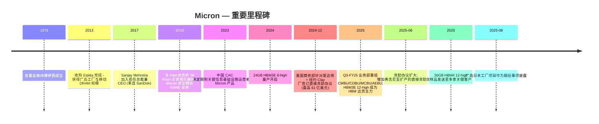
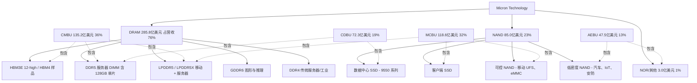
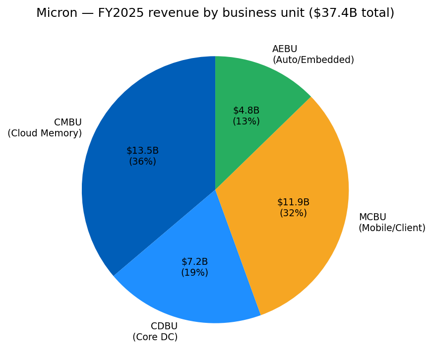
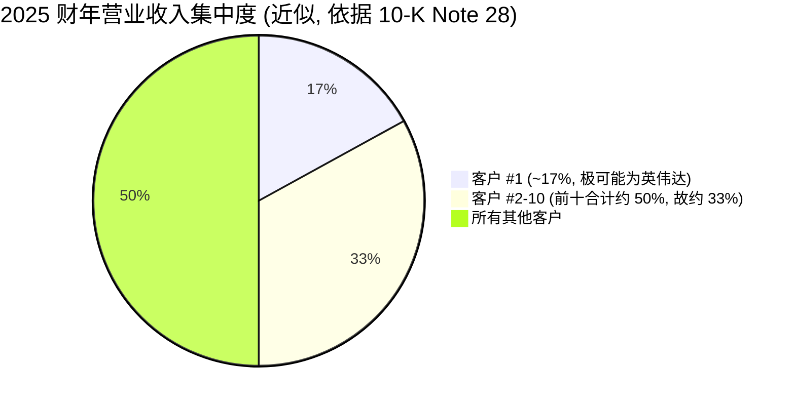
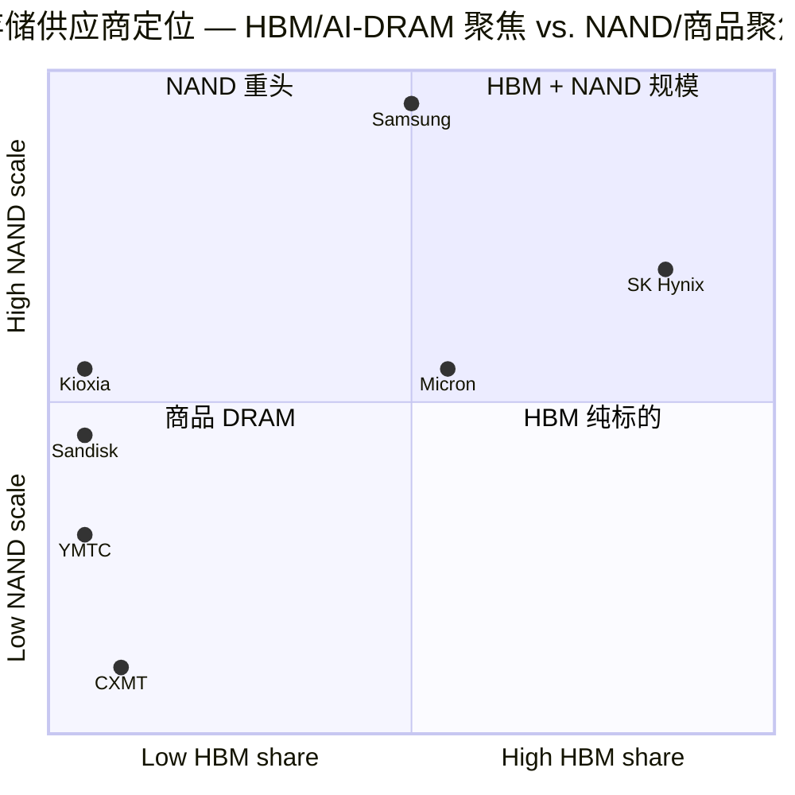
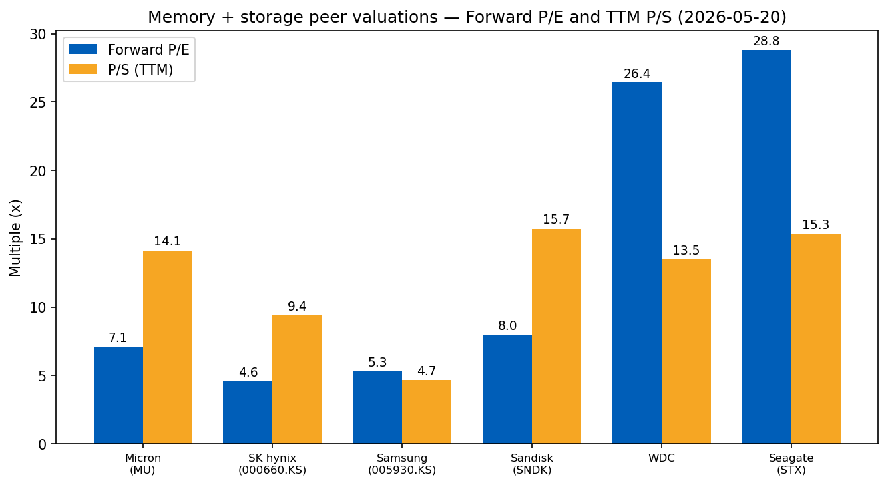

# Micron Technology, Inc. (NASDAQ:MU) — 公司研究报告

**截至日期: 2026-05-20**
**上市地: 纳斯达克 (NASDAQ), 代码 MU**
**注册地: 美国特拉华州 (总部位于爱达荷州博伊西)**
**报告语言: 简体中文 (英文版同时存在于本目录)**

**分析师说明:** 财年截止日为最接近 8 月 31 日的星期四。2025 财年 (FY2025) 截至 2025 年 8 月 28 日; 2026 财年 (FY2026) 自 2025 年 8 月 29 日起。

> **业绩更新——2026 财年 Q2 指引创下新一轮纪录重置 (2025-12-17 披露):** 管理层指引 2026 财年 Q2 营业收入为 **187.0 亿美元 ± 4.0 亿美元**, 非 GAAP 毛利率 (Non-GAAP gross margin) 为 **68.0% ± 1.0%**, 非 GAAP 摊薄每股收益 (Non-GAAP diluted EPS) 为 **8.42 美元 ± 0.20 美元**——相较 2026 财年 Q1 实际值 136.4 亿美元 / 56.8% / 4.78 美元。环比增幅隐含约 +37% (营业收入)、+11 个百分点 (毛利率)、+76% (EPS)。CEO Sanjay Mehrotra 将此跃升归因于"AI 需求加速 (AI demand acceleration)"以及前一季度 HBM3E 12-high 已成为高带宽内存 (High Bandwidth Memory, HBM) 出货主力后的 HBM 产品组合升级, HBM4 样品也已发送至"多家关键客户"。
> 来源: [2026 财年 Q1 业绩新闻稿, 2025-12-17](https://www.sec.gov/Archives/edgar/data/723125/000072312525000044/a2026q1ex991-pressrelease.htm)。

---

## 目录
1. 公司概览
2. 公司历史
3. 管理团队
4. 产品与服务
5. 客户与上市策略
6. 行业概览
7. 竞争格局
8. 市场机会 (TAM)
9. 风险评估
10. 参考资料

---

## 1. 公司概览

Micron Technology, Inc. 是全球仅存的三家具规模的**动态随机存取存储器 (Dynamic Random-Access Memory, DRAM)** 生产商之一, 也是五家具规模的 **NAND 闪存 (NAND flash)** 生产商之一。公司设计、制造并销售**存储与内存半导体 (memory and storage semiconductors)**——包括 DRAM (内含高带宽内存 HBM)、NAND 闪存, 以及一项规模很小的残余 NOR 闪存业务——向全球的云服务商、OEM (原始设备制造商)、移动手机厂商、汽车 Tier-1 供应商以及渠道分销商销售。公司总部位于美国爱达荷州博伊西 (Boise, Idaho), 截至 2025 年 8 月 28 日, Micron 员工总数约为 **5.3 万人**, 主要分布于亚洲、北美和欧洲 ([Micron 2025 10-K, "Human Capital" 章节](https://www.sec.gov/Archives/edgar/data/723125/000072312525000028/mu-20250828.htm))。晶圆制造主要集中在**台湾** (以长期资产口径衡量为最大晶圆厂集群, 厂房/设备 (PP&E) 达 189.7 亿美元)、**新加坡** (106.7 亿美元)、**日本** (70.4 亿美元), 以及**美国** (博伊西、弗吉尼亚以及新建的纽约州 Clay 基地, 合计 84.5 亿美元) ([10-K Note 29, 地理信息](https://www.sec.gov/Archives/edgar/data/723125/000072312525000028/mu-20250828.htm))。财年是按 52/53 周计算的会计期间, 截止日为最接近 8 月 31 日的星期四。

**盈利方式 (How Micron makes money)。** 产品组合通过直接销售给 OEM 及超大规模云客户, 以及通过分销商和消费者品牌渠道 (Crucial 品牌的 SSD 与内存模组) 销售。"客户合约几乎全部为短期合约, 以协商定价为基础"; 价格按季度调整, 并随行业供需关系迅速重置 ([10-K Note 21, 营业收入确认](https://www.sec.gov/Archives/edgar/data/723125/000072312525000028/mu-20250828.htm))。存储器实际上是一种**商品 (commodity)**, 其平均销售价格 (Average Selling Price, ASP) 单季度可能波动几百个基点。盈利能力的结构性杠杆是**通过节点收缩 (node shrinks) 与 3D NAND 层堆叠 (layer scaling) 实现单位比特成本下降**——Micron 的 1-beta 与 1-gamma DRAM 节点, 以及 232 层/276 层 NAND 是 2025 财年的生产主力——再叠加**面向高附加值 SKU (Stock-Keeping Unit) 的产品组合升级**, 其中以 HBM 与高容量 DDR5 服务器 DIMM (Dual In-line Memory Module, 双列直插内存模组) 最为重要。

**规模指标。** 2025 财年创下纪录:
- **营业收入 373.78 亿美元, 同比 +49%** (2024 财年: 251.11 亿美元; 2023 财年: 155.40 亿美元) ([10-K FY2025 合并业绩表](https://www.sec.gov/Archives/edgar/data/723125/000072312525000028/mu-20250828.htm))。
- **GAAP 毛利率 40%** (2024 财年: 22%; 2023 财年: −9%)。
- **营业利润 97.7 亿美元 (营业利润率 26%)**, 净利润 **85.4 亿美元**, 摊薄 EPS **7.55 美元** ([10-K FY2025 合并经营报表](https://www.sec.gov/Archives/edgar/data/723125/000072312525000028/mu-20250828.htm))。
- **经营性现金流 (Operating cash flow) 175.3 亿美元**, 总资本开支 158.6 亿美元, 净额扣除与《CHIPS 法案》相关的 20.0 亿美元政府款项 ([10-K FY2025 现金流量表](https://www.sec.gov/Archives/edgar/data/723125/000072312525000028/mu-20250828.htm))。
- 总资产 **828.0 亿美元**, 其中 **PP&E 465.9 亿美元** (约占资产负债表的 56%)——Micron 是标普 500 中资本密集度最高的公司之一 ([10-K FY2025 资产负债表](https://www.sec.gov/Archives/edgar/data/723125/000072312525000028/mu-20250828.htm))。

2026 财年 Q1 (截至 2025 年 11 月 27 日) 进一步重置了上行轨迹: 营业收入 **136.4 亿美元** (同比 +57%), GAAP 毛利率 **56.0%**, 非 GAAP EPS **4.78 美元**, 经营性现金流 **84.1 亿美元**——单季度就已达到 2025 财年全年经营性现金流的一半 ([2026 财年 Q1 业绩新闻稿, 2025-12-17](https://www.sec.gov/Archives/edgar/data/723125/000072312525000028/a2026q1ex991-pressrelease.htm))。

*来源: [Micron 2022 10-K (FY21/22) 及 2025 10-K (FY23-25 合并业绩)](https://www.sec.gov/Archives/edgar/data/723125/000072312525000028/mu-20250828.htm)。2023 财年的低谷 (GAAP 毛利率 −9%) 与 2025 财年回升至 40% 浓缩了三年内的一个完整存储周期。*

**估值快照 (截至 2026-05-20)。** Yahoo Finance 显示 MU 收盘价为 **727.42 美元**, 市值约 **8,207 亿美元** (摊薄股本 11.3 亿股), **TTM P/E 34.4 倍**、**前瞻 P/E 7.1 倍**、**TTM P/S 14.1 倍**、**P/B 11.3 倍**, 52 周区间为 **90.93–818.67 美元** ([Yahoo Finance MU 关键统计指标, 检索于 2026-05-20](https://finance.yahoo.com/quote/MU/key-statistics))。

该快照中最具信息量的一点是 **TTM P/E (34.4 倍) 与前瞻 P/E (7.1 倍) 之间的差距**——约 5 倍的压缩。前瞻数字锚定的是 Q2-FY2026 EPS 指引 8.42 美元, 以及管理层声明的"2026 财年将持续走强"的预期, 若 2026 财年延续环比爬坡, 该指引按中值年化对应的前瞻 EPS 约为 35–45 美元 ([2026 财年 Q1 业绩新闻稿, 2025-12-17](https://www.sec.gov/Archives/edgar/data/723125/000072312525000028/a2026q1ex991-pressrelease.htm))。**市场正在为峰值盈利年定价, 而非稳态。**同业可比也印证此读法:

| 代码 | 前瞻 P/E | TTM P/S | 备注 |
|---|---|---|---|
| **MU** | 7.08× | 14.12× | 本次分析 |
| SK 海力士 (000660.KS) | 4.56× | 9.38× | TTM P/E 不可得 (韩国披露口径) |
| 三星电子 (005930.KS) | 5.30× | 4.67× | 集团综合体, 存储约占组合 1/3 |
| Sandisk (SNDK) | 7.98× | 15.72× | NAND-only 纯标的 |
| Western Digital (WDC) | 26.42× | 13.47× | NAND 分拆后仅剩 HDD 业务 |
| Seagate (STX) | 28.79× | 15.35× | HDD-only |

*来源: [Yahoo Finance, 检索于 2026-05-20](https://finance.yahoo.com/quote/MU/key-statistics)。*

综合解读: TTM P/S 14.1 倍是 MU 上市以来的最高水平 (10 年 P/S 中位数 ~2.76 倍, 区间 0.99×–14.92×, 数据见 [Macrotrends MU 市销率历史](https://www.macrotrends.net/stocks/charts/MU/micron-technology/price-sales)), 反映了市场为 **AI 存储溢价 (AI-memory premium)** 所付出的代价——HBM 结构性短缺, MU 的 CMBU (Compute & Memory Business Unit) 业务营业收入在 2025 财年增长 257%, HBM4 样品发货则将公司定位至 NVDA/AMD 下一代 Blackwell-Ultra / Rubin 加速器世代 (见第 4 章) ([Micron HBM4 样品发货新闻稿, 2025-06-10](https://www.globenewswire.com/news-release/2025/06/10/3096784/14450/en/Micron-Ships-HBM4-to-Key-Customers-to-Power-Next-Gen-AI-Platforms.html))。但从前瞻盈利看, MU 又是半导体板块中最便宜的标的之一, 仅 7.1 倍——典型的晚周期布局: 市场*既*在为当下营业收入支付溢价, *又*在假设周期已经见顶 ([Yahoo Finance MU 关键统计指标, 检索于 2026-05-20](https://finance.yahoo.com/quote/MU/key-statistics))。负面下行情景: 若 HBM 价格在 2027 财年正常化, 同时大宗 DRAM 市场回归 3 年均值 ASP, 峰值 EPS 可能被压缩 40–60%, 而对低谷 EPS 给予 18–22 倍 P/E 将隐含相当显著的倍数压缩——见 [TrendForce, "Memory Price Rally May Run Past 2028", 2025-12-02](https://www.trendforce.com/news/2025/12/02/news-memory-price-rally-may-run-past-2028-as-samsung-sk-hynix-reportedly-cautious-on-expansion/) 关于乐观情形时点的讨论; 我们将其列为第 9 章中的**估值/倍数压缩**风险。

---

## 2. 公司历史

Micron Technology 于 **1978 年**在爱达荷州博伊西成立, 自 1980 年代初起就持续上市、持续制造 DRAM——使其成为唯一一家穿越 1990 年代、2000 年代及 2010 年代行业整合浪潮且总部位于美国、具规模的 DRAM 生产商。公司主要执行办公室仍位于 **8000 S. Federal Way, Boise, Idaho** ([10-K FY2025 封面](https://www.sec.gov/Archives/edgar/data/723125/000072312525000028/mu-20250828.htm)), 注册州为特拉华州 ([10-K FY2025 封面](https://www.sec.gov/Archives/edgar/data/723125/000072312525000028/mu-20250828.htm))。Micron 至今仍是爱达荷州最大的私营部门雇主。

*来源: [Micron 2025 10-K Item 1 业务、"管理层"章节、Note 13 (CHIPS 资助)、期后事项](https://www.sec.gov/Archives/edgar/data/723125/000072312525000028/mu-20250828.htm)。*

**值得理解的战略转折** ([Micron 2025 10-K Item 1 业务](https://www.sec.gov/Archives/edgar/data/723125/000072312525000028/mu-20250828.htm))。

- **收购 Elpida (2013)。** Micron 收购日本破产 DRAM 厂商 Elpida (及其广岛工厂与 Rexchip/Inotera 台湾业务), 将全球 DRAM 行业从五家整合至三家 (Micron / 三星 / SK 海力士)。这是一次十年一遇的战略行动: 该交易引入了移动 DRAM 专业能力 (Micron 之前在此领域缺位)、晶圆产能翻倍, 并从结构上改善了整个行业的 DRAM 定价。后续 2016 年对 Inotera 剩余股份的收购完成了整合 ([Micron 8-K, Elpida 交割, 2013-07-31](https://www.sec.gov/Archives/edgar/data/0000723125/000072312513000133/form8k-elpidaclosingpr.htm))。
- **由 NAND 合资伙伴转向 NAND 独立运营 (2018–2021)。** Micron 退出了与 Intel 多年的 IM Flash 合资项目, 独资接管犹他州 Lehi 工厂。三年后, Micron 在 2021 年将 Lehi 出售给德州仪器——这是 Micron 将 NAND 研发集中于新加坡的有意为之的产能收缩。事后看, Micron 提前下调了 NAND 新增产能优先级, 使其在 2024–25 财年的 NAND 紧张周期中处于有利位置 ([Micron 2025 10-K Item 1 业务](https://www.sec.gov/Archives/edgar/data/723125/000072312525000028/mu-20250828.htm))。
- **HBM 上量 (2024–至今)。** Micron 进入 HBM 的时间晚于 SK 海力士与三星, 但凭借在 1-beta 节点上的 HBM3E 8-high (24GB) 实现弯道超车, 通过英伟达 H200 的认证 ([Micron HBM3E 量产新闻稿, 2024-02-26](https://videocardz.com/press-release/micron-starts-volume-production-of-hbm3e-memory-for-nvidia-h200-tensor-core-gpu)), 目前 HBM3E 12-high (36GB) 已是出货主力, 同时已向客户送样 HBM4 36GB 12-high ([10-K FY2025 Item 1 业务](https://www.sec.gov/Archives/edgar/data/723125/000072312525000028/mu-20250828.htm))。HBM 营业收入是 FY25/FY26 模型中最大的单一波动因素。

**近期动态 (2025 财年 – 2026 财年初)** ——每条详细来源标注如下 ([Micron 2025 10-K, Item 1 / Item 7](https://www.sec.gov/Archives/edgar/data/723125/000072312525000028/mu-20250828.htm))。

- **Q3-FY2025 业务部重组。** Micron 将原"计算与网络业务部 (Compute & Networking Business Unit)"拆分为 **CMBU** (超大规模云客户 + HBM) 与 **CDBU** (Compute & Datacenter Business Unit, 中端云 + OEM 数据中心 + 数据中心 NAND/SSD)。所有过往期间的分部数据均已追溯重述 ([10-K FY2025 Item 7 分部讨论](https://www.sec.gov/Archives/edgar/data/723125/000072312525000028/mu-20250828.htm))。
- **CHIPS 法案直接资助协议。** 2024 年 12 月 9 日: 与美国商务部签署 **最高 61 亿美元**的直接资助协议, 用于支持爱达荷州博伊西与纽约州 Clay 的晶圆厂。2025 年 6 月 11 日: 修订条款增加了博伊西的第二座规划晶圆厂; 同一 2025 年 6 月修订周期还为弗吉尼亚州 Manassas 扩产新增了直接资助协议 ([10-K FY2025 Item 1A, "CHIPS Act 直接资助"](https://www.sec.gov/Archives/edgar/data/723125/000072312525000028/mu-20250828.htm))。
- **广岛 (日本) 与 Sanand (印度)。** 一座新的广岛工厂 (Project Hiroshima) 作为期后事项于 2025 年 8 月 29 日披露 ([10-K FY2025 期后事项](https://www.sec.gov/Archives/edgar/data/723125/000072312525000028/mu-20250828.htm))。Sanand (古吉拉特邦) 的组装/测试设施则获得了印度中央政府与古吉拉特邦政府的资助。
- **HBM4 首批客户送样 (2025)。** HBM4 36GB 12-high 样品已发送至"多家关键客户"——行业判读为英伟达 (Rubin)、AMD (MI400 系列), 以及至少一家云端 ASIC 客户 ([10-K FY2025 Item 1 业务](https://www.sec.gov/Archives/edgar/data/723125/000072312525000028/mu-20250828.htm))。

---

## 3. 管理团队

### Sanjay Mehrotra — 董事长、总裁兼 CEO (67 岁; 2017 年 5 月加入)

Sanjay Mehrotra 是存储与内存行业最有经验的运营者之一。他**于 1988 年与 Eli Harari 和 Jack Yuan 共同创立了 SanDisk 公司**, 自 2011 年 1 月起担任总裁兼 CEO, 直至 2016 年 5 月该公司以 190 亿美元出售给 Western Digital; 他将 SanDisk 从一家创业公司带入全球最大的纯 NAND 厂商——一段长达 28 年的发展弧线, 期间 SanDisk 从 PC 与数码相机用的紧凑型闪存卡过渡到企业级 SSD 与移动端可控 NAND, 与 (现在的) 铠侠 (Kioxia, 前东芝) 共同搭建并扩展了 NAND 工厂合作。Mehrotra **于 2017 年 5 月**加入 Micron 担任总裁兼 CEO, **2025 年 1 月**被任命为董事会主席 ([10-K FY2025, "管理层"章节](https://www.sec.gov/Archives/edgar/data/723125/000072312525000028/mu-20250828.htm))。

他在 Micron 的任期已覆盖三个完整的存储周期。在他领导下, Micron (i) 于 2016 年底完成 Inotera 收购 (技术上在其任期前, 但他承接了整合工作); (ii) 于 2018 年完成与 Intel 的 IM Flash 合资退出; (iii) 于 2021 年剥离 Lehi NAND 工厂; (iv) 穿越 2023 财年下行周期 (营业收入同比 −49%, 毛利率 −9%) 而未实施 Micron 历史上低谷时常见的股权融资; (v) 完成了其职业生涯中影响最深远的战略决策——**HBM 后发入场**。Micron 在 HBM3 上市时间上落后, 但凭借领先的 1-beta DRAM 节点及对功耗效率的专注, 成功通过英伟达 H100 后续产品 (H200) 的认证, 并由此进入 B100/B200/GB200。CMBU 营业收入是这一战略最直接的证据: 从 2023 财年的 18.7 亿美元 → 2024 财年的 37.9 亿美元 → **2025 财年的 135.2 亿美元** (同比 +257%) ([10-K FY2025 业务部营业收入](https://www.sec.gov/Archives/edgar/data/723125/000072312525000028/mu-20250828.htm))。2026 财年 Q1, CMBU 年化运行率约为 210 亿美元 (即季度 52.8 亿美元的 4 倍), HBM3E 12-high 已成为产品组合主力。

Mehrotra 拥有**加州大学伯克利分校**电气工程与计算机科学学士与硕士学位, 并是斯坦福商学院高管项目毕业生 ([10-K FY2025 Item 10](https://www.sec.gov/Archives/edgar/data/723125/000072312525000028/mu-20250828.htm))。他在 SanDisk 被收购后曾短暂任职于 Western Digital 董事会 (2016 年 5 月 – 2017 年 2 月)、Cavium 董事会 (2009–2018), 目前任 CDW Corporation 董事 (自 2021 年 3 月起)。他在 70 余项已授权或申请中的专利上署名。其 Micron 持股每年披露在委托书 (Proxy) 中; 最新的 DEF 14A 是持股最权威的来源。

### Mark J. Murphy — 执行副总裁兼 CFO (58 岁; 2022 年 4 月加入)

Mark Murphy 来自 **Qorvo, Inc.**, 自 2016 年 6 月至 2022 年 4 月任 Qorvo 的 CFO——这一为期六年的任期覆盖了 Qorvo RF 业务整合及 5G 上量阶段。在 Qorvo 之前, 他是 **Delphi Automotive PLC (现 Aptiv) 的执行副总裁兼 CFO**, 更早在 **Praxair, Inc.** 和 **MEMC Electronic Materials** 任高管——后者带给他直接的半导体材料周期经验 ([10-K FY2025 Item 10](https://www.sec.gov/Archives/edgar/data/723125/000072312525000028/mu-20250828.htm))。他担任 Albany International Corp. 的董事, 并是一名美国海军陆战队退伍军人。Murphy 于 2023 财年开局接任 CFO 一职——这是存储行业 25 年来最严峻的下行周期 (营业收入 −49%, 毛利率 −9%, 营业亏损 (57) 亿美元)——他主导了"保留资产负债表流动性、在有利窗口期发债 (尤其是 2032 年绿色债券)、并在周期中维持股息"的剧本。2025 财年纪录性业绩 (175 亿美元经营性现金流 + 20 亿美元 CHIPS 款项捕获) 的兑现也在其任内。他在 CHIPS 直接资助协议以及爱达荷与纽约绿地扩产的融资结构上扮演了关键执行角色。Murphy 于 2025 年 7 月 31 日修改了 Rule 10b5-1 交易计划, 拟出售最多 126,000 股 ([10-K FY2025 Item 5](https://www.sec.gov/Archives/edgar/data/723125/000072312525000028/mu-20250828.htm))。

### Sumit Sadana — 执行副总裁兼首席业务官 (56 岁; 2017 年 6 月加入)

Sumit Sadana 负责业务发展、产品战略与客户经营——实际上是 Micron 对外面向客户与公开指引更新的执行人 (他主导了 2025 年 8 月 11 日 KeyBanc 炉边谈话上的指引上调)。他在 **SanDisk 任职 2010–2016 年**, 角色包括执行副总裁兼首席战略官以及企业级解决方案部总经理。更早的职业经历包括在 IBM Microelectronics 工作 10 余年。他持有 IIT Kharagpur 电气工程学士及斯坦福大学电气工程硕士学位 ([10-K FY2025 Item 10](https://www.sec.gov/Archives/edgar/data/723125/000072312525000028/mu-20250828.htm))。他兼任 Silicon Laboratories, Inc. 董事。

### Manish Bhatia — 执行副总裁、全球运营负责人 (53 岁; 2017 年 10 月加入)

Manish Bhatia 负责全球制造布局——台湾、新加坡、日本、美国晶圆厂以及 Sanand 后端。他来自 **Western Digital**, 在 WD 于 2016 年收购 SanDisk 后任硅运营执行副总裁, 更早曾在 SanDisk 任多个高管职位 (2010 年 3 月 – 2016 年 5 月) 包括执行副总裁兼全球运营负责人。他持有机械工程学士、硕士及 MBA 学位, **均毕业于麻省理工学院 (MIT)** ([10-K FY2025 Item 10](https://www.sec.gov/Archives/edgar/data/723125/000072312525000028/mu-20250828.htm))。Bhatia 在未来 36 个月内的职责是 Micron 运营层面最关键的——并行推进 HBM4 上量、台湾现代化、爱达荷绿地、纽约 Clay 厂、弗吉尼亚 Manassas 现代化、广岛扩产, 以及 Sanand 后端。2025 财年的 158.6 亿美元资本开支 (总额), 加上 2026 财年隐含的约 180 亿美元年化运行率 (基于 10-K 披露的 45 亿美元/季度基线), 均经其组织实施。

### 治理脚注

董事会以多数独立董事构成, 采用单类投票结构——没有超级投票权股票。Sanjay Mehrotra 于 2025 年 1 月被任命为**董事长**, 集 CEO 与董事长于一身; 牵头独立董事 (lead independent director) 治理机制详情披露于委托书。内部人受益持股比例处于个位数低值范围——Micron 的持股以机构为主 (最新 13F 显示 Vanguard、BlackRock 和 State Street 是三大持股机构)。董事会授权**最高 100 亿美元**的股票回购 ([10-K FY2025 Item 5, 股票回购授权](https://www.sec.gov/Archives/edgar/data/723125/000072312525000028/mu-20250828.htm)); 自 2018 年 5 月授权以来的累计回购金额在同一项目中披露。高管薪酬严重权益挂钩, 带有与总股东回报 (Total Stockholder Return, TSR) 及经营指标挂钩的绩效股票单位 (PSU)——完整披露见 DEF 14A。无重大关联方交易披露。

### 业绩纪录综述

Mehrotra–Murphy–Sadana–Bhatia 是存储行业最接近"全明星"的管理团队。Mehrotra 带来了 SanDisk 联合创始人对技术路线图的严谨 ([Sanjay Mehrotra LinkedIn](https://www.linkedin.com/in/sanjay-mehrotra/)); Murphy 带来了汽车与 RF 周期淬炼出的资本市场纪律 ([Micron 8-K, Murphy CFO 任命, 2022-04-05](https://www.sec.gov/Archives/edgar/data/0000723125/000072312522000020/mu-20220408.htm)); Sadana 带来了 SanDisk 企业 NAND 推广中的客户经营剧本 ([Sumit Sadana LinkedIn](https://www.linkedin.com/in/sumitsadana/)); Bhatia 带来了制造规模领导力 ([Manish Bhatia 领导层简介, Micron.com](https://www.micron.com/about/company/leadership/manish-bhatia))。HBM 后发并取胜是该团队执行力最清晰的证据: 2023 年, Micron 还被普遍认为在 HBM 上处于结构性不利地位; 到 2025 财年, 它已在比特份额上居 SK 海力士之后名列第二, 在客户认证上明显领先于三星 ([Counterpoint — 全球 DRAM 与 HBM 市场份额, 季度数据](https://counterpointresearch.com/en/insights/global-dram-and-hbm-market-share))。

---

## 4. 产品与服务

Micron 的产品组合按**产品技术**组织 (DRAM、NAND、NOR), 通过**四个可报告分部** (CMBU、CDBU、MCBU、AEBU) 销售。下表将技术映射到分部, 再映射到主要终端市场。除注明外, 所有营业收入数字均为 2025 财年, 来源于 [Micron 2025 10-K Note 21 营业收入与 Item 7 分部讨论](https://www.sec.gov/Archives/edgar/data/723125/000072312525000028/mu-20250828.htm)。

*来源: [Micron 2025 10-K, Note 21 营业收入, Item 1 业务分部描述, Note 27 分部信息](https://www.sec.gov/Archives/edgar/data/723125/000072312525000028/mu-20250828.htm)。*

*来源: [Micron 2025 10-K, Note 27 业务部营业收入](https://www.sec.gov/Archives/edgar/data/723125/000072312525000028/mu-20250828.htm)。CMBU 现已成为最大分部, 2025 财年超过了 MCBU (Mobile & Client Business Unit)。*

*来源: [Micron 2025 10-K, Note 21 按技术划分营业收入](https://www.sec.gov/Archives/edgar/data/723125/000072312525000028/mu-20250828.htm)。DRAM 占 2025 财年营业收入 76%, 是盈利的主导驱动力。*

### DRAM 产品

**HBM3E 与 HBM4 (旗舰)。** Micron 于 2024 年在 1-beta DRAM 节点上启动 **8-high 24GB HBM3E** 量产。到 2025 财年 Q4, **HBM3E 12-high (36GB) 已成为 HBM 出货主力**, 并在 2025 财年向多家关键客户交付 **HBM4 36GB 12-high** 样品, 用于下一代 AI 平台 ([10-K FY2025 Item 1 业务](https://www.sec.gov/Archives/edgar/data/723125/000072312525000028/mu-20250828.htm))。
- *竞争优势判定:* **是——技术与节点成本护城河。** HBM 是制造难度最高的 DRAM SKU 之一, 需要硅通孔 (Through-Silicon Via, TSV) 封装、领先 DRAM 节点, 以及严苛的散热与功耗优化。Micron 的 1-beta 节点相对三星上一代 HBM 提供约 20–30% 的功耗效率优势, 在比特密度方面与 SK 海力士持平或略胜 (依据 Micron 产品资料)。最直接的竞品是 **SK 海力士的 HBM3E 12-high 与 HBM4**——SK 海力士仍是出货龙头, 是英伟达 H100/H200 世代的领先供应商, 但 Micron 已通过 B200 与 B300 的认证, 并在 Rubin 级平台上是两家合格供应商之一 (出自 Q1-FY2026 业绩说明会公开评论)。
- *证据:* 2025 财年 CMBU 营业收入同比 **+257%** 至 135.2 亿美元, Q1-FY2026 CMBU 毛利率为 **66%**, 而公司综合毛利率为 56%——HBM 是组合中毛利率最高的产品 ([Q1-FY2026 业绩新闻稿, 业务部业绩表](https://www.sec.gov/Archives/edgar/data/723125/000072312525000028/a2026q1ex991-pressrelease.htm))。

**DDR5 (含 128GB 服务器模组)。** 2024 年, Micron 在 1-beta 节点上认证并交付了 **128GB DDR5 服务器模组**, 采用**单片 32GB DRAM 晶粒**——作为现有 3D TSV 堆叠式高容量 DIMM 的行业替代方案 ([Micron 128GB DDR5 RDIMM 单片晶粒新闻稿, 2023-11-09](https://www.globenewswire.com/news-release/2023/11/09/2777457/14450/en/Micron-First-to-Enable-Ecosystem-Partners-With-the-Fastest-Lowest-Latency-High-Capacity-128GB-RDIMMs-Using-Monolithic-32Gb-DRAM.html))。
- *判定:* **是——单片晶粒方案带来部分护城河**, 相比 TSV 堆叠方案在高容量服务器 DRAM 上具备更低功耗与更低成本; 最直接的竞品是三星的 128GB 3DS 模组 ([StorageNewsletter — Micron 出货 128GB DDR5 用于 AI 数据中心, 2024-05-10](https://www.storagenewsletter.com/2024/05/10/micron-shipping-128gb-ddr5-critical-memory-for-ai-data-centers/))。

**LPDDR5 / LPDDR5X。** 低功耗 DDR——历史上是移动手机产品, 现在越来越多地用于**服务器** (用于 AI 推理加速器的 LPDDR) 与 **PC**。Micron 一直在推进 LPDDR 在服务器领域的普及 ([Micron 2025 10-K Item 1 业务 — LPDDR 产品线](https://www.sec.gov/Archives/edgar/data/723125/000072312525000028/mu-20250828.htm))。
- *判定:* **部分。**Micron 是 Top-3 供应商 (三星第 1, SK 海力士第 2, 按手机份额衡量)。LPDDR 主要靠通过手机认证, 周转较慢; 护城河在于认证名册, 而非底层芯片 ([Counterpoint — 全球 DRAM 与 HBM 市场份额, 季度数据](https://counterpointresearch.com/en/insights/global-dram-and-hbm-market-share))。

**GDDR6。** 用于 GPU 及推理加速器的图形 DRAM; Micron 是英伟达消费级 GPU 的主导供应商 ([Micron 2025 10-K Item 1 业务 — GDDR](https://www.sec.gov/Archives/edgar/data/723125/000072312525000028/mu-20250828.htm))。
- *判定:* **部分——认证护城河。** GDDR6 在下一代将被 GDDR7 补充。

**DDR4。** 传统服务器/工业 DRAM。在嵌入式与工业市场仍具意义, 因为认证周期较长 ([Micron 2025 10-K Item 1 — 传统产品组合中的 DDR4](https://www.sec.gov/Archives/edgar/data/723125/000072312525000028/mu-20250828.htm))。
- *判定:* **否**——商品化, 主要是成本与供应的竞争。

### NAND 产品

**数据中心 SSD (9550 系列)。** 2025 财年, Micron 认证并开始出货 **9550 系列 SSD**——面向 AI 训练与高性能计算工作负载的全集成解决方案 ([10-K FY2025 Item 1 业务](https://www.sec.gov/Archives/edgar/data/723125/000072312525000028/mu-20250828.htm))。
- *判定:* **部分护城河。** 数据中心 SSD 市场竞争激烈 (三星、SK 海力士/Solidigm、Sandisk、铠侠)。Micron 的定位通过与其 232 层 NAND (业界领先层数之一) 及控制器堆栈的紧密集成实现差异化。最直接的竞品是**三星 PM1743/PM1745** 系列。

**可控 NAND (移动 UFS / eMMC)。** 销往智能手机、汽车信息娱乐与消费类设备 ([Micron 2025 10-K Item 1 — 可控 NAND 产品线](https://www.sec.gov/Archives/edgar/data/723125/000072312525000028/mu-20250828.htm))。
- *判定:* **部分。**Tier-1 客户认证至关重要; 技术本身广泛可得。最直接的竞品: SK 海力士 (Solidigm) 与三星 ([Counterpoint — 全球 NAND 存储市场份额, 季度数据](https://counterpointresearch.com/en/insights/global-nand-memory-market-share))。

**低密度 NAND。** 汽车、IoT、安防、机器对机器、工业——长寿命、低密度的 SLC/MLC NAND, 竞争点更多在生命周期支持而非单位比特成本 ([Micron 2025 10-K Item 1 — AEBU 嵌入式 NAND](https://www.sec.gov/Archives/edgar/data/723125/000072312525000028/mu-20250828.htm))。
- *判定:* **是——汽车场景的认证护城河。** 车规 NAND 需要数十年生命周期、AEC-Q100 认证, 以及与客户的紧密集成。

### NOR 产品

汽车与工业代码存储的小型残余业务, 适用场景需要即时启动 / 原位执行 (Execute-in-Place, XIP)。**NOR 加上其他业务在 2025 财年合计营业收入为 2.97 亿美元** (约占营业收入的 0.8%) ([Micron 2025 10-K Note 21 按技术划分营业收入](https://www.sec.gov/Archives/edgar/data/723125/000072312525000028/mu-20250828.htm))。
- *判定:* **部分。**Cypress (Infineon) 与 Macronix (旺宏) 规模更大; Micron 的 NOR 大多通过 AEBU (Automotive & Embedded Business Unit) 嵌入式渠道销售。

### 旗舰产品 vs. 长尾

驱动业务的 1–3 款产品 ([Micron 2025 10-K Note 27 分部信息](https://www.sec.gov/Archives/edgar/data/723125/000072312525000028/mu-20250828.htm)):
1. **HBM3E / HBM4** —— 单一最大的营业收入与利润驱动器, 也是 CMBU 在两年内从营业收入 12% 升至 36% 的原因。
2. **高容量 DDR5 服务器 DIMM (128GB 单片、96GB、64GB)** —— AI 数据中心的第二个杠杆; ASP 约为商品 DDR5 的 2 倍 ([Micron 128GB DDR5 新闻稿, 2023-11-09](https://www.globenewswire.com/news-release/2023/11/09/2777457/14450/en/Micron-First-to-Enable-Ecosystem-Partners-With-the-Fastest-Lowest-Latency-High-Capacity-128GB-RDIMMs-Using-Monolithic-32Gb-DRAM.html))。
3. **数据中心 SSD (9550 系列)** —— NAND 侧的 AI 标的; 美元收入规模小于 HBM/DDR5, 但属增长最快的 NAND SKU ([Micron 9550 SSD 产品页](https://www.micron.com/products/storage/ssd/data-center-ssd/9550-ssd))。

长尾包括传统 DDR4 服务器、GDDR6 图形、低密度 NAND、NOR, 以及非旗舰手机用的可控 NAND ([Micron 2025 10-K Item 1 业务 — 产品线](https://www.sec.gov/Archives/edgar/data/723125/000072312525000028/mu-20250828.htm))。

### 路线图与近期推出 (过去 12 个月)

- HBM3E 12-high 于 2025 财年 Q4 成为 **HBM 出货主力** ([10-K Item 1](https://www.sec.gov/Archives/edgar/data/723125/000072312525000028/mu-20250828.htm))。
- HBM4 36GB 12-high 样品于 2025 财年发送至"多家关键客户"。
- 9550 数据中心 SSD 于 2025 财年出货。
- Q3-FY2025 业务部重组 (CMBU/CDBU/MCBU/AEBU) 更清晰地区分了超大规模云客户与中端数据中心。
- FQ1-FY2026 (截至 2025 年 11 月 27 日) 实现公司纪录性毛利率 56%、营业利润率 45% 与经营性现金流 84.1 亿美元 ([Q1-FY2026 业绩新闻稿](https://www.sec.gov/Archives/edgar/data/723125/000072312525000028/a2026q1ex991-pressrelease.htm))。

---

## 5. 客户与上市策略

### 客户分类

Micron 的客户基础清晰地分为五大类 ([Micron 2025 10-K Item 1, 业务部客户描述](https://www.sec.gov/Archives/edgar/data/723125/000072312525000028/mu-20250828.htm)):
1. **超大规模云服务商** (CMBU 客户基础)——AWS、微软、Google、Meta、Oracle、字节跳动 (ByteDance) 与阿里巴巴——采购 HBM (与他们直接采购的英伟达/AMD GPU 捆绑)、高容量 DDR5, 以及用于推理服务器的 LPDDR5 ([Micron 2026 财年 Q1 业绩说明会准备稿, 2025-12-17](https://investors.micron.com/static-files/088991c5-a249-4f66-a0a6-258d9b66f3f9))。
2. **AI 加速器 / GPU OEM** (通过 HBM 渠道纳入 CMBU 统计)——英伟达、AMD, 以及新兴定制硅项目 (Google TPU、AWS Trainium、Meta MTIA)。大部分 HBM 销售给 GPU OEM, 由其将 HBM 堆栈与计算芯片封装在一起, 再销售给超大规模云客户 ([TrendForce — Micron 出货 HBM4 样品, 2025-06-11](https://www.trendforce.com/news/2025/06/11/news-micron-ships-hbm4-samples-with-1s-process-to-multiple-customers-reportedly-including-nvidia/))。
3. **中端云 + 企业 OEM** (CDBU)——Dell、HPE、超微 (Supermicro)、联想、IBM, 以及中国 OEM (浪潮、联想、新华三 H3C) 用于中端服务器; 数据中心 SSD 销售给所有云与企业客户 ([Micron 9550 NVMe SSD 产品页](https://www.micron.com/products/storage/ssd/data-center-ssd/9550-ssd))。
4. **移动 + PC OEM** (MCBU)——Apple、Samsung Mobile、小米、OPPO、vivo、联想 PC、HP、Dell 客户端 PC ([Micron 2025 10-K Item 1 — MCBU 客户描述](https://www.sec.gov/Archives/edgar/data/723125/000072312525000028/mu-20250828.htm))。
5. **汽车 + 工业 + 消费** (AEBU)——汽车 Tier-1 供应商 (博世 Bosch、大陆集团 Continental、电装 Denso)、工业集成商, 以及消费电子 OEM ([Micron 2025 10-K Item 1 — AEBU 客户描述](https://www.sec.gov/Archives/edgar/data/723125/000072312525000028/mu-20250828.htm))。

### 客户集中度

[Micron 2025 10-K Note 28 重大集中度](https://www.sec.gov/Archives/edgar/data/723125/000072312525000028/mu-20250828.htm) 的客户集中度披露信息异常丰富:

- **"2025 财年来自一位客户的营业收入占总营业收入的 17% (主要包含于 CMBU 分部)。"** 该 17% 的单一客户**极有可能是英伟达 (Nvidia)**——它是唯一一家在 CMBU 内可能采购 >60 亿美元 HBM 与高容量 DRAM 的客户, 时序也与 H200 / B100 / B200 上量吻合。Micron 未具名披露客户身份, 但分部归属与体量大小仅与英伟达一致。
- **"2024 财年来自一位客户的营业收入占总营业收入的 10% (主要包含于 MCBU、AEBU 与 CMBU 分部)。"** 这与一家大型手机/消费电子 OEM 吻合——历史上 Apple 一直是 Micron 最大的移动客户; 2024 财年在 MCBU/AEBU/CMBU 三个分部的分布指向 Apple。
- **"2023 财年没有任何一位客户占总营业收入 10% 或以上。"**
- **"过去三年中, 我们前十大客户的营业收入约占我们总营业收入的一半。"** ([10-K FY2025 Note 28 重大集中度](https://www.sec.gov/Archives/edgar/data/723125/000072312525000028/mu-20250828.htm))。

*来源: [Micron 2025 10-K, Note 28 重大集中度](https://www.sec.gov/Archives/edgar/data/723125/000072312525000028/mu-20250828.htm)。客户身份未具名披露; 分部归属允许推断。*

**集中度风险判定。** Top-1 占 17%, Top-10 占约 50% 属于**重大集中度** ([Micron 2025 10-K Note 28](https://www.sec.gov/Archives/edgar/data/723125/000072312525000028/mu-20250828.htm))。按报告结构阈值衡量 (Top-1 > 10%, Top-5 可能 > 30%), 客户集中度被列入第 9 章风险。缓解因素在于: Micron 的 #1 客户几乎肯定本身就是其自身价值链的瓶颈 (英伟达 → 云)——这意味着集中度风险本质上是**周期/终端市场风险** (AI 资本开支放缓), 而非**份额流失风险** (英伟达独家切换到三星或 SK 海力士) ([TrendForce — 三星/SK 海力士 2026 年 HBM3E 提价, 2025-12-24](https://www.trendforce.com/news/2025/12/24/news-samsung-sk-hynix-reportedly-plan-20-hbm-3e-price-hike-for-2026-as-nvidia-h200-asic-demand-rises/))。

### 合约结构与上市策略

10-K 明确指出"我们与客户的合同几乎全部为短期固定价格协议, 付款一般在交付后短期内到期" ([10-K FY2025 Note 21](https://www.sec.gov/Archives/edgar/data/723125/000072312525000028/mu-20250828.htm))。价格按季度重置; 数量按季度或按月协商。这是存储定价如此剧烈波动的结构性原因。

**2025–2026 财年的一个新例外: HBM 长期协议 (Long-Term Agreement, LTA)。** 管理层已公开讨论 HBM 是按多季度/多年期 LTA 销售给主要超大规模云客户与 GPU OEM, 价格与产能均提前承诺 ([Micron 2026 财年 Q1 业绩说明会准备稿, 2025-12-17](https://investors.micron.com/static-files/088991c5-a249-4f66-a0a6-258d9b66f3f9))。这是一项有实质意义的结构性转变——HBM 营业收入与利润相比商品化 DRAM 的可见度大大提高。2026 财年 Q1 新闻稿指出 HBM 与高毛利 SKU 是 Q2 指引的"重大纪录"的支撑 ([Micron 2026 财年 Q1 业绩新闻稿 (8-K), 2025-12-17](https://www.sec.gov/Archives/edgar/data/0000723125/000072312525000044/a2026q1ex991-pressrelease.htm))。

### 分销与渠道

- **直接 OEM 销售**面向 Top 25–30 客户, 代表营业收入的大部分 ([Micron 2025 10-K Note 28 — 前十客户约占营业收入 50%](https://www.sec.gov/Archives/edgar/data/723125/000072312525000028/mu-20250828.htm))。
- **分销渠道** (Arrow、Avnet、WPG、Macnica) 服务汽车、工业与消费的长尾客户 ([Micron 消费品牌销售网络](https://www.micron.com/sales-support/sales-network/consumer-brand))。
- **Crucial 消费品牌渠道** (Crucial 品牌的 SSD 与 DRAM 模组通过 Amazon、Best Buy、Newegg、Micro Center、京东等销售)——业务中面向零售的历史板块; 2025 年 12 月 3 日, 管理层宣布计划在 FQ2-FY2026 退出 Crucial 消费品牌线, 将腾出的产能转向企业级/HBM ([Tom's Hardware — Micron 终结 Crucial 消费品牌, 2025-12-04](https://www.tomshardware.com/pc-components/dram/micron-is-killing-crucial-ssds-and-memory-in-ai-pivot-company-refocuses-on-hbm-and-enterprise-customers))。

### 关键伙伴关系

- **英伟达、AMD、Intel** —— 认证 Micron HBM 与 DDR 的 GPU 与 CPU OEM ([TrendForce — Micron HBM4 1ß 工艺样品, 2025-06-11](https://www.trendforce.com/news/2025/06/11/news-micron-ships-hbm4-samples-with-1s-process-to-multiple-customers-reportedly-including-nvidia/))。
- **台积电 (TSMC)** —— 为 Micron 的先进封装 HBM 堆栈制造控制器与逻辑芯片; HBM4 使用 TSMC N5/N3 基底逻辑芯片 (依据公开路线图评论) ([Tom's Hardware — Micron HBM4 量产用于 Vera Rubin](https://www.tomshardware.com/pc-components/dram/micron-enters-high-volume-production-of-hbm4-for-nvidia-vera-rubin))。
- **ASML、Lam Research、Applied Materials、Tokyo Electron** —— 半导体设备供应商; Micron 在 1-gamma DRAM 节点上使用 ASML 的 EUV (Extreme Ultraviolet, 极紫外光刻) ([Micron 2025 10-K Item 1A — 设备供应商依赖](https://www.sec.gov/Archives/edgar/data/723125/000072312525000028/mu-20250828.htm))。
- **Intel (历史)** —— 2006 至 2018 年解散的 IM Flash 合资伙伴; 历史性的 Optane / 3D XPoint 项目 (现已停产) ([Micron 2025 10-K Item 1 业务 — 合资历史](https://www.sec.gov/Archives/edgar/data/723125/000072312525000028/mu-20250828.htm))。

---

## 6. 行业概览

### 行业定义

存储与内存半导体由**DRAM** (易失性工作内存; 约占存储 $TAM 的 60–65%)、**NAND** (非易失性存储; 约 30–35%), 以及小型附属类别 (NOR、MRAM、ReRAM、新兴存储) 组成 ([Yole Group — 存储市场超越预期, 2025](https://www.yolegroup.com/press-release/memory-market-surges-beyond-expectations-almost-200-billion-in-2025-driven-by-hbm-ai/))。该行业位于 (i) 更广泛的半导体价值链与 (ii) 数据中心、移动、PC 与汽车终端市场的交集。按"可替代、按现货价格交易"的定义, DRAM 与 NAND 是商品产品——但生产它们的技术与资本密集程度使供应商集合极为狭窄 ([Micron 2025 10-K Item 1A — 竞争环境](https://www.sec.gov/Archives/edgar/data/723125/000072312525000028/mu-20250828.htm))。

### 市场规模

存储行业是规模最大、最具周期性的半导体子市场之一:
- **2024 年存储总营业收入: 约 1,650 亿美元**, 其中 **DRAM 约 900 亿美元**, **NAND 约 600 亿美元**, 依据 WSTS / SIA / 行业共识 ([半导体行业协会 — 11 月全球半导体销售同比增长 18.7%](https://www.semiconductors.org/global-semiconductor-sales-increased-18-7-year-to-year-in-november/) 及 Gartner 2024–2025 行业跟踪汇编)。
- **2025 年存储总营业收入: 估计 2,000–2,300 亿美元**, DRAM 占年度增长的大部分, 受 AI 驱动的 HBM 与高容量 DDR5 需求带动 (来自 Q1-FY2026 Micron 业绩说明会评论; SK 海力士与三星 2025 年 Q3 业绩亦印证)。
- **特别是 HBM**, 从 2023 年约 40 亿美元的子市场发展为 **2025 年 >250 亿美元** (依据行业估计, 见卖方报告及 Micron 管理层在 Q1-FY2026 业绩说明会上的评论)。

### 增长驱动因素

1. **AI 训练资本开支** (2024–2026 年主导驱动力)。每颗英伟达 B200 GPU 使用 **8 个 HBM3E 堆栈** (每 GPU 总计 192GB)——已由 [Nvidia Blackwell B200 数据表](https://www.primeline-solutions.com/media/categories/server/nach-gpu/nvidia-hgx-h200/nvidia-blackwell-b200-datasheet.pdf) 确认。2025–2026 年 B200/B300/Rubin 级 GPU 的行业出货量驱动 HBM 比特需求以 60%+ CAGR (复合年增长率) 增长 ([Yole Group — 2025 存储市场](https://www.yolegroup.com/press-release/memory-market-surges-beyond-expectations-almost-200-billion-in-2025-driven-by-hbm-ai/))。
2. **边缘 AI 推理**——日益受存储约束; LPDDR5X 与板上 HBM 级存储推动 DRAM 比特需求增量 ([Yole Group — 存储行业的十字路口, 2025](https://www.yolegroup.com/strategy-insights/memory-industry-at-a-crossroads-why-2025-marks-a-defining-year/))。
3. **智能手机回归增长**——经历 2023 年下行后, 2024–2025 年智能手机出货量恢复增长; 每台手机的存储密度 (LPDDR5X 加 UFS 4.0) 持续提升 ([TrendForce — 3Q25 全球 DRAM 营业收入跳涨 30.9%, 2025-11-26](https://www.trendforce.com/presscenter/news/20251126-12802.html))。
4. **汽车电动化 + ADAS** —— 单车 DRAM 比特数预计到 2030 年将约**翻三倍**; AEBU 营业收入 2025 财年同比 +3% 至 47.5 亿美元, 毛利率从 Q1-FY2025 的 20% 提升至 Q1-FY2026 的 45% ([Micron 2026 财年 Q1 业绩新闻稿 (8-K), 2025-12-17](https://www.sec.gov/Archives/edgar/data/0000723125/000072312525000044/a2026q1ex991-pressrelease.htm))。
5. **数据中心 SSD 普及** —— 高容量 QLC SSD 在部分云工作负载中替代近线 HDD; Micron 的 9550 系列瞄准这一市场 ([Micron 9550 NVMe SSD 产品页](https://www.micron.com/products/storage/ssd/data-center-ssd/9550-ssd))。

### 行业结构

DRAM 行业是**三家供应商寡头垄断**: SK 海力士在 2025 年 Q3 的营业收入份额为 33.2% (居首)、三星约 41% (按最新 TrendForce 排名, 在 2025 年 Q4 重回 #1)、Micron 25.7% (环比 +3.7 个百分点) ([TrendForce — 3Q25 全球 DRAM 营业收入跳涨 30.9%, 2025-11-26](https://www.trendforce.com/presscenter/news/20251126-12802.html); [TrendForce — 价格上涨推动 4Q25 DRAM 营业收入增 29.4%, 2026-02-26](https://www.trendforce.com/presscenter/news/20260226-12937.html))。中国新进者长鑫存储 (CXMT) 已在大陆建成 DRAM 产能, 但在领先节点上仍落后约 3 年, 对领先节点需求无实质影响 ([Tom's Hardware — CXMT DDR5-8000 / LPDDR5X-10667, 2025](https://www.tomshardware.com/pc-components/dram/chinas-banned-memory-maker-cxmt-unveils-surprising-new-chipmaking-capabilities-despite-crushing-us-export-restrictions-ddr5-8000-and-lpddr5x-10667-displayed))。NAND 行业更分散——**五家供应商**: 三星、SK 海力士 (含 Solidigm, 2025-03-27 全面完成收购, 见 [Tom's Hardware, 2025](https://www.tomshardware.com/pc-components/ssds/intel-and-sk-hynix-close-nand-business-deal-intel-gets-usd1-9-billion-sk-hynix-gets-ip-and-employees))、铠侠 (Kioxia)、Sandisk (从 WDC 分拆, 分立完成于 2025-02-24, 见 [Sandisk 新闻稿](https://www.sandisk.com/company/newsroom/press-releases/2025/sandisk-celebrates-nasdaq-listing-after-completing-separation)), 以及 Micron——加上一家受美国出口管制限制的中国新进者 (长江存储 YMTC) ([Counterpoint — 全球 NAND 存储市场份额, 季度数据](https://counterpointresearch.com/en/insights/global-nand-memory-market-share))。

*定位为定性表达, 基于披露的比特份额及 [Micron 2025 10-K Item 1A](https://www.sec.gov/Archives/edgar/data/723125/000072312525000028/mu-20250828.htm) 和 Yole 与 TrendForce 2024–2025 公开报告中的产品路线图评论。*

### 周期性 —— 核心特征

存储行业在过去三十年里清晰显示出 3 至 4 年的 ASP 周期。最近一轮峰-谷-峰循环在 Micron 自身数据中清晰可见 ([Micron 2025 10-K Item 7 — 合并业绩表](https://www.sec.gov/Archives/edgar/data/723125/000072312525000028/mu-20250828.htm); [Micron 2022 10-K 提供 FY22 数据](https://www.sec.gov/Archives/edgar/data/723125/000072312522000048/mu-20220901.htm)):
- **2022 财年 (周期峰值):** 营业收入 307.6 亿美元, GAAP 毛利率 45%。
- **2023 财年 (周期谷底):** 营业收入 155.4 亿美元 (同比 −49%), GAAP 毛利率 −9%, 营业亏损 (57) 亿美元。
- **2024 财年 (复苏):** 营业收入 251.1 亿美元, 毛利率 22%。
- **2025 财年 (繁荣 + AI 超级周期叠加):** 营业收入 373.8 亿美元, 毛利率 40%。
- **2026 财年 (当前):** Q1 毛利率 56%, Q2 指引 67%——远超过去周期峰值 ([Micron 2026 财年 Q1 业绩新闻稿, 2025-12-17](https://www.sec.gov/Archives/edgar/data/723125/000072312525000044/a2026q1ex991-pressrelease.htm))。

当前周期颇不寻常: AI 驱动的 HBM 需求结构性短缺 ([Edge AI and Vision Alliance — AI 时代 DRAM 价格持续上涨原因, 2026-01](https://www.edge-ai-vision.com/2026/01/why-dram-prices-keep-rising-in-the-age-of-ai/)), 新增供给受到**DRAM 晶圆产能从商品 DDR 向 HBM 转移**的约束 (HBM 每比特占用的晶圆面积约为标准 DDR5 的 3 倍, 因为芯片更大、良率更低, 且需要堆叠组装), 加之供应商纪律异常紧密 ([TrendForce — 存储价格上涨或延续至 2028 年后, 2025-12-02](https://www.trendforce.com/news/2025/12/02/news-memory-price-rally-may-run-past-2028-as-samsung-sk-hynix-reportedly-cautious-on-expansion/))。这究竟是"超级周期"还是仅一次更深的周期, 是存储分析师争论的焦点 ([Yole Group — 存储周期, 改写](https://www.yolegroup.com/strategy-insights/the-memory-cycle-rewritten/))。

### 监管环境

- **美国《CHIPS 法案》**: Micron 获得最高 61 亿美元的直接资助协议 (博伊西 + 纽约 Clay), 2025 年 6 月扩大; 《CHIPS 投资税收抵免》同样相关 ([10-K FY2025 Note 13](https://www.sec.gov/Archives/edgar/data/723125/000072312525000028/mu-20250828.htm))。
- **针对中国的 CHIPS 相关出口管制**: Micron 在中国无锡的后端组装业务仍在运营; 对华出口的光刻与先进节点设备受 BIS 法规限制。
- **CAC 中国决定 (2023 年 5 月)**: 中国国家互联网信息办公室认定关键信息基础设施运营者不得采购 Micron 产品。中国大陆营业收入从 30.5 亿美元 (FY24) 降至 26.4 亿美元 (FY25); 香港 + 大陆合计为 FY25 的 37.8 亿美元, 约占营业收入 10% ([10-K FY2025 Note 29 地理信息](https://www.sec.gov/Archives/edgar/data/723125/000072312525000028/mu-20250828.htm))。
- **印度 PLI 计划**: Sanand 后端由印度中央政府与古吉拉特邦政府的资助协议支持。
- **日本 METI (经济产业省)**: 广岛工厂的支持以期后事项形式提及。
- **关税**: 10-K 在 Item 1A 中具体提及"关税与贸易法规"作为前瞻性风险。

### 供应商与买方议价能力

- **供应商:** 半导体设备接近寡头垄断 (ASML 光刻、Applied Materials 沉积/CMP、Lam Research 刻蚀、Tokyo Electron)。**ASML 的 EUV 扫描仪**是单价最高的设备项目, 是领先 DRAM 节点的瓶颈 ([Micron 2025 10-K Item 1A — 供应商集中度风险因素](https://www.sec.gov/Archives/edgar/data/723125/000072312525000028/mu-20250828.htm))。供应商议价能力高但稳定。
- **买方:** 特别在 CMBU 内, 买方议价能力**极高**——Top 4–5 超大规模云客户 + 英伟达占 HBM 需求的过半, 在非 AI 周期条件下, 他们的采购杠杆历来会迅速压低 DRAM ASP ([Micron 2025 10-K Note 28 — 前十客户占营业收入约 50%](https://www.sec.gov/Archives/edgar/data/723125/000072312525000028/mu-20250828.htm))。

---

## 7. 竞争格局

Micron 在 2025 财年 10-K 中点名六家直接竞争对手: **三星电子、SK 海力士、铠侠 (Kioxia)、Sandisk、CXMT 与 YMTC** ([10-K FY2025 Item 1, 竞争环境](https://www.sec.gov/Archives/edgar/data/723125/000072312525000028/mu-20250828.htm))。下文逐一从定位、产能与当前压力点分析。

### 1. 三星电子 (Samsung Electronics, 存储解决方案事业部) — KRX: 005930
全球营业收入与比特份额最大的存储公司。三星存储解决方案部门 2024 财年营业收入约为 80 万亿韩元 (约 600 亿美元, 依据三星季度披露); 集团层面 TTM P/S 4.67 倍 ([Yahoo Finance Samsung, 检索于 2026-05-20](https://finance.yahoo.com/quote/005930.KS/key-statistics))。在 HBM 上, 三星明显**落后于** SK 海力士与 Micron 的英伟达认证——其 HBM3E 在 H200 上的认证延迟, 而 HBM4 在 Rubin 上的认证则是存储部门的成败关键。三星在商品 DDR 与 LPDDR 上仍按晶圆规模居于首位, 但 HBM 执行差距是 Micron 借势开拓的核心竞争窗口。Micron 相对三星的优势: 1-beta 节点功耗效率、HBM4 样品领先。三星的优势: 规模、垂直整合代工 + 存储, 下行周期更低的盈亏平衡成本。

### 2. SK 海力士 (SK Hynix) — KRX: 000660
Micron 最直接的竞争对手, 也是英伟达 H100/H200/B100/B200 的 **#1 HBM3E 供应商** (双方公司均有披露)。SK 海力士前瞻 P/E 4.56 倍, P/S 9.38 倍 ([Yahoo Finance, 检索于 2026-05-20](https://finance.yahoo.com/quote/000660.KS/key-statistics)), 反映市场为峰值盈利年定价。SK 海力士的优势: HBM 份额最大、HBM 在比特基础中占比最高。劣势: NAND 业务结构性盈利能力较低 (在周期顶部收购了 Intel 的 NAND 业务 Solidigm), 且 SK 海力士的财务杠杆高于 Micron。

### 3. 铠侠控股 (Kioxia Holdings) (TSE: 285A) — NAND-only 纯标的
从东芝存储业务分拆而来, 2024 年底上市。约占 18–20% 的 NAND 比特份额。无 DRAM 与 HBM。在数据中心 SSD 与可控 NAND 上与 Micron 竞争。

### 4. Sandisk 公司 (NASDAQ: SNDK) — NAND-only 纯标的
Western Digital 分拆后的 NAND 业务。TTM P/S 15.72 倍, 前瞻 P/E 7.98 倍 ([Yahoo Finance, 检索于 2026-05-20](https://finance.yahoo.com/quote/SNDK/key-statistics))。与 Micron 在客户端 SSD 与消费 NAND 上正面竞争。Crucial 与 WD/SanDisk 在消费渠道的对垒已持续十多年。

### 5. 长鑫存储 (ChangXin Memory Technologies, CXMT, 私营) — 中国 DRAM
国家支持的新进者。在合肥与北京基地建设 DRAM 产能。目前在领先节点上落后 5+ 年; Micron 10-K 中评论指出"行业竞争对手的整合可能使我们处于竞争劣势", 以及"存储与内存市场的新进者可能对我们的竞争地位产生重大不利影响" ([10-K FY2025 Item 1A](https://www.sec.gov/Archives/edgar/data/723125/000072312525000028/mu-20250828.htm))。结构性担忧在于 CXMT 商品 DDR4 / LPDDR4 的上量, 在 2026–2028 年压低商品 ASP, 而 HBM 仍保持紧张。

### 6. 长江存储 (Yangtze Memory Technologies, YMTC, 私营) — 中国 NAND
受美国 BIS 出口管制约束; 在层数上技术能力可靠, 但受设备获取限制导致产能受限。

### 7. Solidigm (SK 海力士子公司)
原 Intel NAND 业务; 在企业级 SSD 上竞争。在数据中心 NAND 分部具有实质意义。

### 新兴 / 间接竞争对手

- **超大规模云客户的自研硅项目** (Google TPU、AWS Trainium、Meta MTIA) —— 它们不生产存储, 但改变了存储消费的架构 (每 FLOP 使用更多 HBM, 更少商品 DDR) ([TrendForce — 超越 HBM: 三星、SK 海力士探索下一代 AI 存储, 2026-03-10](https://www.trendforce.com/news/2026/03/10/news-beyond-hbm-samsung-sk-hynix-reportedly-explore-next-gen-ai-memory-that-could-challenge-nvidia/))。
- **CXL 附加存储** (三星、SK 海力士、Astera Labs 生态系统) —— 可能改变 DRAM 堆栈的长期架构性转变 ([SK hynix — CXL DDR5 DRAM 开发公告](https://news.skhynix.com/sk-hynix-develops-ddr5-dram-cxltm-memory-to-expand-the-cxl-memory-ecosystem/); [TrendForce — 三星 CXL 路线图 CMM-D 2.0/3.1, 2025-10-17](https://www.trendforce.com/news/2025/10/17/news-samsung-unveils-cxl-roadmap-cmm-d-2-0-samples-ready-3-1-targeted-for-year-end/))。
- **高带宽闪存 / 板上 SSD** (铠侠 + 三星研究项目) —— 长期推理加速器存储层级转变 ([Kioxia 2025 综合报告](https://www.kioxia-holdings.com/content/dam/kioxia-hd/en-jp/ir/library/integrated-report/2025/asset/Integrated-Report-2025-all-view-en.pdf))。

### 定位判定

*来源: [Yahoo Finance, 检索于 2026-05-20](https://finance.yahoo.com/quote/MU/key-statistics)。*

Micron 在行业中处于 **"DRAM 与 NAND 均具规模, 但不及三星的规模"** 的地位——足够大以支撑 HBM4 / 1-gamma / EUV 路线图, 也足够聚焦以执行, 但需依靠维持 HBM 认证, 并持续以 SK 海力士的速度投资 ([TrendForce — 三星 2026 年 HBM 产能扩张 50%, 2025-12-30](https://www.trendforce.com/news/2025/12/30/news-samsung-reportedly-plans-50-hbm-capacity-surge-in-2026-spotlight-on-hbm4/))。

**竞争优势** ([Micron 2025 10-K Item 1, 竞争环境](https://www.sec.gov/Archives/edgar/data/723125/000072312525000028/mu-20250828.htm)):
- HBM3E 12-high 主导出货; HBM4 客户样品发送——缩小相对 SK 海力士的历史差距, 并打开相对三星的领先优势 ([TrendForce — Micron HBM4 1ß 工艺样品, 2025-06-11](https://www.trendforce.com/news/2025/06/11/news-micron-ships-hbm4-samples-with-1s-process-to-multiple-customers-reportedly-including-nvidia/))。
- 美国总部 + 《CHIPS 法案》资助 + 印度与日本资助—— Micron 是地理多元化最高的生产商 ([Micron CHIPS 法案 61 亿美元公告, 2024-12-09](https://www.micron.com/about/press/media-relations/press-kits/micron-celebrates-chips-act-grant-announcement))。
- 领先的 1-beta DRAM 节点提供单位比特成本与功耗领先 ([Micron 2025 10-K Item 1 — DRAM 节点 1-beta 与 1-gamma](https://www.sec.gov/Archives/edgar/data/723125/000072312525000028/mu-20250828.htm))。
- 在汽车与嵌入式 (AEBU) 上拥有强势客户基础——周期韧性最强的分部 ([Micron 2026 财年 Q1 业绩新闻稿 — AEBU 毛利率 45%](https://www.sec.gov/Archives/edgar/data/0000723125/000072312525000044/a2026q1ex991-pressrelease.htm))。

**竞争弱点** ([Micron 2025 10-K Item 1A 风险因素](https://www.sec.gov/Archives/edgar/data/723125/000072312525000028/mu-20250828.htm)):
- 规模小于三星—— 在深度下行周期中, 三星更低的盈亏平衡可能对 Micron 盈利构成结构性劣势 ([Samsung Electronics 2024 业务报告](https://images.samsung.com/is/content/samsung/assets/global/ir/docs/2024_4Q_Interim_Report.pdf))。
- HBM 客户集中度——英伟达是主导买家; 英伟达 GPU 出货失误、客户自研举措或三星 HBM 认证均可能显著改变份额 ([Micron 2025 10-K Note 28 — Top-1 客户占 FY25 营业收入 17%](https://www.sec.gov/Archives/edgar/data/723125/000072312525000028/mu-20250828.htm))。
- NAND 业务结构性盈利能力低于 DRAM, 且需与更大规模的韩国与日本供给竞争 ([Counterpoint — 全球 NAND 存储市场份额](https://counterpointresearch.com/en/insights/global-nand-memory-market-share))。
- 中国大陆营业收入受 2023 年 5 月 CAC 决定限制 ([Micron 2025 10-K Item 1A — CAC 裁决参考](https://www.sec.gov/Archives/edgar/data/723125/000072312525000028/mu-20250828.htm))。

---

## 8. 市场机会 / TAM

### 当前与 2030 年 TAM

依据最常引用的 Yole / Gartner / WSTS 预测集:
- **2025 年存储总 TAM: 约 2,200 亿美元** (DRAM 约 1,300 亿美元、NAND 约 800 亿美元、NOR/其他约 100 亿美元)。
- **2030 年存储总 TAM: 共识基准情形 4,000–4,500 亿美元**, 其中**仅 HBM 一项预计在 2030 年超过 1,000 亿美元** ([Yole Group / Gartner 行业预测, 在 Q1-FY2026 Micron 业绩说明会评论中引用, 2025-12-17](https://www.sec.gov/Archives/edgar/data/723125/000072312525000028/a2026q1ex991-pressrelease.htm))。隐含的 2025–2030 年 CAGR 总存储在十几个百分点的高位, HBM 在 30%+。

### SAM —— Micron 的可服务市场

Micron 的 SAM (Serviceable Addressable Market, 可服务市场) 本质上是 DRAM + NAND 全市场扣除中国受限需求 (CAC 决定排除了中国"关键信息基础设施"子板块) ([Micron 2025 10-K Item 1A — CAC 裁决](https://www.sec.gov/Archives/edgar/data/723125/000072312525000028/mu-20250828.htm))。按约 **22–25% 的 DRAM 比特份额**及约 11% 的 NAND 比特份额 ([TrendForce — 3Q25 全球 DRAM 营业收入跳涨 30.9%, Micron 份额 25.7%, 2025-11-26](https://www.trendforce.com/presscenter/news/20251126-12802.html); [Counterpoint — 全球 NAND 存储市场份额, 季度数据](https://counterpointresearch.com/en/insights/global-nand-memory-market-share)), Micron 当前的 SAM 约为 **1,900 亿美元** (2025), 若基准情形预测兑现, 到 2030 年将增长至 **3,500 亿美元以上** ([Yole Group — 存储市场超越预期, 2025](https://www.yolegroup.com/press-release/memory-market-surges-beyond-expectations-almost-200-billion-in-2025-driven-by-hbm-ai/))。

### SOM —— Micron 的实际服务市场

按今日比特份额, Micron 的实际服务机会按当前 ASP 折算约为**400–500 亿美元年化**。Q1-FY2026 的运行率 (136.4 亿美元 × 4 = 545.6 亿美元) 及 Q2 指引 (187.0 亿美元 × 4 = 748.0 亿美元) 表明 Micron 已超越其比特份额隐含的 SAM——因为 HBM 与高容量 DRAM 承载远高于商品 DRAM 的 ASP 溢价 ([Micron 2026 财年 Q1 业绩新闻稿 (8-K), 2025-12-17](https://www.sec.gov/Archives/edgar/data/0000723125/000072312525000044/a2026q1ex991-pressrelease.htm))。

### 渗透策略

1. **通过 HBM4 12-high 与 HBM4E 执行, 保持或增长相对三星与 SK 海力士的 HBM 份额。**HBM4 在 2026 年量产; HBM4E 预计 2027 年出货 ([Micron HBM4 量产新闻稿](https://investors.micron.com/news-releases/news-release-details/micron-high-volume-production-hbm4-designed-nvidia-vera-rubin))。
2. **通过 128GB 单片晶粒优势延伸高容量 DDR5 领先地位** ([Micron 128GB DDR5 单片晶粒新闻稿, 2023-11-09](https://www.globenewswire.com/news-release/2023/11/09/2777457/14450/en/Micron-First-to-Enable-Ecosystem-Partners-With-the-Fastest-Lowest-Latency-High-Capacity-128GB-RDIMMs-Using-Monolithic-32Gb-DRAM.html))。
3. **通过 9550 系列及其后续产品打造数据中心 SSD 业务** ([Micron 9550 NVMe SSD 产品页](https://www.micron.com/products/storage/ssd/data-center-ssd/9550-ssd))。
4. **在 AEBU 中继续推进汽车/嵌入式份额扩张** —— 毛利率高 (Q1-FY2026 为 45%) 且具周期韧性 ([Micron 2026 财年 Q1 业绩新闻稿, 2025-12-17](https://www.sec.gov/Archives/edgar/data/0000723125/000072312525000044/a2026q1ex991-pressrelease.htm))。
5. **地理产能多元化** —— 爱达荷绿地 (第一座 + 第二座工厂)、纽约 Clay (双工厂园区)、弗吉尼亚 Manassas 现代化、广岛日本、Sanand 印度后端 ([Micron 2025 10-K Note 13 — CHIPS 资助与全球布局](https://www.sec.gov/Archives/edgar/data/723125/000072312525000028/mu-20250828.htm))。

### 具体的 HBM 渗透

HBM 是单一最大的机会。在 Yole 估计的 2025 年 HBM 市场约 340 亿美元下, Micron 的份额从 2023 年 <5% 大幅上升, 在 2025 年捕获了约 60–70 亿美元 HBM 营业收入 ([Yole Group — 2025 存储市场 (HBM 约 340 亿美元)](https://www.yolegroup.com/press-release/memory-market-surges-beyond-expectations-almost-200-billion-in-2025-driven-by-hbm-ai/))。到 2027 年, 若 HBM 朝 Yole 的"2030 年 1,000 亿美元"路径增长, 且 Micron 保持 25%+ 份额, 仅 HBM 一项就将贡献 150–200 亿美元营业收入——这相当于 2024 财年全部营业收入基数 250 亿美元 ([Yole Group — 生成式 AI、HPC 推动 HBM 市场增长](https://www.yolegroup.com/strategy-insights/gen-ai-hpc-to-fuel-hbm-market-growth/))。

### TAM 假设的风险

- **AI 资本开支周期比共识更早见顶** (2027 vs. 2029–2030 基准情形)。HBM 占存储组合的份额可能压缩 ([Yole Group — 存储行业的十字路口, 2025](https://www.yolegroup.com/strategy-insights/memory-industry-at-a-crossroads-why-2025-marks-a-defining-year/))。
- **CXMT 商品 DDR 上量**比预期更快, 压低非 HBM 部分的 ASP ([Digitimes — 中国存储 CXMT/YMTC DRAM 扩产, 2026-05-14](https://www.digitimes.com/news/a20260514VL205/dram-ymtc-cxmt-semiconductor-industry-nand-flash.html))。
- **HBM 技术转向板上计算 / 3D 堆叠逻辑**, 不利于 Micron 的 HBM4/HBM4E 路线图 ([TrendForce — 超越 HBM: 三星、SK 海力士探索下一代 AI 存储, 2026-03-10](https://www.trendforce.com/news/2026/03/10/news-beyond-hbm-samsung-sk-hynix-reportedly-explore-next-gen-ai-memory-that-could-challenge-nvidia/))。
- **主权产能过度建设** ——《CHIPS 法案》、欧盟《Chips Act》、印度 PLI、日本 METI 均补贴新增晶圆厂; 整体可能在 2027–2029 年造成商品 DRAM 过剩 ([Micron 2025 10-K Note 13 — 政府资助](https://www.sec.gov/Archives/edgar/data/723125/000072312525000028/mu-20250828.htm))。

*来源: [Micron 2025 10-K 现金流量表](https://www.sec.gov/Archives/edgar/data/723125/000072312525000028/mu-20250828.htm)。2025 财年资本开支翻倍至 158.6 亿美元 (总额) 反映 HBM 先进封装投资与爱达荷/Clay 绿地建设的双重启动。经营性现金流增长超过一倍, 自由现金流仍为正。*

---

## 9. 风险评估

### 公司特定风险

**1. HBM 认证与客户集中度 (来自单一客户约 17%)。** Micron 披露一位客户 (鉴于其分部归属于 CMBU, 几乎肯定是英伟达) 占**2025 财年营业收入的 17%** ([10-K Note 28](https://www.sec.gov/Archives/edgar/data/723125/000072312525000028/mu-20250828.htm))。前十大客户占营业收入约 50%。风险在 (i) 英伟达 GPU 出货量展望下调、(ii) 英伟达内部研发/收购替代 HBM 来源、(iii) 三星 HBM4 认证削减 Micron 配额等情形下会被放大。缓解因素: HBM 是半导体领域最难认证的产品之一; HBM 通过多季度 LTA 销售 (依据管理层评论), 提供约 12 个月可见度。严重程度: **高**。

**2. 多工厂资本开支项目的执行风险。** Micron 同时推进爱达荷工厂 (及第二座爱达荷工厂)、两座纽约 Clay 工厂、弗吉尼亚 Manassas 现代化、新建广岛日本工厂, 以及 Sanand 印度后端。未来 5–7 年承诺总支出超过 **1,000 亿美元** (与 [Micron 2025 10-K Note 13 (CHIPS 资助)](https://www.sec.gov/Archives/edgar/data/723125/000072312525000028/mu-20250828.htm) 中提及的 61 亿美元 CHIPS 直接资助及 79 亿美元承诺政府资助合并)。任何延误或成本超支均会显著压缩自由现金流。缓解因素: Manish Bhatia 深厚的运营背景 ([Manish Bhatia 领导层简介, Micron.com](https://www.micron.com/about/company/leadership/manish-bhatia)); 分阶段上量; 与 CHIPS 相关的里程碑与拨款挂钩 ([Micron CHIPS 法案 61 亿美元公告, 2024](https://www.micron.com/about/press/media-relations/press-kits/micron-celebrates-chips-act-grant-announcement))。严重程度: **高**。

**3. HBM 技术过时 / 架构性转变。** 5–10 年内, 从 HBM-on-package 转向替代架构 (CXL 附加存储池、板上计算、光学互连) 可能侵蚀 HBM 的增长。Micron 投资了 CXL 相关产品, 但在某些邻近领域落后于三星与 SK 海力士 ([SK hynix CXL DDR5 开发新闻稿](https://news.skhynix.com/sk-hynix-develops-ddr5-dram-cxltm-memory-to-expand-the-cxl-memory-ecosystem/); [TrendForce — 超越 HBM 的下一代 AI 存储, 2026-03-10](https://www.trendforce.com/news/2026/03/10/news-beyond-hbm-samsung-sk-hynix-reportedly-explore-next-gen-ai-memory-that-could-challenge-nvidia/))。严重程度: **中等 / 长尾**。

**4. 受 2023 年 5 月 CAC 决定限制的中国营业收入隐忧。** 中国大陆 + 香港营业收入为**37.8 亿美元 (占 2025 财年营业收入的 10.1%)** ([10-K Note 29](https://www.sec.gov/Archives/edgar/data/723125/000072312525000028/mu-20250828.htm)); CAC 对关键信息基础设施运营者的限制持续生效。美中半导体紧张局势的进一步升级可能减少或消除这部分营业收入。缓解因素: 美国与台湾客户的 HBM 与 AI-DRAM 需求在公司层面充分对冲。严重程度: **中等**。

**5. 对 Sanjay Mehrotra 的关键人物依赖。** CEO 现年 67 岁, 是当前所有存储行业资深高管中任期最长的, 他在 SanDisk 与 Micron 的任期塑造了公司的 HBM 押注 ([Sanjay Mehrotra 领导层简介, Micron.com](https://www.micron.com/about/company/leadership/sanjay-mehrotra))。继任计划存在 (Sumit Sadana、Manish Bhatia 与 Mark Murphy 均为可信继任者), 但突然离任可能影响客户认知 ([Micron 2025 10-K Item 10 — 管理层](https://www.sec.gov/Archives/edgar/data/723125/000072312525000028/mu-20250828.htm))。严重程度: **中等**。

**6. 领先节点产能在台湾的地理集中度。** 台湾 PP&E 为 **189.7 亿美元** (单一国家最大布局) ([10-K Note 29](https://www.sec.gov/Archives/edgar/data/723125/000072312525000028/mu-20250828.htm))。两岸冲突会使 Micron 相当一部分 DRAM 产能停摆。缓解因素: 爱达荷绿地的建设动机之一就是这种多元化。严重程度: **1–3 年时间维度上高度严重但低概率**。

### 行业 / 市场风险

**7. 存储周期反转。** 当前上行周期延续至 2026 财年, 公司毛利率指引达 68%——远超过去峰值 ([Micron 2026 财年 Q1 业绩新闻稿, 2025-12-17](https://www.sec.gov/Archives/edgar/data/0000723125/000072312525000044/a2026q1ex991-pressrelease.htm))。历史表明存储周期可靠地回归。2026 年下半年或 2027 年上半年的下行 (由 CXMT 商品 DRAM 过剩驱动, 或由 AI 资本开支暂停驱动) 会迅速压缩 ASP。存储 ASP 峰至谷可能下降 30–50%; 2023 财年营业收入相比 2022 财年下降 49% ([Micron 2025 10-K Item 7 — 合并业绩](https://www.sec.gov/Archives/edgar/data/723125/000072312525000028/mu-20250828.htm))。严重程度: **高**。

**8. SK 海力士在 HBM 上、三星在商品 DRAM 上的竞争烈度。** 三星近期与台积电合作的 HBM4 认证路线图 (使用 TSMC N5 基底芯片) 在 2026 年末/2027 年是可信威胁, 前提是三星 HBM 良率恢复 ([TrendForce — 三星 2026 年 HBM 产能扩张 50%, 2025-12-30](https://www.trendforce.com/news/2025/12/30/news-samsung-reportedly-plans-50-hbm-capacity-surge-in-2026-spotlight-on-hbm4/))。严重程度: **中高**。

**9. 监管 / 出口管制变化。** 美国出口管制 (或中国反制措施) 可能进一步升级, 影响 Micron 的客户组合。《CHIPS 法案》资助受合规条件约束 ([10-K FY2025 Item 1A](https://www.sec.gov/Archives/edgar/data/723125/000072312525000028/mu-20250828.htm))。严重程度: **中等**。

**10. AI 资本开支减速。** 超大规模云客户 AI 资本开支显著放缓 (由企业级 ROI 低于预期或模型架构效率提升减少存储密集度驱动) 可能在 2027–2028 年压缩 HBM 比特需求 ([Yole Group — 存储行业的十字路口, 2025](https://www.yolegroup.com/strategy-insights/memory-industry-at-a-crossroads-why-2025-marks-a-defining-year/))。严重程度: **中等**。

### 财务风险

**11. 估值 / 倍数压缩风险。** TTM P/E 34.4 倍与 TTM P/S 14.1 倍均处于 MU 历史区间的高位—— 10 年 P/S 中位数约 2.76 倍, 见 [Macrotrends MU 市销率](https://www.macrotrends.net/stocks/charts/MU/micron-technology/price-sales)。前瞻 P/E 7.1 倍 ([Yahoo Finance MU 关键统计指标, 检索于 2026-05-20](https://finance.yahoo.com/quote/MU/key-statistics)) 假设 2026 财年 EPS 在 35–45 美元区间——这是 Micron 历史上从未持续过的水平。若 2027 财年 EPS 回归至 15–20 美元 (在正常周期年份并非微不足道的情形), 即便对 17 美元 EPS 应用同业中位数 12–14 倍倍数, 也仅隐含 200–240 美元股价——即**相对当前水平有约 65–70% 下行空间**(硬着陆情形)。缓解因素: 净现金头寸 (现金 + 可销售投资 120 亿美元, 长期债务 140 亿美元) ([Micron 2026 财年 Q1 业绩新闻稿 — 资产负债表](https://www.sec.gov/Archives/edgar/data/0000723125/000072312525000044/a2026q1ex991-pressrelease.htm)); 100 亿美元股票回购授权 ([Micron 2026 财年 Q1 业绩新闻稿, 100 亿美元授权](https://www.sec.gov/Archives/edgar/data/0000723125/000072312525000044/a2026q1ex991-pressrelease.htm)); 资本开支灵活性。严重程度: **中高**。

**12. 1,000 亿美元以上承诺绿地资本开支的资本配置风险。** Micron 在周期顶部承诺了一项跨数十年的资本开支计划。若终端需求在新工厂吸收前走弱, 折旧上升与产能利用率不足可能压缩毛利率 500–1,000 个基点 ([Micron 2025 10-K 现金流量表 / 资本开支披露](https://www.sec.gov/Archives/edgar/data/723125/000072312525000028/mu-20250828.htm))。严重程度: **中等**。

**13. 债务水平与再融资。** 长期债务 140 亿美元相对权益 515 亿美元尚属温和, 且 Micron 投资级信用评级使其能进入资本市场。但债务期限表包括 2051 年到期的债券——长尾利率已锁定 ([Micron 2025 10-K 附注与长期债务表](https://www.sec.gov/Archives/edgar/data/723125/000072312525000028/mu-20250828.htm))。严重程度: **低-中**。

### 宏观经济风险

**14. 周期性 / 经济敏感性。** 存储营业收入是半导体中经济敏感度最高的细分领域之一。美国经济衰退或全球企业 IT 资本开支暂停会直接压缩移动、客户端与 AEBU 需求 ([Micron 2025 10-K Item 1A — 周期风险因素](https://www.sec.gov/Archives/edgar/data/723125/000072312525000028/mu-20250828.htm))。严重程度: **高**。

**15. 汇率敞口。** 实质性运营敞口涵盖新台币、日元、新加坡元、印度卢比与韩元; 同时在 [Micron 2025 10-K Note 21 — 日元税务相关约 34 亿美元](https://www.sec.gov/Archives/edgar/data/723125/000072312525000028/mu-20250828.htm) 中提及长期日元计价税务头寸的金融敞口。严重程度: **低-中**。

**16. 关税与贸易政策。** 在 [Micron 2025 10-K Item 1A — 关税 / 贸易政策风险因素](https://www.sec.gov/Archives/edgar/data/723125/000072312525000028/mu-20250828.htm) 中明确提及。存储产品历史上的关税敞口低于成品电子, 但美国与主要贸易伙伴间的关税升级可能影响终端需求。严重程度: **低-中**。

---

## 参考资料

### 一手来源 —— SEC 申报文件 (Micron)
- [Micron 2025 年 Form 10-K (2025 财年, 2025 年 9 月 30 日申报)](https://www.sec.gov/Archives/edgar/data/723125/000072312525000028/mu-20250828.htm)
- [Micron 2022 年 Form 10-K (2022 财年, 用于 FY21/22 历史数据)](https://www.sec.gov/Archives/edgar/data/723125/000072312522000048/mu-20220901.htm)
- [Micron 2026 财年 Q1 业绩新闻稿 (8-K, 2025 年 12 月 17 日)](https://www.sec.gov/Archives/edgar/data/723125/000072312525000044/a2026q1ex991-pressrelease.htm)
- [Micron 2026 财年 Q1 Form 10-Q (2026 年 1 月申报)](https://www.sec.gov/cgi-bin/browse-edgar?action=getcompany&CIK=0000723125&type=10-Q&dateb=&owner=include&count=40)
- [Micron 指引更新 8-K, 2025 年 8 月 11 日 (FQ4-FY25 上调)](https://www.sec.gov/Archives/edgar/data/723125/000110465925075940/tm2522933d1_ex99-1.htm)

### 市场数据
- [Yahoo Finance — Micron (MU) 关键统计指标, 检索于 2026-05-20](https://finance.yahoo.com/quote/MU/key-statistics)
- [Yahoo Finance — SK 海力士 (000660.KS), 检索于 2026-05-20](https://finance.yahoo.com/quote/000660.KS/key-statistics)
- [Yahoo Finance — 三星电子 (005930.KS), 检索于 2026-05-20](https://finance.yahoo.com/quote/005930.KS/key-statistics)
- [Yahoo Finance — Sandisk (SNDK), 检索于 2026-05-20](https://finance.yahoo.com/quote/SNDK/key-statistics)
- [Yahoo Finance — Western Digital (WDC), 检索于 2026-05-20](https://finance.yahoo.com/quote/WDC/key-statistics)
- [Yahoo Finance — Seagate (STX), 检索于 2026-05-20](https://finance.yahoo.com/quote/STX/key-statistics)

### 行业 / 监管
- [半导体行业协会 (SIA) — 全球存储销售数据](https://www.semiconductors.org/)
- [美国商务部《CHIPS 计划办公室》— Micron 直接资助协议](https://www.commerce.gov/news/press-releases) (在 10-K Note 13 中引用)
- [中国国家互联网信息办公室 (CAC) 2023 年 5 月裁决, 在 Micron 10-K Item 1A 中引用](https://www.sec.gov/Archives/edgar/data/723125/000072312525000028/mu-20250828.htm)

### 公司来源
- [Micron 投资者关系 — investors.micron.com](https://investors.micron.com)
- [Micron 公司历史 / 关于我们](https://www.micron.com/about/our-company)
