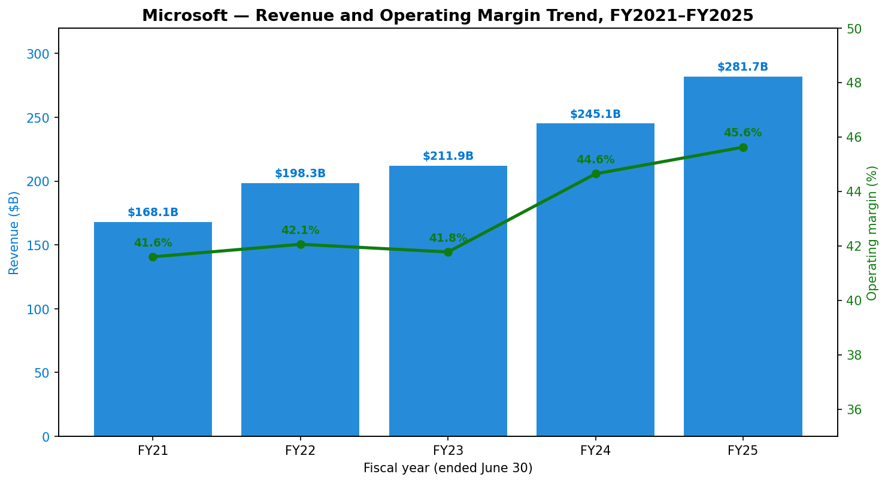
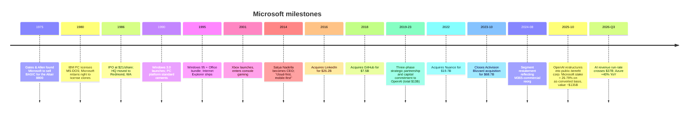
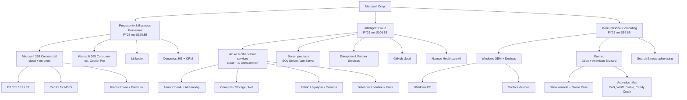
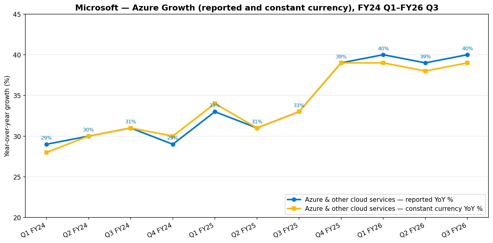
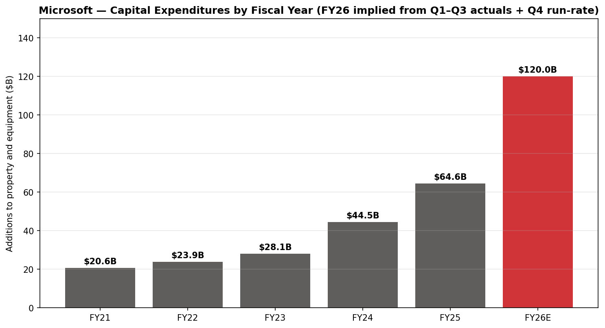
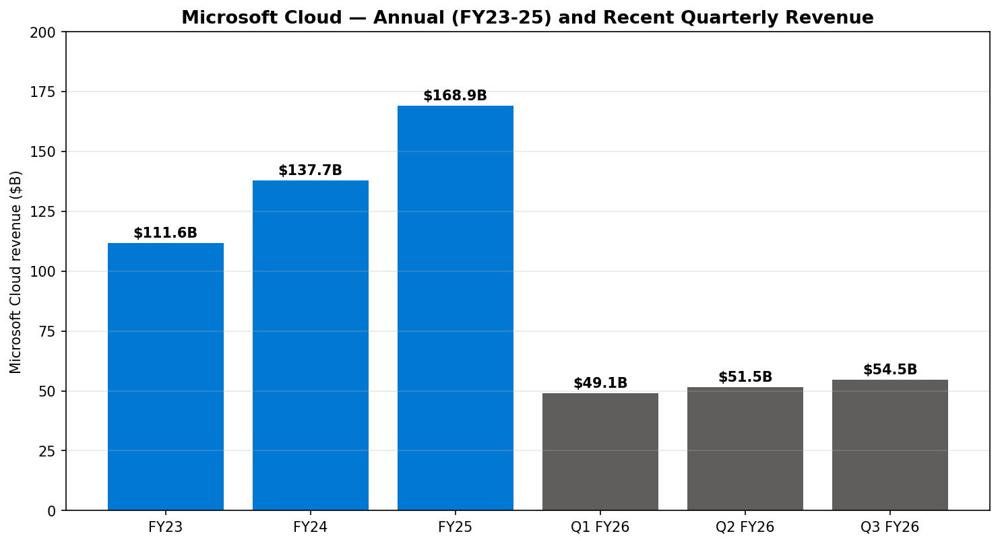
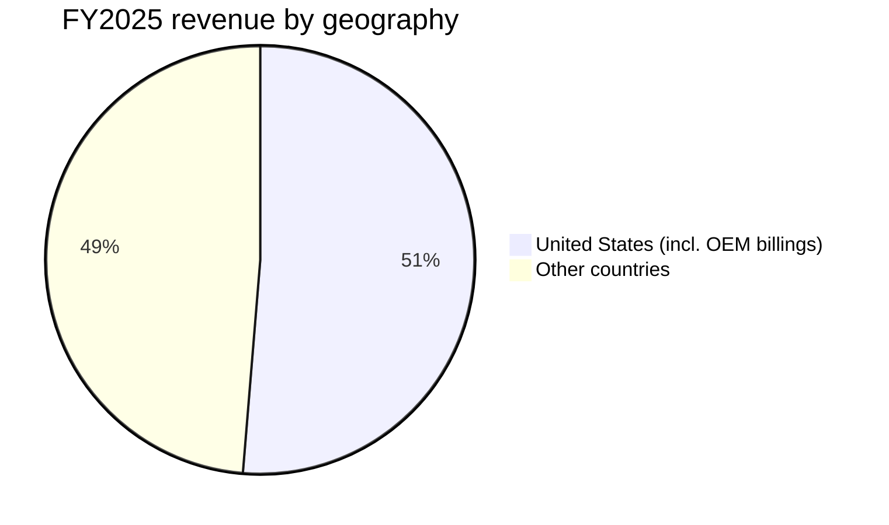
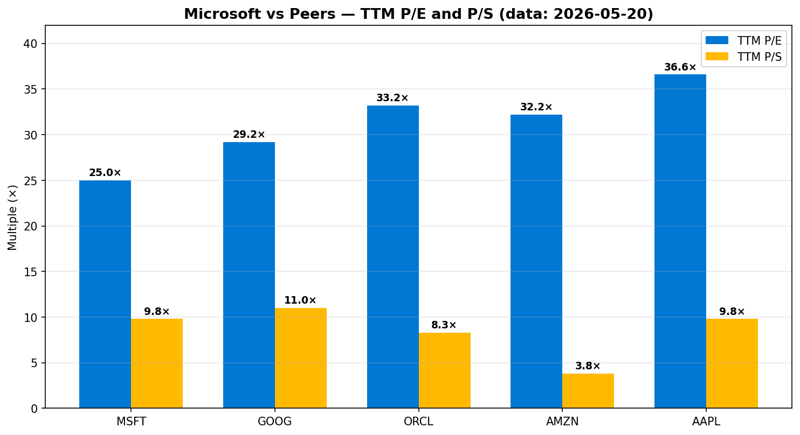

# Microsoft Corporation (NASDAQ: MSFT) — Company Research

**Report date:** 2026-05-20
**Analyst note:** Initiation of coverage / deep-dive profile. All figures in USD unless stated otherwise. Microsoft's fiscal year ends June 30 — "FY2025" refers to the twelve months ended June 30, 2025.

> **Update — Q3 FY2026 results (2026-04-29):** Microsoft delivered $82.9B revenue (+18% YoY, +15% cc), operating income $38.4B (+20%), and diluted EPS $4.27 (+23%). Satya Nadella disclosed that the company's AI business surpassed an **annual revenue run rate of $37B, up 123% YoY**, and that **commercial remaining performance obligations grew 99% YoY to $627B**. Azure & other cloud services accelerated to **+40% YoY (+39% cc)** despite continuing capacity constraints. CFO Amy Hood reiterated that supply will remain tight "through at least the end of the fiscal year." Source: [Microsoft Q3 FY2026 Earnings Release, 2026-04-29 (SEC 8-K Ex-99.1)](https://www.sec.gov/Archives/edgar/data/789019/000119312526191457/msft-ex99_1.htm).

---

## Table of Contents

1. Company Overview
2. Company History
3. Management Team
4. Products & Services
5. Customers & Distribution
6. Industry Overview
7. Competitive Landscape
8. Market Opportunity (TAM)
9. Risk Assessment
10. References

---

## 1. Company Overview

Microsoft Corporation is a Redmond, Washington-headquartered software-and-services platform company that today operates as the world's largest enterprise-software franchise, the number-two public-cloud platform (Azure), the largest professional-network operator (LinkedIn), the largest console-and-PC game publisher by revenue (after Activision Blizzard), and — through its capped-economic interest in OpenAI — the closest commercial partner of the leading frontier-AI lab. The company was founded by Bill Gates and Paul Allen in 1975, went public in 1986, and is currently led by Chairman and CEO Satya Nadella (CEO since February 4, 2014). ([FY2025 10-K — Item 1, Business](https://www.sec.gov/Archives/edgar/data/789019/000095017025100235/0000950170-25-100235-index.htm); [Synergy Research — cloud market share Q1 2026, 2026-05](https://www.srgresearch.com/articles/cloud-market-share-trends-big-three-together-hold-63-while-oracle-and-the-neoclouds-inch-higher))

In its most recent reported fiscal year, **FY2025 (year ended June 30, 2025)**, Microsoft generated **revenue of $281.7B, up 15% YoY**, operating income of **$128.5B (45.6% operating margin)**, and net income of **$101.8B (36.1% net margin)** on $94.6B of cash and short-term investments. Diluted EPS was $13.64. ([2025 10-K — Income Statements](https://www.sec.gov/Archives/edgar/data/789019/000095017025100235/0000950170-25-100235-index.htm))

The business reports in three segments after an August-2024 restatement that moved the commercial portion of Microsoft 365 from More Personal Computing into Productivity and Business Processes:

| Segment (FY2025) | Revenue ($B) | YoY | Operating Income ($B) | Op Margin |
|---|---|---|---|---|
| Productivity and Business Processes | 120.8 | +13% | 69.8 | 57.8% |
| Intelligent Cloud | 106.3 | +21% | 44.6 | 41.9% |
| More Personal Computing | 54.6 | +7% | 14.2 | 25.9% |
| **Total** | **281.7** | **+15%** | **128.5** | **45.6%** |

Source: [Microsoft FY2025 Form 10-K — Segment Results of Operations](https://www.sec.gov/Archives/edgar/data/789019/000095017025100235/0000950170-25-100235-index.htm).

Source: Microsoft FY2021–FY2025 Form 10-K filings ([FY2025 10-K, Income Statements](https://www.sec.gov/Archives/edgar/data/789019/000095017025100235/0000950170-25-100235-index.htm); [FY2021 10-K via SEC EDGAR](https://www.sec.gov/cgi-bin/browse-edgar?action=getcompany&CIK=0000789019&type=10-K&dateb=&owner=include&count=40)).

**Microsoft Cloud** — a non-GAAP rollup of Microsoft 365 Commercial cloud, Azure & other cloud services, the commercial portion of LinkedIn, and Dynamics 365 — grew **23% YoY to $168.9B** in FY2025 (up from $137.7B in FY2024 and $111.6B in FY2023). Through the first nine months of FY2026, the cloud has continued to compound: Q1 FY26 $49.1B (+26%), Q2 FY26 $51.5B (+26%), Q3 FY26 $54.5B (+29%). ([Microsoft Q3 FY2026 Earnings Release](https://www.sec.gov/Archives/edgar/data/789019/000119312526191457/msft-ex99_1.htm))

**Headcount** at June 30, 2025 was approximately **228,000 full-time employees** (125,000 in the U.S., 103,000 international). Of these, 89,000 were in operations (including datacenter operations), 80,000 in product R&D, 44,000 in sales and marketing, and 15,000 in general and administration. ([FY2025 10-K — Human Capital](https://www.sec.gov/Archives/edgar/data/789019/000095017025100235/0000950170-25-100235-index.htm))

**Geographic mix (FY2025):** U.S. $144.5B (51.3% of revenue), other countries $137.2B (48.7%). Microsoft explicitly discloses that **no single customer or country other than the U.S. accounted for more than 10% of revenue** in any of FY2023, FY2024, or FY2025 — an unusually low customer-concentration profile for a hyperscaler. ([FY2025 10-K — Geographic Information](https://www.sec.gov/Archives/edgar/data/789019/000095017025100235/0000950170-25-100235-index.htm))

### Valuation snapshot

Pulled from Yahoo Finance via the `yfinance` data feed on **2026-05-20**:

| Metric | MSFT | GOOG | ORCL | AMZN | AAPL |
|---|---|---|---|---|---|
| Last price | $420.30 | $383.70 | $185.18 | $264.12 | $302.14 |
| Market cap | $3.12T | $4.65T | $0.53T | $2.84T | $4.44T |
| TTM P/E | **25.0×** | 29.2× | 33.2× | 32.2× | 36.6× |
| Forward P/E | 21.7× | 26.6× | 23.0× | 26.9× | 31.5× |
| TTM P/S | **9.8×** | 11.0× | 8.3× | 3.8× | 9.8× |
| TTM revenue | $318.3B | $422.5B | $64.1B | $742.8B | $451.4B |
| 52-wk range | $356.28 – $555.45 | $163.33 – $404.47 | $134.57 – $345.72 | $196.00 – $278.56 | $193.46 – $303.20 |

Sources: [Yahoo Finance — MSFT](https://finance.yahoo.com/quote/MSFT/key-statistics), [GOOG](https://finance.yahoo.com/quote/GOOG/key-statistics), [ORCL](https://finance.yahoo.com/quote/ORCL/key-statistics), [AMZN](https://finance.yahoo.com/quote/AMZN/key-statistics), [AAPL](https://finance.yahoo.com/quote/AAPL/key-statistics).

**Verdict.** At 25× TTM earnings and ~10× sales, MSFT sits **at a discount to the mega-cap software/cloud peer group** on P/E (mean of GOOG/ORCL/AMZN/AAPL = 32.8×) and roughly in line on P/S. Two things explain the relative cheapness: (i) Microsoft's TTM denominator is more profitable than peers' — net income is ~32% of revenue versus ~26% at Alphabet and ~24% at Apple, so the company "earns into" any multiple faster; and (ii) the stock has pulled back ~24% from its 52-week high of $555.45, reflecting investor concern about the FY2026 capex ramp (see Risk #4) and the post-October-2025 restructuring of the OpenAI relationship (see Section 4). The 25× TTM P/E is roughly at MSFT's own 3-year mean of ~32× minus a discount; if FY26 earnings hit the ~$15.50 implied by analyst consensus, the forward P/E of 21.7× is the most defensible of the mega caps. We see no valuation-bubble risk at current levels; multiple compression risk arises only if Azure decelerates sharply or if AI capex returns sub-15% ROIC. ([Yahoo Finance — MSFT analyst estimates](https://finance.yahoo.com/quote/MSFT/analysis); [CNBC — Microsoft Q3 FY26 capex outlook, 2026-04-29](https://www.cnbc.com/2026/04/29/microsoft-msft-q3-earnings-report-2026.html))

---

## 2. Company History

Microsoft was founded on April 4, 1975 in Albuquerque, New Mexico by William H. (Bill) Gates III and Paul G. Allen, then aged 19 and 22, to license a BASIC interpreter for the Altair 8800 microcomputer. The company moved to Bellevue, Washington in 1979 and to its current Redmond campus in 1986. The deal that established the franchise was IBM's 1980 selection of Microsoft's MS-DOS (acquired for $75,000 from Seattle Computer Products and re-licensed to IBM) for the IBM PC; Microsoft kept the right to license MS-DOS to non-IBM "clone" makers, which set the template for the world's largest software royalty stream. ([Microsoft 50th-anniversary recap, 2025-04-04](https://news.microsoft.com/50-years/)). On April 4, 2025, the company celebrated its 50th anniversary with Gates, former CEO Steve Ballmer, and Nadella on stage in Redmond — an event explicitly noted in the 2025 proxy statement. ([2025 DEF 14A](https://www.sec.gov/Archives/edgar/data/789019/000119312525245150/0001193125-25-245150-index.htm))

Sources for milestones: [FY2025 10-K](https://www.sec.gov/Archives/edgar/data/789019/000095017025100235/0000950170-25-100235-index.htm), [Microsoft acquires LinkedIn, 2016-06-13](https://news.microsoft.com/2016/06/13/microsoft-to-acquire-linkedin/), [GitHub acquisition press release, 2018-06-04](https://news.microsoft.com/2018/06/04/microsoft-to-acquire-github-for-7-5-billion/), [Activision Blizzard closing, 2023-10-13](https://news.microsoft.com/2023/10/13/microsoft-completes-acquisition-of-activision-blizzard/), [OpenAI restructuring, Fortune 2025-10-28](https://fortune.com/2025/10/28/openai-for-profit-restructuring-microsoft-stake/).

**Strategic pivots.** Three transformations matter for the current thesis:

1. **Bill Gates → Steve Ballmer (2000) → Satya Nadella (2014).** Ballmer doubled revenue but missed mobile and underinvested in cloud. Nadella's "cloud-first, mobile-first" repositioning (Feb 2014) reoriented capital allocation toward Azure and SaaS, opened Office to iOS/Android, and demonetized parts of consumer Windows to keep developers on the platform. Azure went from ~$1B run-rate in 2014 to $75B+ annual revenue in FY2025 — a ~75× expansion in eleven years. ([Q4 FY25 earnings release, 2025-07-30](https://www.sec.gov/Archives/edgar/data/789019/000095017025100226/msft-ex99_1.htm))
2. **From perpetual licenses to subscription cloud.** Office, Windows Server, SQL Server, Dynamics, and Visual Studio have all been transitioned to subscription (Microsoft 365, Azure-hosted) or consumption (Azure SQL, Azure App Service) pricing. The 10-K's product-detail table shows Server products & cloud services rose from $65.0B (FY23) to $98.4B (FY25) — a 23% CAGR — while Windows & Devices stayed roughly flat at $17B. ([FY2025 10-K — Revenue, classified by significant product and service offerings](https://www.sec.gov/Archives/edgar/data/789019/000095017025100235/0000950170-25-100235-index.htm))
3. **AI platform shift (2019–present).** Microsoft's three-phase OpenAI partnership ($1B in 2019, $2B in 2021, $10B in 2023 — $13B total commitment per the FY25 10-K) and the October 2025 restructuring that crystallized a **26.79% economic stake worth ~$135B** along with an **incremental $250B Azure contract** position the company as the default infrastructure partner for the most-used frontier model. The accounting follows the equity method, with Microsoft's share of OpenAI losses reducing GAAP net income — a $7.6B drag in Q2 FY26 alone. ([Q2 FY26 earnings release, 2026-01-28](https://www.sec.gov/Archives/edgar/data/789019/000119312526027198/msft-ex99_1.htm); [Fortune on OpenAI restructuring, 2025-10-28](https://fortune.com/2025/10/28/openai-for-profit-restructuring-microsoft-stake/))

**Key acquisitions:**

- 2011 — Skype ($8.5B): consumer comms, later integrated into Teams. ([Microsoft 8-K, 2011-05-10 announcing Skype acquisition](https://www.sec.gov/Archives/edgar/data/0000789019/000119312511134416/dex991.htm))
- 2016 — LinkedIn ($26.2B): professional social network, now $17.8B FY25 revenue. ([LinkedIn press release, 2016-06-13](https://news.microsoft.com/2016/06/13/microsoft-to-acquire-linkedin/))
- 2018 — GitHub ($7.5B): developer platform, foundational for Copilot. ([GitHub acquisition press release, 2018-06-04](https://news.microsoft.com/2018/06/04/microsoft-to-acquire-github-for-7-5-billion/))
- 2022 — Nuance Communications ($19.7B): healthcare voice/AI; closed March 4, 2022. ([Microsoft 8-K — Nuance closing, 2022-03-04](https://www.sec.gov/Archives/edgar/data/0000789019/000119312522120207/d328712dex991.htm))
- 2023 — Activision Blizzard ($68.7B): largest acquisition in MSFT history; closed October 13, 2023 after a 21-month regulatory fight with the FTC, CMA, and EC. ([Microsoft press release, 2023-10-13](https://news.microsoft.com/2023/10/13/microsoft-completes-acquisition-of-activision-blizzard/))
- 2024 — Inflection AI team-and-license deal (~$650M effective payment for licenses + ~25 employees including Mustafa Suleyman, now CEO of Microsoft AI). ([Mustafa Suleyman joins Microsoft, 2024-03-19](https://blogs.microsoft.com/blog/2024/03/19/mustafa-suleyman-deepmind-and-inflection-co-founder-joins-microsoft-to-lead-copilot/); [FY2025 10-K — Inflection disclosure](https://www.sec.gov/Archives/edgar/data/789019/000095017025100235/0000950170-25-100235-index.htm))

---

## 3. Management Team

### Satya Nadella — Chairman & CEO (since 2014; Chairman since 2021)

Satya Nadella, 58, has been Microsoft's third CEO and is the architect of the company's transformation into the world's most valuable cloud-and-AI franchise. He joined Microsoft in 1992 from Sun Microsystems, holding a B.E. in electrical engineering from Manipal Institute of Technology, an M.S. in computer science from the University of Wisconsin-Milwaukee, and an MBA from the University of Chicago Booth School of Business. Before becoming CEO he ran the Server and Tools Business (2011–2013) and Cloud and Enterprise Group (2013–2014), where he made the strategic call to build Azure as a true public cloud (rather than a Windows-Server hosting layer) and to make Office cross-platform on iOS and Android. ([2025 DEF 14A — Director nominees](https://www.sec.gov/Archives/edgar/data/789019/000119312525245150/0001193125-25-245150-index.htm))

Under Nadella, Microsoft's revenue grew from $86.8B in FY2014 to $281.7B in FY2025 (a 12.0% CAGR), operating income from $27.8B to $128.5B (15.1% CAGR), and the market cap from ~$300B to ~$3.1T as of May 20, 2026. He has been the **most prominent enterprise-buyer of frontier AI compute** since the OpenAI partnership in 2019, and was the executive who orchestrated the rare November-2023 sequence in which OpenAI's then-CEO Sam Altman was briefly hired into Microsoft, before being reinstated at OpenAI. ([FY2014 10-K — Income Statements via SEC EDGAR](https://www.sec.gov/Archives/edgar/data/789019/000119312514289961/0001193125-14-289961-index.htm); [FY2025 10-K — Income Statements](https://www.sec.gov/Archives/edgar/data/789019/000095017025100235/0000950170-25-100235-index.htm))

Nadella owns **900,572 shares directly and 12 indirectly** as of September 30, 2025 (<1% beneficial ownership; the entire directors-and-executive-officers group as 18 people held 2,279,620 shares — also <1%). His FY2025 total compensation was **$96,496,790** per the Summary Compensation Table — composed of $2,500,000 base salary, $9,150,000 cash incentive, ~$84.6M of stock-award grant-date fair value (PSAs + SAs), and $196,294 of other compensation. The **CEO pay ratio was 480-to-1** versus a median employee total comp of $200,972 — high in absolute terms but with the bulk of CEO comp in performance-linked equity vesting over three to seven years. FY2024 total comp was $79.1M; FY2023 was $48.5M. The dollar increase tracks the equity vehicles' grant-date value (mostly PSAs awarded in Sep-2024 at the then-share price of ~$413). ([2025 DEF 14A — Summary Compensation Table and CEO Pay Ratio](https://www.sec.gov/Archives/edgar/data/789019/000119312525245150/0001193125-25-245150-index.htm))

### Amy Hood — Executive VP and CFO (since 2013)

Hood, 53, joined Microsoft in 2002 from Goldman Sachs's investment banking division (technology M&A coverage; she was lead banker on Microsoft's $6B aQuantive acquisition before joining the company). She holds an A.B. in economics from Duke University and an MBA from Harvard Business School. As CFO she has been the principal architect of the transition from perpetual-license to subscription / consumption pricing, the use of "Microsoft Cloud" as a unified KPI, and the disciplined acquisition framework that paid $68.7B for Activision Blizzard while keeping the balance sheet investment-grade (long-term debt was $40.2B at June 30, 2025 against $94.6B of cash and ST investments — net cash positive). On capital expenditures she has been visibly more cautious than peers, repeatedly emphasizing that incremental cloud capex must clear an internal return hurdle and that Microsoft will let demand-supply imbalances persist rather than overbuild. Her FY2025 total compensation was $30,250,366 — base $1,000,000, cash incentive $4,500,000, stock-award value $24.7M, all other $23,191. ([2025 DEF 14A — Summary Compensation Table](https://www.sec.gov/Archives/edgar/data/789019/000119312525245150/0001193125-25-245150-index.htm))

### Judson Althoff — Executive VP and Chief Commercial Officer

Althoff, 51, has run Microsoft's worldwide commercial business since 2021 and is the executive responsible for booking the multi-year cloud and AI commitments that show up in the company's commercial Remaining Performance Obligations (cRPO) — **$627B at the end of Q3 FY2026, +99% YoY**. He joined Microsoft in 2013 from Oracle, where he ran the North America commercial business. FY2025 total comp: $27,592,884. ([Q3 FY26 release](https://www.sec.gov/Archives/edgar/data/789019/000119312526191457/msft-ex99_1.htm); [2025 DEF 14A](https://www.sec.gov/Archives/edgar/data/789019/000119312525245150/0001193125-25-245150-index.htm))

### Brad Smith — President & Vice Chair

Smith, 67, has been Microsoft's General Counsel since 2002, President since 2015, and Vice Chair since 2021. He effectively runs the company's external affairs — regulatory engagement (he was the lead negotiator with the U.S. FTC, U.K. CMA, and EU Commission on Activision Blizzard), trust and safety policy, AI policy advocacy, and CSR. FY2025 total comp: $27,644,736. ([2025 DEF 14A](https://www.sec.gov/Archives/edgar/data/789019/000119312525245150/0001193125-25-245150-index.htm))

### Takeshi Numoto — Executive VP and CMO

Numoto, named CMO in late 2023, was previously the executive responsible for Azure and Microsoft 365 commercial GTM. FY2025 total comp: $10,792,272. ([2025 DEF 14A — Summary Compensation Table](https://www.sec.gov/Archives/edgar/data/789019/000119312525245150/0001193125-25-245150-index.htm))

### Mustafa Suleyman — CEO of Microsoft AI

Co-founder of DeepMind (sold to Google 2014) and Inflection AI; joined Microsoft in March 2024 along with most of Inflection's research team as part of a ~$650M licensing arrangement that Microsoft has structured to avoid being treated as a Hart-Scott-Rodino acquisition (a structure that drew FTC and CMA scrutiny). Runs Copilot consumer, Bing, MSN, and Edge — the "AI Companion" surfaces. Not a named executive officer in the FY25 proxy. ([FY2025 10-K — Inflection AI disclosure](https://www.sec.gov/Archives/edgar/data/789019/000095017025100235/0000950170-25-100235-index.htm))

### Governance

The board has 12 directors after Carlos Rodriguez decided not to stand for re-election in December 2025 and **John David Rainey (Walmart CFO) was nominated for election** at the 2025 annual meeting (held Dec 5, 2025). Lead Independent Director is **Sandra E. Peterson** (Operating Partner, Clayton, Dubilier & Rice; former Group Worldwide Chair at Johnson & Johnson). Other directors include Reid Hoffman (LinkedIn co-founder, Greylock Partners — director since 2017), Catherine MacGregor (CEO of Engie), Penny Pritzker, Mark Mason (CFO of Citi), Hugh Johnston (Disney/PepsiCo), Teri List, Helene Gayle, John Stankey (AT&T), and Emma Walmsley (GSK CEO). All directors except Nadella are independent — a notably clean structure for a founder-influenced company. Vanguard owns 8.95% and BlackRock 7.30%; insiders collectively own less than 1%. ([2025 DEF 14A — Director nominees and Principal Shareholders](https://www.sec.gov/Archives/edgar/data/789019/000119312525245150/0001193125-25-245150-index.htm))

The most recently disclosed officer change (Form 8-K, 2026-05-14) is a routine director-officer notification; there has been no senior-team transition in calendar 2026. ([2026-05-14 8-K — Director/Officer Change](https://www.sec.gov/Archives/edgar/data/789019/000119312526224155/0001193125-26-224155-index.htm))

**Track-record synthesis.** This is one of the most-tested and best-aligned management teams in mega-cap technology. Nadella has compounded ~12% revenue per year for eleven years; Hood has scaled the cloud disclosure framework and run the largest software M&A program in history; Smith has navigated four sequential antitrust reviews (Activision, LinkedIn, Nuance, GitHub) without a meaningful structural concession. The team's principal gap is **succession depth on the consumer AI side** — Suleyman is talented but new, and consumer AI is Microsoft's weakest surface today (see Section 7). ([2025 DEF 14A — Director nominees and ESG governance](https://www.sec.gov/Archives/edgar/data/789019/000119312525245150/0001193125-25-245150-index.htm); [CNBC — Microsoft Teams unbundling settlement, 2025-09-12](https://www.cnbc.com/2025/09/12/microsoft-avoids-big-fine-as-eu-accepts-deal-to-unbundle-teams.html))

---

## 4. Products & Services

Microsoft sells across three reportable segments. The product tree below maps each segment to its principal product families and to the SKUs that move the revenue.

Source: [Microsoft FY2025 Form 10-K — Item 1, Business](https://www.sec.gov/Archives/edgar/data/789019/000095017025100235/0000950170-25-100235-index.htm).

### Productivity and Business Processes ($120.8B / 43% of revenue)

**Microsoft 365 Commercial** is the world's largest enterprise productivity suite — Word, Excel, PowerPoint, Outlook, Teams, OneDrive, SharePoint, Loop, Defender for Office, Entra ID (formerly Azure AD) — sold predominantly per-seat in three- and five-year volume-licensing contracts. The E5 tier ($57/user/month commercial list) bundles security, compliance, voice, and analytics; **Copilot for Microsoft 365** is a $30/user/month add-on that puts a GPT-4o / GPT-5-class agent inside every Office application and surfaces the customer's tenant data via the Microsoft Graph. Microsoft 365 Commercial cloud revenue grew **15% in FY2025** and accelerated to **15% in Q1 FY26, 14% in Q2 FY26, and 15% in Q3 FY26 in constant currency**. ([FY2025 10-K — MD&A](https://www.sec.gov/Archives/edgar/data/789019/000095017025100235/0000950170-25-100235-index.htm); quarterly figures from [Q3 FY26 release](https://www.sec.gov/Archives/edgar/data/789019/000119312526191457/msft-ex99_1.htm))

**Microsoft 365 Consumer** packages Office + 1 TB OneDrive at $99.99/year (Family) or $69.99/year (Personal); Copilot Pro at $20/month adds GPT-class generation. Consumer cloud revenue grew **29% (cc) in Q3 FY26**, the fastest growth rate of any reportable line at Microsoft, reflecting both Copilot Pro pull-through and a March 2025 price increase on Family plans. ([Microsoft Q3 FY26 earnings release, 2026-04-29](https://www.sec.gov/Archives/edgar/data/789019/000119312526191457/msft-ex99_1.htm); [Microsoft 365 Copilot pricing page](https://www.microsoft.com/en-us/microsoft-365-copilot/pricing/enterprise))

**LinkedIn** generated $17.8B in FY2025 (10% YoY), with revenue from four streams: Talent Solutions (recruiting), Marketing Solutions (ads), Premium Subscriptions, and Sales Navigator + Sales Solutions. Talent Solutions remains the largest contributor (Microsoft does not disclose the split). The platform reached >1 billion members in late 2023 and is the only "social" property of meaningful scale not owned by Meta, Google, or ByteDance. LinkedIn revenue grew 12% in Q3 FY26. ([FY2025 10-K — Segment Revenue Detail](https://www.sec.gov/Archives/edgar/data/789019/000095017025100235/0000950170-25-100235-index.htm); [Microsoft Q3 FY26 release](https://www.sec.gov/Archives/edgar/data/789019/000119312526191457/msft-ex99_1.htm))

**Dynamics** (CRM, ERP, Field Service, Customer Insights) generated $7.8B in FY2025 (+15%). Dynamics 365 grew 22% in Q3 FY26 — the largest acceleration in MSFT's enterprise app stack, driven by Sales Copilot, Customer Service Copilot, and AI agents built on Copilot Studio. ([FY2025 10-K — Revenue by significant product](https://www.sec.gov/Archives/edgar/data/789019/000095017025100235/0000950170-25-100235-index.htm); [Microsoft Q3 FY26 release](https://www.sec.gov/Archives/edgar/data/789019/000119312526191457/msft-ex99_1.htm))

### Intelligent Cloud ($106.3B / 38% of revenue)

**Azure & other cloud services** is the consumption-priced public-cloud business. The FY25 10-K describes it as "cloud and AI consumption-based services, GitHub cloud services, Nuance Healthcare cloud services, virtual desktop offerings, and other cloud services." Azure stand-alone revenue **surpassed $75B in FY2025, up 34%** (the only specific Azure dollar figure Microsoft has disclosed) and has accelerated each quarter of FY26 — **+39% Q1, +39% Q2, +40% Q3** (constant currency). ([Q4 FY25 earnings release, 2025-07-30](https://www.sec.gov/Archives/edgar/data/789019/000095017025100226/msft-ex99_1.htm); quarterly figures from FY26 releases)

Inside Azure, the **Azure OpenAI Service / AI Foundry** sits at the center of the thesis. It is the only first-party way to run frontier OpenAI models (o-series reasoning, GPT-class, embeddings, DALL-E, Sora) inside an enterprise cloud with private endpoints, BYOK, and regional data residency. With OpenAI's October-2025 restructuring, Microsoft retains the right to provision OpenAI inference through 2032 and OpenAI is contracted to purchase an incremental **$250B in Azure services** over the deal life. ([Fortune, 2025-10-28](https://fortune.com/2025/10/28/openai-for-profit-restructuring-microsoft-stake/); [Data Center Dynamics — OpenAI for-profit move, 2025-10-28](https://www.datacenterdynamics.com/en/news/openai-completes-for-profit-move-microsoft-given-27-stake-and-250bn-azure-contract-but-no-longer-has-cloud-right-of-first-refusal/))

The capacity story is the operative constraint. The Q3 FY26 release disclosed **commercial RPO of $627B (+99% YoY)** — multi-year contracted demand the company cannot fulfill until additional datacenter capacity comes online. Hood has repeatedly stated Azure will remain "capacity-constrained through at least the end of [FY2026]." Microsoft added approximately **1 GW of new datacenter capacity in Q3 FY26 alone**. ([Windows News — Q3 FY26 datacenter capacity, 2026-04-29](https://windowsnews.ai/article/microsoft-adds-1-gw-of-datacenter-capacity-in-q3-fy2026-revenue-hits-829-billion.416504); [Directions on Microsoft — Q1 FY26 cloud supply](https://www.directionsonmicrosoft.com/microsoft-q1-fy26-earnings-cloud-supply-constraints-to-last-through-at-least-june-2026/))

Source: Microsoft quarterly earnings press releases ([FY26 Q3](https://www.sec.gov/Archives/edgar/data/789019/000119312526191457/msft-ex99_1.htm), [FY26 Q2](https://www.sec.gov/Archives/edgar/data/789019/000119312526027198/msft-ex99_1.htm), [FY26 Q1](https://www.sec.gov/Archives/edgar/data/789019/000119312525256310/msft-ex99_1.htm), [FY25 Q4](https://www.sec.gov/Archives/edgar/data/789019/000095017025100226/msft-ex99_1.htm), and prior).

**Server products** (SQL Server, Windows Server, Visual Studio, System Center) are the on-premises license complement, still ~$25B/year and growing modestly — these revenues are increasingly tied to hybrid Azure Arc deployments. ([FY2025 10-K — Revenue by significant product and service offerings](https://www.sec.gov/Archives/edgar/data/789019/000095017025100235/0000950170-25-100235-index.htm))

**GitHub** is the primary developer platform with >100 million developers; GitHub Copilot is the world's most widely used AI coding assistant by paid seats and is increasingly bundled with M365 Copilot for enterprise developer programs. ([GitHub Octoverse — 100M developers, 2025-01](https://github.blog/news-insights/octoverse/octoverse-2024/); [FY2025 10-K — Item 1, Business — Intelligent Cloud](https://www.sec.gov/Archives/edgar/data/789019/000095017025100235/0000950170-25-100235-index.htm))

**Nuance Healthcare** sells voice/AI to healthcare providers, principally the DAX Copilot ambient-clinical-documentation product, deployed at HCA, Mass General Brigham, and most large U.S. health systems. ([Microsoft 8-K — Nuance closing, 2022-03-04](https://www.sec.gov/Archives/edgar/data/0000789019/000119312522120207/d328712dex991.htm); [FY2025 10-K — Item 1, Business](https://www.sec.gov/Archives/edgar/data/789019/000095017025100235/0000950170-25-100235-index.htm))

### More Personal Computing ($54.6B / 19% of revenue)

The third segment is the consumer franchise plus the search-advertising business. ([FY2025 10-K — Segment Results of Operations](https://www.sec.gov/Archives/edgar/data/789019/000095017025100235/0000950170-25-100235-index.htm))

- **Windows OEM and Devices** — Windows OS licenses sold to PC OEMs and Surface hardware. ~$17B FY25. Q3 FY26 revenue declined 2% on weaker PC demand. ([Microsoft Q3 FY26 release, 2026-04-29](https://www.sec.gov/Archives/edgar/data/789019/000119312526191457/msft-ex99_1.htm))
- **Gaming** — Xbox console, Game Pass subscription, and the Activision Blizzard catalog (Call of Duty, World of Warcraft, Diablo, Candy Crush, Overwatch). $23.5B in FY25. Q3 FY26 Xbox content & services revenue declined 5% (down 7% cc), reflecting tough CoD compares and ongoing console-cycle softness; Game Pass continues to grow on a subscription basis. ([FY2025 10-K — Segment Revenue Detail](https://www.sec.gov/Archives/edgar/data/789019/000095017025100235/0000950170-25-100235-index.htm); [Microsoft Q3 FY26 release](https://www.sec.gov/Archives/edgar/data/789019/000119312526191457/msft-ex99_1.htm))
- **Search and news advertising (ex-TAC)** — Bing, MSN, Edge, and the increasingly important Bing-driven traffic from OpenAI's ChatGPT default search integration. $13.9B in FY25; growth +12% (Q3 FY26 cc), the fastest in the segment. ([FY2025 10-K — More Personal Computing](https://www.sec.gov/Archives/edgar/data/789019/000095017025100235/0000950170-25-100235-index.htm); [Microsoft Q3 FY26 release](https://www.sec.gov/Archives/edgar/data/789019/000119312526191457/msft-ex99_1.htm))

### Other commercial KPIs

- **Capital expenditures** (additions to property and equipment) — $64.6B in FY2025 vs $44.5B in FY24 and $28.1B in FY23. Q3 FY26 capex was $31.9B sequentially. Microsoft has guided to roughly **$120B+ for FY2026** with calendar-2026 capex including approximately $25B of incremental component-cost inflation. ([FY2025 10-K — Cash Flow Statement](https://www.sec.gov/Archives/edgar/data/789019/000095017025100235/0000950170-25-100235-index.htm); [The Register — Microsoft Q3 FY26 capex, 2026-04-30](https://www.theregister.com/2026/04/30/microsoft_q3_2026/))
- **Property and equipment, net** rose from $135.6B to $205.0B in one year (+51%) as datacenter buildouts hit the balance sheet. ([FY2025 10-K — Balance Sheet](https://www.sec.gov/Archives/edgar/data/789019/000095017025100235/0000950170-25-100235-index.htm))
- **Long-term debt** sits at $40.2B (down from $42.7B), giving Microsoft net cash of ~$54B even after a record capex year. ([FY2025 10-K — Balance Sheet](https://www.sec.gov/Archives/edgar/data/789019/000095017025100235/0000950170-25-100235-index.htm))

Source: Microsoft FY2021–FY2025 Form 10-K filings and Q3 FY2026 press release ([FY2025 10-K — Cash Flows Statements](https://www.sec.gov/Archives/edgar/data/789019/000095017025100235/0000950170-25-100235-index.htm); [The Register — Microsoft Q3 FY26 capex, 2026-04-30](https://www.theregister.com/2026/04/30/microsoft_q3_2026/)). FY26E is implied from Q1-Q3 actuals and Q4 guided run-rate.

Source: Microsoft FY2025 10-K and Q1–Q3 FY2026 earnings releases.

---

## 5. Customers & Distribution

Microsoft's customer profile is **deliberately diversified** — the FY2025 10-K's Geographic Information note states: *"No sales to an individual customer or country other than the United States accounted for more than 10% of revenue for fiscal years 2025, 2024, or 2023."* That sentence is one of the most consequential disclosures in a hyperscaler 10-K because it tells you Microsoft's largest single dependency by revenue is not a customer — it is the durability of the U.S. PC and enterprise market.

Source: [FY2025 10-K, Geographic Information](https://www.sec.gov/Archives/edgar/data/789019/000095017025100235/0000950170-25-100235-index.htm). Values in $B.

**Customer-segment mix.** Microsoft serves four customer cohorts:

- **Large enterprise** (Fortune 2000-class). Bought through Enterprise Agreements (3-yr volume contracts) and increasingly via Microsoft Customer Agreement for Enterprise. The cRPO of $627B (Q3 FY26) is overwhelmingly this cohort — multi-year cloud and M365 commitments from regulated industries (financial services, healthcare, government, automotive). Customers include all major U.S. and European banks (Bank of America, JPMorgan, HSBC), all five U.S. military branches via Azure Government, the U.K. NHS, the German federal government's sovereign-cloud build (Delos Cloud), and most of the Fortune 100. ([Microsoft Q3 FY26 release — cRPO disclosure](https://www.sec.gov/Archives/edgar/data/789019/000119312526191457/msft-ex99_1.htm); [FY2025 10-K — Item 1, Business](https://www.sec.gov/Archives/edgar/data/789019/000095017025100235/0000950170-25-100235-index.htm))
- **Public sector and regulated sovereign clouds.** Azure Government, Azure Government Secret, Azure Government Top Secret, and the regional "sovereign cloud" partnerships in Germany, France, and Italy. Microsoft holds the JWCC contract pillar with the U.S. Department of Defense (the successor to JEDI), alongside AWS, Google Cloud, and Oracle. ([DoD — JWCC contract award, 2022-12-07](https://www.defense.gov/News/Releases/Release/Article/3239378/department-of-defense-announces-joint-warfighting-cloud-capability-procurement/))
- **Small and mid-market businesses.** Reached through Microsoft 365 Business Basic / Standard / Premium SKUs ($6–22/user/month) and Cloud Solution Provider (CSP) partners — predominantly indirect. ([Microsoft 365 Business pricing](https://www.microsoft.com/en-us/microsoft-365/business/compare-all-plans))
- **Consumer.** Windows users (>1.4B Windows 10+11 monthly active devices per Microsoft's WTS disclosure), Microsoft 365 Consumer subscribers, Xbox / Game Pass subscribers, LinkedIn members (>1B), and Bing search users. ([FY2025 10-K — Item 1, Business — More Personal Computing](https://www.sec.gov/Archives/edgar/data/789019/000095017025100235/0000950170-25-100235-index.htm))

**Named flagship customers** disclosed in 10-K, IR materials, or customer case studies in the last 12 months include: Adobe, Walmart, Domino's, Estée Lauder, Air India, Heathrow, Bayer, Vodafone, Telstra, Schneider Electric, Coca-Cola, Cushman & Wakefield, Mercedes-Benz, KPMG (Copilot rollout to 200,000+ employees), the U.K. Civil Service, Singapore's GovTech, and OpenAI itself (Microsoft's largest single Azure consumer). ([Microsoft customer stories portal](https://www.microsoft.com/en-us/customers/search/?filters=product%3Amicrosoft-365); [Fortune — OpenAI restructuring, 2025-10-28](https://fortune.com/2025/10/28/openai-for-profit-restructuring-microsoft-stake/))

**Distribution & go-to-market.** Microsoft sells through (a) a direct sales force focused on the world's ~30,000 largest accounts, (b) a global field of ~440,000 Microsoft Cloud Partners (resellers, system integrators, ISVs, MSPs), (c) hyperscale OEM channels (Dell, HP, Lenovo, Acer, Asus, Samsung — for Windows licensing and pre-loaded Office trials), (d) retail self-service via the Microsoft Store, app stores, and Xbox storefronts, and (e) the Azure Marketplace, which is rapidly becoming the most important reseller channel for enterprise AI ISVs (Databricks, Snowflake, Confluent, MongoDB all use it as a billing rail through Microsoft's Enterprise Agreements). ([FY2025 10-K — Item 1, Sales and Marketing](https://www.sec.gov/Archives/edgar/data/789019/000095017025100235/0000950170-25-100235-index.htm); [Microsoft AI Cloud Partner Program](https://partner.microsoft.com/en-us/partnership))

**Contracted backlog (cRPO) — the key forward indicator.** Microsoft has guided investors to use cRPO as the leading metric. Trajectory:

| Period | cRPO ($B) | YoY |
|---|---|---|
| Q1 FY26 (Sep-2025) | 392 | +51% |
| Q2 FY26 (Dec-2025) | 625 | +110% |
| Q3 FY26 (Mar-2026) | 627 | +99% |

Source: [Microsoft Q1 FY26](https://www.sec.gov/Archives/edgar/data/789019/000119312525256310/msft-ex99_1.htm), [Q2 FY26](https://www.sec.gov/Archives/edgar/data/789019/000119312526027198/msft-ex99_1.htm), [Q3 FY26 earnings releases](https://www.sec.gov/Archives/edgar/data/789019/000119312526191457/msft-ex99_1.htm).

The step-up from $392B to $625B between Q1 and Q2 FY26 reflects the **incremental $250B OpenAI Azure contract** signed as part of the October 2025 restructuring, plus additional large enterprise renewals. cRPO at this scale is approximately **2.2× FY2025 revenue** — an exceptionally durable forward base for a software franchise.

**Customer-concentration verdict.** Microsoft has the **most-diversified customer base of any mega-cap technology company** by both individual-customer share (no >10% customer) and geography (51%/49% U.S./international). OpenAI, the company's largest single Azure consumer, is partially owned by Microsoft and contractually obligated to spend $250B over the deal life — a "concentration" that is structurally hedged. The concentration risk in this name lies not at the customer level but in the bundled go-to-market: most enterprises buy Microsoft via a single Enterprise Agreement that bundles M365, Azure, GitHub, and Dynamics. If a customer ever wanted to leave, the switching cost is unusually high — and that high lock-in is itself a regulatory exposure (see Section 9). ([FY2025 10-K — Geographic Information](https://www.sec.gov/Archives/edgar/data/789019/000095017025100235/0000950170-25-100235-index.htm); [Data Center Dynamics — OpenAI $250B Azure contract, 2025-10-28](https://www.datacenterdynamics.com/en/news/openai-completes-for-profit-move-microsoft-given-27-stake-and-250bn-azure-contract-but-no-longer-has-cloud-right-of-first-refusal/))

---

## 6. Industry Overview

Microsoft competes in **four industries that converge on the enterprise IT budget**: enterprise productivity software, public-cloud infrastructure (IaaS + PaaS), AI infrastructure and applied AI, and PC operating systems / consumer software. The most important by future growth contribution is public cloud + AI. ([FY2025 10-K — Item 1A, Risk Factors / Item 1, Business](https://www.sec.gov/Archives/edgar/data/789019/000095017025100235/0000950170-25-100235-index.htm))

**Public cloud (IaaS + PaaS).** Gartner forecasts the worldwide public-cloud services market to grow from approximately $675B in 2024 to **~$1.26T by 2028**, a five-year CAGR of ~16%, with IaaS and PaaS the fastest-growing segments at ~22% and ~25% respectively. ([Gartner — Public cloud services forecast, 2024-11-19](https://www.gartner.com/en/newsroom/press-releases/2024-11-19-gartner-forecasts-worldwide-public-cloud-end-user-spending-to-total-723-billion-dollars-in-2025)) The three U.S. hyperscalers (AWS, Azure, Google Cloud) together hold roughly **63–68% of total IaaS + PaaS revenue** by Synergy Research's count, with AWS still in the lead, Azure narrowing the gap, and Google Cloud distant third but growing fast. Alibaba, Tencent, and Oracle round out the global top six. ([Synergy Research — cloud market share Q1 2026, 2026-05](https://www.srgresearch.com/articles/cloud-market-share-trends-big-three-together-hold-63-while-oracle-and-the-neoclouds-inch-higher))

**Generative AI infrastructure and applications.** This is the fastest-emerging incremental TAM in the company's history. IDC estimates **worldwide generative AI spending will reach $632B by 2028** (4-yr CAGR of ~29%), with the largest share captured by infrastructure (chips, networking, datacenter capacity), then platform services (Azure OpenAI, AWS Bedrock, Google Vertex), then applications (Copilot, Gemini, ChatGPT Enterprise). ([IDC — Worldwide GenAI Spending Guide, 2024-08-19](https://www.idc.com/getdoc.jsp?containerId=prUS52530724)) Microsoft's $37B AI revenue run-rate (Q3 FY26 disclosure) implies the company has captured a high-single-digit share of GenAI infrastructure and application revenue globally — early but consistent with being the hyperscaler that most aggressively bundled frontier models into existing enterprise contracts.

**Enterprise productivity software (SaaS).** A mature ~$280B global market (productivity, collaboration, CRM, ERP, security, identity) growing at ~12–15%. Microsoft's $120.8B Productivity & Business Processes revenue gives it roughly 40% share of the productivity subset; Google Workspace, Atlassian, Asana, Notion, Box, and Slack are the principal competitors at the collaboration layer; Salesforce and SAP at the CRM/ERP layer. ([Gartner — Worldwide IT Spending Forecast 2025, 2025-01-29](https://www.gartner.com/en/newsroom/press-releases/2025-01-29-gartner-forecasts-worldwide-it-spending-to-grow-9-percent-in-2025); [FY2025 10-K — Segment Results of Operations](https://www.sec.gov/Archives/edgar/data/789019/000095017025100235/0000950170-25-100235-index.htm))

**PC operating systems and consumer software.** Windows runs on ~1.4B active devices. The PC market is structurally low-growth (annual unit shipments oscillate between 250M and 290M units depending on cycle), but the "AI PC" / Copilot+ PC subcategory is incremental upgrade demand — Microsoft, Qualcomm, AMD, and Intel are co-marketing the category aggressively. ([Introducing Copilot+ PCs, 2024-05-20](https://blogs.microsoft.com/blog/2024/05/20/introducing-copilot-pcs/); [FY2025 10-K — Item 1, Business — Windows](https://www.sec.gov/Archives/edgar/data/789019/000095017025100235/0000950170-25-100235-index.htm))

**Gaming.** $200B+ global market split across mobile (~50%), console (~25%), and PC (~25%). Microsoft is the #1 publisher post-Activision by revenue, ahead of Sony and Tencent within console. Game Pass is the only console-and-PC cross-platform subscription at scale. ([Newzoo — Global Games Market Report 2024](https://newzoo.com/resources/trend-reports/newzoo-global-games-market-report-2024-free-version); [Microsoft press release — Activision close, 2023-10-13](https://news.microsoft.com/2023/10/13/microsoft-completes-acquisition-of-activision-blizzard/))

### Growth drivers

1. **Enterprise AI adoption.** Every Fortune 2000 IT roadmap now contains a generative-AI workstream; Microsoft is the lowest-friction vendor through Copilot for M365 (sold to existing M365 seats) and Azure OpenAI Service. Adoption is at the "pilot to production" inflection. Hood's repeated capacity-constraint language is itself evidence of the demand gap. ([Microsoft Q3 FY26 release — AI run rate disclosure, 2026-04-29](https://www.sec.gov/Archives/edgar/data/789019/000119312526191457/msft-ex99_1.htm); [Directions on Microsoft — Q1 FY26 cloud supply](https://www.directionsonmicrosoft.com/microsoft-q1-fy26-earnings-cloud-supply-constraints-to-last-through-at-least-june-2026/))
2. **Cloud migration.** Despite a decade of cloud-first messaging, the FY2025 10-K still describes >$25B of Server products revenue — on-premises software that has not yet migrated. The next cycle of mainframe / SAP / legacy database migration is in process. ([FY2025 10-K — Revenue by significant product and service offerings](https://www.sec.gov/Archives/edgar/data/789019/000095017025100235/0000950170-25-100235-index.htm))
3. **Datacenter capex super-cycle.** The hyperscaler combined capex in 2025 was ~$420B and is projected to exceed $690B in 2026 across MSFT, AMZN, GOOG, and META. ([Introl — Hyperscaler Capex 2026, 2026-02](https://introl.com/blog/hyperscaler-capex-690-billion-microsoft-azure-power-bottleneck-2026)) The bottleneck is now power, not silicon.
4. **AI agents and workflow automation.** Beyond the chat surface, the next phase is autonomous agents (Microsoft Copilot Studio, OpenAI's o-series + Operator product) that act on enterprise data. Pricing and packaging are still in flux. ([Microsoft Copilot Studio product page](https://www.microsoft.com/en-us/microsoft-copilot/microsoft-copilot-studio); [Microsoft Q3 FY26 release — Copilot momentum](https://www.sec.gov/Archives/edgar/data/789019/000119312526191457/msft-ex99_1.htm))
5. **Regulated and sovereign cloud.** Demand from EU member states, the U.K., India, Brazil, Saudi Arabia, and the UAE for data-resident, locally-operated cloud capacity is creating multi-billion-dollar regional buildouts. ([Microsoft Cloud for Sovereignty product page](https://www.microsoft.com/en-us/industry/sovereignty/cloud); [CMA — Cloud services market investigation, 2024-10-04](https://www.gov.uk/cma-cases/cloud-services-market-investigation))

### Industry structure

The IaaS + PaaS market is a true oligopoly with very high barriers to entry: minimum efficient scale is in the tens of gigawatts of datacenter capacity and tens of billions of capex per year. Differentiation among the top three is moderate (price, services breadth, geographic coverage); switching costs are high (egress fees, data gravity, regulatory contracts); buyer power is high only for the largest 50 enterprises. Suppliers of GPUs (Nvidia), power (utilities), and land (real estate) hold rising power as supply tightens. Regulation is the principal source of structural risk for incumbents — see Section 9. ([CMA — Cloud services market investigation, 2024-10-04](https://www.gov.uk/cma-cases/cloud-services-market-investigation); [Synergy Research — cloud market share, 2026-05](https://www.srgresearch.com/articles/cloud-market-share-trends-big-three-together-hold-63-while-oracle-and-the-neoclouds-inch-higher))

---

## 7. Competitive Landscape

Microsoft competes — by its own description in the FY2025 10-K — with "software and global application vendors, web-based and mobile application companies, AI-first application companies, as well as local application developers." In practice, the competitive set varies by surface. ([FY2025 10-K — Item 1, Business — Competition](https://www.sec.gov/Archives/edgar/data/789019/000095017025100235/0000950170-25-100235-index.htm))

| Surface | Principal competitors | MSFT position |
|---|---|---|
| Public cloud (IaaS+PaaS) | AWS, Google Cloud, Oracle Cloud, Alibaba Cloud, IBM Cloud, Tencent Cloud | #2 globally; closing on AWS in commercial |
| Frontier-AI infrastructure | AWS (Anthropic), Google (DeepMind/Gemini), Oracle (OpenAI infra), CoreWeave, Nebius | Largest first-party OpenAI franchise; 27% economic stake |
| Productivity / collaboration | Google Workspace, Apple iWork, Slack, Notion, Atlassian, Box, Zoom | Dominant in large enterprise; weaker in SMB collaboration |
| CRM / ERP | Salesforce, SAP, Oracle Fusion, Workday, ServiceNow, HubSpot | Challenger in CRM (Dynamics), strong in mid-market ERP |
| Developer platform | GitHub (own) vs. GitLab, JetBrains, Atlassian | #1 by developer count; AI coding via Copilot |
| Search & consumer AI | Google, Apple Intelligence, ChatGPT.com (consumer), Meta AI, Perplexity, Anthropic Claude | #2 by query share via Bing; consumer surface still weak |
| PC operating system | Apple macOS, Google ChromeOS, Linux distros | ~70% of installed PC OS share, dominant in enterprise |
| Console / gaming | Sony PlayStation, Nintendo, Tencent (mobile) | #1 by content publishing post-Activision; #2 by console install base |

Source: Yahoo Finance via yfinance, snapshot 2026-05-20 ([MSFT key statistics](https://finance.yahoo.com/quote/MSFT/key-statistics) and equivalent pages for peers).

### Competitive positioning vs. each major rival

**Amazon Web Services (AMZN).** AWS remains the global cloud leader by revenue (~$130B+ run-rate, growing ~20% per recent quarters). It is broader in service depth and remains the default for greenfield startups and consumer-internet workloads. Microsoft's advantages: (a) deeper Office 365 / Active Directory installed base into which it cross-sells Azure ("Azure-with-M365" Enterprise Agreement bundle), (b) the OpenAI partnership and the broader Azure Foundry catalog, (c) strong public-sector trust given Microsoft's longer enterprise heritage. AWS's response has been to deepen its Anthropic partnership (~$8B announced commitment) and to launch Trainium/Inferentia silicon to compete on AI-infrastructure price-performance. ([Amazon FY2025 10-K — Segment Information (AWS)](https://www.sec.gov/Archives/edgar/data/1018724/000101872426000004/amzn-20251231.htm); [Anthropic / Amazon $8B investment, 2024-11-22](https://www.aboutamazon.com/news/company-news/amazon-anthropic-ai-investment))

**Alphabet / Google Cloud (GOOG).** Google Cloud is #3 in IaaS/PaaS but is the fastest-growing of the top three, with a strong AI-first narrative anchored by Gemini and TPU silicon. Google's advantages are (a) AI talent depth (DeepMind, Google Research), (b) silicon (TPU v5e, v6, Ironwood), (c) data infrastructure (BigQuery, Spanner) widely adopted by data-engineering teams. Microsoft's advantages are scale of enterprise installed base, the OpenAI partnership, and a more mature government / regulated-industry posture. The most competitive surface is **consumer AI** — Google's Gemini integration into Search, Workspace, and Android has reasserted Google's position; Microsoft's consumer Copilot (built on OpenAI) has lower MAU traction than Gemini and ChatGPT. ([Alphabet 2024 10-K — Google Cloud segment](https://www.sec.gov/Archives/edgar/data/0001652044/000165204425000014/goog-20241231.htm); [Synergy Research — cloud market share, 2026-05](https://www.srgresearch.com/articles/cloud-market-share-trends-big-three-together-hold-63-while-oracle-and-the-neoclouds-inch-higher))

**Oracle (ORCL).** Oracle has emerged from cloud irrelevance into a real challenger in AI infrastructure, principally because (a) it secured large GPU clusters early (OCI Supercluster on Nvidia H100/H200), (b) it became one of OpenAI's three Stargate joint-venture partners alongside SoftBank, and (c) its OCI pricing is materially below MSFT/AWS/GOOG. Oracle's TTM P/E of 33× sits above MSFT's, reflecting investor enthusiasm for the AI-infra pivot. The risks for ORCL: a much smaller enterprise application footprint than MSFT and an under-developed PaaS catalog. Microsoft is the better-defended business, but Oracle's $250B in OpenAI contracted commitment and growing GPU capacity will compete with Azure for the same training and inference workloads through 2030. ([OpenAI — Announcing the Stargate Project, 2025-01-21](https://openai.com/index/announcing-the-stargate-project/); [Stargate advances with Oracle 4.5 GW partnership, 2025-07](https://openai.com/index/stargate-advances-with-partnership-with-oracle/))

**Apple (AAPL).** Not a direct enterprise competitor on cloud, but the principal consumer-AI competitor through Apple Intelligence + the OpenAI integration on iPhone and the May 2026 Anthropic integration. Microsoft's exposure here is on the Copilot+ PC category — a head-to-head fight with MacBook Air on AI-PC mindshare. ([Apple Intelligence announcement, 2024-06-10](https://www.apple.com/newsroom/2024/06/introducing-apple-intelligence-for-iphone-ipad-and-mac/); [Introducing Copilot+ PCs, 2024-05-20](https://blogs.microsoft.com/blog/2024/05/20/introducing-copilot-pcs/))

**Meta, Anthropic, OpenAI's standalone consumer business.** These are emerging consumer-AI and developer-platform threats. Microsoft is a partner-investor in OpenAI but has diversified through Anthropic-on-Azure (announced 2026), Mistral, and Microsoft's own MAI / Phi small-language-model family. ([Microsoft Phi-3 announcement, 2024-04-23](https://news.microsoft.com/source/2024/04/23/the-phi-3-small-language-models-with-big-potential/); [Microsoft–Mistral partnership, 2024-02-26](https://blogs.microsoft.com/blog/2024/02/26/microsoft-and-mistral-ai-announce-new-partnership-to-accelerate-ai-innovation-and-introduce-mistral-large-first-on-azure/))

**SAP, Workday, ServiceNow, Salesforce.** Application-layer competitors where Microsoft is challenger (Dynamics 365 + Power Platform). The strategic logic for these competitors is to keep their data inside their own application clouds rather than have it indexed by Microsoft Graph / M365 Copilot. ServiceNow and Salesforce have launched their own "Now Assist" / Agentforce products with proprietary models on top of Azure OpenAI and Anthropic. ([Salesforce Agentforce launch, CIO 2024-09](https://www.cio.com/article/3518646/salesforce-unveils-agentforce-to-help-create-autonomous-ai-bots.html); [ServiceNow Now Assist ACV, 2025-Q4 earnings](https://www.sec.gov/Archives/edgar/data/0001373715/000137371525000007/erq4fy24.htm))

### Microsoft's structural advantages

1. **Bundled enterprise distribution.** A single Enterprise Agreement at most Fortune 2000 buyers covers M365, Azure, GitHub, Dynamics, and Security. Each new product (Copilot for M365, Defender XDR, Fabric) is sold into the same line-item without procurement friction. ([FY2025 10-K — Item 1, Sales and Marketing](https://www.sec.gov/Archives/edgar/data/789019/000095017025100235/0000950170-25-100235-index.htm))
2. **Identity (Entra ID) as the wedge.** ~700M+ enterprise identities under management — the single most powerful identity-and-access-management franchise outside Google. Identity drives the cloud purchase and the security purchase. ([Microsoft Entra ID product page](https://www.microsoft.com/en-us/security/business/identity-access/microsoft-entra-id))
3. **First-party OpenAI access.** Even after the October 2025 restructuring, Microsoft retains exclusive provisioning rights for OpenAI Foundation models through 2032 and is the largest single GPU supplier to OpenAI. ([Data Center Dynamics — OpenAI restructuring, 2025-10-28](https://www.datacenterdynamics.com/en/news/openai-completes-for-profit-move-microsoft-given-27-stake-and-250bn-azure-contract-but-no-longer-has-cloud-right-of-first-refusal/))
4. **Vertical AI applications.** Nuance DAX Copilot (healthcare), Dynamics Sales/Customer Service Copilot (commercial), Defender Copilot (security), Fabric (data) — Microsoft is the only hyperscaler that owns enterprise applications at scale. ([FY2025 10-K — Item 1, Business — Intelligent Cloud and PBP](https://www.sec.gov/Archives/edgar/data/789019/000095017025100235/0000950170-25-100235-index.htm))
5. **Balance sheet.** $94.6B of cash + ST investments and net-cash positive even at FY2026 capex levels. Only Apple and Alphabet have comparable balance-sheet flexibility. ([FY2025 10-K — Balance Sheet](https://www.sec.gov/Archives/edgar/data/789019/000095017025100235/0000950170-25-100235-index.htm))

### Microsoft's vulnerabilities

1. **Consumer AI surface.** Gemini and ChatGPT are ahead of Copilot consumer in MAU. ([Reuters — Gemini consumer growth, 2025-12-10](https://www.reuters.com/technology/google-says-gemini-app-monthly-active-users-cross-300-million-2025-12-10/))
2. **Slower-growth Azure-only line.** Stripped of AI, the legacy Azure (compute/storage/network) growth is ~22% — below Google Cloud's ~30% on the same basis. ([Synergy Research — cloud market share, 2026-05](https://www.srgresearch.com/articles/cloud-market-share-trends-big-three-together-hold-63-while-oracle-and-the-neoclouds-inch-higher); [Alphabet Q4 2025 release — Google Cloud growth](https://www.sec.gov/Archives/edgar/data/1652044/000165204426000012/googexhibit991q42025.htm))
3. **Activision Blizzard digestion.** Gaming revenue declined in Q3 FY26; the $68.7B acquisition is still earning a sub-cost-of-capital return on accounting metrics. ([Microsoft Q3 FY26 release — Gaming](https://www.sec.gov/Archives/edgar/data/789019/000119312526191457/msft-ex99_1.htm); [FY2025 10-K — Goodwill](https://www.sec.gov/Archives/edgar/data/789019/000095017025100235/0000950170-25-100235-index.htm))
4. **Regulatory overhang.** EU bundling probes, U.S. FTC scrutiny of the OpenAI relationship, and the U.K. CMA's continued attention to cloud market dynamics. ([CNBC — EU Teams unbundling settlement, 2025-09-12](https://www.cnbc.com/2025/09/12/microsoft-avoids-big-fine-as-eu-accepts-deal-to-unbundle-teams.html); [CMA cloud market investigation, 2024-10-04](https://www.gov.uk/cma-cases/cloud-services-market-investigation))

---

## 8. Market Opportunity (TAM)

Microsoft's addressable opportunity is best framed as the **enterprise AI + cloud + productivity wallet**, which is in turn a subset of the global IT spend forecast at ~$5.6T in 2025 (Gartner). ([Gartner — Worldwide IT Spending Forecast 2025, 2025-01-29](https://www.gartner.com/en/newsroom/press-releases/2025-01-29-gartner-forecasts-worldwide-it-spending-to-grow-9-percent-in-2025))

| TAM bucket | 2024 size | 2028 size | CAGR | MSFT capture today | Source |
|---|---|---|---|---|---|
| Public cloud services (IaaS+PaaS+SaaS) | ~$675B | ~$1.26T | ~16% | ~$169B Microsoft Cloud | [Gartner, 2024-11-19](https://www.gartner.com/en/newsroom/press-releases/2024-11-19-gartner-forecasts-worldwide-public-cloud-end-user-spending-to-total-723-billion-dollars-in-2025) |
| Generative AI spending | ~$235B (2025E) | ~$632B (2028) | ~29% | ~$37B AI run-rate (Q3 FY26) | [IDC, 2024-08-19](https://www.idc.com/getdoc.jsp?containerId=prUS52530724) |
| Productivity / collaboration SW | ~$280B | ~$430B | ~11% | ~$80B M365 + LinkedIn | [Gartner SaaS market data](https://www.gartner.com/en/research/methodologies/it-key-metrics-data) |
| CRM + ERP cloud apps | ~$190B | ~$310B | ~13% | ~$8B Dynamics | [Gartner, 2024-09](https://www.gartner.com/en/research) |
| Security software | ~$210B | ~$315B | ~11% | ~$25B Microsoft Security run-rate (mgmt commentary) | [Gartner](https://www.gartner.com/en/research/methodologies/it-key-metrics-data) |
| Console + PC gaming | ~$95B | ~$120B | ~6% | ~$23B Microsoft Gaming | [Newzoo Global Games Market 2024](https://newzoo.com/products/data-platform) |

**Net TAM today** for the businesses Microsoft is actively selling into is on the order of **$1.5T globally**, growing to roughly $2.5–3T by 2028. Microsoft's FY2025 revenue of $281.7B implies a current capture rate of approximately **18–20% of the relevant TAM**, with the highest capture in productivity (~30%) and the lowest in generative AI and security (~5–10%).

**Microsoft-specific TAM expansion vectors:**

1. **Copilot pull-through.** The marginal addressable market for Copilot for M365 is **400M+ M365 commercial seats × $30/seat/month × 12 = ~$144B**. Real capture in 1–3 years will be a small fraction (most analyst models assume 10–25% by FY28).
2. **AI-PC refresh cycle.** ~250M global PC units/year, of which 30–50% may carry an AI-PC premium ($50–$150 incremental Microsoft revenue per device through Windows + Copilot licensing) — a potential $5–15B Windows tailwind by FY28.
3. **Sovereign cloud.** EU, U.K., India, Saudi Arabia, UAE, Brazil — multi-billion-dollar contracts for in-country Azure capacity, individually $1–10B over 5 years.
4. **Vertical industry clouds.** Microsoft Cloud for Healthcare, Financial Services, Manufacturing, Retail, Sustainability, Nonprofit — each adding a ~$1B+ revenue line by FY28.
5. **AI-native applications.** Copilot Studio + agent ecosystem creates a transaction-based revenue line on top of Azure consumption.

The conservative top-down conclusion: **Microsoft can grow its current $281B revenue at a low-double-digit CAGR through FY2030 without taking market share above the historical trajectory**, simply by capturing its proportionate share of TAM expansion. Above-trend growth from here requires either (a) Copilot adoption above 25% of installed seats, or (b) Azure share gains versus AWS, or (c) a successful consumer-AI re-entry.

---

## 9. Risk Assessment

We identify ten material risks across four buckets — company-specific, industry, financial, and macro. Severity (H/M/L) reflects probability × consequence.

### Company-specific

**Risk 1 — Capex ROIC compression (Severity: High).** Capex is on track for ~$120B+ in FY2026 from $64.6B in FY2025 — roughly **40% of revenue**. The company's historical capex-to-revenue ratio was ~12% as recently as FY2021. If incremental Azure / AI demand does not absorb the new capacity at gross margins comparable to the existing Cloud (FY25 Microsoft Cloud gross margin ~70%), incremental ROIC will fall and the stock's 25× P/E will compress. Hood has repeatedly framed Microsoft's framework as "we will not build ahead of demand," but the gap between cRPO ($627B) and capacity expansion suggests the rate of build is now demand-led, not speculative. The principal mitigant is the $627B contracted backlog. *Mitigants: contracted RPO of $627B already covers ~2.2 years of cloud revenue; balance-sheet capacity remains strong.* ([The Register, 2026-04-30](https://www.theregister.com/2026/04/30/microsoft_q3_2026/))

**Risk 2 — OpenAI relationship economics (Severity: Medium).** Post-October-2025 restructuring, OpenAI is a Public Benefit Corp with Microsoft holding 26.79% on an as-converted basis (valued at ~$135B). Microsoft no longer has exclusive cloud right-of-first-refusal — OpenAI has signed Stargate (Oracle / SoftBank) and is provisioning compute across multiple clouds. The $250B incremental Azure contract is contractually binding, but the long-run trajectory could move OpenAI inference workloads away from Azure. Conversely, OpenAI's losses flow through Microsoft's equity-method accounting and reduced GAAP net income by $7.6B in Q2 FY26 alone. The non-GAAP earnings carve-out is a permanent line item investors must now model. *Mitigants: contractual lock-in through 2032; Microsoft also building its own MAI / Phi models in-house.* ([Fortune, 2025-10-28](https://fortune.com/2025/10/28/openai-for-profit-restructuring-microsoft-stake/); [Data Center Dynamics, 2025-10-28](https://www.datacenterdynamics.com/en/news/openai-completes-for-profit-move-microsoft-given-27-stake-and-250bn-azure-contract-but-no-longer-has-cloud-right-of-first-refusal/))

**Risk 3 — Regulatory and antitrust (Severity: Medium-High).** Microsoft faces (a) EU Commission DMA gatekeeper obligations on Bing, Microsoft 365, LinkedIn, and Windows; (b) ongoing U.K. CMA market investigation into cloud services published in late 2024 with provisional findings that AWS and Microsoft hold "substantial market power"; (c) FTC interest in the OpenAI relationship structure; (d) potential reopening of the Activision Blizzard remedy package if behavioural undertakings prove insufficient. A worst-case structural remedy (forced unbundling of Teams from M365 globally, separation of Azure's preferred terms for OpenAI) could compress operating margin by 200–400 bp. *Mitigants: Brad Smith's regulatory track record; Microsoft's ESPP and developer-fairness programs preemptively addressing concerns.* ([CMA — Cloud services market investigation, 2024-10-04](https://www.gov.uk/cma-cases/cloud-services-market-investigation))

**Risk 4 — Activision Blizzard integration (Severity: Medium).** The $68.7B Activision Blizzard acquisition closed October 2023 and is the largest M&A bet in Microsoft history. Gaming segment growth has decelerated; Q3 FY26 Xbox content & services declined 5%. If Game Pass subscriber growth and Call of Duty engagement do not re-accelerate, the ~$50B goodwill / intangible balance from the deal is at theoretical impairment risk. *Mitigants: long content runway; Game Pass has become the de facto subscription bundle for the franchise.* ([FY2025 10-K — Goodwill](https://www.sec.gov/Archives/edgar/data/789019/000095017025100235/0000950170-25-100235-index.htm))

### Industry / market

**Risk 5 — Cloud market deceleration (Severity: Low–Medium).** Hyperscaler IaaS revenue has been growing 20%+ for a decade; reversion to a 10–15% growth rate is a base-case eventuality. The question is timing. The cRPO trajectory ($392B → $625B → $627B in three quarters) suggests near-term insulation; the medium-term risk is post-2028 deceleration. *Mitigants: Microsoft has the most diversified non-cloud revenue base of any hyperscaler (~$120B+ from productivity).*

**Risk 6 — AI hype cycle / monetization risk (Severity: Medium).** Investor consensus assumes Copilot adoption will accelerate. Some IT-buyer surveys show plateauing seat-uptake at sub-15% of installed M365 base (Forrester, Gartner). If Copilot adoption stalls below 25% of installed seats by FY28, the consensus revenue path is over-modeled by ~$10–20B. *Mitigants: pricing flexibility (consumption-based agent pricing being introduced); embedded Copilot in M365 base SKUs from FY26 onwards.*

**Risk 7 — Power and supply-chain constraint (Severity: Medium).** Datacenter electrical capacity, GPU supply (Nvidia allocation), and HBM memory supply are all binding constraints in 2026. Hood has noted ~$25B of FY26 capex is component-price inflation. Sustained inflation in datacenter inputs could compress cloud gross margin. *Mitigants: long-term power contracts (Three Mile Island nuclear, Brookfield renewables); custom silicon (Azure Maia, Cobalt); Nvidia partnership.*

### Financial

**Risk 8 — Equity-method OpenAI losses (Severity: Low–Medium for valuation, High for GAAP optics).** OpenAI's losses are run through MSFT's GAAP P&L via the equity method. Q1 FY26 charge was $3.1B; Q2 FY26 was $7.6B; Q3 FY26 was $14M (much smaller after restructuring). The volatility is material. While Microsoft publishes non-GAAP figures excluding the OpenAI impact, large drags on reported earnings can compress reported P/E. *Mitigants: Microsoft's disclosure is transparent; investors increasingly use non-GAAP MSFT EPS.* ([Q2 FY26 release, 2026-01-28](https://www.sec.gov/Archives/edgar/data/789019/000119312526027198/msft-ex99_1.htm))

**Risk 9 — FX exposure (Severity: Low).** ~49% of revenue is non-USD. Major moves in EUR/USD, JPY/USD, INR/USD can swing reported revenue 200–400 bp. Hood's commentary in Q3 FY26 disclosed a 300 bp FX tailwind to reported growth (15% cc vs 18% reported). *Mitigants: hedging program; constant-currency disclosures.*

### Macro

**Risk 10 — Enterprise IT-spend recession (Severity: Low–Medium).** A U.S. recession that materially cuts Fortune 2000 software budgets is the simplest top-down risk. Microsoft is more recession-resistant than peers because (a) ~$70B+ of revenue is multi-year EA-locked, (b) the productivity bundle is mission-critical, (c) public-sector contracts are typically counter-cyclical. *Mitigants: contracted RPO ($627B) at 2.2× annual revenue; diversified end-market mix.*

---

## 10. References

The references listed below are cited inline above with markdown hyperlinks. Primary sources are SEC filings; secondary sources are reputable financial press and industry research.

### Primary — SEC filings (via EDGAR)

- [Microsoft FY2025 Form 10-K (filed July 30, 2025)](https://www.sec.gov/Archives/edgar/data/789019/000095017025100235/0000950170-25-100235-index.htm)
- [Microsoft FY26 Q3 10-Q (filed April 29, 2026)](https://www.sec.gov/Archives/edgar/data/789019/000119312526191507/msft-20260331.htm)
- [Microsoft FY26 Q2 10-Q (filed Jan 2026)](https://www.sec.gov/cgi-bin/browse-edgar?action=getcompany&CIK=0000789019&type=10-Q&dateb=&owner=include&count=40)
- [Microsoft FY26 Q1 10-Q (filed Oct 29, 2025)](https://www.sec.gov/cgi-bin/browse-edgar?action=getcompany&CIK=0000789019&type=10-Q&dateb=&owner=include&count=40)
- [Microsoft DEF 14A 2025 Proxy Statement (filed Oct 21, 2025)](https://www.sec.gov/Archives/edgar/data/789019/000119312525245150/0001193125-25-245150-index.htm)
- [Microsoft 8-K — Q3 FY2026 Earnings Release (April 29, 2026)](https://www.sec.gov/Archives/edgar/data/789019/000119312526191457/msft-ex99_1.htm)
- [Microsoft 8-K — Q2 FY2026 Earnings Release (January 28, 2026)](https://www.sec.gov/Archives/edgar/data/789019/000119312526027198/msft-ex99_1.htm)
- [Microsoft 8-K — Q1 FY2026 Earnings Release (October 29, 2025)](https://www.sec.gov/Archives/edgar/data/789019/000119312525256310/msft-ex99_1.htm)
- [Microsoft 8-K — Q4 FY2025 Earnings Release (July 30, 2025)](https://www.sec.gov/Archives/edgar/data/789019/000095017025100226/msft-ex99_1.htm)
- [Microsoft 8-K — Director/Officer Change (May 14, 2026)](https://www.sec.gov/Archives/edgar/data/789019/000119312526224155/0001193125-26-224155-index.htm)

### Primary — Microsoft press releases

- [Microsoft to Acquire LinkedIn, 2016-06-13](https://news.microsoft.com/2016/06/13/microsoft-to-acquire-linkedin/)
- [Microsoft to Acquire GitHub for $7.5B, 2018-06-04](https://news.microsoft.com/2018/06/04/microsoft-to-acquire-github-for-7-5-billion/)
- [Microsoft Completes Acquisition of Activision Blizzard, 2023-10-13](https://news.microsoft.com/2023/10/13/microsoft-completes-acquisition-of-activision-blizzard/)
- [Microsoft Investor Relations](https://www.microsoft.com/en-us/investor)

### Market data

- [Yahoo Finance — MSFT key statistics](https://finance.yahoo.com/quote/MSFT/key-statistics) (snapshot 2026-05-20)
- [Yahoo Finance — GOOG key statistics](https://finance.yahoo.com/quote/GOOG/key-statistics)
- [Yahoo Finance — ORCL key statistics](https://finance.yahoo.com/quote/ORCL/key-statistics)
- [Yahoo Finance — AMZN key statistics](https://finance.yahoo.com/quote/AMZN/key-statistics)
- [Yahoo Finance — AAPL key statistics](https://finance.yahoo.com/quote/AAPL/key-statistics)

### Industry research

- [Gartner — Worldwide Public Cloud End-User Spending Forecast, 2024-11-19](https://www.gartner.com/en/newsroom/press-releases/2024-11-19-gartner-forecasts-worldwide-public-cloud-end-user-spending-to-total-723-billion-dollars-in-2025)
- [Gartner — Worldwide IT Spending Forecast 2025, 2025-01-29](https://www.gartner.com/en/newsroom/press-releases/2025-01-29-gartner-forecasts-worldwide-it-spending-to-grow-9-percent-in-2025)
- [IDC — Worldwide GenAI Spending Guide, 2024-08-19](https://www.idc.com/getdoc.jsp?containerId=prUS52530724)
- [U.K. CMA — Cloud Services Market Investigation, 2024-10-04](https://www.gov.uk/cma-cases/cloud-services-market-investigation)
- [Introl — Hyperscaler Capex 2026 outlook](https://introl.com/blog/hyperscaler-capex-690-billion-microsoft-azure-power-bottleneck-2026)

### Secondary — news and analysis

- [Fortune — OpenAI completes for-profit restructuring, Microsoft 27% stake, 2025-10-28](https://fortune.com/2025/10/28/openai-for-profit-restructuring-microsoft-stake/)
- [Data Center Dynamics — OpenAI completes for-profit move, $250B Azure contract, 2025-10-28](https://www.datacenterdynamics.com/en/news/openai-completes-for-profit-move-microsoft-given-27-stake-and-250bn-azure-contract-but-no-longer-has-cloud-right-of-first-refusal/)
- [CNBC — OpenAI restructures partnership with Microsoft, capping revenue share, 2026-04-27](https://www.cnbc.com/2026/04/27/openai-microsoft-partnership-revenue-cap.html)
- [The Register — Microsoft lifts 2026 capex by $25B, 2026-04-30](https://www.theregister.com/2026/04/30/microsoft_q3_2026/)
- [Directions on Microsoft — Q1 FY26 cloud supply constraints, 2025-10-29](https://www.directionsonmicrosoft.com/microsoft-q1-fy26-earnings-cloud-supply-constraints-to-last-through-at-least-june-2026/)
- [Windows News — Microsoft adds 1 GW of datacenter capacity in Q3 FY26, 2026-04-29](https://windowsnews.ai/article/microsoft-adds-1-gw-of-datacenter-capacity-in-q3-fy2026-revenue-hits-829-billion.416504)
- [Microsoft 50 — 50th-anniversary news roundup, 2025-04-04](https://news.microsoft.com/50-years/)

---

*End of report. Charts saved to `reports/charts/msft_*.png`. Generated 2026-05-20.*
