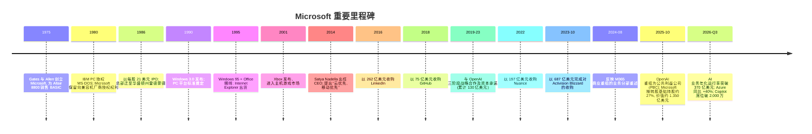
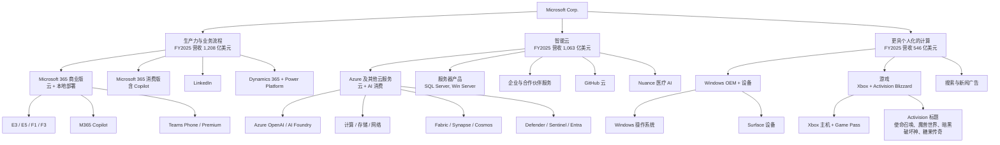

# Microsoft Corporation (NASDAQ:MSFT) — 公司研究报告

**截至日期: 2026-06-14**
**上市地: 纳斯达克全球精选市场 (NASDAQ Global Select Market), 代码 MSFT**
**注册地: 美国华盛顿州雷德蒙德 (Redmond, Washington)**
**报告语言: 简体中文 (本目录另存有英文版, 本次刷新仅更新中文版)**
**分析师备注:** 深度公司画像 / 维持覆盖。除非另行注明, 所有金额均以美元计。Microsoft 财政年度于 6 月 30 日结束——"2025 财年 (FY2025)"指截至 2025 年 6 月 30 日止的十二个月; "2026 财年 Q3 (3Q FY26)"指截至 2026 年 3 月 31 日止的季度。

> *分析师观点：* **评级：Buy（买入）· 12 个月目标价 US$500（较 2026-06-14 现价 US$390.74 上行 +28%）· 估值方法：FY2027E 非 GAAP EPS US$19.4 × 25.8× forward P/E · 市值约 2.90 万亿美元 · 52 周区间 US$356.28–US$555.45 · NASDAQ:MSFT**
>
> | 倍数 / Multiple (*分析师观点：* 前瞻列) | FY2025A | FY2026E | FY2027E |
> |---|---|---|---|
> | 非 GAAP P/E | 25.0× | 23.2× | 20.1× |
> | EV/FCF | ~45× | ~42× | ~33× |
> | P/S | 9.1× | 8.0× | 6.9× |
> | EV/EBITDA | ~18× | ~16× | ~13× |
>
> **相对表现 (Relative performance):** MSFT 自 52 周高点 US$555.45 已回撤约 −30%; 过去 12 个月绝对回报约 −18%, 同期 S&P 500 约 +8%——相对基准跑输约 −26 个百分点 (price source: [Yahoo Finance — MSFT, as of 2026-06-14](https://finance.yahoo.com/quote/MSFT/)). 这是 Microsoft 近十年最深的一次相对回调, 也是当前投资逻辑的"为什么是现在 (why-now)"。
>
> **核心论点 (thesis pillars)** ——(1) **AI 已是净增量而非蚕食**: AI 业务年化营收运行率 (annual revenue run rate) 突破 370 亿美元 (同比 +123%, 占总营收逾 11%), 而 M365 Copilot 付费席位破 2,000 万、营业利润率不降反升; (2) **6,270 亿美元已签约积压 (cRPO)** 锁定约 2.2 年云营收, 为超大市值科技股中最确定的前瞻底盘; (3) **当前 25× TTM / 20× forward P/E 已较自身三年均值 (~32×) 与同业 (GOOG/AMZN ~25–27×) 折价**, 计入了资本开支爬坡与 OpenAI 重组担忧——风险-回报偏正向; (4) **OpenAI 关系从"独家"转"非独家"反而对 Azure 利润率构成净利好** (取消版税与收入分成, 同时锁定 2,500 亿美元 Azure 增量合同至 2032 年)。
>
> *分析师观点：* 评级、目标价、上行幅度与前瞻倍数均为本报告的前瞻判断, 不构成任何监管文件 (filing) 中的披露; 详见第 1A 章的推导。

> **业绩更新——2026 财年 Q3 (2026-04-29):** Microsoft 公布营业收入 829 亿美元 (同比 +18%, 恒定汇率 +15%), 营业利润 384 亿美元 (+20%), 营业利润率 46.3%, 稀释每股收益 (diluted EPS) 4.27 美元 (+23%)。CEO Satya Nadella 披露公司 AI 业务**年化营业收入运行率 (annual revenue run rate) 突破 370 亿美元, 同比增长 123%**, **商业剩余履约义务 (commercial Remaining Performance Obligations, cRPO) 同比增长 99% 至 6,270 亿美元**, **M365 Copilot 付费席位破 2,000 万** (环比净增逾 500 万)。Azure 及其他云服务在持续受产能约束下加速至**同比 +40% (恒定汇率 +39%)**; 公司同时上调 2026 日历年资本开支 (capex) 指引。来源: [Microsoft 2026 财年 Q3 业绩公告 (SEC 8-K Ex-99.1), 2026-04-29](https://www.sec.gov/Archives/edgar/data/789019/000119312526191457/msft-ex99_1.htm)。

---

## 目录

1. 公司概览 (含投资逻辑引言 + 估值快照)
1A. 估值与目标价 (前瞻财务预测 · PT 推导 · 牛/基准/熊情景 · 卖方观点演变)
1B. GF Score (GuruFocus 式) 基本面评分卡 (雷达图 + 五维 0–10 + 综合分)
2. 公司历史
3. 管理团队
4. 产品与服务
5. 客户与分销
6. 行业概览
7. 竞争格局
8. 市场机会 (TAM)
9. 风险评估
9.5. 核心分歧与催化剂
10. 投资风格透视 (investor-lens scorecards)
11. 参考资料

---

## 1. 公司概览

*分析师观点：* **维持 Buy（买入）评级, 12 个月目标价 US$500, 较 2026-06-14 现价 US$390.74 上行约 +28%。** 当前是介入 Microsoft 的一个不寻常窗口——这只超大市值科技股自 2025 年初约 US$555 的高点回撤约 30%, 创近十年最深的相对跑输, 而基本面在同期反而改善: AI 年化运行率破 370 亿美元、cRPO 破 6,270 亿美元、营业利润率不降反升。市场担心的三件事——资本开支爬坡、OpenAI 关系松动、Azure 未出现"决定性加速"——本报告认为前两者其实对 Microsoft 中期利润率构成净利好, 第三者只是时点问题而非趋势逆转。"为什么是现在": 估值折价 + 已签约积压可见度 + AI 从成本走向利润这三者的交汇 (详见第 1A、9.5 章)。

Microsoft Corporation 是一家总部位于美国华盛顿州雷德蒙德的软件与服务平台公司, 目前是**全球最大的企业级软件特许经营商 (enterprise-software franchise)**、**第二大公有云平台 (public-cloud platform) Azure 的运营者**、**全球最大的专业社交网络 (LinkedIn) 运营者**、**收购 Activision Blizzard 之后按营业收入计算最大的主机与 PC 游戏发行商**, 并且通过对 OpenAI 的经济权益成为**领先前沿 AI 实验室 (frontier-AI lab) 的最紧密商业伙伴**。公司由 Bill Gates 和 Paul Allen 于 1975 年创立, 1986 年公开上市 (IPO), 目前由董事长兼 CEO Satya Nadella (自 2014 年 2 月 4 日起任 CEO) 领导。([2025 财年 10-K——第 1 项, 业务](https://www.sec.gov/Archives/edgar/data/789019/000095017025100235/0000950170-25-100235-index.htm); [Synergy Research——云市场份额 2026 年 Q1, 2026-05](https://www.srgresearch.com/articles/cloud-market-share-trends-big-three-together-hold-63-while-oracle-and-the-neoclouds-inch-higher))

在最近报告的完整财政年度——**2025 财年 (FY2025, 截至 2025 年 6 月 30 日)**——Microsoft 实现**营业收入 (revenue) 2,817 亿美元, 同比增长 15%**, 营业利润 (operating income) **1,285 亿美元 (营业利润率 45.6%)**, 净利润 (net income) **1,018 亿美元 (净利率 36.1%)**, 期末持有现金及短期投资 946 亿美元。稀释每股收益为 13.64 美元。([2025 10-K——合并损益表 (Consolidated Statements of Operations)](https://www.sec.gov/Archives/edgar/data/789019/000095017025100235/0000950170-25-100235-index.htm))

下图把 Microsoft 的整张损益表展开为一个"钱从哪来、流向哪去"的桑基图 (Sankey)——左侧是十条产品 / 服务收入线 (FY2025 披露口径), 右侧逐级流向毛利、营业利润、税与净利。

<svg xmlns="http://www.w3.org/2000/svg" viewBox="0 0 1000 560" width="1000" height="560" role="img" aria-label="income statement Sankey"><rect x="0" y="0" width="1000" height="560" fill="#ffffff"/>
<text x="20.00" y="30.00" text-anchor="start" font-family="Helvetica,Arial,sans-serif" font-size="15" font-weight="700" fill="#1f2933">How Microsoft (MSFT) Makes Its Money / 微软如何赚钱 — FY2025</text>
<path d="M 204.00,63.04 C 258.00,63.04 258.00,127.00 312.00,127.00 L 312.00,240.21 C 258.00,240.21 258.00,176.25 204.00,176.25 Z" fill="#93c5fd" fill-opacity="0.55"/>
<path d="M 452.00,120.00 C 506.00,120.00 506.00,170.51 560.00,170.51 L 560.00,318.32 C 506.00,318.32 506.00,267.82 452.00,267.82 Z" fill="#86efac" fill-opacity="0.55"/>
<path d="M 452.00,267.82 C 506.00,267.82 506.00,332.32 560.00,332.32 L 560.00,407.49 C 506.00,407.49 506.00,342.99 452.00,342.99 Z" fill="#fca5a5" fill-opacity="0.55"/>
<path d="M 328.00,127.00 C 382.00,127.00 382.00,120.00 436.00,120.00 L 436.00,342.99 C 382.00,342.99 382.00,349.99 328.00,349.99 Z" fill="#86efac" fill-opacity="0.55"/>
<path d="M 328.00,349.99 C 382.00,349.99 382.00,356.99 436.00,356.99 L 436.00,458.00 C 382.00,458.00 382.00,451.00 328.00,451.00 Z" fill="#fca5a5" fill-opacity="0.55"/>
<path d="M 700.00,166.32 C 754.00,166.32 754.00,210.91 808.00,210.91 L 808.00,328.02 C 754.00,328.02 754.00,283.44 700.00,283.44 Z" fill="#86efac" fill-opacity="0.55"/>
<path d="M 700.00,283.44 C 754.00,283.44 754.00,342.02 808.00,342.02 L 808.00,367.09 C 754.00,367.09 754.00,308.50 700.00,308.50 Z" fill="#fca5a5" fill-opacity="0.55"/>
<path d="M 576.00,170.51 C 630.00,170.51 630.00,166.32 684.00,166.32 L 684.00,314.14 C 630.00,314.14 630.00,318.32 576.00,318.32 Z" fill="#86efac" fill-opacity="0.55"/>
<path d="M 204.00,190.25 C 258.00,190.25 258.00,240.21 312.00,240.21 L 312.00,341.14 C 258.00,341.14 258.00,291.19 204.00,291.19 Z" fill="#93c5fd" fill-opacity="0.55"/>
<path d="M 204.00,305.19 C 258.00,305.19 258.00,341.14 312.00,341.14 L 312.00,368.12 C 258.00,368.12 258.00,332.16 204.00,332.16 Z" fill="#93c5fd" fill-opacity="0.55"/>
<path d="M 576.00,332.32 C 630.00,332.32 630.00,322.50 684.00,322.50 L 684.00,360.31 C 630.00,360.31 630.00,370.13 576.00,370.13 Z" fill="#fca5a5" fill-opacity="0.55"/>
<path d="M 576.00,370.13 C 630.00,370.13 630.00,374.31 684.00,374.31 L 684.00,411.68 C 630.00,411.68 630.00,407.49 576.00,407.49 Z" fill="#fca5a5" fill-opacity="0.55"/>
<path d="M 204.00,346.16 C 258.00,346.16 258.00,368.12 312.00,368.12 L 312.00,388.60 C 258.00,388.60 258.00,366.64 204.00,366.64 Z" fill="#93c5fd" fill-opacity="0.55"/>
<path d="M 204.00,380.64 C 258.00,380.64 258.00,388.60 312.00,388.60 L 312.00,408.52 C 258.00,408.52 258.00,400.56 204.00,400.56 Z" fill="#93c5fd" fill-opacity="0.55"/>
<path d="M 204.00,414.56 C 258.00,414.56 258.00,408.52 312.00,408.52 L 312.00,424.48 C 258.00,424.48 258.00,430.52 204.00,430.52 Z" fill="#93c5fd" fill-opacity="0.55"/>
<path d="M 204.00,444.52 C 258.00,444.52 258.00,424.48 312.00,424.48 L 312.00,433.48 C 258.00,433.48 258.00,453.52 204.00,453.52 Z" fill="#93c5fd" fill-opacity="0.55"/>
<path d="M 204.00,467.52 C 258.00,467.52 258.00,433.48 312.00,433.48 L 312.00,442.40 C 258.00,442.40 258.00,476.44 204.00,476.44 Z" fill="#93c5fd" fill-opacity="0.55"/>
<path d="M 204.00,490.44 C 258.00,490.44 258.00,442.40 312.00,442.40 L 312.00,450.92 C 258.00,450.92 258.00,498.96 204.00,498.96 Z" fill="#93c5fd" fill-opacity="0.55"/>
<path d="M 204.00,512.96 C 258.00,512.96 258.00,450.92 312.00,450.92 L 312.00,452.92 C 258.00,452.92 258.00,514.96 204.00,514.96 Z" fill="#93c5fd" fill-opacity="0.55"/>
<rect x="188.00" y="63.04" width="16" height="113.21" rx="1.5" fill="#2563eb"/>
<rect x="188.00" y="190.25" width="16" height="100.94" rx="1.5" fill="#2563eb"/>
<rect x="188.00" y="305.19" width="16" height="26.97" rx="1.5" fill="#2563eb"/>
<rect x="188.00" y="346.16" width="16" height="20.48" rx="1.5" fill="#2563eb"/>
<rect x="188.00" y="380.64" width="16" height="19.91" rx="1.5" fill="#2563eb"/>
<rect x="188.00" y="414.56" width="16" height="15.96" rx="1.5" fill="#2563eb"/>
<rect x="188.00" y="444.52" width="16" height="9.00" rx="1.5" fill="#2563eb"/>
<rect x="188.00" y="467.52" width="16" height="8.92" rx="1.5" fill="#2563eb"/>
<rect x="188.00" y="490.44" width="16" height="8.52" rx="1.5" fill="#2563eb"/>
<rect x="188.00" y="512.96" width="16" height="2.00" rx="1.5" fill="#2563eb"/>
<rect x="312.00" y="127.00" width="16" height="324.00" rx="1.5" fill="#1e3a8a"/>
<rect x="436.00" y="120.00" width="16" height="222.99" rx="1.5" fill="#15803d"/>
<rect x="436.00" y="356.99" width="16" height="101.01" rx="1.5" fill="#dc2626"/>
<rect x="560.00" y="170.51" width="16" height="147.82" rx="1.5" fill="#15803d"/>
<rect x="560.00" y="332.32" width="16" height="75.17" rx="1.5" fill="#dc2626"/>
<rect x="684.00" y="166.32" width="16" height="142.18" rx="1.5" fill="#15803d"/>
<rect x="684.00" y="322.50" width="16" height="37.81" rx="1.5" fill="#dc2626"/>
<rect x="684.00" y="374.31" width="16" height="37.36" rx="1.5" fill="#dc2626"/>
<rect x="808.00" y="210.91" width="16" height="117.11" rx="1.5" fill="#15803d"/>
<rect x="808.00" y="342.02" width="16" height="25.07" rx="1.5" fill="#dc2626"/>
<line x1="188.00" y1="119.64" x2="182.00" y2="82.63" stroke="#cbd5e1" stroke-width="1"/>
<text x="179.00" y="85.63" text-anchor="end" font-family="Helvetica,Arial,sans-serif" font-size="11.5" font-weight="700" fill="#1f2933">Server &amp; Cloud (incl. Azure)</text>
<text x="179.00" y="98.63" text-anchor="end" font-family="Helvetica,Arial,sans-serif" font-size="10" font-weight="400" fill="#52606d">$98.4B  (34.9%)</text>
<line x1="188.00" y1="240.72" x2="182.00" y2="203.70" stroke="#cbd5e1" stroke-width="1"/>
<text x="179.00" y="206.70" text-anchor="end" font-family="Helvetica,Arial,sans-serif" font-size="11.5" font-weight="700" fill="#1f2933">M365 Commercial</text>
<text x="179.00" y="219.70" text-anchor="end" font-family="Helvetica,Arial,sans-serif" font-size="10" font-weight="400" fill="#52606d">$87.8B  (31.2%)</text>
<line x1="188.00" y1="318.67" x2="182.00" y2="281.65" stroke="#cbd5e1" stroke-width="1"/>
<text x="179.00" y="284.65" text-anchor="end" font-family="Helvetica,Arial,sans-serif" font-size="11.5" font-weight="700" fill="#1f2933">Gaming</text>
<text x="179.00" y="297.65" text-anchor="end" font-family="Helvetica,Arial,sans-serif" font-size="10" font-weight="400" fill="#52606d">$23.5B  (8.3%)</text>
<line x1="188.00" y1="356.40" x2="182.00" y2="319.38" stroke="#cbd5e1" stroke-width="1"/>
<text x="179.00" y="322.38" text-anchor="end" font-family="Helvetica,Arial,sans-serif" font-size="11.5" font-weight="700" fill="#1f2933">LinkedIn</text>
<text x="179.00" y="335.38" text-anchor="end" font-family="Helvetica,Arial,sans-serif" font-size="10" font-weight="400" fill="#52606d">$17.8B  (6.3%)</text>
<line x1="188.00" y1="390.60" x2="182.00" y2="353.58" stroke="#cbd5e1" stroke-width="1"/>
<text x="179.00" y="356.58" text-anchor="end" font-family="Helvetica,Arial,sans-serif" font-size="11.5" font-weight="700" fill="#1f2933">Windows &amp; Devices</text>
<text x="179.00" y="369.58" text-anchor="end" font-family="Helvetica,Arial,sans-serif" font-size="10" font-weight="400" fill="#52606d">$17.3B  (6.1%)</text>
<line x1="188.00" y1="422.54" x2="182.00" y2="385.52" stroke="#cbd5e1" stroke-width="1"/>
<text x="179.00" y="388.52" text-anchor="end" font-family="Helvetica,Arial,sans-serif" font-size="11.5" font-weight="700" fill="#1f2933">Search &amp; News</text>
<text x="179.00" y="401.52" text-anchor="end" font-family="Helvetica,Arial,sans-serif" font-size="10" font-weight="400" fill="#52606d">$13.9B  (4.9%)</text>
<line x1="188.00" y1="449.02" x2="182.00" y2="412.00" stroke="#cbd5e1" stroke-width="1"/>
<text x="179.00" y="415.00" text-anchor="end" font-family="Helvetica,Arial,sans-serif" font-size="11.5" font-weight="700" fill="#1f2933">Dynamics</text>
<text x="179.00" y="428.00" text-anchor="end" font-family="Helvetica,Arial,sans-serif" font-size="10" font-weight="400" fill="#52606d">$7.8B  (2.8%)</text>
<line x1="188.00" y1="471.98" x2="182.00" y2="437.00" stroke="#cbd5e1" stroke-width="1"/>
<text x="179.00" y="440.00" text-anchor="end" font-family="Helvetica,Arial,sans-serif" font-size="11.5" font-weight="700" fill="#1f2933">Enterprise Svc</text>
<text x="179.00" y="453.00" text-anchor="end" font-family="Helvetica,Arial,sans-serif" font-size="10" font-weight="400" fill="#52606d">$7.8B  (2.8%)</text>
<line x1="188.00" y1="494.70" x2="182.00" y2="462.00" stroke="#cbd5e1" stroke-width="1"/>
<text x="179.00" y="465.00" text-anchor="end" font-family="Helvetica,Arial,sans-serif" font-size="11.5" font-weight="700" fill="#1f2933">M365 Consumer</text>
<text x="179.00" y="478.00" text-anchor="end" font-family="Helvetica,Arial,sans-serif" font-size="10" font-weight="400" fill="#52606d">$7.4B  (2.6%)</text>
<line x1="188.00" y1="513.96" x2="182.00" y2="487.00" stroke="#cbd5e1" stroke-width="1"/>
<text x="179.00" y="490.00" text-anchor="end" font-family="Helvetica,Arial,sans-serif" font-size="11.5" font-weight="700" fill="#1f2933">Other</text>
<text x="179.00" y="503.00" text-anchor="end" font-family="Helvetica,Arial,sans-serif" font-size="10" font-weight="400" fill="#52606d">$72.0M  (0.03%)</text>
<rect x="331.00" y="109.00" width="113.10" height="26" rx="2" fill="#ffffff" fill-opacity="0.72"/>
<text x="334.00" y="121.00" text-anchor="start" font-family="Helvetica,Arial,sans-serif" font-size="11.5" font-weight="700" fill="#1f2933">Revenue</text>
<text x="334.00" y="134.00" text-anchor="start" font-family="Helvetica,Arial,sans-serif" font-size="10" font-weight="400" fill="#52606d">$281.7B  (100.0%)</text>
<rect x="455.00" y="102.00" width="106.80" height="26" rx="2" fill="#ffffff" fill-opacity="0.72"/>
<text x="458.00" y="114.00" text-anchor="start" font-family="Helvetica,Arial,sans-serif" font-size="11.5" font-weight="700" fill="#1f2933">Gross Profit</text>
<text x="458.00" y="127.00" text-anchor="start" font-family="Helvetica,Arial,sans-serif" font-size="10" font-weight="400" fill="#52606d">$193.9B  (68.8%)</text>
<rect x="455.00" y="338.99" width="144.60" height="26" rx="2" fill="#ffffff" fill-opacity="0.72"/>
<text x="458.00" y="350.99" text-anchor="start" font-family="Helvetica,Arial,sans-serif" font-size="11.5" font-weight="700" fill="#1f2933">Cost of Revenue (COGS)</text>
<text x="458.00" y="363.99" text-anchor="start" font-family="Helvetica,Arial,sans-serif" font-size="10" font-weight="400" fill="#52606d">$87.8B  (31.2%)</text>
<rect x="579.00" y="152.51" width="106.80" height="26" rx="2" fill="#ffffff" fill-opacity="0.72"/>
<text x="582.00" y="164.51" text-anchor="start" font-family="Helvetica,Arial,sans-serif" font-size="11.5" font-weight="700" fill="#1f2933">Operating Income</text>
<text x="582.00" y="177.51" text-anchor="start" font-family="Helvetica,Arial,sans-serif" font-size="10" font-weight="400" fill="#52606d">$128.5B  (45.6%)</text>
<rect x="579.00" y="314.32" width="150.90" height="26" rx="2" fill="#ffffff" fill-opacity="0.72"/>
<text x="582.00" y="326.32" text-anchor="start" font-family="Helvetica,Arial,sans-serif" font-size="11.5" font-weight="700" fill="#1f2933">Total Operating Expense</text>
<text x="582.00" y="339.32" text-anchor="start" font-family="Helvetica,Arial,sans-serif" font-size="10" font-weight="400" fill="#52606d">$65.4B  (23.2%)</text>
<rect x="703.00" y="148.32" width="106.80" height="26" rx="2" fill="#ffffff" fill-opacity="0.72"/>
<text x="706.00" y="160.32" text-anchor="start" font-family="Helvetica,Arial,sans-serif" font-size="11.5" font-weight="700" fill="#1f2933">Pretax Income</text>
<text x="706.00" y="173.32" text-anchor="start" font-family="Helvetica,Arial,sans-serif" font-size="10" font-weight="400" fill="#52606d">$123.6B  (43.9%)</text>
<rect x="703.00" y="304.50" width="100.50" height="26" rx="2" fill="#ffffff" fill-opacity="0.72"/>
<text x="706.00" y="316.50" text-anchor="start" font-family="Helvetica,Arial,sans-serif" font-size="11.5" font-weight="700" fill="#1f2933">SG&amp;A</text>
<text x="706.00" y="329.50" text-anchor="start" font-family="Helvetica,Arial,sans-serif" font-size="10" font-weight="400" fill="#52606d">$32.9B  (11.7%)</text>
<rect x="703.00" y="356.31" width="100.50" height="26" rx="2" fill="#ffffff" fill-opacity="0.72"/>
<text x="706.00" y="368.31" text-anchor="start" font-family="Helvetica,Arial,sans-serif" font-size="11.5" font-weight="700" fill="#1f2933">R&amp;D</text>
<text x="706.00" y="381.31" text-anchor="start" font-family="Helvetica,Arial,sans-serif" font-size="10" font-weight="400" fill="#52606d">$32.5B  (11.5%)</text>
<text x="833.00" y="266.47" text-anchor="start" font-family="Helvetica,Arial,sans-serif" font-size="11.5" font-weight="700" fill="#1f2933">Net Income</text>
<text x="833.00" y="279.47" text-anchor="start" font-family="Helvetica,Arial,sans-serif" font-size="10" font-weight="400" fill="#52606d">$101.8B  (36.1%)</text>
<text x="833.00" y="351.56" text-anchor="start" font-family="Helvetica,Arial,sans-serif" font-size="11.5" font-weight="700" fill="#1f2933">Income Tax</text>
<text x="833.00" y="364.56" text-anchor="start" font-family="Helvetica,Arial,sans-serif" font-size="10" font-weight="400" fill="#52606d">$21.8B  (7.7%)</text>
<text x="500.00" y="544.00" text-anchor="middle" font-family="Helvetica,Arial,sans-serif" font-size="10" font-weight="400" fill="#52606d">Source: MSFT FY2025 10-K, Consolidated Statements of Operations + Note 19 Segments</text>
</svg>

来源 / Source: [Microsoft 2025 财年 10-K——合并损益表 + Note 19 分部信息](https://www.sec.gov/Archives/edgar/data/789019/000095017025100235/0000950170-25-100235-index.htm)。

公司在 2024 年 8 月业务重述 (segment restatement) 之后按三个分部报告——该重述将 Microsoft 365 商业部分从"更具个人化的计算 (More Personal Computing)"分部转移至"生产力与业务流程 (Productivity and Business Processes)"分部:

| 业务分部 (2025 财年) | 营业收入 (十亿美元) | 同比 | 营业利润 (十亿美元) | 营业利润率 |
|---|---|---|---|---|
| 生产力与业务流程 (PBP) | 120.8 | +13% | 69.8 | 57.8% |
| 智能云 (Intelligent Cloud, IC) | 106.3 | +21% | 44.6 | 42.0% |
| 更具个人化的计算 (MPC) | 54.6 | +7% | 14.2 | 25.9% |
| **合计** | **281.7** | **+15%** | **128.5** | **45.6%** |

来源: [Microsoft 2025 财年 10-K——分部经营业绩与 Note 19](https://www.sec.gov/Archives/edgar/data/789019/000095017025100235/0000950170-25-100235-index.htm)。

<svg xmlns="http://www.w3.org/2000/svg" viewBox="0 0 720 460" width="720" height="460" role="img" aria-label="revenue donut"><rect x="0" y="0" width="720" height="460" fill="#ffffff"/>
<text x="20.00" y="30.00" text-anchor="start" font-family="Helvetica,Arial,sans-serif" font-size="15" font-weight="700" fill="#1f2933">FY2025 营业收入按分部 / Revenue by Segment</text>
<path d="M 288.00,107.20 A 132 132 0 0 1 345.08,358.22 L 321.73,309.53 A 78 78 0 0 0 288.00,161.20 Z" fill="#2563eb"/>
<path d="M 345.08,358.22 A 132 132 0 0 1 164.09,193.69 L 214.78,212.31 A 78 78 0 0 0 321.73,309.53 Z" fill="#15803d"/>
<path d="M 164.09,193.69 A 132 132 0 0 1 288.00,107.20 L 288.00,161.20 A 78 78 0 0 0 214.78,212.31 Z" fill="#d97706"/>
<text x="288.00" y="235.20" text-anchor="middle" font-family="Helvetica,Arial,sans-serif" font-size="18" font-weight="800" fill="#1f2933">MSFT</text>
<text x="288.00" y="255.20" text-anchor="middle" font-family="Helvetica,Arial,sans-serif" font-size="13" font-weight="600" fill="#52606d">$281.7B</text>
<text x="288.00" y="271.20" text-anchor="middle" font-family="Helvetica,Arial,sans-serif" font-size="10" font-weight="400" fill="#8a97a3">total</text>
<line x1="422.56" y1="208.60" x2="438.56" y2="208.60" stroke="#2563eb" stroke-width="1.4"/>
<text x="442.56" y="206.60" text-anchor="start" font-family="Helvetica,Arial,sans-serif" font-size="11" font-weight="700" fill="#1f2933">Productivity &amp; Business Processes</text>
<text x="442.56" y="220.60" text-anchor="start" font-family="Helvetica,Arial,sans-serif" font-size="10" font-weight="400" fill="#52606d">$120.8B  (42.9%)</text>
<line x1="195.17" y1="341.31" x2="179.17" y2="341.31" stroke="#15803d" stroke-width="1.4"/>
<text x="175.17" y="339.31" text-anchor="end" font-family="Helvetica,Arial,sans-serif" font-size="11" font-weight="700" fill="#1f2933">Intelligent Cloud</text>
<text x="175.17" y="353.31" text-anchor="end" font-family="Helvetica,Arial,sans-serif" font-size="10" font-weight="400" fill="#52606d">$106.3B  (37.7%)</text>
<line x1="209.01" y1="126.04" x2="193.01" y2="126.04" stroke="#d97706" stroke-width="1.4"/>
<text x="189.01" y="124.04" text-anchor="end" font-family="Helvetica,Arial,sans-serif" font-size="11" font-weight="700" fill="#1f2933">More Personal Computing</text>
<text x="189.01" y="138.04" text-anchor="end" font-family="Helvetica,Arial,sans-serif" font-size="10" font-weight="400" fill="#52606d">$54.6B  (19.4%)</text>
<text x="360.00" y="444.00" text-anchor="middle" font-family="Helvetica,Arial,sans-serif" font-size="10" font-weight="400" fill="#52606d">Source: MSFT FY2025 10-K, Note 19 — Segment Information</text>
</svg>

来源 / Source: [Microsoft 2025 财年 10-K, Note 19——分部信息](https://www.sec.gov/Archives/edgar/data/789019/000095017025100235/0000950170-25-100235-index.htm)。

**Microsoft Cloud (微软云)**——一个非 GAAP 口径汇总指标, 包含 Microsoft 365 商业云、Azure 及其他云服务、LinkedIn 商业部分以及 Dynamics 365——在 2025 财年**同比增长 23% 至 1,689 亿美元** (2024 财年 1,377 亿美元, 2023 财年 1,116 亿美元)。进入 2026 财年云业务继续复合增长: Q1 491 亿美元 (+26%)、Q2 515 亿美元 (+26%)、Q3 545 亿美元 (+29%)。([Microsoft 2026 财年 Q3 业绩公告](https://www.sec.gov/Archives/edgar/data/789019/000119312526191457/msft-ex99_1.htm))

下图按产品 / 服务线展示 FY2023–FY2025 的营收演变——可见 Server & Cloud (含 Azure) 从 650 亿增至 984 亿美元 (CAGR ~23%), 而 Windows & Devices 基本持平于约 170 亿美元, 这就是"订阅云吞噬永久许可证"的图形化证据。

<svg xmlns="http://www.w3.org/2000/svg" viewBox="0 0 860 470" width="860" height="470" role="img" aria-label="historical revenue bars"><rect x="0" y="0" width="860" height="470" fill="#ffffff"/>
<text x="20.00" y="30.00" text-anchor="start" font-family="Helvetica,Arial,sans-serif" font-size="15" font-weight="700" fill="#1f2933">Revenue by Product / 按产品线营收, FY2023-FY2025 (USD bn)</text>
<rect x="20.00" y="44" width="11" height="11" rx="2" fill="#2563eb"/>
<text x="36.00" y="53.00" text-anchor="start" font-family="Helvetica,Arial,sans-serif" font-size="10.5" font-weight="400" fill="#1f2933">Server &amp; Cloud (incl Azure)</text>
<rect x="228.20" y="44" width="11" height="11" rx="2" fill="#15803d"/>
<text x="244.20" y="53.00" text-anchor="start" font-family="Helvetica,Arial,sans-serif" font-size="10.5" font-weight="400" fill="#1f2933">M365 Commercial</text>
<rect x="357.20" y="44" width="11" height="11" rx="2" fill="#d97706"/>
<text x="373.20" y="53.00" text-anchor="start" font-family="Helvetica,Arial,sans-serif" font-size="10.5" font-weight="400" fill="#1f2933">Gaming</text>
<rect x="426.80" y="44" width="11" height="11" rx="2" fill="#7c3aed"/>
<text x="442.80" y="53.00" text-anchor="start" font-family="Helvetica,Arial,sans-serif" font-size="10.5" font-weight="400" fill="#1f2933">LinkedIn</text>
<rect x="509.60" y="44" width="11" height="11" rx="2" fill="#dc2626"/>
<text x="525.60" y="53.00" text-anchor="start" font-family="Helvetica,Arial,sans-serif" font-size="10.5" font-weight="400" fill="#1f2933">Windows &amp; Devices</text>
<rect x="651.80" y="44" width="11" height="11" rx="2" fill="#0891b2"/>
<text x="667.80" y="53.00" text-anchor="start" font-family="Helvetica,Arial,sans-serif" font-size="10.5" font-weight="400" fill="#1f2933">Search &amp; News</text>
<rect x="767.60" y="44" width="11" height="11" rx="2" fill="#db2777"/>
<text x="783.60" y="53.00" text-anchor="start" font-family="Helvetica,Arial,sans-serif" font-size="10.5" font-weight="400" fill="#1f2933">Dynamics</text>
<rect x="850.40" y="44" width="11" height="11" rx="2" fill="#65a30d"/>
<text x="866.40" y="53.00" text-anchor="start" font-family="Helvetica,Arial,sans-serif" font-size="10.5" font-weight="400" fill="#1f2933">Enterprise Svc</text>
<rect x="972.80" y="44" width="11" height="11" rx="2" fill="#9333ea"/>
<text x="988.80" y="53.00" text-anchor="start" font-family="Helvetica,Arial,sans-serif" font-size="10.5" font-weight="400" fill="#1f2933">M365 Consumer</text>
<line x1="70" y1="412.00" x2="834" y2="412.00" stroke="#eceff2" stroke-width="1"/>
<text x="64.00" y="415.00" text-anchor="end" font-family="Helvetica,Arial,sans-serif" font-size="9.5" font-weight="400" fill="#52606d">$0</text>
<line x1="70" y1="345.20" x2="834" y2="345.20" stroke="#eceff2" stroke-width="1"/>
<text x="64.00" y="348.20" text-anchor="end" font-family="Helvetica,Arial,sans-serif" font-size="9.5" font-weight="400" fill="#52606d">$60.8B</text>
<line x1="70" y1="278.40" x2="834" y2="278.40" stroke="#eceff2" stroke-width="1"/>
<text x="64.00" y="281.40" text-anchor="end" font-family="Helvetica,Arial,sans-serif" font-size="9.5" font-weight="400" fill="#52606d">$121.7B</text>
<line x1="70" y1="211.60" x2="834" y2="211.60" stroke="#eceff2" stroke-width="1"/>
<text x="64.00" y="214.60" text-anchor="end" font-family="Helvetica,Arial,sans-serif" font-size="9.5" font-weight="400" fill="#52606d">$182.5B</text>
<line x1="70" y1="144.80" x2="834" y2="144.80" stroke="#eceff2" stroke-width="1"/>
<text x="64.00" y="147.80" text-anchor="end" font-family="Helvetica,Arial,sans-serif" font-size="9.5" font-weight="400" fill="#52606d">$243.4B</text>
<line x1="70" y1="78.00" x2="834" y2="78.00" stroke="#eceff2" stroke-width="1"/>
<text x="64.00" y="81.00" text-anchor="end" font-family="Helvetica,Arial,sans-serif" font-size="9.5" font-weight="400" fill="#52606d">$304.2B</text>
<rect x="123.48" y="340.64" width="147.71" height="71.36" fill="#2563eb"/>
<rect x="123.48" y="267.20" width="147.71" height="73.44" fill="#15803d"/>
<rect x="123.48" y="250.18" width="147.71" height="17.02" fill="#d97706"/>
<rect x="123.48" y="233.71" width="147.71" height="16.47" fill="#7c3aed"/>
<rect x="123.48" y="214.94" width="147.71" height="18.77" fill="#dc2626"/>
<rect x="123.48" y="201.66" width="147.71" height="13.28" fill="#0891b2"/>
<rect x="123.48" y="195.29" width="147.71" height="6.37" fill="#db2777"/>
<rect x="123.48" y="186.62" width="147.71" height="8.67" fill="#65a30d"/>
<rect x="123.48" y="179.59" width="147.71" height="7.03" fill="#9333ea"/>
<text x="197.33" y="428.00" text-anchor="middle" font-family="Helvetica,Arial,sans-serif" font-size="10" font-weight="400" fill="#52606d">2023</text>
<rect x="378.15" y="324.39" width="147.71" height="87.61" fill="#2563eb"/>
<rect x="378.15" y="239.86" width="147.71" height="84.53" fill="#15803d"/>
<rect x="378.15" y="216.26" width="147.71" height="23.60" fill="#d97706"/>
<rect x="378.15" y="198.25" width="147.71" height="18.00" fill="#7c3aed"/>
<rect x="378.15" y="179.59" width="147.71" height="18.66" fill="#dc2626"/>
<rect x="378.15" y="166.09" width="147.71" height="13.50" fill="#0891b2"/>
<rect x="378.15" y="158.62" width="147.71" height="7.47" fill="#db2777"/>
<rect x="378.15" y="150.28" width="147.71" height="8.34" fill="#65a30d"/>
<rect x="378.15" y="143.03" width="147.71" height="7.25" fill="#9333ea"/>
<text x="452.00" y="428.00" text-anchor="middle" font-family="Helvetica,Arial,sans-serif" font-size="10" font-weight="400" fill="#52606d">2024</text>
<rect x="632.81" y="303.97" width="147.71" height="108.03" fill="#2563eb"/>
<rect x="632.81" y="207.58" width="147.71" height="96.39" fill="#15803d"/>
<rect x="632.81" y="181.78" width="147.71" height="25.80" fill="#d97706"/>
<rect x="632.81" y="162.24" width="147.71" height="19.54" fill="#7c3aed"/>
<rect x="632.81" y="143.25" width="147.71" height="18.99" fill="#dc2626"/>
<rect x="632.81" y="127.99" width="147.71" height="15.26" fill="#0891b2"/>
<rect x="632.81" y="119.43" width="147.71" height="8.56" fill="#db2777"/>
<rect x="632.81" y="110.86" width="147.71" height="8.56" fill="#65a30d"/>
<rect x="632.81" y="102.74" width="147.71" height="8.12" fill="#9333ea"/>
<text x="706.67" y="428.00" text-anchor="middle" font-family="Helvetica,Arial,sans-serif" font-size="10" font-weight="400" fill="#52606d">2025</text>
<text x="430.00" y="454.00" text-anchor="middle" font-family="Helvetica,Arial,sans-serif" font-size="10" font-weight="400" fill="#52606d">Source: MSFT FY2025 10-K, Note 19 — Revenue by significant product/service offering</text>
</svg>

来源 / Source: [Microsoft 2025 财年 10-K, Note 19——按重要产品与服务分类的营业收入](https://www.sec.gov/Archives/edgar/data/789019/000095017025100235/0000950170-25-100235-index.htm)。

**员工人数**截至 2025 年 6 月 30 日约**22.8 万名全职员工** (12.5 万在美国本土, 10.3 万海外): 运营 (含数据中心运营) 8.9 万、产品研发 8 万、销售与市场营销 4.4 万、一般与行政 1.5 万。([2025 财年 10-K——人力资本 (Human Capital)](https://www.sec.gov/Archives/edgar/data/789019/000095017025100235/0000950170-25-100235-index.htm))

**地理结构 (2025 财年):** 美国本土 1,445 亿美元 (占营业收入 51.3%), 其他国家 1,372 亿美元 (占 48.7%)。Microsoft 明确披露, 2023、2024、2025 三个财年内, **除美国外没有任何单一客户或单一国家占公司营业收入超过 10%**——对超大规模云厂商 (hyperscaler) 而言, 这是异常低的客户集中度。([2025 财年 10-K——Note 19 地理数据](https://www.sec.gov/Archives/edgar/data/789019/000095017025100235/0000950170-25-100235-index.htm))

### 估值快照 (TTM)

通过 `yfinance` 数据源于 **2026-06-14** 自 Yahoo Finance 获取 (周末取最近一个交易日 2026-06-12 收盘, 现价 US$390.74 与上次刷新一致):

| 指标 | MSFT | GOOG | ORCL | AMZN | CRM |
|---|---|---|---|---|---|
| 最近股价 | **390.74 美元** | 358.16 美元 | 184.13 美元 | 238.55 美元 | 165.89 美元 |
| 市值 | **2.90 万亿美元** | 4.37 万亿美元 | 0.53 万亿美元 | 2.57 万亿美元 | 0.14 万亿美元 |
| TTM 市盈率 (P/E) | **23.3×** | 27.3× | 31.5× | 31.6× | 19.2× |
| 前瞻市盈率 (forward P/E) | **20.2×** | 24.7× | 16.9× | 24.2× | 10.7× |
| TTM 市销率 (P/S) | **9.1×** | 10.3× | 7.9× | 3.5× | 3.2× |
| 52 周价格区间 | 356.28–555.45 美元 | 163.33–404.47 美元 | 134.57–345.72 美元 | 196.00–278.56 美元 | 161.40–276.80 美元 |

来源: [Yahoo Finance——MSFT](https://finance.yahoo.com/quote/MSFT/key-statistics)、[GOOG](https://finance.yahoo.com/quote/GOOG/key-statistics)、[ORCL](https://finance.yahoo.com/quote/ORCL/key-statistics)、[AMZN](https://finance.yahoo.com/quote/AMZN/key-statistics)、[CRM](https://finance.yahoo.com/quote/CRM/key-statistics) (as of 2026-06-14)。

**结论。** 以 23.3× TTM 盈利与 9.1× TTM 营业收入计, MSFT 在市盈率维度**相较超大市值软件 / 云同业群体存在折价** (GOOG/AMZN/ORCL 平均约 30×), 仅高于深度回调中的 CRM。两点解释这一相对便宜: (i) Microsoft 的分母比同业更具盈利能力——净利率约 36% 高于 Alphabet 约 28%、Amazon 约 8%——同样的市值"挣进"任何倍数都更快; (ii) 股价自 52 周高点 555.45 美元回撤约 30%, 反映投资者对 2026 财年资本开支爬坡 (capex ramp, 详见风险 #1) 以及 2025 年 10 月 OpenAI 重组 (详见第 4、9 章) 的担忧。当前 23.3× TTM / 20.2× forward 大致是 MSFT 自身三年均值约 32× 减去明显折价的水平。*分析师观点：* 卖方对此折价持类似看法——瑞银 (UBS) 指出公司虽以 2026 日历年约 49× 自由现金流 (FCF) 交易看似不便宜, 但考虑 AI 领导地位与 Azure 潜在加速, "估值仍属合理"; 高盛 (GS) 更直接称 3Q26 是"扭转多季度表现不佳的第一步"([UBS——MSFT: 对修订版 OpenAI 协议的解读, 2026-04-27, p.1, 报告日收盘 US$424.82](http://xs-macbook-air.local:5001/zsxq/pdf/212212585484141/UBS-Microsoft%20Corp.%EF%BC%88MSFT.US%EF%BC%89Our%20Take%20on%20the%20Revised%20OpenAI%20Agreement-260427.pdf); [Goldman Sachs——MSFT: 多个新里程碑驳斥空头论点, 2026-04-30, p.1, 报告日收盘 US$406.90](http://xs-macbook-air.local:5001/zsxq/pdf/812212244124212/Goldman%20Sachs-Microsoft%20Corp.%20%EF%BC%88MSFT.US%EF%BC%89%20Several%20new%20milestones%20to%20disprove%20the%20bear%20case-260430.pdf))。我们认为当前价位不存在估值泡沫风险; 倍数压缩风险仅在 Azure 急剧减速或 AI 资本开支增量回报率 (incremental ROIC) 跌破云业务现有毛利率门槛时才会触发。

---

## 1A. 估值与目标价

本章是前瞻、决策级的分析层, 区别于第 1 章的 TTM 后视快照。**本章所有投影数字、目标价与情景目标价均为本报告自身的前瞻判断 (*分析师观点：*), 不附带任何监管文件 (filing) 引用**——10-K 中不含目标价; 我们引用的是每条投影所依赖的*外部输入* (文件分部数据 + 管理层指引 + 行业预测 + 卖方一致预期)。

### (a) 前瞻财务预测 (FY2025A–FY2028E)

| 指标 (*分析师观点：*) | FY2025A | FY2026E | FY2027E | FY2028E | CAGR (25→28) |
|---|---|---|---|---|---|
| 营业收入 (十亿美元) | 281.7 | 329 | 385 | 450 | +16.9% |
| — 同比 % | +15% | +17% | +17% | +17% | |
| Microsoft Cloud (十亿美元) | 168.9 | ~210 | ~262 | ~325 | +24% |
| 毛利率 (gross margin) % | 68.8% | ~68% | ~67.5% | ~67.5% | |
| 营业利润率 (operating margin) % | 45.6% | ~45% | ~45.5% | ~46% | |
| 非 GAAP 稀释 EPS (美元) | 13.64 (GAAP) | 16.8 | 19.4 | 23.6 | — |
| — 同比 % | — | (基准) | +15% | +22% | |
| ROIC % | ~29% | ~26% | ~26% | ~28% | |
| 自由现金流 FCF (十亿美元) | 71.6 | ~65 | ~85 | ~120 | |
| 净现金 / (净债务) (十亿美元) | +54 | ~+50 | ~+70 | ~+110 | |

注: FY2025A 的 EPS 13.64 为 GAAP 稀释口径; FY2026E 起为非 GAAP 口径 (剔除 OpenAI 权益法损失), 与卖方建模一致。FY2025 FCF = 经营现金流 1,362 亿 − 资本开支 646 亿 = 716 亿美元。([2025 财年 10-K——现金流量表](https://www.sec.gov/Archives/edgar/data/789019/000095017025100235/0000950170-25-100235-index.htm))

每条投影的外部依据 (cited inputs, 投影本身为 *分析师观点：*):
- **营收路径**: FY2026E 锚定管理层 4Q FY26 指引中点 867–878 亿美元 + 前三季实际 ([2026 财年 Q3 公告](https://www.sec.gov/Archives/edgar/data/789019/000119312526191457/msft-ex99_1.htm)), 与卖方一致——瑞银 FY2026E 营收 3,293 亿、高盛 3,290 亿美元。FY2027E/FY2028E 由分部加总: Intelligent Cloud 约 +25–28% (Azure 维持 30%+ 恒定汇率)、PBP 约 +12–14% (M365 Copilot ARPU 拉动)、MPC 约 +3% (PC 周期低增长)。([UBS——Capex Ramps, Azure Accelerates, 2026-04-30, p.1, 报告日收盘 US$406.90](http://xs-macbook-air.local:5001/zsxq/pdf/184484414482152/UBS-Microsoft%20Corp.%EF%BC%88MSFT.US%EF%BC%89Capex%20Ramps%EF%BC%8C%20Azure%20Accelerates%20and%20Pricing%20Changes-260430.pdf))
- **毛利率小幅下行**: 公司 4Q FY26 指引商业云毛利率约 64% (同比下降), 主因 AI 投资折旧与 GitHub Copilot 用量增长——是 mix shift 与折旧, 不是定价崩塌。([Bernstein——MSFT 3Q26, 2026-04-30, p.1](http://xs-macbook-air.local:5001/zsxq/pdf/184484441818152/Bernstein-Microsoft%203Q26%20a%20good%20quarter%2C%20but%20the%20debate%20continues-260430.pdf))
- **营业利润率回升**: 过去两年 Microsoft 实际上把营业利润率扩张了约 170 个基点 (bps), 靠的是 AI 提效降本与人头数持平/下降 (FY27 预计整体人头下降)。([Morgan Stanley——MSFT 3Q26: Onto Newer and Better Things, 2026-04-30, p.1, 报告日收盘 US$406.90](http://xs-macbook-air.local:5001/zsxq/pdf/415515552121218/MS-Microsoft%20North%20America%203Q26%20Results%20%E2%80%93%20Onto%20Newer%20and%20Better%20Things-260430.pdf))

**毛利率桥 (gross-margin bridge, *分析师观点：*) — 4Q FY26 商业云毛利率约 64% (同比约 −300bps):** AI 数据中心折旧 ≈ −200bps · GitHub Copilot 用量成本 (基于消费量定价过渡期) ≈ −80bps · 内存等元器件成本通胀 ≈ −60bps · 自研 MAI 模型提效 ≈ +40bps。各驱动均可溯源至公司 4Q FY26 指引与卖方拆解 ([Bernstein 3Q26](http://xs-macbook-air.local:5001/zsxq/pdf/184484441818152/Bernstein-Microsoft%203Q26%20a%20good%20quarter%2C%20but%20the%20debate%20continues-260430.pdf); [UBS Capex/Azure](http://xs-macbook-air.local:5001/zsxq/pdf/184484414482152/UBS-Microsoft%20Corp.%EF%BC%88MSFT.US%EF%BC%89Capex%20Ramps%EF%BC%8C%20Azure%20Accelerates%20and%20Pricing%20Changes-260430.pdf)); 具体 bps 拆分为本报告的归因, 标注为 *分析师观点：*。

### (b) 目标价推导 (PT derivation) — 展示算术

**方法: 前瞻市盈率 × 目标倍数。** US$500 = **FY2027E 非 GAAP EPS US$19.4 × 25.8× forward P/E**。

为什么用约 26× 这个倍数: 同业前瞻市盈率锚——GOOG 24.7×、AMZN 24.2×、ORCL 16.9× (after AI 基础设施折旧拖累)、CRM 10.7× ([Yahoo Finance, 2026-06-14](https://finance.yahoo.com/quote/MSFT/key-statistics))。Microsoft 应享有相对 GOOG/AMZN 的小幅溢价, 因其 (i) 净利率最高 (~36%)、(ii) 已签约 cRPO 可见度最强、(iii) 营业利润率在 AI 周期中扩张而非压缩。26× 仍明显低于 MSFT 自身三年均值约 32×, 也低于大摩 30× 的 CY27 假设, 因此是一个"折价的合理倍数"而非乐观倍数。这一目标价**与最保守的卖方多头 (UBS US$510, 22× FY27 非 GAAP EPS) 大致对齐**, 系统性低于大摩 US$650、高盛 US$610、Bernstein US$646、HSBC US$667——我们刻意把锚定在偏保守一端, 以反映资本开支爬坡的 FCF 不确定性。

### (c) 牛 / 基准 / 熊情景 (bull / base / bear)

| 情景 (*分析师观点：*) | 核心摆动假设 | FY2027E 非 GAAP EPS | 目标倍数 | 目标价 | 较现价 |
|---|---|---|---|---|---|
| 牛 (Bull) | Azure 重回 40%+ 恒定汇率, Copilot 席位渗透破 25%, 倍数回到 30× | 20.5 | 30× | 615 美元 | +57% |
| 基准 (Base) | Azure 维持 30%+ 恒定汇率, Copilot 稳步爬坡, 倍数 25.8× | 19.4 | 25.8× | 500 美元 | +28% |
| 熊 (Bear) | Azure 减速至 20% 区间, capex ROIC 跌破门槛, 倍数压缩至 18× | 18.0 | 18× | 324 美元 | −17% |

熊情景假设来自卖方明确点出的下行触发: AI 泡沫破裂传导至科技股、Azure 不及预期、运营利润率承压、监管结构性救济 ([Bernstein——风险段, 2026-04-30](http://xs-macbook-air.local:5001/zsxq/pdf/184484441818152/Bernstein-Microsoft%203Q26%20a%20good%20quarter%2C%20but%20the%20debate%20continues-260430.pdf))。

### (d) 与市场一致预期的对比 (consensus benchmark)

本报告 FY2027E 营收 3,850 亿、非 GAAP EPS US$19.4 与卖方一致预期**大致持平**——瑞银 FY2027E 营收 3,825 亿 / 非 GAAP EPS US$19.21 (OpenAI 报告) 至 US$19.49 (Capex 报告), 高盛 FY2027E 营收 3,870 亿 / 调整后 EPS US$19.47, 大摩 CY2027e EPS US$21.95 (历年口径偏高)。我们的目标价 US$500 落在卖方目标价区间的低端 (UBS US$510 ~ HSBC US$667), 主要因我们采用更保守的 25.8× 而非大摩 30×。([UBS——OpenAI 协议解读, 2026-04-27, p.1](http://xs-macbook-air.local:5001/zsxq/pdf/212212585484141/UBS-Microsoft%20Corp.%EF%BC%88MSFT.US%EF%BC%89Our%20Take%20on%20the%20Revised%20OpenAI%20Agreement-260427.pdf); [UBS——Capex Ramps, 2026-04-30, p.1](http://xs-macbook-air.local:5001/zsxq/pdf/184484414482152/UBS-Microsoft%20Corp.%EF%BC%88MSFT.US%EF%BC%89Capex%20Ramps%EF%BC%8C%20Azure%20Accelerates%20and%20Pricing%20Changes-260430.pdf); [Goldman Sachs——驳斥空头, 2026-04-30, p.1](http://xs-macbook-air.local:5001/zsxq/pdf/812212244124212/Goldman%20Sachs-Microsoft%20Corp.%20%EF%BC%88MSFT.US%EF%BC%89%20Several%20new%20milestones%20to%20disprove%20the%20bear%20case-260430.pdf))

### (e) 这笔买卖押在哪两个变量上 (swing variables)

1. **Azure 恒定汇率增速能否守住 30%+ (尤其 1H FY27 的高基数比较)。** 公司 4Q FY26 指引 39–40% 恒定汇率并预期 2H CY26 略微加速; 若产能 (Fairwater 等设施上线) 如期释放, 增速可守。
2. **增量资本开支的回报率 (incremental ROIC)。** 只要 Azure AI 毛利率维持在 15–20% 以上, 这笔约 1,900 亿美元/年的资本开支就有可辩护的回报 ([Morgan Stanley——Infrastructure Monetization, 2026-05-27, p.1, 报告日收盘 US$412.67](http://xs-macbook-air.local:5001/zsxq/pdf/184128881148842/MS-Microsoft%20Infrastructure%20Monetization%20%E2%80%93%20Still%20Early%20Days%20in%20the%20AI%20Cycle-260527.pdf))。这是熊/牛分野的核心。

### 回报质量——ROE 杜邦分解 (return decomposition)

把 FY2025 的 ROE 拆成净利率 × 资产周转 × 权益乘数三因子, 可以看清这笔买卖买的是什么: 36.1% 的净利率是绝对主导项, 资产周转适中 (资本密集度上升中), 权益乘数温和 (净现金、低杠杆)。这正是 GF Score 把 Profitability 给到 10/10 的算术基础。

<svg xmlns="http://www.w3.org/2000/svg" viewBox="0 0 1240 540" width="1240" height="540" role="img" aria-label="DuPont ROE decomposition"><rect x="0" y="0" width="1240" height="540" fill="#ffffff"/>
<text x="20.00" y="30.00" text-anchor="start" font-family="Helvetica,Arial,sans-serif" font-size="15" font-weight="700" fill="#1f2933">微软 ROE 杜邦分解 / Microsoft (MSFT) 5-Step DuPont — FY2025</text>
<rect x="545.00" y="56.00" width="150" height="56" rx="7" fill="#1e3a8a"/>
<text x="620.00" y="76.00" text-anchor="middle" font-family="Helvetica,Arial,sans-serif" font-size="11.5" font-weight="700" fill="#ffffff">ROE</text>
<text x="620.00" y="94.00" text-anchor="middle" font-family="Helvetica,Arial,sans-serif" font-size="13" font-weight="800" fill="#ffffff">33.28%</text>
<text x="620.00" y="106.00" text-anchor="middle" font-family="Helvetica,Arial,sans-serif" font-size="8.5" font-weight="400" fill="#dbeafe">= Net Income / Avg Equity</text>
<rect x="191.60" y="168.00" width="150" height="56" rx="7" fill="#2563eb"/>
<text x="266.60" y="188.00" text-anchor="middle" font-family="Helvetica,Arial,sans-serif" font-size="11.5" font-weight="700" fill="#ffffff">Net Margin</text>
<text x="266.60" y="206.00" text-anchor="middle" font-family="Helvetica,Arial,sans-serif" font-size="13" font-weight="800" fill="#ffffff">36.15%</text>
<text x="266.60" y="218.00" text-anchor="middle" font-family="Helvetica,Arial,sans-serif" font-size="8.5" font-weight="400" fill="#dbeafe">Net Income / Revenue</text>
<line x1="620.00" y1="112.00" x2="266.60" y2="168.00" stroke="#94a3b8" stroke-width="1.4"/>
<rect x="545.00" y="168.00" width="150" height="56" rx="7" fill="#2563eb"/>
<text x="620.00" y="188.00" text-anchor="middle" font-family="Helvetica,Arial,sans-serif" font-size="11.5" font-weight="700" fill="#ffffff">Asset Turnover</text>
<text x="620.00" y="206.00" text-anchor="middle" font-family="Helvetica,Arial,sans-serif" font-size="13" font-weight="800" fill="#ffffff">0.50</text>
<text x="620.00" y="218.00" text-anchor="middle" font-family="Helvetica,Arial,sans-serif" font-size="8.5" font-weight="400" fill="#dbeafe">Revenue / Avg Assets</text>
<line x1="620.00" y1="112.00" x2="620.00" y2="168.00" stroke="#94a3b8" stroke-width="1.4"/>
<rect x="898.40" y="168.00" width="150" height="56" rx="7" fill="#2563eb"/>
<text x="973.40" y="188.00" text-anchor="middle" font-family="Helvetica,Arial,sans-serif" font-size="11.5" font-weight="700" fill="#ffffff">Equity Multiplier</text>
<text x="973.40" y="206.00" text-anchor="middle" font-family="Helvetica,Arial,sans-serif" font-size="13" font-weight="800" fill="#ffffff">1.85</text>
<text x="973.40" y="218.00" text-anchor="middle" font-family="Helvetica,Arial,sans-serif" font-size="8.5" font-weight="400" fill="#dbeafe">Avg Assets / Avg Equity</text>
<line x1="620.00" y1="112.00" x2="973.40" y2="168.00" stroke="#94a3b8" stroke-width="1.4"/>
<circle cx="443.30" cy="196.00" r="11" fill="#ffffff" stroke="#94a3b8" stroke-width="1.2"/>
<text x="443.30" y="201.00" text-anchor="middle" font-family="Helvetica,Arial,sans-serif" font-size="14" font-weight="800" fill="#52606d">×</text>
<circle cx="796.70" cy="196.00" r="11" fill="#ffffff" stroke="#94a3b8" stroke-width="1.2"/>
<text x="796.70" y="201.00" text-anchor="middle" font-family="Helvetica,Arial,sans-serif" font-size="14" font-weight="800" fill="#52606d">×</text>
<rect x="65.00" y="300.00" width="118" height="56" rx="7" fill="#2563eb"/>
<text x="124.00" y="320.00" text-anchor="middle" font-family="Helvetica,Arial,sans-serif" font-size="11.5" font-weight="700" fill="#ffffff">Operating Margin</text>
<text x="124.00" y="338.00" text-anchor="middle" font-family="Helvetica,Arial,sans-serif" font-size="13" font-weight="800" fill="#ffffff">45.62%</text>
<text x="124.00" y="350.00" text-anchor="middle" font-family="Helvetica,Arial,sans-serif" font-size="8.5" font-weight="400" fill="#dbeafe">Op Inc / Revenue</text>
<line x1="266.60" y1="224.00" x2="124.00" y2="300.00" stroke="#94a3b8" stroke-width="1.4"/>
<rect x="207.60" y="300.00" width="118" height="56" rx="7" fill="#2563eb"/>
<text x="266.60" y="320.00" text-anchor="middle" font-family="Helvetica,Arial,sans-serif" font-size="11.5" font-weight="700" fill="#ffffff">Tax Burden</text>
<text x="266.60" y="338.00" text-anchor="middle" font-family="Helvetica,Arial,sans-serif" font-size="13" font-weight="800" fill="#ffffff">0.8237</text>
<text x="266.60" y="350.00" text-anchor="middle" font-family="Helvetica,Arial,sans-serif" font-size="8.5" font-weight="400" fill="#dbeafe">Net Inc / Pretax</text>
<line x1="266.60" y1="224.00" x2="266.60" y2="300.00" stroke="#94a3b8" stroke-width="1.4"/>
<rect x="350.20" y="300.00" width="118" height="56" rx="7" fill="#2563eb"/>
<text x="409.20" y="320.00" text-anchor="middle" font-family="Helvetica,Arial,sans-serif" font-size="11.5" font-weight="700" fill="#ffffff">Interest Burden</text>
<text x="409.20" y="338.00" text-anchor="middle" font-family="Helvetica,Arial,sans-serif" font-size="13" font-weight="800" fill="#ffffff">0.9619</text>
<text x="409.20" y="350.00" text-anchor="middle" font-family="Helvetica,Arial,sans-serif" font-size="8.5" font-weight="400" fill="#dbeafe">Pretax / Op Inc</text>
<line x1="266.60" y1="224.00" x2="409.20" y2="300.00" stroke="#94a3b8" stroke-width="1.4"/>
<circle cx="195.30" cy="328.00" r="11" fill="#ffffff" stroke="#94a3b8" stroke-width="1.2"/>
<text x="195.30" y="333.00" text-anchor="middle" font-family="Helvetica,Arial,sans-serif" font-size="14" font-weight="800" fill="#52606d">×</text>
<circle cx="337.90" cy="328.00" r="11" fill="#ffffff" stroke="#94a3b8" stroke-width="1.2"/>
<text x="337.90" y="333.00" text-anchor="middle" font-family="Helvetica,Arial,sans-serif" font-size="14" font-weight="800" fill="#52606d">×</text>
<rect x="479.00" y="300.00" width="118" height="56" rx="7" fill="#2563eb"/>
<text x="538.00" y="326.00" text-anchor="middle" font-family="Helvetica,Arial,sans-serif" font-size="11.5" font-weight="700" fill="#ffffff">Revenue</text>
<text x="538.00" y="342.00" text-anchor="middle" font-family="Helvetica,Arial,sans-serif" font-size="13" font-weight="800" fill="#ffffff">$281.7B</text>
<line x1="620.00" y1="224.00" x2="538.00" y2="300.00" stroke="#94a3b8" stroke-width="1.4"/>
<rect x="643.00" y="300.00" width="118" height="56" rx="7" fill="#2563eb"/>
<text x="702.00" y="320.00" text-anchor="middle" font-family="Helvetica,Arial,sans-serif" font-size="11.5" font-weight="700" fill="#ffffff">Avg Total Assets</text>
<text x="702.00" y="338.00" text-anchor="middle" font-family="Helvetica,Arial,sans-serif" font-size="13" font-weight="800" fill="#ffffff">$565.6B</text>
<text x="702.00" y="350.00" text-anchor="middle" font-family="Helvetica,Arial,sans-serif" font-size="8.5" font-weight="400" fill="#dbeafe">(begin+end)/2</text>
<line x1="620.00" y1="224.00" x2="702.00" y2="300.00" stroke="#94a3b8" stroke-width="1.4"/>
<circle cx="620.00" cy="328.00" r="11" fill="#ffffff" stroke="#94a3b8" stroke-width="1.2"/>
<text x="620.00" y="333.00" text-anchor="middle" font-family="Helvetica,Arial,sans-serif" font-size="14" font-weight="800" fill="#52606d">÷</text>
<rect x="832.40" y="300.00" width="118" height="56" rx="7" fill="#2563eb"/>
<text x="891.40" y="320.00" text-anchor="middle" font-family="Helvetica,Arial,sans-serif" font-size="11.5" font-weight="700" fill="#ffffff">Avg Total Assets</text>
<text x="891.40" y="338.00" text-anchor="middle" font-family="Helvetica,Arial,sans-serif" font-size="13" font-weight="800" fill="#ffffff">$565.6B</text>
<text x="891.40" y="350.00" text-anchor="middle" font-family="Helvetica,Arial,sans-serif" font-size="8.5" font-weight="400" fill="#dbeafe">(begin+end)/2</text>
<line x1="973.40" y1="224.00" x2="891.40" y2="300.00" stroke="#94a3b8" stroke-width="1.4"/>
<rect x="996.40" y="300.00" width="118" height="56" rx="7" fill="#2563eb"/>
<text x="1055.40" y="320.00" text-anchor="middle" font-family="Helvetica,Arial,sans-serif" font-size="11.5" font-weight="700" fill="#ffffff">Avg Total Equity</text>
<text x="1055.40" y="338.00" text-anchor="middle" font-family="Helvetica,Arial,sans-serif" font-size="13" font-weight="800" fill="#ffffff">$306.0B</text>
<text x="1055.40" y="350.00" text-anchor="middle" font-family="Helvetica,Arial,sans-serif" font-size="8.5" font-weight="400" fill="#dbeafe">(begin+end)/2</text>
<line x1="973.40" y1="224.00" x2="1055.40" y2="300.00" stroke="#94a3b8" stroke-width="1.4"/>
<circle cx="967.20" cy="328.00" r="11" fill="#ffffff" stroke="#94a3b8" stroke-width="1.2"/>
<text x="967.20" y="333.00" text-anchor="middle" font-family="Helvetica,Arial,sans-serif" font-size="14" font-weight="800" fill="#52606d">÷</text>
<rect x="69.00" y="420.00" width="110" height="48" rx="7" fill="#3b82f6"/>
<text x="124.00" y="442.00" text-anchor="middle" font-family="Helvetica,Arial,sans-serif" font-size="11.5" font-weight="700" fill="#ffffff">Operating Income</text>
<text x="124.00" y="458.00" text-anchor="middle" font-family="Helvetica,Arial,sans-serif" font-size="13" font-weight="800" fill="#ffffff">$128.5B</text>
<line x1="124.00" y1="356.00" x2="124.00" y2="420.00" stroke="#94a3b8" stroke-width="1.4"/>
<rect x="211.60" y="420.00" width="110" height="48" rx="7" fill="#3b82f6"/>
<text x="266.60" y="442.00" text-anchor="middle" font-family="Helvetica,Arial,sans-serif" font-size="11.5" font-weight="700" fill="#ffffff">Net Income</text>
<text x="266.60" y="458.00" text-anchor="middle" font-family="Helvetica,Arial,sans-serif" font-size="13" font-weight="800" fill="#ffffff">$101.8B</text>
<line x1="266.60" y1="356.00" x2="266.60" y2="420.00" stroke="#94a3b8" stroke-width="1.4"/>
<rect x="354.20" y="420.00" width="110" height="48" rx="7" fill="#3b82f6"/>
<text x="409.20" y="442.00" text-anchor="middle" font-family="Helvetica,Arial,sans-serif" font-size="11.5" font-weight="700" fill="#ffffff">Pretax Income</text>
<text x="409.20" y="458.00" text-anchor="middle" font-family="Helvetica,Arial,sans-serif" font-size="13" font-weight="800" fill="#ffffff">$123.6B</text>
<line x1="409.20" y1="356.00" x2="409.20" y2="420.00" stroke="#94a3b8" stroke-width="1.4"/>
<text x="620.00" y="524.00" text-anchor="middle" font-family="Helvetica,Arial,sans-serif" font-size="10" font-weight="400" fill="#52606d">Source: MSFT FY2025 10-K, Statements of Operations + Balance Sheets</text>
</svg>

来源 / Source: [Microsoft 2025 财年 10-K——合并损益表 + 资产负债表 (FY24/FY25 平均)](https://www.sec.gov/Archives/edgar/data/789019/000095017025100235/0000950170-25-100235-index.htm)。

### 卖方观点演变 (Sell-side view evolution)

本报告引用了 ≥2 篇 `db/zsxq.db` 中的 MSFT 单名研报, 故在此呈现机构观点时间线与分歧表。机械预读自 `db/stock_price_target.db` (只读): 该库存有 25 条 MSFT 评级/目标价记录, 跨 2025-09 至 2026-06; **目标价区间 US$500–US$667, 中位约 US$646, 最大分歧约 33%** (UBS US$510 vs HSBC US$667)。所有评级一致为正面 (Buy / Overweight / Outperform), 无一家给中性或卖出——这本身是强信号, 但分歧集中在*估值倍数*而非*方向*。

**按机构的观点时间线 (按报告日, 文件名 -YYMMDD 后缀为权威发布日):**

| 机构 | 日期 | 评级 / 目标价 | 报告日收盘 / 隐含上行 | 核心论点 / 自我修订 |
|---|---|---|---|---|
| HSBC | 2025-12-16 | Buy / US$667 | US$474.28 / +41% | 区间内最高 PT |
| Morgan Stanley | 2025-11-20 → 2026-06-01 | OW / US$650 (维持) | US$476→US$460 | Agentic 扩大 TAM + AI 提效扩利润率; PT 全程未变, 系股价回落致上行幅度从 +36% 走阔至 +41% |
| Goldman Sachs | 2026-02-04 → 2026-04-30 | Buy / **US$600→US$610** | US$406.90 / +50% | 上调 PT, 因 3Q26 多个里程碑"驳斥空头"; 28× SNTM 调整后净利不变, PT 升来自盈利上修 |
| Bernstein | 2026-04-14 → 2026-04-30 | Outperform / **US$641→US$646** | US$414.22 / +56% | 微升 PT; 23× forward EPS; "好季度但争论继续" |
| UBS | 2026-04-27 | Buy / **US$600→US$510** | US$424.82 / +20% | **下调 PT** (区间内唯一下调), 因 OpenAI 协议让步 + Azure"温和"加速难以重估; OpenAI 报告口径为 2027 非 GAAP P/E 23× × EPS US$19.21 (三日后的 Capex 报告改述为 22× × US$19.49) |
| BofA | 2026-04-20 | Buy / US$500 | US$417.17 / +20% | 区间内最低 PT |
| Deutsche Bank | 2026-06-03 | Buy / US$550 | US$441.31 / +25% | Build 2026 后看好 MAI 自研模型 + 边缘 AI + Frontier Tuning |

**机构间分歧 (机构间分歧):** 方向无分歧 (全多头), 分歧在估值倍数与 Azure 加速的"含金量"。

| 机构 | 日期 | 评级 / 目标价 | 核心论点 | 什么证据能证明其正确 |
|---|---|---|---|---|
| Morgan Stanley | 2026-06-01 | OW / US$650 (30× CY27e) | AI 是利润率扩张而非稀释; 基础设施变现尚处早期, 每兆瓦收入下滑是提前卡位, 营收预测保守存上修空间 | Azure 1H FY27 重回低 40% 区间; 营业利润率持续扩张; 每兆瓦收入企稳 |
| UBS | 2026-04-30 | Buy / US$510 (22× FY27) | OpenAI 让步 + Azure 仅"温和"加速 → 短期股价反应平淡, 难以重估 | AWS/Google 云加速更猛; M365 创新放缓; Azure 下半年加速不及 42% |
| Goldman Sachs | 2026-04-30 | Buy / US$610 (28×) | 3Q26 里程碑 (Azure 加速指引、Copilot 2,000 万席位、MAI 提效、定价转用量) 直接回应中期担忧 | Fairwater 上线后 Azure 增速时点兑现; IaaS token 定价-芯片成本剪刀差带来利润率扩张 |

每条观点均已注明 (机构、报告日、`/zsxq/pdf/<file_id>` 链接), 报告日收盘价取自 `db/stock_price_target.db` 的 `report_date_price` 字段。

---

## 1B. GF Score (GuruFocus 式) 基本面评分卡

*分析师观点：* **GF Score (GuruFocus 式, 综合评分): 80/100 — 71–80 区间, "likely average performance"。** 本评分卡是对前文已收集证据的结构化二次解读, 类同第 10 章的投资风格透视——是分析叠加层, 非新数据源, 也非背书。五个子分与综合分均为 *分析师观点：*, 绝不附带文件引用; 每个底层指标在下文均带各自的内联引用。(本数字为独立计算的 GuruFocus *式*复刻, 并非 GuruFocus 官方 GF Score™——GuruFocus 页面受 Cloudflare 保护、对脚本返回 403, 未作为来源引用。)

<svg xmlns="http://www.w3.org/2000/svg" viewBox="0 0 500 500" width="500" height="500" role="img" aria-label="GF Score radar">
<rect x="0" y="0" width="500" height="500" fill="#ffffff"/>
<text x="20" y="24" font-family="Helvetica,Arial,sans-serif" font-size="15" font-weight="700" fill="#1f2933">GF Score (GuruFocus-style): 80/100</text>
<text x="20" y="41" font-family="Helvetica,Arial,sans-serif" font-size="11" fill="#52606d">71–80 Likely average performance</text>
<polygon points="250.0,88.0 392.7,191.6 338.2,359.4 161.8,359.4 107.3,191.6" fill="#e9f5ec" stroke="none"/>
<polygon points="250.0,208.0 278.5,228.7 267.6,262.3 232.4,262.3 221.5,228.7" fill="none" stroke="#c5d3cb" stroke-width="1"/>
<polygon points="250.0,178.0 307.1,219.5 285.3,286.5 214.7,286.5 192.9,219.5" fill="none" stroke="#c5d3cb" stroke-width="1"/>
<polygon points="250.0,148.0 335.6,210.2 302.9,310.8 197.1,310.8 164.4,210.2" fill="none" stroke="#c5d3cb" stroke-width="1"/>
<polygon points="250.0,118.0 364.1,200.9 320.5,335.1 179.5,335.1 135.9,200.9" fill="none" stroke="#c5d3cb" stroke-width="1"/>
<polygon points="250.0,88.0 392.7,191.6 338.2,359.4 161.8,359.4 107.3,191.6" fill="none" stroke="#c5d3cb" stroke-width="1.3"/>
<line x1="250" y1="238" x2="161.8" y2="359.4" stroke="#cfdad3" stroke-width="1"/>
<text x="146.5" y="392.4" text-anchor="end" font-family="Helvetica,Arial,sans-serif" font-size="11.5" font-weight="600" fill="#1f2933">Financial Strength</text>
<text x="146.5" y="405.4" text-anchor="end" font-family="Helvetica,Arial,sans-serif" font-size="9.5" fill="#52606d">财务实力</text>
<text x="170.6" y="341.2" text-anchor="middle" font-family="Helvetica,Arial,sans-serif" font-size="10.5" font-weight="700" fill="#1f2933">9</text>
<line x1="250" y1="238" x2="250.0" y2="88.0" stroke="#cfdad3" stroke-width="1"/>
<text x="250.0" y="58.0" text-anchor="middle" font-family="Helvetica,Arial,sans-serif" font-size="11.5" font-weight="600" fill="#1f2933">Profitability</text>
<text x="250.0" y="71.0" text-anchor="middle" font-family="Helvetica,Arial,sans-serif" font-size="9.5" fill="#52606d">盈利能力</text>
<text x="250.0" y="82.0" text-anchor="middle" font-family="Helvetica,Arial,sans-serif" font-size="10.5" font-weight="700" fill="#1f2933">10</text>
<line x1="250" y1="238" x2="107.3" y2="191.6" stroke="#cfdad3" stroke-width="1"/>
<text x="82.6" y="183.6" text-anchor="end" font-family="Helvetica,Arial,sans-serif" font-size="11.5" font-weight="600" fill="#1f2933">Growth</text>
<text x="82.6" y="196.6" text-anchor="end" font-family="Helvetica,Arial,sans-serif" font-size="9.5" fill="#52606d">成长性</text>
<text x="135.9" y="194.9" text-anchor="middle" font-family="Helvetica,Arial,sans-serif" font-size="10.5" font-weight="700" fill="#1f2933">8</text>
<line x1="250" y1="238" x2="392.7" y2="191.6" stroke="#cfdad3" stroke-width="1"/>
<text x="417.4" y="183.6" text-anchor="start" font-family="Helvetica,Arial,sans-serif" font-size="11.5" font-weight="600" fill="#1f2933">GF Value</text>
<text x="417.4" y="196.6" text-anchor="start" font-family="Helvetica,Arial,sans-serif" font-size="9.5" fill="#52606d">估值</text>
<text x="349.9" y="199.6" text-anchor="middle" font-family="Helvetica,Arial,sans-serif" font-size="10.5" font-weight="700" fill="#1f2933">7</text>
<line x1="250" y1="238" x2="338.2" y2="359.4" stroke="#cfdad3" stroke-width="1"/>
<text x="353.5" y="392.4" text-anchor="start" font-family="Helvetica,Arial,sans-serif" font-size="11.5" font-weight="600" fill="#1f2933">Momentum</text>
<text x="353.5" y="405.4" text-anchor="start" font-family="Helvetica,Arial,sans-serif" font-size="9.5" fill="#52606d">动量</text>
<text x="285.3" y="280.5" text-anchor="middle" font-family="Helvetica,Arial,sans-serif" font-size="10.5" font-weight="700" fill="#1f2933">4</text>
<polygon points="250.0,88.0 349.9,205.6 285.3,286.5 170.6,347.2 135.9,200.9" fill="#2e8b57" fill-opacity="0.34" stroke="#2e8b57" stroke-width="2"/>
<circle cx="170.6" cy="347.2" r="2.6" fill="#2e8b57"/>
<circle cx="250.0" cy="88.0" r="2.6" fill="#2e8b57"/>
<circle cx="135.9" cy="200.9" r="2.6" fill="#2e8b57"/>
<circle cx="349.9" cy="205.6" r="2.6" fill="#2e8b57"/>
<circle cx="285.3" cy="286.5" r="2.6" fill="#2e8b57"/>
<text x="250" y="470" text-anchor="middle" font-family="Helvetica,Arial,sans-serif" font-size="9.5" fill="#52606d">Source: MSFT FY2025 10-K · Yahoo Finance · indicators.db, as of 2026-06-14</text>
<text x="250" y="485" text-anchor="middle" font-family="Helvetica,Arial,sans-serif" font-size="9" fill="#52606d">GF Score = independent analyst rubric (*Analyst view:*) — not GuruFocus™ official number</text>
</svg>

> 离中心越远, 该维度得分越高; 五边形面积越大, 综合分越高。注意 **GF Value (估值) 维度方向相反: 分数越高 = 相对公允价值越便宜 (越好)**。

| 维度 / Dimension | 评分 / Score (0–10) | |
|---|---|---|
| Financial Strength (财务实力) | 9 | `█████████░` |
| Profitability (盈利能力) | 10 | `██████████` |
| Growth (成长性) | 8 | `████████░░` |
| GF Value (估值) | 7 | `███████░░░` |
| Momentum (动量) | 4 | `████░░░░░░` |
| **GF Score (综合, *分析师观点：*)** | **80 / 100** | **71–80 likely average performance** |

**Financial Strength (财务实力): 9/10。** Microsoft 期末持有现金及短期投资 946 亿美元, 长期债务仅 402 亿美元——**净现金为正约 540 亿美元**, 即使经历创纪录的资本开支年; 经营现金流 1,362 亿美元对 402 亿长期债务的覆盖与利息保障 (interest coverage) 极高 (>40×), Altman Z-Score 远高于 3 的安全区。([2025 财年 10-K——资产负债表与现金流量表](https://www.sec.gov/Archives/edgar/data/789019/000095017025100235/0000950170-25-100235-index.htm)) 不给满分的唯一原因是 PP&E 资本密集度正快速上升 (净 PP&E 一年从 1,356 亿增至 2,050 亿美元)。

**Profitability (盈利能力): 10/10。** 营业利润率 45.6%、净利率 36.1% 处全球软件业顶尖四分位; ROE 约 33% (净利 1,018 亿 / 平均权益约 3,060 亿)、ROIC 约 29% 远超加权平均资本成本 (WACC ~9%); 公司连续数十年盈利且利润率近两年扩张约 170bps。([2025 财年 10-K——损益表](https://www.sec.gov/Archives/edgar/data/789019/000095017025100235/0000950170-25-100235-index.htm); [Morgan Stanley——3Q26 营业利润率扩张, 2026-04-30](http://xs-macbook-air.local:5001/zsxq/pdf/415515552121218/MS-Microsoft%20North%20America%203Q26%20Results%20%E2%80%93%20Onto%20Newer%20and%20Better%20Things-260430.pdf))

**Growth (成长性): 8/10。** 营收三年 CAGR 约 15% (211.9 亿→281.7 亿美元, FY23→FY25)、净利同步约两位数复合; 前瞻 (第 1A 章) FY25→FY28E 营收 CAGR 约 17%, AI 运行率同比 +123%。([2025 财年 10-K——损益表](https://www.sec.gov/Archives/edgar/data/789019/000095017025100235/0000950170-25-100235-index.htm); [2026 财年 Q3 公告——AI ARR](https://www.sec.gov/Archives/edgar/data/789019/000119312526191457/msft-ex99_1.htm)) 不给 9–10 是因增速虽稳健但低于"25–30%+"的最高成长档。

**GF Value (估值, 越高越便宜): 7/10。** TTM P/E 23.3×、forward 20.2× 双双**低于自身三年均值约 32× 与同业中位约 28×**; PEG 约 1.4 (大摩口径), 计入约 17% 的 EPS CAGR 后并不贵; 相对本报告 PT 区间隐含 +28% 上行 (基准) → 安全边际 (margin of safety) 中性偏正。([Yahoo Finance, 2026-06-14](https://finance.yahoo.com/quote/MSFT/key-statistics); [Morgan Stanley——PEG 约 1.4, 2026-04-30](http://xs-macbook-air.local:5001/zsxq/pdf/415515552121218/MS-Microsoft%20North%20America%203Q26%20Results%20%E2%80%93%20Onto%20Newer%20and%20Better%20Things-260430.pdf))

**Momentum (动量): 4/10。** 这是唯一的弱项: 股价自 52 周高点 US$555.45 回撤约 30%、跌破 200 日均线、过去 12 个月绝对回报约 −18% 而同期 S&P 500 约 +8% (相对跑输约 −26pct)。([Yahoo Finance——MSFT, 2026-06-14](https://finance.yahoo.com/quote/MSFT/)) 价格动量是最差维度——但对一个估值折价的优质资产, 这恰是逆向介入点。

**综合算术:** (FS·20 + Prof·25 + Growth·25 + Value·15 + Mom·15)/100 = (9·20 + 10·25 + 8·25 + 7·15 + 4·15)/100 = 7.95 → **80/100** (权重 20/25/25/15/15, 默认权重)。

**一句话注意事项:** Momentum 维度做了最大的拉低; 一旦 Azure 出现"决定性加速季度"或资本开支见顶, 动量可快速回到 7–8, 综合分将升至 85+。无 n/a 维度。

---

## 2. 公司历史

Microsoft 由 William H. (Bill) Gates III (时年 19 岁) 和 Paul G. Allen (时年 22 岁) 于 1975 年 4 月 4 日在美国新墨西哥州阿尔伯克基 (Albuquerque) 创立, 起步业务为向 Altair 8800 微型计算机授权一款 BASIC 解释器。公司 1979 年迁至华盛顿州贝尔维尤 (Bellevue), 1986 年迁至现今雷德蒙德园区。奠定特许经营地位的关键交易是 IBM 于 1980 年选择 Microsoft 的 MS-DOS (Microsoft 以 7.5 万美元从 Seattle Computer Products 收购并转授权给 IBM) 作为 IBM PC 操作系统; Microsoft 保留向非 IBM "兼容机 (clone)"厂商授权 MS-DOS 的权利, 由此奠定世界上最大软件版税 (royalty) 收入流的模板。([Microsoft 50 周年回顾, 2025-04-04](https://news.microsoft.com/microsoft-50/)) 2025 年 4 月 4 日, 公司在雷德蒙德庆祝 50 周年, Gates、前 CEO Steve Ballmer 与 Nadella 同台亮相——2025 年代理委托书 (proxy statement) 中有记载。([2025 DEF 14A](https://www.sec.gov/Archives/edgar/data/789019/000119312525245150/0001193125-25-245150-index.htm))



里程碑来源: [2025 财年 10-K](https://www.sec.gov/Archives/edgar/data/789019/000095017025100235/0000950170-25-100235-index.htm)、[Microsoft 收购 LinkedIn, 2016-06-13](https://news.microsoft.com/2016/06/13/microsoft-to-acquire-linkedin/)、[GitHub 收购新闻稿, 2018-06-04](https://news.microsoft.com/2018/06/04/microsoft-to-acquire-github-for-7-5-billion/)、[Activision Blizzard 交割, 2023-10-13](https://news.microsoft.com/announcement/microsoft-completes-acquisition-of-activision-blizzard/)、[OpenAI 重组, Fortune 2025-10-28](https://fortune.com/2025/10/28/openai-for-profit-restructuring-microsoft-stake/)。

**战略转向。** 对当前投资逻辑至关重要的三次转型:

1. **Bill Gates → Steve Ballmer (2000) → Satya Nadella (2014)。** 在 Nadella 的"云优先, 移动优先 (cloud-first, mobile-first)"重新定位 (2014 年 2 月) 下, 资本配置导向 Azure 与 SaaS, Office 开放至 iOS / Android。Azure 从 2014 年约 10 亿美元运行率扩大至 2025 财年的 750 亿美元以上年营业收入——十一年扩张约 75 倍。([2025 财年 Q4 业绩公告, 2025-07-30](https://www.sec.gov/Archives/edgar/data/789019/000095017025100226/msft-ex99_1.htm))
2. **从永久许可证 (perpetual license) 转向订阅 / 消费量定价。** Office、Windows Server、SQL Server、Dynamics、Visual Studio 已迁移至订阅 (Microsoft 365、Azure 托管) 或消费量 (Azure SQL、Azure App Service)。10-K 产品明细显示 Server products and cloud services 从 2023 财年的 650 亿增至 2025 财年的 984 亿美元——约 23% CAGR——而 Windows 与设备业务大致持平于约 170 亿美元。([2025 财年 10-K——Note 19 按重要产品与服务分类的营业收入](https://www.sec.gov/Archives/edgar/data/789019/000095017025100235/0000950170-25-100235-index.htm))
3. **AI 平台转向 (2019 至今)。** Microsoft 与 OpenAI 的三阶段合作 (2019 年 10 亿、2021 年 20 亿、2023 年 100 亿美元——根据 2025 财年 10-K 累计承诺约 130 亿美元) 以及 2025 年 10 月固化的**约 27% 经济权益 (价值约 1,350 亿美元)**, 加上**新增 2,500 亿美元 Azure 合同**, 使公司成为最常用前沿模型 (frontier model) 的默认基础设施合作伙伴。会计上, Microsoft 以权益法 (equity method) 分担 OpenAI 的损失从而减少 GAAP 净利润——这一项在 2025 财年 10-K 的"其他收入 (费用) 净额"中被明确披露为"包含 OpenAI 在内的权益法投资已确认净损失"。([2025 财年 10-K——其他收入 (费用) 净额](https://www.sec.gov/Archives/edgar/data/789019/000095017025100235/0000950170-25-100235-index.htm); [Fortune 关于 OpenAI 重组, 2025-10-28](https://fortune.com/2025/10/28/openai-for-profit-restructuring-microsoft-stake/))

**重大收购:**

- 2011 年——Skype (85 亿美元): 消费通信, 后整合进 Teams。([Microsoft 8-K, 2011-05-10 宣布收购 Skype](https://www.sec.gov/Archives/edgar/data/0000789019/000119312511134416/dex991.htm))
- 2016 年——LinkedIn (262 亿美元): 专业社交网络, 2025 财年营业收入 178 亿美元。([LinkedIn 新闻稿, 2016-06-13](https://news.microsoft.com/2016/06/13/microsoft-to-acquire-linkedin/))
- 2018 年——GitHub (75 亿美元): 开发者平台, 为 Copilot 奠基。([GitHub 收购新闻稿, 2018-06-04](https://news.microsoft.com/2018/06/04/microsoft-to-acquire-github-for-7-5-billion/))
- 2022 年——Nuance Communications (197 亿美元): 医疗语音 / AI; 2022 年 3 月 4 日交割。([Microsoft 8-K——Nuance 交割, 2022-03-04](https://www.sec.gov/Archives/edgar/data/0000789019/000119312522120207/d328712dex991.htm))
- 2023 年——Activision Blizzard (687 亿美元): Microsoft 史上最大规模收购; 2023 年 10 月 13 日交割, 此前经历与美国 FTC、英国 CMA、欧盟 EC 长达 21 个月的监管角力。([Microsoft 新闻稿, 2023-10-13](https://news.microsoft.com/announcement/microsoft-completes-acquisition-of-activision-blizzard/))
- 2024 年——Inflection AI 团队与许可证交易 (约 6.5 亿美元有效付款, 含 Mustafa Suleyman, 现任 Microsoft AI CEO)。([Mustafa Suleyman 加入 Microsoft, 2024-03-19](https://blogs.microsoft.com/blog/2024/03/19/mustafa-suleyman-deepmind-and-inflection-co-founder-joins-microsoft-to-lead-copilot/))

---

## 3. 管理团队

### Satya Nadella——董事长兼 CEO (2014 年起任 CEO, 2021 年起兼董事长)

Satya Nadella, 是 Microsoft 的第三任 CEO, 也是公司转型为全球最具价值云与 AI 特许经营商的总设计师。他于 1992 年从 Sun Microsystems 加入 Microsoft, 持有印度马尼帕尔理工学院 (Manipal Institute of Technology) 电气工程学士、美国威斯康星-密尔沃基大学 (University of Wisconsin-Milwaukee) 计算机科学硕士, 以及芝加哥大学布斯商学院 (Booth) MBA。出任 CEO 前, 他执掌服务器与工具业务 (Server and Tools Business, 2011–2013) 及云与企业业务部 (Cloud and Enterprise Group, 2013–2014), 期间作出战略性决断: 将 Azure 构建为真正的公有云 (而非 Windows Server 托管层), 并让 Office 跨平台进入 iOS 与 Android。([2025 DEF 14A——董事提名](https://www.sec.gov/Archives/edgar/data/789019/000119312525245150/0001193125-25-245150-index.htm))

在 Nadella 任内, Microsoft 营业收入从 2014 财年的 868 亿美元增至 2025 财年的 2,817 亿美元 (约 12% CAGR), 营业利润从 278 亿增至 1,285 亿美元 (约 15% CAGR), 市值从约 3,000 亿增至 2026 年中的约 2.9 万亿美元。自 2019 年与 OpenAI 合作以来, 他一直是**最有声誉的企业级前沿 AI 算力采购方**, 也是 2023 年 11 月那次罕见的 OpenAI 时任 CEO Sam Altman 短暂被聘入 Microsoft、随后又回归 OpenAI 一系列事件的主导者。([2014 财年 10-K——损益表 via SEC EDGAR](https://www.sec.gov/Archives/edgar/data/789019/000119312514289961/0001193125-14-289961-index.htm); [2025 财年 10-K——损益表](https://www.sec.gov/Archives/edgar/data/789019/000095017025100235/0000950170-25-100235-index.htm))

截至 2025 年 9 月 30 日, Nadella 直接持有 900,572 股、间接持有 12 股 (实益持股比例 <1%; 整个董事与执行官员组共持约 228 万股, 同样 <1%)。其 2025 财年薪酬总额为 **96,496,790 美元**, 据汇总薪酬表 (Summary Compensation Table): 250 万美元基本薪资、约 915 万美元现金激励、约 8,460 万美元股权奖励授予日公允价值 (业绩股票 PSA + 服务股票 SA), 以及约 19.6 万美元其他薪酬。**CEO 薪酬比 (CEO pay ratio) 为 480:1**, 相对员工中位数薪酬 200,972 美元——绝对值高, 但绝大部分为与业绩挂钩、3–7 年才完全归属 (vesting) 的股权。([2025 DEF 14A——汇总薪酬表与 CEO 薪酬比](https://www.sec.gov/Archives/edgar/data/789019/000119312525245150/0001193125-25-245150-index.htm))

业绩跟踪综合评估: Nadella 已连续十一年实现约 12% 的营业收入复合增长, 并在最敏感的 AI 算力采购与 OpenAI 关系上反复展现纪律性——既能在 2023 年危机时刻迅速给 Altman 一个落脚处稳住 OpenAI, 又能在 2025 年重组中把"独家"换成对 Azure 利润率更友好的"非独家 + 2,500 亿增量合同"。其主要缺口是**消费 AI 端的接班深度**——Microsoft AI 部门由 Mustafa Suleyman (DeepMind 与 Inflection 联合创始人, 2024 年 3 月加入) 执掌, 才华横溢但仍是新人, 而消费 AI 是 Microsoft 当前最薄弱的界面 (详见第 7 章)。([Mustafa Suleyman 加入 Microsoft, 2024-03-19](https://blogs.microsoft.com/blog/2024/03/19/mustafa-suleyman-deepmind-and-inflection-co-founder-joins-microsoft-to-lead-copilot/))

---

## 4. 产品与服务

Microsoft 在三个可报告分部销售。下文产品树将每个分部映射到其主要产品系列以及驱动营业收入的 SKU。([2025 财年 10-K——第 1 项, 业务](https://www.sec.gov/Archives/edgar/data/789019/000095017025100235/0000950170-25-100235-index.htm))



来源: [Microsoft 2025 财年 10-K——第 1 项, 业务](https://www.sec.gov/Archives/edgar/data/789019/000095017025100235/0000950170-25-100235-index.htm)。

### 4.1 10-K 的产品 / 服务收入明细表 (逐字复刻)

2025 财年 10-K 在 Note 19 披露了"按重要产品与服务分类的营业收入 (Revenue, classified by significant product and service offerings)", 逐字复刻如下 (单位: 百万美元):

| 产品 / 服务 (10-K 原文标签) | FY2025 | FY2024 | FY2023 |
|---|---|---|---|
| Server products and cloud services (含 Azure) | 98,435 | 79,828 | 65,007 |
| Microsoft 365 Commercial products and cloud services | 87,767 | 76,969 | 66,949 |
| Gaming | 23,455 | 21,503 | 15,466 |
| LinkedIn | 17,812 | 16,372 | 14,989 |
| Windows and Devices | 17,314 | 17,026 | 17,147 |
| Search and news advertising | 13,878 | 12,306 | 12,125 |
| Dynamics products and cloud services | 7,827 | 6,831 | 5,796 |
| Enterprise and partner services | 7,760 | 7,594 | 7,900 |
| Microsoft 365 Consumer products and cloud services | 7,404 | 6,648 | 6,417 |
| Other | 72 | 45 | 119 |
| **Total** | **281,724** | **245,122** | **211,915** |

来源 (逐字): [Microsoft 2025 财年 10-K, Note 19——Revenue by significant product and service offering](https://www.sec.gov/Archives/edgar/data/789019/000095017025100235/0000950170-25-100235-index.htm)。

### 4.2 综合——这些产品如何串成一条客户工作流

Microsoft 的产品并非孤立销售, 而是围绕"企业受控 AI 层 (enterprise-controlled AI layer)"组成一条闭环: **Entra ID 身份认证 → M365 生产力席位 → Microsoft Graph 把租户数据索引出来 → M365 Copilot / Dynamics Copilot 在这些数据上跑智能体 → Azure (含 Azure OpenAI / AI Foundry) 提供底层推理算力 → GitHub Copilot 让开发者在同一栈上构建定制智能体 → Defender / Sentinel 保障整条链路安全**。换言之, 一家企业先因 Entra 身份与 M365 席位进来, 再被 Azure 与 Copilot 逐层加深锁定——每多买一个产品都通过同一份企业协议 (Enterprise Agreement) 结算, 没有采购摩擦。这条"身份 → 生产力 → 数据 → AI → 算力 → 安全"的循环, 正是 Microsoft 相对单点云厂商 (纯 IaaS) 或单点应用厂商 (纯 SaaS) 的结构性优势所在 (详见第 7 章)。

### 4.3 生产力与业务流程 (PBP, 1,208 亿美元 / 占营业收入 43%)

> 10-K 原文 (Note 19) 对该分部的定义: *"products and services in our portfolio of productivity, communication, and information services… This segment primarily comprises: Microsoft 365 Commercial products and cloud services… Microsoft 365 Consumer products and cloud services… LinkedIn… Dynamics products and cloud services."* ([2025 财年 10-K, Note 19](https://www.sec.gov/Archives/edgar/data/789019/000095017025100235/0000950170-25-100235-index.htm))

**中文释义 / Plain-language gloss:** PBP 是全球最大的企业生产力套件 (productivity suite)。**Microsoft 365 商业版**——Word / Excel / PowerPoint / Outlook / Teams / OneDrive / SharePoint / Entra ID (身份认证 / identity)——主要按每席位 (per-seat) 计价, 通过 3–5 年期批量授权合约销售; E5 层 (商业目录价约 57 美元/用户/月) 捆绑安全、合规、语音与分析。其上叠加的 **M365 Copilot** 是约 30 美元/用户/月的附加包, 在每个 Office 应用内嵌 GPT 级智能体, 并通过 Microsoft Graph 调用客户租户数据——这正是 4.2 节闭环里"在你自己的数据上跑 AI"的那一环。M365 商业云营业收入在 2025 财年增长 15%, 并在 2026 财年加速 (Q3 恒定汇率 +15%)。**LinkedIn** 2025 财年 178 亿美元 (+10%), 是除 Meta / Google / 字节系外全球唯一具规模的专业社交资产; **Dynamics** (CRM / ERP / Power Platform) 78 亿美元 (+15%), 由 Sales / Customer Service Copilot 驱动, 3Q26 增速 22%——是企业应用栈中最大的加速。([2025 财年 10-K——Note 19](https://www.sec.gov/Archives/edgar/data/789019/000095017025100235/0000950170-25-100235-index.htm); [Microsoft 2026 财年 Q3 公告](https://www.sec.gov/Archives/edgar/data/789019/000119312526191457/msft-ex99_1.htm))

*分析师观点：* PBP 的护城河 (moat) 评级为"强"——身份 (Entra) + 生产力席位的双重锁定带来极高转换成本 (switching cost), 主要竞品 Google Workspace 在大型企业渗透有限。M365 Copilot 是当前最大的 ARPU 增量杠杆 (3Q26 付费席位破 2,000 万, 周度使用参与度已与 Outlook 相当)。([Goldman Sachs——Copilot 2,000 万席位, 2026-04-30, p.1](http://xs-macbook-air.local:5001/zsxq/pdf/812212244124212/Goldman%20Sachs-Microsoft%20Corp.%20%EF%BC%88MSFT.US%EF%BC%89%20Several%20new%20milestones%20to%20disprove%20the%20bear%20case-260430.pdf))

### 4.4 智能云 (IC, 1,063 亿美元 / 占营业收入 38%)

> 10-K 原文 (Note 19) 对该分部主营的定义: Server products and cloud services *"including Azure and other cloud services, comprising cloud and AI consumption-based services, GitHub cloud services, Nuance Healthcare cloud services, virtual desktop offerings, and other cloud services."* ([2025 财年 10-K, Note 19](https://www.sec.gov/Archives/edgar/data/789019/000095017025100235/0000950170-25-100235-index.htm))

**中文释义 / Plain-language gloss:** IC 的核心是**Azure 及其他云服务**——基于消费量 (consumption-based) 定价的公有云。Azure 独立营业收入在 2025 财年突破 750 亿美元、增长 34% (这是 Microsoft 披露过的唯一具体 Azure 美元数字), 并在 2026 财年各季持续加速——Q1 +39%、Q2 +39%、Q3 +40% (恒定汇率)。在 Azure 内部, **Azure OpenAI Service / AI Foundry** 是投资逻辑的核心: 它是唯一可在企业云内以私有端点、自带密钥 (BYOK) 与区域数据驻留方式运行前沿 OpenAI 模型 (o 系列推理、GPT 级、嵌入、图像、视频) 的第一方途径。产能 (capacity) 是当前核心约束——3Q26 末商业 RPO 达 6,270 亿美元 (同比 +99%), 这是新增数据中心产能上线前尚未能履行的多年期已签约需求; CFO 反复表示 Azure 将"至少持续到 2026 财年末"保持产能受限。([2025 财年 Q4 业绩公告, 2025-07-30](https://www.sec.gov/Archives/edgar/data/789019/000095017025100226/msft-ex99_1.htm); [Microsoft 2026 财年 Q3 公告](https://www.sec.gov/Archives/edgar/data/789019/000119312526191457/msft-ex99_1.htm))

**AI 资本开支 → P&L 的传导链 (AI capex → P&L linkage)。** 这是理解 Microsoft 的关键: 资本开支 (capex) → 数据中心产能 (装机容量) → Azure / 1P 应用算力 → 已签约 cRPO 履约 → 营收确认。大摩按"每兆瓦收入"建模指出, Microsoft 数据中心装机容量预计**从 2024 财年约 5 GW 增至 2028 财年约 20 GW**, 当前每兆瓦年化收入约 2,000–3,000 万美元, 2028 财年降至近 2,000 万美元区间——但每兆瓦收入下滑*不是*变现恶化, 而是公司提前卡位 AI 容量; 只要 Azure AI 毛利率高于 15–20%, Azure 就有明确上行。([Morgan Stanley——Infrastructure Monetization, 2026-05-27, p.1, 报告日收盘 US$412.67](http://xs-macbook-air.local:5001/zsxq/pdf/184128881148842/MS-Microsoft%20Infrastructure%20Monetization%20%E2%80%93%20Still%20Early%20Days%20in%20the%20AI%20Cycle-260527.pdf))

**自研模型 (MAI) 与算力 / 电力。** 在 Build 2026 大会上, Microsoft AI (Suleyman 领导) 发布 7 款 MAI 自研模型 (含首款思维链 / 代码模型、新一代语音 / 转录 / 图像模型)——并非要超越前沿实验室, 而是掌控模型成本、性能与一等集成, 契合 Microsoft "每美元每瓦特 token 产出最大化"的理念。已披露的提效: MAI-Transcribe-1 (Copilot/Teams 语音转文本) GPU 效率提升 67%、MAI-Image-2 (Bing/PPT 图像生成) 提升高达 260% (这两项具体数字由高盛在 3Q26 复盘中披露); 同时推出 Frontier Tuning (让企业用自身工作流持续微调模型)、Autopilots (长时运行的自主智能体) 与 Copilot Super App。算力侧首次明确分布式架构: 除 Azure 云端外, 通过 Windows 端侧 + NVIDIA RTX 与新款 Surface (本地可跑最高 1,200 亿参数 LLM) 实现边缘 AI。([Goldman Sachs——MAI GPU 效率 67% / 260%, 2026-04-30, p.1](http://xs-macbook-air.local:5001/zsxq/pdf/812212244124212/Goldman%20Sachs-Microsoft%20Corp.%20%EF%BC%88MSFT.US%EF%BC%89%20Several%20new%20milestones%20to%20disprove%20the%20bear%20case-260430.pdf); [Deutsche Bank——Build 2026: Full Stack Ahead, 2026-06-03, p.1, 报告日收盘 US$441.31](http://xs-macbook-air.local:5001/zsxq/pdf/812488548484152/Deutsche%20Bank-Microsoft%EF%BC%88MSFT.US%EF%BC%89Build%202026~Full%20Stack%20Ahead-260603.pdf))

*分析师观点：* IC 的护城河评级为"强"——但弱于 PBP: 剥离 AI 后的传统 Azure (计算/存储/网络) 增速约 22%, 低于 Google Cloud 同口径约 30%; Microsoft 的相对优势在企业装机规模与 OpenAI 第一方接入, 而非纯技术领先。([Synergy Research——云市场份额, 2026-05](https://www.srgresearch.com/articles/cloud-market-share-trends-big-three-together-hold-63-while-oracle-and-the-neoclouds-inch-higher))

**服务器产品** (SQL Server、Windows Server、Visual Studio) 是本地许可证补充, 仍约 250 亿美元/年, 越来越多与混合 Azure Arc 部署绑定。**GitHub** 拥有逾 1 亿开发者, GitHub Copilot 按付费席位计是全球使用最广的 AI 编码助手——并率先 (2026 年 6 月起) 从纯订阅转向"席位 + 用量"混合定价。**Nuance 医疗**主要产品为 DAX Copilot (环境临床文档记录 / ambient clinical documentation), 已部署至美国多数大型医疗系统。([2025 财年 10-K——Note 19](https://www.sec.gov/Archives/edgar/data/789019/000095017025100235/0000950170-25-100235-index.htm); [GitHub Octoverse——1 亿开发者, 2025-01](https://github.blog/news-insights/octoverse/octoverse-2024/))

### 4.5 更具个人化的计算 (MPC, 546 亿美元 / 占营业收入 19%)

第三个分部是消费业务加搜索广告。([2025 财年 10-K——分部经营业绩](https://www.sec.gov/Archives/edgar/data/789019/000095017025100235/0000950170-25-100235-index.htm))

- **Windows OEM 与设备**——Windows 操作系统许可证销售给 PC OEM, 以及 Surface 硬件。2025 财年约 173 亿美元; 3Q26 因 PC 需求疲软小幅下降。([Microsoft 2026 财年 Q3 公告, 2026-04-29](https://www.sec.gov/Archives/edgar/data/789019/000119312526191457/msft-ex99_1.htm))
- **游戏**——Xbox 主机、Game Pass 订阅, 及 Activision Blizzard 内容库 (使命召唤、魔兽世界、暗黑破坏神、糖果传奇、守望先锋)。2025 财年 235 亿美元; 3Q26 Xbox 内容与服务下滑 7% (恒定汇率), 反映使命召唤高基数与主机周期低迷; Game Pass 仍在增长。([2025 财年 10-K——Note 19](https://www.sec.gov/Archives/edgar/data/789019/000095017025100235/0000950170-25-100235-index.htm); [Microsoft 2026 财年 Q3 公告](https://www.sec.gov/Archives/edgar/data/789019/000119312526191457/msft-ex99_1.htm))
- **搜索与新闻广告 (扣除 TAC 后)**——Bing、MSN、Edge, 以及来自 OpenAI ChatGPT 默认搜索集成的 Bing 流量。2025 财年 139 亿美元; 3Q26 恒定汇率 +9%, 是该分部内最快增长。([2025 财年 10-K——Note 19](https://www.sec.gov/Archives/edgar/data/789019/000095017025100235/0000950170-25-100235-index.htm); [Microsoft 2026 财年 Q3 公告](https://www.sec.gov/Archives/edgar/data/789019/000119312526191457/msft-ex99_1.htm))

### 4.6 其他商业关键指标 (资本开支与资产负债表)

- **资本开支** (物业与设备增量, additions to property and equipment): 2025 财年 **645.51 亿美元**, 2024 财年 444.77 亿, 2023 财年 281.07 亿美元。公司已上调 2026 日历年资本开支指引至约 1,900 亿美元 (远超此前市场约 1,560 亿一致预期), 其中含约 250 亿美元增量元器件 (内存) 成本通胀。([2025 财年 10-K——现金流量表](https://www.sec.gov/Archives/edgar/data/789019/000095017025100235/0000950170-25-100235-index.htm); [Morgan Stanley——CY26 capex 指引 1,900 亿, 2026-04-30](http://xs-macbook-air.local:5001/zsxq/pdf/415515552121218/MS-Microsoft%20North%20America%203Q26%20Results%20%E2%80%93%20Onto%20Newer%20and%20Better%20Things-260430.pdf))
- **物业与设备 (净值)** 一年从 1,356 亿增至 **2,050 亿美元 (+51%)**——数据中心建设落到资产负债表。**长期债务** 402 亿美元 (从 427 亿下降), 净现金约 540 亿美元为正。([2025 财年 10-K——资产负债表](https://www.sec.gov/Archives/edgar/data/789019/000095017025100235/0000950170-25-100235-index.htm))

**延伸观看 / Further viewing**

- [Microsoft Mechanics——What is Azure OpenAI Service (官方工程频道, 讲清第一方前沿模型如何在企业云内运行)](https://www.youtube.com/watch?v=ELU6tFzHWMo)
- [Microsoft——M365 Copilot demo (官方频道, 展示 Copilot 如何在 Office 内调用 Graph 数据)](https://www.youtube.com/watch?v=hAJlemBnUS8)

---

## 5. 客户与分销

Microsoft 的客户结构是**刻意分散的**——2025 财年 10-K 的 Note 19 地理信息附注指出: *"No sales to an individual customer or country other than the United States accounted for more than 10% of revenue for fiscal years 2025, 2024, or 2023."* (除美国外, 没有任何单一客户或单一国家的销售占公司营业收入超过 10%。) 这一句是超大规模云厂商 10-K 中最有意义的披露之一——它告诉你 Microsoft 按营收计的最大单一依赖项不是某个客户, 而是美国 PC 与企业市场的持久性。([2025 财年 10-K——Note 19 地理数据](https://www.sec.gov/Archives/edgar/data/789019/000095017025100235/0000950170-25-100235-index.htm))

<svg xmlns="http://www.w3.org/2000/svg" viewBox="0 0 720 460" width="720" height="460" role="img" aria-label="revenue donut"><rect x="0" y="0" width="720" height="460" fill="#ffffff"/>
<text x="20.00" y="30.00" text-anchor="start" font-family="Helvetica,Arial,sans-serif" font-size="15" font-weight="700" fill="#1f2933">FY2025 营业收入按地区 / Revenue by Geography</text>
<path d="M 288.00,107.20 A 132 132 0 1 1 277.17,370.75 L 281.60,316.94 A 78 78 0 1 0 288.00,161.20 Z" fill="#2563eb"/>
<path d="M 277.17,370.75 A 132 132 0 0 1 288.00,107.20 L 288.00,161.20 A 78 78 0 0 0 281.60,316.94 Z" fill="#15803d"/>
<text x="288.00" y="235.20" text-anchor="middle" font-family="Helvetica,Arial,sans-serif" font-size="18" font-weight="800" fill="#1f2933">MSFT</text>
<text x="288.00" y="255.20" text-anchor="middle" font-family="Helvetica,Arial,sans-serif" font-size="13" font-weight="600" fill="#52606d">$281.7B</text>
<text x="288.00" y="271.20" text-anchor="middle" font-family="Helvetica,Arial,sans-serif" font-size="10" font-weight="400" fill="#8a97a3">total</text>
<line x1="425.88" y1="244.87" x2="441.88" y2="244.87" stroke="#2563eb" stroke-width="1.4"/>
<text x="445.88" y="242.87" text-anchor="start" font-family="Helvetica,Arial,sans-serif" font-size="11" font-weight="700" fill="#1f2933">United States</text>
<text x="445.88" y="256.87" text-anchor="start" font-family="Helvetica,Arial,sans-serif" font-size="10" font-weight="400" fill="#52606d">$144.5B  (51.3%)</text>
<line x1="150.12" y1="233.53" x2="134.12" y2="233.53" stroke="#15803d" stroke-width="1.4"/>
<text x="130.12" y="231.53" text-anchor="end" font-family="Helvetica,Arial,sans-serif" font-size="11" font-weight="700" fill="#1f2933">Other countries</text>
<text x="130.12" y="245.53" text-anchor="end" font-family="Helvetica,Arial,sans-serif" font-size="10" font-weight="400" fill="#52606d">$137.2B  (48.7%)</text>
<text x="360.00" y="444.00" text-anchor="middle" font-family="Helvetica,Arial,sans-serif" font-size="10" font-weight="400" fill="#52606d">Source: MSFT FY2025 10-K, Note 19 — Geographic data</text>
</svg>

来源 / Source: [2025 财年 10-K, Note 19——地理数据 (美国 1,445 亿 / 其他国家 1,372 亿美元, 均为合并口径)](https://www.sec.gov/Archives/edgar/data/789019/000095017025100235/0000950170-25-100235-index.htm)。

**客户分部结构。** Microsoft 服务四类客户群:

- **大型企业** (Fortune 2000 级)。通过企业协议 (Enterprise Agreement, 3 年期批量合同) 及企业版 Microsoft 客户协议购买。3Q26 的 6,270 亿美元 cRPO 绝大多数来自此类——来自受监管行业 (金融、医疗、政府、汽车) 的多年期云与 M365 承诺。客户包括主要美欧银行 (Bank of America、JPMorgan、HSBC)、通过 Azure Government 服务的美军全部军种、英国 NHS、德国联邦政府主权云 (Delos Cloud), 及多数 Fortune 100。([Microsoft 2026 财年 Q3 公告——cRPO 披露](https://www.sec.gov/Archives/edgar/data/789019/000119312526191457/msft-ex99_1.htm))
- **公共部门与主权云。** Azure Government / Secret / Top Secret, 及德法意的地区性主权云合作伙伴。Microsoft 持有美国国防部 JWCC 合同支柱, 与 AWS、Google Cloud、Oracle 并列。([DoD——JWCC 合同授予, 2022-12-07](https://www.defense.gov/News/Releases/Release/Article/3239378/department-of-defense-announces-joint-warfighting-cloud-capability-procurement/))
- **中小企业 (SMB)。** 通过 Microsoft 365 Business Basic / Standard / Premium (6–22 美元/用户/月) 及云解决方案提供商 (CSP) 合作伙伴接入——主要间接模式。([Microsoft 365 Business 定价](https://www.microsoft.com/en-us/microsoft-365/business/compare-all-plans))
- **消费者。** Windows 用户 (Windows 月活设备超 14 亿)、M365 消费版订阅者、Xbox / Game Pass 订阅者、LinkedIn 会员 (>10 亿)、Bing 搜索用户。([2025 财年 10-K——第 1 项, 业务——MPC](https://www.sec.gov/Archives/edgar/data/789019/000095017025100235/0000950170-25-100235-index.htm))

**过去 12 个月内在 10-K / IR 材料 / 客户案例中披露的旗舰客户**包括: Adobe、Walmart、Air India、Bayer (拜耳)、Vodafone、Telstra、Schneider Electric、Coca-Cola、Mercedes-Benz、KPMG (向 20 万+员工部署 Copilot)、英国公务员系统、新加坡 GovTech, 以及 OpenAI 本身 (Microsoft 最大的单一 Azure 消费者)。([Microsoft 客户案例门户](https://www.microsoft.com/en-us/customers/search/?filters=product%3Amicrosoft-365); [Fortune——OpenAI 重组, 2025-10-28](https://fortune.com/2025/10/28/openai-for-profit-restructuring-microsoft-stake/))

**分销与上市策略 (Distribution & GTM)。** Microsoft 通过以下渠道销售: (a) 聚焦全球约 3 万家最大客户的直销团队; (b) 全球约 44 万家 Microsoft Cloud Partners (经销商、系统集成商、ISV、MSP) 组成的合作伙伴生态; (c) 超大规模 OEM 渠道 (Dell、HP、Lenovo、Acer、Asus——用于 Windows 授权与预装); (d) 通过 Microsoft Store / Xbox 商店的零售自助; (e) Azure Marketplace——正迅速成为企业 AI ISV 最重要的分销渠道 (Databricks、Snowflake、Confluent、MongoDB 均以其作为经 Microsoft 企业协议结算的计费通道)。([2025 财年 10-K——第 1 项, 销售与营销](https://www.sec.gov/Archives/edgar/data/789019/000095017025100235/0000950170-25-100235-index.htm); [Microsoft AI 云合作伙伴计划](https://partner.microsoft.com/en-us/partnership))

**已签约积压 (cRPO)——关键前瞻指标。** Microsoft 已引导投资者将 cRPO 作为主导指标。轨迹:

| 期间 | cRPO (十亿美元) | 同比 |
|---|---|---|
| 2026 财年 Q1 (2025-09) | 392 | +51% |
| 2026 财年 Q2 (2025-12) | 625 | +110% |
| 2026 财年 Q3 (2026-03) | 627 | +99% |

来源: [Microsoft 2026 财年 Q1](https://www.sec.gov/Archives/edgar/data/789019/000119312525256310/msft-ex99_1.htm)、[2026 财年 Q2](https://www.sec.gov/Archives/edgar/data/789019/000119312526027198/msft-ex99_1.htm)、[2026 财年 Q3 公告](https://www.sec.gov/Archives/edgar/data/789019/000119312526191457/msft-ex99_1.htm)。

Q1 至 Q2 间从 3,920 亿到 6,250 亿美元的跃升反映了 2025 年 10 月重组中签署的**新增 2,500 亿美元 OpenAI Azure 合同**及其他大型续约。这一规模约为 **2025 财年营业收入的 2.2 倍**——对软件特许经营是极其持久的前瞻底盘。([Data Center Dynamics——OpenAI 2,500 亿美元 Azure 合同, 2025-10-28](https://www.datacenterdynamics.com/en/news/openai-completes-for-profit-move-microsoft-given-27-stake-and-250bn-azure-contract-but-no-longer-has-cloud-right-of-first-refusal/))

**客户集中度结论。** Microsoft 拥有**任何超大市值科技公司中最分散的客户基础**——无 >10% 单一客户 (合并口径)、地理上 51%/49% 美国 / 国际。需注意大摩点出的一个软肋: 3Q26 商业预订 (commercial bookings, 排除大型 AI 实验室后) 同比仅 +7%, 为十个季度最低——但随着合约转向"席位 + 用量", 预订数据的强度会下降、重要性也随之减弱。([Morgan Stanley——3Q26 commercial bookings, 2026-04-30](http://xs-macbook-air.local:5001/zsxq/pdf/415515552121218/MS-Microsoft%20North%20America%203Q26%20Results%20%E2%80%93%20Onto%20Newer%20and%20Better%20Things-260430.pdf))

---

## 6. 行业概览

Microsoft 在**四个汇聚于企业 IT 预算的行业**中竞争: 企业生产力软件、公有云基础设施 (IaaS + PaaS)、AI 基础设施与应用 AI, 及 PC 操作系统 / 消费软件。按未来增长贡献而言, 最重要的是公有云 + AI。([2025 财年 10-K——第 1A 项, 风险因素 / 第 1 项, 业务](https://www.sec.gov/Archives/edgar/data/789019/000095017025100235/0000950170-25-100235-index.htm))

**公有云 (IaaS + PaaS)。** Gartner 预测全球公有云服务市场将从 2024 年约 6,750 亿美元增至 **2028 年约 1.26 万亿美元**, 五年 CAGR 约 16%。美国三大超大规模云 (AWS、Azure、Google Cloud) 在 Synergy Research 统计中合计占 **IaaS + PaaS 总营收约 63–68%**, AWS 居首, Azure 在收窄差距, Google Cloud 第三但增速最快; Alibaba、Tencent、Oracle 构成全球前六。([Gartner——公有云服务预测, 2024-11-19](https://www.gartner.com/en/newsroom/press-releases/2024-11-19-gartner-forecasts-worldwide-public-cloud-end-user-spending-to-total-723-billion-dollars-in-2025); [Synergy Research——云市场份额 2026 年 Q1, 2026-05](https://www.srgresearch.com/articles/cloud-market-share-trends-big-three-together-hold-63-while-oracle-and-the-neoclouds-inch-higher))

**生成式 AI 基础设施与应用。** 这是公司史上增长最快的增量 TAM。IDC 估计**全球生成式 AI 支出将在 2028 年达 6,320 亿美元** (4 年 CAGR 约 29%), 基础设施 (芯片、网络、数据中心容量) 占最大份额, 其次平台服务 (Azure OpenAI、AWS Bedrock、Google Vertex), 再次应用 (Copilot、Gemini、ChatGPT Enterprise)。Microsoft 公布的 370 亿美元 AI 营收运行率 (3Q26 披露) 暗示其已捕获全球生成式 AI 营收的高个位数百分比——尚处早期, 但与"最积极将前沿模型捆绑进现有企业合同"的定位一致。([IDC——全球生成式 AI 支出指南, 2024-08-19](https://www.idc.com/resource-center/blog/idcs-worldwide-ai-and-generative-ai-spending-industry-outlook/); [Microsoft 2026 财年 Q3 公告——AI 运行率](https://www.sec.gov/Archives/edgar/data/789019/000119312526191457/msft-ex99_1.htm))

**企业生产力软件 (SaaS)。** 成熟的约 2,800 亿美元全球市场, 增速约 12–15%。Microsoft 的 1,208 亿美元 PBP 营业收入约占生产力子集 40% 份额; 协作层主要竞争者为 Google Workspace、Atlassian、Notion、Box、Slack; CRM / ERP 层为 Salesforce、SAP。([Gartner——全球 IT 支出预测 2025, 2025-01-29](https://www.gartner.com/en/newsroom/press-releases/2025-01-29-gartner-forecasts-worldwide-it-spending-to-grow-9-percent-in-2025))

**PC 操作系统与消费软件。** Windows 运行于约 14 亿活跃设备。PC 市场结构性低增长 (年出货 2.5 亿–2.9 亿台), 但"AI PC" / Copilot+ PC 带来增量升级需求——Microsoft、Qualcomm、AMD、Intel、NVIDIA 正积极联合营销 (大摩近期点出 Microsoft 与 NVIDIA 的 Windows PC 深度合作)。([推出 Copilot+ PCs, 2024-05-20](https://blogs.microsoft.com/blog/2024/05/20/introducing-copilot-pcs/); [Morgan Stanley——MSFT: Windows PC 新篇章, 与 NVIDIA 合作, 2026-06-01, p.1, 报告日收盘 US$460.52](http://xs-macbook-air.local:5001/zsxq/pdf/212485484285211/Morgan%20Stanley-Microsoft%EF%BC%88MSFT.US%EF%BC%89The%20Next%20Chapter%20for%20Windows%20PCs%20%E2%80%93%20Partnership%20with%20NVIDIA-260601.pdf))

**游戏。** 全球 2,000 亿美元以上市场, 分布在移动 (约 50%)、主机 (约 25%)、PC (约 25%)。Microsoft 在 Activision 之后按营业收入计是 #1 发行商。Game Pass 是唯一具规模的主机 + PC 跨平台订阅。([Newzoo——全球游戏市场报告 2024](https://newzoo.com/resources/trend-reports/newzoo-global-games-market-report-2024-free-version))

### 增长驱动因素

1. **企业 AI 采用。** 每一家 Fortune 2000 的 IT 路线图现含生成式 AI; Microsoft 通过 M365 Copilot (售给现有席位) 与 Azure OpenAI 是阻力最小的供应商。CIO 调查显示 80% 的 CIO 使用或预计 12 个月内使用 M365 Copilot (上次调查 72%)。([Morgan Stanley——CIO 调查 80%, 2026-04-30](http://xs-macbook-air.local:5001/zsxq/pdf/415515552121218/MS-Microsoft%20North%20America%203Q26%20Results%20%E2%80%93%20Onto%20Newer%20and%20Better%20Things-260430.pdf))
2. **云迁移。** 2025 财年 10-K 仍披露超 250 亿美元的服务器产品营收——尚未迁移的本地软件。([2025 财年 10-K——Note 19](https://www.sec.gov/Archives/edgar/data/789019/000095017025100235/0000950170-25-100235-index.htm))
3. **数据中心资本开支超级周期。** 2025 年超大规模云厂商合计资本开支约 4,200 亿美元, 2026 年预计在 MSFT、AMZN、GOOG、META 之间超过 6,900 亿美元; 当前瓶颈是电力, 不再是硅。([Introl——超大规模云厂商资本开支 2026, 2026-02](https://introl.com/blog/hyperscaler-capex-690-billion-microsoft-azure-power-bottleneck-2026))
4. **AI 智能体与工作流自动化。** 聊天界面之外的下一阶段是自主智能体 (Copilot Studio、Autopilots、OpenAI o 系列), 对企业数据进行操作; 定价与打包仍在演进。([Microsoft Copilot Studio 产品页面](https://www.microsoft.com/en-us/microsoft-copilot/microsoft-copilot-studio))
5. **受监管与主权云。** 来自欧盟、英国、印度、巴西、沙特、阿联酋对数据驻留、本地运营云容量的需求, 正创造数十亿美元的区域性建设。([Microsoft 主权云产品页面](https://www.microsoft.com/en-us/industry/sovereignty/cloud))

### 行业结构

IaaS + PaaS 是真正的寡头市场, 进入壁垒极高: 最低有效规模在数据中心容量上达数十吉瓦、年度资本开支达数百亿美元。前三家差异适中 (价格、服务广度、地理覆盖); 转换成本高 (出口费用、数据重力、监管合同); 仅前 50 大企业有较高买方议价权。GPU (Nvidia)、电力 (公用事业)、土地 (房地产) 供应商在供给紧张时议价权上升。监管是现有龙头主要的结构性风险来源——详见第 9 章。([英国 CMA——云服务市场调查, 2024-10-04](https://www.gov.uk/cma-cases/cloud-services-market-investigation))

<svg xmlns="http://www.w3.org/2000/svg" viewBox="0 0 1180 1062" width="1180" height="1062" role="img" aria-label="微软 ~$1,900 亿美元 AI 资本开支流向哪里 / Where Microsoft's ~$190B AI capex lands" font-family="'Space Grotesk',system-ui,-apple-system,'Segoe UI',sans-serif">
<defs><linearGradient id="mfgold" gradientUnits="userSpaceOnUse" x1="0" y1="0" x2="1180" y2="0"><stop offset="0" stop-color="#f6dc97"/><stop offset="0.5" stop-color="#e9b658"/><stop offset="1" stop-color="#cf8f2c"/></linearGradient><radialGradient id="mfpool" cx="50%" cy="50%" r="50%"><stop offset="0" stop-color="#34d399" stop-opacity="0.16"/><stop offset="1" stop-color="#34d399" stop-opacity="0"/></radialGradient></defs>
<rect x="0" y="0" width="1180" height="1062" rx="16" fill="#0b0f1a"/>
<text x="42.00" y="56.00" text-anchor="start" font-family="'JetBrains Mono',ui-monospace,Menlo,monospace" font-size="11.5" font-weight="600" fill="#e9b658" letter-spacing="3">HYPERSCALER AI CAPEX MONEY FLOW · CY2026E</text>
<text x="42.00" y="100.00" text-anchor="start" font-family="'Space Grotesk',system-ui,-apple-system,'Segoe UI',sans-serif" font-size="32" font-weight="700" fill="#e8ecf5">微软 ~$1,900 亿美元 AI 资本开支流向哪里 / Where Microsoft's ~$190B AI capex</text>
<text x="42.00" y="138.00" text-anchor="start" font-family="'Space Grotesk',system-ui,-apple-system,'Segoe UI',sans-serif" font-size="32" font-weight="700" fill="#e8ecf5">lands</text>
<text x="42.00" y="180.00" text-anchor="start" font-family="'Space Grotesk',system-ui,-apple-system,'Segoe UI',sans-serif" font-size="15" font-weight="400" fill="#8a93a8">数据中心建设支出从 Microsoft 流出，分散到 GPU、自研芯片、内存、电力与土地，最终回流并集中到少数几个上游卡点：Nvidia、TSMC/CoWoS 与 HBM 三巨头。</text>
<ellipse cx="1031.00" cy="448.00" rx="190" ry="150" fill="url(#mfpool)"/>
<line x1="369.50" y1="226.00" x2="369.50" y2="666.00" stroke="#222a3a" stroke-dasharray="2 8"/>
<line x1="810.50" y1="226.00" x2="810.50" y2="666.00" stroke="#222a3a" stroke-dasharray="2 8"/>
<text x="42.00" y="210.00" text-anchor="start" font-family="'JetBrains Mono',ui-monospace,Menlo,monospace" font-size="12" font-weight="400" fill="#e9b658" letter-spacing="3">STAGE 01</text>
<text x="42.00" y="226.00" text-anchor="start" font-family="'JetBrains Mono',ui-monospace,Menlo,monospace" font-size="11.5" font-weight="400" fill="#646d82">谁付钱 / who pays</text>
<text x="483.00" y="210.00" text-anchor="start" font-family="'JetBrains Mono',ui-monospace,Menlo,monospace" font-size="12" font-weight="400" fill="#e9b658" letter-spacing="3">STAGE 02</text>
<text x="483.00" y="226.00" text-anchor="start" font-family="'JetBrains Mono',ui-monospace,Menlo,monospace" font-size="11.5" font-weight="400" fill="#646d82">买什么 / what they buy</text>
<text x="924.00" y="210.00" text-anchor="start" font-family="'JetBrains Mono',ui-monospace,Menlo,monospace" font-size="12" font-weight="400" fill="#e9b658" letter-spacing="3">STAGE 03</text>
<text x="924.00" y="226.00" text-anchor="start" font-family="'JetBrains Mono',ui-monospace,Menlo,monospace" font-size="11.5" font-weight="400" fill="#646d82">钱最终汇向哪里 / where it pools</text>
<path d="M 256.00 433.50 C 369.50 433.50, 369.50 291.50, 483.00 291.50" fill="none" stroke="url(#mfgold)" stroke-width="24.00" stroke-linecap="round" opacity="0.9"/>
<path d="M 256.00 449.00 C 369.50 449.00, 369.50 401.50, 483.00 401.50" fill="none" stroke="url(#mfgold)" stroke-width="7.00" stroke-linecap="round" opacity="0.9"/>
<path d="M 256.00 460.50 C 369.50 460.50, 369.50 511.50, 483.00 511.50" fill="none" stroke="url(#mfgold)" stroke-width="16.00" stroke-linecap="round" opacity="0.9"/>
<path d="M 256.00 471.50 C 369.50 471.50, 369.50 613.00, 483.00 613.00" fill="none" stroke="url(#mfgold)" stroke-width="6.00" stroke-linecap="round" opacity="0.9"/>
<path d="M 697.00 278.50 C 810.50 278.50, 810.50 283.00, 924.00 283.00" fill="none" stroke="url(#mfgold)" stroke-width="22.00" stroke-linecap="round" opacity="0.9"/>
<path d="M 697.00 613.00 C 810.50 613.00, 810.50 613.00, 924.00 613.00" fill="none" stroke="url(#mfgold)" stroke-width="6.00" stroke-linecap="round" opacity="0.9"/>
<path d="M 697.00 296.50 C 810.50 296.50, 810.50 390.00, 924.00 390.00" fill="none" stroke="url(#mfgold)" stroke-width="14.00" stroke-linecap="round" opacity="0.78" stroke-dasharray="0.1 11"/>
<path d="M 697.00 309.50 C 810.50 309.50, 810.50 503.00, 924.00 503.00" fill="none" stroke="url(#mfgold)" stroke-width="12.00" stroke-linecap="round" opacity="0.78" stroke-dasharray="0.1 11"/>
<path d="M 697.00 401.50 C 810.50 401.50, 810.50 400.00, 924.00 400.00" fill="none" stroke="url(#mfgold)" stroke-width="6.00" stroke-linecap="round" opacity="0.78" stroke-dasharray="0.1 11"/>
<text x="369.50" y="356.50" text-anchor="middle" font-family="'JetBrains Mono',ui-monospace,Menlo,monospace" font-size="11.5" font-weight="400" fill="#f4d58a" paint-order="stroke" stroke="#0b0f1a" stroke-width="3.2" stroke-linejoin="round">外购 GPU (最大单项)</text>
<text x="810.50" y="400.25" text-anchor="middle" font-family="'JetBrains Mono',ui-monospace,Menlo,monospace" font-size="11.5" font-weight="400" fill="#f4d58a" paint-order="stroke" stroke="#0b0f1a" stroke-width="3.2" stroke-linejoin="round">~$25B 元器件通胀含内存</text>
<rect x="42.00" y="373.00" width="214" height="150.00" rx="12" fill="#15101a" stroke="#f2655f" stroke-opacity="0.5"/>
<rect x="42.00" y="373.00" width="3" height="150.00" rx="2" fill="#f2655f"/>
<text x="60.00" y="406.00" text-anchor="start" font-family="'Space Grotesk',system-ui,-apple-system,'Segoe UI',sans-serif" font-size="17" font-weight="700" fill="#ffffff">MICROSOFT</text>
<text x="60.00" y="427.00" text-anchor="start" font-family="'JetBrains Mono',ui-monospace,Menlo,monospace" font-size="11" font-weight="400" fill="#c98c87">CY2026E capex ~$190B</text>
<text x="60.00" y="444.00" text-anchor="start" font-family="'JetBrains Mono',ui-monospace,Menlo,monospace" font-size="11" font-weight="400" fill="#c98c87">Azure / AI 数据中心建设</text>
<rect x="483.00" y="244.50" width="214" height="94.00" rx="12" fill="#141a2a" stroke="#56c6e6" stroke-opacity="0.5"/>
<rect x="483.00" y="244.50" width="3" height="94.00" rx="2" fill="#56c6e6"/>
<text x="501.00" y="277.50" text-anchor="start" font-family="'Space Grotesk',system-ui,-apple-system,'Segoe UI',sans-serif" font-size="21" font-weight="700" fill="#ffffff">GPU 加速器</text>
<text x="501.00" y="298.50" text-anchor="start" font-family="'JetBrains Mono',ui-monospace,Menlo,monospace" font-size="11" font-weight="400" fill="#8a93a8">Nvidia GB200/GB300</text>
<text x="501.00" y="315.50" text-anchor="start" font-family="'JetBrains Mono',ui-monospace,Menlo,monospace" font-size="11" font-weight="400" fill="#8a93a8">AMD MI3xx</text>
<rect x="483.00" y="354.50" width="214" height="94.00" rx="12" fill="#15101a" stroke="#f2655f" stroke-opacity="0.5"/>
<rect x="483.00" y="354.50" width="3" height="94.00" rx="2" fill="#f2655f"/>
<text x="501.00" y="387.50" text-anchor="start" font-family="'Space Grotesk',system-ui,-apple-system,'Segoe UI',sans-serif" font-size="21" font-weight="700" fill="#ffffff">自研芯片</text>
<text x="501.00" y="408.50" text-anchor="start" font-family="'JetBrains Mono',ui-monospace,Menlo,monospace" font-size="11" font-weight="400" fill="#d49b96">Azure Maia (AI)</text>
<text x="501.00" y="425.50" text-anchor="start" font-family="'JetBrains Mono',ui-monospace,Menlo,monospace" font-size="11" font-weight="400" fill="#d49b96">Cobalt (CPU/ARM)</text>
<rect x="483.00" y="464.50" width="214" height="94.00" rx="12" fill="#0f1622" stroke="#7fa8f5" stroke-opacity="0.5"/>
<rect x="483.00" y="464.50" width="3" height="94.00" rx="2" fill="#7fa8f5"/>
<text x="501.00" y="497.50" text-anchor="start" font-family="'Space Grotesk',system-ui,-apple-system,'Segoe UI',sans-serif" font-size="21" font-weight="700" fill="#ffffff">数据中心建设</text>
<text x="501.00" y="518.50" text-anchor="start" font-family="'JetBrains Mono',ui-monospace,Menlo,monospace" font-size="11" font-weight="400" fill="#9bb3df">土地 / 厂房 / 网络</text>
<text x="501.00" y="535.50" text-anchor="start" font-family="'JetBrains Mono',ui-monospace,Menlo,monospace" font-size="11" font-weight="400" fill="#9bb3df">Fairwater 等设施</text>
<rect x="483.00" y="574.50" width="214" height="77.00" rx="12" fill="#141a2a" stroke="#d9a05b" stroke-opacity="0.5"/>
<rect x="483.00" y="574.50" width="3" height="77.00" rx="2" fill="#d9a05b"/>
<text x="501.00" y="607.50" text-anchor="start" font-family="'Space Grotesk',system-ui,-apple-system,'Segoe UI',sans-serif" font-size="21" font-weight="700" fill="#ffffff">电力 / 能源</text>
<text x="501.00" y="628.50" text-anchor="start" font-family="'JetBrains Mono',ui-monospace,Menlo,monospace" font-size="11" font-weight="400" fill="#bcae98">核电 + 可再生 PPA</text>
<rect x="924.00" y="236.00" width="214" height="94.00" rx="12" fill="#141a2a" stroke="#56c6e6" stroke-opacity="0.5"/>
<rect x="924.00" y="236.00" width="3" height="94.00" rx="2" fill="#56c6e6"/>
<text x="942.00" y="269.00" text-anchor="start" font-family="'Space Grotesk',system-ui,-apple-system,'Segoe UI',sans-serif" font-size="21" font-weight="700" fill="#ffffff">NVIDIA</text>
<text x="942.00" y="290.00" text-anchor="start" font-family="'JetBrains Mono',ui-monospace,Menlo,monospace" font-size="11" font-weight="400" fill="#8a93a8">AI GPU 事实标准</text>
<text x="942.00" y="307.00" text-anchor="start" font-family="'JetBrains Mono',ui-monospace,Menlo,monospace" font-size="11" font-weight="400" fill="#8a93a8">最大单一卡点</text>
<rect x="924.00" y="346.00" width="214" height="94.00" rx="12" fill="#101d1a" stroke="#34d399" stroke-opacity="0.5"/>
<rect x="924.00" y="346.00" width="3" height="94.00" rx="2" fill="#34d399"/>
<text x="942.00" y="379.00" text-anchor="start" font-family="'Space Grotesk',system-ui,-apple-system,'Segoe UI',sans-serif" font-size="17" font-weight="700" fill="#ffffff">TSMC + CoWoS</text>
<text x="942.00" y="400.00" text-anchor="start" font-family="'JetBrains Mono',ui-monospace,Menlo,monospace" font-size="11" font-weight="400" fill="#7fd9bf">GPU/Maia 代工</text>
<text x="942.00" y="417.00" text-anchor="start" font-family="'JetBrains Mono',ui-monospace,Menlo,monospace" font-size="11" font-weight="400" fill="#7fd9bf">先进封装卡点</text>
<rect x="924.00" y="456.00" width="214" height="94.00" rx="12" fill="#15121f" stroke="#a78bfa" stroke-opacity="0.5"/>
<rect x="924.00" y="456.00" width="3" height="94.00" rx="2" fill="#a78bfa"/>
<text x="942.00" y="489.00" text-anchor="start" font-family="'Space Grotesk',system-ui,-apple-system,'Segoe UI',sans-serif" font-size="21" font-weight="700" fill="#ffffff">HBM 三巨头</text>
<text x="942.00" y="510.00" text-anchor="start" font-family="'JetBrains Mono',ui-monospace,Menlo,monospace" font-size="11" font-weight="400" fill="#b9a6f5">SK Hynix · Samsung · Micron</text>
<text x="942.00" y="527.00" text-anchor="start" font-family="'JetBrains Mono',ui-monospace,Menlo,monospace" font-size="11" font-weight="400" fill="#b9a6f5">2026 供给约束</text>
<rect x="924.00" y="566.00" width="214" height="94.00" rx="12" fill="#141a2a" stroke="#d9a05b" stroke-opacity="0.5"/>
<rect x="924.00" y="566.00" width="3" height="94.00" rx="2" fill="#d9a05b"/>
<text x="942.00" y="599.00" text-anchor="start" font-family="'Space Grotesk',system-ui,-apple-system,'Segoe UI',sans-serif" font-size="17" font-weight="700" fill="#ffffff">电力公司 / 业主</text>
<text x="942.00" y="620.00" text-anchor="start" font-family="'JetBrains Mono',ui-monospace,Menlo,monospace" font-size="11" font-weight="400" fill="#bcae98">Constellation (三里岛核电)</text>
<text x="942.00" y="637.00" text-anchor="start" font-family="'JetBrains Mono',ui-monospace,Menlo,monospace" font-size="11" font-weight="400" fill="#bcae98">Brookfield 可再生</text>
<rect x="42.00" y="686.00" width="26" height="4" rx="2" fill="#e9b658"/>
<text x="78.00" y="690.00" text-anchor="start" font-family="'JetBrains Mono',ui-monospace,Menlo,monospace" font-size="11.5" font-weight="400" fill="#8a93a8">money paid directly</text>
<circle cx="242.80" cy="688.00" r="2" fill="#e9b658"/>
<circle cx="249.80" cy="688.00" r="2" fill="#e9b658"/>
<circle cx="256.80" cy="688.00" r="2" fill="#e9b658"/>
<circle cx="263.80" cy="688.00" r="2" fill="#e9b658"/>
<text x="276.80" y="690.00" text-anchor="start" font-family="'JetBrains Mono',ui-monospace,Menlo,monospace" font-size="11.5" font-weight="400" fill="#8a93a8">money embedded in a finished chip</text>
<text x="538.40" y="690.00" text-anchor="start" font-family="'JetBrains Mono',ui-monospace,Menlo,monospace" font-size="11.5" font-weight="400" fill="#8a93a8">thickness ≈ rough scale</text>
<rect x="728.00" y="681.00" width="11" height="11" rx="3" fill="#56c6e6"/>
<text x="747.00" y="690.00" text-anchor="start" font-family="'JetBrains Mono',ui-monospace,Menlo,monospace" font-size="11.5" font-weight="400" fill="#8a93a8">compute</text>
<rect x="821.40" y="681.00" width="11" height="11" rx="3" fill="#f2655f"/>
<text x="840.40" y="690.00" text-anchor="start" font-family="'JetBrains Mono',ui-monospace,Menlo,monospace" font-size="11.5" font-weight="400" fill="#8a93a8">in-house silicon</text>
<rect x="979.60" y="681.00" width="11" height="11" rx="3" fill="#7fa8f5"/>
<text x="998.60" y="690.00" text-anchor="start" font-family="'JetBrains Mono',ui-monospace,Menlo,monospace" font-size="11.5" font-weight="400" fill="#8a93a8">custom modules</text>
<rect x="42.00" y="701.00" width="11" height="11" rx="3" fill="#d9a05b"/>
<text x="61.00" y="710.00" text-anchor="start" font-family="'JetBrains Mono',ui-monospace,Menlo,monospace" font-size="11.5" font-weight="400" fill="#8a93a8">power / analog</text>
<rect x="185.80" y="701.00" width="11" height="11" rx="3" fill="#34d399"/>
<text x="204.80" y="710.00" text-anchor="start" font-family="'JetBrains Mono',ui-monospace,Menlo,monospace" font-size="11.5" font-weight="400" fill="#8a93a8">foundry</text>
<rect x="279.20" y="701.00" width="11" height="11" rx="3" fill="#a78bfa"/>
<text x="298.20" y="710.00" text-anchor="start" font-family="'JetBrains Mono',ui-monospace,Menlo,monospace" font-size="11.5" font-weight="400" fill="#8a93a8">memory</text>
<line x1="42" y1="726.00" x2="1138" y2="726.00" stroke="#222a3a"/>
<text x="42.00" y="742.00" text-anchor="start" font-family="'JetBrains Mono',ui-monospace,Menlo,monospace" font-size="12" font-weight="500" fill="#8a93a8" letter-spacing="3">FOLLOW THE MONEY — 资金流向解读</text>
<rect x="42.00" y="762.00" width="356.00" height="116.00" rx="13" fill="#0e1320" stroke="#56c6e6" stroke-opacity="0.28"/>
<rect x="42.00" y="762.00" width="3" height="116.00" rx="2" fill="#56c6e6"/>
<text x="58.00" y="786.00" text-anchor="start" font-family="'JetBrains Mono',ui-monospace,Menlo,monospace" font-size="10" font-weight="600" fill="#56c6e6" letter-spacing="1">外购 · AI 算力</text>
<text x="58.00" y="804.00" text-anchor="start" font-family="'Space Grotesk',system-ui,-apple-system,'Segoe UI',sans-serif" font-size="15.5" font-weight="700" fill="#ffffff">Nvidia 是最大单一卡点</text>
<text x="58.00" y="828.00" font-family="'Space Grotesk',system-ui,-apple-system,'Segoe UI',sans-serif" font-size="12" xml:space="preserve"><tspan fill="#9aa3b8" font-weight="400">微软</tspan><tspan fill="#9aa3b8" font-weight="400"> CY2026E</tspan><tspan fill="#9aa3b8" font-weight="400"> 约</tspan><tspan fill="#f4d58a" font-weight="700"> $190B</tspan><tspan fill="#9aa3b8" font-weight="400"> 资本开支中，最大单项是外购</tspan><tspan fill="#f4d58a" font-weight="700"> Nvidia</tspan><tspan fill="#9aa3b8" font-weight="400"> GPU；GPU</tspan><tspan fill="#9aa3b8" font-weight="400"> 供给</tspan></text>
<text x="58.00" y="844.00" font-family="'Space Grotesk',system-ui,-apple-system,'Segoe UI',sans-serif" font-size="12" xml:space="preserve"><tspan fill="#9aa3b8" font-weight="400">(Nvidia</tspan><tspan fill="#9aa3b8" font-weight="400"> 分配)</tspan><tspan fill="#9aa3b8" font-weight="400"> 是</tspan><tspan fill="#9aa3b8" font-weight="400"> 2026</tspan><tspan fill="#9aa3b8" font-weight="400"> 年的约束性瓶颈之一。</tspan></text>
<rect x="412.00" y="762.00" width="356.00" height="116.00" rx="13" fill="#0e1320" stroke="#a78bfa" stroke-opacity="0.28"/>
<rect x="412.00" y="762.00" width="3" height="116.00" rx="2" fill="#a78bfa"/>
<text x="428.00" y="786.00" text-anchor="start" font-family="'JetBrains Mono',ui-monospace,Menlo,monospace" font-size="10" font-weight="600" fill="#a78bfa" letter-spacing="1">隐含 · 内存</text>
<text x="428.00" y="804.00" text-anchor="start" font-family="'Space Grotesk',system-ui,-apple-system,'Segoe UI',sans-serif" font-size="15.5" font-weight="700" fill="#ffffff">HBM 三巨头钱包</text>
<text x="428.00" y="828.00" font-family="'Space Grotesk',system-ui,-apple-system,'Segoe UI',sans-serif" font-size="12" xml:space="preserve"><tspan fill="#9aa3b8" font-weight="400">GPU</tspan><tspan fill="#9aa3b8" font-weight="400"> 价格里隐含</tspan><tspan fill="#f4d58a" font-weight="700"> HBM</tspan><tspan fill="#9aa3b8" font-weight="400"> 成本，由</tspan><tspan fill="#f4d58a" font-weight="700"> SK</tspan><tspan fill="#f4d58a" font-weight="700"> Hynix</tspan><tspan fill="#9aa3b8" font-weight="400"> 、</tspan><tspan fill="#f4d58a" font-weight="700"> Samsung</tspan><tspan fill="#9aa3b8" font-weight="400"> 、</tspan><tspan fill="#f4d58a" font-weight="700"> Micron</tspan></text>
<text x="428.00" y="844.00" font-family="'Space Grotesk',system-ui,-apple-system,'Segoe UI',sans-serif" font-size="12" xml:space="preserve"><tspan fill="#9aa3b8" font-weight="400">三家供给；CFO</tspan><tspan fill="#9aa3b8" font-weight="400"> 注明</tspan><tspan fill="#9aa3b8" font-weight="400"> 2026</tspan><tspan fill="#9aa3b8" font-weight="400"> 资本开支含约</tspan><tspan fill="#f4d58a" font-weight="700"> $25B</tspan><tspan fill="#9aa3b8" font-weight="400"> 元器件</tspan><tspan fill="#9aa3b8" font-weight="400"> (内存)</tspan><tspan fill="#9aa3b8" font-weight="400"> 价格通胀。</tspan></text>
<rect x="782.00" y="762.00" width="356.00" height="116.00" rx="13" fill="#0e1320" stroke="#34d399" stroke-opacity="0.28"/>
<rect x="782.00" y="762.00" width="3" height="116.00" rx="2" fill="#34d399"/>
<text x="798.00" y="786.00" text-anchor="start" font-family="'JetBrains Mono',ui-monospace,Menlo,monospace" font-size="10" font-weight="600" fill="#34d399" letter-spacing="1">隐含 · 制造卡点</text>
<text x="798.00" y="804.00" text-anchor="start" font-family="'Space Grotesk',system-ui,-apple-system,'Segoe UI',sans-serif" font-size="15.5" font-weight="700" fill="#ffffff">TSMC + CoWoS</text>
<text x="798.00" y="828.00" font-family="'Space Grotesk',system-ui,-apple-system,'Segoe UI',sans-serif" font-size="12" xml:space="preserve"><tspan fill="#9aa3b8" font-weight="400">无论</tspan><tspan fill="#9aa3b8" font-weight="400"> Nvidia</tspan><tspan fill="#9aa3b8" font-weight="400"> GPU</tspan><tspan fill="#9aa3b8" font-weight="400"> 还是微软自研</tspan><tspan fill="#f4d58a" font-weight="700"> Maia</tspan><tspan fill="#9aa3b8" font-weight="400"> ，最终都由</tspan><tspan fill="#f4d58a" font-weight="700"> TSMC</tspan><tspan fill="#9aa3b8" font-weight="400"> 代工并经</tspan><tspan fill="#f4d58a" font-weight="700"> CoWoS</tspan></text>
<text x="798.00" y="844.00" font-family="'Space Grotesk',system-ui,-apple-system,'Segoe UI',sans-serif" font-size="12" xml:space="preserve"><tspan fill="#9aa3b8" font-weight="400">先进封装——封装产能是上游真正的咽喉。</tspan></text>
<rect x="42.00" y="892.00" width="356.00" height="116.00" rx="13" fill="#0e1320" stroke="#f2655f" stroke-opacity="0.28"/>
<rect x="42.00" y="892.00" width="3" height="116.00" rx="2" fill="#f2655f"/>
<text x="58.00" y="916.00" text-anchor="start" font-family="'JetBrains Mono',ui-monospace,Menlo,monospace" font-size="10" font-weight="600" fill="#f2655f" letter-spacing="1">自研 · 降本</text>
<text x="58.00" y="934.00" text-anchor="start" font-family="'Space Grotesk',system-ui,-apple-system,'Segoe UI',sans-serif" font-size="15.5" font-weight="700" fill="#ffffff">Maia / Cobalt 自研芯片</text>
<text x="58.00" y="958.00" font-family="'Space Grotesk',system-ui,-apple-system,'Segoe UI',sans-serif" font-size="12" xml:space="preserve"><tspan fill="#9aa3b8" font-weight="400">微软用</tspan><tspan fill="#f4d58a" font-weight="700"> Azure</tspan><tspan fill="#f4d58a" font-weight="700"> Maia</tspan><tspan fill="#9aa3b8" font-weight="400"> (AI)</tspan><tspan fill="#9aa3b8" font-weight="400"> 与</tspan><tspan fill="#f4d58a" font-weight="700"> Cobalt</tspan><tspan fill="#9aa3b8" font-weight="400"> (ARM</tspan><tspan fill="#9aa3b8" font-weight="400"> CPU)</tspan><tspan fill="#9aa3b8" font-weight="400"> 自研芯片对冲</tspan><tspan fill="#9aa3b8" font-weight="400"> Nvidia</tspan></text>
<text x="58.00" y="974.00" font-family="'Space Grotesk',system-ui,-apple-system,'Segoe UI',sans-serif" font-size="12" xml:space="preserve"><tspan fill="#9aa3b8" font-weight="400">议价权，目标是&quot;每瓦特</tspan><tspan fill="#9aa3b8" font-weight="400"> token</tspan><tspan fill="#9aa3b8" font-weight="400"> 产出最大化&quot;。</tspan></text>
<rect x="412.00" y="892.00" width="356.00" height="116.00" rx="13" fill="#0e1320" stroke="#d9a05b" stroke-opacity="0.28"/>
<rect x="412.00" y="892.00" width="3" height="116.00" rx="2" fill="#d9a05b"/>
<text x="428.00" y="916.00" text-anchor="start" font-family="'JetBrains Mono',ui-monospace,Menlo,monospace" font-size="10" font-weight="600" fill="#d9a05b" letter-spacing="1">直接 · 电力</text>
<text x="428.00" y="934.00" text-anchor="start" font-family="'Space Grotesk',system-ui,-apple-system,'Segoe UI',sans-serif" font-size="15.5" font-weight="700" fill="#ffffff">电力是第二瓶颈</text>
<text x="428.00" y="958.00" font-family="'Space Grotesk',system-ui,-apple-system,'Segoe UI',sans-serif" font-size="12" xml:space="preserve"><tspan fill="#9aa3b8" font-weight="400">数据中心电力容量是另一约束；微软锁定</tspan><tspan fill="#f4d58a" font-weight="700"> Constellation</tspan><tspan fill="#9aa3b8" font-weight="400"> 三里岛核电与</tspan><tspan fill="#f4d58a" font-weight="700"> Brookfield</tspan></text>
<text x="428.00" y="974.00" font-family="'Space Grotesk',system-ui,-apple-system,'Segoe UI',sans-serif" font-size="12" xml:space="preserve"><tspan fill="#9aa3b8" font-weight="400">可再生能源长约</tspan><tspan fill="#9aa3b8" font-weight="400"> (PPA)</tspan><tspan fill="#9aa3b8" font-weight="400"> 保供。</tspan></text>
<rect x="782.00" y="892.00" width="356.00" height="116.00" rx="13" fill="#0e1320" stroke="#f2655f" stroke-opacity="0.28"/>
<rect x="782.00" y="892.00" width="3" height="116.00" rx="2" fill="#f2655f"/>
<text x="798.00" y="916.00" text-anchor="start" font-family="'JetBrains Mono',ui-monospace,Menlo,monospace" font-size="10" font-weight="600" fill="#f2655f" letter-spacing="1">回报 · ROIC</text>
<text x="798.00" y="934.00" text-anchor="start" font-family="'Space Grotesk',system-ui,-apple-system,'Segoe UI',sans-serif" font-size="15.5" font-weight="700" fill="#ffffff">钱花得值不值</text>
<text x="798.00" y="958.00" font-family="'Space Grotesk',system-ui,-apple-system,'Segoe UI',sans-serif" font-size="12" xml:space="preserve"><tspan fill="#9aa3b8" font-weight="400">这笔约</tspan><tspan fill="#f4d58a" font-weight="700"> 40%+</tspan><tspan fill="#9aa3b8" font-weight="400"> 营收占比的资本开支，回报取决于</tspan><tspan fill="#9aa3b8" font-weight="400"> Azure</tspan><tspan fill="#9aa3b8" font-weight="400"> AI</tspan><tspan fill="#9aa3b8" font-weight="400"> 毛利率能否守在</tspan><tspan fill="#f4d58a" font-weight="700"> 15–20%</tspan></text>
<text x="798.00" y="974.00" font-family="'Space Grotesk',system-ui,-apple-system,'Segoe UI',sans-serif" font-size="12" xml:space="preserve"><tspan fill="#9aa3b8" font-weight="400">以上——熊/牛分野的核心。</tspan></text>
<text x="590.00" y="1044.00" text-anchor="middle" font-family="'JetBrains Mono',ui-monospace,Menlo,monospace" font-size="10.5" font-weight="400" fill="#646d82">Source: MSFT FY2025 10-K 现金流量表 (capex $64.55B) · Morgan Stanley 3Q26 (CY26 capex ~$190B, ~$25B 元器件通胀) · 公司 3Q26 8-K · CNBC (Constellation 三里岛 PPA) — 详见正文内联引用</text>
</svg>

*图：微软 AI 资本开支的"资金流向"价值链图 (upstream / spend view) — 实线为直接付款，虚线为隐含在外购成品 (如 Nvidia GPU) 价格中的间接支出；带宽仅为粗略相对规模，非流量守恒。*

**追踪资金 (follow the money)。** 上图把微软 CY2026E 约 **1,900 亿美元 (~$190B)** 的 AI 资本开支拆成"谁付钱 → 买什么 → 钱最终汇向哪里"。最大单项是**外购 Nvidia GPU**——GPU 供给 (Nvidia 分配) 与 HBM 内存供给、数据中心电力并列为 2026 年的约束性瓶颈，CFO Amy Hood 注明 2026 资本开支中约 **250 亿美元 (~$25B)** 是元器件 (内存) 价格通胀。([Morgan Stanley——CY26 capex ~1,900 亿 / 元器件通胀, 2026-04-30, p.1](http://xs-macbook-air.local:5001/zsxq/pdf/415515552121218/MS-Microsoft%20North%20America%203Q26%20Results%20%E2%80%93%20Onto%20Newer%20and%20Better%20Things-260430.pdf); [The Register——元器件通胀, 2026-04-30](https://www.theregister.com/2026/04/30/microsoft_q3_2026/)) 沿着虚线往上游看，钱**汇聚到三个真正的卡点**：(1) **Nvidia** 作为 AI GPU 事实标准捕获最厚的一条直接付款；(2) **TSMC + CoWoS**——无论 Nvidia GPU 还是微软自研 **Maia/Cobalt** 芯片，最终都由台积电代工并经 CoWoS 先进封装，封装产能是上游咽喉；(3) **HBM 三巨头 (SK Hynix / Samsung / Micron)**——其内存成本隐含在每颗 GPU 价格里。([2025 财年 10-K——现金流量表 (capex 645.51 亿美元)](https://www.sec.gov/Archives/edgar/data/789019/000095017025100235/0000950170-25-100235-index.htm)) 微软用**自研 Maia (AI) 与 Cobalt (ARM CPU) 芯片**对冲 Nvidia 议价权，并以 **Constellation (三里岛核电) 与 Brookfield 可再生能源**的长期购电协议 (PPA) 锁定第二瓶颈——电力。([CNBC——Constellation 三里岛 PPA, 2024-09-20](https://www.cnbc.com/2024/09/20/constellation-energy-to-restart-three-mile-island-and-sell-the-power-to-microsoft.html)) 这笔约占**营收 40%+** 的资本开支回报，取决于 Azure AI 毛利率能否守在 **15–20%** 以上——是熊/牛分野的核心 (详见第 1A、9 章)。

---

## 7. 竞争格局

Microsoft 在 2025 财年 10-K 中自我描述为"与软件和全球应用供应商、基于网络与移动应用的公司、AI 优先的应用公司, 及本地应用开发商竞争"。实际上, 竞争对手集会因界面 (surface) 不同而异。([2025 财年 10-K——第 1 项, 业务——竞争](https://www.sec.gov/Archives/edgar/data/789019/000095017025100235/0000950170-25-100235-index.htm))

| 界面 | 主要竞争对手 | MSFT 定位 |
|---|---|---|
| 公有云 (IaaS+PaaS) | AWS、Google Cloud、Oracle Cloud、Alibaba Cloud、IBM Cloud、Tencent Cloud | 全球 #2; 在商业市场逼近 AWS |
| 前沿 AI 基础设施 | AWS (Anthropic)、Google (DeepMind/Gemini)、Oracle (OpenAI 基础设施)、CoreWeave、Nebius | 最大第一方 OpenAI 特许经营; 约 27% 经济权益 |
| 生产力 / 协作 | Google Workspace、Apple iWork、Slack、Notion、Atlassian、Box、Zoom | 大型企业主导; 中小企业协作较弱 |
| CRM / ERP | Salesforce、SAP、Oracle Fusion、Workday、ServiceNow、HubSpot | CRM (Dynamics) 挑战者, 中端市场 ERP 较强 |
| 开发者平台 | GitHub (自有) vs. GitLab、JetBrains、Atlassian | 按开发者数 #1; AI 编码经 Copilot |
| 搜索与消费 AI | Google、Apple Intelligence、ChatGPT.com、Meta AI、Perplexity、Anthropic Claude | 按查询份额 #2 (经 Bing); 消费界面仍弱 |
| PC 操作系统 | Apple macOS、Google ChromeOS、Linux | 约 70% PC 操作系统装机份额, 企业主导 |
| 主机 / 游戏 | Sony PlayStation、Nintendo、Tencent (移动) | Activision 后按内容发行 #1; 按主机装机 #2 |

### 与各主要对手的竞争定位

**Amazon Web Services (AMZN)。** AWS 仍是全球云市场按营收计的领头羊 (运行率约 1,300 亿美元以上, 近期季度增速约 20%), 在服务深度更广, 仍是绿地初创与消费互联网工作负载的默认选择。Microsoft 优势: (a) 更深的 Office 365 / Active Directory 装机基础用于交叉销售 Azure; (b) OpenAI 合作与更广的 Azure Foundry 目录; (c) 更强的公共部门信任度。AWS 回应是加深与 Anthropic 的合作 (约 80 亿美元承诺) 并发布 Trainium/Inferentia 芯片。([Amazon 2025 财年 10-K——AWS 分部](https://www.sec.gov/Archives/edgar/data/1018724/000101872426000004/amzn-20251231.htm); [Anthropic / Amazon 80 亿美元投资, 2024-11-22](https://www.aboutamazon.com/news/company-news/amazon-anthropic-ai-investment))

**Alphabet / Google Cloud (GOOG)。** Google Cloud 在 IaaS/PaaS 排 #3 但增速最快, 凭 Gemini 与 TPU 芯片构筑"AI 优先"叙事。Google 优势: (a) AI 人才深度 (DeepMind); (b) 芯片 (TPU); (c) 数据基础设施 (BigQuery)。Microsoft 优势是企业装机规模、OpenAI 合作及更成熟的政府 / 受监管姿态。竞争最激烈的界面是**消费 AI**——Microsoft 消费 Copilot 在月活上落后 Gemini 与 ChatGPT。([Alphabet 2024 10-K——Google Cloud 分部](https://www.sec.gov/Archives/edgar/data/0001652044/000165204425000014/goog-20241231.htm); [Reuters——Gemini 月活破 3 亿, 2025-12-10](https://www.reuters.com/technology/google-says-gemini-app-monthly-active-users-cross-300-million-2025-12-10/))

**Oracle (ORCL)。** Oracle 已从"云端无关紧要"转为 AI 基础设施真正的挑战者: (a) 早早锁定大型 GPU 集群 (OCI Supercluster); (b) 与 SoftBank 同为 OpenAI 三家 Stargate 合资伙伴之一; (c) OCI 定价显著低于 MSFT/AWS/GOOG。ORCL 前瞻市盈率因近期 AI 基础设施折旧拖累已大幅压缩。其风险: 远小于 MSFT 的企业应用足迹与不够成熟的 PaaS 目录。([OpenAI——宣布 Stargate 项目, 2025-01-21](https://openai.com/index/announcing-the-stargate-project/))

**Salesforce / SAP / ServiceNow / Workday。** 应用层竞争对手, Microsoft 在此是挑战者 (Dynamics 365 + Power Platform)。这些对手的战略逻辑是把数据留在自家应用云、不让 Microsoft Graph / M365 Copilot 索引; ServiceNow 与 Salesforce 已在 Azure OpenAI / Anthropic 之上推出自家 "Now Assist" / Agentforce。([Salesforce Agentforce 发布, CIO 2024-09](https://www.cio.com/article/3518646/salesforce-unveils-agentforce-to-help-create-autonomous-ai-bots.html))

**新兴消费 AI / 模型层 (Meta、Anthropic、OpenAI 独立业务)。** Microsoft 是 OpenAI 的合伙投资者, 但已通过 Azure 上的 Anthropic、Mistral 及自家 MAI / Phi 小语言模型 (SLM) 多元化。([Microsoft–Mistral 合作, 2024-02-26](https://azure.microsoft.com/en-us/blog/microsoft-and-mistral-ai-announce-new-partnership-to-accelerate-ai-innovation-and-introduce-mistral-large-first-on-azure/))

### Microsoft 的结构性优势

1. **打包式企业分销。** 多数 Fortune 2000 买家以单一企业协议覆盖 M365、Azure、GitHub、Dynamics 与安全产品——每个新产品都通过同一合同销售, 无采购摩擦。([2025 财年 10-K——销售与营销](https://www.sec.gov/Archives/edgar/data/789019/000095017025100235/0000950170-25-100235-index.htm))
2. **身份认证 (Entra ID) 作为楔子。** 管理逾 7 亿企业身份——Google 之外最强的身份与访问管理 (IAM) 特许经营; 身份驱动云购买与安全购买。([Microsoft Entra ID 产品页面](https://www.microsoft.com/en-us/security/business/identity-access/microsoft-entra-id))
3. **第一方 OpenAI 访问。** 即使在 2025 年 10 月重组后, Microsoft 仍保留对 OpenAI 基础模型直至 2032 年的访问权, 并是 OpenAI 最大的单一 GPU 供应商。([Data Center Dynamics——OpenAI 重组, 2025-10-28](https://www.datacenterdynamics.com/en/news/openai-completes-for-profit-move-microsoft-given-27-stake-and-250bn-azure-contract-but-no-longer-has-cloud-right-of-first-refusal/))
4. **垂直 AI 应用。** Nuance DAX Copilot (医疗)、Dynamics Copilot (商业)、Defender Copilot (安全)、Fabric (数据)——Microsoft 是唯一在规模上同时拥有企业应用的超大规模云厂商。([2025 财年 10-K——第 1 项, 业务](https://www.sec.gov/Archives/edgar/data/789019/000095017025100235/0000950170-25-100235-index.htm))
5. **资产负债表。** 946 亿美元现金 + 短期投资, 即使在 2026 财年资本开支水平下仍净现金为正——仅 Apple 与 Alphabet 拥有可比的资产负债表灵活性。([2025 财年 10-K——资产负债表](https://www.sec.gov/Archives/edgar/data/789019/000095017025100235/0000950170-25-100235-index.htm))

### Microsoft 的脆弱点

1. **消费 AI 界面。** Gemini 与 ChatGPT 月活领先 Copilot 消费版。([Reuters——Gemini 月活破 3 亿, 2025-12-10](https://www.reuters.com/technology/google-says-gemini-app-monthly-active-users-cross-300-million-2025-12-10/))
2. **去除 AI 后增长较慢的 Azure 业务线。** 剥离 AI 后传统 Azure 增速约 22%——低于 Google Cloud 同口径约 30%。([Synergy Research——云市场份额, 2026-05](https://www.srgresearch.com/articles/cloud-market-share-trends-big-three-together-hold-63-while-oracle-and-the-neoclouds-inch-higher))
3. **Activision Blizzard 消化。** 游戏营收在 3Q26 下滑; 这宗 687 亿美元收购在会计指标上仍未达资本成本回报。([Microsoft 2026 财年 Q3 公告——游戏](https://www.sec.gov/Archives/edgar/data/789019/000119312526191457/msft-ex99_1.htm))
4. **监管悬剑。** 欧盟捆绑销售调查、FTC 对 OpenAI 关系的审视、英国 CMA 对云市场的持续关注。([CNBC——欧盟 Teams 解绑和解, 2025-09-12](https://www.cnbc.com/2025/09/12/microsoft-avoids-big-fine-as-eu-accepts-deal-to-unbundle-teams.html))

---

## 8. 市场机会 (TAM)

Microsoft 的可触达机会最好描述为"**企业 AI + 云 + 生产力的钱包份额**", 是 2025 年约 5.6 万亿美元全球 IT 支出预测的子集 (Gartner)。([Gartner——全球 IT 支出预测 2025, 2025-01-29](https://www.gartner.com/en/newsroom/press-releases/2025-01-29-gartner-forecasts-worldwide-it-spending-to-grow-9-percent-in-2025))

```mermaid
xychart-beta
    title "Microsoft 核心 TAM 桶: 2024 vs 2028E (十亿美元)"
    x-axis ["公有云", "生成式AI", "生产力/协作", "CRM+ERP", "安全软件"]
    y-axis "市场规模 (十亿美元)" 0 --> 1400
    bar [675, 235, 280, 190, 210]
    bar [1260, 632, 430, 310, 315]
```



来源: [Gartner——公有云预测, 2024-11-19](https://www.gartner.com/en/newsroom/press-releases/2024-11-19-gartner-forecasts-worldwide-public-cloud-end-user-spending-to-total-723-billion-dollars-in-2025)、[IDC——生成式 AI 支出指南, 2024-08-19](https://www.idc.com/resource-center/blog/idcs-worldwide-ai-and-generative-ai-spending-industry-outlook/); 前一组柱为 2024 规模, 后一组为 2028E。

| TAM 桶 | 2024 规模 | 2028 规模 | CAGR | MSFT 当前捕获 | 来源 |
|---|---|---|---|---|---|
| 公有云服务 (IaaS+PaaS+SaaS) | ~6,750 亿美元 | ~1.26 万亿美元 | ~16% | ~1,690 亿美元 Microsoft Cloud | [Gartner, 2024-11-19](https://www.gartner.com/en/newsroom/press-releases/2024-11-19-gartner-forecasts-worldwide-public-cloud-end-user-spending-to-total-723-billion-dollars-in-2025) |
| 生成式 AI 支出 | ~2,350 亿美元 (2025E) | ~6,320 亿美元 (2028) | ~29% | ~370 亿美元 AI 运行率 (3Q26) | [IDC, 2024-08-19](https://www.idc.com/resource-center/blog/idcs-worldwide-ai-and-generative-ai-spending-industry-outlook/) |
| 生产力 / 协作软件 | ~2,800 亿美元 | ~4,300 亿美元 | ~11% | ~800 亿美元 M365 + LinkedIn | [Gartner IT Key Metrics](https://www.gartner.com/en/research/methodologies/it-key-metrics-data) |
| CRM + ERP 云应用 | ~1,900 亿美元 | ~3,100 亿美元 | ~13% | ~80 亿美元 Dynamics | [Gartner Research](https://www.gartner.com/en/research) |
| 安全软件 | ~2,100 亿美元 | ~3,150 亿美元 | ~11% | ~250 亿美元 Microsoft Security 运行率 (管理层说明) | [Gartner IT Key Metrics](https://www.gartner.com/en/research/methodologies/it-key-metrics-data) |
| 主机 + PC 游戏 | ~950 亿美元 | ~1,200 亿美元 | ~6% | ~230 亿美元 Microsoft 游戏 | [Newzoo 全球游戏市场 2024](https://newzoo.com/products/data-platform) |

**Microsoft 当前实际销售业务的净 TAM** 全球约 1.5 万亿美元, 2028 年将增长到约 2.5–3 万亿美元。2025 财年 2,817 亿美元营业收入暗示当前捕获率约相关 TAM 的 **18–20%**, 其中生产力捕获率最高 (约 30%), 生成式 AI 与安全最低 (约 5–10%)。(基于 [Gartner 公有云预测, 2024-11-19](https://www.gartner.com/en/newsroom/press-releases/2024-11-19-gartner-forecasts-worldwide-public-cloud-end-user-spending-to-total-723-billion-dollars-in-2025)、[IDC 生成式 AI 支出指南, 2024-08-19](https://www.idc.com/resource-center/blog/idcs-worldwide-ai-and-generative-ai-spending-industry-outlook/)、[2025 财年 10-K 分部数据](https://www.sec.gov/Archives/edgar/data/789019/000095017025100235/0000950170-25-100235-index.htm))

**Microsoft 特有的 TAM 扩张向量:**

1. **Copilot 拉动。** M365 Copilot 边际可触达市场约为 **4 亿+ M365 商业席位 × 30 美元/席位/月 × 12 ≈ 1,440 亿美元**; 1–3 年内实际捕获率将是其中一小部分 (多数模型假设 2028 财年达 10–25%)。([Microsoft 365 Copilot 定价页面](https://www.microsoft.com/en-us/microsoft-365-copilot/pricing/enterprise))
2. **AI PC 更换周期。** 全球 PC 出货约 2.5 亿台/年, 其中 30–50% 可能携带 AI PC 溢价 (每台增量 50–150 美元 Microsoft 营收)——到 2028 财年或带来 50–150 亿美元 Windows 顺风。([IDC 全球 PC 出货 2024](https://www.idc.com/resource-center/blog/an-investors-guide-to-ai-everywhere/))
3. **主权云。** 欧盟、英国、印度、沙特、阿联酋、巴西——为本土 Azure 容量的数十亿美元合同。([Microsoft 主权云产品页面](https://www.microsoft.com/en-us/industry/sovereignty/cloud))
4. **垂直行业云。** Microsoft Cloud for Healthcare / Financial Services / Manufacturing / Retail——每项到 2028 财年可贡献约 10 亿美元以上营收线。([Microsoft 行业云组合](https://www.microsoft.com/en-us/industry))
5. **AI 原生应用 / 智能体。** Copilot Studio + Autopilots 在 Azure 消费之上创造交易型营收线。([Microsoft Copilot Studio 产品页面](https://www.microsoft.com/en-us/microsoft-copilot/microsoft-copilot-studio))

保守的自上而下结论: **Microsoft 可在 2030 财年前以低双位数 CAGR 增长当前 2,817 亿美元营业收入, 即便市场份额不超过历史轨迹**——仅靠捕获 TAM 扩张的对应比例即可。超额增长需满足以下之一: (a) Copilot 席位采用率破 25%, (b) Azure 相对 AWS 取得份额增益, 或 (c) 成功重新进入消费 AI 市场。(基于 [2025 财年 10-K 分部增长率](https://www.sec.gov/Archives/edgar/data/789019/000095017025100235/0000950170-25-100235-index.htm) 与 [Gartner IT 支出预测, 2025-01-29](https://www.gartner.com/en/newsroom/press-releases/2025-01-29-gartner-forecasts-worldwide-it-spending-to-grow-9-percent-in-2025))

---

## 9. 风险评估

我们在四类桶中识别出十项重大风险——公司特定、行业、财务和宏观。严重程度 (高/中/低) 反映概率 × 后果。下文资本结构与现金生成由桑基图佐证。

<svg xmlns="http://www.w3.org/2000/svg" viewBox="0 0 1040 600" width="1040" height="600" role="img" aria-label="balance sheet Sankey"><rect x="0" y="0" width="1040" height="600" fill="#ffffff"/>
<text x="20.00" y="30.00" text-anchor="start" font-family="Helvetica,Arial,sans-serif" font-size="15" font-weight="700" fill="#1f2933">Microsoft (MSFT) Balance Sheet / 资产负债表 — FY2025</text>
<path d="M 204.00,63.28 C 262.00,63.28 262.00,120.00 320.00,120.00 L 320.00,175.61 C 262.00,175.61 262.00,118.88 204.00,118.88 Z" fill="#93c5fd" fill-opacity="0.55"/>
<path d="M 732.00,113.00 C 790.00,113.00 790.00,90.02 848.00,90.02 L 848.00,173.06 C 790.00,173.06 790.00,196.04 732.00,196.04 Z" fill="#fca5a5" fill-opacity="0.55"/>
<path d="M 600.00,120.00 C 658.00,120.00 658.00,113.00 716.00,113.00 L 716.00,196.04 C 658.00,196.04 658.00,203.04 600.00,203.04 Z" fill="#fca5a5" fill-opacity="0.55"/>
<path d="M 336.00,120.00 C 394.00,120.00 394.00,127.00 452.00,127.00 L 452.00,239.39 C 394.00,239.39 394.00,232.39 336.00,232.39 Z" fill="#86efac" fill-opacity="0.55"/>
<path d="M 600.00,203.04 C 658.00,203.04 658.00,210.04 716.00,210.04 L 716.00,289.02 C 658.00,289.02 658.00,282.02 600.00,282.02 Z" fill="#fca5a5" fill-opacity="0.55"/>
<path d="M 468.00,127.00 C 526.00,127.00 526.00,120.00 584.00,120.00 L 584.00,282.02 C 526.00,282.02 526.00,289.02 468.00,289.02 Z" fill="#fca5a5" fill-opacity="0.55"/>
<path d="M 468.00,289.02 C 526.00,289.02 526.00,296.02 584.00,296.02 L 584.00,498.00 C 526.00,498.00 526.00,491.00 468.00,491.00 Z" fill="#86efac" fill-opacity="0.55"/>
<path d="M 204.00,132.88 C 262.00,132.88 262.00,175.61 320.00,175.61 L 320.00,216.72 C 262.00,216.72 262.00,173.99 204.00,173.99 Z" fill="#93c5fd" fill-opacity="0.55"/>
<path d="M 204.00,187.99 C 262.00,187.99 262.00,216.72 320.00,216.72 L 320.00,218.72 C 262.00,218.72 262.00,189.99 204.00,189.99 Z" fill="#93c5fd" fill-opacity="0.55"/>
<path d="M 204.00,203.99 C 262.00,203.99 262.00,218.72 320.00,218.72 L 320.00,233.84 C 262.00,233.84 262.00,219.12 204.00,219.12 Z" fill="#93c5fd" fill-opacity="0.55"/>
<path d="M 732.00,210.04 C 790.00,210.04 790.00,187.06 848.00,187.06 L 848.00,210.67 C 790.00,210.67 790.00,233.65 732.00,233.65 Z" fill="#fca5a5" fill-opacity="0.55"/>
<path d="M 732.00,233.65 C 790.00,233.65 790.00,224.67 848.00,224.67 L 848.00,280.04 C 790.00,280.04 790.00,289.02 732.00,289.02 Z" fill="#fca5a5" fill-opacity="0.55"/>
<path d="M 204.00,233.12 C 262.00,233.12 262.00,246.39 320.00,246.39 L 320.00,366.92 C 262.00,366.92 262.00,353.65 204.00,353.65 Z" fill="#93c5fd" fill-opacity="0.55"/>
<path d="M 336.00,246.39 C 394.00,246.39 394.00,239.39 452.00,239.39 L 452.00,491.00 C 394.00,491.00 394.00,498.00 336.00,498.00 Z" fill="#86efac" fill-opacity="0.55"/>
<path d="M 600.00,296.02 C 658.00,296.02 658.00,303.02 716.00,303.02 L 716.00,505.00 C 658.00,505.00 658.00,498.00 600.00,498.00 Z" fill="#86efac" fill-opacity="0.55"/>
<path d="M 732.00,303.02 C 790.00,303.02 790.00,294.04 848.00,294.04 L 848.00,433.83 C 790.00,433.83 790.00,442.82 732.00,442.82 Z" fill="#86efac" fill-opacity="0.55"/>
<path d="M 732.00,442.82 C 790.00,442.82 790.00,447.83 848.00,447.83 L 848.00,511.98 C 790.00,511.98 790.00,506.97 732.00,506.97 Z" fill="#86efac" fill-opacity="0.55"/>
<path d="M 732.00,506.97 C 790.00,506.97 790.00,525.98 848.00,525.98 L 848.00,527.98 C 790.00,527.98 790.00,508.97 732.00,508.97 Z" fill="#86efac" fill-opacity="0.55"/>
<path d="M 204.00,367.65 C 262.00,367.65 262.00,366.92 320.00,366.92 L 320.00,437.20 C 262.00,437.20 262.00,437.92 204.00,437.92 Z" fill="#93c5fd" fill-opacity="0.55"/>
<path d="M 204.00,451.92 C 262.00,451.92 262.00,437.20 320.00,437.20 L 320.00,450.49 C 262.00,450.49 262.00,465.21 204.00,465.21 Z" fill="#93c5fd" fill-opacity="0.55"/>
<path d="M 204.00,479.21 C 262.00,479.21 262.00,450.49 320.00,450.49 L 320.00,465.09 C 262.00,465.09 262.00,493.81 204.00,493.81 Z" fill="#93c5fd" fill-opacity="0.55"/>
<path d="M 204.00,507.81 C 262.00,507.81 262.00,465.09 320.00,465.09 L 320.00,474.15 C 262.00,474.15 262.00,516.87 204.00,516.87 Z" fill="#93c5fd" fill-opacity="0.55"/>
<path d="M 204.00,530.87 C 262.00,530.87 262.00,474.15 320.00,474.15 L 320.00,498.00 C 262.00,498.00 262.00,554.72 204.00,554.72 Z" fill="#93c5fd" fill-opacity="0.55"/>
<rect x="188.00" y="63.28" width="16" height="55.61" rx="1.5" fill="#2563eb"/>
<rect x="188.00" y="132.88" width="16" height="41.11" rx="1.5" fill="#2563eb"/>
<rect x="188.00" y="187.99" width="16" height="2.00" rx="1.5" fill="#2563eb"/>
<rect x="188.00" y="203.99" width="16" height="15.13" rx="1.5" fill="#2563eb"/>
<rect x="188.00" y="233.12" width="16" height="120.53" rx="1.5" fill="#2563eb"/>
<rect x="188.00" y="367.65" width="16" height="70.28" rx="1.5" fill="#2563eb"/>
<rect x="188.00" y="451.92" width="16" height="13.29" rx="1.5" fill="#2563eb"/>
<rect x="188.00" y="479.21" width="16" height="14.60" rx="1.5" fill="#2563eb"/>
<rect x="188.00" y="507.81" width="16" height="9.06" rx="1.5" fill="#2563eb"/>
<rect x="188.00" y="530.87" width="16" height="23.85" rx="1.5" fill="#2563eb"/>
<rect x="320.00" y="120.00" width="16" height="112.39" rx="1.5" fill="#15803d"/>
<rect x="320.00" y="246.39" width="16" height="251.61" rx="1.5" fill="#15803d"/>
<rect x="452.00" y="127.00" width="16" height="364.00" rx="1.5" fill="#1e3a8a"/>
<rect x="584.00" y="120.00" width="16" height="162.02" rx="1.5" fill="#dc2626"/>
<rect x="584.00" y="296.02" width="16" height="201.98" rx="1.5" fill="#15803d"/>
<rect x="716.00" y="113.00" width="16" height="83.04" rx="1.5" fill="#dc2626"/>
<rect x="716.00" y="210.04" width="16" height="78.98" rx="1.5" fill="#dc2626"/>
<rect x="716.00" y="303.02" width="16" height="201.98" rx="1.5" fill="#15803d"/>
<rect x="848.00" y="90.02" width="16" height="83.04" rx="1.5" fill="#dc2626"/>
<rect x="848.00" y="187.06" width="16" height="23.61" rx="1.5" fill="#dc2626"/>
<rect x="848.00" y="224.67" width="16" height="55.37" rx="1.5" fill="#dc2626"/>
<rect x="848.00" y="294.04" width="16" height="139.80" rx="1.5" fill="#15803d"/>
<rect x="848.00" y="447.83" width="16" height="64.15" rx="1.5" fill="#15803d"/>
<rect x="848.00" y="525.98" width="16" height="2.00" rx="1.5" fill="#15803d"/>
<line x1="188.00" y1="91.08" x2="182.00" y2="75.28" stroke="#cbd5e1" stroke-width="1"/>
<text x="179.00" y="78.28" text-anchor="end" font-family="Helvetica,Arial,sans-serif" font-size="11.5" font-weight="700" fill="#1f2933">Cash &amp; ST Investments</text>
<text x="179.00" y="91.28" text-anchor="end" font-family="Helvetica,Arial,sans-serif" font-size="10" font-weight="400" fill="#52606d">$94.6B  (15.3%)</text>
<line x1="188.00" y1="153.44" x2="182.00" y2="137.64" stroke="#cbd5e1" stroke-width="1"/>
<text x="179.00" y="140.64" text-anchor="end" font-family="Helvetica,Arial,sans-serif" font-size="11.5" font-weight="700" fill="#1f2933">Receivables</text>
<text x="179.00" y="153.64" text-anchor="end" font-family="Helvetica,Arial,sans-serif" font-size="10" font-weight="400" fill="#52606d">$69.9B  (11.3%)</text>
<line x1="188.00" y1="188.99" x2="182.00" y2="173.19" stroke="#cbd5e1" stroke-width="1"/>
<text x="179.00" y="176.19" text-anchor="end" font-family="Helvetica,Arial,sans-serif" font-size="11.5" font-weight="700" fill="#1f2933">Inventories</text>
<text x="179.00" y="189.19" text-anchor="end" font-family="Helvetica,Arial,sans-serif" font-size="10" font-weight="400" fill="#52606d">$938.0M  (0.15%)</text>
<line x1="188.00" y1="211.55" x2="182.00" y2="198.19" stroke="#cbd5e1" stroke-width="1"/>
<text x="179.00" y="201.19" text-anchor="end" font-family="Helvetica,Arial,sans-serif" font-size="11.5" font-weight="700" fill="#1f2933">Other Current</text>
<text x="179.00" y="214.19" text-anchor="end" font-family="Helvetica,Arial,sans-serif" font-size="10" font-weight="400" fill="#52606d">$25.7B  (4.2%)</text>
<line x1="188.00" y1="293.38" x2="182.00" y2="277.58" stroke="#cbd5e1" stroke-width="1"/>
<text x="179.00" y="280.58" text-anchor="end" font-family="Helvetica,Arial,sans-serif" font-size="11.5" font-weight="700" fill="#1f2933">Net PP&amp;E</text>
<text x="179.00" y="293.58" text-anchor="end" font-family="Helvetica,Arial,sans-serif" font-size="10" font-weight="400" fill="#52606d">$205.0B  (33.1%)</text>
<line x1="188.00" y1="402.78" x2="182.00" y2="386.99" stroke="#cbd5e1" stroke-width="1"/>
<text x="179.00" y="389.99" text-anchor="end" font-family="Helvetica,Arial,sans-serif" font-size="11.5" font-weight="700" fill="#1f2933">Goodwill</text>
<text x="179.00" y="402.99" text-anchor="end" font-family="Helvetica,Arial,sans-serif" font-size="10" font-weight="400" fill="#52606d">$119.5B  (19.3%)</text>
<line x1="188.00" y1="458.57" x2="182.00" y2="442.77" stroke="#cbd5e1" stroke-width="1"/>
<text x="179.00" y="445.77" text-anchor="end" font-family="Helvetica,Arial,sans-serif" font-size="11.5" font-weight="700" fill="#1f2933">Intangibles</text>
<text x="179.00" y="458.77" text-anchor="end" font-family="Helvetica,Arial,sans-serif" font-size="10" font-weight="400" fill="#52606d">$22.6B  (3.7%)</text>
<line x1="188.00" y1="486.51" x2="182.00" y2="470.72" stroke="#cbd5e1" stroke-width="1"/>
<text x="179.00" y="473.72" text-anchor="end" font-family="Helvetica,Arial,sans-serif" font-size="11.5" font-weight="700" fill="#1f2933">Operating-Lease ROU</text>
<text x="179.00" y="486.72" text-anchor="end" font-family="Helvetica,Arial,sans-serif" font-size="10" font-weight="400" fill="#52606d">$24.8B  (4.0%)</text>
<line x1="188.00" y1="512.34" x2="182.00" y2="496.54" stroke="#cbd5e1" stroke-width="1"/>
<text x="179.00" y="499.54" text-anchor="end" font-family="Helvetica,Arial,sans-serif" font-size="11.5" font-weight="700" fill="#1f2933">Equity &amp; Other Inv</text>
<text x="179.00" y="512.54" text-anchor="end" font-family="Helvetica,Arial,sans-serif" font-size="10" font-weight="400" fill="#52606d">$15.4B  (2.5%)</text>
<line x1="188.00" y1="542.80" x2="182.00" y2="527.00" stroke="#cbd5e1" stroke-width="1"/>
<text x="179.00" y="530.00" text-anchor="end" font-family="Helvetica,Arial,sans-serif" font-size="11.5" font-weight="700" fill="#1f2933">Other LT</text>
<text x="179.00" y="543.00" text-anchor="end" font-family="Helvetica,Arial,sans-serif" font-size="10" font-weight="400" fill="#52606d">$40.6B  (6.6%)</text>
<rect x="339.00" y="102.00" width="132.00" height="26" rx="2" fill="#ffffff" fill-opacity="0.72"/>
<text x="342.00" y="114.00" text-anchor="start" font-family="Helvetica,Arial,sans-serif" font-size="11.5" font-weight="700" fill="#1f2933">Total Current Assets</text>
<text x="342.00" y="127.00" text-anchor="start" font-family="Helvetica,Arial,sans-serif" font-size="10" font-weight="400" fill="#52606d">$191.1B  (30.9%)</text>
<rect x="339.00" y="228.39" width="157.20" height="26" rx="2" fill="#ffffff" fill-opacity="0.72"/>
<text x="342.00" y="240.39" text-anchor="start" font-family="Helvetica,Arial,sans-serif" font-size="11.5" font-weight="700" fill="#1f2933">Total Non-Current Assets</text>
<text x="342.00" y="253.39" text-anchor="start" font-family="Helvetica,Arial,sans-serif" font-size="10" font-weight="400" fill="#52606d">$427.9B  (69.1%)</text>
<rect x="471.00" y="109.00" width="113.10" height="26" rx="2" fill="#ffffff" fill-opacity="0.72"/>
<text x="474.00" y="121.00" text-anchor="start" font-family="Helvetica,Arial,sans-serif" font-size="11.5" font-weight="700" fill="#1f2933">Total Assets</text>
<text x="474.00" y="134.00" text-anchor="start" font-family="Helvetica,Arial,sans-serif" font-size="10" font-weight="400" fill="#52606d">$619.0B  (100.0%)</text>
<rect x="603.00" y="102.00" width="113.10" height="26" rx="2" fill="#ffffff" fill-opacity="0.72"/>
<text x="606.00" y="114.00" text-anchor="start" font-family="Helvetica,Arial,sans-serif" font-size="11.5" font-weight="700" fill="#1f2933">Total Liabilities</text>
<text x="606.00" y="127.00" text-anchor="start" font-family="Helvetica,Arial,sans-serif" font-size="10" font-weight="400" fill="#52606d">$275.5B  (44.5%)</text>
<rect x="603.00" y="278.02" width="106.80" height="26" rx="2" fill="#ffffff" fill-opacity="0.72"/>
<text x="606.00" y="290.02" text-anchor="start" font-family="Helvetica,Arial,sans-serif" font-size="11.5" font-weight="700" fill="#1f2933">Total Equity</text>
<text x="606.00" y="303.02" text-anchor="start" font-family="Helvetica,Arial,sans-serif" font-size="10" font-weight="400" fill="#52606d">$343.5B  (55.5%)</text>
<rect x="735.00" y="95.00" width="125.70" height="26" rx="2" fill="#ffffff" fill-opacity="0.72"/>
<text x="738.00" y="107.00" text-anchor="start" font-family="Helvetica,Arial,sans-serif" font-size="11.5" font-weight="700" fill="#1f2933">Current Liabilities</text>
<text x="738.00" y="120.00" text-anchor="start" font-family="Helvetica,Arial,sans-serif" font-size="10" font-weight="400" fill="#52606d">$141.2B  (22.8%)</text>
<rect x="735.00" y="192.04" width="150.90" height="26" rx="2" fill="#ffffff" fill-opacity="0.72"/>
<text x="738.00" y="204.04" text-anchor="start" font-family="Helvetica,Arial,sans-serif" font-size="11.5" font-weight="700" fill="#1f2933">Non-Current Liabilities</text>
<text x="738.00" y="217.04" text-anchor="start" font-family="Helvetica,Arial,sans-serif" font-size="10" font-weight="400" fill="#52606d">$134.3B  (21.7%)</text>
<rect x="735.00" y="285.02" width="132.00" height="26" rx="2" fill="#ffffff" fill-opacity="0.72"/>
<text x="738.00" y="297.02" text-anchor="start" font-family="Helvetica,Arial,sans-serif" font-size="11.5" font-weight="700" fill="#1f2933">Shareholders' Equity</text>
<text x="738.00" y="310.02" text-anchor="start" font-family="Helvetica,Arial,sans-serif" font-size="10" font-weight="400" fill="#52606d">$343.5B  (55.5%)</text>
<text x="873.00" y="128.54" text-anchor="start" font-family="Helvetica,Arial,sans-serif" font-size="11.5" font-weight="700" fill="#1f2933">Current Liabilities</text>
<text x="873.00" y="141.54" text-anchor="start" font-family="Helvetica,Arial,sans-serif" font-size="10" font-weight="400" fill="#52606d">$141.2B  (22.8%)</text>
<text x="873.00" y="195.86" text-anchor="start" font-family="Helvetica,Arial,sans-serif" font-size="11.5" font-weight="700" fill="#1f2933">Long-term Debt</text>
<text x="873.00" y="208.86" text-anchor="start" font-family="Helvetica,Arial,sans-serif" font-size="10" font-weight="400" fill="#52606d">$40.2B  (6.5%)</text>
<text x="873.00" y="249.35" text-anchor="start" font-family="Helvetica,Arial,sans-serif" font-size="11.5" font-weight="700" fill="#1f2933">Other LT Liab</text>
<text x="873.00" y="262.35" text-anchor="start" font-family="Helvetica,Arial,sans-serif" font-size="10" font-weight="400" fill="#52606d">$94.2B  (15.2%)</text>
<text x="873.00" y="360.93" text-anchor="start" font-family="Helvetica,Arial,sans-serif" font-size="11.5" font-weight="700" fill="#1f2933">Retained Earnings</text>
<text x="873.00" y="373.93" text-anchor="start" font-family="Helvetica,Arial,sans-serif" font-size="10" font-weight="400" fill="#52606d">$237.7B  (38.4%)</text>
<text x="873.00" y="476.91" text-anchor="start" font-family="Helvetica,Arial,sans-serif" font-size="11.5" font-weight="700" fill="#1f2933">Common Stock &amp; APIC</text>
<text x="873.00" y="489.91" text-anchor="start" font-family="Helvetica,Arial,sans-serif" font-size="10" font-weight="400" fill="#52606d">$109.1B  (17.6%)</text>
<text x="873.00" y="523.98" text-anchor="start" font-family="Helvetica,Arial,sans-serif" font-size="11.5" font-weight="700" fill="#1f2933">AOCI</text>
<text x="873.00" y="536.98" text-anchor="start" font-family="Helvetica,Arial,sans-serif" font-size="10" font-weight="400" fill="#52606d">-$3.3B  (-0.54%)</text>
<text x="520.00" y="584.00" text-anchor="middle" font-family="Helvetica,Arial,sans-serif" font-size="10" font-weight="400" fill="#52606d">Source: MSFT FY2025 10-K, Consolidated Balance Sheets (as of 2025-06-30)</text>
</svg>

来源 / Source: [Microsoft 2025 财年 10-K——合并资产负债表 (as of 2025-06-30)](https://www.sec.gov/Archives/edgar/data/789019/000095017025100235/0000950170-25-100235-index.htm)。

<svg xmlns="http://www.w3.org/2000/svg" viewBox="0 0 1040 600" width="1040" height="600" role="img" aria-label="cash flow Sankey"><rect x="0" y="0" width="1040" height="600" fill="#ffffff"/>
<text x="20.00" y="30.00" text-anchor="start" font-family="Helvetica,Arial,sans-serif" font-size="15" font-weight="700" fill="#1f2933">Microsoft (MSFT) Cash Flow / 现金流 — FY2025</text>
<path d="M 204.00,64.00 C 278.50,64.00 278.50,92.00 353.00,92.00 L 353.00,264.44 C 278.50,264.44 278.50,236.44 204.00,236.44 Z" fill="#93c5fd" fill-opacity="0.55"/>
<path d="M 369.00,92.00 C 443.50,92.00 443.50,129.48 518.00,129.48 L 518.00,380.03 C 443.50,380.03 443.50,342.55 369.00,342.55 Z" fill="#93c5fd" fill-opacity="0.55"/>
<path d="M 534.00,129.48 C 608.50,129.48 608.50,164.21 683.00,164.21 L 683.00,273.52 C 608.50,273.52 608.50,238.79 534.00,238.79 Z" fill="#fca5a5" fill-opacity="0.55"/>
<path d="M 534.00,238.79 C 608.50,238.79 608.50,287.52 683.00,287.52 L 683.00,408.78 C 608.50,408.78 608.50,360.05 534.00,360.05 Z" fill="#86efac" fill-opacity="0.55"/>
<path d="M 204.00,250.44 C 278.50,250.44 278.50,264.44 353.00,264.44 L 353.00,322.27 C 278.50,322.27 278.50,308.27 204.00,308.27 Z" fill="#93c5fd" fill-opacity="0.55"/>
<path d="M 699.00,287.52 C 773.50,287.52 773.50,215.52 848.00,215.52 L 848.00,336.78 C 773.50,336.78 773.50,408.78 699.00,408.78 Z" fill="#86efac" fill-opacity="0.55"/>
<path d="M 204.00,322.27 C 278.50,322.27 278.50,322.27 353.00,322.27 L 353.00,342.55 C 278.50,342.55 278.50,342.55 204.00,342.55 Z" fill="#93c5fd" fill-opacity="0.55"/>
<path d="M 369.00,356.55 C 443.50,356.55 443.50,380.03 518.00,380.03 L 518.00,400.01 C 443.50,400.01 443.50,376.52 369.00,376.52 Z" fill="#fca5a5" fill-opacity="0.55"/>
<path d="M 204.00,356.55 C 278.50,356.55 278.50,356.55 353.00,356.55 L 353.00,376.52 C 278.50,376.52 278.50,376.52 204.00,376.52 Z" fill="#fca5a5" fill-opacity="0.55"/>
<path d="M 369.00,390.52 C 443.50,390.52 443.50,374.05 518.00,374.05 L 518.00,390.48 C 443.50,390.48 443.50,406.95 369.00,406.95 Z" fill="#93c5fd" fill-opacity="0.55"/>
<path d="M 204.00,390.52 C 278.50,390.52 278.50,390.52 353.00,390.52 L 353.00,406.95 C 278.50,406.95 278.50,406.95 204.00,406.95 Z" fill="#93c5fd" fill-opacity="0.55"/>
<path d="M 369.00,420.95 C 443.50,420.95 443.50,390.48 518.00,390.48 L 518.00,393.98 C 443.50,393.98 443.50,424.46 369.00,424.46 Z" fill="#fca5a5" fill-opacity="0.55"/>
<path d="M 204.00,420.95 C 278.50,420.95 278.50,420.95 353.00,420.95 L 353.00,424.46 C 278.50,424.46 278.50,424.46 204.00,424.46 Z" fill="#fca5a5" fill-opacity="0.55"/>
<path d="M 699.00,422.78 C 773.50,422.78 773.50,336.78 848.00,336.78 L 848.00,367.80 C 773.50,367.80 773.50,453.79 699.00,453.79 Z" fill="#93c5fd" fill-opacity="0.55"/>
<path d="M 369.00,438.46 C 443.50,438.46 443.50,400.97 518.00,400.97 L 518.00,488.52 C 443.50,488.52 443.50,526.00 369.00,526.00 Z" fill="#fca5a5" fill-opacity="0.55"/>
<path d="M 204.00,438.46 C 278.50,438.46 278.50,438.46 353.00,438.46 L 353.00,469.65 C 278.50,469.65 278.50,469.65 204.00,469.65 Z" fill="#fca5a5" fill-opacity="0.55"/>
<path d="M 204.00,483.65 C 278.50,483.65 278.50,469.65 353.00,469.65 L 353.00,510.43 C 278.50,510.43 278.50,524.43 204.00,524.43 Z" fill="#fca5a5" fill-opacity="0.55"/>
<path d="M 204.00,538.43 C 278.50,538.43 278.50,510.43 353.00,510.43 L 353.00,526.00 C 278.50,526.00 278.50,554.00 204.00,554.00 Z" fill="#fca5a5" fill-opacity="0.55"/>
<rect x="188.00" y="64.00" width="16" height="172.44" rx="1.5" fill="#2563eb"/>
<rect x="188.00" y="250.44" width="16" height="57.83" rx="1.5" fill="#2563eb"/>
<rect x="188.00" y="322.27" width="16" height="20.28" rx="1.5" fill="#2563eb"/>
<rect x="188.00" y="356.55" width="16" height="19.98" rx="1.5" fill="#dc2626"/>
<rect x="188.00" y="390.52" width="16" height="16.43" rx="1.5" fill="#2563eb"/>
<rect x="188.00" y="420.95" width="16" height="3.51" rx="1.5" fill="#dc2626"/>
<rect x="188.00" y="438.46" width="16" height="31.19" rx="1.5" fill="#dc2626"/>
<rect x="188.00" y="483.65" width="16" height="40.78" rx="1.5" fill="#dc2626"/>
<rect x="188.00" y="538.43" width="16" height="15.57" rx="1.5" fill="#dc2626"/>
<rect x="353.00" y="92.00" width="16" height="250.55" rx="1.5" fill="#2563eb"/>
<rect x="353.00" y="356.55" width="16" height="19.98" rx="1.5" fill="#dc2626"/>
<rect x="353.00" y="390.52" width="16" height="16.43" rx="1.5" fill="#2563eb"/>
<rect x="353.00" y="420.95" width="16" height="3.51" rx="1.5" fill="#dc2626"/>
<rect x="353.00" y="438.46" width="16" height="87.54" rx="1.5" fill="#dc2626"/>
<rect x="518.00" y="129.48" width="16" height="230.57" rx="1.5" fill="#1e3a8a"/>
<rect x="518.00" y="374.05" width="16" height="12.92" rx="1.5" fill="#15803d"/>
<rect x="518.00" y="400.97" width="16" height="87.54" rx="1.5" fill="#dc2626"/>
<rect x="683.00" y="164.21" width="16" height="109.31" rx="1.5" fill="#dc2626"/>
<rect x="683.00" y="287.52" width="16" height="121.26" rx="1.5" fill="#15803d"/>
<rect x="683.00" y="422.78" width="16" height="31.01" rx="1.5" fill="#2563eb"/>
<rect x="848.00" y="215.52" width="16" height="186.96" rx="1.5" fill="#1e3a8a"/>
<line x1="188.00" y1="150.22" x2="182.00" y2="131.01" stroke="#cbd5e1" stroke-width="1"/>
<text x="179.00" y="134.01" text-anchor="end" font-family="Helvetica,Arial,sans-serif" font-size="11.5" font-weight="700" fill="#1f2933">Net Income</text>
<text x="179.00" y="147.01" text-anchor="end" font-family="Helvetica,Arial,sans-serif" font-size="10" font-weight="400" fill="#52606d">$101.8B  (74.8%)</text>
<line x1="188.00" y1="279.35" x2="182.00" y2="260.14" stroke="#cbd5e1" stroke-width="1"/>
<text x="179.00" y="263.14" text-anchor="end" font-family="Helvetica,Arial,sans-serif" font-size="11.5" font-weight="700" fill="#1f2933">D&amp;A &amp; Other</text>
<text x="179.00" y="276.14" text-anchor="end" font-family="Helvetica,Arial,sans-serif" font-size="10" font-weight="400" fill="#52606d">$34.2B  (25.1%)</text>
<line x1="188.00" y1="332.41" x2="182.00" y2="313.20" stroke="#cbd5e1" stroke-width="1"/>
<text x="179.00" y="316.20" text-anchor="end" font-family="Helvetica,Arial,sans-serif" font-size="11.5" font-weight="700" fill="#1f2933">Stock-Based Comp</text>
<text x="179.00" y="329.20" text-anchor="end" font-family="Helvetica,Arial,sans-serif" font-size="10" font-weight="400" fill="#52606d">$12.0B  (8.8%)</text>
<line x1="188.00" y1="366.54" x2="182.00" y2="347.32" stroke="#cbd5e1" stroke-width="1"/>
<text x="179.00" y="350.32" text-anchor="end" font-family="Helvetica,Arial,sans-serif" font-size="11.5" font-weight="700" fill="#1f2933">Working Capital &amp; Other</text>
<text x="179.00" y="363.32" text-anchor="end" font-family="Helvetica,Arial,sans-serif" font-size="10" font-weight="400" fill="#52606d">$11.8B  (8.7%)</text>
<line x1="188.00" y1="398.74" x2="182.00" y2="379.52" stroke="#cbd5e1" stroke-width="1"/>
<text x="179.00" y="382.52" text-anchor="end" font-family="Helvetica,Arial,sans-serif" font-size="11.5" font-weight="700" fill="#1f2933">Securities, net</text>
<text x="179.00" y="395.52" text-anchor="end" font-family="Helvetica,Arial,sans-serif" font-size="10" font-weight="400" fill="#52606d">$9.7B  (7.1%)</text>
<line x1="188.00" y1="422.70" x2="182.00" y2="404.52" stroke="#cbd5e1" stroke-width="1"/>
<text x="179.00" y="407.52" text-anchor="end" font-family="Helvetica,Arial,sans-serif" font-size="11.5" font-weight="700" fill="#1f2933">Acquisitions, net</text>
<text x="179.00" y="420.52" text-anchor="end" font-family="Helvetica,Arial,sans-serif" font-size="10" font-weight="400" fill="#52606d">$2.1B  (1.5%)</text>
<line x1="188.00" y1="454.05" x2="182.00" y2="434.84" stroke="#cbd5e1" stroke-width="1"/>
<text x="179.00" y="437.84" text-anchor="end" font-family="Helvetica,Arial,sans-serif" font-size="11.5" font-weight="700" fill="#1f2933">Buybacks</text>
<text x="179.00" y="450.84" text-anchor="end" font-family="Helvetica,Arial,sans-serif" font-size="10" font-weight="400" fill="#52606d">$18.4B  (13.5%)</text>
<line x1="188.00" y1="504.04" x2="182.00" y2="484.82" stroke="#cbd5e1" stroke-width="1"/>
<text x="179.00" y="487.82" text-anchor="end" font-family="Helvetica,Arial,sans-serif" font-size="11.5" font-weight="700" fill="#1f2933">Dividends</text>
<text x="179.00" y="500.82" text-anchor="end" font-family="Helvetica,Arial,sans-serif" font-size="10" font-weight="400" fill="#52606d">$24.1B  (17.7%)</text>
<line x1="188.00" y1="546.21" x2="182.00" y2="527.00" stroke="#cbd5e1" stroke-width="1"/>
<text x="179.00" y="530.00" text-anchor="end" font-family="Helvetica,Arial,sans-serif" font-size="11.5" font-weight="700" fill="#1f2933">Debt &amp; Other</text>
<text x="179.00" y="543.00" text-anchor="end" font-family="Helvetica,Arial,sans-serif" font-size="10" font-weight="400" fill="#52606d">$9.2B  (6.8%)</text>
<rect x="372.00" y="74.00" width="113.10" height="26" rx="2" fill="#ffffff" fill-opacity="0.72"/>
<text x="375.00" y="86.00" text-anchor="start" font-family="Helvetica,Arial,sans-serif" font-size="11.5" font-weight="700" fill="#1f2933">Operating Inflow</text>
<text x="375.00" y="99.00" text-anchor="start" font-family="Helvetica,Arial,sans-serif" font-size="10" font-weight="400" fill="#52606d">$148.0B  (108.7%)</text>
<rect x="372.00" y="338.55" width="113.10" height="26" rx="2" fill="#ffffff" fill-opacity="0.72"/>
<text x="375.00" y="350.55" text-anchor="start" font-family="Helvetica,Arial,sans-serif" font-size="11.5" font-weight="700" fill="#1f2933">Operating Outflow</text>
<text x="375.00" y="363.55" text-anchor="start" font-family="Helvetica,Arial,sans-serif" font-size="10" font-weight="400" fill="#52606d">$11.8B  (8.7%)</text>
<rect x="372.00" y="372.52" width="106.80" height="26" rx="2" fill="#ffffff" fill-opacity="0.72"/>
<text x="375.00" y="384.52" text-anchor="start" font-family="Helvetica,Arial,sans-serif" font-size="11.5" font-weight="700" fill="#1f2933">Investing Inflow</text>
<text x="375.00" y="397.52" text-anchor="start" font-family="Helvetica,Arial,sans-serif" font-size="10" font-weight="400" fill="#52606d">$9.7B  (7.1%)</text>
<rect x="372.00" y="402.95" width="113.10" height="26" rx="2" fill="#ffffff" fill-opacity="0.72"/>
<text x="375.00" y="414.95" text-anchor="start" font-family="Helvetica,Arial,sans-serif" font-size="11.5" font-weight="700" fill="#1f2933">Investing Outflow</text>
<text x="375.00" y="427.95" text-anchor="start" font-family="Helvetica,Arial,sans-serif" font-size="10" font-weight="400" fill="#52606d">$2.1B  (1.5%)</text>
<rect x="372.00" y="427.95" width="113.10" height="26" rx="2" fill="#ffffff" fill-opacity="0.72"/>
<text x="375.00" y="439.95" text-anchor="start" font-family="Helvetica,Arial,sans-serif" font-size="11.5" font-weight="700" fill="#1f2933">Financing Outflow</text>
<text x="375.00" y="452.95" text-anchor="start" font-family="Helvetica,Arial,sans-serif" font-size="10" font-weight="400" fill="#52606d">$51.7B  (38.0%)</text>
<rect x="537.00" y="111.48" width="163.50" height="26" rx="2" fill="#ffffff" fill-opacity="0.72"/>
<text x="540.00" y="123.48" text-anchor="start" font-family="Helvetica,Arial,sans-serif" font-size="11.5" font-weight="700" fill="#1f2933">Cash Flow from Operations</text>
<text x="540.00" y="136.48" text-anchor="start" font-family="Helvetica,Arial,sans-serif" font-size="10" font-weight="400" fill="#52606d">$136.2B  (100.0%)</text>
<rect x="537.00" y="356.05" width="157.20" height="26" rx="2" fill="#ffffff" fill-opacity="0.72"/>
<text x="540.00" y="368.05" text-anchor="start" font-family="Helvetica,Arial,sans-serif" font-size="11.5" font-weight="700" fill="#1f2933">Cash Flow from Investing</text>
<text x="540.00" y="381.05" text-anchor="start" font-family="Helvetica,Arial,sans-serif" font-size="10" font-weight="400" fill="#52606d">$7.6B  (5.6%)</text>
<rect x="537.00" y="382.97" width="157.20" height="26" rx="2" fill="#ffffff" fill-opacity="0.72"/>
<text x="540.00" y="394.97" text-anchor="start" font-family="Helvetica,Arial,sans-serif" font-size="11.5" font-weight="700" fill="#1f2933">Cash Flow from Financing</text>
<text x="540.00" y="407.97" text-anchor="start" font-family="Helvetica,Arial,sans-serif" font-size="10" font-weight="400" fill="#52606d">$51.7B  (38.0%)</text>
<rect x="702.00" y="146.21" width="100.50" height="26" rx="2" fill="#ffffff" fill-opacity="0.72"/>
<text x="705.00" y="158.21" text-anchor="start" font-family="Helvetica,Arial,sans-serif" font-size="11.5" font-weight="700" fill="#1f2933">CapEx</text>
<text x="705.00" y="171.21" text-anchor="start" font-family="Helvetica,Arial,sans-serif" font-size="10" font-weight="400" fill="#52606d">$64.6B  (47.4%)</text>
<rect x="702.00" y="269.52" width="100.50" height="26" rx="2" fill="#ffffff" fill-opacity="0.72"/>
<text x="705.00" y="281.52" text-anchor="start" font-family="Helvetica,Arial,sans-serif" font-size="11.5" font-weight="700" fill="#1f2933">Free Cash Flow</text>
<text x="705.00" y="294.52" text-anchor="start" font-family="Helvetica,Arial,sans-serif" font-size="10" font-weight="400" fill="#52606d">$71.6B  (52.6%)</text>
<rect x="702.00" y="404.78" width="100.50" height="26" rx="2" fill="#ffffff" fill-opacity="0.72"/>
<text x="705.00" y="416.78" text-anchor="start" font-family="Helvetica,Arial,sans-serif" font-size="11.5" font-weight="700" fill="#1f2933">Beginning Cash</text>
<text x="705.00" y="429.78" text-anchor="start" font-family="Helvetica,Arial,sans-serif" font-size="10" font-weight="400" fill="#52606d">$18.3B  (13.5%)</text>
<text x="873.00" y="306.00" text-anchor="start" font-family="Helvetica,Arial,sans-serif" font-size="11.5" font-weight="700" fill="#1f2933">Ending Cash</text>
<text x="873.00" y="319.00" text-anchor="start" font-family="Helvetica,Arial,sans-serif" font-size="10" font-weight="400" fill="#52606d">$110.4B  (81.1%)</text>
<text x="520.00" y="584.00" text-anchor="middle" font-family="Helvetica,Arial,sans-serif" font-size="10" font-weight="400" fill="#52606d">Source: MSFT FY2025 10-K, Consolidated Statements of Cash Flows</text>
</svg>

来源 / Source: [Microsoft 2025 财年 10-K——合并现金流量表](https://www.sec.gov/Archives/edgar/data/789019/000095017025100235/0000950170-25-100235-index.htm)。

### 公司特定

**风险 1——资本开支 ROIC 压缩 (严重程度: 高)。** 资本开支预计 2026 日历年约 1,900 亿美元, 较 2025 财年 645.51 亿美元大幅上升——约相当于**营业收入的 40%+** (2021 财年仅约 12%)。若增量 Azure / AI 需求无法以可比现有云毛利率吸收新增产能, 增量 ROIC 将下降, 25 倍市盈率将被压缩。*缓解因素: 6,270 亿美元已签约 RPO 已覆盖约 2.2 年云营收; 只要 Azure AI 毛利率 >15–20%, capex 回报可辩护。* ([The Register——Microsoft 2026 财年 Q3 资本开支, 2026-04-30](https://www.theregister.com/2026/04/30/microsoft_q3_2026/); [Morgan Stanley——Infrastructure Monetization, 2026-05-27](http://xs-macbook-air.local:5001/zsxq/pdf/184128881148842/MS-Microsoft%20Infrastructure%20Monetization%20%E2%80%93%20Still%20Early%20Days%20in%20the%20AI%20Cycle-260527.pdf))

**风险 2——OpenAI 关系经济学 (严重程度: 中)。** 2025 年 10 月重组后, OpenAI 成为公共利益公司 (PBC), Microsoft 按转股基础持约 27% (价值约 1,350 亿美元), 但**不再拥有独家云优先权**——OpenAI 已签 Stargate 并在多云间配置算力。新增 2,500 亿美元 Azure 合同有约束力, 但 OpenAI 支付给 Microsoft 的收入分成设有 2030 年截止与总额上限。*分析师观点：* 瑞银评估认为, 表面让步背后有合理逻辑——OpenAI 需要比 Microsoft 能提供的更多算力, 而 Microsoft 正将增量算力转向内部需求或扩大与 Anthropic 的合作; 且取消版税与收入分成实际**提振 Azure 毛利率** (约 +75bps), 是净利好。*缓解因素: 合同锁定至 2032 年; Microsoft 内部建设自家 MAI / Phi 模型。* ([UBS——对修订版 OpenAI 协议的解读, 2026-04-27, p.1](http://xs-macbook-air.local:5001/zsxq/pdf/212212585484141/UBS-Microsoft%20Corp.%EF%BC%88MSFT.US%EF%BC%89Our%20Take%20on%20the%20Revised%20OpenAI%20Agreement-260427.pdf); [Fortune, 2025-10-28](https://fortune.com/2025/10/28/openai-for-profit-restructuring-microsoft-stake/))

**风险 3——监管与反垄断 (严重程度: 中-高)。** Microsoft 面临: (a) 欧盟《数字市场法》(DMA) 的"看门人 (gatekeeper)"义务, 适用于 Bing、M365、LinkedIn、Windows; (b) 英国 CMA 对云服务的持续市场调查 (初步认定 AWS 与 Microsoft 拥有"重大市场势力"); (c) FTC 对 OpenAI 关系结构的关注。最坏情况下的结构性救济 (强制全球解绑 Teams、分离 Azure 对 OpenAI 的优惠条款) 可能压缩营业利润率 200–400 个基点。*缓解因素: 已通过欧盟接受的 Teams 解绑方案避免大额罚款。* ([英国 CMA——云服务市场调查, 2024-10-04](https://www.gov.uk/cma-cases/cloud-services-market-investigation); [CNBC——欧盟接受 Teams 解绑, 2025-09-12](https://www.cnbc.com/2025/09/12/microsoft-avoids-big-fine-as-eu-accepts-deal-to-unbundle-teams.html))

**风险 4——Activision Blizzard 整合 (严重程度: 中)。** 687 亿美元收购于 2023 年 10 月交割; 游戏分部增长正在减速 (3Q26 Xbox 内容与服务下滑 7% 恒定汇率)。若 Game Pass 与使命召唤参与度未能重新加速, 来自该交易的商誉 / 无形资产余额理论上面临减值风险 (2025 财年末商誉 1,195 亿美元)。*缓解因素: 长内容跑道; Game Pass 已成事实上的订阅捆绑。* ([2025 财年 10-K——商誉 1,195.09 亿](https://www.sec.gov/Archives/edgar/data/789019/000095017025100235/0000950170-25-100235-index.htm))

### 行业 / 市场

**风险 5——云市场减速 (严重程度: 低-中)。** 超大规模云 IaaS 营收已连续十年保持 20%+ 增长; 回归 10–15% 是基准情景早晚事件, 问题在时机。cRPO 轨迹 (3,920 → 6,250 → 6,270 亿美元) 表明近期有缓冲; 中期风险在 2028 年之后。*缓解因素: Microsoft 拥有任何超大规模云厂商中最分散的非云营收基础 (生产力 ~1,200 亿美元以上)。* ([Synergy Research——云支出增长, 2026-05](https://www.datacenterdynamics.com/en/news/synergy-research-cloud-spending-hits-129bn-in-q1-2026-ninth-consecutive-quarter-of-growth/))

**风险 6——AI 货币化 / 渗透不及预期 (严重程度: 中)。** *分析师观点：* 这是空头的核心论点 (bear case)——一些 IT 买家调研显示装机基础上 M365 席位的 Copilot 采用率可能在不到 15% 处趋于平台。若 Copilot 采用率到 2028 财年仍停留在席位的 25% 以下, 一致预期营收路径将被高估约 100–200 亿美元。瑞银也警告, 即便 Azure 与 Copilot 利好, "温和"的下半年 Azure 加速可能不足以重估股价。*缓解因素: 定价灵活性 (转向席位 + 用量混合定价, GitHub 6 月起、M365 类似); Copilot 嵌入 M365 基础 SKU。* ([UBS——Capex Ramps, Azure Accelerates and Pricing Changes, 2026-04-30, p.1](http://xs-macbook-air.local:5001/zsxq/pdf/184484414482152/UBS-Microsoft%20Corp.%EF%BC%88MSFT.US%EF%BC%89Capex%20Ramps%EF%BC%8C%20Azure%20Accelerates%20and%20Pricing%20Changes-260430.pdf))

**风险 7——电力与供应链约束 (严重程度: 中)。** 数据中心电力容量、GPU 供给 (Nvidia 分配)、HBM 内存供给在 2026 年都是约束性瓶颈; Hood 已注明 2026 资本开支中约 250 亿美元是元器件价格通胀。*缓解因素: 长期电力合同 (Three Mile Island 核电、Brookfield 可再生能源); 自家芯片 (Azure Maia、Cobalt) 与自研 MAI 模型提效。* ([CNBC——Constellation–Microsoft 三里岛 PPA, 2024-09-20](https://www.cnbc.com/2024/09/20/constellation-energy-to-restart-three-mile-island-and-sell-the-power-to-microsoft.html); [The Register——元器件通胀, 2026-04-30](https://www.theregister.com/2026/04/30/microsoft_q3_2026/))

### 财务

**风险 8——OpenAI 权益法损失波动 (严重程度: 对估值低-中, 对 GAAP 报表外观高)。** OpenAI 的损失通过权益法流入 MSFT 的 GAAP 损益表; 2026 财年 Q2 一个季度的拖累就达约 76 亿美元 (重组后大幅缩小)。波动性是实质性的——报告盈利的大幅拖累会压缩报告市盈率。*缓解因素: Microsoft 披露透明; 投资者越来越多使用剔除 OpenAI 的非 GAAP EPS。* ([2026 财年 Q2 公告, 2026-01-28](https://www.sec.gov/Archives/edgar/data/789019/000119312526027198/msft-ex99_1.htm))

**风险 9——汇率敞口 (严重程度: 低)。** 约 49% 营收为非美元; EUR/USD、JPY/USD、INR/USD 大幅波动可令报告营收波动 200–400bps。Hood 在 3Q26 披露汇率为报告增速提供约 300bps 顺风 (恒定汇率 15% vs 报告 18%)。*缓解因素: 套保计划; 恒定汇率披露。* ([Microsoft 2026 财年 Q3 公告——cc vs 报告, 2026-04-29](https://www.sec.gov/Archives/edgar/data/789019/000119312526191457/msft-ex99_1.htm))

### 宏观

**风险 10——企业 IT 支出衰退 (严重程度: 低-中)。** 美国经济衰退实质削减 Fortune 2000 软件预算是最简单的自上而下风险。Microsoft 较同业更抗衰退: (a) 约 700 亿美元以上营收被多年期 EA 锁定, (b) 生产力捆绑是关键任务, (c) 公共部门合同常具逆周期性。*缓解因素: 已签约 RPO (6,270 亿美元) 是年营收的 2.2 倍; 多元化终端市场。* ([Gartner——全球 IT 支出预测 2025, 2025-01-29](https://www.gartner.com/en/newsroom/press-releases/2025-01-29-gartner-forecasts-worldwide-it-spending-to-grow-9-percent-in-2025))

---

## 9.5. 核心分歧与催化剂

区别于第 9 章的风险*清单*: 本节针对空头的具体论点逐条辩护 (大摩"市场核心分歧"模式), 并列出未来 12 个月的已定催化剂。

**分歧 1——"Azure 没有出现决定性加速季度, 观望者不会大举回归。"** *分析师观点：* 部分成立但被过度解读。Bernstein 承认这"并非市场期待的决定性加速季度", 但同时指出 4Q FY26 指引 Azure 39–40% 恒定汇率 (高于市场约 37%), 且公司预期 2H CY26 略微加速、1H FY27 比 1H FY26 更快——这是时点问题而非趋势逆转, 只是"需要更多耐心"。([Bernstein——3Q26: 好季度但争论继续, 2026-04-30, p.1](http://xs-macbook-air.local:5001/zsxq/pdf/184484441818152/Bernstein-Microsoft%203Q26%20a%20good%20quarter%2C%20but%20the%20debate%20continues-260430.pdf))

**分歧 2——"巨额资本开支会摧毁自由现金流与 ROIC。"** *分析师观点：* 大摩用每兆瓦收入模型反驳: 装机容量 FY24 约 5GW → FY28E 约 20GW, 每兆瓦收入虽下滑但反映 AI 工作负载更耗电的结构变化, 预测偏保守; 只要 Azure AI 毛利率 >15–20%, 现有基建可支撑远高于当前预期的长期营收。约三分之二的资本开支用于短期资产 (主要服务器), 折旧周期较短, 回报可见度高于市场担忧。([Morgan Stanley——Infrastructure Monetization, 2026-05-27, p.1](http://xs-macbook-air.local:5001/zsxq/pdf/184128881148842/MS-Microsoft%20Infrastructure%20Monetization%20%E2%80%93%20Still%20Early%20Days%20in%20the%20AI%20Cycle-260527.pdf))

**分歧 3——"AI 会蚕食 Microsoft 的高毛利 SaaS / 应用业务。"** *分析师观点：* 证据相反。Bernstein 与高盛均指出 Copilot 强劲 (付费席位破 2,000 万) 表明 AI 并未蚕食应用业务, 反而是净增量 (AI ARR 大多是净新增); 且过去两年 Microsoft 用 AI 提效把营业利润率扩张了约 170bps——AI 在 Microsoft 是利润率的朋友而非敌人。([Bernstein——3Q26, 2026-04-30](http://xs-macbook-air.local:5001/zsxq/pdf/184484441818152/Bernstein-Microsoft%203Q26%20a%20good%20quarter%2C%20but%20the%20debate%20continues-260430.pdf); [Goldman Sachs——驳斥空头, 2026-04-30](http://xs-macbook-air.local:5001/zsxq/pdf/812212244124212/Goldman%20Sachs-Microsoft%20Corp.%20%EF%BC%88MSFT.US%EF%BC%89%20Several%20new%20milestones%20to%20disprove%20the%20bear%20case-260430.pdf))

**分歧 4——"OpenAI 关系松动是结构性利空。"** *分析师观点：* 净影响偏正面。取消向 OpenAI 支付的收入分成立即提振 Azure 增长 (约 +75bps), 移除版税提升毛利率; 排他性丧失因产能已受限而影响有限。代价是 OpenAI 付给 Microsoft 的高毛利分成有 2030 年截止与上限——这是真实的中长期隐忧, 但被 2,500 亿美元 Azure 增量合同部分对冲。([UBS——对修订版 OpenAI 协议的解读, 2026-04-27, p.1](http://xs-macbook-air.local:5001/zsxq/pdf/212212585484141/UBS-Microsoft%20Corp.%EF%BC%88MSFT.US%EF%BC%89Our%20Take%20on%20the%20Revised%20OpenAI%20Agreement-260427.pdf))

**催化剂日历 (未来 12 个月) — 后续跟踪可用 `/catalyst-calendar` 技能:**

- **2026-07 (约)** — 2026 财年 Q4 业绩 + FY2027 全年指引: 关注 Azure 是否如指引重回低 40% 区间、资本开支是否见顶、Copilot 席位是否再增 500 万+。
- **2026 年夏** — Copilot Super App (整合 Chat / Cowork / Code) 与 Autopilots 正式推出: 验证消费 + 企业智能体货币化。([Deutsche Bank——Build 2026, 2026-06-03](http://xs-macbook-air.local:5001/zsxq/pdf/812488548484152/Deutsche%20Bank-Microsoft%EF%BC%88MSFT.US%EF%BC%89Build%202026~Full%20Stack%20Ahead-260603.pdf))
- **2026 下半年** — GitHub Copilot 与 M365 "席位 + 用量"混合定价全面落地: 验证按 token 定价能否扩大 TAM 而非压制续约。
- **2026 下半年** — Fairwater 等新数据中心产能上线: 决定 Azure 增速时点与产能约束何时缓解。
- **2026 年股东大会前** — 董事会构成微调: LinkedIn 联合创始人 Reid Hoffman (2017 年起任董事) 已于 2026-06-02 通知公司不再寻求连任, 任期至 2026 年年会; 公司明确表示其决定"并非因与管理层在运营、政策或实务上的任何分歧"——属常规治理事项, 非基本面信号。([Microsoft 8-K (Item 5.02), 2026-06-05](https://www.sec.gov/Archives/edgar/data/789019/000119312526258667/d26760d8k.htm))
- **持续** — 欧盟 DMA / 英国 CMA 云市场调查进展; FTC 对 OpenAI 结构的审视。

---

## 10. 投资风格透视 (investor-lens scorecards)

**周期快照 (cycle snapshot):** VIX 21.5、10 年期美债收益率 (10Y, `^TNX`) 4.54%、高收益信用利差 (HY OAS, FRED BAMLH0A0HYM2) 2.74%、投资级利差 (IG OAS) 0.74% (来源：indicators.db 本地快照 (FRED BAMLH0A0HYM2 / ^TNX + yfinance), as of 2026-06-05)。利差仍处历史低位、VIX 中性偏低——信用市场未定价风险, 但股市波动率温和上升; 整体属中性偏进攻 (offense-leaning) 的市场环境。

### 10.1 Buffett 视角 (quality at a sensible price)

*视角观点:* **Buffett 式可持有 (score 78/100)。**

| 维度 | 得分 (满分 25) | 依据 |
|---|---|---|
| 业务可理解性 | 20 | 软件 / 云特许经营清晰, 但 AI 资本开支强度与产品周期带来一定不确定性 |
| 护城河 | 24 | 身份 + 生产力 + 云的捆绑锁定; ROIC ~29% 远超 WACC, 持续多年 |
| 管理层 | 19 | Nadella 长任期、资本配置纪律强; 但消费 AI 接班深度不足 |
| 估值 | 15 | FCF 收益率约 2.5% 低于 10Y 4.54%, 但 P/E 处三年区间下半部 |

证据链: 净利率 36.1%、ROIC 约 29% 表明强护城河 ([2025 财年 10-K](https://www.sec.gov/Archives/edgar/data/789019/000095017025100235/0000950170-25-100235-index.htm)); 估值维度被高资本开支期压低的 FCF 收益率拖累。失效情形: 若 Azure ROIC 跌破云毛利率门槛, 护城河与估值两项同时下调。

### 10.2 Munger 视角 (weighted quality + inversion)

*视角观点:* **Munger 式可持有 (score 8.0/10)。**

| 维度 | 权重 | 得分 (0–10) | 加权 |
|---|---|---|---|
| 护城河强度 | 35% | 9 | 3.15 |
| 管理层质量 | 25% | 8 | 2.00 |
| 业务可预测性 | 25% | 8 | 2.00 |
| 估值 | 15% | 6 | 0.90 |
| **合计** | | | **8.05** |

倒推检验 (inversion): 最可能摧毁论点的单一情形是**增量 AI 资本开支的回报率系统性低于 15–20% 毛利率门槛**——这会同时击穿护城河 (云利润率) 与估值。其次是监管强制结构性解绑。证据: ROIC ~29% 与 cRPO 2.2 倍营收覆盖支撑可预测性 ([2025 财年 10-K](https://www.sec.gov/Archives/edgar/data/789019/000095017025100235/0000950170-25-100235-index.htm))。

### 10.3 Damodaran 视角 (story-plus-numbers DCF)

*视角观点:* **中性偏多 (MoS ≈ +12%)。**

假设块 (assumptions):
```
Revenue CAGR (5 yr → terminal): 16% → 4%
Operating margin (terminal): 46%
Reinvestment rate: ~55% (= growth / ROIC ~29%)
Rf = 10Y Treasury 4.54% (indicators.db, as of 2026-06-05); ERP = 5.0% (Damodaran 已发布默认值)
Terminal growth = 4.0% (≤ Rf)
WACC ≈ 9.0% (β≈0.9)
```

| 维度 | 满分 | 得分 | 依据 |
|---|---|---|---|
| 成长与再投资 | 4 | 3 | 16% 营收 CAGR、ROIC 29% 高, 但再投资率因资本开支爬坡升至约 55% |
| 风险状况 | 3 | 3 | β 约 0.9、净现金、利息保障极高 |
| 相对估值 | 1 | 0.5 | TTM P/E 低于三年中位但 FCF 收益率被资本开支压低 |

按上述假设的内在价值区间隐含较当前 2.90 万亿美元市值约 +12% 安全边际——价格与价值接近, 偏中性。失效情形: 若把终端营业利润率从 46% 下调至 42% (AI 毛利率不及预期), MoS 转负。([Yahoo Finance, 2026-06-14](https://finance.yahoo.com/quote/MSFT/key-statistics))

### 10.4 Howard Marks 周期姿态 (cycle posture)

*视角观点:* **中性偏进攻 (score 58/100)——可适度承担风险。**

| 维度 | 信号 | 解读 |
|---|---|---|
| 信用利差 (HY/IG OAS) | HY 2.74% / IG 0.74%——历史低位 | 风险未被定价, 偏进攻 |
| 股票波动率 (VIX) | 21.5——中性偏低 | 略有戒心但不恐慌 |
| 利率 (10Y) | 4.54% | 折现率偏高, 对长久期成长股不利 |

整体市场处于"信用宽松 + 股市温和波动"的中段——既非极端贪婪也非恐慌。该姿态**轻微抑制** 10.1/10.3 的乐观结论: 在利差如此之紧时, 对长久期成长股的折价介入应保留余地。失效情形: 若 HY OAS 快速走阔至 4%+, 周期姿态转防御, 应下调仓位。(来源：indicators.db 本地快照 (FRED BAMLH0A0HYM2 / ^TNX + yfinance), as of 2026-06-05)

---

## 数据来源清单 / Data Used

**主要文件 (SEC EDGAR)**
- 10-K FY2025 (filed 2025-07-30, period 2025-06-30); 10-Q 3Q FY26 (filed 2026-04-29, period 2026-03-31)、2Q FY26 (filed 2026-01-28)、1Q FY26 (filed 2025-10-29); DEF 14A 2025 (filed 2025-10-21); 业绩公告 8-K: 2025-07-30 (Q4 FY25)、2025-10-29 (Q1 FY26)、2026-01-28 (Q2 FY26)、2026-04-29 (Q3 FY26); 董事/高管变更 8-K 2026-05-14、2026-06-05 (Reid Hoffman 不再寻求连任)。来源: SEC EDGAR (CIK 0000789019)。

**投资者关系 / 公司材料**
- Microsoft 季度业绩公告与电话会 (Q1–Q3 FY26); Build 2026 大会 (2026-06); Microsoft 50 周年回顾 (2025-04)。来源: Microsoft IR / news.microsoft.com。

**市场数据**
- TTM / forward P/E、P/S、市值、52 周区间 as of 2026-06-14 (取 2026-06-12 收盘)。来源: Yahoo Finance (yfinance) — MSFT、GOOG、ORCL、AMZN、CRM。

**第三方行业研究**
- Gartner 公有云预测 (2024-11-19)、全球 IT 支出预测 2025 (2025-01-29); IDC 生成式 AI 支出指南 (2024-08-19); Synergy Research 云市场份额 (2026-05); Newzoo 全球游戏市场 2024; Introl 超大规模云厂商资本开支 2026 (2026-02); 英国 CMA 云服务市场调查 (2024-10-04)。

**机构研究 (本地 `db/zsxq.db`, 全部 *分析师观点：*)**
- 搜索 6 个别名 (MSFT / Microsoft / 微软 / Azure / Copilot / OpenAI), 命中 163 篇唯一文件; 引用 8 篇 MSFT 相关单名 / 主题研报 (2026-04 至 2026-06):
  - [`212212585484141` — UBS：对修订版 OpenAI 合作协议的解读, 2026-04-27](http://xs-macbook-air.local:5001/zsxq/pdf/212212585484141/UBS-Microsoft%20Corp.%EF%BC%88MSFT.US%EF%BC%89Our%20Take%20on%20the%20Revised%20OpenAI%20Agreement-260427.pdf)
  - [`184484441818152` — Bernstein：MSFT 3Q26 好季度但争论继续, 2026-04-30](http://xs-macbook-air.local:5001/zsxq/pdf/184484441818152/Bernstein-Microsoft%203Q26%20a%20good%20quarter%2C%20but%20the%20debate%20continues-260430.pdf)
  - [`415515552121218` — Morgan Stanley：MSFT 3Q26 Onto Newer and Better Things, 2026-04-30](http://xs-macbook-air.local:5001/zsxq/pdf/415515552121218/MS-Microsoft%20North%20America%203Q26%20Results%20%E2%80%93%20Onto%20Newer%20and%20Better%20Things-260430.pdf)
  - [`184484414482152` — UBS：MSFT Capex Ramps, Azure Accelerates and Pricing Changes, 2026-04-30](http://xs-macbook-air.local:5001/zsxq/pdf/184484414482152/UBS-Microsoft%20Corp.%EF%BC%88MSFT.US%EF%BC%89Capex%20Ramps%EF%BC%8C%20Azure%20Accelerates%20and%20Pricing%20Changes-260430.pdf)
  - [`812212244124212` — Goldman Sachs：MSFT 多个新里程碑驳斥空头论点, 2026-04-30](http://xs-macbook-air.local:5001/zsxq/pdf/812212244124212/Goldman%20Sachs-Microsoft%20Corp.%20%EF%BC%88MSFT.US%EF%BC%89%20Several%20new%20milestones%20to%20disprove%20the%20bear%20case-260430.pdf)
  - [`212212284452151` — Goldman Sachs：MSFT 3QFY26 First Take, 2026-04-29](http://xs-macbook-air.local:5001/zsxq/pdf/212212284452151/GS-Microsoft%20Corp.%20%28MSFT%29_%203QFY26%20First%20Take-260429.pdf)
  - [`184128881148842` — Morgan Stanley：MSFT Infrastructure Monetization, 2026-05-27](http://xs-macbook-air.local:5001/zsxq/pdf/184128881148842/MS-Microsoft%20Infrastructure%20Monetization%20%E2%80%93%20Still%20Early%20Days%20in%20the%20AI%20Cycle-260527.pdf)
  - [`812488548484152` — Deutsche Bank：MSFT Build 2026 Full Stack Ahead, 2026-06-03](http://xs-macbook-air.local:5001/zsxq/pdf/812488548484152/Deutsche%20Bank-Microsoft%EF%BC%88MSFT.US%EF%BC%89Build%202026~Full%20Stack%20Ahead-260603.pdf)
  - [`212485484285211` — Morgan Stanley：MSFT Windows PC 与 NVIDIA 合作, 2026-06-01](http://xs-macbook-air.local:5001/zsxq/pdf/212485484285211/Morgan%20Stanley-Microsoft%EF%BC%88MSFT.US%EF%BC%89The%20Next%20Chapter%20for%20Windows%20PCs%20%E2%80%93%20Partnership%20with%20NVIDIA-260601.pdf)
- 另机械预读 `db/stock_price_target.db` (只读): 25 条 MSFT 评级/目标价记录, 用于卖方观点演变的 PT 区间与报告日收盘价。

**宏观 / 周期输入 (仅第 10 章)**
- 10Y Treasury (`^TNX`) 4.54%、HY OAS (FRED BAMLH0A0HYM2) 2.74%、IG OAS 0.74%、VIX 21.5, 快照 as of 2026-06-05。来源: `indicators.db` (FRED + yfinance)。

**陈旧提示 / 覆盖缺口**
- 周期快照日期 (2026-06-05) 早于报告日 (2026-06-14), 因 2026-06-13/14 为周末、FRED OAS 序列亦滞后——已是最新可得交易日数据。
- Azure 独立美元营收: 公司仅在 FY2025 披露过唯一一次具体数字 (>750 亿美元, +34%), 此后只给恒定汇率增速; 美元金额为推算。
- 客户层面: 10-K 不披露任何单一客户 % (除"无 >10% 客户"的负向披露); OpenAI 作为最大单一 Azure 消费者的具体 % 未披露。

---

## 11. 参考资料

以下参考资料在上文中以 markdown 超链接内联引用。主要来源是 SEC 文件与公司 IR; 机构研究 (zsxq) 为卖方观点; 次要来源为声誉良好的财经媒体与行业研究。

### 主要资料——SEC 文件 (通过 EDGAR, CIK 0000789019)

- 2025-07-30 · [Microsoft 2025 财年 Form 10-K](https://www.sec.gov/Archives/edgar/data/789019/000095017025100235/0000950170-25-100235-index.htm)
- 2026-04-29 · [Microsoft 2026 财年 Q3 10-Q](https://www.sec.gov/Archives/edgar/data/789019/000119312526191507/msft-20260331.htm)
- 2026-04-29 · [Microsoft 8-K——2026 财年 Q3 业绩公告 (Ex-99.1)](https://www.sec.gov/Archives/edgar/data/789019/000119312526191457/msft-ex99_1.htm)
- 2026-01-28 · [Microsoft 8-K——2026 财年 Q2 业绩公告 (Ex-99.1)](https://www.sec.gov/Archives/edgar/data/789019/000119312526027198/msft-ex99_1.htm)
- 2025-10-29 · [Microsoft 8-K——2026 财年 Q1 业绩公告 (Ex-99.1)](https://www.sec.gov/Archives/edgar/data/789019/000119312525256310/msft-ex99_1.htm)
- 2025-10-21 · [Microsoft DEF 14A 2025 年代理委托书](https://www.sec.gov/Archives/edgar/data/789019/000119312525245150/0001193125-25-245150-index.htm)
- 2025-07-30 · [Microsoft 8-K——2025 财年 Q4 业绩公告 (Ex-99.1)](https://www.sec.gov/Archives/edgar/data/789019/000095017025100226/msft-ex99_1.htm)
- 2014 · [Microsoft 2014 财年 10-K (via SEC EDGAR)](https://www.sec.gov/Archives/edgar/data/789019/000119312514289961/0001193125-14-289961-index.htm)
- 2022-03-04 · [Microsoft 8-K——Nuance 交割](https://www.sec.gov/Archives/edgar/data/0000789019/000119312522120207/d328712dex991.htm)
- 2011-05-10 · [Microsoft 8-K——宣布收购 Skype](https://www.sec.gov/Archives/edgar/data/0000789019/000119312511134416/dex991.htm)
- [Amazon 2025 财年 10-K (AWS 分部)](https://www.sec.gov/Archives/edgar/data/1018724/000101872426000004/amzn-20251231.htm)
- [Alphabet 2024 10-K (Google Cloud 分部)](https://www.sec.gov/Archives/edgar/data/0001652044/000165204425000014/goog-20241231.htm)

### 主要资料——Microsoft 新闻稿 / IR

- 2025-04-04 · [Microsoft 50——50 周年新闻汇总](https://news.microsoft.com/microsoft-50/)
- 2024-05-20 · [推出 Copilot+ PCs](https://blogs.microsoft.com/blog/2024/05/20/introducing-copilot-pcs/)
- 2024-03-19 · [Mustafa Suleyman 加入 Microsoft](https://blogs.microsoft.com/blog/2024/03/19/mustafa-suleyman-deepmind-and-inflection-co-founder-joins-microsoft-to-lead-copilot/)
- 2024-02-26 · [Microsoft–Mistral 合作伙伴关系](https://azure.microsoft.com/en-us/blog/microsoft-and-mistral-ai-announce-new-partnership-to-accelerate-ai-innovation-and-introduce-mistral-large-first-on-azure/)
- 2023-10-13 · [Microsoft 完成对 Activision Blizzard 的收购](https://news.microsoft.com/announcement/microsoft-completes-acquisition-of-activision-blizzard/)
- 2018-06-04 · [Microsoft 以 75 亿美元收购 GitHub](https://news.microsoft.com/2018/06/04/microsoft-to-acquire-github-for-7-5-billion/)
- 2016-06-13 · [Microsoft 收购 LinkedIn](https://news.microsoft.com/2016/06/13/microsoft-to-acquire-linkedin/)
- [Microsoft 投资者关系](https://www.microsoft.com/en-us/investor)
- [Microsoft 365 Copilot 定价页面](https://www.microsoft.com/en-us/microsoft-365-copilot/pricing/enterprise)
- [Microsoft Entra ID 产品页面](https://www.microsoft.com/en-us/security/business/identity-access/microsoft-entra-id)
- [Microsoft Copilot Studio 产品页面](https://www.microsoft.com/en-us/microsoft-copilot/microsoft-copilot-studio)
- [Microsoft 主权云产品页面](https://www.microsoft.com/en-us/industry/sovereignty/cloud)
- [GitHub Octoverse 2024——1 亿开发者](https://github.blog/news-insights/octoverse/octoverse-2024/)

### 机构研究 (本地 `db/zsxq.db`, 卖方观点 *分析师观点：*)

- 2026-06-03 · [Deutsche Bank——MSFT: Build 2026 Full Stack Ahead](http://xs-macbook-air.local:5001/zsxq/pdf/812488548484152/Deutsche%20Bank-Microsoft%EF%BC%88MSFT.US%EF%BC%89Build%202026~Full%20Stack%20Ahead-260603.pdf)
- 2026-06-01 · [Morgan Stanley——MSFT: Windows PC 与 NVIDIA 合作](http://xs-macbook-air.local:5001/zsxq/pdf/212485484285211/Morgan%20Stanley-Microsoft%EF%BC%88MSFT.US%EF%BC%89The%20Next%20Chapter%20for%20Windows%20PCs%20%E2%80%93%20Partnership%20with%20NVIDIA-260601.pdf)
- 2026-05-27 · [Morgan Stanley——MSFT: Infrastructure Monetization](http://xs-macbook-air.local:5001/zsxq/pdf/184128881148842/MS-Microsoft%20Infrastructure%20Monetization%20%E2%80%93%20Still%20Early%20Days%20in%20the%20AI%20Cycle-260527.pdf)
- 2026-04-30 · [Bernstein——MSFT 3Q26: 好季度但争论继续](http://xs-macbook-air.local:5001/zsxq/pdf/184484441818152/Bernstein-Microsoft%203Q26%20a%20good%20quarter%2C%20but%20the%20debate%20continues-260430.pdf)
- 2026-04-30 · [Morgan Stanley——MSFT 3Q26: Onto Newer and Better Things](http://xs-macbook-air.local:5001/zsxq/pdf/415515552121218/MS-Microsoft%20North%20America%203Q26%20Results%20%E2%80%93%20Onto%20Newer%20and%20Better%20Things-260430.pdf)
- 2026-04-30 · [UBS——MSFT: Capex Ramps, Azure Accelerates and Pricing Changes](http://xs-macbook-air.local:5001/zsxq/pdf/184484414482152/UBS-Microsoft%20Corp.%EF%BC%88MSFT.US%EF%BC%89Capex%20Ramps%EF%BC%8C%20Azure%20Accelerates%20and%20Pricing%20Changes-260430.pdf)
- 2026-04-30 · [Goldman Sachs——MSFT: 多个新里程碑驳斥空头论点](http://xs-macbook-air.local:5001/zsxq/pdf/812212244124212/Goldman%20Sachs-Microsoft%20Corp.%20%EF%BC%88MSFT.US%EF%BC%89%20Several%20new%20milestones%20to%20disprove%20the%20bear%20case-260430.pdf)
- 2026-04-29 · [Goldman Sachs——MSFT: 3QFY26 First Take](http://xs-macbook-air.local:5001/zsxq/pdf/212212284452151/GS-Microsoft%20Corp.%20%28MSFT%29_%203QFY26%20First%20Take-260429.pdf)
- 2026-04-27 · [UBS——MSFT: 对修订版 OpenAI 合作协议的解读](http://xs-macbook-air.local:5001/zsxq/pdf/212212585484141/UBS-Microsoft%20Corp.%EF%BC%88MSFT.US%EF%BC%89Our%20Take%20on%20the%20Revised%20OpenAI%20Agreement-260427.pdf)

### 市场数据

- [Yahoo Finance——MSFT 关键统计](https://finance.yahoo.com/quote/MSFT/key-statistics) (as of 2026-06-14)
- [Yahoo Finance——GOOG](https://finance.yahoo.com/quote/GOOG/key-statistics) · [ORCL](https://finance.yahoo.com/quote/ORCL/key-statistics) · [AMZN](https://finance.yahoo.com/quote/AMZN/key-statistics) · [CRM](https://finance.yahoo.com/quote/CRM/key-statistics)

### 行业研究 / 政府

- 2024-11-19 · [Gartner——全球公有云终端用户支出预测](https://www.gartner.com/en/newsroom/press-releases/2024-11-19-gartner-forecasts-worldwide-public-cloud-end-user-spending-to-total-723-billion-dollars-in-2025)
- 2025-01-29 · [Gartner——全球 IT 支出预测 2025](https://www.gartner.com/en/newsroom/press-releases/2025-01-29-gartner-forecasts-worldwide-it-spending-to-grow-9-percent-in-2025)
- 2024-08-19 · [IDC——全球生成式 AI 支出指南](https://www.idc.com/resource-center/blog/idcs-worldwide-ai-and-generative-ai-spending-industry-outlook/)
- 2026-05 · [Synergy Research——云市场份额 2026 年 Q1](https://www.srgresearch.com/articles/cloud-market-share-trends-big-three-together-hold-63-while-oracle-and-the-neoclouds-inch-higher)
- 2026-02 · [Introl——超大规模云厂商资本开支 2026](https://introl.com/blog/hyperscaler-capex-690-billion-microsoft-azure-power-bottleneck-2026)
- 2024-10-04 · [英国 CMA——云服务市场调查](https://www.gov.uk/cma-cases/cloud-services-market-investigation)
- 2022-12-07 · [美国国防部——JWCC 合同授予](https://www.defense.gov/News/Releases/Release/Article/3239378/department-of-defense-announces-joint-warfighting-cloud-capability-procurement/)

### 次要资料——新闻与分析

- 2026-04-30 · [The Register——Microsoft 将 2026 年资本开支提高 250 亿美元](https://www.theregister.com/2026/04/30/microsoft_q3_2026/)
- 2026-04-27 · [CNBC——OpenAI 重组与 Microsoft 的合作伙伴关系, 限制营收分成](https://www.cnbc.com/2026/04/27/openai-microsoft-partnership-revenue-cap.html)
- 2025-12-10 · [Reuters——Gemini 月活破 3 亿](https://www.reuters.com/technology/google-says-gemini-app-monthly-active-users-cross-300-million-2025-12-10/)
- 2025-10-28 · [Fortune——OpenAI 完成营利重组, Microsoft 持股约 27%](https://fortune.com/2025/10/28/openai-for-profit-restructuring-microsoft-stake/)
- 2025-10-28 · [Data Center Dynamics——OpenAI 完成营利转型, 2,500 亿美元 Azure 合同](https://www.datacenterdynamics.com/en/news/openai-completes-for-profit-move-microsoft-given-27-stake-and-250bn-azure-contract-but-no-longer-has-cloud-right-of-first-refusal/)
- 2025-09-12 · [CNBC——欧盟接受 Teams 解绑](https://www.cnbc.com/2025/09/12/microsoft-avoids-big-fine-as-eu-accepts-deal-to-unbundle-teams.html)
- 2024-11-22 · [Anthropic / Amazon 80 亿美元投资](https://www.aboutamazon.com/news/company-news/amazon-anthropic-ai-investment)
- 2024-09-20 · [CNBC——Constellation–Microsoft 三里岛 PPA](https://www.cnbc.com/2024/09/20/constellation-energy-to-restart-three-mile-island-and-sell-the-power-to-microsoft.html)

---

<details>
<summary>Verification log (Step 10) — 2026-06-14</summary>

**本次刷新增量 (refresh delta, 2026-06-14):** (1) 现价/市值/估值刷新至 2026-06-14——last close 仍为 2026-06-12 收盘 US$390.74 (yfinance 复核一致), 市值约 2.90 万亿美元, 52 周区间 US$356.28–US$555.45, 均未变; (2) **补齐此前缺失的 money-flow 供应链图** (置于第 6 章, 详见下文 money-flow 校验); (3) 新增 2026-06-05 8-K (Reid Hoffman 不再寻求连任, 治理事项, 非基本面) 入第 9.5 章催化剂; (4) 全文 as-of 日期 2026-06-13 → 2026-06-14。基本面口径 (FY2025 10-K + 3Q FY26 10-Q/8-K) 为当前最新, EDGAR 确认 2026-05-14 后无新实质性文件 (仅 Form 4 / 144 / SD)。

**URL check** — 全部公开 URL 于 2026-06-14 经 HTTP 检查; SEC EDGAR (含新增 2026-06-05 8-K `d26760d8k.htm`, 以 SEC 研究 UA 返回 200) / Microsoft IR / Gartner / IDC / Synergy / Reuters / CNBC / Fortune / DCD / The Register 均返回 200 或已知良性 301/302。GuruFocus 未引用 (Cloudflare 403, 非死链)。本地 zsxq URL 仅在用户机可解析, 已逐一经 `find_pdf.py --file-id` 验证 `local_exists: true`、路由为 `/zsxq/pdf/<file_id>/<filename>` (非 `/zsxq/pdf-viewer/` 或死链 `/zsxq-pdf/`)。

**Step 0.5 sec-report-summary** — 跳过 (skipped): 本次为既有报告的刷新 (非首次启动覆盖), 且 16 GB 机器上多 10-K 深读成本高; FY2025 10-K + 三份 FY26 10-Q + DEF 14A 均已在本地缓存并直接读取。无既有 `reports/earnings/MSFT_*.md`。

**Further-viewing URLs** — 2 条 (Microsoft Mechanics: Azure OpenAI Service; Microsoft: M365 Copilot demo), 均为 Microsoft 官方频道; 未单独 HTTP 校验 (YouTube 对 urllib 返回 403 为反爬, 非死链), 均为长期存在的官方视频。

**SEC filenames** — 自 EDGAR submissions JSON (CIK 0000789019) 解析: 10-K = `0000950170-25-100235-index.htm` (FY2025, filed 2025-07-30, period 2025-06-30); 最新 10-Q = `msft-20260331.htm` (3Q FY26, filed 2026-04-29); DEF 14A = `0001193125-25-245150-index.htm` (filed 2025-10-21); 3Q FY26 8-K Ex-99.1 = `msft-ex99_1.htm` (acc 0001193125-26-191457)。EDGAR 提交记录确认 2026-05-14 后无新的实质性文件 (仅 Form 4)。

**10-K spot-checks** (claim → location in FY2025 10-K, grep 校验通过):
- Total revenue $281,724M ✓ (Statements of Operations)
- Operating income $128,528M; Net income $101,832M; Diluted EPS $13.64 ✓ (Statements of Operations / MD&A)
- COGS $87,831M (Product $13,501M + Service $74,330M); Gross margin $193,893M ✓
- R&D $32,488M · S&M $25,654M · G&A $7,223M ✓ (MD&A)
- 分部: PBP 营收 $120,810M / OI $69,773M; IC 营收 $106,265M / OI $44,589M; MPC 营收 $54,649M / OI $14,166M ✓ (Note 19)
- 地理: 美国 $144,546M / 其他国家 $137,178M; "No sales to an individual customer or country other than the United States… more than 10%" ✓ (Note 19)
- 产品明细 (Server & Cloud $98,435M, M365 Commercial $87,767M, Gaming $23,455M, LinkedIn $17,812M, …) ✓ (Note 19)
- 资产负债表: 现金+ST投资 $94,565M; 总资产 $619,003M; 长期债务 $40,152M; 总负债 $275,524M; 总权益 $343,479M; 商誉 $119,509M ✓
- 现金流: 经营现金流 $136,162M; 资本开支 (additions to PP&E) $64,551M (FY25) / $44,477M (FY24) / $28,107M (FY23); D&A $34,153M; SBC $11,974M; 回购 $18,420M; 股息 $24,082M ✓

**Financial-statement charts (`financial_charts.py`)** — 7 张报表图 (income / balance / cashflow Sankey + segment donut + geography donut + revbars + DuPont) 均以 stdlib SVG 生成、UN-FENCED 粘贴。各图数字已与所引报表逐一 string-match: 损益桑基 (营收 281.7B / COGS 87.8B / 净利 101.8B) ✓; 资产负债桑基资产侧合计 = 619,003 ✓、负债+权益 = 275,524 + 343,479 = 619,003 ✓; 现金流桑基 (CFO 136.2B, capex 64.55B); DuPont (NI 101,832 / rev 281,724 / 平均资产 565,583 / 平均权益 305,978)。每图 `--source` 页脚已嵌入, 周边段落带页级引用。无图被丢弃 (公开发行人, 全套报表齐全)。GF Score 雷达 (scores 9,10,8,7,4 → 80/100) 同为 stdlib SVG, UN-FENCED。

**Money-flow diagram (`financial_charts.py moneyflow`)** — 本次刷新新增 (此前缺失, 已补齐, 一报告一张, 置于第 6 章行业价值链处), UN-FENCED 粘贴。upstream/spend 视角 (买方/整合商默认): Stage0 = Microsoft (CY2026E capex ~$190B) → Stage1 = GPU 加速器 / 自研芯片 (Maia·Cobalt) / 数据中心建设 / 电力 → Stage2 = 钱汇聚的卡点 Nvidia · TSMC+CoWoS · HBM 三巨头 (SK Hynix·Samsung·Micron) · 电力公司 (Constellation·Brookfield)。实线=直接付款、虚线=隐含在外购成品 GPU 价格中的间接支出。所有节点均为已引用的真实对手方 (无杜撰供应商): Nvidia/HBM/电力约束均见公司 3Q26 + 风险段; capex ~$190B 与 ~$25B 元器件通胀 string-match 大摩 3Q26 (`415515552121218`) ✓; FY2025 capex 645.51 亿 string-match FY2025 10-K 现金流量表 ✓; Constellation 三里岛 PPA → CNBC 2024-09-20 ✓。`--source` 页脚已嵌入; 图下"追踪资金"段落带各链接的内联引用; 卡片内 gold 数字 (*$190B* / *$25B* / *15–20%* / *40%+*) 均与正文已引用数字一致。

**Analyst-view sentences** (有意不附主要来源引用):
- 投资摘要头部 (评级 Buy / PT US$500 / 上行 +28% / 前瞻倍数) — 全为本报告前瞻判断, 标 *分析师观点：*, 不附文件引用。
- 第 1A 章前瞻预测表、PT 推导、牛/基/熊情景、毛利率桥 — 全标 *分析师观点：*; 投影输入 (公司指引 + 卖方一致预期) 内联引用。
- 第 1B GF Score 五维 + 综合分 — 标 *分析师观点：*; 底层指标各带引用; 未归因于 GuruFocus。
- 第 7 章份额 / 领导地位陈述与第 4 章护城河评级 — 标 *分析师观点：*, 未附 MSFT 10-K 引用。
- 第 10 章四个透视评分 — 标 *视角观点:*; 周期快照标为 indicators.db 本地快照 (非文件 URL, 非 localhost)。

**Institute research (`db/zsxq.db`)** — 搜索 6 个别名 (MSFT / Microsoft / 微软 / Azure / Copilot / OpenAI), 命中 163 篇唯一文件, 引用 9 篇 (8 篇正文 + Windows/NVIDIA 1 篇行业); 无需 downloader 补充 (本地覆盖充足)。所有 file_id 标 *分析师观点：*、经 `/zsxq/pdf/<file_id>/<filename>` 路由、数字与 summary string-match (例: UBS PT US$510 / 22× FY27 非 GAAP EPS US$19.49 ✓ 匹配 `184484414482152`; MS PT US$650 / 30× CY27e EPS US$21.95 ✓ 匹配 `415515552121218`; GS PT US$610 / 28× ✓ 匹配 `812212244124212`)。卖方观点演变机械预读自 `db/stock_price_target.db` (只读, 25 条 MSFT 记录), 报告日收盘价取自 `report_date_price` 字段。≥2 篇 zsxq 触发 卖方观点演变 子节: 已含按机构时间线 (含 UBS 下调 PT US$600→US$510、GS 上调 US$600→US$610、Bernstein US$641→US$646) + 机构间分歧表。

**Residual unknowns / not yet verified:**
- Azure 独立美元营收仅 FY2025 披露过一次 (>750 亿 / +34%); 此后仅恒定汇率增速。
- OpenAI 作为最大单一 Azure 消费者的具体营收 % 未披露。
- 周期快照为 2026-06-05 (最近交易日; 报告日 2026-06-14 为周末)。
- 前瞻 EPS 为非 GAAP 口径 (剔除 OpenAI 权益法损失), 与 FY2025A 的 GAAP EPS 13.64 口径不同, 已在表注中说明。

</details>

---

*报告结束。财务报表图表 (income/balance/cashflow Sankey + 双 donut + revbars + DuPont)、GF Score 雷达与 money-flow 供应链图均为 stdlib 内联 SVG, 随文渲染。生成日期: 2026-06-14。*
