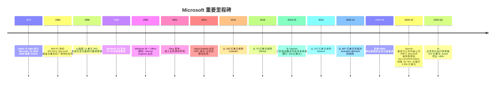
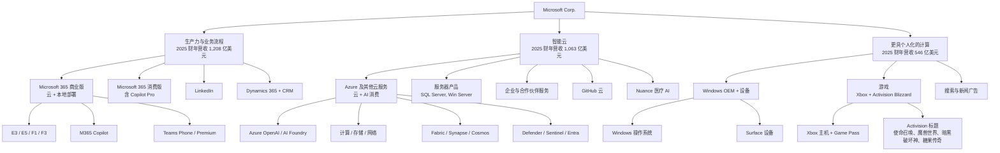
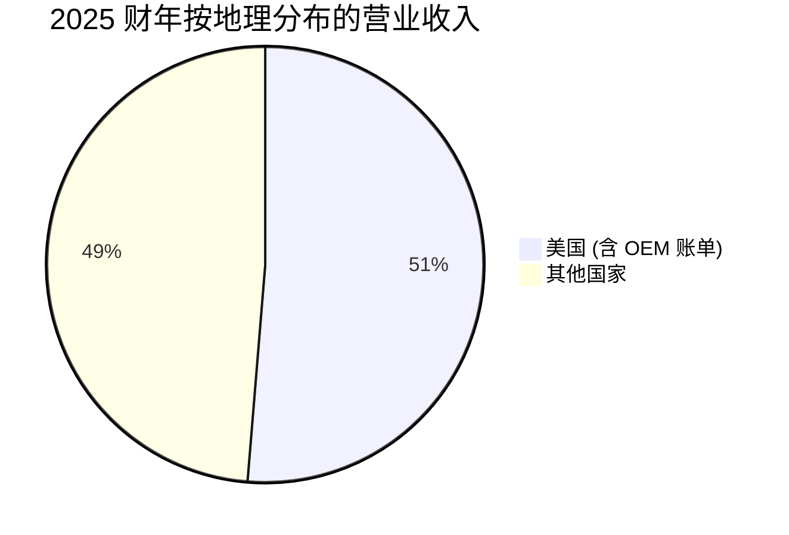

# Microsoft Corporation (NASDAQ:MSFT) — 公司研究报告

**截至日期: 2026-05-20**
**上市地: 纳斯达克全球精选市场 (NASDAQ Global Select Market), 代码 MSFT**
**注册地: 美国华盛顿州雷德蒙德 (Redmond, Washington)**
**报告语言: 简体中文 (英文版同时存在于本目录)**
**分析师备注:** 启动覆盖 / 深度公司画像。除非另行注明, 所有金额均以美元计。Microsoft 财政年度于 6 月 30 日结束——"2025 财年 (FY2025)"指截至 2025 年 6 月 30 日止的十二个月。

> **业绩更新——2026 财年 Q3 业绩 (2026-04-29):** Microsoft 公布 829 亿美元营业收入 (同比 +18%, 恒定汇率 +15%), 营业利润 384 亿美元 (+20%), 稀释每股收益 (diluted EPS) 4.27 美元 (+23%)。CEO Satya Nadella 披露公司 AI 业务**年化营业收入运行率 (annual revenue run rate) 已突破 370 亿美元, 同比增长 123%**, 而**商业剩余履约义务 (commercial Remaining Performance Obligations, cRPO) 同比增长 99% 至 6,270 亿美元**。Azure 及其他云服务在持续受产能约束的情况下加速增长至**同比 +40% (恒定汇率 +39%)**。CFO Amy Hood 重申供给紧张状态将"至少持续至本财年末"。来源: [Microsoft 2026 财年 Q3 业绩公告, 2026-04-29 (SEC 8-K Ex-99.1)](https://www.sec.gov/Archives/edgar/data/789019/000119312526191457/msft-ex99_1.htm)。

---

## 目录

1. 公司概览
2. 公司历史
3. 管理团队
4. 产品与服务
5. 客户与分销
6. 行业概览
7. 竞争格局
8. 市场机会 (TAM)
9. 风险评估
10. 参考资料

---

## 1. 公司概览

Microsoft Corporation 是一家总部位于美国华盛顿州雷德蒙德的软件与服务平台公司, 目前是**全球最大的企业级软件特许经营商 (enterprise-software franchise)**、**第二大公有云平台 (public-cloud platform) Azure 的运营者**、**全球最大的专业社交网络 (LinkedIn) 运营者**、**收购 Activision Blizzard 之后按营业收入计算最大的主机与 PC 游戏发行商**, 并且通过其对 OpenAI 的"封顶式经济权益 (capped-economic interest)"成为**领先前沿 AI 实验室 (frontier-AI lab) 的最紧密商业伙伴**。公司由 Bill Gates 和 Paul Allen 于 1975 年创立, 于 1986 年公开上市 (IPO), 目前由董事长兼 CEO Satya Nadella (自 2014 年 2 月 4 日起任 CEO) 领导。([2025 财年 10-K——第 1 项, 业务](https://www.sec.gov/Archives/edgar/data/789019/000095017025100235/0000950170-25-100235-index.htm); [Synergy Research——云市场份额 2026 年 Q1, 2026-05](https://www.srgresearch.com/articles/cloud-market-share-trends-big-three-together-hold-63-while-oracle-and-the-neoclouds-inch-higher))

在最近报告的财政年度——**2025 财年 (FY2025, 截至 2025 年 6 月 30 日)**——Microsoft 实现**营业收入 2,817 亿美元, 同比增长 15%**, 营业利润 **1,285 亿美元 (营业利润率 45.6%)**, 净利润 **1,018 亿美元 (净利率 36.1%)**, 期末持有 946 亿美元现金及短期投资。稀释每股收益为 13.64 美元。([2025 10-K——损益表](https://www.sec.gov/Archives/edgar/data/789019/000095017025100235/0000950170-25-100235-index.htm))

公司在 2024 年 8 月业务重述 (segment restatement) 之后, 按三个分部进行报告——该重述将 Microsoft 365 商业部分从"更具个人化的计算 (More Personal Computing)"分部转移至"生产力与业务流程 (Productivity and Business Processes)"分部:

| 业务分部 (2025 财年) | 营业收入 (十亿美元) | 同比 | 营业利润 (十亿美元) | 营业利润率 |
|---|---|---|---|---|
| 生产力与业务流程 | 120.8 | +13% | 69.8 | 57.8% |
| 智能云 (Intelligent Cloud) | 106.3 | +21% | 44.6 | 41.9% |
| 更具个人化的计算 (More Personal Computing) | 54.6 | +7% | 14.2 | 25.9% |
| **合计** | **281.7** | **+15%** | **128.5** | **45.6%** |

来源: [Microsoft 2025 财年 10-K——分部经营业绩](https://www.sec.gov/Archives/edgar/data/789019/000095017025100235/0000950170-25-100235-index.htm)。

*来源: Microsoft 2021–2025 财年 10-K 文件 ([2025 财年 10-K, 损益表](https://www.sec.gov/Archives/edgar/data/789019/000095017025100235/0000950170-25-100235-index.htm); [2021 财年 10-K via SEC EDGAR](https://www.sec.gov/cgi-bin/browse-edgar?action=getcompany&CIK=0000789019&type=10-K&dateb=&owner=include&count=40))。*

**Microsoft Cloud (微软云)**——一个非 GAAP 口径汇总指标, 包含 Microsoft 365 商业云、Azure 及其他云服务、LinkedIn 的商业部分以及 Dynamics 365——在 2025 财年**同比增长 23%, 达到 1,689 亿美元** (2024 财年 1,377 亿美元, 2023 财年 1,116 亿美元)。在 2026 财年前九个月, 云业务继续复合增长: 2026 财年 Q1 491 亿美元 (+26%)、Q2 515 亿美元 (+26%)、Q3 545 亿美元 (+29%)。([Microsoft 2026 财年 Q3 业绩公告](https://www.sec.gov/Archives/edgar/data/789019/000119312526191457/msft-ex99_1.htm))

**员工人数**截至 2025 年 6 月 30 日约为**约 22.8 万名全职员工** (12.5 万人在美国本土, 10.3 万人在海外)。其中, 运营 (含数据中心运营) 8.9 万人, 产品研发 8 万人, 销售与市场营销 4.4 万人, 一般与行政 1.5 万人。([2025 财年 10-K——人力资本 (Human Capital)](https://www.sec.gov/Archives/edgar/data/789019/000095017025100235/0000950170-25-100235-index.htm))

**地理结构 (2025 财年):** 美国本土 1,445 亿美元 (占营业收入 51.3%), 其他国家 1,372 亿美元 (占 48.7%)。Microsoft 明确披露, 在 2023、2024 或 2025 财年, **除美国之外, 没有任何单一客户或单一国家占公司营业收入超过 10%**——对于超大规模云厂商 (hyperscaler) 而言, 这是一个异常低的客户集中度结构。([2025 财年 10-K——地理信息](https://www.sec.gov/Archives/edgar/data/789019/000095017025100235/0000950170-25-100235-index.htm))

### 估值快照

通过 `yfinance` 数据源, 在 **2026-05-20** 自 Yahoo Finance 获取:

| 指标 | MSFT | GOOG | ORCL | AMZN | AAPL |
|---|---|---|---|---|---|
| 最近股价 | 420.30 美元 | 383.70 美元 | 185.18 美元 | 264.12 美元 | 302.14 美元 |
| 市值 | 3.12 万亿美元 | 4.65 万亿美元 | 0.53 万亿美元 | 2.84 万亿美元 | 4.44 万亿美元 |
| TTM 市盈率 (P/E) | **25.0×** | 29.2× | 33.2× | 32.2× | 36.6× |
| 前瞻市盈率 (Forward P/E) | 21.7× | 26.6× | 23.0× | 26.9× | 31.5× |
| TTM 市销率 (P/S) | **9.8×** | 11.0× | 8.3× | 3.8× | 9.8× |
| TTM 营业收入 | 3,183 亿美元 | 4,225 亿美元 | 641 亿美元 | 7,428 亿美元 | 4,514 亿美元 |
| 52 周价格区间 | 356.28 – 555.45 美元 | 163.33 – 404.47 美元 | 134.57 – 345.72 美元 | 196.00 – 278.56 美元 | 193.46 – 303.20 美元 |

来源: [Yahoo Finance——MSFT](https://finance.yahoo.com/quote/MSFT/key-statistics)、[GOOG](https://finance.yahoo.com/quote/GOOG/key-statistics)、[ORCL](https://finance.yahoo.com/quote/ORCL/key-statistics)、[AMZN](https://finance.yahoo.com/quote/AMZN/key-statistics)、[AAPL](https://finance.yahoo.com/quote/AAPL/key-statistics)。

**结论。** 以 25 倍 TTM 盈利和约 10 倍 TTM 营业收入计, MSFT 在市盈率维度**相较超大市值软件 / 云同业群体存在折价** (GOOG/ORCL/AMZN/AAPL 平均 32.8 倍), 在市销率维度大致持平。两点解释了这种相对便宜的估值: (i) Microsoft 的 TTM 分母比同业更具盈利能力——净利润占营业收入约 32%, 而 Alphabet 约 26%, Apple 约 24%, 因此公司"挣进"任何倍数的速度更快; (ii) 股价自 52 周高点 555.45 美元已回撤约 24%, 反映出投资者对 2026 财年资本开支爬坡 (capex ramp, 详见风险 #4) 以及 2025 年 10 月之后 OpenAI 关系重组 (详见第 4 章) 的担忧。25 倍 TTM 市盈率大致处于 MSFT 自身 3 年均值 ~32 倍减去一定折价的水平; 如果 2026 财年盈利达到分析师一致预期所隐含的约 15.50 美元, 21.7 倍的前瞻市盈率将是超大市值科技股中最具可辩护性的估值。我们认为当前价位不存在估值泡沫风险; 仅在 Azure 急剧减速或 AI 资本开支回报率 (ROIC) 跌至 15% 以下时, 才会触发倍数压缩风险。([Yahoo Finance——MSFT 分析师预估](https://finance.yahoo.com/quote/MSFT/analysis); [CNBC——Microsoft 2026 财年 Q3 资本开支前瞻, 2026-04-29](https://www.cnbc.com/2026/04/29/microsoft-msft-q3-earnings-report-2026.html))

---

## 2. 公司历史

Microsoft 由 William H. (Bill) Gates III (时年 19 岁) 和 Paul G. Allen (时年 22 岁) 于 1975 年 4 月 4 日在美国新墨西哥州阿尔伯克基 (Albuquerque, New Mexico) 创立, 起步业务为向 Altair 8800 微型计算机授权一款 BASIC 解释器。公司于 1979 年迁至华盛顿州贝尔维尤 (Bellevue), 并于 1986 年迁至现今的雷德蒙德园区。奠定公司特许经营地位的关键交易是 IBM 在 1980 年选择了 Microsoft 的 MS-DOS (Microsoft 以 7.5 万美元从 Seattle Computer Products 收购并重新授权给 IBM) 作为 IBM PC 的操作系统; Microsoft 保留了向非 IBM "兼容机 (clone)"厂商授权 MS-DOS 的权利, 由此奠定了世界上最大的软件版税 (royalty) 收入流的模板。([Microsoft 50 周年回顾, 2025-04-04](https://news.microsoft.com/50-years/))。2025 年 4 月 4 日, 公司在雷德蒙德庆祝其 50 周年, Gates、前 CEO Steve Ballmer 以及 Nadella 一同上台亮相——2025 年代理委托书 (proxy statement) 中明确记载了此事件。([2025 DEF 14A](https://www.sec.gov/Archives/edgar/data/789019/000119312525245150/0001193125-25-245150-index.htm))

里程碑来源: [2025 财年 10-K](https://www.sec.gov/Archives/edgar/data/789019/000095017025100235/0000950170-25-100235-index.htm)、[Microsoft 收购 LinkedIn, 2016-06-13](https://news.microsoft.com/2016/06/13/microsoft-to-acquire-linkedin/)、[GitHub 收购新闻稿, 2018-06-04](https://news.microsoft.com/2018/06/04/microsoft-to-acquire-github-for-7-5-billion/)、[Activision Blizzard 交割, 2023-10-13](https://news.microsoft.com/2023/10/13/microsoft-completes-acquisition-of-activision-blizzard/)、[OpenAI 重组, Fortune 2025-10-28](https://fortune.com/2025/10/28/openai-for-profit-restructuring-microsoft-stake/)。

**战略转向。** 对当前投资逻辑至关重要的三次转型:

1. **Bill Gates → Steve Ballmer (2000) → Satya Nadella (2014)。** Ballmer 任期内营业收入翻倍, 但错过了移动端, 也未充分投资云。Nadella 的"云优先, 移动优先 (cloud-first, mobile-first)"重新定位 (2014 年 2 月) 将资本配置导向 Azure 与 SaaS, 将 Office 开放至 iOS / Android, 并对部分消费级 Windows 进行去货币化以留住开发者。Azure 从 2014 年约 10 亿美元运行率扩大至 2025 财年的 750 亿美元以上年营业收入——十一年扩张约 75 倍。([2025 财年 Q4 业绩公告, 2025-07-30](https://www.sec.gov/Archives/edgar/data/789019/000095017025100226/msft-ex99_1.htm))
2. **从永久许可证 (perpetual license) 转向订阅云。** Office、Windows Server、SQL Server、Dynamics、Visual Studio 均已迁移至订阅 (Microsoft 365、Azure 托管) 或消费量 (Azure SQL、Azure App Service) 定价。10-K 产品明细表显示, 服务器产品及云服务从 2023 财年的 650 亿美元增至 2025 财年的 984 亿美元——23% 的复合年增长率 (CAGR)——而 Windows 与设备业务大致持平于 170 亿美元。([2025 财年 10-K——按重要产品与服务分类的营业收入](https://www.sec.gov/Archives/edgar/data/789019/000095017025100235/0000950170-25-100235-index.htm))
3. **AI 平台转向 (2019 至今)。** Microsoft 与 OpenAI 的三阶段合作 (2019 年 10 亿美元、2021 年 20 亿美元、2023 年 100 亿美元——根据 2025 财年 10-K 累计承诺 130 亿美元) 以及 2025 年 10 月固化的**26.79% 经济权益 (价值约 1,350 亿美元)**, 加上**新增 2,500 亿美元 Azure 合同**, 使公司成为最常用前沿模型 (frontier model) 的默认基础设施合作伙伴。会计上采用权益法 (equity method), Microsoft 分担 OpenAI 的损失从而减少 GAAP 净利润——仅 2026 财年 Q2 一个季度就形成 76 亿美元的拖累。([2026 财年 Q2 业绩公告, 2026-01-28](https://www.sec.gov/Archives/edgar/data/789019/000119312526027198/msft-ex99_1.htm); [Fortune 关于 OpenAI 重组, 2025-10-28](https://fortune.com/2025/10/28/openai-for-profit-restructuring-microsoft-stake/))

**重大收购:**

- 2011 年——Skype (85 亿美元): 消费通信, 后整合进 Teams。([Microsoft 8-K, 2011-05-10 宣布收购 Skype](https://www.sec.gov/Archives/edgar/data/0000789019/000119312511134416/dex991.htm))
- 2016 年——LinkedIn (262 亿美元): 专业社交网络, 2025 财年营业收入 178 亿美元。([LinkedIn 新闻稿, 2016-06-13](https://news.microsoft.com/2016/06/13/microsoft-to-acquire-linkedin/))
- 2018 年——GitHub (75 亿美元): 开发者平台, 为 Copilot 的基础。([GitHub 收购新闻稿, 2018-06-04](https://news.microsoft.com/2018/06/04/microsoft-to-acquire-github-for-7-5-billion/))
- 2022 年——Nuance Communications (197 亿美元): 医疗语音 / AI; 2022 年 3 月 4 日交割。([Microsoft 8-K——Nuance 交割, 2022-03-04](https://www.sec.gov/Archives/edgar/data/0000789019/000119312522120207/d328712dex991.htm))
- 2023 年——Activision Blizzard (687 亿美元): Microsoft 历史上最大规模收购; 于 2023 年 10 月 13 日交割, 此前经历了与美国 FTC、英国 CMA 和欧盟 EC 长达 21 个月的监管角力。([Microsoft 新闻稿, 2023-10-13](https://news.microsoft.com/2023/10/13/microsoft-completes-acquisition-of-activision-blizzard/))
- 2024 年——Inflection AI 团队与许可证交易 (约 6.5 亿美元有效付款, 用于许可证 + 约 25 名员工, 包括 Mustafa Suleyman, 现任 Microsoft AI CEO)。([Mustafa Suleyman 加入 Microsoft, 2024-03-19](https://blogs.microsoft.com/blog/2024/03/19/mustafa-suleyman-deepmind-and-inflection-co-founder-joins-microsoft-to-lead-copilot/); [2025 财年 10-K——Inflection 披露](https://www.sec.gov/Archives/edgar/data/789019/000095017025100235/0000950170-25-100235-index.htm))

---

## 3. 管理团队

### Satya Nadella——董事长兼 CEO (2014 年起任 CEO, 2021 年起兼董事长)

Satya Nadella, 58 岁, 是 Microsoft 的第三任 CEO, 也是公司转型为全球最具价值云与 AI 特许经营商的总设计师。他于 1992 年从 Sun Microsystems 加入 Microsoft, 持有印度马尼帕尔理工学院 (Manipal Institute of Technology) 电气工程学士、美国威斯康星-密尔沃基大学 (University of Wisconsin-Milwaukee) 计算机科学硕士, 以及芝加哥大学布斯商学院 (Booth) MBA。出任 CEO 前, 他执掌服务器与工具业务 (Server and Tools Business, 2011–2013) 以及云与企业业务部 (Cloud and Enterprise Group, 2013–2014), 期间作出战略性决断: 将 Azure 构建为真正的公有云 (而非 Windows Server 托管层), 并让 Office 跨平台进入 iOS 与 Android。([2025 DEF 14A——董事提名](https://www.sec.gov/Archives/edgar/data/789019/000119312525245150/0001193125-25-245150-index.htm))

在 Nadella 任内, Microsoft 营业收入从 2014 财年的 868 亿美元增至 2025 财年的 2,817 亿美元 (12.0% CAGR), 营业利润从 278 亿美元增至 1,285 亿美元 (15.1% CAGR), 市值从约 3,000 亿美元增至 2026 年 5 月 20 日的约 3.1 万亿美元。自 2019 年与 OpenAI 合作以来, 他一直是**最有声誉的企业级前沿 AI 算力采购方**, 也是在 2023 年 11 月那次罕见的、OpenAI 时任 CEO Sam Altman 短暂被聘入 Microsoft、随后又回归 OpenAI 的一系列事件的主导者。([2014 财年 10-K——损益表 via SEC EDGAR](https://www.sec.gov/Archives/edgar/data/789019/000119312514289961/0001193125-14-289961-index.htm); [2025 财年 10-K——损益表](https://www.sec.gov/Archives/edgar/data/789019/000095017025100235/0000950170-25-100235-index.htm))

截至 2025 年 9 月 30 日, Nadella 直接持有 **900,572 股, 间接持有 12 股** (实益持股比例 <1%; 整个董事与执行官员组——18 人——共持 2,279,620 股, 同样 <1%)。其 2025 财年薪酬总额为 **96,496,790 美元**, 根据汇总薪酬表 (Summary Compensation Table) 构成: 250 万美元基本薪资、915 万美元现金奖金、约 8,460 万美元的股权奖励授予日公允价值 (业绩股票 PSA + 服务股票 SA), 以及 196,294 美元其他薪酬。**CEO 薪酬比 (CEO pay ratio) 为 480:1**, 相对员工中位数薪酬 200,972 美元——绝对值很高, 但 CEO 薪酬中绝大部分为与业绩挂钩、且 3–7 年才能完全归属 (vesting) 的股权。2024 财年薪酬总额为 7,910 万美元; 2023 财年为 4,850 万美元。美元增长跟随股权工具的授予日价值变动 (主要因 2024 年 9 月授予的 PSA, 彼时股价约 413 美元)。([2025 DEF 14A——汇总薪酬表与 CEO 薪酬比](https://www.sec.gov/Archives/edgar/data/789019/000119312525245150/0001193125-25-245150-index.htm))

### Amy Hood——执行副总裁兼 CFO (2013 年起)

Hood, 53 岁, 于 2002 年从 Goldman Sachs 投资银行部门加入 Microsoft (担任科技并购业务的覆盖银行家; 她在加入 Microsoft 之前曾是该公司 60 亿美元收购 aQuantive 交易的牵头银行家)。她持有杜克大学 (Duke University) 经济学学士与哈佛商学院 (Harvard Business School) MBA。作为 CFO, 她是从永久许可证向订阅 / 消费量定价转型的核心架构师、"Microsoft Cloud"作为统一关键业绩指标 (KPI) 的引入者, 以及在为 Activision Blizzard 支付 687 亿美元的同时保持投资级资产负债表 (长期债务在 2025 年 6 月 30 日为 402 亿美元, 而现金及短期投资为 946 亿美元——净现金为正) 的有纪律并购框架的主导者。在资本开支上, 她比同业明显更谨慎, 反复强调增量云资本开支必须越过内部回报门槛, 公司宁愿允许需求与供给的不平衡持续, 也不愿过度建设。其 2025 财年薪酬总额为 30,250,366 美元——基本薪资 100 万美元、现金奖金 450 万美元、股权奖励价值 2,470 万美元、其他薪酬 23,191 美元。([2025 DEF 14A——汇总薪酬表](https://www.sec.gov/Archives/edgar/data/789019/000119312525245150/0001193125-25-245150-index.htm))

### Judson Althoff——执行副总裁兼首席商务官 (Chief Commercial Officer, CCO)

Althoff, 51 岁, 自 2021 年起执掌 Microsoft 全球商业业务, 是负责签订多年期云与 AI 承诺合同的高管——这些合同体现为公司商业剩余履约义务 (cRPO)——**2026 财年 Q3 末为 6,270 亿美元, 同比 +99%**。他于 2013 年从 Oracle 加入 Microsoft, 此前在 Oracle 负责北美商业业务。2025 财年薪酬总额: 27,592,884 美元。([2026 财年 Q3 公告](https://www.sec.gov/Archives/edgar/data/789019/000119312526191457/msft-ex99_1.htm); [2025 DEF 14A](https://www.sec.gov/Archives/edgar/data/789019/000119312525245150/0001193125-25-245150-index.htm))

### Brad Smith——总裁兼副董事长 (Vice Chair)

Smith, 67 岁, 自 2002 年起担任 Microsoft 总法律顾问 (General Counsel), 2015 年起任总裁, 2021 年起任副董事长。他实际上掌管公司对外事务——监管事务 (他是与美国 FTC、英国 CMA 与欧盟委员会就 Activision Blizzard 案谈判的牵头谈判代表)、信任与安全策略、AI 政策倡议, 以及企业社会责任 (CSR)。2025 财年薪酬总额: 27,644,736 美元。([2025 DEF 14A](https://www.sec.gov/Archives/edgar/data/789019/000119312525245150/0001193125-25-245150-index.htm))

### Takeshi Numoto——执行副总裁兼 CMO

Numoto 于 2023 年末获任 CMO, 此前为负责 Azure 与 Microsoft 365 商业上市策略 (GTM) 的高管。2025 财年薪酬总额: 10,792,272 美元。([2025 DEF 14A——汇总薪酬表](https://www.sec.gov/Archives/edgar/data/789019/000119312525245150/0001193125-25-245150-index.htm))

### Mustafa Suleyman——Microsoft AI 部门 CEO

DeepMind 联合创始人 (2014 年被 Google 收购) 和 Inflection AI 联合创始人; 于 2024 年 3 月加入 Microsoft, 同时 Inflection 的大部分研究团队作为约 6.5 亿美元许可证安排的一部分一同加入——Microsoft 对该结构进行了精心设计, 以避免被视为受 Hart-Scott-Rodino 法案约束的并购 (该结构引发了 FTC 和 CMA 的关注)。他掌管 Copilot 消费版、Bing、MSN 和 Edge——即"AI 同伴 (AI Companion)"系列界面。在 2025 财年代理委托书中并非已具名的执行官员。([2025 财年 10-K——Inflection AI 披露](https://www.sec.gov/Archives/edgar/data/789019/000095017025100235/0000950170-25-100235-index.htm))

### 公司治理

董事会现有 12 名董事——Carlos Rodriguez 于 2025 年 12 月决定不再寻求连任后, **John David Rainey (Walmart CFO) 被提名为 2025 年年会 (2025 年 12 月 5 日召开) 的候选人**。首席独立董事 (Lead Independent Director) 是 **Sandra E. Peterson** (Clayton, Dubilier & Rice 运营合伙人; 前 Johnson & Johnson 全球业务部主席)。其他董事包括 Reid Hoffman (LinkedIn 联合创始人, Greylock Partners——自 2017 年起任董事)、Catherine MacGregor (Engie CEO)、Penny Pritzker、Mark Mason (Citi CFO)、Hugh Johnston (Disney / PepsiCo)、Teri List、Helene Gayle、John Stankey (AT&T) 和 Emma Walmsley (GSK CEO)。除 Nadella 外, 所有董事均为独立董事——对于受创始人影响的公司而言, 这是一个特别"干净"的结构。Vanguard 持股 8.95%, BlackRock 持股 7.30%; 内部人士合计持股不足 1%。([2025 DEF 14A——董事提名与主要股东](https://www.sec.gov/Archives/edgar/data/789019/000119312525245150/0001193125-25-245150-index.htm))

最近披露的高管变动 (Form 8-K, 2026-05-14) 是一次常规的董事 / 高管通知; 2026 日历年度中未发生任何高级团队转型。([2026-05-14 8-K——董事 / 高管变更](https://www.sec.gov/Archives/edgar/data/789019/000119312526224155/0001193125-26-224155-index.htm))

**业绩跟踪综合评估。** 这是超大市值科技业内最经过考验、利益最为对齐的管理团队之一。Nadella 已经连续十一年每年实现约 12% 的营业收入复合增长; Hood 搭建了云业务披露框架, 并执行了软件行业史上最大规模的并购项目; Smith 在 Activision、LinkedIn、Nuance、GitHub 等连续四次反垄断审查中没有遭受任何重大结构性让步。该团队的主要缺口是**消费 AI 端的接班深度**——Suleyman 才华横溢但仍是新人, 而消费 AI 是 Microsoft 当前最薄弱的界面 (详见第 7 章)。([2025 DEF 14A——董事提名与 ESG 治理](https://www.sec.gov/Archives/edgar/data/789019/000119312525245150/0001193125-25-245150-index.htm); [CNBC——Microsoft Teams 解绑和解, 2025-09-12](https://www.cnbc.com/2025/09/12/microsoft-avoids-big-fine-as-eu-accepts-deal-to-unbundle-teams.html))

---

## 4. 产品与服务

Microsoft 在三个可报告分部进行销售。下文产品树将每个分部映射到其主要产品系列以及驱动营业收入的 SKU。

来源: [Microsoft 2025 财年 10-K——第 1 项, 业务](https://www.sec.gov/Archives/edgar/data/789019/000095017025100235/0000950170-25-100235-index.htm)。

### 生产力与业务流程 (1,208 亿美元 / 占营业收入 43%)

**Microsoft 365 商业版**是全球最大的企业生产力套件——包括 Word、Excel、PowerPoint、Outlook、Teams、OneDrive、SharePoint、Loop、Defender for Office、Entra ID (原 Azure AD)——主要按每个席位计价, 通过 3 年期或 5 年期批量授权合约销售。E5 层 (商业目录价 57 美元/用户/月) 捆绑了安全、合规、语音和分析功能; **M365 Copilot** 是 30 美元/用户/月的附加包, 在每个 Office 应用中嵌入 GPT-4o / GPT-5 级智能体, 并通过 Microsoft Graph 调用客户租户数据。Microsoft 365 商业云营业收入在**2025 财年增长 15%**, 并在 2026 财年加速至**Q1 恒定汇率 +15%、Q2 +14%、Q3 +15%**。([2025 财年 10-K——MD&A](https://www.sec.gov/Archives/edgar/data/789019/000095017025100235/0000950170-25-100235-index.htm); 季度数据来自 [2026 财年 Q3 公告](https://www.sec.gov/Archives/edgar/data/789019/000119312526191457/msft-ex99_1.htm))

**Microsoft 365 消费版**将 Office + 1TB OneDrive 打包为 99.99 美元/年 (家庭版) 或 69.99 美元/年 (个人版); Copilot Pro 20 美元/月增加 GPT 级生成能力。消费云营业收入在 2026 财年 Q3 **(恒定汇率) +29%**, 是 Microsoft 任何可报告业务线中最快的增长率, 既反映了 Copilot Pro 的拉动作用, 也反映了 2025 年 3 月家庭计划提价的影响。([Microsoft 2026 财年 Q3 业绩公告, 2026-04-29](https://www.sec.gov/Archives/edgar/data/789019/000119312526191457/msft-ex99_1.htm); [Microsoft 365 Copilot 定价页面](https://www.microsoft.com/en-us/microsoft-365-copilot/pricing/enterprise))

**LinkedIn** 在 2025 财年产生 178 亿美元营业收入 (同比 +10%), 来自四个收入流: 人才解决方案 (招聘)、营销解决方案 (广告)、高级订阅, 以及 Sales Navigator + 销售解决方案。人才解决方案仍是最大贡献者 (Microsoft 不披露具体拆分)。该平台在 2023 年末突破 10 亿会员, 是除 Meta、Google 和字节跳动旗下平台之外, 全球唯一具备规模意义的"社交"资产。LinkedIn 营业收入在 2026 财年 Q3 增长 12%。([2025 财年 10-K——分部营业收入明细](https://www.sec.gov/Archives/edgar/data/789019/000095017025100235/0000950170-25-100235-index.htm); [Microsoft 2026 财年 Q3 公告](https://www.sec.gov/Archives/edgar/data/789019/000119312526191457/msft-ex99_1.htm))

**Dynamics** (CRM、ERP、现场服务、Customer Insights) 在 2025 财年产生 78 亿美元营业收入 (+15%)。Dynamics 365 在 2026 财年 Q3 增长 22%——这是 MSFT 企业应用堆栈中最大的加速, 由 Sales Copilot、Customer Service Copilot 以及基于 Copilot Studio 的 AI 智能体所驱动。([2025 财年 10-K——按重要产品分类的营业收入](https://www.sec.gov/Archives/edgar/data/789019/000095017025100235/0000950170-25-100235-index.htm); [Microsoft 2026 财年 Q3 公告](https://www.sec.gov/Archives/edgar/data/789019/000119312526191457/msft-ex99_1.htm))

### 智能云 (1,063 亿美元 / 占营业收入 38%)

**Azure 及其他云服务**是基于消费量定价的公有云业务。2025 财年 10-K 将其描述为"云和 AI 消费型服务、GitHub 云服务、Nuance 医疗云服务、虚拟桌面产品及其他云服务"。Azure 独立营业收入**在 2025 财年突破 750 亿美元, 增长 34%** (这是 Microsoft 披露过的唯一具体 Azure 美元数字), 并在 2026 财年各季度持续加速——**Q1 +39%、Q2 +39%、Q3 +40%** (恒定汇率)。([2025 财年 Q4 业绩公告, 2025-07-30](https://www.sec.gov/Archives/edgar/data/789019/000095017025100226/msft-ex99_1.htm); 季度数据来自 2026 财年各季公告)

在 Azure 内部, **Azure OpenAI Service / AI Foundry** 是投资逻辑的核心。它是唯一可在企业云内以私有端点、自带密钥 (BYOK) 与区域数据驻留方式运行前沿 OpenAI 模型 (o 系列推理、GPT 级、嵌入、DALL-E、Sora) 的第一方途径。在 OpenAI 2025 年 10 月重组之后, Microsoft 保留至 2032 年期间提供 OpenAI 推理服务的权利, OpenAI 在交易期内额外购买**2,500 亿美元 Azure 服务**的合同义务。([Fortune, 2025-10-28](https://fortune.com/2025/10/28/openai-for-profit-restructuring-microsoft-stake/); [Data Center Dynamics——OpenAI 转营利, 2025-10-28](https://www.datacenterdynamics.com/en/news/openai-completes-for-profit-move-microsoft-given-27-stake-and-250bn-azure-contract-but-no-longer-has-cloud-right-of-first-refusal/))

产能故事是当前的核心约束。2026 财年 Q3 公告披露了**商业 RPO (剩余履约义务) 6,270 亿美元 (同比 +99%)**——这些是公司在新增数据中心产能上线之前尚未能履行的多年期已签约需求。Hood 反复表示, Azure 将"至少持续到 2026 财年末"保持产能受限。Microsoft 仅在 2026 财年 Q3 一个季度内就新增约 **1 GW (1,000 兆瓦) 数据中心产能**。([Windows News——2026 财年 Q3 数据中心产能, 2026-04-29](https://windowsnews.ai/article/microsoft-adds-1-gw-of-datacenter-capacity-in-q3-fy2026-revenue-hits-829-billion.416504); [Directions on Microsoft——2026 财年 Q1 云供给](https://www.directionsonmicrosoft.com/microsoft-q1-fy26-earnings-cloud-supply-constraints-to-last-through-at-least-june-2026/))

*来源: Microsoft 季度业绩公告 ([2026 财年 Q3](https://www.sec.gov/Archives/edgar/data/789019/000119312526191457/msft-ex99_1.htm)、[2026 财年 Q2](https://www.sec.gov/Archives/edgar/data/789019/000119312526027198/msft-ex99_1.htm)、[2026 财年 Q1](https://www.sec.gov/Archives/edgar/data/789019/000119312525256310/msft-ex99_1.htm)、[2025 财年 Q4](https://www.sec.gov/Archives/edgar/data/789019/000095017025100226/msft-ex99_1.htm) 以及更早季度)。*

**服务器产品** (SQL Server、Windows Server、Visual Studio、System Center) 是本地许可证补充, 仍约 250 亿美元/年, 增速适中——这些营业收入正越来越多地与混合 Azure Arc 部署绑定。([2025 财年 10-K——按重要产品与服务分类的营业收入](https://www.sec.gov/Archives/edgar/data/789019/000095017025100235/0000950170-25-100235-index.htm))

**GitHub** 是主要的开发者平台, 拥有超过 1 亿开发者; GitHub Copilot 按付费席位计算是全球使用最广泛的 AI 编码助手, 并日益与 M365 Copilot 捆绑销售给企业级开发者项目。([GitHub Octoverse——1 亿开发者, 2025-01](https://github.blog/news-insights/octoverse/octoverse-2024/); [2025 财年 10-K——第 1 项, 业务——智能云](https://www.sec.gov/Archives/edgar/data/789019/000095017025100235/0000950170-25-100235-index.htm))

**Nuance 医疗**向医疗健康提供商销售语音 / AI, 主要产品为 DAX Copilot (环境临床文档记录, ambient clinical documentation), 已部署至 HCA、Mass General Brigham 以及美国大多数大型医疗系统。([Microsoft 8-K——Nuance 交割, 2022-03-04](https://www.sec.gov/Archives/edgar/data/0000789019/000119312522120207/d328712dex991.htm); [2025 财年 10-K——第 1 项, 业务](https://www.sec.gov/Archives/edgar/data/789019/000095017025100235/0000950170-25-100235-index.htm))

### 更具个人化的计算 (546 亿美元 / 占营业收入 19%)

第三个分部是消费业务加搜索广告业务。([2025 财年 10-K——分部经营业绩](https://www.sec.gov/Archives/edgar/data/789019/000095017025100235/0000950170-25-100235-index.htm))

- **Windows OEM 与设备**——Windows 操作系统许可证销售给 PC OEM, 以及 Surface 硬件。2025 财年约 170 亿美元。2026 财年 Q3 营业收入因 PC 需求疲软下降 2%。([Microsoft 2026 财年 Q3 公告, 2026-04-29](https://www.sec.gov/Archives/edgar/data/789019/000119312526191457/msft-ex99_1.htm))
- **游戏**——Xbox 主机、Game Pass 订阅, 以及 Activision Blizzard 内容库 (使命召唤、魔兽世界、暗黑破坏神、糖果传奇、守望先锋)。2025 财年 235 亿美元。2026 财年 Q3, Xbox 内容与服务营业收入下滑 5% (恒定汇率 -7%), 反映了使命召唤的高基数比较以及主机周期持续低迷; Game Pass 在订阅基础上保持增长。([2025 财年 10-K——分部营业收入明细](https://www.sec.gov/Archives/edgar/data/789019/000095017025100235/0000950170-25-100235-index.htm); [Microsoft 2026 财年 Q3 公告](https://www.sec.gov/Archives/edgar/data/789019/000119312526191457/msft-ex99_1.htm))
- **搜索与新闻广告 (扣除 TAC 后)**——Bing、MSN、Edge, 以及来自 OpenAI ChatGPT 默认搜索集成的日益重要的 Bing 驱动流量。2025 财年 139 亿美元; 增速 +12% (2026 财年 Q3 恒定汇率), 是该分部内最快增长。([2025 财年 10-K——更具个人化的计算](https://www.sec.gov/Archives/edgar/data/789019/000095017025100235/0000950170-25-100235-index.htm); [Microsoft 2026 财年 Q3 公告](https://www.sec.gov/Archives/edgar/data/789019/000119312526191457/msft-ex99_1.htm))

### 其他商业关键业绩指标

- **资本开支** (物业与设备增量)——2025 财年 646 亿美元, 2024 财年 445 亿美元, 2023 财年 281 亿美元。2026 财年 Q3 资本开支环比为 319 亿美元。Microsoft 已指引 2026 财年全年约**1,200 亿美元以上**, 其中 2026 日历年资本开支包含约 250 亿美元的增量元器件成本通胀。([2025 财年 10-K——现金流量表](https://www.sec.gov/Archives/edgar/data/789019/000095017025100235/0000950170-25-100235-index.htm); [The Register——Microsoft 2026 财年 Q3 资本开支, 2026-04-30](https://www.theregister.com/2026/04/30/microsoft_q3_2026/))
- **物业与设备 (净值)** 在一年内从 1,356 亿美元升至 2,050 亿美元 (+51%), 数据中心建设落到资产负债表上。([2025 财年 10-K——资产负债表](https://www.sec.gov/Archives/edgar/data/789019/000095017025100235/0000950170-25-100235-index.htm))
- **长期债务**为 402 亿美元 (从 427 亿美元下降), 即使在创纪录的资本开支年之后, Microsoft 仍保有约 540 亿美元的净现金。([2025 财年 10-K——资产负债表](https://www.sec.gov/Archives/edgar/data/789019/000095017025100235/0000950170-25-100235-index.htm))

*来源: Microsoft 2021–2025 财年 10-K 文件及 2026 财年 Q3 业绩公告 ([2025 财年 10-K——现金流量表](https://www.sec.gov/Archives/edgar/data/789019/000095017025100235/0000950170-25-100235-index.htm); [The Register——Microsoft 2026 财年 Q3 资本开支, 2026-04-30](https://www.theregister.com/2026/04/30/microsoft_q3_2026/))。2026 财年估计 (FY26E) 由 Q1-Q3 实际数和 Q4 指引运行率推算得出。*

*来源: Microsoft 2025 财年 10-K 以及 2026 财年 Q1–Q3 业绩公告。*

---

## 5. 客户与分销

Microsoft 的客户结构是**刻意分散的**——2025 财年 10-K 的地理信息附注指出: *"2025、2024 或 2023 财年内, 除美国之外, 没有任何单一客户或单一国家的销售额占公司营业收入超过 10%。"*这一句话是超大规模云厂商 10-K 中最有意义的披露之一, 因为它告诉你: Microsoft 按营业收入计的最大单一依赖项不是某个客户——而是美国 PC 与企业市场的持久性。([2025 财年 10-K——地理信息](https://www.sec.gov/Archives/edgar/data/789019/000095017025100235/0000950170-25-100235-index.htm))

来源: [2025 财年 10-K, 地理信息](https://www.sec.gov/Archives/edgar/data/789019/000095017025100235/0000950170-25-100235-index.htm)。数值单位: 十亿美元。

**客户分部结构。** Microsoft 服务于四类客户群:

- **大型企业** (Fortune 2000 级别)。通过企业协议 (Enterprise Agreement, 3 年期批量合同) 购买, 并日益通过企业版 Microsoft 客户协议 (Microsoft Customer Agreement for Enterprise) 购买。2026 财年 Q3 的 6,270 亿美元 cRPO 绝大多数来自此类——来自受监管行业 (金融服务、医疗、政府、汽车) 的多年期云与 M365 承诺。客户包括所有主要的美国及欧洲银行 (Bank of America、JPMorgan、HSBC)、通过 Azure Government 服务的美军全部五个军种、英国 NHS (国民医疗服务体系)、德国联邦政府的主权云建设 (Delos Cloud), 以及大多数 Fortune 100 企业。([Microsoft 2026 财年 Q3 公告——cRPO 披露](https://www.sec.gov/Archives/edgar/data/789019/000119312526191457/msft-ex99_1.htm); [2025 财年 10-K——第 1 项, 业务](https://www.sec.gov/Archives/edgar/data/789019/000095017025100235/0000950170-25-100235-index.htm))
- **公共部门与受监管的主权云。** Azure Government、Azure Government Secret、Azure Government Top Secret, 以及在德国、法国、意大利的地区性"主权云"合作伙伴。Microsoft 持有美国国防部 JWCC 合同支柱 (JEDI 的后续合同), 与 AWS、Google Cloud、Oracle 并列。([DoD——JWCC 合同授予, 2022-12-07](https://www.defense.gov/News/Releases/Release/Article/3239378/department-of-defense-announces-joint-warfighting-cloud-capability-procurement/))
- **中小企业。** 通过 Microsoft 365 Business Basic / Standard / Premium SKU (6–22 美元/用户/月) 以及云解决方案提供商 (Cloud Solution Provider, CSP) 合作伙伴接入——主要为间接模式。([Microsoft 365 Business 定价](https://www.microsoft.com/en-us/microsoft-365/business/compare-all-plans))
- **消费者。** Windows 用户 (根据 Microsoft 的 WTS 披露, Windows 10+11 月活设备超过 14 亿)、Microsoft 365 消费版订阅者、Xbox / Game Pass 订阅者、LinkedIn 会员 (>10 亿), 以及 Bing 搜索用户。([2025 财年 10-K——第 1 项, 业务——更具个人化的计算](https://www.sec.gov/Archives/edgar/data/789019/000095017025100235/0000950170-25-100235-index.htm))

**过去 12 个月内在 10-K、IR 材料或客户案例研究中披露的旗舰客户**包括: Adobe、Walmart、Domino's、Estée Lauder、Air India、Heathrow (希思罗机场)、Bayer (拜耳)、Vodafone、Telstra、Schneider Electric、Coca-Cola、Cushman & Wakefield、Mercedes-Benz、KPMG (向 20 万+员工部署 Copilot)、英国公务员系统 (U.K. Civil Service)、新加坡 GovTech, 以及 OpenAI 本身 (Microsoft 最大的单一 Azure 消费者)。([Microsoft 客户案例门户](https://www.microsoft.com/en-us/customers/search/?filters=product%3Amicrosoft-365); [Fortune——OpenAI 重组, 2025-10-28](https://fortune.com/2025/10/28/openai-for-profit-restructuring-microsoft-stake/))

**分销与上市策略 (Distribution & GTM)。** Microsoft 通过以下渠道销售: (a) 一支直销团队, 聚焦全球约 3 万家最大客户; (b) 一个全球范围内约 44 万家 Microsoft Cloud Partners (经销商、系统集成商、独立软件供应商 ISV、托管服务提供商 MSP) 组成的合作伙伴生态; (c) 超大规模 OEM 渠道 (Dell、HP、Lenovo、Acer、Asus、Samsung——用于 Windows 授权和预装 Office 试用); (d) 通过 Microsoft Store、应用商店和 Xbox 商店进行零售自助服务; (e) Azure Marketplace, 正迅速成为面向企业 AI ISV 的最重要分销渠道 (Databricks、Snowflake、Confluent、MongoDB 都将其作为通过 Microsoft 企业协议结算的计费通道)。([2025 财年 10-K——第 1 项, 销售与营销](https://www.sec.gov/Archives/edgar/data/789019/000095017025100235/0000950170-25-100235-index.htm); [Microsoft AI 云合作伙伴计划](https://partner.microsoft.com/en-us/partnership))

**已签约积压 (cRPO)——关键的前瞻指标。** Microsoft 已引导投资者将 cRPO 作为主导指标。轨迹:

| 期间 | cRPO (十亿美元) | 同比 |
|---|---|---|
| 2026 财年 Q1 (2025-09) | 392 | +51% |
| 2026 财年 Q2 (2025-12) | 625 | +110% |
| 2026 财年 Q3 (2026-03) | 627 | +99% |

来源: [Microsoft 2026 财年 Q1](https://www.sec.gov/Archives/edgar/data/789019/000119312525256310/msft-ex99_1.htm)、[2026 财年 Q2](https://www.sec.gov/Archives/edgar/data/789019/000119312526027198/msft-ex99_1.htm)、[2026 财年 Q3 业绩公告](https://www.sec.gov/Archives/edgar/data/789019/000119312526191457/msft-ex99_1.htm)。

2026 财年 Q1 至 Q2 之间从 3,920 亿美元到 6,250 亿美元的跃升反映了作为 2025 年 10 月重组一部分签署的**新增 2,500 亿美元 OpenAI Azure 合同**, 以及其他大型企业的合同续约。这一规模的 cRPO 大约是**2025 财年营业收入的 2.2 倍**——对于软件特许经营而言, 这是一个极其持久的前瞻底盘。([Data Center Dynamics——OpenAI 2,500 亿美元 Azure 合同, 2025-10-28](https://www.datacenterdynamics.com/en/news/openai-completes-for-profit-move-microsoft-given-27-stake-and-250bn-azure-contract-but-no-longer-has-cloud-right-of-first-refusal/); [Microsoft 2026 财年 Q2 公告, 2026-01-28](https://www.sec.gov/Archives/edgar/data/789019/000119312526027198/msft-ex99_1.htm))

**客户集中度结论。** Microsoft 拥有**任何超大市值科技公司中最分散的客户基础**, 无论按单一客户份额 (无 >10% 客户) 还是地理 (51%/49% 美国 / 国际) 衡量。OpenAI——公司最大的单一 Azure 消费者——部分由 Microsoft 持股, 并在交易期内有合同义务支出 2,500 亿美元——这种"集中度"实际上是结构性对冲过的。该公司的集中度风险并不在客户层面, 而在于打包式上市策略 (bundled go-to-market): 大多数企业通过单一企业协议同时购买 M365、Azure、GitHub 和 Dynamics。如果某客户想要离开, 转换成本异常高——而高度锁定本身又构成监管暴露 (详见第 9 章)。([2025 财年 10-K——地理信息](https://www.sec.gov/Archives/edgar/data/789019/000095017025100235/0000950170-25-100235-index.htm); [Data Center Dynamics——OpenAI 2,500 亿美元 Azure 合同, 2025-10-28](https://www.datacenterdynamics.com/en/news/openai-completes-for-profit-move-microsoft-given-27-stake-and-250bn-azure-contract-but-no-longer-has-cloud-right-of-first-refusal/))

---

## 6. 行业概览

Microsoft 在**四个汇聚于企业 IT 预算的行业**中竞争: 企业生产力软件、公有云基础设施 (IaaS + PaaS)、AI 基础设施与应用 AI, 以及 PC 操作系统 / 消费软件。按未来增长贡献而言, 最重要的是公有云 + AI。([2025 财年 10-K——第 1A 项, 风险因素 / 第 1 项, 业务](https://www.sec.gov/Archives/edgar/data/789019/000095017025100235/0000950170-25-100235-index.htm))

**公有云 (IaaS + PaaS)。** Gartner 预测全球公有云服务市场将从 2024 年约 6,750 亿美元增长至**2028 年约 1.26 万亿美元**, 五年 CAGR 约 16%, 其中 IaaS 与 PaaS 是增长最快的细分, 分别为约 22% 与 25%。([Gartner——公有云服务预测, 2024-11-19](https://www.gartner.com/en/newsroom/press-releases/2024-11-19-gartner-forecasts-worldwide-public-cloud-end-user-spending-to-total-723-billion-dollars-in-2025)) 美国三大超大规模云 (AWS、Azure、Google Cloud) 在 Synergy Research 的统计中合计占据**IaaS + PaaS 总营业收入的约 63–68%**, AWS 仍位居榜首, Azure 在收窄差距, Google Cloud 排第三但增速最快。Alibaba、Tencent 和 Oracle 构成全球前六。([Synergy Research——云市场份额 2026 年 Q1, 2026-05](https://www.srgresearch.com/articles/cloud-market-share-trends-big-three-together-hold-63-while-oracle-and-the-neoclouds-inch-higher))

**生成式 AI 基础设施与应用。** 这是公司历史上增长最快的增量 TAM。IDC 估计**全球生成式 AI 支出将在 2028 年达到 6,320 亿美元** (4 年 CAGR 约 29%), 其中基础设施 (芯片、网络、数据中心容量) 占据最大份额, 其次是平台服务 (Azure OpenAI、AWS Bedrock、Google Vertex), 再次是应用 (Copilot、Gemini、ChatGPT Enterprise)。([IDC——全球生成式 AI 支出指南, 2024-08-19](https://www.idc.com/getdoc.jsp?containerId=prUS52530724)) Microsoft 公布的 370 亿美元 AI 营业收入运行率 (2026 财年 Q3 披露) 暗示公司已捕获全球生成式 AI 基础设施与应用营收的高个位数百分比份额——尚处早期, 但与"作为最积极将前沿模型捆绑进现有企业合同的超大规模云厂商"的定位一致。

**企业生产力软件 (SaaS)。** 一个成熟的约 2,800 亿美元全球市场 (生产力、协作、CRM、ERP、安全、身份认证), 增速约 12–15%。Microsoft 的 1,208 亿美元生产力与业务流程营业收入约占生产力子集的 40% 份额; 在协作层面, 主要竞争者为 Google Workspace、Atlassian、Asana、Notion、Box 和 Slack; 在 CRM / ERP 层面, 主要竞争者为 Salesforce 和 SAP。([Gartner——全球 IT 支出预测 2025, 2025-01-29](https://www.gartner.com/en/newsroom/press-releases/2025-01-29-gartner-forecasts-worldwide-it-spending-to-grow-9-percent-in-2025); [2025 财年 10-K——分部经营业绩](https://www.sec.gov/Archives/edgar/data/789019/000095017025100235/0000950170-25-100235-index.htm))

**PC 操作系统与消费软件。** Windows 运行于约 14 亿活跃设备。PC 市场结构性低增长 (年度出货量在 2.5 亿至 2.9 亿台之间震荡, 视周期而定), 但"AI PC" / Copilot+ PC 子品类带来了增量升级需求——Microsoft、Qualcomm、AMD 和 Intel 正积极联合营销该品类。([推出 Copilot+ PCs, 2024-05-20](https://blogs.microsoft.com/blog/2024/05/20/introducing-copilot-pcs/); [2025 财年 10-K——第 1 项, 业务——Windows](https://www.sec.gov/Archives/edgar/data/789019/000095017025100235/0000950170-25-100235-index.htm))

**游戏。** 全球 2,000 亿美元以上市场, 分布在移动 (约 50%)、主机 (约 25%) 和 PC (约 25%)。Microsoft 在 Activision 之后按营业收入计是 #1 发行商, 在主机领域领先 Sony 和 Tencent。Game Pass 是唯一具备规模的主机 + PC 跨平台订阅。([Newzoo——全球游戏市场报告 2024](https://newzoo.com/resources/trend-reports/newzoo-global-games-market-report-2024-free-version); [Microsoft 新闻稿——Activision 交割, 2023-10-13](https://news.microsoft.com/2023/10/13/microsoft-completes-acquisition-of-activision-blizzard/))

### 增长驱动因素

1. **企业 AI 采用。** 每一家 Fortune 2000 的 IT 路线图现在都包含生成式 AI 工作流; Microsoft 通过 M365 Copilot (销售给现有 M365 席位) 与 Azure OpenAI Service 是阻力最小的供应商。采用率正处于"从试点到生产"的拐点。Hood 反复强调的产能受限本身就是需求缺口的证据。([Microsoft 2026 财年 Q3 公告——AI 运行率披露, 2026-04-29](https://www.sec.gov/Archives/edgar/data/789019/000119312526191457/msft-ex99_1.htm); [Directions on Microsoft——2026 财年 Q1 云供给](https://www.directionsonmicrosoft.com/microsoft-q1-fy26-earnings-cloud-supply-constraints-to-last-through-at-least-june-2026/))
2. **云迁移。** 尽管已有十年"云优先"宣传, 2025 财年 10-K 仍披露超过 250 亿美元的服务器产品营业收入——尚未迁移的本地软件。下一轮大型机 / SAP / 传统数据库迁移正在进行中。([2025 财年 10-K——按重要产品与服务分类的营业收入](https://www.sec.gov/Archives/edgar/data/789019/000095017025100235/0000950170-25-100235-index.htm))
3. **数据中心资本开支超级周期。** 2025 年超大规模云厂商合计资本开支约为 4,200 亿美元, 预计 2026 年在 MSFT、AMZN、GOOG 和 META 之间将超过 6,900 亿美元。([Introl——超大规模云厂商资本开支 2026, 2026-02](https://introl.com/blog/hyperscaler-capex-690-billion-microsoft-azure-power-bottleneck-2026)) 当前瓶颈是电力, 不再是硅。
4. **AI 智能体与工作流自动化。** 在聊天界面之外, 下一阶段是自主智能体 (autonomous agents, 如 Microsoft Copilot Studio、OpenAI 的 o 系列 + Operator 产品), 它们对企业数据进行操作。定价与打包仍在演进中。([Microsoft Copilot Studio 产品页面](https://www.microsoft.com/en-us/microsoft-copilot/microsoft-copilot-studio); [Microsoft 2026 财年 Q3 公告——Copilot 进展](https://www.sec.gov/Archives/edgar/data/789019/000119312526191457/msft-ex99_1.htm))
5. **受监管与主权云。** 来自欧盟成员国、英国、印度、巴西、沙特阿拉伯、阿联酋的对数据驻留 (data-resident)、本地运营 (locally-operated) 云容量的需求, 正在创造数十亿美元的区域性建设项目。([Microsoft 主权云产品页面](https://www.microsoft.com/en-us/industry/sovereignty/cloud); [CMA——云服务市场调查, 2024-10-04](https://www.gov.uk/cma-cases/cloud-services-market-investigation))

### 行业结构

IaaS + PaaS 市场是真正的寡头市场, 进入壁垒极高: 最低有效规模在数据中心容量上达到几十吉瓦, 年度资本开支达到数百亿美元。前三家之间的差异适中 (价格、服务广度、地理覆盖); 转换成本高 (出口费用、数据重力、监管合同); 仅前 50 大企业拥有较高的买方议价能力。GPU (Nvidia)、电力 (公用事业) 和土地 (房地产) 供应商在供给紧张时议价权上升。监管是现有龙头主要的结构性风险来源——详见第 9 章。([CMA——云服务市场调查, 2024-10-04](https://www.gov.uk/cma-cases/cloud-services-market-investigation); [Synergy Research——云市场份额, 2026-05](https://www.srgresearch.com/articles/cloud-market-share-trends-big-three-together-hold-63-while-oracle-and-the-neoclouds-inch-higher))

---

## 7. 竞争格局

Microsoft 在 2025 财年 10-K 中自我描述为"与软件和全球应用供应商、基于网络与移动应用的公司、AI 优先的应用公司, 以及本地应用开发商竞争"。实际上, 竞争对手集会因界面 (surface) 不同而异。([2025 财年 10-K——第 1 项, 业务——竞争](https://www.sec.gov/Archives/edgar/data/789019/000095017025100235/0000950170-25-100235-index.htm))

| 界面 | 主要竞争对手 | MSFT 定位 |
|---|---|---|
| 公有云 (IaaS+PaaS) | AWS、Google Cloud、Oracle Cloud、Alibaba Cloud、IBM Cloud、Tencent Cloud | 全球 #2; 在商业市场逼近 AWS |
| 前沿 AI 基础设施 | AWS (Anthropic)、Google (DeepMind/Gemini)、Oracle (OpenAI 基础设施)、CoreWeave、Nebius | 最大的第一方 OpenAI 特许经营; 27% 经济权益 |
| 生产力 / 协作 | Google Workspace、Apple iWork、Slack、Notion、Atlassian、Box、Zoom | 在大型企业中处于主导; 在中小企业协作中较弱 |
| CRM / ERP | Salesforce、SAP、Oracle Fusion、Workday、ServiceNow、HubSpot | CRM (Dynamics) 中的挑战者, 中端市场 ERP 中较强 |
| 开发者平台 | GitHub (自有) vs. GitLab、JetBrains、Atlassian | 按开发者数量 #1; AI 编码通过 Copilot |
| 搜索与消费 AI | Google、Apple Intelligence、ChatGPT.com (消费)、Meta AI、Perplexity、Anthropic Claude | 通过 Bing 按查询份额 #2; 消费界面仍较弱 |
| PC 操作系统 | Apple macOS、Google ChromeOS、Linux 发行版 | 约 70% PC 操作系统装机份额, 在企业中处于主导 |
| 主机 / 游戏 | Sony PlayStation、Nintendo、Tencent (移动) | Activision 之后按内容发行 #1; 按主机装机量 #2 |

*来源: Yahoo Finance via yfinance, 2026-05-20 截图 ([MSFT 关键统计指标](https://finance.yahoo.com/quote/MSFT/key-statistics) 及同业对应页面)。*

### 与各主要对手的竞争定位

**Amazon Web Services (AMZN)。** AWS 仍是全球云市场按营业收入计的领头羊 (运行率约 1,300 亿美元以上, 近期季度增速约 20%)。它在服务深度上更广, 仍是绿地初创公司和消费互联网工作负载的默认选择。Microsoft 的优势: (a) 更深的 Office 365 / Active Directory 装机基础, 用于交叉销售 Azure ("Azure-with-M365"企业协议捆绑); (b) OpenAI 合作伙伴关系与更广泛的 Azure Foundry 目录; (c) 鉴于 Microsoft 更长的企业历史, 公共部门信任度更强。AWS 的回应是加深与 Anthropic 的合作伙伴关系 (宣布约 80 亿美元承诺), 以及发布 Trainium/Inferentia 芯片以在 AI 基础设施价格-性能上竞争。([Amazon 2025 财年 10-K——分部信息 (AWS)](https://www.sec.gov/Archives/edgar/data/1018724/000101872426000004/amzn-20251231.htm); [Anthropic / Amazon 80 亿美元投资, 2024-11-22](https://www.aboutamazon.com/news/company-news/amazon-anthropic-ai-investment))

**Alphabet / Google Cloud (GOOG)。** Google Cloud 在 IaaS/PaaS 中排 #3, 但在前三大中增长最快, 凭借 Gemini 与 TPU 芯片构筑的"AI 优先"叙事颇为强势。Google 的优势: (a) AI 人才深度 (DeepMind、Google Research); (b) 芯片 (TPU v5e、v6、Ironwood); (c) 数据基础设施 (BigQuery、Spanner) 被数据工程团队广泛采用。Microsoft 的优势是企业装机规模、OpenAI 合作伙伴关系, 以及更成熟的政府 / 受监管行业姿态。竞争最激烈的界面是**消费 AI**——Google 将 Gemini 整合进 Search、Workspace 和 Android, 重新确立了 Google 的地位; Microsoft 的消费 Copilot (基于 OpenAI 构建) 在 MAU 上落后于 Gemini 与 ChatGPT。([Alphabet 2024 10-K——Google Cloud 分部](https://www.sec.gov/Archives/edgar/data/0001652044/000165204425000014/goog-20241231.htm); [Synergy Research——云市场份额, 2026-05](https://www.srgresearch.com/articles/cloud-market-share-trends-big-three-together-hold-63-while-oracle-and-the-neoclouds-inch-higher))

**Oracle (ORCL)。** Oracle 已从"云端无关紧要"转变为 AI 基础设施的真正挑战者, 主要因为: (a) 它早早锁定了大型 GPU 集群 (基于 Nvidia H100/H200 的 OCI Supercluster); (b) 它与 SoftBank 一同成为 OpenAI 三家 Stargate 合资伙伴之一; (c) 其 OCI 定价显著低于 MSFT/AWS/GOOG。Oracle 的 TTM 市盈率 33 倍高于 MSFT, 反映投资者对其 AI 基础设施转型的热情。ORCL 的风险: 远小于 MSFT 的企业应用足迹, 以及不够成熟的 PaaS 目录。Microsoft 是更有防御力的业务, 但 Oracle 的 2,500 亿美元 OpenAI 合约和不断扩大的 GPU 容量将在 2030 年前与 Azure 在相同的训练与推理工作负载上竞争。([OpenAI——宣布 Stargate 项目, 2025-01-21](https://openai.com/index/announcing-the-stargate-project/); [Stargate 与 Oracle 4.5GW 合作推进, 2025-07](https://openai.com/index/stargate-advances-with-partnership-with-oracle/))

**Apple (AAPL)。** 不是云方面的直接企业竞争对手, 但通过 Apple Intelligence + iPhone 上的 OpenAI 集成, 以及 2026 年 5 月推出的 Anthropic 集成, 是主要的消费 AI 竞争对手。Microsoft 在此的暴露在于 Copilot+ PC 品类——与 MacBook Air 在 AI PC 心智份额上直接交战。([Apple Intelligence 公告, 2024-06-10](https://www.apple.com/newsroom/2024/06/introducing-apple-intelligence-for-iphone-ipad-and-mac/); [推出 Copilot+ PCs, 2024-05-20](https://blogs.microsoft.com/blog/2024/05/20/introducing-copilot-pcs/))

**Meta、Anthropic、OpenAI 的独立消费业务。** 这些是新兴的消费 AI 与开发者平台威胁。Microsoft 是 OpenAI 的合伙投资者, 但已通过 Azure 上的 Anthropic (2026 年宣布)、Mistral 以及 Microsoft 自家的 MAI / Phi 小语言模型 (SLM) 系列实现多元化。([Microsoft Phi-3 公告, 2024-04-23](https://news.microsoft.com/source/2024/04/23/the-phi-3-small-language-models-with-big-potential/); [Microsoft–Mistral 合作伙伴关系, 2024-02-26](https://blogs.microsoft.com/blog/2024/02/26/microsoft-and-mistral-ai-announce-new-partnership-to-accelerate-ai-innovation-and-introduce-mistral-large-first-on-azure/))

**SAP、Workday、ServiceNow、Salesforce。** 应用层竞争对手, Microsoft 在此处是挑战者 (Dynamics 365 + Power Platform)。这些竞争对手的战略逻辑是将数据保留在自家应用云中, 而非让 Microsoft Graph / M365 Copilot 索引这些数据。ServiceNow 和 Salesforce 已在 Azure OpenAI 和 Anthropic 之上推出自家的"Now Assist" / Agentforce 产品, 搭配自家模型。([Salesforce Agentforce 发布, CIO 2024-09](https://www.cio.com/article/3518646/salesforce-unveils-agentforce-to-help-create-autonomous-ai-bots.html); [ServiceNow Now Assist ACV, 2025 财年 Q4 业绩](https://www.sec.gov/Archives/edgar/data/0001373715/000137371525000007/erq4fy24.htm))

### Microsoft 的结构性优势

1. **打包式的企业分销。** 大多数 Fortune 2000 买家以单一企业协议覆盖 M365、Azure、GitHub、Dynamics 和安全产品。每一个新产品 (M365 Copilot、Defender XDR、Fabric) 都通过同一份合同项目销售, 没有采购摩擦。([2025 财年 10-K——第 1 项, 销售与营销](https://www.sec.gov/Archives/edgar/data/789019/000095017025100235/0000950170-25-100235-index.htm))
2. **身份认证 (Entra ID) 作为楔子。** 管理约 7 亿+ 企业身份——Google 之外最强大的身份与访问管理 (IAM) 特许经营。身份认证驱动云购买和安全购买。([Microsoft Entra ID 产品页面](https://www.microsoft.com/en-us/security/business/identity-access/microsoft-entra-id))
3. **第一方 OpenAI 访问。** 即使在 2025 年 10 月重组之后, Microsoft 仍保留对 OpenAI 基础模型直至 2032 年的独家供给权, 是 OpenAI 最大的单一 GPU 供应商。([Data Center Dynamics——OpenAI 重组, 2025-10-28](https://www.datacenterdynamics.com/en/news/openai-completes-for-profit-move-microsoft-given-27-stake-and-250bn-azure-contract-but-no-longer-has-cloud-right-of-first-refusal/))
4. **垂直 AI 应用。** Nuance DAX Copilot (医疗)、Dynamics Sales/Customer Service Copilot (商业)、Defender Copilot (安全)、Fabric (数据)——Microsoft 是唯一在规模上同时拥有企业应用的超大规模云厂商。([2025 财年 10-K——第 1 项, 业务——智能云与 PBP](https://www.sec.gov/Archives/edgar/data/789019/000095017025100235/0000950170-25-100235-index.htm))
5. **资产负债表。** 946 亿美元现金 + 短期投资, 即使在 2026 财年的资本开支水平下仍保持净现金为正。只有 Apple 与 Alphabet 拥有可比的资产负债表灵活性。([2025 财年 10-K——资产负债表](https://www.sec.gov/Archives/edgar/data/789019/000095017025100235/0000950170-25-100235-index.htm))

### Microsoft 的脆弱点

1. **消费 AI 界面。** Gemini 与 ChatGPT 在 MAU 上领先 Copilot 消费版。([Reuters——Gemini 消费增长, 2025-12-10](https://www.reuters.com/technology/google-says-gemini-app-monthly-active-users-cross-300-million-2025-12-10/))
2. **去除 AI 后增长较慢的 Azure 业务线。** 剥离 AI 后, 传统 Azure (计算/存储/网络) 的增长率约 22%——低于 Google Cloud 在相同口径下的约 30%。([Synergy Research——云市场份额, 2026-05](https://www.srgresearch.com/articles/cloud-market-share-trends-big-three-together-hold-63-while-oracle-and-the-neoclouds-inch-higher); [Alphabet 2025 财年 Q4 公告——Google Cloud 增长](https://www.sec.gov/Archives/edgar/data/1652044/000165204426000012/googexhibit991q42025.htm))
3. **Activision Blizzard 消化。** 游戏营业收入在 2026 财年 Q3 下滑; 这宗 687 亿美元的收购在会计指标上仍未达到资本成本的回报。([Microsoft 2026 财年 Q3 公告——游戏](https://www.sec.gov/Archives/edgar/data/789019/000119312526191457/msft-ex99_1.htm); [2025 财年 10-K——商誉](https://www.sec.gov/Archives/edgar/data/789019/000095017025100235/0000950170-25-100235-index.htm))
4. **监管悬剑。** 欧盟捆绑销售调查、美国 FTC 对 OpenAI 关系的审视, 以及英国 CMA 对云市场动态的持续关注。([CNBC——欧盟 Teams 解绑和解, 2025-09-12](https://www.cnbc.com/2025/09/12/microsoft-avoids-big-fine-as-eu-accepts-deal-to-unbundle-teams.html); [CMA 云市场调查, 2024-10-04](https://www.gov.uk/cma-cases/cloud-services-market-investigation))

---

## 8. 市场机会 (TAM)

Microsoft 的可触达机会最好的描述方式是"**企业 AI + 云 + 生产力的钱包份额**", 这又是 2025 年约 5.6 万亿美元全球 IT 支出预测的子集 (Gartner)。([Gartner——全球 IT 支出预测 2025, 2025-01-29](https://www.gartner.com/en/newsroom/press-releases/2025-01-29-gartner-forecasts-worldwide-it-spending-to-grow-9-percent-in-2025))

| TAM 桶 | 2024 规模 | 2028 规模 | CAGR | MSFT 当前捕获 | 来源 |
|---|---|---|---|---|---|
| 公有云服务 (IaaS+PaaS+SaaS) | ~6,750 亿美元 | ~1.26 万亿美元 | ~16% | ~1,690 亿美元 Microsoft Cloud | [Gartner, 2024-11-19](https://www.gartner.com/en/newsroom/press-releases/2024-11-19-gartner-forecasts-worldwide-public-cloud-end-user-spending-to-total-723-billion-dollars-in-2025) |
| 生成式 AI 支出 | ~2,350 亿美元 (2025E) | ~6,320 亿美元 (2028) | ~29% | ~370 亿美元 AI 运行率 (2026 财年 Q3) | [IDC, 2024-08-19](https://www.idc.com/getdoc.jsp?containerId=prUS52530724) |
| 生产力 / 协作软件 | ~2,800 亿美元 | ~4,300 亿美元 | ~11% | ~800 亿美元 M365 + LinkedIn | [Gartner SaaS 市场数据](https://www.gartner.com/en/research/methodologies/it-key-metrics-data) |
| CRM + ERP 云应用 | ~1,900 亿美元 | ~3,100 亿美元 | ~13% | ~80 亿美元 Dynamics | [Gartner, 2024-09](https://www.gartner.com/en/research) |
| 安全软件 | ~2,100 亿美元 | ~3,150 亿美元 | ~11% | ~250 亿美元 Microsoft Security 运行率 (管理层说明) | [Gartner](https://www.gartner.com/en/research/methodologies/it-key-metrics-data) |
| 主机 + PC 游戏 | ~950 亿美元 | ~1,200 亿美元 | ~6% | ~230 亿美元 Microsoft 游戏 | [Newzoo 全球游戏市场 2024](https://newzoo.com/products/data-platform) |

**Microsoft 当前实际销售业务的净 TAM** 全球约 1.5 万亿美元, 2028 年将增长到约 2.5–3 万亿美元。Microsoft 的 2025 财年 2,817 亿美元营业收入暗示其当前捕获率约为相关 TAM 的 **18–20%**, 其中生产力业务捕获率最高 (约 30%), 生成式 AI 与安全捕获率最低 (约 5–10%)。(基于 [Gartner 公有云预测, 2024-11-19](https://www.gartner.com/en/newsroom/press-releases/2024-11-19-gartner-forecasts-worldwide-public-cloud-end-user-spending-to-total-723-billion-dollars-in-2025)、[IDC 生成式 AI 支出指南, 2024-08-19](https://www.idc.com/getdoc.jsp?containerId=prUS52530724)、[2025 财年 10-K 分部数据](https://www.sec.gov/Archives/edgar/data/789019/000095017025100235/0000950170-25-100235-index.htm))

**Microsoft 特有的 TAM 扩张向量:**

1. **Copilot 拉动效应。** M365 Copilot 的边际可触达市场为 **4 亿+ M365 商业席位 × 30 美元/席位/月 × 12 = ~1,440 亿美元**。1–3 年内的实际捕获率将是其中一小部分 (大多数分析师模型假设到 2028 财年达到 10–25%)。([Microsoft 365 Copilot 定价页面](https://www.microsoft.com/en-us/microsoft-365-copilot/pricing/enterprise); [2025 财年 10-K——M365 商业席位披露](https://www.sec.gov/Archives/edgar/data/789019/000095017025100235/0000950170-25-100235-index.htm))
2. **AI PC 更换周期。** 全球 PC 出货量约 2.5 亿台/年, 其中 30–50% 可能携带 AI PC 溢价 (每台设备增量 50–150 美元 Microsoft 营收, 来自 Windows + Copilot 授权)——到 2028 财年可能带来 50–150 亿美元 Windows 顺风。([IDC 全球 PC 出货 2024](https://www.idc.com/getdoc.jsp?containerId=prUS52983125); [推出 Copilot+ PCs, 2024-05-20](https://blogs.microsoft.com/blog/2024/05/20/introducing-copilot-pcs/))
3. **主权云。** 欧盟、英国、印度、沙特阿拉伯、阿联酋、巴西——为本土 Azure 容量提供的数十亿美元合同, 单笔 5 年累计 10–100 亿美元不等。([Microsoft 主权云产品页面](https://www.microsoft.com/en-us/industry/sovereignty/cloud))
4. **垂直行业云。** Microsoft Cloud for Healthcare、Financial Services、Manufacturing、Retail、Sustainability、Nonprofit——每一项到 2028 财年可贡献约 10 亿美元以上营收线。([Microsoft 行业云组合](https://www.microsoft.com/en-us/industry))
5. **AI 原生应用。** Copilot Studio + 智能体生态在 Azure 消费之上创造交易型营收线。([Microsoft Copilot Studio 产品页面](https://www.microsoft.com/en-us/microsoft-copilot/microsoft-copilot-studio))

保守的自上而下结论: **Microsoft 可以在 2030 财年之前以低双位数 CAGR 增长当前 2,810 亿美元营业收入, 即使其市场份额不超过历史轨迹**——仅靠捕获 TAM 扩张的对应比例即可。在此基础上的超额增长需要满足以下条件之一: (a) Copilot 装机席位采用率超过 25%, (b) Azure 相对 AWS 取得份额增益, 或 (c) 成功重新进入消费 AI 市场。(基于 [2025 财年 10-K 分部增长率](https://www.sec.gov/Archives/edgar/data/789019/000095017025100235/0000950170-25-100235-index.htm) 与 [Gartner IT 支出预测, 2025-01-29](https://www.gartner.com/en/newsroom/press-releases/2025-01-29-gartner-forecasts-worldwide-it-spending-to-grow-9-percent-in-2025))

---

## 9. 风险评估

我们在四类桶中识别出十项重大风险——公司特定、行业、财务和宏观。严重程度 (高/中/低) 反映概率 × 后果。

### 公司特定

**风险 1——资本开支 ROIC 压缩 (严重程度: 高)。** 资本开支预计 2026 财年达到约 1,200 亿美元以上, 较 2025 财年 646 亿美元大幅上升——大约相当于**营业收入的 40%**。在 2021 财年时, 公司历史上的资本开支/营业收入比率仅为约 12%。如果增量 Azure / AI 需求无法以可比现有云 (2025 财年 Microsoft Cloud 毛利率 ~70%) 的毛利率吸收新增产能, 增量 ROIC 将下降, 股票的 25 倍市盈率将被压缩。Hood 反复将 Microsoft 的框架表述为"我们不会超前于需求建设", 但 cRPO (6,270 亿美元) 与产能扩张之间的差距表明, 建设速度现在是由需求拉动而非投机驱动的。主要的缓解因素是 6,270 亿美元的已签约积压。*缓解因素: 6,270 亿美元的已签约 RPO 已覆盖约 2.2 年云营业收入; 资产负债表能力仍然强劲。*([The Register, 2026-04-30](https://www.theregister.com/2026/04/30/microsoft_q3_2026/))

**风险 2——OpenAI 关系经济学 (严重程度: 中)。** 2025 年 10 月重组后, OpenAI 成为公共利益公司 (Public Benefit Corp), Microsoft 按转股基础 (as-converted basis) 持有 26.79% (价值约 1,350 亿美元)。Microsoft 不再拥有独家云优先优先权 (right of first refusal)——OpenAI 已签订 Stargate (与 Oracle / SoftBank) 并在多个云之间配置算力。新增 2,500 亿美元 Azure 合同具有合同约束力, 但长期轨迹可能将 OpenAI 推理工作负载从 Azure 移走。相反地, OpenAI 的损失通过权益法核算流入 Microsoft, 仅 2026 财年 Q2 一个季度就使 GAAP 净利润减少 76 亿美元。非 GAAP 盈利的剥离项目现在是投资者必须建模的永久行项。*缓解因素: 合同锁定至 2032 年; Microsoft 也在内部建设自家的 MAI / Phi 模型。*([Fortune, 2025-10-28](https://fortune.com/2025/10/28/openai-for-profit-restructuring-microsoft-stake/); [Data Center Dynamics, 2025-10-28](https://www.datacenterdynamics.com/en/news/openai-completes-for-profit-move-microsoft-given-27-stake-and-250bn-azure-contract-but-no-longer-has-cloud-right-of-first-refusal/))

**风险 3——监管与反垄断 (严重程度: 中-高)。** Microsoft 面临: (a) 欧盟委员会基于《数字市场法》(DMA) 的"看门人"(gatekeeper) 义务, 适用于 Bing、Microsoft 365、LinkedIn 和 Windows; (b) 英国 CMA 对云服务的持续市场调查, 2024 年末发布初步认定, 称 AWS 与 Microsoft 拥有"重大市场势力"; (c) FTC 对 OpenAI 关系结构的关注; (d) 如果行为承诺事实不足, 可能重新审议 Activision Blizzard 的救济方案。最坏情况下的结构性救济 (强制将 Teams 从 M365 全球解绑、分离 Azure 对 OpenAI 的优惠条款) 可能压缩营业利润率 200–400 个基点。*缓解因素: Brad Smith 的监管经验; Microsoft 的 ESPP 和开发者公平计划已提前应对相关担忧。*([CMA——云服务市场调查, 2024-10-04](https://www.gov.uk/cma-cases/cloud-services-market-investigation))

**风险 4——Activision Blizzard 整合 (严重程度: 中)。** 687 亿美元的 Activision Blizzard 收购于 2023 年 10 月交割, 是 Microsoft 历史上最大的 M&A 押注。游戏分部增长正在减速; 2026 财年 Q3 Xbox 内容与服务下滑 5%。如果 Game Pass 订阅增长与使命召唤参与度未能重新加速, 来自该交易的约 500 亿美元商誉 / 无形资产余额理论上面临减值风险。*缓解因素: 长内容跑道; Game Pass 已成为该特许经营事实上的订阅捆绑。*([2025 财年 10-K——商誉](https://www.sec.gov/Archives/edgar/data/789019/000095017025100235/0000950170-25-100235-index.htm))

### 行业 / 市场

**风险 5——云市场减速 (严重程度: 低-中)。** 超大规模云 IaaS 营业收入已连续十年保持 20%+ 的增长; 回归 10–15% 增长率是基准情景中早晚会发生的事件。问题在于时机。cRPO 轨迹 (3,920 亿美元 → 6,250 亿美元 → 6,270 亿美元, 在三个季度内) 表明近期具有缓冲; 中期风险在 2028 年之后的减速。*缓解因素: Microsoft 拥有任何超大规模云厂商中最分散的非云营业收入基础 (生产力 ~1,200 亿美元以上)。*([Synergy Research——云支出增长, 2026-05](https://www.datacenterdynamics.com/en/news/synergy-research-cloud-spending-hits-129bn-in-q1-2026-ninth-consecutive-quarter-of-growth/); [Microsoft 2026 财年 Q3 公告](https://www.sec.gov/Archives/edgar/data/789019/000119312526191457/msft-ex99_1.htm))

**风险 6——AI 炒作周期 / 货币化风险 (严重程度: 中)。** 投资者一致预期 Copilot 采用将加速。一些 IT 买家调研显示装机基础上 M365 席位的 Copilot 采用率在不到 15% 处趋于平台 (Forrester、Gartner)。如果 Copilot 采用率到 2028 财年仍停留在装机席位的 25% 以下, 一致预期的营业收入路径将被高估约 100-200 亿美元。*缓解因素: 定价灵活性 (基于消费量的智能体定价正在推出); 从 2026 财年起将 Copilot 嵌入 M365 基础 SKU。*([Gartner——生成式 AI 炒作周期, 2024-09](https://www.gartner.com/en/articles/hype-cycle-for-genai); [Microsoft 365 Copilot 定价](https://www.microsoft.com/en-us/microsoft-365-copilot/pricing/enterprise))

**风险 7——电力与供应链约束 (严重程度: 中)。** 数据中心电力容量、GPU 供给 (Nvidia 分配)、HBM 内存供给在 2026 年都是约束性瓶颈。Hood 已注明 2026 财年资本开支中约 250 亿美元是元器件价格通胀。数据中心投入的持续通胀可能压缩云毛利率。*缓解因素: 长期电力合同 (Three Mile Island 核电、Brookfield 可再生能源); 自家芯片 (Azure Maia、Cobalt); Nvidia 合作伙伴关系。*([CNBC——Constellation–Microsoft 三里岛 PPA, 2024-09-20](https://www.cnbc.com/2024/09/20/constellation-energy-to-restart-three-mile-island-and-sell-the-power-to-microsoft.html); [The Register——Microsoft 2026 财年 Q3 资本开支 / 元器件通胀, 2026-04-30](https://www.theregister.com/2026/04/30/microsoft_q3_2026/))

### 财务

**风险 8——OpenAI 权益法损失 (严重程度: 对估值低-中, 对 GAAP 报表外观高)。** OpenAI 的损失通过权益法流入 MSFT 的 GAAP 损益表。2026 财年 Q1 的费用为 31 亿美元; Q2 为 76 亿美元; Q3 为 1,400 万美元 (重组后大幅缩小)。波动性是实质性的。虽然 Microsoft 公布排除 OpenAI 影响的非 GAAP 数据, 但报告盈利的大幅拖累会压缩报告市盈率。*缓解因素: Microsoft 的披露是透明的; 投资者越来越多地使用非 GAAP MSFT EPS。*([2026 财年 Q2 公告, 2026-01-28](https://www.sec.gov/Archives/edgar/data/789019/000119312526027198/msft-ex99_1.htm))

**风险 9——汇率敞口 (严重程度: 低)。** 约 49% 的营业收入为非美元。EUR/USD、JPY/USD、INR/USD 的大幅波动可能令报告营业收入波动 200–400 个基点。Hood 在 2026 财年 Q3 的说明中披露汇率为报告增速提供了 300 个基点的顺风 (恒定汇率 15% vs 报告 18%)。*缓解因素: 套保计划; 恒定汇率披露。*([Microsoft 2026 财年 Q3 公告——cc vs 报告, 2026-04-29](https://www.sec.gov/Archives/edgar/data/789019/000119312526191457/msft-ex99_1.htm); [2025 财年 10-K——地理信息](https://www.sec.gov/Archives/edgar/data/789019/000095017025100235/0000950170-25-100235-index.htm))

### 宏观

**风险 10——企业 IT 支出衰退 (严重程度: 低-中)。** 美国经济衰退实质性削减 Fortune 2000 软件预算是最简单的自上而下风险。Microsoft 比同业更具抗衰退性, 原因有三: (a) 约 700 亿美元以上的营业收入被多年期 EA 锁定, (b) 生产力捆绑是关键任务, (c) 公共部门合同通常具有逆周期性质。*缓解因素: 已签约 RPO (6,270 亿美元) 是年营业收入的 2.2 倍; 多元化的终端市场结构。*([Gartner——全球 IT 支出预测 2025, 2025-01-29](https://www.gartner.com/en/newsroom/press-releases/2025-01-29-gartner-forecasts-worldwide-it-spending-to-grow-9-percent-in-2025); [Microsoft 2026 财年 Q3 公告——cRPO 披露](https://www.sec.gov/Archives/edgar/data/789019/000119312526191457/msft-ex99_1.htm))

---

## 10. 参考资料

以下列出的参考资料在上文中以 markdown 超链接进行内联引用。主要来源是 SEC 文件; 次要来源是声誉良好的财经媒体和行业研究。

### 主要资料——SEC 文件 (通过 EDGAR)

- [Microsoft 2025 财年 Form 10-K (提交于 2025 年 7 月 30 日)](https://www.sec.gov/Archives/edgar/data/789019/000095017025100235/0000950170-25-100235-index.htm)
- [Microsoft 2026 财年 Q3 10-Q (提交于 2026 年 4 月 29 日)](https://www.sec.gov/Archives/edgar/data/789019/000119312526191507/msft-20260331.htm)
- [Microsoft 2026 财年 Q2 10-Q (提交于 2026 年 1 月)](https://www.sec.gov/cgi-bin/browse-edgar?action=getcompany&CIK=0000789019&type=10-Q&dateb=&owner=include&count=40)
- [Microsoft 2026 财年 Q1 10-Q (提交于 2025 年 10 月 29 日)](https://www.sec.gov/cgi-bin/browse-edgar?action=getcompany&CIK=0000789019&type=10-Q&dateb=&owner=include&count=40)
- [Microsoft DEF 14A 2025 年代理委托书 (提交于 2025 年 10 月 21 日)](https://www.sec.gov/Archives/edgar/data/789019/000119312525245150/0001193125-25-245150-index.htm)
- [Microsoft 8-K——2026 财年 Q3 业绩公告 (2026 年 4 月 29 日)](https://www.sec.gov/Archives/edgar/data/789019/000119312526191457/msft-ex99_1.htm)
- [Microsoft 8-K——2026 财年 Q2 业绩公告 (2026 年 1 月 28 日)](https://www.sec.gov/Archives/edgar/data/789019/000119312526027198/msft-ex99_1.htm)
- [Microsoft 8-K——2026 财年 Q1 业绩公告 (2025 年 10 月 29 日)](https://www.sec.gov/Archives/edgar/data/789019/000119312525256310/msft-ex99_1.htm)
- [Microsoft 8-K——2025 财年 Q4 业绩公告 (2025 年 7 月 30 日)](https://www.sec.gov/Archives/edgar/data/789019/000095017025100226/msft-ex99_1.htm)
- [Microsoft 8-K——董事 / 高管变更 (2026 年 5 月 14 日)](https://www.sec.gov/Archives/edgar/data/789019/000119312526224155/0001193125-26-224155-index.htm)

### 主要资料——Microsoft 新闻稿

- [Microsoft 收购 LinkedIn, 2016-06-13](https://news.microsoft.com/2016/06/13/microsoft-to-acquire-linkedin/)
- [Microsoft 以 75 亿美元收购 GitHub, 2018-06-04](https://news.microsoft.com/2018/06/04/microsoft-to-acquire-github-for-7-5-billion/)
- [Microsoft 完成对 Activision Blizzard 的收购, 2023-10-13](https://news.microsoft.com/2023/10/13/microsoft-completes-acquisition-of-activision-blizzard/)
- [Microsoft 投资者关系](https://www.microsoft.com/en-us/investor)

### 市场数据

- [Yahoo Finance——MSFT 关键统计](https://finance.yahoo.com/quote/MSFT/key-statistics) (截图 2026-05-20)
- [Yahoo Finance——GOOG 关键统计](https://finance.yahoo.com/quote/GOOG/key-statistics)
- [Yahoo Finance——ORCL 关键统计](https://finance.yahoo.com/quote/ORCL/key-statistics)
- [Yahoo Finance——AMZN 关键统计](https://finance.yahoo.com/quote/AMZN/key-statistics)
- [Yahoo Finance——AAPL 关键统计](https://finance.yahoo.com/quote/AAPL/key-statistics)

### 行业研究

- [Gartner——全球公有云终端用户支出预测, 2024-11-19](https://www.gartner.com/en/newsroom/press-releases/2024-11-19-gartner-forecasts-worldwide-public-cloud-end-user-spending-to-total-723-billion-dollars-in-2025)
- [Gartner——全球 IT 支出预测 2025, 2025-01-29](https://www.gartner.com/en/newsroom/press-releases/2025-01-29-gartner-forecasts-worldwide-it-spending-to-grow-9-percent-in-2025)
- [IDC——全球生成式 AI 支出指南, 2024-08-19](https://www.idc.com/getdoc.jsp?containerId=prUS52530724)
- [英国 CMA——云服务市场调查, 2024-10-04](https://www.gov.uk/cma-cases/cloud-services-market-investigation)
- [Introl——2026 年超大规模云厂商资本开支前瞻](https://introl.com/blog/hyperscaler-capex-690-billion-microsoft-azure-power-bottleneck-2026)

### 次要资料——新闻与分析

- [Fortune——OpenAI 完成营利重组, Microsoft 持股 27%, 2025-10-28](https://fortune.com/2025/10/28/openai-for-profit-restructuring-microsoft-stake/)
- [Data Center Dynamics——OpenAI 完成营利转型, 2,500 亿美元 Azure 合同, 2025-10-28](https://www.datacenterdynamics.com/en/news/openai-completes-for-profit-move-microsoft-given-27-stake-and-250bn-azure-contract-but-no-longer-has-cloud-right-of-first-refusal/)
- [CNBC——OpenAI 重组与 Microsoft 的合作伙伴关系, 限制营收分成, 2026-04-27](https://www.cnbc.com/2026/04/27/openai-microsoft-partnership-revenue-cap.html)
- [The Register——Microsoft 将 2026 年资本开支提高 250 亿美元, 2026-04-30](https://www.theregister.com/2026/04/30/microsoft_q3_2026/)
- [Directions on Microsoft——2026 财年 Q1 云供给约束, 2025-10-29](https://www.directionsonmicrosoft.com/microsoft-q1-fy26-earnings-cloud-supply-constraints-to-last-through-at-least-june-2026/)
- [Windows News——Microsoft 在 2026 财年 Q3 新增 1 GW 数据中心产能, 2026-04-29](https://windowsnews.ai/article/microsoft-adds-1-gw-of-datacenter-capacity-in-q3-fy2026-revenue-hits-829-billion.416504)
- [Microsoft 50——50 周年新闻汇总, 2025-04-04](https://news.microsoft.com/50-years/)

---

*报告结束。图表保存于 `reports/charts/msft_*.png`。生成日期: 2026-05-20。*
