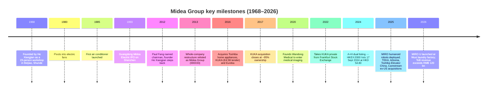
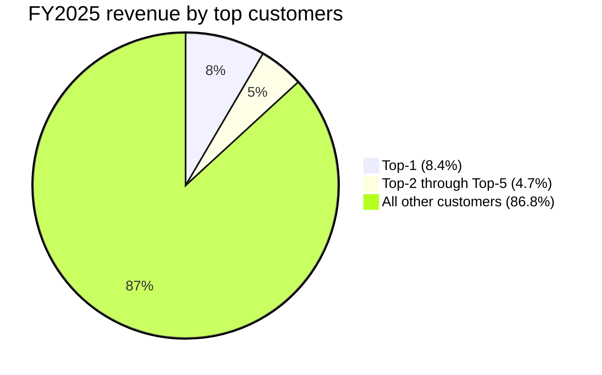

# COMPANY RESEARCH REPORT: Midea Group (美的集团, SZSE:000333 / HKEX:0300)

**Date:** 2026-05-16
**Tickers:** SZSE:000333 (A-share) · HKEX:0300 (H-share, dual-listed September 2024)
**HQ:** Beijiao, Shunde, Foshan, Guangdong, China
**Auditor (domestic):** PricewaterhouseCoopers Zhong Tian LLP

---

## Table of Contents

1. Company Overview
2. Company History
3. Management Team
4. Products & Services
5. Customers & Go-to-Market
6. Industry Overview
7. Competitive Landscape
8. Market Opportunity (TAM)
9. Risk Assessment

References (consolidated)

---

## 1. COMPANY OVERVIEW

Midea Group Co., Ltd. (美的集团 / Midea Group) is the world's largest manufacturer of home appliances by unit volume and a Top-3 global player in industrial robotics through its German subsidiary KUKA AG. The company runs a deliberately bipolar portfolio: a cash-generative consumer business ("ToC" — smart home appliances, accounting for 66% of FY2025 revenue) and a fast-growing commercial / industrial portfolio ("ToB" — building technologies, robotics & automation, industrial technology, new energy, medical imaging and supply-chain logistics, which together delivered RMB 122.8 bn / +17.5% YoY in FY2025) ([美的集团 2025 年年度报告, 第 1 页, 致股东](http://www.cninfo.com.cn/new/disclosure/stock?stockCode=000333)).

**Plain-English business description.** Midea makes refrigerators, washing machines, residential and commercial air conditioners, kitchen and small appliances under the Midea, COLMO, Toshiba, Comfee, Eureka, Bugu and TEKA brands; sells the compressors, motors, inverters and EV thermal-management parts that go inside those (and competitors') appliances; designs and installs HVAC systems, elevators and building automation for commercial property; manufactures industrial robots, mobile robots and intralogistics systems through KUKA + Swisslog; and is now investing in humanoid robotics, residential / utility-scale energy storage, and medical imaging. In FY2025, Euromonitor ranked Midea **#1 globally by unit volume of smart appliances** sold under its own brand, with more than 140 million connected smart appliances and 150 million registered smart-home users worldwide ([美的集团 2025 年年度报告, 第 40 页](http://www.cninfo.com.cn/new/disclosure/stock?stockCode=000333)).

**How it makes money.** Roughly 66% of revenue still comes from Smart Home (consumer appliances), where Midea is volume leader in China across air conditioners, refrigerators, washing machines, microwaves and most kitchen / water-treatment categories. The Industrial Solutions block (the ToB ecosystem) is the multi-engine growth story: Building Technologies (`楼宇科技` — central air conditioning, multi-VRF, chillers, elevators) at RMB 35.8 bn (+25.7%), Robotics & Automation (KUKA + Swisslog logistics + medical) at RMB 31.0 bn (+8.1%), and Industrial Technology (compressors, motors, semiconductors, EV thermal parts) at RMB 27.2 bn (+10.2%) ([美的集团 2025 年年度报告, 第 48 页, 收入构成](http://www.cninfo.com.cn/new/disclosure/stock?stockCode=000333)). On a gross-margin basis, the headline business is Building Tech at 30.6% GM and Smart Home at 29.9%; Robotics & Automation runs leaner at 21.3% GM. Midea is gradually shifting from a "Chinese export-and-OEM" model to an OBM (own-brand) global model — OBM penetration of overseas Smart Home revenue surpassed **45% in FY2025** ([美的集团 2025 年年度报告, 第 41 页](http://www.cninfo.com.cn/new/disclosure/stock?stockCode=000333)).

**Geographic footprint.** Operations in 200+ countries; 65 main manufacturing bases of which **43 are overseas**; 41 R&D centres (29 overseas in 11 countries) and >190,000 employees worldwide as of year-end 2025. Overseas revenue reached **RMB 195.9 bn in FY2025 (+15.9% YoY, 42.9% of total)**, up from ~37% three years earlier ([美的集团 2025 年年度报告, 第 13 页 / 第 49 页](http://www.cninfo.com.cn/new/disclosure/stock?stockCode=000333)). The Thai air-conditioning plant became the global appliance industry's first overseas WEF Lighthouse Factory in September 2025 ([美的集团 2025 年年度报告, 第 14 页](http://www.cninfo.com.cn/new/disclosure/stock?stockCode=000333)).

**Scale.** FY2025 total revenue **RMB 456.45 bn (~USD 63 bn) · +12.1% YoY**; reported net income to shareholders **RMB 43.95 bn · +14.0% YoY**; ex-non-recurring net income RMB 41.27 bn (+15.5%); operating cash flow RMB 53.35 bn; basic EPS RMB 5.80; weighted ROE 19.7%; total assets RMB 608.8 bn; group net equity RMB 223.2 bn. R&D spend RMB 17.79 bn or 3.90% of revenue, with 23,926 R&D headcount (12.05% of staff) ([美的集团 2025 年年度报告, 第 8–9 页, 主要会计数据](http://www.cninfo.com.cn/new/disclosure/stock?stockCode=000333)). Midea ranked **#246 on the 2025 Fortune Global 500** (10 consecutive years), and **#4 globally / #1 among Chinese private firms** in the 2025 IFI Claims Global 250 active-patent-holders list ([美的集团 2025 年年度报告, 第 13–14 页](http://www.cninfo.com.cn/new/disclosure/stock?stockCode=000333)).

### Valuation snapshot (May 2026)

The A-share trades around **RMB 81.81** with market cap of roughly **RMB 612 bn (~USD 85 bn)** as of mid-May 2026 ([Midea (000333.SZ) market-cap history, 2026-05](https://companiesmarketcap.com/midea/marketcap/); [Yahoo Finance, 000333.SZ, 2026-05-15](https://finance.yahoo.com/quote/000333.SZ/)). H-shares (HKEX:0300) listed at HKD 54.80 in September 2024 and trade at a modest premium to the A-share on a per-share basis ([KWM, "KWM advises on Midea's listing on the Main Board of HKEX", 2024-09-17](https://www.kwm.com/cn/en/about-us/media-center/kwm-advises-on-midea-s-listing-on-the-main-board-of-hkex.html)). On the A-line, **TTM P/E sits at ~13.8x** and **P/B at ~2.7x** ([gurufocus, 美的集团 PE TTM, 2026-05](https://www.gurufocus.cn/stock/SZSE:000333/term/pe_ratio); [理杏仁, 000333 PB, 2026-03](https://www.lixinger.com/equity/company/detail/sz/000333/333/fundamental/valuation/pb)). The 3-year TTM P/E band is roughly **10.5x – 16.7x** (median ~13.2x, 80th-percentile ~14.1x) — today's multiple sits just above the long-run median, with no obvious cycle-peak distortion ([理杏仁, 000333 PE-TTM 历史区间, 2026-02](https://www.lixinger.com/equity/company/detail/sz/000333/333/fundamental/valuation/pe-ttm)). TTM P/S based on FY2025 revenue and current market cap is **~1.34x**, in line with the 3-year range. Implied TTM EV/EBITDA is in the high single-digits given >RMB 100 bn of net cash and a stable EBITDA margin around 13%.

**Peer comparison (TTM P/E, May 2026 prints):**
| Peer | Ticker | TTM P/E | Comment |
|---|---|---|---|
| **Midea** | SZSE:000333 / HKEX:0300 | **~13.8x** | Diversified global; ToB ramp |
| Haier Smart Home | SSE:600690 / HKEX:6690 | ~10.6x | Pure-play global appliances |
| Gree Electric | SZSE:000651 | ~6.5x | Concentrated in residential AC |
| Whirlpool | NYSE:WHR | ~13.6x | US-centric, cut dividend, weak demand |
| Electrolux | STO:ELUX-B | ~22.0x | Mid-turnaround, depressed earnings |
| LG Electronics | KRX:066570 | ~9.0x | Consumer electronics + appliances |
| Bosch (private) | n/a | n/a | No public multiple; revenue €91 bn '24 |

Peer average ex-Bosch: **~12.6x**, peer median **~12.1x** ([Macrotrends, Whirlpool PE Ratio, 2026-05](https://www.macrotrends.net/stocks/charts/WHR/whirlpool/pe-ratio); [Stockanalysis, Haier Smart Home, 2026-05-08](https://stockanalysis.com/quote/sha/600690/statistics/); [Investing.com, Gree Electric Ratios, 2026-04-17](https://www.investing.com/equities/gree-electric-a-ratios); [YCharts, LGEJY PE, 2026-05](https://ycharts.com/companies/LGEJY/pe_ratio)).

**Interpretation.** Midea trades at a modest premium to Haier (~30% higher multiple) and Gree (~2x) but in line with Whirlpool and below Electrolux. The premium versus the cheaper Chinese peers reflects (a) more diversified earnings (ToB now ~27% of revenue and rising fastest), (b) higher overseas-OBM penetration with growing brand value (Brand Finance moved Midea up 43 spots to #228 globally in 2026 — [美的集团 2025 年年度报告, 第 13 页](http://www.cninfo.com.cn/new/disclosure/stock?stockCode=000333)), (c) KUKA's robotics optionality and the embedded humanoid programme (`美罗 / 美拉` MIRO series), and (d) a strong balance sheet that has funded back-to-back inorganic moves (TEKA, Arbonia, Toshiba Elevator China, Carestream ex-US imaging) over the last 12 months. Multiple does **not** look stretched; risk is more on the side of growth deceleration (China appliance retail down 4.3% in 2025, AVC forecasts a further 6.7% decline in 2026 — [美的集团 2025 年年度报告, 第 14 页](http://www.cninfo.com.cn/new/disclosure/stock?stockCode=000333)) than valuation excess.

Source: compiled from [美的集团 2020/2021/2022/2023/2024/2025 年年度报告, 主要会计数据](http://www.cninfo.com.cn/new/disclosure/stock?stockCode=000333).

---

## 2. COMPANY HISTORY

Midea began in 1968 as a 23-person bottle-cap and car-parts workshop in Beijiao, a township in Shunde, Foshan, founded by **He Xiangjian (何享健)** — a former village-cadre-turned-entrepreneur who initially borrowed money from neighbours to start the workshop ([Wikipedia, Midea Group](https://en.wikipedia.org/wiki/Midea_Group); [International Finance, "Business Leader of the Week: He Xiangjian", undated](https://internationalfinance.com/business-leaders/business-leader-week-meet-he-xiangjian-co-founder-midea-group/)). The company pivoted to electric fans in 1980, then to air conditioners, refrigerators and the broader white-goods line through the 1990s. In 1993 the appliance-manufacturing subsidiary "Guangdong Midea Electric" IPO'd on Shenzhen, becoming one of the first private-sector firms to list on a Chinese exchange.

The defining strategic pivot came in August 2012, when He Xiangjian — at 70 — stepped aside and named **Paul Fang (方洪波)**, a 1992-vintage internal hire who had risen through air-conditioning division leadership, as chairman. Fang inherited a sprawling but unfocused group and immediately launched a multi-year "product leadership + efficiency + globalisation + digitisation" restructuring: divisions were consolidated, hundreds of subsidiaries shuttered, and ~20% of the workforce cut. In September 2013, the listed Guangdong Midea Electric vehicle was rolled up into the parent and re-listed as **Midea Group (000333)** on the Shenzhen Stock Exchange ([美的集团 2025 年年度报告, 第 7 页](http://www.cninfo.com.cn/new/disclosure/stock?stockCode=000333)).

The second pivot was the **2016 M&A trifecta** that turned a Chinese appliance maker into a global industrial conglomerate. Midea (i) bought 80.1% of Toshiba's home appliance business for ~USD 477 m in March, gaining the Toshiba brand licence in Asia (extended in subsequent transactions), (ii) launched the EUR 4.5 bn tender offer for German robotics champion **KUKA AG** (Augsburg-based, one of the global "Big Four" industrial-robot OEMs alongside Fanuc, ABB and Yaskawa) and closed at ~95% ownership in early 2017, and (iii) acquired Eureka, the floor-care brand, from Electrolux in December — together establishing the foundation of today's ToB second curve ([Wikipedia, Midea Group](https://en.wikipedia.org/wiki/Midea_Group)). In 2022 Midea completed a **squeeze-out and take-private of KUKA** from the Frankfurt Stock Exchange at EUR 80.77/share, delisting the German subsidiary and bringing it fully into the parent's consolidation.

The third pivot — globalisation and dual listing — accelerated in 2024. On **17 September 2024**, Midea Group successfully completed a Hong Kong H-share offering at HKD 54.80, raising HKD ~30 bn and becoming an A+H dual-listed company under HKEX code **0300** ([Futu News, "Midea Group Co., Ltd (00300.HK) will start the IPO on September 9th", 2024-09-09](https://news.futunn.com/en/post/47544342/midea-group-co-ltd-00300-hk-will-start-the-ipo); [KWM, 2024-09-17](https://www.kwm.com/cn/en/about-us/media-center/kwm-advises-on-midea-s-listing-on-the-main-board-of-hkex.html)). HKSCC nominees now hold ~8.6% of total shares, with Shenzhen-Connect (香港中央结算) holding a further 12.8% on behalf of mainland-Connect investors ([美的集团 2026 年第一季度报告, 第 4 页](http://www.cninfo.com.cn/new/disclosure/stock?stockCode=000333)).

Recent developments (2024-2026): completed the **TEKA acquisition** in Europe (Spanish kitchen-built-in brand), the **Arbonia HVAC division** carve-out from Switzerland (Climate Division, closed 2025), the take-private of **Toshiba Elevator China**, and the acquisition of **Carestream Health's ex-US imaging assets** in December 2025 to broaden Midea Medical's portfolio beyond domestic Wandong Medical ([美的集团 2025 年年度报告, 第 12 页](http://www.cninfo.com.cn/new/disclosure/stock?stockCode=000333)). Internally, the group launched its own humanoid-robot programme through the Midea Humanoid Robot Innovation Center, with three generations / five models shipped by year-end 2025 — culminating in the **MIRO U (美罗 U)** flagship industrial humanoid unveiled in December 2025.

Source: [美的集团 2025 年年度报告, 第 7–13, 30–43 页](http://www.cninfo.com.cn/new/disclosure/stock?stockCode=000333); [Wikipedia, Midea Group](https://en.wikipedia.org/wiki/Midea_Group); [KWM, "KWM advises on Midea's HKEX listing", 2024-09-17](https://www.kwm.com/cn/en/about-us/media-center/kwm-advises-on-midea-s-listing-on-the-main-board-of-hkex.html).

---

## 3. MANAGEMENT TEAM

### Paul Fang (方洪波) — Chairman, President and Executive Director

Fang is the central figure in Midea's 14-year transformation from a Chinese appliance OEM to a global industrial group, and the bio that matters most for the long-run thesis. Now 59 (PhD), he joined Midea in 1992 fresh from postgraduate study and built his career inside the air-conditioning division — running supply chain, then becoming GM of the AC business, then president of the Midea Refrigeration appliance group, and chairman / president of the listed Guangdong Midea Electric vehicle. He was elevated to chairman & president of the whole group in **August 2012**, when founder He Xiangjian stepped back; his second elected term runs through 1 July 2027 ([美的集团 2025 年年度报告, 第 66 页, 董监高情况](http://www.cninfo.com.cn/new/disclosure/stock?stockCode=000333)).

What he has actually delivered: (i) consolidation that took Midea from a sprawling, brand-fragmented appliance maker with EPS around RMB 1.5 in 2012 to **EPS RMB 5.80 in FY2025** (a ~4x earnings re-rate over 13 years with a ~5x revenue base), (ii) execution of the 2016 trifecta acquisitions and the operational integration of KUKA, with consumption of two impairment cycles (2022/2023) and emergence into a recovering trajectory by 2025 (KUKA group revenue returned to growth; KUKA China revenue contribution near 30% — [美的集团 2025 年年度报告, 第 34 页](http://www.cninfo.com.cn/new/disclosure/stock?stockCode=000333)), (iii) ToB revenue from <10% of total in 2016 to **26.9% in 2025**, (iv) overseas revenue from ~30% to 43%, with OBM share of overseas Smart Home crossing 45%, and (v) the A+H dual-listing in 2024 which gave Midea a tradeable HK currency for cross-border M&A. Fang is private and rarely gives interviews, but the annual "Letter to Shareholders" is highly personal and unusually self-critical — the 2025 letter speaks in unusually stark terms about K-shaped divergence and the need to "原地重启或再生" (restart in place / regenerate) ([美的集团 2025 年年度报告, 第 1–2 页, 致股东](http://www.cninfo.com.cn/new/disclosure/stock?stockCode=000333)). Fang holds **116,990,492 A-shares (1.54% of total)** directly, of which 87.74 m are under restricted-share lock-ups — easily the largest direct insider stake and consistent with skin-in-the-game ([美的集团 2026 年第一季度报告, 第 4 页, 前 10 大股东](http://www.cninfo.com.cn/new/disclosure/stock?stockCode=000333)). At 59, succession is becoming an open question, but no announced plan has appeared in the 2025 disclosures.

### Bonnie Zhong (钟铮) — CFO, Senior VP

Bonnie Zhong, 44, is a Midea lifer who joined in 2002 and rose through internal-audit and finance director roles before being appointed CFO on **22 February 2022**. She holds a master's degree and has served as group audit director and CFO of the parts division — a typical "finance trained inside the operating business" profile. She also sits on the board of Midea Electric (Singapore) Trading, the group's offshore treasury vehicle, and is the executive who signed off on the 2025 financial statements alongside chairman Fang. Zhong directly owns 276,152 A-shares ([美的集团 2025 年年度报告, 第 66, 71 页](http://www.cninfo.com.cn/new/disclosure/stock?stockCode=000333)). Notable items on her watch include the **2024 HKEX H-share listing**, the migration of the parent to IFRS reporting alongside CAS, four years of stable RMB 50–60 bn operating cash flow, and the buyback / dividend programme which in FY2025 sees the group return **RMB 43 / 10 shares** in cash (RMB 5 interim + RMB 38 final) — implying total cash distribution of roughly RMB 32 bn or ~73% of reported net income ([美的集团 2025 年年度报告, 第 4 页](http://www.cninfo.com.cn/new/disclosure/stock?stockCode=000333)).

### Gu Yanmin (顾炎民) — Executive Director, SVP, Chairman of KUKA Supervisory Board

Gu, 62 (PhD), joined Midea in 2000 and ran the international business through the 2010s — first as overseas-development director, then VP of the refrigeration appliance group and head of overseas business, and later **President of the Robotics & Automation business unit**. He now chairs the **KUKA AG supervisory board** in Augsburg, making him the single most important Chinese executive controlling the integration and direction of KUKA inside the group. He is therefore the key person for the robotics-and-humanoid thesis: the integration that has now generated a return to growth at KUKA China (≈30% of KUKA group revenue), the launch of KUKA's five AI agents (KUKA AI Vision, iiQWorks, KUKA CONNECT IOT, 小库 AI Helper, AMR Fleet) at the 25th China International Industry Fair in 2025, and the rollout of the KMP 250P autonomous mobile robot platform — all flow through his org ([美的集团 2025 年年度报告, 第 34–35, 68 页](http://www.cninfo.com.cn/new/disclosure/stock?stockCode=000333)).

### Wang Jianguo (王建国) — Executive Director, Executive President; head of New Energy and Wandong Medical

Wang, 49, joined Midea in 1999 and has been promoted across the operating businesses — AC supply chain director, head of HR/admin, GM of the refrigerator division, president of the Smart Home Business Group, and group SVP. He was promoted to **Executive President in September 2025**, also serving concurrently as President of the New Energy business unit (合康新能 + 科陆电子), Chairman of Wandong Medical, and Chairman of Guangdong Midea Refrigeration Equipment — the operating subsidiary that builds and sells residential ACs ([美的集团 2025 年年度报告, 第 68 页](http://www.cninfo.com.cn/new/disclosure/stock?stockCode=000333)). Wang anchors three of the four ToB second-curve bets (energy, medical, plus the new-energy-adjacent residential AC heat-pump business).

### Governance footer

- Board structure: 11 directors — 3 executive (Fang, Wang, Gu, Guan Jinwei, Zhang Tian), 1 non-executive (Zhao Jun, from Midea Holding), 4 independents (Xu Dingbo, Xiao Geng, Liu Qiao, Qiu Lili), 1 employee-representative director (Zhang Tian) elected in May 2025. The supervisory board was restructured in May 2025 as part of broader governance changes ([美的集团 2025 年年度报告, 第 67–68 页](http://www.cninfo.com.cn/new/disclosure/stock?stockCode=000333)).
- Insider / controlling-shareholder ownership: **Midea Holding Co., Ltd. (美的控股 — He family vehicle controlled by founder He Xiangjian's son He Jianfeng) owns 28.53%** of the company; HKSCC nominees 8.56%; Shenzhen-Connect 12.80%; Paul Fang directly 1.54%; co-founders Huang Jian (1.13%) and Li Jianwei (0.60%) round out the named insider list ([美的集团 2026 年第一季度报告, 第 4 页](http://www.cninfo.com.cn/new/disclosure/stock?stockCode=000333)).
- Comp structure: long-running restricted-share and stock-option incentive plans (the 2021/2022 plans were unwound in 2025; new equity awards are ongoing), with very high performance-linkage at the executive level. Several long-serving execs departed during 2025 in what management characterised as "公司治理架构调整" (governance restructuring) — including SVP Bo Lin and former director Fu Yongjun ([美的集团 2025 年年度报告, 第 68–69 页](http://www.cninfo.com.cn/new/disclosure/stock?stockCode=000333)).
- Audit: PwC Zhong Tian LLP (Shanghai) is auditor for the CAS books, with PwC Hong Kong on the IFRS side.

### Management track record

This team has executed two of the harder things any Chinese industrial group has tried in the last decade: (1) the integration of a flagship European industrial brand (KUKA) through a period of impairment, supervisory-board contestation and full take-private, and (2) the parallel transformation from a domestic OEM to a global OBM franchise with overseas revenue >40%. The 2022 KUKA impairment and the 2023 China-AC weakness were real stumbles, but the group emerged with consolidated control of the asset and a credible robotics roadmap. Skin-in-the-game is high (Fang's RMB ~9.6 bn personal stake), capital returns are aggressive (~73% payout in FY2025), and the latest letter is unusually direct about the need to keep self-disrupting. The clearest open question is **CEO succession**; Fang is 59 with several SVPs in their 40s but no anointed heir-apparent yet.

---

## 4. PRODUCTS & SERVICES

Midea's portfolio is organised around **two business pillars** (ToC Smart Home and ToB Industrial Solutions), with seven reporting blocks under them. The product tree below maps from the corporate name down to the SKUs marketed on Midea's branded websites and the operating subsidiaries inside the group.

```mermaid
graph TD
    M[Midea Group<br/>SZSE:000333 / HKEX:0300]
    M --> ToC[ToC — Smart Home<br/>RMB 299.9 bn / 65.7%]
    M --> ToB[ToB — Industrial Solutions<br/>RMB 122.8 bn / 26.9%]
    M --> Other[Logistics + Other<br/>RMB 33.8 bn / 7.4%]
    ToC --> HVAC[Residential HVAC<br/>Midea AC, Comfee AC]
    ToC --> Fridge[Refrigerators<br/>Toshiba, Midea, COLMO]
    ToC --> Wash[Laundry<br/>Midea, Little Swan, Toshiba]
    ToC --> Kitchen[Kitchen & cooking<br/>microwave, oven, range hood, TEKA]
    ToC --> Small[Small appliances<br/>Eureka, Bugu, Midea S/A]
    ToC --> Water[Water treatment<br/>Skincare Bathroom Softener]
    ToB --> BT[Building Technologies<br/>RMB 35.8 bn — central AC, chillers, multi-VRF, elevators, iBUILDING]
    ToB --> RA[Robotics & Automation<br/>RMB 31.0 bn — KUKA, Swisslog Logistics, Swisslog Healthcare]
    ToB --> IT[Industrial Technology<br/>RMB 27.2 bn — Welling, GMCC, Toshiba Carrier, Servotronix]
    ToB --> NE[New Energy<br/>Hekang + Kelu — ESS, inverters, charging]
    ToB --> Med[Medical Imaging<br/>Wandong Medical + Carestream ex-US]
    ToB --> Hum[Humanoid Robotics<br/>Midea Innovation Center — MIRO, MILA, MIRO U]
```

### 4a. Smart Home (consumer appliances) — RMB 299.9 bn, +11.3%, 29.9% GM

**Residential air conditioning.** Midea is the volume leader in Chinese residential AC, with multiple flagship sub-brands: the value-line **Midea**, the premium **COLMO** (套系 — full-suite smart home), the licensed **Toshiba** (Japan-first premium positioning), and overseas-only **Comfee** (mass-market). Per AVC data cited in the annual report, the Chinese AC market was RMB 235.7 bn in retail value in 2025 (-0.4%); high-efficiency APF >5.3 units rose to 40% online share with Midea holding leadership. Closest competitors: Gree (still #1 in residential AC by share in some periods), Haier (premium Casarte), Hisense, Hitachi, Daikin. **Competitive-advantage verdict: YES — scale-cost moat, brand portfolio depth, vertical integration (Midea makes its own compressors via GMCC and motors via Welling).** Evidence: AVC reports Midea Group's branded AC products remain #1 in domestic e-commerce GMV at JD/Tmall/Douyin/PDD; the Thai AC plant was named the global appliance industry's first overseas WEF Lighthouse Factory ([美的集团 2025 年年度报告, 第 14 页](http://www.cninfo.com.cn/new/disclosure/stock?stockCode=000333)).

**Refrigerators.** Toshiba/Midea/COLMO co-brand strategy. Toshiba is now #1 in Japan refrigerators by 2025 market share, and Midea has held the lead in flat-built-in (`平嵌`) refrigerators by online unit share for three consecutive years — the fastest-growing premium subcategory ([美的集团 2025 年年度报告, 第 16 页](http://www.cninfo.com.cn/new/disclosure/stock?stockCode=000333)). The 501–550L cross-door / French-door form factor dominates the market (>40% online, 48% offline). Competitive verdict: **YES — combination of brand portfolio (Toshiba premium in Asia, COLMO premium in China), and vertical integration (refrigerator compressor share global top-3, per Industry Online).** Closest competitor product: Haier (Casarte) French-door refrigerators — at parity in China premium; Midea leads in built-in.

**Washing machines and dryers.** Little Swan (acquired 2008), Midea, Toshiba and COLMO. 2025 China laundry retail was RMB 96.3 bn (-4.6%). Trend toward heat-pump combo and multi-tub (`分区洗护`) units. Globally, Midea / Little Swan motors hold #1 global share per the annual report. Competitive verdict: **YES — vertical integration in motors plus heat-pump tech.** Closest competitor: Haier (Casarte / Leader), LG (Twin Wash).

**Kitchen / cooking.** Microwave (Midea #1 globally in unit share by some sources — overseas Sat #1 in Saudi, Thailand, Vietnam), ovens, range hoods, dishwashers, water heaters, water purifiers. **TEKA** (Spanish kitchen-built-in brand) added in 2025 for European built-in penetration. 2025 China cooking-appliance market RMB 161.3 bn (-8.5%). Competitive verdict: **YES, partial — strong in microwave / dishwasher (Saudi #1 GMV); weaker in luxury range hoods where local brands like Robam, Fotile lead.**

**Small appliances and floor care.** Eureka (acquired 2016 from Electrolux), Bugu (Midea's premium small-appliance brand), Midea-branded vacuum cleaners, rice cookers, fans, etc. Mass-market and digital-first. Competitive verdict: **partial — scale but no clear leader**; closest competitor Xiaomi ecosystem (Roborock, Dreame, Roidmi).

**Water treatment.** New 2025 launch: Skincare Bathroom Water Softener and Ultra Slim Under-sink Water Softener — both won medals at the 50th Geneva International Exhibition of Inventions ([美的集团 2025 年年度报告, 第 13 页](http://www.cninfo.com.cn/new/disclosure/stock?stockCode=000333)). Competitive verdict: **partial — emerging category with no entrenched leader; first-mover and design-award visibility help.**

### 4b. Building Technologies — RMB 35.8 bn, +25.7%, 30.6% GM

The fastest-growing ToB segment. Products: multi-VRF (`多联机`), large-tonnage chillers, scroll / screw / centrifugal chillers, modular chillers, data-centre precision air-conditioning, fan-coil, escalators / elevators (under the **菱王 Linwang Elevator** brand and **Toshiba Elevator China**), and the **iBUILDING** digital platform for building automation. The 2025 annual report cites Industry Online: Midea's central AC has **>20% domestic GMV share (#1)**, commercial multi-VRF **>28% (#1)**, centrifugal chillers **>16% (#1)**. Linwang Elevator has led the domestic freight-elevator subsegment for 3 straight years ([美的集团 2025 年年度报告, 第 41 页](http://www.cninfo.com.cn/new/disclosure/stock?stockCode=000333)). The Arbonia Climate Division (closed 2025) adds European hydronic-HVAC capability. Competitive-advantage verdict: **YES — scale, vertical integration into compressors, complete portfolio.** Closest competitor: Gree commercial AC, Daikin VRF, Trane / Carrier in chillers, Otis / KONE / Schindler in elevators.

### 4c. Robotics & Automation (KUKA + Swisslog) — RMB 31.0 bn, +8.1%, 21.3% GM

KUKA is the engine of this segment. Per the FY2025 annual report, KUKA AG (Augsburg) returned to revenue growth in 2025 with **KUKA China contributing close to 30% of group revenue** — a structural shift versus the pre-2022 mix when European auto was dominant. Per MIR Databank cited in the annual report, **KUKA holds 9.6% share of Chinese industrial-robot units sold in 2025, top-3 in China**, and **47.4% share of the ≥300 kg payload heavy-robot subsegment** — a near-monopoly in heavy welding / metal-stamping applications ([美的集团 2025 年年度报告, 第 41 页](http://www.cninfo.com.cn/new/disclosure/stock?stockCode=000333)). 2025 product launches included the **KMP 250P** autonomous mobile robot (250 kg payload, ISO Class-5 cleanroom option, ESD certified for semiconductor / consumer-electronics assembly) and **five AI agents** (KUKA AI Vision, iiQWorks engineering software, KUKA CONNECT IOT, 小库 AI assistant, KUKA AMR Fleet logistics) at CIIF 2025.

**Swisslog (Logistics + Healthcare).** Swisslog Logistics is a global intralogistics integrator (AutoStore-style ASRS, warehouse automation). Swisslog Healthcare's Box Picker automated pharmacy storage system won the 2025 MedTech Breakthrough Award (Best Hospital Technology Implementation). Competitive verdict: **YES — top-3 globally in industrial-robot mass + only one of the Big Four with deep China exposure.** Closest competitor: Fanuc (premium, factory-floor leader), ABB (broad portfolio), Yaskawa (Japanese auto-focused).

### 4d. Industrial Technology — RMB 27.2 bn, +10.2%, 17.5% GM

This is the **components** business, run via brands GMCC (`美芝`, compressors), Welling (`威灵`, motors), Toshiba Carrier (HVAC compressors), Mei Ren (`美仁`, chips), Hi-Conn (valves / pumps), and Servotronix (motion control for robotics). Per Industry Online: GMCC **#1 globally in residential-AC compressor volumes**; Welling **#1 globally in residential-AC motors and washing-machine motors**; refrigerator-compressor volumes top-3 globally. The unit also makes EV thermal-management components (compressors, motors, e-pumps) for new-energy-vehicle OEMs, and motion-control modules for robotics. Competitive verdict: **YES — global scale leadership in 3+ subcategories with sales to third-party OEMs (so the business is exposed to peer-vs-Midea purchasing decisions).** Closest competitor: Hitachi/Johnson Controls (compressors), Nidec (motors), Hanon Systems (thermal).

### 4e. New Energy — bundled in "Other Business" and Industrial Technology

Operates through **Hekang New Energy** (variable-frequency drives, household ESS, PV inverters) and **Kelu Electronic** (smart grid, electrochemical ESS) — both A-share listed subsidiaries. In June 2025 Midea unified the segment as **"Midea Energy"** at SNEC 2025 and launched a next-gen box-level direct-cooling ESS platform, a next-gen heat-pump platform, and an AI energy-management system ([美的集团 2025 年年度报告, 第 43 页](http://www.cninfo.com.cn/new/disclosure/stock?stockCode=000333)). Competitive verdict: **partial — emerging optionality; faces CATL, Sungrow, Huawei, EVE in different niches.** Closest competitor: Sungrow (inverter / ESS), CATL EnerC (ESS).

### 4f. Medical Imaging

**Wandong Medical (万东医疗, A-share)** is the historical core — X-ray, MRI, CT, ultrasound imaging for hospitals and clinics. December 2025 closed the acquisition of **Carestream Health's non-US business** (ex-US X-ray, CR/DR imaging) to internationalise the platform ([美的集团 2025 年年度报告, 第 12 页](http://www.cninfo.com.cn/new/disclosure/stock?stockCode=000333)). Competitive verdict: **partial — Wandong is a Chinese mid-tier brand; Carestream gives international footprint.** Closest competitor: United Imaging (UIH), Mindray, GE HealthCare, Siemens Healthineers.

### 4g. Humanoid Robotics — Midea Innovation Center

The most "narrative-rich" optionality in the group. Through the **Midea Humanoid Robot Innovation Center**, the group has shipped **three generations / five models** by year-end 2025 across two product lines: **MIRO (美罗)** for industrial / factory floor, and **MILA (美拉)** for commercial / household. The flagship **MIRO U** launched December 2025 has 3 DoF waist, six bionic humanoid arms each with 6 high-precision drive joints, supports modular end-effectors (dexterous hand or vacuum cup) and is targeted at the +30% changeover efficiency and -40% line footprint use case versus traditional cells. **MIRO U is currently in pilot at Midea's Wuxi premium washing-machine factory**. **MIRO** is in pilot at the Jingzhou washing-machine factory doing 3D quality inspection, machine inspection and sheet-metal feeding, integrated into the WEF "intelligent-agent factory" architecture. **MILA** is targeted at retail (Midea-store demo of fridge-pickup → microwave-warming → coffee-brewing) and expected to debut in Midea retail stores in 2026. The bipedal high-dynamic platform **MILA X** can climb stairs, run, dance, and learn motions from video in <2 hours ([美的集团 2025 年年度报告, 第 42 页](http://www.cninfo.com.cn/new/disclosure/stock?stockCode=000333)). Competitive verdict: **early — narrative + first-mover credibility but no disclosed revenue.** Closest competitor: Unitree, Agibot, Fourier, UBtech, Tesla Optimus.

### Flagship vs. long tail and FY2025 product roadmap

**Flagship products (revenue drivers):** (1) the residential-AC franchise under Midea / Toshiba / COLMO (~RMB 100 bn-class business), (2) the central-AC / building-tech business, (3) KUKA industrial robots + Swisslog logistics. **Long-tail / optionality:** humanoid robots, new energy, medical imaging. **Launches in last 12 months:** Skincare Bathroom Water Softener (Geneva Gold Award, April 2025), KMP 250P AMR (KUKA, 2025), MIRO U humanoid (December 2025), Midea Energy unified-brand ESS platform (June 2025), Carestream ex-US imaging (closed December 2025). No major sunsets — TEKA / Arbonia / Toshiba Elevator integrations are net adds.

---

## 5. CUSTOMERS & GO-TO-MARKET

### Customer concentration — disclosed and low

Midea reports its top-5 customer sales pursuant to CSRC disclosure rules. In FY2025:

- **Top-5 customers combined: RMB 60.14 bn = 13.17% of revenue** (related-party: 0%)
- **Top-1 customer: RMB 38.52 bn = 8.44% of revenue** (single largest is undisclosed by name but consistent with a major channel partner — likely either Suning/JD/Gome aggregate distributor or an OEM customer)
- Top-2 through Top-5: RMB 7.09 bn / 1.55%, RMB 6.82 bn / 1.49%, RMB 4.17 bn / 0.91%, RMB 3.53 bn / 0.77% respectively ([美的集团 2025 年年度报告, 第 51 页, 主要销售客户](http://www.cninfo.com.cn/new/disclosure/stock?stockCode=000333)).

For a company of Midea's scale, this is a **very low concentration profile**. Top-1 at 8.4% sits below the typical 10% materiality threshold (so the customer is not formally a "major customer" by US ASC 280 standards), and top-5 at 13.2% is well below the 50% level the SKILL flags as "material." The mix has been similarly diffuse over the last three years (top-5 has hovered between 12-15% based on annual-report cross-section). Concentration is a non-issue relative to peer Chinese conglomerates that have one strategic OEM customer (e.g. CATL's exposure to Tesla / BYD, or Sunwoda's exposure to Apple).

Source: [美的集团 2025 年年度报告, 第 50–51 页, 主要销售客户和主要供应商情况](http://www.cninfo.com.cn/new/disclosure/stock?stockCode=000333).

Supplier-side concentration is also low: top-5 suppliers were RMB 19.32 bn or 6.02% of group procurement, top-1 supplier 1.52% — i.e. Midea is materially self-supplied or sourced from a deep, fragmented base, consistent with the in-house compressor / motor / inverter integration.

### Customer segments

**B2C (Smart Home, ~66% of revenue).** End consumers in 200+ countries reached through (a) **domestic channels** in China: JD, Tmall, Douyin, Pinduoduo on e-commerce; KA chains (Suning, Gome, Five Star); independent distributors; the proprietary **Mei Yun Xiao (`美云销 APP`)** B2B platform used by tens of thousands of franchised dealers; and a multi-format brick-and-mortar network of 600 Mall stores + thousands of pre-installation / experience / specialty outlets (`前装店、旗舰店、专业店、多品店`) covering Tier 1 to township ([美的集团 2025 年年度报告, 第 19–22, 41 页](http://www.cninfo.com.cn/new/disclosure/stock?stockCode=000333)). Midea-branded retail penetration in China's "lower-tier markets" exceeded RMB 30 bn in 2025 — itself larger than many standalone listed appliance brands. Total domestic e-commerce share (incl. e-com sinking) exceeded **55% of domestic Smart Home revenue** in 2025.

(b) **Overseas channels:** OBM (own-brand) sales reached >45% of Smart Home overseas, sold under Midea, Toshiba, Comfee, Eureka, TEKA, Bugu and Midea-Toshiba dual labels. Mei Ju (美居 APP) registered users overseas surpassed 11 million in 2025 with MAU +60% YoY. Midea's own-brand Amazon listings hold **#1 share in 32 sub-categories** across the North America, Europe and Japan marketplaces. The group operates **~5,500 overseas after-sales nodes** and has on-boarded >25,000 overseas retailers to its B2B digital sales platform ([美的集团 2025 年年度报告, 第 41 页](http://www.cninfo.com.cn/new/disclosure/stock?stockCode=000333)).

**B2B (ToB, ~27% of revenue).** Three sub-clusters: (i) **building developers, GCs and FM operators** for central AC, chillers, elevators and iBUILDING automation — typical contract structure is project-based with multi-year service tails; (ii) **industrial / manufacturing customers** for KUKA robots and Swisslog logistics — Auto OEMs (BMW, Volkswagen, Mercedes-Benz, Stellantis, Chinese NEV OEMs), electronics assemblers, food / consumer / pharma (Clevertech, KRONE, KLEUSBERG modular construction); (iii) **HVAC OEMs and EV OEMs** for industrial-tech compressors / motors / thermal modules. Cited 2025 commercial customer wins for KUKA include KLEUSBERG (modular-building welding system, going live 2027), KRONE (agricultural machinery automated stamping in Germany), Clevertech (Italian system-integrator with >80% of its lines on KUKA), and the Polish pet-food palletisation line (1,200 cans / minute) ([美的集团 2025 年年度报告, 第 34–35 页](http://www.cninfo.com.cn/new/disclosure/stock?stockCode=000333)).

### Sales strategy

Midea's go-to-market is a **"DTC + digital + omni-channel"** model that since 2018 has rebuilt the entire group around the Mei Yun Xiao APP B2B platform: single SKU pricing, real-time inventory visibility, intelligent replenishment, and same-price online / offline policy. Inventory turn improved >10% in 2025. The China retail playbook explicitly favours full-suite home solutions (`美家套系`) with built-in / luxury positioning under COLMO and Toshiba branding for premium homes, and value-tier Midea for mass market. Overseas, the explicit strategy is **"In Europe, for Europe"** (driving TEKA cross-sell), **"Toshiba No.1 Japan"** (Toshiba Japan delivered 16%+ combined share across 6 white-goods categories in 2025), and **OBM-first** with co-marketing via sponsorships of Manchester City FC, Erling Haaland, FC Barcelona (arm-patch sponsor from 2026/27 season), AFC, CAF and CONMEBOL ([美的集团 2025 年年度报告, 第 22–24 页](http://www.cninfo.com.cn/new/disclosure/stock?stockCode=000333)).

### Key partnerships

`人车家` (Human-Car-Home) interconnection deepening: strategic partnerships with **BYD, NIO and Huawei** for in-cabin / home appliance ecosystem integration; AIoT collaboration with **Global IoT Interconnect Coalition (GIIC)** on industry interoperability standards; collaboration with **Cosco Shipping and GLP** on a Thai green-supply-chain hub. KUKA system-integrator network includes Clevertech (Italy) and dozens of Asian/European integrators.

---

## 6. INDUSTRY OVERVIEW

Midea operates across four addressable industries: global home appliances (TAM ~USD 550 bn), commercial HVAC / building tech (~USD 60 bn), industrial robotics (~USD 42 bn), and adjacent optionality in residential ESS and humanoid robotics.

### 6a. Home appliances

The global home-appliance industry produced **USD 547 bn of retail sales in 2025** (Mordor Intelligence), with consensus forecasts to **USD 660–700 bn by 2030** at a 5–7% CAGR — driven by emerging-market household-penetration growth (Africa, South Asia, ASEAN), premiumisation and trade-in policies in developed markets, and a "smart appliance" subsegment expected to grow from USD 42.4 bn (2025) to USD 71.3 bn (2030) at an 11% CAGR ([Mordor Intelligence, Home Appliances Market 2025-2031](https://www.mordorintelligence.com/industry-reports/global-home-appliances-market-industry); [MarketsAndMarkets, Smart Appliances Market 2024-2030](https://www.marketsandmarkets.com/Market-Reports/smart-appliances-market-8228252.html)).

**China subsegment.** Per AVC, China appliance retail (ex-3C) was **RMB 893.1 bn in 2025 (-4.3% YoY)** and is forecast to decline a further **6.7% in 2026 to RMB 833.2 bn** as the trade-in stimulus front-loaded demand. China appliance exports were USD 96.2 bn (-3.9%) ([美的集团 2025 年年度报告, 第 14 页](http://www.cninfo.com.cn/new/disclosure/stock?stockCode=000333)). Category-level 2025 retail: residential AC RMB 235.7 bn (-0.4%), washing machine RMB 96.3 bn (-4.6%), refrigerator RMB 127.1 bn (-11.5%), kitchen appliance RMB 161.3 bn (-8.5%). The domestic backdrop is structurally challenging — high household penetration + trade-in pull-forward — pushing all major Chinese white-goods names toward overseas, premium and adjacencies.

**Key trends.** AI / smart-home: AI penetration in smart refrigerators hit 57% online / 71% offline in 2025 — Midea's own AI-agent in white goods now serves >20 m users at ~30 m daily interactions, with 95% intent recognition accuracy. Heat pumps: in-home laundry heat-pump combos are taking share from condensing dryers and energy-efficiency tier APF >5.3 ACs grew to 40% of online unit share. Aging-friendly product design is becoming a category in itself. Demand is in "K-shape" — high-end ($1,500+ COLMO Tu Ling / Xin Xiang) and low-end (under-RMB 3,000 PDD products) both grew while the RMB 4,000–8,000 mid-tier compressed hardest.

### 6b. Commercial HVAC and building tech

Global commercial HVAC was ~USD 110 bn in 2025 (industry consensus), with VRF / chillers as the highest-growth subsegments thanks to data-centre cooling, decarbonisation retrofit (heat pumps replacing gas boilers in EU), and emerging-market industrial / commercial buildout. China central AC was **RMB 110+ bn in 2025**, where Midea Group entities (Midea Central AC, MDV multi-VRF, Toshiba Carrier) cumulatively held **>20% domestic share #1** ([美的集团 2025 年年度报告, 第 41 页](http://www.cninfo.com.cn/new/disclosure/stock?stockCode=000333)). The Arbonia carve-out gives access to European hydronic / heat-pump systems facing forced-replacement of gas boilers from 2026 onward.

### 6c. Industrial robotics

The global industrial-robot installed base passed 4 million units in 2024 and continues to grow at >10% / year, with **China alone accounting for >50% of new global shipments in 2024 (~400,000 units)** ([roboticsandautomationnews.com, "Beyond the headlines: Inside China's multi-billion dollar industrial robotic arms market", 2025-10-07](https://roboticsandautomationnews.com/2025/10/07/beyond-the-headlines-inside-chinas-multi-billion-dollar-industrial-robotic-arms-market/95196/)). The global Big-4 (Fanuc, ABB, KUKA, Yaskawa) historically held ~60% of China's industrial-robot market, but this has compressed to ~45% as domestic players Estun, Siasun, Inovance, JAKA and Efort have captured the volume mid-range with 20–30% price discounts and faster service. KUKA's response — heavy-payload (≥300 kg, where it has 47% China share), AMR mobile-robot product extension, and AI-agent toolchain — is consistent with the premium-defence playbook ([美的集团 2025 年年度报告, 第 41 页](http://www.cninfo.com.cn/new/disclosure/stock?stockCode=000333); [progressiverobotics.ai, "Beyond the Big 4", 2025](https://progressiverobotics.ai/beyond-the-big-4-abb-fanuc-kuka-yaskawa-the-complete-2025-robot-manufacturer-guide-for-smart-integrators/)).

### 6d. Humanoid robotics

The newest TAM and the source of the most narrative-driven revaluation potential. China's MIIT, Goldman Sachs and Morgan Stanley have each published TAM forecasts ranging from USD 6 bn (2030) to USD 380 bn (2035 / 2040 long-run scenarios). Most credible near-term forecasts are USD 5–15 bn by 2030 with industrial factory-floor as the first wave (which is exactly where MIRO and MIRO U are deployed today inside Midea's own Jingzhou / Wuxi factories — a strong proof-of-concept channel).

### Regulatory environment

(i) **China energy-efficiency standards** — incremental tightening (APF tiers, refrigerant transitions to R290/R32 from R410A/R22 in major markets) — favours scale players with vertical compressor / refrigerant capability. (ii) **EU CSRD + tariffs on Chinese appliances / EVs** — pushing Midea's "In Europe, for Europe" model with local production (TEKA Spain, Arbonia Swiss / Czech facilities). (iii) **US Section 301 + IRA / proposed tariff increases** — limits direct China exports; Midea's response is the Mexico / Brazil / Egypt manufacturing footprint. (iv) **China consumer trade-in subsidy programme (`国补 / 以旧换新`)** — drove the 2025 demand; AVC notes the policy has now front-loaded much of the natural replacement cycle.

---

## 7. COMPETITIVE LANDSCAPE

Midea competes simultaneously in five distinct competitive arenas, each with different rivals and different positions.

### 7a. Chinese appliance peers (most-direct competition)

- **Haier Smart Home (海尔智家, SSE:600690 / HKEX:6690)**. Closest peer by scale and product overlap; FY2024 revenue ~RMB 286 bn. Haier leads in premium refrigerators (Casarte) and has a stronger US presence (acquired GE Appliances 2016). Trades at ~10.6x TTM P/E versus Midea's 13.8x ([Stockanalysis, Haier Smart Home, 2026-05-08](https://stockanalysis.com/quote/sha/600690/statistics/)). Haier is more concentrated in pure appliances, lacks Midea's KUKA / industrial-tech optionality, and has been less aggressive on building tech.
- **Gree Electric (格力电器, SZSE:000651)**. Residential-AC specialist still leading in some price tiers. FY2024 revenue ~RMB 191 bn. Heavy concentration risk — residential AC ~70% of revenue. Cheapest in the peer set at ~6.5x TTM P/E ([Investing.com, Gree Electric Ratios, 2026-04-17](https://www.investing.com/equities/gree-electric-a-ratios)) reflecting weaker diversification.
- **Hisense Home Appliances (海信家电, SZSE:000921 / HKEX:0921)**. Multi-segment but smaller; partnership with Hitachi in central AC.
- **Little Swan / Roborock / Stone-style** specialists — emerging in segments where they lead (Roborock for robot vacuum).

### 7b. Global appliance OEMs

- **Whirlpool (NYSE:WHR)**. North-America-centric. Heavy US tariff overhang. Suspended dividend in 2025 for first time in 70 years; cut full-year guidance citing recession-level demand ([Macrotrends, WHR PE](https://www.macrotrends.net/stocks/charts/WHR/whirlpool/pe-ratio)). Trades at ~13.6x TTM but on depressed earnings.
- **LG Electronics (KRX:066570)**. Diversified into appliances, displays, autoparts. Strong premium in Korean / US home appliance; trading at ~9x TTM P/E ([YCharts, LGEJY PE, 2026-05](https://ycharts.com/companies/LGEJY/pe_ratio)). Stronger than Midea in compressors via Linear-Compressor IP and in display / EV optionality.
- **Electrolux (STO:ELUX-B)**. European OEM, depressed earnings; in turnaround. P/E inflated to ~22x by low denominator.
- **Bosch (private)**. BSH Hausgeräte ~EUR 16 bn revenue; Bosch parent ~EUR 91 bn. No public multiple.
- **Samsung Electronics — Digital Appliances division**: large in volume but secondary inside SDA group.

### 7c. KUKA's industrial-robot peers

The "Big Four" formation has degraded but remains the reference: **Fanuc (TSE:6954)** — premium leader in factory-floor, ~USD 6 bn revenue; **ABB (NYSE:ABB / SIX:ABBN)** — process + robotics; **Yaskawa (TSE:6506)** — auto-OEM focused; **KUKA (Midea subsidiary)**. Chinese challengers — **Estun (SZSE:002747)**, **Inovance (SZSE:300124)**, **JAKA**, **Efort (SSE:688165)**, **Siasun** — have collectively captured ~55% of the Chinese unit volume by 2024. Different sub-niches: cobots (UR / JAKA), AMR (KUKA / OMRON / MIR), heavy payload (KUKA, Fanuc — Midea's KUKA owns 47% China share here).

### 7d. Commercial HVAC

**Daikin (TSE:6367)**, **Trane Technologies (NYSE:TT)**, **Carrier Global (NYSE:CARR)**, **Johnson Controls (NYSE:JCI)**, **Mitsubishi Electric (TSE:6503)** — all global majors with mature distribution. Midea has #1 domestic-China share but is a challenger globally; the Arbonia acquisition adds European footprint.

### 7e. Humanoid robotics (emerging)

**Unitree** (private, listed application filed Hong Kong), **Agibot (智元)** (private), **Fourier Intelligence** (private), **UBtech (HKEX:9880)**, **Tesla Optimus** (Tesla Inc.), **Xiaomi CyberOne**, **1X / Figure / Boston Dynamics**. Midea's edge versus these is (a) factory-floor demand at scale (its own plants), (b) KUKA's motion-control IP, (c) automotive / industrial-tech component verticality (motors, harmonic drives via Servotronix). Midea's edge vs Tesla / 1X / Figure / Boston Dynamics is **distribution into China factory floor**; Midea's edge vs Unitree / Agibot is **integrated supply chain + factory captive demand**.

### Positioning framework — price / breadth / industrial reach

Source: [gurufocus, 美的 PE-TTM, 2026-05](https://www.gurufocus.cn/stock/SZSE:000333/term/pe_ratio); [stockanalysis.com, Haier 600690](https://stockanalysis.com/quote/sha/600690/statistics/); [investing.com, Gree 000651](https://www.investing.com/equities/gree-electric-a-ratios); [Macrotrends, WHR](https://www.macrotrends.net/stocks/charts/WHR/whirlpool/pe-ratio); [YCharts, LGEJY](https://ycharts.com/companies/LGEJY/pe_ratio); [Yahoo Finance, ELUX-B.ST](https://finance.yahoo.com/quote/ELUX-B.ST/) (May 2026 readings).

### Competitive advantages

1. **Scale and vertical integration.** Midea is the only appliance group that controls compressor (GMCC), motor (Welling), inverter (Hekang), refrigerant components, drive systems (Servotronix), and now humanoid-robot R&D inside one consolidation perimeter. This drives the consistent 26–30% group GM that Haier (~26%) and Whirlpool (~17%) cannot replicate.
2. **Lighthouse-factory operations capability.** Eight WEF-certified lighthouse factories, of which Wuhu kitchen-water-heater is the world's first fully-AI heat-pump-water-heater factory and Thailand AC is the appliance industry's first overseas lighthouse — a moat in manufacturing cost / reliability.
3. **Brand portfolio breadth.** Midea (value), COLMO (premium China), Toshiba (premium Asia / Japan), Comfee (mass overseas), Eureka (US floor-care), TEKA (built-in Europe) — the broadest stable in the industry by region × price tier.
4. **R&D depth.** 23,926 R&D staff, RMB 17.8 bn 2025 R&D (3.9% of revenue), >165,000 patent families globally, ranked #4 on IFI Claims 2025 Global 250 ([美的集团 2025 年年度报告, 第 43–44 页](http://www.cninfo.com.cn/new/disclosure/stock?stockCode=000333)).
5. **KUKA optionality.** Owning a top-3 global industrial-robot brand (with 9.6% China share, 47% in heavy-payload) is unique among appliance peers — no other appliance OEM controls a Big-Four industrial-robot brand.

### Vulnerabilities

- China consumer-appliance market is **shrinking** (-4.3% in 2025, AVC forecast -6.7% in 2026) — Midea's largest segment is in structural deceleration.
- Premium / built-in segment is contested by Haier Casarte, where Haier has historical strength.
- KUKA segment GM of 21% is structurally lower than Smart Home 30% — robotics growth dilutes blended margin.
- Heavy reliance on **Midea Holding** (28.5%) and founder family — single-controlling-shareholder governance risk.
- Currency / tariff exposure: 43% overseas revenue means a stronger CNY or escalating US-China tariff cycle would compress earnings.

---

## 8. MARKET OPPORTUNITY (TAM)

Midea's total addressable market spans four distinct pools, summed conservatively to ~USD 700 bn in 2025 with USD 50–80 bn of incremental annual TAM addition through 2030.

### TAM build-up

| Market | 2025 (USD bn) | 2030 (USD bn) | CAGR |
|---|---|---|---|
| Global home appliances | 547 | 702 | 5.1% |
| — of which smart appliances | 42 | 71 | 11.0% |
| Global commercial HVAC | 110 | 142 | 5.2% |
| Global industrial robotics | 42 | 75 | 12.3% |
| Global humanoid robotics | <1 | 10–15 | 70%+ |
| Residential / utility ESS (relevant subset) | 25 | 110 | 35% |

Sources: [Mordor Intelligence, Home Appliances Market 2025-2031](https://www.mordorintelligence.com/industry-reports/global-home-appliances-market-industry); [MarketsAndMarkets, Smart Appliances Market 2024-2030](https://www.marketsandmarkets.com/Market-Reports/smart-appliances-market-8228252.html); [Grand View Research, Home Appliance Market 2030](https://www.grandviewresearch.com/industry-analysis/home-appliance-market); [NextMSC, Industrial Robots Market 2025-2030](https://www.nextmsc.com/blogs/industrial-robots-market-to-hit-usd-8866-billion-by-2030-driven-by-abb-fanuc-yaskawa-mitsubishi-and-kuka).

Source: compiled from Mordor Intelligence, MarketsAndMarkets, NextMSC, NextMSC Industrial Robots.

### SAM and SOM

**SAM** (Midea-serviceable): roughly **USD 380–420 bn in 2025**, comprising (a) global home appliances ex-Russia/Iran/sanctioned markets and ex-Korea/Japan-luxury domestic segments where Midea has Toshiba but not Mitsubishi/Daikin scale (~USD 470 bn → ~330 bn SAM), (b) global commercial HVAC outside North America (where Midea is small) (~USD 50 bn SAM), (c) global industrial robotics ex-aerospace defence niche (~USD 35 bn SAM).

**SOM** (Midea share today): based on FY2025 revenue of ~USD 63 bn, **~15% share of SAM**. Midea is already the volume leader by SAM share; further share gains are decelerating in mature categories but rapid in (a) OBM overseas — share has gone from ~10% of overseas revenue 2018 to 45% in 2025, and (b) Building Tech where Midea is gaining ~100bps annually in domestic central AC.

### Growth strategy and penetration

Three explicit growth axes per the 2025 letter to shareholders ([美的集团 2025 年年度报告, 第 1 页](http://www.cninfo.com.cn/new/disclosure/stock?stockCode=000333)):

1. **Core: white goods + HVAC — defend #1 / push to global #1**. Midea-management explicit goal: be #1 globally in home appliance categories by share and brand value.
2. **Second-curve: robotics + new energy — decisively invest**. The ToB strategy is to continue M&A roll-up in adjacencies (Arbonia, Carestream done in 2025; humanoid-robot R&D scaling).
3. **Geographic: globalisation as next leg**. OBM > 45% of overseas Smart Home today, target effectively 100% over time; new production lines in Brazil, Thailand, Egypt, Italy. Future R&D commitment: **>RMB 60 bn over 2026–2028**, focused on new energy, embodied intelligence, medical, AI ([美的集团 2025 年年度报告, 第 43 页](http://www.cninfo.com.cn/new/disclosure/stock?stockCode=000333)).

If Midea adds 100 bps of global appliance share + grows ToB at 15% CAGR + 30%+ in robotics / humanoids over 5 years, FY2030 revenue could approach **RMB 700–800 bn (USD 95–110 bn)** — a 9–11% revenue CAGR scenario that requires no margin expansion to deliver mid-teens earnings growth.

---

## 9. RISK ASSESSMENT

### Company-specific risks

1. **CEO / key-person dependency on Paul Fang.** Fang has been the architect of the 13-year transformation and is now 59 with no announced succession. Departure or incapacity could materially disrupt the ToB / globalisation execution. **Likelihood: low. Severity: high.** Mitigant: deep bench (Wang Jianguo elevated to Executive President September 2025; Gu Yanmin entrenched in KUKA; Bonnie Zhong respected internally) but no formal heir-apparent. Watch the 2027 term renewal.
2. **KUKA / Swisslog integration execution risk.** KUKA returned to growth in 2025 but the segment still runs 21.3% GM versus 30% for Smart Home / Building Tech. Heavy SG&A and European labour costs constrain margins. **Likelihood: medium-low. Severity: medium.** Mitigant: take-private 2022 removed minority-shareholder friction; the AI-agent product layer is genuinely differentiating in 2025-2026 product cycle.
3. **Controlled-shareholder governance.** Midea Holding (He family vehicle) owns 28.5% — pure dominance. Most decisions concentrate in chairman Fang + Midea Holding orbit. Related-party transactions are disclosed and minor (0% of top-5 customers, 0% of top-5 suppliers), and four independent directors (incl. PKU's Liu Qiao, CEIBS's Xu Dingbo) provide oversight, but minority shareholders remain structurally exposed to controlling-shareholder preference. **Likelihood: low. Severity: medium.**
4. **Product / technology obsolescence — AI agent layer.** Midea's "AI smart-home agent" + KUKA's five AI agents face direct competition from frontier LLM developers (OpenAI, Anthropic, Baidu, ByteDance) and from Apple / Google / Amazon ecosystem players whose voice assistants could absorb appliance command. If Midea's proprietary `美言` model is materially outclassed, the company falls back to a hardware-only role with less margin. **Likelihood: medium. Severity: medium.**
5. **Humanoid-robot capital cycle risk.** Midea has invested but not disclosed humanoid revenue. If the segment requires sustained RMB 5–10 bn annual R&D to remain credible against Optimus / Unitree / 1X without commensurate revenue, it becomes a margin drag. **Likelihood: medium. Severity: medium.** Mitigant: humanoid pilots are deployed in own factories, providing captive demand and operational data.
6. **Recent M&A integration overhang.** TEKA, Arbonia, Toshiba Elevator China and Carestream ex-US all closed in 2024-2025; integration is concurrent with the digital / AI transformation. Goodwill on the balance sheet has grown — any impairment cycle (a la KUKA 2022) would dent reported earnings.

### Industry / market risks

7. **China appliance market is declining.** AVC's 2025 reading (-4.3%) and 2026 forecast (-6.7%) confirm a structural headwind in Midea's largest single market. Aging population, household-penetration saturation, and trade-in pull-forward all reinforce. **Likelihood: high. Severity: medium.** Mitigant: 43% overseas revenue, growing OBM share, ToB at +17% YoY.
8. **Tariff / geopolitical / supply-chain risk.** Section 301, IRA / proposed US tariffs on Chinese white goods, EU CBAM and CSRD compliance costs, and India-China trade frictions all weigh. Mitigant: 43 overseas plants enable in-market production. **Likelihood: high. Severity: medium.**
9. **Competitive intensification — domestic robotics.** Estun, Inovance, JAKA and Efort are capturing the volume mid-market in China robotics; the Big Four's combined share has dropped from ~60% to ~45% in 5 years ([roboticsandautomationnews.com, 2025-10-07](https://roboticsandautomationnews.com/2025/10/07/beyond-the-headlines-inside-chinas-multi-billion-dollar-industrial-robotic-arms-market/95196/)). KUKA's defence (heavy payload, AMR, AI agents) is rational but slow-revenue. **Likelihood: high. Severity: low-medium** because KUKA China remains profitable.
10. **Premium-segment competition at home.** Haier Casarte and emerging COLMO/Toshiba positioning compete head-on in built-in / premium kitchen appliances and refrigerators. **Likelihood: high. Severity: low-medium.**

### Financial risks

11. **Currency exposure.** With 43% overseas revenue and dollar-cost production assets in 11 countries, Midea is structurally short USD / EUR earnings versus a CNY-denominated cost base when CNY weakens — but the reverse hurts on translation. The FY2025 financial-income line jumped 77% YoY to RMB 5.9 bn, largely from FX gains and interest income, indicating real translation effects. **Likelihood: high. Severity: low-medium.** Mitigant: natural hedge via overseas plants.
12. **Dividend payout risk.** FY2025 cash distribution of RMB 43 per 10 shares (~73% payout) is aggressive for a still-investing industrial group; if FCF compresses (e.g. KUKA reinvestment or humanoid spend escalates), dividend coverage could thin. **Likelihood: low-medium. Severity: low.**
13. **Valuation / multiple-compression risk — limited.** At ~13.8x TTM P/E versus 13.2x 3-yr median and 12.6x peer average, Midea is not in a stretched-multiple zone. The risk is asymmetric to the downside in a "global appliance + China consumer recession + KUKA stumble" combo, but it would be earnings-driven, not multiple-driven. **Likelihood: low. Severity: low-medium.**

### Macroeconomic risks

14. **China consumer cyclicality.** Smart-home revenue is sensitive to property-completion volumes and household disposable-income trajectories. China new-home completions fell sharply in 2024-2025 and the trade-in subsidy that supported 2025 demand expires in steps in 2026. **Likelihood: high. Severity: medium.**
15. **Global interest-rate sensitivity.** Higher rates compress emerging-market consumer demand for appliances (Brazil, Argentina, India) where credit drives white-goods purchases; conversely, lower rates support property completion and HVAC demand. **Likelihood: medium. Severity: low-medium.**
16. **Geopolitical / KUKA German exposure.** KUKA is headquartered in Germany under Chinese ownership; a renewed Sino-German trade friction or German government scrutiny of Chinese-owned strategic assets (a la NXP / Aixtron historical precedent) could constrain KUKA's German contracts. **Likelihood: low. Severity: medium.**

---

## REFERENCES (consolidated)

### Primary filings — CNINFO (cninfo.com.cn, Chinese Securities Regulatory Commission designated disclosure portal)

- [美的集团 2025 年年度报告 (filed 2026-03-30, 276 pages)](http://www.cninfo.com.cn/new/disclosure/stock?stockCode=000333)
- [美的集团 2026 年第一季度报告 (filed 2026-04-29, 12 pages)](http://www.cninfo.com.cn/new/disclosure/stock?stockCode=000333)
- [美的集团 2025 年半年度报告 (filed 2025-08-29)](http://www.cninfo.com.cn/new/disclosure/stock?stockCode=000333)
- [美的集团 2024 年年度报告 (filed 2025-03-28)](http://www.cninfo.com.cn/new/disclosure/stock?stockCode=000333)
- [美的集团 2023 年年度报告 (filed 2024-03-27)](http://www.cninfo.com.cn/new/disclosure/stock?stockCode=000333)
- [美的集团 2022 年年度报告 (filed 2023-04-28)](http://www.cninfo.com.cn/new/disclosure/stock?stockCode=000333)
- [美的集团 2021 年年度报告 (filed 2022-04-29)](http://www.cninfo.com.cn/new/disclosure/stock?stockCode=000333)
- [美的集团 2020 年年度报告 (filed 2021-04-29)](http://www.cninfo.com.cn/new/disclosure/stock?stockCode=000333)

### Investor / corporate sources

- [Midea Group Investor Relations (English)](https://www.midea.com.cn/en/Investors)
- [Midea Group Q1 2025 English Results PDF](https://www.midea.com.cn/content/dam/mideacn-aem/%E6%8A%95%E8%B5%84%E8%80%85%E5%85%B3%E7%B3%BBen/%E8%8B%B1%E6%96%87%E8%B4%A2%E5%8A%A1%E6%8A%A5%E5%91%8A/2025/%E7%BE%8E%E7%9A%84%E9%9B%86%E5%9B%A2-2025%E5%B9%B4%E4%B8%80%E5%AD%A3%E5%BA%A6%E6%8A%A5%E5%91%8A-%E8%8B%B1%E6%96%87%E7%89%88-.pdf.coredownload.inline.pdf)
- [Midea Global News room](https://www.midea.com/global/news)

### Market data and valuation

- [Yahoo Finance, 000333.SZ, 2026-05-15](https://finance.yahoo.com/quote/000333.SZ/)
- [Yahoo Finance, 0300.HK](https://finance.yahoo.com/quote/0300.HK/)
- [gurufocus 美的集团 PE Ratio TTM, 2026-05](https://www.gurufocus.cn/stock/SZSE:000333/term/pe_ratio)
- [理杏仁 000333 PE-TTM 历史区间, 2026-02-25](https://www.lixinger.com/equity/company/detail/sz/000333/333/fundamental/valuation/pe-ttm)
- [理杏仁 000333 P/B, 2026-03-17](https://www.lixinger.com/equity/company/detail/sz/000333/333/fundamental/valuation/pb)
- [companiesmarketcap.com, Midea market cap and stock history, 2026-05](https://companiesmarketcap.com/midea/marketcap/)
- [companiesmarketcap.com, Midea P/E history](https://companiesmarketcap.com/midea/pe-ratio/)
- [Eastmoney 同行比较, Midea 000333.SZ industry analysis](https://emweb.eastmoney.com/PC_HSF10/IndustryAnalysis/Index?type=web&code=SZ000333)

### Peer valuation references

- [Stockanalysis.com, Haier Smart Home 600690, 2026-05-08](https://stockanalysis.com/quote/sha/600690/statistics/)
- [Investing.com, Gree Electric Ratios, 2026-04-17](https://www.investing.com/equities/gree-electric-a-ratios)
- [Macrotrends, Whirlpool PE Ratio, 2026-05](https://www.macrotrends.net/stocks/charts/WHR/whirlpool/pe-ratio)
- [YCharts, LG Electronics (LGEJY) PE, 2026-05](https://ycharts.com/companies/LGEJY/pe_ratio)
- [Yahoo Finance, Electrolux ELUX-B.ST](https://finance.yahoo.com/quote/ELUX-B.ST/)

### Industry and TAM

- [Mordor Intelligence, "Home Appliances Market Size, Share & Forecast, 2026–2031"](https://www.mordorintelligence.com/industry-reports/global-home-appliances-market-industry)
- [MarketsAndMarkets, "Smart Appliances Market Report 2024–2030"](https://www.marketsandmarkets.com/Market-Reports/smart-appliances-market-8228252.html)
- [Grand View Research, "Home Appliances Market 2030 Forecast"](https://www.grandviewresearch.com/industry-analysis/home-appliance-market)
- [NextMSC, "Industrial Robots Market Size and Share, 2025–2030"](https://www.nextmsc.com/blogs/industrial-robots-market-to-hit-usd-8866-billion-by-2030-driven-by-abb-fanuc-yaskawa-mitsubishi-and-kuka)
- [roboticsandautomationnews.com, "Beyond the headlines: Inside China's multi-billion dollar industrial robotic arms market", 2025-10-07](https://roboticsandautomationnews.com/2025/10/07/beyond-the-headlines-inside-chinas-multi-billion-dollar-industrial-robotic-arms-market/95196/)
- [progressiverobotics.ai, "Beyond the Big 4 (ABB, Fanuc, Kuka, Yaskawa): Robot Manufacturer Guide", 2025](https://progressiverobotics.ai/beyond-the-big-4-abb-fanuc-kuka-yaskawa-the-complete-2025-robot-manufacturer-guide-for-smart-integrators/)
- [Visual Capitalist, "The World's Top Industrial Robotics Companies by Market Share"](https://www.visualcapitalist.com/the-worlds-top-industrial-robotics-companies-by-market-share/)

### History and corporate background

- [Wikipedia, "Midea Group"](https://en.wikipedia.org/wiki/Midea_Group)
- [International Finance, "Business Leader of the Week: He Xiangjian, co-founder of Midea Group"](https://internationalfinance.com/business-leaders/business-leader-week-meet-he-xiangjian-co-founder-midea-group/)
- [KWM, "KWM advises on Midea's listing on the Main Board of HKEX", 2024-09-17](https://www.kwm.com/cn/en/about-us/media-center/kwm-advises-on-midea-s-listing-on-the-main-board-of-hkex.html)
- [Futu News, "Midea Group Co., Ltd (00300.HK) IPO at HKD 52–54.8 per share", 2024-09-09](https://news.futunn.com/en/post/47544342/midea-group-co-ltd-00300-hk-will-start-the-ipo)
- [Companies History, "Midea Group"](https://www.companieshistory.com/midea-group/)

### Hong Kong listing primary source

- [HKEX Securities Quote — MIDEA GROUP H Shares (300)](https://www.hkex.com.hk/Market-Data/Securities-Prices/Equities/Equities-Quote?sym=300&sc_lang=en)
- [HKEX News listed-company filings](https://www.hkexnews.hk/)
