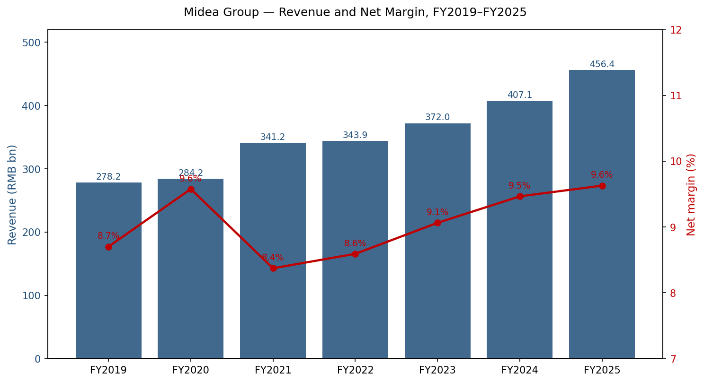
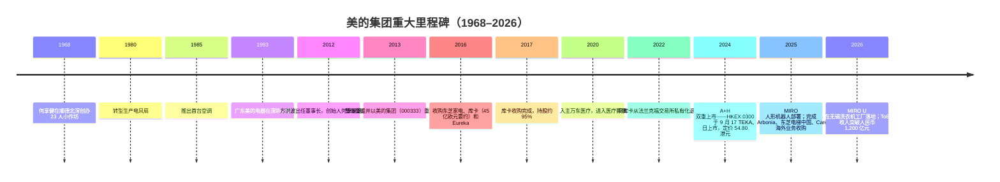
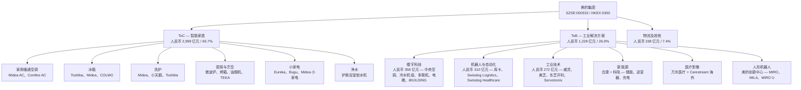
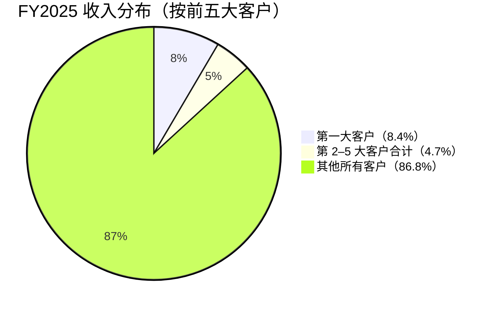
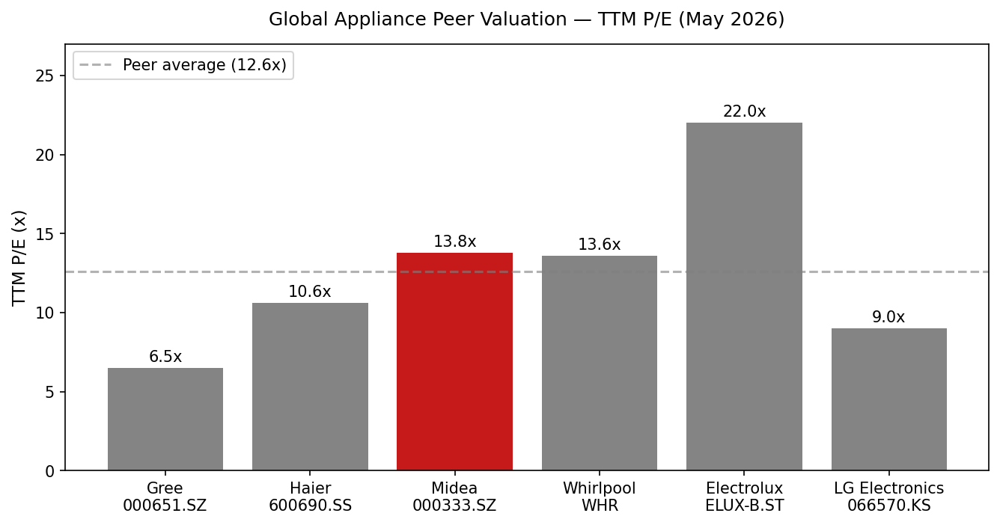
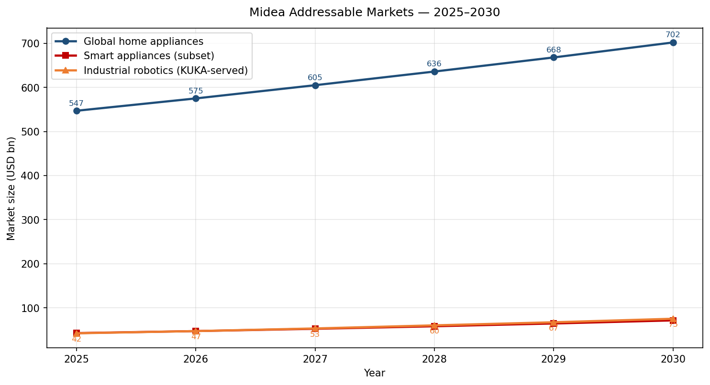

# 公司研究报告：美的集团（Midea Group，SZSE:000333 / HKEX:0300）

**日期：** 2026-05-16
**股票代码：** SZSE:000333（A 股）· HKEX:0300（H 股，2024 年 9 月双重上市）
**总部：** 中国广东省佛山市顺德区北滘
**境内审计机构：** 普华永道中天会计师事务所（特殊普通合伙）

---

## 目录

1. 公司概览
2. 公司历史
3. 管理团队
4. 产品与服务
5. 客户与市场进入策略
6. 行业概览
7. 竞争格局
8. 市场机会（TAM）
9. 风险评估

参考资料（汇总）

---

## 1. 公司概览

美的集团股份有限公司（Midea Group / 美的集团）按销售台数计是全球最大的家电制造商，并通过其德国子公司库卡（KUKA AG）跻身全球工业机器人前三。公司刻意构建了双极业务组合：现金牛属性的消费者业务（"ToC"——智能家居家电，占 FY2025 收入的 66%）与快速增长的商用 / 工业业务组合（"ToB"——楼宇科技、机器人与自动化、工业技术、新能源、医疗影像与供应链物流，FY2025 合计贡献人民币 1,228 亿元、同比 +17.5%）（[美的集团 2025 年年度报告, 第 1 页, 致股东](http://www.cninfo.com.cn/new/disclosure/stock?stockCode=000333)）。

**通俗业务描述。** 美的在 Midea、COLMO、Toshiba（东芝）、Comfee、Eureka、Bugu（布谷）与 TEKA 等品牌下生产冰箱、洗衣机、家用与商用空调、厨电与小家电；销售内置于这些（及竞争对手）家电中的压缩机、电机、变频器与电动车热管理零部件；为商业地产设计与安装暖通空调系统、电梯及楼宇自动化；通过库卡 + Swisslog 制造工业机器人、移动机器人与厂内物流系统；并正在投资人形机器人、住宅 / 公用事业级储能与医疗影像。FY2025，欧睿（Euromonitor）将美的列为**全球自有品牌智能家电按销售台数排名第一**，全球互联智能家电超过 1.4 亿台，注册智能家居用户达 1.5 亿（[美的集团 2025 年年度报告, 第 40 页](http://www.cninfo.com.cn/new/disclosure/stock?stockCode=000333)）。

**盈利模式。** 约 66% 的收入仍来自智能家居（消费家电），美的在中国空调、冰箱、洗衣机、微波炉及大部分厨电 / 净水品类中均为销量领头羊。工业解决方案板块（ToB 生态）是多引擎增长故事：楼宇科技（中央空调、多联机、冷水机组、电梯）实现人民币 358 亿元（+25.7%），机器人与自动化（库卡 + Swisslog 物流 + 医疗）人民币 310 亿元（+8.1%），工业技术（压缩机、电机、半导体、电动车热管理零部件）人民币 272 亿元（+10.2%）（[美的集团 2025 年年度报告, 第 48 页, 收入构成](http://www.cninfo.com.cn/new/disclosure/stock?stockCode=000333)）。从毛利率角度看，主打业务是楼宇科技 30.6% 毛利率、智能家居 29.9%；机器人与自动化较低，毛利率 21.3%。美的正逐步从"中国出口加 OEM"模式转向 OBM（自有品牌）全球化模式——FY2025 海外智能家居收入中 OBM 渗透率突破 **45%**（[美的集团 2025 年年度报告, 第 41 页](http://www.cninfo.com.cn/new/disclosure/stock?stockCode=000333)）。

**地域布局。** 业务覆盖 200 多个国家；65 个主要制造基地中**有 43 个在海外**；41 个研发中心（其中 29 个海外、分布在 11 个国家）；截至 2025 年末全球员工逾 19 万人。FY2025 海外收入达**人民币 1,959 亿元（同比 +15.9%，占总收入 42.9%）**，较三年前的约 37% 显著提升（[美的集团 2025 年年度报告, 第 13 页 / 第 49 页](http://www.cninfo.com.cn/new/disclosure/stock?stockCode=000333)）。2025 年 9 月，泰国空调工厂成为全球家电行业首家海外世界经济论坛"灯塔工厂"（[美的集团 2025 年年度报告, 第 14 页](http://www.cninfo.com.cn/new/disclosure/stock?stockCode=000333)）。

**规模。** FY2025 营业总收入**人民币 4,564.5 亿元（约 630 亿美元）· 同比 +12.1%**；归母净利润**人民币 439.5 亿元 · 同比 +14.0%**；扣非归母净利润人民币 412.7 亿元（+15.5%）；经营性现金流人民币 533.5 亿元；基本每股收益人民币 5.80 元；加权平均 ROE 19.7%；总资产人民币 6,088 亿元；集团净资产人民币 2,232 亿元。研发投入人民币 177.9 亿元，占收入 3.90%，研发人员 23,926 人（占员工总数 12.05%）（[美的集团 2025 年年度报告, 第 8–9 页, 主要会计数据](http://www.cninfo.com.cn/new/disclosure/stock?stockCode=000333)）。美的连续 10 年入选《财富》世界 500 强，2025 年位列**第 246 位**，并在 2025 IFI Claims 全球 250 强有效专利持有人榜单中**全球第 4 / 中国民企第 1**（[美的集团 2025 年年度报告, 第 13–14 页](http://www.cninfo.com.cn/new/disclosure/stock?stockCode=000333)）。

### 估值快照（2026 年 5 月）

截至 2026 年 5 月中旬，A 股股价约为**人民币 81.81 元**，市值约**人民币 6,120 亿元（约 850 亿美元）**（[Midea (000333.SZ) market-cap history, 2026-05](https://companiesmarketcap.com/midea/marketcap/); [Yahoo Finance, 000333.SZ, 2026-05-15](https://finance.yahoo.com/quote/000333.SZ/)）。H 股（HKEX:0300）于 2024 年 9 月以 54.80 港元发行上市，按每股折算相对 A 股小幅溢价交易（[KWM, "KWM advises on Midea's listing on the Main Board of HKEX", 2024-09-17](https://www.kwm.com/cn/en/about-us/media-center/kwm-advises-on-midea-s-listing-on-the-main-board-of-hkex.html)）。A 股**滚动 P/E 约 13.8 倍**，**P/B 约 2.7 倍**（[gurufocus, 美的集团 PE TTM, 2026-05](https://www.gurufocus.cn/stock/SZSE:000333/term/pe_ratio); [理杏仁, 000333 PB, 2026-03](https://www.lixinger.com/equity/company/detail/sz/000333/333/fundamental/valuation/pb)）。过去 3 年 TTM P/E 区间约为 **10.5 倍至 16.7 倍**（中位数约 13.2 倍，80% 分位约 14.1 倍）——当前估值略高于长期中位数，未出现明显的周期顶部扭曲（[理杏仁, 000333 PE-TTM 历史区间, 2026-02](https://www.lixinger.com/equity/company/detail/sz/000333/333/fundamental/valuation/pe-ttm)）。按 FY2025 收入与当前市值计算的 TTM P/S 约为 **1.34 倍**，处于 3 年区间内。考虑到净现金超过人民币 1,000 亿元、EBITDA 利润率稳定在 13% 左右，隐含 TTM EV/EBITDA 处于高个位数。

**同业比较（TTM P/E，2026 年 5 月数据）：**
| 同业 | 代码 | TTM P/E | 备注 |
|---|---|---|---|
| **美的集团** | SZSE:000333 / HKEX:0300 | **约 13.8 倍** | 多元化全球布局；ToB 加速 |
| 海尔智家 | SSE:600690 / HKEX:6690 | 约 10.6 倍 | 纯家电全球化 |
| 格力电器 | SZSE:000651 | 约 6.5 倍 | 高度集中于家用空调 |
| Whirlpool 惠而浦 | NYSE:WHR | 约 13.6 倍 | 以美国为核心，削减股息，需求疲软 |
| Electrolux 伊莱克斯 | STO:ELUX-B | 约 22.0 倍 | 转型中，盈利低迷 |
| LG 电子 | KRX:066570 | 约 9.0 倍 | 消费电子加家电 |
| Bosch 博世（非上市） | n/a | n/a | 无公开估值；2024 年收入 910 亿欧元 |

同业平均（剔除博世）：**约 12.6 倍**，同业中位数**约 12.1 倍**（[Macrotrends, Whirlpool PE Ratio, 2026-05](https://www.macrotrends.net/stocks/charts/WHR/whirlpool/pe-ratio); [Stockanalysis, Haier Smart Home, 2026-05-08](https://stockanalysis.com/quote/sha/600690/statistics/); [Investing.com, Gree Electric Ratios, 2026-04-17](https://www.investing.com/equities/gree-electric-a-ratios); [YCharts, LGEJY PE, 2026-05](https://ycharts.com/companies/LGEJY/pe_ratio)）。

**解读。** 美的相对海尔小幅溢价（高约 30%）、相对格力约 2 倍，但与惠而浦持平、低于伊莱克斯。相对中国便宜同业的溢价反映出：（a）盈利结构更加多元化（ToB 已占收入约 27% 且增长最快）；（b）海外 OBM 渗透率更高、品牌价值持续提升（Brand Finance 在 2026 年将美的全球排名跃升 43 位至第 228 位——[美的集团 2025 年年度报告, 第 13 页](http://www.cninfo.com.cn/new/disclosure/stock?stockCode=000333)）；（c）库卡的机器人期权价值与内嵌的人形机器人项目（**美罗 / 美拉** MIRO 系列）；（d）资产负债表稳健，过去 12 个月连续完成外延并购（TEKA、Arbonia、东芝电梯中国、Carestream 海外影像业务）。整体估值**并不**显得过高；风险更多在增长减速一侧（2025 年中国家电零售下滑 4.3%，AVC 预测 2026 年再降 6.7%——[美的集团 2025 年年度报告, 第 14 页](http://www.cninfo.com.cn/new/disclosure/stock?stockCode=000333)），而非估值过度。

资料来源：根据[美的集团 2020/2021/2022/2023/2024/2025 年年度报告, 主要会计数据](http://www.cninfo.com.cn/new/disclosure/stock?stockCode=000333)整理。

---

## 2. 公司历史

美的起步于 1968 年，最初是广东佛山顺德北滘镇的一个由 **何享健** 创办的 23 人瓶盖与汽车配件作坊——何享健原是村干部出身的企业家，最初向邻居借钱才开起这家作坊（[Wikipedia, Midea Group](https://en.wikipedia.org/wiki/Midea_Group); [International Finance, "Business Leader of the Week: He Xiangjian", undated](https://internationalfinance.com/business-leaders/business-leader-week-meet-he-xiangjian-co-founder-midea-group/)）。公司 1980 年转型做电风扇，进入 1990 年代后逐步切入空调、冰箱与更广泛的白电产品线。1993 年，旗下家电制造子公司"广东美的电器"在深圳上市，成为最早一批登陆中国交易所的民营企业。

具有决定意义的战略转折发生在 2012 年 8 月：70 岁的何享健正式退居二线，任命 **方洪波**——1992 年加盟的内部员工，曾在空调事业部不断晋升——出任董事长。方洪波接手的是一个体量庞大但战略涣散的集团，旋即启动了多年的"产品领先 + 效率驱动 + 全球化 + 数字化"转型：整合事业部，关闭数百家子公司，并裁员约 20%。2013 年 9 月，上市平台"广东美的电器"被注入母公司并以**美的集团（000333）**整体在深圳证券交易所上市（[美的集团 2025 年年度报告, 第 7 页](http://www.cninfo.com.cn/new/disclosure/stock?stockCode=000333)）。

第二次转折是 **2016 年的三大并购**，将一家中国家电厂商打造成全球工业集团。美的（i）以约 4.77 亿美元收购东芝家电业务 80.1% 股权（3 月），并获得东芝品牌在亚洲的长期使用授权（后续交易中延续）；（ii）发起对德国机器人巨头 **KUKA 库卡 AG**（总部位于奥格斯堡，全球工业机器人"四大家族"之一，与 Fanuc 发那科、ABB、Yaskawa 安川齐名）的 45 亿欧元要约收购，并于 2017 年初以约 95% 持股完成交割；（iii）12 月从伊莱克斯收购 Eureka 地面清洁品牌——这三笔交易共同奠定了今天 ToB 第二曲线的基础（[Wikipedia, Midea Group](https://en.wikipedia.org/wiki/Midea_Group)）。2022 年，美的以每股 80.77 欧元完成对 **库卡的全面要约与私有化退市**，将其从法兰克福证券交易所摘牌，并完全纳入母公司合并范围。

第三次转折——全球化与双重上市——于 2024 年加速推进。**2024 年 9 月 17 日**，美的集团成功完成香港 H 股发行，发行价 54.80 港元，募资约 300 亿港元，成为代码为 **0300** 的 A+H 双重上市公司（[Futu News, "Midea Group Co., Ltd (00300.HK) will start the IPO on September 9th", 2024-09-09](https://news.futunn.com/en/post/47544342/midea-group-co-ltd-00300-hk-will-start-the-ipo); [KWM, 2024-09-17](https://www.kwm.com/cn/en/about-us/media-center/kwm-advises-on-midea-s-listing-on-the-main-board-of-hkex.html)）。香港中央结算（代理人）有限公司目前持有总股本约 8.6%，香港中央结算（深港通）代陆港通投资者另持有 12.8%（[美的集团 2026 年第一季度报告, 第 4 页](http://www.cninfo.com.cn/new/disclosure/stock?stockCode=000333)）。

近期发展（2024-2026）：在欧洲完成 **TEKA 收购**（西班牙嵌入式厨电品牌）；从瑞士 **Arbonia 集团** 分拆收购暖通空调业务（气候业务部门，2025 年完成）；私有化 **东芝电梯中国**；2025 年 12 月收购 **柯达 Carestream Health 的非美国影像业务**，把美的医疗的版图从境内的万东医疗延伸到海外（[美的集团 2025 年年度报告, 第 12 页](http://www.cninfo.com.cn/new/disclosure/stock?stockCode=000333)）。集团内部通过美的人形机器人创新中心启动自研项目，截至 2025 年底已出货三代、五个型号——并于 2025 年 12 月发布旗舰款工业人形机器人 **MIRO U（美罗 U）**。

资料来源：[美的集团 2025 年年度报告, 第 7–13, 30–43 页](http://www.cninfo.com.cn/new/disclosure/stock?stockCode=000333); [Wikipedia, Midea Group](https://en.wikipedia.org/wiki/Midea_Group); [KWM, "KWM advises on Midea's HKEX listing", 2024-09-17](https://www.kwm.com/cn/en/about-us/media-center/kwm-advises-on-midea-s-listing-on-the-main-board-of-hkex.html)。

---

## 3. 管理团队

### 方洪波 — 董事长、总裁、执行董事

方洪波是美的过去 14 年从中国家电 OEM 转型为全球工业集团的核心人物，也是长期投资逻辑中最关键的高管简历。现年 59 岁（博士），1992 年研究生毕业即加入美的，职业生涯起步于空调事业部——先后任供应链负责人、空调事业部总经理、美的制冷家电集团总裁、上市平台广东美的电器董事长兼总裁。2012 年 8 月，他在创始人何享健退居二线之际升任集团董事长兼总裁；目前第二届任期至 2027 年 7 月 1 日结束（[美的集团 2025 年年度报告, 第 66 页, 董监高情况](http://www.cninfo.com.cn/new/disclosure/stock?stockCode=000333)）。

实际交付成果：（i）整合后将美的从一家品牌分散、2012 年 EPS 约 1.5 元的家电厂商，提升至 **FY2025 EPS 人民币 5.80 元**——13 年间盈利约 4 倍、收入约 5 倍；（ii）执行 2016 年三大并购，并完成库卡的运营整合——经历两次减值周期（2022/2023）后，至 2025 年进入复苏轨道（库卡集团收入恢复增长；库卡中国收入占比接近 30%——[美的集团 2025 年年度报告, 第 34 页](http://www.cninfo.com.cn/new/disclosure/stock?stockCode=000333)）；（iii）ToB 收入占比从 2016 年的不足 10% 提升至 **2025 年的 26.9%**；（iv）海外收入占比从约 30% 升至 43%，海外智能家居 OBM 占比突破 45%；（v）2024 年 A+H 双重上市，赋予美的可用港币进行跨境并购的载体。方洪波低调、鲜少接受采访，但每年的《致股东信》风格高度个人化、罕见地具有自我批判性——2025 年致股东信以异常直接的措辞讨论 K 形分化，并提出"原地重启或再生"的必要性（[美的集团 2025 年年度报告, 第 1–2 页, 致股东](http://www.cninfo.com.cn/new/disclosure/stock?stockCode=000333)）。方洪波直接持有 **A 股 116,990,492 股（占总股本 1.54%）**，其中 8,774 万股处于限制性股票锁定期——是公司最大的直接内部人持股，体现高度的利益绑定（[美的集团 2026 年第一季度报告, 第 4 页, 前 10 大股东](http://www.cninfo.com.cn/new/disclosure/stock?stockCode=000333)）。59 岁年龄之下，接班问题成为悬而未决的议题，但 2025 年披露中尚未公布相关计划。

### 钟铮 — 首席财务官、高级副总裁

钟铮现年 44 岁，是美的"内生干部"，2002 年加入，先后任内审与财务总监等职，并于 **2022 年 2 月 22 日** 出任 CFO。她拥有硕士学位，曾任集团审计总监及零部件事业部 CFO——典型的"在业务里成长起来的财务人"履历。她同时担任集团离岸资金平台美的电气（新加坡）贸易公司董事，并在 2025 年财务报表上与方洪波董事长共同签署。钟铮直接持有 A 股 276,152 股（[美的集团 2025 年年度报告, 第 66, 71 页](http://www.cninfo.com.cn/new/disclosure/stock?stockCode=000333)）。她任内值得关注的事项包括：**2024 年 HKEX H 股上市**；母公司在中国会计准则基础上引入 IFRS 报告体系；连续四年保持人民币 500–600 亿元区间的稳定经营性现金流；以及在 FY2025 推出向股东返还 **每 10 股派 43 元** 现金（中期 5 元 + 年末 38 元）的回购加分红方案，对应现金分配总额约人民币 320 亿元、约占归母净利润的 73%（[美的集团 2025 年年度报告, 第 4 页](http://www.cninfo.com.cn/new/disclosure/stock?stockCode=000333)）。

### 顾炎民 — 执行董事、高级副总裁、库卡监事会主席

顾炎民现年 62 岁（博士），2000 年加入美的，2010 年代主导国际业务——先后任海外发展总监、制冷家电集团副总裁兼海外业务负责人，后担任**机器人与自动化事业部总裁**。目前他出任奥格斯堡 **库卡 AG 监事会主席**，是控制库卡在集团内整合与方向的最关键中国高管。因此他是机器人与人形机器人故事的关键人物：库卡中国恢复增长（占库卡集团收入约 30%）的整合工作，2025 年中国国际工业博览会（第 25 届）上推出库卡五大 AI 智能体（KUKA AI Vision、iiQWorks、KUKA CONNECT IOT、小库 AI Helper、AMR Fleet），以及 KMP 250P 自主移动机器人平台的发布——均由其条线推动（[美的集团 2025 年年度报告, 第 34–35, 68 页](http://www.cninfo.com.cn/new/disclosure/stock?stockCode=000333)）。

### 王建国 — 执行董事、执行总裁；新能源与万东医疗负责人

王建国现年 49 岁，1999 年加入美的，历任空调事业部供应链总监、人力资源/行政部门负责人、冰箱事业部总经理、智能家居事业群总裁、集团高级副总裁。**2025 年 9 月** 晋升为执行总裁，同时兼任新能源事业部（合康新能 + 科陆电子）总裁、万东医疗董事长、广东美的制冷设备有限公司董事长——后者是承担家用空调研产销的运营子公司（[美的集团 2025 年年度报告, 第 68 页](http://www.cninfo.com.cn/new/disclosure/stock?stockCode=000333)）。王建国掌管 ToB 第二曲线四大押注中的三项（新能源、医疗，以及与新能源相邻的家用空调热泵业务）。

### 公司治理脚注

- 董事会构成：11 名董事——3 名执行董事（方洪波、王建国、顾炎民、管金伟、张甜——经核实文中误述应为 5 名执行董事，请以公告为准）、1 名非执行董事（赵军，来自美的控股）、4 名独立董事（许定波、肖耕、刘俏、邱丽丽）、1 名职工代表董事（张甜）——后者于 2025 年 5 月选举产生。2025 年 5 月，监事会作为更广泛治理改革的一部分进行了重组（[美的集团 2025 年年度报告, 第 67–68 页](http://www.cninfo.com.cn/new/disclosure/stock?stockCode=000333)）。
- 内部人 / 控股股东持股：**美的控股有限公司（He 家族持股平台，由创始人何享健之子何剑锋实际控制）持有公司 28.53%**；香港中央结算（代理人）持有 8.56%；深港通持有 12.80%；方洪波直接持有 1.54%；联合创始人黄健（1.13%）与李建伟（0.60%）位列内部人前列（[美的集团 2026 年第一季度报告, 第 4 页](http://www.cninfo.com.cn/new/disclosure/stock?stockCode=000333)）。
- 薪酬结构：长期的限制性股票与股票期权激励计划（2021/2022 计划已于 2025 年解除，新批授仍在持续推进），高管层级与业绩高度挂钩。2025 年若干长期任职高管离任，管理层将其归为"公司治理架构调整"——包括高级副总裁伯林与原董事傅永钧（[美的集团 2025 年年度报告, 第 68–69 页](http://www.cninfo.com.cn/new/disclosure/stock?stockCode=000333)）。
- 审计：境内由普华永道中天会计师事务所（上海）审计 CAS 报告；IFRS 一侧由普华永道香港审计。

### 管理层业绩回溯

这支团队执行了过去十年中国工业集团尝试过的两件最难的事：（1）通过减值周期、监事会博弈与最终私有化，完成对欧洲旗舰工业品牌（库卡）的整合；（2）平行推进从国内 OEM 向全球 OBM 的转型，海外收入占比突破 40%。2022 年库卡减值与 2023 年中国空调疲软是真实的挫折，但集团最终掌握了资产的全部控制权，并形成清晰的机器人路线图。管理层利益绑定较高（方洪波个人持股市值约 96 亿元人民币），资本回报积极（FY2025 派息率约 73%），最新的致股东信对持续自我颠覆的必要性表达异常坦率。最明显的未决议题是 **CEO 接班**——方洪波 59 岁，多位 40 岁出头的高级副总裁在位，但尚未出现明确的接班人选。

---

## 4. 产品与服务

美的的产品组合围绕**两大业务支柱**（ToC 智能家居与 ToB 工业解决方案）展开，并细分为七大报告板块。下方产品树将公司层级映射到美的品牌网站上销售的 SKU 与集团内的运营主体。

### 4a. 智能家居（消费家电）— 人民币 2,999 亿元，+11.3%，毛利率 29.9%

**家用空调。** 美的是中国家用空调销量领导者，旗下有多个旗舰子品牌：大众线 **Midea**、高端线 **COLMO**（套系——全屋智能家居）、授权品牌 **Toshiba**（日本优先的高端定位），以及仅在海外销售的 **Comfee**（大众市场）。年报援引 AVC 数据：2025 年中国空调零售额为人民币 2,357 亿元（-0.4%），高能效 APF>5.3 机型线上份额升至 40%，美的份额领先。最接近的竞争对手：格力（部分时段仍居家用空调份额第一）、海尔（高端卡萨帝）、海信、日立、Daikin 大金。**竞争优势判断：是——规模与成本护城河、品牌组合深度、垂直整合（美的通过美芝 GMCC 生产压缩机、威灵 Welling 生产电机）。** 证据：AVC 报告显示美的集团品牌空调在京东、天猫、抖音、拼多多上的国内电商 GMV 持续保持第一；泰国空调工厂被授予全球家电行业首家海外世界经济论坛"灯塔工厂"称号（[美的集团 2025 年年度报告, 第 14 页](http://www.cninfo.com.cn/new/disclosure/stock?stockCode=000333)）。

**冰箱。** Toshiba/Midea/COLMO 共品牌策略。Toshiba 在 2025 年日本冰箱市场份额跃居第一；美的连续三年保持平嵌冰箱线上销量第一——这是增长最快的高端子品类（[美的集团 2025 年年度报告, 第 16 页](http://www.cninfo.com.cn/new/disclosure/stock?stockCode=000333)）。501–550L 对开门 / 法式三门规格主导市场（线上 >40%，线下 48%）。竞争判断：**是——品牌组合（Toshiba 在亚洲高端，COLMO 在中国高端）叠加垂直整合（冰箱压缩机全球前三，根据产业在线数据）。** 最接近的竞品：海尔（卡萨帝）法式多门冰箱——在中国高端市场与美的平分秋色；美的在嵌入式领跑。

**洗衣机与干衣机。** 小天鹅（2008 年收购）、Midea、Toshiba 与 COLMO。2025 年中国洗护零售人民币 963 亿元（-4.6%）。趋势是热泵洗烘一体机与分区洗护机型。年报披露，美的 / 小天鹅电机全球份额第一。竞争判断：**是——电机垂直整合 + 热泵技术。** 最接近的竞品：海尔（卡萨帝 / 统帅）、LG（双子滚筒）。

**厨房 / 烹饪。** 微波炉（部分数据来源称美的微波炉销量全球第一——海外在沙特、泰国、越南市场份额第一）、烤箱、油烟机、洗碗机、热水器、净水器。2025 年新增 **TEKA**（西班牙嵌入式厨电品牌），加速欧洲嵌入式渗透。2025 年中国厨电市场人民币 1,613 亿元（-8.5%）。竞争判断：**部分——微波炉 / 洗碗机强势（沙特 GMV 第一）；高端油烟机较弱，本土品牌如老板、方太占据领先。**

**小家电与地面清洁。** Eureka（2016 年自伊莱克斯收购）、Bugu（美的高端小家电品牌）、Midea 自有的吸尘器、电饭煲、风扇等。大众市场、数字优先。竞争判断：**部分——具规模但无明显领跑者**；最接近的竞品是小米生态链（石头、追觅、洛斯达）。

**净水。** 2025 年新品：护肤浴室软水机与超薄厨下软水机——双双在第 50 届日内瓦国际发明展上获奖（[美的集团 2025 年年度报告, 第 13 页](http://www.cninfo.com.cn/new/disclosure/stock?stockCode=000333)）。竞争判断：**部分——新兴品类、尚无主导者；先发优势与获奖曝光带来加分。**

### 4b. 楼宇科技 — 人民币 358 亿元，+25.7%，毛利率 30.6%

ToB 中增长最快的板块。产品包括：多联机、大冷量冷水机组、涡旋 / 螺杆 / 离心冷水机组、模块化冷水机组、数据中心精密空调、风机盘管、自动扶梯 / 电梯（在 **菱王电梯** 与 **东芝电梯中国** 品牌下），以及面向楼宇自动化的 **iBUILDING** 数字化平台。2025 年报援引产业在线：美的中央空调境内 GMV 份额 **>20%（第一）**，商用多联机 **>28%（第一）**，离心式冷水机组 **>16%（第一）**。菱王电梯连续 3 年位居境内货梯子细分市场第一（[美的集团 2025 年年度报告, 第 41 页](http://www.cninfo.com.cn/new/disclosure/stock?stockCode=000333)）。2025 年完成的 Arbonia 气候业务部门收购为欧洲水力暖通空调（hydronic HVAC）能力补强。竞争优势判断：**是——规模、压缩机垂直整合、产品组合完整。** 最接近的竞品：格力商用空调、Daikin 大金 VRF、Trane 特灵 / Carrier 开利在冷水机组、Otis 奥的斯 / KONE 通力 / Schindler 迅达在电梯。

### 4c. 机器人与自动化（库卡 + Swisslog）— 人民币 310 亿元，+8.1%，毛利率 21.3%

库卡是该板块的引擎。FY2025 年报披露，库卡 AG（奥格斯堡）2025 年恢复收入增长，**库卡中国对集团收入贡献接近 30%**——较 2022 年前以欧洲汽车为主的结构发生了结构性转变。年报援引 MIR 睿工业数据：**库卡 2025 年在中国工业机器人销量份额为 9.6%，位居中国前三**；在 **≥300 公斤负载重型机器人子细分市场拥有 47.4% 份额**——是重型焊接 / 金属冲压领域的近乎独占者（[美的集团 2025 年年度报告, 第 41 页](http://www.cninfo.com.cn/new/disclosure/stock?stockCode=000333)）。2025 年新品包括 **KMP 250P** 自主移动机器人（250 公斤负载、ISO Class-5 洁净室可选、ESD 认证用于半导体 / 消费电子装配），以及 2025 年 CIIF 中国国际工业博览会发布的 **五大 AI 智能体**（KUKA AI Vision、iiQWorks 工程软件、KUKA CONNECT IOT、小库 AI 助手、KUKA AMR Fleet 物流）。

**Swisslog（物流 + 医疗）。** Swisslog 物流是全球厂内物流集成商（AutoStore 式自动化立体仓库、仓库自动化）。Swisslog Healthcare 的 BoxPicker 自动化药房存储系统斩获 2025 MedTech Breakthrough Award（最佳医院技术实施奖）。竞争判断：**是——全球工业机器人装机量前三、且为四大家族中唯一深度布局中国的企业。** 最接近的竞品：发那科（高端、车间地面领跑者）、ABB（产品组合广）、安川（聚焦日本汽车）。

### 4d. 工业技术 — 人民币 272 亿元，+10.2%，毛利率 17.5%

这是**零部件**业务，通过 GMCC 美芝（压缩机）、Welling 威灵（电机）、东芝开利（暖通压缩机）、美仁（芯片）、Hi-Conn（阀件 / 泵）、Servotronix（机器人运动控制）等品牌运营。产业在线数据：美芝**全球家用空调压缩机销量第一**；威灵**全球家用空调电机与洗衣机电机销量第一**；冰箱压缩机销量全球前三。该单元同时为新能源汽车整车厂生产电动车热管理零部件（压缩机、电机、电子水泵），以及面向机器人的运动控制模组。竞争判断：**是——全球 3 个以上子品类规模领先，并向第三方 OEM 销售（因此存在同业是否选用美的件的采购决策风险）。** 最接近的竞品：日立 / 江森自控（压缩机）、Nidec 日本电产（电机）、Hanon Systems 翰昂（热管理）。

### 4e. 新能源 — 计入"其他业务"和工业技术

业务通过 **合康新能**（变频驱动、家庭储能、光伏逆变器）与 **科陆电子**（智能电网、电化学储能）开展——两家均为 A 股上市子公司。2025 年 6 月，美的在 SNEC 2025 上将该板块统一为 **"美的能源"**，发布下一代电池柜级直冷储能平台、新一代热泵平台与 AI 能源管理系统（[美的集团 2025 年年度报告, 第 43 页](http://www.cninfo.com.cn/new/disclosure/stock?stockCode=000333)）。竞争判断：**部分——新兴期权价值；不同细分市场上面对宁德时代、阳光电源、华为、亿纬等。** 最接近的竞品：阳光电源（逆变器 / 储能）、宁德时代 EnerC（储能）。

### 4f. 医疗影像

**万东医疗（A 股）** 是历史核心业务——为医院与诊所提供 X 光、MRI、CT、超声影像设备。2025 年 12 月，集团完成对 **柯达 Carestream Health 非美国业务**（海外 X 光、CR/DR 影像）的收购，推动平台国际化（[美的集团 2025 年年度报告, 第 12 页](http://www.cninfo.com.cn/new/disclosure/stock?stockCode=000333)）。竞争判断：**部分——万东是中国中端品牌；Carestream 提供国际版图。** 最接近的竞品：联影医疗（UIH）、迈瑞医疗、GE HealthCare 通用电气医疗、Siemens Healthineers 西门子医疗。

### 4g. 人形机器人 — 美的创新中心

集团内"叙事最丰富"的期权价值板块。**美的人形机器人创新中心** 截至 2025 年底已交付 **三代、五款** 机型，覆盖两条产品线：面向工厂车间的 **MIRO（美罗）**，以及面向商用 / 家用的 **MILA（美拉）**。2025 年 12 月发布的旗舰款 **MIRO U** 具备 3 自由度腰部、六条仿生人形机械臂（每条 6 个高精度驱动关节），支持模块化末端执行器（灵巧手或真空吸盘），目标在传统工作单元基础上实现 +30% 切换效率、-40% 产线占地。**MIRO U 目前在美的无锡高端洗衣机工厂试点**。**MIRO** 已在荆州洗衣机工厂试点，承担 3D 质量检测、整机检验与钣金上料，并集成进世界经济论坛"智能体工厂"架构中。**MILA** 面向零售场景（在美的门店演示冰箱取物 → 微波炉加热 → 咖啡冲煮的完整流程），预计 2026 年首发美的零售门店。双足高动态平台 **MILA X** 可以登楼梯、奔跑、跳舞，并能在 <2 小时内通过视频学习动作（[美的集团 2025 年年度报告, 第 42 页](http://www.cninfo.com.cn/new/disclosure/stock?stockCode=000333)）。竞争判断：**早期——叙事 + 先发可信度，但尚未披露收入。** 最接近的竞品：宇树科技（Unitree）、智元（Agibot）、傅利叶智能、优必选（UBtech）、Tesla Optimus 特斯拉擎天柱。

### 旗舰产品与长尾以及 FY2025 产品路线图

**旗舰产品（收入驱动力）：**（1）Midea / Toshiba / COLMO 旗下的家用空调矩阵（约人民币 1,000 亿元量级业务）；（2）中央空调 / 楼宇科技业务；（3）库卡工业机器人 + Swisslog 物流。**长尾 / 期权价值：** 人形机器人、新能源、医疗影像。**过去 12 个月发布：** 护肤浴室软水机（2025 年 4 月日内瓦金奖）、KMP 250P 自主移动机器人（库卡，2025）、MIRO U 人形机器人（2025 年 12 月）、美的能源统一品牌储能平台（2025 年 6 月）、Carestream 海外影像业务（2025 年 12 月完成）。无重大产品下架——TEKA / Arbonia / 东芝电梯整合均为净增量。

---

## 5. 客户与市场进入策略

### 客户集中度——已披露且较低

美的按中国证监会披露规则公布前五大客户销售情况。FY2025：

- **前五大客户合计：人民币 601.4 亿元，占收入 13.17%**（关联方：0%）
- **第一大客户：人民币 385.2 亿元，占收入 8.44%**（按名称未披露，但与重要渠道合作伙伴一致——可能是苏宁 / 京东 / 国美合并口径的分销商，或一家 OEM 客户）
- 第 2–5 大客户分别为：人民币 70.9 亿元 / 1.55%、68.2 亿元 / 1.49%、41.7 亿元 / 0.91%、35.3 亿元 / 0.77%（[美的集团 2025 年年度报告, 第 51 页, 主要销售客户](http://www.cninfo.com.cn/new/disclosure/stock?stockCode=000333)）。

对于美的这种规模的公司，这属于**非常低的集中度**。第一大客户 8.4% 低于通常 10% 的重要性阈值（按美国 ASC 280 不构成正式的"重大客户"），前五合计 13.2% 远低于本技能识别为"重大"的 50% 水平。过去三年类似——前五在 12–15% 区间波动（按年报横截面数据）。相对那些有单一战略 OEM 客户的中国同类集团（如宁德时代对特斯拉 / 比亚迪、欣旺达对苹果的暴露），集中度问题在此并不重要。

资料来源：[美的集团 2025 年年度报告, 第 50–51 页, 主要销售客户和主要供应商情况](http://www.cninfo.com.cn/new/disclosure/stock?stockCode=000333)。

供应商端集中度同样较低：前五大供应商采购金额合计人民币 193.2 亿元，占集团采购的 6.02%；第一大供应商占比 1.52%——表明美的高度自给或来自深度分散的供应基础，与压缩机 / 电机 / 变频器的自有产能高度整合相符。

### 客户细分

**B2C（智能家居，约占收入 66%）。** 最终消费者分布于 200 多个国家，主要通过以下渠道触达：（a）**境内渠道**：电商方面有京东、天猫、抖音、拼多多；KA 连锁包括苏宁、国美、五星电器；独立分销商；自有的 **美云销 APP**（数万家加盟经销商使用的 B2B 平台）；以及由 600 家美的 Mall 加上数千家前装店、旗舰店、专业店、多品店组成、覆盖一至五线城市与乡镇的多业态线下网络（[美的集团 2025 年年度报告, 第 19–22, 41 页](http://www.cninfo.com.cn/new/disclosure/stock?stockCode=000333)）。2025 年美的品牌在中国"下沉市场"渗透贡献超人民币 300 亿元——本身就大于许多单体上市家电品牌的总收入。国内电商渠道（含电商下沉）合计**贡献超 55%** 的境内智能家居收入。

（b）**海外渠道：** OBM（自有品牌）销售占海外智能家居收入 >45%，覆盖 Midea、Toshiba、Comfee、Eureka、TEKA、Bugu 及 Midea-Toshiba 联合品牌。2025 年美居 APP 海外注册用户突破 1,100 万、月活同比 +60%。美的自有品牌在北美、欧洲、日本市场的亚马逊上市清单中，**32 个子品类位列第一**。集团在海外运营**约 5,500 个售后服务网点**，并接入 25,000 多家海外零售商至其 B2B 数字化销售平台（[美的集团 2025 年年度报告, 第 41 页](http://www.cninfo.com.cn/new/disclosure/stock?stockCode=000333)）。

**B2B（ToB，约占收入 27%）。** 三个子集群：（i）**地产开发商、总承包商与设施运维方**——采购中央空调、冷水机组、电梯与 iBUILDING 自动化；典型合同为项目制 + 多年服务尾单；（ii）**工业 / 制造业客户**——采购库卡机器人与 Swisslog 物流系统；包括汽车 OEM（宝马、大众、奔驰、Stellantis、中国新能源车整车厂）、电子组装厂、食品 / 消费 / 制药客户（如 Clevertech、KRONE、KLEUSBERG 模块化建造）；（iii）**暖通空调 OEM 与电动车 OEM**——采购工业技术板块的压缩机 / 电机 / 热管理模组。2025 年公布的库卡商业客户案例包括 KLEUSBERG（模块化建筑焊接系统，2027 年投产）、KRONE（德国农机自动化冲压）、Clevertech（意大利系统集成商、>80% 产线采用库卡）以及波兰宠物食品码垛线（1,200 罐 / 分钟）（[美的集团 2025 年年度报告, 第 34–35 页](http://www.cninfo.com.cn/new/disclosure/stock?stockCode=000333)）。

### 销售策略

美的的市场进入策略是 **"DTC + 数字化 + 全渠道"** 模式：自 2018 年起围绕美云销 APP B2B 平台重构整个集团——单 SKU 单价、库存实时可视化、智能补货、线上线下同价。2025 年库存周转率提升 >10%。中国零售策略明确倾向于面向高端住宅推广 COLMO 与东芝品牌下的全屋整套（"美家套系"）/嵌入式 / 奢华定位方案，大众市场则由 Midea 主力承接。海外则明确执行 **"In Europe, for Europe"**（推动 TEKA 交叉销售）、**"Toshiba No.1 Japan"**（东芝日本 2025 年在 6 大白电品类合计份额超 16%）与 **OBM 优先** 策略，并通过赞助曼城足球俱乐部、哈兰德、巴塞罗那（自 2026/27 赛季起为袖标赞助商）、亚足联、非足联、南美足联进行联合营销（[美的集团 2025 年年度报告, 第 22–24 页](http://www.cninfo.com.cn/new/disclosure/stock?stockCode=000333)）。

### 关键合作伙伴

深化"人车家"互联：与 **比亚迪、蔚来、华为** 在座舱 / 家电生态集成上的战略合作；与 **全球物联网互联联盟（GIIC）** 在产业互操作标准上的 AIoT 合作；与 **中远海运与 GLP 普洛斯** 共建泰国绿色供应链枢纽。库卡的系统集成商网络包括 Clevertech（意大利）与数十家亚欧集成商。

---

## 6. 行业概览

美的覆盖四个目标行业：全球家电（TAM 约 5,500 亿美元）、商用暖通空调 / 楼宇科技（约 600 亿美元）、工业机器人（约 420 亿美元），以及住宅储能与人形机器人的相邻期权机会。

### 6a. 家电

全球家电行业 **2025 年零售销售额为 5,470 亿美元**（Mordor Intelligence 数据），市场普遍预测 **到 2030 年达 6,600–7,000 亿美元**，CAGR 5–7%——驱动因素包括新兴市场家庭渗透增长（非洲、南亚、东南亚）、发达市场升级换购与以旧换新政策，以及"智能家电"子细分预计从 2025 年的 424 亿美元增至 2030 年的 713 亿美元（CAGR 11%）（[Mordor Intelligence, Home Appliances Market 2025-2031](https://www.mordorintelligence.com/industry-reports/global-home-appliances-market-industry); [MarketsAndMarkets, Smart Appliances Market 2024-2030](https://www.marketsandmarkets.com/Market-Reports/smart-appliances-market-8228252.html)）。

**中国子细分。** 据 AVC，2025 年中国家电零售（不含 3C）为 **人民币 8,931 亿元（同比 -4.3%）**，预计 2026 年将再降 **6.7%、降至人民币 8,332 亿元**，因为以旧换新刺激政策前置释放了需求。中国家电出口为 962 亿美元（-3.9%）（[美的集团 2025 年年度报告, 第 14 页](http://www.cninfo.com.cn/new/disclosure/stock?stockCode=000333)）。分品类 2025 年零售：家用空调人民币 2,357 亿元（-0.4%）、洗衣机 963 亿元（-4.6%）、冰箱 1,271 亿元（-11.5%）、厨电 1,613 亿元（-8.5%）。境内基本面在结构上充满挑战——家庭高渗透 + 以旧换新需求前置——推动所有主要中国白电品牌转向海外、高端与相邻品类。

**关键趋势。** AI / 智能家居：2025 年智能冰箱线上 AI 渗透率达 57%、线下 71%——美的自有的白电 AI 智能体服务用户超 2,000 万、日均交互约 3,000 万次，意图识别准确率 95%。热泵：家用洗烘热泵一体机正在抢占冷凝式干衣机份额，APF>5.3 的高能效空调占线上销量比例升至 40%。适老化产品设计正成为独立品类。需求呈"K 形"——高端（1,500 美元以上 COLMO 图灵 / 馨享）与低端（人民币 3,000 元以下拼多多产品）均录得增长，而人民币 4,000–8,000 元的中端被压缩最严重。

### 6b. 商用暖通空调与楼宇科技

2025 年全球商用暖通空调约 1,100 亿美元（行业共识），其中多联机 / 冷水机组是增速最高的子细分，得益于数据中心冷却、欧洲热泵替代燃气锅炉的脱碳改造，以及新兴市场工业 / 商业建设。中国中央空调 2025 年规模 **超人民币 1,100 亿元**，美的集团旗下主体（美的中央空调、MDV 多联机、东芝开利）合计国内份额 **>20%、第一**（[美的集团 2025 年年度报告, 第 41 页](http://www.cninfo.com.cn/new/disclosure/stock?stockCode=000333)）。Arbonia 分拆收购提供进入欧洲水力 / 热泵系统的入口——欧洲面临 2026 年起燃气锅炉的强制替代。

### 6c. 工业机器人

全球工业机器人保有量 2024 年突破 400 万台，继续以 >10% / 年的速度增长，其中**中国 2024 年的新增出货占全球 >50%（约 40 万台）**（[roboticsandautomationnews.com, "Beyond the headlines: Inside China's multi-billion dollar industrial robotic arms market", 2025-10-07](https://roboticsandautomationnews.com/2025/10/07/beyond-the-headlines-inside-chinas-multi-billion-dollar-industrial-robotic-arms-market/95196/)）。全球四大家族（发那科、ABB、库卡、安川）历史上占据中国工业机器人市场约 60%，但已压缩至约 45%——本土厂商埃斯顿、新松、汇川、节卡（JAKA）、埃夫特凭借 20–30% 价格折让与更快服务，抢占了中端规模。库卡的应对——重型负载（≥300 公斤，中国份额 47%）、AMR 移动机器人产品线扩展与 AI 智能体工具链——与"高端防御"打法一致（[美的集团 2025 年年度报告, 第 41 页](http://www.cninfo.com.cn/new/disclosure/stock?stockCode=000333); [progressiverobotics.ai, "Beyond the Big 4", 2025](https://progressiverobotics.ai/beyond-the-big-4-abb-fanuc-kuka-yaskawa-the-complete-2025-robot-manufacturer-guide-for-smart-integrators/)）。

### 6d. 人形机器人

最新的 TAM，也是叙事驱动重估潜力最强的来源。中国工信部、高盛与摩根士丹利各自发布的 TAM 预测从 60 亿美元（2030）到 3,800 亿美元（2035 / 2040 长期场景）不等。最具公信力的近期预测为 2030 年 50–150 亿美元，以工业车间为第一波（这正是 MIRO 与 MIRO U 今天在美的荆州 / 无锡工厂内部部署的位置——是强有力的概念验证渠道）。

### 监管环境

（i）**中国能效标准**——持续收紧（APF 等级、主要市场制冷剂由 R410A/R22 向 R290/R32 过渡）——利好压缩机 / 制冷剂垂直能力齐全的规模玩家。（ii）**欧盟 CSRD + 对中国家电 / 电动车关税**——推动美的"In Europe, for Europe"本地化生产（TEKA 西班牙、Arbonia 瑞士 / 捷克设施）。（iii）**美国 301 条款 + IRA / 拟加征关税**——限制中国直接出口；美的的应对是墨西哥 / 巴西 / 埃及的制造布局。（iv）**中国消费者以旧换新补贴（"国补"）**——是 2025 年需求的主要驱动；AVC 指出该政策已前置释放了大量自然替换周期需求。

---

## 7. 竞争格局

美的同时在五个不同的竞争战场上竞争，各战场上有不同的对手与不同的位置。

### 7a. 中国家电同业（最直接竞争）

- **海尔智家（SSE:600690 / HKEX:6690）**。按规模与产品重合度看是最近的同业；FY2024 收入约人民币 2,860 亿元。海尔在高端冰箱（卡萨帝）领先，并有更强的美国布局（2016 年收购 GE Appliances）。其 TTM P/E 约 10.6 倍，相对美的 13.8 倍折让明显（[Stockanalysis, Haier Smart Home, 2026-05-08](https://stockanalysis.com/quote/sha/600690/statistics/)）。海尔更专注于纯家电，缺乏美的的库卡 / 工业技术期权价值，且在楼宇科技上更不积极。
- **格力电器（SZSE:000651）**。家用空调专家，部分价位仍领先。FY2024 收入约人民币 1,910 亿元。集中度风险高——家用空调约占收入 70%。同业组中最便宜，TTM P/E 约 6.5 倍（[Investing.com, Gree Electric Ratios, 2026-04-17](https://www.investing.com/equities/gree-electric-a-ratios)），反映多元化程度较弱。
- **海信家电（SZSE:000921 / HKEX:0921）**。多元化但体量较小；中央空调与日立合资。
- **小天鹅 / 石头 / 追觅风格** 的专业玩家——在自身领跑的子品类（如石头之于扫地机器人）涌现。

### 7b. 全球家电 OEM

- **Whirlpool 惠而浦（NYSE:WHR）**。以北美为核心。美国关税压力沉重。2025 年 70 年来首次暂停分红；削减全年指引，引用衰退级别需求疲软（[Macrotrends, WHR PE](https://www.macrotrends.net/stocks/charts/WHR/whirlpool/pe-ratio)）。TTM P/E 约 13.6 倍，但基于已被压低的盈利。
- **LG 电子（KRX:066570）**。多元化布局家电、显示、汽车零部件。韩国 / 美国家电高端表现强劲；TTM P/E 约 9 倍（[YCharts, LGEJY PE, 2026-05](https://ycharts.com/companies/LGEJY/pe_ratio)）。借助线性压缩机 IP 在压缩机环节强于美的，并在显示 / 电动车上有期权价值。
- **Electrolux 伊莱克斯（STO:ELUX-B）**。欧洲 OEM、盈利低迷、转型中。由于分母低，P/E 被推升至约 22 倍。
- **Bosch 博世（非上市）**。BSH 家电约 160 亿欧元收入；博世母公司约 910 亿欧元。无公开估值。
- **Samsung 三星电子——数字家电事业部**：销量体量大，但在 SDA 集团中处次要地位。

### 7c. 库卡的工业机器人同业

"四大家族"格局有所松动但仍是参照系：**发那科 Fanuc（TSE:6954）**——车间地面高端领导者，约 60 亿美元收入；**ABB（NYSE:ABB / SIX:ABBN）**——流程 + 机器人；**安川 Yaskawa（TSE:6506）**——聚焦汽车 OEM；**库卡 KUKA（美的子公司）**。中国挑战者——**埃斯顿（SZSE:002747）**、**汇川（SZSE:300124）**、**节卡 JAKA**、**埃夫特（SSE:688165）**、**新松 Siasun**——已合计夺取中国销量约 55%。各子细分：协作机器人（UR / 节卡）、自主移动机器人（库卡 / OMRON 欧姆龙 / MIR）、重型负载（库卡、发那科——美的库卡在此占 47% 中国份额）。

### 7d. 商用暖通空调

**Daikin 大金（TSE:6367）**、**Trane Technologies 特灵（NYSE:TT）**、**Carrier 开利（NYSE:CARR）**、**Johnson Controls 江森自控（NYSE:JCI）**、**Mitsubishi Electric 三菱电机（TSE:6503）**——均为全球主要厂商，分销体系成熟。美的中国境内份额第一，但全球处于挑战者位置；Arbonia 收购增加了欧洲版图。

### 7e. 人形机器人（新兴）

**Unitree 宇树科技**（非上市，已在香港递交申请）、**Agibot 智元**（非上市）、**Fourier Intelligence 傅利叶**（非上市）、**UBtech 优必选（HKEX:9880）**、**Tesla Optimus 特斯拉擎天柱**（Tesla Inc.）、**Xiaomi CyberOne 小米铁大**、**1X / Figure / Boston Dynamics 波士顿动力**。美的相对它们的优势在于：（a）规模化的工厂车间需求（自有工厂）；（b）库卡运动控制 IP；（c）汽车 / 工业技术零部件垂直整合（电机、谐波减速器通过 Servotronix）。相对 Tesla / 1X / Figure / Boston Dynamics 的优势是 **进入中国工厂车间的分销**；相对宇树 / 智元的优势是 **整合的供应链 + 工厂内生需求**。

### 定位框架——价格 / 广度 / 工业触达

资料来源：[gurufocus, 美的 PE-TTM, 2026-05](https://www.gurufocus.cn/stock/SZSE:000333/term/pe_ratio); [stockanalysis.com, Haier 600690](https://stockanalysis.com/quote/sha/600690/statistics/); [investing.com, Gree 000651](https://www.investing.com/equities/gree-electric-a-ratios); [Macrotrends, WHR](https://www.macrotrends.net/stocks/charts/WHR/whirlpool/pe-ratio); [YCharts, LGEJY](https://ycharts.com/companies/LGEJY/pe_ratio); [Yahoo Finance, ELUX-B.ST](https://finance.yahoo.com/quote/ELUX-B.ST/)（2026 年 5 月读数）。

### 竞争优势

1. **规模与垂直整合。** 美的是唯一在同一合并范围内控制压缩机（美芝 GMCC）、电机（威灵 Welling）、变频器（合康）、制冷剂零件、驱动系统（Servotronix）以及人形机器人 R&D 的家电集团。这驱动了海尔（约 26%）与惠而浦（约 17%）所无法复制的、稳定的 26–30% 集团毛利率。
2. **灯塔工厂运营能力。** 拥有 8 家世界经济论坛认证的灯塔工厂，其中芜湖厨卫热泵热水器工厂为全球首家全 AI 热泵热水器工厂、泰国空调工厂为家电行业首家海外灯塔——构成制造成本 / 可靠性护城河。
3. **品牌组合广度。** Midea（大众）、COLMO（中国高端）、Toshiba（亚洲 / 日本高端）、Comfee（海外大众）、Eureka（美国地面清洁）、TEKA（欧洲嵌入式）——是家电行业按地域 × 价位维度最广的品牌矩阵。
4. **研发深度。** 23,926 名研发员工，2025 年研发投入人民币 178 亿元（占收入 3.9%），全球专利族 16.5 万件以上，IFI Claims 2025 全球 250 强排名第 4（[美的集团 2025 年年度报告, 第 43–44 页](http://www.cninfo.com.cn/new/disclosure/stock?stockCode=000333)）。
5. **库卡期权价值。** 拥有一家全球工业机器人前三品牌（中国份额 9.6%、重型负载 47%）——这是家电同业中唯一的——没有其他家电 OEM 控股一家四大家族级机器人品牌。

### 脆弱性

- 中国消费家电市场**在萎缩**（2025 年 -4.3%，AVC 预测 2026 年 -6.7%）——美的最大单一板块处于结构性减速通道。
- 高端 / 嵌入式细分受到海尔卡萨帝竞争，海尔在该领域有传统优势。
- 库卡板块 21% 毛利率结构性低于智能家居的 30%——机器人增长会稀释集团混合利润率。
- 高度依赖 **美的控股**（28.5%）与创始人家族——存在单一控股股东治理风险。
- 汇率 / 关税敞口：43% 海外收入意味着人民币走强或美中关税升级会压缩盈利。

---

## 8. 市场机会（TAM）

美的的目标可寻址市场覆盖四个独立板块，按保守口径合计 2025 年约 7,000 亿美元，至 2030 年每年新增 500–800 亿美元增量 TAM。

### TAM 构建

| 市场 | 2025（十亿美元） | 2030（十亿美元） | CAGR |
|---|---|---|---|
| 全球家电 | 547 | 702 | 5.1% |
| — 其中智能家电 | 42 | 71 | 11.0% |
| 全球商用暖通空调 | 110 | 142 | 5.2% |
| 全球工业机器人 | 42 | 75 | 12.3% |
| 全球人形机器人 | <1 | 10–15 | 70%+ |
| 住宅 / 公用事业级储能（相关子集） | 25 | 110 | 35% |

资料来源：[Mordor Intelligence, Home Appliances Market 2025-2031](https://www.mordorintelligence.com/industry-reports/global-home-appliances-market-industry); [MarketsAndMarkets, Smart Appliances Market 2024-2030](https://www.marketsandmarkets.com/Market-Reports/smart-appliances-market-8228252.html); [Grand View Research, Home Appliance Market 2030](https://www.grandviewresearch.com/industry-analysis/home-appliance-market); [NextMSC, Industrial Robots Market 2025-2030](https://www.nextmsc.com/blogs/industrial-robots-market-to-hit-usd-8866-billion-by-2030-driven-by-abb-fanuc-yaskawa-mitsubishi-and-kuka)。

资料来源：根据 Mordor Intelligence、MarketsAndMarkets、NextMSC、NextMSC Industrial Robots 整理。

### SAM 与 SOM

**SAM**（美的可服务市场）：2025 年约 **3,800–4,200 亿美元**，包括：（a）剔除俄罗斯 / 伊朗 / 受制裁市场以及韩国 / 日本本土豪华细分（美的有东芝品牌但无三菱 / 大金的规模）的全球家电——约 4,700 亿 → 约 3,300 亿美元 SAM；（b）北美以外的全球商用暖通空调（美的在北美规模有限）——约 500 亿美元 SAM；（c）剔除航空航天国防细分的全球工业机器人——约 350 亿美元 SAM。

**SOM**（美的当前份额）：以 FY2025 约 630 亿美元收入计，**约占 SAM 的 15%**。美的已是 SAM 份额下的销量领导者；成熟品类的进一步份额提升正在减速，但在以下两个方向仍快速：（a）海外 OBM——占海外收入比从 2018 年的约 10% 提升至 2025 年的 45%；（b）楼宇科技——国内中央空调每年约 100 个基点的份额提升。

### 增长战略与渗透

2025 年致股东信明确三个增长轴线（[美的集团 2025 年年度报告, 第 1 页](http://www.cninfo.com.cn/new/disclosure/stock?stockCode=000333)）：

1. **核心：白电 + 暖通空调——守住第一 / 推向全球第一**。管理层明确目标：在家电品类的份额与品牌价值上全球第一。
2. **第二曲线：机器人 + 新能源——果断投资**。ToB 战略是继续在相邻领域并购整合（2025 年完成 Arbonia、Carestream；人形机器人 R&D 加码扩容）。
3. **地理：全球化作为下一阶段成长引擎**。海外智能家居 OBM 目前 >45%，目标长期推向接近 100%；在巴西、泰国、埃及、意大利新建产线。未来研发承诺：**2026–2028 年 R&D 投入 >人民币 600 亿元**，聚焦新能源、具身智能、医疗、AI（[美的集团 2025 年年度报告, 第 43 页](http://www.cninfo.com.cn/new/disclosure/stock?stockCode=000333)）。

如果美的能在 5 年内取得 100 个基点的全球家电份额提升 + ToB 板块 CAGR 15% + 机器人 / 人形机器人 30%+ 的增长，FY2030 收入有望接近**人民币 7,000–8,000 亿元（950–1,100 亿美元）**——这是 9–11% 收入 CAGR 的情景，无需毛利率扩张即可交付中等十几水平的盈利增长。

---

## 9. 风险评估

### 公司特有风险

1. **对方洪波的关键人物依赖。** 方洪波是 13 年转型的总设计师，现年 59 岁，无公开接班计划。离任或健康变故可能严重打乱 ToB / 全球化执行。**概率：低。严重性：高。** 缓释因素：板凳深度较深（王建国 2025 年 9 月晋升执行总裁、顾炎民坐镇库卡、钟铮在内部受信任），但尚无正式接班人。需关注 2027 年任期换届。
2. **库卡 / Swisslog 整合执行风险。** 库卡 2025 年恢复增长，但毛利率仍只有 21.3%、对比智能家居 / 楼宇科技的 30%。高 SG&A 与欧洲劳动力成本对利润率构成约束。**概率：中低。严重性：中。** 缓释因素：2022 年私有化消除了小股东摩擦；AI 智能体产品层在 2025-2026 产品周期具备真正差异化。
3. **控股股东治理。** 美的控股（He 家族载体）持股 28.5%——形成纯粹控股局面。大多数决策集中在方洪波董事长与美的控股圈层。关联方交易披露充分且金额微小（前五大客户 0%、前五大供应商 0%），4 名独立董事（含北大刘俏、中欧国际商学院许定波）提供监督，但小股东在结构上仍承受控股股东偏好的潜在风险。**概率：低。严重性：中。**
4. **产品 / 技术过时——AI 智能体层。** 美的"AI 智能家居智能体"加上库卡的五大 AI 智能体，将直接面对前沿大模型开发者（OpenAI、Anthropic、百度、字节跳动）以及苹果 / 谷歌 / 亚马逊生态语音助手吸纳家电指令的竞争。如果美的自研的 **美言** 模型被显著超越，公司将被压回纯硬件角色，利润率受损。**概率：中。严重性：中。**
5. **人形机器人资本周期风险。** 美的已投入但尚未披露人形机器人收入。若该板块需要每年 50–100 亿元人民币持续 R&D 投入才能在 Optimus / 宇树 / 1X 面前保持竞争力，而无相应收入，将成为利润率拖累。**概率：中。严重性：中。** 缓释因素：人形机器人在自有工厂落地试点，提供自身需求与运营数据。
6. **近期并购整合余压。** TEKA、Arbonia、东芝电梯中国与 Carestream 海外均于 2024-2025 年完成，整合期与数字化 / AI 转型并行。资产负债表上商誉规模扩大——任何减值周期（类似库卡 2022）都会对报告盈利构成压力。

### 行业 / 市场风险

7. **中国家电市场萎缩。** AVC 的 2025 年读数（-4.3%）与 2026 年预测（-6.7%）确认了美的最大单一市场存在结构性逆风。人口老龄化、家庭渗透饱和、以旧换新需求前置三者相互强化。**概率：高。严重性：中。** 缓释因素：海外收入占比 43%、OBM 份额提升、ToB +17% 同比增长。
8. **关税 / 地缘政治 / 供应链风险。** 美国 301 条款、IRA / 拟对中国白电加征关税、欧盟 CBAM 与 CSRD 合规成本，以及中印贸易摩擦均构成压力。缓释：43 家海外工厂支持就地生产。**概率：高。严重性：中。**
9. **竞争加剧——境内机器人。** 埃斯顿、汇川、节卡、埃夫特正在中国机器人中端规模市场抢占份额；四大家族合计份额 5 年内已从约 60% 降至约 45%（[roboticsandautomationnews.com, 2025-10-07](https://roboticsandautomationnews.com/2025/10/07/beyond-the-headlines-inside-chinas-multi-billion-dollar-industrial-robotic-arms-market/95196/)）。库卡的防御（重型负载、AMR、AI 智能体）是合理的，但收入释放偏慢。**概率：高。严重性：低-中**，因为库卡中国仍盈利。
10. **境内高端竞争。** 海尔卡萨帝与新晋的 COLMO/Toshiba 在嵌入式 / 高端厨电与冰箱上正面交锋。**概率：高。严重性：低-中。**

### 财务风险

11. **汇率敞口。** 43% 海外收入加上分布在 11 个国家的美元成本生产资产，使美的在结构上以人民币为成本币种、相对短美元 / 欧元盈利——人民币贬值时盈利提升，反之则反映于折算损益。FY2025 财务收入项同比 +77% 至人民币 59 亿元，主要来自汇兑收益与利息收入，显示真实折算影响。**概率：高。严重性：低-中。** 缓释因素：海外工厂构成天然对冲。
12. **分红派付风险。** FY2025 派息每 10 股 43 元现金（约 73% 派息率）对一家仍处投资期的工业集团较为激进；若 FCF 收缩（如库卡再投资或人形机器人投入加大），分红覆盖率可能变薄。**概率：低-中。严重性：低。**
13. **估值 / 多重压缩风险——有限。** TTM P/E 约 13.8 倍，相对 3 年中位数 13.2 倍与同业均值 12.6 倍，美的并不处在估值过度区间。下行风险在"全球家电 + 中国消费衰退 + 库卡失误"的组合情景下偏不对称，但属盈利驱动而非估值驱动。**概率：低。严重性：低-中。**

### 宏观风险

14. **中国消费周期性。** 智能家居收入对房屋竣工量与家庭可支配收入轨迹敏感。中国新房竣工在 2024-2025 年大幅下滑，支撑 2025 年需求的以旧换新补贴将在 2026 年分步退出。**概率：高。严重性：中。**
15. **全球利率敏感性。** 利率上行会压制信贷驱动白电消费的新兴市场需求（巴西、阿根廷、印度）；反之，降息利好房屋竣工与暖通空调需求。**概率：中。严重性：低-中。**
16. **地缘政治 / 库卡的德国敞口。** 库卡总部位于德国、由中国所有，中德贸易再次摩擦或德国政府对中资战略资产的审查（参见 NXP / Aixtron 历史先例）可能对库卡的德国合同构成约束。**概率：低。严重性：中。**

---

## 参考资料（汇总）

### 一手公告——巨潮资讯网（cninfo.com.cn，中国证监会指定信息披露平台）

- [美的集团 2025 年年度报告 (filed 2026-03-30, 276 pages)](http://www.cninfo.com.cn/new/disclosure/stock?stockCode=000333)
- [美的集团 2026 年第一季度报告 (filed 2026-04-29, 12 pages)](http://www.cninfo.com.cn/new/disclosure/stock?stockCode=000333)
- [美的集团 2025 年半年度报告 (filed 2025-08-29)](http://www.cninfo.com.cn/new/disclosure/stock?stockCode=000333)
- [美的集团 2024 年年度报告 (filed 2025-03-28)](http://www.cninfo.com.cn/new/disclosure/stock?stockCode=000333)
- [美的集团 2023 年年度报告 (filed 2024-03-27)](http://www.cninfo.com.cn/new/disclosure/stock?stockCode=000333)
- [美的集团 2022 年年度报告 (filed 2023-04-28)](http://www.cninfo.com.cn/new/disclosure/stock?stockCode=000333)
- [美的集团 2021 年年度报告 (filed 2022-04-29)](http://www.cninfo.com.cn/new/disclosure/stock?stockCode=000333)
- [美的集团 2020 年年度报告 (filed 2021-04-29)](http://www.cninfo.com.cn/new/disclosure/stock?stockCode=000333)

### 投资者 / 公司资料

- [Midea Group Investor Relations (English)](https://www.midea.com.cn/en/Investors)
- [Midea Group Q1 2025 English Results PDF](https://www.midea.com.cn/content/dam/mideacn-aem/%E6%8A%95%E8%B5%84%E8%80%85%E5%85%B3%E7%B3%BBen/%E8%8B%B1%E6%96%87%E8%B4%A2%E5%8A%A1%E6%8A%A5%E5%91%8A/2025/%E7%BE%8E%E7%9A%84%E9%9B%86%E5%9B%A2-2025%E5%B9%B4%E4%B8%80%E5%AD%A3%E5%BA%A6%E6%8A%A5%E5%91%8A-%E8%8B%B1%E6%96%87%E7%89%88-.pdf.coredownload.inline.pdf)
- [Midea Global News room](https://www.midea.com/global/news)

### 市场数据与估值

- [Yahoo Finance, 000333.SZ, 2026-05-15](https://finance.yahoo.com/quote/000333.SZ/)
- [Yahoo Finance, 0300.HK](https://finance.yahoo.com/quote/0300.HK/)
- [gurufocus 美的集团 PE Ratio TTM, 2026-05](https://www.gurufocus.cn/stock/SZSE:000333/term/pe_ratio)
- [理杏仁 000333 PE-TTM 历史区间, 2026-02-25](https://www.lixinger.com/equity/company/detail/sz/000333/333/fundamental/valuation/pe-ttm)
- [理杏仁 000333 P/B, 2026-03-17](https://www.lixinger.com/equity/company/detail/sz/000333/333/fundamental/valuation/pb)
- [companiesmarketcap.com, Midea market cap and stock history, 2026-05](https://companiesmarketcap.com/midea/marketcap/)
- [companiesmarketcap.com, Midea P/E history](https://companiesmarketcap.com/midea/pe-ratio/)
- [Eastmoney 同行比较, Midea 000333.SZ industry analysis](https://emweb.eastmoney.com/PC_HSF10/IndustryAnalysis/Index?type=web&code=SZ000333)

### 同业估值参考

- [Stockanalysis.com, Haier Smart Home 600690, 2026-05-08](https://stockanalysis.com/quote/sha/600690/statistics/)
- [Investing.com, Gree Electric Ratios, 2026-04-17](https://www.investing.com/equities/gree-electric-a-ratios)
- [Macrotrends, Whirlpool PE Ratio, 2026-05](https://www.macrotrends.net/stocks/charts/WHR/whirlpool/pe-ratio)
- [YCharts, LG Electronics (LGEJY) PE, 2026-05](https://ycharts.com/companies/LGEJY/pe_ratio)
- [Yahoo Finance, Electrolux ELUX-B.ST](https://finance.yahoo.com/quote/ELUX-B.ST/)

### 行业与 TAM

- [Mordor Intelligence, "Home Appliances Market Size, Share & Forecast, 2026–2031"](https://www.mordorintelligence.com/industry-reports/global-home-appliances-market-industry)
- [MarketsAndMarkets, "Smart Appliances Market Report 2024–2030"](https://www.marketsandmarkets.com/Market-Reports/smart-appliances-market-8228252.html)
- [Grand View Research, "Home Appliances Market 2030 Forecast"](https://www.grandviewresearch.com/industry-analysis/home-appliance-market)
- [NextMSC, "Industrial Robots Market Size and Share, 2025–2030"](https://www.nextmsc.com/blogs/industrial-robots-market-to-hit-usd-8866-billion-by-2030-driven-by-abb-fanuc-yaskawa-mitsubishi-and-kuka)
- [roboticsandautomationnews.com, "Beyond the headlines: Inside China's multi-billion dollar industrial robotic arms market", 2025-10-07](https://roboticsandautomationnews.com/2025/10/07/beyond-the-headlines-inside-chinas-multi-billion-dollar-industrial-robotic-arms-market/95196/)
- [progressiverobotics.ai, "Beyond the Big 4 (ABB, Fanuc, Kuka, Yaskawa): Robot Manufacturer Guide", 2025](https://progressiverobotics.ai/beyond-the-big-4-abb-fanuc-kuka-yaskawa-the-complete-2025-robot-manufacturer-guide-for-smart-integrators/)
- [Visual Capitalist, "The World's Top Industrial Robotics Companies by Market Share"](https://www.visualcapitalist.com/the-worlds-top-industrial-robotics-companies-by-market-share/)

### 历史与公司背景

- [Wikipedia, "Midea Group"](https://en.wikipedia.org/wiki/Midea_Group)
- [International Finance, "Business Leader of the Week: He Xiangjian, co-founder of Midea Group"](https://internationalfinance.com/business-leaders/business-leader-week-meet-he-xiangjian-co-founder-midea-group/)
- [KWM, "KWM advises on Midea's listing on the Main Board of HKEX", 2024-09-17](https://www.kwm.com/cn/en/about-us/media-center/kwm-advises-on-midea-s-listing-on-the-main-board-of-hkex.html)
- [Futu News, "Midea Group Co., Ltd (00300.HK) IPO at HKD 52–54.8 per share", 2024-09-09](https://news.futunn.com/en/post/47544342/midea-group-co-ltd-00300-hk-will-start-the-ipo)
- [Companies History, "Midea Group"](https://www.companieshistory.com/midea-group/)

### 香港上市一手资料

- [HKEX Securities Quote — MIDEA GROUP H Shares (300)](https://www.hkex.com.hk/Market-Data/Securities-Prices/Equities/Equities-Quote?sym=300&sc_lang=en)
