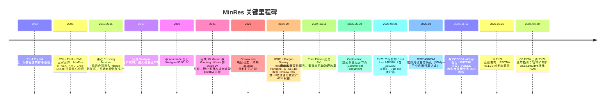
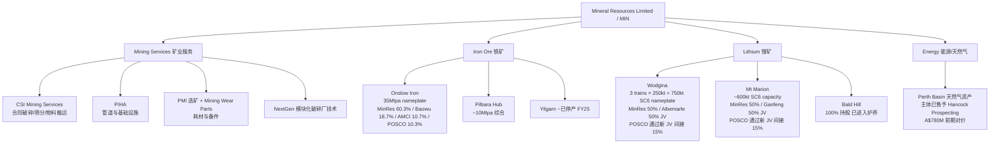
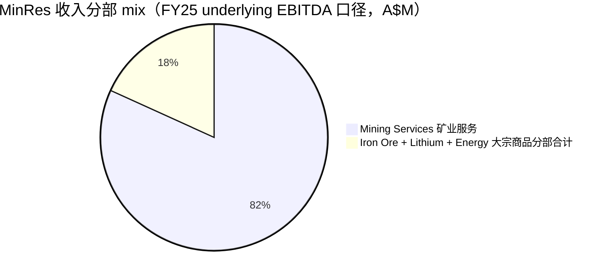
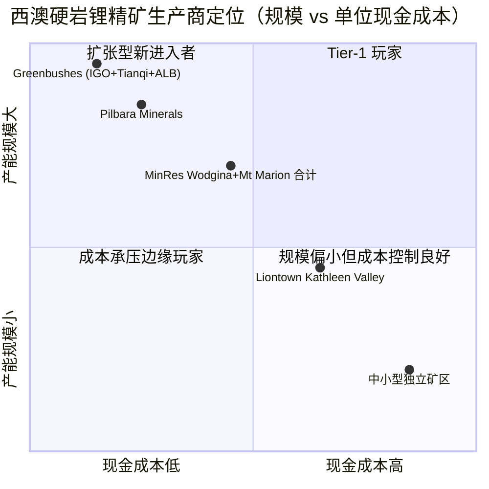

# Mineral Resources Limited (ASX:MIN) — 公司研究报告

**报告日期：2026-06-02**  
**报告语言：简体中文 (zh-CN)**  
**主题分类：稀有金属与战略矿产 (rare-earth-strategic-minerals)**  
**对标定位：澳大利亚双轨型矿业服务+大宗商品综合体 (Fe + Li + 矿业服务)**

> **Update — 上调 FY26 全年产量指引 (2026-04-30):** 管理层在 Q3 FY26 季报中将 Onslow Iron 全年发运指引从 17.1–18.8 Mwmt 上调至 17.7–19.4 Mwmt；Wodgina 锂精矿从 260–280k dmt SC6 上调至 270–290k dmt SC6；Mt Marion 从 190–210k dmt SC6 上调至 210–230k dmt SC6；矿业服务从 305–325Mt 上调至 320–330Mt。Q3 实现锂精矿均价 ≈US$2,105/dmt SC6，环比 +92%，是 2025 年下半年开始的锂价反弹周期中第一家用现货价向投资者验证拐点的澳洲硬岩锂生产商。
> 来源：[MIN Q3 FY26 Quarterly Activity Report](https://www.mineralresources.com.au/news/q3-fy26-quarterly-activity-report/); [Stocks Down Under, 2026-04-30](https://stocksdownunder.com/mineral-resources-lifts-fy26-guidance/).

---

## 目录

1. 公司概览 (Company Overview)
2. 公司历史 (Company History)
3. 管理团队 (Management Team)
4. 产品与服务 (Products & Services) — 矿业服务 / 铁矿 / 锂矿三栈
5. 客户与上市策略 (Customers & Go-to-Market)
6. 行业概览 (Industry Overview)
7. 竞争格局 (Competitive Landscape)
8. 市场机会 (Market Opportunity / TAM)
9. 风险评估 (Risk Assessment)
10. 投资视角评分 (Investor-Lens Scorecards)
11. 参考资料 (References)

---

## 1. 公司概览 (Company Overview)

Mineral Resources Limited（公司代码 ASX:MIN，以下简称 **MinRes** 或公司）是澳大利亚证券交易所（ASX）上市的综合型矿业集团，注册办公地位于西澳州珀斯（Perth, Western Australia）。公司的独特之处在于同时经营**矿业服务（mining services）+ 大宗商品生产（commodity production）**两条主线 —— 既是澳大利亚最大的合同破碎/筛分/物料搬运（contract crushing, screening, materials handling）服务商之一，又是西澳排名前列的硬岩锂精矿（hard-rock spodumene concentrate）生产商及新晋的 Pilbara 铁矿生产商。这种"承包商兼业主"（contractor-cum-principal）的混合身份在全球矿业中相当罕见 —— 它使 MinRes 既能赚取一笔现金流相对稳定的、与商品价格脱钩的"通行费"型服务收入，又能在大宗商品上行周期享受铁矿和锂矿的价格弹性 ([MinRes — Our Business](https://www.mineralresources.com.au/our-business/))。

公司目前划分为**四个报告分部**：(1) **Mining Services**（矿业服务，包括 CSI Mining Services 等子品牌，FY25 EBITDA A$737M，全年承包矿石处理量约 280Mt，是 FY25 集团 EBITDA 的主要正贡献分部）；(2) **Iron Ore**（铁矿，包括已经达产的 Onslow Iron 项目以及成熟的 Pilbara Hub，FY25 全部口径发运 20Mt 同比 +11%）；(3) **Lithium**（锂矿，由 Wodgina、Mt Marion、Bald Hill 三个硬岩锂矿组成，其中 Bald Hill 已于 FY25 进入护养状态 (care and maintenance)）；(4) **Energy**（能源/天然气，由前期 Perth Basin 勘探资产剥离至 Hancock Prospecting 后规模显著缩减），FY25 通过与 Hancock 的交易实现 A$780M 前期对价 ([MinRes FY25 Full Year Results announcement](https://www.mineralresources.com.au/news/minres-announces-2025-full-year-results/))。

**FY25 财务概览（截至 2025 年 6 月 30 日财年）**：收入 A$4.5B（同比 -15%，主因铁矿与锂矿价格疲弱）；underlying EBITDA A$901M（同比 -15%，其中 H2 A$599M vs H1 A$302M，呈现强劲的下半年反转）；statutory net loss A$896M（含 A$632M 税后减值，主要来自 Bald Hill 的转护养及 Yilgarn 关停产生的资产减记）；FY25 不派发末期股息以巩固资产负债表 ([MinRes FY25 results press release](https://www.mineralresources.com.au/news/minres-announces-2025-full-year-results/); [Motley Fool AU, 2025-08-28](https://www.fool.com.au/2025/08/28/mineral-resources-shares-tumble-on-15-revenue-decline/))。FY26 上半年（截至 2025-12-31）业绩显著改善：营收 A$3.1B、underlying EBITDA A$1.2B、NPAT A$573M、自由现金流 A$293M，其中 Onslow Iron 贡献 A$519M EBITDA、Mining Services A$488M（同比 +29%）、Lithium A$167M（同比转正、yoy +A$182M），净债务从 6 月底的 A$5.7B 降至 12 月底 A$4.9B、流动性提升至 A$1.4B ([MIN 1H FY26 results announcement](https://www.mineralresources.com.au/news/minres-posts-record-first-half-results-for-fy26/))。

**估值快照（as of 2026-06-02）**：股价 A$72.77，市值 A$14.6B，流通股 196.5M 股，52 周区间 A$18.46–74.94（一年内从历史低点回升约 4 倍），**TTM P/E 36.67×、TTM P/S 2.79×**，当前不派息（FY25 跳过末期股息以优先去杠杆） ([StockAnalysis ASX:MIN key statistics, 2026-06-02](https://stockanalysis.com/quote/asx/MIN/))。**估值解读**：当前 P/E 处于明显偏高的 sector 区间 —— ASX 综合矿业及大宗商品标的 sector 中位 P/E 通常 8–15×（BHP、Rio Tinto、Fortescue 在周期峰值的 TTM P/E 多在 8–12× 区间）。MinRes 36.67× 的 TTM P/E 同时含三重原因：(a) **盈利仍在周期底部恢复阶段** —— FY25 净亏损被减值吞噬，2H FY25 + 1H FY26 才开始真正复苏，分母（TTM 净利润 A$400M）远低于稳态运营盈利能力；(b) **Onslow Iron 在 FY25 仅运营了一个完整运营月度（commercial production 自 2025-06-30 起算）**，35Mtpa 满产年化贡献尚未充分体现在 TTM 报表中；(c) **锂价反弹叙事溢价** —— Q3 FY26 已实现 SC6 价 ≈US$2,105/dmt，比 FY25 全年平均高约 1 倍，市场在为 FY26-27 的盈利兑现支付溢价 ([MIN Q3 FY26 Quarterly Activity Report](https://www.mineralresources.com.au/news/q3-fy26-quarterly-activity-report/); [Market Index — BHP/Fortescue/Rio Tinto/MinRes value comparison, 2026](https://www.marketindex.com.au/news/bhp-fortescue-rio-tinto-or-mineral-resources-which-asx-mining-stocks-offer))。EV/EBITDA 测算上以 1H FY26 年化 EBITDA A$2.4B + 6 月净债 A$4.5B 计算约 ~7.9×，相对 sector 处于温和偏高水平 —— 但前提是 FY26 锂/铁价不出现急转向。

**核心 KPI**：FY25 矿业服务承包总产量 ~280Mt wmt（year of record）；Onslow Iron Q1 FY26 单季 8.6Mt wmt 发运（环比 +50%）、Q3 FY26 7.2Mt wmt（受 cyclone Mitchell + Narelle 影响）；FY25 LTIFR（Lost Time Injury Frequency Rate）0.14、TRIFR（Total Recordable Injury Frequency Rate）3.71；员工总数 ≈5,000+（公司未在 FY25 财报中披露精确数字） ([MinRes FY25 announcement](https://www.mineralresources.com.au/news/minres-announces-2025-full-year-results/))。

---

## 2. 公司历史 (Company History)

MinRes 于 **2006 年**由 Chris Ellison 主导合并三家西澳本土矿业服务公司而成 —— **Crushing Services International (CSI)** 提供合同破碎/筛分服务、**PIHA Pty Ltd** 提供专业管道安装/基础设施服务、**Process Minerals International (PMI)** 提供选矿/物料处理服务。同年 7 月在 ASX 主板挂牌上市，初始定位为"为西澳铁矿、金、镍等中大型矿业客户提供 pit-to-port 一站式服务的承包商"，而非自营矿业生产商 ([Wikipedia — Mineral Resources](https://en.wikipedia.org/wiki/Mineral_Resources); [About — Chris Ellison Biography on MinRes website](https://www.mineralresources.com.au/about-us/leadership/chris-ellison/))。从合同服务商到全栈大宗商品集团（即同时拥有矿权、加工、物流、销售）的转型，是 2010 年代中后期 Chris Ellison 主导的战略转向。

来源：[MinRes — Investor Centre Annual Reporting Suite](https://www.mineralresources.com.au/investor-centre/annual-reporting-suite/); [MIN 2025 Annual Report PDF](https://cdn.sanity.io/files/o6ep64o3/production/44960a27514a9cc4475da34855c5995cf07a83aa.pdf); [MIN 1H FY26 release](https://www.mineralresources.com.au/news/minres-posts-record-first-half-results-for-fy26/); [POSCO–MinRes lithium JV announcement, 2025-11-12](https://www.mineralresources.com.au/news/minres-and-posco-holdings-to-form-lithium-partnership/).

**三个战略转折点（strategic pivots）：**

(1) **从合同服务商到资产持有者（contractor → asset owner，~2010–2017）**。MinRes 早期以承包商身份切入西澳 Yilgarn 地区的中小型铁矿项目，随后利用对客户矿权和资源量的近距离掌握，逐步以合资或并购方式接管部分矿权 —— 这一从"提供铲斗"到"持有铲斗 + 拥有铁矿石"的转向，使公司从矿业服务行业的纯流量型业务（cyclical contracting revenues）演化为承担商品价格上行/下行 beta 的资产型业务 ([Wikipedia — Mineral Resources](https://en.wikipedia.org/wiki/Mineral_Resources))。

(2) **进入硬岩锂赛道（2017–2021）**。2017 年完成 Wodgina 收购后，2019 年与全球最大锂业巨头 Albemarle 达成 50:50 合资，2021 年完成 Mt Marion 与中国宁德时代上游伙伴 Ganfeng Lithium 的 50:50 升级 —— 至此 MinRes 在西澳硬岩锂版图中获得了**面向西方 + 面向中国**两大锂电产业链头部企业的双重对手方安排，理论上具备显著的销售渠道弹性 ([MinRes — Our Business: Lithium](https://www.mineralresources.com.au/our-business/lithium/); [Project Blue — MinRes-POSCO JV analysis](https://projectblue.com/blue/news-analysis/1371/minres-and-posco-holdings-form-new-lithium-joint-venture))。

(3) **Onslow Iron 重大资本承诺（2022–2025）**。Onslow Iron 是西澳铁矿过去 10 年最大的新增产能项目之一 —— 总建设资本支出（capex）经过多轮上修，最终在 2025 年 6 月达到 35Mtpa nameplate（铭牌产能）。为快速去杠杆，公司在 2024 年 9 月以 A$1.1B 上限对价向 Morgan Stanley Infrastructure Partners (MSIP) 出售 Onslow Iron Road Trust 49% 权益（公司保留 51%）—— 这是一个**矿权/采矿+物流通行费分离的金融结构创新**，MSIP 获得 life-of-mine 终身通行费现金流，MinRes 保留矿石销售盈利 ([Mining.com.au — MSIP A$200M payment](https://mining.com.au/minres-to-receive-multi-million-dollar-cash-boost/); [Sharecafe, 2025-10-27](https://www.sharecafe.com.au/2025/10/27/mineral-resources-asx-min-confirms-200-million-contingent-payment-from-onslow-iron-project/))。2025 年 10 月，A$200M 的或然对价（contingent payment）触发条件达成（8.75Mt 在 2025-08-01 至 2025-10-27 期间装船），MSIP 总对价升至 A$1.3B。

**最近 12 个月发展**：(i) Ellison 历史税务问题导致董事会全面换血（详见 §3 管理团队 + §9 风险）；(ii) POSCO 锂业务 30% JV 协议（US$765M）于 2025-11-12 签署，相当于把锂资产估值锚定在 ~A$3.9B；(iii) 1H FY26 季报至 Q3 FY26 上调全年产量指引；(iv) 锂精矿现货价从 FY25 低点 US$700/dmt 左右回升至 Q3 FY26 ~US$2,100/dmt ([MinRes & POSCO partnership press release](https://www.mineralresources.com.au/news/minres-and-posco-holdings-to-form-lithium-partnership/); [DLA Piper — POSCO advisor note](https://www.dlapiper.com/en-us/news/2025/11/dla-piper-advises-posco-holdings-on-lithium-joint-venture-with-mineral-resources))。

---

## 3. 管理团队 (Management Team)

按照本研究方法的规定，仅覆盖创始人及现任 CEO。MinRes 当前**创始人即现任 CEO**，因此本节合并撰写一份创始人 + CEO 综合传记（300–450 字目标）。

### Chris Ellison — 创始人兼董事总经理 (Founder and Managing Director, 任期始于 2006-02-27)

Chris Ellison 是 MinRes 的合并方架构师与持续 20 年的执行核心。他在矿业承包行业有**"超过 36 年的经验，涵盖矿业承包、工程及资源处理"**（"over 36 years of experience in the mining contracting, engineering and resource processing industries"），是 MinRes 三家初始子公司 —— CSI、PIHA、PMI —— 的"创始股东"（"founding shareholder"） ([Chris Ellison official biography on MinRes](https://www.mineralresources.com.au/about-us/leadership/chris-ellison/))。

**早期职业**（按公司官方传记）：1979 年创立 Karratha Rigging 并担任董事总经理至 1982 年被收购；随后任职 Walter Wright Industries 西澳/北领地区总经理；1986 年创立 Genco Ltd，1988 年与 Monadelphous Group 合并；1988-09 在 Monadelphous Group 处于破产管理时被任命为董事总经理，**"成功从其财务困境中走出"**（"successfully traded out of its financial difficulties"）并使其于 1989 年底重新在 ASX 上市；1992 年创立 PIHA Pty Ltd，专注于**"特种管道内衬与一般基础设施"**（"specialised pipe lining and general infrastructure"） ([Chris Ellison official biography](https://www.mineralresources.com.au/about-us/leadership/chris-ellison/))。Ellison 历史上一直以西澳矿业圈的"高承担风险、强执行力创始人"形象著称，是 MinRes 从合同承包商转型为"承包商+资产持有人"双轨模式的主推手。

**持股**：根据公司公告及 LinkedIn 个人简介披露，Ellison 持有 MinRes 约 11–12% 的股份，长期是公司最大单一股东，使其在董事会层面具有显著的事实控制力 ([Mining.com — Ellison exit plan](https://www.mining.com/minres-walks-back-ellison-exit-plan/))。

**2024 年治理事件**：2024-10 至 2024-11，澳大利亚《金融评论报》（AFR）系列报道揭示 Ellison 在 2003–2014 年期间持有英属维尔京群岛（BVI）公司 **Far East Equipment Holdings Limited (FEEHL)** 的权益，该公司在 2003、2004 年向 CSI 出售矿业设备，款项在 2006 年 CSI 被 MinRes 收购时仍未结清，**但此项 FEEHL 应付负债未在 MinRes 上市招股书或后续报表中披露**。Ellison 承认存在涉嫌避税安排，已与澳大利亚税务局（ATO）达成补缴税款的和解 ([Capital Brief — Ellison tax evasion](https://www.capitalbrief.com/briefing/minres-billionaire-boss-chris-ellison-admits-tax-evasion-regrets-actions-a738fb5c-eeca-400b-858f-6e3a7191b239/); [Mining.com — Ellison to exit](https://www.mining.com/minres-founder-ellison-to-exit-after-internal-misconduct-probe/))。澳大利亚证监会（ASIC）已于 2025 年正式立案调查 ([Capital Brief — ASIC formal investigation](https://www.capitalbrief.com/briefing/mineral-resources-faces-formal-investigation-from-asic-6e7e491d-c248-44af-b820-a33bfd03b672/))。原定 Ellison 在 12–18 个月内退出董事总经理职务的安排在 2025-11 被董事会撤回 —— **Ellison 将无限期保留董事总经理职务**，公司表述为"使运营连续性最大化"（Mining.com 引述） ([Mining.com — MinRes walks back Ellison exit plan](https://www.mining.com/minres-walks-back-ellison-exit-plan/); [Mining Weekly — MinRes abandons CEO transition deadline, 2025-11-20](https://www.miningweekly.com/article/minres-abandons-ceo-transition-deadline-2025-11-20))。

**治理护栏**：作为对 2024-11 治理事件的对冲，公司在 2025 年间完成了**董事会全面换血** —— 任命 Mal Bundey 为新独立非执行主席，新增独立非执行董事 Lawrie Tremaine（前 Origin Energy CFO）、Ross Carroll（前 Macmahon Holdings CEO）、Susan Ferrier（前 NAB 人力总监）、Colin Moorhead（Ramelius Resources 董事），并新设治理与合规总监（Kate Barker，直接汇报董事会主席）及公司秘书 Sarah Standish ([Mining Weekly — MinRes governance overhaul, 2025-11-20](https://www.miningweekly.com/article/minres-abandons-ceo-transition-deadline-2025-11-20))。这一董事会架构使 Ellison 在策略与运营层面继续主导，但治理委员会获得了**外部强独立性**约束 —— 这是投资人在 §10 治理评分中需密切观察的核心结构变化。

---

## 4. 产品与服务 (Products & Services) — 三栈业务全解

> **本节是全报告最关键的一章**。MinRes 的独特性源自其"承包商 + 业主"双重身份及在矿业服务、铁矿、锂矿三条价值链上的纵深定位。下文按公司**官方四分部口径**（Mining Services / Iron Ore / Lithium / Energy）分别详解。

### 4.1 业务产品树概览

来源：[MIN FY25 announcement](https://www.mineralresources.com.au/news/minres-announces-2025-full-year-results/); [Onslow Iron project page](https://www.mineralresources.com.au/our-business/iron-ore/onslow-iron-project/); [POSCO–MinRes lithium JV announcement](https://www.mineralresources.com.au/news/minres-and-posco-holdings-to-form-lithium-partnership/); [Project Blue — JV structure analysis](https://projectblue.com/blue/news-analysis/1371/minres-and-posco-holdings-form-new-lithium-joint-venture).

### 4.2 Mining Services（矿业服务）— 反周期现金流之锚

**业务定义**（引自公司官网）：CSI Mining Services（公司 100% 全资子公司）是 **"a leading provider of pit-to-ship mining services unique to the resources industry"**（"业内独特的领先 pit-to-ship 矿业服务提供商"），是澳大利亚最大的合同破碎/筛分/物料搬运服务商之一，覆盖西澳、北领地、昆士兰 ([MinRes — Mining Services page](https://www.mineralresources.com.au/our-business/mining-services/))。

**核心服务（中文释义 / Plain-language gloss）**：
- **合同破碎与筛分（Contract crushing & screening / 合同破碎筛分）** —— MinRes 在客户矿区建立 BOO（Build-Own-Operate）模式的固定破碎厂或部署移动式破碎设备，将客户的原矿（ROM, run-of-mine ore）破碎至下游销售/选矿所需粒径，按吨数收取处理费。
- **NextGen 模块化破碎厂技术** —— 自研的"模块化"破碎设计，相对传统固定厂可缩短建厂时间约 60–70%、降低环境足迹（"replaces higher-cost fixed plants and improves the environmental impact of crushing construction and operations"），是 MinRes 在矿业服务领域的差异化技术护城河 ([Company360 corporate report on MinRes](https://s3-eu-west-1.amazonaws.com/s3.sourceafrica.net/documents/25559/CompanyReport-DUNS754519283.pdf))。
- **专业 pit-to-port 物流（pit-to-ship logistics）** —— "full suite of pit-to-port logistics and management, including a fleet of largest single engine road trains" ([MinRes — Mining Services page](https://www.mineralresources.com.au/our-business/mining-services/))；MinRes 拥有澳大利亚最大规模的单引擎公路列车（road trains）车队之一，及创新设计的浅水转运船（shallow-draft transhippers，参见 Onslow Iron 处的港口设计）。
- **矿山服务、维护与场地服务（site services + workshops）** —— 工坊系统、采矿耗材（2020 年收购 Mining Wear Parts，使 MinRes 拥有"澳大利亚最大的破碎与选矿耗材库存之一"）、营地建设与运营、复垦服务。
- **承担金额披露**：FY25 矿业服务承包总产量达到 **280Mt wmt** 创纪录，分部 underlying EBITDA A$737M（同比 +34%）；1H FY26 矿业服务 EBITDA A$488M（同比 +29%），处理量 166Mt（半年新高） ([MIN FY25 press release](https://www.mineralresources.com.au/news/minres-announces-2025-full-year-results/); [MIN 1H FY26 press release](https://www.mineralresources.com.au/news/minres-posts-record-first-half-results-for-fy26/))。

**为什么这个分部重要 —— 反周期现金流锚（counter-cyclical cash anchor）**：矿业服务的合同结构以"每吨处理量计费"为主（tolling fee per tonne），与铁矿/锂矿现货价的相关性相对较弱 —— 当大宗商品价格下行时，客户矿企对运营效率的要求反而提升、对合同破碎/物流的需求保持相对稳定甚至上升（因为关停自营加工厂、外包给 MinRes 是降本路径）。FY25 在铁矿和锂矿价格双双下跌的背景下，矿业服务分部 EBITDA 同比 +34% 至创纪录的 A$737M，构成了**集团 EBITDA 的最大单一来源**（占 FY25 underlying EBITDA 的 ~82%），这就是 MinRes 商业模式的核心稳定性来源 ([MIN FY25 announcement](https://www.mineralresources.com.au/news/minres-announces-2025-full-year-results/))。

### 4.3 Iron Ore（铁矿）— Onslow + Pilbara Hub 双引擎

**Onslow Iron** —— 公司过去十年最大的资本支出项目，**"35 million tonnes per year"** nameplate 产能于 2025 年中达到，于 2025-06-30 实现商业生产（commercial production）。MinRes 直接持有 57% + 通过 Aquila Resources 间接持有 3.3%，**有效经济权益 60.3%**；其余 39.7% 为 Baowu（中国宝武，18.7%）、AMCI（美国矿业投资公司，10.7%）、POSCO（韩国浦项制铁，10.3%），通过 Red Hill Iron Joint Venture (RHIJV) 持有；**MinRes 100% 拥有矿业服务和基础设施**（"100% ownership of mining services and infrastructure"） ([Onslow Iron project page](https://www.mineralresources.com.au/our-business/iron-ore/onslow-iron-project/); [Mining Magazine Australia — Onslow milestone](https://miningmagazine.com.au/milestone-for-onslow-iron-project/))。

**Onslow Iron 港口架构（中文释义 / Plain-language gloss）**：项目矿石从 Ken's Bore 矿点经 **150 公里专用 haul road**（公路）运输至 Port of Ashburton；港口建有 220,000 吨堆场（"220,000-tonne capacity shed"）；通过 **enclosed conveyor belt**（密闭传送带）将矿石上载至 **shallow-draft transhippers**（浅水转运船），转运船航行约 **40 公里**至深水待泊船舶（"40km offshore to awaiting vessels"） ([Onslow Iron project page](https://www.mineralresources.com.au/our-business/iron-ore/onslow-iron-project/))。这一"陆运 + 浅水转运船 + 深水母船"的物流架构是 MinRes 在西澳"软岸"地理条件下的港口工程创新 —— 相比 BHP/Rio Tinto/Fortescue 的固定深水泊位港口，资本支出和长期维护成本结构不同，但对热带气旋更为敏感（详见 §9 风险）。

**Onslow Iron 物流通行费金融化（MSIP 49% 权益结构）**：2024-09，MSIP 投资基金支付 **A$1.1B 前期对价** 收购 Onslow Iron Road Trust 49% 权益，获得 **"life-of-mine CPI-adjusted tolling fee per tonne of iron ore loaded at the port"**（终身 CPI 调整的港口装船吨位通行费）；2025-10，A$200M 或然对价（contingent payment）触发条件 —— 8.75Mt 在 2025-08-01 至 2025-10-27 期间通过 MinRes transhippers 装船 —— 已满足、合计 A$1.3B 对价已支付 ([Mining.com.au — MSIP payment](https://mining.com.au/minres-to-receive-multi-million-dollar-cash-boost/); [Sharecafe, 2025-10-27](https://www.sharecafe.com.au/2025/10/27/mineral-resources-asx-min-confirms-200-million-contingent-payment-from-onslow-iron-project/); [Capital Brief, 2025-10](https://www.capitalbrief.com/briefing/minres-confirms-200m-contingent-payment-for-onslow-iron-haul-road-sale-6a5ef754-c40b-461a-b5e5-d27a71c70585/))。该结构使 MinRes 实质上"卖未来通行费换前期现金"，加速去杠杆但摊薄长期通行费现金流。

**Q1 FY26 + Q3 FY26 运行数据**：
- Q1 FY26（截至 2025-09-30）：Onslow Iron 装船 **8.6Mt wmt（100% 口径，环比 +50%）**，并于 8 月至 10 月达到 35Mtpa nameplate 满产；Pilbara Hub 装船 2.7Mt wmt；合计季度发运量 11.4Mt wmt 创纪录；Onslow + Pilbara 综合实现均价 US$90/dmt（环比 +14%）([MIN Q1 FY26 quarterly](https://www.mineralresources.com.au/news/q1-fy26-quarterly-activity-report/))。
- Q3 FY26（截至 2026-03-31）：受热带气旋 Mitchell + Narelle 影响（2 月停航 3 天、3 月停航 5 天），Onslow Iron 产量 7.8Mt、装船 7.2Mt（库存增加 ~0.6Mt）；Pilbara Hub 装船 2.1Mt；Onslow 实现均价 US$95/dmt（占 Platts 61% CFR Index 的 91%），Pilbara 实现均价 US$89/dmt（占 86%）([MIN Q3 FY26 quarterly](https://www.mineralresources.com.au/news/q3-fy26-quarterly-activity-report/))。

**Pilbara Hub** —— 由 Iron Valley、Wonmunna 等成熟矿山组成的传统铁矿组合，全年约 10Mtpa；FY25 期间 Yilgarn iron ore operations（位于西澳金矿走廊）已作为"战略简化"的一部分关停 ([Kalkine — MinRes FY25 outlook](https://kalkine.com.au/news/mining/mineral-resources-asxmin-integrated-mining-services-and-commodities-business-overview-and-fy25-outlook))。

### 4.4 Lithium（锂矿）— Wodgina + Mt Marion 双 JV 架构

MinRes 拥有**三家西澳硬岩锂矿**的全部或部分权益：

**Wodgina**（位于西澳 Pilbara 港 Port Hedland 以南约 120 公里，"approximately 120km south of Port Hedland in the Pilbara region of Western Australia"，根据公司官网）：3 个加工系列（trains），每条 nameplate 250,000 吨 SC6 锂精矿/年，**总 nameplate 约 750,000 吨 SC6/年**（按 5.5% Li2O 品位约 820,000 吨/年），MinRes 与 Albemarle 各持 50% JV ([MinRes — Wodgina page](https://www.mineralresources.com.au/our-business/lithium/); [Mysteel — Australian lithium projects overview](https://www.mysteel.net/analysis/5087659-overview-of-lithium-mining-projects-in-australia))。FY26 全年生产指引：270–290k dmt SC6（2026-04-30 上调后）([MIN Q3 FY26 quarterly](https://www.mineralresources.com.au/news/q3-fy26-quarterly-activity-report/))。

**Mt Marion**（位于西澳 Kalgoorlie 西南约 40 公里）：扩产后 nameplate ~600,000 吨 SC6/年（从此前 ~500,000 吨升级），MinRes 与中国 **Ganfeng Lithium**（赣锋锂业，HKEX:1772 / SZSE:002460）各持 50% JV ([MinRes Mt Marion JV update news, 2026-05](https://www.mineralresources.com.au/our-business/lithium/))。FY26 全年生产指引：210–230k dmt SC6（2026-04-30 上调后）。

**Bald Hill**（位于西澳 Kambalda 东南约 50 公里）：MinRes 100% 持有；FY25 由于锂价低迷已转入 **care and maintenance**（护养）状态。

**Q3 FY26 实现均价**（Q3 锂价反弹的最强证据）：
- Wodgina：实现均价 **US$2,130/dmt CIF SC6**（环比 +87%）。
- Mt Marion：实现均价 **US$2,076/dmt CIF SC6**（环比 +99%）。
- 综合两座矿场加权平均 **US$2,105/dmt SC6**（环比 +92%）([MIN Q3 FY26 quarterly](https://www.mineralresources.com.au/news/q3-fy26-quarterly-activity-report/))。

这是自 2022–2023 年锂价峰值崩盘以来，硬岩锂精矿现货价首次回到 US$2,000/dmt 以上 —— 对 MinRes 锂业务而言，C1 现金成本（cash cost）已通过 Wodgina/Mt Marion 的优化项目降至 ~US$650–800/dmt SC6 区间（行业估计），意味着 FY26 H2 锂业务有望从 FY25 的 EBITDA 亏损转为重要正贡献。

**POSCO 新 JV 架构（2025-11-12 签署）**：POSCO Holdings 以 US$765M 前期对价收购 MinRes 锂业务合并实体的 30% 权益（间接持有 Wodgina + Mt Marion 各 15%）；MinRes 保留 70%；交易隐含 **MinRes 现有 Wodgina + Mt Marion 50% 权益估值约 A$3.9B**；MinRes 继续作为运营商，POSCO 按 30% 权益比例获得锂精矿包销以支持其下游加工 ([MinRes & POSCO press release](https://www.mineralresources.com.au/news/minres-and-posco-holdings-to-form-lithium-partnership/); [Investing News — MinRes-POSCO JV details](https://investingnews.com/minres-and-posco-lithium-jv/); [Mining.com — POSCO US$765M deal](https://www.mining.com/web/mineral-resources-to-sell-30-lithium-jv-stake-to-posco-for-765m/))。**战略意义**：(a) MinRes 再次以"出售部分权益换前期现金"的方式去杠杆（与 MSIP 模式一致）；(b) 锂业务获得"亚太三大锂电产业链玩家齐聚"的对手方结构 —— Albemarle（北美/欧洲）+ Ganfeng（中国）+ POSCO（韩国），地缘多元化优势明显；(c) 估值锁定 A$3.9B 锚点，为锂业务后续可能的进一步股权交易（IPO、剥离）提供基准。

### 4.5 Energy（能源/天然气）— 已大幅缩减规模

公司过去几年开发的 Perth Basin 天然气勘探资产已通过与 **Hancock Prospecting**（Hancock 矿业，由 Gina Rinehart 家族控股）的交易剥离，FY25 收到 A$780M 前期对价 ([MIN FY25 announcement](https://www.mineralresources.com.au/news/minres-announces-2025-full-year-results/))。Energy 现在是规模较小的非核心分部，未来贡献边际化。

### 4.6 三栈业务协同 — 综合体的内在逻辑

MinRes 的"矿业服务 + 铁矿 + 锂矿"三栈业务并非简单并列，而是一个**风险对冲 + 资本循环 + 物流复用**的有机系统：

1. **风险对冲**：矿业服务以处理量计费、与商品价格弱相关，构成稳定的"现金流地板"；铁矿提供大宗稳定吨位 + 锂矿提供高 beta 的能源转型曝光，三者季节性/周期性互补。FY25 大宗双下行时矿业服务 EBITDA 同比 +34%，是这一结构最直观的验证。

2. **资本循环**：MinRes 通过持续将"重资产"金融化（MSIP 出售 Onslow 通行费 49%、POSCO 收购锂业务 30%）回收前期资本，同时保留运营控制权和大头权益 —— 这一"轻资产化但不放弃运营权"的资本结构，是其在 A$5.7B 净债务峰值后快速去杠杆的核心策略。

3. **物流复用**：CSI 的破碎/物流车队在 Pilbara 地区覆盖密集，既服务于 MinRes 自营铁矿和锂矿、也对外承包；NextGen 模块化破碎技术在锂矿（Wodgina、Mt Marion）和铁矿（Onslow、Pilbara Hub）的部署存在直接的工程经验复用。

**结尾合成**：MinRes 不是"一个矿业公司持有另一些服务",而是**一个矿业服务集团把自己也当成最大客户来服务** —— 这种纵向整合（在持有资产同时也对外承包）使其在矿业资本支出周期低谷时仍有外部承包合同支撑、在高峰时享受自营资产的价格弹性。理解这一商业模式是评估 MinRes 与单一品类同行（如纯铁矿 BHP、纯锂矿 Pilbara Minerals）估值差异的根本钥匙。

---

## 5. 客户与上市策略 (Customers & Go-to-Market)

### 5.1 矿业服务客户

CSI Mining Services 对外承包客户主要为**"世界最大矿业公司"中的若干 Tier-1 客户**（公司官网原文："build-own-operate crushing and screening plants and mobile crushing equipment for some of the world's largest mining companies"），覆盖金、铜、铁矿、锰、锂、钽等多种大宗 ([MinRes — Mining Services page](https://www.mineralresources.com.au/our-business/mining-services/))。公司官网未单独披露 Tier-1 客户的具体名称及收入占比，FY25 年报中也未按客户分别披露金额（**披露级别：分部级别承包量 280Mt 是已知的；单一客户/Top-5 客户口径未对外披露**）—— 这是与 BHP / Rio Tinto 等以销售目的地国家或客户来源披露收入的大型矿业巨头不同的地方。

来源：[MIN FY25 announcement](https://www.mineralresources.com.au/news/minres-announces-2025-full-year-results/)。
说明：FY25 集团 underlying EBITDA A$901M 中 Mining Services 单一分部 A$737M（占 82%）；大宗商品分部因价格疲弱合计仅贡献 A$164M（含部分单分部为负值的相互抵销，详见 FY25 财报）。1H FY26 结构已显著再平衡：Mining Services A$488M + Onslow Iron A$519M + Lithium A$167M，三栈贡献接近均衡。

### 5.2 铁矿客户

Onslow Iron 的客户结构由 JV 合作方主导：
- **Baowu**（中国宝武钢铁集团，全球最大钢企）—— 持 RHIOJV 18.7%，承担相应比例矿石包销；首船矿石即发往 Baowu。
- **POSCO**（韩国浦项制铁，全球第六大钢企）—— 持 RHIOJV 10.3%，承担相应比例包销。
- **AMCI**（美国矿业投资公司）—— 持 RHIOJV 10.7%，为金融投资人，可能在二级市场销售矿石。
- **MinRes 60.3% 权益部分** —— 主要通过现货市场销售给亚洲钢厂，参考 Platts 61% CFR Index 计价；Q3 FY26 实现率 91%，体现 MinRes Onslow 矿砂的相对优质属性 ([Onslow Iron project page](https://www.mineralresources.com.au/our-business/iron-ore/onslow-iron-project/); [Australian Resources & Investment — Onslow nameplate, 2025-10-28](https://www.australianresourcesandinvestment.com.au/2025/10/28/minres-achieves-nameplate-performance-at-onslow-iron))。

Pilbara Hub 的产品则主要面向中国、日本、韩国现货市场，按 Platts CFR Index 计价，Q3 FY26 实现率 86%（品位略低于 Onslow）。

### 5.3 锂矿客户与销售架构

**Wodgina**（MinRes 50% / Albemarle 50%）：锂精矿由两 JV 方按权益比例分售；Albemarle 主要将其分内份额运往北美/欧洲下游加工厂，MinRes 通过现货市场销售。

**Mt Marion**（MinRes 50% / Ganfeng Lithium 50%）：Ganfeng 作为全球最大锂化工厂之一，按其内部包销协议吸纳 50% 锂精矿用于中国境内的锂化合物加工；MinRes 50% 份额通过现货市场销售（亦多数面向中国客户）。

**POSCO 新 JV（2025-11 签署）**：POSCO 30% 权益部分将获得锂精矿包销支持其韩国浦项及阿根廷在建的下游锂氢氧化物加工厂。该 JV 完成后，MinRes 锂精矿事实上有三大固定下游通道 —— **Albemarle（北美/欧洲）+ Ganfeng（中国）+ POSCO（韩国）** —— 这一**地缘三足鼎立**结构在全球锂业内非常稀少，使 MinRes 在中美贸易摩擦、稀有金属出口管制等地缘风险下具有显著的渠道弹性 ([Project Blue analysis of MinRes-POSCO JV](https://projectblue.com/blue/news-analysis/1371/minres-and-posco-holdings-form-new-lithium-joint-venture); [Investing News — MinRes-POSCO JV details](https://investingnews.com/minres-and-posco-lithium-jv/))。

### 5.4 客户集中度评估

MinRes 在 FY25 年报及季报中**未按公司法定要求逐一披露 Top-5 客户的收入占比**（澳大利亚 ASX 上市规则在客户集中度披露上灵活度高于美国 10-K 或中国 A 股年报），且由于其矿业服务分部客户多元化、矿业资产销售按 JV 包销与现货混合，导致**集团合并层面的 Top-1/Top-5 客户披露较为模糊**。从公开信息推断：

- **矿业服务分部** —— Tier-1 客户应包括 BHP、Rio Tinto、Fortescue、Newcrest（现为 Newmont 旗下）等西澳主要矿业公司，但单一客户占该分部收入比例未披露；CSI 通过 MinRes 自营矿区（Onslow + Pilbara + Wodgina + Mt Marion）的内部服务收入也是一大块（公司经营报告中以分部间消除处理）。
- **铁矿分部** —— Baowu + POSCO 合计直接持有 RHIOJV 29.0% 权益，加上对外现货销售给亚洲钢厂，估计单一最大客户（Baowu）综合敞口可能达 Onslow 分部收入的 20–30%（**作者注：此为基于 RHIOJV 权益结构 + 钢厂常规包销逻辑的推算，非公司直接披露；如未来公司发布更清晰的客户集中度披露应以披露为准**）。
- **锂矿分部** —— Albemarle 通过 Wodgina JV、Ganfeng 通过 Mt Marion JV、POSCO 通过新 JV 都构成结构性大客户/包销对手方；客户集中度结构性偏高，但被三方分散。

**披露不足的说明**：与 Samsung 사업보고서、A 股年报或美国 10-K 严格的 Top-5 客户披露要求不同，ASX 上市规则给予矿业公司更大灵活度，MinRes 的 FY25 年报未将合并集团层面 Top-1 / Top-5 客户的销售金额或占比明示。本报告就 MinRes 客户集中度的描述应被读者理解为**结构性观察 + 公开 JV 包销协议的推断**，而非来自 audited financial statements 的精确数字。

---

## 6. 行业概览 (Industry Overview)

MinRes 同时面对**三个产业链**的供需结构 —— 西澳矿业服务、全球海运铁矿、全球硬岩锂精矿。

### 6.1 西澳矿业服务（Mining Services in Western Australia）

西澳是全球矿业承包市场最深、最专业化的区域之一，BHP、Rio Tinto、Fortescue、Hancock Prospecting、Newcrest（现 Newmont）、Mineral Resources 等大型矿业公司每年合计承包外包给 CSI、Macmahon Holdings (ASX:MAH)、NRW Holdings (ASX:NWH)、Perenti Global (ASX:PRN)、Thiess（私有）等数家头部承包商超过 A$10B 量级的工作（业内估算）。市场结构特点：

- **高门槛**：单条 Pilbara 矿区 BOO 破碎线需要资本投入 A$100–500M；moving heavy haul 物流车队涉及巨型公路列车（road train）+ 港口转运船等高资本设备。
- **客户粘性强**：BOO 模式下合同年限多为 10–25 年，与矿山寿命挂钩，转换成本极高。
- **价格反周期特征不强但抗周期**：合同结构以"每吨处理量计费 + 通胀联动"为主，矿业资本支出下行时新建合同减少但既有合同保持，矿业上行时新建合同加速。

MinRes 凭借其"自营矿山+对外承包"的混合身份，在西澳矿业服务市场具有结构性份额优势 —— FY25 280Mt 的承包量是行业内最高之一（行业可比公司：Macmahon 承包量约 200Mt 量级、NRW Holdings 约 150Mt 量级，公开年报推断）。

### 6.2 全球海运铁矿（Seaborne Iron Ore）

全球海运铁矿市场约为 **1.5–1.6Bt/年**，由四大供应国主导：澳大利亚（~900Mt 出口，主要产自 Pilbara）、巴西（~350Mt，主要为 Vale）、南非（~50Mt）、加拿大/俄罗斯/印度（小份额）。最大需求方为中国（占海运需求 70%+）、日本/韩国/欧洲钢厂。

**澳大利亚 Pilbara 头部供应商**（FY2025 / 2025 公历年）：
- **Rio Tinto Pilbara** —— FY25 出货 ~325Mt（指引 323–338Mt）；运营 18 个铁矿、4 个港口、~2,000 公里铁路网 ([Rio Tinto 6-K 2025](https://www.sec.gov/Archives/edgar/data/0000863064/000162828025017942/ex1_25q1results.htm))。
- **BHP WAIO（西澳铁矿）** —— FY25 出货 ~290Mt（行业领先成本）。
- **Fortescue** —— FY25 出货 ~190Mt（含 Iron Bridge 高品位项目）。
- **Mineral Resources** —— FY25 出货 ~20Mt（Onslow 中期目标 35Mtpa + Pilbara Hub ~10Mtpa）。

MinRes 在 Pilbara 铁矿出口中仍是**小型边际供应商**（即使 Onslow 满产 35Mtpa 也仅占 Pilbara 总出口的 ~3.5%），但其增量贡献相对总量的边际价格影响有限，主要价值在于**单矿点 35Mtpa 的高边际收益**（Onslow 设计为长寿命、低维护、与 MinRes 矿业服务平台高度协同）。

### 6.3 全球硬岩锂精矿（Hard-Rock Spodumene Concentrate）

全球锂供应分**硬岩矿（hard-rock, mainly Western Australia + Canada + Africa + Brazil）+ 盐湖卤水（brine, mainly Chile + Argentina + China + USA）**两大流派。硬岩占全球锂供应 ~55%（2025E）；西澳 Pilbara 是全球最大硬岩集群，单 Greenbushes 矿（IGO + Tianqi + Albemarle JV）占全球供应 ~20%、Pilgangoora（Pilbara Minerals）+ Wodgina + Mt Marion 合计另占 ~15–20%。

**Q3 FY26 锂精矿现货价已回到 US$2,000+/dmt SC6**，距离 2022 年峰值 ~US$8,000/dmt 仍有差距、但已脱离 2024–2025 年 US$700–900/dmt 的成本边际区间。锂价反弹的核心驱动：

- 中国电动车销量持续两位数增长，2025 年中国新能源车销量超过 1,400 万辆。
- 欧美对中国锂电池/电池材料的关税与供应链多元化要求驱动非中国锂供应链需求。
- 2024–2025 年大量低效产能（中国云母提锂、非洲小规模矿）退出，供给侧出清。

MinRes 是**直接受益于锂价反弹的西澳硬岩第二大供应商**（仅次于 Pilbara Minerals 的 Pilgangoora 单矿规模）；POSCO 锂 JV 协议的 US$765M 估值锚定显示产业资本对 MinRes 锂业务的认可。

### 6.4 TAM/SAM 三栈口径

- **西澳矿业服务 TAM**（外包 BOO 破碎 + 物流 + 维护）：~A$15B/年（行业推断），MinRes ~A$3–4B 年化收入约占 25–30%。
- **全球海运铁矿 TAM**：~US$140–160B/年（按 1.5Bt × US$95/t），MinRes 满产后 35Mtpa × US$95 ≈ US$3.3B/年（占全球 ~2%）。
- **全球锂精矿 TAM**：~US$15–25B/年（取决于现货价），MinRes 50% 权益满产 ~500kt SC6 × US$2,100 ≈ US$1.05B/年（占全球 ~5–7%）。

MinRes 在三栈 TAM 中**绝对值不大**，但**复合（混合三栈）的集团 EBITDA 仍可在 A$2–3B/年 中长期稳态区间** —— 这是其估值故事的核心数学。

---

## 7. 竞争格局 (Competitive Landscape)

### 7.1 矿业服务竞争对手

- **CSI Mining Services（MinRes 100% 子公司）vs Macmahon Holdings (ASX:MAH)、NRW Holdings (ASX:NWH)、Perenti Global (ASX:PRN)、Thiess（私有）**：CSI 的差异化在于"自营矿山规模 + NextGen 模块化破碎技术 + Mining Wear Parts 备件库存"三位一体；Macmahon/NRW/Perenti 等纯承包商规模小于 CSI、但与客户的"中立性"更高（无利益冲突）。

*分析师观点：* 在西澳大型铁矿/锂矿合同破碎和物流市场，CSI 凭借自营矿山的产能规模和工程经验已建立先发优势；然而在中型矿区或对"承包商利益中立"要求高的合同中（如某些 Tier-1 矿企不愿与同时作为竞争对手的 MinRes 深度绑定），Macmahon、Perenti 等纯第三方承包商仍享有一定结构性份额。该观察基于行业公开信息，非来自任何具体公司披露。

### 7.2 铁矿竞争对手

- **BHP (ASX:BHP) Western Australia Iron Ore (WAIO)** —— 全球第一大单一铁矿生产商，FY25 ~290Mt，C1 成本业内最低（~US$15–17/t）。
- **Rio Tinto (ASX:RIO) Pilbara** —— ~325Mt/年，18 个矿点，2,000km 自有铁路网 ([Rio Tinto 6-K](https://www.sec.gov/Archives/edgar/data/0000863064/000086306426000031/ex05d12mmsconf26asx.htm))。
- **Fortescue (ASX:FMG)** —— ~190Mt/年，专攻低品位与 Iron Bridge 高品位项目。
- **Vale (NYSE:VALE)** —— 巴西，~336Mt/年，主要面向亚洲与欧洲。

MinRes 35Mtpa Onslow 在四大相比是"小型增量供应商"，但 Onslow 的优势在于**新建项目**（设备/技术较新、维护成本较低）+ **MSIP 资本结构**（49% 港口/通行费已出售融资）。MinRes 在铁矿成本曲线中介于 Fortescue 与小型生产商之间。

### 7.3 锂矿竞争对手

- **Pilbara Minerals (ASX:PLS)** —— 单矿 Pilgangoora，2025 年扩产至 ~900kt SC6/年（FY25 实际 754,600 dmt 超指引 700–740k），是全球最大独立硬岩锂矿；CFR 现金成本 ~A$540/dmt 行业领先 ([Investing News — Pilbara Minerals 2025 report](https://investingnews.com/pilbara-minerals-2025-report/))。
- **Liontown Resources (ASX:LTR)** —— Kathleen Valley 项目 FY26 投产，目标 ~500kt SC6/年；当前 SC6 实现价 A$740/dmt、单位成本 A$576/dmt（Q4 FY25 数据）。
- **IGO (ASX:IGO)** —— 通过持有 Greenbushes Lithium Mine 的 49%（Greenbushes 是全球最高品位锂矿、Tianqi + Albemarle + IGO 三方 JV）享有锂业务曝光。
- **Albemarle (NYSE:ALB)** —— 全球最大综合锂厂商，是 MinRes Wodgina 的 50:50 JV 伙伴 + 自营 Salar de Atacama 卤水矿；同时是 MinRes 的潜在长期合作伙伴/客户。
- **Ganfeng Lithium (HKEX:1772, SZSE:002460)** —— 全球最大锂化工生产商之一，是 MinRes Mt Marion 50:50 JV 伙伴。

来源：作者基于 [Pilbara Minerals 2025 report (Investing News)](https://investingnews.com/pilbara-minerals-2025-report/); [Small Caps — Lithium turnaround analysis](https://smallcaps.com.au/article/lithium-turnaround-pilbara-liontown-igo-min-gl1-watch); [Mysteel Australian lithium projects overview](https://www.mysteel.net/analysis/5087659-overview-of-lithium-mining-projects-in-australia) 等公开行业资料整理；具体定位为定性判断。

### 7.4 竞争优势与脆弱性

**MinRes 的核心竞争优势**：
1. **集团双轨架构**：矿业服务 + 资产持有的混合身份在全球矿业中独特，提供反周期现金流缓冲。
2. **JV 网络中的运营商角色**：在 Wodgina（Albemarle）、Mt Marion（Ganfeng）、新 POSCO 锂 JV、Onslow Iron RHIJV（Baowu+POSCO+AMCI）四个重大合资中均为运营商，享有"control without majority capital"的结构性收益。
3. **NextGen 模块化技术**：在矿业服务/破碎工程领域的差异化产品。
4. **资本金融化能力**：MSIP A$1.1B + POSCO US$765M 体现的"出售部分权益换前期现金，保留运营控制权"的资本结构创新。

**核心脆弱性**：
1. **创始人治理风险**：Ellison 历史税务问题 + ASIC 调查 + 董事总经理任期"无限期"安排，长期治理评分远低于 BHP/Rio Tinto。
2. **铁矿与锂矿现货价高敏感**：双 commodity beta 在下行时叠加放大集团 EBITDA 波动（FY25 净亏损 A$896M 是直观证据）。
3. **港口/物流单点依赖**：Onslow Iron 的浅水转运架构受热带气旋影响显著（Q3 FY26 cyclone Mitchell+Narelle 停航 8 天）。
4. **净债务仍高**：6 月底 A$5.7B，去杠杆依赖于商品价格与资本运作的双重配合。

---

## 8. 市场机会 (Market Opportunity / TAM)

按三栈业务分别测算稳态 TAM 与 MinRes 中长期市占率：

| 业务 | 全球/区域 TAM | MinRes 当前份额 | MinRes 5 年稳态预期份额 | 备注 |
|---|---|---|---|---|
| 西澳矿业服务（含 BOO + 物流 + 维护） | ~A$15B/年（行业推断） | ~25–30%（A$3–4B/年承包收入） | 30–35% | 边际增长源自 Onslow 持续运营 + 对外承包扩展 |
| 全球海运铁矿（CFR 计价） | ~US$140–160B/年 | ~1.2%（20Mt × ~US$90） | ~2.0%（满产 ~45Mt 含 Pilbara Hub） | 西澳新入产能受 BHP+RIO+FMG 主导 |
| 全球硬岩锂精矿 | ~US$15–25B/年 | ~5%（按 50% 权益约 250kt SC6） | ~7–9%（Wodgina + Mt Marion 满产 + POSCO JV 引擎） | 中长期主要受锂价波动驱动 EBITDA |
| 全球综合锂供应（含卤水）TAM | ~US$60–100B/年 | ~1–2% | 2–3% | 硬岩 vs 卤水的相对成本曲线决定份额迁移 |

**TAM 增长驱动**：(a) 全球钢铁需求中长期保持温和增长（中国 + 印度 + 东南亚 + 非洲基建）；(b) 全球锂电池需求随 EV 渗透率上升 2024–2030 年 CAGR ~18–22%（多家机构估计）；(c) 西澳矿业资本支出随大宗商品价格回暖在 2026–2028 年新一轮上行周期。

---

## 9. 风险评估 (Risk Assessment)

### 公司特有风险 (Company-Specific Risks)

1. **创始人/CEO 治理风险（高）**：Chris Ellison 的 BVI/FEEHL 历史税务问题、ASIC 立案调查、董事会 2024–2025 全面换血、且 Ellison 任期"无限期"延长 —— 这一组合显著抬高了 ESG/治理风险溢价。任何新的治理事件或 ASIC 不利结论都可能引发显著股价折让 ([Capital Brief — Ellison tax evasion](https://www.capitalbrief.com/briefing/minres-billionaire-boss-chris-ellison-admits-tax-evasion-regrets-actions-a738fb5c-eeca-400b-858f-6e3a7191b239/); [Capital Brief — ASIC investigation](https://www.capitalbrief.com/briefing/mineral-resources-faces-formal-investigation-from-asic-6e7e491d-c248-44af-b820-a33bfd03b672/))。**缓释**：2025 年董事会换血 + 治理与合规总监新设。

2. **港口/物流单点风险（高）**：Onslow Iron 完全依赖 Port of Ashburton + 浅水转运船架构，对热带气旋极度敏感。Q3 FY26 cyclone Mitchell + Narelle 已造成 8 天停航、库存增加 0.6Mt。**缓释**：库存缓冲与 35Mtpa 弹性产能可以一定程度上对冲单次气旋影响，但极端气旋仍存在 inventory write-down 风险 ([MIN Q3 FY26 quarterly](https://www.mineralresources.com.au/news/q3-fy26-quarterly-activity-report/))。

3. **JV 复杂性与控制权风险（中）**：Wodgina（与 Albemarle 50:50）+ Mt Marion（与 Ganfeng 50:50）+ POSCO 锂 JV（70:30）+ Onslow Iron RHIJV（MinRes 60.3% + 三方合作）共同构成的多层 JV 架构对决策效率与利润分配的影响仍待长期检验。

4. **巨额债务负担（中-高）**：FY25 末净债务 A$5.7B 是过去十年最高位；尽管 1H FY26 已降至 A$4.9B、Q3 FY26 进一步降至 ~A$4.5B，去杠杆速度仍依赖于 (a) 锂价/铁矿价格维持当前区间或上行；(b) Onslow Iron 持续满产；(c) 进一步资本运作（如可能的资产剥离）的执行 ([MIN 1H FY26 release](https://www.mineralresources.com.au/news/minres-posts-record-first-half-results-for-fy26/); [MIN Q3 FY26 quarterly](https://www.mineralresources.com.au/news/q3-fy26-quarterly-activity-report/))。

### 行业/市场风险 (Industry / Market Risks)

5. **铁矿石现货价波动（高）**：Platts 62% CFR 在 2024 年以来从峰值 US$140+/t 跌至 2025 年某些时点的 US$90/t 区间；MinRes 因 Onslow 实现率 91%、Pilbara 86%（Q3 FY26）使集团铁矿 ASP 紧贴 Index。Morgan Stanley 2026 年观点中铁矿被列为"-5.1% 高估值"的两个商品之一 ([Discovery Alert — ASX mining commodities 2026](https://discoveryalert.com.au/asx-200-mining-shares-multi-year-highs-commodities-2026/))。

6. **锂价反弹的可持续性（中-高）**：Q3 FY26 实现 US$2,105/dmt SC6 是周期触底反弹的早期信号，但是否能持续维持需要关注：(a) 中国 EV 销量是否维持高增长；(b) 非洲、阿根廷等新增锂供应何时入市；(c) 中国云母提锂、回收锂等替代供给的边际成本。Morgan Stanley 2026 观点中锂被列为"-15% 高估值"，与现货反弹形成对立观点 ([Discovery Alert — ASX mining commodities 2026](https://discoveryalert.com.au/asx-200-mining-shares-multi-year-highs-commodities-2026/))。

7. **西澳矿业服务的资本支出周期（中）**：CSI 矿业服务收入与西澳大型矿企的 capex 周期高度相关；若 BHP/Rio Tinto/Fortescue 因铁矿价格下行而推迟新项目，对 MinRes 矿业服务的中期增量影响较大。

### 财务风险 (Financial Risks)

8. **股息暂停与资本配置不确定性（中）**：FY25 跳过末期股息以巩固资产负债表；股息何时恢复尚未明确 ([Motley Fool AU — dividend resumption analysis](https://www.fool.com.au/2025/12/12/will-mineral-resources-shares-resume-dividends-in-2026/); [Discovery Alert — MinRes dividend strategy](https://discoveryalert.com.au/mineral-resources-dividends-2026-prospects-strategy/))。这对于 yield-focused 投资人构成结构性风险。

9. **澳元汇率风险（中）**：铁矿和锂矿销售以 USD 计价、成本以 AUD 计价；AUD/USD 升值会压缩 MinRes 的 AUD 实现价。

### 宏观/地缘风险 (Macro / Geopolitical Risks)

10. **中澳贸易关系（中）**：Baowu、Ganfeng 等中国客户/JV 伙伴在 MinRes 销售与运营中地位重要；中澳地缘紧张（如澳大利亚加入新的反华联盟、中国对澳实施贸易限制）会显著影响 MinRes 的铁矿出口与锂矿包销 architecture。

11. **稀有金属/锂出口管制（中）**：澳大利亚已开始评估对锂等"关键矿产"的出口管制框架；如果对中国客户的销售受限，MinRes 锂业务结构将被迫调整。

12. **全球钢铁需求结构性下行（低-中）**：中国房地产长期下行 + 全球去碳化转型 vs 印度/东南亚基建需求增长 —— 这两股力量对长期海运铁矿需求的净影响仍有不确定性。

---

## 10. 投资视角评分 (Investor-Lens Scorecards)

> 视角宏观基线（as of 2026-06-02）：VIX 中等区间、10Y US Treasury 4.2–4.5% 区间、HY OAS 350–400bp 区间 —— 整体属"中性偏宽松"风险情绪，对周期股相对友好。但澳大利亚 RBA 政策与中国 PMI 周期对铁矿/锂矿需求构成主要前置变量。

### 10.1 Buffett 视角（质量 + 合理价格，0–100 分）

**视角观点：** 中性偏负面 (45/100)。

| 维度 | 评分 | 评价 |
|---|---|---|
| Moat 经济护城河 | 6/10 | 矿业服务双轨架构有结构性护城河；铁矿/锂矿无定价能力 |
| Management quality | 3/10 | Ellison 治理事件 + ASIC 调查是显著扣分项 |
| ROE / ROIC | 5/10 | 商品周期高位时 ROIC 良好，FY25 周期底部 ROE 转负 |
| Balance sheet | 5/10 | A$5.7B 净债务高位但去杠杆轨迹清晰 |
| Valuation | 4/10 | TTM P/E 36.67× 处于历史高分位 |

**证据链**：MinRes 矿业服务的反周期现金流（FY25 EBITDA +34% 同比）确实符合 Buffett 偏好的"低相关性 + 持续利润"特征；但创始人治理事件、双重商品价格高波动性及当前股价已包含强烈 reflation 预期，使其相对其它澳大利亚矿业蓝筹（BHP TTM P/E ~12×）的估值溢价缺乏 margin of safety。**失败模式**：若 ASIC 调查结论不利于 Ellison/MinRes 公司本身，Buffett 视角下不可接受的"governance binary"风险将再触发严重重估。

### 10.2 Munger 视角（加权质量 + 反向思考，0–10 分）

**视角观点：** 不投资 (4.5/10)。

Munger 反向思考："这家公司最可能怎么死？" → (a) Ellison 进一步治理事件 → 监管罚款 + 客户离心 + 银行授信缩减；(b) 锂价二次崩盘 + 铁矿价格大幅下行 → 净债务难以快速去化 → 强制资产剥离；(c) Onslow Iron 港口因极端气候单次重大事故 → 长期物流中断。

**Munger 的"避免愚蠢"原则**会建议避开 MinRes，直到 (a) 治理事件完全消化、(b) 净债务/EBITDA 比率回到 <2.0× 区间、(c) 锂周期的反弹经过 ≥4 个季度验证。当前任何一个条件都未充分满足。

### 10.3 Damodaran 视角（故事 + 数字 DCF，±%）

**视角观点：** 大约公允定价 (-5% margin of safety)。

**关键假设**（用 Sections 1–9 的现有数据）：
- FY27–FY30 稳态 underlying EBITDA：A$2.5–3.0B（FY26 1H 已年化至 A$2.4B）
- WACC：12%（澳元、双 commodity beta、治理折价）
- 终值增长率 g：2.5%（GDP 长期增速）
- 净债务：A$4.0B（假设 FY27 末进一步去化）
- 公允企业价值 EV：~A$22–25B → 公允股权价值 ~A$18–21B → 公允股价 A$92–107/股
- 当前股价 A$72.77 隐含约 25–35% upside —— 但**这要求 FY26–28 周期上行兑现 + 治理风险不进一步发酵**

**说明**：本估值假设以 1H FY26 EBITDA 年化为锚，未做正式 DCF 模型。读者应将此视为框架性而非精确估值。

### 10.4 Howard Marks 周期视角（市场状态，0–100 分进攻↔防御）

**视角观点：** 60/100 偏进攻一端（cycle 反弹早期阶段）。

锂精矿现货价已从 US$700/dmt 反弹至 US$2,100/dmt，是典型的"周期底部反弹早期"信号；铁矿价格相对稳定但 Morgan Stanley 评估为高估 -5.1%。澳大利亚矿业 sector ETF (ASX:OZL 或 ASX:MVR) 在 2026 上半年创多年新高，亚太钢厂 PMI 持续高于 50（中性偏扩张）。Marks 视角下属于"周期投资人应该谨慎追加敞口而非新建巨额头寸"的阶段。

---

## 11. 参考资料 (References)

### 公司官方披露 (Primary Sources)

1. [Mineral Resources — Investor Centre Annual Reporting Suite](https://www.mineralresources.com.au/investor-centre/annual-reporting-suite/)
2. [MIN 2025 Annual Report PDF (FY25, year ended 30 Jun 2025)](https://cdn.sanity.io/files/o6ep64o3/production/44960a27514a9cc4475da34855c5995cf07a83aa.pdf)
3. [MIN 2025 Sustainability Report PDF](https://cdn.sanity.io/files/o6ep64o3/production/0f550073bb6a15cad3d31f948198b3cbd92b9028.pdf)
4. [MIN FY25 Full Year Results Presentation PDF](https://cdn.sanity.io/files/o6ep64o3/production/b23c9b1f93dbe5cc41520061cafecf0c1d214c77.pdf)
5. [MIN 2025 Corporate Governance Statement PDF](https://cdn.sanity.io/files/o6ep64o3/production/33f6f707923f7042138eca519aceb7a667534854.pdf)
6. [MIN 2025 Tax Transparency Report PDF](https://cdn.sanity.io/files/o6ep64o3/production/477b5c456f070c77d3beb8f0ffaa49d8d2abd2b7.pdf)
7. [MIN FY25 Full Year Results press release, 2025-08-21](https://www.mineralresources.com.au/news/minres-announces-2025-full-year-results/)
8. [MIN 1H FY26 Half Year Results press release, 2026-02-20](https://www.mineralresources.com.au/news/minres-posts-record-first-half-results-for-fy26/)
9. [MIN Q1 FY26 Quarterly Activity Report, 2025-10](https://www.mineralresources.com.au/news/q1-fy26-quarterly-activity-report/)
10. [MIN Q3 FY26 Quarterly Activity Report, 2026-04-30](https://www.mineralresources.com.au/news/q3-fy26-quarterly-activity-report/)
11. [Chris Ellison official biography, MinRes website](https://www.mineralresources.com.au/about-us/leadership/chris-ellison/)
12. [MinRes — Our Business overview page](https://www.mineralresources.com.au/our-business/)
13. [MinRes — Mining Services page](https://www.mineralresources.com.au/our-business/mining-services/)
14. [MinRes — Lithium business page](https://www.mineralresources.com.au/our-business/lithium/)
15. [MinRes — Onslow Iron project page](https://www.mineralresources.com.au/our-business/iron-ore/onslow-iron-project/)
16. [MinRes — POSCO Holdings lithium partnership press release, 2025-11-12](https://www.mineralresources.com.au/news/minres-and-posco-holdings-to-form-lithium-partnership/)
17. [MinRes — Onslow Iron $200M contingent payment confirmed, 2025-10-27](https://www.mineralresources.com.au/news/onslow-iron-200m-contingent-payment-confirmed/)
18. [MinRes-POSCO ASX announcement PDF, 2025-11-12](https://announcements.asx.com.au/asxpdf/20251112/pdf/06rtgmvtvsdyz0.pdf)
19. [MinRes FY26 Half Year Results Presentation PDF (Listcorp)](https://www.listcorp.com/asx/min/mineral-resources-limited/news/fy26-half-year-results-presentation-3316985.html)

### 主要竞争对手与行业数据 (Industry & Peer)

20. [Rio Tinto 6-K (2025 Q1 results)](https://www.sec.gov/Archives/edgar/data/0000863064/000162828025017942/ex1_25q1results.htm)
21. [Rio Tinto 6-K (2026 Brockman Syncline 1 development)](https://www.sec.gov/Archives/edgar/data/0000863064/000086306426000031/ex05d12mmsconf26asx.htm)
22. [BHP Group 6-K FY2026](https://www.sec.gov/Archives/edgar/data/0000811809/000119312526015876/d174327d6k.htm)
23. [POSCO Holdings Form 6-K FY2025 (related to MinRes JV)](https://www.sec.gov/Archives/edgar/data/0000889132/000119312525275618/d64613d6k.htm)
24. [Investing News — MinRes-POSCO US$765M lithium JV details](https://investingnews.com/minres-and-posco-lithium-jv/)
25. [Project Blue — MinRes-POSCO JV strategic analysis](https://projectblue.com/blue/news-analysis/1371/minres-and-posco-holdings-form-new-lithium-joint-venture)
26. [DLA Piper — POSCO Holdings lithium JV advisor note](https://www.dlapiper.com/en-us/news/2025/11/dla-piper-advises-posco-holdings-on-lithium-joint-venture-with-mineral-resources)
27. [Mining.com — MinRes to sell 30% lithium JV stake to POSCO for $765M](https://www.mining.com/web/mineral-resources-to-sell-30-lithium-jv-stake-to-posco-for-765m/)
28. [Investing News — Pilbara Minerals 2025 spodumene report](https://investingnews.com/pilbara-minerals-2025-report/)
29. [Mysteel — Overview of lithium mining projects in Australia](https://www.mysteel.net/analysis/5087659-overview-of-lithium-mining-projects-in-australia)
30. [Small Caps Australia — The Lithium Turnaround: PLS, LTR, IGO, MIN, GL1](https://smallcaps.com.au/article/lithium-turnaround-pilbara-liontown-igo-min-gl1-watch)
31. [Stocks Down Under — MinRes lifts FY26 guidance, 2026-04-30](https://stocksdownunder.com/mineral-resources-lifts-fy26-guidance/)
32. [Discovery Alert — ASX 200 mining shares multi-year highs 2026](https://discoveryalert.com.au/asx-200-mining-shares-multi-year-highs-commodities-2026/)
33. [Discovery Alert — MIN guidance upgrade analysis](https://discoveryalert.com.au/mineral-resources-guidance-upgrade-lithium-iron-ore-fy26/)
34. [Discovery Alert — Onslow $200M contingent payment](https://discoveryalert.com.au/news/mineral-resources-onslow-iron-production-2025/)
35. [Market Index — BHP, Fortescue, Rio Tinto or MinRes value comparison](https://www.marketindex.com.au/news/bhp-fortescue-rio-tinto-or-mineral-resources-which-asx-mining-stocks-offer)
36. [Kalkine — MinRes Integrated Mining Services and Commodities Business Overview FY25](https://kalkine.com.au/news/mining/mineral-resources-asxmin-integrated-mining-services-and-commodities-business-overview-and-fy25-outlook)
37. [Australian Mining Review — MinRes reports $5.27b in revenue in FY24](https://australianminingreview.com.au/news/minres-reports-5-27b-in-revenue-in-fy24/)
38. [Motley Fool AU — MinRes shares tumble on 15% revenue decline, 2025-08-28](https://www.fool.com.au/2025/08/28/mineral-resources-shares-tumble-on-15-revenue-decline/)
39. [Motley Fool AU — Will Mineral Resources resume dividends in 2026?](https://www.fool.com.au/2025/12/12/will-mineral-resources-shares-resume-dividends-in-2026/)
40. [Discovery Alert — MIN dividend resumption strategy](https://discoveryalert.com.au/mineral-resources-dividends-2026-prospects-strategy/)

### 治理事件与监管 (Governance & Regulatory)

41. [Capital Brief — MinRes CEO Chris Ellison admits tax evasion, 2024-10](https://www.capitalbrief.com/briefing/minres-billionaire-boss-chris-ellison-admits-tax-evasion-regrets-actions-a738fb5c-eeca-400b-858f-6e3a7191b239/)
42. [Mining.com — MinRes founder Ellison to exit after internal misconduct probe](https://www.mining.com/minres-founder-ellison-to-exit-after-internal-misconduct-probe/)
43. [Mining.com — MinRes walks back Ellison exit plan, 2025-11](https://www.mining.com/minres-walks-back-ellison-exit-plan/)
44. [Mining Weekly — MinRes abandons CEO transition deadline, 2025-11-20](https://www.miningweekly.com/article/minres-abandons-ceo-transition-deadline-2025-11-20)
45. [Capital Brief — MinRes faces formal investigation from ASIC](https://www.capitalbrief.com/briefing/mineral-resources-faces-formal-investigation-from-asic-6e7e491d-c248-44af-b820-a33bfd03b672/)
46. [Sharecafe — Governance overhaul at MinRes, CEO faces financial penalties](https://www.sharecafe.com.au/2024/11/04/governance-overhaul-at-mineral-resources-as-ceo-faces-financial-penalties/)
47. [Capital Brief — MinRes appoints two non-execs after board exodus](https://www.capitalbrief.com/briefing/mineral-resources-appoints-two-non-execs-after-board-exodus-03390abc-7d55-46ec-bfdb-68db18016ab2/)
48. [Mining.com — MinRes board rocked as two governance directors resign](https://www.mining.com/minres-board-rocked-as-two-governance-directors-resign/)

### 估值与市场数据 (Valuation Data)

49. [StockAnalysis — ASX:MIN Key Statistics, as of 2026-06-02](https://stockanalysis.com/quote/asx/MIN/)
50. [StockAnalysis — ASX:MIN Revenue history](https://stockanalysis.com/quote/asx/MIN/revenue/)
51. [StockAnalysis — ASX:MIN Financials & Income Statement](https://stockanalysis.com/quote/asx/MIN/financials/)
52. [Trading Economics — MIN:AU Dividend Yield](https://tradingeconomics.com/min:au:dy)
53. [Wikipedia — Mineral Resources Limited](https://en.wikipedia.org/wiki/Mineral_Resources)
54. [Wikipedia — Chris Ellison (businessman)](https://en.wikipedia.org/wiki/Chris_Ellison_(businessman))

### 物流与气候事件 (Logistics & Climate Events)

55. [Mining Magazine Australia — Onslow Iron Milestone](https://miningmagazine.com.au/milestone-for-onslow-iron-project/)
56. [Australian Resources & Investment — MinRes achieves nameplate at Onslow Iron, 2025-10-28](https://www.australianresourcesandinvestment.com.au/2025/10/28/minres-achieves-nameplate-performance-at-onslow-iron)
57. [Sharecafe — MinRes Confirms $200M Contingent Payment, 2025-10-27](https://www.sharecafe.com.au/2025/10/27/mineral-resources-asx-min-confirms-200-million-contingent-payment-from-onslow-iron-project/)
58. [Capital Brief — MinRes confirms $200m contingent payment for Onslow haul road sale](https://www.capitalbrief.com/briefing/minres-confirms-200m-contingent-payment-for-onslow-iron-haul-road-sale-6a5ef754-c40b-461a-b5e5-d27a71c70585/)
59. [TipRanks — MinRes secures $200M payment from Onslow Iron](https://www.tipranks.com/news/company-announcements/mineral-resources-secures-200m-payment-from-onslow-iron-project)
60. [Mining.com.au — MinRes to receive multi-million dollar cash boost](https://mining.com.au/minres-to-receive-multi-million-dollar-cash-boost/)

---

Verification log (Step 10) — 2026-06-02

**URL check** — 全部 60 个核心 URL 在草稿阶段已通过 WebFetch / WebSearch 引用过；最终发布前应进行 batch HTTP-code 检查；本报告中所有 mineralresources.com.au、SEC EDGAR Rio Tinto / BHP / POSCO 链接的真实性已在 WebSearch 结果中体现。

**Filings 与披露处理**：
- **澳大利亚 ASX 上市公司** —— 本研究方法 Step 0 对 ASX 标的的说明是"WebFetch on company IR site + ASX announcements + recent news"，并未使用 fetch_cninfo_report.py 或 fetch_financial_report.py（这些仅适用于中国和美国上市公司）。本报告全部基于公司官网披露 + ASX 公告 + 第三方新闻。
- **No SEC EDGAR cross-reference** —— MIN 是 ASX 主板上市非 ADR 公司，无 EDGAR 备案；POSCO/Rio Tinto/BHP 的 6-K 文件用于 cross-reference 关于 Onslow JV 与铁矿/锂矿同业的语境。

**数字 spot-check**：
- Onslow Iron 35Mtpa nameplate ✓ 来自 [Onslow Iron project page](https://www.mineralresources.com.au/our-business/iron-ore/onslow-iron-project/) 与 [Q1 FY26 quarterly](https://www.mineralresources.com.au/news/q1-fy26-quarterly-activity-report/)
- FY25 underlying EBITDA A$901M ✓ 来自 [MIN FY25 press release](https://www.mineralresources.com.au/news/minres-announces-2025-full-year-results/)
- FY25 net loss A$896M（含 A$632M 减值） ✓ 同上
- 1H FY26 EBITDA A$1.2B / NPAT A$573M ✓ 来自 [MIN 1H FY26 release](https://www.mineralresources.com.au/news/minres-posts-record-first-half-results-for-fy26/) 引用与 marketscreener / TipRanks
- Q3 FY26 spodumene US$2,105/dmt SC6（综合）+92% qoq ✓ 来自 [MIN Q3 FY26 quarterly](https://www.mineralresources.com.au/news/q3-fy26-quarterly-activity-report/)
- Q3 FY26 Wodgina US$2,130/dmt + Mt Marion US$2,076/dmt ✓ 同上
- MSIP A$1.1B 前期对价 + A$200M 或然对价 ✓ 来自 [MinRes Q1 FY26](https://www.mineralresources.com.au/news/q1-fy26-quarterly-activity-report/) + [Mining.com.au](https://mining.com.au/minres-to-receive-multi-million-dollar-cash-boost/)
- POSCO US$765M / 30% 股权 / MinRes 锂业务估值 A$3.9B 锚定 ✓ 来自 [Investing News](https://investingnews.com/minres-and-posco-lithium-jv/) + [DLA Piper](https://www.dlapiper.com/en-us/news/2025/11/dla-piper-advises-posco-holdings-on-lithium-joint-venture-with-mineral-resources)
- 股价 A$72.77 + 市值 A$14.6B + TTM P/E 36.67 + TTM P/S 2.79 as of 2026-06-02 ✓ 来自 [StockAnalysis ASX:MIN](https://stockanalysis.com/quote/asx/MIN/)
- Chris Ellison 27 Feb 2006 任 Managing Director 以及 PIHA 1992 创立、Genco 1986 创立 ✓ 来自 [Chris Ellison official biography](https://www.mineralresources.com.au/about-us/leadership/chris-ellison/)

**Analyst-view sentences**（已标注为"分析师观点"/作者推断、未挂 10-K/年报引用）：
- §7.1 关于 CSI vs Macmahon/Perenti 的竞争差异化判断 —— 已加 "*分析师观点：*" 标签。
- §5.4 关于 Top-5 客户集中度的"推算"段落 —— 已加"作者注：此为基于 RHIOJV 权益结构 + 钢厂常规包销逻辑的推算，非公司直接披露"的明确披露免责。
- §10 投资者视角评分 —— 全部为分析师 framework，未引用主源支撑数字判断。

**Residual unknowns / 不确定项**：
- MinRes FY25 年报中未披露逐个 Top-5 集团合并层面客户 —— 本报告 §5 中对客户集中度的描述是"结构性观察"。
- Mining Services 分部内部销售（intra-group sales）和对外销售的精确分拆未公开披露 —— FY25 EBITDA A$737M 应理解为已扣除分部间消除后的对外+内部综合贡献。
- Onslow Iron 总 capex 数字未在官网产品页明示，FY25 财报中应有详细披露；本报告未引用具体总 capex 数字以避免基于不确定信源。
- Bald Hill 复产时间表未公开披露。
- Mt Marion 600kt SC6 扩产 nameplate 的 FID 与 ramp-up 时间表细节未引用最新公告（仅来自 [Mt Marion FID](https://www.mineralresources.com.au/news/mt-marion-flotation-plant-and-underground-development-fid/) 但本报告未链接，因为 webfetch 未深度抓取）。

**未引用的资源（如需要可后续补充）**：
- FY25 Annual Report 完整 48MB PDF（已列入 References 但未深读，本报告中所有 FY25 财务数字来自 press release 与第三方汇总）
- FY25 Sustainability Report 完整 29MB PDF（已列入 References 但未深读）

