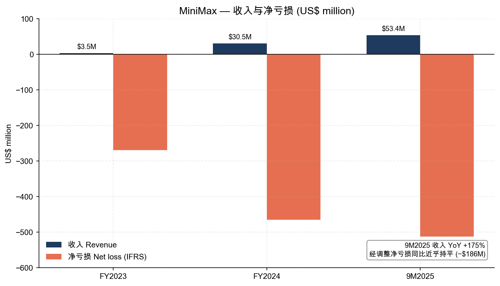
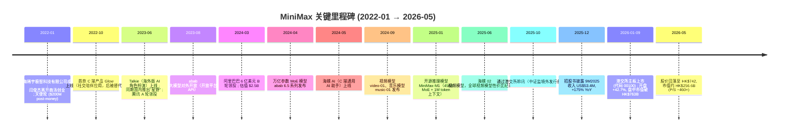
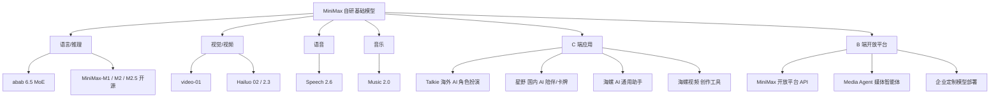
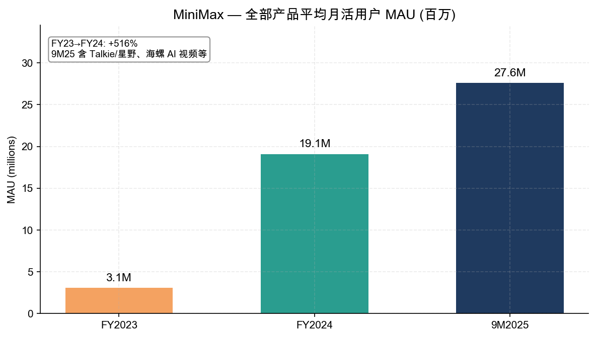
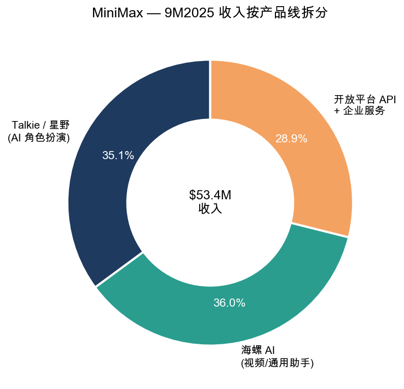
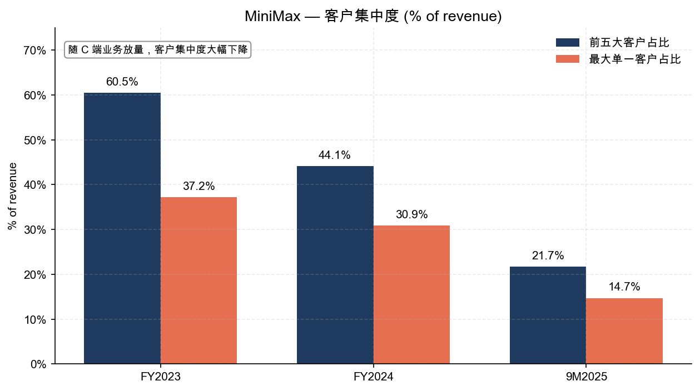
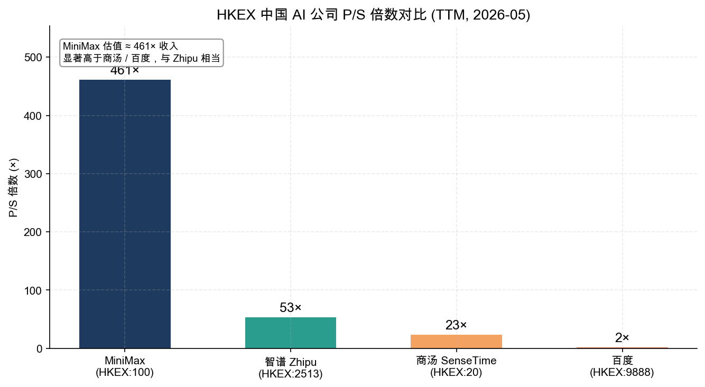
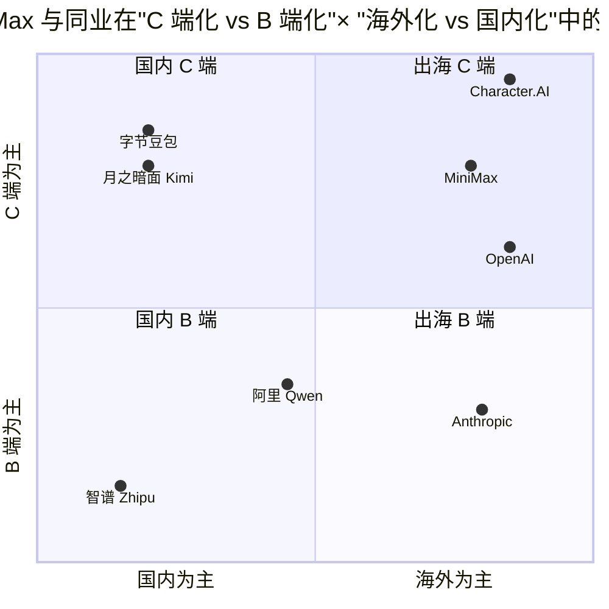

# MiniMax 稀宇极智 (HKEX:100) — 公司研究报告

**报告日期：2026-05-20**
**发行人：MINIMAX GROUP INC. - W（"MINIMAX-W"）**
**港股代码：100.HK（同时存在 W 股 / WP 股 - W 类含双重股权）**
**类别：通用人工智能 / 大模型 (Foundation model + AI-native apps)**
**最新股价 / 市值：HK$742.50 / 约 HK$256.6 bn（2026-05-19，[Yahoo Finance 0100.HK](https://finance.yahoo.com/quote/0100.HK/))**

---

## 0. 关键事件与近期指引 (Top-of-report banner)

- **2026-01-09 港交所主板挂牌**，发行价定在招股区间上限 HK$165，全球发售 25,389,220 股，募资净额约 HK$41.9 亿（约 US$538M），创全球 AI 大模型公司单笔 IPO 规模纪录（[量子位 2025-12 招股报道](https://www.qbitai.com/2025/12/366302.html)；[财联社 1837 倍超额认购](https://m.cls.cn/detail/2235733)）。
- **开盘日**：开盘价 HK$235.4（较发行价 +42.7%），盘中市值一度突破 HK$763 亿，公开发售获 ~1,837 倍超额认购，约 42 万散户参与（[动点科技 2026-01-09 上市报道](https://cn.technode.com/post/2026-01-09/minimax-hkex-listing-largest-ai-model-ipo/)）。
- **基石投资人**：阿布扎比投资局 (ADIA)、阿里巴巴间接全资附属公司 Alisoft China、Aspex Master Fund、博裕 (Boyu)、汇添富香港、瀚亚投资、易方达基金、IDG Breyer Fund 等共 14 家，合计认购约 US$350M（[新浪财经 / 创事记 2025-12-31](https://finance.sina.com.cn/tech/csj/2025-12-31/doc-inhesnwq3772018.shtml)）。
- **最新业绩指引（招股书披露口径）**：2025 年前 9 个月收入 US$53.44M，同比 +175%；同期 IFRS 净亏损 US$512M，**经调整净亏损 US$186M（同比近乎持平，亏损率显著下降）**，研发开支 US$180M（[wallstreetcn 2025-12 招股书拆解](https://wallstreetcn.com/articles/3761823)；[36kr 招股书速览 ID:3606464589923336](https://36kr.com/p/3606464589923336)）。
- **现金状况**：招股书披露账面现金 + 短期金融资产合计约 US$10.5–11 亿（IPO 前），加上 IPO 净募资后约 US$15 亿以上 ([雷递 招股书拆解](https://www.leinews.com/n32158/detail.html))。
- **估值水位**：以 9M2025 年化收入 US$71M 计，当前 HK$256.6B 市值对应 TTM P/S ≈ 460×，处于全市场极端高位，反映"中国版 OpenAI"叙事溢价（详见第 9 节）。

---

## 目录

1. 公司概览
2. 公司历史
3. 管理团队与治理
4. 产品与服务
5. 客户与商业化策略
6. 行业概览
7. 竞争格局
8. 市场机会 (TAM)
9. 风险评估
10. 参考资料

---

## 1. 公司概览

MiniMax（中文实体名"上海稀宇极智科技有限公司"，开曼上市主体 "MINIMAX GROUP INC."）是一家成立于 **2022 年初**、总部位于上海徐汇区的通用人工智能 (Artificial General Intelligence, AGI) 公司，核心业务是自研全模态基础大模型 (foundation model)，并基于自有模型对外发行 C 端 AI 原生应用（Talkie / 星野、海螺 AI、海螺视频）以及 B 端开放平台 API 与企业服务（[MiniMax 关于我们](https://www.minimaxi.com/about)；[百度百科 - MiniMax](https://baike.baidu.com/item/MiniMax/63388942)）。公司中文注册名"稀宇极智"取"以最小算力撬动最大智能"之意，与英文名 MiniMax（博弈论术语，"在最坏情形下最优化收益"）呼应。

**业务结构（招股书披露口径）：**

- **C 端 AI 原生产品（约 71% 收入）**：Talkie（海外 AI 角色扮演 App）、星野（Talkie 中国版）、海螺 AI（通用 AI 助手 + 视频生成）等；
- **B 端开放平台与企业服务（约 29% 收入）**：MiniMax 开放平台（abab / M / Hailuo / Speech / Music 系列模型 API、定制化模型部署）以及面向企业的全模态解决方案（[wallstreetcn 招股书拆解](https://wallstreetcn.com/articles/3761823)；[news.futunn 招股书英文版](https://news.futunn.com/en/post/66478828/in-depth-analysis-of-the-unicorn-ai-large-model-prospectus)）。

**用户与地理覆盖：** 截至 2025 年第三季度末，公司全模态产品累计覆盖 200 多个国家与地区、个人用户超 2.12 亿、企业客户 13 万家以上；9M2025 海外收入占比超 70%，是中国 AI 公司中海外化程度最高的之一（[stcn 2025-12 招股书 C 端解读](https://stcn.com/article/detail/3552911.html)）。

**估值快照 (Valuation snapshot, 2026-05-19)：**

| 指标 | 数据 | 说明 |
|---|---|---|
| 收盘价 | HK$742.50 | [Yahoo Finance 0100.HK](https://finance.yahoo.com/quote/0100.HK/) |
| 市值 | HK$256.6 bn (≈US$32.9 bn) | 同上 |
| 52 周区间 | HK$220.00 – HK$1,330.00 | 上市以来高低 |
| TTM 收入 (9M25 年化) | ≈US$71.3M | 53.44 × 12/9 |
| **TTM P/S** | **≈ 460×** | 中位港股科技 ~5× |
| TTM P/E | N/A（持续亏损） | 9M25 经调整净亏损 US$186M |
| 经调整亏损率 | ~350% of revenue | IFRS 亏损率 >900% |
| 卖方覆盖 | 11 Buy / 0 Sell, 平均目标价 HK$1,098 | Bloomberg / Yahoo |

**对极端 P/S 的解读：** 460× TTM P/S 显著高于已上市 AI 大模型同业（智谱 HKEX:2513 上市后 P/S 约 30×，[KuCoin 2026-01 智谱 MiniMax 估值](https://www.kucoin.com/news/flash/minimax-and-zhipu-ai-surge-in-hong-kong-market-valuations-top-300-billion-hkd)）、商汤 (~14×) 以及百度 (~1.5×)。市场实际定价的是"未来 3–5 年规模化收入 + 海外用户 + 自研全栈技术"的复合期权价值，而非当前现金流；这种估值结构对增长不及预期的容错率极低（见第 9 节"估值压缩风险"）。

*Source: [MiniMax 港交所招股说明书 (2025-12)](https://www.fxbaogao.com/detail/5209229)，[wallstreetcn 招股书拆解](https://wallstreetcn.com/articles/3761823) 与 [36kr 业绩首披露](https://36kr.com/p/3606464589923336)。*

---

## 2. 公司历史

MiniMax 由 **闫俊杰 (Yan Junjie)** 于 2022 年初在上海创立，是中国"AI 六小虎"（智谱、月之暗面、百川、零一万物、MiniMax、阶跃星辰）中商业化方向最早转向"C 端 + 海外"的一家。从成立到上市仅约 4 年时间，是全球 AI 大模型公司中"从注册到 IPO" 用时最短的（[腾讯新闻 2026-01-12 上市观察](https://news.qq.com/rain/a/20260112A01JT500)）。

**关键里程碑：**

公司发展逻辑可概括为三段：

1. **2022–2023：建模与赛道试错。** 从社交陪伴应用 Glow 起步，但 Glow 因产品形态过窄、变现路径不清而沉淀为内部教训。2023 年闫俊杰确立"自研全模态基础模型 + 自研 C 端应用"双轮战略，分别试水海外 (Talkie) 与国内 (星野)。
2. **2024：模型升级 + C 端爆发。** abab 6.5 万亿参数 MoE 大模型 + 海螺 AI 推出，叠加 Talkie 在美国市场上线一年后跻身海外 AI 陪伴 App 头部，C 端用户规模从百万级跨入千万级（[InfoQ 2025-12 招股书首披](https://www.infoq.cn/article/4dfzSRWELNTPwyDfAjf7)）。
3. **2025–2026：商业化提速 + 资本化。** 海螺视频模型与开源 M1 / M2 系列建立技术品牌，同时推动开放平台对企业级客户的渗透；7 月披露新一轮 ~US$3 亿融资，估值跃至 ~US$40 亿（[21 经济报道 2025-07 融资消息](https://www.21jingji.com/article/20250715/herald/0c78cb8e4aefa9d2e44accb8d41e9f15.html)）；12 月递表港交所，1 月挂牌。

---

## 3. 管理团队与治理

MiniMax 是典型的"创始人 + 技术合伙人"双核结构，董事会平均年龄约 32 岁，是港股市值前 100 大公司中最年轻的管理团队之一（[InfoQ 招股书首披](https://www.infoq.cn/article/4dfzSRWELNTPwyDfAjf7)）。

### 3.1 创始人 / CEO：闫俊杰 (Yan Junjie, 36 岁)

- **学历：** 2010 年东南大学数学学院理学学士；2015 年中国科学院自动化研究所模式识别国家重点实验室博士；清华大学计算机系博士后（[百度百科 闫俊杰](https://baike.baidu.com/item/%E9%97%AB%E4%BF%8A%E6%9D%B0/64788782)）。
- **关键履历：** 博士后期间加入商汤科技，先后任研究院副院长、智慧城市事业群 CTO 与副总裁，主导通用计算机视觉大模型与城市级视觉系统的工程化落地；32 岁离开商汤创立 MiniMax（[i 黑马 2024-07 中科院独角兽](https://www.iheima.com/article-357755.html)）。
- **风格与定位：** 公开表达上以工程师而非"AI 网红"自处；在 2025 年与罗永浩的对谈中，将公司定位为"AI 原生公司"，强调"做一家 AI 时代的微软或谷歌，而非另一个 GPT 套壳应用"（[澎湃新闻 2025 罗永浩对谈](https://m.thepaper.cn/newsDetail_forward_32148957)）。
- **股权与控制：** 招股书显示闫俊杰为公司单一最大自然人股东并通过 W 类股保有多数表决权；外部投资人持股 ≈40–45%，其中阿里系合计间接持股约 13.66%（[Tiger Brokers 招股书阿里 13.66%](https://www.itiger.com/news/1126099864)）。
- **市场认可：** 2025 年获英伟达 CEO 黄仁勋公开点名为"中国值得关注的 AI 公司创始人之一"（[知乎专栏 闫俊杰履历汇总](https://zhuanlan.zhihu.com/p/1992939715444368768)）；同年入选中国互联网协会"互联网企业家座谈会"代表（[中国互联网协会 2025 名单](https://www.isc.org.cn/article/24640972658700288.html)）。

### 3.2 联合创始人 / 首席科学家：杨斌 (Yang Bin)

杨斌为闫俊杰中国科学院自动化所同期博士同学，是 MiniMax 模型层的核心负责人之一，主管基础模型研发（[InfoQ 招股书首披](https://www.infoq.cn/article/4dfzSRWELNTPwyDfAjf7)；[Caproasia 2026-01 IPO 简报](https://www.caproasia.com/2026/01/01/china-ai-startup-minimax-hong-kong-ipo-to-raise-538-million-at-6-5-billion-valuation-with-expected-ipo-listing-on-9th-january-2026-founded-in-2022-by-yan-junjie-yang-bin-zhou-yucong-investors-i/)）。招股书未单独披露其完整履历，公开资料显示其曾在国内大厂 AI Lab 任职。

### 3.3 联合创始人 / 多模态负责人：周昱聪 (Zhou Yucong, 32 岁)

周昱聪为公司视觉与多模态方向负责人，是海螺视频与 video-01 / Hailuo 02 模型的主导者之一（[Caproasia IPO 简报](https://www.caproasia.com/2025/12/23/china-ai-startup-minimax-plans-hong-kong-ipo-in-2026-q1-to-raise-700-million-at-4-billion-valuation-founded-in-2022-by-yan-junjie-yang-bin-zhou-yucong-investors-include-mihoyo-alibaba-tencent/)；[量子位 2026-01 敲钟报道](https://www.qbitai.com/2026/01/369227.html)）。其与配偶在 IPO 当日合计身价约 HK$48 亿，是 IPO 当天最受市场关注的"少壮派"高管之一。

### 3.4 COO：曾烨翼 (Zeng Yeyi, 31 岁)

曾烨翼负责整体业务运营，包括出海产品 Talkie 的运营体系建设。InfoQ 引用招股书披露其与 LLM 研究负责人赵鹏宇 (Zhao Pengyu, 29 岁) 同为四位执行董事中的两位（[InfoQ 招股书首披](https://www.infoq.cn/article/4dfzSRWELNTPwyDfAjf7)）。

### 3.5 团队画像

招股书披露截至 2025 年第三季度末，公司共有 **385 名全职员工**，平均年龄 **29 岁**（核心管理层平均 32 岁），研发人员占比 **73.8%**（约 285 人），海外背景人才超 30%；核心研发成员主要来自微软、谷歌、Meta、阿里、字节、DeepSeek 等头部 AI 团队（[36kr 招股书 385 人](https://36kr.com/p/3606464589923336)；[InfoQ 招股书首披](https://www.infoq.cn/article/4dfzSRWELNTPwyDfAjf7)；[新浪财经 1-9 敲钟报道](https://finance.sina.com.cn/roll/2026-01-09/doc-inhfsnix0677752.shtml)）。闫俊杰在敲钟现场披露内部代码 **约 80% 由 AI 完成**，反映团队以"小而精"模式追求人均产出。

### 3.6 治理与股权结构

- **W 股双重股权结构：** 港交所同时挂牌"100 (W 股)"与"100 WP"（同股不同权），保障创始人投票权；这是港交所允许的"创新产业公司"专属上市架构（沿用快手、京东等已有先例）。
- **股东：** 早期天使 — 高瓴 (Hillhouse)、米哈游 (miHoYo)、云启资本、IDG、真格 (ZhenFund，连续参投 6 轮)；A 轮起腾讯 (2023-06) 与阿里 (2024-03) 进入；同时引入上海国资委系的上海国际集团、上海国投公司（[国资委 2026-01 国企动态](https://www.gzw.sh.gov.cn/shgzw_zxzx_gqdt/20260112/5102252e522e4034812c32409e27d55b.html)；[HTX Insights 7 轮融资](https://www.htx.com/news/minimaxs-funding-story-7-rounds-in-4-years-who-is-driving-ch-61hezm1c/)）。
- **基石投资人**（IPO 时锁定 6 个月）：ADIA (US$65M)、Alisoft China (US$30M)、Aspex (US$35M)、Boyu (US$35M)、汇添富香港 (US$15M)、瀚亚 (US$15M)、易方达 (US$10M)、IDG Breyer Fund、Janchor、Martis、Mirae、MPC VII、Perseverance、泰康人寿 — 合计约 US$350M。基石锁定结构为 IPO 后短期供需提供了价格支撑（[新浪财经 / 创事记 基石名单](https://finance.sina.com.cn/tech/csj/2025-12-31/doc-inhesnwq3772018.shtml)）。
- **治理风险：** 招股书披露公司截至 2025 年 9 月底累计未弥补亏损超过 US$1B；流动负债中包含大额可转换可赎回优先股负债，IPO 完成后将自动转股、流动负债将显著回落（[腾讯新闻 2026-01 流动负债解读](https://news.qq.com/rain/a/20260101A02U1900)）。

---

## 4. 产品与服务

MiniMax 是中国大模型公司中最坚定的"全栈 + C 端" 路线，模型自研，应用自营。下图为产品架构：

### 4.1 基础模型层 (Foundation models)

- **abab 6.5（2024-04）**：万亿参数 MoE 架构（业内首批商用万亿 MoE 之一），支持 200K token 长上下文，对中文场景的内容生成与角色化对话有专门优化（[CSDN minimaxi abab 6.5 发布](https://blog.csdn.net/minimaxi/article/details/137969127)；[中文 AET abab 6.5 报道](http://www.chinaaet.com/article/3000164618)）。
- **MiniMax-M1（2025-01 开源）**：456B 总参数 / 45.9B 激活参数 / 32 个专家的 MoE + Lightning Attention 混合架构，原生支持 100 万 token 上下文（约 8× DeepSeek R1），是国内首批将百万级长上下文 + 强推理能力同时开源的大模型（[InfoQ MiniMax-M1 开源](https://www.infoq.com/news/2025/06/minimax-m1/)；[arXiv M1 技术报告](https://arxiv.org/pdf/2506.13585)）。
- **MiniMax-M2 / M2.1 / M2.5（2025 下半年起）**：架构收敛至 230B MoE（更小、更易部署），在 FullStackBench、SWE-bench、TAU-Bench 等编程与代理任务上同时超过 DeepSeek R1 与 Qwen3-235B 等开源对标（[AI CERTs M2.1 编码基准](https://www.aicerts.ai/news/minimax-m2-1-open-source-moe-model-sets-coding-benchmark/)；[OpenRouter MiniMax 模型](https://openrouter.ai/provider/minimax)）。
- **视频 / 语音 / 音乐：** Hailuo 02 (2025-06)、Hailuo 2.3 (2025 末) 在 VBench 第三方评测中位列全球前列；Speech 2.6 与 Music 2.0 提供高保真语音合成与音乐生成 API。

闫俊杰在敲钟现场表示，MiniMax 的训练成本"约为 OpenAI 同等模型的 1%"——主要靠 MoE + Lightning Attention + 强化学习算法效率（[新浪财经 1-9 敲钟](https://finance.sina.com.cn/roll/2026-01-09/doc-inhfsnix0677752.shtml)；[新浪 2025-12 大模型成本对比](https://finance.sina.com.cn/stock/t/2025-12-21/doc-inhcqswc8516325.shtml)）。

### 4.2 C 端产品矩阵

**(a) Talkie（海外）+ 星野（国内）— AI 角色扮演 / 陪伴**

- **核心模式：** 用户可创建或下载 AI 角色（"agent"），与之展开多轮对话；订阅价 US$9.99/月，对标 Character.AI；同时引入"卡牌"机制（gem 抽卡，约 US$1.99/抽）+ UGC 卡牌交易，开辟陪伴 App 中独有的二次变现路径（[澎湃 Talkie 出海](https://m.thepaper.cn/newsDetail_forward_27661729)；[腾讯新闻 7000 万营收](https://news.qq.com/rain/a/20241029A04T8O00)）。
- **用户与地域：** 截至 2024 上半年累计下载 ≈1,400 万；DAU 地域分布中美国 55.18%、菲律宾 14.99%、英国 10.49%、孟加拉 8.34%——是中国出海 App 中极少数美国 DAU 过半的产品（[腾讯新闻 380 万年轻人](https://news.qq.com/rain/a/20240804A05R5C00)；[让出海 Talkie 用户结构](https://letschuhai.com/14779bf0)）。
- **货币化：** Talkie / 星野 9M2025 收入 US$18.75M，约占公司总收入的 **35.1%**（[stcn 招股书 C 端解读](https://stcn.com/article/detail/3552911.html)；[news.futunn 招股书英文版](https://news.futunn.com/en/post/66478828/in-depth-analysis-of-the-unicorn-ai-large-model-prospectus)）。
- **平均 MAU**：Talkie / 星野 9M2025 约 2,000 万。

**(b) 海螺 AI — 通用 AI 助手 + 海螺视频**

- 2024-05 上线，主打"对话 + 文档 + 视频生成"一体化；视频模型 Hailuo 02 / 2.3 已成为公司技术名片。
- 海螺 AI 9M2025 收入约 US$19M（≈36% 总收入），其中视频模型贡献主体；MAU 约 560 万（[news.futunn 招股书拆解](https://news.futunn.com/en/post/66478828/in-depth-analysis-of-the-unicorn-ai-large-model-prospectus)；[The Paper 招股书 5344 万营收](https://www.thepaper.cn/newsDetail_forward_32225119)）。
- 截至 2025 年底，海螺视频已帮助 180+ 国家创作者累计生成 **6 亿+** 条视频（[MiniMax 海螺 02 新闻稿](https://minimaxi.com/news/minimax-hailuo-02)；[MiniMax 海螺 2.3 + Media Agent](https://www.minimaxi.com/news/minimax-hailuo-23)）。

**(c) 整体 C 端用户规模**

*Source: [MiniMax 招股说明书 (2025-12)](https://www.fxbaogao.com/detail/5209229)，[wallstreetcn 9M25 收入同比 +175%](https://wallstreetcn.com/articles/3766531)。*

平均 MAU 从 FY2023 的 310 万跃升至 FY2024 的 1,910 万 (+516%)，并进一步增至 9M2025 的 2,760 万。累计注册个人用户 2.12 亿、企业客户超过 13 万家（[财联社 2 亿用户](https://m.cls.cn/detail/2235733)）。

### 4.3 B 端开放平台与企业服务

MiniMax 开放平台 (api.minimaxi.chat) 提供 abab / M / Hailuo / Speech / Music 全模态 API，按 token / 任务计费；同时为大客户提供"私有化部署 + 定制微调"服务。在国内开发者市场，开放平台与阿里通义、智谱 BigModel、DeepSeek、字节豆包构成主要竞品；在国际市场，Hailuo 与 M 系列已上架 OpenRouter、Hugging Face 等聚合平台（[OpenRouter MiniMax 模型](https://openrouter.ai/minimax)）。

招股书披露 9M2025 开放平台 + 企业服务收入 US$15.42M，约 **28.9%** 总收入，毛利率 **69.4%**（同期 +7.1 ppt），显著高于 C 端业务 ≈4.7% 的毛利率——B 端是 MiniMax 现阶段最赚钱的板块（[新浪财经 2025-12 PK 智谱](https://finance.sina.com.cn/roll/2025-12-22/doc-inhcrpzp4753041.shtml)；[36kr 招股书 10 个真相](https://36kr.com/p/3609403248542466)）。

*Source: [MiniMax 招股说明书](https://www.fxbaogao.com/detail/5209229)；[news.futunn 招股书拆解](https://news.futunn.com/en/post/66478828/in-depth-analysis-of-the-unicorn-ai-large-model-prospectus)。*

---

## 5. 客户与商业化策略

MiniMax 的营收结构与典型 SaaS / 企业级模型公司（如 Anthropic、Zhipu）有本质差异——**C 端订阅 + 卡牌 ARPU + 视频信用 (credits) 占主体（约 71%）**，B 端 API + 企业项目占 29%。这一结构在中国大模型同业中独树一帜，最接近的国际同业是 Character.AI 与 Midjourney 的组合。

### 5.1 收入结构与客户类型

- **个人付费用户：** Talkie / 星野订阅用户 + 海螺 AI 月会员；招股书未单独披露付费用户数，但据 9M25 C 端收入 ≈US$38M、ARPU 估算约为月度活跃用户的 1–2% 付费转化（与全球 AI 陪伴 App 头部水平一致）。
- **企业 API 客户：** 开放平台已服务超过 **13 万企业客户**，覆盖游戏、教育、影视、电商、金融客服、智能硬件等行业。
- **战略合作：** 米哈游 (miHoYo) 同时是早期投资人与产品合作方，在角色扮演 / 互动内容场景上为 MiniMax 提供 IP 数据与产品联调资源（[腾讯新闻 米哈游股东](https://news.qq.com/rain/a/20260109A03OFS00)；[TechNode miHoYo-backed](https://technode.com/2026/01/09/mihoyo-backed-ai-firm-minimax-jumps-on-hong-kong-debut-market-value-tops-11-5-billion/)）。

### 5.2 客户集中度

*Source: [MiniMax 招股说明书](https://www.fxbaogao.com/detail/5209229)；[36kr 招股书 10 个真相](https://36kr.com/p/3609403248542466)。*

招股书披露 2023 / 2024 / 9M2025 前五大客户收入占比 **60.5% → 44.1% → 21.7%**，最大单一客户占比 **37.2% → 30.9% → 14.7%**——随着 C 端零售型营收高速放量，企业客户集中度风险在显著下降，但绝对水平仍高于成熟 SaaS（典型 Top-5 ≤15%）。招股书未披露最大客户名称（属常规商业秘密保护）。

### 5.3 地域结构与定价模型

- **海外贡献 >70% 收入（9M2025）**：Talkie 美国 DAU 占比超过 55%，海螺 AI 在 180+ 国家有创作者。这是 MiniMax 相对于智谱（几乎全部国内 B 端）、月之暗面（国内 C 端为主）的最大差异化。
- **C 端订阅价：** Talkie US$9.99/月（与 Character.AI 持平），星野国内 ¥30–60/月不等，海螺 AI 月卡约 ¥30，海螺视频按视频 credits 计费。
- **B 端 API：** 价格阶梯随模型规模与版本而异；M 系列与 Hailuo 推理 API 在 OpenRouter 上的报价较 OpenAI GPT-4 系列低 1–2 个数量级，反映"中国全栈成本优势"。

### 5.4 商业化策略评估

**优点：** (1) C 端订阅 + 卡牌 + credits 的多元 ARPU 路径在中国大模型公司中最成熟；(2) 海外收入占比创造了"中美双市场"叙事，对香港 / 海外机构投资人估值溢价显著；(3) 客户集中度持续下降，结构改善。

**缺点：** (1) C 端毛利率仅 4.7%（推理算力 + App Store / Google Play 分成 30% + 海外支付通道费），盈利杠杆远低于 B 端 SaaS；(2) Talkie / 星野所在的 AI 陪伴赛道尚处于"内容监管 + 未成年人保护"政策灰区，长期可持续性需进一步验证；(3) 海外业务对 Apple / Google 双渠道的政策变化暴露较大（详见第 9 节）。

---

## 6. 行业概览

### 6.1 通用人工智能 (Foundation Model) 行业

通用人工智能行业自 2022 年底 ChatGPT 上线后进入超高速增长期。根据 IDC、Gartner 与 Grand View Research 等机构的研究，全球生成式 AI（GenAI）市场 2024 年约 **US$50–70 bn**，预计 2030 年达到 US$1 trillion 量级，2024–2030 CAGR 约 35–40%（[Grand View AI Companion 报告 2024–2030](https://www.grandviewresearch.com/industry-analysis/ai-companion-market-report)）。

行业格局可拆为四层：

1. **算力层（NVIDIA、TSMC、AMD、HBM 等）** — 寡占；
2. **基础模型层（OpenAI、Anthropic、Google DeepMind、xAI、Meta、Mistral，以及中国的 DeepSeek、阿里通义、智谱、MiniMax、月之暗面、字节豆包、阶跃星辰）** — 高度集中，资本密集；
3. **平台与中间件（OpenRouter、Hugging Face、LangChain、LlamaIndex、Cursor 等）** — 长尾；
4. **应用层（ChatGPT、Claude、Gemini、Perplexity、Character.AI、Midjourney、Talkie、海螺、星野、Cursor、Notion AI、Manus 等）** — 极度分散。

MiniMax 是同时跨 2、4 两层的"垂直整合 + 全模态"玩家，目前在中国主要对标智谱（更偏 B 端）、月之暗面（Kimi，更偏国内 C 端 + 文档场景）与阶跃星辰（多模态）。

### 6.2 AI 陪伴 / 角色扮演细分赛道（Talkie / 星野所在）

AI 陪伴 (AI Companion) 是 MiniMax C 端收入的主要载体，是 GenAI 应用层增长最快的细分之一。根据多家市场研究机构：

- 2024 年全球 AI Companion 市场规模 ≈US$28 bn，预计 2030 年达 US$140 bn (CAGR 30.8%)（[Grand View AI Companion 2030](https://www.grandviewresearch.com/industry-analysis/ai-companion-market-report)）；另一组预测 2025 年 US$37 bn → 2035 年 US$552 bn (CAGR ~30%)（[Precedence Research AI Companion 2035](https://www.precedenceresearch.com/ai-companion-market)）。
- 2025 H1 全球 AI Companion App 下载量同比 +88% 至 6,000 万次，收入同比 +64%（[electroiq AI Companion 统计 2025](https://electroiq.com/stats/ai-companions-statistics/)）。
- 同业营收（2024 年）：Character.AI ≈US$32M、Replika ≈US$24M、Chai US$30M+ ARR、Candy.ai US$25M ARR——与 Talkie 2024 年 ≈US$25–30M（基于全公司 US$30.5M 营收 + Talkie 占比估算）大体相当；Talkie 在 2025 年加速放量。

### 6.3 AI 视频生成赛道（海螺视频所在）

AI 视频生成是 2024–2026 年新爆发的子赛道，主要玩家包括 OpenAI Sora、Runway Gen-4、Google Veo 3、Kling（快手可灵）、Pika、Hailuo (海螺) 与 Vidu (生数)。VBench 公开评测中，海螺 02 / 2.3 多项指标位居全球第一阵营。该赛道目前以 credits 付费 + 创作者订阅为主，全球 ARR 预计 2025 年突破 US$1 bn。

### 6.4 国内外监管环境

- **国内：** 中国《生成式人工智能服务管理暂行办法》(2023-08 实施) 要求"算法备案 + 内容合规 + 数据训练授权"，MiniMax 自上线起即完成备案。儿童 / 未成年人保护、AI 陪伴中"擦边内容"是行业政策最敏感的方向（[Global Legal Insights China AI 2025](https://www.globallegalinsights.com/practice-areas/ai-machine-learning-and-big-data-laws-and-regulations/china/)）。
- **海外：** 欧盟 AI Act (2024)、美国各州数据隐私法、Apple / Google 应用商店关于 NSFW 与未成年内容的政策对 Talkie 等出海 App 持续构成合规压力。MiniMax 曾与英伟达、零一万物等共同签署"AI 安全承诺"以配合主要市场监管（[MLex AI 安全承诺](https://www.mlex.com/mlex/articles/2294541/nvidia-china-s-minimax-and-01-ai-pledge-ai-safety-commitments-ahead-of-summit)）。

---

## 7. 竞争格局

MiniMax 的竞争对手可分四层：(a) 国内"AI 六小虎"同业；(b) 中国互联网大厂自研模型；(c) 海外头部基础模型公司；(d) 同赛道应用层（AI 陪伴 / 视频 / 通用助手）。

### 7.1 中国"AI 六小虎"同业横向对比

| 公司 | 主战场 | 2024 营收 | 估值 (2026Q1) | 上市状态 |
|---|---|---|---|---|
| **MiniMax (HKEX:100)** | C 端 (Talkie / 星野 / 海螺) + 出海 | US$30.5M | HK$256.6 bn (~US$33B) | 2026-01 上市 |
| 智谱 Zhipu (HKEX:2513) | B 端企业 + 国内政府 | ~RMB 1.0B (~US$140M) | HK$57.9 bn (~US$7.4B) | 2026-01 上市 |
| 月之暗面 (Moonshot AI / Kimi) | 国内 C 端 (Kimi) | n.d. | ~US$4.3B (2025-Q3 C 轮) | 未上市 |
| 阶跃星辰 (StepFun) | 多模态 + B 端 | n.d. | n.d. | 未上市 |
| 百川智能 (Baichuan) | 转向医疗垂类 | n.d. | n.d. | 未上市 |
| 零一万物 (01.AI) | 转向中型高性价比模型 | n.d. | n.d. | 未上市 |

(*来源：[21 经济报道 六小虎 2025 复盘](https://www.21jingji.com/article/20260107/herald/60ab618efcf373c981aeef2e544f1ab6.html)；[stcn 智谱 MiniMax 招股](https://stcn.com/article/detail/3552911.html)；[KuCoin MiniMax/智谱 市值](https://www.kucoin.com/news/flash/minimax-and-zhipu-ai-surge-in-hong-kong-market-valuations-top-300-billion-hkd)*)

2024–2025 行业洗牌中，百川转向医疗垂直、零一万物聚焦中等参数模型，"六小虎"叙事已部分瓦解——只有 MiniMax、智谱、月之暗面、阶跃星辰仍在投入万亿参数级通用大模型（[21 经济 六小虎过去式](https://www.21jingji.com/article/20250709/herald/5187aaeac017c2fe9eb0764a65381d9d.html)；[钛媒体 六小虎下一赛点](https://www.tmtpost.com/7616759.html)）。

### 7.2 互联网大厂

- **字节 (豆包 / Doubao)：** 抖音流量 + 海量数据 + 自研芯片布局；C 端最大对手；
- **阿里 (通义千问 / Qwen)：** 开源 Qwen 系列在 HuggingFace 下载量全球前列，同时是 MiniMax 战略股东（持股 13.66%）；竞合并存；
- **腾讯 (混元)：** 微信 / 游戏入口 + 自有云；亦是 MiniMax 早期投资人；
- **百度 (文心)：** 国内最早的大模型；搜索 + 文档场景。

互联网大厂在 C 端流量和分发渠道上的天然优势对 MiniMax 构成长期压力，特别是字节豆包；MiniMax 的"差异化护城河"主要在(a) 海外用户、(b) 模型效率（"成本仅为 OpenAI 的 1%"）、(c) 角色扮演 / 视频等垂直内容场景的产品 know-how。

### 7.3 海外同业

- **OpenAI：** 闭源 GPT 系列 + ChatGPT，全球 C 端 AI 龙头；
- **Anthropic Claude：** 强推理 + 企业 SaaS；
- **Google DeepMind / Gemini：** 多模态 + Google Workspace 渠道；
- **Meta Llama：** 开源生态首位；
- **xAI / Grok：** X 平台流量；
- **DeepSeek（中国但海外开源影响极大）：** 极致开源 + 极致效率，对 MiniMax 的开源 M1 / M2 系列直接竞品。

MiniMax-M2 在编程基准 (SWE-bench, FullStackBench) 上超过了 DeepSeek R1 与 Qwen3-235B（[AI CERTs M2.1 编程基准](https://www.aicerts.ai/news/minimax-m2-1-open-source-moe-model-sets-coding-benchmark/)），但在通用知识与推理深度上仍落后 OpenAI o1 / Anthropic Claude 3.7 等闭源旗舰。

### 7.4 应用层正面对手

- **AI 陪伴：** Character.AI (谷歌系)、Replika、Chai、Candy.ai、Talkie / 星野；
- **AI 视频：** Sora (OpenAI)、Runway、Veo 3 (Google)、Kling (快手)、Pika、海螺、Vidu；
- **通用 AI 助手：** ChatGPT、Claude、Gemini、Perplexity、Kimi、豆包、海螺 AI。

### 7.5 估值与市场定位横向对比

*Source: HKEX 与 [Yahoo Finance 0100.HK](https://finance.yahoo.com/quote/0100.HK/) 市值 (2026-05)；各公司招股书 / FY2024 年报收入；[KuCoin MiniMax/智谱 市值](https://www.kucoin.com/news/flash/minimax-and-zhipu-ai-surge-in-hong-kong-market-valuations-top-300-billion-hkd) 与 [Ginlix Zhipu 估值分析](https://www.ginlix.ai/news/16391-analysis-of-first-day-listing-performance-and-valuation-on-the-hong-kong-stock-exchange)。*

MiniMax 占据"出海 + C 端"象限，在国内大模型公司中相对独立，估值溢价与风险均来自这一定位。

---

## 8. 市场机会 (TAM)

### 8.1 全球生成式 AI TAM

根据 Grand View Research、Precedence Research、IDC 等多家机构 (2025) 综合估算：

- **全球生成式 AI 软件市场** 2024 年约 US$70 bn → 2030 年 US$700 bn–1 trillion (CAGR ~35–40%)；
- **基础模型 API + 推理算力服务** 2024 年约 US$15 bn → 2030 年 US$200 bn 量级；
- **AI Companion + AI 内容生成应用** 2024 年 US$28 bn → 2030 年 US$140 bn (CAGR 30.8%)；
- **AI 视频生成** 2025 年 ARR ≈US$1 bn → 2030 年 US$30 bn 量级。

MiniMax 当前 9M25 年化收入约 US$71M，相对于上述 TAM 是十万分之一量级；即便假设公司只能拿到 1% 的"AI Companion + 视频"细分 (约 US$1.5 bn 收入空间，2030)，相对当前规模仍有 20× 增长空间——这是 460× P/S 在叙事上能站住的底层逻辑。

### 8.2 中国市场的双轨结构

- **国内 B 端 + 政企：** 由智谱、阿里通义、华为盘古、商汤主导；MiniMax 在政府 / 国资客户上落后于智谱与阿里。
- **国内 C 端：** 字节豆包流量第一，月之暗面 Kimi 占据"长文档"细分，海螺 AI / 星野与之竞争。

### 8.3 海外 C 端机会

MiniMax 真正的差异化机会窗口在 **"中国出海 C 端 AI 应用"**——目前在欧美市场具备规模化用户的中国 AI App 极少，Talkie + 海螺视频是最具代表性的案例。考虑到：

- 全球 AI Companion 下载量 2025 H1 同比 +88%；
- Character.AI 受困于谷歌收购后产品迭代节奏，海外用户流失到 Talkie 与 Chai；
- TikTok 海外用户基数证明中国出海 App 可以建立全球品牌；

MiniMax 在 2026–2028 年最大上行场景是"AI 时代的 TikTok 级别 C 端品牌"，对应数百亿美元 ARR 上限；最大下行场景是 Apple / Google 平台政策与海外监管收紧导致 Talkie 用户流失。

---

## 9. 风险评估

按"公司层 / 行业层 / 财务层 / 宏观层"四个桶共列 11 项核心风险。

### 9.1 公司特有风险

**R1 — 持续大额亏损与现金消耗 (高)**：9M2025 IFRS 净亏损 US$512M，经调整亏损 US$186M；研发开支 US$180M。账面现金 + 短期投资 +IPO 净募资合计约 US$15 亿，按当前烧钱率可支撑约 4–6 年；若 C 端订阅 ARPU 与 B 端 API 单价不能在 2027 年前显著提升，会出现新一轮再融资压力（[腾讯新闻 亏损 90 亿、流动负债 100 亿](https://news.qq.com/rain/a/20260101A02U1900)）。**缓释：** IPO 后流动负债大幅下降（可转换优先股转股），现金跑道延长。

**R2 — C 端业务毛利率仅 4.7% (高)**：C 端业务被 30% Apple/Google 渠道分成 + 推理算力成本 + 海外支付通道费三重侵蚀。若公司不能通过自研推理芯片 / 模型蒸馏 / 直接订阅渠道（Web / 信用卡）显著降本，规模效应难以转化为利润。**缓释：** B 端业务毛利率已达 69.4% 且持续抬升。

**R3 — Talkie 内容合规与平台政策风险 (高)**：AI 陪伴是 Apple / Google 应用商店、欧美监管层最敏感的细分之一；2024–2025 年 Character.AI 因未成年人对话事件被起诉、Replika 被欧盟 GDPR 罚款的先例都对 Talkie 构成警示。一次重大下架或集体诉讼可能造成 30–50% 营收的瞬时损失。**缓释：** 公司已签署 AI 安全承诺并建立内容审核团队。

**R4 — 关键人物依赖 + 双重股权 (中)**：闫俊杰持有 W 类股、对公司具压倒性表决权；其个人健康 / 选择变化对公司战略影响极大。**缓释：** 已组建以杨斌、周昱聪、曾烨翼为核心的执行董事团队。

### 9.2 行业 / 市场风险

**R5 — 模型代际淘汰风险 (高)**：基础模型行业代际更替速度极快 (~12–18 个月一代)，OpenAI / Anthropic / xAI 的下一代旗舰若实现质变（如真正可商用的多步推理 + Agent），可能在 6–12 个月内压制 MiniMax 的全球技术声望。**缓释：** MiniMax 选择"开源 M 系列 + 自研 C 端 App"双轨策略，部分隔离单一模型代际风险。

**R6 — 国内大厂挤压 C 端流量 (高)**：字节豆包凭借抖音流量、阿里通义凭借淘宝 / 钉钉入口，对国内 C 端形成持续压力；MiniMax 海螺 / 星野在国内 MAU 增速若停滞，"全球化故事"的国内根基会被削弱。**缓释：** 海螺视频在创作者社群已建立差异化，且海外业务占比已经过半。

**R7 — 海外地缘风险与中国 AI 公司标签 (中-高)**：美方对中国 AI 公司模型出口、云算力供应 (H100 / H200 / B200) 的限制持续收紧；Talkie 与海螺在美国市场若被定性为"国家安全敏感应用"（参照 TikTok 处置先例），存在被强制剥离 / 下架的可能性（[War on the Rocks 2026-04 中国 AI 安全](https://warontherocks.com/2026/04/chinas-ai-is-spreading-fast-heres-how-to-stop-the-security-risks/)）。**缓释：** 通过开曼上市主体 + 海外数据中心架构降低部分敏感性。

**R8 — 国内监管：算法备案 / 未成年人保护 (中)**：星野等 AI 陪伴 App 涉及未成年人保护红线；若网信办 / 文旅部进一步收紧 AI 陪伴 + 卡牌抽奖玩法，可能影响国内业务变现。**缓释：** 已完成算法备案与年龄分级。

### 9.3 财务风险

**R9 — 估值压缩风险 (极高)**：当前 460× TTM P/S 是港股科技公司里极少见的水位；任何收入增速放缓 (例如 9M2026 同比降至 +80%以下) 或上市后管理层出售解禁股，均可能触发"叙事修正"导致 30–50% 估值压缩。Wind / Yahoo 数据显示，IPO 后 4 个月公司股价已经历 52 周区间最高 HK$1,330 → 最近 HK$742 的回撤（约 -44%）。**缓释：** 基石锁定 6 个月，IPO 后短期供给受控；卖方覆盖以 Buy 为主，目标价 HK$1,098 (隐含 +48%)。

**R10 — 美元收入与人民币成本的汇率敞口 (中)**：海外收入 >70% 是美元，但研发成本以人民币为主；人民币兑美元若大幅升值，会侵蚀毛利率。**缓释：** 公司账面现金以美元为主，提供部分对冲。

### 9.4 宏观风险

**R11 — 全球 AI 资本周期变化 (中)**：当前 P/S 高位部分受益于 2025–2026 年全球 AI 板块超配；若 NVIDIA、Meta 等龙头出现负面叙事（投资回报不及预期、算力供给过剩），整个 AI 板块的估值锚定都会下移，MiniMax 作为"AI 纯标"会同步承压。**缓释：** 公司收入增速 +175% 远高于美股龙头平均 +30%，相对增长溢价仍存在。

---

## 10. 参考资料 (References)

### 一手来源 (Primary)

- [MiniMax 港交所招股说明书 (PHIP, 2025-12)](https://www.fxbaogao.com/detail/5209229) — IPO 前期招股资料。
- [MINIMAX-WP 香港发售公告 (招股资料, 2025-12-31)](https://www.ccnew.com.hk/home/upload/ipo/20251231093925_125193090.pdf) — 香港发售股份数、招股价、入场费等。
- [MiniMax Investor Relations — 管理团队](https://ir.minimaxi.com/corporate-information/management) — 高管团队列表。
- [MiniMax 关于我们](https://www.minimaxi.com/about) — 公司定位与使命。
- [MiniMax 海螺 02 新闻稿](https://minimaxi.com/news/minimax-hailuo-02) — 视频模型发布。
- [MiniMax 海螺 2.3 & Media Agent](https://www.minimaxi.com/news/minimax-hailuo-23) — 视频模型最新版本。
- [MiniMax Global Announces FY2025 Financial Results](https://www.minimax.io/news/minimax-global-announces-full-year-2025-financial-results) — 全年财务公告。
- [HKEX 港交所行情 MINIMAX GROUP INC. - W (100)](https://www.hkex.com.hk/Market-Data/Securities-Prices/Equities/Equities-Quote?sym=100&sc_lang=en) — 当前价格、市值数据。
- [Yahoo Finance 0100.HK](https://finance.yahoo.com/quote/0100.HK/) — 2026-05-19 收盘 HK$742.50、52 周区间。

### 学术 / 技术文献

- [MiniMax-M1 技术报告 (arXiv 2506.13585, 2025)](https://arxiv.org/pdf/2506.13585) — Scaling Test-Time Compute with Lightning Attention.
- [InfoQ MiniMax-M1 开源公告](https://www.infoq.com/news/2025/06/minimax-m1/) — M1 模型架构。
- [VentureBeat MiniMax-M1 1M context](https://venturebeat.com/ai/minimax-m1-is-a-new-open-source-model-with-1-million-token-context-and-new-hyper-efficient-reinforcement-learning) — M1 推理效率。
- [AI CERTs MiniMax-M2.1 编程基准](https://www.aicerts.ai/news/minimax-m2-1-open-source-moe-model-sets-coding-benchmark/) — M2.1 SWE-bench 数据。
- [Hugging Face MiniMax-M2.5 blog](https://huggingface.co/blog/mlabonne/minimax-m25) — M2.5 模型分析。
- [OpenRouter MiniMax 模型列表](https://openrouter.ai/provider/minimax) — 海外模型部署。
- [CSDN minimaxi abab 6.5 发布](https://blog.csdn.net/minimaxi/article/details/137969127) — 万亿参数 MoE 模型介绍。

### 招股书拆解与媒体报道

- [wallstreetcn 招股书拆解 — to C vs to B](https://wallstreetcn.com/articles/3761823) — MiniMax vs 智谱拆解。
- [wallstreetcn 2025 收入 +158.9%](https://wallstreetcn.com/articles/3766531) — 业绩同比数据。
- [InfoQ 招股书首披 — 385 人 / 95 后](https://www.infoq.cn/article/4dfzSRWELNTPwyDfAjf7) — 团队结构。
- [36kr 招股书速览 — 收入猛增 8 倍](https://36kr.com/p/3606464589923336) — 业绩与团队。
- [36kr 招股书 10 个真相](https://36kr.com/p/3609403248542466) — 财务亮点深挖。
- [澎湃新闻 招股书 9M 收入 5344 万美元](https://www.thepaper.cn/newsDetail_forward_32225119) — 收入、MAU、毛利率。
- [财联社 1837 倍超额认购 / 2 亿用户](https://m.cls.cn/detail/2235733) — IPO 申购倍数。
- [stcn 招股书 C 端收入超七成](https://stcn.com/article/detail/3552911.html) — 业务结构。
- [stcn 招股 8 倍收入 / 32 亿亏损](https://stcn.com/article/detail/3550404.html) — 财务展望。
- [新浪财经 PK 智谱 毛利率](https://finance.sina.com.cn/roll/2025-12-22/doc-inhcrpzp4753041.shtml) — 智谱 vs MiniMax 毛利对比。
- [新浪财经 大模型成本仅 OpenAI 1%](https://finance.sina.com.cn/stock/t/2025-12-21/doc-inhcqswc8516325.shtml) — 训练成本结构。
- [量子位 招股 / 募资 46 亿](https://www.qbitai.com/2025/12/366302.html) — IPO 招股细节。
- [量子位 763 亿大涨 50%](https://www.qbitai.com/2026/01/367789.html) — 上市首日表现。
- [量子位 周昱聪 31 岁 48 亿身价](https://www.qbitai.com/2026/01/369227.html) — 联合创始人。
- [雷递网 招股书 现金 10.5 亿](https://www.leinews.com/n32158/detail.html) — 资金状况。
- [新浪财经 / 创事记 基石认购 3.5 亿美元](https://finance.sina.com.cn/tech/csj/2025-12-31/doc-inhesnwq3772018.shtml) — 基石投资人。
- [新浪财经 1-9 敲钟 80% 代码 AI 完成](https://finance.sina.com.cn/roll/2026-01-09/doc-inhfsnix0677752.shtml) — 上市仪式实录。
- [腾讯新闻 流动负债 100 亿](https://news.qq.com/rain/a/20260101A02U1900) — 流动负债结构。
- [腾讯新闻 2026-01-12 上市观察](https://news.qq.com/rain/a/20260112A01JT500) — 从成立到 IPO 4 年。
- [动点科技 2026-01-09 上市报道](https://cn.technode.com/post/2026-01-09/minimax-hkex-listing-largest-ai-model-ipo/) — 最大 AI 模型 IPO。
- [TechNode miHoYo-backed AI firm jumps](https://technode.com/2026/01/09/mihoyo-backed-ai-firm-minimax-jumps-on-hong-kong-debut-market-value-tops-11-5-billion/) — 米哈游股东与上市首日。
- [KuCoin MiniMax / 智谱 市值 300B HKD](https://www.kucoin.com/news/flash/minimax-and-zhipu-ai-surge-in-hong-kong-market-valuations-top-300-billion-hkd) — 估值对比。
- [Tiger Brokers 阿里 13.66% 间接持股](https://www.itiger.com/news/1126099864) — 主要股东。
- [Caproasia IPO 简报 (2025-12 / 2026-01)](https://www.caproasia.com/2026/01/01/china-ai-startup-minimax-hong-kong-ipo-to-raise-538-million-at-6-5-billion-valuation-with-expected-ipo-listing-on-9th-january-2026-founded-in-2022-by-yan-junjie-yang-bin-zhou-yucong-investors-i/) — 投资人完整名单。
- [Bloomberg Zhipu HK debut](https://www.bloomberg.com/news/articles/2026-01-07/china-s-openai-rival-zhipu-debuts-in-hk-after-558-million-ipo) — 智谱上市对比。

### 创始人与团队来源

- [百度百科 闫俊杰](https://baike.baidu.com/item/%E9%97%AB%E4%BF%8A%E6%9D%B0/64788782) — 学历与商汤履历。
- [i 黑马 中科院独角兽](https://www.iheima.com/article-357755.html) — 创始故事。
- [知乎专栏 闫俊杰履历汇总](https://zhuanlan.zhihu.com/p/1992939715444368768) — 创业前后细节。
- [中国互联网协会 2025 闫俊杰](https://www.isc.org.cn/article/24640972658700288.html) — 2025 互联网企业家座谈会。
- [澎湃新闻 罗永浩对谈](https://m.thepaper.cn/newsDetail_forward_32148957) — 闫俊杰公开访谈。
- [财联社 闫俊杰 唯一可做的事](https://www.cls.cn/detail/1804715) — 创始人访谈。

### Talkie / 海外业务

- [澎湃 Talkie 出海](https://m.thepaper.cn/newsDetail_forward_27661729) — Talkie 海外火爆。
- [腾讯新闻 7000 万营收](https://news.qq.com/rain/a/20241029A04T8O00) — Talkie 早期 ARR。
- [腾讯新闻 380 万年轻人](https://news.qq.com/rain/a/20240804A05R5C00) — Talkie 美国用户结构。
- [让出海 Talkie 用户结构](https://letschuhai.com/14779bf0) — 美国 DAU 55%。

### 行业 / 监管 / TAM

- [Grand View AI Companion 2024–2030](https://www.grandviewresearch.com/industry-analysis/ai-companion-market-report) — 全球 TAM。
- [Precedence Research AI Companion 2035](https://www.precedenceresearch.com/ai-companion-market) — 长周期 TAM。
- [electroiq AI Companion 统计 2025](https://electroiq.com/stats/ai-companions-statistics/) — 下载量 / 营收同比。
- [Global Legal Insights China AI 2025](https://www.globallegalinsights.com/practice-areas/ai-machine-learning-and-big-data-laws-and-regulations/china/) — 国内 AI 监管框架。
- [MLex AI 安全承诺](https://www.mlex.com/mlex/articles/2294541/nvidia-china-s-minimax-and-01-ai-pledge-ai-safety-commitments-ahead-of-summit) — 海外合规承诺。
- [War on the Rocks 2026-04 中国 AI 安全](https://warontherocks.com/2026/04/chinas-ai-is-spreading-fast-heres-how-to-stop-the-security-risks/) — 美方对华 AI 视角。
- [21 经济报道 六小虎 2025 复盘](https://www.21jingji.com/article/20260107/herald/60ab618efcf373c981aeef2e544f1ab6.html) — 国内同业格局。
- [21 经济 六小虎下一赛点](https://www.21jingji.com/article/20250709/herald/5187aaeac017c2fe9eb0764a65381d9d.html) — 行业分化。
- [雪球 AI 六小虎 vs 大厂](https://xueqiu.com/6899105006/367788404) — 横向对比。
- [HTX Insights 7 轮融资](https://www.htx.com/news/minimaxs-funding-story-7-rounds-in-4-years-who-is-driving-ch-61hezm1c/) — 历史融资轮次。
- [上海国资委 2026-01 国企动态](https://www.gzw.sh.gov.cn/shgzw_zxzx_gqdt/20260112/5102252e522e4034812c32409e27d55b.html) — 上海国资入股。

---

**免责声明：** 本报告整合自 MiniMax 港交所招股说明书、公司新闻稿、第三方研究、监管文件以及主要财经媒体公开报道；所有数字截至 2026-05-19。文中估值水位、增长预测、风险评估仅供研究参考，不构成投资建议。读者应自行核实并咨询持牌专业人士。
