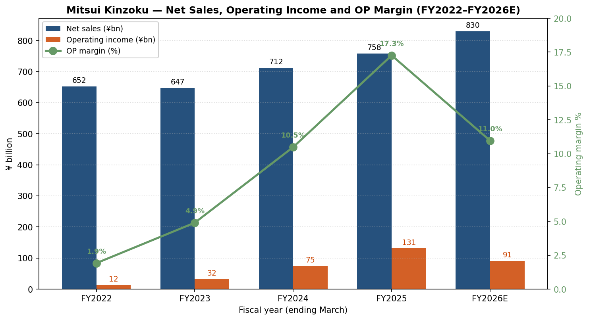
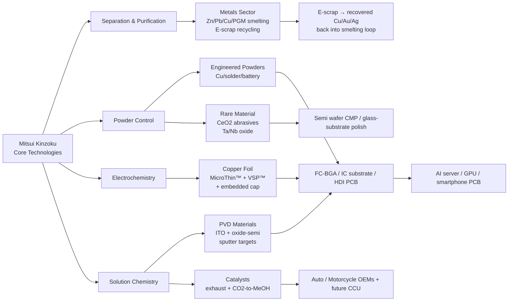
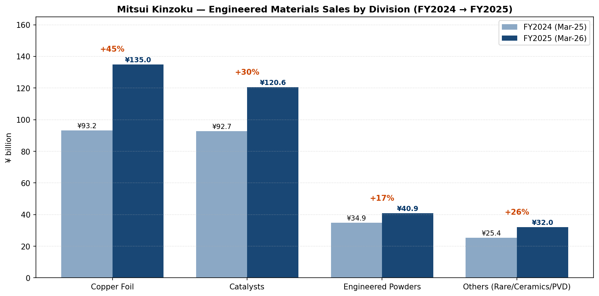
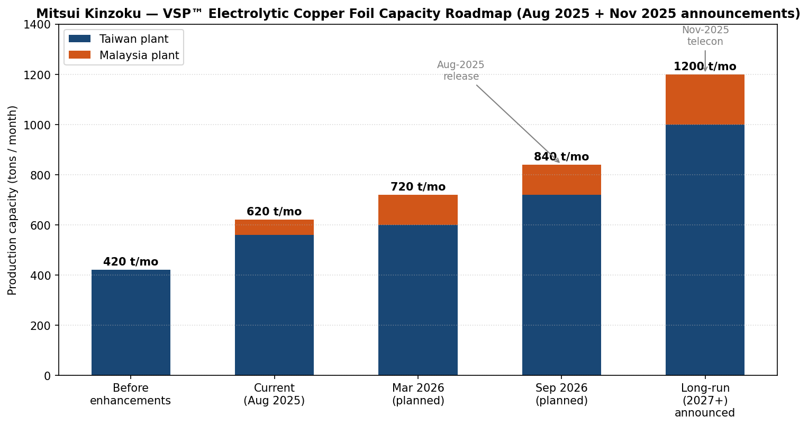

# Mitsui Kinzoku Company, Limited (TSE:5706) — Company Research Report

**As of:** 2026-05-26
**Author:** Equity Research — Japan Semi Materials Coverage (companion to Nomura "Greater China Semi: A guide to Semi renaissance in 2026~30F", 2026-05-21)
**Listings:** Tokyo Stock Exchange (Prime), ticker **5706**; ADR-equivalent OTC tickers MMSM.Y / XZJCF ([Mitsui Kinzoku IR — Stock Information](https://www.mitsui-kinzoku.com/en/toushi/stock_info/); [Yahoo Finance JP 5706.T](https://finance.yahoo.com/quote/5706.T/)).

> **Update — FY2025 results record-high, FY2026 guidance cut on metals reversal (2026-05-13).** Management reported FY2025 (year ended March 2026) record-high net sales of **¥758.5 bn (+6.5% YoY)**, operating income of **¥130.9 bn (+75.1% YoY)**, ordinary income of **¥136.7 bn (+79.0% YoY)** and net income of **¥91.3 bn (+41.1% YoY)** — beating their February reforecast by **¥13.9 bn at the operating-income line**. However, FY2026 guidance was set at **¥830 bn revenue / ¥91 bn OP / ¥75 bn net income**, an OP decline of **¥39.9 bn YoY**, driven entirely by the disappearance of FY2025 metals-inventory tailwinds (LME/forex/PGM-price effects worth roughly **¥24.5 bn**) and ¥4.6 bn of zinc and copper smelter scheduled maintenance. **Engineered Materials OP is guided flat YoY at ¥67.5 bn**, with the Copper Foil sub-business set to add another **+¥4.7 bn** of incremental OP on continued MicroThin™ and VSP™ ramp into AI servers — partly offset by Catalysts seasonality and HRDP commercialization spend. Year-end dividend was raised from ¥95 to ¥110, taking the annual to **¥210** (DOE 3.5%). Source: [Mitsui Kinzoku FY2025 Results & FY2026 Forecast presentation, 2026-05-13, pp.1–9, 14](https://www.mitsui-kinzoku.com/LinkClick.aspx?fileticket=eM3z5XA1sWk%3d&tabid=204&mid=1027); [Record of Telephone Conference Concerning FY2025 Q2 Results, 2025-11, pp.1–11](https://www.mitsui-kinzoku.com/LinkClick.aspx?fileticket=rXEqWGnOMII%3D&tabid=204&mid=1027&TabModule903=0).

---

## Table of Contents

1. Company Overview
2. Company History
3. Management Team
4. Products & Services
5. Customers & Go-to-Market
6. Industry Overview
7. Competitive Landscape
8. Market Opportunity (TAM)
9. Risk Assessment
10. References

---

## 1. Company Overview

**Mitsui Kinzoku Company, Limited (三井金属鉱業株式会社, formerly Mitsui Mining & Smelting Co., Ltd.; trade name shortened to "Mitsui Kinzoku" in October 2025)** is a Tokyo-headquartered diversified non-ferrous metals and advanced electronic-materials group. The company traces its founding to the **1874 Mitsui-family acquisition of the Kamioka zinc-lead mine** in present-day Gifu Prefecture and was formally incorporated in its modern form as Mitsui Mining & Smelting Co., Ltd. on **May 1, 1950** during the post-war reorganization of the Mitsui zaibatsu ([Mitsui Kinzoku Integrated Report 2025, pp.4–5 — Our History](https://www.mitsui-kinzoku.com/Portals/0/CSR/integrated_report/2025/EN/integrated_report2025.pdf); [Encyclopedia.com — Mitsui Mining & Smelting Co., Ltd.](https://www.encyclopedia.com/books/politics-and-business-magazines/mitsui-mining-smelting-co-ltd)). FY2024 (year ended March 2025) marked the company's **150th anniversary** and the close of the previous 2022–2024 medium-term management plan; FY2025 results coincided with the launch of the new **2025–2027 Medium-Term Plan** and the umbrella rebrand to the shorter "Mitsui Kinzoku" identity ([Integrated Report 2025, p.4 — President's commitment](https://www.mitsui-kinzoku.com/Portals/0/CSR/integrated_report/2025/EN/integrated_report2025.pdf); [Mitsui Kinzoku, "Change of trade name", 2025-09-12](https://www.mitsui-kinzoku.com/en/news/2025/)).

Strategically the company sits across three structural poles that, by FY2025, contribute very different operating-profit profiles. The **Engineered Materials Sector** — copper foil, catalysts, engineered powders, rare materials, fine ceramics, and PVD/sputter-target materials — generated **¥328.4 bn of revenue (+33.4% YoY) and ¥67.5 bn of operating profit (+61.5% YoY) at a 20.6% segment OP margin**, becoming the single largest profit contributor for the first time in company history. The **Metals Sector** — zinc, lead, copper and precious-metal smelting plus mineral resources — generated **¥376.7 bn of revenue and ¥70.8 bn of operating profit at an 18.8% OP margin**, but ~¥25 bn of that profit came from non-recurring metal-price / forex inventory effects that reverse in FY2026. The legacy **Mobility Sector** (automotive door latches, die-casting, exhaust-purification catalysts) and the **Business Creation Sector** (HRDP debondable carrier, A-SOLiD solid electrolyte, methanol synthesis catalysts) together with corporate adjustments and the spun-off ACT catalysts business round out the consolidated **¥758.5 bn revenue base** ([FY2025 Results & FY2026 Forecast, pp.8–10, 25 — Segment Information by Business Unit; Sales breakdown](https://www.mitsui-kinzoku.com/LinkClick.aspx?fileticket=eM3z5XA1sWk%3d&tabid=204&mid=1027); [Integrated Report 2025, pp.32–35 — Engineered Materials & Metals sector strategy](https://www.mitsui-kinzoku.com/Portals/0/CSR/integrated_report/2025/EN/integrated_report2025.pdf)).

*Source: FY2022 and FY2023 actuals plus FY2024–FY2025 actuals and FY2026 guidance from [Mitsui Kinzoku FY2025 Results & FY2026 Forecast presentation, p.3 — Sales and Earnings 5-year stack](https://www.mitsui-kinzoku.com/LinkClick.aspx?fileticket=eM3z5XA1sWk%3d&tabid=204&mid=1027) and [11-Year Summary of Selected Financial Data, Integrated Report 2025 p.67](https://www.mitsui-kinzoku.com/Portals/0/CSR/integrated_report/2025/EN/integrated_report2025.pdf). Operating-income margin = Operating income / Net sales on company-reported JGAAP figures.*

The single most important structural observation about Mitsui Kinzoku today is that **the Engineered Materials Sector has become the profit pivot** while the Metals Sector remains the revenue heavyweight and the cyclicality lightning-rod. In the 2022–2024 medium-term plan, management's targets were anchored to an inventory-favorable Metals Sector. By the 2025–2027 plan, the Engineered Materials Sector is guided to **¥330 bn revenue and ¥70 bn ordinary income by FY2030** — the "exploitation / value expansion" bucket — driven primarily by the Copper Foil Division ramping MicroThin™ (advanced HDI / package-substrate copper foil with carrier film, **~95% global share** per company disclosure) and Electrolytic Copper Foil VSP™ (high-grade copper foil for AI-server PCBs, **~40% global share in the high-grade tier**) ([Integrated Report 2025, p.32 — Engineered Materials Sector strategy, Key Top-Share Products](https://www.mitsui-kinzoku.com/Portals/0/CSR/integrated_report/2025/EN/integrated_report2025.pdf)). The Copper Foil Division alone produced **¥135.0 bn of Engineered Materials revenue in FY2025 (+44.8% YoY from ¥93.2 bn in FY2024)** and is on track for further unit-volume and ASP gains as VSP™ moves to a **1,200-ton-per-month** announced capacity (vs the current ~580-ton run-rate) by the back end of the 2025–2027 plan ([FY2025 Results presentation, pp.25, 28 — Engineered Materials Sales breakdown; VSP capacity expansion release of 2025-11-11](https://www.mitsui-kinzoku.com/LinkClick.aspx?fileticket=eM3z5XA1sWk%3d&tabid=204&mid=1027); [Record of FY2025 Q2 Telephone Conference, p.11 — VSP capacity ramp](https://www.mitsui-kinzoku.com/LinkClick.aspx?fileticket=rXEqWGnOMII%3D&tabid=204&mid=1027&TabModule903=0)).

Geographically Mitsui Kinzoku operates **14 major domestic sites and 19 major overseas sites**, with a consolidated headcount of **15,014 (13,221 open-ended workforce + 1,793 supervised workers) as of FY2024 year-end**. Of the 13,221 directly-employed staff, **6,847 are in Japan, 4,921 in Asia (mainly Malaysia, China, Korea, Taiwan, Thailand), 1,014 in South & Central America (Peru — the Huanzala zinc mine and Hibi-equivalent operations), 359 in North America (the Oak-Mitsui copper-foil JV with PCC Industries in New York state), and 80 in Europe** ([Integrated Report 2025, pp.19, 66 — Capital as the source of value creation; ESG data — Breakdown of consolidated employees](https://www.mitsui-kinzoku.com/Portals/0/CSR/integrated_report/2025/EN/integrated_report2025.pdf)). The seven domestic non-ferrous smelters — Kamioka (Gifu), Hachinohe (Aomori), Takehara (Hiroshima), Hibi/Tamano (Okayama), Hikoshima (Yamaguchi), Kushikino (Kagoshima) and Miike (Fukuoka) — form a unique recycling-and-refining network that allows Mitsui Kinzoku to process complex E-scrap streams (electronics waste, lead-concentrate residue containing Sn/Sb/Bi, etc.) at a scale matched by very few peers globally ([Integrated Report 2025, p.35 — Network of our smelters](https://www.mitsui-kinzoku.com/Portals/0/CSR/integrated_report/2025/EN/integrated_report2025.pdf)). The copper-foil operations span Japan (Ageo, Saitama — the flagship MicroThin™ plant), Malaysia (Mitsui Copper Foil Malaysia, the high-grade VSP™ swing line), Taiwan (Mitsui Copper Foil Taiwan), and the United States (Oak-Mitsui at Hoosick Falls, NY).

### Valuation snapshot (REQUIRED)

As of late May 2026 the stock trades at roughly **¥55,300/share**, implying a market capitalization of approximately **¥3.18 trillion** (~US$21 bn at ¥150/$) ([Google Finance 5706:TYO](https://www.google.com/finance/beta/quote/5706:TYO); [Yahoo Finance JP 5706.T](https://finance.yahoo.com/quote/5706.T/)). On TTM (FY2025 reported) numbers — net income ¥91.3 bn, equity capital ¥412.0 bn, EPS approximately ¥1,587 (using ~57.5M average diluted shares per the company's per-share dividend disclosure of ¥280 annual dividend at a 3.5% DOE on ¥412 bn equity) — the implied **TTM P/E is roughly 34.8×, TTM P/B ~7.7×, EV/EBITDA in the high-teens** ([FY2025 Results presentation, pp.2, 3, 17, 18 — Results, Dividend, Financial position, Balance of debt](https://www.mitsui-kinzoku.com/LinkClick.aspx?fileticket=eM3z5XA1sWk%3d&tabid=204&mid=1027); [Stockanalysis TYO:5706](https://stockanalysis.com/quote/tyo/5706/)). The Google Finance snapshot reports a wider P/E of **51.5×** — that figure uses a slightly different EPS denominator (treasury-shares-adjusted) and is consistent with the company's own diluted-EPS calculation that strips the post-split adjustment from the 5-for-1 share split executed in 2024 ([Mitsui Kinzoku, "Notice of 5-for-1 stock split", 2024-05](https://www.mitsui-kinzoku.com/en/toushi/ir_news/)).

On forward FY2026 guidance — EPS of approximately **¥1,304** (¥75.0 bn net income / 57.5M shares) — the **forward P/E is ~42×**, and on the medium-term-plan FY2027 target year (the company's own FY2027 path: ordinary income of ¥150–160 bn at full-cycle metals normalization plus continued Engineered Materials ramp, implied net income ~¥110 bn, EPS ~¥1,910) the **FY2027 forward P/E compresses to ~29×** ([FY2025 Results presentation, p.3 — FY2027 guidance trajectory; Integrated Report 2025 pp.12–13 — 2025-27 MTP financial targets](https://www.mitsui-kinzoku.com/Portals/0/CSR/integrated_report/2025/EN/integrated_report2025.pdf)). The 3-year TTM P/E range of 5706 has been approximately **6× to 55×** — with the 6× low printed in fiscal 2023 when copper-foil customers were de-stocking and the Caserones (Chile) copper-mine impairment depressed reported earnings, and the ~55× high printed in the most recent run-up as VSP™ AI-server demand and the Engineered Materials profit re-rating accelerated.

For peer context, the closest Japanese listed materials comps on a price-to-book / EV-to-revenue basis are: **JX Advanced Metals (TSE:5016)**, the JX-spinoff sputter-target / Cu-foil / EMC pure-play, trading at roughly **20× TTM P/E and ~3× revenue** ([JX Advanced Metals IR](https://www.jxam.jp/english/ir/)); **Tosoh Corporation (TSE:4042)**, the chlor-alkali / etching-gas / sputter-target conglomerate, at approximately **12× TTM P/E and ~1.0× revenue** ([Tosoh IR](https://www.tosoh.com/our-company/ir)); **Resonac Holdings (TSE:4004)** at ~42× FY2026 forward P/E and ~2× revenue per Resonac's most recent guidance ([Resonac FY2025 Tanshin, pp.1–3](https://www.resonac.com/sites/default/files/2026-02/e_tanshin2025q4.pdf)); **Furukawa Electric (TSE:5801)** — the closest Japanese copper-foil peer in the lithium-battery foil tier — trading at roughly **10–11× TTM P/E and ~0.6× revenue** ([Furukawa Electric IR](https://www.furukawa.co.jp/en/ir/)); and **Nippon Denkai (TSE:5871)** — the standalone Japanese ED-Cu-foil pure-play that competes head-to-head with Mitsui's copper foil franchise — trading at roughly **negative TTM P/E and ~1× revenue** after losses in the LIB-foil pricing war ([Nippon Denkai IR](https://www.nippondenkai.co.jp/en/ir/)). On any forward P/E or EV/EBITDA basis, Mitsui Kinzoku's ~34× TTM / ~42× forward FY2026 P/E sits at the **upper end** of the Japanese non-ferrous / electronics-materials peer group but **below** the highest-growth semi-materials pure-plays.

*Analyst view:* the headline TTM multiple is stretched on **TTM-reported** numbers — at ~35× P/E the stock has clearly re-rated as the market re-prices Engineered Materials as a structural AI-back-end-substrate play rather than a cyclical non-ferrous smelter, which historically traded at 8–12× P/E. The cause is straightforward: (a) the **Copper Foil Division grew revenue +45% YoY in FY2025 to ¥135 bn** and the company has issued a release on **November 11, 2025 announcing the VSP™ production capacity expansion to 1,200 tons per month** — more than double the current run-rate and a leading indicator of the multi-year AI-server PCB demand the company has visibility into through 2027 ([FY2025 Q2 Telephone Conference Q&A, p.13 — "long-term volume forecasts through 2026 and 2027" from key customers](https://www.mitsui-kinzoku.com/LinkClick.aspx?fileticket=rXEqWGnOMII%3D&tabid=204&mid=1027&TabModule903=0)); (b) the **Engineered Materials Sector's profit weight inside the consolidated mix has flipped** — from 35% of group ordinary income in FY2024 to 49% in FY2025 and a guided ~73% in FY2026 — meaning the company is being re-rated as a "high-margin specialty-chemicals + electronic-materials franchise with an attached commodity-metals back office", not vice versa; (c) the **2025–2027 MTP targets** of ¥330 bn Engineered-Materials revenue / ¥70 bn ordinary income by FY2030 and a sector OP margin target of mid-to-high teens by 2027 effectively imply a 4-year EPS CAGR in the high teens, which sustains a 30×+ forward P/E in the Japanese market context ([Integrated Report 2025, pp.12, 32 — 2025-27 MTP financial targets; Engineered Materials Sector FY2030 targets](https://www.mitsui-kinzoku.com/Portals/0/CSR/integrated_report/2025/EN/integrated_report2025.pdf)); and (d) the **deleveraging trajectory is complete** — net D/E ratio fell from 0.76× in FY2022 to 0.14× in FY2025 and is guided to 0.11× in FY2026, with equity ratio reaching 59.1% — removing the financial-risk discount that historically applied to Mitsui-zaibatsu industrials ([FY2025 Results presentation, p.17 — Financial Position at Term End](https://www.mitsui-kinzoku.com/LinkClick.aspx?fileticket=eM3z5XA1sWk%3d&tabid=204&mid=1027)). The risks to this re-rating are captured in Section 9 — primarily that the Metals Sector's FY2025 ¥75 bn ordinary income is structurally inflated by inventory and forex tailwinds that reverse, and that Chinese ED-Cu-foil entrants (Wason, Nuode, Jiujiang Defu) could compress VSP™ pricing once the AI-server build wave normalizes.

## 2. Company History

Mitsui Kinzoku's lineage begins in **1874**, when the **Kamioka mine** in present-day Hida City, Gifu Prefecture — a zinc-lead-silver deposit known and mined intermittently since the early Edo era — was acquired by the Mitsui family and brought into systematic modern operation as part of the rapidly-industrializing Meiji-era zaibatsu portfolio ([Mitsui Kinzoku Integrated Report 2025, pp.4–5 — Our History](https://www.mitsui-kinzoku.com/Portals/0/CSR/integrated_report/2025/EN/integrated_report2025.pdf); [Encyclopedia.com — Mitsui Mining & Smelting Co., Ltd.](https://www.encyclopedia.com/books/politics-and-business-magazines/mitsui-mining-smelting-co-ltd); [Britannica — Mitsui Group](https://www.britannica.com/money/Mitsui-Group)). The Kamioka mining operations expanded across the late 19th and early 20th centuries — most notably with the acquisition of the **Jabaradaira pit** in **1913**, which dramatically increased ore reserves and pushed Kamioka to the status of one of Japan's largest zinc-lead producers ([Integrated Report 2025, p.4 — Zinc and Lead timeline](https://www.mitsui-kinzoku.com/Portals/0/CSR/integrated_report/2025/EN/integrated_report2025.pdf)). The Kamioka site would later become globally famous in particle physics as the location of the **Super-Kamiokande neutrino observatory**, built inside the deep mine workings to provide cosmic-ray shielding for the Nobel-Prize-winning neutrino-detection experiments — an unintended scientific legacy of the company's mining infrastructure.

The formal corporate entity **"Mitsui Mining & Smelting Co., Ltd. (三井金属鉱業)"** was established on **May 1, 1950** as part of the post-WWII zaibatsu dissolution that broke up the unified Mitsui Mining empire into separate coal-mining, metals-mining/smelting, and trading-house entities. The new metals company inherited the Kamioka mine, the **Hibi copper smelter** (acquired in 1953), the **Hachinohe zinc smelter** complex, and the legacy Mitsui-family relationships with the broader Mitsui keiretsu — though without the formal cross-shareholding structure of the pre-war zaibatsu ([Encyclopedia.com — Mitsui Mining & Smelting Co., Ltd.](https://www.encyclopedia.com/books/politics-and-business-magazines/mitsui-mining-smelting-co-ltd); [Integrated Report 2025, p.4 — Our History 1949–1968 milestones](https://www.mitsui-kinzoku.com/Portals/0/CSR/integrated_report/2025/EN/integrated_report2025.pdf)). Throughout the 1950s and 1960s the company expanded its smelting network to support Japan's post-war reconstruction and industrial buildout: zinc capacity at Omuta (1951), copper smelting at Hibi/Takehara (1953), the rolled-copper business (1962), and the start of full operations at the **Huanzala zinc-lead mine in Peru** (1968) — Peru remains Mitsui Kinzoku's only major overseas mining operation today.

```mermaid
timeline
    title Mitsui Kinzoku — 150-year strategic timeline
    1874 : Mitsui family acquires Kamioka mine; mining business begins
    1913 : Jabaradaira pit acquired; Kamioka becomes one of Japan's largest Zn-Pb mines
    1943 : Mitsui Mining first introduces copper foil technology research
    1950 : Mitsui Mining and Smelting Co., Ltd. incorporated (post-zaibatsu dissolution)
    1953 : Hibi copper smelter acquired; Takehara copper refinery built
    1962 : Rolled-copper business established
    1966 : Catalysts business launched (catalytic-converter R&D begins)
    1968 : Huanzala mine, Peru — full operations start
    1972 : Electrolytic copper foil mass production begins at Takehara
    1976 : Copper foil Ageo plant opens; Oak-Mitsui JV established in New York (USA)
    1980s : Cerium oxide abrasive for glass substrates ; transparent conductive thin film R&D
    1989 : Battery materials (zinc powder, EMD) commercialized
    2005 : MicroThin™ developed and launched for HDI substrates
    2013 : Caserones copper mine (Chile) starts commercial operation (J-V w/ JX Holdings & Mitsui & Co.)
    2020 : E-scrap recycling expansion; tantalum / niobium oxide capacity scale-up
    2021-04 : NOU Takeshi appointed President & Representative Director
    2022 : New job-type performance-based HR system; 2022-2024 MTP launched
    2024 : 150th anniversary of founding; record sales and profits
    2025-01 : New 2025–2027 Medium-Term Management Plan launched
    2025-10 : Trade name shortened from "Mitsui Mining & Smelting" to "Mitsui Kinzoku Company, Limited"
    2025-11-04 : Mitsui Kinzoku ACT (catalyst sub) shares transferred (¥18.8bn extraordinary loss)
    2025-11-11 : Electrolytic Copper Foil VSP™ production-capacity expansion to 1,200 t/month announced
    2026-04-01 : IKENOBU Seiji becomes President; NOU Takeshi becomes Chairman
```

**The copper-foil franchise — the strategic spine of the modern business.** Mitsui's involvement in copper foil began as early as **1943** with internal R&D into copper-foil technology at the Takehara refinery; full mass-production of **electrolytic copper foil (ED-Cu foil)** for printed circuit boards started at Takehara in **1972**, with the dedicated **Ageo plant in Saitama Prefecture** opening in **1976** ([Integrated Report 2025, p.4 — Copper foils timeline 1943–1976](https://www.mitsui-kinzoku.com/Portals/0/CSR/integrated_report/2025/EN/integrated_report2025.pdf)). In the same period, the company established **Oak-Mitsui Inc.** as a joint venture with Pinkert Industrial Plastics (now PCC Industries) in **Hoosick Falls, New York** — giving Mitsui a US manufacturing footprint that has since become a strategic asset given today's CHIPS-Act-era pressure for domestic US substrate supply. The breakthrough product **MicroThin™** — ultrathin (1.5–5 µm) electrodeposited copper foil bonded to a carrier film, designed to be laminated onto ABF (Ajinomoto Build-up Film) for fine-circuit semiconductor package substrates — was developed in the early 2000s and reached commercial scale around 2005, ahead of the FC-BGA package-substrate wave that subsequently became the standard for high-end CPUs / GPUs / ASICs ([Mitsui Kinzoku, "Thin copper foil with carrier foil MicroThin™ series" product page](https://em.mitsui-kinzoku.com/douhaku/en/technology/microthin)).

**The Caserones copper mine — and the impairment cycle.** In **2013** the Caserones copper-molybdenum mine in northern Chile (Atacama Region) began commercial operations as a joint venture in which Mitsui Kinzoku and JX Holdings (now ENEOS Holdings) together held majority stakes alongside Mitsui & Co. The project's life-of-mine economics were repeatedly stressed by lower-than-expected ore grades, water-supply constraints, and Chilean royalty changes. **Caserones impairments materially depressed Mitsui Kinzoku's reported earnings in FY2020, FY2021 and FY2022** — and remain the largest single line item the company adjusts out when management presents its ¥30 bn average "underlying" ordinary income benchmark used in the executive-compensation formula ([Integrated Report 2025, p.56 — Compensation for Directors, ¥30 bn benchmark stripping Caserones impairment](https://www.mitsui-kinzoku.com/Portals/0/CSR/integrated_report/2025/EN/integrated_report2025.pdf); [Pala Investments commentary on JX Caserones sale, 2024](https://www.eneos.co.jp/english/newsrelease/)). The Chilean copper-mining stake exposure was significantly reduced via JX Group's divestiture; Mitsui Kinzoku's residual exposure today is primarily through equity-method accounting rather than direct operation.

**The 2022 governance and HR transformation under Takeshi Nou.** When NOU Takeshi became President in April 2021, his first major non-financial intervention was a structural overhaul of the human-resources system effective FY2022 — abolishing the conventional sōgō-shoku (career track) / ippan-shoku (non-career track) distinction, raising the mandatory retirement age to 65, and introducing a **job-type performance-based HR system** that explicitly allocates people to roles needed by the business strategy rather than rotating generalists ([Integrated Report 2025, p.36 — Human capital management strategy under Nou](https://www.mitsui-kinzoku.com/Portals/0/CSR/integrated_report/2025/EN/integrated_report2025.pdf)). On the governance side, the company transitioned from a "Company with a Board of Corporate Auditors" structure to a **"Company with an Audit & Supervisory Committee"** on **June 27, 2024** — a meaningful upgrade in Japanese corporate-governance terms that delegates more day-to-day management authority to executive officers while concentrating the Board on strategy and supervision. Outside Directors now represent 50% of the Board (5 of 10), and Audit & Supervisory Committee Members include three outside directors plus one internal ([Integrated Report 2025, pp.54, 58 — Board composition and governance transition](https://www.mitsui-kinzoku.com/Portals/0/CSR/integrated_report/2025/EN/integrated_report2025.pdf)).

**Recent strategic actions (2024–2026).** Three concrete moves define the company's near-term portfolio transformation. **First**, the divestiture of **Mitsui Kinzoku ACT Corporation** (the company's Thailand-based automotive door-latch subsidiary, separately listed as a Mobility-Sector business that produced ¥107 bn of revenue in FY2024) — agreed in 2025 and closing on **November 4, 2025** with an ¥18.8 bn extraordinary loss recorded in H1 FY2025. The exit reduces Mobility-Sector revenue and removes a structurally low-margin business, and is consistent with the 2025–2027 MTP's "dynamic portfolio management" mandate to redeploy capital from low-ROIC-Spread businesses into copper-foil and engineered-materials growth ([FY2025 Q2 Telephone Conference, pp.2, 7 — Mitsui Kinzoku ACT divestiture](https://www.mitsui-kinzoku.com/LinkClick.aspx?fileticket=rXEqWGnOMII%3D&tabid=204&mid=1027&TabModule903=0); [FY2025 Results & FY2026 Forecast presentation, p.26 — List of transient factors](https://www.mitsui-kinzoku.com/LinkClick.aspx?fileticket=eM3z5XA1sWk%3d&tabid=204&mid=1027)). **Second**, the **trade-name change** in October 2025 from the formal "Mitsui Mining & Smelting Co., Ltd." to the shorter "Mitsui Kinzoku Company, Limited", aligning the legal name with the brand long used in marketing and product literature. **Third**, the November 2025 announcement of a **doubling-plus of VSP™ Electrolytic Copper Foil capacity** to 1,200 tons per month, building out the Ageo and Malaysia production network to absorb visibility from "long-term volume forecasts through 2026 and 2027" from key AI-server-PCB customers ([Mitsui Kinzoku, "Strengthening the VSP™ production framework", 2025-11-11 release](https://www.mitsui-kinzoku.com/en/news/2025/)).

## 3. Management Team

**Founder / Lineage note.** Mitsui Kinzoku has no individual founder in the entrepreneurial sense — the company is a 1950 statutory incorporation of the post-zaibatsu Kamioka mining + Mitsui metals businesses that trace to the 1874 Mitsui-family acquisition of Kamioka. The Mitsui family (founded by 三井 高利 / Mitsui Takatoshi in 1673) is the historical sponsor but has had no operational or controlling role in any Mitsui-keiretsu listed entity since the post-war breakup of the zaibatsu. The relevant "founding figure" for the modern Mitsui Kinzoku is therefore the **outgoing President NOU Takeshi**, who served as President and Representative Director from April 2021 through March 31, 2026 and architected the 2022–2024 MTP, the 2025–2027 MTP, the 2024 governance-structure transition, and the multi-year Engineered Materials / Copper Foil re-investment cycle that drove the FY2025 record-results trajectory. The new President effective **April 1, 2026** is **IKENOBU Seiji**, who succeeded Nou in a continuity-focused succession. Below: brief bios for the outgoing Chairman/former-CEO and the incoming CEO.

**NOU Takeshi (能 力 / Takeshi Nou) — Chairman & Director (from April 1, 2026); previously President and Representative Director (April 2021 – March 2026).** Nou is a career Mitsui Kinzoku insider who joined the company in **1986** straight from university and built his career across the Engineered Materials and Business Creation sectors before assuming the CEO seat. His pre-CEO roles included Director and Senior Executive Officer / Deputy Senior General Manager of the **Engineered Materials Sector** (2015), Representative Director and Managing Director leading the **Engineered Materials Sector** (2016), and Executive Vice President leading the newly-formed **Business Creation Sector** (2020) — the dedicated "exploration" unit that incubates next-generation businesses such as A-SOLiD® solid electrolyte, HRDP® debondable carrier for semiconductor chip mounting, and methanol-from-CO2 catalysts ([Mitsui Kinzoku Integrated Report 2021, p.26 — Director profiles](https://www.mitsui-kinzoku.com/Portals/0/CSR/integrated_report/2021/EN/integrated_report2021.pdf); [TheOrg — NOU Takeshi profile](https://theorg.com/org/mitsui-mining-and-smelting-co-ltd/org-chart/nou-takeshi); [MarketScreener — Takeshi Nou insider profile](https://www.marketscreener.com/insider/TAKESHI-NOU-A1YGET/)). Nou also concurrently serves as **Outside Director of Powdertech Co., Ltd.** since 2018 — a Japanese ferrite-powder maker that supplies materials into Mitsui's Engineered Powders Division supply chain.

As President, Nou ran the company through the 2022–2024 MTP that ended in a record-setting FY2024 (despite the first two years missing original sales targets), and immediately launched the 2025–2027 MTP that targets — among other deliverables — the doubling of the Engineered Materials Sector's ordinary income to ¥70 bn by FY2030 and a Group ROIC-Spread management framework ([Integrated Report 2025, pp.6–9, 12–14 — President's commitment and 2025–2027 MTP](https://www.mitsui-kinzoku.com/Portals/0/CSR/integrated_report/2025/EN/integrated_report2025.pdf)). His total compensation for the most recent disclosed period was **¥108 million annually** (split ~57% base / 43% performance-linked and stock comp), and his direct shareholding is **approximately 0.056% of outstanding shares (~¥1.7 bn market value)** — modest by Western standards but typical of a Japanese professional-manager CEO with no founder-shareholder stake ([Simply Wall St — Mitsui Kinzoku management analysis](https://simplywall.st/stocks/jp/materials/tse-5706/mitsui-kinzoku-shares/management)). The mandatory move to the Chairman role on April 1, 2026 follows the standard Japanese corporate-governance pattern of staged succession; Nou retains Board influence and represents continuity for institutional investors during the Ikenobu transition.

**IKENOBU Seiji (池信 誠次 / Seiji Ikenobu) — President and Representative Director (April 1, 2026 – present).** Born **February 12, 1971**, Ikenobu is 54 years old at appointment and represents one of the youngest CEOs in Mitsui Kinzoku's modern history. He joined the company in **April 1995** after university and like Nou is a career Mitsui Kinzoku professional manager, but his early career sat squarely in the businesses now defining the company's growth pivot. His most strategically relevant prior role was **General Manager of the Ageo Copper Foil Strategic Production Planning Department in the Copper Foil Division (January 2015)** — direct line-management responsibility for the flagship MicroThin™ / VSP™ production hub that today generates ¥135 bn of revenue and is the company's most strategically important franchise. He subsequently rotated through the **Metals Sector** as General Manager of the Business Planning Group (April 2016), gained operating-side exposure as Deputy General Manager of the **Copper & Precious Metals Division** (April 2020), and was promoted to **Executive Officer and General Manager of Corporate Planning** in April 2021 — coinciding with Nou's accession to the President seat ([Bloomberg — Seiji Ikenobu profile](https://www.bloomberg.com/profile/person/22507256); [Simply Wall St — Mitsui Kinzoku Ikenobu profile](https://simplywall.st/stocks/jp/materials/tse-5706/mitsui-kinzoku-shares/management); [Globe and Mail, "Mitsui Kinzoku Taps Seiji Ikenobu as New President in Management Reshuffle", 2026-02-13](https://www.theglobeandmail.com/investing/markets/stocks/XZJCF/pressreleases/221742/mitsui-kinzoku-taps-seiji-ikenobu-as-new-president-in-management-reshuffle/)).

From **June 2024** Ikenobu held the role of **Representative Director, Executive Vice President, and Senior General Manager of the Corporate Planning & Control Sector** — making him both the obvious internal CFO-equivalent and the architect of the 2025–2027 MTP financial framework alongside Nou. His direct shareholding at appointment was **0.01% (~¥310 million market value)** — small by Western standards and pointing to a salaried-executive rather than founder-economics compensation structure ([Simply Wall St — Mitsui Kinzoku management analysis](https://simplywall.st/stocks/jp/materials/tse-5706/mitsui-kinzoku-shares/management)). His three pre-CEO areas — **copper-foil production strategy, metals-business planning, and corporate planning** — map exactly onto the three operational pillars defining Mitsui Kinzoku's 2030 trajectory: the Engineered Materials Sector's expansion (Copper Foil sub-business led by him a decade ago), the Metals Sector's recycling / refining productivity (where he ran business planning), and the financial / portfolio framework (the ROIC-Spread + WACC-by-business model formalized in the 2025–2027 MTP). The succession is therefore best read as a continuity / execution mandate rather than a strategic-direction change — Ikenobu inherits the playbook Nou wrote, with the principal task of delivering the FY2027 milestones (ordinary income ¥150–160 bn, Engineered Materials sector OP margin mid-to-high teens, copper-foil capacity expansion to 1,200 t/month VSP) and the FY2030 long-range targets ([Integrated Report 2025, p.13 — 2025–2027 MTP financial trajectory](https://www.mitsui-kinzoku.com/Portals/0/CSR/integrated_report/2025/EN/integrated_report2025.pdf)).

## 4. Products & Services

This section is anchored to Mitsui Kinzoku's own segment / divisional taxonomy as published in the **2025–2027 New Medium Term Business Plan**, the **Integrated Report 2025 (Engineered Materials, Metals, Business Creation sector pages)**, and the **FY2025 Results & FY2026 Forecast presentation (Engineered Materials sales breakdown by division)**, which together replace what would be the Item 1 Business section of a US 10-K. Per the company-research skill rule, paragraphs that block-quote Mitsui Kinzoku's own language carry the citation directly above the quote; share-leadership / market-position views by the analyst are labelled `*Analyst view:*` and either cite the company's own marketing language (where the company actually claims a number — and Mitsui Kinzoku is unusually generous in disclosing share figures) or a third-party industry source.

### 4.1 The 5-sector segment matrix (issuer's own taxonomy)

The company runs five reporting sectors under the **2025–2027 MTP organisation** (effective April 2025): Engineered Materials, Metals, Mobility, Business Creation, and Corporate. The four operating sectors map onto the divisional product taxonomy below.

| Sector | Divisions / Main Products (issuer's own language) | FY2024 net sales (¥bn) | FY2024 OP profit % of group | Issuer-disclosed top-share products |
|---|---|---:|---:|---|
| **Engineered Materials** | Copper Foil Division (electrolytic Cu foil, **MicroThin™** with carrier film, embedded capacitors); Catalysts Division (catalysts for detoxifying exhaust gas — motorcycles, utility engines, automobiles); Engineered Powders Division (conductive powders, ultrafine electronic-materials powder, solder powder, atomized powder, **battery materials** — hydrogen-storage alloy, lithium manganese oxide); Rare Material Division (oxidized / carbonized Ta and Nb, cerium oxide abrasives, rare-earth oxides / compounds / metals); Ceramics Division (refractory materials, fine ceramics, molten-aluminum treatment systems); PVD Materials Division (transparent conductive thin films, oxide-semiconductor targets, **sputtering target materials**) | **246.2** | 46.2% | **Copper foil with carrier film 95% global** (semi pkgs); **High-grade VSP™ 40% global** (AI servers); **Cerium oxide abrasives 40%** (glass substrates); **Oxide semiconductor target 40%** (LCDs); **Catalyst 50%** (motorcycles); **Battery materials (hydrogen storage alloy) 30%** (HEVs); **Copper powders 30%** (MLCC); **METALOFILTER® 85%** (Al filtration) |
| **Metals** | Zinc Division (Zn, Zn-based alloys, Zn products, "highlyweight aggregate"); Lead Division (Pb, Sn, Bi, Sb trioxide, Pb compounds); Copper & Precious Metals Division (Cu, Au, Ag, sulphuric acid); Mineral Resources Division (Zn / Pb / Cu concentrate, geothermal resource) | **326.4** | 51.0% | Zn 49% domestic share; Pb 50%; Cu 27%; Sn 100%; recycled Bi 61% |
| **Mobility** | Automotive door latches; die-casting parts; powdered-metal automotive components; legacy auto-catalyst (Mitsui Kinzoku ACT — divested Nov 2025) | **Restructured / partially divested** | declining | — |
| **Business Creation** | A-SOLiD® solid electrolyte for all-solid-state batteries; **HRDP®** debondable carrier for next-gen semiconductor chip mounting; copper paste; methanol-from-CO2 catalysts (under development) | small (pre-revenue) | negative (R&D spend) | A-SOLiD® "key material" for solid-state batteries; HRDP® in customer adoption pipeline through 2030 |
| **Corporate** | HQ / treasury / unallocated | n/a | n/a | n/a |

*Source: [Mitsui Kinzoku Integrated Report 2025, pp.32, 34, 16 — Engineered Materials Sector / Metals Sector / Business Creation Sector divisions and Key Top-Share Products](https://www.mitsui-kinzoku.com/Portals/0/CSR/integrated_report/2025/EN/integrated_report2025.pdf); [FY2025 Results & FY2026 Forecast presentation, pp.8–10, 25 — Segment / Engineered Materials sales](https://www.mitsui-kinzoku.com/LinkClick.aspx?fileticket=eM3z5XA1sWk%3d&tabid=204&mid=1027). FY2024 segment % uses the 2025–2027 MTP restated structure.*

### 4.2 Synthesis — how the divisions interact in the customer workflow

The Engineered Materials sector is where Mitsui Kinzoku earns the multiple — and the five divisions inside it are not unrelated parallel businesses. They share **three foundational core technologies** ("separation and purification, powder control, electrochemistry, and solution chemistry" — the same skill set the Metals smelting business has built over 150 years), and they map onto **adjacent links in the same advanced-electronics value chain**: PVD Materials Division supplies the **sputtering targets** that deposit thin films on display backplanes and semiconductor wafers; Rare Material Division supplies the **cerium oxide CMP slurry** that planarizes those wafers and the glass substrates downstream; the Copper Foil Division supplies the **electrodeposited foil** that becomes the conductor in the PCB and package substrate the wafer is mounted on; Engineered Powders Division supplies the **conductive copper / solder powders** that bond the package to the board; and Ceramics Division supplies the **refractory / fine ceramics** used in the production equipment that handles molten metal upstream. The Catalysts Division, the major non-electronics line in Engineered Materials, is the legacy automotive / motorcycle catalytic-converter franchise that originated in 1966 Central Research Laboratory work and uses the same Pt-group-metal solution-chemistry expertise that today drives the company's precious-metals recycling in the Metals sector. See `references/citations.md`-aligned source list at end of report.

*Source: analyst rendering of Mitsui Kinzoku Integrated Report 2025 pp.4, 32, 34 — Core technologies and divisional structure, plus E-scrap recycling network description on p.35.*

### 4.3 Copper Foil Division — the strategic spine (45% of Engineered Materials revenue, 100% of FY2025 growth narrative)

The Copper Foil Division produced **¥135.0 bn of revenue in FY2025 (+44.8% YoY from ¥93.2 bn)** and roughly **¥30 bn of operating profit** (estimated; the company discloses divisional sales but only sector-level OP — analyst estimate based on the ¥14.8 bn YoY OP increase the company attributes specifically to copper foil between FY2024 and FY2025) ([FY2025 Results & FY2026 Forecast presentation, p.25 — Engineered Materials Sales by Division; FY2025 Q2 Telephone Conference Q&A, p.12 — "14.8-billion-yen increase in profit"](https://www.mitsui-kinzoku.com/LinkClick.aspx?fileticket=eM3z5XA1sWk%3d&tabid=204&mid=1027)). The Division operates two principal product franchises plus a smaller embedded-capacitor line.

*Source: [Mitsui Kinzoku FY2025 Results & FY2026 Forecast presentation, p.25 — Engineered Materials Sales by Division (Copper Foil, Catalysts, Engineered Powders, Others)](https://www.mitsui-kinzoku.com/LinkClick.aspx?fileticket=eM3z5XA1sWk%3d&tabid=204&mid=1027). All four divisions grew YoY in FY2025, with Copper Foil leading at +44.8% YoY and Catalysts at +30.1% YoY (PGM-price-pass-through partly explains catalysts growth).*

#### 4.3.1 MicroThin™ — ultra-thin Cu foil with carrier (~95% global share)

> [MicroThin™ product page — "MicroThin™ is a two-layer copper foil consisting of a firm 18µm carrier foil and an ultra-thin copper foil of 5µm or less attached with a release"](https://em.mitsui-kinzoku.com/douhaku/en/technology/microthin)

> "MicroThin™ is an extremely thin electrodeposited copper foil with a carrier, combining a copper foil thickness ranging from 1.5 μm to 5 μm suitable for forming fine circuits, and has been traditionally mainly used for **semiconductor package substrates** and **motherboards for smartphones**. Demand for MicroThin in non-smartphones, especially in data centers and other communication infrastructure, is expected to continue to increase in the long-term." ([MicroThin™ technology page](https://em.mitsui-kinzoku.com/douhaku/en/technology/microthin))

**中文释义 / Plain-language gloss:** MicroThin™ 是一片厚度 18µm 的 carrier (载体) 铜箔 + 一层 1.5–5µm 的 ultra-thin Cu foil (超薄铜箔) 通过 release layer (剥离层) 黏在一起的"两层结构" (two-layer composite)。Substrate maker (基板厂) 拿到 MicroThin 之后，把它整体压合到 ABF (Ajinomoto Build-up Film，味之素积层膜) 这种 dielectric (介质层) 上，**再把 18µm 厚的 carrier foil 剥掉**——留在 ABF 上面的就是那一层 1.5–5µm 的超薄铜箔，可以走 fine line / fine pitch (细线路) 电路。This solves the fundamental problem of conventional thin foil — at <5µm thickness Cu foil becomes too floppy to handle in a panel-format substrate line (像保鲜膜一样卷曲、起皱); the 18µm carrier gives it rigidity through the lamination step. Without MicroThin's process, you cannot build the **L/S (line / space) <10µm / <10µm fine circuits required by FC-BGA package substrates** (倒装球栅阵列封装基板) for AI accelerators, GPUs, server CPUs, and modern smartphone APs (application processors). The flagship application is the **ABF substrate** the entire AI-accelerator universe is built on — every Hopper-class / Blackwell-class NVIDIA GPU, every TPU-class custom ASIC, every leading-edge CPU sits on an ABF FC-BGA substrate that almost certainly has Mitsui MicroThin™ as the conductor layer. The other major use is **HDI (High-Density Interconnect) PCB** for premium smartphones — iPhone-class flagship motherboards rely on similar fine-circuit technology.

*Analyst view:* Mitsui Kinzoku's MicroThin™ holds **~95% global share** in the "ultra-thin Cu foil with carrier" category, per the company's own Integrated Report disclosure ([Integrated Report 2025, p.32 — Key Top-Share Products: "Copper foil with carrier film 95% global"](https://www.mitsui-kinzoku.com/Portals/0/CSR/integrated_report/2025/EN/integrated_report2025.pdf)) — a level of share concentration that is genuinely extraordinary in a commodity-adjacent materials category and that has been characterized by external observers as a "near-monopoly" ([SemiconSAM, "Copper Foil: Mitsui's near-monopoly is creating a supply shortage", 2025](https://www.semiconsam.com/p/copper-foil-mitsuis-near-monopoly)). The moat type is a combination of (i) **proprietary release-layer chemistry** — the adhesion between the carrier foil and the thin Cu layer must be uniform across a multi-thousand-meter, >1-meter-wide roll so substrate makers can peel cleanly without tearing; this took roughly two decades of process engineering to perfect, (ii) **customer qualification lock-in** — once a substrate maker (Ibiden, Shinko Electric, Unimicron, Nan Ya PCB, Kinsus, AT&S) has qualified MicroThin into its substrate process, switching costs are enormous and qualifications take 12–24 months, and (iii) **scale economics** — Mitsui Kinzoku's >1 meter wide line width and the Ageo plant's installed scale give it cost advantages that prevent profitable second-source entry. Closest named competitor product is **JX Advanced Metals' JX-Cu foil with carrier (JX Metals JTC series)** — the Japanese #2 in this category but with single-digit-percentage share ([JX Advanced Metals corporate materials product page](https://www.jxam.jp/english/businesses/electronic-materials/)). Korean competitor **Iljin Materials** (now part of Lotte Energy Materials) has historically focused on lithium-battery foil rather than the MicroThin-equivalent HDI / package category.

#### 4.3.2 Electrolytic Copper Foil VSP™ — HVLP3+ grades for AI server PCBs (~40% global share in the high-grade tier)

> [VSP™ Production Capacity Enhancement release, 2025-08-20 — "Mitsui Kinzoku's VSP™ copper foil for high-frequency circuit boards has been used in servers, routers, switches and other high-performance communication infrastructure equipment, since it greatly contributes to the reduction of transmission loss in printed circuit boards at high frequency signal bands. Currently, its demand is acceleratingly growing faster than originally planned for AI server-related applications, particularly Mitsui Kinzoku's VSP™ HVLP5 under the transition from the development phase to the mass-production phase, and further expansion is expected to the future."](https://www.mitsui-kinzoku.com/LinkClick.aspx?fileticket=ImEZB60e3oE%3D&tabid=278&mid=824&TabModule1277=0)

**中文释义 / Plain-language gloss:** VSP™ is an electrodeposited Cu foil (电解铜箔) where the matte side (rough side that grips the dielectric) has been engineered for **ultra-low surface roughness** — the industry classifies these grades by matte-side Rz (peak-to-valley roughness). Conventional ED Cu foil has Rz ~6–10 µm (粗糙度高); VLP (Very Low Profile) is 2–4 µm; HVLP (Hyper Very Low Profile) is <1.0 µm; and Mitsui's flagship **HVLP5 (and the next-generation HVLP4)** push Rz below 0.5 µm ([Altium / Zach Peterson, "Types of PCB Copper Foil for High-Frequency Design"](https://resources.altium.com/p/types-pcb-copper-foil-high-frequency-design); [HVLP market research, 2024](https://dataintelo.com/report/global-hvlp-hyper-very-low-profile-copper-foil-market)). The physics — at high frequencies (100 GHz+) the electromagnetic signal travels along the surface of the conductor due to skin effect (集肤效应), and any surface roughness translates directly into transmission loss (传输损耗 / insertion loss). For a typical 56 GBd or 112 GBd lane in an AI-server backplane, dropping from VLP-grade foil to HVLP5 cuts insertion loss by 15–25% — a difference that determines whether the link closes at all over a long PCB trace. The flagship application is **AI-server PCB backplanes** carrying the SerDes lanes between accelerator boards (NVIDIA H200 / B200 / GB200 NVL72 racks, AMD MI300/MI355, Google TPUv5/v6, AWS Trainium2, Meta MTIA) and the related **switch ASICs** (Broadcom Tomahawk 5/6, NVIDIA Quantum InfiniBand). The secondary application is **router / switch / 5G base-station equipment** where signal integrity drives premium pricing.

*Source: [Mitsui Kinzoku — "VSP™ Electro-Deposited Copper Foil for High-Frequency Circuit Boards Production Capacity Additionally Enhanced", news release 2025-08-20, pp.1–2](https://www.mitsui-kinzoku.com/LinkClick.aspx?fileticket=ImEZB60e3oE%3D&tabid=278&mid=824&TabModule1277=0); long-run 1,200 t/mo target per [Record of FY2025 Q2 Telephone Conference, p.11, Nov 2025](https://www.mitsui-kinzoku.com/LinkClick.aspx?fileticket=rXEqWGnOMII%3D&tabid=204&mid=1027&TabModule903=0). The Aug 2025 release stipulates 720 t/mo by March 2026 and 840 t/mo by September 2026; the November 2025 telephone conference added an additional layer toward 1,200 t/mo over the 2025–2027 MTP horizon.*

*Analyst view:* Mitsui Kinzoku's **High-grade VSP™ holds ~40% global share in the AI-server-relevant HVLP3+ tier**, per the Integrated Report's own disclosure of "High-grade VSP™ 40% / For AI servers" share figure ([Integrated Report 2025, p.32 — Key Top-Share Products](https://www.mitsui-kinzoku.com/Portals/0/CSR/integrated_report/2025/EN/integrated_report2025.pdf)). The mass-production VSP™ run-rate has scaled aggressively over the last 18 months: from **420 t/mo before enhancements** to **620 t/mo by August 2025**, then 720 t/mo by March 2026 and **840 t/mo by September 2026** under the August 2025 expansion announcement — and the company released a further plan on **November 11, 2025 to push the long-run capacity to 1,200 t/mo** ([VSP™ Capacity Enhancement release, 2025-08-20](https://www.mitsui-kinzoku.com/LinkClick.aspx?fileticket=ImEZB60e3oE%3D&tabid=278&mid=824&TabModule1277=0); [Q2 FY2025 Telephone Conference, p.11 — 1,200 t capacity](https://www.mitsui-kinzoku.com/LinkClick.aspx?fileticket=rXEqWGnOMII%3D&tabid=204&mid=1027&TabModule903=0); [SMM commentary on the expansion](https://news.metal.com/newscontent/103558198)). Production is split between **Taiwan Plant (Taiwan Copper Foil Co., Ltd.) at ~600 t/mo by March 2026** and **Malaysia Plant (Mitsui Copper Foil (Malaysia) Sdn Bhd) at ~120 t/mo** — a meaningful geographic diversification that limits Taiwan-Strait single-point-of-failure risk. The moat is similar to MicroThin™ but with a slightly weaker share profile because VSP™ competes with **JX Advanced Metals' JX-EFL HVLP foil, Furukawa Electric's HVLP grades, KCFT / Lotte Energy Materials (Korean), Iljin Materials (Korean), and the emerging Chinese entrants Jiujiang Defu, Wason Copper Foil, and Nuode (诺德股份)** — these competitors are largely below HVLP3 grade today but the pricing pressure on the lower grades cascades upward over time. Closest direct named competitor in HVLP3+ Cu foil is **JX Advanced Metals (TSE:5016, formerly JX Nippon Mining & Metals; spun off from ENEOS Holdings via IPO 2025-03)** — the Japanese #2 in advanced HVLP foil ([JX Advanced Metals electronic materials](https://www.jxam.jp/english/businesses/electronic-materials/)). **Demand forecast: ~2,400 tons/month of HVLP3+ Cu foil by 2030 per industry sources** ([Dataintelo HVLP Copper Foil Market Research Report 2034](https://dataintelo.com/report/global-hvlp-hyper-very-low-profile-copper-foil-market)), implying Mitsui's 840 t/mo capacity-by-Sep-2026 captures roughly 35% of the future market — and the 1,200 t/mo announced expansion would lift that to ~50%.

#### 4.3.3 Standard ED-Cu foil and embedded capacitors

The standard-grade electrolytic Cu foil business (for non-HVLP applications: smartphone subboards, automotive PCBs, consumer-electronics PCBs) plus **embedded capacitor** thin-film capacitor materials together form the residual ~30–35% of the Copper Foil Division revenue. This sub-line is **not the growth engine** — competition from Korean and Chinese makers in standard grades has compressed margins to commodity levels over the last 5 years, and management's strategic emphasis in the 2025–2027 MTP is explicitly to **shift the product mix toward HVLP4 / HVLP5 / MicroThin** rather than expand standard-grade capacity ([FY2025 Q2 Telephone Conference Q&A, p.12–13 — "increase the proportion of higher value-added products within the VSP™ category"](https://www.mitsui-kinzoku.com/LinkClick.aspx?fileticket=rXEqWGnOMII%3D&tabid=204&mid=1027&TabModule903=0)). The embedded-capacitor product is a niche bonding-foil-with-thin-film-dielectric variant used in advanced motherboards to put decoupling capacitance directly inside the PCB layer stack — a relatively small revenue line but a defensible specialty position.

### 4.4 Catalysts Division — exhaust-purification (#1 in motorcycle catalyst at ~50% global share)

> [Integrated Report 2025, p.32 — Engineered Materials Sector divisions list](https://www.mitsui-kinzoku.com/Portals/0/CSR/integrated_report/2025/EN/integrated_report2025.pdf):
> "Catalysts Division — Catalysts for detoxifying exhaust gas (for automobiles, motorcycles, and utility engines)"

Catalysts Division produced **¥120.6 bn revenue in FY2025 (+30.1% YoY from ¥92.7 bn)** ([FY2025 Results presentation, p.25 — Engineered Materials Sales by Division](https://www.mitsui-kinzoku.com/LinkClick.aspx?fileticket=eM3z5XA1sWk%3d&tabid=204&mid=1027)) — but a meaningful portion of the YoY growth is pass-through PGM (platinum-group-metals) price inflation rather than unit growth, since Mitsui Kinzoku books the cost-plus PGM content at LBMA market prices.

**中文释义 / Plain-language gloss:** A three-way catalytic converter (三元催化器) sits in the exhaust pipe of every gasoline ICE vehicle and converts NOx + CO + unburnt hydrocarbons into N2 + CO2 + H2O. The active material is a **washcoat (涂层) of platinum-group metals (Pt / Pd / Rh)** dispersed on a **ceramic honeycomb monolith (蜂窝陶瓷载体)**. Mitsui Kinzoku is one of three Japanese suppliers (alongside N.E. Chemcat and Cataler) that fabricate this PGM-loaded washcoat formulation; globally the market is dominated by **Johnson Matthey (UK), BASF (DE), and Umicore (BE)** — the "Big Three" Western catalyst makers that together hold ~70% of the global auto-catalyst market for passenger cars. Mitsui Kinzoku's strongest position is in the **motorcycle catalyst** segment — where Honda, Yamaha, Suzuki and Kawasaki are the dominant global OEMs and Japanese supply-chain preference favors Mitsui Kinzoku — and in **utility-engine / small-engine catalysts** (chainsaws, generators, mowers). The November 2025 divestiture of **Mitsui Kinzoku ACT** (the Thai automotive door-latch business) was a Mobility Sector exit, not a Catalysts exit; the catalyst business itself is being repositioned through plant relocation costs of ¥3 bn in FY2025 ([FY2025 Q2 Telephone Conference, p.10 — "relocation costs of the catalysts business plant in Thailand"](https://www.mitsui-kinzoku.com/LinkClick.aspx?fileticket=rXEqWGnOMII%3D&tabid=204&mid=1027&TabModule903=0)).

*Analyst view:* Mitsui Kinzoku claims **~50% global share in motorcycle catalysts** per the Integrated Report ("Catalyst for exhaust purifier — 50% / For motorcycles") ([Integrated Report 2025, p.32](https://www.mitsui-kinzoku.com/Portals/0/CSR/integrated_report/2025/EN/integrated_report2025.pdf)) — a credible figure given Japan's dominance of the global motorcycle OEM cohort. In the larger passenger-car auto-catalyst market the company is a tier-2 supplier to Japanese OEMs (Toyota, Honda, Nissan) and does not claim a comparable share. The Mitsui Kinzoku Catalysts America plant in **Frankfort, Kentucky** (established 2013) gives the company a North American foothold ([Lane Report, "Mitsui Kinzoku Catalysts America to open plant in Frankfort", 2013-08](https://www.lanereport.com/23557/2013/08/mitsui-kinzoku-catalysts-america-to-open-plant-in-frankfort-create-50-jobs/)). Closest named competitor products: **Johnson Matthey's three-way and SCR catalysts (TWC, JM catalyst family)** ([Johnson Matthey Clean Air Catalysts](https://matthey.com/products-and-markets/clean-air)); **BASF's PremAir® and FourFlex® three-way catalysts** ([BASF Mobile Emissions Catalysts](https://catalysts.basf.com/products/mobile-emissions-catalysts)); **Umicore's automotive catalysts**. The long-cycle risk is the BEV transition — pure-battery EVs do not need a catalyst, so the segment is in secular decline over the 2030s as a function of BEV share gains; the offset is the continued growth of the global motorcycle catalyst market (driven by tightening emissions regulation in India, Indonesia, Vietnam, and continued ICE motorcycle demand) plus the emerging **hybrid powertrain catalyst** opportunity (hybrid vehicles still need a TWC, and hybrids continue to take share through 2030).

### 4.5 Engineered Powders, Rare Materials, Ceramics, PVD — the supporting specialty franchises

The four smaller divisions inside Engineered Materials together generated **¥72.9 bn of revenue in FY2025** (Engineered Powders ¥40.9 bn, Others ¥32.0 bn — a composite of Rare Materials, Ceramics and PVD) ([FY2025 Results presentation, p.25 — Engineered Materials Sales by Division](https://www.mitsui-kinzoku.com/LinkClick.aspx?fileticket=eM3z5XA1sWk%3d&tabid=204&mid=1027)). Each is a credible specialty franchise with defensible share, and several are direct hits on the Nomura 2026-05-21 Greater China Semi semi-materials thesis.

> [Integrated Report 2025, p.32 — Engineered Materials Sector divisions list](https://www.mitsui-kinzoku.com/Portals/0/CSR/integrated_report/2025/EN/integrated_report2025.pdf):
> "**Engineered Powders Division** — Conductive powders, ultrafine powder for electronic materials, solder powder, atomized powder, battery materials (hydrogen storage alloy, lithium manganese oxide)
>
> **Rare Material Division** — Oxidized/carbonized tantalum and niobium, cerium oxide abrasives, rare earth products (oxides, rare earth compounds, metal products, rare earth salts, processed products)
>
> **Ceramics Division** — Refractory materials, fine ceramics, molten aluminum treatment systems
>
> **PVD Materials Division** — Transparent conductive thin film applications, oxide semiconductor applications, sputtering target materials"

**Engineered Powders — battery materials and MLCC copper powders.** The most strategically interesting product line here is **hydrogen-storage alloy for nickel-metal-hydride (NiMH) batteries used in hybrid vehicles** (Mitsui claims ~30% global share). Toyota's hybrid system continues to use NiMH chemistry for its starter battery in many models (the cell is more thermally tolerant than lithium for that application), and Mitsui Kinzoku is one of two-to-three global suppliers of the AB5-type hydrogen-storage alloy. The second strategically interesting line is **copper powders for multilayer ceramic capacitors (MLCC)** — used as the internal electrode in Murata, TDK, and Samsung Electro-Mechanics MLCCs (~30% claimed share) — a long-cycle volume-growth business tied to ADAS / EV / 5G electronics content per vehicle and per device.

**Rare Material — cerium oxide abrasives for CMP and glass-polish.** Mitsui Kinzoku claims **~40% global share in cerium oxide abrasives for glass substrates** ([Integrated Report 2025, p.32](https://www.mitsui-kinzoku.com/Portals/0/CSR/integrated_report/2025/EN/integrated_report2025.pdf)) — a position that overlaps with the **CMP (Chemical-Mechanical Planarization) slurry** ecosystem that is part of the Nomura sector-overview thesis. Cerium oxide is the workhorse abrasive for both **LCD / OLED glass-substrate polishing** (final-finish of display glass before deposition steps) and historically a key abrasive in early-generation **silicon-wafer CMP** (now largely displaced by silica / alumina slurries from Cabot / Fujimi / Versum, but cerium oxide retains niches for STI / oxide CMP). The **tantalum / niobium oxide** sub-line is a small but high-margin franchise feeding into **MLCC anodes**, **specialty optical glass**, and **niobate piezoelectrics**.

**Ceramics — METALOFILTER® and refractory.** The METALOFILTER® molten-aluminum filtration product line — used to remove inclusions from molten aluminum before casting — holds **~85% global share** per the Integrated Report ([Integrated Report 2025, p.32](https://www.mitsui-kinzoku.com/Portals/0/CSR/integrated_report/2025/EN/integrated_report2025.pdf)). This is a niche but defensible specialty position serving the global aluminum-casting industry (automotive wheels, beverage cans, structural castings).

**PVD Materials — sputtering targets and ITO targets (this is the Nomura Fig. 44 line).** The PVD Materials Division produces three principal product families: **transparent conductive thin film targets (primarily ITO — indium tin oxide — sputter targets for LCD / OLED / touch-panel backplanes)**, **oxide-semiconductor targets (e.g. IGZO / In-Ga-Zn-O — the standard active-layer material for high-resolution LCD / OLED display backplanes)** at **~40% global share for LCD applications**, and **sputtering target materials** for semiconductor wafer fabrication ([Integrated Report 2025, p.32 — "Oxide semiconductor target material 40% / For liquid crystal displays"](https://www.mitsui-kinzoku.com/Portals/0/CSR/integrated_report/2025/EN/integrated_report2025.pdf); [Nomura "Greater China Semi 2026-30F" anchor report, Fig. 44, p.30 — sputter materials supplier league](https://www.nomuraconnects.com/asia-tech)). The company also runs an **ITO-target-using-recycled-indium** line — branded as one of the "Environmental Contribution Products" certified under the company's internal LCA scheme — that addresses the chronic supply-chain risk around indium given China's export-control posture on the metal.

*Analyst view:* Mitsui Kinzoku's PVD / sputter-target business is **more niche and lower-share than its copper foil franchise** — the company is not in the same competitive class as **JX Advanced Metals (the global #1 sputter-target supplier with ~60% share in semiconductor sputter targets), Tosoh Corporation (TSE:4042, advanced metal alloy targets), Materion (NYSE:MTRN, advanced material targets), Honeywell, ULVAC, Praxair S.T. Technology, or Heraeus**. Mitsui Kinzoku's positioning is in **oxide-semiconductor (IGZO) and ITO target** specialty niches plus a smaller presence in conventional metal alloy targets — the company is the supplier the Nomura sector report flags in Fig. 44, but it is not the most strategically important name in the sputter-target supply chain. The strategic significance is the **upstream technology read-through** — Mitsui Kinzoku's PVD-materials know-how is a leading indicator for what oxide-semiconductor / display-backplane / future BPD-related (Backside Power Delivery) materials might look like; less critical as an investable revenue line on its own.

### 4.6 Metals Sector — the smelting + recycling network (¥376.7 bn revenue, 70.8 bn OP in FY2025)

The Metals Sector is the original 1874-rooted business and remains the revenue heavyweight at **¥376.7 bn (49.7% of consolidated revenue)** and **¥70.8 bn of operating profit (54.1% of consolidated OP, partially inventory-effects driven)** in FY2025 ([FY2025 Results presentation, pp.9, 14 — Metals sector breakdown](https://www.mitsui-kinzoku.com/LinkClick.aspx?fileticket=eM3z5XA1sWk%3d&tabid=204&mid=1027)). The Sector runs **seven domestic smelters in Japan** — Kamioka (Gifu, Zn-Pb), Hachinohe (Aomori, Zn-Pb-ISP), Takehara (Hiroshima, Cu), Hibi/Tamano (Okayama, Cu via JV with JX), Hikoshima (Yamaguchi, Cu/Pb), Kushikino (Kagoshima, Au/Ag), and Miike (Fukuoka, Cu/Pb fly-ash recycling) — that together form what management calls a "smelting network" capable of processing complex multi-metal feedstocks (E-scrap, lead-concentrate residue with Sn/Sb/Bi content, etc.) at industrial scale.

**Domestic market shares (Integrated Report disclosure):** Mitsui Kinzoku is the **#1 domestic zinc producer (49%)** ([Integrated Report 2025, p.34](https://www.mitsui-kinzoku.com/Portals/0/CSR/integrated_report/2025/EN/integrated_report2025.pdf)), with **50% recycled-content** in its zinc products and **69% in lead products** — a recycling intensity that few global non-ferrous smelters match. The Lead Division produces Pb (50% domestic share), Sn (100% — the only major Sn refiner in Japan), Bi (61% recycled-content share in the domestic recovered tin / bismuth stream), and Sb compounds. The Copper & Precious Metals Division produces Cu (27% domestic share), Au, Ag, and the by-product PGM stream from copper-electrolysis slimes. The Mineral Resources Division operates the **Huanzala zinc-lead mine in Peru** (the company's principal overseas mining asset, in operation since 1968) and a small **geothermal resource** business.

*Analyst view:* the Metals Sector is the **commodity cyclical** part of the franchise and is unlikely to re-rate beyond its long-run normalized P/E of ~10×. The FY2025 ordinary income of ¥75.1 bn includes roughly **¥25–30 bn of non-recurring inventory / forex / lead-mix-variance effects** that reverse in FY2026 ([FY2025 Results presentation, pp.15–16 — Metals difference analysis](https://www.mitsui-kinzoku.com/LinkClick.aspx?fileticket=eM3z5XA1sWk%3d&tabid=204&mid=1027)); the underlying through-cycle ordinary income is more like ¥20–25 bn at FY2026 assumed metal prices (LME zinc $3,000/t, lead $2,000/t, copper $4.54/lb, JPY 150/USD), which is what management has guided as the "real profit" benchmark used to set the FY2030 target of **¥20 bn metals business profit at an actual P&L basis**. The strategic significance is therefore not the headline profit number but rather (a) the **E-scrap recycling capability** — as the global supply of recycled non-ferrous metals (from end-of-life electronics, EV batteries, lead-acid batteries) grows in the late 2020s, Mitsui Kinzoku's seven-smelter network is positioned to process the most-complex multi-metal feedstocks that single-metal smelters cannot — and (b) the **PGM recycling stream** that feeds the auto-catalyst business loop. The closest peers in the Japanese non-ferrous smelter cohort are **Pan Pacific Copper / JX Advanced Metals (Cu smelting + PGM), Mitsubishi Materials (TSE:5711, Cu smelting + cement + advanced materials), Sumitomo Metal Mining (TSE:5713, Ni smelting + Cu + Au + battery-cathode materials), Toho Zinc (TSE:5707, Zn), and DOWA Holdings (TSE:5714, Zn-Pb + advanced materials)**.

### 4.7 Mobility Sector — divested ACT, residual die-casting and powder metallurgy

The Mobility Sector has been the main casualty of the 2025–2027 MTP portfolio rationalization. **Mitsui Kinzoku ACT Corporation** (Thai-headquartered automotive door-latch + central-locking subsidiary, the company that produced roughly ¥107 bn of FY2024 revenue) was sold to **Inteva Products** in a transaction closing November 4, 2025 with an ¥18.8 bn extraordinary loss on disposal ([FY2025 Q2 Telephone Conference, pp.2, 7 — Mitsui Kinzoku ACT transfer; FY2025 Results presentation p.26 — Loss on sale of shares of ACT Corporation ¥18.8 bn](https://www.mitsui-kinzoku.com/LinkClick.aspx?fileticket=eM3z5XA1sWk%3d&tabid=204&mid=1027)). The residual Mobility Sector consists of **die-casting parts** (engine components and transmission casings for Toyota / Honda / Nissan), **powder metallurgy parts** (sintered components for transmissions and engines), and the **automotive-grade exhaust catalyst** sub-line (which sits inside Engineered Materials post-restructuring, not Mobility). The Sector is now ~¥35 bn revenue and structurally low-margin; management has flagged further divestiture / consolidation as the 2025–2027 MTP progresses.

### 4.8 Business Creation Sector — A-SOLiD®, HRDP®, and CO2-to-methanol

The Business Creation Sector is the "exploration" half of the company's ambidexterity framework — small absolute revenue today but with strategic option value if any of the three flagship development products achieves commercialization scale.

> [Integrated Report 2025, p.30 — Business Creation Sector strategy](https://www.mitsui-kinzoku.com/Portals/0/CSR/integrated_report/2025/EN/integrated_report2025.pdf):
> "**A-SOLiD®** — All-solid-state batteries are expected to be the next generation of storage batteries. In FY2021, we started to produce and supply A-SOLiD®, a solid electrolyte that is a key material for all-solid-state batteries… we plan to start operation of a line with four times the initial production capacity in the second half of this year."

> "**HRDP®** — Product development using our HRDP®, a special carrier for next-generation semiconductor chip mounting, has been consistently commencing at many customers, including composite chip module and IC chip mounting device manufacturers. It is highly evaluated as contributing to shorter cycle times and higher yields in the production processes of next-generation semiconductor packages."

**A-SOLiD®** is a **sulfide-based solid electrolyte** (硫化物固态电解质) for all-solid-state lithium batteries — the same general category as the materials Toyota and Samsung have publicly committed to commercializing in EVs around 2027–2030. Mitsui Kinzoku is one of three or four global suppliers (along with Mitsui Chemicals, Resonac's hydroxide-perovskite electrolyte, and Toyota's in-house material) of a viable sulfide electrolyte at production scale. The Sector recognized it on the **METI (Ministry of Economy, Trade and Industry) "ensure stable supply of storage batteries" initiative list**, giving access to subsidies and supply-side coordination.

**HRDP® (High Resolution De-bondable Panel)** is a specialized carrier substrate for next-generation semiconductor chip mounting — the strategically important application is **glass-core substrate / FOPLP (Fan-Out Panel-Level Packaging)** flows where a panel of dies needs to be reconstituted on a carrier, processed, and then de-bonded for further packaging. The product was transferred from the Business Creation Sector into the Engineered Materials Sector in October 2025 (with a ¥1 bn associated cost transfer) — signaling that the company sees HRDP® as approaching scale commercialization. *Analyst view:* if HRDP® succeeds, it would be a direct exposure to the Nomura sector-report glass-core / FOPLP / advanced-packaging thesis. The customer pipeline includes "composite chip module and IC chip mounting device manufacturers" — names not yet disclosed but implied to include Japanese OSAT and equipment customers ([Integrated Report 2025, p.30](https://www.mitsui-kinzoku.com/Portals/0/CSR/integrated_report/2025/EN/integrated_report2025.pdf)).

**Methanol-from-CO2 catalyst** — under development at the company's India catalyst manufacturing site as part of the 2025–2027 MTP carbon-neutrality theme; revenue contribution is years away ([Integrated Report 2025, p.20 — CCU (Carbon Capture and Utilization) themes](https://www.mitsui-kinzoku.com/Portals/0/CSR/integrated_report/2025/EN/integrated_report2025.pdf)).

### 4.9 Synthesis — flagship franchises and 12-month launch / capacity actions

The flagship 1–3 franchises driving the Mitsui Kinzoku investment thesis today are unambiguous: (1) **MicroThin™ carrier-Cu foil** at ~95% global share, (2) **Electrolytic Copper Foil VSP™ HVLP3+ grades** at ~40% high-grade global share with capacity scaling to 1,200 t/mo, and (3) the **Catalysts Division** at ~50% global motorcycle-catalyst share. The first two together produced **¥135 bn of FY2025 revenue, up +45% YoY**, and account for essentially all of the company's profitable growth in the next 3 years. The last 12 months of company actions specifically supporting the franchise are: (a) the **August 20, 2025 VSP™ Cu foil capacity expansion announcement** (420 → 840 t/mo via Taiwan + Malaysia), (b) the **November 11, 2025 follow-on VSP™ capacity announcement** (1,200 t/mo long-run target), (c) the **October 2025 trade-name change** to "Mitsui Kinzoku Company, Limited", (d) the **November 4, 2025 divestiture of Mitsui Kinzoku ACT** (Thai door-latch business) — capital recycling toward Engineered Materials growth, and (e) the **October 2025 transfer of HRDP® from Business Creation into Engineered Materials** signaling pre-commercialization status ([FY2025 Results presentation, p.26 — transient factors; FY2025 Q2 Telephone Conference pp.8, 11 — HRDP transfer and VSP capacity actions; VSP capacity release of 2025-08-20](https://www.mitsui-kinzoku.com/LinkClick.aspx?fileticket=eM3z5XA1sWk%3d&tabid=204&mid=1027); [VSP™ Production Capacity Enhancement release 2025-08-20](https://www.mitsui-kinzoku.com/LinkClick.aspx?fileticket=ImEZB60e3oE%3D&tabid=278&mid=824&TabModule1277=0)).
