# Mitsui Kinzoku Company, Limited (TSE:5706) — Company Research Report

**As of:** 2026-05-26
**Author:** Equity Research — Japan Semi Materials Coverage (companion to Nomura "Greater China Semi: A guide to Semi renaissance in 2026~30F", 2026-05-21)
**Listings:** Tokyo Stock Exchange (Prime), ticker **5706**; ADR-equivalent OTC tickers MMSM.Y / XZJCF ([Mitsui Kinzoku IR — Stock Information](https://www.mitsui-kinzoku.com/en/toushi/stock_info/); [Yahoo Finance JP 5706.T](https://finance.yahoo.com/quote/5706.T/)).

> **Update — FY2025 results record-high, FY2026 guidance cut on metals reversal (2026-05-13).** Management reported FY2025 (year ended March 2026) record-high net sales of **¥758.5 bn (+6.5% YoY)**, operating income of **¥130.9 bn (+75.1% YoY)**, ordinary income of **¥136.7 bn (+79.0% YoY)** and net income of **¥91.3 bn (+41.1% YoY)** — beating their February reforecast by **¥13.9 bn at the operating-income line**. However, FY2026 guidance was set at **¥830 bn revenue / ¥91 bn OP / ¥75 bn net income**, an OP decline of **¥39.9 bn YoY**, driven entirely by the disappearance of FY2025 metals-inventory tailwinds (LME/forex/PGM-price effects worth roughly **¥24.5 bn**) and ¥4.6 bn of zinc and copper smelter scheduled maintenance. **Engineered Materials OP is guided flat YoY at ¥67.5 bn**, with the Copper Foil sub-business set to add another **+¥4.7 bn** of incremental OP on continued MicroThin™ and VSP™ ramp into AI servers — partly offset by Catalysts seasonality and HRDP commercialization spend. Year-end dividend was raised from ¥95 to ¥110, taking the annual to **¥210** (DOE 3.5%). Source: [Mitsui Kinzoku FY2025 Results & FY2026 Forecast presentation, 2026-05-13, pp.1–9, 14](https://www.mitsui-kinzoku.com/LinkClick.aspx?fileticket=eM3z5XA1sWk%3d&tabid=204&mid=1027); [Record of Telephone Conference Concerning FY2025 Q2 Results, 2025-11, pp.1–11](https://www.mitsui-kinzoku.com/LinkClick.aspx?fileticket=rXEqWGnOMII%3D&tabid=204&mid=1027&TabModule903=0).

---

## Table of Contents

1. Company Overview
2. Company History
3. Management Team
4. Products & Services
5. Customers & Go-to-Market
6. Industry Overview
7. Competitive Landscape
8. Market Opportunity (TAM)
9. Risk Assessment
10. References

---

## 1. Company Overview

**Mitsui Kinzoku Company, Limited (三井金属鉱業株式会社, formerly Mitsui Mining & Smelting Co., Ltd.; trade name shortened to "Mitsui Kinzoku" in October 2025)** is a Tokyo-headquartered diversified non-ferrous metals and advanced electronic-materials group. The company traces its founding to the **1874 Mitsui-family acquisition of the Kamioka zinc-lead mine** in present-day Gifu Prefecture and was formally incorporated in its modern form as Mitsui Mining & Smelting Co., Ltd. on **May 1, 1950** during the post-war reorganization of the Mitsui zaibatsu ([Mitsui Kinzoku Integrated Report 2025, pp.4–5 — Our History](https://www.mitsui-kinzoku.com/Portals/0/CSR/integrated_report/2025/EN/integrated_report2025.pdf); [Encyclopedia.com — Mitsui Mining & Smelting Co., Ltd.](https://www.encyclopedia.com/books/politics-and-business-magazines/mitsui-mining-smelting-co-ltd)). FY2024 (year ended March 2025) marked the company's **150th anniversary** and the close of the previous 2022–2024 medium-term management plan; FY2025 results coincided with the launch of the new **2025–2027 Medium-Term Plan** and the umbrella rebrand to the shorter "Mitsui Kinzoku" identity ([Integrated Report 2025, p.4 — President's commitment](https://www.mitsui-kinzoku.com/Portals/0/CSR/integrated_report/2025/EN/integrated_report2025.pdf); [Mitsui Kinzoku, "Change of trade name", 2025-09-12](https://www.mitsui-kinzoku.com/en/news/2025/)).

Strategically the company sits across three structural poles that, by FY2025, contribute very different operating-profit profiles. The **Engineered Materials Sector** — copper foil, catalysts, engineered powders, rare materials, fine ceramics, and PVD/sputter-target materials — generated **¥328.4 bn of revenue (+33.4% YoY) and ¥67.5 bn of operating profit (+61.5% YoY) at a 20.6% segment OP margin**, becoming the single largest profit contributor for the first time in company history. The **Metals Sector** — zinc, lead, copper and precious-metal smelting plus mineral resources — generated **¥376.7 bn of revenue and ¥70.8 bn of operating profit at an 18.8% OP margin**, but ~¥25 bn of that profit came from non-recurring metal-price / forex inventory effects that reverse in FY2026. The legacy **Mobility Sector** (automotive door latches, die-casting, exhaust-purification catalysts) and the **Business Creation Sector** (HRDP debondable carrier, A-SOLiD solid electrolyte, methanol synthesis catalysts) together with corporate adjustments and the spun-off ACT catalysts business round out the consolidated **¥758.5 bn revenue base** ([FY2025 Results & FY2026 Forecast, pp.8–10, 25 — Segment Information by Business Unit; Sales breakdown](https://www.mitsui-kinzoku.com/LinkClick.aspx?fileticket=eM3z5XA1sWk%3d&tabid=204&mid=1027); [Integrated Report 2025, pp.32–35 — Engineered Materials & Metals sector strategy](https://www.mitsui-kinzoku.com/Portals/0/CSR/integrated_report/2025/EN/integrated_report2025.pdf)).

*Source: FY2022 and FY2023 actuals plus FY2024–FY2025 actuals and FY2026 guidance from [Mitsui Kinzoku FY2025 Results & FY2026 Forecast presentation, p.3 — Sales and Earnings 5-year stack](https://www.mitsui-kinzoku.com/LinkClick.aspx?fileticket=eM3z5XA1sWk%3d&tabid=204&mid=1027) and [11-Year Summary of Selected Financial Data, Integrated Report 2025 p.67](https://www.mitsui-kinzoku.com/Portals/0/CSR/integrated_report/2025/EN/integrated_report2025.pdf). Operating-income margin = Operating income / Net sales on company-reported JGAAP figures.*

The single most important structural observation about Mitsui Kinzoku today is that **the Engineered Materials Sector has become the profit pivot** while the Metals Sector remains the revenue heavyweight and the cyclicality lightning-rod. In the 2022–2024 medium-term plan, management's targets were anchored to an inventory-favorable Metals Sector. By the 2025–2027 plan, the Engineered Materials Sector is guided to **¥330 bn revenue and ¥70 bn ordinary income by FY2030** — the "exploitation / value expansion" bucket — driven primarily by the Copper Foil Division ramping MicroThin™ (advanced HDI / package-substrate copper foil with carrier film, **~95% global share** per company disclosure) and Electrolytic Copper Foil VSP™ (high-grade copper foil for AI-server PCBs, **~40% global share in the high-grade tier**) ([Integrated Report 2025, p.32 — Engineered Materials Sector strategy, Key Top-Share Products](https://www.mitsui-kinzoku.com/Portals/0/CSR/integrated_report/2025/EN/integrated_report2025.pdf)). The Copper Foil Division alone produced **¥135.0 bn of Engineered Materials revenue in FY2025 (+44.8% YoY from ¥93.2 bn in FY2024)** and is on track for further unit-volume and ASP gains as VSP™ moves to a **1,200-ton-per-month** announced capacity (vs the current ~580-ton run-rate) by the back end of the 2025–2027 plan ([FY2025 Results presentation, pp.25, 28 — Engineered Materials Sales breakdown; VSP capacity expansion release of 2025-11-11](https://www.mitsui-kinzoku.com/LinkClick.aspx?fileticket=eM3z5XA1sWk%3d&tabid=204&mid=1027); [Record of FY2025 Q2 Telephone Conference, p.11 — VSP capacity ramp](https://www.mitsui-kinzoku.com/LinkClick.aspx?fileticket=rXEqWGnOMII%3D&tabid=204&mid=1027&TabModule903=0)).

Geographically Mitsui Kinzoku operates **14 major domestic sites and 19 major overseas sites**, with a consolidated headcount of **15,014 (13,221 open-ended workforce + 1,793 supervised workers) as of FY2024 year-end**. Of the 13,221 directly-employed staff, **6,847 are in Japan, 4,921 in Asia (mainly Malaysia, China, Korea, Taiwan, Thailand), 1,014 in South & Central America (Peru — the Huanzala zinc mine and Hibi-equivalent operations), 359 in North America (the Oak-Mitsui copper-foil JV with PCC Industries in New York state), and 80 in Europe** ([Integrated Report 2025, pp.19, 66 — Capital as the source of value creation; ESG data — Breakdown of consolidated employees](https://www.mitsui-kinzoku.com/Portals/0/CSR/integrated_report/2025/EN/integrated_report2025.pdf)). The seven domestic non-ferrous smelters — Kamioka (Gifu), Hachinohe (Aomori), Takehara (Hiroshima), Hibi/Tamano (Okayama), Hikoshima (Yamaguchi), Kushikino (Kagoshima) and Miike (Fukuoka) — form a unique recycling-and-refining network that allows Mitsui Kinzoku to process complex E-scrap streams (electronics waste, lead-concentrate residue containing Sn/Sb/Bi, etc.) at a scale matched by very few peers globally ([Integrated Report 2025, p.35 — Network of our smelters](https://www.mitsui-kinzoku.com/Portals/0/CSR/integrated_report/2025/EN/integrated_report2025.pdf)). The copper-foil operations span Japan (Ageo, Saitama — the flagship MicroThin™ plant), Malaysia (Mitsui Copper Foil Malaysia, the high-grade VSP™ swing line), Taiwan (Mitsui Copper Foil Taiwan), and the United States (Oak-Mitsui at Hoosick Falls, NY).

### Valuation snapshot (REQUIRED)

As of late May 2026 the stock trades at roughly **¥55,300/share**, implying a market capitalization of approximately **¥3.18 trillion** (~US$21 bn at ¥150/$) ([Google Finance 5706:TYO](https://www.google.com/finance/beta/quote/5706:TYO); [Yahoo Finance JP 5706.T](https://finance.yahoo.com/quote/5706.T/)). On TTM (FY2025 reported) numbers — net income ¥91.3 bn, equity capital ¥412.0 bn, EPS approximately ¥1,587 (using ~57.5M average diluted shares per the company's per-share dividend disclosure of ¥280 annual dividend at a 3.5% DOE on ¥412 bn equity) — the implied **TTM P/E is roughly 34.8×, TTM P/B ~7.7×, EV/EBITDA in the high-teens** ([FY2025 Results presentation, pp.2, 3, 17, 18 — Results, Dividend, Financial position, Balance of debt](https://www.mitsui-kinzoku.com/LinkClick.aspx?fileticket=eM3z5XA1sWk%3d&tabid=204&mid=1027); [Stockanalysis TYO:5706](https://stockanalysis.com/quote/tyo/5706/)). The Google Finance snapshot reports a wider P/E of **51.5×** — that figure uses a slightly different EPS denominator (treasury-shares-adjusted) and is consistent with the company's own diluted-EPS calculation that strips the post-split adjustment from the 5-for-1 share split executed in 2024 ([Mitsui Kinzoku, "Notice of 5-for-1 stock split", 2024-05](https://www.mitsui-kinzoku.com/en/toushi/ir_news/)).

On forward FY2026 guidance — EPS of approximately **¥1,304** (¥75.0 bn net income / 57.5M shares) — the **forward P/E is ~42×**, and on the medium-term-plan FY2027 target year (the company's own FY2027 path: ordinary income of ¥150–160 bn at full-cycle metals normalization plus continued Engineered Materials ramp, implied net income ~¥110 bn, EPS ~¥1,910) the **FY2027 forward P/E compresses to ~29×** ([FY2025 Results presentation, p.3 — FY2027 guidance trajectory; Integrated Report 2025 pp.12–13 — 2025-27 MTP financial targets](https://www.mitsui-kinzoku.com/Portals/0/CSR/integrated_report/2025/EN/integrated_report2025.pdf)). The 3-year TTM P/E range of 5706 has been approximately **6× to 55×** — with the 6× low printed in fiscal 2023 when copper-foil customers were de-stocking and the Caserones (Chile) copper-mine impairment depressed reported earnings, and the ~55× high printed in the most recent run-up as VSP™ AI-server demand and the Engineered Materials profit re-rating accelerated.

For peer context, the closest Japanese listed materials comps on a price-to-book / EV-to-revenue basis are: **JX Advanced Metals (TSE:5016)**, the JX-spinoff sputter-target / Cu-foil / EMC pure-play, trading at roughly **20× TTM P/E and ~3× revenue** ([JX Advanced Metals IR](https://www.jxam.jp/english/ir/)); **Tosoh Corporation (TSE:4042)**, the chlor-alkali / etching-gas / sputter-target conglomerate, at approximately **12× TTM P/E and ~1.0× revenue** ([Tosoh IR](https://www.tosoh.com/our-company/ir)); **Resonac Holdings (TSE:4004)** at ~42× FY2026 forward P/E and ~2× revenue per Resonac's most recent guidance ([Resonac FY2025 Tanshin, pp.1–3](https://www.resonac.com/sites/default/files/2026-02/e_tanshin2025q4.pdf)); **Furukawa Electric (TSE:5801)** — the closest Japanese copper-foil peer in the lithium-battery foil tier — trading at roughly **10–11× TTM P/E and ~0.6× revenue** ([Furukawa Electric IR](https://www.furukawa.co.jp/en/ir/)); and **Nippon Denkai (TSE:5871)** — the standalone Japanese ED-Cu-foil pure-play that competes head-to-head with Mitsui's copper foil franchise — trading at roughly **negative TTM P/E and ~1× revenue** after losses in the LIB-foil pricing war ([Nippon Denkai IR](https://www.nippondenkai.co.jp/en/ir/)). On any forward P/E or EV/EBITDA basis, Mitsui Kinzoku's ~34× TTM / ~42× forward FY2026 P/E sits at the **upper end** of the Japanese non-ferrous / electronics-materials peer group but **below** the highest-growth semi-materials pure-plays.

*Analyst view:* the headline TTM multiple is stretched on **TTM-reported** numbers — at ~35× P/E the stock has clearly re-rated as the market re-prices Engineered Materials as a structural AI-back-end-substrate play rather than a cyclical non-ferrous smelter, which historically traded at 8–12× P/E. The cause is straightforward: (a) the **Copper Foil Division grew revenue +45% YoY in FY2025 to ¥135 bn** and the company has issued a release on **November 11, 2025 announcing the VSP™ production capacity expansion to 1,200 tons per month** — more than double the current run-rate and a leading indicator of the multi-year AI-server PCB demand the company has visibility into through 2027 ([FY2025 Q2 Telephone Conference Q&A, p.13 — "long-term volume forecasts through 2026 and 2027" from key customers](https://www.mitsui-kinzoku.com/LinkClick.aspx?fileticket=rXEqWGnOMII%3D&tabid=204&mid=1027&TabModule903=0)); (b) the **Engineered Materials Sector's profit weight inside the consolidated mix has flipped** — from 35% of group ordinary income in FY2024 to 49% in FY2025 and a guided ~73% in FY2026 — meaning the company is being re-rated as a "high-margin specialty-chemicals + electronic-materials franchise with an attached commodity-metals back office", not vice versa; (c) the **2025–2027 MTP targets** of ¥330 bn Engineered-Materials revenue / ¥70 bn ordinary income by FY2030 and a sector OP margin target of mid-to-high teens by 2027 effectively imply a 4-year EPS CAGR in the high teens, which sustains a 30×+ forward P/E in the Japanese market context ([Integrated Report 2025, pp.12, 32 — 2025-27 MTP financial targets; Engineered Materials Sector FY2030 targets](https://www.mitsui-kinzoku.com/Portals/0/CSR/integrated_report/2025/EN/integrated_report2025.pdf)); and (d) the **deleveraging trajectory is complete** — net D/E ratio fell from 0.76× in FY2022 to 0.14× in FY2025 and is guided to 0.11× in FY2026, with equity ratio reaching 59.1% — removing the financial-risk discount that historically applied to Mitsui-zaibatsu industrials ([FY2025 Results presentation, p.17 — Financial Position at Term End](https://www.mitsui-kinzoku.com/LinkClick.aspx?fileticket=eM3z5XA1sWk%3d&tabid=204&mid=1027)). The risks to this re-rating are captured in Section 9 — primarily that the Metals Sector's FY2025 ¥75 bn ordinary income is structurally inflated by inventory and forex tailwinds that reverse, and that Chinese ED-Cu-foil entrants (Wason, Nuode, Jiujiang Defu) could compress VSP™ pricing once the AI-server build wave normalizes.

## 2. Company History

Mitsui Kinzoku's lineage begins in **1874**, when the **Kamioka mine** in present-day Hida City, Gifu Prefecture — a zinc-lead-silver deposit known and mined intermittently since the early Edo era — was acquired by the Mitsui family and brought into systematic modern operation as part of the rapidly-industrializing Meiji-era zaibatsu portfolio ([Mitsui Kinzoku Integrated Report 2025, pp.4–5 — Our History](https://www.mitsui-kinzoku.com/Portals/0/CSR/integrated_report/2025/EN/integrated_report2025.pdf); [Encyclopedia.com — Mitsui Mining & Smelting Co., Ltd.](https://www.encyclopedia.com/books/politics-and-business-magazines/mitsui-mining-smelting-co-ltd); [Britannica — Mitsui Group](https://www.britannica.com/money/Mitsui-Group)). The Kamioka mining operations expanded across the late 19th and early 20th centuries — most notably with the acquisition of the **Jabaradaira pit** in **1913**, which dramatically increased ore reserves and pushed Kamioka to the status of one of Japan's largest zinc-lead producers ([Integrated Report 2025, p.4 — Zinc and Lead timeline](https://www.mitsui-kinzoku.com/Portals/0/CSR/integrated_report/2025/EN/integrated_report2025.pdf)). The Kamioka site would later become globally famous in particle physics as the location of the **Super-Kamiokande neutrino observatory**, built inside the deep mine workings to provide cosmic-ray shielding for the Nobel-Prize-winning neutrino-detection experiments — an unintended scientific legacy of the company's mining infrastructure.

The formal corporate entity **"Mitsui Mining & Smelting Co., Ltd. (三井金属鉱業)"** was established on **May 1, 1950** as part of the post-WWII zaibatsu dissolution that broke up the unified Mitsui Mining empire into separate coal-mining, metals-mining/smelting, and trading-house entities. The new metals company inherited the Kamioka mine, the **Hibi copper smelter** (acquired in 1953), the **Hachinohe zinc smelter** complex, and the legacy Mitsui-family relationships with the broader Mitsui keiretsu — though without the formal cross-shareholding structure of the pre-war zaibatsu ([Encyclopedia.com — Mitsui Mining & Smelting Co., Ltd.](https://www.encyclopedia.com/books/politics-and-business-magazines/mitsui-mining-smelting-co-ltd); [Integrated Report 2025, p.4 — Our History 1949–1968 milestones](https://www.mitsui-kinzoku.com/Portals/0/CSR/integrated_report/2025/EN/integrated_report2025.pdf)). Throughout the 1950s and 1960s the company expanded its smelting network to support Japan's post-war reconstruction and industrial buildout: zinc capacity at Omuta (1951), copper smelting at Hibi/Takehara (1953), the rolled-copper business (1962), and the start of full operations at the **Huanzala zinc-lead mine in Peru** (1968) — Peru remains Mitsui Kinzoku's only major overseas mining operation today.

```mermaid
timeline
    title Mitsui Kinzoku — 150-year strategic timeline
    1874 : Mitsui family acquires Kamioka mine; mining business begins
    1913 : Jabaradaira pit acquired; Kamioka becomes one of Japan's largest Zn-Pb mines
    1943 : Mitsui Mining first introduces copper foil technology research
    1950 : Mitsui Mining and Smelting Co., Ltd. incorporated (post-zaibatsu dissolution)
    1953 : Hibi copper smelter acquired; Takehara copper refinery built
    1962 : Rolled-copper business established
    1966 : Catalysts business launched (catalytic-converter R&D begins)
    1968 : Huanzala mine, Peru — full operations start
    1972 : Electrolytic copper foil mass production begins at Takehara
    1976 : Copper foil Ageo plant opens; Oak-Mitsui JV established in New York (USA)
    1980s : Cerium oxide abrasive for glass substrates ; transparent conductive thin film R&D
    1989 : Battery materials (zinc powder, EMD) commercialized
    2005 : MicroThin™ developed and launched for HDI substrates
    2013 : Caserones copper mine (Chile) starts commercial operation (J-V w/ JX Holdings & Mitsui & Co.)
    2020 : E-scrap recycling expansion; tantalum / niobium oxide capacity scale-up
    2021-04 : NOU Takeshi appointed President & Representative Director
    2022 : New job-type performance-based HR system; 2022-2024 MTP launched
    2024 : 150th anniversary of founding; record sales and profits
    2025-01 : New 2025–2027 Medium-Term Management Plan launched
    2025-10 : Trade name shortened from "Mitsui Mining & Smelting" to "Mitsui Kinzoku Company, Limited"
    2025-11-04 : Mitsui Kinzoku ACT (catalyst sub) shares transferred (¥18.8bn extraordinary loss)
    2025-11-11 : Electrolytic Copper Foil VSP™ production-capacity expansion to 1,200 t/month announced
    2026-04-01 : IKENOBU Seiji becomes President; NOU Takeshi becomes Chairman
```

**The copper-foil franchise — the strategic spine of the modern business.** Mitsui's involvement in copper foil began as early as **1943** with internal R&D into copper-foil technology at the Takehara refinery; full mass-production of **electrolytic copper foil (ED-Cu foil)** for printed circuit boards started at Takehara in **1972**, with the dedicated **Ageo plant in Saitama Prefecture** opening in **1976** ([Integrated Report 2025, p.4 — Copper foils timeline 1943–1976](https://www.mitsui-kinzoku.com/Portals/0/CSR/integrated_report/2025/EN/integrated_report2025.pdf)). In the same period, the company established **Oak-Mitsui Inc.** as a joint venture with Pinkert Industrial Plastics (now PCC Industries) in **Hoosick Falls, New York** — giving Mitsui a US manufacturing footprint that has since become a strategic asset given today's CHIPS-Act-era pressure for domestic US substrate supply. The breakthrough product **MicroThin™** — ultrathin (1.5–5 µm) electrodeposited copper foil bonded to a carrier film, designed to be laminated onto ABF (Ajinomoto Build-up Film) for fine-circuit semiconductor package substrates — was developed in the early 2000s and reached commercial scale around 2005, ahead of the FC-BGA package-substrate wave that subsequently became the standard for high-end CPUs / GPUs / ASICs ([Mitsui Kinzoku, "Thin copper foil with carrier foil MicroThin™ series" product page](https://em.mitsui-kinzoku.com/douhaku/en/technology/microthin)).

**The Caserones copper mine — and the impairment cycle.** In **2013** the Caserones copper-molybdenum mine in northern Chile (Atacama Region) began commercial operations as a joint venture in which Mitsui Kinzoku and JX Holdings (now ENEOS Holdings) together held majority stakes alongside Mitsui & Co. The project's life-of-mine economics were repeatedly stressed by lower-than-expected ore grades, water-supply constraints, and Chilean royalty changes. **Caserones impairments materially depressed Mitsui Kinzoku's reported earnings in FY2020, FY2021 and FY2022** — and remain the largest single line item the company adjusts out when management presents its ¥30 bn average "underlying" ordinary income benchmark used in the executive-compensation formula ([Integrated Report 2025, p.56 — Compensation for Directors, ¥30 bn benchmark stripping Caserones impairment](https://www.mitsui-kinzoku.com/Portals/0/CSR/integrated_report/2025/EN/integrated_report2025.pdf); [Pala Investments commentary on JX Caserones sale, 2024](https://www.eneos.co.jp/english/newsrelease/)). The Chilean copper-mining stake exposure was significantly reduced via JX Group's divestiture; Mitsui Kinzoku's residual exposure today is primarily through equity-method accounting rather than direct operation.

**The 2022 governance and HR transformation under Takeshi Nou.** When NOU Takeshi became President in April 2021, his first major non-financial intervention was a structural overhaul of the human-resources system effective FY2022 — abolishing the conventional sōgō-shoku (career track) / ippan-shoku (non-career track) distinction, raising the mandatory retirement age to 65, and introducing a **job-type performance-based HR system** that explicitly allocates people to roles needed by the business strategy rather than rotating generalists ([Integrated Report 2025, p.36 — Human capital management strategy under Nou](https://www.mitsui-kinzoku.com/Portals/0/CSR/integrated_report/2025/EN/integrated_report2025.pdf)). On the governance side, the company transitioned from a "Company with a Board of Corporate Auditors" structure to a **"Company with an Audit & Supervisory Committee"** on **June 27, 2024** — a meaningful upgrade in Japanese corporate-governance terms that delegates more day-to-day management authority to executive officers while concentrating the Board on strategy and supervision. Outside Directors now represent 50% of the Board (5 of 10), and Audit & Supervisory Committee Members include three outside directors plus one internal ([Integrated Report 2025, pp.54, 58 — Board composition and governance transition](https://www.mitsui-kinzoku.com/Portals/0/CSR/integrated_report/2025/EN/integrated_report2025.pdf)).

**Recent strategic actions (2024–2026).** Three concrete moves define the company's near-term portfolio transformation. **First**, the divestiture of **Mitsui Kinzoku ACT Corporation** (the company's Thailand-based automotive door-latch subsidiary, separately listed as a Mobility-Sector business that produced ¥107 bn of revenue in FY2024) — agreed in 2025 and closing on **November 4, 2025** with an ¥18.8 bn extraordinary loss recorded in H1 FY2025. The exit reduces Mobility-Sector revenue and removes a structurally low-margin business, and is consistent with the 2025–2027 MTP's "dynamic portfolio management" mandate to redeploy capital from low-ROIC-Spread businesses into copper-foil and engineered-materials growth ([FY2025 Q2 Telephone Conference, pp.2, 7 — Mitsui Kinzoku ACT divestiture](https://www.mitsui-kinzoku.com/LinkClick.aspx?fileticket=rXEqWGnOMII%3D&tabid=204&mid=1027&TabModule903=0); [FY2025 Results & FY2026 Forecast presentation, p.26 — List of transient factors](https://www.mitsui-kinzoku.com/LinkClick.aspx?fileticket=eM3z5XA1sWk%3d&tabid=204&mid=1027)). **Second**, the **trade-name change** in October 2025 from the formal "Mitsui Mining & Smelting Co., Ltd." to the shorter "Mitsui Kinzoku Company, Limited", aligning the legal name with the brand long used in marketing and product literature. **Third**, the November 2025 announcement of a **doubling-plus of VSP™ Electrolytic Copper Foil capacity** to 1,200 tons per month, building out the Ageo and Malaysia production network to absorb visibility from "long-term volume forecasts through 2026 and 2027" from key AI-server-PCB customers ([Mitsui Kinzoku, "Strengthening the VSP™ production framework", 2025-11-11 release](https://www.mitsui-kinzoku.com/en/news/2025/)).

## 3. Management Team

**Founder / Lineage note.** Mitsui Kinzoku has no individual founder in the entrepreneurial sense — the company is a 1950 statutory incorporation of the post-zaibatsu Kamioka mining + Mitsui metals businesses that trace to the 1874 Mitsui-family acquisition of Kamioka. The Mitsui family (founded by 三井 高利 / Mitsui Takatoshi in 1673) is the historical sponsor but has had no operational or controlling role in any Mitsui-keiretsu listed entity since the post-war breakup of the zaibatsu. The relevant "founding figure" for the modern Mitsui Kinzoku is therefore the **outgoing President NOU Takeshi**, who served as President and Representative Director from April 2021 through March 31, 2026 and architected the 2022–2024 MTP, the 2025–2027 MTP, the 2024 governance-structure transition, and the multi-year Engineered Materials / Copper Foil re-investment cycle that drove the FY2025 record-results trajectory. The new President effective **April 1, 2026** is **IKENOBU Seiji**, who succeeded Nou in a continuity-focused succession. Below: brief bios for the outgoing Chairman/former-CEO and the incoming CEO.

**NOU Takeshi (能 力 / Takeshi Nou) — Chairman & Director (from April 1, 2026); previously President and Representative Director (April 2021 – March 2026).** Nou is a career Mitsui Kinzoku insider who joined the company in **1986** straight from university and built his career across the Engineered Materials and Business Creation sectors before assuming the CEO seat. His pre-CEO roles included Director and Senior Executive Officer / Deputy Senior General Manager of the **Engineered Materials Sector** (2015), Representative Director and Managing Director leading the **Engineered Materials Sector** (2016), and Executive Vice President leading the newly-formed **Business Creation Sector** (2020) — the dedicated "exploration" unit that incubates next-generation businesses such as A-SOLiD® solid electrolyte, HRDP® debondable carrier for semiconductor chip mounting, and methanol-from-CO2 catalysts ([Mitsui Kinzoku Integrated Report 2021, p.26 — Director profiles](https://www.mitsui-kinzoku.com/Portals/0/CSR/integrated_report/2021/EN/integrated_report2021.pdf); [TheOrg — NOU Takeshi profile](https://theorg.com/org/mitsui-mining-and-smelting-co-ltd/org-chart/nou-takeshi); [MarketScreener — Takeshi Nou insider profile](https://www.marketscreener.com/insider/TAKESHI-NOU-A1YGET/)). Nou also concurrently serves as **Outside Director of Powdertech Co., Ltd.** since 2018 — a Japanese ferrite-powder maker that supplies materials into Mitsui's Engineered Powders Division supply chain.

As President, Nou ran the company through the 2022–2024 MTP that ended in a record-setting FY2024 (despite the first two years missing original sales targets), and immediately launched the 2025–2027 MTP that targets — among other deliverables — the doubling of the Engineered Materials Sector's ordinary income to ¥70 bn by FY2030 and a Group ROIC-Spread management framework ([Integrated Report 2025, pp.6–9, 12–14 — President's commitment and 2025–2027 MTP](https://www.mitsui-kinzoku.com/Portals/0/CSR/integrated_report/2025/EN/integrated_report2025.pdf)). His total compensation for the most recent disclosed period was **¥108 million annually** (split ~57% base / 43% performance-linked and stock comp), and his direct shareholding is **approximately 0.056% of outstanding shares (~¥1.7 bn market value)** — modest by Western standards but typical of a Japanese professional-manager CEO with no founder-shareholder stake ([Simply Wall St — Mitsui Kinzoku management analysis](https://simplywall.st/stocks/jp/materials/tse-5706/mitsui-kinzoku-shares/management)). The mandatory move to the Chairman role on April 1, 2026 follows the standard Japanese corporate-governance pattern of staged succession; Nou retains Board influence and represents continuity for institutional investors during the Ikenobu transition.

**IKENOBU Seiji (池信 誠次 / Seiji Ikenobu) — President and Representative Director (April 1, 2026 – present).** Born **February 12, 1971**, Ikenobu is 54 years old at appointment and represents one of the youngest CEOs in Mitsui Kinzoku's modern history. He joined the company in **April 1995** after university and like Nou is a career Mitsui Kinzoku professional manager, but his early career sat squarely in the businesses now defining the company's growth pivot. His most strategically relevant prior role was **General Manager of the Ageo Copper Foil Strategic Production Planning Department in the Copper Foil Division (January 2015)** — direct line-management responsibility for the flagship MicroThin™ / VSP™ production hub that today generates ¥135 bn of revenue and is the company's most strategically important franchise. He subsequently rotated through the **Metals Sector** as General Manager of the Business Planning Group (April 2016), gained operating-side exposure as Deputy General Manager of the **Copper & Precious Metals Division** (April 2020), and was promoted to **Executive Officer and General Manager of Corporate Planning** in April 2021 — coinciding with Nou's accession to the President seat ([Bloomberg — Seiji Ikenobu profile](https://www.bloomberg.com/profile/person/22507256); [Simply Wall St — Mitsui Kinzoku Ikenobu profile](https://simplywall.st/stocks/jp/materials/tse-5706/mitsui-kinzoku-shares/management); [Globe and Mail, "Mitsui Kinzoku Taps Seiji Ikenobu as New President in Management Reshuffle", 2026-02-13](https://www.theglobeandmail.com/investing/markets/stocks/XZJCF/pressreleases/221742/mitsui-kinzoku-taps-seiji-ikenobu-as-new-president-in-management-reshuffle/)).

From **June 2024** Ikenobu held the role of **Representative Director, Executive Vice President, and Senior General Manager of the Corporate Planning & Control Sector** — making him both the obvious internal CFO-equivalent and the architect of the 2025–2027 MTP financial framework alongside Nou. His direct shareholding at appointment was **0.01% (~¥310 million market value)** — small by Western standards and pointing to a salaried-executive rather than founder-economics compensation structure ([Simply Wall St — Mitsui Kinzoku management analysis](https://simplywall.st/stocks/jp/materials/tse-5706/mitsui-kinzoku-shares/management)). His three pre-CEO areas — **copper-foil production strategy, metals-business planning, and corporate planning** — map exactly onto the three operational pillars defining Mitsui Kinzoku's 2030 trajectory: the Engineered Materials Sector's expansion (Copper Foil sub-business led by him a decade ago), the Metals Sector's recycling / refining productivity (where he ran business planning), and the financial / portfolio framework (the ROIC-Spread + WACC-by-business model formalized in the 2025–2027 MTP). The succession is therefore best read as a continuity / execution mandate rather than a strategic-direction change — Ikenobu inherits the playbook Nou wrote, with the principal task of delivering the FY2027 milestones (ordinary income ¥150–160 bn, Engineered Materials sector OP margin mid-to-high teens, copper-foil capacity expansion to 1,200 t/month VSP) and the FY2030 long-range targets ([Integrated Report 2025, p.13 — 2025–2027 MTP financial trajectory](https://www.mitsui-kinzoku.com/Portals/0/CSR/integrated_report/2025/EN/integrated_report2025.pdf)).
