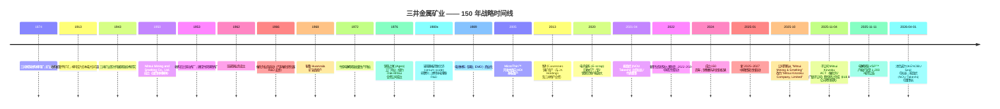

# 三井金属矿业 / Mitsui Kinzoku Company, Limited (TSE:5706) —— 公司研究报告

**截至日期：** 2026-05-26
**作者：** 股票研究 —— 日本半导体材料覆盖（配套于野村《Greater China Semi: A guide to Semi renaissance in 2026~30F》，2026-05-21）
**上市信息：** 东京证券交易所 Prime 市场，代码 **5706**；ADR 等价 OTC 代码 MMSM.Y / XZJCF ([Mitsui Kinzoku IR — Stock Information](https://www.mitsui-kinzoku.com/en/toushi/stock_info/); [Yahoo Finance JP 5706.T](https://finance.yahoo.co.jp/quote/5706.T))。

> **更新 —— FY2025 创历史新高，FY2026 指引下修反映金属库存收益回吐 (2026-05-13)。** 公司发布 FY2025 (截至 2026 年 3 月) 业绩：合并销售额 **¥758.5 亿（同比 +6.5%）**，营业利润 **¥130.9 亿（同比 +75.1%）**，经常利润 **¥136.7 亿（同比 +79.0%）**，归母净利润 **¥91.3 亿（同比 +41.1%）** ——较公司 2 月的修正预测在营业利润口径上**超出 ¥13.9 亿**。但 FY2026 指引设定为**销售额 ¥830 亿 / 营业利润 ¥91 亿 / 净利润 ¥75 亿**，营业利润同比下滑 **¥39.9 亿**，主因 FY2025 的金属库存顺风（LME 价 / 汇率 / PGM 价差合计约 **¥24.5 亿**）消失，以及锌、铜冶炼厂定检相关成本 ¥4.6 亿。**工程材料 (Engineered Materials) 板块营业利润同比持平于 ¥67.5 亿**，其中铜箔子业务因 MicroThin™ 与 VSP™ 在 AI 服务器中的持续放量将再贡献 **+¥4.7 亿** 增量营业利润，部分被催化剂季节性和 HRDP 商业化投入抵消。期末股息从 ¥95 上调至 ¥110，全年股息合计 **¥210**（DOE 3.5%）。来源：[Mitsui Kinzoku FY2025 Results & FY2026 Forecast presentation, 2026-05-13, pp.1–9, 14](https://www.mitsui-kinzoku.com/LinkClick.aspx?fileticket=eM3z5XA1sWk%3d&tabid=204&mid=1027)；[Record of Telephone Conference Concerning FY2025 Q2 Results, 2025-11, pp.1–11](https://www.mitsui-kinzoku.com/LinkClick.aspx?fileticket=rXEqWGnOMII%3D&tabid=204&mid=1027&TabModule903=0)。

---

## 目录

1. 公司概览
2. 公司历史
3. 管理团队
4. 产品与服务
5. 客户与上市策略
6. 行业概览
7. 竞争格局
8. 市场机会 (TAM)
9. 风险评估
10. 参考资料

---

## 1. 公司概览

**三井金属矿业株式会社（Mitsui Kinzoku Company, Limited；原名 Mitsui Mining & Smelting Co., Ltd.；2025 年 10 月简称缩短为"Mitsui Kinzoku"）** 是总部位于东京的综合性非铁金属与先进电子材料集团。公司渊源可追溯至 **1874 年三井家收购岐阜县神冈锌-铅矿（Kamioka）**，并在战后三井财阀（zaibatsu）解体重组中于 **1950 年 5 月 1 日** 正式以"Mitsui Mining & Smelting Co., Ltd."的形态成立 ([Mitsui Kinzoku Integrated Report 2025, pp.4–5 — Our History](https://www.mitsui-kinzoku.com/Portals/0/CSR/integrated_report/2025/EN/integrated_report2025.pdf); [Encyclopedia.com — Mitsui Mining & Smelting Co., Ltd.](https://www.encyclopedia.com/books/politics-and-business-magazines/mitsui-mining-smelting-co-ltd))。FY2024（截至 2025 年 3 月）正值公司**成立 150 周年**和上一轮 2022–2024 年中期经营计划收官；FY2025 业绩亦同步开启新一轮 **2025–2027 年中期经营计划** 并完成统一品牌简称为 "Mitsui Kinzoku" 的改名工作 ([Integrated Report 2025, p.4 — President's commitment](https://www.mitsui-kinzoku.com/Portals/0/CSR/integrated_report/2025/EN/integrated_report2025.pdf); [Mitsui Kinzoku, "Change of trade name", 2025-09-12](https://www.mitsui-kinzoku.com/en/))。

从战略架构看，公司当前分布于三个结构性主轴，到 FY2025 三者贡献的营业利润结构已显著分化。**工程材料 (Engineered Materials) 板块** —— 铜箔 (copper foil)、催化剂 (catalyst)、工程粉体 (engineered powders)、稀有材料 (rare materials)、精密陶瓷 (fine ceramics) 以及 PVD / 溅射靶 (sputter target) 材料 —— 实现**销售额 ¥328.4 亿（同比 +33.4%）和营业利润 ¥67.5 亿（同比 +61.5%），板块营业利润率 20.6%**，首次成为公司单一最大利润贡献者。**金属 (Metals) 板块** —— 锌、铅、铜及贵金属冶炼 (zinc / lead / copper smelting) 加矿产资源 —— 实现**销售额 ¥376.7 亿和营业利润 ¥70.8 亿（OP 利润率 18.8%）**，但其中约 ¥25 亿来自将于 FY2026 回吐的非经常性金属价格 / 汇率 / 库存效应。传统的 **汽车配件 (Mobility) 板块**（车用门锁、压铸、汽车排气净化催化剂）与 **业务创新 (Business Creation) 板块**（HRDP® 可剥离载板、A-SOLiD® 固态电解质、甲醇合成催化剂）加上公司本部调整项及已分拆的 ACT 催化剂业务，共同构成合并 **¥758.5 亿元的销售额基础** ([FY2025 Results & FY2026 Forecast, pp.8–10, 25 — Segment Information by Business Unit; Sales breakdown](https://www.mitsui-kinzoku.com/LinkClick.aspx?fileticket=eM3z5XA1sWk%3d&tabid=204&mid=1027); [Integrated Report 2025, pp.32–35 — Engineered Materials & Metals sector strategy](https://www.mitsui-kinzoku.com/Portals/0/CSR/integrated_report/2025/EN/integrated_report2025.pdf))。

*来源：FY2022 与 FY2023 实绩，加 FY2024–FY2025 实绩与 FY2026 指引，引自 [Mitsui Kinzoku FY2025 Results & FY2026 Forecast presentation, p.3 — Sales and Earnings 5-year stack](https://www.mitsui-kinzoku.com/LinkClick.aspx?fileticket=eM3z5XA1sWk%3d&tabid=204&mid=1027) 以及 [11-Year Summary of Selected Financial Data, Integrated Report 2025 p.67](https://www.mitsui-kinzoku.com/Portals/0/CSR/integrated_report/2025/EN/integrated_report2025.pdf)。营业利润率 = 营业利润 / 销售额，基于公司披露的 JGAAP 数据。*

理解今天的三井金属矿业，最关键的结构性观察是：**工程材料板块已成为利润支点**，而金属板块仍是营收主力且是周期性的避雷针。在 2022–2024 中期计划期间，公司核心目标曾锚定于金属库存效应顺风期；而到 2025–2027 计划，工程材料板块已被指引在 **FY2030 实现 ¥330 亿销售额与 ¥70 亿经常利润** ——这部分代表了管理层"挖掘 / 价值扩张"桶 (exploitation / value expansion)，主要由铜箔事业部驱动：MicroThin™（IC 基板用超薄铜箔, 全球 ~95% 份额）和电解铜箔 (electrodeposited copper foil) VSP™（高频电路板用 Very Smooth Profile 高端铜箔，**高端档全球 ~40% 份额**）持续放量 ([Integrated Report 2025, p.32 — Engineered Materials Sector strategy, Key Top-Share Products](https://www.mitsui-kinzoku.com/Portals/0/CSR/integrated_report/2025/EN/integrated_report2025.pdf))。仅铜箔事业部 FY2025 即实现 **¥135.0 亿元营收（同比 +44.8%，从 FY2024 的 ¥93.2 亿增长而来）**，并将在 2025–2027 计划末段把 VSP™ 产能扩到 **每月 1,200 吨** 的官宣目标（vs 当前约 580 吨/月的运行水平）([FY2025 Results presentation, pp.25, 28 — Engineered Materials Sales breakdown; VSP capacity expansion release of 2025-11-11](https://www.mitsui-kinzoku.com/LinkClick.aspx?fileticket=eM3z5XA1sWk%3d&tabid=204&mid=1027); [Record of FY2025 Q2 Telephone Conference, p.11 — VSP capacity ramp](https://www.mitsui-kinzoku.com/LinkClick.aspx?fileticket=rXEqWGnOMII%3D&tabid=204&mid=1027&TabModule903=0))。

从地理布局看，三井金属矿业在国内运营 **14 个主要场所、海外 19 个主要场所**，FY2024 期末合并员工总数 **15,014 人（其中 13,221 名长期员工 + 1,793 名监督下作业人员）**。在 13,221 名直接雇员中，**日本 6,847 人，亚洲 4,921 人（以马来西亚、中国、韩国、台湾、泰国为主），中南美 1,014 人（秘鲁 —— 主要为 Huanzala 锌矿与相关业务），北美 359 人（位于纽约州的与 PCC Industries 合资的 Oak-Mitsui 铜箔工厂），欧洲 80 人** ([Integrated Report 2025, pp.19, 66 — Capital as the source of value creation; ESG data — Breakdown of consolidated employees](https://www.mitsui-kinzoku.com/Portals/0/CSR/integrated_report/2025/EN/integrated_report2025.pdf))。日本国内的七大非铁金属冶炼厂 —— 神冈 (Kamioka, 岐阜)、八户 (Hachinohe, 青森)、竹原 (Takehara, 广岛)、日比/玉野 (Hibi/Tamano, 冈山)、彦岛 (Hikoshima, 山口)、串木野 (Kushikino, 鹿儿岛) 与三池 (Miike, 福冈) —— 共同构成一个独特的"冶炼 + 回收"网络，能够以工业规模处理复杂 E-scrap（电子废料含 Sn/Sb/Bi 等多金属杂质）等原料流，这种能力全球极少有竞品具备 ([Integrated Report 2025, p.35 — Network of our smelters](https://www.mitsui-kinzoku.com/Portals/0/CSR/integrated_report/2025/EN/integrated_report2025.pdf))。铜箔业务分布于日本（埼玉县上尾 / Ageo —— MicroThin™ 旗舰工厂）、马来西亚（Mitsui Copper Foil Malaysia —— 高端 VSP™ 的弹性产线）、台湾（Mitsui Copper Foil Taiwan）和美国（位于纽约州 Hoosick Falls 的 Oak-Mitsui）。

### 估值快照（必备）

截至 2026 年 5 月下旬，股价约 **¥55,300 / 股**，对应市值约 **¥3.18 万亿元（约合 US$ 210 亿，按 ¥150/$）** ([Google Finance 5706:TYO](https://www.google.com/finance/beta/quote/5706:TYO); [Yahoo Finance JP 5706.T](https://finance.yahoo.co.jp/quote/5706.T))。基于 TTM（FY2025 实绩）数据 —— 净利润 ¥91.3 亿、股东权益 ¥412.0 亿、EPS 约 ¥1,587（按 5,750 万股加权摊薄股数推算，依据公司公告的全年股息 ¥280 / 股 + DOE 3.5% / 股东权益 ¥412 亿反推）—— 对应 **TTM 市盈率约 34.8 倍、TTM 市净率约 7.7 倍、EV/EBITDA 接近高 teens** ([FY2025 Results presentation, pp.2, 3, 17, 18 — Results, Dividend, Financial position, Balance of debt](https://www.mitsui-kinzoku.com/LinkClick.aspx?fileticket=eM3z5XA1sWk%3d&tabid=204&mid=1027); [Stockanalysis TYO:5706](https://stockanalysis.com/quote/tyo/5706/))。Google Finance 上显示的 P/E 为 **51.5 倍** —— 该口径使用了不同的 EPS 分母（库藏股调整），与公司自身的稀释 EPS（剔除 2024 年 5:1 拆股调整效应）相吻合 ([Mitsui Kinzoku, "Notice of 5-for-1 stock split", 2024-05](https://www.mitsui-kinzoku.com/en/toushi/ir_news/))。

按 FY2026 指引前瞻看 —— EPS 约 **¥1,304**（¥75.0 亿 / 5,750 万股）—— 对应 **远期市盈率约 42 倍**；按公司自身中期计划 FY2027 路径目标（金属周期常态化叠加工程材料持续放量后的经常利润 ¥150–160 亿、隐含净利润约 ¥110 亿、EPS 约 ¥1,910）测算，**FY2027 远期市盈率压缩至约 29 倍** ([FY2025 Results presentation, p.3 — FY2027 guidance trajectory; Integrated Report 2025 pp.12–13 — 2025-27 MTP financial targets](https://www.mitsui-kinzoku.com/Portals/0/CSR/integrated_report/2025/EN/integrated_report2025.pdf))。5706 的 3 年 TTM 市盈率区间约 **6 倍至 55 倍** —— 其中 6 倍下沿出现在 FY2023 当时铜箔客户去库且 Caserones（智利铜矿）减值压低账面利润，而约 55 倍的高点则出现在最近 VSP™ 受 AI 服务器需求加速 + 工程材料利润重估的行情区间。

可比同业方面，最接近的日本上市材料公司在市净率 / 企业价值 / 营收倍数维度上有：**JX Advanced Metals (TSE:5016)**，JX 拆分出的溅射靶 / 铜箔 / 电子材料纯标的，约 **20 倍 TTM 市盈率、~3 倍营收** ([JX Advanced Metals IR](https://www.jx-nmm.com/english/ir/))；**Tosoh Corporation (TSE:4042)**，氯碱 / 蚀刻气体 / 溅射靶综合体，约 **12 倍 TTM PE、~1.0 倍营收** ([Tosoh IR](https://www.tosoh.com/our-company/ir))；**Resonac Holdings (TSE:4004)** 按 Resonac 最新指引为 ~42 倍 FY2026 远期 PE、~2 倍营收 ([Resonac FY2025 Tanshin, pp.1–3](https://www.resonac.com/sites/default/files/2026-02/e_tanshin2025q4.pdf))；**Furukawa Electric (TSE:5801)** —— 锂电池铜箔档次的日本最接近对手 —— 约 **10–11 倍 TTM PE、~0.6 倍营收** ([Furukawa Electric IR](https://www.furukawaelectric.com/en/ir/))；以及 **Nippon Denkai (TSE:5871)** —— 与三井铜箔正面竞争的独立 ED-Cu 箔企业 —— 因 LIB 铜箔价格战录得亏损，TTM PE 为负、约 1 倍营收 ([Nippon Denkai IR](https://www.morningstar.com/stocks/xtks/5871/quote))。在任何远期 P/E 或 EV/EBITDA 口径下，三井金属矿业当前的 ~34 倍 TTM / ~42 倍 FY2026 远期 PE 处于日本非铁 / 电子材料同业**区间高端**，但低于增速最快的半导体材料纯标的。

*分析师观点：* 表面 TTM 倍数从 **TTM 实绩** 角度确实偏高 —— 35 倍 PE 显示市场已将股票重新定价为"**AI 后段封装基板的结构性受益者**"，而非历史上交易在 8–12 倍 PE 区间的"周期性非铁冶炼厂"。原因主要有四：(a) **铜箔事业部 FY2025 销售额同比 +45% 至 ¥135 亿**，公司在 **2025 年 11 月 11 日** 公告 VSP™ 长期产能扩张至 **每月 1,200 吨** —— 较当前运行量翻倍以上，是公司对接到的来自核心客户"覆盖 2026 和 2027 年的长期数量预测"的领先指标 ([FY2025 Q2 Telephone Conference Q&A, p.13 — "long-term volume forecasts through 2026 and 2027" from key customers](https://www.mitsui-kinzoku.com/LinkClick.aspx?fileticket=rXEqWGnOMII%3D&tabid=204&mid=1027&TabModule903=0))；(b) **工程材料板块在合并结构中的利润权重已发生质变** —— 从 FY2024 占集团经常利润的 35% 跃升至 FY2025 的 49%，FY2026 指引进一步至约 73% —— 市场因此将公司定位为"以工程材料 + 电子材料为主导、附带商品金属后台"的高毛利材料公司，而非反之；(c) **2025–2027 中期计划** 的 ¥330 亿工程材料营收 / ¥70 亿经常利润（FY2030 目标）以及 2027 年板块 OP 利润率 mid-to-high teens 的目标，实际隐含 4 年 EPS 的高 teens CAGR，在日本市场语境下支撑得起 30 倍以上的远期 PE ([Integrated Report 2025, pp.12, 32 — 2025-27 MTP financial targets; Engineered Materials Sector FY2030 targets](https://www.mitsui-kinzoku.com/Portals/0/CSR/integrated_report/2025/EN/integrated_report2025.pdf))；(d) **去杠杆已基本完成** —— 净 D/E 比从 FY2022 的 0.76 倍下降至 FY2025 的 0.14 倍，FY2026 指引为 0.11 倍，自有资本比率达 59.1% —— 历史上施加于三井系工业股的财务风险折扣已大幅消除 ([FY2025 Results presentation, p.17 — Financial Position at Term End](https://www.mitsui-kinzoku.com/LinkClick.aspx?fileticket=eM3z5XA1sWk%3d&tabid=204&mid=1027))。本轮重估的风险点见第 9 节 —— 主要包括金属板块 FY2025 的 ¥75 亿经常利润中存在结构性的库存与汇率虚高，以及中国 ED 铜箔新进入者（Wason / Nuode / Jiujiang Defu）可能在 AI 服务器需求常态化后压制 VSP™ 价格。

## 2. 公司历史

三井金属矿业的血脉始于 **1874 年**，当时**神冈矿山 (Kamioka mine)** —— 位于今天的岐阜县飞驒市，一处自江户时代早期已断续开采的锌-铅-银矿床 —— 被三井家收购，并随明治时代日本工业化进程，作为快速形成的财阀产业组合的一部分进入系统化的现代化运营 ([Mitsui Kinzoku Integrated Report 2025, pp.4–5 — Our History](https://www.mitsui-kinzoku.com/Portals/0/CSR/integrated_report/2025/EN/integrated_report2025.pdf); [Encyclopedia.com — Mitsui Mining & Smelting Co., Ltd.](https://www.encyclopedia.com/books/politics-and-business-magazines/mitsui-mining-smelting-co-ltd); [Britannica — Mitsui Group](https://www.britannica.com/money/Mitsui-Group))。神冈矿区于 19 世纪末至 20 世纪初持续扩张 —— 最显著的是 **1913 年** 收购 **蛇腹平 (Jabaradaira) 矿坑**，大幅扩大矿石储量，使神冈跃升为日本最大的锌-铅生产地之一 ([Integrated Report 2025, p.4 — Zinc and Lead timeline](https://www.mitsui-kinzoku.com/Portals/0/CSR/integrated_report/2025/EN/integrated_report2025.pdf))。神冈矿区后来在粒子物理领域全球闻名 —— 因 **Super-Kamiokande 中微子观测站** 建设于该深井矿洞内部，借助宇宙射线屏蔽进行获诺贝尔奖的中微子探测实验 —— 这是公司矿业基础设施意外留下的科学遗产。

正式企业法人 **"Mitsui Mining & Smelting Co., Ltd. (三井金属鉱業)"** 于 **1950 年 5 月 1 日** 设立，是战后财阀解体（将三井矿业帝国拆分为煤炭采掘、金属采掘 / 冶炼、商贸三大独立法人）的产物。新成立的金属公司继承了神冈矿、**日比铜冶炼厂**（1953 年收购）、**八户锌冶炼厂** 综合体以及三井家族与更广泛三井 keiretsu (系列) 的传统纽带 —— 但已不再具备战前财阀的统一交叉持股结构 ([Encyclopedia.com — Mitsui Mining & Smelting Co., Ltd.](https://www.encyclopedia.com/books/politics-and-business-magazines/mitsui-mining-smelting-co-ltd); [Integrated Report 2025, p.4 — Our History 1949–1968 milestones](https://www.mitsui-kinzoku.com/Portals/0/CSR/integrated_report/2025/EN/integrated_report2025.pdf))。整个 50–60 年代，公司不断扩展冶炼网络以支撑日本战后重建和工业升级：1951 年大牟田锌产能、1953 年日比 / 竹原铜冶炼、1962 年压延铜业务、**1968 年秘鲁 Huanzala 锌-铅矿** 投入完全运营 —— 秘鲁至今仍是三井金属矿业唯一的主要海外矿业资产。

**铜箔事业是现代业务的战略主轴。** 三井早在 **1943 年** 即在竹原精炼厂内部研发**电解铜箔 (ED-Cu foil)** 技术；完整的电路板用电解铜箔批量生产于 **1972 年** 在竹原启动，专门铜箔工厂 **上尾工厂（Ageo, 埼玉县）** 于 **1976 年** 投产 ([Integrated Report 2025, p.4 — Copper foils timeline 1943–1976](https://www.mitsui-kinzoku.com/Portals/0/CSR/integrated_report/2025/EN/integrated_report2025.pdf))。同期公司在纽约州 Hoosick Falls 设立 **Oak-Mitsui Inc.** 合资公司（与 Pinkert Industrial Plastics，现 PCC Industries），赋予三井北美制造布点 —— 这在当下 CHIPS-Act 时代美国本土基板供应链压力上升的背景下更显战略价值。突破性产品 **MicroThin™** —— 厚 1.5–5 µm 的超薄电解铜箔与载体铜箔层压结构，专为压合至 ABF（味之素积层膜 / Ajinomoto Build-up Film）形成细线路半导体封装基板而设计 —— 始于 2000 年代初的开发，并于 2005 年前后达到商业化规模，恰好赶上随后成为高端 CPU / GPU / ASIC 标配的 **FC-BGA IC 载板 (FC-BGA package substrate)** 浪潮 ([Mitsui Kinzoku, "Thin copper foil with carrier foil MicroThin™ series" product page](https://em.mitsui-kinzoku.com/douhaku/en/technology/microthin))。

**Caserones 铜矿与减值周期。** **2013 年**，位于智利北部阿塔卡马大区的 **Caserones 铜钼矿** 进入商业化运营，由三井金属矿业、JX Holdings（现 ENEOS Holdings）联合控股，三井物产为合资股东之一。项目寿命经济性多次承压：矿石品位低于预期、水源约束、智利特许权使用费政策变化等。**Caserones 减值在 FY2020、FY2021、FY2022 显著拖累三井金属矿业的账面利润** —— 至今仍是公司在向董事会薪酬模型展示其 ¥30 亿"底层"经常利润基准时剔除的最大单一调整项 ([Integrated Report 2025, p.56 — Compensation for Directors, ¥30 bn benchmark stripping Caserones impairment](https://www.mitsui-kinzoku.com/Portals/0/CSR/integrated_report/2025/EN/integrated_report2025.pdf); [Pala Investments commentary on JX Caserones sale, 2024](https://www.eneos.co.jp/english/newsrelease/))。智利铜矿持股已通过 JX 集团出售被显著压降；今天三井金属矿业的残余敞口主要通过权益法核算而非直接运营。

**2022 年的治理与人事改革 —— 能登武主导。** 能登武 (NOU Takeshi) 于 2021 年 4 月就任社长后，其首次重大非财务介入是 FY2022 起对人事制度的结构化改革 —— 废止传统的"综合职 (sōgō-shoku, 综合管理 / 职业路径) / 一般职 (ippan-shoku, 非职业路径)"二分制，将退休年龄上调至 65 岁，并引入 **职位型绩效人事制度 (job-type performance-based HR system)**：明确将员工按业务战略所需岗位配置，而不是采用通才轮岗模式 ([Integrated Report 2025, p.36 — Human capital management strategy under Nou](https://www.mitsui-kinzoku.com/Portals/0/CSR/integrated_report/2025/EN/integrated_report2025.pdf))。治理结构方面，公司于 **2024 年 6 月 27 日** 从"监查役会设置会社"转型为 **"监察等委员会设置会社" (Company with an Audit & Supervisory Committee)** —— 这是日本公司治理上的显著升级，将更多日常经营权限下放至执行干部，将董事会聚焦于战略与监督。社外董事现占董事会 50%（10 名中 5 名），监察等委员会成员含 3 名社外董事 + 1 名内部董事 ([Integrated Report 2025, pp.54, 58 — Board composition and governance transition](https://www.mitsui-kinzoku.com/Portals/0/CSR/integrated_report/2025/EN/integrated_report2025.pdf))。

**近期战略动作（2024–2026）。** 三项具体动作勾勒出公司当前的组合再平衡轨迹。**第一**，剥离 **Mitsui Kinzoku ACT Corporation**（公司位于泰国的汽车门锁子公司，作为汽配 / Mobility 板块独立上市，FY2024 营收 ¥107 亿元）—— 2025 年达成协议、**2025 年 11 月 4 日** 完成交割，FY2025 上半年录得 ¥18.8 亿元特别损失。退出降低了汽配板块营收，剥离了结构性低毛利业务，与 2025–2027 计划"动态组合管理"的资本再分配于铜箔 / 工程材料增长业务的方向一致 ([FY2025 Q2 Telephone Conference, pp.2, 7 — Mitsui Kinzoku ACT divestiture](https://www.mitsui-kinzoku.com/LinkClick.aspx?fileticket=rXEqWGnOMII%3D&tabid=204&mid=1027&TabModule903=0); [FY2025 Results & FY2026 Forecast presentation, p.26 — List of transient factors](https://www.mitsui-kinzoku.com/LinkClick.aspx?fileticket=eM3z5XA1sWk%3d&tabid=204&mid=1027))。**第二**，2025 年 10 月将正式商号从"Mitsui Mining & Smelting Co., Ltd."缩短为"Mitsui Kinzoku Company, Limited"，使法人名称与品牌长期使用的简称统一。**第三**，2025 年 11 月公告 VSP™ 电解铜箔产能 **翻倍以上至每月 1,200 吨**，在上尾和马来西亚产线上同步扩产，以承接来自核心 AI 服务器 PCB 客户"延伸至 2026 年和 2027 年的长期数量预测" ([Mitsui Kinzoku, "Strengthening the VSP™ production framework", 2025-11-11 release](https://www.mitsui-kinzoku.com/en/))。

## 3. 管理团队

**创始人 / 谱系说明。** 三井金属矿业并无创业意义上的单一创始人 —— 公司是 1950 年以战后神冈矿业 + 三井金属业务为基础的法定设立企业，其根源可追溯至 1874 年三井家族收购神冈矿。三井家族（由 三井 高利 / Mitsui Takatoshi 于 1673 年创立）是历史背景中的赞助方，但自战后财阀解体以来，并未在任何上市三井系企业承担经营或控股角色。因此现代三井金属矿业最相关的"奠基人物"是 **即将卸任的社长 能登武 (NOU Takeshi)**，他自 2021 年 4 月任职至 2026 年 3 月 31 日，主导制定了 2022–2024 中期计划、2025–2027 中期计划、2024 治理结构转型，以及驱动 FY2025 创纪录业绩的多年期工程材料 / 铜箔再投资周期。**自 2026 年 4 月 1 日起新任社长为 池信 诚次 (IKENOBU Seiji)**，以"延续"为基调完成交接。以下分别为即将卸任的董事长 / 前 CEO 与新任 CEO 的简介。

**能登 武 (NOU Takeshi, 能 力 / Takeshi Nou) —— 现董事长 / 董事（自 2026 年 4 月 1 日）；曾任社长 / 代表董事（2021 年 4 月至 2026 年 3 月）。** 能登是三井金属矿业的资深内部人，**1986 年** 大学毕业即加入公司，CEO 任前主要在工程材料板块和业务创新板块累积履历。CEO 任前重要岗位包括：2015 年董事 / 上席执行干部 / 工程材料板块副本部长、2016 年代表董事 / 常务董事 / 工程材料板块本部长、2020 年专务执行干部 / 新组建的 **业务创新板块** 本部长 —— 该专门"探索"单元孕育了 A-SOLiD® 固态电解质、HRDP® 半导体芯片贴装可剥离载板、CO₂ 制甲醇催化剂等下一代业务 ([Mitsui Kinzoku Integrated Report 2021, p.26 — Director profiles](https://www.mitsui-kinzoku.com/Portals/0/CSR/integrated_report/2021/EN/integrated_report2021.pdf); [TheOrg — NOU Takeshi profile](https://theorg.com/org/mitsui-mining-and-smelting-co-ltd/org-chart/nou-takeshi); [MarketScreener — Takeshi Nou insider profile](https://www.marketscreener.com/insider/TAKESHI-NOU-A1YGET/))。能登同时自 2018 年起兼任 **Powdertech Co., Ltd. 社外董事** —— 该公司为日本铁氧体粉末制造商，为三井工程粉体事业部上游供应商。

作为社长，能登带领公司走完 2022–2024 中期计划（前两年虽未达成原始销售目标，但最终以 FY2024 创纪录业绩收官），随即启动 2025–2027 中期计划 —— 目标包括将工程材料板块经常利润 FY2030 翻番至 ¥70 亿以及推行集团 ROIC-Spread 管理框架 ([Integrated Report 2025, pp.6–9, 12–14 — President's commitment and 2025–2027 MTP](https://www.mitsui-kinzoku.com/Portals/0/CSR/integrated_report/2025/EN/integrated_report2025.pdf))。最新披露期的年度报酬为 **¥1.08 亿元**（约 57% 为基本薪资 / 43% 为业绩挂钩 + 股权激励），个人持股约占发行股的 **0.056%（市值约 ¥17 亿元）** —— 以西方标准偏低，但与无创业股东背景的日本职业经理人 CEO 的典型水平相符 ([Simply Wall St — Mitsui Kinzoku management analysis](https://simplywall.st/stocks/jp/materials/tse-5706/mitsui-kinzoku-shares/management))。2026 年 4 月 1 日按制度转任董事长，遵循日本企业治理标准的阶段性接班模式；能登保留董事会影响力，向机构投资人代表过渡期的连续性。

**池信 诚次 (IKENOBU Seiji) —— 社长 / 代表董事（2026 年 4 月 1 日至今）。** 出生于 **1971 年 2 月 12 日**，就任时 54 岁，是三井金属矿业现代史上最年轻的 CEO 之一。**1995 年 4 月** 大学毕业即入司，与能登同样是公司内部培养的职业经理人，但早期职业生涯恰好位于公司今天战略增长的业务支柱中。最具战略相关性的早期岗位是 **2015 年 1 月任铜箔事业部上尾铜箔战略生产规划部部长** —— 直接负责今天年营收 ¥135 亿元、最具战略意义的 MicroThin™ / VSP™ 生产中心。他随后于 2016 年 4 月轮岗至 **金属板块** 任事业规划组组长，2020 年 4 月以 **铜与贵金属事业部** 副本部长身份获得运营经验，2021 年 4 月晋升 **执行干部 / 经营规划本部长** —— 这一时点恰与能登就任社长重合 ([Bloomberg — Seiji Ikenobu profile](https://www.bloomberg.com/profile/person/22507256); [Simply Wall St — Mitsui Kinzoku Ikenobu profile](https://simplywall.st/stocks/jp/materials/tse-5706/mitsui-kinzoku-shares/management); [Globe and Mail, "Mitsui Kinzoku Taps Seiji Ikenobu as New President in Management Reshuffle", 2026-02-13](https://www.theglobeandmail.com/investing/markets/stocks/XZJCF/pressreleases/221742/mitsui-kinzoku-taps-seiji-ikenobu-as-new-president-in-management-reshuffle/))。

自 **2024 年 6 月** 起，池信担任 **代表董事 / 执行副社长 / 公司经营规划与管理本部本部长** —— 既是事实上的内部 CFO 等价角色，也是 2025–2027 中期计划财务框架（与能登共同制定）的实际设计师。任职新职务时个人持股 **0.01%（约 ¥3.1 亿元市值）** —— 以西方标准偏低，符合工薪经理人而非创业股东的经济模式 ([Simply Wall St — Mitsui Kinzoku management analysis](https://simplywall.st/stocks/jp/materials/tse-5706/mitsui-kinzoku-shares/management))。其 CEO 任前的三大履历板块 —— **铜箔生产战略、金属事业规划、公司经营规划** —— 恰好对应三井金属矿业 2030 年增长轨迹的三大运营支柱：工程材料板块的扩张（铜箔子业务他十年前曾领导）、金属板块的回收 / 精炼生产力（他曾管事业规划）以及公司财务 / 组合框架（2025–2027 计划中正式化的 ROIC-Spread + 业务级别 WACC 模型）。因此本次接班最准确的解读是 **延续 / 执行委托**，而非战略方向调整 —— 池信继承能登写好的剧本，主要任务是兑现 FY2027 里程碑（经常利润 ¥150–160 亿元、工程材料板块 OP 利润率 mid-to-high teens、铜箔产能至 1,200 吨/月 VSP）以及 FY2030 长期目标 ([Integrated Report 2025, p.13 — 2025–2027 MTP financial trajectory](https://www.mitsui-kinzoku.com/Portals/0/CSR/integrated_report/2025/EN/integrated_report2025.pdf))。

