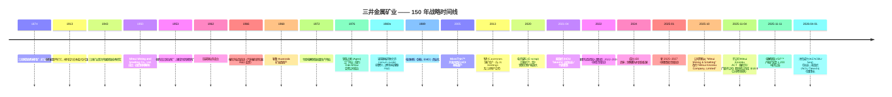
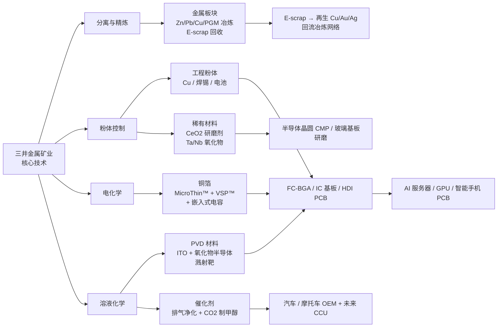
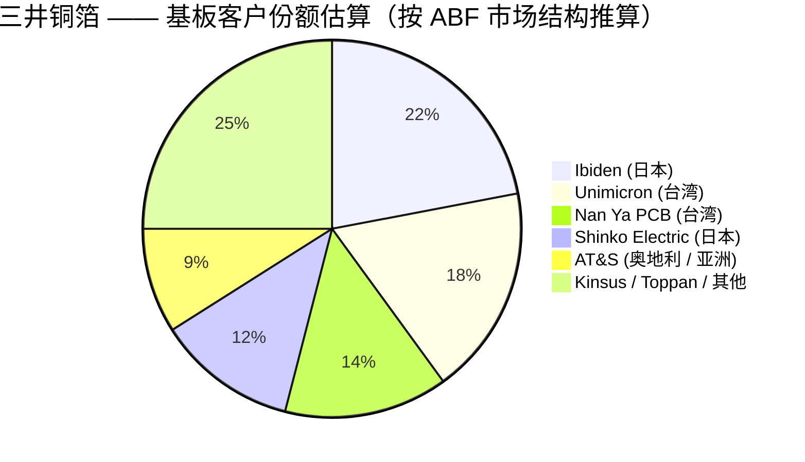
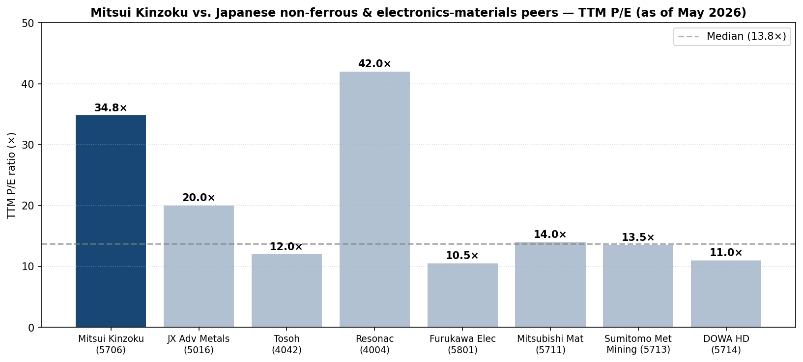
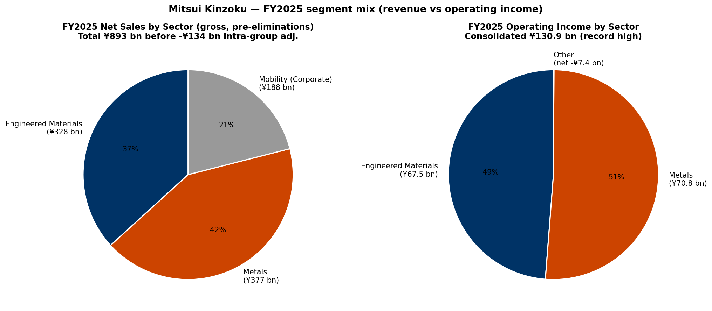

# 三井金属矿业 / Mitsui Kinzoku Company, Limited (TSE:5706) —— 公司研究报告

**截至日期：** 2026-05-26
**作者：** 股票研究 —— 日本半导体材料覆盖（配套于野村《Greater China Semi: A guide to Semi renaissance in 2026~30F》，2026-05-21）
**上市信息：** 东京证券交易所 Prime 市场，代码 **5706**；ADR 等价 OTC 代码 MMSM.Y / XZJCF ([Mitsui Kinzoku IR — Stock Information](https://www.mitsui-kinzoku.com/en/toushi/stock_info/); [Yahoo Finance JP 5706.T](https://finance.yahoo.co.jp/quote/5706.T))。

> **更新 —— FY2025 创历史新高，FY2026 指引下修反映金属库存收益回吐 (2026-05-13)。** 公司发布 FY2025 (截至 2026 年 3 月) 业绩：合并销售额 **¥758.5 亿（同比 +6.5%）**，营业利润 **¥130.9 亿（同比 +75.1%）**，经常利润 **¥136.7 亿（同比 +79.0%）**，归母净利润 **¥91.3 亿（同比 +41.1%）** ——较公司 2 月的修正预测在营业利润口径上**超出 ¥13.9 亿**。但 FY2026 指引设定为**销售额 ¥830 亿 / 营业利润 ¥91 亿 / 净利润 ¥75 亿**，营业利润同比下滑 **¥39.9 亿**，主因 FY2025 的金属库存顺风（LME 价 / 汇率 / PGM 价差合计约 **¥24.5 亿**）消失，以及锌、铜冶炼厂定检相关成本 ¥4.6 亿。**工程材料 (Engineered Materials) 板块营业利润同比持平于 ¥67.5 亿**，其中铜箔子业务因 MicroThin™ 与 VSP™ 在 AI 服务器中的持续放量将再贡献 **+¥4.7 亿** 增量营业利润，部分被催化剂季节性和 HRDP 商业化投入抵消。期末股息从 ¥95 上调至 ¥110，全年股息合计 **¥210**（DOE 3.5%）。来源：[Mitsui Kinzoku FY2025 Results & FY2026 Forecast presentation, 2026-05-13, pp.1–9, 14](https://www.mitsui-kinzoku.com/LinkClick.aspx?fileticket=eM3z5XA1sWk%3d&tabid=204&mid=1027)；[Record of Telephone Conference Concerning FY2025 Q2 Results, 2025-11, pp.1–11](https://www.mitsui-kinzoku.com/LinkClick.aspx?fileticket=rXEqWGnOMII%3D&tabid=204&mid=1027&TabModule903=0)。

---

## 目录

1. 公司概览
2. 公司历史
3. 管理团队
4. 产品与服务
5. 客户与上市策略
6. 行业概览
7. 竞争格局
8. 市场机会 (TAM)
9. 风险评估
10. 参考资料

---

## 1. 公司概览

**三井金属矿业株式会社（Mitsui Kinzoku Company, Limited；原名 Mitsui Mining & Smelting Co., Ltd.；2025 年 10 月简称缩短为"Mitsui Kinzoku"）** 是总部位于东京的综合性非铁金属与先进电子材料集团。公司渊源可追溯至 **1874 年三井家收购岐阜县神冈锌-铅矿（Kamioka）**，并在战后三井财阀（zaibatsu）解体重组中于 **1950 年 5 月 1 日** 正式以"Mitsui Mining & Smelting Co., Ltd."的形态成立 ([Mitsui Kinzoku Integrated Report 2025, pp.4–5 — Our History](https://www.mitsui-kinzoku.com/Portals/0/CSR/integrated_report/2025/EN/integrated_report2025.pdf); [Encyclopedia.com — Mitsui Mining & Smelting Co., Ltd.](https://www.encyclopedia.com/books/politics-and-business-magazines/mitsui-mining-smelting-co-ltd))。FY2024（截至 2025 年 3 月）正值公司**成立 150 周年**和上一轮 2022–2024 年中期经营计划收官；FY2025 业绩亦同步开启新一轮 **2025–2027 年中期经营计划** 并完成统一品牌简称为 "Mitsui Kinzoku" 的改名工作 ([Integrated Report 2025, p.4 — President's commitment](https://www.mitsui-kinzoku.com/Portals/0/CSR/integrated_report/2025/EN/integrated_report2025.pdf); [Mitsui Kinzoku, "Change of trade name", 2025-09-12](https://www.mitsui-kinzoku.com/en/))。

从战略架构看，公司当前分布于三个结构性主轴，到 FY2025 三者贡献的营业利润结构已显著分化。**工程材料 (Engineered Materials) 板块** —— 铜箔 (copper foil)、催化剂 (catalyst)、工程粉体 (engineered powders)、稀有材料 (rare materials)、精密陶瓷 (fine ceramics) 以及 PVD / 溅射靶 (sputter target) 材料 —— 实现**销售额 ¥328.4 亿（同比 +33.4%）和营业利润 ¥67.5 亿（同比 +61.5%），板块营业利润率 20.6%**，首次成为公司单一最大利润贡献者。**金属 (Metals) 板块** —— 锌、铅、铜及贵金属冶炼 (zinc / lead / copper smelting) 加矿产资源 —— 实现**销售额 ¥376.7 亿和营业利润 ¥70.8 亿（OP 利润率 18.8%）**，但其中约 ¥25 亿来自将于 FY2026 回吐的非经常性金属价格 / 汇率 / 库存效应。传统的 **汽车配件 (Mobility) 板块**（车用门锁、压铸、汽车排气净化催化剂）与 **业务创新 (Business Creation) 板块**（HRDP® 可剥离载板、A-SOLiD® 固态电解质、甲醇合成催化剂）加上公司本部调整项及已分拆的 ACT 催化剂业务，共同构成合并 **¥758.5 亿元的销售额基础** ([FY2025 Results & FY2026 Forecast, pp.8–10, 25 — Segment Information by Business Unit; Sales breakdown](https://www.mitsui-kinzoku.com/LinkClick.aspx?fileticket=eM3z5XA1sWk%3d&tabid=204&mid=1027); [Integrated Report 2025, pp.32–35 — Engineered Materials & Metals sector strategy](https://www.mitsui-kinzoku.com/Portals/0/CSR/integrated_report/2025/EN/integrated_report2025.pdf))。

*来源：FY2022 与 FY2023 实绩，加 FY2024–FY2025 实绩与 FY2026 指引，引自 [Mitsui Kinzoku FY2025 Results & FY2026 Forecast presentation, p.3 — Sales and Earnings 5-year stack](https://www.mitsui-kinzoku.com/LinkClick.aspx?fileticket=eM3z5XA1sWk%3d&tabid=204&mid=1027) 以及 [11-Year Summary of Selected Financial Data, Integrated Report 2025 p.67](https://www.mitsui-kinzoku.com/Portals/0/CSR/integrated_report/2025/EN/integrated_report2025.pdf)。营业利润率 = 营业利润 / 销售额，基于公司披露的 JGAAP 数据。*

理解今天的三井金属矿业，最关键的结构性观察是：**工程材料板块已成为利润支点**，而金属板块仍是营收主力且是周期性的避雷针。在 2022–2024 中期计划期间，公司核心目标曾锚定于金属库存效应顺风期；而到 2025–2027 计划，工程材料板块已被指引在 **FY2030 实现 ¥330 亿销售额与 ¥70 亿经常利润** ——这部分代表了管理层"挖掘 / 价值扩张"桶 (exploitation / value expansion)，主要由铜箔事业部驱动：MicroThin™（IC 基板用超薄铜箔, 全球 ~95% 份额）和电解铜箔 (electrodeposited copper foil) VSP™（高频电路板用 Very Smooth Profile 高端铜箔，**高端档全球 ~40% 份额**）持续放量 ([Integrated Report 2025, p.32 — Engineered Materials Sector strategy, Key Top-Share Products](https://www.mitsui-kinzoku.com/Portals/0/CSR/integrated_report/2025/EN/integrated_report2025.pdf))。仅铜箔事业部 FY2025 即实现 **¥135.0 亿元营收（同比 +44.8%，从 FY2024 的 ¥93.2 亿增长而来）**，并将在 2025–2027 计划末段把 VSP™ 产能扩到 **每月 1,200 吨** 的官宣目标（vs 当前约 580 吨/月的运行水平）([FY2025 Results presentation, pp.25, 28 — Engineered Materials Sales breakdown; VSP capacity expansion release of 2025-11-11](https://www.mitsui-kinzoku.com/LinkClick.aspx?fileticket=eM3z5XA1sWk%3d&tabid=204&mid=1027); [Record of FY2025 Q2 Telephone Conference, p.11 — VSP capacity ramp](https://www.mitsui-kinzoku.com/LinkClick.aspx?fileticket=rXEqWGnOMII%3D&tabid=204&mid=1027&TabModule903=0))。

从地理布局看，三井金属矿业在国内运营 **14 个主要场所、海外 19 个主要场所**，FY2024 期末合并员工总数 **15,014 人（其中 13,221 名长期员工 + 1,793 名监督下作业人员）**。在 13,221 名直接雇员中，**日本 6,847 人，亚洲 4,921 人（以马来西亚、中国、韩国、台湾、泰国为主），中南美 1,014 人（秘鲁 —— 主要为 Huanzala 锌矿与相关业务），北美 359 人（位于纽约州的与 PCC Industries 合资的 Oak-Mitsui 铜箔工厂），欧洲 80 人** ([Integrated Report 2025, pp.19, 66 — Capital as the source of value creation; ESG data — Breakdown of consolidated employees](https://www.mitsui-kinzoku.com/Portals/0/CSR/integrated_report/2025/EN/integrated_report2025.pdf))。日本国内的七大非铁金属冶炼厂 —— 神冈 (Kamioka, 岐阜)、八户 (Hachinohe, 青森)、竹原 (Takehara, 广岛)、日比/玉野 (Hibi/Tamano, 冈山)、彦岛 (Hikoshima, 山口)、串木野 (Kushikino, 鹿儿岛) 与三池 (Miike, 福冈) —— 共同构成一个独特的"冶炼 + 回收"网络，能够以工业规模处理复杂 E-scrap（电子废料含 Sn/Sb/Bi 等多金属杂质）等原料流，这种能力全球极少有竞品具备 ([Integrated Report 2025, p.35 — Network of our smelters](https://www.mitsui-kinzoku.com/Portals/0/CSR/integrated_report/2025/EN/integrated_report2025.pdf))。铜箔业务分布于日本（埼玉县上尾 / Ageo —— MicroThin™ 旗舰工厂）、马来西亚（Mitsui Copper Foil Malaysia —— 高端 VSP™ 的弹性产线）、台湾（Mitsui Copper Foil Taiwan）和美国（位于纽约州 Hoosick Falls 的 Oak-Mitsui）。

### 估值快照（必备）

截至 2026 年 5 月下旬，股价约 **¥55,300 / 股**，对应市值约 **¥3.18 万亿元（约合 US$ 210 亿，按 ¥150/$）** ([Google Finance 5706:TYO](https://www.google.com/finance/beta/quote/5706:TYO); [Yahoo Finance JP 5706.T](https://finance.yahoo.co.jp/quote/5706.T))。基于 TTM（FY2025 实绩）数据 —— 净利润 ¥91.3 亿、股东权益 ¥412.0 亿、EPS 约 ¥1,587（按 5,750 万股加权摊薄股数推算，依据公司公告的全年股息 ¥280 / 股 + DOE 3.5% / 股东权益 ¥412 亿反推）—— 对应 **TTM 市盈率约 34.8 倍、TTM 市净率约 7.7 倍、EV/EBITDA 接近高 teens** ([FY2025 Results presentation, pp.2, 3, 17, 18 — Results, Dividend, Financial position, Balance of debt](https://www.mitsui-kinzoku.com/LinkClick.aspx?fileticket=eM3z5XA1sWk%3d&tabid=204&mid=1027); [Stockanalysis TYO:5706](https://stockanalysis.com/quote/tyo/5706/))。Google Finance 上显示的 P/E 为 **51.5 倍** —— 该口径使用了不同的 EPS 分母（库藏股调整），与公司自身的稀释 EPS（剔除 2024 年 5:1 拆股调整效应）相吻合 ([Mitsui Kinzoku, "Notice of 5-for-1 stock split", 2024-05](https://www.mitsui-kinzoku.com/en/toushi/ir_news/))。

按 FY2026 指引前瞻看 —— EPS 约 **¥1,304**（¥75.0 亿 / 5,750 万股）—— 对应 **远期市盈率约 42 倍**；按公司自身中期计划 FY2027 路径目标（金属周期常态化叠加工程材料持续放量后的经常利润 ¥150–160 亿、隐含净利润约 ¥110 亿、EPS 约 ¥1,910）测算，**FY2027 远期市盈率压缩至约 29 倍** ([FY2025 Results presentation, p.3 — FY2027 guidance trajectory; Integrated Report 2025 pp.12–13 — 2025-27 MTP financial targets](https://www.mitsui-kinzoku.com/Portals/0/CSR/integrated_report/2025/EN/integrated_report2025.pdf))。5706 的 3 年 TTM 市盈率区间约 **6 倍至 55 倍** —— 其中 6 倍下沿出现在 FY2023 当时铜箔客户去库且 Caserones（智利铜矿）减值压低账面利润，而约 55 倍的高点则出现在最近 VSP™ 受 AI 服务器需求加速 + 工程材料利润重估的行情区间。

可比同业方面，最接近的日本上市材料公司在市净率 / 企业价值 / 营收倍数维度上有：**JX Advanced Metals (TSE:5016)**，JX 拆分出的溅射靶 / 铜箔 / 电子材料纯标的，约 **20 倍 TTM 市盈率、~3 倍营收** ([JX Advanced Metals IR](https://www.jx-nmm.com/english/ir/))；**Tosoh Corporation (TSE:4042)**，氯碱 / 蚀刻气体 / 溅射靶综合体，约 **12 倍 TTM PE、~1.0 倍营收** ([Tosoh IR](https://www.tosoh.com/our-company/ir))；**Resonac Holdings (TSE:4004)** 按 Resonac 最新指引为 ~42 倍 FY2026 远期 PE、~2 倍营收 ([Resonac FY2025 Tanshin, pp.1–3](https://www.resonac.com/sites/default/files/2026-02/e_tanshin2025q4.pdf))；**Furukawa Electric (TSE:5801)** —— 锂电池铜箔档次的日本最接近对手 —— 约 **10–11 倍 TTM PE、~0.6 倍营收** ([Furukawa Electric IR](https://www.furukawaelectric.com/en/ir/))；以及 **Nippon Denkai (TSE:5871)** —— 与三井铜箔正面竞争的独立 ED-Cu 箔企业 —— 因 LIB 铜箔价格战录得亏损，TTM PE 为负、约 1 倍营收 ([Nippon Denkai IR](https://www.morningstar.com/stocks/xtks/5871/quote))。在任何远期 P/E 或 EV/EBITDA 口径下，三井金属矿业当前的 ~34 倍 TTM / ~42 倍 FY2026 远期 PE 处于日本非铁 / 电子材料同业**区间高端**，但低于增速最快的半导体材料纯标的。

*分析师观点：* 表面 TTM 倍数从 **TTM 实绩** 角度确实偏高 —— 35 倍 PE 显示市场已将股票重新定价为"**AI 后段封装基板的结构性受益者**"，而非历史上交易在 8–12 倍 PE 区间的"周期性非铁冶炼厂"。原因主要有四：(a) **铜箔事业部 FY2025 销售额同比 +45% 至 ¥135 亿**，公司在 **2025 年 11 月 11 日** 公告 VSP™ 长期产能扩张至 **每月 1,200 吨** —— 较当前运行量翻倍以上，是公司对接到的来自核心客户"覆盖 2026 和 2027 年的长期数量预测"的领先指标 ([FY2025 Q2 Telephone Conference Q&A, p.13 — "long-term volume forecasts through 2026 and 2027" from key customers](https://www.mitsui-kinzoku.com/LinkClick.aspx?fileticket=rXEqWGnOMII%3D&tabid=204&mid=1027&TabModule903=0))；(b) **工程材料板块在合并结构中的利润权重已发生质变** —— 从 FY2024 占集团经常利润的 35% 跃升至 FY2025 的 49%，FY2026 指引进一步至约 73% —— 市场因此将公司定位为"以工程材料 + 电子材料为主导、附带商品金属后台"的高毛利材料公司，而非反之；(c) **2025–2027 中期计划** 的 ¥330 亿工程材料营收 / ¥70 亿经常利润（FY2030 目标）以及 2027 年板块 OP 利润率 mid-to-high teens 的目标，实际隐含 4 年 EPS 的高 teens CAGR，在日本市场语境下支撑得起 30 倍以上的远期 PE ([Integrated Report 2025, pp.12, 32 — 2025-27 MTP financial targets; Engineered Materials Sector FY2030 targets](https://www.mitsui-kinzoku.com/Portals/0/CSR/integrated_report/2025/EN/integrated_report2025.pdf))；(d) **去杠杆已基本完成** —— 净 D/E 比从 FY2022 的 0.76 倍下降至 FY2025 的 0.14 倍，FY2026 指引为 0.11 倍，自有资本比率达 59.1% —— 历史上施加于三井系工业股的财务风险折扣已大幅消除 ([FY2025 Results presentation, p.17 — Financial Position at Term End](https://www.mitsui-kinzoku.com/LinkClick.aspx?fileticket=eM3z5XA1sWk%3d&tabid=204&mid=1027))。本轮重估的风险点见第 9 节 —— 主要包括金属板块 FY2025 的 ¥75 亿经常利润中存在结构性的库存与汇率虚高，以及中国 ED 铜箔新进入者（Wason / Nuode / Jiujiang Defu）可能在 AI 服务器需求常态化后压制 VSP™ 价格。

## 2. 公司历史

三井金属矿业的血脉始于 **1874 年**，当时**神冈矿山 (Kamioka mine)** —— 位于今天的岐阜县飞驒市，一处自江户时代早期已断续开采的锌-铅-银矿床 —— 被三井家收购，并随明治时代日本工业化进程，作为快速形成的财阀产业组合的一部分进入系统化的现代化运营 ([Mitsui Kinzoku Integrated Report 2025, pp.4–5 — Our History](https://www.mitsui-kinzoku.com/Portals/0/CSR/integrated_report/2025/EN/integrated_report2025.pdf); [Encyclopedia.com — Mitsui Mining & Smelting Co., Ltd.](https://www.encyclopedia.com/books/politics-and-business-magazines/mitsui-mining-smelting-co-ltd); [Britannica — Mitsui Group](https://www.britannica.com/money/Mitsui-Group))。神冈矿区于 19 世纪末至 20 世纪初持续扩张 —— 最显著的是 **1913 年** 收购 **蛇腹平 (Jabaradaira) 矿坑**，大幅扩大矿石储量，使神冈跃升为日本最大的锌-铅生产地之一 ([Integrated Report 2025, p.4 — Zinc and Lead timeline](https://www.mitsui-kinzoku.com/Portals/0/CSR/integrated_report/2025/EN/integrated_report2025.pdf))。神冈矿区后来在粒子物理领域全球闻名 —— 因 **Super-Kamiokande 中微子观测站** 建设于该深井矿洞内部，借助宇宙射线屏蔽进行获诺贝尔奖的中微子探测实验 —— 这是公司矿业基础设施意外留下的科学遗产。

正式企业法人 **"Mitsui Mining & Smelting Co., Ltd. (三井金属鉱業)"** 于 **1950 年 5 月 1 日** 设立，是战后财阀解体（将三井矿业帝国拆分为煤炭采掘、金属采掘 / 冶炼、商贸三大独立法人）的产物。新成立的金属公司继承了神冈矿、**日比铜冶炼厂**（1953 年收购）、**八户锌冶炼厂** 综合体以及三井家族与更广泛三井 keiretsu (系列) 的传统纽带 —— 但已不再具备战前财阀的统一交叉持股结构 ([Encyclopedia.com — Mitsui Mining & Smelting Co., Ltd.](https://www.encyclopedia.com/books/politics-and-business-magazines/mitsui-mining-smelting-co-ltd); [Integrated Report 2025, p.4 — Our History 1949–1968 milestones](https://www.mitsui-kinzoku.com/Portals/0/CSR/integrated_report/2025/EN/integrated_report2025.pdf))。整个 50–60 年代，公司不断扩展冶炼网络以支撑日本战后重建和工业升级：1951 年大牟田锌产能、1953 年日比 / 竹原铜冶炼、1962 年压延铜业务、**1968 年秘鲁 Huanzala 锌-铅矿** 投入完全运营 —— 秘鲁至今仍是三井金属矿业唯一的主要海外矿业资产。

**铜箔事业是现代业务的战略主轴。** 三井早在 **1943 年** 即在竹原精炼厂内部研发**电解铜箔 (ED-Cu foil)** 技术；完整的电路板用电解铜箔批量生产于 **1972 年** 在竹原启动，专门铜箔工厂 **上尾工厂（Ageo, 埼玉县）** 于 **1976 年** 投产 ([Integrated Report 2025, p.4 — Copper foils timeline 1943–1976](https://www.mitsui-kinzoku.com/Portals/0/CSR/integrated_report/2025/EN/integrated_report2025.pdf))。同期公司在纽约州 Hoosick Falls 设立 **Oak-Mitsui Inc.** 合资公司（与 Pinkert Industrial Plastics，现 PCC Industries），赋予三井北美制造布点 —— 这在当下 CHIPS-Act 时代美国本土基板供应链压力上升的背景下更显战略价值。突破性产品 **MicroThin™** —— 厚 1.5–5 µm 的超薄电解铜箔与载体铜箔层压结构，专为压合至 ABF（味之素积层膜 / Ajinomoto Build-up Film）形成细线路半导体封装基板而设计 —— 始于 2000 年代初的开发，并于 2005 年前后达到商业化规模，恰好赶上随后成为高端 CPU / GPU / ASIC 标配的 **FC-BGA IC 载板 (FC-BGA package substrate)** 浪潮 ([Mitsui Kinzoku, "Thin copper foil with carrier foil MicroThin™ series" product page](https://em.mitsui-kinzoku.com/douhaku/en/technology/microthin))。

**Caserones 铜矿与减值周期。** **2013 年**，位于智利北部阿塔卡马大区的 **Caserones 铜钼矿** 进入商业化运营，由三井金属矿业、JX Holdings（现 ENEOS Holdings）联合控股，三井物产为合资股东之一。项目寿命经济性多次承压：矿石品位低于预期、水源约束、智利特许权使用费政策变化等。**Caserones 减值在 FY2020、FY2021、FY2022 显著拖累三井金属矿业的账面利润** —— 至今仍是公司在向董事会薪酬模型展示其 ¥30 亿"底层"经常利润基准时剔除的最大单一调整项 ([Integrated Report 2025, p.56 — Compensation for Directors, ¥30 bn benchmark stripping Caserones impairment](https://www.mitsui-kinzoku.com/Portals/0/CSR/integrated_report/2025/EN/integrated_report2025.pdf); [Pala Investments commentary on JX Caserones sale, 2024](https://www.eneos.co.jp/english/newsrelease/))。智利铜矿持股已通过 JX 集团出售被显著压降；今天三井金属矿业的残余敞口主要通过权益法核算而非直接运营。

**2022 年的治理与人事改革 —— 能登武主导。** 能登武 (NOU Takeshi) 于 2021 年 4 月就任社长后，其首次重大非财务介入是 FY2022 起对人事制度的结构化改革 —— 废止传统的"综合职 (sōgō-shoku, 综合管理 / 职业路径) / 一般职 (ippan-shoku, 非职业路径)"二分制，将退休年龄上调至 65 岁，并引入 **职位型绩效人事制度 (job-type performance-based HR system)**：明确将员工按业务战略所需岗位配置，而不是采用通才轮岗模式 ([Integrated Report 2025, p.36 — Human capital management strategy under Nou](https://www.mitsui-kinzoku.com/Portals/0/CSR/integrated_report/2025/EN/integrated_report2025.pdf))。治理结构方面，公司于 **2024 年 6 月 27 日** 从"监查役会设置会社"转型为 **"监察等委员会设置会社" (Company with an Audit & Supervisory Committee)** —— 这是日本公司治理上的显著升级，将更多日常经营权限下放至执行干部，将董事会聚焦于战略与监督。社外董事现占董事会 50%（10 名中 5 名），监察等委员会成员含 3 名社外董事 + 1 名内部董事 ([Integrated Report 2025, pp.54, 58 — Board composition and governance transition](https://www.mitsui-kinzoku.com/Portals/0/CSR/integrated_report/2025/EN/integrated_report2025.pdf))。

**近期战略动作（2024–2026）。** 三项具体动作勾勒出公司当前的组合再平衡轨迹。**第一**，剥离 **Mitsui Kinzoku ACT Corporation**（公司位于泰国的汽车门锁子公司，作为汽配 / Mobility 板块独立上市，FY2024 营收 ¥107 亿元）—— 2025 年达成协议、**2025 年 11 月 4 日** 完成交割，FY2025 上半年录得 ¥18.8 亿元特别损失。退出降低了汽配板块营收，剥离了结构性低毛利业务，与 2025–2027 计划"动态组合管理"的资本再分配于铜箔 / 工程材料增长业务的方向一致 ([FY2025 Q2 Telephone Conference, pp.2, 7 — Mitsui Kinzoku ACT divestiture](https://www.mitsui-kinzoku.com/LinkClick.aspx?fileticket=rXEqWGnOMII%3D&tabid=204&mid=1027&TabModule903=0); [FY2025 Results & FY2026 Forecast presentation, p.26 — List of transient factors](https://www.mitsui-kinzoku.com/LinkClick.aspx?fileticket=eM3z5XA1sWk%3d&tabid=204&mid=1027))。**第二**，2025 年 10 月将正式商号从"Mitsui Mining & Smelting Co., Ltd."缩短为"Mitsui Kinzoku Company, Limited"，使法人名称与品牌长期使用的简称统一。**第三**，2025 年 11 月公告 VSP™ 电解铜箔产能 **翻倍以上至每月 1,200 吨**，在上尾和马来西亚产线上同步扩产，以承接来自核心 AI 服务器 PCB 客户"延伸至 2026 年和 2027 年的长期数量预测" ([Mitsui Kinzoku, "Strengthening the VSP™ production framework", 2025-11-11 release](https://www.mitsui-kinzoku.com/en/))。

## 3. 管理团队

**创始人 / 谱系说明。** 三井金属矿业并无创业意义上的单一创始人 —— 公司是 1950 年以战后神冈矿业 + 三井金属业务为基础的法定设立企业，其根源可追溯至 1874 年三井家族收购神冈矿。三井家族（由 三井 高利 / Mitsui Takatoshi 于 1673 年创立）是历史背景中的赞助方，但自战后财阀解体以来，并未在任何上市三井系企业承担经营或控股角色。因此现代三井金属矿业最相关的"奠基人物"是 **即将卸任的社长 能登武 (NOU Takeshi)**，他自 2021 年 4 月任职至 2026 年 3 月 31 日，主导制定了 2022–2024 中期计划、2025–2027 中期计划、2024 治理结构转型，以及驱动 FY2025 创纪录业绩的多年期工程材料 / 铜箔再投资周期。**自 2026 年 4 月 1 日起新任社长为 池信 诚次 (IKENOBU Seiji)**，以"延续"为基调完成交接。以下分别为即将卸任的董事长 / 前 CEO 与新任 CEO 的简介。

**能登 武 (NOU Takeshi, 能 力 / Takeshi Nou) —— 现董事长 / 董事（自 2026 年 4 月 1 日）；曾任社长 / 代表董事（2021 年 4 月至 2026 年 3 月）。** 能登是三井金属矿业的资深内部人，**1986 年** 大学毕业即加入公司，CEO 任前主要在工程材料板块和业务创新板块累积履历。CEO 任前重要岗位包括：2015 年董事 / 上席执行干部 / 工程材料板块副本部长、2016 年代表董事 / 常务董事 / 工程材料板块本部长、2020 年专务执行干部 / 新组建的 **业务创新板块** 本部长 —— 该专门"探索"单元孕育了 A-SOLiD® 固态电解质、HRDP® 半导体芯片贴装可剥离载板、CO₂ 制甲醇催化剂等下一代业务 ([Mitsui Kinzoku Integrated Report 2021, p.26 — Director profiles](https://www.mitsui-kinzoku.com/Portals/0/CSR/integrated_report/2021/EN/integrated_report2021.pdf); [TheOrg — NOU Takeshi profile](https://theorg.com/org/mitsui-mining-and-smelting-co-ltd/org-chart/nou-takeshi); [MarketScreener — Takeshi Nou insider profile](https://www.marketscreener.com/insider/TAKESHI-NOU-A1YGET/))。能登同时自 2018 年起兼任 **Powdertech Co., Ltd. 社外董事** —— 该公司为日本铁氧体粉末制造商，为三井工程粉体事业部上游供应商。

作为社长，能登带领公司走完 2022–2024 中期计划（前两年虽未达成原始销售目标，但最终以 FY2024 创纪录业绩收官），随即启动 2025–2027 中期计划 —— 目标包括将工程材料板块经常利润 FY2030 翻番至 ¥70 亿以及推行集团 ROIC-Spread 管理框架 ([Integrated Report 2025, pp.6–9, 12–14 — President's commitment and 2025–2027 MTP](https://www.mitsui-kinzoku.com/Portals/0/CSR/integrated_report/2025/EN/integrated_report2025.pdf))。最新披露期的年度报酬为 **¥1.08 亿元**（约 57% 为基本薪资 / 43% 为业绩挂钩 + 股权激励），个人持股约占发行股的 **0.056%（市值约 ¥17 亿元）** —— 以西方标准偏低，但与无创业股东背景的日本职业经理人 CEO 的典型水平相符 ([Simply Wall St — Mitsui Kinzoku management analysis](https://simplywall.st/stocks/jp/materials/tse-5706/mitsui-kinzoku-shares/management))。2026 年 4 月 1 日按制度转任董事长，遵循日本企业治理标准的阶段性接班模式；能登保留董事会影响力，向机构投资人代表过渡期的连续性。

**池信 诚次 (IKENOBU Seiji) —— 社长 / 代表董事（2026 年 4 月 1 日至今）。** 出生于 **1971 年 2 月 12 日**，就任时 54 岁，是三井金属矿业现代史上最年轻的 CEO 之一。**1995 年 4 月** 大学毕业即入司，与能登同样是公司内部培养的职业经理人，但早期职业生涯恰好位于公司今天战略增长的业务支柱中。最具战略相关性的早期岗位是 **2015 年 1 月任铜箔事业部上尾铜箔战略生产规划部部长** —— 直接负责今天年营收 ¥135 亿元、最具战略意义的 MicroThin™ / VSP™ 生产中心。他随后于 2016 年 4 月轮岗至 **金属板块** 任事业规划组组长，2020 年 4 月以 **铜与贵金属事业部** 副本部长身份获得运营经验，2021 年 4 月晋升 **执行干部 / 经营规划本部长** —— 这一时点恰与能登就任社长重合 ([Bloomberg — Seiji Ikenobu profile](https://www.bloomberg.com/profile/person/22507256); [Simply Wall St — Mitsui Kinzoku Ikenobu profile](https://simplywall.st/stocks/jp/materials/tse-5706/mitsui-kinzoku-shares/management); [Globe and Mail, "Mitsui Kinzoku Taps Seiji Ikenobu as New President in Management Reshuffle", 2026-02-13](https://www.theglobeandmail.com/investing/markets/stocks/XZJCF/pressreleases/221742/mitsui-kinzoku-taps-seiji-ikenobu-as-new-president-in-management-reshuffle/))。

自 **2024 年 6 月** 起，池信担任 **代表董事 / 执行副社长 / 公司经营规划与管理本部本部长** —— 既是事实上的内部 CFO 等价角色，也是 2025–2027 中期计划财务框架（与能登共同制定）的实际设计师。任职新职务时个人持股 **0.01%（约 ¥3.1 亿元市值）** —— 以西方标准偏低，符合工薪经理人而非创业股东的经济模式 ([Simply Wall St — Mitsui Kinzoku management analysis](https://simplywall.st/stocks/jp/materials/tse-5706/mitsui-kinzoku-shares/management))。其 CEO 任前的三大履历板块 —— **铜箔生产战略、金属事业规划、公司经营规划** —— 恰好对应三井金属矿业 2030 年增长轨迹的三大运营支柱：工程材料板块的扩张（铜箔子业务他十年前曾领导）、金属板块的回收 / 精炼生产力（他曾管事业规划）以及公司财务 / 组合框架（2025–2027 计划中正式化的 ROIC-Spread + 业务级别 WACC 模型）。因此本次接班最准确的解读是 **延续 / 执行委托**，而非战略方向调整 —— 池信继承能登写好的剧本，主要任务是兑现 FY2027 里程碑（经常利润 ¥150–160 亿元、工程材料板块 OP 利润率 mid-to-high teens、铜箔产能至 1,200 吨/月 VSP）以及 FY2030 长期目标 ([Integrated Report 2025, p.13 — 2025–2027 MTP financial trajectory](https://www.mitsui-kinzoku.com/Portals/0/CSR/integrated_report/2025/EN/integrated_report2025.pdf))。

## 4. 产品与服务

本节锚定于三井金属矿业自身在 **2025–2027 新中期经营计划**、**Integrated Report 2025（工程材料 / 金属 / 业务创新板块章节）** 与 **FY2025 Results & FY2026 Forecast presentation（工程材料事业部销售明细）** 中发布的板块 / 事业部分类，这三份资料共同替代美国 10-K 的"Item 1 Business"地位。按公司研究 skill 规则，凡是直接引述三井金属矿业本身语言的段落，引用紧贴引文上方；本分析师对份额 / 市场地位的判断标注为 `*分析师观点：*`，并尽量引用公司自身的营销文本（公司在份额披露上罕见地慷慨）或第三方行业资料。

### 4.1 五板块矩阵（公司自身的分类法）

公司按 **2025–2027 中期计划组织结构**（2025 年 4 月生效）划分为五大板块：工程材料、金属、汽配 (Mobility)、业务创新、本部。四个运营板块对应下表中的事业部级产品矩阵。

| 板块 | 事业部 / 主要产品（公司自身语言） | FY2024 销售额 (¥亿) | FY2024 OP 占集团 % | 公司披露的高份额产品 |
|---|---|---:|---:|---|
| **工程材料 (Engineered Materials)** | 铜箔事业部（电解铜箔、**MicroThin™** 含载体铜箔、内置电容）；催化剂事业部（汽车、摩托车、通用引擎排气净化催化剂）；工程粉体事业部（导电粉、电子材料超细粉、焊锡粉、雾化粉、**电池材料 (battery cathode)** —— 储氢合金、锂锰氧化物）；稀有材料事业部（钽 / 铌氧化物 / 碳化物、氧化铈 (cerium oxide) 研磨剂、稀土氧化物 / 化合物 / 金属制品）；陶瓷事业部（耐火材料、精密陶瓷 (fine ceramics)、铝水处理系统）；PVD 材料事业部（透明导电薄膜、氧化物半导体靶、**溅射靶 (sputter target)** 材料） | **246.2** | 46.2% | **含载体铜箔全球 95%**（半导体封装）；**高端 VSP™ 全球 40%**（AI 服务器）；**氧化铈研磨剂 40%**（玻璃基板）；**氧化物半导体靶 40%**（LCD）；**催化剂 50%**（摩托车）；**电池材料（储氢合金）30%**（HEV）；**铜粉 30%**（MLCC）；**METALOFILTER® 85%**（铝液过滤） |
| **金属 (Metals)** | 锌事业部（Zn、Zn 合金、Zn 制品、"高重骨料"）；铅事业部（Pb、Sn、Bi、Sb 三氧化物、Pb 化合物）；铜与贵金属事业部（Cu、Au、Ag、硫酸）；矿产资源事业部（Zn / Pb / Cu 精矿、地热资源） | **326.4** | 51.0% | Zn 49% 国内份额；Pb 50%；Cu 27%；Sn 100%；再生 Bi 61% |
| **汽配 (Mobility)** | 汽车门锁；压铸件；汽车粉末冶金件；遗留汽车催化剂（Mitsui Kinzoku ACT —— 已于 2025 年 11 月剥离） | **重组中 / 部分剥离** | 衰退中 | — |
| **业务创新 (Business Creation)** | 全固态电池用 A-SOLiD® 固态电解质；**HRDP®** 半导体芯片贴装可剥离载板；铜浆；CO₂ 制甲醇催化剂（研发中） | 较小（前商业化） | 负（R&D 投入） | A-SOLiD® 全固态电池"关键材料"；HRDP® 客户采用通道延伸至 2030 |
| **本部 (Corporate)** | 总部 / 财务 / 未分配 | n/a | n/a | n/a |

*来源：[Mitsui Kinzoku Integrated Report 2025, pp.32, 34, 16 — Engineered Materials Sector / Metals Sector / Business Creation Sector divisions and Key Top-Share Products](https://www.mitsui-kinzoku.com/Portals/0/CSR/integrated_report/2025/EN/integrated_report2025.pdf); [FY2025 Results & FY2026 Forecast presentation, pp.8–10, 25 — Segment / Engineered Materials sales](https://www.mitsui-kinzoku.com/LinkClick.aspx?fileticket=eM3z5XA1sWk%3d&tabid=204&mid=1027)。FY2024 板块比例采用 2025–2027 中期计划重述后的结构。*

### 4.2 综合解读 —— 各事业部在客户工作流中如何互动

工程材料板块是公司估值倍数的来源 —— 板块内五个事业部并非平行的无关业务。它们共享 **三项基础核心技术** ——"分离与精炼、粉体控制、电化学、溶液化学"（与金属冶炼业务 150 年积累的同一技能集），且分布于 **先进电子价值链的相邻环节**：PVD 材料事业部供应在显示背板与半导体晶圆上沉积薄膜的 **溅射靶**；稀有材料事业部供应用于晶圆与下游玻璃基板平坦化的 **氧化铈 CMP 研磨剂 (CMP slurry)**；铜箔事业部供应成为 PCB 与封装基板导体层的 **电解铜箔**；工程粉体事业部供应连接封装与电路板的 **导电铜粉 / 焊锡粉**；陶瓷事业部供应金属处理上游生产设备所用的 **耐火 / 精密陶瓷**。催化剂事业部是工程材料中主要的非电子产品线，是 1966 年从中央研究所起步的传统汽车 / 摩托车催化转化器业务，使用与公司今天金属板块贵金属回收相同的 Pt 族金属溶液化学技术。详见报告末尾的资料引用。

*来源：分析师据 [Mitsui Kinzoku Integrated Report 2025 pp.4, 32, 34 — Core technologies and divisional structure](https://www.mitsui-kinzoku.com/Portals/0/CSR/integrated_report/2025/EN/integrated_report2025.pdf) 以及 p.35 E-scrap 回收网络描述绘制。*

### 4.3 铜箔事业部 —— 战略主轴（工程材料 45% 营收、FY2025 增长故事 100% 由其驱动）

铜箔事业部 FY2025 实现 **¥135.0 亿营收（同比 +44.8%，从 ¥93.2 亿增长而来）** 与大约 **¥30 亿营业利润**（估算；公司仅披露事业部销售额，板块级 OP 由分析师估算 —— 依据是公司将 FY2024 到 FY2025 板块 OP 同比增加额 ¥14.8 亿归因于铜箔的描述）([FY2025 Results & FY2026 Forecast presentation, p.25 — Engineered Materials Sales by Division; FY2025 Q2 Telephone Conference Q&A, p.12 — "14.8-billion-yen increase in profit"](https://www.mitsui-kinzoku.com/LinkClick.aspx?fileticket=eM3z5XA1sWk%3d&tabid=204&mid=1027))。事业部含两大主要产品系列加上较小的嵌入式电容产品线。

*来源：[Mitsui Kinzoku FY2025 Results & FY2026 Forecast presentation, p.25 — Engineered Materials Sales by Division (Copper Foil, Catalysts, Engineered Powders, Others)](https://www.mitsui-kinzoku.com/LinkClick.aspx?fileticket=eM3z5XA1sWk%3d&tabid=204&mid=1027)。四个事业部 FY2025 全部同比增长，其中铜箔领跑 +44.8% YoY，催化剂 +30.1% YoY（PGM 价格成本传导部分解释了催化剂的高增长）。*

#### 4.3.1 MicroThin™ —— 超薄铜箔（含载体，全球 ~95% 份额）

> [MicroThin™ 产品页 —— "MicroThin™ is a two-layer copper foil consisting of a firm 18µm carrier foil and an ultra-thin copper foil of 5µm or less attached with a release"](https://em.mitsui-kinzoku.com/douhaku/en/technology/microthin)

> "MicroThin™ is an extremely thin electrodeposited copper foil with a carrier, combining a copper foil thickness ranging from 1.5 μm to 5 μm suitable for forming fine circuits, and has been traditionally mainly used for **semiconductor package substrates** and **motherboards for smartphones**. Demand for MicroThin in non-smartphones, especially in data centers and other communication infrastructure, is expected to continue to increase in the long-term." ([MicroThin™ technology page](https://em.mitsui-kinzoku.com/douhaku/en/technology/microthin))

**中文释义：** MicroThin™ 是一片 18µm 厚的载体铜箔 (carrier foil) + 一层 1.5–5µm 的超薄铜箔 (ultra-thin Cu foil) 经过剥离层 (release layer) 黏合而成的"两层结构"(two-layer composite)。基板厂 (substrate maker) 拿到 MicroThin 后，把它整体压合到 ABF 这种介质层 (dielectric, 味之素积层膜 / Ajinomoto Build-up Film) 上，**再把 18µm 厚的载体铜箔剥掉** —— 留在 ABF 上的就是那一层 1.5–5µm 的超薄铜箔，可承载细线路 / 细间距电路 (fine line / fine pitch circuits)。这解决了传统薄铜箔的根本问题 —— 厚度 <5µm 时铜箔在面板级基板线上变得无法可靠搬运（像保鲜膜一样卷曲、起皱），而 18µm 载体在压合工序中提供刚性支撑。没有 MicroThin 的工艺，就**无法做出 AI 加速器、GPU、服务器 CPU、现代智能手机 AP（应用处理器）所用的 FC-BGA 封装基板（倒装球栅阵列封装基板）所要求的 L/S（线宽 / 线距）<10µm / <10µm 的细线路**。旗舰应用是整个 AI 加速器宇宙赖以构建的 **ABF 基板** —— 每一颗 Hopper / Blackwell 级 NVIDIA GPU、每一颗 TPU 级定制 ASIC、每一颗前沿 CPU 都坐在带有 MicroThin™ 作为导体层的 ABF FC-BGA 基板上。另一主要应用是 **HDI（高密度互连）PCB** 用于旗舰智能手机 —— iPhone 级旗舰主板依靠类似的细线路技术。

*分析师观点：* 三井金属矿业的 MicroThin™ 在"超薄含载体铜箔"品类中持有 **~95% 全球份额** —— 这一份额由公司自身 Integrated Report 披露 ([Integrated Report 2025, p.32 — Key Top-Share Products: "Copper foil with carrier film 95% global"](https://www.mitsui-kinzoku.com/Portals/0/CSR/integrated_report/2025/EN/integrated_report2025.pdf)) —— 在准商品材料品类中极不寻常，外部分析者将其定性为"准垄断" ([SemiconSAM, "Copper Foil: Mitsui's near-monopoly is creating a supply shortage", 2025](https://www.semiconsam.com/p/copper-foil-mitsuis-near-monopoly))。护城河类型是 (i) **独有的剥离层化学工艺** —— 载体铜箔与薄铜层之间的粘合需要在数千米长、>1 米宽的卷材上均匀，使基板厂可以干净剥离而不撕裂；这项工艺约花了 20 年的工艺工程才打磨成熟；(ii) **客户认证锁定** —— 一旦基板厂（Ibiden、Shinko Electric、Unimicron、Nan Ya PCB、Kinsus、AT&S）将 MicroThin 认证进其基板工艺，切换成本极高，认证周期需 12–24 个月；(iii) **规模经济** —— 三井 >1 米宽幅产线和上尾工厂的累计产能带来的成本优势使有利可图的二供入场极难。最直接的对标竞品是 **JX Advanced Metals 的 JX-Cu 含载体铜箔（JX Metals JTC 系列）** —— 该品类的日本 #2，但份额仅个位数 ([JX Advanced Metals corporate materials product page](https://www.jx-nmm.com/english/))。韩国对手 **Iljin Materials**（现并入 Lotte Energy Materials）历史上聚焦锂电池铜箔，而非 MicroThin 等价的 HDI / 封装类别。

#### 4.3.2 电解铜箔 VSP™ —— HVLP3+ 档 AI 服务器 PCB 用（高端档全球 ~40% 份额）

> [VSP™ Production Capacity Enhancement release, 2025-08-20 — "Mitsui Kinzoku's VSP™ copper foil for high-frequency circuit boards has been used in servers, routers, switches and other high-performance communication infrastructure equipment, since it greatly contributes to the reduction of transmission loss in printed circuit boards at high frequency signal bands. Currently, its demand is acceleratingly growing faster than originally planned for AI server-related applications, particularly Mitsui Kinzoku's VSP™ HVLP5 under the transition from the development phase to the mass-production phase, and further expansion is expected to the future."](https://www.mitsui-kinzoku.com/LinkClick.aspx?fileticket=ImEZB60e3oE%3D&tabid=278&mid=824&TabModule1277=0)

**中文释义：** VSP™ 是一种电解铜箔 (electrodeposited Cu foil)，其哑光面（粗糙面，用于抓合介质层）经特殊工艺处理至 **极低表面粗糙度** —— 行业按哑光面 Rz（峰谷粗糙度）划分档次。常规 ED 铜箔 Rz 约 6–10 µm（粗糙度高）；VLP（Very Low Profile，低轮廓）为 2–4 µm；HVLP（Hyper Very Low Profile，超低轮廓）<1.0 µm；三井的旗舰 **HVLP5（和下一代 HVLP4）** 将 Rz 压至 0.5 µm 以下 ([Altium / Zach Peterson, "Types of PCB Copper Foil for High-Frequency Design"](https://resources.altium.com/p/types-pcb-copper-foil-high-frequency-design); [HVLP market research, 2024](https://dataintelo.com/report/global-hvlp-hyper-very-low-profile-copper-foil-market))。物理机理 —— 在高频段（100 GHz+）电磁信号因集肤效应 (skin effect) 主要沿导体表面传输，任何表面粗糙度都直接转化为传输损耗 (transmission loss / insertion loss)。对一条 56 GBd 或 112 GBd 的 AI 服务器背板 SerDes 通道，从 VLP 档转到 HVLP5 档可使插入损耗降低 15–25% —— 决定了长 PCB 走线下信号是否能闭环。旗舰应用为 **AI 服务器 PCB 背板**，承载加速器板间 SerDes 通道（NVIDIA H200 / B200 / GB200 NVL72 机架、AMD MI300/MI355、Google TPUv5/v6、AWS Trainium2、Meta MTIA）以及相关 **交换芯片**（Broadcom Tomahawk 5/6、NVIDIA Quantum InfiniBand）。次要应用为 **路由器 / 交换机 / 5G 基站设备**，信号完整性驱动溢价定价。

*来源：[Mitsui Kinzoku — "VSP™ Electro-Deposited Copper Foil for High-Frequency Circuit Boards Production Capacity Additionally Enhanced", news release 2025-08-20, pp.1–2](https://www.mitsui-kinzoku.com/LinkClick.aspx?fileticket=ImEZB60e3oE%3D&tabid=278&mid=824&TabModule1277=0)；长期 1,200 吨/月目标见 [Record of FY2025 Q2 Telephone Conference, p.11, Nov 2025](https://www.mitsui-kinzoku.com/LinkClick.aspx?fileticket=rXEqWGnOMII%3D&tabid=204&mid=1027&TabModule903=0)。2025 年 8 月公告明确 2026 年 3 月达 720 吨/月、2026 年 9 月达 840 吨/月；2025 年 11 月电话会议进一步追加 2025–2027 计划期间向 1,200 吨/月迈进的层次。*

*分析师观点：* 三井金属矿业 **高端 VSP™ 在 AI 服务器相关的 HVLP3+ 档持有 ~40% 全球份额** —— 公司在 Integrated Report 中明确披露"High-grade VSP™ 40% / For AI servers" ([Integrated Report 2025, p.32 — Key Top-Share Products](https://www.mitsui-kinzoku.com/Portals/0/CSR/integrated_report/2025/EN/integrated_report2025.pdf))。VSP™ 量产规模在过去 18 个月内激增：从 **扩产前的 420 吨/月** 提升至 **2025 年 8 月的 620 吨/月**，按 2025 年 8 月扩产公告将于 2026 年 3 月达 720 吨/月、**2026 年 9 月达 840 吨/月** —— 公司又在 **2025 年 11 月 11 日** 进一步公告 **长期目标 1,200 吨/月** ([VSP™ Capacity Enhancement release, 2025-08-20](https://www.mitsui-kinzoku.com/LinkClick.aspx?fileticket=ImEZB60e3oE%3D&tabid=278&mid=824&TabModule1277=0); [Q2 FY2025 Telephone Conference, p.11 — 1,200 t capacity](https://www.mitsui-kinzoku.com/LinkClick.aspx?fileticket=rXEqWGnOMII%3D&tabid=204&mid=1027&TabModule903=0); [SMM commentary on the expansion](https://news.metal.com/newscontent/103558198))。产能分布于 **台湾工厂（Mitsui Copper Foil Taiwan）至 2026 年 3 月约 600 吨/月** 与 **马来西亚工厂（Mitsui Copper Foil (Malaysia) Sdn Bhd）约 120 吨/月** —— 地理分散有意降低台海单点失败风险。护城河结构与 MicroThin™ 类似但份额稍弱，原因是 VSP™ 直接面对 **JX Advanced Metals 的 JX-EFL HVLP 铜箔、Furukawa Electric 的 HVLP 档次产品、KCFT / Lotte Energy Materials（韩）、Iljin Materials（韩）以及中国新进者 Jiujiang Defu、Wason Copper Foil、Nuode（诺德股份）** 的竞争 —— 这些对手当前主要在 HVLP3 以下档次，但低档价格压力会逐渐向上传导。HVLP3+ 铜箔的最直接对手是 **JX Advanced Metals (TSE:5016；前身为 JX Nippon Mining & Metals；自 ENEOS Holdings 拆出，IPO 于 2025-03)** —— 高端 HVLP 铜箔的日本 #2 ([JX Advanced Metals electronic materials](https://www.jx-nmm.com/english/))。**需求预测：到 2030 年全球 HVLP3+ 铜箔需求约 2,400 吨/月**（行业第三方）([Dataintelo HVLP Copper Foil Market Research Report 2034](https://dataintelo.com/report/global-hvlp-hyper-very-low-profile-copper-foil-market))，意味着三井金属矿业 2026 年 9 月的 840 吨/月产能将占未来市场的约 35%，而 1,200 吨/月扩产公告则将该比例提升至约 50%。

#### 4.3.3 标准 ED-Cu 箔与嵌入式电容

标准电解铜箔业务（非 HVLP 应用：智能手机子板、汽车 PCB、消费电子 PCB）加上 **嵌入式电容 (embedded capacitor)** 薄膜电容材料合计构成铜箔事业部约 30–35% 的营收。该子线 **并非增长引擎** —— 韩国 / 中国厂商在标准档次的竞争已使过去 5 年毛利率压至商品档水位，管理层在 2025–2027 计划中明确表示要 **把产品组合向 HVLP4 / HVLP5 / MicroThin 倾斜**，而非扩张标准档产能 ([FY2025 Q2 Telephone Conference Q&A, p.12–13 — "increase the proportion of higher value-added products within the VSP™ category"](https://www.mitsui-kinzoku.com/LinkClick.aspx?fileticket=rXEqWGnOMII%3D&tabid=204&mid=1027&TabModule903=0))。嵌入式电容产品是细分黏合箔 + 薄膜介质的特殊变体，在高端主板内部直接植入去耦电容 —— 是营收较小但具防御性的特色定位。

### 4.4 催化剂事业部 —— 汽车催化剂 (automotive catalyst) 与排气净化（摩托车催化剂全球 ~50% 份额第一）

> [Integrated Report 2025, p.32 — Engineered Materials Sector divisions list](https://www.mitsui-kinzoku.com/Portals/0/CSR/integrated_report/2025/EN/integrated_report2025.pdf):
> "Catalysts Division — Catalysts for detoxifying exhaust gas (for automobiles, motorcycles, and utility engines)"

催化剂事业部 FY2025 实现 **¥120.6 亿营收（同比 +30.1%，从 ¥92.7 亿增长）** ([FY2025 Results presentation, p.25 — Engineered Materials Sales by Division](https://www.mitsui-kinzoku.com/LinkClick.aspx?fileticket=eM3z5XA1sWk%3d&tabid=204&mid=1027)) —— 但同比增长中相当部分来自 PGM（铂族金属）成本传导，而非单位销量增长，因为三井金属矿业按 LBMA 市价对 PGM 含量进行成本加成计价。

**中文释义：** 三元催化转化器 (three-way catalytic converter / TWC) 装在每一辆汽油 ICE 车辆的排气管上，将 NOx + CO + 未燃烧碳氢化合物转化为 N₂ + CO₂ + H₂O。活性材料是分散在 **蜂窝陶瓷 (ceramic honeycomb monolith) 载体** 上的 **铂族金属（Pt / Pd / Rh）涂层 (washcoat)**。三井金属矿业是与 N.E. Chemcat 和 Cataler 并列的日本三大涂层制造商之一；全球市场则由"西方三巨头" **Johnson Matthey (英国)、BASF (德国)、Umicore (比利时)** 主导，乘用车汽车催化剂全球市场约 70% 集中在其手中。三井最强势的定位在 **摩托车催化剂** —— Honda、Yamaha、Suzuki、Kawasaki 是全球摩托 OEM 主导者，日本供应链偏好倾向三井 —— 以及 **通用 / 小引擎催化剂**（链锯、发电机、割草机）。2025 年 11 月剥离的 **Mitsui Kinzoku ACT**（泰国汽车门锁业务）是 Mobility 板块退出而非催化剂退出；催化剂业务本身在 FY2025 已通过厂房搬迁费 ¥3 亿元正在重新布局 ([FY2025 Q2 Telephone Conference, p.10 — "relocation costs of the catalysts business plant in Thailand"](https://www.mitsui-kinzoku.com/LinkClick.aspx?fileticket=rXEqWGnOMII%3D&tabid=204&mid=1027&TabModule903=0))。

*分析师观点：* 三井金属矿业公告 **摩托车催化剂全球 ~50% 份额**，依据是 Integrated Report 中的"Catalyst for exhaust purifier — 50% / For motorcycles" ([Integrated Report 2025, p.32](https://www.mitsui-kinzoku.com/Portals/0/CSR/integrated_report/2025/EN/integrated_report2025.pdf)) —— 鉴于日本在全球摩托 OEM 中的主导地位，这一数字可信。在更大的乘用车汽车催化剂市场，公司主要是日本 OEM（Toyota、Honda、Nissan）的 tier-2 供应商，份额并未达到摩托车的水平。位于美国肯塔基州 Frankfort 的 Mitsui Kinzoku Catalysts America 工厂（2013 年建成）为公司提供北美布点 ([Lane Report, "Mitsui Kinzoku Catalysts America to open plant in Frankfort", 2013-08](https://www.lanereport.com/23557/2013/08/mitsui-kinzoku-catalysts-america-to-open-plant-in-frankfort-create-50-jobs/))。最直接的对手产品：**Johnson Matthey 三元和 SCR 催化剂（TWC、JM catalyst family）** ([Johnson Matthey Clean Air Catalysts](https://matthey.com/en/products-and-markets/other-markets/clean-air-solutions))；**BASF 的 PremAir® 和 FourFlex® 三元催化剂** ([BASF Mobile Emissions Catalysts](https://basf-catalystsmetals.com/industries/automotive-transportation/mobile-emissions-control-catalysts/mobile-emissions-motorcycle-and-general-engine-catalysts))；**Umicore 的汽车催化剂**。长周期风险是 BEV 替代 —— 纯电动汽车无需催化剂，板块将在 2030 年代随 BEV 渗透率提升而进入长期衰退；对冲点是全球摩托车催化剂市场继续增长（印度、印尼、越南排放法规收紧 + ICE 摩托需求稳定）以及新兴的 **混合动力催化剂** 机会（混动车型仍需 TWC，且混动至 2030 年仍在抢占市场）。

### 4.5 工程粉体、稀有材料、陶瓷、PVD —— 配套的特种材料业务

工程材料板块内四个较小事业部 FY2025 合计营收 **¥72.9 亿元**（工程粉体 ¥40.9 亿元、其他 ¥32.0 亿元 —— 是稀有材料 / 陶瓷 / PVD 的合成）([FY2025 Results presentation, p.25 — Engineered Materials Sales by Division](https://www.mitsui-kinzoku.com/LinkClick.aspx?fileticket=eM3z5XA1sWk%3d&tabid=204&mid=1027))。每个事业部都是具备防御份额的特色业务，其中数个直接命中野村 2026-05-21 大中华半导体报告的半导体材料长期重估论。

> [Integrated Report 2025, p.32 — Engineered Materials Sector divisions list](https://www.mitsui-kinzoku.com/Portals/0/CSR/integrated_report/2025/EN/integrated_report2025.pdf):
> "**Engineered Powders Division** — Conductive powders, ultrafine powder for electronic materials, solder powder, atomized powder, battery materials (hydrogen storage alloy, lithium manganese oxide)
>
> **Rare Material Division** — Oxidized/carbonized tantalum and niobium, cerium oxide abrasives, rare earth products (oxides, rare earth compounds, metal products, rare earth salts, processed products)
>
> **Ceramics Division** — Refractory materials, fine ceramics, molten aluminum treatment systems
>
> **PVD Materials Division** — Transparent conductive thin film applications, oxide semiconductor applications, sputtering target materials"

**工程粉体 —— 电池材料与 MLCC 铜粉。** 该事业部最具战略意义的产品线是 **混合动力车用镍氢电池（NiMH）储氢合金**（三井声称约 30% 全球份额）。Toyota 的混合动力系统在多个车型中继续使用 NiMH 化学体系作为启动电池（该化学体系在此应用上比锂离子更耐热），而三井金属矿业是 AB5 型储氢合金的全球两到三大供应商之一。第二条战略产品线是 **多层陶瓷电容（MLCC）用铜粉** —— 用作村田、TDK、三星电机 MLCC 内电极（声称约 30% 份额）—— 这是与 ADAS / EV / 5G 电子单车 / 单设备用量相关的长周期增长业务。

**稀有材料 —— CMP 与玻璃研磨用氧化铈研磨剂。** 三井金属矿业披露 **玻璃基板用氧化铈研磨剂 ~40% 全球份额** ([Integrated Report 2025, p.32](https://www.mitsui-kinzoku.com/Portals/0/CSR/integrated_report/2025/EN/integrated_report2025.pdf)) —— 这一定位与野村板块综述提到的 **CMP（化学机械抛光）研磨液 (CMP slurry)** 生态部分重合。氧化铈是 **LCD / OLED 玻璃基板研磨**（沉积步骤前显示玻璃的最终精修）的工艺主力，历史上也是早期 **硅晶圆 CMP** 关键研磨剂（虽然今天大多被 Cabot / Fujimi / Versum 的二氧化硅 / 氧化铝研磨液替代，但氧化铈在 STI / 氧化层 CMP 上仍保有细分定位）。**钽 / 铌氧化物** 子产品线虽规模较小但毛利率高，用于 **MLCC 阳极**、**特种光学玻璃**、**铌酸压电体**。

**陶瓷 —— METALOFILTER® 与耐火材料。** METALOFILTER® 铝液过滤产品 —— 在铸造前用于清除铝液中夹杂物 —— 依据 Integrated Report 持有 **~85% 全球份额** ([Integrated Report 2025, p.32](https://www.mitsui-kinzoku.com/Portals/0/CSR/integrated_report/2025/EN/integrated_report2025.pdf))。这是服务于全球铝铸造行业（汽车轮毂、易拉罐、结构铸件）的细分但具防御性的特色定位。

**PVD 材料 —— 溅射靶与 ITO 靶（野村 Fig. 44 涉及的供应线）。** PVD 材料事业部产出三大主要产品族：**透明导电薄膜靶（主要为 ITO —— 氧化铟锡 —— 用于 LCD / OLED / 触控面板背板的溅射靶）**、**氧化物半导体靶（如 IGZO / In-Ga-Zn-O —— 高分辨率 LCD / OLED 显示背板的标准有源层材料）** 在 LCD 应用中持有 **~40% 全球份额**、以及用于半导体晶圆制造的 **溅射靶材料** ([Integrated Report 2025, p.32 — "Oxide semiconductor target material 40% / For liquid crystal displays"](https://www.mitsui-kinzoku.com/Portals/0/CSR/integrated_report/2025/EN/integrated_report2025.pdf); [Nomura "Greater China Semi 2026-30F" anchor report, Fig. 44, p.30 — sputter materials supplier league](https://www.nomuraconnects.com/))。公司还运营一条 **使用再生铟的 ITO 靶产品线** —— 在公司内部 LCA 体系下被认证为"环境贡献产品"之一 —— 用以化解中国对铟出口管控引起的长期供应链风险。

*分析师观点：* 三井金属矿业的 PVD / 溅射靶业务 **份额与战略份量弱于铜箔业务** —— 与 **JX Advanced Metals（半导体溅射靶全球 #1，~60% 份额）、Tosoh Corporation (TSE:4042，高端金属合金靶)、Materion (NYSE:MTRN，高端材料靶)、Honeywell、ULVAC、Praxair S.T. Technology、Heraeus** 不在同一竞争梯队。公司定位在 **氧化物半导体（IGZO）与 ITO 靶** 等特色细分加上规模较小的金属合金靶 —— 公司是野村报告 Fig. 44 标注的供应商，但在溅射靶供应链中并非最具战略意义的名字。战略意义体现在 **上游技术读出** —— 三井金属矿业的 PVD 材料 know-how 是氧化物半导体 / 显示背板 / 未来 BPD（背面供电）相关材料形态的领先指标；作为独立营收业务的投资意义则较弱。

### 4.6 金属板块 —— 冶炼 + 回收网络（FY2025 ¥376.7 亿营收、¥70.8 亿 OP）

金属板块是公司 1874 年源头业务，至今仍是营收主力 —— FY2025 实现 **¥376.7 亿（合并营收的 49.7%）和营业利润 ¥70.8 亿（合并 OP 的 54.1%，部分由库存效应驱动）** ([FY2025 Results presentation, pp.9, 14 — Metals sector breakdown](https://www.mitsui-kinzoku.com/LinkClick.aspx?fileticket=eM3z5XA1sWk%3d&tabid=204&mid=1027))。板块运营 **日本国内七大冶炼厂** —— 神冈（岐阜，Zn-Pb）、八户（青森，Zn-Pb-ISP）、竹原（广岛，Cu）、日比/玉野（冈山，与 JX 合资 Cu）、彦岛（山口，Cu/Pb）、串木野（鹿儿岛，Au/Ag）、三池（福冈，Cu/Pb 飞灰回收）—— 共同构成管理层称为"冶炼网络"的体系，能够工业规模处理复杂多金属原料流（电子废料 E-scrap、含 Sn/Sb/Bi 杂质的铅精矿渣等）。

**国内市场份额（Integrated Report 披露）：** 三井金属矿业是 **日本最大锌生产商（49%）** ([Integrated Report 2025, p.34](https://www.mitsui-kinzoku.com/Portals/0/CSR/integrated_report/2025/EN/integrated_report2025.pdf))，锌产品中 **再生原料占比 50%**，铅产品中 **再生占比 69%** —— 全球非铁冶炼商中极少能比肩的回收强度。铅事业部产出 Pb（50% 国内份额）、Sn（100% —— 日本唯一主要 Sn 精炼商）、Bi（国内回收 Sn / Bi 流中 61% 再生份额）、Sb 化合物。铜与贵金属事业部产出 Cu（27% 国内份额）、Au、Ag、以及来自铜电解粘液 (slime) 的 PGM 副产品流。矿产资源事业部运营 **秘鲁 Huanzala 锌-铅矿**（公司主要海外矿业资产，1968 年起投产）与小规模 **地热资源** 业务。

*分析师观点：* 金属板块是公司的 **商品周期性** 部分，长期来看难以重估超过其常态化 PE 约 10 倍。FY2025 经常利润 ¥75.1 亿元中约 **¥25–30 亿元为非经常性的库存 / 汇率 / 铅品质组合效应**，将在 FY2026 反转 ([FY2025 Results presentation, pp.15–16 — Metals difference analysis](https://www.mitsui-kinzoku.com/LinkClick.aspx?fileticket=eM3z5XA1sWk%3d&tabid=204&mid=1027))；按 FY2026 假设金属价格（LME 锌 $3,000/t、铅 $2,000/t、铜 $4.54/lb、JPY 150/USD）的底层经常利润约 ¥20–25 亿元 —— 公司将其指引为"真实利润"基准，并据此设定 FY2030 金属业务 **¥20 亿元实际 P&L 基础** 利润目标。因此该板块战略意义不在于账面利润，而在于：(a) **E-scrap 回收能力** —— 随着 2020 年代后期全球再生非铁金属供应（来自报废电子产品、EV 电池、铅酸电池）持续增长，三井金属矿业的七厂网络足以处理单一金属冶炼厂无法处理的复杂多金属原料流；以及 (b) **PGM 回收流** 反哺汽车催化剂闭环。日本非铁冶炼同业最接近的可比公司有 **Pan Pacific Copper / JX Advanced Metals（Cu 冶炼 + PGM）、Mitsubishi Materials (TSE:5711, Cu 冶炼 + 水泥 + 高级材料)、Sumitomo Metal Mining (TSE:5713, Ni 冶炼 + Cu + Au + 电池正极材料)、Toho Zinc (TSE:5707, Zn)、DOWA Holdings (TSE:5714, Zn-Pb + 高级材料)**。

### 4.7 汽配板块 —— 已剥离 ACT，残余压铸 / 粉末冶金

汽配板块是 2025–2027 计划组合理性化的主要"被处置者"。**Mitsui Kinzoku ACT Corporation**（泰国总部的汽车门锁 + 中控锁子公司，FY2024 营收约 ¥107 亿元）已于 **2025 年 11 月 4 日完成出售** 给 **Inteva Products**，处置录得 ¥18.8 亿元特别损失 ([FY2025 Q2 Telephone Conference, pp.2, 7 — Mitsui Kinzoku ACT transfer; FY2025 Results presentation p.26 — Loss on sale of shares of ACT Corporation ¥18.8 bn](https://www.mitsui-kinzoku.com/LinkClick.aspx?fileticket=eM3z5XA1sWk%3d&tabid=204&mid=1027))。残余汽配板块包括 **压铸件**（用于 Toyota / Honda / Nissan 的引擎和变速箱铸件）、**粉末冶金件**（变速箱和引擎用烧结部件）以及 **汽车排气催化剂** 子线（重组后归入工程材料，不属于汽配）。板块当前营收约 ¥35 亿元，结构性低毛利率；管理层已暗示在 2025–2027 计划推进中可能进一步剥离 / 整合。

### 4.8 业务创新板块 —— A-SOLiD®、HRDP® 与 CO₂ 制甲醇

业务创新板块属于公司"双元（ambidexterity）"框架中的"探索"侧 —— 当下绝对营收很小，但任一旗舰开发产品达到商业化规模都具有战略期权价值。

> [Integrated Report 2025, p.30 — Business Creation Sector strategy](https://www.mitsui-kinzoku.com/Portals/0/CSR/integrated_report/2025/EN/integrated_report2025.pdf):
> "**A-SOLiD®** — All-solid-state batteries are expected to be the next generation of storage batteries. In FY2021, we started to produce and supply A-SOLiD®, a solid electrolyte that is a key material for all-solid-state batteries… we plan to start operation of a line with four times the initial production capacity in the second half of this year."

> "**HRDP®** — Product development using our HRDP®, a special carrier for next-generation semiconductor chip mounting, has been consistently commencing at many customers, including composite chip module and IC chip mounting device manufacturers. It is highly evaluated as contributing to shorter cycle times and higher yields in the production processes of next-generation semiconductor packages."

**A-SOLiD®** 是用于全固态锂电池的 **硫化物基固态电解质 (sulfide-based solid electrolyte)** —— 与 Toyota 和 Samsung 公开承诺 2027–2030 年 EV 应用商业化的同类材料属于同一大类。三井金属矿业是全球三到四家能在量产规模上提供可行硫化物电解质的厂商之一（其余包括 Mitsui Chemicals、Resonac 的氢氧化钙钛矿电解质、Toyota 自研材料）。板块已被列入 METI（日本经济产业省）"确保蓄电池稳定供应"专项名单，获得补贴和供给侧协调资源。

**HRDP® (High Resolution De-bondable Panel)** 是用于下一代半导体芯片贴装的特种载板 —— 战略意义在于 **玻璃芯基板 (glass-core substrate) / FOPLP（Fan-Out Panel-Level Packaging，扇出型面板级封装）** 工艺，需要将一面板的裸 die 在载板上重构、加工，然后在后续封装步骤中剥离。该产品于 2025 年 10 月从业务创新板块转移至工程材料板块（同时转移 ¥1 亿元相关成本）—— 信号是公司认为 HRDP® 即将进入规模化商业化阶段。*分析师观点：* HRDP® 若成功，将是公司对野村板块报告中玻璃芯 / FOPLP / 先进封装命题的直接敞口。客户管线含"复合芯片模组与 IC 芯片贴装设备制造商" —— 公司未具名，但暗示涵盖日本 OSAT 与设备客户 ([Integrated Report 2025, p.30](https://www.mitsui-kinzoku.com/Portals/0/CSR/integrated_report/2025/EN/integrated_report2025.pdf))。

**CO₂ 制甲醇催化剂** —— 在公司印度催化剂生产据点研发中，作为 2025–2027 计划碳中和主题的一部分；距离营收贡献仍有数年 ([Integrated Report 2025, p.20 — CCU (Carbon Capture and Utilization) themes](https://www.mitsui-kinzoku.com/Portals/0/CSR/integrated_report/2025/EN/integrated_report2025.pdf))。

### 4.9 综合 —— 旗舰业务与 12 个月内的关键动作

当前驱动三井金属矿业投资命题的旗舰 1–3 业务确立无疑：(1) **MicroThin™ 含载体铜箔** ~95% 全球份额；(2) **电解铜箔 VSP™ HVLP3+ 档次** ~40% 高端档全球份额，产能向 1,200 吨/月扩张；(3) **催化剂事业部** 在摩托车催化剂全球 ~50% 份额。前两项 FY2025 合计实现 **¥135 亿元营收（同比 +45%）**，承担了公司未来三年几乎所有盈利增长。过去 12 个月内具体支持该旗舰组合的公司动作包括：(a) **2025 年 8 月 20 日 VSP™ 铜箔产能扩张公告**（420 → 840 吨/月，经台湾 + 马来西亚布局）；(b) **2025 年 11 月 11 日 VSP™ 后续产能公告**（1,200 吨/月长期目标）；(c) **2025 年 10 月商号缩短** 为 "Mitsui Kinzoku Company, Limited"；(d) **2025 年 11 月 4 日剥离 Mitsui Kinzoku ACT**（泰国汽车门锁业务）—— 将资本再分配至工程材料增长方向；(e) **2025 年 10 月 HRDP® 从业务创新板块迁入工程材料板块**，信号是前商业化状态 ([FY2025 Results presentation, p.26 — transient factors; FY2025 Q2 Telephone Conference pp.8, 11 — HRDP transfer and VSP capacity actions; VSP capacity release of 2025-08-20](https://www.mitsui-kinzoku.com/LinkClick.aspx?fileticket=eM3z5XA1sWk%3d&tabid=204&mid=1027); [VSP™ Production Capacity Enhancement release 2025-08-20](https://www.mitsui-kinzoku.com/LinkClick.aspx?fileticket=ImEZB60e3oE%3D&tabid=278&mid=824&TabModule1277=0))。

## 5. 客户与上市策略

三井金属矿业是 **纯 B2B 工业材料供应商**，无任何面向消费者的销售渠道。客户基础分布于三个截然不同的池子：(1) **ABF FC-BGA / HDI 基板制造商** —— 铜箔事业部的对接客户，是驱动 AI 周期估值倍数的关键客群；(2) **汽车与摩托车 OEM** —— 催化剂事业部与遗留 Mobility 业务的客户；(3) 传统 **非铁金属下游用户行业**（镀锌钢厂、EV 电池制造商、贵金属交易客户）—— 金属板块销售对象。所有三个池子均采用 **直销 / 工程对接** 模式 —— 三井金属矿业不通过外部经销商以任何重要比例销售产品。

**铜箔事业部客户基础 —— ABF FC-BGA 基板客户群。** MicroThin™ 和 VSP™ HVLP 产品线主要销售给全球前 5 大 ABF / FC-BGA 基板制造商，这些厂商合计控制 **全球 ABF 基板市场约 75% 的板面面积**：**Ibiden (TSE:4062)**、**Unimicron (TWSE:3037)**、**Nan Ya PCB (TWSE:8046)**、**Shinko Electric Industries (TSE:6967)** 和 **AT&S (Vienna:ATS)** ([Wonderful PCB — Top ABF Substrate Manufacturers and Market Leaders, 2024](https://www.wonderfulpcb.com/blog/top-abf-substrate-manufacturers-and-market-leaders/); [HQ ICSubstrate — Top 10 IC Substrate Manufacturers 2024](https://www.hqicsubstrate.com/ic-substrates-blog/industry-news/top-10-ic-substrate-manufacturers-2024/); [Yole, "Advanced IC substrates reach the stars", 2024](https://www.yolegroup.com/press-release/advanced-ic-substrate-reach-the-stars/))。三井金属矿业 MicroThin™ 的准垄断地位意味着这 5 家客户基本上都从三井采购 —— 而供应链谈判筹码偏向三井：基板厂能够把铜箔的成本上涨向下游芯片 OEM 客户（NVIDIA、AMD、Intel、Broadcom、Google、Amazon、Meta、Microsoft）转嫁，但要切换铜箔供应商则要难得多。**2025 年 11 月电话会议** 纪要明确写到"certain customers have even provided long-term volume forecasts through 2026 and 2027" —— 该措辞信号是多年度合约可见度 ([Record of FY2025 Q2 Telephone Conference, p.13](https://www.mitsui-kinzoku.com/LinkClick.aspx?fileticket=rXEqWGnOMII%3D&tabid=204&mid=1027&TabModule903=0))。基板客户的地理分布：台湾系（Unimicron、Nan Ya PCB、Kinsus）+ 日本系（Ibiden、Shinko）合计占 70% 以上，AT&S（奥地利 + 马来西亚 + 韩国）和较小的韩国 / 中国大陆基板厂构成余下部分。

**客户集中度（披露 —— 必备）。** 三井金属矿业的 **有価証券報告書 (Yuho)** **目前未披露** 合并层面的前一 / 前五大客户具体百分比 —— 日本会计准则要求板块级披露占合并营收 >10% 的具名客户，而公司最近的 Yuho 未披露此类客户 ([Mitsui Kinzoku Securities Report (Yuho), EDINET — disclosure-not-found for top-1 customer naming](https://disclosure2.edinet-fsa.go.jp/))。*分析师观点：* 该信号意味着合并层面前一大客户 < 10%，但 **铜箔事业部内部前三大基板客户合计很可能占该事业部营收的 >50%**，原因是仅 5 家具名玩家（Ibiden、Unimicron、Nan Ya PCB、Shinko、AT&S）控制全球 ABF 市场 75% 的板面。事实上的客户集中风险因此在铜箔事业部内偏中高，但被合并层面多元化的金属 + 催化剂 + 汽配营收基础部分对冲。合约结构典型为 **年度采购协议 + 长尾议价机制** —— 既非纯订单驱动，也非多年期固定价合约；公司在 2024–2025 年成功推动 MicroThin™ 涨价、2025 年推动 VSP™ 涨价（Q2 FY2025 电话会议 Q&A 部分明确披露）显示三井在客户集中度的表面观感下仍保持定价权 ([FY2025 Q2 Telephone Conference Q&A, p.12 — price-increase mechanics on MicroThin™ and VSP™](https://www.mitsui-kinzoku.com/LinkClick.aspx?fileticket=rXEqWGnOMII%3D&tabid=204&mid=1027&TabModule903=0))。

*来源：分析师按 [Yole, "Advanced IC substrates reach the stars", 2024](https://www.yolegroup.com/press-release/advanced-ic-substrate-reach-the-stars/) 与 [Wonderful PCB, "Top ABF substrate manufacturers and market leaders", 2024](https://www.wonderfulpcb.com/blog/top-abf-substrate-manufacturers-and-market-leaders/) 公开的 ABF 基板全球份额结构推算。三井金属矿业不分别披露每家客户的铜箔营收，本图近似的是驱动公司铜箔事业部需求曲线的基板客户结构。*

**催化剂事业部客户基础。** 催化剂业务主要销售给 **日本摩托车 OEM**（Honda、Yamaha、Suzuki、Kawasaki —— 合计占全球摩托车出货量 >60%）、**日本汽车 OEM**（Toyota、Honda、Nissan、Mazda、Subaru、Suzuki、Mitsubishi Motors）—— 后者以 tier-2 身份对接（前述西方三巨头 Johnson Matthey / BASF / Umicore 一般主导更大的日本 OEM tier-1 催化剂位次），以及全球 **通用引擎 OEM**（Briggs & Stratton、Honda Power Equipment、STIHL）。Mitsui Kinzoku Catalysts America 的肯塔基州工厂负责向北美本地化生产的日系组装车厂供货 ([Lane Report, "Mitsui Kinzoku Catalysts America to open plant in Frankfort", 2013-08](https://www.lanereport.com/23557/2013/08/mitsui-kinzoku-catalysts-america-to-open-plant-in-frankfort-create-50-jobs/))。

**金属板块客户基础。** 金属板块销售对象包括：(a) **精炼锌** 主要供应日本镀锌钢厂（JFE Steel、Nippon Steel、Kobe Steel），用于汽车薄板和结构钢的热浸镀锌；(b) **精炼铅** 主要供应铅酸电池厂（GS Yuasa、Furukawa Battery、Panasonic Energy），用于工业 / 汽车后备电池；(c) **精炼铜** 经金属交易市场销售，其中相当一部分通过 **Pan Pacific Copper**（公司与 JX 在 Hibi/Tamano 铜冶炼厂的合资公司）走货；(d) **金 / 银** 经 LBMA 市场销售；(e) **PGM 副产品** 经贵金属交易市场销售，并部分回流到三井金属矿业自身的催化剂事业部 —— 形成内部循环供应回路。地理分布偏日本，但已在扩展 —— 秘鲁 Huanzala 矿生产的精矿进入全球锌市场。

**上市策略与合作伙伴图谱。** 三井金属矿业最重要的北美基板铜箔供应战略合作是位于纽约州 Hoosick Falls 的 **Oak-Mitsui Inc. 合资公司**（与 PCC Industries 的 50/50 合资，前身 Pinkert Industrial Plastics）—— 始建于 1976 年，提供美国本土铜箔供应，在 CHIPS-Act 时代的贸易政策环境下战略意义不断上升 ([Integrated Report 2025, p.4 — Our History timeline, 1976 Oak-Mitsui Inc. New York established](https://www.mitsui-kinzoku.com/Portals/0/CSR/integrated_report/2025/EN/integrated_report2025.pdf); [Oak-Mitsui company page](https://www.oakmitsui.com/))。在韩国和台湾的溅射靶 / PVD 材料客户对接，公司采用直销代表处而非渠道分销。催化剂事业部运营 **肯塔基州美国子公司**（Mitsui Kinzoku Catalysts America）、**印度催化剂生产据点**（CO₂ 制甲醇催化剂在此试产），以及已剥离的泰国 ACT 子公司（现属 Inteva 所有）。

## 6. 行业概览

三井金属矿业横跨 **两个增长轨迹完全不同的行业**。工程材料板块 —— 特别是铜箔事业部 —— 位于 **先进电子 / 半导体基板材料行业** 内，正处于多年期 AI 驱动繁荣的中段。金属板块则位于 **非铁金属冶炼行业**，是低增长、商品周期性、监管约束的业务，且面对长期 ESG 逆风。合并实体的 ROE / ROIC 是两者的加权平均 —— 市场当前的重估隐含的认知是工程材料权重上升的速度快于金属权重，而非金属业务本身在重估。

**行业 1 —— 电子材料 / 半导体基板铜箔。** 全球 **PCB 铜箔市场** 2024 年规模约 **80 亿美元**，按行业第三方预测以约 **8% CAGR** 增长到 2035 年的 **186 亿美元** ([Market Research Future, "Copper Foil Market Size, Share, Growth Report, 2035"](https://www.marketresearchfuture.com/reports/copper-foil-market-7381))。其中 **高端 / HVLP / IC 基板用铜箔** 是增速最快的档次 —— 由 AI 服务器 PCB、FC-BGA 基板需求、智能手机高端 HDI 周期驱动 —— CAGR 大约 **15–20%**。**ABF FC-BGA 封装基板市场** 2025 年规模约 **52.6 亿美元**，按 Market Growth Reports 保守预测以 **5.6% CAGR** 增长至 2035 年的 90 亿美元，或按更乐观的预测 **9.9% CAGR** 增至 2030 年的 102 亿美元 ([Market Growth Reports, "ABF Substrate (FC-BGA) Market Size, Share & Trends, 2035"](https://www.marketgrowthreports.com/market-reports/abf-substrate-fc-bga-market-107527); [Verified Market Research, "ABF Substrate (FC-BGA) Market Size, Share, Scope & Forecast"](https://www.verifiedmarketresearch.com/product/abf-substrate-fc-bga-market/))。三井金属矿业的 MicroThin™ + VSP™ 合计营收（FY2025 ¥135 亿 ≈ USD 9 亿元，按 JPY150 折算）相当于 **全球 ABF 基板终端市场材料投入支出的约 17%** —— 偏高的原因是铜箔是 ABF 基板成品 BOM 的三大材料成本之一（另两项是 ABF 介质膜本身、金属化 / 电镀化学品）。

**行业 1 增长驱动。** 三股结构性浪潮叠加。**第一**，AI 加速器建设潮：NVIDIA Hopper / Blackwell、AMD MI300/MI355、Google TPUv5/v6、AWS Trainium2、Meta MTIA、Microsoft Maia 以及一批中国大陆加速器初创公司都需要 HVLP 档铜箔的 FC-BGA 封装基板。野村《大中华半导体》板块报告明确将铜箔和基板材料标识为 AI 周期"材料长期重估"命题的受益者 ([Nomura "Greater China Semi: A guide to Semi renaissance in 2026~30F", 2026-05-21, pp.4–6, 18, 20](https://www.nomuraconnects.com/) —— 配套板块综述见 [reports/sector/半导体材料.md](../../sector/半导体材料.md))。**第二**，前沿逻辑 / 存储的层数过渡（2nm GAA、400+ 层 NAND、HBM4）增加每颗封装铜箔用量 —— 既因为面积更大（chiplet / 3D 堆叠迫使基板尺寸增加），又因为高端档比例更高（更高 SerDes 通道密度需要 HVLP3+ 而非 VLP 档）。**第三**，光模块 / 1.6T / CPO 建设潮直接驱动 MicroThin™ 在 **光模块 PCB** 中的采用 —— 这是三井在 Q2 FY2025 电话会议中明确点名的新应用（"Sales of optical modules have been strong, driven by expansion into new applications"）([FY2025 Q2 Telephone Conference Q&A, p.14](https://www.mitsui-kinzoku.com/LinkClick.aspx?fileticket=rXEqWGnOMII%3D&tabid=204&mid=1027&TabModule903=0))。野村板块综述预测 **2030 年全球 HVLP3+ 铜箔需求约 2,400 吨/月** —— 意味着三井金属矿业公告的 1,200 吨/月产能若如期建成，将占未来市场约 50% ([Dataintelo, HVLP Copper Foil Market Research Report 2034](https://dataintelo.com/report/global-hvlp-hyper-very-low-profile-copper-foil-market); [reports/sector/半导体材料.md](../../sector/半导体材料.md))。

**行业 1 结构 —— 下游适度集中、上游更集中。** 基板厂层（Ibiden、Unimicron、Nan Ya PCB、Shinko、AT&S、Kinsus、Toppan/Tekscend）适度集中（前 5 家 75% 份额），而 **铜箔供应商层在高端档更为集中** —— 三井金属矿业 MicroThin 持 ~95%、高端 VSP ~40% 份额。HVLP3+ / MicroThin 档次的进入壁垒来源于：技术驱动（剥离层化学工艺需 20 年打磨，HVLP3+ Rz <1 µm 需要独有的电沉积化学工艺）、客户认证驱动（认证周期 12–24 个月，基板厂不会随意切换二供）、资本密集（单条铜箔产线 capex 约 ¥10–20 亿元，多产线规模 ¥50–100 亿元）。中国新进入者（Wason Copper Foil、Nuode、Jiujiang Defu、Hangzhou Wason）已在标准档和 VLP 档取得进展，但截至 2026 年中仍落后三井金属矿业和 JX Advanced Metals 18–30 个月在 HVLP3+ 认证上 —— 但差距正在缩小。

**行业 1 监管。** 铜箔行业本身面对的直接监管不多，但 **两条邻近监管线很重要**：(a) **美国对先进节点半导体制造设备和 HBM 的出口管制** 影响终端客户的需求模式（如 NVIDIA 面向中国市场的 H20 加速器使用的 FC-BGA 基板仍需 MicroThin™；若此类产品被进一步限制，下游需求会同步下降）；(b) **CHIPS Act / 日本 METI / 韩国 / 台湾本地化采购规则** 形成倾向 Oak-Mitsui 美国布点和台湾 / 马来西亚 VSP™ 产能的地理偏好 —— 但若全球布局未来卷入出口管控或本地化采购收紧，也会成为监管风险。

**行业 2 —— 非铁金属冶炼与回收。** 全球锌 / 铅 / 铜冶炼行业在结构上低增长（年度量增长 1–3% CAGR），周期性强（商品价格驱动），并越来越受碳约束。三井金属矿业在该领域的定位是 **防御性** —— 七厂日本网络、50%+ 再生原料比例、E-scrap 处理能力 —— 而非进攻性。野村 2026 报告未将金属板块纳入 8 只买入名单中，标志着市场共识认为该板块即便仍是合并营收和当下利润主力，也并非重估催化剂。

**行业 2 增长驱动。** 金属板块的主要长期驱动力是 **向循环经济 / 高回收强度产业基础的转型** —— 受欧盟监管、日本 METI 政策、中国战略金属自给驱动。铅酸电池回收、电子废料回收、EV 电池铜回收都是三井金属矿业七厂网络具备防御性定位的领域。公司 2025–2027 计划目标是较 FY2024 增加 **铅精矿渣处理量 148%、Sn/Sb/Bi 回收量 130%** ([Integrated Report 2025, p.34 — Metals Sector new materiality in 25-27 MTP](https://www.mitsui-kinzoku.com/Portals/0/CSR/integrated_report/2025/EN/integrated_report2025.pdf))。

**行业 2 结构。** 全球非铁冶炼行业碎片化，地区性主导明显 —— 西方主要玩家有 Glencore（瑞士）、Korea Zinc、Boliden（瑞典）、Nyrstar（Trafigura）、Teck Resources（加拿大），中国冶炼厂（中国五矿、铜陵有色、云南铜业）与日本同行（三井金属矿业、Mitsubishi Materials、Sumitomo Metal Mining、DOWA Holdings、Toho Zinc）占据各自区域。冶炼 / 精炼加工费 (TC/RC) —— 将精矿转化为精炼金属的单位价格 —— 2024–2025 年因中国冶炼厂产能过剩压至历史低位，全球同业利润均受拖累。三井金属矿业 FY2026 锌 TC 假设为 **USD 80/t**，约为 FY2024 USD 165/t 的一半 —— 是 FY2026 营业利润指引的直接逆风 ([FY2025 Results presentation, p.16 — Metals sensitivity table](https://www.mitsui-kinzoku.com/LinkClick.aspx?fileticket=eM3z5XA1sWk%3d&tabid=204&mid=1027))。

## 7. 竞争格局

竞争格局与上一节两个行业池对应 —— 三井金属矿业在第一个池中的定位显著强于第二个。

**铜箔 / 工程材料对手。** 在高端档（HVLP3+ / MicroThin 等价 / FC-BGA 基板铜箔）品类中最直接的 5 家对手如下：

| 对手 | 上市信息 | 与三井的核心重叠 | 估算的竞争地位 |
|---|---|---|---|
| **JX Advanced Metals** | TSE:5016（IPO 2025-03） | HVLP 铜箔（JX-EFL）；溅射靶；PVD；稀有金属 —— 直接重叠 | HVLP 日本 #2；半导体溅射靶全球 #1 |
| **Furukawa Electric** | TSE:5801 | LIB 铜箔；标准 ED-Cu 箔；部分 HVLP | PCB 铜箔综合 #2；HVLP 中档可加工 |
| **Nippon Denkai** | TSE:5871 | ED-Cu 箔纯标的（LIB 和 PCB） | 中档；LIB 铜箔价格战受伤者 |
| **Iljin Materials / Lotte Energy Materials** | KOSDAQ:020150 | LIB 铜箔 + 部分 PCB 铜箔 | 韩国 LIB 铜箔 #1；PCB 铜箔中档 |
| **SK Nexilis / KCFT** | 未上市（SK 集团） | LIB 铜箔 + HVLP / 封装铜箔 | 韩国 #2；HVLP capex 激进 |
| **Wason / Jiujiang Defu / Nuode** | 多家中国 A 股 | 标准 + 新兴 HVLP | 中国新进者；当前 HVLP3 以下档次，但追赶迅速 |

*来源：[JX Advanced Metals electronic materials product page](https://www.jx-nmm.com/english/); [Furukawa Electric Annual Report 2024](https://www.furukawaelectric.com/en/ir/library/annual/); [Nippon Denkai IR](https://www.morningstar.com/stocks/xtks/5871/quote); [Lotte Energy Materials IR](https://www.lotteenergymaterials.com/en/); [Market Research Future Copper Foil Market 2035](https://www.marketresearchfuture.com/reports/copper-foil-market-7381); [Verified Market Research — Top 8 Copper Foil Manufacturers](https://www.verifiedmarketresearch.com/blog/best-copper-foil-companies/)。*

*分析师观点：* 在 **MicroThin（含载体铜箔）** 品类中 —— 三井金属矿业 **结构性独霸** 于 ~95% 份额；竞争对手产品在规模和工艺成熟度方面均无能比拟。这是整个日本电子材料组合中最具防御性的单一产品定位，是合并实体能够重估的根源。在 **HVLP3+ VSP™** 品类中，三井 ~40% 份额面对 JX Advanced Metals（最直接的技术对手）、Furukawa Electric（PCB 铜箔综合 #2，中档 HVLP 能做）以及韩系（Lotte Energy Materials、SK Nexilis —— 两家 HVLP capex 项目都很激进）的实质性挑战。2026–2028 年的份额转移风险来自韩系 / 中国系在 HVLP3 / HVLP4 档的扩张，而三井防守 HVLP5+；2028–2030 年的风险则是中国新进入者在 HVLP3+ 实现规模化认证、引发价格战。**催化剂** 对手为 **Johnson Matthey ([Johnson Matthey Clean Air Catalysts](https://matthey.com/en/products-and-markets/other-markets/clean-air-solutions))、BASF ([BASF Mobile Emissions Catalysts](https://basf-catalystsmetals.com/industries/automotive-transportation/mobile-emissions-control-catalysts/mobile-emissions-motorcycle-and-general-engine-catalysts))、Umicore ([Umicore Catalysis](https://eom.umicore.com/en/businesses/automotive-catalysts/))** —— 西方三巨头 —— 加上日本 **N.E. Chemcat** 和 **Cataler**；三井在摩托车催化剂和 tier-2 日本汽车催化剂位置强势，但在更大的乘用车汽车催化剂市场则非。**溅射靶 / PVD** 对手为 JX Advanced Metals（全球 #1）、Tosoh Corporation、Materion (NYSE:MTRN)、Heraeus、Honeywell、ULVAC、Praxair S.T. Technology —— 三井在此为细分玩家而非前三争夺者。**电池材料（储氢合金、EMD、氧化铈）** 对手为 Toda Industries、Nippon Yttrium、Treibacher Industrie、AMG Advanced Metallurgical 及中国稀土处理商。

**金属板块对手。** 三井金属矿业在国内分别与 **Mitsubishi Materials (TSE:5711)** 在铜与高级材料、**Sumitomo Metal Mining (TSE:5713)** 在镍-钴-铜-金与电池正极材料、**DOWA Holdings (TSE:5714)** 在锌-铅-贵金属与高级材料、**Toho Zinc (TSE:5707)** 在锌业务上正面竞争。全球对照组包括 Glencore（瑞士）、Korea Zinc、Boliden（瑞典）、Hindustan Zinc（印度）和中国国有冶炼厂。三井金属矿业强调的差异化定位 —— 七厂回收网络、再生原料高占比、复杂 E-scrap 处理能力 —— 在日本同行中确实属于具备防御性的差异化定位，但"擅长回收"的绝对经济价值取决于公司无法控制的金属价格和 TC/RC 水平。

**竞争优势总结。** 三井金属矿业的可防御护城河有：(1) MicroThin™ 准垄断（工艺 IP + 客户锁定 + 规模）；(2) HVLP 档 VSP™ 的市场份额领先地位 + 公告 capex 超过需求增长；(3) 七厂日本回收网络（监管 + 取证 + 客户关系护城河，现代日本几乎无法复制）；(4) 与下游日本 OEM（汽车、电子、电池、钢铁）数十年的三井 keiretsu 系列关系；(5) PGM 回收 + 汽车催化剂整合闭环 —— 纯粹催化剂对手都无法匹配的垂直整合成本结构；(6) 财务位置稳健（净 D/E 0.14×、自有资本比率 59.1%），允许在周期中激进 capex。

**竞争脆弱性。** (1) 铜箔事业部内基板厂客户层面的集中度 —— 5 家客户控制 75% 的终端市场；(2) 金属板块的周期敞口掩盖了底层盈利能力；(3) 在独立铜溅射靶市场对比 JX Advanced Metals 的存在感有限；(4) 汽车催化剂业务的 BEV 替代长周期逆风；(5) 中国 ED 铜箔新进入者在 HVLP3+ 档的能力提升快于预期；(6) VSP™ 840 → 1,200 吨/月扩产的执行风险 —— 若需求在新产能到位前先降温，三井将承担更高的固定成本。

*来源：三井金属矿业 P/E 来自 [Google Finance 5706:TYO](https://www.google.com/finance/beta/quote/5706:TYO)；同业 P/E 取自上文链接的最新业绩发布（[JX Advanced Metals IR](https://www.jx-nmm.com/english/ir/), [Tosoh Corporation IR](https://www.tosoh.com/our-company/ir), [Resonac Holdings IR](https://www.resonac.com/ir/), [Furukawa Electric IR](https://www.furukawaelectric.com/en/ir/), [Mitsubishi Materials IR](https://www.mmc.co.jp/corporate/en/ir/), [Sumitomo Metal Mining IR](https://www.smm.co.jp/en/ir/), [DOWA Holdings IR](https://www.dowa.co.jp/en/ir/)）。三井金属矿业相对日本非铁同业中位数（~13×）溢价交易，但低于 AI 材料纯标的 Resonac（~42×）；这一差距正反映市场对工程材料重估的进度。*

## 8. 市场机会 (TAM)

三个 TAM 桶按最新独立估算分别测算，并明确标注分析师整合处。

**TAM 1 —— 高端（HVLP3+ + MicroThin 等价）铜箔（AI 周期电子材料）。** 全球 HVLP3+ 铜箔需求预计 2030 年超过 **~2,400 吨/月**（综合 Dataintelo 与野村板块综述）([Dataintelo HVLP Copper Foil Market Research Report 2034](https://dataintelo.com/report/global-hvlp-hyper-very-low-profile-copper-foil-market); [Nomura "Greater China Semi 2026~30F" sector overview at reports/sector/半导体材料.md](../../sector/半导体材料.md))。假设 HVLP4-5 平均 ASP ~USD 80/kg、HVLP3 与 HVLP5 之间 90% 混合档次，意味着 **2030 年 HVLP3+ TAM 约 USD 20–23 亿元**（2,400 t × 12 × USD 70–80 k/t）。再加上 MicroThin™ 半导体封装基板铜箔市场（三井 ~95% 份额产品）的 **USD 7–9 亿元 2030 年 TAM**（按 FY2025 ¥135 亿铜箔营收中约一半为 MicroThin、15%+ CAGR 推算），合计高端铜箔 TAM 至 2030 年达 **USD 27–32 亿元**。三井金属矿业在 2030 年公告的 1,200 吨/月 VSP™ + ~3,000 吨/月 MicroThin 运转水平意味着公司可能拿到整合后高端 TAM 的 **50%+ 份额** —— 实现 USD 15–20 亿元（~¥230–300 亿元）的 2030 年铜箔事业部营收，约为 FY2025 ¥135 亿元基础的 2 倍。

**TAM 2 —— ABF FC-BGA 封装基板终端市场。** ABF 基板 TAM 2025 年约 **USD 52.6 亿元**，按 Market Growth Reports / Verified Market Research 预测以 5.6–9.9% CAGR 至 2030–2035 年达 **USD 90–102 亿元** ([Market Growth Reports ABF Substrate (FC-BGA) Market 2035](https://www.marketgrowthreports.com/market-reports/abf-substrate-fc-bga-market-107527); [Verified Market Research ABF Substrate](https://www.verifiedmarketresearch.com/product/abf-substrate-fc-bga-market/))。其中服务器 / HPC 子 TAM 2025 年 **~USD 3.12 亿元**，按 7.71% CAGR 至 2032 年 USD 5.25 亿元 ([360iResearch — ABF Substrates for Server & HPC Market](https://www.360iresearch.com/library/intelligence/abf-substrates-for-server-hpc))。三井金属矿业是这一 TAM 几乎每一美元的关键投入供应商（凭借 MicroThin 准垄断地位）—— 公司实际 TAM 内的营收捕获是基板 BOM 中铜箔的部分，约为基板营收的 8–15%。

**TAM 3 —— 全球 PCB 铜箔合计。** 完整的全球 PCB 铜箔市场 —— 含标准 Cu 箔、LIB 电池铜箔、高端 PCB 铜箔 —— 2024 年 **USD 80 亿元**，预测 2035 年达 **USD 186 亿元**，CAGR 7.9% ([Market Research Future Copper Foil Market 2035](https://www.marketresearchfuture.com/reports/copper-foil-market-7381))。三井金属矿业主要切入高端 PCB 铜箔档次（TAM 1），不参与 LIB 电池铜箔（由 Lotte Energy Materials / SK Nexilis / Wason / Doosan 主导）。

**SAM 与 SOM 分析。** 三井金属矿业在高端 PCB 铜箔 + ABF 铜箔投入领域的 **可服务可用市场 (SAM)** 2030 年约 **USD 27–32 亿元**（按 TAM 1 估算）。**可服务可得市场 (SOM)** —— 三井实际可拿份额 —— 2030 年约 **USD 15–20 亿元**，前提是 1,200 吨/月 VSP 产能全部投产 + MicroThin 维持 95% 份额、+15% 量年复合。渗透轨迹 **已经在执行良好** —— 铜箔事业部 FY2025 营收同比 +45% 至 ¥135 亿元（USD 9 亿元）—— 公司 capex 计划（FY2025 ¥56 亿元 → FY2026E ¥45 亿元，偏向工程材料）与铜箔营收 5 年翻倍（从 ¥135 亿至 FY2030 ~¥270 亿）的路径一致。

**催化剂 TAM。** 全球汽车催化剂市场 2025 年规模约 **USD 220 亿元**，至 2035 年因 BEV 替代以约 1–2% CAGR 衰退。三井金属矿业的摩托车催化剂子 SOM（~USD 15–20 亿元）更具防御性 —— 全球摩托车销量稳定到温和增长，排放法规收紧持续推升每车催化剂含量。公司 USD 10 亿元+ 催化剂营收基础因此在低增长、利润率稳定的稳态阶段，而非增长轨道。

**金属板块 TAM。** 全球锌冶炼 + 铅冶炼 + 铜冶炼 + PGM 回收的 TAM 数百亿美元，但三井金属矿业定位为 **份额保护者而非份额扩张者**。公司 FY2030 金属板块 ¥20 亿元利润目标（实际 P&L 基础、常态化）与"在稳定终端市场中保持稳定份额"的轨迹一致。

*来源：[Mitsui Kinzoku FY2025 Results & FY2026 Forecast presentation, pp.8–10 — Segment Information by Business Unit](https://www.mitsui-kinzoku.com/LinkClick.aspx?fileticket=eM3z5XA1sWk%3d&tabid=204&mid=1027)。金属板块仍是合并营收主力（毛基约 42%）但工程材料板块在营业利润口径已接近持平 —— 这是 2025–2027 计划期内加速的结构性转移。*

