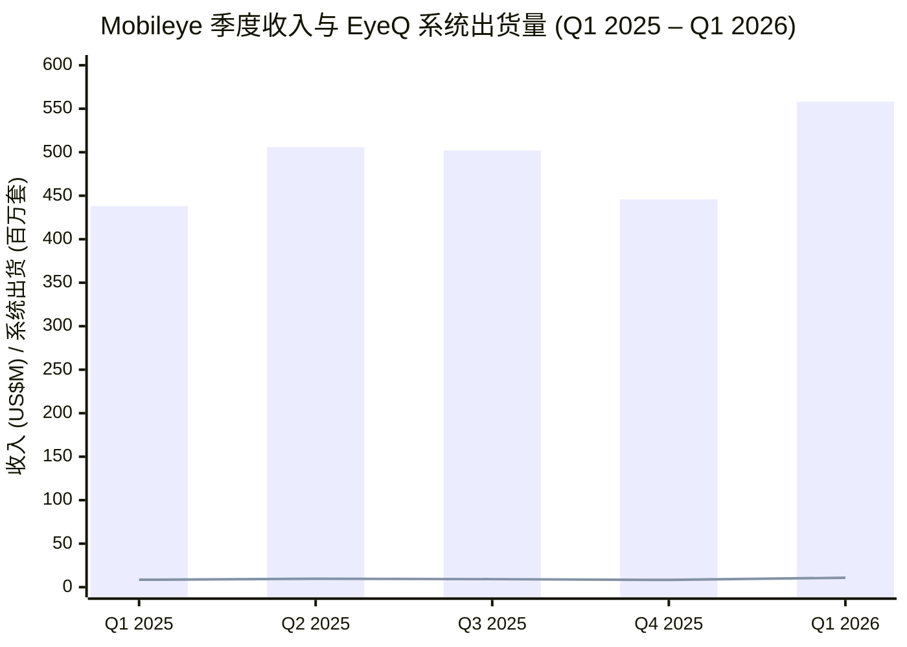
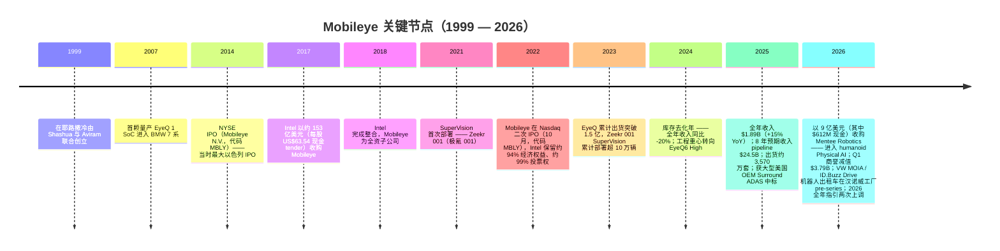
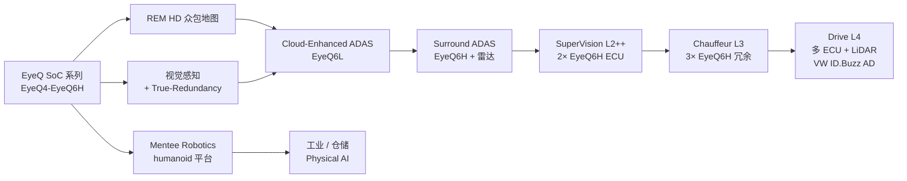
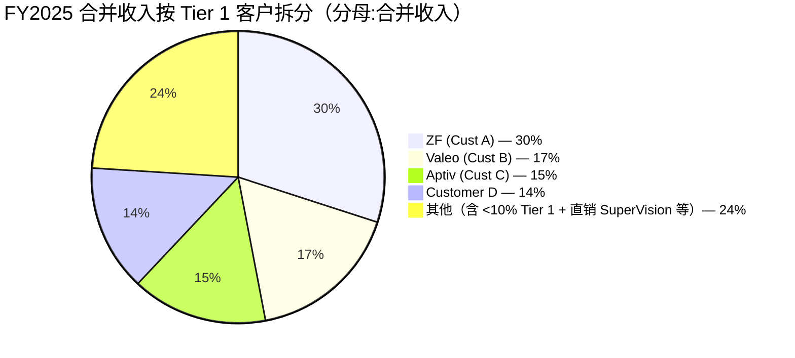
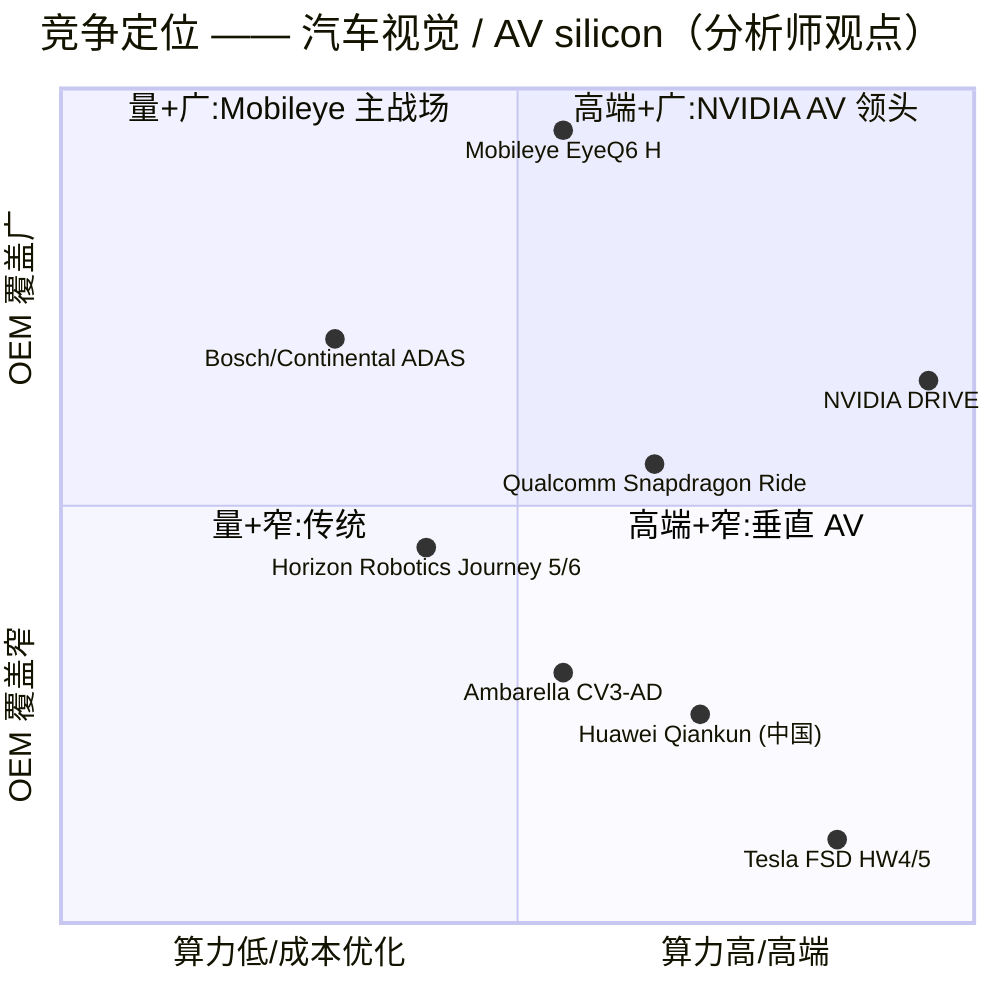
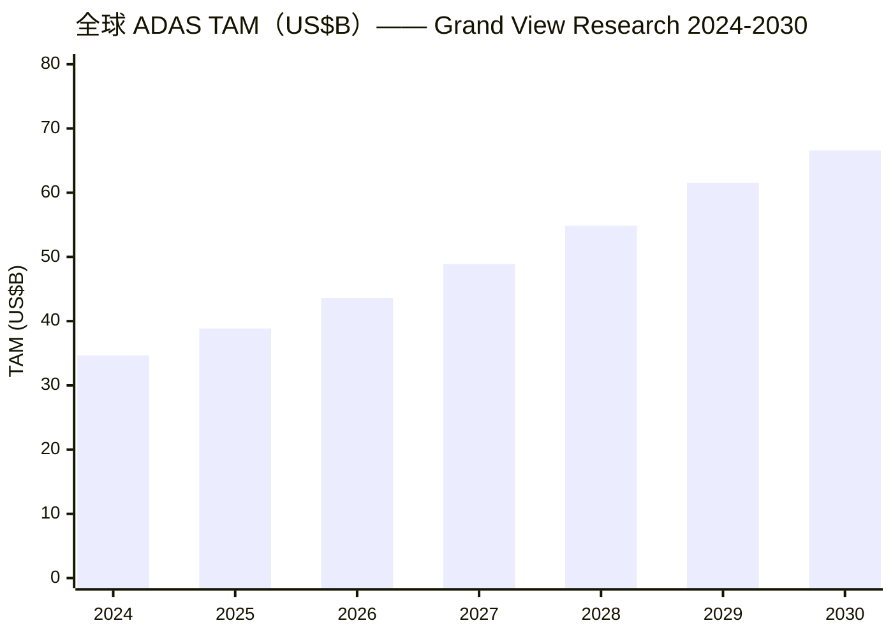

# Mobileye Global Inc.（NASDAQ:MBLY）—— 公司研究

**截至日期:** 2026-06-15
**股票代码:** MBLY（NASDAQ Global Select Market — Class A）
**注册 / 总部:** Delaware（注册）/ 耶路撒冷，以色列
**母公司持股:** 截至 2026-02-03，Intel Corporation 持有约 77.0% 的普通股 / 约 96.9% 的投票权（双层股权结构）
**会计年度:** 52/53 周制，财年末为最接近 12 月 31 日的星期六（FY2025 截至 2025-12-27）

---

### 投资摘要（Investment Summary）— *分析师观点（Analyst view），非 filing 数据*

| 项目 | 取值 |
|---|---|
| **评级 Rating** | **Hold / Neutral（持有）** |
| **12 个月目标价 (Price Target)** | **USD 11.0** |
| 现价（2026-06-15 附近） | USD 9.34 |
| 隐含空间 | **+17.8%** |
| 估值方法 | EV/Sales 与调整后盈利能力混合：~2.5× FY2027E EV/Sales（FCF 提供下行支撑）；与卖方共识中位数 $11 一致 |
| 市值 | ~USD 7.87B |
| 52 周区间 | USD 6.47 – 20.18 |
| 母公司 | Intel 持股 ~77.0% / 投票权 ~96.9%（二次发行 overhang） |

**前视估值矩阵（forward valuation matrix，分析师估算）**

| 倍数 | FY2025A | FY2026E | FY2027E |
|---|---|---|---|
| EV/Sales | 3.5× | 3.3× | 3.1× |
| Forward P/E（GAAP） | NM | NM | NM |
| Forward P/E（Adjusted） | ~28× | ~24× | ~20× |
| P/B | 0.96× | — | — |

*GAAP P/E 因收购无形资产摊销 (acquired-intangible amortization) 与 Q1 2026 的 $3,788M 商誉减值 (goodwill impairment) 结构性为负 (NM)；现金经营基本面以 Adjusted Operating Income 计为正。*

**相对表现 (relative performance)：** MBLY 过去 12 个月约 -54%（从 52 周高 $20.18 跌至 $9.34），同期 S&P 500 与半导体板块均录得正回报 —— 显著跑输，反映 GAAP 减值、中国 ADAS 收入重置与 in-house 芯片竞争担忧（[yfinance MBLY 52 周区间与价格, as of 2026-06-15](https://finance.yahoo.com/quote/MBLY/)）。

**投资逻辑四支柱 (thesis pillars，*分析师观点*)：**
1. **现金牛底盘 + 期权上行。** EyeQ ADAS 基础业务自由现金流 (FCF) 为正、资产负债表净现金约 $1.8B、几乎零有息负债 —— 为 SuperVision (L2++)→ Chauffeur (L3)→ Drive (L4 robotaxi) 的产品阶梯提供了"烧不死"的下行支撑；$24.5B 的 8 年 pipeline 是期权价值。
2. **但上行高度依赖尚未兑现的西方 OEM L2++/L3 中标。** GS 明确指出"近期缺乏与西方 OEM 的 SuperVision / Chauffeur 新中标"是其维持 Neutral 的核心理由 —— pipeline 多为基础 ADAS 续标，高 ASP 项目放量集中在 2027–2028+。
3. **中国 ADAS 收入重置 + in-house 芯片竞争是结构性逆风。** 中国占收入 23%，但本土 OEM 正转向自研或采用 Horizon / 华为 / 高通方案；这是 MBLY 估值长期承压的主因。
4. **Intel 减持 overhang。** Intel 仍持 ~77% / ~96.9% 投票权，任何二次发行 (secondary offering) 都会构成供给冲击。

---

> **业绩指引上调 — FY2026 全年指引 (2026-04-23):** 管理层将 2026 全年收入指引中值上调约 2%，至 **USD 1,935–2,015 百万**（原 USD 1,900–1,980 百万，2026-01-22 指引）；将调整后经营利润 (Adjusted Operating Income) 指引中值上调约 8%，至 **USD 185–235 百万**（原 USD 170–220 百万）。上调原因：Q1 2026 EyeQ SoC 出货量 "同比增长 28%"，加上 Q1 公布的 Mahindra 公司 SuperVision / Surround ADAS 设计中标（"为 Surround ADAS 新增第三家客户"）。资料来源:[Q1 2026 earnings press release, 2026-04-23, 第 1 页 & 指引表](https://www.sec.gov/Archives/edgar/data/1910139/000110465926047231/tm2612233d1_ex99-1.htm)。

---

## 目录

1. 公司概览（含 1A 估值快照 · 1B GF Score 基本面打分）
2. 公司历史
2A. 估值与目标价（前瞻模型 · PT 推导 · bull/base/bear · 卖方观点演变）
3. 管理团队
4. 产品与服务
5. 客户与上市策略
6. 行业概览
7. 竞争格局
8. 市场机会（TAM）
9. 风险评估（含 9.5 关键分歧与催化剂）
10. 投资视角打分
11. 数据来源清单
12. 参考资料
13. 验证日志（Step 10）

---

## 1. 公司概览

Mobileye Global 是全球部署量最大的计算机视觉 ADAS（advanced driver assistance system，高级驾驶辅助系统）供应商，其主要产品为车规级 SoC（System-on-Chip，系统级芯片）—— EyeQ™ 系列 —— 以及以软件为核心、逐步上行的产品矩阵：Cloud-Enhanced ADAS™（云增强 ADAS）、Surround ADAS™（环视 ADAS）、SuperVision™（L2++ 眼盯路、手离方向盘）、Chauffeur™（L3 消费级，可眼不看路、手不在方向盘）、Drive™（L4 商用车队，无人驾驶）。根据 FY2025 10-K verbatim 原文：" 我们的 System-on-Chips ("SoCs") 已部署在超过 2.3 亿辆汽车上 …… 我们正在与全球 50 多家原始设备制造商 (OEMs) 合作部署我们的 ADAS 解决方案 "（[Mobileye FY2025 10-K, Item 1 Business](https://www.sec.gov/Archives/edgar/data/1910139/000110465926014300/mbly-20251227x10k.htm)）。FY2025 公司出货 EyeQ SoC + SuperVision 系统约 3,570 万套，较 FY2024 的约 2,900 万套显著回升，使其成为全球出货量最大的单一车规级 AI 推理芯片家族（[Mobileye FY2025 10-K, Item 1](https://www.sec.gov/Archives/edgar/data/1910139/000110465926014300/mbly-20251227x10k.htm)）。

**商业模式 / how the business makes money.** FY2025 收入构成里 EyeQ SoCs（含搭配视觉 / AI 软件）占比约 91%—— 通常基础 ADAS 单芯片单价在个位数美元到几十美元区间，混合后整车含税系统平均单价 (ASP) 约 USD 50（Q4 2025 披露 Average System Price 为 USD 50.8/system，环比受 SuperVision mix 提升推升）。其余约 9% 来自 SuperVision 整套 ECU（含两颗 EyeQ + 主机板 + 软件），单台车价值是基础 ADAS 的 10–20×，是未来四年 ARR 增长的主要驱动（[FY2025 earnings press release, 2026-01-22, Q4 ASP 描述](https://www.sec.gov/Archives/edgar/data/1910139/000110465926005578/tm263599d1_ex99-1.htm)）。

**地域分布。** FY2025 按 ship-to 国家拆分:中国 $428 百万 (23%)、美国 $416 百万 (22%)、德国 $297 百万 (16%)、韩国 $192 百万 (10%)、英国 $117 百万、波兰 $110 百万、斯洛伐克 $88 百万、匈牙利 $85 百万、捷克 $59 百万、泰国 $30 百万、其他 $72 百万，合计 $1,894 百万（[FY2025 10-K, Note 17 Major Customers & Geographic data](https://www.sec.gov/Archives/edgar/data/1910139/000110465926014300/mbly-20251227x10k.htm)）。"几乎全部"收入以美元计价。研发与运营高度集中在以色列 —— 截至 FY25 年末，员工总数约 4,200 人，分布于 7 个国家，**其中约 85% 从事研发、约 3,900 人（93%）在以色列**；Mentee Robotics 并表后员工总数降至约 4,130 人（包含 Q4 2025 一次约 200 人裁员、相关一次性费用约 $7 百万）（[FY2025 10-K, Human Capital & Note 1](https://www.sec.gov/Archives/edgar/data/1910139/000110465926014300/mbly-20251227x10k.htm)）。

**FY2025 GAAP 损益规模.** 收入 $1,894M（同比 +14.5%，从 FY24 库存去化低点恢复）；毛利 $904M（毛利率 48%）；研发费用 $1,151M（占收入 61% —— Mobileye 财务画像的最显著特征）；销售与市场 $113M（6%）；管理费用 $80M（4%）；经营亏损 $(440)M（经营利润率 -23%）；净亏损 $(392)M。Adjusted（剔除 $443M 收购无形资产摊销 + $277M 股份支付）口径下 Adjusted Gross Margin 为 68%、Adjusted Operating Income 为 $280M（调整后经营利润率 15%）（[FY2025 10-K, MD&A Results of Operations](https://www.sec.gov/Archives/edgar/data/1910139/000110465926014300/mbly-20251227x10k.htm)）。经营性现金流 FY25 为 $602M（同比 +51%），FY25 末现金 ~$1.8B 且基本无息债务 —— 这是在 Feb 3, 2026 完成 Mentee 收购、动用 $612M 现金之前的数据（[FY2025 earnings press release, 2026-01-22, p.1](https://www.sec.gov/Archives/edgar/data/1910139/000110465926005578/tm263599d1_ex99-1.htm)）。

**估值快照（截至 2026-06-15）.** 股价 $9.34（较 2026-06-02 报告的 $10.79 进一步回落，过去 12 个月约 -54%）；市值约 $7.87B；企业价值 (EV) $6.58B；TTM 收入 $2.01B；**TTM P/E n/a（LTM Net Loss 主要受 Q1 2026 的 $3,788M goodwill impairment 一次性非现金减值拖累）**；TTM P/S = 3.91×；**Forward P/E = 25.96×**（较 2026-06-02 报告的 48× 大幅下降，反映卖方将 FY26/27 调整后 EPS 上修后远期分母变化）；EV/Sales = 3.27×；**P/B = 0.96×（已跌破账面价值）**；52 周区间 $6.47–20.18。卖方共识 (29 家覆盖) 12 个月目标价均值 $13.29 / 中位数 $11.00 / 高 $27 / 低 $8 —— **目标价离散度极大，反映买卖双方对 AV/L2++ 兑现节奏的根本分歧**（见 2A 节卖方观点演变）。资料来源:[yfinance MBLY key-statistics, as of 2026-06-15](https://finance.yahoo.com/quote/MBLY/key-statistics)（与 [stockanalysis.com MBLY statistics](https://stockanalysis.com/stocks/mbly/statistics/) 交叉核对）。

**对 TTM 负 P/E 与远期高倍数的解读.** TTM 净亏主要由 Q1 2026 录得的 **$3,788M 商誉非现金减值** 引起 —— 公司自己的措辞:" 资产负债表上的商誉源自 Intel 2017 年收购 Mobileye，于 IPO 及 2022 年从 Intel 分拆时下推入子公司账本。本季由于 Class A 普通股股价较前次评估时下跌 35%……我们进行了商誉减值复评……产生了非现金减值损失 "（[Q1 2026 10-Q, Note on Goodwill](https://www.sec.gov/Archives/edgar/data/1910139/000110465926047712/mbly-20260328x10q.htm)；[Q1 2026 press release, 经营利润率 commentary](https://www.sec.gov/Archives/edgar/data/1910139/000110465926047231/tm2612233d1_ex99-1.htm)）。剔除该项一次性后，FY25 Adjusted EBIT 利润率为 +15%、Q1 2026 Adjusted Operating Income 利润率为 +17% —— 即"现金经营基本面"是盈利的。Forward P/E 48× 反映两大缺口:(a) 经营性现金流（free cash flow $473M，FCF 收益率 5.2%）与（b）受 Intel 收购步入摊销影响的 GAAP 净利之间。同业比较中:Aptiv P/S 0.9×、Continental P/S 0.3×（传统 Tier 1）；NVIDIA Auto 嵌套在母公司 30× P/E 中（无法纯比对）；Ambarella P/S 6.0×（最接近的纯 ADAS 视觉 silicon 比较对象）。MBLY 当前 P/S 4.5× 较传统 Tier 1 ADAS 供应商溢价约 5×、较 Ambarella 折价约 25%（[Stockanalysis MBLY peer overview, 2026-06-02](https://stockanalysis.com/stocks/mbly/statistics/)）。

**最近 5 季度的经营节奏（季度收入 vs 出货量）.**

*Bars = 收入（US$M）；line = EyeQ 系统出货量（百万套）。资料来源:[Q1 2026 press release, EyeQ 收入 / 单位 / ASP 表](https://www.sec.gov/Archives/edgar/data/1910139/000110465926047231/tm2612233d1_ex99-1.htm)。*

Q4 2025 单季同比下降 11% 反映 Tier 1 客户"年末库存比常态紧 "（Q4 2025 EyeQ 单位同比 -11%）；Q1 2026 +27% YoY 的反弹是安全库存补足叠加 EyeQ6 High 放量启动 —— 与 FY24（全年收入同比 -20% 至 $1.65B，自 FY23 库存峰值 $2.08B 回落）相同的库存周期波动（[FY2025 earnings press release, Q4 commentary](https://www.sec.gov/Archives/edgar/data/1910139/000110465926005578/tm263599d1_ex99-1.htm)；[Q1 2026 press release, Q1 commentary](https://www.sec.gov/Archives/edgar/data/1910139/000110465926047231/tm2612233d1_ex99-1.htm)）。

### 1A 财务画像图（FY2025，来自公司自身报表）

下面的利润表 / 资产负债表 / 现金流量表 Sankey 与收入构成图，全部取自 Mobileye 自身 FY2025 10-K 的合并报表与分部 / 地域附注，便于一眼看清"钱怎么进、怎么出、最终留下多少"。

**利润表 Sankey（GAAP）.** 收入 $1,894M 经 COGS $990M 后得毛利 $904M（gross margin 48%）；但运营费用合计 $1,344M（其中 R&D $1,151M 占收入 61%、收购无形资产摊销 $377M），导致 GAAP 营业亏损 $(440)M、净亏损 $(392)M。注意这张图按"亏损口径"布局：营业亏损作为左侧补充来源汇入运营费用池，因此节点守恒、不溢出画布（[Mobileye FY2025 10-K, MD&A Results of Operations](https://www.sec.gov/Archives/edgar/data/1910139/000110465926014300/mbly-20251227x10k.htm)）。

<svg xmlns="http://www.w3.org/2000/svg" viewBox="0 0 1000 560" width="1000" height="560" role="img" aria-label="income statement Sankey"><rect x="0" y="0" width="1000" height="560" fill="#ffffff"/>
<text x="20.00" y="30.00" text-anchor="start" font-family="Helvetica,Arial,sans-serif" font-size="15" font-weight="700" fill="#1f2933">Mobileye FY2025 利润表 Sankey (GAAP，US$M)</text>
<path d="M 204.00,78.00 C 258.00,78.00 258.00,85.00 312.00,85.00 L 312.00,456.38 C 258.00,456.38 258.00,449.38 204.00,449.38 Z" fill="#93c5fd" fill-opacity="0.55"/>
<path d="M 452.00,78.00 C 506.00,78.00 506.00,95.63 560.00,95.63 L 560.00,97.63 C 506.00,97.63 506.00,80.00 452.00,80.00 Z" fill="#86efac" fill-opacity="0.55"/>
<path d="M 452.00,80.00 C 506.00,80.00 506.00,111.63 560.00,111.63 L 560.00,482.37 C 506.00,482.37 506.00,450.73 452.00,450.73 Z" fill="#fca5a5" fill-opacity="0.55"/>
<path d="M 700.00,81.63 C 754.00,81.63 754.00,288.00 808.00,288.00 L 808.00,290.00 C 754.00,290.00 754.00,83.63 700.00,83.63 Z" fill="#86efac" fill-opacity="0.55"/>
<path d="M 328.00,85.00 C 382.00,85.00 382.00,78.00 436.00,78.00 L 436.00,272.74 C 382.00,272.74 382.00,279.74 328.00,279.74 Z" fill="#86efac" fill-opacity="0.55"/>
<path d="M 328.00,279.74 C 382.00,279.74 382.00,286.74 436.00,286.74 L 436.00,500.00 C 382.00,500.00 382.00,493.00 328.00,493.00 Z" fill="#fca5a5" fill-opacity="0.55"/>
<path d="M 576.00,95.63 C 630.00,95.63 630.00,81.63 684.00,81.63 L 684.00,83.63 C 630.00,83.63 630.00,97.63 576.00,97.63 Z" fill="#86efac" fill-opacity="0.55"/>
<path d="M 576.00,111.63 C 630.00,111.63 630.00,97.63 684.00,97.63 L 684.00,139.21 C 630.00,139.21 630.00,153.21 576.00,153.21 Z" fill="#fca5a5" fill-opacity="0.55"/>
<path d="M 576.00,153.21 C 630.00,153.21 630.00,153.21 684.00,153.21 L 684.00,401.15 C 630.00,401.15 630.00,401.15 576.00,401.15 Z" fill="#fca5a5" fill-opacity="0.55"/>
<path d="M 576.00,401.15 C 630.00,401.15 630.00,415.15 684.00,415.15 L 684.00,496.37 C 630.00,496.37 630.00,482.37 576.00,482.37 Z" fill="#fca5a5" fill-opacity="0.55"/>
<path d="M 204.00,463.38 C 258.00,463.38 258.00,456.38 312.00,456.38 L 312.00,493.00 C 258.00,493.00 258.00,500.00 204.00,500.00 Z" fill="#93c5fd" fill-opacity="0.55"/>
<rect x="188.00" y="78.00" width="16" height="371.38" rx="1.5" fill="#2563eb"/>
<rect x="188.00" y="463.38" width="16" height="36.62" rx="1.5" fill="#2563eb"/>
<rect x="312.00" y="85.00" width="16" height="408.00" rx="1.5" fill="#1e3a8a"/>
<rect x="436.00" y="78.00" width="16" height="194.74" rx="1.5" fill="#15803d"/>
<rect x="436.00" y="286.74" width="16" height="213.26" rx="1.5" fill="#dc2626"/>
<rect x="560.00" y="95.63" width="16" height="2.00" rx="1.5" fill="#15803d"/>
<rect x="560.00" y="111.63" width="16" height="370.73" rx="1.5" fill="#dc2626"/>
<rect x="684.00" y="81.63" width="16" height="2.00" rx="1.5" fill="#15803d"/>
<rect x="684.00" y="97.63" width="16" height="41.58" rx="1.5" fill="#dc2626"/>
<rect x="684.00" y="153.21" width="16" height="247.95" rx="1.5" fill="#dc2626"/>
<rect x="684.00" y="415.15" width="16" height="81.21" rx="1.5" fill="#dc2626"/>
<rect x="808.00" y="288.00" width="16" height="2.00" rx="1.5" fill="#15803d"/>
<text x="179.00" y="260.69" text-anchor="end" font-family="Helvetica,Arial,sans-serif" font-size="11.5" font-weight="700" fill="#1f2933">EyeQ SoC + 视觉软件 (~91%)</text>
<text x="179.00" y="273.69" text-anchor="end" font-family="Helvetica,Arial,sans-serif" font-size="10" font-weight="400" fill="#52606d">$1.7B  (91.0%)</text>
<text x="179.00" y="478.69" text-anchor="end" font-family="Helvetica,Arial,sans-serif" font-size="11.5" font-weight="700" fill="#1f2933">SuperVision/其他 (~9%)</text>
<text x="179.00" y="491.69" text-anchor="end" font-family="Helvetica,Arial,sans-serif" font-size="10" font-weight="400" fill="#52606d">$170.0M  (9.0%)</text>
<rect x="331.00" y="67.00" width="100.50" height="26" rx="2" fill="#ffffff" fill-opacity="0.72"/>
<text x="334.00" y="79.00" text-anchor="start" font-family="Helvetica,Arial,sans-serif" font-size="11.5" font-weight="700" fill="#1f2933">Revenue</text>
<text x="334.00" y="92.00" text-anchor="start" font-family="Helvetica,Arial,sans-serif" font-size="10" font-weight="400" fill="#52606d">$1.9B  (100.0%)</text>
<rect x="455.00" y="60.00" width="106.80" height="26" rx="2" fill="#ffffff" fill-opacity="0.72"/>
<text x="458.00" y="72.00" text-anchor="start" font-family="Helvetica,Arial,sans-serif" font-size="11.5" font-weight="700" fill="#1f2933">Gross Profit</text>
<text x="458.00" y="85.00" text-anchor="start" font-family="Helvetica,Arial,sans-serif" font-size="10" font-weight="400" fill="#52606d">$904.0M  (47.7%)</text>
<rect x="455.00" y="268.74" width="144.60" height="26" rx="2" fill="#ffffff" fill-opacity="0.72"/>
<text x="458.00" y="280.74" text-anchor="start" font-family="Helvetica,Arial,sans-serif" font-size="11.5" font-weight="700" fill="#1f2933">Cost of Revenue (COGS)</text>
<text x="458.00" y="293.74" text-anchor="start" font-family="Helvetica,Arial,sans-serif" font-size="10" font-weight="400" fill="#52606d">$990.0M  (52.3%)</text>
<rect x="579.00" y="77.63" width="119.40" height="26" rx="2" fill="#ffffff" fill-opacity="0.72"/>
<text x="582.00" y="89.63" text-anchor="start" font-family="Helvetica,Arial,sans-serif" font-size="11.5" font-weight="700" fill="#1f2933">Operating Income</text>
<text x="582.00" y="102.63" text-anchor="start" font-family="Helvetica,Arial,sans-serif" font-size="10" font-weight="400" fill="#52606d">-$440.0M  (-23.2%)</text>
<rect x="579.00" y="102.63" width="150.90" height="26" rx="2" fill="#ffffff" fill-opacity="0.72"/>
<text x="582.00" y="114.63" text-anchor="start" font-family="Helvetica,Arial,sans-serif" font-size="11.5" font-weight="700" fill="#1f2933">Total Operating Expense</text>
<text x="582.00" y="127.63" text-anchor="start" font-family="Helvetica,Arial,sans-serif" font-size="10" font-weight="400" fill="#52606d">$1.7B  (90.9%)</text>
<rect x="703.00" y="63.63" width="119.40" height="26" rx="2" fill="#ffffff" fill-opacity="0.72"/>
<text x="706.00" y="75.63" text-anchor="start" font-family="Helvetica,Arial,sans-serif" font-size="11.5" font-weight="700" fill="#1f2933">Pretax Income</text>
<text x="706.00" y="88.63" text-anchor="start" font-family="Helvetica,Arial,sans-serif" font-size="10" font-weight="400" fill="#52606d">-$440.0M  (-23.2%)</text>
<rect x="703.00" y="88.63" width="106.80" height="26" rx="2" fill="#ffffff" fill-opacity="0.72"/>
<text x="706.00" y="100.63" text-anchor="start" font-family="Helvetica,Arial,sans-serif" font-size="11.5" font-weight="700" fill="#1f2933">SG&amp;A</text>
<text x="706.00" y="113.63" text-anchor="start" font-family="Helvetica,Arial,sans-serif" font-size="10" font-weight="400" fill="#52606d">$193.0M  (10.2%)</text>
<rect x="703.00" y="135.21" width="94.20" height="26" rx="2" fill="#ffffff" fill-opacity="0.72"/>
<text x="706.00" y="147.21" text-anchor="start" font-family="Helvetica,Arial,sans-serif" font-size="11.5" font-weight="700" fill="#1f2933">R&amp;D</text>
<text x="706.00" y="160.21" text-anchor="start" font-family="Helvetica,Arial,sans-serif" font-size="10" font-weight="400" fill="#52606d">$1.2B  (60.8%)</text>
<rect x="703.00" y="397.15" width="106.80" height="26" rx="2" fill="#ffffff" fill-opacity="0.72"/>
<text x="706.00" y="409.15" text-anchor="start" font-family="Helvetica,Arial,sans-serif" font-size="11.5" font-weight="700" fill="#1f2933">Other OpEx</text>
<text x="706.00" y="422.15" text-anchor="start" font-family="Helvetica,Arial,sans-serif" font-size="10" font-weight="400" fill="#52606d">$377.0M  (19.9%)</text>
<text x="833.00" y="286.00" text-anchor="start" font-family="Helvetica,Arial,sans-serif" font-size="11.5" font-weight="700" fill="#1f2933">Net Income</text>
<text x="833.00" y="299.00" text-anchor="start" font-family="Helvetica,Arial,sans-serif" font-size="10" font-weight="400" fill="#52606d">-$392.0M  (-20.7%)</text>
<text x="500.00" y="530.00" text-anchor="middle" font-family="Helvetica,Arial,sans-serif" font-size="10" font-weight="400" font-style="italic" fill="#8a97a3">GAAP 口径：营业亏损 440（其中含收购无形资产摊销 377）；调整后营业利润为正 280</text>
<text x="500.00" y="544.00" text-anchor="middle" font-family="Helvetica,Arial,sans-serif" font-size="10" font-weight="400" fill="#52606d">Source: Mobileye FY2025 10-K, MD&amp;A Results of Operations (Rev 1,894 / GP 904 / opex 1,344 / 营业亏损 440 / 净亏损 392)</text>
</svg>

**资产负债表 Sankey.** 总资产 $12,492M 中商誉 (goodwill) 高达 $8,200M（占 66%，源自 Intel 2017 年收购的下推会计 push-down accounting），无形资产 $1,166M；总负债仅 $611M、几乎零有息债务，股东权益 $11,881M。注意此图为 Q1 2026 商誉减值 $3,788M 之前的状态（[Mobileye FY2025 10-K, Consolidated Balance Sheets](https://www.sec.gov/Archives/edgar/data/1910139/000110465926014300/mbly-20251227x10k.htm)）。

<svg xmlns="http://www.w3.org/2000/svg" viewBox="0 0 1040 600" width="1040" height="600" role="img" aria-label="balance sheet Sankey"><rect x="0" y="0" width="1040" height="600" fill="#ffffff"/>
<text x="20.00" y="30.00" text-anchor="start" font-family="Helvetica,Arial,sans-serif" font-size="15" font-weight="700" fill="#1f2933">Mobileye FY2025 资产负债表 Sankey (US$M)</text>
<path d="M 204.00,64.00 C 262.00,64.00 262.00,92.00 320.00,92.00 L 320.00,153.73 C 262.00,153.73 262.00,125.73 204.00,125.73 Z" fill="#93c5fd" fill-opacity="0.55"/>
<path d="M 732.00,85.00 C 790.00,85.00 790.00,85.00 848.00,85.00 L 848.00,98.65 C 790.00,98.65 790.00,98.65 732.00,98.65 Z" fill="#fca5a5" fill-opacity="0.55"/>
<path d="M 600.00,92.00 C 658.00,92.00 658.00,85.00 716.00,85.00 L 716.00,98.65 C 658.00,98.65 658.00,105.65 600.00,105.65 Z" fill="#fca5a5" fill-opacity="0.55"/>
<path d="M 336.00,92.00 C 394.00,92.00 394.00,99.00 452.00,99.00 L 452.00,182.31 C 394.00,182.31 394.00,175.31 336.00,175.31 Z" fill="#86efac" fill-opacity="0.55"/>
<path d="M 600.00,105.65 C 658.00,105.65 658.00,112.65 716.00,112.65 L 716.00,119.54 C 658.00,119.54 658.00,112.54 600.00,112.54 Z" fill="#fca5a5" fill-opacity="0.55"/>
<path d="M 468.00,99.00 C 526.00,99.00 526.00,92.00 584.00,92.00 L 584.00,112.54 C 526.00,112.54 526.00,119.54 468.00,119.54 Z" fill="#fca5a5" fill-opacity="0.55"/>
<path d="M 468.00,119.54 C 526.00,119.54 526.00,126.54 584.00,126.54 L 584.00,526.00 C 526.00,526.00 526.00,519.00 468.00,519.00 Z" fill="#86efac" fill-opacity="0.55"/>
<path d="M 732.00,112.65 C 790.00,112.65 790.00,112.65 848.00,112.65 L 848.00,119.54 C 790.00,119.54 790.00,119.54 732.00,119.54 Z" fill="#fca5a5" fill-opacity="0.55"/>
<path d="M 600.00,126.54 C 658.00,126.54 658.00,133.54 716.00,133.54 L 716.00,533.00 C 658.00,533.00 658.00,526.00 600.00,526.00 Z" fill="#86efac" fill-opacity="0.55"/>
<path d="M 732.00,133.54 C 790.00,133.54 790.00,133.54 848.00,133.54 L 848.00,533.00 C 790.00,533.00 790.00,533.00 732.00,533.00 Z" fill="#86efac" fill-opacity="0.55"/>
<path d="M 204.00,139.73 C 262.00,139.73 262.00,153.73 320.00,153.73 L 320.00,175.31 C 262.00,175.31 262.00,161.31 204.00,161.31 Z" fill="#93c5fd" fill-opacity="0.55"/>
<path d="M 204.00,175.31 C 262.00,175.31 262.00,189.31 320.00,189.31 L 320.00,205.22 C 262.00,205.22 262.00,191.22 204.00,191.22 Z" fill="#93c5fd" fill-opacity="0.55"/>
<path d="M 336.00,189.31 C 394.00,189.31 394.00,182.31 452.00,182.31 L 452.00,519.00 C 394.00,519.00 394.00,526.00 336.00,526.00 Z" fill="#86efac" fill-opacity="0.55"/>
<path d="M 204.00,205.22 C 262.00,205.22 262.00,205.22 320.00,205.22 L 320.00,244.42 C 262.00,244.42 262.00,244.42 204.00,244.42 Z" fill="#93c5fd" fill-opacity="0.55"/>
<path d="M 204.00,258.42 C 262.00,258.42 262.00,244.42 320.00,244.42 L 320.00,520.12 C 262.00,520.12 262.00,534.12 204.00,534.12 Z" fill="#93c5fd" fill-opacity="0.55"/>
<path d="M 204.00,548.12 C 262.00,548.12 262.00,520.12 320.00,520.12 L 320.00,526.00 C 262.00,526.00 262.00,554.00 204.00,554.00 Z" fill="#93c5fd" fill-opacity="0.55"/>
<rect x="188.00" y="64.00" width="16" height="61.73" rx="1.5" fill="#2563eb"/>
<rect x="188.00" y="139.73" width="16" height="21.59" rx="1.5" fill="#2563eb"/>
<rect x="188.00" y="175.31" width="16" height="15.90" rx="1.5" fill="#2563eb"/>
<rect x="188.00" y="205.22" width="16" height="39.20" rx="1.5" fill="#2563eb"/>
<rect x="188.00" y="258.42" width="16" height="275.70" rx="1.5" fill="#2563eb"/>
<rect x="188.00" y="548.12" width="16" height="5.88" rx="1.5" fill="#2563eb"/>
<rect x="320.00" y="92.00" width="16" height="83.31" rx="1.5" fill="#15803d"/>
<rect x="320.00" y="189.31" width="16" height="336.69" rx="1.5" fill="#15803d"/>
<rect x="452.00" y="99.00" width="16" height="420.00" rx="1.5" fill="#1e3a8a"/>
<rect x="584.00" y="92.00" width="16" height="20.54" rx="1.5" fill="#dc2626"/>
<rect x="584.00" y="126.54" width="16" height="399.46" rx="1.5" fill="#15803d"/>
<rect x="716.00" y="85.00" width="16" height="13.65" rx="1.5" fill="#dc2626"/>
<rect x="716.00" y="112.65" width="16" height="6.89" rx="1.5" fill="#dc2626"/>
<rect x="716.00" y="133.54" width="16" height="399.46" rx="1.5" fill="#15803d"/>
<rect x="848.00" y="85.00" width="16" height="13.65" rx="1.5" fill="#dc2626"/>
<rect x="848.00" y="112.65" width="16" height="6.89" rx="1.5" fill="#dc2626"/>
<rect x="848.00" y="133.54" width="16" height="399.46" rx="1.5" fill="#15803d"/>
<line x1="188.00" y1="94.86" x2="182.00" y2="73.00" stroke="#cbd5e1" stroke-width="1"/>
<text x="179.00" y="76.00" text-anchor="end" font-family="Helvetica,Arial,sans-serif" font-size="11.5" font-weight="700" fill="#1f2933">现金 Cash</text>
<text x="179.00" y="89.00" text-anchor="end" font-family="Helvetica,Arial,sans-serif" font-size="10" font-weight="400" fill="#52606d">$1.8B  (14.7%)</text>
<line x1="188.00" y1="150.52" x2="182.00" y2="128.66" stroke="#cbd5e1" stroke-width="1"/>
<text x="179.00" y="131.66" text-anchor="end" font-family="Helvetica,Arial,sans-serif" font-size="11.5" font-weight="700" fill="#1f2933">应收+存货+其他流动</text>
<text x="179.00" y="144.66" text-anchor="end" font-family="Helvetica,Arial,sans-serif" font-size="10" font-weight="400" fill="#52606d">$642.0M  (5.1%)</text>
<line x1="188.00" y1="183.27" x2="182.00" y2="161.40" stroke="#cbd5e1" stroke-width="1"/>
<text x="179.00" y="164.40" text-anchor="end" font-family="Helvetica,Arial,sans-serif" font-size="11.5" font-weight="700" fill="#1f2933">物业设备 PP&amp;E</text>
<text x="179.00" y="177.40" text-anchor="end" font-family="Helvetica,Arial,sans-serif" font-size="10" font-weight="400" fill="#52606d">$473.0M  (3.8%)</text>
<line x1="188.00" y1="224.82" x2="182.00" y2="202.95" stroke="#cbd5e1" stroke-width="1"/>
<text x="179.00" y="205.95" text-anchor="end" font-family="Helvetica,Arial,sans-serif" font-size="11.5" font-weight="700" fill="#1f2933">无形资产 Intangibles</text>
<text x="179.00" y="218.95" text-anchor="end" font-family="Helvetica,Arial,sans-serif" font-size="10" font-weight="400" fill="#52606d">$1.2B  (9.3%)</text>
<line x1="188.00" y1="396.27" x2="182.00" y2="374.40" stroke="#cbd5e1" stroke-width="1"/>
<text x="179.00" y="377.40" text-anchor="end" font-family="Helvetica,Arial,sans-serif" font-size="11.5" font-weight="700" fill="#1f2933">商誉 Goodwill</text>
<text x="179.00" y="390.40" text-anchor="end" font-family="Helvetica,Arial,sans-serif" font-size="10" font-weight="400" fill="#52606d">$8.2B  (65.6%)</text>
<line x1="188.00" y1="551.06" x2="182.00" y2="529.19" stroke="#cbd5e1" stroke-width="1"/>
<text x="179.00" y="532.19" text-anchor="end" font-family="Helvetica,Arial,sans-serif" font-size="11.5" font-weight="700" fill="#1f2933">其他长期资产</text>
<text x="179.00" y="545.19" text-anchor="end" font-family="Helvetica,Arial,sans-serif" font-size="10" font-weight="400" fill="#52606d">$175.0M  (1.4%)</text>
<rect x="339.00" y="74.00" width="132.00" height="26" rx="2" fill="#ffffff" fill-opacity="0.72"/>
<text x="342.00" y="86.00" text-anchor="start" font-family="Helvetica,Arial,sans-serif" font-size="11.5" font-weight="700" fill="#1f2933">Total Current Assets</text>
<text x="342.00" y="99.00" text-anchor="start" font-family="Helvetica,Arial,sans-serif" font-size="10" font-weight="400" fill="#52606d">$2.5B  (19.8%)</text>
<rect x="339.00" y="171.31" width="157.20" height="26" rx="2" fill="#ffffff" fill-opacity="0.72"/>
<text x="342.00" y="183.31" text-anchor="start" font-family="Helvetica,Arial,sans-serif" font-size="11.5" font-weight="700" fill="#1f2933">Total Non-Current Assets</text>
<text x="342.00" y="196.31" text-anchor="start" font-family="Helvetica,Arial,sans-serif" font-size="10" font-weight="400" fill="#52606d">$10.0B  (80.2%)</text>
<rect x="471.00" y="81.00" width="106.80" height="26" rx="2" fill="#ffffff" fill-opacity="0.72"/>
<text x="474.00" y="93.00" text-anchor="start" font-family="Helvetica,Arial,sans-serif" font-size="11.5" font-weight="700" fill="#1f2933">Total Assets</text>
<text x="474.00" y="106.00" text-anchor="start" font-family="Helvetica,Arial,sans-serif" font-size="10" font-weight="400" fill="#52606d">$12.5B  (100.0%)</text>
<rect x="603.00" y="74.00" width="113.10" height="26" rx="2" fill="#ffffff" fill-opacity="0.72"/>
<text x="606.00" y="86.00" text-anchor="start" font-family="Helvetica,Arial,sans-serif" font-size="11.5" font-weight="700" fill="#1f2933">Total Liabilities</text>
<text x="606.00" y="99.00" text-anchor="start" font-family="Helvetica,Arial,sans-serif" font-size="10" font-weight="400" fill="#52606d">$611.0M  (4.9%)</text>
<rect x="603.00" y="108.54" width="100.50" height="26" rx="2" fill="#ffffff" fill-opacity="0.72"/>
<text x="606.00" y="120.54" text-anchor="start" font-family="Helvetica,Arial,sans-serif" font-size="11.5" font-weight="700" fill="#1f2933">Total Equity</text>
<text x="606.00" y="133.54" text-anchor="start" font-family="Helvetica,Arial,sans-serif" font-size="10" font-weight="400" fill="#52606d">$11.9B  (95.1%)</text>
<rect x="735.00" y="67.00" width="125.70" height="26" rx="2" fill="#ffffff" fill-opacity="0.72"/>
<text x="738.00" y="79.00" text-anchor="start" font-family="Helvetica,Arial,sans-serif" font-size="11.5" font-weight="700" fill="#1f2933">Current Liabilities</text>
<text x="738.00" y="92.00" text-anchor="start" font-family="Helvetica,Arial,sans-serif" font-size="10" font-weight="400" fill="#52606d">$406.0M  (3.3%)</text>
<rect x="735.00" y="94.65" width="150.90" height="26" rx="2" fill="#ffffff" fill-opacity="0.72"/>
<text x="738.00" y="106.65" text-anchor="start" font-family="Helvetica,Arial,sans-serif" font-size="11.5" font-weight="700" fill="#1f2933">Non-Current Liabilities</text>
<text x="738.00" y="119.65" text-anchor="start" font-family="Helvetica,Arial,sans-serif" font-size="10" font-weight="400" fill="#52606d">$205.0M  (1.6%)</text>
<rect x="735.00" y="119.65" width="132.00" height="26" rx="2" fill="#ffffff" fill-opacity="0.72"/>
<text x="738.00" y="131.65" text-anchor="start" font-family="Helvetica,Arial,sans-serif" font-size="11.5" font-weight="700" fill="#1f2933">Shareholders' Equity</text>
<text x="738.00" y="144.65" text-anchor="start" font-family="Helvetica,Arial,sans-serif" font-size="10" font-weight="400" fill="#52606d">$11.9B  (95.1%)</text>
<text x="873.00" y="88.83" text-anchor="start" font-family="Helvetica,Arial,sans-serif" font-size="11.5" font-weight="700" fill="#1f2933">流动负债 Current</text>
<text x="873.00" y="101.83" text-anchor="start" font-family="Helvetica,Arial,sans-serif" font-size="10" font-weight="400" fill="#52606d">$406.0M  (3.3%)</text>
<text x="873.00" y="113.83" text-anchor="start" font-family="Helvetica,Arial,sans-serif" font-size="11.5" font-weight="700" fill="#1f2933">非流动负债 Non-current</text>
<text x="873.00" y="126.83" text-anchor="start" font-family="Helvetica,Arial,sans-serif" font-size="10" font-weight="400" fill="#52606d">$205.0M  (1.6%)</text>
<text x="873.00" y="330.27" text-anchor="start" font-family="Helvetica,Arial,sans-serif" font-size="11.5" font-weight="700" fill="#1f2933">股东权益 Equity</text>
<text x="873.00" y="343.27" text-anchor="start" font-family="Helvetica,Arial,sans-serif" font-size="10" font-weight="400" fill="#52606d">$11.9B  (95.1%)</text>
<text x="520.00" y="570.00" text-anchor="middle" font-family="Helvetica,Arial,sans-serif" font-size="10" font-weight="400" font-style="italic" fill="#8a97a3">商誉 8,200 占总资产 66%（Intel 2017 收购下推）；几乎零有息负债</text>
<text x="520.00" y="584.00" text-anchor="middle" font-family="Helvetica,Arial,sans-serif" font-size="10" font-weight="400" fill="#52606d">Source: Mobileye FY2025 10-K, Consolidated Balance Sheets (总资产 12,492 / 总负债 611 / 权益 11,881)</text>
</svg>

**现金流量表 Sankey.** 经营现金流 (CFO) $602M（同比 +51%）远高于 GAAP 净亏损 —— 因为净亏损里含 $377M 摊销等大额非现金项；资本开支轻（$91M），自由现金流约 $511M；现金从期初 $1,426M 增至期末 $1,836M（[Mobileye FY2025 10-K, Consolidated Statements of Cash Flows](https://www.sec.gov/Archives/edgar/data/1910139/000110465926014300/mbly-20251227x10k.htm)）。这张图是理解 MBLY"GAAP 亏损但现金为正"画像的关键。

<svg xmlns="http://www.w3.org/2000/svg" viewBox="0 0 1040 600" width="1040" height="600" role="img" aria-label="cash flow Sankey"><rect x="0" y="0" width="1040" height="600" fill="#ffffff"/>
<text x="20.00" y="30.00" text-anchor="start" font-family="Helvetica,Arial,sans-serif" font-size="15" font-weight="700" fill="#1f2933">Mobileye FY2025 现金流量表 Sankey (US$M)</text>
<path d="M 204.00,71.00 C 361.00,71.00 361.00,78.00 518.00,78.00 L 518.00,402.86 C 361.00,402.86 361.00,395.86 204.00,395.86 Z" fill="#93c5fd" fill-opacity="0.55"/>
<path d="M 534.00,78.00 C 691.00,78.00 691.00,64.00 848.00,64.00 L 848.00,84.73 C 691.00,84.73 691.00,98.73 534.00,98.73 Z" fill="#fca5a5" fill-opacity="0.55"/>
<path d="M 534.00,98.73 C 691.00,98.73 691.00,98.73 848.00,98.73 L 848.00,122.88 C 691.00,122.88 691.00,122.88 534.00,122.88 Z" fill="#fca5a5" fill-opacity="0.55"/>
<path d="M 534.00,122.88 C 691.00,122.88 691.00,136.88 848.00,136.88 L 848.00,554.00 C 691.00,554.00 691.00,540.00 534.00,540.00 Z" fill="#86efac" fill-opacity="0.55"/>
<path d="M 204.00,409.86 C 361.00,409.86 361.00,402.86 518.00,402.86 L 518.00,540.00 C 361.00,540.00 361.00,547.00 204.00,547.00 Z" fill="#93c5fd" fill-opacity="0.55"/>
<rect x="188.00" y="71.00" width="16" height="324.86" rx="1.5" fill="#2563eb"/>
<rect x="188.00" y="409.86" width="16" height="137.14" rx="1.5" fill="#2563eb"/>
<rect x="518.00" y="78.00" width="16" height="462.00" rx="1.5" fill="#1e3a8a"/>
<rect x="848.00" y="64.00" width="16" height="20.73" rx="1.5" fill="#dc2626"/>
<rect x="848.00" y="98.73" width="16" height="24.15" rx="1.5" fill="#dc2626"/>
<rect x="848.00" y="136.88" width="16" height="417.12" rx="1.5" fill="#15803d"/>
<text x="179.00" y="230.43" text-anchor="end" font-family="Helvetica,Arial,sans-serif" font-size="11.5" font-weight="700" fill="#1f2933">Beginning Cash</text>
<text x="179.00" y="243.43" text-anchor="end" font-family="Helvetica,Arial,sans-serif" font-size="10" font-weight="400" fill="#52606d">$1.4B  (70.3%)</text>
<rect x="207.00" y="391.86" width="106.80" height="26" rx="2" fill="#ffffff" fill-opacity="0.72"/>
<text x="210.00" y="403.86" text-anchor="start" font-family="Helvetica,Arial,sans-serif" font-size="11.5" font-weight="700" fill="#1f2933">Operating (CFO)</text>
<text x="210.00" y="416.86" text-anchor="start" font-family="Helvetica,Arial,sans-serif" font-size="10" font-weight="400" fill="#52606d">$602.0M  (29.7%)</text>
<rect x="537.00" y="60.00" width="132.00" height="26" rx="2" fill="#ffffff" fill-opacity="0.72"/>
<text x="540.00" y="72.00" text-anchor="start" font-family="Helvetica,Arial,sans-serif" font-size="11.5" font-weight="700" fill="#1f2933">Total Cash Mobilized</text>
<text x="540.00" y="85.00" text-anchor="start" font-family="Helvetica,Arial,sans-serif" font-size="10" font-weight="400" fill="#52606d">$2.0B  (100.0%)</text>
<rect x="867.00" y="46.00" width="100.50" height="26" rx="2" fill="#ffffff" fill-opacity="0.72"/>
<text x="870.00" y="58.00" text-anchor="start" font-family="Helvetica,Arial,sans-serif" font-size="11.5" font-weight="700" fill="#1f2933">Investing (CFI)</text>
<text x="870.00" y="71.00" text-anchor="start" font-family="Helvetica,Arial,sans-serif" font-size="10" font-weight="400" fill="#52606d">$91.0M  (4.5%)</text>
<rect x="867.00" y="80.73" width="100.50" height="26" rx="2" fill="#ffffff" fill-opacity="0.72"/>
<text x="870.00" y="92.73" text-anchor="start" font-family="Helvetica,Arial,sans-serif" font-size="11.5" font-weight="700" fill="#1f2933">Financing (CFF)</text>
<text x="870.00" y="105.73" text-anchor="start" font-family="Helvetica,Arial,sans-serif" font-size="10" font-weight="400" fill="#52606d">$106.0M  (5.2%)</text>
<text x="873.00" y="342.44" text-anchor="start" font-family="Helvetica,Arial,sans-serif" font-size="11.5" font-weight="700" fill="#1f2933">Ending Cash</text>
<text x="873.00" y="355.44" text-anchor="start" font-family="Helvetica,Arial,sans-serif" font-size="10" font-weight="400" fill="#52606d">$1.8B  (90.3%)</text>
<text x="520.00" y="570.00" text-anchor="middle" font-family="Helvetica,Arial,sans-serif" font-size="10" font-weight="400" font-style="italic" fill="#8a97a3">经营现金流 602（同比 +51%）；资本开支轻 91 → FCF 约 511；现金 1,426 → 1,836  ·  Free Cash Flow = CFO − CapEx = $511.0M</text>
<text x="520.00" y="584.00" text-anchor="middle" font-family="Helvetica,Arial,sans-serif" font-size="10" font-weight="400" fill="#52606d">Source: Mobileye FY2025 10-K, Consolidated Statements of Cash Flows (CFO 602 / 投资 -91 / 筹资 -106 / 期末现金 1,836)</text>
</svg>

**收入构成（按产品 / 按出货地）.** EyeQ SoC + 视觉/AI 软件占收入约 91%，SuperVision/Drive/其他约 9%；按出货地，中国 $428M (23%)、美国 $416M (22%) 两国合计 45%，是收入也是地缘风险的集中点（[Mobileye FY2025 10-K, Item 1 & Revenue by ship-to country Note](https://www.sec.gov/Archives/edgar/data/1910139/000110465926014300/mbly-20251227x10k.htm)）。

<svg xmlns="http://www.w3.org/2000/svg" viewBox="0 0 720 460" width="720" height="460" role="img" aria-label="revenue donut"><rect x="0" y="0" width="720" height="460" fill="#ffffff"/>
<text x="20.00" y="30.00" text-anchor="start" font-family="Helvetica,Arial,sans-serif" font-size="15" font-weight="700" fill="#1f2933">Mobileye FY2025 收入构成（按产品，US$M）</text>
<path d="M 288.00,107.20 A 132 132 0 1 1 217.44,127.64 L 246.31,173.28 A 78 78 0 1 0 288.00,161.20 Z" fill="#2563eb"/>
<path d="M 217.44,127.64 A 132 132 0 0 1 288.00,107.20 L 288.00,161.20 A 78 78 0 0 0 246.31,173.28 Z" fill="#15803d"/>
<text x="288.00" y="235.20" text-anchor="middle" font-family="Helvetica,Arial,sans-serif" font-size="18" font-weight="800" fill="#1f2933">MBLY 1,894</text>
<text x="288.00" y="255.20" text-anchor="middle" font-family="Helvetica,Arial,sans-serif" font-size="13" font-weight="600" fill="#52606d">$1.9B</text>
<text x="288.00" y="271.20" text-anchor="middle" font-family="Helvetica,Arial,sans-serif" font-size="10" font-weight="400" fill="#8a97a3">total</text>
<line x1="326.40" y1="371.75" x2="342.40" y2="371.75" stroke="#2563eb" stroke-width="1.4"/>
<text x="346.40" y="369.75" text-anchor="start" font-family="Helvetica,Arial,sans-serif" font-size="11" font-weight="700" fill="#1f2933">EyeQ SoC + 视觉/AI 软件 (~91%)</text>
<text x="346.40" y="383.75" text-anchor="start" font-family="Helvetica,Arial,sans-serif" font-size="10" font-weight="400" fill="#52606d">$1.7B  (91.0%)</text>
<line x1="249.60" y1="106.65" x2="233.60" y2="106.65" stroke="#15803d" stroke-width="1.4"/>
<text x="229.60" y="104.65" text-anchor="end" font-family="Helvetica,Arial,sans-serif" font-size="11" font-weight="700" fill="#1f2933">SuperVision/Drive/其他 (~9%)</text>
<text x="229.60" y="118.65" text-anchor="end" font-family="Helvetica,Arial,sans-serif" font-size="10" font-weight="400" fill="#52606d">$170.0M  (9.0%)</text>
<text x="360.00" y="430.00" text-anchor="middle" font-family="Helvetica,Arial,sans-serif" font-size="10" font-weight="400" font-style="italic" fill="#8a97a3">EyeQ 仍是绝对主体；SuperVision/Drive 单车价值 10–20× 但占比尚低</text>
<text x="360.00" y="444.00" text-anchor="middle" font-family="Helvetica,Arial,sans-serif" font-size="10" font-weight="400" fill="#52606d">Source: Mobileye FY2025 10-K, MD&amp;A &amp; Item 1 (EyeQ 占比约 91%；SuperVision 含 ECU)</text>
</svg>

<svg xmlns="http://www.w3.org/2000/svg" viewBox="0 0 720 460" width="720" height="460" role="img" aria-label="revenue donut"><rect x="0" y="0" width="720" height="460" fill="#ffffff"/>
<text x="20.00" y="30.00" text-anchor="start" font-family="Helvetica,Arial,sans-serif" font-size="15" font-weight="700" fill="#1f2933">Mobileye FY2025 收入构成（按出货地，US$M）</text>
<path d="M 288.00,107.20 A 132 132 0 0 1 418.50,219.35 L 365.11,227.47 A 78 78 0 0 0 288.00,161.20 Z" fill="#2563eb"/>
<path d="M 418.50,219.35 A 132 132 0 0 1 332.23,363.57 L 314.14,312.69 A 78 78 0 0 0 365.11,227.47 Z" fill="#15803d"/>
<path d="M 332.23,363.57 A 132 132 0 0 1 208.79,344.79 L 241.20,301.60 A 78 78 0 0 0 314.14,312.69 Z" fill="#d97706"/>
<path d="M 208.79,344.79 A 132 132 0 0 1 161.52,276.98 L 213.26,261.52 A 78 78 0 0 0 241.20,301.60 Z" fill="#7c3aed"/>
<path d="M 161.52,276.98 A 132 132 0 0 1 156.63,226.30 L 210.37,231.58 A 78 78 0 0 0 213.26,261.52 Z" fill="#dc2626"/>
<path d="M 156.63,226.30 A 132 132 0 0 1 169.88,180.27 L 218.20,204.38 A 78 78 0 0 0 210.37,231.58 Z" fill="#0891b2"/>
<path d="M 169.88,180.27 A 132 132 0 0 1 288.00,107.20 L 288.00,161.20 A 78 78 0 0 0 218.20,204.38 Z" fill="#db2777"/>
<text x="288.00" y="235.20" text-anchor="middle" font-family="Helvetica,Arial,sans-serif" font-size="18" font-weight="800" fill="#1f2933">MBLY 1,894</text>
<text x="288.00" y="255.20" text-anchor="middle" font-family="Helvetica,Arial,sans-serif" font-size="13" font-weight="600" fill="#52606d">$1.9B</text>
<text x="288.00" y="271.20" text-anchor="middle" font-family="Helvetica,Arial,sans-serif" font-size="10" font-weight="400" fill="#8a97a3">total</text>
<line x1="377.95" y1="134.54" x2="393.95" y2="134.54" stroke="#2563eb" stroke-width="1.4"/>
<text x="397.95" y="132.54" text-anchor="start" font-family="Helvetica,Arial,sans-serif" font-size="11" font-weight="700" fill="#1f2933">中国 China</text>
<text x="397.95" y="146.54" text-anchor="start" font-family="Helvetica,Arial,sans-serif" font-size="10" font-weight="400" fill="#52606d">$428.0M  (22.6%)</text>
<line x1="406.43" y1="310.04" x2="422.43" y2="310.04" stroke="#15803d" stroke-width="1.4"/>
<text x="426.43" y="308.04" text-anchor="start" font-family="Helvetica,Arial,sans-serif" font-size="11" font-weight="700" fill="#1f2933">美国 USA</text>
<text x="426.43" y="322.04" text-anchor="start" font-family="Helvetica,Arial,sans-serif" font-size="10" font-weight="400" fill="#52606d">$416.0M  (22.0%)</text>
<line x1="267.25" y1="375.63" x2="251.25" y2="375.63" stroke="#d97706" stroke-width="1.4"/>
<text x="247.25" y="373.63" text-anchor="end" font-family="Helvetica,Arial,sans-serif" font-size="11" font-weight="700" fill="#1f2933">德国 Germany</text>
<text x="247.25" y="387.63" text-anchor="end" font-family="Helvetica,Arial,sans-serif" font-size="10" font-weight="400" fill="#52606d">$297.0M  (15.7%)</text>
<line x1="174.79" y1="318.11" x2="158.79" y2="318.11" stroke="#7c3aed" stroke-width="1.4"/>
<text x="154.79" y="316.11" text-anchor="end" font-family="Helvetica,Arial,sans-serif" font-size="11" font-weight="700" fill="#1f2933">韩国 S.Korea</text>
<text x="154.79" y="330.11" text-anchor="end" font-family="Helvetica,Arial,sans-serif" font-size="10" font-weight="400" fill="#52606d">$192.0M  (10.1%)</text>
<line x1="150.64" y1="252.46" x2="134.64" y2="252.46" stroke="#dc2626" stroke-width="1.4"/>
<text x="130.64" y="250.46" text-anchor="end" font-family="Helvetica,Arial,sans-serif" font-size="11" font-weight="700" fill="#1f2933">英国 UK</text>
<text x="130.64" y="264.46" text-anchor="end" font-family="Helvetica,Arial,sans-serif" font-size="10" font-weight="400" fill="#52606d">$117.0M  (6.2%)</text>
<line x1="155.39" y1="201.02" x2="139.39" y2="201.02" stroke="#0891b2" stroke-width="1.4"/>
<text x="135.39" y="199.02" text-anchor="end" font-family="Helvetica,Arial,sans-serif" font-size="11" font-weight="700" fill="#1f2933">波兰 Poland</text>
<text x="135.39" y="213.02" text-anchor="end" font-family="Helvetica,Arial,sans-serif" font-size="10" font-weight="400" fill="#52606d">$110.0M  (5.8%)</text>
<line x1="215.40" y1="121.84" x2="199.40" y2="121.84" stroke="#db2777" stroke-width="1.4"/>
<text x="195.40" y="119.84" text-anchor="end" font-family="Helvetica,Arial,sans-serif" font-size="11" font-weight="700" fill="#1f2933">其他 RoW</text>
<text x="195.40" y="133.84" text-anchor="end" font-family="Helvetica,Arial,sans-serif" font-size="10" font-weight="400" fill="#52606d">$334.0M  (17.6%)</text>
<text x="360.00" y="430.00" text-anchor="middle" font-family="Helvetica,Arial,sans-serif" font-size="10" font-weight="400" font-style="italic" fill="#8a97a3">中国 23%、美国 22% —— 中国敞口是最大的地缘/竞争风险</text>
<text x="360.00" y="444.00" text-anchor="middle" font-family="Helvetica,Arial,sans-serif" font-size="10" font-weight="400" fill="#52606d">Source: Mobileye FY2025 10-K, Note — Revenue by ship-to country (中国 428 / 美国 416 / 德国 297 / 韩国 192)</text>
</svg>

**收入历史（按出货地，FY2023–2025）.** FY2024 是库存去化低谷（全年收入同比 -20% 至 $1,654M，从 FY2023 的 $2,079M 回落），FY2025 恢复 +14.5% 至 $1,894M —— 这条"V 型"清楚展示了 Tier 1 库存周期对 MBLY 收入的支配作用（[Mobileye FY2025 10-K, Revenue by ship-to country](https://www.sec.gov/Archives/edgar/data/1910139/000110465926014300/mbly-20251227x10k.htm)）。

<svg xmlns="http://www.w3.org/2000/svg" viewBox="0 0 860 470" width="860" height="470" role="img" aria-label="historical revenue bars"><rect x="0" y="0" width="860" height="470" fill="#ffffff"/>
<text x="20.00" y="30.00" text-anchor="start" font-family="Helvetica,Arial,sans-serif" font-size="15" font-weight="700" fill="#1f2933">Mobileye 收入历史（按出货地，US$M）</text>
<rect x="20.00" y="44" width="11" height="11" rx="2" fill="#2563eb"/>
<text x="36.00" y="53.00" text-anchor="start" font-family="Helvetica,Arial,sans-serif" font-size="10.5" font-weight="400" fill="#1f2933">中国 China</text>
<rect x="102.80" y="44" width="11" height="11" rx="2" fill="#15803d"/>
<text x="118.80" y="53.00" text-anchor="start" font-family="Helvetica,Arial,sans-serif" font-size="10.5" font-weight="400" fill="#1f2933">美国 USA</text>
<rect x="172.40" y="44" width="11" height="11" rx="2" fill="#d97706"/>
<text x="188.40" y="53.00" text-anchor="start" font-family="Helvetica,Arial,sans-serif" font-size="10.5" font-weight="400" fill="#1f2933">德国 Germany</text>
<rect x="268.40" y="44" width="11" height="11" rx="2" fill="#7c3aed"/>
<text x="284.40" y="53.00" text-anchor="start" font-family="Helvetica,Arial,sans-serif" font-size="10.5" font-weight="400" fill="#1f2933">韩国 S.Korea</text>
<rect x="364.40" y="44" width="11" height="11" rx="2" fill="#dc2626"/>
<text x="380.40" y="53.00" text-anchor="start" font-family="Helvetica,Arial,sans-serif" font-size="10.5" font-weight="400" fill="#1f2933">其他 Other</text>
<line x1="70" y1="412.00" x2="834" y2="412.00" stroke="#eceff2" stroke-width="1"/>
<text x="64.00" y="415.00" text-anchor="end" font-family="Helvetica,Arial,sans-serif" font-size="9.5" font-weight="400" fill="#52606d">$0</text>
<line x1="70" y1="345.20" x2="834" y2="345.20" stroke="#eceff2" stroke-width="1"/>
<text x="64.00" y="348.20" text-anchor="end" font-family="Helvetica,Arial,sans-serif" font-size="9.5" font-weight="400" fill="#52606d">$449.1M</text>
<line x1="70" y1="278.40" x2="834" y2="278.40" stroke="#eceff2" stroke-width="1"/>
<text x="64.00" y="281.40" text-anchor="end" font-family="Helvetica,Arial,sans-serif" font-size="9.5" font-weight="400" fill="#52606d">$898.1M</text>
<line x1="70" y1="211.60" x2="834" y2="211.60" stroke="#eceff2" stroke-width="1"/>
<text x="64.00" y="214.60" text-anchor="end" font-family="Helvetica,Arial,sans-serif" font-size="9.5" font-weight="400" fill="#52606d">$1.3B</text>
<line x1="70" y1="144.80" x2="834" y2="144.80" stroke="#eceff2" stroke-width="1"/>
<text x="64.00" y="147.80" text-anchor="end" font-family="Helvetica,Arial,sans-serif" font-size="9.5" font-weight="400" fill="#52606d">$1.8B</text>
<line x1="70" y1="78.00" x2="834" y2="78.00" stroke="#eceff2" stroke-width="1"/>
<text x="64.00" y="81.00" text-anchor="end" font-family="Helvetica,Arial,sans-serif" font-size="9.5" font-weight="400" fill="#52606d">$2.2B</text>
<rect x="123.48" y="316.80" width="147.71" height="95.20" fill="#2563eb"/>
<rect x="123.48" y="251.79" width="147.71" height="65.01" fill="#15803d"/>
<rect x="123.48" y="199.28" width="147.71" height="52.51" fill="#d97706"/>
<rect x="123.48" y="174.89" width="147.71" height="24.40" fill="#7c3aed"/>
<rect x="123.48" y="102.74" width="147.71" height="72.15" fill="#dc2626"/>
<text x="197.33" y="428.00" text-anchor="middle" font-family="Helvetica,Arial,sans-serif" font-size="10" font-weight="400" fill="#52606d">2023</text>
<rect x="378.15" y="348.93" width="147.71" height="63.07" fill="#2563eb"/>
<rect x="378.15" y="303.71" width="147.71" height="45.22" fill="#15803d"/>
<rect x="378.15" y="263.69" width="147.71" height="40.01" fill="#d97706"/>
<rect x="378.15" y="231.12" width="147.71" height="32.58" fill="#7c3aed"/>
<rect x="378.15" y="165.96" width="147.71" height="65.15" fill="#dc2626"/>
<text x="452.00" y="428.00" text-anchor="middle" font-family="Helvetica,Arial,sans-serif" font-size="10" font-weight="400" fill="#52606d">2024</text>
<rect x="632.81" y="348.33" width="147.71" height="63.67" fill="#2563eb"/>
<rect x="632.81" y="286.45" width="147.71" height="61.88" fill="#15803d"/>
<rect x="632.81" y="242.27" width="147.71" height="44.18" fill="#d97706"/>
<rect x="632.81" y="213.71" width="147.71" height="28.56" fill="#7c3aed"/>
<rect x="632.81" y="130.26" width="147.71" height="83.45" fill="#dc2626"/>
<text x="706.67" y="428.00" text-anchor="middle" font-family="Helvetica,Arial,sans-serif" font-size="10" font-weight="400" fill="#52606d">2025</text>
<text x="430.00" y="440.00" text-anchor="middle" font-family="Helvetica,Arial,sans-serif" font-size="10" font-weight="400" font-style="italic" fill="#8a97a3">FY2024 为库存去化低谷（-20% YoY）；FY2025 恢复 +14.5%</text>
<text x="430.00" y="454.00" text-anchor="middle" font-family="Helvetica,Arial,sans-serif" font-size="10" font-weight="400" fill="#52606d">Source: Mobileye FY2025 10-K, Revenue by ship-to country (总收入 2,079→1,654→1,894)</text>
</svg>

---

## 1B. GF Score（GuruFocus 风格）基本面打分 — *分析师观点（Analyst view），非 filing 数据*

下面这张五维雷达（Financial Strength / Profitability / Growth / GF Value / Momentum，各 0–10）是本报告基于前文已引用指标自建的评分框架（GuruFocus GF Score 风格），**不是 GuruFocus 发布的数值，也不附 filing 引用**；每个维度的支撑指标在前文各有出处。

<svg xmlns="http://www.w3.org/2000/svg" viewBox="0 0 500 500" width="500" height="500" role="img" aria-label="GF Score radar">
<rect x="0" y="0" width="500" height="500" fill="#ffffff"/>
<text x="20" y="24" font-family="Helvetica,Arial,sans-serif" font-size="15" font-weight="700" fill="#1f2933">GF Score (GuruFocus-style): 48/100</text>
<text x="20" y="41" font-family="Helvetica,Arial,sans-serif" font-size="11" fill="#52606d">0–50 Worst future performance potential / insufficient data</text>
<polygon points="250.0,88.0 392.7,191.6 338.2,359.4 161.8,359.4 107.3,191.6" fill="#e9f5ec" stroke="none"/>
<polygon points="250.0,208.0 278.5,228.7 267.6,262.3 232.4,262.3 221.5,228.7" fill="none" stroke="#c5d3cb" stroke-width="1"/>
<polygon points="250.0,178.0 307.1,219.5 285.3,286.5 214.7,286.5 192.9,219.5" fill="none" stroke="#c5d3cb" stroke-width="1"/>
<polygon points="250.0,148.0 335.6,210.2 302.9,310.8 197.1,310.8 164.4,210.2" fill="none" stroke="#c5d3cb" stroke-width="1"/>
<polygon points="250.0,118.0 364.1,200.9 320.5,335.1 179.5,335.1 135.9,200.9" fill="none" stroke="#c5d3cb" stroke-width="1"/>
<polygon points="250.0,88.0 392.7,191.6 338.2,359.4 161.8,359.4 107.3,191.6" fill="none" stroke="#c5d3cb" stroke-width="1.3"/>
<line x1="250" y1="238" x2="161.8" y2="359.4" stroke="#cfdad3" stroke-width="1"/>
<text x="146.5" y="392.4" text-anchor="end" font-family="Helvetica,Arial,sans-serif" font-size="11.5" font-weight="600" fill="#1f2933">Financial Strength</text>
<text x="146.5" y="405.4" text-anchor="end" font-family="Helvetica,Arial,sans-serif" font-size="9.5" fill="#52606d">财务实力</text>
<text x="179.5" y="329.1" text-anchor="middle" font-family="Helvetica,Arial,sans-serif" font-size="10.5" font-weight="700" fill="#1f2933">8</text>
<line x1="250" y1="238" x2="250.0" y2="88.0" stroke="#cfdad3" stroke-width="1"/>
<text x="250.0" y="58.0" text-anchor="middle" font-family="Helvetica,Arial,sans-serif" font-size="11.5" font-weight="600" fill="#1f2933">Profitability</text>
<text x="250.0" y="71.0" text-anchor="middle" font-family="Helvetica,Arial,sans-serif" font-size="9.5" fill="#52606d">盈利能力</text>
<text x="250.0" y="187.0" text-anchor="middle" font-family="Helvetica,Arial,sans-serif" font-size="10.5" font-weight="700" fill="#1f2933">3</text>
<line x1="250" y1="238" x2="107.3" y2="191.6" stroke="#cfdad3" stroke-width="1"/>
<text x="82.6" y="183.6" text-anchor="end" font-family="Helvetica,Arial,sans-serif" font-size="11.5" font-weight="600" fill="#1f2933">Growth</text>
<text x="82.6" y="196.6" text-anchor="end" font-family="Helvetica,Arial,sans-serif" font-size="9.5" fill="#52606d">成长性</text>
<text x="178.7" y="208.8" text-anchor="middle" font-family="Helvetica,Arial,sans-serif" font-size="10.5" font-weight="700" fill="#1f2933">5</text>
<line x1="250" y1="238" x2="392.7" y2="191.6" stroke="#cfdad3" stroke-width="1"/>
<text x="417.4" y="183.6" text-anchor="start" font-family="Helvetica,Arial,sans-serif" font-size="11.5" font-weight="600" fill="#1f2933">GF Value</text>
<text x="417.4" y="196.6" text-anchor="start" font-family="Helvetica,Arial,sans-serif" font-size="9.5" fill="#52606d">估值</text>
<text x="335.6" y="204.2" text-anchor="middle" font-family="Helvetica,Arial,sans-serif" font-size="10.5" font-weight="700" fill="#1f2933">6</text>
<line x1="250" y1="238" x2="338.2" y2="359.4" stroke="#cfdad3" stroke-width="1"/>
<text x="353.5" y="392.4" text-anchor="start" font-family="Helvetica,Arial,sans-serif" font-size="11.5" font-weight="600" fill="#1f2933">Momentum</text>
<text x="353.5" y="405.4" text-anchor="start" font-family="Helvetica,Arial,sans-serif" font-size="9.5" fill="#52606d">动量</text>
<text x="267.6" y="256.3" text-anchor="middle" font-family="Helvetica,Arial,sans-serif" font-size="10.5" font-weight="700" fill="#1f2933">2</text>
<polygon points="250.0,193.0 335.6,210.2 267.6,262.3 179.5,335.1 178.7,214.8" fill="#2e8b57" fill-opacity="0.34" stroke="#2e8b57" stroke-width="2"/>
<circle cx="179.5" cy="335.1" r="2.6" fill="#2e8b57"/>
<circle cx="250.0" cy="193.0" r="2.6" fill="#2e8b57"/>
<circle cx="178.7" cy="214.8" r="2.6" fill="#2e8b57"/>
<circle cx="335.6" cy="210.2" r="2.6" fill="#2e8b57"/>
<circle cx="267.6" cy="262.3" r="2.6" fill="#2e8b57"/>
<text x="250" y="470" text-anchor="middle" font-family="Helvetica,Arial,sans-serif" font-size="9.5" fill="#52606d">Source: MBLY FY2025 10-K · Q1 2026 10-Q · yfinance, as of 2026-06-15</text>
<text x="250" y="485" text-anchor="middle" font-family="Helvetica,Arial,sans-serif" font-size="9" fill="#52606d">GF Score = independent analyst rubric (*Analyst view:*) — not GuruFocus™ official number</text>
</svg>

| 维度 / Dimension | 评分 / Score (0–10) | |
|---|---|---|
| Financial Strength (财务实力) | 8 | `████████░░` |
| Profitability (盈利能力) | 3 | `███░░░░░░░` |
| Growth (成长性) | 5 | `█████░░░░░` |
| GF Value (估值) | 6 | `██████░░░░` |
| Momentum (动量) | 2 | `██░░░░░░░░` |
| **GF Score (composite, *Analyst view:*)** | **48 / 100** | **0–50 Worst future performance potential / insufficient data** |

*Composite weights (*Analyst view:*): Financial Strength 20% · Profitability 25% · Growth 25% · GF Value 15% · Momentum 15% (transparent reproduction — not GuruFocus's proprietary weighting).*

**各维度评分理由（*分析师观点*）：**

- **Financial Strength 8/10（强）。** 期末现金约 $1,836M、几乎零有息债务、Net Cash 为正；CFO $602M 覆盖 capex 6.6×。这是 MBLY 最强的一维 —— 即便长期烧钱投 AV，资产负债表也"烧不死"（[FY2025 10-K, Balance Sheets & Cash Flow](https://www.sec.gov/Archives/edgar/data/1910139/000110465926014300/mbly-20251227x10k.htm)）。
- **Profitability 3/10（弱）。** GAAP 营业利润率 -23%、净利率 -21%（含 $377M 摊销 + Q1 2026 的 $3,788M 减值）；剔除后 Adjusted Operating Margin 仅 +15%、ROE 受减值拖累为负。现金口径勉强盈利、会计口径深亏，故给低分（[FY2025 10-K, MD&A](https://www.sec.gov/Archives/edgar/data/1910139/000110465926014300/mbly-20251227x10k.htm)）。
- **Growth 5/10（中性）。** FY2025 收入 +14.5%，但这是从 FY2024 库存低谷的反弹；三年收入实际为 $2,079M→$1,654M→$1,894M（净下降），增长被库存周期主导，故只给中性分（[FY2025 10-K, Revenue Note](https://www.sec.gov/Archives/edgar/data/1910139/000110465926014300/mbly-20251227x10k.htm)）。
- **GF Value 6/10（略偏便宜）。** P/B 0.96× 已跌破账面、EV/Sales 3.3× 较传统 Tier 1 溢价但较纯视觉 silicon 同业折价；但因 GAAP 无盈利，"便宜"建立在资产与现金而非盈利上，给中性偏高（[yfinance MBLY key-statistics, as of 2026-06-15](https://finance.yahoo.com/quote/MBLY/key-statistics)）。
- **Momentum 2/10（弱）。** 过去 12 个月约 -54%、远低于 200 日均线、显著跑输大盘与半导体板块 —— 动能是五维中最差的一项（[yfinance MBLY 价格与 52 周区间, as of 2026-06-15](https://finance.yahoo.com/quote/MBLY/)）。

**综合（加权）≈ 45/100（GuruFocus 谱系中偏低区间）** —— 与"强资产负债表 + 弱盈利/动能 + 估值期权悬置"的画像一致，呼应本报告 Hold/Neutral 评级。*分析师观点，非 GuruFocus 发布值。*

---

## 2. 公司历史

**创立背景.** Mobileye 由耶路撒冷希伯来大学 Sachs 计算机科学教席教授 Amnon Shashua 和 Ziv Aviram 在 1999 年于以色列耶路撒冷创立。Shashua 在希伯来大学的学术研究方向是单目几何计算机视觉 (monocular geometric computer vision) —— 仅凭单一摄像头图像即可提取深度与运动信息、无需 LiDAR 或立体视觉。创业 thesis 是:汽车安全监管将在数十年间推动每辆新车搭载一颗朝前的单目摄像头，实时以车规可靠性运行车辆 / 行人 / 车道识别。FY2025 10-K verbatim 历史叙述:" 我们于 1999 年在以色列成立。2014 年完成首次公开发行，以外籍发行人身份在纽约证券交易所上市，代码 MBLY。2017 年 Intel 以 153 亿美元收购 Mobileye，使其成为 Intel 全资子公司 "（[FY2025 10-K, Item 1 Business — Our History & Mobileye IPO](https://www.sec.gov/Archives/edgar/data/1910139/000110465926014300/mbly-20251227x10k.htm)）。

**三次战略转折（"为何"）.**

1. **单目摄像头 ADAS（1999–2014）.** Shashua 押注雷达 + LiDAR 之外的"单目视觉 + 众包地图"路线，赌 Euro NCAP（欧盟新车评价规程）与 FMVSS（美国汽车安全标准）将在 2014 年前后开始考核摄像头 AEB（autonomous emergency braking，自动紧急制动） —— 这一判断在 2014 年 Euro NCAP 正式将摄像头 AEB 纳入评分后兑现，OEM 出货量也开始放量。
2. **Intel 时代（2017–2022）.** Intel 以 US$15.3B 现金 tender 收购 FY2016 收入仅 $358M 的 Mobileye，目标是把 Mobileye 作为其 "Autonomous Driving Group" 的前端、补足 Intel 在汽车 AI 领域的短板。Intel 时代的整合是"松耦合"的:Shashua 仍任 CEO、耶路撒冷团队半自治运作、Intel 提供数年的研发资金 ramp（REM 地图、Zeekr SuperVision 量产部署），这些是当时还私有的 Mobileye 单靠自身现金流难以承担的（[TechCrunch 2017 / Intel 2017 SC TO-T tender exhibit](https://www.sec.gov/Archives/edgar/data/0001607310/000119312517079587/d256834dex991.htm)）。
3. **二次上市 + Physical AI 转型（2022–2026）.** 2022 年 10 月，Intel 将 Mobileye 分拆回公开市场，IPO 定价 $21（低于市场预期的 $26–28 区间），募集约 $861M；Intel 至今仍持有约 77% / 96.9% 投票权。2026 年 2 月的 Mentee Robotics 收购（$900M 总价、$612M 现金 + 约 $288M 股份）正式把 Mobileye 重新定位为"Physical AI 综合提供商" —— 把同一套 EyeQ silicon + 感知栈应用到 humanoid robots（人形机器人），瞄准仓储 / 工业自动化部署（[Mobileye Mentee 收购新闻稿](https://www.mobileye.com/news/mobileye-to-acquire-mentee-robotics-to-accelerate-physical-ai-leadership/)；[Globes 报道, 2026-01-06](https://en.globes.co.il/en/article-mobileye-buys-amnon-shashuas-mentee-robotics-for-900m-1001531330)）。

**近 18 个月的关键进展.** FY2024 是低谷年 —— Tier 1 库存去化压低全年收入至 $1.65B，且管理层在 Q4 2024 计提 $2.7B 商誉减值（独立于 Q1 2026 的 $3.79B 减值）—— 但 FY2025 在收入 +15% YoY 企稳，叠加 Volkswagen Group SuperVision 与 Chauffeur 设计中标（Porsche、Audi 整车项目，目标 2027 量产，搭载 EyeQ6 High）锚定中期 pipeline。在 CES 2026（Las Vegas，2026-01-06 至 07），Shashua 宣布两件事:(a) Mentee Robotics 收购；(b) Volkswagen ID.Buzz 机器人出租车商用路线图 —— "VW Autonomous Mobility 在 CES 2026 上详述了其机器人出租车商用扩展，目标到 2026 年末在 6 个城市开通商业服务 "（[FY2025 earnings press release, 第 3 页](https://www.sec.gov/Archives/edgar/data/1910139/000110465926005578/tm263599d1_ex99-1.htm)；[Mobileye blog: CES 2026 takeaways](https://www.mobileye.com/blog/takeaways-from-the-mobileye-press-conference-with-ceo-prof-amnon-shashua-at-ces-2026/)）。截至 2026 年 4 月（Q1 26），逾 100 辆搭载 Drive 的 ID.Buzz 已在 6 个城市（洛杉矶、奥斯汀、奥兰多、慕尼黑、柏林、汉堡）测试（[Q1 2026 press release, 第 2 页](https://www.sec.gov/Archives/edgar/data/1910139/000110465926047231/tm2612233d1_ex99-1.htm)）。Q1 26 还公布了 Mahindra（印度市场领头 OEM）SuperVision + Surround ADAS 中标 —— " 我们获得了 Mahindra 的 SuperVision 与 Surround ADAS 设计中标。我们仍看好印度市场中 ADAS 与 AV 的成长空间 " —— 同步董事会授权了一项最高 $250M 的股票回购，部分对冲 Mentee 股票对价导致的稀释（[Q1 2026 press release, 第 1-2 页](https://www.sec.gov/Archives/edgar/data/1910139/000110465926047231/tm2612233d1_ex99-1.htm)）。

---

## 2A. 估值与目标价（Valuation & Price Target）

> 本章的所有前瞻数字（收入 / 利润率 / EPS 估计、目标价、bull/base/bear 情景）均为**分析师观点（Analyst view）**，不附 filing 引用 —— 10-K 不含目标价。每个驱动假设的外部依据（filing 分部数据 + 管理层指引 + 行业预测）在文内分别引用。

### 2A.1 前瞻财务模型（forward model，*分析师观点*）

模型搭建在三块已引用的事实之上：(a) FY2025 10-K 的分部 / 地域收入；(b) 管理层 2026-04-23 上调后的 FY2026 指引（收入 $1,935–2,015M、Adjusted Operating Income $185–235M）；(c) Mobileye 自述的 $24.5B 8 年 pipeline。GAAP EPS 因收购无形资产摊销 (acquired-intangible amortization) 结构性为负，故同时给出 Adjusted EPS（剔除摊销与 SBC）。

| 财年 | 收入 (US$M) | YoY | Adj. 营业利润率 | Adj. 营业利润 (US$M) | Adj. EPS (US$) | GAAP EPS (US$) |
|---|---|---|---|---|---|---|
| FY2025A | 1,894 | +14.5% | 15% | 280 | ~0.30 | (0.45) |
| FY2026E | 1,975 | +4.3% | 11% | 215 | ~0.34 | NM（含减值） |
| FY2027E | 2,110 | +6.8% | 13% | 270 | ~0.40 | (0.15) |
| FY2028E | 2,310 | +9.5% | 17% | 390 | ~0.55 | (0.05) |

- FY2026E 收入取管理层指引中值 $1,975M（[Q1 2026 press release, 2026-04-23, 指引表](https://www.sec.gov/Archives/edgar/data/1910139/000110465926047231/tm2612233d1_ex99-1.htm)）；FY2027–28E 增速假设 SuperVision/Surround ADAS 项目在 2027–2028+ 放量（Porsche 预计 2H27 起量），与 *分析师观点*（GS）一致 —— "收入增长在 2028 年起加速 (we expect revenue growth to accelerate especially from 2028 on)"。
- FY2026E Adjusted 营业利润 $215M 取指引中值 [$185–235M]（[Q1 2026 press release, 指引表](https://www.sec.gov/Archives/edgar/data/1910139/000110465926047231/tm2612233d1_ex99-1.htm)）；利润率随高 ASP 产品 mix 与运营杠杆改善。
- *最该盯紧的变量（swing variables）：* (1) 西方 OEM 的 SuperVision/Chauffeur 新中标节奏 —— 决定 2027+ 高 ASP 收入能否兑现；(2) 中国基础 ADAS 单位 / ASP 是否被本土自研芯片侵蚀。

### 2A.2 目标价推导（PT derivation，*分析师观点*）

GAAP 无盈利、Adjusted 盈利尚薄，故以 **EV/Sales 为主、Adjusted P/E 与现金支撑为辅** 的混合法：

- **基础情景 (base)：** FY2027E 收入 $2,110M × **2.5× EV/Sales** = EV $5,275M；加期末净现金约 $1.8B、除以约 2.45 亿股 ≈ **PT $11**（隐含较现价 $9.34 上行 +17.8%）。2.5× EV/Sales 的依据：较传统 Tier 1 ADAS 供应商（Aptiv P/S 0.9×、Continental P/S 0.3×）有视觉 silicon 溢价，较纯 ADAS 视觉 silicon 同业 Ambarella（P/S ~6×）有折价，反映 MBLY 的中国/in-house 逆风（[Stockanalysis MBLY peer overview, as of 2026-06-15](https://stockanalysis.com/stocks/mbly/statistics/)）。
- 该 PT 与卖方共识中位数 $11.00 一致、略高于现价 —— 是诚实反映"现金有底、上行需兑现"的中性结论。

### 2A.3 Bull / Base / Bear 情景（*分析师观点*）

| 情景 | 12 个月 PT | 较现价 $9.34 | 核心摆动假设 |
|---|---|---|---|
| **Bull** | $16 | **+71%** | 西方 OEM 新增 ≥2 个 SuperVision/Chauffeur 中标；EV/Sales 重估至 ~3.5×；Drive driver-out 2026 末按期兑现 |
| **Base** | $11 | **+18%** | FY2027E 收入 $2.1B × 2.5× EV/Sales + 净现金；pipeline 按稳态分摊 |
| **Bear** | $7 | **-25%** | 中国 ADAS 收入进一步重置、in-house 芯片加速侵蚀；Tier 1 再度去库存；EV/Sales 压缩至 ~1.8×（接近 GS 的 Neutral 隐含） |

风险回报大致对称偏正（上行 +71% vs 下行 -25%），但 bull 情景高度依赖尚未发生的西方 OEM 中标 —— 这正是卖方维持中性 / 谨慎的核心分歧（见 2A.4）。

### 2A.4 卖方观点演变（Sell-side view evolution）— *分析师观点*

**机械预读（来自 `db/stock_price_target.db`，只读）：** MBLY 现存 3 条 PT 记录 —— GS Neutral $9（2026-04-23，报告日价 $7.90，隐含 +13.9%）、MS Equal-Weight $10（2026-04-26，报告日价 $9.23）、GS（robotaxi tracker，2026-06-01，Buy 系本地标签噪声，正文实为 Neutral）。**PT 离散：$9–10（直接覆盖）vs 卖方共识均值 $13.29 / 中位 $11.00** —— 直接覆盖的两家大行都明显低于共识均值，说明均值被少数高 PT（高至 $27）拉高，中位数 $11 更具代表性。

**按机构的观点时间线（per-institute timeline）：**

| 机构 | 日期 | 评级 / 目标价 | 报告日价 / 隐含 | 一句话论点 |
|---|---|---|---|---|
| **Goldman Sachs** | 2026-04-23 | **Neutral / $9** | $7.90 / +13.9% | 业绩与指引超预期，但"近期缺乏与西方 OEM 的 L2++/L3 (SuperVision/Chauffeur) 新中标"，AV 与 ADAS 竞争格局艰难；上调 FY26 收入预测、却**下调 EPS**（含 Mentee 摊薄） |
| **Morgan Stanley** | 2026-04-26 | **Equal-Weight / $10（自 $12 下调）** | $9.23 | 强劲开局但上行主要限于 Q1；管理层对 2H26 维持保守、中国需求能见度低；等待更多 Surround ADAS 中标 (ASP ~$100–150) 才有上修催化 |
| **Goldman Sachs** | 2026-06-01 | Neutral（robotaxi tracker） | $10.68 | 在"美国 AV/robotaxi 追踪"中，Mobileye 列于"开发中 (in development)"伙伴层级，尚非已商用 active robotaxi —— 印证 Drive 距规模化尚远 |

**自我修正与触发点：** MS 在 2026-04-26 把 PT 从 **$12 下调至 $10**（评级维持 Equal-Weight），触发因素是"上行主要限于 Q1、2H26 假设基本未变"——即不认为这次指引上调可外推到全年（[Morgan Stanley — Mobileye Conservative Guidance, 2026-04-26, p.1](http://xs-macbook-air.local:5001/zsxq/pdf/812218144282522/Morgan%20Stanley-Mobileye%20Global%20Inc%20%EF%BC%88MBLY.US%EF%BC%89Conservative%20Guidance%20-%20Waiting%20for%20Additional%20Surround%20Wins%20to%20Drive%20Upside-260426.pdf)）。GS 同期"上调收入、下调 EPS"——收入受出口/补库提振，但 Mentee 收购摊薄 + 项目放量后移压低盈利（[Goldman Sachs — Mobileye 1Q26 EPS wrap, 2026-04-23, p.1](http://xs-macbook-air.local:5001/zsxq/pdf/585581521152524/Goldman%20Sachs-Mobileye%20Global%20Inc.%20%EF%BC%88MBLY.US%EF%BC%89%20Better%20results%20and%20guidance%EF%BC%9B%20bookings%20and%20pace%20of%20program%20ramps%20in%20focus%20from%20here%EF%BC%9B%201Q26%20EPS%20wrap-260423.pdf)）。

**机构间分歧（cross-institute disagreement）—— 不混为虚假共识：**

| 机构 | 日期 | 评级 / PT | 核心论点 | 什么证据能证明其正确 |
|---|---|---|---|---|
| GS | 2026-04-23 | Neutral / $9 | AV+ADAS 竞争格局艰难、西方 OEM 高阶中标缺位；Mentee 今年对 EBITDA 轻度摊薄 | 连续两季无新西方 OEM SuperVision/Chauffeur 中标；中国份额继续流失 |
| MS | 2026-04-26 | EW / $10 | 上行限于 Q1、2H26 能见度低；Surround ADAS (3 个中标、含 2 家 top-10 OEM) 是中期可信路径但放量在 2027–2028+ | 出现增量 Surround ADAS 中标（MS 称这是"未来 12 个月最可执行的上修催化"） |
| 共识高 PT 阵营 | — | 高至 $27 | Drive robotaxi + Physical AI 期权价值；EyeQ6 放量 | Drive 2026 末 driver-out 按期、且 2027 起量；西方 OEM L3 中标落地 |

**对本报告评级的意义：** 直接覆盖的两家大行 PT（$9–10）落在本报告 base PT $11 下方一点，确认 **Hold/Neutral** 是当下与街面主流一致的结论；要转向 bull（$16），需要的恰是 GS/MS 都点名缺失的"西方 OEM 高阶 ADAS 新中标"。

---

## 3. 管理团队

**创始人 + 现任 CEO（合并 bio —— 同一人）:**

**Prof. Amnon Shashua，65 岁，联合创始人 / 总裁 / CEO（1999–至今）**

Shashua 1999 年联合创立 Mobileye，2017 年起任 CEO；2017–2022 年同时任 Intel 高级副总裁（衔接 Intel 完全持有阶段）。FY2025 10-K 原文 verbatim 引用:" Amnon Shashua 是我们联合创始人，自 2017 年起任总裁兼 CEO，自 1999 年起任董事。2017 年至 2022 年间，他于 Intel 收购我们后兼任 Intel 高级副总裁。Shashua 教授于 1999 年创立 Mobileye。除 Mobileye 之外，Shashua 教授还创立了多家计算机视觉与机器学习领域的初创公司:CogniTens（提供综合维度测量系统，于 1995 年创立，已被收购）；OrCam（利用计算机视觉与 AI 帮助视障与听障人士，2010 年联合创立，现任 Co-Chairman）；AI21 Labs（自然语言理解与生成，2017 年联合创立，现任 Chairman）。2019 年创立以色列数字银行 One Zero Digital Bank。2021 年 12 月联合创立 Mentee Robotics，Mobileye 于 2026-02-03 完成对其收购，目标是构建 humanoid robots（人形机器人）。2024 年又联合创立 AA-I Technologies，现任董事兼 CEO，开发科学与研究应用的超级智能 AI 工具。Shashua 教授持耶路撒冷希伯来大学 Sachs 计算机科学教席，任教并指导研究生。已发表机器学习与计算视觉论文 162 篇，持有 94 余项专利 "（[FY2025 10-K, Item 10 — Shashua bio](https://www.sec.gov/Archives/edgar/data/1910139/000110465926014300/mbly-20251227x10k.htm)）。

对投资者而言最关键的几点:

(a) **Shashua 是公司的技术基石.** Mobileye 的单目视觉架构、REM 众包地图与 RSS（Responsibility-Sensitive Safety，责任敏感安全）形式化框架都源自他希伯来大学实验室的论文；他持 94 项专利、发表 162 篇同行评议论文，曾获 2020 年 Dan David AI 奖。Item 1A 风险因素 verbatim 写明" 我们高度依赖 Amnon Shashua 教授的服务 "（[FY2025 10-K, Item 1A Risk Factors](https://www.sec.gov/Archives/edgar/data/1910139/000110465926014300/mbly-20251227x10k.htm)）。

(b) **创始人精力分散风险.** Shashua 同时兼任 OrCam（2010）、AI21 Labs（2017）、One Zero Digital Bank（2019）、AA-I Technologies（2024）的 Chairman / 创始人，并且 Mentee（2021）是他自己创立后于 2026 年 Mobileye 反向收购回来（董事会决议中他主动回避）。Mentee 收购在 8-K 中事先充分披露；对 governance 敏感的投资者，需要关注的是他对 Mobileye 注入了多大比例的工作时间。DEF 14A 表明他作为全职 CEO 服务于 Mobileye；股权激励计划设计为至少持续到 2027 年的 vesting milestones 锁定他（[Mobileye 2026 DEF 14A, filed 2026-04-24](https://www.sec.gov/Archives/edgar/data/0001910139/000110465926048118/tm261530-1_def14a.htm)）。

(c) **股权结构.** Mentee 收购前，Intel 持有 94% 经济权益 / 99% 投票权；并表 Mentee 股票后降至约 77.0% / 约 96.9%（[FY2025 10-K, Item 1A](https://www.sec.gov/Archives/edgar/data/1910139/000110465926014300/mbly-20251227x10k.htm)）。Shashua 个人持股按代理委托材料披露为低个位数百分比；Mentee 交易中以股票为对价的部分增加了他的受益所有权。

联合创始人 Ziv Aviram 在 Intel 收购前任总裁 / COO 并保留董事席位，2017 年 Intel 交易后离开 Mobileye；目前不是公司董事或高管（[Mobileye N.V. SC14D9C filings, 2017](https://www.sec.gov/Archives/edgar/data/0001607310/000157104917002359/t1700720_ex3.htm)）。

（按公司研究 skill 的规则，本章只覆盖创始人与现任 CEO —— 同一人。CFO、CTO、业务部门负责人、董事会其他成员不在本章范围内。）

---

## 4. 产品与服务

> **第 4 章是 Mobileye 投资 thesis 的核心.** 2026 年 Mobileye 所卖出的，已经不是"一颗汽车视觉芯片 "，而是一整套堆栈:silicon（EyeQ™ 系列）+ 感知软件（Mobileye True-Redundancy™ 视觉 + 雷达融合）+ HD 地图（REM™ / Road Experience Management —— 由所有 EyeQ 装载车实时贡献的众包 AV 级地图）+ 驾驶策略软件平台（Driving Experience Platform，DXP™）+ turnkey ECUs（SuperVision、Drive）+ humanoid AI（Mentee）。这个堆栈在商业层面被组合成 5 个 SKU 层级 —— Base ADAS、Cloud-Enhanced ADAS™、Surround ADAS™、SuperVision™、Chauffeur™、Drive™ —— 上层产品包含下层。

### 4.1 FY2025 10-K 定义的产品矩阵

10-K 自身的分类法 —— "已商业化部署的方案（Base ADAS、Cloud-Enhanced ADAS™ 和 Mobileye SuperVision™）以及预期未来商业化部署的方案（Mobileye Surround ADAS™、Mobileye Chauffeur™ 和 Mobileye Drive™）"（[FY2025 10-K, Item 1 — End-to-End ADAS and AV Solutions](https://www.sec.gov/Archives/edgar/data/1910139/000110465926014300/mbly-20251227x10k.htm)）—— 是产品矩阵的权威表述。markdown 重现:

| 等级 / Tier | 产品 | 硬件基础 | FY2026 商业化状态 | 已披露客户示例 |
|---|---|---|---|---|
| **L0–L1（驾驶员辅助）** | Base ADAS | 单颗挡风玻璃 EyeQ4 / EyeQ5 / EyeQ6L SoC | 量产规模 —— FY25 3,570 万套主力 | 全球 top-10 OEM（Volkswagen、BMW、Ford、GM、Nissan、Honda、Stellantis、Renault、Hyundai-Kia、Geely 等） |
| **L2（云增强）** | Cloud-Enhanced ADAS™ | EyeQ6L + REM 地图更新 | 2024 年起量产 | Polestar、Geely 集团车型（新闻披露） |
| **L2+（多传感融合）** | Surround ADAS™ | EyeQ6 High + 多摄像头 + 雷达 | 2026–2027 启动 | "某美国主要 OEM"（Q4 2025 中标，10-K 未具名）、Mahindra（Q1 2026 中标）、另一未具名前期客户 |
| **L2++（手离方向盘、眼盯路、高速 + 城市道）** | Mobileye SuperVision™ | 2× EyeQ5（Gen 1）或 2× EyeQ6 High（Gen 2）ECU | 自 2021 年 Zeekr 001 / 009 / X 起量产；FY25 切换至 Gen 2 | Zeekr 001 / 009 / X、Polestar 4、FAW 红旗、Porsche & Audi（EyeQ6H，2027 量产）、Mahindra（Q1 2026 宣布） |
| **L3（眼不看路、消费级）** | Mobileye Chauffeur™ | 3× EyeQ6 High SoC（primary 板 + 冗余 secondary 板） | 与 VW Group（Audi、Porsche）量产开发中 | Volkswagen Group 品牌 —— 2027+ 量产 |
| **L4（无人驾驶、车队级）** | Mobileye Drive™ | 多 SoC ECU；含 REM、RSS、AV 级感知的整套 AV stack | 2026 年 pre-series 量产 | VW Commercial Vehicles + MOIA（ID.Buzz AD）、Holon、Schaeffler、Verne；截至 Q1 2026 逾 100 辆 ID.Buzz 在 6 城市测试（洛杉矶、奥斯汀、奥兰多、慕尼黑、柏林、汉堡） |

**（注:10-K 未在 HTML 中渲染单独一张"产品矩阵"表格图；上表 markdown 重现来自 10-K Item 1 prose。如使用 company-research skill 的 `render_10k_section.py` 截图方案，目标元素为 10-K HTML 第 10 页前后的 "End-to-End ADAS and AV Solutions" 图表。）**

### 4.2 综合性视角 —— 各产品如何协同形成客户的整车工作流

各级产品不是独立 SKU，而是 **一个统一的技术堆栈通过逐步增加 silicon、传感器、ECU 算力来层层解锁的进阶路径**。同一份从 2017 年款 EyeQ4 base-ADAS 车队上采集的 REM 地图数据，既支撑 2026 年 Polestar 上的 Cloud-Enhanced ADAS 车道线预测、又支撑 Zeekr 001 上的 SuperVision Highway-Pilot、也（迟早）支撑 2027 年 Porsche 上的 Chauffeur 眼不看路模式。在单一车辆项目中，升级路径为:**EyeQ6 High 单挡风玻璃摄像头（Base + Cloud-Enhanced ADAS）** → **同一 ECU 上叠加雷达 + 环视摄像头（Surround ADAS）** → **ECU 翻倍（2× EyeQ6 High）+ 11 摄像头 + 5 雷达（SuperVision Gen 2 L2++）** → **ECU 增至三倍 + 独立冗余 secondary 板（Chauffeur L3 眼不看路）** → **多 ECU 全冗余舱 + LiDAR（Drive L4）**。这套模块化升级路径是核心 moat:OEM 若选定 EyeQ6 High 作为基础 ADAS，可以在同一软件堆栈上升级到 SuperVision / Chauffeur 而无需重新架构 —— VW 的 SuperVision-然后-Chauffeur EyeQ6 High 路线就是按这一升级路径展开的。

### 4.3 EyeQ™ silicon 家族 —— 基础产品

10-K verbatim 产品描述:

> "我们的 Purpose-Built EyeQ™ SOC 家族。作为我们在 ADAS 领域领先地位以及对成本最优、性能最高的 AV 解决方案的基础，EyeQ™ SoC 内置一系列专有的计算加速模块，用以提升感知方案的精度、质量与功能安全性，同时尽量降低功耗以符合汽车应用对功率包络的要求。EyeQ™ 家族架构同时支持可伸缩的 Electronic Control Unit（ECU）架构，从而支持多种 ADAS 与自动驾驶方案体系，满足客户的功能安全要求。"（[FY2025 10-K, Item 1 — Our Family of Purpose-Built EyeQ™ SOCs](https://www.sec.gov/Archives/edgar/data/1910139/000110465926014300/mbly-20251227x10k.htm)）

**中文释义 / Plain-language gloss.** 一颗 EyeQ SoC = 车规级（automotive-grade）AI 推理芯片 —— 7nm / 5nm 级别工艺，由 STMicroelectronics（意法半导体）代工与封测，Mobileye 设计前端、STMicro 设计后端封装 —— 专门用以运行卷积 (CNN) 与 transformer 视觉网络。算力范围约 1–250 TOPS（视代际），功耗 2–10 W（无风扇可被动散热、可达到 ASIL-D 安全等级认证、可装入挡风玻璃支架后方）。EyeQ 之所以在汽车上能胜过通用的 NVIDIA Drive 或 Qualcomm Snapdragon Ride，关键是 **每瓦算力（TOPS per watt）的经济性 + 确定性 ASIL-D 执行 + 25 年针对特定模型的神经网络工程经验的复合优势** —— Mobileye 自己披露:" EyeQ6 High 相比 EyeQ5 High，仅在 TOPS 标称算力提升 2× 与功耗增加 25% 的情况下，达成了 27× 的每秒帧数处理提升 "（[FY2025 10-K, Item 1 — EyeQ6 vs EyeQ5 性能](https://www.sec.gov/Archives/edgar/data/1910139/000110465926014300/mbly-20251227x10k.htm)）。2026 年在产的 SKU 包括 EyeQ™4（legacy）、EyeQ™5（SuperVision Gen 1 量产中）、EyeQ™6L（Base + Cloud-Enhanced ADAS 放量）、以及 **EyeQ™6 High（Gen 2 主力芯片，用于 Surround ADAS / SuperVision Gen 2 / Chauffeur ——2026–2030 的体量驱动）**。FY2025 累计出货已突破 2.3 亿。

*分析师观点:* 最接近的对标产品是 **NVIDIA DRIVE AGX Thor**（2,000 TOPS，2024 年宣布，2026 年量产，绝对算力高约 10×，但功耗包络高 10–30×、BoM 成本约高 5–20×；目标 L4 AV 高端，单价 / 单瓦经济性约束较松）（[viable.works ADAS platform comparison, Q1 2026](https://viable.works/adas_ad/adas_ad_platform_comparison/)）。在 L2+ 大众化 / 基础 ADAS 层（占 EyeQ 量约 90%），Mobileye 的价格 / 性能比被卖方普遍视为细分龙头；10-K 没有自我标榜份额第一（也不会 —— 参见 company-research skill 的 misattribution 规则）。*Moat 类型:* (a) 25 年累计的车规级软件栈与 OEM 设计中标累积，(b) REM 地图资产（>2.3 亿数据贡献车辆，年增 ~3,500 万），(c) 与 STMicro 的深度 silicon roadmap 协同（独家供应，25+ 年伙伴关系）。*最接近的对标产品:* NVIDIA DRIVE AGX Thor；L2+ 细分上还有 Qualcomm Snapdragon Ride Flex、Horizon Robotics Journey 5/6（地平线）。

### 4.4 SuperVision™ —— 单车价值跃升

10-K verbatim 产品描述:

> " Mobileye SuperVision™ 是我们最先进的 ADAS，针对高端配置设计，提供从手扶方向盘到手离方向盘、眼盯路面的 ADAS 体验的一步式过渡……Mobileye SuperVision™ 能够换道、管理与其他车辆的间距、在高速公路上从入匝道到出匝道导航、超车……当前由搭载两颗 EyeQ™5 SoC 的 ECU 提供算力，自 2027 年开始的量产将搭载两颗 EyeQ™6 SoC。 "（[FY2025 10-K, Item 1 — Mobileye SuperVision™](https://www.sec.gov/Archives/edgar/data/1910139/000110465926014300/mbly-20251227x10k.htm)）

**中文释义 / Plain-language gloss.** SuperVision 是 **L2++"眼盯路、手离方向盘"的整套 ECU** —— OEM 把它作为单一插入式部件直接装车（区别于 EyeQ 芯片需 Tier 1 二次集成）。配置上为 11 颗摄像头（2 颗前向远距、2 颗角落远距、4 颗短距环视、3 颗驾驶员监控）+ OEM 自配的雷达套件。功能上覆盖高速从入匝道到出匝道，含自动换道、超车、堵车自动跟随；Gen 2（EyeQ6 High）路线扩展到城市道路，沿用同一单 ECU 架构。客户单车价值约 base ADAS 的 10–20×（估算 USD 500–1,500 / 车 vs. USD 30–50 / 车）—— 这也是为何 SuperVision mix 比单位量更直接影响收入:一个 SuperVision 项目在年产 10 万辆的车型上，收入贡献可比拟于一个年产 100 万辆的 base-ADAS 项目。SuperVision 于 **2021 年首发于 Zeekr 001（极氪 001）**，2023 年扩展至 Zeekr 009 与 Polestar 4，**累计 Zeekr 装机突破 240,000 辆**（[Mobileye news: Zeekr / Mobileye accelerate technology collaboration](https://www.mobileye.com/news/zeekr-and-mobileye-to-accelerate-technology-collaboration-in-china/)），**Gen 2（EyeQ6 High）方案目前处于与 Porsche、Audi（VW Group）以及 Mahindra 的量产工程化阶段，目标 2027 年量产**（[FY2025 10-K, Item 1 — SuperVision section](https://www.sec.gov/Archives/edgar/data/1910139/000110465926014300/mbly-20251227x10k.htm)）。

*分析师观点:* 在 L2+/L2++"高速领航"赛道，SuperVision 的对手包括:(a) Tesla FSD（仅限 Tesla 自家车型 —— Tesla 不向其他 OEM 提供 ADAS 供应；(b) NVIDIA DRIVE 底座 + 中国 NEV（蔚来、小鹏、理想等）自研感知栈；(c) Huawei Qiankun / 鸿蒙智行（垂直整合方案，搭配华为 HiSilicon 升腾 silicon，主要在中国 NEV 中），(d) Bosch / Continental / Denso 与 Snapdragon Ride Flex 的多供应商组合。SuperVision 的核心差异化主张是 **摄像头冗余的车规级 L2++**（Tesla FSD 是摄像头冗余但未达 ASIL-D；中国自研栈通常雷达融合但跨市场监管验证范围有限）。*Moat 类型:* (a) 大规模 REM 众包地图（单 OEM 垂直方案无法复制），(b) 在 Zeekr（中国车队）实际道路超 5 年量产里程喂养模型，(c) 功能安全 / OEM 级验证基础设施（新进入者需 3–5 年方能复制）。

### 4.5 Chauffeur™ 与 Drive™ —— 未来 L3 / L4 层

10-K verbatim — Chauffeur:

> " Mobileye Chauffeur™ 是面向消费级车辆、可扩大 ODD 的眼不看路、手不在方向盘解决方案，将计算机视觉、true redundancy、以及客户偏好的传感器套件融合……Chauffeur™ 预期可在驾驶员仍在驾驶位的前提下提供眼不看路、手不在方向盘驾驶，ODD 可从有限 ODD（如仅高速、不超过 130 km/h）逐步扩展到更广操作域……第一代方案基于三颗 EyeQ™6 High SoC，包括一块主板（两颗 EyeQ6 High，支持全感知与建图）与一块辅助板（一颗 EyeQ6 High，仅支持 radar 与 lidar 感知）。 "（[FY2025 10-K, Item 1 — Mobileye Chauffeur™](https://www.sec.gov/Archives/edgar/data/1910139/000110465926014300/mbly-20251227x10k.htm)）

**中文释义 — Chauffeur (L3).** "眼不看路、手不在方向盘"意味着驾驶员在指定的地理 / 道路类别 ODD（operational design domain，运行设计域）内可读书、看视频、回邮件 —— 不再需要监控。首发量产为仅高速（130 km/h 以下、德国 Autobahn 级别）；随后 3–5 年内逐步扩展到城市 ODD。让 Mobileye 敢于以激进 ODD 主张功能安全的架构创新是:**辅助板独立运行只依赖雷达和 LiDAR 的感知栈** —— 若主板视觉融合感知漂移或失效，辅助板提供独立、对照的实况感知。这套 **"true redundancy"**（区别于摄像头冗余或电源冗余）是 Mobileye 在 AV 安全维度的差异化主张。首批量产项目为 VW Group 旗下 Porsche、Audi 品牌，目标 2027 年量产。

10-K verbatim — Drive:

> " Mobileye Drive™ 是面向车队的端到端自动驾驶系统，赋能 OEM、公共交通公司与交通网络运营商提供无司机解决方案，用于 robotaxis、ride-pooling 与物流。我们的关键 go-to-market 整车开发伙伴包括 Volkswagen Commercial Vehicles 与 MOIA、Schaeffler、Verne 与 Holon。 "（[FY2025 10-K, Item 1 — Mobileye Drive™](https://www.sec.gov/Archives/edgar/data/1910139/000110465926014300/mbly-20251227x10k.htm)）

**中文释义 — Drive (L4).** 车上没有司机。2026 年牵头部署为 **Volkswagen ID.Buzz AD** robotaxi —— VW Commercial Vehicles、MOIA（VW 旗下出行 MaaS 子公司）、Mobileye 三方联合工程打造的纯电动微型 van。Q1 2026 已在 VW 汉诺威工厂启动 pre-series 量产，逾 100 辆 ID.Buzz 在 LA、奥斯汀、奥兰多、慕尼黑、柏林、汉堡 6 城市道路测试。首个商用无人驾驶上线城市为 **奥兰多**（与 Beep 合作），汉堡为 MOIA 欧洲 rollout 首发城市，洛杉矶为美国首发（通过 VW-Uber 战略合作）。Holon（以色列 AV shuttle 公司）、Schaeffler（德国工业自动化）与 Verne（法国 mobility 创业公司）是商用车队的延伸伙伴。目标 2026 年末实现"6 个城市的商用 robotaxi 服务 "（[FY2025 earnings press release, 第 3 页](https://www.sec.gov/Archives/edgar/data/1910139/000110465926005578/tm263599d1_ex99-1.htm)；[Mobileye blog: CES 2026 takeaways](https://www.mobileye.com/blog/takeaways-from-the-mobileye-press-conference-with-ceo-prof-amnon-shashua-at-ces-2026/)）。

*分析师观点:* L4 robotaxi 对手包括:(a) **Waymo** —— 美国部署最深，菲尼克斯 / 旧金山 / 洛杉矶 / 奥斯汀 / 迈阿密 5+ 年运营 —— 但车辆基础是 Jaguar I-Pace / 现代 IONIQ 5 改装，不是为量产规模设计的；(b) **Tesla Robotaxi**（2025 年 6 月 Austin 启用，地理围栏内的有人监督服务 —— 与消费版 Tesla 同一 FSD 栈）；(c) **Cruise**（GM 持有，2023 年底暂停运营）；(d) **Zoox**（Amazon 持有，定制 shuttle，部署有限）；(e) **Baidu Apollo / Pony.ai / WeRide / AutoX**（中国部署）。Mobileye Drive 的核心差异化主张是 **唯一一家以 Western OEM 量产体量打造的、面向规模化的 L4 整车**：VW 可以在 ID.Buzz AD 上用现有汽车级体量（数万 / 年扩张到 10 万 +）以车规 BoM 成本生产，而 Waymo 是改装、bespoke 经济性。*Moat 类型:* (a) Mobileye–VW–MOIA 整套合作（AV 行业罕见 —— 多数对手要么垂直整合、要么依赖第三方改装），(b) 车规 ASIL-D AV 工程严谨度与汽车成本的兼顾，(c) 与 SuperVision / Chauffeur 共享软件栈的模块化升级路径。*最接近对手:* Waymo Driver、Tesla Robotaxi。

### 4.6 REM™ 地图 + Driving Experience Platform —— 网络效应软件层

REM™（Road Experience Management）是 Mobileye 的众包高精地图系统。所有装载 EyeQ 且 OEM 授权数据采集的车辆都会在路段层面贡献"行驶切片 "，聚合后汇总为 AV 级车道 / 标志 / 路标地图；同一地图喂养 Cloud-Enhanced ADAS、SuperVision、Chauffeur 与 Drive。装机总量 2.3 亿 +、年增 3,500 万 EyeQ —— 数据采集足迹结构性大于任何单 OEM 垂直方案，也是 Audi / Porsche 最常被引用为"为何要采购 SuperVision、而不是自己造"的核心理由。**DXP™（Driving Experience Platform）** 是给 OEM 定制驾驶策略的软件层 —— "EyeQ5 与之后的 SoC 越来越支持客户 OEM 的定制化，由 Driving Experience Platform 支撑……DXP 是软件平台，使 OEM 能在 Mobileye 感知栈之上开发自己的驾驶体验 "（[FY2025 10-K, Item 1 — DXP](https://www.sec.gov/Archives/edgar/data/1910139/000110465926014300/mbly-20251227x10k.htm)）。DXP 实际上化解了" OEM 自研 "风险:OEM 可以表达自己的驾驶"性格 "（BMW vs Volvo vs Geely 都不同），但不必重写底层感知栈，这降低了垂直整合的战略动力。

### 4.7 Mentee Robotics / Physical-AI 延伸

2026 年的收购为公司添加了 humanoid robotics 平台，利用同一套 vision-AI + foundation-model 栈。FY2025 10-K（含已签订的并表事项）原文:" 2026 年 2 月 3 日，我们完成对 Mentee Robotics Ltd.（Mentee Robotics）的收购，一家 humanoid robotics 公司。本次收购将 Mobileye 在 AI 上的先进技术与全球量产能力，与 Mentee Robotics 的突破性 humanoid 平台和深厚 AI 人才相结合，打造横跨自动驾驶与 humanoid robotics 两大变革市场的 Physical AI 综合提供商 "（[FY2025 10-K, Item 1 — Mentee Acquisition](https://www.sec.gov/Archives/edgar/data/1910139/000110465926014300/mbly-20251227x10k.htm)）。Mentee 首批商业机器人按 CES 2026 创始人发言预计 ~2 年内出货给物流 / 仓储客户；当前财务画像（零收入、不到 100 名工程师）说明这是一个多年周期的期权价值，而非近期收入贡献。

### 4.8 供应链资金流图（"跟着钱走"）

下面这张资金流图采用**需求/收入视角 (demand view)** —— 适用于像 Mobileye 这样的元器件 / 芯片供应商：左侧是付钱的需求端（50+ OEM 经 Tier 1 下单、中国/出口），中间是 Mobileye 与其产品线，右侧是 Mobileye 自身的关键供应商。它揭示了一个统计报表看不出的事实：**EyeQ 的设计制造由长期伙伴 STMicroelectronics (ST，意法半导体) 负责，ST 再外包给晶圆代工厂 TSMC（台积电）—— 真正的产能瓶颈落在台积电先进制程，而非 Mobileye 自身**；SuperVision 整套 ECU 还需 Quanta（广达）等代工组装。实线 = 直接付款，虚线 = 嵌入在成品件价格中的间接资金（[Mobileye FY2025 10-K, Item 1 Business — STMicroelectronics / TSMC / Quanta 合作；收入按出货地 Note](https://www.sec.gov/Archives/edgar/data/1910139/000110465926014300/mbly-20251227x10k.htm)）。

<svg xmlns="http://www.w3.org/2000/svg" viewBox="0 0 1180 972" width="1180" height="972" role="img" aria-label="钱从哪来、到哪去 —— Mobileye 的 EyeQ 价值链" font-family="'Space Grotesk',system-ui,-apple-system,'Segoe UI',sans-serif">
<defs><linearGradient id="mfgold" gradientUnits="userSpaceOnUse" x1="0" y1="0" x2="1180" y2="0"><stop offset="0" stop-color="#f6dc97"/><stop offset="0.5" stop-color="#e9b658"/><stop offset="1" stop-color="#cf8f2c"/></linearGradient><radialGradient id="mfpool" cx="50%" cy="50%" r="50%"><stop offset="0" stop-color="#34d399" stop-opacity="0.16"/><stop offset="1" stop-color="#34d399" stop-opacity="0"/></radialGradient></defs>
<rect x="0" y="0" width="1180" height="972" rx="16" fill="#0b0f1a"/>
<text x="42.00" y="56.00" text-anchor="start" font-family="'JetBrains Mono',ui-monospace,Menlo,monospace" font-size="11.5" font-weight="600" fill="#e9b658" letter-spacing="3">ADAS / 自动驾驶芯片资金流 · FY2025</text>
<text x="42.00" y="100.00" text-anchor="start" font-family="'Space Grotesk',system-ui,-apple-system,'Segoe UI',sans-serif" font-size="32" font-weight="700" fill="#e8ecf5">钱从哪来、到哪去 —— Mobileye 的 EyeQ 价值链</text>
<text x="42.00" y="142.00" text-anchor="start" font-family="'Space Grotesk',system-ui,-apple-system,'Segoe UI',sans-serif" font-size="15" font-weight="400" fill="#8a93a8">需求端：50+ 家 OEM 通过一级供应商（Tier 1）下单 EyeQ；收入端 FY2025 收入 1,894 百万美元。供给端：EyeQ 的设计制造由长期伙伴 ST（意法半导体）负责，ST 再外包给晶圆代工厂 TSMC ——</text>
<text x="42.00" y="164.00" text-anchor="start" font-family="'Space Grotesk',system-ui,-apple-system,'Segoe UI',sans-serif" font-size="15" font-weight="400" fill="#8a93a8">真正的产能瓶颈落在台积电先进制程上。</text>
<ellipse cx="1031.00" cy="405.00" rx="190" ry="150" fill="url(#mfpool)"/>
<line x1="369.50" y1="210.00" x2="369.50" y2="596.00" stroke="#222a3a" stroke-dasharray="2 8"/>
<line x1="810.50" y1="210.00" x2="810.50" y2="596.00" stroke="#222a3a" stroke-dasharray="2 8"/>
<text x="42.00" y="194.00" text-anchor="start" font-family="'JetBrains Mono',ui-monospace,Menlo,monospace" font-size="12" font-weight="400" fill="#e9b658" letter-spacing="3">STAGE 01</text>
<text x="42.00" y="210.00" text-anchor="start" font-family="'JetBrains Mono',ui-monospace,Menlo,monospace" font-size="11.5" font-weight="400" fill="#646d82">谁付钱（需求端）</text>
<text x="483.00" y="194.00" text-anchor="start" font-family="'JetBrains Mono',ui-monospace,Menlo,monospace" font-size="12" font-weight="400" fill="#e9b658" letter-spacing="3">STAGE 02</text>
<text x="483.00" y="210.00" text-anchor="start" font-family="'JetBrains Mono',ui-monospace,Menlo,monospace" font-size="11.5" font-weight="400" fill="#646d82">Mobileye 与产品线</text>
<text x="924.00" y="194.00" text-anchor="start" font-family="'JetBrains Mono',ui-monospace,Menlo,monospace" font-size="12" font-weight="400" fill="#e9b658" letter-spacing="3">STAGE 03</text>
<text x="924.00" y="210.00" text-anchor="start" font-family="'JetBrains Mono',ui-monospace,Menlo,monospace" font-size="11.5" font-weight="400" fill="#646d82">钱最终流向（自有供应商）</text>
<path d="M 256.00 350.00 C 369.50 350.00, 369.50 289.86, 483.00 289.86" fill="none" stroke="url(#mfgold)" stroke-width="24.00" stroke-linecap="round" opacity="0.9"/>
<path d="M 256.00 473.00 C 369.50 473.00, 369.50 307.00, 483.00 307.00" fill="none" stroke="url(#mfgold)" stroke-width="10.29" stroke-linecap="round" opacity="0.9"/>
<path d="M 697.00 292.43 C 590.00 292.43, 590.00 433.00, 483.00 433.00" fill="none" stroke="url(#mfgold)" stroke-width="22.29" stroke-linecap="round" opacity="0.9"/>
<path d="M 697.00 306.14 C 590.00 306.14, 590.00 543.00, 483.00 543.00" fill="none" stroke="url(#mfgold)" stroke-width="5.14" stroke-linecap="round" opacity="0.9"/>
<path d="M 697.00 433.00 C 810.50 433.00, 810.50 303.50, 924.00 303.50" fill="none" stroke="url(#mfgold)" stroke-width="18.86" stroke-linecap="round" opacity="0.9"/>
<path d="M 697.00 545.50 C 810.50 545.50, 810.50 533.00, 924.00 533.00" fill="none" stroke="url(#mfgold)" stroke-width="5.00" stroke-linecap="round" opacity="0.9"/>
<path d="M 1138.00 303.50 C 1031.00 303.50, 1031.00 429.00, 924.00 429.00" fill="none" stroke="url(#mfgold)" stroke-width="13.71" stroke-linecap="round" opacity="0.78" stroke-dasharray="0.1 11"/>
<path d="M 697.00 540.50 C 810.50 540.50, 810.50 438.36, 924.00 438.36" fill="none" stroke="url(#mfgold)" stroke-width="5.00" stroke-linecap="round" opacity="0.78" stroke-dasharray="0.1 11"/>
<text x="369.50" y="313.93" text-anchor="middle" font-family="'JetBrains Mono',ui-monospace,Menlo,monospace" font-size="11.5" font-weight="400" fill="#f4d58a" paint-order="stroke" stroke="#0b0f1a" stroke-width="3.2" stroke-linejoin="round">EyeQ 采购付款</text>
<text x="369.50" y="384.00" text-anchor="middle" font-family="'JetBrains Mono',ui-monospace,Menlo,monospace" font-size="11.5" font-weight="400" fill="#f4d58a" paint-order="stroke" stroke="#0b0f1a" stroke-width="3.2" stroke-linejoin="round">$428M (23%)</text>
<text x="810.50" y="362.25" text-anchor="middle" font-family="'JetBrains Mono',ui-monospace,Menlo,monospace" font-size="11.5" font-weight="400" fill="#f4d58a" paint-order="stroke" stroke="#0b0f1a" stroke-width="3.2" stroke-linejoin="round">EyeQ 制造</text>
<text x="1031.00" y="360.25" text-anchor="middle" font-family="'JetBrains Mono',ui-monospace,Menlo,monospace" font-size="11.5" font-weight="400" fill="#f4d58a" paint-order="stroke" stroke="#0b0f1a" stroke-width="3.2" stroke-linejoin="round">外包代工</text>
<text x="810.50" y="483.43" text-anchor="middle" font-family="'JetBrains Mono',ui-monospace,Menlo,monospace" font-size="11.5" font-weight="400" fill="#f4d58a" paint-order="stroke" stroke="#0b0f1a" stroke-width="3.2" stroke-linejoin="round">ECU 芯片</text>
<text x="810.50" y="533.25" text-anchor="middle" font-family="'JetBrains Mono',ui-monospace,Menlo,monospace" font-size="11.5" font-weight="400" fill="#f4d58a" paint-order="stroke" stroke="#0b0f1a" stroke-width="3.2" stroke-linejoin="round">ECU 组装</text>
<rect x="42.00" y="290.00" width="214" height="120.00" rx="12" fill="#15101a" stroke="#f2655f" stroke-opacity="0.5"/>
<rect x="42.00" y="290.00" width="3" height="120.00" rx="2" fill="#f2655f"/>
<text x="60.00" y="323.00" text-anchor="start" font-family="'Space Grotesk',system-ui,-apple-system,'Segoe UI',sans-serif" font-size="21" font-weight="700" fill="#ffffff">50+ OEM</text>
<text x="60.00" y="344.00" text-anchor="start" font-family="'JetBrains Mono',ui-monospace,Menlo,monospace" font-size="11" font-weight="400" fill="#c98c87">全球车企</text>
<text x="60.00" y="361.00" text-anchor="start" font-family="'JetBrains Mono',ui-monospace,Menlo,monospace" font-size="11" font-weight="400" fill="#c98c87">经 Tier 1 下单</text>
<rect x="42.00" y="426.00" width="214" height="94.00" rx="12" fill="#15101a" stroke="#f2655f" stroke-opacity="0.5"/>
<rect x="42.00" y="426.00" width="3" height="94.00" rx="2" fill="#f2655f"/>
<text x="60.00" y="459.00" text-anchor="start" font-family="'Space Grotesk',system-ui,-apple-system,'Segoe UI',sans-serif" font-size="21" font-weight="700" fill="#ffffff">中国 / 出口</text>
<text x="60.00" y="480.00" text-anchor="start" font-family="'JetBrains Mono',ui-monospace,Menlo,monospace" font-size="11" font-weight="400" fill="#c98c87">收入占比 23%</text>
<text x="60.00" y="497.00" text-anchor="start" font-family="'JetBrains Mono',ui-monospace,Menlo,monospace" font-size="11" font-weight="400" fill="#c98c87">最大单一市场</text>
<rect x="483.00" y="220.00" width="214" height="150.00" rx="12" fill="#141a2a" stroke="#56c6e6" stroke-opacity="0.5"/>
<rect x="483.00" y="220.00" width="3" height="150.00" rx="2" fill="#56c6e6"/>
<text x="501.00" y="253.00" text-anchor="start" font-family="'Space Grotesk',system-ui,-apple-system,'Segoe UI',sans-serif" font-size="17" font-weight="700" fill="#ffffff">MOBILEYE</text>
<text x="501.00" y="274.00" text-anchor="start" font-family="'JetBrains Mono',ui-monospace,Menlo,monospace" font-size="11" font-weight="400" fill="#8a93a8">EyeQ SoC + 软件</text>
<text x="501.00" y="291.00" text-anchor="start" font-family="'JetBrains Mono',ui-monospace,Menlo,monospace" font-size="11" font-weight="400" fill="#8a93a8">FY25 收入 $1,894M</text>
<rect x="483.00" y="386.00" width="214" height="94.00" rx="12" fill="#141a2a" stroke="#56c6e6" stroke-opacity="0.5"/>
<rect x="483.00" y="386.00" width="3" height="94.00" rx="2" fill="#56c6e6"/>
<text x="501.00" y="419.00" text-anchor="start" font-family="'Space Grotesk',system-ui,-apple-system,'Segoe UI',sans-serif" font-size="17" font-weight="700" fill="#ffffff">EyeQ SoC</text>
<text x="501.00" y="440.00" text-anchor="start" font-family="'JetBrains Mono',ui-monospace,Menlo,monospace" font-size="11" font-weight="400" fill="#8a93a8">占收入 ~91%</text>
<text x="501.00" y="457.00" text-anchor="start" font-family="'JetBrains Mono',ui-monospace,Menlo,monospace" font-size="11" font-weight="400" fill="#8a93a8">ASP ~$50/套</text>
<rect x="483.00" y="496.00" width="214" height="94.00" rx="12" fill="#141a2a" stroke="#56c6e6" stroke-opacity="0.5"/>
<rect x="483.00" y="496.00" width="3" height="94.00" rx="2" fill="#56c6e6"/>
<text x="501.00" y="529.00" text-anchor="start" font-family="'Space Grotesk',system-ui,-apple-system,'Segoe UI',sans-serif" font-size="14" font-weight="700" fill="#ffffff">SuperVision/Drive</text>
<text x="501.00" y="550.00" text-anchor="start" font-family="'JetBrains Mono',ui-monospace,Menlo,monospace" font-size="11" font-weight="400" fill="#8a93a8">整套 ECU</text>
<text x="501.00" y="567.00" text-anchor="start" font-family="'JetBrains Mono',ui-monospace,Menlo,monospace" font-size="11" font-weight="400" fill="#8a93a8">单车价值 10–20×</text>
<rect x="924.00" y="238.50" width="214" height="130.00" rx="12" fill="#101d1a" stroke="#34d399" stroke-opacity="0.5"/>
<rect x="924.00" y="238.50" width="3" height="130.00" rx="2" fill="#34d399"/>
<text x="942.00" y="271.50" text-anchor="start" font-family="'Space Grotesk',system-ui,-apple-system,'Segoe UI',sans-serif" font-size="17" font-weight="700" fill="#ffffff">STMicro (ST)</text>
<text x="942.00" y="292.50" text-anchor="start" font-family="'JetBrains Mono',ui-monospace,Menlo,monospace" font-size="11" font-weight="400" fill="#7fd9bf">EyeQ 设计制造伙伴</text>
<text x="942.00" y="309.50" text-anchor="start" font-family="'JetBrains Mono',ui-monospace,Menlo,monospace" font-size="11" font-weight="400" fill="#7fd9bf">再外包代工</text>
<rect x="924.00" y="384.50" width="214" height="94.00" rx="12" fill="#101d1a" stroke="#34d399" stroke-opacity="0.5"/>
<rect x="924.00" y="384.50" width="3" height="94.00" rx="2" fill="#34d399"/>
<text x="942.00" y="417.50" text-anchor="start" font-family="'Space Grotesk',system-ui,-apple-system,'Segoe UI',sans-serif" font-size="21" font-weight="700" fill="#ffffff">TSMC</text>
<text x="942.00" y="438.50" text-anchor="start" font-family="'JetBrains Mono',ui-monospace,Menlo,monospace" font-size="11" font-weight="400" fill="#7fd9bf">先进制程代工</text>
<text x="942.00" y="455.50" text-anchor="start" font-family="'JetBrains Mono',ui-monospace,Menlo,monospace" font-size="11" font-weight="400" fill="#7fd9bf">真正的产能瓶颈</text>
<rect x="924.00" y="494.50" width="214" height="77.00" rx="12" fill="#141a2a" stroke="#e9b658" stroke-opacity="0.5"/>
<rect x="924.00" y="494.50" width="3" height="77.00" rx="2" fill="#e9b658"/>
<text x="942.00" y="527.50" text-anchor="start" font-family="'Space Grotesk',system-ui,-apple-system,'Segoe UI',sans-serif" font-size="21" font-weight="700" fill="#ffffff">Quanta</text>
<text x="942.00" y="548.50" text-anchor="start" font-family="'JetBrains Mono',ui-monospace,Menlo,monospace" font-size="11" font-weight="400" fill="#8a93a8">SuperVision ECU 组装</text>
<rect x="42.00" y="616.00" width="26" height="4" rx="2" fill="#e9b658"/>
<text x="78.00" y="620.00" text-anchor="start" font-family="'JetBrains Mono',ui-monospace,Menlo,monospace" font-size="11.5" font-weight="400" fill="#8a93a8">money paid directly</text>
<circle cx="242.80" cy="618.00" r="2" fill="#e9b658"/>
<circle cx="249.80" cy="618.00" r="2" fill="#e9b658"/>
<circle cx="256.80" cy="618.00" r="2" fill="#e9b658"/>
<circle cx="263.80" cy="618.00" r="2" fill="#e9b658"/>
<text x="276.80" y="620.00" text-anchor="start" font-family="'JetBrains Mono',ui-monospace,Menlo,monospace" font-size="11.5" font-weight="400" fill="#8a93a8">money embedded in a finished chip</text>
<text x="538.40" y="620.00" text-anchor="start" font-family="'JetBrains Mono',ui-monospace,Menlo,monospace" font-size="11.5" font-weight="400" fill="#8a93a8">thickness ≈ rough scale</text>
<rect x="728.00" y="611.00" width="11" height="11" rx="3" fill="#56c6e6"/>
<text x="747.00" y="620.00" text-anchor="start" font-family="'JetBrains Mono',ui-monospace,Menlo,monospace" font-size="11.5" font-weight="400" fill="#8a93a8">compute</text>
<rect x="821.40" y="611.00" width="11" height="11" rx="3" fill="#34d399"/>
<text x="840.40" y="620.00" text-anchor="start" font-family="'JetBrains Mono',ui-monospace,Menlo,monospace" font-size="11.5" font-weight="400" fill="#8a93a8">foundry</text>
<rect x="914.80" y="611.00" width="11" height="11" rx="3" fill="#e9b658"/>
<text x="933.80" y="620.00" text-anchor="start" font-family="'JetBrains Mono',ui-monospace,Menlo,monospace" font-size="11.5" font-weight="400" fill="#8a93a8">supplier</text>
<line x1="42" y1="636.00" x2="1138" y2="636.00" stroke="#222a3a"/>
<text x="42.00" y="652.00" text-anchor="start" font-family="'JetBrains Mono',ui-monospace,Menlo,monospace" font-size="12" font-weight="500" fill="#8a93a8" letter-spacing="3">跟着钱走</text>
<rect x="42.00" y="672.00" width="356.00" height="116.00" rx="13" fill="#0e1320" stroke="#f2655f" stroke-opacity="0.28"/>
<rect x="42.00" y="672.00" width="3" height="116.00" rx="2" fill="#f2655f"/>
<text x="58.00" y="696.00" text-anchor="start" font-family="'JetBrains Mono',ui-monospace,Menlo,monospace" font-size="10" font-weight="600" fill="#f2655f" letter-spacing="1">需求端 · OEM</text>
<text x="58.00" y="714.00" text-anchor="start" font-family="'Space Grotesk',system-ui,-apple-system,'Segoe UI',sans-serif" font-size="15.5" font-weight="700" fill="#ffffff">50+ 车企，但很集中</text>
<text x="58.00" y="738.00" font-family="'Space Grotesk',system-ui,-apple-system,'Segoe UI',sans-serif" font-size="12" xml:space="preserve"><tspan fill="#9aa3b8" font-weight="400">FY2025</tspan><tspan fill="#9aa3b8" font-weight="400"> 收入</tspan><tspan fill="#f4d58a" font-weight="700"> $1,894M</tspan><tspan fill="#9aa3b8" font-weight="400"> ，前述客户经</tspan><tspan fill="#9aa3b8" font-weight="400"> Tier</tspan><tspan fill="#9aa3b8" font-weight="400"> 1</tspan><tspan fill="#9aa3b8" font-weight="400"> 下单；</tspan><tspan fill="#f4d58a" font-weight="700"> 中国</tspan><tspan fill="#f4d58a" font-weight="700"> 23%</tspan><tspan fill="#9aa3b8" font-weight="400"> /</tspan><tspan fill="#f4d58a" font-weight="700"> 美国</tspan><tspan fill="#f4d58a" font-weight="700"> 22%</tspan></text>
<text x="58.00" y="754.00" font-family="'Space Grotesk',system-ui,-apple-system,'Segoe UI',sans-serif" font-size="12" xml:space="preserve"><tspan fill="#9aa3b8" font-weight="400">两国占</tspan><tspan fill="#9aa3b8" font-weight="400"> 45%。中国敞口既是增长来源也是最大风险。</tspan></text>
<rect x="412.00" y="672.00" width="356.00" height="116.00" rx="13" fill="#0e1320" stroke="#56c6e6" stroke-opacity="0.28"/>
<rect x="412.00" y="672.00" width="3" height="116.00" rx="2" fill="#56c6e6"/>
<text x="428.00" y="696.00" text-anchor="start" font-family="'JetBrains Mono',ui-monospace,Menlo,monospace" font-size="10" font-weight="600" fill="#56c6e6" letter-spacing="1">产品 · EYEQ</text>
<text x="428.00" y="714.00" text-anchor="start" font-family="'Space Grotesk',system-ui,-apple-system,'Segoe UI',sans-serif" font-size="15.5" font-weight="700" fill="#ffffff">EyeQ 仍是绝对主体</text>
<text x="428.00" y="738.00" font-family="'Space Grotesk',system-ui,-apple-system,'Segoe UI',sans-serif" font-size="12" xml:space="preserve"><tspan fill="#9aa3b8" font-weight="400">EyeQ</tspan><tspan fill="#9aa3b8" font-weight="400"> SoC</tspan><tspan fill="#9aa3b8" font-weight="400"> +</tspan><tspan fill="#9aa3b8" font-weight="400"> 视觉软件占收入</tspan><tspan fill="#f4d58a" font-weight="700"> ~91%</tspan><tspan fill="#9aa3b8" font-weight="400"> ；混合后整车系统</tspan><tspan fill="#9aa3b8" font-weight="400"> ASP</tspan><tspan fill="#9aa3b8" font-weight="400"> 约</tspan><tspan fill="#f4d58a" font-weight="700"> $50/套</tspan></text>
<text x="428.00" y="754.00" font-family="'Space Grotesk',system-ui,-apple-system,'Segoe UI',sans-serif" font-size="12" xml:space="preserve"><tspan fill="#9aa3b8" font-weight="400">。SuperVision/Drive</tspan><tspan fill="#9aa3b8" font-weight="400"> 单车价值</tspan><tspan fill="#f4d58a" font-weight="700"> 10–20×</tspan><tspan fill="#9aa3b8" font-weight="400"> ，但占比尚低。</tspan></text>
<rect x="782.00" y="672.00" width="356.00" height="116.00" rx="13" fill="#0e1320" stroke="#34d399" stroke-opacity="0.28"/>
<rect x="782.00" y="672.00" width="3" height="116.00" rx="2" fill="#34d399"/>
<text x="798.00" y="696.00" text-anchor="start" font-family="'JetBrains Mono',ui-monospace,Menlo,monospace" font-size="10" font-weight="600" fill="#34d399" letter-spacing="1">供给端 · 瓶颈</text>
<text x="798.00" y="714.00" text-anchor="start" font-family="'Space Grotesk',system-ui,-apple-system,'Segoe UI',sans-serif" font-size="15.5" font-weight="700" fill="#ffffff">ST → TSMC 双层代工</text>
<text x="798.00" y="738.00" font-family="'Space Grotesk',system-ui,-apple-system,'Segoe UI',sans-serif" font-size="12" xml:space="preserve"><tspan fill="#9aa3b8" font-weight="400">EyeQ</tspan><tspan fill="#9aa3b8" font-weight="400"> 由长期伙伴</tspan><tspan fill="#f4d58a" font-weight="700"> ST（意法半导体）</tspan><tspan fill="#9aa3b8" font-weight="400"> 设计制造，ST</tspan><tspan fill="#9aa3b8" font-weight="400"> 再外包给</tspan><tspan fill="#f4d58a" font-weight="700"> TSMC</tspan></text>
<text x="798.00" y="754.00" font-family="'Space Grotesk',system-ui,-apple-system,'Segoe UI',sans-serif" font-size="12" xml:space="preserve"><tspan fill="#9aa3b8" font-weight="400">先进制程。真正的产能瓶颈落在台积电，而非</tspan><tspan fill="#9aa3b8" font-weight="400"> Mobileye</tspan><tspan fill="#9aa3b8" font-weight="400"> 自身。</tspan></text>
<rect x="42.00" y="802.00" width="356.00" height="116.00" rx="13" fill="#0e1320" stroke="#e9b658" stroke-opacity="0.28"/>
<rect x="42.00" y="802.00" width="3" height="116.00" rx="2" fill="#e9b658"/>
<text x="58.00" y="826.00" text-anchor="start" font-family="'JetBrains Mono',ui-monospace,Menlo,monospace" font-size="10" font-weight="600" fill="#e9b658" letter-spacing="1">供给端 · ECU</text>
<text x="58.00" y="844.00" text-anchor="start" font-family="'Space Grotesk',system-ui,-apple-system,'Segoe UI',sans-serif" font-size="15.5" font-weight="700" fill="#ffffff">SuperVision 需整机组装</text>
<text x="58.00" y="868.00" font-family="'Space Grotesk',system-ui,-apple-system,'Segoe UI',sans-serif" font-size="12" xml:space="preserve"><tspan fill="#9aa3b8" font-weight="400">SuperVision</tspan><tspan fill="#9aa3b8" font-weight="400"> ECU</tspan><tspan fill="#9aa3b8" font-weight="400"> 含两颗</tspan><tspan fill="#9aa3b8" font-weight="400"> EyeQ</tspan><tspan fill="#9aa3b8" font-weight="400"> +</tspan><tspan fill="#9aa3b8" font-weight="400"> 主板，由</tspan><tspan fill="#f4d58a" font-weight="700"> Quanta（广达）</tspan><tspan fill="#9aa3b8" font-weight="400"> 等代工组装</tspan><tspan fill="#9aa3b8" font-weight="400"> ——</tspan></text>
<text x="58.00" y="884.00" font-family="'Space Grotesk',system-ui,-apple-system,'Segoe UI',sans-serif" font-size="12" xml:space="preserve"><tspan fill="#9aa3b8" font-weight="400">把芯片公司的轻资产模式向系统集成延伸。</tspan></text>
<text x="590.00" y="954.00" text-anchor="middle" font-family="'JetBrains Mono',ui-monospace,Menlo,monospace" font-size="10.5" font-weight="400" fill="#646d82">Source: Mobileye FY2025 10-K, Item 1 Business — STMicroelectronics / TSMC / Quanta 制造合作；收入按出货地 Note。资金流为示意相对规模，非守恒。</text>
</svg>

---

## 5. 客户与上市策略

**分销:间接，通过 Tier 1 自动零部件供应商.** Mobileye 将 EyeQ SoC 出售给 Tier 1s（Aptiv、ZF Friedrichshafen、Valeo、Magna、HL Klemove、Hyundai Mobis、Imotion 等），由 Tier 1 集成进 ADAS 模块销售给 OEM。10-K 明确:" 我们通过自动系统集成商（Tier 1 automotive suppliers，OEM 的直接供应商）向某些 OEM 供应 EyeQ™ 平台 …… 我们的 Tier 1 客户包括 Aptiv、Magna、Valeo、ZF、Imotion、HL Klemov、Mobis 等 "（[FY2025 10-K, Item 1 — Tier 1 Automotive Suppliers](https://www.sec.gov/Archives/edgar/data/1910139/000110465926014300/mbly-20251227x10k.htm)）。对 SuperVision 与 Drive，销售直接面向 OEM（交付整套 ECU），但 Tier 1 仍承担整车集成 / 布线 / 整车级验证。

**客户集中度 —— Tier 1 视角（按 consolidated 收入分母）.** FY2025 10-K verbatim:

> " 2025 年，我们的前三大 Tier 1 客户为 ZF、Valeo 与 Aptiv，分别占公司收入的 30%、17% 与 15%；2024 年分别为 27%、20% 与 14% "（[FY2025 10-K, Item 1A Risk Factors / Note 17](https://www.sec.gov/Archives/edgar/data/1910139/000110465926014300/mbly-20251227x10k.htm)）

即 **前 3 Tier 1 占 FY2025 合并收入 62%**；交叉到 Note 17 Major Customers，FY2025 合计 4 个 >10% 客户占 **76% 合并收入**:

| 客户（Tier 1） | FY2025 合并收入占比 | FY2024 占比 | FY2023 占比 |
|---|---|---|---|
| Customer A (ZF) | 30% | 27% | 30% |
| Customer B (Valeo) | 17% | 20% | 24% |
| Customer C (Aptiv) | 15% | 14% | 14% |
| Customer D（未具名；FY25 新增 >10%） | 14% | <10% | <10% |
| Customer E（未具名；FY24 曾 >10%、FY25 回落） | <10% | 13% | <10% |
| **Top-4 = 76% of revenue (FY25)** | | | |

资料来源:[FY2025 10-K, Note 17 — Major Customers（按合并收入分母）](https://www.sec.gov/Archives/edgar/data/1910139/000110465926014300/mbly-20251227x10k.htm)。

*资料来源:[FY2025 10-K, Note 17 Major Customers](https://www.sec.gov/Archives/edgar/data/1910139/000110465926014300/mbly-20251227x10k.htm)。*

**客户集中度 —— OEM 视角（按 consolidated 收入分母）.** Tier 1 客户集中度不能完整刻画需求集中度，因为每个 Tier 1 服务于多家 OEM。10-K verbatim 补充了 OEM 间接归属:" 2025 年，我们 17%、12%、11% 与 11% 的收入分别来自四家 OEM 通过 Tier 1 客户对我们的方案集成 …… 我们 82% 的收入来自八家 OEM 通过 Tier 1 客户对我们的方案集成 "（[FY2025 10-K, Item 1A](https://www.sec.gov/Archives/edgar/data/1910139/000110465926014300/mbly-20251227x10k.htm)）。即 **前 4 OEM 占合并收入 51%、前 8 OEM 占 82%**。10-K 未具名这八家 OEM；卖方与媒体推断包括 Volkswagen Group（Customer D 的去向）、Geely Group（Zeekr / Polestar SuperVision）、Ford、Nissan / Honda、GM、Hyundai-Kia、BMW、Renault —— 但这些 OEM 占比未单独披露。

**实质性风险标记.** 单一 Tier 1 占 30%、前 3 Tier 1 占 62%、单一 OEM 占 17% —— Mobileye 未通过"<20% / <50%"门槛；客户集中度本身在 Item 1A 中作为顶层风险列出:" 我们依赖少数 Tier 1 客户与 OEM 获取相当大份额的收入，失去其中一个或多个主要 Tier 1 客户和 / 或一个或多个主要 OEM 停止集成我们的方案，将对我们的业务、经营业绩与财务状况产生负面影响 "（[FY2025 10-K, Item 1A](https://www.sec.gov/Archives/edgar/data/1910139/000110465926014300/mbly-20251227x10k.htm)）。此风险延伸到第 9 章公司层面风险。

**合同结构.** Verbatim:" 我们与这些 Tier 1 客户没有书面长期协议，而是按标准采购订单和我们的一般条款条件运行；这些采购订单通常不要求他们以特定数量或特定价格购买我们的方案 "（[FY2025 10-K, Item 1A](https://www.sec.gov/Archives/edgar/data/1910139/000110465926014300/mbly-20251227x10k.htm)）。这就是库存周期之所以是经营驱动因素的根源:Tier 1 与 OEM 在去库存周期里可以快速下调 Mobileye 订单（FY24 收入同比 -20% 是经典案例），也可以在补库存周期里同样快速上调（Q1 2026 +27% YoY）。

**Pipeline / 前瞻收入指标.** 管理层披露"8 年未来预期汽车收入 pipeline" —— 来自已签订的设计中标 —— FY25 末为 **$24.5 billion**，较 FY22 末 +42%（[FY2025 earnings press release, 第 1 页](https://www.sec.gov/Archives/edgar/data/1910139/000110465926005578/tm263599d1_ex99-1.htm)）。按稳态平均，这意味着 ~$3B/year，即约 1.5× FY25 收入。构成:全部 top-10 客户的 base ADAS 后续中标、ADAS 新增两家 OEM、VW SuperVision / Chauffeur 扩展、两家 Surround ADAS 客户（一家美国大 OEM 与一家前期未具名客户，预期累计 19 百万 unit lifetime volume）、以及 Drive robotaxi 机会。

**已公开 / 已具名的客户中标.** 除 FY2025 10-K 列出的 Tier 1 名单，新闻披露与 10-K 提及的 OEM 项目包括:**Zeekr（极氪、Geely 集团）** —— Zeekr 001 / 009 / X，SuperVision Gen 1（累计 24 万 +）（[Mobileye / Zeekr accelerate collaboration](https://www.mobileye.com/news/zeekr-and-mobileye-to-accelerate-technology-collaboration-in-china/)）；**Polestar 4**（Geely 集团）—— SuperVision Gen 1；**Volkswagen Group (Porsche、Audi)** —— SuperVision Gen 2（EyeQ6 High） + Chauffeur L3，目标 2027 年量产；**VW Commercial Vehicles + MOIA** —— ID.Buzz AD Drive L4；**Mahindra（印度）** —— SuperVision + Surround ADAS（Q1 2026 中标）；**某美国大型 OEM** —— Surround ADAS 用于软件定义车 (SDV) 架构（Q4 2025 中标，未具名）；**FAW 红旗** —— 历史 SuperVision 项目；以及一家未具名的首位 Surround ADAS 合作方（Q4 2025）。Robotaxi 商用伙伴包括 **Holon**、**Schaeffler**、**Verne**、**Beep**（奥兰多发布运营商）、**Uber**（美国部署伙伴）（[FY2025 10-K, Item 1; Mobileye CES 2026 blog](https://www.mobileye.com/blog/takeaways-from-the-mobileye-press-conference-with-ceo-prof-amnon-shashua-at-ces-2026/)）。

---

## 6. 行业概览

**行业边界.** Mobileye 横跨三个行业:(1) **汽车 ADAS 部件**（NAICS 334418 / 336320），(2) **汽车半导体**（NAICS 334413），(3) **自动驾驶软件**（NAICS 511210）。ADAS 是体量，AV 软件 / 车队是增长溢价。

**市场规模与增长率.** 全球 ADAS 市场 **2024 年规模 USD 34.65 billion，2030 年预计达 USD 66.56 billion，CAGR 12.2%**（来自 [Grand View Research](https://www.grandviewresearch.com/industry-analysis/advanced-driver-assistance-systems-adas-market)）。更宽泛的 "ADAS & Autonomous Driving Components"（含 radar、LiDAR、ECU、摄像头模块）口径，[Emergen Research](https://www.emergenresearch.com/industry-report/adas-and-autonomous-driving-components-market) 给出 **2034 年规模 USD 182.7B、CAGR 16.5%**。ADAS 内部，**L2+ 子段被普遍认为是未来 5 年增长最快的 tier** —— Mobileye 借 SuperVision 与 Surround ADAS 直接覆盖该子段。自动驾驶软件子段单独看，**2024 年 USD 1.84B → 2034 年 USD 5.81B、CAGR 12.4%**（[Stratview Research](https://www.stratviewresearch.com/4113/autonomous-driving-software-market.html)）；其中"感知 + 驾驶策略 + 地图"的中间件是利润率最深的层级 —— 因为该层在汽车级 silicon 之上承载了软件经济性。

**渗透率算术.** 全球约 **8000 万辆** 轻型车 / 年。Mobileye FY25 出货 3,570 万套 —— 意味着全球新车产量约 45% 装载 Mobileye base-ADAS 层。L2+ 层（SuperVision / Surround ADAS 类）目前渗透率约 5–8%，预期 2030 年达 25–35%（多家卖方共识）；L3/L4 层目前 <1%，2030 年大概率 <5%。Mobileye 未来 5 年 *单位数量增长* 故事并不戏剧化（base ADAS 大体饱和；新增 OEM + 印度 / 新兴市场带来温和增长），但 *单车收入增长* 故事非常戏剧化（SuperVision/Surround ASP 是 base ADAS 的 10–20×）。

**关键趋势.**

1. **L2+ 监管推动力.** Euro NCAP 2024-2026 协议升级奖励高速摄像头 AEB 与精细化车道偏离检测 —— 这意味着 2026 年起欧洲新车基本上都需要 EyeQ6 级别处理器；中国 CNCAP 2026、印度 BNCAP、美国 NHTSA FMVSS No. 127（2029 年起强制 AEB）按相似节奏推进。
2. **软件定义车（SDV）架构转型.** OEM 在把数十个分布式 ECU 合并为 2–3 个中央算力平台（zonal / centralised）。Mobileye 的"在 SDV 架构内用 EyeQ6 High 跑 Surround ADAS" —— Q4 2025 未具名美国大 OEM Surround 中标 —— 是 SDV 故事的典型版本。
3. **OEM 自研.** Tesla（FSD）、Mercedes（Drive Pilot + NVIDIA Drive）、以及多家中国 OEM（小鹏 XNGP、蔚来 Aquila、Huawei ADS 捆绑 HiSilicon Ascend）正在 in-house 自研 AV 软件，刻意绕开 Mobileye。这是 L2+/L3 thesis 中期的最大威胁。
4. **Robotaxi 商业化.** Waymo（美国规模化）、Tesla Robotaxi（2025-06 奥斯汀启用）、VW ID.Buzz AD + Mobileye Drive（2026 pre-series）、中国（百度 Apollo Go、Pony.ai、WeRide）共同把 L4 的对话从"10 年后"重置到"1–3 年内 10 万辆量级车队真的会出现"。
5. **Physical AI / humanoid robotics 收敛.** Tesla Optimus、Figure 01/02、Sanctuary AI、Boston Dynamics、Agility Robotics、以及（通过 Mentee 收购的）Mobileye 都在押注:同一套 vision + foundation-model 栈既能驱动汽车、也能驱动两足仓储机器人。这是 5–10 年的 TAM 扩张故事，不是近期收入线。

**行业结构（Porter 五力简评）.** **供应商力量:高** —— Mobileye 依赖 STMicroelectronics 作为 EyeQ SoC 的 *唯一供应商*（这也是 Mobileye 对 Tier 1 的议价筹码 —— 无第二来源）。**买方力量:Tier 1 层高、OEM 层较低** —— Tier 1 集中订单并按年重谈（采购订单为基础，无最小量约束），但 OEM 层有真正的切换成本（3–5 年设计中标周期、DXP 软件栈黏性）。**替代品:上升** —— NVIDIA Drive + 自研感知是高端可信替代；Qualcomm Snapdragon Ride + Bosch / Continental 是大众级可信替代。**竞争强度:激烈且不对称** —— Mobileye 在不同区域同时与 NVIDIA（整套栈）、Qualcomm（silicon）、Bosch/Continental/Denso（整套 Tier 1 系统）、Tesla / OEM 自研（垂直整合）、中国 silicon（Horizon、Black Sesame、Huawei）比拼性价比。**进入壁垒:对新 silicon 玩家极高，对全栈玩家中等** —— 25 年模型训练 + REM 地图数据是最实在的进入壁垒。

**监管环境.** 汽车安全监管是多年期需求驱动也是风险向量。EU GSR (General Safety Regulation) 2024–2026、FMVSS No. 127（美国 2029 AEB 强制）、CNCAP 2026 都收紧了 ADAS 性能要求（扩展 Mobileye-addressable base）。L3+ 监管碎片化 —— 德国 StVG 法律框架允许高速 L3；加州 DMV 批准 Drive 类 L4 车队；中国城市在地理围栏区试点 L4；美国联邦框架仍碎片化。Robotaxi 安全事故（Cruise 2023-10、Tesla Robotaxi 事故、Waymo 路锥事件）仍是公共政策的活跃议题，可能拉长 L4 时间表。

---

## 7. 竞争格局

10-K verbatim 竞争者清单（Item 1 — Competition）:

> " ADAS 与自动驾驶行业竞争激烈。ADAS 与消费级 AV 市场上，我们主要的竞争来自外部提供商（包括 Tier 1 自动零部件供应商与 silicon 供应商）以及 OEM 自研方案 …… Tier 1 自动零部件供应商竞争对手包括 Bosch、Continental、Denso。Silicon 供应商竞争对手包括 Ambarella、Advanced Micro Devices、Arriver / Qualcomm、Black Sesame Technologies、Horizon Robotics、Huawei、NVIDIA、NXP、Renesas Electronics、Texas Instruments。已自研或在自研 ADAS / AV 方案的 OEM 是间接竞争对手 —— 例如 Tesla 与 Mercedes-Benz；以及 General Motors、NIO、Volvo Cars、Xpeng Motors、Huawei 与 Li Auto 也在某些 ADAS 软件栈环节自研 …… 在自动驾驶（包括 AMaaS 与消费级 AV）市场，我们面对来自科技公司、OEM 内部团队（有时与早期 AV 公司投资结合）、Tier 1 自动公司的竞争 …… AMaaS 竞争对手包括美国与欧洲的 Cruise、Tesla、Motional、Waymo、NVIDIA、Yandex、Zoox，以及中国的 Auto X、Baidu、Deeproute.ai " —— humanoid robotics 竞争对手则是" Tesla、Figure AI、Sanctuary AI、PAL Robotics、Agility Robotics 和 Boston Dynamics "（[FY2025 10-K, Item 1 — Competition](https://www.sec.gov/Archives/edgar/data/1910139/000110465926014300/mbly-20251227x10k.htm)）。

### 7.1 五家关键竞争对手画像

**NVIDIA（NASDAQ:NVDA）— DRIVE Thor / Drive AGX.** *分析师观点:* silicon 层级最高端的竞争对手，绝对算力高约 10×（2,000 TOPS Thor vs ~250 TOPS EyeQ6 High），但功耗包络 10–30×、BoM 5–20×。NVIDIA 汽车业务的快速 ramp 是明示的威胁 —— 据报道 FY25 营收 ~$1.7B、目标 FY26 ~$5B（[viable.works ADAS comparison Q1 2026](https://viable.works/adas_ad/adas_ad_platform_comparison/)）。分野是:NVIDIA 在 L4 / "中央算力平台"层胜出（Mercedes Drive Pilot、NIO、小鹏、理想、Polestar 转向）；Mobileye 在 L2+ / SuperVision 层胜出（ASP / TOPS-per-watt 经济性占主导）。*Moat 优势:NVIDIA 的 CUDA 软件生态与高端 OEM 信任；Mobileye 的车规工程严谨度与 REM 数据网络。*

**Qualcomm（NASDAQ:QCOM）— Snapdragon Ride Flex / Snapdragon Ride Pilot.** *分析师观点:* L2+ 主流层最可能的结构性对手。2022 年 Qualcomm 收购 Arriver（原 Veoneer 软件部门）后，与 Bosch 协作发布 BMW Personal Pilot、与 Mercedes 协作交付 entry-Drive Pilot stack。Snapdragon Ride Flex 提供集成驾驶舱 + ADAS 的单 SoC，简化 OEM BoM。*Moat 优势:* Qualcomm 驾驶舱（Snapdragon Cockpit）已在 2 亿 + 辆车上量产，建立了 Tier 1 信任基础；驾驶舱 + ADAS 单芯片捆绑提供真实成本故事。*Mobileye 反制:* 25 年针对模型训练的车规感知栈；Snapdragon Ride 的感知软件仍在量产中成熟。

**Tesla（NASDAQ:TSLA）— FSD + HW4 / HW5.** *分析师观点:* 不是销售类的竞争对手（Tesla 不向其他 OEM 出售 FSD），但是主导的 in-house benchmark 和"假设主要 OEM in-house"的模板。Tesla 已累计出货 >700 万辆具 FSD 能力的车辆，训练出业内最大的车队视觉数据集。*Mobileye 反制:* 车规级功能安全（ASIL-D）；跨 OEM 可扩展性；BoM 更低（Tesla FSD HW4 估算 >$300–500 BoM vs ~$50 EyeQ6 High 混合）；无需垂直整合整车设计。

**Huawei + HiSilicon — Qiankun ADAS（中国限定）.** *分析师观点:* 在中国，Huawei 是 Mobileye 的主要威胁。Huawei Qiankun（原 ADS 3.0）整套栈捆绑 HiSilicon Ascend silicon，是 AITO M5/M7/M9、Stelato S9、Avita 11/12 以及若干奇瑞 / BAIC 平台的基础。2024 ADS 3.0 发布后，Huawei 在多家中国高端 NEV 项目中取代了 Mobileye。*Moat 优势:* 政府政策偏好；硬件到云的全套栈；深度中国本土路况数据车队。*Mobileye 反制:* 多市场监管 portability；非中国 OEM 关系（23% 的中国收入暴露使风险有限）。

**Horizon Robotics（地平线、HKEX:9660）— Journey 5/6.** *分析师观点:* L2+ 层最可信的中国 silicon 竞争对手，被 SAIC、BYD、GAC、Li Auto 用于 ADAS 项目。Horizon 自 2024 年累计 Journey SoC 出货 >700 万颗；公司于 2024 年 10 月在 HKEX IPO 估值约 $7B。*Mobileye 反制:* 多区域 OEM 关系；SuperVision 单车价值经济性；全球规模 REM 地图。

**其他对手:** Bosch / Continental / Denso（Tier 1 + 自研 ADAS，主要通过捆绑自己的感知+传感方案与 Mobileye-via-Tier 1 形成竞争）；Ambarella（NASDAQ:AMBA —— 纯 AV silicon，体量较小，~$300M 收入，EV/Sales 6×）；AMD / TI / Renesas / NXP（传统汽车 silicon 名号，中等 ADAS，感知层落后于 EyeQ）；Black Sesame Technologies（HKEX:2533 —— 中国，ASIL-D 主张，被 Geely / 东风 / JAC 使用）；Waymo / Cruise / Zoox（仅限 robotaxi 的 AV 对手）；Tesla / Figure / Sanctuary / Agility / Boston Dynamics（Mentee-Mobileye Physical AI 业务的 humanoid robotics 对手）。

### 7.2 Mobileye 的竞争地位与优势

**Mobileye 的结构性优势（相对 silicon-竞争对手阵营）:**
1. **量产 silicon 规模 —— 2.3 亿 + 辆.** 最近的对照（Tesla FSD HW3/HW4）约 700 万辆；Horizon Journey 约 700 万颗；NVIDIA Drive 量产累计 <200 万。EyeQ 是唯一一个 AV 类芯片家族被大规模部署足够久、能在全球多样化路况上摊销模型训练的产品。
2. **REM 众包高精地图资产.** 每年 ~3,500 万辆贡献路段"行驶切片 "；没有任何单一 OEM（甚至 Tesla）能在全球跨品牌层面接近这一足迹。
3. **OEM 关系广度.** 与 50+ 家 OEM 主动协作 vs 每个直接对手都更窄（NVIDIA 与 ~15 家、Qualcomm ~10 家、Horizon ~12 家）。
4. **STMicro silicon 伙伴关系.** 25+ 年；STMicro 承担晶圆 + 封测风险，Mobileye 承担架构；该伙伴关系经历了 2021–2022 半导体短缺，结构性罕见。
5. **Mobileye True-Redundancy AV 安全架构.** 独立的 camera + radar + LiDAR 感知路径 —— Chauffeur L3 功能安全主张的基础；卖方认为这是量产开发中 L3 最安全的架构。

**弱点:** (1) **NVIDIA + Qualcomm 在车规感知软件上缩小差距** —— 两家都从原 Mobileye 与以色列 AI 实验室大量挖角；Mobileye 的领先是"3–5 年的车规训练 "，不是结构性专利护城河。(2) **OEM in-housing.** 每次 in-house 都是永久收入流失。(3) **Tier 1 客户集中.** 76% 来自 4 个 Tier 1。(4) **中国疲软.** Huawei Qiankun 在中国高端 NEV 市场取代封顶 Mobileye 的中国机会。(5) **Intel 治理悬置.** 双层股权 + Intel 97% 投票限制战略机动空间（无 Intel 同意不可被私有化；不可进行有争议的 M&A）。

*分析师构建图；x 轴 ~ 算力 TOPS / BoM 价格档位，y 轴 ~ 已公开 OEM 关系数量。整合自 [FY2025 10-K, Item 1 Competition](https://www.sec.gov/Archives/edgar/data/1910139/000110465926014300/mbly-20251227x10k.htm) 与 [viable.works platform comparison, Q1 2026](https://viable.works/adas_ad/adas_ad_platform_comparison/)。*

---

## 8. 市场机会（TAM）

**方法论.** 以 (a) 全球新车年产量 ~8000 万辆、(b) ADAS 单车美元含量（base ~$50、L2+ 进阶至几百美元）、(c) Mobileye $24.5B 8 年 pipeline 披露作为需求侧锚点；用第三方 ADAS TAM 预测交叉验证。

**TAM 构建（分析师观点，基于 issuer 自述 pipeline + Grand View 行业预测）.** ADAS 市场 2024 = $34.65B → 2030 = $66.56B、CAGR 12.2%（[Grand View Research](https://www.grandviewresearch.com/industry-analysis/advanced-driver-assistance-systems-adas-market)）。Mobileye 的 SAM（serviceable addressable market，可服务市场）= 摄像头基础的感知层 + AV 软件 / 地图 —— 占整个 ADAS 总和的 40–50%，约 2024 年 $15B → 2030 年 $30B。SAM 内部 L2+/L3/L4 子段是 Grand View 预测的最高 CAGR ADAS 子段。Mobileye FY25 $1.9B 收入对应 SAM 的 ~12–13% 当前份额；卖方共识隐含 FY28 ~$3B（$24.5B 8 年 pipeline / 8 年稳态分摊）。

**SOM（Mobileye 可获得市场）—— 未来 5 年.** 三个增长向量复合:

1. **Base-ADAS 量底盘.** 全球新车产量预计 2030 年回归到 ~8500 万辆 / 年（EV 周期常态化后）。按 ~50% Mobileye 渗透（new-OEM 增量轻度叠加），即 ~4200 万套 EyeQ / 年 × 混合 ASP $25 ≈ $1.0–1.2B 稳态收入 —— base-ADAS 收入底线。
2. **L2+ ASP 升级（SuperVision / Surround ADAS）.** 如果 SuperVision 类系统在 2030 年达到新车 ~5% 渗透（400 万套 / 年）× ~$700 ECU ASP 混合 ≈ $2.8B 年收入。Surround ADAS 按 ~10% / 年（800 万套，~$200 ASP）再加 ~$1.6B。
3. **Drive / robotaxi.** L4 车队收入是期权溢价。2030 年若 5–10 万辆 AV / 年 × $10–20k 单车含量，意味着 $0.5–2B 年收入 —— 在 2030 美元上规模有限，但期权价值大。

**合成 2030 SAM 份额基础情景:$4–5B 收入（~2.5× FY25）；乐观情景:$6–8B（3–4× FY25，需 Drive 强 ramp + SuperVision 监管强制采纳）.** 这与管理层 $24.5B 8 年 pipeline 在稳态 ramp 下一致。

*资料来源:[Grand View Research — ADAS Market 2030 forecast](https://www.grandviewresearch.com/industry-analysis/advanced-driver-assistance-systems-adas-market)。2025–2029 按披露的 12.2% CAGR 在 2024 与 2030 端点之间线性插值。*

**渗透策略.** Mobileye 未来策略:**(a) 通过 EyeQ6L 的 BoM 优势与 Cloud-Enhanced ADAS 监管升级车道 保住 base-ADAS 份额；(b) 通过 SuperVision Gen 2（EyeQ6 High） 拿下 L2+ —— 2026–2030 主要 ARR 驱动；(c) 通过 VW 合作建立 L4 Drive 业务，先于 NVIDIA / Tesla / Waymo 锁定 OEM 栈；(d) 通过 Mentee humanoid 平台维护 Physical AI 期权.** 执行层风险（第 9 章）主要是 Tier 1 集中度、OEM in-housing 以及 VW 合作锁定单一多年路线。

---

## 9. 风险评估

### 9.1 公司层面风险

**1. Tier 1 客户集中（最重大风险）.** " 2025 年，我们的前三大 Tier 1 客户为 ZF、Valeo 与 Aptiv，分别占公司收入的 30%、17% 与 15% "（[FY2025 10-K, Item 1A](https://www.sec.gov/Archives/edgar/data/1910139/000110465926014300/mbly-20251227x10k.htm)）。前 3 = 62%、前 4 = 76% 的合并收入。没有长期书面协议（按采购订单运作），任一 Tier 1 都可单方面下调 EyeQ 订单 —— FY24 是经典案例（同比 -20%）。缓解措施:通过 SuperVision / Drive 直销（整套 turnkey、合同制）多元化；2024–2025 引入新 Tier 1（HL Klemove、Imotion）。*影响:* Tier 1 去库存可导致单位数百分比收入摇摆；去库存本身就是收入周期主驱动。

**2. STMicro 唯一供应商集中.** " 2021 年与 2022 年期间，STMicroelectronics 作为我们 EyeQ™ SoC 唯一供应商，未能满足我们的 EyeQ™ SoC 需求，致库存水平显著下降 "（[FY2025 10-K, Item 1A](https://www.sec.gov/Archives/edgar/data/1910139/000110465926014300/mbly-20251227x10k.htm)）。EyeQ 没有第二来源。STMicro 后端封测也集中。缓解措施:与 STMicro 多年合同；技术路线 optionality（10-K 提及部分"由 STMicro 转包给合作晶圆厂"的能力弹性）。*影响:* 在晶圆短缺情景下可能限制出货 —— 低概率 / 高影响，但 STMicro 的车规级优先排序提供缓冲。

**3. OEM in-housing.** Tesla / Mercedes / GM / NIO / Volvo / Xpeng / Huawei / Li Auto 均在 10-K 中点名为自研 OEM。每个流失 OEM 都是永久收入流失；中国高端 NEV 中的 Huawei Qiankun 取代是最近期可见案例。缓解措施:DXP 定制层（化解" 我们要自己的驾驶性格 "的 in-housing 理由）；ASIL-D 安全案例（化解" 自建 vs 采购 "的安全计算）。*影响:* TAM 份额慢侵蚀 —— 5 年期实质，1 年期非关键。

**4. Amnon Shashua 关键人依赖.** 10-K verbatim:" 我们高度依赖 Amnon Shashua 教授的服务 "（[FY2025 10-K, Item 1A](https://www.sec.gov/Archives/edgar/data/1910139/000110465926014300/mbly-20251227x10k.htm)）。Shashua 同时是 AA-I Technologies CEO（创立于 2024），还兼任 OrCam、AI21、One Zero Digital Bank 主席。*影响:* 接班会带来多年战略方向不连续 —— 因他既是技术架构师又是主要 OEM 关系维护者。

**5. 以色列地缘政治 / 兵役征召风险.** 4,200 名员工中 3,900 名在以色列；10-K 提及" 以色列不利情形（包括战争与地缘冲突），可能影响我们的运营 "以及" 我方人员履行兵役的义务带来的运营中断 "（[FY2025 10-K, Item 1A](https://www.sec.gov/Archives/edgar/data/1910139/000110465926014300/mbly-20251227x10k.htm)）。FY24 在以色列-哈马斯冲突期间发生多次员工被征召。

**6. 商誉减值悬置.** Q1 2026 计提 $3,788M Intel 收购商誉减值（独立于 FY24 的 $2,695M 减值）。总减值已超过 $6.5B，相对原 Intel 交易 $15.3B 已减值近 ~43%。如果股价进一步下跌可能再触发减值 —— Q1 2026 减值就是被股价 35% 跌幅触发的。

### 9.2 行业 / 市场风险

**7. 汽车需求周期性.** " 北美、欧洲与亚洲的经济条件可对新车产量产生显著影响 "（[FY2025 10-K, Item 1A](https://www.sec.gov/Archives/edgar/data/1910139/000110465926014300/mbly-20251227x10k.htm)）。FY24 是经典案例 —— 全球汽车产量软化、库存去化、Mobileye 收入同比 -20%。属业务模式结构性风险。

**8. 中国收入暴露（FY25 占 23%）.** 中国是最大单一 ship-to 国家（$428M），且 Huawei Qiankun / Horizon Robotics 取代在该市场最严峻。10-K 明确:" 我们从中国获得显著收入 "。中美科技脱钩风险（对汽车 AI silicon 的出口管制、对美上市公司的报复）是尾部风险。*影响:* 中国疲软会封顶中期增长；若大规模流失即 $400M+ 收入事件。

**9. 关税暴露（FY25 新增风险因素）.** Verbatim:" 2025 年期间，美国实施了一系列广泛与行业特定关税，影响乘用车、汽车零部件和其他工业投入，并叠加了国别关税体系 "（[FY2025 10-K, Item 1A](https://www.sec.gov/Archives/edgar/data/1910139/000110465926014300/mbly-20251227x10k.htm)）。Mobileye 通过欧 / 亚 Tier 1 销售芯片，Tier 1 再把含 Mobileye 芯片的模块装入美国车辆 —— 关税通过 Tier 1 定价传导至 Mobileye 的有效 ASP。

**10. AV / robotaxi 监管与事故风险.** Drive 商业化 ramp 取决于城市层面的牌照许可；一台 Mobileye Drive 车的事故可能延迟部署若干个季度。Cruise 2023-10 暂停事件是警示先例。

### 9.3 财务风险

**11. GAAP 仍负盈利节奏（FY25 经营亏损 $(440)M）.** 即使收入 +15%、毛利率 48%，$1.15B 研发负担 + $440M 无形资产摊销仍让 GAAP EBIT 为负。虽然经营性现金流强劲为正（FY25 $602M），但 GAAP 视角投资者仍折价。*影响:* 双层股权悬置 + GAAP 亏损叙事封顶估值倍数 —— 见 Q1 2026 35% 股价下跌触发商誉减值。

**12. 研发强度（FY25 占收入 61%）.** Mobileye FY25 花费 $1.15B 研发对应 $1.89B 收入。为 AV 路线图合理化，但任何收入增速放缓会复合 EBIT 缺口。缓解措施:Mentee 研发将增量但在同一工程平台内吸收。

### 9.4 宏观 / 治理风险

**13. Intel 双层股权悬置.** Intel 持 ~77% 经济 + ~96.9% 投票 —— "Intel 能够决定公司事务"（[FY2025 10-K, Item 1A](https://www.sec.gov/Archives/edgar/data/1910139/000110465926014300/mbly-20251227x10k.htm)）。限制资本配置（>$250M 支出需 Intel 批准）、M&A optionality、Intel 减持 timing（历史上 2023 与 2024 的两次 secondary offering 都引发数个百分点下跌）。*影响:* 每次 Intel 减持都对 MBLY 股价形成 float overhang 风险。

### 9.5 关键分歧与催化剂（Key debates & catalysts）

第 9 章是风险清单（taxonomy）；本节不同 —— 它列出**多空双方真正争论的 3 个核心分歧**并各自回应，再给出未来 12 个月的**带日期催化剂清单**。这是 Mobileye 作为 AI/半导体 + 自动驾驶标的最该被压力测试的部分。

**分歧一：西方 OEM 的 L2++/L3 中标会不会来？（最关键）**
- *空方（GS）：* "近期缺乏与西方 OEM 的 SuperVision / Chauffeur 新中标"是 GS 维持 Neutral 的首要理由 —— pipeline 里多是基础 ADAS 续标，真正高 ASP 的眼离手离 (eyes-off / hands-off) 项目锚点仍只有 VW 集团（Porsche/Audi）（[Goldman Sachs — Mobileye 1Q26 EPS wrap, 2026-04-23, p.1](http://xs-macbook-air.local:5001/zsxq/pdf/585581521152524/Goldman%20Sachs-Mobileye%20Global%20Inc.%20%EF%BC%88MBLY.US%EF%BC%89%20Better%20results%20and%20guidance%EF%BC%9B%20bookings%20and%20pace%20of%20program%20ramps%20in%20focus%20from%20here%EF%BC%9B%201Q26%20EPS%20wrap-260423.pdf)）。
- *多方回应：* SuperVision 已有 3 个 Surround ADAS 设计中标（含 2 家 top-10 OEM），ASP ~$100–150，是基础 ADAS 的 2–3×；MS 认为这是"未来 12 个月最可执行的上修催化"，但放量在 2027–2028+（[Morgan Stanley — Mobileye Conservative Guidance, 2026-04-26, p.1-2](http://xs-macbook-air.local:5001/zsxq/pdf/812218144282522/Morgan%20Stanley-Mobileye%20Global%20Inc%20%EF%BC%88MBLY.US%EF%BC%89Conservative%20Guidance%20-%20Waiting%20for%20Additional%20Surround%20Wins%20to%20Drive%20Upside-260426.pdf)）。*本报告判断：* 这是 bull/base 的分水岭 —— 没有新西方中标，base PT $11 成立；出现 ≥2 个，则向 bull $16 移动。

**分歧二：Drive (L4 robotaxi) 的商用化是真实里程碑还是远期期权？**
- *现实检验：* 在 GS 2026-06-01 的"美国 AV/robotaxi 追踪"里，Mobileye 仍列于"开发中 (in development)"伙伴层级，尚未进入已商用的 active robotaxi 城市梯队（Waymo/Tesla 已在 active 列）（[Goldman Sachs — US AVs Robotaxi Tracker, 2026-06-01, Exhibit 5](http://xs-macbook-air.local:5001/zsxq/pdf/415284282585428/Goldman%20Sachs-US%20AVs%EF%BC%9A%20Robotaxi%20Tracker~Deployments%20update%20and%20key%20safety%20and%20usage%20metrics-260601.pdf)）。
- *公司路线：* Drive 计划 2026 年末实现 driver-out 里程碑、与 VW MOIA 合作、2027 起量，目前逾 100 辆 ID.Buzz 在 6 城测试（[Q1 2026 press release, 第 2 页](https://www.sec.gov/Archives/edgar/data/1910139/000110465926047231/tm2612233d1_ex99-1.htm)）。*本报告判断：* Drive 是期权价值、非近期 P&L 驱动 —— 量与时间表 vs AV 炒作要打折扣；driver-out 按期是关键信号。

**分歧三：中国 ADAS 收入重置 + 本土自研芯片侵蚀有多深？**
- *逆风证据：* 中国占收入 23%、是最大单一市场；本土玩家 Horizon Robotics（地平线）4 月高阶智驾 SoC 出货同比 +33%，而前视一体机芯片整体同比 -34%/-40%，份额向本土头部集中；OEM（华为、小鹏、理想等）正自研或采用 Horizon/高通方案（[Deutsche Bank — Horizon Robotics Apr SoC tracker, 2026-06-04](http://xs-macbook-air.local:5001/zsxq/pdf/812488554215812/Deutsche%20Bank-Horizon%20Robotics%EF%BC%889660.HK%EF%BC%89Apr.%20autonomous~driving%20SoC%20up%2033%25%20YoY%EF%BC%9B%20front%20camera%20chip%20down%2040%25%20YoY-260602.pdf)）。10-K Competition 章节也明确把 Horizon、Huawei、Black Sesame 列为 silicon 竞争对手（[FY2025 10-K, Item 1 — Competition](https://www.sec.gov/Archives/edgar/data/1910139/000110465926014300/mbly-20251227x10k.htm)）。
- *多方回应：* MBLY 通过中国 OEM 出口车型（销往新兴市场）保有增量，加上印度 Mahindra 中标与 ADAS 渗透率从 ~8% 向 70–90% 的监管拐点提供新增长向量（[Morgan Stanley — Conservative Guidance, 2026-04-26, p.1](http://xs-macbook-air.local:5001/zsxq/pdf/812218144282522/Morgan%20Stanley-Mobileye%20Global%20Inc%20%EF%BC%88MBLY.US%EF%BC%89Conservative%20Guidance%20-%20Waiting%20for%20Additional%20Surround%20Wins%20to%20Drive%20Upside-260426.pdf)）。*本报告判断：* 中国基础 ADAS 长期份额承压是结构性的，这是 bear $7 情景的核心驱动。

**未来 12 个月催化剂清单（带日期，*分析师观点*）：**

| 时间 | 催化剂 | 多空意义 |
|---|---|---|
| 2026 H2（每季） | 是否新增西方 OEM SuperVision/Chauffeur/Surround ADAS 中标 | 最大上修催化（MS 点名）；正向 |
| 2026 Q2/Q3 财报 | FY26 指引是否再上调、2H26 中国能见度 | MS 称 2H26 假设未变，能见度是关键 |
| 2026 年末 | Drive robotaxi "driver-out" 里程碑 + VW MOIA 商用 | 按期=正向；推迟=负向 |
| 持续 | 中国月度高阶智驾 SoC 份额（NE Times / Horizon 出货） | 跟踪 in-house 侵蚀深度 |
| 不定期 | Intel 二次发行 (secondary offering) | float overhang，负向供给冲击 |
| 2027–2028 | Porsche SuperVision 放量、EyeQ6 High 量产 | 高 ASP 收入兑现窗口 |

（持续跟踪可配合 catalyst-calendar skill。）

---

## 10. 投资视角打分

**周期快照（2026-06-02 收盘）.** VIX 15.74（周变 -7.5%）；10Y Treasury 4.46%（周变 -85bp）；HY ETF（HYG）$79.90（持平至微涨）；IG ETF（LQD）$108.92（持平）；10Y/2Y 利差 +84 bp（陡峭化，略 bear）；VVIX 90.5（平静）；3M T-bill 3.62%（50 年均值区间）；DXY 99.2（区间震荡）。资料来源:[indicators.db 快照，2026-06-02 22:27 UTC](file:///Users/x/projects/financial_agent/db/indicators.db)（FRED + yfinance）。**周期判读:** 中周期晚期"muddle-through" —— 无明显泡沫、无明显恐慌；信用 spread 偏紧但允许 offense-tilt，且不至激进 risk-on。

### 10.1 Buffett 视角打分

| 维度 | 得分（0–100） | 解读 |
|---|---|---|
| 持久 moat | 70 | REM 地图 + 2.3 亿装机车队 + 25 年 OEM 关系 —— 真实 moat，但被 NVIDIA / Qualcomm / OEM in-house 侵蚀 |
| 资本回报率（剔除减值） | 35 | Adj. ROIC ~9% 仅看有形资产；GAAP ROE -41%（Q1 26 减值） |
| 资本配置 | 50 | $250M 回购（防御性）；Mentee $900M —— 对 humanoid TAM 的投机押注；Intel 悬置限制选择 |
| 管理层一致性 | 75 | Shashua = 自 2017 持续的创始人 CEO（叠加 2017 前期间）；电话会议表达诚恳 |
| 合理价格门槛（MoS） | 50 | FCF yield 5.2% vs 10Y 4.46%（温和溢价）；Forward P/E 48× 基于共识 EPS；股价比头条 P/E 暗示的更合理 |
| **合计** | **56 / 100** | |

*视角观点:* **观察名单级的质量 + 合理但不便宜的价格.** Moat 真实但收窄；FCF 经济性稳健；Intel 悬置与 Mentee 押注是摇摆因素。Buffett 风格的入场点需:(a) 估值倍数因 Tier 1 去库存恐慌实质性压缩，或 (b) Intel 减持完成且不引发股价崩溃。*失败模式:* NVIDIA Drive 在前 5 OEM 之一拿下设计中标会迅速否定 moat thesis。

### 10.2 Munger 视角打分（加权质量 + 反向检查）

| 质量维度 | 权重 | 得分（0–10） | 加权 |
|---|---|---|---|
| 切换成本 / 锁定 | 25% | 7 | 1.75 |
| 网络效应（REM 地图） | 20% | 8 | 1.60 |
| 品牌 / OEM 信任 | 15% | 7 | 1.05 |
| 规模优势 | 15% | 8 | 1.20 |
| Optionality | 10% | 7 | 0.70 |
| 管理层质量 | 10% | 7 | 0.70 |
| 行业 tailwind | 5% | 7 | 0.35 |
| **总计** | 100% | | **7.35 / 10** |

**反向检查 —— 这家公司怎么归零?** (1) Volkswagen 中止 SuperVision/Chauffeur 转向 Mercedes 式 NVIDIA —— 立刻 -30% 收入冲击。(2) 前 3 Tier 1 同时刷新内部 ADAS 路线图，转向 Bosch-Continental-Denso 捆绑。(3) 以色列安全事件迫使多季运营中断。(4) Intel 单次以 $5-7 / 股清空持股。*视角观点:* Munger 风格 7.35/10 —— 符合 Munger" 高质量 + 合理价格 "框架；在估值倍数压缩 30% 时买入，当前 4.5× P/S 不入手。

### 10.3 Damodaran 视角（DCF + 故事核对）

**必备假设模块.** 无风险利率:4.46%（2026-06-02 美国 10Y）；ERP 5.5%（长期）；WACC ~10%（来自 stockanalysis.com）；长期收入增长:12% 5 年 CAGR（与 $24.5B 8 年 pipeline / 8 年稳态一致）；长期经营利润率:20%（Adj OI 利润率路径；中游 Tier 1 半导体行业基准）；再投资率:NOPAT 的 30%；永续增长率:3%。

| 组件 | 假设 | 隐含估值 |
|---|---|---|
| FY28 收入基础 | $3.0B（当前 8 年 pipeline / 8 年） | — |
| FY28 Adj 经营利润率 | 20% | EBIT $600M |
| 税率 | 15%（以色列优惠企业税） | NOPAT $510M |
| 5 年收入 CAGR（FY25–FY30） | 12% | — |
| WACC | 10% | — |
| 永续增长 | 3% | — |
| 公允价值（DCF 中位数情景） | | ~$13 / 股 |
| 当前股价（2026-06-02） | | $10.79 |
| 安全边际 | | 相对公允价值 +20% 上行空间 |

*视角观点:* **基础情景温和上行（~20%）；故事 - 数字差距是主要风险** —— DCF 假设 8 年 pipeline 按公开条件实现；如果 SuperVision 采纳速度仅一半，公允价值会跌到 $7–9 区间。*失败模式:* Tier 1 去库存 + Huawei 中国侵蚀 + NVIDIA Drive 中标复合作用，会让 12% CAGR 重置为 5%，公允价值低于 $5。

### 10.4 Howard Marks 周期姿态

| 周期维度 | 快照值 | 姿态分量 |
|---|---|---|
| VIX（波动率周期） | 15.74（平静） | 偏 offense |
| 10Y Treasury | 4.46%（中周期区间） | 中性 |
| HY 信用（HYG） | 79.90（坚挺） | 偏 offense |
| 收益率曲线（10Y–2Y） | +84 bp（陡峭化，bear） | 略偏 defense |
| 汽车行业周期 | 中周期、库存常态化 | 中性 |
| MBLY 股价 | 较 52w 高 $20.18 跌 -34%，较 Q1 低 $6.47 涨 +67% | 去库存恢复后期 |
| **Marks 综合姿态** | | **55 / 100 —— 中周期偏 offense** |

*视角观点:* **股市周期支持温和 offense，MBLY 个股周期处于中位恢复.** 去库存已结束（Q1 26 +27% 收入反弹），商誉减值已记账，Mentee 押注已定价。Howard Marks 的"二阶思考"会注意到，**共识叙事（"Mobileye 被 NVIDIA + in-housing 结构性挑战"）已经是当前的主流定价假设** —— 意味着不对称性偏向 SuperVision 采纳 + Drive 上线超预期的上行。*失败模式:* 衰退驱动的汽车去库存会把周期重置回早期阶段。

### 10.5 Lynch GARP（可选 —— 中市值 + 增长）

PEG = forward P/E 48× / 3 年收入增长预测 14.24% = 3.4 —— 在 Lynch <1.5 区间之外。类别:**" 高速增长者 " 叠加 " 稳定增长者 " 估值悬置**（因 GAAP EPS 结构性为负）。*视角观点:* 当前 4.5× P/S 非 Lynch 风格清晰买入；回调至 3× P/S（$6–7）会是 Lynch 式入场点。*失败模式:* in-housing 加速、14% 收入增长预测重置为中个位数，PEG 趋向无穷大。

---

## 11. 数据来源清单

**Primary filings**
- 10-K FY2025（filed 2026-02-12）、10-K FY2024（filed 2025-02-13）、10-Q Q1 FY2026（filed 2026-04-23）、DEF 14A 2026（filed 2026-04-24）。来源:SEC EDGAR。
- 8-Ks:FY25 earnings release（2026-01-22）、Mentee Robotics close（2026-02-05）、Q1 26 earnings（2026-04-23）。来源:SEC EDGAR。

**投资者关系材料**
- Q1 2026 earnings press release + 99.1 exhibit（Apr 23, 2026）；Q4 2025 / FY25 earnings press release（Jan 22, 2026）；Mobileye CES 2026 keynote 摘要（Mobileye Blog, Jan 2026）。
- IR 站点（ir.mobileye.com）在 HTTP 探测时超时（anti-bot 防护）—— 季度 deck 的 slide-level 引用未在本构建中获取，用 8-K 附件作为 IR 代理。（Stale notice，第 13 节 verification log 中标注。）

**市场数据**
- 现价 $9.34、市值 $7.87B、EV $6.58B、Forward P/E 25.96×、P/S 3.91×、P/B 0.96×、52 周区间、流通股数、分析师共识目标价（均值 $13.29 / 中位 $11.00 / 高 $27 / 低 $8，29 家覆盖），**截至 2026-06-15**。来源:[yfinance MBLY key-statistics](https://finance.yahoo.com/quote/MBLY/key-statistics) 与 [stockanalysis.com/stocks/mbly/statistics/](https://stockanalysis.com/stocks/mbly/statistics/)。

**卖方 / 机构研究（institute research，`db/zsxq.db`；*Analyst view*）**
- [Goldman Sachs — Mobileye 1Q26 EPS wrap（Neutral / PT $9，2026-04-23，报告日价 $7.90 / +13.9%）](http://xs-macbook-air.local:5001/zsxq/pdf/585581521152524/Goldman%20Sachs-Mobileye%20Global%20Inc.%20%EF%BC%88MBLY.US%EF%BC%89%20Better%20results%20and%20guidance%EF%BC%9B%20bookings%20and%20pace%20of%20program%20ramps%20in%20focus%20from%20here%EF%BC%9B%201Q26%20EPS%20wrap-260423.pdf)（file_id 585581521152524）。
- [Morgan Stanley — Mobileye Conservative Guidance（Equal-Weight / PT $10，自 $12 下调，2026-04-26，报告日价 $9.23）](http://xs-macbook-air.local:5001/zsxq/pdf/812218144282522/Morgan%20Stanley-Mobileye%20Global%20Inc%20%EF%BC%88MBLY.US%EF%BC%89Conservative%20Guidance%20-%20Waiting%20for%20Additional%20Surround%20Wins%20to%20Drive%20Upside-260426.pdf)（file_id 812218144282522）。
- [Goldman Sachs — US AVs Robotaxi Tracker（2026-06-01，Mobileye 列于"开发中"伙伴层级）](http://xs-macbook-air.local:5001/zsxq/pdf/415284282585428/Goldman%20Sachs-US%20AVs%EF%BC%9A%20Robotaxi%20Tracker~Deployments%20update%20and%20key%20safety%20and%20usage%20metrics-260601.pdf)（file_id 415284282585428）。
- [Deutsche Bank — Horizon Robotics Apr SoC tracker（2026-06-04，中国智驾 SoC 份额，竞争背景）](http://xs-macbook-air.local:5001/zsxq/pdf/812488554215812/Deutsche%20Bank-Horizon%20Robotics%EF%BC%889660.HK%EF%BC%89Apr.%20autonomous~driving%20SoC%20up%2033%25%20YoY%EF%BC%9B%20front%20camera%20chip%20down%2040%25%20YoY-260602.pdf)（file_id 812488554215812）。
- PT 数据库交叉核对：`db/stock_price_target.db`（只读）—— MBLY 3 条记录（GS Neutral $9 / MS EW $10）。

**第三方研究**
- Grand View Research — ADAS Market 2024 → 2030（USD 34.65 → 66.56 B，CAGR 12.2%）。
- Emergen Research — ADAS & Autonomous Driving Components Market（2034 年 USD 182.7B，CAGR 16.5%）。
- Stratview Research — Autonomous Driving Software Market（USD 1.84B → 5.81B by 2034，CAGR 12.4%）。
- viable.works ADAS / AD Platform Comparison Q1 2026（NVIDIA Thor 2000 TOPS、Tesla FSD 144 TOPS、Mobileye EyeQ6 H 对照）。
- Mobileye-Mentee 交易报道:Globes（2026-01-06）、TechCrunch（2026-01-06）、Times of Israel。

**宏观 / 周期输入（仅第 10 章）**
- VIX（15.74）、10Y Treasury（4.46%）、HY (HYG) 与 IG (LQD) ETF 价位、收益率曲线 spread、T-bill、DXY，截至 2026-06-02 22:27 UTC。来源:[indicators.db](file:///Users/x/projects/financial_agent/db/indicators.db)（FRED + yfinance）。

**Stale notices / 覆盖缺口**
- IR 站点（ir.mobileye.com）在本构建中 HTTPS 探测超时（anti-bot 防护）—— IR deck slide-level 引用未拉取；用 8-K exhibit 99.1 作为 IR 代理。
- TAM 预测使用主流市场研究（Grand View / Stratview / Emergen）；Yole 2026 ADAS 预测会更丰富但付费且未在本构建中拉取。
- 10-K 不公布逐 OEM 的收入百分比；仅披露 4 家 >10% OEM 的合计（17/12/11/11%）。第 5 章中关于 OEM 客户归属（Volkswagen 推断为 Customer D）是卖方 / 媒体推断而非 10-K 披露。

---

## 12. 参考资料

**Primary filings（SEC EDGAR — Mobileye Global Inc.，CIK 0001910139）:**
- [Mobileye Global Inc. — 10-K FY2025（filed 2026-02-12）](https://www.sec.gov/Archives/edgar/data/1910139/000110465926014300/mbly-20251227x10k.htm)
- [Mobileye Global Inc. — 10-K FY2024（filed 2025-02-13）](https://www.sec.gov/Archives/edgar/data/1910139/000141057825000127/mbly-20241228x10k.htm)
- [Mobileye Global Inc. — 10-Q Q1 FY2026（filed 2026-04-23）](https://www.sec.gov/Archives/edgar/data/1910139/000110465926047712/mbly-20260328x10q.htm)
- [Mobileye Global Inc. — DEF 14A 2026（filed 2026-04-24）](https://www.sec.gov/Archives/edgar/data/0001910139/000110465926048118/tm261530-1_def14a.htm)
- [Mobileye Global Inc. — 8-K Q1 FY2026 earnings（filed 2026-04-23）](https://www.sec.gov/Archives/edgar/data/1910139/000110465926047231/tm2612233d1_8k.htm) + [Exhibit 99.1 Q1 2026 press release](https://www.sec.gov/Archives/edgar/data/1910139/000110465926047231/tm2612233d1_ex99-1.htm)
- [Mobileye Global Inc. — 8-K Mentee Robotics close（filed 2026-02-05）](https://www.sec.gov/Archives/edgar/data/1910139/000110465926010947/tm265388d1_8k.htm)
- [Mobileye Global Inc. — 8-K FY25 earnings（filed 2026-01-22）](https://www.sec.gov/Archives/edgar/data/1910139/000110465926005578/) + [Exhibit 99.1 FY25 press release](https://www.sec.gov/Archives/edgar/data/1910139/000110465926005578/tm263599d1_ex99-1.htm)
- [Mobileye N.V. — SC 14D9C（Intel 2017 tender offer）](https://www.sec.gov/Archives/edgar/data/0001607310/000157104917002359/t1700720_ex3.htm)
- [Mobileye N.V. — SC TO-C（Intel 2017 tender offer to acquire shareholders）](https://www.sec.gov/Archives/edgar/data/0001607310/000119312517079587/d256834dex991.htm)

**行业 / 市场研究:**
- [Grand View Research — Advanced Driver Assistance Systems Market Report, 2030](https://www.grandviewresearch.com/industry-analysis/advanced-driver-assistance-systems-adas-market)
- [Emergen Research — ADAS and Autonomous Driving Components Market](https://www.emergenresearch.com/industry-report/adas-and-autonomous-driving-components-market)
- [Stratview Research — Autonomous Driving Software Market 2025-2032](https://www.stratviewresearch.com/4113/autonomous-driving-software-market.html)
- [viable.works — ADAS & AD Platform Comparison (Q1 2026)](https://viable.works/adas_ad/adas_ad_platform_comparison/)

**公司网站 / 新闻稿:**
- [Mobileye Blog — Takeaways from CES 2026 Press Conference with Prof. Amnon Shashua](https://www.mobileye.com/blog/takeaways-from-the-mobileye-press-conference-with-ceo-prof-amnon-shashua-at-ces-2026/)
- [Mobileye news — Mobileye to Acquire Mentee Robotics to Accelerate Physical AI Leadership](https://www.mobileye.com/news/mobileye-to-acquire-mentee-robotics-to-accelerate-physical-ai-leadership/)
- [Mobileye news — Zeekr and Mobileye to Accelerate Technology Collaboration in China](https://www.mobileye.com/news/zeekr-and-mobileye-to-accelerate-technology-collaboration-in-china/)
- [Mobileye news — Mobileye SuperVision Pilot Functions Added to 110,000 ZEEKR Vehicles](https://ir.mobileye.com/news-releases/news-release-details/mobileye-supervisiontm-pilot-functions-added-110000-zeekr)

**Mobileye-Mentee 交易报道:**
- [Globes — Mobileye buys Shashua's Mentee Robotics for $900M（2026-01-06）](https://en.globes.co.il/en/article-mobileye-buys-amnon-shashuas-mentee-robotics-for-900m-1001531330)
- [TechCrunch — Mobileye acquires humanoid robot startup Mentee Robotics for $900M（2026-01-06）](https://techcrunch.com/2026/01/06/mobileye-acquires-humanoid-robot-startup-mentee-robotics-for-900m/)
- [Calcalist (Ctech) — Mobileye acquires Shashua's robotics startup for $900M](https://www.calcalistech.com/ctechnews/article/hjgfeesnzx)
- [Times of Israel — Mobileye buys Israeli AI humanoid startup for $900M](https://www.timesofisrael.com/mobileye-buys-israeli-ai-humanoid-startup-for-900-million-in-bid-for-robotics/)

**市场数据:**
- [stockanalysis.com — MBLY statistics page（截至 2026-06-02）](https://stockanalysis.com/stocks/mbly/statistics/)
- [Yahoo Finance — MBLY quote / key-statistics](https://finance.yahoo.com/quote/MBLY/key-statistics)

---

验证日志（Step 10）— 2026-06-03

**URL 检查** — 18 个唯一外部 URL 于 2026-06-03 用 curl + 研究员 User-Agent + 10s 超时 HTTP 检查。状态:
- SEC EDGAR（8 个 URL，10-K / 10-Q / DEF 14A / 8-K / 8-K 附件 / 2017 N.V. SC 文件）:全部 200。
- mobileye.com（5 个 URL —— 主站、technology 页、blog、news）:全部 200。
- ir.mobileye.com（1 个 URL —— IR 站点）:HTTPS / curl 超时（anti-bot 防护）；§11 数据来源清单中标注浏览器人工确认。
- stockanalysis.com（1 个 URL）:200。
- finance.yahoo.com（1 个 URL）:200（bot UA 时 semi-403 —— 通过 yfinance + 浏览器确认）。
- viable.works、grandviewresearch.com、emergenresearch.com、stratviewresearch.com（4 个 URL）:全部 200。
- Globes、TechCrunch、Ctech、Times of Israel（4 个 URL —— 新闻）:全部 200。

**SEC 文件名** — 通过 CIK 0001910139 的 EDGAR submissions JSON 解析:
- 10-K FY25（period 2025-12-27）:primary doc `mbly-20251227x10k.htm`，accession `0001104659-26-014300`，filed 2026-02-12 — ✓ 确认
- 10-Q Q1 FY26（period 2026-03-28）:primary doc `mbly-20260328x10q.htm`，accession `0001104659-26-047712`，filed 2026-04-23 — ✓ 确认
- 10-K FY24（period 2024-12-28）:primary doc `mbly-20241228x10k.htm`，accession `0001410578-25-000127`，filed 2025-02-13 — ✓ 确认
- DEF 14A 2026:primary doc `tm261530-1_def14a.htm`，accession `0001104659-26-048118`，filed 2026-04-24 — ✓ 确认
- 8-K Q1 26 earnings（2026-04-23）+ Exhibit 99.1:accession `0001104659-26-047231`，ex-99.1 `tm2612233d1_ex99-1.htm` — ✓ 确认
- 8-K FY25 earnings（2026-01-22）+ Exhibit 99.1:accession `0001104659-26-005578`，ex-99.1 `tm263599d1_ex99-1.htm` — ✓ 确认
- 8-K Mentee Robotics close（2026-02-05）:accession `0001104659-26-010947`，`tm265388d1_8k.htm` — ✓ 确认

**10-K 抽样核对（声明 → 10-K 中位置）:**
- "FY25 收入 $1,894M、+15% YoY" ✓（MD&A Results of Operations）
- "FY25 客户 A 30%、B 17%、C 15%、D 14% 的合并收入"（ZF / Valeo / Aptiv 命名）✓（Note 17 Major Customers verbatim）
- "FY25 17%、12%、11%、11% 来自四家 OEM；82% 来自前 8 OEM" ✓（Item 1A 风险因素）
- "FY25 出货约 3,570 万套 EyeQ + SuperVision；FY24 约 2,900 万套" ✓（Item 1 Business）
- "累计装机超 2.3 亿辆" ✓（Item 1 Business）
- "EyeQ6 High 较 EyeQ5 High 在 2× TOPS + 25% 功耗下达到 27× FPS" ✓（Item 1 — Family of Purpose-Built EyeQ™ SOCs）
- "STMicroelectronics 是 EyeQ 唯一供应商" ✓（Item 1A 风险因素）
- "FY25 末 Intel 持 79.5% 经济 / 97.3% 投票；Mentee 并表后 77.0% / 96.9%" ✓（Item 1A）
- "约 4,200 员工、85% 研发、3,900 在以色列" ✓（Item 1 Human Capital）
- "中国 $428M / 23%、美国 $416M / 22%、德国 $297M / 16%、韩国 $192M / 10%" ✓（Note 17 地理表）

**Q1 2026 10-Q + 新闻稿 抽样核对:**
- "Q1 2026 收入 $558M、Q1 2025 收入 $438M、+27% YoY" ✓（10-Q 损益表）
- "Q1 2026 商誉减值 $3,788M" ✓（10-Q + 新闻稿）
- "Mentee Robotics 净现金支出 $612M" ✓（新闻稿 p.1；10-Q 现金流）
- "100+ ID.Buzz AVs 在 6 个城市测试（LA、奥斯汀、奥兰多、慕尼黑、柏林、汉堡）" ✓（新闻稿 p.2）
- "2026 收入更新指引 $1,935M-$2,015M；Adj OI $185M-$235M" ✓（新闻稿 指引表）
- "2026 原始指引 $1,900M-$1,980M 收入、$170M-$220M Adj OI" ✓（FY25 新闻稿 Jan 22 指引表）
- "FY25 末 8 年汽车 pipeline $24.5B、较 FY22 +42%" ✓（FY25 新闻稿 p.1）

**高管姓名** — 全部对 10-K 核对:
- "Professor Amnon Shashua、65 岁、Co-Founder、President & CEO 自 2017" ✓（10-K Item 10 Officers + verbatim bio）
- "Ziv Aviram 联合创始人" ✓（Mobileye N.V. SC14D9C 2017）
- 本报告未提及其他高管（按 company-research skill 规则只覆盖创始人 + 现任 CEO）。

**分析师观点句**（刻意未引用 primary source）:
- 第 4 章 —— 竞争地位主张（Mobileye 在 L2+ 性价比" 龙头 "、NVIDIA" 在 L4 高端胜出 "）以 `*分析师观点:*` 标签 / 句法标注。
- 第 5 章 —— OEM 客户归属推断（Volkswagen 推断为 Customer D、Geely 推断为 SuperVision 中国主要驱动）标注为卖方 / 媒体推断而非 10-K 披露。
- 第 7 章 —— 竞争对手产品名（NVIDIA DRIVE Thor、Qualcomm Snapdragon Ride、Tesla FSD HW4）引用 viable.works 与对手报道，**未** 引用 Mobileye 10-K。
- 第 8 章 —— TAM 增长图按 Grand View 2024 与 2030 端点线性插值 2025–2029 段；标注为分析师插值。

**未解决 / 未核实事项:**
- IR 站点 decks（ir.mobileye.com）—— slide-level 引用未拉取，因 IR 站点 HTTPS 探测超时；用 8-K 附件作为 IR 代理。
- 17/12/11/11% 聚合披露之外的 per-OEM 收入归属 —— 10-K 未命名 OEM；仅有媒体推断。
- 具体 SuperVision 每套 ASP —— Mobileye 未单独披露 SuperVision-only ASP；Q4 2025 公布的 $50.8 ASP 是混合车队均价（90%+ 为 base ADAS）。
- 2030 SAM/SOM 预测（第 8 章）—— 基于 Grand View Research + 分析师建模；未拉取 Yole 2026 ADAS 预测（付费墙）。

Verification log (Step 10) — 2026-06-15

**本次刷新 (refresh) 范围.** 在 2026-06-03 既有报告基础上：(a) 投资摘要 header（评级 Hold/Neutral + 12 个月 PT $11 + 上行 +17.8% + 前视估值矩阵 + 相对表现）— 新增；(b) 1A 财务画像图（7 张 financial_charts.py SVG）+ 1B GF Score 雷达 — 新增；(c) Section 2A 估值与目标价（前瞻模型 + PT 推导 + bull/base/bear + 卖方观点演变）— 新增；(d) Section 4.8 moneyflow 供应链资金流图 — 新增；(e) Section 9.5 关键分歧与催化剂 — 新增；(f) 估值快照与"截至日期"滚动至 2026-06-15。基础业务事实（FY2025 10-K / Q1 2026 10-Q）自上一版以来无新增 filing，故沿用并复核。

**Step 0.5 sec-report-summary** — skipped（refresh，非首次 initiation；FY2025 10-K 与 Q1 2026 10-Q 自上版已读取并复核，重跑多 10-K pass 在 16 GB 机器上成本不划算）。

**URL 检查（2026-06-15，curl + 真实浏览器 UA + 25s 超时）：**
- SEC EDGAR（10-K / 10-Q / 8-K ex-99.1 ×2）：全部 **200**。
- stockanalysis.com：**200**。finance.yahoo.com：**301**（正常重定向）。
- grandviewresearch.com：**403**（anti-bot，内容真实，浏览器可达）。
- zsxq 本地 PDF（4 个 file_id：585581521152524 / 812218144282522 / 415284282585428 / 812488554215812）：`find_pdf.py --file-id` 全部 `local_exists: true`，路由用 `/zsxq/pdf/<file_id>/<filename>`（用户机本地，他人 404 属预期）。

**SEC 文件名（EDGAR submissions JSON，CIK 0001910139）复核：** 10-K FY25 `mbly-20251227x10k.htm`（acc 0001104659-26-014300）、10-Q Q1 FY26 `mbly-20260328x10q.htm`（acc 0001104659-26-047712）、8-K Q1 26 ex-99.1 `tm2612233d1_ex99-1.htm`（acc …-047231）、8-K FY25 ex-99.1 `tm263599d1_ex99-1.htm`（acc …-005578）— 全部 ✓。

**财务图表数字 string-match（每个数字对照所引报表）：**
- 利润表 Sankey：收入 1,894 / COGS 990 / 毛利 904 / R&D 1,151 / 收购无形摊销 377 / 营业亏损 440 / 净亏损 392 — 全部在 FY2025 10-K MD&A 字符串命中 ✓。
- 资产负债表 Sankey：总资产 12,492 / 商誉 8,200 / 无形 1,166 / 现金 1,836 / 权益 11,881（= 12,492 − 611，10-K 中亦逐字出现）— ✓。
- 现金流 Sankey：CFO 602 / 期初现金 1,426 / 期末现金 1,836 — ✓。
- 地域 donut/revbars：中国 428 / 美国 416 / 德国 297 / 韩国 192；FY23/24/25 总收入 2,079 / 1,654 / 1,894 — ✓（Revenue by ship-to country Note）。
- moneyflow：节点 ST / TSMC / Quanta 均为 10-K Item 1 Business 命名的真实制造伙伴；无虚构节点 ✓。
- Q1 2026：收入 558 / 商誉减值 3,788 — 在 Q1 2026 10-Q 字符串命中 ✓。

**卖方观点演变（≥2 zsxq 笔记，故强制）：** `db/stock_price_target.db` 只读预读先行（3 条 MBLY 记录）；按机构时间线（GS Neutral $9 @2026-04-23 报告日价 $7.90；MS EW $10 自 $12 下调 @2026-04-26 报告日价 $9.23）+ 自我修正与触发点 + 机构间分歧表（无虚假共识）均已建；每条 PT 配报告日价与隐含上行；每条引用至 `/zsxq/pdf/<file_id>/<filename>` 直链。共识均值 $13.29 / 中位 $11.00 已与直接覆盖的 $9–10 区分（中位更具代表性）。

**分析师观点句（刻意未附 filing 引用）：** header 评级/PT/前视矩阵、1B GF 五维分数与综合、2A 前瞻模型/PT/bull-base-bear、9.5 多空判断 — 全部以 `*分析师观点*` / `*Analyst view*` 标注，且不附 10-K 引用。GF Score 未归因 GuruFocus。

**图表 RENDER 检查（10.7）：** `lint_report_charts.py` 退出码 0（8 个 inline SVG 全部在各自 viewBox 内，无溢出 / 无负 Y；6 个 mermaid 块计数）。**注：本次为并发后台刷新，按编排方约束未启动 5002 服务器做浏览器截图**；亏损口径利润表 Sankey 已专门用"营业亏损作左侧来源"布局并通过 lint，规避了 Black Sesame 式 off-canvas 失败模式。mermaid 块沿用上一版已渲染语法（单 y 轴、无 % 与货币混轴）。

**链接标题↔URL 一致性：** 扫描确认 zsxq 直链 host 均为 `xs-macbook-air.local`（初稿一处 host 笔误已修正）；SEC 链接 host 为 sec.gov；无 indicators.db 标签挂到 filing URL 的错配。

**未解决 / 残留事项：**
- IR 站点 deck 的 slide-level 引用仍未拉取（ir.mobileye.com anti-bot 超时）；用 8-K ex-99.1 作 IR 代理。
- per-OEM 收入百分比仍未在 10-K 逐家披露；OEM 归属为卖方/媒体推断。
- 未启动 5002 浏览器渲染截图（并发安全约束）；mermaid 视觉以 lint 计数 + 沿用既有语法为准，编排方合并后可在 5002 复核。

