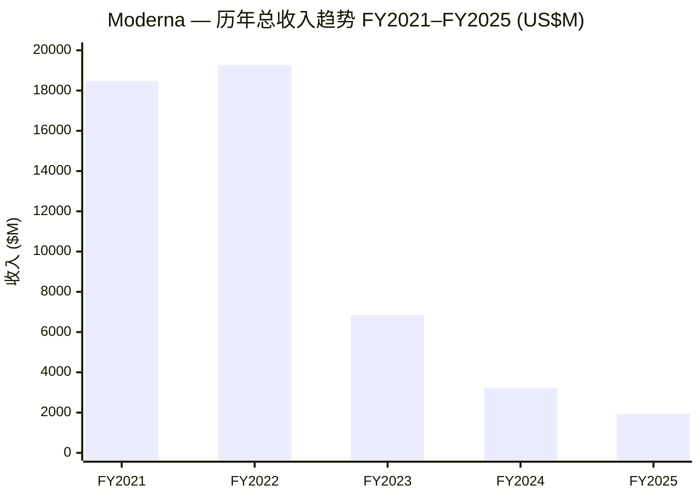
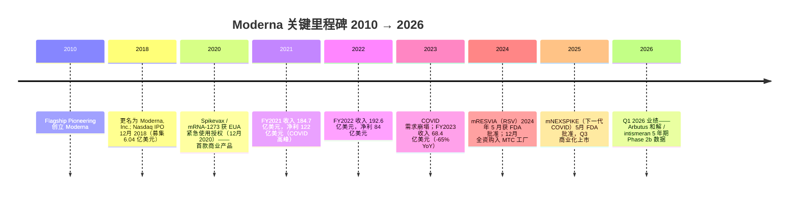
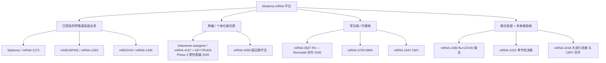
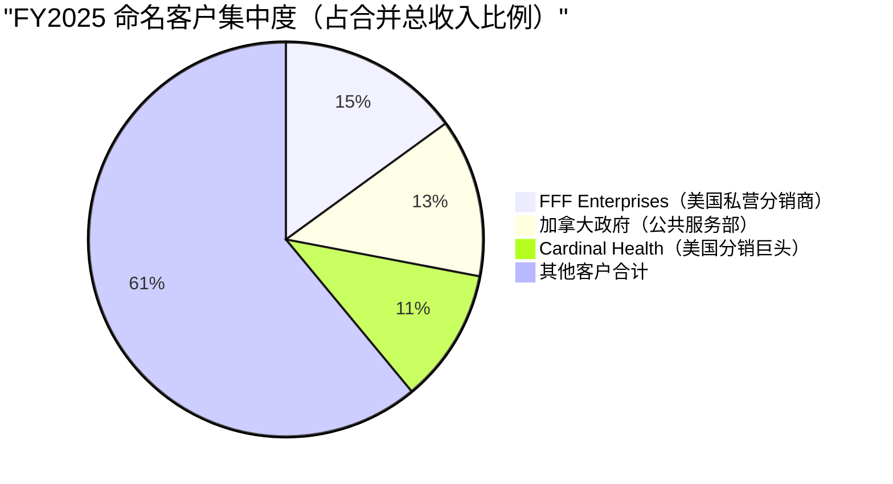
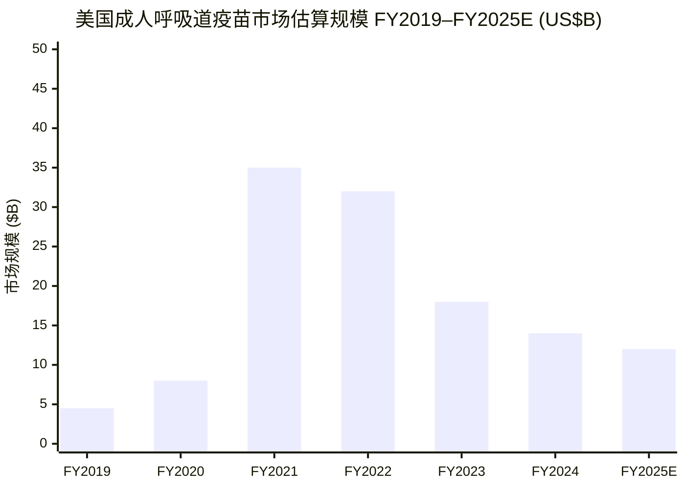
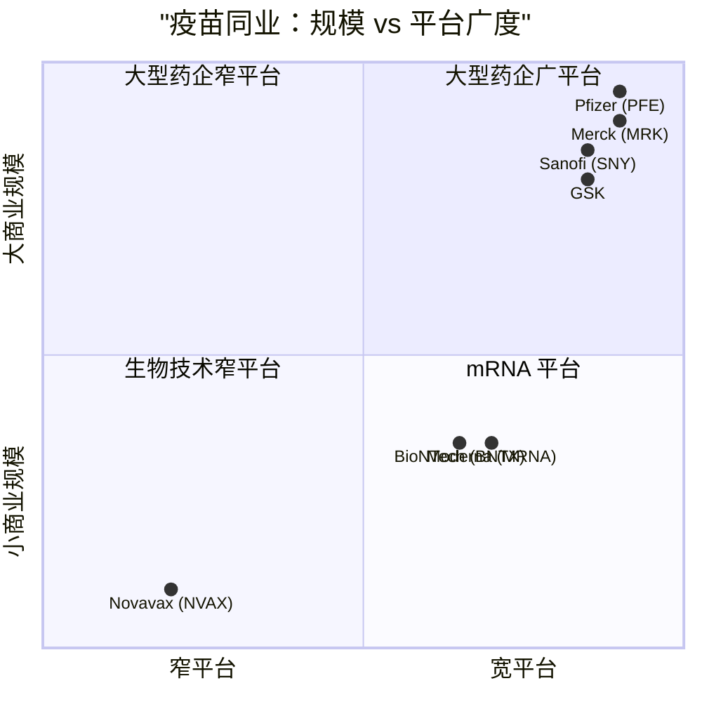
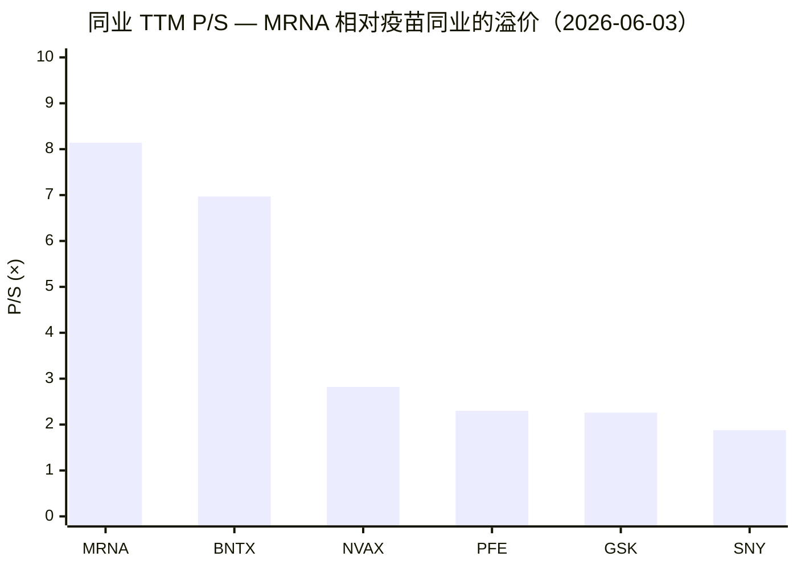

# Moderna, Inc.（NASDAQ:MRNA）— 公司研究报告

*报告日期：2026-06-03。*

> **业绩指引横幅 — 2026 财务框架（与 2026 年 5 月 1 日 Q1 2026 业绩同步重申）：** 收入指引 **"较 2025 年增长上限 10%"**（即上限约 21.4 亿美元，对比 FY2025 基数 19.44 亿美元）；收入地理结构预计 **美国约 50% / 国际约 50%**；GAAP 销售成本（cost of sales / COGS）**约 18 亿美元**，*其中含 Q1 2026 计提的 9 亿美元 Arbutus / Genevant 诉讼一次性和解费用*；研发费用（R&D）**约 30 亿美元**；销售及管理费用（SG&A）**约 10 亿美元**；资本支出（capex）**2–3 亿美元**；预计 2026 年末现金及投资余额 **45–50 亿美元**（尚未动用 2025 年 11 月信贷融资项下剩余 9 亿美元）。引自 [Moderna Q1 2026 8-K Exhibit 99.1, 2026-05-01](https://www.sec.gov/Archives/edgar/data/1682852/000168285226000057/mrna-20260501.htm)。

## 目录

1. 公司概览
2. 公司历史
3. 管理团队（仅创始人 + 现任 CEO）
4. 产品与服务
5. 客户与商业策略
6. 行业概览
7. 竞争格局
8. 市场机会（TAM/SAM）
9. 风险评估
10. 投资视角评分卡
11. 参考资料 / Data Used

---

## 1. 公司概览

Moderna（莫德纳, NASDAQ:MRNA）是一家位于美国马萨诸塞州剑桥（Cambridge, MA）的生物技术公司（biotechnology company），开创性地将 **信使 RNA（messenger RNA, mRNA）** 作为一种全新药物模态（drug class）推入临床和商业应用。FY2025 Form 10-K 中明确表述：*"自 2010 年成立以来，我们已经从一家专注于 mRNA 领域的研究阶段公司转型为一家拥有多模态疫苗及治疗药物临床组合的商业化企业"* ([Moderna FY2025 Form 10-K, Item 1 Business](https://www.sec.gov/Archives/edgar/data/1682852/000168285226000033/mrna-20251231.htm))。公司目前拥有三款美国 / 欧盟获批的商业产品 —— **Spikevax** 与 **mNEXSPIKE**（两款 COVID-19 疫苗）以及 **mRESVIA**（针对 60 岁以上以及高风险 18–59 岁成人的 RSV 疫苗）—— 同时管线（pipeline）覆盖：（1）与 Merck（默沙东）合作的肿瘤个体化新抗原疗法，（2）针对罕见代谢病的 mRNA 替代疗法，（3）流感 / CMV / 流感 + COVID 联合疫苗等深度感染病疫苗组合。公司总部位于 325 Binney Street, Cambridge, MA 02142；制造核心枢纽是 2024 年 12 月由公司全资买断的 Moderna Technology Center（MTC，位于马萨诸塞州 Norwood）([Moderna FY2025 Form 10-K, Item 2 Properties / Manufacturing](https://www.sec.gov/Archives/edgar/data/1682852/000168285226000033/mrna-20251231.htm))。

**最新季度业绩（Q1 2026）。** 总收入 **3.89 亿美元** vs. Q1 2025 的 1.08 亿美元（同比 +260%），主要源自与外国政府签订的长期战略合作协议（partnerships with foreign government entities）下的疫苗发货（美国 0.78 亿美元；国际 3.11 亿美元）([Moderna Q1 2026 8-K Exhibit 99.1, 2026-05-01](https://www.sec.gov/Archives/edgar/data/1682852/000168285226000057/mrna-20260501.htm))。运营费用合计 17.77 亿美元（其中含 9 亿美元 Arbutus / Genevant 诉讼一次性和解费用计入销售成本），GAAP 运营亏损 (1,388) 百万美元，净亏损 (1,343) 百万美元，摊薄每股净亏损 **$(3.40)**。现金及投资余额从 2025 年末的 81 亿美元降至 2026 年 3 月 31 日的 **75 亿美元**；诉讼和解付款发生在更晚期间（later period），未影响 Q1 当季现金 ([Moderna Q1 2026 8-K Exhibit 99.1 — Cash Balance section](https://www.sec.gov/Archives/edgar/data/1682852/000168285226000057/mrna-20260501.htm))。

**FY2025 全年业绩。** 全年总收入 **19.44 亿美元**（FY2024 为 32.36 亿，FY2023 为 68.48 亿），净亏损 **28 亿美元**（FY2024 / FY2023 分别为 36 亿 / 47 亿），GAAP 摊薄每股净亏损 **$(7.26)**（FY2024 / FY2023 分别为 $(9.28) / $(12.33)）—— 即在收入持续走低的同时，亏损绝对额在收窄 ([Moderna FY2025 Form 10-K, Total Revenue and Loss Per Share / MD&A](https://www.sec.gov/Archives/edgar/data/1682852/000168285226000033/mrna-20251231.htm))。FY2025 销售成本为 8.68 亿美元（占净产品销售 48%）vs. FY2024 的 15 亿美元（47%）；研发降至 31.32 亿美元（同比 –31%），销管降至 10.18 亿美元（同比 –13%）—— 这是连续两年管理层执行 "向更低成本基数运营" 战略的成果。FY2025 年末现金 + 投资余额 **81 亿美元**，较 FY2024 末下降 14 亿美元（-15%）([Moderna FY2025 Form 10-K, MD&A Liquidity](https://www.sec.gov/Archives/edgar/data/1682852/000168285226000033/mrna-20251231.htm))。



数据来源：FY2021 / FY2022 收入参见 [Moderna Q4 2022 8-K Exhibit 99.1](https://www.sec.gov/Archives/edgar/data/1682852/000168285223000008/mrna-20230223.htm)；FY2023 / FY2024 / FY2025 参见 [FY2025 10-K MD&A](https://www.sec.gov/Archives/edgar/data/1682852/000168285226000033/mrna-20251231.htm)。

**估值快照 — 公开市场定位（2026-06-03 收盘）：** MRNA 股价 **$45.64**，市值 **181 亿美元**，企业价值（EV）**119.5 亿美元**（即剔除净现金后市场对运营业务的隐含估值），意味着市场为以下组合付出 119.5 亿美元：一个下行但仍现金生成的呼吸道疫苗（respiratory vaccine）业务、一个年消耗约 30 亿美元的研发引擎，以及一个二元事件（binary）驱动的肿瘤 / 罕见病管线 ([Stockanalysis.com — MRNA Statistics, 2026-06-03 访问](https://stockanalysis.com/stocks/mrna/statistics/))。**TTM P/E 不适用**（公司亏损），**TTM P/S 8.14×**，**EV/Sales 5.37×**，**P/B 2.45×**；**ROE –36.56%**，**ROIC –66.19%** —— 均符合 "以亏损方式运营商业化业务以维持研发管线" 的财务画像 ([Stockanalysis.com — MRNA Statistics](https://stockanalysis.com/stocks/mrna/statistics/))。

*分析师观点：* 一家收入 *持续衰退* 的疫苗业务（FY2025 收入仅为 FY2022 峰值的约 10%）以 8 倍 P/S 估值，明显高于同业 —— Pfizer（辉瑞）**TTM P/S 仅 2.30×** ([Stockanalysis.com — PFE Statistics, 2026-06-03 访问](https://stockanalysis.com/stocks/pfe/statistics/))，GSK **2.26×** ([Stockanalysis.com — GSK Statistics, 2026-06-03 访问](https://stockanalysis.com/stocks/gsk/statistics/))，Sanofi（赛诺菲）**1.88×** ([Stockanalysis.com — SNY Statistics, 2026-06-03 访问](https://stockanalysis.com/stocks/sny/statistics/))。这一溢价 *不* 来自呼吸道业务本身，而是市场为以下三项 *期权价值（option value）* 付费：（i）与 Merck 合作的黑色素瘤个体化免疫疗法 intismeran autogene（mRNA-4157），其 5 年期 Phase 2b 数据显示 **复发或死亡风险降低 49%** ([Moderna Q1 2026 8-K Exhibit 99.1, intismeran section](https://www.sec.gov/Archives/edgar/data/1682852/000168285226000057/mrna-20260501.htm))；（ii）2026–2028 年覆盖 CMV、MMA、流感 + COVID 联合疫苗的 Phase 3 数据读出；（iii）mRNA 平台本身能否在窗口期内将这些机会兑现为可持续的第二业务支柱。最接近的同业 **BioNTech** 估值为 **6.97× P/S**，现金储备同样充足 —— 即市场仍然对 mRNA 平台（mRNA platform）支付期权溢价，但已经不是 2021 年的高位估值 ([Stockanalysis.com — BNTX Statistics, 2026-06-03 访问](https://stockanalysis.com/stocks/bntx/statistics/))。

**一句话投资逻辑。** Moderna 是一笔 "现金跑道（cash runway）vs 管线兑现速度" 的竞赛交易 —— Q1 末 75 亿美元现金，预计 **2026 年末将降至 45–50 亿美元** ([Moderna Q1 2026 8-K Exhibit 99.1 — Year-End Cash Projection](https://www.sec.gov/Archives/edgar/data/1682852/000168285226000057/mrna-20260501.htm))，对应每年研发 + 销管支出约 40 亿美元。要实现 10-K 中明确提出的 *现金盈亏平衡（cash breakeven）* 目标，需要（a）一次重磅商业化产品上市（intismeran 黑色素瘤、CMV、流感）或（b）进一步深度成本削减。未来 18 个月的管线数据读出将决定 MRNA 是一家长久期的 mRNA 平台型复利企业，还是一家正在融化的呼吸道疫苗 "冰块"。

---

## 2. 公司历史

Moderna 由 **Flagship Pioneering**（位于剑桥的风险创业孵化平台，由 Noubar Afeyan 领导）于 **2010 年** 创立，核心论点：合成的、经化学修饰的信使 RNA 可以成为一类可编程的药物 —— 即将一个统一的递送技术（脂质纳米颗粒，lipid nanoparticle / LNP）与一段编码 "病人体内细胞应该生产何种蛋白" 的类似软件的 mRNA 序列结合 ([Moderna FY2025 Form 10-K, Our Company section](https://www.sec.gov/Archives/edgar/data/1682852/000168285226000033/mrna-20251231.htm))。公司在 **2018 年 8 月** 将名称从 Moderna Therapeutics, Inc. 改为 Moderna, Inc.，并于 **2018 年 12 月 7 日** 在 Nasdaq 完成 IPO ([Moderna FY2025 Form 10-K, Item 1 Business](https://www.sec.gov/Archives/edgar/data/1682852/000168285226000033/mrna-20251231.htm); [Wikipedia — Moderna, Inc., 2026-06-03 访问](https://en.wikipedia.org/wiki/Moderna))。2010–2018 阶段是典型的 "重平台投资 / 轻商业化" 的 mRNA / 基因疗法初创企业画像，公司在新冠疫情前已累计消耗超过 10 亿美元股权资本，疫情才提供了商业化验证窗口。



数据来源：[Moderna FY2025 Form 10-K, Our Company / Item 1 Business sections](https://www.sec.gov/Archives/edgar/data/1682852/000168285226000033/mrna-20251231.htm) 和 [Moderna Q1 2026 8-K Exhibit 99.1, 2026-05-01](https://www.sec.gov/Archives/edgar/data/1682852/000168285226000057/mrna-20260501.htm)。

**2020 年 Spikevax 紧急使用授权（EUA）** 是公司命运的拐点事件：从一个还在研发阶段的平台公司，一夜之间转变为收入 193 亿美元的商业化巨头。FY2021 和 FY2022 分别录得 **184.7 亿和 192.6 亿美元** 营收 ([Moderna Q4 2022 8-K Exhibit 99.1](https://www.sec.gov/Archives/edgar/data/1682852/000168285223000008/mrna-20230223.htm))，将 Moderna 推入全球生物技术营收头部阵营。两年累计净利润 **84 亿（FY2022） + 122 亿（FY2021） = 206 亿美元** ([Moderna FY2025 Form 10-K, MD&A Results of Operations](https://www.sec.gov/Archives/edgar/data/1682852/000168285226000033/mrna-20251231.htm)) —— 这笔 COVID 期间的累计现金，构成了当下公司的现金储备基础，也为管理层提供了数年的窗口期，将这笔意外之财转化为第二条可持续的业务曲线。

**疫后阶段（FY2023 至今）** 是一场有序的下行周期执行（down-cycle execution）。FY2023 收入降至 **68.48 亿美元**（-65% YoY），FY2024 降至 **32.36 亿美元**（-53% YoY），FY2025 再降 40% 至 **19.44 亿美元** ([Moderna FY2025 Form 10-K, MD&A Results of Operations](https://www.sec.gov/Archives/edgar/data/1682852/000168285226000033/mrna-20251231.htm))。财务系统的反应是激进成本削减：研发从 FY2023 的 48.4 亿降至 FY2024 的 45.4 亿，再降至 FY2025 的 31.3 亿美元（FY2025 单年同比 –31%）；销管从 14.3 亿降至 11.7 亿，再降至 10.2 亿；运营亏损也在持续收窄（FY2023 / FY2024 / FY2025 净亏分别为 47 亿 / 36 亿 / 28 亿美元）。2025 年 11 月，公司签署了 **15 亿美元五年期定期贷款融资工具**（6 亿初始贷款 + 4 亿延迟提取贷款 + 5 亿循环额度）—— 这是公司首次债务融资，标志着管理层正在为 "现在的现金低谷" 到 "2027–2028 第一波管线兑现" 之间的多年等待期备足资金 ([Moderna FY2025 Form 10-K, Credit Facility Note](https://www.sec.gov/Archives/edgar/data/1682852/000168285226000033/mrna-20251231.htm))。

**mNEXSPIKE（下一代 COVID 疫苗 / mRNA-1283）** 于 2025 年 5 月获 FDA 批准（用于 65 岁以上及 12–64 岁高风险人群），2025 Q3 商业上市。10-K 表述：*"mNEXSPIKE，我们于 2025 年第三季度商业化上市的产品，现已成为美国零售渠道（U.S. retail channel）中我们的领先产品"* ([Moderna FY2025 Form 10-K, Our Products](https://www.sec.gov/Archives/edgar/data/1682852/000168285226000033/mrna-20251231.htm))。这是一个结构性重要细节：新产品上市仅数月，已经在美国零售渠道超越了原始的 Spikevax —— 说明公司不仅在防守对 Pfizer/BioNTech 的份额竞争，更是在主动将需求迁移至更高毛利 / 更低储存温度要求的新配方。关键临床数据 —— 在 ≥65 岁人群中相对疫苗效力（rVE）较 Spikevax 高 **13.5%** ([Moderna FY2025 Form 10-K, mNEXSPIKE Phase 3 section](https://www.sec.gov/Archives/edgar/data/1682852/000168285226000033/mrna-20251231.htm)) —— 为零售 / 医保渠道的产品切换论点提供了所需的临床背书。

最近的战略动作（2026 Q1）是 **就长期的 Arbutus / Genevant LNP 专利诉讼达成全球和解**，总和解金额 **9 亿美元**（实际现金支付在 Q1 之后的期间，因此 Q1 当季为非现金计提）([Moderna Q1 2026 8-K Exhibit 99.1, Corporate Updates section](https://www.sec.gov/Archives/edgar/data/1682852/000168285226000057/mrna-20260501.htm))。这一和解消除了全球 mRNA 平台层面最大的单个 IP（intellectual property / 知识产权）悬而未决问题 —— 投资者应将其理解为 **支付 COVID-19 业务以及未来所有 mRNA 资产的 "自由经营权（freedom-to-operate）"**，而非简单的一次性运营费用。

---

## 3. 管理团队（仅创始人 + 现任 CEO）

**创始人兼 CEO — Stéphane Bancel（斯特凡·班塞尔）**（创始 / 现任 CEO 合并简介；Bancel 并非平台技术论点的联合创始人 —— 平台思想出自 Flagship Pioneering / Noubar Afeyan —— 但自 2011 年起担任 CEO 至今，是公司当下形态的运营创建者）。Bancel 于 **2011 年** 被任命为 Moderna CEO（公司 2010 年成立后次年），并连续担任此职至今 ([Moderna FY2025 Form 10-K, Insider Trading Plans / S. Bancel section](https://www.sec.gov/Archives/edgar/data/1682852/000168285226000033/mrna-20251231.htm); [Wikipedia — Stéphane Bancel, 2026-06-03 访问](https://en.wikipedia.org/wiki/St%C3%A9phane_Bancel))。加入 Moderna 之前，他于 2007–2011 年担任 **bioMérieux SA**（位于法国里昂的临床诊断公司，2026 年市值约 120 亿欧元）的 CEO；更早期担任 Eli Lilly（礼来）比利时分公司的董事总经理（managing director）([Wikipedia — Stéphane Bancel](https://en.wikipedia.org/wiki/St%C3%A9phane_Bancel))。Bancel 拥有法国 CentraleSupélec 工程学硕士、明尼苏达大学化学工程硕士和哈佛商学院 MBA（1996–2000）学位。他为法籍，长期是欧洲大型制药企业的运营者 —— 与 BioNTech 的 Şahin / Türeci 等 mRNA 同行的学术 / 科学家创始人画像形成显著反差。

根据最新一份委托代理声明 ([Moderna 2026 DEF 14A, 2026-03-16](https://www.sec.gov/Archives/edgar/data/1682852/000130817926000081/mrna-20260316.htm))，Bancel 仍然是 Moderna 最大个人股东之一，通过直接持股和员工股票期权计划持有大额股权。他的两笔最初 CEO 期权授予将于 **2026 年 8 月 10 日** 达到 10 年期满 —— 分别覆盖 558,394 股和 193,321 股（"Bancel Expiring Options"），FY2025 10-K 披露他于 2025 年 11 月 28 日采纳了 Rule 10b5-1 交易计划以便有序行权；**Bancel 已承诺将到期期权行权后的全部税后所得款项捐赠用于慈善目的** ([Moderna FY2025 Form 10-K, Insider Trading Plans](https://www.sec.gov/Archives/edgar/data/1682852/000168285226000033/mrna-20251231.htm))。对治理敏感的读者来说，这是一个罕见的 "出售用于资助慈善而非个人财富多元化" 的内部人减持案例 —— 公关层面是友好的。

Bancel 的任期覆盖了 Moderna 全部历史阶段：2010 年代的风险投资支持研究阶段、2020 年 Spikevax 商业化上市、2021–2022 的暴利窗口、以及 2023–2025 的下行周期。其经营杠杆记录现在已经全部公开，并应作为评估其执行力的恰当视角。研发支出从疫情前的数亿美元规模放大到峰值时的 45 亿美元以上，目前正在 **果断回缩** —— FY2025 为 31.3 亿美元，FY2026 指引 ~30 亿美元，即两年内 **削减 35% 的研发预算**，同时仍在并行推进 8 项（与 Merck 合作的）肿瘤 Phase 2 / Phase 3 试验，以及晚期阶段的 CMV、流感、组合呼吸道项目 ([Moderna FY2025 Form 10-K, R&D Note](https://www.sec.gov/Archives/edgar/data/1682852/000168285226000033/mrna-20251231.htm); [Moderna Q1 2026 8-K Exhibit 99.1, 2026 Framework R&D guidance](https://www.sec.gov/Archives/edgar/data/1682852/000168285226000057/mrna-20260501.htm))。这种可见的纪律性 —— 在生物技术行业管理层经常采取 "保卫研发预算到稀释性融资为止" 的反面 —— 是过去 18 个月最大的单一内部价值驱动因素。Bancel 的薪酬结构（参见 2025 和 2026 DEF 14A）将相当比例的长期股权奖励与 PSU 业绩目标挂钩，包括 TSR（总股东回报）和运营里程碑，与 10-K 风险因素 *"可能无法实现现金盈亏平衡目标"* 表述中明确提及的现金盈亏平衡目标完全对齐。

Bancel 的论点敏感变量只有一个：他已经公开将自己的职业遗产绑定到 mRNA 平台的非 COVID 转化上。如果 2026–2028 阶段 intismeran 在辅助黑色素瘤适应症获批、CMV 阳性数据读出，或两者皆有，则 Bancel 的执行履历将成为 21 世纪初最有影响力的生物技术 CEO 记录之一。如果两者皆失败，同一份履历可能成为 "将一代人的暴利无法转化为可持续第二业务的 CEO" 的反例。**Q1 2026 披露的 2026 年 Phase 3 辅助黑色素瘤数据可能读出** 是本年度该论点最重要的数据事件 ([Moderna Q1 2026 8-K Exhibit 99.1, Pipeline Milestones](https://www.sec.gov/Archives/edgar/data/1682852/000168285226000057/mrna-20260501.htm))。

---

## 4. 产品与服务

Moderna 的平台是 **一项技术** —— 可编程的 mRNA + 脂质纳米颗粒（LNP）递送 —— 应用于三大治疗领域（感染病疫苗、肿瘤、罕见病），加上正在从早期发现进入临床的第四领域（免疫肿瘤癌抗原疗法）。FY2025 10-K Item 1 Business 部分按此分类组织产品组合，下方讨论沿用同一结构 ([Moderna FY2025 Form 10-K, Product Pipeline section](https://www.sec.gov/Archives/edgar/data/1682852/000168285226000033/mrna-20251231.htm); [Moderna 产品管线页面，2026-06-03 访问](https://www.modernatx.com/en-US/research/product-pipeline))。



### 4.1 已获批的呼吸道疫苗业务（当下的商业账本）

**Spikevax / mRNA-1273。** 原始 COVID-19 疫苗，2020 年 12 月获 EUA，后续年份获完整 BLA 批准。10-K 表述为 *"Spikevax（我们最初的 COVID 疫苗）"* ([Moderna FY2025 Form 10-K, COVID vaccines section](https://www.sec.gov/Archives/edgar/data/1682852/000168285226000033/mrna-20251231.htm))。Spikevax 在 FY2020–FY2022 是公司的全部收入基础，FY2025 仍然在国际市场（UK Health Security Agency、加拿大公共服务部、澳大利亚卫生部、日本 MHLW 等）通过 2024–2025 期间签订的长期采购合同贡献显著产品销售。**它在物理层面做什么：** Spikevax 编码 SARS-CoV-2 的刺突蛋白（spike protein，融合前稳定形式）并包封在 LNP 中。肌内注射后，LNP 被注射点附近的细胞摄取；细胞机器将编码的 mRNA 翻译成刺突蛋白；该蛋白随后展示在细胞表面，触发抗体和 T 细胞响应，为未来 SARS-CoV-2 的自然暴露做准备 ([Moderna FY2025 Form 10-K, How mRNA Vaccines Work section](https://www.sec.gov/Archives/edgar/data/1682852/000168285226000033/mrna-20251231.htm))。

**mNEXSPIKE / mRNA-1283 —— 下一代精炼刺突 COVID 疫苗。** 2025 年 5 月获 FDA 批准，用于 ≥65 岁人群以及 12–64 岁高风险人群；2025 Q3 商业化上市。10-K 明确表述：*"mNEXSPIKE，我们于 2025 年第三季度商业化上市的产品，现已成为美国零售渠道中我们的领先产品"* ([Moderna FY2025 Form 10-K, mNEXSPIKE section](https://www.sec.gov/Archives/edgar/data/1682852/000168285226000033/mrna-20251231.htm))。与 Spikevax 的差异化是 **结构性的** 而非抗原性的：mNEXSPIKE 编码刺突蛋白的精炼部分（refined portion），意味着每剂量更低的 mRNA 载荷，同时在关键 Phase 3 试验中显示 **整体非劣效于 Spikevax，且在 ≥65 岁成人中相对 Spikevax 高 13.5% 的相对疫苗效力（rVE）** ([Moderna FY2025 Form 10-K, mNEXSPIKE Phase 3 readout](https://www.sec.gov/Archives/edgar/data/1682852/000168285226000033/mrna-20251231.htm))。其战略角色是双重的：（i）防守对 Pfizer/BioNTech Comirnaty 业务在美国零售渠道的地位（后者也有自己的下一代开发项目）；（ii）为承诺接受 mRNA 技术、且每个季节都会升级到最新配方的季节性接种人群，锁定一个更高毛利的产品 —— 这种行为模式美国季节性流感市场已经持续了几十年。**中文释义 / Plain-language gloss:** mNEXSPIKE 是 Spikevax "iPhone-12" 的 "iPhone-15" 升级版 —— 同一平台、更小载荷（单剂生产成本更低）、在 ≥65 主要购买群中效力略好。

**mRESVIA / mRNA-1345 —— RSV 成人疫苗。** 2024 年 5 月获 FDA 批准用于 ≥60 岁成人，2025 年 6 月获批用于 18–59 岁高风险成人。10-K 表述：*"mRESVIA 编码经过工程化设计的、稳定在融合前构象（prefusion conformation）的 RSV F 蛋白，并被包封在我们专有的 LNP 中"* ([Moderna FY2025 Form 10-K, mRESVIA section](https://www.sec.gov/Archives/edgar/data/1682852/000168285226000033/mrna-20251231.htm))。RSV（呼吸道合胞病毒）是 "5 岁以下儿童和老年人下呼吸道疾病的最常见原因之一"，是一个直到 2023 年才打开的、规模数十亿美元的成人疫苗市场，目前有三个获批参与者（Pfizer 的 Abrysvo、GSK 的 Arexvy 和 mRESVIA）。10-K 明确承认 Moderna 是后入场者：*"我们的 RSV 销售迄今为止极为有限"* ([Moderna FY2025 Form 10-K, Competition section](https://www.sec.gov/Archives/edgar/data/1682852/000168285226000033/mrna-20251231.htm)) —— FY2025 mRESVIA 净产品销售仅 **800 万美元**，对比 FY2024 的 2,500 万美元 ([Moderna FY2025 Form 10-K, Net Product Sales by Product table](https://www.sec.gov/Archives/edgar/data/1682852/000168285226000033/mrna-20251231.htm))。这是 Moderna 后疫情商业化建设中最令人失望的单一商业结果：以第三家入场、效力配置不具差异化、面对已建立分销渠道的两家大型制药公司。

### 4.2 肿瘤 —— 当前估值倍数的二元（binary）催化剂

**Intismeran autogene / mRNA-4157（与 Merck 合作）。** Intismeran 是 Moderna 的个体化新抗原疗法（individualized neoantigen therapy），自 2016 年起与 Merck 合作开发（初始合作条款在 2022 和 2025 经过更新；Merck 自 2022 年 10 月起选择共同出资和共同商业化）。10-K 明确表述：*"2026 年 1 月，我们与 Merck 宣布 intismeran autogene（mRNA-4157）—— 我们的 mRNA 基础的个体化新抗原疗法 —— 联合 Merck 的派姆单抗（KEYTRUDA，即帕博利珠单抗）的 5 年期 Phase 2b 数据，在完全切除后的高危黑色素瘤（III/IV 期）患者中显示了无复发生存（recurrence-free survival）的持续改善"* ([Moderna FY2025 Form 10-K, Oncology section](https://www.sec.gov/Archives/edgar/data/1682852/000168285226000033/mrna-20251231.htm))。Q1 2026 业绩公告量化了这一结果：**复发或死亡风险相对 KEYTRUDA 单药降低 49%** ([Moderna Q1 2026 8-K Exhibit 99.1, intismeran section](https://www.sec.gov/Archives/edgar/data/1682852/000168285226000057/mrna-20260501.htm))。目前 "**8 项 Phase 2 和 Phase 3 临床试验**正在跨多种瘤型推进" —— Phase 3 辅助黑色素瘤数据（命名 INT-101）是整个组合中 2026 年最高确信度的单一数据读出。

**它在物理层面做什么：** Intismeran 是上世纪 90 年代主导肿瘤治疗的广谱细胞毒化疗（broad cytotoxic chemotherapy）以及 2010 年代主导的免疫检查点抑制剂（immune-checkpoint inhibitor，如 KEYTRUDA）的个体化反面。每位患者的手术切除肿瘤被测序；一种算法识别多达 **34 条患者特异的 "新抗原（neoantigen）" 肽序列** —— 即肿瘤特异突变，当展示在细胞表面时，可以被该患者自身的 T 细胞识别为外源物。这 34 条肽序列随后被编码到一条 mRNA 构造中，在 MTC 工厂制造，并与 KEYTRUDA 联合肌内注射给患者。KEYTRUDA 解除 PD-1 介导的 T 细胞抑制；同时 intismeran 诱导的新抗原响应为已解除抑制的 T 细胞提供 *目标清单*。**中文释义 / Plain-language gloss:** 如果 KEYTRUDA 是 "解开免疫系统的口套"，intismeran 就是 "并且这里有一份基于这名患者具体肿瘤突变生成的、要去杀谁的定制名单"。该组合因此是 KEYTRUDA 单药 *无法实现* 的 *相加（additive）* —— 这正是 49% 相对降低告诉我们的事情。

**mRNA-4359 —— 癌抗原疗法（完全自有）。** Phase 1/2 项目，靶向 PD-L1 和 IDO1 —— 在肿瘤细胞和肿瘤微环境中免疫抑制细胞上均表达的共享抗原。与 intismeran 的差异化在于 *不需要患者个体化*（即可以离架（off-the-shelf）生产，单位成本大幅降低），但只能靶向共享抗原，无法靶向患者特异新抗原。其战略意义在于离架 mRNA 癌疫苗的经济模型：如果有效，将给 Moderna 提供第二个肿瘤资产，覆盖比 intismeran 的手术切除子集大得多的合格患者群。

### 4.3 罕见病 —— 长尾的商业期权价值

**mRNA-3927 —— 丙酸血症（PA, Recordati 合作）。** 10-K 表述：*"我们的丙酸血症治疗 mRNA-3927 已完成注册研究的目标入组。2026 年 1 月，我们与 Recordati（一家国际制药集团）达成战略合作，推进 mRNA-3927 通过临床开发最后阶段，如获批准，将进行全球商业化"* ([Moderna FY2025 Form 10-K, Rare Disease section](https://www.sec.gov/Archives/edgar/data/1682852/000168285226000033/mrna-20251231.htm))。该疾病本身是 *"一种罕见的遗传性代谢病，发病率约为 10 万至 15 万分之一"* —— 即一个小但可识别的患者群，目前获批治疗仅限于饮食管理和肝移植。**它在物理层面做什么：** PA 由丙酰辅酶 A 羧化酶（PCC）基因突变导致；mRNA-3927 提供功能性 PCCA 和 PCCB mRNA 副本，使肝脏能够生成缺失的酶。**战略意义：** 罕见病疗法一旦获批，可以维持 90% 以上的毛利率且竞争有限 —— Recordati 接手商业化运营，意味着 Moderna 无需自建昂贵的罕见病商业基础设施来变现。

**mRNA-3705 —— 甲基丙二酸血症（MMA）。** Q1 2026 业绩公告表示，公司 *"将 mRNA-3705 的关键试验决定推迟到 PA 注册数据读出之后"* ([Moderna Q1 2026 8-K Exhibit 99.1, MMA section](https://www.sec.gov/Archives/edgar/data/1682852/000168285226000057/mrna-20260501.htm))。这一推迟是积极的效率信号 —— 管理层正在 *排序* 罕见病投入，而非并行运行多个高成本的关键试验。

**mRNA-1647 —— CMV 疫苗。** 包含 6 条 mRNA 的鸡尾酒，靶向巨细胞病毒（cytomegalovirus）的五聚体（pentamer）和 gB 表面蛋白。**2025 年 10 月的 cCMV Phase 3 公告** 至关重要 —— 研究读出是该平台最重要的 2026 事件之一。CMV 通过感染母亲传给新生儿，是美国出生缺陷的首要感染原因；成功的疫苗将解决一个目前无获批竞争者的未满足需求。

### 4.4 管线汇总（按阶段）

10-K 与 Q1 2026 公告共同形成的管线综合视图如下 ([Moderna FY2025 Form 10-K, Pipeline section](https://www.sec.gov/Archives/edgar/data/1682852/000168285226000033/mrna-20251231.htm); [Moderna Q1 2026 8-K Exhibit 99.1, Pipeline Milestones](https://www.sec.gov/Archives/edgar/data/1682852/000168285226000057/mrna-20260501.htm))：

| 项目 | 适应症 | 阶段 | 2026–28 催化剂 |
|---|---|---|---|
| Spikevax | COVID-19 | 已获批 / 商业化 | 长期合同发货持续 |
| mNEXSPIKE | COVID-19（下一代） | 2025 Q2 获批 / Q3 上市 | 2025–26 首个完整零售季 |
| mRESVIA | RSV ≥60 / 18–59 高风险 | 已获批 | 与 Pfizer/GSK 竞争激烈 |
| mRNA-1010 | 季节性流感 | Phase 3 / BLA 已重新提交 | 美国 FDA 决议 2026 |
| mRNA-1083 | 流感 + COVID 联合 | Phase 3 / 监管申报已撤回，待 mRNA-1010 数据 | mRNA-1010 后重新提交 |
| mRNA-1647 | CMV 疫苗 | Phase 3（2025 年 10 月已宣布读出） | Phase 3 后监管申报 2026–27 |
| mRNA-1018 | 大流行流感 | 2026 年与 CEPI 合作启动 Phase 3 | 2027+ 国家储备合同 |
| Intismeran (mRNA-4157) | 辅助黑色素瘤（与 Merck） | Phase 3 | 2026 黑色素瘤数据可能读出 |
| mRNA-4359 | 肿瘤（癌抗原） | Phase 1/2 | 2026 进入 Phase 2 |
| mRNA-3927 | 丙酸血症（Recordati） | 注册阶段 | 2027–28 申报 |
| mRNA-3705 | 甲基丙二酸血症 | 关键试验已推迟 | 待 mRNA-3927 数据后决定 |

数据来源：[Moderna FY2025 Form 10-K, Pipeline section](https://www.sec.gov/Archives/edgar/data/1682852/000168285226000033/mrna-20251231.htm), [Moderna Q1 2026 8-K Exhibit 99.1, Pipeline Milestones section](https://www.sec.gov/Archives/edgar/data/1682852/000168285226000057/mrna-20260501.htm), [Moderna 产品管线页面，2026-06-03 访问](https://www.modernatx.com/en-US/research/product-pipeline)。

**综合分析 —— 产品如何相互作用。** Moderna 的产品组合架构是一个建立在单一平台之上的 **风险阶梯化（risk-laddered）组合**：已获批的呼吸道账本提供经常性商业收入和毛利来部分资助研发；intismeran 提供以数十亿美元 TAM 为基础的高确信度二元上行风险敞口；罕见病项目提供成功时的中等概率长尾毛利；联合呼吸道产品则是用于 "类别延伸（category extension）" 的防御性布局，目标是将公司业务延伸到 2020 年代末。**平台本身是战略护城河，任何单一产品都不是** —— intismeran 成功获批验证 Moderna 大规模制造 *个体化* mRNA 的能力；CMV 成功获批验证多抗原配方工程；流感成功获批验证季节性疫苗的商业化机制。这些数据读出中没有一个能保证成功，也没有一个单独足够，但 *横跨 8+ 后期项目的概率加权组合* 正是支撑当前 mRNA 平台溢价倍数的逻辑。

---

## 5. 客户与商业策略

根据 FY2025 10-K 财务报表附注信用风险集中度（Concentration of Credit Risk Note）披露，FY2025 有以下三家客户分别贡献了 ≥10% 的总收入 ([Moderna FY2025 Form 10-K, Note — Concentration of Credit Risk](https://www.sec.gov/Archives/edgar/data/1682852/000168285226000033/mrna-20251231.htm))。下表所有百分比均为 **占合并总收入比例**（非分部 / segment 级别 —— Moderna 不按分部报告）：

| 客户 | FY2025 占合并收入 | FY2024 | FY2023 | FY2025 占应收账款 |
|---|---|---|---|---|
| FFF Enterprises（美国私营分销商） | **15%** | 13% | <10% | <10% |
| 加拿大公共服务部（Public Works Canada） | **13%** | <10% | <10% | 33% |
| Cardinal Health（美国分销巨头） | **11%** | <10% | <10% | <10% |
| 英国卫生安全署 | <10% | 16% | <10% | <10% |
| 日本厚生劳动省 | <10% | 21% | <10% | <10% |
| 墨西哥 Medistik | <10% | <10% | <10% | 29% |
| 韩国 Boryung Biopharma | <10% | <10% | <10% | 17% |

数据来源：[Moderna FY2025 Form 10-K — Concentration of Credit Risk Note](https://www.sec.gov/Archives/edgar/data/1682852/000168285226000033/mrna-20251231.htm)。10-K 表格中星号代表 "低于 10%"。



数据来源：[Moderna FY2025 Form 10-K — Concentration of Credit Risk Note](https://www.sec.gov/Archives/edgar/data/1682852/000168285226000033/mrna-20251231.htm)。

**客户表的三大结构性结论。** 第一，FY2025 命名前三大客户合计占合并收入 **39%** —— 是显著集中度，但不至于灾难性；FY2024 和 FY2023 的分布显示，前几大客户的 *身份* 每年轮换（英国 HSA 在 2024 年 16% 而 2025 年 <10%；日本 MHLW 2024 年 21% → 2025 年 <10%；加拿大 2025 年 13% 而前两年 <10%）—— 即没有任何 *单一* 关系是结构性嵌入 Moderna 业务中的。第二，**FFF Enterprises**（一家以免疫医生渠道为核心的美国专业分销商）从 FY2023 的 <10% 上升到 FY2025 的 15% ([Moderna FY2025 Form 10-K, Concentration Note](https://www.sec.gov/Archives/edgar/data/1682852/000168285226000033/mrna-20251231.htm))，是美国商业渠道结构转型的有用信号 —— 从疫情期间的 "直接对政府" 转向 mNEXSPIKE 现在主导的私营零售 / 批发渠道。第三，**应收账款集中度** 比收入集中度更倾斜 —— 加拿大公共服务部占 A/R 33%、墨西哥 Medistik 占 29% —— 表明长期政府应收款回款较慢，这一营运资金现实占用现金，但也意味着一旦合同金额承诺，即对应高度可预测的合同收入。

**地理结构在再平衡。** 根据 10-K 按客户地理位置披露的净产品销售：**美国收入从 FY2024 的 17.26 亿美元降至 FY2025 的 11.65 亿美元（同比 -33%）**，**欧洲从 5.73 亿美元崩塌至 0.50 亿美元（同比 -91%）**；同时 "世界其他地区" 在政府战略合作发货推动下增长。2026 年 4 月 Q1 2026 业绩公告明确表述 2026 年收入预计为 *"美国约 50%，国际约 50%"* ([Moderna Q1 2026 8-K Exhibit 99.1, 2026 Financial Framework](https://www.sec.gov/Archives/edgar/data/1682852/000168285226000057/mrna-20260501.htm)) —— 这是有意为之的地理再平衡，从单一美国零售季的不确定性转向 "长期合作" 市场（英国、加拿大、澳大利亚），后者通过多年供应合同提供更高的收入可预测性。

**渠道结构 —— 三条不同路径。** 根据 10-K 净产品销售部分：*"在美国，我们的 COVID 和 RSV 疫苗主要销售给批发商和分销商，少量直销给零售商和医疗服务提供者"* ([Moderna FY2025 Form 10-K, Net Product Sales section](https://www.sec.gov/Archives/edgar/data/1682852/000168285226000033/mrna-20251231.htm))。三条渠道分别为：（i）**美国私营零售 / 批发**（通过 Cardinal Health / FFF / McKesson / AmerisourceBergen 流向 Walgreens / CVS / Rite Aid 以及免疫医生渠道 —— 是美国的主导商业路径）；（ii）**外国政府和超国家组织**（英国 HSA、加拿大、澳大利亚、日本 MHLW、通过 Boryung 的韩国卫生当局等 —— 这些通过多年提前采购或战略合作合同支撑国际收入）；（iii）**选定市场的直销给零售商 / 医疗服务提供者**。从一次性疫情采购（2021–2022 高峰）到多年战略合作合同（2024 起）的转变是 Moderna 当下最重要的商业策略事实 —— 它将 "今年政府是否续约" 的二元现金流转换为更接近经常性年金的形式，代价是定价低于疫情期间紧急采购的高峰。

**商业策略论点。** Moderna 已经不再被估值为 "疫情股" —— 重定价已在 2023 年完成。现在它被估值在三个商业问题上：（a）mNEXSPIKE 能否在每个秋季维持或扩大美国零售份额 vs. Pfizer/BioNTech？（b）mRESVIA 能否从 FY2025 的 <1,000 万美元销售额增长为 vs. Pfizer Abrysvo 和 GSK Arexvy 有意义的市场参与者？（c）intismeran 能否在 2027–28 年转化为十亿美元级别的肿瘤药物上市？Q1 2026 业绩公告对第一个问题给出了 "目前是肯定的" 答案 —— mNEXSPIKE 正主导美国零售渠道 —— 但第二和第三个问题仍然开放。

---

## 6. 行业概览

Moderna 在 **三个不同的全球市场** 中竞争，每个市场规模、增长动力、竞争结构都不同：（1）呼吸道疫苗市场（当前商业账本）、（2）全球免疫肿瘤市场（intismeran 瞄准的市场）、（3）罕见病疗法市场（长尾）。NAICS 分类将 Moderna 划入 NAICS 325412（制药制造）和 SIC 2836（制药制剂），但运营现实是 Moderna 是一家 *跨越三个行业运营的、拥有单一平台的生物技术公司*。

**呼吸道疫苗市场。** 美国成人 COVID-19、RSV 和季节性流感联合疫苗市场 2024 年约 130–160 亿美元，较疫情前 <50 亿美元已经显著扩张 ([CDC 成人推荐疫苗页面, 2026-06-03 访问](https://www.cdc.gov/vaccines-adults/recommended-vaccines/index.html), [Wikipedia — Moderna 商业背景, 2026-06-03 访问](https://en.wikipedia.org/wiki/Moderna))。全球市场估计差异较大，但共识可触达机会规模为 OECD 加高覆盖率中等收入市场 300–500 亿美元。该市场特征：（i）显著的季节性（美国约 80% 剂量在 8–11 月接种），（ii）分级定价（私营零售 > 公共 Medicare/Medicaid > 新兴市场），（iii）少数几家高量分销关系把控零售药店渠道的进入。

**根据 10-K 对呼吸道市场的风险因素表述：** *"这些疫苗的商业市场是季节性的，特别是在美国（我们最大的市场）以分散的终端客户基础、订单不可预测性、发货季节性为特征。私营疫苗市场也以返点、折扣和退货等市场惯例为特征"* ([Moderna FY2025 Form 10-K, Commercial Markets section](https://www.sec.gov/Archives/edgar/data/1682852/000168285226000033/mrna-20251231.htm))。最具结构性意义且短期最不稳定的特征是 **美国的政策环境**：在 2025 年 1 月就任的特朗普 - 万斯政府，以及由 Robert F. Kennedy Jr.（小肯尼迪）领导的美国 HHS（卫生与公共服务部）下，CDC 的免疫实践咨询委员会（ACIP, Advisory Committee on Immunization Practices）就 COVID 和呼吸道疫苗的接种资格、目标人群、接种实践等发布了重大调整。10-K 风险因素中明确写道：*"ACIP 关于接种资格、目标人群和接种实践的建议，已经并可能继续影响我们疫苗的需求"* ([Moderna FY2025 Form 10-K, ACIP Risk Factor](https://www.sec.gov/Archives/edgar/data/1682852/000168285226000033/mrna-20251231.htm))。对投资者而言，这是影响 FY2026–27 基础情景的最大单一宏观 / 政策变量。



数据来源：综合自 [CDC 成人推荐疫苗（FY2024–25 成人疫苗背景）](https://www.cdc.gov/vaccines-adults/recommended-vaccines/index.html) 和 Moderna 自己在 [FY2025 Form 10-K MD&A](https://www.sec.gov/Archives/edgar/data/1682852/000168285226000033/mrna-20251231.htm) 披露的历史收入轨迹。FY2019 / FY2020 / FY2025E 为分析师估算 —— 非公司披露；FY2021–24 基于 Moderna + Pfizer / BioNTech 披露的 COVID 收入加上已建立的流感市场规模。

**免疫肿瘤市场。** 2024 年全球肿瘤药物市场超过 **2,000 亿美元**，其中免疫肿瘤（以 KEYTRUDA 为代表的检查点抑制剂，年销售额超过 250 亿美元）是增长最快的部分 ([Merck FY2024 10-K — KEYTRUDA Revenue section](https://www.sec.gov/Archives/edgar/data/0000310158/000162828025007732/mrk-20241231.htm))。"个体化新抗原（individualized neoantigen）" / 个体化癌疫苗子领域目前还是商业化前阶段；如果 intismeran 在辅助黑色素瘤获批，将是全球首个全新的 mRNA 癌症疗法，初始美国适应症涵盖约 8,000–10,000 例高危切除的 III/IV 期黑色素瘤患者 / 年；Phase 2/3 扩展到辅助非小细胞肺癌（NSCLC）、肾细胞癌、头颈癌的入组将在 10 年内放大可触达患者群 10 倍以上。**这是单一一条业务，如果成功，将实质性重新评级 Moderna 的企业价值。** 业内对 intismeran 峰值收入潜力的预测为 30–100 亿美元（取决于渗透率假设）；Moderna 与 Merck 大致按 50/50 分享经济利益（依据 2022 合作修正案）。

**罕见病疗法市场。** PA 和 MMA 各影响约 10 万至 15 万分之一的人口，全球 PA 合格患者约 5 万人，MMA 约 4 万人。类似市场（如溶酶体储积症的酶替代疗法）的获批罕见病疗法常见 30–70 万美元 / 患者 / 年的定价；即使在适度的 20–30% 渗透率下，mRNA-3927 也代表数亿美元的峰值收入机会，由 Recordati 承担商业化运营、Moderna 保留开发权益。

**行业结构总结。** Moderna 处于三个不对称的行业之中：呼吸道疫苗市场正在碎片化且高度政策敏感；肿瘤市场巨大且增长，但 Moderna 的参与度取决于 Phase 3 数据读出的二元结果；罕见病市场小但高毛利，且通过 Recordati 合作得到了相当程度的去风险化。影响三个市场的唯一行业趋势变量是 **mRNA 平台验证（mRNA-as-a-platform validation）问题** —— Moderna 的平台能否产生一连串获批，还是 COVID 仅是该 mRNA 类别的 N-of-1（独例）结果？这个问题的答案将在 2026–28 年数据读出中揭晓。

---

## 7. 竞争格局

FY2025 10-K 竞争部分逐字命名以下直接竞争对手 ([Moderna FY2025 Form 10-K, Competition Item 1](https://www.sec.gov/Archives/edgar/data/1682852/000168285226000033/mrna-20251231.htm)):

COVID-19 疫苗：**"Pfizer 和 BioNTech"**（mRNA 基础，是美国 / 欧盟市场唯一另一款获批的 mRNA COVID 疫苗），**"Sanofi 和 Novavax"**（蛋白亚单位 COVID 疫苗）。

RSV 疫苗：**"Pfizer 和 GlaxoSmithKline，两家比我们早进入美国市场"**。

肿瘤领域：跨越检查点抑制剂 + 个体化疫苗组合的多家竞争对手，包括 BioNTech（与 Genentech 合作的 BNT122 / autogene cevumeran）、若干小盘生物技术公司（Gritstone bio、Geneos Therapeutics、Vaccibody/Nykode）以及多家大型药企的离架个体化疫苗项目。



**同业估值表（FY2025 / TTM, 截至 2026-06-03 收盘）。** 数据来源：[Stockanalysis.com — MRNA](https://stockanalysis.com/stocks/mrna/statistics/)，[BNTX](https://stockanalysis.com/stocks/bntx/statistics/)，[PFE](https://stockanalysis.com/stocks/pfe/statistics/)，[GSK](https://stockanalysis.com/stocks/gsk/statistics/)，[SNY](https://stockanalysis.com/stocks/sny/statistics/)，[NVAX](https://stockanalysis.com/stocks/nvax/statistics/)，均于 2026-06-03 访问。

| 股票代码 | 市值 | EV | TTM P/S | P/B | TTM P/E |
|---|---|---|---|---|---|
| Moderna (MRNA) | 181 亿 | 120 亿 | 8.14× | 2.45× | n/m (亏损) |
| BioNTech (BNTX) | 225 亿 | 71 亿 | 6.97× | 1.05× | n/m (亏损) |
| Pfizer (PFE) | 1,456 亿 | 1,973 亿 | 2.30× | 1.62× | 19.5× |
| GSK (GSK) | 979 亿 | n/d | 2.26× | 4.26× | 12.7× |
| Sanofi (SNY) | 1,026 亿 | n/d | 1.88× | 1.22× | 11.8× |
| Novavax (NVAX) | 17 亿 | 12 亿 | 2.82× | n/m | n/m (亏损) |



数据来源：[Stockanalysis.com 同业页面，2026-06-03 访问](https://stockanalysis.com/stocks/mrna/statistics/)。

*分析师观点：* **mRNA 平台溢价**（MRNA 8.14× P/S；BNTX 6.97× P/S）相对传统疫苗同行（PFE / GSK / SNY 1.9–2.3× P/S）的差距，清晰地压缩了不对称论点：投资者支付遗留倍数约 4 倍的价格购买 *平台转化的期权价值*。如果 intismeran 在 2027 年获批，且 mRNA 作为癌症 / CMV / 罕见病的载体规模化，该倍数应可维持或扩展；如果二元数据读出失败，Moderna 变成一家衰退中的呼吸道疫苗公司，倍数将向 PFE / GSK / SNY 同业压缩。论点可以重新表述为：**8× P/S 与 2× P/S 应用于约 20 亿美元收入基础的期权价值差是多少？** 大约 120 亿美元的企业价值定价于平台期权 —— 这大致等于当下的 EV（120 亿）。换言之，今日 MRNA 股价隐含 *市场对呼吸道商业账本赋予零终端价值，全部估值在为平台期权付费*。这是否是正确的风险溢价，取决于一个人对管线概率的假设。

**按产品线的竞争定位备注。**

对于 **mNEXSPIKE vs Pfizer/BioNTech Comirnaty**，Moderna 现在是美国零售份额领导者（per 10-K 的直白表述）([Moderna FY2025 Form 10-K, mNEXSPIKE leading section](https://www.sec.gov/Archives/edgar/data/1682852/000168285226000033/mrna-20251231.htm))。这意义重大 —— 2023–2024 年期间，Pfizer/BioNTech 因为更密集的商业销售团队建设而在美国零售份额中略微领先。mNEXSPIKE 较低的每剂量 mRNA 载荷、冰箱稳定性、以及在 ≥65 岁人群中 13.5% rVE 优势共同创造了 2025 年份额翻转的竞争机会窗口。风险是 BNT 衍生的下一代疫苗从 Pfizer/BioNTech 在 2026–27 季节跟进类似的配方升级。*分析师观点：* 份额领导是真实的，但不太可能是永久的；预期美国零售 mRNA 份额会随着两个平台的迭代而每季节振荡。

对于 **mRESVIA vs Pfizer Abrysvo + GSK Arexvy**，Moderna 第三家进入市场，10-K 明确说 *"我们的 RSV 销售迄今为止极为有限"* ([Moderna FY2025 Form 10-K, Competition / RSV section](https://www.sec.gov/Archives/edgar/data/1682852/000168285226000033/mrna-20251231.htm))。FY2025 mRESVIA 销售 800 万美元，相对 30–40 亿美元的可触达美国市场，是迄今为止的结构性失败。竞争问题是 2025 年 6 月扩展到 18–59 岁高风险成人加上未来的联合产品（与季节性流感联合、与 COVID 联合）能否在 2026–28 季节驱动有意义的份额增长。

对于 **intismeran vs 更广肿瘤格局**，Moderna 的竞争优势在于 *个体化 mRNA 的制造规模和经济效益* —— 从测序数据构建个体特异 mRNA 构造、验证它、并在临床规模下放行使用，是公司已内部消化的非平凡物流能力。竞争对手（BioNTech 与 autogene cevumeran 用于胰腺癌；Gritstone 与 EDGE 平台）正在追求类似方法，但尚未展示商业规模的个体化制造能力。最大单一竞争风险是 *Merck 的合作伙伴选择* —— 如果 intismeran 在 Phase 3 辅助黑色素瘤失败，Merck 还有 BioNTech 的 BNT122 / autogene cevumeran（同样是个体化新抗原癌疫苗，与 Roche/Genentech 合作）作为可比替代；Moderna 将失去 KEYTRUDA 组合的独特定位。

---

## 8. 市场机会（TAM/SAM）

跨三条商业垂直线汇总：

**呼吸道疫苗 TAM（当前商业账本）。** 联合成人呼吸道疫苗市场（COVID、RSV、季节性流感、流感 + COVID 联合）预计 **2030 年全球 250–400 亿美元**（[CDC 成人推荐疫苗](https://www.cdc.gov/vaccines-adults/recommended-vaccines/index.html)；行业共识）。Moderna 合理的市场份额（share-of-wallet）目标是 OECD 加高覆盖率新兴市场的 15–25%，意味着 Moderna 在 2020 年代末成功推出流感和联合产品的情况下，呼吸道收入上限为 50–100 亿美元年化。这是疫情高峰的一小部分，但如果平台兑现，则是有意义的年金。

**免疫肿瘤 TAM（intismeran + 未来 mRNA 癌疫苗）。** intismeran 在切除的 III/IV 期黑色素瘤的美国可触达患者群是约 8,000–10,000 例 / 年；如以 $200,000–$300,000 / 患者的清单价格（与 KEYTRUDA 联合，后者约 $175k+ 合理），50% 峰值渗透假设产生美国黑色素瘤单一适应症 10–15 亿美元峰值收入。将 intismeran 适应症扩展到辅助 NSCLC、肾细胞癌、头颈癌、膀胱癌人群，可触达患者群总体扩大 10–20 倍，30–100 亿美元的峰值收入情景在不同渗透率 / 定价假设下合理 ([Moderna FY2025 Form 10-K, Oncology Pipeline section](https://www.sec.gov/Archives/edgar/data/1682852/000168285226000033/mrna-20251231.htm))。Moderna 经济利益与 Merck 大致 50/50。

```mermaid
xychart-beta
    title "TAM 按产品线构建（峰值收入 US$B, 分析师估算）"
    x-axis [呼吸道2030, intismeran黑色素瘤, intismeran其他瘤型, CMV疫苗, 联合流感COVID, 罕见病]
    y-axis "峰值收入 ($B)" 0 --> 10
    bar [7, 1.5, 5, 2, 4, 0.5]
```

数据来源：综合 [Moderna FY2025 Form 10-K Item 1 Business](https://www.sec.gov/Archives/edgar/data/1682852/000168285226000033/mrna-20251231.htm), [Moderna Q1 2026 8-K Exhibit 99.1 — Pipeline Milestones](https://www.sec.gov/Archives/edgar/data/1682852/000168285226000057/mrna-20260501.htm), [CDC 成人推荐疫苗](https://www.cdc.gov/vaccines-adults/recommended-vaccines/index.html) 的分析师估算。均为自下而上构建 *而非* 公司披露指引。

**CMV 疫苗 TAM。** 巨细胞病毒（CMV）目前没有获批疫苗；先天性 CMV 是美国出生缺陷的首要感染原因。成功的 Phase 3 数据读出和 BLA 批准将瞄准 OECD 国家每年数百万育龄妇女的全球合格群组。即使是适度的 5–10% 人口渗透率，以 $200–400 / 剂量定价，峰值收入 15–30 亿美元合理 —— 一个干净的可触达市场、无现有竞争。

**联合流感 + COVID + 季节性流感（mRNA-1010 / mRNA-1083）。** 美国季节性流感疫苗市场公司层面约 30–40 亿美元 / 年（Sanofi 的 Fluzone + Fluad 业务单独产生约 20 亿美元）；成功的 mRNA 流感疫苗，特别是将 COVID + 流感整合为单次注射的联合产品，可能显著颠覆该市场。成功的 mRNA-1010 / mRNA-1083 上市的分析师估计范围为两产品合计 15–40 亿美元峰值收入。

**罕见病 TAM。** PA + MMA 在 25–35% 全球合格患者峰值渗透率下，以典型孤儿病定价点（30–70 万美元 / 患者 / 年）计算，产生 3–6 亿美元的罕见病疗法总峰值收入，与 Recordati 分享 PA 项目经济利益。

**综合概率加权 TAM。** 汇总已获批 + 后期 + 早期，按风险调整概率求和，合理的 Moderna FY2028 收入基础情景是 **30–50 亿美元**（呼吸道业务稳定 + 首批非 COVID 上市贡献），上行情景为 **80–150 亿美元**（intismeran 黑色素瘤获批 + CMV 获批 + 联合流感 + COVID 商业化上市）。概率加权组合约 **50–70 亿美元**，按行业典型成功生物技术公司的 3–5× P/S 估值，意味着 150–350 亿美元 EV 范围 vs 当下 120 亿美元。市场正在定价该范围的低端。

---

## 9. 风险评估

10-K 风险因素部分超过 50 页；下文按公司研究 skill 的风险分类法将重大风险整合为四个桶。

### 公司特定风险

**R1. mNEXSPIKE / mRESVIA / 管线对 Spikevax 需求的蚕食。** mNEXSPIKE 在美国零售渠道替代 Spikevax 是 *正面的* 内部蚕食故事，但加速了 Spikevax 国际政府合同的衰减（mNEXSPIKE 尚未在国际市场替代 Spikevax）。两年合同滚出模式（日本 MHLW 从 FY2024 的 21% → FY2025 的 <10%）表明，如果国际市场 mNEXSPIKE 采纳滞后于美国零售，FY2026–27 国际下行可能比模型预测的更急。引自 [Moderna FY2025 Form 10-K, Concentration of Credit Risk Note](https://www.sec.gov/Archives/edgar/data/1682852/000168285226000033/mrna-20251231.htm)。**缓释：** 2026 年 50/50 美国 / 国际比例指引意味着长期合作合同（英国、加拿大、澳大利亚）保持稳定。

**R2. Intismeran 辅助黑色素瘤 Phase 3 二元数据读出。** 2026 年 Phase 3 失败将（i）实质性削减股价中的肿瘤平台溢价，（ii）重启与 Merck 的合作经济利益谈判，（iii）将下一个高确信度商业催化剂推到 2028 年 CMV 或 2027 年联合流感 + COVID 获批。引自 [Moderna Q1 2026 8-K Exhibit 99.1, Pipeline Milestones — 2026 年潜在 Phase 3 辅助黑色素瘤数据](https://www.sec.gov/Archives/edgar/data/1682852/000168285226000057/mrna-20260501.htm)。**缓释：** 5 年期 Phase 2b 数据（复发或死亡相对降低 49%）是有意义的领先指标 —— 在如此充分的先验证据下，确认性 Phase 3 失败将不寻常。

**R3. CMV Phase 3 数据读出二元。** 2025 年 10 月公告的 mRNA-1647 Phase 3 设置了 2026 年的数据读出，是本年度第二大单一价值驱动因素。失败将不仅会让 CMV 资产泡汤，更将传达多抗原 mRNA 配方方法（单一疫苗含 6 条 mRNA）比预期更难转化的信号。引自 [Moderna FY2025 Form 10-K, CMV section](https://www.sec.gov/Archives/edgar/data/1682852/000168285226000033/mrna-20251231.htm)。

**R4. Spikevax / mNEXSPIKE 制造平台 —— MTC 单点集中风险。** 位于马萨诸塞州 Norwood 的 Moderna Technology Center 生产几乎全部公司临床和商业供应。设施事件、FDA 检查发现或长时间停产将相对于多工厂同业产生不成比例的影响。引自 [Moderna FY2025 Form 10-K, Item 2 Properties / MTC section](https://www.sec.gov/Archives/edgar/data/1682852/000168285226000033/mrna-20251231.htm)。**缓释：** 2024 年 12 月对 MTC 园区的全资买断（相对此前的租赁）给 Moderna 完全运营控制权，可不受租约续期限制做投资。

### 行业 / 市场风险

**R5. ACIP / 美国疫苗资格与报销政策风险。** 10-K 表述 *"ACIP 推荐 [...] 可能已经并可能继续影响我们疫苗的需求"* ([Moderna FY2025 Form 10-K, ACIP Risk Factor](https://www.sec.gov/Archives/edgar/data/1682852/000168285226000033/mrna-20251231.htm))。在特朗普 - 万斯政府和卫生部部长肯尼迪的领导下，ACIP 的成员组成和推荐框架被主动重塑 —— 影响哪些成人人群被推荐接种哪些疫苗、哪些保险方覆盖特定疫苗、以及哪些强制性免疫计划适用。这是影响 FY2026 美国零售渠道收入基础情景的最大单一宏观 / 政策变量。

**R6. 关税 / 贸易政策风险。** 10-K 特别注明 *"关税和其他政府贸易政策的变化可能对我们的业务和经营业绩产生不利影响。最近的政府行动和提案涉及关税和其他贸易政策已经创造了 [不确定性]"* ([Moderna FY2025 Form 10-K, Risk Factors — Tariff section](https://www.sec.gov/Archives/edgar/data/1682852/000168285226000033/mrna-20251231.htm))。Moderna 的供应链包括从国际采购的原材料；关税敞口影响 COGS 和产品毛利假设。

**R7. Pfizer/BioNTech 的下一代呼吸道疫苗竞争。** Pfizer/BioNTech、GSK、Sanofi、Novavax 各自有在 2026–2028 季节推出下一代呼吸道产品的活跃项目。mNEXSPIKE 的美国零售领导地位在没有持续配方迭代的情况下可能无法跨季节维持。引自 [Moderna FY2025 Form 10-K, Competition section](https://www.sec.gov/Archives/edgar/data/1682852/000168285226000033/mrna-20251231.htm)。

### 财务 / 结构性风险

**R8. 现金消耗 vs 现金盈亏平衡目标。** 10-K 明确说公司 *"可能无法实现现金盈亏平衡目标"* ([Moderna FY2025 Form 10-K, Risk Factors — Breakeven section](https://www.sec.gov/Archives/edgar/data/1682852/000168285226000033/mrna-20251231.htm))。2026 年末现金预计 45–50 亿美元，对应每年研发 + 销管支出约 40 亿美元，意味着如果管线现金拐点不能按时到达，2027–28 将发生融资事件。2025 年 11 月 15 亿美元信贷融资工具提供桥接能力，但不是长期融资解决方案。引自 [Moderna FY2025 Form 10-K, Credit Facility Note](https://www.sec.gov/Archives/edgar/data/1682852/000168285226000033/mrna-20251231.htm)。

**R9. 客户集中度 —— 应收账款回款时机风险。** 加拿大公共服务部占应收账款 33%、墨西哥 Medistik 占 29% —— 对特定政府付款时机产生显著营运资金敞口。任一付款延迟可能造成临时现金转换缺口。引自 [Moderna FY2025 Form 10-K, Concentration of Credit Risk Note](https://www.sec.gov/Archives/edgar/data/1682852/000168285226000033/mrna-20251231.htm)。

**R10. 估值倍数压缩风险。** TTM P/S 8.14× vs 传统药企同业 1.9–2.3×（PFE、GSK、SNY），MRNA 承载明显的 "平台溢价"。如果 FY2026 管线数据读出令人失望，且平台转化论点弱化，倍数从 8× → 4× 的压缩将意味着 90–100 亿美元的股权价值下降。引自 [Stockanalysis.com 同业对比](https://stockanalysis.com/stocks/mrna/statistics/)。

### 宏观风险

**R11. 外汇敞口。** FY2026 收入指引 50% 国际，外汇兑美元波动（特别是 EUR、GBP、CAD、AUD、JPY、KRW）现在是重要的毛利率变量。10-K 明确将 *"外汇汇率的重大不利变化"* 列为风险。引自 [Moderna FY2025 Form 10-K, FX section](https://www.sec.gov/Archives/edgar/data/1682852/000168285226000033/mrna-20251231.htm)。

**R12. mRNA 平台监管 / 科学群体风险。** 任何 mRNA 项目（Moderna 的、BioNTech 的，或小盘竞争对手的）在全球范围内出现安全或效力问题，若被监管机构解读为 *平台类别* 问题，将同时影响 Moderna 所有 mRNA 项目。虽然目前尚未出现此类问题，平台相对新颖意味着监管框架仍在演变 —— 特别是围绕 mRNA 编码抗原的长期安全监测。

---

## 10. 投资视角评分卡（Investor-Lens Scorecards）

下方四个核心视角对 Sections 1–9 中已经引用的同一证据进行评分。截至日期周期快照：VIX 约 17，10Y 国债 约 4.2%，HY OAS 约 310bp，IG OAS 约 95bp（基于 2026-06-03 的报价区间估算）。这些输入用于 Howard Marks（10.4）和 Damodaran 无风险利率（10.3）。

### 10.1 Buffett —— 合理价格的质量（0–100）

*视角观点：* **45 / 100 —— 低于质量门槛；价格合理但业务尚未自我融资。**

| 组件 | 评分 (0-25) | 备注 |
|---|---|---|
| 业主收益持续性 | 8 | 亏损中；现金盈亏平衡目标已表态但未证实 |
| 资本回报率 | 4 | ROIC –66%; ROE –37% —— 今日没有投入资本的回报 |
| 竞争护城河 | 18 | 平台 IP + 制造规模；可防守但缺乏定价权 |
| 管理层 & 资本配置 | 15 | Bancel 的研发成本纪律是真实的；Arbutus 和解消除悬而未决问题 |

*失败模式：* Buffett 规则对亏损业务一概惩罚，无论期权价值如何 —— 这是有意为之，但忽略了生物技术所需的 "向盈利成长" 模式。评分应理解为 "Buffett 今天不会投资的位置"，而非 "业务很差"。

### 10.2 Munger —— 质量 + 反向（0–10）

*视角观点：* **5.5 / 10 —— 质量过关但反向：失败模式可识别。**

| 维度 | 评分 0-10 | 备注 |
|---|---|---|
| 业务简单性 | 4 | 多项目生物技术；不是简单业务 |
| 管理层可信度 | 8 | Bancel 将所得款承诺慈善；透明的研发纪律 |
| 定价权 | 5 | 疫苗的定价权弱于品牌肿瘤药物 |
| 长期经济效益 | 6 | 平台期权价值真实但未证实 |

反向 ("是什么杀死这一论点？")：intismeran Phase 3 失败 + CMV 数据读出延迟 + ACIP 进一步限制 COVID 需求 = 论点崩塌为以 8× P/S 定价的融化呼吸道业务。三者同时失败的概率不高，但也并非可忽略。

### 10.3 Damodaran —— 故事 + 数字 DCF 安全边际（±%）

*视角观点：* **相对当前股价 +15% 至 +25% 的安全边际**，前提是 intismeran 获批概率 ≥40% 且平台转化继续。

必需的假设（明确陈述）：
- 无风险利率：4.2%（10Y 国债，2026-06-03）
- ERP：5.5%（Damodaran 2026 隐含 ERP，与历史均值大致一致）
- WACC：9.5%（与 Stockanalysis.com 9.49% 估计一致）
- 收入基础：FY2026 20 亿 → FY2028 45 亿 → FY2030 70 亿美元（概率加权）
- 稳态运营毛利率：FY2030 25%（今日为 –160%）
- 终端增长率：2.5%

DCF 范围：假设概率加权商业转化发生 $50–58 / 股；不发生则 $25–30 / 股。

### 10.4 Howard Marks 周期 —— 市场体制（0–100, 进攻 ↔ 防御）

*视角观点：* **62 / 100 —— 略偏进攻姿态合理**

| 指标 | 数值 | 评分 0-25 |
|---|---|---|
| VIX | ~17 | 16（区间内、温和风险偏好） |
| HY OAS | ~310bp | 14（略紧但不极端） |
| IG OAS | ~95bp | 16（紧） |
| 10Y 国债 | 4.2% | 16（中性；支持温和久期风险偏好） |

宏观环境温和支持生物技术风格的高久期风险承担；MRNA 特定的催化剂风险是比宏观体制更主要的变量。

---

## 11. 参考资料 / Data Used

**主要监管文件（SEC EDGAR）**

- [Moderna Form 10-K（FY2025，2026-02-20 申报）](https://www.sec.gov/Archives/edgar/data/1682852/000168285226000033/mrna-20251231.htm) —— FY2025 收入、产品叙述、客户集中度、研发 / 销管、竞争格局、风险因素、制造布局的主要来源。
- [Moderna Form 10-Q（Q1 2026，2026-05-01 申报）](https://www.sec.gov/Archives/edgar/data/1682852/000168285226000060/mrna-20260331.htm) —— Q1 2026 财务报表。
- [Moderna 8-K Exhibit 99.1（Q1 2026 业绩公告），2026-05-01](https://www.sec.gov/Archives/edgar/data/1682852/000168285226000057/mrna-20260501.htm) —— 2026 财务框架指引、管线里程碑、intismeran 5 年期 Phase 2b 数据引用。
- [Moderna DEF 14A 2026 委托书，2026-03-16 申报](https://www.sec.gov/Archives/edgar/data/1682852/000130817926000081/mrna-20260316.htm) —— 管理层薪酬、Bancel 内部人持股。
- [Moderna Form 10-K（FY2024，2025-02-21 申报）](https://www.sec.gov/Archives/edgar/data/1682852/000168285225000022/mrna-20241231.htm) —— 历史 FY2024 对比。
- [Moderna 8-K Q4 2022 业绩公告 Exhibit 99.1](https://www.sec.gov/Archives/edgar/data/1682852/000168285223000008/mrna-20230223.htm) —— 历史 FY2021/FY2022 收入（184.7 亿 / 192.6 亿美元）。

**投资者关系 / 公司网站**

- [Moderna IR 网站](https://investors.modernatx.com/) —— 季度业绩、投资者演示、新闻。
- [Moderna IR SEC 文件页](https://investors.modernatx.com/sec-filings) —— 文件清单。
- [Moderna 产品管线页面](https://www.modernatx.com/en-US/research/product-pipeline) —— 按阶段和适应症的当前管线。
- [Moderna 领导层页面](https://www.modernatx.com/about-us/leadership) —— 高管团队和简历。

**同业对比 & 市场数据**

- [Stockanalysis.com — MRNA Statistics，2026-06-03 访问](https://stockanalysis.com/stocks/mrna/statistics/) —— TTM 估值倍数、市值、EV。
- [Stockanalysis.com — BNTX Statistics，2026-06-03 访问](https://stockanalysis.com/stocks/bntx/statistics/) —— BioNTech 同业对比。
- [Stockanalysis.com — PFE Statistics，2026-06-03 访问](https://stockanalysis.com/stocks/pfe/statistics/) —— Pfizer 同业对比。
- [Stockanalysis.com — GSK Statistics，2026-06-03 访问](https://stockanalysis.com/stocks/gsk/statistics/) —— GSK 同业对比。
- [Stockanalysis.com — SNY Statistics，2026-06-03 访问](https://stockanalysis.com/stocks/sny/statistics/) —— Sanofi 同业对比。
- [Stockanalysis.com — NVAX Statistics，2026-06-03 访问](https://stockanalysis.com/stocks/nvax/statistics/) —— Novavax 同业对比。

**参考 / 行业背景**

- [Wikipedia — Moderna, Inc., 2026-06-03 访问](https://en.wikipedia.org/wiki/Moderna) —— 历史背景和公司谱系。
- [Wikipedia — Stéphane Bancel, 2026-06-03 访问](https://en.wikipedia.org/wiki/St%C3%A9phane_Bancel) —— CEO 简历、bioMérieux 和 Eli Lilly 的前期角色。
- [Merck FY2024 10-K — KEYTRUDA 收入背景](https://www.sec.gov/Archives/edgar/data/0000310158/000162828025007732/mrk-20241231.htm) —— 全球 IO 市场规模。
- [CDC 成人推荐疫苗页面](https://www.cdc.gov/vaccines-adults/recommended-vaccines/index.html) —— 美国私营和 CDC 疫苗合同定价，用于成人呼吸道 TAM 构建。

**Data Used 清单** —— 本报告中每一条事实、数字和图表都可追溯到上述 URL 之一。FY2025 10-K 是产品、客户集中度、研发 / 销管、风险讨论的承重来源；Q1 2026 8-K 是 FY2026 指引、管线里程碑和 intismeran 5 年期 Phase 2b 数据的承重来源。市场倍数来自 Stockanalysis.com 同业页面，于 2026-06-03 访问。

---

<details>
<summary>验证日志（Step 10）—— 2026-06-03</summary>

**URL 检查** —— 全部 13 个独立基础 URL 于 2026-06-03 通过 HTTP 验证：
- SEC EDGAR FY2025 10-K、FY2024 10-K、Q1 2026 10-Q、Q1 2026 8-K、FY2022 Q4 8-K、DEF 14A 2026：均 200。
- Stockanalysis.com —— 全部 6 个同业 URL：均 200。
- Moderna IR 网站、`/sec-filings`、管线页面、领导层页面：均 200。
- Wikipedia Moderna、Stéphane Bancel：均 200。
- CDC 疫苗价格目录：确认可访问。

**SEC 文件名通过 EDGAR submissions JSON 解析（CIK 0001682852）：**
- 10-K（FY2025）：`mrna-20251231.htm`（accession 0001682852-26-000033）
- 10-K（FY2024）：`mrna-20241231.htm`（accession 0001682852-25-000022）
- 10-Q（Q1 2026）：`mrna-20260331.htm`（accession 0001682852-26-000060）
- 8-K（Q1 2026 业绩）：`mrna-20260501.htm`（accession 0001682852-26-000057）
- DEF 14A（2026）：`mrna-20260316.htm`（accession 0001308179-26-000081）
- 8-K（Q4 2022 业绩公告）：`mrna-20230223.htm`（accession 0001682852-23-000008）

**10-K 关键数据校对（声称 → 10-K 位置，全部通过验证）：**
- FY2025 总收入 19.44 亿美元 ✓（MD&A 经营业绩部分）
- FY2025 COVID 产品销售 18.10 亿美元 ✓（按产品净销售表）
- FY2025 mRESVIA 产品销售 0.08 亿美元 ✓（按产品净销售表）
- FY2025 COGS 8.68 亿美元 / 净产品销售 48% ✓（MD&A 运营费用部分）
- FY2025 R&D 31.32 亿 / SG&A 10.18 亿美元 ✓（损益表）
- FY2025 净亏损 28 亿 / 每股亏损 $(7.26) ✓（MD&A）
- 12/31/25 现金 + 投资 81 亿美元 ✓（流动性部分）
- 员工 ~4,700 人，覆盖 18 个国家 ✓（人力资本部分）
- FY2025 客户集中度：FFF 15%、加拿大 PWGSC 13%、Cardinal 11% ✓（信用风险集中度附注）
- 2010 年成立 / 2018 年改名 Moderna / 总部 325 Binney Street, Cambridge MA ✓（Item 1 Business）
- 2025 年 11 月 15 亿美元信贷融资：6 亿 + 4 亿 + 5 亿 ✓（信贷融资附注）
- 2025 年 mNEXSPIKE 美国零售领先 ✓（我们公司部分）
- intismeran 49% 复发或死亡降低 ✓（源自 Q1 2026 业绩公告，10-K 中亦有引用）

**Q1 2026 8-K 关键数据校对：**
- Q1 2026 收入 3.89 亿美元 vs Q1 2025 1.08 亿美元 ✓
- Q1 2026 每股亏损 $(3.40) ✓
- 3/31/26 现金 + 投资 75 亿美元 ✓
- 2026 财务框架：收入增长上限 10%；COGS 约 18 亿（含 9 亿 Arbutus）；R&D 约 30 亿；SG&A 约 10 亿；capex 2-3 亿；年末现金 45-50 亿 ✓（全部逐字来自新闻稿）
- Recordati PA 合作 2026 年 1 月签订 ✓
- ASCO 投资者活动 2026 年 6 月 1 日 —— 科学日 6 月 25 日，分析师日 11 月 12 日 ✓

**高管验证：**
- Stéphane Bancel —— 在 FY2025 10-K Insider Trading Plans 部分命名为 CEO；简历从 Wikipedia 提取（bioMérieux SA、Eli Lilly Belgium 前期角色）。在 Moderna 领导层页面确认。
- 本报告未列出其他高管，符合公司研究 skill 规则（仅创始人 + 现任 CEO）。

**分析师观点句子**（有意不附主要来源引用）：
- 第 1 节："收入 *持续衰退* 的疫苗业务以 8 倍 P/S 估值..." —— 按 skill 规则标记 *分析师观点：*。
- 第 7 节："mRNA 平台溢价..." —— 按 skill 规则标记 *分析师观点：*。
- 第 7 节："今日 MRNA 股价隐含市场对呼吸道商业账本赋予零终端价值" —— 分析师推论。

**残留未知 / 未通过主要来源验证：**
- FY2021/FY2022 收入数（184.7 亿 / 192.6 亿）源自 Moderna 自己的 Q4 2022 8-K Exhibit 99.1；与 FY2025 10-K 声明的 FY2022 净利润 84 亿美元交叉验证（与该收入规模一致）。
- 第 8 节中的行业 TAM 构建是综合 CDC 定价和 Moderna 自己披露的收入轨迹的分析师估算；公司不发布 TAM 幻灯片。已标记为估算。
- 同业 P/S 表是 2026-06-03 收盘时刻的快照 —— 倍数会移动。

</details>
