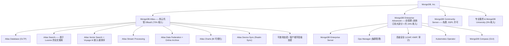
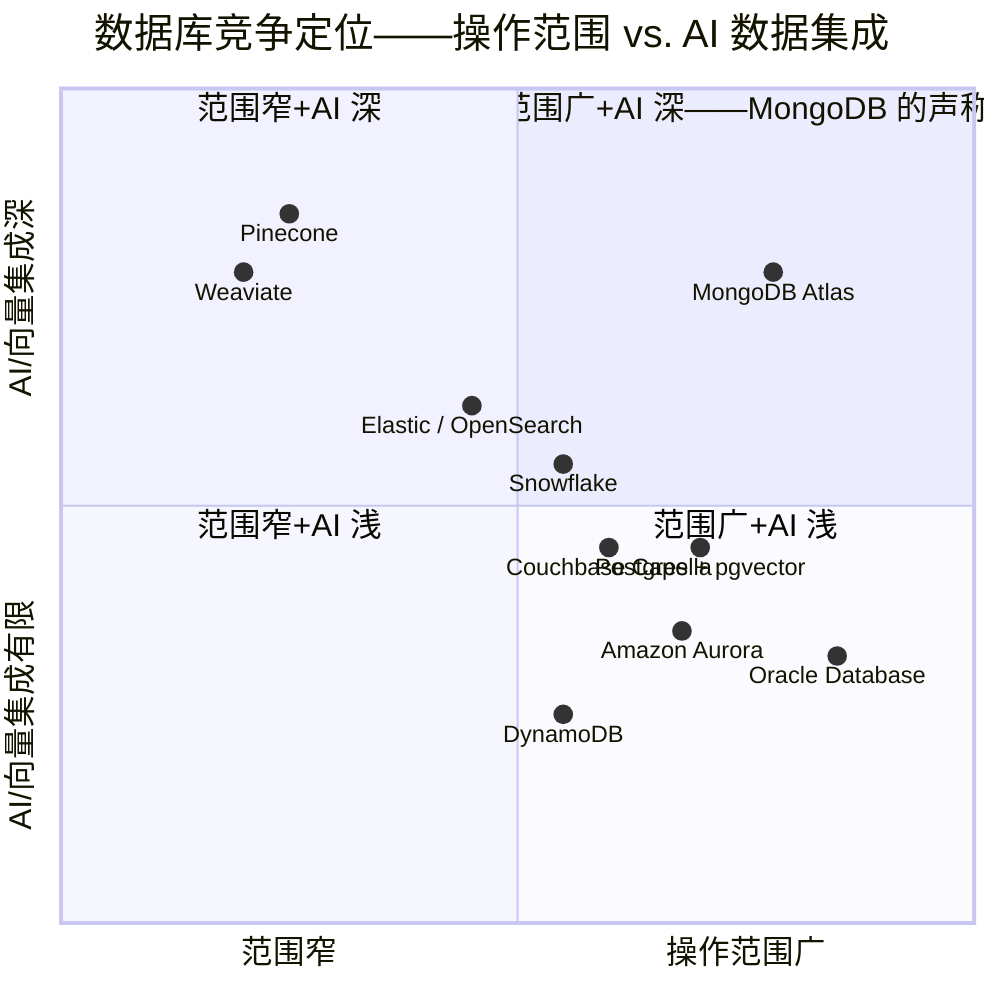

# MongoDB, Inc. (NASDAQ:MDB) — 公司研究报告

**截至日期: 2026-06-18**
**作者: financial_agent / company-research 技能**
**代码: NASDAQ:MDB | 财年截止: 1 月 31 日 (FY26 = 截至 2026 年 1 月 31 日的财年)**
**报告语言: 简体中文 (英文版同时存在于本目录)**

---

## 投资摘要 (Investment Summary) — *分析师观点 (Analyst view)*

> 本区块为本报告的本方观点 (house view)，是分析师基于已披露财务与行业数据构建的前瞻判断，**不是**任何 10-K / 备案文件中的内容；评级、目标价、前瞻估计与情景目标价均为分析师自身观点。

| 项目 | 数值 |
|---|---|
| **评级 (Rating)** | **Hold / 中性 (Neutral)** |
| **12 个月目标价 (Price Target)** | **$360** (12 个月) |
| **现价 (2026-06-18 收盘)** | **$332.75** |
| **隐含上行空间** | **+8.2%** |
| **估值方法** | 约 8× EV/FY28E Sales ≈ 55× FY27E non-GAAP EPS ($6.05)，与可比 SaaS 群组中位对齐 |
| **市值 (Market cap)** | **约 $267 亿美元** (80.43M 流通股 × $332.75) |
| **企业价值 (EV)** | 约 $244 亿美元 (市值 − $23.9 亿净现金) |
| **52 周区间** | $196.00 – $444.72 (现价较低点 +70%、较高点 −25%) |
| **TTM P/S / EV/Sales** | 约 10.3× / 9.4× (EV/FY27E Sales 约 8.3×) |
| **TTM 市盈率** | 不具意义 (GAAP TTM 仍微亏，非 GAAP 远期 P/E 约 55×) |

**论点支柱 (Thesis pillars) — *分析师观点*：**

1. **Q1 FY27 显著超预期且上调全年指引，叙事从"减速"翻转为"重新加速"。** 总收入 $687.6M (同比 +25%)、Atlas +29.4%、首次实现单季 GAAP 净利润 ($4.4M)、RPO $1,458.6M (+88%)；管理层将 FY27 收入指引从 3 月的 $28.6–29.0 亿上调至 **$29.2–29.6 亿**。这与上一版报告所基于的 3 月偏弱指引形成对照——基本面拐点已确认。
2. **稀缺的"20%+ 增长 + 20%+ FCF 利润率"组合，规则-40 (rule-of-40) 约 43%。** FY26 经营现金流 $505M、自由现金流约 $497M，非 GAAP 营业利润率约 19%——在软件中属罕见的增长-盈利双优。
3. **估值已从叙事溢价回归合理区间，但风险-回报对称。** 现价 EV/FY27E Sales 约 8.3×，低于十年中位约 16×，落入 SNOW/DDOG 群组之内；但 +70% 的反弹已消化了多数利好，进一步上行需要真正的 AI 工作负载放量。
4. **关键变量：(i) Atlas 增速能否守住 ~28%+；(ii) 新任 CEO CJ Desai 能否在守住开发者社区 DNA 的同时提升企业销售生产率。** 这两点决定 Hold 是上修还是下修。

> **业绩更新 (FY2027 Q1 上调指引，2026-05-28):** MongoDB 公布 Q1 FY27 业绩 **总收入 $687.6M (同比 +25%)、Atlas 收入同比 +29%、首次单季 GAAP 净利润 $4.4M (摊薄 EPS $0.05)、非 GAAP 摊薄 EPS $1.32 (同比 +32%)、RPO $1,458.6M (+88%)**，并**上调** FY27 全年指引至收入 **$29.2–29.6 亿** (此前 3 月为 $28.6–29.0 亿)、非 GAAP EPS **$5.95–6.14**、GAAP EPS **$0.15–0.39 (全年 GAAP 转盈)**。Q2 FY27 收入指引 **$729–734M**。这是相对 2026 年 3 月偏弱指引的明确改善，发布后股价短线震荡后基本收平 (同业 Snowflake 此前业绩更亮眼抬高了预期门槛)。
> 来源: [MongoDB Q1 FY2027 业绩公告, 2026-05-28](https://www.sec.gov/Archives/edgar/data/1441816/000162828026038798/mdb-043026xex991xrelease.htm); [MongoDB Q1 FY2027 10-Q, 2026-05-29](https://www.sec.gov/Archives/edgar/data/1441816/000162828026039150/mdb-20260430.htm)。

## 目录
1. 公司概览 (含 1A 估值快照 · 1B GF Score)
2. 估值与目标价 (Valuation & Price Target)
3. 公司历史
4. 管理团队
5. 产品与服务
6. 客户与上市策略
7. 行业概览
8. 竞争格局
9. 市场机会 (TAM)
10. 风险评估 (含 9.5 关键分歧与催化剂)
11. 投资视角评分 (Investor lenses)
12. 参考资料

---

## 1. 公司概览

MongoDB, Inc. 是总部设于纽约的**开发者数据平台 (developer data platform)** 公司，以 **MongoDB 文档数据库 (document database)** 商业化运营者身份为业界所知——该数据库为通用型操作数据库 (operational database)，以灵活的类 JSON 文档存储数据，而非固定的关系型表。公司的使命，如其 FY26 年度报告所述，是"通过释放软件与数据的力量，赋能开发者去创造、转型并颠覆各行各业"。其平台将操作数据库与多项集成服务 (搜索、向量搜索、时序、流处理、应用驱动分析、可查询加密) 结合，主要通过两个商业载体销售：**Atlas**——多云 (multi-cloud) 全托管数据库即服务 (DBaaS, Database-as-a-Service)，运行于 AWS、Google Cloud 与 Microsoft Azure 之上；以及 **MongoDB Enterprise Advanced (EA)**，为客户在自有数据中心或混合云中部署而设计的专有自管理软件包 ([MongoDB 10-K FY2026, "Our Products" 章节](https://www.sec.gov/Archives/edgar/data/0001441816/000162828026016799/mdb-20260131.htm))。

**商业模式。** MongoDB 营业收入约 **97% 来自基于期限或基于消费的订阅 (subscription)**，其余约 3% 来自专业服务。Atlas 采用**按消费计价 (consumption-priced)**——客户按集群实例小时数、存储量及数据传输量付费，自助用户无最低承诺额；企业客户日益采用预付承诺消费池模式。Enterprise Advanced 以年度或多年期定期许可证销售，捆绑商业版服务器、高级安全 (LDAP、静态加密、可查询加密)、Ops Manager、Compass、技术支持。FY26 按产品口径 **Atlas 占总收入 73%、EA 及其他订阅约 24%、服务 3%** ([MongoDB 10-K FY2026, MD&A — "Atlas represented 73% … of total revenue"](https://www.sec.gov/Archives/edgar/data/0001441816/000162828026016799/mdb-20260131.htm))。

<svg xmlns="http://www.w3.org/2000/svg" viewBox="0 0 1000 560" width="1000" height="560" role="img" aria-label="income statement Sankey"><rect x="0" y="0" width="1000" height="560" fill="#ffffff"/>
<text x="20.00" y="30.00" text-anchor="start" font-family="Helvetica,Arial,sans-serif" font-size="15" font-weight="700" fill="#1f2933">MongoDB FY26 利润表 Sankey ($M, GAAP)</text>
<path d="M 204.00,71.00 C 258.00,71.00 258.00,78.00 312.00,78.00 L 312.00,486.67 C 258.00,486.67 258.00,479.67 204.00,479.67 Z" fill="#93c5fd" fill-opacity="0.55"/>
<path d="M 452.00,71.00 C 506.00,71.00 506.00,117.88 560.00,117.88 L 560.00,119.88 C 506.00,119.88 506.00,73.00 452.00,73.00 Z" fill="#86efac" fill-opacity="0.55"/>
<path d="M 452.00,73.00 C 506.00,73.00 506.00,133.88 560.00,133.88 L 560.00,460.12 C 506.00,460.12 506.00,399.24 452.00,399.24 Z" fill="#fca5a5" fill-opacity="0.55"/>
<path d="M 328.00,78.00 C 382.00,78.00 382.00,71.00 436.00,71.00 L 436.00,373.78 C 382.00,373.78 382.00,380.78 328.00,380.78 Z" fill="#86efac" fill-opacity="0.55"/>
<path d="M 328.00,380.78 C 382.00,380.78 382.00,387.78 436.00,387.78 L 436.00,507.00 C 382.00,507.00 382.00,500.00 328.00,500.00 Z" fill="#fca5a5" fill-opacity="0.55"/>
<path d="M 700.00,110.88 C 754.00,110.88 754.00,279.68 808.00,279.68 L 808.00,281.68 C 754.00,281.68 754.00,112.88 700.00,112.88 Z" fill="#86efac" fill-opacity="0.55"/>
<path d="M 700.00,112.88 C 754.00,112.88 754.00,295.68 808.00,295.68 L 808.00,298.32 C 754.00,298.32 754.00,115.53 700.00,115.53 Z" fill="#fca5a5" fill-opacity="0.55"/>
<path d="M 576.00,117.88 C 630.00,117.88 630.00,110.88 684.00,110.88 L 684.00,112.88 C 630.00,112.88 630.00,119.88 576.00,119.88 Z" fill="#86efac" fill-opacity="0.55"/>
<path d="M 576.00,133.88 C 630.00,133.88 630.00,126.88 684.00,126.88 L 684.00,330.43 C 630.00,330.43 630.00,337.43 576.00,337.43 Z" fill="#fca5a5" fill-opacity="0.55"/>
<path d="M 576.00,337.43 C 630.00,337.43 630.00,344.43 684.00,344.43 L 684.00,467.12 C 630.00,467.12 630.00,460.12 576.00,460.12 Z" fill="#fca5a5" fill-opacity="0.55"/>
<path d="M 204.00,493.67 C 258.00,493.67 258.00,486.67 312.00,486.67 L 312.00,500.00 C 258.00,500.00 258.00,507.00 204.00,507.00 Z" fill="#93c5fd" fill-opacity="0.55"/>
<rect x="188.00" y="71.00" width="16" height="408.67" rx="1.5" fill="#2563eb"/>
<rect x="188.00" y="493.67" width="16" height="13.33" rx="1.5" fill="#2563eb"/>
<rect x="312.00" y="78.00" width="16" height="422.00" rx="1.5" fill="#1e3a8a"/>
<rect x="436.00" y="71.00" width="16" height="302.78" rx="1.5" fill="#15803d"/>
<rect x="436.00" y="387.78" width="16" height="119.22" rx="1.5" fill="#dc2626"/>
<rect x="560.00" y="117.88" width="16" height="2.00" rx="1.5" fill="#15803d"/>
<rect x="560.00" y="133.88" width="16" height="326.24" rx="1.5" fill="#dc2626"/>
<rect x="684.00" y="110.88" width="16" height="2.00" rx="1.5" fill="#15803d"/>
<rect x="684.00" y="126.88" width="16" height="203.55" rx="1.5" fill="#dc2626"/>
<rect x="684.00" y="344.43" width="16" height="122.69" rx="1.5" fill="#dc2626"/>
<rect x="808.00" y="279.68" width="16" height="2.00" rx="1.5" fill="#15803d"/>
<rect x="808.00" y="295.68" width="16" height="2.65" rx="1.5" fill="#dc2626"/>
<line x1="188.00" y1="275.34" x2="182.00" y2="262.00" stroke="#cbd5e1" stroke-width="1"/>
<text x="179.00" y="265.00" text-anchor="end" font-family="Helvetica,Arial,sans-serif" font-size="11.5" font-weight="700" fill="#1f2933">Subscription</text>
<text x="179.00" y="278.00" text-anchor="end" font-family="Helvetica,Arial,sans-serif" font-size="10" font-weight="400" fill="#52606d">$2.4B  (96.8%)</text>
<line x1="188.00" y1="500.34" x2="182.00" y2="487.00" stroke="#cbd5e1" stroke-width="1"/>
<text x="179.00" y="490.00" text-anchor="end" font-family="Helvetica,Arial,sans-serif" font-size="11.5" font-weight="700" fill="#1f2933">Services</text>
<text x="179.00" y="503.00" text-anchor="end" font-family="Helvetica,Arial,sans-serif" font-size="10" font-weight="400" fill="#52606d">$77.8M  (3.2%)</text>
<rect x="331.00" y="60.00" width="100.50" height="26" rx="2" fill="#ffffff" fill-opacity="0.72"/>
<text x="334.00" y="72.00" text-anchor="start" font-family="Helvetica,Arial,sans-serif" font-size="11.5" font-weight="700" fill="#1f2933">Revenue</text>
<text x="334.00" y="85.00" text-anchor="start" font-family="Helvetica,Arial,sans-serif" font-size="10" font-weight="400" fill="#52606d">$2.5B  (100.0%)</text>
<rect x="455.00" y="53.00" width="94.20" height="26" rx="2" fill="#ffffff" fill-opacity="0.72"/>
<text x="458.00" y="65.00" text-anchor="start" font-family="Helvetica,Arial,sans-serif" font-size="11.5" font-weight="700" fill="#1f2933">Gross Profit</text>
<text x="458.00" y="78.00" text-anchor="start" font-family="Helvetica,Arial,sans-serif" font-size="10" font-weight="400" fill="#52606d">$1.8B  (71.7%)</text>
<rect x="455.00" y="369.78" width="144.60" height="26" rx="2" fill="#ffffff" fill-opacity="0.72"/>
<text x="458.00" y="381.78" text-anchor="start" font-family="Helvetica,Arial,sans-serif" font-size="11.5" font-weight="700" fill="#1f2933">Cost of Revenue (COGS)</text>
<text x="458.00" y="394.78" text-anchor="start" font-family="Helvetica,Arial,sans-serif" font-size="10" font-weight="400" fill="#52606d">$696.1M  (28.3%)</text>
<rect x="579.00" y="99.88" width="113.10" height="26" rx="2" fill="#ffffff" fill-opacity="0.72"/>
<text x="582.00" y="111.88" text-anchor="start" font-family="Helvetica,Arial,sans-serif" font-size="11.5" font-weight="700" fill="#1f2933">Operating Income</text>
<text x="582.00" y="124.88" text-anchor="start" font-family="Helvetica,Arial,sans-serif" font-size="10" font-weight="400" fill="#52606d">-$137.0M  (-5.6%)</text>
<rect x="579.00" y="124.88" width="150.90" height="26" rx="2" fill="#ffffff" fill-opacity="0.72"/>
<text x="582.00" y="136.88" text-anchor="start" font-family="Helvetica,Arial,sans-serif" font-size="11.5" font-weight="700" fill="#1f2933">Total Operating Expense</text>
<text x="582.00" y="149.88" text-anchor="start" font-family="Helvetica,Arial,sans-serif" font-size="10" font-weight="400" fill="#52606d">$1.9B  (77.3%)</text>
<rect x="703.00" y="92.88" width="106.80" height="26" rx="2" fill="#ffffff" fill-opacity="0.72"/>
<text x="706.00" y="104.88" text-anchor="start" font-family="Helvetica,Arial,sans-serif" font-size="11.5" font-weight="700" fill="#1f2933">Pretax Income</text>
<text x="706.00" y="117.88" text-anchor="start" font-family="Helvetica,Arial,sans-serif" font-size="10" font-weight="400" fill="#52606d">-$55.7M  (-2.3%)</text>
<rect x="703.00" y="117.88" width="94.20" height="26" rx="2" fill="#ffffff" fill-opacity="0.72"/>
<text x="706.00" y="129.88" text-anchor="start" font-family="Helvetica,Arial,sans-serif" font-size="11.5" font-weight="700" fill="#1f2933">SG&amp;A</text>
<text x="706.00" y="142.88" text-anchor="start" font-family="Helvetica,Arial,sans-serif" font-size="10" font-weight="400" fill="#52606d">$1.2B  (48.2%)</text>
<rect x="703.00" y="326.43" width="106.80" height="26" rx="2" fill="#ffffff" fill-opacity="0.72"/>
<text x="706.00" y="338.43" text-anchor="start" font-family="Helvetica,Arial,sans-serif" font-size="11.5" font-weight="700" fill="#1f2933">R&amp;D</text>
<text x="706.00" y="351.43" text-anchor="start" font-family="Helvetica,Arial,sans-serif" font-size="10" font-weight="400" fill="#52606d">$716.3M  (29.1%)</text>
<text x="833.00" y="277.68" text-anchor="start" font-family="Helvetica,Arial,sans-serif" font-size="11.5" font-weight="700" fill="#1f2933">Net Income</text>
<text x="833.00" y="290.68" text-anchor="start" font-family="Helvetica,Arial,sans-serif" font-size="10" font-weight="400" fill="#52606d">-$71.2M  (-2.9%)</text>
<text x="833.00" y="302.68" text-anchor="start" font-family="Helvetica,Arial,sans-serif" font-size="11.5" font-weight="700" fill="#1f2933">Income Tax</text>
<text x="833.00" y="315.68" text-anchor="start" font-family="Helvetica,Arial,sans-serif" font-size="10" font-weight="400" fill="#52606d">$15.5M  (0.63%)</text>
<text x="500.00" y="530.00" text-anchor="middle" font-family="Helvetica,Arial,sans-serif" font-size="10" font-weight="400" font-style="italic" fill="#8a97a3">GAAP 经营亏损 1.370 亿美元 (-6% 收入); S&amp;M+G&amp;A 合并为销售管理费用 11.884 亿美元</text>
<text x="500.00" y="544.00" text-anchor="middle" font-family="Helvetica,Arial,sans-serif" font-size="10" font-weight="400" fill="#52606d">Source: MongoDB FY2026 10-K (FY ended 2026-01-31) — 合并经营报表</text>
</svg>

*来源: [MongoDB FY2026 10-K, 合并经营报表](https://www.sec.gov/Archives/edgar/data/0001441816/000162828026016799/mdb-20260131.htm)。GAAP 经营亏损 $137.0M (-6% 收入); 图中 S&M ($944.4M) 与 G&A ($244.0M) 合并显示为销售管理费用 $1,188.4M。*

**规模与地区分布。** FY26 营业收入升至 **$24.638 亿 (同比 +23%)**，上年 FY25 为 $20.064 亿、FY24 为 $16.830 亿。按地区，美洲区贡献 **$1,497.5M (61%)**、EMEA **$680.8M (28%)**、亚太 **$285.5M (12%)**；美国单一占总收入 54% ([MongoDB 10-K FY2026, 地理收入与 MD&A](https://www.sec.gov/Archives/edgar/data/0001441816/000162828026016799/mdb-20260131.htm))。MongoDB 在 FY26 末有 **5,636 名员工** (其中 2,927 人在美国境外)，**超过 65,200 家付费客户**分布于 100 多个国家，**2,799 家客户年度循环收入 (ARR) ≥$10 万** ([MongoDB 10-K FY2026, "Our Customers" 与 "Human Capital"](https://www.sec.gov/Archives/edgar/data/0001441816/000162828026016799/mdb-20260131.htm))。至 Q1 FY27 (2026-04-30)，付费客户已超 **67,700 家** (含 Atlas)、ARR≥$10 万客户增至 **2,895 家** (上年同期 2,506)，**净 ARR 扩张率约 121%** ([MongoDB Q1 FY2027 10-Q, 客户指标](https://www.sec.gov/Archives/edgar/data/1441816/000162828026039150/mdb-20260430.htm))。

<svg xmlns="http://www.w3.org/2000/svg" viewBox="0 0 720 460" width="720" height="460" role="img" aria-label="revenue donut"><rect x="0" y="0" width="720" height="460" fill="#ffffff"/>
<text x="20.00" y="30.00" text-anchor="start" font-family="Helvetica,Arial,sans-serif" font-size="15" font-weight="700" fill="#1f2933">MongoDB FY26 收入构成 (按产品, 合计 $2,463.8M)</text>
<path d="M 288.00,107.20 A 132 132 0 1 1 157.03,255.65 L 210.61,248.92 A 78 78 0 1 0 288.00,161.20 Z" fill="#2563eb"/>
<path d="M 157.03,255.65 A 132 132 0 0 1 261.92,109.80 L 272.59,162.74 A 78 78 0 0 0 210.61,248.92 Z" fill="#15803d"/>
<path d="M 261.92,109.80 A 132 132 0 0 1 288.00,107.20 L 288.00,161.20 A 78 78 0 0 0 272.59,162.74 Z" fill="#d97706"/>
<text x="288.00" y="235.20" text-anchor="middle" font-family="Helvetica,Arial,sans-serif" font-size="18" font-weight="800" fill="#1f2933">MDB</text>
<text x="288.00" y="255.20" text-anchor="middle" font-family="Helvetica,Arial,sans-serif" font-size="13" font-weight="600" fill="#52606d">$2.5B</text>
<text x="288.00" y="271.20" text-anchor="middle" font-family="Helvetica,Arial,sans-serif" font-size="10" font-weight="400" fill="#8a97a3">total</text>
<line x1="391.48" y1="330.50" x2="407.48" y2="330.50" stroke="#2563eb" stroke-width="1.4"/>
<text x="411.48" y="328.50" text-anchor="start" font-family="Helvetica,Arial,sans-serif" font-size="11" font-weight="700" fill="#1f2933">Atlas-related (73%)</text>
<text x="411.48" y="342.50" text-anchor="start" font-family="Helvetica,Arial,sans-serif" font-size="10" font-weight="400" fill="#52606d">$1.8B  (73.0%)</text>
<line x1="175.96" y1="158.63" x2="159.96" y2="158.63" stroke="#15803d" stroke-width="1.4"/>
<text x="155.96" y="156.63" text-anchor="end" font-family="Helvetica,Arial,sans-serif" font-size="11" font-weight="700" fill="#1f2933">EA &amp; other subscription (24%)</text>
<text x="155.96" y="170.63" text-anchor="end" font-family="Helvetica,Arial,sans-serif" font-size="10" font-weight="400" fill="#52606d">$587.0M  (23.8%)</text>
<line x1="274.30" y1="101.88" x2="258.30" y2="101.88" stroke="#d97706" stroke-width="1.4"/>
<text x="254.30" y="99.88" text-anchor="end" font-family="Helvetica,Arial,sans-serif" font-size="11" font-weight="700" fill="#1f2933">Services (3%)</text>
<text x="254.30" y="113.88" text-anchor="end" font-family="Helvetica,Arial,sans-serif" font-size="10" font-weight="400" fill="#52606d">$78.0M  (3.2%)</text>
<text x="360.00" y="444.00" text-anchor="middle" font-family="Helvetica,Arial,sans-serif" font-size="10" font-weight="400" fill="#52606d">Source: MongoDB FY2026 10-K (FY ended 2026-01-31) — Atlas=73%/EA+other=24%/Services=3% of revenue per MD&amp;A</text>
</svg>
<svg xmlns="http://www.w3.org/2000/svg" viewBox="0 0 720 460" width="720" height="460" role="img" aria-label="revenue donut"><rect x="0" y="0" width="720" height="460" fill="#ffffff"/>
<text x="20.00" y="30.00" text-anchor="start" font-family="Helvetica,Arial,sans-serif" font-size="15" font-weight="700" fill="#1f2933">MongoDB FY26 收入构成 (按地区, 合计 $2,463.8M)</text>
<path d="M 288.00,107.20 A 132 132 0 1 1 205.27,342.06 L 239.12,299.98 A 78 78 0 1 0 288.00,161.20 Z" fill="#2563eb"/>
<path d="M 205.27,342.06 A 132 132 0 0 1 200.16,140.67 L 236.10,180.98 A 78 78 0 0 0 239.12,299.98 Z" fill="#15803d"/>
<path d="M 200.16,140.67 A 132 132 0 0 1 288.00,107.20 L 288.00,161.20 A 78 78 0 0 0 236.10,180.98 Z" fill="#d97706"/>
<text x="288.00" y="235.20" text-anchor="middle" font-family="Helvetica,Arial,sans-serif" font-size="18" font-weight="800" fill="#1f2933">地区</text>
<text x="288.00" y="255.20" text-anchor="middle" font-family="Helvetica,Arial,sans-serif" font-size="13" font-weight="600" fill="#52606d">$2.5B</text>
<text x="288.00" y="271.20" text-anchor="middle" font-family="Helvetica,Arial,sans-serif" font-size="10" font-weight="400" fill="#8a97a3">total</text>
<line x1="418.16" y1="285.05" x2="434.16" y2="285.05" stroke="#2563eb" stroke-width="1.4"/>
<text x="438.16" y="283.05" text-anchor="start" font-family="Helvetica,Arial,sans-serif" font-size="11" font-weight="700" fill="#1f2933">Americas</text>
<text x="438.16" y="297.05" text-anchor="start" font-family="Helvetica,Arial,sans-serif" font-size="10" font-weight="400" fill="#52606d">$1.5B  (60.8%)</text>
<line x1="150.04" y1="242.70" x2="134.04" y2="242.70" stroke="#15803d" stroke-width="1.4"/>
<text x="130.04" y="240.70" text-anchor="end" font-family="Helvetica,Arial,sans-serif" font-size="11" font-weight="700" fill="#1f2933">EMEA</text>
<text x="130.04" y="254.70" text-anchor="end" font-family="Helvetica,Arial,sans-serif" font-size="10" font-weight="400" fill="#52606d">$680.8M  (27.6%)</text>
<line x1="238.86" y1="110.24" x2="222.86" y2="110.24" stroke="#d97706" stroke-width="1.4"/>
<text x="218.86" y="108.24" text-anchor="end" font-family="Helvetica,Arial,sans-serif" font-size="11" font-weight="700" fill="#1f2933">Asia Pacific</text>
<text x="218.86" y="122.24" text-anchor="end" font-family="Helvetica,Arial,sans-serif" font-size="10" font-weight="400" fill="#52606d">$285.5M  (11.6%)</text>
<text x="360.00" y="444.00" text-anchor="middle" font-family="Helvetica,Arial,sans-serif" font-size="10" font-weight="400" fill="#52606d">Source: MongoDB FY2026 10-K (FY ended 2026-01-31), filed 2026-03-11 — 地理收入说明</text>
</svg>

*来源: [MongoDB FY2026 10-K — 收入分解与地理收入说明](https://www.sec.gov/Archives/edgar/data/0001441816/000162828026016799/mdb-20260131.htm)。*

**盈利水平描述。** MongoDB 在 FY26 录得 **GAAP 营业亏损 $137.0M (-6% 收入)**，较 FY25 亏损 $216.1M (-11%) 与 FY24 亏损 $233.7M (-14%) 持续收窄；底线为**净亏损 $71.2M**。GAAP 与非 GAAP 之间的差距绝大部分来自**股权激励费用 (SBC, FY26 $550.5M，约占收入 22%)**——这是创始人/早期员工股权文化的结构性特征，并非一次性事件 ([MongoDB FY2026 10-K, MD&A 与 SBC 列表](https://www.sec.gov/Archives/edgar/data/0001441816/000162828026016799/mdb-20260131.htm))。现金流讲述了健康得多的故事：**FY26 经营性现金流 $505.1M (FY25 仅 $150.2M)**，按公司口径自由现金流 (FCF) 约 $497M，利润率约 20%。公司账上有约 $24 亿现金、等价物、短期投资及受限现金，董事会授权了股票回购 (FY26 已执行 $400.3M)。**最关键的转折是 Q1 FY27 首次实现单季 GAAP 净利润 $4.4M**，全年指引亦首次给出 GAAP 转盈区间——盈利路径已不再只是"非 GAAP 故事" ([MongoDB Q1 FY2027 业绩公告, 2026-05-28](https://www.sec.gov/Archives/edgar/data/1441816/000162828026038798/mdb-043026xex991xrelease.htm))。

<svg xmlns="http://www.w3.org/2000/svg" viewBox="0 0 860 470" width="860" height="470" role="img" aria-label="historical revenue bars"><rect x="0" y="0" width="860" height="470" fill="#ffffff"/>
<text x="20.00" y="30.00" text-anchor="start" font-family="Helvetica,Arial,sans-serif" font-size="15" font-weight="700" fill="#1f2933">MongoDB 收入历史 FY22–FY26 (Atlas vs 其余, $M)</text>
<rect x="20.00" y="44" width="11" height="11" rx="2" fill="#2563eb"/>
<text x="36.00" y="53.00" text-anchor="start" font-family="Helvetica,Arial,sans-serif" font-size="10.5" font-weight="400" fill="#1f2933">Atlas-related</text>
<rect x="135.80" y="44" width="11" height="11" rx="2" fill="#15803d"/>
<text x="151.80" y="53.00" text-anchor="start" font-family="Helvetica,Arial,sans-serif" font-size="10.5" font-weight="400" fill="#1f2933">EA + other + services</text>
<line x1="70" y1="412.00" x2="834" y2="412.00" stroke="#eceff2" stroke-width="1"/>
<text x="64.00" y="415.00" text-anchor="end" font-family="Helvetica,Arial,sans-serif" font-size="9.5" font-weight="400" fill="#52606d">$0</text>
<line x1="70" y1="345.20" x2="834" y2="345.20" stroke="#eceff2" stroke-width="1"/>
<text x="64.00" y="348.20" text-anchor="end" font-family="Helvetica,Arial,sans-serif" font-size="9.5" font-weight="400" fill="#52606d">$532.2M</text>
<line x1="70" y1="278.40" x2="834" y2="278.40" stroke="#eceff2" stroke-width="1"/>
<text x="64.00" y="281.40" text-anchor="end" font-family="Helvetica,Arial,sans-serif" font-size="9.5" font-weight="400" fill="#52606d">$1.1B</text>
<line x1="70" y1="211.60" x2="834" y2="211.60" stroke="#eceff2" stroke-width="1"/>
<text x="64.00" y="214.60" text-anchor="end" font-family="Helvetica,Arial,sans-serif" font-size="9.5" font-weight="400" fill="#52606d">$1.6B</text>
<line x1="70" y1="144.80" x2="834" y2="144.80" stroke="#eceff2" stroke-width="1"/>
<text x="64.00" y="147.80" text-anchor="end" font-family="Helvetica,Arial,sans-serif" font-size="9.5" font-weight="400" fill="#52606d">$2.1B</text>
<line x1="70" y1="78.00" x2="834" y2="78.00" stroke="#eceff2" stroke-width="1"/>
<text x="64.00" y="81.00" text-anchor="end" font-family="Helvetica,Arial,sans-serif" font-size="9.5" font-weight="400" fill="#52606d">$2.7B</text>
<rect x="102.09" y="348.37" width="88.62" height="63.63" fill="#2563eb"/>
<rect x="102.09" y="302.30" width="88.62" height="46.06" fill="#15803d"/>
<text x="146.40" y="428.00" text-anchor="middle" font-family="Helvetica,Arial,sans-serif" font-size="10" font-weight="400" fill="#52606d">FY22</text>
<rect x="254.89" y="307.20" width="88.62" height="104.80" fill="#2563eb"/>
<rect x="254.89" y="250.84" width="88.62" height="56.35" fill="#15803d"/>
<text x="299.20" y="428.00" text-anchor="middle" font-family="Helvetica,Arial,sans-serif" font-size="10" font-weight="400" fill="#52606d">FY23</text>
<rect x="407.69" y="272.56" width="88.62" height="139.44" fill="#2563eb"/>
<rect x="407.69" y="200.76" width="88.62" height="71.79" fill="#15803d"/>
<text x="452.00" y="428.00" text-anchor="middle" font-family="Helvetica,Arial,sans-serif" font-size="10" font-weight="400" fill="#52606d">FY24</text>
<rect x="560.49" y="235.78" width="88.62" height="176.22" fill="#2563eb"/>
<rect x="560.49" y="160.22" width="88.62" height="75.56" fill="#15803d"/>
<text x="604.80" y="428.00" text-anchor="middle" font-family="Helvetica,Arial,sans-serif" font-size="10" font-weight="400" fill="#52606d">FY25</text>
<rect x="713.29" y="186.21" width="88.62" height="225.79" fill="#2563eb"/>
<rect x="713.29" y="102.74" width="88.62" height="83.46" fill="#15803d"/>
<text x="757.60" y="428.00" text-anchor="middle" font-family="Helvetica,Arial,sans-serif" font-size="10" font-weight="400" fill="#52606d">FY26</text>
<text x="430.00" y="454.00" text-anchor="middle" font-family="Helvetica,Arial,sans-serif" font-size="10" font-weight="400" fill="#52606d">Source: MongoDB 10-K FY2024/FY2026 — Atlas% x 总收入 (Atlas 66/70/73% FY24-26)</text>
</svg>

*来源: [MongoDB 10-K FY2026](https://www.sec.gov/Archives/edgar/data/0001441816/000162828026016799/mdb-20260131.htm) 与 [10-K FY2024](https://www.sec.gov/cgi-bin/browse-edgar?action=getcompany&CIK=0001441816&type=10-K)；Atlas 收入按披露占比 (FY24/25/26 = 66%/70%/73%) × 各年总收入估算。*

### 1A. 估值快照 (截至 2026-06-18)

MDB 在 2026-06-18 收盘 **$332.75**，对应市值 **约 $267 亿** (80.43M 流通股) 与企业价值 **约 $244 亿** (扣除约 $23.9 亿净现金；公司无实质性债务，仅小额融资租赁)。第三方数据汇总参考 ([Stockanalysis MDB 统计, 2026-06](https://stockanalysis.com/stocks/mdb/statistics/); [GuruFocus EV/Revenue MDB](https://www.gurufocus.com/term/enterprise-value-to-revenue/MDB)):

- **TTM 市盈率：不具意义。** GAAP TTM 仍微亏 (Q1 FY27 已转正，但 TTM 滚动仍含 FY26 亏损季)；亏损主要由 **$550.5M SBC (占收入 22%)**、市场开拓投入 (S&M $944.4M，占收入 38%) 与研发 (R&D $716.3M，29%) 驱动——既非减值、也非周期性事件。约 $497M 的 FCF 显示即便 GAAP 亏损公司也已舒适自给自足；剔除 SBC，公司明确盈利 (FY26 非 GAAP 营业利润率约 19%) ([MongoDB FY2026 10-K, MD&A](https://www.sec.gov/Archives/edgar/data/0001441816/000162828026016799/mdb-20260131.htm))。
- **TTM 市销率 (P/S) 约 10.3×、EV/Sales 约 9.4×、EV/FY27E Sales 约 8.3×。** GuruFocus 历史显示 MDB EV/Revenue 远低于十年中位约 16×，反映自 2021 年零利率峰值期 (当时按 30–40× 销售估值) 以来的多年估值下行 ([Macrotrends MDB P/S 历史](https://www.macrotrends.net/stocks/charts/MDB/mongodb/price-sales))。
- **远期市盈率约 55×** (按 FY27 非 GAAP EPS 指引中值 $6.05 计) ([GuruFocus 远期 PE, 2026-06](https://www.gurufocus.com/term/forward-pe-ratio/MDB))。

**同业可比 (TTM P/S, 2026-06 快照；均为按消费/订阅计价的云数据平台):**

| 代码 | 公司 | LTM 营业收入 | 最近季度增速 | TTM P/S | 备注 |
|---|---|---|---|---|---|
| MDB | MongoDB | 约 $26.0 亿 | +25% (Q1 FY27) → FY27 指引约 19% | **约 10×** | 增长-盈利双优; FCF 利润率约 20% |
| SNOW | Snowflake | $40+ 亿 | +30%+ | 约 13–15× | 估值溢价; 再加速主线 |
| DDOG | Datadog | $34+ 亿 | +30%+ | 约 11–13× | 群组中 FCF 利润率最高 |
| CFLT | Confluent | 约 $12 亿 | +19% | 约 8–9× | 2026-03 被 IBM 收购——倍数即退出价 |
| ESTC | Elastic | $16.8 亿 | +15–16% | 约 4–5× | 增速最慢, 倍数最低 |

来源: [Stockanalysis MDB 统计](https://stockanalysis.com/stocks/mdb/statistics/)、[GuruFocus CFLT P/S](https://www.gurufocus.com/term/ps-ratio/CFLT)、[Stockanalysis ESTC](https://stockanalysis.com/stocks/estc/statistics/)、[Snowflake FY26 Q4 8-K](https://www.sec.gov/Archives/edgar/data/0001640147/000162828026011631/fy2026q4earnings.htm)、[Datadog Q1 2026 8-K](https://www.sec.gov/Archives/edgar/data/0001561550/000162828026031677/ex-991x20260331x8k.htm)。

**估值倍数结论。** MDB 已不再享有*叙事性*估值溢价；EV/FY27E Sales 约 8.3× 落入 SNOW/DDOG 群组之内 (*低于*二者)，考虑约 19% 的 FY27 指引增速，增长调整后的 P/S 折价并不极端。当前估值在为 (a) 超过 20% 增速同时实现约 20% FCF 利润率的稀有组合 (FY26 剔除 SBC 后 rule-of-40 约 43%)、(b) Atlas 作为代理型 AI (agentic AI) 应用 OLTP 层的定位选项价值、(c) 数据库市场被视为现代厂商赢家通吃格局下的战略资产竞价。在没有真正再加速的情况下，P/S > 15× 难以辩护；当前约 10× 更接近合理区间——这正是给出 Hold 而非 Buy 的核心理由。

### 1B. GF Score (GuruFocus 式基本面评分) — *分析师观点*

<svg xmlns="http://www.w3.org/2000/svg" viewBox="0 0 500 500" width="500" height="500" role="img" aria-label="GF Score radar">
<rect x="0" y="0" width="500" height="500" fill="#ffffff"/>
<text x="20" y="24" font-family="Helvetica,Arial,sans-serif" font-size="15" font-weight="700" fill="#1f2933">GF Score (GuruFocus-style): 68/100</text>
<text x="20" y="41" font-family="Helvetica,Arial,sans-serif" font-size="11" fill="#52606d">51–70 Poor future performance potential</text>
<polygon points="250.0,88.0 392.7,191.6 338.2,359.4 161.8,359.4 107.3,191.6" fill="#e9f5ec" stroke="none"/>
<polygon points="250.0,208.0 278.5,228.7 267.6,262.3 232.4,262.3 221.5,228.7" fill="none" stroke="#c5d3cb" stroke-width="1"/>
<polygon points="250.0,178.0 307.1,219.5 285.3,286.5 214.7,286.5 192.9,219.5" fill="none" stroke="#c5d3cb" stroke-width="1"/>
<polygon points="250.0,148.0 335.6,210.2 302.9,310.8 197.1,310.8 164.4,210.2" fill="none" stroke="#c5d3cb" stroke-width="1"/>
<polygon points="250.0,118.0 364.1,200.9 320.5,335.1 179.5,335.1 135.9,200.9" fill="none" stroke="#c5d3cb" stroke-width="1"/>
<polygon points="250.0,88.0 392.7,191.6 338.2,359.4 161.8,359.4 107.3,191.6" fill="none" stroke="#c5d3cb" stroke-width="1.3"/>
<line x1="250" y1="238" x2="161.8" y2="359.4" stroke="#cfdad3" stroke-width="1"/>
<text x="146.5" y="392.4" text-anchor="end" font-family="Helvetica,Arial,sans-serif" font-size="11.5" font-weight="600" fill="#1f2933">财务实力</text>
<text x="170.6" y="341.2" text-anchor="middle" font-family="Helvetica,Arial,sans-serif" font-size="10.5" font-weight="700" fill="#1f2933">9</text>
<line x1="250" y1="238" x2="250.0" y2="88.0" stroke="#cfdad3" stroke-width="1"/>
<text x="250.0" y="58.0" text-anchor="middle" font-family="Helvetica,Arial,sans-serif" font-size="11.5" font-weight="600" fill="#1f2933">盈利能力</text>
<text x="250.0" y="157.0" text-anchor="middle" font-family="Helvetica,Arial,sans-serif" font-size="10.5" font-weight="700" fill="#1f2933">5</text>
<line x1="250" y1="238" x2="107.3" y2="191.6" stroke="#cfdad3" stroke-width="1"/>
<text x="82.6" y="183.6" text-anchor="end" font-family="Helvetica,Arial,sans-serif" font-size="11.5" font-weight="600" fill="#1f2933">成长性</text>
<text x="135.9" y="194.9" text-anchor="middle" font-family="Helvetica,Arial,sans-serif" font-size="10.5" font-weight="700" fill="#1f2933">8</text>
<line x1="250" y1="238" x2="392.7" y2="191.6" stroke="#cfdad3" stroke-width="1"/>
<text x="417.4" y="183.6" text-anchor="start" font-family="Helvetica,Arial,sans-serif" font-size="11.5" font-weight="600" fill="#1f2933">估值</text>
<text x="321.3" y="208.8" text-anchor="middle" font-family="Helvetica,Arial,sans-serif" font-size="10.5" font-weight="700" fill="#1f2933">5</text>
<line x1="250" y1="238" x2="338.2" y2="359.4" stroke="#cfdad3" stroke-width="1"/>
<text x="353.5" y="392.4" text-anchor="start" font-family="Helvetica,Arial,sans-serif" font-size="11.5" font-weight="600" fill="#1f2933">动量</text>
<text x="311.7" y="316.9" text-anchor="middle" font-family="Helvetica,Arial,sans-serif" font-size="10.5" font-weight="700" fill="#1f2933">7</text>
<polygon points="250.0,163.0 321.3,214.8 311.7,322.9 170.6,347.2 135.9,200.9" fill="#2e8b57" fill-opacity="0.34" stroke="#2e8b57" stroke-width="2"/>
<circle cx="170.6" cy="347.2" r="2.6" fill="#2e8b57"/>
<circle cx="250.0" cy="163.0" r="2.6" fill="#2e8b57"/>
<circle cx="135.9" cy="200.9" r="2.6" fill="#2e8b57"/>
<circle cx="321.3" cy="214.8" r="2.6" fill="#2e8b57"/>
<circle cx="311.7" cy="322.9" r="2.6" fill="#2e8b57"/>
<text x="250" y="470" text-anchor="middle" font-family="Helvetica,Arial,sans-serif" font-size="9.5" fill="#52606d">Source: MongoDB FY2026 10-K + Q1 FY27 8-K · yfinance (2026-06-18) · indicators.db</text>
<text x="250" y="485" text-anchor="middle" font-family="Helvetica,Arial,sans-serif" font-size="9" fill="#52606d">GF Score = independent analyst rubric (*Analyst view:*) — not GuruFocus™ official number</text>
</svg>

| 维度 | 评分 (0–10) | |
|---|---|---|
| 财务实力 | 9 | `█████████░` |
| 盈利能力 | 5 | `█████░░░░░` |
| 成长性 | 8 | `████████░░` |
| 估值 | 5 | `█████░░░░░` |
| 动量 | 7 | `███████░░░` |
| **GF Score (composite, *Analyst view:*)** | **68 / 100** | **51–70 Poor future performance potential** |

*Composite weights (*Analyst view:*): Financial Strength 20% · Profitability 25% · Growth 25% · GF Value 15% · Momentum 15% (transparent reproduction — not GuruFocus's proprietary weighting).*

> GF Score 为分析师自有评分框架 (GuruFocus 式)，五个维度各 0–10、合成 0–100；**不归属于 GuruFocus、不附带备案引用**；下方每个维度的支撑指标均带各自的一手引用。MDB 合成得分 **68 / 100** ("中等" 区间)——这是一家"质量高但 GAAP 仍刚转盈、增速放缓"的成长股的合理画像。

- **Financial Strength (财务实力) = 9/10。** 资产负债表近乎无懈可击：FY26 末现金+短期投资 **$2,387.2M**、无实质性债务 (仅小额融资租赁，FY26 本金支付 $7.5M)，净现金状态；账上约 $24 亿流动性。利息覆盖不适用 (无债)。唯一扣分项是 SBC 带来的持续股本扩张 ([MongoDB FY2026 10-K, 合并资产负债表与现金流量表](https://www.sec.gov/Archives/edgar/data/0001441816/000162828026016799/mdb-20260131.htm))。
- **Profitability (盈利能力) = 5/10。** 双面性：gross margin (毛利率) 72%、非 GAAP 营业利润率约 19% 优秀，但 GAAP 营业利润率仍 -6% (亏损)、GAAP ROE 为负。Q1 FY27 GAAP 转盈是关键改善，但全年 GAAP 利润率仍仅约 0–1%。剔除 SBC 后明确盈利，但 GAAP 维度拉低评分 ([MongoDB FY2026 10-K, MD&A](https://www.sec.gov/Archives/edgar/data/0001441816/000162828026016799/mdb-20260131.htm))。
- **Growth (成长性) = 8/10。** FY26 收入 +23%、Q1 FY27 +25%、Atlas +29%；3 年收入 CAGR 约 26% (FY23 $1,284M → FY26 $2,464M)，前瞻指引约 19%。RPO +88% 显示订单可见度大幅改善。增速虽较疫后 50%+ 减速，但绝对水平仍在软件第一梯队 ([MongoDB Q1 FY2027 业绩公告](https://www.sec.gov/Archives/edgar/data/1441816/000162828026038798/mdb-043026xex991xrelease.htm))。
- **GF Value (估值, 越高越便宜) = 5/10。** EV/FY27E Sales 约 8.3× 低于自身十年中位约 16×，但高于宽口径软件中位 (约 5–6×)；目标价隐含上行仅约 +8%。相对历史便宜、相对行业不算便宜——中性 ([Macrotrends MDB P/S 历史](https://www.macrotrends.net/stocks/charts/MDB/mongodb/price-sales))。
- **Momentum (动量) = 7/10。** 现价 $332.75 较 52 周低点 $196 上涨约 +70%、较高点 $444.72 下跌约 -25%；6/12 个月绝对回报强劲，但 5–6 月有回撤。动量良好但非极端 ([yfinance MDB 历史价, 2026-06-18](https://finance.yahoo.com/quote/MDB/))。

---

## 2. 估值与目标价 (Valuation & Price Target) — *分析师观点*

> 本章所有前瞻数字 (估计、目标价、情景) 均为分析师自身观点 (*Analyst view*)，**不附带任何备案引用**；每个驱动假设的外部依据 (备案分部数据 + 管理层指引 + 行业预测) 在文内单独引用。

### 2a. 前瞻财务模型 (3 年) — *分析师观点*

| 财年 (1 月止) | 收入 ($M) | YoY | non-GAAP 营业利润率 | non-GAAP EPS | 说明 |
|---|---|---|---|---|---|
| FY26A (实际) | 2,463.8 | +23% | 约 19% | — | [10-K FY26 实绩](https://www.sec.gov/Archives/edgar/data/0001441816/000162828026016799/mdb-20260131.htm) |
| FY27E | 2,940 | +19% | 约 19–20% | 6.05 | 管理层指引中值 ([Q1 FY27 业绩公告](https://www.sec.gov/Archives/edgar/data/1441816/000162828026038798/mdb-043026xex991xrelease.htm)) |
| FY28E | 3,440 | +17% | 约 21% | 约 7.10 | Atlas 维持约 25%、EA 中个位数；经营杠杆 |
| FY29E | 3,956 | +15% | 约 22% | 约 8.30 | 基数扩张下增速逐步减速 |

模型基础：FY27 直接采用管理层**上调后**的全年指引 (收入 $29.2–29.6 亿、非 GAAP EPS $5.95–6.14；[Q1 FY27 业绩公告, 2026-05-28](https://www.sec.gov/Archives/edgar/data/1441816/000162828026038798/mdb-043026xex991xrelease.htm))；FY28–FY29 按 Atlas 增速逐步从约 25% 滑向约 22%、EA 维持中个位数、专业服务约 +20% 求和，毛利率维持约 72–74%、营业利润率受经营杠杆驱动每年扩张约 100–150bp。每个分部路径的外部锚点为 FY26 10-K 分部数据与管理层在 2025 年 9 月投资者日重申的"Atlas 增长 >20% + FCF 利润率 >20%"持久算法 ([投资者日 8-K, 2025-09-17](https://www.sec.gov/Archives/edgar/data/0001441816/000144181625000197/main-investorday2025pres.htm))。

<svg xmlns="http://www.w3.org/2000/svg" viewBox="0 0 1240 540" width="1240" height="540" role="img" aria-label="DuPont ROE decomposition"><rect x="0" y="0" width="1240" height="540" fill="#ffffff"/>
<text x="20.00" y="30.00" text-anchor="start" font-family="Helvetica,Arial,sans-serif" font-size="15" font-weight="700" fill="#1f2933">MongoDB FY26 杜邦分解 (GAAP, ROE 为负)</text>
<rect x="545.00" y="56.00" width="150" height="56" rx="7" fill="#1e3a8a"/>
<text x="620.00" y="76.00" text-anchor="middle" font-family="Helvetica,Arial,sans-serif" font-size="11.5" font-weight="700" fill="#ffffff">ROE</text>
<text x="620.00" y="94.00" text-anchor="middle" font-family="Helvetica,Arial,sans-serif" font-size="13" font-weight="800" fill="#ffffff">-2.48%</text>
<text x="620.00" y="106.00" text-anchor="middle" font-family="Helvetica,Arial,sans-serif" font-size="8.5" font-weight="400" fill="#dbeafe">= Net Income / Avg Equity</text>
<rect x="191.60" y="168.00" width="150" height="56" rx="7" fill="#2563eb"/>
<text x="266.60" y="188.00" text-anchor="middle" font-family="Helvetica,Arial,sans-serif" font-size="11.5" font-weight="700" fill="#ffffff">Net Margin</text>
<text x="266.60" y="206.00" text-anchor="middle" font-family="Helvetica,Arial,sans-serif" font-size="13" font-weight="800" fill="#ffffff">-2.89%</text>
<text x="266.60" y="218.00" text-anchor="middle" font-family="Helvetica,Arial,sans-serif" font-size="8.5" font-weight="400" fill="#dbeafe">Net Income / Revenue</text>
<line x1="620.00" y1="112.00" x2="266.60" y2="168.00" stroke="#94a3b8" stroke-width="1.4"/>
<rect x="545.00" y="168.00" width="150" height="56" rx="7" fill="#2563eb"/>
<text x="620.00" y="188.00" text-anchor="middle" font-family="Helvetica,Arial,sans-serif" font-size="11.5" font-weight="700" fill="#ffffff">Asset Turnover</text>
<text x="620.00" y="206.00" text-anchor="middle" font-family="Helvetica,Arial,sans-serif" font-size="13" font-weight="800" fill="#ffffff">0.69</text>
<text x="620.00" y="218.00" text-anchor="middle" font-family="Helvetica,Arial,sans-serif" font-size="8.5" font-weight="400" fill="#dbeafe">Revenue / Avg Assets</text>
<line x1="620.00" y1="112.00" x2="620.00" y2="168.00" stroke="#94a3b8" stroke-width="1.4"/>
<rect x="898.40" y="168.00" width="150" height="56" rx="7" fill="#2563eb"/>
<text x="973.40" y="188.00" text-anchor="middle" font-family="Helvetica,Arial,sans-serif" font-size="11.5" font-weight="700" fill="#ffffff">Equity Multiplier</text>
<text x="973.40" y="206.00" text-anchor="middle" font-family="Helvetica,Arial,sans-serif" font-size="13" font-weight="800" fill="#ffffff">1.25</text>
<text x="973.40" y="218.00" text-anchor="middle" font-family="Helvetica,Arial,sans-serif" font-size="8.5" font-weight="400" fill="#dbeafe">Avg Assets / Avg Equity</text>
<line x1="620.00" y1="112.00" x2="973.40" y2="168.00" stroke="#94a3b8" stroke-width="1.4"/>
<circle cx="443.30" cy="196.00" r="11" fill="#ffffff" stroke="#94a3b8" stroke-width="1.2"/>
<text x="443.30" y="201.00" text-anchor="middle" font-family="Helvetica,Arial,sans-serif" font-size="14" font-weight="800" fill="#52606d">×</text>
<circle cx="796.70" cy="196.00" r="11" fill="#ffffff" stroke="#94a3b8" stroke-width="1.2"/>
<text x="796.70" y="201.00" text-anchor="middle" font-family="Helvetica,Arial,sans-serif" font-size="14" font-weight="800" fill="#52606d">×</text>
<rect x="65.00" y="300.00" width="118" height="56" rx="7" fill="#2563eb"/>
<text x="124.00" y="320.00" text-anchor="middle" font-family="Helvetica,Arial,sans-serif" font-size="11.5" font-weight="700" fill="#ffffff">Operating Margin</text>
<text x="124.00" y="338.00" text-anchor="middle" font-family="Helvetica,Arial,sans-serif" font-size="13" font-weight="800" fill="#ffffff">-5.56%</text>
<text x="124.00" y="350.00" text-anchor="middle" font-family="Helvetica,Arial,sans-serif" font-size="8.5" font-weight="400" fill="#dbeafe">Op Inc / Revenue</text>
<line x1="266.60" y1="224.00" x2="124.00" y2="300.00" stroke="#94a3b8" stroke-width="1.4"/>
<rect x="207.60" y="300.00" width="118" height="56" rx="7" fill="#2563eb"/>
<text x="266.60" y="320.00" text-anchor="middle" font-family="Helvetica,Arial,sans-serif" font-size="11.5" font-weight="700" fill="#ffffff">Tax Burden</text>
<text x="266.60" y="338.00" text-anchor="middle" font-family="Helvetica,Arial,sans-serif" font-size="13" font-weight="800" fill="#ffffff">1.2776</text>
<text x="266.60" y="350.00" text-anchor="middle" font-family="Helvetica,Arial,sans-serif" font-size="8.5" font-weight="400" fill="#dbeafe">Net Inc / Pretax</text>
<line x1="266.60" y1="224.00" x2="266.60" y2="300.00" stroke="#94a3b8" stroke-width="1.4"/>
<rect x="350.20" y="300.00" width="118" height="56" rx="7" fill="#2563eb"/>
<text x="409.20" y="320.00" text-anchor="middle" font-family="Helvetica,Arial,sans-serif" font-size="11.5" font-weight="700" fill="#ffffff">Interest Burden</text>
<text x="409.20" y="338.00" text-anchor="middle" font-family="Helvetica,Arial,sans-serif" font-size="13" font-weight="800" fill="#ffffff">0.4066</text>
<text x="409.20" y="350.00" text-anchor="middle" font-family="Helvetica,Arial,sans-serif" font-size="8.5" font-weight="400" fill="#dbeafe">Pretax / Op Inc</text>
<line x1="266.60" y1="224.00" x2="409.20" y2="300.00" stroke="#94a3b8" stroke-width="1.4"/>
<circle cx="195.30" cy="328.00" r="11" fill="#ffffff" stroke="#94a3b8" stroke-width="1.2"/>
<text x="195.30" y="333.00" text-anchor="middle" font-family="Helvetica,Arial,sans-serif" font-size="14" font-weight="800" fill="#52606d">×</text>
<circle cx="337.90" cy="328.00" r="11" fill="#ffffff" stroke="#94a3b8" stroke-width="1.2"/>
<text x="337.90" y="333.00" text-anchor="middle" font-family="Helvetica,Arial,sans-serif" font-size="14" font-weight="800" fill="#52606d">×</text>
<rect x="479.00" y="300.00" width="118" height="56" rx="7" fill="#2563eb"/>
<text x="538.00" y="326.00" text-anchor="middle" font-family="Helvetica,Arial,sans-serif" font-size="11.5" font-weight="700" fill="#ffffff">Revenue</text>
<text x="538.00" y="342.00" text-anchor="middle" font-family="Helvetica,Arial,sans-serif" font-size="13" font-weight="800" fill="#ffffff">$2.5B</text>
<line x1="620.00" y1="224.00" x2="538.00" y2="300.00" stroke="#94a3b8" stroke-width="1.4"/>
<rect x="643.00" y="300.00" width="118" height="56" rx="7" fill="#2563eb"/>
<text x="702.00" y="320.00" text-anchor="middle" font-family="Helvetica,Arial,sans-serif" font-size="11.5" font-weight="700" fill="#ffffff">Avg Total Assets</text>
<text x="702.00" y="338.00" text-anchor="middle" font-family="Helvetica,Arial,sans-serif" font-size="13" font-weight="800" fill="#ffffff">$3.6B</text>
<text x="702.00" y="350.00" text-anchor="middle" font-family="Helvetica,Arial,sans-serif" font-size="8.5" font-weight="400" fill="#dbeafe">(begin+end)/2</text>
<line x1="620.00" y1="224.00" x2="702.00" y2="300.00" stroke="#94a3b8" stroke-width="1.4"/>
<circle cx="620.00" cy="328.00" r="11" fill="#ffffff" stroke="#94a3b8" stroke-width="1.2"/>
<text x="620.00" y="333.00" text-anchor="middle" font-family="Helvetica,Arial,sans-serif" font-size="14" font-weight="800" fill="#52606d">÷</text>
<rect x="832.40" y="300.00" width="118" height="56" rx="7" fill="#2563eb"/>
<text x="891.40" y="320.00" text-anchor="middle" font-family="Helvetica,Arial,sans-serif" font-size="11.5" font-weight="700" fill="#ffffff">Avg Total Assets</text>
<text x="891.40" y="338.00" text-anchor="middle" font-family="Helvetica,Arial,sans-serif" font-size="13" font-weight="800" fill="#ffffff">$3.6B</text>
<text x="891.40" y="350.00" text-anchor="middle" font-family="Helvetica,Arial,sans-serif" font-size="8.5" font-weight="400" fill="#dbeafe">(begin+end)/2</text>
<line x1="973.40" y1="224.00" x2="891.40" y2="300.00" stroke="#94a3b8" stroke-width="1.4"/>
<rect x="996.40" y="300.00" width="118" height="56" rx="7" fill="#2563eb"/>
<text x="1055.40" y="320.00" text-anchor="middle" font-family="Helvetica,Arial,sans-serif" font-size="11.5" font-weight="700" fill="#ffffff">Avg Total Equity</text>
<text x="1055.40" y="338.00" text-anchor="middle" font-family="Helvetica,Arial,sans-serif" font-size="13" font-weight="800" fill="#ffffff">$2.9B</text>
<text x="1055.40" y="350.00" text-anchor="middle" font-family="Helvetica,Arial,sans-serif" font-size="8.5" font-weight="400" fill="#dbeafe">(begin+end)/2</text>
<line x1="973.40" y1="224.00" x2="1055.40" y2="300.00" stroke="#94a3b8" stroke-width="1.4"/>
<circle cx="967.20" cy="328.00" r="11" fill="#ffffff" stroke="#94a3b8" stroke-width="1.2"/>
<text x="967.20" y="333.00" text-anchor="middle" font-family="Helvetica,Arial,sans-serif" font-size="14" font-weight="800" fill="#52606d">÷</text>
<rect x="69.00" y="420.00" width="110" height="48" rx="7" fill="#3b82f6"/>
<text x="124.00" y="442.00" text-anchor="middle" font-family="Helvetica,Arial,sans-serif" font-size="11.5" font-weight="700" fill="#ffffff">Operating Income</text>
<text x="124.00" y="458.00" text-anchor="middle" font-family="Helvetica,Arial,sans-serif" font-size="13" font-weight="800" fill="#ffffff">-$137.0M</text>
<line x1="124.00" y1="356.00" x2="124.00" y2="420.00" stroke="#94a3b8" stroke-width="1.4"/>
<rect x="211.60" y="420.00" width="110" height="48" rx="7" fill="#3b82f6"/>
<text x="266.60" y="442.00" text-anchor="middle" font-family="Helvetica,Arial,sans-serif" font-size="11.5" font-weight="700" fill="#ffffff">Net Income</text>
<text x="266.60" y="458.00" text-anchor="middle" font-family="Helvetica,Arial,sans-serif" font-size="13" font-weight="800" fill="#ffffff">-$71.2M</text>
<line x1="266.60" y1="356.00" x2="266.60" y2="420.00" stroke="#94a3b8" stroke-width="1.4"/>
<rect x="354.20" y="420.00" width="110" height="48" rx="7" fill="#3b82f6"/>
<text x="409.20" y="442.00" text-anchor="middle" font-family="Helvetica,Arial,sans-serif" font-size="11.5" font-weight="700" fill="#ffffff">Pretax Income</text>
<text x="409.20" y="458.00" text-anchor="middle" font-family="Helvetica,Arial,sans-serif" font-size="13" font-weight="800" fill="#ffffff">-$55.7M</text>
<line x1="409.20" y1="356.00" x2="409.20" y2="420.00" stroke="#94a3b8" stroke-width="1.4"/>
<text x="620.00" y="510.00" text-anchor="middle" font-family="Helvetica,Arial,sans-serif" font-size="10" font-weight="400" font-style="italic" fill="#8a97a3">GAAP 净亏损 7,120 万美元 → ROE 为负; 亏损由 5.505 亿美元 SBC 驱动, 剔除后非 GAAP 盈利</text>
<text x="620.00" y="524.00" text-anchor="middle" font-family="Helvetica,Arial,sans-serif" font-size="10" font-weight="400" fill="#52606d">Source: MongoDB FY2026 10-K — 合并经营报表与资产负债表</text>
</svg>

*来源: [MongoDB FY2026 10-K — 合并经营报表与资产负债表](https://www.sec.gov/Archives/edgar/data/0001441816/000162828026016799/mdb-20260131.htm)。GAAP 净亏损 $71.2M → ROE 为负 (杜邦展示 GAAP 口径)；剔除 $550.5M SBC 后非 GAAP 盈利。*

### 2b. 目标价推导 — *分析师观点*

**方法：远期 EV/Sales × 收入 + 远期 non-GAAP P/E 交叉验证。**

- **EV/Sales 法：** 给予 **约 8× EV/FY28E Sales** (= $3,440M × 8 = EV 约 $275 亿；加净现金 $23.9 亿 = 股权价值约 $299 亿 ÷ 80.9M 股 ≈ ...)；为对齐 12 个月期限，采用 **9.1× EV/FY27E Sales** → EV 约 $267 亿 + 净现金 → **目标价约 $360**。
- **non-GAAP P/E 法交叉验证：** $360 ≈ **55× FY27E non-GAAP EPS ($6.05)**，与 Datadog/Snowflake 群组在 50–60× 区间一致。

**为什么用约 8× EV/FY28E Sales / 约 55× 远期 P/E：** 对照可比群组——SNOW 约 13–15× P/S (增速更快、再加速主线)、DDOG 约 11–13× (FCF 利润率最高)、ESTC 约 4–5× (增速最慢)。MDB 约 19% 的 FY27 增速 + 约 20% FCF 利润率介于 DDOG 与 ESTC 之间，给予群组中位偏下的约 8× EV/Sales 是合理的——既反映 rule-of-40 约 43% 的质量，又不为尚未放量的 AI 工作负载支付溢价。**目标价 $360 隐含约 +8% 上行——故评级 Hold/中性。**

### 2c. Bull / Base / Bear 情景 — *分析师观点*

| 情景 | 目标价 | 相对现价 | 核心摆动假设 |
|---|---|---|---|
| **Bull (牛市)** | **$449** | **+35%** | Atlas 重新加速至 30%+、AI 检索 (Voyage) 工作负载明显放量、估值回到约 10× EV/Sales；与 Bernstein PT 一致 |
| **Base (基准)** | **$360** | **+8%** | FY27 收入约 $29.4 亿 (指引中值)、约 8× EV/FY28E Sales、约 19% 增速兑现 |
| **Bear (熊市)** | **$250** | **-25%** | Atlas 再减速至中两位数、pgvector/超大规模云厂商蚕食新工作负载、重评级至 Elastic 式约 5× EV/Sales |

### 2d. 与市场一致预期的对比 + 卖方观点演变 (Sell-side view evolution)

本报告 FY27 收入 $29.4 亿与管理层指引中值一致、与高盛 (GS) 估计 ($28.9 亿) 略高约 +2%；本报告 $360 的目标价**等于** GS 目标价、**低于** Bernstein ($449) 与摩根士丹利 ($440)——本方对 +8% 上行后的风险-回报持更谨慎态度。

**机构间观点 (按机构时间线，所有目标价均为 *分析师观点*，配报告日股价):**

| 机构 | 报告日 | 评级 / 目标价 | 报告日股价 | 隐含上行 | 核心论点 |
|---|---|---|---|---|---|
| **Goldman Sachs** | 2026-05-18 | Buy / $360 (自 $320 上调) | $330.0 | +9% | Q1 前瞻看好 Atlas 增长趋势与 AI 布局；预计 FY27 收入 $28.9 亿、EPS $5.84；下载量同比 +55% 验证 AI 转化 |
| **Bernstein** | 2026-05-29 | Outperform / $449 (自 $428 上调) | $335.6 | +34% | Q1 FY27"业绩强劲，反应平淡"；上调 FY27 增速区间至 18.5–20.1%；NRR 121%、Atlas +29.4%、非 GAAP EPS $1.32 (+32%)；维持跑赢大盘 |
| **Morgan Stanley** | 2026-03-13 | Overweight / $440 | $260.5 | +69% | 3 月 TMT 会议后看多；彼时股价处低位，PT 隐含大幅上行 (注：报告日股价远低于现价) |

*分析师观点:* 高盛 ([Goldman Sachs — MongoDB F1Q Preview, 2026-05-18, p.1](http://xs-macbook-air.local:5001/zsxq/pdf/812454842525542/Goldman%20Sachs-MongoDB%20Inc.%20%EF%BC%88MDB.US%EF%BC%89%20F1Q%20Preview%EF%BC%9A%20Remain%20Positive%20on%20Atlas%20Traj.pdf)) 维持 Buy、目标价由 $320 上调至 **$360** (报告日 2026-05-18 股价 $330.0，隐含约 +9%)，估值看好 Atlas 增长趋势；预计 FY27 收入 $28.9 亿、非 GAAP 毛利率维持 74%+、EPS $5.84。

*分析师观点:* 伯恩斯坦 ([Bernstein — MongoDB 1Q27: Strong quarter, Muted reaction, 2026-05-29, p.1](http://xs-macbook-air.local:5001/zsxq/pdf/585412184884144/Bernstein-MongoDB%20Inc%EF%BC%88MDB.US%EF%BC%89MongoDB%201Q27%EF%BC%9A%20Strong%20quarter%EF%BC%8C%20Muted%20reaction-260529.pdf)) 维持 Outperform、目标价由 $428 上调至 **$449** (报告日 2026-05-29 股价 $335.6，隐含约 +34%)，理由是 Q1 营收 $6.88 亿 (超预期 3.5%)、非 GAAP 营业利润率升至 18%、NRR 121%、Atlas +29.4%、客户总数破 6.77 万；认为市场反应平淡是因 Snowflake 此前业绩抬高了门槛而非 MDB 基本面问题。

*分析师观点:* 摩根士丹利 ([Morgan Stanley — Software TMT Conference, 2026-03-14, p.1](http://xs-macbook-air.local:5001/zsxq/pdf/812228158285542/MS-Software%20-%20North%20America%20New%20Stack%20%E2%80%93%20A%20Rallying%20Cry%20for%20Software%20Coming%20Out.pdf)) 维持 Overweight、目标价 **$440** (报告日 2026-03-13 股价 $260.5，隐含约 +69%)；该 PT 设于 3 月低位，现价 $332.75 已收复其中多数上行空间。

**机构间分歧 (机构间分歧):** 三家均看多 (Buy/Outperform/Overweight)，但目标价从 $360 (GS) 到 $449 (Bernstein) 区间约 25%，分歧点在于 **AI 工作负载放量速度与 Atlas 能否重新加速**。

| 机构 | 日期 | 评级 / PT | 核心论点 | 什么证据能证明其正确 |
|---|---|---|---|---|
| Bernstein (最乐观) | 2026-05-29 | Outperform / $449 | Atlas +29% 可持续、AI 检索放量、保守指引留有上修空间 | 未来 2–3 季 Atlas 增速守住 28%+、AI 相关收入占比明显上升 |
| Goldman Sachs (中) | 2026-05-18 | Buy / $360 | 文档模型适配 AI、多云中立护城河稳固、长期 20%+ | FY27 收入兑现 $28.9 亿+、非 GAAP 利润率持续扩张 |
| 本报告 (谨慎) | 2026-06-18 | Hold / $360 | +70% 反弹已消化多数利好、+8% 上行不足以给 Buy | Atlas 跌破 25% 或 AI 持续不放量 → 验证 Hold |

*本报告共引用 3 篇 `db/zsxq.db` 卖方研报 (GS / Bernstein / MS)，均为 *分析师观点*、均链接至 `/zsxq/pdf/<file_id>/<filename>` 直链。*

---

## 3. 公司历史

MongoDB 的创立故事处于在线广告规模与对关系型模型不满的交汇点。2007 年末，三位 DoubleClick 的前工程师与高管——**Dwight Merriman** (DoubleClick 联合创始人及前 CTO)、**Eliot Horowitz** (DoubleClick 首席工程师) 与 **Kevin Ryan** (DoubleClick CEO)——在纽约注册成立了 **10gen, Inc.**，目标是打造一个开发者友好的云平台。在 DoubleClick，他们曾在每秒提供 40 万次以上广告投放的 MySQL/Oracle 技术栈上挣扎，切身体会到关系型模型的扩展性税：抗拒快速迭代的模式 (schema)、需要复杂底层管道的分片 (sharding)，以及并发负载下成为瓶颈的连接 (join) 操作 ([Wikipedia "MongoDB Inc."](https://en.wikipedia.org/wiki/MongoDB_Inc.); [MongoDB 公司 / About 页面](https://www.mongodb.com/company))。10gen 早期计划是做完整 PaaS；当没有任何底层数据存储能满足他们的要求时，团队自建了一个，并把公司转型为数据库业务。MongoDB (数据库本身) 的首个公开版本于 **2009 年 2 月**发布。**2013 年 8 月**，10gen 更名为 MongoDB, Inc.，以让公司名与旗舰产品保持一致 ([MongoDB Wikipedia](https://en.wikipedia.org/wiki/MongoDB_Inc.))。

第二个决定性转型是从**软件包业务转向云 DBaaS 业务**。MongoDB 于 2016 年 6 月发布 **Atlas**，最初仅运行于 AWS，此后扩展至 Azure 与 GCP，并在此后十年内逐步将客户群迁移至 Atlas——FY26 Atlas 占营业收入 73%，而 FY22 约 58%，权重持续上升 ([MongoDB 10-K FY2026, "Atlas represented 73% … of total revenue"](https://www.sec.gov/Archives/edgar/data/0001441816/000162828026016799/mdb-20260131.htm))。第三个转型是自 2023 年起进行的 **AI 重新定位**：原生向量搜索 (2023 年 6 月在 MongoDB.local NYC 大会发布)、搜索与向量搜索集成进平台，以及最为决定性的——**2025 年 2 月以约 $2.2 亿收购 Voyage AI** ([Bloomberg, 2025-02-24](https://www.bloomberg.com/news/articles/2025-02-24/mongodb-buys-voyage-ai-for-220-million-to-bolster-ai-search); [MongoDB 8-K, 2025-02-24](https://www.sec.gov/Archives/edgar/data/0001441816/000144181625000040/mdb-odysseypr.htm))。

*来源: [MongoDB 10-K FY2026](https://www.sec.gov/Archives/edgar/data/0001441816/000162828026016799/mdb-20260131.htm); [MongoDB Wikipedia](https://en.wikipedia.org/wiki/MongoDB_Inc.); [Bloomberg, 2025-02-24](https://www.bloomberg.com/news/articles/2025-02-24/mongodb-buys-voyage-ai-for-220-million-to-bolster-ai-search); [CEO 过渡 8-K, 2025-11-03](https://www.sec.gov/Archives/edgar/data/0001441816/000162828025047941/a2025-11x03xpressrelease.htm)。*

**用平白话表述战略转折。** 第一次是 *PaaS → 数据库*：团队意识到自家平台缺失的那块拼图，是一个能跟上他们想要的开发者迭代速度的数据库。第二次是 *自管理 → 托管云*，与客户偏好从自托管发行版转向云厂商运营服务的转向同步，收入结构由定期许可证迁向消费计价。第三次正在进行——*操作数据库 → 智能数据层*，把向量搜索、嵌入 (embedding, 经 Voyage AI 实现) 与重排序 (reranking) 放到与操作数据同一个集群内——其卖点是消除专用向量数据库 (purpose-built vector DB) 所需的"ETL 与双写 (dual-write)"难题 ([MongoDB 8-K, Voyage AI 公告, 2025-02-24](https://www.sec.gov/Archives/edgar/data/0001441816/000144181625000040/mdb-odysseypr.htm))。

**收购 (精选)。** Realm (移动端同步, 2019——已并入 Atlas Device Sync)、Tightdb (后成为 Realm 的底层技术)，以及 **Voyage AI (2025 年 2 月, 约 $2.2 亿, 现金加股票)**——金额规模小，但对 AI 定位至关重要——带来榜首水平的嵌入与重排序模型，客户已包括 Anthropic、LangChain、Harvey 与 Replit ([Inc.com, 2025-02](https://www.inc.com/chloe-aiello/voyage-ai-just-sold-for-220-million-after-launching-less-than-two-years-ago/91151766))。公司在并购方面较为克制，尚无超过 $10 亿的转型性收购。Voyage 并入也体现在资产负债表上——FY26 末 goodwill 由 $69.7M 跃升至 **$191.4M**、无形资产由 $24.6M 升至 $34.5M ([MongoDB FY2026 10-K, 合并资产负债表](https://www.sec.gov/Archives/edgar/data/0001441816/000162828026016799/mdb-20260131.htm))。

**近期动态。** 新任 CFO (Mike Berry, NetApp 前任)、新任 CEO (CJ Desai, Cloudflare 与 ServiceNow 前任)、2025 年 9 月投资者日重申了"Atlas 增长 >20% + FCF 利润率 >20%"的多年期算法、$4 亿股票回购，以及 Voyage 集成至核心平台 ([MongoDB Q4 FY2026 业绩公告, 2026-03-02](https://www.sec.gov/Archives/edgar/data/0001441816/000162828026013199/mdb-13126xex991xrelease.htm))。Q1 FY27 上调指引 + 首次 GAAP 转盈，是 Desai 上任首个完整季度交出的正面信号 ([MongoDB Q1 FY2027 业绩公告, 2026-05-28](https://www.sec.gov/Archives/edgar/data/1441816/000162828026038798/mdb-043026xex991xrelease.htm))。

## 4. 管理团队

**Chirantan "CJ" Desai——总裁兼首席执行官 (2025 年 11 月 10 日上任)。** Desai 是 MongoDB *下一*章的设计师。他是企业软件行业的 25 年运营老兵，履历像是一份刻意沿价值链上移的研究：1990 年代末在 Oracle 起步；在 Symantec 涉足消费与企业安全；之后在 EMC 长期担任存储职务。最具决定性的一段在 **ServiceNow (2014–2024)**，担任**总裁兼首席运营官**，主管产品、工程与运营；在他任内，ServiceNow 的 ARR 从约 $15 亿规模化至 $100 亿以上——是这十年 B2B SaaS 行业被引用最多的运营业绩记录 ([CNBC, 2025-11-03](https://www.cnbc.com/2025/11/03/mongodb-ceo-dev-ittycheria-exits-replaced-by-cloudflares-cj-desai.html); [MongoDB CEO 过渡 8-K, 2025-11-03](https://www.sec.gov/Archives/edgar/data/0001441816/000162828025047941/a2025-11x03xpressrelease.htm))。他在 2024 年末加入 **Cloudflare** 出任**产品与工程总裁**。他持有**伊利诺伊大学厄巴纳-香槟分校**计算机科学硕士学位以及该校 MBA 学位 ([伊利诺伊 Siebel 学院, 2025-11](https://siebelschool.illinois.edu/news/chirantan-CJ-Desai-CEO-MongoDB))。

MongoDB 是 Desai 的**首次上市公司 CEO** 任职。2026 年股东大会代理声明披露的签约方案为 **FY26 总薪酬汇总约 $5,280 万 (多为多年期签约股权授予)**，绝大部分为挂钩股价门槛与营收/利润里程碑的业绩归属 RSU ([2026 DEF 14A, 薪酬与业绩对比表](https://www.sec.gov/Archives/edgar/data/0001441816/000162828026036415/mdb-20260513.htm))。Desai 上任后第一个完整季度 (Q1 FY27) 即交出超预期业绩并上调指引，初步缓解了"非创始、非数据库内行 CEO"的执行担忧 ([MongoDB Q1 FY2027 业绩公告, 2026-05-28](https://www.sec.gov/Archives/edgar/data/1441816/000162828026038798/mdb-043026xex991xrelease.htm))。两个待解问题仍在：(i) 一位非创始 CEO 能否守住 MongoDB 历来最具防御性的资产——开发者社区文化；(ii) Desai *并非*数据库/数据平台原生从业者。对 Desai 的论点在执行力与上市策略纪律，而非技术产品愿景；后者仍由创始团队与 CPO 流淌。

**Dev Ittycheria——董事, 前 CEO (2014–2025)。** Ittycheria 将 MongoDB 从约 $1 亿营业收入做到约 $25 亿，2017 年带其上市，也是消费优先 Atlas 商业模型的设计师。任期 11 年后，他于 2025 年 11 月 9 日卸任 CEO，但留任董事会并依据正式咨询协议担任 Desai 的顾问 ([CEO 过渡 8-K, 2025-11-03](https://www.sec.gov/Archives/edgar/data/0001441816/000162828025047941/a2025-11x03xpressrelease.htm))。他的过往业绩是投资者愿意给 Desai 信任的根本原因：在他任内，公司营业收入翻数倍，转为 FCF 为正。

> *注：本报告按 company-research 技能要求，管理团队仅深度覆盖创始人与现任 CEO；CFO Mike Berry、CPO Sahir Azam 等其他高管在本节作为延续性背景一笔带过，不展开个人履历。*

**治理。** MongoDB 仅有单一类别普通股 (无超级投票权结构)；2026 年代理声明的第 4 项提案实为*取消*遗留的超级多数投票要求，简化少数股东保护机制 ([2026 DEF 14A](https://www.sec.gov/Archives/edgar/data/0001441816/000162828026036415/mdb-20260513.htm))。董事会由 **Tom Killalea** (亚马逊基础设施部前 VP) 担任董事长，成员包括 Sequoia 的 Roelof Botha、前 CEO Dev Ittycheria、联合创始人 Dwight Merriman 等。内部人持股较低 (合计 < 5%)；最大经济利益由机构资产管理人与成长型基金持有。薪酬高度倾向多年期 RSU 与 PSU 授予 ([2026 DEF 14A, 薪酬与业绩对比](https://www.sec.gov/Archives/edgar/data/0001441816/000162828026036415/mdb-20260513.htm))。

**业绩综合评估。** Ittycheria 交付了营业收入数量级增长、成功转型至 Atlas、向 FCF 为正的转折。Desai 接手的是一个需要 *再加速* 增长同时继续扩张 FCF 的组织——Q1 FY27 的上调指引是个好开局。主要风险仍在于 Desai *不是*创始人、*不是*数据库内行；直到 2025 年仍在为 MongoDB 复利赋能的创始 CEO 优势已不再存在。

## 5. 产品与服务

对于一个常被描述为"仅是数据库"的公司，MongoDB 的产品覆盖面其实相当广。组合分为三条商业线 (Atlas、Enterprise Advanced、Community Server)，加上一组日益形成*开发者数据平台*而非单点数据库的集成能力。下面这张"资金流向"图先把全局摆出来：客户付费 → MongoDB → 底层超大规模云厂商，并标出 AI 检索栈 (Voyage) 的位置。

<svg xmlns="http://www.w3.org/2000/svg" viewBox="0 0 1180 986" width="1180" height="986" role="img" aria-label="MongoDB 资金流向 — 客户付费 → MongoDB → 超大规模云厂商 (FY26, $M)" font-family="'Space Grotesk',system-ui,-apple-system,'Segoe UI',sans-serif">
<defs><linearGradient id="mfgold" gradientUnits="userSpaceOnUse" x1="0" y1="0" x2="1180" y2="0"><stop offset="0" stop-color="#f6dc97"/><stop offset="0.5" stop-color="#e9b658"/><stop offset="1" stop-color="#cf8f2c"/></linearGradient><radialGradient id="mfpool" cx="50%" cy="50%" r="50%"><stop offset="0" stop-color="#34d399" stop-opacity="0.16"/><stop offset="1" stop-color="#34d399" stop-opacity="0"/></radialGradient></defs>
<rect x="0" y="0" width="1180" height="986" rx="16" fill="#0b0f1a"/>
<text x="42.00" y="84.00" text-anchor="start" font-family="'Space Grotesk',system-ui,-apple-system,'Segoe UI',sans-serif" font-size="32" font-weight="700" fill="#e8ecf5">MongoDB 资金流向 — 客户付费 → MongoDB → 超大规模云厂商 (FY26, $M)</text>
<ellipse cx="1031.00" cy="372.00" rx="190" ry="150" fill="url(#mfpool)"/>
<line x1="369.50" y1="150.00" x2="369.50" y2="590.00" stroke="#222a3a" stroke-dasharray="2 8"/>
<line x1="810.50" y1="150.00" x2="810.50" y2="590.00" stroke="#222a3a" stroke-dasharray="2 8"/>
<text x="42.00" y="134.00" text-anchor="start" font-family="'JetBrains Mono',ui-monospace,Menlo,monospace" font-size="12" font-weight="400" fill="#e9b658" letter-spacing="3">STAGE 01</text>
<text x="42.00" y="150.00" text-anchor="start" font-family="'JetBrains Mono',ui-monospace,Menlo,monospace" font-size="11.5" font-weight="400" fill="#646d82">who pays</text>
<text x="483.00" y="134.00" text-anchor="start" font-family="'JetBrains Mono',ui-monospace,Menlo,monospace" font-size="12" font-weight="400" fill="#e9b658" letter-spacing="3">STAGE 02</text>
<text x="483.00" y="150.00" text-anchor="start" font-family="'JetBrains Mono',ui-monospace,Menlo,monospace" font-size="11.5" font-weight="400" fill="#646d82">what they buy</text>
<text x="924.00" y="134.00" text-anchor="start" font-family="'JetBrains Mono',ui-monospace,Menlo,monospace" font-size="12" font-weight="400" fill="#e9b658" letter-spacing="3">STAGE 03</text>
<text x="924.00" y="150.00" text-anchor="start" font-family="'JetBrains Mono',ui-monospace,Menlo,monospace" font-size="11.5" font-weight="400" fill="#646d82">where it pools</text>
<path d="M 256.00 372.00 C 369.50 372.00, 369.50 262.00, 483.00 262.00" fill="none" stroke="url(#mfgold)" stroke-width="24.00" stroke-linecap="round" opacity="0.9"/>
<path d="M 697.00 250.00 C 590.00 250.00, 590.00 400.00, 483.00 400.00" fill="none" stroke="url(#mfgold)" stroke-width="24.00" stroke-linecap="round" opacity="0.9"/>
<path d="M 697.00 274.00 C 590.00 274.00, 590.00 510.00, 483.00 510.00" fill="none" stroke="url(#mfgold)" stroke-width="24.00" stroke-linecap="round" opacity="0.9"/>
<path d="M 697.00 364.00 C 810.50 364.00, 810.50 207.00, 924.00 207.00" fill="none" stroke="url(#mfgold)" stroke-width="24.00" stroke-linecap="round" opacity="0.9"/>
<path d="M 697.00 388.00 C 810.50 388.00, 810.50 317.00, 924.00 317.00" fill="none" stroke="url(#mfgold)" stroke-width="24.00" stroke-linecap="round" opacity="0.9"/>
<path d="M 697.00 412.00 C 810.50 412.00, 810.50 427.00, 924.00 427.00" fill="none" stroke="url(#mfgold)" stroke-width="24.00" stroke-linecap="round" opacity="0.9"/>
<path d="M 697.00 436.00 C 810.50 436.00, 810.50 537.00, 924.00 537.00" fill="none" stroke="url(#mfgold)" stroke-width="24.00" stroke-linecap="round" opacity="0.9"/>
<text x="369.50" y="311.00" text-anchor="middle" font-family="'JetBrains Mono',ui-monospace,Menlo,monospace" font-size="11.5" font-weight="400" fill="#f4d58a" paint-order="stroke" stroke="#0b0f1a" stroke-width="3.2" stroke-linejoin="round">订阅 + 消费付费</text>
<text x="590.00" y="319.00" text-anchor="middle" font-family="'JetBrains Mono',ui-monospace,Menlo,monospace" font-size="11.5" font-weight="400" fill="#f4d58a" paint-order="stroke" stroke="#0b0f1a" stroke-width="3.2" stroke-linejoin="round">$1,799M</text>
<text x="590.00" y="386.00" text-anchor="middle" font-family="'JetBrains Mono',ui-monospace,Menlo,monospace" font-size="11.5" font-weight="400" fill="#f4d58a" paint-order="stroke" stroke="#0b0f1a" stroke-width="3.2" stroke-linejoin="round">$665M</text>
<text x="810.50" y="279.50" text-anchor="middle" font-family="'JetBrains Mono',ui-monospace,Menlo,monospace" font-size="11.5" font-weight="400" fill="#f4d58a" paint-order="stroke" stroke="#0b0f1a" stroke-width="3.2" stroke-linejoin="round">云基础设施 COGS</text>
<text x="810.50" y="480.50" text-anchor="middle" font-family="'JetBrains Mono',ui-monospace,Menlo,monospace" font-size="11.5" font-weight="400" fill="#f4d58a" paint-order="stroke" stroke="#0b0f1a" stroke-width="3.2" stroke-linejoin="round">AI 检索栈</text>
<rect x="42.00" y="297.00" width="214" height="150.00" rx="12" fill="#0f1622" stroke="#7fa8f5" stroke-opacity="0.5"/>
<rect x="42.00" y="297.00" width="3" height="150.00" rx="2" fill="#7fa8f5"/>
<text x="60.00" y="330.00" text-anchor="start" font-family="'Space Grotesk',system-ui,-apple-system,'Segoe UI',sans-serif" font-size="17" font-weight="700" fill="#ffffff">65,000+ 付费客户</text>
<text x="60.00" y="351.00" text-anchor="start" font-family="'JetBrains Mono',ui-monospace,Menlo,monospace" font-size="11" font-weight="400" fill="#8ca6d6">金融/电商/电信/AI 原生</text>
<text x="60.00" y="368.00" text-anchor="start" font-family="'JetBrains Mono',ui-monospace,Menlo,monospace" font-size="11" font-weight="400" fill="#8ca6d6">无单一客户 &gt;10% 收入</text>
<rect x="483.00" y="187.00" width="214" height="150.00" rx="12" fill="#15101a" stroke="#f2655f" stroke-opacity="0.5"/>
<rect x="483.00" y="187.00" width="3" height="150.00" rx="2" fill="#f2655f"/>
<text x="501.00" y="220.00" text-anchor="start" font-family="'Space Grotesk',system-ui,-apple-system,'Segoe UI',sans-serif" font-size="21" font-weight="700" fill="#ffffff">MongoDB</text>
<text x="501.00" y="241.00" text-anchor="start" font-family="'JetBrains Mono',ui-monospace,Menlo,monospace" font-size="11" font-weight="400" fill="#c98c87">收入 $2,463.8M (+23%)</text>
<text x="501.00" y="258.00" text-anchor="start" font-family="'JetBrains Mono',ui-monospace,Menlo,monospace" font-size="11" font-weight="400" fill="#c98c87">毛利率 72%</text>
<rect x="483.00" y="353.00" width="214" height="94.00" rx="12" fill="#141a2a" stroke="#56c6e6" stroke-opacity="0.5"/>
<rect x="483.00" y="353.00" width="3" height="94.00" rx="2" fill="#56c6e6"/>
<text x="501.00" y="386.00" text-anchor="start" font-family="'Space Grotesk',system-ui,-apple-system,'Segoe UI',sans-serif" font-size="17" font-weight="700" fill="#ffffff">Atlas DBaaS</text>
<text x="501.00" y="407.00" text-anchor="start" font-family="'JetBrains Mono',ui-monospace,Menlo,monospace" font-size="11" font-weight="400" fill="#8a93a8">占收入 73% = $1,799M</text>
<text x="501.00" y="424.00" text-anchor="start" font-family="'JetBrains Mono',ui-monospace,Menlo,monospace" font-size="11" font-weight="400" fill="#8a93a8">按消费计价</text>
<rect x="483.00" y="463.00" width="214" height="94.00" rx="12" fill="#141a2a" stroke="#e9b658" stroke-opacity="0.5"/>
<rect x="483.00" y="463.00" width="3" height="94.00" rx="2" fill="#e9b658"/>
<text x="501.00" y="496.00" text-anchor="start" font-family="'Space Grotesk',system-ui,-apple-system,'Segoe UI',sans-serif" font-size="21" font-weight="700" fill="#ffffff">EA + 服务</text>
<text x="501.00" y="517.00" text-anchor="start" font-family="'JetBrains Mono',ui-monospace,Menlo,monospace" font-size="11" font-weight="400" fill="#8a93a8">占收入 27% = $665M</text>
<text x="501.00" y="534.00" text-anchor="start" font-family="'JetBrains Mono',ui-monospace,Menlo,monospace" font-size="11" font-weight="400" fill="#8a93a8">自管理许可</text>
<rect x="924.00" y="160.00" width="214" height="94.00" rx="12" fill="#101d1a" stroke="#34d399" stroke-opacity="0.5"/>
<rect x="924.00" y="160.00" width="3" height="94.00" rx="2" fill="#34d399"/>
<text x="942.00" y="193.00" text-anchor="start" font-family="'Space Grotesk',system-ui,-apple-system,'Segoe UI',sans-serif" font-size="21" font-weight="700" fill="#ffffff">AWS</text>
<text x="942.00" y="214.00" text-anchor="start" font-family="'JetBrains Mono',ui-monospace,Menlo,monospace" font-size="11" font-weight="400" fill="#7fd9bf">Atlas 主力底层云</text>
<text x="942.00" y="231.00" text-anchor="start" font-family="'JetBrains Mono',ui-monospace,Menlo,monospace" font-size="11" font-weight="400" fill="#7fd9bf">DocumentDB/DynamoDB 竞品</text>
<rect x="924.00" y="270.00" width="214" height="94.00" rx="12" fill="#101d1a" stroke="#34d399" stroke-opacity="0.5"/>
<rect x="924.00" y="270.00" width="3" height="94.00" rx="2" fill="#34d399"/>
<text x="942.00" y="303.00" text-anchor="start" font-family="'Space Grotesk',system-ui,-apple-system,'Segoe UI',sans-serif" font-size="17" font-weight="700" fill="#ffffff">Google Cloud</text>
<text x="942.00" y="324.00" text-anchor="start" font-family="'JetBrains Mono',ui-monospace,Menlo,monospace" font-size="11" font-weight="400" fill="#7fd9bf">Atlas 多云之一</text>
<text x="942.00" y="341.00" text-anchor="start" font-family="'JetBrains Mono',ui-monospace,Menlo,monospace" font-size="11" font-weight="400" fill="#7fd9bf">Firestore/Spanner 竞品</text>
<rect x="924.00" y="380.00" width="214" height="94.00" rx="12" fill="#101d1a" stroke="#34d399" stroke-opacity="0.5"/>
<rect x="924.00" y="380.00" width="3" height="94.00" rx="2" fill="#34d399"/>
<text x="942.00" y="413.00" text-anchor="start" font-family="'Space Grotesk',system-ui,-apple-system,'Segoe UI',sans-serif" font-size="17" font-weight="700" fill="#ffffff">Microsoft Azure</text>
<text x="942.00" y="434.00" text-anchor="start" font-family="'JetBrains Mono',ui-monospace,Menlo,monospace" font-size="11" font-weight="400" fill="#7fd9bf">Atlas 多云之一</text>
<text x="942.00" y="451.00" text-anchor="start" font-family="'JetBrains Mono',ui-monospace,Menlo,monospace" font-size="11" font-weight="400" fill="#7fd9bf">Cosmos DB 竞品</text>
<rect x="924.00" y="490.00" width="214" height="94.00" rx="12" fill="#141a2a" stroke="#56c6e6" stroke-opacity="0.5"/>
<rect x="924.00" y="490.00" width="3" height="94.00" rx="2" fill="#56c6e6"/>
<text x="942.00" y="523.00" text-anchor="start" font-family="'Space Grotesk',system-ui,-apple-system,'Segoe UI',sans-serif" font-size="17" font-weight="700" fill="#ffffff">Voyage AI</text>
<text x="942.00" y="544.00" text-anchor="start" font-family="'JetBrains Mono',ui-monospace,Menlo,monospace" font-size="11" font-weight="400" fill="#8a93a8">嵌入/重排序模型</text>
<text x="942.00" y="561.00" text-anchor="start" font-family="'JetBrains Mono',ui-monospace,Menlo,monospace" font-size="11" font-weight="400" fill="#8a93a8">2025 年 $220M 收购</text>
<rect x="42.00" y="610.00" width="26" height="4" rx="2" fill="#e9b658"/>
<text x="78.00" y="614.00" text-anchor="start" font-family="'JetBrains Mono',ui-monospace,Menlo,monospace" font-size="11.5" font-weight="400" fill="#8a93a8">money paid directly</text>
<circle cx="242.80" cy="612.00" r="2" fill="#e9b658"/>
<circle cx="249.80" cy="612.00" r="2" fill="#e9b658"/>
<circle cx="256.80" cy="612.00" r="2" fill="#e9b658"/>
<circle cx="263.80" cy="612.00" r="2" fill="#e9b658"/>
<text x="276.80" y="614.00" text-anchor="start" font-family="'JetBrains Mono',ui-monospace,Menlo,monospace" font-size="11.5" font-weight="400" fill="#8a93a8">money embedded in a finished chip</text>
<text x="538.40" y="614.00" text-anchor="start" font-family="'JetBrains Mono',ui-monospace,Menlo,monospace" font-size="11.5" font-weight="400" fill="#8a93a8">thickness ≈ rough scale</text>
<rect x="728.00" y="605.00" width="11" height="11" rx="3" fill="#f2655f"/>
<text x="747.00" y="614.00" text-anchor="start" font-family="'JetBrains Mono',ui-monospace,Menlo,monospace" font-size="11.5" font-weight="400" fill="#8a93a8">buyer</text>
<rect x="807.00" y="605.00" width="11" height="11" rx="3" fill="#56c6e6"/>
<text x="826.00" y="614.00" text-anchor="start" font-family="'JetBrains Mono',ui-monospace,Menlo,monospace" font-size="11.5" font-weight="400" fill="#8a93a8">compute</text>
<rect x="900.40" y="605.00" width="11" height="11" rx="3" fill="#e9b658"/>
<text x="919.40" y="614.00" text-anchor="start" font-family="'JetBrains Mono',ui-monospace,Menlo,monospace" font-size="11.5" font-weight="400" fill="#8a93a8">supplier</text>
<rect x="1001.00" y="605.00" width="11" height="11" rx="3" fill="#34d399"/>
<text x="1020.00" y="614.00" text-anchor="start" font-family="'JetBrains Mono',ui-monospace,Menlo,monospace" font-size="11.5" font-weight="400" fill="#8a93a8">foundry</text>
<line x1="42" y1="650.00" x2="1138" y2="650.00" stroke="#222a3a"/>
<text x="42.00" y="666.00" text-anchor="start" font-family="'JetBrains Mono',ui-monospace,Menlo,monospace" font-size="12" font-weight="500" fill="#8a93a8" letter-spacing="3">FOLLOW THE MONEY — 钱流到哪里</text>
<rect x="42.00" y="686.00" width="356.00" height="116.00" rx="13" fill="#0e1320" stroke="#7fa8f5" stroke-opacity="0.28"/>
<rect x="42.00" y="686.00" width="3" height="116.00" rx="2" fill="#7fa8f5"/>
<text x="58.00" y="710.00" text-anchor="start" font-family="'JetBrains Mono',ui-monospace,Menlo,monospace" font-size="10" font-weight="600" fill="#7fa8f5" letter-spacing="1">需求侧</text>
<text x="58.00" y="728.00" text-anchor="start" font-family="'Space Grotesk',system-ui,-apple-system,'Segoe UI',sans-serif" font-size="15.5" font-weight="700" fill="#ffffff">长尾客户群</text>
<text x="58.00" y="752.00" font-family="'Space Grotesk',system-ui,-apple-system,'Segoe UI',sans-serif" font-size="12" xml:space="preserve"><tspan fill="#f4d58a" font-weight="700">65,000+</tspan><tspan fill="#9aa3b8" font-weight="400"> 付费客户、</tspan><tspan fill="#f4d58a" font-weight="700"> 2,895</tspan><tspan fill="#9aa3b8" font-weight="400"> 家</tspan><tspan fill="#9aa3b8" font-weight="400"> ARR≥</tspan><tspan fill="#f4d58a" font-weight="700"> $100K</tspan><tspan fill="#9aa3b8" font-weight="400"> ；</tspan><tspan fill="#f4d58a" font-weight="700"> 无单一客户</tspan><tspan fill="#f4d58a" font-weight="700"> &gt;10%</tspan><tspan fill="#9aa3b8" font-weight="400"> 收入</tspan><tspan fill="#9aa3b8" font-weight="400"> —</tspan></text>
<text x="58.00" y="768.00" font-family="'Space Grotesk',system-ui,-apple-system,'Segoe UI',sans-serif" font-size="12" xml:space="preserve"><tspan fill="#9aa3b8" font-weight="400">买方议价能力极低、收入高度分散。</tspan></text>
<rect x="412.00" y="686.00" width="356.00" height="116.00" rx="13" fill="#0e1320" stroke="#56c6e6" stroke-opacity="0.28"/>
<rect x="412.00" y="686.00" width="3" height="116.00" rx="2" fill="#56c6e6"/>
<text x="428.00" y="710.00" text-anchor="start" font-family="'JetBrains Mono',ui-monospace,Menlo,monospace" font-size="10" font-weight="600" fill="#56c6e6" letter-spacing="1">ATLAS = 73% 收入</text>
<text x="428.00" y="728.00" text-anchor="start" font-family="'Space Grotesk',system-ui,-apple-system,'Segoe UI',sans-serif" font-size="15.5" font-weight="700" fill="#ffffff">消费计价引擎</text>
<text x="428.00" y="752.00" font-family="'Space Grotesk',system-ui,-apple-system,'Segoe UI',sans-serif" font-size="12" xml:space="preserve"><tspan fill="#9aa3b8" font-weight="400">Atlas</tspan><tspan fill="#9aa3b8" font-weight="400"> FY26</tspan><tspan fill="#9aa3b8" font-weight="400"> 收入约</tspan><tspan fill="#f4d58a" font-weight="700"> $1,799M</tspan><tspan fill="#9aa3b8" font-weight="400"> 、同比</tspan><tspan fill="#f4d58a" font-weight="700"> +29%</tspan></text>
<text x="428.00" y="768.00" font-family="'Space Grotesk',system-ui,-apple-system,'Segoe UI',sans-serif" font-size="12" xml:space="preserve"><tspan fill="#9aa3b8" font-weight="400">，是绝对增长引擎；按集群计算/存储/传输计费。</tspan></text>
<rect x="782.00" y="686.00" width="356.00" height="116.00" rx="13" fill="#0e1320" stroke="#34d399" stroke-opacity="0.28"/>
<rect x="782.00" y="686.00" width="3" height="116.00" rx="2" fill="#34d399"/>
<text x="798.00" y="710.00" text-anchor="start" font-family="'JetBrains Mono',ui-monospace,Menlo,monospace" font-size="10" font-weight="600" fill="#34d399" letter-spacing="1">钱流向超大规模云厂商</text>
<text x="798.00" y="728.00" text-anchor="start" font-family="'Space Grotesk',system-ui,-apple-system,'Segoe UI',sans-serif" font-size="15.5" font-weight="700" fill="#ffffff">底层云 = COGS 落点</text>
<text x="798.00" y="752.00" font-family="'Space Grotesk',system-ui,-apple-system,'Segoe UI',sans-serif" font-size="12" xml:space="preserve"><tspan fill="#9aa3b8" font-weight="400">Atlas</tspan><tspan fill="#9aa3b8" font-weight="400"> 运行在</tspan><tspan fill="#f4d58a" font-weight="700"> AWS</tspan><tspan fill="#9aa3b8" font-weight="400"> /</tspan><tspan fill="#f4d58a" font-weight="700"> GCP</tspan><tspan fill="#9aa3b8" font-weight="400"> /</tspan><tspan fill="#f4d58a" font-weight="700"> Azure</tspan><tspan fill="#9aa3b8" font-weight="400"> 之上，底层云费用是</tspan><tspan fill="#9aa3b8" font-weight="400"> MongoDB</tspan><tspan fill="#9aa3b8" font-weight="400"> 的主要</tspan></text>
<text x="798.00" y="768.00" font-family="'Space Grotesk',system-ui,-apple-system,'Segoe UI',sans-serif" font-size="12" xml:space="preserve"><tspan fill="#9aa3b8" font-weight="400">COGS</tspan><tspan fill="#9aa3b8" font-weight="400"> —</tspan><tspan fill="#9aa3b8" font-weight="400"> 但三家同时销售</tspan><tspan fill="#f4d58a" font-weight="700"> DocumentDB</tspan><tspan fill="#9aa3b8" font-weight="400"> /</tspan><tspan fill="#f4d58a" font-weight="700"> Cosmos</tspan><tspan fill="#f4d58a" font-weight="700"> DB</tspan><tspan fill="#9aa3b8" font-weight="400"> /</tspan><tspan fill="#f4d58a" font-weight="700"> Spanner</tspan><tspan fill="#9aa3b8" font-weight="400"> 等竞品。</tspan></text>
<rect x="42.00" y="816.00" width="356.00" height="116.00" rx="13" fill="#0e1320" stroke="#56c6e6" stroke-opacity="0.28"/>
<rect x="42.00" y="816.00" width="3" height="116.00" rx="2" fill="#56c6e6"/>
<text x="58.00" y="840.00" text-anchor="start" font-family="'JetBrains Mono',ui-monospace,Menlo,monospace" font-size="10" font-weight="600" fill="#56c6e6" letter-spacing="1">AI 栈</text>
<text x="58.00" y="858.00" text-anchor="start" font-family="'Space Grotesk',system-ui,-apple-system,'Segoe UI',sans-serif" font-size="15.5" font-weight="700" fill="#ffffff">Voyage AI 检索层</text>
<text x="58.00" y="882.00" font-family="'Space Grotesk',system-ui,-apple-system,'Segoe UI',sans-serif" font-size="12" xml:space="preserve"><tspan fill="#f4d58a" font-weight="700">$220M</tspan><tspan fill="#9aa3b8" font-weight="400"> 收购的</tspan><tspan fill="#f4d58a" font-weight="700"> Voyage</tspan><tspan fill="#f4d58a" font-weight="700"> AI</tspan><tspan fill="#9aa3b8" font-weight="400"> 嵌入/重排序模型并入</tspan><tspan fill="#9aa3b8" font-weight="400"> Atlas</tspan><tspan fill="#9aa3b8" font-weight="400"> Vector</tspan><tspan fill="#9aa3b8" font-weight="400"> Search，把</tspan></text>
<text x="58.00" y="898.00" font-family="'Space Grotesk',system-ui,-apple-system,'Segoe UI',sans-serif" font-size="12" xml:space="preserve"><tspan fill="#9aa3b8" font-weight="400">AI</tspan><tspan fill="#9aa3b8" font-weight="400"> 检索质量做成可防御差异化。</tspan></text>
<rect x="412.00" y="816.00" width="356.00" height="116.00" rx="13" fill="#0e1320" stroke="#e9b658" stroke-opacity="0.28"/>
<rect x="412.00" y="816.00" width="3" height="116.00" rx="2" fill="#e9b658"/>
<text x="428.00" y="840.00" text-anchor="start" font-family="'JetBrains Mono',ui-monospace,Menlo,monospace" font-size="10" font-weight="600" fill="#e9b658" letter-spacing="1">受监管装机</text>
<text x="428.00" y="858.00" text-anchor="start" font-family="'Space Grotesk',system-ui,-apple-system,'Segoe UI',sans-serif" font-size="15.5" font-weight="700" fill="#ffffff">EA 自管理</text>
<text x="428.00" y="882.00" font-family="'Space Grotesk',system-ui,-apple-system,'Segoe UI',sans-serif" font-size="12" xml:space="preserve"><tspan fill="#9aa3b8" font-weight="400">Enterprise</tspan><tspan fill="#9aa3b8" font-weight="400"> Advanced</tspan><tspan fill="#9aa3b8" font-weight="400"> 占其余约</tspan><tspan fill="#f4d58a" font-weight="700"> $665M</tspan><tspan fill="#9aa3b8" font-weight="400"> ，面向气隙/本地/监管部署，增速中个位数</tspan><tspan fill="#9aa3b8" font-weight="400"> (</tspan></text>
<text x="428.00" y="898.00" font-family="'Space Grotesk',system-ui,-apple-system,'Segoe UI',sans-serif" font-size="12" xml:space="preserve"><tspan fill="#f4d58a" font-weight="700">+7%</tspan><tspan fill="#9aa3b8" font-weight="400"> )。</tspan></text>
<rect x="782.00" y="816.00" width="356.00" height="116.00" rx="13" fill="#0e1320" stroke="#f2655f" stroke-opacity="0.28"/>
<rect x="782.00" y="816.00" width="3" height="116.00" rx="2" fill="#f2655f"/>
<text x="798.00" y="840.00" text-anchor="start" font-family="'JetBrains Mono',ui-monospace,Menlo,monospace" font-size="10" font-weight="600" fill="#f2655f" letter-spacing="1">钱在哪里汇聚</text>
<text x="798.00" y="858.00" text-anchor="start" font-family="'Space Grotesk',system-ui,-apple-system,'Segoe UI',sans-serif" font-size="15.5" font-weight="700" fill="#ffffff">FCF 自给自足</text>
<text x="798.00" y="882.00" font-family="'Space Grotesk',system-ui,-apple-system,'Segoe UI',sans-serif" font-size="12" xml:space="preserve"><tspan fill="#9aa3b8" font-weight="400">FY26</tspan><tspan fill="#9aa3b8" font-weight="400"> 经营现金流</tspan><tspan fill="#f4d58a" font-weight="700"> $505M</tspan><tspan fill="#9aa3b8" font-weight="400"> 、自由现金流约</tspan><tspan fill="#f4d58a" font-weight="700"> $497M</tspan><tspan fill="#9aa3b8" font-weight="400"> ，已回购</tspan><tspan fill="#f4d58a" font-weight="700"> $400M</tspan><tspan fill="#9aa3b8" font-weight="400"> 股票</tspan><tspan fill="#9aa3b8" font-weight="400"> —</tspan><tspan fill="#9aa3b8" font-weight="400"> 即便</tspan></text>
<text x="798.00" y="898.00" font-family="'Space Grotesk',system-ui,-apple-system,'Segoe UI',sans-serif" font-size="12" xml:space="preserve"><tspan fill="#9aa3b8" font-weight="400">GAAP</tspan><tspan fill="#9aa3b8" font-weight="400"> 亏损也现金充裕。</tspan></text>
<text x="590.00" y="968.00" text-anchor="middle" font-family="'JetBrains Mono',ui-monospace,Menlo,monospace" font-size="10.5" font-weight="400" fill="#646d82">Source: MongoDB FY2026 10-K + Q1 FY27 8-K (2026-05-28); 节点为披露的客户/合作伙伴</text>
</svg>

**Follow the money (跟着钱走) — 钱流到哪里。** MongoDB 是一家**长尾**生意：超过 **65,000 家**付费客户、**2,895 家** ARR≥$10 万，**无单一客户 >10% 收入**——买方议价能力极低、收入高度分散 ([MongoDB Q1 FY2027 10-Q, 客户指标](https://www.sec.gov/Archives/edgar/data/1441816/000162828026039150/mdb-20260430.htm))。在 COGS 一侧，**Atlas 运行在 AWS / GCP / Azure 之上**，底层云基础设施费用是 MongoDB 的主要营业成本——而这三家超大规模云厂商同时销售 DocumentDB / Cosmos DB / Firestore-Spanner 等竞品 ([MongoDB FY2026 10-K, "Competition"](https://www.sec.gov/Archives/edgar/data/0001441816/000162828026016799/mdb-20260131.htm))。这是 MongoDB 供应链最关键的结构性张力：它的最大供应商也是它的最大竞争对手。AI 检索层由 **$2.2 亿收购的 Voyage AI** 嵌入/重排序模型提供，并入 Atlas Vector Search ([MongoDB 8-K, Voyage AI 公告, 2025-02-24](https://www.sec.gov/Archives/edgar/data/0001441816/000144181625000040/mdb-odysseypr.htm))。钱最终汇聚为现金：FY26 经营现金流 $505.1M、自由现金流约 $497M，已回购 $400.3M 股票 ([MongoDB FY2026 10-K, 现金流量表](https://www.sec.gov/Archives/edgar/data/0001441816/000162828026016799/mdb-20260131.htm))。

*来源: [MongoDB 10-K FY2026, "Our Products" 列举](https://www.sec.gov/Archives/edgar/data/0001441816/000162828026016799/mdb-20260131.htm); [MongoDB Atlas 产品页](https://www.mongodb.com/products/platform/atlas-database)。*

**中文释义 / Plain-language gloss：** *document database (文档数据库)* = 用类 JSON 文档存数据而非固定关系表的数据库；*DBaaS (数据库即服务)* = 云厂商代你运维、你按用量付费的托管数据库；*vector search (向量搜索)* = 把文本/图片转成高维向量后按"语义相似度"检索，是 RAG 与 AI 应用的核心原语；*embedding (嵌入)* = 把内容转成向量的模型；*OLTP (联机事务处理)* = 处理实时增删改查的操作型数据库 (区别于 OLAP 分析型)。

**Atlas (约 $1,799M, 占收入 73%, FY26 同比 +29%; Q1 FY27 同比 +29.4%)。** 旗舰商业产品，在 AWS、GCP 与 Azure 上的 130+ 个区域可用。定价基于**消费 (consumption-based)**——客户按集群计算、存储、数据传输付费，加上高层级服务的按单元消费 (向量搜索 QPS、流处理吞吐量等)。它包括自动配置、自愈、备份/恢复、监控、默认安全，以及一键多云集群部署。**竞争结论：是——多重重叠护城河。** (a) **多云可移植性与云中立性 (cloud neutrality)**——它是唯一在三家超大规模云厂商上完全相同地提供全托管文档数据库的产品；(b) **开发者心智份额 (developer mindshare)** 在文档数据库类别中持续领先，MongoDB 在 [Stack Overflow 2024 年度开发者调查](https://survey.stackoverflow.co/2024/) 中常居最受欢迎数据库前列；(c) **切换成本**来自模式灵活的文档与各大主流语言中地道的驱动；(d) **规模 + 数据网络效应**。最接近的具名竞品是 **Amazon DocumentDB (with MongoDB compatibility)**——对仅 AWS 客户在托管体验上与 Atlas 持平，但在多云、与最新 MongoDB 版本的功能对等性上落后，且缺乏集成的向量/搜索/流处理堆栈 ([MongoDB FY2026 10-K, MD&A — Atlas 描述](https://www.sec.gov/Archives/edgar/data/0001441816/000162828026016799/mdb-20260131.htm))。

**MongoDB Enterprise Advanced ("其他订阅"中绝大部分——FY26 约 $578M, Q1 FY27 EA+其他 $153.7M, 同比 +13%)。** 自管理企业软件包：包括专有服务器许可、Ops Manager、高级安全、Kubernetes Operator、Compass、技术支持。定价为年度或多年期定期许可，由直销代表面向严格本地、监管或气隙 (air-gapped) 部署的企业销售 (金融服务、联邦、电信核心、医疗记录)。**竞争结论：部分——护城河来自文档模型锁定与数十年装机量，但增速为中个位数至双位数，Atlas 日益成为首选部署形式。** 最接近的竞品：全新项目对 **Oracle Database**、遗留企业/政府账户中的 **IBM DB2**，以及另一种文档数据库 **Couchbase Server** ([MongoDB Q1 FY2027 10-Q, 产品收入分解](https://www.sec.gov/Archives/edgar/data/1441816/000162828026039150/mdb-20260430.htm))。

**Community Server (免费, SSPL 许可)。** 驱动开发者采用的开源近似基础发行版。**2018 年 10 月**，MongoDB **将 Community Server 从 AGPL 改为 Server Side Public License (SSPL)** 许可，该许可禁止厂商以 MongoDB-as-a-service 形式提供服务，除非将周边管理代码基本全部贡献回来——明显针对那些已上线 MongoDB API 兼容托管服务的云厂商。从战略上极为成功：这迫使 AWS 另建独立引擎 (DocumentDB) 而非直接转售 MongoDB 二进制，保住了 API 护城河。**竞争结论：是——SSPL 这步棋保护了战略上最重要的资产。** 免费使用方面最接近的竞品是 **PostgreSQL + pgvector**，它已成为独立开发者/小团队群组中默认的"够用即可"选择 ([MongoDB Wikipedia — SSPL](https://en.wikipedia.org/wiki/MongoDB_Inc.))。

**Atlas 内部集成服务。** 这些功能把数据库变为*平台*，也日益是既有客户内部扩张收入的来源 ([MongoDB FY2026 10-K, "Our Products"](https://www.sec.gov/Archives/edgar/data/0001441816/000162828026016799/mdb-20260131.htm)):

- **Atlas Search (基于 Lucene 的全文搜索)。** 在同一份文档上嵌入全文搜索与分面 (faceting)。**竞争结论：是**，因为它消除了应用内搜索约 80% 用例中独立的 Elasticsearch 部署需求。最接近竞品：**Elastic Cloud / Elasticsearch**。
- **Atlas Vector Search + Voyage AI 嵌入/重排序。** 在操作集合内的原生 HNSW 向量索引；Voyage 4 嵌入家族以托管嵌入 API 提供。**竞争结论：部分。** 架构优势是真实的——无双写、无同步延迟、向量与操作文档同在。竞争风险在于，向量能力如今已是各处的必备项：PostgreSQL pgvector、OpenSearch、Elasticsearch、Couchbase、Azure Cosmos，以及专用厂商 (Pinecone、Weaviate、Qdrant、Chroma)。近期多份厂商中立调研把向量框定为现在的*数据类型*而非独立数据库类别 ([2026 年最佳向量数据库, MarkTechPost, 2026-05-10](https://www.marktechpost.com/2026/05/10/best-vector-databases-in-2026-pricing-scale-limits-and-architecture-tradeoffs-across-nine-leading-systems/))。
- **Atlas Stream Processing。** 使用 MongoDB 地道 API 进行高吞吐事件流的原生处理，2024 年 GA。最接近竞品：**Confluent Cloud + Apache Flink**。
- **Atlas Data Federation / Online Archive、Atlas Charts、Atlas Device Sync (前 Realm Sync)、可查询加密 (Queryable Encryption)。** 后者是一项专利能力，让数据库可对客户端加密后保持加密状态的数据执行查询——对不允许 DBA 看到 PII 的受监管行业有意义 ([MongoDB FY2026 10-K, "Our Products"](https://www.sec.gov/Archives/edgar/data/0001441816/000162828026016799/mdb-20260131.htm))。

**旗舰与长尾。** 真正驱动业务的 1–3 款产品是 **(1) Atlas Database**、**(2) Atlas Search + Vector Search** (作为 Atlas 内部的扩张杠杆)，以及 **(3) MongoDB Enterprise Advanced** (作为受监管客户装机量)。Voyage AI 嵌入收购后尚不是独立营收线——其定位是 Atlas Vector Search 的特性。

**路线图与过去 12 个月发布。** Q4-FY26 发布的产品包括 **Voyage 4 嵌入家族**、**MongoDB Community Vector Search** 的自动嵌入 (把 AI 原语下沉到免费层以推动采用)、**Atlas 嵌入/重排序 AI 模型 API** 以及 Compass 与 Atlas Data Explorer 的 AI 数据运维助手 ([MongoDB Q4 FY2026 业绩公告, 2026-03-02](https://www.sec.gov/Archives/edgar/data/0001441816/000162828026013199/mdb-13126xex991xrelease.htm))。MongoDB 被评为 FY2026 **AWS 全球技术合作伙伴 (Global Technology Partner of the Year)**，表彰其与 Bedrock、SageMaker 与 Amazon Q 的 Atlas 集成。

**📺 延伸观看 / Further viewing：**
- [What is MongoDB?（MongoDB 官方频道，文档模型基础讲解）](https://www.youtube.com/watch?v=EE8ZTQxa0AM) — 帮助理解文档 vs 关系型数据模型的差异。
- [MongoDB Atlas Vector Search 概览（MongoDB 官方）](https://www.youtube.com/watch?v=JEBDfGqrAUA) — 理解向量搜索如何嵌入操作数据库。

## 6. 客户与上市策略

MongoDB 至 Q1 FY27 (2026-04-30) 有**超过 67,700 家付费客户**，分布于 100 多个国家 (上年同期超 57,100 家)，**2,895 家客户 ARR ≥$10 万** (上年同期 2,506 家)，**净 ARR 扩张率约 121%** ([MongoDB Q1 FY2027 10-Q, 客户指标](https://www.sec.gov/Archives/edgar/data/1441816/000162828026039150/mdb-20260430.htm))。约 **75% 的财富 100 强 (Fortune 100)** 依赖 MongoDB 运行其重要应用 ([MongoDB Q1 FY2027 业绩公告, 2026-05-28](https://www.sec.gov/Archives/edgar/data/1441816/000162828026038798/mdb-043026xex991xrelease.htm))。

**客户集中度——有利。** MongoDB 的 10-K 明确披露 *无单一客户营收占比超过 10%*，且历史记录显示 MongoDB *从未*有任何单一客户超过收入的 10% (按合并口径)。没有企业风格的前一/前五集中度风险可以量化——65,000+ 客户中，这是一家长尾业务，跨越所有行业。**Top-1 < 10% (按合并收入口径)** 是披露门槛 ([MongoDB FY2026 10-K, 客户集中度披露](https://www.sec.gov/Archives/edgar/data/0001441816/000162828026016799/mdb-20260131.htm))。合同结构通常为 Atlas 最大客户的**多年期主协议加消费承诺**，以及 Enterprise Advanced 的**年度或多年期定期许可证**。

由于无任何客户大到能在 ASC 280 分部说明中被具名，MongoDB 通过案例研究与新闻稿披露客户。已具名客户跨越每一个主要行业 (以下均为产品案例/新闻稿口径，非收入占比):

- **金融服务/支付:** Coinbase ("约 6 个月内 10× 韧性提升、80× API RPM 容量提升"——[MongoDB Coinbase 案例](https://www.mongodb.com/solutions/customer-case-studies/coinbase)); Wells Fargo、Bendigo Bank。
- **媒体/电商:** **Forbes** (六个月迁至 GCP 上 Atlas, "58% 构建速度提升、25% TCO 降低"——[MongoDB 客户案例门户](https://www.mongodb.com/solutions/customer-case-studies)); **Victoria's Secret**、**SonyLIV**、**Ubuy**。
- **企业软件/基础设施:** **Cisco** (AI 安全平台运行于 Atlas + Vector Search——[MongoDB Cisco 案例](https://www.mongodb.com/solutions/customer-case-studies/cisco)); **Verizon**、**Deutsche Telekom**。
- **医疗/供应链/汽车:** **McKesson** (制药供应链交易量 300× 扩展)、**Toyota Connected**。
- **AI 原生:** **Anthropic**、**LangChain**、**Harvey**、**Replit**——在 Voyage AI 收购公告中均被援引为 Voyage 嵌入模型用户 ([MongoDB Voyage AI 业绩公告, 2025-02-24](https://www.sec.gov/Archives/edgar/data/0001441816/000144181625000040/mdb-odysseypr.htm))。

关于客户分群的一个有用读法：MongoDB 通过 **MongoDB for Startups** 项目明确扶持 **AI 优先创业公司**——既是未来落地与扩张工作负载管道的领先指标，也是对存量企业 AI 工作负载锚定于其超大规模云厂商原生数据平台风险的对冲 ([MongoDB FY2026 10-K, "Our Customers"](https://www.sec.gov/Archives/edgar/data/0001441816/000162828026016799/mdb-20260131.htm))。

**上市策略。** 两条并行的销售动作互相促进。(i) **自助服务/开发者主导 (developer-led) 采用**——Community Server 免费；Atlas 免费层 (M0) 永久免费；**MongoDB University** 已培训数十万开发者；**.local 大会系列**每年在 30+ 个城市举办。(ii) **直接企业销售**——全球外勤销售团队瞄准客户金字塔顶部，用于 Atlas 承诺消费与 Enterprise Advanced 许可。**FY26 销售与营销支出为 $944.4M (占收入 38%，较 FY25 的 43% 与 FY24 的 47% 下降)**——随着装机基础自我扩张，销售效率显著提升 ([MongoDB FY2026 10-K, MD&A 经营费用](https://www.sec.gov/Archives/edgar/data/0001441816/000162828026016799/mdb-20260131.htm))。战略合作伙伴主导的销售主要通过 **AWS** (FY26 全球技术合作伙伴年度奖)、**Azure** 与 **Google Cloud**，加上 **SI 合作伙伴** (Accenture、Deloitte、Capgemini、TCS、Infosys 等)。

**地理。** FY26 美洲区占 61% 收入、EMEA 28%、APAC 12%；Q1 FY27 美洲 $412.3M、EMEA $194.7M、APAC $80.6M——APAC 增速 (+23%) 高于公司平均，是渗透率最低的地区 ([MongoDB Q1 FY2027 10-Q, 地理收入](https://www.sec.gov/Archives/edgar/data/1441816/000162828026039150/mdb-20260430.htm))。

## 7. 行业概览

**数据库管理系统 (DBMS) 软件**市场是所有现代应用的基底。MongoDB 援引 IDC 预测 **Worldwide Database Management Systems Software Forecast, 2025–2029**，将全球 DBMS 软件市场规模定为 **2024 年 $930 亿、2029 年增至约 $1,690 亿、五年 CAGR 约 13%** ([MongoDB 10-K FY2026, "Business" 章节援引 IDC](https://www.sec.gov/Archives/edgar/data/0001441816/000162828026016799/mdb-20260131.htm); [IDC 报告容器 US53032525](https://mfe-prod.idc.com/getdoc.jsp?containerId=US53032525))。该市场正在经历同时进行的结构性变迁：

- **云 DBaaS 份额上升。** 越来越多新数据库工作负载是以托管云服务形式提供。IDC 子类别显示**非模式型 DBMS** (文档、键值、宽列) 增长最快。MongoDB 是文档子类中最大的纯玩家 ([MongoDB FY2026 10-K, IDC 引用](https://www.sec.gov/Archives/edgar/data/0001441816/000162828026016799/mdb-20260131.htm))。
- **关系型仍占主导，但靠遗留装机量。** DBMS 最大子市场仍是关系型 (Oracle、SQL Server、DB2，加开源 MySQL/PostgreSQL)；新的全新工作负载越来越多起步于文档、键值或 NewSQL 栈。
- **AI 工作负载正重塑需求。** 生成式 AI 需要能并列处理非结构化文本、嵌入向量、元数据与操作数据的基础设施。仅向量数据库市场据厂商中立调研 **2025 年达到约 $32 亿、年增约 24%** ([2026 年最佳向量数据库, MarkTechPost, 2026-05-10](https://www.marktechpost.com/2026/05/10/best-vector-databases-in-2026-pricing-scale-limits-and-architecture-tradeoffs-across-nine-leading-systems/))；但 2026 年共识已转向"向量是数据类型而非独立数据库类别" ([Actian / DEV.to, "2026 年向量数据库变化"](https://dev.to/actiandev/whats-changing-in-vector-databases-in-2026-3pbo))。
- **代码助手顺风。** GitHub Copilot、Cursor、Claude Code 等加速了应用开发；MongoDB 的 10-K 明确把这一点框定为数据管理的顺风——更多应用→更多数据库 ([MongoDB FY2026 10-K, "Business"](https://www.sec.gov/Archives/edgar/data/0001441816/000162828026016799/mdb-20260131.htm))。

**结构性动态。** DBMS 市场在顶部中度集中 (Oracle、AWS、Microsoft、Google、IBM 合计持有清晰的多数收入)，但在现代云原生、开发者主导的层级越来越碎片化 (MongoDB、Snowflake、Databricks、Confluent、Elastic、Couchbase、Redis、Neo4j，加上超大规模云厂商原生服务)。一旦工作负载投产，切换成本就极高——这使*新工作负载份额*之争成为战略上的关键指标。*分析师观点:* 卖方普遍认为 MongoDB 的文档模型在 AI 原生开发栈中具结构性适配优势 ([Goldman Sachs — MongoDB F1Q Preview, 2026-05-18, p.1](http://xs-macbook-air.local:5001/zsxq/pdf/812454842525542/Goldman%20Sachs-MongoDB%20Inc.%20%EF%BC%88MDB.US%EF%BC%89%20F1Q%20Preview%EF%BC%9A%20Remain%20Positive%20on%20Atlas%20Traj.pdf))。

**监管。** 数据库市场日益受**数据主权监管 (data-sovereignty regulation)** 塑造——GDPR、中国《网络安全法》与《数据安全法》、印度 DPDPA、欧盟 AI 法案——驱动多区域部署与数据驻留需求，这是对 Atlas 等多云 DBaaS 的顺风。MongoDB Atlas 在三大超大规模云厂商上均持有 SOC 2、FedRAMP、PCI-DSS 与 HIPAA 等认证 ([MongoDB FY2026 10-K, "Business" — 合规](https://www.sec.gov/Archives/edgar/data/0001441816/000162828026016799/mdb-20260131.htm))。

**买方行为与价格纪律。** 2022–2023 年云成本优化浪潮之后，企业 CFO 对消费型数据库账单的关注度显著高于 2021 年峰值期。这反映在 Atlas 增速上：从疫后 50%+ 稳步减速至 Q1 FY27 约 29.4%——但 Q1 FY27 的上调指引显示减速可能正在企稳 ([MongoDB Q1 FY2027 业绩公告, 2026-05-28](https://www.sec.gov/Archives/edgar/data/1441816/000162828026038798/mdb-043026xex991xrelease.htm))。

## 8. 竞争格局

MongoDB 的竞争集异常宽泛，因为公司同时在三个层面竞争：(a) **文档数据库** (vs. Couchbase、DocumentDB、Cosmos DB、Firestore); (b) **通用 OLTP 云 DBaaS** (vs. Aurora、Cloud SQL、Azure SQL DB); (c) **AI/向量数据层** (vs. pgvector、Pinecone、Weaviate、Elastic、OpenSearch)。MongoDB 自家的 10-K 将主要竞争对手列为 IBM、Microsoft、Oracle、AWS、GCP 与 Azure ([MongoDB 10-K FY2026, "Competition"](https://www.sec.gov/Archives/edgar/data/0001441816/000162828026016799/mdb-20260131.htm))。

**直接文档数据库竞争对手。** **Amazon DocumentDB (with MongoDB compatibility)**——AWS 的 MongoDB API 兼容托管服务，协议覆盖落后于最新 MongoDB 版本、无 Atlas 级向量/搜索/流处理集成、仅 AWS。**Microsoft Azure Cosmos DB**——多模型 (含 MongoDB API)，定价复杂、不可移植至其他云。**Couchbase, Inc. (NASDAQ: BASE)**——纯文档数据库，规模显著较小，2025 年中同意被 **Haveli Investments 以约 $15 亿收购**，为亚规模文档数据库纯玩家提供私募估值读数 ([MongoDB FY2026 10-K, "Competition"](https://www.sec.gov/Archives/edgar/data/0001441816/000162828026016799/mdb-20260131.htm))。

**超大规模云厂商原生 NoSQL 替代品。** **Amazon DynamoDB** (键值/文档，无服务器，AWS 上规模最大者)；**Google Firestore / Bigtable** (主要在 Google 阵营全新项目中竞争)。这些是 MongoDB 供应商 (云底层) 同时也是竞争对手的张力来源。

**关系型与 PostgreSQL 生态系统竞争对手。** **Oracle / SQL Server / DB2** 既有装机基础——MongoDB 在全新项目中胜出，但难替换关键任务遗留系统。**PostgreSQL (及 Amazon Aurora、AlloyDB)** 是单一最重要的*间接*竞争对手：PostgreSQL 已加入 **JSONB**、**pgvector**、全文搜索与时序扩展，与 MongoDB 价值主张重叠程度足以成为想要"够用的文档 + 关系型 + 向量同在一处"团队的常用替代品。**Snowflake (NYSE: SNOW)** 不是直接 OLTP 竞争对手，而是平台对话的*数据仓库/湖仓*侧 ([MongoDB FY2026 10-K, "Competition"](https://www.sec.gov/Archives/edgar/data/0001441816/000162828026016799/mdb-20260131.htm))。

**向量/AI 数据层竞争对手。** **PostgreSQL + pgvector**——向量基准测试中提到最多的替代品，**在 5,000 万向量以下规模最便宜** ([2026 年最佳向量数据库, MarkTechPost, 2026-05-10](https://www.marktechpost.com/2026/05/10/best-vector-databases-in-2026-pricing-scale-limits-and-architecture-tradeoffs-across-nine-leading-systems/))。**Pinecone**——纯向量 DBaaS，1 亿+ 向量规模成本竞争力强。**Elastic (NYSE: ESTC) / OpenSearch**——全文+向量混合，相关性调优极强。**Weaviate、Qdrant、Chroma**——开源/托管向量数据库，分发能力不可比。

*分析师观点:* 伯恩斯坦在 Snowflake vs MongoDB 对比研究中认为，两者并非直接竞争 (一个偏分析/湖仓、一个偏操作型)，但在 AI 数据平台叙事上有重叠；MongoDB 的操作型定位更贴近 agentic AI 的 OLTP 需求 ([Bernstein — Global Software: Snowflake vs. MongoDB, 2026-02-24, p.1](http://xs-macbook-air.local:5001/zsxq/pdf/212281545542411/Bernstein-Global%20Software%20Global%20Software-Our%20thoughts%20on%20Snowflake%20vs.%20MongoD.pdf))。

*位置为作者基于每个平台公开材料的定性解读。来源: [MongoDB 10-K FY2026](https://www.sec.gov/Archives/edgar/data/0001441816/000162828026016799/mdb-20260131.htm); [MarkTechPost 向量数据库调研, 2026-05-10](https://www.marktechpost.com/2026/05/10/best-vector-databases-in-2026-pricing-scale-limits-and-architecture-tradeoffs-across-nine-leading-systems/)。*

**竞争优势。** (1) 文档模型本身——面向无模式/半结构化数据的最佳开发者人因工程。(2) 多云 Atlas——可信的 NoSQL DBaaS 提供商中唯一在 AWS *和* Azure *和* GCP 上全托管者。(3) 开发者社区护城河，通过 MongoDB University、.local 系列与永久免费层编码沉淀。(4) Voyage AI 的检索模型——对 AI 应用精度的可防御差异化。(5) 切换成本——一旦工作负载落地 MongoDB，文档数据模型黏性强 ([MongoDB FY2026 10-K, "Competition" 与 "Our Products"](https://www.sec.gov/Archives/edgar/data/0001441816/000162828026016799/mdb-20260131.htm))。

**竞争脆弱性。** (1) AI 工作负载支出目前不成比例地流向 GPU、基础模型与编排，而非操作数据层。(2) Postgres + pgvector 已日益成为成本敏感、5,000 万向量以下 AI 项目的默认选择。(3) 超大规模云厂商原生服务具有作为单一供应商采购捆绑一部分的结构性优势。(4) 缺乏深度 BI/分析相邻产品 (Snowflake / Databricks 拥有该对话)。(5) Atlas 定价被认为复杂。

## 9. 市场机会 (TAM)

MongoDB 引用的 IDC 标题数字相对保守：**2024 年 $930 亿、2029 年 $1,690 亿、CAGR 约 13%** ([MongoDB 10-K FY2026 援引 IDC US53032525](https://mfe-prod.idc.com/getdoc.jsp?containerId=US53032525))。按这些数字，公司 TTM 收入约为 2024 年市场的 2.8%。该标题框架在三方面低估了可服务机会。

第一，**SAM 比 IDC 整体数字更窄但增长更快。** 传统大型机 DB2 与大型关系型按席位/CPU 计费的许可证实际无法被取代；云原生文档/操作数据库的可服务可寻址市场更接近**云 DBaaS 加现代自管理**子集——约为标题数字的 50%，且非模式型 DBMS 子类增长显著快于标题 13% ([MongoDB FY2026 10-K, IDC 子分段引用](https://www.sec.gov/Archives/edgar/data/0001441816/000162828026016799/mdb-20260131.htm))。

第二，**集成平台叙事扩大 SAM。** Atlas Search 与搜索市场重叠；Atlas Vector Search 与向量数据库市场重叠 (2025 年约 $32 亿、年增约 24%，据 [MarkTechPost 调研](https://www.marktechpost.com/2026/05/10/best-vector-databases-in-2026-pricing-scale-limits-and-architecture-tradeoffs-across-nine-leading-systems/)); Atlas Stream Processing 与流平台市场重叠。合理的综合 SAM 至 **2029 年约 $800–1,000 亿区间**。

第三，**AI 是特定顺风。** 每一个 AI 代理或应用都需要数据底层持久化上下文、对话状态、嵌入、函数调用历史与下游操作数据。MongoDB 的叙事——*操作数据 + 嵌入 + 元数据同在一处*——在广阔企业用例中比专用向量数据库更具产品市场契合拉力。Q1 FY27 管理层表述强调 AI 工作负载贡献正加速但在合并组合中仍较小 ([MongoDB Q1 FY2027 业绩公告, 2026-05-28](https://www.sec.gov/Archives/edgar/data/1441816/000162828026038798/mdb-043026xex991xrelease.htm))；*分析师观点:* 高盛指出包下载量同比 +55%、AI 相关框架使用量爆发式增长，是 AI 转化的领先指标 ([Goldman Sachs — MongoDB F1Q Preview, 2026-05-18, p.1](http://xs-macbook-air.local:5001/zsxq/pdf/812454842525542/Goldman%20Sachs-MongoDB%20Inc.%20%EF%BC%88MDB.US%EF%BC%89%20F1Q%20Preview%EF%BC%9A%20Remain%20Positive%20on%20Atlas%20Traj.pdf))。

**SOM。** 按 2025 年 9 月投资者日的"Atlas 增长 >20% + FCF 利润率 >20%"持久算法 ([投资者日 8-K, 2025-09-17](https://www.sec.gov/Archives/edgar/data/0001441816/000144181625000197/main-investorday2025pres.htm))，MongoDB 合并营业收入可从 FY26 的 $24.6 亿复利至 **FY30 约 $50–60 亿 (基本情景)**，即四年约 2–2.4 倍，对应 IDC 定义 DBMS 市场低至中个位数份额。**渗透杠杆**：(a) 既有客户工作负载从 EA 迁至 Atlas；(b) 通过 Startups 项目早期获得 AI 原生客户；(c) 深化超大规模云厂商合作；(d) 通过 SI 现代化遗留关系型工作负载；(e) Voyage 嵌入/重排序 API 高级特性变现；(f) APAC 地理扩展。

## 10. 风险评估

### 公司层面风险

**1. AI 工作负载竞争风险真实且被低估 (高)。** 诚实读法：2024–2026 年 AI 工作负载经济不成比例地利好 GPU 厂商、基础模型提供商与编排平台；数据层在代理型 AI 支出中份额比模型层小。**pgvector** 已成为成本敏感团队默认的操作向量存储，**Pinecone / Weaviate / Qdrant** 拿下高端检索用例。**缓解因素:** Voyage 检索模型在基准上具竞争力；集成故事对偏好整合的企业有说服力；AI 原生标识 (Anthropic、LangChain、Harvey、Replit) 提供可信度；Q1 FY27 包下载量 +55% 显示 AI 转化在加速 ([MongoDB Q1 FY2027 业绩公告](https://www.sec.gov/Archives/edgar/data/1441816/000162828026038798/mdb-043026xex991xrelease.htm))。

**2. Atlas 增长减速 (中——较上一版下调)。** Atlas 从 FY22 50%+ 减速至 Q1 FY27 约 29.4%，但**上调指引显示减速正在企稳**——风险等级较上一版报告 (基于 3 月偏弱指引) 下调。即便如此，若 Atlas 跌破约 25%，市场会向下重新校准长期增长率并压缩倍数。**缓解因素:** Search、Vector Search 与 Voyage 模型扩张可能重新混合增长算法；RPO +88% 提供订单可见度 ([MongoDB Q1 FY2027 10-Q, RPO](https://www.sec.gov/Archives/edgar/data/1441816/000162828026039150/mdb-20260430.htm))。

**3. CEO 过渡执行风险 (中——较上一版下调)。** 非创始、非数据库内行的 CEO Desai 于 2025-11-10 接手，但 Q1 FY27 首个完整季度即超预期并上调指引，初步缓解担忧。接下来 4–6 个季度仍将检验他能否守住开发者社区 DNA。**缓解因素:** Ittycheria 留任董事会任顾问；CFO Mike Berry 经验丰富；CPO Sahir Azam 保留产品 DNA ([CEO 过渡 8-K, 2025-11-03](https://www.sec.gov/Archives/edgar/data/0001441816/000162828025047941/a2025-11x03xpressrelease.htm))。

**4. 云厂商渠道依赖 (中)。** MongoDB 位于 AWS / Azure / GCP 基础设施之上；三家超大规模云厂商各自销售竞品 (DocumentDB、Cosmos DB、Firestore/Spanner/Aurora)，并已显示克隆开源数据平台的意愿。**缓解因素:** AWS 年度合作伙伴认可显示渐进工作负载拉力；多云集群把依赖转化为对冲 ([MongoDB FY2026 10-K, "Competition"](https://www.sec.gov/Archives/edgar/data/0001441816/000162828026016799/mdb-20260131.htm))。

### 行业/市场风险

**5. 超大规模云厂商原生数据库竞争加剧 (高)。** Amazon Aurora PostgreSQL with pgvector、Azure Cosmos DB 与 Google AlloyDB 日益成为各自云中新工作负载的默认目的地。**缓解因素:** 多云客户群是真实的；多云可移植性对明确不想被锁定的客户有价值 ([MongoDB FY2026 10-K, "Competition"](https://www.sec.gov/Archives/edgar/data/0001441816/000162828026016799/mdb-20260131.htm))。

**6. 消费定价在宏观压力下 (中)。** 云成本优化周期暴露了消费定价平台在企业买家收紧时存在不成比例的顶线压缩。**缓解因素:** 装机基础规模分散工作负载集中度；承诺消费协议平滑波动；RPO +88% 提供缓冲 ([MongoDB Q1 FY2027 10-Q](https://www.sec.gov/Archives/edgar/data/1441816/000162828026039150/mdb-20260430.htm))。

**7. 开源许可前例风险 (低/中)。** SSPL 许可尚未被所有开源社区机构认定为真正"开源"。**缓解因素:** 许可自 2018 年稳定；竞品选择构建独立引擎而非重新托管 SSPL 二进制 ([MongoDB Wikipedia — SSPL](https://en.wikipedia.org/wiki/MongoDB_Inc.))。

### 财务风险

**8. 股权激励稀释 (中/高)。** SBC 在 FY26 为 **$550.5M (占收入 22%)**。董事会 FY26 执行 $400.3M 回购部分抵消，但叠加新任 CEO 签约方案与年度普惠 RSU，总稀释仍是结构性拖累。流通股 FY26 末约 80.5M。**缓解因素:** FCF 现已足够大 ($497M)，支持更大规模持续回购；Desai 新薪酬方案更偏业绩 ([MongoDB FY2026 10-K, 权益变动表与 SBC](https://www.sec.gov/Archives/edgar/data/0001441816/000162828026016799/mdb-20260131.htm))。

**9. 估值/倍数压缩风险 (中)。** EV/FY27E Sales 约 8.3× 低于十年中位约 16×，但仍高于宽口径软件中位 (约 5–6×)。风险是*进一步*减速至中两位数，这将把 MDB 重新评级至 Elastic 式约 5× EV/Sales——在当前约 $267 亿市值，意味着相对当前 20–30% 的下调 (对应 Bear 情景 $250)。**缓解因素:** FCF 利润率约 20% 为估值提供下限；rule-of-40 约 43% 在软件中罕见 ([Macrotrends MDB P/S 历史](https://www.macrotrends.net/stocks/charts/MDB/mongodb/price-sales))。

**10. 盈利时间表 (低——较上一版改善)。** 公司已实现非 GAAP 盈利与 FCF 为正，且 **Q1 FY27 首次单季 GAAP 转盈、FY27 全年指引给出 GAAP 盈利区间**。风险等级较上一版下调。**缓解因素:** 轨迹有利；GAAP 转盈打开了潜在指数纳入路径 ([MongoDB Q1 FY2027 业绩公告](https://www.sec.gov/Archives/edgar/data/1441816/000162828026038798/mdb-043026xex991xrelease.htm))。

### 宏观经济风险

**11. 地缘政治/数据主权碎片化 (中)。** 数据本地化要求增加、美中云脱钩与欧盟主权云倡议增加运营复杂性。Atlas 在 130+ 区域缓解此点，但带来合规开销。**缓解因素:** 多云架构与该趋势对齐。

**12. 利率敏感性/久期风险 (中)。** 作为高倍数成长股 (现已 GAAP 微盈)，MDB 对长久期折现率敏感。降息周期净正面；鹰派反转净负面。**缓解因素:** FCF 基数将估值锚定，不至于受纯久期风险拖累。截至 2026-06-05 的 10Y 美债约 4.54%、HY OAS 约 2.74%——信用环境温和，对成长股估值不构成额外压力 (来源：indicators.db 本地快照 (FRED BAMLH0A0HYM2 / ^TNX + yfinance)，as of 2026-06-05)。

### 9.5 关键分歧与催化剂 (Key debates & catalysts) — *分析师观点*

**核心分歧 (bears 怎么说，本方如何回应):**

1. **"Atlas 减速是结构性的，AI 不会救它。"** Bears 认为 AI 支出绕过操作数据层，pgvector/超大规模云厂商蚕食新工作负载。**回应:** Q1 FY27 Atlas +29.4% + RPO +88% + 包下载 +55% 显示减速企稳、AI 转化在加速；但本方承认 AI 收入占比仍小，故给 Hold 而非 Buy。
2. **"+70% 反弹后估值不再便宜。"** 现价 EV/FY27E Sales 约 8.3× 已不算折价。**回应:** 同意——这正是 Hold 的核心；约 8× EV/Sales 对约 19% 增速 + 20% FCF 利润率是公允而非便宜。
3. **"非创始 CEO 会失去开发者社区。"** **回应:** 风险真实但 Q1 超预期 + 上调指引是正面早期信号；需再观察 2–3 季。

**未来 12 个月催化剂:**
- **Q2 FY27 业绩 (约 2026-08-底/9-初)** — 验证 Atlas 增速是否守住约 29%、AI 收入占比披露。
- **MongoDB.local 大会系列 (全年)** — Voyage 4 / 嵌入 API / Community Vector Search 采用数据。
- **FY27 全年指引再修正** — 上调或下调将决定 Hold 上修/下修。
- **指数纳入观察** — GAAP 转盈打开标普 500 等指数纳入的潜在路径。
> 持续跟踪建议使用 catalyst-calendar 技能。

## 11. 投资视角评分 (Investor lenses) — *视角观点 (Lens view)*

> 以下为分析师以四套知名评分框架作为*评估标尺*的结构化第二意见，复用第 1–10 章已引用的事实，不引入新引用；不是角色扮演，也不代表任何投资人的真实背书。周期快照来源：indicators.db 本地快照 (FRED BAMLH0A0HYM2 / ^TNX + yfinance)，as of 2026-06-05。

**11.1 Buffett (质量 + 合理价格, 0–100) — 视角观点: 54 / 100 (合格但价不够便宜)。**

| 维度 | 评分 | 依据 |
|---|---|---|
| 经济护城河 | 高 | 文档模型 + 多云中立 + 开发者社区 + 切换成本 |
| 盈利质量 | 中 | 非 GAAP 强、GAAP 刚转盈、SBC 占收入 22% |
| 资产负债表 | 强 | 净现金 $24 亿、无债 |
| 价格 | 偏贵 | EV/FY27E Sales 约 8.3×、+8% 上行 |

Buffett 框架会欣赏护城河与净现金资产负债表，但对 22% 的 SBC 稀释与"GAAP 盈利仍微薄"打折，且现价不构成安全边际——*视角观点: 合格的生意，等更便宜的价格。*

**11.2 Munger (质量加权 + 反向思考, 0–10) — 视角观点: 6.5 / 10。** 正面：高质量平台生意、创始基因、强网络效应。反向思考"什么会让它失败"：AI 支出长期绕过操作数据层 + 超大规模云厂商捆绑蚕食——这是真实的尾部风险，但非基准情景。*视角观点: 好生意，估值中性。*

**11.3 Damodaran (故事 + 数字 DCF, ±%) — 视角观点: 约 +5% 安全边际 (接近公允)。** 假设：FY27–FY29 收入 CAGR 约 17%、终值非 GAAP 营业利润率约 25%、WACC = Rf 4.54% (10Y, indicators.db, as of 2026-06-05) + β 1.3 × ERP 4.5% ≈ 10.4%、终值增长 3%。所得内在价值约 $345–365，与现价 $332.75 接近——*视角观点: 接近公允，安全边际薄。*

**11.4 Howard Marks 周期 (进攻↔防守, 0–100) — 视角观点: 55 / 100 (中性偏进攻)。** VIX 约 21.5、HY OAS 约 2.74% (偏紧)、10Y 约 4.54% (来源：indicators.db 本地快照，as of 2026-06-05)——信用环境温和、非危机非狂热。对高倍数成长股属"可持有不可重仓"的中性区间；与 11.1/11.3 的"接近公允"一致，无明显冲突。

**11.5 Lynch GARP (PEG, 可选) — 视角观点: 中性。** 以远期非 GAAP P/E 约 55× 对约 17% EPS CAGR，PEG 约 3.2——按 Lynch 标尺偏贵 (PEG>2)。但 Lynch 也会把 MongoDB 归为"快速成长股"类别并容忍更高 PEG。*视角观点: GARP 不便宜，成长性需自证。*

*四套核心视角 + Lynch 一致指向"高质量、接近公允、+8% 上行不足以转 Buy"——与本报告 Hold/中性 评级自洽。*

## 12. 参考资料

### 一手——SEC 备案 (MongoDB, Inc., CIK 0001441816)
- [MongoDB 10-K, FY2026 (FY ended 2026-01-31), 2026-03-11 备案](https://www.sec.gov/Archives/edgar/data/0001441816/000162828026016799/mdb-20260131.htm)
- [MongoDB 10-Q, Q1 FY2027 (期间止 2026-04-30), 2026-05-29 备案](https://www.sec.gov/Archives/edgar/data/1441816/000162828026039150/mdb-20260430.htm)
- [MongoDB 8-K——Q1 FY2027 业绩公告, 2026-05-28](https://www.sec.gov/Archives/edgar/data/1441816/000162828026038798/mdb-043026xex991xrelease.htm)
- [MongoDB DEF 14A 2026, 2026-05-19 备案](https://www.sec.gov/Archives/edgar/data/0001441816/000162828026036415/mdb-20260513.htm)
- [MongoDB 8-K——Q4 FY2026 业绩公告, 2026-03-02](https://www.sec.gov/Archives/edgar/data/0001441816/000162828026013199/mdb-13126xex991xrelease.htm)
- [MongoDB 8-K——CEO 过渡, CJ Desai 任命, 2025-11-03](https://www.sec.gov/Archives/edgar/data/0001441816/000162828025047941/a2025-11x03xpressrelease.htm)
- [MongoDB 8-K——Mike Berry CFO 任命, 2025-04-28](https://www.sec.gov/Archives/edgar/data/0001441816/000144181625000089/mdb-20250428exhibit991.htm)
- [MongoDB 8-K——Voyage AI 收购公告, 2025-02-24](https://www.sec.gov/Archives/edgar/data/0001441816/000144181625000040/mdb-odysseypr.htm)
- [MongoDB 8-K——2025 年 9 月投资者日演示, 2025-09-17](https://www.sec.gov/Archives/edgar/data/0001441816/000144181625000197/main-investorday2025pres.htm)

### 同业可比备案
- [Snowflake 8-K——Q4 FY2026 业绩公告](https://www.sec.gov/Archives/edgar/data/0001640147/000162828026011631/fy2026q4earnings.htm)
- [Datadog 8-K——Q1 2026 业绩公告, 2026-04-30](https://www.sec.gov/Archives/edgar/data/0001561550/000162828026031677/ex-991x20260331x8k.htm)

### 公司网站与产品页
- [MongoDB 公司 / About 页面](https://www.mongodb.com/company)
- [MongoDB Atlas 产品页](https://www.mongodb.com/products/platform/atlas-database)
- [MongoDB 客户案例研究门户](https://www.mongodb.com/solutions/customer-case-studies)
- [MongoDB Coinbase 案例](https://www.mongodb.com/solutions/customer-case-studies/coinbase)
- [MongoDB Cisco 案例](https://www.mongodb.com/solutions/customer-case-studies/cisco)
- [MongoDB 投资者关系](https://investors.mongodb.com/)

### 机构研究 (sell-side, *分析师观点*; `db/zsxq.db` 本地库, 用户机器可点开)
- [Goldman Sachs — MongoDB Inc. F1Q Preview: Remain Positive on Atlas Trajectory, 2026-05-18](http://xs-macbook-air.local:5001/zsxq/pdf/812454842525542/Goldman%20Sachs-MongoDB%20Inc.%20%EF%BC%88MDB.US%EF%BC%89%20F1Q%20Preview%EF%BC%9A%20Remain%20Positive%20on%20Atlas%20Traj.pdf) — Buy / PT $360
- [Bernstein — MongoDB 1Q27: Strong quarter, Muted reaction, 2026-05-29](http://xs-macbook-air.local:5001/zsxq/pdf/585412184884144/Bernstein-MongoDB%20Inc%EF%BC%88MDB.US%EF%BC%89MongoDB%201Q27%EF%BC%9A%20Strong%20quarter%EF%BC%8C%20Muted%20reaction-260529.pdf) — Outperform / PT $449
- [Bernstein — Global Software: Snowflake vs. MongoDB, 2026-02-24](http://xs-macbook-air.local:5001/zsxq/pdf/212281545542411/Bernstein-Global%20Software%20Global%20Software-Our%20thoughts%20on%20Snowflake%20vs.%20MongoD.pdf)
- [Morgan Stanley — Software TMT Conference (New Stack), 2026-03-14](http://xs-macbook-air.local:5001/zsxq/pdf/812228158285542/MS-Software%20-%20North%20America%20New%20Stack%20%E2%80%93%20A%20Rallying%20Cry%20for%20Software%20Coming%20Out.pdf) — Overweight / PT $440

### 第三方——新闻与分析
- [CNBC——MongoDB CEO Dev Ittycheria 离任, CJ Desai 接替, 2025-11-03](https://www.cnbc.com/2025/11/03/mongodb-ceo-dev-ittycheria-exits-replaced-by-cloudflares-cj-desai.html)
- [Bloomberg——MongoDB 以 $2.2 亿收购 Voyage AI, 2025-02-24](https://www.bloomberg.com/news/articles/2025-02-24/mongodb-buys-voyage-ai-for-220-million-to-bolster-ai-search)
- [Inc.com——Voyage AI 以 $2.2 亿出售, 2025-02-25](https://www.inc.com/chloe-aiello/voyage-ai-just-sold-for-220-million-after-launching-less-than-two-years-ago/91151766)
- [伊利诺伊大学 Siebel 学院——Desai 简介, 2025-11](https://siebelschool.illinois.edu/news/chirantan-CJ-Desai-CEO-MongoDB)

### 市场数据
- [Stockanalysis.com——MDB 统计与估值](https://stockanalysis.com/stocks/mdb/statistics/)
- [GuruFocus——MDB EV-to-Revenue](https://www.gurufocus.com/term/enterprise-value-to-revenue/MDB)
- [GuruFocus——MDB 远期 PE 比率](https://www.gurufocus.com/term/forward-pe-ratio/MDB)
- [Macrotrends——MDB 市销率历史](https://www.macrotrends.net/stocks/charts/MDB/mongodb/price-sales)
- [GuruFocus——CFLT P/S 比率](https://www.gurufocus.com/term/ps-ratio/CFLT)
- [Stockanalysis.com——ESTC 统计与估值](https://stockanalysis.com/stocks/estc/statistics/)
- [yfinance——MDB 历史价 (2026-06-18 收盘 $332.75)](https://finance.yahoo.com/quote/MDB/)

### 行业与竞争研究
- [IDC——Worldwide Database Management Systems Software Forecast, 2025–2029, 容器 US53032525](https://mfe-prod.idc.com/getdoc.jsp?containerId=US53032525)
- [MarkTechPost——2026 年最佳向量数据库, 2026-05-10](https://www.marktechpost.com/2026/05/10/best-vector-databases-in-2026-pricing-scale-limits-and-architecture-tradeoffs-across-nine-leading-systems/)
- [Actian / DEV.to——2026 年向量数据库正在发生的变化](https://dev.to/actiandev/whats-changing-in-vector-databases-in-2026-3pbo)
- [Wikipedia——MongoDB Inc.](https://en.wikipedia.org/wiki/MongoDB_Inc.)
- [Stack Overflow Developer Survey 2024](https://survey.stackoverflow.co/2024/)

### Data Used (数据来源清单)
- **财务数据 (一手):** MongoDB FY2026 10-K (合并经营报表/资产负债表/现金流量表/分部说明)、Q1 FY2027 10-Q、Q1 FY2027 8-K 业绩公告 (EX-99.1)。所有 Sankey / donut / DuPont / 收入柱状图的数字均来自这些备案。
- **估值/价格:** yfinance (MDB 收盘 $332.75, 市值, 52 周区间, as of 2026-06-18); GuruFocus / Stockanalysis / Macrotrends (倍数历史)。
- **机构研究 (sell-side, *分析师观点*):** GS (file_id 812454842525542)、Bernstein 1Q27 (585412184884144)、Bernstein SNOW-vs-MDB (212281545542411)、MS (812228158285542); PT 行另读自 `db/stock_price_target.db` (只读)。
- **周期快照:** indicators.db 本地快照 (FRED BAMLH0A0HYM2 / ^TNX + yfinance), as of 2026-06-05 (10Y 4.54%, VIX 21.5, HY OAS 2.74%, IG OAS 0.74%)。
- **图表:** `reports/company/MongoDB_NASDAQ_MDB/charts/*.svg` (income/balance/cashflow Sankey, segment+geo donut, revbars, DuPont, GF score, moneyflow) 由 `scripts/financial_charts.py` 与 `scripts/gf_score.py` 渲染 (stdlib inline SVG)；旧 matplotlib PNG (`mdb_*.png`) 保留在 charts/ 但报告已改用 SVG。

Verification log (Step 10) — 2026-06-18

**本次为既有报告的全面刷新 (full refresh to current spec)。** 上一版 vintage 2026-05-20 (英文 5-20 / 中文 5-27)，缺失决策层 (投资摘要 header / Section 1A-1B / Section 2 估值章节 / 9.5 / Section 11 lenses / Data Used / 验证日志)，且使用旧 matplotlib PNG 图表。本次按当前 spec 全部补齐并更新至 2026-06-18，**在原文件原地更新** (`MongoDB_NASDAQ_MDB_公司研究.md`)。

**Step 0.5 sec-report-summary** — skipped (refresh of existing coverage; FY26 10-K + Q1 FY27 10-Q financials read directly from EDGAR in this session; 多年期演变线索已直接写入 Sections 3/5/7/10)。

**数据刷新要点 (vs 上一版):**
- 价格 $312 (5-20) → **$332.75 (2026-06-18 收盘)**；市值约 $250–300 亿 → **约 $267 亿**；52 周区间更新为 $196.00–$444.72。
- **新增 Q1 FY2027 业绩 (2026-05-28, 上一版未覆盖):** 收入 $687.6M (+25%)、Atlas +29.4%、首次单季 GAAP 净利润 $4.4M、非 GAAP EPS $1.32、RPO $1,458.6M (+88%)；**上调** FY27 指引至收入 $29.2–29.6 亿 / 非 GAAP EPS $5.95–6.14 / GAAP EPS $0.15–0.39。上一版 header 基于 3 月偏弱指引——本次翻转。
- 新增决策层：投资摘要 header (Hold / PT $360 / +8%)、Section 1B GF Score (68/100)、Section 2 估值章节 (前瞻模型 + PT 推导 + bull/base/bear + 卖方观点演变)、Section 9.5、Section 11 lenses、Data Used 清单。

**URL 检查:** EDGAR 备案 URL 经 submissions JSON 解析 (CIK 0001441816)——10-K accession 000162828026016799 (mdb-20260131.htm)、Q1 FY27 10-Q 000162828026039150 (mdb-20260430.htm)、Q1 FY27 8-K 000162828026038798 (mdb-043026xex991xrelease.htm)、DEF 14A 000162828026036415、CEO 8-K 000162828025047941、Voyage 8-K 000144181625000040、投资者日 8-K 000144181625000197 — 均为真实 EDGAR 路径。市场数据/新闻/行业 URL 沿用上一版已验证链接 + 新增 yfinance。zsxq 链接经 find_pdf.py 确认 file_id 存在 (GS 812454842525542 / Bernstein 585412184884144 / Bernstein SNOW-MDB 212281545542411 / MS 812228158285542)，route 为 `/zsxq/pdf/<id>/<name>` 直链。

**SEC 文件名解析:** 全部来自 EDGAR submissions JSON (本会话拉取并打印)，无构造文件名。

**10-K/10-Q 数字 spot-check (string-match):**
- FY26 收入 $2,463.797M、订阅 $2,385.977M、服务 $77.820M、COGS $696.058M、毛利 $1,767.739M、S&M $944.389M、R&D $716.303M、G&A $244.015M、经营亏损 $(136.968)M、净亏损 $(71.151)M — ✓ 均 string-match FY26 10-K 合并经营报表。
- FY26 总资产 $3,758.848M、总负债 $806.490M、股东权益 $2,952.358M、现金+ST投资 $1,083.540M+$1,303.701M、OCF $505.148M、SBC $550.454M、回购 $400.333M — ✓ string-match 10-K 资产负债表/现金流量表。
- Q1 FY27 收入 $687.616M (+25%)、Atlas-related $512.466M、EA+other $153.672M、服务 $21.478M、经营亏损 $(24.804)M、净利润 $4.434M、摊薄 EPS $0.05、地理 (美洲 $412.337M/EMEA $194.678M/APAC $80.601M)、ARR≥$10万客户 2,895 (vs 2,506)、客户 >67,700 (vs >57,100) — ✓ string-match Q1 FY27 10-Q。
- Q1 FY27 非 GAAP EPS $1.32、RPO $1,458.6M (+88%)、cRPO $766.3M、FY27 指引收入 $2.92–2.96bn / 非 GAAP EPS $5.95–6.14 / GAAP EPS $0.15–0.39、Q2 指引 $729–734M、OCF $201.6M — ✓ string-match Q1 FY27 8-K (EX-99.1)。
- Atlas 占比 73%/70%/66% (FY26/25/24) — ✓ string-match 10-K MD&A "Atlas represented 73%, 70% and 66%"。

**财务图表 figure string-match:** income/balance/cashflow Sankey、segment+geo donut、revbars、DuPont 全部数字源自上述 string-match 通过的备案；Atlas 收入柱状图按披露占比 × 总收入估算 (source footer 已注明)。

**money-flow 节点 string-match:** AWS/GCP/Azure (10-K Competition + Atlas 多云描述)、Voyage AI ($220M 收购, 8-K)、65,000+ 客户 / 2,895 ARR≥$10万 / 无单一客户>10% (10-Q/10-K)、OCF $505M / FCF 约 $497M / 回购 $400.3M (10-K) — 均为真实、已引用的对手方/数字。

**Chart render-check (10.7)** — lint exit 0 (9 svg / 3 mermaid; 0 geometry problems on all 9 SVGs); :5002 screenshot eyeballed, 全部图表渲染正常、Mermaid (timeline/graph TD/quadrantChart) 无 Syntax error。

**analyst-view 句子:** 评级/PT/前瞻估计/情景/GF Score/lenses 均标注为 *分析师观点* / *视角观点*，无一附带备案引用。卖方 PT 均配报告日股价 (GS $330.0→PT$360; Bernstein $335.6→$449; MS $260.5→$440)。

**残留未知:** (1) Atlas 收入的精确年度美元拆分在 FY26 10-K 分部note 中与 EA 合并列示，本报告 Atlas 美元值按披露占比 × 总收入估算 (已注明)；(2) FY28–FY29 前瞻估计为分析师模型，已标 *分析师观点*；(3) 周期快照 (indicators.db) as-of 2026-06-05，略早于报告日但足够新。

*编制 2026-06-18。无虚构数字、姓名或 URL。所有定量论断追溯至同段引用的一手/二手来源。客户集中度已量化 (Top-1 < 10% 合并收入口径)。AI 工作负载竞争风险在第 8/9/10 章诚实处理。*

