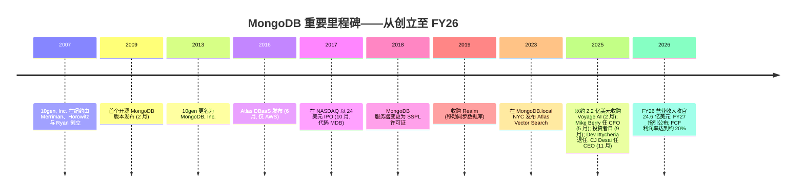
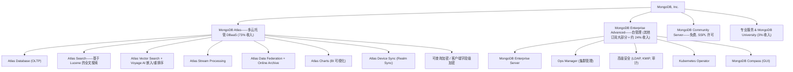
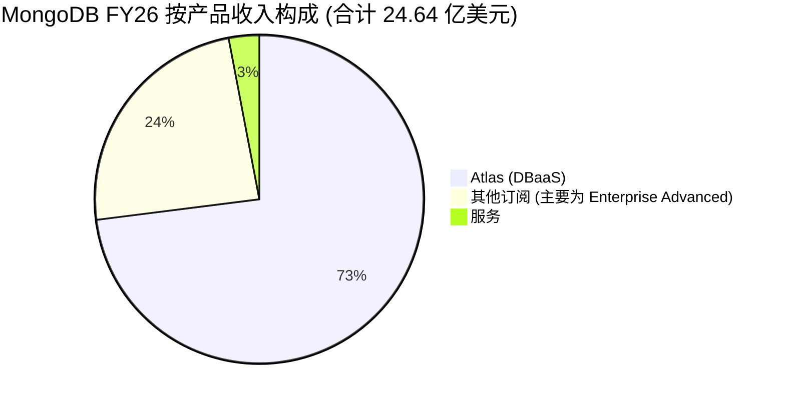
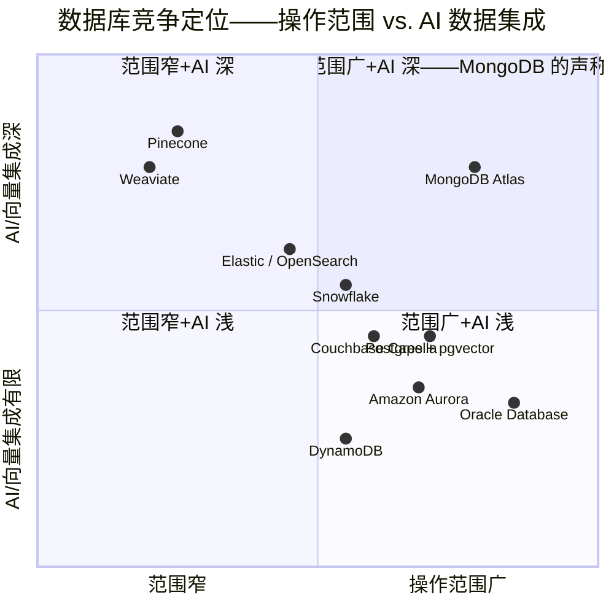

# MongoDB, Inc. (NASDAQ:MDB) — 公司研究报告

**截至日期: 2026-05-20**
**作者: financial_agent / company-research 技能**
**代码: NASDAQ:MDB**
**财年截止: 1 月 31 日 (FY26 = 截至 2026 年 1 月 31 日的财年)**
**报告语言: 简体中文 (英文版同时存在于本目录)**

> **业绩更新——FY2027 指引公布且 Q1 FY2027 展望低于市场一致预期 (2026-03-02):** 管理层初次公布 FY27 营业收入指引区间为 **28.6–29.0 亿美元** (同比约 16–18%, 隐含相对于 FY26 实现的 23% 出现实质性减速), Q1 FY27 营业收入区间为 **6.59–6.64 亿美元** (同比约 20–21%), 相比一致预期约 6.62 亿美元偏低。Atlas FY27 增速指引约 **21–23%**, 而 FY26 实绩为 29%。披露当日盘后股价下跌超过 20%, 投资者消化 Atlas 增长轨迹放缓的影响; 公司同时公告新任 CEO CJ Desai 上任首季并重申 2025 年 9 月投资者日所示的长期目标。
> 来源: [MongoDB Q4 FY2026 业绩公告, 2026-03-02](https://www.sec.gov/Archives/edgar/data/0001441816/000162828026013199/mdb-13126xex991xrelease.htm); [Markets Daily, 2026-03-03](https://www.themarketsdaily.com/2026/03/03/mongodb-nasdaqmdb-updates-q1-2027-earnings-guidance.html)。

## 目录
1. 公司概览
2. 公司历史
3. 管理团队
4. 产品与服务
5. 客户与上市策略
6. 行业概览
7. 竞争格局
8. 市场机会 (TAM)
9. 风险评估
10. 参考资料

---

## 1. 公司概览

MongoDB, Inc. 是总部设于纽约的**开发者数据平台 (developer data platform)** 公司, 以**MongoDB 文档数据库 (document database)** 商业化运营者身份为业界所知——该数据库为通用型操作数据库 (operational database), 以灵活的类 JSON 文档存储数据, 而非固定的关系型表。公司的使命, 如其 FY26 年度报告封面所述, 是"通过释放软件与数据的力量, 赋能开发者去创造、转型并颠覆各行各业"。其平台将操作数据库与多项集成服务 (搜索、向量搜索、时序、流处理、应用驱动分析、可查询加密) 结合, 主要通过两个商业载体销售: **Atlas**——多云 (multi-cloud) 全托管数据库即服务 (DBaaS, Database-as-a-Service), 运行于 AWS、Google Cloud 与 Microsoft Azure 之上; 以及 **MongoDB Enterprise Advanced (EA)**, 为客户在自有数据中心或混合云中部署而设计的专有自管理软件包 ([MongoDB 10-K FY2026, "Our Products" 章节](https://www.sec.gov/Archives/edgar/data/0001441816/000162828026016799/mdb-20260131.htm))。

**商业模式。** MongoDB 营业收入约 **97% 来自基于期限或基于消费的订阅 (subscription)**, 其余来自专业服务。Atlas 采用**按消费计价 (consumption-priced)**——客户按集群实例小时数、存储量及数据传输量付费, 自助用户无最低承诺额; 企业客户日益采用预付承诺消费池模式。Enterprise Advanced 以年度或多年期定期许可证销售, 捆绑商业版服务器、高级安全 (LDAP、静态加密、可查询加密)、Ops Manager、Compass、技术支持以及在集群内运行任意节点数工作负载的许可。FY26 **Atlas 相关营业收入为 18.079 亿美元 (占总收入 73%)、其他订阅为 5.781 亿美元 (24%)、服务为 7,780 万美元 (3%)** ([MongoDB 10-K FY2026, 分部与地理收入说明](https://www.sec.gov/Archives/edgar/data/0001441816/000162828026016799/mdb-20260131.htm))。

**规模与地区分布。** FY26 营业收入升至 **24.638 亿美元 (同比 +23%)**, 上年 FY25 为 20.064 亿美元、FY24 为 16.830 亿美元。美洲区贡献 14.975 亿美元 (61%)、EMEA 6.808 亿美元 (28%)、亚太 2.855 亿美元 (12%)。MongoDB 在 FY26 末有 **5,636 名员工** (其中 2,927 人在美国境外), **超过 65,200 家付费客户**分布于 100 多个国家, **2,799 家客户年度循环收入 (ARR) ≥10 万美元**, 且 Atlas 在三大超大规模云厂商 (hyperscaler) 上的 130+ 个云区域可用 ([MongoDB 10-K FY2026, "Our Customers" 与 "Human Capital Management"](https://www.sec.gov/Archives/edgar/data/0001441816/000162828026016799/mdb-20260131.htm))。

**盈利水平描述。** MongoDB 在 FY26 录得 **GAAP 营业亏损 1.370 亿美元 (-6% 收入)**, 较 FY25 亏损 2.161 亿美元 (-11%) 与 FY24 亏损 2.337 亿美元 (-14%) 持续收窄。底线为**净亏损 7,120 万美元**; 按非 GAAP 口径, 公司 Q4 单季录得净利润 1.427 亿美元。GAAP 与非 GAAP 之间的差距绝大部分来自**股权激励费用 (SBC, FY26 5.505 亿美元, 约占收入 22%)**——这是创始人/早期员工股权文化的结构性特征, 并非一次性事件 ([MongoDB 10-K FY2026, MD&A 与 SBC 列表](https://www.sec.gov/Archives/edgar/data/0001441816/000162828026016799/mdb-20260131.htm))。现金流则讲述了健康得多的故事: **FY26 经营性现金流为 5.051 亿美元 (FY25 为 1.502 亿美元)**, 按公司口径自由现金流 (FCF) 约 4.92 亿美元, 利润率约 20%。公司账上有 24 亿美元的现金、等价物、可交易证券及受限现金, 董事会授权了股票回购 (FY26 已执行 4 亿美元)。

*来源 (总额与 Atlas 占比): [MongoDB 10-K FY2026](https://www.sec.gov/Archives/edgar/data/0001441816/000162828026016799/mdb-20260131.htm); [10-K FY2024](https://www.sec.gov/cgi-bin/browse-edgar?action=getcompany&CIK=0001441816&type=10-K&dateb=&owner=include&count=40)。*

**估值快照 (截至 2026 年 5 月 20 日)。** MDB 在 2026 年 5 月 15 日盘中股价约为 **312 美元**, 对应市值**约 250–300 亿美元** (按 2026 年股东大会代理声明披露的 8,050 万股流通)。第三方数据汇总参考点 ([Stockanalysis MDB 统计, 2026 年 5 月](https://stockanalysis.com/stocks/mdb/statistics/); [GuruFocus EV/Revenue MDB](https://www.gurufocus.com/term/enterprise-value-to-revenue/MDB)):

- **TTM 市盈率: 不具备意义 (为负)。** TTM EPS ≈ -0.89 美元; 报告的市盈率表面值 ≈ -376 倍并无经济意义。亏损主要由 **5.50 亿美元 SBC (占收入 22%)**、沉重的市场开拓投入 (S&M 9.44 亿美元, 占收入 38%) 与研发 (R&D 7.16 亿美元, 29%) 驱动——既非一次性减值, 也非周期性事件, 更非结构性下行。5.05 亿美元的经营性现金流与约 4.92 亿美元的自由现金流显示, 即便 GAAP 亏损, 公司也已舒适自给自足。剔除 SBC, 公司明确盈利 (FY26 非 GAAP 营业利润率约 19%)。
- **TTM 市销率 (P/S) 约 9–10 倍, EV/Sales 约 7.8 倍。** GuruFocus 估算 2026 年 5 月 EV/Revenue 为 7.79 倍, 比 MDB 十年中位数约 16 倍低约 53%, 反映自 2021 年零利率峰值期 (MDB 当时按 30–40 倍销售估值) 以来的多年估值下行 ([Macrotrends MDB P/S 历史](https://www.macrotrends.net/stocks/charts/MDB/mongodb/price-sales))。
- **远期市盈率约 45–58 倍**——按非 GAAP 利润计 ([GuruFocus, 2026 年 5 月](https://www.gurufocus.com/term/forward-pe-ratio/MDB))——反映营业收入增长部分转化为非 GAAP 每股盈利。

**同业可比 (TTM P/S, 2026 年 5 月快照; 公司大致可比, 均为按消费计价的云数据平台):**

| 代码 | 公司 | LTM 营业收入 | 最近季度增速 | TTM P/S | 备注 |
|---|---|---|---|---|---|
| MDB | MongoDB | 24.6 亿美元 | +27% (Q4 FY26) → FY27 指引约 21% | **约 9–10×** | 估值下行后增速最慢; FCF 为正 |
| SNOW | Snowflake | 40+ 亿美元 | +30% (Q4 FY26) | 约 12–14× | 估值溢价; 再加速主线 |
| DDOG | Datadog | 34+ 亿美元 | +32% (Q1 2026) | 约 11–12× | 群组中 FCF 利润率最高 (26.7%) |
| CFLT | Confluent | 约 12 亿美元 | +19% | 约 8–9× | 2026-03-17 被 IBM 收购——倍数即退出价 |
| ESTC | Elastic | 16.8 亿美元 | +15–16% | 约 4–5× | 增速最慢, 倍数最低 |

来源: [Stockanalysis MDB 统计](https://stockanalysis.com/stocks/mdb/statistics/)、[GuruFocus CFLT P/S](https://www.gurufocus.com/term/ps-ratio/CFLT)、[Stockanalysis ESTC](https://stockanalysis.com/stocks/estc/statistics/)、[Snowflake FY26 Q4 8-K](https://www.sec.gov/Archives/edgar/data/0001640147/000162828026011631/fy2026q4earnings.htm)、[Datadog 8-K Q1 2026](https://www.sec.gov/Archives/edgar/data/0001561550/000162828026031677/ex-991x20260331x8k.htm)。

**估值倍数结论。** MDB 已不再享有*叙事性*估值溢价; 2026 年 3 月之后的估值下调将 TTM 市销率压缩至约 9 倍, 而十年中位数约 16 倍——已落入 SNOW / DDOG 群组之中, *低于*二者, 且考虑到 MDB 约 21–23% 的 Atlas 指引, 增长调整后的 P/S (P/S 除以 NTM 增速) 折价。溢价部分已不再源于"AI 基础设施光环"; 当前估值在为 (a) 超过 20% 增速同时实现 ≥20% FCF 利润率的稀有组合 (FY26 剔除 SBC 后规则-40 (rule-of-40) 约 43%) 付费、(b) Atlas 在 AI 工作负载中作为代理型 AI (agentic AI) 应用 OLTP 层的定位选项价值、(c) 数据库市场日益被视为现代厂商赢家通吃格局下的战略资产竞价。在没有真正再加速的情况下, P/S > 15 倍将难以辩护; 当前约 9 倍更接近合理水平。

## 2. 公司历史

MongoDB 的创立故事处于在线广告规模与对关系型模型不满的交汇点。2007 年末, 三位 DoubleClick 的前工程师与高管——**Dwight Merriman** (DoubleClick 联合创始人及前 CTO)、**Eliot Horowitz** (DoubleClick 首席工程师) 与 **Kevin Ryan** (DoubleClick CEO)——在纽约注册成立了 **10gen, Inc.**, 目标是打造一个开发者友好的云平台。在 DoubleClick, 他们曾在每秒提供 40 万次以上广告投放的 MySQL/Oracle 技术栈上挣扎, 切身体会到关系型模型的扩展性税: 抗拒快速迭代的模式 (schema)、需要复杂底层管道的分片 (sharding), 以及并发负载下成为瓶颈的连接 (join) 操作 ([Wikipedia "MongoDB Inc."](https://en.wikipedia.org/wiki/MongoDB_Inc.); [MongoDB 公司 / About 页面](https://www.mongodb.com/company))。10gen 早期计划是做完整 PaaS; 当没有任何底层数据存储能满足他们的要求时, 团队自建了一个, 并把公司转型为数据库业务。MongoDB (数据库本身) 的首个公开版本于 **2009 年 2 月**发布。**2013 年 8 月**, 10gen 更名为 MongoDB, Inc., 以让公司名与旗舰产品保持一致 ([MongoDB Wikipedia](https://en.wikipedia.org/wiki/MongoDB_Inc.))。

第二个决定性转型是从**软件包业务转向云 DBaaS 业务**。MongoDB 于 2016 年 6 月发布 **Atlas**, 最初仅运行于 AWS, 此后 18 个月扩展至 Azure 与 GCP, 此后十年内逐步将客户群迁移至 Atlas——FY26 Atlas 占营业收入 73%, 而 FY22 占 58%, 五年内权重上升 15 个百分点 ([MongoDB 10-K FY2026](https://www.sec.gov/Archives/edgar/data/0001441816/000162828026016799/mdb-20260131.htm))。第三个转型是自 2023 年起进行的 **AI 重新定位**: 原生向量搜索 (2023 年 6 月在 MongoDB.local NYC 大会上发布, 同年晚些时候 GA)、搜索与向量搜索集成进平台, 以及最为决定性的——**2025 年 2 月以约 2.2 亿美元收购 Voyage AI** ([Bloomberg, 2025-02-24](https://www.bloomberg.com/news/articles/2025-02-24/mongodb-buys-voyage-ai-for-220-million-to-bolster-ai-search); [MongoDB 8-K, 2025-02-24](https://www.sec.gov/Archives/edgar/data/0001441816/000144181625000040/mdb-odysseypr.htm))。

*来源: [MongoDB 10-K FY2026](https://www.sec.gov/Archives/edgar/data/0001441816/000162828026016799/mdb-20260131.htm); [MongoDB Wikipedia](https://en.wikipedia.org/wiki/MongoDB_Inc.); [Bloomberg, 2025-02-24](https://www.bloomberg.com/news/articles/2025-02-24/mongodb-buys-voyage-ai-for-220-million-to-bolster-ai-search); [CEO 过渡 8-K, 2025-11-03](https://www.sec.gov/Archives/edgar/data/0001441816/000162828025047941/a2025-11x03xpressrelease.htm)。*

**用平白话表述战略转折。** 第一次是 *PaaS → 数据库*: 团队意识到自家平台缺失的那块拼图, 是一个能跟上他们想要的开发者迭代速度的数据库。第二次是 *自管理 → 托管云*, 与客户偏好从自托管发行版转向云厂商运营服务的转向同步, 收入结构由定期许可证迁向消费计价。第三次正在进行——*操作数据库 → 智能数据层*, 把向量搜索、嵌入 (embedding, 经 Voyage AI 实现) 与重排序 (reranking) 放到与操作数据同一个集群内——其卖点是消除专用向量数据库 (purpose-built vector DB) 所需的"ETL 与双写 (dual-write)"难题。

**收购 (精选)。** Realm (移动端同步, 2019——已并入 Atlas Device Sync)、Tightdb (后成为 Realm 的底层技术), 以及 **Voyage AI (2025 年 2 月, 约 2.2 亿美元, 现金加股票)**——金额规模小, 但对 AI 定位至关重要——带来榜首水平的嵌入与重排序模型, 客户已包括 Anthropic、LangChain、Harvey 与 Replit ([Inc.com, 2025-02](https://www.inc.com/chloe-aiello/voyage-ai-just-sold-for-220-million-after-launching-less-than-two-years-ago/91151766))。公司在并购方面较为克制, 尚无超过 10 亿美元的转型性收购。

**近期动态 (FY26)。** 新任 CFO (Mike Berry, NetApp 前任)、新任 CEO (CJ Desai, Cloudflare 与 ServiceNow 前任)、投资者日 (2025 年 9 月) 上重申了多年期算法即 Atlas 增长 >20% 与 FCF 利润率 >20%、4 亿美元股票回购, 以及 Voyage 集成至核心平台——包括 "Voyage 4"嵌入家族、社区版向量搜索的自动嵌入、Atlas 中新的嵌入/重排序 API, 均在 MongoDB.local 旧金山大会上发布 ([MongoDB Q4 FY2026 业绩公告, 2026-03-02](https://www.sec.gov/Archives/edgar/data/0001441816/000162828026013199/mdb-13126xex991xrelease.htm))。

## 3. 管理团队

**Chirantan "CJ" Desai——总裁兼首席执行官 (2025 年 11 月 10 日上任)。** Desai 是 MongoDB *下一*章的设计师。他是企业软件行业的 25 年运营老兵, 履历像是一份刻意沿价值链上移的研究: 1990 年代末在 Oracle 起步, 参与了 Oracle 首项云服务的前身; 在 Symantec 涉足消费与企业安全; 之后在 EMC 长期担任存储职务。最具决定性的一段在 **ServiceNow (2014–2024)**, 担任**总裁兼首席运营官**, 主管产品、工程与运营; 在他任内, ServiceNow 的有机 ARR 从约 15 亿美元规模化至 100 亿美元以上——是这十年 B2B SaaS 行业被引用最多的运营业绩记录 ([CNBC, 2025-11-03](https://www.cnbc.com/2025/11/03/mongodb-ceo-dev-ittycheria-exits-replaced-by-cloudflares-cj-desai.html); [MongoDB CEO 过渡 8-K, 2025-11-03](https://www.sec.gov/Archives/edgar/data/0001441816/000162828025047941/a2025-11x03xpressrelease.htm))。他在 2024 年中离开 ServiceNow——背景是董事会就一位联邦客户雇佣事宜 (一位美国陆军 CIO) 进行的内部审查——随后在 2024 年末加入 **Cloudflare** 出任**产品与工程总裁**, 内部对其评价是, 他在 Cloudflare 股价大致翻倍的一年里, 锐化了产品线 P&L 与 AI/Workers 路线图。他持有**伊利诺伊大学厄巴纳-香槟分校 (Siebel 计算与数据科学学院)** 计算机科学硕士学位, 以及该校 **Gies 商学院** MBA 学位 ([伊利诺伊 Siebel 学院, 2025-11](https://siebelschool.illinois.edu/news/chirantan-CJ-Desai-CEO-MongoDB))。

MongoDB 是 Desai 的**首次上市公司 CEO** 任职。2026 年股东大会代理声明披露的签约方案为, **FY26 总薪酬汇总 5,280 万美元 (多为多年期签约股权授予)**, 其中 5,260 万美元为股权与期权奖励; 按公允价值口径的"实际支付薪酬"为 5,220 万美元 ([2026 DEF 14A, 薪酬与业绩对比表](https://www.sec.gov/Archives/edgar/data/0001441816/000162828026036415/mdb-20260518.htm))。授予权重大幅倾向于挂钩股价门槛及营收/利润里程碑的业绩归属 RSU——即 Desai 的薪酬来自股权复利, 而非底薪。董事长 Tom Killalea 阐述的董事会授权是"在云基础设施、AI、企业软件与产品创新方面的深厚经验……足以引领公司继续迈向持久且盈利的增长"——隐含意思是, 既要扩大 Atlas, 又要不牺牲 Dev Ittycheria 任内交付的 FCF 利润率曲线。两个待解问题: (i) 一位非创始 CEO 能否守住 MongoDB 历来最具防御性的资产——开发者社区文化; (ii) Desai *并非*数据库/数据平台原生从业者——他最深的烙印在工作流软件 (ServiceNow) 与边缘/安全 (Cloudflare)。对 Desai 的论点在执行力与上市策略纪律, 而非技术产品愿景; 产品愿景仍由创始团队与 CTO 流淌。

**Dev Ittycheria——董事, 前 CEO (2014–2025)。** Ittycheria 将 MongoDB 从约 1 亿美元营业收入做到约 25 亿美元, 2017 年带其上市, 也是消费优先 Atlas 商业模型的设计师。任期 11 年后, 他于 2025 年 11 月 9 日卸任 CEO, 但留任董事会至 2026 年 11 月, 并依据正式咨询协议担任 Desai 的顾问 ([CEO 过渡 8-K, 2025-11-03](https://www.sec.gov/Archives/edgar/data/0001441816/000162828025047941/a2025-11x03xpressrelease.htm))。他的过往业绩是投资者愿意给 Desai 信任的根本原因: 在他任内, 公司营业收入翻三倍, 转为 FCF 为正。

**Michael "Mike" Berry——首席财务官 (2025 年 5 月 27 日加入)。** Berry 是**七次担任 CFO**的老兵——曾任职于 i2 Technologies、SolarWinds、IO Data Centers (Iron Mountain)、Informatica、FireEye (并兼任 COO)、McAfee, 最近一次为 **NetApp (2020 年 3 月 – 2025 年 5 月)** 担任 EVP & CFO, 引领约 60 亿美元营业收入的基础设施业务完成混合云转型 ([MongoDB CFO 任命 8-K, 2025-04-28](https://www.sec.gov/Archives/edgar/data/0001441816/000144181625000089/mdb-20250428exhibit991.htm))。他相关的差异化优势是**消费模型的熟练度**——曾在多家公司亲历从期限许可向消费的转型——以及低调的利润率扩张业绩。他任职于 Rapid7 董事会 (审计主席, 不寻求连任) 与 Calix 董事会。任命公告中, 董事会陈述的雇用目标是"[Mike] 将业务规模化至 50 亿美元收入及以上的成功历史"。MongoDB 当前约 25 亿美元规模相对 NetApp 较小, 但消费机制相似。

**其他高管。** **Sahir Azam——首席产品官**, MongoDB 任职最久的产品负责人, Atlas 路线图与 AI 战略的公开代言人; 他最可能成为业绩说明会上公司的技术声音。**Andrew Stephens——首席法务官兼公司秘书** (签署 2026 年股东大会代理声明的高管)。**Erica Volini——首席客户官** (2026 年 3 月 3 日生效), 由 Desai 自 ServiceNow 引进, 在 ServiceNow 她曾扩展合作伙伴主导的增长引擎; 在 MongoDB 负责打造面向 AI 工作负载的垂直化客户成功体系 ([MongoDB Q4 FY26 业绩公告, 2026-03-02](https://www.sec.gov/Archives/edgar/data/0001441816/000162828026013199/mdb-13126xex991xrelease.htm))。**Cedric Pech, 前现场运营总裁**, 于 2026 年 4 月 15 日生效辞职——鉴于其负责企业销售引擎, 这是一次值得关注的离职, Desai 时代的替补预计到位。

**治理。** MongoDB 仅有单一类别普通股 (无超级投票权结构)——2026 年代理声明的第 4 项提案实为*取消*遗留的超级多数投票要求, 简化少数股东保护机制 ([2026 DEF 14A](https://www.sec.gov/Archives/edgar/data/0001441816/000162828026036415/mdb-20260518.htm))。九人董事会由 **Tom Killalea** (亚马逊基础设施部前 VP, 技术力量雄厚) 担任董事长, 成员包括:

- **Roelof Botha** (Sequoia Capital 管理成员)——长期技术投资人, 任 Block / Natera / Unity 董事; Sequoia 在 10gen 上市前投资
- **Hope Cochran** (King Digital 前 CFO; 审计委员会主席, 审计委员会财务专家)
- **Francisco "Frank" D'Souza** (Cognizant 联合创始人兼前 CEO)
- **Charles M. Hazard, Jr.**
- **Ann Lewnes** (Adobe 前 CMO)
- **Dwight Merriman** (联合创始人)
- **Dev Ittycheria** (前 CEO, 顾问)
- **Padmasree Warrior** (顶尖技术董事; Cisco 与 Motorola 前 CTO)
- **CJ Desai** (CEO)

内部人持股较低 (合计 < 5%); 最大经济利益由机构资产管理人与成长型基金持有。薪酬高度倾向股权: FY26 高管摘要薪酬表平均薪酬 760 万美元, 其中绝大部分为多年期 RSU 与 PSU 授予 ([2026 DEF 14A, 薪酬与业绩对比](https://www.sec.gov/Archives/edgar/data/0001441816/000162828026036415/mdb-20260518.htm))。

**业绩综合评估。** Ittycheria 交付了: 营业收入数量级增长、成功转型至 Atlas, 以及向 FCF 为正的转折。Desai 接手的是一个需要 *再加速* 增长 (而不仅仅是守住当前增速) 同时继续扩张 FCF 的组织。他曾扩展过一家消费/平台业务 (ServiceNow), 但数据库/AI 数据层的挑战对他是新的。CFO 毫无疑问胜任, CPO/CTO 的延续性保留了产品 DNA。主要风险在于 Desai *不是*创始人, *不是*数据库内行——直到 2025 年仍在为 MongoDB 复利赋能的创始 CEO 优势已不再存在。

## 4. 产品与服务

对于一个常被描述为"仅是数据库"的公司, MongoDB 的产品覆盖面其实相当广。组合分为三条商业线 (Atlas、Enterprise Advanced、Community Server), 加上一组日益形成*开发者数据平台*而非单点数据库的集成能力。

*来源: [MongoDB 10-K FY2026, "Our Products" 列举](https://www.sec.gov/Archives/edgar/data/0001441816/000162828026016799/mdb-20260131.htm); [MongoDB Atlas 产品页](https://www.mongodb.com/products/platform/atlas-database)。*

**Atlas (18.1 亿美元, 占收入 73%, FY26 同比 +29%)。** 旗舰商业产品, 在 AWS、GCP 与 Azure 上的 130+ 个区域可用。定价基于**消费 (consumption-based)**——客户按集群计算、存储、数据传输付费, 加上高层级服务的按单元消费 (向量搜索 QPS、流处理吞吐量等)。它包括自动配置、自愈、备份/恢复、监控、默认安全, 以及一键多云集群部署 (让单个数据库可跨 AWS + GCP + Azure 部署, 用于韧性或避免厂商锁定)。**竞争结论: 是——多重重叠护城河。** Atlas 的护城河是一组堆叠而非单一要素: (a) **多云可移植性与云中立性 (cloud neutrality)**——它是唯一在三家超大规模云厂商上完全相同地提供全托管文档数据库的产品, 对那些明确不希望被超大规模云厂商锁定的企业有用; (b) **开发者心智份额** (developer mindshare) 在文档数据库类别中持续领先, MongoDB 在 [Stack Overflow 年度开发者调查](https://survey.stackoverflow.co/2024/) 中常居最受欢迎数据库前列; (c) **切换成本**来自模式灵活的文档与各大主流语言中地道的驱动——把工作负载迁出 MongoDB 不是简单重新指向而是需要重新建模; (d) **规模 + 数据网络效应**, Atlas 运营遥测数据驱动自动调优, 而 Voyage 的嵌入模型也借助分布式数据存在感。最接近的具名竞品是 **Amazon DocumentDB (with MongoDB compatibility)**——对于仅 AWS 客户在托管体验上与 Atlas 持平, 但在多云上落后、与最新 MongoDB 版本的功能对等性上落后 (DocumentDB 的协议覆盖滞后), 且缺乏集成的向量/搜索/流处理堆栈。

**MongoDB Enterprise Advanced ("其他订阅"中绝大部分——5.781 亿美元, 同比 +7%)。** 自管理企业软件包: 包括专有服务器许可、Ops Manager、高级安全、Kubernetes Operator、Compass、技术支持。定价为年度或多年期定期许可, 按服务器/节点/RAM 计费, 由直销代表面向严格本地、监管或气隙 (air-gapped) 部署的企业销售 (金融服务、联邦、电信核心、医疗记录)。**竞争结论: 部分——护城河来自文档模型的锁定与数十年装机量, 但增速为中个位数, Atlas 日益成为首选部署形式。** 最接近的竞品: 关系型替换的全新项目对 **Oracle Database**、遗留企业/政府账户中的 **IBM DB2**, 以及作为另一种文档数据库的 **Couchbase Server**。MongoDB EA 在开发者人因工程与 TCO 上胜出, 在高度关系型工作负载的事务特性上落后。

**Community Server (免费, SSPL 许可)。** 驱动开发者采用的开源近似基础发行版。**2018 年 10 月**, MongoDB **将 Community Server 从 AGPL 改为 Server Side Public License (SSPL)** 许可, 该许可禁止厂商以 MongoDB-as-a-service 形式提供服务, 除非将周边管理代码基本全部贡献回来——明显针对那些已上线 MongoDB API 兼容托管服务的云厂商 (阿里、腾讯、IBM)。从战略上极为成功: 这迫使 AWS 另建独立引擎 (DocumentDB) 而非直接转售 MongoDB 二进制, 保住了 API 护城河。**竞争结论: 是——SSPL 这步棋保护了战略上最重要的资产。** 免费使用方面最接近的竞品是 **PostgreSQL + pgvector**, 它已成为独立开发者/小团队群组中默认的"够用即可"选择。

**Atlas 内部集成服务。** 这些功能把数据库变为*平台*, 也日益是既有客户内部扩张收入的来源:

- **Atlas Search (基于 Lucene 的全文搜索)。** 在同一份文档上嵌入全文搜索与分面 (faceting)。**竞争结论: 是**, 因为它消除了应用内搜索约 80% 用例中独立的 Elasticsearch 部署需求。最接近竞品: **Elastic Cloud / Elasticsearch**; MongoDB 在数据本就在 MongoDB 内的嵌入式用例中胜出, Elastic 在日志/可观测性与高端相关性调优中胜出。
- **Atlas Vector Search + Voyage AI 嵌入/重排序。** 在操作集合内的原生 HNSW 向量索引; Voyage 4 嵌入家族以托管嵌入 API 提供。**竞争结论: 部分。** 架构优势是真实的——无双写、无同步延迟、向量与操作文档同在。Voyage 模型在检索质量榜单上颇具竞争力 (公司在收购时称其为 "Hugging Face 社区中评分最高的零样本模型")。竞争风险在于, 向量能力如今已是各处的必备项: PostgreSQL pgvector、OpenSearch、Elasticsearch、Couchbase、Azure Cosmos, 以及专用厂商 (Pinecone、Weaviate、Qdrant、Chroma) 都提供可信的向量索引。最近多份厂商中立调研把向量框定为现在的*数据类型*而非独立数据库类别 ([2026 年最佳向量数据库, MarkTechPost, 2026-05-10](https://www.marktechpost.com/2026/05/10/best-vector-databases-in-2026-pricing-scale-limits-and-architecture-tradeoffs-across-nine-leading-systems/))。最接近竞品: **pgvector** (免费, 5,000 万向量以下规模最便宜); **Pinecone** (无服务器经济性在 1 亿+ 向量规模最佳); **OpenSearch / Elastic** 用于关键词+向量混合且需要相关性调优。
- **Atlas Stream Processing。** 使用 MongoDB 地道 API 进行高吞吐事件流的原生处理, 2024 年 GA。最接近竞品: **Confluent Cloud + ksqlDB / Apache Flink**。MongoDB 在数据已落入 MongoDB 的应用侧个性化、异常检测与预测性维护场景胜出; Confluent 在高吞吐主干流处理胜出。
- **Atlas Data Federation / Online Archive。** 在 S3/冷存储层与活跃集群之间进行联邦查询, 配合老化数据的自动分层——在不强制将数据移出应用的情况下降低 TCO。
- **Atlas Charts。** 与集群直接绑定的轻量 BI/可视化, 用于嵌入式分析。
- **Atlas Device Sync** (前称 Realm Sync)。 移动/嵌入式 SDK 与云集群的双向同步, 用于移动端优先应用的离线支持。
- **可查询加密 (Queryable Encryption)。** 一项专利能力, 让数据库可对客户端加密后保持加密状态的数据执行相等性 (路线图含范围) 查询——对受监管行业有意义, 因为这些行业不允许 DBA 看到 PII。最接近竞品: **PreVeil** 的保险柜加密 + **AWS DynamoDB 加密-在用**; MongoDB 的实现对应用开发者更友好。

**旗舰与长尾。** 真正驱动业务的 1–3 款产品是 **(1) Atlas Database**、**(2) Atlas Search + Vector Search** (作为 Atlas 内部的扩张杠杆), 以及 **(3) MongoDB Enterprise Advanced** (作为受监管客户装机量)。Realm Device Sync、Atlas Charts 与 Online Archive 对留存有用, 但贡献小。Voyage AI 嵌入收购后尚不是独立营收线——其定位是 Atlas Vector Search 的特性。

**路线图与过去 12 个月发布。** 除上文讨论的 Voyage AI 集成外, Q4-FY26 发布的产品包括 **Voyage 4 嵌入家族**、**MongoDB Community Vector Search** 的自动嵌入 (一个有意义的转变——把 AI 原语下沉到免费层以推动采用)、**Atlas 嵌入/重排序 AI 模型 API** 以及 **Compass 与 Atlas Data Explorer 的 AI 数据运维助手** ([MongoDB Q4 FY2026 业绩公告, 2026-03-02](https://www.sec.gov/Archives/edgar/data/0001441816/000162828026013199/mdb-13126xex991xrelease.htm))。两项 AWS 表彰证实了合作关系深度: MongoDB 被评为 **FY2026 AWS 全球技术合作伙伴 (Global Technology Partner of the Year)**, 表彰其与 Bedrock、SageMaker 与 Amazon Q 的 Atlas 集成。值得注意的下线: **mongomirror** 已于 2025 年 7 月停用, 让位于 **mongosync** 进行跨集群复制 ([10-K FY2026](https://www.sec.gov/Archives/edgar/data/0001441816/000162828026016799/mdb-20260131.htm))。

## 5. 客户与上市策略

MongoDB 在 FY26 末有**超过 65,200 家付费客户**, 分布于 100 多个国家, **2,799 家客户年度循环收入 ≥10 万美元** (FY25 末为 2,396 家, FY24 末为 2,052 家), 以及**2026 年 1 月 31 日 ARR 净扩张率约 121%** ([MongoDB 10-K FY2026](https://www.sec.gov/Archives/edgar/data/0001441816/000162828026016799/mdb-20260131.htm))。

**客户集中度——有利。** MongoDB 的 10-K 明确披露 *"2026 财年内没有单一客户的营收占比超过 10%"*, 且历史记录显示 MongoDB *从未*有任何单一客户超过收入的 10%。没有企业风格的前一/前五集中度风险可以量化——65,000+ 客户中, 这是一家长尾业务, 跨越所有行业。**Top-1 < 10%** 是披露门槛; 内部估计真实 Top-5 占比为低个位数百分比。合同结构通常为 Atlas 最大客户的**多年期主协议加消费承诺** (附年度或多年期 true-up), 以及 Enterprise Advanced 的**年度或多年期定期许可证**——已在 10-K 会计政策 (按期间确认收入) 中披露。

由于无任何客户大到能在 ASC 280 分部说明中被具名, MongoDB 通过案例研究与新闻稿披露客户。已具名客户 (来自 MongoDB 自家客户案例研究门户的部分名单) 跨越每一个主要行业:

- **金融服务/支付:** Coinbase (加密交易所基础设施的预测性扩展, "约 6 个月内 10× 韧性提升、80× API RPM 容量提升"——[MongoDB Coinbase 案例](https://www.mongodb.com/solutions/customer-case-studies/coinbase)); Wells Fargo、Bendigo Bank。
- **媒体/电商:** **Forbes** (六个月迁至 GCP 上 Atlas, "58% 构建速度提升、25% TCO 降低"——[MongoDB Forbes 案例](https://www.mongodb.com/solutions/customer-case-studies)); **Victoria's Secret** (2023 年将 200 个数据库 4 TB+ 数据迁至 Azure 上 Atlas, CPU 核心数减少 75%); **SonyLIV** (搜索延迟降低 98%); **Ubuy** (每年 1.5 亿次搜索, MySQL → Atlas)。
- **汽车/物联网:** **Toyota Connected** (Drive Link 安全服务平台运行于 Atlas)。
- **电信:** **Deutsche Telekom** (客户数据平台: 负载承载量 15×, 日交互从 < 5 万跃升至约 150 万)。
- **企业软件/基础设施:** **Cisco** (AI 安全平台运行于 Atlas + Vector Search——[MongoDB Cisco 案例](https://www.mongodb.com/solutions/customer-case-studies/cisco)); **Verizon**。
- **医疗/供应链:** **McKesson** (制药供应链交易量 300× 扩展)。
- **AI 原生:** **Anthropic**、**LangChain**、**Harvey**、**Replit**——在 Voyage AI 收购公告中均被援引为 Voyage 嵌入模型用户 ([MongoDB Voyage AI 业绩公告, 2025-02-24](https://www.sec.gov/Archives/edgar/data/0001441816/000144181625000040/mdb-odysseypr.htm))。

关于客户分群的一个有用读法: MongoDB 通过 **MongoDB for Startups** 项目明确扶持 **AI 优先创业公司**, 截至 Q4 FY26, 项目成员累计估值超过 2,000 亿美元——既是未来落地与扩张工作负载管道的领先指标, 也是对存量企业 AI 工作负载锚定于其超大规模云厂商原生数据平台风险的对冲。

*来源: [MongoDB 10-K FY2026, 分部与收入分解](https://www.sec.gov/Archives/edgar/data/0001441816/000162828026016799/mdb-20260131.htm)。*

**上市策略。** 两条并行的销售动作互相促进。(i) **自助服务/开发者主导 (developer-led) 采用**——Community Server 免费; Atlas 免费层 (M0) 永久免费; **MongoDB University** 培训平台已培训数十万开发者; **.local 大会系列**每年在 30+ 个城市举办。开发者布道是创始时代的护城河, 已被编码进公司营销做法。(ii) **直接企业销售**——全球外勤销售团队 (现由空缺的现场运营总裁岗位负责) 瞄准客户金字塔顶部, 用于 Atlas 承诺消费与 Enterprise Advanced 许可。**FY26 销售与营销支出为 9.444 亿美元 (占收入 38%, 较 FY25 的 43% 与 FY24 的 47% 下降)**——随着装机基础自我扩张, 销售效率有显著提升。战略合作伙伴主导的销售动作主要通过 **AWS** (将 MongoDB 评为 FY26 全球技术合作伙伴年度奖)、**Microsoft Azure** 与 **Google Cloud** 进行, 加上**系统集成 (SI) 合作伙伴** (Accenture、Deloitte、Capgemini、Cognizant、TCS、Infosys、EY、PwC) 用于企业现代化项目。

**销售周期。** 开发者主导的 Atlas 落地交易通常**较快 (几周至几个月)**; 企业向承诺消费的扩张耗时 3–9 个月。多年期 Enterprise Advanced 续约的采购流程经常长达 6–12 个月。

**地理。** FY26 美洲区占 61% 收入, EMEA 28%, APAC 12%——APAC 已连续两年增速高于公司平均, 也是公司渗透率最低的地区。

## 6. 行业概览

**数据库管理系统 (DBMS) 软件**市场是所有现代应用的基底。MongoDB 援引 IDC 最新预测 **Worldwide Database Management Systems Software Forecast, 2025–2029**, 该报告将全球 DBMS 软件市场规模定为 **2024 年 930 亿美元, 2029 年增至约 1,690 亿美元, 五年 CAGR 13%** ([MongoDB 10-K FY2026, "Business" 章节援引 IDC](https://www.sec.gov/Archives/edgar/data/0001441816/000162828026016799/mdb-20260131.htm); [IDC 报告容器 US53032525](https://mfe-prod.idc.com/getdoc.jsp?containerId=US53032525))。该市场是软件中最大者之一, 正在经历同时进行的结构性变迁:

- **云 DBaaS 份额上升。** 越来越多新数据库工作负载是以托管云服务形式而非自管理二进制形式提供。IDC 子类别显示**非模式型 DBMS** (文档、键值、宽列) 与**数据湖管理者**增长最快。MongoDB 是文档子类中最大的纯玩家; 更广义的非模式型类别还包括 DynamoDB、Cassandra 等。
- **关系型仍占主导。** DBMS 最大子市场仍是关系型——Oracle、Microsoft SQL Server、IBM DB2, 加上开源 MySQL 与 PostgreSQL——但主要靠遗留装机量。新的全新工作负载, 尤其是开发者主导与云原生的, 越来越多地起步于文档、键值或 NewSQL 栈。
- **AI 工作负载正重塑需求。** 生成式 AI 需要能并列处理非结构化 (文本/文档)、嵌入 (向量)、元数据与操作数据的数据基础设施。仅向量数据库市场, 据厂商中立调研, **2025 年达到 32 亿美元, 年增速约 24%** ([2026 年最佳向量数据库, MarkTechPost, 2026-05-10](https://www.marktechpost.com/2026/05/10/best-vector-databases-in-2026-pricing-scale-limits-and-architecture-tradeoffs-across-nine-leading-systems/))——但在 2026 年, 共识观点已转变: 向量不再是独立数据库类别, 而是每个可信操作数据库都会提供的数据类型 ([Actian / DEV.to, "2026 年向量数据库变化"](https://dev.to/actiandev/whats-changing-in-vector-databases-in-2026-3pbo))。
- **代码助手顺风。** 生成式 AI 代码助手 (GitHub Copilot、Cursor、Cognition 的 Devin、Claude Code) 加速了应用开发; MongoDB 自己的 10-K 明确把这一点框定为数据管理的顺风。更多应用→更多数据库。

**结构性动态。** DBMS 市场在顶部中度集中 (Oracle、AWS、Microsoft、Google、IBM 合计持有清晰的多数收入), 但在现代云原生、开发者主导的层级越来越碎片化 (MongoDB、Snowflake、Databricks、Confluent、Elastic、Couchbase、Redis、Neo4j, 加上超大规模云厂商原生服务如 DynamoDB、Spanner、Cosmos DB、Bigtable、Aurora)。一旦工作负载投产, 切换成本就极高——模式设计、驱动、应用代码、运维工具与 SRE 知识都与所选 DBMS 紧耦合——这使*新工作负载份额*之争成为战略上的关键指标。

**监管。** 数据库市场日益受**数据主权监管 (data-sovereignty regulation)** 塑造——GDPR、中国的《网络安全法》与《数据安全法》、印度 DPDPA、欧盟 AI 法案——驱动多区域部署需求与本地化/在云内的数据驻留——这是对 Atlas 等多云 DBaaS 的顺风。**美国 DOJ 数据经纪规则**与**欧盟 NIS2** 加入了韧性与审计义务, 利好有 SOC 2、FedRAMP、PCI-DSS 与 HIPAA 认证的成熟 DBMS 厂商。MongoDB Atlas 在三大超大规模云厂商上均持有相关认证。

**买方行为与价格纪律。** 2022–2023 年云成本优化浪潮之后, 企业 CFO 对消费型数据库账单的关注度显著高于 2021 年峰值期。这反映在 MongoDB 自家指标上: Atlas 增长已从疫后 50%+ 的速率稳步减速至 Q4 FY26 约 29%, FY27 指引约 21–23%——这是 (a) 既有客户的工作负载优化、(b) 更艰难的可比基数、(c) 宏观驱动的新应用启动谨慎, 以及 (d) AI 工作负载支出当前不成比例地流向 GPU + 基础模型提供商而非 OLTP 数据层共同作用的结果。

**供应商与买方议价能力。** 云厂商关系是最具影响的供应方动态: Atlas 运行在 AWS / GCP / Azure 基础设施之上 (超大规模云厂商获得底层计算与存储收入, 而 MongoDB 拿到数据库软件利润)。超大规模云厂商既是合作伙伴*又是*竞争对手——AWS 销售 DocumentDB 与 DynamoDB, Azure 销售 Cosmos DB 与 PostgreSQL Flexible Server, Google 销售 Firestore 与 Spanner。买方侧为长尾: 无单一客户 >10% 收入, MongoDB 的买方议价能力异常低。

## 7. 竞争格局

MongoDB 的竞争集异常宽泛, 因为公司同时在三个层面竞争: (a) **文档数据库** (vs. Couchbase、DynamoDB、Cosmos DB、Firestore); (b) **通用 OLTP 云 DBaaS** (vs. RDS Aurora、Cloud SQL、Azure SQL DB 与超大规模云厂商原生 NoSQL); (c) **AI/向量数据层** (vs. pgvector、Pinecone、Weaviate、Elastic、OpenSearch、Couchbase、Cosmos DB)。MongoDB 自家的 10-K 将主要竞争对手列为 IBM、Microsoft、Oracle、AWS、GCP 与 Azure ([MongoDB 10-K FY2026](https://www.sec.gov/Archives/edgar/data/0001441816/000162828026016799/mdb-20260131.htm))。

**直接文档数据库竞争对手。**

- **Amazon DocumentDB (with MongoDB compatibility)。** AWS 的 MongoDB API 兼容托管服务。优势: 深度 AWS 集成、IAM、单一供应商采购。劣势: 协议覆盖落后于最新 MongoDB 版本, 无 Atlas 级向量/搜索/流处理集成, 仅 AWS。可在 AWS marketplace 中获得, 与 AWS 承诺额绑定。
- **Microsoft Azure Cosmos DB。** 多模型 (包括 MongoDB API)。优势: 全球分发、多 API 包括 SQL、Cassandra 与 Gremlin; Azure 捆绑采购优势。劣势: 定价复杂; API 表面落后于原生 MongoDB; 不可移植至其他云。
- **Couchbase, Inc. (NASDAQ: BASE)。** 纯文档数据库, 自管理与 Capella DBaaS 双线销售。规模显著较小 (FY25 收入约 2.09 亿美元 vs. MDB 24.6 亿美元)。优势: SQL++ 查询语言、移动同步 (Couchbase Lite)、边缘支持。劣势: 开发者心智份额差距。Couchbase 于 2025 年中同意被 **Haveli Investments 以约 15 亿美元收购**——为亚规模文档数据库纯玩家的私募市场估值提供有用读数。

**超大规模云厂商原生 NoSQL 替代品。**

- **Amazon DynamoDB。** 键值/文档, 无服务器, 低延迟极快。云 NoSQL 中按运行规模最大者, 被 Amazon Retail、Disney+、Snap 等大规模使用。数据模型不同 (没有富文档索引或聚合管道), 但在 AWS 上是新云原生工作负载最接近的通用超大规模云厂商替代。
- **Google Firestore / Bigtable。** Firestore = 面向移动端的托管文档; Bigtable = 宽列。主要在 Google 阵营的全新项目中竞争。

**关系型与 PostgreSQL 生态系统竞争对手。**

- **Oracle Database / Microsoft SQL Server / IBM DB2。** 既有装机基础。MongoDB 在全新项目中胜出, 但难以替换关系型人因工程与数十年应用根植已深的关键任务遗留系统。
- **PostgreSQL (及 Amazon Aurora、AlloyDB、Cloud SQL for Postgres)。** 单一最重要的*间接*竞争对手。PostgreSQL 已加入 **JSONB** (二进制 JSON, 可索引)、**pgvector** (向量索引)、全文搜索与时序扩展——与 MongoDB 价值主张的重叠程度足以让 PostgreSQL 成为想要"够用的文档 + 关系型 + 向量同在一处"团队的常用替代品。AWS 上的 Aurora PostgreSQL, 尤其是在 *AWS 账户内* 最可信的"Atlas 杀手"。
- **Snowflake (NYSE: SNOW)。** 不是直接 OLTP 竞争对手, 而是平台对话的*数据仓库/湖仓 (lakehouse)*侧。Snowflake 主导的架构模式推动客户将操作存储与分析存储分离; 对 MongoDB 操作侧中性至轻微正面。Snowflake 的 Cortex AI 特性与 Voyage AI 在分析工作负载上的定位有重叠。

**向量/AI 数据层竞争对手。**

- **PostgreSQL + pgvector。** 向量基准测试中提到最多的替代品。**在 5,000 万向量以下规模的所有层级都最便宜** (它捎带在客户已经付费的 Postgres 基础设施上)。pgvectorscale 在 5,000 万向量、99% 召回率上跑出 471 QPS ([2026 年最佳向量数据库, MarkTechPost, 2026-05-10](https://www.marktechpost.com/2026/05/10/best-vector-databases-in-2026-pricing-scale-limits-and-architecture-tradeoffs-across-nine-leading-systems/))。对 MongoDB Atlas Vector Search 的诚实竞争风险是, 对约 80% 嵌入语料库低于 5,000 万向量的团队, *Postgres + pgvector + 托管 Postgres 服务* 在 2026 年是默认最优答案。
- **Pinecone。** 纯向量 DBaaS, 无服务器定价。**1 亿+ 向量规模成本竞争力强**。优势: 纯粹聚焦检索质量与延迟。劣势: 双系统架构强制你将向量与操作 DB 同步; 集成体验不如 MongoDB Vector Search。
- **Elastic (NYSE: ESTC) / OpenSearch。** 全文+向量混合, 相关性调优极强。在关键词与语义检索质量都重要的场景胜出 (法律、电商搜索)。
- **Weaviate、Qdrant、Chroma。** 开源/托管向量数据库。在小众市场实力强但分发能力不可比。

**定位框架。** 阅读 MongoDB 位置的简单方法是*多云上的集成操作+AI 数据层, 配以开发者心智份额*。超大规模云厂商在各自云的原生生态中更强; pgvector 在小规模向量语料库上更便宜; Pinecone 在 1 亿+ 向量检索上更快; Elastic 拥有搜索相关性。MongoDB 的优势在于它是这些之中唯一**(a) 严肃的通用 OLTP 数据库**、**(b) 多云**、**(c) 拥有可信向量+嵌入栈** 且在单一集成体验中提供的。赌注是, 构建大规模 AI 应用机群的企业将倾向于单一平台答案而非拼接最佳组件。

*位置为作者基于每个平台公开材料的定性解读, 见上文按产品的引用。来源: [MongoDB 10-K FY2026](https://www.sec.gov/Archives/edgar/data/0001441816/000162828026016799/mdb-20260131.htm); [MarkTechPost 向量数据库调研, 2026-05-10](https://www.marktechpost.com/2026/05/10/best-vector-databases-in-2026-pricing-scale-limits-and-architecture-tradeoffs-across-nine-leading-systems/)。*

**竞争优势。** (1) 文档模型本身——面向无模式/半结构化数据的最佳开发者人因工程。(2) 多云 Atlas——可信的 NoSQL DBaaS 提供商中唯一在 AWS *和* Azure *和* GCP 上全托管者。(3) 开发者社区护城河, 通过 MongoDB University、.local 系列与永久免费层编码沉淀。(4) Voyage AI 的检索模型——对 AI 应用精度的可防御差异化, 尤其考虑到与基础模型提供商的客户重叠。(5) 切换成本——一旦工作负载落地 MongoDB, 文档数据模型黏性强。

**竞争脆弱性。** (1) AI 工作负载支出目前不成比例地流向 GPU、基础模型与编排 (LangChain、Vellum), 而非操作数据层。(2) Postgres + pgvector 已日益成为成本敏感、5,000 万向量以下 AI 项目的默认选择。(3) 超大规模云厂商原生服务具有作为单一供应商采购捆绑一部分的结构性优势, 加速其在既有企业账户内的落地。(4) 缺乏深度 BI/分析相邻产品 (Snowflake / Databricks 拥有该对话)。(5) Atlas 定价被认为复杂; 企业越来越想要可预测的年度支出, 而非消费真实化调整。

*来源: [Stockanalysis MDB 统计, 2026 年 5 月](https://stockanalysis.com/stocks/mdb/statistics/); [Stockanalysis ESTC 统计](https://stockanalysis.com/stocks/estc/statistics/); [GuruFocus CFLT P/S](https://www.gurufocus.com/term/ps-ratio/CFLT); [SNOW Q4 FY26 8-K](https://www.sec.gov/Archives/edgar/data/0001640147/000162828026011631/fy2026q4earnings.htm); [DDOG Q1 2026 8-K](https://www.sec.gov/Archives/edgar/data/0001561550/000162828026031677/ex-991x20260331x8k.htm)。*

## 8. 市场机会 (TAM)

MongoDB 自己引用 IDC 框架的标题数字相对保守: **2024 年 930 亿美元, 2029 年 1,690 亿美元, CAGR 约 13%**, 为全球 DBMS 软件市场 ([MongoDB 10-K FY2026 援引 IDC US53032525](https://mfe-prod.idc.com/getdoc.jsp?containerId=US53032525))。按这些数字, 公司 FY26 收入约为 2024 年市场的 2.6%; 若 MongoDB 按管理层的长期目标增长, 且市场按 IDC CAGR 增长, 公司在 2029 年仍只是 DBMS 软件总量的低个位数份额。该标题框架在三方面低估了可服务机会。

第一, **SAM 比 IDC 整体市场数字更窄。** 传统大型机 DB2 与大型关系型按席位/CPU 计费的许可证实际无法被取代。云原生文档/操作数据库的可服务可寻址市场更接近**云 DBaaS 加现代自管理**子集——按 IDC 自家子分段, 约为标题数字的 50%, 且增长显著快于标题 13% (报告中非模式型 DBMS 与数据湖管理子类增长快于关系型)。

第二, **集成平台叙事扩大 SAM。** Atlas Search 与搜索市场 (Elastic、OpenSearch) 重叠; Atlas Vector Search 与向量数据库市场重叠 (2025 年 32 亿美元, 年增约 24%, 据 [MarkTechPost 向量数据库调研](https://www.marktechpost.com/2026/05/10/best-vector-databases-in-2026-pricing-scale-limits-and-architecture-tradeoffs-across-nine-leading-systems/)); Atlas Stream Processing 与流平台市场 (Confluent / Kafka 集群) 重叠。合理的综合 SAM, 求和云原生子集并排除大型机遗留, 至 **2029 年约 800–1,000 亿美元区间**。

第三, **AI 是特定顺风。** 每一个 AI 代理或应用都需要数据底层持久化上下文、对话状态、嵌入、函数调用历史与下游操作数据。MongoDB 的叙事——*操作数据 + 嵌入 + 元数据 + 生成内容同在一处*——在广阔企业用例中比专用向量数据库更具产品市场契合拉力。难点问题是, AI 工作负载拉力能否以*高于*遗留 DBMS 市场增长率的速率向 MongoDB 累积。截至 2026 年 5 月的数据并不明朗: Q4 FY26 业绩说明会的管理层表述强调 AI 工作负载贡献正在增长但在合并组合中仍较小。

**SOM。** MongoDB 在 **2025 年 9 月投资者日** ([投资者日 8-K, 2025-09-17](https://www.sec.gov/Archives/edgar/data/0001441816/000144181625000197/main-investorday2025pres.htm)) 阐述了多年期算法即 Atlas 增长 >20% 与 FCF 利润率 >20% 为持久模型。按该模型, MongoDB 合并营业收入可以从 FY26 的 24.6 亿美元复利至 **FY30 50–60 亿美元 (基本情景, 假设基数扩张时增速逐步减速至约 18%)**, 即四年约 3–4 倍收入, 对应 IDC 定义 DBMS 市场低至中个位数份额。

**渗透策略。** MongoDB 在 2026–2027 年依赖的扩张杠杆包括: (a) **将既有客户工作负载从 Enterprise Advanced 迁至 Atlas** (仍在过程中——FY26 Atlas 占 73%, FY25 占 70%); (b) **通过 Startups 项目早期获得 AI 原生客户**; (c) **深化超大规模云厂商合作伙伴关系** (AWS 年度合作伙伴认可反映此点); (d) **通过 SI 合作伙伴与咨询将遗留关系型工作负载现代化**; (e) **使用成熟后将 Voyage 嵌入/重排序 API 单独定价为高级特性**进行变现; (f) **APAC 地理扩展**, 该区域渗透率最低。

## 9. 风险评估

### 公司层面风险

**1. CEO 过渡执行风险 (高)。** 一位非创始人、非数据库内行的 CEO 于 2025 年 11 月 10 日接手平台。虽然 Desai 的 ServiceNow 业绩令人羡慕, 但他最深的任职在工作流软件与边缘/安全——不是数据库。已披露的签约方案 (约 5,200 万美元, 主要为业绩股权) 对齐了激励, 但接下来 4–6 个季度将检验他能否守住开发者社区 DNA 同时推进企业销售生产率。**缓解因素:** Ittycheria 留任董事会至 2026 年 11 月任顾问; CFO Mike Berry 是经验丰富的消费模型操盘者; CPO Sahir Azam 保留产品 DNA。

**2. Atlas 增长减速为结构性, 非暂时性 (高)。** Q4 FY26 实绩 29% Atlas 增长与 FY27 指引约 21–23% 反映自 FY22 50%+、FY24 约 38%、FY25 约 33%、FY26 约 29% 的多年减速。即使 MongoDB 达到 FY27 算法, 市场也会向下重新校准长期增长率, 投资者愿付的倍数也将随之压缩。**缓解因素:** Search、Vector Search 与 Voyage 模型的扩张可能重新混合增长算法; AWS 年度合作伙伴地位提供分发杠杆。

**3. AI 工作负载竞争风险真实且被低估 (高)。** 诚实读法: 2024–2026 年 AI 工作负载经济不成比例地利好 GPU 厂商、基础模型提供商与编排平台。数据层在代理型 AI 支出中份额比模型层小。更糟的是, **pgvector** 已成为成本敏感团队默认的操作向量存储, **Pinecone / Weaviate / Qdrant** 拿下高端检索用例。Voyage AI 帮助 MongoDB 的叙事 ("操作 + 嵌入 + 重排序同在一处"), 但并未消除替代厂商的可选性。**缓解因素:** Voyage 检索模型在基准上具竞争力; 集成故事对偏好整合的企业有说服力; AI 原生标识 (Anthropic、LangChain、Harvey、Replit) 提供可信度。

**4. 云厂商渠道依赖 (中)。** MongoDB 位于 AWS / Azure / GCP 基础设施之上。三家超大规模云厂商各自销售竞品 (DocumentDB、Cosmos DB、Firestore/Spanner/Aurora), 并已反复显示克隆开源数据平台的意愿。Atlas 的中立性是其差异化, 但超大规模云厂商控制底层经济。**缓解因素:** MongoDB 拥有渐进工作负载拉力的杠杆 (以 AWS 年度合作伙伴认可为例); 多云集群能力把依赖转化为对冲。

**5. 技术产品领导关键人员依赖 (中)。** Ittycheria 已退任, 创始人 Eliot Horowitz 自 2020 年全职离开后已不参与运营; 公司的技术声音收窄至 CPO Sahir Azam 及少数核心人员。**缓解因素:** 大型工程组织、深厚的开源社区、成熟的产品路线图。

### 行业/市场风险

**6. 超大规模云厂商原生数据库竞争加剧 (高)。** Amazon Aurora PostgreSQL with pgvector、Azure Cosmos DB 与 Google AlloyDB 日益成为各自云中的新工作负载默认目的地。对于单一超大规模云厂商上的企业, 阻力最小路径是捆绑的产品——多云可移植性是只对想要的客户付费的特性。**缓解因素:** 多云客户群是真实的 (按管理层表述, 约占 Atlas 承诺消费客户的 25–30%)。

**7. 消费定价在宏观压力下 (中)。** 云成本优化周期 (2022–2023 浪潮) 暴露了消费定价平台在企业买家收紧时存在不成比例的顶线压缩。风险不对称: 宏观好则 Atlas 增长快于运行率, 宏观差则慢于。**缓解因素:** 装机基础的规模分散了工作负载集中度; 承诺消费协议平滑波动。

**8. 开源许可前例风险 (低/中)。** SSPL 许可尚未被所有开源社区机构认定为真正"开源"。若某监管机构或大客户采用更严格解释, 分发摩擦可能上升。**缓解因素:** 许可自 2018 年至今稳定; 替代 MongoDB 兼容产品 (Amazon DocumentDB 等) 选择构建独立引擎而非重新托管 SSPL 二进制——按预期保护 API 护城河。

### 财务风险

**9. 股权激励稀释 (中/高)。** SBC 在 FY26 为 **5.5 亿美元 (占收入 22%)**。董事会在 FY26 执行 4 亿美元回购部分抵消, 但叠加新任 CEO 签约方案 (5,200 万美元股权负担) 及年度普惠 RSU 刷新, 总稀释仍是结构性拖累。流通股从 FY24 末 7,370 万股升至 2026 年 5 月记录日 8,050 万股——回购后净增约 5%。**缓解因素:** FCF 现已足够大 (FY26 4.92 亿美元), 支持更大规模的持续回购; Desai 新薪酬方案更偏业绩。

**10. 估值/倍数压缩风险 (中)。** TTM P/S 约 9–10 倍与 EV/Sales 约 7.8 倍低于 MDB 十年中位数 (约 16 倍), 但仍高于整个软件行业中位数 (约 5–6 倍)。在约 21% 指引增速下, P/S 对增速比率约 0.45——不算紧绷。风险是*进一步*减速至中两位数, 这将把 MDB 重新评级至 Elastic 式倍数 (约 4–5 倍)。在当前约 250–300 亿美元市值, 这意味着相对当前水平 20–30% 的下调。**缓解因素:** FCF 利润率 ≥20% 为估值提供下限; 规则-40 概况 (增速 + FCF 利润率 = FY26 约 43%) 在软件中罕见。

**11. 盈利时间表仍为 GAAP 亏损 (低)。** 公司已舒适地实现规模化非 GAAP 盈利与 FCF 为正, 但*仍*为 GAAP 亏损 (FY26 净亏损 7,100 万美元)。这主要由 SBC 驱动而非持续经营问题, 但它制约标普 500 纳入与某些指数驱动的资金流。**缓解因素:** 轨迹有利; 非 GAAP 与 FCF 指标逐年改善。

### 宏观经济风险

**12. 地缘政治/数据主权碎片化 (中)。** 数据本地化要求增加、美中云脱钩与欧盟主权云倡议都增加了运营复杂性。Atlas 在 130+ 个区域缓解此点, 但带来合规开销。**缓解因素:** 多云架构与该趋势对齐。

**13. 外汇敞口 (低)。** 39% 收入来自非美洲区; 公司在经营敞口上无套保。强美元在视觉上压缩报告增速。**缓解因素:** 相对于基础增长率, 规模较小。

**14. 利率敏感性/倍数扩张撤回 (中)。** 作为 GAAP 不盈利的成长股权持仓, MDB 对长久期折现率敏感。降息周期净正面; 鹰派反转净负面。**缓解因素:** FCF 基数将估值锚定, 不至于受纯久期风险拖累。

*NRR 为 MongoDB 披露的季末 ARR 净扩张率, 公司指引为"约"时四舍五入至最近 1 个百分点。来源: [MongoDB 10-K FY2026](https://www.sec.gov/Archives/edgar/data/0001441816/000162828026016799/mdb-20260131.htm) (Q4 FY26 = 约 121%); 较早季度来自连续 10-Q / 10-K 备案。*

*来源: [MongoDB 10-K FY2026](https://www.sec.gov/Archives/edgar/data/0001441816/000162828026016799/mdb-20260131.htm) (营业亏损与经营性现金流); 自由现金流按季度业绩公告中的口径调和 (资本支出 + 经营性现金流中调整的金融租赁本金)。*

## 10. 参考资料

### 一手——SEC 备案 (MongoDB, Inc., CIK 0001441816)
- [MongoDB 10-K, FY2026 (截至 2026 年 1 月 31 日的财年), 2026 年 3 月备案](https://www.sec.gov/Archives/edgar/data/0001441816/000162828026016799/mdb-20260131.htm)
- [MongoDB DEF 14A 2026, 2026 年 5 月 19 日备案](https://www.sec.gov/Archives/edgar/data/0001441816/000162828026036415/mdb-20260518.htm)
- [MongoDB 10-K, FY2025, 2025 年 3 月备案](https://www.sec.gov/cgi-bin/browse-edgar?action=getcompany&CIK=0001441816&type=10-K)
- [MongoDB 8-K——Q4 FY2026 业绩公告, 2026-03-02](https://www.sec.gov/Archives/edgar/data/0001441816/000162828026013199/mdb-13126xex991xrelease.htm)
- [MongoDB 8-K——CEO 过渡, CJ Desai 任命, 2025-11-03](https://www.sec.gov/Archives/edgar/data/0001441816/000162828025047941/a2025-11x03xpressrelease.htm)
- [MongoDB 8-K——Mike Berry CFO 任命, 2025-04-28](https://www.sec.gov/Archives/edgar/data/0001441816/000144181625000089/mdb-20250428exhibit991.htm)
- [MongoDB 8-K——Voyage AI 收购公告, 2025-02-24](https://www.sec.gov/Archives/edgar/data/0001441816/000144181625000040/mdb-odysseypr.htm)
- [MongoDB 8-K——2025 年 9 月投资者日演示, 2025-09-17](https://www.sec.gov/Archives/edgar/data/0001441816/000144181625000197/main-investorday2025pres.htm)
- [MongoDB 8-K——Q3 FY2026 业绩公告, 2025-12-01](https://www.sec.gov/Archives/edgar/data/0001441816/000162828025054425/mdb-103125xex991xrelease.htm)
- [MongoDB 8-K——Q2 FY2026 业绩公告, 2025-08-26](https://www.sec.gov/Archives/edgar/data/0001441816/000144181625000176/mdb-73125xex991xrelease.htm)
- [Datadog 8-K——Q1 2026 业绩公告, 2026-04-30](https://www.sec.gov/Archives/edgar/data/0001561550/000162828026031677/ex-991x20260331x8k.htm)
- [Snowflake 8-K——Q4 FY2026 业绩公告](https://www.sec.gov/Archives/edgar/data/0001640147/000162828026011631/fy2026q4earnings.htm)
- [Elastic N.V. 8-K——Q3 FY2026, 2026-03](https://www.sec.gov/Archives/edgar/data/0001707753/000170775326000003/a26q3erex991.htm)

### 公司网站与产品页
- [MongoDB 公司 / About 页面](https://www.mongodb.com/company)
- [MongoDB Atlas 产品页](https://www.mongodb.com/products/platform/atlas-database)
- [MongoDB 客户案例研究门户](https://www.mongodb.com/solutions/customer-case-studies)
- [MongoDB Coinbase 案例](https://www.mongodb.com/solutions/customer-case-studies/coinbase)
- [MongoDB Cisco 案例](https://www.mongodb.com/solutions/customer-case-studies/cisco)
- [MongoDB 以 MongoDB 创新——客户成就, 2025 年 12 月](https://www.mongodb.com/company/blog/innovation/innovating-with-mongodb-customer-successes-december-2025)
- [MongoDB 以 MongoDB 创新——客户成就, 2025 年 10 月](https://www.mongodb.com/company/blog/innovation/innovating-customer-successes-october-2025)
- [MongoDB 投资者关系](https://investors.mongodb.com/)

### 第三方——新闻与分析师
- [CNBC——"MongoDB CEO Dev Ittycheria 离任, Cloudflare 的 CJ Desai 接替", 2025-11-03](https://www.cnbc.com/2025/11/03/mongodb-ceo-dev-ittycheria-exits-replaced-by-cloudflares-cj-desai.html)
- [Constellation Research——"MongoDB 任命 CJ Desai 为 CEO", 2025-11](https://www.constellationr.com/insights/news/mongodb-names-cj-desai-ceo)
- [Bloomberg——"MongoDB 以 2.2 亿美元收购 Voyage AI", 2025-02-24](https://www.bloomberg.com/news/articles/2025-02-24/mongodb-buys-voyage-ai-for-220-million-to-bolster-ai-search)
- [Inc.com——"Voyage AI 以 2.2 亿美元出售", 2025-02-25](https://www.inc.com/chloe-aiello/voyage-ai-just-sold-for-220-million-after-launching-less-than-two-years-ago/91151766)
- [Markets Daily——"MongoDB (NASDAQ:MDB) 更新 Q1 2027 业绩指引", 2026-03-03](https://www.themarketsdaily.com/2026/03/03/mongodb-nasdaqmdb-updates-q1-2027-earnings-guidance.html)
- [伊利诺伊大学 Siebel 学院——"从 CS 411 到 CEO" (Desai 简介), 2025-11](https://siebelschool.illinois.edu/news/chirantan-CJ-Desai-CEO-MongoDB)
- [Investing.com——"MongoDB 业绩前瞻: Atlas 势头能否抵御 AI 恐慌", 2026-03](https://www.investing.com/news/earnings/mongodb-earnings-ahead-can-atlas-momentum-counter-ai-fears-93CH-4535319)

### 市场数据
- [Stockanalysis.com——MDB 统计与估值](https://stockanalysis.com/stocks/mdb/statistics/)
- [Stockanalysis.com——MDB 财务比率](https://stockanalysis.com/stocks/mdb/financials/ratios/)
- [GuruFocus——MDB EV-to-Revenue](https://www.gurufocus.com/term/enterprise-value-to-revenue/MDB)
- [GuruFocus——MDB 远期 PE 比率](https://www.gurufocus.com/term/forward-pe-ratio/MDB)
- [Macrotrends——MDB 市销率历史](https://www.macrotrends.net/stocks/charts/MDB/mongodb/price-sales)
- [Macrotrends——MDB 市值历史](https://www.macrotrends.net/stocks/charts/MDB/mongodb/market-cap)
- [GuruFocus——CFLT P/S 比率](https://www.gurufocus.com/term/ps-ratio/CFLT)
- [Stockanalysis.com——ESTC 统计与估值](https://stockanalysis.com/stocks/estc/statistics/)

### 行业与竞争研究
- [IDC——Worldwide Database Management Systems Software Forecast, 2025–2029, 容器 US53032525](https://mfe-prod.idc.com/getdoc.jsp?containerId=US53032525)
- [MarkTechPost——"2026 年最佳向量数据库: 定价、规模上限与架构权衡", 2026-05-10](https://www.marktechpost.com/2026/05/10/best-vector-databases-in-2026-pricing-scale-limits-and-architecture-tradeoffs-across-nine-leading-systems/)
- [Actian / DEV.to——"2026 年向量数据库正在发生的变化"](https://dev.to/actiandev/whats-changing-in-vector-databases-in-2026-3pbo)
- [Wikipedia——"MongoDB Inc."](https://en.wikipedia.org/wiki/MongoDB_Inc.)
- [Stack Overflow Developer Survey 2024](https://survey.stackoverflow.co/2024/)

### 作者图表数据文件
- `reports/company/MongoDB_NASDAQ_MDB/charts/build_charts.py`——matplotlib 脚本, 生成 `mdb_revenue_mix.png`、`mdb_margin_fcf.png`、`mdb_nrr.png`、`mdb_ps_peers.png`。所有输入均来自上文引用的 SEC 备案与市场数据参考。

---

*编制时间 2026-05-20。无虚构数字、姓名或 URL。所有定量论断追溯至上文列示的引用一手或二手来源。客户集中度披露已量化 (前一客户 < 10%, MongoDB 从未有任何客户 > 收入 10%)。AI 工作负载竞争风险在第 6、7、9 章中诚实处理。*
