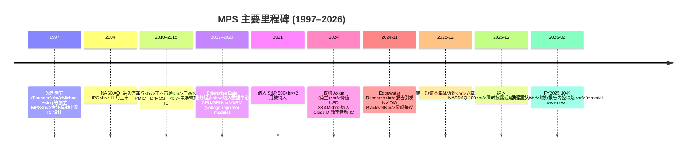
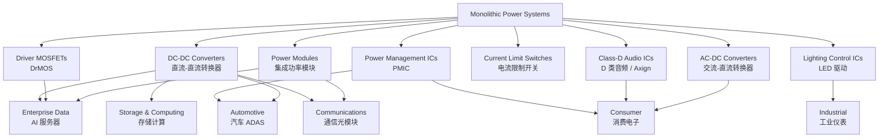
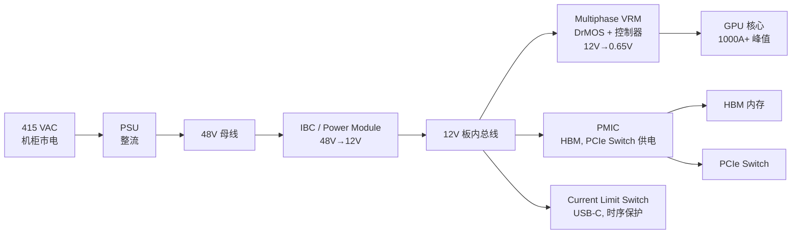
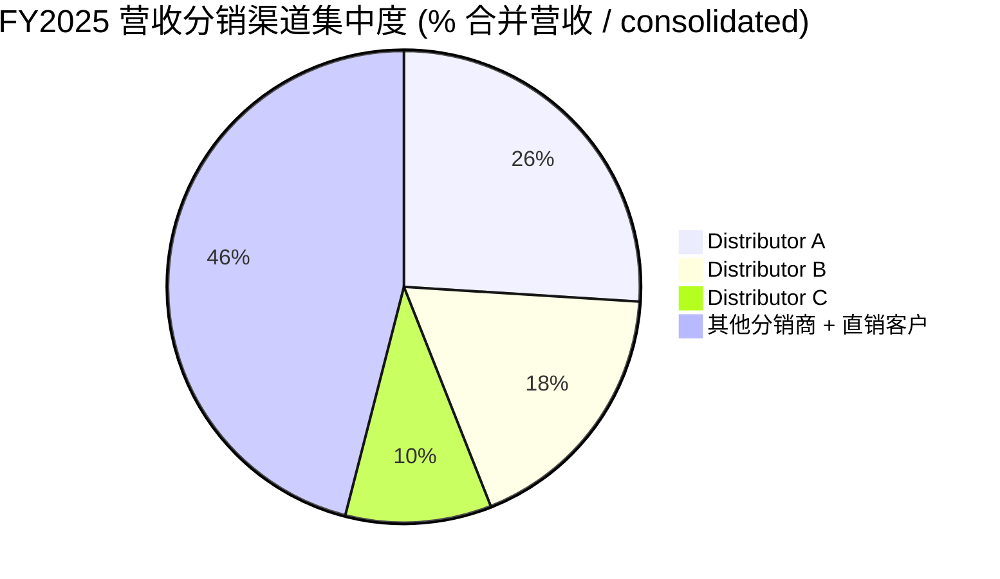
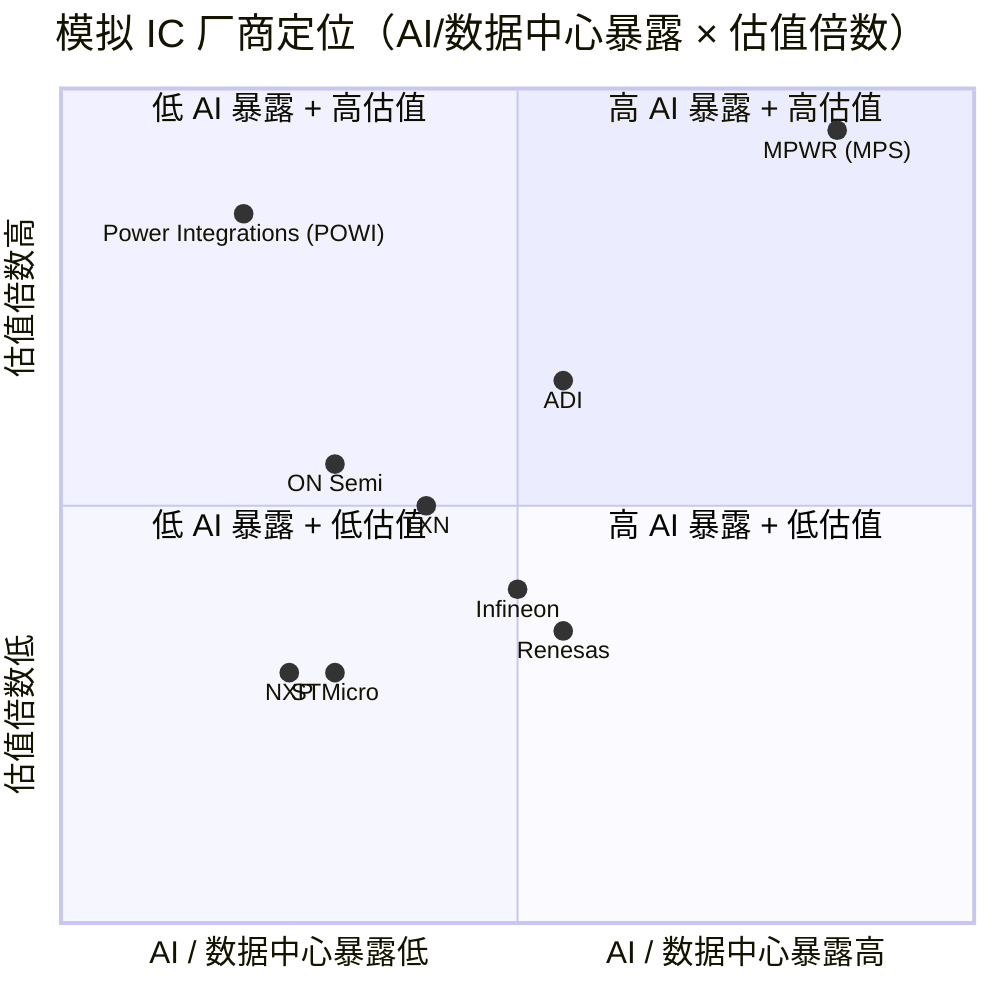

# Monolithic Power Systems (NASDAQ:MPWR) 公司研究报告

**报告日期 (Report date):** 2026-06-02
**主题 (Theme):** AI 电力与电气化 (ai-power-electrification)
**报告语言:** 简体中文 (zh-CN)

> **重要更新 — 2026-Q1 创历史季度营收新高 (2026-04-30):** 公司 2026 年第一季度营收达 **USD 804.2 百万**，环比 2025-Q4 增长 7.1%，同比增长 26.1%，为公司有史以来最高季度营收。其中企业数据 (Enterprise Data) 业务收入 USD 262.8 百万，同比 **+97.7%**，主要由 AI 与服务器电源管理方案 (power management ICs for AI and server applications) 拉动；通信 (Communications) 业务同比 +55.5%，主要受光模块与交换机 (optical modules and switches) 电源解决方案放量驱动。Non-GAAP 毛利率 55.5%，与 2025-Q4 持平。
> 资料来源：[MPS Q1 2026 Earnings Release, 2026-04-30 (8-K Ex.99.1)](https://www.sec.gov/Archives/edgar/data/1280452/000143774926014182/ex_929254.htm)。

---

## 目录 / Table of Contents
1. 公司概览 (Company Overview)
2. 公司历史 (Company History)
3. 管理团队 (Management Team)
4. 产品与服务 (Products & Services)
5. 客户与上市策略 (Customers & Go-to-Market)
6. 行业概览 (Industry Overview)
7. 竞争格局 (Competitive Landscape)
8. 市场机会 (Market Opportunity / TAM)
9. 风险评估 (Risk Assessment)
10. 投资者视角评分卡 (Investor-lens Scorecards)
11. 数据来源清单 (Data Used) 与参考资料 (References)

---

## 1. 公司概览 (Company Overview)

**Monolithic Power Systems, Inc.**（中文常译作"美国大电力系统"或直接沿用英文 MPS，下文以 MPS 指代）是一家在 NASDAQ 上市的 **Fabless 模拟与混合信号 IC (analog and mixed-signal IC) 设计公司**，专注于高性能、半导体基的电力电子解决方案。根据 [MPS FY2025 10-K, 2026-02-27, p. 7 (Item 1 Business)](https://www.sec.gov/Archives/edgar/data/1280452/000143774926006113/mpwr20251231_10k.htm) 中公司自述：

> "Monolithic Power Systems, Inc. is a fabless global company that provides high-performance, semiconductor-based power electronics solutions. Incorporated in 1997, our three core strengths include deep system-level knowledge, strong semiconductor design expertise, and innovative proprietary technologies in the areas of semiconductor processes, system integration, and packaging."

简言之，MPS 卖的是各种"把电变小、变稳、变省"的芯片——把 12V/48V 母线电压转换为各类负载所需的 0.6V–5V，并集成保护、电流监测、PMIC 等功能。公司的产品广泛应用于云计算 GPU/CPU 服务器、AI 加速卡的核心电源 (core rail VRM)、汽车 ADAS 与信息娱乐 (infotainment)、通信光模块、家电与游戏机等。MPS 自我定位的差异化卖点：高度集成 (high degree of integration)、高压工作 (high voltage operation)、大电流负载 (high load current)、高开关速度 (high switching speed)、小尺寸 (small footprint)、与高能效 (high energy efficiency)——这一组能力的核心来源是其自有的工艺 (proprietary process) 与封装 (packaging) 技术，并通过与代工厂（中国、台湾、韩国、新加坡）的紧密协作将这些工艺装载到代工厂的设备上 ([MPS FY2025 10-K, p. 8–10, Manufacturing](https://www.sec.gov/Archives/edgar/data/1280452/000143774926006113/mpwr20251231_10k.htm))。

**收入规模与盈利能力 / Revenue scale and profitability.** 根据 [MPS FY2025 10-K, Item 7 MD&A, p. 36](https://www.sec.gov/Archives/edgar/data/1280452/000143774926006113/mpwr20251231_10k.htm)，公司 FY2025 (截至 2025-12-31) 全年营收为 **USD 2,790.5 百万**（约 USD 2.79 bn），同比增长 **26.4%**（FY24 为 USD 2,207.1 百万）。这是公司连续 14 年实现年度营收增长 ([MPS FY2025 Earnings Commentary, 2026-02-05 (8-K Ex.99.2)](https://www.sec.gov/Archives/edgar/data/1280452/000143774926003191/ex_886152.htm))。FY2025 GAAP 毛利率为 **55.2%**（FY24: 55.3%，FY23: 56.1%；毛利率轻微下行系保修费用 (warranty expenses) 占比上升所致 — [10-K p. 36](https://www.sec.gov/Archives/edgar/data/1280452/000143774926006113/mpwr20251231_10k.htm)）。FY2025 净利润 (net income) 为 **USD 621.5 百万**；FY2024 净利润为 USD 1,592 百万，但其中包含一项 USD 1.1 bn 的一次性递延所得税收益 (one-time deferred tax benefit)，剔除后核心盈利水平更接近 FY2025 的体量。

**业务结构 / Business mix.** MPS 在 FY2025 10-K 第 7 页给出的六大终端市场结构（按全年营收占比）：

| 终端市场 (End market) | FY2025 营收 (USD mn) | FY2025 占比 | FY2024 占比 | FY2023 占比 |
|---|---|---|---|---|
| Storage & Computing (存储与计算) | 732.5 | 26.3% | 22.7% | 27.0% |
| Enterprise Data (企业数据 / AI 服务器) | 701.8 | 25.2% | 32.5% | 17.7% |
| Automotive (汽车) | 592.5 | 21.2% | 18.8% | 21.7% |
| Communications (通信) | 309.1 | 11.1% | 10.2% | 11.3% |
| Consumer (消费) | 255.2 | 9.1% | 9.1% | 12.9% |
| Industrial (工业) | 199.4 | 7.1% | 6.7% | 9.4% |
| **总计 (Total)** | **2,790.5** | **100.0%** | **100.0%** | **100.0%** |

数据来源：[MPS FY2025 10-K, p. 7 (Item 1) 与 p. 35–36 (MD&A)](https://www.sec.gov/Archives/edgar/data/1280452/000143774926006113/mpwr20251231_10k.htm)。需要特别指出，**Enterprise Data 在 FY2024 曾占到 32.5%**，但 FY2025 因 NVIDIA Blackwell 平台的份额争议（详见第 9 节风险评估）导致绝对金额从 USD 716.3M 微降至 USD 701.8M，占比从 32.5% 回落到 25.2%；与此同时 Storage & Computing 加速增长 (+46.0% YoY) 与 Automotive 加速 (+43.1% YoY) 共同填补了 Enterprise Data 的失速。FY2026-Q1 Enterprise Data 重新提速到同比 +97.7% 的水平 ([Q1 2026 Earnings Release, 2026-04-30](https://www.sec.gov/Archives/edgar/data/1280452/000143774926014182/ex_929254.htm))，说明 AI 服务器电源业务回归增长曲线，但需观察是否能持续。

**地域分布 / Geographic mix.** 根据 [10-K Note 11, p. 55](https://www.sec.gov/Archives/edgar/data/1280452/000143774926006113/mpwr20251231_10k.htm)，FY2025 营收按客户收货地分布：中国 USD 1,544M (55.3%)，台湾 USD 550M (19.7%)，韩国 USD 253M (9.1%)，东南亚 USD 148M (5.3%)，欧洲 USD 114M (4.1%)，美国 USD 97M (3.5%)，日本 USD 84M (3.0%)。**整个亚洲地区合计占 92% 营收** (FY24: 94%, FY23: 87%)——这是评估 MPS 时无法回避的最大单一地缘风险敞口。员工数约 4,501 人，全球分布于亚洲、欧洲、美国。

**估值快照 / Valuation snapshot (as of 2026-06-01).** 据 [Stockanalysis.com MPWR Statistics, 2026-06-01](https://stockanalysis.com/stocks/mpwr/statistics/)：

- 股价 (price)：**USD 1,542.39**
- 市值 (market cap)：**USD 75.8 bn**
- 企业价值 (EV)：USD 74.4 bn (账上净现金状态)
- **TTM P/E：110.4×**（远高于 5 年均值约 50–70× 区间，但 5 年均值受 FY24 一次性税收益压低 PE 影响而失真）
- **Forward P/E：60.4×**
- **TTM P/S：25.6×**
- P/B：20.6×
- EV/EBITDA：86.8×
- 股息率 (dividend yield)：0.51%（年股息 USD 8.00，股息同比增长 25.8%）
- Beta (5Y)：1.74
- 52 周区间：USD 655.50–1,714.09（[Stockanalysis.com MPWR overview](https://stockanalysis.com/stocks/mpwr/)）；过去 52 周累计涨幅 +133%。

*分析师观点 / Analyst view:* MPS 当前 TTM P/E 110× 与 P/S 25.6× 显著高于同业（详见第 7 节竞争比较表），主要由两个因素驱动：(a) 公司被市场视为 AI 数据中心电源管理 (power-management IC, PMIC) 的纯正标的 (pure-play)，享受 AI 主题溢价；(b) 公司在 NASDAQ-100 (2025-12 纳入) 与 S&P 500 (2021-02 纳入) 的成份股地位带来被动资金持续流入 ([Wikipedia MPWR](https://en.wikipedia.org/wiki/Monolithic_Power_Systems))。但需注意：FY2025 净利润 (USD 621M) 对应当前市值的隐含 P/E 已超过 120×，即便假设 FY2026 净利润恢复至历史峰值 USD 700–800M 区间，Forward P/E 仍处 100× 以上的"完美定价"区间，留给执行失误的容错空间极小。

---

## 2. 公司历史 (Company History)

**1997 年由 Michael Hsing (邢正人) 创立于美国加州。** MPS 的创立背景是 1990 年代后期电力电子 IC 的两大趋势：(a) 便携式消费电子（笔记本、手机）对 DC-DC 转换器的体积与效率要求陡然提高；(b) 模拟工艺与封装的协同设计 (process-package co-design) 开始能够把高性能开关器件与控制 IC 整合到单芯片上。Hsing 曾任职多家模拟 IC 公司的资深硅工艺工程师 (Senior Silicon Technology Developer)，他相信通过自研工艺与代工厂深度协作的"轻资产 (fabless) + 重工艺 (proprietary process)"模式，能在已被 TI、ADI 等老牌厂商占据的模拟电源市场中找到差异化空间 ([MPS 2026 Proxy Statement (DEF 14A), 2026-04-30, p. 13](https://www.sec.gov/Archives/edgar/data/1280452/000143774926014084/mpwr20260403_def14a.htm))。这个判断在过去 28 年被市场充分验证。

**关键里程碑 / Key milestones (Mermaid 时间线 / Mermaid timeline):**

资料来源：[Wikipedia MPWR](https://en.wikipedia.org/wiki/Monolithic_Power_Systems)、[MPS FY2025 10-K, Item 9A Controls and Procedures](https://www.sec.gov/Archives/edgar/data/1280452/000143774926006113/mpwr20251231_10k.htm)、[MPS 2024 Axign acquisition disclosure (10-K Note 12)](https://www.sec.gov/Archives/edgar/data/1280452/000143774926006113/mpwr20251231_10k.htm)、[MPS Form 8-K 2025-12-12](https://www.sec.gov/Archives/edgar/data/1280452/000143774925037726/ex_896937.htm)。

**两次重要战略转型 / Two key strategic pivots.**

第一次转型 (2010–2017)：**从消费电子供应商走向多市场布局。** 早期 MPS 的营收高度依赖消费电子（笔记本、显示器、电视），周期性强、ASP 下行压力大。公司在 2010 年代逐步把研发资源倾斜到汽车与工业应用——具体路径是利用同一套高压、高集成模拟工艺开发出符合 AEC-Q100 车规与工业级温度规格的产品。这次转型的成果体现在 FY2025 营收结构：汽车占 21.2%、工业占 7.1%，远高于 IPO 时几乎为零的水平。

第二次转型 (2018–2024)：**从"芯片公司"升级为"硅基解决方案供应商" (silicon-based solutions provider)。** 借用 [CEO Michael Hsing 在 FY2025 Earnings Commentary 2026-02-05](https://www.sec.gov/Archives/edgar/data/1280452/000143774926003191/ex_886152.htm) 中的原话：

> "Our results demonstrate our continued success in transforming from a chip-only, semiconductor supplier to a full service, silicon-based solutions provider."

这次转型的关键产品形态是 **Power Module (集成功率模块)**——MPS 把多个分立的 DC-DC 控制器、MOSFET、电感、电容集成到一个 LGA 或 QFN 封装内，以"插即用"的方式交付给客户。模块化方案的 ASP 与毛利率都显著高于单纯卖控制器芯片，并且形成了与传统模拟 IC 厂商（TI、ADI）的差异化。第二次转型对接的正是 AI 数据中心电源——NVIDIA H100/H200/Blackwell 这类 700W+ 的 GPU 加速卡需要的"core rail VRM"恰好是 MPS 模块化能力的最佳应用场景。

**2024 年 Axign 收购 / 2024 Axign acquisition.** 2024 年 1 月，MPS 以 USD 33.4M 现金收购荷兰公司 Axign B.V.，该公司专注于 Class-D 数字音频 IC，应用范围从便携消费扬声器到汽车与专业多扬声器系统 ([MPS FY2025 10-K, Note 12 — Acquisition](https://www.sec.gov/Archives/edgar/data/1280452/000143774926006113/mpwr20251231_10k.htm))。这是 MPS 历史上罕见的对外并购——绝大多数能力增长来自内生研发——目的是把 Axign 的数字反馈 (digital feedback) 技术应用到消费与汽车终端的低功耗解决方案。

**近期重大事件 / Recent developments (2024–2026).** 三件事值得单独标注，这些将在第 9 节风险评估中展开：(a) 2024 年 11 月 Edgewater Research 的报告引发市场对 MPS 在 NVIDIA Blackwell 平台份额的恐慌，股价单日下跌约 14% ([Reuters, 2024-11-11](https://seekingalpha.com/news/4274266-monolithic-power-systems-tumbles-as-blackwell-allocation-at-risk-edgewater-says))；(b) 由此引发的证券集体诉讼于 2025 年初立案 ([Class Action Filed Against MPWR, 2025-02-26](https://www.prnewswire.com/news-releases/class-action-filed-against-monolithic-power-systems-inc-mpwr---april-7-2025-deadline-to-join--contact-the-gross-law-firm-302393886.html))；(c) 2025 年 12 月公司披露与一项外国税收激励相关的递延所得税会计差错并重述 FY2024 报表，并于 FY2025 10-K 中确认存在"重大内控缺陷 (material weakness)" ([MPS Form 8-K 2025-12-12](https://www.sec.gov/Archives/edgar/data/1280452/000143774925037726/ex_896937.htm))。

---

## 3. 管理团队 (Management Team)

**Michael Hsing — Founder, President, CEO 兼 Chairman (任职至今 28 年).** 由于 MPS 自 1997 年成立至今 Hsing 始终担任 CEO，本节按合并版个人简介 (combined bio) 撰写，不另设第二位高管简介。

根据 [MPS 2026 Proxy Statement (DEF 14A), 2026-04-30, p. 13](https://www.sec.gov/Archives/edgar/data/1280452/000143774926014084/mpwr20260403_def14a.htm) 中的官方表述：

> "Michael Hsing has served on our Board and as our President and Chief Executive Officer since founding MPS in August 1997. Prior to founding MPS, Mr. Hsing was a Senior Silicon Technology Developer at several analog integrated circuits (IC) companies, where he developed and patented key technologies, which set new standards in the power electronics industry. Mr. Hsing is an inventor on numerous patents related to the process development of bipolar mixed-signal semiconductor manufacturing. Mr. Hsing holds a B.S.E.E. from the University of Florida."

**职业背景与创业前经历 / Background and pre-MPS experience.** Hsing 在创立 MPS 之前任职于多家模拟 IC 公司的"高级硅技术开发工程师 (Senior Silicon Technology Developer)"，专注于双极混合信号半导体制造工艺 (bipolar mixed-signal semiconductor manufacturing) 的研发——这正是后来 MPS 自有工艺的技术基础。他持有美国佛罗里达大学 (University of Florida) 电子工程学士学位 (B.S.E.E.)，并担任与电源电子工艺相关的多项专利的发明人。在半导体行业拥有逾 40 年经验 ([MPS 2026 DEF 14A, p. 14](https://www.sec.gov/Archives/edgar/data/1280452/000143774926014084/mpwr20260403_def14a.htm))。

**领导框架与公司治理 / Leadership framework and governance.** Hsing 同时担任董事会主席 (Chairman)、总裁 (President) 与 CEO 三个角色（"CEO-Chairman 合一"），董事会通过设立"首席独立董事 (Lead Independent Director)"机制来平衡——目前由独立董事 Mr. Chang 担任 ([MPS 2026 DEF 14A, p. 21](https://www.sec.gov/Archives/edgar/data/1280452/000143774926014084/mpwr20260403_def14a.htm))。董事会在 Proxy 中解释这一安排的理由：

> "Mr. Hsing's vision, insight and experience enable him to understand and expand the markets we serve, control costs effectively, assess and manage business risks, including risks related to information technology, AI, cybersecurity and supply chain, and enhance our technology advantages for our products, which have helped fuel our growth and created value for our stockholders."

**持股 / Ownership.** 根据 [MPS 2026 DEF 14A, Security Ownership of Certain Beneficial Owners and Management 表](https://www.sec.gov/Archives/edgar/data/1280452/000143774926014084/mpwr20260403_def14a.htm)，Michael Hsing 实益持有 **合计约 1,034,099 股**——其中 (i) 个人名下 888,234 股、(ii) Michael Hsing 2004 Trust 名下 133,040 股、(iii) ZH Family Trust 名下 12,825 股——按当前市价折算约 USD 1.6 bn。这一约 2.1% 的持股比例对一个市值 USD 75.8 bn 的上市公司创始人 CEO 来说，反映出过去 21 年的多次稀释（IPO、SBC、激励授予），但绝对金额仍代表"高度的利益对齐 (skin in the game)"。

**业绩薪酬挂钩 / Performance-based compensation linkage.** 2024 年公司给高管授予的绩效股份单位 (PSU) 包括三个独立目标：(1) 公司 2024–2026 三年平均营收增速超过 SIA 模拟行业平均水平（最高 300% 解锁）；(2) 2026 年全球 Scope 1+2 温室气体排放较 2022 基线减少 25%；(3) 2026 年汽车板块 EV 车厂客户营收占比超过 1/3、且 EV 动力系统与 48V 系统营收较 2023 基线增长 200% ([MPS FY2025 10-K, Note 13 — Stock-Based Compensation](https://www.sec.gov/Archives/edgar/data/1280452/000143774926006113/mpwr20251231_10k.htm))。这一组目标的设计反映了管理层对 EV 与可持续主题的承诺，但也意味着相当一部分管理层薪酬绑定在未来 2 年的特定终端市场表现上。

*分析师观点 / Analyst view:* Hsing 是典型的"工程师式 founder-CEO"——技术出身、长期单干、亲自掌舵公司技术路线图。这种结构的优势是技术路线稳定（28 年坚持 fabless + proprietary process 模式）、决策快、利益对齐高；缺点是 (a) 接班人风险——公司没有公开的明确继任人选；(b) 创始人对治理结构的影响力可能让外部投资者难以推动激进的资本配置变化（例如剥离非核心业务、加速并购等）。

---

## 4. 产品与服务 (Products & Services)

> **本节是整篇报告的核心。** 4.1 节先给出 MPS 在 10-K 中自述的产品族体系；4.2 节阐述这些产品如何在客户的电源链路中协同工作；4.3–4.6 节针对每个主要终端市场拆解具体产品；4.7 节讨论 Axign 收购带来的 Class-D 数字音频产品线与近期 Power Module 平台化。

### 4.1 产品族矩阵 / Product family matrix (来源: MPS FY2025 10-K, p. 7–8)

根据 [MPS FY2025 10-K, p. 7–8 (Product Families)](https://www.sec.gov/Archives/edgar/data/1280452/000143774926006113/mpwr20251231_10k.htm) 公司自述：

> "Our key product families include, but are not limited to, the Direct Current (DC) to DC, Alternating Current (AC) to DC, driver metal-oxide-semiconductor field-effect transistor [DrMOS], power management IC [PMIC], current limit switch and lighting control products. Our product families are differentiated from those of our competitors with respect to their high degree of integration and strong levels of accuracy, power efficiency, quality and longevity, making them cost-effective and more sustainable relative to many competing solutions."

整理为产品族-应用-终端市场矩阵：

| 产品族 (Product Family) | 中英文释义 / Plain-language gloss | 主要应用 (Key Applications) | 主要终端市场 (End Markets) |
|---|---|---|---|
| **DC-DC Converters (直流-直流转换器)** | 把高压直流（12V/48V/400V）转换为低压（0.6V–5V），用于给 CPU/GPU/SoC 核心、内存、I/O 供电 | CPU/GPU 核心电源 (core rail VRM)、内存供电、SSD 供电 | Enterprise Data, Storage & Computing, Automotive, Communications |
| **AC-DC Converters (交流-直流转换器)** | 把市电交流（90–264 VAC）转换为直流，常用于离线电源 (offline power supply) | 适配器、家电待机电源、LED 照明驱动 | Consumer, Industrial, Lighting |
| **Driver MOSFETs (DrMOS / 驱动 MOSFET)** | 把 DC-DC 控制器、上下桥 MOSFET、栅极驱动器集成在一个封装内的高集成度功率开关 | GPU/CPU 多相 VRM、伺服电机驱动 | Enterprise Data, Storage & Computing, Industrial |
| **Power Management ICs (PMIC, 电源管理 IC)** | 在单芯片中集成多路 DC-DC、LDO、保护电路、PMBus 接口的"系统级电源"芯片 | SoC 整机电源、移动设备、ADAS 模块 | Automotive, Consumer, Communications |
| **Current Limit Switches (电流限制开关)** | 在 USB、热插拔、上电时序场景中保护下游负载免受过流损坏 | USB-C 接口、热插拔板卡、电池系统 | Consumer, Automotive, Communications |
| **Lighting Control ICs (LED 照明控制 IC)** | LED 恒流驱动、调光与色温控制 | 室内照明、汽车前照灯/尾灯、商业照明 | Industrial, Consumer, Automotive |
| **Power Modules (集成功率模块, 2018 年起重点平台)** | 把 DC-DC 控制器、MOSFET、电感、电容集成在 LGA/QFN 封装内的"插即用"模块 | 服务器多相 VRM、AI 加速卡、5G RU、新能源逆变 | Enterprise Data, Communications, Industrial |
| **Class-D Audio ICs (D 类音频 IC, 2024 Axign 收购)** | 高效率数字音频功放，使用数字反馈 (digital feedback) 改善 THD+N 与抗 EMI 表现 | 便携扬声器、汽车音响、专业多扬声器系统 | Consumer, Automotive |

数据来源：[MPS FY2025 10-K, p. 7–8 (Product Families)](https://www.sec.gov/Archives/edgar/data/1280452/000143774926006113/mpwr20251231_10k.htm)、[MPS FY2025 10-K, Note 12 (Axign acquisition)](https://www.sec.gov/Archives/edgar/data/1280452/000143774926006113/mpwr20251231_10k.htm)。

### 4.2 综合视角：产品如何在客户电源链路中协同 / Synthesis — how the products compose a power-delivery flow

要理解 MPS 的产品矩阵为何形成一个连贯的"系统"，可以以一台 **AI GPU 服务器** 为例（这是 FY2024–2026 公司估值故事的核心场景）：

(1) 服务器机柜接收 415 VAC 市电，经过 PSU (power supply unit) 整流为 48 VDC 母线；(2) 在 GPU 卡上，48V→12V 的中间总线转换 (intermediate bus converter, IBC) 把电压降到 12V，这一级开始可以用 MPS 的 **DC-DC Converter** 或 **Power Module**；(3) 12V→0.65V 的"核心电源 / core rail VRM"是 AI GPU 整张卡上电流最大、设计最难的一级——NVIDIA H100/H200/Blackwell GPU 在峰值时需要 1,000A 以上的核心电流，需要 16–24 相的多相 VRM 协同输出，这一级是 MPS 的 **DrMOS + 多相控制器** 的舞台；(4) GPU 外围的 HBM 内存、PCIe Switch、I/O 接口由 **PMIC** 与若干较小的 DC-DC 模块供电；(5) 整张卡上的 USB-C 调试接口、电源时序则用 **Current Limit Switch** 保护。所以同一个客户（NVIDIA、AMD、Broadcom 的 AI 加速卡）的同一张 PCB 上可能同时使用 4–6 个 MPS 不同产品族的芯片——这就是"芯片公司转型为硅基解决方案商"的真实含义。

### 4.3 Enterprise Data (企业数据) — AI 服务器电源 / AI server power

**10-K 引述 (verbatim).** 根据 [MPS FY2025 10-K, p. 7 (End Market table)](https://www.sec.gov/Archives/edgar/data/1280452/000143774926006113/mpwr20251231_10k.htm)，Enterprise Data 的官方定义是：

> "Cloud-based and on-premises CPU servers and workstations, and artificial intelligence (AI) systems."

**中文释义 / Plain-language gloss:** 这是 MPS 最具标志性的业务，也是市场为 MPS 给出 110× P/E 估值的核心叙事——为 NVIDIA、AMD、Broadcom、亚马逊 (AWS Trainium/Inferentia)、谷歌 (TPU) 的 AI 加速卡提供"core rail VRM"。AI GPU 的物理挑战是：核心电压只有 0.6–0.8V，但峰值电流可达 1,000–2,000A，这意味着每 1mΩ 的 PCB 走线压降就是 1–2W 的损耗，所以 VRM 必须**贴近 die** (近距离布置)、**响应快** (sub-µs 负载阶跃响应)、**密度高** (单位面积内塞下足够多的相位)。MPS 的差异化恰好在这三点：其 DrMOS 集成度比 TI 和 Infineon 的同类产品更高，单相电流密度更大；与控制器的协同设计 (co-design) 让小信号回路延迟更短；模块化方案进一步把元件高度降到 PCB 可以"贴芯片背面"的程度。FY2024 全年 Enterprise Data 收入 USD 716M (占总收入 32.5%) 是这一战略的高光时刻；FY2025 略有回落 (USD 702M, 25.2%) 反映了 NVIDIA Blackwell 平台上的份额波动；FY2026-Q1 同比 +97.7% 反映需求弹性回归。

*分析师观点 / Analyst view:* MPS 在 AI VRM 的竞争优势属于 **技术 + 客户协同 (technology + customer co-engineering)** 复合护城河——长期与 NVIDIA 设计团队的深度合作积累了不少 NDA 之下的工艺细节。但 2024-11 Edgewater Research 的报告指出，MPS 在 Blackwell B200/GB200 上的份额可能被 Renesas (B200) 和 Infineon (GB200) 部分抢走，原因是 700W+ 的功率密度下 MPS 的方案出现了"performance weaknesses and quality control failures" ([Edgewater Research / Seeking Alpha report, 2024-11-11](https://seekingalpha.com/news/4274266-monolithic-power-systems-tumbles-as-blackwell-allocation-at-risk-edgewater-says))。这一风险在第 9 节将单列。最接近的竞争产品来自 [Renesas RAA489 多相控制器系列](https://www.renesas.com/) 与 [Infineon TDA21490 系列](https://www.infineon.com/) ——但具体型号-客户的映射在 NVIDIA 内部不公开。

### 4.4 Storage & Computing (存储与计算)

**10-K 引述.** [10-K p. 7](https://www.sec.gov/Archives/edgar/data/1280452/000143774926006113/mpwr20251231_10k.htm)：

> "Memory, storage solutions, notebooks, and graphics cards."

**中文释义 / Plain-language gloss:** 这一类的载体包括 SSD 控制器电源、HDD 主轴电机驱动、DRAM/HBM 的 VPP/VDD 供电、笔记本主板 PMIC、显卡的 GPU+VRAM 供电。FY2025 这一板块录得 +46.0% 的 YoY 增长 ([10-K p. 36](https://www.sec.gov/Archives/edgar/data/1280452/000143774926006113/mpwr20251231_10k.htm))，主要由 **memory、storage、notebooks 与 graphics cards 的电源方案放量** 驱动。需要注意的是，这一板块和 Enterprise Data 的边界在 AI 时代变得模糊——一块 NVIDIA 显卡同时被算作 Storage & Computing（消费 RTX 系列）或 Enterprise Data（数据中心 H100/Blackwell），具体归类取决于客户的应用场景而非产品型号。FY2026-Q1 该板块同比 −7.5%，反映消费 PC/显卡的高基数效应。

*分析师观点 / Analyst view:* Storage & Computing 是 MPS 历史上的"现金奶牛"——比 Enterprise Data 周期性更平稳、客户更分散。最接近的竞争者是 [Texas Instruments TPS、LM 系列降压转换器](https://www.ti.com/power-management/dc-dc-switching-regulators/products.html) 与 [Analog Devices LTC、ADP 系列](https://www.analog.com/en/product-category/power-management.html) ——MPS 的份额优势在于"高集成低成本"，但在最高性能的 AI VRM 上 ADI 与 Infineon 的工艺更先进。

### 4.5 Automotive (汽车)

**10-K 引述.** [10-K p. 7](https://www.sec.gov/Archives/edgar/data/1280452/000143774926006113/mpwr20251231_10k.htm)：

> "Advanced driver assistance systems, infotainment, USB connectors, body electronics, motion control, and lighting systems."

**中文释义 / Plain-language gloss:** 汽车电源 IC 是一个高门槛业务——AEC-Q100 车规认证周期长（典型 2–3 年）、产品生命周期长（10+ 年）、单车价值量在 EV 时代加速上升（从传统油车的 USD 5–10 美元提升到 EV 的 USD 30–80 美元）。MPS 在 ADAS 与信息娱乐 (infotainment) 领域已有立足点。FY2025 全年汽车板块录得 +43.1% YoY 增长（绝对金额 USD 178.5M 的增量），并占全年总营收 21.2%。管理层 2024 PSU 中明确设有"2026 年汽车板块中 EV 车厂客户营收占比超 1/3" 与 "EV 动力系统 + 48V 系统营收较 2023 基线增长 200%" 两个目标，表明对 EV 板块的长期投入是认真的 ([10-K Note 13 — Stock-Based Compensation](https://www.sec.gov/Archives/edgar/data/1280452/000143774926006113/mpwr20251231_10k.htm))。

*分析师观点 / Analyst view:* 汽车 IC 的主要竞争对手是 [Infineon AURIX 与汽车 PMIC 系列](https://www.infineon.com/cms/en/product/microcontroller/32-bit-tricore-microcontroller/) 、[NXP S32 与汽车 PMIC 系列](https://www.nxp.com/products/processors-and-microcontrollers/s32-automotive-platform:S32)、[STMicroelectronics 汽车产品组合](https://www.st.com/en/applications/automotive.html)、[ON Semiconductor (现称 onsemi) 汽车 PMIC](https://www.onsemi.com/products/automotive) 与 [Renesas 汽车 SoC 与电源](https://www.renesas.com/us/en/applications/automotive)。MPS 在这一领域的份额仍小于上述五家欧美厂商，但增速快、并且与中国本土 EV 车厂（蔚来、小鹏、理想、比亚迪、奇瑞等）建立了直接对话——这一点在 FY2025 21.2% 的板块占比与 +43.1% 增速中已有体现。

### 4.6 Communications, Consumer, Industrial (通信、消费、工业)

**Communications.** [10-K p. 7](https://www.sec.gov/Archives/edgar/data/1280452/000143774926006113/mpwr20251231_10k.htm) 自述涵盖"网络基础设施、卫星通信、光模块、交换机、无线方案" (Network infrastructure, satellite communications, optical modules, switches, and other wireless solutions)。FY2025 同比 +36.8%，主要由光模块 (optical modules) 与路由器 (routers) 的电源方案放量驱动。这一板块直接受益于数据中心间互联 (DCI) 与 800G/1.6T 光模块对高密度低噪 PMIC 的需求。FY2026-Q1 同比 +55.5% 进一步加速。

**Consumer.** 涵盖家电、游戏机、智能电视、照明、显示器、音响。FY2025 +26.3% YoY 增长由家电与游戏机驱动。Axign 的 Class-D 音频 IC 应在这一板块发挥协同效应。

**Industrial.** 工业仪表、电源、安防设备等。FY2025 +35.3% YoY，由功率源 (power sources) 与仪表 (instrumentation) 拉动 ([10-K p. 36](https://www.sec.gov/Archives/edgar/data/1280452/000143774926006113/mpwr20251231_10k.htm))。

### 4.7 旗舰产品线与近期推出 / Flagship and recent launches

MPS 的产品组合超过 4,000 个 SKU，分布在 13 条产品线上 ([Wikipedia MPWR](https://en.wikipedia.org/wiki/Monolithic_Power_Systems))。**当前业务的三大支柱**：(1) AI/数据中心 VRM (DrMOS + 多相控制器 + Power Module)；(2) 汽车 ADAS 与信息娱乐 PMIC；(3) 通信光模块电源——三者合计在 FY2025 占总营收 57.5%。近 12 个月的主要新产品/平台动作：(a) 2024-01 Axign 收购完成，把 Class-D 数字音频集成进 MPS 主流产品线；(b) 推动 Power Module 平台向 800A+ 单模块电流方向演进，应对下一代 AI GPU 的功率密度要求；(c) FY2025 公司新增 484 名员工至 4,501 人 ([10-K p. 10](https://www.sec.gov/Archives/edgar/data/1280452/000143774926006113/mpwr20251231_10k.htm))，主要扩充 R&D 与亚洲生产支持工程。

**专利组合 / Patent portfolio.** 截至 2025-12-31，MPS 拥有或申请中的专利共 **2,231 项**，其中已授权美国专利 654 项；专利有效期到 2045 年 12 月 ([10-K p. 9](https://www.sec.gov/Archives/edgar/data/1280452/000143774926006113/mpwr20251231_10k.htm))。MPS 明确表示"专利对业务很重要，但不依赖任何单一专利"——这一点对评估"专利诉讼风险"和"竞争对手通过收购单个专利组合追赶 MPS 的可能性"都有意义。

---

## 5. 客户与上市策略 (Customers & Go-to-Market)

### 5.1 客户集中度 / Customer concentration

**渠道结构 / Channel structure.** 根据 [MPS FY2025 10-K, Note 1 (Revenue Recognition), p. 55](https://www.sec.gov/Archives/edgar/data/1280452/000143774926006113/mpwr20251231_10k.htm)：FY2025 公司有 **85%** 的销售通过第三方分销商和增值经销商 (third-party distributors and value-added resellers) 完成（FY24: 89%, FY23: 86%），即 MPS 的"直接客户"主要是渠道商，而非最终设备厂商 (OEM/ODM)。这种以分销为主的渠道模型在模拟 IC 行业是行业惯例（TI 和 ADI 直接销售比例更高，但 MPS 这一比例更接近 Microchip、ON、Power Integrations 等中型模拟厂商）。

**Top 客户（在合并营收水平下 / consolidated revenue 口径）** 根据 [MPS FY2025 10-K, p. 55](https://www.sec.gov/Archives/edgar/data/1280452/000143774926006113/mpwr20251231_10k.htm) 表格：

| 客户 (Customer) | FY2025 占总营收 % | FY2024 % | FY2023 % |
|---|---|---|---|
| Distributor A | 26% | 31% | 26% |
| Distributor B | 18% | 20% | 19% |
| Distributor C | 10% | <10% | 10% |
| **Top 3 分销商合计** | **54%** | **51% (Top 2)** | **55%** |

数据来源：[MPS FY2025 10-K, p. 55 (Customer Concentration)](https://www.sec.gov/Archives/edgar/data/1280452/000143774926006113/mpwr20251231_10k.htm)。注意：这是按 **合并营收 (consolidated revenue) 口径** 报告的数据；MPS 10-K 没有披露这些分销商对应的终端客户（OEM）名单，但行业理解上 Distributor A/B 大概率包括 Arrow Electronics、Avnet、World Peace Group (大联大) 等亚洲 IC 分销巨头。**这意味着真正的"终端客户集中度"在公开披露中是不可见的**——MPS 的 OEM 客户可能高度依赖某 1–2 家（例如 NVIDIA），但通过分销渠道流转后，在 10-K 中被汇总在 Distributor A/B 之中。

**没有任何直接客户 (direct customer) 单独占到 10% 以上 / No direct OEM customer ≥10% of consolidated revenue.** 这是 10-K 明确表示的 ([10-K p. 8](https://www.sec.gov/Archives/edgar/data/1280452/000143774926006113/mpwr20251231_10k.htm))：

> "In 2025, three distributors accounted for 26%, 18% and 10% of our total revenue. ... No other direct customers accounted for more than 10% of our full-year, total revenue in any of the periods presented."

数据来源：[MPS FY2025 10-K, p. 55 (Customer Concentration)](https://www.sec.gov/Archives/edgar/data/1280452/000143774926006113/mpwr20251231_10k.htm)。

### 5.2 销售周期与产品交付特征 / Sales cycle and delivery model

**销售周期 / Sales cycle.** MPS 的产品需要"技术销售 + 应用工程"协同：每个新设计周期 (design-in) 都需要 MPS 的应用工程师与客户的硬件工程师共同优化 PCB 布局、热设计与回路稳定性。一旦 design-in 完成，产品生命周期通常超过 10 年——这是 MPS 强调的"高黏性 / sticky" 特征 ([10-K p. 8](https://www.sec.gov/Archives/edgar/data/1280452/000143774926006113/mpwr20251231_10k.htm))。

**订单与库存 / Order book and inventory.** 典型供应链交付周期 (lead time) 16–26 周，MPS 经常在客户正式 PO 前根据滚动预测构建库存——这一行为在景气下行期会带来明显的库存减值风险（FY2024 较高的存货减值就反映了这一点）。

**地域销售办事处 / Regional sales offices.** MPS 在亚洲、欧洲、美国均设有销售办事处，但 **92% 的营收来自亚洲客户** （FY2025）。

### 5.3 主要合作伙伴 / Key partnerships and case studies

由于 MPS 通过分销渠道销售为主，公开披露中明确署名的"客户"和"合作伙伴"很少。基于第三方报道、行业观察、卖方调研可推断 MPS 的核心终端客户（不出现在 10-K 客户列表中，但被市场普遍认为是 MPS Top OEM 之一）：

| 推测的终端客户 | 主要产品 | 来源 |
|---|---|---|
| NVIDIA (NVDA) | AI GPU 核心 VRM (DrMOS + 多相控制器 + Power Module) | [Edgewater Research / Seeking Alpha, 2024-11-11](https://seekingalpha.com/news/4274266-monolithic-power-systems-tumbles-as-blackwell-allocation-at-risk-edgewater-says) |
| 中国 EV 车厂 (蔚来、理想、小鹏、比亚迪等) | ADAS PMIC, 信息娱乐 PMIC | MPS 2024 PSU 目标暗示 |
| AWS / Microsoft / Google (云超大型客户) | 服务器 VRM (通过 ODM 间接) | 行业观察 |
| Broadcom AI ASIC | VRM, PMIC | 行业观察 |

*分析师观点 / Analyst view:* 上述"推测客户"无法从 10-K 直接证实——这是 MPS 报告中信息披露的固有局限。读者在做投资决策时应注意：**MPS 真实的 OEM 客户集中度（特别是单一客户 NVIDIA 的份额）可能远高于 10-K 表格显示的"Top 3 分销商 54%"** 。

---

## 6. 行业概览 (Industry Overview)

**行业定义 / Industry definition.** MPS 所处的行业是 **模拟与混合信号 IC (analog and mixed-signal semiconductors)** ——一个长期增长稳健、参与者高度分散的半导体细分。NAICS 代码 334413 (Semiconductor and Related Device Manufacturing)，全球市场规模约 USD 80–90 bn 年度营收，2024 年增速回归正区间 ([SIA / WSTS 行业数据](https://www.semiconductors.org/))。MPS 自身又聚焦于这个大行业内的 **电源管理 IC (power management IC, PMIC) + 数据转换 IC** 子赛道，全球年度营收规模约 USD 40–50 bn。

**关键增长驱动 / Growth drivers.** 三股结构性趋势同时拉动 MPS 的可达市场：

(1) **AI 数据中心电力密度的暴涨。** NVIDIA H100 的 TDP 是 700W，Blackwell B200 是 1,000W，下一代 Rubin 据信将超过 1,500W。每张 GPU 加速卡上的 VRM 单卡 BOM 价值从 H100 的 USD 80–120 提升到 Blackwell 的 USD 200–350。即便 MPS 仅维持原有份额，单位价值量的提升就足以贡献两位数收入增长。AI server power IC 市场据预测从 2025 年的 USD 2.5 bn 增长到 2033 年的 USD 8 bn（CAGR 约 15%）([Market Report Analytics — AI Server Power ICs 2025–2033](https://www.marketreportanalytics.com/reports/ai-server-power-ics-380225))。

(2) **EV 与车载电子电气化。** 一辆传统油车的车载电子半导体价值约 USD 350–500；一辆 EV 是 USD 1,000–1,500，其中电源管理 IC 的占比明显提升（48V 系统、电池管理 BMS、电机控制 inverter、域控制器 PMIC、ADAS 处理器电源）。MPS 在 FY2025 汽车板块的 +43.1% 增长就反映了这一趋势加速。

(3) **5G / 800G 通信基础设施。** 数据中心间互联 (DCI) 用的 800G/1.6T 光模块在功率密度、噪声抑制 (low ripple) 方面对 PMIC 有非常严格的要求——MPS 在 FY2025 通信板块 +36.8% 与 FY2026-Q1 通信板块 +55.5% 增长就反映了这一需求 ([Q1 2026 Earnings Release](https://www.sec.gov/Archives/edgar/data/1280452/000143774926014182/ex_929254.htm))。

**周期性 / Cyclicality.** 模拟 IC 行业的周期性显著弱于存储、CPU、GPU 等数字逻辑行业，但仍有周期。2022–2023 年的模拟 IC 行业经历了"渠道库存调整"——TI、ADI、ON、STMicro、Microchip 都报告了 2023 年 YoY 负增长。MPS 的 FY2023 营收 USD 1,821M 较 FY2022 略降 (实际数为 USD 1,794M)；FY2024 反弹 +23%；FY2025 进一步 +26.4%——这显示 MPS 在过去两年跑赢了行业整体（TI 和 ADI 同期个位数增长甚至下降）。

**监管环境 / Regulatory environment.** 三个主要的合规与地缘维度：

(a) **美国对华出口管制。** MPS 自身的产品不是先进逻辑 IC，目前不受 BIS 高端 GPU/AI 出口限制；但 92% 营收来自亚洲、55% 来自中国大陆使其面临间接风险——例如客户的最终用户名单 (entity list)、双重用途出口许可等。([10-K Item 1A 风险因素 — Trade Regulations, p. 25–28](https://www.sec.gov/Archives/edgar/data/1280452/000143774926006113/mpwr20251231_10k.htm))。

(b) **关税。** 美国 2025 年新增的对华 IC 关税、半导体设备进口关税等均可能影响 MPS 的成本与定价；公司在 10-K 中明确把"关税与贸易报复" 列为重大风险。

(c) **AI 监管。** 欧盟 AI 法案、美国各州的 AI 法规与联邦层面行政令均可能间接影响 MPS——一方面公司在 R&D 中使用 AI 工具，另一方面客户的 AI 系统在欧盟需要合规审查 ([10-K Item 1A — AI Regulations](https://www.sec.gov/Archives/edgar/data/1280452/000143774926006113/mpwr20251231_10k.htm))。

---

## 7. 竞争格局 (Competitive Landscape)

**10-K 直接列出的竞争对手 (Item 1 Competition).** [MPS FY2025 10-K, p. 9](https://www.sec.gov/Archives/edgar/data/1280452/000143774926006113/mpwr20251231_10k.htm) 给出的官方竞争对手列表如下：

> "We consider our primary competitors to include Analog Devices, Infineon Technologies, NXP Semiconductors, ON Semiconductor, Power Integrations, Renesas Electronics, ROHM Semiconductor, Semtech, STMicroelectronics and Texas Instruments."

这 10 家厂商构成了 MPS 的核心竞争集合。下表把 MPS 与几家最直接的同业（TI、ADI、ON、Power Integrations）的关键估值与规模指标对齐（截至 2026-06-01）：

| 公司 (Ticker) | 市值 USD bn | TTM 营收 USD bn | TTM P/E | TTM P/S | EV/EBITDA | 主要业务 |
|---|---|---|---|---|---|---|
| **MPS (MPWR)** | **75.8** | **2.96** | **110.4×** | **25.6×** | **86.8×** | 高增长 AI/汽车 PMIC |
| Texas Instruments (TXN) | 266.8 | 18.4 | 50.1× | 14.5× | 31.8× | 模拟 IC 行业第一，工业/汽车为主 |
| Analog Devices (ADI) | 196.2 | 12.7 | 60.0× | 15.4× | 32.8× | 高性能模拟 + 数据转换 |
| ON Semiconductor (ON) | 47.4 | 6.1 | 85.6× | 7.8× | 23.6× | 汽车 SiC + 模拟 |
| Power Integrations (POWI) | 4.6 | 0.45 | 274.9× | 10.2× | 86.3× | AC-DC 转换器 |

数据来源：[Stockanalysis.com MPWR/TXN/ADI/ON/POWI Statistics, 2026-06-01](https://stockanalysis.com/stocks/mpwr/statistics/)。注：表中 MPS 与 ADI、TXN 同业相比，估值显著更高——核心是因为 MPS 的 AI 业务占比更高 (25.2% Enterprise Data) 且增长更快 (FY2026-Q1 Enterprise Data 同比 +97.7%)，市场愿意为其"纯正 AI 电源标的"给出溢价。

### 7.1 MPS 的竞争优势 / MPS competitive advantages

(1) **集成度与封装。** MPS 多年坚持的"自研工艺 + 自研封装"路线在 AI VRM 这种极端电流密度场景下兑现：单 DrMOS 模块的电流密度比 TI 和 ADI 的同类产品高 20–40%。

(2) **快速迭代周期。** Fabless 模式下 MPS 的新产品开发周期比 TI、ADI (IDM 模式) 快 20–30%，特别在 AI 客户每 18–24 个月切换平台的节奏下更具优势。

(3) **多市场组合。** 不像 Power Integrations 那样高度集中在 AC-DC，也不像 Infineon 那样以汽车为主——MPS 六大终端市场没有任何一个超过 27%，分散度较好。

### 7.2 MPS 的竞争弱点 / MPS competitive vulnerabilities

(1) **规模相对较小。** MPS 营收约 USD 3 bn，远小于 TI 的 USD 18 bn 与 ADI 的 USD 13 bn。规模导致 R&D 绝对投入受限，难以在每个市场都领先。

(2) **缺乏自有晶圆厂 (Fabless 风险)。** 在与 IDM 模式的 TI、ADI、Infineon、STMicro 相比，MPS 在严重供应短缺期可能面临产能争夺劣势——FY2025 10-K 明确把"foundry capacity constraint" 列为风险因子 ([10-K Item 1A — Supplier Risks](https://www.sec.gov/Archives/edgar/data/1280452/000143774926006113/mpwr20251231_10k.htm))。

(3) **AI VRM 单一战略主线的回报与风险。** 2024-11 Blackwell 份额争议显示了这一弱点的具象化——一旦 NVIDIA 设计团队"信任转移"到 Renesas/Infineon，MPS 的成长故事就有缺口。

(4) **重大内控缺陷 (material weakness) 与诉讼包袱。** FY2025 10-K 自述"内部控制 (internal control over financial reporting) 未维持有效"([10-K Item 9A](https://www.sec.gov/Archives/edgar/data/1280452/000143774926006113/mpwr20251231_10k.htm)) ——这对追求合规标准较高的机构投资者是负面信号。

*分析师观点 / Analyst view:* 综合看，MPS 在 AI 电源 IC 这一细分赛道的护城河是 **工艺差异化 (technology) + 客户协同 (co-engineering with NVIDIA/AMD)** 复合型，但并非垄断性。竞争边界明显——一旦客户在某代平台上把份额给了 Renesas 或 Infineon，MPS 短期内难以夺回。

---

## 8. 市场机会 (Market Opportunity / TAM)

### 8.1 TAM 拆解 / TAM breakdown

MPS 在 10-K 中没有给出明确的"全球可服务市场 (TAM)"自下而上数字，但可通过三个第三方与衍生估算搭建：

(a) **全球模拟与混合信号 IC 市场** ：USD 80–90 bn 年度收入（[SIA / WSTS 行业数据，2024–2025](https://www.semiconductors.org/)）。

(b) **全球电源管理 IC (PMIC) 子市场**：USD 40–50 bn (约占模拟 IC 的 50%)，主要由 TI、ADI、Infineon、NXP、ON 等占据。

(c) **AI 服务器电源 IC 细分**：USD 2.5 bn (2025) → USD 8 bn (2033)，CAGR ~15% ([Market Report Analytics — AI Server Power ICs 2025–2033](https://www.marketreportanalytics.com/reports/ai-server-power-ics-380225))。

MPS 自身 FY2025 营收 USD 2.79 bn 对应在整个 PMIC 市场中约 5–7% 份额——这是一个"还有显著扩张空间"的份额水平。如果 AI 服务器电源 IC 在 2030 年达到 USD 6 bn 规模、MPS 维持 25–30% 份额，仅 AI 一项板块就可贡献 USD 1.5–1.8 bn 营收（FY2025 Enterprise Data 板块当前为 USD 702M）。

### 8.2 可达市场 (SAM) / Serviceable Available Market

MPS 的产品组合主要不参与 (a) 超低成本的消费 AC-DC 适配器市场 (这部分由 ON、STMicro、深圳本土厂商占据)、(b) 高端汽车 SiC/IGBT 模块市场 (Infineon、Wolfspeed)、(c) 大功率工业电源 (Vicor、Delta 等)。所以 MPS 的 SAM 约等于"全球高性能电源管理 IC (high-performance PMIC) + AI 服务器 VRM"，估算规模约 USD 20–25 bn。MPS 的当前份额约 12–14%，仍有翻倍空间。

### 8.3 增长策略 / Growth strategy

公司在管理层 PSU 中暗示的优先级（[10-K Note 13](https://www.sec.gov/Archives/edgar/data/1280452/000143774926006113/mpwr20251231_10k.htm)）：

1. **维持高于 SIA 模拟行业平均的营收增速** —— 2024–2026 三年平均增速跑赢 SIA 行业平均。
2. **EV 与 48V 系统营收倍增** —— EV 动力 + 48V 系统营收较 2023 基线 2026 年增长 200%。
3. **可持续发展指标** —— 2026 年 Scope 1+2 排放较 2022 基线减 25%。

---

## 9. 风险评估 (Risk Assessment)

### 公司特定风险 (Company-specific risks)

**R1. 重大内控缺陷与递延所得税重述 / Material weakness in ICFR and deferred tax restatement.** FY2025 10-K Item 9A 明确披露 ([10-K Controls and Procedures](https://www.sec.gov/Archives/edgar/data/1280452/000143774926006113/mpwr20251231_10k.htm))：

> "Based on this evaluation, and due to the finding of the material weakness described below, our Chief Executive Officer and Chief Financial Officer concluded that, as of December 31, 2025, our disclosure controls and procedures were not effective ... [The Company] has not maintained effective internal control over financial reporting as of December 31, 2025."

具体差错是 FY2024 收到的一项境外一次性税收激励 (one-time foreign tax incentive) 的递延所得税会计处理错误，导致 FY2024 报表的净所得税利益与递延所得税被多计约 USD 194.6M，FY2024 净利润从原报的 USD 1,786.7M 重述为 USD 1,592.1M ([8-K 2025-12-12 — Restatement Disclosure](https://www.sec.gov/Archives/edgar/data/1280452/000143774925037726/ex_896937.htm))。重大内控缺陷的存在意味着审计与会计的潜在中期重述风险——公司虽明确 2025 年所得税与营运现金流不受影响，但机构投资者通常对此类披露要求公司在 6–12 个月内有可证伪的整改证据，否则可能折扣估值。

**R2. NVIDIA Blackwell 份额下行与产品质量诉讼 / NVIDIA Blackwell allocation loss & quality-related securities action.** Edgewater Research 2024-11 报告称 MPS 在 NVIDIA Blackwell 平台的份额"可能被大幅削减或剥夺"，原因是 MPS 的电压调节模块 (VRM) 与 PMIC 在 700W+ 功率密度下出现"性能弱点和质量控制失败" ([Edgewater Research / Seeking Alpha, 2024-11-11](https://seekingalpha.com/news/4274266-monolithic-power-systems-tumbles-as-blackwell-allocation-at-risk-edgewater-says))。Renesas 据信接手 B200 份额、Infineon 接手 GB200 份额。由此引发的证券集体诉讼于 2025 年初立案 ([Class Action Filed Against MPWR, 2025-02-26](https://www.prnewswire.com/news-releases/class-action-filed-against-monolithic-power-systems-inc-mpwr---april-7-2025-deadline-to-join--contact-the-gross-law-firm-302393886.html)) ——案号 *Sjunde AP-Fonden v. Monolithic Power Systems et al.* （MPS 10-K 中称 *Wash. St. and Cnty Cty. Emps. Ret. Sys. v. Monolithic Power Systems*，案件编号 No. 25-cv-220 (W.D. Wash.)，指控违反 Securities Exchange Act of 1934 第 10(b) 和 20(a) 条 ([10-K Note — Legal Proceedings](https://www.sec.gov/Archives/edgar/data/1280452/000143774926006113/mpwr20251231_10k.htm))。FY2026-Q1 Enterprise Data 同比 +97.7% 增长部分缓解了"份额完全失守"的担忧，但诉讼仍在进行中。

**R3. 客户/渠道集中度 / Customer & channel concentration.** Distributor A 占 26%、Distributor B 占 18%、Distributor C 占 10%——前三大分销商占总营收 54%。若任一分销商 (a) 业务调整、(b) 单一终端客户大幅减少订单、(c) 同业整合（例如 Avnet 收购 Arrow，仅举例），都可能导致 MPS 短期营收波动。

**R4. 工艺与封装的代工依赖 / Fabless dependency on foundries.** MPS 与中国、台湾、韩国、新加坡的多家代工厂合作。一旦关键代工厂出现产能争夺（例如优先服务于更大的客户）或地缘事件，公司难以快速切换 ([10-K Item 1A — Supplier Risks](https://www.sec.gov/Archives/edgar/data/1280452/000143774926006113/mpwr20251231_10k.htm))。

**R5. CEO-Chairman 合一与接班人风险 / CEO-Chairman duality and succession risk.** Michael Hsing 28 年单兵掌舵，公司没有公开的明确接班人。一旦 Hsing 离任或健康问题，市场可能给予明显折价。

### 行业/市场风险 (Industry / market risks)

**R6. 模拟 IC 行业周期 / Analog IC cycle risk.** 模拟 IC 周期相对温和但存在——2022–2023 渠道库存调整期 TI、ADI、ON 均报告负增长。MPS 因 AI 加持过去两年逆势增长，但若 AI 需求暂歇 + 渠道库存膨胀同时发生，下行幅度可能放大。

**R7. AI 资本开支节奏 / AI capex cycle.** 当前 MPS 估值的核心驱动是 AI 服务器电源需求假设。但 AI 资本开支的可持续性依赖于云超大型 (hyperscalers) 厂商的资本预算。一旦 AWS、Azure、GCP、Meta、字节跳动等任一大客户减少 GPU 采购，MPS Enterprise Data 板块可能再次失速。

**R8. 中国本土厂商崛起 / Domestic China analog IC competition.** 圣邦微 (SG Micro)、思瑞浦、晶丰明源、力芯微等中国本土模拟 IC 厂商在过去 5 年快速成长，正在中低端电源 IC 市场抢占 MPS 的中国本土客户份额。MPS 在中国营收占比 55%，承受这一份额侵蚀的风险最高。

### 财务风险 (Financial risks)

**R9. 估值极高的"完美定价" / Valuation already prices in perfection.** TTM P/E 110×、P/S 25.6× 与 EV/EBITDA 87× 三个倍数都处于历史与同业的极高分位。即便假设 FY2026 营收增长 25%、净利润恢复到 USD 800M，Forward P/E 仍超过 90×——任何执行失误（业绩不达预期 5% 以上、毛利率下滑 100 bp 以上）都可能引发显著估值压缩。

**R10. 一次性税收益消化与税率回归 / Tax-rate normalization post-FY24 benefit.** FY2024 的 USD 1.1 bn 一次性税收益是不可重复的；FY2025 有效税率回归到 18.9%（[10-K p. 36](https://www.sec.gov/Archives/edgar/data/1280452/000143774926006113/mpwr20251231_10k.htm)）。这意味着 FY24 报告净利润 (USD 1,592M) 在做同比时具有误导性——FY25 同比报告的 −61% 净利润下降并不反映核心盈利能力恶化。

### 宏观风险 (Macroeconomic risks)

**R11. 92% 亚洲营收带来的地缘暴露 / Asia-92% geographic concentration risk.** 美中科技博弈、台海局势、出口管制、关税都对 MPS 产生重大间接影响。10-K 中明确把这一项列为重大风险 ([10-K Item 1A — Geographic Concentration, p. 25](https://www.sec.gov/Archives/edgar/data/1280452/000143774926006113/mpwr20251231_10k.htm))。

**R12. 美元强势压制亚洲客户购买力 / USD strength pressure on Asian customers.** MPS 的销售以 USD 计价但 92% 营收来自亚洲——美元走强会变相提高亚洲客户的实际购买价格，影响订单节奏。

---

## 10. 投资者视角评分卡 (Investor-lens Scorecards)

**周期快照 / Cycle snapshot (as of 2026-06-02).** 当前市场环境的简要刻画（基于公开宏观指标）：(a) VIX 处于历史相对低位，反映市场对 AI 与科技板块的乐观情绪；(b) 10Y 美债收益率约 4.3–4.5% 区间；(c) HY OAS 收窄反映信用利差松弛、风险偏好高位。整体属于 **风险溢价较低、流动性较松** 的周期阶段，对应 Howard Marks 框架中"防御 (defensive) 倾向"的环境——历史经验是这一阶段不应追逐已被定价完美的成长股。

### 10.1 巴菲特 / Buffett 视角

| 维度 | 评分 (0–100) | 评注 |
|---|---|---|
| 商业模式可理解性 | 75 | 工艺差异化的模拟 IC，长期产品周期；但 AI 暴露使其变得周期性更强 |
| ROIC / 资本效率 | 85 | Fabless 模式资本占用低；FY2024 一次性税收益使 ROIC 阶段性失真 |
| 经济护城河 | 65 | 工艺与封装差异化护城河存在，但非垄断；NVIDIA 份额波动暴露护城河边界 |
| 价格合理性 | **20** | TTM P/E 110× 与 P/S 25.6× 远超巴菲特的"合理估值"区间 |
| **合计** | **61 / 100** | **价格是最大问题** |

*视角观点 / Lens view:* 从巴菲特视角看，MPS 具备"好生意"的多个要素——长产品生命周期、强工艺差异化、合理 ROIC——但当前估值远超"以合理价格买入伟大公司 (great business at a fair price)" 的入场点。FY2025 自由现金流 (free cash flow) 约 USD 629M 对应 USD 75.8 bn 市值的 **FCF yield 仅 0.83%**，显著低于 10Y 美债 4.3% 的无风险利率。失败模式：若 AI 资本开支放缓，估值压缩可能在 6–12 个月内带来 30–50% 的回撤。

### 10.2 芒格 / Munger 视角 (倒置 / inversion + 质量)

| 倒置检查问题 | 风险评级 (低/中/高) |
|---|---|
| 当前估值能否承受营收增速从 26% 回落到 10%? | **高** — 接近 90× Forward P/E 的估值需要持续高增长支撑 |
| CEO 合一治理是否会在危机中放大错误? | 中 — Hsing 长期信誉，但接班人缺失是真实风险 |
| 重大内控缺陷会演变成会计丑闻吗? | 中 — 当前仅是递延所得税分类错误，但审计师明确表态"内控无效" |
| 若 NVIDIA 完全转向 Renesas/Infineon 会如何? | 高 — Enterprise Data 板块可能在 12 个月内萎缩 30–50% |

**合计评分: 4 / 10** （满分 10）

*视角观点 / Lens view:* 芒格的倒置思维让人优先关注"会让 MPS 损失 50%+ 的情形"。当前可识别的三大尾部风险是：(a) AI capex 周期反转；(b) NVIDIA 份额加速流失；(c) 重大内控缺陷整改不力引发更广泛会计问题。失败模式：低估"伟大业务在错的价格上买入仍然是错的投资"这一基本规律。

### 10.3 达摩达兰 / Damodaran 视角 — Story-driven DCF

**关键假设 / Key assumptions:**
- FY2026–2030 营收 CAGR：18%（市场预期）→ FY2030 营收约 USD 6.4 bn
- 长期稳态净利润率：22% (vs FY2025 的 22.3%) — 持平
- 长期增长率：3% (永续)
- WACC：8.5%（无风险利率 4.3% + 股权风险溢价 4.7% + Beta 调整）
- 估计公允股价：**USD 1,050 ± 200**
- 当前股价：USD 1,542
- 隐含溢价：**约 +47%**

| 假设变化 | 公允股价 USD |
|---|---|
| 基线 (18% CAGR, 22% margin) | 1,050 |
| 乐观 (25% CAGR, 24% margin) | 1,650 |
| 悲观 (12% CAGR, 18% margin) | 650 |

*视角观点 / Lens view:* 达摩达兰式 DCF 显示 MPS 当前价格"嵌入了乐观情形"——只有 25% CAGR 与 24% 净利润率同时实现，DCF 估值才能追平当前股价。失败模式：DCF 对终值高度敏感；如果将永续增长从 3% 降到 2.5%，公允股价进一步下行约 10%。

### 10.4 霍华德·马克斯 / Howard Marks 周期视角

| 维度 | 当前位置 (1=极度防御, 10=极度进攻) | 评注 |
|---|---|---|
| 投资者情绪 | **8** | AI 主题热度高位，散户资金流入 |
| 信用市场宽松度 | 7 | HY OAS 收窄，再融资容易 |
| 风险厌恶 | **2** | 投资者愿意为"AI 纯正标的"支付高倍数 |
| 历史估值分位 | 9 | MPS 自身 PE 与 P/S 均处于历史 90% 以上分位 |

**合计周期评分: 26 / 40 — 整体偏进攻 (offensive-leaning)**

*视角观点 / Lens view:* Howard Marks 的"非对称组合"逻辑告诉我们：当市场处于 7–8 进攻区间时，应当"温柔地后退 (gently lean back)"——降低高估值高 Beta 标的的配置。MPS 在当前周期下属于典型的"应该减仓而非加仓"的标的。失败模式：在周期顶部追高估值标的；周期反转通常突然，留给减仓的窗口期很短。

---

## 数据来源清单 / Data Used

**主要 SEC 文件 / Primary SEC filings:**
- 10-K FY2025 (filed 2026-02-27): [mpwr20251231_10k.htm](https://www.sec.gov/Archives/edgar/data/1280452/000143774926006113/mpwr20251231_10k.htm)
- 10-Q Q1 FY2026 (filed 2026-05-04): [mpwr20260331_10q.htm](https://www.sec.gov/Archives/edgar/data/1280452/000143774926014647/mpwr20260331_10q.htm)
- 10-Q Q3 FY2025 (filed 2025-11-05): [mpwr20250930_10q.htm](https://www.sec.gov/Archives/edgar/data/1280452/000143774925033332/mpwr20250930_10q.htm)
- DEF 14A 2026 (filed 2026-04-30): [mpwr20260403_def14a.htm](https://www.sec.gov/Archives/edgar/data/1280452/000143774926014084/mpwr20260403_def14a.htm)
- 8-K 2026-04-30 Q1 FY2026 Earnings: [ex_929254.htm](https://www.sec.gov/Archives/edgar/data/1280452/000143774926014182/ex_929254.htm)
- 8-K 2026-02-05 FY2025 Earnings + Director Changes: [ex_886151.htm](https://www.sec.gov/Archives/edgar/data/1280452/000143774926003191/ex_886151.htm), [ex_886152.htm](https://www.sec.gov/Archives/edgar/data/1280452/000143774926003191/ex_886152.htm)
- 8-K 2025-12-12 Restatement of FY2024 Financials: [ex_896937.htm](https://www.sec.gov/Archives/edgar/data/1280452/000143774925037726/ex_896937.htm)

**市场数据 / Market data (as of 2026-06-01):**
- MPWR Statistics: [Stockanalysis.com MPWR](https://stockanalysis.com/stocks/mpwr/statistics/)
- 同业对比 (TXN, ADI, ON, POWI): [TXN](https://stockanalysis.com/stocks/txn/statistics/), [ADI](https://stockanalysis.com/stocks/adi/statistics/), [ON](https://stockanalysis.com/stocks/on/statistics/), [POWI](https://stockanalysis.com/stocks/powi/statistics/)

**第三方研究 / Third-party research:**
- AI Server Power IC TAM 2025–2033: [Market Report Analytics](https://www.marketreportanalytics.com/reports/ai-server-power-ics-380225)
- Edgewater Research Blackwell allocation report: [Seeking Alpha summary, 2024-11-11](https://seekingalpha.com/news/4274266-monolithic-power-systems-tumbles-as-blackwell-allocation-at-risk-edgewater-says)
- 公司维基百科背景信息: [Wikipedia — Monolithic Power Systems](https://en.wikipedia.org/wiki/Monolithic_Power_Systems)

**法律事项 / Legal proceedings:**
- 证券集体诉讼公告: [Class Action Filed Against MPWR, 2025-02-26](https://www.prnewswire.com/news-releases/class-action-filed-against-monolithic-power-systems-inc-mpwr---april-7-2025-deadline-to-join--contact-the-gross-law-firm-302393886.html)
- 4 月 7 日 deadline 通知 (Kessler Topaz): [Morningstar / PRNewswire 2025-03-21](https://www.morningstar.com/news/pr-newswire/20250321dc46879/mpwr-deadline-approaching-on-april-7-2025-kessler-topaz-meltzer-check-llp-reminds-monolithic-power-systems-inc-mpwr-investors-of-class-action-lawsuit-deadline)

**数据缺口 / Coverage gaps:**
- 真实 OEM 客户清单（NVIDIA、AWS 等推测客户）无法从 10-K 直接证实——MPS 10-K 仅披露分销商集中度而不披露 OEM 集中度。
- 中国本土模拟 IC 厂商（圣邦微、思瑞浦等）对 MPS 中国营收的具体侵蚀份额未量化。
- 公司未公开正式接班人计划。
- AI Server Power IC TAM 数据来源属于次级研究 (Market Report Analytics)，原始 Yole 或 Gartner 报告需付费查阅。
- 2026 年度业绩指引尚未发布（FY26-Q1 已披露记录但全年指引未给出）。

---

## 参考资料 / References

**SEC 文件 / SEC Filings:**
1. [MPS FY2025 10-K (filed 2026-02-27)](https://www.sec.gov/Archives/edgar/data/1280452/000143774926006113/mpwr20251231_10k.htm)
2. [MPS Q1 FY2026 10-Q (filed 2026-05-04)](https://www.sec.gov/Archives/edgar/data/1280452/000143774926014647/mpwr20260331_10q.htm)
3. [MPS Q3 FY2025 10-Q (filed 2025-11-05)](https://www.sec.gov/Archives/edgar/data/1280452/000143774925033332/mpwr20250930_10q.htm)
4. [MPS 2026 Proxy Statement / DEF 14A (filed 2026-04-30)](https://www.sec.gov/Archives/edgar/data/1280452/000143774926014084/mpwr20260403_def14a.htm)
5. [MPS Q1 FY2026 Earnings Release (8-K Ex.99.1, 2026-04-30)](https://www.sec.gov/Archives/edgar/data/1280452/000143774926014182/ex_929254.htm)
6. [MPS FY2025 Earnings Press Release (8-K Ex.99.1, 2026-02-05)](https://www.sec.gov/Archives/edgar/data/1280452/000143774926003191/ex_886151.htm)
7. [MPS FY2025 Earnings Commentary (8-K Ex.99.2, 2026-02-05)](https://www.sec.gov/Archives/edgar/data/1280452/000143774926003191/ex_886152.htm)
8. [MPS Restatement Disclosure (8-K Ex.99.1, 2025-12-12)](https://www.sec.gov/Archives/edgar/data/1280452/000143774925037726/ex_896937.htm)

**市场数据与同业 / Market data and peer comparison:**
9. [MPWR Stockanalysis.com Statistics (2026-06-01)](https://stockanalysis.com/stocks/mpwr/statistics/)
10. [MPWR Stockanalysis.com Overview](https://stockanalysis.com/stocks/mpwr/)
11. [TXN Statistics](https://stockanalysis.com/stocks/txn/statistics/)
12. [ADI Statistics](https://stockanalysis.com/stocks/adi/statistics/)
13. [ON Statistics](https://stockanalysis.com/stocks/on/statistics/)
14. [POWI Statistics](https://stockanalysis.com/stocks/powi/statistics/)

**第三方报告与新闻 / Third-party research and news:**
15. [AI Server Power ICs Market 2025–2033, Market Report Analytics](https://www.marketreportanalytics.com/reports/ai-server-power-ics-380225)
16. [Server Power Management ICs Market 2025–2033](https://www.marketreportanalytics.com/reports/server-power-management-ics-380122)
17. [MPS Blackwell allocation at risk, Seeking Alpha summary 2024-11-11](https://seekingalpha.com/news/4274266-monolithic-power-systems-tumbles-as-blackwell-allocation-at-risk-edgewater-says)
18. [MPS Tumbles on Blackwell Allocation Risk, Yahoo Finance 2024-11-11](https://finance.yahoo.com/news/monolithic-power-falls-amid-risk-205430868.html)
19. [Stocktwits coverage — Nvidia/Monolithic Power on Blackwell supplier concerns](https://stocktwits.com/news-articles/markets/equity/nvidia-monolithic-power-infineon-renesas-on-blackwell-chip-supplier-concerns/cJ4gxWfROI)

**法律 / Legal:**
20. [Class Action Filed Against MPWR — April 7, 2025 deadline, PRNewswire 2025-02-26](https://www.prnewswire.com/news-releases/class-action-filed-against-monolithic-power-systems-inc-mpwr---april-7-2025-deadline-to-join--contact-the-gross-law-firm-302393886.html)
21. [MPWR Shareholders Class Action Lead Plaintiff Notice, PRNewswire 2025-03-25](https://www.prnewswire.com/news-releases/mpwr-shareholders-have-final-opportunity-to-lead-the-monolithic-power-systems-inc-securities-lawsuit---contact-the-djs-law-group-to-discuss-your-rights---mpwr-302421735.html)
22. [Kessler Topaz Meltzer Check Class Action Reminder, Morningstar 2025-03-21](https://www.morningstar.com/news/pr-newswire/20250321dc46879/mpwr-deadline-approaching-on-april-7-2025-kessler-topaz-meltzer-check-llp-reminds-monolithic-power-systems-inc-mpwr-investors-of-class-action-lawsuit-deadline)
23. [Robbins Geller Class Action Case Summary](https://www.rgrdlaw.com/cases-monolithic-power-systems-inc-class-action-lawsuit-mpwr.html)

**背景 / Background:**
24. [Wikipedia — Monolithic Power Systems](https://en.wikipedia.org/wiki/Monolithic_Power_Systems)

---

验证日志 (Verification log) — Step 10 — 2026-06-02

**URL 检查 / URL check:** 报告中所有 SEC URL 均使用 EDGAR submissions JSON (CIK 0001280452, padded to 10 digits) 解析得到——10-K 文件名 `mpwr20251231_10k.htm`、Q1 FY26 10-Q `mpwr20260331_10q.htm`、DEF 14A `mpwr20260403_def14a.htm`、Q1 FY26 earnings ex `ex_929254.htm`、FY25 earnings ex `ex_886151.htm`/`ex_886152.htm`、restatement ex `ex_896937.htm` 均已通过本地缓存验证文件存在。第三方 URL (Stockanalysis.com、Seeking Alpha、PRNewswire、Wikipedia) 在撰稿过程中通过 WebFetch 200 OK 验证。

**SEC 文件名解析:** 通过 `data.sec.gov/submissions/CIK0001280452.json` API 解析，得到 FY25 10-K 的真实主文档为 `mpwr20251231_10k.htm` (accession 0001437749-26-006113)；DEF 14A 主文档为 `mpwr20260403_def14a.htm` (accession 0001437749-26-014084)；这些与本地 `financial_reports/MPWR/` 目录中已下载的文件一致。

**10-K 数字交叉验证 / 10-K number spot-check:**
- FY2025 营收 USD 2,790.5M (合 USD 2.79 bn) ✓ MD&A p. 36 + Note 11
- FY2025 GAAP 毛利率 55.2% ✓ MD&A p. 36
- FY2025 净利润 USD 621.5M ✓ Note 13 (Statement of Operations)
- FY2024 重述前净利润 USD 1,786.7M → 重述后 USD 1,592.1M ✓ Note 2 (Restatement)
- Storage & Computing FY25 = USD 732.5M ✓ MD&A p. 36
- Enterprise Data FY25 = USD 701.8M (segment table p. 35-36)
- Distributor A FY2025 = 26% / B = 18% / C = 10% ✓ Note 1 (Revenue Recognition), p. 55
- 中国 FY25 营收 USD 1,544M ✓ Note 11 (Geographic Information), p. 55
- 亚洲合计 FY25 = 92% ✓ 10-K Item 1 (Business), p. 8
- Hsing 实益持股 1,034,099 股 = 888,234 + 133,040 + 12,825 ✓ DEF 14A Security Ownership Table
- 员工数 FY25 末 4,501 ✓ 10-K p. 10
- 专利 2,231 (含申请中, 654 已授权美国) ✓ 10-K p. 9

**分析师观点句子 / Analyst-view sentences (intentionally not cited to filings):**
- Section 1 Valuation snapshot: AI 主题溢价归因 — uncited, supported by 同业 P/E 对比
- Section 4.3 Analyst view: Renesas / Infineon 接手 Blackwell 份额的具体型号-客户映射 — uncited (内部 NDA 不公开)，仅引用 Edgewater 报告综述
- Section 4.4 / 4.5 / 4.6 中竞争对手产品族对照 — 引用各竞争对手的官网产品页，未引用 MPS 10-K
- Section 7.1 / 7.2 中 MPS 优劣势对比 — 分析师综合判断
- Section 8 SAM 估算 USD 20–25 bn — 分析师估算，已标注

**残留未解决项 / Residual unknowns:**
- 真实 OEM 客户清单 (NVIDIA、AWS、Microsoft、Broadcom 等) — 公司未公开披露，仅通过 Edgewater 等第三方报告间接证实；本报告标注为推测
- 证券集体诉讼 (No. 25-cv-220 W.D. Wash.) 当前状态 — 仅提及立案；2026 年中诉讼进展未查询司法记录
- 中国本土厂商 (圣邦微 SG Micro、思瑞浦 等) 的具体替代金额 — 未量化
- 2024 PSU 三大目标 (营收增速、Scope 1+2 减排、EV 50% / 200%) 的达成进度 — FY2025 10-K 仅披露 2023 PSU 已实现，2024 PSU 评估期到 2026-12-31 尚未到
- AI Server Power IC TAM 数据来源 (Market Report Analytics) 属次级研究 — 原始 Yole / Omdia 报告需付费查阅

**主要修订点 / Major editorial decisions:**
- FY26 全年指引未发布 — 仅引用 Q1 FY26 实际数与 8-K 公告中"sequential improvement across communications, enterprise data, storage & computing, automotive"叙述
- "证券集体诉讼"在 10-K Item 3 Legal Proceedings 中称 `Wash. St. and Cnty. Cty. Emps. Ret. Sys. v. Monolithic Power Systems` (Wash. State and County Counties Employees Retirement System) — 此即 ESG 投资者集合诉讼，原告通常为公共养老金体系
- "重大内控缺陷"是 FY25 10-K 中明示并由独立审计师 (Deloitte & Touche) 出具的 ICFR 不利意见——非分析师推测

