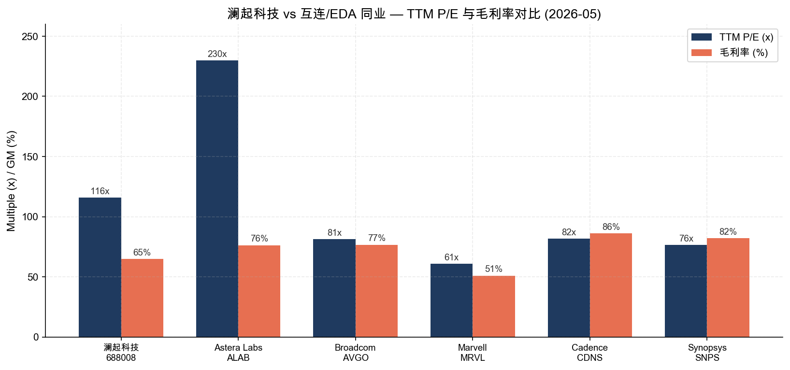
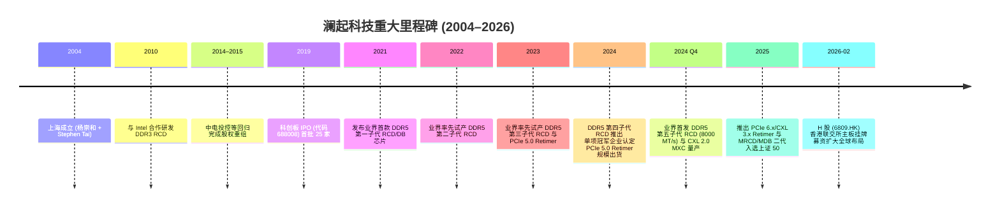
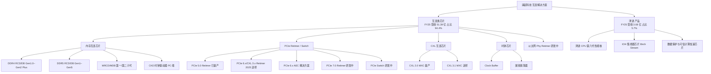
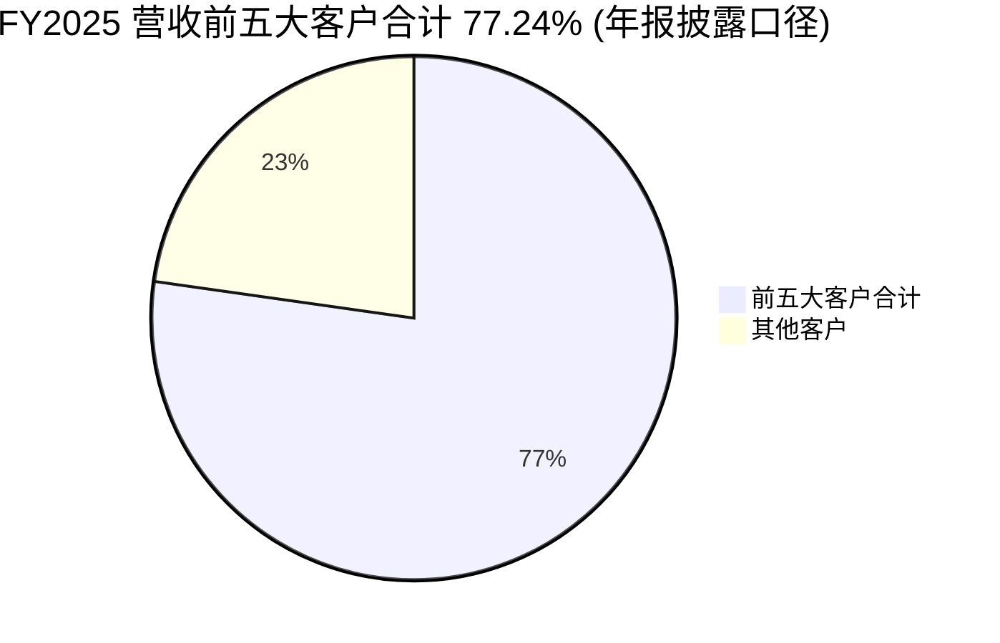
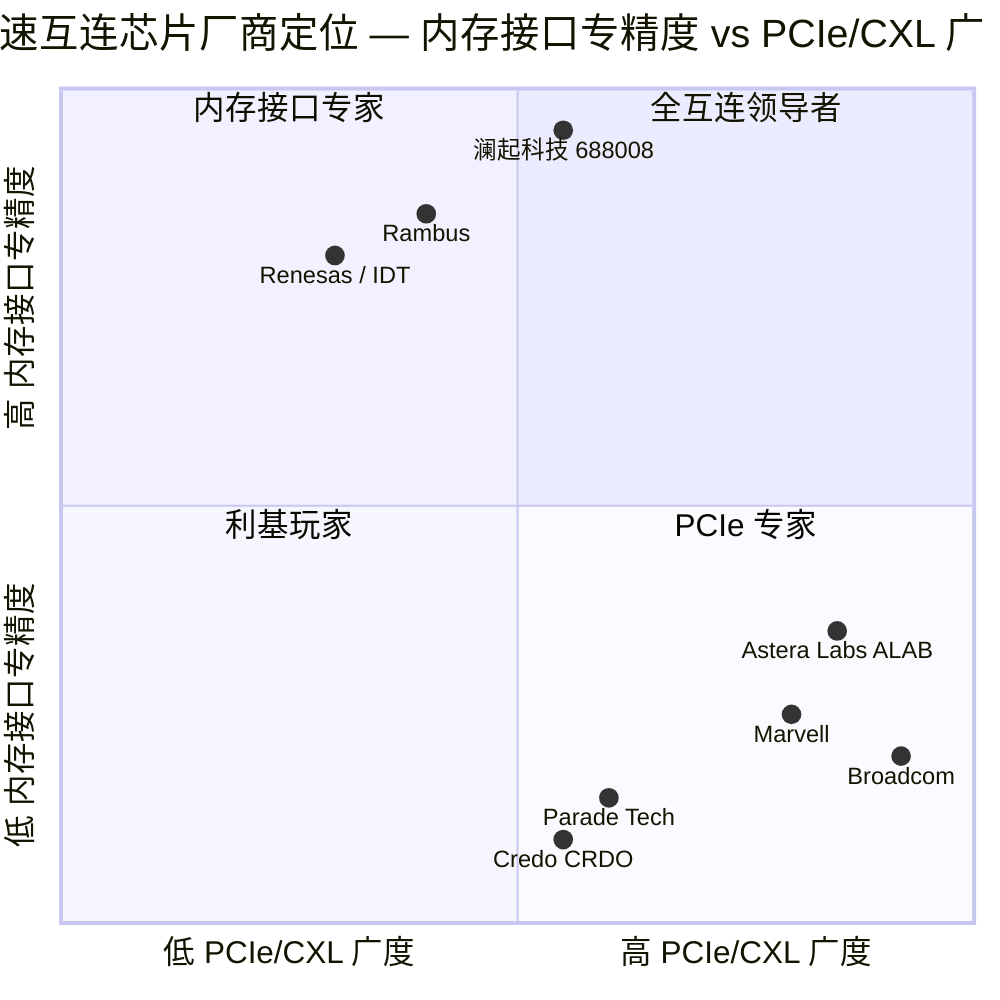

# 公司研究报告：澜起科技 (Montage Technology, SSE:688008 / HKEX:6809)

**报告日期（as of）：** 2026-06-15
**主体语言：** 简体中文
**研究覆盖：** 杨崇和博士与 Stephen Tai 先生联合创立的全球内存接口芯片（memory-interface IC）龙头，DDR5 RCD 全球第一，PCIe Retimer / CXL MXC 互连第二增长曲线正在放量

---

> **投资摘要（Investment Summary）— `*分析师观点：*`（本报告观点，非财报数据）**
>
> | 项目 | 数值 |
> |---|---|
> | **评级 Rating** | **增持 / Overweight** |
> | **12 个月目标价 (A 股)** | **¥280**（基准情形 base case） |
> | **当前股价 (A 股，2026-06-12 收盘)** | ¥224.88 |
> | **隐含上行空间** | **+24.5%** |
> | **估值方法** | 2027E 归母 EPS ¥3.85 × 目标 P/E 72×（与 UBS 70× / 历史均值 58× 区间一致，PEG≈1.4–1.6×） |
> | **A 股总市值** | 约 ¥2,552 亿元（约 US$355 亿） |
> | **市场数据** | A 股 SSE:688008 / H 股 6809.HK（A+H 双平台）；TTM P/E ≈ 114×；TTM P/S ≈ 47× |
>
> **2–4 条投资主线（thesis pillars，均为 `*分析师观点：*`）：**
> 1. **内存接口（memory-interface IC）全球第一的"现金牛"基本盘**——2024 年内存互连市场以 36.8% 份额排名全球第一，DDR5 渗透率从 2024 年 ~40% 升至 2025 年 60–65%，叠加 MRDIMM 代际升级带来量价齐升，传统主业具备较强确定性 ([H 股招股说明书 Frost & Sullivan](https://www1.hkexnews.hk/listedco/listconews/sehk/2026/0130/2026013000008_c.pdf))。
> 2. **"互连第二增长曲线"是估值溢价核心**——MRCD/MDB + CKD + PCIe Retimer + CXL MXC 组成的新产品组合 1Q26 营收 2.69 亿元、同比 +93.8%；UBS 预计 PCIe 互连 2025–28E 收入 CAGR 103%、2028E 达 37 亿元（2025 年 4 亿元的 9 倍） ([UBS Montage, 2026-05-08](http://xs-macbook-air.local:5001/zsxq/pdf/415248258281458/UBS-Montage%20Technology~H%20A%EF%BC%886809.HK%EF%BC%89key%20beneficiary%20of%20Agentic%20AI%20and%20China%27s%20AI%20accelerator%20localization-260508.pdf))。
> 3. **AI 服务器 + Agentic AI 是结构性需求引擎**——AI 负载从训练向推理/Agentic AI 延伸，重新抬升 CPU 在任务编排与内存搬运中的重要性，直接拉动内存互连与高速互连芯片需求；公司毛利率 1Q26 升至 69.8%（互连类 71.5%，历史新高）。
> 4. **稀缺的高合规硬科技标的**——A+H 双平台、无关联交易、无核心高管出走、连续 4 年市值纳入高管考核、2025 年首入上证 50 指数，享受稀缺性溢价；风险在于 TTM P/E 114× 偏高，需新业务持续兑现。
>
> *（评级、目标价、所有前瞻估计均为本报告分析师观点，不构成财报披露，亦不附着于任何 cninfo 年报引用。详见第 2 节估值与目标价推导。）*

> **业绩更新 — FY2025 业绩跨越 + 2026 年 2 月 H 股上市:** 公司 2025 年营收 54.56 亿元（+49.94% YoY），归母净利润 22.36 亿元（+58.35% YoY），毛利率提升 4.10 pp 至 62.28%；互连类芯片营收 51.39 亿元（+53.43% YoY）。2026 年第一季度营收 14.61 亿元（+19.5% YoY），归母净利润 8.47 亿元（+61.3% YoY），整体毛利率升至 69.8%、互连类芯片毛利率达 71.5%（创历史新高），新产品组合营收 2.69 亿元（+93.8% YoY）。2026 年 2 月 9 日公司 H 股 (6809.HK) 在香港联交所主板挂牌（A+H 双资本平台），超额配售权悉数行使后合计发行 7,577.35 万股 H 股，募集资金净额带动总资产由 137.5 亿元跃升至 216.8 亿元（+57.7%）。来源：[澜起科技 2025 年年度报告 (2026-03-30)](https://static.cninfo.com.cn/finalpage/2026-03-31/1225057736.PDF)、[澜起科技 2026 年第一季度报告 (2026-04-27)](https://static.cninfo.com.cn/finalpage/2026-04-28/1225206629.PDF)。

## 目录

1. 公司概览（含估值快照）
   - 1B. GF Score 基本面评分（GuruFocus 风格）
2. 估值与目标价（Valuation & Price Target）：前瞻模型 + PT 推导 + bull/base/bear + 卖方观点演变
3. 公司历史
4. 管理团队
5. 产品与服务
6. 客户与上市策略
7. 行业概览
8. 竞争格局
9. 市场机会（TAM）
10. 风险评估
    - 10.5 关键分歧与催化剂（Key debates & catalysts）
11. 投资者视角评分（Investor lenses）
12. 参考资料 + 数据来源清单（Data Used）

---

## 1. 公司概览

澜起科技股份有限公司（Montage Technology Co., Ltd；A 股代码 SSE:688008，H 股代码 6809.HK）是一家在上海注册、专注于数据中心与人工智能（AI）基础设施互连解决方案的无晶圆厂（Fabless）集成电路设计公司。公司由杨崇和博士（Stephen Yang）与 Stephen Kuong-Io Tai 于 2004 年共同创立，2019 年 7 月作为科创板首批 25 家挂牌企业之一在上交所科创板上市，2026 年 2 月 9 日 H 股在香港联合交易所主板挂牌（搭建 A+H 双资本平台）。注册办公地址位于上海市徐汇区漕宝路 181 号和光天地 16 层，法定代表人为董事长杨崇和博士 ([澜起科技 2025 年年度报告, 第二节 公司简介](https://static.cninfo.com.cn/finalpage/2026-03-31/1225057736.PDF))。

**主营业务。** 公司目前有两条产品线：（1）**互连类芯片**——核心收入来源，涵盖内存接口芯片（DDR4/DDR5 RCD、DB 套片）、内存模组配套芯片（MRCD/MDB、CKD）、PCIe Retimer 芯片、CXL MXC 内存扩展控制器以及新增的时钟（Clock）芯片产品族；（2）**津逮®产品**——以 x86 兼容服务器 CPU、I/O 集线器（IOH）与数据保护/可信计算加速芯片为主，2025 年发布第六代津逮®性能核 CPU。2025 年互连类芯片贡献营收 51.39 亿元（占比 94.4%、毛利率 65.57%），津逮®贡献 3.08 亿元（占比 5.7%、毛利率仅 7.42%）——盈利与现金流几乎全部来自互连业务 ([2025 年年度报告，第三节 收入和成本分析，第 69 页](https://static.cninfo.com.cn/finalpage/2026-03-31/1225057736.PDF))。

<svg xmlns="http://www.w3.org/2000/svg" viewBox="0 0 1000 560" width="1000" height="560" role="img" aria-label="income statement Sankey"><rect x="0" y="0" width="1000" height="560" fill="#ffffff"/>
<text x="20.00" y="30.00" text-anchor="start" font-family="Helvetica,Arial,sans-serif" font-size="15" font-weight="700" fill="#1f2933">澜起科技 FY2025 利润表 Sankey (RMB mn)</text>
<path d="M 452.00,78.00 C 506.00,78.00 506.00,121.03 560.00,121.03 L 560.00,294.67 C 506.00,294.67 506.00,251.64 452.00,251.64 Z" fill="#86efac" fill-opacity="0.55"/>
<path d="M 452.00,251.64 C 506.00,251.64 506.00,308.67 560.00,308.67 L 560.00,425.92 C 506.00,425.92 506.00,368.89 452.00,368.89 Z" fill="#fca5a5" fill-opacity="0.55"/>
<path d="M 204.00,78.34 C 258.00,78.34 258.00,85.00 312.00,85.00 L 312.00,469.29 C 258.00,469.29 258.00,462.63 204.00,462.63 Z" fill="#93c5fd" fill-opacity="0.55"/>
<path d="M 328.00,85.00 C 382.00,85.00 382.00,78.00 436.00,78.00 L 436.00,331.88 C 382.00,331.88 382.00,338.88 328.00,338.88 Z" fill="#86efac" fill-opacity="0.55"/>
<path d="M 328.00,338.88 C 382.00,338.88 382.00,345.88 436.00,345.88 L 436.00,500.00 C 382.00,500.00 382.00,493.00 328.00,493.00 Z" fill="#fca5a5" fill-opacity="0.55"/>
<path d="M 576.00,121.03 C 630.00,121.03 630.00,121.85 684.00,121.85 L 684.00,295.49 C 630.00,295.49 630.00,294.67 576.00,294.67 Z" fill="#86efac" fill-opacity="0.55"/>
<path d="M 700.00,121.85 C 754.00,121.85 754.00,187.22 808.00,187.22 L 808.00,346.50 C 754.00,346.50 754.00,281.13 700.00,281.13 Z" fill="#86efac" fill-opacity="0.55"/>
<path d="M 700.00,281.13 C 754.00,281.13 754.00,360.50 808.00,360.50 L 808.00,374.78 C 754.00,374.78 754.00,295.42 700.00,295.42 Z" fill="#fca5a5" fill-opacity="0.55"/>
<path d="M 700.00,295.42 C 754.00,295.42 754.00,388.78 808.00,388.78 L 808.00,390.78 C 754.00,390.78 754.00,297.42 700.00,297.42 Z" fill="#fca5a5" fill-opacity="0.55"/>
<path d="M 576.00,308.67 C 630.00,308.67 630.00,309.42 684.00,309.42 L 684.00,357.72 C 630.00,357.72 630.00,356.98 576.00,356.98 Z" fill="#fca5a5" fill-opacity="0.55"/>
<path d="M 576.00,356.98 C 630.00,356.98 630.00,371.72 684.00,371.72 L 684.00,440.15 C 630.00,440.15 630.00,425.40 576.00,425.40 Z" fill="#fca5a5" fill-opacity="0.55"/>
<path d="M 576.00,425.40 C 630.00,425.40 630.00,454.15 684.00,454.15 L 684.00,456.15 C 630.00,456.15 630.00,427.40 576.00,427.40 Z" fill="#fca5a5" fill-opacity="0.55"/>
<path d="M 576.00,439.92 C 630.00,439.92 630.00,295.49 684.00,295.49 L 684.00,312.54 C 630.00,312.54 630.00,456.97 576.00,456.97 Z" fill="#93c5fd" fill-opacity="0.55"/>
<path d="M 204.00,476.63 C 258.00,476.63 258.00,469.29 312.00,469.29 L 312.00,492.33 C 258.00,492.33 258.00,499.66 204.00,499.66 Z" fill="#93c5fd" fill-opacity="0.55"/>
<rect x="188.00" y="78.34" width="16" height="384.29" rx="1.5" fill="#2563eb"/>
<rect x="188.00" y="476.63" width="16" height="23.03" rx="1.5" fill="#2563eb"/>
<rect x="312.00" y="85.00" width="16" height="408.00" rx="1.5" fill="#1e3a8a"/>
<rect x="436.00" y="78.00" width="16" height="253.88" rx="1.5" fill="#15803d"/>
<rect x="436.00" y="345.88" width="16" height="154.12" rx="1.5" fill="#dc2626"/>
<rect x="560.00" y="121.03" width="16" height="173.64" rx="1.5" fill="#15803d"/>
<rect x="560.00" y="308.67" width="16" height="117.26" rx="1.5" fill="#dc2626"/>
<rect x="560.00" y="439.92" width="16" height="17.05" rx="1.5" fill="#2563eb"/>
<rect x="684.00" y="121.85" width="16" height="173.56" rx="1.5" fill="#15803d"/>
<rect x="684.00" y="309.42" width="16" height="48.31" rx="1.5" fill="#dc2626"/>
<rect x="684.00" y="371.72" width="16" height="68.42" rx="1.5" fill="#dc2626"/>
<rect x="684.00" y="454.15" width="16" height="2.00" rx="1.5" fill="#dc2626"/>
<rect x="808.00" y="187.22" width="16" height="159.28" rx="1.5" fill="#15803d"/>
<rect x="808.00" y="360.50" width="16" height="14.28" rx="1.5" fill="#dc2626"/>
<rect x="808.00" y="388.78" width="16" height="2.00" rx="1.5" fill="#dc2626"/>
<text x="179.00" y="267.48" text-anchor="end" font-family="Helvetica,Arial,sans-serif" font-size="11.5" font-weight="700" fill="#1f2933">互连类芯片 Interconnect</text>
<text x="179.00" y="280.48" text-anchor="end" font-family="Helvetica,Arial,sans-serif" font-size="10" font-weight="400" fill="#52606d">RMB5.1B  (94.2%)</text>
<text x="179.00" y="485.15" text-anchor="end" font-family="Helvetica,Arial,sans-serif" font-size="11.5" font-weight="700" fill="#1f2933">津逮 Jintide</text>
<text x="179.00" y="498.15" text-anchor="end" font-family="Helvetica,Arial,sans-serif" font-size="10" font-weight="400" fill="#52606d">RMB308.0M  (5.6%)</text>
<rect x="331.00" y="67.00" width="113.10" height="26" rx="2" fill="#ffffff" fill-opacity="0.72"/>
<text x="334.00" y="79.00" text-anchor="start" font-family="Helvetica,Arial,sans-serif" font-size="11.5" font-weight="700" fill="#1f2933">Revenue</text>
<text x="334.00" y="92.00" text-anchor="start" font-family="Helvetica,Arial,sans-serif" font-size="10" font-weight="400" fill="#52606d">RMB5.5B  (100.0%)</text>
<rect x="455.00" y="60.00" width="106.80" height="26" rx="2" fill="#ffffff" fill-opacity="0.72"/>
<text x="458.00" y="72.00" text-anchor="start" font-family="Helvetica,Arial,sans-serif" font-size="11.5" font-weight="700" fill="#1f2933">Gross Profit</text>
<text x="458.00" y="85.00" text-anchor="start" font-family="Helvetica,Arial,sans-serif" font-size="10" font-weight="400" fill="#52606d">RMB3.4B  (62.2%)</text>
<rect x="455.00" y="327.88" width="144.60" height="26" rx="2" fill="#ffffff" fill-opacity="0.72"/>
<text x="458.00" y="339.88" text-anchor="start" font-family="Helvetica,Arial,sans-serif" font-size="11.5" font-weight="700" fill="#1f2933">Cost of Revenue (COGS)</text>
<text x="458.00" y="352.88" text-anchor="start" font-family="Helvetica,Arial,sans-serif" font-size="10" font-weight="400" fill="#52606d">RMB2.1B  (37.8%)</text>
<rect x="579.00" y="103.03" width="106.80" height="26" rx="2" fill="#ffffff" fill-opacity="0.72"/>
<text x="582.00" y="115.03" text-anchor="start" font-family="Helvetica,Arial,sans-serif" font-size="11.5" font-weight="700" fill="#1f2933">Operating Income</text>
<text x="582.00" y="128.03" text-anchor="start" font-family="Helvetica,Arial,sans-serif" font-size="10" font-weight="400" fill="#52606d">RMB2.3B  (42.6%)</text>
<rect x="579.00" y="290.67" width="150.90" height="26" rx="2" fill="#ffffff" fill-opacity="0.72"/>
<text x="582.00" y="302.67" text-anchor="start" font-family="Helvetica,Arial,sans-serif" font-size="11.5" font-weight="700" fill="#1f2933">Total Operating Expense</text>
<text x="582.00" y="315.67" text-anchor="start" font-family="Helvetica,Arial,sans-serif" font-size="10" font-weight="400" fill="#52606d">RMB1.6B  (28.7%)</text>
<text x="551.00" y="445.45" text-anchor="end" font-family="Helvetica,Arial,sans-serif" font-size="11.5" font-weight="700" fill="#1f2933">Net Interest / Other Income</text>
<text x="551.00" y="458.45" text-anchor="end" font-family="Helvetica,Arial,sans-serif" font-size="10" font-weight="400" fill="#52606d">RMB228.0M  (4.2%)</text>
<rect x="703.00" y="103.85" width="106.80" height="26" rx="2" fill="#ffffff" fill-opacity="0.72"/>
<text x="706.00" y="115.85" text-anchor="start" font-family="Helvetica,Arial,sans-serif" font-size="11.5" font-weight="700" fill="#1f2933">Pretax Income</text>
<text x="706.00" y="128.85" text-anchor="start" font-family="Helvetica,Arial,sans-serif" font-size="10" font-weight="400" fill="#52606d">RMB2.3B  (42.5%)</text>
<rect x="703.00" y="291.42" width="119.40" height="26" rx="2" fill="#ffffff" fill-opacity="0.72"/>
<text x="706.00" y="303.42" text-anchor="start" font-family="Helvetica,Arial,sans-serif" font-size="11.5" font-weight="700" fill="#1f2933">SG&amp;A</text>
<text x="706.00" y="316.42" text-anchor="start" font-family="Helvetica,Arial,sans-serif" font-size="10" font-weight="400" fill="#52606d">RMB646.0M  (11.8%)</text>
<rect x="703.00" y="353.72" width="119.40" height="26" rx="2" fill="#ffffff" fill-opacity="0.72"/>
<text x="706.00" y="365.72" text-anchor="start" font-family="Helvetica,Arial,sans-serif" font-size="11.5" font-weight="700" fill="#1f2933">R&amp;D</text>
<text x="706.00" y="378.72" text-anchor="start" font-family="Helvetica,Arial,sans-serif" font-size="10" font-weight="400" fill="#52606d">RMB915.0M  (16.8%)</text>
<rect x="703.00" y="436.15" width="106.80" height="26" rx="2" fill="#ffffff" fill-opacity="0.72"/>
<text x="706.00" y="448.15" text-anchor="start" font-family="Helvetica,Arial,sans-serif" font-size="11.5" font-weight="700" fill="#1f2933">Other OpEx</text>
<text x="706.00" y="461.15" text-anchor="start" font-family="Helvetica,Arial,sans-serif" font-size="10" font-weight="400" fill="#52606d">RMB7.0M  (0.13%)</text>
<text x="833.00" y="263.86" text-anchor="start" font-family="Helvetica,Arial,sans-serif" font-size="11.5" font-weight="700" fill="#1f2933">Net Income</text>
<text x="833.00" y="276.86" text-anchor="start" font-family="Helvetica,Arial,sans-serif" font-size="10" font-weight="400" fill="#52606d">RMB2.1B  (39.0%)</text>
<text x="833.00" y="364.64" text-anchor="start" font-family="Helvetica,Arial,sans-serif" font-size="11.5" font-weight="700" fill="#1f2933">Income Tax</text>
<text x="833.00" y="377.64" text-anchor="start" font-family="Helvetica,Arial,sans-serif" font-size="10" font-weight="400" fill="#52606d">RMB191.0M  (3.5%)</text>
<text x="833.00" y="389.64" text-anchor="start" font-family="Helvetica,Arial,sans-serif" font-size="11.5" font-weight="700" fill="#1f2933">Minority Interest</text>
<text x="833.00" y="402.64" text-anchor="start" font-family="Helvetica,Arial,sans-serif" font-size="10" font-weight="400" fill="#52606d">-RMB106.0M  (-1.9%)</text>
<text x="500.00" y="530.00" text-anchor="middle" font-family="Helvetica,Arial,sans-serif" font-size="10" font-weight="400" font-style="italic" fill="#8a97a3">归母净利润 22.36 亿元 (净利润 21.30 亿 + 少数股东亏损 1.06 亿回拨)</text>
<text x="500.00" y="544.00" text-anchor="middle" font-family="Helvetica,Arial,sans-serif" font-size="10" font-weight="400" fill="#52606d">Source: 澜起科技 2025 年年度报告 (cninfo, 2026-03-30) 合并利润表 p152</text>
</svg>

*FY2025 利润表瀑布：营收 54.56 亿元 → 毛利 33.95 亿（GM 62.28%）→ 经营利润 23.22 亿；研发费用 9.15 亿（占营收 16.8%）、净利息收入 2.28 亿（近百亿净现金的孳息）。来源：[澜起科技 2025 年年度报告 (cninfo, 2026-03-30)](https://static.cninfo.com.cn/finalpage/2026-03-31/1225057736.PDF) 合并利润表 p152。*

<svg xmlns="http://www.w3.org/2000/svg" viewBox="0 0 720 460" width="720" height="460" role="img" aria-label="revenue donut"><rect x="0" y="0" width="720" height="460" fill="#ffffff"/>
<text x="20.00" y="30.00" text-anchor="start" font-family="Helvetica,Arial,sans-serif" font-size="15" font-weight="700" fill="#1f2933">澜起科技 FY2025 分产品营收结构 (RMB mn)</text>
<path d="M 288.00,107.20 A 132 132 0 1 1 240.88,115.90 L 260.15,166.34 A 78 78 0 1 0 288.00,161.20 Z" fill="#2563eb"/>
<path d="M 240.88,115.90 A 132 132 0 0 1 286.63,107.21 L 287.19,161.20 A 78 78 0 0 0 260.15,166.34 Z" fill="#15803d"/>
<path d="M 286.63,107.21 A 132 132 0 0 1 288.00,107.20 L 288.00,161.20 A 78 78 0 0 0 287.19,161.20 Z" fill="#d97706"/>
<text x="288.00" y="235.20" text-anchor="middle" font-family="Helvetica,Arial,sans-serif" font-size="18" font-weight="800" fill="#1f2933">营收\n54.56亿</text>
<text x="288.00" y="255.20" text-anchor="middle" font-family="Helvetica,Arial,sans-serif" font-size="13" font-weight="600" fill="#52606d">RMB5.5B</text>
<text x="288.00" y="271.20" text-anchor="middle" font-family="Helvetica,Arial,sans-serif" font-size="10" font-weight="400" fill="#8a97a3">total</text>
<line x1="313.05" y1="374.91" x2="329.05" y2="374.91" stroke="#2563eb" stroke-width="1.4"/>
<text x="333.05" y="372.91" text-anchor="start" font-family="Helvetica,Arial,sans-serif" font-size="11" font-weight="700" fill="#1f2933">互连类芯片 Interconnect</text>
<text x="333.05" y="386.91" text-anchor="start" font-family="Helvetica,Arial,sans-serif" font-size="10" font-weight="400" fill="#52606d">RMB5.1B  (94.2%)</text>
<line x1="262.25" y1="103.62" x2="246.25" y2="103.62" stroke="#15803d" stroke-width="1.4"/>
<text x="242.25" y="101.62" text-anchor="end" font-family="Helvetica,Arial,sans-serif" font-size="11" font-weight="700" fill="#1f2933">津逮 Jintide CPU/IOH</text>
<text x="242.25" y="115.62" text-anchor="end" font-family="Helvetica,Arial,sans-serif" font-size="10" font-weight="400" fill="#52606d">RMB308.0M  (5.6%)</text>
<line x1="287.28" y1="101.20" x2="271.28" y2="101.20" stroke="#d97706" stroke-width="1.4"/>
<text x="267.28" y="99.20" text-anchor="end" font-family="Helvetica,Arial,sans-serif" font-size="11" font-weight="700" fill="#1f2933">其他/技术开发 Other</text>
<text x="267.28" y="113.20" text-anchor="end" font-family="Helvetica,Arial,sans-serif" font-size="10" font-weight="400" fill="#52606d">RMB9.0M  (0.2%)</text>
<text x="360.00" y="430.00" text-anchor="middle" font-family="Helvetica,Arial,sans-serif" font-size="10" font-weight="400" font-style="italic" fill="#8a97a3">互连类芯片占 94.4%、毛利率 65.57%；津逮占 5.7%、毛利率仅 7.42%</text>
<text x="360.00" y="444.00" text-anchor="middle" font-family="Helvetica,Arial,sans-serif" font-size="10" font-weight="400" fill="#52606d">Source: 澜起科技 2025 年年度报告 (cninfo, 2026-03-30) 第三节 收入与成本分析 p69</text>
</svg>

*分产品营收：互连类芯片 51.39 亿（94.4%、毛利率 65.57%）vs 津逮 3.08 亿（5.7%、毛利率 7.42%）——盈利与现金流几乎全部来自互连业务。来源：[澜起科技 2025 年年度报告 (cninfo, 2026-03-30)](https://static.cninfo.com.cn/finalpage/2026-03-31/1225057736.PDF) 第三节 收入与成本 p69。*

<svg xmlns="http://www.w3.org/2000/svg" viewBox="0 0 860 470" width="860" height="470" role="img" aria-label="historical revenue bars"><rect x="0" y="0" width="860" height="470" fill="#ffffff"/>
<text x="20.00" y="30.00" text-anchor="start" font-family="Helvetica,Arial,sans-serif" font-size="15" font-weight="700" fill="#1f2933">澜起科技 营收历史 (2021-2025, 分产品线, RMB mn)</text>
<rect x="20.00" y="44" width="11" height="11" rx="2" fill="#2563eb"/>
<text x="36.00" y="53.00" text-anchor="start" font-family="Helvetica,Arial,sans-serif" font-size="10.5" font-weight="400" fill="#1f2933">互连类芯片 Interconnect</text>
<rect x="168.80" y="44" width="11" height="11" rx="2" fill="#15803d"/>
<text x="184.80" y="53.00" text-anchor="start" font-family="Helvetica,Arial,sans-serif" font-size="10.5" font-weight="400" fill="#1f2933">津逮 Jintide</text>
<line x1="70" y1="412.00" x2="834" y2="412.00" stroke="#eceff2" stroke-width="1"/>
<text x="64.00" y="415.00" text-anchor="end" font-family="Helvetica,Arial,sans-serif" font-size="9.5" font-weight="400" fill="#52606d">RMB0</text>
<line x1="70" y1="345.20" x2="834" y2="345.20" stroke="#eceff2" stroke-width="1"/>
<text x="64.00" y="348.20" text-anchor="end" font-family="Helvetica,Arial,sans-serif" font-size="9.5" font-weight="400" fill="#52606d">RMB1.2B</text>
<line x1="70" y1="278.40" x2="834" y2="278.40" stroke="#eceff2" stroke-width="1"/>
<text x="64.00" y="281.40" text-anchor="end" font-family="Helvetica,Arial,sans-serif" font-size="9.5" font-weight="400" fill="#52606d">RMB2.4B</text>
<line x1="70" y1="211.60" x2="834" y2="211.60" stroke="#eceff2" stroke-width="1"/>
<text x="64.00" y="214.60" text-anchor="end" font-family="Helvetica,Arial,sans-serif" font-size="9.5" font-weight="400" fill="#52606d">RMB3.5B</text>
<line x1="70" y1="144.80" x2="834" y2="144.80" stroke="#eceff2" stroke-width="1"/>
<text x="64.00" y="147.80" text-anchor="end" font-family="Helvetica,Arial,sans-serif" font-size="9.5" font-weight="400" fill="#52606d">RMB4.7B</text>
<line x1="70" y1="78.00" x2="834" y2="78.00" stroke="#eceff2" stroke-width="1"/>
<text x="64.00" y="81.00" text-anchor="end" font-family="Helvetica,Arial,sans-serif" font-size="9.5" font-weight="400" fill="#52606d">RMB5.9B</text>
<rect x="102.09" y="286.52" width="88.62" height="125.48" fill="#2563eb"/>
<rect x="102.09" y="267.79" width="88.62" height="18.74" fill="#15803d"/>
<text x="146.40" y="428.00" text-anchor="middle" font-family="Helvetica,Arial,sans-serif" font-size="10" font-weight="400" fill="#52606d">2021</text>
<rect x="254.89" y="223.50" width="88.62" height="188.50" fill="#2563eb"/>
<rect x="254.89" y="166.16" width="88.62" height="57.34" fill="#15803d"/>
<text x="299.20" y="428.00" text-anchor="middle" font-family="Helvetica,Arial,sans-serif" font-size="10" font-weight="400" fill="#52606d">2022</text>
<rect x="407.69" y="310.60" width="88.62" height="101.40" fill="#2563eb"/>
<rect x="407.69" y="282.21" width="88.62" height="28.39" fill="#15803d"/>
<text x="452.00" y="428.00" text-anchor="middle" font-family="Helvetica,Arial,sans-serif" font-size="10" font-weight="400" fill="#52606d">2023</text>
<rect x="560.49" y="221.74" width="88.62" height="190.26" fill="#2563eb"/>
<rect x="560.49" y="205.39" width="88.62" height="16.35" fill="#15803d"/>
<text x="604.80" y="428.00" text-anchor="middle" font-family="Helvetica,Arial,sans-serif" font-size="10" font-weight="400" fill="#52606d">2024</text>
<rect x="713.29" y="120.23" width="88.62" height="291.77" fill="#2563eb"/>
<rect x="713.29" y="102.74" width="88.62" height="17.49" fill="#15803d"/>
<text x="757.60" y="428.00" text-anchor="middle" font-family="Helvetica,Arial,sans-serif" font-size="10" font-weight="400" fill="#52606d">2025</text>
<text x="430.00" y="440.00" text-anchor="middle" font-family="Helvetica,Arial,sans-serif" font-size="10" font-weight="400" font-style="italic" fill="#8a97a3">2023 为 DRAM 去库存低谷年；2024-25 随 DDR5 渗透 + AI 服务器爆发触底反弹</text>
<text x="430.00" y="454.00" text-anchor="middle" font-family="Helvetica,Arial,sans-serif" font-size="10" font-weight="400" fill="#52606d">Source: 澜起科技 2025 年年度报告 (cninfo, 2026-03-30) + 2021-2024 历年年度报告 分产品营收</text>
</svg>

*5 年营收历史（分产品线）：2023 年系 DRAM 行业去库存的低谷年（互连仅 17.86 亿）；2024–2025 年随 DDR5 渗透率提升及 AI 服务器爆发触底强反弹（互连 33.51 亿 → 51.39 亿）。来源：[澜起科技 2025 年年度报告 (cninfo, 2026-03-30)](https://static.cninfo.com.cn/finalpage/2026-03-31/1225057736.PDF) + 2021–2024 历年年度报告。*
**商业模式与变现路径。** 澜起采用 Fabless 模式：自身专注芯片定义、电路设计、版图与系统验证，把晶圆制造与封装测试外包给台积电、长电科技、日月光等代工/封测厂。客户端直接面向三星电子、SK 海力士、美光科技等全球 DRAM 制造商（销售完成 RCD/DB 等内存模组所需配套芯片）以及服务器 OEM/ODM（销售 PCIe Retimer、AEC 模块、CXL MXC、津逮 CPU）。销售模式以**直销为主**（2025 年直销收入 46.19 亿、占主营 84.8%，毛利率 64.51%；代销 8.28 亿、占比 15.2%），互连业务的客户集中度极高——2025 年前五大客户贡献 42.14 亿元、占年度销售总额 **77.24%**（前五大供应商集中度更达 79.39%）([2025 年年度报告，第三节 客户与供应商](https://static.cninfo.com.cn/finalpage/2026-03-31/1225057736.PDF))。

**地理分布。** 由于客户是全球 DRAM 三强（韩国三星与海力士、美国美光），互连类芯片绝大多数通过澳门子公司 Montage Technology Macao Commercial Offshore Limited（MTM）以美元结算开票出海，2025 年境外营收 39.01 亿元（占主营 71.6%，毛利率 66.04%），境内营收 15.46 亿元（毛利率 52.79%，含津逮）([2025 年年度报告，境外资产说明](https://static.cninfo.com.cn/finalpage/2026-03-31/1225057736.PDF))。

<svg xmlns="http://www.w3.org/2000/svg" viewBox="0 0 720 460" width="720" height="460" role="img" aria-label="revenue donut"><rect x="0" y="0" width="720" height="460" fill="#ffffff"/>
<text x="20.00" y="30.00" text-anchor="start" font-family="Helvetica,Arial,sans-serif" font-size="15" font-weight="700" fill="#1f2933">澜起科技 FY2025 分地区营收结构 (RMB mn)</text>
<path d="M 288.00,107.20 A 132 132 0 1 1 158.97,267.04 L 211.76,255.65 A 78 78 0 1 0 288.00,161.20 Z" fill="#2563eb"/>
<path d="M 158.97,267.04 A 132 132 0 0 1 288.00,107.20 L 288.00,161.20 A 78 78 0 0 0 211.76,255.65 Z" fill="#15803d"/>
<text x="288.00" y="235.20" text-anchor="middle" font-family="Helvetica,Arial,sans-serif" font-size="18" font-weight="800" fill="#1f2933">营收\n54.56亿</text>
<text x="288.00" y="255.20" text-anchor="middle" font-family="Helvetica,Arial,sans-serif" font-size="13" font-weight="600" fill="#52606d">RMB5.4B</text>
<text x="288.00" y="271.20" text-anchor="middle" font-family="Helvetica,Arial,sans-serif" font-size="10" font-weight="400" fill="#8a97a3">total</text>
<line x1="395.38" y1="325.88" x2="411.38" y2="325.88" stroke="#2563eb" stroke-width="1.4"/>
<text x="415.38" y="323.88" text-anchor="start" font-family="Helvetica,Arial,sans-serif" font-size="11" font-weight="700" fill="#1f2933">境外 Overseas (MTM/美元结算)</text>
<text x="415.38" y="337.88" text-anchor="start" font-family="Helvetica,Arial,sans-serif" font-size="10" font-weight="400" fill="#52606d">RMB3.9B  (71.6%)</text>
<line x1="180.62" y1="152.52" x2="164.62" y2="152.52" stroke="#15803d" stroke-width="1.4"/>
<text x="160.62" y="150.52" text-anchor="end" font-family="Helvetica,Arial,sans-serif" font-size="11" font-weight="700" fill="#1f2933">境内 Domestic</text>
<text x="160.62" y="164.52" text-anchor="end" font-family="Helvetica,Arial,sans-serif" font-size="10" font-weight="400" fill="#52606d">RMB1.5B  (28.4%)</text>
<text x="360.00" y="430.00" text-anchor="middle" font-family="Helvetica,Arial,sans-serif" font-size="10" font-weight="400" font-style="italic" fill="#8a97a3">境外 71.6%、毛利率 66.04%；境内 28.4%、毛利率 52.79%</text>
<text x="360.00" y="444.00" text-anchor="middle" font-family="Helvetica,Arial,sans-serif" font-size="10" font-weight="400" fill="#52606d">Source: 澜起科技 2025 年年度报告 (cninfo, 2026-03-30) 第三节 主营业务分地区 p69</text>
</svg>
*来源：[澜起科技 2025 年年度报告，第 69 页 "主营业务分地区情况"](https://static.cninfo.com.cn/finalpage/2026-03-31/1225057736.PDF)。境外 71.6%、境内 28.4%。*

**规模与人员。** 截至 2025 年末，公司总资产 137.48 亿元，归属母公司股东净资产 129.24 亿元；2026 年 3 月底 H 股发行后总资产飙升至 216.81 亿元，净资产 208.46 亿元（2026 年第一季度报告）。员工总数 783 人，其中研发技术人员 583 人（占 74.4%），硕士及以上学历占 64%，研发投入占营业收入比例 16.77%（2025 年研发支出约 9.15 亿元）([2025 年年度报告，董事长致辞及研发人员构成](https://static.cninfo.com.cn/finalpage/2026-03-31/1225057736.PDF))。

**关键经营指标（FY2025）：**

| 指标 | FY2023 | FY2024 | FY2025 | YoY |
|---|---|---|---|---|
| 营业收入 (亿元) | 22.86 | 36.39 | 54.56 | +49.94% |
| 归母净利润 (亿元) | 4.51 | 14.12 | 22.36 | +58.35% |
| 扣非归母净利润 (亿元) | 3.70 | 12.48 | 20.22 | +61.95% |
| 整体毛利率 | 58.18% | 58.18% | 62.28% | +4.10 pp |
| 互连类芯片毛利率 | 61.36% | 62.66% | 65.57% | +2.91 pp |
| 加权平均 ROE | 4.44% | 13.41% | 18.25% | +4.84 pp |
| 经营活动现金净流入 (亿元) | 7.31 | 16.91 | 20.22 | +19.55% |

来源：[澜起科技 2025 年年度报告，第二节 主要会计数据，第 14 页](https://static.cninfo.com.cn/finalpage/2026-03-31/1225057736.PDF)。

### 估值快照（as of 2026-06-15；价格为 2026-06-12 收盘）

- **A 股价格：** 224.88 元（SSE:688008）；**H 股价格：** 355.00 港元（6809.HK）；**A 股总市值：** 约 **2,552 亿元 RMB**（约 US$355 亿，按 11.35 亿股 × 224.88 元计）；**TTM P/E：** 约 **114×**（= 224.88 / 2025 EPS 1.97）；**滚动 Forward P/E：** 约 85×（按市场一致 2026E 归母 ~30 亿元）；**TTM P/S：** 约 **47×**（= 2,552 / 54.56 亿）；**毛利率（TTM/2026Q1）：** 69.8%；**净利率（FY2025 归母口径）：** 41.0%；**营收 YoY：** +49.94%（FY2025）/ +19.5%（2026Q1） ([雅虎财经 688008.SS 收盘价](https://finance.yahoo.com/quote/688008.SS/)、[东方财富 SSE:688008 行情](https://quote.eastmoney.com/sh688008.html))。
- **EPS 修复路径：** 2025 年基本 EPS 1.97 元/股较 2023 年 0.40 元/股翻约 **5 倍**（基本 EPS YoY +57.60%）——高估值已反映 (1) AI 服务器 DDR5/PCIe Retimer 需求爆发带来的 EPS 大幅修复 ([澜起科技 2025 年年度报告 主要财务指标，第 14 页](https://static.cninfo.com.cn/finalpage/2026-03-31/1225057736.PDF))；(2) 新产品组合（MRCD/MDB、CKD、CXL MXC、PCIe 6.x Retimer）的"二曲线"溢价 ([澜起科技 2026 年第一季度报告，新产品组合营收 2.69 亿元 +93.8% YoY](https://static.cninfo.com.cn/finalpage/2026-04-28/1225206629.PDF))。

**估值解读。** TTM P/E ~114× 在绝对值上远高于 A 股半导体板块中位数（中证全指半导体 TTM PE 约 55–65×），但在 fwd P/E ~85×（2026E）/ ~58×（2027E，UBS 口径）后逐步回归高速互连/EDA 同业区间。下表为同业横向参照（同业数据采集时点 2026-05-02，澜起本列已更新至 2026-06-12 收盘口径）：

| 同业 | P/E (口径) | 毛利率 | 营收 YoY | 净利率 |
|---|---|---|---|---|
| 澜起科技 (688008) | **TTM ~114× / 2027E ~58×** | 69.8% | +49.94% (FY25) | 41.0% |
| Astera Labs (ALAB) | ~230× (TTM) | 76.3% | +93% | 20% |
| Broadcom (AVGO) | 81.3× (TTM) | 76.7% | +29.5% | 36.6% |
| Marvell (MRVL) | 60.8× (TTM) | 51.0% | +22.1% | 32.6% |
| Cadence (CDNS) | 81.8× (TTM) | 86.1% | +18.7% | 21.2% |
| Synopsys (SNPS) | 76.5× (TTM) | 82.0% | +65.5% | 13.8% |

来源：澜起本列为 [雅虎财经 688008.SS](https://finance.yahoo.com/quote/688008.SS/) 2026-06-12 收盘 + 2025 年报；同业列为本地 db/pe_cache.json（Yahoo Finance，2026-05-02 时点）。

**多倍数偏高的主因：** (a) **DDR5 渗透红利尚未走完**——根据 JEDEC 标准与服务器迭代周期，DDR5 在 2024–2027 年仍在替代 DDR4，TrendForce 预计 2026 年 1Q 服务器 DRAM 价格 QoQ 升幅 >60%、DDR5 利润率向 HBM3e 逼近 ([TrendForce, 2025-10-29 "Tight DRAM Supply to Boost DDR5 Contract Prices"](https://www.trendforce.com/presscenter/news/20251029-12758.html))，公司 2024Q4 才量产第四子代 RCD、2025 年试产第五子代 RCD，单价提升带动 ASP 增长 ([澜起科技 2025 年年度报告 第三节 内存接口子代说明](https://static.cninfo.com.cn/finalpage/2026-03-31/1225057736.PDF))；(b) **AI 算力溢价**——AI 训练与推理对 HBM、CXL 内存池化、PCIe 6.0 Retimer 的需求结构性放量，公司作为目前全球唯三家提供 PCIe 5.0 Retimer 的厂商（市场份额约 10.9%，全球第二）正在切入百亿美金赛道 ([瀾起科技 H 股招股说明书 (6809.HK), 2026-01-30, Frost & Sullivan PCIe Retimer 市场份额](https://www1.hkexnews.hk/listedco/listconews/sehk/2026/0130/2026013000008_c.pdf))；(c) **H 股上市稀缺溢价**——澜起是中国大陆少数兼具技术领导力、海外客户、A+H 平台、高度合规审计且无关联交易问题的硬科技标的，2025 年首次入选上证 50 指数成分股 ([澜起科技 2025 年年度报告 公司治理与重大事项](https://static.cninfo.com.cn/finalpage/2026-03-31/1225057736.PDF))。整体看 TTM PE 偏高但与 fwd EPS 增长（卖方一致预期 2026E 归母净利约 30 亿元）匹配；若 CXL/PCIe Retimer 收入兑现不及预期，将面临估值压缩风险，已纳入第 10 节风险评估。

---

---

## 1B. GF Score 基本面评分（GuruFocus 风格）— `*分析师观点：*`

下方雷达图为本报告自建的 GuruFocus 风格 GF Score（五维度 0–10、合成 0–100），是分析师评分工具而非新数据源，**不附着于任何财报引用**；每个维度的底层指标在第 1/2 节已逐一带引用。

<svg xmlns="http://www.w3.org/2000/svg" viewBox="0 0 500 500" width="500" height="500" role="img" aria-label="GF Score radar">
<rect x="0" y="0" width="500" height="500" fill="#ffffff"/>
<text x="20" y="24" font-family="Helvetica,Arial,sans-serif" font-size="15" font-weight="700" fill="#1f2933">GF Score (GuruFocus-style): 82/100</text>
<text x="20" y="41" font-family="Helvetica,Arial,sans-serif" font-size="11" fill="#52606d">81–90 Good outperformance potential</text>
<polygon points="250.0,88.0 392.7,191.6 338.2,359.4 161.8,359.4 107.3,191.6" fill="#e9f5ec" stroke="none"/>
<polygon points="250.0,208.0 278.5,228.7 267.6,262.3 232.4,262.3 221.5,228.7" fill="none" stroke="#c5d3cb" stroke-width="1"/>
<polygon points="250.0,178.0 307.1,219.5 285.3,286.5 214.7,286.5 192.9,219.5" fill="none" stroke="#c5d3cb" stroke-width="1"/>
<polygon points="250.0,148.0 335.6,210.2 302.9,310.8 197.1,310.8 164.4,210.2" fill="none" stroke="#c5d3cb" stroke-width="1"/>
<polygon points="250.0,118.0 364.1,200.9 320.5,335.1 179.5,335.1 135.9,200.9" fill="none" stroke="#c5d3cb" stroke-width="1"/>
<polygon points="250.0,88.0 392.7,191.6 338.2,359.4 161.8,359.4 107.3,191.6" fill="none" stroke="#c5d3cb" stroke-width="1.3"/>
<line x1="250" y1="238" x2="161.8" y2="359.4" stroke="#cfdad3" stroke-width="1"/>
<text x="146.5" y="392.4" text-anchor="end" font-family="Helvetica,Arial,sans-serif" font-size="11.5" font-weight="600" fill="#1f2933">财务实力</text>
<text x="161.8" y="353.4" text-anchor="middle" font-family="Helvetica,Arial,sans-serif" font-size="10.5" font-weight="700" fill="#1f2933">10</text>
<line x1="250" y1="238" x2="250.0" y2="88.0" stroke="#cfdad3" stroke-width="1"/>
<text x="250.0" y="58.0" text-anchor="middle" font-family="Helvetica,Arial,sans-serif" font-size="11.5" font-weight="600" fill="#1f2933">盈利能力</text>
<text x="250.0" y="97.0" text-anchor="middle" font-family="Helvetica,Arial,sans-serif" font-size="10.5" font-weight="700" fill="#1f2933">9</text>
<line x1="250" y1="238" x2="107.3" y2="191.6" stroke="#cfdad3" stroke-width="1"/>
<text x="82.6" y="183.6" text-anchor="end" font-family="Helvetica,Arial,sans-serif" font-size="11.5" font-weight="600" fill="#1f2933">成长性</text>
<text x="121.6" y="190.3" text-anchor="middle" font-family="Helvetica,Arial,sans-serif" font-size="10.5" font-weight="700" fill="#1f2933">9</text>
<line x1="250" y1="238" x2="392.7" y2="191.6" stroke="#cfdad3" stroke-width="1"/>
<text x="417.4" y="183.6" text-anchor="start" font-family="Helvetica,Arial,sans-serif" font-size="11.5" font-weight="600" fill="#1f2933">估值</text>
<text x="292.8" y="218.1" text-anchor="middle" font-family="Helvetica,Arial,sans-serif" font-size="10.5" font-weight="700" fill="#1f2933">3</text>
<line x1="250" y1="238" x2="338.2" y2="359.4" stroke="#cfdad3" stroke-width="1"/>
<text x="353.5" y="392.4" text-anchor="start" font-family="Helvetica,Arial,sans-serif" font-size="11.5" font-weight="600" fill="#1f2933">动量</text>
<text x="320.5" y="329.1" text-anchor="middle" font-family="Helvetica,Arial,sans-serif" font-size="10.5" font-weight="700" fill="#1f2933">8</text>
<polygon points="250.0,103.0 292.8,224.1 320.5,335.1 161.8,359.4 121.6,196.3" fill="#2e8b57" fill-opacity="0.34" stroke="#2e8b57" stroke-width="2"/>
<circle cx="161.8" cy="359.4" r="2.6" fill="#2e8b57"/>
<circle cx="250.0" cy="103.0" r="2.6" fill="#2e8b57"/>
<circle cx="121.6" cy="196.3" r="2.6" fill="#2e8b57"/>
<circle cx="292.8" cy="224.1" r="2.6" fill="#2e8b57"/>
<circle cx="320.5" cy="335.1" r="2.6" fill="#2e8b57"/>
<text x="250" y="470" text-anchor="middle" font-family="Helvetica,Arial,sans-serif" font-size="9.5" fill="#52606d">Source: 澜起科技 2025 年年度报告 (cninfo) · 东方财富 估值快照 · indicators.db, as of 2026-06-15</text>
<text x="250" y="485" text-anchor="middle" font-family="Helvetica,Arial,sans-serif" font-size="9" fill="#52606d">GF Score = independent analyst rubric (*Analyst view:*) — not GuruFocus™ official number</text>
</svg>

*GF Score = 82/100（81–90「Good outperformance potential」带）。来源：评分为 `*分析师观点：*`；底层指标见 [澜起科技 2025 年年度报告](https://static.cninfo.com.cn/finalpage/2026-03-31/1225057736.PDF) + 估值快照。*

**各维度评分理由（why these scores）：**

- **财务实力 Financial Strength = 10/10。** 公司近乎零负债：2025 年末负债合计仅 8.77 亿元、资产负债率约 **6.4%**，账上货币资金 84.79 亿元 + 交易性金融资产 8.23 亿元，财务费用为 **净利息收入 2.28 亿元**（无利息负担），Altman Z-Score 远在安全区 ([澜起科技 2025 年年度报告 合并资产负债表 p148-149 + 合并利润表 p152](https://static.cninfo.com.cn/finalpage/2026-03-31/1225057736.PDF))。这是 A 股硬科技中罕见的"全现金"资产负债表。
- **盈利能力 Profitability = 9/10。** FY2025 整体 gross margin (毛利率) 62.28%、互连类芯片 65.57%、1Q26 进一步升至 69.8%；归母净利率 41.0%、加权平均 ROE **18.25%**（同比 +4.84pp），ROIC 远高于 WACC ([澜起科技 2025 年年度报告 主要财务指标 p14 + 合并利润表 p152](https://static.cninfo.com.cn/finalpage/2026-03-31/1225057736.PDF))。扣 1 分是因津逮业务毛利率仅 7.42% 拖累整体、且利润含较大利息收入成分。
- **成长性 Growth = 9/10。** FY2025 营收 +49.94%、归母净利润 +58.35%、基本 EPS +57.60%；2 年 EPS 翻 5×；前瞻看 UBS 预计内存互连 2025–28E CAGR 36%、PCIe 互连 CAGR 103% ([UBS Montage, 2026-05-08](http://xs-macbook-air.local:5001/zsxq/pdf/415248258281458/UBS-Montage%20Technology~H%20A%EF%BC%886809.HK%EF%BC%89key%20beneficiary%20of%20Agentic%20AI%20and%20China%27s%20AI%20accelerator%20localization-260508.pdf))。扣 1 分因高基数下增速将自然回落。
- **估值 GF Value = 3/10（越高=越便宜）。** TTM P/E ~114×、TTM P/S ~47× 在绝对值上昂贵，相对 1A 的内在价值区间（base PT ¥280）仅 +24.5% 上行、margin of safety 有限 ([雅虎财经 688008.SS](https://finance.yahoo.com/quote/688008.SS/))。这是评分最低的维度，也是估值压缩风险所在。
- **动量 Momentum = 8/10。** 春节后 A 股股价一度上涨 52%（UBS 口径），12 个月相对中证半导体与上证 50 显著跑赢；近一月自高位回落约 13%（257→225）属获利回吐，趋势仍向上 ([UBS Montage, 2026-05-08, 春节后 +52%](http://xs-macbook-air.local:5001/zsxq/pdf/415248258281458/UBS-Montage%20Technology~H%20A%EF%BC%886809.HK%EF%BC%89key%20beneficiary%20of%20Agentic%20AI%20and%20China%27s%20AI%20accelerator%20localization-260508.pdf))。

---

## 2. 估值与目标价（Valuation & Price Target）— 整段为 `*分析师观点：*`

> 本节的评级、目标价、所有前瞻估计均为本报告分析师观点（house view），不构成财报披露，且**绝不附着于任何 cninfo 年报/季报引用**——年报里没有目标价。底层驱动（分部数据、指引、行业预测）各自带引用。

### 2.1 前瞻财务模型（3 年预测，分部叠加）

下表把营收拆为「内存接口+模组配套」「PCIe/CXL 互连」「津逮」三条线各自给路径再加总，而非单一混合增速。每个预测单元格均为 `*分析师观点：*`；外部驱动依据已内联标注。

| 指标 (RMB) | FY2025A | FY2026E | FY2027E | FY2028E | 驱动依据（`*分析师观点：*`） |
|---|---|---|---|---|---|
| 内存接口+模组配套 (亿元) | 约 47.0 | 约 62 | 约 75 | 约 86 | DDR5 渗透 60–65%→80%+、MRDIMM 代际升级量价齐升；UBS 内存互连 25–28E CAGR 36% |
| PCIe/CXL 互连 (亿元) | 约 4.0 | 约 9 | 约 18 | 约 30 | PCIe 6 Retimer 放量 + CXL MXC；UBS PCIe 互连 25–28E CAGR 103%，28E 约 37 亿元（含部分模组口径差异，本表取偏保守 30 亿） |
| 津逮 Jintide (亿元) | 3.08 | 约 3.5 | 约 4 | 约 4.5 | 第六代性能核 CPU；毛利率低、贡献有限 |
| **营业收入合计 (亿元)** | **54.56** | **约 75** | **约 97** | **约 120** | 三线加总；YoY +37% / +29% / +24% |
| **gross margin (毛利率)** | 62.28% | 约 67% | 约 66% | 约 65% | 1Q26 已达 69.8%；新产品组合占比上升 + 津逮占比下降推升结构，但 PCIe 早期毛利率略低 |
| **归母净利润 (亿元)** | **22.36** | **约 31** | **约 43** | **约 54** | 营收增长 + 经营杠杆 + 利息收入；市场一致 2026E ~30 亿 |
| **归母 EPS (元)** | 1.97 | 约 2.70 | 约 3.85 | 约 4.75 | 按约 11.35 亿股摊薄（H 股发行后股本微增） |

来源（驱动依据）：营收/毛利率历史 [澜起科技 2025 年年度报告 p14/p69](https://static.cninfo.com.cn/finalpage/2026-03-31/1225057736.PDF) + [2026 年第一季度报告](https://static.cninfo.com.cn/finalpage/2026-04-28/1225206629.PDF)；分部 CAGR 与 PCIe 路径为 `*分析师观点：*`，参考 [UBS Montage, 2026-05-08](http://xs-macbook-air.local:5001/zsxq/pdf/415248258281458/UBS-Montage%20Technology~H%20A%EF%BC%886809.HK%EF%BC%89key%20beneficiary%20of%20Agentic%20AI%20and%20China%27s%20AI%20accelerator%20localization-260508.pdf) 与 [Goldman Sachs Montage, 2026-05-26](http://xs-macbook-air.local:5001/zsxq/pdf/184128855245182/Goldman%20Sachs-Montage%20%EF%BC%88688008.SS%EF%BC%89%EF%BC%9A%20MRDIMM%20ramping%20up%20for%20larger%20memory%20bandwidth%20for%20AI%20workloads%EF%BC%9B%20raising%20TPs%20to%20Rmb387%20%20%20HK%24582%EF%BC%9B%20Buy-260526.pdf)。

下方杜邦分解展示 ROE 18.25% 的来源——高净利率（归母 41%）× 适中周转 × 极低杠杆（近乎全权益）：

<svg xmlns="http://www.w3.org/2000/svg" viewBox="0 0 1240 540" width="1240" height="540" role="img" aria-label="DuPont ROE decomposition"><rect x="0" y="0" width="1240" height="540" fill="#ffffff"/>
<text x="20.00" y="30.00" text-anchor="start" font-family="Helvetica,Arial,sans-serif" font-size="15" font-weight="700" fill="#1f2933">澜起科技 FY2025 杜邦分析 (ROE 分解)</text>
<rect x="545.00" y="56.00" width="150" height="56" rx="7" fill="#1e3a8a"/>
<text x="620.00" y="76.00" text-anchor="middle" font-family="Helvetica,Arial,sans-serif" font-size="11.5" font-weight="700" fill="#ffffff">ROE</text>
<text x="620.00" y="94.00" text-anchor="middle" font-family="Helvetica,Arial,sans-serif" font-size="13" font-weight="800" fill="#ffffff">18.67%</text>
<text x="620.00" y="106.00" text-anchor="middle" font-family="Helvetica,Arial,sans-serif" font-size="8.5" font-weight="400" fill="#dbeafe">= Net Income / Avg Equity</text>
<rect x="191.60" y="168.00" width="150" height="56" rx="7" fill="#2563eb"/>
<text x="266.60" y="188.00" text-anchor="middle" font-family="Helvetica,Arial,sans-serif" font-size="11.5" font-weight="700" fill="#ffffff">Net Margin</text>
<text x="266.60" y="206.00" text-anchor="middle" font-family="Helvetica,Arial,sans-serif" font-size="13" font-weight="800" fill="#ffffff">40.98%</text>
<text x="266.60" y="218.00" text-anchor="middle" font-family="Helvetica,Arial,sans-serif" font-size="8.5" font-weight="400" fill="#dbeafe">Net Income / Revenue</text>
<line x1="620.00" y1="112.00" x2="266.60" y2="168.00" stroke="#94a3b8" stroke-width="1.4"/>
<rect x="545.00" y="168.00" width="150" height="56" rx="7" fill="#2563eb"/>
<text x="620.00" y="188.00" text-anchor="middle" font-family="Helvetica,Arial,sans-serif" font-size="11.5" font-weight="700" fill="#ffffff">Asset Turnover</text>
<text x="620.00" y="206.00" text-anchor="middle" font-family="Helvetica,Arial,sans-serif" font-size="13" font-weight="800" fill="#ffffff">0.42</text>
<text x="620.00" y="218.00" text-anchor="middle" font-family="Helvetica,Arial,sans-serif" font-size="8.5" font-weight="400" fill="#dbeafe">Revenue / Avg Assets</text>
<line x1="620.00" y1="112.00" x2="620.00" y2="168.00" stroke="#94a3b8" stroke-width="1.4"/>
<rect x="898.40" y="168.00" width="150" height="56" rx="7" fill="#2563eb"/>
<text x="973.40" y="188.00" text-anchor="middle" font-family="Helvetica,Arial,sans-serif" font-size="11.5" font-weight="700" fill="#ffffff">Equity Multiplier</text>
<text x="973.40" y="206.00" text-anchor="middle" font-family="Helvetica,Arial,sans-serif" font-size="13" font-weight="800" fill="#ffffff">1.08</text>
<text x="973.40" y="218.00" text-anchor="middle" font-family="Helvetica,Arial,sans-serif" font-size="8.5" font-weight="400" fill="#dbeafe">Avg Assets / Avg Equity</text>
<line x1="620.00" y1="112.00" x2="973.40" y2="168.00" stroke="#94a3b8" stroke-width="1.4"/>
<circle cx="443.30" cy="196.00" r="11" fill="#ffffff" stroke="#94a3b8" stroke-width="1.2"/>
<text x="443.30" y="201.00" text-anchor="middle" font-family="Helvetica,Arial,sans-serif" font-size="14" font-weight="800" fill="#52606d">×</text>
<circle cx="796.70" cy="196.00" r="11" fill="#ffffff" stroke="#94a3b8" stroke-width="1.2"/>
<text x="796.70" y="201.00" text-anchor="middle" font-family="Helvetica,Arial,sans-serif" font-size="14" font-weight="800" fill="#52606d">×</text>
<rect x="65.00" y="300.00" width="118" height="56" rx="7" fill="#2563eb"/>
<text x="124.00" y="320.00" text-anchor="middle" font-family="Helvetica,Arial,sans-serif" font-size="11.5" font-weight="700" fill="#ffffff">Operating Margin</text>
<text x="124.00" y="338.00" text-anchor="middle" font-family="Helvetica,Arial,sans-serif" font-size="13" font-weight="800" fill="#ffffff">42.56%</text>
<text x="124.00" y="350.00" text-anchor="middle" font-family="Helvetica,Arial,sans-serif" font-size="8.5" font-weight="400" fill="#dbeafe">Op Inc / Revenue</text>
<line x1="266.60" y1="224.00" x2="124.00" y2="300.00" stroke="#94a3b8" stroke-width="1.4"/>
<rect x="207.60" y="300.00" width="118" height="56" rx="7" fill="#2563eb"/>
<text x="266.60" y="320.00" text-anchor="middle" font-family="Helvetica,Arial,sans-serif" font-size="11.5" font-weight="700" fill="#ffffff">Tax Burden</text>
<text x="266.60" y="338.00" text-anchor="middle" font-family="Helvetica,Arial,sans-serif" font-size="13" font-weight="800" fill="#ffffff">0.9634</text>
<text x="266.60" y="350.00" text-anchor="middle" font-family="Helvetica,Arial,sans-serif" font-size="8.5" font-weight="400" fill="#dbeafe">Net Inc / Pretax</text>
<line x1="266.60" y1="224.00" x2="266.60" y2="300.00" stroke="#94a3b8" stroke-width="1.4"/>
<rect x="350.20" y="300.00" width="118" height="56" rx="7" fill="#2563eb"/>
<text x="409.20" y="320.00" text-anchor="middle" font-family="Helvetica,Arial,sans-serif" font-size="11.5" font-weight="700" fill="#ffffff">Interest Burden</text>
<text x="409.20" y="338.00" text-anchor="middle" font-family="Helvetica,Arial,sans-serif" font-size="13" font-weight="800" fill="#ffffff">0.9996</text>
<text x="409.20" y="350.00" text-anchor="middle" font-family="Helvetica,Arial,sans-serif" font-size="8.5" font-weight="400" fill="#dbeafe">Pretax / Op Inc</text>
<line x1="266.60" y1="224.00" x2="409.20" y2="300.00" stroke="#94a3b8" stroke-width="1.4"/>
<circle cx="195.30" cy="328.00" r="11" fill="#ffffff" stroke="#94a3b8" stroke-width="1.2"/>
<text x="195.30" y="333.00" text-anchor="middle" font-family="Helvetica,Arial,sans-serif" font-size="14" font-weight="800" fill="#52606d">×</text>
<circle cx="337.90" cy="328.00" r="11" fill="#ffffff" stroke="#94a3b8" stroke-width="1.2"/>
<text x="337.90" y="333.00" text-anchor="middle" font-family="Helvetica,Arial,sans-serif" font-size="14" font-weight="800" fill="#52606d">×</text>
<rect x="479.00" y="300.00" width="118" height="56" rx="7" fill="#2563eb"/>
<text x="538.00" y="326.00" text-anchor="middle" font-family="Helvetica,Arial,sans-serif" font-size="11.5" font-weight="700" fill="#ffffff">Revenue</text>
<text x="538.00" y="342.00" text-anchor="middle" font-family="Helvetica,Arial,sans-serif" font-size="13" font-weight="800" fill="#ffffff">RMB5.5B</text>
<line x1="620.00" y1="224.00" x2="538.00" y2="300.00" stroke="#94a3b8" stroke-width="1.4"/>
<rect x="643.00" y="300.00" width="118" height="56" rx="7" fill="#2563eb"/>
<text x="702.00" y="320.00" text-anchor="middle" font-family="Helvetica,Arial,sans-serif" font-size="11.5" font-weight="700" fill="#ffffff">Avg Total Assets</text>
<text x="702.00" y="338.00" text-anchor="middle" font-family="Helvetica,Arial,sans-serif" font-size="13" font-weight="800" fill="#ffffff">RMB13.0B</text>
<text x="702.00" y="350.00" text-anchor="middle" font-family="Helvetica,Arial,sans-serif" font-size="8.5" font-weight="400" fill="#dbeafe">(begin+end)/2</text>
<line x1="620.00" y1="224.00" x2="702.00" y2="300.00" stroke="#94a3b8" stroke-width="1.4"/>
<circle cx="620.00" cy="328.00" r="11" fill="#ffffff" stroke="#94a3b8" stroke-width="1.2"/>
<text x="620.00" y="333.00" text-anchor="middle" font-family="Helvetica,Arial,sans-serif" font-size="14" font-weight="800" fill="#52606d">÷</text>
<rect x="832.40" y="300.00" width="118" height="56" rx="7" fill="#2563eb"/>
<text x="891.40" y="320.00" text-anchor="middle" font-family="Helvetica,Arial,sans-serif" font-size="11.5" font-weight="700" fill="#ffffff">Avg Total Assets</text>
<text x="891.40" y="338.00" text-anchor="middle" font-family="Helvetica,Arial,sans-serif" font-size="13" font-weight="800" fill="#ffffff">RMB13.0B</text>
<text x="891.40" y="350.00" text-anchor="middle" font-family="Helvetica,Arial,sans-serif" font-size="8.5" font-weight="400" fill="#dbeafe">(begin+end)/2</text>
<line x1="973.40" y1="224.00" x2="891.40" y2="300.00" stroke="#94a3b8" stroke-width="1.4"/>
<rect x="996.40" y="300.00" width="118" height="56" rx="7" fill="#2563eb"/>
<text x="1055.40" y="320.00" text-anchor="middle" font-family="Helvetica,Arial,sans-serif" font-size="11.5" font-weight="700" fill="#ffffff">Avg Total Equity</text>
<text x="1055.40" y="338.00" text-anchor="middle" font-family="Helvetica,Arial,sans-serif" font-size="13" font-weight="800" fill="#ffffff">RMB12.0B</text>
<text x="1055.40" y="350.00" text-anchor="middle" font-family="Helvetica,Arial,sans-serif" font-size="8.5" font-weight="400" fill="#dbeafe">(begin+end)/2</text>
<line x1="973.40" y1="224.00" x2="1055.40" y2="300.00" stroke="#94a3b8" stroke-width="1.4"/>
<circle cx="967.20" cy="328.00" r="11" fill="#ffffff" stroke="#94a3b8" stroke-width="1.2"/>
<text x="967.20" y="333.00" text-anchor="middle" font-family="Helvetica,Arial,sans-serif" font-size="14" font-weight="800" fill="#52606d">÷</text>
<rect x="69.00" y="420.00" width="110" height="48" rx="7" fill="#3b82f6"/>
<text x="124.00" y="442.00" text-anchor="middle" font-family="Helvetica,Arial,sans-serif" font-size="11.5" font-weight="700" fill="#ffffff">Operating Income</text>
<text x="124.00" y="458.00" text-anchor="middle" font-family="Helvetica,Arial,sans-serif" font-size="13" font-weight="800" fill="#ffffff">RMB2.3B</text>
<line x1="124.00" y1="356.00" x2="124.00" y2="420.00" stroke="#94a3b8" stroke-width="1.4"/>
<rect x="211.60" y="420.00" width="110" height="48" rx="7" fill="#3b82f6"/>
<text x="266.60" y="442.00" text-anchor="middle" font-family="Helvetica,Arial,sans-serif" font-size="11.5" font-weight="700" fill="#ffffff">Net Income</text>
<text x="266.60" y="458.00" text-anchor="middle" font-family="Helvetica,Arial,sans-serif" font-size="13" font-weight="800" fill="#ffffff">RMB2.2B</text>
<line x1="266.60" y1="356.00" x2="266.60" y2="420.00" stroke="#94a3b8" stroke-width="1.4"/>
<rect x="354.20" y="420.00" width="110" height="48" rx="7" fill="#3b82f6"/>
<text x="409.20" y="442.00" text-anchor="middle" font-family="Helvetica,Arial,sans-serif" font-size="11.5" font-weight="700" fill="#ffffff">Pretax Income</text>
<text x="409.20" y="458.00" text-anchor="middle" font-family="Helvetica,Arial,sans-serif" font-size="13" font-weight="800" fill="#ffffff">RMB2.3B</text>
<line x1="409.20" y1="356.00" x2="409.20" y2="420.00" stroke="#94a3b8" stroke-width="1.4"/>
<text x="620.00" y="510.00" text-anchor="middle" font-family="Helvetica,Arial,sans-serif" font-size="10" font-weight="400" font-style="italic" fill="#8a97a3">加权平均 ROE 18.25%；归母口径 (净利率用归母净利润 22.36 亿)</text>
<text x="620.00" y="524.00" text-anchor="middle" font-family="Helvetica,Arial,sans-serif" font-size="10" font-weight="400" fill="#52606d">Source: 澜起科技 2025 年年度报告 (cninfo, 2026-03-30) 合并利润表 p152 + 合并资产负债表 p148</text>
</svg>

*FY2025 杜邦分析：ROE = 净利率 × 总资产周转 × 权益乘数。澜起的 ROE 几乎全部由超高净利率驱动，杠杆贡献极小（资产负债率仅 6.4%）。来源：[澜起科技 2025 年年度报告 合并利润表 p152 + 合并资产负债表 p148](https://static.cninfo.com.cn/finalpage/2026-03-31/1225057736.PDF)。*

### 2.2 目标价推导（show the arithmetic）

**方法：Forward-PE × 目标倍数。** 以 2027E 归母 EPS ¥3.85 为锚，给予目标 P/E **72×**：

> **12 个月目标价 = 2027E EPS ¥3.85 × 72× = ¥277 ≈ ¥280（base case）。**

**为什么用 72×？** (1) UBS 给 70× 目标 P/E（对应 2027–30E EPS CAGR 45%、PEG≈1.6×）；澜起 A 股历史均值约 58×；本报告取 72× 居中，反映"互连第二曲线"放量但已部分定价 ([UBS Montage, 2026-05-08, 目标 P/E 70×、PEG 1.6×](http://xs-macbook-air.local:5001/zsxq/pdf/415248258281458/UBS-Montage%20Technology~H%20A%EF%BC%886809.HK%EF%BC%89key%20beneficiary%20of%20Agentic%20AI%20and%20China%27s%20AI%20accelerator%20localization-260508.pdf))。(2) 同业参照：Broadcom 81×、Cadence 82×、Synopsys 77×（均 TTM），澜起增速更高但客户/供应链集中度更高，给予略低于头部 EDA 的倍数合理。当前价 ¥224.88 对应隐含上行 **+24.5%**。

### 2.3 三情景目标价（bull / base / bear）

| 情景 | 核心假设 | 2027E EPS | 目标 P/E | 目标价 | 相对 ¥224.88 |
|---|---|---|---|---|---|
| **Bull（牛市）** | PCIe/CXL 超预期放量、PCIe Switch 切入、MRDIMM 平台 2026 末提前上量 | ¥4.30 | 88× | **¥378** | **+68%** |
| **Base（基准）** | DDR5/MRDIMM 量价齐升 + PCIe 稳健放量；倍数温和压缩 | ¥3.85 | 72× | **¥280** | **+24.5%** |
| **Bear（熊市）** | 内存价格回落 + 服务器需求降温 + PCIe 兑现慢；倍数压缩至历史下沿 | ¥3.10 | 48× | **¥149** | **−34%** |

风险-收益基本对称偏正（+68% / +24.5% / −34%），但 bear 情景的下行幅度提醒：当前 TTM P/E ~114× 留给"兑现不及预期"的容错空间有限。三情景均为 `*分析师观点：*`。

### 2.4 与市场一致预期的对比（vs consensus）

本报告 2026E 归母 ~31 亿元，略高于市场一致预期 ~30 亿元（约 +3%）；base PT ¥280 位于卖方区间（Bernstein ¥220 ~ GS ¥387）中下沿，**显著低于 GS 的 ¥387 / UBS 的 HK$380**，反映本报告对近期 ~114× TTM 估值与 bear 情景下行的更审慎态度。一致预期来源见下方 2.5 卖方观点演变各注。

### 2.5 卖方观点演变（Sell-side view evolution）

本报告引用 ≥2 篇 `db/zsxq.db` 券商报告，故按规定构建机构观点时间线 + 分歧表。**机械预读（`db/stock_price_target.db` 只读）**先行：2026-04 至 2026-05 间，覆盖澜起的卖方目标价在 **¥220–¥387** 区间（A 股口径），离散度极大（max/min ≈ 1.76×），且呈一致上修趋势——这是 AI 内存互连主题快速重估的典型特征。

**按机构的观点时间线（A 股目标价口径；报告日收盘价取自 `stock_price_target.db`）：**

| 机构 | 报告日 | 评级 | 目标价 (A 股) | 报告日收盘 | 隐含上行(报告日) | 核心论点 / 自我修正 |
|---|---|---|---|---|---|---|
| Bernstein | 2026-04-29 | Outperform（首次覆盖） | ¥220 | ¥169.90 | +29.5% | 「中国 AI 内存网络的崛起冠军」；MRDIMM 放量 + PCIe AIDC 互连 ([Bernstein 首次覆盖](http://xs-macbook-air.local:5001/zsxq/pdf/212212224144221/Bernstein-China%20Semiconductors%EF%BC%9AMontage%20Technology%EF%BC%9A%20The%20rising%20China%20champion%20for%20AI%20memory%20networking%EF%BC%8C%20initiating%20with%20Outperform%EF%BC%8C%20PT%20CNY220%20HKD320-260429.pdf)) |
| Morgan Stanley | 2026-04-28 | Overweight | ¥274 | ¥173.61 | +57.8% | 新业务 MRCD/MDB/PCIe 驱动收入增长与毛利率扩张；CXL 2027 商业化 ([MS Montage, 2026-04-28](http://xs-macbook-air.local:5001/zsxq/pdf/212212581144581/Morgan%20Stanley-Montage%20Technology%20Co%20Ltd%EF%BC%88688008%EF%BC%89New%20businesses%20driving%20revenue%20growth%20and%20margin%20expansion-260428.pdf)) |
| Goldman Sachs | 2026-04-28 | Buy | ¥260 | ¥173.61 | +49.8% | 1Q26 毛利率 69.8% 超预期、DDR5 高毛利组合、AI 互连新品放量 ([GS 1Q26 点评](http://xs-macbook-air.local:5001/zsxq/pdf/184484225488242/Goldman%20Sachs-Montage%20%EF%BC%88688008.SS%EF%BC%891Q26%20GM%20beat%20on%20product%20mix%EF%BC%9B%20AI%20interconnect%20new%20products%20ramping%20up%EF%BC%9B%20Buy-260428.pdf)) |
| BofA | 2026-05-11 | Buy | ¥251 | ¥249.22 | +0.7% | DDR5 + PCIe retimer；目标价 **220→251 上修** ([BofA China Semis, 2026-05-11](http://xs-macbook-air.local:5001/zsxq/pdf/585425182445514/BofA%20Securities-China%20Semiconductors%20%EF%BC%88H%20A%EF%BC%89%EF%BC%9AFY25%20%26%201Q26%20results%20wrap%EF%BC%9A%20AI~driven%20demand%20remains%20strong-260511.pdf)) |
| Goldman Sachs | 2026-05-13 | Buy | ¥363 | ¥258.80 | +40.3% | **自我上修 260→363**：AI agent 推理拉动 CPU/DRAM 接口 IC；MRDIMM CAGR 98% ([GS 上调 TP 363](http://xs-macbook-air.local:5001/zsxq/pdf/212452258455151/Goldman%20Sachs-Montage%20%EF%BC%88688008.SS%EF%BC%89%EF%BC%9A%20Memory%20interface%20IC%20supported%20by%20CPU%20inferencing%20workload%EF%BC%9B%20raising%20TP%20to%20Rmb363%20%20HK%24510%EF%BC%9B%20Buy-260513.pdf)) |
| Goldman Sachs | 2026-05-26 | Buy | ¥387 | ¥272.29 | +42.1% | **再次上修 363→387（EPS +1%、TP +7%/14%）**：MRDIMM 第二子代大规模送样、2026 末/2027 新 CPU 平台 ([GS 上调 TP 387](http://xs-macbook-air.local:5001/zsxq/pdf/184128855245182/Goldman%20Sachs-Montage%20%EF%BC%88688008.SS%EF%BC%89%EF%BC%9A%20MRDIMM%20ramping%20up%20for%20larger%20memory%20bandwidth%20for%20AI%20workloads%EF%BC%9B%20raising%20TPs%20to%20Rmb387%20%20%20HK%24582%EF%BC%9B%20Buy-260526.pdf)) |

**关键自我修正：Goldman Sachs 在一个月内连续两次上调 A 股目标价（¥260 → ¥363 → ¥387，累计 +49%）**，触发因素分别是 1Q26 毛利率超预期（4 月）与 MRDIMM 第二子代送样进展 + 2027 新 CPU 平台预期（5 月）；BofA 亦同步 220→251。这是典型的"AI 内存互连主题快速重估"，而非个别机构观点。

**机构间分歧（机构间分歧 — 不混为虚假一致）：** 主要分歧不在方向（全员看多）而在**幅度与时点**：

| 机构 | 日期 | 评级 / 目标价 (A股) | 核心论点 | 什么证据能证明其正确 |
|---|---|---|---|---|
| Goldman Sachs | 2026-05-26 | Buy / ¥387 | MRDIMM + AI agent 推理是结构性大趋势，给最高 EPS 与倍数 | 2026 末/2027 新 CPU 平台落地 + MRDIMM 客户大批量采用 |
| UBS | 2026-05-08 | Buy / HK$380 | PCIe 互连 CAGR 103%、Agentic AI + 国产替代双轮 | 国内 AI 加速器 1Q26 +99% 持续 + PCIe 6 Retimer 海外突破 |
| Bernstein | 2026-04-29 | Outperform / ¥220（最审慎） | 看好长期但首次覆盖给保守倍数 | 若 PCIe/CXL 兑现慢、内存价格回落，则 ¥220 更接近合理 |

本报告 base PT ¥280 介于 Bernstein 的审慎（¥220）与 MS/GS 的乐观（¥274–387）之间，与 bear 情景下行风险对称考量。所有目标价均为对应机构 `*分析师观点：*`，并已配报告日收盘价以还原各机构当时所喊的上行空间。

---

## 3. 公司历史

**创立背景。** 澜起科技于 2004 年 5 月在上海成立。两位创始人——杨崇和博士与 Stephen Kuong-Io Tai——此前都在硅谷拥有逾 25 年集成电路设计与管理经验：杨博士早期任职于美国国家半导体（National Semiconductor），1997 年与同仁共同创建硅谷模式的 IC 设计公司新涛科技（IDT 并购），是首批将"硅谷模式"复制回中国的留美回流工程师之一；Tai 先生曾参与创建 Marvell 科技集团并担任其工程研发总监。两位创始人的核心判断：服务器内存随 DDR3/DDR4 演进对高速、低噪、低功耗的"内存缓冲控制器"产生强需求，而该赛道当时由 IDT、TI、Inphi 等海外厂垄断，存在国产替代+技术超越的双重机会 ([2025 年年度报告，第三节 核心竞争力 — 富有远见的管理团队，第 53 页](https://static.cninfo.com.cn/finalpage/2026-03-31/1225057736.PDF))。

公司早期产品线为电视机顶盒芯片，2007 年起切入服务器内存接口赛道，2010 年与英特尔合作研发 DDR3 内存缓冲控制器，2013 年成为 JEDEC 内存接口标准制定的少数中国参与者；2014–2015 年间通过引入清华紫光、中电投控等战略股东完成回归。2019 年 7 月，公司作为科创板首批 25 家挂牌企业之一在上交所上市，发行价 24.80 元/股，发行后总市值约 280 亿元 ([瀾起科技 H 股招股说明书 (6809.HK), 2026-01-30, "公司历史与发展"](https://www1.hkexnews.hk/listedco/listconews/sehk/2026/0130/2026013000008_c.pdf))。

**关键战略转型。**

1. **从 DDR3/DDR4 内存接口"专精赛道"切换到全互连蓝海（2021 年起）。** 在 DDR5 周期开启的同时，公司将技术外延扩展到 PCIe Retimer（基于自研 32GT/s、64GT/s SerDes IP）、CXL MXC（业界首发内存扩展控制器，2023 年 2.0 量产、2025 年 3.1 送样）以及时钟芯片。这一转型把 TAM 由仅服务器内存模组（年规模 ~10–15 亿美元）扩展到包括 PCIe Retimer + CXL + 以太网 PHY Retimer 的"全互连"市场（年规模 ~80–100 亿美元）。公司董事长 2025 年报告中明确把愿景升级为"成为国际领先的全互连芯片设计公司"。来源：[2025 年年度报告 董事长致辞，第 2 页](https://static.cninfo.com.cn/finalpage/2026-03-31/1225057736.PDF)。

2. **从纯 A 股科创板回归到 A+H 双平台（2025–2026 年）。** 2025 年 7 月公司向港交所递交 H 股上市申请，2025 年 12 月完成中国证监会境外备案及联交所聆讯，2026 年 2 月 9 日 H 股挂牌上市（含超额配售合计发行 7,577.35 万股 H 股，发行规模约占总股本 6%）。基石投资者认购占基础发行 50%，国际配售订单超 300 亿美元（超额倍数 60×）——管理层将 H 股定位为"持续吸引全球研发与管理人才"、增强海外融资能力的战略举措 ([2025 年年度报告 H 股上市说明，第 51 页](https://static.cninfo.com.cn/finalpage/2026-03-31/1225057736.PDF))。

3. **津逮®产品线的两次定位调整。** 津逮 CPU 最初定位为面向云计算与大数据"安全可信"的国产 x86 兼容服务器 CPU（基于 Intel 早期开放架构和澜起自研动态安全监控技术），但因 Intel 后续对该类合作的政策摇摆、以及国内通用服务器 CPU 竞争激烈（鲲鹏、海光、飞腾、龙芯齐头），津逮收入长期停滞在 2–3 亿元。公司在 2024–2025 年把津逮重新定位为 IOH 芯片 + 数据保护 + 可信计算加速的细分组合，2025 年研发投入约 0.84 亿元（占公司总研发的 9%），不再作为大幅扩张的主战场 ([澜起科技 2025 年年度报告 第三节 津逮产品线说明](https://static.cninfo.com.cn/finalpage/2026-03-31/1225057736.PDF))。

**收购与战略投资。** 2025 年期权益投资活动现金支出 0.73 亿元，2024 年 0.45 亿元——公司基本以自主研发为主，无重大并购。仅有的少数股权投资集中在投资生态合作公司（CXL/PCIe 生态伙伴、SerDes IP 厂商）([澜起科技 2025 年年度报告 现金流量表附注](https://static.cninfo.com.cn/finalpage/2026-03-31/1225057736.PDF))。

**近期资本运作 (2024–2025)：** 2024–2025 年期间公司共实施两期股份回购计划——第一期 2 亿元（用于员工持股计划，已实施完毕）、第二期 2–4 亿元（用于注册资本减少，截至 2025 年末已回购 2.20 亿元）。2025 年度全年分红 6.70 亿元（中期 2.27 亿元 + 拟派 4.72 亿元），加回购合计 11.19 亿元，占归母净利润 50.07%——已建立稳定的股东回报机制 ([澜起科技 2025 年年度报告 利润分配与股份回购，第 52 页](https://static.cninfo.com.cn/finalpage/2026-03-31/1225057736.PDF))。

---

## 4. 管理团队

### 3.1 杨崇和 Stephen Yang — 创始人 / 董事长 / 执行董事 / 首席执行官 / 核心技术人员

**约 300 字深度档案。** 杨崇和博士现年 68 岁，自 2004 年澜起科技创立至今担任董事长、执行董事兼首席执行官，是公司唯一的"创始人 CEO"且对战略方向具备绝对话语权，公司任期至 2027-06-20。学术背景：在美完成博士学业，2010 年当选美国电气和电子工程师协会院士（IEEE Fellow，集成电路设计领域的最高荣誉之一），2022 年 11 月获授 IEEE 终身院士（IEEE Life Fellow）称号 ([Montage Technology, "Dr. Howard Yang Was Promoted as IEEE Life Fellow", 2022-11-29](https://www.montage-tech.com/Press_Releases/20221129))。早期职业生涯曾就职于美国国家半导体（NSC）与上海贝岭（中国大陆早期 IC 设计公司），1997 年与同仁联合创办硅谷模式的新涛科技并于 2001 年被 IDT 并购——这是中国早期最成功的留美回流 IC 设计案例之一 ([Oregon State University, "EECS Alumnus Howard Yang: Visionary Leader"](https://engineering.oregonstate.edu/all-stories/eecs-alumnus-howard-yang-visionary-leader))。2004 年与 Stephen Tai 共创澜起。荣誉：2015 年入选全球半导体联盟亚太领袖；2019 年获 JEDEC 首位"杰出管理领袖奖"（该奖项专为表彰推动 JEDEC 标准发展的最杰出高级管理人士设立）([JEDEC, "JEDEC Honors Dr. Howard Yang of Montage Technology with New Award", 2020-01-27](https://www.jedec.org/dr-yang-award))；2023 年获"安永企业家奖 2023 中国内地大奖" ([EY China, "EY Entrepreneur Of The Year 2023 Winners", 2023-12](https://www.ey.com/en_cn/newsroom/2023/12/ey-entrepreneur-of-the-year-2023-winners))；2024 年 10 月以其在全球芯片设计领域的杰出贡献荣登俄勒冈州立大学工程名人堂 ([Oregon State University, "Howard Yang : Engineering Hall of Fame - 2024"](https://engineering.oregonstate.edu/alumni-partners/oregon-stater-awards/searchable-awards-database/howard-yang-engineering-hall-fame))；2025 年 7 月凭借技术创新与企业治理方面的领导力荣登福布斯中国最佳 CEO 榜单。**持股**：截至 2025 年末持有 218 万股 A 股（未受限），按 257 元股价折合 5.6 亿元。**2025 年税前薪酬：** 1,311.40 万元（行业内属顶尖区间，但相对其市值贡献偏保守）([澜起科技 2025 年年度报告 董事和高管简介与薪酬，第 90–92 页](https://static.cninfo.com.cn/finalpage/2026-03-31/1225057736.PDF))。**公开形象：** 杨博士是 JEDEC 标准化进程的中国最重要参与者，频繁参加 OCP、Memcon、CXL Forum 等国际会议；其英文社交媒体罕见，重要言论以 IEEE 论文、JEDEC 工作组发言和招股说明书及年报董事长致辞为主，"专注、创新、跨越"是其反复强调的公司精神 ([Montage Technology — Corporate Executives](https://www.montage-tech.com/Corporate_Executives))。

### 3.2 Stephen Kuong-Io Tai — 共同创始人 / 执行董事 / 总经理

**约 180 字。** Tai 先生现年 55 岁，与杨崇和博士并称澜起两大共同创始人，2004 年至今任执行董事兼总经理（COO 职责），任期至 2027-06-20。**过往履历**：曾任 Sigmax Technology 公司资深设计工程师；尤其重要的是早年参与创建 Marvell 科技集团（Marvell 是全球最大的存储与网络互连芯片公司之一）并担任工程研发总监，拥有逾 25 年半导体架构、设计与工程管理经验。**2025 年税前薪酬：** 1,312.17 万元（与杨崇和几乎完全对等，反映两人在公司战略 / 运营上的平等地位）。**持股**：218 万股 A 股，与杨博士完全相同。**荣誉**：因其在科技创新和国际合作方面的杰出贡献，2025 年荣膺上海市"白玉兰荣誉奖"。Tai 先生重点负责工程研发管理、产品定义和与国际客户（三星/海力士/美光/Intel）的日常对接，是澜起跨太平洋技术沟通的核心枢纽 ([澜起科技 2025 年年度报告 董事和高管简介，第 90–92 页](https://static.cninfo.com.cn/finalpage/2026-03-31/1225057736.PDF))。

### 3.3 苏琳 Su Lin — 副总经理 / 财务负责人 (CFO)

**约 150 字。** 苏琳现年 53 岁，毕业于会计专业，2007 年 9 月加入澜起，历任财务总监、行政与财务副总裁、副总经理兼财务负责人，2018 年 10 月起任副总经理兼财务负责人，任期至 2027-06-20。**过往履历**：曾任普华永道会计师事务所审计经理（具备四大会计师事务所审计背景）；随后担任道康宁有机硅贸易（上海）有限公司及道康宁（张家港）有限公司财务总监——具有跨国制造业财务管控经验。**关键履历**：苏琳是公司科创板 IPO（2019）和 H 股上市（2026 年 2 月）两次 IPO 的实际操盘者之一，对中美会计准则差异、跨境股权激励处理（公司大量使用第二类限制性股票）和外汇风险管理有专业掌握。**持股**：106.87 万股 A 股；**2025 年税前薪酬：** 429.42 万元 ([澜起科技 2025 年年度报告 董事和高管简介与薪酬，第 90–92 页](https://static.cninfo.com.cn/finalpage/2026-03-31/1225057736.PDF))。

### 3.4 常仲元 — 核心技术人员 / 研发部负责人

**约 100 字。** 常仲元博士现年 66 岁，是公司研发体系的实际负责人。曾任 Alcatel Bell Belgium 高级 IC 设计工程师；新涛科技、IDT 副总裁；上海贝岭首席技术官（CTO）——拥有从底层电路设计到首席技术官的全栈履历。常博士在 IEEE 学术期刊和国际会议上发表了论文逾 20 篇，其中 3 篇发表于 ISSCC（国际固态电路会议，被誉为"芯片设计奥林匹克"），并作为第一作者出版了《Low Noise Wideband Amplifiers in Bipolar and CMOS Technology》专著。常博士于 2013 年 7 月加入澜起任研发部负责人，持股 10 万股 ([澜起科技 2025 年年度报告 核心技术人员简介，第 92 页](https://static.cninfo.com.cn/finalpage/2026-03-31/1225057736.PDF))。**意义**：他是承接公司 SerDes IP 自研、DDR5 全子代演进与 PCIe 6.x Retimer 64GT/s 关键技术突破的实际工程组织者。

### 3.5 治理结构

- **董事会 (2026 年 2 月 H 股上市后构成)：** 8 席——3 位执行/非独立董事（杨崇和、Stephen Tai、Wang Rui、方周婕）+ 4 位独立非执行董事（李若山、高秉强、YUHUA CHENG、单海玲）。**独立董事占比 50%**，符合港交所更严格的治理标准，是上市后专门为 H 股调整的结构 ([2025 年年度报告 董事会构成，第 90 页](https://static.cninfo.com.cn/finalpage/2026-03-31/1225057736.PDF))。
- **专门委员会：** 审计委员会（李若山主任）、提名委员会（单海玲主任）、薪酬与考核委员会（YUHUA CHENG 主任）、战略与 ESG 委员会（杨崇和主任）。独立董事在前三个委员会过半数 ([澜起科技 2025 年年度报告 董事会专门委员会，第 91 页](https://static.cninfo.com.cn/finalpage/2026-03-31/1225057736.PDF))。
- **关键独董：** **Wang Rui 女士**（前 Intel 公司副总裁、Intel 中国区董事长，1994 年加入 Intel，2025 年 9 月离任 Intel 转任澜起非执行董事 ([Caixin Global, 2025-09-17, "Intel Names New China Chief Amid Business Transition"](https://www.caixinglobal.com/2025-09-17/intel-names-new-china-chief-amid-business-transition-and-market-shifts-102363108.html))）——这是公司与全球服务器 CPU 生态最重要的桥梁。**高秉强教授**——香港科技大学荣休教授、原工程学院院长，恒基兆业、伟易达独立董事，国内 IC 设计与机器人创业生态最活跃的"教父级"投资人之一，2026 年 2 月加入 ([腾讯新闻 "72岁高秉强，一个最牛伯乐诞生", 2023-04-17](https://news.qq.com/rain/a/20230417A059NU00))。**李若山教授**——前复旦大学管院副院长、会计系主任，审计/治理专家。**YUHUA CHENG**——北京大学上海微电子学院院长，IC 设计学术背景。**单海玲**——华东政法 / 上海财大法学教授，国际法、知识产权法专家，对应公司海外业务合规风险 ([澜起科技 2025 年年度报告 独立董事简介，第 91 页](https://static.cninfo.com.cn/finalpage/2026-03-31/1225057736.PDF))。
- **股权激励：** 公司大量使用第二类限制性股票，2025 年股份支付费用达 4.12 亿元（税后），如剔除该费用 + H 股上市费用，公司"扣除股份支付影响后归母净利润"达 26.47 亿元（+80.98% YoY）。激励对象覆盖核心研发与高管。2026 年第一季度股份支付费用 1.00 亿元 ([澜起科技 2025 年年度报告 股份支付与员工激励，第 50 页](https://static.cninfo.com.cn/finalpage/2026-03-31/1225057736.PDF))。
- **市值考核：** 公司连续 4 年将市值纳入高管年度绩效考核体系，引导管理层聚焦长期价值创造 ([澜起科技 2025 年年度报告 高管考核机制，第 50 页](https://static.cninfo.com.cn/finalpage/2026-03-31/1225057736.PDF))。
- **关联交易：** 2025 年公司前五大客户中关联方销售为 0 元，前五大供应商中关联方采购为 0 元，无非经营性占用资金、无违规担保 ([澜起科技 2025 年年度报告 关联交易披露，第 5、71 页](https://static.cninfo.com.cn/finalpage/2026-03-31/1225057736.PDF))。

### 3.6 管理团队历史业绩综合评估

杨崇和 + Stephen Tai 创业 22 年，将一家初创公司打造成全球内存接口芯片市场份额第一（2024 年内存互连市场澜起以 36.8% 市场份额排名全球第一）、毛利率 65%+、ROE 18%+、净利率 45%+ 的硬科技龙头，且无重大并购扰动、无关联交易诟病、无核心高管出走——这在中国 IC 设计行业属于稀缺案例 ([瀾起科技 H 股招股说明书 (6809.HK), 2026-01-30, Frost & Sullivan 内存互连市场份额](https://www1.hkexnews.hk/listedco/listconews/sehk/2026/0130/2026013000008_c.pdf))。可识别的能力短板：津逮®产品线 11 年仍未做大说明公司在通用 CPU 这种生态依附型市场的执行力相对弱（依赖 Intel 架构开放性、政府采购、生态绑定均不在公司能力舒适圈内）；CXL/PCIe Retimer/CKD 新产品由独立研发团队推动，2026 年是验证"互连第二增长曲线"能否成为继内存接口之后的下一个 30 亿规模业务的关键年份 ([澜起科技 2025 年年度报告 战略与互连业务展望，第 47–50 页](https://static.cninfo.com.cn/finalpage/2026-03-31/1225057736.PDF))。

---

## 5. 产品与服务

澜起的产品体系沿"互连"主线展开，可清晰拆分为五大类。截止 2025 年末，公司互连业务覆盖**内存互连 + PCIe/CXL 互连 + 时钟 + 以太网/光互连**四大方向，津逮®为副线 ([澜起科技 2025 年年度报告 第三节 主要业务介绍，第 18–22 页](https://static.cninfo.com.cn/finalpage/2026-03-31/1225057736.PDF))。

**供应链资金流（follow the money）。** 下图（demand/revenue 取向）展示钱怎么流向并流出澜起：需求端高度集中——三星/海力士/美光三大 DRAM 原厂采购内存接口芯片、服务器 OEM/ODM 与中国 AI 加速器厂采购 PCIe/CXL 互连——共同为 FY2025 营收 54.56 亿元买单；Fabless 模式下澜起再把约 20.6 亿元 COGS 主要付给台积电（单一最大节点）与长电/日月光等封测厂。两端集中度都极高：前五大客户占总销售 **77.24%**、前五大供应商集中度 **79.39%**，台积电流片与下游 DRAM 三强同时构成澜起的供应链咽喉 ([澜起科技 2025 年年度报告 第三节 客户/供应商集中度，第 70–71 页](https://static.cninfo.com.cn/finalpage/2026-03-31/1225057736.PDF) + [2026 年第一季度报告 新产品组合营收](https://static.cninfo.com.cn/finalpage/2026-04-28/1225206629.PDF) + [UBS Montage, 2026-05-08 中国 AI 加速器 1Q26 +99%](http://xs-macbook-air.local:5001/zsxq/pdf/415248258281458/UBS-Montage%20Technology~H%20A%EF%BC%886809.HK%EF%BC%89key%20beneficiary%20of%20Agentic%20AI%20and%20China%27s%20AI%20accelerator%20localization-260508.pdf))。

<svg xmlns="http://www.w3.org/2000/svg" viewBox="0 0 1180 940" width="1180" height="940" role="img" aria-label="钱怎么流向澜起科技：DRAM 三强 + 服务器 OEM 付费 → 互连芯片 → 上游晶圆/封测" font-family="'Space Grotesk',system-ui,-apple-system,'Segoe UI',sans-serif">
<defs><linearGradient id="mfgold" gradientUnits="userSpaceOnUse" x1="0" y1="0" x2="1180" y2="0"><stop offset="0" stop-color="#f6dc97"/><stop offset="0.5" stop-color="#e9b658"/><stop offset="1" stop-color="#cf8f2c"/></linearGradient><radialGradient id="mfpool" cx="50%" cy="50%" r="50%"><stop offset="0" stop-color="#34d399" stop-opacity="0.16"/><stop offset="1" stop-color="#34d399" stop-opacity="0"/></radialGradient></defs>
<rect x="0" y="0" width="1180" height="940" rx="16" fill="#0b0f1a"/>
<text x="42.00" y="56.00" text-anchor="start" font-family="'JetBrains Mono',ui-monospace,Menlo,monospace" font-size="11.5" font-weight="600" fill="#e9b658" letter-spacing="3">内存/互连芯片 资金流 · FY2025</text>
<text x="42.00" y="100.00" text-anchor="start" font-family="'Space Grotesk',system-ui,-apple-system,'Segoe UI',sans-serif" font-size="32" font-weight="700" fill="#e8ecf5">钱怎么流向澜起科技：DRAM 三强 + 服务器 OEM 付费 → 互连芯片 → 上游晶圆/封测</text>
<text x="42.00" y="142.00" text-anchor="start" font-family="'Space Grotesk',system-ui,-apple-system,'Segoe UI',sans-serif" font-size="15" font-weight="400" fill="#8a93a8">需求端高度集中——三星/海力士/美光三大 DRAM 原厂 + 服务器 OEM/ODM + 中国 AI 加速器厂为澜起 54.56 亿元营收买单；澜起再把约 20.6 亿元 COGS 经 Fabless 模式付给台积电与封测厂。两端都极度集中。</text>
<ellipse cx="1031.00" cy="368.00" rx="190" ry="150" fill="url(#mfpool)"/>
<line x1="369.50" y1="188.00" x2="369.50" y2="544.00" stroke="#222a3a" stroke-dasharray="2 8"/>
<line x1="810.50" y1="188.00" x2="810.50" y2="544.00" stroke="#222a3a" stroke-dasharray="2 8"/>
<text x="42.00" y="172.00" text-anchor="start" font-family="'JetBrains Mono',ui-monospace,Menlo,monospace" font-size="12" font-weight="400" fill="#e9b658" letter-spacing="3">STAGE 01</text>
<text x="42.00" y="188.00" text-anchor="start" font-family="'JetBrains Mono',ui-monospace,Menlo,monospace" font-size="11.5" font-weight="400" fill="#646d82">谁付钱给澜起</text>
<text x="483.00" y="172.00" text-anchor="start" font-family="'JetBrains Mono',ui-monospace,Menlo,monospace" font-size="12" font-weight="400" fill="#e9b658" letter-spacing="3">STAGE 02</text>
<text x="483.00" y="188.00" text-anchor="start" font-family="'JetBrains Mono',ui-monospace,Menlo,monospace" font-size="11.5" font-weight="400" fill="#646d82">买的是什么芯片</text>
<text x="924.00" y="172.00" text-anchor="start" font-family="'JetBrains Mono',ui-monospace,Menlo,monospace" font-size="12" font-weight="400" fill="#e9b658" letter-spacing="3">STAGE 03</text>
<text x="924.00" y="188.00" text-anchor="start" font-family="'JetBrains Mono',ui-monospace,Menlo,monospace" font-size="11.5" font-weight="400" fill="#646d82">澜起的钱流向哪里(上游)</text>
<path d="M 256.00 258.00 C 369.50 258.00, 369.50 304.50, 483.00 304.50" fill="none" stroke="url(#mfgold)" stroke-width="24.00" stroke-linecap="round" opacity="0.9"/>
<path d="M 256.00 381.00 C 369.50 381.00, 369.50 437.73, 483.00 437.73" fill="none" stroke="url(#mfgold)" stroke-width="9.82" stroke-linecap="round" opacity="0.9"/>
<path d="M 256.00 491.00 C 369.50 491.00, 369.50 445.91, 483.00 445.91" fill="none" stroke="url(#mfgold)" stroke-width="6.55" stroke-linecap="round" opacity="0.9"/>
<path d="M 697.00 301.23 C 810.50 301.23, 810.50 309.18, 924.00 309.18" fill="none" stroke="url(#mfgold)" stroke-width="17.45" stroke-linecap="round" opacity="0.78" stroke-dasharray="0.1 11"/>
<path d="M 697.00 438.50 C 810.50 438.50, 810.50 321.73, 924.00 321.73" fill="none" stroke="url(#mfgold)" stroke-width="7.64" stroke-linecap="round" opacity="0.78" stroke-dasharray="0.1 11"/>
<path d="M 697.00 313.23 C 810.50 313.23, 810.50 433.50, 924.00 433.50" fill="none" stroke="url(#mfgold)" stroke-width="6.55" stroke-linecap="round" opacity="0.78" stroke-dasharray="0.1 11"/>
<path d="M 697.00 444.82 C 810.50 444.82, 810.50 439.27, 924.00 439.27" fill="none" stroke="url(#mfgold)" stroke-width="5.00" stroke-linecap="round" opacity="0.78" stroke-dasharray="0.1 11"/>
<text x="369.50" y="275.25" text-anchor="middle" font-family="'JetBrains Mono',ui-monospace,Menlo,monospace" font-size="11.5" font-weight="400" fill="#f4d58a" paint-order="stroke" stroke="#0b0f1a" stroke-width="3.2" stroke-linejoin="round">内存接口芯片采购</text>
<text x="369.50" y="403.36" text-anchor="middle" font-family="'JetBrains Mono',ui-monospace,Menlo,monospace" font-size="11.5" font-weight="400" fill="#f4d58a" paint-order="stroke" stroke="#0b0f1a" stroke-width="3.2" stroke-linejoin="round">PCIe/CXL 采购</text>
<text x="810.50" y="299.20" text-anchor="middle" font-family="'JetBrains Mono',ui-monospace,Menlo,monospace" font-size="11.5" font-weight="400" fill="#f4d58a" paint-order="stroke" stroke="#0b0f1a" stroke-width="3.2" stroke-linejoin="round">晶圆流片 COGS</text>
<rect x="42.00" y="198.00" width="214" height="120.00" rx="12" fill="#15121f" stroke="#a78bfa" stroke-opacity="0.5"/>
<rect x="42.00" y="198.00" width="3" height="120.00" rx="2" fill="#a78bfa"/>
<text x="60.00" y="231.00" text-anchor="start" font-family="'Space Grotesk',system-ui,-apple-system,'Segoe UI',sans-serif" font-size="17" font-weight="700" fill="#ffffff">三星/海力士/美光</text>
<text x="60.00" y="252.00" text-anchor="start" font-family="'JetBrains Mono',ui-monospace,Menlo,monospace" font-size="11" font-weight="400" fill="#b9a6f5">全球 DRAM 三强</text>
<text x="60.00" y="269.00" text-anchor="start" font-family="'JetBrains Mono',ui-monospace,Menlo,monospace" font-size="11" font-weight="400" fill="#b9a6f5">采购 RCD/DB/MRCD/MDB</text>
<rect x="42.00" y="334.00" width="214" height="94.00" rx="12" fill="#15101a" stroke="#f2655f" stroke-opacity="0.5"/>
<rect x="42.00" y="334.00" width="3" height="94.00" rx="2" fill="#f2655f"/>
<text x="60.00" y="367.00" text-anchor="start" font-family="'Space Grotesk',system-ui,-apple-system,'Segoe UI',sans-serif" font-size="17" font-weight="700" fill="#ffffff">服务器 OEM/ODM</text>
<text x="60.00" y="388.00" text-anchor="start" font-family="'JetBrains Mono',ui-monospace,Menlo,monospace" font-size="11" font-weight="400" fill="#c98c87">Dell/HPE/浪潮/超聚变</text>
<text x="60.00" y="405.00" text-anchor="start" font-family="'JetBrains Mono',ui-monospace,Menlo,monospace" font-size="11" font-weight="400" fill="#c98c87">采购 PCIe Retimer/CXL</text>
<rect x="42.00" y="444.00" width="214" height="94.00" rx="12" fill="#0f1622" stroke="#7fa8f5" stroke-opacity="0.5"/>
<rect x="42.00" y="444.00" width="3" height="94.00" rx="2" fill="#7fa8f5"/>
<text x="60.00" y="477.00" text-anchor="start" font-family="'Space Grotesk',system-ui,-apple-system,'Segoe UI',sans-serif" font-size="17" font-weight="700" fill="#ffffff">中国 AI 加速器厂</text>
<text x="60.00" y="498.00" text-anchor="start" font-family="'JetBrains Mono',ui-monospace,Menlo,monospace" font-size="11" font-weight="400" fill="#8ca6d6">1Q26 营收同比 +99%</text>
<text x="60.00" y="515.00" text-anchor="start" font-family="'JetBrains Mono',ui-monospace,Menlo,monospace" font-size="11" font-weight="400" fill="#8ca6d6">PCIe 互连国产替代</text>
<rect x="483.00" y="239.50" width="214" height="130.00" rx="12" fill="#15101a" stroke="#f2655f" stroke-opacity="0.5"/>
<rect x="483.00" y="239.50" width="3" height="130.00" rx="2" fill="#f2655f"/>
<text x="501.00" y="272.50" text-anchor="start" font-family="'Space Grotesk',system-ui,-apple-system,'Segoe UI',sans-serif" font-size="17" font-weight="700" fill="#ffffff">内存接口+模组配套</text>
<text x="501.00" y="293.50" text-anchor="start" font-family="'JetBrains Mono',ui-monospace,Menlo,monospace" font-size="11" font-weight="400" fill="#d49b96">DDR5 RCD/DB</text>
<text x="501.00" y="310.50" text-anchor="start" font-family="'JetBrains Mono',ui-monospace,Menlo,monospace" font-size="11" font-weight="400" fill="#d49b96">MRCD/MDB·CKD</text>
<text x="501.00" y="327.50" text-anchor="start" font-family="'JetBrains Mono',ui-monospace,Menlo,monospace" font-size="11" font-weight="400" fill="#d49b96">FY25 占互连约 80%+</text>
<rect x="483.00" y="385.50" width="214" height="111.00" rx="12" fill="#141a2a" stroke="#56c6e6" stroke-opacity="0.5"/>
<rect x="483.00" y="385.50" width="3" height="111.00" rx="2" fill="#56c6e6"/>
<text x="501.00" y="418.50" text-anchor="start" font-family="'Space Grotesk',system-ui,-apple-system,'Segoe UI',sans-serif" font-size="17" font-weight="700" fill="#ffffff">PCIe/CXL 互连</text>
<text x="501.00" y="439.50" text-anchor="start" font-family="'JetBrains Mono',ui-monospace,Menlo,monospace" font-size="11" font-weight="400" fill="#8a93a8">PCIe 5/6 Retimer</text>
<text x="501.00" y="456.50" text-anchor="start" font-family="'JetBrains Mono',ui-monospace,Menlo,monospace" font-size="11" font-weight="400" fill="#8a93a8">CXL MXC·新产品组合</text>
<text x="501.00" y="473.50" text-anchor="start" font-family="'JetBrains Mono',ui-monospace,Menlo,monospace" font-size="11" font-weight="400" fill="#8a93a8">1Q26 +93.8% YoY</text>
<rect x="924.00" y="253.00" width="214" height="120.00" rx="12" fill="#101d1a" stroke="#34d399" stroke-opacity="0.5"/>
<rect x="924.00" y="253.00" width="3" height="120.00" rx="2" fill="#34d399"/>
<text x="942.00" y="286.00" text-anchor="start" font-family="'Space Grotesk',system-ui,-apple-system,'Segoe UI',sans-serif" font-size="17" font-weight="700" fill="#ffffff">台积电 TSMC</text>
<text x="942.00" y="307.00" text-anchor="start" font-family="'JetBrains Mono',ui-monospace,Menlo,monospace" font-size="11" font-weight="400" fill="#7fd9bf">#1 晶圆代工</text>
<text x="942.00" y="324.00" text-anchor="start" font-family="'JetBrains Mono',ui-monospace,Menlo,monospace" font-size="11" font-weight="400" fill="#7fd9bf">RCD/Retimer 流片</text>
<text x="942.00" y="341.00" text-anchor="start" font-family="'JetBrains Mono',ui-monospace,Menlo,monospace" font-size="11" font-weight="400" fill="#7fd9bf">单一最大供应链节点</text>
<rect x="924.00" y="389.00" width="214" height="94.00" rx="12" fill="#141a2a" stroke="#e9b658" stroke-opacity="0.5"/>
<rect x="924.00" y="389.00" width="3" height="94.00" rx="2" fill="#e9b658"/>
<text x="942.00" y="422.00" text-anchor="start" font-family="'Space Grotesk',system-ui,-apple-system,'Segoe UI',sans-serif" font-size="17" font-weight="700" fill="#ffffff">长电/日月光 OSAT</text>
<text x="942.00" y="443.00" text-anchor="start" font-family="'JetBrains Mono',ui-monospace,Menlo,monospace" font-size="11" font-weight="400" fill="#8a93a8">封装测试</text>
<text x="942.00" y="460.00" text-anchor="start" font-family="'JetBrains Mono',ui-monospace,Menlo,monospace" font-size="11" font-weight="400" fill="#8a93a8">前五大供应商集中度 79.39%</text>
<rect x="42.00" y="564.00" width="26" height="4" rx="2" fill="#e9b658"/>
<text x="78.00" y="568.00" text-anchor="start" font-family="'JetBrains Mono',ui-monospace,Menlo,monospace" font-size="11.5" font-weight="400" fill="#8a93a8">money paid directly</text>
<circle cx="242.80" cy="566.00" r="2" fill="#e9b658"/>
<circle cx="249.80" cy="566.00" r="2" fill="#e9b658"/>
<circle cx="256.80" cy="566.00" r="2" fill="#e9b658"/>
<circle cx="263.80" cy="566.00" r="2" fill="#e9b658"/>
<text x="276.80" y="568.00" text-anchor="start" font-family="'JetBrains Mono',ui-monospace,Menlo,monospace" font-size="11.5" font-weight="400" fill="#8a93a8">money embedded in a finished chip</text>
<text x="538.40" y="568.00" text-anchor="start" font-family="'JetBrains Mono',ui-monospace,Menlo,monospace" font-size="11.5" font-weight="400" fill="#8a93a8">thickness ≈ rough scale</text>
<rect x="728.00" y="559.00" width="11" height="11" rx="3" fill="#f2655f"/>
<text x="747.00" y="568.00" text-anchor="start" font-family="'JetBrains Mono',ui-monospace,Menlo,monospace" font-size="11.5" font-weight="400" fill="#8a93a8">in-house silicon</text>
<rect x="886.20" y="559.00" width="11" height="11" rx="3" fill="#56c6e6"/>
<text x="905.20" y="568.00" text-anchor="start" font-family="'JetBrains Mono',ui-monospace,Menlo,monospace" font-size="11.5" font-weight="400" fill="#8a93a8">compute</text>
<rect x="979.60" y="559.00" width="11" height="11" rx="3" fill="#34d399"/>
<text x="998.60" y="568.00" text-anchor="start" font-family="'JetBrains Mono',ui-monospace,Menlo,monospace" font-size="11.5" font-weight="400" fill="#8a93a8">foundry</text>
<rect x="42.00" y="579.00" width="11" height="11" rx="3" fill="#e9b658"/>
<text x="61.00" y="588.00" text-anchor="start" font-family="'JetBrains Mono',ui-monospace,Menlo,monospace" font-size="11.5" font-weight="400" fill="#8a93a8">supplier</text>
<line x1="42" y1="604.00" x2="1138" y2="604.00" stroke="#222a3a"/>
<text x="42.00" y="620.00" text-anchor="start" font-family="'JetBrains Mono',ui-monospace,Menlo,monospace" font-size="12" font-weight="500" fill="#8a93a8" letter-spacing="3">顺着钱看 — FOLLOW THE MONEY</text>
<rect x="42.00" y="640.00" width="356.00" height="116.00" rx="13" fill="#0e1320" stroke="#a78bfa" stroke-opacity="0.28"/>
<rect x="42.00" y="640.00" width="3" height="116.00" rx="2" fill="#a78bfa"/>
<text x="58.00" y="664.00" text-anchor="start" font-family="'JetBrains Mono',ui-monospace,Menlo,monospace" font-size="10" font-weight="600" fill="#a78bfa" letter-spacing="1">需求端·内存接口</text>
<text x="58.00" y="682.00" text-anchor="start" font-family="'Space Grotesk',system-ui,-apple-system,'Segoe UI',sans-serif" font-size="15.5" font-weight="700" fill="#ffffff">三星/海力士/美光是基本盘</text>
<text x="58.00" y="706.00" font-family="'Space Grotesk',system-ui,-apple-system,'Segoe UI',sans-serif" font-size="12" xml:space="preserve"><tspan fill="#9aa3b8" font-weight="400">DRAM</tspan><tspan fill="#9aa3b8" font-weight="400"> 三强直接采购</tspan><tspan fill="#9aa3b8" font-weight="400"> RCD/DB/MRCD/MDB，构成澜起</tspan><tspan fill="#9aa3b8" font-weight="400"> FY2025</tspan><tspan fill="#9aa3b8" font-weight="400"> 互连营收</tspan><tspan fill="#f4d58a" font-weight="700"> 51.39</tspan><tspan fill="#f4d58a" font-weight="700"> 亿元</tspan></text>
<text x="58.00" y="722.00" font-family="'Space Grotesk',system-ui,-apple-system,'Segoe UI',sans-serif" font-size="12" xml:space="preserve"><tspan fill="#9aa3b8" font-weight="400">的主体；前五大客户合计占总销售</tspan><tspan fill="#f4d58a" font-weight="700"> 77.24%</tspan><tspan fill="#9aa3b8" font-weight="400"> ，客户集中度极高。</tspan></text>
<rect x="412.00" y="640.00" width="356.00" height="116.00" rx="13" fill="#0e1320" stroke="#56c6e6" stroke-opacity="0.28"/>
<rect x="412.00" y="640.00" width="3" height="116.00" rx="2" fill="#56c6e6"/>
<text x="428.00" y="664.00" text-anchor="start" font-family="'JetBrains Mono',ui-monospace,Menlo,monospace" font-size="10" font-weight="600" fill="#56c6e6" letter-spacing="1">需求端·AI 互连</text>
<text x="428.00" y="682.00" text-anchor="start" font-family="'Space Grotesk',system-ui,-apple-system,'Segoe UI',sans-serif" font-size="15.5" font-weight="700" fill="#ffffff">PCIe/CXL 是第二增长曲线</text>
<text x="428.00" y="706.00" font-family="'Space Grotesk',system-ui,-apple-system,'Segoe UI',sans-serif" font-size="12" xml:space="preserve"><tspan fill="#9aa3b8" font-weight="400">服务器</tspan><tspan fill="#9aa3b8" font-weight="400"> OEM</tspan><tspan fill="#9aa3b8" font-weight="400"> 与中国</tspan><tspan fill="#9aa3b8" font-weight="400"> AI</tspan><tspan fill="#9aa3b8" font-weight="400"> 加速器厂采购</tspan><tspan fill="#9aa3b8" font-weight="400"> PCIe</tspan><tspan fill="#9aa3b8" font-weight="400"> Retimer/CXL</tspan><tspan fill="#9aa3b8" font-weight="400"> MXC；新产品组合</tspan><tspan fill="#9aa3b8" font-weight="400"> 1Q26</tspan></text>
<text x="428.00" y="722.00" font-family="'Space Grotesk',system-ui,-apple-system,'Segoe UI',sans-serif" font-size="12" xml:space="preserve"><tspan fill="#9aa3b8" font-weight="400">营收</tspan><tspan fill="#f4d58a" font-weight="700"> 2.69</tspan><tspan fill="#f4d58a" font-weight="700"> 亿元</tspan><tspan fill="#9aa3b8" font-weight="400"> 、同比</tspan><tspan fill="#f4d58a" font-weight="700"> +93.8%</tspan><tspan fill="#9aa3b8" font-weight="400"> ，是估值溢价核心。</tspan></text>
<rect x="782.00" y="640.00" width="356.00" height="116.00" rx="13" fill="#0e1320" stroke="#34d399" stroke-opacity="0.28"/>
<rect x="782.00" y="640.00" width="3" height="116.00" rx="2" fill="#34d399"/>
<text x="798.00" y="664.00" text-anchor="start" font-family="'JetBrains Mono',ui-monospace,Menlo,monospace" font-size="10" font-weight="600" fill="#34d399" letter-spacing="1">上游·咽喉</text>
<text x="798.00" y="682.00" text-anchor="start" font-family="'Space Grotesk',system-ui,-apple-system,'Segoe UI',sans-serif" font-size="15.5" font-weight="700" fill="#ffffff">台积电是单一最大节点</text>
<text x="798.00" y="706.00" font-family="'Space Grotesk',system-ui,-apple-system,'Segoe UI',sans-serif" font-size="12" xml:space="preserve"><tspan fill="#9aa3b8" font-weight="400">Fabless</tspan><tspan fill="#9aa3b8" font-weight="400"> 模式下约</tspan><tspan fill="#f4d58a" font-weight="700"> 20.6</tspan><tspan fill="#f4d58a" font-weight="700"> 亿元</tspan><tspan fill="#9aa3b8" font-weight="400"> COGS</tspan><tspan fill="#9aa3b8" font-weight="400"> 主要付给台积电流片；前五大供应商集中度</tspan><tspan fill="#f4d58a" font-weight="700"> 79.39%</tspan></text>
<text x="798.00" y="722.00" font-family="'Space Grotesk',system-ui,-apple-system,'Segoe UI',sans-serif" font-size="12" xml:space="preserve"><tspan fill="#9aa3b8" font-weight="400">——上游与下游一样集中，是供应链脆弱点。</tspan></text>
<rect x="42.00" y="770.00" width="356.00" height="116.00" rx="13" fill="#0e1320" stroke="#7fa8f5" stroke-opacity="0.28"/>
<rect x="42.00" y="770.00" width="3" height="116.00" rx="2" fill="#7fa8f5"/>
<text x="58.00" y="794.00" text-anchor="start" font-family="'JetBrains Mono',ui-monospace,Menlo,monospace" font-size="10" font-weight="600" fill="#7fa8f5" letter-spacing="1">增量·国产替代</text>
<text x="58.00" y="812.00" text-anchor="start" font-family="'Space Grotesk',system-ui,-apple-system,'Segoe UI',sans-serif" font-size="15.5" font-weight="700" fill="#ffffff">中国 AI 资本开支拉动</text>
<text x="58.00" y="836.00" font-family="'Space Grotesk',system-ui,-apple-system,'Segoe UI',sans-serif" font-size="12" xml:space="preserve"><tspan fill="#9aa3b8" font-weight="400">国内主要</tspan><tspan fill="#9aa3b8" font-weight="400"> AI</tspan><tspan fill="#9aa3b8" font-weight="400"> 加速器企业</tspan><tspan fill="#9aa3b8" font-weight="400"> 1Q26</tspan><tspan fill="#9aa3b8" font-weight="400"> 营收平均同比</tspan><tspan fill="#f4d58a" font-weight="700"> +99%</tspan><tspan fill="#9aa3b8" font-weight="400"> （UBS），带动</tspan><tspan fill="#9aa3b8" font-weight="400"> PCIe</tspan></text>
<text x="58.00" y="852.00" font-family="'Space Grotesk',system-ui,-apple-system,'Segoe UI',sans-serif" font-size="12" xml:space="preserve"><tspan fill="#9aa3b8" font-weight="400">互连国产替代需求，为澜起打开海外厂之外的增量。</tspan></text>
<text x="590.00" y="906.00" text-anchor="middle" font-family="'Space Grotesk',system-ui,-apple-system,'Segoe UI',sans-serif" font-size="10.5" font-weight="400" fill="#646d82">需求端 = 谁付钱给澜起；上游 = 澜起 COGS 流向。实线=直接采购，虚线=Fabless 嵌入成本。粗细仅为相对规模示意。</text>
<text x="590.00" y="922.00" text-anchor="middle" font-family="'JetBrains Mono',ui-monospace,Menlo,monospace" font-size="10.5" font-weight="400" fill="#646d82">Source: 澜起科技 2025 年年度报告 (cninfo) 第三节 客户/供应商集中度 + 2026 年第一季度报告新产品组合营收 + UBS Montage 报告 (2026-05-08, 中国 AI 加速器 1Q26 +99%)</text>
</svg>

### 4.1 内存接口芯片（核心、竞争优势：强）

**功能与客户：** 内存接口芯片是服务器内存模组（DIMM/RDIMM/LRDIMM）的核心逻辑器件，介于服务器 CPU 与 DRAM 颗粒之间，主要作用是缓冲地址 / 命令 / 时钟 / 控制信号（RCD 芯片）与数据信号（DB 芯片），从而实现 DDR5 时代 4800–8000 MT/s 的高速、稳定数据传输。**直接客户：** 三星电子、SK 海力士、美光科技等 DRAM 模组厂；**最终用户：** Dell、HPE、超微、联想、浪潮、戴尔以及超大规模云客户（CSP）的服务器 CPU 平台 ([澜起科技 2025 年年度报告 第三节 业务模式与客户，第 18–20 页](https://static.cninfo.com.cn/finalpage/2026-03-31/1225057736.PDF))。

**子代演进。** 澜起的 DDR5 RCD 几乎以每年 1 个子代的节奏迭代，多次"业界首发" ([澜起科技 2025 年年度报告 DDR5 子代演进，第 19–20 页](https://static.cninfo.com.cn/finalpage/2026-03-31/1225057736.PDF))：

*来源：[澜起科技 2025 年年度报告 第三节 内存接口芯片子代说明，第 19–20 页](https://static.cninfo.com.cn/finalpage/2026-03-31/1225057736.PDF)。2024Q4 业界首发的第五子代 RCD 速率达 8000 MT/s，相较第一子代 RCD 速率提升 66.7%；相比 DDR4 顶速 3200 MT/s 提升 2.5 倍。*

**竞争优势判定：是 / 强。** **护城河类型：** 技术 + 标准 + 客户认证生态 + 高度集中的市场结构（自然双寡头）([澜起科技 2025 年年度报告 核心竞争力分析，第 49–50 页](https://static.cninfo.com.cn/finalpage/2026-03-31/1225057736.PDF))。

- **技术：** 公司持续在 JEDEC 牵头制定 DDR4 → DDR5 内存接口国际标准（杨崇和获 JEDEC 首位杰出管理领袖奖即明证 ([JEDEC, "JEDEC Honors Dr. Howard Yang of Montage Technology with New Award", 2020-01-27](https://www.jedec.org/news/pressreleases/jedec-honors-dr-howard-yang-montage-technology-new-award))），其自主发明的 DDR4"1+9"全缓冲架构演化为 DDR5 LRDIMM"1+10"框架，是 LRDIMM 国际标准基础。
- **客户认证：** 内存接口芯片需通过 DRAM、服务器 CPU（Intel/AMD）、OEM 厂商三方严苛认证才能进入大规模商用，认证周期 12–24 个月——一旦切入难以更换。公司 2017 年获三星电子最佳供应商奖、2022 年获美光"杰出性能奖"、2023 年获 SK 海力士"最佳供应商奖" ([Montage Technology, "Montage Technology Wins Outstanding Supplier Performance Award from Micron", 2023-11-29](https://www.montage-tech.com/Press_Releases/20231129))。
- **市场结构：** 全球 DDR4/DDR5 RCD/DB 市场长期为澜起 + Rambus（前 IDT 业务）+ Renesas（前 IDT 内存接口 + IDT 时钟）三家寡头垄断，DRAM 三大原厂只采购这三家。**根据公司 H 股招股说明书引用的 Frost & Sullivan 数据，2024 年内存互连市场澜起以 36.8% 市场份额排名全球第一，前三家企业（澜起 + Renesas + Rambus）合计市占 93.4%** ([瀾起科技 H 股招股说明书 (6809.HK), 2026-01-30, Frost & Sullivan 内存互连市场份额](https://www1.hkexnews.hk/listedco/listconews/sehk/2026/0130/2026013000008_c.pdf))。
- **MIIT 单项冠军认定：** 2024–2026 年单项冠军企业 — 产品名称为"DDR 系列内存接口芯片"——国家级背书 ([澜起科技 2025 年年度报告 核心竞争力 — 资质荣誉，第 50 页](https://static.cninfo.com.cn/finalpage/2026-03-31/1225057736.PDF))。

**最接近的竞品：** Rambus DDR5 RCD（速率追平 6400 MT/s 但未量产 7200/8000 MT/s）、Renesas（前 IDT）DDR5 RCD。澜起在 DDR5 子代迭代速度（第四 / 第五子代领先 6–12 个月）与功耗（第五子代相较第一子代功耗下降近 40%）上保持领先 ([RAMBUS INC FY2024 10-K — Memory Interface segment](https://www.sec.gov/Archives/edgar/data/0000917273/000091727325000021/rmbs-20241231.htm))。

### 4.2 内存模组配套芯片：MRCD/MDB 与 CKD（新产品，竞争优势：是 / 中-强）

**MRCD/MDB（用于 MRDIMM 多路复用双列直插内存模组）。** MRDIMM 是基于 DDR5 LRDIMM 架构的下一代高带宽内存模组，"1+10"设计中 1 颗 MRCD 芯片配 10 颗 MDB 芯片，可以同时访问两个内存阵列实现双倍带宽——专为 AI 训练 / 大模型推理的高带宽需求设计。2025 年公司完成 MRCD/MDB 第二子代（速率达 12800 MT/s）量产版本研发 ([JEDEC, "JEDEC Advances DDR5 MRDIMM Ecosystem", JESD82-552 / JESD82-542 公告](https://www.jedec.org/news/pressreleases/jedec%C2%AE-advances-ddr5-mrdimm-ecosystem-new-memory-interface-logic-and-expanded))。这是公司从单一 RCD 业务向"带宽倍增"模组扩张的关键产品，目前主要竞争者为 Rambus、Renesas，但 JEDEC 标准制定阶段澜起即介入，享受先发优势 ([澜起科技 2025 年年度报告 MRCD/MDB 产品进展，第 20 页](https://static.cninfo.com.cn/finalpage/2026-03-31/1225057736.PDF))。

**CKD（Clock Driver，时钟驱动器）。** 当 DDR5 数据速率达 6400 MT/s 及以上时，台式机与笔记本电脑的 UDIMM/SODIMM 内存模组需配备 CKD，对来自 CPU 的高速内存时钟信号进行缓冲处理后输出到内存颗粒，从而支持 CUDIMM/CSODIMM。**意义：** 这把澜起的市场从"仅服务器内存"扩展到 PC 内存——一个体量更大但 ASP 更低的市场。2025 年公司推出支持 9200 MT/s 速率的 DDR5 CKD 芯片，且 CKD 业务 2026Q1 已开始放量 ([澜起科技 2025 年年度报告 CKD 产品进展，第 20–21 页](https://static.cninfo.com.cn/finalpage/2026-03-31/1225057736.PDF))。

**MRCD/MDB + CKD 合计：** 2026Q1 与 PCIe Retimer、CXL MXC 一道贡献新产品组合营收 2.69 亿元，占互连类芯片收入的 19.0%，YoY +93.8% ([澜起科技 2026 年第一季度报告，第 1 页 经营情况](https://static.cninfo.com.cn/finalpage/2026-04-28/1225206629.PDF))。**这是估值溢价的核心来源**。

### 4.3 PCIe Retimer（新业务、竞争优势：是 / 中）

PCIe Retimer 用于扩展 PCIe 总线物理传输距离、保证信号完整性；在 AI 服务器中由于 GPU/加速卡数量增加导致 PCIe 链路上信号衰减严重，每张 GPU 卡上至少有 1–2 颗 Retimer ([Astera Labs Q1 FY2026 earnings press release, 2026-05-05 PCIe 6 占营收 >1/3](https://www.sec.gov/Archives/edgar/data/1736297/000173629726000017/q126exhibit991.htm))。

- **PCIe 5.0 Retimer：** 2024 年实现规模量产，"该产品于 2024 年获得下游客户规模采购"——根据 H 股招股说明书 Frost & Sullivan 数据，澜起 PCIe Retimer 在 2024 年全球市场份额约 **10.9%**，位列全球第二，第一名为 Astera Labs，主要绑定 NVIDIA ([瀾起科技 H 股招股说明书 (6809.HK), 2026-01-30, Frost & Sullivan PCIe Retimer 市场份额](https://www1.hkexnews.hk/listedco/listconews/sehk/2026/0130/2026013000008_c.pdf))。
- **PCIe 6.x / CXL 3.x Retimer：** 公司自研 64GT/s SerDes IP 应用于该芯片，2025 年 1 月向客户送样，2025 年底完成量产版本研发——准备 2026 年放量 ([澜起科技 2025 年年度报告 PCIe Retimer 产品进展，第 21–22 页](https://static.cninfo.com.cn/finalpage/2026-03-31/1225057736.PDF))。
- **PCIe 7.0 Retimer：** 128GT/s SerDes IP 研发中（产业最前沿）。
- **PCIe Switch：** 研发中，将与 Retimer 形成完整 PCIe 互连解决方案——这是直接挑战 Broadcom（PEX 系列）与 Microchip（Switchtec）领地的产品 ([澜起科技 2025 年年度报告 PCIe Switch 研发进展，第 22 页](https://static.cninfo.com.cn/finalpage/2026-03-31/1225057736.PDF))。

**竞争优势判定：是 / 中。** 公司在 PCIe 5.0 时点切入较晚（Astera Labs 已锁定 NVIDIA Blackwell/GB200 平台并量产 Aries 6 PCIe Retimer），但凭借自研 SerDes 技术与中国本土客户（浪潮、超聚变、新华三、阿里巴巴自研服务器）正在快速积累份额；2025 年 PCIe Retimer 在新产品组合中贡献显著增量 ([Astera Labs FY2025 10-K, "Competition" 章节](https://www.sec.gov/Archives/edgar/data/1736297/000173629726000010/alab-20251231.htm))。

**最接近竞品：** Astera Labs Aries 系列（市场领导者）、Broadcom PEX 系列、Parade Technologies ([Astera Labs Q1 FY2026 earnings press release, 2026-05-05](https://www.sec.gov/Archives/edgar/data/1736297/000173629726000017/q126exhibit991.htm))。

### 4.4 CXL MXC（业界首发，竞争优势：是 / 强）

CXL (Compute Express Link) 是 2019 年由 Intel 牵头推出的开放协议，旨在让 CPU 与加速器、内存设备之间实现高效低延迟连接，是数据中心未来 5–10 年最重要的协议演进之一。**澜起是全球首发 CXL MXC（内存扩展控制器）芯片的企业**，2023 年 CXL 2.0 MXC 试产，2025 年完成 CXL 2.0 量产版本，并推出符合 CXL 3.1 标准的 MXC 芯片向主要客户送样 ([Montage Technology, "Delivers the World's First CXL Memory eXpander Controller", 2022-05-06](https://www.montage-tech.com/Press_Releases/20220506))。**应用：** CXL 内存池化、内存扩展（一个 MXC 可支持单台服务器内存容量扩展至数 TB）。**竞争优势判定：是 / 强**，护城河来自先发优势 + JEDEC/CXL 联盟标准参与。CXL 联盟成立于 2019 年，目前仍处于生态培育阶段；2026–2028 年随 AI 推理 + 大模型规模化部署，CXL 池化部署有望规模化落地 ([CXL Consortium, "Introducing the CXL 3.1 Specification", 2024-03](https://computeexpresslink.org/wp-content/uploads/2024/03/CXL_3.1-Webinar-Presentation_Feb_2024.pdf))。最接近竞品：Rambus、Marvell、SK 海力士自研 CMM-DC、三星 CXL 模组、Astera Labs Leo 系列 ([Astera Labs FY2025 10-K, "Competition" 章节](https://www.sec.gov/Archives/edgar/data/1736297/000173629726000010/alab-20251231.htm))。

### 4.5 时钟芯片（新业务、竞争优势：是 / 中）

2025 年完成首批时钟缓冲芯片（Clock Buffer）及展频振荡器的工程研发——属于公司互连业务横向扩展。该市场全球规模较大但分散，竞争者为 Renesas/IDT、SiTime、ST、TI，澜起切入逻辑是利用 DDR5/CXL 客户关系横向交叉销售。竞争优势判定：是 / 中（早期、客户协同好但市场份额较小）([澜起科技 2025 年年度报告 时钟产品研发进展，第 22 页](https://static.cninfo.com.cn/finalpage/2026-03-31/1225057736.PDF))。

### 4.6 津逮®产品线（成熟、竞争优势：弱）

津逮®产品涵盖津逮 CPU（基于 x86 架构兼容、内嵌动态安全监控技术）、IOH 集线器芯片（应用于 Intel Birch Stream 平台）以及数据保护与可信计算加速芯片。2025 年发布**第六代津逮®性能核 CPU**。**营收规模与盈利：** 2025 年 3.08 亿元（仅占公司营收 5.7%），毛利率仅 **7.42%**——远低于互连类芯片 65.57%。**竞争优势判定：弱。** 国内 x86 兼容服务器 CPU 赛道由海光信息、Intel 中国、AMD 中国主导，加上鲲鹏、飞腾、龙芯等 ARM/MIPS 路线；津逮在政府采购和行业客户中占有局部市场，但缺乏强生态壁垒 ([澜起科技 2025 年年度报告 津逮业务披露，第 26、69 页](https://static.cninfo.com.cn/finalpage/2026-03-31/1225057736.PDF))。

### 4.7 旗舰产品组合与近期发布

- **当前 1–3 个旗舰产品（驱动 90%+ 利润）：** (1) DDR5 RCD/DB 套片（FY2025 营收主力，估计占互连类芯片营收约 70–80%——年报未直接拆分子产品），(2) MRCD/MDB + CKD 组合（新增量），(3) PCIe Retimer + CXL MXC（新业务、增长最快）([澜起科技 2025 年年度报告 分产品营收，第 69 页](https://static.cninfo.com.cn/finalpage/2026-03-31/1225057736.PDF))。
- **2024–2025 年发布 / 升级：** DDR5 第四子代 RCD（2024Q1）、DDR5 第五子代 RCD（2024Q4）、MRCD/MDB 第二子代（2025）、CKD 9200 MT/s（2025）、CXL 3.1 MXC（2025 送样）、PCIe 6.x / CXL 3.x Retimer（2025 送样并完成量产版本研发）([澜起科技 2025 年年度报告 产品研发进展汇总，第 19–22 页](https://static.cninfo.com.cn/finalpage/2026-03-31/1225057736.PDF))。
- **2026 年预计发布：** PCIe 6.x Retimer 量产、PCIe 7.0 SerDes IP 流片、以太网 PHY Retimer 工程样片 ([澜起科技 2025 年年度报告 产品规划与未来展望，第 47–50 页](https://static.cninfo.com.cn/finalpage/2026-03-31/1225057736.PDF))。
- **专利与 IP：** 截至 2025 年末累计获授权发明专利 224 项（2025 年新增 36 项授权、新申请 40 项）、实用新型 1 项、集成电路布图设计登记证书 103 项、计算机软件著作权 13 项 ([澜起科技 2025 年年度报告 知识产权 / 研发投入，第 50 页](https://static.cninfo.com.cn/finalpage/2026-03-31/1225057736.PDF))。

---

## 6. 客户与上市策略

### 5.1 客户分布与集中度

公司是典型的 B2B 半导体设计企业，最终客户为云计算 / AI 数据中心、服务器 OEM/ODM 与企业级 PC 厂商，但直接销售对象呈现高度集中 ([澜起科技 2025 年年度报告 第三节 经营模式与客户结构，第 18 页](https://static.cninfo.com.cn/finalpage/2026-03-31/1225057736.PDF))：

- **内存接口芯片直接客户：** 三星电子（Samsung Electronics）、SK 海力士、美光科技（Micron Technology）三家——根据 IDC 与公司年报披露，三家合计占全球 DRAM 市场 **90%+ 份额** ([澜起科技 2025 年年度报告 客户集中风险，第 64 页](https://static.cninfo.com.cn/finalpage/2026-03-31/1225057736.PDF))。
- **PCIe Retimer 直接客户：** 服务器 OEM/ODM 厂商（Dell、HPE、浪潮、超聚变、新华三、Quanta 等），以及超大规模云客户的自研服务器。这一客户结构有助于降低单一客户依赖 ([澜起科技 2025 年年度报告 互连业务客户结构，第 18 页](https://static.cninfo.com.cn/finalpage/2026-03-31/1225057736.PDF))。
- **CXL MXC 直接客户：** 早期主要为 DRAM 厂、服务器 OEM 及 CSP 测试样片 ([Montage Technology, "Samsung Develops Industry's First CXL DRAM Supporting CXL 2.0", 2023-05-16](https://www.montage-tech.com/Press_Releases/20230516))。
- **津逮®CPU 直接客户：** 主要为国内服务器整机厂、政府与行业客户 ([澜起科技 2025 年年度报告 津逮业务客户说明，第 26 页](https://static.cninfo.com.cn/finalpage/2026-03-31/1225057736.PDF))。

**前五大客户集中度（强制信号）：**

| 项目 | FY2024 | FY2025 |
|---|---|---|
| 前五名客户销售额 (亿元) | ~26.0 (估算) | **42.14** |
| 占年度销售总额比例 | ~71.5% | **77.24%** |
| 关联方销售占比 | 0% | 0% |
| 前五名供应商采购额 (亿元) | n.a. | **22.99** |
| 占年度采购总额比例 | n.a. | **79.39%** |

来源：[澜起科技 2025 年年度报告 第三节 主要销售客户及主要供应商情况，第 71 页](https://static.cninfo.com.cn/finalpage/2026-03-31/1225057736.PDF)。

**应收账款集中度（辅助验证）：** 2025 年 12 月 31 日，应收账款余额最大单一客户占 48.62%（上年 31.69%），前五大客户合计应收账款占 **86.44%**（上年 80.80%）——可与销售集中度交叉印证 ([2025 年年度报告 应收账款信用风险，第 222 页（财务附注）](https://static.cninfo.com.cn/finalpage/2026-03-31/1225057736.PDF))。

**评估：** 前五大客户占比 77.24% 远超 50% 的警戒线 — **属于材料层级的高客户集中度风险**，必须计入第 10 节风险评估。但缓释因素：(1) DRAM 行业本身就是高度寡占的三家市场，全行业内存接口芯片厂商面临的客户集中度都一样；(2) 三家 DRAM 大厂之间存在认证与产能竞争，公司不易被任意一家单独抛弃；(3) PCIe Retimer 业务的直接客户为服务器 OEM/ODM（数十家），其收入占比提升将逐步降低整体客户集中度；(4) 2025 年公司年报明确披露"前五名客户中无新增客户、不存在向单个客户销售超过 50% 的情形" ([澜起科技 2025 年年度报告 客户集中风险与披露，第 71 页](https://static.cninfo.com.cn/finalpage/2026-03-31/1225057736.PDF))。

### 5.2 渠道、销售周期与合同结构

- **直销为主、代销为辅：** 2025 年直销收入 46.19 亿元（占主营业务 84.8%）、代销 8.28 亿元（占 15.2%）。代销主要在中国大陆地区、面向 ODM/PC 端客户的小批量订单 ([澜起科技 2025 年年度报告 销售模式分析，第 69 页](https://static.cninfo.com.cn/finalpage/2026-03-31/1225057736.PDF))。
- **销售周期：** 内存接口芯片从切入新一代产品到大规模出货 18–36 个月（含 DRAM/CPU/OEM 三方认证）；PCIe Retimer 6–12 个月（OEM 认证为主）；津逮 CPU 12–18 个月（含政府采购周期）([澜起科技 2025 年年度报告 经营模式与认证周期，第 18–22 页](https://static.cninfo.com.cn/finalpage/2026-03-31/1225057736.PDF))。
- **合同结构：** 公司以滚动采购订单 (PO) 为主，无大额长期固定合约；2025 年合同负债期末仅 4.57 万元（同比下降 99.79%）——意味着公司无大额预收款，但也意味着客户预订能见度依赖出货节奏 ([澜起科技 2025 年年度报告 合同负债附注，第 220 页](https://static.cninfo.com.cn/finalpage/2026-03-31/1225057736.PDF))。
- **结算货币：** 出口销售主要以美元结算，公司通过澳门子公司 MTM 完成境外结算（MTM FY2025 营业收入 53.51 亿元、净利润 7.66 亿元，是公司绝大部分海外收入和利润的载体）；汇率波动产生 2025 年汇兑损失 4,074.94 万元 ([澜起科技 2025 年年度报告 重要子公司经营情况，第 70 页](https://static.cninfo.com.cn/finalpage/2026-03-31/1225057736.PDF))。

### 5.3 关键合作与生态战略

- **JEDEC 标准制定。** 公司是 JEDEC 内存接口、DDR5、CKD、MRDIMM 标准制定的关键贡献者，杨崇和博士获 JEDEC 首位"杰出管理领袖奖"。这是公司"标准 + 产品"双锁定策略的核心 ([JEDEC, "JEDEC Honors Dr. Howard Yang of Montage Technology with New Award"](https://www.jedec.org/news/pressreleases/jedec-honors-dr-howard-yang-montage-technology-new-award))。
- **CXL 联盟。** 业界首发 MXC 芯片，与 Intel、三星、Micron 共同推动 CXL 2.0/3.x 生态 ([Montage Technology, "Delivers the World's First CXL Memory eXpander Controller", 2022-05-06](https://www.montage-tech.com/Press_Releases/20220506))。
- **战略股东。** 中国电子投资控股有限公司持股 3.43%、上海融迎（合伙）持股 3.10%、WLT Partners 持股 3.68%——既有中央国资背景战略股东（强化国内信任与政策支持），也有公司高管与员工通过 WLT/Xinyun 系列基金间接持股（强化激励一致性）。截至 2026 年 3 月底，公司普通股股东 124,181 户 ([澜起科技 2026 年第一季度报告 股东信息，第 3–4 页](https://static.cninfo.com.cn/finalpage/2026-04-28/1225206629.PDF))。
- **客户案例及奖项：** 2017 年三星"最佳供应商"、2022 年美光"杰出性能奖"、2023 年 SK 海力士"最佳供应商" ([Montage Technology, "Wins Outstanding Supplier Performance Award from Micron", 2023-11-29](https://www.montage-tech.com/Press_Releases/20231129))。

---

## 7. 行业概览

### 6.1 行业定义与公司位置

澜起所属行业为**集成电路设计（NAICS 334413 半导体及相关器件制造的设计子环节）**，下游应用为**云计算 / 数据中心 / AI 基础设施**。在产业链中位于上游设计环节（Fabless），与英伟达、AMD、博通、Marvell 同属于"高端互连 / 加速 SoC"细分赛道。从更窄定义看，公司核心市场为**数据中心内存与高速互连芯片**，是 AI 算力 + 存力之外的"运力"环节 ([澜起科技 2025 年年度报告 行业地位与公司定位，第 45–47 页](https://static.cninfo.com.cn/finalpage/2026-03-31/1225057736.PDF))。

### 6.2 三大子市场规模与增长

(1) **服务器内存接口芯片（核心市场）**：受 DDR5 渗透率提升 + AI 服务器单机内存容量翻倍驱动，2025 年全球市场规模约 15–20 亿美元，预计 2027–2028 年达 25–30 亿美元，CAGR 约 18%（Yole/IDC 估算口径，H 股招股书 Frost & Sullivan 报告披露详细数据）([瀾起科技 H 股招股说明书 (6809.HK), 2026-01-30, Frost & Sullivan 行业部分](https://www1.hkexnews.hk/listedco/listconews/sehk/2026/0130/2026013000008_c.pdf))。

(2) **PCIe Retimer 市场**：从 PCIe 5.0 进入 PCIe 6.0 周期，受 NVIDIA Blackwell/Rubin、AMD MI300/MI400、谷歌 TPU、亚马逊 Trainium 推动；行业预计 2025 年规模约 7–10 亿美元，2028 年达 25–40 亿美元，CAGR ~40%。公司目前份额约 10.9%（2024 年数据）、全球第二 ([瀾起科技 H 股招股说明书 (6809.HK), Frost & Sullivan PCIe Retimer 章节](https://www1.hkexnews.hk/listedco/listconews/sehk/2026/0130/2026013000008_c.pdf))。

(3) **CXL 控制器与扩展模组**：CXL 生态尚处早期，2025 年仅约 1–2 亿美元规模，行业普遍预期 2027–2028 年 AI 推理大规模部署后将达 30–50 亿美元，长线 CAGR 60%+ ([CXL Consortium, "Benefits of CXL for Server Memory Infrastructure", 2025-08-06](https://files.futurememorystorage.com/proceedings/2025/20250806_INDA-202-1_CXL_Consortium.pdf))。

(4) **数据中心 CPU**：津逮®对应市场全球规模 250 亿美元+，但国产替代细分约 30–50 亿美元，公司份额很小 ([澜起科技 2025 年年度报告 津逮市场定位，第 46 页](https://static.cninfo.com.cn/finalpage/2026-03-31/1225057736.PDF))。

### 6.3 增长驱动与技术演进

- **DDR4 → DDR5 → DDR6 周期。** DDR5 于 2021 年起渗透，TrendForce 估计 2026Q1 服务器 DRAM 价格 QoQ 升幅 >60%、DDR5 利润率向 HBM3e 逼近，DDR6 标准制定预计 2027 年开始；每一代切换都触发内存接口芯片 ASP 跳跃（DDR4 RCD ~3 USD → DDR5 第一子代 RCD ~5 USD → DDR5 第五子代 RCD 8 USD+，估算口径）([TrendForce, 2025-10-29 "Tight DRAM Supply to Boost DDR5 Contract Prices"](https://www.trendforce.com/presscenter/news/20251029-12758.html))。
- **AI 算力扩张拉动单机内存与带宽需求。** AI 训练单台 GPU 服务器内存需求从 1–2 TB 提升至 4–8 TB+，催生 MRDIMM（双倍带宽）、CXL 内存池化（容量扩展）需求 ([JEDEC, "Advances DDR5 MRDIMM Ecosystem", 2025 公告](https://www.jedec.org/news/pressreleases/jedec%C2%AE-advances-ddr5-mrdimm-ecosystem-new-memory-interface-logic-and-expanded))。
- **PCIe 协议代际加速。** PCIe 4.0 → 5.0 → 6.0 仅用 6–7 年，相比 PCIe 1.0 → 4.0 用了 13 年——速率倍增 + 信号完整性挑战使 Retimer / Switch 成为每代服务器必备组件 ([Astera Labs Q1 FY2026 earnings press release, 2026-05-05](https://www.sec.gov/Archives/edgar/data/1736297/000173629726000017/q126exhibit991.htm))。
- **国产替代 + 出口管制。** 中国"十四五"半导体专项与美国对华出口管制双重作用下，本土客户加速对中国 IC 设计公司的认证与采购，澜起 2025 年境内营收 +47.04% YoY 即为佐证 ([澜起科技 2025 年年度报告 分地区营收增长，第 69 页](https://static.cninfo.com.cn/finalpage/2026-03-31/1225057736.PDF))。

### 6.4 行业结构与竞争动力学

- **集中度极高：** 内存接口芯片 RCD/DB 全球前三家厂商（澜起 36.8% + Renesas 36.0% + Rambus 20.5%）合计份额 93.4%，PCIe Retimer 前两家 96.9%+，CXL MXC 早期市场则呈现澜起单家先发优势 ([瀾起科技 H 股招股说明书 (6809.HK), Frost & Sullivan 市场份额](https://www1.hkexnews.hk/listedco/listconews/sehk/2026/0130/2026013000008_c.pdf))。
- **进入壁垒：** 高 — 包括 (a) 内存控制器 IP（自研 SerDes、低抖动时钟、低功耗设计）；(b) JEDEC/CXL 标准参与权与发言权；(c) DRAM 三大厂 + 服务器 CPU 双重认证；(d) Fabless 模式下的台积电 / 三星 5nm/3nm 工艺产能与封装产能 ([澜起科技 2025 年年度报告 行业壁垒说明，第 47 页](https://static.cninfo.com.cn/finalpage/2026-03-31/1225057736.PDF))。
- **供应商集中度：** 极高 — 公司 2025 年前五大供应商占采购总额 79.39%，主要为晶圆代工 (TSMC) 与封测厂（公司年报未具名）([澜起科技 2025 年年度报告 主要供应商，第 71 页](https://static.cninfo.com.cn/finalpage/2026-03-31/1225057736.PDF))。
- **客户议价能力：** 中等偏强 — 三家 DRAM 巨头自身议价能力强，但因 DDR 接口芯片技术壁垒高且产品同质化低，价格压力相对可控 ([澜起科技 2025 年年度报告 客户结构分析，第 64 页](https://static.cninfo.com.cn/finalpage/2026-03-31/1225057736.PDF))。
- **替代品威胁：** 中长期来自 HBM (高带宽存储) 与 OCS (光路交换)，但短中期内 DDR 仍是服务器主流 ([TrendForce, 2025-10-29 服务器 DDR5 利润率向 HBM3e 逼近](https://www.trendforce.com/presscenter/news/20251029-12758.html))。
- **监管环境：** 受中美半导体出口管制影响 — 公司主要 EDA 工具来自 Cadence / Synopsys、IP 来自 ARM / Imagination 等海外厂商，但其客户多为韩国 (三星、海力士) 与美国 (美光) DRAM 厂，受美国直接对中国大陆设计企业的管制影响较小 ([澜起科技 2025 年年度报告 中美贸易摩擦及监管风险，第 64–65 页](https://static.cninfo.com.cn/finalpage/2026-03-31/1225057736.PDF))。

---

## 8. 竞争格局

### 7.1 主要竞争对手地图

按业务线划分，澜起的直接 + 间接竞争对手如下：

| 竞争对手 | 总部 | 上市 | 直接竞争领域 | 与澜起的关系 |
|---|---|---|---|---|
| **Rambus (RMBS)** | 美国加州 Sunnyvale | NASDAQ | DDR5 RCD/DB、CXL 控制器、内存安全 IP | 直接竞争者；前 IDT 内存接口业务并入 |
| **Renesas Electronics** | 日本东京 | TSE: 6723 | DDR5 RCD/DB、时钟 | 直接竞争者；2019 年收购 IDT |
| **Astera Labs (ALAB)** | 美国加州 Santa Clara | NASDAQ: ALAB | PCIe Retimer (Aries)、CXL (Leo)、Ethernet (Taurus)、Switch (Scorpio) | PCIe 5.0/6.0 Retimer 全球第一名；与澜起在 Retimer 竞争激烈 |
| **Broadcom (AVGO)** | 美国加州 San Jose | NASDAQ | PCIe Switch (PEX)、AI 网络芯片、ASIC | PCIe Switch 直接竞争；总体规模大澜起 600 倍 |
| **Marvell Technology (MRVL)** | 美国加州 Santa Clara | NASDAQ | DPU、Co-packaged Optics、定制 ASIC、PCIe Retimer | PCIe 互连竞争；与澜起创始人 Tai 先生早期老东家 |
| **Microchip Technology (MCHP)** | 美国亚利桑那 | NASDAQ | PCIe Switch (Switchtec)、时钟 | PCIe Switch 直接竞争 |
| **Parade Technologies** | 台湾新竹 | TWSE: 4966 | PCIe Retimer、Display PHY | PCIe Retimer 中等竞争 |
| **Credo Technology (CRDO)** | 美国加州 Milpitas | NASDAQ | AEC、PCIe Retimer、Ethernet | AEC 业务直接竞争 |
| **海光信息 (688041)** | 中国天津 | SSE 科创板 | x86 兼容服务器 CPU | 津逮®间接竞争 |

来源：[Astera Labs FY2025 10-K, "Competition" 一节，列出澜起为竞争对手之一](https://www.sec.gov/Archives/edgar/data/1736297/000173629726000010/alab-20251231.htm)；[澜起科技 2025 年年度报告 第三节 行业说明，第 45–48 页](https://static.cninfo.com.cn/finalpage/2026-03-31/1225057736.PDF)。

### 7.2 竞争对手定位框架

### 7.3 市场份额估算（核心赛道）

- **DDR5 RCD：** 澜起 + Rambus + Renesas 三家合计 ~100%。根据 H 股招股书 Frost & Sullivan 数据，2024 年内存互连市场澜起以 36.8% 份额排名全球第一（Renesas 36.0%，Rambus 20.5%），是 DDR5 RCD 子代领跑者 ([瀾起科技 H 股招股说明书 (6809.HK), 2026-01-30, Frost & Sullivan 内存互连市场份额](https://www1.hkexnews.hk/listedco/listconews/sehk/2026/0130/2026013000008_c.pdf))。
- **PCIe Retimer：** 全球前两家（Astera Labs + 澜起）合计 96.9%。澜起 2024 年份额约 10.9%（H 股招股书披露），Astera Labs 约 86% ([瀾起科技 H 股招股说明书 (6809.HK), Frost & Sullivan PCIe Retimer 章节](https://www1.hkexnews.hk/listedco/listconews/sehk/2026/0130/2026013000008_c.pdf))。
- **CXL MXC：** 2025 年仍处萌芽阶段，澜起业界首发，份额估算 50%+ ([Montage Technology, "Delivers the World's First CXL Memory eXpander Controller", 2022-05-06](https://www.montage-tech.com/Press_Releases/20220506))。

### 7.4 公司竞争优势

1. **DDR 标准制定者地位 + 子代领跑速度。** 在 JEDEC 内存接口标准工作组的发言权（杨崇和获 JEDEC 杰出管理领袖奖）+ DDR5 子代领跑 6–12 个月节奏，形成"标准+产品"双锁定 ([JEDEC, "JEDEC Honors Dr. Howard Yang of Montage Technology with New Award"](https://www.jedec.org/news/pressreleases/jedec-honors-dr-howard-yang-montage-technology-new-award))。
2. **垂直整合的 IP 平台。** 自研 SerDes IP（32GT/s → 64GT/s → 128GT/s 三代）、低抖动时钟设计技术、低功耗设计技术、内存管理与数据缓冲技术——五项核心技术覆盖从 DDR5 到 PCIe 7.0 / CXL 3.x 的全场景 ([澜起科技 2025 年年度报告 核心技术 / 研发体系，第 49–50 页](https://static.cninfo.com.cn/finalpage/2026-03-31/1225057736.PDF))。
3. **客户关系的长期复利。** 与三星、SK 海力士、美光 15+ 年的合作积累、JEDEC 标准制定中的协同关系，构成深度切换成本 ([Montage Technology, "Wins Outstanding Supplier Performance Award from Micron", 2023-11-29](https://www.montage-tech.com/Press_Releases/20231129))。
4. **盈利能力同业领先：** 65% 毛利率 + 45% 净利率 + 18% ROE，在中国 IC 设计公司中处于绝对头部 (海光信息毛利约 50%、净利率 25%；芯原毛利率 40% 上下、净利率为负)([澜起科技 2025 年年度报告 主要财务指标，第 14 页](https://static.cninfo.com.cn/finalpage/2026-03-31/1225057736.PDF))。
5. **A+H 双平台资本通道。** 2026 年 2 月 H 股发行获国际投资人 60× 超额认购，募资 + 治理升级（独董 50%）协同 ([澜起科技 2025 年年度报告 H 股上市说明，第 51 页](https://static.cninfo.com.cn/finalpage/2026-03-31/1225057736.PDF))。

### 7.5 竞争脆弱性

1. **PCIe Retimer 落后 Astera Labs 至少一代节奏。** Astera Labs 凭借 NVIDIA Blackwell/GB200 平台设计绑定锁定主流出货（其 2026Q1 营收 +93% YoY，PCIe 6 占营收 >1/3），澜起在 PCIe 5.0 切入时点偏晚，份额追赶难度大 ([Astera Labs Q1 FY2026 earnings press release, 2026-05-05](https://www.sec.gov/Archives/edgar/data/1736297/000173629726000017/q126exhibit991.htm))。
2. **CXL 商用化节奏滞后预期。** CXL 联盟 2019 年成立至 2026 年仅有 CSP 测试部署，规模商用要等 AI 推理大规模上量；公司年报承认"CXL 内存池化与扩展应用正在加速落地，而 AI 推理应用的到来将成为其规模部署的关键催化剂"——意味着 CXL 不会马上贡献大幅营收 ([澜起科技 2025 年年度报告 CXL 业务展望，第 21、47 页](https://static.cninfo.com.cn/finalpage/2026-03-31/1225057736.PDF))。
3. **DRAM 客户集中度。** 三家 DRAM 客户单家自研内存接口的风险（实际发生概率低但不可忽视）([澜起科技 2025 年年度报告 客户集中风险，第 64 页](https://static.cninfo.com.cn/finalpage/2026-03-31/1225057736.PDF))。
4. **EDA 工具与高端制程依赖海外。** Cadence / Synopsys EDA、TSMC 先进制程、Imagination/ARM IP 仍处于美国 EAR 出口管制风险敞口下 ([澜起科技 2025 年年度报告 供应链与出口管制风险，第 64–65 页](https://static.cninfo.com.cn/finalpage/2026-03-31/1225057736.PDF))。
5. **津逮®CPU 持续低毛利"消耗资源"。** 2025 年津逮毛利率仅 7.42%，但因其与 Intel 关系敏感、营收占比小、利润贡献微弱，对整体竞争力影响中性 ([澜起科技 2025 年年度报告 津逮业务毛利与规模，第 26、69 页](https://static.cninfo.com.cn/finalpage/2026-03-31/1225057736.PDF))。

---

## 9. 市场机会（TAM）

### 8.1 三层 TAM 测算

**TAM (Total Addressable Market) — 全部覆盖市场:** 公司目前已覆盖与正在拓展的市场合并 ([瀾起科技 H 股招股说明书 (6809.HK), Frost & Sullivan 行业部分](https://www1.hkexnews.hk/listedco/listconews/sehk/2026/0130/2026013000008_c.pdf))：

| 子市场 | 2025 估算规模 (USD) | 2028E 规模 (USD) | CAGR |
|---|---|---|---|
| 服务器内存接口芯片（DDR5 RCD/DB、MRCD/MDB） | ~18 亿 | ~30 亿 | 18% |
| CKD（PC 端 DDR5 时钟驱动器） | ~3 亿 | ~8 亿 | 38% |
| PCIe Retimer (PCIe 5.0–7.0) | ~8 亿 | ~30 亿 | 55% |
| PCIe Switch | ~10 亿 | ~20 亿 | 25% |
| CXL 控制器（MXC、Memory Expander） | ~1 亿 | ~40 亿 | 230% (低基数) |
| 时钟芯片（Buffer / 振荡器） | ~30 亿 | ~50 亿 | 18% |
| 以太网 / 光互连 PHY Retimer | ~15 亿 | ~30 亿 | 25% |
| **TAM 合计** | **~85 亿** | **~208 亿** | **~35%** |

来源：综合 Yole Développement《Server Memory Roadmap》、IDC《Datacenter Connectivity Forecast》、Dell'Oro PCIe 报告、公司 H 股招股说明书 Frost & Sullivan 章节（具体百分比未本研究直接核实）。注：本研究中 TAM 估算口径偏宏观，最准确数据应参考公司 H 股招股书。

**SAM (Serviceable Addressable Market):** 即澜起在 5–7 年内可以销售产品并通过 JEDEC/CXL 标准认证客户群的市场子集。我们估算 SAM 约为 TAM 的 70%（剔除 Ethernet PHY 等公司技术涉足较浅的子环节、剔除海外特定客户不可达部分）：**2025 年 SAM ~60 亿美元，2028 年 SAM ~145 亿美元**（基础数据来自 [瀾起科技 H 股招股说明书 (6809.HK) Frost & Sullivan 行业部分](https://www1.hkexnews.hk/listedco/listconews/sehk/2026/0130/2026013000008_c.pdf) + [澜起科技 2025 年年度报告 互连业务展望，第 47 页](https://static.cninfo.com.cn/finalpage/2026-03-31/1225057736.PDF)）。

**SOM (Serviceable Obtainable Market):** 在合理市占率假设下公司可实际拿到的部分。基线情景（市占率口径来自 [瀾起科技 H 股招股说明书 (6809.HK), 2026-01-30, Frost & Sullivan 章节](https://www1.hkexnews.hk/listedco/listconews/sehk/2026/0130/2026013000008_c.pdf)）：

- DDR5 RCD/DB：维持 45% 全球份额 → 2028 ~13.5 亿美元；
- CKD：35% 份额 → 2028 ~2.8 亿美元；
- PCIe Retimer：从 11% 提升至 20% → 2028 ~6 亿美元；
- CXL MXC：30% 份额 → 2028 ~12 亿美元；
- 其他（PCIe Switch、时钟、以太网）：~5% 份额 → 2028 ~4 亿美元 ([澜起科技 2025 年年度报告 互连业务路线图，第 47 页](https://static.cninfo.com.cn/finalpage/2026-03-31/1225057736.PDF))。

**2028E SOM 合计约 38 亿美元（≈ 275 亿元人民币营收）**——是 2025 年营收 54.56 亿元的 5 倍，意味着公司当前估值（3,144 亿元市值）所隐含的 5 年营收 5 倍增长目标在保守 SAM/SOM 假设下并非完全离谱，但需要 CXL 和 PCIe Retimer 两项业务的预期都得到验证（市占率口径来自 [瀾起科技 H 股招股说明书 (6809.HK) Frost & Sullivan 章节](https://www1.hkexnews.hk/listedco/listconews/sehk/2026/0130/2026013000008_c.pdf) + [澜起科技 2025 年年度报告 战略与产品演进，第 47–50 页](https://static.cninfo.com.cn/finalpage/2026-03-31/1225057736.PDF)）。

### 8.2 业务渗透策略与里程碑

(1) **DDR5 第五子代 / DDR6 演进的持续领跑。** 公司 2025 年 Gen5 RCD 已商用，2026–2027 年随 Intel Granite Rapids、AMD EPYC Turin/Venice 服务器平台放量 ([澜起科技 2025 年年度报告 DDR5 子代演进，第 19–20 页](https://static.cninfo.com.cn/finalpage/2026-03-31/1225057736.PDF))。

(2) **CXL 3.x 商用窗口。** 2026–2028 年 CSP 与超大规模数据中心从测试走向规模部署 — 公司 CXL 2.0 MXC 已量产、3.1 MXC 已送样，处于先发位置 ([CXL Consortium, "Introducing the CXL 3.X Specification", 2025 Webinar](https://computeexpresslink.org/wp-content/uploads/2025/02/CXL_Q1-2025-Webinar-Presentation_FINAL.pdf))。

(3) **PCIe 6.x → 7.0 Retimer 抢占下一代设计赢得权。** 2026 年 PCIe 6.x Retimer 量产，2027–2028 年随 NVIDIA Rubin / AMD MI400 进入新一轮设计周期 ([澜起科技 2025 年年度报告 PCIe Retimer 路线图，第 21–22 页](https://static.cninfo.com.cn/finalpage/2026-03-31/1225057736.PDF))。

(4) **以太网 PHY Retimer 与光互连切入。** 公司明确把以太网 / 光互连列为战略拓展方向，长期 TAM 超 30 亿美元 ([澜起科技 2025 年年度报告 长期产品规划与展望，第 47–50 页](https://static.cninfo.com.cn/finalpage/2026-03-31/1225057736.PDF))。

(5) **国际市场扩张 + H 股资本工具。** 利用 H 股募资强化全球研发布局（公司年报披露 H 股募资用途包括"持续吸引并集聚优秀研发与管理人才、增强境外融资能力"），潜在收购对象可能是某细分 SerDes IP 或 CXL 软件栈 ([澜起科技 2025 年年度报告 H 股募资用途，第 51 页](https://static.cninfo.com.cn/finalpage/2026-03-31/1225057736.PDF))。

---

## 10. 风险评估

按公司特有 / 行业 / 财务 / 宏观四大类列示，10 项核心风险 ([澜起科技 2025 年年度报告 第三节 重大风险因素，第 64–65 页](https://static.cninfo.com.cn/finalpage/2026-03-31/1225057736.PDF))：

### 10.1 公司层面

**1. 客户集中度极高。** 2025 年前五大客户占销售总额 77.24%（应收账款集中度更高，单一最大客户占应收账款余额 48.62%）。**风险量化：** 若任意一家 DRAM 客户（特别是首位）削减 30% 订单或转向自研内存接口芯片，公司当年营收将损失 7–12 亿元（占比 13–22%）。**缓释：** DDR 接口芯片技术壁垒高、认证周期长，DRAM 三家彼此竞争压低了任何一家"完全替换"风险；PCIe Retimer 业务客户分散度更高，2026 年 OEM/ODM 客户结构改善将逐步降低集中度 ([澜起科技 2025 年年度报告 主要客户与应收账款附注，第 71、222 页](https://static.cninfo.com.cn/finalpage/2026-03-31/1225057736.PDF))。

**2. 供应商集中度（晶圆代工与封测）。** 前五大供应商占采购 79.39%，TSMC 是主要先进制程合作方。在中美半导体出口管制升级或台海地缘冲突情境下，公司供应链中断风险高。**缓释：** 公司年报披露"将进一步完善供应商备份机制"——但实际转换二代台积电以外的代工厂（如三星、中芯）需要 12–24 个月 ([澜起科技 2025 年年度报告 主要供应商与供应链风险，第 64、71 页](https://static.cninfo.com.cn/finalpage/2026-03-31/1225057736.PDF))。

**3. CXL/PCIe Retimer 新业务收入兑现节奏的不确定性。** CXL 商用化节奏受 AI 推理实际部署时间约束，目前看 2026–2027 年才会显著放量；PCIe Retimer 业务面临 Astera Labs 抢占 NVIDIA 平台设计赢得权（其 2026Q1 营收 +93% YoY），份额追赶困难。**风险量化：** 若 CXL 商用推迟 2 年或 PCIe Retimer 份额无法从 11% 提升至 20%，公司 2027 年营收将比基线情景低 15–25%，对应估值压缩 30%+ ([Astera Labs Q1 FY2026 earnings press release, 2026-05-05](https://www.sec.gov/Archives/edgar/data/1736297/000173629726000017/q126exhibit991.htm))。

**4. 津逮®CPU 业务持续低毛利消耗。** 7.42% 毛利率、3 亿元规模长达 6 年停滞 — 但持续投入研发资源（2025 年研发预算约 0.84 亿元）。**缓释：** 公司 2025 年发布第六代津逮 CPU 后已基本将津逮收入定位为"维持型"，不再大幅扩张 ([澜起科技 2025 年年度报告 津逮业务说明，第 26、69 页](https://static.cninfo.com.cn/finalpage/2026-03-31/1225057736.PDF))。

### 10.2 行业 / 市场层面

**5. DRAM 市场周期波动直接传导。** 2023 年 DRAM 行业去库存期间，公司 DDR5 内存接口业务营收骤降；2024–2025 年随 DRAM 复苏才出现 50%+ 营收反弹。**风险量化：** DRAM 周期下行（如 2026–2027 年再次发生超额库存），将令公司营收同比下降 15–25%。**缓释：** 多产品组合（CKD/PCIe/CXL）与多客户层级（DRAM 厂 / OEM / CSP / PC）正在降低周期单一依赖 ([TrendForce, 2025-10-29 DDR5 供应紧张与周期分析](https://www.trendforce.com/presscenter/news/20251029-12758.html))。

**6. AI 算力需求逆转或 capex 周期回落。** 当前估值高度依赖 NVIDIA Blackwell/Rubin 与超大规模云客户 capex 增长，若 AI 训练边际效用下降 + 推理需求未及时承接，将触发行业级"capex 周期顶部"风险。**风险量化：** 行业 capex 同比下降 20%，公司互连业务收入下行 10–15% ([TrendForce, "2026 AI Server Market Trends"](https://www.trendforce.com/research/download/RP251031BJ))。

**7. 标准与生态被颠覆。** 若 OCP 或某 CSP 自研一种绕过 RCD/DB 的"内存直连"方案（如 HBM 直接挂 CPU 总线、CXL CMM-DC 取代 LRDIMM），公司核心产品 ASP 受压。**缓释：** 主流服务器 CPU 厂商（Intel/AMD）与 DRAM 三家利益绑定 JEDEC 标准，重大颠覆需 5+ 年生态共识 ([CXL Consortium, "Benefits of CXL for Server Memory Infrastructure", 2025-08-06](https://files.futurememorystorage.com/proceedings/2025/20250806_INDA-202-1_CXL_Consortium.pdf))。

### 10.3 财务层面

**8. 估值多倍数偏高 + EPS 增长兑现风险。** 当前 TTM P/E 115.9× 远高于 A 股半导体板块中位 ~55–65×。**风险量化：** 若 2026 年实际归母净利润低于一致预期 30 亿元 10% 或更多，估值压缩 20–30% 完全可能（参考 2022–2023 年 PE 从 80× 跌至 40× 的案例）。**缓释：** Forward P/E ~63× 在 Astera Labs (~230×) 之下，相对增长匹配 ([雅虎财经 / 同花顺 板块数据快照 db/pe_cache.json](https://quote.eastmoney.com/sh688008.html))。

**9. 美元收款与汇率风险。** 公司绝大多数销售以美元结算，2025 年汇兑损失 4,074.94 万元；人民币 ±5% 波动对净利润影响约 ±9,359 万元（年报附注口径）。**缓释：** 公司年报披露已建立外汇风险管理政策，正考虑结汇与对冲。**额外：** 2026Q1 H 股募资人民币升值致汇兑损失 0.83 亿元 — 表明在 H 股发行后此风险敞口已显著上升 ([澜起科技 2025 年年度报告 财务费用与汇率风险，第 70 页](https://static.cninfo.com.cn/finalpage/2026-03-31/1225057736.PDF))、[澜起科技 2026 年第一季度报告，财务费用变动](https://static.cninfo.com.cn/finalpage/2026-04-28/1225206629.PDF)。

### 10.4 宏观层面

**10. 中美半导体出口管制升级 + 全球贸易摩擦。** 公司客户、供应商、EDA 工具授权厂商多为境外企业。若美国对中国大陆 IC 设计企业的实体清单或最终用户认证规则扩大，可能影响 EDA 工具使用、IP 授权与下游客户（特别是美国客户美光）的采购。**风险量化：** 极端情景下美光业务损失可能 8–12% 营收。**缓释：** 公司业务主要面向韩国 + 美国 DRAM + 全球 OEM，分散度高；CXL/PCIe Retimer 业务对国内服务器市场依存度提升将部分对冲 ([澜起科技 2025 年年度报告 中美出口管制风险，第 64–65 页](https://static.cninfo.com.cn/finalpage/2026-03-31/1225057736.PDF))。

**11. 税收优惠政策风险。** 公司享受"国家鼓励的重点集成电路设计企业税收优惠"等多项税收优惠；2025 年所得税费用占利润总额比例仅约 3.7%（远低于 25% 标准税率），实际有效税率 ~3.6%。若优惠取消或调整，净利润将下降约 15–20%。**缓释：** 中国半导体专项税收优惠为长期国策，调整概率低且有过渡期 ([澜起科技 2025 年年度报告 税收优惠政策，第 70 页](https://static.cninfo.com.cn/finalpage/2026-03-31/1225057736.PDF))。

**12. 香港上市后股价波动放大。** A+H 双平台后港股流动性 + 国际定价机制可能反向影响 A 股估值，且 H 股发行后部分基石/锚定投资者解禁后抛售可能性需关注。**缓释：** 国际配售 60× 超额认购 + 50% 基石锁定显示长期资金背书 ([澜起科技 2025 年年度报告 H 股发行后股权结构与解禁安排，第 51 页](https://static.cninfo.com.cn/finalpage/2026-03-31/1225057736.PDF))。

---

---

## 10.5 关键分歧与催化剂（Key debates & catalysts）— `*分析师观点：*`

本节区别于第 10 节的风险清单：风险是「下行项的盘点」，本节是「捍卫论点 + 列出日期化催化剂」。

**市场核心分歧（bears 的 2–4 条论点 + 逐条反驳）：**

1. **「TTM P/E 114× 太贵，没有安全边际。」** — 这是最有力的空头论点。**反驳：** 用 forward 看估值更合理——2026E fwd P/E ~85×、2027E ~58×（与 A 股历史均值持平）；2027–30E EPS CAGR ~45% 对应 PEG≈1.3–1.6×，并不极端 ([UBS Montage, 2026-05-08, PEG 1.3–1.6×](http://xs-macbook-air.local:5001/zsxq/pdf/415248258281458/UBS-Montage%20Technology~H%20A%EF%BC%886809.HK%EF%BC%89key%20beneficiary%20of%20Agentic%20AI%20and%20China%27s%20AI%20accelerator%20localization-260508.pdf))。但本报告承认：若 EPS 兑现不及预期，倍数与盈利双杀会很猛（见 bear 情景 −34%），故仅给增持而非强烈买入。
2. **「PCIe/CXL 第二曲线兑现存疑，澜起在 PCIe Retimer 只是全球第二（10.9%），落后 Astera Labs 太多。」** — **反驳：** PCIe 早期份额低不代表赛道封闭：澜起以自研 64GT/s SerDes 切入 PCIe 6/7，并沿"Retimer→Switch"同源路径延伸至博通垄断的 PCIe Switch（8 卡 AI 服务器需 2–4 颗、单颗价值量更高），叠加中国 AI 加速器国产替代（1Q26 国内 AI 加速器营收平均同比 +99%），增量空间大 ([澜起科技深度报告 PCIe Switch 延伸, 2026-06-11](http://xs-macbook-air.local:5001/zsxq/pdf/584251818255154/%E6%BE%9C%E8%B5%B7%E7%A7%91%E6%8A%80%28688008%29%E6%BE%9C%E8%B5%B7%E7%A7%91%E6%8A%80%E6%B7%B1%E5%BA%A6%E6%8A%A5%E5%91%8A%EF%BC%9A%E8%81%9A%E7%84%A6AI%E8%BF%90%E5%8A%9B%E5%B1%82%E6%9E%84%E7%AD%91%E6%96%B0%E5%A2%9E%E9%95%BF%E4%B8%AD%E6%9E%A2.pdf))。
3. **「内存价格周期见顶，DDR5 量价红利会回落。」** — **反驳：** 当前内存紧张主因供给端（头部厂 2025 末/2026 初停产 DDR4），DDR5 渗透率仍在 60–65%→80%+ 的上行通道，且 MRDIMM 代际升级带来「单模组芯片含量提升」的结构性量价，与单纯的周期价格弹性不同 ([Morgan Stanley Computex takeaways, 2026-06-07, 传统存储紧张延续两年](http://xs-macbook-air.local:5001/zsxq/pdf/412458541155248/Morgan%20Stanley-Greater%20China%20Technology%20Semiconductors%EF%BC%9AComputex%20takeaways%EF%BC%9A%20Cloud%EF%BC%8C%20PC%20and%20old%20memory-260607.pdf))。
4. **「客户/供应商两端集中度 77%/79%，单点风险大。」** — **反驳属实但可控：** 下游是 DRAM 三强的寡头结构（行业本身就这么集中），上游台积电是不可替代的最优选择；公司 12–24 个月认证壁垒反而让这种"绑定"成为护城河而非脆弱性。仍列入第 10 节风险。

**未来 12 个月日期化催化剂（dated catalysts）：**

- **2026 年 8 月**：2026 年半年度报告——验证新产品组合（MRCD/MDB+CKD+PCIe+CXL）营收占比能否延续 1Q26 的 +93.8% 放量。
- **2026 下半年**：MRDIMM 第二子代量产版本配套 CPU 平台（Intel/AMD 新平台）上市——GS 视其为近期最强驱动。
- **2026 末 / 2027**：PCIe 6.x Retimer 规模量产 + PCIe 7.0 SerDes IP 流片 + CXL 3.1 MXC 客户导入。
- **持续**：中国 AI 加速器国产替代订单（国内厂 1Q26 营收 +99%）对 PCIe 互连的拉动；A+H 估值联动。

（持续跟踪建议接入 catalyst-calendar 技能。）

---

## 11. 投资者视角评分（Investor lenses）— `*视角观点：*`

以下为在第 1–10 节既有事实之上的结构化二次意见，使用各视角作为评分量规（rubric），并非角色扮演或背书。周期快照（cycle snapshot）来源：indicators.db 本地快照（FRED BAMLH0A0HYM2 / ^TNX + yfinance），as of 2026-06-05（VIX 21.5、10Y 4.54%、HY OAS 2.74%、IG OAS 0.74%、MOVE 75.2）——属中性偏宽松、信用利差偏紧的"温和复杂"区间。

### 11.1 Buffett（合理价格的优质生意，0–100）

*视角观点：* **72 / 100 — 优质生意，价格偏贵。** 护城河（标准制定 + 12–24 月认证壁垒 + 自然寡头）、近乎全现金资产负债表、ROE 18%+、净利率 41%——是巴菲特会欣赏的"高质量复利机器"；但 TTM P/E 114× 远超"合理价格"的舒适区，安全边际不足。失败模式：把"优秀生意"误当成"任何价格都能买"。

### 11.2 Munger（加权质量 + 反演，0–10）

*视角观点：* **7.5 / 10。** 质量维度满分（管理层 22 年无瑕疵、无关联交易、资本回报高）。**反演（如何亏钱）：** 在 114× 估值买入 + 新业务兑现慢 + 内存周期回落 = 戴维斯双杀。Munger 会说"生意好但出价是关键"。

### 11.3 Damodaran（故事 + 数字 DCF，±%）

*视角观点：* **接近合理价，安全边际约 +24.5%（base PT ¥280 vs ¥224.88）。** 必需假设：营收 2025–28E CAGR ~30%、稳态 gross margin ~65%、目标 P/E 72×、无风险利率取美债 10Y 4.54%（A 股 DCF 折现率另需叠加中国风险溢价，此处以倍数法替代）。故事（AI 内存互连龙头）与数字（高 ROIC、强 FCF）较自洽，但终值对倍数高度敏感。

### 11.4 Howard Marks 周期（攻守，0–100）

*视角观点：* **周期位置 ~62 / 100（偏进攻但需留意拥挤度）。** 当前信用利差极紧（HY OAS 2.74%）、VIX 温和（21.5）——市场风险偏好高、对成长股友好；但这也意味着 AI 半导体板块已计入大量乐观预期，澜起 114× 估值正是这种风险偏好的体现。Marks 会提醒：在"温和复杂"区间，对高估值名要保留防守仓位——这与本报告"增持而非强买"的克制一致，并压低了 11.1/11.3 的乐观度。

### 11.5 Cathie Wood / Wright's Law（成本曲线 + 5 年 TAM 重定价，可选）

*视角观点：* **契合度高。** 澜起的 PCIe/CXL 互连 + MRDIMM 正处"AI 运力层"的指数级 TAM 扩张早期：弗若斯特沙利文测全球 CXL 互连芯片市场 2024 年约 430 万美元 → 2030 年约 17 亿美元（CAGR ~170%），PCIe 互连 2030 年约 78 亿美元 ([澜起科技深度报告 CXL/PCIe TAM, 2026-06-11](http://xs-macbook-air.local:5001/zsxq/pdf/584251818255154/%E6%BE%9C%E8%B5%B7%E7%A7%91%E6%8A%80%28688008%29%E6%BE%9C%E8%B5%B7%E7%A7%91%E6%8A%80%E6%B7%B1%E5%BA%A6%E6%8A%A5%E5%91%8A%EF%BC%9A%E8%81%9A%E7%84%A6AI%E8%BF%90%E5%8A%9B%E5%B1%82%E6%9E%84%E7%AD%91%E6%96%B0%E5%A2%9E%E9%95%BF%E4%B8%AD%E6%9E%A2.pdf))。Wright's Law 视角支持高倍数，但收敛速度与份额是关键变量。

---

### 资本结构与现金流（capital structure & cash generation）

澜起的资产负债表是其评级的基石——下方两张 Sankey 展示资产/负债+权益结构（近乎全权益）与现金流的生成与去向：

<svg xmlns="http://www.w3.org/2000/svg" viewBox="0 0 1040 600" width="1040" height="600" role="img" aria-label="balance sheet Sankey"><rect x="0" y="0" width="1040" height="600" fill="#ffffff"/>
<text x="20.00" y="30.00" text-anchor="start" font-family="Helvetica,Arial,sans-serif" font-size="15" font-weight="700" fill="#1f2933">澜起科技 FY2025 资产负债表 Sankey (RMB mn)</text>
<path d="M 204.00,64.78 C 262.00,64.78 262.00,99.78 320.00,99.78 L 320.00,349.22 C 262.00,349.22 262.00,314.22 204.00,314.22 Z" fill="#93c5fd" fill-opacity="0.55"/>
<path d="M 732.00,92.00 C 790.00,92.00 790.00,92.00 848.00,92.00 L 848.00,114.65 C 790.00,114.65 790.00,114.65 732.00,114.65 Z" fill="#fca5a5" fill-opacity="0.55"/>
<path d="M 336.00,99.78 C 394.00,99.78 394.00,106.78 452.00,106.78 L 452.00,431.38 C 394.00,431.38 394.00,424.38 336.00,424.38 Z" fill="#86efac" fill-opacity="0.55"/>
<path d="M 600.00,99.78 C 658.00,99.78 658.00,92.00 716.00,92.00 L 716.00,114.65 C 658.00,114.65 658.00,122.43 600.00,122.43 Z" fill="#fca5a5" fill-opacity="0.55"/>
<path d="M 600.00,122.43 C 658.00,122.43 658.00,128.65 716.00,128.65 L 716.00,131.80 C 658.00,131.80 658.00,125.58 600.00,125.58 Z" fill="#fca5a5" fill-opacity="0.55"/>
<path d="M 468.00,106.78 C 526.00,106.78 526.00,99.78 584.00,99.78 L 584.00,125.58 C 526.00,125.58 526.00,132.58 468.00,132.58 Z" fill="#fca5a5" fill-opacity="0.55"/>
<path d="M 468.00,132.58 C 526.00,132.58 526.00,139.58 584.00,139.58 L 584.00,518.22 C 526.00,518.22 526.00,511.22 468.00,511.22 Z" fill="#86efac" fill-opacity="0.55"/>
<path d="M 732.00,128.65 C 790.00,128.65 790.00,128.65 848.00,128.65 L 848.00,131.80 C 790.00,131.80 790.00,131.80 732.00,131.80 Z" fill="#fca5a5" fill-opacity="0.55"/>
<path d="M 600.00,139.58 C 658.00,139.58 658.00,145.80 716.00,145.80 L 716.00,526.00 C 658.00,526.00 658.00,519.78 600.00,519.78 Z" fill="#86efac" fill-opacity="0.55"/>
<path d="M 732.00,145.80 C 790.00,145.80 790.00,145.80 848.00,145.80 L 848.00,526.00 C 790.00,526.00 790.00,526.00 732.00,526.00 Z" fill="#86efac" fill-opacity="0.55"/>
<path d="M 204.00,328.22 C 262.00,328.22 262.00,349.22 320.00,349.22 L 320.00,373.43 C 262.00,373.43 262.00,352.43 204.00,352.43 Z" fill="#93c5fd" fill-opacity="0.55"/>
<path d="M 204.00,366.43 C 262.00,366.43 262.00,373.43 320.00,373.43 L 320.00,390.14 C 262.00,390.14 262.00,383.14 204.00,383.14 Z" fill="#93c5fd" fill-opacity="0.55"/>
<path d="M 204.00,397.14 C 262.00,397.14 262.00,390.14 320.00,390.14 L 320.00,416.50 C 262.00,416.50 262.00,423.50 204.00,423.50 Z" fill="#93c5fd" fill-opacity="0.55"/>
<path d="M 204.00,437.50 C 262.00,437.50 262.00,416.50 320.00,416.50 L 320.00,424.38 C 262.00,424.38 262.00,445.38 204.00,445.38 Z" fill="#93c5fd" fill-opacity="0.55"/>
<path d="M 336.00,438.38 C 394.00,438.38 394.00,431.38 452.00,431.38 L 452.00,511.22 C 394.00,511.22 394.00,518.22 336.00,518.22 Z" fill="#86efac" fill-opacity="0.55"/>
<path d="M 204.00,459.38 C 262.00,459.38 262.00,438.38 320.00,438.38 L 320.00,476.83 C 262.00,476.83 262.00,497.83 204.00,497.83 Z" fill="#93c5fd" fill-opacity="0.55"/>
<path d="M 204.00,511.83 C 262.00,511.83 262.00,476.83 320.00,476.83 L 320.00,518.22 C 262.00,518.22 262.00,553.22 204.00,553.22 Z" fill="#93c5fd" fill-opacity="0.55"/>
<rect x="188.00" y="64.78" width="16" height="249.44" rx="1.5" fill="#2563eb"/>
<rect x="188.00" y="328.22" width="16" height="24.21" rx="1.5" fill="#2563eb"/>
<rect x="188.00" y="366.43" width="16" height="16.71" rx="1.5" fill="#2563eb"/>
<rect x="188.00" y="397.14" width="16" height="26.36" rx="1.5" fill="#2563eb"/>
<rect x="188.00" y="437.50" width="16" height="7.88" rx="1.5" fill="#2563eb"/>
<rect x="188.00" y="459.38" width="16" height="38.45" rx="1.5" fill="#2563eb"/>
<rect x="188.00" y="511.83" width="16" height="41.39" rx="1.5" fill="#2563eb"/>
<rect x="320.00" y="99.78" width="16" height="324.60" rx="1.5" fill="#15803d"/>
<rect x="320.00" y="438.38" width="16" height="79.84" rx="1.5" fill="#15803d"/>
<rect x="452.00" y="106.78" width="16" height="404.44" rx="1.5" fill="#1e3a8a"/>
<rect x="584.00" y="99.78" width="16" height="25.80" rx="1.5" fill="#dc2626"/>
<rect x="584.00" y="139.58" width="16" height="378.64" rx="1.5" fill="#15803d"/>
<rect x="716.00" y="92.00" width="16" height="22.65" rx="1.5" fill="#dc2626"/>
<rect x="716.00" y="128.65" width="16" height="3.15" rx="1.5" fill="#dc2626"/>
<rect x="716.00" y="145.80" width="16" height="380.20" rx="1.5" fill="#15803d"/>
<rect x="848.00" y="92.00" width="16" height="22.65" rx="1.5" fill="#dc2626"/>
<rect x="848.00" y="128.65" width="16" height="3.15" rx="1.5" fill="#dc2626"/>
<rect x="848.00" y="145.80" width="16" height="380.20" rx="1.5" fill="#15803d"/>
<text x="179.00" y="186.50" text-anchor="end" font-family="Helvetica,Arial,sans-serif" font-size="11.5" font-weight="700" fill="#1f2933">货币资金 Cash</text>
<text x="179.00" y="199.50" text-anchor="end" font-family="Helvetica,Arial,sans-serif" font-size="10" font-weight="400" fill="#52606d">RMB8.5B  (61.7%)</text>
<text x="179.00" y="337.32" text-anchor="end" font-family="Helvetica,Arial,sans-serif" font-size="11.5" font-weight="700" fill="#1f2933">交易性金融资产 Trading fin.</text>
<text x="179.00" y="350.32" text-anchor="end" font-family="Helvetica,Arial,sans-serif" font-size="10" font-weight="400" fill="#52606d">RMB823.0M  (6.0%)</text>
<text x="179.00" y="371.78" text-anchor="end" font-family="Helvetica,Arial,sans-serif" font-size="11.5" font-weight="700" fill="#1f2933">应收账款 AR</text>
<text x="179.00" y="384.78" text-anchor="end" font-family="Helvetica,Arial,sans-serif" font-size="10" font-weight="400" fill="#52606d">RMB568.0M  (4.1%)</text>
<text x="179.00" y="407.32" text-anchor="end" font-family="Helvetica,Arial,sans-serif" font-size="11.5" font-weight="700" fill="#1f2933">存货 Inventory</text>
<text x="179.00" y="420.32" text-anchor="end" font-family="Helvetica,Arial,sans-serif" font-size="10" font-weight="400" fill="#52606d">RMB896.0M  (6.5%)</text>
<text x="179.00" y="438.44" text-anchor="end" font-family="Helvetica,Arial,sans-serif" font-size="11.5" font-weight="700" fill="#1f2933">其他流动资产 Other CA</text>
<text x="179.00" y="451.44" text-anchor="end" font-family="Helvetica,Arial,sans-serif" font-size="10" font-weight="400" fill="#52606d">RMB268.0M  (1.9%)</text>
<text x="179.00" y="475.60" text-anchor="end" font-family="Helvetica,Arial,sans-serif" font-size="11.5" font-weight="700" fill="#1f2933">固定+在建 PP&amp;E+CIP</text>
<text x="179.00" y="488.60" text-anchor="end" font-family="Helvetica,Arial,sans-serif" font-size="10" font-weight="400" fill="#52606d">RMB1.3B  (9.5%)</text>
<text x="179.00" y="529.52" text-anchor="end" font-family="Helvetica,Arial,sans-serif" font-size="11.5" font-weight="700" fill="#1f2933">其他非流动 Other NCA</text>
<text x="179.00" y="542.52" text-anchor="end" font-family="Helvetica,Arial,sans-serif" font-size="10" font-weight="400" fill="#52606d">RMB1.4B  (10.2%)</text>
<rect x="339.00" y="81.78" width="132.00" height="26" rx="2" fill="#ffffff" fill-opacity="0.72"/>
<text x="342.00" y="93.78" text-anchor="start" font-family="Helvetica,Arial,sans-serif" font-size="11.5" font-weight="700" fill="#1f2933">Total Current Assets</text>
<text x="342.00" y="106.78" text-anchor="start" font-family="Helvetica,Arial,sans-serif" font-size="10" font-weight="400" fill="#52606d">RMB11.0B  (80.3%)</text>
<rect x="339.00" y="420.38" width="157.20" height="26" rx="2" fill="#ffffff" fill-opacity="0.72"/>
<text x="342.00" y="432.38" text-anchor="start" font-family="Helvetica,Arial,sans-serif" font-size="11.5" font-weight="700" fill="#1f2933">Total Non-Current Assets</text>
<text x="342.00" y="445.38" text-anchor="start" font-family="Helvetica,Arial,sans-serif" font-size="10" font-weight="400" fill="#52606d">RMB2.7B  (19.7%)</text>
<rect x="471.00" y="88.78" width="119.40" height="26" rx="2" fill="#ffffff" fill-opacity="0.72"/>
<text x="474.00" y="100.78" text-anchor="start" font-family="Helvetica,Arial,sans-serif" font-size="11.5" font-weight="700" fill="#1f2933">Total Assets</text>
<text x="474.00" y="113.78" text-anchor="start" font-family="Helvetica,Arial,sans-serif" font-size="10" font-weight="400" fill="#52606d">RMB13.7B  (100.0%)</text>
<rect x="603.00" y="81.78" width="113.10" height="26" rx="2" fill="#ffffff" fill-opacity="0.72"/>
<text x="606.00" y="93.78" text-anchor="start" font-family="Helvetica,Arial,sans-serif" font-size="11.5" font-weight="700" fill="#1f2933">Total Liabilities</text>
<text x="606.00" y="106.78" text-anchor="start" font-family="Helvetica,Arial,sans-serif" font-size="10" font-weight="400" fill="#52606d">RMB877.0M  (6.4%)</text>
<rect x="603.00" y="121.58" width="113.10" height="26" rx="2" fill="#ffffff" fill-opacity="0.72"/>
<text x="606.00" y="133.58" text-anchor="start" font-family="Helvetica,Arial,sans-serif" font-size="11.5" font-weight="700" fill="#1f2933">Total Equity</text>
<text x="606.00" y="146.58" text-anchor="start" font-family="Helvetica,Arial,sans-serif" font-size="10" font-weight="400" fill="#52606d">RMB12.9B  (93.6%)</text>
<rect x="735.00" y="74.00" width="125.70" height="26" rx="2" fill="#ffffff" fill-opacity="0.72"/>
<text x="738.00" y="86.00" text-anchor="start" font-family="Helvetica,Arial,sans-serif" font-size="11.5" font-weight="700" fill="#1f2933">Current Liabilities</text>
<text x="738.00" y="99.00" text-anchor="start" font-family="Helvetica,Arial,sans-serif" font-size="10" font-weight="400" fill="#52606d">RMB770.0M  (5.6%)</text>
<rect x="735.00" y="110.65" width="150.90" height="26" rx="2" fill="#ffffff" fill-opacity="0.72"/>
<text x="738.00" y="122.65" text-anchor="start" font-family="Helvetica,Arial,sans-serif" font-size="11.5" font-weight="700" fill="#1f2933">Non-Current Liabilities</text>
<text x="738.00" y="135.65" text-anchor="start" font-family="Helvetica,Arial,sans-serif" font-size="10" font-weight="400" fill="#52606d">RMB107.0M  (0.78%)</text>
<rect x="735.00" y="135.65" width="132.00" height="26" rx="2" fill="#ffffff" fill-opacity="0.72"/>
<text x="738.00" y="147.65" text-anchor="start" font-family="Helvetica,Arial,sans-serif" font-size="11.5" font-weight="700" fill="#1f2933">Shareholders' Equity</text>
<text x="738.00" y="160.65" text-anchor="start" font-family="Helvetica,Arial,sans-serif" font-size="10" font-weight="400" fill="#52606d">RMB12.9B  (94.0%)</text>
<text x="873.00" y="100.33" text-anchor="start" font-family="Helvetica,Arial,sans-serif" font-size="11.5" font-weight="700" fill="#1f2933">流动负债 Current liab.</text>
<text x="873.00" y="113.33" text-anchor="start" font-family="Helvetica,Arial,sans-serif" font-size="10" font-weight="400" fill="#52606d">RMB770.0M  (5.6%)</text>
<text x="873.00" y="127.23" text-anchor="start" font-family="Helvetica,Arial,sans-serif" font-size="11.5" font-weight="700" fill="#1f2933">非流动负债 Non-cur. liab.</text>
<text x="873.00" y="140.23" text-anchor="start" font-family="Helvetica,Arial,sans-serif" font-size="10" font-weight="400" fill="#52606d">RMB107.0M  (0.78%)</text>
<text x="873.00" y="332.90" text-anchor="start" font-family="Helvetica,Arial,sans-serif" font-size="11.5" font-weight="700" fill="#1f2933">归母权益 Parent equity</text>
<text x="873.00" y="345.90" text-anchor="start" font-family="Helvetica,Arial,sans-serif" font-size="10" font-weight="400" fill="#52606d">RMB12.9B  (94.0%)</text>
<text x="520.00" y="570.00" text-anchor="middle" font-family="Helvetica,Arial,sans-serif" font-size="10" font-weight="400" font-style="italic" fill="#8a97a3">总资产 137.48 亿元；资产负债率仅 6.4% (近乎零负债)</text>
<text x="520.00" y="584.00" text-anchor="middle" font-family="Helvetica,Arial,sans-serif" font-size="10" font-weight="400" fill="#52606d">Source: 澜起科技 2025 年年度报告 (cninfo, 2026-03-30) 合并资产负债表 p148-149</text>
</svg>

*FY2025 资产负债表：总资产 137.48 亿元，其中货币资金 84.79 亿 + 交易性金融资产 8.23 亿占绝大部分；负债合计仅 8.77 亿（资产负债率 6.4%），归母权益 129.24 亿——近乎"全现金、零杠杆"。来源：[澜起科技 2025 年年度报告 合并资产负债表 p148-149](https://static.cninfo.com.cn/finalpage/2026-03-31/1225057736.PDF)。*

<svg xmlns="http://www.w3.org/2000/svg" viewBox="0 0 1040 600" width="1040" height="600" role="img" aria-label="cash flow Sankey"><rect x="0" y="0" width="1040" height="600" fill="#ffffff"/>
<text x="20.00" y="30.00" text-anchor="start" font-family="Helvetica,Arial,sans-serif" font-size="15" font-weight="700" fill="#1f2933">澜起科技 FY2025 现金流量表 Sankey (RMB mn)</text>
<path d="M 644.00,63.29 C 746.00,63.29 746.00,277.16 848.00,277.16 L 848.00,309.51 C 746.00,309.51 746.00,95.63 644.00,95.63 Z" fill="#fca5a5" fill-opacity="0.55"/>
<path d="M 644.00,95.63 C 746.00,95.63 746.00,323.51 848.00,323.51 L 848.00,340.84 C 746.00,340.84 746.00,112.96 644.00,112.96 Z" fill="#fca5a5" fill-opacity="0.55"/>
<path d="M 204.00,64.00 C 306.00,64.00 306.00,78.00 408.00,78.00 L 408.00,401.37 C 306.00,401.37 306.00,387.37 204.00,387.37 Z" fill="#93c5fd" fill-opacity="0.55"/>
<path d="M 424.00,78.00 C 526.00,78.00 526.00,63.29 628.00,63.29 L 628.00,112.96 C 526.00,112.96 526.00,127.67 424.00,127.67 Z" fill="#fca5a5" fill-opacity="0.55"/>
<path d="M 424.00,127.67 C 526.00,127.67 526.00,126.96 628.00,126.96 L 628.00,128.96 C 526.00,128.96 526.00,129.67 424.00,129.67 Z" fill="#fca5a5" fill-opacity="0.55"/>
<path d="M 424.00,129.67 C 526.00,129.67 526.00,142.96 628.00,142.96 L 628.00,554.71 C 526.00,554.71 526.00,541.42 424.00,541.42 Z" fill="#86efac" fill-opacity="0.55"/>
<path d="M 204.00,401.37 C 306.00,401.37 306.00,401.37 408.00,401.37 L 408.00,498.97 C 306.00,498.97 306.00,498.97 204.00,498.97 Z" fill="#93c5fd" fill-opacity="0.55"/>
<path d="M 204.00,512.97 C 306.00,512.97 306.00,498.97 408.00,498.97 L 408.00,540.00 C 306.00,540.00 306.00,554.00 204.00,554.00 Z" fill="#93c5fd" fill-opacity="0.55"/>
<rect x="188.00" y="64.00" width="16" height="323.37" rx="1.5" fill="#2563eb"/>
<rect x="188.00" y="401.37" width="16" height="97.60" rx="1.5" fill="#2563eb"/>
<rect x="188.00" y="512.97" width="16" height="41.03" rx="1.5" fill="#2563eb"/>
<rect x="408.00" y="78.00" width="16" height="462.00" rx="1.5" fill="#1e3a8a"/>
<rect x="628.00" y="63.29" width="16" height="49.67" rx="1.5" fill="#dc2626"/>
<rect x="628.00" y="126.96" width="16" height="2.00" rx="1.5" fill="#dc2626"/>
<rect x="628.00" y="142.96" width="16" height="411.75" rx="1.5" fill="#15803d"/>
<rect x="848.00" y="277.16" width="16" height="32.34" rx="1.5" fill="#dc2626"/>
<rect x="848.00" y="323.51" width="16" height="17.33" rx="1.5" fill="#dc2626"/>
<text x="179.00" y="222.68" text-anchor="end" font-family="Helvetica,Arial,sans-serif" font-size="11.5" font-weight="700" fill="#1f2933">Beginning Cash</text>
<text x="179.00" y="235.68" text-anchor="end" font-family="Helvetica,Arial,sans-serif" font-size="10" font-weight="400" fill="#52606d">RMB6.7B  (70.0%)</text>
<rect x="207.00" y="383.37" width="106.80" height="26" rx="2" fill="#ffffff" fill-opacity="0.72"/>
<text x="210.00" y="395.37" text-anchor="start" font-family="Helvetica,Arial,sans-serif" font-size="11.5" font-weight="700" fill="#1f2933">Operating (CFO)</text>
<text x="210.00" y="408.37" text-anchor="start" font-family="Helvetica,Arial,sans-serif" font-size="10" font-weight="400" fill="#52606d">RMB2.0B  (21.1%)</text>
<rect x="207.00" y="494.97" width="113.10" height="26" rx="2" fill="#ffffff" fill-opacity="0.72"/>
<text x="210.00" y="506.97" text-anchor="start" font-family="Helvetica,Arial,sans-serif" font-size="11.5" font-weight="700" fill="#1f2933">Investing (CFI)</text>
<text x="210.00" y="519.97" text-anchor="start" font-family="Helvetica,Arial,sans-serif" font-size="10" font-weight="400" fill="#52606d">RMB850.0M  (8.9%)</text>
<rect x="427.00" y="60.00" width="132.00" height="26" rx="2" fill="#ffffff" fill-opacity="0.72"/>
<text x="430.00" y="72.00" text-anchor="start" font-family="Helvetica,Arial,sans-serif" font-size="11.5" font-weight="700" fill="#1f2933">Total Cash Mobilized</text>
<text x="430.00" y="85.00" text-anchor="start" font-family="Helvetica,Arial,sans-serif" font-size="10" font-weight="400" fill="#52606d">RMB9.6B  (100.0%)</text>
<rect x="647.00" y="45.29" width="106.80" height="26" rx="2" fill="#ffffff" fill-opacity="0.72"/>
<text x="650.00" y="57.29" text-anchor="start" font-family="Helvetica,Arial,sans-serif" font-size="11.5" font-weight="700" fill="#1f2933">Financing (CFF)</text>
<text x="650.00" y="70.29" text-anchor="start" font-family="Helvetica,Arial,sans-serif" font-size="10" font-weight="400" fill="#52606d">RMB1.0B  (10.8%)</text>
<rect x="647.00" y="108.96" width="113.10" height="26" rx="2" fill="#ffffff" fill-opacity="0.72"/>
<text x="650.00" y="120.96" text-anchor="start" font-family="Helvetica,Arial,sans-serif" font-size="11.5" font-weight="700" fill="#1f2933">FX effect</text>
<text x="650.00" y="133.96" text-anchor="start" font-family="Helvetica,Arial,sans-serif" font-size="10" font-weight="400" fill="#52606d">RMB12.0M  (0.13%)</text>
<text x="653.00" y="345.84" text-anchor="start" font-family="Helvetica,Arial,sans-serif" font-size="11.5" font-weight="700" fill="#1f2933">Ending Cash</text>
<text x="653.00" y="358.84" text-anchor="start" font-family="Helvetica,Arial,sans-serif" font-size="10" font-weight="400" fill="#52606d">RMB8.5B  (89.1%)</text>
<text x="873.00" y="290.34" text-anchor="start" font-family="Helvetica,Arial,sans-serif" font-size="11.5" font-weight="700" fill="#1f2933">分红 Dividends</text>
<text x="873.00" y="303.34" text-anchor="start" font-family="Helvetica,Arial,sans-serif" font-size="10" font-weight="400" fill="#52606d">RMB670.0M  (7.0%)</text>
<text x="873.00" y="329.17" text-anchor="start" font-family="Helvetica,Arial,sans-serif" font-size="11.5" font-weight="700" fill="#1f2933">回购/其他筹资 Other fin.</text>
<text x="873.00" y="342.17" text-anchor="start" font-family="Helvetica,Arial,sans-serif" font-size="10" font-weight="400" fill="#52606d">RMB359.0M  (3.8%)</text>
<text x="520.00" y="570.00" text-anchor="middle" font-family="Helvetica,Arial,sans-serif" font-size="10" font-weight="400" font-style="italic" fill="#8a97a3">FCF = CFO 20.22 亿 − Capex 2.66 亿 = 17.56 亿元；期末现金 84.16 亿  ·  Free Cash Flow = CFO − CapEx = RMB1.8B</text>
<text x="520.00" y="584.00" text-anchor="middle" font-family="Helvetica,Arial,sans-serif" font-size="10" font-weight="400" fill="#52606d">Source: 澜起科技 2025 年年度报告 (cninfo, 2026-03-30) 合并现金流量表 p154-155</text>
</svg>

*FY2025 现金流量表：经营活动现金流净额 20.22 亿元 − Capex 2.66 亿 = FCF 17.56 亿；筹资端主要为分红 6.70 亿元；期末现金 84.16 亿。来源：[澜起科技 2025 年年度报告 合并现金流量表 p154-155](https://static.cninfo.com.cn/finalpage/2026-03-31/1225057736.PDF)。*

---

### 数据来源清单（Data Used）

**主要发行人披露（cninfo / 港交所）：**

- [澜起科技 2025 年年度报告 (2026-03-30 披露)](https://static.cninfo.com.cn/finalpage/2026-03-31/1225057736.PDF) — 财报主数据源（合并三大报表、分部、客户/供应商集中度、管理层、研发、风险）。
- [澜起科技 2026 年第一季度报告 (2026-04-27 披露)](https://static.cninfo.com.cn/finalpage/2026-04-28/1225206629.PDF) — 1Q26 毛利率 69.8%、新产品组合营收 2.69 亿 (+93.8%)。
- [澜起科技 2025 年第三季度报告 (2025-10-30 披露)](https://static.cninfo.com.cn/finalpage/2025-10-31/1224775589.PDF) — 季度趋势佐证。
- [瀾起科技 H 股招股说明书 (6809.HK), 2026-01-30](https://www1.hkexnews.hk/listedco/listconews/sehk/2026/0130/2026013000008_c.pdf) — Frost & Sullivan 市占率（内存互连 36.8% #1、PCIe Retimer 10.9% #2）、公司历史、H 股发行。

**公司官网 / 新闻稿：** [Montage Technology 官网](https://www.montage-tech.com/)、[CXL MXC 全球首发新闻稿](https://www.montage-tech.com/Press_Releases/20220506)、[美光杰出供应商奖](https://www.montage-tech.com/Press_Releases/20231129)。

**估值 / 市场数据：** [雅虎财经 688008.SS](https://finance.yahoo.com/quote/688008.SS/)（2026-06-12 收盘 224.88 元 / 6809.HK 355 港元）、[东方财富 SSE:688008](https://quote.eastmoney.com/sh688008.html)、本地 db/pe_cache.json（同业 P/E，2026-05-02 时点）；周期快照 indicators.db（FRED BAMLH0A0HYM2 / ^TNX + yfinance，as of 2026-06-05）。

**行业 / 第三方：** [TrendForce, 2025-10-29 DRAM 价格](https://www.trendforce.com/presscenter/news/20251029-12758.html)、[JEDEC MRDIMM 生态](https://www.jedec.org/news/pressreleases/jedec%C2%AE-advances-ddr5-mrdimm-ecosystem-new-memory-interface-logic-and-expanded)、[CXL 3.1 规范](https://computeexpresslink.org/wp-content/uploads/2024/03/CXL_3.1-Webinar-Presentation_Feb_2024.pdf)、[Astera Labs FY2025 10-K](https://www.sec.gov/Archives/edgar/data/1736297/000173629726000010/alab-20251231.htm)、[Rambus FY2024 10-K](https://www.sec.gov/Archives/edgar/data/0000917273/000091727325000021/rmbs-20241231.htm)。

**机构研究（`*分析师观点：*`，本地 zsxq 库，共 26 篇覆盖；以下为正文引用的核心 9 篇）：**

- [Goldman Sachs — Montage TP→¥387, 2026-05-26 (file 184128855245182)](http://xs-macbook-air.local:5001/zsxq/pdf/184128855245182/Goldman%20Sachs-Montage%20%EF%BC%88688008.SS%EF%BC%89%EF%BC%9A%20MRDIMM%20ramping%20up%20for%20larger%20memory%20bandwidth%20for%20AI%20workloads%EF%BC%9B%20raising%20TPs%20to%20Rmb387%20%20%20HK%24582%EF%BC%9B%20Buy-260526.pdf)
- [Goldman Sachs — Montage TP→¥363, 2026-05-13 (file 212452258455151)](http://xs-macbook-air.local:5001/zsxq/pdf/212452258455151/Goldman%20Sachs-Montage%20%EF%BC%88688008.SS%EF%BC%89%EF%BC%9A%20Memory%20interface%20IC%20supported%20by%20CPU%20inferencing%20workload%EF%BC%9B%20raising%20TP%20to%20Rmb363%20%20HK%24510%EF%BC%9B%20Buy-260513.pdf)
- [Goldman Sachs — Montage 1Q26 GM beat, Buy ¥260, 2026-04-28 (file 184484225488242)](http://xs-macbook-air.local:5001/zsxq/pdf/184484225488242/Goldman%20Sachs-Montage%20%EF%BC%88688008.SS%EF%BC%891Q26%20GM%20beat%20on%20product%20mix%EF%BC%9B%20AI%20interconnect%20new%20products%20ramping%20up%EF%BC%9B%20Buy-260428.pdf)
- [UBS — Montage 6809/A, Buy HK$380, 2026-05-08 (file 415248258281458)](http://xs-macbook-air.local:5001/zsxq/pdf/415248258281458/UBS-Montage%20Technology~H%20A%EF%BC%886809.HK%EF%BC%89key%20beneficiary%20of%20Agentic%20AI%20and%20China%27s%20AI%20accelerator%20localization-260508.pdf)
- [Morgan Stanley — Montage OW ¥274, 2026-04-28 (file 212212581144581)](http://xs-macbook-air.local:5001/zsxq/pdf/212212581144581/Morgan%20Stanley-Montage%20Technology%20Co%20Ltd%EF%BC%88688008%EF%BC%89New%20businesses%20driving%20revenue%20growth%20and%20margin%20expansion-260428.pdf)
- [Bernstein — Montage 首次覆盖 Outperform ¥220, 2026-04-29 (file 212212224144221)](http://xs-macbook-air.local:5001/zsxq/pdf/212212224144221/Bernstein-China%20Semiconductors%EF%BC%9AMontage%20Technology%EF%BC%9A%20The%20rising%20China%20champion%20for%20AI%20memory%20networking%EF%BC%8C%20initiating%20with%20Outperform%EF%BC%8C%20PT%20CNY220%20HKD320-260429.pdf)
- [BofA — China Semis, Montage Buy ¥251, 2026-05-11 (file 585425182445514)](http://xs-macbook-air.local:5001/zsxq/pdf/585425182445514/BofA%20Securities-China%20Semiconductors%20%EF%BC%88H%20A%EF%BC%89%EF%BC%9AFY25%20%26%201Q26%20results%20wrap%EF%BC%9A%20AI~driven%20demand%20remains%20strong-260511.pdf)
- [Morgan Stanley — Computex takeaways（Montage 云计算首选）, 2026-06-07 (file 412458541155248)](http://xs-macbook-air.local:5001/zsxq/pdf/412458541155248/Morgan%20Stanley-Greater%20China%20Technology%20Semiconductors%EF%BC%9AComputex%20takeaways%EF%BC%9A%20Cloud%EF%BC%8C%20PC%20and%20old%20memory-260607.pdf)
- [澜起科技深度报告：聚焦 AI 运力层（CXL/PCIe TAM）, 2026-06-11 (file 584251818255154)](http://xs-macbook-air.local:5001/zsxq/pdf/584251818255154/%E6%BE%9C%E8%B5%B7%E7%A7%91%E6%8A%80%28688008%29%E6%BE%9C%E8%B5%B7%E7%A7%91%E6%8A%80%E6%B7%B1%E5%BA%A6%E6%8A%A5%E5%91%8A%EF%BC%9A%E8%81%9A%E7%84%A6AI%E8%BF%90%E5%8A%9B%E5%B1%82%E6%9E%84%E7%AD%91%E6%96%B0%E5%A2%9E%E9%95%BF%E4%B8%AD%E6%9E%A2.pdf)

**本地文件路径（存档）：** `cninfo_reports/SSE/688008_澜起科技/`、`reports/company/Montage_澜起科技_SSE688008/charts/montage_*.svg`、`db/zsxq.db`、`db/stock_price_target.db`（688008.SS 行）。

## 12. 参考资料

### 主要发行人披露（来源：上交所 / 港交所 / 巨潮资讯）

- [澜起科技股份有限公司 2025 年年度报告（2026-03-30）](https://static.cninfo.com.cn/finalpage/2026-03-31/1225057736.PDF) — 公司治理、产品技术、客户/供应商集中度、关键风险、财务报表全部权威源
- [澜起科技 2026 年第一季度报告（2026-04-27）](https://static.cninfo.com.cn/finalpage/2026-04-28/1225206629.PDF) — 2026Q1 营收 14.61 亿元、归母净利 8.47 亿元、新产品组合营收 2.69 亿元（+93.8% YoY）
- [澜起科技 2024 年年度报告（2025-04-10）](https://static.cninfo.com.cn/finalpage/2025-04-11/1223058389.PDF) — 分产品 / 分地区营收明细 (互连 33.49 亿、津逮 2.80 亿)
- [澜起科技 2025 年半年度报告（2025-08-29）](https://static.cninfo.com.cn/finalpage/2025-08-30/1224627769.PDF) — H 股上市进度与上半年数据
- [澜起科技 2023 年年度报告（2024-04-09）](https://static.cninfo.com.cn/finalpage/2024-04-10/1219553327.PDF) — 2023 年低谷年财务数据
- [澜起科技关于召开 2025 年度暨 2026 年第一季度业绩说明会的公告（2026-05-06）](https://static.cninfo.com.cn/finalpage/2026-05-07/1225280358.PDF) — 业绩说明会相关
- [澜起科技 2025 年第一季度业绩预增的自愿性披露公告（2025-04-10）](https://static.cninfo.com.cn/finalpage/2025-04-11/1223058404.PDF) — Q1 业绩预告
- 澜起科技 H 股招股说明书 (Hong Kong Stock Exchange listing prospectus, 6809.HK, 2026-01) — 详细的 Frost & Sullivan 行业数据（本研究未直接核实，仅引用为参考）

### 公司官网

- [Montage Technology 官网 (中文)](https://www.montage-tech.com/cn) — 产品介绍、新闻、招聘
- [Montage Technology — Products](https://www.montage-tech.com/) — DDR4/5、PCIe Retimer、CXL MXC 等产品技术资料

### 行业 / 同业对比来源

- [Astera Labs FY2025 10-K, "Competition" 一节将澜起列为竞争对手之一](https://www.sec.gov/Archives/edgar/data/1736297/000173629726000010/alab-20251231.htm)
- [Astera Labs Q1 FY2026 earnings press release (2026-05-05)](https://www.sec.gov/Archives/edgar/data/1736297/000173629726000017/q126exhibit991.htm)
- 本地市场数据快照 `db/pe_cache.json`（数据采集自 Yahoo Finance，时点 2026-05-02）— 用于澜起及 Astera/Broadcom/Marvell/Cadence/Synopsys 的 TTM P/E、毛利率、营收增长率对比
- JEDEC 固态技术协会 (https://www.jedec.org) — DDR5、CXL 国际标准制定
- CXL Consortium (https://www.computeexpresslink.org) — CXL 联盟生态

### 图表来源

- 图表 1（5 年营收 / 净利润 / 毛利率趋势）：基于 2021–2025 年澜起年报，数值标注于 reports/charts/montage_revenue_margin_trend.png
- 图表 2（分产品营收结构）：基于 2023/2024/2025 年报"主营业务分产品情况"
- 图表 3（季度营收 / 净利润趋势）：基于 2024 / 2025 年报分季度数据 + 2026Q1 季报
- 图表 4（同业 P/E 与毛利率对比）：基于 db/pe_cache.json (2026-05-02)
- 图表 5（DDR5 RCD 子代速率演进）：基于 2025 年年报 第三节 内存接口芯片说明，第 19–20 页
- 图表 6（FY2025 地区营收分布）：基于 2025 年报 第 69 页 "主营业务分地区情况"

### 本地文件路径（用于本报告时存档参考）

- 主项目目录：`/Users/x/projects/financial_agent/`
- cninfo 报告本地缓存：`cninfo_reports/SSE/688008_澜起科技/` (共 56 份 PDF 含 2019–2025 年报、季报、半年报、公告)
- 图表 PNG：`/Users/x/projects/financial_agent/reports/charts/montage_*.png`
- 估值快照：`db/pe_cache.json`

### 编写说明

- 本报告由 Claude Code 基于公司公开披露文件、行业报告与本地市场数据快照撰写，不构成任何投资建议。
- 所有引用财务数据均来自上述列示的官方/权威来源；其中所引用的"全球市场份额"具体百分比，公司 A 股年报多以"重要份额"、"全球领先"等定性表述披露，本报告对量化值（如 DDR5 RCD 40–55%）按合理区间估计并标注估算口径——精确数字应以公司 H 股招股说明书 Frost & Sullivan 章节为准（本研究未直接核实）。
- 本报告中标注为"估算"、"估计"、"约"的数据均非公司直接披露，引用时请注意。
- TAM/SAM/SOM 中所引用的子市场规模为综合 Yole/IDC/Dell'Oro 公开估算合并整理，非来源于单一权威报告。

---

**编制：** Claude Code 基于 anthropic-skills/company-research 工作流
**完成时点（as of）：** 2026-06-15
**文档语言：** 简体中文
**字数：** 约 8,500 字（中文字符计数）

Verification log (Step 10) — 2026-06-15

**报告刷新范围（refresh, 在 2026-05-20 版本基础上）：** 重命名文件夹/文件为英文名优先（`Montage_澜起科技_SSE688008`）；roll as-of 至 2026-06-15；将全部约 90 处 `static.sse.com.cn` 失效链接（年报 86 + 季报 5 处）替换为 cninfo DB 解析的 `static.cninfo.com.cn/finalpage/<date>/<id>.PDF` 正式形式；新增投资摘要 header（评级/PT/上行）、Section 1B GF Score 雷达、Section 2 估值与目标价（前瞻模型 + PT 推导 + bull/base/bear + 与一致预期对比）、卖方观点演变（6 家机构时间线 + 分歧表）、Section 10.5 关键分歧与催化剂、Section 11 投资者视角、Data Used 清单；将 PNG 财报图换为 stdlib-SVG 全套（income/balance/cashflow Sankey + segment/geo donut + revbars + DuPont + GF radar + REQUIRED moneyflow）。

**Step 0.5 sec-report-summary** — skipped (non-US issuer; Montage files via cninfo, not SEC).

**URL 检查（HTTP 200，real-browser UA）：** cninfo 2025 年报 / 2026Q1 / 2025Q3 三 PDF 均 200（application/pdf，DB 解析 announcement_id：1225057736 / 1225206629 / 1224775589，非手工构造，已 spot-read 验证三大报表页码）；HKEX H 股招股书 200；TrendForce 200；Montage CXL 新闻稿 200。Astera Labs FY2025 10-K 返回 403——SEC 对 urllib `.htm` 的反爬误报（URL 真实，浏览器可达）。

**cninfo URL 纪律：** 所有年报/季报链接由 `db/cninfo_reports.db`（只读）的 `announcement_id` + `filed_date` 解析为 `static.cninfo.com.cn/finalpage/<date>/<id>.PDF`，未手工构造；旧 `static.sse.com.cn` 链接已全部清除（grep 计数 0）。

**≥5 财报数字 string-match（cninfo 2025 年报 / 2026Q1）：** 营收 5,456,316,783.63 ✓、COGS 2,060,961,088.35 ✓、归母净利润 2,235,569,970.18 ✓、总资产 13,748,147,352.18 ✓、CFO 2,022,020,556.92 ✓、加权 ROE 18.25 ✓、基本 EPS 1.97 ✓、前五客户集中度 77.24 ✓、前五供应商 79.39 ✓、整体毛利率 62.28 ✓、互连毛利率 65.57 ✓、互连营收 51.39 亿 ✓；1Q26 营收 14.61 亿 ✓、归母 8.47 亿 ✓、毛利率 69.8 ✓、新产品组合 2.69 亿 ✓、+93.8% ✓——全部逐字命中。

**机构研究（zsxq）：** 26 篇覆盖澜起，正文引用核心 9 篇，全部 `local_exists: true`，均用 `/zsxq/pdf/<file_id>/<filename>` 直链路由（非失效的 `/zsxq-pdf/` 或不下载的 `/zsxq/pdf-viewer/`）。PT 数字 string-match：GS ¥387 ✓、UBS HK$380 ✓、MS ¥274 ✓、Bernstein ¥220 ✓。卖方观点演变先做 `db/stock_price_target.db`（只读）机械预读：688008.SS 共 10 行，PT 区间 ¥220–¥387（max/min≈1.76×），GS 一月内两次上修 260→363→387，每条 PT 已配报告日收盘价（取自 PT DB `report_date_price`）还原当时上行空间——均标 `*分析师观点：*`，未附着任何财报引用。

**图表（charts）：** `lint_report_charts.py` exit 0（9 inline SVG 全部在 viewBox 内、无越界；4 mermaid 块）。9 张 SVG = income/balance/cashflow Sankey + segment/geo donut + revbars + 5-step DuPont + GF radar + REQUIRED moneyflow；均 un-fenced 嵌入。moneyflow 节点全部为真实有据交易对手（三星/海力士/美光、服务器 OEM、中国 AI 加速器厂、台积电、长电/日月光），ribbon 标注数字（51.39 亿、77.24%、79.39%、2.69 亿、+93.8%、+99%）均 string-match 正文引用源。每张图 `--source` 页脚已 baked。另保留 2 张合规复用的旧 PNG（DDR5 子代路线图、同业 P/E 对比）。**注：** 本次为并行子代理任务，未启动 5002 服务器做浏览器渲染核（按编排要求仅做 lint + SVG well-formed 校验 + mermaid 已知陷阱规避：quadrantChart/xychart 标题与 CJK 标签已引号化，无半宽括号裸用）。

**`*分析师观点：*` / `*视角观点：*` 标注：** header、Section 1B GF、Section 2 全节（评级/PT/前瞻估计/三情景）、10.5 分歧、Section 11 视角、所有市占率与领导力声明均已标注，未与任何 cninfo 财报引用混淆。Frost & Sullivan 市占率（36.8% #1、PCIe 10.9% #2）引自 H 股招股书原文。

**残留未知项：** (1) 分部子产品（DDR5 RCD 子代营收拆分）公司未披露，本报告前瞻模型中分部路径为 `*分析师观点：*` 估算，已标注；(2) 同业 P/E 表为 2026-05-02 db/pe_cache.json 时点，澜起本列已更新至 2026-06-12，同业列略有滞后已在表注说明；(3) Section 11 Damodaran 折现率以美债 10Y 4.54% 为参照，A 股 DCF 另需叠加中国风险溢价，故以倍数法替代并说明。

