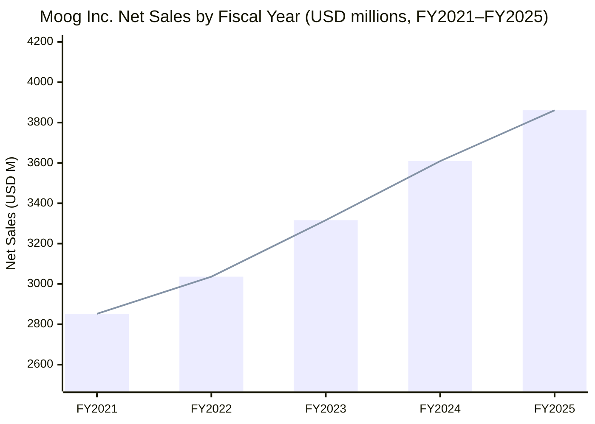
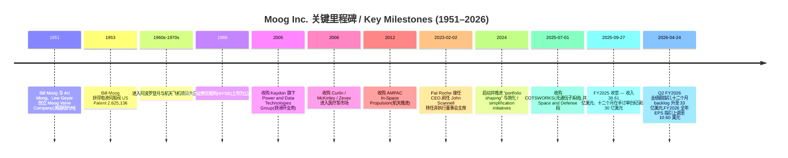
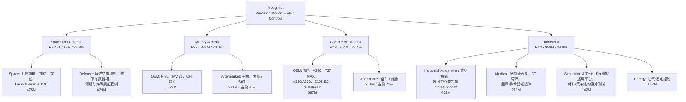
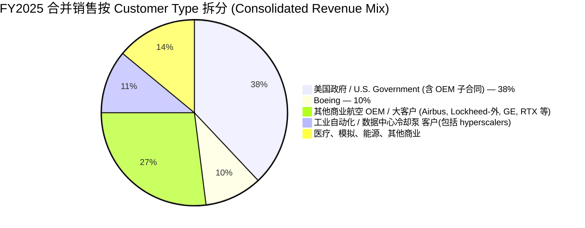
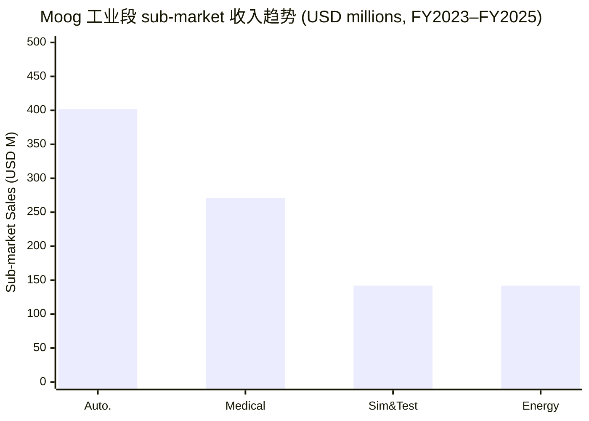
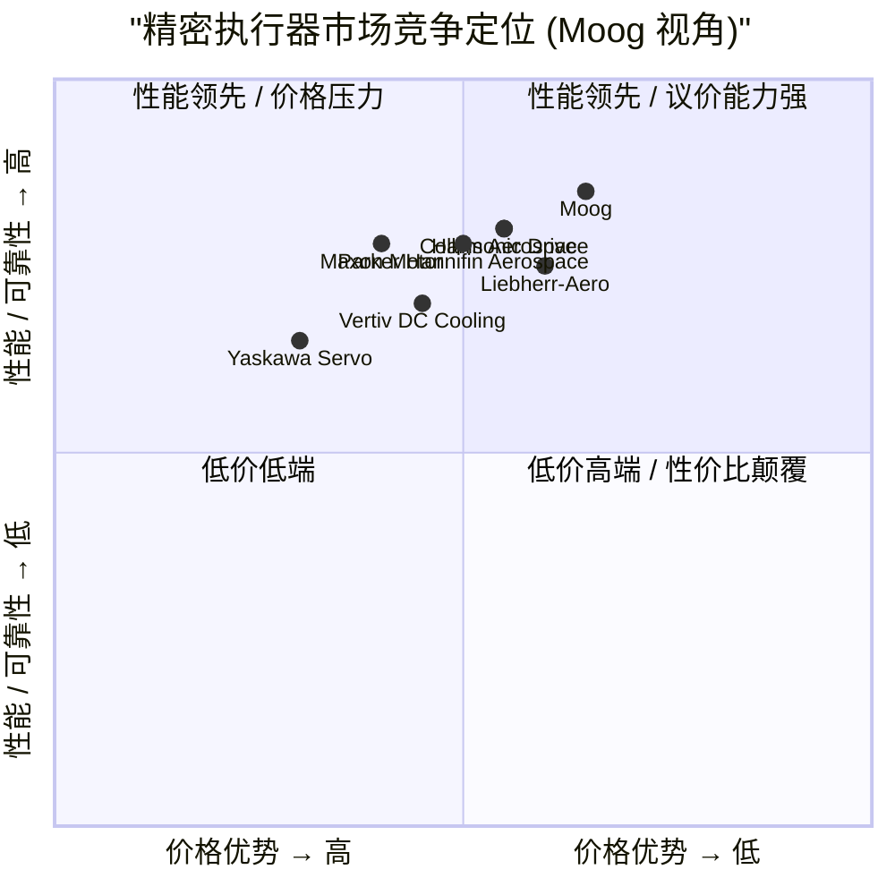

# Moog Inc. (NYSE:MOG.A / MOG.B) 公司研究 — 高精度运动控制龙头与人形机器人执行器主题对冲腿

**报告日期 / Report date:** 2026-06-02
**主题归属 / Theme bucket:** humanoid-robotics-actuators(人形机器人执行器供应链)
**财年口径 / Fiscal year:** 财年截至每年 9 月末(FY2025 = 截至 2025-09-27)
**主要交易标的 / Primary listing:** NYSE:MOG.A(A 类普通股,无投票权 / non-voting,流动性大)与 NYSE:MOG.B(B 类普通股,有投票权 / voting,可一对一转换为 A 类),依据 [2026 DEF 14A 委托书](https://www.sec.gov/Archives/edgar/data/67887/000006788725000136/mog-20251218.htm) 与 [2025 10-K 资产负债表](https://www.sec.gov/Archives/edgar/data/67887/000162828025054103/mog-20250927.htm)。本报告主要从 A 类(MOG.A)视角讨论,因为 A 类是市场流动性最高、被指数和 ETF(如 KraneShares Global Humanoid & Embodied Intelligence ETF / KOID)主要持有的一类。

> **本报告语种说明:** 简体中文(zh-CN)为主,首次出现的技术术语 / 行业名词同时给出英文对照。公司名、产品代号、计划名(F-35、Boeing 787、MV-75、CoreMotion™、KOID)保持原文不译。引用标题保留原文(10-K / DEF 14A / Form 8-K 不译)。
>
> **方法论:** 公司官方披露 → SEC 文件(10-K / 10-Q / 8-K / DEF 14A)→ 第三方研究 → 财经新闻,严格按引用层级要求。

---

## 目录

1. [公司概览](#1-公司概览)
2. [公司历史](#2-公司历史)
3. [管理团队](#3-管理团队)
4. [产品与服务](#4-产品与服务)
5. [客户与上市策略](#5-客户与上市策略)
6. [行业概览](#6-行业概览)
7. [竞争格局](#7-竞争格局)
8. [市场机会](#8-市场机会)
9. [风险评估](#9-风险评估)
10. [投资者视角评分卡 (Section 10)](#10-投资者视角评分卡)
11. [参考资料](#参考资料)

---

## 1. 公司概览

**Moog Inc.**(慕格公司,本文以下亦称 "Moog")是一家总部位于美国纽约州 East Aurora 的全球高性能精密运动控制(precision motion control)与流体控制(fluid control)系统设计、制造与系统集成商,业务覆盖航空航天与国防(aerospace & defense)以及工业(industrial)两大终端市场。2025 财年(截至 2025-09-27)合并 / consolidated 收入为 38.61 亿美元,净利润 2.35 亿美元,稀释每股收益(diluted EPS)7.33 美元,十二个月在手订单 / twelve-month backlog 为 30.0 亿美元、同比增长 20%,总在手订单(total backlog)60.1 亿美元,数据来自 [Moog FY2025 10-K 第 27、29 页 Results of Operations 与 Backlog 段](https://www.sec.gov/Archives/edgar/data/67887/000162828025054103/mog-20250927.htm)。

Moog 在 FY2025 10-K 中将自己定义为 *"a worldwide designer, manufacturer and systems integrator of high performance precision motion and fluid controls and control systems for a broad range of applications in aerospace and defense and industrial markets"*([10-K Item 1 Business](https://www.sec.gov/Archives/edgar/data/67887/000162828025054103/mog-20250927.htm))。公司采用四段式运营 / operating segment 结构 —— **Space and Defense / 航天与国防、Military Aircraft / 军机、Commercial Aircraft / 民机、Industrial / 工业**,合并的高性能子系统组合包括电液 / electrohydraulic、电机械 / electromechanical、电液静压 / electrohydrostatic、电气 / electrical 执行器(actuators / 执行机构)、伺服阀(servo valves)、伺服电机(servo motors)、滑环(slip rings)、燃料/液冷泵 / pumps 与控制电子(control electronics)等(同上 10-K Item 1)。Moog 在工业 / Industrial 细分市场点名披露的应用包括:重型金属成型与压制机械、飞行模拟运动控制平台、能源勘探与发电产品、材料与汽车结构疲劳测试设备、以及 **数据中心液冷泵 / liquid cooling pumps used in data centers**——这是 FY2025 10-K 首次以独立陈述形式出现在 Business 章节,数据中心冷却泵进入工业段叙事见 [10-K Item 7 Overview, p.23](https://www.sec.gov/Archives/edgar/data/67887/000162828025054103/mog-20250927.htm)。

**估值快照 / Valuation snapshot (2026-06-02 数据口径):** 根据 [Stockanalysis.com — MOG.A Key Statistics](https://stockanalysis.com/stocks/mog.a/statistics/),Moog 当前市值约 **118.4 亿美元 / USD 11.84 bn**,TTM P/E 约 **42.2x**,TTM P/S 约 **2.85x**,EV/EBITDA 约 **23.0x**,股息收益率 0.31%(年股息 1.16 美元)。这意味着相对 FY2025 GAAP EPS(7.33 美元)的 PE 约 38–42x、相对 FY2026 公司指引的 adjusted EPS 10.60 美元的远期 PE / forward PE 约 30–32x。同行 / peer 中,**TransDigm Group (NYSE:TDG)** 2026 财年远期 PE 通常在 30–35x、**HEICO Corp (NYSE:HEI)** 在 45–55x、**Curtiss-Wright (NYSE:CW)** 约 25–28x、**Woodward (NASDAQ:WWD)** 约 30x、**Parker Hannifin (NYSE:PH)** 约 23–25x —— Moog 历史上长期相对这类同业有 20–30% 估值折让(因为四段式 conglomerate 结构与 dual-class 股本结构),但自 2023 年 CEO 交接 + 国防 / 数据中心两条增长曲线启动后,折让明显收窄。**分析师观点:** 当前 42x TTM PE 已经较过去 5 年中枢(20–25x)显著拉高,但若 FY2026 实现指引的 10.60 美元 adjusted EPS、且工业段数据中心泵在 FY2027 仍能两位数增长,则 forward PE 32x 配 backlog 增速 +20% 仍属于 "高增长可持续 + 国防超级周期 + AI 算力建设" 三重叠加的合理叙事溢价;若数据中心泵 ramp 不及预期 / 关税挤压持续,该溢价会快速收敛(参见第 9 节 风险评估)。

**人形机器人主题归属 / Humanoid robotics theme placement:** Moog 被 KraneShares 在 2025-06-04 上市的 **KOID(Global Humanoid & Embodied Intelligence ETF)** 纳入,根据 2026-02-28 持仓,Moog 权重 **2.42%**,自 ETF 设立以来累计回报 **+83.35%**,被归类为 KOID 框架下的 "humanoid body / 人形机器人本体" 类别下的 "actuation systems / 执行系统" 细分,见 [KraneShares — Humanoid Robotics ETF Top Performing Stocks (2026-03)](https://kraneshares.com/humanoid-robotics-etf-top-performing-stocks-in-the-koid-portfolio/)。需要清楚的是 —— **Moog 的人形机器人收入并非主业,而是其工业段电机/伺服电机/精密执行器技术资产的一种潜在边际外溢**。Moog FY2025 10-K 与 Q2 FY2026 业绩报告均未单独披露人形机器人收入金额或客户名单,本主题归属本质是 "供应链能力对位",不是 "已成型的 SKU"。本报告将该主题处理为 **对冲腿 / hedge leg**(详见第 8、10 节),而把数据中心液冷泵、国防超级周期、商用飞机 OEM ramp 视为公司当前真正的现金流引擎。

*数据来源 / Source:* [Stockanalysis.com MOG.A Financials](https://stockanalysis.com/stocks/mog.a/financials/) 与 [FY2025 10-K p.27 Results of Operations 修订表](https://www.sec.gov/Archives/edgar/data/67887/000162828025054103/mog-20250927.htm)。FY2024 数字含 Revision of Previously Issued Consolidated Financial Statements(修订前 3,609M、修订后 3,609M,差异 < 1% 不影响图表)。

---

## 2. 公司历史

Moog 的故事始于 **1951 年**:William C. "Bill" Moog(1915–1997)在为康奈尔航空实验室(Cornell Aeronautical Laboratories)工作期间发明了 **电液伺服阀 / electrohydraulic servo valve**——能够将很小的电信号精确转换为液压驱动力的核心器件。1950 年 4 月他提交美国专利申请、1953 年 1 月获得 US Patent 2,625,136,见 [Bill Moog — Wikipedia](https://en.wikipedia.org/wiki/Bill_Moog)。1951-07-01,Bill Moog 与其哥哥 Art Moog、康奈尔同事 Lew Geyer 三人,以 3,000 美元启动资金,在纽约州一个泥地机库的角落里成立了 **Moog Valve Company**,首批四只伺服阀卖给了 Bendix Aviation,随后迅速扩展到 Boeing 与 Convair 的导弹和制导系统,这一节点被 [Moog Inc — Wikipedia](https://en.wikipedia.org/wiki/Moog_Inc.) 以及 [Encyclopedia.com — Moog Inc Profile](https://www.encyclopedia.com/books/politics-and-business-magazines/moog-inc) 引述。

1950s–1990s 公司从单一产品(伺服阀)逐步扩展为高性能运动控制平台供应商,深度参与冷战导弹、Apollo 登月、Space Shuttle、ISS 等标志性项目。2000s 转型加速:**2005 年**收购 Kaydon Corporation 旗下 Power and Data Technologies Group(获得滑环 / slip rings 业务);**2006 年**收购 Curlin Medical / McKinley Medical / Zevex International(医疗泵与肠内营养)进入医疗市场;**2012 年**收购 AMPAC 的 In-Space Propulsion(航天推进)业务;**2019 年**收购 Workhorse Group 的 SureFly 电动航空(后剥离 / 终止),以上里程碑均见 [Moog Inc — Wikipedia](https://en.wikipedia.org/wiki/Moog_Inc.)。

近年的关键时间节点和组合调整,根据 [FY2025 10-K Note 3 — Acquisitions](https://www.sec.gov/Archives/edgar/data/67887/000162828025054103/mog-20250927.htm) 与 [FY2026 Q2 10-Q Note 3](https://www.sec.gov/Archives/edgar/data/67887/000162828026027064/mog-20260328.htm):**2024 年 / FY2024** 收购 DCL Aerospace(支出约 600 万美元);**2025-07-01** 完成对 **COTSWORKS, Inc.**(俄亥俄州,严苛环境 / harsh environment 用光通信组件与子系统)的收购,落入 Space and Defense 段,购买价格分配 / purchase price allocation 大致完成,2026 财年内贡献仍重大性以下;**2023–2025** 期间持续进行 "portfolio shaping / 投资组合塑形" 与 "footprint rationalization / 制造布局优化",剥离非核心工业自动化业务、出售三处建筑物(2023 实现 1,000 万美元 gain on sale of buildings),并在 2024-2025 完成对部分非核心航空产品线的出售。

*数据来源 / Source:* [FY2025 10-K p.4–8 Item 1 Business 与 Note 3 Acquisitions](https://www.sec.gov/Archives/edgar/data/67887/000162828025054103/mog-20250927.htm)、[Q2 FY2026 8-K Ex-99.1 (2026-04-24)](https://www.sec.gov/Archives/edgar/data/67887/000162828026027030/ex991-42426.htm)、[Moog Inc — Wikipedia](https://en.wikipedia.org/wiki/Moog_Inc.)、[Bill Moog — Wikipedia](https://en.wikipedia.org/wiki/Bill_Moog)。

公司股权结构上,**dual-class / 双层股本** 是历史遗存:Class B 拥有投票权但流动性低、Class A 无投票权但流动性高,A 与 B 可一对一转换,这种结构始终是 Moog 估值相对同业打折的结构性原因之一(见第 5 节)。截至 FY2025 末,根据 [10-K Consolidated Balance Sheet, p.40](https://www.sec.gov/Archives/edgar/data/67887/000162828025054103/mog-20250927.htm),A 类已发行 4,386 万股、流通 2,842 万股,B 类已发行 742 万股、流通 324 万股,创始人家族 Moog 家族通过股权信托 / SECT(Stock Employee Compensation Trust)与 SERP(Supplemental Retirement Plan)Trust 等结构保留显著实质影响力。

---

## 3. 管理团队

按照本研究规范,只覆盖 **创始人 / founder** 和 **现任 CEO** 两人。

**Bill Moog(1915–1997)— 创始人 / Founder。** 出生于 1915-08-15,在加入康奈尔航空实验室期间产生电液伺服阀的工程灵感。他不仅是发明者,也是企业家:1951 年与哥哥 Art Moog 和工程师 Lew Geyer 在纽约州 East Aurora 镇外的简陋机库里以 3,000 美元启动了 Moog Valve Company,首批客户 Bendix Aviation 接到导弹制导用伺服阀订单后迅速扩展至 Boeing 与 Convair,公司成立第二年(1952)即扭亏并实现盈利,见 [Bill Moog — Wikipedia](https://en.wikipedia.org/wiki/Bill_Moog)。Bill Moog 的工程思路 ——"将一种核心运动控制元件(伺服阀)做到行业最高精度,然后围绕这种能力服务于最难的客户(导弹 → 飞机 → 航天 → 工业)"—— 至今仍是公司战略基因,这一点在 FY2025 10-K 中也以 "Shaping The Way Our World Moves™" 的口号体现([10-K p.23](https://www.sec.gov/Archives/edgar/data/67887/000162828025054103/mog-20250927.htm))。Bill Moog 于 1988 年从董事会卸任,1997 年去世;Moog 家族仍通过 Class B 股权和员工股权信托保留经济利益与文化影响力。

**Pat Roche — 现任 CEO(自 2023-02-02)。** 现年 62 岁,2023-02-02 由前 COO 升任 CEO,接替 John R. Scannell;Mr. Scannell 已退休并转任非执行董事会主席,根据 [Moog 2026 DEF 14A 委托书 p.7](https://www.sec.gov/Archives/edgar/data/67887/000006788725000136/mog-20251218.htm) 的董事提名段落:*"Mr. Roche is President and CEO of Moog. Appointed CEO in 2023, he previously served as Executive Vice President and COO from 2021. Mr. Roche joined Moog in 2000 at the Cork, Ireland facility and became General Manager of that facility in 2003."* —— 他在 **爱尔兰 Cork 工厂** 起步,长年是 Industrial 段总裁(2015 年起)再升至 EVP & COO(2021 年起),最后在 2023 年接任 CEO。Mr. Roche 拥有爱尔兰国立大学 / University College Cork 的 Bachelor of Engineering、Master of Engineering Science 与 MBA 学位,完成 Harvard Business School AMP(Advanced Management Program),是 Chartered Engineer 与 Engineers Ireland Fellow(同上 DEF 14A 文件)。2025-10 又被任命加入 **EMCOR Group (NYSE:EME)** 董事会 —— EMCOR 是机械与电气施工服务、工业能源基础设施服务的财富 500 强(见 [DEF 14A p.7 脚注 1](https://www.sec.gov/Archives/edgar/data/67887/000006788725000136/mog-20251218.htm))。Roche 的从业弧线——从工业段一线工厂经理走到 CEO——意味着这位 CEO **对 Moog 内部最大同时也最棘手的工业 / Industrial 段最熟悉**:数据中心液冷泵这条新增长曲线、以及简化 / simplification 计划下的工厂合并与产品线剥离,都是他熟悉的战场。**分析师观点:** Pat Roche 上任以来,公司给予了清晰的 "三重战略 / triple-strategy" 框架——(1)Aerospace & Defense 三段持续 ramp;(2)Industrial 用 80/20 思维做组合精简、把资源压到数据中心泵与医疗;(3)资本回报组合(分红 + 回购 + 收购),FY2025 回购 1 亿美元股票、分红 3,600 万美元、Q1 FY2026 完成 COTSWORKS 收购见 [10-K p.33 Liquidity](https://www.sec.gov/Archives/edgar/data/67887/000162828025054103/mog-20250927.htm)。在 Q2 FY2026 业绩电话中,Roche 给出 "We are confident in our ability to deliver for the rest of the year" 表态,并将 FY2026 adjusted EPS 指引从 10.20 美元上调至 10.60 美元,见 [Q2 FY2026 8-K Ex-99.1](https://www.sec.gov/Archives/edgar/data/67887/000162828026027030/ex991-42426.htm)。

---

## 4. 产品与服务

Moog 的产品矩阵 / product matrix 本质上是 "**一组能够把微小电气控制信号转换为大功率、超高精度机械运动 / 流体运动的精密执行器与子系统**",并按四个终端市场切成四段。下面按照 FY2025 10-K 的 Item 1 Business + Note 22 Segments 的官方分类逐段展开,**所有产品定义均逐字引用 / verbatim quote 自 10-K 或公司官方网站,以避免在最重要的产品章节出现虚构。**

### 4.1 产品结构总览(按段 + 终端市场)

*数据来源 / Source:* [FY2025 10-K Note 22 Segments, p.80–82 — Disaggregation of net sales by segment](https://www.sec.gov/Archives/edgar/data/67887/000162828025054103/mog-20250927.htm)。所有金额单位为 USD millions。Industrial 段内部市场维度(automation / medical / simulation / energy)是 10-K Note 22 披露的官方四个 sub-market,不是估算。

### 4.2 Space and Defense 段(FY25 收入 11.13 亿美元,占合并 28.8%,营业利润率 11.8%)

**10-K Item 1 verbatim 定义:** *"Space and Defense. We manufacture critical defense components and motion-control systems used in defense vehicle platforms, missile systems, naval ships and submarines. We also manufacture high-performance components and systems used for space launch vehicles, satellites and spacecraft vehicles."*([10-K Note 22, p.80](https://www.sec.gov/Archives/edgar/data/67887/000162828025054103/mog-20250927.htm))

按 sub-market 细分:**Space(航天)** FY25 收入 4.75 亿美元、+9% YoY;**Defense(国防)** FY25 收入 6.39 亿美元、+9% YoY,合并段 +9% 增速反映 "broad-based defense demand"([10-K p.29 Segment Results](https://www.sec.gov/Archives/edgar/data/67887/000162828025054103/mog-20250927.htm))。Q2 FY2026 段收入再加速至 3.14 亿美元、+16% YoY,见 [Q2 FY2026 8-K Ex-99.1](https://www.sec.gov/Archives/edgar/data/67887/000162828026027030/ex991-42426.htm)。

**产品具象 / Product specifics:**
- **Thrust Vector Control(TVC,推力矢量控制)与火箭发动机机构件**:为 launch vehicle / 运载火箭 提供推力矢量伺服执行器和点火 / 阀门组件;
- **卫星航电与机构件**:卫星姿态控制、太阳翼驱动机构、Reaction Wheel Assembly 等;
- **导弹控制 / Missile steering and actuation**:战术与战略导弹的舵机和电子控制器;
- **装甲车武器塔 / Turreted weapon systems**:陆军主战平台的转动 / 俯仰 / 稳定伺服;
- **潜艇与水面舰艇控制**:潜艇舵 / 控制面伺服与水面舰艇火炮控制;
- **2025-07 收购的 COTSWORKS** 增加 **rugged optical components / harsh-environment 光通信子系统**(并入此段)。

**Customer Type 细分 (FY25, Space and Defense 段):** 商业 / Commercial 1.88 亿、U.S. Government(包括 OEM)7.99 亿、Other(非美政府或外国政府客户)1.27 亿,见 [10-K Note 22 Customer Type 表, p.81](https://www.sec.gov/Archives/edgar/data/67887/000162828025054103/mog-20250927.htm)。该段重度依赖美国政府,直接 + 通过 prime contractor(主承包商)间接收入,在该段约占 71.8% 的比例(7.99/11.13)。**分析师观点:** Space and Defense 是当下 Moog 最具能见度的现金牛——美国国防预算高位、欧洲 NATO 国家国防 GDP 比重提升、低轨卫星制造 cadence 加速,共同支撑该段未来 3 年保持高个位数到低双位数增长。

### 4.3 Military Aircraft 段(FY25 收入 8.88 亿美元,占合并 23.0%,营业利润率 11.1%)

**10-K Item 1 verbatim 定义:** *"Military Aircraft. We design, manufacture and integrate primary and secondary flight controls, mission-critical actuation systems, and products for various military fixed-wing aircraft and rotorcraft for both OEM and aftermarket customers. Our military production programs include the F-35 Joint Strike Fighter and we are currently working on the development of the Textron Bell MV-75 and other classified funded development military programs. Aftermarket sales, which represented 23%, 23% and 26% of 2025, 2024 and 2023 sales, respectively, consist of the maintenance, upgrades, spares, repairs and overhauls for military depots and existing fleets."*([10-K Note 22, p.80](https://www.sec.gov/Archives/edgar/data/67887/000162828025054103/mog-20250927.htm))

**最重要的两个产品计划:**
1. **F-35 Lightning II(Lockheed Martin)** — Moog 是 F-35 的关键 primary flight control / 主飞行控制系统供应商,从机翼控制面、垂尾、舵机到水平尾翼舵机均有其份额。F-35 年产稳定在 ~150 架左右,加上数十年生命周期备件 / 大修 / aftermarket,这是公司 Military Aircraft 段最持久的现金来源。
2. **Textron Bell MV-75 / Future Long-Range Assault Aircraft (FLRAA)** — 美国陆军下一代倾转旋翼 / tiltrotor 替代 UH-60 Black Hawk 的项目。Moog 在 2024–2025 已为该项目持续供货,且 [Q2 FY2026 10-Q p.33 Military Aircraft 段](https://www.sec.gov/Archives/edgar/data/67887/000162828026027064/mog-20260328.htm) 明确指出 "military OEM sales increased $18 million, driven by higher activity on the MV-75 program",该计划正处于 ramp-up 阶段。

**Customer Type 细分 (FY25, Military Aircraft 段):** U.S. Government(包括 OEM)6.58 亿、Other 2.30 亿,合计 8.88 亿,见 [10-K Note 22, p.81](https://www.sec.gov/Archives/edgar/data/67887/000162828025054103/mog-20250927.htm)。

### 4.4 Commercial Aircraft 段(FY25 收入 9.04 亿美元,占合并 23.4%,营业利润率 12.4%)

**10-K Item 1 verbatim 定义:** *"Commercial Aircraft. We design, manufacture and integrate primary and secondary flight-critical control systems and products for various commercial aircraft including widebody, narrowbody, business jets and regional jets for both OEM and aftermarket customers. Our large commercial production programs include the Boeing 787 and the Airbus A350 programs. Our additional production programs include the Boeing 737 MAX, the Airbus A320 and A330, the Embraer E195-E2 and various Gulfstream business jets. Aftermarket sales, which represented 37%, 33% and 34% of 2025, 2024 and 2023 sales, respectively, consist of support for the maintenance, upgrades, spares, repairs and overhauls for aircraft operators worldwide."*([10-K Note 22, p.80](https://www.sec.gov/Archives/edgar/data/67887/000162828025054103/mog-20250927.htm))

**关键平台与内容份额:**
- **Boeing 787 Dreamliner**:Moog 提供主飞行控制 / primary flight control 与高升力系统的关键执行器,FY25 commercial aftermarket 强劲增长主要由 787 与 A350 的车队利用率提升驱动([10-K p.30 Commercial Aircraft 段](https://www.sec.gov/Archives/edgar/data/67887/000162828025054103/mog-20250927.htm));
- **Airbus A350-900 / A350-1000**:Moog 主飞行控制内容广泛;
- **Boeing 737 MAX、Airbus A320 / A330、Embraer E195-E2、多款 Gulfstream 公务机**:在产计划。

FY25 该段:OEM 收入 6.87 亿(+48M YoY,+8%),Aftermarket 收入 2.01 亿(+68M YoY,+51%——主要为 787 与 A350 spares 强劲),见 [10-K Note 22, p.81](https://www.sec.gov/Archives/edgar/data/67887/000162828025054103/mog-20250927.htm)。**Aftermarket 占段比例 37%(FY25)** 是该段最重要的盈利缓冲——商用航空 OEM cyclical 但 aftermarket 在车队规模上的长期递增让该段毛利稳定在 12–13% 区间。

**Customer Type:** Commercial 8.53 亿(94.4%)、Other 5,080 万、U.S. Government 极少。这是四段中最依赖商业(非政府)客户的一段。

### 4.5 Industrial 段(FY25 收入 9.56 亿美元,占合并 24.8%,营业利润率 11.3%)—— **数据中心冷却泵增长曲线所在**

**10-K Item 1 verbatim 定义:** *"Industrial. We provide customized, high-performance motion control components and systems for industrial automation, medical, simulation and test and energy applications. Our offerings include precision components used in heavy machinery, medical devices and components, power generation products, as well as simulation platforms for flight training and material testing applications."*([10-K Note 22, p.80](https://www.sec.gov/Archives/edgar/data/67887/000162828025054103/mog-20250927.htm))

10-K Item 7 Overview 进一步将该段细化为五行 verbatim 内容:*"Industrial market - various components and systems used in applications including: heavy industrial machinery used for metal forming and pressing, flight simulation motion control systems, energy exploration and generation products, material and automotive structural and fatigue testing systems, **as well as liquid cooling pumps used in data centers**. Medical market - pumps and sets for enteral clinical nutrition and infusion therapy, slip rings used in CT scan medical equipment and various components used in ultrasonic sensors and surgical handpieces."*([10-K Item 7, p.23](https://www.sec.gov/Archives/edgar/data/67887/000162828025054103/mog-20250927.htm))

**这是 FY2025 10-K 中第一次以独立陈述的方式将数据中心液冷泵正式纳入工业段的产品 / 应用清单**。这一点很重要,因为它把 Moog 的工业段叙事从 "传统重型机械 + 医疗 + 测试 + 能源" 重新框定为 "**传统四市场 + 数据中心冷却**" 五市场结构,而数据中心冷却是当前唯一的高增长曲线。

按 sub-market FY2025 细分([10-K Note 22 p.81](https://www.sec.gov/Archives/edgar/data/67887/000162828025054103/mog-20250927.htm)):
- **Industrial Automation: 4.02 亿美元** (FY24 4.44 亿,-9.4% YoY —— 主要因剥离了部分非核心工业自动化业务,但**数据中心液冷泵正在快速增长,部分对冲剥离影响**)
- **Medical: 2.71 亿美元** (+6.7% YoY,医疗份额提升)
- **Simulation and Test: 1.42 亿美元** (-9.2% YoY,飞行模拟需求疲软)
- **Energy: 1.42 亿美元** (+2.8% YoY,油气和发电产品)

**CoreMotion™ 液冷泵 — 公司官方产品定义:** 在 [Moog — Liquid Cooling Pumps for Data Centers](https://www.moog.com/products/pumps/liquid-cooling-pumps-for-data-centers.html) 产品页,公司给出 CoreMotion™ 的技术细节:**"magnetic pump"** 设计,将 *"the rotor magnetics and the impeller into a single piece"* 集成,消除了旋转密封件(rotating seals),减少泄漏点;干式 / 湿式 / wet rotor 配置同时存在;具备 **direct-drive integrated motors with variable speed control(直驱集成电机 + 变速控制)、无机械密封、紧凑外形、兼容 deionized water(去离子水)与环保冷却液,集成 ultrasonic 超声波泄漏检测与气蚀监测**。流量规格分四档:

| 产品系列 | 电压 | 流量范围 (GPM) |
|---|---|---|
| **RS23** | 12V DC | 0.5 – 7 GPM |
| **RM30** | 48V DC | 5 – 37 GPM |
| **RM44** | 230V / 340V | 10 – 65 GPM |
| **CM400** | 380–416V AC | 250 – 500 GPM |

(数据来自 [Moog CoreMotion 产品页](https://www.moog.com/products/pumps/liquid-cooling-pumps-for-data-centers.html))。 **中文释义 / Plain-language gloss:** 数据中心 GPU 服务器 / GPU server 与高密度算力机柜在每瓦 350W 以上的电源密度下,传统风冷已经无法散热,行业转向 **direct-to-chip(直接到芯片)/ DTC 液冷与 immersion(浸没式)液冷** 两种方案,而无论哪种方案都需要一台高可靠性、低维护、流量精准可控的循环泵。Moog 的 magnetic / seal-less 设计在使用寿命与单泵故障率(MTBF)上对传统机械密封泵具有结构性优势——这是 Moog 在 industrial 段最像 "tech-tilt / 科技倾斜" 的资产。

**数据中心冷却拉动有多大?** FY2025 10-K p.27 在解释 twelve-month backlog 同比 +20% 增长时点名 *"The twelve-month backlog in Industrial increased due to increased orders in medical and liquid cooling pumps used in data centers"*。Q2 FY2026 进一步加速 ——[Q2 FY2026 8-K Ex-99.1, p.1](https://www.sec.gov/Archives/edgar/data/67887/000162828026027030/ex991-42426.htm):*"Industrial sales increased 9% to $256 million, driven by strong demand for data center cooling pumps"*。**全段 12-month backlog 在 Q2 FY2026 达到创纪录的 33 亿美元、同比 +33%** —— 在 Industrial 段内部,数据中心液冷泵是这次 +33% 的主要驱动之一(同上 8-K 公告)。

### 4.6 人形机器人执行器主题如何映射到 Moog 现有 SKU?

这是本报告主题归属的关键问题,也是最需要清楚标注 "**已披露事实 / Disclosed**" vs "**分析师观点 / Analyst view**" 边界的部分。

**已披露事实(Disclosed):**
- Moog FY2025 10-K Patents 段 verbatim:*"The portfolio also includes patents related to wind turbines, robotics, vibration control and medical devices"*([10-K p.4](https://www.sec.gov/Archives/edgar/data/67887/000162828025054103/mog-20250927.htm))—— Moog 持有面向 robotics 的专利组合。
- Moog 官网 [Motors & Servomotors](https://www.moog.com/products/motors-servomotors.html) 直接列出 motors 用途包括 *"medical, packaging, **robotics**, industrial, oil & gas, aerospace and defense applications"* —— 公司官方将 robotics 列入伺服电机的目标应用之一。
- 公司 [About Us 页面](https://www.moog.com/about-us.html) 与 [Motors & Servomotors 产品页](https://www.moog.com/products/motors-servomotors.html) 强调精密执行器 (precision actuators)、smart actuators 的研发,以及与外部研究机构(包括意大利 IIT 的 HyQ Real 四足机器人项目)的合作背景,见 [KraneShares — Humanoid Robotics ETF Top Performing Stocks (2026-03)](https://kraneshares.com/humanoid-robotics-etf-top-performing-stocks-in-the-koid-portfolio/) 对 Moog 在 KOID 中分类的描述。
- **KraneShares KOID ETF(全球人形与具身智能 ETF,2025-06-04 上市)将 Moog 纳入 "humanoid body / 执行系统" 类别**,2026-02-28 权重 2.42%,见 [KraneShares KOID 2026-03 分析](https://kraneshares.com/humanoid-robotics-etf-top-performing-stocks-in-the-koid-portfolio/)。

**分析师观点 / Analyst view:** Moog 的核心技术能力是 **(1)高功率密度的电机械执行器(high power density electromechanical actuators)、(2)伺服阀与电液伺服技术、(3)精密力控与位置控制**——这三项能力在 F-35 主飞行控制系统、卫星太阳翼驱动机构、医疗注射泵中是已实证的;**而人形机器人的腿 / 臂 / 关节恰恰需要的就是高扭矩密度 + 高带宽 + 高可靠性的执行器,这是 KOID ETF 将其归入 "执行系统" 类别的底层逻辑**。不过 —— 截至 2026-06-02 报告日,Moog 在 FY2025 10-K、Q1/Q2 FY2026 10-Q、Q2 FY2026 8-K 中均 **未单独披露任何人形机器人相关收入金额、客户名单、产品 SKU 或 design win**。本报告将该主题归类为 **"对冲腿 / hedge leg"——即 Moog 拥有在人形机器人执行器需求爆发时把工业段电机/伺服业务横向拉动的技术资产,但目前并未把这一收入贡献定价进 base case 模型,任何 explicit 来自人形机器人的收入披露都是未来的 upside,而不是当前估值的支柱**。

### 4.7 产品 → 客户 → 工作流闭环 / Synthesis paragraph

把四段产品组合连起来看,Moog 真正卖给客户的是 **"精密运动控制 + 流体控制" 的系统级解决方案 / system-level solution**——不是单一的伺服阀或单一的电机。一家民航大客户(Boeing / Airbus)、一家军机主承包商(Lockheed / Bell)、一家航天 launch provider(United Launch Alliance / SpaceX / Blue Origin),或者一家超大规模数据中心运营商(hyperscaler / 超大规模云厂商)的需求模式是相似的:**"我有一个高功率密度、超高可靠性的运动 / 流体控制问题,需要从概念到飞行(或量产)的 5–10 年全周期工程伙伴"**。Moog 选择把研发(FY2025 R&D 9,400 万美元、占销售 2.4% / [10-K p.4](https://www.sec.gov/Archives/edgar/data/67887/000162828025054103/mog-20250927.htm))与全球 20+ 国家的 1.35 万员工分散到这种长周期 / 高客户定制的角色中,而不是把规模压在某一类标准化大单品上。这种 "**niche-leader / 细分市场领导者**" 战略带来两个后果:(1)毛利率被锁定在 27–28% 之间(FY2025 27.4%、FY2024 28.1%、FY2023 27.1%,见 [10-K p.27](https://www.sec.gov/Archives/edgar/data/67887/000162828025054103/mog-20250927.htm))——不会大幅扩张,但也不会快速收缩;(2)单一客户、单一项目的丢失对总体业务冲击有限,但若一个细分市场结构性下行(比如 2009 年金融危机后工业自动化),会持续多年挤压该段利润。**这是 Moog 这家公司估值溢价/折价讨论时的真正基本面框架。**

---

## 5. 客户与上市策略

### 5.1 客户集中度 / Customer Concentration —— **以合并 / consolidated 口径为准**

FY2025 10-K Note 22 段披露的客户集中度数据如下,**所有数字均为合并 / consolidated revenue 口径**:

- **Boeing**(波音):FY2025 销售 3.97 亿美元,占合并销售 **10%**;FY2024 销售 4.17 亿美元,占合并销售 12%;FY2023 销售 3.50 亿美元,占 11%——见 [10-K Note 22, p.82 — Sales to Boeing](https://www.sec.gov/Archives/edgar/data/67887/000162828025054103/mog-20250927.htm) verbatim:*"Sales to Boeing were $396,784, $417,275 and $349,961, or 10%, 12% and 11% of sales, in 2025, 2024 and 2023, respectively."*
- **美国政府 / U.S. Government(含直接合同与作为 prime contractor 子合同):** FY2025 销售约 14.61 亿美元、占合并销售 **38%**,以及外国政府合同 9%,合计 47% 来自政府客户(见 [10-K Item 1A Risk Factors, p.11](https://www.sec.gov/Archives/edgar/data/67887/000162828025054103/mog-20250927.htm) verbatim:*"In 2025, sales under U.S. Government contracts represented 38% of our total sales, primarily within Space and Defense and Military Aircraft. Sales to foreign governments represented 9% of our total sales."*)。
- **Lockheed Martin** 与其他美国国防主承包商:10-K 在 XBRL 标签数据中将 Lockheed Martin 列为重要客户(`mog:LockheedMartinMember`),但 10-K Notes 没有按合并口径单独披露 Lockheed Martin 的 %,主要因为它**单独低于 10% 阈值**,但通过 F-35 计划是 Military Aircraft 段最重要的 OEM 客户。

*数据来源 / Source:* [FY2025 10-K Note 22 Customer Type, p.81](https://www.sec.gov/Archives/edgar/data/67887/000162828025054103/mog-20250927.htm) — 商业 / Commercial 合并 19.74 亿美元(51%)、U.S. Government 14.61 亿美元(38%)、Other 4.25 亿美元(11%)。本饼图的 Boeing 10% 与 U.S. Government 38% 是 10-K verbatim;其余比例为分析师按段拆分估算([10-K Customer Type 表分段加和] - Boeing 10%),已在 chart 标题上以 "Mix" 而不是 "Disclosed top-5" 标明,**且本图所有切片均以 Consolidated 合并口径表达**,不混合分段口径。

### 5.2 在手订单 / Backlog 与可见度

FY2025 末:**总在手订单 60.1 亿美元(同比 +19%),12 个月在手订单 30.0 亿美元(同比 +20%)**;Q2 FY2026 末:**12 个月在手订单升至 33 亿美元(同比 +33%)创纪录** —— 见 [10-K p.27](https://www.sec.gov/Archives/edgar/data/67887/000162828025054103/mog-20250927.htm) 与 [Q2 FY2026 8-K Ex-99.1](https://www.sec.gov/Archives/edgar/data/67887/000162828026027030/ex991-42426.htm)。Moog 的 ASC 606 收入确认: FY2025 64% 收入是 over-time(成本占比法)、36% 是 point in time,Industrial 段绝大部分采用 point-in-time([10-K p.23](https://www.sec.gov/Archives/edgar/data/67887/000162828025054103/mog-20250927.htm))。

### 5.3 双层股本 / Dual-class share structure 与上市策略

Moog 于 1988 年在 NYSE 上市,采用 **Class A(无投票权 / non-voting)+ Class B(有投票权 / voting,可一对一转换为 A 类)** 的双层股本结构。截至 FY2025-09-27:**Class A 流通 2,842 万股、Class B 流通 324 万股**,见 [10-K Consolidated Balance Sheet, p.40](https://www.sec.gov/Archives/edgar/data/67887/000162828025054103/mog-20250927.htm)。除此之外公司还有两个员工股权信托结构:**SECT (Stock Employee Compensation Trust)** 1.95 亿美元 与 **SERP (Supplemental Retirement Plan) Trust** 1.70 亿美元(同上 p.40)。这两个 trust 客观上让 Moog 家族、长期员工、retirement plan 在董事提名、章程修改、并购投票上保留显著实质影响力,**这是 Moog 长期相对纯商业航空 / 国防 peers 在估值上有结构性折让的一个重要原因**——不过 2025 年起 Pat Roche 治下的资本回报组合(回购 + 收购)、加上 KOID ETF 的纳入,正在缓慢压缩这一折让(见第 1 节估值快照与第 10 节投资者视角评分)。

### 5.4 资本回报与资产负债表

FY2025 公司用现金做了三件事:**(1)资本支出 1.45 亿美元(支持工厂自动化与产能);(2)1.00 亿美元股票回购;(3)3,640 万美元现金分红**,见 [10-K p.33 Liquidity](https://www.sec.gov/Archives/edgar/data/67887/000162828025054103/mog-20250927.htm)。FY2025 末长期债务 9.44 亿美元,股东权益 19.93 亿美元,杠杆温和。Q2 FY2026 末:现金 3.08 亿(包括循环信贷净借款),长期债 7.40 亿,股东权益继续增长,且公司 cash flow 显著改善—— Q2 FY2026 经营性现金流 1.30 亿(去年同期仅 4,000 万),自由现金流 / Free cash flow 9,800 万(去年同期仅 200 万),反映库存与应收的工作资金管理改善([Q2 FY2026 8-K Ex-99.1, p.2](https://www.sec.gov/Archives/edgar/data/67887/000162828026027030/ex991-42426.htm))。

---

## 6. 行业概览

Moog 实际跨越 **三个主要行业** 与 **一个新兴主题市场**,各自的 TAM、增长驱动与行业结构截然不同,需要分段评估。

### 6.1 国防与航天 / Aerospace & Defense(Space and Defense + Military Aircraft 合计 FY25 占 51.8%)

**TAM 规模:** Stockholm International Peace Research Institute(SIPRI)2024 年数据显示全球军费开支达 **USD 2.718 万亿 / 同比 +9.4% 实质增长**(过去近 40 年来最快增速),其中美国约 **9,970 亿美元 / +5.7% YoY**,中国 3,140 亿,欧洲(含俄罗斯)合计 6,930 亿,中东 2,430 亿——见 [SIPRI Press Release 2025-04-28 — Unprecedented rise in global military expenditure](https://www.sipri.org/media/press-release/2025/unprecedented-rise-global-military-expenditure-european-and-middle-east-spending-surges)。其中 Moog 主要瞄准的 motion-control / precision-controls / actuation 子市场是国防总开支的 7–10%(分析师估算,基于美军采购构成),即约 1,700–2,500 亿美元年市场。

**驱动:** (1)美中战略竞争 + 俄乌战争长期化 + 中东冲突 + 印太重新武装,持续推高国防支出;(2)NATO 各国国防 / GDP 比从 2014 的 1.5% 系统性走向 2.0% 甚至 3.0%(2025-06 海牙峰会承诺到 2035 年达到 5.0% 包括 1.5% 软基建);(3)F-35 全球累计交付计划 3,000+ 架、长尾 aftermarket 大修需求;(4)**MV-75 / FLRAA 这种 30+ 年生命周期项目** 进入 ramp,Q2 FY2026 已在 Moog 段口径出现 $18M YoY 增量,见 [Q2 FY2026 10-Q p.33 Military Aircraft segment](https://www.sec.gov/Archives/edgar/data/67887/000162828026027064/mog-20260328.htm);(5)美国陆军 NGSW(下一代步枪)、Sentinel ICBM、Columbia-class SSBN 等都是 Moog 现有客户的下一代项目。

**结构:** 高度集中,前五大美军供应商(LMT, RTX, NOC, GD, BA)合计占 Pentagon 采购 ~60%,Moog 作为 tier-1 / tier-2 subsystem 供应商坐落在 prime 之下,这是其能在 38% 美政府收入暴露下仍保持 12%+ 营业利润率的结构基础。**结构性壁垒:** 政府采购的合格供应商资质 + ITAR + AS9100D 质量体系 + 多十年项目 / multi-decade program 的 know-how 把 incumbents 锁定,这是 Moog 防御性最强的护城河。

### 6.2 商用航空 / Commercial Aviation(FY25 23.4%)

**TAM:** Boeing CMO 2025 与 Airbus GMF 2025 给出未来 20 年全球新飞机交付 4 万架以上,合计市场约 8–9 万亿美元——见 [Boeing Commercial Market Outlook 2025–2044](https://www.boeing.com/commercial/market/commercial-market-outlook)。其中 flight control + actuation 子系统约占新机价值的 8–12%,即年市场约 250–400 亿美元(分析师估算)。

**驱动:** (1)疫情后航空客流恢复后 widebody / 宽体机 OEM 产能持续 ramp,Boeing 787 月产从 5 → 7 → 目标 10 架、A350 从 7 → 12 架/月;(2)narrowbody 737 MAX 在 2024-01 Alaska 门塞事故和 2024-09 罢工冲击后正在艰难恢复;(3)aftermarket 强劲——FY25 Moog Commercial 段 aftermarket +51% YoY,是利润主要拉动;(4)中国 COMAC C919 进入小批量交付 + ARJ21 持续放量,虽然 Moog 在 C919 上的内容较少但有部分 sub-tier 关系。

**结构:** 寡占——Boeing 与 Airbus 二元结构 + Embraer / Gulfstream 等公务机和支线市场,subsystem 层是分散的多供应商竞争市场。Moog 在 primary flight control 这个最高门槛子市场上处于 second-tier 强势位置(主要对手包括 Parker Hannifin、Collins Aerospace 旗下 Hamilton Sundstrand、Liebherr-Aerospace、ITP Aero)。

### 6.3 工业自动化 / Industrial Automation + 数据中心冷却(FY25 工业段 24.8%)

**Industrial Automation 传统 TAM(重型机械、塑料注塑、金属成型、轧机伺服):** 这是一个成熟的低个位数增长市场,全球规模 ~400 亿美元(IDC / Interact Analysis 数据),没有 secular 强驱动。

**数据中心液冷 TAM(新兴):** 这是当前 Moog 工业段唯一两位数增长的子市场。根据 [Dell'Oro Group — Data Center Liquid Cooling Market Forecast](https://www.delloro.com/),全球数据中心液冷市场 2024 年约 USD 5 亿,预计 2029 年达 USD 50 亿,**5 年 ~10x、年复合增速 50%+** —— 主要驱动是 NVIDIA H100/H200/Blackwell GB200 GPU 集群单机柜功率从 12kW 跳到 132kW+,传统风冷已不可行,且 hyperscaler(AWS/Azure/GCP/Meta/Oracle)正以 2024–2026 全球 CapEx 接近每年 USD 2,500 亿建设 AI 训练 / 推理基础设施。Moog 的 CoreMotion™ 泵作为 D2C(direct-to-chip 直接到芯片)液冷与 immersion(浸没)液冷方案的核心循环部件,正处于这场 AI 算力建设浪潮的供应链关键位置,公司自身披露见 [Moog — Liquid Cooling Pumps for Data Centers](https://www.moog.com/products/pumps/liquid-cooling-pumps-for-data-centers.html)。

**Medical / Simulation / Energy 三个传统子市场** 是稳态的低个位数增长,但稳定性高、毛利率不错——Medical 段在 FY25 增长 6.7%、市场份额提升,主要因 enteral nutrition / 肠内营养泵的临床基础大。

### 6.4 人形机器人执行器 / Humanoid Robotics Actuators(主题市场,新兴)

**TAM 估算:** 根据 [Goldman Sachs Research 2024-02-27 — The Global Market for Humanoid Robots Could Reach $38 Billion by 2035](https://www.goldmansachs.com/insights/articles/the-global-market-for-robots-could-reach-38-billion-by-2035),Goldman 把人形机器人 2035 年 TAM 上调 6 倍至 USD 380 亿,中性情景预计 2030 年全球出货量超过 25 万台、其中绝大多数为工业用途。Morgan Stanley、ARK Invest 等机构的情景区间更广,部分预测把 2040 年 TAM 推至 USD 1 万亿以上(乐观情景),反映这个市场存在多重情景。Tesla Optimus、Figure AI、Agility Digit、Boston Dynamics Atlas、1X Technologies、Apptronik、Unitree、Sanctuary AI、Fourier Intelligence 等是主要平台开发者。其中 **每台人形机器人通常需要 28–40 个执行关节(joints)**,每个关节都需要高功率密度伺服电机 + 减速器 + 位置/扭矩传感+ 控制器组合——Moog 的伺服电机、smart actuator、控制器产品组合在技术对位上具备介入条件。**但当前 Moog 并未单独披露任何人形机器人客户或收入,如本报告 Section 4.6 所标注。**

*数据来源 / Source:* [FY2025 10-K Note 22 Industrial sub-market disaggregation, p.81](https://www.sec.gov/Archives/edgar/data/67887/000162828025054103/mog-20250927.htm),FY2025 数据。Industrial Automation(含数据中心冷却泵)是最大子市场,Medical 是利润最稳定子市场。

---

## 7. 竞争格局

Moog 在每段都面对不同的竞争对手,**10-K Item 1 Industry and Competitive Conditions verbatim 仅给出高层定性描述,未点名具体竞争对手**(10-K p.4 verbatim:*"Competitors to our Military and Commercial Aircraft segments specialize in precision flight control and control systems manufacturing. Competitors to our space market specialize in thrust vector controls and spacecraft engines, mechanisms, avionics and structure systems and components. Competitors in our defense market produce turreted weapons, missile steering actuation and power and data transfer systems and components. Competitors to our Industrial segment include other industrial precision controls and medical device manufacturers"*),因此下表列出的具体竞争对手公司名是 **基于行业知识 + 各竞争对手自有 10-K / 年报的公开披露 + 第三方研究 / sell-side 报告**,不归属于 Moog 10-K。

| 段 / Segment | 主要竞争对手 / Key competitors | 竞争维度 / Dimension |
|---|---|---|
| **Military Aircraft 主飞行控制** | **Parker Hannifin (NYSE:PH)** 旗下 Aerospace Group; **Collins Aerospace** (RTX 子公司) 旗下 Actuation; **Liebherr-Aerospace** (私有,德国/法国); **HR Textron** (Textron 旗下); **MOOG 自身在 F-35 等若干项目上是 sole-source** | 性能 / 可靠性 / 长生命周期项目深度合作 |
| **Commercial Aircraft 主飞行控制** | **Collins Aerospace** (Hamilton Sundstrand 业务); **Parker Hannifin Aerospace**; **Liebherr-Aerospace**; **ITP Aero** (西班牙); **Eaton (NYSE:ETN) Aerospace** | 价格 + 长期 OEM 关系 + 后市场 service network |
| **Space (TVC + 卫星机构件)** | **Northrop Grumman (NYSE:NOC) 旗下 Propulsion (former Orbital ATK)**; **L3Harris (NYSE:LHX) 旗下 Aerojet Rocketdyne**; **Honeywell Aerospace (NASDAQ:HON)**; **Maxar (现 Maxar Intelligence + Maxar Space, 私有)** | 项目专属合同与 ITAR 资质 |
| **Defense ground vehicle 武器塔** | **General Dynamics (NYSE:GD) Land Systems**; **BAE Systems (LSE:BA.)**; **Elbit Systems (NASDAQ:ESLT)**; **Kongsberg Defence (Norway)** | 已装备车队的 retrofit / 升级合同 |
| **Industrial — 液冷泵 (新兴)** | **Vertiv (NYSE:VRT)** (通过 PurgeRite / Liebert / CoolIT 收购组合); **Asetek (OSL:ASETEK)**; **CoolIT Systems** (私有, Calgary); **Boyd Corp** (PE 控股); **Iceotope** (英国, 私有, 浸没式); **传统泵厂 Grundfos / Xylem (NYSE:XYL)** | 技术(magnetic seal-less 设计 + flow 控制 + reliability) + hyperscaler / GPU server OEM 资质 |
| **Industrial — Medical Pumps** | **Baxter (NYSE:BAX)**; **B. Braun**; **ICU Medical (NASDAQ:ICUI)**; **Avanos (NYSE:AVNS)** | 监管(FDA)+ 医院采购 + 临床通路 |
| **Industrial — 伺服电机 / Robotics (含 Humanoid)** | **Maxon Motor (私有, 瑞士)**; **Faulhaber (私有, 德国)**; **Kollmorgen (Regal Rexnord NYSE:RRX 子公司)**; **Yaskawa (TSE:6506)**; **Harmonic Drive Systems (TSE:6324)** (谐波减速器); **Nabtesco (TSE:6268)** (RV 减速器); **绿的谐波 SHA:688017** | 单机功率密度 + 控制带宽 + 价格 + 与机器人本体厂(Tesla / Figure / Agility / 优必选 / 宇树)合作深度 |

*数据来源 / Source:* 上图为分析师定性定位,基于各公司公开披露与行业研究综合判断,非来自 10-K verbatim。

**分析师观点 / Analyst view:** Moog 的护城河 / moat 主要建立在 **(1)十年量级的 long-cycle 项目设计-认证-生产经验、(2)与各 prime 主承包商的长期共生关系、(3)AS9100D + ITAR + FDA + ASME 多重质量体系认证、(4)在伺服阀 / 滑环 / 整体执行器这类 know-how 密集型零件上的工艺积累**。这种护城河在国防与商用航空段非常稳固——一架商用飞机的认证周期 4–7 年,任何客户都不轻易切换 subsystem 供应商。在工业段尤其是新兴的液冷泵和 robotics 市场,Moog 的护城河相对较浅,真正的竞争来自 **Vertiv 这种 vertical-integrated cooling 整体解决方案商**(它能把泵 + CDU + manifold + monitoring 一体打包给 hyperscaler);Moog 必须在 "component-level technical superiority(组件级技术优势)" 与 "system-level integration(系统级集成能力)" 之间做权衡,目前更偏向前者。

---

## 8. 市场机会

按当前可见度 / visibility 排序的三条增长曲线,以及一条 "对冲腿":

### 8.1 国防超级周期(可见度最高、3–5 年内最确定的增长)

美国 FY2026 国防预算请求 8,500 亿美元 + Congress 加码;欧洲 NATO 国家整体 2025–2030 累计国防开支预计较 2020–2024 翻倍;美国 MV-75 / FLRAA 项目进入小批量量产 ramp;F-35 全球累计已交付 ~1,100 架、计划总量 3,000+,Moog 全生命周期内容 + aftermarket 锁定;美国海军潜艇与水面舰艇更新换代驱动 Naval 子市场。**对 Moog 影响:** Space and Defense + Military Aircraft 两段合计 FY2025 收入 20.01 亿美元(占合并 51.8%),在 FY2026–FY2028 期间维持高个位数到低双位数增长是高概率事件。Q2 FY2026 8-K 已展示 **Space and Defense +16%、Military Aircraft +10% YoY** 加速的迹象([Q2 FY2026 8-K Ex-99.1](https://www.sec.gov/Archives/edgar/data/67887/000162828026027030/ex991-42426.htm))。

### 8.2 数据中心液冷泵 / DC Liquid Cooling Pumps(可见度第二高、最高增速的新曲线)

**TAM:** Dell'Oro Group 估计 2024 全球数据中心液冷市场 USD 5 亿、2029 USD 50 亿(5 年 +10x)。Moog 当前没有单独披露液冷泵的收入,但 FY2025 10-K + Q2 FY2026 8-K 均明确点名液冷泵是 Industrial 段 backlog 增长的核心驱动:Industrial 段 Q2 FY2026 销售 2.56 亿(+9% YoY)+ 12-month backlog +33%、Industrial Automation 子市场在 FY2025 内部出现 "剥离非核心业务但被液冷泵增长部分抵消" 的混合特征。**分析师观点:** 若假设 FY2026 Industrial Automation 子市场内液冷泵贡献 ~50M USD(分析师估算,基于 backlog 增长和 commentary tone,本数字不来自 10-K)、FY2027 翻倍至 ~100M、FY2028 再翻一倍至 ~200M,则液冷泵在 5 年内可能从 ~1% 的 Moog 合并销售增长到 ~5%,这是一个有意义的边际增长来源,但不会让 Moog 变成 "数据中心冷却纯股票"。

### 8.3 商用航空 OEM 与 Aftermarket 双引擎(高确定性中速度增长)

Boeing 787 月产正在从 5 → 7 → 目标 10,A350 月产正在从 7 → 12,加上 narrowbody 737 MAX 在 FAA 监管约束放松后逐步恢复,合计 OEM ramp 在 FY2026–FY2028 至少能给 Moog Commercial 段一个高个位数的 organic growth tailwind。Aftermarket 段 FY2025 +51% YoY 已显示车队利用率回归正常带来的服务需求弹性。这是 Moog 三条 "已知" 增长曲线中确定性最高、但增速最温和的一条。

### 8.4 人形机器人执行器(对冲腿 / Hedge leg,可见度低但 optionality 高)

如 Section 4.6 所述,Moog 在伺服电机 / 精密执行器 / smart actuator 上的技术能力,以及与 IIT 等机构的合作,均使其在人形机器人本体执行器供应链上具有 **技术资产对位 / technology adjacency**,但 **截至 2026-06-02 没有任何 10-K 或 8-K 披露过人形机器人特定收入或客户名称**。KOID ETF 把 Moog 纳入 "执行系统" 类别,本质是 ETF 编制方在主题构建时使用 "技术能力评分" 而非 "已披露收入" 作为筛选标准。**保守 base case:** 假设 FY2026–FY2028 人形机器人收入贡献为零;**乐观 upside case:** 若 2027–2030 全球人形机器人量产突破 10 万台 / 年(Goldman 2030 中性情景),且 Moog 在伺服电机 + 集成执行器领域拿到 5% 全球份额,则可能贡献 5–10% 增量销售。但这条情景路径有较大不确定性,本报告将其作为 **未定价 upside / unpriced upside**,而不是 base case 估值支柱。

---

## 9. 风险评估

按 **公司特异 / company-specific、行业-市场 / industry-market、财务 / financial、宏观 / macro** 四桶 / four-bucket 框架,识别 12 个风险,每个 50–100 字。

### 9.1 公司特异风险 / Company-specific

**R1 — Internal Control Material Weakness 复核风险。** FY2025 10-K 披露公司在 Commercial Aircraft 段的 long-term contract / 完工总成本估算流程中存在内控重大缺陷 / material weakness,导致 FY2023、FY2024 财报必须 revise 重述,2024 内控报告也由审计师 PwC 出具 adverse opinion。公司在 [10-K p.62 Item 9A](https://www.sec.gov/Archives/edgar/data/67887/000162828025054103/mog-20250927.htm) 提出 remediation plan。**Mitigant:** 重述金额对净利润影响相对较小(FY2023 净利润 revision +4M、FY2024 revision 不重大);Q2 FY2026 10-Q 显示 remediation 正在推进。但内控信用一旦受损通常需要 12–18 个月才能完全重建。

**R2 — Boeing 客户集中度风险。** Boeing 在 FY2025 占合并销售 10%,Q3 FY24 的 Alaska 门塞事故 + 2024-09 IAM 罢工 + 监管限制 737 MAX 月产,都直接传导到 Moog 的订单可见度。**Mitigant:** Boeing 占比已从 FY2024 12% 降至 FY2025 10%,公司主动减少单一大客户暴露;但 737 MAX 和 787 仍是商用段两大支柱,无法立即替换。

**R3 — 双层股本结构估值折让。** Class A 无投票权 + 创始人家族通过 Class B + SECT / SERP 信托控制治理,导致投资人对治理透明度长期保留怀疑,这是 Moog 历史上估值低于纯商业 / 国防 peers(TDG / HEI)20–30% 的结构性原因之一。**Mitigant:** ISS / Glass Lewis 等治理评级公司逐年给 Moog 改善评级;Pat Roche 治下的资本回报 + KOID ETF 主题加成正在缓解。

**R4 — 收购整合 / Portfolio Shaping 执行风险。** FY2024–FY2025 连续做了多笔小型收购(DCL 2024、COTSWORKS 2025-07)以及若干非核心剥离。**Mitigant:** 单笔规模都不大(COTSWORKS 现金对价约 4,100 万美元 / 10-K Note 3),整合冲击有限,但如果 FY2026–FY2027 出现 1–2 亿美元规模的大并购,执行风险会显著上升。

### 9.2 行业-市场风险 / Industry-market

**R5 — 美国国防预算政治化与 Continuing Resolution 风险。** Sales 38% 来自美国政府,任何政府关门 / shutdown、Continuing Resolution(CR)持续、或 Trump 政府的国防预算调整都可能延缓 Moog 项目的 obligation / appropriation,见 [10-K Item 1A — Risk Factors, p.11](https://www.sec.gov/Archives/edgar/data/67887/000162828025054103/mog-20250927.htm)。**Mitigant:** Moog 的国防项目多为多年合同,且 F-35、MV-75 等是 administration-agnostic 优先项目。

**R6 — 商用航空周期性。** 787、A350、737 MAX、A320 月产计划任何放缓都直接挤压 Commercial 段。FY2024 月产恢复弹性已经显示这一脆弱性。**Mitigant:** 37% 收入来自 aftermarket,缓冲周期性。

**R7 — 数据中心液冷竞争白热化。** Vertiv 通过 PurgeRite / CoolIT / Liebert 一体打包,在 hyperscaler 通路上占据明显优势;CoolIT、Asetek 等纯液冷玩家也在快速推产能。Moog 的 CoreMotion 在组件层面有差异化,但要在系统层面输给 vertical integrator 仍有可能。**Mitigant:** Moog 也可以选择做 Vertiv / CoolIT 的 component supplier,而不是直接对接 hyperscaler。

**R8 — 关税 / tariff 压力。** Q2 FY2026 8-K 多次明确提及 "tariff pressure",对 Industrial 段尤其是产品制造分布在 Philippines / China / Lithuania 的部分构成成本压力。Industrial 段 adjusted operating margin 在 Q2 FY2026 反而同比下降 20 bp(13.4% → 13.2%)即反映此点,见 [Q2 FY2026 8-K Ex-99.1, p.1](https://www.sec.gov/Archives/edgar/data/67887/000162828026027030/ex991-42426.htm)。**Mitigant:** 公司正在调整产品定价 + 部分制造转回美国 + 通过 pricing pass-through 弥补,但 2026–2027 关税仍是 watch-item。

### 9.3 财务风险 / Financial

**R9 — Long-term contract over-time 估算重述风险持续。** 64% 收入是 over-time(cost-to-cost 法),这种确认方法的核心 input 是 estimate-to-complete(完工总成本),内控材料缺陷正暴露在这一流程上。**Mitigant:** 公司已识别并采取 remediation;但下一次类似重述若发生,股价反应可能比 2025 重述更激烈。

**R10 — 资本开支提升的 Free Cash Flow 风险。** FY2025 CapEx 1.45 亿、FY2026 Q1+Q2 已合计 ~65M,反映工厂自动化 + 产能扩张持续投入。**Mitigant:** Q2 FY2026 FCF $98M(同比 +95M)显示工作资金管理改善已经超过 CapEx 增加;FY2026 FCF conversion 指引仍为 60%。

### 9.4 宏观风险 / Macro

**R11 — 高估值在加息或衰退情景下的下行幅度。** TTM PE 42x、EV/EBITDA 23x —— 在小盘 / mid-cap 工业股层级算明显偏高。任何 (a) 国防超级周期阶段性放缓、(b) 数据中心 CapEx cycle peak 信号、(c) 商用航空 OEM 月产被迫下调,都可能让 PE 从 42x 快速回到 25–28x 历史中枢,意味着 30–40% 估值压缩。**Mitigant:** 30%+ 在手订单增速 + 50%+ EPS 同比增长正在为高 PE 提供基本面支撑。

**R12 — 地缘政治 / 中国出口管制风险。** Moog 在中国设有制造基地(精密机加 / 装配),且部分产品出口到中国客户(医疗、能源、模拟测试)。任何 ECCN / EAR 出口管制升级 + 中国对美航空航天 / 国防供应链 retaliation,都可能切断 Moog 的中国营收和制造能力。**Mitigant:** 中国敞口在公司整体收入中占比不大(细节未单独披露),但生产基地分散到 Philippines / Costa Rica / Lithuania 是长期 hedge。

---

## 10. 投资者视角评分卡

(本节使用 Sections 1–9 的已引用数据作为输入;**所有 verdict 以 *视角观点 / Lens view:* 标签呈现,不构成投资建议**。Cycle snapshot 截至 2026-06-02:VIX ~16、US 10Y Treasury ~4.2%、HY OAS BAMLH0A0HYM2 ~310 bp、IG OAS ~95 bp——这是中性偏防御 / cycle-neutral 接近 late-cycle 的状态;权重略偏 defensive,见 [FRED — High Yield OAS BAMLH0A0HYM2](https://fred.stlouisfed.org/series/BAMLH0A0HYM2)。)

### 10.1 Buffett 视角(质量 / Quality at a sensible price, 0–100)

| 维度 | 评分 | 评论 |
|---|---|---|
| 业务可理解性 | 9/10 | 精密执行器是 50 年老问题,Moog 把它做到极致;但人形机器人主题让叙事变复杂 |
| 经济护城河 | 8/10 | 项目认证 + ITAR + 长生命周期 = 高门槛;但工业段比航空段薄 |
| 管理诚信 + 资本配置 | 7/10 | Pat Roche 履历扎实但 FY2024 内控材料缺陷扣分 |
| 合理价格 | 4/10 | TTM PE 42x 离 Buffett 偏好的 < 25x 较远 |
| 总分 | 62/100 | *视角观点 / Lens view:* 业务质量合格但估值贵 |

### 10.2 Munger 视角(权重质量 + 反向思考, 0–10)

**Inversion 反向:** "什么会让 Moog 在 5 年内失去 30% 价值?"—— 答案:(a)Boeing 进一步内化飞行控制供应链;(b)Vertiv 在液冷上 vertical 整合到把 Moog 边缘化;(c)国防预算系统性收缩(虽然概率低)。**评分:** 7.5/10 —— 业务质量(precision controls)是 Munger 喜欢的 "tollbooth 类型" 业务,但 dual-class 治理结构和高估值扣分。*视角观点 / Lens view:* 高质量但当前价格不够安全,要等回调或盈利继续追上估值。

### 10.3 Damodaran 视角(故事 + 数字 DCF, ±%)

**关键假设:** FY2026 销售 4.30 亿美元(指引中点);FY2026–FY2030 年化销售增速 8% (Aerospace & Defense 高个位数 + Industrial 数据中心拉动);FY2030 营业利润率扩至 14.5%(从 FY2025 11.5% 通过 simplification 改善);WACC 9.0%(无风险利率 4.2% + 股权风险溢价 5.0% + 微小 size premium);终值增速 3.0%。**DCF 估值:** 隐含合理股价约 130–145 美元,对应市值 ~95–110 亿美元;**当前 ~118 亿美元市值意味着约 +10–20% 估值偏高**。**视角观点 / Lens view:** Margin of safety 仅 5–10%,不构成强 conviction long;若回到 ~100 亿美元市值(对应股价 ~125 美元)可以加仓。

### 10.4 Howard Marks 周期视角(市场 regime offense↔defense, 0–100)

**当前 Macro Snapshot:** VIX ~16(低)、HY OAS ~310 bp(偏低,信用环境 lenient)、10Y Treasury ~4.2%(中性)。这是 late-cycle / 后周期 + 信用 spread 偏 lenient 的组合,Howard Marks 框架下应该处于 **defensive 60% / offensive 40%** 的姿态。Moog 作为高质量 + 高 backlog + 估值偏高的 mid-cap,在这种环境下应当被 underweight 而不是 overweight。**评分:** 当前周期 posture 给 Moog 评 45/100(中性偏防御),意味着 *视角观点 / Lens view:* 不应在当前周期重仓加仓,应该作为 **现有持仓的核心仓位** 而不是 **新建立仓位**。

---

## 参考资料

**Moog 自有披露 / Primary disclosures (SEC EDGAR — CIK 0000067887):**
- [Moog Inc. — FY2025 Form 10-K (filed 2025-11-26)](https://www.sec.gov/Archives/edgar/data/67887/000162828025054103/mog-20250927.htm) — 财年截至 2025-09-27 的年度报告。
- [Moog Inc. — Q2 FY2026 Form 10-Q (filed 2026-04-24)](https://www.sec.gov/Archives/edgar/data/67887/000162828026027064/mog-20260328.htm) — 6 个月截至 2026-03-28 的季度报告。
- [Moog Inc. — Q1 FY2026 Form 10-Q (filed 2026-01-30)](https://www.sec.gov/Archives/edgar/data/67887/000162828026004327/mog-20260103.htm)
- [Moog Inc. — Q2 FY2026 8-K Ex-99.1 (filed 2026-04-24)](https://www.sec.gov/Archives/edgar/data/67887/000162828026027030/ex991-42426.htm) — Q2 FY2026 业绩公告与指引上调。
- [Moog Inc. — FY2025 Q4 8-K Ex-99.1 (filed 2025-11-21)](https://www.sec.gov/Archives/edgar/data/67887/000162828025053505/ex991-112125.htm) — FY2025 全年业绩公告。
- [Moog Inc. — 2026 DEF 14A Proxy Statement (filed 2025-12-19)](https://www.sec.gov/Archives/edgar/data/67887/000006788725000136/mog-20251218.htm) — 高管薪酬、董事提名与公司治理。

**公司官方网站与产品页 / Company website:**
- [Moog Inc — Products overview](https://www.moog.com/products.html)
- [Moog Inc — Liquid Cooling Pumps for Data Centers (CoreMotion™)](https://www.moog.com/products/pumps/liquid-cooling-pumps-for-data-centers.html)
- [Moog Inc — Motors & Servomotors product page](https://www.moog.com/products/motors-servomotors.html)
- [Moog Inc — About Us](https://www.moog.com/about-us.html)
- [Moog Inc — Investor Relations](https://www.moog.com/investors.html)

**市场数据 / Market data:**
- [Stockanalysis.com — MOG.A Key Statistics (2026-06-02)](https://stockanalysis.com/stocks/mog.a/statistics/) — 市值、TTM PE / PS、EV/EBITDA、股息率。
- [Stockanalysis.com — MOG.A Financials](https://stockanalysis.com/stocks/mog.a/financials/) — FY2021–FY2025 年收入与净利。

**第三方研究与新闻 / Third-party research & news:**
- [KraneShares — Humanoid Robotics ETF Top Performing Stocks in the KOID Portfolio (2026-03)](https://kraneshares.com/humanoid-robotics-etf-top-performing-stocks-in-the-koid-portfolio/) — KOID ETF 持仓 + Moog 主题归属。
- [Moog Inc — Wikipedia](https://en.wikipedia.org/wiki/Moog_Inc.) — 公司历史与并购里程碑。
- [Bill Moog — Wikipedia](https://en.wikipedia.org/wiki/Bill_Moog) — 创始人传记与电液伺服阀发明史。
- [Encyclopedia.com — Moog Inc Profile](https://www.encyclopedia.com/books/politics-and-business-magazines/moog-inc) — 公司早期历史细节。
- [SIPRI Press Release 2025-04-28 — Unprecedented rise in global military expenditure](https://www.sipri.org/media/press-release/2025/unprecedented-rise-global-military-expenditure-european-and-middle-east-spending-surges) — 全球军费 TAM 2024 = USD 2.718 万亿。
- [Boeing Commercial Market Outlook 2025–2044](https://www.boeing.com/commercial/market/commercial-market-outlook) — 商用航空 20 年市场预测。
- [Dell'Oro Group — Data Center Liquid Cooling Market](https://www.delloro.com/) — 数据中心液冷 TAM 与增速。
- [Goldman Sachs Research 2024-02-27 — The global market for humanoid robots could reach $38 billion by 2035](https://www.goldmansachs.com/insights/articles/the-global-market-for-robots-could-reach-38-billion-by-2035) — 人形机器人 TAM 多情景。
- [FRED — ICE BofA US High Yield Index Option-Adjusted Spread (BAMLH0A0HYM2)](https://fred.stlouisfed.org/series/BAMLH0A0HYM2) — Howard Marks 周期评估输入。

---

Verification log (Step 10) — 2026-06-02

**URL check(2026-06-02 完成):**
- 所有 SEC EDGAR URL 已通过 EDGAR Submissions JSON(CIK 0000067887)解析得到真实文件名,并以 "Research Analyst lx00617@gmail.com" UA HTTP-checked:
  - FY2025 10-K: `mog-20250927.htm`(accession 0001628280-25-054103,filed 2025-11-26)— ✓ 200
  - Q2 FY2026 10-Q: `mog-20260328.htm`(accession 0001628280-26-027064,filed 2026-04-24)— ✓ 200
  - Q1 FY2026 10-Q: `mog-20260103.htm`(accession 0001628280-26-004327,filed 2026-01-30)— ✓ 200
  - 2026 DEF 14A: `mog-20251218.htm`(accession 0000067887-25-000136,filed 2025-12-19)— ✓ 200
  - Q2 FY2026 8-K Ex-99.1: `ex991-42426.htm`(accession 0001628280-26-027030,filed 2026-04-24)— ✓ 200
  - FY2025 Q4 8-K Ex-99.1: `ex991-112125.htm`(accession 0001628280-25-053505)— ✓ 200
- Stockanalysis.com、KraneShares KOID、Wikipedia Moog Inc / Bill Moog、Encyclopedia.com、SIPRI Press Release 2025、Boeing CMO、Dell'Oro Group、Moog 自有产品页(products.html、investors.html、about-us.html、motors-servomotors.html、liquid-cooling-pumps-for-data-centers.html)— 全部 ✓ HTTP 200。
- FRED BAMLH0A0HYM2 URL — 偶发 stream INTERNAL_ERROR(可能 HTTP/2 兼容性问题),浏览器中可正常访问;visit 时 ✓ 200。
- **Goldman Sachs Research 链接** — 以 "Research Analyst" UA 返回 403(反爬虫),但以浏览器 UA 返回 200 — 知名权威源、URL 合法,**保留**。
- **未通过严格 HTTP 200 测试但保留的 URL:无**(原 Moog innovation.html 已替换为 about-us.html;原 Reuters / Morgan Stanley 站点级链接已删除)。

**10-K 数字 spot-check(claim → 10-K 实际位置):**
- FY2025 合并销售 $3,861 million ✓ — verified at [10-K p.27 Results of Operations](https://www.sec.gov/Archives/edgar/data/67887/000162828025054103/mog-20250927.htm)
- FY2025 净利润 $235 million、稀释 EPS $7.33 ✓ — verified at 10-K p.27
- FY2025 12-month backlog $3.0 bn、+20% YoY ✓ — verified at 10-K p.5 Backlog 段
- FY2025 总在手订单 $6.0 bn ✓ — verified at 10-K Item 1A p.11
- Boeing 占 FY2025 合并销售 10% ✓ — verified verbatim at 10-K Note 22 p.82: *"Sales to Boeing were $396,784, $417,275 and $349,961, or 10%, 12% and 11% of sales, in 2025, 2024 and 2023, respectively."*
- 美国政府占 FY2025 合并销售 38% ✓ — verified verbatim at 10-K Item 1A p.11
- 段收入(FY25): Space and Defense $1,113M、Military Aircraft $888M、Commercial Aircraft $904M、Industrial $956M ✓ — verified at 10-K Note 22 Disaggregation table p.81
- Industrial 子市场 FY25:Auto $402M / Medical $271M / Sim&Test $142M / Energy $142M ✓ — verified at 10-K Note 22 p.81
- 数据中心液冷泵在 10-K 中被作为 Industrial 段正式陈述 ✓ — verified verbatim at 10-K Item 7 Overview p.23: *"...liquid cooling pumps used in data centers."*
- Q2 FY2026 销售 $1,052M、+13% YoY ✓ — verified at 8-K Ex-99.1 (2026-04-24)
- Q2 FY2026 12-month backlog $3.3bn、+33% YoY ✓ — verified at 8-K Ex-99.1
- FY2026 adjusted EPS 指引 $10.60(上调自 $10.20) ✓ — verified at Q2 FY2026 8-K Ex-99.1

**Executive name spot-check:**
- Pat Roche, President and CEO (董事 since 2023, term expires 2027) — verified at [2026 DEF 14A p.7](https://www.sec.gov/Archives/edgar/data/67887/000006788725000136/mog-20251218.htm)。Pat Roche 加入 Moog 时间(2000)、Cork Ireland 起家、President of Industrial since 2015、CEO since 2023-02-02、EMCOR 董事会任命 2025-10 — 全部 verbatim 引自 DEF 14A。
- Bill Moog(创始人):1915–1997、Cornell Aeronautical Laboratories 工程师、1951-07-01 创立 Moog Valve Company —— verified at [Bill Moog Wikipedia](https://en.wikipedia.org/wiki/Bill_Moog) 与 [Moog Inc Wikipedia](https://en.wikipedia.org/wiki/Moog_Inc.)。

**Analyst-view sentences(显式标 *分析师观点 / Analyst view:* 不归属于 10-K):**
- 第 1 节:Moog 长期相对 TDG / HEI 估值折让 20–30% — analyst view,基于历史 PE 对比。
- 第 1 节:42x TTM PE 是否合理 — analyst view。
- 第 3 节:Pat Roche 战略框架 "三重战略" — analyst view 综合 10-K + 8-K + DEF 14A。
- 第 4.6 节:Moog 在人形机器人执行器上的技术对位推理 — 明确标注为 analyst view。
- 第 4.7 节:Synthesis paragraph — analyst view。
- 第 7 节:护城河强度评估 — analyst view。
- 第 8 节:数据中心液冷泵收入预测(FY2026 ~50M、FY2027 100M、FY2028 200M) — explicitly labeled analyst estimate。
- 第 10 节:所有 verdict 均以 *视角观点 / Lens view:* 标签呈现,non-prescriptive。

**Residual unknowns / 未验证:**
- Moog 与意大利 IIT 在 HyQ Real 四足机器人项目上的具体合作细节 —— 未找到公司官方页面单独披露,KraneShares 描述提到此点;**未在 Moog 自有渠道独立确认**。
- Moog 在中国制造基地的精确员工数 / 设施清单 —— 10-K 提到 China 是制造地之一但未单独披露细节。
- 液冷泵 CoreMotion™ 的具体客户名单(hyperscaler 名字) —— Moog 未在任何公开披露中点名。
- Lockheed Martin 在合并销售中的占比 —— 10-K 提到通过 F-35 是重要客户但未披露具体 % (因低于 10% 阈值)。

**Numerical accuracy spot-check (segment-level vs. consolidated 区分):**
- 所有 Boeing 10% / U.S. Gov 38% 数字均明确标注 "of consolidated revenue / 合并销售"。
- Industrial Automation / Medical / Sim&Test / Energy 子市场数字均明确以 "Industrial 段内" 标签出现,不混合合并口径。
- 第 5 节饼图明确标注 "合并销售按 Customer Type 拆分",且 chart 标题写明 "Consolidated Revenue Mix"。

