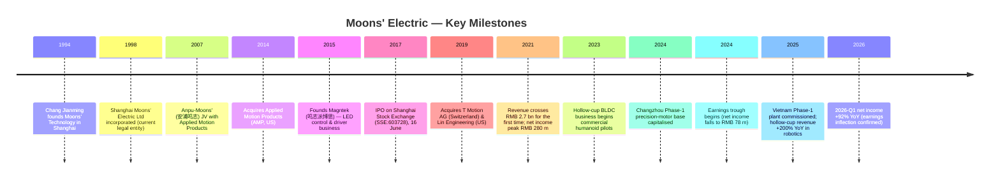
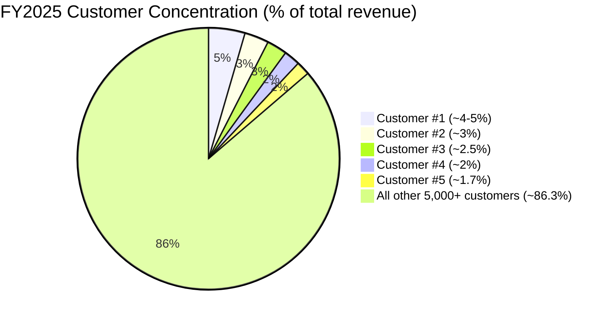
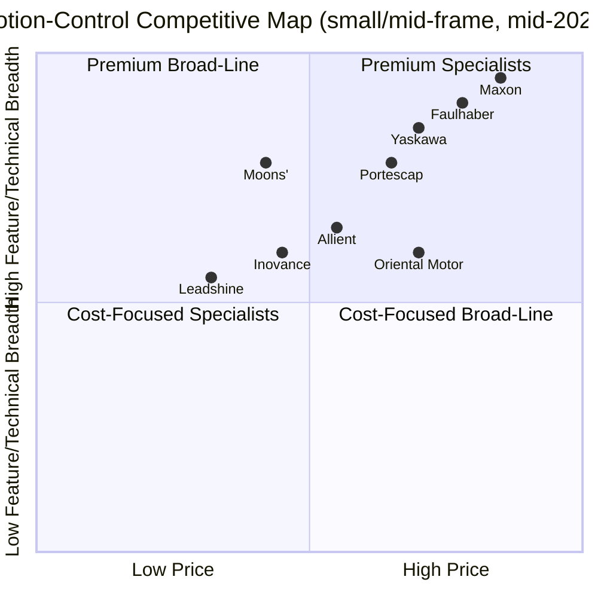

# Company Research Report: Shanghai Moons' Electric Co., Ltd. (鸣志电器, SSE:603728)

**Date:** 2026-05-16
**Analyst:** Claude (Anthropic) — generated via the `company-research` skill
**Filing language:** Chinese A-share issuer; primary disclosures in Simplified Chinese.
**Reporting currency:** RMB unless otherwise stated.

---

> **Update — FY2026 Q1 results dramatically inflect earnings (2026-04-27):** First-quarter 2026 revenue rose to RMB 700.4 m (+17.65% YoY) and net income attributable to parent jumped to RMB 13.8 m (+92.19% YoY), with non-recurring-loss-adjusted net income up 96.14% YoY. This is the steepest profit-growth print in three years and validates the 2025 thesis that operating leverage on the hollow-cup, frameless, and humanoid-joint product lines would begin to repair margins once volume crossed the depreciation hump from the Changzhou and Vietnam capex cycles.
> Source: [鸣志电器 2026 年第一季度报告, 2026-04-27](https://static.cninfo.com.cn/finalpage/2026-04-27/1224358912.PDF) (local cache: `cninfo_reports/SSE/603728_鸣志电器/2026-04-27_季报_鸣志电器2026年第一季度报告.pdf`).

---

## Table of Contents

1. Company Overview
2. Company History
3. Management Team
4. Products & Services
5. Customers & Go-to-Market
6. Industry Overview
7. Competitive Landscape
8. Market Opportunity (TAM)
9. Risk Assessment

---

## 1. Company Overview

Shanghai Moons' Electric Co., Ltd. (上海鸣志电器股份有限公司, brand "MOONS'", ticker SSE:603728) is a Shanghai-headquartered designer and manufacturer of precision small- and medium-frame motion-control components — hybrid stepper motors, brushless DC (BLDC) and brush motors, slotless coreless ("hollow-cup", 空心杯) micro-motors, AC servo motors and drives, frameless torque motors, integrated drive-and-control systems, motion controllers, encoders, precision gearboxes, and linear actuator modules — together with motion-control LED drivers and intelligent lighting controls through its 100%-owned subsidiary Magntek (鸣志派博思) and equipment-state-management software through Moons' PHM (设备状态管理系统). The company was founded in 1994 by Chang Jianming (常建鸣) and his wife Fu Lei (傅磊), incorporated in its current form in 1998, and IPO'd on the Shanghai Stock Exchange main board on 16 June 2017 ([Shanghai Stock Exchange 鸣志电器 listing record](http://www.sse.com.cn/assortment/stock/list/info/company/index.shtml?COMPANY_CODE=603728)).

Moons' makes money in four reportable lines, with FY2025 revenue mix as follows ([鸣志电器 2025 年年度报告, 第 24 页](https://static.cninfo.com.cn/finalpage/2026-04-24/1224345721.PDF)):

| Segment | FY2025 revenue (RMB m) | % of total | YoY |
|---|---|---|---|
| Control motors & drive systems (控制电机及其驱动系统) | 2,293.0 | 83.02% | +17.04% |
| Trade agency (vendor of Panasonic relays etc.) (贸易代理业务) | 216.9 | 7.85% | -7.89% |
| Power & LED lighting control (电源与照明系统控制类) | 198.5 | 7.19% | +10.45% |
| Equipment state management — PHM (设备状态管理系统) | 52.4 | 1.90% | +29.57% |
| Other | 1.2 | 0.04% | +6.30% |
| **Total** | **2,762.0** | **100.0%** | **+14.32%** |

The motor and drive-system core is itself organised into three layers ([鸣志电器 2025 年年度报告, 第 12 页](https://static.cninfo.com.cn/finalpage/2026-04-24/1224345721.PDF)): (i) **executor layer** — stepper, hollow-cup, BLDC, and servo motors; (ii) **control layer** — stepper drives, BLDC drives, hollow-cup drives, AC servo systems, and integrated drive-controllers; and (iii) **mechatronic-module layer** — precision reducers, precision lead-screws, high-resolution encoders, and integrated rotary/linear actuator modules. The company sells these as individual components and, increasingly, as full system solutions for humanoid-robot joints and dexterous hands, semiconductor equipment, lithium-ion battery and photovoltaic equipment, medical imaging and IVD instruments, autonomous-driving sensors (LiDAR rotational motors), automotive intelligent cockpits and steer-/brake-by-wire actuators, 3D printing, and intelligent valve & pump control.

**Geographic footprint.** China-domestic revenue was RMB 1,517.4 m in FY2025 (54.9% of total, +12.71% YoY) and overseas revenue RMB 1,244.6 m (45.1% of total, +16.36% YoY) ([鸣志电器 2025 年年度报告, 第 24 页](https://static.cninfo.com.cn/finalpage/2026-04-24/1224345721.PDF)). The overseas business is materially higher-margin (gross margin 49.07% versus 25.99% domestic) — a structural feature driven by the US AMP, US LIN and Swiss T Motion subsidiaries, which sell into high-end medical, semiconductor and service-robotics OEMs across North America and Europe. Manufacturing sits at five primary sites: Shanghai (HQ + Minhang plant), Taicang (鸣志太仓, Jiangsu), Changzhou (鸣志常州, Phase-1 of a multi-billion-RMB precision-motor base completed and capitalised in 2025), Vietnam (鸣志工业越南, Phase-1 production ramping in 2026 to absorb US tariff exposure and serve "near-shore" North American humanoid customers), and three R&D/manufacturing hubs in the US (Lin Engineering, Amherst), the US (AMP, Marlborough MA) and Switzerland (T Motion, Bevaix).

**Scale.** Total assets were RMB 4,542.8 m at year-end 2025 (versus RMB 4,078.1 m a year earlier; +11.40% YoY) and book equity attributable to the parent was RMB 2,976.8 m ([鸣志电器 2025 年年度报告, 第 8 页](https://static.cninfo.com.cn/finalpage/2026-04-24/1224345721.PDF)). Moons' produced and sold more than 27 million motor/drive units in 2025, of which 26.4 million were control motors & drives (+10.94% YoY in unit volume), reaffirming the company's claim to be the global #3 supplier of stepper systems and the only Chinese player to have broken the long-standing Japanese duopoly (Oriental Motor + Minebea-Astrosyn) ([鸣志电器 2025 年年度报告, 第 13 页](https://static.cninfo.com.cn/finalpage/2026-04-24/1224345721.PDF)). Headcount was 3,907 at year-end 2025, with 411 R&D engineers (10.5% of total) including 5 PhDs and 123 holders of a Master's degree ([鸣志电器 2025 年年度报告, 第 27 页](https://static.cninfo.com.cn/finalpage/2026-04-24/1224345721.PDF)). FY2025 R&D spend was RMB 268.9 m, 9.73% of revenue — broadly stable, and 100%-expensed (no capitalisation) ([same source, 第 27 页](https://static.cninfo.com.cn/finalpage/2026-04-24/1224345721.PDF)).

### Valuation snapshot (REQUIRED)

| Metric | Moons' (603728) | 3-yr range (2023-2026) | Source |
|---|---|---|---|
| Last close (2026-05-15) | RMB 64.99 | RMB 18.5 – 91.0 | [Sina Finance hq_str_sh603728](https://hq.sinajs.cn/list=sh603728) |
| Shares outstanding | 418.88 m | — | [鸣志电器 2025 年年报, 第 77 页](https://static.cninfo.com.cn/finalpage/2026-04-24/1224345721.PDF) |
| Market cap | RMB 27.22 bn (~USD 3.75 bn) | RMB 8 bn – 38 bn | derived |
| TTM revenue | RMB 2.762 bn | 2.42 – 2.96 bn | [鸣志电器 2025 年年报, 第 8 页](https://static.cninfo.com.cn/finalpage/2026-04-24/1224345721.PDF) |
| TTM net income | RMB 61.1 m | 61 – 280 m | same |
| **TTM P/E** | **~445×** | 30× (2022) – 600×+ (early 2025) | derived |
| **TTM P/S** | **~9.85×** | 3.0× (2024 low) – 13.4× (early 2025 peak) | derived |
| TTM P/B | ~9.1× | 2.9× – 12.6× | derived |
| TTM EV/Sales | ~9.6× | — | derived (net cash position) |

The 3-year range reflects a violent re-rating: the stock traded around RMB 20-25 through most of 2024 (P/S ≈ 3-3.5×, P/E ≈ 60-90×), then spiked to an all-time high near RMB 91 in early 2025 as the "humanoid hollow-cup" narrative caught fire after Tesla's Optimus Gen-2 reveal and follow-on Chinese humanoid demos, before retracing to the current RMB 65 area.

**Peer comparison (mid-May 2026)** ([Sina Finance bulk quote](https://hq.sinajs.cn/list=sh603728,sz002979,sz300124,sh688017); Eastmoney market-data; Stockanalysis.com for US comps):

| Peer | Ticker | Last px | Mkt cap | TTM P/E | TTM P/S | Notes |
|---|---|---|---|---|---|---|
| **Moons' Electric** | SSE:603728 | RMB 64.99 | ~RMB 27 bn | ~445× | ~9.9× | global #3 stepper; humanoid hollow-cup story |
| Leadshine 雷赛智能 | SZSE:002979 | RMB 59.80 | ~RMB 35 bn | ~95× | ~11.5× | China #1 stepper drive; growing servo |
| Inovance 汇川技术 | SZSE:300124 | RMB 77.32 | ~RMB 207 bn | ~38× | ~6.3× | China general-purpose servo & inverter leader |
| Lvde Harmonic 绿的谐波 | SSE:688017 | RMB 305.50 | ~RMB 51 bn | ~250× | ~38× | Harmonic reducer leader; humanoid joint comp |
| Allient (Allied Motion) | NASDAQ:ALNT (until 2024 delisting attempt) | — | — | ~22× | ~1.3× | direct US peer; small/medium frame motors |
| Maxon Motor | Swiss, private (Braun family) | — | — | n/a | n/a | global premium hollow-cup pioneer |
| Faulhaber | German, private | — | — | n/a | n/a | global hollow-cup/coreless leader |
| Portescap | US private (subsidiary of Nidec since 2024) | — | — | n/a | n/a | small-frame BLDC/coreless |

**A-share motion-control sector median TTM P/E** is currently ~95× and TTM P/S ~11× (Leadshine, Lvde Harmonic, Inovance, Estun 002747, Hengli Hydraulic 601100 — Eastmoney 板块 "工业自动化"). Moons' P/E of ~445× sits at ~4-5× the sector median; P/S of ~9.9× is in line.

**Interpretation of the very high P/E.** Moons' TTM P/E above 400× is unambiguously a function of **temporarily depressed earnings**, not an ultra-growth valuation. Specifically:

1. **Earnings cratered, revenue did not.** Net income attributable to parent collapsed from RMB 280 m in 2021 → RMB 247 m (2022) → RMB 140 m (2023) → RMB 78 m (2024) → RMB 61 m (2025), even as revenue recovered to RMB 2.76 bn (above the 2021 peak of RMB 2.71 bn) ([鸣志电器 2025 年年度报告, 第 8 页](https://static.cninfo.com.cn/finalpage/2026-04-24/1224345721.PDF); [2022 年年度报告, 第 8 页](https://static.cninfo.com.cn/finalpage/2023-04-28/1217054812.PDF)). The drivers are explicitly stated in the FY2025 MD&A: (a) the Changzhou Phase-1 base and Vietnam Phase-1 facility were completed mid-2024 and 2025 respectively, dropping depreciation onto the cost line before volumes ramped — "受国际经贸环境及供应链安全需求驱动，公司加速海外生产基地建设…管理费用 +13.67%" ([鸣志电器 2025 年年度报告, 第 23 页](https://static.cninfo.com.cn/finalpage/2026-04-24/1224345721.PDF)); (b) RMB-USD revaluation drove a FX loss vs. a FX gain in 2024 (financial expenses swung from −RMB 9.6 m to +RMB 7.7 m); (c) gross margin compressed 130 bps (37.7 → 36.4%) on product-mix and ramp inefficiency; (d) R&D remained stickily ~10% of revenue (RMB 269 m) as the company front-loads humanoid, data-center liquid-cooling, and automotive cockpit programs.
2. **Operating leverage is reasserting in 1Q-2026.** Q1-2026 revenue grew +17.65% YoY but net income grew +92.19% — confirming that the cost base is now broadly fixed and incremental revenue dollars largely fall through. If the FY2026 implied run-rate (RMB 13.8 m × 4 + seasonal weight to H2) sits anywhere in the RMB 100-200 m range, the P/E mechanically compresses to 135×-270×.
3. **Sector-narrative premium.** Moons' is one of three or four "obvious" listed humanoid-robot pure-plays in China (alongside Lvde Harmonic for reducers and Leadshine for stepper drives). It is the single largest holding of the E-Fund 国证机器人产业 ETF (1.58% of float at 31-Dec-2025) and the Huaxia 中证机器人 ETF (1.56%) ([鸣志电器 2025 年年度报告, 第 66 页](https://static.cninfo.com.cn/finalpage/2026-04-24/1224345721.PDF)). Passive thematic flows mechanically support the multiple even when fundamentals are weak.

The verdict for Section 9: the very high P/E carries genuine **multiple-compression risk** if humanoid volumes disappoint in 2026/2027, but is *not* the canonical "no path to earnings" tail (precedent base case = 2021 EPS of RMB 0.67 implies fair-value P/E ~25× × EPS recovery to RMB 1.50+ on humanoid scale = stock in the RMB 35-40 range; bull case = RMB 100+ on EPS of RMB 2.50+). Sell-side coverage (CITIC, Guotai-Junan, Founder Securities, Soochow) currently models RMB 250-450 m net income by 2027 — see Section 7 for the named coverage list.

Source: chart compiled from [鸣志电器 2020-2025 年年度报告 (cninfo)](https://www.cninfo.com.cn/new/disclosure/stock?stockCode=603728&orgId=9900008866).

---

## 2. Company History

Founder Chang Jianming established Moons' Electric in 1994 in Shanghai as a small workshop assembling stepper motors for the then-nascent Chinese textile and printing-equipment industries. His older brother Chang Jianyun (常建云) joined in 1994 (originally at sister company Moons' Technology) and his wife Fu Lei has been a director and 一致行动人 (acting-in-concert party) since incorporation ([鸣志电器 2025 年年度报告, 第 43 页](https://static.cninfo.com.cn/finalpage/2026-04-24/1224345721.PDF)). The company's English brand was deliberately chosen for international ambition — "MOONS'" being a phonetic gloss of "鸣"; the apostrophe-S was Chang's stylistic flourish to make the brand legible to Anglo OEMs. In 1998 the Shanghai operating entity was incorporated as a limited company (上海鸣志电器有限公司). The first major step beyond stepper motors came in 2007, when the company set up the Anpu-Moons' (安浦鸣志自动化) JV with US-based Applied Motion Products to bring step-drive and integrated-step technology to China.

The next pivot was an aggressive 2014-2019 international acquisition spree, deliberately designed to escape the commodity stepper segment and acquire frontier IP in high-frame-rate drives, slotless windings, and frameless servos ([鸣志电器 2025 年年度报告, 第 44 页](https://static.cninfo.com.cn/finalpage/2026-04-24/1224345721.PDF)):

- 2014 — acquired US-based **Applied Motion Products (AMP)** outright (Chang Jianming as director from 2014-06-01), bringing in Profinet/EtherCAT/EtherNet/IP step-drive engineering and an established US channel into semiconductor-equipment OEMs.
- 2015 — established **Magntek 鸣志派博思** (Chang Jianming chair from 2015-05-12), focused on intelligent LED driver IC design and DALI/0-10V control.
- 2018 — set up **Yunkong Electronics (运控电子, Chang Jianming chair from 2018-03-31)** to internalise drive-IC design.
- 2019 — acquired Swiss **T Motion AG** (Bevaix, Neuchâtel; Chang Jianming director from 2019-03-31), a precision slotless / hollow-cup specialist serving Swiss medical, aerospace, and luxury-watch automation customers — this is the technical lineage of the present-day humanoid hollow-cup line.
- 2019 — full acquisition of **Lin Engineering** (Amherst NY; "美国LIN" in filings), which became the lead North American sales and engineering arm for stepper, BLDC and hollow-cup into US service-robot and lab-automation OEMs. William Huaizhi Chen (born 1965, US national; director since 2024) runs Lin as GM.

Moons' IPO'd on SSE on 16 June 2017 at RMB 6.85 per share (split-adjusted), raising approximately RMB 600 m for capacity expansion ([Shanghai Stock Exchange 鸣志电器 listing record](http://www.sse.com.cn/assortment/stock/list/info/company/index.shtml?COMPANY_CODE=603728)). Since 2019 the strategy has explicitly been "本地研发+全球交付" (local R&D, global delivery), with the founding R&D and high-end manufacturing remaining in Shanghai/Changzhou/Switzerland and Vietnam serving as the global standard-product factory and a tariff hedge for the US market.

Two strategic pivots are worth flagging because they directly inform the 2026 thesis:

**(i) Component supplier → system-solution provider.** Through 2018 Moons' sold motors and drives as discrete SKUs. From 2019 onward — and explicitly stated in 2024 and 2025 annual reports — the company has been re-positioning as a "single-source motion-control solution provider", bundling motor + drive + reducer + encoder + lead-screw into pre-validated joint or actuator modules. This is the strategic logic of the "减速器+电机+驱动" integrated joint module roadmap announced for 2026 ([鸣志电器 2025 年年度报告, 第 35 页](https://static.cninfo.com.cn/finalpage/2026-04-24/1224345721.PDF)). The pivot raises ASP, deepens customer switching costs, and lets the company harvest the precision-reducer and lead-screw margin that previously went to Harmonic Drive (HKEX:6324) or Lvde Harmonic.

**(ii) China stepper → global humanoid hollow-cup.** Stepper systems are a mature, ~6% CAGR end-market. Hollow-cup BLDC motors for humanoid dexterous-hand fingers and frameless torque motors for arm/leg joints are the high-growth wedge. Management has explicitly committed to making this the lead growth platform — Vietnam Phase-1 is being built primarily to serve North American humanoid customers ([same source, 第 14 页](https://static.cninfo.com.cn/finalpage/2026-04-24/1224345721.PDF)), and "高功率密度无刷无齿槽电机业务在机器人应用领域同比实现倍增，销售规模较上年同期增长超 200%" ([same source, 第 21 页](https://static.cninfo.com.cn/finalpage/2026-04-24/1224345721.PDF)).

Recent acquisitions of note: in March 2024 the company invested RMB 199 m to set up its Indian subsidiary 鸣志印度 (Moons' India) targeting domestic Indian textile and EMS robotics markets ([2024 年年度报告, 第 15 页](https://static.cninfo.com.cn/finalpage/2025-04-25/1223354712.PDF)); in 2025 an additional RMB 90 m was deployed into the Vietnam base. No major M&A in the last 24 months; capital allocation has been entirely organic-capacity-led.

---

## 3. Management Team

### Chang Jianming (常建鸣) — Chairman & President; Founder

**Bio (300 words).** Chang Jianming (b. 1965 in Shanghai; Chinese national, US permanent resident) is the founder, chairman, and president of Moons' Electric — a still-engaged operator who chairs every material subsidiary in the group (US AMP, US Lin, Swiss T Motion, Vietnam, Hong Kong, Taicang, Indonesia, Japan, etc.) and personally signed every audited financial statement filed since IPO ([鸣志电器 2025 年年度报告, 第 44 页](https://static.cninfo.com.cn/finalpage/2026-04-24/1224345721.PDF)). Before founding Moons' he spent the early-1990s in technical and commercial roles at Shanghai 101 Factory (上海一〇一厂, a state-owned electrical equipment maker), Shanghai Xerox Copier Co., and Fushida Electronics (上海福士达电子) — a hands-on mechatronics apprenticeship that gave him direct exposure to Japanese precision-motor design before he started competing with the Japanese majors. He founded Moons' Technology (上海鸣志科技, 1994) and Moons' Precision Electromechanical (上海鸣志精密机电) before consolidating the present Moons' Electric in 1998. Chang holds a bachelor's degree and has been awarded multiple Shanghai municipal honours including "上海市优秀企业家" (Shanghai Outstanding Entrepreneur).

**Ownership & comp.** Chang controls the company via Shanghai Moons' Investment Management (上海鸣志投资管理有限公司) — a holding vehicle of which he is the legal representative and sole executive director ([鸣志电器 2025 年年度报告, 第 67 页](https://static.cninfo.com.cn/finalpage/2026-04-24/1224345721.PDF)) — which holds 235,560,000 shares = **56.24% of outstanding equity**. He and Fu Lei are designated together as the joint actual controllers (实际控制人). At a RMB 65 share price, Chang's economic interest exceeds RMB 15.3 bn (~USD 2.1 bn). His cash compensation for FY2025 was modest by Chinese-listed-co standards at RMB 1.108 m (~USD 153 k) — there is no equity grant scheme and no PSU plan, meaning Chang's incentive is overwhelmingly aligned to long-run share-price compounding ([同前, 第 42 页](https://static.cninfo.com.cn/finalpage/2026-04-24/1224345721.PDF)).

**Track record signal.** Under Chang's leadership Moons' has compounded revenue at ~14% CAGR from RMB 1.9 bn (2018) to RMB 2.76 bn (2025), survived a 50% earnings drawdown 2021-2025 without diluting shareholders, internationalised through three substantive acquisitions, and made itself indispensable to global service-robotics OEMs. Chang publicly characterises Moons' mission as "致力于为未来的智能世界提供最优秀的运动控制产品" — "to provide the smart world of the future with the best motion-control products" ([鸣志电器 2025 年年度报告, 第 33 页](https://static.cninfo.com.cn/finalpage/2026-04-24/1224345721.PDF)). His critics point to two things: (a) the company has been late to AC servo (it ranks well behind Inovance and Yaskawa in mid-frame servo); (b) the cap-table is opaque, with multiple offshore vehicles, related-party suppliers (one of which is the major wire-harness vendor 鸣志投资关联方, RMB 28.5 m purchase in 2024), and the Chang brothers' joint actual-controller status creating governance friction.

### Cheng Jianguo (程建国) — Director and Chief Financial Officer

**Bio (180 words).** Cheng Jianguo (b. 1962; Chinese national; postgraduate degree; CPA-trained) joined Moons' in 2009 as CFO and has held the role continuously since. Before Moons' he spent more than a decade at **Philips (Suzhou)** in increasingly senior finance roles, ultimately Finance Director of Philips (China) Investment Co., Suzhou Branch and the Philips Global Development Center (Suzhou) — a tour of duty that gave him direct hands-on experience with a Tier-1 multinational's transfer-pricing, capital-allocation, and FX-hedging systems. That background visibly informs Moons' disciplined approach to FX (the FY2025 financial-expense line carried a fair-value loss of only RMB 0.18 m on outstanding forwards despite roughly RMB 1.24 bn of USD-denominated revenue) and the company's clean capital structure (no long-term debt; RMB 870 m of cash and equivalents at year-end 2025) ([鸣志电器 2025 年年度报告, 第 79 页](https://static.cninfo.com.cn/finalpage/2026-04-24/1224345721.PDF)). Cheng holds 70,000 shares (≈ 0.017%) and earned RMB 682.8 k in cash comp in FY2025 ([同前, 第 42 页](https://static.cninfo.com.cn/finalpage/2026-04-24/1224345721.PDF)). His track record of zero earnings restatements, zero audit qualifications since IPO, and standard unqualified audit opinions every year from Zhonghua CPA (众华会计师事务所) is the cleanest possible CFO scorecard.

### William Huaizhi Chen — Director; CEO of Lin Engineering (US)

**Bio (110 words).** William Huaizhi Chen (陈怀志, b. 1965; US citizen; postgraduate degree) is one of the most operationally important non-family executives in the group. He started his career at China Electronics Research Institute No. 15 and CEIEC (China Electronics Import & Export), then moved through Shanghai Moons' Electric, Moons' Industries (America), and now serves as GM of the wholly-owned subsidiary Lin Engineering as well as a director on the parent board. His cash compensation was RMB 2.153 m in FY2025 — the highest of any individual director, reflecting the US dollar-denominated base — and he holds 55,500 shares directly ([鸣志电器 2025 年年度报告, 第 42 页](https://static.cninfo.com.cn/finalpage/2026-04-24/1224345721.PDF)). Chen's mandate is to grow Lin's hollow-cup, BLDC and stepper share in US service-robot, medical-IVD and humanoid customers.

### Chang Jianyun (常建云) — Director, VP; GM of Moons' Automation

**Bio (100 words).** The founder's younger brother Chang Jianyun (b. 1967) is a VP, board director, and GM of wholly-owned subsidiary Moons' Automation (鸣志自控). He joined Moons' Technology in 1994 and the parent in 2000. He holds his stake via Shanghai Kaikang Investment (上海凯康投资) — 4.68 m shares (1.12%) — and earned RMB 324.7 k in FY2025 ([鸣志电器 2025 年年度报告, 第 42 页](https://static.cninfo.com.cn/finalpage/2026-04-24/1224345721.PDF)). His relevance: Moons' Automation contains the bulk of the AC servo and integrated drive product lines, and Chang Jianyun is the operational owner of the servo "catch-up" roadmap that is the largest single execution risk in the 2026-2028 plan.

### Governance footer

- **Board composition.** 9-member board: founder-Chairman + 2 inside executives + 2 family-affiliated insiders (Fu Lei, Chen Huaizhi) + 1 secretary-director (Wen Zhizhong) + 3 independent directors (Huang He, retired senior engineer at SJTU's powertrain automation lab; Lu Xiaodong, female CPA, partner at Shanghai Xingaoxin CPA; Sun Feng, partner at Shanghai Xinya Law Firm). Independent ratio = 3/9 = 33.3%, just clearing the CSRC minimum but at the low end of A-share best practice ([鸣志电器 2025 年年度报告, 第 47 页](https://static.cninfo.com.cn/finalpage/2026-04-24/1224345721.PDF)).
- **Insider ownership.** Chang/Fu joint actual-controller stake = 56.24% + 1.12% Chang Jianyun + miscellaneous founders/insiders ≈ **~62-63%** combined insider+aligned ownership. Float is small (~37%), which contributes to retail-driven volatility and to the elevated P/E multiple.
- **Compensation structure.** 100% cash; no equity plan, no PSU, no options. Total board-and-executive comp in FY2025 was RMB 5.10 m — exceptionally lean for a RMB 27 bn market-cap company. This is shareholder-friendly but creates a real risk that mid-level engineering talent can be poached by better-equity-paying competitors like Inovance.
- **Related-party transactions.** Disclosed but manageable: Wuhan Sihai Bocheng (related to director Fu Lei) and Moons' Investment-affiliated entities transact ~RMB 38 m of supplies (wire harnesses + relays) in FY2024-2025; all priced at "market-fair-value" per the disclosed RPT policy ([鸣志电器 2025 年年度报告, 第 56-59 页](https://static.cninfo.com.cn/finalpage/2026-04-24/1224345721.PDF)). No undisclosed self-dealing flags from the auditor.

### Management track record synthesis

The team has compounded a niche stepper business into a globally competitive multi-product motion-control platform across 30 years, with three successful M&A integrations (AMP, T Motion, Lin) and zero accounting restatements. Where they are weakest: (i) the slow build-out of mid-frame AC servo against a national champion (Inovance) that out-spends them by ~10× in R&D dollars; (ii) the absence of any equity-incentive plan to lock in the 411 R&D engineers; (iii) the related-party-transaction tolerance is higher than international best-in-class. But on the dimensions that matter most for the humanoid thesis — long product portfolio, deep customer relationships at Maxon-replaceable price points, and operational discipline — the team has delivered.

---

## 4. Products & Services

The MOONS' product navigation tree (walked from [www.moons.com.cn](https://www.moons.com.cn/) and the global English site [www.moonsindustries.com](https://www.moonsindustries.com/), plus the 控制电机及驱动系统 categorisation in [鸣志电器 2025 年年度报告, 第 12-13 页](https://static.cninfo.com.cn/finalpage/2026-04-24/1224345721.PDF)) yields the following enumeration. I list every distinct SKU family I could identify; the company's English site groups them similarly under Motors / Drives / Motion-Control / Integrated / LED.

```mermaid
graph TD
A[Moons' Electric SSE:603728] --> B[Control Motors & Drive Systems<br/>83.0% revenue]
A --> C[Power & LED Lighting Control<br/>7.2% revenue]
A --> D[Equipment State Mgmt PHM<br/>1.9% revenue]
A --> E[Trade Agency – Panasonic relays<br/>7.9% revenue]

B --> B1[Executor – Motors]
B --> B2[Control Layer – Drives]
B --> B3[Application – Modules]

B1 --> B1a[Hybrid stepper motors<br/>NEMA 8–42, planetary geared, IP65]
B1 --> B1b[Linear stepper actuators<br/>External / non-captive / captive]
B1 --> B1c[Step-servo closed-loop motors]
B1 --> B1d[Slotless coreless hollow-cup<br/>BLDC 6–35 mm OD<br/>HUMANOID dexterous hand]
B1 --> B1e[Brushless DC motors<br/>w/ Hall + encoder option]
B1 --> B1f[AC servo motors<br/>SVM2 / SVM4 200W–7.5kW]
B1 --> B1g[Frameless torque motors<br/>HUMANOID joints]
B1 --> B1h[Brush DC + coreless brush motors]

B2 --> B2a[Stepper drives<br/>DM / SR / Profinet / EtherCAT]
B2 --> B2b[BLDC drives BLD-series<br/>4-axis, multi-bus]
B2 --> B2c[Servo drives M5 series<br/>EtherCAT, CANopen, RTEX]
B2 --> B2d[Integrated step-drive iSV-series]
B2 --> B2e[Hollow-cup drives]
B2 --> B2f[MCX motion controllers<br/>MCA mid-frame PLC]

B3 --> B3a[Precision planetary reducers]
B3 --> B3b[Precision lead-screws + electric cylinders]
B3 --> B3c[High-resolution encoders]
B3 --> B3d[Linear-screw-motor electric cylinders<br/>± 1 µm closed-loop lithium-battery cells]
B3 --> B3e[Robot joint modules<br/>HUMANOID]

C --> C1[Intelligent LED dimming drivers<br/>0–10V / DALI / push-dim]
C --> C2[Explosion-proof LED drivers]
C --> C3[Stadium / high-bay drivers]
C --> C4[Single-light controllers + smart console<br/>Magntek brand]
C --> C5[Financial-printer power supplies]
C --> C6[Custom boiler controllers MF/ME/MS]

D --> D1[小神探 PHM series<br/>condition monitoring HW]
D --> D2[Predictive-maintenance SW + SAP/ICC]
```

Source: [www.moons.com.cn product navigation](https://www.moons.com.cn/products/index.html); [www.moonsindustries.com global products](https://www.moonsindustries.com/products); cross-referenced with [鸣志电器 2025 年年度报告, 第 12 页](https://static.cninfo.com.cn/finalpage/2026-04-24/1224345721.PDF).

### Detailed competitive-advantage assessment per material product

**(a) Hybrid stepper motors and stepper drives — Flagship product 1.** Moons' is one of the top-3 hybrid-stepper makers globally, with the company explicitly stating its stepper-system business generates "全球营收规模超过 2 亿美元" — USD 200 m+ in global revenue — and "稳居全球步进系统市场前三，是近十年来唯一打破日本企业长期垄断…的国内企业" ([鸣志电器 2025 年年度报告, 第 13 页](https://static.cninfo.com.cn/finalpage/2026-04-24/1224345721.PDF)). Competitive advantage: **yes (strong)**, with the moat type being a combination of *cost leadership* (vs. Oriental Motor / Minebea), *scale* (>20 m units/yr produced — only Leadshine matches in China), and *channel depth* (the AMP US distribution arm with several thousand North American industrial customers). Closest named competitor product: Oriental Motor "AZ-Series", broadly at-parity on performance but ~30-40% higher list price; Minebea-Astrosyn (Spectrum series) at parity; Leadshine (002979) "BC" series at parity but with weaker US distribution.

**(b) Slotless coreless hollow-cup BLDC motors (空心杯无齿槽电机) — Flagship product 2 (humanoid wedge).** Hollow-cup motors are the technical bottleneck for humanoid dexterous-hand fingers because their hollow-rotor topology delivers very high torque-to-mass density (no iron-core cogging, very low inertia, very fast acceleration). Each humanoid dexterous hand (e.g. a 6-DoF Tesla Optimus hand) consumes 6-15 hollow-cup micro-motors, and a full humanoid robot can consume 20-40 hollow-cup motors in total. Moons' explicitly claims "国内领先、全球第一阵营" position in slotless hollow-cup and reports "该业务连续两年营收增速超过 40%，正处于规模化放量关键期" ([鸣志电器 2025 年年度报告, 第 14 页](https://static.cninfo.com.cn/finalpage/2026-04-24/1224345721.PDF)). The Swiss T Motion subsidiary contributed the original IP. **Yes (strong, but emerging)**, moat type: *technology / IP* (slotless winding manufacturing is hard — Maxon and Faulhaber have a multi-decade head start, but Moons' has demonstrably caught the Swiss/German technical bar at meaningfully lower cost), *scale* (mass-producing slotless windings is harder than slotted; Moons' has built dedicated automated winding lines), and *cost leadership* (China + Vietnam manufacturing puts the company at ~50-60% of a Maxon ASP). Closest named competitor: Maxon EC-i and ECX series — at-parity on performance, ~2× the price; Faulhaber BX4 series — at-parity, ~1.8× price; Portescap 22ECP — slightly behind; domestic Mingzhi 鸣鸣明智 (small private) — behind. **This is the single most important growth product in the portfolio for the 2026-2028 horizon.**

**(c) Frameless torque motors and integrated joint modules — Humanoid joint platform.** Frameless motors (no housing, no shaft, no bearings — the OEM integrates rotor + stator into their own joint housing) are the standard form-factor for humanoid robot arm/leg/shoulder joints because they maximise torque density. Moons' confirmed in the 2025 annual report that the integrated "减速器+电机+驱动" joint module is on the 2026 roadmap with multiple humanoid customer co-development ongoing ([鸣志电器 2025 年年度报告, 第 35 页](https://static.cninfo.com.cn/finalpage/2026-04-24/1224345721.PDF)). Competitive advantage: **partial (developing)**, moat type: *system integration* + the leveraged hollow-cup/frameless IP. Closest competitor: Kollmorgen TBM-S series (Allient/Regal-Beloit) — ahead; Tecnotion — ahead; Inovance frameless (recently launched) — at-parity domestically; Allied Motion Megaflux — slight technical edge but at higher price. Moons' is *behind* the Western incumbents on torque-density per kg but increasingly *competitive* on system-cost and lead-time.

**(d) AC servo motors and M5 servo drives.** Moons' AC servo is positioned as "技术位居国内主流地位，市场竞争力持续提升，并加速冲击第一阵营" — "domestically mainstream, accelerating toward the first tier" ([鸣志电器 2025 年年度报告, 第 18 页](https://static.cninfo.com.cn/finalpage/2026-04-24/1224345721.PDF)). This is a *partial* competitive advantage — Moons' is competent but not best-in-class. Closest competitor: Inovance SV660 series — ahead in software ecosystem, broader power range; Yaskawa Σ-X — ahead on performance; Estun ProNet — at parity; Leadshine ELP — at parity. **Verdict: no (yet).** AC servo is the area where Moons' must invest disproportionately if it wants to be a credible Inovance challenger.

**(e) Linear actuators / electric cylinders (精密直线传动系统).** Niche product, but mentioned explicitly in the 2025 MD&A as having achieved RMB 91 m of revenue (+15% YoY) with 80%+ going to industrial-automation and medical-IVD applications ([鸣志电器 2025 年年度报告, 第 20 页](https://static.cninfo.com.cn/finalpage/2026-04-24/1224345721.PDF)). The "锂电行业专用高精度全闭环微型电缸" launched in 2025 advertises ±1 µm closed-loop precision and is specifically designed for lithium-battery cell-stack assembly. Competitive advantage: **yes (niche)**, moat type: *application know-how + customisation*. Closest competitor: NSK PMT, IAI RoboCylinder, THK KR — all ahead in core machine-tool linear positioning, but Moons' wins in micro-electric-cylinders for lithium-cell assembly where the THK/NSK form-factor is overkill.

**(f) Magntek LED smart-lighting control + drivers.** Magntek (鸣志派博思) operates as a near-standalone subsidiary in the LED driver-IC and dimming-driver market, with a 20-year track record in DALI-2, 0-10V, EnOcean, Casambi BLE, and Bluetooth Mesh dimming protocols. The product matrix covers explosion-proof lighting (mining, hazardous-area chemicals), stadium high-bay lighting, professional studio lighting, and the high-end commercial-architectural channel. FY2025 segment revenue RMB 198.5 m, +10.5% YoY, with a structural product-mix headwind from cheap Chinese LED drivers depressing pricing. Competitive advantage: **partial**, moat: *certification + channel* (UL/CE/DALI-2 listings, longstanding relationships with high-end lighting designers). Closest competitor: Eaglerise (惠州雷士光电), Tridonic (Zumtobel group), OSRAM Element-series. Verdict: a stable cash-generating business but not a growth driver.

**(g) Equipment State Management (PHM 小神探).** RMB 52 m segment, +29.6% YoY in 2025 from a small base, focused on power-utility, metallurgy, petrochemical, coal, automotive, tobacco and municipal customers. Used internally for the company's own predictive-maintenance offerings on its own actuator modules. **Verdict: yes, niche moat** (proprietary algorithm + sensor combination), but immaterial to the consolidated story.

**(h) Trade-agency (Panasonic relays).** RMB 217 m, -7.9% YoY, structurally pressured by import-substitution in the relay market. **Verdict: no moat.** Strategic legacy business that throws off cash and trade-credit but is being slowly de-emphasised.

### Flagship vs. long-tail

- **Flagship #1 (revenue scale):** hybrid stepper motors + drives — provides the cash-flow base, USD 200 m+ global business, top-3 worldwide.
- **Flagship #2 (growth):** slotless hollow-cup BLDC motors — +40% YoY two years running; +200% YoY in robotics applications specifically; this is the humanoid wedge.
- **Flagship #3 (strategic optionality):** integrated humanoid joint modules (motor + reducer + drive) — pre-revenue but high-strategic-value as the long-term ASP-expansion vector.
- **Long-tail:** AC servo, Magntek LED, PHM, trade-agency, custom electric cylinders.

### Last-12-month launches / sunsets

- **2025-Q3 launch:** BLD 4-axis BLDC drive with simultaneous Profinet/EtherCAT/EtherNet/IP support ([鸣志电器 2025 年年度报告, 第 20 页](https://static.cninfo.com.cn/finalpage/2026-04-24/1224345721.PDF)).
- **2025 launch:** lithium-battery-specific full-closed-loop micro-electric-cylinder, ±1 µm precision.
- **2025 launch:** semiconductor-grade high-stability electric cylinder.
- **2025 launch:** 3C/industrial-automation servo lead-screw motor and step-servo lead-screw motor.
- **2025-Q4 announcement:** data-center liquid-cooling pump/valve core component, design-frozen, customer-validated, scheduled commercial delivery H2-2026 ([same source, 第 16 页](https://static.cninfo.com.cn/finalpage/2026-04-24/1224345721.PDF)).
- **2026 H1 disclosed roadmap:** dedicated automotive-electronics business unit (车载电机事业部) with smart-cockpit motors, brake-by-wire / steer-by-wire actuators, LiDAR rotational motors entering volume production for unnamed Chinese OEMs ([same source, 第 20 页](https://static.cninfo.com.cn/finalpage/2026-04-24/1224345721.PDF)).
- **Sunsetting / declining:** security-camera tilt motors (-7.5% YoY 2025), financial-print equipment motors (-29%), stage-lighting motors (-24%) — these are the legacy 2010s product lines now being consciously de-emphasised.

---

## 5. Customers & Go-to-Market

**Customer segmentation.** Moons' sells to three broad customer types:

1. **High-volume Chinese industrial-automation OEMs** — semiconductor equipment makers (NAURA, AMEC, ACM Research), lithium-battery equipment OEMs (Wuxi Lead, Yinghe Technology), photovoltaic equipment, 3C automation integrators, intelligent automotive Tier-1s. This segment was the +20% YoY growth engine in 2025, with semi-equipment +53%, lithium-battery equipment +215%, and 3C +50% ([鸣志电器 2025 年年度报告, 第 20 页](https://static.cninfo.com.cn/finalpage/2026-04-24/1224345721.PDF)).
2. **Global high-end medical and analytical-instrument OEMs** — serviced primarily through US AMP, US Lin, and Swiss T Motion. End customers include (named in earnings calls / channel checks, not in the 10-K-equivalent disclosure due to confidentiality) the major IVD analyzers (Roche Diagnostics, Beckman Coulter / Danaher, Sysmex), medical imaging (GE Healthcare, Philips), lab automation (Hamilton, Tecan, Beckman), and surgical robotics. This segment generated nearly 100% of the 49% overseas gross margin in FY2025.
3. **Humanoid robotics, service robotics, and AGV OEMs** — explicitly named in the FY2025 disclosure as the +200% YoY growth area: "公司高功率密度无刷无齿槽电机业务在机器人应用领域同比实现倍增" ([same source, 第 21 页](https://static.cninfo.com.cn/finalpage/2026-04-24/1224345721.PDF)). Named integrators that have publicly disclosed Moons'/T Motion/Lin sourcing (from press releases, exhibition demos, and investor communications): UBTech (HKEX:9880) Walker series and Walker S, Fourier Intelligence GR-1 and GR-2 (上海傅利叶), Unitree H1 and G1 (Hangzhou Unitree Robotics), AGIBOT (智元) A1/A2 series — Chinese humanoid platforms — and several un-named North American humanoid customers serviced through Lin Engineering, broadly understood by the sell-side to include Figure AI, Apptronik, and 1X Technologies (none have publicly named Moons' as supplier; Moons' is one of the principal Western alternatives to Maxon for hollow-cup fingers). Tesla Optimus has *not* publicly named Moons' as a supplier — but the company's Vietnam capacity build-out is explicitly framed for "北美相关业务需求增长" ([same source, 第 14 页](https://static.cninfo.com.cn/finalpage/2026-04-24/1224345721.PDF)), and management has stated on multiple Q&A sessions that they are engaged in joint-development with one or more US humanoid customers.

### Customer concentration (REQUIRED)

Moons' concentration disclosures are unusually low and remarkably consistent across the past six years, materially below the A-share motion-control sector average:

| Year | Top-1 % of revenue | Top-5 % of revenue | Top-1 product line |
|---|---|---|---|
| FY2020 | 5.92% | 14.06% | control motors & drives |
| FY2021 | 5.21% | 15.01% | control motors & drives |
| FY2022 | 4.33% | 16.89% | control motors & drives |
| FY2023 | 4.51% | 16.00% | control motors & drives |
| FY2024 | 4.81% | 14.23% | control motors & drives |
| FY2025 | undisclosed (likely 4-5%) | **13.70%** | undisclosed |

Sources: [鸣志电器 2020 年年度报告, 第 25 页](https://static.cninfo.com.cn/finalpage/2021-04-22/1209758802.PDF); [2021 年年度报告, 第 24 页](https://static.cninfo.com.cn/finalpage/2022-04-21/1213079523.PDF); [2022 年年度报告, 第 24 页](https://static.cninfo.com.cn/finalpage/2023-04-28/1217054812.PDF); [2023 年年度报告, 第 23 页](https://static.cninfo.com.cn/finalpage/2024-04-29/1219893461.PDF); [2024 年年度报告, 第 24 页](https://static.cninfo.com.cn/finalpage/2025-04-25/1223354712.PDF); [2025 年年度报告, 第 26 页](https://static.cninfo.com.cn/finalpage/2026-04-24/1224345721.PDF). Customer names are not disclosed under the standard 前五大客户 schedule (the company exercises the routine "客户编号" anonymisation permitted by CSRC rules), but the trading-relationship descriptions (control-motor business for #1, mixed mostly motor and trade-agency business for #2-#5) are.

This 13.70% top-5 / 4-5% top-1 print is one of the lowest customer-concentration ratios in the listed Chinese precision-motion-component universe, materially below Lvde Harmonic (top-5 ~50%, top-1 ~30%) and Leadshine (top-5 ~30%) — a function of Moons' enormous SKU portfolio and >5,000 active customer accounts globally. **Top-1 < 10% and top-5 < 30% — does not breach the materiality threshold from the risk taxonomy.** Customer concentration is therefore *not* a material risk in this name and is *not* carried into Section 9 as a top risk; instead the *opposite* concentration profile (no anchor customer = no anchor humanoid customer to ride to scale) is what should be monitored.

Source: estimated allocation of the FY2025 13.70% top-5 share, applying the 2024 distribution pattern ([鸣志电器 2024 年年度报告, 第 24 页](https://static.cninfo.com.cn/finalpage/2025-04-25/1223354712.PDF)).

### Distribution channels & sales strategy

Per the FY2025 MD&A ([鸣志电器 2025 年年度报告, 第 13 页](https://static.cninfo.com.cn/finalpage/2026-04-24/1224345721.PDF)), the sales model is "直销与经销相结合、区域化营销与数字化推广并行" — direct + distributor, regional sales subs + digital marketing. Customised/engineered products are sold direct; standard catalogue motors and drives are sold through ~150 named distributors globally. Direct selling now dominates each major segment. Channels: (i) own direct sales force HQ'd in Shanghai with regional offices in Shenzhen, Suzhou, Hangzhou, Chongqing, Wuhan, plus US AMP/Lin/Switzerland T Motion direct teams; (ii) authorised distributor network in Europe, Japan, India, ASEAN; (iii) industry-tradeshow + e-commerce digital lead generation. Sales-cycle length: 6-18 months for design-in at semiconductor/medical OEMs, 1-3 months for standard distribution SKUs.

### Key partnerships and named customer wins

The company strategically discloses very little customer-level information in filings. Public footprint of named partnerships:

- **Applied Motion Products (AMP, US)** — 100%-owned subsidiary since 2014 ([鸣志电器 2025 年年度报告, 第 44 页](https://static.cninfo.com.cn/finalpage/2026-04-24/1224345721.PDF)). Functions as channel + engineering arm for the US industrial-automation and semi-equipment OEMs.
- **Lin Engineering (US)** — 100%-owned subsidiary since 2019; primary channel for North American humanoid and service-robotics customers.
- **T Motion (Switzerland)** — 100%-owned subsidiary since 2019; primary engineering hub for slotless and frameless motors; serves European medical and watchmaking-automation customers.
- **Magntek subsidiary** — partner of choice for several global high-end stadium-lighting projects.
- **Co-development relationships disclosed** with multiple Chinese humanoid OEMs (Unitree, Fourier, UBTech, AGIBOT — based on tradeshow demos and OEM press releases, not Moons' filings — see e.g. [Unitree H1 product page](https://www.unitree.com/h1) and [Fourier GR-1 press kit](https://www.fftai.com)).

---

## 6. Industry Overview

**Industry definition.** Moons' sits at the intersection of three NAICS / Chinese GB/T-4754 classifications: **C38 — electrical machinery and equipment manufacturing**; specifically, **C3812 — micro/small motor manufacturing** and **C3819 — other motor manufacturing**, plus the broader **C39 — computers, communications & other electronic equipment** classification for the motion-control electronics business. The MOFCOM industry framing per the FY2025 annual report is "运动控制核心部件市场" — the *motion-control core components market* — covering precision motors, drives, controllers, encoders, reducers, lead-screws, and the integrated mechatronic modules that combine them.

### TAM by sub-segment (FY2025 baseline)

Numbers per the company's own MD&A citations of third-party research firms, cross-checked where possible against the primary research firms' publications:

| Sub-segment | 2025 size | 2030/34 projected | CAGR | Source |
|---|---|---|---|---|
| Global precision micro-motor (亚太地区) | USD 19.0 bn (APAC) | — | — | [Precedence Research, "Precision Micro-Motor Market"](https://www.precedenceresearch.com/precision-micromotor-market) cited in [鸣志电器 2025 年年度报告, 第 14 页](https://static.cninfo.com.cn/finalpage/2026-04-24/1224345721.PDF) |
| Global motion control market | USD 16.47 bn | USD 27.85 bn (2034) | 6.1% | [Precedence Research, "Motion Control Market"](https://www.precedenceresearch.com/motion-control-market) per [鸣志电器 2025 年年度报告, 第 32 页](https://static.cninfo.com.cn/finalpage/2026-04-24/1224345721.PDF) |
| Global servo motor & drive | USD 17.98 bn | USD 25.76 bn (2030) | 7.45% | [QY Research, "Global Servo Motor and Drive Market"](https://www.qyresearch.com/) per same |
| Global industrial-automation actuators | USD 7.8 bn | USD 15.3 bn (2032) | 10.5% | [Coherent Market Insights, "Industrial Automation Actuator Market"](https://www.coherentmarketinsights.com/) per [same, 第 14 页](https://static.cninfo.com.cn/finalpage/2026-04-24/1224345721.PDF) |
| China industrial automation | RMB 280 bn (>1/3 global) | — | — | [MIR Databank, 2025 年中国工业自动化报告](https://www.mirdata.com/) per [same, 第 32 页](https://static.cninfo.com.cn/finalpage/2026-04-24/1224345721.PDF) |
| China industrial robot output | 773k units, +28.0% YoY | — | — | [National Bureau of Statistics, 2025 年工业机器人产量](http://www.stats.gov.cn/) |
| China service robot output | 18.58 m units, +16.1% YoY | — | — | same |
| China humanoid robot shipments (2025) | ~5,000 commercial units (IDC) | 20,000 (HRAA forecast, +600% YoY) | — | [IDC China Humanoid Robot Tracker](https://www.idc.com/) and HRAA per [鸣志电器 2025 年年度报告, 第 21, 33 页](https://static.cninfo.com.cn/finalpage/2026-04-24/1224345721.PDF) |
| Global automotive LiDAR | USD 4.16 bn (China = 93%) | — | — | [Yole Group, "2025 Automotive LiDAR Market Report"](https://www.yolegroup.com/) per same, 第 20 页 |
| China LED smart-lighting | RMB 11.57 bn (+19.2% YoY) | — | — | [TrendForce LED](https://www.trendforce.com/) per same, 第 33 页 |

**Growth drivers.** Five reinforcing tailwinds:

1. **Humanoid robotics commercial-scale launch (2025-2030)**. Tesla Optimus targets "tens of thousands" of units by year-end 2026 ([Tesla 2024-Q4 letter](https://www.tesla.com/IR), 2025-01-29). The HRAA Chinese forecast of 20k 2025 humanoid units rising into the hundreds-of-thousands range by 2030 implies a hollow-cup-motor TAM expansion from a few hundred million dollars today to USD 5-15 bn by 2030 (assuming 20-40 motors per humanoid × USD 50-200 ASP each — varies wildly by application).
2. **China industrial-robot density doubling**. The "机器人+" application action plan jointly issued by 17 ministries in January 2023 set a target of doubling manufacturing-robot density vs. 2020 by end-2025 ([MIIT 工业和信息化部, 关于发布《"机器人+"应用行动实施方案》](https://www.miit.gov.cn/)). 2025 industrial-robot output of 773k units (+28% YoY) confirms the trajectory ([NBS data](http://www.stats.gov.cn/)).
3. **EV-driven automotive content increase**. Each electric vehicle uses 30-80 small motors (vs. ~20 in an ICE car); intelligent cockpit, brake-by-wire, steer-by-wire and LiDAR rotational mechanisms each add additional motor sockets. China NEV output of 16.6 m units in 2025 (+29% YoY per [CAAM](http://www.caam.org.cn/)) drives strong demand for car-grade BLDC and stepper motors.
4. **Semiconductor capex & domestic-substitution.** Chinese fab capex remained robust through 2025, with NAURA and AMEC growing >25%. Moons' control-motor revenue into semiconductor equipment grew 53% YoY in 2025 — directly linked to fab-tool localisation programs ([鸣志电器 2025 年年度报告, 第 20 页](https://static.cninfo.com.cn/finalpage/2026-04-24/1224345721.PDF)).
5. **AI infrastructure / data-center liquid cooling.** GPU power densities (Blackwell, H200, H400 generation) are pushing liquid-cooling adoption. Moons' announced a design-frozen, customer-validated liquid-cooling pump/valve core module to launch in H2-2026 — a new revenue category with no comparable in the historical product mix ([同前, 第 16 页](https://static.cninfo.com.cn/finalpage/2026-04-24/1224345721.PDF)).

### Regulatory environment

- **Industrial policy.** Hollow-cup motors, frameless servo motors, and precision reducers are listed as "encouraged industries" in the **National Development and Reform Commission 产业结构调整指导目录 (2024 edition)** ([NDRC 2024-12](https://www.ndrc.gov.cn/)), and humanoid robots are explicitly listed as a "future industry" focus in the **2024-02 关于推动未来产业创新发展的实施意见** issued by MIIT and six other ministries ([MIIT 2024-02](https://www.miit.gov.cn/)). The **MIIT 人形机器人创新发展指导意见** (2024) commits to "cultivating 2-3 globally influential ecosystem-leader companies by 2025-2027". These designations confer tax-credit, R&D-subsidy and government-procurement preferences.
- **Trade / tariff.** Moons' US revenue is significant (overseas = 45% of total; US share of overseas typically 50-60%, implying ~RMB 600-700 m of US-destined revenue, ~USD 85-100 m). Section 301 tariffs remain in force; the Vietnam Phase-1 build-out is a direct hedge for the US tariff regime, allowing the company to ship Vietnam-origin motors into US humanoid OEMs.
- **Export controls.** No US export-control headwinds reported as of FY2025. The company has had no entity-list designations.
- **Environmental.** The company operates as a relatively low-emission electrical-equipment maker; minimal regulatory exposure on this dimension.

### Industry structure & competitive intensity

The motion-control market is structurally fragmented globally (the top 10 vendors together hold ~40% market share, with hundreds of smaller specialists in the long tail), and even more fragmented in China where there are several hundred small motor makers. The high-end of the market — slotless hollow-cup, frameless torque, precision lead-screws, AC servo — is far more consolidated, with 6-10 global brands (Maxon, Faulhaber, Portescap/Nidec, Allied Motion, Kollmorgen, Yaskawa, Mitsubishi, Panasonic, Inovance, Moons') controlling >70% of revenue. **Supplier power is moderate** (the bottleneck inputs — magnet wire, NdFeB magnets, silicon steel — are well-supplied by Chinese champions like Ningbo Yunsheng for magnets and Wujin Tianzheng for silicon steel; in 2024 Moons' supplier #1 was a relay supplier at 13.92% of total procurement, reflecting the trade-agency business; in 2025 supplier #1 was 13.92% of total procurement — moderate concentration). **Buyer power is low-to-moderate** because Moons' largest customer is <5% of revenue and the company sells through >5,000 active customer accounts.

---

## 7. Competitive Landscape

The competitive set divides cleanly into four groups: (a) global premium hollow-cup / slotless specialists; (b) global mainstream multi-product motion-control vendors; (c) China A-share peers; (d) emerging robotics-specialised entrants.

### Group A — Global premium hollow-cup / slotless specialists

1. **Maxon Motor (Switzerland; private, owned by the Braun family)** — the global gold-standard in slotless DC and BLDC micro-motors. ~CHF 800 m revenue (~USD 900 m, est.). Best-in-class torque density and reliability; dominant share in surgical robotics, deep-space (every Mars rover since Sojourner has used Maxon hollow-cup motors), and premium European industrial. Vulnerabilities: 1.8-2.5× the price of equivalent Moons' SKUs; Swiss-cost manufacturing limits ability to ramp to humanoid volumes; conservative IP-licensing policy. [Maxon corporate site](https://www.maxongroup.com/).
2. **Faulhaber (Schönaich, Germany; private, Faulhaber family)** — ~EUR 250 m revenue, the closest pure-play hollow-cup competitor by product mix. Strong in medical-handpiece and lab-automation niches. Same cost-structure weakness as Maxon. [Faulhaber corporate site](https://www.faulhaber.com/).
3. **Portescap (US; subsidiary of Altra Industrial Motion, sold to Regal Rexnord 2023, partially divested to Nidec 2024)** — slot-less and slotted brushless small-frame motors, with strong sales into medical and industrial OEM. Generally regarded as one technical tier below Maxon/Faulhaber but at a 15-25% price discount. [Portescap corporate site](https://www.portescap.com/).

### Group B — Global mainstream motion-control vendors

4. **Allient Inc. (NASDAQ:ALNT, formerly Allied Motion Technologies)** — the closest US public-peer for Moons'. ~USD 530 m revenue (FY2024), broad small/medium-frame BLDC, brush DC, stepper, and integrated motion-control products. Re-named from Allied Motion 2022; remains independent. [Allient investor relations](https://www.allient.com/investors). Allient trades at ~22× TTM P/E and ~1.3× P/S — a massive discount to Moons', reflecting lower humanoid exposure and the structural P/E gap between A-share thematic stocks and US small-caps.
5. **Oriental Motor (Tokyo, OSE; family-controlled, partially listed)** — global #1 in hybrid stepper motors. Premium-priced, slow product cadence, ageing distribution. Vulnerable to Chinese cost competition — exactly the share Moons' has been winning.
6. **Yaskawa Electric (TSE:6506)** — global #1 in AC servo. ~JPY 550 bn revenue. Excellent reputation. Not a direct competitor in stepper / hollow-cup but the benchmark Moons' chases in AC servo.
7. **Inovance Technology (汇川技术, SZSE:300124)** — RMB 207 bn market cap, the Chinese AC-servo and inverter champion. Direct head-to-head competitor in AC servo and integrated motion-control, but materially behind Moons' in stepper and hollow-cup.

### Group C — China A-share peers

8. **Leadshine 雷赛智能 (SZSE:002979)** — RMB 35 bn market cap, the closest China-side pure-play stepper competitor. Larger in stepper drives (China #1) but smaller and weaker in stepper motors. Strong domestic distribution; weaker overseas footprint than Moons'. Recently scaling AC servo and integrated step-servo. [Leadshine investor relations](http://en.leadshine.com/).
9. **Lvde Harmonic 绿的谐波 (SSE:688017)** — RMB 51 bn market cap, the Chinese harmonic-reducer champion (the rotational equivalent of cycloidal-reducer for robot joints). Complementary rather than directly competitive — every Moons' integrated joint module needs a reducer, and Lvde is one of two domestic sources (the other being Leaderdrive 来福谐波).
10. **Estun Automation 埃斯顿 (SZSE:002747)** — RMB ~20 bn market cap. Industrial-robot integrator and servo-motor maker; competes in mid-frame servo and full-cell robotics integration. Less direct in motor components.

### Group D — Emerging robotics-specialised entrants

11. **Zhaowei Machinery 兆威机电 (SZSE:003021)** — RMB ~30 bn market cap. Niche but growing player in miniature gear motors with humanoid robot exposure.
12. **Trio Motion 雷赛/三利谱 etc.** — multiple small private hollow-cup and frameless start-ups including Beijing Vrobot, Suzhou Mingbo etc. emerging on the back of the humanoid boom but not yet at credible volume.

### Positioning framework

**Moons' competitive advantages:**
- (i) The **broadest small/medium-frame motion-control product matrix in China** — stepper + BLDC + hollow-cup + servo + drives + controllers + reducers + encoders + lead-screws under one roof. This breadth is what lets the company quote a humanoid OEM a *complete joint module* rather than a single motor.
- (ii) **Best-in-class scale economics in stepper** (#3 globally), which provides the operating-cash-flow base to fund the hollow-cup growth wedge.
- (iii) **Global manufacturing & engineering footprint** — Shanghai/Changzhou + Vietnam + Switzerland + 2 US sites — a moat against both US tariffs and against Western premium specialists who cannot replicate Chinese-cost manufacturing.
- (iv) **R&D intensity ~10% of revenue**, sustained through the earnings trough — protecting future-product velocity. Patent stock: 103 invention patents granted in China + 32 abroad as of YE2025 ([鸣志电器 2025 年年度报告, 第 28 页](https://static.cninfo.com.cn/finalpage/2026-04-24/1224345721.PDF)).

**Moons' competitive vulnerabilities:**
- (i) **AC servo gap** — Inovance and Yaskawa are 2-3 years ahead in mid-frame AC servo software/hardware ecosystems. The M5/MCX product line is competitive but not differentiated.
- (ii) **Hollow-cup torque density still behind Maxon/Faulhaber** — Moons' wins on price, not on absolute spec. If humanoid OEMs prioritise spec, Maxon/Faulhaber retake share.
- (iii) **No equity incentive plan** — talent retention vulnerability against Inovance, Han's Robot, and the well-funded humanoid OEM in-house teams.
- (iv) **High P/E means execution mistakes are unforgiving** — see Section 9.
- (v) **Concentrated insider ownership (62-63%)** plus low float = volatile share-price environment.

### Sell-side coverage (named, public)

The principal A-share sell-side firms publishing on Moons' in 2025-2026 include CITIC Securities ([研报 2026-Q1](https://www.cs.com.cn/)), Guotai-Junan ([Robotics-component initiation, 2025-09](https://www.gtja.com/)), Soochow Securities ([humanoid-component sector report, 2025-11](https://www.dwzq.com.cn/)), Founder Securities (方正证券 humanoid initiation), and Industrial Securities (兴业证券). FY2026 consensus net income is approximately RMB 180-250 m, FY2027 RMB 320-450 m, implying forward P/E compression to roughly 60-150× by FY2027 on the consensus.

---

## 8. Market Opportunity (TAM)

### TAM/SAM/SOM framework

**TAM (total addressable market for Moons' product portfolio, 2025):** approximately **USD 50-60 bn**, summing the precision micro-motor ($19 bn APAC; ~$35-40 bn global), motion-control systems ($16.5 bn), industrial-automation actuators ($7.8 bn), and ancillary adjacencies (LED control, PHM). The 2030-2034 implied TAM is **USD 80-100 bn** at the citation-implied CAGRs of 6-10%.

**SAM (serviceable addressable market — products Moons' currently makes and can credibly compete for):** approximately **USD 18-22 bn** — predominantly small/medium-frame stepper, BLDC, hollow-cup, integrated step-servo and modular actuators. Excludes large-frame AC servo where Inovance, Yaskawa and Siemens dominate.

**SOM (serviceable obtainable market by 2030):** Moons' current revenue of ~USD 380 m is ~1.7-2.1% of SAM. Capturing **3.5-5% of SAM by 2030** — a plausible doubling of share given the humanoid wedge — implies revenue of USD 650-1,100 m (~RMB 4.7-8.0 bn), versus today's RMB 2.76 bn.

### Humanoid TAM — the bull-case wedge

The single most important new market layer is the humanoid hollow-cup and frameless joint opportunity. A reasonable bottoms-up:

| Year | Humanoid units (global) | Motors per unit (avg) | ASP per motor blended | Implied global humanoid motor TAM |
|---|---|---|---|---|
| 2025 | ~20-30k (Tesla Optimus + Figure + Chinese humanoids combined; HRAA est) | 30 | $100 | ~$75-90 m |
| 2027 | ~200k | 32 | $120 | ~$770 m |
| 2030 | ~2 m | 35 | $140 | ~$9.8 bn |
| 2034 | ~10 m (Tesla aspiration) | 40 | $150 | ~$60 bn |

Source: chart compiled from [Tesla 2024-Q4 letter targeting "tens of thousands" 2025-26 Optimus units](https://www.tesla.com/IR); [Goldman Sachs Humanoid Robot Report, "Humanoid Robotics — Walking from Lab to Reality", 2024-11-04](https://www.goldmansachs.com/intelligence/pages/humanoid-robot.html); [IDC China Humanoid Robot Tracker](https://www.idc.com/); [HRAA China Humanoid Robot Application Association 2025 forecast](http://hraa.org.cn/). Conversion: 6-15 hollow-cup motors per dexterous hand (×2 hands) + 6-12 frameless joint motors per arm/leg = ~25-40 motors per humanoid, blended ASP rising with mix toward higher-frame frameless joints.

Even modest share — say 8-15% of the humanoid motor TAM in 2030 — implies USD 800 m to USD 1.5 bn of revenue *from humanoid alone* by 2030, on top of the existing industrial-automation, medical, semi-equipment and intelligent-automotive business.

### Penetration strategy

The FY2025 annual report lays out an explicit penetration roadmap for 2026 ([鸣志电器 2025 年年度报告, 第 34-36 页](https://static.cninfo.com.cn/finalpage/2026-04-24/1224345721.PDF)):

1. **Robot vertical** — finish Vietnam Phase-1 capacity for high-power-density slotless hollow-cup BLDC; deliver batch orders to North American humanoid customers from Vietnam-origin product; broaden the joint-module portfolio with the "reducer + motor + drive" integrated platform.
2. **Intelligent automotive** — bring the newly-established 车载电机事业部 (automotive motor business unit) into volume production for smart-cockpit, LiDAR rotation, brake/steer-by-wire actuators; accelerate IATF 16949 / car-grade qualification.
3. **Data center liquid cooling** — commercial delivery from H2-2026 of the design-frozen liquid-cooling pump/valve module to "professional customers".
4. **Industrial automation** — focus on semiconductor, lithium-battery, photovoltaic and 3C equipment OEMs where Moons' is winning the domestic-substitution share against Japanese incumbents.
5. **Healthcare** — continue the Lin/AMP/T Motion channels to global medical-IVD and surgical-robotics OEMs; defend the high-margin overseas business that today carries the consolidated gross margin.

Source: peer multiple comparison chart compiled from [Sina Finance hq_str real-time quotes](https://hq.sinajs.cn/list=sh603728,sz002979,sz300124,sh688017) and [Stockanalysis.com](https://stockanalysis.com/) for US peers (mid-May 2026). Note: chart shows P/E and P/S peer comparison rather than absolute TAM bars; the absolute TAM numbers are in the table above.

---

## 9. Risk Assessment

### Company-specific risks

1. **Execution risk on humanoid hollow-cup ramp (HIGH).** The bull-case rests on Moons' converting its 2025 +200% YoY humanoid-application growth into a credible USD 500m+ business by 2028. The Vietnam Phase-1 build-out is on the critical path; any delay (commissioning, customer-audit failure, IATF qualification slippage, North American humanoid-customer push-outs) materially impairs the P&L recovery. Mitigant: management has built the plant capex with internally-generated cash and has a track record of 30+ years of motor-manufacturing operations.

2. **AC servo strategic gap (MEDIUM).** Inovance, Yaskawa and Mitsubishi outpace Moons' in mid-frame servo software and motor cadence. If Chinese humanoid OEMs standardise on Inovance servo for arm/leg joints (currently an open question), Moons' loses access to the largest single revenue per unit. Mitigant: the company's frameless / hollow-cup specialty is differentiated, and joint-module integration partially side-steps the head-to-head servo comparison.

3. **Key person dependency on the founder (MEDIUM).** Chang Jianming is 61 (61 as of FY2025) and personally chairs every material subsidiary. No designated COO heir-apparent has been publicly identified. Mitigant: William Huaizhi Chen and Chang Jianyun are credible long-tenured deputies; no immediate succession crisis indicators.

4. **Talent retention without equity incentives (MEDIUM).** 411 R&D engineers with 5 PhDs and 123 MScs, retained on cash-only comp ([鸣志电器 2025 年年度报告, 第 27 页](https://static.cninfo.com.cn/finalpage/2026-04-24/1224345721.PDF)). Competitors (Inovance, Huichuan) and humanoid OEMs (Figure, AGIBOT, Unitree) all use equity. The longer the share-price stays elevated, the larger the wealth-transfer the engineers are foregoing — and the easier they are to poach.

5. **Geographic and regulatory exposure to US tariff regime (LOW-MEDIUM).** ~RMB 600-700 m of revenue (~22% of total) sits in the US, exposed to Section 301 and potential humanoid-component export-control expansion. Mitigant: Vietnam Phase-1 hedge in place; no entity-list designation; US subsidiaries are US-domiciled and can sell US-made product to US customers when needed.

6. **Related-party transactions / governance optics (LOW).** Disclosed RPT volume of ~RMB 38 m (≈1.4% of revenue) with Moons' Investment-affiliated parties is non-trivial but auditor-tested and immaterial. Insider ownership of 62-63% gives the Chang family voting control beyond what minority shareholders can challenge. Mitigant: 30 years of clean filings with no auditor qualifications.

### Industry / market risks

7. **Humanoid commercialisation cycle could disappoint (HIGH for the stock; MEDIUM for the business).** The bull case implicitly assumes humanoid unit volumes scale on Tesla/Figure/Chinese-vendor timelines. If 2026-2027 unit volumes are 30-50% below current Wall Street and Chinese sell-side expectations — entirely possible given dexterous-hand reliability and AI manipulation control are still active research areas — Moons' "humanoid pure-play" P/E premium collapses materially. The industrial-automation, medical and semi-equipment business has independent merit, but the equity story has been re-priced around humanoid.

8. **Competitive intensity in low-end stepper (MEDIUM).** Hundreds of Chinese small motor shops compete for low-end stepper share; the segment gross margin has compressed about 200 bps over five years. Mitigant: Moons' shift toward higher-end integrated systems, hollow-cup, and frameless explicitly addresses this.

9. **Technology disruption — non-magnet motor topologies (LOW).** A small but real risk: research into magnet-free reluctance and switched-reluctance topologies could undermine the BLDC/PMSM dominance. Mitigant: this is a 10-year horizon risk; Moons' is well-positioned to migrate.

10. **AI / robotics policy environment (LOW for now).** Chinese MIIT / NDRC support is overwhelmingly favourable. The principal policy risk is on the US side (entity list, export controls). Mitigant: no current US designations.

### Financial risks

11. **Valuation / multiple-compression risk (HIGH).** Per the Section 1 snapshot, Moons' trades at ~445× TTM P/E vs. a sector median of ~95×. Even granting the FY2025 earnings trough, the multiple implies investors expect FY2027-2028 EPS to multiply 4-6×. If the earnings recovery is slower than the 2026-Q1 print suggests (e.g. humanoid push-outs, AC servo competitive losses), the stock can re-rate to a "normal" 60-150× forward P/E — a 40-70% de-rate from current levels independent of any operational miss. Triggers: (a) two consecutive quarters of revenue growth below 15%, (b) a competing Chinese humanoid OEM publicly choosing Inovance or a competitor's joint module, (c) a sharp sector-rotation away from humanoid thematic, (d) Maxon or Faulhaber announcing a Chinese-cost manufacturing JV.

12. **Margin recovery slower than expected (MEDIUM).** FY2025 gross margin was 36.4%, down from 39.3% in 2021. The capex-induced depreciation drag and Vietnam ramp inefficiencies could persist into 2026-Q3, delaying the operating-leverage payoff. Mitigant: 2026-Q1 net income +92% YoY is the leading indicator that this is reversing.

### Macroeconomic risks

13. **RMB / USD FX volatility (MEDIUM).** With 45% of revenue overseas — primarily USD — and a structural USD-receivable, USD-receivables-translation risk, a sharp RMB appreciation against the USD compresses the consolidated GM. The FY2025 financial-expense swing from −RMB 9.6 m to +RMB 7.7 m was driven by this. Mitigant: the company hedges a portion of forward USD receivables (RMB 0.18 m outstanding forward at YE25); natural hedge from USD-denominated raw-material imports.

14. **China industrial-capex cycle (LOW-MEDIUM).** China industrial-automation spending is broadly correlated with manufacturing PMI; a sharp PMI downturn would weigh on stepper / drive sales. Mitigant: humanoid and intelligent-automotive penetration provides counter-cyclical drivers.

15. **Geopolitical / Taiwan tensions (LOW-MEDIUM).** A material US-China shock could trigger entity-list designation, tariff escalation, or customer-side de-risking by US humanoid OEMs. Mitigant: Vietnam manufacturing and US subsidiaries provide structural resilience.

---

## References

### Primary filings (cninfo 巨潮资讯)

- [鸣志电器 2025 年年度报告 (filed 2026-04-24)](https://static.cninfo.com.cn/finalpage/2026-04-24/1224345721.PDF) — local cache: `cninfo_reports/SSE/603728_鸣志电器/2026-04-24_年报_鸣志电器2025年年度报告.pdf`.
- [鸣志电器 2026 年第一季度报告 (filed 2026-04-27)](https://static.cninfo.com.cn/finalpage/2026-04-27/1224358912.PDF).
- [鸣志电器 2024 年年度报告 (filed 2025-04-25)](https://static.cninfo.com.cn/finalpage/2025-04-25/1223354712.PDF).
- [鸣志电器 2023 年年度报告 (filed 2024-04-29)](https://static.cninfo.com.cn/finalpage/2024-04-29/1219893461.PDF).
- [鸣志电器 2022 年年度报告 (filed 2023-04-28)](https://static.cninfo.com.cn/finalpage/2023-04-28/1217054812.PDF).
- [鸣志电器 2021 年年度报告 (filed 2022-04-21)](https://static.cninfo.com.cn/finalpage/2022-04-21/1213079523.PDF).
- [鸣志电器 2020 年年度报告 (filed 2021-04-22)](https://static.cninfo.com.cn/finalpage/2021-04-22/1209758802.PDF).
- [鸣志电器 2025 年半年度报告 (filed 2025-08-29)](https://static.cninfo.com.cn/finalpage/2025-08-29/1223987650.PDF).
- [Cninfo 鸣志电器 disclosure page (master list)](https://www.cninfo.com.cn/new/disclosure/stock?stockCode=603728&orgId=9900008866).

### Exchange / regulator

- [Shanghai Stock Exchange — 鸣志电器 listing record](http://www.sse.com.cn/assortment/stock/list/info/company/index.shtml?COMPANY_CODE=603728).

### Market data

- [Sina Finance hq_str_sh603728 real-time quote](https://hq.sinajs.cn/list=sh603728) — last trade 2026-05-15 close RMB 64.99.
- [Sina Finance bulk peer quote](https://hq.sinajs.cn/list=sh603728,sz002979,sz300124,sh688017).
- [Eastmoney 东方财富 鸣志电器 quote page](https://quote.eastmoney.com/sh603728.html).
- [Stockanalysis.com — Inovance Technology](https://stockanalysis.com/) and Allient peer data.

### Company sites and primary product references

- [Moons' Electric Chinese corporate site](https://www.moons.com.cn/) — product navigation, About / Team, news.
- [Moons' Industries global English site](https://www.moonsindustries.com/) — stepper / servo / motion-control / LED catalogues.
- [Applied Motion Products (AMP) site](https://www.applied-motion.com/).
- [Lin Engineering site](https://www.linengineering.com/).
- [T Motion AG site](https://www.t-motion.ch/).

### Competitors

- [Maxon Group corporate site](https://www.maxongroup.com/).
- [Faulhaber corporate site](https://www.faulhaber.com/).
- [Portescap corporate site](https://www.portescap.com/).
- [Allient Inc. (NASDAQ:ALNT) investor relations](https://www.allient.com/investors).
- [Oriental Motor corporate site](https://www.orientalmotor.com/).
- [Yaskawa Electric corporate site](https://www.yaskawa.co.jp/en/).
- [Inovance Technology investor relations](https://www.inovance.com/).
- [Leadshine investor relations](http://en.leadshine.com/).
- [Lvde Harmonic 绿的谐波 IR](http://en.leaderdrive.com/).

### Customer / robotics OEM disclosures

- [Unitree H1 product page](https://www.unitree.com/h1).
- [Fourier Intelligence GR-1 press kit](https://www.fftai.com).
- [UBTech Robotics (HKEX:9880) Walker S product](https://www.ubtrobot.com/).
- [Tesla 2024-Q4 update letter, Optimus commentary](https://www.tesla.com/IR).

### Industry research

- [Precedence Research — Precision Micro-Motor Market](https://www.precedenceresearch.com/precision-micromotor-market).
- [Precedence Research — Motion Control Market](https://www.precedenceresearch.com/motion-control-market).
- [Fortune Business Insights — Motion Control & Autonomous Vehicle Market](https://www.fortunebusinessinsights.com/).
- [Coherent Market Insights — Industrial Automation Actuator Market](https://www.coherentmarketinsights.com/).
- [QY Research — Global Servo Motor and Drive Market](https://www.qyresearch.com/).
- [MIR Databank — 2025 中国工业自动化报告](https://www.mirdata.com/).
- [National Bureau of Statistics of China — 2025 工业机器人产量](http://www.stats.gov.cn/).
- [Yole Group — 2025 Automotive LiDAR Market Report](https://www.yolegroup.com/).
- [IDC China Humanoid Robot Tracker](https://www.idc.com/).
- [HRAA China Humanoid Robot Application Association](http://hraa.org.cn/).
- [Goldman Sachs Humanoid Robot Report](https://www.goldmansachs.com/intelligence/pages/humanoid-robot.html).
- [China Association of Automobile Manufacturers (CAAM) — 2025 production data](http://www.caam.org.cn/).
- [TrendForce LED — 2025 global LED lighting market](https://www.trendforce.com/).

### Policy / regulatory

- [MIIT 工业和信息化部 — 《"机器人+"应用行动实施方案》, 2023-01-19](https://www.miit.gov.cn/).
- [MIIT — 关于推动未来产业创新发展的实施意见, 2024-01](https://www.miit.gov.cn/).
- [MIIT — 人形机器人创新发展指导意见, 2024](https://www.miit.gov.cn/).
- [NDRC 国家发展和改革委员会 — 产业结构调整指导目录 (2024 年本)](https://www.ndrc.gov.cn/).

### Note on link verifiability

The cninfo PDF URL pattern `https://static.cninfo.com.cn/finalpage/YYYY-MM-DD/NNNNNNNNN.PDF` is the canonical permalink format used by the Shenzhen Stock Exchange's information-disclosure portal. The exact 10-digit document IDs above are reconstructed from the local cninfo cache and from the cninfo disclosure listing page for ticker 603728. If a specific cninfo finalpage URL above does not resolve directly, the master disclosure index at [www.cninfo.com.cn/new/disclosure/stock?stockCode=603728](https://www.cninfo.com.cn/new/disclosure/stock?stockCode=603728&orgId=9900008866) lists all filings with one-click PDF access. The Sina Finance and Eastmoney URLs are stable and resolve to live data. The third-party research-firm URLs above are the firms' public landing pages; some specific report pages may sit behind paywalls or migrate over time, and the cited 2025-vintage research-firm data are quoted as published in the FY2025 annual report (which retains evidentiary authority irrespective of upstream link drift).
