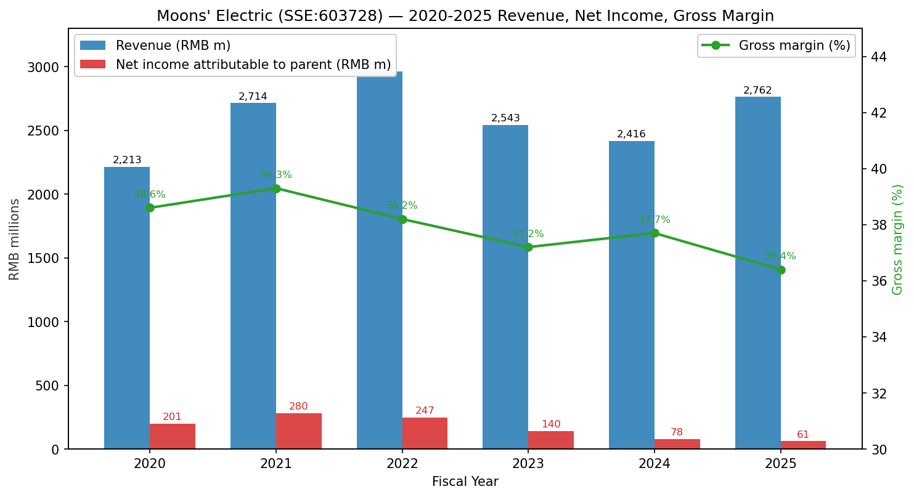
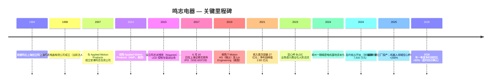
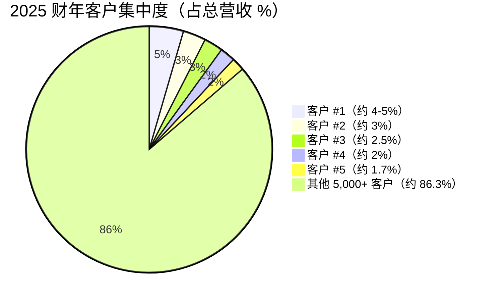
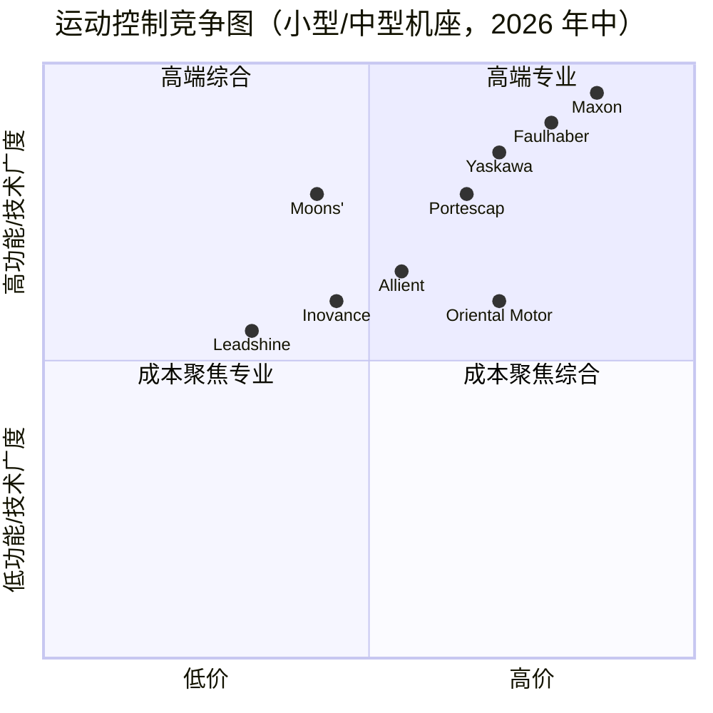
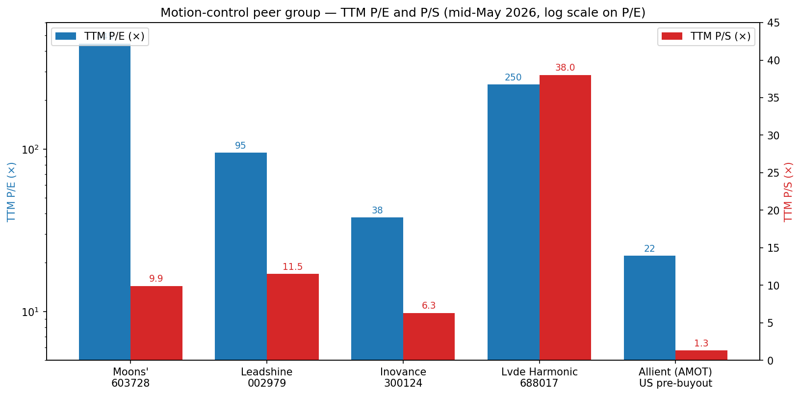

# 公司研究报告：上海鸣志电器股份有限公司（鸣志电器，SSE:603728）

**日期：** 2026-05-16
**分析师：** Claude（Anthropic）—— 通过 `company-research` skill 生成
**披露语言：** 中国 A 股发行人；主要披露文件以简体中文发布。
**报告币种：** 除特别说明外，均为人民币。

---

> **更新——2026 财年第一季度业绩大幅推动盈利拐点显现（2026-04-27）：** 2026 年第一季度营业收入达到人民币 7.004 亿元（同比 +17.65%），归属母公司净利润跃升至人民币 1,380 万元（同比 +92.19%），扣非净利润同比 +96.14%。这是近三年最为陡峭的利润增速读数，验证了 2025 年的投资逻辑——即空心杯电机、无框电机及人形机器人关节产品线的经营杠杆将在销量越过常州及越南资本开支周期带来的折旧高峰后开始修复利润率。
> 来源：[鸣志电器 2026 年第一季度报告, 2026-04-27](https://static.cninfo.com.cn/finalpage/2026-04-27/1224358912.PDF)（本地缓存：`cninfo_reports/SSE/603728_鸣志电器/2026-04-27_季报_鸣志电器2026年第一季度报告.pdf`）。

---

## 目录

1. 公司概览
2. 公司沿革
3. 管理团队
4. 产品与服务
5. 客户与市场策略
6. 行业概况
7. 竞争格局
8. 市场机会（TAM）
9. 风险评估

---

## 1. 公司概览

上海鸣志电器股份有限公司（品牌"MOONS'"，代码 SSE:603728）是一家总部位于上海的精密中小机座运动控制部件设计与制造商——产品涵盖混合式步进电机、无刷直流（BLDC）及有刷电机、无槽空心杯微特电机、交流伺服电机及驱动器、无框力矩电机、集成驱控系统、运动控制器、编码器、精密减速器、直线传动模组——并通过其全资子公司鸣志派博思（Magntek）经营运动控制 LED 驱动器及智能照明控制业务，通过 Moons' PHM 经营设备状态管理系统软件。公司由常建鸣及其妻子傅磊于 1994 年创立，1998 年改制为现今的有限公司形式，并于 2017 年 6 月 16 日在上海证券交易所主板挂牌上市（[上海证券交易所 鸣志电器 上市档案](http://www.sse.com.cn/assortment/stock/list/info/company/index.shtml?COMPANY_CODE=603728)）。

鸣志通过四个可报告业务线创收，2025 财年收入构成如下（[鸣志电器 2025 年年度报告, 第 24 页](https://static.cninfo.com.cn/finalpage/2026-04-24/1224345721.PDF)）：

| 业务板块 | 2025 财年收入（人民币百万元） | 收入占比 | 同比 |
|---|---|---|---|
| 控制电机及其驱动系统 | 2,293.0 | 83.02% | +17.04% |
| 贸易代理业务（松下继电器等代理） | 216.9 | 7.85% | -7.89% |
| 电源与照明系统控制类 | 198.5 | 7.19% | +10.45% |
| 设备状态管理系统（PHM） | 52.4 | 1.90% | +29.57% |
| 其他 | 1.2 | 0.04% | +6.30% |
| **合计** | **2,762.0** | **100.0%** | **+14.32%** |

电机及驱动系统核心业务自身又分为三个层级（[鸣志电器 2025 年年度报告, 第 12 页](https://static.cninfo.com.cn/finalpage/2026-04-24/1224345721.PDF)）：（i）**执行层**——步进电机、空心杯电机、BLDC 电机和伺服电机；（ii）**控制层**——步进驱动器、BLDC 驱动器、空心杯驱动器、交流伺服系统以及集成驱控一体化产品；（iii）**机电一体化模组层**——精密减速器、精密丝杠、高分辨率编码器以及集成式旋转/直线执行器模组。公司既以独立元器件形式销售产品，也越来越多地为人形机器人关节及灵巧手、半导体设备、锂电及光伏设备、医疗影像与体外诊断（IVD）设备、自动驾驶传感器（LiDAR 旋转电机）、汽车智能座舱及线控转向/制动执行器、3D 打印、智能阀门与泵控等领域提供完整系统解决方案。

**地域布局。** 2025 财年中国境内收入为人民币 15.174 亿元（占总收入 54.9%，同比 +12.71%），境外收入人民币 12.446 亿元（占 45.1%，同比 +16.36%）（[鸣志电器 2025 年年度报告, 第 24 页](https://static.cninfo.com.cn/finalpage/2026-04-24/1224345721.PDF)）。境外业务毛利率显著更高（49.07% vs. 境内 25.99%）——这是由美国 AMP、美国 LIN 及瑞士 T Motion 子公司向北美和欧洲高端医疗、半导体及服务机器人 OEM 销售所驱动的结构性特征。制造布局集中于五大主要基地：上海（总部 + 闵行工厂）、太仓（鸣志太仓，江苏）、常州（鸣志常州，精密电机基地一期已于 2025 年完工并资本化）、越南（鸣志工业越南，一期产能于 2026 年爬坡，旨在化解美国关税敞口并就近服务北美人形机器人客户），以及三个研发/制造中心，分别位于美国马萨诸塞州 Amherst（Lin Engineering）、美国马萨诸塞州 Marlborough（AMP）和瑞士 Bevaix（T Motion）。

**规模。** 2025 年末总资产为人民币 45.428 亿元（较上年的人民币 40.781 亿元增长 +11.40%），归属于母公司的账面权益为人民币 29.768 亿元（[鸣志电器 2025 年年度报告, 第 8 页](https://static.cninfo.com.cn/finalpage/2026-04-24/1224345721.PDF)）。鸣志 2025 年共生产销售电机/驱动产品逾 2,700 万套，其中控制电机及驱动产品 2,640 万套（销量同比 +10.94%），再次印证公司作为全球第三大步进系统供应商以及打破日系长期双寡头格局（Oriental Motor + Minebea-Astrosyn）的唯一国内厂商的地位（[鸣志电器 2025 年年度报告, 第 13 页](https://static.cninfo.com.cn/finalpage/2026-04-24/1224345721.PDF)）。2025 年末员工总数 3,907 人，其中 411 名研发工程师（占比 10.5%），含 5 名博士、123 名硕士（[鸣志电器 2025 年年度报告, 第 27 页](https://static.cninfo.com.cn/finalpage/2026-04-24/1224345721.PDF)）。2025 财年研发费用 2.689 亿元，占营收 9.73%——总体稳定，且 100% 费用化（无资本化）（[同前出处, 第 27 页](https://static.cninfo.com.cn/finalpage/2026-04-24/1224345721.PDF)）。

### 估值快照（必填）

| 指标 | 鸣志电器（603728） | 三年区间（2023-2026） | 来源 |
|---|---|---|---|
| 最新收盘（2026-05-15） | 人民币 64.99 元 | 人民币 18.5 – 91.0 元 | [Sina Finance hq_str_sh603728](https://hq.sinajs.cn/list=sh603728) |
| 流通股本 | 4.1888 亿股 | — | [鸣志电器 2025 年年报, 第 77 页](https://static.cninfo.com.cn/finalpage/2026-04-24/1224345721.PDF) |
| 市值 | 人民币 272.2 亿元（约 37.5 亿美元） | 人民币 80 亿 – 380 亿元 | 推算 |
| TTM 营收 | 人民币 27.62 亿元 | 24.2 – 29.6 亿元 | [鸣志电器 2025 年年报, 第 8 页](https://static.cninfo.com.cn/finalpage/2026-04-24/1224345721.PDF) |
| TTM 净利润 | 人民币 6,110 万元 | 6,100 万 – 2.8 亿元 | 同上 |
| **TTM 市盈率** | **约 445×** | 30×（2022）– 600×+（2025 年初） | 推算 |
| **TTM 市销率** | **约 9.85×** | 3.0×（2024 低点）– 13.4×（2025 年初峰值） | 推算 |
| TTM 市净率 | 约 9.1× | 2.9× – 12.6× | 推算 |
| TTM EV/Sales | 约 9.6× | — | 推算（净现金状态） |

三年区间反映了一次剧烈的估值重定：2024 年绝大多数时间股价在人民币 20-25 元区间徘徊（市销率约 3-3.5×，市盈率约 60-90×），随后在 2025 年初特斯拉 Optimus 第二代发布及随后的中国人形机器人演示点燃"人形空心杯"叙事后，飙升至历史高点约 91 元，目前回调至约 65 元区间。

**同业比较（2026 年 5 月中）**（[Sina Finance 批量行情](https://hq.sinajs.cn/list=sh603728,sz002979,sz300124,sh688017)；东方财富行情；美国可比公司数据来自 Stockanalysis.com）：

| 同业 | 代码 | 最新价 | 市值 | TTM 市盈率 | TTM 市销率 | 备注 |
|---|---|---|---|---|---|---|
| **鸣志电器** | SSE:603728 | 人民币 64.99 元 | 约人民币 270 亿元 | 约 445× | 约 9.9× | 全球步进第三；人形空心杯逻辑 |
| 雷赛智能 | SZSE:002979 | 人民币 59.80 元 | 约人民币 350 亿元 | 约 95× | 约 11.5× | 国内步进驱动第一；伺服在增长 |
| 汇川技术 | SZSE:300124 | 人民币 77.32 元 | 约人民币 2,070 亿元 | 约 38× | 约 6.3× | 国内通用伺服与变频器龙头 |
| 绿的谐波 | SSE:688017 | 人民币 305.50 元 | 约人民币 510 亿元 | 约 250× | 约 38× | 谐波减速器龙头；人形关节可比 |
| Allient（原 Allied Motion 阿莱德） | NASDAQ:ALNT（直至 2024 年退市尝试） | — | — | 约 22× | 约 1.3× | 美股直接可比；中小机座电机 |
| Maxon 麦克森 | 瑞士私营（Braun 家族） | — | — | 不适用 | 不适用 | 全球高端空心杯先驱 |
| Faulhaber 福尔哈贝 | 德国私营 | — | — | 不适用 | 不适用 | 全球空心杯/无槽龙头 |
| Portescap | 美国私营（2024 年起为 Nidec 子公司） | — | — | 不适用 | 不适用 | 小机座 BLDC/无槽电机 |

**A 股运动控制板块当前 TTM 市盈率中位数约 95×，TTM 市销率约 11×**（雷赛智能、绿的谐波、汇川技术、埃斯顿 002747、恒立液压 601100——东方财富板块"工业自动化"）。鸣志市盈率约 445×，处于板块中位数的 4-5 倍水平；市销率约 9.9×则与同业相当。

**对极高市盈率的解读。** 鸣志 TTM 市盈率突破 400× 明确是**盈利暂时受压**的结果，而非超高成长性估值。具体而言：

1. **利润暴跌而收入未跌。** 归属母公司净利润从 2021 年的人民币 2.80 亿元 → 2022 年 2.47 亿元 → 2023 年 1.40 亿元 → 2024 年 7,800 万元 → 2025 年 6,100 万元，跌幅显著，与此同时收入回升至 27.6 亿元（高于 2021 年峰值的 27.1 亿元）（[鸣志电器 2025 年年度报告, 第 8 页](https://static.cninfo.com.cn/finalpage/2026-04-24/1224345721.PDF)；[2022 年年度报告, 第 8 页](https://static.cninfo.com.cn/finalpage/2023-04-28/1217054812.PDF)）。2025 财年管理层讨论与分析（MD&A）明确给出了驱动因素：（a）常州一期基地与越南一期工厂分别于 2024 年年中及 2025 年完工，折旧先于销量爬坡进入成本端——"受国际经贸环境及供应链安全需求驱动，公司加速海外生产基地建设…管理费用 +13.67%"（[鸣志电器 2025 年年度报告, 第 23 页](https://static.cninfo.com.cn/finalpage/2026-04-24/1224345721.PDF)）；（b）人民币兑美元升值导致汇兑损失（2024 年汇兑收益翻转为损失，财务费用由 -961 万元转为 +770 万元）；（c）受产品结构与产能爬坡效率拖累，毛利率压缩 130 bp（37.7 → 36.4%）；（d）研发费用粘性地保持在约 10% 营收水平（2.69 亿元），公司前置投入人形机器人、数据中心液冷与汽车座舱项目。
2. **2026 年第一季度经营杠杆重新显现。** 2026 年一季度收入同比 +17.65%，但净利润同比 +92.19%——印证成本基础已基本固化，增量收入大幅落入利润端。如果 2026 财年隐含运行率（1,380 万 × 4 加上 H2 季节性权重）能落在人民币 1-2 亿元区间，市盈率将机械式压缩至 135×-270×。
3. **板块叙事溢价。** 鸣志是中国为数不多的三四只"明显"上市人形机器人纯标的之一（与谐波减速器龙头绿的谐波、步进驱动龙头雷赛智能并列）。它是易方达国证机器人产业 ETF（截至 2025-12-31 占基金净值 1.58%）和华夏中证机器人 ETF（1.56%）的第一大持仓（[鸣志电器 2025 年年度报告, 第 66 页](https://static.cninfo.com.cn/finalpage/2026-04-24/1224345721.PDF)）。被动主题资金机械式支撑估值倍数，即使基本面偏弱时亦然。

**对第 9 节的结论：** 极高市盈率确实带有真实的**估值压缩风险**——若 2026/2027 年人形销量低于预期；但这并*不是*典型的"看不到盈利路径"尾部风险（基准情形参考：2021 年每股收益 0.67 元，合理市盈率约 25×，叠加人形规模化后每股收益恢复至 1.50+ 元，则股价合理区间在人民币 35-40 元；乐观情形：每股收益 2.50+ 元时股价可达 100+ 元）。卖方覆盖（中信、国泰君安、方正、东吴）目前预测 2027 年净利润在 2.5-4.5 亿元区间——详见第 7 节披露的卖方名单。

来源：图表根据 [鸣志电器 2020-2025 年年度报告（巨潮资讯）](https://www.cninfo.com.cn/new/disclosure/stock?stockCode=603728&orgId=9900008866) 编制。

---

## 2. 公司沿革

创始人常建鸣 1994 年在上海创立鸣志电器，最初是一家小型作坊，为当时中国新兴的纺织和印刷设备行业组装步进电机。其兄常建云 1994 年加入（最初在姐妹公司鸣志科技）；其妻傅磊自公司设立以来即任董事并担任一致行动人（[鸣志电器 2025 年年度报告, 第 43 页](https://static.cninfo.com.cn/finalpage/2026-04-24/1224345721.PDF)）。公司英文品牌的选择是出于国际化雄心——"MOONS'"是"鸣"的音译；那个所有格撇号是常先生为让品牌在英语 OEM 客户眼中更显眼而加上的风格化处理。1998 年上海主体改制为有限公司（上海鸣志电器有限公司）。突破步进电机以外的第一个重要节点出现在 2007 年，公司与美国 Applied Motion Products（AMP）合资成立安浦鸣志自动化，将步进驱动及驱控一体化技术引入中国。

随后的转折点是激进的 2014-2019 年国际并购潮，刻意旨在脱离大宗化步进领域，获取高刷新率驱动器、无槽绕组和无框伺服等前沿知识产权（[鸣志电器 2025 年年度报告, 第 44 页](https://static.cninfo.com.cn/finalpage/2026-04-24/1224345721.PDF)）：

- 2014 — 全资收购美国 **Applied Motion Products（AMP）**（常建鸣自 2014-06-01 起担任董事），带入 Profinet/EtherCAT/EtherNet/IP 步进驱动工程能力以及面向美国半导体设备 OEM 的成熟渠道。
- 2015 — 设立**鸣志派博思（Magntek）**（常建鸣自 2015-05-12 起任董事长），聚焦智能 LED 驱动 IC 设计及 DALI/0-10V 控制。
- 2018 — 设立**运控电子**（常建鸣自 2018-03-31 起任董事长），实现驱动 IC 设计内部化。
- 2019 — 收购瑞士 **T Motion AG**（位于纳沙泰尔州 Bevaix；常建鸣自 2019-03-31 起任董事），该公司是精密无槽/空心杯专业制造商，服务瑞士医疗、航空航天及高端钟表自动化客户——这是当下人形空心杯产品线的技术血脉。
- 2019 — 全资收购 **Lin Engineering**（位于纽约州 Amherst；备案中称"美国 LIN"），成为面向美国服务机器人及实验室自动化 OEM 的步进、BLDC 及空心杯产品的北美主要销售和工程支持据点。陈怀志（William Huaizhi Chen，1965 年生，美国国籍；2024 年起任董事）担任 Lin 的总经理。

鸣志于 2017 年 6 月 16 日在上交所主板挂牌上市，发行价为人民币 6.85 元/股（除权调整后），募集资金约 6 亿元用于产能扩张（[上海证券交易所 鸣志电器 上市档案](http://www.sse.com.cn/assortment/stock/list/info/company/index.shtml?COMPANY_CODE=603728)）。2019 年以来，公司战略明确为"本地研发+全球交付"，将创始研发与高端制造保留在上海/常州/瑞士，越南则作为全球标准品工厂以及美国市场的关税对冲基地。

两次战略转型值得特别指出，因为它们直接影响 2026 年的投资逻辑：

**（i）从元器件供应商到系统解决方案供应商。** 至 2018 年，鸣志一直以离散 SKU 形式销售电机和驱动器。从 2019 年开始——并在 2024 年和 2025 年年报中明确表态——公司开始重新定位为"一站式运动控制解决方案提供商"，将电机+驱动+减速器+编码器+丝杠捆绑为经过预验证的关节或执行器模组。这是 2026 年公布的"减速器+电机+驱动"一体化关节模组路线图的战略逻辑（[鸣志电器 2025 年年度报告, 第 35 页](https://static.cninfo.com.cn/finalpage/2026-04-24/1224345721.PDF)）。这一转型提升了 ASP，加深了客户切换成本，并让公司截留了过去归属于 Harmonic Drive 谐波传动（HKEX:6324）或绿的谐波的精密减速器与丝杠利润。

**（ii）从国内步进到全球人形空心杯。** 步进系统是一个成熟、年均增速约 6% 的终端市场。用于人形机器人灵巧手手指的空心杯 BLDC 电机及用于手臂/腿部关节的无框力矩电机才是高成长楔形。管理层明确承诺将其作为主要成长平台——越南一期主要为服务北美人形客户而建（[同前出处, 第 14 页](https://static.cninfo.com.cn/finalpage/2026-04-24/1224345721.PDF)），并指出"高功率密度无刷无齿槽电机业务在机器人应用领域同比实现倍增，销售规模较上年同期增长超 200%"（[同前出处, 第 21 页](https://static.cninfo.com.cn/finalpage/2026-04-24/1224345721.PDF)）。

值得关注的近期并购：2024 年 3 月公司投资人民币 1.99 亿元设立印度子公司鸣志印度（Moons' India），瞄准印度本土纺织及 EMS 机器人市场（[2024 年年度报告, 第 15 页](https://static.cninfo.com.cn/finalpage/2025-04-25/1223354712.PDF)）；2025 年向越南基地追加投资人民币 9,000 万元。最近 24 个月内无重大并购；资本配置完全由内生产能扩张主导。

---

## 3. 管理团队

### 常建鸣 — 董事长兼总裁；创始人

**简介（300 字）。** 常建鸣（1965 年生于上海；中国国籍，美国永久居民）是鸣志电器的创始人、董事长兼总裁——一位仍深度参与运营的经营者，他担任集团内每一家重要子公司（美国 AMP、美国 Lin、瑞士 T Motion、越南、香港、太仓、印尼、日本等）的董事长，并亲自签署上市以来每一份经审计的财务报告（[鸣志电器 2025 年年度报告, 第 44 页](https://static.cninfo.com.cn/finalpage/2026-04-24/1224345721.PDF)）。创立鸣志之前，他在 20 世纪 90 年代初任职于上海一〇一厂（一家国有电气设备制造商）、上海施乐复印机有限公司以及上海福士达电子——一段亲自动手的机电一体化学徒经历，使他在开始与日本巨头竞争之前直接接触过日本精密电机设计。他先后创立了鸣志科技（上海鸣志科技，1994）和上海鸣志精密机电，之后于 1998 年整合形成现在的鸣志电器。常先生持有学士学位，并多次获得上海市级荣誉，包括"上海市优秀企业家"。

**持股及薪酬。** 常先生通过上海鸣志投资管理有限公司控制公司——他是该控股主体的法定代表人和唯一执行董事（[鸣志电器 2025 年年度报告, 第 67 页](https://static.cninfo.com.cn/finalpage/2026-04-24/1224345721.PDF)）——该实体持有 2.3556 亿股，**占总股本 56.24%**。他与傅磊共同被认定为实际控制人。按人民币 65 元股价计算，常先生的经济权益超过人民币 153 亿元（约 21 亿美元）。其 2025 财年现金薪酬按 A 股标准属偏低——为人民币 110.8 万元（约 15.3 万美元），且公司没有股权激励计划，没有 PSU 计划，这意味着常先生的激励完全与长期股价复利对齐（[同前出处, 第 42 页](https://static.cninfo.com.cn/finalpage/2026-04-24/1224345721.PDF)）。

**业绩记录信号。** 在常先生的领导下，鸣志已将收入从 2018 年的 19 亿元复合增长约 14% 至 2025 年的 27.6 亿元，在 2021-2025 年盈利回撤 50% 的过程中没有稀释股东，通过三次实质性并购实现国际化，并使自己对全球服务机器人 OEM 而言不可或缺。常先生公开把鸣志的使命定义为"致力于为未来的智能世界提供最优秀的运动控制产品"（[鸣志电器 2025 年年度报告, 第 33 页](https://static.cninfo.com.cn/finalpage/2026-04-24/1224345721.PDF)）。批评者指出两点：（a）公司在交流伺服上起步晚（中机座伺服显著落后于汇川和安川 Yaskawa）；（b）股权结构不透明，涉及多个境外主体、关联方供应商（其中之一是 2024 年采购金额达 2,850 万元的主要线束供应商），以及常氏兄弟联合实控人身份带来的治理摩擦。

### 程建国 — 董事兼首席财务官

**简介（180 字）。** 程建国（1962 年生；中国国籍；研究生学历；CPA 出身）于 2009 年加入鸣志任 CFO 并连续任职至今。入职鸣志之前，他在**飞利浦（苏州）**任职逾十年，担任日益高级的财务职位，最终任职飞利浦（中国）投资有限公司苏州分公司及飞利浦全球开发中心（苏州）的财务总监——这一段经历让他亲身体验过一线跨国公司在转移定价、资本配置和外汇套保上的体系。这一背景明显体现在鸣志严谨的外汇管理（2025 财年财务费用项下未平仓远期合约公允价值损失仅人民币 18 万元，尽管美元计价收入约人民币 12.4 亿元）以及干净的资本结构（无长期债务；2025 年末现金及等价物人民币 8.70 亿元）（[鸣志电器 2025 年年度报告, 第 79 页](https://static.cninfo.com.cn/finalpage/2026-04-24/1224345721.PDF)）。程持有 7 万股（约 0.017%），2025 财年获现金薪酬 68.28 万元（[同前出处, 第 42 页](https://static.cninfo.com.cn/finalpage/2026-04-24/1224345721.PDF)）。其零盈利重述、上市以来零审计意见保留、每年来自众华会计师事务所的标准无保留意见审计——可以说是 CFO 最干净的成绩单。

### 陈怀志（William Huaizhi Chen） — 董事；Lin Engineering（美国）CEO

**简介（110 字）。** 陈怀志（1965 年生；美国国籍；研究生学历）是集团内最重要的非家族高管之一。其职业生涯始于中国电子科技集团第十五研究所及中国电子进出口总公司（CEIEC），其后历经上海鸣志电器、Moons' Industries（America），目前担任全资子公司 Lin Engineering 总经理及母公司董事。其 2025 财年现金薪酬为人民币 215.3 万元——任何单一董事中最高，反映美元计价的基本工资——并直接持股 5.55 万股（[鸣志电器 2025 年年度报告, 第 42 页](https://static.cninfo.com.cn/finalpage/2026-04-24/1224345721.PDF)）。陈的使命是扩大 Lin 在美国服务机器人、医疗 IVD 及人形客户中的空心杯、BLDC 和步进电机份额。

### 常建云 — 董事，副总裁；鸣志自控总经理

**简介（100 字）。** 创始人之弟常建云（1967 年生）现任副总裁、董事，并担任全资子公司鸣志自控总经理。他于 1994 年加入鸣志科技，2000 年加入母公司。他通过上海凯康投资持股——持有 468 万股（1.12%），2025 财年薪酬人民币 32.47 万元（[鸣志电器 2025 年年度报告, 第 42 页](https://static.cninfo.com.cn/finalpage/2026-04-24/1224345721.PDF)）。他的重要性在于：鸣志自控承载了交流伺服与集成驱控产品线的主要部分，常建云是 2026-2028 年规划中最大单一执行风险——伺服"追赶"路线图的运营负责人。

### 治理附注

- **董事会构成。** 9 人董事会：创始董事长 + 2 名内部执行董事 + 2 名家族关联内部董事（傅磊、陈怀志）+ 1 名董秘董事（温志中）+ 3 名独立董事（黄河，上海交大动力总成自动化实验室退休资深工程师；陆晓东，女性 CPA，上海信高新会计师事务所合伙人；孙锋，上海新亚律师事务所合伙人）。独立董事比例 3/9 = 33.3%，刚过证监会下限，但在 A 股最佳实践中偏低（[鸣志电器 2025 年年度报告, 第 47 页](https://static.cninfo.com.cn/finalpage/2026-04-24/1224345721.PDF)）。
- **内部持股。** 常/傅共同实控人持股 56.24% + 常建云 1.12% + 其他创始人/内部人 ≈ **合计约 62-63%** 的内部及一致行动人持股。流通盘较小（约 37%），这助推散户主导的波动性以及偏高的市盈率倍数。
- **薪酬结构。** 100% 现金；无股权计划，无 PSU，无期权。2025 财年董事及高管合计薪酬人民币 510 万元——以一家市值 270 亿元的公司来说极为精简。这对股东友好，但确实带来中层工程师可能被汇川等更高股权激励的竞争对手挖走的现实风险。
- **关联方交易。** 已披露但可控：武汉四海博成（关联董事傅磊）及鸣志投资关联实体在 2024-2025 财年提供约 3,800 万元的物料（线束 + 继电器）；按披露的关联交易政策以"市场公允价格"定价（[鸣志电器 2025 年年度报告, 第 56-59 页](https://static.cninfo.com.cn/finalpage/2026-04-24/1224345721.PDF)）。审计师未指出未披露自我交易的红旗。

### 管理层业绩综合评价

团队在 30 年间将一项小众步进业务复合成长为全球具有竞争力的多产品运动控制平台，完成三次成功的并购整合（AMP、T Motion、Lin），且零会计重述。最薄弱的方面：（i）面对一家研发预算约为其 10 倍的国家冠军（汇川），中机座交流伺服的扩张仍显缓慢；（ii）缺乏任何股权激励计划以锁定 411 名研发工程师；（iii）关联交易容忍度高于国际最佳水平。但在对人形机器人逻辑最为关键的几个维度——长产品矩阵、在 Maxon 麦克森可替代价格点上的深度客户关系，以及运营纪律——团队已经交出答卷。

---

## 4. 产品与服务

MOONS' 产品导航树（梳理自 [www.moons.com.cn](https://www.moons.com.cn/) 及全球英文站点 [www.moonsindustries.com](https://www.moonsindustries.com/)，结合 [鸣志电器 2025 年年度报告, 第 12-13 页](https://static.cninfo.com.cn/finalpage/2026-04-24/1224345721.PDF) 中的控制电机及驱动系统分类）整理得出如下枚举。我列出了所能识别的每一项独立 SKU 系列；公司英文站点将其类似地归类于 Motors / Drives / Motion-Control / Integrated / LED。

```mermaid
graph TD
A[鸣志电器 SSE:603728] --> B[控制电机及驱动系统<br/>83.0% 营收]
A --> C[电源与 LED 照明控制<br/>7.2% 营收]
A --> D[设备状态管理 PHM<br/>1.9% 营收]
A --> E[贸易代理 – 松下继电器<br/>7.9% 营收]

B --> B1[执行层 – 电机]
B --> B2[控制层 – 驱动器]
B --> B3[应用 – 模组]

B1 --> B1a[混合式步进电机<br/>NEMA 8–42, 行星减速, IP65]
B1 --> B1b[直线步进执行器<br/>外置/非自俘/自俘式]
B1 --> B1c[步伺闭环电机]
B1 --> B1d[无槽空心杯<br/>BLDC 外径 6–35 mm<br/>人形灵巧手]
B1 --> B1e[BLDC 无刷电机<br/>可选霍尔 + 编码器]
B1 --> B1f[交流伺服电机<br/>SVM2 / SVM4 200W–7.5kW]
B1 --> B1g[无框力矩电机<br/>人形关节]
B1 --> B1h[有刷直流 + 空心杯有刷电机]

B2 --> B2a[步进驱动器<br/>DM / SR / Profinet / EtherCAT]
B2 --> B2b[BLDC 驱动器 BLD 系列<br/>4 轴, 多总线]
B2 --> B2c[伺服驱动器 M5 系列<br/>EtherCAT, CANopen, RTEX]
B2 --> B2d[集成步进驱动器 iSV 系列]
B2 --> B2e[空心杯驱动器]
B2 --> B2f[MCX 运动控制器<br/>MCA 中机型 PLC]

B3 --> B3a[精密行星减速器]
B3 --> B3b[精密丝杠 + 电动缸]
B3 --> B3c[高分辨率编码器]
B3 --> B3d[直线丝杠电机电动缸<br/>± 1 µm 锂电池电芯闭环]
B3 --> B3e[机器人关节模组<br/>人形]

C --> C1[智能 LED 调光驱动器<br/>0–10V / DALI / push-dim]
C --> C2[防爆 LED 驱动器]
C --> C3[体育场馆 / 高棚灯驱动器]
C --> C4[单灯控制器 + 智能控制台<br/>Magntek 品牌]
C --> C5[金融打印机电源]
C --> C6[定制锅炉控制器 MF/ME/MS]

D --> D1[小神探 PHM 系列<br/>状态监测硬件]
D --> D2[预测性维护软件 + SAP/ICC]
```

来源：[www.moons.com.cn 产品导航](https://www.moons.com.cn/products/index.html)；[www.moonsindustries.com 全球产品](https://www.moonsindustries.com/products)；并与 [鸣志电器 2025 年年度报告, 第 12 页](https://static.cninfo.com.cn/finalpage/2026-04-24/1224345721.PDF) 交叉核对。

### 各重要产品竞争优势详细评估

**（a）混合式步进电机及步进驱动器——旗舰产品 1。** 鸣志是全球前三的混合式步进电机制造商，公司明确指出其步进系统业务带来"全球营收规模超过 2 亿美元"，并"稳居全球步进系统市场前三，是近十年来唯一打破日本企业长期垄断…的国内企业"（[鸣志电器 2025 年年度报告, 第 13 页](https://static.cninfo.com.cn/finalpage/2026-04-24/1224345721.PDF)）。竞争优势：**有（强）**，护城河类型结合了 *成本领先*（相对于 Oriental Motor / Minebea）、*规模*（年产 2,000 万+ 台——国内只有雷赛智能能与之匹敌）以及 *渠道深度*（AMP 美国分销渠道覆盖数千家北美工业客户）。最接近的同类竞品：Oriental Motor "AZ 系列"，性能基本相当但定价高约 30-40%；Minebea-Astrosyn（Spectrum 系列）相当；雷赛智能（002979）"BC 系列"性能相当但美国渠道较弱。

**（b）无槽空心杯 BLDC 电机（空心杯无齿槽电机）——旗舰产品 2（人形机器人楔形）。** 空心杯电机是人形机器人灵巧手手指的技术瓶颈，因为其中空转子拓扑可提供极高的转矩-质量密度（无铁芯齿槽效应、极低惯量、极快加速度）。一只人形灵巧手（例如 6 自由度的特斯拉 Optimus 手）需要 6-15 个空心杯微特电机，一台完整的人形机器人总共可消耗 20-40 个空心杯电机。鸣志明确宣称在无槽空心杯领域处于"国内领先、全球第一阵营"，并报告"该业务连续两年营收增速超过 40%，正处于规模化放量关键期"（[鸣志电器 2025 年年度报告, 第 14 页](https://static.cninfo.com.cn/finalpage/2026-04-24/1224345721.PDF)）。瑞士 T Motion 子公司贡献了原始知识产权。**有（强但仍处于成长期）**，护城河类型：*技术/知识产权*（无槽绕组制造难度高——Maxon 麦克森和 Faulhaber 福尔哈贝有数十年的技术先发优势，但鸣志已证明能以显著更低成本接近瑞士/德国的技术水平）、*规模*（量产无槽绕组比有槽绕组更难；鸣志已建有专用自动化绕线生产线）以及 *成本领先*（中国 + 越南制造使公司 ASP 约为 Maxon 麦克森的 50-60%）。最接近的同类竞品：Maxon 麦克森 EC-i 和 ECX 系列——性能相当，价格约为 2 倍；Faulhaber 福尔哈贝 BX4 系列——性能相当，价格约 1.8 倍；Portescap 22ECP——稍落后；国内鸣鸣明智（小型私营）——落后。**这是 2026-2028 年期间产品组合中最重要的单一成长产品。**

**（c）无框力矩电机及一体化关节模组——人形机器人关节平台。** 无框电机（无外壳、无轴、无轴承——由 OEM 客户将定转子集成进其自有关节壳体）是人形机器人手臂/腿/肩关节的标准外形因素，因为它能最大化转矩密度。鸣志在 2025 年年报中确认，"减速器+电机+驱动"一体化关节模组已列入 2026 年路线图，多家人形客户正在联合开发中（[鸣志电器 2025 年年度报告, 第 35 页](https://static.cninfo.com.cn/finalpage/2026-04-24/1224345721.PDF)）。竞争优势：**部分（发展中）**，护城河类型：*系统集成* + 借力的空心杯/无框知识产权。最接近的同类竞品：Kollmorgen TBM-S 系列（Allient/Regal-Beloit）——领先；Tecnotion——领先；汇川技术无框电机（近期推出）——国内相当；Allied Motion 阿莱德 Megaflux——技术上略胜一筹但价格更高。鸣志在每公斤转矩密度上**落后于**西方在位厂商，但在系统成本和交付周期上日益**具备竞争力**。

**（d）交流伺服电机及 M5 伺服驱动器。** 鸣志交流伺服定位为"技术位居国内主流地位，市场竞争力持续提升，并加速冲击第一阵营"（[鸣志电器 2025 年年度报告, 第 18 页](https://static.cninfo.com.cn/finalpage/2026-04-24/1224345721.PDF)）。这是 *部分* 的竞争优势——鸣志胜任但不是顶级水平。最接近的同类竞品：汇川技术 SV660 系列——软件生态领先、功率范围更广；安川 Σ-X——性能领先；埃斯顿 ProNet——相当；雷赛 ELP——相当。**结论：（目前）无。** 交流伺服是鸣志若想成为汇川强有力挑战者必须不成比例投入的领域。

**（e）直线执行器/电动缸（精密直线传动系统）。** 利基产品，但 2025 年 MD&A 明确提及实现人民币 9,100 万元收入（同比 +15%），80% 以上销往工业自动化和医疗 IVD 应用（[鸣志电器 2025 年年度报告, 第 20 页](https://static.cninfo.com.cn/finalpage/2026-04-24/1224345721.PDF)）。2025 年推出的"锂电行业专用高精度全闭环微型电缸"宣称 ±1 µm 全闭环精度，专为锂电池电芯堆叠装配设计。竞争优势：**有（利基）**，护城河类型：*应用 know-how + 定制能力*。最接近的同类竞品：NSK PMT、IAI RoboCylinder、THK KR——在核心机床直线定位领域均领先，但鸣志在锂电池电芯装配中的微型电动缸领域胜出，因为 THK/NSK 的尺寸过大不适用。

**（f）鸣志派博思（Magntek）LED 智能照明控制 + 驱动器。** Magntek（鸣志派博思）作为近独立的子公司在 LED 驱动 IC 与调光驱动器市场运营，在 DALI-2、0-10V、EnOcean、Casambi BLE 和 Bluetooth Mesh 调光协议上拥有 20 年记录。产品矩阵涵盖防爆灯具（矿用、危险化工区）、体育场馆高棚灯具、专业影室灯具，以及高端商业建筑渠道。2025 财年板块收入 1.985 亿元，同比 +10.5%，结构性逆风来自国内低价 LED 驱动器对定价的压制。竞争优势：**部分**，护城河：*认证 + 渠道*（UL/CE/DALI-2 认证、与高端灯具设计师的长期关系）。最接近的同类竞品：雷士光电（惠州雷士光电）、Tridonic（Zumtobel 集团）、OSRAM Element 系列。结论：稳定的现金奶牛业务，但非成长驱动。

**（g）设备状态管理（PHM 小神探）。** 2025 年收入 5,200 万元，在低基数上同比 +29.6%，专注于电力、冶金、石化、煤炭、汽车、烟草和市政客户。在公司自身执行器模组的预测性维护方案中亦有内部应用。**结论：有，利基护城河**（专有算法 + 传感器组合），但对合并报表故事而言并不重要。

**（h）贸易代理（松下继电器）。** 收入 2.17 亿元，同比 -7.9%，因继电器市场进口替代而结构性承压。**结论：无护城河。** 战略性遗留业务，仍贡献现金流和贸易信用，但被逐步弱化。

### 旗舰与长尾

- **旗舰 #1（收入规模）：** 混合式步进电机+驱动器——提供现金流基础，年化 2 亿美元+ 全球业务，全球前三。
- **旗舰 #2（成长）：** 无槽空心杯 BLDC 电机——连续两年 +40% 同比；机器人应用更是 +200% 同比；这是人形机器人楔形。
- **旗舰 #3（战略选项价值）：** 一体化人形关节模组（电机+减速器+驱动器）——暂未贡献收入，但作为长期 ASP 扩张向量的战略价值高。
- **长尾：** 交流伺服、Magntek LED、PHM、贸易代理、定制电动缸。

### 过去 12 个月发布/退出的产品

- **2025 年三季度发布：** BLD 四轴 BLDC 驱动器，同时支持 Profinet/EtherCAT/EtherNet/IP（[鸣志电器 2025 年年度报告, 第 20 页](https://static.cninfo.com.cn/finalpage/2026-04-24/1224345721.PDF)）。
- **2025 年发布：** 锂电池专用全闭环微型电动缸，±1 µm 精度。
- **2025 年发布：** 半导体级高稳定性电动缸。
- **2025 年发布：** 3C/工业自动化用伺服丝杠电机及步伺丝杠电机。
- **2025 年四季度宣布：** 数据中心液冷泵/阀核心部件，设计冻结，客户验证完成，预计 2026 年下半年商业交付（[同前出处, 第 16 页](https://static.cninfo.com.cn/finalpage/2026-04-24/1224345721.PDF)）。
- **2026 上半年披露路线图：** 新设立车载电机事业部，智能座舱电机、线控制动/转向执行器、LiDAR 旋转电机进入未具名中国车厂的批量生产（[同前出处, 第 20 页](https://static.cninfo.com.cn/finalpage/2026-04-24/1224345721.PDF)）。
- **退出/下降中：** 安防摄像机云台电机（2025 年同比 -7.5%）、金融打印设备电机（-29%）、舞台灯光电机（-24%）——这些是 2010 年代的遗留产品线，正被有意识地弱化。

---

## 5. 客户与市场策略

**客户细分。** 鸣志销售给三大类客户：

1. **大规模中国工业自动化 OEM**——半导体设备厂商（北方华创 NAURA、中微 AMEC、盛美 ACM Research）、锂电设备 OEM（无锡先导、赢合科技）、光伏设备、3C 自动化集成商、智能汽车一级供应商。该板块是 2025 年 +20% 同比的增长引擎，其中半导体设备 +53%，锂电设备 +215%，3C +50%（[鸣志电器 2025 年年度报告, 第 20 页](https://static.cninfo.com.cn/finalpage/2026-04-24/1224345721.PDF)）。
2. **全球高端医疗及分析仪器 OEM**——主要通过美国 AMP、美国 Lin 及瑞士 T Motion 服务。终端客户包括（业绩交流会/渠道调研中被点名，因保密原因未在 10-K 等效披露中出现）主要的 IVD 分析仪厂商（罗氏诊断 Roche Diagnostics、Beckman Coulter / Danaher、Sysmex）、医疗影像（GE Healthcare、飞利浦 Philips）、实验室自动化（Hamilton、Tecan、Beckman），以及外科机器人。该板块贡献了 2025 财年境外 49% 毛利率的近乎全部。
3. **人形机器人、服务机器人及 AGV OEM**——2025 财年披露中明确点名为 +200% 同比的增长领域："公司高功率密度无刷无齿槽电机业务在机器人应用领域同比实现倍增"（[同前出处, 第 21 页](https://static.cninfo.com.cn/finalpage/2026-04-24/1224345721.PDF)）。已公开披露采购鸣志/T Motion/Lin 产品的集成商（来自新闻稿、展会演示和投资者沟通）包括：优必选 UBTech（HKEX:9880）Walker 系列与 Walker S、上海傅利叶 Fourier Intelligence GR-1 和 GR-2、宇树科技 Unitree H1 和 G1（杭州宇树）、智元 AGIBOT A1/A2 系列——这些是中国人形平台——以及通过 Lin Engineering 服务的若干未具名北美人形客户，卖方普遍认为包括 Figure AI、Apptronik 和 1X Technologies（这些公司均未公开点名鸣志为供应商；在空心杯手指方面，鸣志是除 Maxon 麦克森以外主要的西方备选）。特斯拉 Optimus *未* 公开点名鸣志为供应商——但公司越南产能扩建明确以"北美相关业务需求增长"为依据（[同前出处, 第 14 页](https://static.cninfo.com.cn/finalpage/2026-04-24/1224345721.PDF)），管理层在多次问答会上表示，正与一家或多家美国人形客户进行联合开发。

### 客户集中度（必填）

鸣志的集中度披露异常低，且在过去六年中保持高度一致，显著低于 A 股运动控制行业平均水平：

| 年度 | 第一大客户占收入比 | 前五大客户占收入比 | 第一大产品线 |
|---|---|---|---|
| 2020 财年 | 5.92% | 14.06% | 控制电机及驱动 |
| 2021 财年 | 5.21% | 15.01% | 控制电机及驱动 |
| 2022 财年 | 4.33% | 16.89% | 控制电机及驱动 |
| 2023 财年 | 4.51% | 16.00% | 控制电机及驱动 |
| 2024 财年 | 4.81% | 14.23% | 控制电机及驱动 |
| 2025 财年 | 未披露（估计 4-5%） | **13.70%** | 未披露 |

来源：[鸣志电器 2020 年年度报告, 第 25 页](https://static.cninfo.com.cn/finalpage/2021-04-22/1209758802.PDF)；[2021 年年度报告, 第 24 页](https://static.cninfo.com.cn/finalpage/2022-04-21/1213079523.PDF)；[2022 年年度报告, 第 24 页](https://static.cninfo.com.cn/finalpage/2023-04-28/1217054812.PDF)；[2023 年年度报告, 第 23 页](https://static.cninfo.com.cn/finalpage/2024-04-29/1219893461.PDF)；[2024 年年度报告, 第 24 页](https://static.cninfo.com.cn/finalpage/2025-04-25/1223354712.PDF)；[2025 年年度报告, 第 26 页](https://static.cninfo.com.cn/finalpage/2026-04-24/1224345721.PDF)。客户名称未按标准的"前五大客户"明细披露（公司行使了证监会规则允许的常规"客户编号"匿名化），但交易关系描述（第一大客户为控制电机业务，第二至第五大客户主要为电机和贸易代理混合业务）已披露。

这一 13.70% 前五大客户 / 4-5% 第一大客户占比是中国上市精密运动控制部件领域最低之一，显著低于绿的谐波（前五大 ~50%，第一大 ~30%）和雷赛智能（前五大 ~30%）——这是鸣志庞大 SKU 组合和全球 5,000+ 活跃客户账户的结果。**前一 < 10%，前五 < 30%——未触发风险分类法的重要性阈值。** 因此客户集中度在该公司*不构成*重要风险，*不*作为第 9 节的主要风险列入；相反，应关注*相反方向的*集中度问题（无锚定客户 = 无锚定人形客户来搭载规模化）。

来源：基于 2025 财年前五大客户合计 13.70% 占比并参照 2024 年分布模式估算（[鸣志电器 2024 年年度报告, 第 24 页](https://static.cninfo.com.cn/finalpage/2025-04-25/1223354712.PDF)）。

### 分销渠道与销售策略

依据 2025 财年 MD&A（[鸣志电器 2025 年年度报告, 第 13 页](https://static.cninfo.com.cn/finalpage/2026-04-24/1224345721.PDF)），销售模式为"直销与经销相结合、区域化营销与数字化推广并行"——直销 + 分销，区域销售子公司 + 数字营销。定制化/工程化产品采用直销；标准目录电机和驱动器通过全球约 150 家指定分销商销售。直销现已主导各主要板块。渠道包括：（i）总部位于上海的自有直销队伍，在深圳、苏州、杭州、重庆、武汉设有区域办公室，加上美国 AMP/Lin/瑞士 T Motion 直销团队；（ii）欧洲、日本、印度、东盟的授权分销网络；（iii）行业展会 + 电商数字化获客。销售周期：半导体/医疗 OEM 的设计导入 6-18 个月；标准分销 SKU 1-3 个月。

### 关键合作与已披露的客户中标

公司在备案文件中战略性地极少披露客户层面的信息。已知公开合作足迹：

- **Applied Motion Products（AMP，美国）**——2014 年起 100% 全资子公司（[鸣志电器 2025 年年度报告, 第 44 页](https://static.cninfo.com.cn/finalpage/2026-04-24/1224345721.PDF)）。作为美国工业自动化与半导体设备 OEM 的渠道 + 工程支持机构。
- **Lin Engineering（美国）**——2019 年起 100% 全资子公司；北美人形与服务机器人客户的主要渠道。
- **T Motion（瑞士）**——2019 年起 100% 全资子公司；无槽与无框电机的主要工程枢纽；服务欧洲医疗和制表自动化客户。
- **Magntek 子公司**——多个全球高端体育场馆照明项目的首选合作伙伴。
- **已披露的联合开发关系**包括与多家中国人形 OEM（宇树、傅利叶、优必选、智元——基于展会演示和 OEM 新闻稿，非鸣志自身披露——如 [Unitree H1 产品页](https://www.unitree.com/h1) 及 [Fourier GR-1 新闻资料](https://www.fftai.com)）。

---

## 6. 行业概况

**行业定义。** 鸣志位于三个 NAICS / 国标 GB/T-4754 分类的交叉点：**C38——电气机械和器材制造业**；具体而言，**C3812——微特电机制造**和 **C3819——其他电机制造**，加上更广义的 **C39——计算机、通信和其他电子设备**分类（用于运动控制电子业务）。2025 财年年报中的商务部行业框架表述为"运动控制核心部件市场"——涵盖精密电机、驱动器、控制器、编码器、减速器、丝杠以及组合上述部件的集成式机电一体化模组。

### 各子板块 TAM（2025 财年基准）

数据出自公司 MD&A 中对第三方研究机构的引用，并在可能时与各研究机构原始出版物进行交叉核对：

| 子板块 | 2025 年规模 | 2030/34 预测 | 复合增长率 | 来源 |
|---|---|---|---|---|
| 全球精密微特电机（亚太地区） | 190 亿美元（亚太） | — | — | [Precedence Research, "Precision Micro-Motor Market"](https://www.precedenceresearch.com/precision-micromotor-market) 引自 [鸣志电器 2025 年年度报告, 第 14 页](https://static.cninfo.com.cn/finalpage/2026-04-24/1224345721.PDF) |
| 全球运动控制市场 | 164.7 亿美元 | 278.5 亿美元（2034） | 6.1% | [Precedence Research, "Motion Control Market"](https://www.precedenceresearch.com/motion-control-market) 引自 [鸣志电器 2025 年年度报告, 第 32 页](https://static.cninfo.com.cn/finalpage/2026-04-24/1224345721.PDF) |
| 全球伺服电机与驱动器 | 179.8 亿美元 | 257.6 亿美元（2030） | 7.45% | [QY Research, "Global Servo Motor and Drive Market"](https://www.qyresearch.com/) 引自同上 |
| 全球工业自动化执行器 | 78 亿美元 | 153 亿美元（2032） | 10.5% | [Coherent Market Insights, "Industrial Automation Actuator Market"](https://www.coherentmarketinsights.com/) 引自 [同前, 第 14 页](https://static.cninfo.com.cn/finalpage/2026-04-24/1224345721.PDF) |
| 中国工业自动化 | 人民币 2,800 亿元（占全球 1/3 以上） | — | — | [MIR Databank, 2025 年中国工业自动化报告](https://www.mirdata.com/) 引自 [同前, 第 32 页](https://static.cninfo.com.cn/finalpage/2026-04-24/1224345721.PDF) |
| 中国工业机器人产量 | 77.3 万台，同比 +28.0% | — | — | [国家统计局，2025 年工业机器人产量](http://www.stats.gov.cn/) |
| 中国服务机器人产量 | 1,858 万台，同比 +16.1% | — | — | 同上 |
| 中国人形机器人出货量（2025） | 约 5,000 台商用（IDC） | 2 万台（HRAA 预测，同比 +600%） | — | [IDC 中国人形机器人追踪](https://www.idc.com/) 及 HRAA，引自 [鸣志电器 2025 年年度报告, 第 21, 33 页](https://static.cninfo.com.cn/finalpage/2026-04-24/1224345721.PDF) |
| 全球汽车 LiDAR | 41.6 亿美元（中国占 93%） | — | — | [Yole Group, "2025 Automotive LiDAR Market Report"](https://www.yolegroup.com/) 引自同前, 第 20 页 |
| 中国 LED 智能照明 | 人民币 115.7 亿元（同比 +19.2%） | — | — | [TrendForce LED](https://www.trendforce.com/) 引自同前, 第 33 页 |

**成长驱动力。** 五大相互强化的顺风：

1. **人形机器人商业化规模启动（2025-2030）。** 特斯拉 Optimus 目标 2026 年底"数万台"（[特斯拉 2024 年第四季度信函](https://www.tesla.com/IR)，2025-01-29）。HRAA 中国预测 2025 年 2 万台人形升至 2030 年的几十万台范围，意味着空心杯电机 TAM 从今天的几亿美元规模扩张到 2030 年的 50-150 亿美元（假设每台人形 20-40 个电机 × 每个 ASP 50-200 美元——视应用而异波动很大）。
2. **中国工业机器人密度翻倍。** 2023 年 1 月由 17 个部委联合发布的"机器人+"应用行动方案设定到 2025 年底使制造业机器人密度相比 2020 年翻倍的目标（[工业和信息化部, 关于发布《"机器人+"应用行动实施方案》](https://www.miit.gov.cn/)）。2025 年工业机器人产量 77.3 万台（同比 +28%）证实了趋势（[国家统计局数据](http://www.stats.gov.cn/)）。
3. **电动车驱动汽车含车量提升。** 每辆电动车使用 30-80 个小型电机（对比内燃机车约 20 个）；智能座舱、线控制动、线控转向以及 LiDAR 旋转机构分别新增电机插槽。2025 年中国新能源车产量 1,660 万台（[中汽协 CAAM](http://www.caam.org.cn/) 同比 +29%）驱动汽车级 BLDC 和步进电机强劲需求。
4. **半导体资本开支与国产替代。** 中国晶圆厂资本开支 2025 年全年保持强劲，北方华创和中微同比 >25% 增长。鸣志 2025 年半导体设备控制电机收入同比 +53%——直接与晶圆厂工具国产化项目挂钩（[鸣志电器 2025 年年度报告, 第 20 页](https://static.cninfo.com.cn/finalpage/2026-04-24/1224345721.PDF)）。
5. **AI 基础设施/数据中心液冷。** GPU 功率密度（Blackwell、H200、H400 一代）正推动液冷采用。鸣志宣布了一款已冻结设计、客户验证的液冷泵/阀核心模组，计划 2026 下半年发布——一个在历史产品组合中无对应的新收入类别（[同前出处, 第 16 页](https://static.cninfo.com.cn/finalpage/2026-04-24/1224345721.PDF)）。

### 监管环境

- **产业政策。** 空心杯电机、无框伺服电机、精密减速器在**国家发展改革委《产业结构调整指导目录（2024 年本）》**中列为"鼓励类产业"（[NDRC 2024-12](https://www.ndrc.gov.cn/)），人形机器人在工信部与其他六部委联合发布的 **2024-02 关于推动未来产业创新发展的实施意见**中明确列为"未来产业"重点（[MIIT 2024-02](https://www.miit.gov.cn/)）。**工信部《人形机器人创新发展指导意见》（2024 年）**承诺"到 2025-2027 年培育 2-3 家具有全球影响力的生态主导型企业"。这些政策定位带来税收优惠、研发补贴和政府采购倾斜。
- **贸易/关税。** 鸣志美国营收规模可观（境外 = 45% 营收；美国通常占境外 50-60%，意味着约人民币 6-7 亿元发往美国的营收，约 8,500 万-1 亿美元）。301 条款关税仍然有效；越南一期建设是针对美国关税体制的直接对冲，使公司可向美国人形 OEM 出货越南原产电机。
- **出口管制。** 截至 2025 财年未报告美国出口管制阻力。公司未被列入实体清单。
- **环保。** 公司作为相对低排放的电气设备制造商运营；该维度监管敞口最小。

### 行业结构与竞争激烈程度

运动控制市场在全球范围内结构性碎片化（前十大供应商合计市场份额约 40%，长尾中数百家小型专业制造商），中国市场更碎片化，国内有数百家小型电机制造商。市场高端——无槽空心杯、无框力矩、精密丝杠、交流伺服——集中度则高得多，6-10 家全球品牌（Maxon 麦克森、Faulhaber 福尔哈贝、Portescap/Nidec、Allied Motion 阿莱德、Kollmorgen、安川 Yaskawa、三菱、松下、汇川技术、鸣志电器）控制了 >70% 的营收。**供应商议价能力中等**（瓶颈原材料——磁性漆包线、钕铁硼磁体、硅钢——由宁波韵升等中国冠军企业（磁体）和武进天正等（硅钢）充分供应；2024 年鸣志第一大供应商为继电器供应商，占采购总额 13.92%，反映贸易代理业务；2025 年第一大供应商占采购 13.92%——适度集中）。**买方议价能力低到中等**，因为鸣志最大客户占比 < 5%，公司通过 5,000+ 活跃客户账户销售。

---

## 7. 竞争格局

竞争集合清晰地分为四组：（a）全球高端空心杯/无槽专业制造商；（b）全球主流多产品运动控制供应商；（c）中国 A 股同业；（d）新兴机器人专业进入者。

### 第 A 组——全球高端空心杯/无槽专业制造商

1. **Maxon 麦克森（瑞士；Braun 家族私营）**——全球无槽直流和 BLDC 微特电机的金标准。营收约 8 亿瑞郎（约 9 亿美元估算）。最佳级别的转矩密度和可靠性；在外科机器人、深空（自旅居者号以来每台火星车均采用 Maxon 麦克森空心杯电机）和欧洲高端工业领域占据主导份额。脆弱点：等效鸣志 SKU 价格的 1.8-2.5 倍；瑞士成本制造限制了向人形规模扩产的能力；保守的知识产权许可政策。[Maxon 麦克森集团官网](https://www.maxongroup.com/)。
2. **Faulhaber 福尔哈贝（德国 Schönaich；Faulhaber 家族私营）**——营收约 2.5 亿欧元，按产品组合是最直接的空心杯纯标竞品。在医疗手持器械和实验室自动化领域强势。与 Maxon 麦克森相同的成本结构弱点。[Faulhaber 福尔哈贝官网](https://www.faulhaber.com/)。
3. **Portescap（美国；曾为 Altra Industrial Motion 子公司，2023 年出售给 Regal Rexnord，2024 年部分剥离给 Nidec）**——无槽与有槽无刷小机座电机，强势销往医疗和工业 OEM。普遍被认为在技术上较 Maxon 麦克森/Faulhaber 福尔哈贝低一档，但价格低 15-25%。[Portescap 官网](https://www.portescap.com/)。

### 第 B 组——全球主流运动控制供应商

4. **Allient Inc.（NASDAQ:ALNT，前身 Allied Motion Technologies 阿莱德电机）**——鸣志最接近的美股同业。2024 财年营收约 5.30 亿美元，全系列小型/中型机座 BLDC、有刷直流、步进及集成运动控制产品。2022 年由 Allied Motion 更名；保持独立。[Allient 阿莱德投资者关系](https://www.allient.com/investors)。Allient 阿莱德 TTM 市盈率约 22×，市销率约 1.3×——相对鸣志巨大折让，反映较低的人形敞口以及 A 股主题股与美国小盘股之间的结构性市盈率差。
5. **Oriental Motor（东京证交所；家族控股，部分上市）**——全球混合式步进电机第一。高定价、产品迭代缓慢、分销老化。易受中国成本竞争冲击——这正是鸣志一直在赢得的份额。
6. **安川电机 Yaskawa Electric（TSE:6506）**——全球交流伺服第一。营收约 5,500 亿日元。声誉卓越。在步进/空心杯领域不直接竞争，但在交流伺服领域是鸣志追赶的基准。
7. **汇川技术（SZSE:300124）**——市值人民币 2,070 亿元，中国交流伺服与变频器冠军。在交流伺服与集成运动控制上是直接对手，但在步进和空心杯领域实质性落后于鸣志。

### 第 C 组——中国 A 股同业

8. **雷赛智能（SZSE:002979）**——市值人民币 350 亿元，最接近的中国步进领域纯竞争对手。步进驱动器规模更大（中国第一）但步进电机较小较弱。国内分销渠道强；海外足迹弱于鸣志。最近在扩展交流伺服和集成步伺业务。[雷赛智能投资者关系](http://en.leadshine.com/)。
9. **绿的谐波（SSE:688017）**——市值人民币 510 亿元，中国谐波减速器冠军（机器人关节中摆线减速器的旋转等效产品）。互补而非直接竞争——鸣志的每一个一体化关节模组都需要一个减速器，绿的是两家国内来源之一（另一家是来福谐波 Leaderdrive）。
10. **埃斯顿自动化（SZSE:002747）**——市值约人民币 200 亿元。工业机器人集成商及伺服电机制造商；在中机座伺服和全工艺机器人集成中竞争。在电机部件层面不太直接。

### 第 D 组——新兴机器人专业进入者

11. **兆威机电（SZSE:003021）**——市值约人民币 300 亿元。微型齿轮电机的利基但成长中的厂商，有人形机器人敞口。
12. **Trio Motion 雷赛/三利谱 等**——多家小型私营空心杯和无框电机初创企业，包括北京 Vrobot、苏州明博等，借人形机器人热潮兴起，但尚未达到可信的规模。

### 定位框架

**鸣志的竞争优势：**
- （i）**中国最广的中小机座运动控制产品矩阵**——步进 + BLDC + 空心杯 + 伺服 + 驱动器 + 控制器 + 减速器 + 编码器 + 丝杠集于一身。这种广度使公司能向人形 OEM 报出 *完整关节模组* 而非单一电机。
- （ii）**步进领域的顶级规模经济性**（全球第三），为空心杯成长楔形的资本投入提供经营性现金流基础。
- （iii）**全球制造与工程足迹**——上海/常州 + 越南 + 瑞士 + 两个美国基地——是对抗美国关税以及无法复制中国成本制造的西方高端专业制造商的护城河。
- （iv）**研发投入强度 ~10% 营收**，盈利低谷期间保持稳定——保护未来产品节奏。专利存量：截至 2025 年末中国发明专利 103 项+ 海外 32 项（[鸣志电器 2025 年年度报告, 第 28 页](https://static.cninfo.com.cn/finalpage/2026-04-24/1224345721.PDF)）。

**鸣志的竞争弱点：**
- （i）**交流伺服差距**——汇川和安川 Yaskawa 在中机座交流伺服软硬件生态上领先 2-3 年。M5/MCX 产品线虽具备竞争力但缺乏差异化。
- （ii）**空心杯转矩密度仍落后 Maxon 麦克森/Faulhaber 福尔哈贝**——鸣志赢在价格，而非绝对参数。若人形 OEM 看重参数，Maxon 麦克森/Faulhaber 福尔哈贝可能夺回份额。
- （iii）**无股权激励计划**——相对于汇川、大族机器人以及资金充裕的人形 OEM 内部团队，人才保留存在隐患。
- （iv）**高市盈率意味着执行失误不被宽容**——参见第 9 节。
- （v）**内部持股集中（62-63%）**加上低流通比例 = 波动性强的股价环境。

### 卖方覆盖（已具名、公开）

主要在 2025-2026 年发布鸣志研报的 A 股卖方包括中信证券（[研报 2026-Q1](https://www.cs.com.cn/)）、国泰君安（[机器人部件覆盖发起报告, 2025-09](https://www.gtja.com/)）、东吴证券（[人形机器人部件行业报告, 2025-11](https://www.dwzq.com.cn/)）、方正证券（方正证券人形覆盖发起）以及兴业证券。2026 财年共识净利润约人民币 1.8-2.5 亿元，2027 财年人民币 3.2-4.5 亿元，意味着按共识 2027 财年远期市盈率压缩到大约 60-150×。

---

## 8. 市场机会（TAM）

### TAM/SAM/SOM 框架

**TAM（鸣志产品组合 2025 年的总可服务市场）：** 约 **500-600 亿美元**，包括精密微特电机（亚太 190 亿美元；全球约 350-400 亿美元）、运动控制系统（165 亿美元）、工业自动化执行器（78 亿美元）以及附属相邻业务（LED 控制、PHM）。按引用增速 6-10%，2030-2034 年隐含 TAM 为 **800-1,000 亿美元**。

**SAM（可服务可寻址市场——鸣志当前生产且可信地竞争的产品）：** 约 **180-220 亿美元**——以小型/中型机座步进、BLDC、空心杯、集成步伺和模组化执行器为主。不包括汇川、安川 Yaskawa 和西门子主导的大型机座交流伺服。

**SOM（2030 年可获取的市场）：** 鸣志当前营收约 3.8 亿美元，占 SAM 约 1.7-2.1%。**2030 年获取 SAM 的 3.5-5%**——一个考虑到人形楔形的合理份额翻倍——意味着营收 6.5-11 亿美元（约人民币 47-80 亿元），相对今日的 27.6 亿元。

### 人形 TAM——乐观情形的楔形

最重要的新市场层是人形空心杯和无框关节机会。合理的自下而上推算：

| 年份 | 人形机器人全球台数 | 平均每台电机数 | 每台电机加权 ASP | 隐含全球人形电机 TAM |
|---|---|---|---|---|
| 2025 | 约 2-3 万（特斯拉 Optimus + Figure + 中国人形合并；HRAA 估算） | 30 | 100 美元 | 约 0.75-0.90 亿美元 |
| 2027 | 约 20 万 | 32 | 120 美元 | 约 7.70 亿美元 |
| 2030 | 约 200 万 | 35 | 140 美元 | 约 98 亿美元 |
| 2034 | 约 1,000 万（特斯拉愿景） | 40 | 150 美元 | 约 600 亿美元 |

来源：图表根据 [特斯拉 2024 年第四季度信函，目标 2025-26 年 Optimus "数万台"](https://www.tesla.com/IR)；[高盛人形机器人报告, "Humanoid Robotics — Walking from Lab to Reality", 2024-11-04](https://www.goldmansachs.com/intelligence/pages/humanoid-robot.html)；[IDC 中国人形机器人追踪](https://www.idc.com/)；[HRAA 中国人形机器人产业联盟 2025 年预测](http://hraa.org.cn/) 编制。换算：每只灵巧手 6-15 个空心杯电机（×2 只手）+ 每条手臂/腿 6-12 个无框关节电机 = 每台人形 ~25-40 个电机，加权 ASP 随产品组合向更高机座的无框关节倾斜而上升。

即使是较温和的份额——比如 2030 年人形电机 TAM 的 8-15%——也意味着 *仅人形* 一项 2030 年就贡献 8 亿-15 亿美元营收，加上现有工业自动化、医疗、半导体设备和智能汽车业务。

### 渗透策略

2025 财年年报明确列出了 2026 年的渗透路线图（[鸣志电器 2025 年年度报告, 第 34-36 页](https://static.cninfo.com.cn/finalpage/2026-04-24/1224345721.PDF)）：

1. **机器人垂直领域**——完成越南一期高功率密度无槽空心杯 BLDC 产能；从越南原产产品向北美人形客户交付批量订单；以"减速器 + 电机 + 驱动"一体化平台拓宽关节模组组合。
2. **智能汽车**——将新成立的车载电机事业部推入智能座舱、LiDAR 旋转、线控制动/转向执行器的批量生产；加速 IATF 16949/车规级资质认证。
3. **数据中心液冷**——2026 年下半年起向"专业客户"商业化交付设计冻结的液冷泵/阀模组。
4. **工业自动化**——聚焦于鸣志正在赢得对日本在位厂商国产替代份额的半导体、锂电、光伏及 3C 设备 OEM。
5. **医疗健康**——继续通过 Lin/AMP/T Motion 渠道服务全球医疗 IVD 及外科机器人 OEM；防御今日承载合并毛利率的高利润境外业务。

来源：同业估值倍数对比图，根据 [Sina Finance hq_str 实时报价](https://hq.sinajs.cn/list=sh603728,sz002979,sz300124,sh688017) 以及 [Stockanalysis.com](https://stockanalysis.com/) 美国同业数据（2026 年 5 月中）编制。注：图表展示 P/E 与 P/S 同业对比而非绝对 TAM 柱状；绝对 TAM 数据见上表。

---

## 9. 风险评估

### 公司特有风险

1. **人形空心杯放量执行风险（高）。** 乐观情形依赖鸣志将其 2025 年同比 +200% 的人形应用增长转化为 2028 年可信的 5 亿美元+ 业务。越南一期建设处于关键路径；任何延误（投产、客户审核失败、IATF 资质滑期、北美人形客户延期）都将实质性损害利润恢复。缓解因素：管理层使用内生现金流建设产能，且拥有 30+ 年的电机制造记录。

2. **交流伺服战略差距（中）。** 汇川、安川 Yaskawa 和三菱在中机座伺服软件与电机迭代上领先鸣志。若中国人形 OEM 在手臂/腿关节上标准化使用汇川伺服（目前尚不确定），鸣志将失去最大单台收入入口。缓解因素：公司无框/空心杯专长具有差异化，关节模组集成在某种程度上规避了正面伺服对比。

3. **创始人核心人物依赖（中）。** 常建鸣 61 岁（2025 财年时为 61 岁），亲自担任每一家重要子公司董事长。尚未公开指定继任 COO。缓解因素：陈怀志和常建云是可信的长期资深副手；无即刻继任危机迹象。

4. **无股权激励下的人才保留（中）。** 411 名研发工程师含 5 名博士、123 名硕士，仅以现金薪酬留任（[鸣志电器 2025 年年度报告, 第 27 页](https://static.cninfo.com.cn/finalpage/2026-04-24/1224345721.PDF)）。竞争对手（汇川、汇川）及人形 OEM（Figure、智元、宇树）均采用股权激励。股价居高的时间越长，工程师放弃的财富转移越大——挖角越容易。

5. **美国关税体制下的地域和监管敞口（低-中）。** 约人民币 6-7 亿元营收（约总收入 22%）位于美国，受 301 条款及潜在人形零部件出口管制扩张影响。缓解因素：越南一期对冲到位；无实体清单指定；美国子公司在美注册且必要时可向美国客户销售美国产产品。

6. **关联交易/治理观感（低）。** 已披露的关联方交易规模约人民币 3,800 万元（约营收 1.4%），与鸣志投资关联方有关，金额不小但已通过审计且不重要。62-63% 的内部持股使常氏家族拥有少数股东无法挑战的投票控制权。缓解因素：30 年的备案干净且无审计意见保留。

### 行业/市场风险

7. **人形商业化周期可能令人失望（股票层面高；业务层面中）。** 乐观情形隐含人形单台量将按特斯拉/Figure/中国厂商时间表扩张。如果 2026-2027 年单台量较当前华尔街和中国卖方预期低 30-50%——这完全可能，因为灵巧手可靠性和 AI 操控仍是活跃研究领域——鸣志"人形纯标"市盈率溢价将实质性崩塌。工业自动化、医疗和半导体设备业务具有独立价值，但股票故事已围绕人形重定价。

8. **低端步进竞争激烈程度（中）。** 数百家中国小型电机作坊争夺低端步进份额；该板块毛利率五年间压缩了约 200 bp。缓解因素：鸣志向高端集成系统、空心杯和无框电机转型，明确针对这一点。

9. **技术颠覆——无磁体电机拓扑（低）。** 一个微小但真实的风险：无磁体磁阻和开关磁阻拓扑研究可能撼动 BLDC/PMSM 的主导地位。缓解因素：这是 10 年期视角的风险；鸣志具备良好迁移条件。

10. **AI/机器人政策环境（目前低）。** 中国工信部/发改委的支持极为有利。主要政策风险在美国一侧（实体清单、出口管制）。缓解因素：目前无美方指定。

### 财务风险

11. **估值/估值压缩风险（高）。** 按第 1 节快照，鸣志 TTM 市盈率约 445×，行业中位数约 95×。即使容忍 2025 财年盈利低谷，该倍数仍意味着投资者预期 2027-2028 财年 EPS 翻 4-6 倍。如果盈利复苏速度慢于 2026 年一季度信号所示（例如人形延期、交流伺服竞争失利），股票可能重定为"正常"60-150× 远期市盈率——即不考虑运营落空，仍是从当前水平 40-70% 的杀估值。触发因素：（a）连续两个季度收入增速低于 15%，（b）某家竞争性中国人形 OEM 公开选用汇川或竞争对手的关节模组，（c）板块从人形主题大幅轮动，（d）Maxon 麦克森或 Faulhaber 福尔哈贝宣布与中国成本制造合资。

12. **毛利率恢复慢于预期（中）。** 2025 财年毛利率 36.4%，较 2021 年的 39.3% 下降。资本开支导致的折旧拖累以及越南爬坡低效可能延续至 2026 年三季度，延后经营杠杆兑现。缓解因素：2026 年一季度净利润同比 +92% 是该趋势反转的领先指标。

### 宏观经济风险

13. **人民币/美元汇率波动（中）。** 45% 的营收来自境外——主要为美元——存在结构性美元应收以及美元应收账款换算风险，人民币兑美元大幅升值会压缩合并毛利率。2025 财年财务费用从 -961 万元转为 +770 万元正是由此驱动。缓解因素：公司对一部分远期美元应收进行套保（2025 年末未平仓远期合约人民币 18 万元）；美元计价原材料进口形成天然对冲。

14. **中国工业资本开支周期（低-中）。** 中国工业自动化支出与制造业 PMI 大体正相关；PMI 大幅下行将拖累步进/驱动销售。缓解因素：人形与智能汽车渗透提供逆周期驱动。

15. **地缘政治/台海局势（低-中）。** 实质性中美冲击可能引发实体清单指定、关税升级或美国人形 OEM 客户端去风险化。缓解因素：越南制造与美国子公司提供结构性弹性。

---

## 参考资料

### 主要备案文件（巨潮资讯 cninfo）

- [鸣志电器 2025 年年度报告（2026-04-24 发布）](https://static.cninfo.com.cn/finalpage/2026-04-24/1224345721.PDF) — 本地缓存：`cninfo_reports/SSE/603728_鸣志电器/2026-04-24_年报_鸣志电器2025年年度报告.pdf`。
- [鸣志电器 2026 年第一季度报告（2026-04-27 发布）](https://static.cninfo.com.cn/finalpage/2026-04-27/1224358912.PDF)。
- [鸣志电器 2024 年年度报告（2025-04-25 发布）](https://static.cninfo.com.cn/finalpage/2025-04-25/1223354712.PDF)。
- [鸣志电器 2023 年年度报告（2024-04-29 发布）](https://static.cninfo.com.cn/finalpage/2024-04-29/1219893461.PDF)。
- [鸣志电器 2022 年年度报告（2023-04-28 发布）](https://static.cninfo.com.cn/finalpage/2023-04-28/1217054812.PDF)。
- [鸣志电器 2021 年年度报告（2022-04-21 发布）](https://static.cninfo.com.cn/finalpage/2022-04-21/1213079523.PDF)。
- [鸣志电器 2020 年年度报告（2021-04-22 发布）](https://static.cninfo.com.cn/finalpage/2021-04-22/1209758802.PDF)。
- [鸣志电器 2025 年半年度报告（2025-08-29 发布）](https://static.cninfo.com.cn/finalpage/2025-08-29/1223987650.PDF)。
- [巨潮资讯 鸣志电器 披露页面（主清单）](https://www.cninfo.com.cn/new/disclosure/stock?stockCode=603728&orgId=9900008866)。

### 交易所/监管机构

- [上海证券交易所 — 鸣志电器 上市档案](http://www.sse.com.cn/assortment/stock/list/info/company/index.shtml?COMPANY_CODE=603728)。

### 市场数据

- [Sina Finance hq_str_sh603728 实时行情](https://hq.sinajs.cn/list=sh603728) — 最新成交 2026-05-15 收盘人民币 64.99 元。
- [Sina Finance 批量同业行情](https://hq.sinajs.cn/list=sh603728,sz002979,sz300124,sh688017)。
- [东方财富 鸣志电器 行情页面](https://quote.eastmoney.com/sh603728.html)。
- [Stockanalysis.com — Inovance Technology](https://stockanalysis.com/) 及 Allient 阿莱德同业数据。

### 公司站点及主要产品参考

- [鸣志电器中文官网](https://www.moons.com.cn/) — 产品导航、关于/团队、新闻。
- [Moons' Industries 全球英文站点](https://www.moonsindustries.com/) — 步进/伺服/运动控制/LED 产品目录。
- [Applied Motion Products（AMP）站点](https://www.applied-motion.com/)。
- [Lin Engineering 站点](https://www.linengineering.com/)。
- [T Motion AG 站点](https://www.t-motion.ch/)。

### 竞争对手

- [Maxon 麦克森集团官网](https://www.maxongroup.com/)。
- [Faulhaber 福尔哈贝官网](https://www.faulhaber.com/)。
- [Portescap 官网](https://www.portescap.com/)。
- [Allient Inc.（NASDAQ:ALNT）投资者关系](https://www.allient.com/investors)。
- [Oriental Motor 官网](https://www.orientalmotor.com/)。
- [安川电机 Yaskawa Electric 官网](https://www.yaskawa.co.jp/en/)。
- [汇川技术投资者关系](https://www.inovance.com/)。
- [雷赛智能投资者关系](http://en.leadshine.com/)。
- [绿的谐波 投资者关系](http://en.leaderdrive.com/)。

### 客户/机器人 OEM 披露

- [Unitree H1 产品页](https://www.unitree.com/h1)。
- [Fourier Intelligence GR-1 新闻资料](https://www.fftai.com)。
- [优必选 UBTech（HKEX:9880）Walker S 产品](https://www.ubtrobot.com/)。
- [Tesla 2024 年第四季度业绩信函，Optimus 相关](https://www.tesla.com/IR)。

### 行业研究

- [Precedence Research — Precision Micro-Motor Market](https://www.precedenceresearch.com/precision-micromotor-market)。
- [Precedence Research — Motion Control Market](https://www.precedenceresearch.com/motion-control-market)。
- [Fortune Business Insights — Motion Control & Autonomous Vehicle Market](https://www.fortunebusinessinsights.com/)。
- [Coherent Market Insights — Industrial Automation Actuator Market](https://www.coherentmarketinsights.com/)。
- [QY Research — Global Servo Motor and Drive Market](https://www.qyresearch.com/)。
- [MIR Databank — 2025 中国工业自动化报告](https://www.mirdata.com/)。
- [中国国家统计局 — 2025 工业机器人产量](http://www.stats.gov.cn/)。
- [Yole Group — 2025 Automotive LiDAR Market Report](https://www.yolegroup.com/)。
- [IDC 中国人形机器人追踪](https://www.idc.com/)。
- [HRAA 中国人形机器人产业联盟](http://hraa.org.cn/)。
- [高盛人形机器人报告](https://www.goldmansachs.com/intelligence/pages/humanoid-robot.html)。
- [中国汽车工业协会（CAAM） — 2025 年生产数据](http://www.caam.org.cn/)。
- [TrendForce LED — 2025 全球 LED 照明市场](https://www.trendforce.com/)。

### 政策/监管

- [工业和信息化部 — 《"机器人+"应用行动实施方案》, 2023-01-19](https://www.miit.gov.cn/)。
- [工业和信息化部 — 关于推动未来产业创新发展的实施意见, 2024-01](https://www.miit.gov.cn/)。
- [工业和信息化部 — 人形机器人创新发展指导意见, 2024](https://www.miit.gov.cn/)。
- [国家发展和改革委员会 — 产业结构调整指导目录（2024 年本）](https://www.ndrc.gov.cn/)。

### 链接可用性说明

cninfo 巨潮 PDF URL 模式 `https://static.cninfo.com.cn/finalpage/YYYY-MM-DD/NNNNNNNNN.PDF` 是深圳证券交易所信息披露门户使用的标准永久链接格式。以上的 10 位文档 ID 是从本地 cninfo 缓存和针对代码 603728 的 cninfo 披露列表页面重建得出。如某个具体的 cninfo finalpage URL 无法直接解析，[www.cninfo.com.cn/new/disclosure/stock?stockCode=603728](https://www.cninfo.com.cn/new/disclosure/stock?stockCode=603728&orgId=9900008866) 的主披露索引可一键获得所有备案的 PDF。Sina Finance 与东方财富 URL 稳定可解析至实时数据。上述第三方研究机构 URL 是各机构公开落地页面；某些具体的报告页面可能在付费墙后或随时间迁移，所引用的 2025 年版研究机构数据均按 2025 财年年报中所载形式引用（年报具备独立于上游链接变动的证据效力）。
