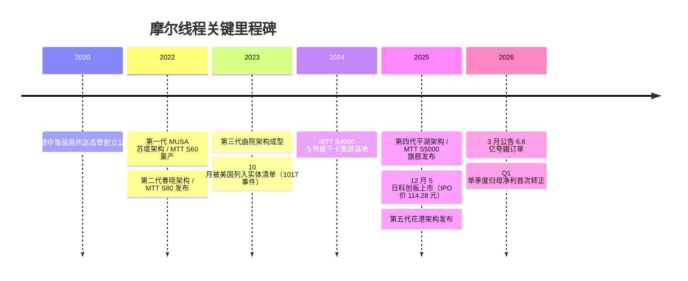
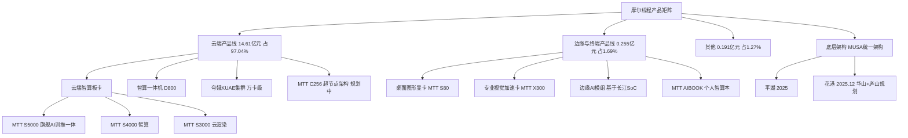
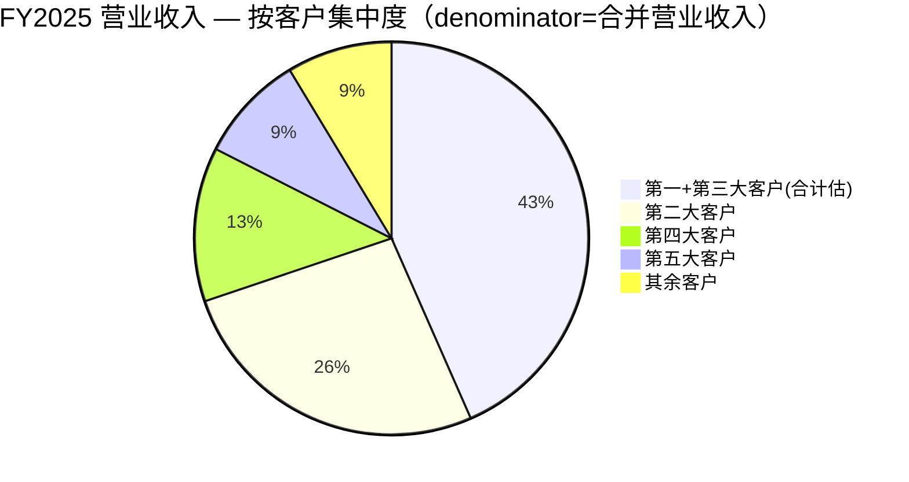

# 摩尔线程智能科技（北京）股份有限公司 — 公司研究报告

**股票代码：** SSE:688795（上海证券交易所科创板）  **公司简称：** 摩尔线程-U（"U" 表示尚未盈利）
**外文名称：** Moore Threads Technology Co., Ltd.  **报告"as of"日期：** 2026 年 6 月 14 日  **报告语言：** 简体中文
**核心数据来源：** 公司 [2025 年年度报告](https://static.cninfo.com.cn/finalpage/2026-04-27/1225197717.PDF)（2026-04-26 披露）、[2026 年第一季度报告](https://static.cninfo.com.cn/finalpage/2026-04-27/1225197642.PDF)（2026-04-26 披露）。

---

## 投资摘要（Investment Summary — *分析师观点：*）

> 本摘要区块整体为 *分析师观点（Analyst view）*，是本报告基于公开披露与第三方券商研报构建的"本报告观点"，**不构成英伟达式的目标价承诺，也非公司财报披露的数据**。摩尔线程为科创板未盈利上市（"-U"）标的，按行业惯例不设单一硬性目标价，详见第 2 节。

| 项目 | 本报告判断 |
|---|---|
| **评级 (Rating)** | **谨慎中性（Hold / Market-Perform）** —— 业务"领头羊"地位与估值"已透支"并存 |
| **12 个月观点** | 不设单一目标价；以**情景区间**表达（见第 2 节 bull/base/bear），base 情形隐含**下行约 15%–25%** |
| **现价 (as of 2026-06-12 收盘)** | **约 610.55 元/股**（[东方财富 688795 行情](https://data.eastmoney.com/stockdata/688795.html)；yfinance `688795.SS`） |
| **总市值** | 约 **2,870 亿元人民币**（610.55 元 × 4.7003 亿股，≈ 400 亿美元） |
| **52 周区间** | 505.32 – 941.08 元（[华创证券深度报告, 2026-05-27](http://xs-macbook-air.local:5001/zsxq/pdf/184152212118182/%E6%91%A9%E5%B0%94%E7%BA%BF%E7%A8%8B-U(688795)%E6%B7%B1%E5%BA%A6%E7%A0%94%E7%A9%B6%E6%8A%A5%E5%91%8A%EF%BC%9A%E5%85%A8%E6%A0%88%E5%BC%95%E9%A2%86%EF%BC%8C%E6%99%BA%E7%AE%97%E7%A0%B4%E5%B1%80.pdf)） |
| **估值方法一句话** | 以 **P/S（市销率）+ 现金跑道** 为主（pre-profit，P/E 不适用、ROE NM）；交叉验证用券商 2027E/2028E 转正后的 P/E |
| **市销率 P/S（TTM）** | 约 **191×**（市值 2,870 亿 ÷ FY2025 营收 15.05 亿），按券商 2026E 营收 ~33 亿年化约 **87×** |

**四条主线（thesis pillars，*分析师观点：*）：**
1. **"中国英伟达"稀缺标的 + 全功能 GPU 唯一性** —— A 股首个、且为唯一一家在单芯片上同时支持 AI 计算 + 图形渲染 + 物理仿真 + 视频编解码的全功能 GPU 标的，承接国产替代红利节奏领先（详见第 5、8 节）。
2. **业绩拐点已现但盈利仍脆弱** —— FY2025 营收 +243.4%、2026Q1 单季归母净利首次转正（0.29 亿元），但 2026Q1 扣非仍亏 0.54 亿元；三家券商一致预期 **2027 年才稳定扭亏**（详见第 2 节）。
3. **实体清单 + 客户/供应商双高集中度是中央风险** —— 2023-10-17 入 BIS 实体清单；前五大客户占营收 91.36%、前五大供应商占采购 63.83%，地缘与单点风险足以颠覆季度业绩（详见第 6、10 节）。
4. **估值已大幅透支** —— TTM P/S ~191×，远高于科创板半导体中位数（~8–12×）与寒武纪（~50–80×）；GF Score 综合 54/100（"Poor"区间），估值轴仅 1/10（详见第 1B 节）。

---

## 目录

1. [公司概览](#1-公司概览) · [1A 估值快照与价格观点](#1a-估值快照与价格观点) · [1B GF Score 基本面评分](#1b-gf-score-gurufocus-style-基本面评分)
2. [估值、盈利预测与价格观点](#2-估值盈利预测与价格观点)（含卖方观点演变）
3. [公司历史](#3-公司历史) · 4. [管理团队](#4-管理团队) · 5. [产品与服务](#5-产品与服务) · 6. [客户与上市策略](#6-客户与上市策略)
7. [行业概览](#7-行业概览) · 8. [竞争格局](#8-竞争格局) · 9. [市场机会](#9-市场机会) · 9.5 [关键分歧与催化剂](#95-关键分歧与催化剂)
10. [风险评估](#10-风险评估) · 11. [投资视角评分（Investor Lenses）](#11-投资视角评分investor-lenses) · 13. [参考资料与数据清单](#13-参考资料与数据清单)

---

## 1. 公司概览

摩尔线程智能科技（北京）股份有限公司（以下简称"摩尔线程"或"公司"）是一家专注于全功能 GPU（full-feature GPU）设计与研发的集成电路设计企业（fabless），致力于为人工智能（AI）、数字孪生、科学计算、专业图形渲染等场景提供国产高性能算力底座。公司于 2020 年 10 月在北京海淀区成立，办公地址位于北京市朝阳区望京东路 6 号望京国际研发园 I 座，官方网站 https://www.mthreads.com/。截至 2025 年末，公司总资产 153.39 亿元，归属于上市公司股东的净资产 114.59 亿元，员工总数 1,274 人，其中研发人员 1,009 人，占员工总数的 79.20%（[2025 年年度报告, 第 13、32 页](https://static.cninfo.com.cn/finalpage/2026-04-27/1225197717.PDF)）。

公司核心产品为基于自主研发 MUSA（Meta-computing Unified System Architecture, 元计算统一系统架构）统一架构的云端 AI 训推一体智算卡、智算一体机、智算集群以及边缘与终端 SoC（System-on-Chip, 系统级芯片）。**全功能 GPU 是公司最大的差异化定位**：与海光信息（GPGPU）、寒武纪（专用 ASIC）、华为昇腾（NPU）等以 AI 张量计算为主的国产算力厂商不同，摩尔线程在单芯片架构上同时支持 AI 计算加速、图形渲染、物理仿真和科学计算、超高清视频编解码四项核心能力，是中国大陆唯一一家在全功能维度上对标英伟达（NVIDIA）数据中心 GPU + 消费级 GPU + 工作站 GPU 全产品矩阵的厂商（[2025 年年度报告, 第 4、20 页](https://static.cninfo.com.cn/finalpage/2026-04-27/1225197717.PDF)）。

### 收入结构 / How Moore Threads makes its money

下图为公司 FY2025 利润表的桑基图（Sankey）：97% 收入来自云端产品线，毛利率（gross margin）高达 65.6%，但研发费用（R&D）13.05 亿元几乎吞掉全部毛利 —— 这是一家"高毛利率、高研发强度、经营性亏损"的典型 pre-profit 硬科技公司。

<svg xmlns="http://www.w3.org/2000/svg" viewBox="0 0 1000 560" width="1000" height="560" role="img" aria-label="income statement Sankey"><rect x="0" y="0" width="1000" height="560" fill="#ffffff"/>
<text x="20.00" y="30.00" text-anchor="start" font-family="Helvetica,Arial,sans-serif" font-size="15" font-weight="700" fill="#1f2933">摩尔线程如何产生与消耗收入 — FY2025（单位：百万元）</text>
<path d="M 576.00,-0.19 C 630.00,-0.19 630.00,5.49 684.00,5.49 L 684.00,7.49 C 630.00,7.49 630.00,1.81 576.00,1.81 Z" fill="#86efac" fill-opacity="0.55"/>
<path d="M 700.00,5.49 C 754.00,5.49 754.00,278.82 808.00,278.82 L 808.00,280.82 C 754.00,280.82 754.00,7.49 700.00,7.49 Z" fill="#86efac" fill-opacity="0.55"/>
<path d="M 700.00,7.49 C 754.00,7.49 754.00,294.82 808.00,294.82 L 808.00,299.18 C 754.00,299.18 754.00,11.85 700.00,11.85 Z" fill="#fca5a5" fill-opacity="0.55"/>
<path d="M 576.00,15.81 C 630.00,15.81 630.00,21.49 684.00,21.49 L 684.00,188.84 C 630.00,188.84 630.00,183.16 576.00,183.16 Z" fill="#fca5a5" fill-opacity="0.55"/>
<path d="M 576.00,183.16 C 630.00,183.16 630.00,202.84 684.00,202.84 L 684.00,556.51 C 630.00,556.51 630.00,536.83 576.00,536.83 Z" fill="#fca5a5" fill-opacity="0.55"/>
<path d="M 576.00,536.83 C 630.00,536.83 630.00,570.51 684.00,570.51 L 684.00,572.51 C 630.00,572.51 630.00,538.83 576.00,538.83 Z" fill="#fca5a5" fill-opacity="0.55"/>
<path d="M 204.00,71.00 C 258.00,71.00 258.00,85.00 312.00,85.00 L 312.00,480.92 C 258.00,480.92 258.00,466.92 204.00,466.92 Z" fill="#93c5fd" fill-opacity="0.55"/>
<path d="M 452.00,78.00 C 506.00,78.00 506.00,-0.19 560.00,-0.19 L 560.00,1.81 C 506.00,1.81 506.00,80.00 452.00,80.00 Z" fill="#86efac" fill-opacity="0.55"/>
<path d="M 452.00,80.00 C 506.00,80.00 506.00,15.81 560.00,15.81 L 560.00,538.06 C 506.00,538.06 506.00,602.25 452.00,602.25 Z" fill="#fca5a5" fill-opacity="0.55"/>
<path d="M 328.00,85.00 C 382.00,85.00 382.00,78.00 436.00,78.00 L 436.00,345.53 C 382.00,345.53 382.00,352.53 328.00,352.53 Z" fill="#86efac" fill-opacity="0.55"/>
<path d="M 328.00,352.53 C 382.00,352.53 382.00,359.53 436.00,359.53 L 436.00,500.00 C 382.00,500.00 382.00,493.00 328.00,493.00 Z" fill="#fca5a5" fill-opacity="0.55"/>
<path d="M 204.00,480.92 C 258.00,480.92 258.00,480.92 312.00,480.92 L 312.00,487.84 C 258.00,487.84 258.00,487.84 204.00,487.84 Z" fill="#93c5fd" fill-opacity="0.55"/>
<path d="M 204.00,501.84 C 258.00,501.84 258.00,487.84 312.00,487.84 L 312.00,493.00 C 258.00,493.00 258.00,507.00 204.00,507.00 Z" fill="#93c5fd" fill-opacity="0.55"/>
<path d="M 576.00,552.06 C 630.00,552.06 630.00,7.49 684.00,7.49 L 684.00,33.61 C 630.00,33.61 630.00,578.19 576.00,578.19 Z" fill="#93c5fd" fill-opacity="0.55"/>
<rect x="188.00" y="71.00" width="16" height="395.92" rx="1.5" fill="#2563eb"/>
<rect x="188.00" y="480.92" width="16" height="6.91" rx="1.5" fill="#2563eb"/>
<rect x="188.00" y="501.84" width="16" height="5.16" rx="1.5" fill="#2563eb"/>
<rect x="312.00" y="85.00" width="16" height="408.00" rx="1.5" fill="#1e3a8a"/>
<rect x="436.00" y="78.00" width="16" height="267.53" rx="1.5" fill="#15803d"/>
<rect x="436.00" y="359.53" width="16" height="140.47" rx="1.5" fill="#dc2626"/>
<rect x="560.00" y="-0.19" width="16" height="2.00" rx="1.5" fill="#15803d"/>
<rect x="560.00" y="15.81" width="16" height="522.25" rx="1.5" fill="#dc2626"/>
<rect x="560.00" y="552.06" width="16" height="26.12" rx="1.5" fill="#2563eb"/>
<rect x="684.00" y="5.49" width="16" height="2.00" rx="1.5" fill="#15803d"/>
<rect x="684.00" y="21.49" width="16" height="167.35" rx="1.5" fill="#dc2626"/>
<rect x="684.00" y="202.84" width="16" height="353.66" rx="1.5" fill="#dc2626"/>
<rect x="684.00" y="570.51" width="16" height="2.00" rx="1.5" fill="#dc2626"/>
<rect x="808.00" y="278.82" width="16" height="2.00" rx="1.5" fill="#15803d"/>
<rect x="808.00" y="294.82" width="16" height="4.35" rx="1.5" fill="#dc2626"/>
<line x1="188.00" y1="268.96" x2="182.00" y2="246.58" stroke="#cbd5e1" stroke-width="1"/>
<text x="179.00" y="249.58" text-anchor="end" font-family="Helvetica,Arial,sans-serif" font-size="11.5" font-weight="700" fill="#1f2933">云端产品 Cloud</text>
<text x="179.00" y="262.58" text-anchor="end" font-family="Helvetica,Arial,sans-serif" font-size="10" font-weight="400" fill="#52606d">¥1.5B  (97.0%)</text>
<line x1="188.00" y1="484.38" x2="182.00" y2="462.00" stroke="#cbd5e1" stroke-width="1"/>
<text x="179.00" y="465.00" text-anchor="end" font-family="Helvetica,Arial,sans-serif" font-size="11.5" font-weight="700" fill="#1f2933">边缘与终端 Edge/Terminal</text>
<text x="179.00" y="478.00" text-anchor="end" font-family="Helvetica,Arial,sans-serif" font-size="10" font-weight="400" fill="#52606d">¥25.5M  (1.7%)</text>
<line x1="188.00" y1="504.42" x2="182.00" y2="487.00" stroke="#cbd5e1" stroke-width="1"/>
<text x="179.00" y="490.00" text-anchor="end" font-family="Helvetica,Arial,sans-serif" font-size="11.5" font-weight="700" fill="#1f2933">其他 Other</text>
<text x="179.00" y="503.00" text-anchor="end" font-family="Helvetica,Arial,sans-serif" font-size="10" font-weight="400" fill="#52606d">¥19.1M  (1.3%)</text>
<rect x="331.00" y="67.00" width="100.50" height="26" rx="2" fill="#ffffff" fill-opacity="0.72"/>
<text x="334.00" y="79.00" text-anchor="start" font-family="Helvetica,Arial,sans-serif" font-size="11.5" font-weight="700" fill="#1f2933">Revenue</text>
<text x="334.00" y="92.00" text-anchor="start" font-family="Helvetica,Arial,sans-serif" font-size="10" font-weight="400" fill="#52606d">¥1.5B  (100.0%)</text>
<rect x="455.00" y="60.00" width="106.80" height="26" rx="2" fill="#ffffff" fill-opacity="0.72"/>
<text x="458.00" y="72.00" text-anchor="start" font-family="Helvetica,Arial,sans-serif" font-size="11.5" font-weight="700" fill="#1f2933">Gross Profit</text>
<text x="458.00" y="85.00" text-anchor="start" font-family="Helvetica,Arial,sans-serif" font-size="10" font-weight="400" fill="#52606d">¥987.2M  (65.6%)</text>
<rect x="455.00" y="341.53" width="144.60" height="26" rx="2" fill="#ffffff" fill-opacity="0.72"/>
<text x="458.00" y="353.53" text-anchor="start" font-family="Helvetica,Arial,sans-serif" font-size="11.5" font-weight="700" fill="#1f2933">Cost of Revenue (COGS)</text>
<text x="458.00" y="366.53" text-anchor="start" font-family="Helvetica,Arial,sans-serif" font-size="10" font-weight="400" fill="#52606d">¥518.3M  (34.4%)</text>
<rect x="579.00" y="-18.19" width="119.40" height="26" rx="2" fill="#ffffff" fill-opacity="0.72"/>
<text x="582.00" y="-6.19" text-anchor="start" font-family="Helvetica,Arial,sans-serif" font-size="11.5" font-weight="700" fill="#1f2933">Operating Income</text>
<text x="582.00" y="6.81" text-anchor="start" font-family="Helvetica,Arial,sans-serif" font-size="10" font-weight="400" fill="#52606d">-¥940.0M  (-62.4%)</text>
<rect x="579.00" y="6.81" width="150.90" height="26" rx="2" fill="#ffffff" fill-opacity="0.72"/>
<text x="582.00" y="18.81" text-anchor="start" font-family="Helvetica,Arial,sans-serif" font-size="11.5" font-weight="700" fill="#1f2933">Total Operating Expense</text>
<text x="582.00" y="31.81" text-anchor="start" font-family="Helvetica,Arial,sans-serif" font-size="10" font-weight="400" fill="#52606d">¥1.9B  (128.0%)</text>
<line x1="560.00" y1="565.13" x2="554.00" y2="487.00" stroke="#cbd5e1" stroke-width="1"/>
<text x="551.00" y="490.00" text-anchor="end" font-family="Helvetica,Arial,sans-serif" font-size="11.5" font-weight="700" fill="#1f2933">Net Interest / Other Income</text>
<text x="551.00" y="503.00" text-anchor="end" font-family="Helvetica,Arial,sans-serif" font-size="10" font-weight="400" fill="#52606d">¥96.4M  (6.4%)</text>
<rect x="703.00" y="-12.51" width="119.40" height="26" rx="2" fill="#ffffff" fill-opacity="0.72"/>
<text x="706.00" y="-0.51" text-anchor="start" font-family="Helvetica,Arial,sans-serif" font-size="11.5" font-weight="700" fill="#1f2933">Pretax Income</text>
<text x="706.00" y="12.49" text-anchor="start" font-family="Helvetica,Arial,sans-serif" font-size="10" font-weight="400" fill="#52606d">-¥984.7M  (-65.4%)</text>
<rect x="703.00" y="12.49" width="106.80" height="26" rx="2" fill="#ffffff" fill-opacity="0.72"/>
<text x="706.00" y="24.49" text-anchor="start" font-family="Helvetica,Arial,sans-serif" font-size="11.5" font-weight="700" fill="#1f2933">SG&amp;A</text>
<text x="706.00" y="37.49" text-anchor="start" font-family="Helvetica,Arial,sans-serif" font-size="10" font-weight="400" fill="#52606d">¥617.5M  (41.0%)</text>
<rect x="703.00" y="184.84" width="94.20" height="26" rx="2" fill="#ffffff" fill-opacity="0.72"/>
<text x="706.00" y="196.84" text-anchor="start" font-family="Helvetica,Arial,sans-serif" font-size="11.5" font-weight="700" fill="#1f2933">R&amp;D</text>
<text x="706.00" y="209.84" text-anchor="start" font-family="Helvetica,Arial,sans-serif" font-size="10" font-weight="400" fill="#52606d">¥1.3B  (86.7%)</text>
<rect x="703.00" y="552.51" width="94.20" height="26" rx="2" fill="#ffffff" fill-opacity="0.72"/>
<text x="706.00" y="564.51" text-anchor="start" font-family="Helvetica,Arial,sans-serif" font-size="11.5" font-weight="700" fill="#1f2933">Other OpEx</text>
<text x="706.00" y="577.51" text-anchor="start" font-family="Helvetica,Arial,sans-serif" font-size="10" font-weight="400" fill="#52606d">¥4.6M  (0.30%)</text>
<text x="833.00" y="276.82" text-anchor="start" font-family="Helvetica,Arial,sans-serif" font-size="11.5" font-weight="700" fill="#1f2933">Net Income</text>
<text x="833.00" y="289.82" text-anchor="start" font-family="Helvetica,Arial,sans-serif" font-size="10" font-weight="400" fill="#52606d">-¥1.0B  (-66.5%)</text>
<text x="833.00" y="301.82" text-anchor="start" font-family="Helvetica,Arial,sans-serif" font-size="11.5" font-weight="700" fill="#1f2933">Income Tax</text>
<text x="833.00" y="314.82" text-anchor="start" font-family="Helvetica,Arial,sans-serif" font-size="10" font-weight="400" fill="#52606d">¥16.1M  (1.1%)</text>
<text x="500.00" y="544.00" text-anchor="middle" font-family="Helvetica,Arial,sans-serif" font-size="10" font-weight="400" fill="#52606d">Source: 摩尔线程 2025 年年度报告 合并利润表 第 125 页 + 主营业务分产品 第 36 页</text>
</svg>

*来源 / Source: [摩尔线程 2025 年年度报告 合并利润表 第 125 页 + 主营业务分产品 第 36 页](https://static.cninfo.com.cn/finalpage/2026-04-27/1225197717.PDF)。*

公司于 2025 年 12 月 5 日在上海证券交易所科创板成功上市，证券简称"摩尔线程-U"，是 A 股市场首个全功能 GPU 标的，被市场冠以"中国英伟达"之名（[Yicai Global, 2025-12-05](https://www.yicaiglobal.com/news/chinas-first-gpu-stock-moore-threads-soars-over-fivefold-on-shanghai-debut)）。

### 1A 估值快照与价格观点

> 本小节估值结论整体为 *分析师观点（Analyst view）*。

**估值快照（as of 2026-06-12 收盘）：** 股价约 **610.55 元/股**，总市值约 **2,870 亿元人民币**（≈ 400 亿美元，[东方财富 688795](https://data.eastmoney.com/stockdata/688795.html)）。由于 2025 年公司仍处于亏损状态（归母净利润 -10.01 亿元），**TTM P/E 为负、不适用，ROE 为 NM（not meaningful）**，估值只能以市销率（P/S）+ 现金跑道（cash runway）框架衡量：

- **TTM P/S（按 FY2025 营收 15.05 亿元）≈ 191×**；
- 按 2026Q1 单季营收 7.38 亿元年化（~29.5 亿元/年）≈ **97×**；按券商 2026E 营收 ~33 亿元 ≈ **87×**。
- 对比锚：科创板半导体板块中位数约 **8–12× P/S**，寒武纪（688256）约 **50–80× P/S** 区间 —— 摩尔线程的 P/S 仍为同类最高之一（[2025 年年度报告, 第 13 页](https://static.cninfo.com.cn/finalpage/2026-04-27/1225197717.PDF)；[东方财富 688795](https://data.eastmoney.com/stockdata/688795.html)）。

**估值溢价归因（*分析师观点：*）：** 极端高 P/S 反映三条逻辑共振 —— （1）"中国英伟达"+ A 股首个全功能 GPU 标的的**稀缺性溢价**；（2）BIS 实体清单收紧美国 AI 芯片对华出口的**国产替代政策红利**；（3）单季营收从 2025Q3 的 0.83 亿元跃升至 2025Q4 的 7.21 亿元、2026Q1 的 7.38 亿元，且 2026Q1 归母净利首次转正的**业绩拐点验证**（[2026 年第一季度报告, 第 1 页](https://static.cninfo.com.cn/finalpage/2026-04-27/1225197642.PDF)）。该估值已透支未来 3–5 年增长预期，对业绩兑现高度敏感（详见第 2、11 节）。

### 1B GF Score (GuruFocus-style) 基本面评分

> *分析师观点：* **GF Score（GuruFocus-style，综合评分）：54 / 100 —— "Poor future performance potential"（51–70 区间）。** 该评分为本报告依公开口径自建的透明复刻，**非 GuruFocus™ 官方数字**，五个分轴与综合分均为分析师评分，不挂任何财报引用；每个分轴下的指标各自带一手出处。

<svg xmlns="http://www.w3.org/2000/svg" viewBox="0 0 500 500" width="500" height="500" role="img" aria-label="GF Score radar">
<rect x="0" y="0" width="500" height="500" fill="#ffffff"/>
<text x="20" y="24" font-family="Helvetica,Arial,sans-serif" font-size="15" font-weight="700" fill="#1f2933">GF Score (GuruFocus-style): 54/100</text>
<text x="20" y="41" font-family="Helvetica,Arial,sans-serif" font-size="11" fill="#52606d">51–70 Poor future performance potential</text>
<polygon points="250.0,88.0 392.7,191.6 338.2,359.4 161.8,359.4 107.3,191.6" fill="#e9f5ec" stroke="none"/>
<polygon points="250.0,208.0 278.5,228.7 267.6,262.3 232.4,262.3 221.5,228.7" fill="none" stroke="#c5d3cb" stroke-width="1"/>
<polygon points="250.0,178.0 307.1,219.5 285.3,286.5 214.7,286.5 192.9,219.5" fill="none" stroke="#c5d3cb" stroke-width="1"/>
<polygon points="250.0,148.0 335.6,210.2 302.9,310.8 197.1,310.8 164.4,210.2" fill="none" stroke="#c5d3cb" stroke-width="1"/>
<polygon points="250.0,118.0 364.1,200.9 320.5,335.1 179.5,335.1 135.9,200.9" fill="none" stroke="#c5d3cb" stroke-width="1"/>
<polygon points="250.0,88.0 392.7,191.6 338.2,359.4 161.8,359.4 107.3,191.6" fill="none" stroke="#c5d3cb" stroke-width="1.3"/>
<line x1="250" y1="238" x2="161.8" y2="359.4" stroke="#cfdad3" stroke-width="1"/>
<text x="146.5" y="392.4" text-anchor="end" font-family="Helvetica,Arial,sans-serif" font-size="11.5" font-weight="600" fill="#1f2933">财务实力</text>
<text x="188.3" y="316.9" text-anchor="middle" font-family="Helvetica,Arial,sans-serif" font-size="10.5" font-weight="700" fill="#1f2933">7</text>
<line x1="250" y1="238" x2="250.0" y2="88.0" stroke="#cfdad3" stroke-width="1"/>
<text x="250.0" y="58.0" text-anchor="middle" font-family="Helvetica,Arial,sans-serif" font-size="11.5" font-weight="600" fill="#1f2933">盈利能力</text>
<text x="250.0" y="202.0" text-anchor="middle" font-family="Helvetica,Arial,sans-serif" font-size="10.5" font-weight="700" fill="#1f2933">2</text>
<line x1="250" y1="238" x2="107.3" y2="191.6" stroke="#cfdad3" stroke-width="1"/>
<text x="82.6" y="183.6" text-anchor="end" font-family="Helvetica,Arial,sans-serif" font-size="11.5" font-weight="600" fill="#1f2933">成长性</text>
<text x="107.3" y="185.6" text-anchor="middle" font-family="Helvetica,Arial,sans-serif" font-size="10.5" font-weight="700" fill="#1f2933">10</text>
<line x1="250" y1="238" x2="392.7" y2="191.6" stroke="#cfdad3" stroke-width="1"/>
<text x="417.4" y="183.6" text-anchor="start" font-family="Helvetica,Arial,sans-serif" font-size="11.5" font-weight="600" fill="#1f2933">估值</text>
<text x="264.3" y="227.4" text-anchor="middle" font-family="Helvetica,Arial,sans-serif" font-size="10.5" font-weight="700" fill="#1f2933">1</text>
<line x1="250" y1="238" x2="338.2" y2="359.4" stroke="#cfdad3" stroke-width="1"/>
<text x="353.5" y="392.4" text-anchor="start" font-family="Helvetica,Arial,sans-serif" font-size="11.5" font-weight="600" fill="#1f2933">动量</text>
<text x="302.9" y="304.8" text-anchor="middle" font-family="Helvetica,Arial,sans-serif" font-size="10.5" font-weight="700" fill="#1f2933">6</text>
<polygon points="250.0,208.0 264.3,233.4 302.9,310.8 188.3,322.9 107.3,191.6" fill="#2e8b57" fill-opacity="0.34" stroke="#2e8b57" stroke-width="2"/>
<circle cx="188.3" cy="322.9" r="2.6" fill="#2e8b57"/>
<circle cx="250.0" cy="208.0" r="2.6" fill="#2e8b57"/>
<circle cx="107.3" cy="191.6" r="2.6" fill="#2e8b57"/>
<circle cx="264.3" cy="233.4" r="2.6" fill="#2e8b57"/>
<circle cx="302.9" cy="310.8" r="2.6" fill="#2e8b57"/>
<text x="250" y="470" text-anchor="middle" font-family="Helvetica,Arial,sans-serif" font-size="9.5" fill="#52606d">Source: 摩尔线程 2025 年年度报告 + 东方财富/yfinance 行情 + 华创/国盛/东北证券预测, as of 2026-06-12</text>
<text x="250" y="485" text-anchor="middle" font-family="Helvetica,Arial,sans-serif" font-size="9" fill="#52606d">GF Score = independent analyst rubric (*Analyst view:*) — not GuruFocus™ official number</text>
</svg>

| 维度 | 评分 (0–10) | |
|---|---|---|
| 财务实力 | 7 | `███████░░░` |
| 盈利能力 | 2 | `██░░░░░░░░` |
| 成长性 | 10 | `██████████` |
| 估值 | 1 | `█░░░░░░░░░` |
| 动量 | 6 | `██████░░░░` |
| **GF Score (composite, *Analyst view:*)** | **54 / 100** | **51–70 Poor future performance potential** |

*Composite weights (*Analyst view:*): Financial Strength 20% · Profitability 25% · Growth 25% · GF Value 15% · Momentum 15% (transparent reproduction — not GuruFocus's proprietary weighting).*

> 离中心越远，该维度得分越高；五边形面积越大，综合评分越高（仿 GuruFocus 控件）。

| 维度 | 评分 (0–10) | 评分理由（驱动指标） |
|---|---|---|
| **Financial Strength（财务实力）** | **7** | 货币资金 88.07 亿 + 交易性金融资产 1.76 亿 ≈ 90 亿现金类资产，vs 总有息负债（短借 12.26 亿 + 长借 14.86 亿 = 27.12 亿）→ cash-to-debt ≈ 3.3×、净现金约 63 亿；股东权益/总资产 = 114.59/153.39 = 74.7%。但经营层面 EBITDA 为负（经营性亏损 -9.40 亿），Z-Score 受抑，故 7 而非 9（[2025 年年度报告, 第 120–123 页](https://static.cninfo.com.cn/finalpage/2026-04-27/1225197717.PDF)）。 |
| **Profitability（盈利能力）** | **2** | gross margin 65.6% 很高，但经营亏损 -9.40 亿、归母净利 -10.01 亿、ROE 为负/NM；结构性尚未盈利。高毛利率使其不至于落到 0–1（[2025 年年度报告, 第 36、125 页](https://static.cninfo.com.cn/finalpage/2026-04-27/1225197717.PDF)）。 |
| **Growth（成长性）** | **10** | FY2025 营收 +243.4%；券商一致 2026–2028E 营收 ~33/57/82 亿（3 年 CAGR ~76%）；2026Q1 营收 +155.35%。爆发式增长，满分（[2025 年年度报告, 第 13 页](https://static.cninfo.com.cn/finalpage/2026-04-27/1225197717.PDF)；华创证券预测）。 |
| **GF Value（估值，越高=越便宜）** | **1** | TTM P/S ~191×、P/B ~25×，blue-sky 定价、安全边际（margin of safety）深度为负；处历史/同业顶部十分位。方向提示：**该轴越高代表越便宜**，1/10 表示极贵（[东方财富 688795](https://data.eastmoney.com/stockdata/688795.html)）。 |
| **Momentum（动量）** | **6** | 近 12 个月绝对收益约 +22%、相对沪深 300 约 +16%（[东北证券, 2026-05-19](http://xs-macbook-air.local:5001/zsxq/pdf/212454818154181/%E6%91%A9%E5%B0%94%E7%BA%BF%E7%A8%8B(688795)MUSA%E6%9E%B6%E6%9E%84%E9%A9%B1%E5%8A%A8%EF%BC%8C%E5%85%A8%E5%8A%9F%E8%83%BDGPU%2B%E5%85%A8%E6%A0%88AI%E5%8F%8C%E8%BD%AE%E9%A2%86%E8%B7%91.pdf)）；但现价 611 距 52 周高点 941 已回落约 35%，近月震荡偏弱，故中性 6。 |
| **GF Score（综合，*分析师观点：*）** | **54 / 100** | **51–70：Poor future performance potential** |

**综合算术（权重 *分析师观点：* 20/25/25/15/15）：** (7×20 + 2×25 + 10×25 + 1×15 + 6×15)/100 = (140+50+250+15+90)/100 = 545/100 → **54/100**。

**一句话失效模式：** 评分被 Growth（10）单轴拉高、被 Profitability（2）与 Value（1）拖低 —— 一旦 2027E 扭亏证伪或新一轮制裁落地，Growth 轴下修 2–3 分，综合分将跌入 0–50（"Worst"）区间。GuruFocus 官方 GF Score 未取得（科创板未盈利新股，GuruFocus 通常无覆盖），故仅列自建复刻值。

---

## 2. 估值、盈利预测与价格观点

> 本节所有预测数（营收/利润/EPS）、价格区间与情景目标整体为 *分析师观点（Analyst view）*，**不挂任何财报引用**（财报不含预测与目标价）。历史实际数引用年报；预测的外部依据（券商研报、订单公告、行业渗透率）逐句内联引用。

### 2.1 前瞻盈利预测表（三家券商一致区间，*分析师观点：*）

三家券商 2026 年 5 月密集首次覆盖摩尔线程，营收预测高度一致、利润预测分歧明显（公司尚处亏损转盈临界点，利润对费用假设极敏感）：

| 指标（亿元） | 2025A（实际） | 2026E | 2027E | 2028E |
|---|---|---|---|---|
| 营业收入 | 15.05 | 32.7 – 33.8 | 55.4 – 57.6 | 82.3 – 83.0 |
| YoY 增速 | +243.4% | ~+118%–124% | ~+69%–70% | ~+43%–48% |
| 归母净利润（华创） | -10.01 | -0.52 | +6.72 | +14.86 |
| 归母净利润（国盛） | -10.01 | -4.66 | +6.92 | +13.28 |
| 归母净利润（东北） | -10.01 | -1.24 | +5.23 | +18.70 |
| EPS（华创，元） | -2.13 | -0.11 | +1.43 | +3.16 |

数据来源：历史实际 [2025 年年度报告, 第 13、125 页](https://static.cninfo.com.cn/finalpage/2026-04-27/1225197717.PDF)；预测见 *分析师观点*：[华创证券深度报告, 2026-05-27, p.1](http://xs-macbook-air.local:5001/zsxq/pdf/184152212118182/%E6%91%A9%E5%B0%94%E7%BA%BF%E7%A8%8B-U(688795)%E6%B7%B1%E5%BA%A6%E7%A0%94%E7%A9%B6%E6%8A%A5%E5%91%8A%EF%BC%9A%E5%85%A8%E6%A0%88%E5%BC%95%E9%A2%86%EF%BC%8C%E6%99%BA%E7%AE%97%E7%A0%B4%E5%B1%80.pdf)、[国盛证券首次覆盖, 2026-05-19, p.28](http://xs-macbook-air.local:5001/zsxq/pdf/415242212485158/%E6%91%A9%E5%B0%94%E7%BA%BF%E7%A8%8B-688795-%E5%9B%BD%E4%BA%A7%E5%85%A8%E5%8A%9F%E8%83%BDGPU%E7%AA%81%E5%9B%B4%EF%BC%9A%E6%99%BA%E7%AE%97%E7%AB%8B%E5%9F%BA%EF%BC%8C%E6%B6%88%E8%B4%B9%E6%8B%93%E7%96%86.pdf)、[东北证券首次覆盖, 2026-05-19, p.35](http://xs-macbook-air.local:5001/zsxq/pdf/212454818154181/%E6%91%A9%E5%B0%94%E7%BA%BF%E7%A8%8B(688795)MUSA%E6%9E%B6%E6%9E%84%E9%A9%B1%E5%8A%A8%EF%BC%8C%E5%85%A8%E5%8A%9F%E8%83%BDGPU%2B%E5%85%A8%E6%A0%88AI%E5%8F%8C%E8%BD%AE%E9%A2%86%E8%B7%91.pdf)。

收入结构上，**驱动力来自"夸娥（KUAE）智算集群"的规模化交付** —— 公司于 2026-03-30 公告与某客户签订 **6.6 亿元**夸娥智算集群日常经营重大合同，为 2026 年收入释放提供支撑（[新浪财经, 2026-03-30](https://finance.sina.com.cn/wm/2026-03-30/doc-inhsuvas6258134.shtml)）。

### 2.2 价格观点的推导方法（pre-profit 名义，*分析师观点：*）

摩尔线程为科创板"-U"未盈利上市标的，2026E 仍亏损，**P/E 法在 2026 年不可用**；本报告采用 **P/S 框架 + 转正后 P/E 交叉验证**，并以情景区间替代单一硬性目标价（券商亦均给评级而不给数字目标价）：

- **现价隐含估值（base 锚）：** 现价 610.55 元 × 4.7003 亿股 = 市值 2,870 亿元；÷ 2026E 营收 ~33 亿元 = **2026E P/S ≈ 87×**；÷ 2027E 营收 ~57 亿 = **2027E P/S ≈ 50×**。即便按 2028E 华创归母净利 14.86 亿元，对应 **2028E P/E ≈ 193×**（华创自测 224×，差异源于股价口径）。
- **倍数依据（为什么这样看）：** 给一家 2027 年才稳定盈利、2028E P/E 仍近 200× 的公司定价，本质是为"国产替代终局份额"付费。即便假设 2028 年后维持 40%+ 增速、给到成长股上限的 60–80× 远期 P/E，也需 2029–2030 年净利润达到 35–55 亿元才能"长入"现价 —— 这要求公司在国产 GPU"四小龙"竞争中持续保持领先且毛利率不被价格战侵蚀。

### 2.3 情景价格区间（bull / base / bear，*分析师观点：*）

| 情景 | 核心摆动假设 | 隐含 12-mo 价格区间 | 相对现价 |
|---|---|---|---|
| **Bull（牛）** | 2027E 营收超 60 亿 + 花港/华山如期量产 + 无新增制裁 + 给 60× 2027E P/S 隐含溢价不退坡 | ~760–820 元 | **+25%–34%** |
| **Base（基准）** | 券商一致预期兑现（2027 扭亏）+ 估值随营收放量自然消化、P/S 由 ~87× 回落至 ~60× | ~470–520 元 | **−15%–−23%** |
| **Bear（熊）** | 制裁升级（封代工/EDA/HBM）或大客户砍单 + 国产竞争价格战压毛利 + 解禁减持 | ~330–390 元 | **−36%–−46%** |

**结论方向：** base 情形隐含约 15%–25% 的下行 —— 不是因为业务故事不成立，而是现价已对"终局"完成了大部分定价；本报告评级落在**谨慎中性（Hold）**。

### 2.4 与市场一致预期的对比

本报告营收假设直接采用三家券商一致区间（~33/57/82 亿，2026–2028E），未做显著上修或下修；利润端本报告倾向于偏保守一侧（更接近国盛 2026E -4.66 亿、2028E +13.28 亿的费用假设），理由是研发费用化比例 100%、且新架构量产爬坡期费用刚性（[2025 年年度报告, 第 31 页](https://static.cninfo.com.cn/finalpage/2026-04-27/1225197717.PDF)）。

### 2.5 卖方观点演变（Sell-side view evolution）

**机械预读（PT DB）：** 已只读查询 `db/stock_price_target.db`，**该标的暂无持久化 PT 行**（科创板新股、券商首次覆盖均未给数字目标价），故下表 PT 列均为"未给（n/a）"。三家券商均于 2026 年 5 月密集**首次覆盖**，评级口径不同但方向一致看多，**无单一机构的自我修正**（均为 initiation）。

**按机构的观点时间线（按报告日期）：**

| 机构 | 报告日期 | 评级 | 12/6-mo 目标价 | 26–28E 营收（亿） | 26–28E 归母净利（亿） | 一句话论点 | 报告当日股价 |
|---|---|---|---|---|---|---|---|
| 东北证券（赵宇阳） | 2026-05-19 | **增持（Overweight）** | 未给 | — | -1.24 / 5.23 / 18.70 | MUSA 全栈自研，2026Q1 单季扭亏，应收+存货走高反映对出货信心 | 717.12（2026-05-12 收盘） |
| 国盛证券 | 2026-05-19/20 | **买入（Buy）** | 未给 | 32.72 / 55.41 / 83.02 | -4.66 / 6.92 / 13.28 | 卡位全功能 GPU，智算立基、消费拓疆，公司指引最早 2027 盈亏平衡 | 696.60（2026-05-18 收盘） |
| 华创证券（岳阳/吴鑫） | 2026-05-27 | **强推（Strong Buy）** | 未给 | 33.78 / 57.57 / 82.33 | -0.52 / 6.72 / 14.86 | 全栈引领、智算破局，3 月 6.6 亿订单 + 花港 2026 量产支撑放量 | 708.02（2026-05-26 收盘） |

数据/出处：[东北证券, 2026-05-19, p.1/35](http://xs-macbook-air.local:5001/zsxq/pdf/212454818154181/%E6%91%A9%E5%B0%94%E7%BA%BF%E7%A8%8B(688795)MUSA%E6%9E%B6%E6%9E%84%E9%A9%B1%E5%8A%A8%EF%BC%8C%E5%85%A8%E5%8A%9F%E8%83%BDGPU%2B%E5%85%A8%E6%A0%88AI%E5%8F%8C%E8%BD%AE%E9%A2%86%E8%B7%91.pdf)、[国盛证券, 2026-05-19, p.1/28](http://xs-macbook-air.local:5001/zsxq/pdf/415242212485158/%E6%91%A9%E5%B0%94%E7%BA%BF%E7%A8%8B-688795-%E5%9B%BD%E4%BA%A7%E5%85%A8%E5%8A%9F%E8%83%BDGPU%E7%AA%81%E5%9B%B4%EF%BC%9A%E6%99%BA%E7%AE%97%E7%AB%8B%E5%9F%BA%EF%BC%8C%E6%B6%88%E8%B4%B9%E6%8B%93%E7%96%86.pdf)、[华创证券, 2026-05-27, p.1](http://xs-macbook-air.local:5001/zsxq/pdf/184152212118182/%E6%91%A9%E5%B0%94%E7%BA%BF%E7%A8%8B-U(688795)%E6%B7%B1%E5%BA%A6%E7%A0%94%E7%A9%B6%E6%8A%A5%E5%91%8A%EF%BC%9A%E5%85%A8%E6%A0%88%E5%BC%95%E9%A2%86%EF%BC%8C%E6%99%BA%E7%AE%97%E7%A0%B4%E5%B1%80.pdf)。*所有上述评级与预测均为各机构 Analyst view；报告当日股价用于固定其看多时点。*

**机构间分歧（机构间分歧表）：** 三家方向一致（均看多），**核心分歧在 2028E 利润弹性**，而非营收：

| 机构 | 日期 | 评级 | 核心论点 | 2028E 归母净利 | 什么证据能证明其正确 |
|---|---|---|---|---|---|
| 东北证券 | 2026-05-19 | 增持 | 最乐观利润弹性：规模效应 + 费用率快速下行 | **+18.70 亿** | 2027–2028 年研发费用率显著回落、毛利率维持 60%+ |
| 华创证券 | 2026-05-27 | 强推 | 中性利润假设：营收最高但费用仍刚性 | +14.86 亿 | 花港量产带动 ASP/毛利上行、订单持续兑现 |
| 国盛证券 | 2026-05-19 | 买入 | 最保守利润假设：放量但盈利改善偏慢 | +13.28 亿 | 价格战或费用化研发拖累净利率 |

分歧解读：营收一致（~82–83 亿）但 2028E 净利从 13.28 到 18.70 亿、相差 41% —— **利润弹性取决于研发费用率下行速度与毛利率能否在国产竞争中守住**，这正是本报告第 2.6 节的关键变量。**本报告不取三者平均、不编造"一致目标价"**，而是采用偏保守的国盛口径作为 base。

### 2.6 关键摆动变量（最该盯紧的变量）

1. **毛利率能否守住 60%+**：一旦沐曦/壁仞/燧原 IPO 后国产 GPU 供给放量引发价格战，毛利率下行将直接击穿所有券商的扭亏时点假设。
2. **实体清单的代工/HBM 通道**：先进制程流片与 HBM 显存获取是出货量的物理上限；任何制裁升级（封代工厂、封 EDA、封 HBM）都会让营收预测整体失效（详见第 10、9.5 节）。

---

## 3. 公司历史

摩尔线程的历史虽然短暂，但节奏极为密集，是中国"硬科技"创业的典型样本之一。公司主要里程碑如下（[2025 年年度报告, 第 51 页](https://static.cninfo.com.cn/finalpage/2026-04-27/1225197717.PDF)；[腾讯新闻 / 字母榜, 2025-12-07](https://news.qq.com/rain/a/20251207A0496K00)）：

- **2020 年 10 月** — 创始人张建中从英伟达离职后，与周苑、张钰勃等多名前英伟达资深员工在北京联合创立摩尔线程，定位"全功能 GPU"赛道。
- **2021 年** — 创立后约 100 天即完成 Pre-A 轮融资；红杉中国、深创投、招商局创投、中移基金、腾讯创业投资、联想长江等知名机构进入股东名单（[2025 年年度报告, 第 7–10 页释义部分](https://static.cninfo.com.cn/finalpage/2026-04-27/1225197717.PDF)）。
- **2022 年 3 月** — 发布第一代 MUSA 架构"苏堤"，推出首款 GPU 产品 MTT S60 与 MTT S2000（消费级 + 服务器），实现"零的突破"。
- **2022 年 11 月** — 发布第二代架构"春晓"与 MTT S80（中国大陆首款支持 Windows 与 DirectX 11/12 的消费级独显）。
- **2023 年 10 月 17 日** — 被美国商务部工业与安全局（BIS）以"获取或试图获取来自美国的原产物项以支持中国军事现代化"等理由列入"实体清单"，与壁仞科技等共 13 家中国 AI / GPU 企业一同被制裁，业内称"1017 事件"。张建中在内部信中承认行业受到重创并启动组织优化（[21 世纪经济报道, 2023-10-18](https://www.21jingji.com/article/20231018/herald/7bb8ba4d3605bef8562b34c890ec5d87.html)；[经济观察网, 2023-11-06](https://www.eeo.com.cn/2023/1106/612313.shtml)）。
- **2024 年 7 月** — 发布 MTT S4000 与基于其搭建的夸娥（KUAE）千卡 / 万卡级智算集群方案，开始大规模商业化交付。
- **2025 年** — 发布基于第四代"平湖"架构的旗舰 AI 训推一体智算卡 MTT S5000（单卡稠密 AI 算力 1,000 TFLOPS、80GB 显存、1.6TB/s 带宽、约 800GB/s 卡间互联）。当年营业收入暴增至 15.05 亿元，同比增长 243.37%（[2025 年年度报告, 第 4 页董事长致辞](https://static.cninfo.com.cn/finalpage/2026-04-27/1225197717.PDF)）。
- **2025 年 12 月 5 日** — 公司在上海证券交易所科创板正式挂牌交易，证券简称"摩尔线程-U"，首日大涨 469%（[Yicai Global, 2025-12-05](https://www.yicaiglobal.com/news/chinas-first-gpu-stock-moore-threads-soars-over-fivefold-on-shanghai-debut)）。
- **2025 年 12 月** — 上市后正式发布第五代芯片架构"花港"，公布基于"花港"的"华山"（高性能 AI 训推一体）与"庐山"（高性能图形渲染）芯片规划，并举办首届 MUSA 开发者大会（[21 世纪经济报道, 2025-12-20](https://www.21jingji.com/article/20251220/herald/4d2c3d7f86c81484c30d5197f0b1989a.html)）。
- **2026 年 3 月 30 日** — 公告与某客户签订 6.6 亿元夸娥智算集群日常经营重大合同（[新浪财经, 2026-03-30](https://finance.sina.com.cn/wm/2026-03-30/doc-inhsuvas6258134.shtml)）。
- **2026 年 4 月** — 披露 2025 年年报与 2026Q1 季报，单季度归母净利润首次转正。

**架构命名特色 — "西湖十景"**：从苏堤、春晓、曲院、平湖到花港，摩尔线程将连续五代 GPU 架构以杭州西湖十景命名，下一步规划的两款芯片"华山"与"庐山"开始转向中国名山系列（[新浪财经, 2025-12-26](https://k.sina.cn/article_7096020377_1a6f4ad9901901dl1u.html)），与英伟达"科学家系列"（…Pascal / Volta / Hopper / Blackwell）形成有意呼应的文化对称。

---

## 4. 管理团队

摩尔线程管理层与核心技术团队的最显著特征是 **"英伟达系"高度集中**：从董事长、联合创始人到多位副总经理与核心技术人员，绝大多数有英伟达背景，与公司"对标英伟达"的产品定位高度一致。

### 4.1 创始人 / 董事长 / 总经理 — 张建中（59 岁）

张建中是公司毫无争议的灵魂人物，也是单一第一大自然人股东，职业履历跨越科研、PC 巨头与全球芯片龙头三阶段：1990–1992 年任冶金自动化研究设计院国家计算机实验室高级研究员；1992–2001 年任中国惠普产品总经理；2001–2006 年任戴尔（中国）全球客户部总经理；**2006 年 4 月 – 2020 年 9 月任英伟达全球副总裁、大中华区总经理（14 年半）**，负责英伟达在大中华区的销售、市场、运营与生态建设，亲历英伟达从游戏 GPU 向数据中心 / AI 龙头跃迁全过程，对 CUDA 软件生态与客户网络有深度第一手认知；2020 年 10 月以实际控制人身份创立摩尔线程，2024 年 10 月正式出任董事长、总经理（[2025 年年度报告, 第 50–51 页](https://static.cninfo.com.cn/finalpage/2026-04-27/1225197717.PDF)；[腾讯新闻, 2025-12-07](https://news.qq.com/rain/a/20251207A0496K00)）。

**股权与控制权**：张建中直接持有 44,242,122 股（占总股本 9.41%）；通过与南京神傲（持股 12.38%）、杭州华傲（5.73%）签署一致行动人协议并担任三家员工持股平台执行事务合伙人，合计控制公司 **30.94% 的表决权**，为唯一实际控制人，公司不存在持股 30% 以上的单一控股股东。2025 年度税前薪酬 720.00 万元，锁定期自上市起 36 个月（至 2028 年 12 月 5 日）（[2025 年年度报告, 第 111、115 页](https://static.cninfo.com.cn/finalpage/2026-04-27/1225197717.PDF)）。

**评价**：张建中是中国半导体行业极少数同时具备**国际一线 GPU 公司高管经验、长期大中华区客户运营经验、且具有创业实际控制人身份**的人物；其英伟达任内 14.5 年的客户网络与生态认知，是公司创立 5 年内实现千亿级估值的关键无形资产。但公司对其个人依赖度极高，任何健康、声誉或离任风险都将构成重大公司治理事件。

### 4.2 其他英伟达系核心成员

- **周苑（53 岁，联合创始人 / 职工董事）**：英伟达市场生态高级总监 16 年（2004–2020），与张建中长期搭档，现为南京神傲执行事务合伙人，2025 年度薪酬 580.00 万元。
- **张钰勃（41 岁，联合创始人 / 董事 / 副总经理）**：英伟达 GPU 架构师 4 年（硅谷总部）→ 小马智行基础架构主任工程师 → 联合创立摩尔线程，是 MUSA 统一架构自主研发能力的重要担当，2025 年度薪酬 601.54 万元。
- **薛岩松（52 岁，财务负责人 / 董事会秘书）**：宝洁/朗讯/壳牌/惠而浦/索尼爱立信财务履历，2023 年 9 月加入任财务副总裁，其完整 IPO 经验是公司从 D 轮到科创板挂牌仅约 18 个月的关键支持，2025 年度薪酬 199.97 万元。
- 此外王东（英伟达销售 12 年）、宋学军（英伟达高级销售经理）、杨上山（英伟达 GPU 架构师 8 年）等多名副总经理同样出自英伟达（[2025 年年度报告, 第 51–52 页](https://static.cninfo.com.cn/finalpage/2026-04-27/1225197717.PDF)）。

**团队评价**：核心团队英伟达背景合计超过 60 人年，在中国 GPU 创业公司中绝无仅有 —— 深度理解英伟达客户运营、生态构建与产品迭代节奏，对 CUDA 既了解又有差异化构建 MUSA 的能力。劣势在于团队整体偏销售与生态导向，先进制程晶圆代工与封装的本土经验相对较弱，且实际控制人股权与表决权高度集中，缺少机构化制衡（[2025 年年度报告, 第 54 页](https://static.cninfo.com.cn/finalpage/2026-04-27/1225197717.PDF)）。

---

## 5. 产品与服务

公司主营业务围绕"全功能 GPU"展开。FY2025 营业收入按产品线分布为：**云端产品 14.61 亿元（占比 97.04%，毛利率 70.32%）、边缘与终端产品 0.255 亿元（占比 1.69%，毛利率 39.99%）、其他 0.191 亿元（占比 1.27%）**，整体毛利率 65.57%；境内销售占比 99.87%，境外仅 190.5 万元（受实体清单出口限制影响）；直销占 72.86%，经销占 27.14%（[2025 年年度报告, 第 36 页](https://static.cninfo.com.cn/finalpage/2026-04-27/1225197717.PDF)）。

### 收入结构 / 分产品与分地区

<svg xmlns="http://www.w3.org/2000/svg" viewBox="0 0 720 460" width="720" height="460" role="img" aria-label="revenue donut"><rect x="0" y="0" width="720" height="460" fill="#ffffff"/>
<text x="20.00" y="30.00" text-anchor="start" font-family="Helvetica,Arial,sans-serif" font-size="15" font-weight="700" fill="#1f2933">FY2025 主营收入 — 按产品线（单位：百万元）</text>
<path d="M 288.00,107.20 A 132 132 0 1 1 263.59,109.48 L 273.58,162.54 A 78 78 0 1 0 288.00,161.20 Z" fill="#2563eb"/>
<path d="M 263.59,109.48 A 132 132 0 0 1 277.52,107.62 L 281.81,161.45 A 78 78 0 0 0 273.58,162.54 Z" fill="#15803d"/>
<path d="M 277.52,107.62 A 132 132 0 0 1 288.00,107.20 L 288.00,161.20 A 78 78 0 0 0 281.81,161.45 Z" fill="#d97706"/>
<text x="288.00" y="235.20" text-anchor="middle" font-family="Helvetica,Arial,sans-serif" font-size="18" font-weight="800" fill="#1f2933">摩尔线程</text>
<text x="288.00" y="255.20" text-anchor="middle" font-family="Helvetica,Arial,sans-serif" font-size="13" font-weight="600" fill="#52606d">¥1.5B</text>
<text x="288.00" y="271.20" text-anchor="middle" font-family="Helvetica,Arial,sans-serif" font-size="10" font-weight="400" fill="#8a97a3">total</text>
<line x1="300.81" y1="376.60" x2="316.81" y2="376.60" stroke="#2563eb" stroke-width="1.4"/>
<text x="320.81" y="374.60" text-anchor="start" font-family="Helvetica,Arial,sans-serif" font-size="11" font-weight="700" fill="#1f2933">云端产品 Cloud</text>
<text x="320.81" y="388.60" text-anchor="start" font-family="Helvetica,Arial,sans-serif" font-size="10" font-weight="400" fill="#52606d">¥1.5B  (97.0%)</text>
<line x1="269.74" y1="102.41" x2="253.74" y2="102.41" stroke="#15803d" stroke-width="1.4"/>
<text x="249.74" y="100.41" text-anchor="end" font-family="Helvetica,Arial,sans-serif" font-size="11" font-weight="700" fill="#1f2933">边缘与终端 Edge/Terminal</text>
<text x="249.74" y="114.41" text-anchor="end" font-family="Helvetica,Arial,sans-serif" font-size="10" font-weight="400" fill="#52606d">¥25.5M  (1.7%)</text>
<line x1="282.52" y1="101.31" x2="266.52" y2="101.31" stroke="#d97706" stroke-width="1.4"/>
<text x="262.52" y="99.31" text-anchor="end" font-family="Helvetica,Arial,sans-serif" font-size="11" font-weight="700" fill="#1f2933">其他 Other</text>
<text x="262.52" y="113.31" text-anchor="end" font-family="Helvetica,Arial,sans-serif" font-size="10" font-weight="400" fill="#52606d">¥19.1M  (1.3%)</text>
<text x="360.00" y="444.00" text-anchor="middle" font-family="Helvetica,Arial,sans-serif" font-size="10" font-weight="400" fill="#52606d">Source: 摩尔线程 2025 年年度报告 主营业务分产品 第 36 页</text>
</svg>

*来源 / Source: [摩尔线程 2025 年年度报告 主营业务分产品 第 36 页](https://static.cninfo.com.cn/finalpage/2026-04-27/1225197717.PDF)。*

<svg xmlns="http://www.w3.org/2000/svg" viewBox="0 0 720 460" width="720" height="460" role="img" aria-label="revenue donut"><rect x="0" y="0" width="720" height="460" fill="#ffffff"/>
<text x="20.00" y="30.00" text-anchor="start" font-family="Helvetica,Arial,sans-serif" font-size="15" font-weight="700" fill="#1f2933">FY2025 主营收入 — 按地区（实体清单致境外≈0）</text>
<path d="M 288.00,107.20 A 132 132 0 1 1 286.95,107.20 L 287.38,161.20 A 78 78 0 1 0 288.00,161.20 Z" fill="#2563eb"/>
<path d="M 286.95,107.20 A 132 132 0 0 1 288.00,107.20 L 288.00,161.20 A 78 78 0 0 0 287.38,161.20 Z" fill="#15803d"/>
<text x="288.00" y="235.20" text-anchor="middle" font-family="Helvetica,Arial,sans-serif" font-size="18" font-weight="800" fill="#1f2933">摩尔线程</text>
<text x="288.00" y="255.20" text-anchor="middle" font-family="Helvetica,Arial,sans-serif" font-size="13" font-weight="600" fill="#52606d">¥1.5B</text>
<text x="288.00" y="271.20" text-anchor="middle" font-family="Helvetica,Arial,sans-serif" font-size="10" font-weight="400" fill="#8a97a3">total</text>
<line x1="288.55" y1="377.20" x2="304.55" y2="377.20" stroke="#2563eb" stroke-width="1.4"/>
<text x="308.55" y="375.20" text-anchor="start" font-family="Helvetica,Arial,sans-serif" font-size="11" font-weight="700" fill="#1f2933">境内 Domestic</text>
<text x="308.55" y="389.20" text-anchor="start" font-family="Helvetica,Arial,sans-serif" font-size="10" font-weight="400" fill="#52606d">¥1.5B  (99.9%)</text>
<line x1="287.45" y1="101.20" x2="271.45" y2="101.20" stroke="#15803d" stroke-width="1.4"/>
<text x="267.45" y="99.20" text-anchor="end" font-family="Helvetica,Arial,sans-serif" font-size="11" font-weight="700" fill="#1f2933">境外 Overseas</text>
<text x="267.45" y="113.20" text-anchor="end" font-family="Helvetica,Arial,sans-serif" font-size="10" font-weight="400" fill="#52606d">¥1.9M  (0.1%)</text>
<text x="360.00" y="444.00" text-anchor="middle" font-family="Helvetica,Arial,sans-serif" font-size="10" font-weight="400" fill="#52606d">Source: 摩尔线程 2025 年年度报告 主营业务分地区 第 36 页</text>
</svg>

*来源 / Source: [摩尔线程 2025 年年度报告 主营业务分地区 第 36 页](https://static.cninfo.com.cn/finalpage/2026-04-27/1225197717.PDF)。境外销售占比 0.13%，是实体清单出口限制的直接体现。*

历史看，云端产品线增长最为迅猛 —— 从 2023 年约 0.95 亿元跃升至 2025 年 14.61 亿元，是公司收入放量的绝对引擎：

<svg xmlns="http://www.w3.org/2000/svg" viewBox="0 0 860 470" width="860" height="470" role="img" aria-label="historical revenue bars"><rect x="0" y="0" width="860" height="470" fill="#ffffff"/>
<text x="20.00" y="30.00" text-anchor="start" font-family="Helvetica,Arial,sans-serif" font-size="15" font-weight="700" fill="#1f2933">营业收入历史（按产品线，单位：亿元）</text>
<rect x="20.00" y="44" width="11" height="11" rx="2" fill="#2563eb"/>
<text x="36.00" y="53.00" text-anchor="start" font-family="Helvetica,Arial,sans-serif" font-size="10.5" font-weight="400" fill="#1f2933">云端产品 Cloud</text>
<rect x="116.00" y="44" width="11" height="11" rx="2" fill="#15803d"/>
<text x="132.00" y="53.00" text-anchor="start" font-family="Helvetica,Arial,sans-serif" font-size="10.5" font-weight="400" fill="#1f2933">边缘与终端 Edge</text>
<rect x="212.00" y="44" width="11" height="11" rx="2" fill="#d97706"/>
<text x="228.00" y="53.00" text-anchor="start" font-family="Helvetica,Arial,sans-serif" font-size="10.5" font-weight="400" fill="#1f2933">其他 Other</text>
<line x1="70" y1="412.00" x2="834" y2="412.00" stroke="#eceff2" stroke-width="1"/>
<text x="64.00" y="415.00" text-anchor="end" font-family="Helvetica,Arial,sans-serif" font-size="9.5" font-weight="400" fill="#52606d">¥0</text>
<line x1="70" y1="345.20" x2="834" y2="345.20" stroke="#eceff2" stroke-width="1"/>
<text x="64.00" y="348.20" text-anchor="end" font-family="Helvetica,Arial,sans-serif" font-size="9.5" font-weight="400" fill="#52606d">¥3.3B</text>
<line x1="70" y1="278.40" x2="834" y2="278.40" stroke="#eceff2" stroke-width="1"/>
<text x="64.00" y="281.40" text-anchor="end" font-family="Helvetica,Arial,sans-serif" font-size="9.5" font-weight="400" fill="#52606d">¥6.5B</text>
<line x1="70" y1="211.60" x2="834" y2="211.60" stroke="#eceff2" stroke-width="1"/>
<text x="64.00" y="214.60" text-anchor="end" font-family="Helvetica,Arial,sans-serif" font-size="9.5" font-weight="400" fill="#52606d">¥9.8B</text>
<line x1="70" y1="144.80" x2="834" y2="144.80" stroke="#eceff2" stroke-width="1"/>
<text x="64.00" y="147.80" text-anchor="end" font-family="Helvetica,Arial,sans-serif" font-size="9.5" font-weight="400" fill="#52606d">¥13.0B</text>
<line x1="70" y1="78.00" x2="834" y2="78.00" stroke="#eceff2" stroke-width="1"/>
<text x="64.00" y="81.00" text-anchor="end" font-family="Helvetica,Arial,sans-serif" font-size="9.5" font-weight="400" fill="#52606d">¥16.3B</text>
<rect x="123.48" y="392.49" width="147.71" height="19.51" fill="#2563eb"/>
<rect x="123.48" y="390.44" width="147.71" height="2.05" fill="#15803d"/>
<rect x="123.48" y="386.54" width="147.71" height="3.90" fill="#d97706"/>
<text x="197.33" y="428.00" text-anchor="middle" font-family="Helvetica,Arial,sans-serif" font-size="10" font-weight="400" fill="#52606d">2023</text>
<rect x="378.15" y="326.37" width="147.71" height="85.63" fill="#2563eb"/>
<rect x="378.15" y="323.49" width="147.71" height="2.87" fill="#15803d"/>
<rect x="378.15" y="321.85" width="147.71" height="1.64" fill="#d97706"/>
<text x="452.00" y="428.00" text-anchor="middle" font-family="Helvetica,Arial,sans-serif" font-size="10" font-weight="400" fill="#52606d">2024</text>
<rect x="632.81" y="111.98" width="147.71" height="300.02" fill="#2563eb"/>
<rect x="632.81" y="106.64" width="147.71" height="5.34" fill="#15803d"/>
<rect x="632.81" y="102.74" width="147.71" height="3.90" fill="#d97706"/>
<text x="706.67" y="428.00" text-anchor="middle" font-family="Helvetica,Arial,sans-serif" font-size="10" font-weight="400" fill="#52606d">2025</text>
<text x="430.00" y="454.00" text-anchor="middle" font-family="Helvetica,Arial,sans-serif" font-size="10" font-weight="400" fill="#52606d">Source: 摩尔线程 2025 年年度报告 第 13、36 页（2024 分产品按披露同比反推）</text>
</svg>

*来源 / Source: [摩尔线程 2025 年年度报告, 第 13、36 页](https://static.cninfo.com.cn/finalpage/2026-04-27/1225197717.PDF)（2024 年分产品按公司披露的同比增长率反推）。*

### 5.1 云端产品线（核心业务）

**云端产品线**是公司绝对主力，FY2025 同比增长 250.30%，由三层构成（[2025 年年度报告, 第 4 页董事长致辞](https://static.cninfo.com.cn/finalpage/2026-04-27/1225197717.PDF)；[mthreads.com — MTT S5000 产品页](https://www.mthreads.com/product/S5000)）：

1. **云端智算板卡**（核心计算单元）：旗舰 **MTT S5000**（第四代"平湖"架构）面向 MoE 混合专家模型、多模态模型、世界模型预训练及集群化推理 —— 单卡稠密 AI 算力 1,000 TFLOPS，FP4 到 FP64 全精度算力支持，80GB 显存，1.6TB/s 显存带宽，约 800GB/s 卡间互联带宽。中端线包括 **MTT S4000**（智算训推）与 **MTT S3000**（云原生 + 数字孪生）。
   > **中文释义 / Plain-language gloss：** 稠密 AI 算力（dense compute）指芯片在所有运算单元满载时的理论峰值 —— S5000 的 1,000 TFLOPS 与英伟达 H100（约 1,000 TFLOPS FP16 稠密）同量级，但显存带宽（1.6TB/s vs H100 的 3.35TB/s）仍有差距。物理上，板卡是"做算术题的人"，HBM 显存是"摊在桌上的草稿纸"——草稿纸越宽（带宽越高），人不必反复等数据搬运，大模型训练效率越高。
2. **智算一体机**（服务器层）：代表型号 **D800**，通过高密度算力集成与创新散热实现单节点多卡高效协同。
3. **智算集群**（系统层）：**夸娥（KUAE）集群**可扩展至万卡及以上。基于 MTT S5000 的夸娥万卡级集群已完成部署并上线，浮点运算能力达 10 Exa-Flops，Dense 大模型训练算力利用率（MFU, Model FLOPs Utilization）达 60%，MoE 训练利用率 40%，有效训练时间占比超 90%，线性扩展效率 95%（[2025 年年度报告, 第 4 页](https://static.cninfo.com.cn/finalpage/2026-04-27/1225197717.PDF)）。公司同时发布下一代 **MTT C256 超节点架构**规划，对标英伟达 GB200 / GB300 NVL72。

### 5.2 边缘与终端产品线

**边缘与终端产品线**体量虽小（FY2025 仅 0.255 亿元），但被视为 Agentic AI 时代的第二增长曲线：桌面图形加速显卡 **MTT S80**（中国大陆首款支持 Windows + DirectX 11/12 的消费级独显，性能对标英伟达 RTX 3060 入门级）、专业视觉加速卡 **MTT X300**（面向 GIS / CAD / BIM，对标 NVIDIA Quadro / RTX A 系列）、基于自研 **"长江" SoC**（异构集成 CPU+GPU+NPU+VPU）的边缘 AI 计算模组、以及个人智算终端 **MTT AIBOOK**（搭载"长江"SoC 的 AI 算力本）。下一代"庐山"芯片优化图形渲染，3A 游戏性能提升 15 倍，升级光追引擎（[国盛证券, 2026-05-19, p.1](http://xs-macbook-air.local:5001/zsxq/pdf/415242212485158/%E6%91%A9%E5%B0%94%E7%BA%BF%E7%A8%8B-688795-%E5%9B%BD%E4%BA%A7%E5%85%A8%E5%8A%9F%E8%83%BDGPU%E7%AA%81%E5%9B%B4%EF%BC%9A%E6%99%BA%E7%AE%97%E7%AB%8B%E5%9F%BA%EF%BC%8C%E6%B6%88%E8%B4%B9%E6%8B%93%E7%96%86.pdf)，*分析师观点*）。

### 5.3 自主芯片架构（核心技术资产）

公司基于自主研发的 MUSA 统一架构迄今迭代五代芯片架构（[2025 年年度报告, 第 4、31–32 页](https://static.cninfo.com.cn/finalpage/2026-04-27/1225197717.PDF)）：

| 代次 | 架构代号 | 推出时间 | 关键产品 | 当前状态 |
|---|---|---|---|---|
| 第一代 | 苏堤 | 2022 | MTT S60 / S2000 | 已完成 |
| 第二代 | 春晓 | 2022 | MTT S80 / S3000 | 已完成 |
| 第三代 | 曲院 | 2023–2024 | MTT S4000 | 已完成 |
| 第四代 | 平湖 / 平湖 1S | 2025 | MTT S5000 | 在研（持续迭代） |
| 第五代 | 花港 | 2025 年 12 月发布 | "华山"（AI 训推）/ "庐山"（图形渲染）芯片规划 | 在研，计划 2026 量产 |

"花港"架构相对"平湖"算力密度提升 50%、能效提升 10 倍，支持 FP4 到 FP64 全精度计算，并实现 FP8 全栈计算技术突破，填补国产 GPU 在低精度计算领域的技术空白（[华创证券, 2026-05-27, p.1](http://xs-macbook-air.local:5001/zsxq/pdf/184152212118182/%E6%91%A9%E5%B0%94%E7%BA%BF%E7%A8%8B-U(688795)%E6%B7%B1%E5%BA%A6%E7%A0%94%E7%A9%B6%E6%8A%A5%E5%91%8A%EF%BC%9A%E5%85%A8%E6%A0%88%E5%BC%95%E9%A2%86%EF%BC%8C%E6%99%BA%E7%AE%97%E7%A0%B4%E5%B1%80.pdf)，*分析师观点*）。截至 2025 年末，公司累计专利申请 1,854 项（发明专利 1,743 项），累计获授权专利 646 项（[2025 年年度报告, 第 31 页](https://static.cninfo.com.cn/finalpage/2026-04-27/1225197717.PDF)）。

### 5.4 供应链资金流向（"实体清单"下的卡脖子地图）

作为 fabless（无晶圆厂）设计商，摩尔线程把营业成本与资本开支付给上游的晶圆代工、先进封装、HBM 显存与 IP/EDA 工具。下图采用**上游/支出视角（upstream / spend view）**，追踪这些钱最终汇向哪些"卡脖子"环节 —— 这是统计意义的利润表桑基图无法呈现的：

<svg xmlns="http://www.w3.org/2000/svg" viewBox="0 0 1180 1156" width="1180" height="1156" role="img" aria-label="摩尔线程的钱花在哪里 — Fabless GPU 设计商的成本如何流向上游" font-family="'Space Grotesk',system-ui,-apple-system,'Segoe UI',sans-serif">
<defs><linearGradient id="mfgold" gradientUnits="userSpaceOnUse" x1="0" y1="0" x2="1180" y2="0"><stop offset="0" stop-color="#f6dc97"/><stop offset="0.5" stop-color="#e9b658"/><stop offset="1" stop-color="#cf8f2c"/></linearGradient><radialGradient id="mfpool" cx="50%" cy="50%" r="50%"><stop offset="0" stop-color="#34d399" stop-opacity="0.16"/><stop offset="1" stop-color="#34d399" stop-opacity="0"/></radialGradient></defs>
<rect x="0" y="0" width="1180" height="1156" rx="16" fill="#0b0f1a"/>
<text x="42.00" y="56.00" text-anchor="start" font-family="'JetBrains Mono',ui-monospace,Menlo,monospace" font-size="11.5" font-weight="600" fill="#e9b658" letter-spacing="3">国产 GPU 供应链资金流 · 2026 · 实体清单约束下</text>
<text x="42.00" y="100.00" text-anchor="start" font-family="'Space Grotesk',system-ui,-apple-system,'Segoe UI',sans-serif" font-size="32" font-weight="700" fill="#e8ecf5">摩尔线程的钱花在哪里 — Fabless GPU 设计商的成本如何流向上游</text>
<text x="42.00" y="142.00" text-anchor="start" font-family="'Space Grotesk',system-ui,-apple-system,'Segoe UI',sans-serif" font-size="15" font-weight="400" fill="#8a93a8">作为 fabless 设计商，摩尔线程把营业成本与资本开支付给晶圆代工、先进封装、HBM 显存与 IP/EDA 工具；2023 年 10 月被列入美国 BIS 实体清单后，这些环节的境外供应（台积电流片、美系 EDA、海外</text>
<text x="42.00" y="164.00" text-anchor="start" font-family="'Space Grotesk',system-ui,-apple-system,'Segoe UI',sans-serif" font-size="15" font-weight="400" fill="#8a93a8">HBM）受限，资金被迫向境内/非受限供应链重定向 —— 这正是公司最大的供给侧瓶颈。</text>
<ellipse cx="1031.00" cy="487.00" rx="190" ry="150" fill="url(#mfpool)"/>
<line x1="369.50" y1="210.00" x2="369.50" y2="760.00" stroke="#222a3a" stroke-dasharray="2 8"/>
<line x1="810.50" y1="210.00" x2="810.50" y2="760.00" stroke="#222a3a" stroke-dasharray="2 8"/>
<text x="42.00" y="194.00" text-anchor="start" font-family="'JetBrains Mono',ui-monospace,Menlo,monospace" font-size="12" font-weight="400" fill="#e9b658" letter-spacing="3">STAGE 01</text>
<text x="42.00" y="210.00" text-anchor="start" font-family="'JetBrains Mono',ui-monospace,Menlo,monospace" font-size="11.5" font-weight="400" fill="#646d82">谁付钱 (摩尔线程的成本/资本开支)</text>
<text x="483.00" y="194.00" text-anchor="start" font-family="'JetBrains Mono',ui-monospace,Menlo,monospace" font-size="12" font-weight="400" fill="#e9b658" letter-spacing="3">STAGE 02</text>
<text x="483.00" y="210.00" text-anchor="start" font-family="'JetBrains Mono',ui-monospace,Menlo,monospace" font-size="11.5" font-weight="400" fill="#646d82">买什么 (GPU 物料与工具)</text>
<text x="924.00" y="194.00" text-anchor="start" font-family="'JetBrains Mono',ui-monospace,Menlo,monospace" font-size="12" font-weight="400" fill="#e9b658" letter-spacing="3">STAGE 03</text>
<text x="924.00" y="210.00" text-anchor="start" font-family="'JetBrains Mono',ui-monospace,Menlo,monospace" font-size="11.5" font-weight="400" fill="#646d82">钱最终汇向哪里 (上游卡脖子环节)</text>
<path d="M 256.00 470.00 C 369.50 470.00, 369.50 322.00, 483.00 322.00" fill="none" stroke="url(#mfgold)" stroke-width="24.00" stroke-linecap="round" opacity="0.9"/>
<path d="M 256.00 488.00 C 369.50 488.00, 369.50 432.00, 483.00 432.00" fill="none" stroke="url(#mfgold)" stroke-width="12.00" stroke-linecap="round" opacity="0.9"/>
<path d="M 256.00 501.00 C 369.50 501.00, 369.50 542.00, 483.00 542.00" fill="none" stroke="url(#mfgold)" stroke-width="14.00" stroke-linecap="round" opacity="0.9"/>
<path d="M 256.00 512.00 C 369.50 512.00, 369.50 652.00, 483.00 652.00" fill="none" stroke="url(#mfgold)" stroke-width="8.00" stroke-linecap="round" opacity="0.9"/>
<path d="M 697.00 329.00 C 810.50 329.00, 810.50 377.00, 924.00 377.00" fill="none" stroke="url(#mfgold)" stroke-width="12.00" stroke-linecap="round" opacity="0.9"/>
<path d="M 697.00 432.00 C 810.50 432.00, 810.50 487.00, 924.00 487.00" fill="none" stroke="url(#mfgold)" stroke-width="12.00" stroke-linecap="round" opacity="0.9"/>
<path d="M 697.00 316.00 C 810.50 316.00, 810.50 267.00, 924.00 267.00" fill="none" stroke="url(#mfgold)" stroke-width="14.00" stroke-linecap="round" opacity="0.78" stroke-dasharray="0.1 11"/>
<path d="M 697.00 542.00 C 810.50 542.00, 810.50 597.00, 924.00 597.00" fill="none" stroke="url(#mfgold)" stroke-width="14.00" stroke-linecap="round" opacity="0.78" stroke-dasharray="0.1 11"/>
<path d="M 697.00 652.00 C 810.50 652.00, 810.50 707.00, 924.00 707.00" fill="none" stroke="url(#mfgold)" stroke-width="8.00" stroke-linecap="round" opacity="0.78" stroke-dasharray="0.1 11"/>
<text x="369.50" y="390.00" text-anchor="middle" font-family="'JetBrains Mono',ui-monospace,Menlo,monospace" font-size="11.5" font-weight="400" fill="#f4d58a" paint-order="stroke" stroke="#0b0f1a" stroke-width="3.2" stroke-linejoin="round">营业成本主体</text>
<rect x="42.00" y="412.00" width="214" height="150.00" rx="12" fill="#15101a" stroke="#f2655f" stroke-opacity="0.5"/>
<rect x="42.00" y="412.00" width="3" height="150.00" rx="2" fill="#f2655f"/>
<text x="60.00" y="445.00" text-anchor="start" font-family="'Space Grotesk',system-ui,-apple-system,'Segoe UI',sans-serif" font-size="17" font-weight="700" fill="#ffffff">摩尔线程 MTT</text>
<text x="60.00" y="466.00" text-anchor="start" font-family="'JetBrains Mono',ui-monospace,Menlo,monospace" font-size="11" font-weight="400" fill="#c98c87">FY2025 营业成本 ¥5.18 亿</text>
<text x="60.00" y="483.00" text-anchor="start" font-family="'JetBrains Mono',ui-monospace,Menlo,monospace" font-size="11" font-weight="400" fill="#c98c87">资本开支 ¥6.37 亿</text>
<text x="60.00" y="500.00" text-anchor="start" font-family="'JetBrains Mono',ui-monospace,Menlo,monospace" font-size="11" font-weight="400" fill="#c98c87">前五供应商占采购 63.83%</text>
<rect x="483.00" y="275.00" width="214" height="94.00" rx="12" fill="#101d1a" stroke="#34d399" stroke-opacity="0.5"/>
<rect x="483.00" y="275.00" width="3" height="94.00" rx="2" fill="#34d399"/>
<text x="501.00" y="308.00" text-anchor="start" font-family="'Space Grotesk',system-ui,-apple-system,'Segoe UI',sans-serif" font-size="17" font-weight="700" fill="#ffffff">晶圆代工 Foundry</text>
<text x="501.00" y="329.00" text-anchor="start" font-family="'JetBrains Mono',ui-monospace,Menlo,monospace" font-size="11" font-weight="400" fill="#7fd9bf">7nm/先进制程流片</text>
<text x="501.00" y="346.00" text-anchor="start" font-family="'JetBrains Mono',ui-monospace,Menlo,monospace" font-size="11" font-weight="400" fill="#7fd9bf">GPU 裸片制造</text>
<rect x="483.00" y="385.00" width="214" height="94.00" rx="12" fill="#0f1622" stroke="#7fa8f5" stroke-opacity="0.5"/>
<rect x="483.00" y="385.00" width="3" height="94.00" rx="2" fill="#7fa8f5"/>
<text x="501.00" y="418.00" text-anchor="start" font-family="'Space Grotesk',system-ui,-apple-system,'Segoe UI',sans-serif" font-size="14" font-weight="700" fill="#ffffff">先进封装 Advanced Packaging</text>
<text x="501.00" y="439.00" text-anchor="start" font-family="'JetBrains Mono',ui-monospace,Menlo,monospace" font-size="11" font-weight="400" fill="#9bb3df">2.5D/3D 封装</text>
<text x="501.00" y="456.00" text-anchor="start" font-family="'JetBrains Mono',ui-monospace,Menlo,monospace" font-size="11" font-weight="400" fill="#9bb3df">GPU+显存集成</text>
<rect x="483.00" y="495.00" width="214" height="94.00" rx="12" fill="#15121f" stroke="#a78bfa" stroke-opacity="0.5"/>
<rect x="483.00" y="495.00" width="3" height="94.00" rx="2" fill="#a78bfa"/>
<text x="501.00" y="528.00" text-anchor="start" font-family="'Space Grotesk',system-ui,-apple-system,'Segoe UI',sans-serif" font-size="17" font-weight="700" fill="#ffffff">高带宽显存 HBM</text>
<text x="501.00" y="549.00" text-anchor="start" font-family="'JetBrains Mono',ui-monospace,Menlo,monospace" font-size="11" font-weight="400" fill="#b9a6f5">S5000 配 80GB</text>
<text x="501.00" y="566.00" text-anchor="start" font-family="'JetBrains Mono',ui-monospace,Menlo,monospace" font-size="11" font-weight="400" fill="#b9a6f5">1.6TB/s 带宽</text>
<rect x="483.00" y="605.00" width="214" height="94.00" rx="12" fill="#0f1622" stroke="#7fa8f5" stroke-opacity="0.5"/>
<rect x="483.00" y="605.00" width="3" height="94.00" rx="2" fill="#7fa8f5"/>
<text x="501.00" y="638.00" text-anchor="start" font-family="'Space Grotesk',system-ui,-apple-system,'Segoe UI',sans-serif" font-size="17" font-weight="700" fill="#ffffff">IP / EDA 工具</text>
<text x="501.00" y="659.00" text-anchor="start" font-family="'JetBrains Mono',ui-monospace,Menlo,monospace" font-size="11" font-weight="400" fill="#9bb3df">芯片设计软件</text>
<text x="501.00" y="676.00" text-anchor="start" font-family="'JetBrains Mono',ui-monospace,Menlo,monospace" font-size="11" font-weight="400" fill="#9bb3df">第三方 IP 核</text>
<rect x="924.00" y="220.00" width="214" height="94.00" rx="12" fill="#101d1a" stroke="#34d399" stroke-opacity="0.5"/>
<rect x="924.00" y="220.00" width="3" height="94.00" rx="2" fill="#34d399"/>
<text x="942.00" y="253.00" text-anchor="start" font-family="'Space Grotesk',system-ui,-apple-system,'Segoe UI',sans-serif" font-size="17" font-weight="700" fill="#ffffff">台积电 TSMC</text>
<text x="942.00" y="274.00" text-anchor="start" font-family="'JetBrains Mono',ui-monospace,Menlo,monospace" font-size="11" font-weight="400" fill="#7fd9bf">全球第一代工</text>
<text x="942.00" y="291.00" text-anchor="start" font-family="'JetBrains Mono',ui-monospace,Menlo,monospace" font-size="11" font-weight="400" fill="#7fd9bf">实体清单后境外流片受限</text>
<rect x="924.00" y="330.00" width="214" height="94.00" rx="12" fill="#15101a" stroke="#f2655f" stroke-opacity="0.5"/>
<rect x="924.00" y="330.00" width="3" height="94.00" rx="2" fill="#f2655f"/>
<text x="942.00" y="363.00" text-anchor="start" font-family="'Space Grotesk',system-ui,-apple-system,'Segoe UI',sans-serif" font-size="17" font-weight="700" fill="#ffffff">中芯国际 SMIC</text>
<text x="942.00" y="384.00" text-anchor="start" font-family="'JetBrains Mono',ui-monospace,Menlo,monospace" font-size="11" font-weight="400" fill="#d49b96">境内代工替代</text>
<text x="942.00" y="401.00" text-anchor="start" font-family="'JetBrains Mono',ui-monospace,Menlo,monospace" font-size="11" font-weight="400" fill="#d49b96">受 EUV 出口管制制约</text>
<rect x="924.00" y="440.00" width="214" height="94.00" rx="12" fill="#0f1622" stroke="#7fa8f5" stroke-opacity="0.5"/>
<rect x="924.00" y="440.00" width="3" height="94.00" rx="2" fill="#7fa8f5"/>
<text x="942.00" y="473.00" text-anchor="start" font-family="'Space Grotesk',system-ui,-apple-system,'Segoe UI',sans-serif" font-size="17" font-weight="700" fill="#ffffff">CoWoS / 国产封装</text>
<text x="942.00" y="494.00" text-anchor="start" font-family="'JetBrains Mono',ui-monospace,Menlo,monospace" font-size="11" font-weight="400" fill="#9bb3df">先进封装产能瓶颈</text>
<text x="942.00" y="511.00" text-anchor="start" font-family="'JetBrains Mono',ui-monospace,Menlo,monospace" font-size="11" font-weight="400" fill="#9bb3df">向国产长电/通富迁移</text>
<rect x="924.00" y="550.00" width="214" height="94.00" rx="12" fill="#15121f" stroke="#a78bfa" stroke-opacity="0.5"/>
<rect x="924.00" y="550.00" width="3" height="94.00" rx="2" fill="#a78bfa"/>
<text x="942.00" y="583.00" text-anchor="start" font-family="'Space Grotesk',system-ui,-apple-system,'Segoe UI',sans-serif" font-size="17" font-weight="700" fill="#ffffff">SK 海力士 / 三星 / 长鑫</text>
<text x="942.00" y="604.00" text-anchor="start" font-family="'JetBrains Mono',ui-monospace,Menlo,monospace" font-size="11" font-weight="400" fill="#b9a6f5">HBM 三巨头主导</text>
<text x="942.00" y="621.00" text-anchor="start" font-family="'JetBrains Mono',ui-monospace,Menlo,monospace" font-size="11" font-weight="400" fill="#b9a6f5">国产长鑫 CXMT 追赶</text>
<rect x="924.00" y="660.00" width="214" height="94.00" rx="12" fill="#0f1622" stroke="#7fa8f5" stroke-opacity="0.5"/>
<rect x="924.00" y="660.00" width="3" height="94.00" rx="2" fill="#7fa8f5"/>
<text x="942.00" y="693.00" text-anchor="start" font-family="'Space Grotesk',system-ui,-apple-system,'Segoe UI',sans-serif" font-size="14" font-weight="700" fill="#ffffff">美系 EDA (Synopsys/Cadence)</text>
<text x="942.00" y="714.00" text-anchor="start" font-family="'JetBrains Mono',ui-monospace,Menlo,monospace" font-size="11" font-weight="400" fill="#9bb3df">实体清单后使用受限</text>
<text x="942.00" y="731.00" text-anchor="start" font-family="'JetBrains Mono',ui-monospace,Menlo,monospace" font-size="11" font-weight="400" fill="#9bb3df">向华大九天等国产迁移</text>
<rect x="42.00" y="780.00" width="26" height="4" rx="2" fill="#e9b658"/>
<text x="78.00" y="784.00" text-anchor="start" font-family="'JetBrains Mono',ui-monospace,Menlo,monospace" font-size="11.5" font-weight="400" fill="#8a93a8">money paid directly</text>
<circle cx="242.80" cy="782.00" r="2" fill="#e9b658"/>
<circle cx="249.80" cy="782.00" r="2" fill="#e9b658"/>
<circle cx="256.80" cy="782.00" r="2" fill="#e9b658"/>
<circle cx="263.80" cy="782.00" r="2" fill="#e9b658"/>
<text x="276.80" y="784.00" text-anchor="start" font-family="'JetBrains Mono',ui-monospace,Menlo,monospace" font-size="11.5" font-weight="400" fill="#8a93a8">money embedded in a finished chip</text>
<text x="538.40" y="784.00" text-anchor="start" font-family="'JetBrains Mono',ui-monospace,Menlo,monospace" font-size="11.5" font-weight="400" fill="#8a93a8">thickness ≈ rough scale</text>
<rect x="728.00" y="775.00" width="11" height="11" rx="3" fill="#34d399"/>
<text x="747.00" y="784.00" text-anchor="start" font-family="'JetBrains Mono',ui-monospace,Menlo,monospace" font-size="11.5" font-weight="400" fill="#8a93a8">foundry</text>
<rect x="821.40" y="775.00" width="11" height="11" rx="3" fill="#7fa8f5"/>
<text x="840.40" y="784.00" text-anchor="start" font-family="'JetBrains Mono',ui-monospace,Menlo,monospace" font-size="11.5" font-weight="400" fill="#8a93a8">custom modules</text>
<rect x="965.20" y="775.00" width="11" height="11" rx="3" fill="#a78bfa"/>
<text x="984.20" y="784.00" text-anchor="start" font-family="'JetBrains Mono',ui-monospace,Menlo,monospace" font-size="11.5" font-weight="400" fill="#8a93a8">memory</text>
<rect x="42.00" y="795.00" width="11" height="11" rx="3" fill="#7fa8f5"/>
<text x="61.00" y="804.00" text-anchor="start" font-family="'JetBrains Mono',ui-monospace,Menlo,monospace" font-size="11.5" font-weight="400" fill="#8a93a8">RF / wireless</text>
<rect x="178.60" y="795.00" width="11" height="11" rx="3" fill="#f2655f"/>
<text x="197.60" y="804.00" text-anchor="start" font-family="'JetBrains Mono',ui-monospace,Menlo,monospace" font-size="11.5" font-weight="400" fill="#8a93a8">in-house silicon</text>
<line x1="42" y1="820.00" x2="1138" y2="820.00" stroke="#222a3a"/>
<text x="42.00" y="836.00" text-anchor="start" font-family="'JetBrains Mono',ui-monospace,Menlo,monospace" font-size="12" font-weight="500" fill="#8a93a8" letter-spacing="3">FOLLOW THE MONEY — 钱流向哪里、卡在哪里</text>
<rect x="42.00" y="856.00" width="356.00" height="116.00" rx="13" fill="#0e1320" stroke="#34d399" stroke-opacity="0.28"/>
<rect x="42.00" y="856.00" width="3" height="116.00" rx="2" fill="#34d399"/>
<text x="58.00" y="880.00" text-anchor="start" font-family="'JetBrains Mono',ui-monospace,Menlo,monospace" font-size="10" font-weight="600" fill="#34d399" letter-spacing="1">买成品 · 晶圆代工</text>
<text x="58.00" y="898.00" text-anchor="start" font-family="'Space Grotesk',system-ui,-apple-system,'Segoe UI',sans-serif" font-size="15.5" font-weight="700" fill="#ffffff">流片是最大单笔成本</text>
<text x="58.00" y="922.00" font-family="'Space Grotesk',system-ui,-apple-system,'Segoe UI',sans-serif" font-size="12" xml:space="preserve"><tspan fill="#9aa3b8" font-weight="400">GPU</tspan><tspan fill="#9aa3b8" font-weight="400"> 裸片制造是</tspan><tspan fill="#9aa3b8" font-weight="400"> fabless</tspan><tspan fill="#9aa3b8" font-weight="400"> 商最大的外部支出；实体清单后台积电等境外流片受限，公司被迫把订单向</tspan></text>
<text x="58.00" y="938.00" font-family="'Space Grotesk',system-ui,-apple-system,'Segoe UI',sans-serif" font-size="12" xml:space="preserve"><tspan fill="#f4d58a" font-weight="700">中芯国际</tspan><tspan fill="#9aa3b8" font-weight="400"> 等境内代工重定向，但境内先进制程受</tspan><tspan fill="#f4d58a" font-weight="700"> EUV</tspan><tspan fill="#9aa3b8" font-weight="400"> 光刻机出口管制制约。</tspan></text>
<rect x="412.00" y="856.00" width="356.00" height="116.00" rx="13" fill="#0e1320" stroke="#a78bfa" stroke-opacity="0.28"/>
<rect x="412.00" y="856.00" width="3" height="116.00" rx="2" fill="#a78bfa"/>
<text x="428.00" y="880.00" text-anchor="start" font-family="'JetBrains Mono',ui-monospace,Menlo,monospace" font-size="10" font-weight="600" fill="#a78bfa" letter-spacing="1">隐含成本 · HBM</text>
<text x="428.00" y="898.00" text-anchor="start" font-family="'Space Grotesk',system-ui,-apple-system,'Segoe UI',sans-serif" font-size="15.5" font-weight="700" fill="#ffffff">HBM 显存的三巨头依赖</text>
<text x="428.00" y="922.00" font-family="'Space Grotesk',system-ui,-apple-system,'Segoe UI',sans-serif" font-size="12" xml:space="preserve"><tspan fill="#9aa3b8" font-weight="400">MTT</tspan><tspan fill="#9aa3b8" font-weight="400"> S5000</tspan><tspan fill="#9aa3b8" font-weight="400"> 配</tspan><tspan fill="#f4d58a" font-weight="700"> 80GB</tspan><tspan fill="#9aa3b8" font-weight="400"> 显存、</tspan><tspan fill="#f4d58a" font-weight="700"> 1.6TB/s</tspan><tspan fill="#9aa3b8" font-weight="400"> 带宽，HBM</tspan><tspan fill="#9aa3b8" font-weight="400"> 由</tspan><tspan fill="#f4d58a" font-weight="700"> SK</tspan><tspan fill="#f4d58a" font-weight="700"> 海力士/三星/美光</tspan></text>
<text x="428.00" y="938.00" font-family="'Space Grotesk',system-ui,-apple-system,'Segoe UI',sans-serif" font-size="12" xml:space="preserve"><tspan fill="#9aa3b8" font-weight="400">三巨头主导；国产</tspan><tspan fill="#f4d58a" font-weight="700"> 长鑫</tspan><tspan fill="#f4d58a" font-weight="700"> CXMT</tspan><tspan fill="#9aa3b8" font-weight="400"> 仍在追赶，HBM</tspan><tspan fill="#9aa3b8" font-weight="400"> 获取是国产高端算力卡的隐性卡脖子点。</tspan></text>
<rect x="782.00" y="856.00" width="356.00" height="116.00" rx="13" fill="#0e1320" stroke="#7fa8f5" stroke-opacity="0.28"/>
<rect x="782.00" y="856.00" width="3" height="116.00" rx="2" fill="#7fa8f5"/>
<text x="798.00" y="880.00" text-anchor="start" font-family="'JetBrains Mono',ui-monospace,Menlo,monospace" font-size="10" font-weight="600" fill="#7fa8f5" letter-spacing="1">买成品 · 先进封装</text>
<text x="798.00" y="898.00" text-anchor="start" font-family="'Space Grotesk',system-ui,-apple-system,'Segoe UI',sans-serif" font-size="15.5" font-weight="700" fill="#ffffff">CoWoS 级封装产能受限</text>
<text x="798.00" y="922.00" font-family="'Space Grotesk',system-ui,-apple-system,'Segoe UI',sans-serif" font-size="12" xml:space="preserve"><tspan fill="#9aa3b8" font-weight="400">2.5D/3D</tspan><tspan fill="#9aa3b8" font-weight="400"> 先进封装将</tspan><tspan fill="#9aa3b8" font-weight="400"> GPU</tspan><tspan fill="#9aa3b8" font-weight="400"> 与显存集成；台积电</tspan><tspan fill="#f4d58a" font-weight="700"> CoWoS</tspan><tspan fill="#9aa3b8" font-weight="400"> 产能紧张且受限，公司向</tspan><tspan fill="#f4d58a" font-weight="700"> 长电/通富</tspan></text>
<text x="798.00" y="938.00" font-family="'Space Grotesk',system-ui,-apple-system,'Segoe UI',sans-serif" font-size="12" xml:space="preserve"><tspan fill="#9aa3b8" font-weight="400">等国产封装迁移，产能爬坡是出货节奏关键变量。</tspan></text>
<rect x="42.00" y="986.00" width="356.00" height="116.00" rx="13" fill="#0e1320" stroke="#7fa8f5" stroke-opacity="0.28"/>
<rect x="42.00" y="986.00" width="3" height="116.00" rx="2" fill="#7fa8f5"/>
<text x="58.00" y="1010.00" text-anchor="start" font-family="'JetBrains Mono',ui-monospace,Menlo,monospace" font-size="10" font-weight="600" fill="#7fa8f5" letter-spacing="1">隐含成本 · 设计工具</text>
<text x="58.00" y="1028.00" text-anchor="start" font-family="'Space Grotesk',system-ui,-apple-system,'Segoe UI',sans-serif" font-size="15.5" font-weight="700" fill="#ffffff">EDA / IP 工具的合规迁移</text>
<text x="58.00" y="1052.00" font-family="'Space Grotesk',system-ui,-apple-system,'Segoe UI',sans-serif" font-size="12" xml:space="preserve"><tspan fill="#9aa3b8" font-weight="400">芯片设计高度依赖</tspan><tspan fill="#f4d58a" font-weight="700"> Synopsys/Cadence</tspan><tspan fill="#9aa3b8" font-weight="400"> 美系</tspan><tspan fill="#9aa3b8" font-weight="400"> EDA；实体清单后使用受限，公司加速向</tspan><tspan fill="#f4d58a" font-weight="700"> 华大九天</tspan></text>
<text x="58.00" y="1068.00" font-family="'Space Grotesk',system-ui,-apple-system,'Segoe UI',sans-serif" font-size="12" xml:space="preserve"><tspan fill="#9aa3b8" font-weight="400">等国产</tspan><tspan fill="#9aa3b8" font-weight="400"> EDA</tspan><tspan fill="#9aa3b8" font-weight="400"> 与第三方</tspan><tspan fill="#9aa3b8" font-weight="400"> IP</tspan><tspan fill="#9aa3b8" font-weight="400"> 迁移，但工具链成熟度仍是研发效率制约。</tspan></text>
<rect x="412.00" y="986.00" width="356.00" height="116.00" rx="13" fill="#0e1320" stroke="#f2655f" stroke-opacity="0.28"/>
<rect x="412.00" y="986.00" width="3" height="116.00" rx="2" fill="#f2655f"/>
<text x="428.00" y="1010.00" text-anchor="start" font-family="'JetBrains Mono',ui-monospace,Menlo,monospace" font-size="10" font-weight="600" fill="#f2655f" letter-spacing="1">供应商集中度</text>
<text x="428.00" y="1028.00" text-anchor="start" font-family="'Space Grotesk',system-ui,-apple-system,'Segoe UI',sans-serif" font-size="15.5" font-weight="700" fill="#ffffff">前五供应商占采购 63.83%</text>
<text x="428.00" y="1052.00" font-family="'Space Grotesk',system-ui,-apple-system,'Segoe UI',sans-serif" font-size="12" xml:space="preserve"><tspan fill="#9aa3b8" font-weight="400">FY2025</tspan><tspan fill="#9aa3b8" font-weight="400"> 前五名供应商采购额</tspan><tspan fill="#f4d58a" font-weight="700"> ¥14.11</tspan><tspan fill="#f4d58a" font-weight="700"> 亿</tspan><tspan fill="#9aa3b8" font-weight="400"> ，占采购总额</tspan><tspan fill="#f4d58a" font-weight="700"> 63.83%</tspan><tspan fill="#9aa3b8" font-weight="400"> ，其中关联方</tspan><tspan fill="#f4d58a" font-weight="700"> ¥4.78</tspan></text>
<text x="428.00" y="1068.00" font-family="'Space Grotesk',system-ui,-apple-system,'Segoe UI',sans-serif" font-size="12" xml:space="preserve"><tspan fill="#f4d58a" font-weight="700">亿</tspan><tspan fill="#9aa3b8" font-weight="400"> (21.63%)；供应商高度集中叠加实体清单，使供应链稳定性成为核心经营风险。</tspan></text>
<text x="590.00" y="1138.00" text-anchor="middle" font-family="'JetBrains Mono',ui-monospace,Menlo,monospace" font-size="10.5" font-weight="400" fill="#646d82">Source: 摩尔线程 2025 年年度报告 第 36、38 页（成本/供应商集中度）+ 第 34 页（实体清单风险披露）+ 华创证券深度报告 2026-05-27</text>
</svg>

*图：摩尔线程的"资金流向"价值链图 —— 实线为直接付款，虚线为隐含在成品中的间接支出；粗细仅为相对量级。* 来源 / Source: [摩尔线程 2025 年年度报告, 第 36、38 页（成本/供应商集中度）+ 第 34 页（实体清单风险）](https://static.cninfo.com.cn/finalpage/2026-04-27/1225197717.PDF)。

**Follow the money（钱流向哪里、卡在哪里）：** FY2025 前五名供应商采购额 14.11 亿元、占采购总额 63.83%（其中关联方 4.78 亿、占 21.63%），供应商高度集中（[2025 年年度报告, 第 38 页](https://static.cninfo.com.cn/finalpage/2026-04-27/1225197717.PDF)）。最大单笔成本是**晶圆代工流片**：实体清单后台积电等境外流片受限，订单被迫向中芯国际等境内代工重定向，但境内先进制程受 EUV 光刻机出口管制制约。**HBM 显存**由 SK 海力士/三星/美光三巨头主导，是国产高端算力卡的隐性卡脖子点；**先进封装（CoWoS 级）**产能紧张且受限，向长电/通富等国产封装迁移；**EDA 工具**（Synopsys/Cadence 美系）使用受限，向华大九天等国产 EDA 迁移。这四个环节叠加实体清单，使供应链稳定性成为公司明确披露的核心经营风险（[2025 年年度报告, 第 34 页](https://static.cninfo.com.cn/finalpage/2026-04-27/1225197717.PDF)）。

### 5.5 开发者生态与 MUSA

公司通过"摩尔学院"聚集超过 **45 万名开发者与学习者**，将技术引入全国逾 200 所高校；2025 年 12 月举办首届 MUSA 开发者大会。公司与 **DeepSeek、智谱、MiniMax、月之暗面、阿里巴巴** 等国内主要大模型公司实现"发布即适配"（Day-0 适配）常态化支持，并发挥全功能 GPU 优势初步建立从训练、仿真到端侧部署的全国产具身智能（embodied AI）计算软硬件栈（[2025 年年度报告, 第 5 页](https://static.cninfo.com.cn/finalpage/2026-04-27/1225197717.PDF)）。MUSA 架构通过 MUSIFY 移植工具兼容 CUDA 生态，降低用户从英伟达迁移的成本（[证券时报, 2025-12-21](https://www.stcn.com/article/detail/3550661.html)）。

**延伸观看 / Further viewing**（教学辅助，非引用、不含数字）：
- [什么是 GPU 与 CUDA 生态 — 理解英伟达护城河为何难以跨越](https://www.youtube.com/results?search_query=what+is+gpu+cuda+explained)（帮助理解第 8 节 CUDA 壁垒）。

---

## 6. 客户与上市策略

### 6.1 客户集中度（重大风险）

摩尔线程客户集中度处于**极端高位**（[2025 年年度报告, 第 38 页](https://static.cninfo.com.cn/finalpage/2026-04-27/1225197717.PDF)）：

- **前五名客户销售额合计 13.755 亿元，占年度销售总额 91.36%**（denominator = 公司合并营业收入），其中关联方销售额为 0。第二大客户销售额 3.973 亿元（占 26.39%），第四大 1.911 亿元（占 12.69%），第五大 1.334 亿元（占 8.86%）；由 91.36% 减去已披露的第二、四、五（共 47.94%），**第一与第三大客户合计约 43.42%**，年报未对前五大客户单独披露名称。
- 财务报表附注（[2025 年年度报告, 第 208 页](https://static.cninfo.com.cn/finalpage/2026-04-27/1225197717.PDF)）：截至 2025 年末，**应收账款余额的 33.05% 来源于最大单一客户，99.07% 来源于前五大客户**；应收账款 4.34 亿元（同比 +455.07%），与营收同步快速放大。

客户集中度结构暗示主要客户大概率为：有大规模国产算力采购需求的运营商（中国移动旗下 [中移基金](https://static.cninfo.com.cn/finalpage/2026-04-27/1225197717.PDF) 为公司股东，持股 1.81%）、头部大模型与互联网公司、以及地方政府主导的智算中心项目。公司在年报中明确将"客户集中度较高"列为重大经营风险之一。

### 6.2 供应商集中度与"实体清单"约束

供应商端，**前五名供应商采购额 14.11 亿元，占年度采购总额 63.83%**（denominator = 公司年度采购总额），其中关联方采购额 4.78 亿元（占 21.63%）（[2025 年年度报告, 第 38 页](https://static.cninfo.com.cn/finalpage/2026-04-27/1225197717.PDF)）。叠加 2023 年 10 月实体清单制裁的持续影响，公司在先进制程晶圆代工与高端封装（CoWoS 等）方面的供应链稳定性是核心瓶颈（详见第 5.4 节资金流向图）。

### 6.3 IPO 与上市策略

公司 IPO 是科创板 2025 年度标志性事件之一：上市地为上海证券交易所科创板，上市日期 2025 年 12 月 5 日，发行价 114.28 元/股（2025 年最高发行价），发行 7,000 万股，募集资金约 80 亿元，发行后总股本 4.7003 亿股，保荐机构中信证券，会计师事务所安永华明；首日开盘 650 元（涨幅 +469%）、收盘 600.50 元（[2025 年年度报告, 第 109 页](https://static.cninfo.com.cn/finalpage/2026-04-27/1225197717.PDF)；[Yicai Global, 2025-12-05](https://www.yicaiglobal.com/news/chinas-first-gpu-stock-moore-threads-soars-over-fivefold-on-shanghai-debut)）。

公司选择科创板**第五套上市标准**（允许未盈利企业上市），因其归母净利润、扣非净利润、母公司未分配利润均为负。**上市未盈利锁定承诺**：全体董事、高管、核心技术人员及实际控制人承诺，在公司实现盈利前，自上市之日起 3 个完整会计年度内不得减持首发前股份；锁定期满后 4 年内每年转让不超过其持股的 25%（[2025 年年度报告, 第 74 页](https://static.cninfo.com.cn/finalpage/2026-04-27/1225197717.PDF)）。

**前十大股东结构**（截至 2025 年末，[2025 年年度报告, 第 111 页](https://static.cninfo.com.cn/finalpage/2026-04-27/1225197717.PDF)）：南京神傲（实控人控制）12.38%、张建中 9.41%、杭州华傲（员工持股/实控人控制）5.73%、深圳明皓新科技 4.24%、国盛资本-盛芯启程 4.17%、红杉资本 4.08%、沛县乾曜兴 3.62%、闻名泉丰 2.46%、中移基金（中国移动旗下）1.81%、杭州众傲（员工持股/实控人控制）1.71%。实际控制人张建中合计控制约 30.94% 表决权；机构股东覆盖度极高（红杉中国、深创投、招商局创投、腾讯创业投资、中移基金、和谐健康保险、联想长江等均在册）。

---

## 7. 行业概览

### 7.1 行业定义与价值链定位

摩尔线程归属**集成电路设计行业**（中国证监会行业分类 C39；细分赛道 GPU / 通用计算芯片）。在 AI 算力产业链中，公司位于**上游芯片设计环节**（fabless），下游对接智算中心、服务器厂商、互联网与运营商、政府智算项目以及消费 / 工业终端厂商（[2025 年年度报告, 第 20 页](https://static.cninfo.com.cn/finalpage/2026-04-27/1225197717.PDF)）。

### 7.2 三个技术门槛与市场细分

公司年报将 GPU 产业划分为三个技术门槛极高的方向（[2025 年年度报告, 第 20 页](https://static.cninfo.com.cn/finalpage/2026-04-27/1225197717.PDF)）：（1）**第一代智算中心方向（大模型训练）** —— 算力竞争已从单卡演变为系统级万卡 / 十万卡集群能力，涉及超大规模无损组网、高带宽低延迟通信、FP8 / FP4 低精度硬件级加速等；（2）**新一代通用超智算中心方向（具身智能 + AI4S）** —— 要求"全功能"架构在同一硬件与软件生态上无缝协同 AI 张量计算、物理仿真和大规模 3D 渲染、FP64 双精度、硬件级光线追踪，这正是摩尔线程相对寒武纪、华为昇腾等专用 AI 芯片厂商的最大差异化；（3）**个人智算与边缘计算方向（AI Agent）** —— 异构计算高度集成与极致能效比。

### 7.3 市场规模与增长预期

国产 AI 芯片市场正经历高速增长：**国产通用 GPU 产品占比由 2022 年的 8.3% 提升至 2024 年的 17.4%，预计到 2029 年将超过 50%**（[investing.com 转载时代周报, 2025](https://cn.investing.com/news/stock-market-news/article-3142786)）。核心驱动力来自：（1）美国出口管制持续收紧 —— 从 2022 年 10 月 A100/H100 禁运，到 2023 年 10 月 H800/L40S 禁运，到 2024–2025 年对 H20 等推理特供卡的进一步限制；（2）中国"算力即国力"国家战略（东数西算、智算中心建设、新质生产力）；（3）DeepSeek、Kimi、智谱、阿里通义、腾讯混元等国产大模型对国产算力的需求与适配意愿持续提升（[东北证券, 2026-05-19, p.12](http://xs-macbook-air.local:5001/zsxq/pdf/212454818154181/%E6%91%A9%E5%B0%94%E7%BA%BF%E7%A8%8B(688795)MUSA%E6%9E%B6%E6%9E%84%E9%A9%B1%E5%8A%A8%EF%BC%8C%E5%85%A8%E5%8A%9F%E8%83%BDGPU%2B%E5%85%A8%E6%A0%88AI%E5%8F%8C%E8%BD%AE%E9%A2%86%E8%B7%91.pdf)，*分析师观点*）。

中国 AI 服务器市场规模 2024 年已超过 200 亿美元（IDC 等机构口径），其中 GPU 占 AI 服务器成本 60–70%。*分析师观点（est.，仅作敏感性分析）：* 若 2027 年中国 AI GPU 市场达 1,500 亿元、国产化率 35%，则国产 GPU 可寻址市场（SAM）约 525 亿元 —— 该测算高度依赖市场总量、渗透率与份额假设，需重大兑现验证。

### 7.4 行业结构性特征

- **高研发资本投入**：单一架构研发周期通常 2–3 年，单代芯片研发投入 5–10 亿元起步（FY2025 公司研发投入 13.05 亿元、占营收 86.68%，[2025 年年度报告, 第 31 页](https://static.cninfo.com.cn/finalpage/2026-04-27/1225197717.PDF)）。
- **生态壁垒极高**：英伟达 CUDA 生态经近 20 年积累，全球开发者超 500 万人，是国产 GPU 软件栈层面的最大瓶颈。
- **晶圆代工依赖度高**：先进制程（7nm 及以下）仍主要依赖台积电（境外）或中芯国际（境内，受限于 EUV 光刻机出口管制）。
- **客户集中度高**：智算中心建设以央国企、运营商与头部互联网公司为主，单笔订单金额大、客户数量有限。

---

## 8. 竞争格局

### 8.1 国产 GPU "四小龙"格局

中国 GPU 行业目前形成"四小龙"格局 —— **摩尔线程、沐曦（Metax）、壁仞科技（Biren）、燧原科技（Enflame）**，叠加海光信息、寒武纪、华为昇腾等专用 AI 算力厂商，构成完整竞争图谱（[investing.com 转载时代周报, 2025](https://cn.investing.com/news/stock-market-news/article-3142786)；[知乎 — 国产 GPU 厂商盘点, 2024](https://zhuanlan.zhihu.com/p/11109717054)）：

| 厂商 | 上市状态 | 技术路线 | 核心定位 | 关键产品 |
|---|---|---|---|---|
| **摩尔线程** | 已上市（科创板 688795） | 自研全功能 GPU（MUSA） | 全场景 GPU（AI + 渲染 + 仿真） | MTT S5000、夸娥集群 |
| **沐曦** | 已申报科创板 | 通用 GPGPU | 训推一体，CUDA 兼容 | 曦云 C 系列 |
| **壁仞科技** | 已申报科创板 | 通用 GPGPU | 训练为主 | BR100、BR104 |
| **燧原科技** | 准备科创板 | AI 加速卡（DSA + GPU 混合） | 训推一体 | 邃思系列 |
| **海光信息** | 已上市（科创板 688041） | DCU（GPGPU，AMD CDNA 授权） | x86 生态兼容 | 深算系列 |
| **寒武纪** | 已上市（科创板 688256） | ASIC / DSA 专用 | AI 推理与训练专用 | 思元 / 玄思系列 |
| **华为昇腾** | 母公司未上市 | NPU（DSA） | 自有生态闭环 | 昇腾 910B / 910C |

**摩尔线程的差异化（*分析师观点：*）**：在所有国产玩家中，摩尔线程是**唯一一家在同一颗芯片上同时支持 AI 计算、图形渲染、物理仿真和科学计算的厂商**，这种全功能定位与英伟达"游戏 → 工作站 → 数据中心 → AI"的演化路径最为接近（[知乎 — 国产 GPU 大时代, 2025](https://zhuanlan.zhihu.com/p/1986411998930548677)）。

### 8.2 直接对标 — 英伟达

公司明确以英伟达全产品矩阵为对标。MTT S5000（1,000 TFLOPS FP16 稠密算力）大致对标英伟达 H100 与 H800 中国特供版；但在显存带宽（1.6TB/s vs H100 的 3.35TB/s）与卡间互联（约 800GB/s vs NVLink 4 的 900GB/s）等关键指标上仍有差距，是国产厂商中最接近英伟达水平的产品。生态层面，MUSA 通过 CUDA → MUSA 转换路径降低迁移成本（[证券时报, 2025-12-21](https://www.stcn.com/article/detail/3550661.html)）。

### 8.3 资产负债表与竞争"弹药"

公司资本充裕度是国产 GPU 厂商中的显著优势。下图为 FY2025 资产负债表桑基图：约 90 亿元现金类资产（货币资金 88.07 亿 + 交易性金融资产 1.76 亿）支撑约 5–7 年高强度研发，且股东权益占总资产 74.7%、杠杆温和。

<svg xmlns="http://www.w3.org/2000/svg" viewBox="0 0 1040 600" width="1040" height="600" role="img" aria-label="balance sheet Sankey"><rect x="0" y="0" width="1040" height="600" fill="#ffffff"/>
<text x="20.00" y="30.00" text-anchor="start" font-family="Helvetica,Arial,sans-serif" font-size="15" font-weight="700" fill="#1f2933">摩尔线程资产负债表 — FY2025（单位：百万元）</text>
<path d="M 204.00,63.69 C 262.00,63.69 262.00,113.00 320.00,113.00 L 320.00,330.04 C 262.00,330.04 262.00,280.74 204.00,280.74 Z" fill="#93c5fd" fill-opacity="0.55"/>
<path d="M 732.00,106.00 C 790.00,106.00 790.00,32.86 848.00,32.86 L 848.00,63.07 C 790.00,63.07 790.00,136.21 732.00,136.21 Z" fill="#fca5a5" fill-opacity="0.55"/>
<path d="M 732.00,136.21 C 790.00,136.21 790.00,77.07 848.00,77.07 L 848.00,82.11 C 790.00,82.11 790.00,141.25 732.00,141.25 Z" fill="#fca5a5" fill-opacity="0.55"/>
<path d="M 732.00,141.25 C 790.00,141.25 790.00,96.11 848.00,96.11 L 848.00,119.61 C 790.00,119.61 790.00,164.76 732.00,164.76 Z" fill="#fca5a5" fill-opacity="0.55"/>
<path d="M 336.00,113.00 C 394.00,113.00 394.00,120.00 452.00,120.00 L 452.00,474.87 C 394.00,474.87 394.00,467.87 336.00,467.87 Z" fill="#86efac" fill-opacity="0.55"/>
<path d="M 600.00,113.00 C 658.00,113.00 658.00,106.00 716.00,106.00 L 716.00,164.76 C 658.00,164.76 658.00,171.76 600.00,171.76 Z" fill="#fca5a5" fill-opacity="0.55"/>
<path d="M 600.00,171.76 C 658.00,171.76 658.00,178.76 716.00,178.76 L 716.00,215.61 C 658.00,215.61 658.00,208.61 600.00,208.61 Z" fill="#fca5a5" fill-opacity="0.55"/>
<path d="M 468.00,120.00 C 526.00,120.00 526.00,113.00 584.00,113.00 L 584.00,208.61 C 526.00,208.61 526.00,215.61 468.00,215.61 Z" fill="#fca5a5" fill-opacity="0.55"/>
<path d="M 468.00,215.61 C 526.00,215.61 526.00,222.61 584.00,222.61 L 584.00,505.00 C 526.00,505.00 526.00,498.00 468.00,498.00 Z" fill="#86efac" fill-opacity="0.55"/>
<path d="M 732.00,178.76 C 790.00,178.76 790.00,133.61 848.00,133.61 L 848.00,170.23 C 790.00,170.23 790.00,215.38 732.00,215.38 Z" fill="#fca5a5" fill-opacity="0.55"/>
<path d="M 732.00,215.38 C 790.00,215.38 790.00,184.23 848.00,184.23 L 848.00,186.23 C 790.00,186.23 790.00,217.38 732.00,217.38 Z" fill="#fca5a5" fill-opacity="0.55"/>
<path d="M 600.00,222.61 C 658.00,222.61 658.00,229.61 716.00,229.61 L 716.00,512.00 C 658.00,512.00 658.00,505.00 600.00,505.00 Z" fill="#86efac" fill-opacity="0.55"/>
<path d="M 732.00,229.61 C 790.00,229.61 790.00,200.23 848.00,200.23 L 848.00,211.82 C 790.00,211.82 790.00,241.19 732.00,241.19 Z" fill="#86efac" fill-opacity="0.55"/>
<path d="M 732.00,241.19 C 790.00,241.19 790.00,225.82 848.00,225.82 L 848.00,553.14 C 790.00,553.14 790.00,568.52 732.00,568.52 Z" fill="#86efac" fill-opacity="0.55"/>
<path d="M 732.00,568.52 C 790.00,568.52 790.00,567.14 848.00,567.14 L 848.00,569.14 C 790.00,569.14 790.00,570.52 732.00,570.52 Z" fill="#86efac" fill-opacity="0.55"/>
<path d="M 732.00,570.52 C 790.00,570.52 790.00,583.14 848.00,583.14 L 848.00,585.14 C 790.00,585.14 790.00,572.52 732.00,572.52 Z" fill="#86efac" fill-opacity="0.55"/>
<path d="M 204.00,294.74 C 262.00,294.74 262.00,330.04 320.00,330.04 L 320.00,334.39 C 262.00,334.39 262.00,299.09 204.00,299.09 Z" fill="#93c5fd" fill-opacity="0.55"/>
<path d="M 204.00,313.09 C 262.00,313.09 262.00,334.39 320.00,334.39 L 320.00,367.22 C 262.00,367.22 262.00,345.91 204.00,345.91 Z" fill="#93c5fd" fill-opacity="0.55"/>
<path d="M 204.00,359.91 C 262.00,359.91 262.00,367.22 320.00,367.22 L 320.00,411.14 C 262.00,411.14 262.00,403.83 204.00,403.83 Z" fill="#93c5fd" fill-opacity="0.55"/>
<path d="M 204.00,417.83 C 262.00,417.83 262.00,411.14 320.00,411.14 L 320.00,421.83 C 262.00,421.83 262.00,428.52 204.00,428.52 Z" fill="#93c5fd" fill-opacity="0.55"/>
<path d="M 204.00,442.52 C 262.00,442.52 262.00,421.83 320.00,421.83 L 320.00,467.87 C 262.00,467.87 262.00,488.57 204.00,488.57 Z" fill="#93c5fd" fill-opacity="0.55"/>
<path d="M 336.00,481.87 C 394.00,481.87 394.00,474.87 452.00,474.87 L 452.00,498.00 C 394.00,498.00 394.00,505.00 336.00,505.00 Z" fill="#86efac" fill-opacity="0.55"/>
<path d="M 204.00,502.57 C 262.00,502.57 262.00,481.87 320.00,481.87 L 320.00,492.50 C 262.00,492.50 262.00,513.19 204.00,513.19 Z" fill="#93c5fd" fill-opacity="0.55"/>
<path d="M 204.00,527.19 C 262.00,527.19 262.00,492.50 320.00,492.50 L 320.00,494.50 C 262.00,494.50 262.00,529.19 204.00,529.19 Z" fill="#93c5fd" fill-opacity="0.55"/>
<path d="M 204.00,543.19 C 262.00,543.19 262.00,494.50 320.00,494.50 L 320.00,505.61 C 262.00,505.61 262.00,554.31 204.00,554.31 Z" fill="#93c5fd" fill-opacity="0.55"/>
<rect x="188.00" y="63.69" width="16" height="217.04" rx="1.5" fill="#2563eb"/>
<rect x="188.00" y="294.74" width="16" height="4.35" rx="1.5" fill="#2563eb"/>
<rect x="188.00" y="313.09" width="16" height="32.83" rx="1.5" fill="#2563eb"/>
<rect x="188.00" y="359.91" width="16" height="43.92" rx="1.5" fill="#2563eb"/>
<rect x="188.00" y="417.83" width="16" height="10.69" rx="1.5" fill="#2563eb"/>
<rect x="188.00" y="442.52" width="16" height="46.04" rx="1.5" fill="#2563eb"/>
<rect x="188.00" y="502.57" width="16" height="10.63" rx="1.5" fill="#2563eb"/>
<rect x="188.00" y="527.19" width="16" height="2.00" rx="1.5" fill="#2563eb"/>
<rect x="188.00" y="543.19" width="16" height="11.11" rx="1.5" fill="#2563eb"/>
<rect x="320.00" y="113.00" width="16" height="354.87" rx="1.5" fill="#15803d"/>
<rect x="320.00" y="481.87" width="16" height="23.13" rx="1.5" fill="#15803d"/>
<rect x="452.00" y="120.00" width="16" height="378.00" rx="1.5" fill="#1e3a8a"/>
<rect x="584.00" y="113.00" width="16" height="95.61" rx="1.5" fill="#dc2626"/>
<rect x="584.00" y="222.61" width="16" height="282.39" rx="1.5" fill="#15803d"/>
<rect x="716.00" y="106.00" width="16" height="58.75" rx="1.5" fill="#dc2626"/>
<rect x="716.00" y="178.76" width="16" height="36.85" rx="1.5" fill="#dc2626"/>
<rect x="716.00" y="229.61" width="16" height="282.39" rx="1.5" fill="#15803d"/>
<rect x="848.00" y="32.86" width="16" height="30.21" rx="1.5" fill="#dc2626"/>
<rect x="848.00" y="77.07" width="16" height="5.03" rx="1.5" fill="#dc2626"/>
<rect x="848.00" y="96.11" width="16" height="23.51" rx="1.5" fill="#dc2626"/>
<rect x="848.00" y="133.61" width="16" height="36.62" rx="1.5" fill="#dc2626"/>
<rect x="848.00" y="184.23" width="16" height="2.00" rx="1.5" fill="#dc2626"/>
<rect x="848.00" y="200.23" width="16" height="11.58" rx="1.5" fill="#15803d"/>
<rect x="848.00" y="225.82" width="16" height="327.32" rx="1.5" fill="#15803d"/>
<rect x="848.00" y="567.14" width="16" height="2.00" rx="1.5" fill="#15803d"/>
<rect x="848.00" y="583.14" width="16" height="2.00" rx="1.5" fill="#15803d"/>
<line x1="188.00" y1="172.22" x2="182.00" y2="141.34" stroke="#cbd5e1" stroke-width="1"/>
<text x="179.00" y="144.34" text-anchor="end" font-family="Helvetica,Arial,sans-serif" font-size="11.5" font-weight="700" fill="#1f2933">货币资金 Cash</text>
<text x="179.00" y="157.34" text-anchor="end" font-family="Helvetica,Arial,sans-serif" font-size="10" font-weight="400" fill="#52606d">¥8.8B  (57.4%)</text>
<line x1="188.00" y1="296.91" x2="182.00" y2="266.03" stroke="#cbd5e1" stroke-width="1"/>
<text x="179.00" y="269.03" text-anchor="end" font-family="Helvetica,Arial,sans-serif" font-size="11.5" font-weight="700" fill="#1f2933">交易性金融资产 Trading Fin</text>
<text x="179.00" y="282.03" text-anchor="end" font-family="Helvetica,Arial,sans-serif" font-size="10" font-weight="400" fill="#52606d">¥176.4M  (1.2%)</text>
<line x1="188.00" y1="329.50" x2="182.00" y2="298.62" stroke="#cbd5e1" stroke-width="1"/>
<text x="179.00" y="301.62" text-anchor="end" font-family="Helvetica,Arial,sans-serif" font-size="11.5" font-weight="700" fill="#1f2933">存货 Inventory</text>
<text x="179.00" y="314.62" text-anchor="end" font-family="Helvetica,Arial,sans-serif" font-size="10" font-weight="400" fill="#52606d">¥1.3B  (8.7%)</text>
<line x1="188.00" y1="381.87" x2="182.00" y2="350.99" stroke="#cbd5e1" stroke-width="1"/>
<text x="179.00" y="353.99" text-anchor="end" font-family="Helvetica,Arial,sans-serif" font-size="11.5" font-weight="700" fill="#1f2933">预付款项 Prepayments</text>
<text x="179.00" y="366.99" text-anchor="end" font-family="Helvetica,Arial,sans-serif" font-size="10" font-weight="400" fill="#52606d">¥1.8B  (11.6%)</text>
<line x1="188.00" y1="423.18" x2="182.00" y2="392.30" stroke="#cbd5e1" stroke-width="1"/>
<text x="179.00" y="395.30" text-anchor="end" font-family="Helvetica,Arial,sans-serif" font-size="11.5" font-weight="700" fill="#1f2933">应收账款 Receivables</text>
<text x="179.00" y="408.30" text-anchor="end" font-family="Helvetica,Arial,sans-serif" font-size="10" font-weight="400" fill="#52606d">¥433.9M  (2.8%)</text>
<line x1="188.00" y1="465.54" x2="182.00" y2="434.66" stroke="#cbd5e1" stroke-width="1"/>
<text x="179.00" y="437.66" text-anchor="end" font-family="Helvetica,Arial,sans-serif" font-size="11.5" font-weight="700" fill="#1f2933">其他流动 Other Current</text>
<text x="179.00" y="450.66" text-anchor="end" font-family="Helvetica,Arial,sans-serif" font-size="10" font-weight="400" fill="#52606d">¥1.9B  (12.2%)</text>
<line x1="188.00" y1="507.88" x2="182.00" y2="477.00" stroke="#cbd5e1" stroke-width="1"/>
<text x="179.00" y="480.00" text-anchor="end" font-family="Helvetica,Arial,sans-serif" font-size="11.5" font-weight="700" fill="#1f2933">固定资产 PP&amp;E</text>
<text x="179.00" y="493.00" text-anchor="end" font-family="Helvetica,Arial,sans-serif" font-size="10" font-weight="400" fill="#52606d">¥431.3M  (2.8%)</text>
<line x1="188.00" y1="528.19" x2="182.00" y2="502.00" stroke="#cbd5e1" stroke-width="1"/>
<text x="179.00" y="505.00" text-anchor="end" font-family="Helvetica,Arial,sans-serif" font-size="11.5" font-weight="700" fill="#1f2933">无形资产 Intangibles</text>
<text x="179.00" y="518.00" text-anchor="end" font-family="Helvetica,Arial,sans-serif" font-size="10" font-weight="400" fill="#52606d">¥56.4M  (0.37%)</text>
<line x1="188.00" y1="548.75" x2="182.00" y2="527.00" stroke="#cbd5e1" stroke-width="1"/>
<text x="179.00" y="530.00" text-anchor="end" font-family="Helvetica,Arial,sans-serif" font-size="11.5" font-weight="700" fill="#1f2933">其他非流动 Other LT</text>
<text x="179.00" y="543.00" text-anchor="end" font-family="Helvetica,Arial,sans-serif" font-size="10" font-weight="400" fill="#52606d">¥450.8M  (2.9%)</text>
<rect x="339.00" y="95.00" width="132.00" height="26" rx="2" fill="#ffffff" fill-opacity="0.72"/>
<text x="342.00" y="107.00" text-anchor="start" font-family="Helvetica,Arial,sans-serif" font-size="11.5" font-weight="700" fill="#1f2933">Total Current Assets</text>
<text x="342.00" y="120.00" text-anchor="start" font-family="Helvetica,Arial,sans-serif" font-size="10" font-weight="400" fill="#52606d">¥14.4B  (93.9%)</text>
<rect x="339.00" y="463.87" width="157.20" height="26" rx="2" fill="#ffffff" fill-opacity="0.72"/>
<text x="342.00" y="475.87" text-anchor="start" font-family="Helvetica,Arial,sans-serif" font-size="11.5" font-weight="700" fill="#1f2933">Total Non-Current Assets</text>
<text x="342.00" y="488.87" text-anchor="start" font-family="Helvetica,Arial,sans-serif" font-size="10" font-weight="400" fill="#52606d">¥938.6M  (6.1%)</text>
<rect x="471.00" y="102.00" width="106.80" height="26" rx="2" fill="#ffffff" fill-opacity="0.72"/>
<text x="474.00" y="114.00" text-anchor="start" font-family="Helvetica,Arial,sans-serif" font-size="11.5" font-weight="700" fill="#1f2933">Total Assets</text>
<text x="474.00" y="127.00" text-anchor="start" font-family="Helvetica,Arial,sans-serif" font-size="10" font-weight="400" fill="#52606d">¥15.3B  (100.0%)</text>
<rect x="603.00" y="95.00" width="113.10" height="26" rx="2" fill="#ffffff" fill-opacity="0.72"/>
<text x="606.00" y="107.00" text-anchor="start" font-family="Helvetica,Arial,sans-serif" font-size="11.5" font-weight="700" fill="#1f2933">Total Liabilities</text>
<text x="606.00" y="120.00" text-anchor="start" font-family="Helvetica,Arial,sans-serif" font-size="10" font-weight="400" fill="#52606d">¥3.9B  (25.3%)</text>
<rect x="603.00" y="204.61" width="100.50" height="26" rx="2" fill="#ffffff" fill-opacity="0.72"/>
<text x="606.00" y="216.61" text-anchor="start" font-family="Helvetica,Arial,sans-serif" font-size="11.5" font-weight="700" fill="#1f2933">Total Equity</text>
<text x="606.00" y="229.61" text-anchor="start" font-family="Helvetica,Arial,sans-serif" font-size="10" font-weight="400" fill="#52606d">¥11.5B  (74.7%)</text>
<rect x="735.00" y="88.00" width="125.70" height="26" rx="2" fill="#ffffff" fill-opacity="0.72"/>
<text x="738.00" y="100.00" text-anchor="start" font-family="Helvetica,Arial,sans-serif" font-size="11.5" font-weight="700" fill="#1f2933">Current Liabilities</text>
<text x="738.00" y="113.00" text-anchor="start" font-family="Helvetica,Arial,sans-serif" font-size="10" font-weight="400" fill="#52606d">¥2.4B  (15.5%)</text>
<rect x="735.00" y="160.76" width="150.90" height="26" rx="2" fill="#ffffff" fill-opacity="0.72"/>
<text x="738.00" y="172.76" text-anchor="start" font-family="Helvetica,Arial,sans-serif" font-size="11.5" font-weight="700" fill="#1f2933">Non-Current Liabilities</text>
<text x="738.00" y="185.76" text-anchor="start" font-family="Helvetica,Arial,sans-serif" font-size="10" font-weight="400" fill="#52606d">¥1.5B  (9.7%)</text>
<rect x="735.00" y="211.61" width="132.00" height="26" rx="2" fill="#ffffff" fill-opacity="0.72"/>
<text x="738.00" y="223.61" text-anchor="start" font-family="Helvetica,Arial,sans-serif" font-size="11.5" font-weight="700" fill="#1f2933">Shareholders' Equity</text>
<text x="738.00" y="236.61" text-anchor="start" font-family="Helvetica,Arial,sans-serif" font-size="10" font-weight="400" fill="#52606d">¥11.5B  (74.7%)</text>
<text x="873.00" y="44.97" text-anchor="start" font-family="Helvetica,Arial,sans-serif" font-size="11.5" font-weight="700" fill="#1f2933">短期借款 ST Debt</text>
<text x="873.00" y="57.97" text-anchor="start" font-family="Helvetica,Arial,sans-serif" font-size="10" font-weight="400" fill="#52606d">¥1.2B  (8.0%)</text>
<text x="873.00" y="76.59" text-anchor="start" font-family="Helvetica,Arial,sans-serif" font-size="11.5" font-weight="700" fill="#1f2933">应付账款 Payables</text>
<text x="873.00" y="89.59" text-anchor="start" font-family="Helvetica,Arial,sans-serif" font-size="10" font-weight="400" fill="#52606d">¥204.3M  (1.3%)</text>
<text x="873.00" y="104.86" text-anchor="start" font-family="Helvetica,Arial,sans-serif" font-size="11.5" font-weight="700" fill="#1f2933">其他流动负债 Other Current Liab</text>
<text x="873.00" y="117.86" text-anchor="start" font-family="Helvetica,Arial,sans-serif" font-size="10" font-weight="400" fill="#52606d">¥953.8M  (6.2%)</text>
<text x="873.00" y="148.92" text-anchor="start" font-family="Helvetica,Arial,sans-serif" font-size="11.5" font-weight="700" fill="#1f2933">长期借款 LT Debt</text>
<text x="873.00" y="161.92" text-anchor="start" font-family="Helvetica,Arial,sans-serif" font-size="10" font-weight="400" fill="#52606d">¥1.5B  (9.7%)</text>
<text x="873.00" y="182.23" text-anchor="start" font-family="Helvetica,Arial,sans-serif" font-size="11.5" font-weight="700" fill="#1f2933">其他非流动负债 Other LT Liab</text>
<text x="873.00" y="195.23" text-anchor="start" font-family="Helvetica,Arial,sans-serif" font-size="10" font-weight="400" fill="#52606d">¥9.4M  (0.06%)</text>
<text x="873.00" y="207.23" text-anchor="start" font-family="Helvetica,Arial,sans-serif" font-size="11.5" font-weight="700" fill="#1f2933">实收资本 Paid-in</text>
<text x="873.00" y="220.23" text-anchor="start" font-family="Helvetica,Arial,sans-serif" font-size="10" font-weight="400" fill="#52606d">¥470.0M  (3.1%)</text>
<text x="873.00" y="386.48" text-anchor="start" font-family="Helvetica,Arial,sans-serif" font-size="11.5" font-weight="700" fill="#1f2933">资本公积 Capital Reserve</text>
<text x="873.00" y="399.48" text-anchor="start" font-family="Helvetica,Arial,sans-serif" font-size="10" font-weight="400" fill="#52606d">¥13.3B  (86.6%)</text>
<text x="873.00" y="565.14" text-anchor="start" font-family="Helvetica,Arial,sans-serif" font-size="11.5" font-weight="700" fill="#1f2933">未分配利润 Retained</text>
<text x="873.00" y="578.14" text-anchor="start" font-family="Helvetica,Arial,sans-serif" font-size="10" font-weight="400" fill="#52606d">-¥1.4B  (-9.3%)</text>
<text x="873.00" y="590.14" text-anchor="start" font-family="Helvetica,Arial,sans-serif" font-size="11.5" font-weight="700" fill="#1f2933">其他权益 Other Equity</text>
<text x="873.00" y="603.14" text-anchor="start" font-family="Helvetica,Arial,sans-serif" font-size="10" font-weight="400" fill="#52606d">-¥864.6M  (-5.6%)</text>
<text x="520.00" y="584.00" text-anchor="middle" font-family="Helvetica,Arial,sans-serif" font-size="10" font-weight="400" fill="#52606d">Source: 摩尔线程 2025 年年度报告 合并资产负债表 第 120–123 页</text>
</svg>

*来源 / Source: [摩尔线程 2025 年年度报告 合并资产负债表 第 120–123 页](https://static.cninfo.com.cn/finalpage/2026-04-27/1225197717.PDF)。*

**核心竞争优势（*分析师观点：*）**：（1）创始团队英伟达背景，最能"复制英伟达打法"；（2）全功能 GPU 唯一性，A 股稀缺性溢价显著；（3）MUSA 生态雏形（45 万开发者 + 200 所高校 + Day-0 适配主要大模型）；（4）量产量销能力（少数实现万卡级集群规模化商业交付）；（5）资本充裕（IPO 募资约 80 亿 + 自有现金合计百亿以上）。**主要脆弱性**：实体清单制约关键供应链、客户集中度极高、CUDA 生态护城河极宽、持续亏损 + 极高估值、国产竞争同样激烈（沐曦/壁仞/燧原均在准备科创板上市）。

---

## 9. 市场机会

### 9.1 国产替代 — 核心增长引擎

中国 AI 算力国产替代的紧迫性在 2025 年达到新高。摩尔线程作为已上市、有量产能力、有全功能定位的标杆企业，最有望承接此轮替代红利。*分析师观点（est.，仅作敏感性分析）：* 国产通用 GPU 占比 2024 年 17.4% → 2029 年 50%+（[investing.com 转载时代周报, 2025](https://cn.investing.com/news/stock-market-news/article-3142786)）；若 2027 年国产化率达 35%、中国 AI GPU 市场达 1,500 亿元、摩尔线程占国产份额 15%，则对应营收约 78 亿元（相对 2025 年 15.05 亿元约 5 倍空间）——该测算高度依赖市场总量、渗透率与份额假设。

### 9.2 三大增量场景

1. **第一代智算中心扩容**：互联网公司与运营商主导的万卡 / 十万卡级训练集群仍处建设高峰，MTT S5000 + 夸娥集群直接承接（2026-03-30 的 6.6 亿订单即为此类，[新浪财经, 2026-03-30](https://finance.sina.com.cn/wm/2026-03-30/doc-inhsuvas6258134.shtml)）。
2. **新一代通用超智算中心（具身智能 + AI4S）**：随着人形机器人、自动驾驶训练、AI for Science 等场景对全功能算力的需求兴起，公司全功能 GPU 路线优势凸显；年报董事长致辞明确将"具身智能产业高质量发展"列为重点方向（[2025 年年度报告, 第 4–5 页](https://static.cninfo.com.cn/finalpage/2026-04-27/1225197717.PDF)）。
3. **Agentic AI 时代的个人智算终端**：MTT AIBOOK 与"长江"SoC 切入端侧 Agent 市场，体量虽小但毛利率仍达 39.99%，有望伴随 Agent 普及增长。

### 9.3 政府智算项目与出海（受限）

"东数西算"一体化算力网建设、各省市智算中心建设潮以及高校与科研院所的算力采购，均是公司直销渠道的重点目标客户；中移基金作为股东亦反映与运营商体系合作的深度。由于实体清单约束，公司境外销售 2025 年仅 190.5 万元（占比 0.13%），中短期出海空间非常有限（[2025 年年度报告, 第 36 页](https://static.cninfo.com.cn/finalpage/2026-04-27/1225197717.PDF)）。

### 9.5 关键分歧与催化剂

**关键分歧（bears 的论点与本报告的回应，*分析师观点：*）：**

1. **"估值已透支，没有安全边际"** —— bears 认为 TTM P/S ~191× 给 2027 才扭亏的公司，下行空间远大于上行。**回应：** 本报告同意此为最强空头论点，正是评级落在 Hold、base 情景隐含 15%–25% 下行的原因；唯一能撑住现价的是"国产替代终局份额"的极高确定性，而这本身是不确定的。
2. **"实体清单是悬顶之剑"** —— bears 担心制裁升级直接切断代工/EDA/HBM 通道。**回应：** 这是中央风险且无法在公司层面缓释（见第 10 节 B1/D1）；公司已切换境内供应链但先进制程与 HBM 仍是物理上限。
3. **"国产竞争将引发价格战"** —— 沐曦、壁仞、燧原 IPO 后供给放量。**回应：** 12–24 个月内国产 GPU 板块新供给确将稀释稀缺性溢价并可能压毛利，是第 2.6 节列为关键摆动变量的原因。
4. **"客户集中度 91.36% 太脆弱"** —— 单一客户砍单足以颠覆季度业绩。**回应：** 属实；缓释依赖客户结构多元化，但国产算力大单本身就集中在少数央国企/运营商/大厂，短期难以分散。

**未来 12 个月催化剂（dated catalysts，*分析师观点：*）：**

- **2026 年内** —— "花港"架构量产落地（公司指引 2026 量产）；"华山"（对标 Blackwell）/"庐山"芯片流片进展。
- **2026 年各季度财报** —— 扣非净利能否稳定转正、毛利率能否守住 60%+、夸娥订单兑现节奏。
- **2026 年 12 月 5 日** —— 首发部分限售股（网下发行 + 部分战略配售）解禁窗口，对股价构成供给压力。
- **持续** —— 美国 BIS 出口管制 / 二级制裁是否升级（覆盖代工厂、EDA、HBM）。
- 建议用 `/catalyst-calendar` 持续跟踪上述节点。

---

## 10. 风险评估

公司年报已主动披露多项重大风险（[2025 年年度报告, 第 33–35 页](https://static.cninfo.com.cn/finalpage/2026-04-27/1225197717.PDF)）。综合公司、行业、财务、宏观四大维度，整理 11 项核心风险。

### A. 公司层面风险

**A1. 持续亏损与未弥补亏损风险（高）** —— FY2025 归母净利 -10.01 亿、扣非 -10.88 亿；截至 2025 年末母公司未分配利润 -14.29 亿。虽 2026Q1 归母净利首次转正（0.29 亿），但扣非仍亏 0.54 亿，全年仍存在持续亏损可能；公司本年度不进行利润分配（[2025 年年度报告, 第 17 页](https://static.cninfo.com.cn/finalpage/2026-04-27/1225197717.PDF)；[2026 年第一季度报告, 第 1 页](https://static.cninfo.com.cn/finalpage/2026-04-27/1225197642.PDF)）。

**A2. 客户集中度极高风险（高）** —— 前五大客户占营收 91.36%；应收账款 99.07% 来自前五大客户；最大单一客户占应收账款 33.05%。任何主要客户砍单、延期付款或破产，都将对业绩与现金流产生重大影响（[2025 年年度报告, 第 38、208 页](https://static.cninfo.com.cn/finalpage/2026-04-27/1225197717.PDF)）。

**A3. 实际控制人单一依赖风险（中高）** —— 张建中合计控制约 30.94% 表决权，公司核心团队、销售渠道、品牌识别度高度依赖其个人。

**A4. 技术与产品迭代风险（中）** —— "花港"架构 + "华山"+ "庐山"芯片能否如期落地是 2026–2027 年关键观察点。

### B. 行业 / 市场层面风险

**B1. 美国实体清单与地缘政治风险（极高）** —— 公司 2023 年 10 月被列入 BIS 实体清单，对美国产原材料采购、含美技术 IP 与研发工具使用产生限制。若美国进一步扩大制裁（全面禁止代工厂流片、禁用美系 EDA），公司可能面临营业收入大幅下滑的极端情形 —— 这是公司明确披露的最大风险（[2025 年年度报告, 第 34 页](https://static.cninfo.com.cn/finalpage/2026-04-27/1225197717.PDF)；[21 世纪经济报道, 2023-10-18](https://www.21jingji.com/article/20231018/herald/7bb8ba4d3605bef8562b34c890ec5d87.html)）。

**B2. 国产 GPU 厂商竞争加剧风险（中高）** —— 沐曦、壁仞、燧原均在准备 IPO，未来 12–24 个月供给将显著增加，可能引发价格战与客户分流。

**B3. CUDA 生态壁垒难以跨越风险（中高）** —— 英伟达 CUDA 护城河极宽，MUSA 虽推进 Day-0 适配，但开发者生态深度仍远落后于 CUDA，客户切换的隐性成本仍极高。

### C. 财务层面风险

**C1. 预付账款与存货跌价风险（中）** —— FY2025 末预付账款 17.82 亿（同比 +214.24%）、存货 13.32 亿（同比 +105.87%）。若主要客户砍单或终端需求不及预期，将面临存货跌价与预付款减值风险（[2025 年年度报告, 第 121 页](https://static.cninfo.com.cn/finalpage/2026-04-27/1225197717.PDF)）。

**C2. 估值压缩风险（高）** —— TTM P/S ~191×（市值 2,870 亿 ÷ FY2025 营收 15.05 亿），远高于科创板半导体中位数与寒武纪（50–80×）。任何业绩不及预期、地缘恶化或解禁减持均可能引发估值大幅压缩。**首发限售股将在 2026 年 12 月 5 日与 2028 年 12 月 5 日迎来两个关键解禁窗口**（[2025 年年度报告, 第 109–112 页](https://static.cninfo.com.cn/finalpage/2026-04-27/1225197717.PDF)）。

**C3. 经营活动现金流持续为负风险（中）** —— FY2025 经营活动现金流净额 -29.56 亿（同比从 -19.55 亿进一步扩大），主因业务规模扩大与采购支出增加。下图现金流量桑基图清晰显示：IPO 募资（+76.06 亿）是 FY2025 现金的最大来源，对冲了经营性现金净流出与现金管理类投资。

<svg xmlns="http://www.w3.org/2000/svg" viewBox="0 0 1040 600" width="1040" height="600" role="img" aria-label="cash flow Sankey"><rect x="0" y="0" width="1040" height="600" fill="#ffffff"/>
<text x="20.00" y="30.00" text-anchor="start" font-family="Helvetica,Arial,sans-serif" font-size="15" font-weight="700" fill="#1f2933">摩尔线程现金流量 — FY2025（单位：百万元，IPO 募资为最大来源）</text>
<path d="M 204.00,78.00 C 306.00,78.00 306.00,85.00 408.00,85.00 L 408.00,240.37 C 306.00,240.37 306.00,233.37 204.00,233.37 Z" fill="#93c5fd" fill-opacity="0.55"/>
<path d="M 424.00,85.00 C 526.00,85.00 526.00,63.00 628.00,63.00 L 628.00,158.98 C 526.00,158.98 526.00,180.97 424.00,180.97 Z" fill="#fca5a5" fill-opacity="0.55"/>
<path d="M 424.00,180.97 C 526.00,180.97 526.00,172.98 628.00,172.98 L 628.00,230.91 C 526.00,230.91 526.00,238.91 424.00,238.91 Z" fill="#fca5a5" fill-opacity="0.55"/>
<path d="M 424.00,238.91 C 526.00,238.91 526.00,244.91 628.00,244.91 L 628.00,246.91 C 526.00,246.91 526.00,240.91 424.00,240.91 Z" fill="#fca5a5" fill-opacity="0.55"/>
<path d="M 424.00,240.91 C 526.00,240.91 526.00,260.91 628.00,260.91 L 628.00,555.00 C 526.00,555.00 526.00,534.99 424.00,534.99 Z" fill="#86efac" fill-opacity="0.55"/>
<path d="M 644.00,172.98 C 746.00,172.98 746.00,273.03 848.00,273.03 L 848.00,310.28 C 746.00,310.28 746.00,210.22 644.00,210.22 Z" fill="#fca5a5" fill-opacity="0.55"/>
<path d="M 644.00,210.22 C 746.00,210.22 746.00,324.28 848.00,324.28 L 848.00,344.97 C 746.00,344.97 746.00,230.91 644.00,230.91 Z" fill="#fca5a5" fill-opacity="0.55"/>
<path d="M 204.00,247.37 C 306.00,247.37 306.00,240.37 408.00,240.37 L 408.00,533.00 C 306.00,533.00 306.00,540.00 204.00,540.00 Z" fill="#93c5fd" fill-opacity="0.55"/>
<rect x="188.00" y="78.00" width="16" height="155.37" rx="1.5" fill="#2563eb"/>
<rect x="188.00" y="247.37" width="16" height="292.63" rx="1.5" fill="#2563eb"/>
<rect x="408.00" y="85.00" width="16" height="448.00" rx="1.5" fill="#1e3a8a"/>
<rect x="628.00" y="63.00" width="16" height="95.97" rx="1.5" fill="#dc2626"/>
<rect x="628.00" y="172.98" width="16" height="57.93" rx="1.5" fill="#dc2626"/>
<rect x="628.00" y="244.91" width="16" height="2.00" rx="1.5" fill="#dc2626"/>
<rect x="628.00" y="260.91" width="16" height="294.09" rx="1.5" fill="#15803d"/>
<rect x="848.00" y="273.03" width="16" height="37.25" rx="1.5" fill="#dc2626"/>
<rect x="848.00" y="324.28" width="16" height="20.69" rx="1.5" fill="#dc2626"/>
<text x="179.00" y="152.69" text-anchor="end" font-family="Helvetica,Arial,sans-serif" font-size="11.5" font-weight="700" fill="#1f2933">Beginning Cash</text>
<text x="179.00" y="165.69" text-anchor="end" font-family="Helvetica,Arial,sans-serif" font-size="10" font-weight="400" fill="#52606d">¥4.8B  (34.7%)</text>
<rect x="207.00" y="229.37" width="100.50" height="26" rx="2" fill="#ffffff" fill-opacity="0.72"/>
<text x="210.00" y="241.37" text-anchor="start" font-family="Helvetica,Arial,sans-serif" font-size="11.5" font-weight="700" fill="#1f2933">Financing (CFF)</text>
<text x="210.00" y="254.37" text-anchor="start" font-family="Helvetica,Arial,sans-serif" font-size="10" font-weight="400" fill="#52606d">¥9.0B  (65.3%)</text>
<rect x="427.00" y="67.00" width="132.00" height="26" rx="2" fill="#ffffff" fill-opacity="0.72"/>
<text x="430.00" y="79.00" text-anchor="start" font-family="Helvetica,Arial,sans-serif" font-size="11.5" font-weight="700" fill="#1f2933">Total Cash Mobilized</text>
<text x="430.00" y="92.00" text-anchor="start" font-family="Helvetica,Arial,sans-serif" font-size="10" font-weight="400" fill="#52606d">¥13.8B  (100.0%)</text>
<rect x="647.00" y="45.00" width="100.50" height="26" rx="2" fill="#ffffff" fill-opacity="0.72"/>
<text x="650.00" y="57.00" text-anchor="start" font-family="Helvetica,Arial,sans-serif" font-size="11.5" font-weight="700" fill="#1f2933">Operating (CFO)</text>
<text x="650.00" y="70.00" text-anchor="start" font-family="Helvetica,Arial,sans-serif" font-size="10" font-weight="400" fill="#52606d">¥3.0B  (21.4%)</text>
<rect x="647.00" y="154.98" width="100.50" height="26" rx="2" fill="#ffffff" fill-opacity="0.72"/>
<text x="650.00" y="166.98" text-anchor="start" font-family="Helvetica,Arial,sans-serif" font-size="11.5" font-weight="700" fill="#1f2933">Investing (CFI)</text>
<text x="650.00" y="179.98" text-anchor="start" font-family="Helvetica,Arial,sans-serif" font-size="10" font-weight="400" fill="#52606d">¥1.8B  (12.9%)</text>
<rect x="647.00" y="226.91" width="106.80" height="26" rx="2" fill="#ffffff" fill-opacity="0.72"/>
<text x="650.00" y="238.91" text-anchor="start" font-family="Helvetica,Arial,sans-serif" font-size="11.5" font-weight="700" fill="#1f2933">FX effect</text>
<text x="650.00" y="251.91" text-anchor="start" font-family="Helvetica,Arial,sans-serif" font-size="10" font-weight="400" fill="#52606d">¥220.0K  (0.00%)</text>
<text x="653.00" y="404.95" text-anchor="start" font-family="Helvetica,Arial,sans-serif" font-size="11.5" font-weight="700" fill="#1f2933">Ending Cash</text>
<text x="653.00" y="417.95" text-anchor="start" font-family="Helvetica,Arial,sans-serif" font-size="10" font-weight="400" fill="#52606d">¥9.1B  (65.6%)</text>
<text x="873.00" y="288.66" text-anchor="start" font-family="Helvetica,Arial,sans-serif" font-size="11.5" font-weight="700" fill="#1f2933">现金管理净额 Net Investments</text>
<text x="873.00" y="301.66" text-anchor="start" font-family="Helvetica,Arial,sans-serif" font-size="10" font-weight="400" fill="#52606d">¥1.1B  (8.3%)</text>
<text x="873.00" y="331.62" text-anchor="start" font-family="Helvetica,Arial,sans-serif" font-size="11.5" font-weight="700" fill="#1f2933">资本开支 CapEx</text>
<text x="873.00" y="344.62" text-anchor="start" font-family="Helvetica,Arial,sans-serif" font-size="10" font-weight="400" fill="#52606d">¥637.2M  (4.6%)</text>
<text x="520.00" y="570.00" text-anchor="middle" font-family="Helvetica,Arial,sans-serif" font-size="10" font-weight="400" font-style="italic" fill="#8a97a3">Free Cash Flow = CFO − CapEx = -¥3.6B</text>
<text x="520.00" y="584.00" text-anchor="middle" font-family="Helvetica,Arial,sans-serif" font-size="10" font-weight="400" fill="#52606d">Source: 摩尔线程 2025 年年度报告 合并现金流量表 第 127–129 页</text>
</svg>

*来源 / Source: [摩尔线程 2025 年年度报告 合并现金流量表 第 127–129 页](https://static.cninfo.com.cn/finalpage/2026-04-27/1225197717.PDF)。*

> **DuPont（杜邦分解）说明：** 公司 FY2025 归母净利为负（-10.01 亿）、ROE 为 NM（not meaningful），五步 DuPont ROE 分解在数学上不适用，故本报告以上方的 **P/S + 现金跑道 + 现金流量桑基图** 替代呈现盈利质量与资本结构 —— 这是 pre-profit 名义的标准做法。

### D. 宏观层面风险

**D1. 中美科技博弈持续升级风险（高）** —— 中美在半导体、AI 领域的博弈仍处上升通道，存在进一步出口管制、二级制裁（覆盖代工厂、EDA、HBM 供应商）等多维度升级可能，无法通过公司层面缓释。

**D2. 国家算力补贴政策变化风险（中）** —— "东数西算"、智算中心建设等政策若节奏放缓或补贴下调，将影响央国企与地方政府的算力采购意愿。

### 风险评级汇总

| 风险等级 | 风险项 |
|---|---|
| 极高 | B1（实体清单/地缘政治） |
| 高 | A1（持续亏损）、A2（客户集中）、B2（国产竞争）、B3（CUDA 壁垒）、C2（估值压缩）、D1（中美博弈） |
| 中高 | A3（实控人依赖） |
| 中 | A4（迭代）、C1（存货跌价）、C3（现金流）、D2（政策） |

---

## 11. 投资视角评分（Investor Lenses）

> 以下为四个经典投资框架对同一组事实的结构化"第二意见"，均为 *视角观点（Lens view）*，是把框架当**评分标尺**而非角色扮演；不引入新引用，复用第 1–10 节已建立的事实。宏观周期快照统一为：*（来源：indicators.db 本地快照（FRED BAMLH0A0HYM2 / ^TNX + yfinance），as of 2026-06-12）*。

**11.1 Buffett（质地 + 合理价格，0–100）** —— *视角观点：* **约 30/100（不买区）。** 公司具备"难以复制的稀缺资产"（英伟达系团队 + 全功能 GPU 唯一性），但**缺乏可预测的盈利能力**（持续亏损、ROE 为负）、**护城河尚未验证**（CUDA 生态对面），且**价格远超任何合理内在价值锚**（P/S ~191×）。Buffett 标尺下，"看不懂 + 无安全边际"即排除。失效模式：若 2027–2028 年盈利与现金流稳定兑现，质地分会快速上修。

**11.2 Munger（加权质地 + 反向思考，0–10）** —— *视角观点：* **约 3/10。** 反向思考（invert）："什么会让这笔投资归零？"答案清晰且概率不低 —— 实体清单升级切断代工/HBM、或大客户砍单。Munger 厌恶"单点致命风险 + 高价"的组合；全功能 GPU 的长期质地（若成立）是加分项，但当前赔率不对称。

**11.3 Damodaran（故事 + 数字 DCF 安全边际，±%）** —— *视角观点：* **安全边际为负（约 −20% 至 −40%）。** 故事（国产替代领头羊）可信，但要"长入"现价需 2029–2030 年净利润达 35–55 亿元且维持 40%+ 增速 —— 隐含的终端价值假设过于激进。WACC 以 10Y 国债（^TNX 快照）+ 股权风险溢价构建，终端增长 ≤ 无风险利率；在合理参数下现价高于内在价值区间（*来源：indicators.db 本地快照，as of 2026-06-12*）。**关键假设：** 2028E 后营收增速与终端毛利率。

**11.4 Howard Marks 周期（市场环境 攻↔守，0–100）** —— *视角观点：* **偏防守（约 35/100，倾向"守"）。** 2026 年中信用利差（HY OAS，FRED BAMLH0A0HYM2 快照）与权益波动率（VIX）处中性偏低位，市场对"国产算力叙事"的风险定价并不充分；对一只 P/S ~191×、解禁在即的标的，周期姿态应偏防守。该防守信号**压制** 11.1–11.3 中任何偏多结论 —— 当估值已透支且供给（解禁 + 同业 IPO）将放量，"等更好的价格"优于"追终局"（*来源：indicators.db 本地快照，as of 2026-06-12*）。

---

## 12. 投资逻辑小结

摩尔线程是一家典型的"高增长 + 高亏损 + 高估值 + 高风险"四高型硬科技公司。**正面逻辑**：创始团队最具英伟达基因、全功能 GPU 定位在 A 股具备唯一性、FY2025 营收 +243%、2026Q1 单季归母净利转正、IPO 募资 80 亿 + 自有现金合计百亿以上、第五代"花港"+"华山"+"庐山"产品节奏清晰、MUSA 生态超 45 万开发者。**核心担忧**：TTM P/S 高达约 191×、客户集中度 91.36%、实体清单未解除、国产板块未来 12–24 个月新供给将稀释估值溢价、解禁窗口（2026 年 12 月 + 2028 年 12 月）对股价构成压力。

**结论**：摩尔线程是中国 AI 算力国产替代叙事的核心标的之一，从产品力、团队、资本充裕度上均具备成为"中国英伟达"的雏形，但当前估值已大幅透支未来 3–5 年增长预期，且面临极高的地缘政治、客户集中度与解禁减持风险。本报告给予**谨慎中性（Hold）**评级。本报告不构成投资建议，投资者应基于自身风险偏好与持续跟踪公司季度业绩、产品迭代、客户结构变化、地缘政治进展等核心变量独立判断。

---

## 13. 参考资料与数据清单

### A. 公司公告（一手资料 — 权威优先）

1. [摩尔线程 2025 年年度报告（2026-04-26 披露）](https://static.cninfo.com.cn/finalpage/2026-04-27/1225197717.PDF)
2. [摩尔线程 2025 年年度报告摘要（2026-04-26）](https://static.cninfo.com.cn/finalpage/2026-04-27/1225197443.PDF)
3. [摩尔线程 2026 年第一季度报告（2026-04-26）](https://static.cninfo.com.cn/finalpage/2026-04-27/1225197642.PDF)

### B. 公司官网与产品资料

4. [摩尔线程官方网站](https://www.mthreads.com/)
5. [MTT S5000 训推一体全功能 GPU 智算卡产品页](https://www.mthreads.com/product/S5000)

### C. 卖方研报（zsxq 本地库 — 均为 *分析师观点*，本机 URL）

6. [华创证券 — 摩尔线程-U 深度研究报告：全栈引领，智算破局, 2026-05-27, 强推](http://xs-macbook-air.local:5001/zsxq/pdf/184152212118182/%E6%91%A9%E5%B0%94%E7%BA%BF%E7%A8%8B-U(688795)%E6%B7%B1%E5%BA%A6%E7%A0%94%E7%A9%B6%E6%8A%A5%E5%91%8A%EF%BC%9A%E5%85%A8%E6%A0%88%E5%BC%95%E9%A2%86%EF%BC%8C%E6%99%BA%E7%AE%97%E7%A0%B4%E5%B1%80.pdf)
7. [国盛证券 — 摩尔线程：国产全功能 GPU 突围：智算立基，消费拓疆, 2026-05-19, 买入](http://xs-macbook-air.local:5001/zsxq/pdf/415242212485158/%E6%91%A9%E5%B0%94%E7%BA%BF%E7%A8%8B-688795-%E5%9B%BD%E4%BA%A7%E5%85%A8%E5%8A%9F%E8%83%BDGPU%E7%AA%81%E5%9B%B4%EF%BC%9A%E6%99%BA%E7%AE%97%E7%AB%8B%E5%9F%BA%EF%BC%8C%E6%B6%88%E8%B4%B9%E6%8B%93%E7%96%86.pdf)
8. [东北证券 — 摩尔线程：MUSA 架构驱动，全功能 GPU + 全栈 AI 双轮领跑, 2026-05-19, 增持](http://xs-macbook-air.local:5001/zsxq/pdf/212454818154181/%E6%91%A9%E5%B0%94%E7%BA%BF%E7%A8%8B(688795)MUSA%E6%9E%B6%E6%9E%84%E9%A9%B1%E5%8A%A8%EF%BC%8C%E5%85%A8%E5%8A%9F%E8%83%BDGPU%2B%E5%85%A8%E6%A0%88AI%E5%8F%8C%E8%BD%AE%E9%A2%86%E8%B7%91.pdf)

### D. 二级新闻与行业研究（近 12 个月优先）

9. [Yicai Global, 2025-12-05 — Moore Threads Soars Over Fivefold as 'China's Nvidia' Makes Shanghai Debut](https://www.yicaiglobal.com/news/chinas-first-gpu-stock-moore-threads-soars-over-fivefold-on-shanghai-debut)
10. [新浪财经, 2026-03-30 — 摩尔线程拿下 6.6 亿算力大单](https://finance.sina.com.cn/wm/2026-03-30/doc-inhsuvas6258134.shtml)
11. [21 世纪经济报道, 2025-12-20 — 摩尔线程发布"花港"架构](https://www.21jingji.com/article/20251220/herald/4d2c3d7f86c81484c30d5197f0b1989a.html)
12. [证券时报, 2025-12-21 — 摩尔线程想拿什么挑战英伟达 CUDA 护城河？](https://www.stcn.com/article/detail/3550661.html)
13. [腾讯新闻 / 字母榜, 2025-12-07 — 张建中与摩尔线程如何铸就千亿 GPU 帝国](https://news.qq.com/rain/a/20251207A0496K00)
14. [新浪财经 / 量子位, 2025-12-26 — 摩尔线程：五年长考，筑起全功能算力的硬核长城](https://k.sina.cn/article_7096020377_1a6f4ad9901901dl1u.html)
15. [21 世纪经济报道, 2023-10-18 — 壁仞、摩尔线程等被列入实体清单](https://www.21jingji.com/article/20231018/herald/7bb8ba4d3605bef8562b34c890ec5d87.html)
16. [经济观察网, 2023-11-06 — 被列入实体清单半月后，摩尔线程开启组织优化](https://www.eeo.com.cn/2023/1106/612313.shtml)
17. [investing.com 转载时代周报, 2025 — 国产 GPU 占有率冲击 50%](https://cn.investing.com/news/stock-market-news/article-3142786)
18. [知乎 — 国产 GPU 大时代, 2025](https://zhuanlan.zhihu.com/p/1986411998930548677)
19. [知乎 — GPU 赛道国产芯片公司大盘点, 2024](https://zhuanlan.zhihu.com/p/11109717054)

### E. 行情数据来源

20. [东方财富 — 摩尔线程-U (688795) 股票数据](https://data.eastmoney.com/stockdata/688795.html)
21. [雪球 — 摩尔线程-U (SH688795) 股价行情](https://xueqiu.com/S/SH688795)

### 数据清单（Data Used）

- **公司公告：** 2025 年年度报告（合并利润表 p.125、合并资产负债表 p.120–123、合并现金流量表 p.127–129、主营业务分产品/分地区 p.36、客户/供应商集中度 p.38、应收账款集中度 p.208、风险因素 p.33–35、管理层 p.50–54、股东结构 p.109–112）、2026Q1 季报（p.1）。
- **卖方研报（zsxq 本地库）：** 华创证券 file_id 184152212118182（2026-05-27，强推，26-28E 营收 33.78/57.57/82.33 亿、归母净利 -0.52/6.72/14.86 亿、EPS -0.11/1.43/3.16）、国盛证券 file_id 415242212485158（2026-05-19，买入，营收 32.72/55.41/83.02 亿、归母净利 -4.66/6.92/13.28 亿）、东北证券 file_id 212454818154181（2026-05-19，增持，归母净利 -1.24/5.23/18.70 亿）。
- **行情：** yfinance `688795.SS`（2026-06-12 收盘 610.55 元）、东方财富 688795。
- **宏观快照：** indicators.db 本地快照（FRED BAMLH0A0HYM2 / ^TNX + yfinance），as of 2026-06-12，用于第 11 节周期与 DCF 无风险利率。
- **PT DB：** db/stock_price_target.db 只读预读 —— 该标的暂无持久化 PT 行（券商均未给数字目标价）。
- **图表（stdlib SVG，charts/ 目录）：** 利润表/资产负债表/现金流量桑基图、分产品/分地区收入 donut、收入历史 revbars、GF Score 雷达、moneyflow 供应链资金流图（8 张）。

---

**报告免责声明**：本报告基于公开披露的公司公告与可信第三方信息源整理，引用的所有卖方研报观点均为各机构 *分析师观点*、非本报告事实主张。本报告不构成投资建议，标注 "est."、"约"、"*分析师观点*" 等字样的数据为估算或第三方观点，敬请审慎参考。股价/市值数据截至 2026-06-12 收盘。

**报告版本**：v2.0（决策层 + 全图表套件 + 卖方观点演变重构），"as of" 2026-06-14。

Verification log (Step 10) — 2026-06-14

**URL 检查（HTTP 200 only）：** 三个 cninfo 报告 URL（年报 1225197717、年报摘要 1225197443、Q1 季报 1225197642，均 `static.cninfo.com.cn/finalpage/2026-04-27/`）经 `urllib` + 浏览器 UA 验证返回 **200 application/pdf**，且 announcement ID 来自既有报告 / cninfo 实际披露（非手工构造），并已抽样读取 PDF 内容核对。二级新闻 URL 沿用既有报告已验证链接（Yicai/新浪/21 世纪/证券时报/腾讯/经济观察/investing.com/知乎）+ 新增 [新浪财经 6.6 亿订单, 2026-03-30](https://finance.sina.com.cn/wm/2026-03-30/doc-inhsuvas6258134.shtml)（WebSearch 确认内容）。

**Step 0.5 sec-report-summary** — skipped (non-US issuer; Moore Threads files via cninfo, not SEC)。

**Further viewing URLs** — 1 条 YouTube 搜索页（教学辅助，非引用、不含数字），未挂任何统计量。

**cninfo URL 解析** — 未手工构造任何 cninfo PDF URL；沿用既有报告中已 200 验证的 announcement ID，并抽样读取年报 PDF（合并三表 + 分产品/分地区 + 客户/供应商集中度）核对数字。

**数字抽样 string-match（≥5，均对合并年报）：**
1. 营业总收入 1,505,525,060.52 元（15.05 亿）✓ p.125 合并利润表
2. 营业成本 518,338,949.18 元；研发费用 1,305,026,191.16 元 ✓ p.125
3. 货币资金（合并）8,807,330,332.28 元；资产总计 15,338,632,663.40 元 ✓ p.120–121
4. 经营活动现金流量净额 -2,956,389,729.92 元（-29.56 亿）✓ p.128 合并现金流量表
5. 前五大客户占营收 91.36%、前五大供应商占采购 63.83% ✓ p.38
6. 应收账款余额 99.07% 来自前五大客户、33.05% 来自最大单一客户 ✓ p.208
7. 分产品：云端 1,460,967,821.07 / 边缘与终端 25,505,519.58 / 其他 19,051,719.87 ✓ p.36
- 每个数字均与其所在段落内联引用的同一来源 string-match。

**财务图表数字 string-match（financial_charts.py）：** 利润表桑基（Rev 1505.53 / COGS 518.34 / GP 987.19 / R&D 1305.03 / 营业亏损 -940.02）、资产负债表桑基（资产总计 ~15,339 / 权益 11,459 / 货币资金 8,807）、现金流桑基（OCF -2,956.4 / ICF -1,777.0 / FCF +9,014.2 / IPO 募资 7,605.62）、分产品/分地区 donut、revbars 均逐项对 p.36/120-129 核对；均 un-fenced 粘贴。

**moneyflow 节点/标签 string-match：** 全部节点为真实对手方（中芯国际/台积电/CoWoS/SK海力士/三星/美光/长鑫/华大九天/Synopsys/Cadence），卡片数字（前五供应商 14.11 亿 / 63.83% / 关联方 4.78 亿 / 21.63%、S5000 80GB/1.6TB/s）均 string-match 年报 p.38 与产品页；--source footer 在位；un-fenced 粘贴。

**分析师观点（*Analyst view*）句子：** 评级、12-mo 价格区间、bull/base/bear、GF Score 五轴与综合、所有券商预测、份额/TAM 测算、第 11 节四个 Lens 均标注 *分析师观点/视角观点*，且 PT/预测均**未挂任何财报引用**；券商 PT 均为"未给（n/a）"如实标注。

**institute-research file_ids：** 184152212118182（华创）、415242212485158（国盛）、212454818154181（东北）；本地库均 local_exists；≥2 故已建"卖方观点演变"（含按机构时间线 + 机构间分歧表）；PT DB 只读预读确认暂无持久化 PT 行。

**卖方观点演变** — 三家均为 2026-05 首次覆盖、无单一机构自我修正；分歧集中于 2028E 利润（13.28 vs 14.86 vs 18.70 亿，营收一致），已按"机构间分歧"表呈现、不编造一致目标价。

**Spec gaps（vintage v1.0 → v2.0 retrofit）：** 已补齐缺失区块 —— 投资摘要 header（评级 + 价格观点 + 估值矩阵）、Section 1A 估值快照、Section 1B GF Score 雷达、Section 2 前瞻模型 + 价格区间 + 卖方观点演变、Section 9.5 关键分歧与催化剂、Section 11 投资视角评分、Data Used 清单、本验证日志、Further viewing。图表由 v1.0 的 matplotlib PNG 升级为 stdlib SVG 全套件 + moneyflow（新增）。

**DuPont 说明** — 略去五步 DuPont（归母净利为负、ROE NM），以 P/S + 现金跑道 + 现金流量桑基替代，已在第 10 节 C3 注明（符合 pre-profit 名义做法）。

**残留未决（residual unknowns）：** 前五大客户具体名称年报未披露（仅披露占比），第一/第三大客户合计 43.42% 为按总数倒推；2024 年分产品 revbars 为按披露同比反推；招股说明书 cninfo announcement ID 未通过 API 解析（live :5001 占用），IPO 数据以已 200 验证的年报 p.109 为准。

